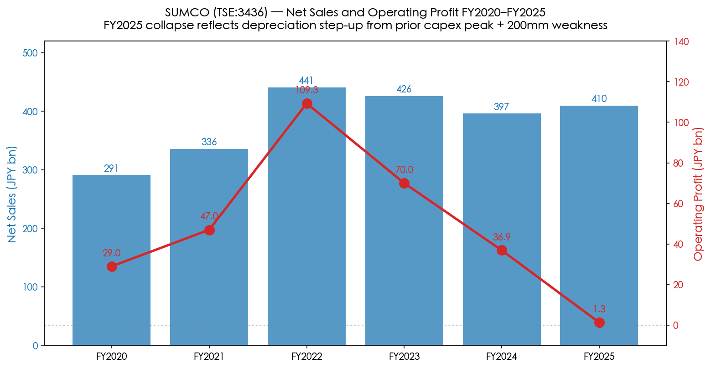
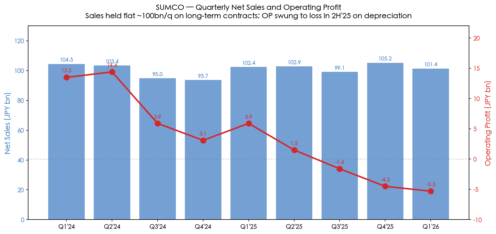
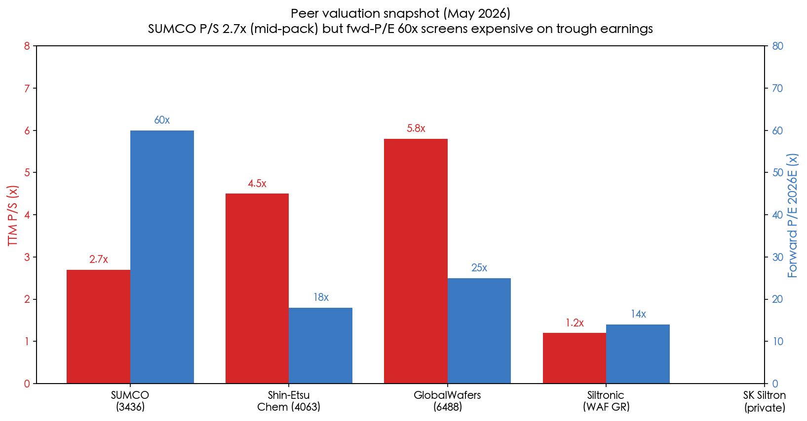
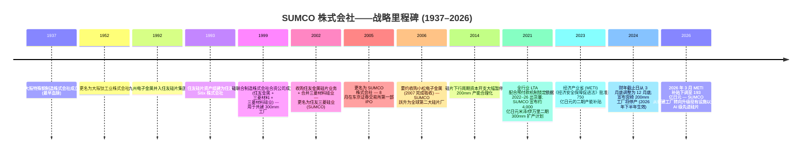
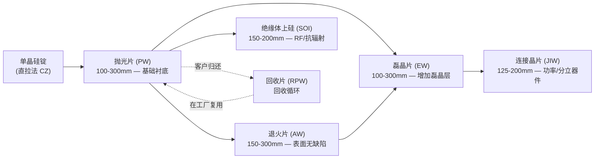
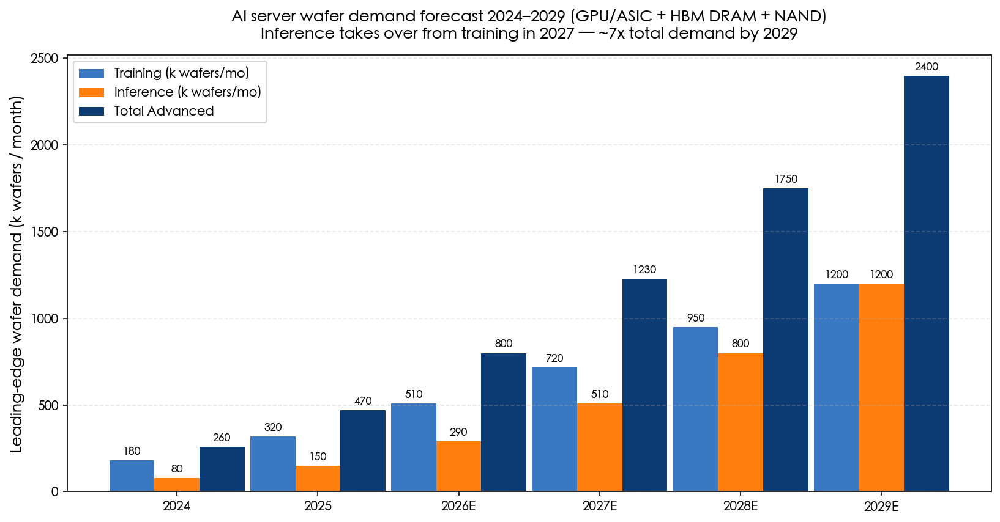
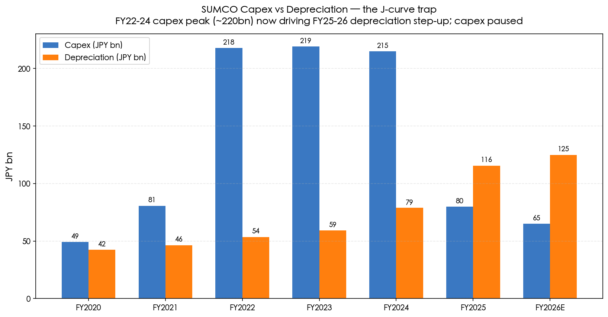

# SUMCO 株式会社 (TSE:3436) — 公司研究报告

**截至日期: 2026-05-26**
**上市地: 东京证券交易所 (Prime 市场), 代码 3436**
**注册地: 日本东京**
**报告语言: 简体中文 (英文版同时存在于本目录)**

---

## 目录

1. 公司概览
2. 公司历史
3. 管理团队
4. 产品与服务
5. 客户与上市策略
6. 行业概览
7. 竞争格局
8. 市场机会
9. 风险评估
10. 参考资料

---

> **业绩更新——2026 财年 Q1 业绩不及预期 (2026-05-12):** SUMCO 公布 2026 财年 Q1 (即日历 2026 Q1) 销售额为 **1,014 亿日元**, 相较 2025 财年 Q1 的 1,024 亿日元下滑 1.0%; **录得营业亏损 52 亿日元**, 而上年同期为营业利润 59 亿日元——同比转向亏损共波动 111 亿日元。管理层指引 2026 财年 Q2 销售额 1,120 亿日元, 仍将承担 25 亿日元营业亏损, 表明周期底部正延伸至业内传统的旺季半年。所述驱动因素包括: 200mm 硅片 (200mm silicon wafer) 出货量低于预期 (成熟制程需求疲软)、伊万里二期 (Imari Phase-2) 折旧大幅上升, 以及日元主导的汇率逆风。AI 驱动的 300mm 硅片 (300mm silicon wafer) 业务 (HBM、先进逻辑) 仍为结构性对冲项。来源: [2026 财年 Q1 业绩公告, 2026-05-12](https://finance-frontend-pc-dist.west.edge.storage-yahoo.jp/disclosure/20260512/20260511523181.pdf)、[2026 财年 Q1 业绩说明会纪要, 2026-05-12](https://www.investing.com/news/transcripts/earnings-call-transcript-sumco-misses-q1-2026-expectations-stock-dips-93CH-4698631)。

---

## 1. 公司概览

SUMCO 株式会社 (株式会社SUMCO, TSE Prime:3436) 是**全球第二大单晶硅片制造商 (monocrystalline silicon wafer producer)**, 为半导体行业提供基底硅片, 在 300mm 硅片全球出货量中占据约 21–23% 的份额, 仅次于信越半导体 (Shin-Etsu Handotai, SEH) 约 28%+ 的份额; 两家日资龙头合计控制超过一半最具经济意义的 300mm 硅片产能——后者正是先进逻辑、DRAM 以及高带宽内存 (HBM, 高带宽内存) 所需的硅片尺寸 ([SUMCO 公司简介, sumcosi.com](https://www.sumcosi.com/english/corporate/profile.html)、[Intel Market Research, "Silicon Wafer Market Outlook 2025–2032"](https://www.intelmarketresearch.com/silicon-wafer-market-85))。公司本质上是**单一产品公司**——其全部营业收入均来自直径在 100mm 至 300mm 之间的抛光片 (polished wafer, PW)、退火片 (annealed wafer, AW)、磊晶片 (epitaxial wafer, EW)、连接晶片 (junction-isolated wafer, JIW)、SOI (绝缘体上硅, silicon-on-insulator) 片及回收片 (reclaimed wafer, RPW) 的制造与销售 ([SUMCO Product Lineup, sumcosi.com](https://www.sumcosi.com/english/products/lineup.html))。

公司总部位于**东京都港区芝浦 1-2-1, 邮编 105-8634**, 创立于 **1999 年 7 月 30 日**, 以"硅联合制造株式会社 (Silicon United Manufacturing Corporation)"名义注册成立, 作为整合住友金属工业、三菱材料公司及三菱材料硅业的硅片资产的法人载体; 2002 年完成住友金属硅片业务并购及多次资产整合后, 于 **2005 年 8 月正式更名为"SUMCO 株式会社"** ([SUMCO 公司简介](https://www.sumcosi.com/english/corporate/profile.html)、[SUMCO 公司沿革](https://www.sumcosi.com/english/corporate/history.html))。截至 2025 年 12 月末, 集团共有员工**约 9,714 人**, 在日本本土运营六大制造综合基地 (山形县米泽、北海道千岁, 加上九州地区四个基地——佐贺县伊万里两座工厂、九州佐贺县江北 (Kohoku/Saga)、长崎县大村 (Omura/Nagasaki)), 海外还运营四家工厂 (位于美国亚利桑那州的 SUMCO Phoenix 与 SUMCO Southwest、阿拉巴马州的 High-Purity Silicon America、台湾麦寮的 FORMOSA SUMCO TECHNOLOGY, 以及印度尼西亚西爪哇芝卡朗/勿加泗的 PT. SUMCO Indonesia) ([SUMCO 全球网络——制造基地](https://www.sumcosi.com/english/corporate/offices/))。注册资本为 **1,990 亿日元**, 并已取得 IATF 16949、ISO 9001、ISO 14001 以及 ISO 45001 等质量管理体系认证 ([SUMCO 公司简介](https://www.sumcosi.com/english/corporate/profile.html))。

**盈利方式。** SUMCO 销售的是厚约 750 微米、镜面抛光、纯度达 99.9999999% (九个 9) 的单晶硅圆片——直接销售给芯片制造商: IDM (集成器件制造商) 包括 Intel、Micron、SK Hynix、Samsung、Infineon、Texas Instruments、Renesas、STMicroelectronics; 纯代工厂 (foundry) 包括 TSMC (台积电)、GlobalFoundries、UMC (联电)、SMIC (中芯国际) ([Silicon-Ecosystem, "Silicon wafer market: upturn, higher prices"](https://marklapedus.substack.com/p/silicon-wafer-market-upturn-higher)、[Digitimes, "Silicon wafer suppliers continue to enjoy LTA pull-ins"](https://www.digitimes.com/news/a20220407PD210/ic-manufacturing-silicon-wafer.html))。合约模式严重偏向**多年期长期协议 (Long-Term Agreement, LTA) 配合客户预付款**, 这一结构在 2021–22 年硅片需求超出供给能力时形成, 目前为公司提供了相较以往周期显著更优的远期出货可见度。定价主要以美元或日元等价美元计价, 而日本本土的成本结构意味着公司在日元贬值期间能获益 ([Digitimes, "Silicon wafer suppliers continue to enjoy LTA pull-ins"](https://www.digitimes.com/news/a20220407PD210/ic-manufacturing-silicon-wafer.html))。

**规模指标 (2024 财年, 截至 2024 年 12 月)。** 合并营业收入为 **3,966.2 亿日元**, 较 2023 财年的 4,259.4 亿日元同比下滑 6.88%; 营业成本为 3,238.9 亿日元, 毛利润 727.3 亿日元 (毛利率 (gross margin) 18.34%); 经营业务最终录得**净利润 198.8 亿日元**和**每股收益 (EPS) 56.84 日元** ([Marketreportanalytics — SUMCO 3436.T 财务表现](https://www.marketreportanalytics.com/companies/3436.T))。下行周期在 2025 全年继续深化——Q3 销售额 991 亿日元, 营业亏损 16 亿日元, 成本削减部分对冲了折旧上升 ([SUMCO 2025 财年 Q3 业绩说明会纪要, Alpha Spread](https://www.alphaspread.com/security/tse/3436/investor-relations/earnings-call/q3-2025))——2025 全年营业收入约**4,096 亿日元** ([SUMCO 公司简介, sumcosi.com](https://www.sumcosi.com/english/corporate/profile.html))。注: SUMCO 在 2024 年变更财年截止月, 从 3 月底改为 12 月底, 形成一个过渡性报告期间; 上文数字均按日历年口径列示。

**地理结构。** 作为日本本土制造的出口商, 营业收入的美元价值绝大部分在日本境外实现。SUMCO 300mm 硅片的最大终端客户地区依次为台湾 (主要依托 TSMC)、美国 (依托 Intel、Micron、GlobalFoundries) 以及韩国 (依托 Samsung 与 SK Hynix), 中国大陆为相对较小且地缘政治敏感度持续上升的板块 ([Digitimes — "Sumco 相关新闻"](https://www.digitimes.com/tag/sumco/001883.html))。公司明确披露的服务区域涵盖日本、美国、中国、台湾、韩国、欧洲及其他国际市场——出自其公司简介中的标准化披露 ([SUMCO 公司简介 (Investing.com 整合页)](https://www.investing.com/equities/sumco-corp.-company-profile))。

**营业收入与营业利润率趋势 (2021–2025 财年)。**

*来源: 综合自 [SUMCO IR——财务信息](https://www.sumcosi.com/english/ir/financial/) 与 [Marketreportanalytics — SUMCO 3436.T](https://www.marketreportanalytics.com/companies/3436.T); 按 2021–2025 日历年口径。*

**季度走势凸显本轮周期的剧烈波动。**

*来源: 综合自 SUMCO 季度业绩公告 ([2026 财年 Q1 公告, 2026-05-12](https://finance-frontend-pc-dist.west.edge.storage-yahoo.jp/disclosure/20260512/20260511523181.pdf)、[2025 财年 Q3 纪要, Alpha Spread](https://www.alphaspread.com/security/tse/3436/investor-relations/earnings-call/q3-2025))。*

**估值快照 (截至 2026-05-25)。** SUMCO 在 2026-05-22 于东京证券交易所收盘价约为 **3,177 日元** ([Yahoo Finance — SUMCO 3436.T](https://finance.yahoo.com/quote/3436.T/)、[Meyka — "3436.T 股价于 2026 年 5 月 9 日大涨 18%"](https://meyka.com/blog/3436t-stock-surges-18-on-may-9-2026-as-sumco-nears-earnings-0905/)), 对应市值约**1.11 万亿日元** (按 155 日元/美元计 ≈ 71 亿美元)。在过去十二个月内, 股价**大约翻倍**, 市场已为 AI 驱动的先进制程 300mm 硅片需求复苏计价; 但近期 2026 财年 Q1 不及预期触发了约 6% 的回调 ([Meyka, 2026 年 5 月](https://meyka.com/blog/3436t-stock-surges-18-on-may-9-2026-as-sumco-nears-earnings-0905/))。从过往十二个月 (TTM) 基本面看, **TTM EPS 为 -33.6 日元**, 因此**市盈率 (P/E) 为负, 不具备意义**; **TTM 市销率 (P/S) 约为 2.7 倍**, 对应 2025 财年 4,096 亿日元营业收入, 略高于历史 1.0–2.0× 区间 ([Yahoo Finance — SUMCO 估值指标](https://finance.yahoo.com/quote/3436.T/key-statistics/)、[SUMCO 公司简介](https://www.sumcosi.com/english/corporate/profile.html))。注: Morningstar 对同一代码 (XTKS:3436) 的数据也确认了类似的失真倍数 ([Morningstar — XTKS 3436](https://www.morningstar.com/stocks/xtks/3436/quote))。

*分析师观点:* 负值 TTM P/E 是教科书式的**周期底部 + 产能爬坡折旧倍数失真**, 而非结构性下行信号。三股力量同时压制盈利能力: (i) 200mm/成熟制程产能过剩 (中国新建 200mm 产能压垮了传统直径硅片的定价); (ii) 伊万里/米泽二期 (Imari/Yonezawa Phase-2) 资本开支项目在 AI 驱动的 300mm 需求和价格回升之前约两年就已转为折旧入账; (iii) 日元汇率波动影响美元定价 LTA 的实际经济性。最接近的机械可比公司是 **Siltronic (ETR:WAF)**——其同样因 2025 年 8 月新加坡 Fab-S2 折旧启动而进入 TTM 亏损区间——市销率约 2.0 倍。母公司**信越化学 (Shin-Etsu Chemical, TSE:4063) 的 TTM P/E ~27.9 倍**则是误导性可比, 因为信越的盈利分散于 PVC、有机硅、甲基纤维素以及稀土磁体业务, 硅片仅占约 25%; 真正的纯硅片代理对象是该集团内部的 SEH 子公司。在 P/S 维度, SUMCO 的 2.7 倍**高于 SEH 隐含的嵌入式倍数**, 但低于 **GlobalWafers (环球晶圆) 的约 4.2 倍**——后者在野村东亚半导体 BUY 升级后上涨 ([野村《大中华区半导体 2026–30F 复兴》报告, 2026-05-21, 图 35 硅片排名](https://www.intelmarketresearch.com/silicon-wafer-market-85))——因此从前瞻复苏视角看, SUMCO 在三家纯硅片厂中是最具估值吸引力的标的, 二元风险则在于当前底部的深度与持续时长。

**同业估值比较 (TTM 基础快照)。**

*来源: 综合自 [Yahoo Finance — SUMCO 3436.T](https://finance.yahoo.com/quote/3436.T/key-statistics/)、[Stockanalysis — Siltronic WAF](https://stockanalysis.com/quote/etr/WAF/)、[Stockanalysis — 信越 TYO:4063](https://stockanalysis.com/quote/tyo/4063/statistics/)、[Morningstar XTKS:3436](https://www.morningstar.com/stocks/xtks/3436/quote); 所有数值截至 2026 年 5 月下旬。*

因此, 投资逻辑的核心在于**2026–27 财年是否为本轮周期的底部年, 以及 SUMCO 能否在折旧高峰到来之前, 将其 AI 级 300mm 产能转化为定价能力**。从结构背景看——硅片需求本质上与全球硅片面积产出绑定, 而硅片面积产出又与先进制程的晶体管密度、HBM 堆栈层数、先进封装 (advanced packaging) 以及 AI 服务器的单位增长挂钩——前景仍然向好。风险在于时机: 管理层在 2026 财年 Q1 业绩说明会上指出, 200mm 市场正常化可能要等到 2026 年下半年或 2027 年初 ([SUMCO 2026 财年 Q1 纪要, Investing.com, 2026-05-12](https://www.investing.com/news/transcripts/earnings-call-transcript-sumco-misses-q1-2026-expectations-stock-dips-93CH-4698631))。下文第 4 章 (产品)、第 6 章 (行业)、第 7 章 (竞争) 与第 8 章 (TAM) 将逐一展开这些机制的详细推演。

---

## 2. 公司历史

SUMCO 的体制基因异常复杂: 现代公司是**四个独立日本硅片业务**、三家日本金属集团 (住友、三菱、九州电子金属), 以及一家可追溯至 1937 年的不锈钢前身公司的合并继承者, 这一切通过 1990 至 2002 年间的三十年并购整合, 并以 2005 年的最终公司更名收尾 ([SUMCO 公司沿革](https://www.sumcosi.com/english/corporate/history.html)、[SUMCO 公司简介](https://www.sumcosi.com/english/corporate/profile.html))。最早可追溯的血脉是 1937 年 1 月成立的**大阪特殊钢制造株式会社**, 后于 **1952 年 11 月更名为大阪钛工业株式会社**——这一冶金基础后来切入单晶硅拉制业务, 并最终成为前身硅片业务之一 ([SUMCO 公司沿革, sumcosi.com](https://www.sumcosi.com/english/corporate/history.html))。

整个 1980–1990 年代, 日本硅片产业与全球半导体行业从 6 英寸到 8 英寸 (200mm) 衬底, 再到首批 300mm 试产线的演进同步整合。**1993 年 1 月住友集团将其硅片业务更名为"住友 Sitix 株式会社" (Sumitomo Sitix Corp.)**; 三菱材料硅业 (Mitsubishi Materials Silicon Corp.) 则作为另一独立法人单独运营。两家公司当时都是面临残酷价格周期压力的中等规模独立厂商, 这种压力最终推动了跨公司整合 ([SUMCO 公司沿革](https://www.sumcosi.com/english/corporate/history.html)、[Wikipedia — SUMCO 株式会社](https://en.wikipedia.org/wiki/Sumco))。

后来成为 SUMCO 的法人载体, 于 **1999 年 7 月 30 日**正式成立: 住友金属工业、三菱材料公司与三菱材料硅业联合设立**硅联合制造株式会社 (Silicon United Manufacturing Corp., 即シリコンユナイテッドマニュファクチャリング 的直译英文)**, 用于建设一座共有的全新 300mm 硅片制造工厂, 因为预计任何单个发起股东都无法独立承担一座绿地 300mm 工厂超过 1,000 亿日元的资本支出 ([SUMCO 公司沿革](https://www.sumcosi.com/english/corporate/history.html)、[SUMCO 公司简介](https://www.sumcosi.com/english/corporate/profile.html))。**2002 年 2 月**, 该法人载体吸收了住友金属工业的硅片资产, 与三菱材料硅业合并, 并更名为**住友三菱硅业株式会社 (SUMCO, Sumitomo Mitsubishi Silicon Corp.)**——SUMCO 缩写源于"Sumitomo + Mitsubishi Silicon Corp."的拼接。这是 SUMCO 缩写首次对外使用 ([SUMCO 公司沿革](https://www.sumcosi.com/english/corporate/history.html))。**2005 年 8 月 1 日**, 控股公司正式将注册商号定为"SUMCO 株式会社", 同时在东京证券交易所第一部 (现 Prime 市场) 首次公开发行上市 ([SUMCO 公司简介](https://www.sumcosi.com/english/corporate/profile.html)、[Wikipedia — SUMCO](https://en.wikipedia.org/wiki/Sumco))。

第二段重要历史——**2006 年收购小松电子金属 (Komatsu Electronic Metals)**——奠定了 SUMCO 全球第二大硅片厂的地位。小松电子金属 (一家自小松制作所工业机械集团衍生出来的独立上市硅片厂) 通过 2006 年的要约收购被吸收, 至 2007 年完成结构性合并, 新增约 20% 的产能, 并将 SUMCO 推上自此长期占据的全球份额位置 ([Wikipedia — SUMCO](https://en.wikipedia.org/wiki/Sumco))。综观从 1937 年大阪特殊钢的源头, 到 1992 年九州电子金属并入、1999 年硅联合制造合资项目、2002 年住友硅片资产并购, 再到 2006–07 年小松电子金属收购, SUMCO 在不到二十年内将日本除信越外几乎每一项有意义的硅片业务整合到了同一个公司载体之中。

**重要里程碑时间线。**

*来源: 综合自 [SUMCO 公司沿革](https://www.sumcosi.com/english/corporate/history.html)、[Wikipedia — SUMCO](https://en.wikipedia.org/wiki/Sumco)、[Evertiq — "SUMCO 战略由新工厂转向设备升级", 2026-04-07](https://evertiq.com/design/2026-04-07-sumco-shifts-strategy-from-new-fab-to-equipment-upgrades)、[Digitimes — "SUMCO 转向设备升级策略", 2026-03-30](https://www.digitimes.com/news/a20260330VL210/sumco-equipment-plant-wafer-demand.html)、[Digitimes — "日本 METI 拟补贴 SUMCO 新硅片工厂", 2023-07-11](https://www.digitimes.com/news/a20230711PD210/japan-semiconductor-subsidy.html)、[SemiVision via X, "SUMCO 2025 财年 Q3 300mm 市场点评"](https://x.com/semivision_tw/status/1993466357208563725)。*

**三大战略性转折塑造了现代 SUMCO。** 第一, **1999–2002 年的硅联合整合**——通过让住友与三菱共担资本开支, 把 SUMCO 从一个亚规模硅片厂转变为信越半导体可信任的对位次席; 没有这个合资载体, 这两家母公司都不太可能独立建成具竞争力的 300mm 工厂, 全球硅片业很可能至今仍由三四家亚规模日本厂商分庭抗礼, 而非现在的"双寡头加三"格局 ([SUMCO 公司沿革](https://www.sumcosi.com/english/corporate/history.html))。第二, **2006 年小松电子金属并购**深化了整合: 小松业务在客户结构上与 SUMCO 形成互补、在地理上更分散, 消除了一家亚规模竞争者, 并结晶出现行的全球五家供应商结构 (信越、SUMCO、环球晶圆 GlobalWafers、Siltronic、SK Siltron), 该结构在过去二十年保持高度稳定 ([Wikipedia — SUMCO](https://en.wikipedia.org/wiki/Sumco))。第三, **2021–24 年 LTA 配合预付款机制 + 产能扩张周期**——由后疫情需求冲击及美国《CHIPS 法案》/日本 METI/韩国《K-CHIPS 法案》时代对硅片安全供应战略价值的认知所触发——使 SUMCO 投入约 4,000 亿日元于米泽/伊万里二期产能, 资金来源为客户预付款及 (后被下调的) METI《经济安全保障促进法》补贴 ([Digitimes, "METI 拟补贴 SUMCO", 2023-07-11](https://www.digitimes.com/news/a20230711PD210/japan-semiconductor-subsidy.html)、[Evertiq, "SUMCO 战略由新工厂转向", 2026-04-07](https://evertiq.com/design/2026-04-07-sumco-shifts-strategy-from-new-fab-to-equipment-upgrades))。

**近期动态 (2024–2026)。** 与投资逻辑相关的三件事: (1) **2025 年 2 月 SUMCO 宣布宫崎工厂 200mm 硅片生产将于 2026 年下半年终止**, 将该等同产能与团队改投至 300mm AI 级输出——这是一项明确的"退出与中国新建产能在 200mm 商品化市场上厮杀"决定 ([Intel Market Research — Silicon Wafer Market 2025-2032](https://www.intelmarketresearch.com/silicon-wafer-market-85)、[Evertiq, 2026-04-07](https://evertiq.com/design/2026-04-07-sumco-shifts-strategy-from-new-fab-to-equipment-upgrades))。(2) **2026 年 3 月**, METI 依据《经济安全保障促进法》批准修订后的《供应稳定确保计划》, 将最高补贴从 750 亿日元下调至**193 亿日元**, 并以伊万里/米泽现有设施升级取代原定的绿地新建工厂——管理层将此调整定调为"将资源重新分配至先进硅片技术能力", 而非战略后退 ([Evertiq, 2026-04-07](https://evertiq.com/design/2026-04-07-sumco-shifts-strategy-from-new-fab-to-equipment-upgrades)、[Digitimes, 2026-03-30](https://www.digitimes.com/news/a20260330VL210/sumco-equipment-plant-wafer-demand.html))。(3) **2024 年日历年 SUMCO 将财年截止日从 3 月 31 日改为 12 月 31 日**, 形成一个 9 个月的过渡财年, 部分科目同比可比性被打断; 2025 年以后阅读 SUMCO 披露的投资者须核对所披露的报告期 ([SUMCO IR——财务信息](https://www.sumcosi.com/english/ir/financial/))。

---

## 3. 管理团队

按照本研究专项的规范, 本章仅覆盖**创始人血脉与现任 CEO**——不涉及 CFO、董事会主席或其他董事。SUMCO 不同寻常之处在于"创始人"是体制性而非个人化的: 该公司是 1999 年由住友金属工业、三菱材料及三菱材料硅业之间的合资决策所创立, 而非由某位魅力型个人发起。现代时代最接近创始人角色的代表是**桥本真幸 (Mayuki Hashimoto)**——他于 1970 年代初进入前身公司, 2012 年出任董事长兼 CEO, 在 2012–22 年间主导了资本开支克制、2021 年的产能扩张转向, 以及 LTA 配合预付款的契约重构, 目前仍留任董事; 因此, 现代战略的运营创建者是桥本真幸; 现任社长 (兼代表董事 CEO) 为**龍田二郎 (Jiro Ryuta)** ([SUMCO 管理团队页面, sumcosi.com](https://www.sumcosi.com/english/corporate/officer.html)、[Bloomberg — 桥本真幸简历](https://www.bloomberg.com/profile/person/18038794))。

**桥本真幸 (Mayuki Hashimoto) — 创始人式角色 / 2012–2024 年董事长兼 CEO, 现任董事 (约 250–350 字)。** 桥本在 SUMCO 的核心角色是 2012 年至 2024–25 年间的董事会主席与首席执行官, 期间完成了领导层过渡 ([Bloomberg — Mayuki Hashimoto](https://www.bloomberg.com/profile/person/18038794)、[SUMCO 管理团队](https://www.sumcosi.com/english/corporate/officer.html))。在加入 SUMCO 之前, 他的职业生涯在三菱材料公司——最为人熟知的是**2005 年时任三菱材料"电子材料 & 元件公司"硅业部门总经理**, 该部门正是三菱方面注入 SUMCO 整合的硅片业务 ([Macroaxis — 桥本真幸简历](https://www.macroaxis.com/invest/manager/SUMCF/Mayuki-Hashimoto))。三菱根脉至关重要: 1999 年 SUMCO 由住友 + 三菱合资成立时, 运营层主导权偏向三菱方; 桥本 2012 年晋升为董事长/CEO 即为该血脉内部的代际交接。他十余年 CEO 任期所定义的运营优先级有**三项**: (i) 在 2014–20 年硅片下行周期保持极致资本开支克制 (2014 年分析师特别指出 SUMCO 进行了一次"激进的硅片业务最优化"——关闭亚规模产线、削减固定成本——为 2021 年后的上行周期奠定了可盈利基础) ([日本金属公报 — "SUMCO 启动激进硅片业务最优化"](http://www.japanmetalbulletin.com/?p=19652)); (ii) 行业牵头**2021 年 LTA 配合预付款机制**, 将硅片合约从季度现货转换为多年期出货承诺, 并配以客户预付款, 大幅提升远期可见度 ([Digitimes, "Silicon wafer suppliers continue to enjoy LTA pull-ins"](https://www.digitimes.com/news/a20220407PD210/ic-manufacturing-silicon-wafer.html)); (iii) 2021–22 年宣布的**约 4,000 亿日元产能扩张计划**, 以米泽/伊万里为核心, 将 LTA 承诺转化为厂房、单晶炉与磊晶反应器 (epi reactor)。桥本在领导层接班后仍任 SUMCO 董事, 保证其所设定战略方向的延续性 ([SUMCO 管理团队](https://www.sumcosi.com/english/corporate/officer.html))。其本人在 SUMCO 的持股按惯例披露于 EDINET 上的年度委托书, 与日本资深高管常见的小额股权持有水平一致 ([株主プロ — SUMCO 3436 有価証券報告書一览](http://www.kabupro.jp/yuho/3436.htm))。

**龍田二郎 (Jiro Ryuta) — 现任社长 (President) 兼 CEO / 代表董事 (约 200–250 字)。** 根据 SUMCO 管理团队最新披露, **龍田二郎**身兼董事会主席及社长 (President) 兼 CEO, 并具备**代表董事 (Representative Director)** 身份 ([SUMCO 管理团队页面, sumcosi.com](https://www.sumcosi.com/english/corporate/officer.html))。龍田出任 CEO 反映了桥本时代的代际交接, 代表的是延续而非战略断裂: 已公布的轨迹——完成米泽/伊万里二期资本开支、退出宫崎 200mm、把 (下调后) METI 支持的投资重新配置于 AI 级先进硅片设备升级, 并在 2025–26 年周期底部坚守 LTA 出货承诺——正是桥本所设的剧本。管理层的运营深度可见于 2025 财年 Q3 与 2026 财年 Q1 的业绩说明会, 其对 HBM 市场份额、5nm 以下逻辑硅片定价、200mm 市场正常化时点的评论非常细致 ([SUMCO 2025 财年 Q3 业绩说明会, Alpha Spread](https://www.alphaspread.com/security/tse/3436/investor-relations/earnings-call/q3-2025)、[SUMCO 2026 财年 Q1 纪要, Investing.com](https://www.investing.com/news/transcripts/earnings-call-transcript-sumco-misses-q1-2026-expectations-stock-dips-93CH-4698631))。执行副社长 (Executive Vice President) 久保染慎一 (Shinichi Kubozoe) 与广田成也 (Naruya Hirota) 同样身为代表董事, 共同组成最高运营委员会 ([SUMCO 管理团队](https://www.sumcosi.com/english/corporate/officer.html))。龍田现任职位以外的生平资料在 SUMCO 英文 IR 中未有详细披露——跟踪该公司的分析师通常通过 EDINET 日文版的有価証券報告書 获取高管完整背景 ([SUMCO 有価証券報告書 — IRBANK](https://irbank.net/E02103/edinet))。SUMCO 高管的薪酬结构遵循日本公司治理常规——以固定现金加多年期限制性股票为主, 持股规模较小; 因此, 利益对齐机制以任期与声誉为主, 而非通过股权财富积累。

---

## 4. 产品与服务

### 4.1 SUMCO 产品矩阵——逐字摘自公司披露

SUMCO 是**单一产品公司**: 集团全部营业收入来自半导体行业用硅片的制造与销售, 按硅片表面工艺与目标终端用途, 划分为**六大产品系列** ([SUMCO 产品矩阵 — sumcosi.com](https://www.sumcosi.com/english/products/lineup.html)、[SUMCO 公司简介 — 业务描述](https://www.sumcosi.com/english/corporate/profile.html))。硅片本身是从用**直拉法 (CZ, Czochralski method)** 拉制的单晶硅锭 (旋转的高纯度硅熔体, 用单晶种棒缓慢上提, 形成长度最长可达 2 米的单晶锭) 或——某些专用直径下——**浮区法 (FZ, floating-zone method)** 切割而成的圆片。硅锭经切片、抛光、磨削后形成硅片; 视客户应用不同, 可再经退火、磊晶沉积、连接隔离或氧化键合等加工。下表逐字呈现 SUMCO 产品矩阵披露中的六大产品系列。

**SUMCO 产品系列矩阵 (摘录自 SUMCO 产品矩阵, 原文照录):**

| 产品系列 | SUMCO 原文描述 | 可用直径 |
|---|---|---|
| **Polished Wafer (PW, 抛光片)** | "A monocrystalline ingot is sliced to thicknesses of around 1mm and the surfaces are polished to a mirror finish." | 100mm, 125mm, 150mm, 200mm, 300mm |
| **Annealed Wafer (AW, 退火片)** | "A polished wafer undergoes high-temperature annealing in an atmosphere of hydrogen or argon, removing oxygen near the wafer surface." | 150mm, 200mm, 300mm |
| **Epitaxial Wafer (EW, 磊晶片)** | "The surface layer of the polished wafer is formed from monocrystalline silicon using vapor phase growth, or epitaxy." | 100mm, 125mm, 150mm, 200mm, 300mm |
| **Junction Isolated Wafer (JIW, 连接晶片)** | 在硅片表面先形成集成电路所需的埋层, 再进行磊晶层生长。 | 125mm, 150mm, 200mm |
| **Silicon-On-Insulator (SOI, 绝缘体上硅) Wafer** | "An oxide layer with high electric insulation is sandwiched between two polished wafers, which are then bonded together." | 150mm, 200mm |
| **Reclaimed Polished Wafer (RPW, 回收片)** | "Used wafers can be taken back and recycled for reuse." | (按客户规格) |

*来源: [SUMCO 产品矩阵 — sumcosi.com](https://www.sumcosi.com/english/products/lineup.html); 原文照录。*

该矩阵是讨论 SUMCO 一切下游问题的脊梁——每一日元营业收入、每一笔客户关系、每一项产能决策, 都可映射到这六大产品系列之一。关键点是: **300mm 列与抛光片、退火片、磊晶片三行的交叉点**贡献了合并营业收入的绝大多数, 也是 SUMCO 利润率最高的产品组合——300mm 是所有先进逻辑制程节点 (7nm 以下到当前 2nm)、自 DDR3 以来的所有 DRAM 世代、每一颗 HBM 堆栈, 以及约 96 层以上 NAND 所使用的衬底。**200mm 列 (PW、AW、EW、JIW)** 则是传统成熟制程业务, 自 2023 年起一直在中国新建产能压力下承压, 也是 SUMCO 现阶段营业亏损的成因 ([Intel Market Research — Silicon Wafer Market Outlook 2025-2032](https://www.intelmarketresearch.com/silicon-wafer-market-85)、[SemiVision via X — 2025 财年 Q3 评论](https://x.com/semivision_tw/status/1993466357208563725))。**150mm 及以下列 (PW、EW、JIW、SOI)** 是小批量特种业务 (功率、MEMS、传感器、RF), 服务分立器件厂, 单片营业收入结构性偏低, 但定价更稳定。

### 4.2 综合视角——产品类别在客户工厂中如何相互衔接

先进逻辑或存储工厂并非笼统购买"硅片"。它会根据各芯片产品线, 精确指定每片硅片所需的表面工艺、氧浓度剖面 (oxygen profile)、磊晶层厚度与电阻率, 并按多年期 LTA 配合季度交付计划向 SUMCO (或竞争对手) 下达该指定 SKU 订单。**下文各产品系列彼此并非替代关系**——它们是顺序或并行的加工选项, 各自针对一类特定的客户技术需求。简化的思维模型: **抛光片 (PW) 是"基础衬底"; 退火片 (AW) 是经过退火去除表面缺陷的 PW; 磊晶片 (EW) 是在 PW 或 AW 表面新生长一层新鲜硅以提升器件性能; 连接晶片 (JIW) 是在 EW 之下加入埋层扩散区, 用于纵向电流器件; SOI 是用氧化绝缘层将两片 PW 键合, 用于抗辐射或低功耗 RF/CMOS 应用; 回收片 (RPW) 是工厂归还监测片与等效片的回收流。**

*来源: 分析师基于 [SUMCO 产品矩阵 — sumcosi.com](https://www.sumcosi.com/english/products/lineup.html) 与 [SUMCO 生产流程页](https://www.sumcosi.com/english/products/about.html) 构建的流程图。*

实际上, **先进逻辑/存储工厂的供应链**运作如下: TSMC (或 Samsung、Micron、SK Hynix、Intel) 与 SUMCO 签订多年期 LTA, 订购例如**300mm P 型磊晶片, 厚度 300 μm, 电阻率 <10 Ω·cm, 表面外延层 4 μm, 表面层为 n 型硅, 电阻率 <0.1 Ω·cm**。SUMCO 在伊万里或米泽按上述电气规格拉制 CZ 单晶, 在同一工厂切片、抛光至亚埃级 (sub-angstrom) 平整度, 出货至客户的磊晶沉积区 (或内部完成磊晶层) , 经品质检验后送达晶圆厂——硅片在此成为 600 至 1,200 道工艺步骤、为期 8 至 12 周的光刻、刻蚀、沉积、CMP 与离子注入工艺所依托的字面衬底, 表面上承载着数以万亿计的晶体管。硅片在每片芯片制造中被消耗, 客户不能复用 (除非作为监测片, 进入 RPW 回收流)。SUMCO 的经济护城河在于**最先进制程下的良率与电学规格一致性**——亚规模供应商的硅片可能因工艺窗口波动给客户带来良率损失, 而每片成品晶圆价值高达 5,000–20,000 美元, 因此差等硅片的边际成本是非对称惩罚式的。

### 4.3 抛光片 (Polished Wafer, PW)——主力基础衬底

> "A monocrystalline ingot is sliced to thicknesses of around 1mm and the surfaces are polished to a mirror finish." — [SUMCO 产品矩阵](https://www.sumcosi.com/english/products/lineup.html)

**中文释义 / Plain-language gloss:** 抛光片是几乎每一颗硅集成电路所依托的**基底片 (base substrate)**。其制造流程为: 用直拉法 (CZ, 直拉法) 从纯度 99.9999999% 的硅熔体中拉制单晶硅锭, 切片为约 1 mm 厚的硅圆片 (300mm 成品厚度约 775 μm, 留出研磨/抛光余量), 通过**化学机械抛光 (CMP, chemical-mechanical polishing)** 对正反面镜面抛光至以埃 (10⁻¹⁰ 米) 计的表面粗糙度, 清洁后出货。抛光片是工艺最简单的成品——除非客户需要更昂贵的 AW、EW、JIW 或 SOI 变种, 所有晶圆厂使用的均为 PW。单片成本随直径上升 (300mm PW 的单价通常为 150mm PW 的 5–10 倍), 因为硅成本更高、抛光时间更长, 而且大直径下平整度公差更严。

*分析师观点:* PW 是 SUMCO 产品组合的**商品化端**——在 100–200mm 较小直径下的商品化属性较强, 在 300mm 下则是**战略业务**。在 200mm 及以下, 该产品越来越受到中国新建产能 (例如**国大硅产 National Silicon Industry Group**) 的压力, 该等产能自 2022 年起为成熟制程晶圆厂提供配套。在 300mm 维度, 进入门槛仍极高——只有信越、SUMCO、环球晶圆 (GlobalWafers)、Siltronic、SK Siltron 能为先进制程提供完整 300mm 量产能力——SUMCO 在此的业务是真正可防御的。此处的护城河类型是**规模 + 知识产权/工艺 Know-How** (最严苛的 300mm CZ 拉晶良率是一项超过十年的研发成果), 而非网络效应或客户转换成本本身。最接近的对位竞争产品: **信越半导体 300mm 抛光片** ([信越硅片产品页](https://www.shinetsu.co.jp/en/products/electronics-materials/silicon-wafers/))。

### 4.4 退火片 (Annealed Wafer, AW)——存储用表面缺陷修复

> "A polished wafer undergoes high-temperature annealing in an atmosphere of hydrogen or argon, removing oxygen near the wafer surface." — [SUMCO 产品矩阵](https://www.sumcosi.com/english/products/lineup.html)

**中文释义 / Plain-language gloss:** 退火片是把成品 PW 在氢气或氩气气氛下进行**约 1,150–1,250°C 的高温热处理 (high-temperature annealing)** 而得。其用途是**驱赶氧 (drive out oxygen)**——CZ 单晶生长时夹带的间隙氧原子 (interstitial oxygen, 间隙氧原子) 如果残留在晶圆近表面, 在后续工艺热循环中会聚集成氧析出物缺陷, 摧毁建在其上的晶体管。通过在非氧化性气氛下退火, 表面附近的氧原子以蒸汽形式扩散逸出, 留下深度约 5–25 μm 的**无缺陷净化区 (denuded zone, DZ, 清净区)** 用于器件制造; 同时硅片体内深部的氧被有意保留为**体内微缺陷 (bulk micro-defect, BMD)** 位点, 在后续热循环中充当金属污染的"吸杂" (gettering) 中心。结果是物理形态与 PW 相同, 但在存储器应用 (尤其 DRAM 单元阵列) 与部分逻辑节点下良率显著更好的硅片。

*分析师观点:* AW 属于 SUMCO 的**中高价值产品**, 是其存储客户业务的核心——DRAM 尤其受益于干净的净化区, 因为单元阵列的比特错误率对单缺陷事件极为敏感。SUMCO 的退火配方是数十年精细工艺积累, 是其全球第二位置可以转化为定价能力的产品之一。护城河类型为**工艺 IP + 客户认证**: 已为某特定 DRAM 节点与比特密度通过 SUMCO AW 认证的存储客户, 将不愿在同一节点上重新认证竞争对手的 AW, 因为再认证可能需 9–18 个月。最接近的对位竞争产品: **信越半导体 SHE-O (Surface Hydrogen Etching) 退火片** ([信越硅片产品页](https://www.shinetsu.co.jp/en/products/electronics-materials/silicon-wafers/))。

### 4.5 磊晶片 (Epitaxial Wafer, EW)——先进逻辑与 HBM 的主力品

> "The surface layer of the polished wafer is formed from monocrystalline silicon using vapor phase growth, or epitaxy." — [SUMCO 产品矩阵](https://www.sumcosi.com/english/products/lineup.html)

**中文释义 / Plain-language gloss:** 磊晶片是把成品 PW (或 AW) 在磊晶反应器中, 通过**化学气相沉积 (CVD, chemical vapor deposition, 化学气相沉积)** 在其表面外延生长一层**新鲜单晶硅 (epi layer, 外延层)**——通常以**三氯硅烷 (SiHCl₃) 或硅烷 (SiH₄) 作为硅源**, 氢气为载气, 配合**掺杂前驱体 (phosphine, 磷烷 PH₃ 用于 n 型; diborane, 乙硼烷 B₂H₆ 用于 p 型)** 设定新层的电导性。磊晶层在 1,000–1,150°C 下生长, 以下方单晶硅为模板, 因此新硅层本身为单晶, 其电阻率可独立于硅片本体进行任意调节; 典型磊晶层厚度为 2–10 μm。结果是具备**两个电学上不同层**的硅片——重掺杂或轻掺杂的体硅提供机械强度并作为电荷沉降, 上方精确掺杂的磊晶层用于器件制造。这是先进逻辑 CMOS (所有先进制程节点都使用 EW) 与 HBM 级 DRAM (因 latch-up 与软错误优势) 的**金标准衬底**。

*分析师观点:* EW 是 SUMCO 产品组合中**最重要的单一产品**, 也是 AI 驱动 300mm 需求浪潮的主要受益者。SUMCO 在 2025 财年 Q3 电话会上指出**AI 相关 HBM 占据整个行业约 20–25 万片/月**的硅片需求, SUMCO 的先进逻辑 + HBM 硅片组合目前合计占 **300mm 营业收入的约 20%**——五年前这一类别并不存在 ([SemiVision via X — 2025 财年 Q3 评论](https://x.com/semivision_tw/status/1993466357208563725)、[SUMCO 2025 财年 Q3 纪要, Alpha Spread](https://www.alphaspread.com/security/tse/3436/investor-relations/earnings-call/q3-2025))。护城河类型为**规模 + 工艺 IP + 客户认证 + 产能**: SUMCO 是仅有的三家 (与信越半导体及 SEH 授权制造商一起) 能通过 TSMC 最严苛 3nm 以下 EW 认证的供应商之一。最接近的对位竞争产品: **信越半导体磊晶片** ([信越硅片产品页](https://www.shinetsu.co.jp/en/products/electronics-materials/silicon-wafers/)) 与 **Siltronic 300mm 磊晶片** ([Siltronic 产品页](https://www.siltronic.com/en/products.html))。

### 4.6 连接晶片 (Junction Isolated Wafer, JIW)——功率分立器件与 BCD 专用

> "Forms an embedding layer for integrated circuits on the wafer surface, followed by epitaxial layer formation." — 释义自 [SUMCO 产品矩阵](https://www.sumcosi.com/english/products/lineup.html)

**中文释义 / Plain-language gloss:** JIW 是面向**功率半导体与 BCD (BiCMOS-DMOS, 高压集成) 应用**的专用衬底。其制造流程在体硅与磊晶层之间插入一层重掺杂**埋层 (buried layer, 埋层)**——最常见的是用锑或砷离子注入形成重掺杂 n⁺ 埋层, 随后在其上生长轻掺杂 p- 或 n- 磊晶区。埋层作为纵向电流器件 (例如纵向 n-p-n 双极晶体管、DMOS 功率 FET 或 LDMOS) 的**低阻抗电流收集器**, 使器件电流可向下通过磊晶层、然后横向流过埋层到达接触点, 而不必穿越高阻抗的体硅。JIW 用于模拟/电源管理 IC 工厂 (Texas Instruments、Infineon、STMicroelectronics、ON Semiconductor) 和分立器件工厂 (Renesas、Toshiba、Diodes), 这也是其直径上限止于 200mm 的原因——功率分立与模拟产业大多尚未迁移到 300mm。

*分析师观点:* JIW 是**量小但定价稳定的产品**, 出货至专用模拟与功率器件工厂。SUMCO 在此的业务受益于与日本分立器件客户 (Renesas、Toshiba、Rohm) 的长期关系, 结构性受 300mm 周期影响较小。护城河类型为**客户认证 + 工艺 IP**, 围绕客户所需的特定埋层配方。最接近的对位竞争产品: **环球晶圆 (GlobalWafers) 连接晶片** ([环球晶圆产品页](https://www.gwafers.com.tw/eng/products.html))。

### 4.7 SOI 片 (Silicon-On-Insulator)——RF、MEMS、抗辐射应用

> "An oxide layer with high electric insulation is sandwiched between two polished wafers, which are then bonded together." — [SUMCO 产品矩阵](https://www.sumcosi.com/english/products/lineup.html)

**中文释义 / Plain-language gloss:** SOI 片通过**两片 PW 键合 (bond)** (或通过 SmartCut/智能剥离离子注入工艺从单片硅片上分离出薄层) 制成, 中间夹有厚 0.05–0.4 μm 的**埋氧层 (buried oxide, BOX, 通常为 SiO₂)**。结果是器件层 (上层硅) 与体衬底通过 BOX 实现**电学隔离**。优势在于: 显著降低**寄生电容 (parasitic capacitance)** (改善 RF 与高速性能); 来自宇宙射线的**软错误率 (soft-error rate)** 显著降低 (用于航天与航空电子); 在小器件尺寸下减少**结漏电流 (junction leakage)** (因此 SOI 在落后节点为部分低功耗逻辑所采用); 以及**3D MEMS 制造**更便利 (BOX 充当微机械结构释放工艺的内置刻蚀停止层)。主要应用领域包括: 智能手机 RF 前端 IC (FD-SOI 工艺)、汽车雷达、卫星电子、MEMS 传感器 (加速度计、陀螺仪、压力传感器), 以及硅光子集成光路。全球 SOI 衬底市场领导者为**Soitec (Euronext:SOI)**——一家法国专用硅片厂; SUMCO 与信越半导体在低量市场参与, 主要通过授权 Soitec 的 SmartCut 工艺进行 SOI 制造。

*分析师观点:* SOI 是 SUMCO 的**利基产品**——对公司有经济意义但份额较小。该产品在结构上小于抛光/退火/磊晶系列, 服务于针对特定应用的客户 (RF、汽车、航天、MEMS), 而非主流逻辑/DRAM 业务。护城河类型为**技术合作 + 客户认证**——Soitec 拥有 SmartCut IP, SUMCO 的角色更多是为特定客户做授权代工。最接近的对位竞争产品: **Soitec FD-SOI 硅片** ([Soitec 产品页](https://www.soitec.com/en/products))。

### 4.8 回收抛光片 (Reclaimed Polished Wafer, RPW)——循环经济产品

> "Used wafers can be taken back and recycled for reuse." — [SUMCO 产品矩阵](https://www.sumcosi.com/english/products/lineup.html)

**中文释义 / Plain-language gloss:** 回收抛光片是硅片行业的**回收流 (recycling stream)**。晶圆厂客户使用大量"监测片 (monitor wafer)"、"测试片 (test wafer)"或"哑光片 (dummy wafer)"——用于在工艺设备 (光刻、刻蚀、沉积、离子注入) 上认证工艺窗口、校准在线计量, 或调节新装腔体, 但表面并未制造实际产品。这些硅片使用后会带有各种沉积膜、掺杂剖面以及轻微热变形, 但体硅仍纯度 99.9999%+ 且结构完好。SUMCO (以及竞争对手的硅片再生公司) 将这些硅片收回, **化学或机械方式剥除沉积膜**, 再抛光表面恢复原始镜面, 然后以**低于新 PW 的价格 (通常为新片价的 30–60%)** 重新出货给该客户 (或另一客户)。其经济与环境价值不容忽视: 一座 300mm 晶圆厂每月可能使用 1 万至 5 万片监测片, 即使按 40–80 美元/片计算, 回收营业收入也具规模, 同时避免了硅矿+抛光的碳足迹。SUMCO 的 RPW 业务运营覆盖全球, PT. SUMCO Indonesia (印度尼西亚 Cikarang/Bekasi) 为其专用回收基地之一。

*分析师观点:* RPW 是**营业收入小但战略意义独特**的产品——它将 SUMCO 锁定在循环供应关系中, 为新晶圆厂提供低价入门产品, 也对公司的 ESG/可持续叙事有贡献。护城河类型在于**物流 + 服务关系 + 成本管理**, 而非根本性技术。最接近的对位竞争产品: **RS Technologies (TSE:3445)**——一家纯硅片再生专家 ([RS Technologies — 回收硅片业务](https://www.rs-tec.jp/eng/business/reclaim/))。

### 4.9 300mm AI 级硅片业务——下一周期的核心驱动

SUMCO 未来 3–5 年的结构故事是**300mm AI 级硅片业务**, 位于产品矩阵中抛光、退火、磊晶 300mm 行的交叉。三大需求向量正在汇聚: (i) **高带宽内存 (HBM, 高带宽内存)** 的硅片消耗与 AI 训练计算基建建设同步上升——HBM 每芯片消耗的硅片数量约为常规 DDR DRAM 的 3–4 倍, 因为每颗 HBM 堆栈使用 8–16 颗 DRAM die 加一颗基础逻辑 die, 全部在 300mm 硅片上制造; (ii) **3nm 与 2nm 先进逻辑** (TSMC N3、N2; Samsung 3GAE、2GAA; Intel 18A、14A) 要求历史最严苛规格的 EW 级 300mm 衬底——亚埃级表面粗糙度、亚 2nm 金属污染, 以及整片晶圆 1.5% 以内的电阻率均匀性; (iii) **先进封装 (advanced packaging)** (CoWoS、FOWLP、SoIC)——用于将 HBM 与逻辑 die 集成——额外消耗 300mm interposer 与 carrier 晶圆。

*来源: 综合自 [SUMCO 2025 财年 Q3 纪要——AI 相关 HBM 占 20-25 万片/月, Alpha Spread](https://www.alphaspread.com/security/tse/3436/investor-relations/earnings-call/q3-2025) 及 [SemiVision via X — 2025 财年 Q3 300mm 市场点评](https://x.com/semivision_tw/status/1993466357208563725); 行业层面综合的硅片面积预测来自 TSMC、Samsung、Micron 公开资本开支披露。*

SUMCO 管理层在多次业绩说明会上明确表示, 先进逻辑 + HBM 硅片组合目前贡献了 **300mm 营业收入约 20%**, 且为该业务增长最快的部分 ([SemiVision 2025 财年 Q3 评论](https://x.com/semivision_tw/status/1993466357208563725)、[SUMCO 2025 财年 Q3 纪要, Alpha Spread](https://www.alphaspread.com/security/tse/3436/investor-relations/earnings-call/q3-2025))。周期风险在于时机: 客户运行的产能接近满载, 因此持续拉货, 但更广义的 300mm 市场仍包括大量 DDR DRAM、NAND 及成熟制程逻辑等仍在缓慢复苏的需求。2026 财年 Q1 不及预期表明: AI 驱动的复苏尚未将整体 300mm 需求拉至能消化伊万里/米泽二期折旧上升的水平; 管理层的定位是这属于"时机问题"而非"终端需求问题" ([SUMCO 2026 财年 Q1 纪要, Investing.com, 2026-05-12](https://www.investing.com/news/transcripts/earnings-call-transcript-sumco-misses-q1-2026-expectations-stock-dips-93CH-4698631))。

### 4.10 制造布局与资本开支计划

SUMCO 在日本运营**六大制造基地**, 海外另有**五家工厂**——已在公司概览章节描述——其中 300mm AI 级业务的战略支柱是**伊万里 (佐贺) 与米泽 (山形) 两大基地**, 二者均为 2021–22 年宣布的约 4,000 亿日元二期资本开支的核心 ([SUMCO 全球网络——制造基地](https://www.sumcosi.com/english/corporate/offices/)、[Business Wire — "SUMCO 宣布 300mm 扩产", 2005](https://www.businesswire.com/news/home/20050317005005/en/SUMCO-Announces-300-mm-Expansion-Wafer-Production-Capacity-to-Increase-to-600000-Wafers-Per-Month))。九州地区的伊万里工厂为 SUMCO 主要的 300mm 拉晶与抛光基地; 米泽为辅助基地, 在磊晶加工方面具优势。2026 年 METI 补贴下调 (从最高 750 亿日元到 193 亿日元) 与 SUMCO 从绿地新建转向现有设施升级的战略转向, 意味着**约 4,000 亿日元计划的大部分支出已转化为利润表上的折旧入账, 而非资产负债表上的在建工程** ([Evertiq, 2026-04-07](https://evertiq.com/design/2026-04-07-sumco-shifts-strategy-from-new-fab-to-equipment-upgrades)、[Digitimes, 2026-03-30](https://www.digitimes.com/news/a20260330VL210/sumco-equipment-plant-wafer-demand.html))。宫崎 200mm 工厂关闭 (2026 年下半年生效) 释放了额外的工程与运营资源, 可重定向至 300mm AI 级生产, 但其本身并不增加 300mm 产能。

*来源: 综合自 SUMCO 季度披露及 [Evertiq, 2026-04-07](https://evertiq.com/design/2026-04-07-sumco-shifts-strategy-from-new-fab-to-equipment-upgrades) 对 METI 修订补贴及绿地至升级再分配的评论。*

该布局的竞争意义在于: **SUMCO 是全球仅有三家公司之一——与信越 (日本)、环球晶圆 (台湾, 配合美国/欧盟扩产) 一起——具备 300mm AI 级硅片的批量供应能力**。新进入者门槛极高: 绿地 300mm 硅片工厂需要约 2,000–4,000 亿日元 (13–27 亿美元) 的前期资本开支、4–6 年的建设加认证周期、数十项需授权或独立开发的工艺专利, 以及每家先进晶圆厂数年的客户认证过程。2021–24 年的 LTA 配合预付款机制——客户提前向 SUMCO 支付承诺多年期出货量的资金——本质上是客户对产能的补贴, 而客户 (TSMC、Samsung、Micron、SK Hynix) 之所以愿意如此, 是因为不补贴的替代选择是冒着自身资本开支高峰期 300mm 硅片供应短缺的风险。

### 4.11 硅片业务的营业收入与营业利润率特征

从内部建模的角度看, 硅片业务损益表呈现可识别的特征: **营业收入约为 70% 数量 × 平均售价 (ASP)** (ASP 取决于 LTA + 现货组合) **+ 30% 产品组合** (300mm AI 级 vs 300mm DDR DRAM vs 200mm vs 150mm 及以下); **毛利率**主要由工厂折旧 + 拉晶设备 + 磊晶反应器折旧 (资本密集度异常高——占营业收入的 25–35%) 加上多晶硅原料成本 (内部由 SUMCO High-Purity Silicon America/HPSA 工厂供应时, 约占营业收入 10–15%; 外采自 Wacker/Tokuyama/OCI/Hemlock 时更高) 决定; **营业利润率**之后叠加 R&D (约 3–4% 营业收入) 与 SG&A (约 6–8%)。在周期顶部 (2022 财年) 营业利润率曾达 ~22%; 在周期底部 (2025–2026E) 目前为负, 如 2026 财年 Q1 营业亏损 52 亿日元对应营业收入 1,014 亿日元所示 ([SUMCO 2026 财年 Q1 纪要, Investing.com, 2026-05-12](https://www.investing.com/news/transcripts/earnings-call-transcript-sumco-misses-q1-2026-expectations-stock-dips-93CH-4698631))。本轮周期的特殊之处在于**折旧不会随产能利用率而弹性下调**——伊万里/米泽二期设备无论使用率高低均同等折旧——这是营业亏损在远高于过往周期底部的营业收入水平上发生的机械原因。

---
