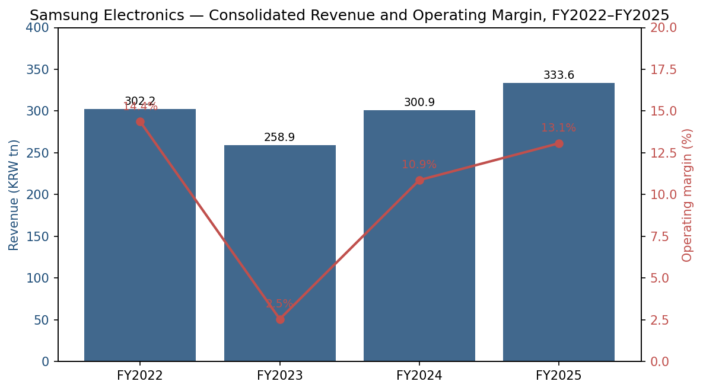
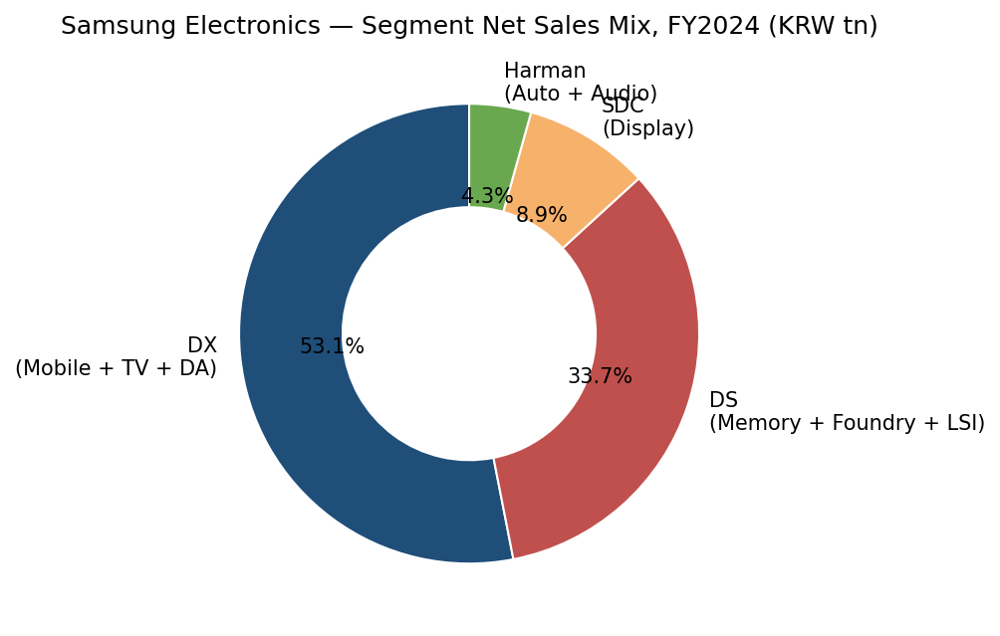
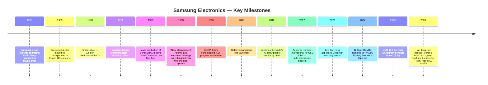
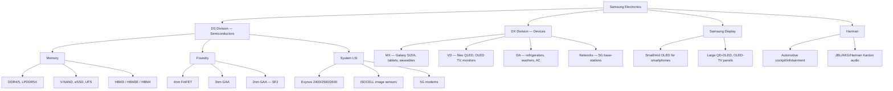
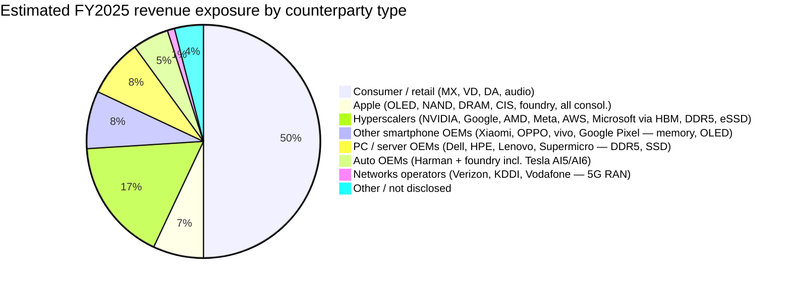
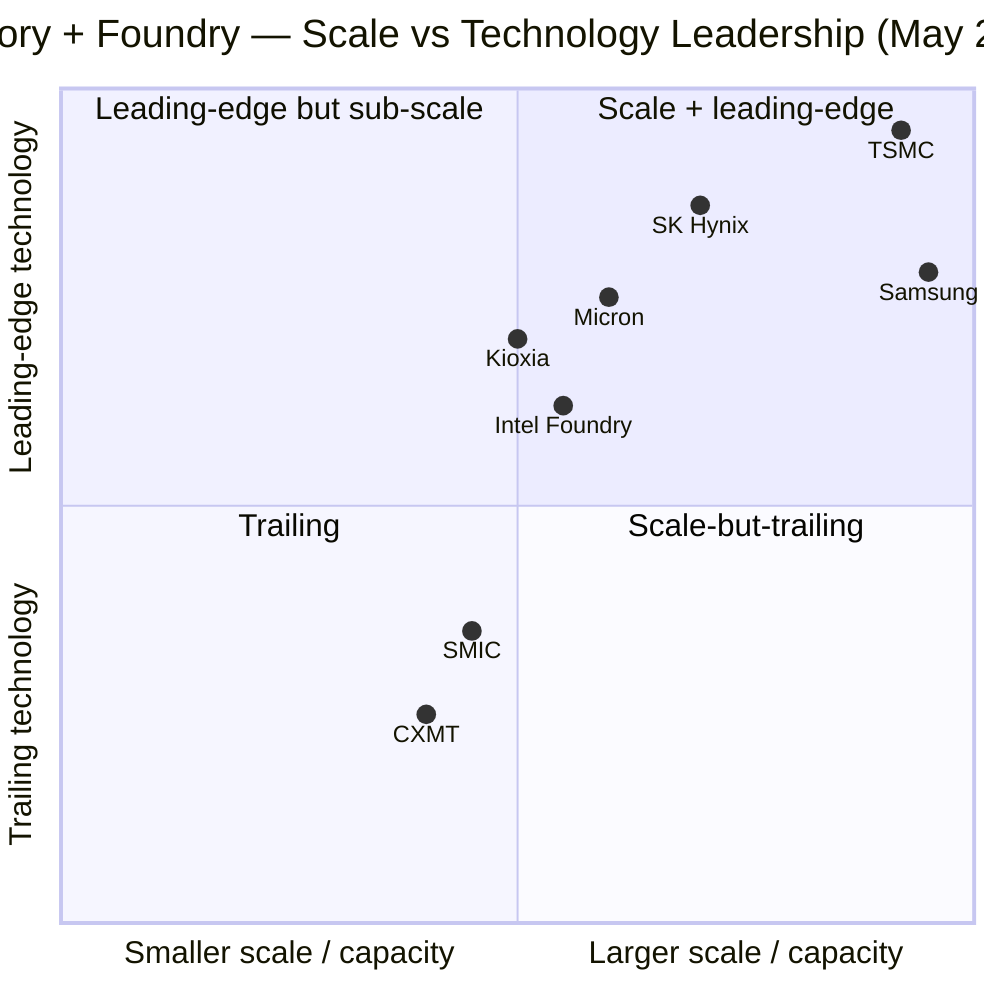
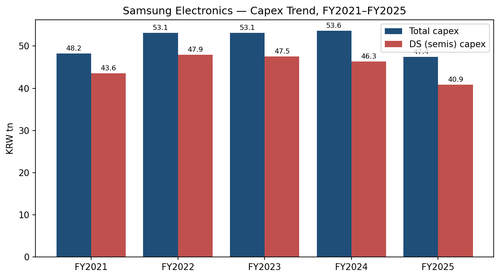
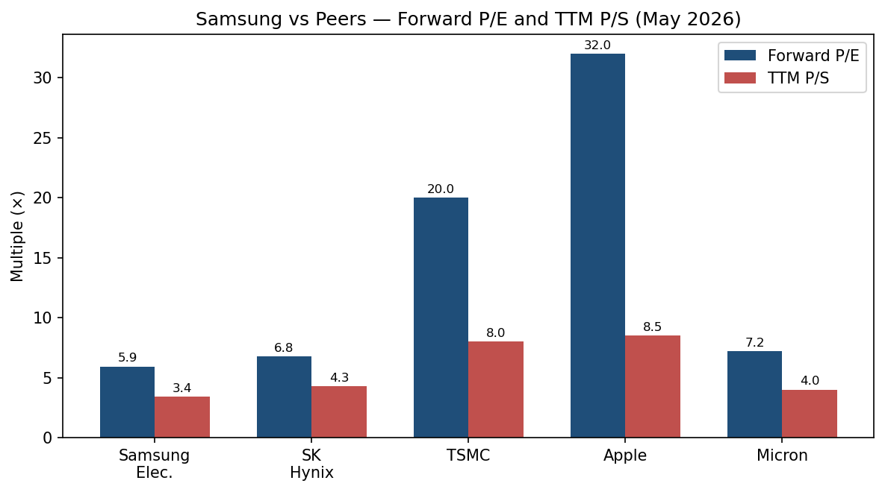

# COMPANY RESEARCH REPORT: Samsung Electronics Co., Ltd. (KRX:005930)

**Date:** 2026-05-20
**Analyst report — Initiation of coverage**
**Listing:** KRX (KOSPI) :005930 — common
**Domicile:** Suwon, Gyeonggi-do, Republic of Korea
**Filing language:** Korean (사업보고서 / 반기보고서 / 분기보고서, DART); English IR PDFs at samsung.com/global/ir

---

> **Update — FY2025 record revenue and Q1 2026 record profit (2026-04-30):** Samsung reported Q1 2026 consolidated revenue of KRW 133.9 tn (+69% YoY, +43% QoQ) and operating profit of KRW 57.2 tn (+756% YoY) — a single-quarter operating profit that exceeded the company's FY2025 full-year operating profit of KRW 43.6 tn. The Device Solutions (DS) division drove the surge: DS revenue rose to KRW 81.7 tn (+86% QoQ) and DS operating profit hit KRW 53.7 tn (a ~48× YoY jump), with management citing record-low memory "demand fulfilment rates" and the start of 12-layer HBM3E shipments to NVIDIA. Source: [Samsung Electronics Announces First Quarter 2026 Results, 2026-04-30](https://news.samsung.com/global/samsung-electronics-announces-first-quarter-2026-results), [DataCenterDynamics, 2026-04-30](https://www.datacenterdynamics.com/en/news/samsung-electronics-q1-26-operating-profit-exceeds-companys-fy25-full-year-total/).

---

## TABLE OF CONTENTS

1. Company Overview
2. Company History
3. Management Team
4. Products & Services
5. Customers & Go-to-Market
6. Industry Overview
7. Competitive Landscape
8. Market Opportunity (TAM)
9. Risk Assessment

---

## 1. COMPANY OVERVIEW

Samsung Electronics Co., Ltd. (KRX:005930) is the flagship listed subsidiary of the Samsung Group and the single largest constituent of the KOSPI index. The company is a vertically integrated technology conglomerate whose business spans memory and logic semiconductors, smartphones, televisions, home appliances, OLED displays (through its 84.8%-owned subsidiary Samsung Display Corporation), and automotive electronics / connected-car audio (through its wholly-owned subsidiary Harman International). Samsung Electronics is the world's largest manufacturer of DRAM, NAND flash memory, smartphones (by units), and televisions (by units), and the world's #2 logic foundry by revenue behind TSMC ([Samsung — Wikipedia overview](https://en.wikipedia.org/wiki/Samsung_Electronics), [TrendForce 2Q25 foundry share, 2025](https://www.trendforce.com/news/2025/12/01/news-samsung-reportedly-supplies-60-of-google-tpu-hbm3e-set-to-remain-primary-supplier-in-2026/)).

The company organises its operating businesses into four reportable segments. **Device eXperience (DX)** comprises Mobile eXperience (MX, smartphones + tablets + wearables), Networks (5G base-stations), Visual Display (VD, TVs and monitors) and Digital Appliances (DA, refrigerators, washers, ACs). **Device Solutions (DS)** comprises Memory (DRAM, NAND, HBM), Foundry (contract logic manufacturing), and System LSI (in-house Exynos AP, image sensors, modems, DDIs). **Samsung Display Corporation (SDC)** is the AMOLED panel maker that sells small/medium OLEDs to Apple, Google, Xiaomi and Samsung's own MX division, plus large OLED/QD-OLED to TV brands. **Harman** sells digital cockpit and infotainment systems to Tier-1 / Tier-2 auto OEMs and premium audio under the JBL, AKG, Harman Kardon, Mark Levinson and Revel brands ([Samsung 2024 Business Report (DART 사업보고서, 2025-03)](https://images.samsung.com/is/content/samsung/assets/global/ir/docs/2024_4Q_Interim_Report.pdf)).

In FY2024 the company posted consolidated revenue of **KRW 300.9 trillion** (≈ USD 220 bn) and operating profit of **KRW 32.7 trillion**, recovering from the FY2023 memory-down-cycle floor of KRW 258.9 tn / KRW 6.6 tn ([Samsung Electronics Announces Fourth Quarter and FY 2024 Results, 2025-01-31](https://news.samsung.com/global/samsung-electronics-announces-fourth-quarter-and-fy-2024-results)). FY2025 set a new revenue record of **KRW 333.6 trillion** with operating profit of **KRW 43.6 trillion**, even before the Q1 2026 record-breaking memory super-cycle ramp ([Samsung Electronics Announces Fourth Quarter and FY 2025 Results, 2026-01-29](https://news.samsung.com/global/samsung-electronics-announces-fourth-quarter-and-fy-2025-results)). The FY2024 segment net-sales mix (before intersegment elimination) was **DX 58.1%, DS 36.9%, SDC 9.7%, Harman 4.7%** ([2024 사업보고서, samsung.com/global/ir, FY24 Q4 interim report](https://images.samsung.com/is/content/samsung/assets/global/ir/docs/2024_4Q_Interim_Report.pdf)). Headcount stood at approximately **267,000 globally** (74 countries) at end-2025, of which ~125,000 are in Korea ([Samsung Sustainability — employee data, 2025](https://www.samsung.com/global/sustainability/policy-file/AZA5bnDqHM8ALYNu/Samsung_Electronics_The_number_of_employees_en.pdf)).

*Source: [Samsung Electronics quarterly press releases, 2022 Q4 – 2025 Q4](https://news.samsung.com/global/samsung-electronics-announces-fourth-quarter-and-fy-2025-results) (FY2022 / FY2024 / FY2025 figures from the Q4 press releases of each year).*

*Source: [Samsung Electronics 2024 Business Report, segment net-sales table](https://images.samsung.com/is/content/samsung/assets/global/ir/docs/2024_4Q_Interim_Report.pdf).*

**Valuation snapshot (as of 2026-05-19/20).** Samsung closed at **KRW 276,000** on 2026-05-19 (52-week high KRW 299,500 set on 2026-05-14, 52-week return ≈ +420%) for a market capitalisation of approximately **KRW 1,810 trillion (≈ USD 1.27 tn)** ([Samsung Electronics statistics, stockanalysis.com, May 2026](https://stockanalysis.com/quote/krx/005930/statistics/), [TradingView 005930 quote, May 2026](https://www.tradingview.com/symbols/KRX-005930/)). On a trailing twelve-month basis the company earned **KRW 388.4 tn of revenue and KRW 83.4 tn of net income**, putting the stock at **TTM P/E ≈ 21.7×, TTM P/S ≈ 4.7×, TTM EV/EBITDA ≈ 12.1×** ([stockanalysis.com Samsung statistics, 2026-05](https://stockanalysis.com/quote/krx/005930/statistics/)).

The forward picture is what matters. **Forward P/E is just 5.93×** ([Forward P/E commentary, ad-hoc news, 2026-05](https://www.ad-hoc-news.de/boerse/news/ueberblick/sk-hynix-s-valuation-breakthrough-how-ai-memory-supremacy-drove-a-p-e/69324333)) because consensus assumes the Q1 2026 run-rate operating profit (≈ KRW 57 tn × ~3.5 quarters, with mix shifting toward higher-margin HBM and DDR5) translates into earnings several times the FY2025 base. **Peer comparison: SK Hynix forward P/E 6.79×, TSMC forward P/E ~20×, Apple TTM P/E ~32× ([ad-hoc news, 2026; Yahoo Finance, 2026-05](https://finance.yahoo.com/quote/005930.KS/key-statistics/)).** The 10-year median TTM P/E for Samsung is 12.3× — today's reading therefore sits below its long-run average ([Gurufocus 005930 P/E TTM, 2026-03](https://www.gurufocus.com/term/pettm/XKRX:005930)), implying the market is pricing peak memory earnings (i.e. expecting a future down-cycle), not over-extrapolating the AI memory boom the way it has done for TSMC/NVIDIA. The bull case is that this earnings cycle is structurally different because HBM, DDR5 and high-density NAND are demand-pulled by hyperscaler capex rather than smartphone/PC end-demand, so the trough multiple compression of 2023 may not repeat — Nomura's December 2025 note doubled its price targets on this thesis ([Nomura Doubles Samsung, SK Hynix Price Targets, BigGo Finance, 2025-12](https://finance.biggo.com/news/kY_tL54BoicNoOgC62VV)).

For risk monitoring purposes, three things matter:

- **Net cash position remains a fortress.** TTM cash and equivalents of ≈ KRW 147.4 tn vs. total debt of ≈ KRW 28.1 tn implies net cash of ≈ KRW 119.2 tn (USD ~83 bn) — ~7% of market cap ([stockanalysis.com, 2026-05](https://stockanalysis.com/quote/krx/005930/statistics/)). This funds the FY2025 capex of KRW 47.4 tn entirely from internal cash.
- **Multiples vs. capability ratio is the headline puzzle.** Why does Samsung trade at half TSMC's multiple when it now has Nvidia-qualified 12-layer HBM3E, Tesla AI6 foundry wins, and an Exynos 2600 on 2nm GAA? The market answers: TSMC has a structural foundry monopoly (70%+ of leading-edge wafers); Samsung's foundry is still a distant #2 with sub-60% 2nm yields ([TrendForce on Samsung 2nm yields, 2026-04-14](https://www.trendforce.com/news/2026/04/14/news-samsung-2nm-yields-reportedly-at-55-below-mass-production-threshold-qualcomm-may-opt-for-tsmc/)); Samsung's memory business is still cyclical even if peak amplitude is higher this cycle.
- **The market is pricing for memory normalisation by 2027–28**, not for a permanent re-rating to TSMC-like multiples. If HBM oligopoly margins persist (SK Hynix posted 72% segment operating margin in Q1 2026 — see [tradingkey, 2026-04](https://www.tradingkey.com/analysis/stocks/us-stocks/261841802-samsung-q1-earnings-chip-surge-mobile-decline-hbm-demand-capex-record-tradingkey)), there is meaningful re-rating room.

The valuation does **not** trigger the Section 9 multiple-compression risk gate (P/E > 50× or P/S > 20×). The opposite risk — cyclical mean-reversion if memory ASPs roll over — is captured in Section 9 under industry risks.

---

## 2. COMPANY HISTORY

Samsung Group was founded as a small noodle-and-dried-fish trading firm in **Taegu (Daegu), Korea on 1 March 1938** by Lee Byung-chul, a Joseon-era landowner's son who used family rice-mill capital to fund the venture ([Lee Byung-chul biography — Britannica](https://www.britannica.com/money/Samsung-Electronics), [Lee Byung-chul — Wikipedia](https://en.wikipedia.org/wiki/Lee_Byung-chul)). The name 三星 ("Samsung", literally "three stars") was chosen for the auspicious connotation of permanence. The group expanded into sugar (1953), textiles (1954), insurance (1958) and trading (1960), riding the export-oriented industrial policy of the Park Chung-hee government. **Samsung Electric Industries was incorporated on 13 January 1969 in Suwon** as the electronics arm, with 45 employees and ~USD 250,000 of sales in its first year. Its first product was a 12-inch black-and-white television in 1970, made under technology licensed from Japan's Sanyo. The semiconductor business was added in 1974 with the acquisition of Korea Semiconductor Co.; by 1983 — under founder-son Lee Kun-hee's direction — Samsung had committed to manufacturing 64K DRAM in-house, a decision that defined the next four decades ([Quartr feature on Lee Byung-chul, 2024](https://quartr.com/insights/business-philosophy/lee-byung-chul-samsungs-visionary-founder)).

Three strategic pivots define the modern firm. **First, the 1983 DRAM decision** — Lee Kun-hee bet the future of the conglomerate on commodity memory at a moment when Japanese makers (NEC, Hitachi, Toshiba) dominated and Korean firms had no track record. By 1993 Samsung had become the world's #1 DRAM maker by share and never relinquished that title for any meaningful stretch ([Samsung Group history — Britannica](https://www.britannica.com/money/Samsung-Electronics)). **Second, the 2009 Galaxy launch** turned Samsung from a feature-phone follower into the world's #1 smartphone vendor by 2012; the Galaxy line is now both a profit centre and the largest captive customer for Samsung's own AP, DRAM, NAND and OLED. **Third, the 2017 Harman acquisition (USD 8 bn)** added the automotive cockpit business — long an under-performing acquisition that struggled with integration but finally produced a record KRW 15.8 tn revenue and KRW 1.5 tn operating profit in 2025 ([Harman 2025 revenue, DigiTimes, 2026-04-24](https://www.digitimes.com/news/a20260424PD230/samsung-harman-revenue-adas.html), [Sammy Fans, 2026-04-22](https://www.sammyfans.com/2026/04/22/samsungs-audio-company-harman-made-new-sales-record-in-2025/)).

Key recent developments in the **last 12 months** (May 2025 – May 2026): (i) the September 2025 NVIDIA qualification of Samsung's 12-layer HBM3E — about 18 months after development completed and after several failed qual cycles — opened the door to volume HBM revenue with the dominant AI accelerator customer ([Tom's Hardware, 2025-09](https://www.tomshardware.com/tech-industry/samsung-earns-nvidias-certification-for-its-hbm3-memory-stock-jumps-5-percent-as-company-finally-catches-up-to-sk-hynix-and-micron-in-hbm3e-production), [KED Global, 2025-09-19](https://www.kedglobal.com/korean-chipmakers/newsView/ked202509190008)); (ii) the July 2025 **USD 16.5 bn Tesla foundry contract** for AI5/AI6 self-driving chips at the Taylor, Texas fab ([TrendForce, 2025-07-28](https://www.trendforce.com/news/2025/07/28/news-samsung-scores-massive-17b-foundry-win-ignites-rumors-on-potential-clients/)); (iii) the December 2025 unveil of the **Exynos 2600**, the industry's first 2nm GAA application processor, in the Galaxy S26 series ([TrendForce, 2025-12-19](https://www.trendforce.com/news/2025/12/19/news-samsung-officially-unveils-exynos-2600-industry-first-2nm-gaa-ap-with-113-ai-performance-uplift)); (iv) the **sudden death of co-CEO Han Jong-hee in March 2025** triggering a governance reshuffle that ultimately produced the two-CEO arrangement of Jun Young-hyun (DS) and Roh Tae-moon (DX) ([Korea Herald, 2025-03](https://www.koreaherald.com/article/10450751), [KED Global, 2025-11-21](https://www.kedglobal.com/leadership-management/newsView/ked202511210011)); (v) completion of the **KRW 12 tn Lee-family inheritance-tax payment cycle** in 2026, the largest in Korean history, which removed an overhang of forced selling pressure ([Korea Herald, 2026](https://www.koreaherald.com/article/10730329)).

---

## 3. MANAGEMENT TEAM

### Jun Young-hyun (전영현) — Vice Chairman, Head of Device Solutions Division, Co-CEO

Jun Young-hyun, born 1960, is the most consequential operating executive at Samsung today because the DS (semiconductor) division now drives the bulk of both group revenue and the entire group operating profit upside. He spent over 30 years inside Samsung's memory business, climbing through DRAM design and process development before serving as **President and Head of Memory Business (2017–2020)**, where he oversaw the company's first sub-10nm DRAM ramp. In 2020 he moved out to lead **Samsung SDI**, the group's battery affiliate, where he doubled EV battery revenue (KRW 11.4 tn in 2020 to ~KRW 22 tn by 2022) before being recalled in May 2024 to head the DS division at a moment when HBM execution was visibly slipping behind SK Hynix. He was promoted to **Vice Chairman and Co-CEO of Samsung Electronics in November 2024** ([KED Global executive reshuffle, 2024-11-27](https://www.kedglobal.com/executive-reshuffles/newsView/ked202411270012); [Quartr profile of Samsung Co-CEOs, 2025](https://quartr.com/insights/business-philosophy/the-samsung-co-ceos-jong-hee-han-young-hyun-jun)).

Jun's mandate has been narrow and operationally specific: (i) close the HBM gap to SK Hynix, (ii) qualify with NVIDIA, (iii) re-set the foundry yield curve to win Tier-1 logic customers. By Q1 2026 the first two had clearly been achieved — 12-layer HBM3E shipping to NVIDIA, DS operating profit up 48× YoY at KRW 53.7 tn ([Samsung Q1 2026 press release, 2026-04-30](https://news.samsung.com/global/samsung-electronics-announces-first-quarter-2026-results), [Tweaktown, 2026-04](https://www.tweaktown.com/news/111364/samsung-discloses-its-q1-2026-earnings-with-a-48x-growth-in-semiconductor-operating-profit/index.html)). The foundry yield piece is the open item: 2nm yields sit in the 55–60% band, below the threshold needed for a Qualcomm Snapdragon Elite Gen 6 win, which TSMC took ([TrendForce, 2026-04-14](https://www.trendforce.com/news/2026/04/14/news-samsung-2nm-yields-reportedly-at-55-below-mass-production-threshold-qualcomm-may-opt-for-tsmc/)). Jun does not hold a founder-family stake; his ownership is restricted-stock-unit based and disclosed in the DART 사업보고서. He is widely regarded inside the Korean financial press as the technocrat counterpart to Chairman Lee — the executive most likely to be held accountable if memory execution slips again.

### Roh Tae-moon (노태문) — President, Head of Device eXperience (DX) Division, Co-CEO

Roh Tae-moon is the long-time architect of the Galaxy smartphone line. He joined Samsung in 1997 in mobile R&D, became **Head of Mobile R&D in 2010**, and was elevated to **President and Head of MX Business** in 2020, replacing the more famous DJ Koh. Under Roh's stewardship the MX division stayed #1 globally in unit shipments through the 2022–2025 period, with the Galaxy S25 series posting ~5% YoY unit growth over the S24 ([Counterpoint Research, 2025-11](https://counterpointresearch.com/en/insights/samsung-galaxy-s25-series-sales-outpace-s24-series-s26-launch-key-flagship-indicator-2026)). Roh became **acting head of DX** in March 2025 after Han Jong-hee's death and was formally promoted to **President + Co-CEO of Samsung Electronics in November 2025** ([Samsung Global Newsroom — new leadership announcement, 2025-11](https://news.samsung.com/global/samsung-electronics-announces-new-leadership-4), [KED Global, 2025-11-21](https://www.kedglobal.com/leadership-management/newsView/ked202511210011)). His near-term mission set is (a) on-device Galaxy AI monetisation (Roh has publicly framed the S26 launch around "agentic AI" features), (b) defending VD/DA gross margins against rising Chinese TV/appliance competition, (c) re-accelerating Networks (5G base-stations), where Samsung has lost share to Ericsson and Nokia in 2024–25.

### Park Hark-kyu (박학규) — President and Chief Financial Officer

Park has been Samsung Electronics' CFO since 2022. He is a long-tenured insider who served as **CFO of Samsung's DS division (2014–2018)** during the prior memory super-cycle, then as **CFO of Samsung's mobile business**. He has overseen the FY2023 trough, the FY2024 recovery, and the FY2025–Q1-FY2026 ramp. Park's track record at the operating-segment level shows tight working-capital discipline — Samsung's DSI/inventory days were rebuilt during 2023 and have been deployed into the current memory super-cycle without significant impairment. The company's record FY2025 R&D spend of KRW 37.7 tn (~7% above 2024) was approved on his watch ([Samsung R&D 2025, SamMobile, 2026-01](https://www.sammobile.com/news/samsung-spent-25-55-billion-usd-r-d-2025/), [Samsung 2024 results press release](https://news.samsung.com/global/samsung-electronics-announces-fourth-quarter-and-fy-2024-results)). Park's IR communication style is deliberately understated — Samsung does not host a formal earnings call in the US style but releases a written Q&A transcript; this has been criticised by foreign investors but has not changed under Park.

### Lee Jae-yong (이재용) — Executive Chairman, Samsung Electronics

Lee Jae-yong, born 1968, the grandson of founder Lee Byung-chul, is the *de facto* group head and serves as Executive Chairman of Samsung Electronics, a role he assumed in October 2022 following his 2022 presidential pardon. His personal direct stake in Samsung Electronics rose from 0.70% pre-inheritance to **1.67% post-inheritance** after the family completed the KRW 12 tn inheritance-tax cycle in 2024–26 ([Korea Herald, 2026](https://www.koreaherald.com/article/10730329), [Korea Herald — 12 trillion won tax, 2025](https://www.koreaherald.com/article/10658431)). Lee also controls 21% of Samsung C&T (the de-facto group holding company), 9% of Samsung SDS, and 2% of Samsung E&A; through the C&T → Samsung Life → Samsung Electronics circular structure the family controls approximately 5% of Samsung Electronics common with substantially more effective influence ([Lee Jae-yong — Wikipedia](https://en.wikipedia.org/wiki/Lee_Jae-yong)). Lee's net worth was reported at USD 26.9 bn as of March 2026, with combined family wealth at USD 45.5 bn — Asia's third-richest family ([Bloomberg Billionaires — Jay Y. Lee](https://www.bloomberg.com/billionaires/profiles/jaeyong-lee/)).

### Governance

The board of directors comprises 11 members with **6 independent directors**, satisfying KOSPI corporate-governance rules ([Samsung DART filings — 사업보고서 corporate governance section](https://dart.fss.or.kr/navi/searchNavi.do?naviCrpCik=00126380&naviCrpNm=%EC%82%BC%EC%84%B1%EC%A0%84%EC%9E%90&naviCode=B002)). Audit, comp, governance and outside-director-nomination committees are chaired by independent directors. The two CEOs are not separate from board chairmanship — Lee Jae-yong chairs the board. Insider direct ownership is modest (the family's combined direct stake is ≈ 5%); the National Pension Service of Korea typically owns 7–8%; foreign investors collectively own roughly 50% of the float. The KRW 12 tn inheritance-tax cycle of 2021–26 forced the family into staged disposals of group affiliate shares, briefly depressing the stock — that overhang is now largely cleared.

Executive compensation is heavily equity-skewed for the Vice Chairman / President level and includes performance-linked share grants benchmarked to memory ASP recovery and HBM share. Related-party transactions with affiliates (notably Samsung SDI, Samsung SDS, Samsung Display, Samsung Heavy Industries, Samsung C&T) are disclosed line-item in the 사업보고서. Critics have long flagged the circular shareholding structure — the Lee family's effective control via Samsung Life's insurance assets — as a governance flag; this has been the subject of multiple Fair Trade Commission reviews and shareholder lawsuits. Samsung has been gradually de-risking the structure (Samsung Life is selling down Samsung Electronics shares to comply with the Insurance Business Act's 3% caps), but the issue is not resolved.

**Track record synthesis.** Jun Young-hyun was specifically pulled back to fix the memory/HBM problem and has demonstrably done so within four quarters. Roh delivered seven years of unit-share leadership at MX and inherits a steady DX business. Park's CFO record through one full down-cycle and back is clean. The open question is foundry — Samsung's 2nm needs to clear yields above ~75% to compete on cost with TSMC, and that gate has not been cleared. The team has won Tesla but not Apple, NVIDIA logic, or Qualcomm's flagship.

---

## 4. PRODUCTS & SERVICES

This section walks the full product taxonomy as published on samsung.com (global) and within the 사업보고서 segment notes. Each product line carries a competitive-advantage verdict (yes / partial / no), the moat type, and the closest named competitor.

### DS Division (Device Solutions — semiconductors)

**Memory — DRAM, NAND, HBM.** Samsung is the world's #1 DRAM maker. In Q4 2025 it posted DRAM revenue of **USD 19.3 bn for a 36.0% market share**, reclaiming the top spot from SK Hynix for the first time since Q1 2025 ([TrendForce 4Q25 DRAM share, 2026-02-26](https://www.trendforce.com/presscenter/news/20260226-12937.html)). In NAND it led 3Q25 at **32.3% share** vs. SK Hynix 19.3%, Kioxia 15.3%, Micron and SanDisk 12.4% ([TrendForce 3Q25 NAND, 2025-12-03](https://www.trendforce.com/presscenter/news/20251203-12813.html)). The HBM franchise is the swing factor. After multiple failed qual rounds Samsung passed **NVIDIA's 12-layer HBM3E qualification in September 2025** ([Tom's Hardware, 2025-09](https://www.tomshardware.com/tech-industry/samsung-earns-nvidias-certification-for-its-hbm3-memory-stock-jumps-5-percent-as-company-finally-catches-up-to-sk-hynix-and-micron-in-hbm3e-production); [KED Global, 2025-09-19](https://www.kedglobal.com/korean-chipmakers/newsView/ked202509190008)), and is now reportedly supplying **>60% of Google TPU HBM3E** ([TrendForce, 2025-12-01](https://www.trendforce.com/news/2025/12/01/news-samsung-reportedly-supplies-60-of-google-tpu-hbm3e-set-to-remain-primary-supplier-in-2026/)). HBM4 samples ship to NVIDIA, Broadcom and AMD in Q2 2026. **Verdict: YES — strong scale + cost + IP moat in commodity DRAM/NAND, partial moat in HBM (still narrower than SK Hynix on yield and on the AMD MI-series footprint).** Closest competitors: SK Hynix (HBM leader 2023–25), Micron (TSV packaging differentiation), CXMT (Chinese mainland DRAM, capacity-only competitor on low-end).

**Foundry.** Samsung Foundry is the world's #2 by revenue at roughly **7.3% share in 2Q25 versus TSMC's 70.2%** ([TrendForce 2Q25 foundry share, 2025](https://www.trendforce.com/news/2025/07/28/news-samsung-scores-massive-17b-foundry-win-ignites-rumors-on-potential-clients/)). Nodes in production: 4 nm FinFET, 3 nm GAA (first-gen 2022; second-gen 2024), and **2 nm GAA "SF2" — mass-production declared December 2025**, debuting in the Exynos 2600 ([anysilicon coverage, 2026-01](https://anysilicon.com/news/samsung-begins-mass-production-of-advanced-2nm-gaa-chips-strengthening-its-foundry-leadership/); [TrendForce on Exynos 2600, 2025-12-19](https://www.trendforce.com/news/2025/12/19/news-samsung-officially-unveils-exynos-2600-industry-first-2nm-gaa-ap-with-113-ai-performance-uplift)). The flagship customer win is the **USD 16.5 bn Tesla AI5/AI6 contract at Taylor, Texas (2025-07)** ([TrendForce, 2025-07-28](https://www.trendforce.com/news/2025/07/28/news-samsung-scores-massive-17b-foundry-win-ignites-rumors-on-potential-clients/)). AMD is reportedly in advanced talks for SF2P (second-generation 2 nm) ([Sammy Fans, 2026-05-07](https://www.sammyfans.com/2026/05/07/samsung-2nm-progress-may-soon-pay-off-with-amd/)). Qualcomm has chosen TSMC for Snapdragon 8 Elite Gen 6 production but continues prototyping with Samsung ([TrendForce, 2026-04-14](https://www.trendforce.com/news/2026/04/14/news-samsung-2nm-yields-reportedly-at-55-below-mass-production-threshold-qualcomm-may-opt-for-tsmc/)). **Verdict: PARTIAL — leading-edge process technology IP is there, but yield deficit (55–60% on 2 nm vs. TSMC's reported >70%) means cost competitiveness is below TSMC; this is a moat-in-progress, not a moat.** Closest competitor: TSMC (dominant), Intel Foundry (struggling), SMIC (China — N+2/N+3 only, no GAA).

**System LSI — Exynos / ISOCELL / modems.** The **Exynos 2600** is the industry's first 2 nm GAA application processor; Samsung claims 39% CPU and 113% AI uplift vs. Exynos 2500 ([TrendForce, 2025-12-19](https://www.trendforce.com/news/2025/12/19/news-samsung-officially-unveils-exynos-2600-industry-first-2nm-gaa-ap-with-113-ai-performance-uplift)). It powers the Galaxy S26 / S26+ in select markets; Galaxy S26 Ultra retains a Snapdragon Elite. ISOCELL image sensors compete with Sony — Samsung is roughly 25% global CIS share vs. Sony's 45% but has won the in-house Galaxy slot and selected Chinese flagship slots. **Verdict: PARTIAL** — strong in CIS (#2 globally), weaker in standalone AP business where Snapdragon dominates Tier-1 Android shipments; the in-house captive (MX) provides a floor.

### DX Division (Device eXperience)

**MX — Galaxy S / Z / A / Tab / Watch / Buds.** Samsung is the world's #1 smartphone vendor by units. In Q1 2026 it regained the #1 global rank with **22% market share** ([SamMobile, 2026-04](https://www.sammobile.com/news/samsung-tops-smartphone-market-q1-2026/)). The Galaxy S25 series outsold S24 by 5% YoY ([Counterpoint Research, 2025-11](https://counterpointresearch.com/en/insights/samsung-galaxy-s25-series-sales-outpace-s24-series-s26-launch-key-flagship-indicator-2026)). Galaxy AI — Samsung's on-device generative AI assistant introduced with S24 and deepened with S26 ("agentic AI") — is the primary differentiation lever vs. Apple Intelligence and Pixel Gemini. **Verdict: YES — scale, brand, distribution, ecosystem moat (Galaxy AI now layered on Knox security platform).** Closest competitor: Apple (iPhone — Apple led full-year 2025 by units globally with 29.2% to Samsung's 20.3% per some trackers; Apple wins the premium revenue mix, Samsung wins units due to A-series).

**VD — TVs and Monitors.** Samsung has been the **world's #1 TV vendor by revenue for 19 consecutive years through 2024**, anchored by Neo QLED (mini-LED LCD) and OLED TVs that use either SDC's QD-OLED panels or LGD's WOLED panels. The Q1 2026 VD+DA segment revenue was KRW 14.3 tn ([Samsung Q1 2026 results](https://news.samsung.com/global/samsung-electronics-announces-first-quarter-2026-results)). **Verdict: YES — brand, scale, retail distribution.** Closest competitors: LG Electronics (OLED leader), TCL and Hisense (cost competitors gaining share fast — both passed Samsung in some emerging-market segments).

**DA — Home Appliances.** Refrigerators, washers, AC, dishwashers. The strategic focus is "AI Family Hub" — integrated AI-enabled smart appliances. This is the lowest-growth, lowest-margin DX sub-segment. **Verdict: PARTIAL — brand and distribution edge, but commoditising fast against Haier, Whirlpool, LG.**

**Networks — 5G base-stations and Open-RAN.** Customers include Verizon, KDDI, Vodafone. Samsung is a distant #4–#5 globally behind Huawei, Ericsson and Nokia; share has been losing in 2024–25. **Verdict: NO** — sub-scale; not core to thesis.

### Samsung Display Corporation (SDC, 84.8% owned)

**Small/medium OLED for smartphones.** SDC is the dominant supplier of OLEDs to Apple. It shipped **125 million OLED panels to Apple in 2025**, including 78 million used in the iPhone 17 series; it also won the **exclusive 3-year contract for the foldable iPhone OLED with CoE technology** ([SamMobile foldable iPhone deal, 2025-04](https://www.sammobile.com/news/samsung-3-year-exclusive-oled-deal-apple-foldable-iphone/); [OLED-Info iPhone 17 OLED share, 2025](https://www.oled-info.com/ubi-samsung-and-lg-display-shipped-almost-99-apples-iphone-17-amoled-panles)). **Large QD-OLED / OLED TV panels** are a smaller but growing line. **Verdict: YES — substantial IP and process moat in flexible / foldable OLED; the foldable-iPhone single-source contract is the cleanest moat illustration in the company.** Closest competitors: LG Display (large OLED), BOE (low-end LTPS LCD, Chinese cost competitor with yield problems on premium OLED).

### Harman International (100% owned)

**Automotive cockpit + premium audio.** Harman's FY2025 revenue hit a record **KRW 15.78 tn with operating profit of KRW 1.53 tn** ([DigiTimes, 2026-04-24](https://www.digitimes.com/news/a20260424PD230/samsung-harman-revenue-adas.html); [Sammy Fans, 2026-04-22](https://www.sammyfans.com/2026/04/22/samsungs-audio-company-harman-made-new-sales-record-in-2025/); [Channel News, 2025](https://www.channelnews.com.au/harman-seriously-delivering-for-samsung-with-record-revenues-profits/)). Brands include JBL, AKG, Harman Kardon, Mark Levinson, Revel — installed in over 50 million vehicles worldwide. ADAS capabilities are being added in 2026. **Verdict: PARTIAL** — automotive cockpit has design-win lock-in (3–5 year contracts), audio has strong brand but is more discretionary. Closest competitors: Bose (audio), Continental + Bosch (cockpit/infotainment), Visteon, Aptiv.

### Flagship vs long-tail and last-12-month launches/sunsets

The three flagship products driving FY2025 → Q1-FY2026 results are unambiguously **(1) HBM3E / HBM4 stacks, (2) DDR5 and LPDDR5X DRAM, and (3) the Galaxy S25 / S26 smartphone families**. Of these, the memory line is the disproportionate operating-profit contributor — DS produced KRW 53.7 tn of Samsung's KRW 57.2 tn Q1 2026 operating profit. The long-tail businesses (Networks, DA, lower-end Galaxy A) contribute revenue but mid-single-digit margins or worse. Recent launches: **Exynos 2600** (Dec 2025), **2 nm GAA mass production declaration** (Dec 2025), **Galaxy S26 series with agentic Galaxy AI** (early 2026), **HBM4 sampling** (Q2 2026). Sunsets: 8 nm legacy foundry capacity at the Pyeongtaek P2 line is being converted to memory ([trendforce capex coverage, 2025](https://www.trendforce.com/news/2025/12/02/news-memory-price-rally-may-run-past-2028-as-samsung-sk-hynix-reportedly-cautious-on-expansion/)); legacy DDR4 capacity is being deliberately starved as DDR5 ramps.

---

## 5. CUSTOMERS & GO-TO-MARKET

Samsung's customer base spans every layer of the technology stack — hyperscale cloud operators and AI accelerator OEMs (HBM), every smartphone OEM that does not vertically integrate memory or displays, all major TV and PC brands (memory and panels), consumers (Galaxy / TV / appliance retail), and global automotive OEMs (Harman, plus emerging Samsung Foundry Tesla AI5/AI6).

### Customer concentration — what the 사업보고서 says

The Korean 사업보고서 reporting standard does not require a US-style "10% customer" callout; instead, it requires disclosure of **single customers exceeding 10% of consolidated revenue (주요 매출처)** in the business overview section. Samsung Electronics' 2024 사업보고서 does not name any individual customer as exceeding the 10% materiality threshold of consolidated sales. This makes sense given group revenue of KRW 300 tn — 10% would be KRW 30 tn (~USD 22 bn), larger than most public technology customers' total cost of goods. **Apple is the single largest disclosed counterparty exposure** in dollar terms: SDC sold the equivalent of approximately USD 12 bn of OLED panels to Apple in 2025 (125 million units × ~USD 95 ASP) and Samsung sold memory and image sensors estimated at additional USD 5–7 bn ([OLED-Info shipment data, 2025](https://www.oled-info.com/ubi-samsung-and-lg-display-shipped-almost-99-apples-iphone-17-amoled-panles)). At the consolidated level Apple's combined share is therefore roughly **6–7% of FY2025 consolidated revenue** — material but below the 사업보고서 disclosure threshold.

*Source: estimates derived from Samsung 2024 사업보고서 segment notes ([Samsung 2024 사업보고서 / business report](https://images.samsung.com/is/content/samsung/assets/global/ir/docs/2024_4Q_Interim_Report.pdf)) and FY2025 press releases ([Samsung Q4-FY25 release, 2026-01-29](https://news.samsung.com/global/samsung-electronics-announces-fourth-quarter-and-fy-2025-results)). Numbers are illustrative and rounded; Samsung does not disclose customer concentration at this granularity in its 사업보고서.*

### Channel structure

DX (consumer) goes to market through Samsung's own retail / experience-store network, mobile-carrier subsidised distribution (Korea Telecom, Verizon, Vodafone, etc.) and third-party retail (Best Buy, Costco, e-commerce marketplaces). The Networks (B2B 5G RAN) business sells directly to telcos. DS (semis) sells directly to OEMs and hyperscalers on long-form supply agreements typically structured as: (i) multi-year master agreements + annual volume commitments for HBM and high-density NAND, (ii) PO-by-PO for spot DRAM, (iii) wafer-supply agreements (WSAs) for foundry with 3–5 year duration. SDC sells panels under multi-year exclusive contracts (e.g., the foldable-iPhone 3-year exclusive). Harman sells cockpits via standard automotive Tier-1 design-win cycles (~3 years lead time).

### Named customer wins in the last 12 months

- **NVIDIA — 12-layer HBM3E** ramp post-September 2025 qualification ([Tom's Hardware, 2025-09](https://www.tomshardware.com/tech-industry/samsung-earns-nvidias-certification-for-its-hbm3-memory-stock-jumps-5-percent-as-company-finally-catches-up-to-sk-hynix-and-micron-in-hbm3e-production)).
- **NVIDIA — second-generation SOCAMM 2026** with Samsung supplying half of total memory ([KED Global, 2025-12-03](https://www.kedglobal.com/korean-chipmakers/newsView/ked202512030007)).
- **Google — TPU HBM3E**, Samsung supplying >60% of TPU HBM3E volume ([TrendForce, 2025-12-01](https://www.trendforce.com/news/2025/12/01/news-samsung-reportedly-supplies-60-of-google-tpu-hbm3e-set-to-remain-primary-supplier-in-2026/)).
- **Tesla — AI5/AI6 foundry contract worth USD 16.5 bn** at Taylor, Texas ([TrendForce, 2025-07-28](https://www.trendforce.com/news/2025/07/28/news-samsung-scores-massive-17b-foundry-win-ignites-rumors-on-potential-clients/)).
- **Apple — exclusive 3-year foldable iPhone OLED contract** with CoE-treated panels ([SamMobile, 2025-04](https://www.sammobile.com/news/samsung-3-year-exclusive-oled-deal-apple-foldable-iphone/)).
- **Qualcomm — Snapdragon 2 nm prototypes** (production going to TSMC for 8 Elite Gen 6; Samsung remains in the prototype loop) ([domain-b, 2026-01](https://www.domain-b.com/technology/electronics/qualcomm-explores-2nm-chip-production-with-samsung-rekindles-dual-foundry-strategy)).
- **AMD — SF2P discussions** for next-generation CPUs ([Sammy Fans, 2026-05-07](https://www.sammyfans.com/2026/05/07/samsung-2nm-progress-may-soon-pay-off-with-amd/)).

### Customer-concentration risk verdict

Even though no single named customer crosses the 10% line in the 사업보고서, the **functional concentration is meaningful**: roughly **17% of FY2025 revenue is tied to hyperscaler memory demand**, and that 17% generates a disproportionate share of operating profit because HBM/DDR5 ASPs are far above commodity memory. If the four largest AI memory buyers (NVIDIA, Google, AMD, Meta) collectively cut orders by 20% in a single quarter due to a supply-glut cycle, Samsung's DS operating profit could compress meaningfully. This is captured in Section 9 as the cyclical-memory risk.

---

## 6. INDUSTRY OVERVIEW

Samsung Electronics straddles four distinct industries — memory and logic semiconductors, smartphones, OLED displays, and consumer electronics — each with different growth rates, margin structures and cyclical dynamics. This section focuses on the three that materially drive the equity story.

### Global semiconductor industry — supercycle in progress

The World Semiconductor Trade Statistics (WSTS) reported the global semiconductor market grew **26% in 2025 to USD 796 billion** ([WSTS press release, 2026](https://www.wsts.org/76/Global-Semiconductor-Market-grows-26-in-2025-to-796B)), with the forecast for 2026 of **+25% growth to USD 975 billion**, pushing the industry to within touching distance of the long-anticipated **USD 1 trillion mark by 2027** ([WSTS recent forecast, 2026](https://www.wsts.org/76/Recent-News-Release)). The drivers are clear and concentrated: hyperscaler AI training and inference capex, which has triggered a multi-year capacity shortage in HBM, in advanced-packaging (CoWoS / I-Cube), in high-density DDR5 and in eSSD.

Within that, **DRAM is in an upcycle of historic amplitude**. DRAM revenue in 3Q25 rose 30.9% sequentially and again 29.4% in 4Q25 ([TrendForce 3Q25 DRAM release, 2025-11-26](https://www.trendforce.com/presscenter/news/20251126-12802.html); [TrendForce 4Q25 DRAM release, 2026-02-26](https://www.trendforce.com/presscenter/news/20260226-12937.html)). DRAM industry revenue is now annualising at roughly USD 200 bn — twice the 2024 level. Goldman Sachs computed a 4.9% DRAM supply gap, describing it as the worst shortfall in 15 years ([Memory supercycle commentary, ad-hoc news, 2026](https://www.ad-hoc-news.de/boerse/news/ueberblick/sk-hynix-s-ai-memory-supremacy-pushes-valuation-past-1-400-trillion-won/69330340)). NAND industry revenue is forecast at USD 75.5 bn in 2025, up 12% YoY ([TrendForce NAND, 2025-12](https://www.trendforce.com/presscenter/news/20251203-12813.html)). The structural reason for both: AI training requires HBM, which consumes 3–5× the DRAM wafer area per bit vs. standard DDR5, structurally tightening base-DRAM supply. NAND demand is similarly being pulled by hyperscale eSSD as flash replaces nearline HDD in AI storage tiers.

The logic foundry side is more concentrated. TSMC dominated 2Q25 at **70.2% of foundry revenue**; Samsung was #2 at 7.3%; SMIC, GlobalFoundries, UMC and others split the remainder ([TrendForce 2Q25 foundry share, 2025](https://www.trendforce.com/news/2025/07/28/news-samsung-scores-massive-17b-foundry-win-ignites-rumors-on-potential-clients/)). Leading-edge (5 nm and below) is effectively a TSMC monopoly. Samsung's strategic ambition is to convert its 2 nm GAA early lead into market-share gain at the 2 nm and 1.4 nm nodes; TSMC has begun 2 nm production in late 2025 ([Sammy Fans, 2025-12-31](https://www.sammyfans.com/2025/12/31/samsung-rival-tsmc-launches-2nm-gaa-chip-technology/)) so the head-start window is narrow.

### Smartphone industry — slow growth, premium-mix shift

Global smartphone shipments are flat to low-single-digit growth annually. Q4 2025 saw shipments rise 2.3% YoY to 336.3 million units ([Android Central, 2026-01](https://www.androidcentral.com/phones/samsung-galaxy/global-smartphone-shipments-rise-2-3-percent-in-q4-2025-samsung-and-apple-lead-the-market)). Samsung shipped 61.2 million units in Q4 2025 for 18.2% share; Apple, Xiaomi, Vivo and Transsion follow. In full-year 2025, **Apple's revenue share was 29.2% vs. Samsung's 20.3%** ([global market share via Trident Tech, 2026](https://tridenstechnology.com/samsung-sales-statistics/)) — Apple wins on premium revenue, Samsung wins on units courtesy of the A-series mid-tier. The structural growth driver is the **premium / foldable / AI-PC convergence**: AI-equipped flagship phones (Galaxy AI, Apple Intelligence) carry +KRW 100,000 ASP uplift; foldables carry +KRW 300,000–500,000 ASP uplift. Counterpoint forecasts the Galaxy S26 series will outsell S25 ([Counterpoint, 2025-11](https://counterpointresearch.com/en/insights/samsung-galaxy-s25-series-sales-outpace-s24-series-s26-launch-key-flagship-indicator-2026)).

### Display industry — Samsung is the kingmaker for premium OLED

The smartphone OLED display market is dominated by Samsung Display, LG Display, and BOE. SDC supplies ~50% of premium OLED globally (and the lion's share of iPhone OLED — ~125 million panels to Apple in 2025, 99% of iPhone 17 OLED shipped by SDC + LGD combined). Foldable OLED is essentially a duopoly (SDC + LGD with SDC dominant) ([OLED-Info supply data, 2025](https://www.oled-info.com/ubi-samsung-and-lg-display-shipped-almost-99-apples-iphone-17-amoled-panles)). Large OLED (TVs) is split SDC (QD-OLED) vs. LGD (WOLED).

### Industry structural dynamics

Memory is structurally oligopolistic (three players in DRAM — Samsung, SK Hynix, Micron — plus CXMT as a Chinese low-end entrant; five in NAND — Samsung, SK Hynix, Kioxia, Micron, SanDisk). Foundry leading-edge is monopolistic (TSMC). OLED is a duopoly. Smartphone is fragmented at the bottom (Transsion, Xiaomi, Realme), concentrated at the top (Apple + Samsung). Buyer power is **high in memory** (a handful of hyperscalers buy >40% of HBM and high-end DDR5), **moderate in smartphones** (carriers + retail with some pricing leverage), **low in OLED** (Apple is the largest single OLED buyer but locked into Samsung/LG technology).

Substitution risks: ReRAM, MRAM, 3D X-Point and other non-DRAM memory technologies have all failed to displace DRAM for cost reasons; no substitute is credible on a 5-year view. The substitution risk in foundry is in-house silicon — hyperscalers (Google TPU, Amazon Trainium, Meta MTIA) bypass NVIDIA but still buy from TSMC/Samsung. In OLED, micro-LED is a long-tail substitute (Apple Vision Pro 2 prototypes) but not commercial at scale.

### Regulatory environment

The principal regulatory pressures are (i) US export controls on advanced-node chips and chip-making equipment exported to China — Samsung is a beneficiary as its non-China memory share rises but bears compliance cost for the China DRAM fab in Xi'an; (ii) Korean Fair Trade Commission monitoring of the chaebol circular shareholding structure; (iii) EU Digital Markets Act / AI Act for Galaxy AI; (iv) US CHIPS Act subsidies for the Taylor, Texas fab (Samsung received USD 6.4 bn under the CHIPS Act award announced 2024).

---

## 7. COMPETITIVE LANDSCAPE

The competitive set varies by segment; the table below lists the principal competitor per business line and Samsung's relative position. The most important competitive battles are the **HBM duel with SK Hynix**, the **foundry duel with TSMC**, the **smartphone duel with Apple**, and the **OLED duel with LG Display + BOE**.

**SK Hynix (KRX:000660) — primary HBM competitor.** SK Hynix is Samsung's principal head-to-head competitor in DRAM and the HBM technology leader of the 2023–25 cycle. Hynix's Q1 2026 segment operating margin reached **72%** ([tradingkey, 2026-04](https://www.tradingkey.com/analysis/stocks/us-stocks/261841802-samsung-q1-earnings-chip-surge-mobile-decline-hbm-demand-capex-record-tradingkey)). Hynix forward P/E now sits at 6.79× vs. Samsung's 6.77×, a small premium that reflects Hynix's status as the AI-memory pure-play ([ad-hoc news 2026](https://www.ad-hoc-news.de/boerse/news/ueberblick/sk-hynix-s-valuation-breakthrough-how-ai-memory-supremacy-drove-a-p-e/69324333)). Hynix is planning a US ADR by July 2026 to address the Korean discount. Hynix has the lead on HBM4 first-customer ship to NVIDIA but Samsung is closing fast.

**TSMC (TWSE:2330, NYSE:TSM) — foundry incumbent.** TSMC is the world's only credible scale producer of 5 nm-and-below logic with 70%+ foundry-revenue share. TSMC began 2 nm production in late 2025. Samsung's advantages vs. TSMC: dual-source pricing leverage offered to customers (Tesla, Qualcomm, AMD all considering Samsung as second source), early 2 nm GAA experience (since 2022 vs. TSMC's 2025 entry), captive customers (Samsung MX). Samsung's disadvantages: lower yields, weaker IP-design ecosystem (TSMC's design-rule-manual + EDA-tool ecosystem is the industry standard), no Apple Silicon. Verdict: Samsung is a structural #2 with realistic 10–15% foundry share by 2028 if 2 nm yields close to 75%+; a structural #2 at 7% if they do not.

**Micron Technology (NASDAQ:MU).** Micron is the only non-Korean DRAM and NAND maker at scale. It is the technology leader in HBM4 packaging (TSV) and was first to ship 1-gamma DRAM. Micron has structurally lower scale than Samsung and Hynix and a worse cost structure on legacy nodes but is highly profitable in this cycle. Forward P/E ~7×.

**Apple (NASDAQ:AAPL).** Apple is Samsung's largest customer in OLED/NAND/DRAM/CIS *and* its main premium-smartphone competitor *and* a potential future foundry customer if the Apple Silicon dual-source thesis ever materialises. Apple trades at TTM P/E ~32× — a quality premium driven by services and Vision Pro narrative, not foundry/memory exposure.

**LG Display (KRX:034220).** SDC's principal OLED competitor. LGD is dominant in large OLED-TV (WOLED), strong in iPhone OLED (75 million panels to Apple in 2025), and a co-supplier on the foldable iPhone post the 3-year exclusive window. LGD lost the foldable-iPhone exclusive to Samsung in 2025.

**BOE Technology (SZSE:000725).** The Chinese OLED challenger. BOE supplies ~45–50 million OLED panels to Apple in 2025, primarily on entry-tier (iPhone 17e). BOE has yield problems on advanced OLED (CoE, foldable) but enormous cost advantage and Chinese-state-supported capacity build.

**Xiaomi, Transsion, Honor, vivo, OPPO** — smartphone competitors. Xiaomi (HKEX:1810) competes globally; Transsion dominates emerging markets (Africa, India entry tier). Together with Apple they are Samsung's principal volume threats.

**Huawei, Ericsson, Nokia** — Networks (5G) competitors where Samsung is sub-scale and losing share.

**Bose, Continental, Bosch, Aptiv, Visteon, Magna** — Harman competitors in automotive cockpit and audio.

### Samsung's defensible advantages and vulnerabilities

**Advantages.** (1) **Capital scale**: Samsung's KRW 47.4 tn FY2025 capex is bigger than the entire annual capex of SK Hynix and Micron combined, providing structurally lower fixed-cost-per-bit memory; (2) **Vertical integration**: Samsung is the only major company that designs APs (Exynos), makes memory (DRAM/NAND/HBM), packages chips (advanced packaging in-house), builds displays (SDC) and assembles smartphones — captive demand cushions cycles; (3) **Process-technology IP**: 2 nm GAA mass production declaration in December 2025 puts Samsung ahead of TSMC's 2 nm timeline by roughly 12 months (although yields lag); (4) **Brand**: #1 smartphone-unit-share, #1 TV revenue-share for 19 consecutive years, #1 memory share for ~30 years.

**Vulnerabilities.** (1) **Foundry yield deficit** — sub-60% on 2 nm vs. TSMC's reported >70% means Samsung cannot win the premium logic customers (Apple, NVIDIA) at credible economics; (2) **HBM technology lag** — although closing, SK Hynix retains 12-layer HBM3E and HBM4 leadership; (3) **MX premium-tier penetration** — Apple takes the lion's share of >USD 800 smartphone profit pool; (4) **China substitution risk** — CXMT in DRAM, YMTC in NAND, SMIC in trailing-edge foundry, BOE in OLED, all benefit from Chinese state support and threaten Samsung's commodity tier; (5) **Foundry / memory capital-allocation tension** — every dollar spent on foundry is a dollar not spent on HBM capacity, which is currently the higher-return investment.

---

## 8. MARKET OPPORTUNITY (TAM)

Samsung Electronics' addressable market is the sum of four end-markets: memory + logic semiconductors (TAM ~ USD 800 bn → 1 tn by 2027), premium smartphones (TAM ~ USD 480 bn revenue, premium tier ~USD 250 bn), TV + appliances + audio (TAM ~ USD 350 bn combined), and small/medium + large OLED (TAM ~ USD 110 bn). Total addressable: roughly **USD 1.7 trillion of annual end-market spend by 2027** when WSTS reaches the trillion-dollar semiconductor mark.

*Source: [Samsung 2024 사업보고서 capex disclosure](https://images.samsung.com/is/content/samsung/assets/global/ir/docs/2024_4Q_Interim_Report.pdf); [Investing.com 2025 capex announcement, 2025-02](https://www.investing.com/news/company-news/samsung-plans-474-trillion-won-capex-for-2025-93CH-4318046).*

*Source: [stockanalysis.com Samsung statistics, 2026-05](https://stockanalysis.com/quote/krx/005930/statistics/); [Yahoo Finance, 2026-05](https://finance.yahoo.com/quote/005930.KS/key-statistics/); [ad-hoc news Samsung vs Hynix P/E, 2026-05](https://www.ad-hoc-news.de/boerse/news/ueberblick/sk-hynix-s-valuation-breakthrough-how-ai-memory-supremacy-drove-a-p-e/69324333).*

### Memory — the AI demand sink

DRAM industry revenue annualised at roughly USD 200 bn in Q1 2026; HBM alone is approaching USD 80–100 bn of that, growing from USD 20 bn in 2024. NAND is roughly USD 80 bn growing to USD 110 bn by 2027 on eSSD adoption. **Memory market-size projection from secondary research is ~USD 325 bn by 2030 at a 23% CAGR for the broader memory category** ([Knowledge Sourcing semiconductor memory forecast, 2025](https://www.knowledge-sourcing.com/report/global-semiconductor-memory-market)).

Samsung's serviceable market in memory is roughly **35–40% of total DRAM, 30% of total NAND, and 35–45% of HBM3E/HBM4 by 2026E**. The HBM share is the swing — Samsung passed NVIDIA qualification in September 2025 and is winning >60% of Google's TPU HBM3E volume; if it captures 45% of NVIDIA HBM4 volume vs. SK Hynix and Micron, the share could push toward 45%+ of the total HBM market in 2027.

### Foundry — pure share-gain opportunity

The foundry industry is roughly USD 130–150 bn 2025 revenue, of which TSMC takes 70%+, Samsung 7%. Samsung's USD 16.5 bn Tesla foundry contract is a step change — at full volume it alone would lift Samsung's foundry revenue ~30% above the 2024 base. If AMD's reported SF2P discussions convert, plus Qualcomm dual-sourcing for prototypes, Samsung's 2027 foundry share could approach 12–15% — still well short of TSMC but materially more profitable at scale.

### Smartphones — defending units, growing ASP through Galaxy AI

The premium smartphone market (>USD 800 ASP) is growing 6–8% annually as foldables and AI features pull mix upward. Samsung's serviceable market in premium is ~20–25%; the rest is dominated by Apple. The S26 series targets +5–10% YoY units according to Counterpoint, and Galaxy AI agentic features are the principal ASP lever.

### OLED — foldable iPhone is the upside

Small/medium OLED is roughly USD 50 bn / year, growing 10–12%. Samsung Display's serviceable market is ~50%. The foldable iPhone 3-year exclusive could add USD 4–6 bn of annual SDC revenue at full volume (Apple is targeting 11 million foldable iPhone units in year 1 — [SamMobile, 2025-04](https://www.sammobile.com/news/apple-may-buy-11-million-oled-panels-from-samsung-for-its-foldable-iphone/)).

### Penetration strategy

The clearest "Samsung-specific" share-gain levers over a three-year horizon are (1) HBM share parity-or-leadership with SK Hynix by 2027, (2) a 12–15% foundry share by 2028 on Tesla + AMD + Qualcomm dual-source wins if 2 nm yields close to 75%, (3) maintaining 30%+ premium-OLED share through foldable, (4) regaining global #1 smartphone unit share on a four-quarter rolling basis (currently rotates with Apple).

---

## 9. RISK ASSESSMENT

### Company-specific risks

**1. Foundry execution / yield risk (HIGH).** Samsung's 2 nm GAA yields are reported at 55–60% as of April 2026 — below the ~75% threshold needed for cost-competitive mass production against TSMC ([TrendForce, 2026-04-14](https://www.trendforce.com/news/2026/04/14/news-samsung-2nm-yields-reportedly-at-55-below-mass-production-threshold-qualcomm-may-opt-for-tsmc/)). Qualcomm chose TSMC for Snapdragon Elite Gen 6 as a direct consequence. If yields do not improve, the entire Tesla / AMD / Qualcomm dual-sourcing thesis erodes and Samsung Foundry remains a structural #2 stuck at single-digit share — capping group operating profit upside by an estimated KRW 5–10 tn at run-rate. Mitigant: 2 nm has improved from low-30% yields in 2025 to 55–60% in 2026, trajectory is positive; SF2P (second-gen) targets >80% yield.

**2. HBM technology lag risk (MODERATE).** Although Samsung passed NVIDIA HBM3E qualification, SK Hynix retains the first-to-customer position on HBM4. HBM share leadership has historically been sticky across generations. Mitigant: Samsung's HBM4 sampling is underway in Q2 2026; in-house TSV / advanced packaging capacity is the largest in the world.

**3. Key-person dependency / governance transition (MODERATE).** The sudden death of Han Jong-hee in March 2025 removed one of two co-CEOs in a single quarter; the company has reorganised under Jun and Roh ([Korea Herald, 2025-03](https://www.koreaherald.com/article/10450751)). Lee Jae-yong's chairman role is operational not titular, but Lee carries lingering legal-exposure risk from the 2016–22 trial cycle. Mitigant: the two-CEO system has held; FY2025 / Q1 2026 results show no operating disruption.

**4. Captive-customer concentration on Apple OLED (MODERATE).** Although below the 사업보고서 10% materiality threshold, ~6–7% of consolidated revenue is direct Apple exposure (OLED + memory + CIS + potentially foundry). Apple's design-for-second-source push has historically used dual-sourcing as a price-cut lever. Mitigant: the 3-year foldable-iPhone exclusive provides near-term floor; SDC's CoE process IP is genuinely differentiated.

**5. Capital-allocation tension between foundry and memory (MODERATE).** The August 2025 foundry capex cut to roughly USD 3.5 bn vs. 2024's ~USD 7 bn reflects internal capital being redirected from foundry to memory ([Tom's Hardware, 2025-02](https://www.tomshardware.com/tech-industry/samsung-to-cut-foundry-investment-in-half-to-usd3-5b-says-report-rivals-expected-to-invest-more); [TrendForce, 2025-01-22](https://www.trendforce.com/news/2025/01/22/news-samsung-faces-struggles-ahead-as-foundry-investment-reportedly-slashed-by-half-for-2025/)). This is right in the current cycle but risks under-investing in foundry just as TSMC ramps 2 nm. Mitigant: Pyeongtaek P2 line conversions provide flexibility.

### Industry / market risks

**6. Memory cyclical reversion (HIGH).** Memory has reverted from peak to trough every 3–4 years for 30 years. The current upcycle is unusually demand-driven (AI hyperscaler capex) rather than supply-discipline-driven, and could reverse sharply if (a) hyperscaler capex plateaus, (b) Chinese DRAM/NAND capacity (CXMT, YMTC) ramps faster than expected, (c) AI inference shifts to PIM (processing-in-memory) substituting some HBM demand. A 20% ASP cut would compress Samsung's DS operating profit by an estimated KRW 15–20 tn (annualised). Mitigant: 30% of memory wafer area is now in HBM/DDR5 with multi-year contracts, structurally less spot-exposed.

**7. China memory substitution (MODERATE-RISING).** CXMT now produces DDR5 at meaningful volume; YMTC has 232-layer NAND in volume. Both are state-subsidised and target the lower-tier markets where Samsung competes. Mitigant: US export controls limit Chinese access to leading-edge equipment; Samsung's HBM/foundry leading-edge focus is structurally above the China threat envelope.

**8. Smartphone unit-share erosion (MODERATE).** Apple's revenue share grew to 29.2% in 2025 vs. Samsung's 20.3%, although Samsung leads units in some quarters. Continued share gain by Apple in premium and by Transsion in emerging markets is a slow erosion risk. Mitigant: Galaxy AI agentic features in S26, foldable share leadership.

**9. Foundry technology disruption — 1.4 nm and beyond (MODERATE).** TSMC's 1.4 nm roadmap commits to N2P → A16 → A14 from 2026–28; Samsung's roadmap is parallel but with the historical yield-deficit overhang. Risk: TSMC widens its lead into the next node. Mitigant: Samsung is co-developing back-side power delivery with imec and has GAA experience advantage.

### Financial risks

**10. Capital intensity and free-cash-flow volatility (MODERATE).** FY2025 capex of KRW 47.4 tn ([Investing.com, 2025-02](https://www.investing.com/news/company-news/samsung-plans-474-trillion-won-capex-for-2025-93CH-4318046)) and FY2025 R&D of KRW 37.7 tn ([SamMobile, 2026-01](https://www.sammobile.com/news/samsung-spent-25-55-billion-usd-r-d-2025/)) consume the bulk of operating cash flow in a normal year. When memory ASPs collapse (as in 2023) Samsung's FCF can swing into low single digits or negative; net cash of KRW 119 tn provides cushion but limits special-distribution capacity. Mitigant: net cash position is one of the largest in the global tech sector.

**11. KRW/USD currency exposure (MODERATE).** Samsung reports in KRW but bulk of revenue is USD/EUR/RMB. A 10% KRW strengthening typically clips ~10% of reported operating profit. Mitigant: natural hedges through KRW-denominated capex and Korean labour.

### Macroeconomic risks

**12. Hyperscaler capex cyclicality (HIGH).** The current memory super-cycle is underwritten by the four largest hyperscalers' capex (Microsoft, Google, Meta, Amazon — combined >USD 300 bn 2025 capex, growing in 2026). If AI ROI disappoints, capex could plateau within 6–12 months, with immediate read-through to HBM and DDR5 orders. Mitigant: AI inference workload is currently capacity-constrained, not demand-constrained.

**13. Geopolitical / China-Taiwan disruption (MODERATE-HIGH tail).** Any Taiwan Strait disruption would have asymmetric upside for Samsung (the only credible non-TSMC leading-edge foundry) but enormous downside for its smartphone/TV business (China is a large input-component and assembly base). Mitigant: Samsung has shifted significant smartphone assembly to Vietnam and India; the Taylor, Texas fab provides a US footprint hedge.

**14. Korean labor / strike risk (MODERATE).** Samsung's largest workforce union threatened strike action on 2026-05-21 demanding 15% operating-profit sharing, removal of bonus caps, and 7% pay rises ([TradingView quote / strike notice, 2026-05](https://www.tradingview.com/symbols/KRX-005930/)). A multi-week strike at Pyeongtaek or Hwaseong could compress quarterly memory output by 5–10%. Mitigant: management has historically settled before extended action; HBM/DDR5 production lines are highly automated.

---

## REFERENCES

### Primary filings and IR materials

- [Samsung Electronics 2024 사업보고서 / Business Report (PDF)](https://images.samsung.com/is/content/samsung/assets/global/ir/docs/2024_4Q_Interim_Report.pdf)
- [Samsung Electronics 2024 Q4 earnings presentation (PDF)](https://images.samsung.com/is/content/samsung/assets/global/ir/docs/2024_4Q_conference_eng.pdf)
- [Samsung Electronics 2024 consolidated financial statements (PDF)](https://images.samsung.com/is/content/samsung/assets/global/ir/docs/2024_con_quarter04_all.pdf)
- [Samsung Electronics 3Q 2025 consolidated financial statements (PDF)](https://images.samsung.com/is/content/samsung/assets/global/ir/docs/2025_con_quarter03_all.pdf)
- [Samsung Electronics 2025 Q3 earnings presentation (PDF)](https://images.samsung.com/is/content/samsung/assets/global/ir/docs/2025_3Q_conference_eng.pdf)
- [Samsung Electronics 2025 Q4 earnings presentation (PDF)](https://images.samsung.com/is/content/samsung/assets/global/ir/docs/2025_4Q_conference_eng.pdf)
- [Samsung Electronics Announces Fourth Quarter and FY 2024 Results, 2025-01-31](https://news.samsung.com/global/samsung-electronics-announces-fourth-quarter-and-fy-2024-results)
- [Samsung Electronics Announces First Quarter 2025 Results, 2025-04-30](https://news.samsung.com/global/samsung-electronics-announces-first-quarter-2025-results)
- [Samsung Electronics Announces Third Quarter 2025 Results, 2025-10-30](https://news.samsung.com/global/samsung-electronics-announces-third-quarter-2025-results)
- [Samsung Electronics Announces Fourth Quarter and FY 2025 Results, 2026-01-29](https://news.samsung.com/global/samsung-electronics-announces-fourth-quarter-and-fy-2025-results)
- [Samsung Electronics Announces First Quarter 2026 Results, 2026-04-30](https://news.samsung.com/global/samsung-electronics-announces-first-quarter-2026-results)
- [Samsung Electronics — DART periodic public disclosure search (사업보고서 archive)](https://dart.fss.or.kr/navi/searchNavi.do?naviCrpCik=00126380&naviCrpNm=%EC%82%BC%EC%84%B1%EC%A0%84%EC%9E%90&naviCode=B002)
- [Samsung Electronics Investor Relations — IR financial information](https://www.samsung.com/global/ir/financial-information/audited-financial-statements/)
- [Samsung sustainability — country/region employee table (PDF)](https://www.samsung.com/global/sustainability/policy-file/AZA5bnDqHM8ALYNu/Samsung_Electronics_The_number_of_employees_en.pdf)
- [Samsung Electronics — New Leadership Announcement, 2025-11](https://news.samsung.com/global/samsung-electronics-announces-new-leadership-4)

### Valuation / market-data sources

- [stockanalysis.com — Samsung Electronics (KRX:005930) statistics, May 2026](https://stockanalysis.com/quote/krx/005930/statistics/)
- [Yahoo Finance — Samsung Electronics 005930.KS key statistics](https://finance.yahoo.com/quote/005930.KS/key-statistics/)
- [Bloomberg — 005930:KS quote page](https://www.bloomberg.com/quote/005930:KS)
- [TradingView — KRX:005930 price chart, May 2026](https://www.tradingview.com/symbols/KRX-005930/)
- [Gurufocus — Samsung 005930 P/E (TTM), 2026-03](https://www.gurufocus.com/term/pettm/XKRX:005930)
- [companiesmarketcap — Samsung P/E history](https://companiesmarketcap.com/samsung/pe-ratio/)
- [valueinvesting.io — Samsung EV/EBITDA history](https://valueinvesting.io/005930.KS/valuation/ev_ebitda-multiples)
- [Simply Wall St — Samsung valuation, 2026](https://simplywall.st/stocks/kr/tech/kose-a005930/samsung-electronics-shares/valuation)
- [ad-hoc news — SK Hynix vs Samsung P/E crossover, 2026](https://www.ad-hoc-news.de/boerse/news/ueberblick/sk-hynix-s-valuation-breakthrough-how-ai-memory-supremacy-drove-a-p-e/69324333)
- [Nomura double price targets / memory supercycle, BigGo Finance, 2025-12](https://finance.biggo.com/news/kY_tL54BoicNoOgC62VV)

### Industry research

- [WSTS — Global semiconductor market grows 26% in 2025 to $796B](https://www.wsts.org/76/Global-Semiconductor-Market-grows-26-in-2025-to-796B)
- [WSTS — Global Semiconductor Market Approaches $1 Trillion in 2026](https://www.wsts.org/76/Recent-News-Release)
- [Gartner — Worldwide semiconductor revenue 2025 forecast](https://www.gartner.com/en/newsroom/press-releases/2024-10-28-gartner-forecasts-worldwide-semiconductor-revenue-to-grow-14-percent-in-2025)
- [TrendForce — DRAM revenue 3Q25, 2025-11-26](https://www.trendforce.com/presscenter/news/20251126-12802.html)
- [TrendForce — DRAM revenue 4Q25, Samsung regains #1, 2026-02-26](https://www.trendforce.com/presscenter/news/20260226-12937.html)
- [TrendForce — NAND 3Q25, 2025-12-03](https://www.trendforce.com/presscenter/news/20251203-12813.html)
- [TrendForce — Samsung HBM3E TPU share, 2025-12-01](https://www.trendforce.com/news/2025/12/01/news-samsung-reportedly-supplies-60-of-google-tpu-hbm3e-set-to-remain-primary-supplier-in-2026/)
- [TrendForce — Samsung 2 nm yield ~55% / Qualcomm to TSMC, 2026-04-14](https://www.trendforce.com/news/2026/04/14/news-samsung-2nm-yields-reportedly-at-55-below-mass-production-threshold-qualcomm-may-opt-for-tsmc/)
- [TrendForce — Samsung 2 nm yield 55-60%, GAA early deployment, 2025-11-25](https://www.trendforce.com/news/2025/11/25/news-samsung-reportedly-hits-55-60-2nm-yields-eyeing-an-edge-through-early-gaa-deployment/)
- [TrendForce — Tesla AI6 USD 17 bn Samsung foundry deal, 2025-07-28](https://www.trendforce.com/news/2025/07/28/news-samsung-scores-massive-17b-foundry-win-ignites-rumors-on-potential-clients/)
- [TrendForce — Exynos 2600 first 2 nm GAA AP, 2025-12-19](https://www.trendforce.com/news/2025/12/19/news-samsung-officially-unveils-exynos-2600-industry-first-2nm-gaa-ap-with-113-ai-performance-uplift)
- [Counterpoint Research — Galaxy S25 series sales vs S24, 2025-11](https://counterpointresearch.com/en/insights/samsung-galaxy-s25-series-sales-outpace-s24-series-s26-launch-key-flagship-indicator-2026)
- [OLED-Info — Samsung + LGD ~99% of iPhone 17 AMOLED](https://www.oled-info.com/ubi-samsung-and-lg-display-shipped-almost-99-apples-iphone-17-amoled-panles)
- [Knowledge Sourcing — Semiconductor memory market forecast](https://www.knowledge-sourcing.com/report/global-semiconductor-memory-market)

### News / press / secondary

- [DataCenterDynamics — Samsung Q1 2026 OP exceeds FY25 total, 2026-04-30](https://www.datacenterdynamics.com/en/news/samsung-electronics-q1-26-operating-profit-exceeds-companys-fy25-full-year-total/)
- [CNBC — Samsung Q1 2026 record profit, 2026-04-30](https://www.cnbc.com/2026/04/30/samsung-q1-earnings-ai-memory-chip-demand-profit-record.html)
- [Tweaktown — Samsung Q1 2026 semis 48× growth, 2026-04](https://www.tweaktown.com/news/111364/samsung-discloses-its-q1-2026-earnings-with-a-48x-growth-in-semiconductor-operating-profit/index.html)
- [Tom's Hardware — Samsung HBM3E NVIDIA cert, 2025-09](https://www.tomshardware.com/tech-industry/samsung-earns-nvidias-certification-for-its-hbm3-memory-stock-jumps-5-percent-as-company-finally-catches-up-to-sk-hynix-and-micron-in-hbm3e-production)
- [RCRWireless — Samsung Nvidia HBM3E approval, 2025-09](https://www.rcrwireless.com/20250925/ai-infrastructure/samsung-nvidia-chips)
- [KED Global — Samsung HBM3E NVIDIA hurdle cleared, 2025-09-19](https://www.kedglobal.com/korean-chipmakers/newsView/ked202509190008)
- [KED Global — Samsung SOCAMM 2nd-gen 50% supply, 2025-12-03](https://www.kedglobal.com/korean-chipmakers/newsView/ked202512030007)
- [KED Global — Co-CEO reshuffle, 2024-11-27](https://www.kedglobal.com/executive-reshuffles/newsView/ked202411270012)
- [KED Global — Engineer-heavy executive reshuffle, 2025-11-21](https://www.kedglobal.com/leadership-management/newsView/ked202511210011)
- [KED Global — Han Jong-hee replacement Roh sole DX chief, 2025](https://www.kedglobal.com/electronics/newsView/ked202502180006)
- [Korea Herald — Han Jong-hee death and co-CEO system, 2025-03](https://www.koreaherald.com/article/10450751)
- [Korea Herald — Lee family record KRW 12 tn tax / tightens grip, 2026](https://www.koreaherald.com/article/10730329)
- [Korea Herald — Lee family inheritance tax near completion, 2025](https://www.koreaherald.com/article/10658431)
- [Samsung Global Newsroom — record Q1 2026 results, 2026-04-30](https://news.samsung.com/global/samsung-electronics-announces-first-quarter-2026-results)
- [SamMobile — Samsung tops smartphone market Q1 2026, 2026-04](https://www.sammobile.com/news/samsung-tops-smartphone-market-q1-2026/)
- [SamMobile — Samsung sold more phones in 2025 but Apple led revenue, 2026-01](https://www.sammobile.com/news/samsungs-sold-more-phones-2025-wasnt-enough-stop-apple/)
- [SamMobile — Samsung R&D 2025 USD 25.55 bn, 2026-01](https://www.sammobile.com/news/samsung-spent-25-55-billion-usd-r-d-2025/)
- [SamMobile — Foldable iPhone 3-year exclusive OLED deal, 2025-04](https://www.sammobile.com/news/samsung-3-year-exclusive-oled-deal-apple-foldable-iphone/)
- [SamMobile — Foldable iPhone 11 million units, 2025-04](https://www.sammobile.com/news/apple-may-buy-11-million-oled-panels-from-samsung-for-its-foldable-iphone/)
- [Sammy Fans — Samsung 2 nm AMD discussions, 2026-05-07](https://www.sammyfans.com/2026/05/07/samsung-2nm-progress-may-soon-pay-off-with-amd/)
- [Sammy Fans — TSMC vs Samsung 2 nm AMD Google, 2025-12-23](https://www.sammyfans.com/2025/12/23/samsung-tsmc-2nm-amd-google-chips/)
- [Sammy Fans — Harman record sales 2025, 2026-04-22](https://www.sammyfans.com/2026/04/22/samsungs-audio-company-harman-made-new-sales-record-in-2025/)
- [DigiTimes — Harman KRW 15.78 tn revenue 2025, 2026-04-24](https://www.digitimes.com/news/a20260424PD230/samsung-harman-revenue-adas.html)
- [Channel News — Harman record revenues + profits, 2025](https://www.channelnews.com.au/harman-seriously-delivering-for-samsung-with-record-revenues-profits/)
- [Bloomberg — Jay Y. Lee billionaire profile](https://www.bloomberg.com/billionaires/profiles/jaeyong-lee/)
- [Lee Jae-yong — Wikipedia](https://en.wikipedia.org/wiki/Lee_Jae-yong)
- [Lee Byung-chul — Wikipedia](https://en.wikipedia.org/wiki/Lee_Byung-chul)
- [Britannica — Samsung Electronics history](https://www.britannica.com/money/Samsung-Electronics)
- [Quartr — Lee Byung-chul founder profile, 2024](https://quartr.com/insights/business-philosophy/lee-byung-chul-samsungs-visionary-founder)
- [Quartr — Samsung Co-CEOs Han + Jun profile, 2025](https://quartr.com/insights/business-philosophy/the-samsung-co-ceos-jong-hee-han-young-hyun-jun)
- [tradingkey — Samsung Q1 2026 chip surge / SK Hynix 72% margin, 2026-04](https://www.tradingkey.com/analysis/stocks/us-stocks/261841802-samsung-q1-earnings-chip-surge-mobile-decline-hbm-demand-capex-record-tradingkey)
- [tradingkey — Nomura Samsung + SK Hynix DRAM upgrade, 2026](https://www.tradingkey.com/analysis/stocks/us-stocks/261908464-nomura-samsung-skhynix-dram-tradingkey)
- [Investing.com — Samsung KRW 47.4 tn capex for 2025, 2025-02](https://www.investing.com/news/company-news/samsung-plans-474-trillion-won-capex-for-2025-93CH-4318046)
- [Tom's Hardware — Samsung cuts foundry investment to USD 3.5 bn, 2025-02](https://www.tomshardware.com/tech-industry/samsung-to-cut-foundry-investment-in-half-to-usd3-5b-says-report-rivals-expected-to-invest-more)
- [TrendForce — Samsung 2025 foundry capex cut to half, 2025-01-22](https://www.trendforce.com/news/2025/01/22/news-samsung-faces-struggles-ahead-as-foundry-investment-reportedly-slashed-by-half-for-2025/)
- [anysilicon — Samsung 2 nm mass production declaration, 2026-01](https://anysilicon.com/news/samsung-begins-mass-production-of-advanced-2nm-gaa-chips-strengthening-its-foundry-leadership/)
- [Sammy Fans — TSMC launches 2 nm GAA, 2025-12-31](https://www.sammyfans.com/2025/12/31/samsung-rival-tsmc-launches-2nm-gaa-chip-technology/)
- [domain-b — Qualcomm dual-foundry strategy with Samsung 2 nm, 2026-01](https://www.domain-b.com/technology/electronics/qualcomm-explores-2nm-chip-production-with-samsung-rekindles-dual-foundry-strategy)
- [Android Central — Q4 2025 global smartphone shipments, 2026-01](https://www.androidcentral.com/phones/samsung-galaxy/global-smartphone-shipments-rise-2-3-percent-in-q4-2025-samsung-and-apple-lead-the-market)
- [Trident Tech — Samsung sales & market share 2026](https://tridenstechnology.com/samsung-sales-statistics/)
