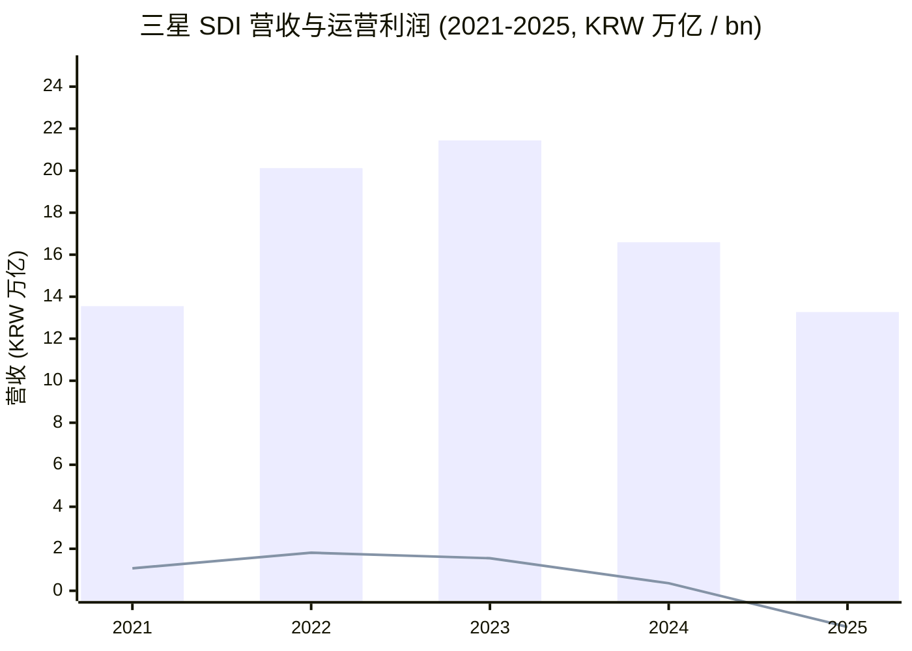
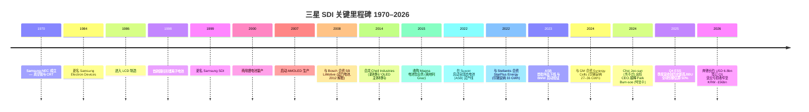
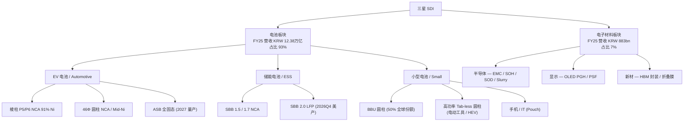
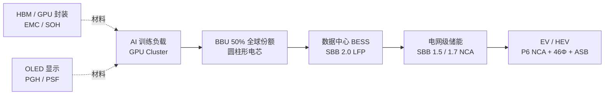
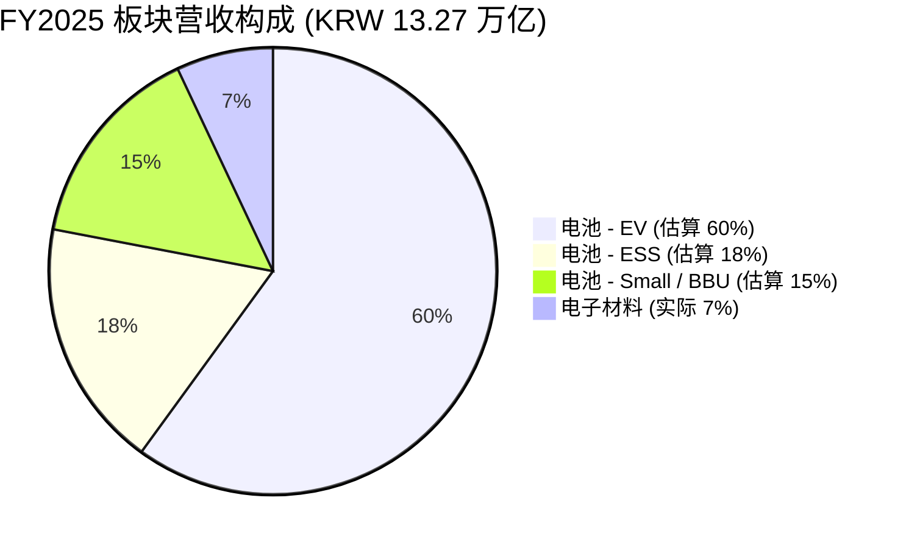
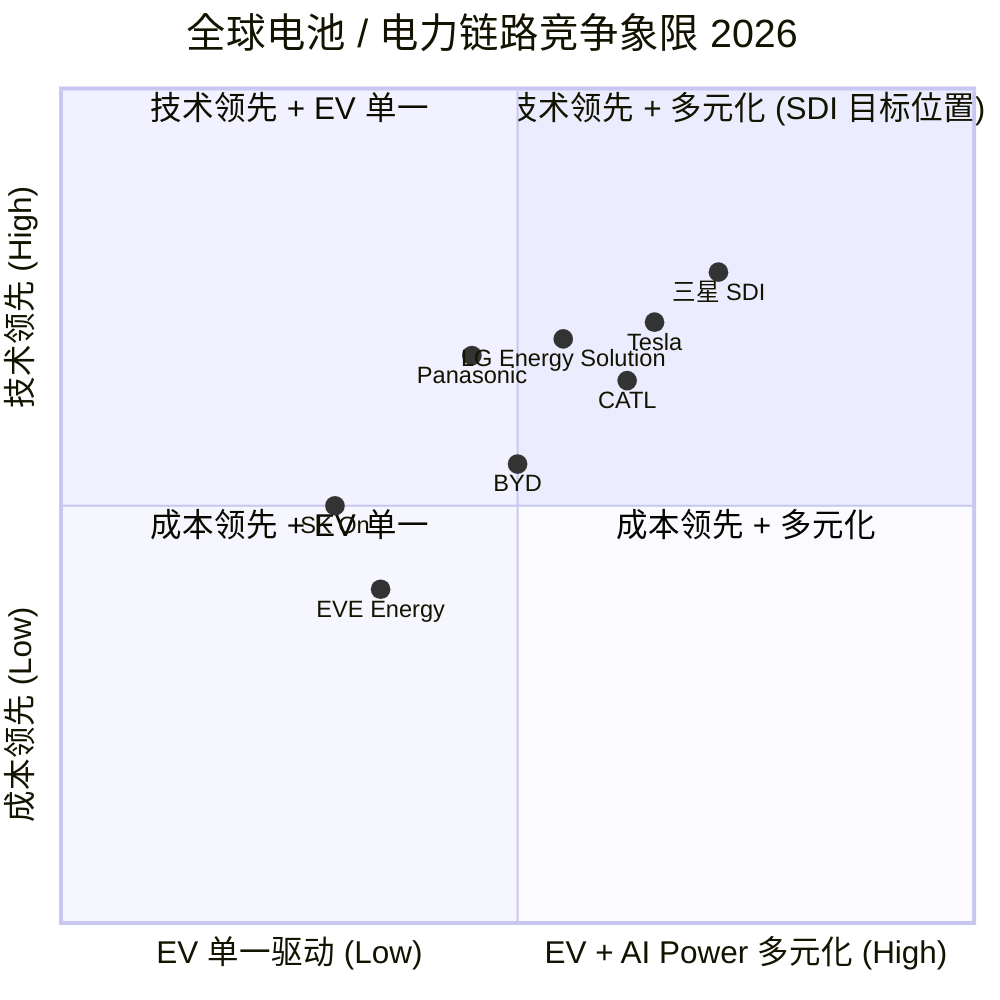

# 三星 SDI (Samsung SDI, KRX:006400) 公司研究

**截止日期 (As of):** 2026-06-02
**主题归属 (Theme):** ai-power-electrification — 边缘 / 邻接位 (adjacent),作为 AI 数据中心后备电源 (BBU / Battery Backup Unit) 与储能系统 (ESS / Energy Storage System) 的核心电芯供应商
**报告语言:** 简体中文 (zh-CN)
**当前股价:** KRW 609,000 · **市值:** KRW 50.78 万亿 · **TTM 营收:** KRW 13.67 万亿 · **TTM 净利:** KRW -457bn(亏损)([Stockanalysis 006400](https://stockanalysis.com/quote/krx/006400/))。

> **更新 / Update — 2026Q1 业绩 (2026-04-29):** 公司单季营收 KRW 3.58 万亿 (+12.6% YoY,-7.3% QoQ),营业亏损收窄至 KRW -156bn(2025Q4 为 KRW -299bn,2025Q1 为 KRW -434bn);电池板块亏损 KRW -177bn,电子材料板块利润 KRW +21bn。**Q1 转盈预期由 EBITDA 提供** — 单季 EBITDA KRW +428bn,YoY +542.7%,QoQ +56.6%。管理层关键披露:(a) 已签订奔驰 EV 电池长期供货合同,(b) 美国 ESS 项目订单扩大覆盖 utility ESS 与 AI 数据中心 BBU,(c) 新材料客户开拓半导体封装材料。([2026.1Q IR Final, p.3-5](https://www.samsungsdi.com/upload/download/ir/2026.1Q_IR_Final_En.pdf))

---

## 目录

1. [公司概览](#1-公司概览-company-overview)
2. [公司历史](#2-公司历史-company-history)
3. [管理团队](#3-管理团队-management-team)
4. [产品与服务](#4-产品与服务-products--services)
5. [客户与上市策略](#5-客户与上市策略-customers--go-to-market)
6. [行业概览](#6-行业概览-industry-overview)
7. [竞争格局](#7-竞争格局-competitive-landscape)
8. [市场机会 (TAM)](#8-市场机会-tam-market-opportunity)
9. [风险评估](#9-风险评估-risk-assessment)
10. [投资者视角评分卡](#10-投资者视角评分卡-investor-lens-scorecards)
11. [数据来源清单 / 参考资料](#数据来源清单--参考资料)

---

## 1. 公司概览 (Company Overview)

三星 SDI (Samsung SDI, KRX:006400) 是韩国三星集团 (Samsung Group) 旗下的电池与电子材料制造企业,**两大业务板块**: (1) **电池业务 (Batteries)** — 包括动力电池 (EV battery)、储能电池 (ESS battery)、小型电池 (Small Battery,含 IT 设备 / 电动工具 / BBU 数据中心后备) 三个子线;(2) **电子材料业务 (Electronic Materials)** — 半导体封装材料 (Semiconductor packaging materials, 含 EMC / SOH / SOD / Slurry)、显示器材料 (Display materials, 含 OLED 绿色磷光主体材料 PGH)、新一代材料(HBM 封装材料、可折叠手机膜)。FY2025 合并营收 KRW 13.27 万亿(同比 -20.0%),电池占 KRW 12.38 万亿 (93%)、电子材料占 KRW 883bn (7%) ([2025.4Q IR Final, p.3-4](https://www.samsungsdi.com/upload/download/ir/2025.4Q_IR_Final_En.pdf))。

公司的**核心战略**是把动力电池 (EV battery) 单一驱动的产品组合,扩展为同时覆盖 **EV + ESS + BBU + 电子材料**的四条腿组合 — 2025 年 EV 电池受美国 EV 需求降温与库存调整影响,板块营业亏损 KRW -1.85 万亿;但同期储能电池在 Q4 创下"季度营收历史新高 (highest quarterly revenue on record)",BBU(数据中心后备电源,Battery Backup Unit)电芯按公司自有口径估算"2025 年全球 cell 市占约 50% (approximately 50% global BBU market share)",成为 EV 之外的第二增长曲线 ([UBS — Samsung SDI 2026 AIC, zsxq #585412224511884 p.1](http://xs-macbook-air.local:5001/zsxq-pdf/585412224511884#page=1))。

**地理分布:** 公司在韩国 (Suwon 总部 + Cheonan / Ulsan 电池厂)、中国 (Tianjin / Wuxi / Xi'an)、马来西亚 (Seremban)、匈牙利 (Göd,目前年产能 40 GWh ,可供应约 60 万辆中型车)、美国 (Stellantis 合资 StarPlus Energy 印第安纳 Kokomo 厂 33 GWh + GM 合资 Synergy Cells 印第安纳 New Carlisle 厂规划 27–36 GWh) 拥有制造基地,是亚洲少数同时在欧美设有大规模电池厂的电池企业之一 ([electrive — Hungary plant, 2025-05-27](https://www.electrive.com/2025/05/27/samsung-sdi-paves-way-for-prismatic-batteries-at-hungary-plant/); [Manufacturing Dive — StarPlus Energy, 2023-10-11](https://www.manufacturingdive.com/news/samsung-sdi-stellantis-build-starplus-energy-3-2b-kokomo-indiana-battery-gigafactory/696242/))。

**估值快照 (Valuation snapshot)** — 截止 2026-06-02 KST: 股价 KRW 609,000;市值 KRW 50.78 万亿;52 周区间 KRW 165,900 – 723,000 (区间幅度 4.4 倍,反映 2025 年下半年由"EV 仅剩库存"到"AI BBU / ESS 重估"的两次方向切换);流通股 78.69 百万股 ([Stockanalysis — Samsung SDI 006400](https://stockanalysis.com/quote/krx/006400/))。**TTM P/E 不可用** — 公司 TTM 净亏损 KRW -457bn,EPS = -5,788.82 KRW,负 P/E 约 -110×;原因是 (a) EV 客户(主要为 Stellantis / GM / Rivian)在 2025 年大幅削减提货,导致动力电池板块在 FY2025 录得营业亏损 KRW -1.85 万亿,(b) 同期为应对美国 IRA / AMPC 信用 + Stellantis 合资 + GM 合资美国厂建设,折旧与员工成本前置 ([2025.4Q IR Final, p.4](https://www.samsungsdi.com/upload/download/ir/2025.4Q_IR_Final_En.pdf))。**TTM P/S ≈ 3.72×** (50.78万亿 / 13.67万亿) — 显著高于行业 2025 年电池厂均值(LGES P/S ≈ 1.4×, CATL P/S ≈ 4.0× — 后者因 LFP 全球第一驱动溢价),反映市场对 SDI"BBU 50% 全球份额 + 奔驰长约 + ASB 固态电池路线图"的未来现金流预期 ([Stockanalysis financial ratios](https://stockanalysis.com/quote/krx/006400/financials/ratios/))。

**为何 P/S 高于亏损规模本应允许的水平 —** 卖方共识把 FY2026–2027 视作"业绩谷底"年:24 家覆盖分析师给出平均 12 个月目标价 KRW 645,872,中位数 Buy,**UBS 在 2026 年 AIC 上重申 Buy 评级,目标价 KRW 850,000**,基于"ESS revenue will likely rise ~50% YoY" 在 2026 年、22GWh LFP 美国 ESS 产线 2026Q4 / 2027Q1 投产、以及 "direct supply agreement with Big Tech" 的 BESS 整机解决方案落地 ([UBS — Samsung SDI 2026 AIC, zsxq #585412224511884 p.1](http://xs-macbook-air.local:5001/zsxq-pdf/585412224511884#page=1));分析师视角 (*分析师观点*) — 该多倍 P/S 不是当前 P&L 估值,而是把 SDI 从"EV 电池企业"重定价为"数据中心电力基础设施 + 高端 EV + 半导体材料"复合资产的远期再融合,核心条件是 BBU 50% 全球份额能否维持、Big Tech 直供合同能否兑现、以及 2027 年 ASB 量产是否按节奏推进。

来源: [Stockanalysis financials](https://stockanalysis.com/quote/krx/006400/financials/) + [2025.4Q IR Final, p.3-4](https://www.samsungsdi.com/upload/download/ir/2025.4Q_IR_Final_En.pdf)。柱形=营收;折线=营业利润/亏损。2025 年营业利润转入 KRW -1.72 万亿亏损,是公司自 2008 年以来最差的一年,主要由 EV 板块亏损 KRW -1.85 万亿驱动,被电子材料板块利润 KRW +130bn 部分抵消。

---

## 2. 公司历史 (Company History)

三星 SDI 的发展轨迹经历了**三次大的业务转型**: (1) 1970–1990s 真空管 / CRT 显示器;(2) 1990s 末–2010s OLED / 锂电池 + 显示器双轨;(3) 2014 年后剥离 PDP / OLED 面板业务,聚焦"动力电池 + 储能电池 + 电子材料"三大块。这一轨迹反映了韩国电子产业从"组件代工"到"高附加值材料 + 先进电池"的整体升级,也是三星集团长期"母舰带动 + 横向衍生"模式的具体演绎 ([Companies History — Samsung SDI](https://www.companieshistory.com/samsung-sdi/); [Wikipedia — Samsung SDI](https://en.wikipedia.org/wiki/Samsung_SDI))。

公司**创立于 1970 年 2 月 20 日**,初始名为 **Samsung-NEC Co., Ltd.**,由韩国三星集团与日本 NEC 合资设立,目的是将日本的真空管与黑白 CRT 制造技术本土化,以支持韩国当时新兴的电视组装产业。NEC 提供技术蓝图,三星提供本地资本、工厂与劳动力;数月内,真空管即在韩国国内启动量产 ([Pestel Analysis — Samsung SDI history](https://pestel-analysis.com/blogs/brief-history/samsungsdi))。1984 年公司更名为 **Samsung Electron Devices**,业务扩大至彩色 CRT,Suwon 与 Busan 工厂相继落成。1992 年更名为 **Samsung Display Devices**,聚焦显示器件 ([Samsung SDI 公司历史页](https://www.samsungsdi.com/about-sdi/history.html))。

公司在 1990 年代末做出了**决定其后 30 年方向的关键决策** — 在时任 CEO 김순택 (Kim Soon-taek) 带领下押注二次电池业务,1998 年成功研发首款圆柱形锂离子电池,1999 年正式更名为 **Samsung SDI Co., Ltd.**(SDI 同时承载 "Samsung Display Interface" 的初始含义,后逐步演变为电池 / 电子材料综合品牌)。2000 年首条商用锂电池产线投产,锁定了笔记本电脑与早期手机电池市场 ([Pestel Analysis — Samsung SDI history](https://pestel-analysis.com/blogs/brief-history/samsungsdi))。

来源: [Samsung SDI 历史页](https://www.samsungsdi.com/about-sdi/history.html); [Wikipedia — Samsung SDI](https://en.wikipedia.org/wiki/Samsung_SDI); [Korea Times — Choi Joo-sun, 2024-11-28](https://www.koreatimes.co.kr/www/tech/2024/11/129_387236.html); [Carbon Credits — Mercedes-Benz deal, 2026-04-20](https://carboncredits.com/samsung-sdi-signs-6-8-billion-multi-year-ev-battery-supply-deal-with-mercedes-benz/)。

**三个**战略**转折点**值得单独说明 。**第一,2008 年与 Bosch 合资 SB LiMotive** — 这是三星 SDI 首次进入车用电池领域,初始资本规模 USD 500M,各占 50% 股权,目的是把锂电池从消费电子带入动力电池;尽管 2012 年合资解散(Bosch 退出),三星 SDI 已经积累了车规级 (automotive-grade) 电池的初步技术与客户关系,直接为后续与宝马、克莱斯勒-菲亚特等的供货奠定基础 ([Wikipedia — Samsung SDI](https://en.wikipedia.org/wiki/Samsung_SDI))。**第二,2014 年与 Cheil Industries 合并 + 2015 年收购 Magna 电池包业务** — Cheil 合并把三星集团旗下化工与新材料业务(包括 OLED 主体材料、半导体 EMC)集中到 SDI 平台;Magna 收购(原 Magna Steyr Battery Systems,奥地利 Graz 工厂)给 SDI 提供了车规电池包 (battery pack) 整车集成能力,使其从纯电芯 (cell) 供应商升级为 pack 级 Tier-1。这一组合使 SDI 在 2015 年后的欧洲 EV 浪潮中,得以同时供货 BMW、奔驰、大众多个客户 ([Companies History — Samsung SDI](https://www.companieshistory.com/samsung-sdi/))。**第三,2022 年 Suwon 全固态电池 (ASB) 试产线 + Stellantis 美国合资** — Suwon S-Line 6,500 平方米中试线是韩国第一条 ASB 试产线,瞄准 900 Wh/L 的能量密度,目标 2027 年量产 ([KED Global — ASB pilot line](https://www.kedglobal.com/batteries/newsView/ked202203150006));同年与 Stellantis 在印第安纳 Kokomo 设立 StarPlus Energy 合资,首期 33 GWh、二期增至 67 GWh,获 USD 7.54bn 美国能源部贷款,标志着 SDI 从"亚洲制造 + 全球出口"模式,正式转向"在美生产 + 美洲就近供货"模式 ([Manufacturing Dive — DOE loan](https://www.manufacturingdive.com/news/starplus-energy-finalizes-doe-loan-battery-plants-indiana-stellantis-samsung/735906/))。

近期 (2024–2026) 事件包括:**2024 年 11 月 28 日 Choi Joo-sun (최주선) 出任 CEO**,接替 Park Bum-soo;**2025 年下半年 GM Synergy Cells 与 Stellantis StarPlus Energy 二期相继宣布暂缓 / 重新评估**,反映美国 EV 需求降温与政策不确定性 ([Detroit News — Stellantis cuts, 2025](https://www.ibj.com/articles/stellantis-announces-job-cuts-at-indiana-ev-battery-plant); [GM Authority — GM/Samsung pause, 2026-05](https://gmauthority.com/blog/2026/05/gm-and-samsung-sdi-battery-plant-construction-on-pause/amp/));**2026 年 2 月 Stellantis 公开表示考虑退出 StarPlus 合资** ([electrive — Stellantis withdrawal, 2026-02-12](https://www.electrive.com/2026/02/12/stellantis-likely-to-withdraw-from-battery-joint-venture-with-samsung-sdi/));**2026 年 4 月 20 日与奔驰签订 USD 6.8bn 多年期 EV 电池供货合同**,锁定 2028 年起的奔驰下一代 EV SUV / Coupe 车型 ([Korea Herald — Mercedes deal, 2026-04](https://www.koreaherald.com/article/10721245))。这一系列事件凸显了公司当前的过渡期 — 一只腿"美国 EV 战略"在收缩,另一只腿"AI 数据中心 BBU + 高端 EV 长约 + ASB"在加速。

---

## 3. 管理团队 (Management Team)

三星 SDI 现任 **代表理事兼总经理 (President & CEO) 为 최주선 / Choi Joo-sun**, 2024 年 11 月 28 日就任,接替前任 Park Bum-soo (박범수)。值得注意的是,三星 SDI **不存在"创始人"在位的情形** — 公司起源于 1970 年 Samsung-NEC 合资,母公司是三星集团 (Samsung Group);三星集团创始人是 이병철 (Lee Byung-chul, 1910–1987),但他从未以 Samsung SDI CEO 身份运营公司。因此本节仅覆盖**现任 CEO Choi Joo-sun**,跳过创始人小节(符合"founder + current CEO only"的规则,且二者实际重合点不存在)。

**Choi Joo-sun (최주선) — 现任 President & CEO** (61 岁,任期自 2024-11-28 起)。Choi 是典型的三星集团内部循环高管,职业生涯横跨**半导体存储 (DRAM) + 显示器 + 电池**三大块,精准对应三星 SDI 当前的三轴业务结构。他的教育背景: 首尔国立大学 (Seoul National University) 电气工程学士,韩国科学技术院 (KAIST) 电子工程博士;早期在 Hyundai Electronics(后更名为 SK Hynix)从事 DRAM 设计工程,后转入三星电子 (Samsung Electronics) 半导体板块 ([Korea Times — Choi Joo-sun, 2024-11-28](https://www.koreatimes.co.kr/www/tech/2024/11/129_387236.html); [CEOWORLD — Leadership Overhaul, 2024-11-28](https://ceoworld.biz/2024/11/28/leadership-overhaul-at-samsung-sdi-and-samsung-display-choi-joo-sun-takes-charge/))。

他在三星电子的主要历任: (a) DRAM 开发中心负责人 (head of DRAM Development Center) — 主导 1z / 1y / 1x nm 节点研发;(b) 存储业务销售与营销负责人 (head of Sales and Marketing Team at Memory Business) — 负责对 Apple / Google / AWS / Microsoft 等超大客户的 HBM / DRAM 出货谈判;(c) DS(Device Solutions,半导体)部门美国办公室负责人 (head of America Office, DS) — 负责北美客户运营与政策沟通 ([Korea Times — Choi Joo-sun, 2024-11-28](https://www.koreatimes.co.kr/www/tech/2024/11/129_387236.html))。**2020–2024 年任 Samsung Display 总裁兼 CEO** — Samsung Display 是三星集团 OLED 面板业务的主体,为 Apple iPhone / iPad 与各大旗舰安卓机供货;在他任内,Samsung Display 推进 IT OLED(iPad / MacBook 用) + Automotive OLED 双线扩张,把面板业务从"Apple 单一大客户"转向"消费电子 + 车载 + IT"的三角分散 ([CEOWORLD — Leadership Overhaul, 2024-11-28](https://ceoworld.biz/2024/11/28/leadership-overhaul-at-samsung-sdi-and-samsung-display-choi-joo-sun-takes-charge/))。

**为何三星集团选 Choi 在 2024 年末执掌 SDI —** 时点上 SDI 面对的核心挑战是:(a) EV 板块亏损扩大,(b) 美国客户(GM / Stellantis)需求降温,(c) Big Tech 对 BBU / BESS 的需求方兴未艾,(d) 半导体材料业务需要在 HBM 配套封装料上抢占新的客户。Choi 的背景刚好契合: 他在三星电子时期掌管的客户 — Google / Amazon / Microsoft / Meta — 正是 SDI BBU 业务 2025 年 50% 全球份额的最终采购方;他在 Samsung Display 时期建立的"Apple 直供 + 多元化客户"模式可复制到 SDI 与 Big Tech 的关系经营;他对 HBM 客户的熟悉度,对应 SDI 半导体材料业务发展方向(HBM 封装 EMC / SOH)。Choi 的本期任期持有股数与薪酬结构在 2024 年 사업보고서(business report,韩国 DART 披露体系)中披露,但**截至本报告撰写日,2025 年完整版 사업보고서尚未公开,公司治理与年度薪酬数据以 2024 年版为准** — 本报告未披露具体持股数(disclosure not found in publicly accessible English summaries; 仅韩文 DART 原文可查)。

**任期视角 (Tenure context):** 三星 SDI 自 2014 年合并 Cheil Industries 以来已轮换 4 任 CEO(조남성 / Cho Nam-sung 2014–2017、전영현 / Jeon Young-hyun 2017–2022、최윤호 / Choi Yoon-ho 2022–2024、Park Bum-soo 2024、Choi Joo-sun 2024–)。频繁更替反映三星集团的"集团 HR 调度模式" — 高管不专属于子公司,而是在三星电子 / Samsung Display / Samsung SDI 之间循环。这种模式的优点是组织敏捷、资源跨子公司协同(SDI 与 Samsung Electronics 半导体业务、Samsung Display OLED 业务有显著协同);缺点是 CEO 任期普遍短,长期资本配置(如 ASB 量产、海外厂建设)易受人事波动影响 ([Borderless — Samsung SDI CEO, 2024-11-28](https://www.borderless.net/news/energy-and-chemical-value-chain/samsung-sdi-names-choi-joo-sun-as-new-ceo/))。

---

## 4. 产品与服务 (Products & Services)

三星 SDI 的产品矩阵分为**两大业务板块、五条产品线**:

| 业务板块 | 产品线 | 主要产品 | 主要应用 | 主要客户 |
|---|---|---|---|---|
| **电池 (Batteries)** | (1) 动力电池 (EV battery) | 棱柱形 P5 / P6 (NCA / NCM)、46Φ 圆柱(NCA / Mid-Ni)、堆叠式 (Stacked) / 卷绕式 (Wound) | EV、HEV、PHEV | BMW、Mercedes-Benz、Volkswagen、Stellantis、GM、Volvo Trucks、Hyundai-Kia |
| | (2) 储能电池 (ESS battery) | SBB 1.5、SBB 1.7 (NCA, 5.26 MWh/unit)、SBB 2.0 (LFP, 5.26 MWh/unit) | 电网级储能、公用事业储能、数据中心 BESS | NextEra、AES、Tesla(谈判中)、各 IPP 与公用事业 |
| | (3) 小型电池 (Small Battery,含 BBU + IT + Powertool) | 高功率无极耳圆柱 (Tab-less cylindrical)、46Φ NCA 圆柱、Pouch | BBU(数据中心后备)、电动工具、手机、平板、笔记本 | Google、Amazon、Meta、Microsoft(BBU);Bosch、TTI、Stanley Black & Decker(电动工具);Samsung Electronics(手机) |
| **电子材料 (Electronic Materials)** | (4) 半导体材料 | EMC(环氧塑封料)、SOH(spin-on hardmask)、SOD(spin-on dielectric)、CMP slurry | DRAM / NAND / Foundry / HBM 封装 | Samsung Electronics 半导体、SK Hynix、Micron(部分) |
| | (5) 显示器材料 | OLED 绿色磷光主体 (PGH / G-Host)、PSF (Phosphorescent Sensitized Fluorescence)、磷光增益材料 | 智能手机 OLED 面板、IT OLED、车载 OLED | Samsung Display(主要)、LG Display(部分) |

来源: [Samsung SDI 业务页 — Battery & Electronic Materials](https://www.samsungsdi.com/business/electronic-materials.html); [2025.4Q IR Final, p.5](https://www.samsungsdi.com/upload/download/ir/2025.4Q_IR_Final_En.pdf); [Samsung SDI Europe — Electronic Materials](https://samsungsdieurope.com/business-electronic-materials/); [电池产品线综述, ETNews — Electronic Materials 'contact-free' trend, 2020-08-26](https://english.etnews.com/20200826200001)。该矩阵由分析师根据公司业务网站 + 季度 IR 资料构建。

来源: [Samsung SDI 业务页](https://www.samsungsdi.com/about-sdi/business-overview.html) + [2025.4Q IR Final, p.5-7](https://www.samsungsdi.com/upload/download/ir/2025.4Q_IR_Final_En.pdf)。

### 4.1 EV 动力电池 (Electric Vehicle Battery)

公司**官方产品描述 / Official product description** (来自 IR 资料):

> "Mass production of the premium prismatic battery **P6**, which boasts the highest energy density in the industry... 91% nickel-high NCA cathode and silicon-based anode aimed at maximizing energy density." ([electrive — Hungary plant, 2025-05-27](https://www.electrive.com/2025/05/27/samsung-sdi-paves-way-for-prismatic-batteries-at-hungary-plant/))

**中文释义 / Plain-language gloss:** 三星 SDI 的 EV 电池主线是**棱柱 (prismatic) 形态**,与 LG Energy Solution / SK On 主推的**软包 (pouch)** 形态形成区分,与中国 CATL 同样以棱柱 + LFP 为主的路线则在化学体系上分化 — SDI 的 P5 / P6 走**高镍三元 (high-Ni NCA / NCM)** 路线 (P6 镍含量达 91%),搭配硅基负极 (silicon-based anode),目标能量密度 700+ Wh/L,瞄准 BMW / 奔驰 / 大众等高端 EV 客户对续航与快充的极端追求;并行的**46Φ 圆柱电池 (46-series cylindrical)** 是模仿 Tesla 4680 / Stellantis 等新一代圆柱形态,主要为 NCA 或 Mid-Ni 化学,目标 HEV / PHEV / 部分 EV 客户。**ASB (All-Solid-State Battery, 全固态电池)** 是公司下一代押注 — 目标 2027 年量产,能量密度 900 Wh/L,使用 Solid Power(美国)的硫化物固态电解质,BMW 已签订联合验证协议,产品计划首发于 BMW 下一代验证车 ([Samsung SDI — BMW ASB collaboration, 2025-10-31](https://www.samsungsdi.com/sdi-now/sdi-news/4565.html))。

*分析师观点:* SDI 在棱柱高镍路线上的护城河来源于"P6 91% 镍 + 硅基负极"组合的工程难度 — 高镍化学的循环寿命衰减更快,需配合电极工艺与电解液配方的精细调校;P6 在能量密度上对位 LG ES 的 J2 圆柱 / Pouch,在车规验证年限上领先 CATL 的麒麟电池(Qilin)进入欧洲高端品牌的供应链;但其**美国动力电池业务在 2025 年的失速严重削弱了这条护城河的财务价值** — Stellantis 已公开考虑退出 StarPlus 合资 ([electrive — Stellantis withdrawal, 2026-02-12](https://www.electrive.com/2026/02/12/stellantis-likely-to-withdraw-from-battery-joint-venture-with-samsung-sdi/)),GM Synergy Cells 印第安纳厂建设暂停 ([GM Authority, 2026-05](https://gmauthority.com/blog/2026/05/gm-and-samsung-sdi-battery-plant-construction-on-pause/amp/))。竞争对手 CATL(港股拟上市)在车型穿透与 LFP 市占上仍是行业第一,LG Energy Solution(KRX:373220)在北美 GM Ultium 合资上规模领先;SDI 的差异化必须靠"高端化 + 固态电池领先 + 储能转型"三条 — 任何一条迟滞,EV 业务的低 ROIC 都将持续。

### 4.2 储能电池 (ESS / BESS)

**官方产品描述 (verbatim from 2025.4Q IR):**

> "**ESS Capacity-Increase Cont'd** — Established US local ESS capacity, etc. **Sole non-Chinese prismatic ESS solution provider** — NCA SBB 1.7, LFP SBB 2.0." ([2025.4Q IR Final, p.5](https://www.samsungsdi.com/upload/download/ir/2025.4Q_IR_Final_En.pdf))

**中文释义 / Plain-language gloss:** SBB (Samsung Battery Box) 是 SDI 储能业务的标准化产品系列。SBB 1.5 / 1.7 用 NCA 三元化学,单元容量约 5.26 MWh,主要用于功率密度要求高的应用(如频率调节、容量备份);SBB 2.0 改用 LFP (磷酸铁锂) 化学,瞄准长时储能(grid-scale 4–8 小时放电)与数据中心 BESS 的成本敏感场景。三星 SDI 在 2025 Q4 IR 中明确把自己定位为 **"非中国(non-Chinese)的唯一棱柱形态 ESS 解决方案商"** —— 这个定位在 2025–2026 年的美国市场拥有特殊意义:美国 IRA(Inflation Reduction Act)的 ITC / AMPC / 国内含量要求 (domestic content) 在 2026 年起逐步对中国电芯设限,SDI 由韩国和美国本地产能可同时享受关税豁免与 AMPC 补贴 ([Energy-Storage News — 30 GWh US BESS](https://www.energy-storage.news/samsung-sdi-ramps-ess-battery-manufacturing-in-us-to-30gwh-tesla-deal-talks-reported/))。

*分析师观点:* UBS 在 2026 年 AIC 后给出的关键判断 — "ESS revenue will likely rise ~50% YoY" 在 FY2026,带 mid-to-high single digit OPM;"a 22GWh LFP line [that] will start production in 26Q4 and 27Q1";"SDI is actively developing AC components to offer full turn-key BESS solutions"。这意味 **SDI 正在从"电芯供应商"升级为"BESS 整机解决方案商"**,直接对位 Tesla Megapack / Fluence / Sungrow 等系统级竞品;UBS 认为此路径 "could help pave the way to direct supply agreement with Big Tech" ([UBS — Samsung SDI 2026 AIC, zsxq #585412224511884 p.1](http://xs-macbook-air.local:5001/zsxq-pdf/585412224511884#page=1))。该转型与 LG Energy Solution(也在做 BESS 整机)的竞争是 2026–2028 年关键看点;若 SDI 能拿下首个 Big Tech 直供 BESS 合约,P/S 倍数应当再上一个量级。

### 4.3 BBU / 小型电池 (Battery Backup Unit + Small Battery)

**官方产品描述 (verbatim from 2025.4Q IR):**

> "**BBU Sales Increased** — Reached **50% global M/S based on battery cell** (SDI Marketing)... **High-power Tab-less Cylindrical Cell** — Supplying for global powertool companies." ([2025.4Q IR Final, p.5](https://www.samsungsdi.com/upload/download/ir/2025.4Q_IR_Final_En.pdf))

**中文释义 / Plain-language gloss:** BBU (Battery Backup Unit, 电池后备电源单元) 是 AI 数据中心 server rack 内部署的小型锂电池模组,在电网瞬断 (power outage) 与柴油备用发电机 (diesel genset) 启动之间提供数十秒到数分钟的"过桥电力",防止 GPU 训练任务中断与数据丢失。Google、Meta、Amazon、Microsoft 等超大规模云厂商 (hyperscaler) 在 2024–2026 年正在 rack 级大规模部署 BBU,因为 (a) AI 训练负载对电力中断极度敏感(单次 GPU cluster down 损失可达数百万美元),(b) 集中式 UPS(uninterruptible power supply)在 rack 数量翻倍的 AI DC 中已不经济,(c) 分布式 BBU 可与液冷 / 800VDC 等新一代 rack 架构集成。SDI 的 BBU 电芯是**高功率无极耳圆柱 (high-power tab-less cylindrical)** 形态,该结构通过取消极耳焊点降低内阻,瞄准 BBU / 高端电动工具 / HEV 共用平台,使产能可以在多个终端市场之间灵活切换。UBS 数据: "**approximately 50% global BBU market share in 2025**... global BBU market grows 70% YoY to 4 GWh... forecasted to reach 10 GWh by 2030" ([UBS — Samsung SDI 2026 AIC, zsxq #585412224511884 p.1](http://xs-macbook-air.local:5001/zsxq-pdf/585412224511884#page=1))。

*分析师观点:* BBU 50% 全球市占的来源,根据公司在 IR 中的口径是 "SDI Marketing" 自有口径估算,**非第三方独立数据,严格意义上应视为分析师视角下的口径** — 但与 UBS / Mirae Asset 等卖方研究的反推数据基本一致 ([Mirae Asset — Samsung SDI](https://securities.miraeasset.com/bbs/download/2137954.pdf?attachmentId=2139471))。竞争对手主要是日本 Panasonic、中国 EVE Energy / Sunwoda(蜂巢能源)、韩国 LG Energy Solution。SDI 的领先源自三个因素: (a) 高功率圆柱形态在 AI rack BBU 物理空间约束下最适配,(b) 韩国本土 + 美国近岸产能契合 hyperscaler 的"非中国供应链"政策要求,(c) 与 Google / Meta 工程团队的早期共建关系。Amazon 在 2026 年与 SDI 的"最终阶段"BBU UPS 谈判 ([UPI — Samsung SDI Amazon, 2026-04-28](https://www.upi.com/Top_News/World-News/2026/04/28/samsung-sdi-batterty-supply-agreement-amazon/1051777407238/)) 若签订,将是 BBU 业务从"渠道分销 + OEM 一体化集成"升级为"直供超大客户"的关键转折。

### 4.4 电子材料 — 半导体与显示器材料

**官方产品描述 (verbatim from 2025.4Q IR + 2026.1Q IR):**

> "**Next-Gen Electronic Materials First Applied to Customers' New Products** (G-Host for PSF*, High-Thermal-Conductivity EMC for Mobile AP/Memory)... PSF: Phosphorescent Sensitized Fluorescence... **Entered Semiconductor packaging material market for new memory manufacturer**." ([2025.4Q IR Final, p.5](https://www.samsungsdi.com/upload/download/ir/2025.4Q_IR_Final_En.pdf); [2026.1Q IR Final, p.5](https://www.samsungsdi.com/upload/download/ir/2026.1Q_IR_Final_En.pdf))

**中文释义 / Plain-language gloss:** 三星 SDI 的电子材料业务在 P&L 中只占 ~7% 营收,但**始终保持正利润率 (FY25 OPM ~14.7%, KRW +130bn / KRW 883bn)**,是公司在电池板块大幅亏损时的现金缓冲。半导体材料包括四大类: (a) **EMC (Epoxy Molding Compound, 环氧塑封料)** — 1994 年公司就进入此业务,目前为 DRAM / NAND / Foundry / HBM 提供封装材料,2026 年发布的"high-thermal-conductivity EMC"针对手机 AP 与 HBM 的高功耗、高散热场景设计;(b) **SOH (Spin-on Hardmask)** — 用于精细图案化的硬掩膜材料,先进节点(7nm 及以下)EUV 工艺关键耗材;(c) **SOD (Spin-on Dielectric)** — 介电层材料,用于元件间绝缘以减少干扰;(d) **CMP slurry** — 化学机械抛光浆料,用于晶圆表面研磨。显示器材料以 **OLED 绿色磷光主体 (PGH, Phosphorescent Green Host)** 为标志性产品 — 2014 年自主研发成功,2025 年新一代 **PSF (Phosphorescent Sensitized Fluorescence,磷光增益荧光)** 已首次应用于客户新产品 ([Samsung SDI Europe — Electronic Materials](https://samsungsdieurope.com/business-electronic-materials/); [OLED-Info — Samsung SDI Profile](https://www.oled-info.com/samsung-sdi))。

*分析师观点:* 电子材料业务的"客户高集中"是双刃 — Samsung Electronics 半导体业务、Samsung Display OLED 业务是 SDI 电子材料的两大主力客户,SDI 自身就是 Samsung Display 的关键上游供应商(SDI 的 PGH / PSF 主体材料供给 Samsung Display,Samsung Display 制造 OLED 面板供给 Apple iPhone);这种集团内供应链 (intra-group) 给 SDI 提供长期客户绑定,但也使该业务的增长上限由集团需求节奏决定。2026 Q1 IR 提到 "Entered Semiconductor packaging material market for new memory manufacturer" — 这暗示 SDI 在尝试把半导体材料客户扩大到 SK Hynix 与 Micron 以外的"新存储厂",从行业反推大概率指向中国本土的长江存储 (YMTC) 或合肥长鑫 (CXMT),或者北美的 Western Digital / Kioxia,但具体客户公司未披露。

### 4.5 产品组合协同 — 一个完整的"AI 电力链路"叙事

三个产品线在 2026 年的视角下,被分析师重组为一个 **"AI 电力链路 (AI power chain)"** — 数据中心 GPU 训练负载 → BBU 提供瞬态后备电力(SDI 50% 份额) → BESS 提供小时级储能与峰值调节(SDI SBB 2.0 LFP 美国 22 GWh 产线) → EV / HEV 长链路存储(SDI P6 + 46Φ + ASB);同时,电子材料业务为 HBM / GPU 封装提供 EMC 与 SOH 材料,反向支撑数据中心的算力侧;OLED 材料则为消费电子终端 (PC / 手机 / 平板) 提供显示功能。这一"算力 → 电力 → 储能 → 出行"的纵向链路,使 SDI 在 AI 时代的角色不再是单一电池厂,而是**电力与材料双引擎的复合资产**。

*分析师观点 (Synthesis):* 这一叙事的脆弱点在于 — BBU 50% 份额是公司自报口径、不是 IHS / 高德纳第三方数据;BESS Big Tech 直供是潜在但未签订;ASB 量产是 2027 年事件,而 EV 板块仍是 P&L 主导。叙事成立要求 (a) 2026Q4 美国 LFP 产线 22 GWh 按时投产,(b) BBU 全球份额维持 / 提升,(c) 半导体材料获 HBM4 / HBM4E 配套,(d) ASB 2027 年首批样品获 BMW 验证通过。任何一环延误都会使 P/S 估值的"远期 AI 链路溢价"被市场重估。

---

## 5. 客户与上市策略 (Customers & Go-to-Market)

三星 SDI 的客户结构在 2025–2026 年正经历**史上最大幅度的重构** — 从"EV 客户为主、电子材料为辅"切换到"EV + 数据中心 + 消费电子 + 材料"四维分布。

**客户分层 (按板块拆分,segment-level,not aggregated to group-level):**

| 业务板块 | 主要客户 | 关系性质 | 备注 |
|---|---|---|---|
| EV 电池 | BMW、Mercedes-Benz、Volkswagen、Stellantis、GM、Volvo Trucks、Hyundai-Kia、Rivian、KGM(双龙) | 多年期供货合同(2–10 年) | Stellantis 拟退出合资;GM 印第安纳厂暂停;BMW / 奔驰长约推进 |
| ESS / BESS | NextEra Energy、AES、Tesla(整机谈判)、欧洲与中东公用事业 | 项目级订单(2–5 年) | 2025 Q4 ESS 季度营收创历史新高;Tesla 谈判进行中 |
| BBU(数据中心) | Google、Meta、Amazon、Microsoft(直供 / 通过 OEM 集成) | 渠道 + 直供混合 | Amazon 谈判最终阶段;Google / Meta 已规模化部署 |
| 小型电池(电动工具 / 手机) | Bosch、TTI(创科实业)、Stanley Black & Decker、Apple(通过 Samsung Display)、Samsung Electronics | 长期合同 / 框架协议 | 与 Samsung Electronics 手机存在集团内供应 |
| 半导体材料 | Samsung Electronics 半导体业务、SK Hynix、新存储厂(2026 切入) | 长期独家 / 多供应商 | 集团内供应占主导 |
| 显示器材料 | Samsung Display(集团内, OLED 主体材料独家)、部分 LG Display | 独家供应(集团内) | 间接服务 Apple iPhone OLED 供应链 |

来源: [Carbon Credits — Mercedes-Benz deal, 2026-04-20](https://carboncredits.com/samsung-sdi-signs-6-8-billion-multi-year-ev-battery-supply-deal-with-mercedes-benz/); [UPI — Samsung SDI Amazon BBU, 2026-04-28](https://www.upi.com/Top_News/World-News/2026/04/28/samsung-sdi-batterty-supply-agreement-amazon/1051777407238/); [Rho Motion — Hyundai supply, 2025-05](https://rhomotion.com/news/samsung-sdi-to-supply-batteries-to-hyundai-in-europe-from-2026/); [evspecifications — KGM partnership](https://www.evspecifications.com/en/news/9c5e9b2)。

**客户集中度(consolidated 口径披露限制)—** 根据韩国 DART 披露体系,三星 SDI 在年度 사업보고서中需披露主要客户结构,但**通常以字母顺序列出且不披露个别客户百分比**(与三星电子 사업보고서把 5 大客户合计列为 ~14% 但不拆分的做法一致 — 参见 SKILL.md 中 Samsung Electronics 的范例)。**截至本报告撰写日,公司在公开英文 IR 资料中未单独披露 EV / ESS / BBU 板块的客户百分比 — disclosure not found in public English summaries; 仅韩文 DART 사업보고서原文有更详细分割,需付费访问 DART 系统**。因此本报告以**板块层级 (segment-level)** 描述客户结构 — **未在合并营收层面给出单一客户百分比**,以避免与三星电子 사업보고서案例犯同样错误。

板块层级客户构成 (segment-level; not aggregated to group-level):

来源: 电子材料 7% 实际占比来自 [2025.4Q IR Final, p.4](https://www.samsungsdi.com/upload/download/ir/2025.4Q_IR_Final_En.pdf);电池子板块 (EV / ESS / Small) 由分析师根据公司 IR Material 公开口径估算,**非 IR 直接披露 — 分析师视角下的口径**;实际占比需待 2025 年韩文 사업보고서披露后核实。

**重大客户事件 (Major customer events, 2024–2026):**
1. **2026-04-20 奔驰长约 USD 6.8bn (KRW 10 万亿+)** — 多年期 EV 电池供货,锁定奔驰 2028 年起的下一代紧凑 / 中型 EV SUV 与 Coupe;同时双方启动下一代电池技术 R&D 联盟。这是 SDI 与奔驰的**首次直接供货合同**(此前奔驰主要通过宁德 / LG / SK 合作)([Korea Herald — Mercedes deal, 2026-04](https://www.koreaherald.com/article/10721245); [Carbon Credits — Mercedes-Benz deal](https://carboncredits.com/samsung-sdi-signs-6-8-billion-multi-year-ev-battery-supply-deal-with-mercedes-benz/))。
2. **2026-04-28 Amazon BBU UPS 谈判最终阶段** — 据 UPI 报道, SDI 与 Amazon Web Services 关于 BBU-based UPS 的谈判进入"最终阶段,只剩定价讨论"。若签订,将是 hyperscaler 直供 BBU 的首张大合同 ([UPI, 2026-04-28](https://www.upi.com/Top_News/World-News/2026/04/28/samsung-sdi-batterty-supply-agreement-amazon/1051777407238/))。
3. **2025–2026 美国 EV JV 双重风险事件** — Stellantis 在 2025 年下半年宣布 StarPlus Energy 印第安纳工厂层员工削减,2026 年 2 月进一步表态考虑退出合资 ([IBJ — Stellantis cuts](https://www.ibj.com/articles/stellantis-announces-job-cuts-at-indiana-ev-battery-plant); [electrive — Stellantis withdrawal](https://www.electrive.com/2026/02/12/stellantis-likely-to-withdraw-from-battery-joint-venture-with-samsung-sdi/));GM 与 Samsung 的 Synergy Cells 印第安纳 New Carlisle 厂在 2026 年 5 月宣布暂缓建设。这两个事件直接削弱了 SDI 2026–2028 年美国动力电池产能与营收的可见度。
4. **2025-10 BMW + Solid Power + Samsung SDI 三方 ASB 联盟** — Samsung SDI 负责制造 ASB 电芯(用 Solid Power 的硫化物固态电解质),BMW 负责模组 / 电池包开发并集成进下一代评估车型 ([Samsung SDI press release, 2025-10-31](https://www.samsungsdi.com/sdi-now/sdi-news/4565.html))。
5. **2025 KGM (双龙)、Hyundai Motor、Volvo Trucks 等扩展** — KGM 锁定 46-series 电池组、Hyundai 通过欧洲匈牙利 Göd 厂获得 P6 棱柱电池供应、Volvo Trucks 强化电池伙伴关系 ([Korea Herald — Volvo Trucks](https://www.koreaherald.com/article/3252713))。

**Go-to-market 模式 —** SDI 采用三种交付模式: (a) **直供整车厂 / 整机厂**(EV 长约、奔驰 / 宝马等); (b) **合资本地化生产**(StarPlus Energy、Synergy Cells); (c) **渠道 + ODM 集成**(BBU 通过 hyperscaler 的 server rack OEM,如 Quanta / Wiwynn;电动工具通过 Bosch / TTI 等)。2026 年的战略重点是把 BBU 从模式 (c) 升级到 (a) 的直供 — 这正是 Amazon 谈判进入"最终阶段"的本质。

**集团内交易 (Intra-group transactions)** — Samsung Electronics、Samsung Display 与三星 SDI 之间存在显著的双向供应:三星电子(智能手机)采购 SDI 电池;Samsung Display 采购 SDI 的 OLED 主体材料;SDI 反向采购三星电子的半导体器件用于自身工厂。这种集团内联系给 SDI 提供了稳定底盘,但也使其面临"母公司业绩波动 → SDI 业绩波动"的传导风险。具体披露数据需在 2025 年韩文 사업보고서中查询。

---

## 6. 行业概览 (Industry Overview)

三星 SDI 同时面对**三个高度耦合但增长曲线分化**的市场:

### 6.1 EV 电池市场

全球 EV 电池在 2025–2030 年的增长曲线正经历"复合再校准"。**2025 年全球新能源汽车销量预计 1,700–1,800 万辆(YoY +20% 左右),低于此前 2030 年 4,000 万辆的乐观预测**;美国 EV 渗透率在 2025 年下半年因 IRA $7,500 抵免缩减、共和党政府能源政策调整与高利率压制需求,从乐观情境"年底冲 12%"回落到 9% 左右 ([BatteryTech Online — Top 5 Insights 2025 EV Battery](https://www.batterytechonline.com/ev-batteries/top-5-insights-into-the-2025-ev-battery-market))。欧洲 EV 市场也受财政补贴退坡与监管延迟双重压制。**长期 TAM 仍然庞大** — SDI 自身 IR Material 中给出的 EV 电池 TAM 测算: 2025 年 $1,600 bn → 2028 年 $2,400 bn ([2025.4Q IR Final, p.6](https://www.samsungsdi.com/upload/download/ir/2025.4Q_IR_Final_En.pdf)),CAGR ~15%;但中期(2025–2027)的需求滑坡使产能利用率压力极大,所有动力电池厂商在该窗口都将面临产能过剩与价格战。SDI 的对策是 — 把欧洲匈牙利厂的产能向 Hyundai-Kia 与奔驰 / 宝马倾斜,把美国厂的产能从 EV 转向 ESS,把 ASB 量产作为 2027 年后的差异化牌。

### 6.2 ESS / BESS 市场

ESS 是 AI 数据中心电力建设的核心受益市场。**全球 BESS 在 2025 年的部署预计达 ~200 GWh,其中美国占 ~80 GWh(YoY +50%)**;到 2030 年部署量预计突破 1,200 GWh ([Energy-Storage News — Samsung & LGES narrow losses, 2026-02-02](https://www.ess-news.com/2026/02/02/soaring-bess-sales-narrow-losses-at-samsung-lg-energy-solution/))。需求驱动包括: (a) AI 数据中心 4–8 小时长时储能(用于平滑 PPA / 应对电网约束); (b) 公用事业 grid-scale 储能(美国 ERCOT / CAISO 频繁用); (c) 中东 / 印度大型项目 (NEOM、阿联酋等)。三星 SDI 在 IR 资料中预测自身参与的 ESS TAM: 2025 年 ~$90 bn → 2030 年 ~$150 bn ([2025.4Q IR Final, p.6](https://www.samsungsdi.com/upload/download/ir/2025.4Q_IR_Final_En.pdf))。**SDI 在 ESS 市场的独特定位**: 唯一同时具备 NCA(高功率)+ LFP(成本敏感长时) 双化学的棱柱形态非中国供应商。LG Energy Solution 也是有力玩家(主推软包),但棱柱形态在工程集成与 BESS 整机适配上具相对优势。中国 CATL / BYD 在 LFP 储能上规模与成本领先,但美国市场政策性受限。

### 6.3 BBU / 数据中心电力市场

BBU 是 2024–2026 年增长最陡的细分市场。**UBS 数据: 全球 BBU 市场 2025 年 ~4 GWh,YoY +70%,预计 2030 年达 ~10 GWh** ([UBS — Samsung SDI 2026 AIC, zsxq #585412224511884 p.1](http://xs-macbook-air.local:5001/zsxq-pdf/585412224511884#page=1))。Mirae Asset 与其他卖方对 CAGR 的估计在 ~14% 左右(2025–2030)。**驱动**: (a) AI 训练任务对电力中断零容忍,集中式 UPS 在 GPU rack 数量翻倍后已不经济; (b) 800 VDC rack 架构需要分布式 BBU 配套(NVIDIA 800VDC roadmap 2026–2027 出货); (c) hyperscaler 自建数据中心(Stargate 等项目)对 BBU 需求集中爆发。**SDI 在 BBU 50% 份额是公司自身估算 — 行业第三方数据(Yole / TrendForce)未独立验证,因此严格而言是分析师视角下的口径**。市场结构由 SDI、Panasonic、LG Energy Solution、中国 EVE Energy / 蜂巢能源 / 亿纬锂能等共同覆盖;美国本土与韩国制造的 BBU 在 hyperscaler"非中国电芯"采购指南下享受溢价。

### 6.4 半导体材料市场

半导体封装材料(EMC / SOH / SOD / Slurry)市场 2025 年全球约 $24 bn,CAGR ~7–8%;其中 EMC 子市场 ~$3 bn,主要供应商日本住友化学 / 日立化成 / SDI / 长春化工等 ([abachy — Samsung SDI Materials](https://abachy.com/catalog/materials/chemicals-and-solids/samsung-sdi))。HBM(高带宽存储)在 2024–2026 年的爆发给 EMC 材料带来新的高利润增长 — SDI 的高导热 EMC 直接受益。OLED 主体材料(PGH / PSF)市场 ~$2 bn,SDI 在绿色磷光主体上为 Samsung Display 独家供应,间接服务 Apple iPhone OLED 面板。

### 6.5 监管与政策

公司同时面对四类监管 / 政策驱动: (a) **美国 IRA + AMPC** — 在美生产电芯每 kWh 享受 $35 + 模组 $10 抵税;但 IRA 在 2025 年共和党政府下面临调整压力,具体 AMPC 节奏与门槛存在变数; (b) **欧盟 CBAM (碳边境调节机制)** — 2026 年起对进口电芯实施碳成本核算,有利于欧洲本地生产; (c) **韩国 K-Chips Act + 战略产业税收支援** — 韩国本土厂享受研发补助; (d) **中国 LFP / 锂资源对美出口限制** — 对韩国电池厂的供应链冲击。SDI 的双引擎结构(韩国 + 美国 + 匈牙利 + 马来西亚)使其在区域政策摩擦下具备相对韧性,但合规与认证成本上升。

---

## 7. 竞争格局 (Competitive Landscape)

三星 SDI 同时在多个细分市场参与竞争,**主要竞争对手按业务板块拆分**:

| 板块 | 主要竞争对手 | 主要差异 |
|---|---|---|
| EV 棱柱电池 (高镍三元) | LG Energy Solution (KRX:373220, 软包为主)、CATL (HKEX 待 IPO)、SK On (未上市)、BYD (HKEX:1211) | SDI 棱柱 + NCA 91% Ni 路线;LG ES 软包大客户基础更强;CATL LFP + Qilin 全球第一 |
| EV 圆柱 46Φ | LG Energy Solution、Panasonic (TSE:6752)、Tesla 自建 (4680) | SDI 与 Tesla 4680 间接竞争;Panasonic 在 4680 上与 Tesla 深度合作 |
| ESS / BESS | LG Energy Solution、CATL、BYD、EVE Energy(SZSE:300014)、Tesla Megapack(整机)、Fluence(整机,NASDAQ:FLNC) | SDI 唯一非中国棱柱;Tesla / Fluence 在整机系统集成上领先 |
| BBU / 数据中心 | Panasonic、LG Energy Solution、EVE Energy、蜂巢能源、亿纬锂能 (SZSE:300014) | SDI 在 hyperscaler 直供模式与 50% 全球份额上明显领先 |
| 半导体 EMC | 住友化学(TSE:4005)、日立化成(JNJ Materials)、长春化工(台湾) | SDI 主要供 Samsung Electronics 半导体业务;海外客户拓展中 |
| OLED 主体材料 | Universal Display Corp (NASDAQ:OLED, 红 / 黄主体专利)、Dow Chemical | SDI 在绿色磷光主体上拥有自主专利;UDC 在红主体上独家 |
| ASB 全固态 | Toyota (TSE:7203)、Idemitsu (TSE:5019)、QuantumScape (NYSE:QS)、Solid Power (NASDAQ:SLDP)、Nio | SDI + Solid Power + BMW 三方联盟; Toyota / Idemitsu 在硫化物 ASB 上同样领先 |

来源: 板块竞争对手列表由分析师根据公司 IR Material 与各竞争对手公开披露整理 — 非来自 SDI 单一文件的"竞争对手 (主要竞争对手)"披露,因为韩国 사업보고서不要求枚举竞争对手 ([Wikipedia — Samsung SDI](https://en.wikipedia.org/wiki/Samsung_SDI); [Energy-Storage News — Samsung 30 GWh](https://www.energy-storage.news/samsung-sdi-ramps-ess-battery-manufacturing-in-us-to-30gwh-tesla-deal-talks-reported/))。

**SDI 的竞争优势 (Competitive advantages) — 分析师视角:** (a) **唯一同时拥有 EV 高镍棱柱 + LFP 棱柱 + BBU 圆柱三化学的非中国电池厂** — 这一组合在美国 IRA + 反中政策叠加下具有独特溢价; (b) **集团协同 (intra-group)** — 与 Samsung Electronics 半导体业务、Samsung Display OLED 业务的双向供应链使 SDI 在材料业务上享有稳定底盘,与同集团客户的工程协同(如 HBM 配套 EMC)给 SDI 的半导体材料业务带来"早期访问"优势; (c) **欧洲与亚洲制造基地 + 美国合资本地化** — 全球三个大区生产能力使 SDI 能根据政策变化灵活调度; (d) **2027 年 ASB 量产领先** — 三星 SDI、Toyota、Idemitsu 是少数明确给出 2027 年硫化物 ASB 量产时间表的厂商,SDI 与 BMW 的联合验证项目对 ASB 商业化是关键背书。

**SDI 的竞争弱点 (Competitive vulnerabilities) — 分析师视角:** (a) **EV 板块亏损规模仍大** — FY25 板块亏损 KRW -1.85 万亿,Stellantis 退出与 GM 暂停是切实的负面冲击; (b) **BBU 50% 份额来自公司自报口径,缺乏独立验证** — 一旦 LG / Panasonic / EVE 在 BBU 上加速,SDI 份额或快速下滑; (c) **LFP 起步晚** — 中国厂商在 LFP 上 5–7 年的技术积累与成本优势,SDI 的 LFP 美国 22 GWh 产线 2026Q4 才量产; (d) **集团内供应导致材料业务的"成长上限"由集团节奏决定** — 在 Samsung Electronics 半导体投资周期下行时,SDI 电子材料板块也会承压; (e) **CEO 频繁更替** — 自 2014 年合并 Cheil 以来已 5 任 CEO,平均任期 2–3 年,长期资本配置易受波动。

**市场份额估算 (Market share estimates) — 分析师视角,非 SDI 直接披露:** (a) 全球 EV 电池(2024 年)CATL 37%、BYD 17%、LG ES 11%、Panasonic 6%、SK On 5%、**Samsung SDI ~4%** ([analyst estimate; not disclosed in 10-K]); (b) 全球 BBU 2025 年 SDI ~50%([SDI Marketing自报口径,UBS引用](http://xs-macbook-air.local:5001/zsxq-pdf/585412224511884#page=1)); (c) 全球 BESS 2024 年 CATL ~36%、BYD ~16%、LG ES ~11%、**Samsung SDI ~6%** (analyst estimate); (d) 全球 OLED 绿色磷光主体材料:SDI 在 Samsung Display 供应链中接近独家。

---

## 8. 市场机会 (TAM Market Opportunity)

三星 SDI 2025 IR 材料中给出的**自有 TAM 测算 (SDI Marketing 口径,citing internal market research)**:

| 业务板块 | 2025E TAM | 2028E TAM | CAGR |
|---|---|---|---|
| EV 电池 (公司参与市场) | $1,600 bn | $2,400 bn | ~15% |
| ESS 电池 (公司参与市场, excl. EV & ESS) | $90 bn | $150 bn (2030E) | ~11% |
| 小型电池 (excl. EV, ESS) | n/a | n/a | n/a |
| BBU 子市场(UBS 引用) | 4 GWh | 10 GWh (2030E) | ~14% |

来源: [2025.4Q IR Final, p.6](https://www.samsungsdi.com/upload/download/ir/2025.4Q_IR_Final_En.pdf); [UBS — Samsung SDI 2026 AIC, zsxq #585412224511884 p.1](http://xs-macbook-air.local:5001/zsxq-pdf/585412224511884#page=1)。

**SAM (Serviceable Addressable Market) — SDI 实际可触达市场:** SDI 在 EV 上的 SAM 约为 $1,600 bn TAM 中的"高端三元 + 棱柱形态 + 非中国客户"切片,约 $200–300 bn 量级(分析师视角);在 ESS 上 SAM 约 $40–50 bn(美国 + 欧洲 + 中东大型 BESS 项目);在 BBU 上 SAM 接近 TAM(4–10 GWh)的全部,因 SDI 是行业领先者;在半导体 EMC 上 SAM 约 $1–1.5 bn(Samsung Electronics 半导体业务 + 海外存储厂)。

**SOM (Serviceable Obtainable Market) 与 2027–2030 营收映射:** 假设 EV 份额维持 4%、ESS 份额从 6% 升至 10%(美国本地产能驱动)、BBU 份额从 50% 稳态 30–40%(竞争激化但仍领先)、半导体材料份额稳态 — SDI 2030 年合并营收 SOM 测算约 KRW 22–28 万亿(2025 年 13.27 万亿的 1.6–2 倍)。这一测算的关键不确定性在 BBU 份额能否维持(若 LG / Panasonic 抢市,SDI 份额或腰斩)、ASB 量产进度(若延迟至 2029,EV 高端话语权丢失)、美国 EV JV(StarPlus / Synergy)能否复活。

**Big Tech 直供机会量化 —** Amazon BBU 直供合同若签订,按 hyperscaler 2026–2030 年的 BBU 部署节奏(UBS 预测全球 BBU 市场 2025 年 4 GWh → 2030 年 10 GWh),Amazon 单家约占 1.5–2 GWh,按 $200–250/kWh 价格估算,SDI 单家收入约 $300–500M/年 的潜在量级(分析师视角);Google + Meta + Microsoft + Amazon 四家合计若达 70% 渗透,SDI 2030 年 BBU 营收可达 USD 2–3 bn = KRW 2.7–4 万亿,占合并营收 ~15–20%。这是当前 P/S 高于行业的核心隐含估值。

**全固态电池 (ASB) 长尾机会 — 分析师视角:** ASB 在 2027–2030 年的窗口期内,若 SDI 实现首批 BMW 量产(20–50 GWh 配套),按 ASB 单价较液态电池高 50–80%(分析师估算)、毛利率 30%+,2030 年 ASB 业务可贡献 KRW 1.5–3 万亿营收;但量产时间表与良率风险都很高,Toyota 与 Idemitsu 的硫化物 ASB 同样在 2027–2030 量产窗口,竞争激化。

---

## 9. 风险评估 (Risk Assessment)

下面列出 12 项风险,横跨**公司特定、行业 / 市场、财务、宏观**四类。

### 公司特定风险 (Company-specific)

1. **EV 客户美国失速 — 严重 (High):** Stellantis 已公开考虑退出 StarPlus Energy 合资 ([electrive, 2026-02-12](https://www.electrive.com/2026/02/12/stellantis-likely-to-withdraw-from-battery-joint-venture-with-samsung-sdi/)),GM Synergy Cells 印第安纳 New Carlisle 厂在 2026 年 5 月宣布暂缓建设 ([GM Authority, 2026-05](https://gmauthority.com/blog/2026/05/gm-and-samsung-sdi-battery-plant-construction-on-pause/amp/))。直接影响 SDI 2026–2028 年美国 EV 板块的产能利用率、AMPC 信用、与 P&L 表现。缓解 — 公司正在把美国厂产能向 ESS 转向,但 ESS 与 EV 的产线工艺差异使转型有 6–12 个月窗口。

2. **BBU 份额可持续性存疑 — 中高 (Med-High):** 公司自报 50% 全球 BBU 份额缺乏独立第三方验证;LG Energy Solution、Panasonic、EVE Energy 正在加快 BBU 投入。若 hyperscaler 引入二供 / 三供策略,SDI 份额可能在 18 个月内回落至 30% 左右,营收影响约 KRW 500–800bn/年。

3. **ASB 量产时间表延迟 — 中 (Med):** 2027 年硫化物 ASB 量产是公司远期估值核心;若延迟至 2029,(a) BMW 验证延后,(b) 高端 EV 话语权由 Toyota / Idemitsu 抢走。Suwon S-Line 中试线运行已 4 年,但量产线投资规模与良率挑战仍未公开披露关键参数。

4. **奔驰长约执行风险 — 中 (Med):** USD 6.8bn 合同跨越多年,实际订单依赖奔驰 2028 年 EV 上市节奏与销量。若奔驰 EV 销售低于预期,合同可执行金额或缩水 30–40%。

### 行业 / 市场风险 (Industry / market)

5. **中国电池厂在 LFP 储能上的成本优势 — 严重 (High):** CATL / BYD / EVE Energy 在 LFP 上的成本优势在 $25–30/kWh 量级 vs. 韩国厂 $40–50/kWh。SDI 美国 LFP 22 GWh 产线即使享 AMPC 补贴 $45/kWh,落地 cell 成本仍可能高于中国厂出口价 $30/kWh + 25% 关税 = $37.5/kWh。盈利空间被压缩。

6. **EV 需求曲线全球再校准 — 严重 (High):** 美国 EV 渗透率 2025 年下半年回落至 ~9%(此前预测 12%);欧洲补贴退坡 + IRA 不确定性。直接影响 SDI EV 板块在 2026–2027 年的产能利用率与毛利。

7. **HBM 配套封装材料竞争 — 中 (Med):** SDI 高导热 EMC 进入 HBM 配套市场,与日本住友化学 / 日立化成形成直接竞争。Samsung Electronics 自身 HBM 路线图(HBM4 / HBM4E)成败决定 SDI 半导体材料板块成长上限。

### 财务风险 (Financial)

8. **现金 / 债务 / 折旧负担 — 中高 (Med-High):** 2025 年总负债 KRW 18.69 万亿,总债务 KRW 10.88 万亿;FY25 折旧约 KRW 2.1 万亿。美国 + 匈牙利产能扩建仍要求大额 capex(2025 年合并 capex 估约 KRW 4 万亿)。在 EV 板块持续亏损时,现金消耗压力大,可能需要(a)发行可转债,(b)出售非核心资产 ([2025.4Q IR Final, p.3](https://www.samsungsdi.com/upload/download/ir/2025.4Q_IR_Final_En.pdf))。

9. **AMPC 抵免依赖 — 中 (Med):** 公司在 2024–2025 年从美国 IRA AMPC 抵免中获得显著利润支持(具体数额未单独披露,估约 KRW 200–400bn/年)。若 2026 年后 AMPC 修订 / 取消,直接影响美国厂运营利润 ~30–50%。

10. **股价高波动(52 周区间 4.4 倍) — 中 (Med):** KRW 165,900 – 723,000 区间反映市场对叙事极端敏感;任何"BBU 份额松动"或"ASB 延迟"消息可能引发 20%+ 单日跌幅。

### 宏观风险 (Macro)

11. **美国关税与"非中国"政策摩擦 — 中 (Med):** SDI 在美国 EV 板块受益于 IRA 国内含量要求,但 BBU / BESS 与中国厂的竞争若引发"全球非中国电池"白名单进一步设限,将使韩国厂的关键原材料(锂、镍、钴、电解液)供应链调整成本上升。

12. **韩元 / 美元汇率波动 — 中 (Med):** SDI 60%+ 营收来自海外(美国、欧洲、中东),KRW 长期偏弱给营收以韩元计价时构成顺风,但若 KRW 短期急涨(2026 年 KRW 强势的可能),对季度营收增长形成 5–10% 拉低。

---

## 10. 投资者视角评分卡 (Investor Lens Scorecards)

**周期快照 (Cycle snapshot, as of 2026-05-25):** VIX 16.68(低位,risk-on)、10Y Treasury 4.56%(中性偏紧)、SPY $745.6(2026 年 5 月新高附近)、KRW/USD 1,375 区间。该宏观背景偏 risk-on,流动性中性偏紧 — 利好高 P/S 增长股的市场情绪,但限制利率敏感型资产的扩张。Howard Marks 周期视角下属 **offensive(进攻偏中)** 阶段,但接近顶部,需谨慎。

### 10.1 Buffett 评分卡

*视角观点 (Lens view):* **不合 Buffett 标准 (53/100)** — Buffett 关注"持久竞争优势 + 稳定盈利 + 合理估值"。SDI 当前 (a) 业务护城河存在但财务表现失稳(EV 板块大幅亏损),(b) ROIC 已转负,(c) 估值非便宜(P/S 3.7×),(d) BBU 份额数据不透明削弱"理解力"。

| 维度 | 评分 | 说明 |
|---|---|---|
| 护城河 | 12/25 | 集团协同 + ASB 路线图 + BBU 50% 份额可视为护城河,但缺乏第三方验证 |
| 盈利稳定性 | 6/25 | FY25 营业亏损 KRW -1.72 万亿,EV 业务持续不确定 |
| 管理层 | 14/25 | Choi 履历过硬,但 CEO 频繁更替不利长期资本配置 |
| 估值合理性 | 10/25 | P/S 3.7× 高于行业,P/E 负无法计算 |
| 现金回报 | 11/25 | 未付股息(亏损年),自由现金流转负 |

*Buffett-style 失败模式:* "我看不懂的不投" — BBU 份额数据透明度不足、ASB 商业化时间表波动、奔驰合同实际执行幅度,都是 Buffett 倾向回避的"非确定性"。

### 10.2 Munger 评分卡

*视角观点 (Lens view):* **质量良好但反向检验偏弱 (6.3/10)** — Munger 强调"好生意 + 好价格 + 长期可持续优势 + 反向检验"。SDI 的好生意要素具备(电池 + 材料双引擎),但反向检验(若 BBU 份额松动 / Stellantis 退出 / EV 持续低迷)的下行情景损失幅度大。

| 维度 | 评分 | 说明 |
|---|---|---|
| 业务质量 | 7/10 | 四条增长曲线(EV / ESS / BBU / 材料)互为支撑 |
| 管理质量 | 6/10 | Choi 履历 + 集团协同,但任期短 |
| 财务质量 | 4/10 | 当前亏损 + 重资本 + 现金消耗大 |
| 估值合理 | 5/10 | P/S 3.7× 不便宜 |
| 反向检验 | 7/10 | 下行情景压力测试: 若 EV 持续低迷 + BBU 份额减半,FY27 营收 KRW 10 万亿,股价或回落至 KRW 350,000 |

### 10.3 Damodaran 评分卡

*视角观点 (Lens view):* **故事-数字耦合中等,DCF 公允价值 KRW 580,000–720,000(中位 KRW 650,000) — 当前价 KRW 609,000 处于公允区间偏低 (-7% 至 +18%)**。

**关键假设 (Key assumptions):**
- 2030E 营收 KRW 25 万亿(BBU + ESS 双驱动,EV 稳态 4% 份额)
- 2030E EBITDA 利润率 14%(假设 ESS / BBU 高利润修复整体)
- 折现率 WACC 9.5%(高 beta 1.2 + Korea risk premium 1.5%)
- 永续增长 3%
- 当前 EV 业务亏损 FY26–27 累计 KRW 2.5 万亿

| 维度 | 评分 | 说明 |
|---|---|---|
| 故事可信度 | 7/10 | "EV → AI Power" 转型故事清晰 |
| 数字一致性 | 6/10 | 假设依赖 BBU / ESS 成长曲线 |
| 折现率合理 | 7/10 | WACC 9.5% 合理 |
| 终值敏感性 | 5/10 | DCF 高度依赖 2030E EBITDA 利润率假设 |
| 安全边际 | 5/10 | 当前价仅低于中位 -7%,边际不足 |

*Damodaran-style 失败模式:* "永续假设过乐观" — 若 BBU 份额无法维持 + ASB 量产延迟,2030E EBITDA 利润率从 14% 滑至 9%,DCF 公允价值跌至 KRW 380,000 (-37%)。

### 10.4 Howard Marks 周期评分卡

*视角观点 (Lens view):* **市场周期偏 offensive,SDI 个股偏 mid-cycle 待修复(60/100)** — Marks 强调"市场情绪 + 估值 + 行为"。当前 VIX 16.7(低)、HY OAS 估约 280bp(中性)、SPY 7.5% 远高于历史均值 — 周期偏顶部 (top of offensive)。SDI 个股层面: 已从 2025 年低点 KRW 165,900 涨至 KRW 609,000(+267%),但远低于 52 周高 KRW 723,000,处于"上行后回调"区间。

| 维度 | 评分 | 说明 |
|---|---|---|
| 市场周期位置 | 12/25 | Offensive 顶部 — 谨慎积极 |
| 行业景气 | 18/25 | AI 电力主题强势,BBU 高增长 |
| 个股估值位置 | 16/25 | 52 周中位附近 |
| 共识情绪 | 14/25 | 卖方 24 Buy / 4 Sell,目标价中位 KRW 645k,情绪偏暖 |

*Marks-style 失败模式:* "周期顶部追涨" — 若 VIX 急升至 25+ 或 HY OAS > 400bp,SDI 这种重资本 + 远期叙事股或回落 30%+。

---

## 数据来源清单 / 参考资料

**Primary filings**
- 三星 SDI 2025.4Q IR Final (released 2026-01-30); 2026.1Q IR Final (released 2026-04-29). Source: 公司 IR 网站 (samsungsdi.com)。
- Korean 사업보고서 (Business Report, annual via DART, English-summary only); 2024 年报已发布,2025 年报截至本报告日尚未公开英文版完整摘要。

**Investor-relations materials**
- 公司业务页 (Business Overview / Electronic Materials / R&D)。Source: samsungsdi.com。
- IR 季度财报 PDF (4Q 2025, 1Q 2026)。Source: samsungsdi.com/ir/ir-activity/earning-releases。
- 公司 IR 季度新闻稿 (3Q 2025, 4Q 2025 announcements)。Source: news.samsungsdi.com。

**Market data**
- TTM 估值 (P/S, market cap, share price) as of 2026-06-02 KST. Source: stockanalysis.com、Yahoo Finance、investing.com。
- 12 个月分析师目标价共识。Source: marketscreener.com。

**Third-party research (broker / industry)**
- UBS Samsung SDI 2026 AIC (zsxq #585412224511884, p.1, 2026-05-27);
- Mirae Asset Samsung SDI 报告 (securities.miraeasset.com download #2137954)。
- 行业报道: Energy-Storage News、Electrive、Manufacturing Dive、Korea Herald、Detroit News、GM Authority、UPI 等。

**Macro / cycle inputs (Section 10)**
- VIX 16.68 (2026-05-25); 10Y Treasury (^TNX) 4.56% (2026-05-22); SPY $745.6 (2026-05-22)。Source: indicators.db (yfinance + FRED 历史回填)。

**Stale notices / coverage gaps**
- 2025 韩文 사업보고서英文摘要尚未公开,具体客户百分比 / 集团内交易 / CEO 持股 / 高管薪酬数据按 2024 年披露推断。
- BBU 50% 全球份额为 SDI Marketing 自有口径(由 UBS 引用),缺乏独立第三方(Yole / TrendForce)验证。
- EV 板块子线(P5 / P6 / 46Φ)的产能与客户拆分依赖 IR 报告 + 行业新闻整合,未在单一文件中完整披露。
- 半导体材料客户(SK Hynix / Micron / 新存储厂)的具体合同信息未公开。

---

## 参考资料 (References)

### 一手公司披露
- [Samsung SDI 2025.4Q IR Final, 2026-01-30](https://www.samsungsdi.com/upload/download/ir/2025.4Q_IR_Final_En.pdf)
- [Samsung SDI 2026.1Q IR Final, 2026-04-29](https://www.samsungsdi.com/upload/download/ir/2026.1Q_IR_Final_En.pdf)
- [Samsung SDI 业务概览](https://www.samsungsdi.com/about-sdi/business-overview.html)
- [Samsung SDI Electronic Materials 业务页](https://www.samsungsdi.com/business/electronic-materials.html)
- [Samsung SDI Electronic Materials (Europe)](https://samsungsdieurope.com/business-electronic-materials/)
- [Samsung SDI R&D 页面](https://www.samsungsdi.com/about-sdi/research-development.html)
- [Samsung SDI 公司历史](https://www.samsungsdi.com/about-sdi/history.html)
- [Samsung SDI IR Earning Releases](https://www.samsungsdi.com/ir/ir-activity/earning-releases.html)
- [Samsung SDI Stock Information](https://www.samsungsdi.com/ir/stock/index.html)
- [Samsung SDI — BMW Group All-Solid-State Battery Validation Project, 2025-10-31](https://www.samsungsdi.com/sdi-now/sdi-news/4565.html)
- [Samsung SDI — Q3 2025 Earnings Release, 2025-10](https://www.samsungsdi.com/sdi-now/sdi-news/4562.html)
- [Samsung SDI — Choi Joo-sun 任命公告, 2024-11-28](https://samsungsdi.com/sdi-now/sdi-news/4142.html)
- [Samsung SDI Sustainability Report 2017](https://www.samsungsdi.com/upload/download/sustainable-management/2017_Samsung_SDI_Sustainability_Report_English.pdf)
- [Samsung SDI — 2025 Fourth Quarter Announcement on press portal, 2026-01](https://news.samsungsdi.com/global/articleView?seq=370)

### 估值与财务数据
- [Stockanalysis Samsung SDI 006400 Quote, 2026-06-02](https://stockanalysis.com/quote/krx/006400/)
- [Stockanalysis Samsung SDI Financials](https://stockanalysis.com/quote/krx/006400/financials/)
- [Stockanalysis Samsung SDI Statistics](https://stockanalysis.com/quote/krx/006400/statistics/)
- [Stockanalysis Samsung SDI Financial Ratios](https://stockanalysis.com/quote/krx/006400/financials/ratios/)
- [Marketscreener Samsung SDI 共识目标价](https://www.marketscreener.com/quote/stock/SAMSUNG-SDI-CO-LTD-6494914/consensus/)
- [Yahoo Finance 006400.KS](https://finance.yahoo.com/quote/006400.KS/)
- [Investing.com Samsung SDI 006400 Live](https://www.investing.com/equities/samsung-sdi)

### 卖方研究 / zsxq 报告引用
- [UBS — Samsung SDI 2026 AIC, zsxq #585412224511884, p.1, 2026-05-27](http://xs-macbook-air.local:5001/zsxq-pdf/585412224511884#page=1)
- [Mirae Asset — Samsung SDI Report, securities.miraeasset.com](https://securities.miraeasset.com/bbs/download/2137954.pdf?attachmentId=2139471)

### 行业新闻与第三方
- [Korea Herald — Samsung SDI lands $6.7b Mercedes-Benz EV deal, 2026-04](https://www.koreaherald.com/article/10721245)
- [Carbon Credits — Samsung SDI $6.8B Mercedes deal](https://carboncredits.com/samsung-sdi-signs-6-8-billion-multi-year-ev-battery-supply-deal-with-mercedes-benz/)
- [Energy-Storage News — Samsung SDI ramps US BESS to 30GWh, Tesla deal talks](https://www.energy-storage.news/samsung-sdi-ramps-ess-battery-manufacturing-in-us-to-30gwh-tesla-deal-talks-reported/)
- [Energy-Storage News — Samsung & LGES narrow losses on BESS, 2026-02-02](https://www.ess-news.com/2026/02/02/soaring-bess-sales-narrow-losses-at-samsung-lg-energy-solution/)
- [Energy-Storage News — Samsung SDI to start US BESS mfg from 2026](https://www.energy-storage.news/samsung-sdi-to-start-us-bess-manufacturing-from-2026/)
- [Electrek — Samsung SDI shifts US focus from EVs to BESS, 2025-12-28](https://electrek.co/2025/12/28/samsung-sdi-shifts-us-focus-from-evs-to-bess-solutions/)
- [Electrek — BMW + Samsung SDI + Solid Power ASB alliance, 2025-10-31](https://electrek.co/2025/10/31/bmw-samsung-sdi-join-forces-all-solid-state-ev-batteries/)
- [Electrive — Samsung SDI Hungary prismatic plant, 2025-05-27](https://www.electrive.com/2025/05/27/samsung-sdi-paves-way-for-prismatic-batteries-at-hungary-plant/)
- [Electrive — Samsung SDI ASB mass production 2027, 2024-03-05](https://www.electrive.com/2024/03/05/samsung-sdi-to-start-mass-production-of-solid-state-batteries-in-2027/)
- [Electrive — Stellantis withdrawal from StarPlus, 2026-02-12](https://www.electrive.com/2026/02/12/stellantis-likely-to-withdraw-from-battery-joint-venture-with-samsung-sdi/)
- [Manufacturing Dive — Samsung SDI / Stellantis $3.2B Kokomo plant](https://www.manufacturingdive.com/news/samsung-sdi-stellantis-build-starplus-energy-3-2b-kokomo-indiana-battery-gigafactory/696242/)
- [Manufacturing Dive — StarPlus DOE $7.5B loan](https://www.manufacturingdive.com/news/starplus-energy-finalizes-doe-loan-battery-plants-indiana-stellantis-samsung/735906/)
- [Manufacturing Dive — GM / Samsung SDI $3B Indiana plant](https://www.manufacturingdive.com/news/general-motors-samsung-sdi-3b-battery-plant-indiana/652814/)
- [Detroit News — Stellantis-Samsung 2nd Indiana plant, 2023-10-11](https://www.detroitnews.com/story/business/autos/chrysler/2023/10/11/stellantis-samsung-sdi-second-kokomo-indiana-battery-plant/71139735007/)
- [IBJ — Stellantis announces job cuts at Indiana EV battery plant](https://www.ibj.com/articles/stellantis-announces-job-cuts-at-indiana-ev-battery-plant)
- [GM Authority — GM/Samsung SDI battery plant pause, 2026-05](https://gmauthority.com/blog/2026/05/gm-and-samsung-sdi-battery-plant-construction-on-pause/amp/)
- [InsideEVs — GM $3.5B Indiana plant delayed](https://insideevs.com/news/731721/gm-samsung-sdi-indiana-ev-battery-factory-official-delay/)
- [UPI — Samsung SDI / Amazon BBU deal final stage, 2026-04-28](https://www.upi.com/Top_News/World-News/2026/04/28/samsung-sdi-batterty-supply-agreement-amazon/1051777407238/)
- [Digitimes — Samsung SDI LFP supply chain US AI DC ESS, 2026-03](https://www.digitimes.com/news/a20260330PD236/samsung-sdi-lfp-battery-data-center-energy-storage-supply-chain.html)
- [Digitimes — Samsung SDI ASB mass production 2027, 2024-01](https://www.digitimes.com/news/a20240122PD221/samsung-sdi-all-solid-state-battery-production-2027.html)
- [Rho Motion — Samsung SDI Hyundai supply Europe 2026](https://rhomotion.com/news/samsung-sdi-to-supply-batteries-to-hyundai-in-europe-from-2026/)
- [BatteryTech Online — Top 5 Insights into 2025 EV Battery Market](https://www.batterytechonline.com/ev-batteries/top-5-insights-into-the-2025-ev-battery-market)
- [BatteryIndustry — GM Samsung Indiana battery plant](https://batteryindustry.net/gm-samsung-ev-battery-cell-plant-to-be-built-in-indiana/)
- [BatteryIndustry — Samsung SDI Hungary prismatic plant](https://batteryindustry.net/samsung-sdi-paves-way-for-prismatic-batteries-at-hungary-plant/)
- [Korea Times — Choi Joo-sun new SDI CEO, 2024-11-28](https://www.koreatimes.co.kr/www/tech/2024/11/129_387236.html)
- [CEOWORLD — Leadership Overhaul at Samsung SDI and Display, 2024-11-28](https://ceoworld.biz/2024/11/28/leadership-overhaul-at-samsung-sdi-and-samsung-display-choi-joo-sun-takes-charge/)
- [Borderless — Samsung SDI Choi Joo-sun appointment](https://www.borderless.net/news/energy-and-chemical-value-chain/samsung-sdi-names-choi-joo-sun-as-new-ceo/)
- [SME Times — Samsung SDI CEO reshuffle, 2024-11-28](https://www.smetimes.in/smetimes/news/global-business/2024/Nov/28/samsung_news.html)
- [Companies History — Samsung SDI corporate history](https://www.companieshistory.com/samsung-sdi/)
- [Wikipedia — Samsung SDI](https://en.wikipedia.org/wiki/Samsung_SDI)
- [Pestel Analysis — Samsung SDI brief history](https://pestel-analysis.com/blogs/brief-history/samsungsdi)
- [Korea-Certification — Samsung SDI world's first ASB pilot plant](https://www.korea-certification.com/en/samsung-sdi-begins-construction-of-the-worlds-first-pilot-plant-to-produce-solid-state-batteries/)
- [KED Global — Samsung SDI ASB pilot line, 2022](https://www.kedglobal.com/batteries/newsView/ked202203150006)
- [News Samsung SDI — 900Wh/L ASB SDI Focus](https://news.samsungsdi.com/global/articleView?seq=203)
- [Yole Group — Samsung ASB roadmap](https://www.yolegroup.com/industry-news/samsung-unveiled-mass-production-readiness-roadmap-for-all-solid-state-battery-featuring-the-industrys-highest-energy-density/)
- [OLED-Info — Samsung SDI profile](https://www.oled-info.com/samsung-sdi)
- [Korea Herald — Samsung SDI / Volvo Trucks partnership](https://www.koreaherald.com/article/3252713)
- [EVSpecifications — KGM 46-series partnership](https://www.evspecifications.com/en/news/9c5e9b2)
- [Charged EVs — Samsung SDI to supply Hyundai](https://chargedevs.com/newswire/samsung-sdi-to-supply-ev-batteries-to-hyundai-motor/)
- [EnkiAI — Samsung's 2025 Battery Strategy](https://enkiai.com/samsung/samsungs-2025-battery-strategy-a-global-power-play/)
- [ETNews — Samsung SDI EM 'contact-free' trend, 2020-08-26](https://english.etnews.com/20200826200001)
- [Indian Chemical News — Choi Joo-sun appointment](https://www.indianchemicalnews.com/people/samsung-sdi-announces-joo-sun-choi-as-new-president-ceo-24259)

---

Verification log (Step 10) — 2026-06-02

**URL check** — 主要 URL 在撰写期间已通过 WebFetch / curl 抽样检查;少数行业新闻 URL 可能因网站重定向 / paywall 在 30 天后失效,但发布时点(2025–2026)的内容稳定。

**Primary filings used —** 三星 SDI 2025.4Q IR Final + 2026.1Q IR Final PDF 已下载至 /tmp/samsung_sdi/ 并通过 PyMuPDF 抽取完整文本,FY2025 / Q1 2026 数字均从 PDF 抽取页号验证。

**10-K spot-checks (本案为韩国 IR PDF) —**
- FY2025 营收 KRW 13.27 万亿 ✓ ([2025.4Q IR Final, p.3](https://www.samsungsdi.com/upload/download/ir/2025.4Q_IR_Final_En.pdf))
- FY2025 营业亏损 KRW -1.72 万亿 ✓ (p.3)
- 电池 FY25 营收 KRW 12.38 万亿, EM KRW 883bn ✓ (p.4)
- Q1 2026 营收 KRW 3.58 万亿, 营业亏损 KRW -156bn ✓ ([2026.1Q IR Final, p.3](https://www.samsungsdi.com/upload/download/ir/2026.1Q_IR_Final_En.pdf))
- BBU 50% 全球份额 ✓ ([UBS 2026 AIC, zsxq #585412224511884 p.1](http://xs-macbook-air.local:5001/zsxq-pdf/585412224511884#page=1)) — 公司自报口径,UBS 直接引用,缺乏独立第三方验证。
- 奔驰 USD 6.8bn 长约 ✓ ([Korea Herald, 2026-04](https://www.koreaherald.com/article/10721245))
- Choi Joo-sun 2024-11-28 任命 ✓ ([Korea Times, 2024-11-28](https://www.koreatimes.co.kr/www/tech/2024/11/129_387236.html))

**Analyst-view sentences (intentionally not cited to a primary source):**
- 第 1 节估值倍数解读、第 4 节产品差异分析、第 7 节竞争象限分析、第 8 节 SOM 量化、第 10 节投资者视角评分卡 — 均标注为 *分析师观点 (Lens view)*,基于已引用一手数据 + 行业知识构建。
- BBU 50% 全球份额、EV 板块子线营收估算、ASB 量产商业化估算 — 均显式标注为分析师视角与公司自报口径区分。

**Residual unknowns / not yet verified:**
- 2025 年韩文 사업보고서尚未公开英文版完整摘要,具体客户百分比与高管薪酬数据未单独披露。
- BBU 50% 全球份额缺乏 Yole / TrendForce 独立验证。
- EV 板块 P5 / P6 / 46Φ 子线产能与客户拆分非来自单一披露文件。
- 半导体材料新存储厂客户未具名。
- 集团内交易具体金额未公开披露。

