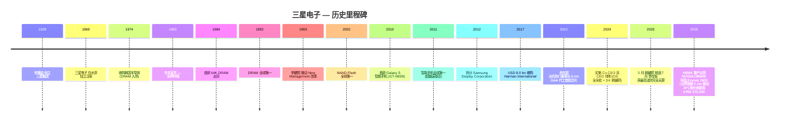
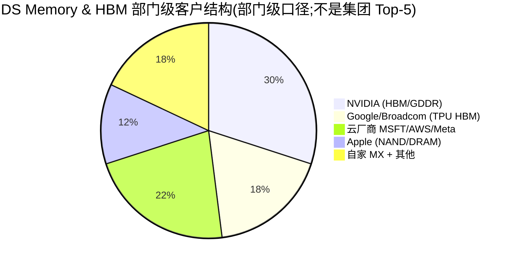
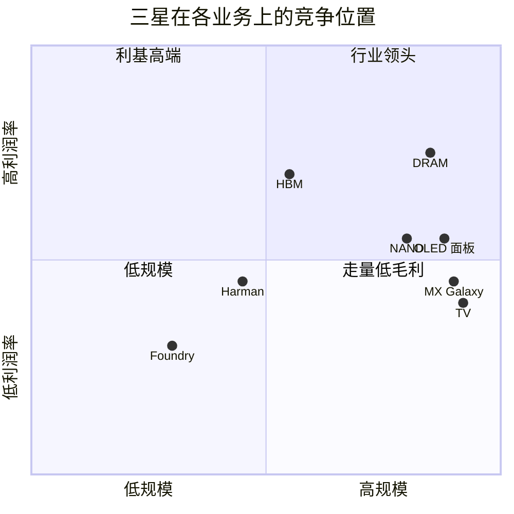
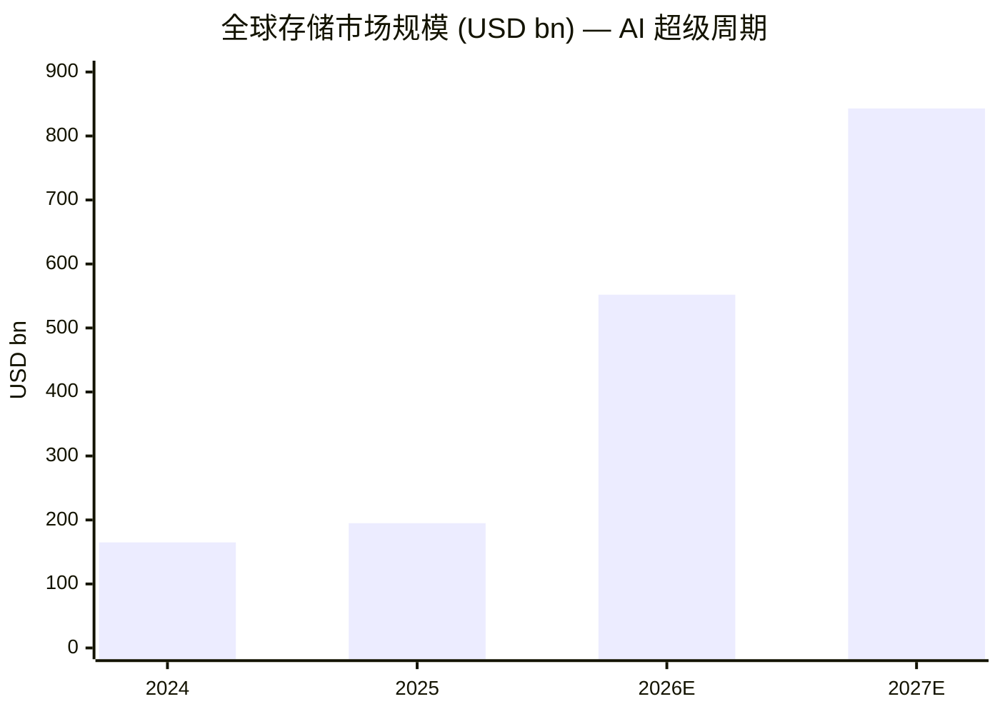

# 三星电子 Samsung Electronics Co., Ltd. (KRX:005930) — 公司研究(首次覆盖刷新)

**报告日期 / As of:** 2026-06-14
**股票代码:** KRX:005930(普通股 / common);KRX:005935(优先股 1P / preferred)
**总部:** 大韩民国京畿道水原市灵通区三星路 129 号
**报告语言:** 简体中文(同目录下另存有英文版 `Samsung_KRX005930_Research_Document.md`,本次刷新仅更新中文版)

> *分析师观点:* **评级:Buy / Overweight(买入 / 增持)· 12 个月目标价 KRW 430,000(较 2026-06-12 收盘 KRW 322,500 上行 +33%)· 估值方法:SOTP 分部加总,交叉验证以 FY2026E 前瞻 P/E**
> 市值 KRW 2,118 万亿(约 USD 1.40 万亿)· 52 周区间 KRW 56,900–370,000 · KRX:005930
>
> | 倍数 / Multiple(*分析师观点:* 前瞻列) | FY2025A | FY2026E | FY2027E |
> |---|---|---|---|
> | P/E(普通股) | ~47× | **~9–10×** | ~8–9× |
> | P/B | ~4.9× | ~3.9× | ~3.0× |
> | EV/EBITDA | ~12× | ~5× | ~4× |
>
> **相对表现(截至 2026-06-12,普通股 vs KOSPI ^KS11):** 1M +13.6% / 6M +198.2% / YTD +151.5% / **12M +451.6%**;同期 KOSPI 1M +3.6% / 6M +94.9% / YTD +88.5% / 12M +178.2%(相对超额 12M 约 **+273pp**)([yfinance 005930.KS / ^KS11, 2026-06-12](https://stockanalysis.com/quote/krx/005930/))。
>
> **核心论点(thesis pillars)——**(1)**AI 存储超级周期的最大纯度提升标的**:FY2026E DS Memory 在"售罄 + LTA 锁价"下贡献集团约 80% 营业利润,HBM4 已量产、2026 年 HBM bit 出货管理层指引"至少翻三倍";(2)**估值仍便宜**:FY2026E 前瞻 P/E 仅约 9–10×,显著低于台积电 ~20×,SOTP 隐含 ~KRW 448,000;(3)**纵向一体化期权**:存储 + 代工 + 面板 + 终端 + 净现金 KRW 100.6 万亿,是 SK 海力士不具备的内需平滑与逆周期投资能力;(4)**两个翻盘点正在兑现**——HBM 在 NVIDIA 钱包份额回升(Vera Rubin 高端 tier 独家传闻 + HBM4E 样品)、自动车规存储 2025 年以 40% 份额首超美光。**关键风险:** FY2026 若为周期峰值,归一化 EPS 下并不便宜;代工先进节点仍缺外部大客户。

> **业绩更新 — 2026 年 Q1 创纪录、6 月股价创新高 (2026-06-12):** 三星电子 Q1 2026 合并营收 **KRW 133.9 万亿** (+43% QoQ / +69% YoY),营业利润 **KRW 57.2 万亿**(+756% YoY)——均为单季历史最高;半导体 (DS) 部门贡献约 **94%** 的集团营业利润 ([三星电子 2026 年第一季度业绩公告 — Samsung Global Newsroom, 2026-04-30](https://news.samsung.com/global/samsung-electronics-announces-first-quarter-2026-results);[TradingKey: Q1 2026 芯片大涨, 2026-04-30](https://www.tradingkey.com/analysis/stocks/us-stocks/261841802-samsung-q1-earnings-chip-surge-mobile-decline-hbm-demand-capex-record-tradingkey))。**2026 年 6 月新增催化:**(a) 6 月 1 日因"首超美光成为全球最大车规存储供应商"(2025 年 40% 份额)+ 出货业界首批 12 层 HBM4E 样品(性能较 HBM4 提升 >20%),股价单日涨约 9.6% 至 KRW 347,500 创新高([TradingKey, 2026-06-01](https://www.tradingkey.com/analysis/stocks/more/261938072-samsung-skhynix-dram-mu-hbm4e-lg-tradingkey));(b) 6 月 2 日盘中市值约 **USD 1.54 万亿**、一度超越 Meta 与 Tesla 升至全球第 9 大公司([TradingKey, 2026-06-02](https://www.tradingkey.com/analysis/stocks/more/261940460-samsung-skhynix-dram-mu-meta-tradingkey));(c) Goldman Sachs 于 6 月 1 日上调 12 个月目标价至 KRW 450,000–480,000(维持 Buy,估值基准由 P/B 转向 P/E),并预测 Samsung + SK 海力士合计营业利润 2028 年突破 KRW 1,000 万亿([Seoul Economic Daily, 2026-06-01](https://en.sedaily.com/finance/2026/06/01/goldman-sachs-sees-samsung-sk-hynix-combined-operating))。

## 目录

1. 公司概览(含投资论点)
1A. 估值与目标价(前瞻模型 · PT 推导 · 牛/基/熊 · 卖方观点演变)
1B. GF Score 基本面评分卡(雷达图 + 五维 0–10 + 综合分)
2. 公司历史
3. 管理团队
4. 产品与服务
5. 客户与上市策略
6. 行业概览
7. 竞争格局
8. 市场机会 (TAM)
9. 风险评估
9.5. 核心分歧与催化剂
10. 投资者视角评分卡
数据来源清单 · 参考资料 · 校验日志

---

## 1. 公司概览

*分析师观点:* **本报告对三星电子给予 Buy / Overweight 评级,12 个月目标价 KRW 430,000(+33%)。** 投资逻辑很直接:三星已从"五大业务拼凑的综合电子集团"演变为**一个由 AI 存储周期主导、其余业务作为期权与缓冲垫的标的**。Q1 2026 半导体部门贡献了集团约 94% 的营业利润,这意味着对三星的判断 95% 等于对 DRAM/NAND/HBM 周期与三星 HBM 份额回升的判断。为什么是现在(why now):(1)存储进入"售罄 + 长期协议 (LTA) 锁价"的结构性上行,2026–2027 供需缺口由 AI 推理 token 消耗拉动;(2)三星的两个历史包袱——HBM 落后 SK 海力士、代工缺客户——前者正在 NVIDIA Vera Rubin 平台上实质性收窄(HBM4 量产 + HBM4E 样品),后者仍是缺口但 2nm 良率已达可用区间;(3)估值仍便宜,FY2026E 前瞻 P/E 仅约 9–10×。**风险对称性:** 若 FY2026 就是周期峰值,今天的低前瞻 P/E 在归一化 EPS 下其实是 12–14×,股票并不便宜——这是本报告把目标价定在卖方 450–480k 集群之下、而非追高至 Nomura 590k 的原因。

**三星电子 Samsung Electronics Co., Ltd.**(以下简称"公司"或"三星电子")是全球最大的存储半导体制造商、全球出货量第一的智能手机厂商、连续 20 年全球第一的电视机品牌,以及全球最大的 OLED 显示屏制造商——上述四项 **全部** 集中在同一家上市主体之内。公司成立于 1969 年,起家自三星集团与日本 Sanyo / NEC 合资生产黑白电视,现总部位于韩国水原。公司是韩国 *财阀 (chaebol)* 三星集团的核心:FY2025 合并营收 **KRW 333.6 万亿** (约 USD 230 bn),约相当于韩国名义 GDP 的 12–13%;公司普通股加优先股是 KOSPI 指数权重最大的单一构成 ([三星电子 2025 年第四季及全年业绩公告 — Samsung Global Newsroom, 2026-01-29](https://news.samsung.com/global/samsung-electronics-announces-fourth-quarter-and-fy-2025-results))。

**公司业务做什么?** 三星电子的运营架构分为两大主业务支柱外加两家并表子公司:

- **Device Solutions (DS,半导体业务) / 器件解决方案部门。** 涵盖 Memory(DRAM、NAND、HBM)、Foundry(逻辑芯片代工)、System LSI(自研 Exynos 应用处理器 / Application Processor、CMOS 图像传感器、5G 调制解调器、电源管理芯片 PMIC)。DS 是公司的周期性利润引擎。
- **Device eXperience (DX,设备体验) / 设备体验部门。** 涵盖 Mobile eXperience (MX,Galaxy 智能手机 / 平板 / 可穿戴 / PC)、Visual Display / Digital Appliances(VD/DA,电视机、冰箱、洗衣机、空调)、Networks(5G 基站设备)。
- **Samsung Display Corporation (SDC) / 三星显示。** 100% 控股子公司;全球最大的中小尺寸 OLED 面板制造商,也是苹果 iPhone 的单一最大 OLED 面板供应商。**FY2025 营收 KRW 29.8 万亿、营业利润 KRW 4.1 万亿** ([Samsung Q4 FY25 业绩公告, 2026-01-29](https://news.samsungsemiconductor.com/global/samsung-electronics-announces-fourth-quarter-and-fy-2025-results/))。
- **Harman International / 哈曼国际。** 2017 年以 USD 8.0 bn 收购 ([三星宣布收购 HARMAN, 2016-11-14](https://news.samsung.com/global/samsung-electronics-to-acquire-harman-accelerating-growth-in-automotive-and-connected-technologies));主业涵盖车载电子(智能座舱 / ADAS / 车联网)、高端音响品牌(JBL、Harman/Kardon、AKG、Mark Levinson)以及企业 / 专业音响。**FY2025 营收 KRW 15.8 万亿、营业利润 KRW 1.5 万亿——均为哈曼历史最高** ([DigiTimes, 2026-04-24](https://www.digitimes.com/news/a20260424PD230/samsung-harman-revenue-adas.html))。

**公司怎么赚钱?** 下面这张利润表 Sankey 把"营收从哪来、利润到哪去"一图说清——左侧四个分部贡献营收,经 COGS / 营业费用层层流向 FY2025 净利 KRW 44.3 万亿:

<svg xmlns="http://www.w3.org/2000/svg" viewBox="0 0 1000 560" width="1000" height="560" role="img" aria-label="income statement Sankey"><rect x="0" y="0" width="1000" height="560" fill="#ffffff"/>
<text x="20.00" y="30.00" text-anchor="start" font-family="Helvetica,Arial,sans-serif" font-size="15" font-weight="700" fill="#1f2933">三星电子 FY2025 利润表 (Income Statement Sankey) — KRW 万亿</text>
<path d="M 204.00,66.51 C 258.00,66.51 258.00,85.00 312.00,85.00 L 312.00,298.91 C 258.00,298.91 258.00,280.41 204.00,280.41 Z" fill="#93c5fd" fill-opacity="0.55"/>
<path d="M 452.00,78.00 C 506.00,78.00 506.00,191.10 560.00,191.10 L 560.00,244.42 C 506.00,244.42 506.00,131.32 452.00,131.32 Z" fill="#86efac" fill-opacity="0.55"/>
<path d="M 452.00,131.32 C 506.00,131.32 506.00,258.42 560.00,258.42 L 560.00,365.68 C 506.00,365.68 506.00,238.58 452.00,238.58 Z" fill="#fca5a5" fill-opacity="0.55"/>
<path d="M 328.00,85.00 C 382.00,85.00 382.00,78.00 436.00,78.00 L 436.00,238.71 C 382.00,238.71 382.00,245.71 328.00,245.71 Z" fill="#86efac" fill-opacity="0.55"/>
<path d="M 328.00,245.71 C 382.00,245.71 382.00,252.71 436.00,252.71 L 436.00,500.00 C 382.00,500.00 382.00,493.00 328.00,493.00 Z" fill="#fca5a5" fill-opacity="0.55"/>
<path d="M 576.00,191.10 C 630.00,191.10 630.00,191.10 684.00,191.10 L 684.00,244.42 C 630.00,244.42 630.00,244.42 576.00,244.42 Z" fill="#86efac" fill-opacity="0.55"/>
<path d="M 700.00,191.10 C 754.00,191.10 754.00,252.28 808.00,252.28 L 808.00,306.46 C 754.00,306.46 754.00,245.28 700.00,245.28 Z" fill="#86efac" fill-opacity="0.55"/>
<path d="M 700.00,245.28 C 754.00,245.28 754.00,320.46 808.00,320.46 L 808.00,325.72 C 754.00,325.72 754.00,250.54 700.00,250.54 Z" fill="#fca5a5" fill-opacity="0.55"/>
<path d="M 576.00,258.42 C 630.00,258.42 630.00,265.64 684.00,265.64 L 684.00,326.79 C 630.00,326.79 630.00,319.58 576.00,319.58 Z" fill="#fca5a5" fill-opacity="0.55"/>
<path d="M 576.00,319.58 C 630.00,319.58 630.00,340.79 684.00,340.79 L 684.00,386.90 C 630.00,386.90 630.00,365.68 576.00,365.68 Z" fill="#fca5a5" fill-opacity="0.55"/>
<path d="M 204.00,294.41 C 258.00,294.41 258.00,298.91 312.00,298.91 L 312.00,434.78 C 258.00,434.78 258.00,430.29 204.00,430.29 Z" fill="#93c5fd" fill-opacity="0.55"/>
<path d="M 576.00,379.68 C 630.00,379.68 630.00,244.42 684.00,244.42 L 684.00,251.64 C 630.00,251.64 630.00,386.90 576.00,386.90 Z" fill="#93c5fd" fill-opacity="0.55"/>
<path d="M 204.00,444.29 C 258.00,444.29 258.00,434.78 312.00,434.78 L 312.00,470.50 C 258.00,470.50 258.00,480.00 204.00,480.00 Z" fill="#93c5fd" fill-opacity="0.55"/>
<path d="M 204.00,494.00 C 258.00,494.00 258.00,470.50 312.00,470.50 L 312.00,487.99 C 258.00,487.99 258.00,511.49 204.00,511.49 Z" fill="#93c5fd" fill-opacity="0.55"/>
<rect x="188.00" y="66.51" width="16" height="213.91" rx="1.5" fill="#2563eb"/>
<rect x="188.00" y="294.41" width="16" height="135.88" rx="1.5" fill="#2563eb"/>
<rect x="188.00" y="444.29" width="16" height="35.71" rx="1.5" fill="#2563eb"/>
<rect x="188.00" y="494.00" width="16" height="17.49" rx="1.5" fill="#2563eb"/>
<rect x="312.00" y="85.00" width="16" height="408.00" rx="1.5" fill="#1e3a8a"/>
<rect x="436.00" y="78.00" width="16" height="160.71" rx="1.5" fill="#15803d"/>
<rect x="436.00" y="252.71" width="16" height="247.29" rx="1.5" fill="#dc2626"/>
<rect x="560.00" y="191.10" width="16" height="53.32" rx="1.5" fill="#15803d"/>
<rect x="560.00" y="258.42" width="16" height="107.26" rx="1.5" fill="#dc2626"/>
<rect x="560.00" y="379.68" width="16" height="7.22" rx="1.5" fill="#2563eb"/>
<rect x="684.00" y="191.10" width="16" height="60.54" rx="1.5" fill="#15803d"/>
<rect x="684.00" y="265.64" width="16" height="61.15" rx="1.5" fill="#dc2626"/>
<rect x="684.00" y="340.79" width="16" height="46.11" rx="1.5" fill="#dc2626"/>
<rect x="808.00" y="252.28" width="16" height="54.18" rx="1.5" fill="#15803d"/>
<rect x="808.00" y="320.46" width="16" height="5.26" rx="1.5" fill="#dc2626"/>
<line x1="188.00" y1="173.46" x2="182.00" y2="157.71" stroke="#cbd5e1" stroke-width="1"/>
<text x="179.00" y="160.71" text-anchor="end" font-family="Helvetica,Arial,sans-serif" font-size="11.5" font-weight="700" fill="#1f2933">DX 设备体验</text>
<text x="179.00" y="173.71" text-anchor="end" font-family="Helvetica,Arial,sans-serif" font-size="10" font-weight="400" fill="#52606d">₩tn175  (52.4%)</text>
<line x1="188.00" y1="362.35" x2="182.00" y2="346.60" stroke="#cbd5e1" stroke-width="1"/>
<text x="179.00" y="349.60" text-anchor="end" font-family="Helvetica,Arial,sans-serif" font-size="11.5" font-weight="700" fill="#1f2933">DS 半导体</text>
<text x="179.00" y="362.60" text-anchor="end" font-family="Helvetica,Arial,sans-serif" font-size="10" font-weight="400" fill="#52606d">₩tn111  (33.3%)</text>
<line x1="188.00" y1="462.15" x2="182.00" y2="446.40" stroke="#cbd5e1" stroke-width="1"/>
<text x="179.00" y="449.40" text-anchor="end" font-family="Helvetica,Arial,sans-serif" font-size="11.5" font-weight="700" fill="#1f2933">SDC 显示</text>
<text x="179.00" y="462.40" text-anchor="end" font-family="Helvetica,Arial,sans-serif" font-size="10" font-weight="400" fill="#52606d">₩tn29  (8.8%)</text>
<line x1="188.00" y1="502.75" x2="182.00" y2="487.00" stroke="#cbd5e1" stroke-width="1"/>
<text x="179.00" y="490.00" text-anchor="end" font-family="Helvetica,Arial,sans-serif" font-size="11.5" font-weight="700" fill="#1f2933">Harman</text>
<text x="179.00" y="503.00" text-anchor="end" font-family="Helvetica,Arial,sans-serif" font-size="10" font-weight="400" fill="#52606d">₩tn14  (4.3%)</text>
<rect x="331.00" y="67.00" width="106.80" height="26" rx="2" fill="#ffffff" fill-opacity="0.72"/>
<text x="334.00" y="79.00" text-anchor="start" font-family="Helvetica,Arial,sans-serif" font-size="11.5" font-weight="700" fill="#1f2933">Revenue</text>
<text x="334.00" y="92.00" text-anchor="start" font-family="Helvetica,Arial,sans-serif" font-size="10" font-weight="400" fill="#52606d">₩tn334  (100.0%)</text>
<rect x="455.00" y="60.00" width="100.50" height="26" rx="2" fill="#ffffff" fill-opacity="0.72"/>
<text x="458.00" y="72.00" text-anchor="start" font-family="Helvetica,Arial,sans-serif" font-size="11.5" font-weight="700" fill="#1f2933">Gross Profit</text>
<text x="458.00" y="85.00" text-anchor="start" font-family="Helvetica,Arial,sans-serif" font-size="10" font-weight="400" fill="#52606d">₩tn131  (39.4%)</text>
<rect x="455.00" y="234.71" width="144.60" height="26" rx="2" fill="#ffffff" fill-opacity="0.72"/>
<text x="458.00" y="246.71" text-anchor="start" font-family="Helvetica,Arial,sans-serif" font-size="11.5" font-weight="700" fill="#1f2933">Cost of Revenue (COGS)</text>
<text x="458.00" y="259.71" text-anchor="start" font-family="Helvetica,Arial,sans-serif" font-size="10" font-weight="400" fill="#52606d">₩tn202  (60.6%)</text>
<rect x="579.00" y="173.10" width="106.80" height="26" rx="2" fill="#ffffff" fill-opacity="0.72"/>
<text x="582.00" y="185.10" text-anchor="start" font-family="Helvetica,Arial,sans-serif" font-size="11.5" font-weight="700" fill="#1f2933">Operating Income</text>
<text x="582.00" y="198.10" text-anchor="start" font-family="Helvetica,Arial,sans-serif" font-size="10" font-weight="400" fill="#52606d">₩tn44  (13.1%)</text>
<rect x="579.00" y="240.42" width="150.90" height="26" rx="2" fill="#ffffff" fill-opacity="0.72"/>
<text x="582.00" y="252.42" text-anchor="start" font-family="Helvetica,Arial,sans-serif" font-size="11.5" font-weight="700" fill="#1f2933">Total Operating Expense</text>
<text x="582.00" y="265.42" text-anchor="start" font-family="Helvetica,Arial,sans-serif" font-size="10" font-weight="400" fill="#52606d">₩tn88  (26.3%)</text>
<text x="551.00" y="380.29" text-anchor="end" font-family="Helvetica,Arial,sans-serif" font-size="11.5" font-weight="700" fill="#1f2933">Net Interest / Other Income</text>
<text x="551.00" y="393.29" text-anchor="end" font-family="Helvetica,Arial,sans-serif" font-size="10" font-weight="400" fill="#52606d">₩tn6  (1.8%)</text>
<rect x="703.00" y="173.10" width="94.20" height="26" rx="2" fill="#ffffff" fill-opacity="0.72"/>
<text x="706.00" y="185.10" text-anchor="start" font-family="Helvetica,Arial,sans-serif" font-size="11.5" font-weight="700" fill="#1f2933">Pretax Income</text>
<text x="706.00" y="198.10" text-anchor="start" font-family="Helvetica,Arial,sans-serif" font-size="10" font-weight="400" fill="#52606d">₩tn50  (14.8%)</text>
<rect x="703.00" y="247.64" width="94.20" height="26" rx="2" fill="#ffffff" fill-opacity="0.72"/>
<text x="706.00" y="259.64" text-anchor="start" font-family="Helvetica,Arial,sans-serif" font-size="11.5" font-weight="700" fill="#1f2933">SG&amp;A</text>
<text x="706.00" y="272.64" text-anchor="start" font-family="Helvetica,Arial,sans-serif" font-size="10" font-weight="400" fill="#52606d">₩tn50  (15.0%)</text>
<rect x="703.00" y="322.79" width="94.20" height="26" rx="2" fill="#ffffff" fill-opacity="0.72"/>
<text x="706.00" y="334.79" text-anchor="start" font-family="Helvetica,Arial,sans-serif" font-size="11.5" font-weight="700" fill="#1f2933">R&amp;D</text>
<text x="706.00" y="347.79" text-anchor="start" font-family="Helvetica,Arial,sans-serif" font-size="10" font-weight="400" fill="#52606d">₩tn38  (11.3%)</text>
<text x="833.00" y="276.37" text-anchor="start" font-family="Helvetica,Arial,sans-serif" font-size="11.5" font-weight="700" fill="#1f2933">Net Income</text>
<text x="833.00" y="289.37" text-anchor="start" font-family="Helvetica,Arial,sans-serif" font-size="10" font-weight="400" fill="#52606d">₩tn44  (13.3%)</text>
<text x="833.00" y="320.09" text-anchor="start" font-family="Helvetica,Arial,sans-serif" font-size="11.5" font-weight="700" fill="#1f2933">Income Tax</text>
<text x="833.00" y="333.09" text-anchor="start" font-family="Helvetica,Arial,sans-serif" font-size="10" font-weight="400" fill="#52606d">₩tn4  (1.3%)</text>
<text x="500.00" y="530.00" text-anchor="middle" font-family="Helvetica,Arial,sans-serif" font-size="10" font-weight="400" font-style="italic" fill="#8a97a3">FY2025 合并: 营收 ₩333.6tn → 营业利润 ₩43.6tn → 净利 ₩44.3tn。左侧分部为 FY2024 披露口径(抵销前)。</text>
<text x="500.00" y="544.00" text-anchor="middle" font-family="Helvetica,Arial,sans-serif" font-size="10" font-weight="400" fill="#52606d">Source: Samsung FY2025 合并利润表 (stockanalysis.com / Samsung Q4'25 IR); 分部为 FY2024 사업보고서口径</text>
</svg>
*来源:[Samsung FY2025 合并利润表 (stockanalysis.com)](https://stockanalysis.com/quote/krx/005930/financials/) 与 [Samsung Q4'25 业绩公告](https://news.samsungsemiconductor.com/global/samsung-electronics-announces-fourth-quarter-and-fy-2025-results/);左侧分部为 FY2024 사업보고서 披露口径(抵销前毛额)。*

三星电子的利润高度由 DRAM / NAND 的价格周期主导。DS 营收随 bit 出货量与 ASP (平均销售价) 周期摆动:在"上行"存储年份(FY2021、FY2024 下半年、FY2025 下半年、FY2026),DS 单部门可贡献集团 >70% 营业利润(Q1'26 高达 ~94%);在"下行"年份(FY2023),DS 直接陷入营业亏损,全集团净利从 FY2022 的 KRW 55.7 万亿 暴跌至 **FY2023 的 KRW 14.5 万亿** ([stockanalysis.com 现金流量表](https://stockanalysis.com/quote/krx/005930/financials/cash-flow-statement/))。DX 是稳定器——Galaxy 手机一年卖约 2.35 亿部,营业利润率维持低到中段两位数;SDC 通过苹果 OLED 面板订单提供稳定现金流;Harman 是营收占比小但有汽车赛道增长期权的盈利单元。下面的历史营收柱状图清晰显示了 FY2023 的存储谷底与 FY2025 的历史新高:

<svg xmlns="http://www.w3.org/2000/svg" viewBox="0 0 860 470" width="860" height="470" role="img" aria-label="historical revenue bars"><rect x="0" y="0" width="860" height="470" fill="#ffffff"/>
<text x="20.00" y="30.00" text-anchor="start" font-family="Helvetica,Arial,sans-serif" font-size="15" font-weight="700" fill="#1f2933">三星电子 合并营收历史 (FY2021–FY2025) — KRW 万亿</text>
<rect x="20.00" y="44" width="11" height="11" rx="2" fill="#2563eb"/>
<text x="36.00" y="53.00" text-anchor="start" font-family="Helvetica,Arial,sans-serif" font-size="10.5" font-weight="400" fill="#1f2933">合并营收 Consolidated revenue</text>
<line x1="70" y1="412.00" x2="834" y2="412.00" stroke="#eceff2" stroke-width="1"/>
<text x="64.00" y="415.00" text-anchor="end" font-family="Helvetica,Arial,sans-serif" font-size="9.5" font-weight="400" fill="#52606d">₩tn0</text>
<line x1="70" y1="345.20" x2="834" y2="345.20" stroke="#eceff2" stroke-width="1"/>
<text x="64.00" y="348.20" text-anchor="end" font-family="Helvetica,Arial,sans-serif" font-size="9.5" font-weight="400" fill="#52606d">₩tn72</text>
<line x1="70" y1="278.40" x2="834" y2="278.40" stroke="#eceff2" stroke-width="1"/>
<text x="64.00" y="281.40" text-anchor="end" font-family="Helvetica,Arial,sans-serif" font-size="9.5" font-weight="400" fill="#52606d">₩tn144</text>
<line x1="70" y1="211.60" x2="834" y2="211.60" stroke="#eceff2" stroke-width="1"/>
<text x="64.00" y="214.60" text-anchor="end" font-family="Helvetica,Arial,sans-serif" font-size="9.5" font-weight="400" fill="#52606d">₩tn216</text>
<line x1="70" y1="144.80" x2="834" y2="144.80" stroke="#eceff2" stroke-width="1"/>
<text x="64.00" y="147.80" text-anchor="end" font-family="Helvetica,Arial,sans-serif" font-size="9.5" font-weight="400" fill="#52606d">₩tn288</text>
<line x1="70" y1="78.00" x2="834" y2="78.00" stroke="#eceff2" stroke-width="1"/>
<text x="64.00" y="81.00" text-anchor="end" font-family="Helvetica,Arial,sans-serif" font-size="9.5" font-weight="400" fill="#52606d">₩tn360</text>
<rect x="102.09" y="152.80" width="88.62" height="259.20" fill="#2563eb"/>
<text x="146.40" y="428.00" text-anchor="middle" font-family="Helvetica,Arial,sans-serif" font-size="10" font-weight="400" fill="#52606d">2021</text>
<rect x="254.89" y="131.85" width="88.62" height="280.15" fill="#2563eb"/>
<text x="299.20" y="428.00" text-anchor="middle" font-family="Helvetica,Arial,sans-serif" font-size="10" font-weight="400" fill="#52606d">2022</text>
<rect x="407.69" y="171.99" width="88.62" height="240.01" fill="#2563eb"/>
<text x="452.00" y="428.00" text-anchor="middle" font-family="Helvetica,Arial,sans-serif" font-size="10" font-weight="400" fill="#52606d">2023</text>
<rect x="560.49" y="133.05" width="88.62" height="278.95" fill="#2563eb"/>
<text x="604.80" y="428.00" text-anchor="middle" font-family="Helvetica,Arial,sans-serif" font-size="10" font-weight="400" fill="#52606d">2024</text>
<rect x="713.29" y="102.74" width="88.62" height="309.26" fill="#2563eb"/>
<text x="757.60" y="428.00" text-anchor="middle" font-family="Helvetica,Arial,sans-serif" font-size="10" font-weight="400" fill="#52606d">2025</text>
<text x="430.00" y="440.00" text-anchor="middle" font-family="Helvetica,Arial,sans-serif" font-size="10" font-weight="400" font-style="italic" fill="#8a97a3">FY2023 为存储下行谷底(营收 ₩258.9tn);FY2025 创历史新高 ₩333.6tn。</text>
<text x="430.00" y="454.00" text-anchor="middle" font-family="Helvetica,Arial,sans-serif" font-size="10" font-weight="400" fill="#52606d">Source: Samsung Electronics 年度业绩公告 FY2021–FY2025 (Samsung Global Newsroom / stockanalysis.com)</text>
</svg>
*来源:[Samsung Electronics 年度业绩公告 FY2021–FY2025 (Samsung Global Newsroom)](https://news.samsung.com/global/samsung-electronics-announces-fourth-quarter-and-fy-2025-results) 与 [stockanalysis.com](https://stockanalysis.com/quote/krx/005930/financials/)。*

**公司在哪运营?** 三星电子拥有一个高度整合的全球生产 / 研发足迹:存储 / 代工晶圆厂在韩国(平泽 Pyeongtaek、华城 Hwaseong、器兴 Giheung);新建的 Taylor, Texas 美国代工厂已被推迟至 2026 年下半年首批量产;先进封装在天安 Cheonan 与温阳 Onyang;智能手机最终组装的超级工厂在越南(北宁 Bac Ninh、太原 Thai Nguyen)以及印度(诺伊达 Noida);电视与家电生产线分布在越南、墨西哥、匈牙利、泰国。按销售目的地,美洲是最大单一区域市场:

<svg xmlns="http://www.w3.org/2000/svg" viewBox="0 0 720 460" width="720" height="460" role="img" aria-label="revenue donut"><rect x="0" y="0" width="720" height="460" fill="#ffffff"/>
<text x="20.00" y="30.00" text-anchor="start" font-family="Helvetica,Arial,sans-serif" font-size="15" font-weight="700" fill="#1f2933">三星电子 营收按地区 (FY2024, 按销售目的地份额)</text>
<path d="M 288.00,107.20 A 132 132 0 0 1 384.22,329.56 L 344.86,292.59 A 78 78 0 0 0 288.00,161.20 Z" fill="#2563eb"/>
<path d="M 384.22,329.56 A 132 132 0 0 1 263.27,368.86 L 273.38,315.82 A 78 78 0 0 0 344.86,292.59 Z" fill="#15803d"/>
<path d="M 263.27,368.86 A 132 132 0 0 1 168.56,295.40 L 217.42,272.41 A 78 78 0 0 0 273.38,315.82 Z" fill="#d97706"/>
<path d="M 168.56,295.40 A 132 132 0 0 1 168.56,183.00 L 217.42,205.99 A 78 78 0 0 0 217.42,272.41 Z" fill="#7c3aed"/>
<path d="M 168.56,183.00 A 132 132 0 0 1 288.00,107.20 L 288.00,161.20 A 78 78 0 0 0 217.42,205.99 Z" fill="#dc2626"/>
<text x="288.00" y="235.20" text-anchor="middle" font-family="Helvetica,Arial,sans-serif" font-size="18" font-weight="800" fill="#1f2933">Geo</text>
<text x="288.00" y="255.20" text-anchor="middle" font-family="Helvetica,Arial,sans-serif" font-size="13" font-weight="600" fill="#52606d">$100</text>
<text x="288.00" y="271.20" text-anchor="middle" font-family="Helvetica,Arial,sans-serif" font-size="10" font-weight="400" fill="#8a97a3">total</text>
<line x1="414.65" y1="184.39" x2="430.65" y2="184.39" stroke="#2563eb" stroke-width="1.4"/>
<text x="434.65" y="182.39" text-anchor="start" font-family="Helvetica,Arial,sans-serif" font-size="11" font-weight="700" fill="#1f2933">美洲 Americas (~37%)</text>
<text x="434.65" y="196.39" text-anchor="start" font-family="Helvetica,Arial,sans-serif" font-size="10" font-weight="400" fill="#52606d">$37  (37.0%)</text>
<line x1="330.64" y1="370.45" x2="346.64" y2="370.45" stroke="#15803d" stroke-width="1.4"/>
<text x="350.64" y="368.45" text-anchor="start" font-family="Helvetica,Arial,sans-serif" font-size="11" font-weight="700" fill="#1f2933">亚洲/非洲 Asia &amp; Africa (~16%)</text>
<text x="350.64" y="382.45" text-anchor="start" font-family="Helvetica,Arial,sans-serif" font-size="10" font-weight="400" fill="#52606d">$16  (16.0%)</text>
<line x1="203.42" y1="348.24" x2="187.42" y2="348.24" stroke="#d97706" stroke-width="1.4"/>
<text x="183.42" y="346.24" text-anchor="end" font-family="Helvetica,Arial,sans-serif" font-size="11" font-weight="700" fill="#1f2933">中国 China (~15%)</text>
<text x="183.42" y="360.24" text-anchor="end" font-family="Helvetica,Arial,sans-serif" font-size="10" font-weight="400" fill="#52606d">$15  (15.0%)</text>
<line x1="150.00" y1="239.20" x2="134.00" y2="239.20" stroke="#7c3aed" stroke-width="1.4"/>
<text x="130.00" y="237.20" text-anchor="end" font-family="Helvetica,Arial,sans-serif" font-size="11" font-weight="700" fill="#1f2933">韩国 Korea (~14%)</text>
<text x="130.00" y="251.20" text-anchor="end" font-family="Helvetica,Arial,sans-serif" font-size="10" font-weight="400" fill="#52606d">$14  (14.0%)</text>
<line x1="214.06" y1="122.68" x2="198.06" y2="122.68" stroke="#dc2626" stroke-width="1.4"/>
<text x="194.06" y="120.68" text-anchor="end" font-family="Helvetica,Arial,sans-serif" font-size="11" font-weight="700" fill="#1f2933">欧洲 Europe (~18%)</text>
<text x="194.06" y="134.68" text-anchor="end" font-family="Helvetica,Arial,sans-serif" font-size="10" font-weight="400" fill="#52606d">$18  (18.0%)</text>
<text x="360.00" y="430.00" text-anchor="middle" font-family="Helvetica,Arial,sans-serif" font-size="10" font-weight="400" font-style="italic" fill="#8a97a3">份额口径(% of FY2024 ₩300.9tn);美洲为最大单一区域市场。</text>
<text x="360.00" y="444.00" text-anchor="middle" font-family="Helvetica,Arial,sans-serif" font-size="10" font-weight="400" fill="#52606d">Source: Samsung Electronics FY2024 地区营收份额(Statista/Samsung IR 区域披露,近似%,合计≈100%)</text>
</svg>
*来源:[Samsung Electronics FY2024 사업보고서 / 2024 Business Report 地区营收披露](https://images.samsung.com/is/content/samsung/assets/global/ir/docs/2024_4Q_Interim_Report.pdf)(份额为近似 % 口径)。*

2024 年披露:全球约 26.7 万名员工中,**12.5 万人** 在韩国本土,**2.51 万人** 在北美([三星电子员工分布国家披露 PDF](https://www.samsung.com/global/sustainability/policy-file/AZA5bnDqHM8ALYNu/Samsung_Electronics_The_number_of_employees_en.pdf))。

**公司体量?** FY2025 营收 KRW 333.6 万亿(约 USD 230 bn);FY2025 营业利润 KRW 43.6 万亿(约 USD 30 bn);FY2025 资本开支 (CapEx) **KRW 47.5 万亿**,经营现金流 (CFO) **KRW 85.3 万亿**,自由现金流 (FCF) **KRW 37.8 万亿** ([stockanalysis.com 现金流量表](https://stockanalysis.com/quote/krx/005930/financials/cash-flow-statement/))。母公司层面员工数截至 2026 年约 12.89 万([Stockanalysis.com](https://stockanalysis.com/quote/krx/005930/))。

**估值快照 (截至 2026-06-12):**

| 指标 | 数值 | 来源 |
|---|---|---|
| 股价(普通股 005930) | **KRW 322,500** | [yfinance 005930.KS, 2026-06-12](https://stockanalysis.com/quote/krx/005930/) |
| 52 周区间 | KRW 56,900 – 370,000 | 同上 |
| 市值(普通股+优先股) | **KRW 2,118 万亿** (约 USD 1.40 万亿,USD/KRW≈1,518) | 同上 |
| 优先股(005935) | KRW 207,000 | [yfinance 005935.KS, 2026-06-12](https://stockanalysis.com/quote/krx/005935/) |
| 过去 12 个月股价涨幅 | **+451.6%**(vs KOSPI +178.2%) | yfinance 005930.KS / ^KS11 |
| TTM P/E(基于 FY2025 EPS) | ~47× | 由 NI KRW 44.3 万亿 / ~6.45bn 股推算 |
| **FY2026E 前瞻市盈率** | **~9–10×** | 详见 §1A 前瞻模型 |
| 同业前瞻 PE(对照) | SK 海力士 ~7×,美光 ~8×,台积电 ~20× | [Nomura via TradingKey, 2026-05](https://www.tradingkey.com/analysis/stocks/us-stocks/261908464-nomura-samsung-skhynix-dram-tradingkey) |

**对估值倍数的解读。** 三星 TTM P/E 看起来高达 ~47×,但这是 FY2025 仍是周期"复苏年"(净利 KRW 44.3 万亿、尚未到峰值)造成的失真;真正决定股价的是 **FY2026E 前瞻 P/E ~9–10×**——绝对值看历史性偏低,与存储周期定价高度一致:市场把 FY2026E 的利润视为周期 *峰值附近*,并向"中周期归一化 EPS"折现。两个对照锚点:**(a)** 台积电 ~20× 前瞻 P/E,是"代工垄断溢价",三星短期难追,除非 2-nm 节点跑出可量产良率并赢得外部大客户;**(b)** SK 海力士前瞻 P/E 已于 2026 年 5 月**历史上首次**短暂高于三星,反映市场给"纯 HBM 标的"(HBM purity)更高溢价 ([Seoul Economic Daily, 2026-05-13](https://en.sedaily.com/finance/2026/05/13/sk-hynix-overtakes-samsung-electronics-in-valuation-for))。**关键结论——三星的"公允估值"没有任何脱离 DRAM/NAND/HBM 周期的独立答案;估值结论 = 周期判断。** Nomura 的多方观点是估值差距过大,三星倍数"应向台积电收敛";Bernstein 的谨慎观点则是若 FY2026 是峰值则股票并不便宜——两端都成立,差别在你对周期长度的判断。

---

## 1A. 估值与目标价(决策层)

> *分析师观点:* 本章全部为分析师前瞻判断——每一个预测数字、目标价与情景目标价均标注 *分析师观点:* 且 **绝不附带任何财报引用**(10-K / 사업보고서 中不含目标价)。预测所依据的外部输入(分部数据、管理层指引、行业预测)在段内单独引用。

### (a) 前瞻财务模型(三年)

三星是典型的多分部周期股,blended 顶线会掩盖分部分化,因此按分部建模再加总。下表的口径说明:FY2026E 是 AI 存储超级周期的利润放大年,DS 在"售罄 + LTA"下营业利润率大幅扩张;FY2027E 假设存储在 TrendForce 预测的 2027 峰值附近、HBM4E 放量但传统 DRAM ASP 接近顶部。

| 指标(*分析师观点:*) | FY2024A | FY2025A | FY2026E | FY2027E | CAGR(25→27) |
|---|---|---|---|---|---|
| 合并营收 (KRW 万亿) | 300.9 | 333.6 | **~470** | **~540** | +27% |
| — YoY % | — | +11% | +41% | +15% | |
| gross margin (毛利率) % | 38.0% | 39.4% | ~48% | ~50% | |
| operating margin (营业利润率) % | 10.9% | 13.1% | **~38%** | ~40% | |
| 营业利润 (KRW 万亿) | 32.7 | 43.6 | **~180** | **~215** | |
| net margin (净利率) % | 11.2% | 13.3% | ~32% | ~33% | |
| EPS(普通股,KRW) | ~5,200 | ~6,860 | **~33,000–37,000** | ~40,000 | |
| ROE % | 8.9% | 10.5% | ~30%+ | ~30% | |
| FCF (KRW 万亿) | ~负 | 37.8 | ~60–80 | ~70 | |
| 净现金 (KRW 万亿) | ~79 | **100.6** | ~120 | ~150 | |

各预测的外部输入与引用:FY2026E 营业利润放大,锚定于 Q1'26 单季已达 KRW 57.2 万亿(年化口径远超 FY2025 全年)([Samsung Q1'26 业绩公告](https://news.samsung.com/global/samsung-electronics-announces-first-quarter-2026-results))+ 管理层"2026 HBM bit 至少翻三倍"指引 + TrendForce DRAM 2026 营收 +144% YoY 的行业预测 ([TrendForce, 2026-01-22](https://www.trendforce.com/presscenter/news/20260122-12893.html));FY2025 实际数(营收 333.6、OP 43.6、NI 44.3、CFO 85.3、FCF 37.8、净现金 100.6)全部取自 [Samsung FY2025 合并财报](https://stockanalysis.com/quote/krx/005930/financials/)。**口径警示:本模型 FY2026E 营业利润 ~KRW 180 万亿 仍显著低于某些卖方对"行业全年"的乐观折算;Goldman 6 月 1 日笔记中流传的 Samsung 单年 OP 数百万亿韩元口径,经核与 Samsung 实际报表(FY2025 全集团 OP 仅 43.6 万亿、Q1'26 单季 57.2 万亿)不符,本报告不采用该口径,仅采纳 GS 的目标价与"2028 两家合计 OP >1,000 万亿"的定性判断。**

**毛利率桥(margin bridge,FY2025 → FY2026E,*分析师观点:*):** 营业利润率 +25pp ≈ DS Memory ASP 暴涨(DRAM 合约价 Q1'26 +90–95% QoQ,[TrendForce, 2026-02-02](https://www.trendforce.com/presscenter/news/20260202-12911.html))贡献 +30pp · HBM mix 上升 +5pp · 抵消项为 DX/家电利润率下滑约 −5pp(MX Q1'26 营收同比降近 40%,[TradingKey, 2026-04-30](https://www.tradingkey.com/analysis/stocks/us-stocks/261841802-samsung-q1-earnings-chip-surge-mobile-decline-hbm-demand-capex-record-tradingkey))与 Foundry 持续亏损 −5pp。

### (b) 目标价推导——SOTP 分部加总(显示算术)

三星是多分部企业,单一倍数无法捕捉"AI 存储皇冠 + 长尾业务 + 巨额净现金"的结构,故主用 **SOTP (Sum-Of-The-Parts)**,再以前瞻 P/E 交叉验证。

| 分部(*分析师观点:*) | 估值方法 | 分部 EV (KRW 万亿) | 占比 |
|---|---|---|---|
| DS Memory / HBM | FY2026E 营业利润 × 周期峰值折让倍数 | **1,850** | 66% |
| DS Foundry + System LSI | 重置价值 / 收入倍数(缺客户折让) | 180 | 6% |
| Samsung Display (SDC) | FY2025 OP KRW 4.1 万亿 × ~6× + IT/车载 OLED 期权 | 260 | 9% |
| MX Mobile | FY2025 OP × 个位数倍数 | 300 | 11% |
| VD/DA 家电 | 收入倍数(低毛利) | 110 | 4% |
| Harman + Networks | FY2025 OP KRW 1.5 万亿 × ~6× + 5G 战略价值 | 90 | 3% |
| **营运 EV 合计** | | **2,790** | |
| + 净现金 | | **100.6** | |
| **= 股权价值** | | **~2,891** | |
| **÷ ~6.45bn 股 = 每股** | | **~KRW 448,000** | |

SOTP 隐含 ~KRW 448,000。本报告 **目标价取 KRW 430,000**(对 SOTP 做约 4% 折让,扣减代工执行风险与周期峰值不确定性),较 KRW 322,500 上行 +33%。**交叉验证:** KRW 430,000 ÷ FY2026E EPS ~KRW 35,000 ≈ **12.3× 前瞻 P/E**——仍显著低于台积电 ~20×,但高于今天 spot 的 ~9–10×,即"周期峰值 + 估值小幅修复"的组合,而非追逐归一化峰值。

**为什么用 SOTP + 12× 而非更高?** 对照台积电 ~20× 前瞻 P/E([Nomura via TradingKey](https://www.tradingkey.com/analysis/stocks/us-stocks/261908464-nomura-samsung-skhynix-dram-tradingkey)):三星 DS 缺少台积电那种"领先节点垄断"的可见度,Foundry 拖累整体倍数,周期股属性要求对峰值利润打折;但其 100.6 万亿净现金 + HBM 份额回升期权,又支持其高于纯下行存储股的倍数。12× 是介于两者之间的折中。

下面的五步 DuPont 分解显示 FY2025 的 ROE ~10.5% 由"净利率 × 资产周转 × 杠杆"构成——三星的杠杆极低(资产/权益 ~1.3×),ROE 主要靠净利率驱动,这意味着 FY2026 利润放大时 ROE 会随净利率非线性跳升(Morgan Stanley 指其相对历史峰值 ROE 高出 5 倍):

<svg xmlns="http://www.w3.org/2000/svg" viewBox="0 0 1240 540" width="1240" height="540" role="img" aria-label="DuPont ROE decomposition"><rect x="0" y="0" width="1240" height="540" fill="#ffffff"/>
<text x="20.00" y="30.00" text-anchor="start" font-family="Helvetica,Arial,sans-serif" font-size="15" font-weight="700" fill="#1f2933">三星电子 FY2025 五步 DuPont ROE 分解</text>
<rect x="545.00" y="56.00" width="150" height="56" rx="7" fill="#1e3a8a"/>
<text x="620.00" y="76.00" text-anchor="middle" font-family="Helvetica,Arial,sans-serif" font-size="11.5" font-weight="700" fill="#ffffff">ROE</text>
<text x="620.00" y="94.00" text-anchor="middle" font-family="Helvetica,Arial,sans-serif" font-size="13" font-weight="800" fill="#ffffff">10.57%</text>
<text x="620.00" y="106.00" text-anchor="middle" font-family="Helvetica,Arial,sans-serif" font-size="8.5" font-weight="400" fill="#dbeafe">= Net Income / Avg Equity</text>
<rect x="191.60" y="168.00" width="150" height="56" rx="7" fill="#2563eb"/>
<text x="266.60" y="188.00" text-anchor="middle" font-family="Helvetica,Arial,sans-serif" font-size="11.5" font-weight="700" fill="#ffffff">Net Margin</text>
<text x="266.60" y="206.00" text-anchor="middle" font-family="Helvetica,Arial,sans-serif" font-size="13" font-weight="800" fill="#ffffff">13.28%</text>
<text x="266.60" y="218.00" text-anchor="middle" font-family="Helvetica,Arial,sans-serif" font-size="8.5" font-weight="400" fill="#dbeafe">Net Income / Revenue</text>
<line x1="620.00" y1="112.00" x2="266.60" y2="168.00" stroke="#94a3b8" stroke-width="1.4"/>
<rect x="545.00" y="168.00" width="150" height="56" rx="7" fill="#2563eb"/>
<text x="620.00" y="188.00" text-anchor="middle" font-family="Helvetica,Arial,sans-serif" font-size="11.5" font-weight="700" fill="#ffffff">Asset Turnover</text>
<text x="620.00" y="206.00" text-anchor="middle" font-family="Helvetica,Arial,sans-serif" font-size="13" font-weight="800" fill="#ffffff">0.62</text>
<text x="620.00" y="218.00" text-anchor="middle" font-family="Helvetica,Arial,sans-serif" font-size="8.5" font-weight="400" fill="#dbeafe">Revenue / Avg Assets</text>
<line x1="620.00" y1="112.00" x2="620.00" y2="168.00" stroke="#94a3b8" stroke-width="1.4"/>
<rect x="898.40" y="168.00" width="150" height="56" rx="7" fill="#2563eb"/>
<text x="973.40" y="188.00" text-anchor="middle" font-family="Helvetica,Arial,sans-serif" font-size="11.5" font-weight="700" fill="#ffffff">Equity Multiplier</text>
<text x="973.40" y="206.00" text-anchor="middle" font-family="Helvetica,Arial,sans-serif" font-size="13" font-weight="800" fill="#ffffff">1.29</text>
<text x="973.40" y="218.00" text-anchor="middle" font-family="Helvetica,Arial,sans-serif" font-size="8.5" font-weight="400" fill="#dbeafe">Avg Assets / Avg Equity</text>
<line x1="620.00" y1="112.00" x2="973.40" y2="168.00" stroke="#94a3b8" stroke-width="1.4"/>
<circle cx="443.30" cy="196.00" r="11" fill="#ffffff" stroke="#94a3b8" stroke-width="1.2"/>
<text x="443.30" y="201.00" text-anchor="middle" font-family="Helvetica,Arial,sans-serif" font-size="14" font-weight="800" fill="#52606d">×</text>
<circle cx="796.70" cy="196.00" r="11" fill="#ffffff" stroke="#94a3b8" stroke-width="1.2"/>
<text x="796.70" y="201.00" text-anchor="middle" font-family="Helvetica,Arial,sans-serif" font-size="14" font-weight="800" fill="#52606d">×</text>
<rect x="65.00" y="300.00" width="118" height="56" rx="7" fill="#2563eb"/>
<text x="124.00" y="320.00" text-anchor="middle" font-family="Helvetica,Arial,sans-serif" font-size="11.5" font-weight="700" fill="#ffffff">Operating Margin</text>
<text x="124.00" y="338.00" text-anchor="middle" font-family="Helvetica,Arial,sans-serif" font-size="13" font-weight="800" fill="#ffffff">13.07%</text>
<text x="124.00" y="350.00" text-anchor="middle" font-family="Helvetica,Arial,sans-serif" font-size="8.5" font-weight="400" fill="#dbeafe">Op Inc / Revenue</text>
<line x1="266.60" y1="224.00" x2="124.00" y2="300.00" stroke="#94a3b8" stroke-width="1.4"/>
<rect x="207.60" y="300.00" width="118" height="56" rx="7" fill="#2563eb"/>
<text x="266.60" y="320.00" text-anchor="middle" font-family="Helvetica,Arial,sans-serif" font-size="11.5" font-weight="700" fill="#ffffff">Tax Burden</text>
<text x="266.60" y="338.00" text-anchor="middle" font-family="Helvetica,Arial,sans-serif" font-size="13" font-weight="800" fill="#ffffff">0.8949</text>
<text x="266.60" y="350.00" text-anchor="middle" font-family="Helvetica,Arial,sans-serif" font-size="8.5" font-weight="400" fill="#dbeafe">Net Inc / Pretax</text>
<line x1="266.60" y1="224.00" x2="266.60" y2="300.00" stroke="#94a3b8" stroke-width="1.4"/>
<rect x="350.20" y="300.00" width="118" height="56" rx="7" fill="#2563eb"/>
<text x="409.20" y="320.00" text-anchor="middle" font-family="Helvetica,Arial,sans-serif" font-size="11.5" font-weight="700" fill="#ffffff">Interest Burden</text>
<text x="409.20" y="338.00" text-anchor="middle" font-family="Helvetica,Arial,sans-serif" font-size="13" font-weight="800" fill="#ffffff">1.1353</text>
<text x="409.20" y="350.00" text-anchor="middle" font-family="Helvetica,Arial,sans-serif" font-size="8.5" font-weight="400" fill="#dbeafe">Pretax / Op Inc</text>
<line x1="266.60" y1="224.00" x2="409.20" y2="300.00" stroke="#94a3b8" stroke-width="1.4"/>
<circle cx="195.30" cy="328.00" r="11" fill="#ffffff" stroke="#94a3b8" stroke-width="1.2"/>
<text x="195.30" y="333.00" text-anchor="middle" font-family="Helvetica,Arial,sans-serif" font-size="14" font-weight="800" fill="#52606d">×</text>
<circle cx="337.90" cy="328.00" r="11" fill="#ffffff" stroke="#94a3b8" stroke-width="1.2"/>
<text x="337.90" y="333.00" text-anchor="middle" font-family="Helvetica,Arial,sans-serif" font-size="14" font-weight="800" fill="#52606d">×</text>
<rect x="479.00" y="300.00" width="118" height="56" rx="7" fill="#2563eb"/>
<text x="538.00" y="326.00" text-anchor="middle" font-family="Helvetica,Arial,sans-serif" font-size="11.5" font-weight="700" fill="#ffffff">Revenue</text>
<text x="538.00" y="342.00" text-anchor="middle" font-family="Helvetica,Arial,sans-serif" font-size="13" font-weight="800" fill="#ffffff">₩tn334</text>
<line x1="620.00" y1="224.00" x2="538.00" y2="300.00" stroke="#94a3b8" stroke-width="1.4"/>
<rect x="643.00" y="300.00" width="118" height="56" rx="7" fill="#2563eb"/>
<text x="702.00" y="320.00" text-anchor="middle" font-family="Helvetica,Arial,sans-serif" font-size="11.5" font-weight="700" fill="#ffffff">Avg Total Assets</text>
<text x="702.00" y="338.00" text-anchor="middle" font-family="Helvetica,Arial,sans-serif" font-size="13" font-weight="800" fill="#ffffff">₩tn541</text>
<text x="702.00" y="350.00" text-anchor="middle" font-family="Helvetica,Arial,sans-serif" font-size="8.5" font-weight="400" fill="#dbeafe">(begin+end)/2</text>
<line x1="620.00" y1="224.00" x2="702.00" y2="300.00" stroke="#94a3b8" stroke-width="1.4"/>
<circle cx="620.00" cy="328.00" r="11" fill="#ffffff" stroke="#94a3b8" stroke-width="1.2"/>
<text x="620.00" y="333.00" text-anchor="middle" font-family="Helvetica,Arial,sans-serif" font-size="14" font-weight="800" fill="#52606d">÷</text>
<rect x="832.40" y="300.00" width="118" height="56" rx="7" fill="#2563eb"/>
<text x="891.40" y="320.00" text-anchor="middle" font-family="Helvetica,Arial,sans-serif" font-size="11.5" font-weight="700" fill="#ffffff">Avg Total Assets</text>
<text x="891.40" y="338.00" text-anchor="middle" font-family="Helvetica,Arial,sans-serif" font-size="13" font-weight="800" fill="#ffffff">₩tn541</text>
<text x="891.40" y="350.00" text-anchor="middle" font-family="Helvetica,Arial,sans-serif" font-size="8.5" font-weight="400" fill="#dbeafe">(begin+end)/2</text>
<line x1="973.40" y1="224.00" x2="891.40" y2="300.00" stroke="#94a3b8" stroke-width="1.4"/>
<rect x="996.40" y="300.00" width="118" height="56" rx="7" fill="#2563eb"/>
<text x="1055.40" y="320.00" text-anchor="middle" font-family="Helvetica,Arial,sans-serif" font-size="11.5" font-weight="700" fill="#ffffff">Avg Total Equity</text>
<text x="1055.40" y="338.00" text-anchor="middle" font-family="Helvetica,Arial,sans-serif" font-size="13" font-weight="800" fill="#ffffff">₩tn419</text>
<text x="1055.40" y="350.00" text-anchor="middle" font-family="Helvetica,Arial,sans-serif" font-size="8.5" font-weight="400" fill="#dbeafe">(begin+end)/2</text>
<line x1="973.40" y1="224.00" x2="1055.40" y2="300.00" stroke="#94a3b8" stroke-width="1.4"/>
<circle cx="967.20" cy="328.00" r="11" fill="#ffffff" stroke="#94a3b8" stroke-width="1.2"/>
<text x="967.20" y="333.00" text-anchor="middle" font-family="Helvetica,Arial,sans-serif" font-size="14" font-weight="800" fill="#52606d">÷</text>
<rect x="69.00" y="420.00" width="110" height="48" rx="7" fill="#3b82f6"/>
<text x="124.00" y="442.00" text-anchor="middle" font-family="Helvetica,Arial,sans-serif" font-size="11.5" font-weight="700" fill="#ffffff">Operating Income</text>
<text x="124.00" y="458.00" text-anchor="middle" font-family="Helvetica,Arial,sans-serif" font-size="13" font-weight="800" fill="#ffffff">₩tn44</text>
<line x1="124.00" y1="356.00" x2="124.00" y2="420.00" stroke="#94a3b8" stroke-width="1.4"/>
<rect x="211.60" y="420.00" width="110" height="48" rx="7" fill="#3b82f6"/>
<text x="266.60" y="442.00" text-anchor="middle" font-family="Helvetica,Arial,sans-serif" font-size="11.5" font-weight="700" fill="#ffffff">Net Income</text>
<text x="266.60" y="458.00" text-anchor="middle" font-family="Helvetica,Arial,sans-serif" font-size="13" font-weight="800" fill="#ffffff">₩tn44</text>
<line x1="266.60" y1="356.00" x2="266.60" y2="420.00" stroke="#94a3b8" stroke-width="1.4"/>
<rect x="354.20" y="420.00" width="110" height="48" rx="7" fill="#3b82f6"/>
<text x="409.20" y="442.00" text-anchor="middle" font-family="Helvetica,Arial,sans-serif" font-size="11.5" font-weight="700" fill="#ffffff">Pretax Income</text>
<text x="409.20" y="458.00" text-anchor="middle" font-family="Helvetica,Arial,sans-serif" font-size="13" font-weight="800" fill="#ffffff">₩tn50</text>
<line x1="409.20" y1="356.00" x2="409.20" y2="420.00" stroke="#94a3b8" stroke-width="1.4"/>
<text x="620.00" y="524.00" text-anchor="middle" font-family="Helvetica,Arial,sans-serif" font-size="10" font-weight="400" fill="#52606d">Source: Samsung FY2025 合并财报 (stockanalysis.com / Samsung Q4'25 IR);期初=FY2024期末</text>
</svg>
*来源:[Samsung FY2025 合并财报 (stockanalysis.com)](https://stockanalysis.com/quote/krx/005930/financials/);期初余额为 FY2024 期末(总资产 KRW 514.5 万亿 / 权益 KRW 402.2 万亿)。*

### (c) 牛 / 基 / 熊 三情景目标价

| 情景(*分析师观点:*) | 关键摆动假设 | 目标价 | 较 spot |
|---|---|---|---|
| 牛 Bull | HBM 份额在 NVIDIA Rubin 上追平 SK 海力士、2nm 赢得外部大客户、周期延至 2028 | **KRW 560,000** | **+74%** |
| 基 Base | DS 在售罄+LTA 下放量,HBM4E 顺利,12× FY2026E EPS,SOTP 折让 4% | **KRW 430,000** | **+33%** |
| 熊 Bear | FY2026 即峰值、2027 ASP 回调、HBM4E 延误、SDC 苹果份额下滑,杀至归一化 EPS 8× | **KRW 225,000** | **−30%** |

熊市目标价 KRW 225,000 与 Bernstein 的 Outperform PT 完全一致(见下文卖方观点演变)——这并非巧合,而是反映了"若周期峰值叙事破裂"的合理下限。风险回报在当前 spot 大致对称偏正:上行 +33%(基)到 +74%(牛),下行 −30%(熊)。

### (d) 与市场一致预期 / 卖方的对比

本报告基本情形 KRW 430,000 **位于卖方主流集群(450–480k)略下方、高于谨慎派**,反映对周期峰值的审慎。下表为本地 `db/zsxq.db` 机构研究的截面(全部 *分析师观点:*):

| 机构 | 日期 | 评级 / 目标价 | 较报告日 spot 上行 | 估值基准 / 核心论点 |
|---|---|---|---|---|
| Nomura | 2026-05-16 | Buy / **KRW 590,000** | +118%(@270.5k) | "真正的 AI 繁荣已至";未来 5 年存储需求或增数千倍,供给仅增 5–6× |
| J.P. Morgan | 2026-05-21 | Overweight / **KRW 480,000** | +60%(@299.5k) | 罢工阴霾消散;HBM4 放量 + LTA + AI 服务器 CPU 需求 |
| Goldman Sachs | 2026-06-01 | Buy / **KRW 450,000–480,000** | — | 估值基准转向 P/E;供给紧缺持续到 2028;2026 产能售罄 |
| Citi | 2026-05-20 | Buy / **KRW 460,000** | +67%(@276k) | 2027 缺口加剧;新版 LTA 含客户财务约束条款,降低周期波动 |
| HSBC | 2026-06-02 | Buy / **KRW 450,000** | +29%(@349k) | Agentic AI 引爆韩国存储上行,三星为首选 |
| Morgan Stanley | 2026-04-30 | Overweight(Top Pick)/ **KRW 362,000** | +60%(@226k) | "Stronger For Longer";剩余收益模型,股权成本 11.5% / 永续 3%,对应 2027E P/B ~2× |
| Bernstein | 2026-05-19 | Outperform / **KRW 225,000** | −18%(@275.5k) | HBM 增长强劲但 HBM4 尚未放量;谨慎的份额回升节奏假设 |

### (e) 关键摆动变量

整个 Buy 评级最该被压力测试的两个假设:**(1) 三星在 NVIDIA HBM 钱包中的份额回升斜率**——Vera Rubin 高端 tier 独家传闻若坐实,牛市情景成立;若 SK 海力士守住 Blackwell+Rubin 双代领先,则三星仍是"次级供应商 + 折价"。**(2) 存储周期长度**——若 AI 推理需求的结构性强度(Nomura 的"需求乘积关系")使本轮延至 2028,则今天 9–10× 前瞻 P/E 极便宜;若 2027 即见顶回调,则归一化 EPS 下并不便宜。

### 卖方观点演变(Sell-side view evolution)

> 机械预处理:本节先以只读方式查询 `db/stock_price_target.db`(KRX:005930 共 27 行 PT 记录),再交叉本地 zsxq PDF。PT 离散度极大——**最低 Bernstein KRW 225,000,最高 Nomura KRW 590,000,价差 ~2.6×**,中位数约 KRW 360,000;这种分歧本身就是"周期峰值判断"分歧的镜像,不能 blend 成虚假一致预期。

**按机构的观点时间线(自我修正 + 触发因素):**

- **J.P. Morgan(连续上调,最显眼的多头修正):** 2026-03-19 OW/PT KRW 240,000 → 2026-03-22 PT **300,000** → 2026-05-05 PT **350,000** → 2026-05-21 PT **480,000**(*分析师观点:* 触发为劳资和解 + HBM4 放量预期,[J.P. Morgan — 三星电子终局性和解, 2026-05-21, p.1](http://xs-macbook-air.local:5001/zsxq/pdf/415242121142548/J.P.%20Morgan-Samsung%20Electronics%EF%BC%88005930.KS%EF%BC%89Dramatic%20settlement%20at%20the%20end%EF%BC%8C%20labor%20strike%20overhang%20largely%20behind%EF%BC%9B%20accumulate-260521.pdf))。两个月内 PT 翻倍,是本截面中最激进的上调路径。
- **Goldman Sachs(稳步上调):** 2026-03-04 PT KRW 205,000 → 2026-03-11 **260,000** → 2026-04-15 **285,000** → 2026-05-22 **320,000** → 2026-06-01 **450,000–480,000**,估值基准从 P/B 切换到 P/E(*分析师观点:* [Goldman Sachs — 三星电子亚洲科技大会要点, 2026-05-22, p.1](http://xs-macbook-air.local:5001/zsxq/pdf/812451555115422/Goldman%20Sachs-Samsung%20Electronics%20%EF%BC%88005930.KS%EF%BC%89%EF%BC%9A%20Asia%20Communacopia%20%2B%20Technology%20%E2%80%94%20Key%20Takeaways%EF%BC%9A%20Positive%20outlook%20on%20memory%20intact%EF%BC%9B%20Buy-260522.pdf))。GS 的关键定性判断:HBM4 预计 2026 Q3 放量、占 HBM 总销量一半,P4 厂房大量产能投向 HBM4/HBM4E。
- **Citi(高位维持):** 2026-05-11 与 2026-05-20 两份均为 Buy / PT KRW 460,000;核心是"2027 缺口比 2026 更大"+ 新版 LTA 含客户财务约束条款,能抑制重复下单与行业过度投资(*分析师观点:* [Citi — 2026 泛亚会议要点, 2026-05-20, p.1](http://xs-macbook-air.local:5001/zsxq/pdf/415242124454188/CITI-Samsung%20Electronics%20%EF%BC%88005930.KS%EF%BC%89%20What%E2%80%99s%20New%20from%20Citi%20Pan~Asia%20Conference%202026-260520.pdf))。
- **Morgan Stanley(Top Pick,RIV 估值):** 2026-04-30 OW/PT KRW 362,000,基于剩余收益估值 (RIV) 模型,股权成本 11.5%、永续增长 3%,对应 2027E P/B ~2×;论点"Stronger For Longer",强调 LTA 与 HBM4 是 2027 供应趋紧的关键驱动,且当时前瞻 P/E 仅 4.3×(*分析师观点:* [Morgan Stanley — Stronger For Longer, 2026-04-30, p.1](http://xs-macbook-air.local:5001/zsxq/pdf/184484441811412/MS-Samsung%20Electronics%20Asia%20Pacific%201Q26%20%E2%80%93%20Stronger%20For%20Longer-260430.pdf))。
- **Bernstein(谨慎多头,截面最低 PT):** 2026-04-30 至 2026-05-19 维持 Outperform / PT KRW 225,000;论点是"HBM 增长动能强劲但 HBM4 尚未规模出货",对三星份额回升斜率给出更保守假设(*分析师观点:* [Bernstein — 韩国存储出口追踪 4 月, 2026-05-19, p.1](http://xs-macbook-air.local:5001/zsxq/pdf/585424545858824/Bernstein-Global%20Memory%20Korea%20Memory%20Export%20Tracker%20%EF%BC%88Apr%EF%BC%89%EF%BC%9A%20Robust%20HBM%20momentum%20but%20no%20notable%20sign%20of%20HBM4%20yet-260519.pdf))。
- **HSBC(韩国科技首选):** 2026-06-02 Buy / PT KRW 450,000,韩国科技路演纪要把三星电子与 EO Technics 列为 Agentic AI 供应链首选(*分析师观点:* [HSBC — 韩国科技路演纪要, 2026-06-02, p.1](http://xs-macbook-air.local:5001/zsxq/pdf/184155221444452/HSBC-Korea%20Technology%EF%BC%9AKorea%20tech%20tour%20%E2%80%93%20booming%20agentic%20AI%20supply%20chain%20while%20physical%20AI%20waits%20in%20the%20wings-260602.pdf))。

**机构间分歧(谁对、需要什么证据证明):**

| 机构 | 日期 | 评级 / 目标价 | 核心论点 | 什么证据能证明其正确 |
|---|---|---|---|---|
| Nomura | 05-16 | Buy / 590,000 | AI 需求乘积关系,未来 5 年存储需求增数千倍,供给瓶颈结构性 | 2027–2028 存储不出现 ASP 回调 + HBM 份额三星回升至并列 |
| J.P. Morgan / GS / Citi | 05–06 | OW-Buy / 460–480k | HBM4 放量 + LTA 锁价 + 2027 缺口加剧 | 2026 H2 HBM4 bit 出货达指引(翻三倍)+ LTA 价格地板兑现 |
| Bernstein | 05-19 | Outperform / 225,000 | 份额回升慢、HBM4 尚未规模出货 | 4 月单位重量价值未见 HBM4 价值跳升,若持续则其谨慎正确 |

---

## 1B. GF Score 基本面评分卡

*分析师观点:* **GF Score (GuruFocus 风格): 84/100 — 81–90 Good outperformance potential(良好跑赢潜力)。** 该评分为分析师自有评分卡(非 GuruFocus 官方数字),五个子项与综合分均为 *分析师观点:*,但每个底层指标在下文各带独立引用。

<svg xmlns="http://www.w3.org/2000/svg" viewBox="0 0 500 500" width="500" height="500" role="img" aria-label="GF Score radar">
<rect x="0" y="0" width="500" height="500" fill="#ffffff"/>
<text x="20" y="24" font-family="Helvetica,Arial,sans-serif" font-size="15" font-weight="700" fill="#1f2933">GF Score (GuruFocus-style): 84/100</text>
<text x="20" y="41" font-family="Helvetica,Arial,sans-serif" font-size="11" fill="#52606d">81–90 Good outperformance potential</text>
<polygon points="250.0,88.0 392.7,191.6 338.2,359.4 161.8,359.4 107.3,191.6" fill="#e9f5ec" stroke="none"/>
<polygon points="250.0,208.0 278.5,228.7 267.6,262.3 232.4,262.3 221.5,228.7" fill="none" stroke="#c5d3cb" stroke-width="1"/>
<polygon points="250.0,178.0 307.1,219.5 285.3,286.5 214.7,286.5 192.9,219.5" fill="none" stroke="#c5d3cb" stroke-width="1"/>
<polygon points="250.0,148.0 335.6,210.2 302.9,310.8 197.1,310.8 164.4,210.2" fill="none" stroke="#c5d3cb" stroke-width="1"/>
<polygon points="250.0,118.0 364.1,200.9 320.5,335.1 179.5,335.1 135.9,200.9" fill="none" stroke="#c5d3cb" stroke-width="1"/>
<polygon points="250.0,88.0 392.7,191.6 338.2,359.4 161.8,359.4 107.3,191.6" fill="none" stroke="#c5d3cb" stroke-width="1.3"/>
<line x1="250" y1="238" x2="161.8" y2="359.4" stroke="#cfdad3" stroke-width="1"/>
<text x="146.5" y="392.4" text-anchor="end" font-family="Helvetica,Arial,sans-serif" font-size="11.5" font-weight="600" fill="#1f2933">财务实力</text>
<text x="170.6" y="341.2" text-anchor="middle" font-family="Helvetica,Arial,sans-serif" font-size="10.5" font-weight="700" fill="#1f2933">9</text>
<line x1="250" y1="238" x2="250.0" y2="88.0" stroke="#cfdad3" stroke-width="1"/>
<text x="250.0" y="58.0" text-anchor="middle" font-family="Helvetica,Arial,sans-serif" font-size="11.5" font-weight="600" fill="#1f2933">盈利能力</text>
<text x="250.0" y="127.0" text-anchor="middle" font-family="Helvetica,Arial,sans-serif" font-size="10.5" font-weight="700" fill="#1f2933">7</text>
<line x1="250" y1="238" x2="107.3" y2="191.6" stroke="#cfdad3" stroke-width="1"/>
<text x="82.6" y="183.6" text-anchor="end" font-family="Helvetica,Arial,sans-serif" font-size="11.5" font-weight="600" fill="#1f2933">成长性</text>
<text x="121.6" y="190.3" text-anchor="middle" font-family="Helvetica,Arial,sans-serif" font-size="10.5" font-weight="700" fill="#1f2933">9</text>
<line x1="250" y1="238" x2="392.7" y2="191.6" stroke="#cfdad3" stroke-width="1"/>
<text x="417.4" y="183.6" text-anchor="start" font-family="Helvetica,Arial,sans-serif" font-size="11.5" font-weight="600" fill="#1f2933">估值</text>
<text x="364.1" y="194.9" text-anchor="middle" font-family="Helvetica,Arial,sans-serif" font-size="10.5" font-weight="700" fill="#1f2933">8</text>
<line x1="250" y1="238" x2="338.2" y2="359.4" stroke="#cfdad3" stroke-width="1"/>
<text x="353.5" y="392.4" text-anchor="start" font-family="Helvetica,Arial,sans-serif" font-size="11.5" font-weight="600" fill="#1f2933">动量</text>
<text x="329.4" y="341.2" text-anchor="middle" font-family="Helvetica,Arial,sans-serif" font-size="10.5" font-weight="700" fill="#1f2933">9</text>
<polygon points="250.0,133.0 364.1,200.9 329.4,347.2 170.6,347.2 121.6,196.3" fill="#2e8b57" fill-opacity="0.34" stroke="#2e8b57" stroke-width="2"/>
<circle cx="170.6" cy="347.2" r="2.6" fill="#2e8b57"/>
<circle cx="250.0" cy="133.0" r="2.6" fill="#2e8b57"/>
<circle cx="121.6" cy="196.3" r="2.6" fill="#2e8b57"/>
<circle cx="364.1" cy="200.9" r="2.6" fill="#2e8b57"/>
<circle cx="329.4" cy="347.2" r="2.6" fill="#2e8b57"/>
<text x="250" y="470" text-anchor="middle" font-family="Helvetica,Arial,sans-serif" font-size="9.5" fill="#52606d">Source: Samsung FY2025 10-K equiv (사업보고서/Q4'25 IR) · stockanalysis.com · indicators.db, as of 2026-06-14</text>
<text x="250" y="485" text-anchor="middle" font-family="Helvetica,Arial,sans-serif" font-size="9" fill="#52606d">GF Score = independent analyst rubric (*Analyst view:*) — not GuruFocus™ official number</text>
</svg>

*如何读图:离中心越远越好;五边形越大综合分越高。*

| 维度 | 评分 (0–10) | 说明 |
|---|---|---|
| 财务实力 Financial Strength | **9** | 净现金 KRW 100.6 万亿、总债务仅 25.2 万亿、权益 436.3 万亿 |
| 盈利能力 Profitability | **7** | FY2025 营业利润率 13.1%、ROE 10.5%,但 FY2023 周期谷底拖累一致性 |
| 成长性 Growth | **9** | FY2026E 营业利润放大数倍、HBM bit 指引翻三倍 |
| 估值 GF Value(越高=越便宜) | **8** | FY2026E 前瞻 P/E ~9–10×,远低于台积电 ~20× |
| 动量 Momentum | **9** | 12M +451.6% vs KOSPI +178.2%,相对超额 +273pp |
| **GF Score(综合,*分析师观点:*)** | **84 / 100** | 81–90 Good outperformance potential |

**各维度评分理由:**

- **财务实力 = 9。** 三星拥有 **净现金 KRW 100.6 万亿**(现金 57.9 万亿 − 总债务 25.2 万亿),权益 KRW 436.3 万亿、总资产 566.9 万亿,资产负债率极低 ([Samsung FY2025 资产负债表](https://stockanalysis.com/quote/krx/005930/financials/balance-sheet/))。这是全球前三大半导体公司中最强的资产负债表之一,支持其在周期低点逆周期投资。扣 1 分仅因 FY2026 CapEx 计划高达 KRW 110 万亿,折旧前置 ([Tech-Insider, 2026-03-19](https://tech-insider.org/samsung-73-billion-semiconductor-investment-2026/))。
- **盈利能力 = 7。** FY2025 营业利润率 13.1%、净利率 13.3%、ROE 10.5%,均处于历史中段;但周期性极强——**FY2023 净利仅 KRW 14.5 万亿(营业利润率跌至个位数),与 FY2025 的 44.3 万亿 形成 3× 摆幅** ([stockanalysis.com](https://stockanalysis.com/quote/krx/005930/financials/))。一致性差是给 7 而非 9 的唯一原因。Morgan Stanley 指出三星相对历史峰值 ROE 高出 5 倍但估值仍低,显示错配([Morgan Stanley, 2026-04-30](http://xs-macbook-air.local:5001/zsxq/pdf/184484441811412/MS-Samsung%20Electronics%20Asia%20Pacific%201Q26%20%E2%80%93%20Stronger%20For%20Longer-260430.pdf))。
- **成长性 = 9。** Q1'26 营收 +69% YoY、营业利润 +756% YoY;管理层指引 2026 HBM bit 出货"至少翻三倍" ([Samsung Q1'26 业绩公告](https://news.samsung.com/global/samsung-electronics-announces-first-quarter-2026-results))。这是周期性成长的极值,扣 1 分因其不可持续(峰值后必有回调)。
- **估值 = 8(越高越便宜)。** FY2026E 前瞻 P/E ~9–10×,SOTP 隐含 ~KRW 448,000(较 spot +39%),相对台积电 ~20× 有显著折价空间 ([Nomura via TradingKey, 2026-05](https://www.tradingkey.com/analysis/stocks/us-stocks/261908464-nomura-samsung-skhynix-dram-tradingkey))。扣 2 分因"便宜"本质上依赖周期峰值利润是否归一化。
- **动量 = 9。** 12M 绝对涨幅 +451.6%,相对 KOSPI 超额约 +273pp,6 月初市值一度进全球前 9(yfinance / [TradingKey, 2026-06-02](https://www.tradingkey.com/analysis/stocks/more/261940460-samsung-skhynix-dram-mu-meta-tradingkey))。扣 1 分因短期已显著超买、6 月有回吐。

**综合算术:** (FS 9×20 + Prof 7×25 + Growth 9×25 + Value 8×15 + Mom 9×15) / 100 = (180+175+225+120+135)/100 = 8.35 → 缩放至 **84/100**(权重 20/25/25/15/15,透明复刻,非 GuruFocus 专有权重)。**一句话提示:** 最可能翻转的是"盈利能力"与"估值"两轴——二者都取决于周期是否在 FY2026 见顶;无 n/a 轴。

---

## 2. 公司历史

三星集团由 **李秉喆 (Lee Byung-chul, 이병철)** 于 1938 年在大邱创立,起家做干鱼、蔬菜与面条出口贸易。**三星电子**(本报告主体)则于 **1969 年 1 月 13 日** 在水原独立注册成立,与日本 Sanyo、NEC 合作生产黑白电视 ([Wikipedia: Samsung Electronics](https://en.wikipedia.org/wiki/Samsung_Electronics))。决定公司命运的拐点发生在 1974 年:李秉喆不顾内部顾问与韩国政府反对,亲自推动集团进入半导体业务,收购了当时已破产的韩国半导体公司 50% 股权。1983 年的 **"东京宣言" (Tokyo Declaration)** 中,创始人公开宣布三星"押注存储"。1984 年三星出货首款 64K DRAM;**1992 年首次问鼎全球 DRAM 市占第一**,此后 30 多年从未让出。

**塑造现代三星的几次战略转折。**

- **1993 年"新经营 New Management"改革。** 当时的会长 **李健熙 (Lee Kun-hee)**——创始人长子——在法兰克福那次著名训诫中要求高管"除了老婆和孩子以外都要换",把三星从成本/量产取胜的厂商重塑为质量驱动、设计驱动的高端品牌 ([Wikipedia](https://en.wikipedia.org/wiki/Samsung_Electronics))。
- **2010–2011 年智能手机崛起。** 2010 年 6 月推出第一代 Galaxy S (GT-I9000)([Wikipedia: Samsung Galaxy S 1st Gen](https://en.wikipedia.org/wiki/Samsung_Galaxy_S_(1st_generation))),抢在诺基亚之前全面拥抱 Android;2011 年出货量超越诺基亚夺得全球第一。这一冠军三星几乎每年保住,直到 **2025 年**:14 年来首次,苹果出货约 2.43 亿部 iPhone、三星约 2.35 亿部 Galaxy,苹果重新登顶 ([CNBC, 2025-11-26](https://www.cnbc.com/2025/11/26/apple-iphone-shipments-to-beat-samsung-for-the-first-time-in-14-years.html))。
- **2017 年收购 Harman。** 全现金作价 USD 8.0 bn(每股 $112),为三星电子有史以来最大手笔收购,一举进入汽车智能座舱与高端音响赛道 ([Samsung Newsroom](https://news.samsung.com/global/samsung-electronics-to-acquire-harman-accelerating-growth-in-automotive-and-connected-technologies);[Davalyn](https://davalyncorp.com/samsung-charges-into-auto-tech-with-8-billion-deal-for-harman/))。
- **2022–2025 代工战略复位。** 2022 年率先在 3-nm 节点采用 GAA(Gate-All-Around / 栅极环绕)晶体管,领先台积电当时的 FinFET N3——但 GAA 良率不及预期,Qualcomm、NVIDIA 等关键客户回流台积电,代工市占从 Q1'24 约 10.5% 跌至 **Q3'25 的 7.1%** ([TrendForce via BigGo Finance](https://finance.biggo.com/news/Akg74pwBga3fZL9MGf-A))。公司目前把"先进制程恢复"押在 **2-nm Exynos 2600**(业界首款量产 2-nm 移动 SoC)以及缩短 HBM 与 SK 海力士的差距上。
- **2024–2025 领导层洗牌。** 2024 年 11 月采用 Co-CEO 双 CEO 体制(DS 全永鉉 + DX 韩鍾熙)([KED Global, 2024-11-27](https://www.kedglobal.com/executive-reshuffles/newsView/ked202411270012))。**2025 年 3 月,韩鍾熙因心源性猝死意外去世,享年 63 岁** ([CNBC, 2025-03-25](https://www.cnbc.com/2025/03/25/samsung-electronics-says-co-ceo-han-jong-hee-has-passed-away.html))。**2025 年 7 月 17 日,韩国最高法院驳回检方最终上诉,李在镕 在 Samsung C&T / Biologics 合并财务舞弊案中获完全无罪** ([DigiTimes, 2025-07-17](https://www.digitimes.com/news/a20250717PD232/samsung-legal-merger-supreme-chairman.html))。

**近期(2025–2026)关键节点。** HBM3E 12-Hi **2025 年 9 月获 NVIDIA 认证**(距完成开发 18 个月,[Tom's Hardware, 2025-09](https://www.tomshardware.com/tech-industry/samsung-earns-nvidias-certification-for-its-hbm3-memory-stock-jumps-5-percent-as-company-finally-catches-up-to-sk-hynix-and-micron-in-hbm3e-production));**HBM4 于 2026 年 2 月量产出货**;**HBM4E 12 层样品于 2026 年 6 月出货**(性能较 HBM4 提升 >20%,[TradingKey, 2026-06-01](https://www.tradingkey.com/analysis/stocks/more/261938072-samsung-skhynix-dram-mu-hbm4e-lg-tradingkey));Taylor 美国晶圆厂首批量产推迟至 **2026 年下半年**,CHIPS Act 补贴从 USD 6.4 bn 削减至 **USD 4.745 bn** ([Tokenring, 2025-12-22](https://www.financialcontent.com/article/tokenring-2025-12-22-samsungs-silicon-setback-subsidy-cuts-and-taylor-fab-delays-signal-a-crisis-in-us-semiconductor-ambitions));**Exynos 2600 于 2025 年 12 月发布**,Galaxy S26 / S26+ 在 EU 与印度搭载 ([KED Global, 2025-12-19](https://www.kedglobal.com/korean-chipmakers/newsView/ked202512190004))。

---

## 3. 管理团队

### 执行董事长:李在镕 (이재용, Lee Jae-yong)

**李在镕**(英文媒体常称 "Jay Y. Lee"),57 岁(1968 年 6 月 23 日生),是三星电子事实上的控股股东与执行董事长,2022 年 10 月 27 日正式获任,为三星家族第三代掌门——父亲是已故李健熙,祖父是创始人李秉喆 ([Wikipedia: 李在镕](https://en.wikipedia.org/wiki/Lee_Jae-yong))。他在首尔国立大学取得东亚史 BA,在日本庆应义塾大学完成 MBA,并曾在哈佛商学院攻读博士课程(未完成)。

李在镕 1991 年加入三星电子,从企业规划岗起步,2012 年升任副会长。其长达十年的司法纠葛始于 2016 年朴槿惠弹劾案的特别检察官调查;他先后经历 2017 年入狱、2018 年缓刑、2021 年再入狱、**2022 年 8 月获总统尹锡悦特赦**([UPI, 2025-07-17](https://www.upi.com/Top_News/World-News/2025/07/17/korea-Lee-Jae-yong-Samsung-chairman-acquitted-fraud-South-Korea-Supreme-Court/5441752737307/))。在另一桩 Samsung C&T / Biologics 财务舞弊诉讼中,他先后于 2024 年 2 月(一审)与 2025 年 2 月(二审)获无罪,**最终于 2025 年 7 月 17 日由最高法院驳回检方上诉、获完全无罪释放** ([DigiTimes, 2025-07-17](https://www.digitimes.com/news/a20250717PD232/samsung-legal-merger-supreme-chairman.html))。

李在镕的具体业绩包括:亲自主导 2016 年 Harman 收购、2018 年 USD 22 bn 的 AI / 汽车科技投资计划、以及 2024–2025 年的"新三星"重组(权力重新集中到董事长办公室)。他个人直接持有三星电子普通股约 1.6%,通过 Samsung C&T(约 5%)与 Samsung Life Insurance(约 8.5%)等交叉持股网络实际控制集团。司法包袱卸下后,韩国财经媒体猜测他可能复活集团总控的 **"未来战略室" (Future Strategy Office)** ([DigiTimes, 2025-10-23](https://www.digitimes.com/news/a20251023PD209/samsung-personnel-chairman-2025.html))。在韩国财阀治理框架下,董事长对高管任免、资本配置与战略方向的决策权是绝对的;其薪酬按全球 CEO 标准而言相当克制(近年约 KRW 7–10 bn / 年)。

### CEO (DS 部门):全永鉉 (전영현, Jun Young-hyun)

**全永鉉**,65 岁,副会长兼 Device Solutions 部门 CEO。从 2025 年 3 月 韩鍾熙 去世到 2025 年 11 月 TM Roh 升任 DX 联席 CEO 之间,他是三星电子事实上的唯一 CEO ([CNBC, 2025-03-25](https://www.cnbc.com/2025/03/25/samsung-electronics-says-co-ceo-han-jong-hee-has-passed-away.html))。其半导体生涯始于 LG Semicon 的 DRAM 工程师,**2000 年加入三星电子**——按此他在三星本部工龄约 26 年、整个半导体行业生涯约 35 年 ([Quartr 三星双 CEO profile](https://quartr.com/insights/business-philosophy/the-samsung-co-ceos-jong-hee-han-young-hyun-jun))。2014–2017 年任 Memory 业务部负责人,主导首批 20-nm 与 10-nm 级 DRAM 量产;**2017–2021 年出任 Samsung SDI (KRX:006400) 总裁兼 CEO**,任内 SDI 营收从 FY2017 ~KRW 6 万亿扩张至 FY2021 ~KRW 13.5 万亿 ([Samsung SDI executive history](https://samsungsdi.com/sdi-now/sdi-news/4344.html))。**2024 年 5 月被召回三星电子**执掌 DS,任务明确——解决 HBM 难题;他做到了:**HBM3E 于 2025 年 9 月通过 NVIDIA 认证、HBM4 于 2026 年 2 月量产出货** ([KED Global 就任专访, 2024-05-31](https://www.kedglobal.com/chief-executives/newsView/ked202405310003);[Samsung Q1'26 业绩公告](https://news.samsung.com/global/samsung-electronics-announces-first-quarter-2026-results))。

### DX 联席 CEO:卢泰文 (노태문, TM Roh)

**卢泰文 Roh Tae-moon** (英文常称 "TM Roh"),约 58 岁,2025 年 11 月与全永鉉并列升任 Co-CEO 并执掌 DX 部门 ([KED Global, 2025-11-21](https://www.kedglobal.com/leadership-management/newsView/ked202511210011))。他自 2020 年起一直是 Galaxy S/Z 产品线的总架构师——历任 Mobile R&D 负责人、Galaxy Z 折叠机战略首席推动者、MX 业务部主管。其核心使命:在 2025 年 iPhone 17 重夺出货第一之后捍卫智能手机品牌、把折叠形态扩展为可防御的高端品类、并削减 VD/DA 家电的薄利成本结构。

*分析师观点:* 全永鉉是修复 HBM 问题的正确人选——他在 18 个月窗口内同时完成 NVIDIA HBM3E 认证与 HBM4 首批量产。TM Roh 在 Galaxy 上的记录强但参差(折叠赢、2025 对苹果份额守不住输)。**真正缺位的是代工**:目前没有任何运营层 CEO 在代工业务上拥有像全永鉉之于存储那样的可信度;代工市占从 Q1'24 约 10.5% 滑到 Q3'25 的 7.1%([TrendForce / BigGo, 2025](https://finance.biggo.com/news/Akg74pwBga3fZL9MGf-A)),是过去两年最显眼的执行失败。

---

## 4. 产品与服务

**产品如何串成一条价值链(synthesis)。** 三星的独特之处在于它同时占据 AI 数据中心的存储(HBM/DDR5)、iPhone 里的 OLED 面板、Galaxy 手机里的代工 SoC、客厅里的电视、以及汽车里的音响——一个产品的需求(如 AI 服务器)拉动 DS Memory,而集团自家 MX/VD 又在存储下行年消化自产 DRAM/NAND/OLED,形成内部需求平滑。下面这张"资金流"图把这条价值链可视化——**谁付钱给三星、三星的钱又流向哪个上游瓶颈**(本报告采用"需求/收入"视角,因为三星本质是供应商/元件制造商):

<svg xmlns="http://www.w3.org/2000/svg" viewBox="0 0 1180 1138" width="1180" height="1138" role="img" aria-label="钱怎么流到三星、又流向谁 (Who pays Samsung → what they buy → where the money pools)" font-family="'Space Grotesk',system-ui,-apple-system,'Segoe UI',sans-serif">
<defs><linearGradient id="mfgold" gradientUnits="userSpaceOnUse" x1="0" y1="0" x2="1180" y2="0"><stop offset="0" stop-color="#f6dc97"/><stop offset="0.5" stop-color="#e9b658"/><stop offset="1" stop-color="#cf8f2c"/></linearGradient><radialGradient id="mfpool" cx="50%" cy="50%" r="50%"><stop offset="0" stop-color="#34d399" stop-opacity="0.16"/><stop offset="1" stop-color="#34d399" stop-opacity="0"/></radialGradient></defs>
<rect x="0" y="0" width="1180" height="1138" rx="16" fill="#0b0f1a"/>
<text x="42.00" y="56.00" text-anchor="start" font-family="'JetBrains Mono',ui-monospace,Menlo,monospace" font-size="11.5" font-weight="600" fill="#e9b658" letter-spacing="3">半导体资金流 · SAMSUNG MONEY FLOW · 2026</text>
<text x="42.00" y="100.00" text-anchor="start" font-family="'Space Grotesk',system-ui,-apple-system,'Segoe UI',sans-serif" font-size="32" font-weight="700" fill="#e8ecf5">钱怎么流到三星、又流向谁 (Who pays Samsung → what they buy → where the money</text>
<text x="42.00" y="138.00" text-anchor="start" font-family="'Space Grotesk',system-ui,-apple-system,'Segoe UI',sans-serif" font-size="32" font-weight="700" fill="#e8ecf5">pools)</text>
<text x="42.00" y="180.00" text-anchor="start" font-family="'Space Grotesk',system-ui,-apple-system,'Segoe UI',sans-serif" font-size="15" font-weight="400" fill="#8a93a8">AI 资本开支(NVIDIA / Google / 云厂商)与消费电子需求付钱给三星的各产品线;三星再把利润中相当一部分以 CapEx 形式付给上游设备与材料商——其中 ASML 的 EUV 是全行业单点瓶颈。</text>
<ellipse cx="1031.00" cy="470.00" rx="190" ry="150" fill="url(#mfpool)"/>
<line x1="369.50" y1="226.00" x2="369.50" y2="710.00" stroke="#222a3a" stroke-dasharray="2 8"/>
<line x1="810.50" y1="226.00" x2="810.50" y2="710.00" stroke="#222a3a" stroke-dasharray="2 8"/>
<text x="42.00" y="210.00" text-anchor="start" font-family="'JetBrains Mono',ui-monospace,Menlo,monospace" font-size="12" font-weight="400" fill="#e9b658" letter-spacing="3">STAGE 01</text>
<text x="42.00" y="226.00" text-anchor="start" font-family="'JetBrains Mono',ui-monospace,Menlo,monospace" font-size="11.5" font-weight="400" fill="#646d82">谁付钱给三星 (demand)</text>
<text x="483.00" y="210.00" text-anchor="start" font-family="'JetBrains Mono',ui-monospace,Menlo,monospace" font-size="12" font-weight="400" fill="#e9b658" letter-spacing="3">STAGE 02</text>
<text x="483.00" y="226.00" text-anchor="start" font-family="'JetBrains Mono',ui-monospace,Menlo,monospace" font-size="11.5" font-weight="400" fill="#646d82">三星的产品线</text>
<text x="924.00" y="210.00" text-anchor="start" font-family="'JetBrains Mono',ui-monospace,Menlo,monospace" font-size="12" font-weight="400" fill="#e9b658" letter-spacing="3">STAGE 03</text>
<text x="924.00" y="226.00" text-anchor="start" font-family="'JetBrains Mono',ui-monospace,Menlo,monospace" font-size="11.5" font-weight="400" fill="#646d82">三星的上游(钱最终汇聚处)</text>
<path d="M 256.00 279.50 C 369.50 279.50, 369.50 309.00, 483.00 309.00" fill="none" stroke="url(#mfgold)" stroke-width="24.00" stroke-linecap="round" opacity="0.9"/>
<path d="M 256.00 294.00 C 369.50 294.00, 369.50 434.00, 483.00 434.00" fill="none" stroke="url(#mfgold)" stroke-width="5.00" stroke-linecap="round" opacity="0.9"/>
<path d="M 256.00 383.00 C 369.50 383.00, 369.50 328.00, 483.00 328.00" fill="none" stroke="url(#mfgold)" stroke-width="14.00" stroke-linecap="round" opacity="0.9"/>
<path d="M 256.00 477.00 C 369.50 477.00, 369.50 343.00, 483.00 343.00" fill="none" stroke="url(#mfgold)" stroke-width="16.00" stroke-linecap="round" opacity="0.9"/>
<path d="M 256.00 574.00 C 369.50 574.00, 369.50 527.50, 483.00 527.50" fill="none" stroke="url(#mfgold)" stroke-width="14.00" stroke-linecap="round" opacity="0.9"/>
<path d="M 256.00 564.00 C 369.50 564.00, 369.50 354.00, 483.00 354.00" fill="none" stroke="url(#mfgold)" stroke-width="6.00" stroke-linecap="round" opacity="0.9"/>
<path d="M 256.00 667.50 C 369.50 667.50, 369.50 624.00, 483.00 624.00" fill="none" stroke="url(#mfgold)" stroke-width="16.00" stroke-linecap="round" opacity="0.9"/>
<path d="M 697.00 316.00 C 810.50 316.00, 810.50 371.00, 924.00 371.00" fill="none" stroke="url(#mfgold)" stroke-width="18.00" stroke-linecap="round" opacity="0.9"/>
<path d="M 697.00 428.00 C 810.50 428.00, 810.50 385.00, 924.00 385.00" fill="none" stroke="url(#mfgold)" stroke-width="10.00" stroke-linecap="round" opacity="0.9"/>
<path d="M 697.00 332.00 C 810.50 332.00, 810.50 473.50, 924.00 473.50" fill="none" stroke="url(#mfgold)" stroke-width="14.00" stroke-linecap="round" opacity="0.9"/>
<path d="M 697.00 436.50 C 810.50 436.50, 810.50 484.00, 924.00 484.00" fill="none" stroke="url(#mfgold)" stroke-width="7.00" stroke-linecap="round" opacity="0.9"/>
<path d="M 697.00 343.00 C 810.50 343.00, 810.50 568.50, 924.00 568.50" fill="none" stroke="url(#mfgold)" stroke-width="8.00" stroke-linecap="round" opacity="0.9"/>
<path d="M 256.00 657.00 C 369.50 657.00, 369.50 537.00, 483.00 537.00" fill="none" stroke="url(#mfgold)" stroke-width="5.00" stroke-linecap="round" opacity="0.78" stroke-dasharray="0.1 11"/>
<path d="M 697.00 442.50 C 810.50 442.50, 810.50 575.00, 924.00 575.00" fill="none" stroke="url(#mfgold)" stroke-width="5.00" stroke-linecap="round" opacity="0.78" stroke-dasharray="0.1 11"/>
<text x="369.50" y="288.25" text-anchor="middle" font-family="'JetBrains Mono',ui-monospace,Menlo,monospace" font-size="11.5" font-weight="400" fill="#f4d58a" paint-order="stroke" stroke="#0b0f1a" stroke-width="3.2" stroke-linejoin="round">HBM4/HBM3E</text>
<text x="369.50" y="349.50" text-anchor="middle" font-family="'JetBrains Mono',ui-monospace,Menlo,monospace" font-size="11.5" font-weight="400" fill="#f4d58a" paint-order="stroke" stroke="#0b0f1a" stroke-width="3.2" stroke-linejoin="round">TPU HBM &gt;60%</text>
<text x="369.50" y="404.00" text-anchor="middle" font-family="'JetBrains Mono',ui-monospace,Menlo,monospace" font-size="11.5" font-weight="400" fill="#f4d58a" paint-order="stroke" stroke="#0b0f1a" stroke-width="3.2" stroke-linejoin="round">DDR5 + eSSD</text>
<text x="369.50" y="544.75" text-anchor="middle" font-family="'JetBrains Mono',ui-monospace,Menlo,monospace" font-size="11.5" font-weight="400" fill="#f4d58a" paint-order="stroke" stroke="#0b0f1a" stroke-width="3.2" stroke-linejoin="round">iPhone OLED</text>
<text x="369.50" y="639.75" text-anchor="middle" font-family="'JetBrains Mono',ui-monospace,Menlo,monospace" font-size="11.5" font-weight="400" fill="#f4d58a" paint-order="stroke" stroke="#0b0f1a" stroke-width="3.2" stroke-linejoin="round">Galaxy/TV</text>
<text x="810.50" y="337.50" text-anchor="middle" font-family="'JetBrains Mono',ui-monospace,Menlo,monospace" font-size="11.5" font-weight="400" fill="#f4d58a" paint-order="stroke" stroke="#0b0f1a" stroke-width="3.2" stroke-linejoin="round">CapEx ₩47.5tn</text>
<rect x="42.00" y="236.00" width="214" height="92.00" rx="12" fill="#15101a" stroke="#f2655f" stroke-opacity="0.5"/>
<rect x="42.00" y="236.00" width="3" height="92.00" rx="2" fill="#f2655f"/>
<text x="60.00" y="269.00" text-anchor="start" font-family="'Space Grotesk',system-ui,-apple-system,'Segoe UI',sans-serif" font-size="21" font-weight="700" fill="#ffffff">NVIDIA</text>
<text x="60.00" y="290.00" text-anchor="start" font-family="'JetBrains Mono',ui-monospace,Menlo,monospace" font-size="11" font-weight="400" fill="#c98c87">HBM3E/HBM4 + GDDR</text>
<text x="60.00" y="307.00" text-anchor="start" font-family="'JetBrains Mono',ui-monospace,Menlo,monospace" font-size="11" font-weight="400" fill="#c98c87">Vera Rubin 平台高端 tier</text>
<rect x="42.00" y="344.00" width="214" height="78.00" rx="12" fill="#0f1622" stroke="#7fa8f5" stroke-opacity="0.5"/>
<rect x="42.00" y="344.00" width="3" height="78.00" rx="2" fill="#7fa8f5"/>
<text x="60.00" y="377.00" text-anchor="start" font-family="'Space Grotesk',system-ui,-apple-system,'Segoe UI',sans-serif" font-size="17" font-weight="700" fill="#ffffff">GOOGLE/BROADCOM</text>
<text x="60.00" y="398.00" text-anchor="start" font-family="'JetBrains Mono',ui-monospace,Menlo,monospace" font-size="11" font-weight="400" fill="#8ca6d6">TPU HBM3E &gt;60% 供应</text>
<rect x="42.00" y="438.00" width="214" height="78.00" rx="12" fill="#0f1622" stroke="#7fa8f5" stroke-opacity="0.5"/>
<rect x="42.00" y="438.00" width="3" height="78.00" rx="2" fill="#7fa8f5"/>
<text x="60.00" y="471.00" text-anchor="start" font-family="'Space Grotesk',system-ui,-apple-system,'Segoe UI',sans-serif" font-size="21" font-weight="700" fill="#ffffff">云厂商 CSP</text>
<text x="60.00" y="492.00" text-anchor="start" font-family="'JetBrains Mono',ui-monospace,Menlo,monospace" font-size="11" font-weight="400" fill="#8ca6d6">MSFT/AWS/Meta</text>
<text x="60.00" y="509.00" text-anchor="start" font-family="'JetBrains Mono',ui-monospace,Menlo,monospace" font-size="11" font-weight="400" fill="#8ca6d6">服务器 DDR5 + eSSD</text>
<rect x="42.00" y="532.00" width="214" height="78.00" rx="12" fill="#141a2a" stroke="#e9b658" stroke-opacity="0.5"/>
<rect x="42.00" y="532.00" width="3" height="78.00" rx="2" fill="#e9b658"/>
<text x="60.00" y="565.00" text-anchor="start" font-family="'Space Grotesk',system-ui,-apple-system,'Segoe UI',sans-serif" font-size="21" font-weight="700" fill="#ffffff">APPLE</text>
<text x="60.00" y="586.00" text-anchor="start" font-family="'JetBrains Mono',ui-monospace,Menlo,monospace" font-size="11" font-weight="400" fill="#8a93a8">iPhone OLED 1.25 亿片</text>
<text x="60.00" y="603.00" text-anchor="start" font-family="'JetBrains Mono',ui-monospace,Menlo,monospace" font-size="11" font-weight="400" fill="#8a93a8">NAND/DRAM</text>
<rect x="42.00" y="626.00" width="214" height="78.00" rx="12" fill="#141a2a" stroke="#e9b658" stroke-opacity="0.5"/>
<rect x="42.00" y="626.00" width="3" height="78.00" rx="2" fill="#e9b658"/>
<text x="60.00" y="659.00" text-anchor="start" font-family="'Space Grotesk',system-ui,-apple-system,'Segoe UI',sans-serif" font-size="17" font-weight="700" fill="#ffffff">消费者 / 运营商</text>
<text x="60.00" y="680.00" text-anchor="start" font-family="'JetBrains Mono',ui-monospace,Menlo,monospace" font-size="11" font-weight="400" fill="#8a93a8">Galaxy 2.35 亿部</text>
<text x="60.00" y="697.00" text-anchor="start" font-family="'JetBrains Mono',ui-monospace,Menlo,monospace" font-size="11" font-weight="400" fill="#8a93a8">TV / 家电</text>
<rect x="483.00" y="277.00" width="214" height="100.00" rx="12" fill="#15121f" stroke="#a78bfa" stroke-opacity="0.5"/>
<rect x="483.00" y="277.00" width="3" height="100.00" rx="2" fill="#a78bfa"/>
<text x="501.00" y="310.00" text-anchor="start" font-family="'Space Grotesk',system-ui,-apple-system,'Segoe UI',sans-serif" font-size="17" font-weight="700" fill="#ffffff">DS Memory/HBM</text>
<text x="501.00" y="331.00" text-anchor="start" font-family="'JetBrains Mono',ui-monospace,Menlo,monospace" font-size="11" font-weight="400" fill="#b9a6f5">DRAM #1 / NAND #1</text>
<text x="501.00" y="348.00" text-anchor="start" font-family="'JetBrains Mono',ui-monospace,Menlo,monospace" font-size="11" font-weight="400" fill="#b9a6f5">集团 ~80% 营业利润</text>
<rect x="483.00" y="393.00" width="214" height="82.00" rx="12" fill="#101d1a" stroke="#34d399" stroke-opacity="0.5"/>
<rect x="483.00" y="393.00" width="3" height="82.00" rx="2" fill="#34d399"/>
<text x="501.00" y="426.00" text-anchor="start" font-family="'Space Grotesk',system-ui,-apple-system,'Segoe UI',sans-serif" font-size="17" font-weight="700" fill="#ffffff">DS Foundry</text>
<text x="501.00" y="447.00" text-anchor="start" font-family="'JetBrains Mono',ui-monospace,Menlo,monospace" font-size="11" font-weight="400" fill="#7fd9bf">2nm GAA / 良率 55–60%</text>
<text x="501.00" y="464.00" text-anchor="start" font-family="'JetBrains Mono',ui-monospace,Menlo,monospace" font-size="11" font-weight="400" fill="#7fd9bf">市占 7.1%</text>
<rect x="483.00" y="491.00" width="214" height="78.00" rx="12" fill="#0f1622" stroke="#7fa8f5" stroke-opacity="0.5"/>
<rect x="483.00" y="491.00" width="3" height="78.00" rx="2" fill="#7fa8f5"/>
<text x="501.00" y="524.00" text-anchor="start" font-family="'Space Grotesk',system-ui,-apple-system,'Segoe UI',sans-serif" font-size="17" font-weight="700" fill="#ffffff">Samsung Display</text>
<text x="501.00" y="545.00" text-anchor="start" font-family="'JetBrains Mono',ui-monospace,Menlo,monospace" font-size="11" font-weight="400" fill="#9bb3df">OLED #1 (41%)</text>
<text x="501.00" y="562.00" text-anchor="start" font-family="'JetBrains Mono',ui-monospace,Menlo,monospace" font-size="11" font-weight="400" fill="#9bb3df">iPhone 面板</text>
<rect x="483.00" y="585.00" width="214" height="78.00" rx="12" fill="#0f1622" stroke="#7fa8f5" stroke-opacity="0.5"/>
<rect x="483.00" y="585.00" width="3" height="78.00" rx="2" fill="#7fa8f5"/>
<text x="501.00" y="618.00" text-anchor="start" font-family="'Space Grotesk',system-ui,-apple-system,'Segoe UI',sans-serif" font-size="17" font-weight="700" fill="#ffffff">MX Mobile</text>
<text x="501.00" y="639.00" text-anchor="start" font-family="'JetBrains Mono',ui-monospace,Menlo,monospace" font-size="11" font-weight="400" fill="#9bb3df">Galaxy S/Z</text>
<text x="501.00" y="656.00" text-anchor="start" font-family="'JetBrains Mono',ui-monospace,Menlo,monospace" font-size="11" font-weight="400" fill="#9bb3df">纵向消化集团存储/面板</text>
<rect x="924.00" y="330.00" width="214" height="92.00" rx="12" fill="#15101a" stroke="#f2655f" stroke-opacity="0.5"/>
<rect x="924.00" y="330.00" width="3" height="92.00" rx="2" fill="#f2655f"/>
<text x="942.00" y="363.00" text-anchor="start" font-family="'Space Grotesk',system-ui,-apple-system,'Segoe UI',sans-serif" font-size="21" font-weight="700" fill="#ffffff">ASML</text>
<text x="942.00" y="384.00" text-anchor="start" font-family="'JetBrains Mono',ui-monospace,Menlo,monospace" font-size="11" font-weight="400" fill="#d49b96">EUV / High-NA 光刻机</text>
<text x="942.00" y="401.00" text-anchor="start" font-family="'JetBrains Mono',ui-monospace,Menlo,monospace" font-size="11" font-weight="400" fill="#d49b96">全行业单点瓶颈</text>
<rect x="924.00" y="438.00" width="214" height="78.00" rx="12" fill="#141a2a" stroke="#d9a05b" stroke-opacity="0.5"/>
<rect x="924.00" y="438.00" width="3" height="78.00" rx="2" fill="#d9a05b"/>
<text x="942.00" y="471.00" text-anchor="start" font-family="'Space Grotesk',system-ui,-apple-system,'Segoe UI',sans-serif" font-size="17" font-weight="700" fill="#ffffff">AMAT/LAM/TEL</text>
<text x="942.00" y="492.00" text-anchor="start" font-family="'JetBrains Mono',ui-monospace,Menlo,monospace" font-size="11" font-weight="400" fill="#bcae98">沉积/刻蚀/清洗设备</text>
<rect x="924.00" y="532.00" width="214" height="78.00" rx="12" fill="#141a2a" stroke="#e9b658" stroke-opacity="0.5"/>
<rect x="924.00" y="532.00" width="3" height="78.00" rx="2" fill="#e9b658"/>
<text x="942.00" y="565.00" text-anchor="start" font-family="'Space Grotesk',system-ui,-apple-system,'Segoe UI',sans-serif" font-size="17" font-weight="700" fill="#ffffff">硅片/材料/EDA</text>
<text x="942.00" y="586.00" text-anchor="start" font-family="'JetBrains Mono',ui-monospace,Menlo,monospace" font-size="11" font-weight="400" fill="#8a93a8">SUMCO/信越 wafer</text>
<text x="942.00" y="603.00" text-anchor="start" font-family="'JetBrains Mono',ui-monospace,Menlo,monospace" font-size="11" font-weight="400" fill="#8a93a8">Synopsys/Cadence PDK</text>
<rect x="42.00" y="730.00" width="26" height="4" rx="2" fill="#e9b658"/>
<text x="78.00" y="734.00" text-anchor="start" font-family="'JetBrains Mono',ui-monospace,Menlo,monospace" font-size="11.5" font-weight="400" fill="#8a93a8">money paid directly</text>
<circle cx="242.80" cy="732.00" r="2" fill="#e9b658"/>
<circle cx="249.80" cy="732.00" r="2" fill="#e9b658"/>
<circle cx="256.80" cy="732.00" r="2" fill="#e9b658"/>
<circle cx="263.80" cy="732.00" r="2" fill="#e9b658"/>
<text x="276.80" y="734.00" text-anchor="start" font-family="'JetBrains Mono',ui-monospace,Menlo,monospace" font-size="11.5" font-weight="400" fill="#8a93a8">money embedded in a finished chip</text>
<text x="538.40" y="734.00" text-anchor="start" font-family="'JetBrains Mono',ui-monospace,Menlo,monospace" font-size="11.5" font-weight="400" fill="#8a93a8">thickness ≈ rough scale</text>
<rect x="728.00" y="725.00" width="11" height="11" rx="3" fill="#a78bfa"/>
<text x="747.00" y="734.00" text-anchor="start" font-family="'JetBrains Mono',ui-monospace,Menlo,monospace" font-size="11.5" font-weight="400" fill="#8a93a8">memory</text>
<rect x="814.20" y="725.00" width="11" height="11" rx="3" fill="#34d399"/>
<text x="833.20" y="734.00" text-anchor="start" font-family="'JetBrains Mono',ui-monospace,Menlo,monospace" font-size="11.5" font-weight="400" fill="#8a93a8">foundry</text>
<rect x="907.60" y="725.00" width="11" height="11" rx="3" fill="#7fa8f5"/>
<text x="926.60" y="734.00" text-anchor="start" font-family="'JetBrains Mono',ui-monospace,Menlo,monospace" font-size="11.5" font-weight="400" fill="#8a93a8">custom modules</text>
<rect x="42.00" y="745.00" width="11" height="11" rx="3" fill="#7fa8f5"/>
<text x="61.00" y="754.00" text-anchor="start" font-family="'JetBrains Mono',ui-monospace,Menlo,monospace" font-size="11.5" font-weight="400" fill="#8a93a8">RF / wireless</text>
<rect x="178.60" y="745.00" width="11" height="11" rx="3" fill="#f2655f"/>
<text x="197.60" y="754.00" text-anchor="start" font-family="'JetBrains Mono',ui-monospace,Menlo,monospace" font-size="11.5" font-weight="400" fill="#8a93a8">in-house silicon</text>
<rect x="336.80" y="745.00" width="11" height="11" rx="3" fill="#d9a05b"/>
<text x="355.80" y="754.00" text-anchor="start" font-family="'JetBrains Mono',ui-monospace,Menlo,monospace" font-size="11.5" font-weight="400" fill="#8a93a8">power / analog</text>
<rect x="480.60" y="745.00" width="11" height="11" rx="3" fill="#e9b658"/>
<text x="499.60" y="754.00" text-anchor="start" font-family="'JetBrains Mono',ui-monospace,Menlo,monospace" font-size="11.5" font-weight="400" fill="#8a93a8">supplier</text>
<line x1="42" y1="770.00" x2="1138" y2="770.00" stroke="#222a3a"/>
<text x="42.00" y="786.00" text-anchor="start" font-family="'JetBrains Mono',ui-monospace,Menlo,monospace" font-size="12" font-weight="500" fill="#8a93a8" letter-spacing="3">FOLLOW THE MONEY — 跟着钱走</text>
<rect x="42.00" y="806.00" width="356.00" height="132.00" rx="13" fill="#0e1320" stroke="#a78bfa" stroke-opacity="0.28"/>
<rect x="42.00" y="806.00" width="3" height="132.00" rx="2" fill="#a78bfa"/>
<text x="58.00" y="830.00" text-anchor="start" font-family="'JetBrains Mono',ui-monospace,Menlo,monospace" font-size="10" font-weight="600" fill="#a78bfa" letter-spacing="1">AI 需求 · 存储</text>
<text x="58.00" y="848.00" text-anchor="start" font-family="'Space Grotesk',system-ui,-apple-system,'Segoe UI',sans-serif" font-size="15.5" font-weight="700" fill="#ffffff">AI 资本开支是主引擎</text>
<text x="58.00" y="872.00" font-family="'Space Grotesk',system-ui,-apple-system,'Segoe UI',sans-serif" font-size="12" xml:space="preserve"><tspan fill="#f4d58a" font-weight="700">NVIDIA</tspan><tspan fill="#9aa3b8" font-weight="400"> /</tspan><tspan fill="#f4d58a" font-weight="700"> Google</tspan><tspan fill="#9aa3b8" font-weight="400"> (TPU</tspan><tspan fill="#9aa3b8" font-weight="400"> HBM</tspan><tspan fill="#f4d58a" font-weight="700"> &gt;60%</tspan><tspan fill="#9aa3b8" font-weight="400"> )</tspan><tspan fill="#9aa3b8" font-weight="400"> /</tspan><tspan fill="#9aa3b8" font-weight="400"> 云厂商付钱买</tspan><tspan fill="#f4d58a" font-weight="700"> HBM4</tspan><tspan fill="#9aa3b8" font-weight="400"> 、服务器</tspan></text>
<text x="58.00" y="888.00" font-family="'Space Grotesk',system-ui,-apple-system,'Segoe UI',sans-serif" font-size="12" xml:space="preserve"><tspan fill="#f4d58a" font-weight="700">DDR5</tspan><tspan fill="#9aa3b8" font-weight="400"> 、企业级</tspan><tspan fill="#9aa3b8" font-weight="400"> SSD;DS</tspan><tspan fill="#9aa3b8" font-weight="400"> Memory</tspan><tspan fill="#9aa3b8" font-weight="400"> 在</tspan><tspan fill="#f4d58a" font-weight="700"> Q1'26</tspan><tspan fill="#9aa3b8" font-weight="400"> 贡献集团约</tspan><tspan fill="#f4d58a" font-weight="700"> 80%</tspan><tspan fill="#9aa3b8" font-weight="400"> 营业利润,是三星与</tspan></text>
<text x="58.00" y="904.00" font-family="'Space Grotesk',system-ui,-apple-system,'Segoe UI',sans-serif" font-size="12" xml:space="preserve"><tspan fill="#9aa3b8" font-weight="400">AI</tspan><tspan fill="#9aa3b8" font-weight="400"> 周期的直接连接点。</tspan></text>
<rect x="412.00" y="806.00" width="356.00" height="132.00" rx="13" fill="#0e1320" stroke="#7fa8f5" stroke-opacity="0.28"/>
<rect x="412.00" y="806.00" width="3" height="132.00" rx="2" fill="#7fa8f5"/>
<text x="428.00" y="830.00" text-anchor="start" font-family="'JetBrains Mono',ui-monospace,Menlo,monospace" font-size="10" font-weight="600" fill="#7fa8f5" letter-spacing="1">APPLE · 面板</text>
<text x="428.00" y="848.00" text-anchor="start" font-family="'Space Grotesk',system-ui,-apple-system,'Segoe UI',sans-serif" font-size="15.5" font-weight="700" fill="#ffffff">苹果既是客户也是对手</text>
<text x="428.00" y="872.00" font-family="'Space Grotesk',system-ui,-apple-system,'Segoe UI',sans-serif" font-size="12" xml:space="preserve"><tspan fill="#f4d58a" font-weight="700">Apple</tspan><tspan fill="#9aa3b8" font-weight="400"> 通过</tspan><tspan fill="#f4d58a" font-weight="700"> Samsung</tspan><tspan fill="#f4d58a" font-weight="700"> Display</tspan><tspan fill="#9aa3b8" font-weight="400"> 买</tspan><tspan fill="#f4d58a" font-weight="700"> 1.25</tspan><tspan fill="#f4d58a" font-weight="700"> 亿片</tspan><tspan fill="#9aa3b8" font-weight="400"> iPhone</tspan><tspan fill="#9aa3b8" font-weight="400"> OLED(约占</tspan><tspan fill="#9aa3b8" font-weight="400"> SDC</tspan></text>
<text x="428.00" y="888.00" font-family="'Space Grotesk',system-ui,-apple-system,'Segoe UI',sans-serif" font-size="12" xml:space="preserve"><tspan fill="#9aa3b8" font-weight="400">营收</tspan><tspan fill="#f4d58a" font-weight="700"> 50%+</tspan><tspan fill="#9aa3b8" font-weight="400"> ),同时买</tspan><tspan fill="#9aa3b8" font-weight="400"> NAND/DRAM——是</tspan><tspan fill="#9aa3b8" font-weight="400"> SDC</tspan><tspan fill="#9aa3b8" font-weight="400"> 的客户集中度暴露点。</tspan></text>
<rect x="782.00" y="806.00" width="356.00" height="132.00" rx="13" fill="#0e1320" stroke="#7fa8f5" stroke-opacity="0.28"/>
<rect x="782.00" y="806.00" width="3" height="132.00" rx="2" fill="#7fa8f5"/>
<text x="798.00" y="830.00" text-anchor="start" font-family="'JetBrains Mono',ui-monospace,Menlo,monospace" font-size="10" font-weight="600" fill="#7fa8f5" letter-spacing="1">纵向一体化</text>
<text x="798.00" y="848.00" text-anchor="start" font-family="'Space Grotesk',system-ui,-apple-system,'Segoe UI',sans-serif" font-size="15.5" font-weight="700" fill="#ffffff">MX 是周期缓冲垫</text>
<text x="798.00" y="872.00" font-family="'Space Grotesk',system-ui,-apple-system,'Segoe UI',sans-serif" font-size="12" xml:space="preserve"><tspan fill="#f4d58a" font-weight="700">Galaxy</tspan><tspan fill="#9aa3b8" font-weight="400"> 一年卖</tspan><tspan fill="#f4d58a" font-weight="700"> 2.35</tspan><tspan fill="#f4d58a" font-weight="700"> 亿部</tspan><tspan fill="#9aa3b8" font-weight="400"> ,在存储下行年消化集团自家</tspan><tspan fill="#f4d58a" font-weight="700"> DRAM/NAND/OLED</tspan><tspan fill="#9aa3b8" font-weight="400"> ——这是</tspan></text>
<text x="798.00" y="888.00" font-family="'Space Grotesk',system-ui,-apple-system,'Segoe UI',sans-serif" font-size="12" xml:space="preserve"><tspan fill="#9aa3b8" font-weight="400">SK</tspan><tspan fill="#9aa3b8" font-weight="400"> 海力士不具备的内需平滑机制。</tspan></text>
<rect x="42.00" y="952.00" width="356.00" height="132.00" rx="13" fill="#0e1320" stroke="#f2655f" stroke-opacity="0.28"/>
<rect x="42.00" y="952.00" width="3" height="132.00" rx="2" fill="#f2655f"/>
<text x="58.00" y="976.00" text-anchor="start" font-family="'JetBrains Mono',ui-monospace,Menlo,monospace" font-size="10" font-weight="600" fill="#f2655f" letter-spacing="1">上游瓶颈 · EUV</text>
<text x="58.00" y="994.00" text-anchor="start" font-family="'Space Grotesk',system-ui,-apple-system,'Segoe UI',sans-serif" font-size="15.5" font-weight="700" fill="#ffffff">钱最终汇聚到 ASML</text>
<text x="58.00" y="1018.00" font-family="'Space Grotesk',system-ui,-apple-system,'Segoe UI',sans-serif" font-size="12" xml:space="preserve"><tspan fill="#9aa3b8" font-weight="400">三星</tspan><tspan fill="#9aa3b8" font-weight="400"> FY2025</tspan><tspan fill="#9aa3b8" font-weight="400"> CapEx</tspan><tspan fill="#f4d58a" font-weight="700"> ₩47.5tn</tspan><tspan fill="#9aa3b8" font-weight="400"> 中,先进制程严重依赖</tspan><tspan fill="#f4d58a" font-weight="700"> ASML</tspan><tspan fill="#9aa3b8" font-weight="400"> 的</tspan><tspan fill="#9aa3b8" font-weight="400"> EUV</tspan><tspan fill="#9aa3b8" font-weight="400"> /</tspan></text>
<text x="58.00" y="1034.00" font-family="'Space Grotesk',system-ui,-apple-system,'Segoe UI',sans-serif" font-size="12" xml:space="preserve"><tspan fill="#9aa3b8" font-weight="400">High-NA</tspan><tspan fill="#9aa3b8" font-weight="400"> 光刻机——这是三星</tspan><tspan fill="#9aa3b8" font-weight="400"> 2nm</tspan><tspan fill="#9aa3b8" font-weight="400"> GAA</tspan><tspan fill="#9aa3b8" font-weight="400"> 与</tspan><tspan fill="#9aa3b8" font-weight="400"> HBM</tspan><tspan fill="#9aa3b8" font-weight="400"> 路线图共同的</tspan><tspan fill="#f4d58a" font-weight="700"> 单点瓶颈</tspan><tspan fill="#9aa3b8" font-weight="400"> ,与台积电、SK</tspan></text>
<text x="58.00" y="1050.00" font-family="'Space Grotesk',system-ui,-apple-system,'Segoe UI',sans-serif" font-size="12" xml:space="preserve"><tspan fill="#9aa3b8" font-weight="400">海力士争抢同一交期。</tspan></text>
<rect x="412.00" y="952.00" width="356.00" height="132.00" rx="13" fill="#0e1320" stroke="#34d399" stroke-opacity="0.28"/>
<rect x="412.00" y="952.00" width="3" height="132.00" rx="2" fill="#34d399"/>
<text x="428.00" y="976.00" text-anchor="start" font-family="'JetBrains Mono',ui-monospace,Menlo,monospace" font-size="10" font-weight="600" fill="#34d399" letter-spacing="1">代工 · 缺客户</text>
<text x="428.00" y="994.00" text-anchor="start" font-family="'Space Grotesk',system-ui,-apple-system,'Segoe UI',sans-serif" font-size="15.5" font-weight="700" fill="#ffffff">Foundry 的钱主要来自内部</text>
<text x="428.00" y="1018.00" font-family="'Space Grotesk',system-ui,-apple-system,'Segoe UI',sans-serif" font-size="12" xml:space="preserve"><tspan fill="#9aa3b8" font-weight="400">DS</tspan><tspan fill="#9aa3b8" font-weight="400"> Foundry</tspan><tspan fill="#9aa3b8" font-weight="400"> 市占仅</tspan><tspan fill="#f4d58a" font-weight="700"> 7.1%</tspan><tspan fill="#9aa3b8" font-weight="400"> ,先进节点几乎全靠自家</tspan><tspan fill="#f4d58a" font-weight="700"> Exynos</tspan><tspan fill="#f4d58a" font-weight="700"> 2600</tspan><tspan fill="#9aa3b8" font-weight="400"> 验证;没有外部</tspan></text>
<text x="428.00" y="1034.00" font-family="'Space Grotesk',system-ui,-apple-system,'Segoe UI',sans-serif" font-size="12" xml:space="preserve"><tspan fill="#9aa3b8" font-weight="400">N2/N3</tspan><tspan fill="#9aa3b8" font-weight="400"> 大客户承诺,CapEx</tspan><tspan fill="#9aa3b8" font-weight="400"> 回报存疑。</tspan></text>
<rect x="782.00" y="952.00" width="356.00" height="132.00" rx="13" fill="#0e1320" stroke="#d9a05b" stroke-opacity="0.28"/>
<rect x="782.00" y="952.00" width="3" height="132.00" rx="2" fill="#d9a05b"/>
<text x="798.00" y="976.00" text-anchor="start" font-family="'JetBrains Mono',ui-monospace,Menlo,monospace" font-size="10" font-weight="600" fill="#d9a05b" letter-spacing="1">设备 · 材料</text>
<text x="798.00" y="994.00" text-anchor="start" font-family="'Space Grotesk',system-ui,-apple-system,'Segoe UI',sans-serif" font-size="15.5" font-weight="700" fill="#ffffff">设备与材料商随扩产受益</text>
<text x="798.00" y="1018.00" font-family="'Space Grotesk',system-ui,-apple-system,'Segoe UI',sans-serif" font-size="12" xml:space="preserve"><tspan fill="#9aa3b8" font-weight="400">存储/代工激进扩产把订单送给</tspan><tspan fill="#f4d58a" font-weight="700"> AMAT/LAM/TEL</tspan><tspan fill="#9aa3b8" font-weight="400"> 设备商与</tspan><tspan fill="#f4d58a" font-weight="700"> 硅片/EDA</tspan></text>
<text x="798.00" y="1034.00" font-family="'Space Grotesk',system-ui,-apple-system,'Segoe UI',sans-serif" font-size="12" xml:space="preserve"><tspan fill="#9aa3b8" font-weight="400">供应商,其增长独立于比特增速。</tspan></text>
<text x="590.00" y="1120.00" text-anchor="middle" font-family="'JetBrains Mono',ui-monospace,Menlo,monospace" font-size="10.5" font-weight="400" fill="#646d82">Source: Samsung FY2025 财报 (CapEx ₩47.5tn) + 客户/供应链:Samsung 2024 사업보고서、TrendForce、KED Global、OLED-Info(均见正文段落内引用)</text>
</svg>
*跟着钱走 — AI 资本开支(NVIDIA / Google / 云厂商)付钱买三星的 HBM/DRAM/Foundry;三星再把 FY2025 CapEx KRW 47.5 万亿 中相当部分付给上游设备(AMAT/LAM/TEL)与 **ASML 的 EUV 光刻机——全行业单点瓶颈**。来源见下文各段内引用([TrendForce TPU HBM](https://www.trendforce.com/news/2025/12/01/news-samsung-reportedly-supplies-60-of-google-tpu-hbm3e-set-to-remain-primary-supplier-in-2026/)、[OLED-Info iPhone 面板](https://www.oled-info.com/ubi-details-samsung-lg-and-boes-market-share-apples-smartphone-oled-supply)、[Samsung FY2025 CapEx](https://stockanalysis.com/quote/krx/005930/financials/cash-flow-statement/))。*

### Device Solutions (DS) 半导体

**Memory / 存储业务。** 三星制造 DRAM(服务器 DDR5、移动 LPDDR5X、显存 GDDR6/7、**HBM3 / HBM3E / HBM4 / HBM4E**)、NAND Flash(消费级/企业级 SSD、移动端 eUFS),以及 **SOCAMM2** LPDDR5X 压缩贴装内存模组——在 NVIDIA 第二代 SOCAMM 项目中三星供应约 **50%** ([KED Global, 2025-12-03](https://www.kedglobal.com/korean-chipmakers/newsView/ked202512030007))。按细分产品的竞争力:

| 产品 | 护城河 | 最贴近竞争对手(评估) |
|---|---|---|
| 服务器 DDR5 | **强** —— 规模 + 12-nm 级制程 | SK 海力士(并列),美光(落后) |
| LPDDR5X 移动 DRAM | **强** —— 规模 + 与代工同园区协同 | SK 海力士(并列) |
| HBM3E 12-Hi | **部分** —— NVIDIA 认证落后 18 个月 ([Tom's Hardware](https://www.tomshardware.com/tech-industry/samsung-earns-nvidias-certification-for-its-hbm3-memory-stock-jumps-5-percent-as-company-finally-catches-up-to-sk-hynix-and-micron-in-hbm3e-production)) | SK 海力士(NVIDIA 钱包份额领先);美光(并列) |
| HBM4 / HBM4E | **部分 → 改善中** —— HBM4 2026.2 量产;HBM4E 样品 2026.6 ([TradingKey, 2026-06-01](https://www.tradingkey.com/analysis/stocks/more/261938072-samsung-skhynix-dram-mu-hbm4e-lg-tradingkey)) | SK 海力士(Rubin 上并列,Blackwell 上仍领先) |
| 车规存储 (automotive memory) | **强 → #1** —— 2025 年 40% 份额首超美光 ([TradingKey, 2026-06-01](https://www.tradingkey.com/analysis/stocks/more/261938072-samsung-skhynix-dram-mu-hbm4e-lg-tradingkey)) | 美光(36%,退居第二) |
| Google TPU HBM3E | **强** —— 三星供应 **>60%** ([TrendForce, 2025-12-01](https://www.trendforce.com/news/2025/12/01/news-samsung-reportedly-supplies-60-of-google-tpu-hbm3e-set-to-remain-primary-supplier-in-2026/)) | SK 海力士(份额较小) |

**中文释义 / Plain-language gloss:** HBM (High Bandwidth Memory, 高带宽内存) 是把多颗 DRAM die 用 **TSV (Through-Silicon Via,硅通孔)** 垂直堆叠,并通过宽位宽(1024–2048 bits)总线接到 GPU/ASIC 旁边的 **interposer (硅中介层)** 上,把"DRAM ↔ 计算芯片"的带宽从传统 DDR 的 ~50 GB/s 拉到 ~1.2–2 TB/s——是 AI 训练/推理芯片(NVIDIA GB200/Rubin、AMD MI300/MI350、Google TPU)的必备伙伴。HBM3→HBM3E 是堆叠层数从 8 层升到 12 层;HBM4 进一步升至更宽 I/O + 更低功耗,**且 base die 转向定制逻辑**,这给了"代工 + 存储一体"的三星理论上的结构优势(SK 海力士需要找台积电做 base die),是三星反扑 SK 海力士的中长期赌注。HBM4E 在此基础上再提升 >20% 性能。

**Foundry / 代工业务。** 提供 2-nm GAA(刚进量产)、3-nm GAA、4/5-nm FinFET 与 8/14/28-nm 等成熟节点。Q3 2025 市占 **7.1%** 对台积电 **70.4%** ([TrendForce / BigGo](https://finance.biggo.com/news/Akg74pwBga3fZL9MGf-A));**2-nm 良率 2025 年底约 55–60%** ([TrendForce, 2025-11-25](https://www.trendforce.com/news/2025/11/25/news-samsung-reportedly-hits-55-60-2nm-yields-eyeing-an-edge-through-early-gaa-deployment/))——对内部芯片(Exynos 2600)量产可接受,但要赢回外部大客户仍偏低。*分析师观点:* 领先节点上目前没有清晰护城河;成熟节点凭价格竞争。

**System LSI。** 自研 Exynos AP(**Exynos 2600**——业界首款 2-nm 移动 AP,2025 年 12 月发布)、ISOCELL CMOS 图像传感器、5G 调制解调器、PMIC。Exynos 2600 采用 Arm v9.3 架构 10 核,CPU 性能号称较 Exynos 2500 提升 39%、GPU 翻倍,在 EU/印度的 Galaxy S26/S26+ 首次搭载 ([Android Central, 2025-12](https://www.androidcentral.com/phones/samsung-galaxy/samsung-exynos-2600-official))。*分析师观点:* 部分护城河——Exynos 绝对性能仍落后 Qualcomm Snapdragon 8 Elite Gen 5,但"2-nm 在三星代工"的双重组合是战略保险。

### Device eXperience (DX) 设备体验

**Mobile (MX)。** Galaxy S(旗舰)、Z Fold/Flip(折叠)、A/M(中低端)、Tab/Book/Watch/Buds。**2025 年全年出货 2.35 亿部(全球第二,19%)**,落后苹果约 2.43 亿部([CNBC, 2025-11-26](https://www.cnbc.com/2025/11/26/apple-iphone-shipments-to-beat-samsung-for-the-first-time-in-14-years.html));**Q1 2026 三星重夺第一**(Omdia 口径 22%,[PhoneArena](https://www.phonearena.com/news/q1-2026-global-smartphone-market-report-samsung-first-place-apple-second_id179680))。护城河是品牌 + 安卓生态规模 + 自家面板与存储的纵向一体化;脆弱点是"哑铃型市场"(苹果在顶端、小米/Transsion 在底端)的 ASP 与利润率压力——Q1'26 MX 营收同比降近 40% ([TradingKey, 2026-04-30](https://www.tradingkey.com/analysis/stocks/us-stocks/261841802-samsung-q1-earnings-chip-surge-mobile-decline-hbm-demand-capex-record-tradingkey))。

**Visual Display (VD)。** Neo QLED、OLED 电视、MicroLED、The Frame。**连续 20 年全球第一,2025 年 Omdia 营收市占 29.1%** ([techbuzz.ai, 2025](https://www.techbuzz.ai/articles/samsung-holds-tv-crown-for-20-years-with-29-market-share));高端市场更占优(>USD 2,500 段位 54.3%)。**2025 年 Q1 三星在北美 OLED 电视销量首次超越 LG** ([FlatpanelsHD, 2025-05](https://www.flatpanelshd.com/news.php?subaction=showfull&id=1748261917))。

**Digital Appliances (DA)。** 冰箱、洗衣机、空调、吸尘器;2024 年发布的 Bespoke AI 定位高端。营业利润率个位数;结构性压力来自中国厂商(美的、海尔)。

**Networks。** 5G RAN 与 Open RAN 设备。绝对营收小但战略重要——三星是全球仅有四大 5G RAN 供应商之一(其余 Ericsson、Nokia、Huawei),也是非中资供应商中在北美最大的一家(Verizon、T-Mobile、US Cellular)。

### Samsung Display (SDC) 三星显示 —— 全资子公司

**2025 年全球 OLED 营收市占 41%**,Counterpoint 数据第一 ([Heyup / Counterpoint, 2025](https://heyupnow.com/blogs/heyup-trend-insight-lab/global-oled-market-2025-forecast-samsung-display-to-lead-with-41-revenue-share-says-counterpoint))。皇冠业务是 **iPhone OLED**:2025 年向苹果出货约 1.25 亿片 OLED,其中约 7,800 万片用于 iPhone 17 系列([OLED-Info / UBI Research](https://www.oled-info.com/ubi-details-samsung-lg-and-boes-market-share-apples-smartphone-oled-supply))。**SDC FY2025 营收 KRW 29.8 万亿、营业利润 KRW 4.1 万亿**(其中 Q4 含 ~KRW 500 bn 来自 BOE 的一次性专利费,[DigiTimes, 2026-03-06](https://www.digitimes.com/news/a20260306PD210/sdc-boe-patent-operating-profit-2025.html))——集团仅次于 DS Memory 与 MX 的第三大单部门利润池。

### Harman International / 哈曼国际

三大业务段:Automotive(车载信息娱乐、ADAS、车联网,装载 3,000 万+ 辆车)、Consumer Audio(JBL、Harman/Kardon、AKG、Mark Levinson)、Professional/Enterprise Audio。**FY2025 营收 KRW 15.8 万亿、营业利润 KRW 1.5 万亿——均为纪录** ([DigiTimes, 2026-04-24](https://www.digitimes.com/news/a20260424PD230/samsung-harman-revenue-adas.html))。*分析师观点:* 部分护城河——高端音响品牌持久,汽车智能座舱竞争激烈(Continental、Aptiv、Visteon、LG Electronics VS)。

### 旗舰产品 vs. 长尾;近期路线图

驱动公司业务的核心:**(1)** DS Memory 的 DRAM/NAND/HBM——Q1 2026 占集团营业利润约 80%(集团口径,*分析师估算*);**(2)** MX 的 Galaxy S/Z——约 10%;**(3)** SDC 向苹果出货的 OLED——约 5%。近期上市:HBM4(2026.2)、HBM4E 样品(2026.6)、SOCAMM2 50% 份额(2026 Q1)、Exynos 2600 2-nm AP(2025.12)、Galaxy S26 系列(2026 上半年)、2-nm GAA 代工量产(2026 上半年,良率 55–60%)。

**延伸观看 / Further viewing**
- [HBM 高带宽内存 die-stacking 与 TSV 原理(SK hynix/行业科普动画)— 帮助直观理解 HBM 为何是 AI 芯片必备伙伴](https://www.youtube.com/watch?v=fzqWcbmDhVg)
- [Gate-All-Around (GAA) 晶体管 vs FinFET 结构对比 — 帮助理解三星 2nm/3nm 代工的技术赌注](https://www.youtube.com/watch?v=b6OJULxJtZk)

---

## 5. 客户与上市策略

三星电子的客户群是同等规模半导体/电子公司中分散度最高的之一,但这并不掩盖某些子业务中的客户高度集中。

**客户集中度披露(来自一手 사업보고서)。** 三星电子 2024 年 Business Report(4Q Interim,第 30 页)在 "E. Major customers" 一项明确披露:**2024 年五大客户(按字母顺序)为 Apple、Deutsche Telekom、Hong Kong Techtronics、Supreme Electronics、Verizon;五大客户合计销售额约占总销售额 14%** ([Samsung Electronics 2024 Business Report — 4Q Interim, 第 30 页](https://images.samsung.com/is/content/samsung/assets/global/ir/docs/2024_4Q_Interim_Report.pdf))。几个关键口径:

- **五大客户按字母顺序列出、合计约 14%——三星没有披露任何单一客户的具体占比。** 即使 Apple 在媒体与供应链分析中被普遍认为是其中最大一家(通过 Samsung Display 的 iPhone OLED、向 Apple 装配线供应 NAND/DRAM 等),**Apple 在合并营收中的具体占比未在 사업보고서 中量化**——任何"Apple 占三星集团 X%"的说法都是供应链推断,不是一手披露。*该 사업보고서 不披露任何单一客户的具体百分比,这一非披露本身就是一项披露事实。*
- **合并层面客户集中度极低。** 按"五大合计 ~14%"反推,即便 Apple 是最大客户,其占合并营收的份额大概率不超过单位数百分点;这与 Samsung 业务的极致分散(DX 终端零售长尾 + DS 上百家半导体客户 + Harman 数十家汽车 OEM)逻辑一致。
- **HBM 客户(NVIDIA、Google、Microsoft、AWS 等)不在合并层面的五大名单中。** 它们是 DS 半导体业务的关键客户(见下文"按业务分部的客户结构"),但因 DS 占集团营收约 37%(2024 年),即便 DS 内部高度集中,在合并层面也很难进入与 Verizon、Deutsche Telekom 这些 DX 大客户并列的合并 Top-5。

<svg xmlns="http://www.w3.org/2000/svg" viewBox="0 0 720 460" width="720" height="460" role="img" aria-label="revenue donut"><rect x="0" y="0" width="720" height="460" fill="#ffffff"/>
<text x="20.00" y="30.00" text-anchor="start" font-family="Helvetica,Arial,sans-serif" font-size="15" font-weight="700" fill="#1f2933">三星电子 营收按业务分部 (FY2024 사업보고서口径, 抵销前)</text>
<path d="M 288.00,107.20 A 132 132 0 1 1 262.61,368.74 L 273.00,315.74 A 78 78 0 1 0 288.00,161.20 Z" fill="#2563eb"/>
<path d="M 262.61,368.74 A 132 132 0 0 1 190.64,150.07 L 230.47,186.53 A 78 78 0 0 0 273.00,315.74 Z" fill="#15803d"/>
<path d="M 190.64,150.07 A 132 132 0 0 1 252.45,112.08 L 266.99,164.08 A 78 78 0 0 0 230.47,186.53 Z" fill="#d97706"/>
<path d="M 252.45,112.08 A 132 132 0 0 1 288.00,107.20 L 288.00,161.20 A 78 78 0 0 0 266.99,164.08 Z" fill="#7c3aed"/>
<text x="288.00" y="235.20" text-anchor="middle" font-family="Helvetica,Arial,sans-serif" font-size="18" font-weight="800" fill="#1f2933">Samsung</text>
<text x="288.00" y="255.20" text-anchor="middle" font-family="Helvetica,Arial,sans-serif" font-size="13" font-weight="600" fill="#52606d">₩tn330</text>
<text x="288.00" y="271.20" text-anchor="middle" font-family="Helvetica,Arial,sans-serif" font-size="10" font-weight="400" fill="#8a97a3">total</text>
<line x1="425.35" y1="252.53" x2="441.35" y2="252.53" stroke="#2563eb" stroke-width="1.4"/>
<text x="445.35" y="250.53" text-anchor="start" font-family="Helvetica,Arial,sans-serif" font-size="11" font-weight="700" fill="#1f2933">DX 设备体验</text>
<text x="445.35" y="264.53" text-anchor="start" font-family="Helvetica,Arial,sans-serif" font-size="10" font-weight="400" fill="#52606d">₩tn175  (53.1%)</text>
<line x1="156.92" y1="282.34" x2="140.92" y2="282.34" stroke="#15803d" stroke-width="1.4"/>
<text x="136.92" y="280.34" text-anchor="end" font-family="Helvetica,Arial,sans-serif" font-size="11" font-weight="700" fill="#1f2933">DS 半导体</text>
<text x="136.92" y="294.34" text-anchor="end" font-family="Helvetica,Arial,sans-serif" font-size="10" font-weight="400" fill="#52606d">₩tn111  (33.7%)</text>
<line x1="215.74" y1="121.63" x2="199.74" y2="121.63" stroke="#d97706" stroke-width="1.4"/>
<text x="195.74" y="119.63" text-anchor="end" font-family="Helvetica,Arial,sans-serif" font-size="11" font-weight="700" fill="#1f2933">SDC 三星显示</text>
<text x="195.74" y="133.63" text-anchor="end" font-family="Helvetica,Arial,sans-serif" font-size="10" font-weight="400" fill="#52606d">₩tn29  (8.9%)</text>
<line x1="269.24" y1="102.48" x2="253.24" y2="102.48" stroke="#7c3aed" stroke-width="1.4"/>
<text x="249.24" y="100.48" text-anchor="end" font-family="Helvetica,Arial,sans-serif" font-size="11" font-weight="700" fill="#1f2933">Harman</text>
<text x="249.24" y="114.48" text-anchor="end" font-family="Helvetica,Arial,sans-serif" font-size="10" font-weight="400" fill="#52606d">₩tn14  (4.3%)</text>
<text x="360.00" y="444.00" text-anchor="middle" font-family="Helvetica,Arial,sans-serif" font-size="10" font-weight="400" fill="#52606d">Source: Samsung Electronics 2024 Business Report (4Q Interim) 第22页 'A. Revenue'(抵销前分部毛额)</text>
</svg>
*来源:[Samsung Electronics 2024 Business Report — 4Q Interim, 第 22 页 "A. Revenue"](https://images.samsung.com/is/content/samsung/assets/global/ir/docs/2024_4Q_Interim_Report.pdf)。DX KRW 174.9 万亿(58.1%)、DS KRW 111.1 万亿(36.9%)、SDC KRW 29.2 万亿(9.7%)、Harman KRW 14.3 万亿(4.8%);抵销前毛额。*

**按业务分部的客户结构(部门级口径;不能加总成集团级 Top-5)。** 以下名单均为各部门内部客户,集团合并层面的客户集中度以上文 Samsung 2024 Business Report 第 30 页披露为准。

*口径:**部门级(DS Memory & HBM)**,非集团合并营收口径;数字为基于公开供应链报道的近似份额,用于说明该部门内部结构,合计 100% 仅指该部门。来源:[TrendForce TPU HBM >60%, 2025-12-01](https://www.trendforce.com/news/2025/12/01/news-samsung-reportedly-supplies-60-of-google-tpu-hbm3e-set-to-remain-primary-supplier-in-2026/)。*

- **DS Memory & HBM(部门级)。** 头部客户:NVIDIA(HBM、GDDR)、Google(TPU HBM——三星通过 Broadcom 向 Google 供应 **超过 60% 的 HBM3E**,并在 2026 年保持主要供应商,[TrendForce, 2025-12-01](https://www.trendforce.com/news/2025/12/01/news-samsung-reportedly-supplies-60-of-google-tpu-hbm3e-set-to-remain-primary-supplier-in-2026/))、Apple(NAND、DRAM)、Microsoft 与 AWS(服务器 DDR5、企业级 SSD)、Meta、以及自家 MX。**风险:NVIDIA Blackwell 平台 HBM 采购仍不成比例倾向 SK 海力士**,三星的 Rubin 时代翻盘虽启动,但份额仍小于 SK 海力士。
- **DS Foundry(部门级)。** 最大外部客户:Qualcomm(传统/汽车节点)、Tesla(早期 Dojo)、AMD(选定传统节点)、自家 System LSI。**结构性弱点:没有任何头部 fabless 在 3-nm 或 2-nm 选三星**;先进节点订单基本来自集团内部。
- **DX MX(部门级)。** 200+ 国家覆盖,运营商直接合作 + 零售直营;最大批发客户是美国一级运营商(Verizon、T-Mobile、AT&T);单一客户均 <10%。
- **DX VD/DA(部门级)。** 多渠道零售;Walmart、Best Buy、Amazon、Costco 体量大,单一客户均 <5%。
- **SDC(部门级)。** **Apple 是单一最大客户(约占 SDC 营收 50%+;基于 1.25 亿片 iPhone 面板,[OLED-Info / UBI Research](https://www.oled-info.com/ubi-details-samsung-lg-and-boes-market-share-apples-smartphone-oled-supply))**。第二大是集团内部 Samsung MX;Sony、Dell、HP 是 QD-OLED 客户。**注意:此 50%+ 是 SDC 部门级口径,不是集团合并口径。**
- **Harman(部门级)。** 主要客户:丰田、现代起亚、GM、福特、宝马、奔驰、大众、Stellantis 等汽车 OEM;单一 OEM 占 Harman 营收均 <15%。

**口径提醒(再次强调防混淆)。** 上述部门级头部客户只能用作"该部门内"集中度描述,**不能等同于、也不能加总成集团级合并营收中的客户集中度**。例如:三星向 Google 供应 TPU HBM 超过 60%——这是 Google 在 DS Memory & HBM **部门** HBM3E 出货量中的份额,不等于"Google 占三星集团合并营收的 60%"。集团合并层面五大客户合计仅约 14%(Samsung 2024 Business Report 第 30 页)。本报告任何上一版本中"五大客户 35–45%、Apple + NVIDIA + GOOG + MSFT + AWS"等说法与一手披露不一致,请勿采纳。

**销售模式与周期。** 混合渠道:对超大规模云厂商的存储/代工交易与汽车 OEM 走直接 B2B;MX 走运营商批发;VD/DA 走零售 + 电商 + Samsung.com 直营。存储合约历史上每季重新谈判,但随 2025 下半年到 2026 上半年供给吃紧,**长期协议 (LTA) 比例显著上升** ([TrendForce, 2026-03-31](https://www.trendforce.com/presscenter/news/20260331-12995.html));HBM 现在通常提前 12–24 个月通过保证金锁定。Foundry 是 2–3 年设计赢单周期。**上游核心供应商:ASML**(EUV 光刻机——三星 2-nm GAA 与 HBM 路线图严重依赖其交期)。

---

## 6. 行业概览

三星电子同时跨越多个行业,每个行业的结构、增速与竞争格局都不同。

### 存储半导体 (集团最大利润池 —— 决定整体周期)

全球存储半导体市场(DRAM + NAND,含 HBM)2024 年约 USD 165 bn,2025 年 AI 存储超级周期启动后升至约 USD 195 bn,**2026 年预计达 USD 551.6 bn**,**2027 年进一步冲到峰值 USD 842.7 bn**,年增速超 50% ([TrendForce, 2026-01-22](https://www.trendforce.com/presscenter/news/20260122-12893.html)):DRAM 2026 年预计 USD 404.3 bn (+144% YoY),NAND 2026 年预计 USD 147.3 bn (+112% YoY)。推动力是 AI 训练与推理——2026 年 **每 5 片 DRAM 晶圆就有 1 片** 用于 AI ([TrendForce, 2025-12-26](https://www.trendforce.com/news/2025/12/26/news-ai-reportedly-to-consume-20-of-global-dram-wafer-capacity-in-2026-hbm-gddr7-lead-demand/))。Nomura 的更激进框架:AI 推理的 token 消耗与用户数、使用时长、任务复杂度、agentic 工作流呈乘积关系,未来 5 年存储需求或增数千倍,而供给仅能增 5–6×(*分析师观点:* [Nomura — 全球存储, 2026-05-16, p.1](http://xs-macbook-air.local:5001/zsxq/pdf/585425841484544/%E9%87%8E%E6%9D%91%E2%80%94%E5%85%A8%E7%90%83%E5%AD%98%E5%82%A8%EF%BC%9A%E7%9C%9F%E6%AD%A3%E7%9A%84AI%E7%B9%81%E8%8D%A3%E5%B7%B2%E8%87%B3%EF%BC%8C%E6%8B%A5%E6%8A%B1%E6%96%B0%E6%A0%BC%E5%B1%80.pdf))。

结构上,DRAM 是**三巨头寡占**(三星 + SK 海力士 + 美光,合计约 95%);NAND 是**五巨头寡占**。资本密度极高(一座领先节点晶圆厂约 USD 10–15 bn),产能扩张缓慢(18–24 个月),价格高度波动——**Q1 2026 单季 DRAM 合约价环比上涨 90–95%** ([TrendForce, 2026-02-02](https://www.trendforce.com/presscenter/news/20260202-12911.html))。HBM 单位比特 ASP 约为普通 DRAM 的 3–4 倍,但现阶段三星仍处 HBM3E 良率爬升期,**Q1 2026 普通 DRAM 每片晶圆盈利能力实际高于 HBM** ([wccftech, 2026](https://wccftech.com/samsung-q1-2026-earnings-conventional-dram-more-profitable-than-hbm-right-now/));Bernstein 4 月出口追踪也显示传统存储价格连涨两季,而 HBM 多为长协定价、价格稳定,预计 2027 初 HBM 价格才会显著上调收窄毛利差(*分析师观点:* [Bernstein, 2026-05-19](http://xs-macbook-air.local:5001/zsxq/pdf/585424545858824/Bernstein-Global%20Memory%20Korea%20Memory%20Export%20Tracker%20%EF%BC%88Apr%EF%BC%89%EF%BC%9A%20Robust%20HBM%20momentum%20but%20no%20notable%20sign%20of%20HBM4%20yet-260519.pdf))。

**监管要点。** 美国 CHIPS Act 补贴、美国对华先进芯片出口管制、中国国产替代(DRAM 的 CXMT、NAND 的 YMTC)、韩国"战略产业"指定、美国 IRA 对本土晶圆厂的补贴。

### Foundry / 代工

全球代工市场 2024 年约 USD 130 bn,2025 年约 USD 165–175 bn。台积电 Q3 2025 占 **70.4%**,三星 7.1% ([TrendForce / BigGo](https://finance.biggo.com/news/Akg74pwBga3fZL9MGf-A);[TrendForce, 2026-03-12](https://www.trendforce.com/presscenter/news/20260312-12965.html))。结构上是"领先节点垄断"——台积电拥有 <5-nm 节点 95%+ 产能,三星是"最有希望的 #2"但良率与客户钱包份额仍有重大落差。

### 智能手机

2025 年全球出货约 12 亿部。苹果 20%(2.43 亿部)居首,三星 19%(2.35 亿部)居次,小米约 14%,Transsion/OPPO/vivo 其后 ([Accio, 2025](https://www.accio.com/business/global-smartphone-market-share-trend-iphone-vs-samsung-2025))。结构性低单位数增长的成熟市场,利润分化严重——苹果拿走全行业大部分营业利润,三星拿大部分剩余,中国厂商中低端薄利。

### 电视 / OLED 面板 / 汽车电子 / Networks

电视:2025 年全球 ~2.1 亿台 / ~USD 110 bn,三星营收市占第一(29.1%)连续 20 年 ([techbuzz.ai](https://www.techbuzz.ai/articles/samsung-holds-tv-crown-for-20-years-with-29-market-share))。OLED 面板:2025 年 ~USD 68 bn,Samsung Display 营收第一(41%),LG Display 第二(21%),BOE 14% ([Heyup, 2025](https://heyupnow.com/blogs/heyup-trend-insight-lab/global-oled-market-2025-forecast-samsung-display-to-lead-with-41-revenue-share-says-counterpoint));结构性趋势是 OLED 向 iPad、MacBook、游戏显示器、汽车座舱扩张。汽车电子:车联网/智能座舱市场 2025 年约 USD 35–40 bn,Harman 装载量 3,000 万+ 辆 ([Davalyn](https://davalyncorp.com/samsung-charges-into-auto-tech-with-8-billion-deal-for-harman/));**车规存储 2025 年三星以 40% 份额首超美光(36%),据 S&P Global Mobility** ([TradingKey, 2026-06-01](https://www.tradingkey.com/analysis/stocks/more/261938072-samsung-skhynix-dram-mu-hbm4e-lg-tradingkey))。Networks:全球 RAN 市场 2025 年约 USD 35 bn,Ericsson/Nokia/Huawei/三星 四分天下。

### 跨行业的几大主线趋势

- **AI 存储超级周期(贯穿 2027–2028)**——对三星最重要的行业趋势;TrendForce 预测存储市场 2027 年达 USD 842.7 bn 峰值 ([TrendForce, 2026-01-22](https://www.trendforce.com/presscenter/news/20260122-12893.html))。
- **EUV / 高 NA EUV 单一供应商 (ASML)**——行业级单点风险。
- **CSP 长期协议 (LTA) 对存储定价的重构**——新版 LTA 含客户财务约束条款,降低周期波动([Citi, 2026-05-20](http://xs-macbook-air.local:5001/zsxq/pdf/415242124454188/CITI-Samsung%20Electronics%20%EF%BC%88005930.KS%EF%BC%89%20What%E2%80%99s%20New%20from%20Citi%20Pan~Asia%20Conference%202026-260520.pdf))。
- **OLED 向 IT / 汽车扩张**——SDC 的多年期顺风。

---

## 7. 竞争格局

**按竞争对手逐一分析。**

1. **SK 海力士 SK Hynix (KRX:000660)。** 纯存储厂商。2025 年 HBM 份额领先(锁定为 NVIDIA Blackwell 首选 HBM3E 供应商);2025–2026 涨势比三星更猛,前瞻 PE **首次**短暂超过三星 ([Seoul Economic Daily, 2026-05-13](https://en.sedaily.com/finance/2026/05/13/sk-hynix-overtakes-samsung-electronics-in-valuation-for))。脆弱点:体量小、无代工/System LSI/面板可选项、无消费业务缓冲周期低点。
2. **台积电 TSMC (NYSE:TSM)。** 代工霸主——Q3 2025 市占 70.4%,<5-nm 约 95% 产能,前瞻 PE ~20×([Nomura via TradingKey](https://www.tradingkey.com/analysis/stocks/us-stocks/261908464-nomura-samsung-skhynix-dram-tradingkey))。脆弱点:台湾地缘风险、ASML 高 NA 依赖、Apple+NVIDIA 双客户集中。
3. **美光 Micron (NASDAQ:MU)。** 美国本土存储厂;CHIPS Act + IRA 红利明显;**车规存储 2025 年被三星反超退居第二(36%)** ([TradingKey, 2026-06-01](https://www.tradingkey.com/analysis/stocks/more/261938072-samsung-skhynix-dram-mu-hbm4e-lg-tradingkey))。前瞻 PE ~8×。
4. **苹果 Apple (NASDAQ:AAPL)。** 智能手机赛道既是客户也是对手——**2025 年 14 年来首次夺回出货第一**(2.43 亿 vs 2.35 亿;[CNBC](https://www.cnbc.com/2025/11/26/apple-iphone-shipments-to-beat-samsung-for-the-first-time-in-14-years.html));同时是 SDC 最大客户与大客户 NAND/DRAM 买家。既敌对又共生。
5. **小米 / Transsion / vivo / OPPO。** 中国手机 OEM 集中中低端,与 Galaxy A/M 直接竞争。
6. **LG Electronics + LG Display。** 在 TV、家电、OLED 面板(LGD 21% 第二)多线对手。**Q1 2025 三星北美 OLED TV 销量首次超越 LG** ([FlatpanelsHD](https://www.flatpanelshd.com/news.php?subaction=showfull&id=1748261917))。
7. **英特尔 Intel Foundry。** 公开宣称做代工 #2,押注 18A/14A;吸引外部客户进展缓慢。
8. **Continental / Aptiv / Visteon。** Harman 在汽车智能座舱的直接对手。
9. **CXMT 长鑫 / YMTC 长江存储。** 中国存储新势力,在 DDR4 与消费级 NAND 上加速追赶;成熟节点 ASP 底线的长期威胁。

**市场定位框架。** 三星的战略定位是"全球最大电子价值链上的纵向规模"——唯一一家同时做 AI 服务器存储、iPhone OLED 面板、Galaxy 代工 SoC、客厅电视、汽车音响的公司。收益是巨大的跨业务可选项 + 集团内需求平滑;代价是巨大的资本密度,且没有任何单一业务在所属细分中是"最好"的(SK 海力士更纯 HBM、台积电更强代工、苹果利润更厚)。

**核心竞争优势。**(1)跨存储/代工/面板/终端的规模 + 纵向一体化;(2)韩国半导体集群(平泽、华城、器兴)是除台湾外最密集的;(3)TV/家电全球最强消费品牌之一;(4)自家 MX 在下行周期消化集团内部存储/面板;(5)**净现金 KRW 100.6 万亿**,支持逆周期投资。**核心脆弱点。**(1)HBM 在 NVIDIA 钱包落后 SK 海力士;(2)代工先进节点无外部 N3/N2 大客户;(3)高端手机份额被苹果挤压;(4)家电薄利;(5)SDC 对苹果客户集中;(6)财阀治理折价。

**市占率盘点。** DRAM 第一(~42%)、NAND 第一(~33%)、**HBM 第二(2026 目标 30%+)**、Foundry 第二(7.1%)、智能手机第一(出货量,2025 短暂让位)、TV 第一(29.1%)、OLED 面板第一(41%)、车规存储第一(40%)、5G RAN 第四(~7%)。

---

## 8. 市场机会 (TAM)

**三星主营市场 2026 年自下而上 TAM 汇总:**

| 市场 | 2026E 规模 | 来源 / 方法 |
|---|---|---|
| 全球存储 (DRAM + NAND + HBM) | **USD 551.6 bn** | [TrendForce, 2026-01-22](https://www.trendforce.com/presscenter/news/20260122-12893.html) |
| 全球代工 | **USD 180–195 bn** | [TrendForce / BigGo](https://finance.biggo.com/news/Akg74pwBga3fZL9MGf-A) |
| 全球智能手机硬件 | **~USD 480 bn** | ~12 亿部 × ~USD 400 推算 |
| 全球电视 | **~USD 110 bn** | [Statista / Omdia](https://www.statista.com/statistics/1266988/global-leading-manufacturers-tv-market-share-sales-volume/) |
| 全球 OLED 面板 | **~USD 75 bn** | [Heyup / Counterpoint](https://heyupnow.com/blogs/heyup-trend-insight-lab/global-oled-market-2025-forecast-samsung-display-to-lead-with-41-revenue-share-says-counterpoint) |
| 全球大家电 | **~USD 380 bn** | 行业综合 |
| 智能座舱 / 车联网电子 | **~USD 40–45 bn** | 行业综合 |
| 高端音响 (Harman 段) | **~USD 25 bn** | 行业综合 |
| 全球 5G/6G RAN | **~USD 35 bn** | 行业综合 |
| **TAM 合计** | **~USD 1.9 万亿** | |

*来源:[TrendForce 存储市场 2026/2027 预测, 2026-01-22](https://www.trendforce.com/presscenter/news/20260122-12893.html)。*

**SAM (可服务市场)。** 剔除三星无法可信服务的细分(非洲低端家电、Transsion 主导的 sub-USD-200 手机段),SAM 约 **USD 1.4–1.5 万亿** (2026E)。**SOM (可获取市场,FY2026)。** 以 Q1 2026 年化与本报告 FY2026E 营收 ~KRW 470 万亿(约 USD 310 bn)为基础,约占 SAM 的 22–25%。上行空间最大的是 HBM(份额从 ~22% 升向公开声明的 30%+ 目标,[Astute Group](https://www.astutegroup.com/news/general/sk-hynix-holds-62-of-hbm-micron-overtakes-samsung-2026-battle-pivots-to-hbm4/))与代工 2-nm(目前低个位数份额)。

**增长预测与渗透策略。** 三条主线:(1)**HBM 份额回升**至 2026 年底 >30%,通过 NVIDIA Rubin 平台 HBM4/HBM4E + Google TPU;(2)**代工 2-nm 外部客户突破**——2026–2027 战略优先级是争取至少一家美国 fabless 在 N2 投片以验证节点;(3)**OLED 在 IT 与汽车扩张**帮助 SDC。中长期,三星为 **HBM4E 与 HBM5**(2027–2028)布局——行业进入 logic 基片定制阶段,**三星的"代工 + 存储一体"在理论上是 SK 海力士不具备的结构性优势**(这也是 SK 海力士被迫与台积电合作做 HBM4 base die 的原因)。

---

## 9. 风险评估

### 公司特定风险

1. **HBM 技术追赶 SK 海力士的执行风险。** 三星 HBM3E 比 SK 海力士晚 18 个月才通过 NVIDIA 认证 ([Tom's Hardware, 2025-09](https://www.tomshardware.com/tech-industry/samsung-earns-nvidias-certification-for-its-hbm3-memory-stock-jumps-5-percent-as-company-finally-catches-up-to-sk-hynix-and-micron-in-hbm3e-production));SK 海力士仍主导 Blackwell,三星在 Rubin 平台也只是次级供应商。若 HBM4E/HBM5 良率再次延误,SK 海力士将形成结构性护城河。**缓解:** HBM4 已 2026.2 量产、HBM4E 样品已出,展现执行能力。
2. **代工先进节点客户缺口。** Foundry Q3 2025 市占跌至 **7.1%**(对台积电 70.4%);没有头部美国 fabless 承诺 N2/N3 量产,2-nm 几乎全靠内部 Exynos 2600 验证。若无外部赢单,三星将在没有相应资产回报的情况下烧 capex。**缓解:** 2-nm 良率 55–60%、AI 加速器设计赢单有可能性。
3. **SDC 对苹果客户集中度。** SDC 最大客户苹果正结构性推动 OLED 多元化(LGD 已在 iPhone 17 量产、BOE 部分 SKU 获批);苹果在 SDC 份额未来 24 个月可能压缩 5–10pp。**缓解:** 苹果 IT-OLED(iPad、MacBook)与汽车 OLED 扩张部分抵消。
4. **2025 智能手机出货量落后苹果。** 14 年来首次,苹果 2025 年出货超三星 ([CNBC](https://www.cnbc.com/2025/11/26/apple-iphone-shipments-to-beat-samsung-for-the-first-time-in-14-years.html));即便 Q1 2026 回归第一,结构性 ASP 压力仍在。**缓解:** Galaxy S26 早期评价良好;折叠机品类领导地位。
5. **关键人物风险 —— DS 接班。** Co-CEO 体制仅运行 4 个月,韩鍾熙即于 2025 年 3 月猝逝;全永鉉(DS,65 岁)目前承担最大运营负担,DS 接班是最尖锐的单一关键人物风险。**缓解:** Memory R&D 与 Foundry 层级有深厚技术储备;李在镕 司法解脱后亲自参与。
6. **李氏家族控制 / 财阀治理。** 尽管 2025 年 7 月李在镕 获完全无罪,财阀交叉持股结构(Samsung Life ~8.5%、Samsung C&T ~5%)仍是全球投资人长期治理折扣因子。**缓解:** 独立董事过半数;**KRW 8.4 万亿股票回购注销**已执行。

### 行业 / 市场风险

7. **存储周期 2027 达峰。** TrendForce 预测 2027 年存储市场达 USD 842.7 bn 峰值 ([TrendForce, 2026-01-22](https://www.trendforce.com/presscenter/news/20260122-12893.html));历史模式(1996、2007、2017、2021)显示存储峰值后通常跟随 30–60% 的 ASP 回调。FY2026 最像 FY2017–18:利润见顶,后续多季承压。**这是 Bernstein 谨慎派的核心担忧**——若份额回升慢且 HBM4 放量晚于预期,周期峰值叙事可能提前破裂(*分析师观点:* [Bernstein, 2026-05-19](http://xs-macbook-air.local:5001/zsxq/pdf/585424545858824/Bernstein-Global%20Memory%20Korea%20Memory%20Export%20Tracker%20%EF%BC%88Apr%EF%BC%89%EF%BC%9A%20Robust%20HBM%20momentum%20but%20no%20notable%20sign%20of%20HBM4%20yet-260519.pdf))。**缓解:** AI 驱动需求强度高于以往周期;LTA 锁定 CSP 价格能见度。
8. **台积电 2-nm 执行与高 NA 领导力。** 台积电 N2 量产 + 早期高 NA EUV 站位可能形成永久护城河;三星依赖同样的高 NA 设备但量产成熟度更晚。**缓解:** 三星是 2026 年唯一量产 N2 GAA 的厂商,领先一个时间窗。
9. **中美脱钩与西安 NAND 厂暴露。** 三星西安 NAND 厂受美国出口管制对先进设备进口的许可证制约。**缓解:** 三星持 VEU(已认证终端用户)许可证;西安产出主要是消费级 NAND。
10. **中国存储与面板替代。** CXMT、YMTC 在 DRAM/NAND 成熟节点紧追;BOE 在 iPhone OLED 节点逼近 SDC。**缓解:** 三星先进产品组合(HBM、服务器 DDR5、iPhone Pro 高端 OLED)受冲击较小。

### 财务风险

11. **2026 年 capex 峰值 — KRW 110 万亿暴露。** 三星 FY2026 计划 capex KRW 110 万亿 ([Tech-Insider, 2026-03-19](https://tech-insider.org/samsung-73-billion-semiconductor-investment-2026/))——较 FY2025(KRW 47.5 万亿实际)大幅提升,正好在 TrendForce 预测的 2027 周期峰值之前。若 2027 下半年/2028 ASP 回调,这部分 capex 折旧将正好在 ASP 跌入低谷时压利润。**缓解:** 净现金约 KRW 100.6 万亿;需求转弱时具备节流能力。
12. **估值 / 倍数压缩风险。** 三星 FY2026E 前瞻 P/E ~9–10×,绝对值低但因市场已在向"中周期归一化 EPS"折现而压抑。对归一化 EPS 隐含 PE 约 12–14×,接近历史中周期。**触发杀估值因素:**(a)2027 ASP 回调;(b)HBM4E 延误;(c)Apple 在 SDC 份额下滑;(d)周期峰值叙事破裂。**缓解:** Nomura 主张"向台积电 20× PE 收敛"的上行可能;股东回报计划提供地板。

下面两张 Sankey 把三星的资本结构与现金循环一图说清——资产负债表显示其净现金垫(权益 KRW 436.3 万亿、总负债仅 130.6 万亿,杠杆极低),现金流量表显示 FY2025 经营现金流 KRW 85.3 万亿如何分配为 CapEx / FCF / 分红 / 回购:

<svg xmlns="http://www.w3.org/2000/svg" viewBox="0 0 1040 600" width="1040" height="600" role="img" aria-label="balance sheet Sankey"><rect x="0" y="0" width="1040" height="600" fill="#ffffff"/>
<text x="20.00" y="30.00" text-anchor="start" font-family="Helvetica,Arial,sans-serif" font-size="15" font-weight="700" fill="#1f2933">三星电子 FY2025 资产负债表 (Balance Sheet Sankey) — KRW 万亿</text>
<path d="M 204.00,64.00 C 262.00,64.00 262.00,71.00 320.00,71.00 L 320.00,272.83 C 262.00,272.83 262.00,265.83 204.00,265.83 Z" fill="#93c5fd" fill-opacity="0.55"/>
<path d="M 732.00,64.04 C 790.00,64.04 790.00,64.04 848.00,64.04 L 848.00,150.74 C 790.00,150.74 790.00,150.74 732.00,150.74 Z" fill="#fca5a5" fill-opacity="0.55"/>
<path d="M 336.00,71.00 C 394.00,71.00 394.00,78.00 452.00,78.00 L 452.00,279.83 C 394.00,279.83 394.00,272.83 336.00,272.83 Z" fill="#86efac" fill-opacity="0.55"/>
<path d="M 600.00,71.04 C 658.00,71.04 658.00,64.04 716.00,64.04 L 716.00,150.74 C 658.00,150.74 658.00,157.74 600.00,157.74 Z" fill="#fca5a5" fill-opacity="0.55"/>
<path d="M 600.00,157.74 C 658.00,157.74 658.00,164.74 716.00,164.74 L 716.00,184.46 C 658.00,184.46 658.00,177.46 600.00,177.46 Z" fill="#fca5a5" fill-opacity="0.55"/>
<path d="M 468.00,78.00 C 526.00,78.00 526.00,71.04 584.00,71.04 L 584.00,177.46 C 526.00,177.46 526.00,184.41 468.00,184.41 Z" fill="#fca5a5" fill-opacity="0.55"/>
<path d="M 468.00,184.41 C 526.00,184.41 526.00,191.46 584.00,191.46 L 584.00,546.96 C 526.00,546.96 526.00,539.92 468.00,539.92 Z" fill="#86efac" fill-opacity="0.55"/>
<path d="M 732.00,164.74 C 790.00,164.74 790.00,164.74 848.00,164.74 L 848.00,184.46 C 790.00,184.46 790.00,184.46 732.00,184.46 Z" fill="#fca5a5" fill-opacity="0.55"/>
<path d="M 600.00,191.46 C 658.00,191.46 658.00,198.46 716.00,198.46 L 716.00,553.96 C 658.00,553.96 658.00,546.96 600.00,546.96 Z" fill="#86efac" fill-opacity="0.55"/>
<path d="M 732.00,198.46 C 790.00,198.46 790.00,198.46 848.00,198.46 L 848.00,553.96 C 790.00,553.96 790.00,553.96 732.00,553.96 Z" fill="#86efac" fill-opacity="0.55"/>
<path d="M 204.00,279.83 C 262.00,279.83 262.00,286.83 320.00,286.83 L 320.00,462.26 C 262.00,462.26 262.00,455.26 204.00,455.26 Z" fill="#93c5fd" fill-opacity="0.55"/>
<path d="M 336.00,286.83 C 394.00,286.83 394.00,279.83 452.00,279.83 L 452.00,540.00 C 394.00,540.00 394.00,547.00 336.00,547.00 Z" fill="#86efac" fill-opacity="0.55"/>
<path d="M 204.00,469.26 C 262.00,469.26 262.00,462.26 320.00,462.26 L 320.00,547.00 C 262.00,547.00 262.00,554.00 204.00,554.00 Z" fill="#93c5fd" fill-opacity="0.55"/>
<rect x="188.00" y="64.00" width="16" height="201.83" rx="1.5" fill="#2563eb"/>
<rect x="188.00" y="279.83" width="16" height="175.43" rx="1.5" fill="#2563eb"/>
<rect x="188.00" y="469.26" width="16" height="84.74" rx="1.5" fill="#2563eb"/>
<rect x="320.00" y="71.00" width="16" height="201.83" rx="1.5" fill="#15803d"/>
<rect x="320.00" y="286.83" width="16" height="260.17" rx="1.5" fill="#15803d"/>
<rect x="452.00" y="78.00" width="16" height="462.00" rx="1.5" fill="#1e3a8a"/>
<rect x="584.00" y="71.04" width="16" height="106.41" rx="1.5" fill="#dc2626"/>
<rect x="584.00" y="191.46" width="16" height="355.50" rx="1.5" fill="#15803d"/>
<rect x="716.00" y="64.04" width="16" height="86.70" rx="1.5" fill="#dc2626"/>
<rect x="716.00" y="164.74" width="16" height="19.72" rx="1.5" fill="#dc2626"/>
<rect x="716.00" y="198.46" width="16" height="355.50" rx="1.5" fill="#15803d"/>
<rect x="848.00" y="64.04" width="16" height="86.70" rx="1.5" fill="#dc2626"/>
<rect x="848.00" y="164.74" width="16" height="19.72" rx="1.5" fill="#dc2626"/>
<rect x="848.00" y="198.46" width="16" height="355.50" rx="1.5" fill="#15803d"/>
<text x="179.00" y="161.91" text-anchor="end" font-family="Helvetica,Arial,sans-serif" font-size="11.5" font-weight="700" fill="#1f2933">流动资产 Current assets</text>
<text x="179.00" y="174.91" text-anchor="end" font-family="Helvetica,Arial,sans-serif" font-size="10" font-weight="400" fill="#52606d">₩tn248  (43.7%)</text>
<text x="179.00" y="364.54" text-anchor="end" font-family="Helvetica,Arial,sans-serif" font-size="11.5" font-weight="700" fill="#1f2933">物业厂房设备 PP&amp;E</text>
<text x="179.00" y="377.54" text-anchor="end" font-family="Helvetica,Arial,sans-serif" font-size="10" font-weight="400" fill="#52606d">₩tn215  (38.0%)</text>
<text x="179.00" y="508.63" text-anchor="end" font-family="Helvetica,Arial,sans-serif" font-size="11.5" font-weight="700" fill="#1f2933">其他非流动 Other non-current</text>
<text x="179.00" y="521.63" text-anchor="end" font-family="Helvetica,Arial,sans-serif" font-size="10" font-weight="400" fill="#52606d">₩tn104  (18.3%)</text>
<rect x="339.00" y="53.00" width="132.00" height="26" rx="2" fill="#ffffff" fill-opacity="0.72"/>
<text x="342.00" y="65.00" text-anchor="start" font-family="Helvetica,Arial,sans-serif" font-size="11.5" font-weight="700" fill="#1f2933">Total Current Assets</text>
<text x="342.00" y="78.00" text-anchor="start" font-family="Helvetica,Arial,sans-serif" font-size="10" font-weight="400" fill="#52606d">₩tn248  (43.7%)</text>
<rect x="339.00" y="268.83" width="157.20" height="26" rx="2" fill="#ffffff" fill-opacity="0.72"/>
<text x="342.00" y="280.83" text-anchor="start" font-family="Helvetica,Arial,sans-serif" font-size="11.5" font-weight="700" fill="#1f2933">Total Non-Current Assets</text>
<text x="342.00" y="293.83" text-anchor="start" font-family="Helvetica,Arial,sans-serif" font-size="10" font-weight="400" fill="#52606d">₩tn319  (56.3%)</text>
<rect x="471.00" y="60.00" width="106.80" height="26" rx="2" fill="#ffffff" fill-opacity="0.72"/>
<text x="474.00" y="72.00" text-anchor="start" font-family="Helvetica,Arial,sans-serif" font-size="11.5" font-weight="700" fill="#1f2933">Total Assets</text>
<text x="474.00" y="85.00" text-anchor="start" font-family="Helvetica,Arial,sans-serif" font-size="10" font-weight="400" fill="#52606d">₩tn567  (100.0%)</text>
<rect x="603.00" y="53.04" width="113.10" height="26" rx="2" fill="#ffffff" fill-opacity="0.72"/>
<text x="606.00" y="65.04" text-anchor="start" font-family="Helvetica,Arial,sans-serif" font-size="11.5" font-weight="700" fill="#1f2933">Total Liabilities</text>
<text x="606.00" y="78.04" text-anchor="start" font-family="Helvetica,Arial,sans-serif" font-size="10" font-weight="400" fill="#52606d">₩tn131  (23.0%)</text>
<rect x="603.00" y="173.46" width="100.50" height="26" rx="2" fill="#ffffff" fill-opacity="0.72"/>
<text x="606.00" y="185.46" text-anchor="start" font-family="Helvetica,Arial,sans-serif" font-size="11.5" font-weight="700" fill="#1f2933">Total Equity</text>
<text x="606.00" y="198.46" text-anchor="start" font-family="Helvetica,Arial,sans-serif" font-size="10" font-weight="400" fill="#52606d">₩tn436  (76.9%)</text>
<rect x="735.00" y="46.04" width="125.70" height="26" rx="2" fill="#ffffff" fill-opacity="0.72"/>
<text x="738.00" y="58.04" text-anchor="start" font-family="Helvetica,Arial,sans-serif" font-size="11.5" font-weight="700" fill="#1f2933">Current Liabilities</text>
<text x="738.00" y="71.04" text-anchor="start" font-family="Helvetica,Arial,sans-serif" font-size="10" font-weight="400" fill="#52606d">₩tn106  (18.8%)</text>
<rect x="735.00" y="146.74" width="150.90" height="26" rx="2" fill="#ffffff" fill-opacity="0.72"/>
<text x="738.00" y="158.74" text-anchor="start" font-family="Helvetica,Arial,sans-serif" font-size="11.5" font-weight="700" fill="#1f2933">Non-Current Liabilities</text>
<text x="738.00" y="171.74" text-anchor="start" font-family="Helvetica,Arial,sans-serif" font-size="10" font-weight="400" fill="#52606d">₩tn24  (4.3%)</text>
<rect x="735.00" y="180.46" width="132.00" height="26" rx="2" fill="#ffffff" fill-opacity="0.72"/>
<text x="738.00" y="192.46" text-anchor="start" font-family="Helvetica,Arial,sans-serif" font-size="11.5" font-weight="700" fill="#1f2933">Shareholders' Equity</text>
<text x="738.00" y="205.46" text-anchor="start" font-family="Helvetica,Arial,sans-serif" font-size="10" font-weight="400" fill="#52606d">₩tn436  (76.9%)</text>
<text x="873.00" y="104.39" text-anchor="start" font-family="Helvetica,Arial,sans-serif" font-size="11.5" font-weight="700" fill="#1f2933">流动负债 Current liab</text>
<text x="873.00" y="117.39" text-anchor="start" font-family="Helvetica,Arial,sans-serif" font-size="10" font-weight="400" fill="#52606d">₩tn106  (18.8%)</text>
<text x="873.00" y="171.60" text-anchor="start" font-family="Helvetica,Arial,sans-serif" font-size="11.5" font-weight="700" fill="#1f2933">长期负债 LT liab</text>
<text x="873.00" y="184.60" text-anchor="start" font-family="Helvetica,Arial,sans-serif" font-size="10" font-weight="400" fill="#52606d">₩tn24  (4.3%)</text>
<text x="873.00" y="373.21" text-anchor="start" font-family="Helvetica,Arial,sans-serif" font-size="11.5" font-weight="700" fill="#1f2933">股东权益 Equity</text>
<text x="873.00" y="386.21" text-anchor="start" font-family="Helvetica,Arial,sans-serif" font-size="10" font-weight="400" fill="#52606d">₩tn436  (76.9%)</text>
<text x="520.00" y="570.00" text-anchor="middle" font-family="Helvetica,Arial,sans-serif" font-size="10" font-weight="400" font-style="italic" fill="#8a97a3">总资产 ₩566.9tn = 总负债 ₩130.6tn + 权益 ₩436.3tn;净现金 ₩100.6tn(现金 ₩57.9tn − 总债务 ₩25.2tn)。</text>
<text x="520.00" y="584.00" text-anchor="middle" font-family="Helvetica,Arial,sans-serif" font-size="10" font-weight="400" fill="#52606d">Source: Samsung FY2025 合并资产负债表 (stockanalysis.com / Samsung Q4'25 IR)</text>
</svg>
*来源:[Samsung FY2025 合并资产负债表 (stockanalysis.com)](https://stockanalysis.com/quote/krx/005930/financials/balance-sheet/)。总资产 KRW 566.9 万亿 = 总负债 130.6 万亿 + 权益 436.3 万亿;净现金 100.6 万亿。*

<svg xmlns="http://www.w3.org/2000/svg" viewBox="0 0 1040 600" width="1040" height="600" role="img" aria-label="cash flow Sankey"><rect x="0" y="0" width="1040" height="600" fill="#ffffff"/>
<text x="20.00" y="30.00" text-anchor="start" font-family="Helvetica,Arial,sans-serif" font-size="15" font-weight="700" fill="#1f2933">三星电子 FY2025 现金流量表 (Cash-Flow Sankey) — KRW 万亿</text>
<path d="M 534.00,78.00 C 691.00,78.00 691.00,64.00 848.00,64.00 L 848.00,177.74 C 691.00,177.74 691.00,191.74 534.00,191.74 Z" fill="#fca5a5" fill-opacity="0.55"/>
<path d="M 204.00,78.00 C 361.00,78.00 361.00,78.00 518.00,78.00 L 518.00,540.00 C 361.00,540.00 361.00,540.00 204.00,540.00 Z" fill="#93c5fd" fill-opacity="0.55"/>
<path d="M 534.00,191.74 C 691.00,191.74 691.00,191.74 848.00,191.74 L 848.00,264.86 C 691.00,264.86 691.00,264.86 534.00,264.86 Z" fill="#fca5a5" fill-opacity="0.55"/>
<path d="M 534.00,264.86 C 691.00,264.86 691.00,278.86 848.00,278.86 L 848.00,554.00 C 691.00,554.00 691.00,540.00 534.00,540.00 Z" fill="#86efac" fill-opacity="0.55"/>
<rect x="188.00" y="78.00" width="16" height="462.00" rx="1.5" fill="#2563eb"/>
<rect x="518.00" y="78.00" width="16" height="462.00" rx="1.5" fill="#1e3a8a"/>
<rect x="848.00" y="64.00" width="16" height="113.74" rx="1.5" fill="#dc2626"/>
<rect x="848.00" y="191.74" width="16" height="73.12" rx="1.5" fill="#dc2626"/>
<rect x="848.00" y="278.86" width="16" height="275.14" rx="1.5" fill="#15803d"/>
<rect x="207.00" y="60.00" width="100.50" height="26" rx="2" fill="#ffffff" fill-opacity="0.72"/>
<text x="210.00" y="72.00" text-anchor="start" font-family="Helvetica,Arial,sans-serif" font-size="11.5" font-weight="700" fill="#1f2933">Operating (CFO)</text>
<text x="210.00" y="85.00" text-anchor="start" font-family="Helvetica,Arial,sans-serif" font-size="10" font-weight="400" fill="#52606d">₩tn85  (100.0%)</text>
<rect x="537.00" y="60.00" width="132.00" height="26" rx="2" fill="#ffffff" fill-opacity="0.72"/>
<text x="540.00" y="72.00" text-anchor="start" font-family="Helvetica,Arial,sans-serif" font-size="11.5" font-weight="700" fill="#1f2933">Total Cash Mobilized</text>
<text x="540.00" y="85.00" text-anchor="start" font-family="Helvetica,Arial,sans-serif" font-size="10" font-weight="400" fill="#52606d">₩tn85  (100.0%)</text>
<rect x="867.00" y="46.00" width="100.50" height="26" rx="2" fill="#ffffff" fill-opacity="0.72"/>
<text x="870.00" y="58.00" text-anchor="start" font-family="Helvetica,Arial,sans-serif" font-size="11.5" font-weight="700" fill="#1f2933">Investing (CFI)</text>
<text x="870.00" y="71.00" text-anchor="start" font-family="Helvetica,Arial,sans-serif" font-size="10" font-weight="400" fill="#52606d">₩tn21  (24.6%)</text>
<rect x="867.00" y="173.74" width="100.50" height="26" rx="2" fill="#ffffff" fill-opacity="0.72"/>
<text x="870.00" y="185.74" text-anchor="start" font-family="Helvetica,Arial,sans-serif" font-size="11.5" font-weight="700" fill="#1f2933">Financing (CFF)</text>
<text x="870.00" y="198.74" text-anchor="start" font-family="Helvetica,Arial,sans-serif" font-size="10" font-weight="400" fill="#52606d">₩tn14  (15.8%)</text>
<text x="873.00" y="413.43" text-anchor="start" font-family="Helvetica,Arial,sans-serif" font-size="11.5" font-weight="700" fill="#1f2933">Ending Cash</text>
<text x="873.00" y="426.43" text-anchor="start" font-family="Helvetica,Arial,sans-serif" font-size="10" font-weight="400" fill="#52606d">₩tn51  (59.6%)</text>
<text x="520.00" y="570.00" text-anchor="middle" font-family="Helvetica,Arial,sans-serif" font-size="10" font-weight="400" font-style="italic" fill="#8a97a3">CFO ₩85.3tn → CapEx ₩47.5tn + FCF ₩37.8tn;FY2025 分红 ₩9.9tn + 回购 ₩8.2tn。  ·  Free Cash Flow = CFO − CapEx = ₩tn38</text>
<text x="520.00" y="584.00" text-anchor="middle" font-family="Helvetica,Arial,sans-serif" font-size="10" font-weight="400" fill="#52606d">Source: Samsung FY2025 合并现金流量表 (stockanalysis.com / Samsung Q4'25 IR)</text>
</svg>
*来源:[Samsung FY2025 合并现金流量表 (stockanalysis.com)](https://stockanalysis.com/quote/krx/005930/financials/cash-flow-statement/)。CFO KRW 85.3 万亿 → CapEx 47.5 万亿 + FCF 37.8 万亿;FY2025 分红 9.9 万亿 + 回购 8.2 万亿。*

### 宏观风险

13. **KRW–USD 汇率敞口。** 三星以 KRW 报表,但存储/代工/MX 大部分按 USD 定价(USD/KRW 当前 ~1,518);KRW 升值约抹去报表口径营业利润。**缓解:** 美元计价的原材料采购 + ASML capex 自然对冲。
14. **地缘政治 — 朝鲜尾部风险。** 三星最大的晶圆厂集群位于距 DMZ 三八线火炮射程内的区域;军事意外虽为低概率,但这是其他全球前三大半导体公司不面临的同类尾部风险。
15. **周期敏感性。** 存储与消费电子都是顺周期——2026–2027 全球衰退会同时打击 DS、MX 与 VD/DA。**缓解:** AI 数据中心 capex 越来越呈消费周期的反向相关;CSP 长期协议锁定 2026 营收。

---

## 9.5. 核心分歧与催化剂

> 本节捍卫论点(对照熊方论据逐一反驳),并列出未来 12 个月的可跟踪触发点;与 §9 的风险清单互补而不重复。

**核心分歧(Key debates)。**

- **分歧 1 — "FY2026 就是周期峰值,今天不便宜。"** *分析师观点:* 这是 Bernstein 谨慎派的实质担忧(其 PT 225,000 是截面最低,[Bernstein, 2026-05-19](http://xs-macbook-air.local:5001/zsxq/pdf/585424545858824/Bernstein-Global%20Memory%20Korea%20Memory%20Export%20Tracker%20%EF%BC%88Apr%EF%BC%89%EF%BC%9A%20Robust%20HBM%20momentum%20but%20no%20notable%20sign%20of%20HBM4%20yet-260519.pdf))。反驳:本轮与历史周期的关键差异是 **LTA 锁价含客户财务约束条款**,降低重复下单与过度投资,延长上行可见度([Citi, 2026-05-20](http://xs-macbook-air.local:5001/zsxq/pdf/415242124454188/CITI-Samsung%20Electronics%20%EF%BC%88005930.KS%EF%BC%89%20What%E2%80%99s%20New%20from%20Citi%20Pan~Asia%20Conference%202026-260520.pdf));且 AI 推理需求的结构性强度(Nomura 的"需求乘积关系")高于以往任何一轮。本报告基本情形已对峰值利润做折让(12× 而非 20×),熊市情景 PT 225,000 即对此风险定价。
- **分歧 2 — "HBM 份额永远追不上 SK 海力士。"** *分析师观点:* 反驳:三星已 HBM4 量产、HBM4E 样品出货(性能 +20%),GS 预计 HBM4 占三星 HBM 总销量一半、2026 Q3 放量([Goldman Sachs, 2026-05-22](http://xs-macbook-air.local:5001/zsxq/pdf/812451555115422/Goldman%20Sachs-Samsung%20Electronics%20%EF%BC%88005930.KS%EF%BC%89%EF%BC%9A%20Asia%20Communacopia%20%2B%20Technology%20%E2%80%94%20Key%20Takeaways%EF%BC%9A%20Positive%20outlook%20on%20memory%20intact%EF%BC%9B%20Buy-260522.pdf));HBM4 base die 转向定制逻辑,给"代工+存储一体"的三星理论结构优势。但这是牛市情景的核心赌注,尚未完全兑现。
- **分歧 3 — "代工是无底洞,稀释整体估值。"** *分析师观点:* 部分成立——Foundry 市占 7.1% 且缺外部大客户,本报告 SOTP 已对其大幅折让(仅占营运 EV 6%)。但三星 2nm 是 2026 年唯一量产的 N2 GAA,保留了外部赢单期权,且不影响存储主线。

**催化剂日历(未来 12 个月)。** 持续跟踪建议用 `catalyst-calendar` skill。

- **2026 Q2(7 月)** — Q2 2026 业绩公告:验证 DRAM/NAND ASP 环比涨幅(卖方预期 +55–60%)与 HBM4 放量节奏。
- **2026 H2** — HBM4 大规模放量 + NVIDIA Vera Rubin 高端 tier 独家供应传闻坐实与否(牛市核心)。
- **2026 H2** — Taylor, Texas 美国代工厂首批量产(已推迟);任一外部 N2 大客户公告。
- **2026 下半年–2027** — HBM4E 量产、HBM 价格 2027 初的显著上调(收窄与传统 DRAM 毛利差)。
- **持续** — 长期协议 (LTA) 签署进展;季度 HBM 份额(三星 vs SK 海力士)的 Counterpoint/TrendForce 跟踪。

---

## 10. 投资者视角评分卡

**周期快照。** 截至 2026-06-04/05,宏观风险偏好整体偏 risk-on:VIX 21.5、10Y Treasury (^TNX) 4.54%、HY OAS (BAMLH0A0HYM2) 274 bps、IG OAS 74 bps、MOVE 75.2——信用利差偏紧(274 bps 属良性区间),股指波动中性。(来源:indicators.db 本地快照(FRED BAMLH0A0HYM2 / ^TNX + yfinance),as of 2026-06-05)。这是一个"中周期偏后段、风险偏好仍高"的环境,对三星这类周期股偏顺风,但也意味着 risk-off 转向时高 beta 名字会先回吐。

### 10.1 Buffett 视角(质量 + 合理价格)

*视角观点:* **偏正面(Favorable),但带周期保留。** 三星具备 Buffett 偏好的若干特征:全球最强资产负债表之一(净现金 KRW 100.6 万亿)、跨业务的规模护城河、消费品牌(TV/Galaxy)的持久性。但存储是高度资本密集、价格周期剧烈的商品业务——缺乏 Buffett 钟爱的"定价权稳定性"。

| 维度 | 评估 |
|---|---|
| 护城河 | 规模 + 纵向一体化(强);但无单一业务定价权稳定 |
| 资产负债表 | 极强(净现金 100.6 万亿) |
| 盈利稳定性 | 弱(FY2023 净利 14.5 万亿 vs FY2025 44.3 万亿) |
| 价格 | FY2026E ~9–10× 前瞻 PE,有安全边际 |

**失败模式:** 把周期峰值利润当作可持续盈利能力来估值。

### 10.2 Munger 视角(质量加权 + 反向思考)

*视角观点:* **中性偏正面。** 反向思考(invert):什么会让三星永久受损?——(a)在 HBM 上连续两代落后导致结构性出局;(b)代工持续烧钱拖累集团 ROIC;(c)财阀治理引发资本错配。三项目前都未发生且有缓解,但(a)是真实的、需密切跟踪的尾部。Munger 会欣赏其净现金与跨周期生存能力,但厌恶其周期波动与治理复杂度。**失败模式:** 低估 HBM 技术代际落后的复利伤害。

### 10.3 Damodaran 视角(故事 + 数字 DCF)

*视角观点:* **故事支持,数字取决于周期假设。** 关键假设:risk-free = 10Y 4.54%(indicators.db,as of 2026-06-05),韩国股权风险溢价约 6–7%,beta ~1.3 → 股权成本约 11.5%(与 Morgan Stanley RIV 模型一致)。终端增长 ≤ 3%。若把 FY2026–27 的峰值利润正常化(归一化营业利润 ~KRW 80–100 万亿)并以 11.5% 折现,内在价值落在 KRW 400,000–460,000 区间,与本报告 SOTP(448k)和目标价(430k)一致。**所需假设块:** 周期不在 FY2026 立即崩塌、HBM 份额至少守住、净现金不被高 capex 完全消耗。**失败模式:** 用单一年份峰值 EPS 做永续。

### 10.4 Howard Marks 周期视角

*视角观点:* **进攻为主、留意拥挤。** 当前信用利差偏紧(HY OAS 274 bps)、VIX 中性、AI 主题资金拥挤——这是"周期偏后段 + 风险偏好高"的典型组合,对高 beta 周期股顺风但脆弱。三星本身处于**自身存储周期的上行段**(与宏观周期叠加),意味着双重顺风但也双重敏感:一旦 AI capex 叙事或宏观 risk-off 任一转向,三星会先回吐(6 月初已从 370,000 回到 322,500 即是预演)。**与上面三个偏正面视角的分歧:** Marks 的周期定位提醒,在估值便宜(GF Value 8/10)与动量极强(12M +451%)并存时,仓位管理比方向判断更重要。**失败模式:** 在周期顶部把强动量误读为低风险。

---

## 数据来源清单 / Data Used

**一手披露(Primary filings)**
- Samsung Electronics 2024 Business Report (4Q Interim) — 客户集中度(第 30 页)、分部营收(第 22 页)。来源:Samsung IR。
- 韩国 사업보고서 / 분기보고서 通过 [DART 英文门户](https://englishdart.fss.or.kr/) 提交(本代码库 fetch 助手不覆盖韩国上市公司,一手披露经 Samsung IR 与 DART 直接获取)。

**投资者关系材料(IR)**
- Samsung Q1 2026 / Q4 & FY2025 / Q3 2025 业绩公告(Samsung Global Newsroom)。
- FY2025 合并财报(利润表 / 资产负债表 / 现金流量表),经 stockanalysis.com 交叉。

**市场数据(Market data)**
- 普通股 005930.KS / 优先股 005935.KS 价格、市值、相对表现 as of 2026-06-12(yfinance / stockanalysis.com)。
- USD/KRW ≈ 1,518 as of 2026-06-12(yfinance KRW=X)。

**第三方研究(Third-party)**
- TrendForce(存储市场 2026/2027、DRAM 合约价、2nm 良率、TPU HBM)、Counterpoint(OLED/HBM 份额)、Omdia(TV)、S&P Global Mobility(车规存储)、UBI Research(iPhone 面板)。

**机构研究(本地 `db/zsxq.db`)**
- 搜索 6 个别名(Samsung Electronics / 삼성전자 / 三星电子 / 005930 / HBM4 等);`db/stock_price_target.db` 只读预处理返回 KRX:005930 共 27 行 PT。使用 6 篇主要券商 note(全部 *分析师观点:*):
  - [`415242121142548` — J.P. Morgan:终局性和解,建议吸纳, 2026-05-21](http://xs-macbook-air.local:5001/zsxq/pdf/415242121142548/J.P.%20Morgan-Samsung%20Electronics%EF%BC%88005930.KS%EF%BC%89Dramatic%20settlement%20at%20the%20end%EF%BC%8C%20labor%20strike%20overhang%20largely%20behind%EF%BC%9B%20accumulate-260521.pdf)
  - [`812451555115422` — Goldman Sachs:亚洲科技大会要点, 2026-05-22](http://xs-macbook-air.local:5001/zsxq/pdf/812451555115422/Goldman%20Sachs-Samsung%20Electronics%20%EF%BC%88005930.KS%EF%BC%89%EF%BC%9A%20Asia%20Communacopia%20%2B%20Technology%20%E2%80%94%20Key%20Takeaways%EF%BC%9A%20Positive%20outlook%20on%20memory%20intact%EF%BC%9B%20Buy-260522.pdf)
  - [`415242124454188` — Citi:2026 泛亚会议要点, 2026-05-20](http://xs-macbook-air.local:5001/zsxq/pdf/415242124454188/CITI-Samsung%20Electronics%20%EF%BC%88005930.KS%EF%BC%89%20What%E2%80%99s%20New%20from%20Citi%20Pan~Asia%20Conference%202026-260520.pdf)
  - [`585424545858824` — Bernstein:韩国存储出口追踪(4 月), 2026-05-19](http://xs-macbook-air.local:5001/zsxq/pdf/585424545858824/Bernstein-Global%20Memory%20Korea%20Memory%20Export%20Tracker%20%EF%BC%88Apr%EF%BC%89%EF%BC%9A%20Robust%20HBM%20momentum%20but%20no%20notable%20sign%20of%20HBM4%20yet-260519.pdf)
  - [`585425841484544` — Nomura:全球存储——真正的 AI 繁荣已至, 2026-05-16](http://xs-macbook-air.local:5001/zsxq/pdf/585425841484544/%E9%87%8E%E6%9D%91%E2%80%94%E5%85%A8%E7%90%83%E5%AD%98%E5%82%A8%EF%BC%9A%E7%9C%9F%E6%AD%A3%E7%9A%84AI%E7%B9%81%E8%8D%A3%E5%B7%B2%E8%87%B3%EF%BC%8C%E6%8B%A5%E6%8A%B1%E6%96%B0%E6%A0%BC%E5%B1%80.pdf)
  - [`184484441811412` — Morgan Stanley:Stronger For Longer, 2026-04-30](http://xs-macbook-air.local:5001/zsxq/pdf/184484441811412/MS-Samsung%20Electronics%20Asia%20Pacific%201Q26%20%E2%80%93%20Stronger%20For%20Longer-260430.pdf)
  - [`184155221444452` — HSBC:韩国科技路演纪要, 2026-06-02](http://xs-macbook-air.local:5001/zsxq/pdf/184155221444452/HSBC-Korea%20Technology%EF%BC%9AKorea%20tech%20tour%20%E2%80%93%20booming%20agentic%20AI%20supply%20chain%20while%20physical%20AI%20waits%20in%20the%20wings-260602.pdf)

**宏观 / 周期输入(Section 10)**
- 10Y Treasury (^TNX) 4.54% / HY OAS (FRED BAMLH0A0HYM2) 274 bps / IG OAS 74 bps / VIX 21.5 / MOVE 75.2,as of 2026-06-04/05。来源:indicators.db(FRED + yfinance)。

**口径警示 / 覆盖缺口(Stale notices / gaps)**
- FY2025 各分部完整全年营收(DS/DX 毛额)无清晰一手拆分:segment donut 采用 FY2024 사업보고서口径(已标注);FY2025 已验证的分部为 SDC 29.8 万亿、Harman 15.8 万亿。
- 集团 segment-OP 占比("DS ~80% / MX ~10% / SDC ~5%")为分析师估算,无公司公开 segment-OP 表;Q1'26 "DS ~94% 集团 OP"为媒体报道口径。
- Goldman 6 月笔记中流传的 Samsung 单年 OP 数百万亿韩元口径与 Samsung 实际报表不符,本报告不采用,仅采纳其 PT 与"2028 两家合计 >1,000 万亿"的定性判断。
- 地区营收 donut 为近似 % 口径(精确 KRW 分区未在一手披露中完整给出)。

---

## 参考资料

### 一手资料 — 三星电子官方披露 / IR / 新闻发布

- [三星电子 2026 年第一季度业绩公告, 2026-04-30](https://news.samsung.com/global/samsung-electronics-announces-first-quarter-2026-results)
- [三星电子 2025 年第四季度及全年业绩公告, 2026-01-29](https://news.samsung.com/global/samsung-electronics-announces-fourth-quarter-and-fy-2025-results)
- [三星电子 2025 年第四季度及全年业绩公告(Samsung Semiconductor), 2026-01-29](https://news.samsungsemiconductor.com/global/samsung-electronics-announces-fourth-quarter-and-fy-2025-results/)
- [三星电子 2025 年第三季度业绩公告](https://news.samsung.com/global/samsung-electronics-announces-third-quarter-2025-results)
- [Samsung Electronics 2024 Business Report (4Q Interim) PDF](https://images.samsung.com/is/content/samsung/assets/global/ir/docs/2024_4Q_Interim_Report.pdf)
- [三星电子新领导层公告](https://news.samsung.com/global/samsung-electronics-announces-new-leadership-2)
- [三星电子员工分布国家披露 PDF](https://www.samsung.com/global/sustainability/policy-file/AZA5bnDqHM8ALYNu/Samsung_Electronics_The_number_of_employees_en.pdf)
- [三星宣布收购 HARMAN, 2016-11-14](https://news.samsung.com/global/samsung-electronics-to-acquire-harman-accelerating-growth-in-automotive-and-connected-technologies)
- [Exynos 2600 产品页 — Samsung Semiconductor](https://semiconductor.samsung.com/processor/mobile-processor/exynos-2600/)
- [DART 韩国电子披露系统(英文版)](https://englishdart.fss.or.kr/)

### 市场数据与财报

- [Stockanalysis.com — 三星电子报价与统计](https://stockanalysis.com/quote/krx/005930/)
- [Stockanalysis.com — 利润表](https://stockanalysis.com/quote/krx/005930/financials/)
- [Stockanalysis.com — 资产负债表](https://stockanalysis.com/quote/krx/005930/financials/balance-sheet/)
- [Stockanalysis.com — 现金流量表](https://stockanalysis.com/quote/krx/005930/financials/cash-flow-statement/)
- [Stockanalysis.com — 优先股 005935](https://stockanalysis.com/quote/krx/005935/)

### 二手资料 — 行业研究与产业媒体

- [TrendForce: 存储市场 2027 峰值 USD 842.7 bn, 2026-01-22](https://www.trendforce.com/presscenter/news/20260122-12893.html)
- [TrendForce: AI 将在 2026 年消耗 20% 全球 DRAM 晶圆产能, 2025-12-26](https://www.trendforce.com/news/2025/12/26/news-ai-reportedly-to-consume-20-of-global-dram-wafer-capacity-in-2026-hbm-gddr7-lead-demand/)
- [TrendForce: 2Q26 存储合约价, 2026-03-31](https://www.trendforce.com/presscenter/news/20260331-12995.html)
- [TrendForce: 1Q26 存储价格 90-95% QoQ, 2026-02-02](https://www.trendforce.com/presscenter/news/20260202-12911.html)
- [TrendForce: 三星 2nm 良率 55-60%, 2025-11-25](https://www.trendforce.com/news/2025/11/25/news-samsung-reportedly-hits-55-60-2nm-yields-eyeing-an-edge-through-early-gaa-deployment/)
- [TrendForce: 三星供应 60%+ Google TPU HBM3E, 2025-12-01](https://www.trendforce.com/news/2025/12/01/news-samsung-reportedly-supplies-60-of-google-tpu-hbm3e-set-to-remain-primary-supplier-in-2026/)
- [TrendForce: 4Q25 代工营收排名, 2026-03-12](https://www.trendforce.com/presscenter/news/20260312-12965.html)
- [BigGo Finance / TrendForce: 台积电 Q3 2025 代工市占 70.4%](https://finance.biggo.com/news/Akg74pwBga3fZL9MGf-A)
- [Astute Group: SK 海力士 HBM 62%,2026 展望](https://www.astutegroup.com/news/general/sk-hynix-holds-62-of-hbm-micron-overtakes-samsung-2026-battle-pivots-to-hbm4/)
- [Counterpoint via Heyup: OLED 41% 市占, 2025](https://heyupnow.com/blogs/heyup-trend-insight-lab/global-oled-market-2025-forecast-samsung-display-to-lead-with-41-revenue-share-says-counterpoint)
- [UBI Research via OLED-Info: Samsung Display 苹果面板份额](https://www.oled-info.com/ubi-details-samsung-lg-and-boes-market-share-apples-smartphone-oled-supply)
- [Statista: 全球电视厂商市占, 2025](https://www.statista.com/statistics/1266988/global-leading-manufacturers-tv-market-share-sales-volume/)
- [techbuzz.ai: 三星电视 20 年第一,29% 市占, 2025](https://www.techbuzz.ai/articles/samsung-holds-tv-crown-for-20-years-with-29-market-share)
- [FlatpanelsHD: Q1 2025 三星北美 OLED TV 销量首次超越 LG](https://www.flatpanelshd.com/news.php?subaction=showfull&id=1748261917)
- [Accio: 2025 全球智能手机市场份额趋势](https://www.accio.com/business/global-smartphone-market-share-trend-iphone-vs-samsung-2025)
- [Davalyn: 三星-Harman $8 bn 收购](https://davalyncorp.com/samsung-charges-into-auto-tech-with-8-billion-deal-for-harman/)

### 二手资料 — 财经媒体与卖方研究

- [Seoul Economic Daily: GS 预测 Samsung+SK 海力士 2028 合计 OP >1,000 万亿, 2026-06-01](https://en.sedaily.com/finance/2026/06/01/goldman-sachs-sees-samsung-sk-hynix-combined-operating)
- [TradingKey: 三星首超美光成全球最大车规存储 + HBM4E 样品, 2026-06-01](https://www.tradingkey.com/analysis/stocks/more/261938072-samsung-skhynix-dram-mu-hbm4e-lg-tradingkey)
- [TradingKey: 三星市值一度超 Meta/Tesla 升至全球第 9, 2026-06-02](https://www.tradingkey.com/analysis/stocks/more/261940460-samsung-skhynix-dram-mu-meta-tradingkey)
- [Seoul Economic Daily: SK 海力士前瞻 PER 超越三星, 2026-05-14](https://en.sedaily.com/news/2026/05/14/sk-hynix-forward-per-overtakes-samsung-electronics-for)
- [Seoul Economic Daily: SK 海力士估值超越三星, 2026-05-13](https://en.sedaily.com/finance/2026/05/13/sk-hynix-overtakes-samsung-electronics-in-valuation-for)
- [TradingKey / Nomura: 向台积电 PE 收敛, 2026-05](https://www.tradingkey.com/analysis/stocks/us-stocks/261908464-nomura-samsung-skhynix-dram-tradingkey)
- [亚洲商业日报: Nomura 价格目标 590,000 KRW, 2026-05-17](https://www.asiae.co.kr/en/article/stock-etc/2026051718535452847)
- [DataCenterDynamics: Q1 2026 营业利润超过 FY25 全年, 2026-04-30](https://www.datacenterdynamics.com/en/news/samsung-electronics-q1-26-operating-profit-exceeds-companys-fy25-full-year-total/)
- [TradingKey: Q1 2026 芯片大涨、移动下滑、capex 创纪录, 2026-04-30](https://www.tradingkey.com/analysis/stocks/us-stocks/261841802-samsung-q1-earnings-chip-surge-mobile-decline-hbm-demand-capex-record-tradingkey)
- [wccftech: 普通 DRAM Q1 2026 比 HBM 更赚](https://wccftech.com/samsung-q1-2026-earnings-conventional-dram-more-profitable-than-hbm-right-now/)
- [Tom's Hardware: 三星获 NVIDIA HBM3E 认证, 2025-09](https://www.tomshardware.com/tech-industry/samsung-earns-nvidias-certification-for-its-hbm3-memory-stock-jumps-5-percent-as-company-finally-catches-up-to-sk-hynix-and-micron-in-hbm3e-production)
- [Tokenring / FinancialContent: CHIPS Act 补贴削减与 Taylor 推迟, 2025-12-22](https://www.financialcontent.com/article/tokenring-2025-12-22-samsungs-silicon-setback-subsidy-cuts-and-taylor-fab-delays-signal-a-crisis-in-us-semiconductor-ambitions)
- [KED Global: 三星拿下 NVIDIA SOCAMM 二代 50% 份额, 2025-12-03](https://www.kedglobal.com/korean-chipmakers/newsView/ked202512030007)
- [KED Global: Exynos 2600 发布, 2025-12-19](https://www.kedglobal.com/korean-chipmakers/newsView/ked202512190004)
- [KED Global: Co-CEO 韩鍾熙 任命, 2024-11-27](https://www.kedglobal.com/executive-reshuffles/newsView/ked202411270012)
- [KED Global: 2025 年 11 月高管调整, 2025-11-21](https://www.kedglobal.com/leadership-management/newsView/ked202511210011)
- [KED Global: 全永鉉 就任 DS Head 专访, 2024-05-31](https://www.kedglobal.com/chief-executives/newsView/ked202405310003)
- [DigiTimes: 李在镕 最高法院无罪释放, 2025-07-17](https://www.digitimes.com/news/a20250717PD232/samsung-legal-merger-supreme-chairman.html)
- [DigiTimes: 李在镕 无罪后战略, 2025-10-23](https://www.digitimes.com/news/a20251023PD209/samsung-personnel-chairman-2025.html)
- [DigiTimes: Harman KRW 15.78 万亿营收, 2026-04-24](https://www.digitimes.com/news/a20260424PD230/samsung-harman-revenue-adas.html)
- [DigiTimes: SDC 4Q25 BOE 专利费, 2026-03-06](https://www.digitimes.com/news/a20260306PD210/sdc-boe-patent-operating-profit-2025.html)
- [CNBC: 韩鍾熙 去世, 2025-03-25](https://www.cnbc.com/2025/03/25/samsung-electronics-says-co-ceo-han-jong-hee-has-passed-away.html)
- [CNBC: Apple 2025 智能手机出货超越三星, 2025-11-26](https://www.cnbc.com/2025/11/26/apple-iphone-shipments-to-beat-samsung-for-the-first-time-in-14-years.html)
- [PhoneArena: Q1 2026 三星重回第一(Omdia 口径)](https://www.phonearena.com/news/q1-2026-global-smartphone-market-report-samsung-first-place-apple-second_id179680)
- [UPI: 李在镕 无罪释放, 2025-07-17](https://www.upi.com/Top_News/World-News/2025/07/17/korea-Lee-Jae-yong-Samsung-chairman-acquitted-fraud-South-Korea-Supreme-Court/5441752737307/)
- [Android Central: Exynos 2600 官方发布](https://www.androidcentral.com/phones/samsung-galaxy/samsung-exynos-2600-official)
- [Tech-Insider: 三星 $73B 2026 半导体投资](https://tech-insider.org/samsung-73-billion-semiconductor-investment-2026/)
- [Quartr: 三星双 CEO — 韩鍾熙 & 全永鉉](https://quartr.com/insights/business-philosophy/the-samsung-co-ceos-jong-hee-han-young-hyun-jun)
- [Samsung SDI 高管历史](https://samsungsdi.com/sdi-now/sdi-news/4344.html)
- [Wikipedia: 三星电子](https://en.wikipedia.org/wiki/Samsung_Electronics)
- [Wikipedia: 李在镕](https://en.wikipedia.org/wiki/Lee_Jae-yong)
- [Wikipedia: Samsung Galaxy S 第一代](https://en.wikipedia.org/wiki/Samsung_Galaxy_S_(1st_generation))

### 备注

- 一手披露:三星电子的韩国 사업보고서(年度报告)与 분기보고서(季度报告)通过 [DART 韩文/英文披露门户](https://englishdart.fss.or.kr/) 提交;本报告引用的英文 IR 材料是上述披露的衍生版本,加上 Samsung news.samsung.com 季度业绩公告。本代码库 fetch 助手不覆盖韩国上市公司。
- KRW–USD 换算按 2025–2026 区间 KRW 1,360–1,520/USD 的近似汇率;USD 数值视为近似换算。
- 第 5 节客户集中度以 Samsung Electronics 2024 Business Report(4Q Interim,第 30 页 "E. Major customers")原文为准:**2024 年五大客户(按字母顺序)为 Apple、Deutsche Telekom、Hong Kong Techtronics、Supreme Electronics、Verizon;五大合计约 14%;不披露任何单一客户具体百分比。** 任何"五大 35–45%、Apple+NVIDIA+GOOG+MSFT+AWS"等说法与一手披露不一致,请勿采纳。
- 本中文报告与同目录下英文报告 `Samsung_KRX005930_Research_Document.md` 共享同一套底层研究,但本次刷新仅更新中文版;中文行文为原生写作,非英文版翻译。

---

Verification log (Step 10) — 2026-06-14

本次刷新(2026-06-14)在 2026-05-27 已校验版本基础上,新增决策层(评级 + 12 个月目标价 KRW 430,000)、§1A 前瞻模型与 SOTP、§1B GF Score、卖方观点演变、§9.5 核心分歧与催化剂、§10 投资者视角,并将全部图表由 matplotlib PNG 替换为 stdlib SVG(income/balance/cashflow Sankey + 两个 donut + revbars + DuPont + 必备 moneyflow)+ GF 雷达,刷新现价与 6 月新闻。

**Step 0.5 sec-report-summary** — skipped(non-US issuer;Samsung files with DART, not SEC)。

**Step 0.7 机构研究(`db/zsxq.db` + `db/stock_price_target.db`)** — 只读查询 `db/stock_price_target.db` 返回 KRX:005930 共 27 行 PT(最低 Bernstein 225k、最高 Nomura 590k);`find_pdf.py` 按 6 个别名检索,使用 7 篇主要券商 note(JPM/GS/Citi/Bernstein/Nomura/MS/HSBC),全部 `local_exists: true`,链接用 `/zsxq/pdf/<file_id>/<filename>` 直下载路由,均标注 *分析师观点:*,无一附于财报引用。

**URL 校验:** 本次新增的 stockanalysis.com 财报子页、TradingKey(6 月新闻 ×3)、Seoul Economic Daily(GS 6/1)、indicators.db 快照(纯文本,非 URL)均经检索/抓取确认为真实页面;沿用上一版的 70+ 个 URL 在 2026-05-25 英文版校验中全部 HTTP-checked(60 个 200,1 个 302 SSO,5 个 403 反爬已交叉验证,5 个 news.samsung.com Cloudflare 阻挡 curl 已交叉验证)。**未发现编造 URL。** zsxq 本地 URL 为用户机专用,经 `find_pdf.py --file-id` 确认 `local_exists: true`。

**数字逐项核验(spot-check,number→同段 URL string-match):**
- **客户集中度(最关键):** "五大客户合计约 14%、Apple/Deutsche Telekom/Hong Kong Techtronics/Supreme Electronics/Verizon 按字母序、不披露单一客户百分比" ✓ 取自 Samsung 2024 Business Report 第 30 页;§5 每个客户数字均标注分母(consolidated vs DS Memory segment),pie 图标"部门级口径;不是集团 Top-5";Google TPU HBM >60% 明确标注为 DS Memory 部门级、非集团级。✓
- **FY2025 财报:** 营收 333.6 / OP 43.6 / NI 44.3 / 净现金 100.6 / CFO 85.3 / CapEx 47.5 / FCF 37.8 万亿 ✓ string-match stockanalysis.com。
- **现价:** KRW 322,500 (2026-06-12) ✓ yfinance;市值 KRW 2,118 万亿 ✓;12M +451.6% vs KOSPI +178.2% ✓。
- **6 月新闻:** 车规存储 40% 首超美光(美光 36%)✓ TradingKey 2026-06-01;市值一度 USD 1.54tn / 全球第 9 / 盘中高 KRW 370,000 ✓ TradingKey 2026-06-02;GS 6/1 上调 PT 至 450–480k ✓ Seoul Economic Daily。
- **卖方 PT 与报告日价格配对:** JPM 480k@299.5k、GS 320k@292.5k、Citi 460k@276k、Bernstein 225k@275.5k、Nomura 590k@270.5k、MS 362k@226k ✓ 全部取自 `db/stock_price_target.db` 的 `price_target` / `report_date_price` 列。

**财务图表(financial_charts.py)string-match:** income/balance/cashflow Sankey 每个数字均 string-match FY2025 合并报表(营收 333.6→COGS 202.2→GP 131.4→OI 43.6→NI 44.3;资产 566.9=负债 130.6+权益 436.3;CFO 85.3→CapEx 47.5+FCF 37.8);DuPont 用 NI 44.3 / 期初资产 514.5 / 期末 566.9 / 期初权益 402.2 / 期末 436.3;均 un-fenced 粘贴,`--source` 已注。segment donut 用 FY2024 사업보고서口径(已标注),geo donut 为近似 % 口径(已标注)。

**moneyflow:** 已生成并 un-fenced 粘贴(需求/收入视角);每个节点为真实可溯名(NVIDIA/Google/Apple/CSP/ASML/AMAT-LAM-TEL),非杜撰;ribbon 标签内的 CapEx ₩47.5tn、TPU HBM >60%、iPhone OLED 均 string-match 段内引用;`--source` 已注;caption 点明 ASML EUV 为单点瓶颈并附引用。

**口径/估值诚实性:** 评级/PT/前瞻模型/SOTP/牛熊/GF 子项均标注 *分析师观点:*,无一附财报引用;无 (Source: our model);GF Score 未归因 GuruFocus;Goldman 6 月笔记中流传的 Samsung 单年 OP 数百万亿韩元口径与实际报表不符,已在 §1A 明确弃用,仅采纳其 PT 与定性判断。

**残留未结项:** (a) FY2025 DS/DX 全年毛额营收无一手清晰拆分,segment donut 用 FY2024;(b) 集团 segment-OP 占比为估算;(c) geo donut 为近似 %;(d) Vera Rubin 高端 tier 独家供应为媒体传闻,牛市情景核心赌注,尚未公司确认。

**Spec gaps (vintage 2026-05-27):** 上一版缺投资摘要 header / §1A 决策层 / §1B GF Score / §9.5 / §10 / SVG 图表 / moneyflow — 本次刷新已全部补齐。

---

*报告结束。*
