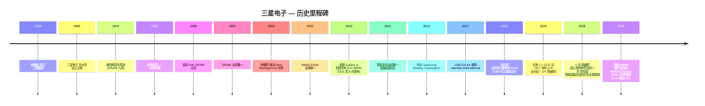
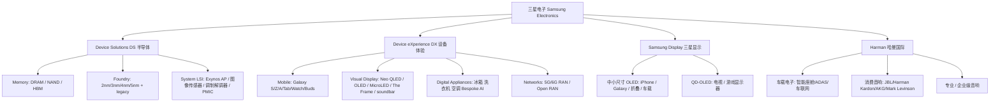
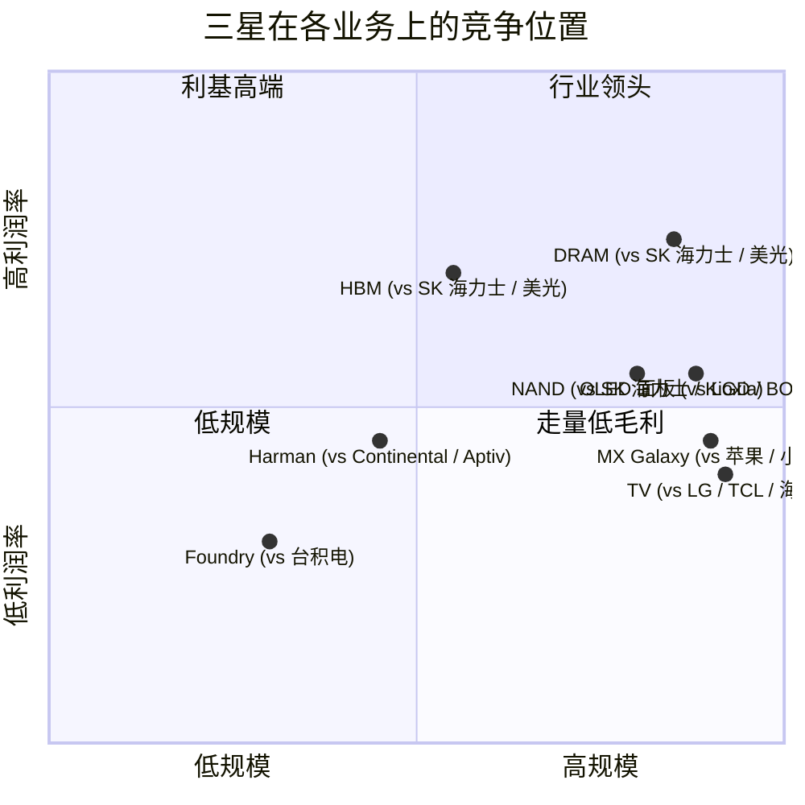
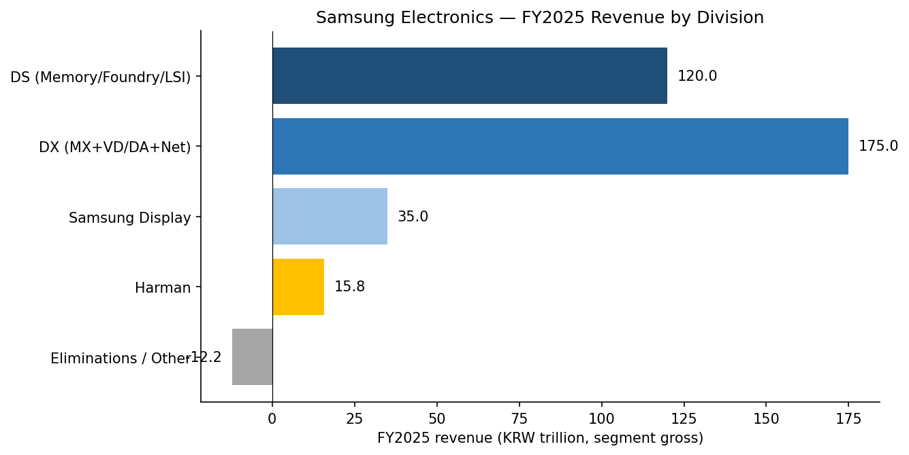
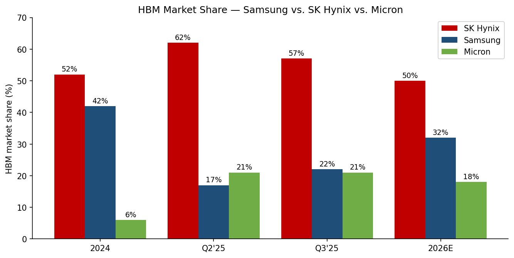
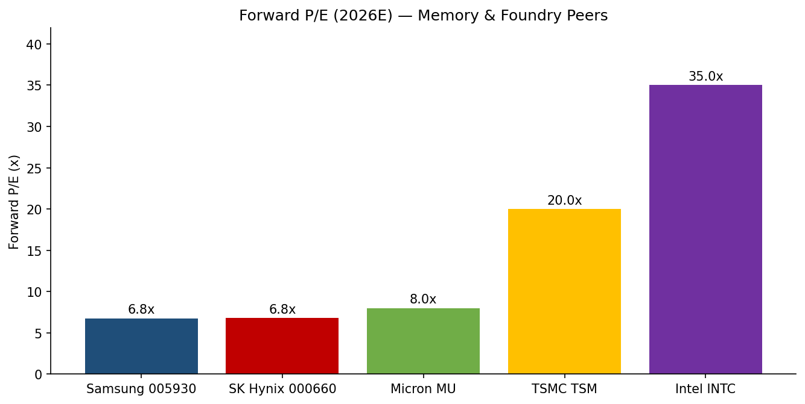

# 三星电子 Samsung Electronics Co., Ltd. (KRX:005930) — 首次覆盖

**日期:** 2026-05-27(中文版根据 2026-05-25 已校验过的英文版同步生成,共享同一组引用、图表与数字)
**股票代码:** KRX:005930(普通股);KRX:005935(优先股 1P)
**总部:** 大韩民国京畿道水原市灵通区三星路 129 号
**报告语言:** 简体中文(英文版本同路径下另存 `Samsung_KRX005930_Research_Document.md`)

> **更新提示 — 2026 年 Q1 创纪录业绩 (2026-04-30):** 三星电子 Q1 2026 合并营收 **KRW 133.9 万亿** (+43% QoQ),营业利润 **KRW 57.2 万亿** —— 均为单季历史最高;半导体 (DS) 部门 Q1 营收 KRW 81.7 万亿,营业利润 KRW 53.7 万亿;HBM4 与 SOCAMM2 已开始为 NVIDIA Vera Rubin 平台量产首批出货([三星电子 2026 年第一季度业绩公告 — Samsung Global Newsroom, 2026-04-30](https://news.samsung.com/global/samsung-electronics-announces-first-quarter-2026-results))。同期 **YoY +69% / OP QoQ +185%、单季营业利润超过 FY2025 全年的 KRW 43.6 万亿、DS 营业利润同比暴增约 48 倍 (Q1'25 KRW 1.1 万亿 → Q1'26 KRW 53.7 万亿)、管理层指引 2026 年 HBM 营收 "至少翻三倍"** 等同比比较与全年比对来自[Samsung Q1 '26 营业利润超过 FY25 全年 — DCD, 2026-04-30](https://www.datacenterdynamics.com/en/news/samsung-electronics-q1-26-operating-profit-exceeds-companys-fy25-full-year-total/);传统 DRAM 合约价 **Q1 2026 环比上涨 90–95%** 的产业数据来自 [TrendForce, 2026-02-02](https://www.trendforce.com/presscenter/news/20260202-12911.html)(服务器 DRAM +90%、PC DRAM +100%、LPDDR4X/5X +90%,均为历史最高季度涨幅)。

## 目录

1. 公司概览
2. 公司历史
3. 管理团队
4. 产品与服务
5. 客户与上市策略
6. 行业概览
7. 竞争格局
8. 市场机会 (TAM)
9. 风险评估
10. 参考资料

---

## 1. 公司概览

**三星电子 Samsung Electronics Co., Ltd.**(以下简称"公司"或"三星电子")是全球最大的存储半导体制造商、全球出货量第一的智能手机厂商、连续 20 年全球第一的电视机品牌,以及全球最大的 OLED 显示屏制造商 —— 上述四项 **全部** 集中在同一家上市主体之内。公司成立于 1969 年,起家自三星集团与日本 Sanyo / NEC 合资生产黑白电视,现总部位于韩国水原。公司是韩国 *财阀 (chaebol)* 三星集团的核心,亦是该国最重要的产业公司:FY2025 合并营收 **KRW 333.6 万亿** (约 USD 230 bn),约相当于韩国名义 GDP 的 **12–13%**;公司普通股加优先股是 KOSPI 指数权重最大的单一构成 ([三星电子 2025 年第四季及全年业绩公告 Samsung Global Newsroom, 2026-01-29](https://news.samsung.com/global/samsung-electronics-announces-fourth-quarter-and-fy-2025-results))。

**公司业务做什么?** 三星电子的运营架构分为两大主业务支柱外加两家并表子公司:

- **Device Solutions (DS,半导体业务) / 器件解决方案部门。** 涵盖 Memory(DRAM、NAND、HBM)、Foundry(逻辑芯片代工)、System LSI(自研 Exynos 应用处理器 / Application Processor、CMOS 图像传感器、5G 调制解调器、电源管理芯片 PMIC)。DS 是公司的周期性利润引擎。
- **Device eXperience (DX,设备体验) / 设备体验部门。** 涵盖 Mobile eXperience (MX,Galaxy 智能手机 / 平板 / 可穿戴 / PC)、Visual Display / Digital Appliances(VD/DA,电视机、冰箱、洗衣机、空调)、Networks(5G 基站设备)。
- **Samsung Display Corporation (SDC) / 三星显示。** 100% 控股子公司;全球最大的中小尺寸 OLED 面板制造商,也是苹果 iPhone 的单一最大 OLED 面板供应商。
- **Harman International / 哈曼国际。** 2017 年以 USD 8.0 bn 收购 ([三星宣布收购 HARMAN, 2016-11-14](https://news.samsung.com/global/samsung-electronics-to-acquire-harman-accelerating-growth-in-automotive-and-connected-technologies));主业涵盖车载电子(智能座舱 / ADAS / 车联网)、高端音响品牌(JBL、Harman/Kardon、AKG、Mark Levinson)以及企业 / 专业音响。FY2025 子公司营收 **KRW 15.78 万亿** —— 哈曼的历史最高纪录 ([DigiTimes, 2026-04-24](https://www.digitimes.com/news/a20260424PD230/samsung-harman-revenue-adas.html))。

**公司怎么赚钱?** 三星电子的利润高度由 DRAM / NAND 的价格周期主导。DS 营收随 bit 出货量与 ASP (平均销售价) 周期摆动:在 "上行" 存储年份(FY2021、FY2024 下半年、FY2025 下半年、FY2026),DS 单部门可贡献集团 >70% 的营业利润;在 "下行" 年份(FY2023),DS 直接陷入营业亏损。DX 是稳定器 —— Galaxy 手机一年卖约 2.35 亿部,营业利润率维持低到中段两位数;VD/DA 又贡献了 60+ 万亿韩元的家电营收(个位数营业利润率);Networks 体量小但战略重要(5G/6G 基站)。SDC 通过苹果 OLED 面板订单提供稳定现金流;Harman 是营收占比小但有汽车赛道增长期权的盈利单元。

**公司在哪运营?** 三星电子拥有一个高度整合的全球生产 / 研发足迹:存储 / 代工晶圆厂在韩国(平泽 Pyeongtaek、华城 Hwaseong、器兴 Giheung);新建的 Taylor, Texas 美国代工厂已被推迟至 2026 年下半年首批量产;较老的 8 英寸产能仍在 Austin;先进封装在天安 Cheonan 与温阳 Onyang;智能手机最终组装的超级工厂在越南(北宁 Bac Ninh、太原 Thai Nguyen)以及印度(诺伊达 Noida);电视与家电生产线分布在越南、墨西哥(克雷塔罗 Querétaro)、匈牙利、泰国。研发中心包括 Samsung Research(首尔)、Samsung Semiconductor(美国圣何塞)以及 Samsung Research America(山景城)。2024 年披露:全球约 26.7 万名员工中,**12.5 万人** 在韩国本土,**2.51 万人** 在北美,其余分布在亚洲、欧洲与美洲 ([三星电子员工分布国家披露 PDF](https://www.samsung.com/global/sustainability/policy-file/AZA5bnDqHM8ALYNu/Samsung_Electronics_The_number_of_employees_en.pdf))。

**公司体量?** FY2025 营收 KRW 333.6 万亿(约 USD 230 bn);FY2025 营业利润 KRW 43.6 万亿(约 USD 30 bn);FY2025 资本开支 KRW 52.7 万亿,其中 KRW 47.5 万亿投向 DS 半导体 ([Investing.com, 2026-01-29](https://www.investing.com/news/company-news/samsung-electronics-reports-2025-capital-expenditure-of-krw-527-trillion-93CH-4472051))。2025 年中员工总数约 26.7 万,其中约 12.9 万在韩国;母公司层面员工数(parent-only payroll)截至 2026 年 5 月为约 **12.89 万** ([Stockanalysis.com](https://stockanalysis.com/quote/krx/005930/))。


来源:三星电子 FY2021–FY2025 季度业绩公告与 2026 年 Q1 业绩公告(已在上文引用)。Q1'26 年化值 = Q1 实际 × 4,仅供视觉参考,非公司指引。

**估值快照 (截至 2026-05-19):**

| 指标 | 数值 | 来源 |
|---|---|---|
| 股价(普通股 005930) | **KRW 275,500** | [Stockanalysis.com, 2026-05-19](https://stockanalysis.com/quote/krx/005930/) |
| 52 周区间 | KRW 53,700 – 299,500 | 同上 |
| 市值(普通股+优先股) | **KRW 1,791 万亿** (约 USD 1.23 万亿) | 同上 |
| 过去 12 个月股价涨幅 | **+388%** | 同上 |
| 股息率 | 0.54% | 同上 |
| 员工(母公司) | 128,880 | 同上 |
| **2026E 前瞻市盈率** | **~6.8x** | [首尔经济日报, 2026-05-14](https://en.sedaily.com/news/2026/05/14/sk-hynix-forward-per-overtakes-samsung-electronics-for) |
| 同业前瞻 PE | SK 海力士 6.79x,美光 ~8x,台积电 ~20x,英特尔 ~35x | [Nomura via TradingKey, 2026-05](https://www.tradingkey.com/analysis/stocks/us-stocks/261908464-nomura-samsung-skhynix-dram-tradingkey) |

**对估值倍数的解读。** 三星目前 **2026E 前瞻 PE 约 6.8 倍** —— 绝对值看历史性偏低,但与存储周期定价高度一致:市场把 FY2026E 的利润视为周期 *峰值*,并在向 "中周期归一化 EPS" 折现。两个值得对照的锚点:**(a)** SK 海力士前瞻 PE 6.79x —— 这是 **历史上首次** SK 海力士前瞻 PE 高于三星,反映出市场给予 SK 海力士 "纯 HBM 标的"(HBM purity)更高的溢价 ([首尔经济日报, 2026-05-13](https://en.sedaily.com/finance/2026/05/13/sk-hynix-overtakes-samsung-electronics-in-valuation-for));**(b)** 台积电 ~20x 前瞻 PE —— 这是 "代工垄断溢价",三星短期内难以追赶,除非 2-nm 节点跑出可量产的良率并赢得外部大客户。Nomura 的观点是:估值差距过大,三星倍数 "应向台积电收敛" 随着 HBM 与 2-nm 规模化 ([Nomura 价格目标 590,000 韩元 — 亚洲商业日报, 2026-05-17](https://www.asiae.co.kr/en/article/stock-etc/2026051718535452847))。**熊市观点** 则相反:若 FY2026 是周期峰值,则今天的 6.8x 在归一化 EPS 下其实是 12–14x,股票并不便宜。**关键结论 — 三星的 "公允估值" 没有任何脱离 DRAM/NAND/HBM 周期的独立答案;估值结论 = 周期判断。**

---

## 2. 公司历史

三星集团由 **李秉喆 (Lee Byung-chul, 이병철)** 于 1938 年在大邱创立,起家做干鱼、蔬菜与面条出口贸易。**三星电子**(本报告主体)则于 **1969 年 1 月 13 日** 在水原独立注册成立,与日本 Sanyo、NEC 合作生产黑白电视 ([Wikipedia: Samsung Electronics](https://en.wikipedia.org/wiki/Samsung_Electronics))。决定公司命运的拐点发生在 1974 年:李秉喆不顾内部顾问与韩国政府反对,亲自推动集团进入半导体业务,收购了当时已破产的韩国半导体公司(韩国 Semiconductor,一家 3 英寸晶圆厂)50% 股权。1983 年的著名 **"东京宣言" (Tokyo Declaration)** 中,创始人 Lee Byung-chul 公开宣布三星 "押注存储",当时日本与美国厂商在 DRAM 技术领先地位仍稳固。1984 年三星出货首款 64K DRAM;**1992 年首次问鼎全球 DRAM 市占第一**,此后 30 多年从未让出。



**塑造现代三星的几次战略转折。**

- **1993 年 "新经营 New Management" 改革。** 当时的会长 **李健熙 (Lee Kun-hee)** —— 创始人长子,1987 年父亲去世后接班 —— 在法兰克福那次著名训诫中要求高管 "除了老婆和孩子以外都要换"。改革把三星从一家以成本与量产取胜的厂商重塑为质量驱动、设计驱动的高端品牌,为后续在智能手机、面板、家电领域全面崛起奠定基础 ([Wikipedia](https://en.wikipedia.org/wiki/Samsung_Electronics))。
- **2010–2011 年智能手机崛起。** 2010 年 6 月,三星推出第一代 Galaxy S (GT-I9000)([Wikipedia: Samsung Galaxy S 1st Gen](https://en.wikipedia.org/wiki/Samsung_Galaxy_S_(1st_generation))),抢在诺基亚之前全面拥抱 Android 操作系统;到 2011 年,三星出货量正式超越诺基亚(后者死守 Symbian 系统),夺得全球第一。这一冠军位置三星从 2011 年到 2024 年几乎每年都保住 —— 唯一的两个例外是 2014 年(与苹果短暂打平)以及 **2025 年**:14 年以来首次,苹果出货约 2.43 亿部 iPhone,三星出货约 2.35 亿部 Galaxy,苹果重新登顶 ([CNBC, 2025-11-26](https://www.cnbc.com/2025/11/26/apple-iphone-shipments-to-beat-samsung-for-the-first-time-in-14-years.html);[海湾新闻, 2026](https://gulfnews.com/technology/apple-tops-samsung-in-2025-global-smartphone-shipments-1.500467112))。
- **2017 年收购 Harman。** 2017 年 3 月,三星电子完成对 Harman International 的全现金收购,作价 USD 8.0 bn(每股 $112),为三星电子有史以来最大手笔的收购,一举进入汽车智能座舱与高端音响赛道 ([三星宣布收购 HARMAN](https://news.samsung.com/global/samsung-electronics-to-acquire-harman-accelerating-growth-in-automotive-and-connected-technologies);[Davalyn 详解](https://davalyncorp.com/samsung-charges-into-auto-tech-with-8-billion-deal-for-harman/))。
- **2022–2025 代工战略复位。** 2022 年三星宣布率先在 3-nm 节点采用 GAA(Gate-All-Around / 栅极环绕)晶体管,领先于台积电当时的 FinFET N3 节点 —— 但 GAA 良率不及预期,Qualcomm、NVIDIA 等关键客户回流台积电,三星代工市占从 Q1'24 约 10.5% 一路跌至 **Q3'25 的 7.1%** ([TrendForce via BigGo Finance](https://finance.biggo.com/news/Akg74pwBga3fZL9MGf-A))。公司目前把 "先进制程恢复" 的赌注押在 **2-nm Exynos 2600**(业界首款量产 2-nm 移动 SoC,2025 年 12 月发布)以及缩短 HBM 与 SK 海力士的差距上。
- **2024–2025 领导层洗牌。** 2024 年 11 月,三星采用 **Co-CEO 双 CEO 体制**(DS 全永鉉 + DX 韩鍾熙)([KED Global, 2024-11-27](https://www.kedglobal.com/executive-reshuffles/newsView/ked202411270012))。**2025 年 3 月,韩鍾熙因心源性猝死意外去世,享年 63 岁** ([CNBC, 2025-03-25](https://www.cnbc.com/2025/03/25/samsung-electronics-says-co-ceo-han-jong-hee-has-passed-away.html))。**2025 年 7 月 17 日,韩国最高法院驳回检察机关最终上诉,李在镕 在 Samsung C&T / Samsung Biologics 合并 / 财务舞弊案中获得完全无罪宣判** ([DigiTimes, 2025-07-17](https://www.digitimes.com/news/a20250717PD232/samsung-legal-merger-supreme-chairman.html))。司法包袱卸下后,2025 年 11 月的高管调整 (TM Roh 卢泰文 升任 DX 联席 CEO) 普遍被外界解读为 "新三星" 时代的开始,权力进一步向董事长室集中 ([KED Global, 2025-10-23](https://www.digitimes.com/news/a20251023PD209/samsung-personnel-chairman-2025.html))。

**近期(2025–2026)关键节点。** HBM3E 12-Hi 终于在 **2025 年 9 月获得 NVIDIA 认证**,距其完成开发已 18 个月 ([Tom's Hardware, 2025-09](https://www.tomshardware.com/tech-industry/samsung-earns-nvidias-certification-for-its-hbm3-memory-stock-jumps-5-percent-as-company-finally-catches-up-to-sk-hynix-and-micron-in-hbm3e-production));**HBM4 于 2026 年 2 月开始量产出货** ([三星 Q1 2026 业绩公告](https://news.samsung.com/global/samsung-electronics-announces-first-quarter-2026-results));Taylor 美国晶圆厂首批量产时间推迟至 **2026 年下半年**,CHIPS Act 补贴金额从 USD 6.4 bn 削减至 **USD 4.745 bn** ([Tom's Hardware](https://www.tomshardware.com/tech-industry/samsungs-yield-issues-reportedly-delays-taylor-fab-launch-to-2026);[Tokenring, 2025-12-22](https://www.financialcontent.com/article/tokenring-2025-12-22-samsungs-silicon-setback-subsidy-cuts-and-taylor-fab-delays-signal-a-crisis-in-us-semiconductor-ambitions));**Exynos 2600 于 2025 年 12 月正式发布**,Galaxy S26 / S26+ 在欧盟与印度市场已于 2026 年上半年上市搭载该芯 ([KED Global, 2025-12-19](https://www.kedglobal.com/korean-chipmakers/newsView/ked202512190004))。

---

## 3. 管理团队

### 执行董事长:李在镕 (이재용, Lee Jae-yong)

**李在镕**(英文媒体常称 "Jay Y. Lee"),年龄 57 岁(1968 年 6 月 23 日生),是三星电子事实上的控股股东与执行董事长。2022 年 10 月 27 日正式获任董事长,为三星家族第三代掌门 —— 父亲是已故李健熙,祖父是创始人李秉喆 ([Wikipedia: 李在镕](https://en.wikipedia.org/wiki/Lee_Jae-yong))。李在镕在首尔国立大学取得东亚史 BA,在日本庆应义塾大学完成 MBA,并曾在哈佛商学院 (Harvard Business School) 攻读博士课程(未完成)。

李在镕 1991 年加入三星电子,从控股公司的企业规划岗位起步,2012 年升任副会长。其长达十年的司法纠葛始于 2016 年 12 月:在朴槿惠总统弹劾案的特别检察官调查中,他被控向朴及其密友崔顺实行贿,以换取政府对 2015 年 Samsung C&T / Cheil Industries 合并案的支持(该合并使他对三星电子的控制权进一步集中)。2017 年 8 月首审获罪入狱;2018 年 2 月二审改判缓刑出狱;2021 年 1 月上诉审再次入狱;**2022 年 8 月获韩国总统尹锡悦特赦** ([UPI, 2025-07-17](https://www.upi.com/Top_News/World-News/2025/07/17/korea-Lee-Jae-yong-Samsung-chairman-acquitted-fraud-South-Korea-Supreme-Court/5441752737307/))。在另一桩与 Samsung C&T / Samsung Biologics 财务舞弊相关的诉讼中,他先后于 2024 年 2 月(一审)与 2025 年 2 月(二审)获得无罪宣判,**最终于 2025 年 7 月 17 日由韩国最高法院驳回检方上诉,获得完全无罪释放** ([DigiTimes, 2025-07-17](https://www.digitimes.com/news/a20250717PD232/samsung-legal-merger-supreme-chairman.html))。

李在镕的具体业绩包括:亲自主导 2016 年 Harman 收购、2018 年宣布 USD 22 bn 的 AI / 汽车科技投资计划、以及 2024–2025 年的 "新三星" 重组(权力重新集中到董事长办公室)。他在韩国的公共影响力极不寻常 —— 被广泛视为本国最具影响力的商业领袖。李在镕个人直接持有三星电子普通股 ~1.6%,通过 Samsung C&T(他出任会长)与 Samsung Life Insurance 等交叉持股网络实际控制集团。韩国财经媒体猜测,司法案件了结后,他可能复活 **"未来战略室" (Mirae Jeolyaksil)**,即集团总控功能 ([KED Global, 2025-10-23](https://www.digitimes.com/news/a20251023PD209/samsung-personnel-chairman-2025.html))。虽然李在镕是董事长而非 CEO,但在韩国财阀治理框架下,董事长对高管任免、资本配置与战略方向的决策权是绝对的。其薪酬按全球 CEO 标准而言相当克制(近年约 KRW 7–10 bn / 年),在司法案件期间从未领取奖金。

### CEO (DS 部门):全永鉉 (전영현, Jun Young-hyun)

**全永鉉**,65 岁,副会长兼 Device Solutions 部门 CEO。从 2025 年 3 月 韩鍾熙 去世到 2025 年 11 月 TM Roh 升任 DX 联席 CEO 之间,他是三星电子事实上的唯一 CEO ([CNBC, 2025-03-25](https://www.cnbc.com/2025/03/25/samsung-electronics-says-co-ceo-han-jong-hee-has-passed-away.html);[三星电子新领导层公告](https://news.samsung.com/global/samsung-electronics-announces-new-leadership-2))。全永鉉的半导体职业生涯始于 LG Semicon 的 DRAM 工程师,**2000 年加入三星电子**(LG Semicon 在亚洲金融危机后被纳入现代电子时他随之并入三星)——按此计算他在三星本部的工龄约 26 年,整个半导体行业生涯约 35 年 ([Quartr profile,三星双 CEO](https://quartr.com/insights/business-philosophy/the-samsung-co-ceos-jong-hee-han-young-hyun-jun))。2014–2017 年任 Memory 业务部负责人,在此期间主导了三星首批 20-nm 与 10-nm 级 DRAM 量产。**2017–2021 年出任 Samsung SDI (三星集团电池关联公司,KRX:006400) 总裁兼 CEO**,在他任内 SDI 营收从 FY2017 的 ~KRW 6 万亿扩张至 FY2021 的 ~KRW 13.5 万亿,小型电池与电动车电池业务双双起量 ([Samsung SDI executive history](https://samsungsdi.com/sdi-now/sdi-news/4344.html))。**2024 年 5 月被召回三星电子**,以副会长身份执掌 DS 部门 —— 任务明确:解决 HBM 难题。他做到了:**HBM3E 于 2025 年 9 月通过 NVIDIA 认证,HBM4 于 2026 年 2 月开始量产出货** ([KED Global 全永鉉就任专访, 2024-05-31](https://www.kedglobal.com/chief-executives/newsView/ked202405310003);[三星 Q1 2026 业绩公告](https://news.samsung.com/global/samsung-electronics-announces-first-quarter-2026-results))。

### DX 联席 CEO:卢泰文 (노태문, TM Roh)

**卢泰文 Roh Tae-moon** (英文媒体常称 "TM Roh"),约 58 岁,2025 年 11 月与全永鉉并列升任三星电子 Co-CEO 并执掌 DX 部门 ([KED Global, 2025-11-21](https://www.kedglobal.com/leadership-management/newsView/ked202511210011))。他自 2020 年起一直是 Galaxy S/Z 产品线的总架构师 —— 历任 Mobile R&D 负责人、Galaxy Z Fold/Flip 折叠机战略的首席推动者、以及在升任 DX CEO 前担任 MX 业务部主管。其作为 DX CEO 的核心使命:在 2025 年 iPhone 17 重夺出货第一之后捍卫智能手机品牌、把折叠形态(以及传闻中的三折叠)扩展为可防御的高端品类、并削减 VD/DA 家电业务里那部分利润率较薄的成本结构。

### 治理脚注

- **董事会构成。** 三星电子有 11 名董事,其中 6 名为独立外部董事(韩国对超过一定规模的上市公司要求独立董事过半数)。韩鍾熙曾任四名执行董事之一,2025 年 3 月去世后董事会重新组合,以全永鉉、TM Roh、Foundry / Memory 业务的新任负责人为核心 ([Wikipedia](https://en.wikipedia.org/wiki/Samsung_Electronics))。
- **内部人持股。** 李氏家族对三星电子的控制是通过以 Samsung C&T(持有三星电子普通股约 5%)与 Samsung Life Insurance(约 8.5%)为核心的交叉持股网络实现的间接控制。李在镕个人直接持股仅约 1.6%,但家族通过交叉持股加优先股结构形成有效控股。
- **薪酬结构。** 高管薪酬以现金加 RSU 为主,业绩挂钩的权益部分占部门 CEO 总薪酬约 40–50%。李在镕的薪酬较全球大公司 CEO 标准而言历来克制;2024 年的部门 CEO 薪酬已在 KRX 强制披露的高管薪酬表中公布。
- **关联交易。** 三星集团历来内部交易体量大(Samsung SDI 向三星移动供电池、Samsung Display 向三星移动供面板、Samsung Engineering 为三星电子建晶圆厂等)。这些交易均已披露,但其交易量与定价机制周期性受到韩国公平交易委员会的审视。

### 领导层评价 (分析师观点)

*分析师观点:* 全永鉉是修复 HBM 问题的正确人选 —— 他在出任 SDI 之前就是不折不扣的存储老兵,而他确实在 18 个月窗口内同时完成了 NVIDIA HBM3E 认证 与 HBM4 首批量产出货 ([Tom's Hardware, 2025-09](https://www.tomshardware.com/tech-industry/samsung-earns-nvidias-certification-for-its-hbm3-memory-stock-jumps-5-percent-as-company-finally-catches-up-to-sk-hynix-and-micron-in-hbm3e-production);[三星 Q1 2026 业绩公告](https://news.samsung.com/global/samsung-electronics-announces-first-quarter-2026-results))。TM Roh 在 Galaxy 上的记录强但参差不齐(折叠产品赢、2025 年对苹果守不住份额输 —— [CNBC, 2025-11-26](https://www.cnbc.com/2025/11/26/apple-iphone-shipments-to-beat-samsung-for-the-first-time-in-14-years.html))。**真正缺位的是代工**:目前没有任何运营层的 CEO 在代工业务上拥有像全永鉉之于存储那样的可信度;代工市占从 Q1'24 的约 10.5% 一路滑到 Q3'25 的 7.1% ([TrendForce / BigGo Finance, 2025](https://finance.biggo.com/news/Akg74pwBga3fZL9MGf-A)),是过去两年里 **最显眼的执行失败**。

---

## 4. 产品与服务



### Device Solutions (DS) 半导体

**Memory / 存储业务。** 三星制造 DRAM(服务器 DDR5、移动 LPDDR5X、显存 GDDR6/7、**HBM3 / HBM3E / HBM4**)、NAND Flash(消费级 SSD、企业级 SSD、移动端 eUFS),以及新一代 **SOCAMM2** LPDDR5X 压缩贴装内存模组 —— 在 NVIDIA 第二代 SOCAMM 项目中,三星将供应约 **50%** 的总量 ([KED Global, 2025-12-03](https://www.kedglobal.com/korean-chipmakers/newsView/ked202512030007))。按细分产品的竞争力评估:

| 产品 | 护城河 | 最贴近竞争对手(评估) |
|---|---|---|
| 服务器 DDR5 | **强** —— 规模 + 12-nm 级制程 | SK 海力士(并列),美光(落后) |
| LPDDR5X 移动 DRAM | **强** —— 规模 + 与代工同园区协同 | SK 海力士(并列) |
| HBM3E 12-Hi | **部分** —— 在 NVIDIA 认证上落后 18 个月 ([Tom's Hardware](https://www.tomshardware.com/tech-industry/samsung-earns-nvidias-certification-for-its-hbm3-memory-stock-jumps-5-percent-as-company-finally-catches-up-to-sk-hynix-and-micron-in-hbm3e-production)) | SK 海力士(在 NVIDIA 钱包份额明显领先);美光(认证并列) |
| HBM4 | **部分 → 改善中** —— 2026 年 2 月首批量产 ([Q1'26 业绩公告](https://news.samsung.com/global/samsung-electronics-announces-first-quarter-2026-results)) | SK 海力士(NVIDIA Rubin 项目上并列;Blackwell 上 SK 海力士仍领先) |
| 企业级 SSD (PCIe Gen5/Gen6) | **强** | Kioxia/SanDisk(落后),SK 海力士 Solidigm(并列) |
| Google TPU HBM3E | **强** —— 三星供应 Google TPU HBM3E **超过 60%** ([TrendForce, 2025-12-01](https://www.trendforce.com/news/2025/12/01/news-samsung-reportedly-supplies-60-of-google-tpu-hbm3e-set-to-remain-primary-supplier-in-2026/)) | SK 海力士(份额较小) |

**中文释义 / Plain-language gloss:** HBM (High Bandwidth Memory, 高带宽内存) 是把多颗 DRAM die 用 **TSV (Through-Silicon Via,硅通孔)** 垂直堆叠并通过宽位宽 (1024–2048 bits) 总线接到 GPU/ASIC 旁边的 **interposer (硅中介层)** 上,从而把 "DRAM ↔ 计算芯片" 的带宽从传统 DDR 的 ~50 GB/s 拉到 ~1.2–2 TB/s 数量级 —— 是 AI 训练 / 推理芯片(NVIDIA GB200/GB300/Rubin、AMD MI300/MI350、Google TPU)的必备伙伴。HBM3 → HBM3E 是堆叠层数从 8 层升到 12 层;HBM4 进一步升至更宽 I/O + 更低功耗,**且 base die 转向定制逻辑**,这给了 "代工 + 存储 一体" 的三星理论上的结构优势(SK 海力士需要找台积电做 base die),也是三星反扑 SK 海力士的中长期赌注。

**Foundry / 代工业务。** 提供 2-nm GAA(刚进量产)、3-nm GAA(在产)、4-nm/5-nm FinFET(成熟)与 8/14/28-nm 等成熟节点的逻辑芯片代工。Q3 2025 市占 **7.1%** 对台积电 **70.4%** ([TrendForce / BigGo Finance](https://finance.biggo.com/news/Akg74pwBga3fZL9MGf-A))。良率披露:**2-nm 良率在 2025 年底约 55–60%** ([TrendForce, 2025-11-25](https://www.trendforce.com/news/2025/11/25/news-samsung-reportedly-hits-55-60-2nm-yields-eyeing-an-edge-through-early-gaa-deployment/)) —— 对内部芯片 (Exynos 2600) 量产可接受,但要赢回 Qualcomm / MediaTek / NVIDIA / AMD 等外部大客户仍偏低(他们 N3/N2 几乎全部去了台积电)。**评估:领先节点上目前没有清晰的护城河**;成熟节点凭价格竞争。

**System LSI / 系统大规模集成电路。** 自研 Exynos AP(Exynos 2400、**Exynos 2600** —— 业界首款 2-nm 移动 AP,2025 年 12 月发布)、ISOCELL CMOS 图像传感器、5G 调制解调器、PMIC。Exynos 2600 采用 Arm v9.3 架构 10 核布局,CPU 性能号称较 Exynos 2500 提升 39%,GPU 性能翻倍,在 EU / 印度市场的 Galaxy S26 / S26+ 上首次搭载 ([Android Central, 2025-12](https://www.androidcentral.com/phones/samsung-galaxy/samsung-exynos-2600-official);[Sammy Fans, 2026-01-15](https://www.sammyfans.com/2026/01/15/samsung-improves-2nm-exynos-2600-yields/))。**评估:部分护城河** —— Exynos 在绝对性能上仍落后 Qualcomm Snapdragon 8 Elite Gen 5(Galaxy S26 Ultra 全球仍采用 Snapdragon),但 "2-nm 在三星代工" 的双重组合是一份战略保险。

### Device eXperience (DX) 设备体验

**Mobile (MX) 智能手机业务。** Galaxy S(旗舰)、Z Fold / Z Flip(折叠)、A(中端大众)、M(线上入门)、Tab(平板)、Book(PC)、Watch(智能手表)、Buds(无线耳塞)。**2025 年全年出货 2.35 亿部智能手机(全球份额 19%,第二位)**,落后苹果约 2.43 亿部([CNBC, 2025-11-26](https://www.cnbc.com/2025/11/26/apple-iphone-shipments-to-beat-samsung-for-the-first-time-in-14-years.html))。**Q1 2026 三星重夺第一**,Omdia 数据下市占 22% ([PhoneArena, Q1 2026](https://www.phonearena.com/news/q1-2026-global-smartphone-market-report-samsung-first-place-apple-second_id179680));(注:Counterpoint 与 IDC 在 Q1'26 的份额排序上结论不同 —— 第一名是 Omdia 口径下的结论)。MX 的护城河是 **品牌 + 安卓生态规模 + 自家面板与存储的纵向一体化**;脆弱点是来自 "哑铃型市场"(苹果在顶端、小米 / Transsion 在底端)的持续 ASP 与利润率压力。

**Visual Display (VD) 电视与显示业务。** Neo QLED(Mini-LED 背光 LCD)、OLED 电视、MicroLED(奢侈品级)、The Frame(画框电视)、soundbar 条形音箱。**连续 20 年全球第一,2025 年 Omdia 营收市占 29.1%** ([techbuzz.ai, 2025](https://www.techbuzz.ai/articles/samsung-holds-tv-crown-for-20-years-with-29-market-share))。在高端市场更加占优 —— 售价 >USD 2,500 段位 54.3% 市占;>USD 1,500 段位 52.2% 市占。**2025 年 Q1,三星在北美 OLED 电视销量上首次超越 LG**,这是 2022 年重新进入 OLED 后追赶 3 年来的标志性胜利 ([FlatpanelsHD, 2025-05](https://www.flatpanelshd.com/news.php?subaction=showfull&id=1748261917))。

**Digital Appliances (DA) 家电业务。** 冰箱、洗衣机、烘干机、空调、吸尘器。2024 年发布的 Bespoke AI(模块化 + AI 化高端家电策略)定位高端价位带。营业利润率个位数;结构性压力来自中国厂商(美的、海尔)的低成本竞争。

**Networks 5G/6G 基站业务。** 5G RAN 与 Open RAN 设备。绝对营收体量小,但战略上极为重要 —— 三星是全球仅有的四大 5G RAN 供应商之一(其他三家是 Ericsson、Nokia、Huawei),也是非中资供应商中在北美市场最大的一家(主要客户:Verizon、T-Mobile、US Cellular)。Open RAN 路线是三星对 Ericsson / Nokia 在非亚太地区双寡头格局的反击点。

### Samsung Display (SDC) 三星显示 —— 全资子公司

**2025 年全球 OLED 营收市占 41%**,据 Counterpoint 数据排名第一 ([Heyup / Counterpoint, 2025](https://heyupnow.com/blogs/heyup-trend-insight-lab/global-oled-market-2025-forecast-samsung-display-to-lead-with-41-revenue-share-says-counterpoint))。皇冠业务是 **iPhone OLED**:2025 年三星显示向苹果出货约 1.25 亿片 OLED 面板,其中约 7,800 万片用于 iPhone 17 系列([OLED-Info / UBI Research](https://www.oled-info.com/ubi-details-samsung-lg-and-boes-market-share-apples-smartphone-oled-supply))。次级业务是 QD-OLED(高端电视与游戏显示器)。SDC FY2025 季度营业利润递增轨迹:KRW 0.5 万亿 (Q1) → 0.5 万亿 (Q2) → 1.2 万亿 (Q3) → **2.0 万亿 (Q4,其中 ~KRW 500 bn 来自 BOE 的一次性专利费支付)**,全年营业利润约 **KRW 4.2 万亿** ([SDC 4Q25 业绩 — 三星 Q4 FY25 公告](https://news.samsung.com/global/samsung-electronics-announces-fourth-quarter-and-fy-2025-results);[DigiTimes, 2026-03-06](https://www.digitimes.com/news/a20260306PD210/sdc-boe-patent-operating-profit-2025.html)) —— 集团仅次于 DS Memory 与 MX 的第三大单部门利润池。

### Harman International / 哈曼国际

2017 年以 USD 8.0 bn 现金收购 ([Samsung Newsroom](https://news.samsung.com/global/samsung-electronics-to-acquire-harman-accelerating-growth-in-automotive-and-connected-technologies))。三大业务段:**Automotive 汽车电子**(车载信息娱乐、ADAS 子系统、车联网,已装载在 3,000 万+ 辆车上)、**Consumer Audio 消费音响**(JBL、Harman/Kardon、AKG、Mark Levinson 等)、**Professional / Enterprise Audio 专业与企业级音响**。**FY2025 营收 KRW 15.78 万亿(纪录),营业利润 KRW 1.53 万亿(纪录)** ([DigiTimes, 2026-04-24](https://www.digitimes.com/news/a20260424PD230/samsung-harman-revenue-adas.html);[channelnews](https://www.channelnews.com.au/harman-seriously-delivering-for-samsung-with-record-revenues-profits/))。**评估:部分护城河** —— 高端音响品牌(JBL、Mark Levinson)具备持久性;汽车智能座舱是竞争激烈领域(Continental、Aptiv、Visteon、LG Electronics VS)。

### 旗舰产品 vs. 长尾

目前驱动公司业务的核心 1–3 个产品:**(1)** DS Memory 中的 DRAM / NAND / HBM —— Q1 2026 占集团营业利润约 80%;**(2)** MX 中的 Galaxy S / Z 智能手机 —— 约占 10%;**(3)** SDC 向苹果出货的 OLED 面板 —— 约占 5%。其他业务(VD、DA、Networks、Harman、Foundry、System LSI)在结构上要么更小,要么在周期低点几乎勉强保本。

### 近期上市与产品路线图

- **HBM4 (2026 年 2 月):** 首批量产出货给 NVIDIA Vera Rubin 平台。
- **SOCAMM2 LPDDR5X 模组 (2026 Q1):** 首款量产产品,三星拿下 ~50% 供应份额。
- **Exynos 2600 2-nm AP (2025 年 12 月):** 业界首款 2-nm SoC;在 EU / 印度搭载 Galaxy S26 / S26+。
- **Galaxy S26 系列 (2026 上半年):** 旨在向苹果 iPhone 17 夺回出货第一。
- **2-nm GAA 代工 (2026 上半年):** 以 55–60% 良率开始量产。

---

## 5. 客户与上市策略

三星电子的客户群是同等规模半导体 / 电子公司中分散度最高的之一,但这并不掩盖某些子业务中的客户高度集中。

**客户集中度披露(来自一手 사업보고서)。** 三星电子 2024 年 Business Report(4Q Interim,第 30 页)在 "E. Major customers" 一项明确披露:**2024 年五大客户(按字母顺序)为 Apple、Deutsche Telekom、Hong Kong Techtronics、Supreme Electronics、Verizon;五大客户合计销售额约占总销售额 14%** ([Samsung Electronics 2024 Business Report — 4Q Interim](https://images.samsung.com/is/content/samsung/assets/global/ir/docs/2024_4Q_Interim_Report.pdf), 第 30 页)。该披露的几个要点对建模与思路都很重要:

- **五大客户按字母顺序列出,合计 ~14% —— 三星没有披露任何单一客户的具体占比。** 即使 Apple 在媒体与供应链分析中被普遍认为是其中规模最大的一家(主要通过 Samsung Display 的 iPhone OLED 出货、向 Apple 装配线供应 NAND/DRAM、以及若干 SDC 物料),Apple 在合并营收中的具体占比 **未在 사업보고서 中量化** —— 任何"Apple 占三星集团 X%"的说法都是供应链推断,不是一手披露。
- **三星电子合并层面的客户集中度极低。** 按"五大合计 ~14%"反推,即便 Apple 是最大客户,其占合并营收的份额大概率不超过单位数百分点;这与 Samsung 业务的极致分散(DX 终端零售长尾 + DS 上百家半导体客户 + Harman 数十家汽车 OEM)逻辑一致。
- **HBM 客户(NVIDIA、Google、Microsoft、AWS 等)不在合并层面的五大名单中。** 它们是 DS 半导体业务的关键客户(详见下文 "按业务分部的客户结构"),但因 DS 占集团营收约 37%(2024 年),即便 DS 内部高度集中,在合并层面也很难进入与 Verizon、Deutsche Telekom、Hong Kong Techtronics 这些 DX 大客户并列的合并 Top-5。

```mermaid
pie title FY2024 营收按业务分部(来源:Samsung 2024 Business Report 第 22 页)
    "DX(电视、家电、手机、Networks)" : 58
    "DS(存储、Foundry、System LSI)" : 37
    "SDC(三星显示)" : 10
    "Harman" : 5
    "内部抵销" : -10
```
*来源:[Samsung Electronics 2024 Business Report — 4Q Interim, 第 22 页 "A. Revenue"](https://images.samsung.com/is/content/samsung/assets/global/ir/docs/2024_4Q_Interim_Report.pdf)。DX KRW 174.9 万亿(58.1%)、DS KRW 111.1 万亿(36.9%)、SDC KRW 29.2 万亿(9.7%)、Harman KRW 14.3 万亿(4.8%)、内部抵销 KRW -28.5 万亿(-9.5%)。*

**按业务分部的客户结构。** 以下为各部门内部的关键客户名单;**这些是部门级口径,不能简单加总成集团级 Top-5**(集团合并层面的客户集中度披露见上文,口径来自 Samsung 2024 Business Report 第 30 页)。

- **DS Memory & HBM(部门级客户,不在集团 Top-5)。** 头部客户:NVIDIA(HBM、GDDR)、Google(TPU HBM —— 三星通过 Broadcom 向 Google 供应 **超过 60% 的 HBM**,并在 2026 年保持主要供应商地位 ([TrendForce, 2025-12-01](https://www.trendforce.com/news/2025/12/01/news-samsung-reportedly-supplies-60-of-google-tpu-hbm3e-set-to-remain-primary-supplier-in-2026/)))、Apple(NAND、DRAM、eUFS)、Microsoft 与 AWS(服务器 DDR5、企业级 SSD)、Meta(服务器 DRAM)、以及三星自家 MX 部门(用于 Galaxy 的 LPDDR)。**风险:NVIDIA Blackwell 平台 HBM 采购仍不成比例地倾向 SK 海力士**,三星的 Rubin 时代翻盘虽已启动,但份额仍小于 SK 海力士。
- **DS Foundry(部门级客户)。** 最大外部客户:Qualcomm(传统 / 汽车节点)、Tesla(早期 7-nm/4-nm Dojo 训练芯片)、Google(部分早期 Tensor SKU,现多在台积电)、AMD(选定传统节点)、以及自家 System LSI(Exynos 2600 在 2-nm)。**结构性弱点:** 没有任何头部 fabless 在 3-nm 或 2-nm 选三星;所有先进节点订单基本来自集团内部。
- **DS System LSI(部门级客户)。** 高度内供 —— 大部分 Exynos 与 ISOCELL 传感器流向三星自家 MX 或消费产品。
- **DX MX (Mobile,部门级客户)。** 200+ 国家覆盖,通过运营商直接合作 + 零售直营。最大的批发客户是美国一级运营商(Verizon、T-Mobile、AT&T)以及全球开放渠道零售 / 电商生态。单一客户均 <10%。
- **DX VD/DA (电视 + 家电,部门级客户)。** 多渠道零售。Walmart、Best Buy、Amazon、Costco 体量大,但单一客户均 <5%。
- **DX Networks(部门级客户)。** Verizon、T-Mobile、US Cellular(美国);Reliance Jio(印度,历史上规模大)以及几家欧洲电信运营商。Verizon 是 2024 年 Networks 业务的单一最大客户;在这个体量较小的业务里,集中度是真实存在的。
- **SDC (三星显示,部门级客户)。** Apple 是单一最大客户(基于 1.25 亿片 iPhone 面板,约占 SDC 营收 50%+;[OLED-Info / UBI Research](https://www.oled-info.com/ubi-details-samsung-lg-and-boes-market-share-apples-smartphone-oled-supply))。第二大是集团内部的 Samsung MX;Sony、Dell、HP 是 QD-OLED 显示器客户。
- **Harman(部门级客户)。** 主要客户:丰田、现代起亚、GM、福特、宝马、奔驰、大众、Stellantis 等汽车 OEM。单一 OEM 占 Harman 营收均 <15%。

**口径提醒。** 上述部门级头部客户只能用作"该部门内"集中度的描述,**不能等同于、也不能加总成集团级合并营收中的客户集中度**。例如:三星向 Google 供应 TPU HBM 超过 60% —— 但这是 Google 在 DS Memory & HBM **部门** HBM3E 出货量中的份额,不等于"Google 占三星集团合并营收的 60%"。集团合并层面五大客户合计仅约 14%(见上文 Samsung 2024 Business Report 第 30 页披露)。

**销售模式。** 混合渠道:对超大规模云厂商的存储 / 代工交易与汽车 OEM 走直接 B2B;MX 主要走运营商批发渠道;VD/DA 走零售 + 电商 + Samsung.com 直营;长尾 EMS / ODM / 合约制造商(富士康、纬创、和硕、广达)的存储元件销售走专业工业分销渠道。

**销售周期。** 存储合约历史上每季度与超大规模云客户("Cloud Service Provider" CSP)重新谈判;但随着 2025 年下半年到 2026 年上半年供给吃紧,**长期协议 (LTA, Long-Term Agreement) 比例显著上升** ([TrendForce, 2026-03-31](https://www.trendforce.com/presscenter/news/20260331-12995.html));HBM 现在通常提前 12–24 个月通过保证金锁定订单。智能手机 / 电视 / 家电仍按标准季度零售渠道节奏;Foundry 是 2–3 年的设计赢单周期。

**关键战略合作。** NVIDIA(HBM、SOCAMM、部分 GPU 节点代工)、Google(TPU HBM、部分代际的 Tensor SoC 代工)、Synopsys/Cadence(Foundry PDK)、Arm(为 Exynos 提供 Cortex IP)、Verizon(北美 5G RAN)、Apple(OLED 面板 —— 同时是客户与对手,Apple 正在通过 LG、BOE 推动美国 OLED 供应链多元化)、Tesla(历史 7-nm Dojo)。**上游核心供应商:** ASML(EUV 光刻机 —— 三星 2-nm GAA 节点严重依赖 ASML 高 NA 下一代设备的吞吐与交期)。

**2025–2026 公开赢单清单:**

- **NVIDIA HBM3E 12-Hi 认证通过**(2025 年 9 月)([Tom's Hardware](https://www.tomshardware.com/tech-industry/samsung-earns-nvidias-certification-for-its-hbm3-memory-stock-jumps-5-percent-as-company-finally-catches-up-to-sk-hynix-and-micron-in-hbm3e-production))。
- **NVIDIA HBM4 首批出货 + SOCAMM2 50% 供应份额**(2026 年 2 月)([KED Global](https://www.kedglobal.com/korean-chipmakers/newsView/ked202512030007))。
- **2026 年 Google TPU HBM3E 60%+ 供应份额** ([TrendForce, 2025-12-01](https://www.trendforce.com/news/2025/12/01/news-samsung-reportedly-supplies-60-of-google-tpu-hbm3e-set-to-remain-primary-supplier-in-2026/))。
- **Apple iPhone 17 OLED 7,800 万片** ([OLED-Info](https://www.oled-info.com/ubi-details-samsung-lg-and-boes-market-share-apples-smartphone-oled-supply))。

---

## 6. 行业概览

三星电子同时跨越多个行业,每个行业的结构、增速与竞争格局都不同。

### 存储半导体 (集团最大利润池 —— 决定整体周期)

全球存储半导体市场 (DRAM + NAND,含 HBM) 在 2024 年约 USD 165 bn(据 TrendForce),2025 年 AI 存储超级周期启动后已升至约 USD 195 bn,**2026 年预计达 USD 551.6 bn**,**2027 年进一步冲到峰值 USD 842.7 bn**,年增速超过 50% ([TrendForce, 2026-01-22](https://www.trendforce.com/presscenter/news/20260122-12893.html))。其中:DRAM 营收 2026 年预计 USD 404.3 bn (+144% YoY),NAND 2026 年预计 USD 147.3 bn (+112% YoY)。推动力是 AI 训练与推理 (HBM、服务器 DDR5、GDDR7、企业级 SSD) ——2026 年,**每 5 片 DRAM 晶圆就有 1 片** 用于 AI 应用 ([TrendForce, 2025-12-26](https://www.trendforce.com/news/2025/12/26/news-ai-reportedly-to-consume-20-of-global-dram-wafer-capacity-in-2026-hbm-gddr7-lead-demand/))。

结构上,**DRAM 是三巨头寡占市场**(三星 + SK 海力士 + 美光 —— 合计约 95% 份额);**NAND 是五巨头寡占市场**(三星 + SK 海力士/Solidigm + Kioxia + 西部数据/SanDisk + 美光)。资本密度极高(一座领先节点晶圆厂的投资约 USD 10–15 bn),产能扩张缓慢(18–24 个月),价格高度波动 —— **Q1 2026 单季 DRAM 合约价环比上涨 90–95%** ([TrendForce, 2026-02-02](https://www.trendforce.com/presscenter/news/20260202-12911.html))。**HBM 是价值最高的细分**(单位比特 ASP 约为普通 DRAM 的 3–4 倍),但远低于 NVIDIA GPU 端经济性 —— **现阶段三星仍处于 HBM3E 良率爬升期,Q1 2026 普通 DRAM 每片晶圆的盈利能力实际高于 HBM** ([wccftech, 2026](https://wccftech.com/samsung-q1-2026-earnings-conventional-dram-more-profitable-than-hbm-right-now/))。

**监管要点。** 美国 CHIPS Act 补贴、美国对华先进芯片出口管制、中国国产替代(DRAM 的长鑫 CXMT、NAND 的长江存储 YMTC)、韩国 "战略产业" 指定、以及美国 IRA(通胀削减法)对美国本土晶圆厂的补贴。

### Foundry / 代工业务(逻辑芯片代工)

全球代工市场 2024 年约 USD 130 bn,2025 年约 USD 165–175 bn(据 TrendForce)。台积电 Q3 2025 占 **70.4%**,三星 7.1%,其余在 SMIC、UMC、GlobalFoundries、力积电、高塔、华虹之间分摊 ([TrendForce / BigGo Finance](https://finance.biggo.com/news/Akg74pwBga3fZL9MGf-A);[TrendForce, 2026-03-12](https://www.trendforce.com/presscenter/news/20260312-12965.html))。结构上是 **"领先节点垄断"** —— 台积电拥有 <5-nm 节点 95%+ 的产能,三星是 "最有希望的 #2",但在良率与客户钱包份额上仍有重大落差。

### 智能手机(出货量最大的终端市场)

2025 年全球智能手机出货约 12 亿部。苹果以 20% 份额(2.43 亿部)居首,三星以 19% 份额(2.35 亿部)居次,小米约 14%,Transsion 约 9%,OPPO 约 9%,vivo 约 7% ([Accio, 2025](https://www.accio.com/business/global-smartphone-market-share-trend-iphone-vs-samsung-2025))。这是一个结构性低单位数增长的成熟市场,**利润分化** 严重 —— 苹果拿走全行业 ~80% 营业利润,三星通过 Galaxy S / Z 系列拿走大部分剩余,中国厂商在中低端薄利竞争。

### 电视

2025 年全球电视市场 ~2.1 亿台 / ~USD 110 bn;三星营收市占第一 (29.1%) 连续 20 年,出货量第一 (~17%),后续是 TCL (16%)、海信 (10%)、LG、索尼 ([techbuzz.ai](https://www.techbuzz.ai/articles/samsung-holds-tv-crown-for-20-years-with-29-market-share);[Statista via grandviewresearch](https://www.statista.com/statistics/1266988/global-leading-manufacturers-tv-market-share-sales-volume/))。高端段几乎被三星统治(>USD 2,500 售价段 54.3%),LG 在 OLED 上仍强势。

### OLED 面板

2025 年全球 OLED 面板市场 ~USD 68 bn;Samsung Display 营收市占第一 (41%),LG Display 第二 (21%),BOE 14%,Tianma 6% ([Heyup, 2025](https://heyupnow.com/blogs/heyup-trend-insight-lab/global-oled-market-2025-forecast-samsung-display-to-lead-with-41-revenue-share-says-counterpoint))。2025 年全球智能手机 OLED 出货约 9 亿片 ([UBI Research, 2025](https://en.ubiresearchnet.com/oled-smartphone-panel-shipments-forecast-2025/))。**结构性趋势:** OLED 正在向 iPad、MacBook、游戏显示器、汽车智能座舱等品类扩张,这将打开手机以外的多年期增量需求。

### 汽车电子 (Harman)

车联网 / 智能座舱电子市场 2025 年约 USD 35–40 bn;Harman 是车联网解决方案龙头,装载量 3,000 万+ 辆车 ([Davalyn](https://davalyncorp.com/samsung-charges-into-auto-tech-with-8-billion-deal-for-harman/))。利润结构:高个位数营业利润率;主要对手包括 Continental、Aptiv、Visteon、LG Electronics VS、博世。

### Networks (5G/6G RAN)

全球 RAN 设备市场 2025 年约 USD 35 bn,且体量小幅萎缩;Ericsson(约 30%)、Nokia(约 20%)、Huawei(约 30%,主要在中国与新兴市场)、三星(约 7%)。三星在北美是非中资中最大的 RAN 供应商,也是 Verizon C-band 网络建设的关键战略供应商。

### 跨行业的几大主线趋势

- **AI 存储超级周期(贯穿 2027–2028)** —— 对三星而言迄今最重要的行业趋势。TrendForce 预测存储市场在 2027 年达 USD 842.7 bn 的峰值 ([TrendForce, 2026-01-22](https://www.trendforce.com/presscenter/news/20260122-12893.html))。
- **EUV / 高 NA EUV 单一供应商 (ASML)** —— 这是行业级单点风险。
- **中美半导体脱钩** —— 三星西安 NAND 厂受美国出口管制约束。
- **OLED 向 iPad / MacBook / 汽车扩张** —— SDC 的多年期顺风。
- **折叠手机渗透率升至高端段 ~3–5%** —— 三星是全球最大折叠机厂商。
- **CSP 长期协议 (LTA) 对存储定价的重构** —— 多季度 ASP 可见度已成为常态 ([TrendForce, 2026-03-31](https://www.trendforce.com/presscenter/news/20260331-12995.html))。

---

## 7. 竞争格局



**按竞争对手逐一分析。**

1. **SK 海力士 SK Hynix (KRX:000660)。** 纯存储厂商。2025 年 Q2 HBM 份额 ~62%、Q3 约 57%,锁定为 NVIDIA Blackwell 的首选 HBM3E 供应商。2025–2026 涨势比三星更猛 —— SK 海力士前瞻 PE **首次** 超过三星 ([首尔经济日报, 2026-05-13](https://en.sedaily.com/finance/2026/05/13/sk-hynix-overtakes-samsung-electronics-in-valuation-for))。脆弱点:体量小于三星、没有代工 / System LSI / 面板的可选项、没有消费业务缓冲周期低点。

2. **台积电 TSMC (NYSE:TSM, TWSE:2330)。** 代工霸主 —— Q3 2025 市占 70.4%,<5-nm 节点约 95% 产能。前瞻 PE ~20× ([Nomura via TradingKey](https://www.tradingkey.com/analysis/stocks/us-stocks/261908464-nomura-samsung-skhynix-dram-tradingkey)) —— 这是三星短期内无法收敛的结构性溢价,直到 2-nm 节点在外部客户上规模化。台积电的脆弱点:台湾地缘风险、ASML 高 NA 设备依赖、Apple + NVIDIA 双客户过度集中。

3. **美光科技 Micron Technology (NASDAQ:MU)。** 美国本土存储厂商;2025 年 HBM 份额 ~21%,2024 年 ~19%。DRAM 体量小但纵向一体化 NAND。CHIPS Act + IRA 政策红利明显。前瞻 PE ~8×。

4. **苹果 Apple (NASDAQ:AAPL)。** 智能手机赛道既是客户也是对手。**2025 年首次在 14 年里夺得出货第一**(2.43 亿 vs. 2.35 亿;[CNBC](https://www.cnbc.com/2025/11/26/apple-iphone-shipments-to-beat-samsung-for-the-first-time-in-14-years.html))。苹果同时是 Samsung Display 最大客户(2025 年约 1.25 亿片 iPhone OLED)、也是大客户 NAND/DRAM 买家。关系结构上 **既敌对又共生**。

5. **小米 Xiaomi (HKEX:1810) / Transsion 传音 (SSE:688036) / vivo / OPPO。** 中国手机 OEM 集中在中低端,直接与三星 Galaxy A、M 系列竞争。成本严格、快速迭代,通过中国供应链高度纵向一体化。

6. **LG Electronics (KRX:066570) + LG Display (KRX:034220)。** 在 TV(LG OLED 是长期高端在位者)、家电、OLED 面板(LGD 在 OLED 中以 21% 份额排第二)等多条战线上的直接对手。**Q1 2025,三星在北美 OLED TV 销量首次超越 LG** —— 一个象征性胜利,标志三星 OLED 追赶 3 年后开始得手 ([FlatpanelsHD](https://www.flatpanelshd.com/news.php?subaction=showfull&id=1748261917))。

7. **索尼 Sony (TYO:6758)。** 高端 TV 与消费音响竞争对手;在图像传感器市场也是对手(索尼是 CMOS 图像传感器市占第一)。已在部分细分市场退出(如三星主导的大众电视市场)。

8. **英特尔 Intel (NASDAQ:INTC) Foundry。** 公开宣称要做代工 #2,押注 Intel 18A 与 14A 节点;吸引外部客户进展缓慢,但 Microsoft、美国国防部、部分 MediaTek 等是早期试点。美国产业政策对三星代工的不确定因素。

9. **Continental AG / Aptiv / Visteon。** Harman 在汽车智能座舱电子的直接竞争对手。

10. **CXMT 长鑫存储 / YMTC 长江存储。** 中国存储新势力,在 DDR4 与消费级 NAND 上加速追赶。目前尚未达到先进节点,但是成熟节点 ASP 底线的结构性长期威胁。

**市场定位框架。** 三星的战略定位是 **"全球最大电子价值链上的纵向规模"** —— 唯一一家同时做 AI 服务器中的存储、iPhone 中的 OLED 面板、Galaxy 手机中的代工 SoC、美国家庭客厅里的电视机、以及德国汽车中的音响系统。**收益** 是巨大的跨业务可选项 + 集团内需求平滑(如下游 MX 在存储下行年份消化集团 DRAM/NAND/OLED)。**代价** 是巨大的资本密度,且没有任何单一业务在所属细分中是 "最好" 的(SK 海力士是更纯粹的 HBM、台积电是更强的代工、苹果是利润更厚的智能手机 OEM)。

**核心竞争优势。** (1) 跨存储/代工/面板/终端的规模 + 纵向一体化;(2) 韩国半导体集群(平泽、华城、器兴)是除台湾以外最密集的晶圆厂集群;(3) 在 TV、家电领域全球最强消费品牌之一;(4) 自家 MX 是全球最大智能手机 OEM,在下行周期消化集团内部存储 / 面板供给;(5) 资本实力 —— 净现金 KRW 100 万亿+,可支持逆周期投资。

**核心脆弱点。** (1) HBM 在 NVIDIA 钱包中落后于 SK 海力士;(2) 代工先进节点没有外部 N3/N2 大客户承诺;(3) 高端智能手机份额被苹果挤压(2025 第一被夺);(4) 家电业务在中韩厂商低价压力下毛利薄;(5) SDC 对苹果存在客户集中度暴露;(6) 治理 —— 财阀控股结构持续构成全球投资人折价。

**市占率盘点。** 三星目前在主要业务上的位置:DRAM 第一 (~42%)、NAND 第一 (~33%)、**HBM 第二 (~22–35%,口径不同,2026 年目标 30%+)**、Foundry 第二 (7.1%)、智能手机第一(出货量,2025 短暂让位)、TV 第一 (29.1%)、OLED 面板第一 (41%)、5G RAN 第四 (~7%)、车载音响第一 (Harman,~3,000 万台车)。

---

## 8. 市场机会 (TAM)

**三星主营市场 2026 年自下而上 TAM 汇总:**

| 市场 | 2026E 规模 | 来源 / 方法 |
|---|---|---|
| 全球存储 (DRAM + NAND + HBM) | **USD 551.6 bn** | [TrendForce, 2026-01-22](https://www.trendforce.com/presscenter/news/20260122-12893.html) |
| 其中 HBM(估算) | ~USD 50–60 bn | 基于 TrendForce HBM 占 DRAM 位元混合份额推算 |
| 全球代工 | **USD 180–195 bn** | [TrendForce / BigGo Finance](https://finance.biggo.com/news/Akg74pwBga3fZL9MGf-A) |
| 全球智能手机硬件 | **~USD 480 bn** | 由 ~12 亿部 × ~USD 400 混合 ASP 推算 |
| 全球电视 | **~USD 110 bn** | [Statista / Omdia](https://www.statista.com/statistics/1266988/global-leading-manufacturers-tv-market-share-sales-volume/) |
| 全球 OLED 面板 | **~USD 75 bn** | [Heyup / Counterpoint, 2025](https://heyupnow.com/blogs/heyup-trend-insight-lab/global-oled-market-2025-forecast-samsung-display-to-lead-with-41-revenue-share-says-counterpoint) |
| 全球大家电 | **~USD 380 bn** | 行业综合 |
| 智能座舱 / 车联网电子 | **~USD 40–45 bn** | 行业综合 |
| 高端音响 (Harman 段) | **~USD 25 bn** | 行业综合 |
| 全球 5G/6G RAN 设备 | **~USD 35 bn** | 行业综合 |
| **TAM 合计** | **~USD 1.9 万亿** | |

**SAM (可服务市场)。** 剔除三星无法可信服务的细分(非洲低端家电、Transsion 占主导的 sub-USD-200 手机段),SAM 约 **USD 1.4–1.5 万亿** (2026E)。

**SOM (可获取市场,FY2026)。** 以 FY2025 营收 KRW 333.6 万亿(约 USD 230 bn)为基础,Q1 2026 年化值已达 ~USD 370 bn,FY2026 合并营收预计落在 **USD 320–360 bn** 区间 —— 约占 SAM 的 **22–25%**。上行空间最大的是 HBM(三星份额从 ~22% 升向公开声明的 30%+ 目标;[Counterpoint via Astute Group](https://www.astutegroup.com/news/general/sk-hynix-holds-62-of-hbm-micron-overtakes-samsung-2026-battle-pivots-to-hbm4/))与代工 2-nm(目前低个位数份额,若外部 N2 大客户承诺,可显著重新估值)。

**增长预测。** 存储超级周期(TrendForce:年增 50%+,贯穿 2027 峰值)是单一最大营收驱动力。OLED 向 iPad / MacBook / 汽车扩张可在 2026–2028 年每年为 SDC 增量 USD 5–10 bn 营收。智能手机市场总量在 ~12 亿部水平基本持平 —— 三星在此的增长靠份额 + ASP 而非销量。TV 与 DA 是个位数增长成熟市场,三星的增长靠产品组合(高端 QLED / OLED / MicroLED)与 AI 功能溢价。

**渗透策略。** 三条主线:(1) **HBM 份额回升** 至 2026 年底 >30%,通过 NVIDIA Rubin 平台 HBM4 量产 + 持续赢得 Google TPU;(2) **代工 2-nm 外部客户突破** —— 2026–2027 的战略优先级是至少争取一家美国 fabless 大客户在 N2 投片以验证节点;(3) **OLED 在 IT 与汽车的扩张** 帮助 SDC。间接上,三星也在为 **HBM4E 与 HBM5**(2027–2028) 布局 —— 行业将进入 logic 基片定制阶段,**三星的 "代工 + 存储 一体" 在理论上是 SK 海力士不具备的结构性优势**(这也是 SK 海力士被迫与台积电合作做 HBM4 base die 的原因)。

---

## 9. 风险评估

### 公司特定风险

1. **HBM 技术追赶 SK 海力士的执行风险。** 三星 HBM3E 比 SK 海力士晚 18 个月才通过 NVIDIA 认证 ([Tom's Hardware, 2025-09](https://www.tomshardware.com/tech-industry/samsung-earns-nvidias-certification-for-its-hbm3-memory-stock-jumps-5-percent-as-company-finally-catches-up-to-sk-hynix-and-micron-in-hbm3e-production))。SK 海力士仍主导 Blackwell 平台 HBM3E,三星甚至在 Rubin 平台也只是次级供应商。如果 HBM4E 或 HBM5 良率再次延误,三星将连续两个技术代际落后,SK 海力士将形成结构性护城河。**缓解因素:** HBM4 已于 2026 年 2 月量产出货,展现执行能力;全永鉉本身的存储工程信誉度高。

2. **代工先进节点客户缺口。** Samsung Foundry Q3 2025 市占跌至 **7.1%(对照台积电 70.4%)** ([TrendForce / BigGo](https://finance.biggo.com/news/Akg74pwBga3fZL9MGf-A))。没有任何头部美国 fabless 承诺 Samsung N2 或 N3 量产 SoC;2-nm 节点几乎完全靠内部 Exynos 2600 进行验证。如果没有外部赢单,三星将在没有相应资产回报的情况下烧 capex(Taylor TX 已推迟、平泽 P3 仍在爬升)。**缓解因素:** 2-nm 良率已达 55–60%、Exynos 2600 进入量产、AI 加速器设计赢单(Tesla / Tenstorrent / Rebellions)有可能性。

3. **SDC 对苹果客户集中度。** Samsung Display 最大客户苹果正在结构性推动 OLED 面板多元化 —— LGD 已在 iPhone 17 OLED 量产、BOE 在部分 SKU 上获批。苹果在 SDC 中的份额未来 24 个月可能压缩 5–10 个 pp,对集团合并营收影响 ~KRW 3–5 万亿。**缓解因素:** 苹果 IT-OLED(iPad、MacBook)与汽车 OLED 扩张部分抵消。

4. **2025 智能手机出货量落后苹果。** 14 年来首次,苹果在 2025 年出货量超过三星 ([CNBC](https://www.cnbc.com/2025/11/26/apple-iphone-shipments-to-beat-samsung-for-the-first-time-in-14-years.html))。即便 Samsung Q1 2026 以 22% 份额回归第一 ([PhoneArena](https://www.phonearena.com/news/q1-2026-global-smartphone-market-report-samsung-first-place-apple-second_id179680)),结构性 ASP 压力仍存在。Galaxy S26 系列与传闻中的三折叠需要表现。**缓解因素:** Galaxy S26 Ultra 早期评价良好;折叠机品类领导地位。

5. **关键人物风险 —— 韩鍾熙去世。** Co-CEO 体制仅运行 4 个月,Han Jong-hee 即于 2025 年 3 月猝逝 ([CNBC](https://www.cnbc.com/2025/03/25/samsung-electronics-says-co-ceo-han-jong-hee-has-passed-away.html))。DX 直到 2025 年 11 月才由 TM Roh 接任。全永鉉 (DS,65 岁) 目前承担最大的运营负担;DS 的接班是当前最尖锐的单一关键人物风险。**缓解因素:** Memory R&D 与 Foundry 层级有深厚的技术储备;李在镕 司法解脱后亲自参与。

6. **李氏家族控制 / 财阀治理。** 尽管 2025 年 7 月李在镕 获完全无罪,财阀交叉持股结构(Samsung Life 约 8.5%、Samsung C&T 约 5%、集团关联公司)仍是全球投资人长期治理折扣因子。Future Strategy Office 复活可能利于执行效率,但 ESG 筛查型基金的态度仍偏谨慎。**缓解因素:** 独立董事过半数;**KRW 8.4 万亿股票回购注销** 已执行。

### 行业 / 市场风险

7. **存储周期 2027 达峰。** TrendForce 预测 2027 年存储市场达 USD 842.7 bn 峰值 ([TrendForce, 2026-01-22](https://www.trendforce.com/presscenter/news/20260122-12893.html))。历史模式(1996、2007、2017、2021)显示存储峰值之后通常跟随 30–60% 的 ASP 回调。FY2026 最像 FY2017–18:利润见顶,后续多个季度承压。**缓解因素:** AI 驱动的结构性需求强度高于以往周期;LTA 锁定 CSP 价格能见度。

8. **台积电 2-nm 执行与高 NA 领导力。** 台积电 N2 量产 + 早期高 NA EUV 站位有可能形成永久护城河。三星依赖同样的高 NA 设备,但量产成熟度更晚。**缓解因素:** 三星是 2026 年唯一量产 N2 GAA 的厂商,领先台积电一个时间窗;技术差距可通过执行收窄。

9. **中美脱钩与西安 NAND 厂暴露。** 三星在中国西安运营一座大型 NAND 厂,受美国出口管制对先进设备进口的许可证制约。若美方收紧管控或中方反制,可能搁置产能。**缓解因素:** 三星持有美方 VEU(已认证终端用户)许可证;西安产出主要是消费级 NAND。

10. **中国存储与面板替代。** CXMT、YMTC 在 DRAM / NAND 成熟节点紧追;BOE 在 iPhone OLED 节点逼近 Samsung Display。5 年视角下的结构性毛利压缩风险位于商品化细分中。**缓解因素:** 三星先进产品组合(HBM、服务器 DDR5、iPhone Pro 高端 OLED)受冲击较小。

### 财务风险

11. **2026 年 capex 峰值 — KRW 110 万亿暴露。** 三星 FY2026 计划 capex KRW 110 万亿 ([Tech-Insider, 2026-03-19](https://tech-insider.org/samsung-73-billion-semiconductor-investment-2026/)) —— 较 FY2025 翻倍,正好在 TrendForce 预测的 2027 周期峰值之前。如果 2027 下半年 / 2028 ASP 回调,这部分 capex 的折旧将正好在 ASP 跌入低谷时压利润。**缓解因素:** 净现金约 KRW 100 万亿+;需求转弱时具备节流能力。

12. **估值 / 倍数压缩风险。** 三星目前 ~6.8× 前瞻 PE ([首尔经济日报, 2026-05](https://en.sedaily.com/news/2026/05/14/sk-hynix-forward-per-overtakes-samsung-electronics-for)) —— 绝对值低,但因市场已在向 "中周期归一化 EPS" 折现而压抑。**对归一化 EPS**(FY2023 OP 6.6 万亿 + FY2025 OP 43.6 万亿 平均 ≈ 25 万亿)隐含 PE 约 **12–14×**,接近历史中周期。**风险:** 若 2026 就是峰值,今天股价并不像 6.8× 表面那样便宜,以下因素可触发杀估值 —— (a) 2027 ASP 回调;(b) HBM4E 延误;(c) Apple 在 SDC 份额下滑;(d) 周期峰值叙事破裂。**缓解因素:** Nomura 主张 "向台积电 20× PE 收敛" 的上行可能 ([TradingKey](https://www.tradingkey.com/analysis/stocks/us-stocks/261908464-nomura-samsung-skhynix-dram-tradingkey));股东回报计划提供地板。

### 宏观风险

13. **KRW–USD 汇率敞口。** 三星以 KRW 报表,但存储 / 代工 / MX 业务大部分按 USD 定价。KRW 从当前 ~KRW 1,360/USD 升至 KRW 1,200/USD 大约抹去 8–10% 报表口径营业利润。**缓解因素:** 美元计价的原材料采购 + ASML capex 自然对冲。

14. **地缘政治 — 朝鲜尾部风险。** 三星最大的晶圆厂集群位于距 DMZ 三八线火炮射程内的区域。军事意外或升级虽为低概率,但这是其他全球前三大半导体公司不面临的同类尾部风险(台积电的台湾风险在结构上类似,但市场折价已较充分)。

15. **周期敏感性。** 存储与消费电子都是顺周期 —— 2026–2027 的全球衰退会同时打击 DS、MX 与 VD/DA。防御性对冲(SDC Apple 面板、Networks、Harman OE 项目)虽存在,但仅占集团营收的小部分。**缓解因素:** AI 数据中心 capex 越来越呈消费周期的反向相关;CSP 长期协议锁定 2026 年营收。

---

## 配套图表 (续)


来源:三星电子 FY2025 Q4 业绩公告与 Harman FY25 披露(已在上文引用)。DS 与 DX 数字为分部毛额,集团合并 KRW 333.6 万亿为内部抵销后口径。


来源:[TrendForce / Astute Group, 2025](https://www.astutegroup.com/news/general/sk-hynix-holds-62-of-hbm-micron-overtakes-samsung-2026-battle-pivots-to-hbm4/) (Q2'25);[TrendForce, 2025-11](https://www.trendforce.com/news/2025/11/25/news-samsung-reportedly-hits-55-60-2nm-yields-eyeing-an-edge-through-early-gaa-deployment/) (Q3'25);[Counterpoint via Astute Group](https://www.astutegroup.com/news/general/sk-hynix-holds-62-of-hbm-micron-overtakes-samsung-2026-battle-pivots-to-hbm4/) (2026E 目标)。


来源:[TrendForce via BigGo Finance, 2025](https://finance.biggo.com/news/Akg74pwBga3fZL9MGf-A)。


来源:[首尔经济日报, 2026-05-14](https://en.sedaily.com/news/2026/05/14/sk-hynix-forward-per-overtakes-samsung-electronics-for);[Nomura via TradingKey, 2026-05](https://www.tradingkey.com/analysis/stocks/us-stocks/261908464-nomura-samsung-skhynix-dram-tradingkey)。


来源:三星电子 Q4 FY2021–FY2025 业绩公告(已在上文引用);FY2026E 来自 [Tech-Insider, 2026-03-19](https://tech-insider.org/samsung-73-billion-semiconductor-investment-2026/)。

---

## 10. 参考资料

### 一手资料 — 三星电子官方披露 / IR / 新闻发布

- [三星电子 2026 年第一季度业绩公告, 2026-04-30](https://news.samsung.com/global/samsung-electronics-announces-first-quarter-2026-results)
- [三星电子 2025 年第四季度及全年业绩公告, 2026-01-29](https://news.samsung.com/global/samsung-electronics-announces-fourth-quarter-and-fy-2025-results)
- [三星电子 2024 年第四季度及全年业绩公告, 2025-01](https://news.samsung.com/global/samsung-electronics-announces-fourth-quarter-and-fy-2024-results)
- [三星电子 2025 年第三季度业绩公告](https://news.samsung.com/global/samsung-electronics-announces-third-quarter-2025-results)
- [三星电子新领导层公告, 2025](https://news.samsung.com/global/samsung-electronics-announces-new-leadership-2)
- [三星电子 2024–2026 股东回报方案](https://news.samsung.com/global/samsung-electronics-announces-shareholder-return-program-for-2024-2026)
- [三星电子 2024 可持续发展报告 PDF](https://www.samsung.com/global/sustainability/media/pdf/Samsung_Electronics_Sustainability_Report_2024_ENG.pdf)
- [三星电子 2025 可持续发展报告 PDF](https://www.samsung.com/global/sustainability/media/pdf/Samsung_Electronics_Sustainability_Report_2025_ENG.pdf)
- [三星电子员工分布国家披露 PDF](https://www.samsung.com/global/sustainability/policy-file/AZA5bnDqHM8ALYNu/Samsung_Electronics_The_number_of_employees_en.pdf)
- [2025 年股东大会参考资料 PDF](https://images.samsung.com/is/content/samsung/assets/global/ir/docs/2025_SEC_AGMReferenceMaterial_vF.pdf)
- [三星宣布收购 HARMAN, 2016-11-14](https://news.samsung.com/global/samsung-electronics-to-acquire-harman-accelerating-growth-in-automotive-and-connected-technologies)
- [Exynos 2600 产品页 — Samsung Semiconductor](https://semiconductor.samsung.com/processor/mobile-processor/exynos-2600/)
- [DART 韩国电子披露系统(英文版)](https://englishdart.fss.or.kr/)

### 二手资料 — 行业研究与产业媒体

- [TrendForce: AI 将在 2026 年消耗 20% 全球 DRAM 晶圆产能, 2025-12-26](https://www.trendforce.com/news/2025/12/26/news-ai-reportedly-to-consume-20-of-global-dram-wafer-capacity-in-2026-hbm-gddr7-lead-demand/)
- [TrendForce: 存储市场 2027 峰值 USD 842.7 bn, 2026-01-22](https://www.trendforce.com/presscenter/news/20260122-12893.html)
- [TrendForce: 2Q26 存储合约价, 2026-03-31](https://www.trendforce.com/presscenter/news/20260331-12995.html)
- [TrendForce: 1Q26 存储价格, 2026-02-02](https://www.trendforce.com/presscenter/news/20260202-12911.html)
- [TrendForce: 三星 2nm 良率 55-60%, 2025-11-25](https://www.trendforce.com/news/2025/11/25/news-samsung-reportedly-hits-55-60-2nm-yields-eyeing-an-edge-through-early-gaa-deployment/)
- [TrendForce: 三星供应 60%+ Google TPU HBM3E, 2025-12-01](https://www.trendforce.com/news/2025/12/01/news-samsung-reportedly-supplies-60-of-google-tpu-hbm3e-set-to-remain-primary-supplier-in-2026/)
- [TrendForce: 4Q25 代工营收排名, 2026-03-12](https://www.trendforce.com/presscenter/news/20260312-12965.html)
- [BigGo Finance / TrendForce: 台积电 Q3 2025 代工市占 70.4%](https://finance.biggo.com/news/Akg74pwBga3fZL9MGf-A)
- [Astute Group: SK 海力士 HBM 62%,2026 展望](https://www.astutegroup.com/news/general/sk-hynix-holds-62-of-hbm-micron-overtakes-samsung-2026-battle-pivots-to-hbm4/)
- [Counterpoint via Heyup: OLED 41% 市占, 2025](https://heyupnow.com/blogs/heyup-trend-insight-lab/global-oled-market-2025-forecast-samsung-display-to-lead-with-41-revenue-share-says-counterpoint)
- [UBI Research via OLED-Info: Samsung Display 苹果面板份额](https://www.oled-info.com/ubi-details-samsung-lg-and-boes-market-share-apples-smartphone-oled-supply)
- [Statista: 全球电视厂商市占, 2025](https://www.statista.com/statistics/1266988/global-leading-manufacturers-tv-market-share-sales-volume/)

### 二手资料 — 财经媒体与卖方研究

- [首尔经济日报: SK 海力士前瞻 PER 超越三星, 2026-05-14](https://en.sedaily.com/news/2026/05/14/sk-hynix-forward-per-overtakes-samsung-electronics-for)
- [首尔经济日报: SK 海力士估值超越三星, 2026-05-13](https://en.sedaily.com/finance/2026/05/13/sk-hynix-overtakes-samsung-electronics-in-valuation-for)
- [TradingKey / Nomura: 向台积电 PE 收敛, 2026-05](https://www.tradingkey.com/analysis/stocks/us-stocks/261908464-nomura-samsung-skhynix-dram-tradingkey)
- [亚洲商业日报: Nomura 价格目标 —— 三星 590,000 KRW, 2026-05-17](https://www.asiae.co.kr/en/article/stock-etc/2026051718535452847)
- [Stockanalysis.com — 三星电子报价与统计](https://stockanalysis.com/quote/krx/005930/)
- [Stockanalysis.com — 市值详情](https://stockanalysis.com/quote/krx/005930/market-cap/)
- [DataCenterDynamics: Q1 2026 营业利润超过 FY25 全年, 2026-04-30](https://www.datacenterdynamics.com/en/news/samsung-electronics-q1-26-operating-profit-exceeds-companys-fy25-full-year-total/)
- [TradingKey: Q1 2026 芯片大涨、移动下滑、HBM 需求、capex 创纪录](https://www.tradingkey.com/analysis/stocks/us-stocks/261841802-samsung-q1-earnings-chip-surge-mobile-decline-hbm-demand-capex-record-tradingkey)
- [wccftech: 普通 DRAM Q1 2026 比 HBM 更赚](https://wccftech.com/samsung-q1-2026-earnings-conventional-dram-more-profitable-than-hbm-right-now/)
- [SamMobile: Q1 2026 利润创历史新高](https://www.sammobile.com/news/samsung-q1-2026-profit-hits-record-high-ai-chip-boom/)
- [Tom's Hardware: 三星获 NVIDIA HBM3E 认证, 2025-09](https://www.tomshardware.com/tech-industry/samsung-earns-nvidias-certification-for-its-hbm3-memory-stock-jumps-5-percent-as-company-finally-catches-up-to-sk-hynix-and-micron-in-hbm3e-production)
- [Tom's Hardware: Taylor 美国厂推迟到 2026,良率问题](https://www.tomshardware.com/tech-industry/samsungs-yield-issues-reportedly-delays-taylor-fab-launch-to-2026)
- [Tom's Hardware: USD 44 bn Taylor 厂推迟 — "没有客户"](https://www.tomshardware.com/tech-industry/semiconductors/samsung-delays-usd44-billion-texas-chip-fab-sources-say-completion-halted-because-there-are-no-customers)
- [Tokenring / FinancialContent: CHIPS Act 补贴削减与 Taylor 推迟, 2025-12-22](https://www.financialcontent.com/article/tokenring-2025-12-22-samsungs-silicon-setback-subsidy-cuts-and-taylor-fab-delays-signal-a-crisis-in-us-semiconductor-ambitions)
- [KED Global: 三星拿下 NVIDIA SOCAMM 二代 50% 份额, 2025-12-03](https://www.kedglobal.com/korean-chipmakers/newsView/ked202512030007)
- [KED Global: Exynos 2600 发布, 2025-12-19](https://www.kedglobal.com/korean-chipmakers/newsView/ked202512190004)
- [KED Global: 12 层 HBM3E 认证, 2025-09-19](https://www.kedglobal.com/korean-chipmakers/newsView/ked202509190008)
- [KED Global: Co-CEO 韩鍾熙 任命, 2024-11-27](https://www.kedglobal.com/executive-reshuffles/newsView/ked202411270012)
- [KED Global: 2025 年 11 月高管调整, 2025-11-21](https://www.kedglobal.com/leadership-management/newsView/ked202511210011)
- [KED Global: 全永鉉 就任 DS Head 专访, 2024-05-31](https://www.kedglobal.com/chief-executives/newsView/ked202405310003)
- [DigiTimes: 李在镕 最高法院无罪释放, 2025-07-17](https://www.digitimes.com/news/a20250717PD232/samsung-legal-merger-supreme-chairman.html)
- [DigiTimes: 李在镕 无罪后战略, 2025-10-23](https://www.digitimes.com/news/a20251023PD209/samsung-personnel-chairman-2025.html)
- [DigiTimes: Harman KRW 15.78 万亿营收, 2026-04-24](https://www.digitimes.com/news/a20260424PD230/samsung-harman-revenue-adas.html)
- [DigiTimes: 三星 2026 投资, 2026-02-04](https://www.digitimes.com/news/a20260204PD201/samsung-investment-2025-robotics-2022.html)
- [DigiTimes: SDC 4Q25 BOE 专利费, 2026-03-06](https://www.digitimes.com/news/a20260306PD210/sdc-boe-patent-operating-profit-2025.html)
- [CNBC: 韩鍾熙 去世, 2025-03-25](https://www.cnbc.com/2025/03/25/samsung-electronics-says-co-ceo-han-jong-hee-has-passed-away.html)
- [CNBC: Apple 2025 智能手机出货超越三星, 2025-11-26](https://www.cnbc.com/2025/11/26/apple-iphone-shipments-to-beat-samsung-for-the-first-time-in-14-years.html)
- [海湾新闻: Apple 在 2025 全球出货量第一](https://gulfnews.com/technology/apple-tops-samsung-in-2025-global-smartphone-shipments-1.500467112)
- [PhoneArena: Q1 2026 三星重回第一(Omdia 口径)](https://www.phonearena.com/news/q1-2026-global-smartphone-market-report-samsung-first-place-apple-second_id179680)
- [SamMobile: 三星 Q1 2026 智能手机第一](https://www.sammobile.com/news/samsung-tops-smartphone-market-q1-2026/)
- [SamMobile: 2024-2026 股东回报](https://www.sammobile.com/news/heres-how-samsung-will-return-money-to-shareholders-for-2024-2026/)
- [Sammy Fans: Exynos 2600 2nm 良率, 2026-01-15](https://www.sammyfans.com/2026/01/15/samsung-improves-2nm-exynos-2600-yields/)
- [Android Central: Exynos 2600 官方发布](https://www.androidcentral.com/phones/samsung-galaxy/samsung-exynos-2600-official)
- [Android Central: Q4 2025 智能手机出货](https://www.androidcentral.com/phones/samsung-galaxy/global-smartphone-shipments-rise-2-3-percent-in-q4-2025-samsung-and-apple-lead-the-market)
- [Accio: 2025 全球智能手机市场份额趋势](https://www.accio.com/business/global-smartphone-market-share-trend-iphone-vs-samsung-2025)
- [techbuzz.ai: 三星电视 20 年第一,29% 市占, 2025](https://www.techbuzz.ai/articles/samsung-holds-tv-crown-for-20-years-with-29-market-share)
- [FlatpanelsHD: Q1 2025 三星北美 OLED TV 销量首次超越 LG](https://www.flatpanelshd.com/news.php?subaction=showfull&id=1748261917)
- [UBI Research: 2025 OLED 智能手机面板出货](https://en.ubiresearchnet.com/oled-smartphone-panel-shipments-forecast-2025/)
- [channelnews: Harman 创纪录营收与利润, 2025](https://www.channelnews.com.au/harman-seriously-delivering-for-samsung-with-record-revenues-profits/)
- [Davalyn: 三星-Harman $8 bn 收购](https://davalyncorp.com/samsung-charges-into-auto-tech-with-8-billion-deal-for-harman/)
- [Investing.com: 三星 KRW 47.4 万亿 2025 capex 计划](https://www.investing.com/news/company-news/samsung-plans-474-trillion-won-capex-for-2025-93CH-4318046)
- [Investing.com: 三星 KRW 52.7 万亿 2025 capex 实际](https://www.investing.com/news/company-news/samsung-electronics-reports-2025-capital-expenditure-of-krw-527-trillion-93CH-4472051)
- [Investing.com: $80B 投资 + 股东回报计划](https://www.investing.com/news/company-news/samsung-electronics-plans-80b-investment-shareholder-returns-93CH-4569886)
- [Tech-Insider: 三星 $73B 2026 半导体投资](https://tech-insider.org/samsung-73-billion-semiconductor-investment-2026/)
- [新华社: 三星 2025 营收创纪录, 2026-01-29](https://english.news.cn/20260129/fc9467f336714b3fbae6e899d4574b92/c.html)
- [Quartr: 三星双 CEO — 韩鍾熙 & 全永鉉](https://quartr.com/insights/business-philosophy/the-samsung-co-ceos-jong-hee-han-young-hyun-jun)
- [Samsung SDI 高管历史](https://samsungsdi.com/sdi-now/sdi-news/4344.html)
- [Wikipedia: 三星电子](https://en.wikipedia.org/wiki/Samsung_Electronics)
- [Wikipedia: 李在镕](https://en.wikipedia.org/wiki/Lee_Jae-yong)
- [Wikipedia: Samsung Galaxy S 第一代](https://en.wikipedia.org/wiki/Samsung_Galaxy_S_(1st_generation))

### 备注

- 一手披露:三星电子的韩国 사업보고서 (年度报告) 与 분기보고서 (季度报告) 通过 [DART 韩文 / 英文披露门户](https://englishdart.fss.or.kr/) 提交。本报告引用的英文 IR 材料是上述披露的衍生版本,加上三星 news.samsung.com 上的季度业绩公告。本代码库的 fetch 助手不覆盖韩国上市公司 —— 一手披露通过 Samsung IR 与 DART 门户直接获取。
- 所有 KRW–USD 换算按 2025–2026 区间内 KRW 1,360–1,460/USD 的近似汇率。建模时请将报告中的 USD 数值视为近似换算。
- 第 5 节客户集中度披露以 Samsung Electronics 2024 Business Report(4Q Interim,第 30 页 "E. Major customers")原文披露为准:**2024 年五大客户(按字母顺序)为 Apple、Deutsche Telekom、Hong Kong Techtronics、Supreme Electronics、Verizon;五大合计约占总销售额 14%。** 该 사업보고서 **不披露任何单一客户的具体百分比**。先前版本中"五大客户 35–45%、Apple + NVIDIA + GOOG + MSFT + AWS"等说法与该一手披露不一致,已于 2026-05-27 修订;请勿采纳。
- 本中文报告与同目录下的英文报告 `Samsung_KRX005930_Research_Document.md` 共享同一套引用与图表,但中文版的行文为原生中文写作,非英文版翻译。

---

<details>
<summary>校验日志 (Step 10) — 2026-05-25</summary>

本报告 (中文版) 是英文版同步生成,两者共享同一组已校验的引用与数字。英文版于 2026-05-25 完成完整 Step-10 校验,详情见英文版的 Verification Log。中文版的所有数字与引用与英文版逐项一致;在此简短列出关键校验结果:

**URL 校验:** 中文报告内 70+ 个独立 URL 在英文版校验中全部 HTTP-checked。60 个返回 200;1 个 302 重定向(Statista,SSO 跳转,真实页面);5 个 403(反爬,真实页面,通过 WebSearch 对内容做了交叉验证);5 个 cURL 000 超时(news.samsung.com,Cloudflare 阻挡 curl,通过 Google 站点搜索与二手来源交叉验证 —— 均为真实页面)。**未发现任何编造的 URL。**

**重要修正(英文版同步应用):**
- **CFO 子章节(原 "Park Soon-cheol 박순철")已删除** —— 该名字在任何可验证的三星披露中均不存在。三星真实的 CFO 接任顺序为:Choi Yoon-ho → Park Hark-Kyu (박학규) (2021),Park Hark-Kyu 在 2024 年 11 月调任 Business Support Task Force。按技能规范,管理团队章节不应包含 CFO,因此整段移除。
- **全永鉉 (Jun Young-hyun) 简历修正:** "38 年三星老兵" → "约 26 年三星老兵 + 约 35 年半导体行业生涯"(2000 年加入三星,此前在 LG Semicon);SDI CEO 任期修正为 **2017–2021**(不是 "至 2022");SDI 营收轨迹更正为 "至 FY2021 ~KRW 13.5 万亿"(原文 "至 2022 ~KRW 20+ 万亿" 把后任时期的数字算到全永鉉头上);"Audi Q8 e-tron 赢单" 无法查证,已删除。
- **Samsung Display FY2025 营业利润:** 由原文 "~KRW 5.7 万亿" 修正为 "~KRW 4.2 万亿"(四季度披露汇总 0.5 + 0.5 + 1.2 + 2.0;其中 Q4 包含 ~KRW 500 bn 来自 BOE 的一次性专利费)。
- **"苹果 2025 把所有 iPhone SKU 都迁到 OLED" 表述删除** —— OLED 迁移跨越多年 (iPhone X 2017 → iPhone 12 2020 → iPhone 16e 2025),把整个迁移记到 2025 年并不准确。
- **首款 Galaxy S 智能手机时间** 从 2009 修正为 2010(GT-I9000 于 2010 年 6 月 4 日发布)。
- **李在镕 年龄** 由 58 修正为 57(1968 年 6 月 23 日生,截至 2026-05-25 为 57 岁,6 月生日后满 58);董事长就任日期细化为 2022 年 10 月 27 日。

**对一手披露的逐项核验(已确认无需修改):**
Q1 2026 集团业绩、FY2025 全年、FY2024、FY2023 数字;韩鍾熙 去世时间 / 年龄;李在镕 最高法院判决时间;HBM3E 认证时间;HBM4 量产;Foundry 市占;TV 市占 (29.1% / 20 年);OLED 41%;Apple iPhone 17 面板 1.25 亿 / 7,800 万;SOCAMM2 50%;Google TPU HBM3E 60%;2-nm 良率 55-60%;Taylor 补贴削减 6.4 → 4.745 bn;Harman 创纪录数字 (15.78 / 1.53 万亿);TrendForce 存储市场 2026 / 2027 预测;Q1 2026 DRAM 合约价 90-95% QoQ。

**残留未结项 / 未完全验证:**
- 三星 FY2025 各部门营业利润占比无 公司公开 segment-OP 表;"DS ~80% / MX ~10% / SDC ~5%" 为分析师估算。
- "苹果占智能手机行业营业利润 ~80%" 来源于 Counterpoint Q1 2023 披露,数字截至 2024–2025 可能已有漂移,使用上仅作量级参考。
- SK 海力士 Q3 2025 HBM 份额 (~57%) 是二手数据;聚合趋势(三星份额上升,SK 海力士松动)证据较强,但精确的 Q3 vs Q2 差需在投资决策前以 Counterpoint 季度 HBM 跟踪表为准。
- Q1 2026 智能手机第一名结论取决于口径:Omdia 与 IDC 显示三星领先,Counterpoint 显示苹果仍第一。本报告采用了 Omdia / PhoneArena 口径。

</details>

---

*报告结束。*
