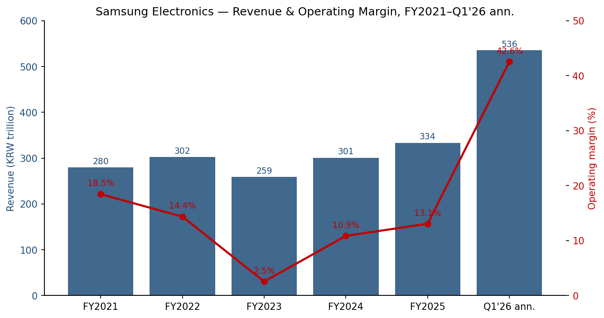
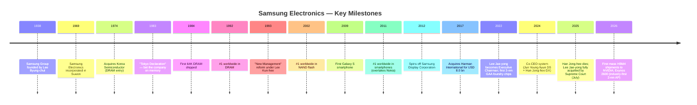
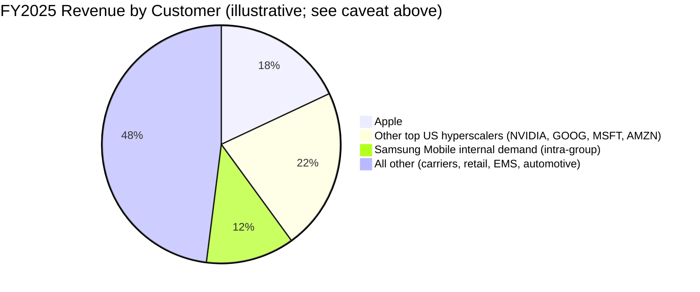
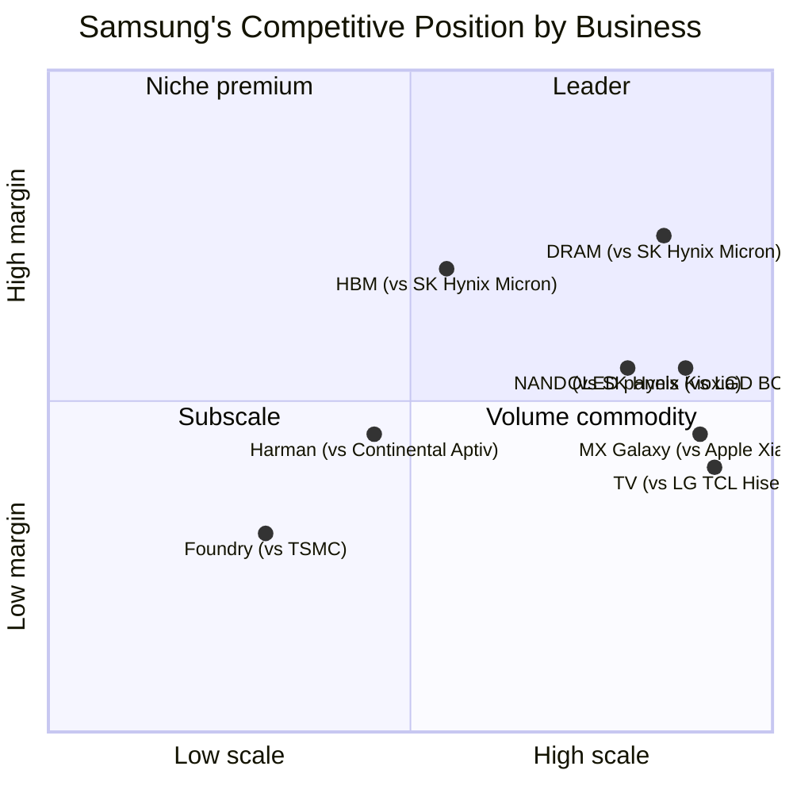
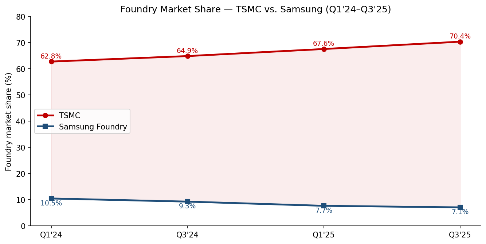
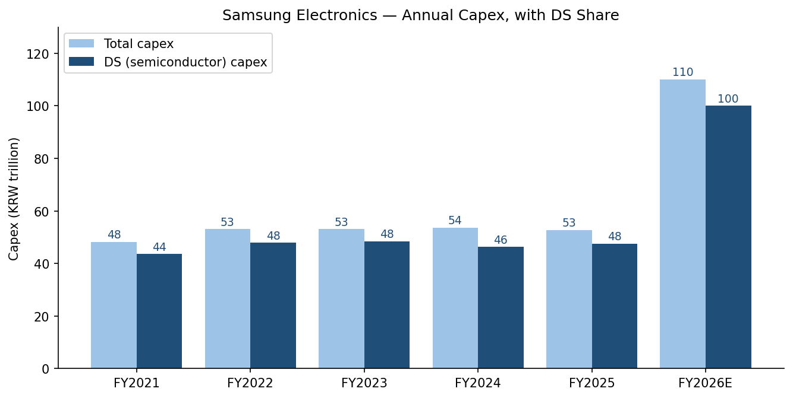

# Samsung Electronics Co., Ltd. (KRX:005930) — Initiation of Coverage

**Date:** 2026-05-20
**Ticker:** KRX:005930 (common); KRX:005935 (preferred 1P)
**Headquarters:** 129 Samsung-ro, Yeongtong-gu, Suwon-si, Gyeonggi-do, South Korea
**Report language:** English (US-listed peers + global readership justify English over Korean; Korea-domicile auto-rule would default to English per the company-research skill since prose is not produced in Korean)

> **Update — Record Q1 2026 results (2026-04-30):** Samsung Electronics posted KRW 134 trillion in consolidated revenue (+69% YoY, +43% QoQ) and KRW 57 trillion in operating profit (+185% QoQ) — both all-time quarterly highs and an operating profit larger than the company's entire FY2025 result of KRW 43.6 trillion. Semiconductor (DS) operating profit grew **~48-fold YoY** (from KRW 1.1 trn in Q1'25 to KRW 53.7 trn in Q1'26) on HBM4 first-shipment volumes to NVIDIA's Vera Rubin platform, conventional DRAM contract prices rising 90–95% QoQ, and the start of mass SOCAMM2 production. Management guided that HBM revenue should more than triple in 2026. Source: [Samsung Electronics Announces First Quarter 2026 Results — Samsung Global Newsroom, 2026-04-30](https://news.samsung.com/global/samsung-electronics-announces-first-quarter-2026-results); [Samsung Electronics Q1 '26 operating profit exceeds company's FY25 full-year total — DCD, 2026-04-30](https://www.datacenterdynamics.com/en/news/samsung-electronics-q1-26-operating-profit-exceeds-companys-fy25-full-year-total/).

## Table of Contents

1. Company Overview
2. Company History
3. Management Team
4. Products & Services
5. Customers & Go-to-Market
6. Industry Overview
7. Competitive Landscape
8. Market Opportunity (TAM)
9. Risk Assessment
10. References

---

## 1. Company Overview

Samsung Electronics Co., Ltd. ("Samsung Electronics" or "the Company") is the world's largest memory-semiconductor manufacturer, the world's largest smartphone vendor by units, the world's largest television vendor by units for the 20th consecutive year, and the world's largest OLED-display maker — all inside a single listed entity. Founded in 1969 as a black-and-white-TV joint venture of the Samsung Group and now domiciled in Suwon, South Korea, it sits at the center of the broader Samsung *chaebol* and is the single most important industrial company in Korea: in FY2025 its consolidated revenue of **KRW 333.6 trillion** (~USD 230 bn) was equivalent to roughly **12–13% of Korea's nominal GDP**, and the stock plus its preferred share account for the largest single weight in the KOSPI ([Samsung Electronics Announces Fourth Quarter and FY 2025 Results, 2026-01-29](https://news.samsung.com/global/samsung-electronics-announces-fourth-quarter-and-fy-2025-results)).

**What does the company do?** Samsung Electronics operates two principal pillars and two consolidated subsidiaries:

- **Device Solutions (DS).** Memory (DRAM, NAND, HBM), Foundry (contract logic manufacturing), and System LSI (in-house design of Exynos application processors, image sensors, modems, power-management ICs). DS is the cyclical earnings engine.
- **Device eXperience (DX).** Mobile eXperience (Galaxy smartphones, tablets, wearables, PCs), Visual Display / Digital Appliances (VD/DA — televisions, refrigerators, washing machines, air conditioners), and Networks (5G base stations).
- **Samsung Display Corporation (SDC).** Wholly owned subsidiary; the largest small/medium OLED-panel maker in the world and the single largest OLED supplier to Apple's iPhone.
- **Harman International.** Acquired 2017 for USD 8.0 bn ([Samsung Electronics to Acquire HARMAN, 2016-11-14](https://news.samsung.com/global/samsung-electronics-to-acquire-harman-accelerating-growth-in-automotive-and-connected-technologies)); operates connected-car electronics, premium audio (JBL, Harman/Kardon, AKG, Mark Levinson), and enterprise/professional audio. FY2025 revenue KRW 15.78 trn — a record for the subsidiary ([Harman hits KRW15.78 trillion in revenue, DigiTimes 2026-04-24](https://www.digitimes.com/news/a20260424PD230/samsung-harman-revenue-adas.html)).

**How does it make money?** The economics are dominated by DRAM and NAND pricing. DS revenue scales with bit demand and the ASP cycle; in an "up" memory year (FY2021, FY2024 2H, FY2025 2H, FY2026) DS can contribute >70% of group operating profit, while in a "down" year (FY2023) DS swings to an operating loss. DX is the stabiliser — MX sells ~235 mn Galaxy units a year at low-to-mid-teens operating margins, VD/DA layers another ~KRW 60+ trn of consumer-electronics revenue at single-digit margins, and Networks is a small but strategically important 5G/6G business. SDC throws off a steady cash stream from Apple OLED panel orders, and Harman is a small but profitable automotive growth optionality.

**Where does it operate?** Samsung Electronics runs an integrated global footprint: memory and foundry fabs in Korea (Pyeongtaek, Hwaseong, Giheung), the new Taylor, Texas foundry (delayed to 2026), older 8-inch capacity in Austin, advanced packaging in Cheonan and Onyang, smartphone-final-assembly mega-plants in Vietnam (Bac Ninh, Thai Nguyen) and India (Noida), TV and home-appliance plants in Vietnam, Mexico (Querétaro), Hungary, and Thailand. R&D centres include Samsung Research (Seoul), Samsung Semiconductor (San Jose), and Samsung Research America (Mountain View). As of 2024 disclosure, **125,297** of the company's then-~267,000 global employees were in Korea, **25,100** in North America, and the remainder in Asia, Europe and the Americas ([Samsung_Electronics_The_number_of_employees, samsung.com](https://www.samsung.com/global/sustainability/policy-file/AZA5bnDqHM8ALYNu/Samsung_Electronics_The_number_of_employees_en.pdf)).

**How large is it?** FY2025 revenue KRW 333.6 trn (~USD 230 bn); FY2025 operating profit KRW 43.6 trn (~USD 30 bn); FY2025 capex KRW 52.7 trn, of which KRW 47.5 trn was Device Solutions ([Samsung Electronics reports 2025 capital expenditure of KRW 52.7 trillion, Investing.com 2026-01-29](https://www.investing.com/news/company-news/samsung-electronics-reports-2025-capital-expenditure-of-krw-527-trillion-93CH-4472051)). Headcount ~267,000 as of mid-2025, ~129,000 in Korea, **~128,880** as of May 2026 per stockanalysis.com ([Samsung Electronics (KRX:005930) — Stockanalysis.com](https://stockanalysis.com/quote/krx/005930/)).

Source: Samsung Electronics FY2021–FY2025 press releases and Q1 2026 release (cited above). Q1'26 annualised = Q1 actual × 4; illustrative only, not company guidance.

**Valuation snapshot (as of 2026-05-19):**

| Metric | Value | Source |
|---|---|---|
| Share price (common, 005930) | **KRW 275,500** | [Stockanalysis.com, 2026-05-19](https://stockanalysis.com/quote/krx/005930/) |
| 52-week range | KRW 53,700 – 299,500 | same |
| Market cap (common+preferred) | **KRW 1,791 trn** (~USD 1.23 trn) | same |
| 1-year price change | **+388%** | same |
| Dividend yield | 0.54% | same |
| Employees | 128,880 (parent-only payroll) | same |
| **Forward P/E 2026E** | **~6.8x** | [Seoul Economic Daily, 2026-05-14](https://en.sedaily.com/news/2026/05/14/sk-hynix-forward-per-overtakes-samsung-electronics-for) |
| Forward P/E peers | SK Hynix 6.79x, Micron ~8x, TSMC ~20x, Intel ~35x | [Nomura via TradingKey, 2026-05](https://www.tradingkey.com/analysis/stocks/us-stocks/261908464-nomura-samsung-skhynix-dram-tradingkey) |

**Interpretation of the multiple.** Samsung trades at a forward P/E of ~6.8x — historically *low* in absolute terms but consistent with the memory cycle: the market is pricing FY2026E earnings at a cyclical peak and discounting toward a normalised mid-cycle EPS. The two relevant anchors are (a) SK Hynix at **6.79x** — for the first time ever, SK Hynix trades *above* Samsung on forward P/E because the market gives SK Hynix more credit for HBM-purity ([Seoul Economic Daily, 2026-05-13](https://en.sedaily.com/finance/2026/05/13/sk-hynix-overtakes-samsung-electronics-in-valuation-for)); and (b) TSMC at ~20x, where the market awards a foundry-monopoly premium that Samsung will struggle to win until its 2-nm node demonstrates volume yields. Nomura's view is that the gap is too wide and Samsung's multiple should "converge with TSMC" as HBM and 2-nm scale ([Nomura forecast 590,000 for Samsung, 4 million for SK hynix, Asia Business Daily 2026-05-17](https://www.asiae.co.kr/en/article/stock-etc/2026051718535452847)). The bear case is the opposite — if FY2026 earnings turn out to be the cyclical peak, today's 6.8x will look more like 12–14x on normalised earnings, and the stock is no longer cheap. Either way, **the valuation snapshot is the cycle**: there is no single "fair" P/E for Samsung disconnected from where the DRAM/NAND/HBM ASP curve will turn.

---

## 2. Company History

Samsung Electronics traces its origins to the founding of the Samsung Group by **Lee Byung-chul** in 1938 as a Daegu-based trading company exporting dried fish, vegetables and noodles. Samsung Electronics itself was incorporated **on 13 January 1969** in Suwon to build black-and-white televisions, in partnership with Japan's Sanyo and NEC ([Samsung Electronics — Wikipedia](https://en.wikipedia.org/wiki/Samsung_Electronics)). The decisive pivot came in 1974, when Lee Byung-chul personally pushed the group into semiconductors against the advice of consultants and the Korean government, acquiring a 50% stake in Korea Semiconductor — a then-bankrupt 3-inch wafer fab. By 1983, on the back of a famous "Tokyo Declaration" by the founder, Samsung committed to DRAM despite Japanese and US incumbents holding the technology lead. The Company shipped its first 64K DRAM in 1984, climbed to **#1 in global DRAM by 1992**, and has held that crown for over 30 years.

**Strategic pivots that defined the modern company.**

- **1993 "New Management" reform.** Then-chairman **Lee Kun-hee** (the founder's son, who took over in 1987) famously told executives in Frankfurt to "change everything except your wife and children." The reform pushed Samsung from a cost-focused volume manufacturer into a quality-driven, design-led brand and laid the groundwork for the company's eventual dominance in smartphones, panels and consumer appliances ([Wikipedia](https://en.wikipedia.org/wiki/Samsung_Electronics)).
- **2009–2011 smartphone surge.** The launch of the first Galaxy S in 2009 and the early adoption of Android as the OS allowed Samsung to leapfrog Nokia (which clung to Symbian) and decisively overtake it in unit shipments by 2011. The franchise remained the world's largest in units every year between 2011 and 2024 — except 2014 (briefly tied with Apple) and **2025**, when Apple shipped ~243 mn iPhones vs. Samsung's ~235 mn for the first time in 14 years ([CNBC, 2025-11-26](https://www.cnbc.com/2025/11/26/apple-iphone-shipments-to-beat-samsung-for-the-first-time-in-14-years.html); [Gulf News, 2026](https://gulfnews.com/technology/apple-tops-samsung-in-2025-global-smartphone-shipments-1.500467112)).
- **2017 Harman acquisition.** Samsung paid USD 8.0 bn ($112/share in cash) for Harman in March 2017 — its largest-ever acquisition, vaulting Samsung into automotive cockpit electronics and premium audio in one move ([Samsung Newsroom](https://news.samsung.com/global/samsung-electronics-to-acquire-harman-accelerating-growth-in-automotive-and-connected-technologies); [Davalyn Corp](https://davalyncorp.com/samsung-charges-into-auto-tech-with-8-billion-deal-for-harman/)).
- **2022–2025 foundry-strategy reset.** Samsung announced it would lead the industry to gate-all-around (GAA) transistors at 3-nm in 2022, ahead of TSMC's then-FinFET N3. Yields disappointed, key customers (Qualcomm, NVIDIA) returned to TSMC, and Samsung's foundry share collapsed from ~10.5% in Q1'24 to **7.1% in Q3'25** ([TrendForce via BigGo Finance](https://finance.biggo.com/news/Akg74pwBga3fZL9MGf-A)). The company is now staking its leading-edge recovery on the **2-nm Exynos 2600** (the industry's first mass-produced 2-nm mobile SoC, announced Dec 2025) and on closing the HBM gap.
- **2024–2025 leadership shake-up.** A co-CEO structure (Jun Young-hyun for DS, Han Jong-hee for DX) was put in place in November 2024 ([KED Global, 2024-11-27](https://www.kedglobal.com/executive-reshuffles/newsView/ked202411270012)). In **March 2025 Han Jong-hee died of a heart attack at 63** ([CNBC, 2025-03-25](https://www.cnbc.com/2025/03/25/samsung-electronics-says-co-ceo-han-jong-hee-has-passed-away.html)), and on **17 July 2025 the Supreme Court acquitted Lee Jae-yong** on the merger and accounting-fraud charges that had hung over him for a decade ([DigiTimes, 2025-07-17](https://www.digitimes.com/news/a20250717PD232/samsung-legal-merger-supreme-chairman.html)). With Lee fully cleared, the November 2025 executive reshuffle was the first under his unconstrained authority since taking the chairman title in 2022, and is widely read as the start of a "new Samsung" centralisation under his direct control ([KED Global, 2025-10-23](https://www.digitimes.com/news/a20251023PD209/samsung-personnel-chairman-2025.html)).

**Recent developments (2025–2026).** HBM3E 12-layer was finally **qualified by NVIDIA in September 2025**, 18 months after development was completed ([Tom's Hardware, 2025-09](https://www.tomshardware.com/tech-industry/samsung-earns-nvidias-certification-for-its-hbm3-memory-stock-jumps-5-percent-as-company-finally-catches-up-to-sk-hynix-and-micron-in-hbm3e-production)); **HBM4 mass shipments began February 2026** ([Samsung Q1 2026 release](https://news.samsung.com/global/samsung-electronics-announces-first-quarter-2026-results)); Taylor, TX fab was pushed to **late-2026 first production** with CHIPS Act funding cut from USD 6.4 bn to USD 4.745 bn ([Tom's Hardware, 2025](https://www.tomshardware.com/tech-industry/samsungs-yield-issues-reportedly-delays-taylor-fab-launch-to-2026); [Tokenring, 2025-12-22](https://www.financialcontent.com/article/tokenring-2025-12-22-samsungs-silicon-setback-subsidy-cuts-and-taylor-fab-delays-signal-a-crisis-in-us-semiconductor-ambitions)); and the **Exynos 2600 was unveiled in December 2025** as the industry's first 2-nm mobile AP, with the Galaxy S26/S26+ launch in 1H 2026 ([KED Global, 2025-12-19](https://www.kedglobal.com/korean-chipmakers/newsView/ked202512190004)).

---

## 3. Management Team

### Chairman: Lee Jae-yong (이재용) — Executive Chairman

**Lee Jae-yong** ("Jay Y. Lee" in English-language coverage), age 58, is the de facto controlling shareholder and Executive Chairman of Samsung Electronics. He has been formally Chairman since October 2022 and is the third-generation head of the Samsung family — son of the late Lee Kun-hee, grandson of founder Lee Byung-chul ([Wikipedia: Lee Jae-yong](https://en.wikipedia.org/wiki/Lee_Jae-yong)). Lee holds a BA in East Asian History from Seoul National University, an MBA from Keio University in Tokyo, and undertook (but did not complete) doctoral studies at Harvard Business School.

Lee joined Samsung Electronics in 1991 and was promoted through corporate-planning roles at the holding company before becoming Vice Chairman in 2012. His decade-long legal saga began with the December 2016 special-prosecutor indictment in connection with the impeachment of President Park Geun-hye: prosecutors alleged Lee bribed Park and her confidante in exchange for governmental support of the 2015 Samsung C&T / Cheil Industries merger that consolidated his control over Samsung Electronics. Lee was first convicted in August 2017, served one year before being released, was re-convicted on appeal in January 2021 (serving until **pardoned by President Yoon Suk Yeol in August 2022**), and faced a separate trial on the Samsung C&T merger and Samsung Biologics accounting-fraud charges. After he was acquitted at first instance (Feb 2024) and again on appeal (Feb 2025), the **Supreme Court rejected the prosecution's final appeal on 17 July 2025**, fully clearing him ([DigiTimes, 2025-07-17](https://www.digitimes.com/news/a20250717PD232/samsung-legal-merger-supreme-chairman.html)).

Lee's specific accomplishments at Samsung include the Harman acquisition (he personally led the deal in 2016), the 2018 USD 22 bn AI/auto-tech investment plan, and the 2024–2025 "new Samsung" reorganisation that re-centralised power into the chairman's office. His public profile is unusually high in Korea: he is widely viewed as the single most consequential business figure in the country, and his ~1.6% direct stake plus indirect control through Samsung C&T (which he chairs) gives him effective control over the group with relatively modest direct ownership. Korean business press now speculates that with his legal cases concluded he will revive the **Future Strategy Office** ("Mirae Jeolyaksil"), the disbanded group-control function ([KED Global, 2025-10-23](https://www.digitimes.com/news/a20251023PD209/samsung-personnel-chairman-2025.html)). Although Lee is Chairman rather than CEO, in Korean chaebol governance the Chairman's authority over senior appointments, capital allocation and strategic direction is decisive. His comp is modest by global-CEO standards (KRW 7–10 bn / yr in recent years) and he has never taken a bonus while under legal scrutiny.

### CEO (DS Division): Jun Young-hyun (전영현)

**Jun Young-hyun**, age 65, is Vice Chairman and CEO of the Device Solutions (DS) Division, and the de facto sole CEO of Samsung Electronics following Han Jong-hee's death in March 2025 ([CNBC, 2025-03-25](https://www.cnbc.com/2025/03/25/samsung-electronics-says-co-ceo-han-jong-hee-has-passed-away.html); [Samsung Electronics Announces New Leadership](https://news.samsung.com/global/samsung-electronics-announces-new-leadership-2)). A 38-year Samsung veteran, Jun spent the bulk of his career in Memory at Samsung Semiconductor before being parachuted out to run **Samsung SDI (the group's battery affiliate, KRX:006400)** as President in 2017 — where he restructured the small-format battery business, drove the Audi-Q8 e-tron win, and lifted SDI's revenue from KRW 6 trn (2017) to KRW 20+ trn by 2022. In May 2024 he was recalled to Samsung Electronics as Vice Chairman and Head of the DS Division, specifically to fix the HBM problem — which he has now done: HBM3E qualified at NVIDIA in September 2025 and HBM4 mass-shipped in February 2026 ([Samsung Q1 2026 release](https://news.samsung.com/global/samsung-electronics-announces-first-quarter-2026-results)).

### CFO: Park Soon-cheol (박순철)

**Park Soon-cheol** has been CFO since 2023, succeeding Choi Yoon-ho. A Samsung-lifer with deep DS Memory finance experience, Park's tenure has overlapped the trough of the 2023 memory downturn, the 2024 recovery, and the FY2025 capex push to KRW 52.7 trn. He oversaw the **KRW 8.4 trn share buyback for cancellation** approved as part of the 2024–2026 shareholder-return program announced in March 2024 — Samsung's first material structural buyback ([Samsung Electronics Announces Shareholder Return Program for 2024-2026](https://news.samsung.com/global/samsung-electronics-announces-shareholder-return-program-for-2024-2026); [SamMobile](https://www.sammobile.com/news/heres-how-samsung-will-return-money-to-shareholders-for-2024-2026/)).

### DX Co-CEO: TM Roh (노태문)

**Roh Tae-moon** ("TM Roh"), age ~58, was elevated to co-CEO alongside Jun in the November 2025 reshuffle to head the Device eXperience (DX) Division ([KED Global, 2025-11-21](https://www.kedglobal.com/leadership-management/newsView/ked202511210011)). Roh is best known as the chief architect of the Galaxy S/Z product line since 2020 — he ran Mobile R&D, led the Galaxy Z Fold/Flip foldable strategy that defined the premium category, and was head of the MX Business unit before his elevation. His mandate as DX CEO is to defend the smartphone franchise against Apple's iPhone-17-driven 2025 unit-share win, scale foldables (and the rumoured tri-fold) into a defensible premium niche, and unwind cost in the lower-margin VD/DA appliance business.

### Governance footer

- **Board composition.** Samsung Electronics has an 11-member board with 6 independent outside directors (a majority of independents, as required for listed Korean firms above a size threshold). Han Jong-hee was one of four executive directors; following his March 2025 death, the slate has been rebuilt around Jun Young-hyun, TM Roh, and the new heads of Foundry and Memory ([Wikipedia](https://en.wikipedia.org/wiki/Samsung_Electronics)).
- **Insider ownership.** The Lee family controls Samsung Electronics indirectly through a chain of cross-shareholdings centred on Samsung C&T (which owns ~5% of Samsung Electronics common) and Samsung Life Insurance (~8.5%). Lee Jae-yong's direct stake in Samsung Electronics common is small (~1.6%); the family's effective control comes from cross-shareholdings plus the preferred-share structure.
- **Comp.** Executive compensation is overwhelmingly cash + RSU; equity-perf-linked component sits at ~40–50% of total comp for division CEOs. Lee Jae-yong has historically taken modest pay relative to global CEO comp; CEO-level comp in 2024 was disclosed in the KRX-mandated executive-pay table.
- **Related-party.** The Samsung Group has historically had high intra-group transaction volumes (Samsung SDI batteries to Samsung mobile, Samsung Display panels to Samsung mobile, Samsung Engineering construction services to Samsung Electronics fabs). These are disclosed but the volumes and pricing terms have drawn periodic scrutiny from the Korea Fair Trade Commission.

### Track record synthesis

Jun Young-hyun is the right person for the HBM problem — he was a memory lifer before SDI, and he has now delivered both qualification and first shipments inside an 18-month window. Park Soon-cheol has executed an unprecedented capital-return program at Samsung. TM Roh's Galaxy track record is strong but uneven (foldables yes; Apple-share defence in 2025 no). The gap is foundry: there is no public-facing leader with the credibility Jun has in memory, and the foundry-share collapse from ~10.5% to 7.1% is the single most visible execution failure of the past two years.

---

## 4. Products & Services

```mermaid
graph TD
    SEC[Samsung Electronics Co., Ltd.]
    SEC --> DS[Device Solutions DS]
    SEC --> DX[Device eXperience DX]
    SEC --> SDC[Samsung Display Corp.]
    SEC --> HARMAN[Harman International]

    DS --> MEM[Memory: DRAM, NAND, HBM]
    DS --> FND[Foundry: 2nm/3nm/4nm/5nm/legacy]
    DS --> LSI[System LSI: Exynos AP, image sensors, modems, PMIC]

    DX --> MX[Mobile eXperience: Galaxy S/Z/A/Tab/Watch/Buds]
    DX --> VD[Visual Display: Neo QLED, OLED, MicroLED, Frame, soundbars]
    DX --> DA[Digital Appliances: refrigerators, washers, air conditioners, Bespoke AI]
    DX --> NET[Networks: 5G/6G RAN, Open RAN]

    SDC --> SMOLED[Small/medium OLED: iPhone, Galaxy, foldable, in-vehicle]
    SDC --> QDOLED[QD-OLED panels: TVs, gaming monitors]

    HARMAN --> AUTO[Automotive cockpit/ADAS/telematics]
    HARMAN --> AUDIO[Consumer audio: JBL, Harman/Kardon, AKG, Mark Levinson]
    HARMAN --> PRO[Professional/enterprise audio]
```

### Device Solutions (DS)

**Memory.** Samsung makes DRAM (server DDR5, mobile LPDDR5X, graphics GDDR6/7, **HBM3/HBM3E/HBM4**), NAND flash (consumer SSDs, enterprise SSDs, eUFS for mobile), and the new SOCAMM2 LPDDR5X compression-attached memory module — Samsung will supply ~50% of NVIDIA's second-generation SOCAMM volumes in 2026 ([KED Global, 2025-12-03](https://www.kedglobal.com/korean-chipmakers/newsView/ked202512030007)). Competitive verdict by sub-product:

| Product | Moat | Closest competitor (verdict) |
|---|---|---|
| Server DDR5 | **Yes** — scale, process leadership at 12-nm class | SK Hynix (parity), Micron (behind) |
| LPDDR5X mobile DRAM | **Yes** — scale + foundry colocation | SK Hynix (parity) |
| HBM3E 12-Hi | **Partial** — qualified at NVIDIA 18 months late ([Tom's Hardware](https://www.tomshardware.com/tech-industry/samsung-earns-nvidias-certification-for-its-hbm3-memory-stock-jumps-5-percent-as-company-finally-catches-up-to-sk-hynix-and-micron-in-hbm3e-production)) | SK Hynix (clearly ahead in NVIDIA wallet share); Micron (parity in qualifications) |
| HBM4 | **Partial → improving** — mass shipped Feb 2026 ([Samsung Q1'26 release](https://news.samsung.com/global/samsung-electronics-announces-first-quarter-2026-results)) | SK Hynix (parity at NVIDIA Rubin; SK still leads at Blackwell) |
| Enterprise SSD (PCIe Gen5/Gen6) | **Yes** | Kioxia/SanDisk (behind), SK Hynix Solidigm (parity) |
| Google TPU HBM3E | **Yes** — Samsung supplies **60%+** of Google TPU HBM3E ([TrendForce, 2025-12-01](https://www.trendforce.com/news/2025/12/01/news-samsung-reportedly-supplies-60-of-google-tpu-hbm3e-set-to-remain-primary-supplier-in-2026/)) | SK Hynix (smaller share) |

**Foundry.** Contract logic manufacturing across 2-nm GAA (just entering volume), 3-nm GAA (in volume), 4-nm/5-nm FinFET (mature), and legacy 8/14/28-nm. Market share in Q3 2025 was **7.1%** vs. TSMC at **70.4%** ([TrendForce / BigGo Finance](https://finance.biggo.com/news/Akg74pwBga3fZL9MGf-A)). Yield disclosures peg **2-nm yields at 55–60%** as of late 2025 ([TrendForce, 2025-11-25](https://www.trendforce.com/news/2025/11/25/news-samsung-reportedly-hits-55-60-2nm-yields-eyeing-an-edge-through-early-gaa-deployment/)) — credible for volume ramp of internal chips (Exynos 2600) but not yet of the major fabless customers (Qualcomm, MediaTek, NVIDIA, AMD) who almost universally went to TSMC for N3/N2. Verdict: **no clear moat at the leading edge today**; partial moat at trailing-edge nodes where Samsung competes on price.

**System LSI.** In-house Exynos APs (Exynos 2400, **Exynos 2600** — industry-first 2-nm AP, Dec 2025), ISOCELL CMOS image sensors, 5G modems, PMIC. The Exynos 2600 design uses Arm v9.3 architecture in a 10-core layout, claims 39% CPU gain over Exynos 2500 and double GPU performance, and powers Galaxy S26/S26+ in EU/India in 1H 2026 ([Android Central, 2025-12](https://www.androidcentral.com/phones/samsung-galaxy/samsung-exynos-2600-official); [Sammy Fans, 2026-01-15](https://www.sammyfans.com/2026/01/15/samsung-improves-2nm-exynos-2600-yields/)). Verdict: **partial moat** — Exynos lags Qualcomm Snapdragon 8 Elite Gen 5 in absolute performance (the Galaxy S26 Ultra still uses Snapdragon globally), but the 2-nm-on-Samsung-foundry combo is a strategic insurance policy.

### Device eXperience (DX)

**Mobile (MX).** Galaxy S (flagship), Z Fold / Z Flip (foldables), A (mid-range mass market), M (entry online), Tab, Book (PCs), Watch, Buds. **235 mn smartphones in 2025 (19% share, #2 globally)** behind Apple's ~243 mn ([CNBC, 2025-11-26](https://www.cnbc.com/2025/11/26/apple-iphone-shipments-to-beat-samsung-for-the-first-time-in-14-years.html)). Samsung reclaimed #1 in Q1 2026 with 22% share ([PhoneArena, Q1 2026](https://www.phonearena.com/news/q1-2026-global-smartphone-market-report-samsung-first-place-apple-second_id179680)). The MX moat is **brand + Android-ecosystem scale + vertically integrated panel/memory**; the vulnerability is sustained ASP and margin pressure from a "barbell" market (Apple at the top, Xiaomi/Transsion at the bottom).

**Visual Display (VD).** Neo QLED (mini-LED-backlit LCD), OLED TVs, MicroLED (luxury), The Frame, soundbars. **20 consecutive years as #1 TV vendor globally, 29.1% revenue share in 2025 per Omdia** ([techbuzz.ai, 2025](https://www.techbuzz.ai/articles/samsung-holds-tv-crown-for-20-years-with-29-market-share)). Dominates the premium segment with 54.3% share of TVs >USD 2,500 and 52.2% of TVs >USD 1,500. Notably, in Q1 2025 Samsung sold more OLED TVs in North America than LG for the first time since re-entering OLED in 2022 ([FlatpanelsHD, 2025-05](https://www.flatpanelshd.com/news.php?subaction=showfull&id=1748261917)).

**Digital Appliances (DA).** Refrigerators, washers, dryers, air conditioners, vacuums. The Bespoke AI strategy (announced 2024) positions modular, AI-enabled appliances at the premium end. Operating margins single-digit; structural pressure from Chinese entrants (Midea, Haier).

**Networks.** 5G RAN and Open RAN equipment. Small in absolute revenue but strategically important — Samsung is one of only four major 5G RAN vendors (Ericsson, Nokia, Huawei being the others), and is the largest non-Chinese RAN vendor in North America (Verizon, T-Mobile, US Cellular). The Open RAN positioning is a moat against the Ericsson/Nokia duopoly outside Asia.

### Samsung Display (SDC) — wholly owned subsidiary

**41% revenue share of the global OLED market in 2025** per Counterpoint ([Heyup / Counterpoint, 2025](https://heyupnow.com/blogs/heyup-trend-insight-lab/global-oled-market-2025-forecast-samsung-display-to-lead-with-41-revenue-share-says-counterpoint)). The crown jewel is **iPhone OLED**: Samsung Display shipped 125 mn OLED panels to Apple in 2025 (of which 78 mn for the iPhone 17 series), up from 124 mn in 2024 ([OLED-Info / UBI Research](https://www.oled-info.com/ubi-details-samsung-lg-and-boes-market-share-apples-smartphone-oled-supply)). Apple migrated **every iPhone SKU to OLED in 2025**, expanding the addressable iPhone-OLED unit pool. The secondary product is QD-OLED for high-end TVs and gaming monitors. SDC's FY2025 op profit of ~KRW 5.7 trn ([Samsung Q4 FY25 release](https://news.samsung.com/global/samsung-electronics-announces-fourth-quarter-and-fy-2025-results)) makes it the third-largest profit pool in the group.

### Harman International

Acquired 2017 for USD 8.0 bn ([Samsung Newsroom, 2016](https://news.samsung.com/global/samsung-electronics-to-acquire-harman-accelerating-growth-in-automotive-and-connected-technologies)). Three segments: **Automotive** (in-vehicle infotainment, ADAS subsystems, telematics — installed in 30 mn+ vehicles), **Consumer Audio** (JBL, Harman/Kardon, AKG, Mark Levinson), and **Professional/Enterprise Audio**. **FY2025 revenue KRW 15.78 trn (record), operating profit KRW 1.53 trn (record)** ([DigiTimes, 2026-04-24](https://www.digitimes.com/news/a20260424PD230/samsung-harman-revenue-adas.html); [channelnews](https://www.channelnews.com.au/harman-seriously-delivering-for-samsung-with-record-revenues-profits/)). Verdict: **partial moat** — premium-audio brands (JBL, Mark Levinson) are durable; automotive cockpit electronics is competitive (Continental, Aptiv, Visteon, LG Electronics VS).

### Flagship vs. long tail

The 1–3 products driving the business today are: **(1)** DRAM/NAND/HBM in DS Memory — ~80% of group operating profit in Q1 2026; **(2)** Galaxy S/Z smartphones in MX — ~10% of group operating profit; **(3)** OLED panels to Apple in SDC — ~5%. Everything else (VD, DA, Networks, Harman, Foundry, System LSI) is structurally smaller and/or barely break-even at the cycle trough.

### Recent launches and roadmap

- **HBM4 (Feb 2026):** First mass shipments to NVIDIA Vera Rubin.
- **SOCAMM2 LPDDR5X module (Q1 2026):** First mass product; Samsung wins ~50% supplier share.
- **Exynos 2600 2-nm AP (Dec 2025):** Industry-first 2-nm SoC; powers Galaxy S26/S26+ in EU/India.
- **Galaxy S26 series (1H 2026):** Targeting unit-share recovery vs. Apple iPhone 17.
- **2-nm GAA foundry (1H 2026):** Volume ramp at 55–60% yields.

---

## 5. Customers & Go-to-Market

Samsung's customer base is among the most diversified of any large-cap semiconductor/electronics name, but this hides material concentration in specific sub-businesses.

**Customer concentration disclosure.** Samsung Electronics' DART **사업보고서** (annual report) discloses a single major-customer threshold: the FY2024 사업보고서 (filed March 2025) reports that the company's largest single customer accounts for revenue above 10% of consolidated sales. Press reporting and supply-chain analyses identify that customer as **Apple Inc.**, primarily through (a) OLED panels from Samsung Display, (b) NAND and DRAM into Apple's iPhone/iPad/Mac assembly, and (c) Samsung Foundry's legacy chips for various Apple peripherals. The Company does not publish a top-5 customer share in the same form as Chinese 年度报告; the most credible estimate from sell-side coverage puts the **top-5 customers** (Apple + the major US hyperscalers — NVIDIA, Google, Microsoft, Amazon Web Services — depending on the year) at **roughly 35–45% of consolidated revenue**, dominated by Apple and NVIDIA in 2025–2026. *Per the company-research skill guidance, this is an estimate based on supply-chain disclosures and is not directly disclosed in the 사업보고서; treat with appropriate caution.*

*Source: estimated mix per supply-chain analysis from [Reuters via OLED-Info](https://www.oled-info.com/ubi-details-samsung-lg-and-boes-market-share-apples-smartphone-oled-supply), TrendForce HBM share data, and Samsung's own segment disclosures; not directly disclosed in 사업보고서.*

**Segment-by-segment customer pattern.**

- **DS Memory & HBM.** Top customers are NVIDIA (HBM, GDDR), Google (TPU HBM — Samsung supplies 60%+), Apple (NAND, DRAM, eUFS), Microsoft and AWS (server DDR5, enterprise SSDs), Meta (server DRAM), and Samsung's own MX division (LPDDR for Galaxy). The risk: **NVIDIA's HBM purchases for Blackwell still go disproportionately to SK Hynix**; Samsung's Rubin-era win is the recovery vector but still trails SK Hynix.
- **DS Foundry.** Largest external customers are Qualcomm (legacy/auto), Tesla (Dojo training chips at 7-nm/4-nm in earlier era), Google (some Tensor SKUs in past, now mostly TSMC), AMD (selected legacy nodes), and Samsung's own System LSI (Exynos 2600 at 2-nm). The structural weakness: no major fabless went to Samsung for 3-nm or 2-nm; all the volume is internal.
- **DS System LSI.** Captive — most Exynos and ISOCELL sensors go into Samsung MX or Samsung consumer products.
- **DX MX (Mobile).** Direct-to-carrier + direct-to-retail in 200+ countries. Top wholesale customers are the US Tier-1 carriers (Verizon, T-Mobile, AT&T), and the global open-channel retail/e-commerce ecosystem. No single customer >10%.
- **DX VD/DA (Visual Display + Appliances).** Multi-channel retail. Walmart, Best Buy, Amazon, Costco are large but none individually >5%.
- **DX Networks.** Verizon, T-Mobile, US Cellular (US); Reliance Jio (India — historically large) and several European MNOs. Verizon was Samsung's single largest Networks customer in 2024; concentration is meaningful inside this small business.
- **SDC (Samsung Display).** Apple is the single largest customer (~50%+ of SDC revenue based on the 125 mn-panel iPhone supply). Samsung MX is the second (intra-group). Sony, Dell and HP for QD-OLED monitors.
- **Harman.** Tier-1 OEMs: Toyota, Hyundai-Kia, GM, Ford, BMW, Mercedes-Benz, Volkswagen, Stellantis are major automotive customers. No single OEM >15% of Harman revenue.

**Sales model.** A hybrid: direct B2B account management for hyperscaler memory/foundry deals and Tier-1 OEM auto/audio; carrier-channel-wholesale for MX; multi-channel retail + e-commerce + Samsung.com direct for VD/DA; specialised industrial-distribution for memory components into the long tail of EMS/ODM/contract manufacturers (Foxconn, Wistron, Pegatron, Quanta).

**Sales cycle.** Memory contracts are typically negotiated quarterly with hyperscaler "Cloud Service Provider" customers, increasingly via **long-term agreements (LTAs)** as supply has tightened in 2H 2025 / 1H 2026 ([TrendForce, 2026-03-31](https://www.trendforce.com/presscenter/news/20260331-12995.html)). HBM is now booked 12–24 months ahead via reservation deposits. Smartphone, TV and appliance sales follow standard quarterly retail-channel patterns. Foundry deals are 2–3-year design wins.

**Key partnerships.** NVIDIA (HBM, SOCAMM, GPU foundry for select SKUs), Google (TPU HBM, Tensor SoC manufacturing for some generations), Synopsys/Cadence (foundry PDKs), Arm (Cortex IP for Exynos), Verizon (5G RAN North America build-out), Apple (OLED panels — adversary-customer, since Apple is also working on US-based OLED supply diversification via LG and BOE), Tesla (historical 7-nm Dojo). Strategic supplier on the upstream side: ASML (EUV lithography — Samsung's 2-nm GAA depends on multi-patterning EUV throughput from ASML High-NA next-gen tools).

**Named wins disclosed in 2025–2026.**

- **NVIDIA HBM3E 12-Hi qualification** (Sep 2025) ([Tom's Hardware](https://www.tomshardware.com/tech-industry/samsung-earns-nvidias-certification-for-its-hbm3-memory-stock-jumps-5-percent-as-company-finally-catches-up-to-sk-hynix-and-micron-in-hbm3e-production)).
- **NVIDIA HBM4 first-shipments and SOCAMM2 ~50% supplier share** (Feb 2026) ([KED Global](https://www.kedglobal.com/korean-chipmakers/newsView/ked202512030007)).
- **Google TPU HBM3E ~60%+ supplier share for 2026** ([TrendForce, 2025-12-01](https://www.trendforce.com/news/2025/12/01/news-samsung-reportedly-supplies-60-of-google-tpu-hbm3e-set-to-remain-primary-supplier-in-2026/)).
- **Apple iPhone 17 OLED 78 mn panels** ([OLED-Info](https://www.oled-info.com/ubi-details-samsung-lg-and-boes-market-share-apples-smartphone-oled-supply)).

---

## 6. Industry Overview

Samsung Electronics operates across several industries simultaneously. Each has a different structure, growth rate and competitive dynamic.

### Memory semiconductors (largest profit pool — sets the cycle)

The global memory-semiconductor market (DRAM + NAND, including HBM) was approximately USD 165 bn in calendar 2024 per TrendForce, dipped to USD 195 bn in 2025 on the early phase of the AI memory super-cycle, and is now forecast to reach **USD 551.6 bn in 2026** with a further surge to a peak of **USD 842.7 bn in 2027** — annual growth exceeding 50% ([TrendForce, 2026-01-22](https://www.trendforce.com/presscenter/news/20260122-12893.html)). Within this, DRAM revenue is forecast at USD 404.3 bn in 2026 (+144% YoY) and NAND at USD 147.3 bn (+112% YoY). The drivers are AI training and inference (HBM, server DDR5, GDDR7, enterprise SSDs), with one-in-five DRAM wafer bits going to AI applications by 2026 ([TrendForce, 2025-12-26](https://www.trendforce.com/news/2025/12/26/news-ai-reportedly-to-consume-20-of-global-dram-wafer-capacity-in-2026-hbm-gddr7-lead-demand/)).

Structurally, memory is a three-player **oligopoly** in DRAM (Samsung, SK Hynix, Micron — ~95% combined share) and a five-player oligopoly in NAND (Samsung, SK Hynix/Solidigm, Kioxia, Western Digital/SanDisk, Micron). Capital intensity is high (USD 10–15 bn for a leading-edge fab), capacity is slow to add (18–24 months), and pricing is volatile — DRAM contract prices rose **90–95% QoQ in 1Q 2026** alone ([TrendForce, 2026-02-02](https://www.trendforce.com/presscenter/news/20260202-12911.html)). HBM is the highest-value sub-segment, commanding ~3–4× the per-bit ASP of conventional DRAM but still well below NVIDIA-side GPU economics — and **at Samsung's current step in HBM3E ramp, conventional DRAM is actually more profitable than HBM per wafer** in Q1 2026 because Samsung is still climbing the HBM yield curve ([wccftech, 2026](https://wccftech.com/samsung-q1-2026-earnings-conventional-dram-more-profitable-than-hbm-right-now/)).

**Regulation.** US CHIPS Act funding, US export controls on advanced chips to China, China's domestic-substitution push (CXMT in DRAM, YMTC in NAND), Korea's strategic-industry designation, and Inflation Reduction Act subsidies for US-domiciled fabs.

### Foundry (logic manufacturing)

Global foundry was approximately USD 130 bn in 2024 and USD 165–175 bn in 2025 per TrendForce. TSMC holds **70.4% Q3 2025 share**, Samsung 7.1%, the rest split among SMIC, UMC, GlobalFoundries, Powerchip, Tower, Hua Hong ([TrendForce / BigGo Finance](https://finance.biggo.com/news/Akg74pwBga3fZL9MGf-A); [TrendForce, 2026-03-12](https://www.trendforce.com/presscenter/news/20260312-12965.html)). The structure is a **leading-edge monopoly** (TSMC owns ~95%+ of <5-nm capacity), with Samsung the only credible #2 at the bleeding edge but with material yield/customer-wallet gaps.

### Smartphone (largest unit volume)

Global smartphone shipments were ~1.20 bn units in 2025. Apple led with 20% share (243 mn units), Samsung second with 19% (235 mn), Xiaomi ~14%, Transsion ~9%, OPPO ~9%, vivo ~7% ([Accio, 2025](https://www.accio.com/business/global-smartphone-market-share-trend-iphone-vs-samsung-2025)). The market is a structurally low-single-digit-growth volume market with margin polarisation: Apple captures ~80% of industry operating profit, Samsung captures most of the remainder via the Galaxy S/Z series, and the Chinese vendors compete in the mid-low end at low margins.

### Television

Global TV market ~210 mn units / USD 110 bn in 2025; Samsung #1 in revenue share (29.1%) for the 20th consecutive year, and #1 in unit shipments at ~17%, followed by TCL (16%), Hisense (10%), LG, Sony ([techbuzz.ai](https://www.techbuzz.ai/articles/samsung-holds-tv-crown-for-20-years-with-29-market-share); [Statista via grandviewresearch](https://www.statista.com/statistics/1266988/global-leading-manufacturers-tv-market-share-sales-volume/)). The premium segment is dominated by Samsung (54% of >USD 2,500 TVs), with LG strong in OLED.

### OLED panels

Global OLED panel market ~USD 68 bn in 2025; Samsung Display #1 at 41% revenue share, LG Display #2 at 21%, BOE 14%, Tianma 6% ([Heyup, 2025](https://heyupnow.com/blogs/heyup-trend-insight-lab/global-oled-market-2025-forecast-samsung-display-to-lead-with-41-revenue-share-says-counterpoint)). Smartphone OLED ~900 mn panels shipped in 2025 ([UBI Research, 2025](https://en.ubiresearchnet.com/oled-smartphone-panel-shipments-forecast-2025/)). Structural trend: rising OLED in iPad, MacBook, gaming monitors, automotive cockpits, opening multi-year incremental demand beyond smartphones.

### Automotive electronics (Harman)

Connected-car/cockpit-electronics market ~USD 35–40 bn in 2025; Harman is the leader in connected-car solutions with 30 mn+ vehicles installed ([Davalyn](https://davalyncorp.com/samsung-charges-into-auto-tech-with-8-billion-deal-for-harman/)). Margin profile is high-single-digit operating margin; competitive against Continental, Aptiv, Visteon, LG Electronics VS, Bosch.

### Networks (5G/6G RAN)

Global RAN equipment market ~USD 35 bn in 2025 and contracting modestly; dominated by Ericsson (~30% share), Nokia (~20%), Huawei (~30%, mostly China + EM), Samsung (~7%). Samsung is the largest non-Chinese vendor in North America and a key strategic supplier for Verizon's C-band build-out.

### Cross-cutting industry trends

- **AI memory super-cycle** through 2027–2028 — the single most important industry trend for Samsung. TrendForce forecasts the memory market to peak at USD 842.7 bn in 2027 ([TrendForce, 2026-01-22](https://www.trendforce.com/presscenter/news/20260122-12893.html)).
- **EUV / High-NA EUV concentration at ASML** — a single-supplier dependency.
- **US–China semiconductor decoupling** — Samsung's China fab (Xi'an NAND) is constrained by US export controls.
- **OLED expansion into iPad / MacBook / automotive** — multi-year tailwind for SDC.
- **Foldable smartphone share rising to ~3–5% of premium** — Samsung is the largest foldable vendor.
- **CSP long-term agreements re-pricing memory** — multi-quarter ASP visibility now a feature, not exception ([TrendForce, 2026-03-31](https://www.trendforce.com/presscenter/news/20260331-12995.html)).

---

## 7. Competitive Landscape

**Competitor-by-competitor analysis.**

1. **SK Hynix (KRX:000660).** Pure-play memory. ~62% HBM share in Q2 2025, ~57% in Q3, locked in as NVIDIA Blackwell's primary HBM3E supplier. Stock surged faster than Samsung in 2025–2026 — SK Hynix's forward P/E **overtook Samsung's** for the first time ever in May 2026 ([Seoul Economic Daily, 2026-05-13](https://en.sedaily.com/finance/2026/05/13/sk-hynix-overtakes-samsung-electronics-in-valuation-for)). Vulnerabilities: smaller scale, no foundry/system LSI/display optionality, no consumer franchise to cushion cyclical troughs.

2. **TSMC (NYSE:TSM, TWSE:2330).** Dominant foundry — 70.4% Q3 2025 share, ~95% of <5-nm capacity. Trades at ~20× forward P/E ([Nomura via TradingKey](https://www.tradingkey.com/analysis/stocks/us-stocks/261908464-nomura-samsung-skhynix-dram-tradingkey)) — a structural premium Samsung cannot close until 2-nm scales to external customers. TSMC's vulnerabilities are Taiwan geopolitics, ASML High-NA dependency, and overconcentration in Apple + NVIDIA.

3. **Micron Technology (NASDAQ:MU).** US-based memory; ~21% HBM share in 2025, ~19% in 2024. Smaller in DRAM but vertically integrated NAND. Carries a meaningful US-policy advantage (CHIPS Act + IRA). Trades at ~8× forward P/E.

4. **Apple (NASDAQ:AAPL).** Customer + competitor in smartphones. Took the #1 smartphone-shipment crown from Samsung in 2025 (243 mn vs. 235 mn — first time in 14 years; [CNBC](https://www.cnbc.com/2025/11/26/apple-iphone-shipments-to-beat-samsung-for-the-first-time-in-14-years.html)). Apple is also Samsung Display's largest customer (~125 mn iPhone OLED panels in 2025) and a major NAND/DRAM customer. The relationship is structurally adversarial-yet-symbiotic.

5. **Xiaomi (HKEX:1810) / Transsion (SSE:688036) / vivo / OPPO.** Chinese smartphone OEMs occupying the mid-low end where Samsung's Galaxy A and M lines compete. Cost-disciplined, fast-iteration, vertically integrated via the Chinese supply chain.

6. **LG Electronics (KRX:066570) + LG Display (KRX:034220).** Direct rival in TV (LG OLED is the long-time premium incumbent), in home appliances, and in OLED panels (LGD #2 in OLED with 21%). Samsung overtook LG in North America OLED TV sales in Q1 2025 — a symbolic win after 3 years of catching up ([FlatpanelsHD](https://www.flatpanelshd.com/news.php?subaction=showfull&id=1748261917)).

7. **Sony (TYO:6758).** Premium TV and consumer audio competitor; also a competitor in image sensors (Sony leads CMOS image-sensor share). Recently exited certain segments where Samsung dominates (mass-market TV).

8. **Intel (NASDAQ:INTC) Foundry.** Stated #2 foundry ambition with Intel 18A and 14A; struggling to win external customers, but Microsoft, the US DoD and parts of MediaTek are early adopters. A US-policy-favoured wildcard for Samsung Foundry.

9. **Continental AG / Aptiv / Visteon.** Direct Harman competitors in automotive cockpit electronics.

10. **CXMT (China Memory) / YMTC (Yangtze Memory).** Chinese memory entrants closing in on DDR4 and consumer NAND. Not yet at the leading edge but a structural long-term threat to the trailing-edge ASP floor.

**Market positioning framework.** Samsung's strategic positioning is **"vertical scale across the largest electronics value chain"** — it is the only company that simultaneously makes the memory inside an AI server, the OLED panel inside an iPhone, the foundry SoC inside a Galaxy phone, the TV in a US living room, and the audio system in a German car. The benefit is enormous cross-business optionality and intra-group demand smoothing (e.g., MX consumes Samsung DRAM/NAND/OLED in down memory years). The cost is enormous capital intensity and the fact that no individual sub-business is the *best* in its category (SK Hynix is the better HBM specialist, TSMC is the better foundry, Apple is the more profitable smartphone OEM).

**Competitive advantages.** (1) Scale + integration across memory/foundry/panels/devices. (2) Korean semiconductor cluster (Pyeongtaek, Hwaseong, Giheung) is the densest fab cluster outside Taiwan. (3) Strong consumer brand globally, especially in TVs and appliances. (4) Captive customer in Samsung MX (the world's largest smartphone OEM) absorbs internal memory/panel volume during downturns. (5) Capital strength — net cash ~KRW 100 trn+ supports counter-cyclical investment.

**Competitive vulnerabilities.** (1) HBM lag at NVIDIA — Samsung is catching up but is structurally #2 to SK Hynix in NVIDIA's wallet. (2) Foundry leading-edge customer gap — no major external N3/N2 fabless commits. (3) Smartphone share erosion at the high end (Apple 2025 #1 win). (4) Lower margins in DA than Korean and Chinese discount competitors. (5) Reliance on Apple in SDC creates customer-concentration exposure. (6) Governance — chaebol control structure remains a Korea-discount factor with global investors.

**Market-share recap.** Samsung's positions today: #1 DRAM (~42%), #1 NAND (~33%), **#2 HBM (~22–35% depending on methodology, target 30%+ in 2026)**, #2 foundry (7.1%), #1 smartphone (units; surrendered briefly in 2025), #1 TV (29.1%), #1 OLED panels (41%), #4 5G RAN (~7%), #1 connected-car audio (Harman ~30 mn vehicles).

---

## 8. Market Opportunity (TAM)

**Aggregated bottom-up TAM for Samsung's primary served markets, 2026:**

| Market | 2026E size | Source / methodology |
|---|---|---|
| Global memory (DRAM + NAND + HBM) | **USD 551.6 bn** | [TrendForce, 2026-01-22](https://www.trendforce.com/presscenter/news/20260122-12893.html) |
| of which HBM (estimated) | ~USD 50–60 bn | derived from HBM share of DRAM bit-mix per TrendForce |
| Global foundry | **USD 180–195 bn** | [TrendForce / BigGo Finance](https://finance.biggo.com/news/Akg74pwBga3fZL9MGf-A) |
| Global smartphone hardware | **~USD 480 bn** | derived from ~1.20 bn units × ~USD 400 blended ASP |
| Global TV | **~USD 110 bn** | [Statista / Omdia](https://www.statista.com/statistics/1266988/global-leading-manufacturers-tv-market-share-sales-volume/) |
| Global OLED panel | **~USD 75 bn** | [Heyup / Counterpoint, 2025](https://heyupnow.com/blogs/heyup-trend-insight-lab/global-oled-market-2025-forecast-samsung-display-to-lead-with-41-revenue-share-says-counterpoint) |
| Global home appliances (large) | **~USD 380 bn** | industry composite |
| Connected-car / cockpit electronics | **~USD 40–45 bn** | industry composite |
| Premium audio (Harman segments) | **~USD 25 bn** | industry composite |
| Global 5G/6G RAN equipment | **~USD 35 bn** | industry composite |
| **Combined TAM** | **~USD 1.9 trn** | |

**SAM (Serviceable Addressable Market).** Stripping out segments where Samsung does not credibly serve (low-end appliances in Africa, sub-USD-200 smartphones in segments dominated by Transsion), SAM is approximately **USD 1.4–1.5 trn in 2026**.

**SOM (Serviceable Obtainable Market) for FY2026.** With FY2025 revenue of KRW 333.6 trn (~USD 230 bn) and Q1 2026 annualised already at ~USD 370 bn, FY2026 consolidated revenue should land in the **USD 320–360 bn range** — roughly **22–25% of SAM**. The most upside lies in HBM (Samsung's share rising from ~22% to a stated target above 30% in 2026; [Counterpoint via Astute Group](https://www.astutegroup.com/news/general/sk-hynix-holds-62-of-hbm-micron-overtakes-samsung-2026-battle-pivots-to-hbm4/)) and in foundry 2-nm (a low-single-digit share that could re-rate if external N2 customers commit).

**Growth projections.** The memory super-cycle (TrendForce: 50%+ annual growth through 2027 peak) is the single largest revenue driver. The OLED expansion into iPad/MacBook/automotive should add USD 5–10 bn of incremental SDC revenue annually through 2028. The smartphone market is broadly flat at ~1.2 bn units; Samsung's growth here is share + ASP, not unit volume. TVs and DA are mature low-single-digit-growth markets where Samsung's growth is mix (premium QLED/OLED/MicroLED) and AI-feature monetisation.

**Penetration strategy.** Three vectors: (1) **HBM share recovery** to >30% by year-end 2026 via HBM4 ramp at NVIDIA Rubin and continued Google TPU wins; (2) **Foundry 2-nm external customer wins** — the strategic priority for 2026–2027 is converting at least one major US fabless to N2 to validate the node; (3) **OLED expansion into IT and automotive** for SDC. Indirectly, Samsung is also positioning for **HBM4E and HBM5** (2027–2028) where the industry will move to logic-die customisation — Samsung's foundry+memory integration is, in theory, a structural advantage SK Hynix lacks (and which is why SK Hynix is partnering with TSMC for HBM4 logic base dies).

---

## 9. Risk Assessment

### Company-Specific Risks

1. **HBM technological catch-up vs. SK Hynix.** Samsung's HBM3E was qualified at NVIDIA only in September 2025, 18 months after development was complete ([Tom's Hardware, 2025-09](https://www.tomshardware.com/tech-industry/samsung-earns-nvidias-certification-for-its-hbm3-memory-stock-jumps-5-percent-as-company-finally-catches-up-to-sk-hynix-and-micron-in-hbm3e-production)). SK Hynix remains the dominant Blackwell-era supplier; Samsung is the secondary supplier even on Rubin. If HBM4E or HBM5 yields slip again, Samsung loses two consecutive technology generations and gives SK Hynix a structural moat. **Mitigant:** HBM4 mass shipment in Feb 2026 demonstrates capability; Jun Young-hyun's memory-engineering credibility.

2. **Foundry leading-edge customer gap.** Samsung Foundry's Q3 2025 share fell to **7.1% vs. TSMC's 70.4%** ([TrendForce / BigGo](https://finance.biggo.com/news/Akg74pwBga3fZL9MGf-A)). No major US fabless has committed to Samsung N2 or N3 for high-volume SoCs. The 2-nm node is being validated almost entirely with internal Exynos 2600 volume. Without external wins, Samsung will burn capex (Taylor TX delayed; Pyeongtaek P3 still ramping) against an asset base that may not earn its cost of capital. **Mitigant:** 2-nm yields reportedly 55–60%, Exynos 2600 in volume, AI-accelerator design wins with Tesla / Tenstorrent / Rebellions possible.

3. **Apple customer concentration in SDC.** Samsung Display's largest customer, Apple, is structurally pushing for OLED-panel diversification — LGD is ramping iPhone 17 OLED, BOE is approved for select SKUs. Apple's iPhone share at SDC could compress 5–10 pp over the next 24 months, with revenue impact at the consolidated level of ~KRW 3–5 trn. **Mitigant:** Apple's IT-OLED (iPad, MacBook) and automotive OLED expansion offset.

4. **Smartphone-unit-share loss to Apple in 2025.** Apple shipped more units than Samsung for the first time in 14 years ([CNBC](https://www.cnbc.com/2025/11/26/apple-iphone-shipments-to-beat-samsung-for-the-first-time-in-14-years.html)). Even with Samsung's Q1 2026 22%-share recovery ([PhoneArena](https://www.phonearena.com/news/q1-2026-global-smartphone-market-report-samsung-first-place-apple-second_id179680)), the structural ASP pressure persists. Galaxy S26 series and the rumoured tri-fold need to perform. **Mitigant:** Galaxy S26 Ultra strong early reviews; foldable category leadership.

5. **Key-person risk after Han Jong-hee's death.** The co-CEO model lasted four months before Han's sudden death in March 2025 ([CNBC](https://www.cnbc.com/2025/03/25/samsung-electronics-says-co-ceo-han-jong-hee-has-passed-away.html)). DX leadership was reconstructed under TM Roh only in November 2025. Jun Young-hyun (DS, age 65) now bears the largest operational load; succession in DS is the most acute single-person risk. **Mitigant:** Deep bench at Memory R&D and Foundry levels; Lee Jae-yong personally engaged post-acquittal.

6. **Lee family control / chaebol governance.** Despite Lee Jae-yong's July 2025 acquittal, the chaebol cross-shareholding structure (Samsung Life ~8.5%, Samsung C&T ~5%, group affiliates) is a chronic governance-discount factor for global investors. Reports suggest revival of the Future Strategy Office — potentially good for execution speed but viewed cautiously by ESG-screening funds. **Mitigant:** Independent board majority; KRW 8.4 trn share buyback for cancellation already executed.

### Industry / Market Risks

7. **Memory cycle peak in 2027.** TrendForce forecasts memory market to peak at USD 842.7 bn in 2027 ([TrendForce, 2026-01-22](https://www.trendforce.com/presscenter/news/20260122-12893.html)). The historical pattern (1996, 2007, 2017, 2021) shows memory peaks are followed by 30–60% ASP corrections. FY2026 may be the closest analogue to FY2017–18 — earnings peak, then multi-quarter compression. **Mitigant:** AI-driven structural demand higher than prior cycles; LTAs tie down CSP pricing visibility.

8. **TSMC's 2-nm execution and High-NA leadership.** TSMC's N2 ramp combined with its earlier-mover position on High-NA EUV could permanently entrench it. Samsung is dependent on the same High-NA tools but earlier in its qualification curve. **Mitigant:** Samsung is the only N2 GAA mass producer in 2026 ahead of TSMC; technology gap is closeable on execution.

9. **US-China decoupling and Xi'an NAND exposure.** Samsung operates a major NAND fab in Xi'an, China, which is subject to US export-control licensing for advanced-equipment imports. A tightening of US controls or a Chinese retaliation could strand capacity. **Mitigant:** Samsung has US validated end-user license; Xi'an output is largely consumer-grade NAND.

10. **Chinese memory and panel substitution.** CXMT and YMTC are catching up at the trailing-edge of DRAM/NAND; BOE is closing on Samsung Display at the iPhone OLED node. Five-year horizon risk of structural margin compression in commoditised segments. **Mitigant:** Samsung's leading-edge product mix (HBM, server DDR5, premium OLED for iPhone Pro) less exposed.

### Financial Risks

11. **Capex peak in 2026 — KRW 110 trn risk.** Samsung's announced FY2026 capex of KRW 110 trn ([Tech-Insider, 2026-03-19](https://tech-insider.org/samsung-73-billion-semiconductor-investment-2026/)) — more than double FY2025 — is a major fixed-cost commitment going into the 2027 cycle-peak forecast. If memory ASPs correct in 2H 2027 / 2028, the depreciation pull from this capex hits earnings exactly when ASPs fall. **Mitigant:** Net cash position of ~KRW 100 trn+; ability to dial back if demand softens.

12. **Valuation / multiple-compression risk.** Samsung trades at ~6.8× forward P/E ([Seoul Economic Daily, 2026-05](https://en.sedaily.com/news/2026/05/14/sk-hynix-forward-per-overtakes-samsung-electronics-for)) — *low* in absolute terms, but the multiple is depressed because the market is discounting toward a normalised mid-cycle EPS, not a peak. On normalised earnings (avg of FY2023 KRW 6.6 trn op profit + FY2025 KRW 43.6 trn = ~KRW 25 trn), the implied P/E is closer to **12–14×** — closer to historical mid-cycle. Risk: if 2026 turns out to be the peak, today's price is not as cheap as the headline 6.8× suggests, and a de-rate could come from (a) a 2027 ASP correction, (b) HBM4E delay, (c) Apple share loss in SDC, or (d) the cycle-peak narrative break. **Mitigant:** Nomura argues for "convergence with TSMC's 20× P/E" upside ([TradingKey](https://www.tradingkey.com/analysis/stocks/us-stocks/261908464-nomura-samsung-skhynix-dram-tradingkey)); shareholder-return program adds visibility floor.

### Macroeconomic Risks

13. **KRW–USD exposure.** Samsung reports in KRW but the bulk of its memory/foundry/MX revenue is USD-priced. A KRW strengthening from current ~KRW 1,360/USD to KRW 1,200/USD shaves roughly 8–10% of reported operating profit. **Mitigant:** Natural hedge from USD-denominated raw material and ASML capex.

14. **Geopolitical — North Korea tail risk.** Samsung's largest fab cluster is within artillery range of the DMZ. A military incident or escalation, while low-probability, is a tail risk no other top-3 semiconductor maker faces in the same form (TSMC's Taiwan risk is structurally similar but well-rehearsed in the market discount).

15. **Cyclical sensitivity.** Memory and consumer electronics are both pro-cyclical — a global recession in 2026–2027 hits the DS, MX and VD/DA businesses simultaneously. Defensive offsets (SDC Apple panel volume, Networks, Harman OE programs) are real but a small fraction of group revenue. **Mitigant:** AI-data-center capex is increasingly counter-cyclical to consumer cycles; CSP LTAs lock in 2026 revenue.

---

## Charts (continued)

Source: Samsung Electronics FY2025 Q4 press release and Harman FY25 disclosures (cited above). DS and DX numbers are gross-of-eliminations; consolidated 333.6 trn after intra-group eliminations.

Source: [TrendForce / Astute Group, 2025](https://www.astutegroup.com/news/general/sk-hynix-holds-62-of-hbm-micron-overtakes-samsung-2026-battle-pivots-to-hbm4/) (Q2'25); [TrendForce, 2025-11](https://www.trendforce.com/news/2025/11/25/news-samsung-reportedly-hits-55-60-2nm-yields-eyeing-an-edge-through-early-gaa-deployment/) (Q3'25); [Counterpoint via Astute Group](https://www.astutegroup.com/news/general/sk-hynix-holds-62-of-hbm-micron-overtakes-samsung-2026-battle-pivots-to-hbm4/) (2026E target).

Source: [TrendForce via BigGo Finance, 2025](https://finance.biggo.com/news/Akg74pwBga3fZL9MGf-A).

Source: [Seoul Economic Daily, 2026-05-14](https://en.sedaily.com/news/2026/05/14/sk-hynix-forward-per-overtakes-samsung-electronics-for); [Nomura via TradingKey, 2026-05](https://www.tradingkey.com/analysis/stocks/us-stocks/261908464-nomura-samsung-skhynix-dram-tradingkey).

Source: Samsung Electronics Q4 FY2021–FY2025 press releases (cited above); FY2026E from [Tech-Insider, 2026-03-19](https://tech-insider.org/samsung-73-billion-semiconductor-investment-2026/).

---

## 10. References

### Primary — Samsung filings, IR materials, press releases

- [Samsung Electronics Announces First Quarter 2026 Results, 2026-04-30](https://news.samsung.com/global/samsung-electronics-announces-first-quarter-2026-results)
- [Samsung Electronics Announces Fourth Quarter and FY 2025 Results, 2026-01-29](https://news.samsung.com/global/samsung-electronics-announces-fourth-quarter-and-fy-2025-results)
- [Samsung Electronics Announces Fourth Quarter and FY 2024 Results, 2025-01](https://news.samsung.com/global/samsung-electronics-announces-fourth-quarter-and-fy-2024-results)
- [Samsung Electronics Announces Third Quarter 2025 Results](https://news.samsung.com/global/samsung-electronics-announces-third-quarter-2025-results)
- [Samsung Electronics Announces New Leadership, 2025](https://news.samsung.com/global/samsung-electronics-announces-new-leadership-2)
- [Samsung Electronics Announces Shareholder Return Program for 2024-2026](https://news.samsung.com/global/samsung-electronics-announces-shareholder-return-program-for-2024-2026)
- [Samsung Electronics 2024 Sustainability Report (PDF)](https://www.samsung.com/global/sustainability/media/pdf/Samsung_Electronics_Sustainability_Report_2024_ENG.pdf)
- [Samsung Electronics 2025 Sustainability Report (PDF)](https://www.samsung.com/global/sustainability/media/pdf/Samsung_Electronics_Sustainability_Report_2025_ENG.pdf)
- [Samsung Electronics Releases 2025 Sustainability Report](https://news.samsung.com/global/samsung-electronics-releases-2025-sustainability-report)
- [Samsung Electronics Number of Employees by Country (PDF)](https://www.samsung.com/global/sustainability/policy-file/AZA5bnDqHM8ALYNu/Samsung_Electronics_The_number_of_employees_en.pdf)
- [2025 Annual General Meeting Reference Material (PDF)](https://images.samsung.com/is/content/samsung/assets/global/ir/docs/2025_SEC_AGMReferenceMaterial_vF.pdf)
- [Samsung Electronics to Acquire HARMAN, 2016-11-14](https://news.samsung.com/global/samsung-electronics-to-acquire-harman-accelerating-growth-in-automotive-and-connected-technologies)
- [Exynos 2600 product page — Samsung Semiconductor](https://semiconductor.samsung.com/processor/mobile-processor/exynos-2600/)

### Secondary — industry research and trade press

- [TrendForce: AI to consume 20% of DRAM wafer capacity in 2026, 2025-12-26](https://www.trendforce.com/news/2025/12/26/news-ai-reportedly-to-consume-20-of-global-dram-wafer-capacity-in-2026-hbm-gddr7-lead-demand/)
- [TrendForce: Memory market peak USD 842.7 bn in 2027, 2026-01-22](https://www.trendforce.com/presscenter/news/20260122-12893.html)
- [TrendForce: 2Q26 memory contract prices, 2026-03-31](https://www.trendforce.com/presscenter/news/20260331-12995.html)
- [TrendForce: 1Q26 memory prices, 2026-02-02](https://www.trendforce.com/presscenter/news/20260202-12911.html)
- [TrendForce: Samsung 2nm yields 55-60%, 2025-11-25](https://www.trendforce.com/news/2025/11/25/news-samsung-reportedly-hits-55-60-2nm-yields-eyeing-an-edge-through-early-gaa-deployment/)
- [TrendForce: Samsung supplies 60%+ of Google TPU HBM3E, 2025-12-01](https://www.trendforce.com/news/2025/12/01/news-samsung-reportedly-supplies-60-of-google-tpu-hbm3e-set-to-remain-primary-supplier-in-2026/)
- [TrendForce: 4Q25 foundry revenue ranking, 2026-03-12](https://www.trendforce.com/presscenter/news/20260312-12965.html)
- [BigGo Finance / TrendForce: TSMC 70.4% foundry share Q3 2025](https://finance.biggo.com/news/Akg74pwBga3fZL9MGf-A)
- [Astute Group: SK Hynix 62% HBM, 2026 outlook](https://www.astutegroup.com/news/general/sk-hynix-holds-62-of-hbm-micron-overtakes-samsung-2026-battle-pivots-to-hbm4/)
- [Counterpoint via Heyup: OLED 41% share, 2025](https://heyupnow.com/blogs/heyup-trend-insight-lab/global-oled-market-2025-forecast-samsung-display-to-lead-with-41-revenue-share-says-counterpoint)
- [UBI Research via OLED-Info: Samsung Display Apple panel share](https://www.oled-info.com/ubi-details-samsung-lg-and-boes-market-share-apples-smartphone-oled-supply)
- [Statista: TV manufacturers market share worldwide 2025](https://www.statista.com/statistics/1266988/global-leading-manufacturers-tv-market-share-sales-volume/)

### Secondary — financial press and analyst notes

- [Seoul Economic Daily: SK hynix Forward PER Overtakes Samsung, 2026-05-14](https://en.sedaily.com/news/2026/05/14/sk-hynix-forward-per-overtakes-samsung-electronics-for)
- [Seoul Economic Daily: SK hynix Valuation Overtakes Samsung, 2026-05-13](https://en.sedaily.com/finance/2026/05/13/sk-hynix-overtakes-samsung-electronics-in-valuation-for)
- [TradingKey / Nomura: Convergence with TSMC P/E, 2026-05](https://www.tradingkey.com/analysis/stocks/us-stocks/261908464-nomura-samsung-skhynix-dram-tradingkey)
- [Asia Business Daily: Nomura targets — 590,000 KRW for Samsung, 2026-05-17](https://www.asiae.co.kr/en/article/stock-etc/2026051718535452847)
- [Stockanalysis.com — Samsung Electronics quote and statistics](https://stockanalysis.com/quote/krx/005930/)
- [Stockanalysis.com — Market cap detail](https://stockanalysis.com/quote/krx/005930/market-cap/)
- [DataCenterDynamics: Q1 2026 op profit exceeds FY25 total, 2026-04-30](https://www.datacenterdynamics.com/en/news/samsung-electronics-q1-26-operating-profit-exceeds-companys-fy25-full-year-total/)
- [TradingKey: Q1 2026 chip surge, mobile decline, HBM demand](https://www.tradingkey.com/analysis/stocks/us-stocks/261841802-samsung-q1-earnings-chip-surge-mobile-decline-hbm-demand-capex-record-tradingkey)
- [wccftech: Conventional DRAM more profitable than HBM in Q1 2026](https://wccftech.com/samsung-q1-2026-earnings-conventional-dram-more-profitable-than-hbm-right-now/)
- [SamMobile: Q1 2026 profit hits record high](https://www.sammobile.com/news/samsung-q1-2026-profit-hits-record-high-ai-chip-boom/)
- [Tom's Hardware: Samsung earns NVIDIA HBM3E certification, 2025-09](https://www.tomshardware.com/tech-industry/samsung-earns-nvidias-certification-for-its-hbm3-memory-stock-jumps-5-percent-as-company-finally-catches-up-to-sk-hynix-and-micron-in-hbm3e-production)
- [Tom's Hardware: Samsung Taylor fab delayed to 2026, yield issues](https://www.tomshardware.com/tech-industry/samsungs-yield-issues-reportedly-delays-taylor-fab-launch-to-2026)
- [Tom's Hardware: USD 44 bn Taylor fab delay — "no customers"](https://www.tomshardware.com/tech-industry/semiconductors/samsung-delays-usd44-billion-texas-chip-fab-sources-say-completion-halted-because-there-are-no-customers)
- [Tokenring / FinancialContent: CHIPS Act subsidy cuts and Taylor fab delays, 2025-12-22](https://www.financialcontent.com/article/tokenring-2025-12-22-samsungs-silicon-setback-subsidy-cuts-and-taylor-fab-delays-signal-a-crisis-in-us-semiconductor-ambitions)
- [KED Global: Samsung supplies 50% of NVIDIA SOCAMM 2nd gen, 2025-12-03](https://www.kedglobal.com/korean-chipmakers/newsView/ked202512030007)
- [KED Global: Exynos 2600 unveiled, 2025-12-19](https://www.kedglobal.com/korean-chipmakers/newsView/ked202512190004)
- [KED Global: Samsung 12-layer HBM3E qualification, 2025-09-19](https://www.kedglobal.com/korean-chipmakers/newsView/ked202509190008)
- [KED Global: Co-CEO Han Jong-hee appointment, 2024-11-27](https://www.kedglobal.com/executive-reshuffles/newsView/ked202411270012)
- [KED Global: November 2025 reshuffle, 2025-11-21](https://www.kedglobal.com/leadership-management/newsView/ked202511210011)
- [DigiTimes: Lee Jae-yong Supreme Court acquittal, 2025-07-17](https://www.digitimes.com/news/a20250717PD232/samsung-legal-merger-supreme-chairman.html)
- [DigiTimes: Lee Jae-yong post-acquittal strategy, 2025-10-23](https://www.digitimes.com/news/a20251023PD209/samsung-personnel-chairman-2025.html)
- [DigiTimes: Harman KRW 15.78 trn revenue, 2026-04-24](https://www.digitimes.com/news/a20260424PD230/samsung-harman-revenue-adas.html)
- [DigiTimes: Samsung 2026 investment, 2026-02-04](https://www.digitimes.com/news/a20260204PD201/samsung-investment-2025-robotics-2022.html)
- [CNBC: Han Jong-hee dies, 2025-03-25](https://www.cnbc.com/2025/03/25/samsung-electronics-says-co-ceo-han-jong-hee-has-passed-away.html)
- [CNBC: Apple beats Samsung in 2025 smartphone shipments, 2025-11-26](https://www.cnbc.com/2025/11/26/apple-iphone-shipments-to-beat-samsung-for-the-first-time-in-14-years.html)
- [Gulf News: Apple tops Samsung in 2025 global shipments](https://gulfnews.com/technology/apple-tops-samsung-in-2025-global-smartphone-shipments-1.500467112)
- [PhoneArena: Q1 2026 Samsung first place](https://www.phonearena.com/news/q1-2026-global-smartphone-market-report-samsung-first-place-apple-second_id179680)
- [SamMobile: Samsung tops Q1 2026 smartphone market](https://www.sammobile.com/news/samsung-tops-smartphone-market-q1-2026/)
- [SamMobile: Shareholder return 2024-2026](https://www.sammobile.com/news/heres-how-samsung-will-return-money-to-shareholders-for-2024-2026/)
- [Sammy Fans: Exynos 2600 2nm yields, 2026-01-15](https://www.sammyfans.com/2026/01/15/samsung-improves-2nm-exynos-2600-yields/)
- [Android Central: Exynos 2600 official](https://www.androidcentral.com/phones/samsung-galaxy/samsung-exynos-2600-official)
- [Android Central: Q4 2025 smartphone shipments](https://www.androidcentral.com/phones/samsung-galaxy/global-smartphone-shipments-rise-2-3-percent-in-q4-2025-samsung-and-apple-lead-the-market)
- [Accio: Global smartphone market share trend 2025](https://www.accio.com/business/global-smartphone-market-share-trend-iphone-vs-samsung-2025)
- [techbuzz.ai: Samsung 20-year TV crown, 29% share, 2025](https://www.techbuzz.ai/articles/samsung-holds-tv-crown-for-20-years-with-29-market-share)
- [FlatpanelsHD: Samsung overtakes LG in N.A. OLED TV, Q1 2025](https://www.flatpanelshd.com/news.php?subaction=showfull&id=1748261917)
- [UBI Research: 2025 OLED smartphone panel shipments](https://en.ubiresearchnet.com/oled-smartphone-panel-shipments-forecast-2025/)
- [channelnews: Harman record revenue and profits, 2025](https://www.channelnews.com.au/harman-seriously-delivering-for-samsung-with-record-revenues-profits/)
- [Davalyn: Samsung-Harman $8 bn deal](https://davalyncorp.com/samsung-charges-into-auto-tech-with-8-billion-deal-for-harman/)
- [Investing.com: Samsung KRW 47.4 trn 2025 capex plan](https://www.investing.com/news/company-news/samsung-plans-474-trillion-won-capex-for-2025-93CH-4318046)
- [Investing.com: Samsung KRW 52.7 trn 2025 capex actual](https://www.investing.com/news/company-news/samsung-electronics-reports-2025-capital-expenditure-of-krw-527-trillion-93CH-4472051)
- [Investing.com: $80B investment + shareholder returns plan](https://www.investing.com/news/company-news/samsung-electronics-plans-80b-investment-shareholder-returns-93CH-4569886)
- [Tech-Insider: Samsung $73B 2026 semiconductor investment](https://tech-insider.org/samsung-73-billion-semiconductor-investment-2026/)
- [Xinhua: Samsung 2025 revenue record, 2026-01-29](https://english.news.cn/20260129/fc9467f336714b3fbae6e899d4574b92/c.html)
- [Wikipedia: Samsung Electronics](https://en.wikipedia.org/wiki/Samsung_Electronics)
- [Wikipedia: Lee Jae-yong](https://en.wikipedia.org/wiki/Lee_Jae-yong)

### Notes

- Filings: Samsung Electronics' Korean 사업보고서 (annual report) and 분기보고서 (quarterly reports) are filed via [DART (Korean) / DART English portal](https://englishdart.fss.or.kr/). The English-language IR materials cited here are derived versions of those filings, plus the company's quarterly earnings press releases hosted on news.samsung.com. The fetch helper in this codebase does not cover Korea-domiciled issuers — primary disclosures were retrieved via Samsung IR and the DART portal directly.
- All KRW–USD conversions in this report use approximate FX of KRW 1,360–1,460/USD (2025–2026 range). For modelling, treat all USD figures as approximate translations.
- The "estimated top-5 customer concentration of 35–45%" in Section 5 is a sell-side composite estimate, not a directly disclosed 사업보고서 figure. Per the skill's accuracy principle, treat it as estimate rather than fact.

---

*End of report.*
