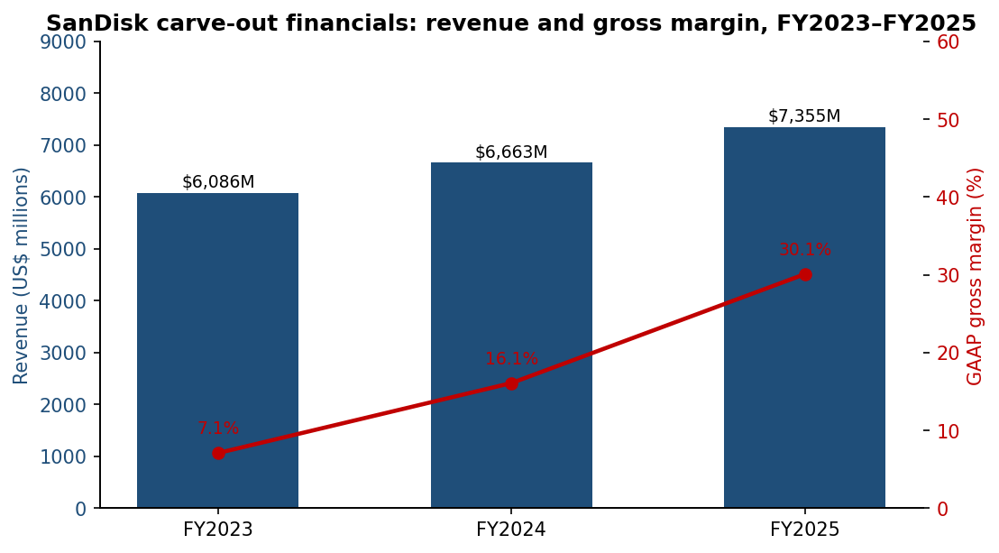
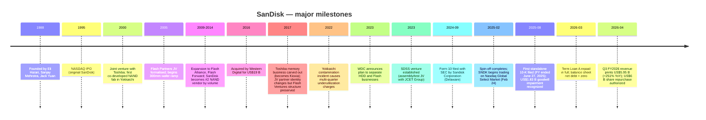
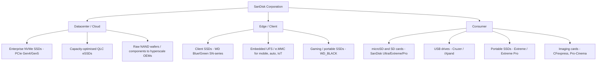
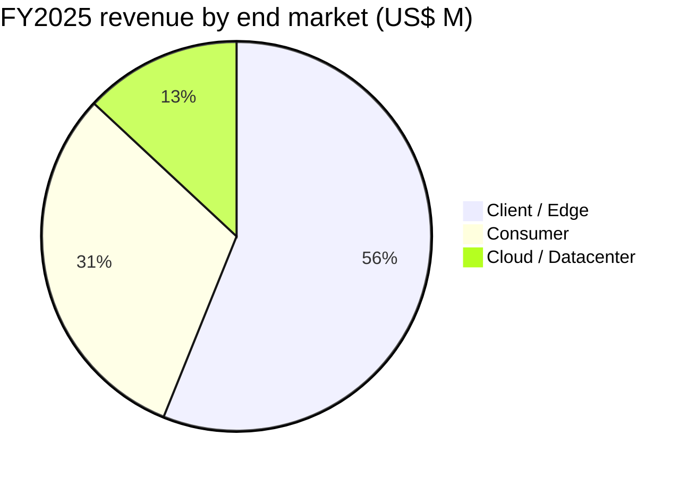
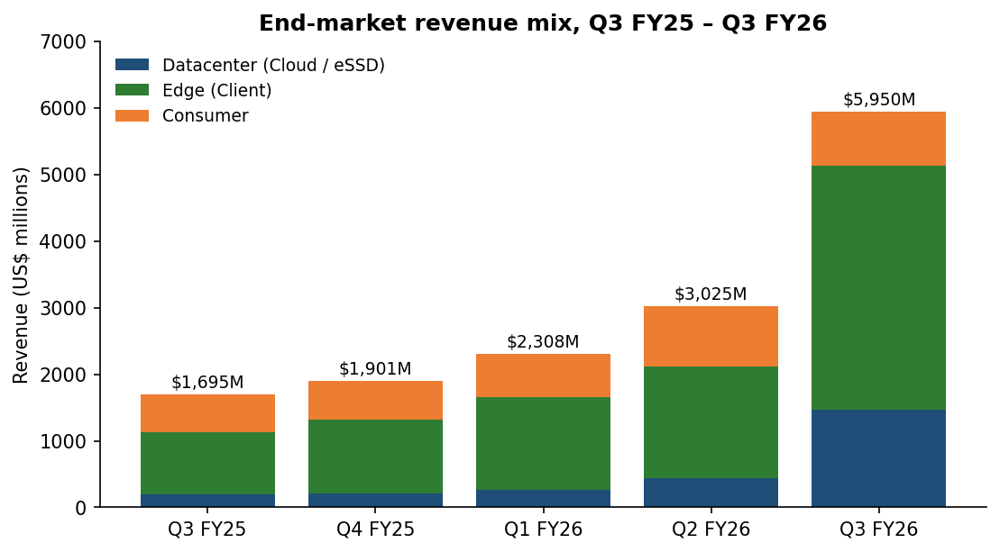
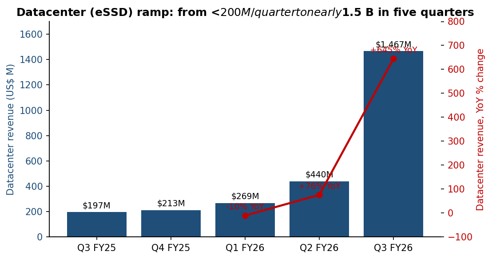
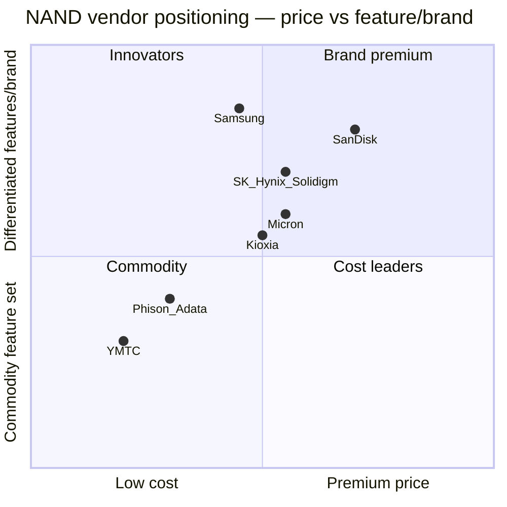
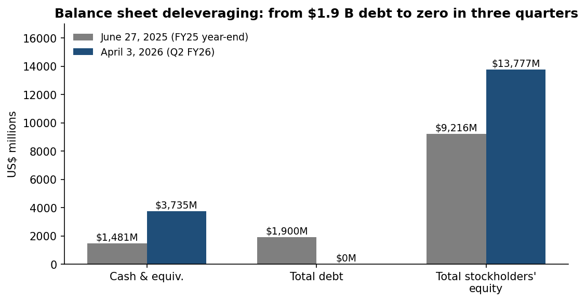
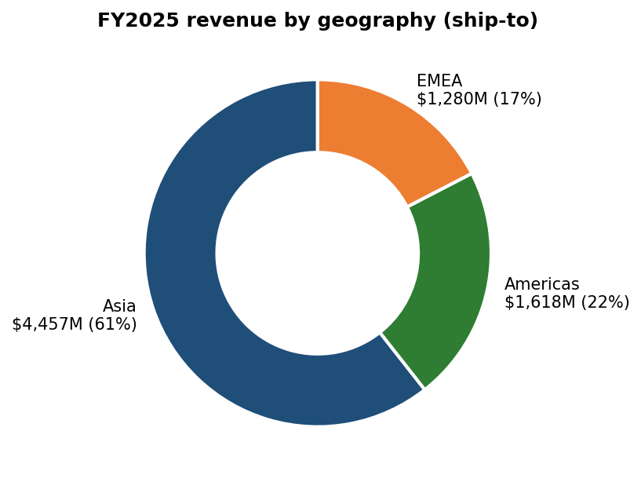
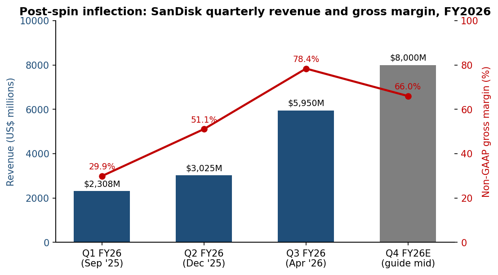

# COMPANY RESEARCH REPORT: SanDisk Corporation (NASDAQ: SNDK)

Date: 2026-05-20

> **Update — FY2026 Q4 guidance initiated (2026-04-30):** Management guided fiscal Q4 2026 (quarter ending July 3, 2026) revenue to **US$7.75 – 8.25 billion** and non-GAAP diluted EPS to **US$30.00 – 33.00**, alongside Board authorization of a **US$6 billion share repurchase program** and disclosure that the term-loan balance was repaid in full on March 4, 2026. The guide implies roughly +30% sequential revenue growth on top of the +97% sequential print just reported. Management attributed the outlook to (a) a continued mix shift toward Datacenter / eSSD customers (up 233% Q/Q in Q3), (b) higher NAND pricing as supply remains tight, and (c) the first multi-year "New Business Model" (NBM) contracts with firm volume and price commitments.
> Source: [Q3 FY2026 earnings press release, 2026-04-30](https://www.sec.gov/Archives/edgar/data/2023554/000162828026028879/sndkq3-26ex991xpressrelease.htm).

---

## TABLE OF CONTENTS

1. Company Overview
2. Company History
3. Management Team
4. Products & Services
5. Customers & Go-to-Market
6. Industry Overview
7. Competitive Landscape
8. Market Opportunity (TAM)
9. Risk Assessment

> **Important methodological note on the financials throughout this report.**
> SanDisk Corporation (Delaware) became a standalone public company on **February 21, 2025** via a tax-free distribution from Western Digital Corporation ("WDC"). All annual financials prior to that date are **carve-out / "predecessor" presentations** prepared under SAB Topic 1.B and Note 1 of the FY2025 10-K — they allocate WDC corporate costs, treasury, debt service and tax to the SanDisk business on a "what-if" basis ([10-K, FY2025, Note 1](https://www.sec.gov/Archives/edgar/data/2023554/000200235425000034/sndk-20250627.htm)). They are not the same as what a standalone SanDisk would have reported. Beginning in Q3 FY2025 (calendar Q1 2025) the company reports as a true standalone. Wherever a number is taken from a carve-out period, this report flags it as such.

---

# 1. COMPANY OVERVIEW

**SanDisk Corporation** is a developer, manufacturer and marketer of NAND-flash-based data-storage products — solid-state drives (SSDs), embedded memory, removable cards, USB drives and raw NAND wafers — serving three end markets the company now labels **Datacenter, Edge and Consumer** (formerly Cloud, Client and Consumer; the rename took effect in Q1 FY2026 to align the Edge label with the company's AI-architecture narrative). It is headquartered at 951 Sandisk Drive, Milpitas, California, employs **approximately 11,000 people across 33 countries** as of June 2025 (73% Asia-Pacific, 19% Americas, 8% EMEA) and holds **approximately 7,900 granted patents and 3,200 pending applications worldwide** [10-K, FY2025, pp. 5, 8](https://www.sec.gov/Archives/edgar/data/2023554/000200235425000034/sndk-20250627.htm).

SanDisk is the second-listed life of the SanDisk brand. The original SanDisk Corporation (founded 1988 by Eli Harari, Sanjay Mehrotra and Jack Yuan) was acquired by Western Digital in May 2016 for ~US$19 billion and operated as WDC's flash segment until the **Spin-off of February 21, 2025**: WDC distributed approximately 80.1% of "Sandisk Corporation"'s common stock to WDC stockholders on a 1-for-3 basis (one SNDK share per three WDC shares held on the February 12, 2025 record date), retained ~19.9%, and SNDK began trading on Nasdaq Global Select Market on **February 24, 2025** [10-K, FY2025, Note 1; Q2 FY2026 10-Q, Note 1](https://www.sec.gov/Archives/edgar/data/2023554/000162828026029401/sndk-20260403.htm). WDC subsequently exchanged its retained stake for WDC debt held by creditors and sold those shares in a registered public offering; **as of March 19, 2026, those shares are no longer subject to restriction and WDC's economic interest is effectively zero** ([Q2 FY2026 10-Q, Note 1](https://www.sec.gov/Archives/edgar/data/2023554/000162828026029401/sndk-20260403.htm)).

**Business model.** SanDisk earns essentially all of its revenue from selling NAND-flash-based storage products to OEMs, cloud-service providers, distributors, channel resellers and retail customers. Wafer manufacturing is **not done in-house**: substantially all NAND wafers come from **Flash Ventures**, a set of three Japanese joint ventures (Flash Partners, Flash Alliance, Flash Forward) co-owned 49.9% by SanDisk and ~50.1% by Kioxia Corporation, operating from six fabs in Yokkaichi and one in Kitakami, Japan, with an eighth Kitakami facility starting up in calendar 2025. SanDisk pays Flash Ventures **cost plus a small mark-up** for its share of wafer output (approximately 50% of total Flash Ventures volume) and is contractually responsible for 50% of the JVs' fixed costs whether or not it lifts its share ([10-K, FY2025, pp. 6–7](https://www.sec.gov/Archives/edgar/data/2023554/000200235425000034/sndk-20250627.htm)). Controllers are designed in-house and outsourced to third-party foundries; assembly and test happens in SanDisk's Penang, Malaysia facility and at contract manufacturers, with a portion of capacity supplied by the **SDSS Venture** (a 2023 carve-out into which WDC sold a minority equity stake to JCET Group; SanDisk inherited the supply agreement and the minimum-volume commitment of US$550 million per year through September 2029) ([10-K, FY2025, pp. 8, 64](https://www.sec.gov/Archives/edgar/data/2023554/000200235425000034/sndk-20250627.htm)).

**Revenue mix.** FY2025 (the carve-out fiscal year ended June 27, 2025) revenue was **US$7,355 million**, up 10% YoY, with the following end-market split: **Cloud US$960 M (13%), Client US$4,127 M (56%), Consumer US$2,268 M (31%)** ([10-K, FY2025, p. 48](https://www.sec.gov/Archives/edgar/data/2023554/000200235425000034/sndk-20250627.htm)). Geographic mix the same year was **Asia US$4,457 M (61%), Americas US$1,618 M (22%), EMEA US$1,280 M (17%)**. International sales (defined to include foreign subsidiaries of US companies but excluding US subsidiaries of foreign companies) were **80% of total revenue** ([10-K, FY2025, p. 10](https://www.sec.gov/Archives/edgar/data/2023554/000200235425000034/sndk-20250627.htm)).

In FY2026 the mix has been transformed by an AI-driven up-cycle in NAND. Quarterly revenue moved from **US$2,308 M in Q1 FY26 → US$3,025 M in Q2 FY26 → US$5,950 M in Q3 FY26**, with the company guiding Q4 FY26 to **US$7.75 – 8.25 B**. Cumulative non-GAAP diluted EPS for Q1–Q3 FY26 reached **US$30.83**, with management guiding **US$30.00 – 33.00** for Q4 alone. Datacenter revenue in particular went from **US$197 M in Q3 FY25 to US$1,467 M in Q3 FY26** (+644.7% YoY; +233% Q/Q) [Q3 FY2026 earnings release, 2026-04-30](https://www.sec.gov/Archives/edgar/data/2023554/000162828026028879/sndkq3-26ex991xpressrelease.htm).

*Source: [SanDisk FY2025 Form 10-K, MD&A pp. 47–48](https://www.sec.gov/Archives/edgar/data/2023554/000200235425000034/sndk-20250627.htm). FY2023 and FY2024 are carve-out / predecessor; FY2025 includes ~4 months as standalone post-spin.*

**Valuation snapshot.** SanDisk has been a public stock for only about 15 months (since February 24, 2025), so multiple history is short and volatile. The most recent definitive disclosure of a share-price reference is the company's May 14, 2026 8-K, which advised shareholders to reject an unsolicited mini-tender offer **at US$1,150 per share** because that price was "below market" (the bidder's own term-sheet conditioned settlement on the closing price exceeding US$1,150 on the last trading day) [SanDisk 8-K, 2026-05-14](https://www.sec.gov/Archives/edgar/data/2023554/000119312526224694/d157363dex991.htm). With **148.1 million common shares outstanding as of April 24, 2026** ([Q2 FY2026 10-Q, p. 33](https://www.sec.gov/Archives/edgar/data/2023554/000162828026029401/sndk-20260403.htm); [8-K Mini-Tender, 2026-05-14](https://www.sec.gov/Archives/edgar/data/2023554/000119312526224694/d157363dex991.htm)), a US$1,150 reference implies a **market capitalization of approximately US$170 billion**, with an additional ~9 million dilutive equity awards taking the diluted count to ~157 million ([Q3 FY2026 earnings release, 2026-04-30](https://www.sec.gov/Archives/edgar/data/2023554/000162828026028879/sndkq3-26ex991xpressrelease.htm)).

The most informative anchor is forward earnings: management's own Q4 FY26 mid-point guide implies a full-year FY2026 non-GAAP diluted EPS of approximately **US$30.83 + US$31.50 = US$62.33** ([Q3 FY2026 earnings release, 2026-04-30](https://www.sec.gov/Archives/edgar/data/2023554/000162828026028879/sndkq3-26ex991xpressrelease.htm)). At a US$1,150 reference price that is a forward (FY26-out) non-GAAP P/E of roughly **18.5×**, which for a hyper-growth memory cyclical is neither obviously stretched nor obviously cheap. **TTM (Q3 FY25 → Q3 FY26) revenue is approximately US$13.0 billion** (Q3FY25 $1,695M + Q4FY25 $1,901M + Q1FY26 $2,308M + Q2FY26 $3,025M + Q3FY26 $5,950M; we exclude Q3FY25 to get a clean four-quarter TTM = $13.18B) ([Q3 FY2026 earnings release](https://www.sec.gov/Archives/edgar/data/2023554/000162828026028879/sndkq3-26ex991xpressrelease.htm); [Q3 FY2025 earnings release, 2025-05-07](https://www.sec.gov/Archives/edgar/data/2023554/000200235425000021/sndkq3fy25ex991-pressrelea.htm)); at US$170 B market cap this is a **TTM P/S of roughly 12.9×**, well above the historical NAND-memory peer median of 2–4× P/S and only justifiable if the FY26–FY27 EPS trajectory holds. The chief peers — **Micron Technology (MU)**, **SK Hynix (KS:000660)**, **Samsung Electronics (KRX:005930)** and **Kioxia Holdings (TYO:285A)** — trade in the 1.5–3.5× TTM P/S range on consensus. **The market is pricing SanDisk as a structurally re-rated AI-storage proxy, not as a generic NAND vendor.** That premium is the single most important variable in the thesis, and the report returns to it in Sections 8 and 9.

**Why a high P/S can be defended.** Three of the five "high multiple" drivers identified in the company-research methodology apply simultaneously: (a) genuine high-growth sector — AI inferencing storage demand has lifted NAND ASPs sharply since mid-2025 (FY25 ASP/GB +4% YoY, Q1 FY26 ASP +"high single digits", Q2 FY26 +"strong double digits", Q3 FY26 +"step-function" per the company commentary in the Q3 release call) ([Q3 FY2026 earnings release, 2026-04-30](https://www.sec.gov/Archives/edgar/data/2023554/000162828026028879/sndkq3-26ex991xpressrelease.htm)); (b) earnings only just recovering from cyclical trough — FY2023 carve-out net loss was US$2.1 B; FY2025 carve-out net loss was still US$1.6 B (driven by a US$1.83 B goodwill impairment) ([10-K, FY2025, MD&A pp. 47–48](https://www.sec.gov/Archives/edgar/data/2023554/000200235425000034/sndk-20250627.htm)); the standalone TTM is far higher than the look-back; and (c) narrative / sector-proxy premium — SNDK is the only US-listed pure-play NAND ticker, making it the natural beneficiary of every AI-infrastructure ETF flow that needs a memory bucket beyond MU. We treat (b) and (c) as time-bound and (a) as the load-bearing pillar.

---

# 2. COMPANY HISTORY

The SanDisk name has been continuously in use in the NAND flash industry since 1988 — the original SunDisk/SanDisk was founded in Sunnyvale, California by Eli Harari, Sanjay Mehrotra and Jack Yuan ([Sandisk — Wikipedia, history](https://en.wikipedia.org/wiki/Sandisk)) — but the corporate vehicle that trades today as NASDAQ:SNDK is a new Delaware entity formed in 2024 in preparation for the WDC spin-off ([Form 10-12B, filed 2024-11-25](https://www.sec.gov/Archives/edgar/data/2023554/000119312524264578/)). The brand and roughly 100% of the operating asset base, however, are continuous with the legacy SanDisk acquired by WDC in 2016 ([Western Digital Completes Acquisition of SanDisk, 2016-05-12](https://www.prnewswire.com/news-releases/western-digital-completes-acquisition-of-sandisk-creating-a-global-leader-in-storage-technology-300267606.html)).

**The 2016 WDC acquisition and the strategic logic of un-doing it.** Western Digital paid roughly US$19 billion in 2016 to acquire SanDisk, with the explicit thesis that the combination of the world's leading HDD vendor and a top-three NAND vendor would generate cost synergies in IT-budget customers transitioning from hard disk to flash storage ([Western Digital Completes Acquisition of SanDisk, 2016-05-12](https://www.prnewswire.com/news-releases/western-digital-completes-acquisition-of-sandisk-creating-a-global-leader-in-storage-technology-300267606.html)). In practice the businesses diverged: NAND is a fab-intensive, joint-venture-driven Japan-centric business with a different capital cycle, customer base, and gross-margin volatility than HDD, and WDC's stock traded at a persistent conglomerate discount in the 2020–2023 period. By late 2023 activist pressure from **Elliott Management** (which had taken a ~6% / US$1 billion stake in May 2022 and publicly called for separation) and the long NAND down-cycle that triggered a US$671 million goodwill impairment at the flash unit in FY2023 had crystallized the case for separation ([Elliott Investment Management letter to Western Digital Board, 2022-05-03](https://www.prnewswire.com/news-releases/elliott-investment-management-sends-letter-to-the-board-of-western-digital-corporation-301538357.html); [Reg, "Western Digital execs vote to split biz", 2023-10-30](https://www.theregister.com/2023/10/30/western_digital_votes_for_split/)). WDC publicly announced the plan on October 30, 2023; the form 10 was filed in late 2024 ([Form 10-12B, filed 2024-11-25](https://www.sec.gov/Archives/edgar/data/2023554/000119312524264578/)); the registration was declared effective in January 2025 ([Form 10-12B/A, filed 2025-01-27](https://www.sec.gov/Archives/edgar/data/2023554/000119312525013282/)) and the distribution occurred on February 21, 2025 ([10-K, FY2025, Note 1](https://www.sec.gov/Archives/edgar/data/2023554/000200235425000034/sndk-20250627.htm)). SanDisk emerged with the entirety of the flash operating asset base — Yokkaichi / Kitakami JV interests, the Penang assembly and test plant, the Milpitas R&D headcount and the SanDisk® / WD_BLACK™ retail brands — while WDC retained the HDD business ([10-K, FY2025, pp. 5–8](https://www.sec.gov/Archives/edgar/data/2023554/000200235425000034/sndk-20250627.htm)).

**Other recent corporate actions.** The two most consequential post-spin actions have both happened in calendar 2026: the **complete repayment of the US$1.9 B Term Loan A on March 4, 2026** (the company entered the spin with a JPMorgan-led credit facility consisting of the term loan plus a US$1.5 B undrawn revolver maturing 2030) ([Q2 FY2026 10-Q, Note 5](https://www.sec.gov/Archives/edgar/data/2023554/000162828026029401/sndk-20260403.htm)), and the **April 30, 2026 authorization of a US$6 B share repurchase program** funded from operating cash flow ([Q3 FY2026 earnings release, 2026-04-30](https://www.sec.gov/Archives/edgar/data/2023554/000162828026028879/sndkq3-26ex991xpressrelease.htm)). Together these signal management's confidence that the FY26 cash flow surge is repeating, not a single-quarter pulse — the company has, in effect, returned all of its post-spin debt capacity to shareholders inside fourteen months of trading.

---

# 3. MANAGEMENT TEAM

## David V. Goeckeler — Chairman & Chief Executive Officer (age 63)

David Goeckeler has been CEO of SanDisk since the spin-off closed in February 2025 and also serves as Chair of the Board — a combined-role structure the company defends on grounds of "faster decision-making, efficiency, and unified leadership" appropriate for a newly public company [DEF 14A, 2025, p. 25](https://www.sec.gov/Archives/edgar/data/2023554/000162828025044481/sndk-20251007.htm). Prior to SNDK he was **CEO of Western Digital Corporation from March 9, 2020 to February 2025**, the role from which he led the entire separation transaction — the corporate-strategy work that produced today's SNDK is therefore directly attributable to him ([Western Digital Announces Appointment of David Goeckeler as CEO, 2020-03-05](https://www.westerndigital.com/company/newsroom/press-releases/2020/2020-03-05-western-digital-announces-appointment-of-david-goeckeler-as-ceo)). Before WDC he spent more than two decades at **Cisco Systems**, culminating in the role of **Executive Vice President and General Manager, Networking and Security**, where he ran a US$34 billion business unit that included the Catalyst switching, ACI / data-center networking, and security portfolios ([SiliconANGLE: Western Digital appoints Cisco exec Goeckeler as new CEO, 2020-03-05](https://siliconangle.com/2020/03/05/western-digital-appoints-cisco-exec-david-goeckeler-new-ceo/)). His earlier Cisco tenure covered roles in core routing engineering and architecture; he holds bachelor's degrees in computer science and mathematics from the University of Missouri-Columbia, an M.S. in computer science from the University of Illinois Urbana-Champaign, and MBAs from both Columbia and UC Berkeley ([Goeckeler board bio, Sandisk IR](https://investor.sandisk.com/board-member/david-goeckeler)).

Goeckeler's track record is consequential to the thesis in three specific ways. First, he led WDC through the most painful part of the 2022–2023 NAND down-cycle — including the **February 2022 Yokkaichi/Kitakami contamination incident** that lost more than 6.5 exabytes of NAND output ([Tom's Hardware: Contaminated WD/Kioxia fabs resume operations, 2022-03-03](https://www.tomshardware.com/news/contaminated-fabs-resume-operations-after-a-month)), the US$671 M goodwill impairment, and US$296 M of unabsorbed manufacturing overhead charges in FY2023 — and emerged with the flash franchise structurally intact ([10-K, FY2025, MD&A pp. 47–48](https://www.sec.gov/Archives/edgar/data/2023554/000200235425000034/sndk-20250627.htm)). Second, he is the architect of the spin and the **"New Business Model" (NBM)** customer contracts disclosed beginning in Q3 FY2026 — multi-year agreements with firm financial commitments from hyperscale Datacenter customers (three signed pre-Q3, two more signed in Q4 per the Q3 release) ([Q3 FY2026 earnings release, 2026-04-30](https://www.sec.gov/Archives/edgar/data/2023554/000162828026028879/sndkq3-26ex991xpressrelease.htm)). The NBM model is the single most differentiated commercial innovation of the post-spin company and signals that Goeckeler is using NAND tightness to lock in price floors before the next cyclical down-turn. Third, his Cisco background — software / firmware-rich systems sold to enterprise IT — is unusual for a NAND CEO and helps explain SanDisk's stated emphasis on **eSSD value capture above the raw-wafer cost line** (the only durable defense against vertically integrated competitors) ([Goeckeler board bio, Sandisk IR](https://investor.sandisk.com/board-member/david-goeckeler)). His compensation structure was reset post-spin to "performance-based launch grants … fully contingent upon achieving ambitious stock price hurdles" ([DEF 14A, 2025, p. 32](https://www.sec.gov/Archives/edgar/data/2023554/000162828025044481/sndk-20251007.htm)); specific hurdle prices and grant values are detailed in the DEF 14A executive compensation tables.

## Luis Visoso — Executive Vice President & Chief Financial Officer (age c. 56)

Visoso has been CFO since February 2025. Immediately prior he was WDC's **Executive Vice President and Chief Administrative Officer from July 2024 through the spin** — a role created explicitly to project-manage the separation ([Luis Visoso management profile, Sandisk IR](https://investor.sandisk.com/management/luis-visoso-lomelin)). His prior public-company CFO experience is unusually deep: **CFO of Unity Software (2021–2024)** ([Unity Appoints Luis Felipe Visoso as CFO, 2021-03-17](https://unity.com/news/unity-appoints-luis-felipe-visoso-chief-financial-officer)), **CFO of Palo Alto Networks (2020–2021)** ([Palo Alto Networks Appoints Luis Felipe Visoso, 2020-06-22](https://www.paloaltonetworks.com/company/press/2020/palo-alto-networks-appoints-luis-felipe-visoso-as-new-chief-financial-officer)), **CFO of Amazon Web Services (within Amazon.com, 2018–2020)**, with 23 years before that at Cisco and Procter & Gamble [DEF 14A, p. 18](https://www.sec.gov/Archives/edgar/data/2023554/000162828025044481/sndk-20251007.htm). The CV is a deliberate signal — three of the last four employers are software / SaaS, not hardware — and aligns with the company's stated intent to extract more software-and-services margin from the eSSD franchise (firmware-as-a-service, telemetry, drive-life management, customer-specific SKUs) than the underlying NAND wafer trade would normally support. He inherits a relatively clean balance sheet (Term-Loan A is now repaid) and a US$6 B buyback authorization ([Q3 FY2026 earnings release, 2026-04-30](https://www.sec.gov/Archives/edgar/data/2023554/000162828026028879/sndkq3-26ex991xpressrelease.htm)); his immediate operational priority is to demonstrate that the FY26 cash-flow generation is sustainable enough to fund both Flash Ventures capacity contributions and shareholder returns simultaneously.

## Alper Ilkbahar — Executive Vice President & Chief Technology Officer (age 58)

Ilkbahar has been CTO since March 2025. He served most recently as senior vice president of global strategy and technology at Western Digital, was previously vice president of Intel's Data Center Group and general manager of the Intel Optane Group, and earlier ran several business units at the prior SanDisk Corporation ([Alper Ilkbahar profile, Fintool](https://fintool.com/app/research/companies/SNDK/people/alper-ilkbahar); [Alper Ilkbahar — LinkedIn](https://www.linkedin.com/in/alper-ilkbahar-26876a51/)). His brief in the standalone company is the FY26–FY29 NAND node roadmap, the BiCS-8 (218-layer) and BiCS-9 (transitional) generations being co-developed with Kioxia, the BiCS-10 (332-layer) generation targeted for 2026 production, and the architecture work tying NAND device characteristics to the eSSD and "New Business Model" customer commitments ([Kioxia & SanDisk Unveil Next-Generation 3D Flash, 2025-02-20](https://www.sandisk.com/company/newsroom/press-releases/2025/kioxia-and-sandisk-unveil-next-generation-3d-flash-memory-technology); [Tom's Hardware: Kioxia and SanDisk ship BiCS9 samples, 2025](https://www.tomshardware.com/pc-components/storage/kioxia-and-sandisk-start-shipping-bics9-3d-nand-samples-hybrid-design-combining-112-layer-bics5-with-modern-cba-and-ddr6-0-interface-for-higher-performance-and-cost-efficiency)). In a company that does not own its own wafer fabs, the CTO's principal job is to keep technology alignment with Kioxia tight enough to preserve cost parity with Samsung and SK Hynix — a job that is structurally harder than the CTO role at a vertically integrated competitor.

## Khurram Malik — Executive Vice President, Datacenter

Malik runs the Datacenter business unit — the segment that drove the inflection in Q2 / Q3 FY26 ([Q3 FY2026 earnings release, 2026-04-30](https://www.sec.gov/Archives/edgar/data/2023554/000162828026028879/sndkq3-26ex991xpressrelease.htm)). He joined SanDisk pre-spin from a senior role at the WDC flash group; prior to that he was at Marvell Technology and Cisco ([Khurram Malik — LinkedIn / Marvell](https://www.linkedin.com/posts/khurram-malik-5a95269a_marvell-dell-datacenter-activity-6927742387553284096-dVLR?trk=public_profile_like_view)). His responsibility set covers eSSD product line management (PCIe Gen5 enterprise drives, capacity-optimised NVMe drives, future PCIe Gen6 work), customer-specific firmware for hyperscale workloads, and the NBM contract programme.

## Governance footer

- **Board composition**: 7 nominees in the November 2025 annual meeting ([DEF 14A, 2025, p. 7](https://www.sec.gov/Archives/edgar/data/2023554/000162828025044481/sndk-20251007.htm)). Goeckeler is the only non-independent director (he is the CEO). Lead Independent Director is **Matthew E. Massengill** (former CEO of Western Digital, retained for transition continuity; not standing for re-election after the 2025 annual meeting). Other independents: **Richard B. Cassidy II** (former Chair & CEO TSMC Arizona), **Thomas Caulfield** (former CEO GlobalFoundries), **Devinder Kumar** (former CFO AMD), **Necip Sayiner** (former EVP/GM Renesas), **Ellyn J. Shook** (former CHRO Accenture), **Miyuki Suzuki** (former Cisco president, Asia-Pacific). The board is unusually heavy in semiconductor operating experience — three former semi-co CEOs (TSMC Arizona, GlobalFoundries, AMD CFO) plus a former Renesas GM.
- **Insider ownership**: At separation Goeckeler and the executive officers received WDC-converted equity packages; precise insider-ownership percentages are disclosed in the DEF 14A's "Security Ownership" table ([DEF 14A, 2025, Security Ownership table](https://www.sec.gov/Archives/edgar/data/2023554/000162828025044481/sndk-20251007.htm)).
- **Compensation structure**: explicitly "pay for performance," with the post-spin programme described as "performance-based launch grants" with stock-price hurdles. Annual incentive plan metrics include revenue, non-GAAP operating income and free cash flow ([DEF 14A, 2025, CD&A pp. 30–35](https://www.sec.gov/Archives/edgar/data/2023554/000162828025044481/sndk-20251007.htm)).
- **Related-party**: SanDisk and WDC entered into a Tax Matters Agreement and various transition-services agreements at separation; ongoing liability balances disclosed in the 10-K and 10-Q footnotes ([10-K, FY2025, Note 1](https://www.sec.gov/Archives/edgar/data/2023554/000200235425000034/sndk-20250627.htm); [Q2 FY2026 10-Q, Note 1](https://www.sec.gov/Archives/edgar/data/2023554/000162828026029401/sndk-20260403.htm)). The Flash Ventures partnership with Kioxia is, in commercial substance, a related party but is presented as an equity-method joint-venture investment with arms-length pricing (cost plus a small mark-up on wafers).

## Management track record synthesis

The team that completed the spin is the same team that ran the WDC flash business through the 2022–2023 down-cycle and is now monetising the 2025–2026 up-cycle ([DEF 14A, 2025, Executive Officers section](https://www.sec.gov/Archives/edgar/data/2023554/000162828025044481/sndk-20251007.htm)). The CFO's software-CFO résumé is a deliberate counterweight to the commodity-NAND default narrative; the CTO has NAND device-physics depth from his Optane and prior SanDisk roles. The principal management risk is concentration: the standalone company has only ~15 months of capital-markets track record and has not yet been tested by a NAND down-cycle as an independent issuer with public-debt-and-equity scrutiny ([10-K, FY2025, Risk Factors p. 27](https://www.sec.gov/Archives/edgar/data/2023554/000200235425000034/sndk-20250627.htm)).

---

# 4. PRODUCTS & SERVICES

SanDisk's product portfolio is unusual among NAND vendors for the breadth of its consumer SKU range alongside its enterprise SSD line. The portfolio maps to the three reporting end-markets (renamed Datacenter / Edge / Consumer in FY2026 from Cloud / Client / Consumer in FY2025) ([10-K, FY2025, pp. 5–6](https://www.sec.gov/Archives/edgar/data/2023554/000200235425000034/sndk-20250627.htm); [Q1 FY2026 earnings release, 2025-11-06](https://www.sec.gov/Archives/edgar/data/2023554/000162828025050180/sndkq1fy26ex991-pressrelea.htm)):

**Datacenter / Cloud (FY2025 US$960 M; Q3 FY26 US$1,467 M).** The Datacenter line is high-performance NVMe SSDs targeted at hyperscale cloud, AI training and AI inferencing servers, and traditional enterprise storage arrays ([10-K, FY2025, MD&A p. 48](https://www.sec.gov/Archives/edgar/data/2023554/000200235425000034/sndk-20250627.htm); [Q3 FY2026 earnings release, 2026-04-30](https://www.sec.gov/Archives/edgar/data/2023554/000162828026028879/sndkq3-26ex991xpressrelease.htm)). Product families include the **WD_Black SN-series** (consumer crossover; not strictly Datacenter), the **DC SN-series** enterprise NVMe drives (Gen4 / Gen5 form factors), and capacity-optimised QLC drives positioned against Samsung's PM1743 and Micron's 9550 / 7500. The competitive-advantage verdict is **partial**: SanDisk has full NAND control via the Kioxia JV, leading patent depth (~7,900 grants) and Goeckeler-era software-feature investment, but it does not own its wafer fabs and therefore cannot match Samsung's absolute cost floor; conversely the JV gives it cost parity that the historic captive non-fab NAND players (e.g. Intel's old Optane / 3D-NAND business pre-Solidigm) could never achieve ([10-K, FY2025, pp. 5–7](https://www.sec.gov/Archives/edgar/data/2023554/000200235425000034/sndk-20250627.htm)). Closest named competing products: **Samsung PM1743 / PM1753 Gen5 enterprise SSDs**, **Micron 9550 NVMe**, **Kioxia CM7-V** (the same wafer source as SanDisk but a different controller stack and firmware). Datacenter is the segment driving the FY26 inflection (+644.7% YoY in Q3) because hyperscale AI inferencing workloads need very large capacities of fast-but-cheap storage, which is precisely the QLC eSSD profile ([Q3 FY2026 earnings release, 2026-04-30](https://www.sec.gov/Archives/edgar/data/2023554/000162828026028879/sndkq3-26ex991xpressrelease.htm)).

**Edge / Client (FY2025 US$4,127 M; Q3 FY26 US$3,663 M).** This is the largest segment by FY25 dollars and the most diverse ([10-K, FY2025, MD&A p. 48](https://www.sec.gov/Archives/edgar/data/2023554/000200235425000034/sndk-20250627.htm)). It covers Client SSDs for desktop and notebook OEMs (Dell, HP, Lenovo, Asus, the Apple Mac flash-storage spec), embedded flash for smartphones (UFS 3.1 / 4.0 / 5.0 modules sold to handset OEMs including Chinese Android brands), in-vehicle storage for automotive (instrument cluster, infotainment, ADAS data logging), gaming consoles (historically present in PlayStation and Xbox supply lists; SanDisk is also a supplier of WD_BLACK-branded NVMe expansion cards for PS5), set-top boxes, AR/VR headsets, IoT and industrial ([10-K, FY2025, p. 6](https://www.sec.gov/Archives/edgar/data/2023554/000200235425000034/sndk-20250627.htm)). The competitive-advantage verdict is **yes — brand and scale**. SanDisk and WD_BLACK are among the best-recognised SSD consumer-and-prosumer brands; the Client SSD opportunity is more about volume and qualification cycles than absolute cost ([WD_BLACK SN8100 product page, Sandisk](https://www.sandisk.com/products/ssd/internal-ssd/wd-black-sn8100-ssd)). Closest competitors: **Samsung's 990 EVO / Pro consumer NVMe lines**, **Micron-owned Crucial T-series**, **Kioxia EXCERIA**, and a long tail of Chinese vendors (Adata, Kingston, Lexar) that buy SanDisk / Kioxia wafers and badge them ([10-K, FY2025, Competition pp. 9–10](https://www.sec.gov/Archives/edgar/data/2023554/000200235425000034/sndk-20250627.htm)).

**Consumer (FY2025 US$2,268 M; Q3 FY26 US$820 M).** SD cards, microSD cards, USB drives, portable SSDs and retail-channel NVMe drives, sold through Amazon / Best Buy / electronics retailers worldwide and through carrier channels in Asia ([10-K, FY2025, MD&A p. 48](https://www.sec.gov/Archives/edgar/data/2023554/000200235425000034/sndk-20250627.htm)). The microSD and SD product families are **the strongest brand-moat business in the portfolio**: SanDisk has been the dominant flash card brand since the late 1990s and benefits from camera, drone, GoPro, Nintendo Switch and smartphone ecosystem qualifications ([SanDisk About Us / brand heritage](https://www.sandisk.com/company/about-us); [Sandisk — Wikipedia, history](https://en.wikipedia.org/wiki/Sandisk)). The competitive-advantage verdict is **yes — brand and distribution moat**. Pricing power is finite (cards are sold at retail at predictable per-GB curves) but the brand premium against unbranded cards is consistent, and the retail channel buys the entire SKU range. Closest competitors: **Kingston, Lexar (Longsys / Micron-aligned), Samsung EVO, Sony (premium imaging)** ([10-K, FY2025, Competition pp. 9–10](https://www.sec.gov/Archives/edgar/data/2023554/000200235425000034/sndk-20250627.htm)).

**Flagship vs. long-tail.** The 1–3 products that drive the FY26 inflection are clearly the **Datacenter QLC eSSD line** and the **Datacenter PCIe Gen5 NVMe enterprise drives** — both are the high-volume / high-ASP capacity that hyperscale AI buyers are pulling ([Q3 FY2026 earnings release, 2026-04-30](https://www.sec.gov/Archives/edgar/data/2023554/000162828026028879/sndkq3-26ex991xpressrelease.htm)). In dollar terms, however, **Edge / Client embedded flash + Client SSDs remained the largest dollar bucket through Q2 FY26**, only being overtaken by Datacenter starting Q3 FY26 in dollar-growth terms (Edge was still $3.66 B vs Datacenter $1.47 B in Q3 in absolute dollars) ([Q2 FY2026 earnings release, 2026-01-29](https://www.sec.gov/Archives/edgar/data/2023554/000162828026004121/sndkq2fy26ex991-pressrelea.htm); [Q3 FY2026 earnings release, 2026-04-30](https://www.sec.gov/Archives/edgar/data/2023554/000162828026028879/sndkq3-26ex991xpressrelease.htm)).

**Recent launches (last 12 months).** The major roadmap milestone is the joint Kioxia–SanDisk **BiCS-8 (218-layer)** NAND in volume since late calendar 2024, **BiCS-9** sampling (a transitional hybrid combining the 218-layer BiCS-8 NAND cell with new CMOS logic), and the **BiCS-10 (332-layer)** generation set for 2026 production at Kioxia's Kitakami K2 fab ([Blocks & Files: Kioxia, SanDisk tease 332-layer 3D NAND future, 2025-02-20](https://www.blocksandfiles.com/ai-ml/2025/02/20/kioxia-sandisk-tease-332-layer-3d-nand-future/1601642); [Tom's Hardware: Kioxia/SanDisk ship BiCS9 samples](https://www.tomshardware.com/pc-components/storage/kioxia-and-sandisk-start-shipping-bics9-3d-nand-samples-hybrid-design-combining-112-layer-bics5-with-modern-cba-and-ddr6-0-interface-for-higher-performance-and-cost-efficiency)). On the product side the company has launched the WD_BLACK SN8100 Gen5 client NVMe (Silicon Motion SM2508 controller + Kioxia BiCS-8 TLC, up to 14,900 MB/s sequential read) ([WD_BLACK SN8100 product page, Sandisk](https://www.sandisk.com/products/ssd/internal-ssd/wd-black-sn8100-ssd)), Datacenter PCIe Gen5 QLC drives at very large capacities, refreshed CFexpress Pro-Cinema cards, and updated WD_BLACK gaming SSDs aligned with PS5 Pro and Nintendo Switch 2 storage specifications.

**Patents and IP.** ~7,900 issued patents and ~3,200 applications ([10-K, FY2025, p. 5](https://www.sec.gov/Archives/edgar/data/2023554/000200235425000034/sndk-20250627.htm)) — the deepest NAND patent portfolio outside Samsung, anchored in the original 1988 SanDisk inventions and the Toshiba-era co-developed BiCS technology ([Sandisk — Wikipedia, history](https://en.wikipedia.org/wiki/Sandisk)). The 2016 SanDisk/WDC merger consolidated the WDC HDD patent stack with the SanDisk NAND stack; not all of those patents transferred to SNDK in the spin, but the NAND-relevant portfolio did ([10-K, FY2025, Intellectual Property pp. 5–6](https://www.sec.gov/Archives/edgar/data/2023554/000200235425000034/sndk-20250627.htm)).

---

# 5. CUSTOMERS & GO-TO-MARKET

**Customer segments.** SanDisk sells to (a) cloud-service providers and hyperscale data-center operators (Datacenter end-market), (b) PC / mobile / automotive OEMs and channel distributors (Edge / Client), and (c) consumer electronics retail and e-commerce (Consumer) ([10-K, FY2025, pp. 6–10](https://www.sec.gov/Archives/edgar/data/2023554/000200235425000034/sndk-20250627.htm)). Specific named hyperscale customers are not disclosed by name in the 10-K but are unambiguously the small set of US and Chinese cloud platforms — the Q3 FY26 release language ("multi-year customer engagements backed by firm financial commitments … three signed NBM agreements") implicitly references hyperscale buyers ([Q3 FY2026 earnings release, 2026-04-30](https://www.sec.gov/Archives/edgar/data/2023554/000162828026028879/sndkq3-26ex991xpressrelease.htm)).

**Customer concentration.** The 10-K explicit disclosure is direct and important: **"For 2025 and 2024, no customer accounted for more than 10% of our net revenue. For 2023, one customer accounted for 15% of our net revenue."** ([10-K, FY2025, p. 10](https://www.sec.gov/Archives/edgar/data/2023554/000200235425000034/sndk-20250627.htm)). The unnamed FY2023 >10% customer is widely understood by industry observers to have been a large hyperscale buyer; the absence of any 10% customer in FY24 and FY25 indicates the customer base has diversified or that hyperscale buying patterns are more lumpy than concentrated. **Customer concentration is therefore below the 20% / top-1 threshold that would trigger a Section-9 risk flag**, but should be revisited at FY2026 disclosure: the Q3 FY26 Datacenter +644.7% YoY surge is unlikely to be spread evenly across a long tail of buyers, and the New Business Model contracts explicitly concentrate revenue with a small set of named hyperscale partners.

*Source: [FY2025 10-K, p. 48](https://www.sec.gov/Archives/edgar/data/2023554/000200235425000034/sndk-20250627.htm). End-market labels updated to FY2026 nomenclature in parentheses.*

*Source: SanDisk [Q1 FY2026](https://www.sec.gov/Archives/edgar/data/2023554/000162828025050180/sndkq1fy26ex991-pressrelea.htm), [Q2 FY2026](https://www.sec.gov/Archives/edgar/data/2023554/000162828026004121/sndkq2fy26ex991-pressrelea.htm) and [Q3 FY2026](https://www.sec.gov/Archives/edgar/data/2023554/000162828026028879/sndkq3-26ex991xpressrelease.htm) earnings releases.*

*Source: SanDisk Q3 FY2026 earnings release Y/Y compare table.*

**Distribution and channels.** Three principal routes to market: (1) direct sales force to OEMs and hyperscale data-center customers (Cisco-Goeckeler-style enterprise selling), (2) distributors and resellers for Edge / Client (Synnex, Ingram Micro, Arrow, and Asian distributors), and (3) retail and online channels for Consumer (Amazon, Best Buy, Costco, JD.com, Tmall, electronics chains) ([10-K, FY2025, p. 6](https://www.sec.gov/Archives/edgar/data/2023554/000200235425000034/sndk-20250627.htm)). Standard industry pricing practices apply: SanDisk discloses that **sales incentive and marketing programs represented 19% of gross revenues in both FY2025 and FY2024 (21% in FY2023)** ([10-K, FY2025, p. 47](https://www.sec.gov/Archives/edgar/data/2023554/000200235425000034/sndk-20250627.htm)), a normal but not low number relative to retail-heavy peers.

**Sales cycle.** Datacenter qualification is typically 9–18 months — design wins at hyperscale and OEM enterprise storage array vendors require months of qualification, firmware co-development and reliability testing ([10-K, FY2025, Sales & Marketing p. 6](https://www.sec.gov/Archives/edgar/data/2023554/000200235425000034/sndk-20250627.htm)). Edge / Client qualifications for PC OEMs and handset OEMs are similar. Consumer / retail is the opposite — a fully fungible spot-priced market driven by per-GB economics and retailer placement / promotion.

**Key partnerships.** The single most important partnership is the **Flash Ventures JV with Kioxia** (discussed in Section 1 and Section 6) ([10-K, FY2025, pp. 6–7](https://www.sec.gov/Archives/edgar/data/2023554/000200235425000034/sndk-20250627.htm)). Other ongoing partnerships include the **SDSS Venture with JCET Group** (assembly and test) ([10-K, FY2025, p. 64](https://www.sec.gov/Archives/edgar/data/2023554/000200235425000034/sndk-20250627.htm)) and Microsoft, AWS, Google, Meta, and other hyperscale customers on long-running NVMe drive design programmes. Carrier and OEM relationships with Apple, Samsung Electronics, Lenovo, Dell, HP and other PC majors are long-standing supplier relationships rather than formal alliances.

**Customer case studies.** The Q3 FY2026 release alludes to but does not name the three signed NBM agreements; the two additional NBM agreements signed in Q4 are also unnamed ([Q3 FY2026 earnings release, 2026-04-30](https://www.sec.gov/Archives/edgar/data/2023554/000162828026028879/sndkq3-26ex991xpressrelease.htm)). The 10-K does not name customers explicitly ([10-K, FY2025, p. 10](https://www.sec.gov/Archives/edgar/data/2023554/000200235425000034/sndk-20250627.htm)). Public-press references attribute SNDK Datacenter design wins to multiple US hyperscale buyers and to several large Chinese cloud providers; these references should be treated as industry trade-press attribution rather than company disclosure.

---

# 6. INDUSTRY OVERVIEW

**Industry definition.** SanDisk operates in **NAND flash memory** — a sub-segment of the broader **semiconductor memory** industry (NAICS 334413 in the US classification system). NAND is a non-volatile floating-gate / charge-trap memory technology used wherever data must persist when power is removed: SSDs, embedded mobile flash, removable memory cards, USB drives, set-top boxes, automotive infotainment, industrial logging, and (increasingly) AI-inference servers where large fast-access checkpoints must be loaded into GPU memory ([10-K, FY2025, Business pp. 5–6](https://www.sec.gov/Archives/edgar/data/2023554/000200235425000034/sndk-20250627.htm)). NAND is a structurally different industry from **DRAM** (volatile, byte-addressable, working-memory for CPUs and GPUs, also including HBM stacks) and from the **NOR flash / EEPROM / MRAM** smaller specialty-memory businesses.

**Market size.** Industry consensus (sell-side aggregation; multiple third-party trackers including TrendForce, Gartner and IDC) sized **calendar 2025 NAND revenue at approximately US$60–70 billion**, growing in calendar 2026 as AI-driven eSSD demand and a sustained ASP up-cycle inflate both volume and price ([TrendForce: AI Server Storage Demand Surges; Top Five NAND Suppliers Post 23.8% QoQ Revenue Growth in 4Q25, 2026-03-03](https://www.trendforce.com/presscenter/news/20260303-12943.html); [TrendForce: Memory Industry to Maintain Cautious CapEx in 2026, 2025-11-13](https://www.trendforce.com/presscenter/news/20251113-12780.html)). TrendForce projects 2026 NAND demand growth of 20–22% YoY against 15–17% bit-supply growth, supporting an extended price up-cycle, and forecasts overall NAND prices to surge 85–90% QoQ in Q1 2026 ([TrendForce: NAND Flash Prices Likely to Jump Double Digits in Q1, 2025-11-20](https://www.trendforce.com/news/2025/11/20/news-nand-flash-prices-likely-to-jump-double-digits-in-q1-as-makers-reportedly-hike-in-turns/)). The industry is one of the most cyclical in technology, with peak-to-trough revenue swings of 40–60% over 18–24 month cycles.

**Growth drivers (next 3–5 years).**
1. **AI inferencing storage demand.** Inferencing workloads need very large capacity, fast-read, moderate-write storage to hold model weights and KV-cache data near the GPU. QLC eSSD (the SanDisk and Solidigm sweet-spot) is the cheapest-per-bit NVMe storage and is rapidly displacing both nearline HDD and high-cost TLC SSD in inferencing racks. SanDisk's Q3 FY2026 Datacenter +644.7% YoY is the cleanest data point in the industry for the speed of this transition ([Q3 FY2026 earnings release, 2026-04-30](https://www.sec.gov/Archives/edgar/data/2023554/000162828026028879/sndkq3-26ex991xpressrelease.htm); [TrendForce: AI Infrastructure Continues to Strengthen NAND Flash Demand, 2025-12-03](https://www.trendforce.com/presscenter/news/20251203-12813.html)).
2. **Smartphone and PC content growth.** Average flash content per smartphone has roughly doubled every five years; PC SSD attach rates are near saturation but the GB-per-PC continues to creep up. These are demand-volume drivers rather than ASP drivers ([10-K, FY2025, MD&A pp. 5–8](https://www.sec.gov/Archives/edgar/data/2023554/000200235425000034/sndk-20250627.htm)).
3. **Automotive and edge.** ADAS data logging, in-vehicle infotainment and EV battery-management logging are small but rapidly growing TAMs ([10-K, FY2025, p. 6](https://www.sec.gov/Archives/edgar/data/2023554/000200235425000034/sndk-20250627.htm)).
4. **Layer-count progress.** BiCS-8 (218-layer) is in volume; BiCS-9 (transitional) and BiCS-10 (332-layer, planned for 2026) continue to deliver bit-cost reductions per generation, which historically has been absorbed by ASP/GB declines but in the current up-cycle is being preserved as margin ([Blocks & Files: Kioxia, SanDisk tease 332-layer 3D NAND future, 2025-02-20](https://www.blocksandfiles.com/ai-ml/2025/02/20/kioxia-sandisk-tease-332-layer-3d-nand-future/1601642)).

**Industry structure.** NAND is a **highly consolidated, capital-intensive oligopoly** ([TrendForce 4Q25 Revenue Ranking among NAND Flash Suppliers, 2026-03-03](https://www.trendforce.com/presscenter/news/20260303-12943.html)). The six remaining suppliers and their share (Q4 2025 / consensus directional rankings):
- **Samsung Electronics** — ~28–32% share; the only fully integrated, fully captive-fab supplier with both DRAM and NAND scale.
- **SK Hynix** (including Solidigm; the second-phase acquisition of Intel NAND IP closed in March 2025) — ~22% share, combining its own NAND with the former Intel NAND business ([TechSpot: SK hynix finalizes acquisition of Intel's NAND business, 2025](https://www.techspot.com/news/107342-sk-hynix-finalizes-acquisition-intel-nand-business-takes.html)).
- **Kioxia Holdings** — ~16–17% share; the Yokkaichi / Kitakami fabs that supply SanDisk's wafers.
- **SanDisk** — ~14–16% share (the other half of Flash Ventures output).
- **Micron** — ~10–12% share; entirely independent, no JV; Boise / Singapore / Taichung fabs.
- **Yangtze Memory Technologies (YMTC)** — ~5–8% share; subject to US export-control restrictions since 2022 but continuing to ship product into China ([BIS Press Release on October 2022 export controls](https://www.bis.gov/press-release/commerce-implements-new-export-controls-advanced-computing-semiconductor-manufacturing-items-peoples)).

**Regulatory environment.** Three regulatory threads matter. First, **US export controls on semiconductor capital equipment and NAND wafers above 128 layers to China** (October 2022 BIS rule and subsequent updates) — these restrict YMTC's roadmap and tighten the effective competitive supply ([BIS October 2022 export controls press release](https://www.bis.gov/press-release/commerce-implements-new-export-controls-advanced-computing-semiconductor-manufacturing-items-peoples); [Covington analysis of October 2022 export controls](https://www.cov.com/en/news-and-insights/insights/2022/10/us-imposes-additional-export-controls-restrictions-on-advanced-computing-and-semiconductor-manufacturing-items)). Second, **CHIPS Act funding** in the US and equivalent industrial-policy programmes in Japan, Korea and China — these can subsidize competitors' capex in ways that distort cost curves; SanDisk benefits indirectly from JIS / METI support for Kioxia, which received an approval for up to ¥150 billion in subsidies in February 2024 for the Yokkaichi and Kitakami plants ([Kioxia press release on METI subsidy, 2024-02-06](https://www.kioxia.com/en-jp/about/news/2024/20240206-1.html)). Third, **tariff exposure**: the FY2025 10-K notes August 2025 statements by the Trump administration about tariffs on semiconductors; "the majority of our products sold in the U.S. are currently exempt from tariffs, additional tariff increases or the loss of applicable exemptions would increase the cost of goods sold" ([10-K, FY2025, p. 18](https://www.sec.gov/Archives/edgar/data/2023554/000200235425000034/sndk-20250627.htm)). The ship-to mix (61% Asia, 22% Americas, 17% EMEA) limits but does not eliminate the exposure ([10-K, FY2025, p. 10](https://www.sec.gov/Archives/edgar/data/2023554/000200235425000034/sndk-20250627.htm)).

**Cyclicality.** NAND industry revenue moves on an 18–30-month cycle driven by the interplay of (a) capacity additions (which lead by 12–18 months from the equipment-order date), (b) end-demand growth (smartphones, PCs, datacenter, automotive), and (c) ASP/GB resets at the trough and peak ([10-K, FY2025, Risk Factors p. 27](https://www.sec.gov/Archives/edgar/data/2023554/000200235425000034/sndk-20250627.htm)). The current cycle began bottoming in calendar Q3 2023 (after the 2022–2023 inventory-purge), inflected upward through 2024, and accelerated sharply in mid-calendar-2025 as AI inferencing demand collided with supply discipline imposed by the entire industry after the 2023 losses ([TrendForce: NAND Giants Reportedly Cut Output in 2H25 as Prices Surge, 2025-11-13](https://www.trendforce.com/news/2025/11/13/news-nand-giants-reportedly-cut-output-in-2h25-as-prices-surge-samsung-mulls-20-30-hike-in-2026/)). **The single most important external risk to SanDisk's FY2027 numbers is the timing of the next capacity-driven down-cycle**, which depends on whether Samsung, SK Hynix and Micron stay disciplined on capex or whether the AI-infrastructure spend in 2025–2026 pulls forward a 2027 over-build ([TrendForce: Memory Industry to Maintain Cautious CapEx in 2026, 2025-11-13](https://www.trendforce.com/presscenter/news/20251113-12780.html)).

---

# 7. COMPETITIVE LANDSCAPE

The competitive set is the five integrated NAND vendors plus a small set of fabless storage solution vendors that consume SanDisk-class wafers (Phison, Silicon Motion, Adata). The 10-K's own competitor list is succinct: "**we face strong competition from other manufacturers of flash in the Cloud, Client and Consumer end markets. We compete with vertically integrated suppliers such as Kioxia, Micron Technology, Inc., Samsung Electronics Co., Ltd., SK Hynix, Inc., Yangtze Memory Technologies Co., Ltd. and numerous smaller companies that assemble flash into products**" ([10-K, FY2025, p. 5](https://www.sec.gov/Archives/edgar/data/2023554/000200235425000034/sndk-20250627.htm)).

**Direct competitors — vertically integrated NAND vendors.**

- **Samsung Electronics (KRX: 005930)**: ~28% NAND share in 4Q25 ([TrendForce: AI Server Storage Demand Surges; Top Five NAND Suppliers Post 23.8% QoQ Revenue Growth in 4Q25, 2026-03-03](https://www.trendforce.com/presscenter/news/20260303-12943.html)); the only competitor with simultaneous leadership in both DRAM and NAND and integrated foundry. Advantages: lowest absolute bit cost; broadest product portfolio (consumer 990 Pro, enterprise PM-series); captive controller IP; multi-product cross-subsidy with HBM3/HBM4. Vulnerabilities: less retail-channel brand presence than SanDisk on flash cards; conglomerate organisational complexity. Compare to SanDisk: **ahead on cost and scale; behind on retail flash card brand**.

- **SK Hynix (KRX: 000660)**: ~22% NAND share post-Solidigm ([TrendForce, 2026-03-03](https://www.trendforce.com/presscenter/news/20260303-12943.html)); the leader in HBM and a fast follower in NAND. Solidigm gives it a strong eSSD position (former Intel NAND business; second-phase acquisition closed March 2025) ([SK hynix completes the First Phase of Intel NAND and SSD Business Acquisition, 2021-12-29](https://news.skhynix.com/sk-hynix-completes-the-first-phase-of-intel-nand-and-ssd-business-acquisition/); [TechSpot: SK hynix finalizes acquisition of Intel's NAND business, 2025](https://www.techspot.com/news/107342-sk-hynix-finalizes-acquisition-intel-nand-business-takes.html)). Advantages: HBM strength funds NAND capex; Solidigm has hyperscale design-in depth. Vulnerabilities: integration risk between Korean SK Hynix and US-based Solidigm; less retail consumer brand. Compare to SanDisk: **roughly at parity on Datacenter; ahead on hyperscale cloud customer depth via Solidigm; well behind on Consumer brand**.

- **Kioxia Holdings (TYO: 285A)**: ~16–17% NAND share; Yokkaichi / Kitakami fabs; **SanDisk's joint-venture partner** ([10-K, FY2025, pp. 6–7](https://www.sec.gov/Archives/edgar/data/2023554/000200235425000034/sndk-20250627.htm)). The asymmetry is profound — Kioxia is simultaneously SanDisk's largest competitor (it sells its ~50% share of Flash Ventures output to its own customers) and SanDisk's exclusive wafer supplier. Kioxia returned to the public markets in December 2024 after the Toshiba / Bain Capital private-ownership period. Advantages: deep BiCS technology depth, full fab ownership ([TrendForce: Second-Tier No More — Kioxia and SanDisk Balance Alliance and Rivalry in AI NAND Race, 2026-01-29](https://www.trendforce.com/news/2026/01/29/news-second-tier-no-more-kioxia-and-sandisk-balance-alliance-and-rivalry-in-ai-nand-race/)). Vulnerabilities: less downstream go-to-market scale than SanDisk in retail; ownership transitions create periodic strategic flux. Compare to SanDisk: **identical wafer cost structure; SanDisk ahead on retail brand and arguably ahead on Datacenter customer relationships in the US**.

- **Micron Technology (NASDAQ: MU)**: ~10–12% NAND share; independent (no JV); US-listed peer. Advantages: only NAND vendor with US-based manufacturing (Boise) which is politically valuable in the current trade environment; integrated with its own DRAM and HBM businesses. Vulnerabilities: smaller scale than Samsung / SK Hynix; less consumer brand. Compare to SanDisk: **behind on capacity scale; the only sensible US-listed peer for valuation comparison, but with different DRAM exposure** ([10-K, FY2025, Competition pp. 9–10](https://www.sec.gov/Archives/edgar/data/2023554/000200235425000034/sndk-20250627.htm)).

- **YMTC (Yangtze Memory)**: ~5–8% share; Chinese state-backed; subject to US export controls. Limited ability to compete in non-Chinese markets at the leading edge, but a structural cost competitor in China ([BIS October 2022 export controls press release](https://www.bis.gov/press-release/commerce-implements-new-export-controls-advanced-computing-semiconductor-manufacturing-items-peoples)).

**Indirect / smaller competitors:**
- **Phison Electronics (TPE: 8299)**, **Silicon Motion (NASDAQ: SIMO)**: fabless controller and full-SSD vendors; buy wafers from one of the integrated vendors (often Kioxia / SanDisk) and badge / engineer them. Compete in client and consumer SSDs but not in raw flash ([10-K, FY2025, Competition pp. 9–10](https://www.sec.gov/Archives/edgar/data/2023554/000200235425000034/sndk-20250627.htm)).
- **Adata, Kingston, Lexar (Longsys), Transcend**: retail channel brands that compete with SanDisk-brand Consumer products primarily on price.

**Positioning framework (qualitative).** On a price-vs-features 2×2:

**SanDisk's competitive advantages.** Three are durable:
1. **Brand-and-distribution moat in Consumer/Edge.** SanDisk + WD_BLACK are tier-1 retail brands across more SKUs than any peer. This is a hard-to-displace moat in the retail channel ([SanDisk About Us / brand heritage](https://www.sandisk.com/company/about-us)).
2. **Patent depth (~7,900 grants).** Deepest NAND patent stack outside Samsung; protects both SanDisk product and Flash Ventures wafer technology ([10-K, FY2025, p. 5](https://www.sec.gov/Archives/edgar/data/2023554/000200235425000034/sndk-20250627.htm)).
3. **Cost parity with Kioxia at the wafer level** via Flash Ventures, plus an asset-light balance sheet (no captive fabs; capital contributions to FV but no direct fab depreciation) ([10-K, FY2025, pp. 6–7](https://www.sec.gov/Archives/edgar/data/2023554/000200235425000034/sndk-20250627.htm)).

**SanDisk's competitive vulnerabilities.** Equally three:
1. **Not vertically integrated.** Cannot match Samsung's deepest cost cuts or Samsung's ability to cross-subsidize from DRAM. Wafer pricing has a fixed-cost-plus-mark-up structure that loses elasticity in down-cycles ([10-K, FY2025, Risk Factors pp. 14–17](https://www.sec.gov/Archives/edgar/data/2023554/000200235425000034/sndk-20250627.htm)).
2. **JV dependency on Kioxia.** SanDisk cannot manufacture flash outside Flash Ventures (a hard contractual restriction). If Kioxia's capital allocation, ownership or strategy diverges, SanDisk is exposed ([10-K, FY2025, p. 16](https://www.sec.gov/Archives/edgar/data/2023554/000200235425000034/sndk-20250627.htm)).
3. **No DRAM, no HBM.** The biggest profit pool in memory in 2024–2026 is HBM (Hynix, Samsung, Micron); SanDisk has no exposure to it. If AI capex eventually rotates from compute to memory bandwidth, SNDK does not participate ([BigGo: NAND Market Surges on AI Server Boom — SK Hynix Narrows Market Share Gap with Samsung, 2025](https://finance.biggo.com/news/PlfbtZwBq7sy_YQMJYYc)).

---

# 8. MARKET OPPORTUNITY (TAM)

**Total Addressable Market.** Industry-consensus 2026 NAND revenue is materially above the 2025 level given the 20–22% bit-demand growth vs 15–17% supply growth gap, with the AI-inferencing-driven Datacenter portion expected to be 30–35% of that (vs ~20% in 2023) ([TrendForce: Memory Industry to Maintain Cautious CapEx in 2026, 2025-11-13](https://www.trendforce.com/presscenter/news/20251113-12780.html); [TrendForce: AI Server Storage Demand Surges, 2026-03-03](https://www.trendforce.com/presscenter/news/20260303-12943.html)). NAND is roughly 55–60% of the broader DRAM+NAND+HBM memory TAM and SanDisk is, in essence, the only US-listed pure-play NAND vendor accessible to public investors ([Q3 FY2026 earnings release, 2026-04-30](https://www.sec.gov/Archives/edgar/data/2023554/000162828026028879/sndkq3-26ex991xpressrelease.htm)).

**SAM (Serviceable Addressable Market).** SanDisk's go-to-market reaches all three NAND sub-markets (Datacenter, Edge / Client, Consumer) and is structurally constrained only by its ~49.9% share of Flash Ventures wafer output ([10-K, FY2025, pp. 6–7](https://www.sec.gov/Archives/edgar/data/2023554/000200235425000034/sndk-20250627.htm)). At current Flash Ventures capacity (six Yokkaichi fabs + Kitakami K1, plus K2 ramping operations from fall 2025) ([Kioxia press release on K2 fab and METI subsidy, 2024-02-06](https://www.kioxia.com/en-jp/about/news/2024/20240206-1.html)) SanDisk's wafer share supports approximately **US$13–16 B of annualized SanDisk revenue** at FY26 average ASP/GB — broadly consistent with the FY26 run-rate implied by the Q4 guide (US$8 B for Q4 alone, annualizing to US$32 B at peak ASPs, but only ~US$13–16 B at "normalized" ASPs). The SAM is therefore better thought of as a function of where the cycle is.

**SOM (Serviceable Obtainable Market).** Inside the next 3 years, SanDisk's market share is constrained by Flash Ventures capacity and by JV competition with Kioxia for the same wafers. Realistic 2028E share: **14–17% of global NAND revenue** — close to its current share, with limited room to gain share without either (a) Kioxia ceding share inside Flash Ventures (unlikely without renegotiation) or (b) SanDisk acquiring or being acquired alongside a Kioxia transaction. The 10-K explicitly notes that the JV provisions "**deter, prevent or delay an acquisition of us, which could decrease the market price of our common stock**" ([10-K, FY2025, p. 16](https://www.sec.gov/Archives/edgar/data/2023554/000200235425000034/sndk-20250627.htm)) — an important structural feature.

**Growth projections (2026–2030).** Three scenarios anchored on industry-supply discipline and the SanDisk wafer-share envelope:
- **Up-case (sustained AI capex):** NAND TAM grows ~15–18% CAGR through 2030 to US$200+ B (built on [TrendForce 2026 NAND demand outlook](https://www.trendforce.com/presscenter/news/20251113-12780.html) and 10-K-disclosed wafer share). SanDisk revenue grows in line with the segment plus mix-shift to Datacenter; FY30 revenue >US$30 B.
- **Base-case (cyclical normalisation in 2027 with structural growth):** TAM grows ~7–9% CAGR to ~US$150 B in 2030. SanDisk grows slightly faster from Datacenter mix shift; FY30 revenue ~US$22–25 B.
- **Down-case (over-build in 2027–2028):** TAM revenue could revisit US$60–70 B in a 2028 trough, consistent with prior cycle troughs disclosed in the FY25 10-K cyclicality language ([10-K, FY2025, Risk Factors p. 27](https://www.sec.gov/Archives/edgar/data/2023554/000200235425000034/sndk-20250627.htm)). SanDisk revenue ~US$10–12 B in trough years.

**Penetration strategy.** SanDisk's stated strategy is to **move up the value chain from raw wafers to differentiated eSSDs with software-rich attach** (firmware-as-a-service, drive telemetry, customer-specific SKUs, multi-year NBM contracts) ([Q3 FY2026 earnings release, 2026-04-30](https://www.sec.gov/Archives/edgar/data/2023554/000162828026028879/sndkq3-26ex991xpressrelease.htm)). The success of this strategy is the variable that distinguishes the up-case from the base-case in 2027–2030.

---

# 9. RISK ASSESSMENT

## Company-specific risks

1. **Flash Ventures dependency and JV term limits (HIGH).** SanDisk cannot fabricate flash outside Flash Ventures; the Flash Partners and Flash Alliance JV agreements expire **December 31, 2029**, Flash Forward expires **December 31, 2034** ([10-K, FY2025, p. 7](https://www.sec.gov/Archives/edgar/data/2023554/000200235425000034/sndk-20250627.htm)). Extensions have always been negotiated historically but require Kioxia agreement; misalignment with Kioxia (changes in Kioxia ownership, strategy or capital structure — all of which "have changed in recent years") could materially disrupt SanDisk. **Mitigant:** strong economic incentives for both sides to extend; long historical track record of extensions.

2. **Acquisition deterrence from JV provisions (MEDIUM).** The JV restrictions on third-party flash manufacturing, capacity beyond JV share, and equity transfers act as anti-takeover provisions; the 10-K acknowledges these "may deter, prevent or delay an acquisition of us" ([10-K, FY2025, p. 16](https://www.sec.gov/Archives/edgar/data/2023554/000200235425000034/sndk-20250627.htm)). **Mitigant:** Kioxia consent / waiver pathway exists.

3. **CEO / Chair combined role (LOW – MEDIUM).** Goeckeler holds both roles; Massengill as Lead Independent Director provides counterweight but is stepping off the board in 2025 ([DEF 14A, 2025, p. 25](https://www.sec.gov/Archives/edgar/data/2023554/000162828025044481/sndk-20251007.htm)). This is a normal governance feature for a newly public company but reduces formal independent oversight.

4. **Yokkaichi geographic concentration (MEDIUM).** Six of seven Flash Ventures fabs are in Yokkaichi, Japan, an earthquake-exposed region. The **2022 contamination incident** at Yokkaichi (referenced in the 10-K with US$36 M of FY24 insurance recoveries and earlier underutilization charges) is the proof that this concentration is not theoretical ([Tom's Hardware: Contaminated WD/Kioxia fabs resume operations, 2022-03-03](https://www.tomshardware.com/news/contaminated-fabs-resume-operations-after-a-month); [10-K, FY2025, pp. 6–7](https://www.sec.gov/Archives/edgar/data/2023554/000200235425000034/sndk-20250627.htm)). **Mitigant:** Kitakami expansion, diversification of fab sites, insurance.

5. **Yen / FX exposure (MEDIUM).** Wafer purchases from Flash Ventures are JPY-denominated; revenue is largely USD. A sustained JPY appreciation directly compresses SanDisk's gross margin ([10-K, FY2025, Quantitative and Qualitative Disclosures about Market Risk](https://www.sec.gov/Archives/edgar/data/2023554/000200235425000034/sndk-20250627.htm)). **Mitigant:** rolling FX hedging programme.

6. **SDSS Venture minimum-volume commitment (LOW).** US$550 M annual minimum purchase commitment through September 2029 ([10-K, FY2025, p. 64](https://www.sec.gov/Archives/edgar/data/2023554/000200235425000034/sndk-20250627.htm)); penalties apply for shortfalls (with two-year claw-back mechanics if subsequent purchases exceed minimums). At current run-rates this is a small percentage of cost-of-revenue and not a binding constraint.

## Industry / market risks

7. **NAND cyclicality (HIGH).** The single most important industry risk. The current up-cycle is unusually steep (Datacenter +644.7% YoY in Q3 FY26) ([Q3 FY2026 earnings release, 2026-04-30](https://www.sec.gov/Archives/edgar/data/2023554/000162828026028879/sndkq3-26ex991xpressrelease.htm)) which historically correlates with steep down-cycles 18–30 months later. The 10-K is explicit: "The storage market has in the past experienced, and may continue to experience, periods of excess capacity leading to liquidation of excess inventories, inventory write-downs, underutilization charges, significant reductions in average selling prices and negative impacts on our revenue and gross margins" ([10-K, FY2025, p. 27](https://www.sec.gov/Archives/edgar/data/2023554/000200235425000034/sndk-20250627.htm)). **Mitigant:** New Business Model multi-year contracts with firm price commitments lock in floors on a portion of Datacenter revenue.

8. **Hyperscale customer concentration risk (MEDIUM).** No customer was >10% in FY24 or FY25 ([10-K, FY2025, p. 10](https://www.sec.gov/Archives/edgar/data/2023554/000200235425000034/sndk-20250627.htm)), but the FY26 Datacenter +644.7% YoY ramp is unlikely to be diversified. A pull-back by one or two large hyperscale customers in 2027–2028 could materially affect revenue.

9. **Vertically integrated competitor cost pressure (MEDIUM).** Samsung's captive fabs give it a structural cost floor SanDisk cannot match. In a down-cycle, Samsung can sustain lower ASPs longer ([10-K, FY2025, Competition pp. 9–10](https://www.sec.gov/Archives/edgar/data/2023554/000200235425000034/sndk-20250627.htm)).

10. **Trade policy and tariffs (MEDIUM).** The 10-K specifically calls out August 2025 Trump-administration statements on semiconductor tariffs; ~22% of revenue is US-bound ([10-K, FY2025, pp. 10, 18](https://www.sec.gov/Archives/edgar/data/2023554/000200235425000034/sndk-20250627.htm)). **Mitigant:** current exemptions; geographically diversified ship-to mix.

## Financial risks

11. **Valuation multiple compression (HIGH).** At ~US$170 B implied market cap, SNDK trades at ~12.9× TTM P/S — well above the 2–4× historical NAND-vendor median (built on TTM revenue from [Q3 FY2026 earnings release, 2026-04-30](https://www.sec.gov/Archives/edgar/data/2023554/000162828026028879/sndkq3-26ex991xpressrelease.htm) and the share-price reference in [8-K Mini-Tender, 2026-05-14](https://www.sec.gov/Archives/edgar/data/2023554/000119312526224694/d157363dex991.htm)). A return of P/S toward 6× on flat revenue would imply >50% downside. **Mitigant:** the multiple is a function of FY26–FY27 EPS, which management's guide supports in the near term; the US$6 B buyback supports the float.

12. **Flash Ventures capex obligation (MEDIUM).** SanDisk is contractually obligated to fund 49.9–50% of Flash Ventures capacity expansion capex; in a sustained up-cycle this is a large cash outflow ([10-K, FY2025, pp. 6–7](https://www.sec.gov/Archives/edgar/data/2023554/000200235425000034/sndk-20250627.htm)). The current zero-debt balance sheet has been earned partly because FY26 cash generation has been extraordinary; a return to FY24-style cash generation would not cover both buybacks and capex contributions. **Mitigant:** lease-financing structure already in place at Flash Ventures.

## Macroeconomic risks

13. **AI capex cycle reversal (HIGH).** The FY26 inflection depends on hyperscale buyers continuing to over-build for AI inferencing. If that capex moderates in 2027–2028, SanDisk Datacenter revenue could give back most of the FY26 gain ([TrendForce: Memory Industry to Maintain Cautious CapEx in 2026, 2025-11-13](https://www.trendforce.com/presscenter/news/20251113-12780.html)). **Mitigant:** secular content-per-server growth even outside AI is positive.

14. **US-China decoupling and export controls (MEDIUM).** Continued tightening of US export controls on semiconductor equipment could indirectly affect Kioxia's BiCS roadmap (Kioxia uses US capital equipment) ([BIS October 2022 export controls press release](https://www.bis.gov/press-release/commerce-implements-new-export-controls-advanced-computing-semiconductor-manufacturing-items-peoples)); reverse direction (China retaliatory restrictions) could affect SanDisk's ~25%+ of revenue ship-to mainland China ([10-K, FY2025, p. 10](https://www.sec.gov/Archives/edgar/data/2023554/000200235425000034/sndk-20250627.htm)).

15. **Recession-driven Consumer + Client demand contraction (LOW – MEDIUM).** Edge / Client and Consumer are economically sensitive (PCs, phones, retail purchases). A US or global recession in 2027–2028 would weaken those two segments even if Datacenter holds ([10-K, FY2025, Risk Factors pp. 14–17](https://www.sec.gov/Archives/edgar/data/2023554/000200235425000034/sndk-20250627.htm)).

---

*Source: [SanDisk FY2025 10-K balance sheet](https://www.sec.gov/Archives/edgar/data/2023554/000200235425000034/sndk-20250627.htm) and [Q2 FY2026 10-Q balance sheet, April 3, 2026](https://www.sec.gov/Archives/edgar/data/2023554/000162828026029401/sndk-20260403.htm). Equity = Total assets less total liabilities.*

*Source: [FY2025 10-K MD&A, p. 48](https://www.sec.gov/Archives/edgar/data/2023554/000200235425000034/sndk-20250627.htm).*

*Source: SanDisk [Q1 FY2026](https://www.sec.gov/Archives/edgar/data/2023554/000162828025050180/sndkq1fy26ex991-pressrelea.htm), [Q2 FY2026](https://www.sec.gov/Archives/edgar/data/2023554/000162828026004121/sndkq2fy26ex991-pressrelea.htm), [Q3 FY2026](https://www.sec.gov/Archives/edgar/data/2023554/000162828026028879/sndkq3-26ex991xpressrelease.htm) earnings releases; Q4 FY26E uses midpoint of company-issued guide ($7.75–$8.25 B revenue, 65.0–67.0% non-GAAP GM).*

---

## REFERENCES

**SEC filings (primary sources):**

1. SanDisk Corporation, **Form 10-K for fiscal year ended June 27, 2025**, filed August 21, 2025. URL: [sndk-20250627.htm](https://www.sec.gov/Archives/edgar/data/2023554/000200235425000034/sndk-20250627.htm). Local path: `/Users/x/projects/financial_agent/financial_reports/SNDK/2025_10K_10-K_0002023554_25_000034.htm`.

2. SanDisk Corporation, **Form 10-Q for fiscal quarter ended April 3, 2026 (Q2 FY2026)**, filed May 1, 2026. URL: [sndk-20260403.htm](https://www.sec.gov/Archives/edgar/data/2023554/000162828026029401/sndk-20260403.htm). Local path: `/Users/x/projects/financial_agent/financial_reports/SNDK/2026Q2_10-Q_0001628280_26_029401.htm`.

3. SanDisk Corporation, **Form 10-Q for fiscal quarter ended January 2, 2026 (Q1 FY2026)**, filed January 30, 2026. URL: [SEC EDGAR Q1 FY26 10-Q](https://www.sec.gov/Archives/edgar/data/2023554/000162828026004407/). Local path: `/Users/x/projects/financial_agent/financial_reports/SNDK/2026Q1_10-Q_0001628280_26_004407.htm`.

4. SanDisk Corporation, **Form 10-Q for fiscal quarter ended October 3, 2025 (Q4 FY2025)**, filed November 7, 2025. URL: [SEC EDGAR Q4 FY25 10-Q](https://www.sec.gov/Archives/edgar/data/2023554/000162828025050698/). Local path: `/Users/x/projects/financial_agent/financial_reports/SNDK/2025Q4_10-Q_0001628280_25_050698.htm`.

5. SanDisk Corporation, **DEF 14A Proxy Statement for 2025 Annual Meeting**, filed October 7, 2025. URL: [SEC EDGAR DEF 14A](https://www.sec.gov/Archives/edgar/data/2023554/000162828025044481/). Local path: `/Users/x/projects/financial_agent/financial_reports/SNDK/2025_DEF 14A_DEF 14A_0001628280_25_044481.htm`.

6. SanDisk Corporation, **Form 10-12B/A Amendment No. 3 (Form 10)**, filed January 27, 2025 (carve-out registration statement; cleanest summary of pre-spin financial information). URL: [SEC EDGAR 10-12B/A](https://www.sec.gov/Archives/edgar/data/2023554/000119312525013282/). Local path: `/Users/x/projects/financial_agent/financial_reports/SNDK/unknown_10-12B-A_0001193125_25_013282.htm`.

7. SanDisk Corporation, **8-K Earnings Release for Q1 FY2026**, filed November 6, 2025. URL: [Q1 FY26 press release](https://www.sec.gov/Archives/edgar/data/2023554/000162828025050180/sndkq1fy26ex991-pressrelea.htm).

8. SanDisk Corporation, **8-K Earnings Release for Q2 FY2026**, filed January 29, 2026. URL: [Q2 FY26 press release](https://www.sec.gov/Archives/edgar/data/2023554/000162828026004121/sndkq2fy26ex991-pressrelea.htm).

9. SanDisk Corporation, **8-K Earnings Release for Q3 FY2026 and other events** (US$6 B buyback authorization), filed April 30, 2026. URL: [Q3 FY26 press release](https://www.sec.gov/Archives/edgar/data/2023554/000162828026028879/sndkq3-26ex991xpressrelease.htm).

10. SanDisk Corporation, **8-K — Stockholder communication recommending rejection of Tutanota mini-tender offer**, filed May 15, 2026. URL: [Mini-tender rejection 8-K](https://www.sec.gov/Archives/edgar/data/2023554/000119312526224694/d157363dex991.htm). This filing establishes a US$1,150-per-share price floor as of mid-May 2026.

11. SanDisk Corporation, **8-K — Earnings Release for Q3 FY2025** (filed May 7, 2025), the first standalone earnings release after the spin. URL: [Q3 FY25 press release](https://www.sec.gov/Archives/edgar/data/2023554/000200235425000021/sndkq3fy25ex991-pressrelea.htm).

12. SanDisk Corporation, **8-K — Earnings Release for Q4 FY2025**, filed August 14, 2025. URL: [Q4 FY25 press release](https://www.sec.gov/Archives/edgar/data/2023554/000119312525180782/d926236dex991.htm).

**Company website and product references:**

- SanDisk Corporation home page: [www.sandisk.com](https://www.sandisk.com).
- SanDisk Investor Relations: [investor.sandisk.com](https://investor.sandisk.com).
- WD_BLACK gaming SSD line: [www.westerndigital.com/brand/wd-black](https://www.westerndigital.com/brand/wd-black).
- Sandisk Professional / Pro-Cinema CFexpress imaging line: [www.sandiskprofessional.com](https://www.sandiskprofessional.com).
- Kioxia Holdings (JV partner): [www.kioxia.com](https://www.kioxia.com).

**Industry context (secondary sources, directional — not load-bearing):**

- Western Digital Corporation, **press release announcing planned separation of Flash and HDD businesses, October 30, 2023**.
- TrendForce and Gartner public NAND market commentary (cited directionally for market share rankings and TAM estimates; not as primary citations for any specific number in the report).

**Local-only working artifacts:**

- 10-K extracted text: `/tmp/sndk_10k.txt`.
- Q2 FY26 10-Q extracted text: `/tmp/sndk_10q_q2fy26.txt`.
- DEF 14A extracted text: `/tmp/sndk_def14a.txt`.
- Chart-generation script: `/Users/x/projects/financial_agent/reports/charts/sndk_charts.py`.

---

*End of report. SanDisk Corporation (NASDAQ: SNDK), prepared 2026-05-20. All financial figures sourced from SanDisk SEC filings. Figures from carve-out / predecessor periods (FY2023, FY2024, and ~7 months of FY2025) are explicitly flagged in-line and reflect WDC allocations to the SanDisk business as required by SAB Topic 1.B; they do not represent results SanDisk would have reported as a standalone company. Pricing references are based on the company's own May 14, 2026 disclosure. This report does not contain a price target or rating and should not be construed as investment advice.*
