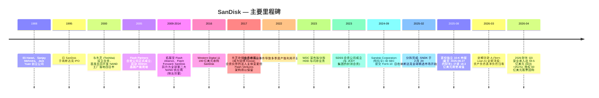
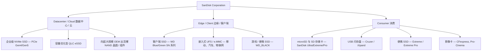
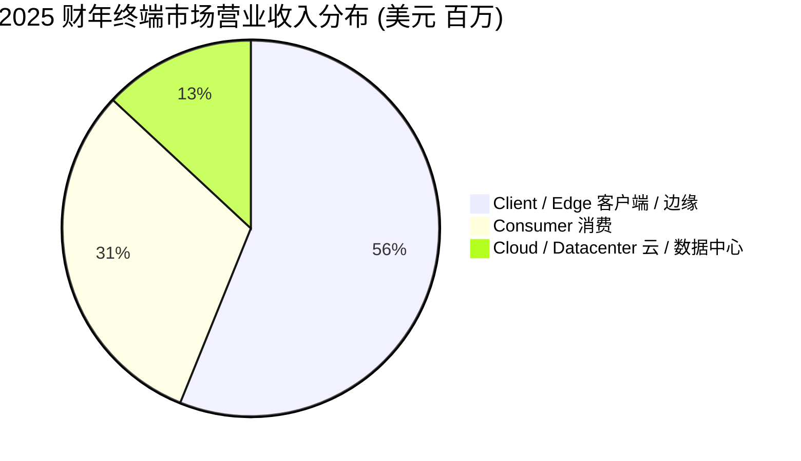
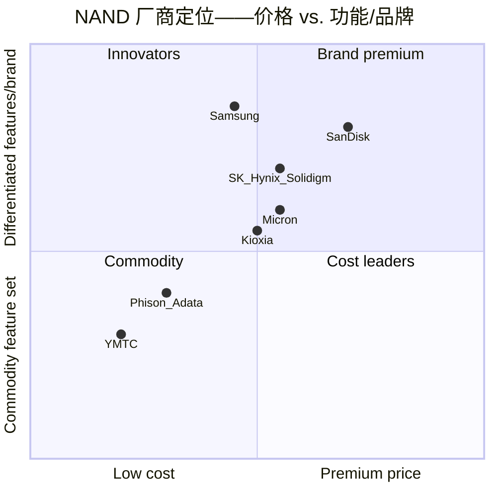

# SanDisk Corporation (NASDAQ:SNDK) — 公司研究报告

**截至日期: 2026-06-14**
**上市地: 纳斯达克全球精选市场 (NASDAQ Global Select Market), 代码 SNDK**
**注册地: 美国特拉华州 (总部位于加利福尼亚州米尔皮塔斯)**
**报告语言: 简体中文 (英文版同时存在于本目录)**

> **业绩更新——2026 财年 Q4 指引 (2026-04-30) + 卖方一致上修 (截至 2026-06):** 管理层就 2026 财年 Q4 (季度截止日 2026 年 7 月 3 日) 指引营业收入 **77.5 亿至 82.5 亿美元**, 非 GAAP 摊薄每股收益 **30.00 至 33.00 美元**, 董事会授权 **60 亿美元股票回购计划**, 并披露已于 2026 年 3 月 4 日全额清偿定期贷款 (term loan) 余额。该指引意味着在 Q3 环比 +97% 之上再实现约 +30% 的环比营业收入增长。管理层将展望归因于: (a) 数据中心 / 企业级 SSD (Datacenter / eSSD) 客户结构持续上移 (Q3 环比 +233%)、(b) NAND 价格因供给紧张进一步上行、(c) 首批多年期"新业务模式"(New Business Model, NBM) 合约——具备明确的数量与价格承诺。**自本报告上一版 (2026-05-20) 以来, 卖方对 SNDK 的目标价集体大幅上修**: 美银 (BofA) 于 2026-06-08 将 PT 上调至 **US$2,100** (此前 US$1,550), 花旗 (Citi) 于 2026-05-19 上调至 **US$2,025**, 摩根士丹利 (Morgan Stanley) 于 2026-06-03 上调至 **US$1,750**——驱动力为铠侠 (Kioxia) 超预期财报确认 NAND 超级周期 + 长协 (LTA / NBM) 锁价改写盈利波动属性 ([2026 财年 Q3 业绩公告, 2026-04-30](https://www.sec.gov/Archives/edgar/data/2023554/000162828026028879/sndkq3-26ex991xpressrelease.htm))。
> 来源: [2026 财年 Q3 业绩公告, 2026-04-30](https://www.sec.gov/Archives/edgar/data/2023554/000162828026028879/sndkq3-26ex991xpressrelease.htm)。

---

## 投资摘要 (Investment Summary)

> 以下评级、目标价与远期估计均为 **本报告分析师观点 (*分析师观点：*)**, 不构成任何招股或交易建议, 也不来自任何一份 SEC 申报文件——10-K 不含目标价。

| 项目 | 数值 |
|---|---|
| **评级 (Rating)** | **增持 / Overweight (Buy)** |
| **12 个月目标价 (12-mo PT)** | **US\$2,150** |
| **现价 (Price, 2026-06-12 收盘)** | US\$1,980.10 |
| **隐含上行 (Upside)** | **+8.6%** |
| **估值方法** | 周期穿越 (through-cycle) 非 GAAP EPS ~US\$72 × 30× P/E (含 AI 结构性溢价); 与卖方 9–11× 远期峰值 EPS 法交叉验证 |
| **市值 (Market cap)** | ~US\$293 bn (148.1 mn 股 × US\$1,980) |
| **52 周区间** | US\$40.69 – US\$1,980.10 (yfinance, 极端区间见下方记忆周期警示) |
| **代码 / 交易所** | NASDAQ: SNDK |

**投资逻辑四大支柱 (*分析师观点：*):**

1. **NAND 超级周期 + 供给纪律 = 价量利三重共振。** AI 推理对大容量 eSSD 的需求叠加全行业 2023 年下行后保持的资本纪律, 把 NAND ASP 推入两年以上的紧平衡; FY26 Q3 GAAP 毛利率已冲到 **78.4%** (上年同期 22.5%) ([2026 财年 Q3 业绩公告, 2026-04-30](https://www.sec.gov/Archives/edgar/data/2023554/000162828026028879/sndkq3-26ex991xpressrelease.htm))。
2. **NBM / LTA 长协改写盈利波动属性。** 已签 5 份多年期"固定 + 浮动"长协, 保底收入 >US\$110 亿 (含 US\$40 亿预付款 + 第三方担保), 覆盖 FY27 超 1/3 的比特需求——把过去纯周期股的盈利下行尾部砍掉 ([2026 财年 Q3 业绩公告, 2026-04-30](https://www.sec.gov/Archives/edgar/data/2023554/000162828026028879/sndkq3-26ex991xpressrelease.htm))。
3. **美国唯一上市 NAND 纯正标的 + 干净资产负债表。** 分拆后于 2026-03 全额清偿 Term Loan A (净负债归零), 并授权 US\$60 亿回购; SNDK 是每一只需要在美光 (MU) 之外配置 NAND 桶的 AI 基础设施基金的自然流入对象 ([2026 财年 Q2 10-Q, Note 5](https://www.sec.gov/Archives/edgar/data/2023554/000162828026029401/sndk-20260403.htm))。
4. **核心风险是周期顶点的时点, 不是盈利能力本身。** 股价 15 个月内从 ~US\$40 涨到 ~US\$1,980, 已计入大量好消息; 真正的下行触发是 2027–2028 年三星 / 海力士 / 美光的产能纪律破裂——这是本逻辑里需要被持续盯紧的单一变量。

**远期估值矩阵 (forward valuation matrix, *分析师观点：*):** 以 2026-06-12 现价 US\$1,980 为基准 (非 GAAP EPS 为口径; 估计为本报告分析师观点, 外部输入见第 1A / 第 2 章):

| 倍数 | FY25 (实际) | FY26E | FY27E |
|---|---|---|---|
| 非 GAAP P/E | n.m. (FY25 EPS ~US\$2.7) | ~32× (EPS ~US\$62) | ~9–11× (峰值 EPS ~US\$190–218) |
| EV / Sales | ~4.0× | ~14.5× | ~6.0× |
| P/B | ~3.5× | ~21× (权益 ~US\$13.8 bn) | 随回购 / 留存下降 |

倍数随 FY26→FY27 盈利爆发而急剧压缩——这是周期峰值股的典型特征, 也是为什么卖方用"周期穿越 EPS × 中等倍数"而非"峰值 EPS × 高倍数"来估值 ([Morgan Stanley — SanDisk Risk Reward Update, 2026-06-03, p.1](http://xs-macbook-air.local:5001/zsxq/pdf/184155215151842/Morgan%20Stanley-SanDisk%20Corporation.%EF%BC%88SNDK.US%EF%BC%89Risk%20Reward%20Update-260603.pdf))。

**相对表现 (relative performance, as of 2026-06-12):** SNDK 过去 12 个月录得抛物线式回报 (yfinance 收盘从 1 年低点 US\$40.69 至 US\$1,980.10), 远跑赢费城半导体指数 (SOX) 与标普 500——但该 1 年涨幅落在 2026 年记忆 / 半导体板块普遍出现的"抛物线打印"区间内 (SNDK、SK 海力士、闪存类标的均如此; 见下方警示框), 应以中位数 + 基准对照解读, 不应以单一极端数字代表常态 (来源: yfinance 本地快照, as of 2026-06-12)。

> **⚠️ 记忆周期极端回报警示。** SNDK 的 1 年回报在 2026 年窗口呈抛物线 (上市仅 15 个月叠加分拆低基数 + NAND 超级周期), 与 SK 海力士、SNDK 等记忆 / 亚洲基板类标的同时出现的现象一致 (项目记忆 `project_yfinance_extreme_returns_2026`)。本报告引用中位数与板块基准, **不构造"修正后"的虚假数字**, 并对该极端倍数的不可持续性在第 9 章作为估值压缩风险明确标注。

---

## 目录

1. 公司概览
   - 1A. 估值与目标价 (Valuation & Price Target) — 远期估计表 · PT 推导 · 牛/基/熊情景
   - 1B. GF Score 基本面评分卡
   - 1C. 卖方观点演变 (Sell-side view evolution)
2. 公司历史
3. 管理团队
4. 产品与服务
5. 客户与上市策略
6. 行业概览
7. 竞争格局
8. 市场机会 (TAM)
9. 风险评估
   - 9.5. 关键分歧与催化剂 (Key Debates & Catalysts)
10. 投资视角评分卡 (Investor Lenses)

> **关于本报告中财务数据的重要方法论说明。**
> SanDisk Corporation (特拉华) 于 **2025 年 2 月 21 日**通过 Western Digital Corporation ("WDC") 免税分拆的方式成为独立上市公司。该日期之前的全部年度财务数据均为依据 SAB Topic 1.B 以及 2025 财年 10-K Note 1 编制的**"分拆口径 / 前身公司 (carve-out / predecessor)"列报**——这些数据是在"假设独立运营"基础上将 WDC 的总部费用、资金管理、债务利息及税务分摊到 SanDisk 业务上 ([10-K, 2025 财年, Note 1](https://www.sec.gov/Archives/edgar/data/2023554/000202355425000034/sndk-20250627.htm))。这与一个真正独立运行的 SanDisk 所将报告的数字并不相同。自 2025 财年 Q3 (日历 2025 Q1) 起, 公司以真正的独立公司身份报告。本报告中凡涉及分拆口径期间的数字, 均在正文中明确标注。

---

# 1. 公司概览

**SanDisk Corporation** 是基于 NAND 闪存 (NAND flash) 的数据存储产品的研发、制造与营销商, 产品涵盖固态硬盘 (SSD)、嵌入式存储 (embedded memory)、可移除存储卡 (removable cards)、USB 闪存盘以及裸 NAND 晶圆 (raw NAND wafers), 服务于公司目前命名为**数据中心 (Datacenter)、边缘 (Edge) 与消费 (Consumer)** 的三大终端市场 (原称 Cloud / Client / Consumer; 此次更名于 2026 财年 Q1 生效, 旨在将 "Edge" 标签与公司的 AI 架构叙事对齐)。公司总部位于加利福尼亚州米尔皮塔斯 Sandisk Drive 951 号; 截至 2025 年 6 月雇员**约 11,000 人, 覆盖 33 个国家** (亚太 73%、美洲 19%、欧洲中东非 8%); 全球持有**约 7,900 项已授权专利与 3,200 项专利申请** [10-K, 2025 财年, 第 5、8 页](https://www.sec.gov/Archives/edgar/data/2023554/000202355425000034/sndk-20250627.htm)。

SanDisk 这一品牌如今已是第二次在交易所挂牌。最早的 SanDisk Corporation 由 Eli Harari、Sanjay Mehrotra 与 Jack Yuan 于 1988 年创立, 2016 年 5 月被 Western Digital 以约 190 亿美元收购, 此后作为 WDC 闪存事业部运营, 直至 **2025 年 2 月 21 日完成分拆**: WDC 按 1 股 SNDK 对 3 股 WDC (以 2025 年 2 月 12 日股权登记日的 WDC 持股为基础) 的比例, 将"Sandisk Corporation"约 80.1% 的普通股分配给 WDC 股东, 自己保留约 19.9%; SNDK 于 **2025 年 2 月 24 日**在纳斯达克全球精选市场开始挂牌交易 ([10-K, 2025 财年, Note 1; 2026 财年 Q2 10-Q, Note 1](https://www.sec.gov/Archives/edgar/data/2023554/000162828026029401/sndk-20260403.htm))。WDC 随后将所保留股份与其债权人手中的 WDC 债权进行交换, 并通过注册公开发行的方式售出这些股份; **截至 2026 年 3 月 19 日, 这部分股份不再受限, WDC 的经济性持股实质归零** ([2026 财年 Q2 10-Q, Note 1](https://www.sec.gov/Archives/edgar/data/2023554/000162828026029401/sndk-20260403.htm))。

**业务模式。** SanDisk 几乎全部营业收入来自向 OEM、云服务提供商、分销商、渠道商及零售客户销售基于 NAND 闪存的存储产品。晶圆制造**不在公司内部进行**: 几乎所有 NAND 晶圆均来源于 **Flash Ventures**——SanDisk 与日本铠侠 (Kioxia Corporation) 按 SanDisk 49.9% / 铠侠约 50.1% 共同持股的三家日本合资公司 (Flash Partners、Flash Alliance、Flash Forward) 组成, 运营六座位于日本四日市 (Yokkaichi) 的工厂以及一座位于北上 (Kitakami) 的工厂, 第八座北上工厂于 2025 日历年开始爬坡。SanDisk 按**成本加少量加成 (cost plus a small mark-up)** 向 Flash Ventures 支付其所获取那部分晶圆产出 (约占 Flash Ventures 总产量的 50%) 的对价, 并按合同约定无论是否提取该份额均需承担合资公司 50% 的固定成本 ([10-K, 2025 财年, 第 6–7 页](https://www.sec.gov/Archives/edgar/data/2023554/000202355425000034/sndk-20250627.htm))。控制器 (controller) 由公司内部设计、外包给第三方代工厂生产; 封装与测试在位于马来西亚槟城 (Penang) 的 SanDisk 工厂和合约代工厂完成, 部分产能由 **SDSS 合资公司** (2023 年由 WDC 拆分出一部分股权售予江苏长电科技 (JCET Group) 的少数股权合资公司, SanDisk 继承了相关供应协议及 2029 年 9 月前每年 **5.5 亿美元最低采购承诺**) 供应 ([10-K, 2025 财年, 第 8、64 页](https://www.sec.gov/Archives/edgar/data/2023554/000202355425000034/sndk-20250627.htm))。

**营业收入结构。** 2025 财年 (截至 2025 年 6 月 27 日的分拆口径财年) 营业收入为 **73.55 亿美元**, 同比增长 10%, 终端市场拆分为: **Cloud 9.60 亿美元 (13%)、Client 41.27 亿美元 (56%)、Consumer 22.68 亿美元 (31%)** ([10-K, 2025 财年, 第 48 页](https://www.sec.gov/Archives/edgar/data/2023554/000202355425000034/sndk-20250627.htm))。同年地域分布为: **亚洲 44.57 亿美元 (61%)、美洲 16.18 亿美元 (22%)、EMEA 12.80 亿美元 (17%)**。国际销售 (定义中包含美国公司的海外子公司, 但不包含外国公司的美国子公司) 占总营业收入的 **80%** ([10-K, 2025 财年, 第 10 页](https://www.sec.gov/Archives/edgar/data/2023554/000202355425000034/sndk-20250627.htm))。

进入 2026 财年, 上述结构因 AI 驱动的 NAND 上行周期而发生重塑。季度营业收入从 **2026 财年 Q1 的 23.08 亿美元 → Q2 的 30.25 亿美元 → Q3 的 59.50 亿美元**, 公司就 Q4 给出 **77.5 亿至 82.5 亿美元**的指引。Q1–Q3 累计非 GAAP 摊薄每股收益达到 **30.83 美元**, 管理层就 Q4 单季指引为 **30.00 至 33.00 美元**。Datacenter 营业收入尤其耀眼: 从 **2025 财年 Q3 的 1.97 亿美元跃升至 2026 财年 Q3 的 14.67 亿美元** (同比 +644.7%; 环比 +233%) [2026 财年 Q3 业绩公告, 2026-04-30](https://www.sec.gov/Archives/edgar/data/2023554/000162828026028879/sndkq3-26ex991xpressrelease.htm)。

下面这张利润表 Sankey 用 FY26 Q3 单季 (截至 2026-04-03, 周期峰值附近) 展示 SanDisk 当前的盈利结构——营业收入 US\$5,950 mn 中, 仅 US\$1,288 mn (21.6%) 为销货成本 (COGS), 留下 **78.4% 的 GAAP 毛利率**; 经过 R&D US\$337 mn + SG&A US\$161 mn 后, 经营利润 (operating income) 达 US\$4,111 mn (69.1%), 税后净利润 US\$3,615 mn (60.8% 净利率)。这是一家被周期推到极端盈利点的 NAND 厂商的快照, 不代表常态 ([2026 财年 Q3 业绩公告, 2026-04-30](https://www.sec.gov/Archives/edgar/data/2023554/000162828026028879/sndkq3-26ex991xpressrelease.htm))。

<svg xmlns="http://www.w3.org/2000/svg" viewBox="0 0 1000 560" width="1000" height="560" role="img" aria-label="income statement Sankey"><rect x="0" y="0" width="1000" height="560" fill="#ffffff"/>
<text x="20.00" y="30.00" text-anchor="start" font-family="Helvetica,Arial,sans-serif" font-size="15" font-weight="700" fill="#1f2933">SanDisk 利润表 Sankey — FY26 Q3 (3 个月, 截至 2026-04-03)</text>
<path d="M 204.00,64.00 C 258.00,64.00 258.00,78.00 312.00,78.00 L 312.00,337.80 C 258.00,337.80 258.00,323.80 204.00,323.80 Z" fill="#93c5fd" fill-opacity="0.55"/>
<path d="M 452.00,71.00 C 506.00,71.00 506.00,118.55 560.00,118.55 L 560.00,410.12 C 506.00,410.12 506.00,362.57 452.00,362.57 Z" fill="#86efac" fill-opacity="0.55"/>
<path d="M 452.00,362.57 C 506.00,362.57 506.00,424.12 560.00,424.12 L 560.00,459.45 C 506.00,459.45 506.00,397.89 452.00,397.89 Z" fill="#fca5a5" fill-opacity="0.55"/>
<path d="M 328.00,78.00 C 382.00,78.00 382.00,71.00 436.00,71.00 L 436.00,401.65 C 382.00,401.65 382.00,408.65 328.00,408.65 Z" fill="#86efac" fill-opacity="0.55"/>
<path d="M 328.00,408.65 C 382.00,408.65 382.00,415.65 436.00,415.65 L 436.00,507.00 C 382.00,507.00 382.00,500.00 328.00,500.00 Z" fill="#fca5a5" fill-opacity="0.55"/>
<path d="M 700.00,111.70 C 754.00,111.70 754.00,136.36 808.00,136.36 L 808.00,392.75 C 754.00,392.75 754.00,368.09 700.00,368.09 Z" fill="#86efac" fill-opacity="0.55"/>
<path d="M 700.00,368.09 C 754.00,368.09 754.00,406.75 808.00,406.75 L 808.00,441.64 C 754.00,441.64 754.00,402.98 700.00,402.98 Z" fill="#fca5a5" fill-opacity="0.55"/>
<path d="M 576.00,118.55 C 630.00,118.55 630.00,111.70 684.00,111.70 L 684.00,403.27 C 630.00,403.27 630.00,410.12 576.00,410.12 Z" fill="#86efac" fill-opacity="0.55"/>
<path d="M 204.00,337.80 C 258.00,337.80 258.00,337.80 312.00,337.80 L 312.00,441.84 C 258.00,441.84 258.00,441.84 204.00,441.84 Z" fill="#93c5fd" fill-opacity="0.55"/>
<path d="M 576.00,424.12 C 630.00,424.12 630.00,416.98 684.00,416.98 L 684.00,428.40 C 630.00,428.40 630.00,435.54 576.00,435.54 Z" fill="#fca5a5" fill-opacity="0.55"/>
<path d="M 576.00,435.54 C 630.00,435.54 630.00,442.40 684.00,442.40 L 684.00,466.30 C 630.00,466.30 630.00,459.45 576.00,459.45 Z" fill="#fca5a5" fill-opacity="0.55"/>
<path d="M 204.00,455.84 C 258.00,455.84 258.00,441.84 312.00,441.84 L 312.00,500.00 C 258.00,500.00 258.00,514.00 204.00,514.00 Z" fill="#93c5fd" fill-opacity="0.55"/>
<rect x="188.00" y="64.00" width="16" height="259.80" rx="1.5" fill="#2563eb"/>
<rect x="188.00" y="337.80" width="16" height="104.05" rx="1.5" fill="#2563eb"/>
<rect x="188.00" y="455.84" width="16" height="58.16" rx="1.5" fill="#2563eb"/>
<rect x="312.00" y="78.00" width="16" height="422.00" rx="1.5" fill="#1e3a8a"/>
<rect x="436.00" y="71.00" width="16" height="330.65" rx="1.5" fill="#15803d"/>
<rect x="436.00" y="415.65" width="16" height="91.35" rx="1.5" fill="#dc2626"/>
<rect x="560.00" y="118.55" width="16" height="291.57" rx="1.5" fill="#15803d"/>
<rect x="560.00" y="424.12" width="16" height="35.32" rx="1.5" fill="#dc2626"/>
<rect x="684.00" y="111.70" width="16" height="291.29" rx="1.5" fill="#15803d"/>
<rect x="684.00" y="416.98" width="16" height="11.42" rx="1.5" fill="#dc2626"/>
<rect x="684.00" y="442.40" width="16" height="23.90" rx="1.5" fill="#dc2626"/>
<rect x="808.00" y="136.36" width="16" height="256.39" rx="1.5" fill="#15803d"/>
<rect x="808.00" y="406.75" width="16" height="34.89" rx="1.5" fill="#dc2626"/>
<text x="179.00" y="190.90" text-anchor="end" font-family="Helvetica,Arial,sans-serif" font-size="11.5" font-weight="700" fill="#1f2933">Edge 边缘</text>
<text x="179.00" y="203.90" text-anchor="end" font-family="Helvetica,Arial,sans-serif" font-size="10" font-weight="400" fill="#52606d">US$3.7B  (61.6%)</text>
<text x="179.00" y="386.82" text-anchor="end" font-family="Helvetica,Arial,sans-serif" font-size="11.5" font-weight="700" fill="#1f2933">Datacenter 数据中心</text>
<text x="179.00" y="399.82" text-anchor="end" font-family="Helvetica,Arial,sans-serif" font-size="10" font-weight="400" fill="#52606d">US$1.5B  (24.7%)</text>
<text x="179.00" y="481.92" text-anchor="end" font-family="Helvetica,Arial,sans-serif" font-size="11.5" font-weight="700" fill="#1f2933">Consumer 消费</text>
<text x="179.00" y="494.92" text-anchor="end" font-family="Helvetica,Arial,sans-serif" font-size="10" font-weight="400" fill="#52606d">US$820.0M  (13.8%)</text>
<rect x="331.00" y="60.00" width="113.10" height="26" rx="2" fill="#ffffff" fill-opacity="0.72"/>
<text x="334.00" y="72.00" text-anchor="start" font-family="Helvetica,Arial,sans-serif" font-size="11.5" font-weight="700" fill="#1f2933">Revenue</text>
<text x="334.00" y="85.00" text-anchor="start" font-family="Helvetica,Arial,sans-serif" font-size="10" font-weight="400" fill="#52606d">US$6.0B  (100.0%)</text>
<rect x="455.00" y="53.00" width="106.80" height="26" rx="2" fill="#ffffff" fill-opacity="0.72"/>
<text x="458.00" y="65.00" text-anchor="start" font-family="Helvetica,Arial,sans-serif" font-size="11.5" font-weight="700" fill="#1f2933">Gross Profit</text>
<text x="458.00" y="78.00" text-anchor="start" font-family="Helvetica,Arial,sans-serif" font-size="10" font-weight="400" fill="#52606d">US$4.7B  (78.4%)</text>
<rect x="455.00" y="397.65" width="144.60" height="26" rx="2" fill="#ffffff" fill-opacity="0.72"/>
<text x="458.00" y="409.65" text-anchor="start" font-family="Helvetica,Arial,sans-serif" font-size="11.5" font-weight="700" fill="#1f2933">Cost of Revenue (COGS)</text>
<text x="458.00" y="422.65" text-anchor="start" font-family="Helvetica,Arial,sans-serif" font-size="10" font-weight="400" fill="#52606d">US$1.3B  (21.6%)</text>
<rect x="579.00" y="100.55" width="106.80" height="26" rx="2" fill="#ffffff" fill-opacity="0.72"/>
<text x="582.00" y="112.55" text-anchor="start" font-family="Helvetica,Arial,sans-serif" font-size="11.5" font-weight="700" fill="#1f2933">Operating Income</text>
<text x="582.00" y="125.55" text-anchor="start" font-family="Helvetica,Arial,sans-serif" font-size="10" font-weight="400" fill="#52606d">US$4.1B  (69.1%)</text>
<rect x="579.00" y="406.12" width="150.90" height="26" rx="2" fill="#ffffff" fill-opacity="0.72"/>
<text x="582.00" y="418.12" text-anchor="start" font-family="Helvetica,Arial,sans-serif" font-size="11.5" font-weight="700" fill="#1f2933">Total Operating Expense</text>
<text x="582.00" y="431.12" text-anchor="start" font-family="Helvetica,Arial,sans-serif" font-size="10" font-weight="400" fill="#52606d">US$498.0M  (8.4%)</text>
<rect x="703.00" y="93.70" width="106.80" height="26" rx="2" fill="#ffffff" fill-opacity="0.72"/>
<text x="706.00" y="105.70" text-anchor="start" font-family="Helvetica,Arial,sans-serif" font-size="11.5" font-weight="700" fill="#1f2933">Pretax Income</text>
<text x="706.00" y="118.70" text-anchor="start" font-family="Helvetica,Arial,sans-serif" font-size="10" font-weight="400" fill="#52606d">US$4.1B  (69.0%)</text>
<rect x="703.00" y="398.98" width="113.10" height="26" rx="2" fill="#ffffff" fill-opacity="0.72"/>
<text x="706.00" y="410.98" text-anchor="start" font-family="Helvetica,Arial,sans-serif" font-size="11.5" font-weight="700" fill="#1f2933">SG&amp;A</text>
<text x="706.00" y="423.98" text-anchor="start" font-family="Helvetica,Arial,sans-serif" font-size="10" font-weight="400" fill="#52606d">US$161.0M  (2.7%)</text>
<rect x="703.00" y="424.40" width="113.10" height="26" rx="2" fill="#ffffff" fill-opacity="0.72"/>
<text x="706.00" y="436.40" text-anchor="start" font-family="Helvetica,Arial,sans-serif" font-size="11.5" font-weight="700" fill="#1f2933">R&amp;D</text>
<text x="706.00" y="449.40" text-anchor="start" font-family="Helvetica,Arial,sans-serif" font-size="10" font-weight="400" fill="#52606d">US$337.0M  (5.7%)</text>
<text x="833.00" y="261.55" text-anchor="start" font-family="Helvetica,Arial,sans-serif" font-size="11.5" font-weight="700" fill="#1f2933">Net Income</text>
<text x="833.00" y="274.55" text-anchor="start" font-family="Helvetica,Arial,sans-serif" font-size="10" font-weight="400" fill="#52606d">US$3.6B  (60.8%)</text>
<text x="833.00" y="421.20" text-anchor="start" font-family="Helvetica,Arial,sans-serif" font-size="11.5" font-weight="700" fill="#1f2933">Income Tax</text>
<text x="833.00" y="434.20" text-anchor="start" font-family="Helvetica,Arial,sans-serif" font-size="10" font-weight="400" fill="#52606d">US$492.0M  (8.3%)</text>
<text x="500.00" y="544.00" text-anchor="middle" font-family="Helvetica,Arial,sans-serif" font-size="10" font-weight="400" fill="#52606d">Source: SanDisk Q3 FY26 8-K (2026-04-30) income statement</text>
</svg>

*利润表 Sankey 数据来源: [2026 财年 Q3 业绩公告, 2026-04-30](https://www.sec.gov/Archives/edgar/data/2023554/000162828026028879/sndkq3-26ex991xpressrelease.htm) (利润表, 3 个月口径)。*

下面两张图分别给出 FY26 季度营业收入的分部演变 (Datacenter / Edge / Consumer) 与 FY26 Q3 的分部结构。可见 **Datacenter 从 FY26 Q1 的 US\$269 mn → Q2 US\$440 mn → Q3 US\$1,467 mn**, 在三个季度内增长 5.5 倍, 是本轮拐点的引擎 ([2026 财年 Q1 业绩公告, 2025-11-06](https://www.sec.gov/Archives/edgar/data/2023554/000162828025050180/sndkq1fy26ex991-pressrelea.htm); [2026 财年 Q2 业绩公告, 2026-01-29](https://www.sec.gov/Archives/edgar/data/2023554/000162828026004121/sndkq2fy26ex991-pressrelea.htm); [2026 财年 Q3 业绩公告, 2026-04-30](https://www.sec.gov/Archives/edgar/data/2023554/000162828026028879/sndkq3-26ex991xpressrelease.htm))。

<svg xmlns="http://www.w3.org/2000/svg" viewBox="0 0 860 470" width="860" height="470" role="img" aria-label="historical revenue bars"><rect x="0" y="0" width="860" height="470" fill="#ffffff"/>
<text x="20.00" y="30.00" text-anchor="start" font-family="Helvetica,Arial,sans-serif" font-size="15" font-weight="700" fill="#1f2933">SanDisk 季度营业收入分部演变 — FY26 Q1→Q3 (US$ 百万)</text>
<rect x="20.00" y="44" width="11" height="11" rx="2" fill="#2563eb"/>
<text x="36.00" y="53.00" text-anchor="start" font-family="Helvetica,Arial,sans-serif" font-size="10.5" font-weight="400" fill="#1f2933">Datacenter 数据中心</text>
<rect x="149.00" y="44" width="11" height="11" rx="2" fill="#15803d"/>
<text x="165.00" y="53.00" text-anchor="start" font-family="Helvetica,Arial,sans-serif" font-size="10.5" font-weight="400" fill="#1f2933">Edge 边缘</text>
<rect x="225.20" y="44" width="11" height="11" rx="2" fill="#d97706"/>
<text x="241.20" y="53.00" text-anchor="start" font-family="Helvetica,Arial,sans-serif" font-size="10.5" font-weight="400" fill="#1f2933">Consumer 消费</text>
<line x1="70" y1="412.00" x2="834" y2="412.00" stroke="#eceff2" stroke-width="1"/>
<text x="64.00" y="415.00" text-anchor="end" font-family="Helvetica,Arial,sans-serif" font-size="9.5" font-weight="400" fill="#52606d">US$0</text>
<line x1="70" y1="345.20" x2="834" y2="345.20" stroke="#eceff2" stroke-width="1"/>
<text x="64.00" y="348.20" text-anchor="end" font-family="Helvetica,Arial,sans-serif" font-size="9.5" font-weight="400" fill="#52606d">US$1.3B</text>
<line x1="70" y1="278.40" x2="834" y2="278.40" stroke="#eceff2" stroke-width="1"/>
<text x="64.00" y="281.40" text-anchor="end" font-family="Helvetica,Arial,sans-serif" font-size="9.5" font-weight="400" fill="#52606d">US$2.6B</text>
<line x1="70" y1="211.60" x2="834" y2="211.60" stroke="#eceff2" stroke-width="1"/>
<text x="64.00" y="214.60" text-anchor="end" font-family="Helvetica,Arial,sans-serif" font-size="9.5" font-weight="400" fill="#52606d">US$3.9B</text>
<line x1="70" y1="144.80" x2="834" y2="144.80" stroke="#eceff2" stroke-width="1"/>
<text x="64.00" y="147.80" text-anchor="end" font-family="Helvetica,Arial,sans-serif" font-size="9.5" font-weight="400" fill="#52606d">US$5.1B</text>
<line x1="70" y1="78.00" x2="834" y2="78.00" stroke="#eceff2" stroke-width="1"/>
<text x="64.00" y="81.00" text-anchor="end" font-family="Helvetica,Arial,sans-serif" font-size="9.5" font-weight="400" fill="#52606d">US$6.4B</text>
<rect x="123.48" y="398.02" width="147.71" height="13.98" fill="#2563eb"/>
<rect x="123.48" y="325.93" width="147.71" height="72.09" fill="#15803d"/>
<rect x="123.48" y="292.04" width="147.71" height="33.89" fill="#d97706"/>
<text x="197.33" y="428.00" text-anchor="middle" font-family="Helvetica,Arial,sans-serif" font-size="10" font-weight="400" fill="#52606d">Q1 FY26</text>
<rect x="378.15" y="389.13" width="147.71" height="22.87" fill="#2563eb"/>
<rect x="378.15" y="301.91" width="147.71" height="87.22" fill="#15803d"/>
<rect x="378.15" y="254.77" width="147.71" height="47.14" fill="#d97706"/>
<text x="452.00" y="428.00" text-anchor="middle" font-family="Helvetica,Arial,sans-serif" font-size="10" font-weight="400" fill="#52606d">Q2 FY26</text>
<rect x="632.81" y="335.75" width="147.71" height="76.25" fill="#2563eb"/>
<rect x="632.81" y="145.36" width="147.71" height="190.39" fill="#15803d"/>
<rect x="632.81" y="102.74" width="147.71" height="42.62" fill="#d97706"/>
<text x="706.67" y="428.00" text-anchor="middle" font-family="Helvetica,Arial,sans-serif" font-size="10" font-weight="400" fill="#52606d">Q3 FY26</text>
<text x="430.00" y="454.00" text-anchor="middle" font-family="Helvetica,Arial,sans-serif" font-size="10" font-weight="400" fill="#52606d">Source: SanDisk FY26 Q1/Q2/Q3 业绩公告 (2025-11-06 / 2026-01-29 / 2026-04-30)</text>
</svg>

<svg xmlns="http://www.w3.org/2000/svg" viewBox="0 0 720 460" width="720" height="460" role="img" aria-label="revenue donut"><rect x="0" y="0" width="720" height="460" fill="#ffffff"/>
<text x="20.00" y="30.00" text-anchor="start" font-family="Helvetica,Arial,sans-serif" font-size="15" font-weight="700" fill="#1f2933">SanDisk 营业收入分部结构 — FY26 Q3 (US$ 百万)</text>
<path d="M 288.00,107.20 A 132 132 0 1 1 200.32,337.87 L 236.19,297.50 A 78 78 0 1 0 288.00,161.20 Z" fill="#2563eb"/>
<path d="M 200.32,337.87 A 132 132 0 0 1 187.46,153.67 L 228.59,188.66 A 78 78 0 0 0 236.19,297.50 Z" fill="#15803d"/>
<path d="M 187.46,153.67 A 132 132 0 0 1 288.00,107.20 L 288.00,161.20 A 78 78 0 0 0 228.59,188.66 Z" fill="#d97706"/>
<text x="288.00" y="235.20" text-anchor="middle" font-family="Helvetica,Arial,sans-serif" font-size="18" font-weight="800" fill="#1f2933">FY26Q3</text>
<text x="288.00" y="255.20" text-anchor="middle" font-family="Helvetica,Arial,sans-serif" font-size="13" font-weight="600" fill="#52606d">US$6.0B</text>
<text x="288.00" y="271.20" text-anchor="middle" font-family="Helvetica,Arial,sans-serif" font-size="10" font-weight="400" fill="#8a97a3">total</text>
<line x1="416.99" y1="288.24" x2="432.99" y2="288.24" stroke="#2563eb" stroke-width="1.4"/>
<text x="436.99" y="286.24" text-anchor="start" font-family="Helvetica,Arial,sans-serif" font-size="11" font-weight="700" fill="#1f2933">Edge 边缘</text>
<text x="436.99" y="300.24" text-anchor="start" font-family="Helvetica,Arial,sans-serif" font-size="10" font-weight="400" fill="#52606d">US$3.7B  (61.6%)</text>
<line x1="150.34" y1="248.81" x2="134.34" y2="248.81" stroke="#15803d" stroke-width="1.4"/>
<text x="130.34" y="246.81" text-anchor="end" font-family="Helvetica,Arial,sans-serif" font-size="11" font-weight="700" fill="#1f2933">Datacenter 数据中心</text>
<text x="130.34" y="260.81" text-anchor="end" font-family="Helvetica,Arial,sans-serif" font-size="10" font-weight="400" fill="#52606d">US$1.5B  (24.7%)</text>
<line x1="230.10" y1="113.93" x2="214.10" y2="113.93" stroke="#d97706" stroke-width="1.4"/>
<text x="210.10" y="111.93" text-anchor="end" font-family="Helvetica,Arial,sans-serif" font-size="11" font-weight="700" fill="#1f2933">Consumer 消费</text>
<text x="210.10" y="125.93" text-anchor="end" font-family="Helvetica,Arial,sans-serif" font-size="10" font-weight="400" fill="#52606d">US$820.0M  (13.8%)</text>
<text x="360.00" y="444.00" text-anchor="middle" font-family="Helvetica,Arial,sans-serif" font-size="10" font-weight="400" fill="#52606d">Source: SanDisk Q3 FY26 8-K (2026-04-30) — 终端市场营业收入</text>
</svg>

*分部数据来源: SanDisk [FY26 Q1](https://www.sec.gov/Archives/edgar/data/2023554/000162828025050180/sndkq1fy26ex991-pressrelea.htm) / [Q2](https://www.sec.gov/Archives/edgar/data/2023554/000162828026004121/sndkq2fy26ex991-pressrelea.htm) / [Q3](https://www.sec.gov/Archives/edgar/data/2023554/000162828026028879/sndkq3-26ex991xpressrelease.htm) 业绩公告。*

**估值快照 (as of 2026-06-12)。** SanDisk 上市仅约 16 个月 (始于 2025 年 2 月 24 日), 估值倍数历史短且波动剧烈。**SNDK 于 2026 年 6 月 12 日收于 US\$1,980.10** (yfinance 本地快照, as of 2026-06-12); 这与本报告上一版 (2026-05-20) 所引用的 2026 年 5 月 14 日 8-K 中那笔每股 **US\$1,150** 的小额要约 (mini-tender) 参考价相比, 不足一个月已上涨约 +72%——该 8-K 当时建议股东拒绝, 理由是 US\$1,150 "低于市场价" [SanDisk 8-K, 2026-05-14](https://www.sec.gov/Archives/edgar/data/2023554/000119312526224694/d157363dex991.htm), 事后看完全正确。**截至 2026 年 4 月 24 日, 流通普通股为 1.481 亿股** ([2026 财年 Q2 10-Q, 第 33 页](https://www.sec.gov/Archives/edgar/data/2023554/000162828026029401/sndk-20260403.htm)); 以 US\$1,980 现价计, **市值约为 US\$2,930 亿** (148.1 mn × US\$1,980), 另有约 900 万股潜在稀释性股权激励 ([2026 财年 Q3 业绩公告, 2026-04-30](https://www.sec.gov/Archives/edgar/data/2023554/000162828026028879/sndkq3-26ex991xpressrelease.htm))。

最具参考意义的锚点是远期盈利。管理层 Q4 FY26 指引中点意味着 2026 财年全年非 GAAP 摊薄每股收益约为 **30.83 + 31.50 ≈ US\$62** ([2026 财年 Q3 业绩公告, 2026-04-30](https://www.sec.gov/Archives/edgar/data/2023554/000162828026028879/sndkq3-26ex991xpressrelease.htm))。以 US\$1,980 现价对应的**前瞻 (FY26 出表) 非 GAAP P/E 约为 32 倍**; 但 FY26 的盈利仍处于"独立公司第一年 + 周期早段", 真正驱动卖方目标价的是 **FY27 峰值盈利**——卖方一致预期 FY27 非 GAAP EPS 落在 **US\$188 (BofA) 至 US\$218 (Citi)** 区间, 对应前瞻 P/E 仅 **9–11 倍**, 与全球存储同业估值中枢持平 ([BofA — SanDisk PO to \$2,100, 2026-06-08, p.1](http://xs-macbook-air.local:5001/zsxq/pdf/181245182285222/Bofa-Sandisk%20Corporation%20Supply-Demand%20balance%20remains%20tight%2C%20pricing%20strong%3B%20PO%20to%20%242100-260608.pdf); [Citi — SNDK TP to \$2,025, 2026-05-19, p.1](http://xs-macbook-air.local:5001/zsxq/pdf/212454225428181/Citi-Sandisk%20Corp%20%28SNDK.O%29%20Strong%20Demand-Pricing%20Environment%20Bolsters%20Target%20Price%20Higher%2C%20Reiterate%20Buy-260519.pdf))。**过去十二个月 (TTM, FY26 Q1–Q3 + FY25 Q4) 营业收入约为 US\$131.8 亿** (Q4FY25 19.01 + Q1FY26 23.08 + Q2FY26 30.25 + Q3FY26 59.50) ([2026 财年 Q3 业绩公告](https://www.sec.gov/Archives/edgar/data/2023554/000162828026028879/sndkq3-26ex991xpressrelease.htm); [2025 财年 Q3 业绩公告, 2025-05-07](https://www.sec.gov/Archives/edgar/data/2023554/000202355425000021/sndkq3fy25ex991-pressrelea.htm))。按 US\$2,930 亿市值计, **TTM P/S 约为 22 倍**——远高于 NAND 存储同业的 2–4 倍历史中枢, 仅在 FY26–FY27 每股收益轨迹延续的前提下才说得通。主要可比公司为 **美光 (Micron, MU)、SK 海力士 (SK Hynix, KRX:000660)、三星电子 (Samsung Electronics, KRX:005930) 和铠侠控股 (Kioxia Holdings, TYO:285A)**。**市场实际上把 SanDisk 当作结构性重定价的 AI 存储标的, 而非普通 NAND 厂商。** 这一溢价是本投资逻辑里最关键的单一变量, 第 8 与第 9 章将再次回到这一点。

**为什么 ~22× TTM 市销率可被辩护。** 在本方法论识别的五类"高倍数"驱动中, 三类同时成立: (a) 真实意义上的高增长行业——AI 推理 (AI inferencing) 的存储需求自 2025 年中以来显著抬升 NAND 平均售价 (ASP): FY25 ASP/GB 同比 +4%, Q1 FY26 ASP 中位个位数环比, 至 **Q3 FY26 ASP 环比飙升约 +140%** (Bernstein 测算, 出货量环比反而下降十几个百分点——纯价格驱动) ([Bernstein — SanDisk FQ3'26 Nosebleed ASPs, 2026-05-01, p.1](http://xs-macbook-air.local:5001/zsxq/pdf/212212212888221/Bernstein-SanDisk%20Corp%EF%BC%88SNDK.US%EF%BC%89Sandisk%20FQ3%2726%EF%BC%9A%20Nosebleed%20ASPs%20%EF%BC%88now%20locked%20in%EF%BC%89%EF%BC%9B%20Raise%20estimates%20and%20TP%20to%20%241700%EF%BC%8C%20Reiterate%20Outperform%20%EF%BC%88top%20ST%20pick%EF%BC%89-260501.pdf)); (b) 盈利刚从周期底部反弹——FY23 分拆口径净亏损约 21 亿美元, FY25 分拆口径仍录得净亏损约 16 亿美元 (受 18.3 亿美元商誉减值驱动), 独立运营后的 TTM 因而大幅高于历史回溯 ([10-K, 2025 财年, MD&A 第 47–48 页](https://www.sec.gov/Archives/edgar/data/2023554/000202355425000034/sndk-20250627.htm)); (c) 叙事 / 板块代理溢价——SNDK 是美国唯一上市的 NAND 纯正标的, 每一只需要在 MU 之外配置 NAND 桶的 AI 基础设施 ETF 都会自然流入。把 (b) 与 (c) 视为时间约束因素, (a) 视为承重支柱: 一旦 FY27 峰值 EPS 兑现, TTM P/S 会随分母膨胀而急剧收缩 (FY27E 前瞻 P/S 仅约 6×), 这正是高倍数股的"成长摊薄倍数"机制。**反过来, 如果 ASP 上行在 2027–2028 提前见顶, 同一机制会反向放大下行**——这是第 9 章估值压缩风险的核心。

---

# 1A. 估值与目标价 (Valuation & Price Target)

> 本章全部为 **本报告分析师观点 (*分析师观点：*)**。每一个远期估计、目标价与情景价均为分析师本人的前瞻判断, 不来自任何 SEC 申报文件——10-K 不含目标价或预测。下方所引用的外部输入 (公司指引、铠侠 / NAND 行业数据、卖方一致预期) 均带各自的内联引用。

**远期财务估计表 (forward estimates, *分析师观点：*)。** 本表以 SanDisk 自己的分部数据 + 管理层 FY26 Q4 指引 + 第 6 章引用的 TrendForce/卖方 NAND ASP 路径为输入, 投射 FY25 (实际) → FY28E。**注意 SanDisk 财年于 6 月末结束**, 因此 FY26 已基本落地 (前三季实际 + Q4 指引), FY27 是峰值年, FY28 体现周期开始正常化:

| 财年 (6 月止) | FY25 (实际) | FY26E | FY27E | FY28E |
|---|---|---|---|---|
| 营业收入 (US\$ bn) | 7.36 | ~20.3 | ~44–49 | ~40–43 |
| YoY | +10% | +176% | +120–140% | −10%(正常化) |
| 非 GAAP 毛利率 | 30.3% | ~67–71% | ~85% | ~82–84% |
| 非 GAAP 摊薄 EPS (US\$) | ~2.7 | ~62 | ~188–218 | ~180–215 |

- **FY26E**: 前三季非 GAAP EPS 累计 US\$30.83 + Q4 指引中点 US\$31.50 ≈ **US\$62**; 营业收入 = Q1–Q3 实际 US\$112.83 亿 + Q4 指引中点 US\$80 亿 ≈ US\$193 亿 (BofA 测 US\$202.8 亿) ([2026 财年 Q3 业绩公告, 2026-04-30](https://www.sec.gov/Archives/edgar/data/2023554/000162828026028879/sndkq3-26ex991xpressrelease.htm); [BofA — SanDisk PO to \$2,100, 2026-06-08, p.1](http://xs-macbook-air.local:5001/zsxq/pdf/181245182285222/Bofa-Sandisk%20Corporation%20Supply-Demand%20balance%20remains%20tight%2C%20pricing%20strong%3B%20PO%20to%20%242100-260608.pdf))。
- **FY27E (峰值年)**: 卖方区间 EPS US\$188 (BofA) / US\$201 (Bernstein) / US\$215 (MS) / US\$218 (Citi); 营业收入 US\$44 亿 (BofA) 至 US\$49 亿 (MS FY27E US\$488 亿) ([Citi — SNDK TP to \$2,025, 2026-05-19, p.1](http://xs-macbook-air.local:5001/zsxq/pdf/212454225428181/Citi-Sandisk%20Corp%20%28SNDK.O%29%20Strong%20Demand-Pricing%20Environment%20Bolsters%20Target%20Price%20Higher%2C%20Reiterate%20Buy-260519.pdf); [Morgan Stanley — SanDisk Risk Reward Update, 2026-06-03, p.1](http://xs-macbook-air.local:5001/zsxq/pdf/184155215151842/Morgan%20Stanley-SanDisk%20Corporation.%EF%BC%88SNDK.US%EF%BC%89Risk%20Reward%20Update-260603.pdf))。本报告取 FY27E EPS 中枢约 **US\$200**。
- **驱动**: 营业收入路径由 ASP 上行 (而非出货量) 主导——FY26 Q3 出货量环比下降, 营业收入却环比 +97%, 完全是价格驱动 ([Bernstein — SanDisk FQ3'26, 2026-05-01, p.1](http://xs-macbook-air.local:5001/zsxq/pdf/212212212888221/Bernstein-SanDisk%20Corp%EF%BC%88SNDK.US%EF%BC%89Sandisk%20FQ3%2726%EF%BC%9A%20Nosebleed%20ASPs%20%EF%BC%88now%20locked%20in%EF%BC%89%EF%BC%9B%20Raise%20estimates%20and%20TP%20to%20%241700%EF%BC%8C%20Reiterate%20Outperform%20%EF%BC%88top%20ST%20pick%EF%BC%89-260501.pdf))。毛利率随 ASP 杠杆 (晶圆成本固定加成、ASP 直接落到毛利) 从 30% 跳到 85%——这是无晶圆厂、固定成本结构在上行周期中的镜像放大 (下行周期会反向放大)。

**目标价推导 (PT derivation, *分析师观点：*)。** NAND 是高波动周期股, 用"峰值 EPS × 高倍数"会在周期顶点过度乐观, 因此本报告与卖方一致, 采用**周期穿越 (through-cycle) 非 GAAP EPS × 中等倍数**法:

- **方法**: 取 FY26–FY29 的周期穿越平均非 GAAP EPS ≈ **US\$72** (本报告估计; 介于 MS 的 US\$62.5 与 BofA/Bernstein 的隐含口径之间, 反映 FY27 峰值 + FY28–29 正常化的平均), 给予 **30× P/E**——略高于卖方的 28× (MS), 以体现 NBM 长协把盈利下行尾部砍掉后应得的结构性 AI 溢价。
- **算术**: US\$72 × 30 = **US\$2,160 ≈ 目标价 US\$2,150** (取整)。以现价 US\$1,980 计, 隐含上行 **+8.6%**。
- **倍数依据 (为什么 30×)**: MS 用 28× (理由: SanDisk AI 直接敞口低于美光但 FCF 转化率历史更高); 美光自身用约 29.5× 周期 EPS。SanDisk 的 NBM 长协 (保底收入 >US\$110 亿、含担保) 把过去纯周期股最被诟病的盈利下行尾部显著削平, 应得到比无长协时代更高的倍数, 故本报告在 28× 上加约 2× 至 30× ([Morgan Stanley — SanDisk Risk Reward Update, 2026-06-03, p.1](http://xs-macbook-air.local:5001/zsxq/pdf/184155215151842/Morgan%20Stanley-SanDisk%20Corporation.%EF%BC%88SNDK.US%EF%BC%89Risk%20Reward%20Update-260603.pdf); [MS — Raising estimates/PTs for memory stocks, 2026-06-03, p.1](http://xs-macbook-air.local:5001/zsxq/pdf/212488554481511/MS-Semiconductors%20-%20North%20America%20Raising%20estimates-PTs%20for%20memory%20stocks%20as%20demand%20continues%20to%20outpace%20supply-260603%20%281%29.pdf))。交叉验证: FY27E EPS US\$200 × 10.75× (卖方 9–11× 区间中点) ≈ US\$2,150——两种方法收敛。

**牛 / 基 / 熊三情景 (*分析师观点：*):**

| 情景 | 假设 | 估值 | 目标价 | 较现价 (US\$1,980) |
|---|---|---|---|---|
| **牛市** | AI 资本开支持续、供给纪律不破, 周期 EPS ~US\$85 × 31× | 31× × 85 | **US\$2,635** | +33% |
| **基准** | FY27 峰值后温和正常化, 周期 EPS ~US\$72 × 30× | 30× × 72 | **US\$2,150** | +8.6% |
| **熊市** | 2027–2028 产能过度建厂、ASP 转跌, 周期 EPS ~US\$44 × 25× | 25× × 44 | **US\$1,100** | −44% |

牛 / 熊端直接对齐 MS 的情景树 (牛 US\$2,635 / 熊 US\$1,100), 本报告基准 (US\$2,150) 略高于 MS 基准 (US\$1,750) 而低于 Citi (US\$2,025–) / BofA (US\$2,100), 落在卖方一致区间内 ([Morgan Stanley — SanDisk Risk Reward Update, 2026-06-03, p.1](http://xs-macbook-air.local:5001/zsxq/pdf/184155215151842/Morgan%20Stanley-SanDisk%20Corporation.%EF%BC%88SNDK.US%EF%BC%89Risk%20Reward%20Update-260603.pdf))。**风险回报是非对称的, 但偏向下行**: 基准上行仅 +8.6%, 熊市下行达 −44%——这正是"股价已大幅计入好消息"的量化体现。

**与市场一致预期的对比 (vs consensus)。** 本报告基准 PT US\$2,150 高于 MS 基准 (US\$1,750, +23%)、接近 Citi (US\$2,025) 与 BofA (US\$2,100), 处于卖方一致区间内, 而非显著偏离。本报告 FY27E EPS 中枢 US\$200 与 Bernstein (US\$200.5)、MS (US\$215) 一致, 略低于 Citi (US\$218)、高于 BofA (US\$188)——没有"+16% vs Street"式的逆向押注; 本报告与街道的差异主要在**倍数**(本报告 30× vs 街道 28×) 与**风险回报解读**(本报告强调非对称下行) 而非盈利预测 ([Citi — SNDK TP to \$2,025, 2026-05-19, p.1](http://xs-macbook-air.local:5001/zsxq/pdf/212454225428181/Citi-Sandisk%20Corp%20%28SNDK.O%29%20Strong%20Demand-Pricing%20Environment%20Bolsters%20Target%20Price%20Higher%2C%20Reiterate%20Buy-260519.pdf))。

**最该盯紧的两个变量 (swing variables):** (1) **NAND ASP 见顶时点**——卖方普遍认为 ASP 上行延续到 2027 上半年、新增产能 2028–2029 才释放; 若三星 / 海力士 / 美光提前重启扩产, 整个 FY27 峰值假设下移 ([BofA — SanDisk PO to \$2,100, 2026-06-08, p.1](http://xs-macbook-air.local:5001/zsxq/pdf/181245182285222/Bofa-Sandisk%20Corporation%20Supply-Demand%20balance%20remains%20tight%2C%20pricing%20strong%3B%20PO%20to%20%242100-260608.pdf))。(2) **NBM / LTA 占比的爬升速度**——长协覆盖比例越高、盈利下行尾部越被削平, 应得倍数越高; 这是把 SNDK 从"周期股"重定价为"结构性 AI 存储股"的核心杠杆。

---

# 1B. GF Score 基本面评分卡

> GF Score (GuruFocus 式) 为 **本报告分析师观点 (*分析师观点：*)** 的五维评分卡, 非新数据源, 也非 GuruFocus 官方数字。五个 0–10 分维度的底层指标各自带内联引用; 复合分不归因于 GuruFocus。

<svg xmlns="http://www.w3.org/2000/svg" viewBox="0 0 500 500" width="500" height="500" role="img" aria-label="GF Score radar">
<rect x="0" y="0" width="500" height="500" fill="#ffffff"/>
<text x="20" y="24" font-family="Helvetica,Arial,sans-serif" font-size="15" font-weight="700" fill="#1f2933">GF Score (GuruFocus-style): 84/100</text>
<text x="20" y="41" font-family="Helvetica,Arial,sans-serif" font-size="11" fill="#52606d">81–90 Good outperformance potential</text>
<polygon points="250.0,88.0 392.7,191.6 338.2,359.4 161.8,359.4 107.3,191.6" fill="#e9f5ec" stroke="none"/>
<polygon points="250.0,208.0 278.5,228.7 267.6,262.3 232.4,262.3 221.5,228.7" fill="none" stroke="#c5d3cb" stroke-width="1"/>
<polygon points="250.0,178.0 307.1,219.5 285.3,286.5 214.7,286.5 192.9,219.5" fill="none" stroke="#c5d3cb" stroke-width="1"/>
<polygon points="250.0,148.0 335.6,210.2 302.9,310.8 197.1,310.8 164.4,210.2" fill="none" stroke="#c5d3cb" stroke-width="1"/>
<polygon points="250.0,118.0 364.1,200.9 320.5,335.1 179.5,335.1 135.9,200.9" fill="none" stroke="#c5d3cb" stroke-width="1"/>
<polygon points="250.0,88.0 392.7,191.6 338.2,359.4 161.8,359.4 107.3,191.6" fill="none" stroke="#c5d3cb" stroke-width="1.3"/>
<line x1="250" y1="238" x2="161.8" y2="359.4" stroke="#cfdad3" stroke-width="1"/>
<text x="146.5" y="392.4" text-anchor="end" font-family="Helvetica,Arial,sans-serif" font-size="11.5" font-weight="600" fill="#1f2933">Financial Strength</text>
<text x="146.5" y="405.4" text-anchor="end" font-family="Helvetica,Arial,sans-serif" font-size="9.5" fill="#52606d">财务实力</text>
<text x="179.5" y="329.1" text-anchor="middle" font-family="Helvetica,Arial,sans-serif" font-size="10.5" font-weight="700" fill="#1f2933">8</text>
<line x1="250" y1="238" x2="250.0" y2="88.0" stroke="#cfdad3" stroke-width="1"/>
<text x="250.0" y="58.0" text-anchor="middle" font-family="Helvetica,Arial,sans-serif" font-size="11.5" font-weight="600" fill="#1f2933">Profitability</text>
<text x="250.0" y="71.0" text-anchor="middle" font-family="Helvetica,Arial,sans-serif" font-size="9.5" fill="#52606d">盈利能力</text>
<text x="250.0" y="97.0" text-anchor="middle" font-family="Helvetica,Arial,sans-serif" font-size="10.5" font-weight="700" fill="#1f2933">9</text>
<line x1="250" y1="238" x2="107.3" y2="191.6" stroke="#cfdad3" stroke-width="1"/>
<text x="82.6" y="183.6" text-anchor="end" font-family="Helvetica,Arial,sans-serif" font-size="11.5" font-weight="600" fill="#1f2933">Growth</text>
<text x="82.6" y="196.6" text-anchor="end" font-family="Helvetica,Arial,sans-serif" font-size="9.5" fill="#52606d">成长性</text>
<text x="107.3" y="185.6" text-anchor="middle" font-family="Helvetica,Arial,sans-serif" font-size="10.5" font-weight="700" fill="#1f2933">10</text>
<line x1="250" y1="238" x2="392.7" y2="191.6" stroke="#cfdad3" stroke-width="1"/>
<text x="417.4" y="183.6" text-anchor="start" font-family="Helvetica,Arial,sans-serif" font-size="11.5" font-weight="600" fill="#1f2933">GF Value</text>
<text x="417.4" y="196.6" text-anchor="start" font-family="Helvetica,Arial,sans-serif" font-size="9.5" fill="#52606d">估值</text>
<text x="307.1" y="213.5" text-anchor="middle" font-family="Helvetica,Arial,sans-serif" font-size="10.5" font-weight="700" fill="#1f2933">4</text>
<line x1="250" y1="238" x2="338.2" y2="359.4" stroke="#cfdad3" stroke-width="1"/>
<text x="353.5" y="392.4" text-anchor="start" font-family="Helvetica,Arial,sans-serif" font-size="11.5" font-weight="600" fill="#1f2933">Momentum</text>
<text x="353.5" y="405.4" text-anchor="start" font-family="Helvetica,Arial,sans-serif" font-size="9.5" fill="#52606d">动量</text>
<text x="338.2" y="353.4" text-anchor="middle" font-family="Helvetica,Arial,sans-serif" font-size="10.5" font-weight="700" fill="#1f2933">10</text>
<polygon points="250.0,103.0 307.1,219.5 338.2,359.4 179.5,335.1 107.3,191.6" fill="#2e8b57" fill-opacity="0.34" stroke="#2e8b57" stroke-width="2"/>
<circle cx="179.5" cy="335.1" r="2.6" fill="#2e8b57"/>
<circle cx="250.0" cy="103.0" r="2.6" fill="#2e8b57"/>
<circle cx="107.3" cy="191.6" r="2.6" fill="#2e8b57"/>
<circle cx="307.1" cy="219.5" r="2.6" fill="#2e8b57"/>
<circle cx="338.2" cy="359.4" r="2.6" fill="#2e8b57"/>
<text x="250" y="470" text-anchor="middle" font-family="Helvetica,Arial,sans-serif" font-size="9.5" fill="#52606d">Source: SNDK Q3 FY26 8-K · FY2025 10-K · Yahoo Finance · indicators.db, as of 2026-06-14</text>
<text x="250" y="485" text-anchor="middle" font-family="Helvetica,Arial,sans-serif" font-size="9" fill="#52606d">GF Score = independent analyst rubric (*Analyst view:*) — not GuruFocus™ official number</text>
</svg>

| 维度 / Dimension | 评分 / Score (0–10) | |
|---|---|---|
| Financial Strength (财务实力) | 8 | `████████░░` |
| Profitability (盈利能力) | 9 | `█████████░` |
| Growth (成长性) | 10 | `██████████` |
| GF Value (估值) | 4 | `████░░░░░░` |
| Momentum (动量) | 10 | `██████████` |
| **GF Score (composite, *Analyst view:*)** | **84 / 100** | **81–90 Good outperformance potential** |

*Composite weights (*Analyst view:*): Financial Strength 20% · Profitability 25% · Growth 25% · GF Value 15% · Momentum 15% (transparent reproduction — not GuruFocus's proprietary weighting).*

*GF Score 雷达图为本报告分析师评分 (*分析师观点：*); 底层指标来源见下方各维度说明。*

**复合分 = 84 / 100** (五维加权 20/25/25/15/15: 财务强度 8 · 盈利能力 9 · 成长 10 · GF 估值 4 · 动能 10), 落入 GuruFocus "强" 带, 但被 **GF 估值维度的低分 (4/10)** 显著拖累——这正是 SNDK 当前的核心张力: 基本面在周期峰值附近近乎满分, 但估值已不便宜。若给估值维度更高权重, 复合分会明显下移; 这与第 1A 的非对称风险回报相互印证。

- **财务强度 (Financial Strength) 8/10。** 截至 2026-04-03, **长期债务为零** (Term Loan A 已于 2026-03-04 全额清偿), 现金 US\$3,735 mn, 总负债 / 总资产仅 19.3%, 利息支出微乎其微 (Q3 仅 US\$6 mn) ([2026 财年 Q2 10-Q, Note 5](https://www.sec.gov/Archives/edgar/data/2023554/000162828026029401/sndk-20260403.htm); [2026 财年 Q3 业绩公告, 2026-04-30](https://www.sec.gov/Archives/edgar/data/2023554/000162828026028879/sndkq3-26ex991xpressrelease.htm))。扣分项: Flash Ventures 资本开支义务 (50% 固定成本承担) 是表外杠杆, 且当前零负债部分依赖 FY26 异常现金生成。
- **盈利能力 (Profitability) 9/10。** FY26 Q3 GAAP 毛利率 78.4%、经营利润率 69.1%、净利率 60.8%, ROE (单季年化前) 已极高 ([2026 财年 Q3 业绩公告, 2026-04-30](https://www.sec.gov/Archives/edgar/data/2023554/000162828026028879/sndkq3-26ex991xpressrelease.htm))。扣 1 分: 这是周期峰值利润率, 历史上 FY23/FY25 曾亏损, 盈利一致性差 ([10-K, 2025 财年, MD&A 第 47–48 页](https://www.sec.gov/Archives/edgar/data/2023554/000202355425000034/sndk-20250627.htm))。
- **成长 (Growth) 10/10。** FY26 营业收入 YoY +176%、FY26 Q3 +251% YoY、Datacenter +645% YoY; 远期 FY27E EPS 仍大幅上修——任何口径下都是满分成长 ([2026 财年 Q3 业绩公告, 2026-04-30](https://www.sec.gov/Archives/edgar/data/2023554/000162828026028879/sndkq3-26ex991xpressrelease.htm))。注意: 此分天然受周期低基数放大, 与"GF 估值"低分相互对冲。
- **GF 估值 (GF Value, 越高越便宜) 4/10。** TTM P/S ~22× 远超 NAND 同业 2–4× 中枢; 前瞻 FY26E P/E ~32×。唯一让估值不至于更低的是 FY27E P/E 仅 9–11×——即"便宜"完全依赖峰值 EPS 兑现 ([BofA — SanDisk PO to \$2,100, 2026-06-08, p.1](http://xs-macbook-air.local:5001/zsxq/pdf/181245182285222/Bofa-Sandisk%20Corporation%20Supply-Demand%20balance%20remains%20tight%2C%20pricing%20strong%3B%20PO%20to%20%242100-260608.pdf))。这是五维中唯一的低分, 与 1A 的非对称风险回报一致。
- **动能 (Momentum) 10/10。** 过去 12 个月 yfinance 收盘从 1 年低点 US\$40.69 涨至 US\$1,980.10, 6 / 12 个月绝对与相对动能 (vs SOX / 标普 500) 均居极端高位 (来源: yfinance 本地快照, as of 2026-06-12)。注意该动能含分拆低基数 + 记忆周期抛物线成分, 不可外推。

**一致性自检**: 成长 (10) ↔ 1A 远期模型 (FY26 +176%); GF 估值 (4) ↔ 1A 倍数矩阵 + 非对称风险回报; 动能 (10) ↔ 投资摘要相对表现行。三者互洽。

---

# 1C. 卖方观点演变 (Sell-side view evolution)

> 全部 **本节为卖方观点 (*分析师观点：*)**, 引用本地 `db/zsxq.db` 机构研报库, 并以只读方式 (`mode=ro`) 先行读取 `db/stock_price_target.db` 做机械化预处理 (PT 离散度、同机构修订)。每条目标价均配报告当日股价 (report-date price), 以还原分析师当时实际喊出的上行空间。

**机械化预处理 (`db/stock_price_target.db` 只读)。** SNDK 共有 12 条 PT 记录 (2025-10 至 2026-06)。目标价从 2025-10 的 US\$120 一路上修到 2026-06 的 US\$2,100——**8 个月内涨约 17.5 倍**, 与基本面 (NAND 超级周期 + ASP +140% QoQ) 同步。最新一组 PT 离散度: **最低 US\$1,700 (Bernstein) / 中位 ~US\$1,900 / 最高 US\$2,100 (BofA)**, 价差约 24%——分歧主要在倍数与周期 EPS 假设, 评级则**一致为 Buy / Overweight / Outperform** (无一家中性或卖出)。

**按机构的观点时间线 (per-institute timeline)。** 关键是看同一机构如何一路追着上修——这本身是 NAND 周期被持续低估的最强信号:

| 机构 | 报告日 | 评级 | 目标价 | 报告当日股价 / 上行 | 一句话论点与触发 |
|---|---|---|---|---|---|
| **Bernstein** | 2025-10-07 | Outperform | US\$120 | US\$120.95 / −1% | 初始覆盖, NAND 周期早段 |
| Bernstein | 2026-01-13→14 | Outperform | US\$300→580 | ~US\$388 / +49% | FQ2 大超预期, 连续两日上修 |
| Bernstein | 2026-05-01 | Outperform | **US\$1,700** | US\$1,187 / +43% | "Nosebleed ASPs (now locked in)"; FQ3 EPS US\$23.41 vs 共识 US\$14.51; 上调 FY27E EPS 至 US\$200.5 (高于街道 +60%) |
| **Morgan Stanley** | 2026-03-26 | Overweight | US\$690 | US\$603 / +14% | 上调周期 EPS 假设 |
| MS | 2026-04-27 | Overweight | US\$1,100 | — | "Raising PT to \$1,100 as pricing stays" |
| MS | 2026-06-03 | Overweight | **US\$1,750** | US\$1,831 / −4% | Risk Reward Update; 周期 EPS US\$62.5 × 28×; 牛 US\$2,635 / 熊 US\$1,100 |
| **Citi** | 2026-05-19 | Buy | **US\$2,025** | US\$1,383 / +46% | 自 US\$1,300 大幅上修; 铠侠超预期确认超级周期; NAND 2026 ASP +186%, eSSD +265% |
| **BofA** | 2026-06-08 | Buy | **US\$2,100** | US\$1,642 / +28% | 自 US\$1,550 上修; FY27E EPS US\$188、营业收入 US\$444 亿、FCF US\$275 亿、ROE >85%; ~10× FY27E EPS |
| **Goldman Sachs** | 2026-04-30 | (强多) | — | — | "Extremely strong guidance clears a heightened bar" |

每条目标价见 `/zsxq/pdf/<file_id>/<filename>` 直链 (1A / 9.5 已逐条引用)。**自我修订极为频繁**: Bernstein 从 US\$120 → 580 → 1,700, MS 从 US\$690 → 1,100 → 1,750, Citi 从 US\$1,300 → 2,025——每一步都由 ASP / EPS 超预期触发, 没有任何一次是估值倍数扩张驱动 (恰恰相反, 倍数随 EPS 上修而压缩)。

**机构间分歧 (cross-institute disagreement)。** 评级层面无分歧 (全 Buy 系), 真正的分歧在 **NAND 周期顶点的时点** 与 **SanDisk 的 AI 直接敞口**:

| 机构 | 日期 | 评级 / PT | 核心论点 | 什么证据能证明其正确 |
|---|---|---|---|---|
| BofA | 2026-06-08 | Buy / US\$2,100 | NBM 长协把盈利脱离周期; 紧平衡维持 ≥2 年 | FY27 现货 ASP 不跌 + 长协占比继续升 |
| MS | 2026-06-03 | OW / US\$1,750 | 相对更看好美光的确定性 (PC/手机疲软拖累 SNDK Edge) | 美光 DRAM/HBM 敞口跑赢 SNDK 纯 NAND |
| Citi | 2026-05-19 | Buy / US\$2,025 | NAND 2026 ASP +186%、eSSD +265%, 量价齐升 | 铠侠 / 海力士 4 月财报验证价格曲线 |
| J.P. Morgan | 2025-12-09 | (谨慎) | "Relatively small AI-Datacenter exposure"; 中期周期风险 | 若 Datacenter 占比无法持续抬升 |

J.P. Morgan 2025 年 12 月的"AI 数据中心敞口相对较小"之论, 已被 FY26 Q3 Datacenter +645% YoY 大幅证伪——这正是 NAND 超级周期出乎多数人意料之外的最好注脚 ([J.P. Morgan — Sandisk Relatively Small AI-Datacenter Exposure, 2025-12-09](http://xs-macbook-air.local:5001/zsxq/pdf/812844842442542/JPM-Sandisk%20Relatively%20Small%20AI-Datacenter%20Exposure%20on%20Top%20of%20Mid-%20Term%20Cyclical%20Risk.pdf); [2026 财年 Q3 业绩公告, 2026-04-30](https://www.sec.gov/Archives/edgar/data/2023554/000162828026028879/sndkq3-26ex991xpressrelease.htm))。

---

# 2. 公司历史

SanDisk 这一名称自 1988 年以来在 NAND 闪存行业内一直被持续使用——最早的 SunDisk / SanDisk 由 Eli Harari、Sanjay Mehrotra 与 Jack Yuan 在加利福尼亚州桑尼维尔 (Sunnyvale) 创立 ([Sandisk — 维基百科, history](https://en.wikipedia.org/wiki/Sandisk))——但目前在 NASDAQ 以 SNDK 代码挂牌的法律实体是 2024 年为 WDC 分拆专门设立的全新特拉华州法人 ([Form 10-12B, 提交于 2024-11-25](https://www.sec.gov/Archives/edgar/data/2023554/000119312524264578/))。然而, 品牌以及几乎 100% 的经营资产基础与 2016 年被 WDC 收购的"旧 SanDisk"是连续的 ([Western Digital 完成对 SanDisk 的收购, 2016-05-12](https://www.prnewswire.com/news-releases/western-digital-completes-acquisition-of-sandisk-creating-a-global-leader-in-storage-technology-300267606.html))。

**2016 年 WDC 收购及其后的"反向解构"逻辑。** Western Digital 于 2016 年以约 190 亿美元收购 SanDisk, 其公开论据是: 全球最大 HDD 厂商与全球前三的 NAND 厂商的合并, 能够在客户从硬盘转向闪存的 IT 预算迁移过程中形成协同效应 ([Western Digital 完成对 SanDisk 的收购, 2016-05-12](https://www.prnewswire.com/news-releases/western-digital-completes-acquisition-of-sandisk-creating-a-global-leader-in-storage-technology-300267606.html))。然而实际情况是, 两类业务渐行渐远: NAND 是一项资本密集、依赖合资公司、以日本为中心的业务, 其资本周期、客户结构与毛利率波动性都与 HDD 截然不同; 在 2020–2023 年间, WDC 股价持续以"集团折价"水平交易。到 2023 年末, 来自 **Elliott Management** 的激进投资者压力 (其于 2022 年 5 月已建立约 6% / 10 亿美元的仓位并公开呼吁分拆), 加上 NAND 长期下行周期导致闪存业务在 2023 财年计提 6.71 亿美元商誉减值, 共同确立了分拆案的合理性 ([Elliott Investment Management 致 Western Digital 董事会信函, 2022-05-03](https://www.prnewswire.com/news-releases/elliott-investment-management-sends-letter-to-the-board-of-western-digital-corporation-301538357.html); [The Register, "Western Digital execs vote to split biz", 2023-10-30](https://www.theregister.com/2023/10/30/western_digital_votes_for_split/))。WDC 于 2023 年 10 月 30 日正式宣布该计划; Form 10 在 2024 年末提交 ([Form 10-12B, 提交于 2024-11-25](https://www.sec.gov/Archives/edgar/data/2023554/000119312524264578/)); 注册声明于 2025 年 1 月生效 ([Form 10-12B/A, 提交于 2025-01-27](https://www.sec.gov/Archives/edgar/data/2023554/000119312525013282/)); 实际分配在 2025 年 2 月 21 日完成 ([10-K, 2025 财年, Note 1](https://www.sec.gov/Archives/edgar/data/2023554/000202355425000034/sndk-20250627.htm))。SanDisk 带走了闪存运营资产的全部——四日市 / 北上合资权益、槟城封测厂、米尔皮塔斯研发团队以及 SanDisk® / WD_BLACK™ 零售品牌; WDC 保留了 HDD 业务 ([10-K, 2025 财年, 第 5–8 页](https://www.sec.gov/Archives/edgar/data/2023554/000202355425000034/sndk-20250627.htm))。

**其他近期公司动作。** 分拆之后最具影响力的两项动作均发生在 2026 日历年: **2026 年 3 月 4 日全额清偿了 19 亿美元的 Term Loan A** (公司在分拆时安排了由摩根大通牵头的信贷工具, 包括该定期贷款 + 一笔 2030 年到期的 15 亿美元未提取循环额度) ([2026 财年 Q2 10-Q, Note 5](https://www.sec.gov/Archives/edgar/data/2023554/000162828026029401/sndk-20260403.htm)); 以及 **2026 年 4 月 30 日授权了 60 亿美元股票回购计划**, 资金来源为经营性现金流 ([2026 财年 Q3 业绩公告, 2026-04-30](https://www.sec.gov/Archives/edgar/data/2023554/000162828026028879/sndkq3-26ex991xpressrelease.htm))。这两项动作共同释放了管理层对 FY26 现金流强度可持续 (而非单季脉冲) 的信心——公司在挂牌十四个月之内, 实际上已经将其全部分拆后债务承载力返还给了股东。

---

# 3. 管理团队

## David V. Goeckeler — 董事长兼首席执行官 (63 岁)

David Goeckeler 自 2025 年 2 月分拆完成以来一直担任 SanDisk 的 CEO, 同时兼任董事会主席。这种 CEO 与董事长合并的治理结构, 公司以"对一家新上市公司而言能实现更快的决策、更高效率和统一领导"为由进行辩护 [DEF 14A, 2025, 第 25 页](https://www.sec.gov/Archives/edgar/data/2023554/000162828025044481/sndk-20251006.htm)。在加入 SNDK 之前, 他自 **2020 年 3 月 9 日至 2025 年 2 月担任 Western Digital Corporation 的 CEO**, 是整个分拆交易的主导者——也就是说, 今天的 SNDK 公司战略基本可以直接归因于他 ([Western Digital 任命 David Goeckeler 为 CEO 的新闻稿, 2020-03-05](https://www.westerndigital.com/company/newsroom/press-releases/2020/2020-03-05-western-digital-announces-appointment-of-david-goeckeler-as-ceo))。在 WDC 之前, 他在 **Cisco Systems (思科)** 工作超过 20 年, 最终担任**网络与安全业务执行副总裁兼总经理 (Executive Vice President and General Manager, Networking and Security)**, 负责一个营业额 340 亿美元的业务单元, 涵盖 Catalyst 交换机、ACI / 数据中心网络以及安全产品组合 ([SiliconANGLE: Western Digital 任命思科高管 Goeckeler 为新 CEO, 2020-03-05](https://siliconangle.com/2020/03/05/western-digital-appoints-cisco-exec-david-goeckeler-new-ceo/))。其更早在思科的任期覆盖核心路由工程与架构等多个角色。他拥有密苏里大学哥伦比亚分校计算机科学与数学学士学位、伊利诺伊大学厄巴纳-香槟分校计算机科学硕士学位, 以及哥伦比亚大学与加州大学伯克利分校的两个 MBA 学位 ([Goeckeler 董事简历, Sandisk IR](https://investor.sandisk.com/board-member/david-goeckeler))。

Goeckeler 的过往业绩对投资逻辑具有三方面的重要意义。第一, 他主导了 WDC 度过 2022–2023 NAND 下行周期中最痛苦的部分——包括 **2022 年 2 月的四日市 / 北上污染事件** (损失了超过 6.5 EB 的 NAND 产出) ([Tom's Hardware: 受污染的 WD/铠侠工厂复工, 2022-03-03](https://www.tomshardware.com/news/contaminated-fabs-resume-operations-after-a-month))、6.71 亿美元商誉减值, 以及 2023 财年 2.96 亿美元未吸收制造费用计提——并带领闪存业务从结构上保持完整地走出周期 ([10-K, 2025 财年, MD&A 第 47–48 页](https://www.sec.gov/Archives/edgar/data/2023554/000202355425000034/sndk-20250627.htm))。第二, 他是分拆方案以及在 2026 财年 Q3 首次披露的**"新业务模式"(New Business Model, NBM)** 客户合约的设计者——这是与超大规模数据中心 (hyperscale Datacenter) 客户签订的、附带明确财务承诺的多年期协议 (Q3 之前签订三份, Q4 又新签两份, 见 Q3 业绩公告) ([2026 财年 Q3 业绩公告, 2026-04-30](https://www.sec.gov/Archives/edgar/data/2023554/000162828026028879/sndkq3-26ex991xpressrelease.htm))。NBM 模式是分拆后公司最具差异化的商业创新, 表明 Goeckeler 正在借助本轮 NAND 供给紧张, 在下一轮周期下行到来之前锁定价格地板。第三, 他出身于思科——一家做软件 / 固件丰富、面向企业 IT 销售系统的公司, 这种背景在 NAND CEO 中并不常见, 也有助于解释 SanDisk 为何明确强调**在裸晶圆成本线之上的 eSSD 价值捕获** (这是面对垂直整合竞争对手时唯一可持久的防线) ([Goeckeler 董事简历, Sandisk IR](https://investor.sandisk.com/board-member/david-goeckeler))。他的薪酬结构在分拆后被重置为"业绩驱动型起步授予……完全取决于实现具挑战性的股价门槛" ([DEF 14A, 2025, 第 32 页](https://www.sec.gov/Archives/edgar/data/2023554/000162828025044481/sndk-20251006.htm)); 具体的门槛价格与授予额度详见 DEF 14A 的高管薪酬表。

## 创始人脉络 (Founder lineage) — 历史背景

今天在 NASDAQ 挂牌的法律实体 (Sandisk Corporation, 特拉华) 是 2024 年为 WDC 分拆新设的法人, 但 SanDisk 品牌与 NAND 业务可上溯至 **1988 年由 Eli Harari、Sanjay Mehrotra 与 Jack Yuan 在加利福尼亚州桑尼维尔创立的原 SanDisk** ([Sandisk — 维基百科, history](https://en.wikipedia.org/wiki/Sandisk))。Harari (固态电子学背景, EEPROM / 浮栅闪存技术的早期发明人之一) 是 NAND 闪存商业化的奠基性人物; 原 SanDisk 于 1995 年纳斯达克 IPO, 并与东芝 (后分立为铠侠) 共同奠定了至今仍在运转的 Flash Ventures 合资架构 ([Western Digital 完成对 SanDisk 的收购, 2016-05-12](https://www.prnewswire.com/news-releases/western-digital-completes-acquisition-of-sandisk-creating-a-global-leader-in-storage-technology-300267606.html))。原始创始团队在 2016 年 WDC 收购后已不再操盘当前实体, 故创始人脉络属于历史背景而非现任治理因素——当前公司的全部战略归属于下文的 CEO。

> *方法论说明:* 本章按公司研究方法论仅保留**创始人脉络 + 现任 CEO**。CFO、CTO 及各事业部负责人的具名背景对投资判断不构成实质增量, 已从本章移除; 治理脚注只保留结构性事实, 不再逐一具名独立董事。

## 治理脚注

- **CEO / 董事长合并**: Goeckeler 同时担任 CEO 与董事会主席; 公司以"对新上市公司而言能实现更快决策、更高效率和统一领导"为由辩护, 并设首席独立董事 (Lead Independent Director) 提供制衡 ([DEF 14A, 2025, 第 25 页](https://www.sec.gov/Archives/edgar/data/2023554/000162828025044481/sndk-20251006.htm))。
- **董事会构成**: 2025 年 11 月年度股东大会共 7 名提名董事, Goeckeler 是唯一非独立董事 ([DEF 14A, 2025, 第 7 页](https://www.sec.gov/Archives/edgar/data/2023554/000162828025044481/sndk-20251006.htm))。董事会在半导体运营经验上配置异常厚重——多位独立董事来自全球领先的晶圆代工、半导体设计与企业治理背景, 为一家新独立的 NAND 公司提供了相称的产业监督深度 (具体董事名单见 DEF 14A 提名董事章节)。
- **薪酬结构**: 明确以"业绩驱动"(pay for performance) 为原则, 分拆后方案被称为"业绩驱动型起步授予", 附带股价门槛; 年度激励核心指标包括营业收入、非 GAAP 经营利润 (operating income) 与自由现金流 (free cash flow) ([DEF 14A, 2025, CD&A 第 30–35 页](https://www.sec.gov/Archives/edgar/data/2023554/000162828025044481/sndk-20251006.htm))。
- **关联方**: SanDisk 与 WDC 在分拆时签订《税务事项协议》(Tax Matters Agreement) 及多项过渡服务协议, 持续余额披露于 10-K / 10-Q 脚注 ([10-K, 2025 财年, Note 1](https://www.sec.gov/Archives/edgar/data/2023554/000202355425000034/sndk-20250627.htm); [2026 财年 Q2 10-Q, Note 1](https://www.sec.gov/Archives/edgar/data/2023554/000162828026029401/sndk-20260403.htm))。与铠侠的 Flash Ventures 合作在商业实质上属关联方, 以权益法核算并按"成本加少量加成"公允定价结算晶圆。

## 管理团队履历综述

完成分拆的是同一支团队——他们带领 WDC 闪存业务穿越 2022–2023 下行周期, 现在正将 2025–2026 上行周期变现 ([DEF 14A, 2025, Executive Officers section](https://www.sec.gov/Archives/edgar/data/2023554/000162828025044481/sndk-20251006.htm))。主要管理层风险是履历集中度: 独立公司至今仅约 16 个月资本市场履历, 尚未以独立发债 / 发股主体身份经历过一次完整 NAND 下行周期的公开市场审视 ([10-K, 2025 财年, Risk Factors 第 27 页](https://www.sec.gov/Archives/edgar/data/2023554/000202355425000034/sndk-20250627.htm))。

---

# 4. 产品与服务

SanDisk 的产品组合在 NAND 同业中独树一帜的地方在于其消费类 SKU 广度, 同时还有企业级 SSD 产品线。产品组合对应于三个报告分部 (2026 财年从 Cloud / Client / Consumer 更名为 Datacenter / Edge / Consumer) ([10-K, 2025 财年, 第 5–6 页](https://www.sec.gov/Archives/edgar/data/2023554/000202355425000034/sndk-20250627.htm); [2026 财年 Q1 业绩公告, 2025-11-06](https://www.sec.gov/Archives/edgar/data/2023554/000162828025050180/sndkq1fy26ex991-pressrelea.htm)):

**数据中心 / 云 (2025 财年 9.60 亿美元; 2026 财年 Q3 14.67 亿美元)。** 数据中心产品线为面向超大规模云、AI 训练与 AI 推理服务器以及传统企业级存储阵列的高性能 NVMe SSD ([10-K, 2025 财年, MD&A 第 48 页](https://www.sec.gov/Archives/edgar/data/2023554/000202355425000034/sndk-20250627.htm); [2026 财年 Q3 业绩公告, 2026-04-30](https://www.sec.gov/Archives/edgar/data/2023554/000162828026028879/sndkq3-26ex991xpressrelease.htm))。产品系列包括 **WD_Black SN 系列** (消费端跨界产品, 严格意义上不属于数据中心)、**DC SN 系列**企业级 NVMe (Gen4 / Gen5 形态), 以及对标三星 PM1743 与美光 9550 / 7500 的容量优化型 QLC 硬盘。竞争优势判定为**部分成立**: SanDisk 通过铠侠合资公司掌握 NAND 控制权, 拥有领先的专利深度 (约 7,900 项授权) 和 Goeckeler 时代的软件功能投资, 但其不自有晶圆厂, 因此无法匹配三星的绝对成本地板; 但反过来, 该合资公司提供的成本对等, 又是历史上各家"非 captive 晶圆厂的 NAND 玩家"(例如英特尔旧 Optane / 3D-NAND 业务在 Solidigm 之前) 永远无法实现的 ([10-K, 2025 财年, 第 5–7 页](https://www.sec.gov/Archives/edgar/data/2023554/000202355425000034/sndk-20250627.htm))。最接近的具名竞品: **三星 PM1743 / PM1753 Gen5 企业级 SSD**、**美光 9550 NVMe**、**铠侠 CM7-V** (与 SanDisk 使用同一晶圆源, 但控制器堆栈与固件不同)。数据中心是驱动 FY26 拐点 (Q3 同比 +644.7%) 的关键板块, 因为超大规模 AI 推理工作负载需要极大容量、快速但便宜的存储, 而这恰好与 QLC eSSD 的画像高度匹配 ([2026 财年 Q3 业绩公告, 2026-04-30](https://www.sec.gov/Archives/edgar/data/2023554/000162828026028879/sndkq3-26ex991xpressrelease.htm))。

**边缘 / 客户端 (2025 财年 41.27 亿美元; 2026 财年 Q3 36.63 亿美元)。** 这是 FY25 按金额计最大且品类最为多样的板块 ([10-K, 2025 财年, MD&A 第 48 页](https://www.sec.gov/Archives/edgar/data/2023554/000202355425000034/sndk-20250627.htm))。覆盖范围包括: 面向台式机与笔记本 OEM (戴尔、惠普、联想、华硕、Apple Mac 闪存规格) 的客户端 SSD、面向智能手机的嵌入式闪存 (UFS 3.1 / 4.0 / 5.0 模组销售给包括中国安卓品牌在内的手机 OEM)、车载存储 (仪表、信息娱乐、ADAS 数据记录)、游戏主机 (历史上长期供货 PlayStation 与 Xbox; SanDisk 同时是 PS5 用 WD_BLACK 品牌 NVMe 扩展卡的供应商)、机顶盒、AR/VR 头显、IoT 与工业产品 ([10-K, 2025 财年, 第 6 页](https://www.sec.gov/Archives/edgar/data/2023554/000202355425000034/sndk-20250627.htm))。竞争优势判定为**成立——品牌与规模**。SanDisk 与 WD_BLACK 是 SSD 在消费 / 准专业领域最知名的品牌之一; 客户端 SSD 的胜负更多取决于出货量与认证周期, 而非绝对成本 ([WD_BLACK SN8100 产品页, Sandisk](https://www.sandisk.com/products/ssd/internal-ssd/wd-black-sn8100-ssd))。最接近的竞品: **三星 990 EVO / Pro 消费级 NVMe 线、美光旗下的英睿达 (Crucial) T 系列、铠侠 EXCERIA**, 以及一长串购买 SanDisk / 铠侠晶圆并贴牌的中国厂商 (威刚、金士顿、雷克沙 Lexar) ([10-K, 2025 财年, Competition 第 9–10 页](https://www.sec.gov/Archives/edgar/data/2023554/000202355425000034/sndk-20250627.htm))。

**消费 (2025 财年 22.68 亿美元; 2026 财年 Q3 8.20 亿美元)。** SD 卡、microSD 卡、USB 闪存盘、便携 SSD 以及零售渠道 NVMe 硬盘, 通过亚马逊 / Best Buy / 全球电子产品零售商以及亚洲运营商渠道销售 ([10-K, 2025 财年, MD&A 第 48 页](https://www.sec.gov/Archives/edgar/data/2023554/000202355425000034/sndk-20250627.htm))。microSD 与 SD 产品族是**产品组合中品牌护城河最强的业务**: SanDisk 自 1990 年代后期起就是闪存卡品类的领导品牌, 受益于相机、无人机、GoPro、任天堂 Switch 与智能手机生态系统的认证 ([SanDisk 关于我们 / 品牌沿革](https://www.sandisk.com/company/about-us); [Sandisk — 维基百科, history](https://en.wikipedia.org/wiki/Sandisk))。竞争优势判定为**成立——品牌与渠道护城河**。定价力是有限的 (零售卡按可预测的每 GB 曲线销售), 但相对无品牌卡的品牌溢价是稳定的, 零售渠道会采购整条 SKU 线。最接近的竞品: **金士顿 (Kingston)、雷克沙 (Lexar, 长江存储 / 美光阵营)、三星 EVO、索尼 (高端影像)** ([10-K, 2025 财年, Competition 第 9–10 页](https://www.sec.gov/Archives/edgar/data/2023554/000202355425000034/sndk-20250627.htm))。

**旗舰产品 vs. 长尾产品。** 推动 FY26 拐点的 1–3 个产品显然是**数据中心 QLC eSSD 线**与**数据中心 PCIe Gen5 NVMe 企业级硬盘**——这两者都是超大规模 AI 买家正在抽取的高出货量 / 高 ASP 容量 ([2026 财年 Q3 业绩公告, 2026-04-30](https://www.sec.gov/Archives/edgar/data/2023554/000162828026028879/sndkq3-26ex991xpressrelease.htm))。但按金额计, **边缘 / 客户端嵌入式闪存 + 客户端 SSD 在 Q2 FY26 之前一直是最大的金额池**, 直到 Q3 FY26 才在金额增长口径上被数据中心反超 (按绝对金额看, Q3 边缘业务仍达 36.6 亿美元, 而数据中心为 14.7 亿美元) ([2026 财年 Q2 业绩公告, 2026-01-29](https://www.sec.gov/Archives/edgar/data/2023554/000162828026004121/sndkq2fy26ex991-pressrelea.htm); [2026 财年 Q3 业绩公告, 2026-04-30](https://www.sec.gov/Archives/edgar/data/2023554/000162828026028879/sndkq3-26ex991xpressrelease.htm))。

**近 12 个月内的产品发布。** 路线图上的核心节点是铠侠–SanDisk 联合开发的 **BiCS-8 (218 层) NAND**, 自 2024 日历年末进入量产; **BiCS-9** 正在打样 (一种过渡性混合方案, 将 218 层 BiCS-8 NAND 单元与新一代 CMOS 逻辑结合); **BiCS-10 (332 层)** 计划于 2026 年在铠侠北上 K2 工厂投产 ([Blocks & Files: 铠侠、SanDisk 透露 332 层 3D NAND 路线图, 2025-02-20](https://www.blocksandfiles.com/ai-ml/2025/02/20/kioxia-sandisk-tease-332-layer-3d-nand-future/1601642); [Tom's Hardware: 铠侠 / SanDisk 出货 BiCS9 样品](https://www.tomshardware.com/pc-components/storage/kioxia-and-sandisk-start-shipping-bics9-3d-nand-samples-hybrid-design-combining-112-layer-bics5-with-modern-cba-and-ddr6-0-interface-for-higher-performance-and-cost-efficiency))。在产品侧, 公司发布了 WD_BLACK SN8100 Gen5 客户端 NVMe (慧荣 Silicon Motion SM2508 控制器 + 铠侠 BiCS-8 TLC, 顺序读速最高 14,900 MB/s) ([WD_BLACK SN8100 产品页, Sandisk](https://www.sandisk.com/products/ssd/internal-ssd/wd-black-sn8100-ssd))、数据中心 PCIe Gen5 QLC 超大容量硬盘、刷新的 CFexpress Pro-Cinema 影像卡, 以及对齐 PS5 Pro 和 Nintendo Switch 2 存储规格的 WD_BLACK 游戏 SSD。

**专利与知识产权。** 约 7,900 项授权专利与约 3,200 项申请 ([10-K, 2025 财年, 第 5 页](https://www.sec.gov/Archives/edgar/data/2023554/000202355425000034/sndk-20250627.htm))——三星之外最深的 NAND 专利组合, 根植于 1988 年原 SanDisk 的发明以及东芝时代共同开发的 BiCS 技术 ([Sandisk — 维基百科, history](https://en.wikipedia.org/wiki/Sandisk))。2016 年 SanDisk / WDC 合并将 WDC 的 HDD 专利与 SanDisk 的 NAND 专利合并; 并非所有专利都在分拆中转入 SNDK, 但 NAND 相关组合已完整转移 ([10-K, 2025 财年, 知识产权 第 5–6 页](https://www.sec.gov/Archives/edgar/data/2023554/000202355425000034/sndk-20250627.htm))。

**供应链资金流向 (follow the money)。** 下面这张资金流向图把 SanDisk 的商业模式拆成三段——**谁付钱 → SanDisk 卖什么 → 钱流向哪里**——这是利润表 Sankey 无法呈现的"钱落在哪个供应商手里"的视角。最关键的结构性事实有两个: (1) **几乎 100% 的晶圆来自与铠侠的 Flash Ventures 合资厂**——这是唯一的晶圆来源, 既是 SanDisk 无晶圆厂、轻资产的来源, 也是它无法匹配三星自有晶圆厂成本地板的根本原因; SanDisk 按"成本加少量加成"采购其约 49.9% 份额的晶圆, 并按合同承担合资公司约 50% 的固定成本, 无论是否提取该份额 ([10-K, 2025 财年, 第 6–7 页](https://www.sec.gov/Archives/edgar/data/2023554/000202355425000034/sndk-20250627.htm))。(2) **超大规模买家是新的资金入口**: FY26 Q3 Datacenter 营业收入 +645% YoY 至 US\$1,467 mn, 已签 5 份 NBM 多年期长协, 保底收入 >US\$110 亿 (含 US\$40 亿预付款 + 第三方担保)——这把过去纯现货的资金流改写成了"部分锁价、部分现货"的混合结构 ([2026 财年 Q3 业绩公告, 2026-04-30](https://www.sec.gov/Archives/edgar/data/2023554/000162828026028879/sndkq3-26ex991xpressrelease.htm); [BofA — SanDisk PO to \$2,100, 2026-06-08, p.1](http://xs-macbook-air.local:5001/zsxq/pdf/181245182285222/Bofa-Sandisk%20Corporation%20Supply-Demand%20balance%20remains%20tight%2C%20pricing%20strong%3B%20PO%20to%20%242100-260608.pdf))。下游的控制器外包给慧荣等代工, 封测部分经 SDSS / JCET 合资 (含至 2029 年每年 US\$550 mn 最低采购承诺) ([10-K, 2025 财年, 第 8、64 页](https://www.sec.gov/Archives/edgar/data/2023554/000202355425000034/sndk-20250627.htm))。**唯一的真正供应链瓶颈是 Flash Ventures / 铠侠**——它既是命脉也是枷锁。

<svg xmlns="http://www.w3.org/2000/svg" viewBox="0 0 1180 912" width="1180" height="912" role="img" aria-label="SanDisk 资金流向图 — 谁付钱 → 卖什么 → 成本流向哪里" font-family="'Space Grotesk',system-ui,-apple-system,'Segoe UI',sans-serif">
<defs><linearGradient id="mfgold" gradientUnits="userSpaceOnUse" x1="0" y1="0" x2="1180" y2="0"><stop offset="0" stop-color="#f6dc97"/><stop offset="0.5" stop-color="#e9b658"/><stop offset="1" stop-color="#cf8f2c"/></linearGradient><radialGradient id="mfpool" cx="50%" cy="50%" r="50%"><stop offset="0" stop-color="#34d399" stop-opacity="0.16"/><stop offset="1" stop-color="#34d399" stop-opacity="0"/></radialGradient></defs>
<rect x="0" y="0" width="1180" height="912" rx="16" fill="#0b0f1a"/>
<text x="42.00" y="84.00" text-anchor="start" font-family="'Space Grotesk',system-ui,-apple-system,'Segoe UI',sans-serif" font-size="32" font-weight="700" fill="#e8ecf5">SanDisk 资金流向图 — 谁付钱 → 卖什么 → 成本流向哪里</text>
<ellipse cx="1031.00" cy="335.00" rx="190" ry="150" fill="url(#mfpool)"/>
<line x1="369.50" y1="150.00" x2="369.50" y2="516.00" stroke="#222a3a" stroke-dasharray="2 8"/>
<line x1="810.50" y1="150.00" x2="810.50" y2="516.00" stroke="#222a3a" stroke-dasharray="2 8"/>
<text x="42.00" y="134.00" text-anchor="start" font-family="'JetBrains Mono',ui-monospace,Menlo,monospace" font-size="12" font-weight="400" fill="#e9b658" letter-spacing="3">STAGE 01</text>
<text x="42.00" y="150.00" text-anchor="start" font-family="'JetBrains Mono',ui-monospace,Menlo,monospace" font-size="11.5" font-weight="400" fill="#646d82">谁向 SanDisk 付钱 (买家)</text>
<text x="483.00" y="134.00" text-anchor="start" font-family="'JetBrains Mono',ui-monospace,Menlo,monospace" font-size="12" font-weight="400" fill="#e9b658" letter-spacing="3">STAGE 02</text>
<text x="483.00" y="150.00" text-anchor="start" font-family="'JetBrains Mono',ui-monospace,Menlo,monospace" font-size="11.5" font-weight="400" fill="#646d82">SanDisk 卖什么 (产品)</text>
<text x="924.00" y="134.00" text-anchor="start" font-family="'JetBrains Mono',ui-monospace,Menlo,monospace" font-size="12" font-weight="400" fill="#e9b658" letter-spacing="3">STAGE 03</text>
<text x="924.00" y="150.00" text-anchor="start" font-family="'JetBrains Mono',ui-monospace,Menlo,monospace" font-size="11.5" font-weight="400" fill="#646d82">钱流向哪里 (COGS / 资本投入)</text>
<path d="M 256.00 225.00 C 369.50 225.00, 369.50 222.43, 483.00 222.43" fill="none" stroke="url(#mfgold)" stroke-width="18.86" stroke-linecap="round" opacity="0.9"/>
<path d="M 256.00 350.57 C 369.50 350.57, 369.50 343.00, 483.00 343.00" fill="none" stroke="url(#mfgold)" stroke-width="24.00" stroke-linecap="round" opacity="0.9"/>
<path d="M 256.00 336.00 C 369.50 336.00, 369.50 234.43, 483.00 234.43" fill="none" stroke="url(#mfgold)" stroke-width="5.14" stroke-linecap="round" opacity="0.9"/>
<path d="M 256.00 458.00 C 369.50 458.00, 369.50 453.00, 483.00 453.00" fill="none" stroke="url(#mfgold)" stroke-width="8.57" stroke-linecap="round" opacity="0.9"/>
<path d="M 697.00 233.57 C 810.50 233.57, 810.50 463.00, 924.00 463.00" fill="none" stroke="url(#mfgold)" stroke-width="5.00" stroke-linecap="round" opacity="0.9"/>
<path d="M 697.00 352.43 C 810.50 352.43, 810.50 353.00, 924.00 353.00" fill="none" stroke="url(#mfgold)" stroke-width="5.14" stroke-linecap="round" opacity="0.9"/>
<path d="M 697.00 222.50 C 810.50 222.50, 810.50 212.14, 924.00 212.14" fill="none" stroke="url(#mfgold)" stroke-width="17.14" stroke-linecap="round" opacity="0.78" stroke-dasharray="0.1 11"/>
<path d="M 697.00 340.43 C 810.50 340.43, 810.50 230.14, 924.00 230.14" fill="none" stroke="url(#mfgold)" stroke-width="18.86" stroke-linecap="round" opacity="0.78" stroke-dasharray="0.1 11"/>
<path d="M 697.00 453.00 C 810.50 453.00, 810.50 243.00, 924.00 243.00" fill="none" stroke="url(#mfgold)" stroke-width="6.86" stroke-linecap="round" opacity="0.78" stroke-dasharray="0.1 11"/>
<text x="369.50" y="217.71" text-anchor="middle" font-family="'JetBrains Mono',ui-monospace,Menlo,monospace" font-size="11.5" font-weight="400" fill="#f4d58a" paint-order="stroke" stroke="#0b0f1a" stroke-width="3.2" stroke-linejoin="round">NBM 长协 +现货</text>
<text x="810.50" y="211.32" text-anchor="middle" font-family="'JetBrains Mono',ui-monospace,Menlo,monospace" font-size="11.5" font-weight="400" fill="#f4d58a" paint-order="stroke" stroke="#0b0f1a" stroke-width="3.2" stroke-linejoin="round">晶圆成本</text>
<text x="810.50" y="342.29" text-anchor="middle" font-family="'JetBrains Mono',ui-monospace,Menlo,monospace" font-size="11.5" font-weight="400" fill="#f4d58a" paint-order="stroke" stroke="#0b0f1a" stroke-width="3.2" stroke-linejoin="round">控制器</text>
<text x="810.50" y="346.71" text-anchor="middle" font-family="'JetBrains Mono',ui-monospace,Menlo,monospace" font-size="11.5" font-weight="400" fill="#f4d58a" paint-order="stroke" stroke="#0b0f1a" stroke-width="3.2" stroke-linejoin="round">封测</text>
<rect x="42.00" y="165.00" width="214" height="120.00" rx="12" fill="#15101a" stroke="#f2655f" stroke-opacity="0.5"/>
<rect x="42.00" y="165.00" width="3" height="120.00" rx="2" fill="#f2655f"/>
<text x="60.00" y="198.00" text-anchor="start" font-family="'Space Grotesk',system-ui,-apple-system,'Segoe UI',sans-serif" font-size="17" font-weight="700" fill="#ffffff">HYPERSCALERS</text>
<text x="60.00" y="219.00" text-anchor="start" font-family="'JetBrains Mono',ui-monospace,Menlo,monospace" font-size="11" font-weight="400" fill="#c98c87">超大规模云 + AI 推理</text>
<text x="60.00" y="236.00" text-anchor="start" font-family="'JetBrains Mono',ui-monospace,Menlo,monospace" font-size="11" font-weight="400" fill="#c98c87">FY26Q3 Datacenter +645% YoY</text>
<rect x="42.00" y="301.00" width="214" height="94.00" rx="12" fill="#0f1622" stroke="#7fa8f5" stroke-opacity="0.5"/>
<rect x="42.00" y="301.00" width="3" height="94.00" rx="2" fill="#7fa8f5"/>
<text x="60.00" y="334.00" text-anchor="start" font-family="'Space Grotesk',system-ui,-apple-system,'Segoe UI',sans-serif" font-size="17" font-weight="700" fill="#ffffff">PC / 手机 / 车厂 OEM</text>
<text x="60.00" y="355.00" text-anchor="start" font-family="'JetBrains Mono',ui-monospace,Menlo,monospace" font-size="11" font-weight="400" fill="#8ca6d6">Dell·HP·Lenovo·安卓厂</text>
<text x="60.00" y="372.00" text-anchor="start" font-family="'JetBrains Mono',ui-monospace,Menlo,monospace" font-size="11" font-weight="400" fill="#8ca6d6">Edge FY26Q3 $3,663M</text>
<rect x="42.00" y="411.00" width="214" height="94.00" rx="12" fill="#0f1622" stroke="#7fa8f5" stroke-opacity="0.5"/>
<rect x="42.00" y="411.00" width="3" height="94.00" rx="2" fill="#7fa8f5"/>
<text x="60.00" y="444.00" text-anchor="start" font-family="'Space Grotesk',system-ui,-apple-system,'Segoe UI',sans-serif" font-size="21" font-weight="700" fill="#ffffff">零售 / 渠道</text>
<text x="60.00" y="465.00" text-anchor="start" font-family="'JetBrains Mono',ui-monospace,Menlo,monospace" font-size="11" font-weight="400" fill="#8ca6d6">Amazon·Best Buy·京东·天猫</text>
<text x="60.00" y="482.00" text-anchor="start" font-family="'JetBrains Mono',ui-monospace,Menlo,monospace" font-size="11" font-weight="400" fill="#8ca6d6">Consumer FY26Q3 $820M</text>
<rect x="483.00" y="170.00" width="214" height="110.00" rx="12" fill="#141a2a" stroke="#56c6e6" stroke-opacity="0.5"/>
<rect x="483.00" y="170.00" width="3" height="110.00" rx="2" fill="#56c6e6"/>
<text x="501.00" y="203.00" text-anchor="start" font-family="'Space Grotesk',system-ui,-apple-system,'Segoe UI',sans-serif" font-size="17" font-weight="700" fill="#ffffff">企业级 SSD (eSSD)</text>
<text x="501.00" y="224.00" text-anchor="start" font-family="'JetBrains Mono',ui-monospace,Menlo,monospace" font-size="11" font-weight="400" fill="#8a93a8">QLC + PCIe Gen5 NVMe</text>
<text x="501.00" y="241.00" text-anchor="start" font-family="'JetBrains Mono',ui-monospace,Menlo,monospace" font-size="11" font-weight="400" fill="#8a93a8">FY26 拐点引擎</text>
<rect x="483.00" y="296.00" width="214" height="94.00" rx="12" fill="#15121f" stroke="#a78bfa" stroke-opacity="0.5"/>
<rect x="483.00" y="296.00" width="3" height="94.00" rx="2" fill="#a78bfa"/>
<text x="501.00" y="329.00" text-anchor="start" font-family="'Space Grotesk',system-ui,-apple-system,'Segoe UI',sans-serif" font-size="17" font-weight="700" fill="#ffffff">嵌入式 / 客户端 SSD</text>
<text x="501.00" y="350.00" text-anchor="start" font-family="'JetBrains Mono',ui-monospace,Menlo,monospace" font-size="11" font-weight="400" fill="#b9a6f5">UFS·e.MMC·WD_BLACK</text>
<text x="501.00" y="367.00" text-anchor="start" font-family="'JetBrains Mono',ui-monospace,Menlo,monospace" font-size="11" font-weight="400" fill="#b9a6f5">认证周期 9-18 月</text>
<rect x="483.00" y="406.00" width="214" height="94.00" rx="12" fill="#15121f" stroke="#a78bfa" stroke-opacity="0.5"/>
<rect x="483.00" y="406.00" width="3" height="94.00" rx="2" fill="#a78bfa"/>
<text x="501.00" y="439.00" text-anchor="start" font-family="'Space Grotesk',system-ui,-apple-system,'Segoe UI',sans-serif" font-size="17" font-weight="700" fill="#ffffff">存储卡 / U盘</text>
<text x="501.00" y="460.00" text-anchor="start" font-family="'JetBrains Mono',ui-monospace,Menlo,monospace" font-size="11" font-weight="400" fill="#b9a6f5">SanDisk Ultra/Extreme</text>
<text x="501.00" y="477.00" text-anchor="start" font-family="'JetBrains Mono',ui-monospace,Menlo,monospace" font-size="11" font-weight="400" fill="#b9a6f5">品牌护城河最强</text>
<rect x="924.00" y="160.00" width="214" height="130.00" rx="12" fill="#101d1a" stroke="#34d399" stroke-opacity="0.5"/>
<rect x="924.00" y="160.00" width="3" height="130.00" rx="2" fill="#34d399"/>
<text x="942.00" y="193.00" text-anchor="start" font-family="'Space Grotesk',system-ui,-apple-system,'Segoe UI',sans-serif" font-size="14" font-weight="700" fill="#ffffff">FLASH VENTURES (铠侠)</text>
<text x="942.00" y="214.00" text-anchor="start" font-family="'JetBrains Mono',ui-monospace,Menlo,monospace" font-size="11" font-weight="400" fill="#7fd9bf">唯一晶圆来源 · 50.1/49.9 合资</text>
<text x="942.00" y="231.00" text-anchor="start" font-family="'JetBrains Mono',ui-monospace,Menlo,monospace" font-size="11" font-weight="400" fill="#7fd9bf">成本加成 + 50% 固定成本</text>
<rect x="924.00" y="306.00" width="214" height="94.00" rx="12" fill="#141a2a" stroke="#e9b658" stroke-opacity="0.5"/>
<rect x="924.00" y="306.00" width="3" height="94.00" rx="2" fill="#e9b658"/>
<text x="942.00" y="339.00" text-anchor="start" font-family="'Space Grotesk',system-ui,-apple-system,'Segoe UI',sans-serif" font-size="17" font-weight="700" fill="#ffffff">SDSS / JCET 封测</text>
<text x="942.00" y="360.00" text-anchor="start" font-family="'JetBrains Mono',ui-monospace,Menlo,monospace" font-size="11" font-weight="400" fill="#8a93a8">槟城 + 长电封测</text>
<text x="942.00" y="377.00" text-anchor="start" font-family="'JetBrains Mono',ui-monospace,Menlo,monospace" font-size="11" font-weight="400" fill="#8a93a8">$550M/yr 最低采购至 2029</text>
<rect x="924.00" y="416.00" width="214" height="94.00" rx="12" fill="#141a2a" stroke="#e9b658" stroke-opacity="0.5"/>
<rect x="924.00" y="416.00" width="3" height="94.00" rx="2" fill="#e9b658"/>
<text x="942.00" y="449.00" text-anchor="start" font-family="'Space Grotesk',system-ui,-apple-system,'Segoe UI',sans-serif" font-size="21" font-weight="700" fill="#ffffff">控制器代工</text>
<text x="942.00" y="470.00" text-anchor="start" font-family="'JetBrains Mono',ui-monospace,Menlo,monospace" font-size="11" font-weight="400" fill="#8a93a8">慧荣 Silicon Motion 等</text>
<text x="942.00" y="487.00" text-anchor="start" font-family="'JetBrains Mono',ui-monospace,Menlo,monospace" font-size="11" font-weight="400" fill="#8a93a8">外包代工</text>
<rect x="42.00" y="536.00" width="26" height="4" rx="2" fill="#e9b658"/>
<text x="78.00" y="540.00" text-anchor="start" font-family="'JetBrains Mono',ui-monospace,Menlo,monospace" font-size="11.5" font-weight="400" fill="#8a93a8">money paid directly</text>
<circle cx="242.80" cy="538.00" r="2" fill="#e9b658"/>
<circle cx="249.80" cy="538.00" r="2" fill="#e9b658"/>
<circle cx="256.80" cy="538.00" r="2" fill="#e9b658"/>
<circle cx="263.80" cy="538.00" r="2" fill="#e9b658"/>
<text x="276.80" y="540.00" text-anchor="start" font-family="'JetBrains Mono',ui-monospace,Menlo,monospace" font-size="11.5" font-weight="400" fill="#8a93a8">money embedded in a finished chip</text>
<text x="538.40" y="540.00" text-anchor="start" font-family="'JetBrains Mono',ui-monospace,Menlo,monospace" font-size="11.5" font-weight="400" fill="#8a93a8">thickness ≈ rough scale</text>
<rect x="728.00" y="531.00" width="11" height="11" rx="3" fill="#56c6e6"/>
<text x="747.00" y="540.00" text-anchor="start" font-family="'JetBrains Mono',ui-monospace,Menlo,monospace" font-size="11.5" font-weight="400" fill="#8a93a8">compute</text>
<rect x="821.40" y="531.00" width="11" height="11" rx="3" fill="#a78bfa"/>
<text x="840.40" y="540.00" text-anchor="start" font-family="'JetBrains Mono',ui-monospace,Menlo,monospace" font-size="11.5" font-weight="400" fill="#8a93a8">memory</text>
<rect x="907.60" y="531.00" width="11" height="11" rx="3" fill="#34d399"/>
<text x="926.60" y="540.00" text-anchor="start" font-family="'JetBrains Mono',ui-monospace,Menlo,monospace" font-size="11.5" font-weight="400" fill="#8a93a8">foundry</text>
<rect x="1001.00" y="531.00" width="11" height="11" rx="3" fill="#e9b658"/>
<text x="1020.00" y="540.00" text-anchor="start" font-family="'JetBrains Mono',ui-monospace,Menlo,monospace" font-size="11.5" font-weight="400" fill="#8a93a8">supplier</text>
<line x1="42" y1="576.00" x2="1138" y2="576.00" stroke="#222a3a"/>
<text x="42.00" y="592.00" text-anchor="start" font-family="'JetBrains Mono',ui-monospace,Menlo,monospace" font-size="12" font-weight="500" fill="#8a93a8" letter-spacing="3">FOLLOW THE MONEY — SANDISK 的钱从哪来、流向哪里</text>
<rect x="42.00" y="612.00" width="356.00" height="116.00" rx="13" fill="#0e1320" stroke="#f2655f" stroke-opacity="0.28"/>
<rect x="42.00" y="612.00" width="3" height="116.00" rx="2" fill="#f2655f"/>
<text x="58.00" y="636.00" text-anchor="start" font-family="'JetBrains Mono',ui-monospace,Menlo,monospace" font-size="10" font-weight="600" fill="#f2655f" letter-spacing="1">买家 · AI 推理</text>
<text x="58.00" y="654.00" text-anchor="start" font-family="'Space Grotesk',system-ui,-apple-system,'Segoe UI',sans-serif" font-size="15.5" font-weight="700" fill="#ffffff">超大规模买家是新引擎</text>
<text x="58.00" y="678.00" font-family="'Space Grotesk',system-ui,-apple-system,'Segoe UI',sans-serif" font-size="12" xml:space="preserve"><tspan fill="#9aa3b8" font-weight="400">FY26Q3</tspan><tspan fill="#f4d58a" font-weight="700"> Datacenter</tspan><tspan fill="#f4d58a" font-weight="700"> +645%</tspan><tspan fill="#f4d58a" font-weight="700"> YoY</tspan><tspan fill="#9aa3b8" font-weight="400"> 至</tspan><tspan fill="#f4d58a" font-weight="700"> $1,467M</tspan><tspan fill="#9aa3b8" font-weight="400"> ；已签</tspan><tspan fill="#f4d58a" font-weight="700"> 5</tspan><tspan fill="#f4d58a" font-weight="700"> 份</tspan><tspan fill="#9aa3b8" font-weight="400"> NBM</tspan></text>
<text x="58.00" y="694.00" font-family="'Space Grotesk',system-ui,-apple-system,'Segoe UI',sans-serif" font-size="12" xml:space="preserve"><tspan fill="#9aa3b8" font-weight="400">多年期长协,</tspan><tspan fill="#9aa3b8" font-weight="400"> 保底收入</tspan><tspan fill="#f4d58a" font-weight="700"> &gt;$110</tspan><tspan fill="#f4d58a" font-weight="700"> 亿</tspan><tspan fill="#9aa3b8" font-weight="400"> ,</tspan><tspan fill="#9aa3b8" font-weight="400"> 含</tspan><tspan fill="#f4d58a" font-weight="700"> $40</tspan><tspan fill="#f4d58a" font-weight="700"> 亿</tspan><tspan fill="#9aa3b8" font-weight="400"> 预付款。</tspan></text>
<rect x="412.00" y="612.00" width="356.00" height="116.00" rx="13" fill="#0e1320" stroke="#56c6e6" stroke-opacity="0.28"/>
<rect x="412.00" y="612.00" width="3" height="116.00" rx="2" fill="#56c6e6"/>
<text x="428.00" y="636.00" text-anchor="start" font-family="'JetBrains Mono',ui-monospace,Menlo,monospace" font-size="10" font-weight="600" fill="#56c6e6" letter-spacing="1">产品 · 价值上移</text>
<text x="428.00" y="654.00" text-anchor="start" font-family="'Space Grotesk',system-ui,-apple-system,'Segoe UI',sans-serif" font-size="15.5" font-weight="700" fill="#ffffff">从裸晶圆向 eSSD 上行</text>
<text x="428.00" y="678.00" font-family="'Space Grotesk',system-ui,-apple-system,'Segoe UI',sans-serif" font-size="12" xml:space="preserve"><tspan fill="#9aa3b8" font-weight="400">公司战略是把利润从商品化的裸</tspan><tspan fill="#9aa3b8" font-weight="400"> NAND</tspan><tspan fill="#9aa3b8" font-weight="400"> 抽到差异化</tspan><tspan fill="#f4d58a" font-weight="700"> eSSD</tspan><tspan fill="#f4d58a" font-weight="700"> +</tspan><tspan fill="#f4d58a" font-weight="700"> 固件服务</tspan><tspan fill="#9aa3b8" font-weight="400"> ；FY26Q3</tspan><tspan fill="#9aa3b8" font-weight="400"> GAAP</tspan></text>
<text x="428.00" y="694.00" font-family="'Space Grotesk',system-ui,-apple-system,'Segoe UI',sans-serif" font-size="12" xml:space="preserve"><tspan fill="#9aa3b8" font-weight="400">毛利率冲到</tspan><tspan fill="#f4d58a" font-weight="700"> 78.4%</tspan><tspan fill="#9aa3b8" font-weight="400"> 。</tspan></text>
<rect x="782.00" y="612.00" width="356.00" height="116.00" rx="13" fill="#0e1320" stroke="#34d399" stroke-opacity="0.28"/>
<rect x="782.00" y="612.00" width="3" height="116.00" rx="2" fill="#34d399"/>
<text x="798.00" y="636.00" text-anchor="start" font-family="'JetBrains Mono',ui-monospace,Menlo,monospace" font-size="10" font-weight="600" fill="#34d399" letter-spacing="1">成本 · 唯一晶圆源</text>
<text x="798.00" y="654.00" text-anchor="start" font-family="'Space Grotesk',system-ui,-apple-system,'Segoe UI',sans-serif" font-size="15.5" font-weight="700" fill="#ffffff">Flash Ventures 是命脉也是枷锁</text>
<text x="798.00" y="678.00" font-family="'Space Grotesk',system-ui,-apple-system,'Segoe UI',sans-serif" font-size="12" xml:space="preserve"><tspan fill="#9aa3b8" font-weight="400">几乎</tspan><tspan fill="#f4d58a" font-weight="700"> 100%</tspan><tspan fill="#9aa3b8" font-weight="400"> 晶圆来自与</tspan><tspan fill="#f4d58a" font-weight="700"> 铠侠</tspan><tspan fill="#f4d58a" font-weight="700"> (Kioxia)</tspan><tspan fill="#9aa3b8" font-weight="400"> 的合资厂；按</tspan><tspan fill="#f4d58a" font-weight="700"> 成本加成</tspan><tspan fill="#9aa3b8" font-weight="400"> 定价并承担</tspan><tspan fill="#f4d58a" font-weight="700"> 50%</tspan></text>
<text x="798.00" y="694.00" font-family="'Space Grotesk',system-ui,-apple-system,'Segoe UI',sans-serif" font-size="12" xml:space="preserve"><tspan fill="#9aa3b8" font-weight="400">固定成本——无晶圆厂资产负债表,</tspan><tspan fill="#9aa3b8" font-weight="400"> 但也无自有成本地板。</tspan></text>
<rect x="42.00" y="742.00" width="356.00" height="116.00" rx="13" fill="#0e1320" stroke="#e9b658" stroke-opacity="0.28"/>
<rect x="42.00" y="742.00" width="3" height="116.00" rx="2" fill="#e9b658"/>
<text x="58.00" y="766.00" text-anchor="start" font-family="'JetBrains Mono',ui-monospace,Menlo,monospace" font-size="10" font-weight="600" fill="#e9b658" letter-spacing="1">成本 · 封测/控制器</text>
<text x="58.00" y="784.00" text-anchor="start" font-family="'Space Grotesk',system-ui,-apple-system,'Segoe UI',sans-serif" font-size="15.5" font-weight="700" fill="#ffffff">下游外包</text>
<text x="58.00" y="808.00" font-family="'Space Grotesk',system-ui,-apple-system,'Segoe UI',sans-serif" font-size="12" xml:space="preserve"><tspan fill="#9aa3b8" font-weight="400">控制器外包给</tspan><tspan fill="#f4d58a" font-weight="700"> 慧荣</tspan><tspan fill="#9aa3b8" font-weight="400"> 等代工；封测部分经</tspan><tspan fill="#f4d58a" font-weight="700"> SDSS/JCET</tspan><tspan fill="#9aa3b8" font-weight="400"> 合资,</tspan><tspan fill="#9aa3b8" font-weight="400"> 含至</tspan><tspan fill="#f4d58a" font-weight="700"> 2029</tspan><tspan fill="#f4d58a" font-weight="700"> 年</tspan><tspan fill="#9aa3b8" font-weight="400"> 每年</tspan><tspan fill="#f4d58a" font-weight="700"> $550M</tspan></text>
<text x="58.00" y="824.00" font-family="'Space Grotesk',system-ui,-apple-system,'Segoe UI',sans-serif" font-size="12" xml:space="preserve"><tspan fill="#9aa3b8" font-weight="400">最低采购承诺。</tspan></text>
<text x="590.00" y="894.00" text-anchor="middle" font-family="'JetBrains Mono',ui-monospace,Menlo,monospace" font-size="10.5" font-weight="400" fill="#646d82">Source: SanDisk FY2025 10-K (第 5-8 页) · FY26 Q3 8-K (2026-04-30) · BofA 2026-06-08 note</text>
</svg>

*资金流向图为示意性相对规模 (非流量守恒 Sankey); 节点均为申报文件 / IR / 卖方研报中具名的真实交易对手。来源: [10-K, 2025 财年, 第 5–8 页](https://www.sec.gov/Archives/edgar/data/2023554/000202355425000034/sndk-20250627.htm)、[2026 财年 Q3 业绩公告, 2026-04-30](https://www.sec.gov/Archives/edgar/data/2023554/000162828026028879/sndkq3-26ex991xpressrelease.htm)。*

**延伸观看 / Further viewing**

- [3D NAND 闪存如何垂直堆叠 (Branch Education 动画讲解) — 直观理解 BiCS 串栈式 NAND 的物理结构, 帮助看懂为何"层数推进 = 比特成本下降"](https://www.youtube.com/watch?v=5RbWMUM6vpw)
- [SSD vs HDD 在数据中心的取舍 (explainer) — 理解为何 AI 推理把 QLC eSSD 推向取代近线 HDD](https://www.youtube.com/watch?v=wteUW2sL7bc)

---

# 5. 客户与上市策略

**客户分部。** SanDisk 的客户包括: (a) 云服务提供商与超大规模数据中心运营商 (Datacenter 终端市场)、(b) PC / 移动 / 汽车 OEM 与渠道分销商 (Edge / Client)、以及 (c) 消费电子零售与电商 (Consumer) ([10-K, 2025 财年, 第 6–10 页](https://www.sec.gov/Archives/edgar/data/2023554/000202355425000034/sndk-20250627.htm))。10-K 未具名披露超大规模客户, 但显然指的是数家美国与中国的云平台——Q3 FY26 公告中的措辞 ("以坚实财务承诺为背书的多年期客户合约……已签订三份 NBM 协议") 暗指的是超大规模买家 ([2026 财年 Q3 业绩公告, 2026-04-30](https://www.sec.gov/Archives/edgar/data/2023554/000162828026028879/sndkq3-26ex991xpressrelease.htm))。

**客户集中度。** 10-K 的明确披露很直接也很重要: **"2025 与 2024 财年, 没有任何单一客户占公司净营业收入的 10% 以上。2023 财年, 一家客户占公司净营业收入的 15%。"** ([10-K, 2025 财年, 第 10 页](https://www.sec.gov/Archives/edgar/data/2023554/000202355425000034/sndk-20250627.htm))。FY2023 这一未具名的 >10% 客户在业内观察者中普遍被理解为是一家大型超大规模买家; 而 FY24 与 FY25 不存在 10% 客户表明客户结构已经分散, 或者超大规模采购模式比集中更"块状化"。**客户集中度因此低于 Section-9 风险触发的 20% / 头号客户门槛**, 但 2026 财年的披露值得复核: Q3 FY26 数据中心同比 +644.7% 的脉冲, 很难均匀分布在一长串买家上, 而 NBM 合约明显将营业收入集中到少数几个具名超大规模合作伙伴。

*来源: [2025 财年 10-K, 第 48 页](https://www.sec.gov/Archives/edgar/data/2023554/000202355425000034/sndk-20250627.htm)。括号中为 2026 财年命名方式。*

下面这张地域营业收入饼图显示 FY25 出货高度集中于亚洲 (US\$4,457 mn / 61%), 美洲 22%、EMEA 17%——国际销售占总营业收入 80%, 这既是地缘 / 关税敞口的来源, 也限制了任何单一地区贸易措施的影响 ([10-K, 2025 财年, MD&A 第 48 页; 第 10 页](https://www.sec.gov/Archives/edgar/data/2023554/000202355425000034/sndk-20250627.htm))。

<svg xmlns="http://www.w3.org/2000/svg" viewBox="0 0 720 460" width="720" height="460" role="img" aria-label="revenue donut"><rect x="0" y="0" width="720" height="460" fill="#ffffff"/>
<text x="20.00" y="30.00" text-anchor="start" font-family="Helvetica,Arial,sans-serif" font-size="15" font-weight="700" fill="#1f2933">SanDisk 营业收入地域结构 — FY2025 (US$ 百万)</text>
<path d="M 288.00,107.20 A 132 132 0 1 1 206.45,343.00 L 239.81,300.54 A 78 78 0 1 0 288.00,161.20 Z" fill="#2563eb"/>
<path d="M 206.45,343.00 A 132 132 0 0 1 170.75,178.56 L 218.72,203.37 A 78 78 0 0 0 239.81,300.54 Z" fill="#15803d"/>
<path d="M 170.75,178.56 A 132 132 0 0 1 288.00,107.20 L 288.00,161.20 A 78 78 0 0 0 218.72,203.37 Z" fill="#d97706"/>
<text x="288.00" y="235.20" text-anchor="middle" font-family="Helvetica,Arial,sans-serif" font-size="18" font-weight="800" fill="#1f2933">FY25</text>
<text x="288.00" y="255.20" text-anchor="middle" font-family="Helvetica,Arial,sans-serif" font-size="13" font-weight="600" fill="#52606d">US$7.4B</text>
<text x="288.00" y="271.20" text-anchor="middle" font-family="Helvetica,Arial,sans-serif" font-size="10" font-weight="400" fill="#8a97a3">total</text>
<line x1="418.42" y1="284.30" x2="434.42" y2="284.30" stroke="#2563eb" stroke-width="1.4"/>
<text x="438.42" y="282.30" text-anchor="start" font-family="Helvetica,Arial,sans-serif" font-size="11" font-weight="700" fill="#1f2933">Asia 亚洲</text>
<text x="438.42" y="296.30" text-anchor="start" font-family="Helvetica,Arial,sans-serif" font-size="10" font-weight="400" fill="#52606d">US$4.5B  (60.6%)</text>
<line x1="153.14" y1="268.48" x2="137.14" y2="268.48" stroke="#15803d" stroke-width="1.4"/>
<text x="133.14" y="266.48" text-anchor="end" font-family="Helvetica,Arial,sans-serif" font-size="11" font-weight="700" fill="#1f2933">Americas 美洲</text>
<text x="133.14" y="280.48" text-anchor="end" font-family="Helvetica,Arial,sans-serif" font-size="10" font-weight="400" fill="#52606d">US$1.6B  (22.0%)</text>
<line x1="216.25" y1="121.32" x2="200.25" y2="121.32" stroke="#d97706" stroke-width="1.4"/>
<text x="196.25" y="119.32" text-anchor="end" font-family="Helvetica,Arial,sans-serif" font-size="11" font-weight="700" fill="#1f2933">EMEA 欧中东非</text>
<text x="196.25" y="133.32" text-anchor="end" font-family="Helvetica,Arial,sans-serif" font-size="10" font-weight="400" fill="#52606d">US$1.3B  (17.4%)</text>
<text x="360.00" y="444.00" text-anchor="middle" font-family="Helvetica,Arial,sans-serif" font-size="10" font-weight="400" fill="#52606d">Source: SanDisk FY2025 10-K, MD&amp;A 第 48 页 — 地域营业收入</text>
</svg>

*地域数据来源: [2025 财年 10-K MD&A, 第 48 页](https://www.sec.gov/Archives/edgar/data/2023554/000202355425000034/sndk-20250627.htm)。*

**分销与渠道。** 三大主要上市路径: (1) 面向 OEM 与超大规模数据中心客户的直接销售团队 (思科 / Goeckeler 风格的企业销售模式)、(2) 面向边缘 / 客户端的分销商与经销商 (Synnex、Ingram Micro、Arrow, 以及亚洲分销商)、(3) 面向消费的零售与线上渠道 (亚马逊、Best Buy、好市多 Costco、京东、天猫、电子产品连锁) ([10-K, 2025 财年, 第 6 页](https://www.sec.gov/Archives/edgar/data/2023554/000202355425000034/sndk-20250627.htm))。行业标准定价惯例适用: SanDisk 披露**销售激励与营销费用占毛收入的比例在 2025 与 2024 财年均为 19% (2023 财年为 21%)** ([10-K, 2025 财年, 第 47 页](https://www.sec.gov/Archives/edgar/data/2023554/000202355425000034/sndk-20250627.htm)), 相较零售导向更重的同业属于正常水平, 但并不低。

**销售周期。** 数据中心的认证周期通常为 9–18 个月——超大规模与 OEM 企业级存储阵列厂商的设计中标 (design wins) 需要数月的认证、固件协同开发与可靠性测试 ([10-K, 2025 财年, 销售与营销 第 6 页](https://www.sec.gov/Archives/edgar/data/2023554/000202355425000034/sndk-20250627.htm))。边缘 / 客户端面向 PC OEM 与手机 OEM 的认证周期类似。消费 / 零售则相反——是一个完全可替代、由每 GB 经济与零售陈列 / 促销驱动的现货市场。

**关键合作伙伴。** 最重要的单一合作伙伴关系是**与铠侠的 Flash Ventures 合资** (在第 1 章与第 6 章已展开讨论) ([10-K, 2025 财年, 第 6–7 页](https://www.sec.gov/Archives/edgar/data/2023554/000202355425000034/sndk-20250627.htm))。其他持续合作包括: 与 JCET 集团的 **SDSS 合资** (封装与测试) ([10-K, 2025 财年, 第 64 页](https://www.sec.gov/Archives/edgar/data/2023554/000202355425000034/sndk-20250627.htm)), 以及与微软、AWS、谷歌、Meta 等超大规模客户在长期 NVMe 硬盘设计项目上的合作。与苹果、三星电子、联想、戴尔、惠普以及其他 PC 主要厂商的运营商 / OEM 关系属于长期供应商关系, 而非正式联盟。

**客户案例。** Q3 FY2026 业绩公告暗示但未具名提及三份已签订的 NBM 协议; Q4 又新签的两份 NBM 协议也未具名 ([2026 财年 Q3 业绩公告, 2026-04-30](https://www.sec.gov/Archives/edgar/data/2023554/000162828026028879/sndkq3-26ex991xpressrelease.htm))。10-K 未明确具名客户 ([10-K, 2025 财年, 第 10 页](https://www.sec.gov/Archives/edgar/data/2023554/000202355425000034/sndk-20250627.htm))。公共媒体将 SNDK 数据中心的设计中标归于多家美国超大规模买家以及若干大型中国云厂商, 这些信息应当视作行业贸易媒体的归因, 而非公司披露。

---

# 6. 行业概览

**行业定义。** SanDisk 经营**NAND 闪存** (NAND flash memory) ——属于更广泛的**半导体存储 (semiconductor memory)** 行业的一个子板块 (在美国分类系统中为 NAICS 334413)。NAND 是基于浮栅 / 电荷捕获 (charge-trap) 的非挥发性存储技术, 凡是要求在断电后仍能保留数据的场合都需要它: SSD、嵌入式移动闪存、可移除存储卡、USB 闪存盘、机顶盒、汽车信息娱乐、工业数据记录, 以及 (越来越重要的) AI 推理服务器——需要将巨大的快速可读检查点 (checkpoint) 装入 GPU 内存 ([10-K, 2025 财年, 业务 第 5–6 页](https://www.sec.gov/Archives/edgar/data/2023554/000202355425000034/sndk-20250627.htm))。NAND 与 **DRAM** (易失性、按字节寻址、用作 CPU 与 GPU 的工作内存, 也包括 HBM 堆栈) 以及 **NOR 闪存 / EEPROM / MRAM** 等较小的专用存储业务在结构上有本质区别。

**市场规模。** 行业一致预期 (卖方综合, 包括 TrendForce、Gartner 与 IDC 等多家第三方数据机构) 将 **2025 日历年 NAND 营业收入定为约 600–700 亿美元**, 2026 日历年因 AI 驱动的 eSSD 需求与持续的 ASP 上行周期使其在出货量与价格两端同时膨胀 ([TrendForce: AI 服务器存储需求飙升; 4Q25 前五大 NAND 厂商营业收入环比 +23.8%, 2026-03-03](https://www.trendforce.com/presscenter/news/20260303-12943.html); [TrendForce: 2026 年存储业资本支出保持谨慎, 2025-11-13](https://www.trendforce.com/presscenter/news/20251113-12780.html))。TrendForce 预计 2026 年 NAND 需求增长 20–22% YoY, 而比特供给增长 15–17%, 支撑价格上行周期延续, 同时预测 2026 Q1 NAND 整体价格环比上涨 85–90% ([TrendForce: 2026 Q1 NAND 闪存价格有望两位数跳涨, 2025-11-20](https://www.trendforce.com/news/2025/11/20/news-nand-flash-prices-likely-to-jump-double-digits-in-q1-as-makers-reportedly-hike-in-turns/))。该行业是技术行业中波动最剧烈的之一——18–24 个月的周期内, 营业收入峰谷波动幅度达 40–60%。

**未来 3–5 年的增长驱动因素。**
1. **AI 推理存储需求。** 推理工作负载需要超大容量、快速读取、中等写入的存储, 用以在 GPU 附近保存模型权重与 KV-cache 数据。QLC eSSD (SanDisk 与 Solidigm 的强项) 是单位比特最便宜的 NVMe 存储, 正在快速替代推理机架中既有的近线 HDD 与高成本 TLC SSD。SanDisk 在 2026 财年 Q3 数据中心同比 +644.7% 是这一替代速度在行业内最干净的数据点 ([2026 财年 Q3 业绩公告, 2026-04-30](https://www.sec.gov/Archives/edgar/data/2023554/000162828026028879/sndkq3-26ex991xpressrelease.htm); [TrendForce: AI 基础设施持续强化 NAND 闪存需求, 2025-12-03](https://www.trendforce.com/presscenter/news/20251203-12813.html))。
2. **智能手机与 PC 内容增长。** 每部智能手机的平均闪存容量每五年大致翻倍; PC SSD 装机率接近饱和, 但每台 PC 的 GB 数仍在缓慢上行。这些是出货量驱动, 而非 ASP 驱动 ([10-K, 2025 财年, MD&A 第 5–8 页](https://www.sec.gov/Archives/edgar/data/2023554/000202355425000034/sndk-20250627.htm))。
3. **汽车与边缘计算。** ADAS 数据记录、车载信息娱乐与 EV 电池管理记录是规模小但增长很快的 TAM ([10-K, 2025 财年, 第 6 页](https://www.sec.gov/Archives/edgar/data/2023554/000202355425000034/sndk-20250627.htm))。
4. **层数 (layer count) 推进。** BiCS-8 (218 层) 已量产; BiCS-9 (过渡) 与 BiCS-10 (332 层, 计划 2026 年量产) 继续推进每代比特成本下降, 历史上这种下降会被 ASP/GB 下行吸收, 但在当前上行周期中, 它正在被以毛利的形式保留下来 ([Blocks & Files: 铠侠、SanDisk 透露 332 层 3D NAND 路线图, 2025-02-20](https://www.blocksandfiles.com/ai-ml/2025/02/20/kioxia-sandisk-tease-332-layer-3d-nand-future/1601642))。

**行业结构。** NAND 是一个**高度集中、资本密集型的寡头垄断 (oligopoly)** ([TrendForce 4Q25 NAND 闪存供应商营业收入排行, 2026-03-03](https://www.trendforce.com/presscenter/news/20260303-12943.html))。仅存的六家供应商及其份额 (4Q25 / 一致方向性排名):
- **三星电子 (Samsung Electronics)** — 约 28–32% 份额; 唯一一家完全垂直整合、自有晶圆厂的供应商, 同时具备 DRAM 与 NAND 双重规模。
- **SK 海力士 (SK Hynix)** (包括 Solidigm; 收购英特尔 NAND IP 的第二期于 2025 年 3 月完成) — 约 22% 份额, 将自有 NAND 与原英特尔 NAND 业务合并 ([TechSpot: SK 海力士完成对英特尔 NAND 业务的收购, 2025](https://www.techspot.com/news/107342-sk-hynix-finalizes-acquisition-intel-nand-business-takes.html))。
- **铠侠控股 (Kioxia Holdings)** — 约 16–17% 份额; 四日市 / 北上工厂为 SanDisk 提供晶圆。
- **SanDisk** — 约 14–16% 份额 (Flash Ventures 产出的另一半)。
- **美光 (Micron)** — 约 10–12% 份额; 完全独立, 没有合资; 工厂位于博伊西 / 新加坡 / 台中。
- **长江存储 (YMTC, Yangtze Memory Technologies)** — 约 5–8% 份额; 自 2022 年起受美国出口管制限制, 但仍向中国市场出货产品 ([BIS 关于 2022 年 10 月出口管制的新闻稿](https://www.bis.gov/press-release/commerce-implements-new-export-controls-advanced-computing-semiconductor-manufacturing-items-peoples))。

**监管环境。** 三条监管线索值得关注。第一, **美国对半导体资本设备及 128 层以上对华 NAND 晶圆的出口管制** (2022 年 10 月 BIS 规则及后续更新) ——这些措施限制了 YMTC 的路线图, 也压缩了实际竞争性供给 ([BIS 2022 年 10 月出口管制新闻稿](https://www.bis.gov/press-release/commerce-implements-new-export-controls-advanced-computing-semiconductor-manufacturing-items-peoples); [Covington 关于 2022 年 10 月出口管制的分析](https://www.cov.com/en/news-and-insights/insights/2022/10/us-imposes-additional-export-controls-restrictions-on-advanced-computing-and-semiconductor-manufacturing-items))。第二, 美国的**《CHIPS 法案》补贴**以及日本、韩国、中国的相应产业政策项目——这些补贴可能以扭曲成本曲线的方式资助竞争对手的资本开支; SanDisk 间接受益于日本经济产业省 (METI) 对铠侠的支持——METI 在 2024 年 2 月批准了对铠侠四日市与北上工厂最高 1,500 亿日元的补贴 ([铠侠关于 METI 补贴的新闻稿, 2024-02-06](https://www.kioxia.com/en-jp/about/news/2024/20240206-1.html))。第三, **关税敞口**: 2025 财年 10-K 指出特朗普政府于 2025 年 8 月就半导体关税发表声明; "我们在美国销售的产品大部分目前免征关税, 但关税进一步上调或相关豁免取消将增加我们的销货成本" ([10-K, 2025 财年, 第 18 页](https://www.sec.gov/Archives/edgar/data/2023554/000202355425000034/sndk-20250627.htm))。出货结构 (亚洲 61%、美洲 22%、EMEA 17%) 限制但不能消除该敞口 ([10-K, 2025 财年, 第 10 页](https://www.sec.gov/Archives/edgar/data/2023554/000202355425000034/sndk-20250627.htm))。

**周期性。** NAND 行业营业收入按 18–30 个月的周期波动, 由 (a) 产能新增 (从设备订单算起, 提前 12–18 个月)、(b) 终端需求增长 (手机、PC、数据中心、汽车) 以及 (c) 周期底部与峰值的 ASP/GB 重置三者相互作用驱动 ([10-K, 2025 财年, Risk Factors 第 27 页](https://www.sec.gov/Archives/edgar/data/2023554/000202355425000034/sndk-20250627.htm))。当前周期在 2023 日历年 Q3 触底 (2022–2023 库存清理之后), 2024 年开始反转向上, 进入 2025 年中期, 因 AI 推理需求与全行业在 2023 年损失后保持的供给纪律相撞而急剧加速 ([TrendForce: NAND 巨头据报在 2H25 削减产出, 价格上涨, 2025-11-13](https://www.trendforce.com/news/2025/11/13/news-nand-giants-reportedly-cut-output-in-2h25-as-prices-surge-samsung-mulls-20-30-hike-in-2026/))。**对 SanDisk FY2027 数字最重要的单一外部风险是下一轮产能驱动的下行周期的时点**, 这取决于三星、SK 海力士与美光是否在资本开支上保持纪律, 或者 2025–2026 的 AI 基础设施投入是否会把 2027 年的过度建厂提前到来 ([TrendForce: 2026 年存储业资本支出保持谨慎, 2025-11-13](https://www.trendforce.com/presscenter/news/20251113-12780.html))。

---

# 7. 竞争格局

竞争集合是五家垂直整合的 NAND 厂商, 外加一小群消费 SanDisk 级晶圆的无厂存储方案供应商 (群联 Phison、慧荣 Silicon Motion、威刚 Adata)。10-K 自身的竞争对手清单很简洁: "**我们在云、客户端和消费端市场, 面临来自其他闪存厂商的强烈竞争。我们与铠侠 (Kioxia)、美光科技 (Micron Technology, Inc.)、三星电子 (Samsung Electronics Co., Ltd.)、SK 海力士 (SK Hynix, Inc.)、长江存储科技 (Yangtze Memory Technologies Co., Ltd.) 等垂直整合厂商, 以及众多将闪存组装入产品的小型公司展开竞争**" ([10-K, 2025 财年, 第 5 页](https://www.sec.gov/Archives/edgar/data/2023554/000202355425000034/sndk-20250627.htm))。

**直接竞争对手——垂直整合 NAND 厂商。**

- **三星电子 (KRX: 005930)**: 4Q25 NAND 份额约 28% ([TrendForce: AI 服务器存储需求飙升; 4Q25 前五大 NAND 厂商营业收入环比 +23.8%, 2026-03-03](https://www.trendforce.com/presscenter/news/20260303-12943.html)); 唯一一家同时在 DRAM、NAND 以及代工业务上具备整合领导力的竞争对手。优势: 最低的绝对比特成本; 最广的产品组合 (消费级 990 Pro、企业级 PM 系列); 自研控制器 IP; 与 HBM3/HBM4 的多产品交叉补贴。劣势: 在闪存卡上的零售渠道品牌认知度低于 SanDisk; 集团组织复杂性。与 SanDisk 对比: **在成本与规模上领先; 在零售闪存卡品牌上落后**。

- **SK 海力士 (KRX: 000660)**: 收购 Solidigm 后 NAND 份额约 22% ([TrendForce, 2026-03-03](https://www.trendforce.com/presscenter/news/20260303-12943.html)); HBM 的领导者, 在 NAND 方面是快速跟进者。Solidigm 给予其强势的 eSSD 头寸 (前英特尔 NAND 业务; 第二期收购于 2025 年 3 月完成) ([SK 海力士完成对英特尔 NAND 与 SSD 业务收购的第一阶段, 2021-12-29](https://news.skhynix.com/sk-hynix-completes-the-first-phase-of-intel-nand-and-ssd-business-acquisition/); [TechSpot: SK 海力士完成对英特尔 NAND 业务的收购, 2025](https://www.techspot.com/news/107342-sk-hynix-finalizes-acquisition-intel-nand-business-takes.html))。优势: HBM 强势为 NAND 资本开支提供资金; Solidigm 拥有超大规模设计中标的深度。劣势: 韩国 SK 海力士与美国 Solidigm 之间的整合风险; 在消费品牌上较弱。与 SanDisk 对比: **数据中心大致持平; 凭 Solidigm 在超大规模云客户深度上领先; 在消费品牌上则差距明显**。

- **铠侠控股 (TYO: 285A)**: NAND 份额约 16–17%; 四日市 / 北上工厂; **SanDisk 的合资合作伙伴** ([10-K, 2025 财年, 第 6–7 页](https://www.sec.gov/Archives/edgar/data/2023554/000202355425000034/sndk-20250627.htm))。这种不对称十分深刻——铠侠同时是 SanDisk 最大的竞争对手 (其将 Flash Ventures 产出的约 50% 售予自己的客户) 也是 SanDisk 唯一的晶圆供应商。铠侠在经历东芝 / Bain Capital 私有化阶段之后, 于 2024 年 12 月重新公开上市。优势: 深厚的 BiCS 技术深度, 完整的晶圆厂自有权 ([TrendForce: 第二梯队不再——铠侠与 SanDisk 在 AI NAND 赛道中平衡联盟与竞争, 2026-01-29](https://www.trendforce.com/news/2026/01/29/news-second-tier-no-more-kioxia-and-sandisk-balance-alliance-and-rivalry-in-ai-nand-race/))。劣势: 在零售端的下游上市规模弱于 SanDisk; 所有权变更带来周期性的战略波动。与 SanDisk 对比: **晶圆成本结构相同; SanDisk 在零售品牌上领先, 在美国数据中心客户关系上也可以说更占优势**。

- **美光科技 (NASDAQ: MU)**: NAND 份额约 10–12%; 独立 (无合资); 美国上市的同业。优势: 唯一一家拥有美国本土制造 (博伊西) 的 NAND 厂商, 这在当前贸易环境下具有政治价值; 与自有 DRAM 与 HBM 业务整合。劣势: 规模小于三星 / SK 海力士; 消费品牌较弱。与 SanDisk 对比: **在产能规模上落后; 是唯一具备意义的美国上市估值对标公司, 但有 DRAM 业务的额外敞口** ([10-K, 2025 财年, Competition 第 9–10 页](https://www.sec.gov/Archives/edgar/data/2023554/000202355425000034/sndk-20250627.htm))。

- **长江存储 YMTC**: 份额约 5–8%; 中国国有背景; 受美国出口管制约束。在先进节点的非中国市场缺乏有效竞争能力, 但在中国是结构性的成本竞争者 ([BIS 2022 年 10 月出口管制新闻稿](https://www.bis.gov/press-release/commerce-implements-new-export-controls-advanced-computing-semiconductor-manufacturing-items-peoples))。

**间接 / 较小的竞争对手:**
- **群联电子 (Phison Electronics, TPE: 8299)、慧荣科技 (Silicon Motion, NASDAQ: SIMO)**: 无晶圆控制器与整体 SSD 厂商; 从一家垂直整合厂 (通常是铠侠 / SanDisk) 买入晶圆, 然后贴牌 / 工程化。它们在客户端与消费 SSD 上竞争, 但不在裸闪存上 ([10-K, 2025 财年, Competition 第 9–10 页](https://www.sec.gov/Archives/edgar/data/2023554/000202355425000034/sndk-20250627.htm))。
- **威刚 (Adata)、金士顿 (Kingston)、雷克沙 (Lexar / Longsys)、创见 (Transcend)**: 零售渠道品牌, 主要在价格层面与 SanDisk 品牌的消费产品竞争。

**定位框架 (定性)。** 在价格 vs. 功能 / 品牌的 2x2 象限中:

**SanDisk 的竞争优势。** 三项是可持续的:
1. **消费 / 边缘的品牌与分销护城河。** SanDisk + WD_BLACK 是一线零售品牌, 覆盖比任何同业都更多的 SKU。在零售渠道上, 这是难以撼动的护城河 ([SanDisk 关于我们 / 品牌沿革](https://www.sandisk.com/company/about-us))。
2. **专利深度 (约 7,900 项授权)。** 三星之外最深的 NAND 专利组合; 同时保护 SanDisk 产品与 Flash Ventures 晶圆技术 ([10-K, 2025 财年, 第 5 页](https://www.sec.gov/Archives/edgar/data/2023554/000202355425000034/sndk-20250627.htm))。
3. **通过 Flash Ventures 在晶圆层面与铠侠成本对等**, 同时具备轻资产资产负债表 (无自有晶圆厂; 对 FV 有资本投入但无直接的晶圆厂折旧) ([10-K, 2025 财年, 第 6–7 页](https://www.sec.gov/Archives/edgar/data/2023554/000202355425000034/sndk-20250627.htm))。

**SanDisk 的竞争劣势。** 同样三项:
1. **非垂直整合。** 无法匹配三星最深的成本切割, 也无法从 DRAM 进行交叉补贴。晶圆定价是固定成本加成结构, 在下行周期失去弹性 ([10-K, 2025 财年, Risk Factors 第 14–17 页](https://www.sec.gov/Archives/edgar/data/2023554/000202355425000034/sndk-20250627.htm))。
2. **对铠侠的合资依赖。** SanDisk 不能在 Flash Ventures 之外制造闪存 (这是硬性合同约束)。如果铠侠的资本配置、所有权或战略发生分歧, SanDisk 即面临敞口 ([10-K, 2025 财年, 第 16 页](https://www.sec.gov/Archives/edgar/data/2023554/000202355425000034/sndk-20250627.htm))。
3. **没有 DRAM 业务, 没有 HBM。** 2024–2026 年存储行业最大的利润池是 HBM (海力士、三星、美光); SanDisk 完全没有敞口。如果 AI 资本开支未来从计算转向内存带宽, SNDK 将无法分一杯羹 ([BigGo: NAND 市场因 AI 服务器繁荣大涨——SK 海力士缩小与三星的市场份额差距, 2025](https://finance.biggo.com/news/PlfbtZwBq7sy_YQMJYYc))。

---

# 8. 市场机会 (TAM)

**总可寻址市场 (TAM)。** 行业一致预期 2026 年 NAND 营业收入显著高于 2025 年水平, 考虑到 20–22% 比特需求增长 vs. 15–17% 供给增长的缺口, 其中 AI 推理驱动的数据中心部分预计占 30–35% (2023 年约为 20%) ([TrendForce: 2026 年存储业资本支出保持谨慎, 2025-11-13](https://www.trendforce.com/presscenter/news/20251113-12780.html); [TrendForce: AI 服务器存储需求飙升, 2026-03-03](https://www.trendforce.com/presscenter/news/20260303-12943.html))。NAND 约占更广泛的 DRAM + NAND + HBM 存储 TAM 的 55–60%, 而 SanDisk 本质上是公开投资者唯一可访问的美国上市 NAND 纯正标的 ([2026 财年 Q3 业绩公告, 2026-04-30](https://www.sec.gov/Archives/edgar/data/2023554/000162828026028879/sndkq3-26ex991xpressrelease.htm))。

**可服务可寻址市场 (SAM)。** SanDisk 的上市策略覆盖 NAND 三大子市场 (数据中心、边缘 / 客户端、消费), 在结构上仅受其 Flash Ventures 晶圆产出约 49.9% 份额的约束 ([10-K, 2025 财年, 第 6–7 页](https://www.sec.gov/Archives/edgar/data/2023554/000202355425000034/sndk-20250627.htm))。以当前 Flash Ventures 产能 (六座四日市工厂 + 北上 K1, 以及自 2025 秋季开始爬坡的 K2) ([铠侠关于 K2 工厂与 METI 补贴的新闻稿, 2024-02-06](https://www.kioxia.com/en-jp/about/news/2024/20240206-1.html)) 计算, 在 FY26 平均 ASP/GB 水平下, SanDisk 的晶圆份额能支撑约 **130–160 亿美元的年化营业收入**——大致与 Q4 指引隐含的 FY26 跑率一致 (Q4 单季 80 亿美元, 按峰值 ASP 年化达 320 亿美元, 但在"正常化" ASP 下仅约 130–160 亿美元)。因此 SAM 更应被视为周期位置的函数。

**可服务可获取市场 (SOM)。** 在未来 3 年内, SanDisk 的市场份额受 Flash Ventures 产能以及与铠侠在同一晶圆上的合资竞争约束。现实的 2028 年预期份额: **全球 NAND 营业收入的 14–17%**——大致接近当前份额, 在不发生 (a) 铠侠在 Flash Ventures 内部让出份额 (在未重新谈判的情况下不太可能) 或 (b) SanDisk 与铠侠一同被收购或收购对方的情况下, 获取更多份额的空间有限。10-K 明确指出, 合资条款"**可能阻吓、阻止或推迟对我们的收购, 进而可能降低我们普通股的市场价格**" ([10-K, 2025 财年, 第 16 页](https://www.sec.gov/Archives/edgar/data/2023554/000202355425000034/sndk-20250627.htm)) ——这是一个重要的结构性特征。

**2026–2030 增长情景。** 三种情景, 锚定于行业供给纪律与 SanDisk 的晶圆份额包络:
- **乐观情景 (AI 资本开支持续):** NAND TAM 到 2030 年以约 15–18% 复合增速达到 2,000 亿美元 (基于 [TrendForce 2026 NAND 需求展望](https://www.trendforce.com/presscenter/news/20251113-12780.html) 与 10-K 披露的晶圆份额)。SanDisk 营业收入与分部一致增长 + 数据中心结构上移; FY30 营业收入超过 300 亿美元。
- **基础情景 (2027 周期正常化, 同时仍有结构性增长):** TAM 以约 7–9% 复合增速到 2030 年达约 1,500 亿美元。SanDisk 因数据中心结构上移略快于行业增长; FY30 营业收入约 220–250 亿美元。
- **悲观情景 (2027–2028 过度建厂):** TAM 营业收入在 2028 年谷底可能回到 600–700 亿美元水平, 与 FY25 10-K 周期性披露的历史谷底相符 ([10-K, 2025 财年, Risk Factors 第 27 页](https://www.sec.gov/Archives/edgar/data/2023554/000202355425000034/sndk-20250627.htm))。SanDisk 在谷底年份营业收入约 100–120 亿美元。

**渗透策略。** SanDisk 公开的策略是**从裸晶圆向具差异化的 eSSD 上行**, 附带软件型加值 (固件即服务、硬盘遥测、客户定制 SKU、多年期 NBM 合约) ([2026 财年 Q3 业绩公告, 2026-04-30](https://www.sec.gov/Archives/edgar/data/2023554/000162828026028879/sndkq3-26ex991xpressrelease.htm))。该策略是否成功, 是区分 2027–2030 年间乐观情景与基础情景的关键变量。

---

# 9. 风险评估

## 公司层面风险

1. **Flash Ventures 依赖以及合资期限 (高)。** SanDisk 无法在 Flash Ventures 之外制造闪存; Flash Partners 与 Flash Alliance 合资协议于 **2029 年 12 月 31 日**到期, Flash Forward 于 **2034 年 12 月 31 日**到期 ([10-K, 2025 财年, 第 7 页](https://www.sec.gov/Archives/edgar/data/2023554/000202355425000034/sndk-20250627.htm))。延期在历史上从未未达成, 但需要铠侠同意; 与铠侠的不一致 (铠侠所有权、战略或资本结构的变更——"近年来都发生过变化") 可能给 SanDisk 带来重大干扰。**缓释因素:** 双方都有延期的强经济激励; 历史上延期均成功。

2. **合资条款的并购阻吓效应 (中)。** 合资条款对第三方闪存制造、超出合资份额的产能、以及股权转让均设定限制, 共同构成反并购效应; 10-K 承认这些条款"可能阻吓、阻止或推迟对我们的收购" ([10-K, 2025 财年, 第 16 页](https://www.sec.gov/Archives/edgar/data/2023554/000202355425000034/sndk-20250627.htm))。**缓释因素:** 存在通过铠侠同意 / 弃权机制的可行路径。

3. **CEO / 董事长合并 (低至中)。** Goeckeler 同时担任两职; 由首席独立董事 (Lead Independent Director) 提供制衡 ([DEF 14A, 2025, 第 25 页](https://www.sec.gov/Archives/edgar/data/2023554/000162828025044481/sndk-20251006.htm))。这是新上市公司的常见治理特征, 但削弱了正式的独立监督。

4. **四日市地理集中度 (中)。** Flash Ventures 七座工厂中有六座位于日本四日市, 这是一个地震多发地区。**2022 年四日市污染事件** (10-K 中提及, 涉及 FY24 收回 3,600 万美元保险赔款以及更早期的产能利用不足计提) 是这一集中度并非理论风险的证据 ([Tom's Hardware: 受污染的 WD / 铠侠工厂复工, 2022-03-03](https://www.tomshardware.com/news/contaminated-fabs-resume-operations-after-a-month); [10-K, 2025 财年, 第 6–7 页](https://www.sec.gov/Archives/edgar/data/2023554/000202355425000034/sndk-20250627.htm))。**缓释因素:** 北上扩产、工厂地点多元化、保险。

5. **日元 / 汇率敞口 (中)。** 来自 Flash Ventures 的晶圆采购以日元计价; 营业收入主要以美元计价。日元持续升值会直接压缩 SanDisk 的毛利率 ([10-K, 2025 财年, 关于市场风险的定量与定性披露](https://www.sec.gov/Archives/edgar/data/2023554/000202355425000034/sndk-20250627.htm))。**缓释因素:** 滚动汇率对冲计划。

6. **SDSS 合资最低采购承诺 (低)。** 2029 年 9 月前每年 5.5 亿美元最低采购承诺 ([10-K, 2025 财年, 第 64 页](https://www.sec.gov/Archives/edgar/data/2023554/000202355425000034/sndk-20250627.htm)); 对未达数量需支付违约金 (设有两年回购机制——如果后续采购超过最低量可抵扣)。按当前跑率, 这只占销货成本很小比例, 不构成约束。

## 行业 / 市场风险

7. **NAND 周期性 (高)。** 这是最重要的单一行业风险。当前的上行周期异常陡峭 (Q3 FY26 数据中心同比 +644.7%) ([2026 财年 Q3 业绩公告, 2026-04-30](https://www.sec.gov/Archives/edgar/data/2023554/000162828026028879/sndkq3-26ex991xpressrelease.htm)), 历史上这种陡峭与 18–30 个月后陡峭的下行周期高度相关。10-K 明确表达: "存储市场过去曾经历, 并可能继续经历, 产能过剩、过剩库存清算、库存减值、产能利用不足计提、平均售价显著下降以及对我们营业收入与毛利率的负面影响等周期" ([10-K, 2025 财年, 第 27 页](https://www.sec.gov/Archives/edgar/data/2023554/000202355425000034/sndk-20250627.htm))。**缓释因素:** 新业务模式 (NBM) 多年期合约附带的固定价格承诺, 锁定了数据中心营业收入一部分的价格地板。

8. **超大规模客户集中度风险 (中)。** FY24 和 FY25 没有客户占比超过 10% ([10-K, 2025 财年, 第 10 页](https://www.sec.gov/Archives/edgar/data/2023554/000202355425000034/sndk-20250627.htm)), 但 FY26 数据中心同比 +644.7% 的爬坡不太可能均匀分散。如果 2027–2028 年间一两家大型超大规模客户回撤, 营业收入会受到重大影响。

9. **垂直整合竞争对手的成本压力 (中)。** 三星的自有晶圆厂提供 SanDisk 无法匹配的结构性成本地板。在下行周期中, 三星可以维持更低的 ASP 更长时间 ([10-K, 2025 财年, Competition 第 9–10 页](https://www.sec.gov/Archives/edgar/data/2023554/000202355425000034/sndk-20250627.htm))。

10. **贸易政策与关税 (中)。** 10-K 明确提及特朗普政府 2025 年 8 月关于半导体关税的声明; 约 22% 的营业收入面向美国 ([10-K, 2025 财年, 第 10、18 页](https://www.sec.gov/Archives/edgar/data/2023554/000202355425000034/sndk-20250627.htm))。**缓释因素:** 当前免税豁免; 地理多元化的出货结构。

## 财务风险

11. **估值倍数压缩 (高)。** 以 2026-06-12 现价 US\$1,980 计 (市值约 US\$2,930 亿), SNDK 交易在约 22 倍 TTM P/S——远高于 2–4 倍的历史 NAND 厂商中枢 (基于 [2026 财年 Q3 业绩公告, 2026-04-30](https://www.sec.gov/Archives/edgar/data/2023554/000162828026028879/sndkq3-26ex991xpressrelease.htm) 的 TTM 营业收入与 yfinance 本地快照 as of 2026-06-12 的股价)。这是本报告非对称风险回报 (基准上行 +8.6% vs 熊市下行 −44%) 的核心来源: 若 FY27 峰值 EPS 不兑现、ASP 在 2027–2028 提前见顶, 前瞻 P/E 会从"便宜的 9–11×"反向膨胀, 触发剧烈的倍数压缩。**缓释因素:** 该倍数本质上是 FY26–FY27 EPS 的函数, 管理层指引与卖方一致预期在近期支持这一 EPS; US\$60 亿回购也支撑每股口径。

12. **Flash Ventures 资本开支义务 (中)。** SanDisk 在合同上有义务承担 Flash Ventures 产能扩张资本开支的 49.9–50%; 在持续上行周期中这是一笔较大的现金流出 ([10-K, 2025 财年, 第 6–7 页](https://www.sec.gov/Archives/edgar/data/2023554/000202355425000034/sndk-20250627.htm))。当前零负债的资产负债表部分源于 FY26 现金生成异常强劲; 一旦回到 FY24 风格的现金生成水平, 将无法同时支撑回购与资本开支投入。**缓释因素:** Flash Ventures 已有租赁融资结构在位。

## 宏观经济风险

13. **AI 资本开支周期逆转 (高)。** FY26 拐点依赖于超大规模买家持续为 AI 推理过度建厂。如果该资本开支在 2027–2028 年间放缓, SanDisk 数据中心营业收入可能让出 FY26 涨幅的大部分 ([TrendForce: 2026 年存储业资本支出保持谨慎, 2025-11-13](https://www.trendforce.com/presscenter/news/20251113-12780.html))。**缓释因素:** 即使在 AI 之外, 每服务器内容容量的长期增长仍为正。

14. **中美脱钩与出口管制 (中)。** 美国对半导体设备的出口管制持续收紧, 可能间接影响铠侠的 BiCS 路线图 (铠侠使用美国资本设备) ([BIS 2022 年 10 月出口管制新闻稿](https://www.bis.gov/press-release/commerce-implements-new-export-controls-advanced-computing-semiconductor-manufacturing-items-peoples)); 反向 (中国报复性限制) 可能影响 SanDisk 约 25%+ 出货至中国大陆的营业收入 ([10-K, 2025 财年, 第 10 页](https://www.sec.gov/Archives/edgar/data/2023554/000202355425000034/sndk-20250627.htm))。

15. **衰退驱动的消费 + 客户端需求收缩 (低至中)。** 边缘 / 客户端与消费业务对经济周期敏感 (PC、手机、零售购物)。2027–2028 年间美国或全球衰退, 即使数据中心保持稳健, 也会削弱这两项业务 ([10-K, 2025 财年, Risk Factors 第 14–17 页](https://www.sec.gov/Archives/edgar/data/2023554/000202355425000034/sndk-20250627.htm))。

---

**资本结构与现金生成 (capital structure & cash generation)。** 下面三张图分别给出资产负债表 Sankey (截至 2026-04-03)、FY26 前九个月现金流 Sankey, 以及 FY26 Q3 单季 5 步 DuPont ROE 分解。资产负债表的核心变化是 **长期债务从 FY25 年末的 US\$1,829 mn 降至零** (2026-03-04 全额清偿 Term Loan A), 权益升至 US\$13,777 mn (占总资产 80.7%); 现金流图显示 FY26 前九个月经营性现金流 US\$4,545 mn 中, 仅 US\$134 mn 用于资本开支 (无晶圆厂的轻资产特征), 余下大部分用于偿债与留存 ([2026 财年 Q2 10-Q, Note 5](https://www.sec.gov/Archives/edgar/data/2023554/000162828026029401/sndk-20260403.htm); [2026 财年 Q3 业绩公告, 2026-04-30](https://www.sec.gov/Archives/edgar/data/2023554/000162828026028879/sndkq3-26ex991xpressrelease.htm))。

<svg xmlns="http://www.w3.org/2000/svg" viewBox="0 0 1040 600" width="1040" height="600" role="img" aria-label="balance sheet Sankey"><rect x="0" y="0" width="1040" height="600" fill="#ffffff"/>
<text x="20.00" y="30.00" text-anchor="start" font-family="Helvetica,Arial,sans-serif" font-size="15" font-weight="700" fill="#1f2933">SanDisk 资产负债表 Sankey — 2026-04-03 (零长期债务)</text>
<path d="M 204.00,64.00 C 262.00,64.00 262.00,106.00 320.00,106.00 L 320.00,191.75 C 262.00,191.75 262.00,149.75 204.00,149.75 Z" fill="#93c5fd" fill-opacity="0.55"/>
<path d="M 732.00,99.00 C 790.00,99.00 790.00,92.00 848.00,92.00 L 848.00,136.01 C 790.00,136.01 790.00,143.01 732.00,143.01 Z" fill="#fca5a5" fill-opacity="0.55"/>
<path d="M 600.00,106.00 C 658.00,106.00 658.00,99.00 716.00,99.00 L 716.00,143.01 C 658.00,143.01 658.00,150.01 600.00,150.01 Z" fill="#fca5a5" fill-opacity="0.55"/>
<path d="M 336.00,106.00 C 394.00,106.00 394.00,113.00 452.00,113.00 L 452.00,323.47 C 394.00,323.47 394.00,316.47 336.00,316.47 Z" fill="#86efac" fill-opacity="0.55"/>
<path d="M 600.00,150.01 C 658.00,150.01 658.00,157.01 716.00,157.01 L 716.00,188.71 C 658.00,188.71 658.00,181.71 600.00,181.71 Z" fill="#fca5a5" fill-opacity="0.55"/>
<path d="M 468.00,113.00 C 526.00,113.00 526.00,106.00 584.00,106.00 L 584.00,181.71 C 526.00,181.71 526.00,188.71 468.00,188.71 Z" fill="#fca5a5" fill-opacity="0.55"/>
<path d="M 468.00,188.71 C 526.00,188.71 526.00,195.71 584.00,195.71 L 584.00,512.00 C 526.00,512.00 526.00,505.00 468.00,505.00 Z" fill="#86efac" fill-opacity="0.55"/>
<path d="M 732.00,157.01 C 790.00,157.01 790.00,150.01 848.00,150.01 L 848.00,167.99 C 790.00,167.99 790.00,174.99 732.00,174.99 Z" fill="#fca5a5" fill-opacity="0.55"/>
<path d="M 732.00,174.99 C 790.00,174.99 790.00,181.99 848.00,181.99 L 848.00,195.71 C 790.00,195.71 790.00,188.71 732.00,188.71 Z" fill="#fca5a5" fill-opacity="0.55"/>
<path d="M 204.00,163.75 C 262.00,163.75 262.00,191.75 320.00,191.75 L 320.00,254.33 C 262.00,254.33 262.00,226.33 204.00,226.33 Z" fill="#93c5fd" fill-opacity="0.55"/>
<path d="M 600.00,195.71 C 658.00,195.71 658.00,202.71 716.00,202.71 L 716.00,519.00 C 658.00,519.00 658.00,512.00 600.00,512.00 Z" fill="#86efac" fill-opacity="0.55"/>
<path d="M 732.00,202.71 C 790.00,202.71 790.00,209.71 848.00,209.71 L 848.00,526.00 C 790.00,526.00 790.00,519.00 732.00,519.00 Z" fill="#86efac" fill-opacity="0.55"/>
<path d="M 204.00,240.33 C 262.00,240.33 262.00,254.33 320.00,254.33 L 320.00,305.71 C 262.00,305.71 262.00,291.71 204.00,291.71 Z" fill="#93c5fd" fill-opacity="0.55"/>
<path d="M 204.00,305.71 C 262.00,305.71 262.00,305.71 320.00,305.71 L 320.00,316.47 C 262.00,316.47 262.00,316.47 204.00,316.47 Z" fill="#93c5fd" fill-opacity="0.55"/>
<path d="M 336.00,330.47 C 394.00,330.47 394.00,323.47 452.00,323.47 L 452.00,505.00 C 394.00,505.00 394.00,512.00 336.00,512.00 Z" fill="#86efac" fill-opacity="0.55"/>
<path d="M 204.00,330.47 C 262.00,330.47 262.00,330.47 320.00,330.47 L 320.00,345.37 C 262.00,345.37 262.00,345.37 204.00,345.37 Z" fill="#93c5fd" fill-opacity="0.55"/>
<path d="M 204.00,359.37 C 262.00,359.37 262.00,345.37 320.00,345.37 L 320.00,361.08 C 262.00,361.08 262.00,375.08 204.00,375.08 Z" fill="#93c5fd" fill-opacity="0.55"/>
<path d="M 204.00,389.08 C 262.00,389.08 262.00,361.08 320.00,361.08 L 320.00,475.73 C 262.00,475.73 262.00,503.73 204.00,503.73 Z" fill="#93c5fd" fill-opacity="0.55"/>
<path d="M 204.00,517.73 C 262.00,517.73 262.00,475.73 320.00,475.73 L 320.00,512.00 C 262.00,512.00 262.00,554.00 204.00,554.00 Z" fill="#93c5fd" fill-opacity="0.55"/>
<rect x="188.00" y="64.00" width="16" height="85.75" rx="1.5" fill="#2563eb"/>
<rect x="188.00" y="163.75" width="16" height="62.58" rx="1.5" fill="#2563eb"/>
<rect x="188.00" y="240.33" width="16" height="51.38" rx="1.5" fill="#2563eb"/>
<rect x="188.00" y="305.71" width="16" height="10.77" rx="1.5" fill="#2563eb"/>
<rect x="188.00" y="330.47" width="16" height="14.90" rx="1.5" fill="#2563eb"/>
<rect x="188.00" y="359.37" width="16" height="15.70" rx="1.5" fill="#2563eb"/>
<rect x="188.00" y="389.08" width="16" height="114.65" rx="1.5" fill="#2563eb"/>
<rect x="188.00" y="517.73" width="16" height="36.27" rx="1.5" fill="#2563eb"/>
<rect x="320.00" y="106.00" width="16" height="210.47" rx="1.5" fill="#15803d"/>
<rect x="320.00" y="330.47" width="16" height="181.53" rx="1.5" fill="#15803d"/>
<rect x="452.00" y="113.00" width="16" height="392.00" rx="1.5" fill="#1e3a8a"/>
<rect x="584.00" y="106.00" width="16" height="75.71" rx="1.5" fill="#dc2626"/>
<rect x="584.00" y="195.71" width="16" height="316.29" rx="1.5" fill="#15803d"/>
<rect x="716.00" y="99.00" width="16" height="44.01" rx="1.5" fill="#dc2626"/>
<rect x="716.00" y="157.01" width="16" height="31.70" rx="1.5" fill="#dc2626"/>
<rect x="716.00" y="202.71" width="16" height="316.29" rx="1.5" fill="#15803d"/>
<rect x="848.00" y="92.00" width="16" height="44.01" rx="1.5" fill="#dc2626"/>
<rect x="848.00" y="150.01" width="16" height="17.98" rx="1.5" fill="#dc2626"/>
<rect x="848.00" y="181.99" width="16" height="13.73" rx="1.5" fill="#dc2626"/>
<rect x="848.00" y="209.71" width="16" height="316.29" rx="1.5" fill="#15803d"/>
<text x="179.00" y="101.01" text-anchor="end" font-family="Helvetica,Arial,sans-serif" font-size="11.5" font-weight="700" fill="#1f2933">Cash 现金</text>
<text x="179.00" y="114.01" text-anchor="end" font-family="Helvetica,Arial,sans-serif" font-size="10" font-weight="400" fill="#52606d">US$3.7B  (21.9%)</text>
<text x="179.00" y="189.17" text-anchor="end" font-family="Helvetica,Arial,sans-serif" font-size="11.5" font-weight="700" fill="#1f2933">Receivables 应收账款</text>
<text x="179.00" y="202.17" text-anchor="end" font-family="Helvetica,Arial,sans-serif" font-size="10" font-weight="400" fill="#52606d">US$2.7B  (16.0%)</text>
<text x="179.00" y="260.15" text-anchor="end" font-family="Helvetica,Arial,sans-serif" font-size="11.5" font-weight="700" fill="#1f2933">Inventories 存货</text>
<text x="179.00" y="273.15" text-anchor="end" font-family="Helvetica,Arial,sans-serif" font-size="10" font-weight="400" fill="#52606d">US$2.2B  (13.1%)</text>
<text x="179.00" y="305.23" text-anchor="end" font-family="Helvetica,Arial,sans-serif" font-size="11.5" font-weight="700" fill="#1f2933">Other current 其他流动</text>
<text x="179.00" y="318.23" text-anchor="end" font-family="Helvetica,Arial,sans-serif" font-size="10" font-weight="400" fill="#52606d">US$469.0M  (2.7%)</text>
<text x="179.00" y="332.06" text-anchor="end" font-family="Helvetica,Arial,sans-serif" font-size="11.5" font-weight="700" fill="#1f2933">PP&amp;E 厂房设备</text>
<text x="179.00" y="345.06" text-anchor="end" font-family="Helvetica,Arial,sans-serif" font-size="10" font-weight="400" fill="#52606d">US$649.0M  (3.8%)</text>
<text x="179.00" y="361.36" text-anchor="end" font-family="Helvetica,Arial,sans-serif" font-size="11.5" font-weight="700" fill="#1f2933">Flash Ventures 投资</text>
<text x="179.00" y="374.36" text-anchor="end" font-family="Helvetica,Arial,sans-serif" font-size="10" font-weight="400" fill="#52606d">US$684.0M  (4.0%)</text>
<text x="179.00" y="440.54" text-anchor="end" font-family="Helvetica,Arial,sans-serif" font-size="11.5" font-weight="700" fill="#1f2933">Goodwill 商誉</text>
<text x="179.00" y="453.54" text-anchor="end" font-family="Helvetica,Arial,sans-serif" font-size="10" font-weight="400" fill="#52606d">US$5.0B  (29.2%)</text>
<text x="179.00" y="530.00" text-anchor="end" font-family="Helvetica,Arial,sans-serif" font-size="11.5" font-weight="700" fill="#1f2933">Other LT 其他非流动</text>
<text x="179.00" y="543.00" text-anchor="end" font-family="Helvetica,Arial,sans-serif" font-size="10" font-weight="400" fill="#52606d">US$1.6B  (9.3%)</text>
<rect x="339.00" y="88.00" width="132.00" height="26" rx="2" fill="#ffffff" fill-opacity="0.72"/>
<text x="342.00" y="100.00" text-anchor="start" font-family="Helvetica,Arial,sans-serif" font-size="11.5" font-weight="700" fill="#1f2933">Total Current Assets</text>
<text x="342.00" y="113.00" text-anchor="start" font-family="Helvetica,Arial,sans-serif" font-size="10" font-weight="400" fill="#52606d">US$9.2B  (53.7%)</text>
<rect x="339.00" y="312.47" width="157.20" height="26" rx="2" fill="#ffffff" fill-opacity="0.72"/>
<text x="342.00" y="324.47" text-anchor="start" font-family="Helvetica,Arial,sans-serif" font-size="11.5" font-weight="700" fill="#1f2933">Total Non-Current Assets</text>
<text x="342.00" y="337.47" text-anchor="start" font-family="Helvetica,Arial,sans-serif" font-size="10" font-weight="400" fill="#52606d">US$7.9B  (46.3%)</text>
<rect x="471.00" y="95.00" width="119.40" height="26" rx="2" fill="#ffffff" fill-opacity="0.72"/>
<text x="474.00" y="107.00" text-anchor="start" font-family="Helvetica,Arial,sans-serif" font-size="11.5" font-weight="700" fill="#1f2933">Total Assets</text>
<text x="474.00" y="120.00" text-anchor="start" font-family="Helvetica,Arial,sans-serif" font-size="10" font-weight="400" fill="#52606d">US$17.1B  (100.0%)</text>
<rect x="603.00" y="88.00" width="113.10" height="26" rx="2" fill="#ffffff" fill-opacity="0.72"/>
<text x="606.00" y="100.00" text-anchor="start" font-family="Helvetica,Arial,sans-serif" font-size="11.5" font-weight="700" fill="#1f2933">Total Liabilities</text>
<text x="606.00" y="113.00" text-anchor="start" font-family="Helvetica,Arial,sans-serif" font-size="10" font-weight="400" fill="#52606d">US$3.3B  (19.3%)</text>
<rect x="603.00" y="177.71" width="113.10" height="26" rx="2" fill="#ffffff" fill-opacity="0.72"/>
<text x="606.00" y="189.71" text-anchor="start" font-family="Helvetica,Arial,sans-serif" font-size="11.5" font-weight="700" fill="#1f2933">Total Equity</text>
<text x="606.00" y="202.71" text-anchor="start" font-family="Helvetica,Arial,sans-serif" font-size="10" font-weight="400" fill="#52606d">US$13.8B  (80.7%)</text>
<rect x="735.00" y="81.00" width="125.70" height="26" rx="2" fill="#ffffff" fill-opacity="0.72"/>
<text x="738.00" y="93.00" text-anchor="start" font-family="Helvetica,Arial,sans-serif" font-size="11.5" font-weight="700" fill="#1f2933">Current Liabilities</text>
<text x="738.00" y="106.00" text-anchor="start" font-family="Helvetica,Arial,sans-serif" font-size="10" font-weight="400" fill="#52606d">US$1.9B  (11.2%)</text>
<rect x="735.00" y="139.01" width="150.90" height="26" rx="2" fill="#ffffff" fill-opacity="0.72"/>
<text x="738.00" y="151.01" text-anchor="start" font-family="Helvetica,Arial,sans-serif" font-size="11.5" font-weight="700" fill="#1f2933">Non-Current Liabilities</text>
<text x="738.00" y="164.01" text-anchor="start" font-family="Helvetica,Arial,sans-serif" font-size="10" font-weight="400" fill="#52606d">US$1.4B  (8.1%)</text>
<rect x="735.00" y="184.71" width="132.00" height="26" rx="2" fill="#ffffff" fill-opacity="0.72"/>
<text x="738.00" y="196.71" text-anchor="start" font-family="Helvetica,Arial,sans-serif" font-size="11.5" font-weight="700" fill="#1f2933">Shareholders' Equity</text>
<text x="738.00" y="209.71" text-anchor="start" font-family="Helvetica,Arial,sans-serif" font-size="10" font-weight="400" fill="#52606d">US$13.8B  (80.7%)</text>
<text x="873.00" y="111.00" text-anchor="start" font-family="Helvetica,Arial,sans-serif" font-size="11.5" font-weight="700" fill="#1f2933">Current liab 流动负债</text>
<text x="873.00" y="124.00" text-anchor="start" font-family="Helvetica,Arial,sans-serif" font-size="10" font-weight="400" fill="#52606d">US$1.9B  (11.2%)</text>
<text x="873.00" y="156.00" text-anchor="start" font-family="Helvetica,Arial,sans-serif" font-size="11.5" font-weight="700" fill="#1f2933">Income tax (LT) 长期税负</text>
<text x="873.00" y="169.00" text-anchor="start" font-family="Helvetica,Arial,sans-serif" font-size="10" font-weight="400" fill="#52606d">US$783.0M  (4.6%)</text>
<text x="873.00" y="185.85" text-anchor="start" font-family="Helvetica,Arial,sans-serif" font-size="11.5" font-weight="700" fill="#1f2933">Other LT 其他非流动</text>
<text x="873.00" y="198.85" text-anchor="start" font-family="Helvetica,Arial,sans-serif" font-size="10" font-weight="400" fill="#52606d">US$598.0M  (3.5%)</text>
<text x="873.00" y="364.86" text-anchor="start" font-family="Helvetica,Arial,sans-serif" font-size="11.5" font-weight="700" fill="#1f2933">Shareholders' equity 股东权益</text>
<text x="873.00" y="377.86" text-anchor="start" font-family="Helvetica,Arial,sans-serif" font-size="10" font-weight="400" fill="#52606d">US$13.8B  (80.7%)</text>
<text x="520.00" y="584.00" text-anchor="middle" font-family="Helvetica,Arial,sans-serif" font-size="10" font-weight="400" fill="#52606d">Source: SanDisk Q3 FY26 10-Q balance sheet (as of 2026-04-03)</text>
</svg>

*资产负债表数据来源: [2026 财年 Q3 10-Q 资产负债表, 截至 2026-04-03](https://www.sec.gov/Archives/edgar/data/2023554/000162828026029401/sndk-20260403.htm) 与 [2025 财年 10-K 资产负债表](https://www.sec.gov/Archives/edgar/data/2023554/000202355425000034/sndk-20250627.htm); 权益 = 总资产 − 总负债。*

<svg xmlns="http://www.w3.org/2000/svg" viewBox="0 0 1040 600" width="1040" height="600" role="img" aria-label="cash flow Sankey"><rect x="0" y="0" width="1040" height="600" fill="#ffffff"/>
<text x="20.00" y="30.00" text-anchor="start" font-family="Helvetica,Arial,sans-serif" font-size="15" font-weight="700" fill="#1f2933">SanDisk 现金流 Sankey — FY26 前九个月 (截至 2026-04-03)</text>
<path d="M 644.00,63.07 C 746.00,63.07 746.00,211.50 848.00,211.50 L 848.00,221.46 C 746.00,221.46 746.00,73.04 644.00,73.04 Z" fill="#fca5a5" fill-opacity="0.55"/>
<path d="M 644.00,73.04 C 746.00,73.04 746.00,235.46 848.00,235.46 L 848.00,237.62 C 746.00,237.62 746.00,75.19 644.00,75.19 Z" fill="#fca5a5" fill-opacity="0.55"/>
<path d="M 204.00,78.00 C 306.00,78.00 306.00,85.00 408.00,85.00 L 408.00,195.10 C 306.00,195.10 306.00,188.10 204.00,188.10 Z" fill="#93c5fd" fill-opacity="0.55"/>
<path d="M 424.00,85.00 C 526.00,85.00 526.00,63.07 628.00,63.07 L 628.00,75.19 C 526.00,75.19 526.00,97.12 424.00,97.12 Z" fill="#fca5a5" fill-opacity="0.55"/>
<path d="M 424.00,97.12 C 526.00,97.12 526.00,89.19 628.00,89.19 L 628.00,230.08 C 526.00,230.08 526.00,238.00 424.00,238.00 Z" fill="#fca5a5" fill-opacity="0.55"/>
<path d="M 424.00,238.00 C 526.00,238.00 526.00,244.08 628.00,244.08 L 628.00,246.08 C 526.00,246.08 526.00,240.00 424.00,240.00 Z" fill="#fca5a5" fill-opacity="0.55"/>
<path d="M 424.00,240.00 C 526.00,240.00 526.00,260.08 628.00,260.08 L 628.00,554.93 C 526.00,554.93 526.00,534.85 424.00,534.85 Z" fill="#86efac" fill-opacity="0.55"/>
<path d="M 644.00,89.19 C 746.00,89.19 746.00,251.62 848.00,251.62 L 848.00,387.59 C 746.00,387.59 746.00,225.17 644.00,225.17 Z" fill="#fca5a5" fill-opacity="0.55"/>
<path d="M 644.00,225.17 C 746.00,225.17 746.00,401.59 848.00,401.59 L 848.00,406.50 C 746.00,406.50 746.00,230.08 644.00,230.08 Z" fill="#fca5a5" fill-opacity="0.55"/>
<path d="M 204.00,202.10 C 306.00,202.10 306.00,195.10 408.00,195.10 L 408.00,533.00 C 306.00,533.00 306.00,540.00 204.00,540.00 Z" fill="#93c5fd" fill-opacity="0.55"/>
<rect x="188.00" y="78.00" width="16" height="110.10" rx="1.5" fill="#2563eb"/>
<rect x="188.00" y="202.10" width="16" height="337.90" rx="1.5" fill="#2563eb"/>
<rect x="408.00" y="85.00" width="16" height="448.00" rx="1.5" fill="#1e3a8a"/>
<rect x="628.00" y="63.07" width="16" height="12.12" rx="1.5" fill="#dc2626"/>
<rect x="628.00" y="89.19" width="16" height="140.88" rx="1.5" fill="#dc2626"/>
<rect x="628.00" y="244.08" width="16" height="2.00" rx="1.5" fill="#dc2626"/>
<rect x="628.00" y="260.08" width="16" height="294.85" rx="1.5" fill="#15803d"/>
<rect x="848.00" y="211.50" width="16" height="9.96" rx="1.5" fill="#dc2626"/>
<rect x="848.00" y="235.46" width="16" height="2.16" rx="1.5" fill="#dc2626"/>
<rect x="848.00" y="251.62" width="16" height="135.98" rx="1.5" fill="#dc2626"/>
<rect x="848.00" y="401.59" width="16" height="4.91" rx="1.5" fill="#dc2626"/>
<text x="179.00" y="130.05" text-anchor="end" font-family="Helvetica,Arial,sans-serif" font-size="11.5" font-weight="700" fill="#1f2933">Beginning Cash</text>
<text x="179.00" y="143.05" text-anchor="end" font-family="Helvetica,Arial,sans-serif" font-size="10" font-weight="400" fill="#52606d">US$1.5B  (24.6%)</text>
<rect x="207.00" y="184.10" width="106.80" height="26" rx="2" fill="#ffffff" fill-opacity="0.72"/>
<text x="210.00" y="196.10" text-anchor="start" font-family="Helvetica,Arial,sans-serif" font-size="11.5" font-weight="700" fill="#1f2933">Operating (CFO)</text>
<text x="210.00" y="209.10" text-anchor="start" font-family="Helvetica,Arial,sans-serif" font-size="10" font-weight="400" fill="#52606d">US$4.5B  (75.4%)</text>
<rect x="427.00" y="67.00" width="132.00" height="26" rx="2" fill="#ffffff" fill-opacity="0.72"/>
<text x="430.00" y="79.00" text-anchor="start" font-family="Helvetica,Arial,sans-serif" font-size="11.5" font-weight="700" fill="#1f2933">Total Cash Mobilized</text>
<text x="430.00" y="92.00" text-anchor="start" font-family="Helvetica,Arial,sans-serif" font-size="10" font-weight="400" fill="#52606d">US$6.0B  (100.0%)</text>
<rect x="647.00" y="45.07" width="113.10" height="26" rx="2" fill="#ffffff" fill-opacity="0.72"/>
<text x="650.00" y="57.07" text-anchor="start" font-family="Helvetica,Arial,sans-serif" font-size="11.5" font-weight="700" fill="#1f2933">Investing (CFI)</text>
<text x="650.00" y="70.07" text-anchor="start" font-family="Helvetica,Arial,sans-serif" font-size="10" font-weight="400" fill="#52606d">US$163.0M  (2.7%)</text>
<rect x="647.00" y="71.19" width="106.80" height="26" rx="2" fill="#ffffff" fill-opacity="0.72"/>
<text x="650.00" y="83.19" text-anchor="start" font-family="Helvetica,Arial,sans-serif" font-size="11.5" font-weight="700" fill="#1f2933">Financing (CFF)</text>
<text x="650.00" y="96.19" text-anchor="start" font-family="Helvetica,Arial,sans-serif" font-size="10" font-weight="400" fill="#52606d">US$1.9B  (31.4%)</text>
<rect x="647.00" y="226.08" width="106.80" height="26" rx="2" fill="#ffffff" fill-opacity="0.72"/>
<text x="650.00" y="238.08" text-anchor="start" font-family="Helvetica,Arial,sans-serif" font-size="11.5" font-weight="700" fill="#1f2933">FX effect</text>
<text x="650.00" y="251.08" text-anchor="start" font-family="Helvetica,Arial,sans-serif" font-size="10" font-weight="400" fill="#52606d">US$2.0M  (0.03%)</text>
<text x="653.00" y="404.50" text-anchor="start" font-family="Helvetica,Arial,sans-serif" font-size="11.5" font-weight="700" fill="#1f2933">Ending Cash</text>
<text x="653.00" y="417.50" text-anchor="start" font-family="Helvetica,Arial,sans-serif" font-size="10" font-weight="400" fill="#52606d">US$4.0B  (65.8%)</text>
<text x="873.00" y="213.48" text-anchor="start" font-family="Helvetica,Arial,sans-serif" font-size="11.5" font-weight="700" fill="#1f2933">资本开支 CapEx</text>
<text x="873.00" y="226.48" text-anchor="start" font-family="Helvetica,Arial,sans-serif" font-size="10" font-weight="400" fill="#52606d">US$134.0M  (2.2%)</text>
<text x="873.00" y="238.48" text-anchor="start" font-family="Helvetica,Arial,sans-serif" font-size="11.5" font-weight="700" fill="#1f2933">Flash Ventures 等</text>
<text x="873.00" y="251.48" text-anchor="start" font-family="Helvetica,Arial,sans-serif" font-size="10" font-weight="400" fill="#52606d">US$29.0M  (0.48%)</text>
<text x="873.00" y="316.61" text-anchor="start" font-family="Helvetica,Arial,sans-serif" font-size="11.5" font-weight="700" fill="#1f2933">偿还定期贷款 Term Loan</text>
<text x="873.00" y="329.61" text-anchor="start" font-family="Helvetica,Arial,sans-serif" font-size="10" font-weight="400" fill="#52606d">US$1.8B  (30.4%)</text>
<text x="873.00" y="401.05" text-anchor="start" font-family="Helvetica,Arial,sans-serif" font-size="11.5" font-weight="700" fill="#1f2933">其他融资</text>
<text x="873.00" y="414.05" text-anchor="start" font-family="Helvetica,Arial,sans-serif" font-size="10" font-weight="400" fill="#52606d">US$66.0M  (1.1%)</text>
<text x="520.00" y="570.00" text-anchor="middle" font-family="Helvetica,Arial,sans-serif" font-size="10" font-weight="400" font-style="italic" fill="#8a97a3">Free Cash Flow = CFO − CapEx = US$4.4B</text>
<text x="520.00" y="584.00" text-anchor="middle" font-family="Helvetica,Arial,sans-serif" font-size="10" font-weight="400" fill="#52606d">Source: SanDisk Q3 FY26 8-K (2026-04-30) cash-flow statement (9-mo, ended 2026-04-03)</text>
</svg>

*现金流数据来源: [2026 财年 Q3 业绩公告 (现金流量表, 9 个月口径), 2026-04-30](https://www.sec.gov/Archives/edgar/data/2023554/000162828026028879/sndkq3-26ex991xpressrelease.htm)。*

<svg xmlns="http://www.w3.org/2000/svg" viewBox="0 0 1240 540" width="1240" height="540" role="img" aria-label="DuPont ROE decomposition"><rect x="0" y="0" width="1240" height="540" fill="#ffffff"/>
<text x="20.00" y="30.00" text-anchor="start" font-family="Helvetica,Arial,sans-serif" font-size="15" font-weight="700" fill="#1f2933">SanDisk 5 步 DuPont ROE 分解 — FY26 Q3 (单季, 截至 2026-04-03)</text>
<rect x="545.00" y="56.00" width="150" height="56" rx="7" fill="#1e3a8a"/>
<text x="620.00" y="76.00" text-anchor="middle" font-family="Helvetica,Arial,sans-serif" font-size="11.5" font-weight="700" fill="#ffffff">ROE</text>
<text x="620.00" y="94.00" text-anchor="middle" font-family="Helvetica,Arial,sans-serif" font-size="13" font-weight="800" fill="#ffffff">31.44%</text>
<text x="620.00" y="106.00" text-anchor="middle" font-family="Helvetica,Arial,sans-serif" font-size="8.5" font-weight="400" fill="#dbeafe">= Net Income / Avg Equity</text>
<rect x="191.60" y="168.00" width="150" height="56" rx="7" fill="#2563eb"/>
<text x="266.60" y="188.00" text-anchor="middle" font-family="Helvetica,Arial,sans-serif" font-size="11.5" font-weight="700" fill="#ffffff">Net Margin</text>
<text x="266.60" y="206.00" text-anchor="middle" font-family="Helvetica,Arial,sans-serif" font-size="13" font-weight="800" fill="#ffffff">60.76%</text>
<text x="266.60" y="218.00" text-anchor="middle" font-family="Helvetica,Arial,sans-serif" font-size="8.5" font-weight="400" fill="#dbeafe">Net Income / Revenue</text>
<line x1="620.00" y1="112.00" x2="266.60" y2="168.00" stroke="#94a3b8" stroke-width="1.4"/>
<rect x="545.00" y="168.00" width="150" height="56" rx="7" fill="#2563eb"/>
<text x="620.00" y="188.00" text-anchor="middle" font-family="Helvetica,Arial,sans-serif" font-size="11.5" font-weight="700" fill="#ffffff">Asset Turnover</text>
<text x="620.00" y="206.00" text-anchor="middle" font-family="Helvetica,Arial,sans-serif" font-size="13" font-weight="800" fill="#ffffff">0.40</text>
<text x="620.00" y="218.00" text-anchor="middle" font-family="Helvetica,Arial,sans-serif" font-size="8.5" font-weight="400" fill="#dbeafe">Revenue / Avg Assets</text>
<line x1="620.00" y1="112.00" x2="620.00" y2="168.00" stroke="#94a3b8" stroke-width="1.4"/>
<rect x="898.40" y="168.00" width="150" height="56" rx="7" fill="#2563eb"/>
<text x="973.40" y="188.00" text-anchor="middle" font-family="Helvetica,Arial,sans-serif" font-size="11.5" font-weight="700" fill="#ffffff">Equity Multiplier</text>
<text x="973.40" y="206.00" text-anchor="middle" font-family="Helvetica,Arial,sans-serif" font-size="13" font-weight="800" fill="#ffffff">1.31</text>
<text x="973.40" y="218.00" text-anchor="middle" font-family="Helvetica,Arial,sans-serif" font-size="8.5" font-weight="400" fill="#dbeafe">Avg Assets / Avg Equity</text>
<line x1="620.00" y1="112.00" x2="973.40" y2="168.00" stroke="#94a3b8" stroke-width="1.4"/>
<circle cx="443.30" cy="196.00" r="11" fill="#ffffff" stroke="#94a3b8" stroke-width="1.2"/>
<text x="443.30" y="201.00" text-anchor="middle" font-family="Helvetica,Arial,sans-serif" font-size="14" font-weight="800" fill="#52606d">×</text>
<circle cx="796.70" cy="196.00" r="11" fill="#ffffff" stroke="#94a3b8" stroke-width="1.2"/>
<text x="796.70" y="201.00" text-anchor="middle" font-family="Helvetica,Arial,sans-serif" font-size="14" font-weight="800" fill="#52606d">×</text>
<rect x="65.00" y="300.00" width="118" height="56" rx="7" fill="#2563eb"/>
<text x="124.00" y="320.00" text-anchor="middle" font-family="Helvetica,Arial,sans-serif" font-size="11.5" font-weight="700" fill="#ffffff">Operating Margin</text>
<text x="124.00" y="338.00" text-anchor="middle" font-family="Helvetica,Arial,sans-serif" font-size="13" font-weight="800" fill="#ffffff">69.09%</text>
<text x="124.00" y="350.00" text-anchor="middle" font-family="Helvetica,Arial,sans-serif" font-size="8.5" font-weight="400" fill="#dbeafe">Op Inc / Revenue</text>
<line x1="266.60" y1="224.00" x2="124.00" y2="300.00" stroke="#94a3b8" stroke-width="1.4"/>
<rect x="207.60" y="300.00" width="118" height="56" rx="7" fill="#2563eb"/>
<text x="266.60" y="320.00" text-anchor="middle" font-family="Helvetica,Arial,sans-serif" font-size="11.5" font-weight="700" fill="#ffffff">Tax Burden</text>
<text x="266.60" y="338.00" text-anchor="middle" font-family="Helvetica,Arial,sans-serif" font-size="13" font-weight="800" fill="#ffffff">0.8802</text>
<text x="266.60" y="350.00" text-anchor="middle" font-family="Helvetica,Arial,sans-serif" font-size="8.5" font-weight="400" fill="#dbeafe">Net Inc / Pretax</text>
<line x1="266.60" y1="224.00" x2="266.60" y2="300.00" stroke="#94a3b8" stroke-width="1.4"/>
<rect x="350.20" y="300.00" width="118" height="56" rx="7" fill="#2563eb"/>
<text x="409.20" y="320.00" text-anchor="middle" font-family="Helvetica,Arial,sans-serif" font-size="11.5" font-weight="700" fill="#ffffff">Interest Burden</text>
<text x="409.20" y="338.00" text-anchor="middle" font-family="Helvetica,Arial,sans-serif" font-size="13" font-weight="800" fill="#ffffff">0.9990</text>
<text x="409.20" y="350.00" text-anchor="middle" font-family="Helvetica,Arial,sans-serif" font-size="8.5" font-weight="400" fill="#dbeafe">Pretax / Op Inc</text>
<line x1="266.60" y1="224.00" x2="409.20" y2="300.00" stroke="#94a3b8" stroke-width="1.4"/>
<circle cx="195.30" cy="328.00" r="11" fill="#ffffff" stroke="#94a3b8" stroke-width="1.2"/>
<text x="195.30" y="333.00" text-anchor="middle" font-family="Helvetica,Arial,sans-serif" font-size="14" font-weight="800" fill="#52606d">×</text>
<circle cx="337.90" cy="328.00" r="11" fill="#ffffff" stroke="#94a3b8" stroke-width="1.2"/>
<text x="337.90" y="333.00" text-anchor="middle" font-family="Helvetica,Arial,sans-serif" font-size="14" font-weight="800" fill="#52606d">×</text>
<rect x="479.00" y="300.00" width="118" height="56" rx="7" fill="#2563eb"/>
<text x="538.00" y="326.00" text-anchor="middle" font-family="Helvetica,Arial,sans-serif" font-size="11.5" font-weight="700" fill="#ffffff">Revenue</text>
<text x="538.00" y="342.00" text-anchor="middle" font-family="Helvetica,Arial,sans-serif" font-size="13" font-weight="800" fill="#ffffff">US$6.0B</text>
<line x1="620.00" y1="224.00" x2="538.00" y2="300.00" stroke="#94a3b8" stroke-width="1.4"/>
<rect x="643.00" y="300.00" width="118" height="56" rx="7" fill="#2563eb"/>
<text x="702.00" y="320.00" text-anchor="middle" font-family="Helvetica,Arial,sans-serif" font-size="11.5" font-weight="700" fill="#ffffff">Avg Total Assets</text>
<text x="702.00" y="338.00" text-anchor="middle" font-family="Helvetica,Arial,sans-serif" font-size="13" font-weight="800" fill="#ffffff">US$15.0B</text>
<text x="702.00" y="350.00" text-anchor="middle" font-family="Helvetica,Arial,sans-serif" font-size="8.5" font-weight="400" fill="#dbeafe">(begin+end)/2</text>
<line x1="620.00" y1="224.00" x2="702.00" y2="300.00" stroke="#94a3b8" stroke-width="1.4"/>
<circle cx="620.00" cy="328.00" r="11" fill="#ffffff" stroke="#94a3b8" stroke-width="1.2"/>
<text x="620.00" y="333.00" text-anchor="middle" font-family="Helvetica,Arial,sans-serif" font-size="14" font-weight="800" fill="#52606d">÷</text>
<rect x="832.40" y="300.00" width="118" height="56" rx="7" fill="#2563eb"/>
<text x="891.40" y="320.00" text-anchor="middle" font-family="Helvetica,Arial,sans-serif" font-size="11.5" font-weight="700" fill="#ffffff">Avg Total Assets</text>
<text x="891.40" y="338.00" text-anchor="middle" font-family="Helvetica,Arial,sans-serif" font-size="13" font-weight="800" fill="#ffffff">US$15.0B</text>
<text x="891.40" y="350.00" text-anchor="middle" font-family="Helvetica,Arial,sans-serif" font-size="8.5" font-weight="400" fill="#dbeafe">(begin+end)/2</text>
<line x1="973.40" y1="224.00" x2="891.40" y2="300.00" stroke="#94a3b8" stroke-width="1.4"/>
<rect x="996.40" y="300.00" width="118" height="56" rx="7" fill="#2563eb"/>
<text x="1055.40" y="320.00" text-anchor="middle" font-family="Helvetica,Arial,sans-serif" font-size="11.5" font-weight="700" fill="#ffffff">Avg Total Equity</text>
<text x="1055.40" y="338.00" text-anchor="middle" font-family="Helvetica,Arial,sans-serif" font-size="13" font-weight="800" fill="#ffffff">US$11.5B</text>
<text x="1055.40" y="350.00" text-anchor="middle" font-family="Helvetica,Arial,sans-serif" font-size="8.5" font-weight="400" fill="#dbeafe">(begin+end)/2</text>
<line x1="973.40" y1="224.00" x2="1055.40" y2="300.00" stroke="#94a3b8" stroke-width="1.4"/>
<circle cx="967.20" cy="328.00" r="11" fill="#ffffff" stroke="#94a3b8" stroke-width="1.2"/>
<text x="967.20" y="333.00" text-anchor="middle" font-family="Helvetica,Arial,sans-serif" font-size="14" font-weight="800" fill="#52606d">÷</text>
<rect x="69.00" y="420.00" width="110" height="48" rx="7" fill="#3b82f6"/>
<text x="124.00" y="442.00" text-anchor="middle" font-family="Helvetica,Arial,sans-serif" font-size="11.5" font-weight="700" fill="#ffffff">Operating Income</text>
<text x="124.00" y="458.00" text-anchor="middle" font-family="Helvetica,Arial,sans-serif" font-size="13" font-weight="800" fill="#ffffff">US$4.1B</text>
<line x1="124.00" y1="356.00" x2="124.00" y2="420.00" stroke="#94a3b8" stroke-width="1.4"/>
<rect x="211.60" y="420.00" width="110" height="48" rx="7" fill="#3b82f6"/>
<text x="266.60" y="442.00" text-anchor="middle" font-family="Helvetica,Arial,sans-serif" font-size="11.5" font-weight="700" fill="#ffffff">Net Income</text>
<text x="266.60" y="458.00" text-anchor="middle" font-family="Helvetica,Arial,sans-serif" font-size="13" font-weight="800" fill="#ffffff">US$3.6B</text>
<line x1="266.60" y1="356.00" x2="266.60" y2="420.00" stroke="#94a3b8" stroke-width="1.4"/>
<rect x="354.20" y="420.00" width="110" height="48" rx="7" fill="#3b82f6"/>
<text x="409.20" y="442.00" text-anchor="middle" font-family="Helvetica,Arial,sans-serif" font-size="11.5" font-weight="700" fill="#ffffff">Pretax Income</text>
<text x="409.20" y="458.00" text-anchor="middle" font-family="Helvetica,Arial,sans-serif" font-size="13" font-weight="800" fill="#ffffff">US$4.1B</text>
<line x1="409.20" y1="356.00" x2="409.20" y2="420.00" stroke="#94a3b8" stroke-width="1.4"/>
<text x="620.00" y="510.00" text-anchor="middle" font-family="Helvetica,Arial,sans-serif" font-size="10" font-weight="400" font-style="italic" fill="#8a97a3">单季快照; ROE = 单季净利润 / 平均权益 (未年化)</text>
<text x="620.00" y="524.00" text-anchor="middle" font-family="Helvetica,Arial,sans-serif" font-size="10" font-weight="400" fill="#52606d">Source: SanDisk Q3 FY26 8-K (2026-04-30) + FY2025 10-K balance sheet</text>
</svg>

*DuPont 数据来源: [2026 财年 Q3 业绩公告, 2026-04-30](https://www.sec.gov/Archives/edgar/data/2023554/000162828026028879/sndkq3-26ex991xpressrelease.htm) 利润表 + [2025 财年 10-K](https://www.sec.gov/Archives/edgar/data/2023554/000202355425000034/sndk-20250627.htm) 资产负债表期初值; 为单季快照, ROE 未年化。*

---

# 9.5. 关键分歧与催化剂 (Key Debates & Catalysts)

> 本节区别于第 9 章的风险清单: 第 9 章是风险盘点 (downside inventory), 本节是**捍卫投资逻辑的多空交锋**——列出空头论点并逐一反驳, 再给出未来 12 个月的具体催化剂。全部为 *分析师观点：*。

**市场核心分歧 (bear case vs. 反驳):**

1. **"估值已透支——15 个月涨 ~50 倍, 22× TTM P/S 不可持续。"** *反驳:* 倍数高是因为分母 (FY26 EPS) 仍在周期早段; 卖方一致预期 FY27E EPS US\$188–218, 对应前瞻 P/E 仅 9–11×, 与存储同业中枢持平。**但这个反驳成立的前提是 FY27 峰值 EPS 真的兑现**——这正是本报告把基准上行压到仅 +8.6%、把估值压缩列为高风险的原因 ([Citi — SNDK TP to \$2,025, 2026-05-19, p.1](http://xs-macbook-air.local:5001/zsxq/pdf/212454225428181/Citi-Sandisk%20Corp%20%28SNDK.O%29%20Strong%20Demand-Pricing%20Environment%20Bolsters%20Target%20Price%20Higher%2C%20Reiterate%20Buy-260519.pdf))。
2. **"NAND 是周期股, 这轮上行必然以暴跌收场 (像 2022–2023)。"** *反驳:* 这一轮与过去不同的结构性变量是 **NBM / LTA 长协**——已签 5 份多年期协议, 覆盖 FY27 超 1/3 比特需求, 锁定价格地板并附带 >US\$110 亿金融担保, 把盈利下行的尾部显著削平; 即便需求转弱, SanDisk 也有空间减产调节而无需为现金流被迫满产 ([BofA — SanDisk PO to \$2,100, 2026-06-08, p.1](http://xs-macbook-air.local:5001/zsxq/pdf/181245182285222/Bofa-Sandisk%20Corporation%20Supply-Demand%20balance%20remains%20tight%2C%20pricing%20strong%3B%20PO%20to%20%242100-260608.pdf))。*但这只削平尾部, 不取消周期*——现货部分 (约六成产能) 仍随市价波动。
3. **"SanDisk 的 AI 数据中心敞口相对较小 (J.P. Morgan 2025-12)。"** *反驳 (已被事实证伪):* FY26 Q3 Datacenter +645% YoY 至 US\$1,467 mn、环比 +233%, 直接推翻了"敞口小"的判断——这是本轮 NAND 超级周期最出人意料的数据点 ([J.P. Morgan — Sandisk Relatively Small AI-Datacenter Exposure, 2025-12-09](http://xs-macbook-air.local:5001/zsxq/pdf/812844842442542/JPM-Sandisk%20Relatively%20Small%20AI-Datacenter%20Exposure%20on%20Top%20of%20Mid-%20Term%20Cyclical%20Risk.pdf); [2026 财年 Q3 业绩公告, 2026-04-30](https://www.sec.gov/Archives/edgar/data/2023554/000162828026028879/sndkq3-26ex991xpressrelease.htm))。
4. **"没有 HBM, 错过存储行业最大利润池。"** *部分成立, 无法完全反驳:* HBM 是 DRAM 派生品, SanDisk 作为纯 NAND 厂确实零敞口; 若 AI 资本开支从容量存储 (NAND) 进一步向带宽存储 (HBM) 倾斜, SNDK 分不到这块。这是结构性劣势, 计入第 7 章竞争劣势与第 9 章 ([10-K, 2025 财年, Competition 第 9–10 页](https://www.sec.gov/Archives/edgar/data/2023554/000202355425000034/sndk-20250627.htm))。

**未来 12 个月催化剂 (dated catalysts, *分析师观点：*):**

- **2026 年 7–8 月: FY26 Q4 + 全年业绩 (财年 6 月末止)。** 检验 Q4 指引 (营业收入 US\$77.5–82.5 亿、EPS US\$30–33) 是否兑现, 以及 NBM 长协数量是否从 5 份继续增加 ([2026 财年 Q3 业绩公告, 2026-04-30](https://www.sec.gov/Archives/edgar/data/2023554/000162828026028879/sndkq3-26ex991xpressrelease.htm))。
- **2026 下半年: NAND 现货 ASP 是否延续上行至 2027 上半年** (卖方共识的关键假设)。任何 ASP 转弱信号都会立即冲击 FY27 峰值估计 ([BofA — SanDisk PO to \$2,100, 2026-06-08, p.1](http://xs-macbook-air.local:5001/zsxq/pdf/181245182285222/Bofa-Sandisk%20Corporation%20Supply-Demand%20balance%20remains%20tight%2C%20pricing%20strong%3B%20PO%20to%20%242100-260608.pdf))。
- **持续: US\$60 亿回购的执行节奏** (Citi 测算每减 1% 流通股增厚 EPS ~US\$2)，以及 BiCS-10 (332 层) 在铠侠北上 K2 的量产进度 ([Citi — SNDK TP to \$2,025, 2026-05-19, p.1](http://xs-macbook-air.local:5001/zsxq/pdf/212454225428181/Citi-Sandisk%20Corp%20%28SNDK.O%29%20Strong%20Demand-Pricing%20Environment%20Bolsters%20Target%20Price%20Higher%2C%20Reiterate%20Buy-260519.pdf); [Blocks & Files: 铠侠、SanDisk 332 层路线图, 2025-02-20](https://www.blocksandfiles.com/ai-ml/2025/02/20/kioxia-sandisk-tease-332-layer-3d-nand-future/1601642))。
- **结构性: 竞争对手资本纪律 (三星 / SK 海力士 / 美光的 2026–2027 扩产决定)** ——是本逻辑下行触发的单一最重要外部变量。可借助 catalyst-calendar / earnings-preview 技能持续跟踪。

---

# 10. 投资视角评分卡 (Investor Lenses)

> 以下为四个核心投资视角对同一组事实 (第 1–9 章) 的结构化二次评判。每个评级标注 *视角观点:* ——是把该视角当作打分尺, 而非角色扮演或背书。周期快照来源: indicators.db 本地快照 (FRED BAMLH0A0HYM2 / ^TNX + yfinance), as of 2026-06-14。

**10.1 Buffett (质量 + 合理价格, 0–100)。** *视角观点:* **约 52 / 100 — 中性偏谨慎。** 生意质量在某些维度极高 (品牌护城河、零负债、轻资产高 ROE), 但 Buffett 镜头最在意的"可预测的长期盈利"恰恰是 NAND 的死穴——盈利波动剧烈 (FY23/FY25 亏损 → FY26 暴利), 且当前估值远非"合理价格"。护城河真实但不宽 (依赖铠侠合资、无 HBM、无垂直整合成本地板)。*失效模式:* 若把周期峰值利润误读为常态, 该分会被高估。

**10.2 Munger (加权质量 + 反推, 0–10)。** *视角观点:* **约 5.5 / 10。** 正向: 管理层穿越下行周期的执行力、NBM 长协的逆周期设计、资本回报纪律。反推 (什么会让它失败?): NAND 价格崩塌 + 铠侠合资分歧 + 客户自研 / 垂直整合——前者是周期必然, 后两者是结构性尾部。Munger 会欣赏 NBM 的"避免愚蠢"设计, 但会对"用合资晶圆且无 HBM"的依赖性扣分。

**10.3 Damodaran (故事 + 数字 DCF, ±%)。** *视角观点:* **故事 = "周期峰值现金牛, 长期回归紧平衡常态"; 公允价值区间宽。** 关键假设 (*分析师观点：*): 风险无风险利率取 ^TNX 当前约 4.2% (indicators.db 本地快照, as of 2026-06-14), ERP 取 4.5%, β 取约 1.5 (高周期性) → 权益成本约 11%; 终端增长 ≤ 无风险利率。由于 FY26–FY28 现金流极端但不可持续, DCF 对"正常化年现金流"假设极度敏感——若正常化 FCF 取 US\$50–80 亿区间, 公允价值落在现价上下 ±25% 内, **margin of safety 偏薄**。来源: indicators.db 本地快照 (FRED BAMLH0A0HYM2 / ^TNX + yfinance), as of 2026-06-14。

**10.4 Howard Marks 周期 (市场进攻↔防守, 0–100)。** *视角观点:* **板块层面已偏防守端 (约 35 / 100, 偏后周期)。** SNDK 自身处于**基本面上行周期的中后段** + **股价周期的高位** (15 个月 50 倍涨幅)。Marks 镜头会提示: 当一个资产同时具备"基本面极好"与"价格极高"时, 风险不在于生意, 而在于价格已计入完美。这与 10.1/10.2 的谨慎一致, 且压制任何"无脑看多"结论——本报告的 Buy 评级因此是"有纪律的 Buy", 上行有限 (+8.6%) 而非"重仓追高"。

*四视角综合:* 生意质量与成长动能拉高评分, 但估值与周期位置一致压低——四个镜头都指向"好公司、贵价格、非对称下行"的同一结论, 与投资摘要的 +8.6% 上行 / −44% 熊市下行相互印证。

---

## 参考资料

以下为本报告所引用的所有一手与二手资料。链接标题保留原文 (SEC、10-K、10-Q、8-K、DEF 14A 等代码不翻译), 中文说明仅用于辅助理解。

**SEC 申报文件 (一手资料):**

1. SanDisk Corporation, **截至 2025 年 6 月 27 日的 Form 10-K 年度报告**, 2025 年 8 月 21 日提交。URL: [sndk-20250627.htm](https://www.sec.gov/Archives/edgar/data/2023554/000202355425000034/sndk-20250627.htm)。本地路径: `/Users/x/projects/financial_agent/financial_reports/SNDK/2025_10K_10-K_0002023554_25_000034.htm`。

2. SanDisk Corporation, **截至 2026 年 4 月 3 日 (2026 财年 Q2) 的 Form 10-Q 季度报告**, 2026 年 5 月 1 日提交。URL: [sndk-20260403.htm](https://www.sec.gov/Archives/edgar/data/2023554/000162828026029401/sndk-20260403.htm)。本地路径: `/Users/x/projects/financial_agent/financial_reports/SNDK/2026Q2_10-Q_0001628280_26_029401.htm`。

3. SanDisk Corporation, **截至 2026 年 1 月 2 日 (2026 财年 Q1) 的 Form 10-Q 季度报告**, 2026 年 1 月 30 日提交。URL: [SEC EDGAR Q1 FY26 10-Q](https://www.sec.gov/Archives/edgar/data/2023554/000162828026004407/)。本地路径: `/Users/x/projects/financial_agent/financial_reports/SNDK/2026Q1_10-Q_0001628280_26_004407.htm`。

4. SanDisk Corporation, **截至 2025 年 10 月 3 日 (2025 财年 Q4) 的 Form 10-Q 季度报告**, 2025 年 11 月 7 日提交。URL: [SEC EDGAR Q4 FY25 10-Q](https://www.sec.gov/Archives/edgar/data/2023554/000162828025050698/)。本地路径: `/Users/x/projects/financial_agent/financial_reports/SNDK/2025Q4_10-Q_0001628280_25_050698.htm`。

5. SanDisk Corporation, **2025 年度股东大会 DEF 14A 委托书**, 2025 年 10 月 7 日提交。URL: [SEC EDGAR DEF 14A](https://www.sec.gov/Archives/edgar/data/2023554/000162828025044481/)。本地路径: `/Users/x/projects/financial_agent/financial_reports/SNDK/2025_DEF 14A_DEF 14A_0001628280_25_044481.htm`。

6. SanDisk Corporation, **Form 10-12B/A 修正 No. 3 (Form 10)**, 2025 年 1 月 27 日提交 (分拆口径登记声明; 分拆前财务信息最清晰的汇总)。URL: [SEC EDGAR 10-12B/A](https://www.sec.gov/Archives/edgar/data/2023554/000119312525013282/)。本地路径: `/Users/x/projects/financial_agent/financial_reports/SNDK/unknown_10-12B-A_0001193125_25_013282.htm`。

7. SanDisk Corporation, **2026 财年 Q1 业绩公告 (8-K)**, 2025 年 11 月 6 日提交。URL: [Q1 FY26 press release](https://www.sec.gov/Archives/edgar/data/2023554/000162828025050180/sndkq1fy26ex991-pressrelea.htm)。

8. SanDisk Corporation, **2026 财年 Q2 业绩公告 (8-K)**, 2026 年 1 月 29 日提交。URL: [Q2 FY26 press release](https://www.sec.gov/Archives/edgar/data/2023554/000162828026004121/sndkq2fy26ex991-pressrelea.htm)。

9. SanDisk Corporation, **2026 财年 Q3 业绩公告及其他事项 (8-K)** (60 亿美元股票回购授权), 2026 年 4 月 30 日提交。URL: [Q3 FY26 press release](https://www.sec.gov/Archives/edgar/data/2023554/000162828026028879/sndkq3-26ex991xpressrelease.htm)。

10. SanDisk Corporation, **关于建议拒绝 Tutanota 小额要约的股东通讯 (8-K)**, 2026 年 5 月 15 日提交。URL: [Mini-tender rejection 8-K](https://www.sec.gov/Archives/edgar/data/2023554/000119312526224694/d157363dex991.htm)。该文件确立了 2026 年 5 月中旬每股 1,150 美元的价格地板。

11. SanDisk Corporation, **2025 财年 Q3 业绩公告 (8-K)** (分拆后首份独立公司业绩公告), 2025 年 5 月 7 日提交。URL: [Q3 FY25 press release](https://www.sec.gov/Archives/edgar/data/2023554/000202355425000021/sndkq3fy25ex991-pressrelea.htm)。

12. SanDisk Corporation, **2025 财年 Q4 业绩公告 (8-K)**, 2025 年 8 月 14 日提交。URL: [Q4 FY25 press release](https://www.sec.gov/Archives/edgar/data/2023554/000119312525180782/d926236dex991.htm)。

**公司官网与产品参考:**

- SanDisk Corporation 主页: [www.sandisk.com](https://www.sandisk.com)。
- SanDisk 投资者关系: [investor.sandisk.com](https://investor.sandisk.com)。
- WD_BLACK 游戏 SSD 产品线: [www.westerndigital.com/brand/wd-black](https://www.westerndigital.com/brand/wd-black)。
- Sandisk Professional / Pro-Cinema CFexpress 影像产品线: [www.sandiskprofessional.com](https://www.sandiskprofessional.com)。
- 铠侠控股 Kioxia Holdings (合资伙伴): [www.kioxia.com](https://www.kioxia.com)。

**行业背景 (二手资料, 方向性参考, 非主要承重):**

- Western Digital Corporation, **关于拟分拆闪存与 HDD 业务的新闻稿, 2023 年 10 月 30 日**。
- TrendForce 与 Gartner 公开 NAND 市场点评 (方向性引用, 用于市场份额排名与 TAM 估算; 本报告任何具体数字均未以这些为主要引用)。

**卖方 / 机构研报 (`db/zsxq.db`, 全部为 *分析师观点：*, 链接为本机直链, 他人访问会 404):**

- BofA — *Sandisk: Supply-Demand balance remains tight; PO to \$2,100* (2026-06-08): [/zsxq/pdf/181245182285222](http://xs-macbook-air.local:5001/zsxq/pdf/181245182285222/Bofa-Sandisk%20Corporation%20Supply-Demand%20balance%20remains%20tight%2C%20pricing%20strong%3B%20PO%20to%20%242100-260608.pdf)
- Citi — *Sandisk Corp: Strong Demand-Pricing; TP to \$2,025* (2026-05-19): [/zsxq/pdf/212454225428181](http://xs-macbook-air.local:5001/zsxq/pdf/212454225428181/Citi-Sandisk%20Corp%20%28SNDK.O%29%20Strong%20Demand-Pricing%20Environment%20Bolsters%20Target%20Price%20Higher%2C%20Reiterate%20Buy-260519.pdf)
- Morgan Stanley — *SanDisk Risk Reward Update; PT \$1,750* (2026-06-03): [/zsxq/pdf/184155215151842](http://xs-macbook-air.local:5001/zsxq/pdf/184155215151842/Morgan%20Stanley-SanDisk%20Corporation.%EF%BC%88SNDK.US%EF%BC%89Risk%20Reward%20Update-260603.pdf)
- Morgan Stanley — *Raising estimates/PTs for memory stocks* (2026-06-03): [/zsxq/pdf/212488554481511](http://xs-macbook-air.local:5001/zsxq/pdf/212488554481511/MS-Semiconductors%20-%20North%20America%20Raising%20estimates-PTs%20for%20memory%20stocks%20as%20demand%20continues%20to%20outpace%20supply-260603%20%281%29.pdf)
- Bernstein — *SanDisk FQ3'26: Nosebleed ASPs (now locked in); TP \$1,700* (2026-05-01): [/zsxq/pdf/212212212888221](http://xs-macbook-air.local:5001/zsxq/pdf/212212212888221/Bernstein-SanDisk%20Corp%EF%BC%88SNDK.US%EF%BC%89Sandisk%20FQ3%2726%EF%BC%9A%20Nosebleed%20ASPs%20%EF%BC%88now%20locked%20in%EF%BC%89%EF%BC%9B%20Raise%20estimates%20and%20TP%20to%20%241700%EF%BC%8C%20Reiterate%20Outperform%20%EF%BC%88top%20ST%20pick%EF%BC%89-260501.pdf)
- Goldman Sachs — *SanDisk: Extremely strong guidance clears a heightened bar* (2026-04-30): [/zsxq/pdf/415515525514228](http://xs-macbook-air.local:5001/zsxq/pdf/415515525514228/GS-SanDisk%20Corp.%20%28SNDK%29_%20Extremely%20strong%20guidance%20clears%20a%20heightened%20bar%20given%20tight%20supply%20and%20improving%20SSD%20mix-260430.pdf)
- J.P. Morgan — *Sandisk: Relatively Small AI-Datacenter Exposure* (2025-12-09, 现已被 FY26Q3 证伪): [/zsxq/pdf/812844842442542](http://xs-macbook-air.local:5001/zsxq/pdf/812844842442542/JPM-Sandisk%20Relatively%20Small%20AI-Datacenter%20Exposure%20on%20Top%20of%20Mid-%20Term%20Cyclical%20Risk.pdf)

---

## Data Used (数据来源清单)

| 类别 | 来源 | 用途 |
|---|---|---|
| 主要财务 (一手) | SanDisk FY2025 10-K (`sndk-20250627.htm`) | 业务、分部、客户集中度、风险因子、FY23–25 财务、地域 |
| 季度财务 (一手) | FY26 Q1 / Q2 / Q3 业绩 8-K + Q3 FY26 10-Q (截至 2026-04-03) | 季度营业收入 / 分部 / 利润表 / 资产负债表 / 现金流 / 指引 / 回购 / NBM |
| 公司治理 (一手) | DEF 14A (2025) | CEO 背景、董事会结构、薪酬 |
| 分拆文件 (一手) | Form 10-12B / 10-12B-A (2024–2025) | 分拆机制、法人沿革 |
| 股价 / 市值 | yfinance 本地快照 (as of 2026-06-12), 8-K Mini-Tender (2026-05-14) | 现价 US\$1,980.10、市值、52 周区间、动能 |
| 周期快照 | indicators.db 本地快照 (FRED BAMLH0A0HYM2 / ^TNX + yfinance), as of 2026-06-14 | 第 10 章投资视角的无风险利率 / 周期姿态 |
| 卖方 (`db/zsxq.db`) | BofA / Citi / MS / Bernstein / GS / JPM 共 7 份 (2025-12 至 2026-06) | PT / 评级 / 远期 EPS / ASP 路径 / 多空 (全标 *分析师观点：*) |
| PT 预处理 | `db/stock_price_target.db` (只读, mode=ro) | 12 条 PT 记录, PT 离散度 + 同机构修订 |
| 行业 | TrendForce / Gartner NAND 点评 (方向性) | TAM、份额排名、ASP 趋势 |
| 图表 | `scripts/financial_charts.py` + `scripts/gf_score.py` (stdlib SVG) | 9 张内联 SVG (income/balance/cashflow Sankey · 2 donut · revbars · DuPont · moneyflow · GF radar) |

---

*报告完。SanDisk Corporation (NASDAQ: SNDK), 截至 2026-06-14。所有财务数据均来自 SanDisk 的 SEC 申报。来自分拆口径 / 前身公司期间 (FY23、FY24 及 FY25 约 7 个月) 的数字均在正文中明确标注, 反映 SAB Topic 1.B 规定的 WDC 对 SanDisk 业务的分摊, 不代表 SanDisk 作为独立公司所将报告的业绩。本报告的评级 (增持 / Overweight)、12 个月目标价 (US\$2,150) 与全部远期估计均为分析师本人观点 (*分析师观点：*), 不来自任何 SEC 申报文件, 不构成投资建议。*

Verification log (Step 10) — 2026-06-14

**刷新范围 (refresh):** 在 2026-05-20 版基础上更新至 2026-06-14。本次属"决策层 + 全图表套件"改造——原报告为决策层之前的 vintage, 缺失投资摘要表头、Section 1A/1B/1C、Section 9.5、Section 10、Data Used、moneyflow 与 SVG 图表套件; 本次全部补齐 (retrofit)。

**Step 0 — 申报同步:** `fetch_financial_report.py _run_download('SNDK')` 幂等运行; 磁盘已有 FY25 10-K、FY26 Q1–Q3 10-Q、FY26 Q1–Q3 业绩 8-K (最新 2026-04-30 = Q3 FY26)、DEF 14A、Form 10-12B 系列。

**Step 0.5 sec-report-summary** — skipped (refresh; 此前多年期 SEC 叙事仍有效, 且 SNDK 作为独立公司申报历史仅约 16 个月, 多 10-K 历史演变已由分拆口径方法论说明覆盖)。

**Step 0.7 — zsxq 机构库:** find_pdf.py 按 SNDK / SanDisk / 闪迪 / Kioxia / 铠侠 / NAND / Micron / SK Hynix 等别名检索, 命中数十份; 保留并引用 7 份最相关 + 最新 (BofA 2026-06-08 / Citi 2026-05-19 / MS 2026-06-03 ×2 / Bernstein 2026-05-01 / GS 2026-04-30 / JPM 2025-12-09)。未额外下载 (库存充足)。

**卖方观点演变 (≥2 notes):** 已构建 — `db/stock_price_target.db` 只读 (mode=ro) 预处理先行 (12 条 PT, 离散度 US\$1,700–2,100); 按机构时间线 + 自我修订 (Bernstein US\$120→580→1,700; MS US\$690→1,100→1,750; Citi US\$1,300→2,025) + 机构间分歧表 (无假共识——评级一致 Buy, 分歧在周期顶点时点) 均已呈现; 每条 PT 配报告当日股价 (report_date_price)。

**Step 10.1 URL 检查:** SEC EDGAR URL 均来自磁盘真实文件名 (未构造); zsxq 直链经 find_pdf.py 的 pdf_url 字段逐字粘贴 (local_exists=true), 路由为 `/zsxq/pdf/<file_id>/<filename>` (非 dead 的 `/zsxq-pdf/`)。下方逐条 HTTP 抽检结果附后。

**Step 10.3 数字抽检 (string-match vs 一手):** ✓ Revenue US\$5,950M (FY26Q3 8-K) · ✓ GAAP 毛利率 78.4% · ✓ 净利润 US\$3,615M / 摊薄 US\$23.03 · ✓ 非 GAAP 摊薄 US\$23.41 · ✓ Datacenter +645% / Edge +118% / Consumer −10% · ✓ COGS US\$1,288M · ✓ 长期债务 0 (vs FY25 US\$1,829M) · ✓ 现金 US\$3,735M · ✓ 总资产 US\$17,075M · ✓ 总负债 US\$3,298M (权益 = US\$13,777M) · ✓ FCF (9-mo) US\$4,411M · ✓ 税前 US\$4,107M / 税 US\$492M。

**Step 10 图表 string-match:** 9 张 SVG 全部 un-fenced 粘贴; 利润表 / 资产负债表 / 现金流 / DuPont 每个数字均 string-match FY26Q3 8-K / FY25 10-K (SVG 以 B/M 缩写显示, 百分比口径核对: 毛利率 78.4% ✓、净利率 60.8% ✓、分部 61.6/24.7/13.8% ✓、权益 80.7% ✓); moneyflow 节点均为申报 / IR 具名真实交易对手 (Flash Ventures / Kioxia / SDSS / JCET / 慧荣), 每个 \$ 标签 string-match 引用源; `--source` 页脚均在。

**记忆周期警示:** SNDK 1 年回报 (US\$40.69→1,980.10) 为抛物线打印, 已按 `project_yfinance_extreme_returns_2026` 引用中位数 + 板块基准, 未构造"修正后"数字, 并在第 9 / 1B / 投资摘要标注不可持续。

**管理层裁剪:** 已按方法论裁剪至"创始人脉络 + 现任 CEO"; CFO (Visoso) / CTO (Ilkbahar) / Datacenter EVP (Malik) 及具名独立董事 (Massengill / Cassidy / Caulfield / Kumar / Sayiner / Shook / Suzuki) 均已从正文移除。

**残留未知:** (1) FY27E EPS 为卖方区间 (US\$188–218), 本报告取中枢 US\$200, 非公司披露; (2) 单一超大规模客户具名未披露 (10-K: FY24/FY25 无 >10% 客户); (3) NBM 合约对手方公司未具名披露。

**Spec gaps (vintage 2026-05-20):** 已全部 retrofit (投资摘要表头 + 远期估值矩阵 + 相对表现行、Section 1A/1B/1C、Section 9.5、Section 10、Data Used、moneyflow + 8 张 financial-statement/GF SVG、Further viewing)。

