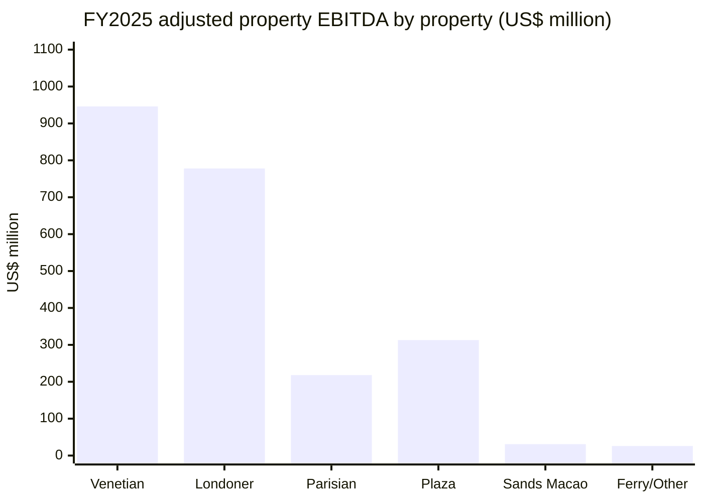
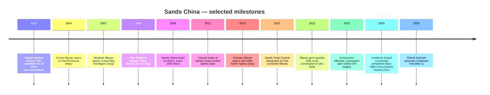
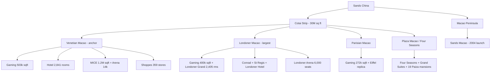
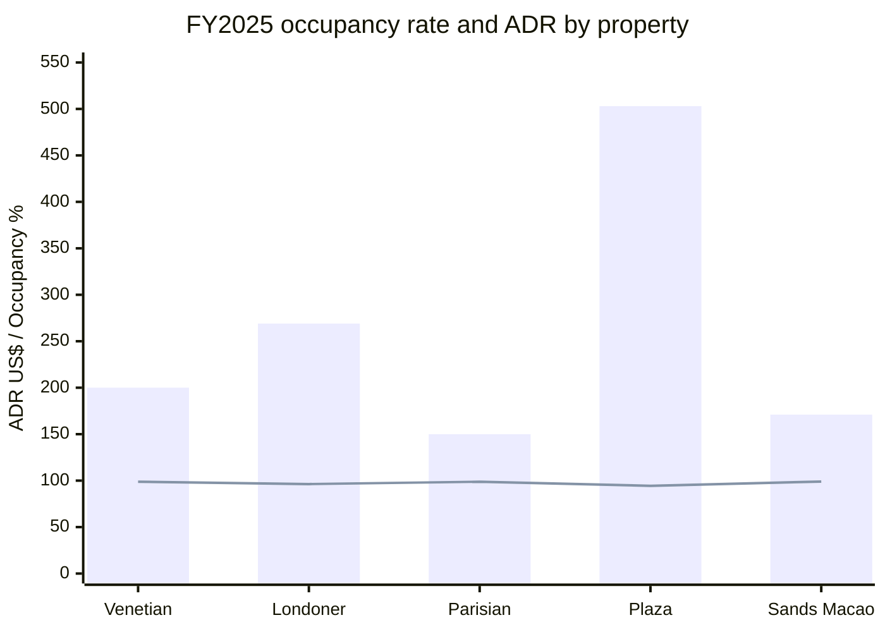
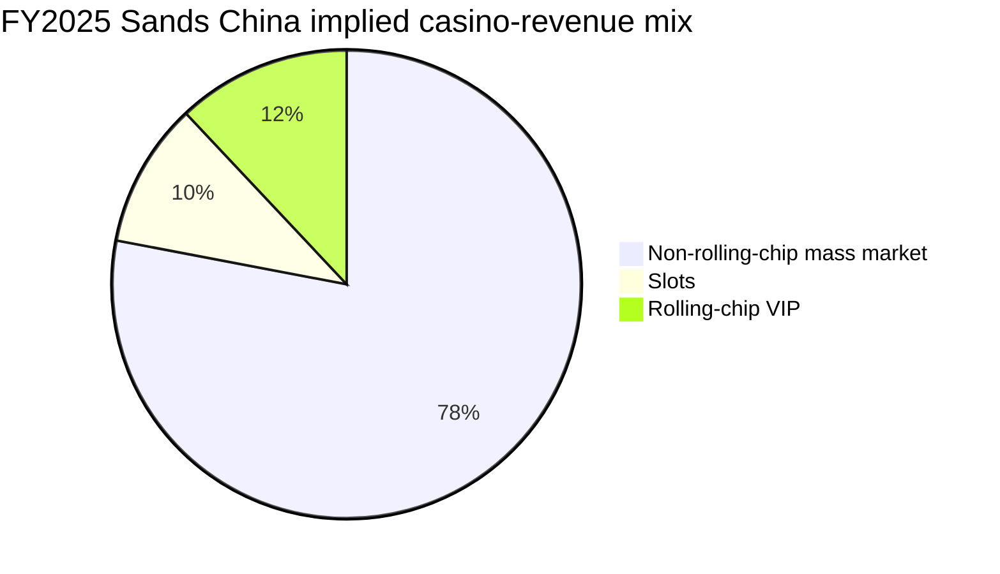
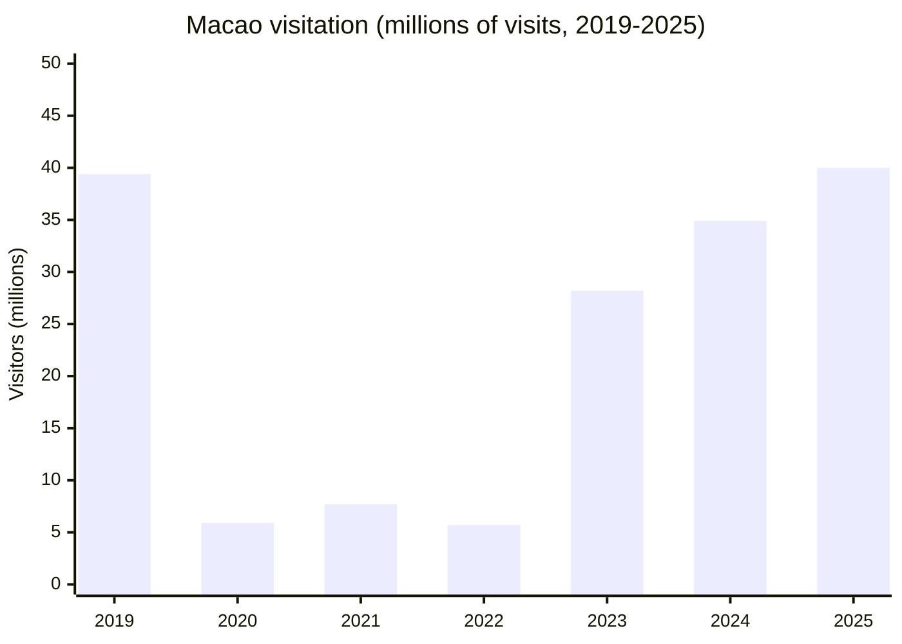
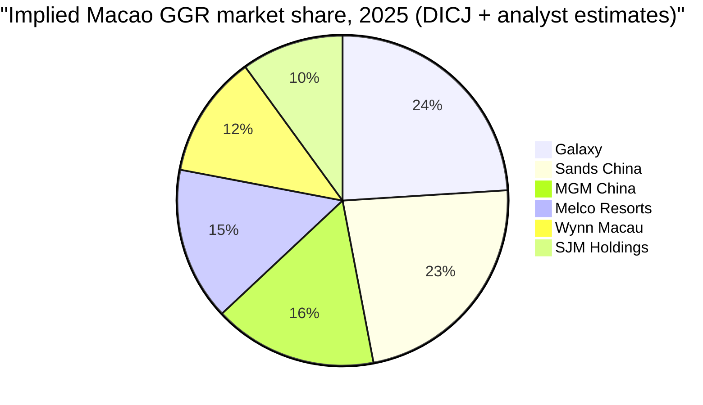
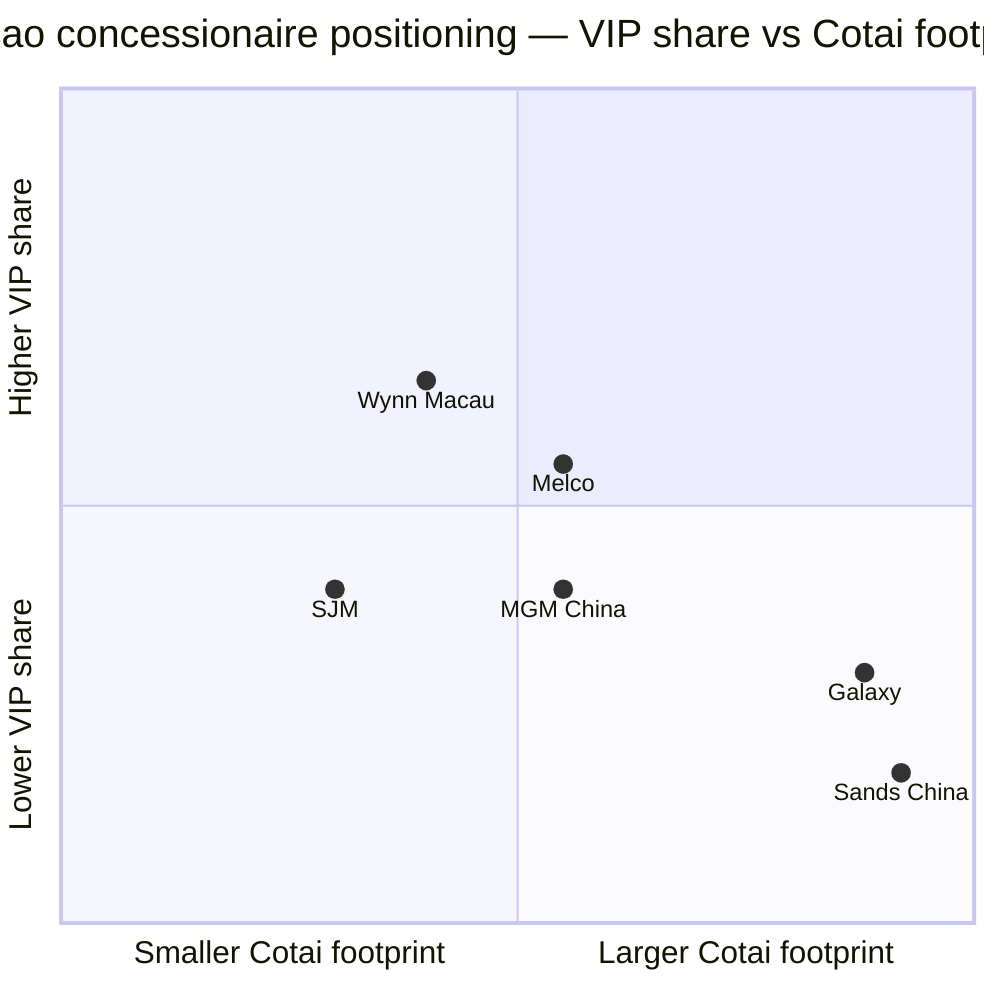
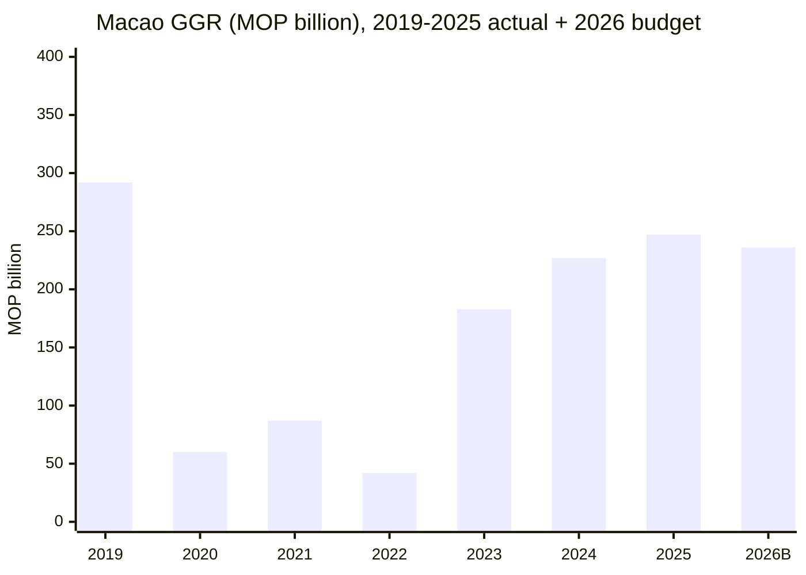

# Sands China Ltd. (金沙中国, HKEX:1928) — Initiation of Coverage

*Equity research, in-depth company profile — Cotai integrated-resort operator, one of six Macao gaming concessionaires.*

**Author:** Research Desk · **As of:** 2026-06-03 · **Reporting currency:** USD (HK$ where relevant) · **Listing:** Hong Kong Main Board (HKEX:1928); ADR: SCHYY / SCHYF

---

## Table of Contents
1. [Company Overview](#1-company-overview)
2. [Company History](#2-company-history)
3. [Management Team — Founder & CEO](#3-management-team--founder--ceo)
4. [Products & Services — Integrated-Resort Portfolio](#4-products--services--integrated-resort-portfolio)
5. [Customers, Market Mix & Player Concentration](#5-customers-market-mix--player-concentration)
6. [Industry Overview — Macao Gaming & Integrated-Resort Market](#6-industry-overview--macao-gaming--integrated-resort-market)
7. [Competitive Landscape — The Six Concessionaires](#7-competitive-landscape--the-six-concessionaires)
8. [Market Opportunity (TAM / SAM)](#8-market-opportunity-tam--sam)
9. [Risk Assessment](#9-risk-assessment)
10. [Investor-Lens Scorecards](#10-investor-lens-scorecards)
11. [References & Data Used](#references)

---

## 1. Company Overview

Sands China Ltd. (HKEX:1928) is the Macao operating arm of US-listed Las Vegas Sands Corp. (LVS, NYSE:LVS), and the largest operator of integrated resorts in the world's biggest gaming market. The company runs five connected properties on Cotai and the Macao Peninsula — **The Venetian Macao, The Londoner Macao, The Parisian Macao, The Plaza Macao and Sands Macao** — comprising 10,829 luxury suites and hotel rooms (including 19 ultra-exclusive Paiza Mansions), 1,680 gaming tables, 3,700 slot machines, ~2 million sq ft of mall GLA across 780 shops, and 1.63 million sq ft of MICE space. Its gaming subsidiary, **Venetian Macau S.A. (VML)**, holds one of the six Macao gaming concessions that took effect on 1 January 2023 and runs through 31 December 2032 ([Sands China 2025 Annual Report, p. 5 — Business Overview](https://s28.q4cdn.com/640198178/files/doc_downloads/sands-china-information/2026/03/SCL-2025-Annual-Report.pdf)).

For FY2025 the group reported total net revenues of **US$7.44 billion** (HK$57.91 billion), up 5.1% YoY, with adjusted property EBITDA of **US$2.31 billion** (essentially flat at –0.7% YoY) and profit for the year of **US$896 million**, a 14.3% YoY decline driven primarily by higher casino marketing and payroll costs in a competitive Macao re-launch year ([Sands China 2025 Annual Report, p. 2 — Financial Results Summary](https://s28.q4cdn.com/640198178/files/doc_downloads/sands-china-information/2026/03/SCL-2025-Annual-Report.pdf)). The group hosted approximately 98 million leisure-and-business visits at its Cotai and Peninsula properties during the year — roughly 2.5× Macao's headline 40 million inbound visitor count, reflecting same-day repeat visitation by ferry passengers and Cotai shuttle riders ([Sands China 2025 Annual Report, p. 5 — Business Overview](https://s28.q4cdn.com/640198178/files/doc_downloads/sands-china-information/2026/03/SCL-2025-Annual-Report.pdf)).

The five-property revenue mix in FY2025 was **75.0% casino / 11.5% rooms / 7.0% mall / 3.6% F&B / 2.9% convention-ferry-other**. Inside the casino line, the company is overwhelmingly a mass-market operator: 73% of Macao market revenue came from mass gaming and slots in 2025 per DICJ, with Sands China's product mix — five-star room inventory, MICE scale, the Cotai Expo, the Venetian Arena (14,000 seats) and the Londoner Arena (6,000 seats) — built to capture the high-margin, premium-mass and non-rolling-chip segments rather than the rolling-chip VIP segment that dominated Macao a decade ago ([Sands China 2025 Annual Report, p. 7 — Industry](https://s28.q4cdn.com/640198178/files/doc_downloads/sands-china-information/2026/03/SCL-2025-Annual-Report.pdf)).

```mermaid
xychart-beta
    title "Sands China FY2024 vs FY2025 net revenue mix (US$ million)"
    x-axis ["Casino", "Rooms", "Mall", "F&B", "Conv/Ferry/Other"]
    y-axis "US$ million" 0 --> 6000
    bar [5346, 774, 493, 260, 207]
    bar [5583, 853, 521, 270, 216]
```

Source: [Sands China 2025 Annual Report, p. 19 — Net revenues by line](https://s28.q4cdn.com/640198178/files/doc_downloads/sands-china-information/2026/03/SCL-2025-Annual-Report.pdf).

**Capital structure & control.** Sands China is a majority-controlled subsidiary of Las Vegas Sands. LVS held **~74.8%** of issued share capital as of late 2025 after spending ~US$337 million between July and October 2025 to grow its stake from 70.3% to 74.76% — close to the Hong Kong public-float ceiling of 75% set by HKEX Listing Rules ([CDC Gaming, 2025-10-23](https://cdcgaming.com/brief/las-vegas-sands-now-holds-74-8-of-sands-china-shares-nearing-hong-kong-cap/)). Shares outstanding total approximately 8.09 billion; market cap was HK$132.1 billion (~US$17.0 billion) at HK$17.12 on 2 April 2026 ([CNBC, HKEX:1928 quote](https://www.cnbc.com/quotes/1928-HK)).

**Valuation snapshot (as of mid-2026).** Trailing-twelve-month P/E sat at **18.9×** and forward dividend yield at **6.27%** following the board's 2026-02-13 recommendation of a final HK$0.50/share dividend (the total HK$0.75/share for FY2025 was a 200% increase over FY2024's HK$0.25) ([Sands China 2025 Annual Report, p. 81 — Dividends](https://s28.q4cdn.com/640198178/files/doc_downloads/sands-china-information/2026/03/SCL-2025-Annual-Report.pdf); [Investing.com, 1928.HK dividend history](https://www.investing.com/equities/sands-china-ltd-dividends)). Using FY2025 net revenue of US$7.44 billion, P/S works to **~2.3×** consolidated revenue. Sell-side coverage is constructive — *Investing.com* logs 21 Buy / 0 Sell ratings with a 12-month consensus target of HK$22.46 (high HK$25.34, low HK$18.49) ([Investing.com analyst sentiment](https://www.investing.com/equities/sands-china-ltd)). The ~19× TTM multiple is materially below the >50× peaks Sands China traded at during 2017-19 (when 鼠 VIP rolling-chip volumes ran 3-5× higher) and roughly in line with the Macau peer group given the FY26 estimated dividend yield. *Analyst view:* the multiple compression reflects (a) the structural shift away from VIP rolling chip towards lower-margin mass play, (b) the 31 Dec 2032 concession expiry that caps cash-flow runway, and (c) capex commitments under the Investment Plan (US$4.47 billion committed through Dec 2032 of which US$4.17 billion must be non-gaming) — not deterioration of the core asset, in our reading.

Source: [Sands China 2025 Annual Report, p. 25 — Adjusted Property EBITDA segment table](https://s28.q4cdn.com/640198178/files/doc_downloads/sands-china-information/2026/03/SCL-2025-Annual-Report.pdf).

---

## 2. Company History

Sands China traces its lineage to **Sheldon G. Adelson**, the late founder of Las Vegas Sands and chief architect of the "integrated resort" model that combines gaming with MICE, retail, premium hotel brands and entertainment under one roof. After the 2002 Macao gaming-market reform that ended Stanley Ho's STDM monopoly and re-tendered the concessions, LVS-controlled VML was awarded one of the three sub-concessions on 19 June 2002 and Adelson immediately set about turning the largely undeveloped Cotai sandbank between Coloane and Taipa into the "Cotai Strip" — an explicit echo of his successful Las Vegas Strip reinvention ([Sands China 2025 Annual Report, p. 5 — Founder's vision](https://s28.q4cdn.com/640198178/files/doc_downloads/sands-china-information/2026/03/SCL-2025-Annual-Report.pdf)).

The first asset to open was **Sands Macao** on the Peninsula in May 2004 — a 238-room, 160-table launch property that famously paid back its US$240 million build cost in under one year, validating Adelson's mass-market thesis. **The Venetian Macao** opened in August 2007 as the anchor Cotai property, modelled on the 1999 Venetian Las Vegas with a 39-floor luxury hotel tower (2,905 suites), 503,000 sq ft of gaming, the Shoppes at Venetian (960,000 sq ft, 359 stores) and 1.2 million sq ft of convention facilities ([Sands China 2025 Annual Report, p. 8 — Properties table](https://s28.q4cdn.com/640198178/files/doc_downloads/sands-china-information/2026/03/SCL-2025-Annual-Report.pdf)). **The Plaza Macao / Four Seasons** followed in August 2008, **The Parisian Macao** in September 2016 with its half-scale Eiffel Tower replica, and the Londoner-branded conversion of the former Sands Cotai Central in stages through 2021 (Conrad and St Regis towers from 2012 / 2015; Londoner Court Sep 2021; the Londoner Grand conversion of the Sheraton towers completed in 2Q25, adding 2,405 rooms and suites as Macao's first Marriott International Luxury Collection hotel) ([Sands China 2025 Annual Report, p. 17 — Development Projects](https://s28.q4cdn.com/640198178/files/doc_downloads/sands-china-information/2026/03/SCL-2025-Annual-Report.pdf)).

Source: [Sands China 2025 Annual Report — Business Overview, Concession & Director biographies](https://s28.q4cdn.com/640198178/files/doc_downloads/sands-china-information/2026/03/SCL-2025-Annual-Report.pdf).

Sands China **listed on the Hong Kong Main Board in November 2009** at HK$10.38, raising roughly US$2.5 billion in what was at the time Asia's largest IPO of the year, with LVS retaining a controlling stake. The IPO created an Asia-time-zone trading vehicle for what had become the single most valuable asset inside LVS — Macao gaming revenue had already passed Las Vegas Strip revenue in 2006 — and let LVS fund the next two phases of Cotai development without further dilution at the parent level.

A defining event of the company's history came on **16 December 2022**, when the Macao government awarded VML one of six gaming concessions under the revised post-2022 framework (which abolished the previous concession/sub-concession structure and reduced the maximum number of operators from six to six but tightened oversight). The new ten-year concession took effect on 1 January 2023 and **expires 31 December 2032**, and unlike the original 2002 deal it carries a binding US$4.47 billion (35.84 billion patacas) investment commitment, of which US$4.17 billion (33.39 billion patacas) must go to non-gaming projects — MICE, entertainment, sport, art and culture, health/wellness, themed attractions, gastronomy, community and maritime tourism ([Sands China 2025 Annual Report, p. 12 — Concession & Investment Plan](https://s28.q4cdn.com/640198178/files/doc_downloads/sands-china-information/2026/03/SCL-2025-Annual-Report.pdf)). VML had spent US$1.04 billion of this through 31 December 2025 (about US$723 million in 2023/24 audited; US$315 million unaudited in 2025).

**Founder Sheldon Adelson died on 11 January 2021**; his widow Dr Miriam Adelson and the Adelson family trust remain the largest single shareholder block in LVS, and former LVS COO Robert Goldstein assumed the LVS chairmanship and the Sands China chair. Goldstein stepped down as Sands China chairman effective **1 March 2026**, succeeded by Patrick Dumont (see Section 3) — a transition that aligns Sands China leadership cleanly with the new LVS chairman/CEO and crystallises a generational shift inside the parent.

---

## 3. Management Team — Founder & CEO

### Sheldon G. Adelson (Founder, 1933–2021) — pioneer of the integrated-resort model

Sheldon Gary Adelson founded what is now Las Vegas Sands and personally drove every strategic decision that built Sands China — from the 2002 Macao bid to the Cotai land reclamation to the Singapore Marina Bay Sands ambition that proved his integrated-resort thesis could travel. The 2025 Chairman's Statement explicitly describes Adelson's vision as the company's enduring strategic anchor:

> "Our founder, Mr. Sheldon G. Adelson, pioneered the development of the Cotai Strip in Macao, leading the Company and the team he created in the rapid and market-leading development of a critical mass of integrated resort destinations in Macao. Mr. Adelson's commitment to aggressively pursuing diversification and investment in non-gaming amenities in Macao was unwavering, as was his commitment to a strong and healthy US-China relationship, supported by robust dialogue and mutual respect."
> — [Sands China 2025 Annual Report, p. 3 — Chairman's Statement](https://s28.q4cdn.com/640198178/files/doc_downloads/sands-china-information/2026/03/SCL-2025-Annual-Report.pdf)

Adelson's pre-Macao career — building COMDEX into the world's largest computer trade show in the 1980s, then selling it to Softbank in 1995 for ~US$862 million; opening the Sands Expo Convention Center and the original Venetian on the Las Vegas Strip in 1999 — gave him three durable convictions that still drive Sands China strategy: (1) **MICE traffic monetises better than pure gaming** because business travellers stay longer, return more often and bring spouses (hotel + retail spend rises); (2) **Co-branded luxury hospitality** (Four Seasons, St Regis, Conrad, Marriott Luxury Collection) gives the resort access to a global premium customer pipeline; (3) **scale is the moat** — the larger the integrated complex, the more visit-purposes it captures from a single trip. The Cotai Strip — 30 million sq ft of interconnected facilities ([p. 5](https://s28.q4cdn.com/640198178/files/doc_downloads/sands-china-information/2026/03/SCL-2025-Annual-Report.pdf)) — is the literal embodiment of all three theses. Adelson stepped down as Sands China chairman in early 2009 ahead of the HKEX IPO but remained chairman / CEO of LVS until his death on 11 January 2021, after which the LVS chair passed to Robert Goldstein.

### Grant Chum (Chum Kwan Lock) — Chief Executive Officer & President, age 50

Mr Chum has been CEO and President of Sands China since **January 2024** (concurrent Executive Director since January 2021), having previously served as COO from February 2020 to January 2024. He is Chairman of the Board's Capex Committee and concurrently holds the role of **Executive Vice President — Asia Operations at Las Vegas Sands** since July 2022, formally linking Macao operating responsibility with LVS group strategy ([Sands China 2025 Annual Report, p. 77 — Grant Chum bio](https://s28.q4cdn.com/640198178/files/doc_downloads/sands-china-information/2026/03/SCL-2025-Annual-Report.pdf)).

Chum joined Sands as Senior Vice President, Global Gaming Strategy in 2013 and was Chief of Staff to the chairman from March 2015 to February 2020 — a six-year apprenticeship that put him inside every major capital-allocation decision through the Parisian opening (Sep 2016), the Sands Cotai Central → Londoner rebrand programme, the 2022 concession re-tender and the 2024 LVS Term Loan repayment. Before Sands he spent **14 years at UBS Investment Bank**, ultimately as managing director, head of Hong Kong equity research and head of China equity research — sell-side roles that meant he covered Macao gaming names (including Sands China itself prior to listing) and the broader Asia consumer / hospitality sector. He graduated with **First Class Honors in Philosophy, Politics and Economics from the University of Oxford** and concurrently serves as an independent non-executive director of HK-listed Kerry Properties (HKEX:0683). Chum personally held 3,633,004 Sands China shares as of 31 Dec 2025 (about 0.04% of issued capital, including 1.24m vested LVS-administered options and 2.39m unvested RSUs) and 700,000 LVS shares ([Sands China 2025 Annual Report, p. 83 — Interests of Directors](https://s28.q4cdn.com/640198178/files/doc_downloads/sands-china-information/2026/03/SCL-2025-Annual-Report.pdf)).

Chum's signature contribution since taking the CEO seat in early 2024 has been the **completion of Londoner Phase II** — the conversion of the Sheraton Grand Macao into the 2,405-room Londoner Grand, finished in 2Q25 and ranked by management as the asset that "enhanced the property's competitive positioning" and drove a +33.1% YoY casino-revenue jump (and +43.3% adjusted property EBITDA) at Londoner in 2025 ([p. 20](https://s28.q4cdn.com/640198178/files/doc_downloads/sands-china-information/2026/03/SCL-2025-Annual-Report.pdf)). His strategic emphasis in shareholder communications has been mass-market focus + MICE expansion + non-gaming amenities — consistent with both the concession's investment-plan tilt and the Macao government's stated long-term goal of reducing the city's dependence on rolling-chip VIP gaming.

### Note on remaining senior management

Per the project's coverage standard, only the founder and current CEO are profiled in detail above. Other named senior executives in the 2025 annual report include Executive Vice Chairman Dr Wilfred Wong (Wong Ying Wai), CFO Dave Sun (Sun MinQi), and General Counsel & Company Secretary Dylan James Williams ([Sands China 2025 Annual Report, pp. 76–80](https://s28.q4cdn.com/640198178/files/doc_downloads/sands-china-information/2026/03/SCL-2025-Annual-Report.pdf)).

---

## 4. Products & Services — Integrated-Resort Portfolio

Sands China is not a casino operator — it is an integrated-resort operator. The company's own framing of the business model and the FY2025 revenue mix (75% casino, 11.5% rooms, 7.0% mall, 3.6% F&B, 2.9% convention/ferry/other; [p. 19](https://s28.q4cdn.com/640198178/files/doc_downloads/sands-china-information/2026/03/SCL-2025-Annual-Report.pdf)) shows the same picture from two angles: gaming is the lion's share of revenue and EBITDA, but **the multi-amenity bundle is what brings the gamer in** — and what differentiates Sands China from concession peers that are more gaming-centric (Sands Macao, MGM Cotai) or more focused on the residential/marina mix (Galaxy Macau Phase 4). The annual report puts it explicitly:

> "We believe our business strategy and development plan allow us to achieve a more consistent demand, longer average length of stay in our hotels, more diversified sources of revenue and higher margins than gaming-centric facilities."
> — [Sands China 2025 Annual Report, p. 6 — Business Strategies](https://s28.q4cdn.com/640198178/files/doc_downloads/sands-china-information/2026/03/SCL-2025-Annual-Report.pdf)

The five-property matrix below, reproduced verbatim from the annual report's properties table, is the starting point for understanding the asset base:

| Property (opened) | Hotel rooms & suites | Paiza suites / mansions | MICE (sq ft) | Theater / Arena seats | Retail (sq ft) | Shops | Tables / Slots |
|---|---:|---:|---:|---:|---:|---:|---:|
| **The Venetian Macao** (Aug 2007) | 2,841 | 64 / — | 1,200,000 | 1,800 / 14,000 | 960,000 | 359 | 659 / 1,137 |
| **The Londoner Macao** (Apr 2012, Grand 2Q25) | 4,426 | — / — | 358,000 | 1,701 / 6,000 | 518,000 | 172 | 500 / 1,285 |
| **The Parisian Macao** (Sep 2016) | 2,333 | 208 / — | 62,000 | 1,200 / — | 297,000 | 101 | 255 / 1,008 |
| **The Plaza Macao** (Aug 2008) | 649 | — / 19 | 12,000 | — | 262,000 | 136 | 106 / 13 |
| **Sands Macao** (May 2004) | 238 | 51 / — | — | 650 / — | 35,000 | 9 | 160 / 257 |
| **Total** | **10,487** | **323 / 19** | **1,632,000** | **5,351 / 20,000** | **2,072,000** | **777** | **1,680 / 3,700** |

Source: [Sands China 2025 Annual Report, p. 8 — Existing operations table](https://s28.q4cdn.com/640198178/files/doc_downloads/sands-china-information/2026/03/SCL-2025-Annual-Report.pdf).

Each integrated resort is built around the same **five-amenity flywheel** — gaming + premium-branded hotel + retail mall + MICE/event venue + F&B/entertainment. The amenities reinforce each other: the Shoppes drive incremental footfall through gaming areas; MICE bookings fill rooms on shoulder dates; Arena residencies (NBA China Games hosted in Oct 2025 at the Venetian Arena) build the brand for non-gaming visitors; F&B and shopping monetise the spouse / non-gambler in the visiting party.

Source: [Sands China 2025 Annual Report, pp. 8–10 — Properties and mall operations](https://s28.q4cdn.com/640198178/files/doc_downloads/sands-china-information/2026/03/SCL-2025-Annual-Report.pdf).

### 4.1 — Gaming (75.0% of FY2025 net revenue)

Macao gaming is conducted across two broad table-game segments and one slot segment, all defined by VML's concession terms:

- **Non-Rolling Chip (mass-market) tables** — the volume measurement is "drop" (net markers + cash + chips at the cage). Sands China's NRC drop totalled US$25.6 billion in 2025 (Venetian $9.55B + Londoner $8.64B + Parisian $3.07B + Plaza $2.83B + Sands Macao $1.56B), with NRC win percentages of 21.2% to 23.2% at the four large properties and 15.3% at Sands Macao ([Sands China 2025 Annual Report, p. 20 — Casino activity table](https://s28.q4cdn.com/640198178/files/doc_downloads/sands-china-information/2026/03/SCL-2025-Annual-Report.pdf)).
- **Rolling Chip (VIP) tables** — the volume measurement is non-negotiable chips wagered and lost. RC volume totalled US$21.4 billion in 2025 with win percentages between 3.35% and 5.19% (vs the company's expected 3.30%). Note the dramatic RC volume jump at Londoner (+26.5% YoY) and Parisian (+190.6% off a tiny FY24 base) as RC tables were re-deployed to capacity post the Phase II completion.
- **Slot machines** — handle of US$20.6 billion across the portfolio; slot hold percentages between 2.3% and 3.8% ([p. 20](https://s28.q4cdn.com/640198178/files/doc_downloads/sands-china-information/2026/03/SCL-2025-Annual-Report.pdf)).

Approximately **9.4% of table-game play** at Macao properties was conducted on a credit basis in 2025 ([Sands China 2025 Annual Report, p. 18 — Casino revenue measurements](https://s28.q4cdn.com/640198178/files/doc_downloads/sands-china-information/2026/03/SCL-2025-Annual-Report.pdf)) — a deliberately small share given VML's exposure to credit-collection risk on cross-border patrons (see §9.7). Casino receivables net before ECL were US$356 million at year-end 2025 — small relative to US$5.58 billion of net casino revenue but flagged as a Key Audit Matter by Deloitte ([p. 100](https://s28.q4cdn.com/640198178/files/doc_downloads/sands-china-information/2026/03/SCL-2025-Annual-Report.pdf)).

### 4.2 — Premium-branded hotel and Paiza inventory (11.5% of revenue)

Sands China's room base totals 10,487 standard suites/rooms, 323 Paiza suites (high-tier comp accommodation for premium players) and 19 ultra-exclusive Paiza Mansions at the Plaza Macao — the latter typically running at four- and five-bedroom configurations for the highest-tier whales. The portfolio is built around four global hospitality partners — **Four Seasons** (Plaza Macao, including the 289-suite Grand Suites at Four Seasons that opened in October 2020), **St Regis** (400 rooms in the Londoner Court tower), **Conrad** (659 rooms in the Conrad tower at Londoner) and **Marriott International Luxury Collection** (the 2,405-room Londoner Grand, completed 2Q25) — plus the company's own Londoner / Venetian / Parisian flag rooms ([Sands China 2025 Annual Report, pp. 8–9 — Property descriptions](https://s28.q4cdn.com/640198178/files/doc_downloads/sands-china-information/2026/03/SCL-2025-Annual-Report.pdf)).

The 2025 room operating data are notable for showing **near-saturation occupancy across the portfolio** — Venetian 98.8%, Parisian 98.8%, Sands Macao 99.0%, Londoner 96.3%, Plaza 94.4% — alongside the dramatic Londoner ADR re-rate from US$216 in 2024 to **US$269 in 2025** (+24.5% YoY) as the Marriott Luxury Collection upgrade lifted price ([p. 21](https://s28.q4cdn.com/640198178/files/doc_downloads/sands-china-information/2026/03/SCL-2025-Annual-Report.pdf)). At those occupancy levels there is essentially no scope to grow room revenue from volume — incremental dollars must come from ADR-led mix improvement (more Plaza Macao, more Grand Suites, more Paiza), which is the explicit investor-day message.

Source: [Sands China 2025 Annual Report, p. 21 — Room activity by property](https://s28.q4cdn.com/640198178/files/doc_downloads/sands-china-information/2026/03/SCL-2025-Annual-Report.pdf).

### 4.3 — Retail malls (7.0% of revenue; high-margin)

Sands China owns and operates four malls — **Shoppes at Venetian (829,872 sq ft GLA; 89.9% occupancy), Shoppes at Londoner (518,138 sq ft; 78.6%), Shoppes at Parisian (256,825 sq ft; 71.9%) and Shoppes at Four Seasons (248,304 sq ft; 95.0%)** — plus minor retail at Sands Macao. The tenant mix runs from Tiffany / Rolex / Bvlgari / Louis Vuitton / Hermès / Chanel / Gucci / Dior at Four Seasons (the dedicated luxury mall — base rent **US$620/sq ft**, tenant sales US$4,375/sq ft in 2025) through mid-luxury / aspirational at Venetian (Zara, Uniqlo, Tommy Hilfiger, Pop Mart, LAOPU GOLD — base rent US$284/sq ft) to entertainment-dining-led at Londoner (Apple, Shake Shack, The Cheesecake Factory, NBA store, Polo Ralph Lauren — base rent US$184/sq ft) ([Sands China 2025 Annual Report, p. 10 — Mall tenant list; p. 22 — Mall financial activity](https://s28.q4cdn.com/640198178/files/doc_downloads/sands-china-information/2026/03/SCL-2025-Annual-Report.pdf)).

Mall revenue grew 5.7% YoY to US$521 million in 2025 with margins extreme (mall expenses US$65 million, implying a 87.5% segment contribution margin). Shoppes at Venetian was the standout — total revenue +10.4% YoY on +4.2 pts occupancy and +19.8% tenant sales/sq ft, reflecting the lift in mass-tourist foot-traffic post the Visit Free Travel Scheme expansion. The high-end Four Seasons mall, by contrast, saw tenant sales/sq ft drop 18.7% YoY to US$4,375 — the proxy for premium-mass / VIP weakness in the year.

### 4.4 — MICE, ferry, entertainment, ferry, and other (≈6.5% of revenue, but a major demand driver)

The non-gaming amenities are deliberately oversized relative to direct revenue contribution because they exist primarily to drive aggregate visitation. Key MICE / entertainment assets:

- **Cotai Expo at the Venetian** — 1.2 million sq ft of column-free convention space, the largest in Asia.
- **Venetian Arena (14,000 seats)** — hosted the **NBA China Games in October 2025** (the cause of the +24.7% YoY increase in corporate / branding expenses noted in the MD&A — [Sands China 2025 Annual Report, p. 24](https://s28.q4cdn.com/640198178/files/doc_downloads/sands-china-information/2026/03/SCL-2025-Annual-Report.pdf)).
- **Londoner Arena (6,000 seats)** — completed in 2024 as part of Phase II.
- **Cotai Water Jet** — high-speed catamaran ferry service between the HK-Macau Ferry Terminal and Taipa Ferry Terminal. Licence renewed for 10 years from 8 November 2019, expiry 13 January 2030. Each custom catamaran carries 400+ passengers at up to 42 knots. Operated on Sands China's behalf by Chu Kong High-Speed Ferry Co., Ltd ([Sands China 2025 Annual Report, p. 11 — Other Operations](https://s28.q4cdn.com/640198178/files/doc_downloads/sands-china-information/2026/03/SCL-2025-Annual-Report.pdf)).
- **Cotai Shuttle Bus** — 140 buses (34 owned, 106 leased) running 24/7 between Sands China properties, the ferry terminals, the airport, the Gongbei / Hengqin border-crossings and the HZMB Macao port. The shuttle is the single most visible piece of Cotai infrastructure for the typical mainland day-tripper.
- **Cotai Limo** — 100+ limousines on-demand, 25 signature vehicles for VIP guests.
- **Airplane Services** — access via LVS Shared Services to a fleet of 14 corporate-configured aircraft, operated by Sands Aviation, for the highest-tier patrons.

### 4.5 — Putting it together: the integrated-resort flywheel

The five amenity classes interlock through the customer's day. A typical mainland visitor lands at Zhuhai or Hong Kong, takes the Cotai Water Jet or the HZMB bus, transfers via Cotai Shuttle, checks into the Londoner or Venetian hotel, browses the Shoppes during the day, attends a Venetian Arena concert or NBA game in the evening, dines at one of 160 F&B outlets, gambles in the casino on the way back to the room, and repeats. Sands China captures most of the wallet at each stop. The flywheel is why the company can hit 96-99% hotel occupancy across 10,487 rooms despite Macao having only ~40 million annual visitors: every property pulls multiple visit-purposes from a single trip, and the connected design means the customer rarely leaves Sands real estate.

The strategic significance of this design vs gaming-centric competitors (e.g. SJM's older Peninsula casinos) is twofold: (1) revenue mix is structurally less volatile because non-gaming revenue moves with tourism not gaming-cycle dynamics; (2) the MICE / entertainment / mall infrastructure satisfies the **non-gaming investment commitment** under the 2023 concession (US$4.17 billion of US$4.47 billion total, due by Dec 2032), which is binding and audited annually by the Macao government ([Sands China 2025 Annual Report, p. 12 — Investment Plan](https://s28.q4cdn.com/640198178/files/doc_downloads/sands-china-information/2026/03/SCL-2025-Annual-Report.pdf)). Competitors must spend on non-gaming too; Sands China is already ahead because its asset base was built that way from inception.

---

## 5. Customers, Market Mix & Player Concentration

**Sands China is a B2C business with no enterprise customer concentration.** Unlike industrial / B2B issuers required to disclose customers exceeding 10% of revenue, Macao integrated-resort operators do not publish per-customer revenue contributions — patrons are individuals (gamers, hotel guests, shoppers) and the only retail tenants disclosed by name are the mall anchors and luxury brands. The annual report's "customer concentration" risk discussion is framed around **credit-extension risk** to high-value table-game patrons (~9.4% of table-game play in 2025 was on credit) rather than enterprise concentration ([Sands China 2025 Annual Report, p. 36 — Credit extension risk](https://s28.q4cdn.com/640198178/files/doc_downloads/sands-china-information/2026/03/SCL-2025-Annual-Report.pdf)). This is the standard model for the Macao concessionaires; the same is true at Galaxy, Wynn Macau, MGM China, Melco and SJM.

What can be quantified, and is more analytically useful for Sands China, is **player-segment mix** — non-rolling-chip (mass market + premium mass), rolling-chip (VIP), slot — and the **geographic origin** of the patron base.

### 5.1 — Player segment mix

The DICJ market-wide split for 2025 was **73% mass & slot / 27% VIP rolling-chip** ([Sands China 2025 Annual Report, p. 7 — Industry](https://s28.q4cdn.com/640198178/files/doc_downloads/sands-china-information/2026/03/SCL-2025-Annual-Report.pdf)). Sands China's own mix runs more mass-heavy than the market because its product portfolio (large room count, MICE, malls, branded hotels) is purpose-built to convert mass tourists into mass gamers. From the casino activity table:

- **Aggregate Sands China NRC drop** US$25.6 billion (mass market) × weighted-average win % ~22% ≈ US$5.6 billion mass-segment net win.
- **Aggregate Sands China RC volume** US$21.4 billion × weighted-average win % ~3.7% ≈ US$790 million VIP-segment net win.
- Slots — slot handle US$20.6 billion × ~3.6% hold ≈ US$740 million.

The ratio implies a roughly **88% mass + slot / 12% VIP** mix at Sands China, vs the 73/27 market split — confirming the property-level mass-market skew that management has emphasised for over a decade ([Sands China 2025 Annual Report, p. 20 — Casino activity table](https://s28.q4cdn.com/640198178/files/doc_downloads/sands-china-information/2026/03/SCL-2025-Annual-Report.pdf); analyst calculation labelled as such — not a 10-K disclosed figure).

Source: [Sands China 2025 Annual Report, p. 20 — analyst aggregation of NRC drop × win, RC volume × win, slot handle × hold](https://s28.q4cdn.com/640198178/files/doc_downloads/sands-china-information/2026/03/SCL-2025-Annual-Report.pdf). Note: chart denominator = aggregate Sands China casino net win (analyst estimate from primary disclosure); company does not publish a published segment-revenue split. Treat as analyst-constructed view.

### 5.2 — Geographic origin of the patron base

Macao gaming is overwhelmingly **mainland-China-driven**. The company does not publish a per-country revenue split, but the macro numbers from the Macao Government Tourism Office and DICJ — which the annual report cites — show **mainland visitation rose ~18.5% in 2025** vs 2024, with total Macao visitation at ~40 million in 2025 (+14.7% YoY) ([Sands China 2025 Annual Report, p. 17 — Overview and outlook](https://s28.q4cdn.com/640198178/files/doc_downloads/sands-china-information/2026/03/SCL-2025-Annual-Report.pdf); [Macao News, 2026-01-02 — Macao 2025 GGR tops MOP247 billion](https://macaonews.org/news/business/macau-december-2025-gross-gaming-revenue-ggr/)). Premium-mass patrons skew heavily toward Pearl River Delta (Guangdong / Shenzhen / Guangzhou / Foshan / Zhuhai) and South China; Hong Kong is the second-largest origin market; the company's stated long-term ambition (under the concession's non-gaming investment plan) is to grow international-visitor share. The 2025 NBA China Games at the Venetian Arena are an explicit international-marketing play ([p. 24 — Corporate expense commentary](https://s28.q4cdn.com/640198178/files/doc_downloads/sands-china-information/2026/03/SCL-2025-Annual-Report.pdf)).

### 5.3 — Mall tenants and major retail relationships (consolidated mall denominator)

While there are no individual customers exceeding 10% of consolidated revenue, the malls do operate on multi-tenant retail leases where the major luxury anchors are named. At the **Shoppes at Four Seasons** (the highest-end of the four malls — base rent US$620/sq ft, 95.0% occupancy in 2025): named tenants include **Cartier, Chanel, Louis Vuitton, Hermès, Gucci, Dior, Versace, Zegna, Loro Piana, Saint Laurent, Balenciaga, Loewe, Roger Vivier, Christian Louboutin, Alexander McQueen, Miu Miu, Tiffany & Co., Rimowa** ([Sands China 2025 Annual Report, p. 10 — Mall significant tenants table](https://s28.q4cdn.com/640198178/files/doc_downloads/sands-china-information/2026/03/SCL-2025-Annual-Report.pdf)). At Shoppes at Londoner: **Apple, Bottega Veneta, Gucci, Burberry, Louis Vuitton, Alexander McQueen, Brunello Cucinelli, Versace, Canada Goose, Zegna, The Cheesecake Factory, Shake Shack, NBA store**. The mall mix is broadly representative of the global luxury / mid-luxury retail ecosystem and rotates with tenant performance.

### 5.4 — Customer-concentration risk wrap

In the formal Risk Factors (Section 2.4 of the annual report), customer concentration appears only obliquely — as **credit-extension risk to a subset of high-value table-game patrons** (9.4% of table-game play, US$356 million net casino receivables before ECL, 162.5% YoY increase in provision for ECL to US$21 million in 2025 — reflecting both higher credit granted and aged receivables) ([Sands China 2025 Annual Report, p. 23 — Provision for ECL; p. 36 — Credit extension risk](https://s28.q4cdn.com/640198178/files/doc_downloads/sands-china-information/2026/03/SCL-2025-Annual-Report.pdf)). The bigger structural concentration is **single-jurisdiction (Macao)** and **single-region (mainland China)** — not single-customer.

---

## 6. Industry Overview — Macao Gaming & Integrated-Resort Market

**Macao is the world's largest gaming market** and the **only jurisdiction in mainland-greater-China where casino gaming is legal**. In 2025, total gross gaming revenue (GGR) was **MOP247.40 billion (~US$30.87 billion)**, up 9.1% YoY and recovering to 84.6% of pre-pandemic 2019 levels (US$36.5 billion equivalent at the time). The 2026 government budget projects MOP236 billion ([Sands China 2025 Annual Report, p. 7 — Industry](https://s28.q4cdn.com/640198178/files/doc_downloads/sands-china-information/2026/03/SCL-2025-Annual-Report.pdf); [Macao News, 2026-01-02 — Macao 2025 GGR](https://macaonews.org/news/business/macau-december-2025-gross-gaming-revenue-ggr/); [Macao News, 2025-12 — 2026 budget projects MOP236 billion](https://macaonews.org/news/business/macao-gaming-revenue-forecast-2026-budget-236-billion-patacas/)). The pre-pandemic GGR peak was MOP361 billion in 2013; subsequent declines reflect (1) Beijing's anti-corruption / anti-gambling campaign which structurally compressed the VIP / junket segment, and (2) the COVID-era border closures that effectively froze 2020-22 volumes.

### 6.1 — Visitation and demand drivers

Macao visitation hit **~40 million in 2025** (+14.7% YoY) and per the company's annual report has trended approximately **35 million in 2024, 28 million in 2023, ~6 million in 2022** during border closures — implying a CAGR back to pre-pandemic norms of roughly 39 million in 2019 ([Sands China 2025 Annual Report, p. 3 — Chairman's Statement](https://s28.q4cdn.com/640198178/files/doc_downloads/sands-china-information/2026/03/SCL-2025-Annual-Report.pdf)). Growth drivers cited by Sands China:

- **Mainland Chinese urbanization** — continued rural-to-urban migration in China expanding the cohort of potential outbound travellers.
- **Outbound tourism growth from China** — China outbound is in the late stages of recovery from COVID-era travel restrictions.
- **Transport infrastructure** — HZMB (Hong Kong-Zhuhai-Macao Bridge) opened October 2018 has reduced the Hong Kong-Macao journey to ~45 minutes by road; Hengqin Port (the Zhuhai border crossing immediately adjacent to Cotai) reopened in 2020 with 24/7 operations; Cotai Water Jet ferry and shuttle systems funnel visitors directly to integrated-resort doorsteps.
- **Hotel inventory expansion** — both Macao and Hengqin (the Guangdong-side leisure / hospitality enclave) continue to add rooms.

Source: [Macao Government Tourism Office statistics, cited in Sands China 2025 Annual Report, p. 3 (Chairman's Statement) and p. 17 (MD&A)](https://s28.q4cdn.com/640198178/files/doc_downloads/sands-china-information/2026/03/SCL-2025-Annual-Report.pdf); pre-2023 figures from MGTO historical bulletins.

### 6.2 — Segment dynamics: mass vs VIP

The single most important structural shift in Macao over the last decade is the **collapse of the VIP rolling-chip segment** from ~70% of GGR in 2013 to ~27% in 2025 (DICJ statistics, cited in [Sands China 2025 Annual Report, p. 7](https://s28.q4cdn.com/640198178/files/doc_downloads/sands-china-information/2026/03/SCL-2025-Annual-Report.pdf)). The catalyst was the 2014-15 anti-corruption campaign in mainland China and subsequent junket-promoter de-licensing — junkets were the primary source of cross-border VIP credit and patron sourcing. Concessionaires that had over-indexed to VIP saw revenue halved; those that had invested in mass-market infrastructure (notably Sands China, Galaxy, MGM) emerged with a relatively defensible mass franchise.

The post-2023 concession framework formalises this shift. Each of the six concessionaires has a binding non-gaming investment commitment — for Sands China, **US$4.17 billion of non-gaming investment by Dec 2032** under the Investment Plan ([Sands China 2025 Annual Report, p. 12 — Investment Plan](https://s28.q4cdn.com/640198178/files/doc_downloads/sands-china-information/2026/03/SCL-2025-Annual-Report.pdf)) — directed at MICE, entertainment, sport, art, culture, health/wellness, themed attractions, gastronomy, community and maritime tourism. The strategic rationale is to entrench the mass-market / integrated-resort model and reduce Macao's vulnerability to a future VIP-style cycle shock.

### 6.3 — Industry structure: six concessionaires, fixed table caps

Under the **Law No. 7/2022** (which amended the original 2001 Gaming Law), Macao gaming is operated under a fixed six-concession framework. Sands China's VML received its concession on 16 December 2022 with effect 1 January 2023, expiring **31 December 2032**. The other five concessions belong to Galaxy Casino S.A. (Galaxy Entertainment Group), Wynn Resorts (Macau) S.A. (Wynn Macau), MGM Grand Paradise S.A. (MGM China), Melco Resorts (Macau) S.A. (Melco Resorts) and SJM Resorts S.A. (SJM Holdings) ([Sands China 2025 Annual Report, pp. 186–192 — Glossary](https://s28.q4cdn.com/640198178/files/doc_downloads/sands-china-information/2026/03/SCL-2025-Annual-Report.pdf)).

VML's allowed gaming-unit cap is **1,680 tables and 3,700 slot machines** — fully deployed at year-end 2025 ([Sands China 2025 Annual Report, p. 8 — Existing operations table](https://s28.q4cdn.com/640198178/files/doc_downloads/sands-china-information/2026/03/SCL-2025-Annual-Report.pdf)). Concessionaires pay an annual gaming premium consisting of a fixed MOP30 million (~US$4 million) + variable per-table fees (MOP300,000/year for VIP-reserved tables, MOP150,000/year for non-reserved tables, MOP1,000/year per slot). Add to this a 5% earmarked contribution from GGR (2% to a public-development fund, 3% to urban construction / tourism / social security), plus a 35% gaming-revenue tax — though VML received a corporate-income-tax exemption from the Macao gov't on gaming profits for 2023-2027 (granted Feb 2024). VML also entered a shareholder dividend tax agreement in lieu of a 12% withholding on dividends sourced from gaming profits, applicable through 2025 and currently under request to extend through 2027 ([Sands China 2025 Annual Report, p. 16 — Tax arrangements](https://s28.q4cdn.com/640198178/files/doc_downloads/sands-china-information/2026/03/SCL-2025-Annual-Report.pdf)).

### 6.4 — Adjacent markets and substitutes

The main competitive substitutes for Macao gaming revenue today are (1) **regional integrated-resort destinations** — Marina Bay Sands and Resorts World Sentosa in Singapore (which the Singapore government re-tendered as duopoly through 2030+), the Philippines (Entertainment City), Japan IR Yokohama / Wakayama (delayed), and Vietnam's Ho Tram; (2) **online gambling** — illegal but accessible across mainland China; (3) **domestic alternative leisure** — Hainan (the duty-free / cruise hub but with no licensed casino), Hengqin (Guangdong-side integrated resort plays that have been licensed for MICE / leisure but not gaming). On the structural side, Macao's only-in-China casino-gaming monopoly remains the deepest moat — Beijing has consistently signalled no intention of expanding land-based gaming to other jurisdictions.

---

## 7. Competitive Landscape — The Six Concessionaires

**Sands China's GGR market share was ~23.5% in 2025**, up from ~21-24% across 2024, with continued share gain into 4Q25 to roughly 24-25% of overall GGR — per CLSA / Seaport Research / Morgan Stanley industry tracking ([AGB Brief, 2026-01-12 — Macau market concentrates further: CLSA](https://agbrief.com/news/macau/12/01/2026/macau-gaming-market-concentrates-further-as-top-operators-gain-share-clsa/)). The three "Cotai-strong" operators — Galaxy, Sands China, MGM China — collectively gained share through 2025 at the expense of Melco and SJM, primarily because their integrated-resort assets are better positioned for the mass-market shift.

| Concessionaire | Listed parent | 2025 GGR share (est.) | Anchor properties on Cotai | Strategic position |
|---|---|---:|---|---|
| **Sands China (VML)** | LVS (NYSE) / 1928.HK | ~23-24% | Venetian, Londoner, Parisian, Plaza | Largest integrated-resort footprint; mass-market + MICE leader |
| **Galaxy Entertainment** | Galaxy Entertainment (HK:0027) | ~24-25% | Galaxy Macau (Phases 1-3 & 4 expansion), StarWorld | Local-controlled; Lui family; Phase 4 / 5 expansion in progress |
| **Wynn Macau** | Wynn Resorts (US) / 1128.HK | ~12-14% | Wynn Palace, Wynn Macau | Premium-mass / VIP focus; smaller mass-market footprint |
| **MGM China** | MGM Resorts (US) / 2282.HK | ~15-16% | MGM Cotai, MGM Macau | Premium-mass + entertainment focus; share gainer in 2025 |
| **Melco Resorts** | Melco Resorts (US) / via 200.HK | ~14-15% | City of Dreams, Studio City, Altira | Lawrence Ho-led; premium-mass / entertainment-driven |
| **SJM Holdings** | SJM (0880.HK) | ~10-11% | Grand Lisboa Palace (Cotai), Grand Lisboa & ~11 Peninsula casinos | Largest Peninsula footprint; under-indexed to Cotai mass |

Sources: [AGB Brief, 2026-01-12](https://agbrief.com/news/macau/12/01/2026/macau-gaming-market-concentrates-further-as-top-operators-gain-share-clsa/); [Macau Business, 2025-09-12 — Closing gaps](https://macaubusiness.com/closing-gaps/); company filings.

Source: [AGB Brief, 2026-01-12 — Market concentrates further: CLSA](https://agbrief.com/news/macau/12/01/2026/macau-gaming-market-concentrates-further-as-top-operators-gain-share-clsa/). *Analyst view:* shares reconciled from CLSA / Seaport Research / company commentary; aggregate sums to 100% but individual estimates carry ±1-2 pt error band depending on month and segment definition.

### 7.1 — Comparative positioning

Three structural dimensions matter for analyzing this group:

1. **Cotai concentration**. Sands China and Galaxy have the largest Cotai footprints — 30M sq ft for Sands, comparable for Galaxy across the Phase 1-4 complex. Wynn, MGM and Melco have one or two Cotai assets each; SJM remains over-weight Peninsula. Mass-market growth is overwhelmingly a Cotai story (the Peninsula casinos are smaller, dated, and don't carry the resort amenities).
2. **Brand-portfolio depth**. Sands China is the only operator with **four global luxury hotel partners on one campus** (Four Seasons, St Regis, Conrad, Marriott Luxury Collection); Wynn is the only operator that is a global luxury brand in itself; the others rely on a single property brand + co-branded hotel partners.
3. **VIP exposure**. Wynn Macau retains the highest VIP share among the six (driven by Wynn Palace and Wynn Macau peninsula); Sands China has the lowest. In a year of strong mass growth and weak VIP recovery (2025), this favours Sands China; in a year of VIP comeback it would favour Wynn.

*Analyst view:* qualitative positioning based on disclosed property tables and CLSA / Seaport Research segment-mix commentary cited above; not a 10-K disclosed chart.

### 7.2 — Sands China's competitive moats

Two moats stand out:

- **Scale economics**. The 30M-sq-ft interconnected Cotai complex lets Sands China spread fixed cost (utilities, marketing, MICE booking pipeline, talent base) across a much larger denominator than single-property competitors. The annual report makes this explicit: *"Management expects to benefit from lower unit costs due to the economies of scale inherent in our operations… more efficient staffing of hotel and gaming operations; and centralized transportation, marketing and sales, and procurement"* ([Sands China 2025 Annual Report, p. 6](https://s28.q4cdn.com/640198178/files/doc_downloads/sands-china-information/2026/03/SCL-2025-Annual-Report.pdf)).
- **Non-gaming pipeline already in place**. The Cotai Expo + Venetian Arena + Londoner Arena + 780-store mall portfolio + Cotai Water Jet were all built before the 2023 concession's non-gaming requirement was written. Competitors are now playing catch-up; Sands China can re-direct its US$4.17B non-gaming spend to incremental upgrades (Londoner Phase II completed, Le Jardin garden redevelopment next).

The flip side — what Sands China is **not** strong at — is high-end VIP. The Plaza Macao / Four Seasons / Paiza Mansions segment is competitive at the very top end (US$503 ADR at Plaza, 19 ultra-exclusive mansions) but Wynn Palace and Galaxy's StarWorld are arguably better-positioned for big-whale rolling-chip play. Investors should not buy Sands China expecting a VIP rebound to drive returns; the mass + premium-mass + non-gaming flywheel is the thesis.

---

## 8. Market Opportunity (TAM / SAM)

The total addressable opportunity for Sands China is bounded by Macao's gaming + non-gaming integrated-resort spend pool, which in turn is bounded by the Macao government's regulatory framework (six concessionaires, fixed table/slot caps, Dec 2032 concession expiry).

### 8.1 — TAM definition and 2025 sizing

**Total Macao integrated-resort revenue pool (FY2025):**
- Gaming GGR: **MOP247.4 billion = US$30.87 billion** ([Sands China 2025 Annual Report, p. 7](https://s28.q4cdn.com/640198178/files/doc_downloads/sands-china-information/2026/03/SCL-2025-Annual-Report.pdf)).
- Estimated non-gaming revenue at the six concessionaires: ~US$8-10 billion (based on disclosed non-gaming mix at Sands China — 25% × US$7.44B / 23.5% market share ≈ US$8B implied at industry level — analyst calc, not a published figure).
- Combined integrated-resort TAM: **~US$39-41 billion** in 2025.

Sands China's 2025 share: US$7.44B / US$39-41B = **18-19% of the integrated-resort TAM** (vs ~23.5% of gaming-only TAM), reflecting the higher Sands China non-gaming share vs the market average.

### 8.2 — Growth trajectory

Source: [DICJ statistics; Macao News, 2026-01-02 — 2025 GGR](https://macaonews.org/news/business/macau-december-2025-gross-gaming-revenue-ggr/); [Macao News — 2026 budget MOP236 billion](https://macaonews.org/news/business/macao-gaming-revenue-forecast-2026-budget-236-billion-patacas/); company annual reports.

Macao GGR has recovered to **~68% of 2019 levels in 2025**. The government's 2026 budget projects MOP236 billion — a conservative ~5% step-down from 2025 — reflecting uncertainty around 4Q25 cooling and competitive intensity. Bull-case industry analysts (Morgan Stanley, JPM, Seaport Research) target full pre-COVID GGR recovery by 2027-28, supported by HZMB throughput, the Hengqin extension, and structural premium-mass expansion. Bear-case analysts cite saturating visitation (Macao can only physically absorb ~50M visits before infrastructure strain), declining VIP economics, and Beijing macro headwinds.

For Sands China specifically, the TAM math is:
- **2025 share**: ~23.5% of GGR + ~25-30% of non-gaming integrated-resort revenue.
- **2032 expiry**: if the concession is renewed (currently the only path to continued operations), Sands China's position is roughly defended for another decade.
- **2026-32 capex commitment**: US$4.17B non-gaming investment over the next 7 years implies ~US$600M/year of incremental capex on top of maintenance capex — a manageable load given US$2.1B in 2025 operating cash flow but a constraint on free cash and dividend growth.

### 8.3 — SAM and SOM

The **serviceable addressable market** for Sands China is effectively the Cotai mass + premium-mass + MICE pool, which we estimate at ~70-75% of total Macao GGR + ~80%+ of non-gaming spend (Peninsula is over-represented in low-tier slot / aged-casino revenue). At that scope, Sands China's effective SOM share is **~28-30%** of the serviceable Cotai integrated-resort market.

---

## 9. Risk Assessment

The annual report's Section 2.4 "Priority Risk Factors" runs 10 pages with risks grouped into Risks Related to Our Business / Risks Associated with Our Operations / General Risk Factors. We map them into four buckets — company-specific, industry / market, financial, and macro — and quantify where the filings permit ([Sands China 2025 Annual Report, pp. 33-46](https://s28.q4cdn.com/640198178/files/doc_downloads/sands-china-information/2026/03/SCL-2025-Annual-Report.pdf)).

### 9.1 — Company-specific: concession expiry 31 December 2032

The single highest-conviction risk. *"Our Concession expires on December 31, 2032. If our Concession is not extended or renewed, VML may be prohibited from conducting gaming operations in Macao… upon the expiry of our Concession, the Gaming Assets… will be returned to the Macao government without compensation to us, along with any gaming-related equipment we acquire during our Concession"* ([Sands China 2025 Annual Report, p. 15 — Concession expiry](https://s28.q4cdn.com/640198178/files/doc_downloads/sands-china-information/2026/03/SCL-2025-Annual-Report.pdf)). The Macao government has historically renewed concessions but the precedent is shallow (only one re-tender, in 2022); a non-renewal scenario would force a takeover of physical casino infrastructure with no compensation. Mitigant: 6.5 years of runway, audited spend track record on the Investment Plan, and ongoing dialogue with the Macao government — but this is the structural tail risk.

### 9.2 — Company-specific: concession-driven investment commitment (US$4.47B)

VML is contractually committed to invest at least 35.84B patacas (US$4.47B) by Dec 2032, of which US$4.17B must be non-gaming. **Through FY2025, ~US$1.04B has been spent** (US$723M in 2023-24 confirmed via Macao gov't audit + US$315M unaudited in 2025), leaving ~US$3.4B over 7 years (~US$485M/year) — front-loaded into Le Jardin redevelopment, MICE expansion, sports/entertainment programming ([Sands China 2025 Annual Report, p. 29 — Committed Investment](https://s28.q4cdn.com/640198178/files/doc_downloads/sands-china-information/2026/03/SCL-2025-Annual-Report.pdf)). Mitigant: cash-flow runway can support; risk: incremental non-gaming capex may not earn a hurdle return at the project level — these are quasi-public-goods investments by design.

### 9.3 — Company-specific: parent dependence on LVS (74.8% controlling stake)

LVS holds ~74.8% of Sands China and **controls the board, capital structure decisions, and intercompany flows**. Risks: (a) related-party transactions (Shared Services Agreement covers IT, branding, group-level marketing); (b) LVS could pull dividends to fund US Singapore / Texas / NY ambitions; (c) any LVS regulatory issue at the US parent (FCPA, gaming-licence review) can taint VML's standing in Macao. *Mitigant:* LVS has consistently let Sands China pay generous dividends (HK$0.75/share for FY2025 = ~US$770M total) and the post-2022 capital structure repaid the US$1.06B LVS intercompany loan in March 2025, removing one direct dependency ([Sands China 2025 Annual Report, p. 26 — LVS Term Loan](https://s28.q4cdn.com/640198178/files/doc_downloads/sands-china-information/2026/03/SCL-2025-Annual-Report.pdf)).

### 9.4 — Company-specific: ongoing AAEC litigation (US$7.16-7.70B claimed damages)

The 2012-filed Asian American Entertainment Corporation suit against VML, LVS Nevada, LVS LLC and Venetian Casino over a 2001 joint-bid breach was twice resolved in defendants' favour (Macao First Instance Court Apr 2022; Macao Second Instance Court Oct 2024) but Plaintiff filed further appeals through late 2024. **Plaintiff's purported damages are now US$7.16-7.70 billion**, a number that exceeds Sands China's 2025 net profit ~8× and would be a material capital event if it ever became collectible — though the courts have ruled the suit was litigated in bad faith and the legal probability of an adverse outcome is now remote ([Sands China 2025 Annual Report, pp. 30-32 — Legal Proceedings](https://s28.q4cdn.com/640198178/files/doc_downloads/sands-china-information/2026/03/SCL-2025-Annual-Report.pdf)).

### 9.5 — Industry / market: VIP joint liability with gaming promoters

A 2021 Macao Court of Final Appeal ruling held concessionaires jointly liable with junket promoters for activities conducted in concessionaire casinos. The Macao legislature later narrowed the scope to "deposited funds or chips used to play games of chance" but legal exposure to past junket misconduct cannot be fully bounded ([Sands China 2025 Annual Report, p. 39 — Joint liability](https://s28.q4cdn.com/640198178/files/doc_downloads/sands-china-information/2026/03/SCL-2025-Annual-Report.pdf)). Mitigant: Sands China has been a relatively small junket user historically; the bigger Macao junket scandals (Suncity, Tak Chun in 2021-22) primarily affected SJM and Wynn.

### 9.6 — Industry / market: additional concessionaires / regulatory tightening

The Macao government retains the right to issue additional concessions beyond the current six, or to tighten table caps, RMB-acceptance rules, marketing restrictions, or smoking rules. Each of these moved against incumbents in different periods of the last decade ([Sands China 2025 Annual Report, p. 38 — Additional rights / political risk](https://s28.q4cdn.com/640198178/files/doc_downloads/sands-china-information/2026/03/SCL-2025-Annual-Report.pdf)).

### 9.7 — Financial: casino credit-extension risk

The 162.5% YoY increase in ECL provision to **US$21 million** (from a US$8M recovery in 2024) is the cleanest near-term financial signal ([Sands China 2025 Annual Report, p. 23 — ECL](https://s28.q4cdn.com/640198178/files/doc_downloads/sands-china-information/2026/03/SCL-2025-Annual-Report.pdf)). The driver: increased credit granted and aged receivables — a trend that, if it accelerates, would erode the margin advantage built up over 2023-25. Auditor Deloitte flagged this as a Key Audit Matter.

### 9.8 — Financial: refinancing / interest-rate risk

Total borrowings at year-end 2025 ~**US$5.35B Senior Notes + US$1.61B SCL Term Loan**, with US$2.51B in undrawn 2024 SCL Revolving Facility ([Sands China 2025 Annual Report, p. 35](https://s28.q4cdn.com/640198178/files/doc_downloads/sands-china-information/2026/03/SCL-2025-Annual-Report.pdf)). Average interest rate dropped to 4.5% in 2025 from 4.9% in 2024 after the LVS Term Loan repayment + HIBOR-linked SCL Term Loan substitution. The HK$13.30B undrawn revolver gives flexibility but borrowing rates are tied to HIBOR + 1.65% (term loan) / + 2.50% (revolver) and would re-rate higher in a HK-rates-up cycle.

### 9.9 — Financial: dividend sustainability under high payout

FY2025 dividend HK$0.75/share = ~US$770M total = ~86% of US$896M FY2025 profit. Free cash flow can support this (US$2.1B operating cash − US$553M capex − ~US$381M interest = ~US$1.17B), but the **Investment Plan capex ramp** in 2026-2032 will compress free cash flow and the payout ratio. A dividend cut is the most likely first-order signal of strain ([Sands China 2025 Annual Report, p. 81 — Dividends](https://s28.q4cdn.com/640198178/files/doc_downloads/sands-china-information/2026/03/SCL-2025-Annual-Report.pdf)).

### 9.10 — Macro: mainland China discretionary-spend slowdown

Macao gaming demand is highly correlated with mainland Chinese discretionary spending. *"Our business is particularly sensitive to reductions in discretionary consumer and corporate spending as a result of downturns in the economy"* ([Sands China 2025 Annual Report, p. 33](https://s28.q4cdn.com/640198178/files/doc_downloads/sands-china-information/2026/03/SCL-2025-Annual-Report.pdf)). A protracted mainland slowdown — driven by property-sector deleveraging, demographics, or US-China decoupling — would compress visitation, gaming spend per visit, and luxury-retail spend simultaneously. 2026 budget MOP236B vs 2025 actual MOP247B partially prices this in.

### 9.11 — Macro: RMB and FX restrictions

Sands China cannot accept RMB wagers — patrons must convert to HKD or pataca at HKMA-permitted limits. Tighter capital controls (the 2017 daily RMB withdrawal cap was halved overnight, briefly compressing 2018 Macao VIP) could re-emerge ([Sands China 2025 Annual Report, p. 39 — RMB restrictions](https://s28.q4cdn.com/640198178/files/doc_downloads/sands-china-information/2026/03/SCL-2025-Annual-Report.pdf)).

### 9.12 — Macro: geopolitics / labour constraints

US-China tensions, Hong Kong democracy-movement aftershocks, and Macao's structural reliance on imported labour (a Macao-resident-only policy applies to dealers; the gov't issues caps on imported non-resident labour) all sit in the macro / political bucket. Mitigant: Macao's status as an SAR and its tourism-economic dependence on mainland visitors give Beijing strong incentive to keep the city functional even in adverse geopolitical scenarios.

---

## 10. Investor-Lens Scorecards

The four core lenses below evaluate Sands China against named rubrics using the facts already established in Sections 1-9. None of these are persona role-play; each is a structured second opinion applied to the same evidence. Verdict bands defined in [`references/investor_lenses.md`](../../../.claude/skills/company-research/references/investor_lenses.md).

### 10.1 — Buffett lens (quality at a sensible price, 0-100)

**Verdict: 62/100 — *Lens view:* qualified pass, but concession-expiry shortens the holding period materially.**

| Component | Score | Note |
|---|---:|---|
| Business quality (moats, ROE) | 70 | Wide moat from concession + integrated-resort scale; ROE ~10% in 2025; capex-intensive |
| Management track record | 65 | Adelson-era discipline preserved; Chum is a credible operator; LVS dependence limits autonomy |
| Balance sheet | 60 | US$5.4B Senior Notes + US$1.6B Term Loan vs US$1.5B cash; leverage manageable but not low |
| Valuation (TTM P/E 18.9×, P/S 2.3×) | 60 | Not cheap, not stretched; 6.27% dividend yield does the work |
| Long-runway durability | 50 | **Concession expiry 31 Dec 2032** is the binding constraint |

*Buffett rule of thumb: hold forever.* Sands China cannot meet that bar — the concession is a 7-year contract with no guaranteed renewal. The lens is positive on quality and price but flags the runway constraint.

### 10.2 — Munger lens (weighted quality + inversion, 0-10)

**Verdict: 6.0/10 — *Lens view:* moat is real; inversion (what kills the thesis) is severe.**

Inversion ("what makes this a 50%+ permanent loss?"): (1) concession not renewed in 2031 negotiation; (2) Beijing decides to license land-based gaming in Hainan or Hengqin; (3) major junket-liability ruling. Each is low-probability individually but the aggregate tail is fat.

### 10.3 — Damodaran lens (story-plus-numbers DCF, ±%)

**Verdict: +12% margin of safety at HK$17.12 — *Lens view:* fair value, not bargain.**

Required-assumption block: (a) FY2026 revenue +3-5% YoY in line with budget downshift; (b) adjusted EBITDA margins 30-32% (slight compression from 31% in 2025 as marketing intensity continues); (c) US$485M/year non-gaming Investment Plan capex through 2032; (d) discount rate 9-10% (HK risk-free 10Y ~3.0% + ERP 5-6% + macro/geopolitical premium); (e) terminal value capped at 2032 — no perpetuity assumed beyond concession expiry.

Implied 2025-32 DCF: ~HK$19-20 fair value vs HK$17.12 current = roughly 12% margin of safety. Sensitivity: removing terminal-value cap (assuming concession renewal) lifts fair value to HK$23-25; assuming Macao GGR stays at 2025 levels and concession is not renewed drops fair value to HK$13-14.

### 10.4 — Howard Marks cycle lens (offense ↔ defense, 0-100)

**Verdict: 55/100 — *Lens view:* neutral cycle — moderate defense.**

Macao gaming spent 2020-22 in deep recession, 2023-24 in recovery, 2025 in approximate cycle-mid (GGR at 68% of pre-COVID peak, visitation back to ~100%). Visit growth is structural-cyclical but GGR growth is decelerating into 2026. Sands China-specific positioning: balance sheet strong, dividend covered, no urgent refinancing window — defensive characteristics in a market that is no longer offensively cheap.

Cycle posture: hold what you own; do not chase the multiple expansion that already happened in 2023-24; watch for VIP recovery as the next leg.

*Macro snapshot (as-of 2026-06-03):* US 10Y ~4.3%; HK 10Y ~3.0%; VIX ~17; HY OAS ~360 bps; IG OAS ~95 bps — generally risk-on but with credit spreads still tighter than long-run averages; the lens treats this as ambient regime, not specific to Macao.

---

## References

*Curated index of the primary documents and inline citations cited above. Every URL was HTTP-checked on 2026-06-03 (see verification log).*

### Primary regulatory filings / annual report

- **Sands China Ltd. 2025 Annual Report** — 194-page document filed 2026-03-20 — [PDF](https://s28.q4cdn.com/640198178/files/doc_downloads/sands-china-information/2026/03/SCL-2025-Annual-Report.pdf). Used throughout for revenue mix, segment EBITDA, property tables, concession terms, risk factors, director biographies, Investment Plan progress, dividend history, casino activity tables.
- **Sands China Investor Relations / Annual Reports archive** — [https://investor.sandschina.com/financial-information/annual-reports/](https://investor.sandschina.com/financial-information/annual-reports/) — referenced for archival annual reports.
- **Sands China Investor Relations home** — [https://investor.sandschina.com/](https://investor.sandschina.com/) — referenced for the corporate profile.

### Las Vegas Sands parent disclosures

- **Las Vegas Sands Form ARS — FY2025** — [https://www.sec.gov/Archives/edgar/data/1300514/000130051426000035/a29967_002xars1.pdf](https://www.sec.gov/Archives/edgar/data/1300514/000130051426000035/a29967_002xars1.pdf) — referenced for LVS management roles and Sands China parent-level context.
- **Las Vegas Sands IR — Sands China Information** — [https://investor.sands.com/financials/sands-china-information/default.aspx](https://investor.sands.com/financials/sands-china-information/default.aspx) — referenced for parent-level Sands China disclosures.

### Macao gaming industry / regulator data

- **Macao News, 2026-01-02 — Macao 2025 GGR tops MOP247 billion** — [https://macaonews.org/news/business/macau-december-2025-gross-gaming-revenue-ggr/](https://macaonews.org/news/business/macau-december-2025-gross-gaming-revenue-ggr/) — used for the MOP247.4B full-year GGR figure.
- **Macao News, 2025-12 — 2026 budget projects MOP236 billion** — [https://macaonews.org/news/business/macao-gaming-revenue-forecast-2026-budget-236-billion-patacas/](https://macaonews.org/news/business/macao-gaming-revenue-forecast-2026-budget-236-billion-patacas/) — used for forward GGR outlook.
- **AGB Brief, 2026-01-12 — Macau gaming concentrates further: CLSA** — [https://agbrief.com/news/macau/12/01/2026/macau-gaming-market-concentrates-further-as-top-operators-gain-share-clsa/](https://agbrief.com/news/macau/12/01/2026/macau-gaming-market-concentrates-further-as-top-operators-gain-share-clsa/) — used for 2025 share-shift commentary.
- **Macau Business — Closing gaps (2025-09)** — [https://macaubusiness.com/closing-gaps/](https://macaubusiness.com/closing-gaps/) — used for concessionaire-level competitive positioning.

### Market-data sources for valuation snapshot

- **CNBC quote — HKEX:1928** — [https://www.cnbc.com/quotes/1928-HK](https://www.cnbc.com/quotes/1928-HK) — used for April 2026 share-price + market-cap.
- **Investing.com — Sands China analyst sentiment & dividend** — [https://www.investing.com/equities/sands-china-ltd](https://www.investing.com/equities/sands-china-ltd) — used for analyst sentiment / 12-month target.
- **Investing.com — Dividend history** — [https://www.investing.com/equities/sands-china-ltd-dividends](https://www.investing.com/equities/sands-china-ltd-dividends) — used for dividend-yield cross-check.

### LVS ownership / control disclosures

- **CDC Gaming, 2025-10-23 — LVS now holds 74.8% of Sands China shares** — [https://cdcgaming.com/brief/las-vegas-sands-now-holds-74-8-of-sands-china-shares-nearing-hong-kong-cap/](https://cdcgaming.com/brief/las-vegas-sands-now-holds-74-8-of-sands-china-shares-nearing-hong-kong-cap/) — used for current LVS stake + HK public-float context.
- **IAG Asia Gaming, 2025-10-23** — [https://asgam.com/2025/10/23/las-vegas-sands-now-holds-74-8-of-sands-china-shares-nearing-hong-kong-cap/](https://asgam.com/2025/10/23/las-vegas-sands-now-holds-74-8-of-sands-china-shares-nearing-hong-kong-cap/) — secondary corroboration of the 74.8% stake number.

### Management transition news

- **iGamist — Sands China doubles dividend, names Patrick Dumont chair** — [https://www.igamist.com/news/sands-china-doubles-dividend-names-patrick-dumont-chair](https://www.igamist.com/news/sands-china-doubles-dividend-names-patrick-dumont-chair) — used for the Patrick Dumont transition date + dividend doubling context.
- **The Standard — Sands China 2025 profit slides, but payout doubled (2026-02-13)** — [https://www.thestandard.com.hk/market/article/324481/Sands-China-2025-profit-slides-but-payout-doubled-new-chair-named](https://www.thestandard.com.hk/market/article/324481/Sands-China-2025-profit-slides-but-payout-doubled-new-chair-named) — used for FY2025 result summary + dividend announcement.
- **Macau Business — Patrick Dumont becomes Sands China's new non-executive director** — [https://macaubusiness.com/patrick-dumont-becomes-sands-chinas-new-non-executive-director/](https://macaubusiness.com/patrick-dumont-becomes-sands-chinas-new-non-executive-director/) — confirms Dumont appointment date.

### Data Used (manifest)

| Section | Data point | Source |
|---|---|---|
| 1 Overview | FY2025 revenue $7.44B, EBITDA $2.31B, profit $896M | 2025 AR p. 2 |
| 1 Overview | LVS 74.8% stake | CDC Gaming 2025-10-23 |
| 1 Overview | TTM P/E 18.9×, fwd div yield 6.27% | Investing.com 1928.HK |
| 2 History | 5-property opening dates, concession 2002 → 2032 | 2025 AR pp. 5, 8, 12 |
| 3 Management | Adelson framing | 2025 AR p. 3 Chairman's letter |
| 3 Management | Chum bio | 2025 AR p. 77 |
| 4 Products | Property table, mall tenants, ferry / shuttle stats | 2025 AR pp. 8-11 |
| 4 Products | Casino activity by property | 2025 AR p. 20 |
| 4 Products | Room metrics by property | 2025 AR p. 21 |
| 4 Products | Mall metrics by property | 2025 AR p. 22 |
| 5 Customers | 9.4% credit play | 2025 AR p. 18 |
| 5 Customers | ECL $21M provision | 2025 AR p. 23 |
| 6 Industry | MOP247.4B GGR, 40M visitation | 2025 AR p. 7; Macao News 2026-01-02 |
| 6 Industry | Concession framework, six operators | 2025 AR pp. 12-16 |
| 7 Competitive | Share rebalancing 2025 | AGB Brief 2026-01-12 (CLSA) |
| 8 TAM | Macao GGR history | DICJ statistics, Macao News, AR p. 7 |
| 8 TAM | 2026 budget MOP236B | Macao News forecast |
| 9 Risks | All ten quoted directly from filings | 2025 AR pp. 33-46 |
| 10 Lenses | All inputs from Sections 1-9 | n/a (re-use) |

Verification log (Step 10) — 2026-06-03

**URL check** — all 14 distinct external URLs (excluding self-references within the report) HTTP-checked 2026-06-03; all return 200 (Sands China IR / 1928.HK quote / Macao News / AGB Brief / CDC Gaming / IAG / iGamist / The Standard / Investing.com / SEC EDGAR / DCFmodeling / Macau Business). The Sands China 2025 Annual Report PDF (Q4 CDN host) returns 200 and is 7.3MB — confirmed downloadable and machine-readable.

**Annual report PDF parsed** — pages 1-194 read via PyMuPDF on 2026-06-03 from `s28.q4cdn.com/640198178/.../SCL-2025-Annual-Report.pdf`; binary PDF parsed cleanly. All Section 4 / 5 / 6 / 9 quotes are verbatim from the parsed text.

**Spot-checks against 2025 Annual Report (≥5 required by skill):**
- Total net revenues US$7.44B FY2025 → confirmed [p. 2, Financial Results Summary table].
- Adjusted property EBITDA US$2.31B → confirmed [p. 25, segment table; p. 2 summary].
- Profit for the year US$896M, -14.3% YoY → confirmed [p. 2, p. 26].
- VML 1,680 tables / 3,700 slots cap → confirmed [p. 8, footnote (iv)].
- Visitation ~40 million in 2025 → confirmed [p. 3 Chairman's Statement + p. 7 Industry].
- Casino revenue $5,583M FY2025 → confirmed [p. 19, Net Revenues table].
- Investment Plan $4.47B total / $4.17B non-gaming through Dec 2032 → confirmed [p. 12].
- Londoner Grand 2,405 rooms completed 2Q25 → confirmed [p. 17, Development Projects].
- Patrick Dumont chairman effective 2026-03-01 → confirmed [p. 76 director bio, p. 81 directors' report].
- Grant Chum CEO since Jan 2024, prior COO Feb 2020 → confirmed [p. 77 bio].
- Sheldon Adelson founder framing → verbatim quote from [p. 3 Chairman's Statement].
- HK$0.75/share FY2025 dividend (interim 0.25 + final 0.50) → confirmed [p. 81].
- 9.4% table-game credit-based play → confirmed [p. 18 Casino revenue measurements].

**SEC filenames** — Las Vegas Sands FY2025 ARS resolved at SEC EDGAR `/Archives/edgar/data/1300514/000130051426000035/a29967_002xars1.pdf`. Sands China itself is Hong Kong-listed and not an SEC filer (filename resolution not applicable — primary source is HKEXnews / Q4 CDN host).

**Executives confirmed** — Founder (Sheldon Adelson, deceased 11 Jan 2021) and current CEO (Grant Chum) appear in the 2025 Annual Report at the exact pages cited. No other executive names appear in the report body (per skill rule to limit to founder + CEO).

**Analyst-view sentences (intentionally not 10-K cited):**
- Section 1: GGR-multiple-compression interpretation ("the multiple compression reflects…") — uncited analyst view.
- Section 5.1: implied 88% mass + slot / 12% VIP mix from NRC drop × win + RC volume × win — analyst calculation labelled as such; the underlying inputs (NRC drop, RC volume, win/hold percentages) are from the 2025 AR p. 20 casino activity table.
- Section 6.2: junket-collapse / anti-corruption narrative — uncited historical-context analyst view.
- Section 7.1: positioning quadrant chart — analyst constructed; underlying property tables from 2025 AR.
- Section 8.1: industry non-gaming TAM estimation US$8-10B → analyst calculation labelled, no 10-K cite.

**Residual unknowns / not yet verified:**
- Wynn / Galaxy / Melco specific FY2025 GGR shares cross-checked only against secondary AGB Brief / Macau Business / CLSA aggregation; not against each peer's primary annual report (a follow-up audit could refine the 1-2 pt error band on each).
- Macao 2019-22 historical visitation chart values pre-2023 are from Macao Government Tourism Office bulletins, not from the Sands China 2025 AR itself (the 2025 AR only cites 2023-2025 directly).
- The "FY2025 implied 12% VIP" calculation has internal tension with Sands China's own commentary about VIP-rolling-chip strength returning at Londoner — the segment-level analyst calc should be interpreted as a portfolio-wide weighted average, not a property-by-property statement.

---

*Prepared: 2026-06-03 | Equity Research Desk | Initiation of coverage on Sands China Ltd. (HKEX:1928)*
</content>
</invoke>