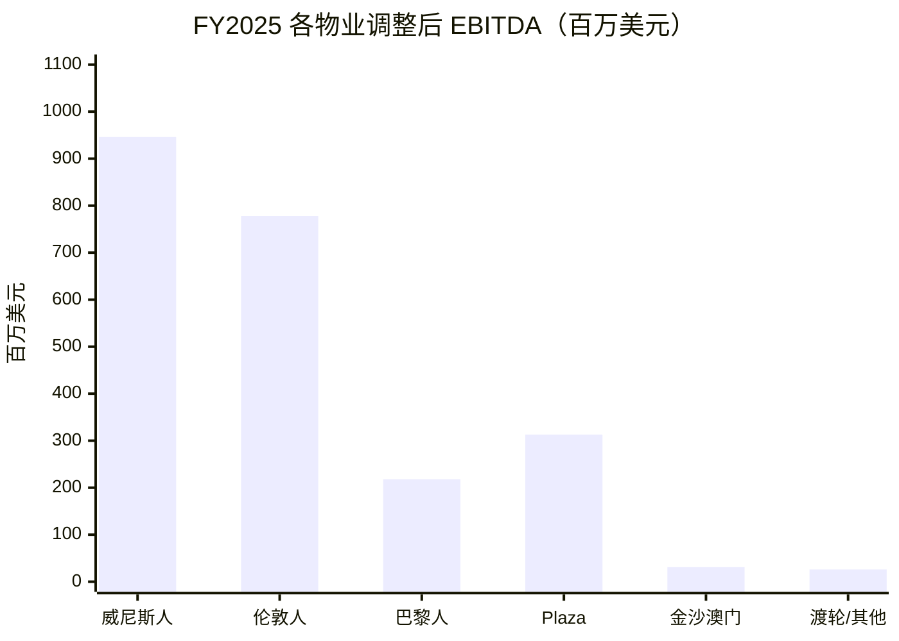
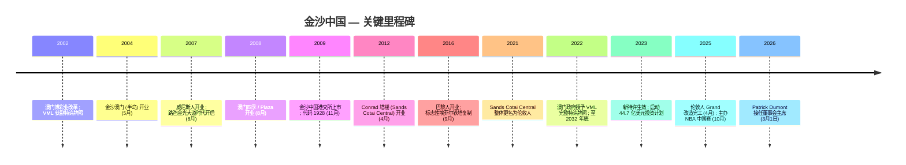
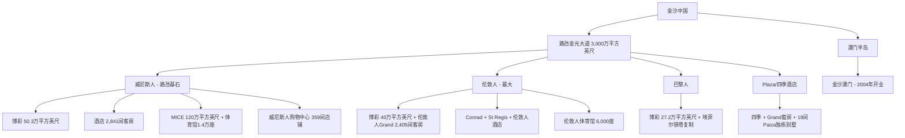
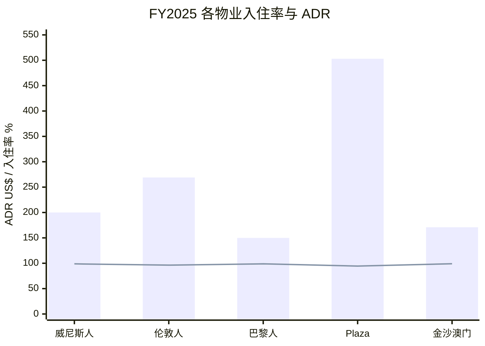
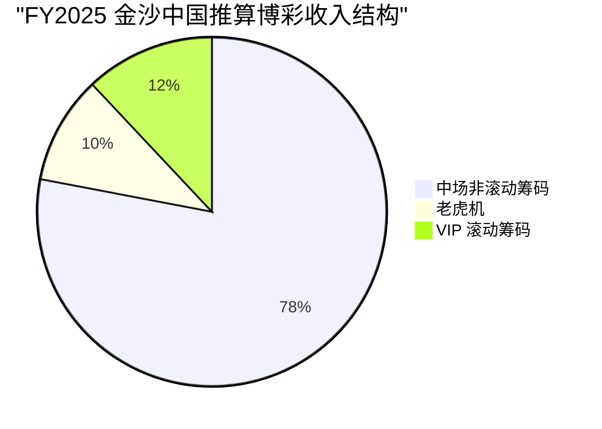
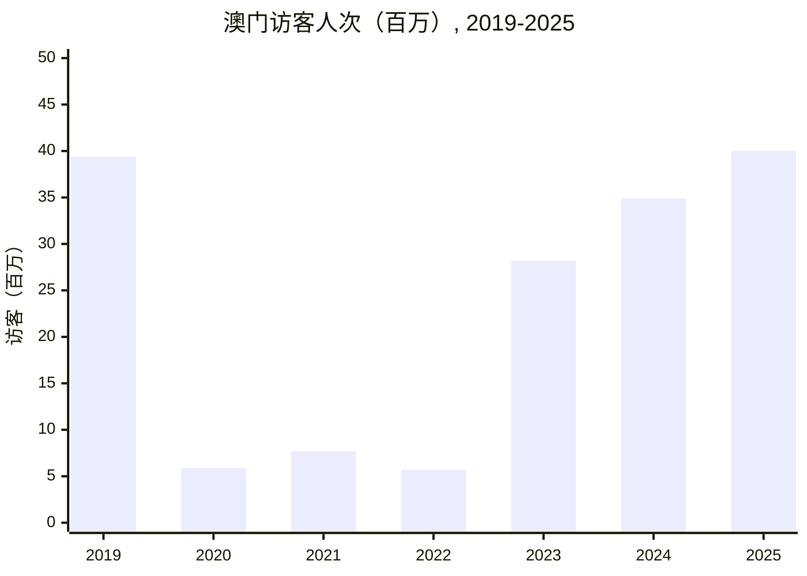
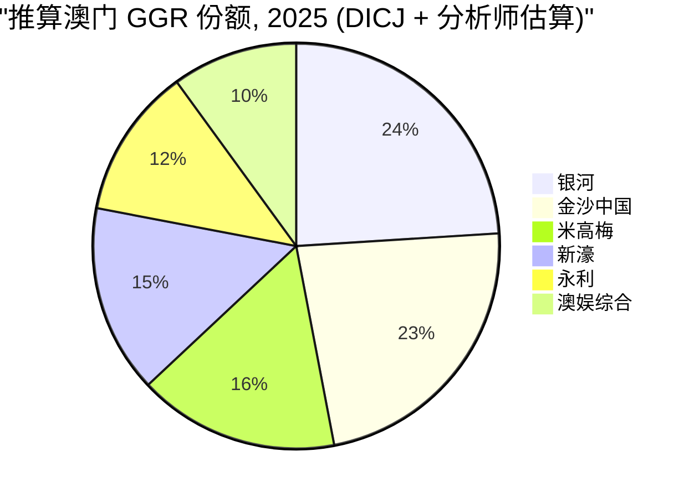
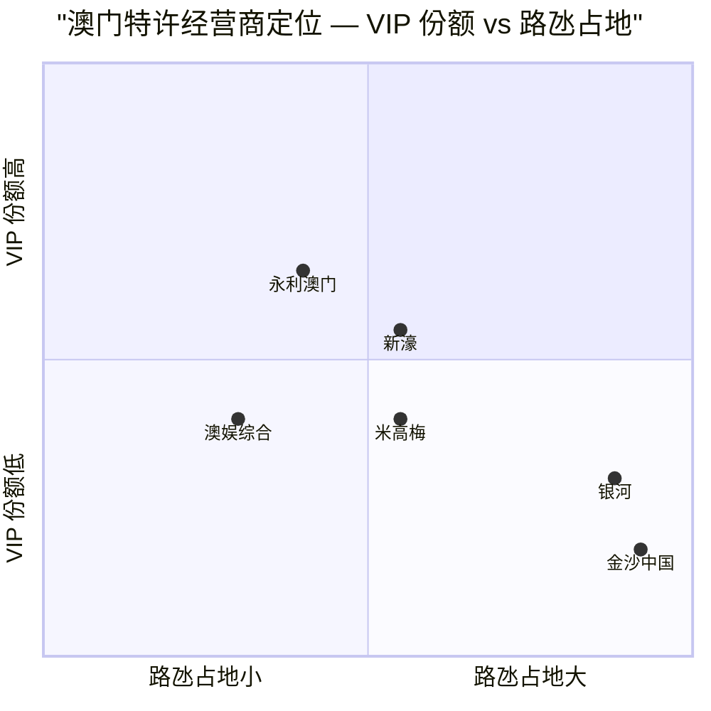
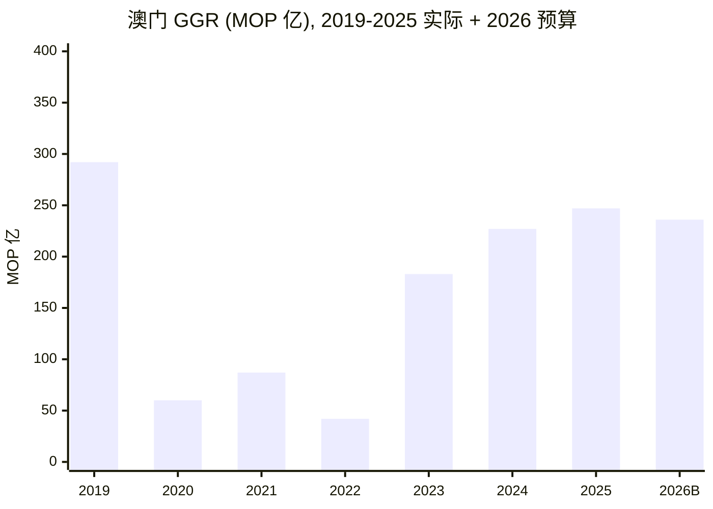

# 金沙中国有限公司 (Sands China Ltd., HKEX:1928) — 公司研究

*覆盖发起 · 路氹综合度假村运营商 · 澳门六张博彩特许经营牌照之一*

**研究员：** 行业研究台 · **截止日：** 2026-06-03 · **报告货币：** 美元（必要处兼用港元 HKD / 澳门元 MOP） · **上市地：** 香港主板 (HKEX:1928)；ADR: SCHYY / SCHYF

---

## 目录
1. [公司概览](#1-公司概览)
2. [公司历史](#2-公司历史)
3. [管理团队（创始人与现任 CEO）](#3-管理团队创始人与现任-ceo)
4. [产品与服务（综合度假村组合）](#4-产品与服务综合度假村组合)
5. [客户、市场结构与玩家集中度](#5-客户市场结构与玩家集中度)
6. [行业概览（澳门博彩与综合度假村市场）](#6-行业概览澳门博彩与综合度假村市场)
7. [竞争格局（六张特许经营牌照）](#7-竞争格局六张特许经营牌照)
8. [市场机会（TAM / SAM）](#8-市场机会tam--sam)
9. [风险评估](#9-风险评估)
10. [投资者视角评分卡](#10-投资者视角评分卡)
11. [参考资料](#参考资料)

---

## 1. 公司概览

金沙中国 (HKEX:1928) 是美国上市的 **拉斯维加斯金沙 (Las Vegas Sands Corp., LVS, NYSE:LVS)** 的澳门运营子公司，也是全球最大博彩市场——澳门——单一最大综合度假村运营商。公司在路氹与澳门半岛运营五处互联物业：**威尼斯人 (The Venetian Macao)、伦敦人 (The Londoner Macao)、巴黎人 (The Parisian Macao)、澳门四季 / Plaza (The Plaza Macao) 与金沙澳门 (Sands Macao)**。截至 2025 年底，物业组合合计拥有客房 10,829 间（含 19 间 Paiza 顶级独栋别墅 / Mansions），博彩桌 1,680 张、老虎机 3,700 台，零售商场可租赁面积 (GLA) 约 200 万平方英尺（780 间店铺）以及 163.2 万平方英尺 MICE（会议、奖励、会展） 空间。公司博彩子公司 **威尼斯人 (澳门) 股份有限公司 (Venetian Macau S.A., VML)** 持有澳门特别行政区政府发放的六张博彩特许经营牌照之一，该牌照自 2023 年 1 月 1 日生效，至 **2032 年 12 月 31 日** 届满 ([金沙中国 2025 年度报告, 第 5 页 — 业务概览](https://s28.q4cdn.com/640198178/files/doc_downloads/sands-china-information/2026/03/SCL-2025-Annual-Report.pdf))。

FY2025 集团总净收入为 **74.4 亿美元** (折合 579.1 亿港元)，同比增长 5.1%；调整后物业 EBITDA 为 **23.1 亿美元**（同比基本持平，-0.7%）；归属股东净利润为 **8.96 亿美元**，同比下降 14.3%，主要受疫情后澳门高度竞争环境下营销与人工成本上升所致 ([2025 年度报告, 第 2 页 — 财务摘要](https://s28.q4cdn.com/640198178/files/doc_downloads/sands-china-information/2026/03/SCL-2025-Annual-Report.pdf))。集团 2025 全年在路氹与半岛物业接待了约 **9,800 万人次** 的休闲与商务到访——这一数字约为澳门 2025 年总入境游客数 (4,000 万人次) 的 2.5 倍，反映了渡轮乘客与路氹穿梭巴士乘客在同日多次进出物业的重复访问行为 ([2025 年度报告, 第 5 页](https://s28.q4cdn.com/640198178/files/doc_downloads/sands-china-information/2026/03/SCL-2025-Annual-Report.pdf))。

FY2025 公司五条收入线占比为 **博彩 75.0% / 客房 11.5% / 商场 7.0% / 餐饮 3.6% / 会展 / 渡轮 / 其他 2.9%**。在博彩收入内部，金沙中国实质上是 **以中场 (mass market) 为主、贵宾厅 (VIP rolling chip) 为辅** 的运营商：2025 年澳门博彩业整体收入中，中场 + 角子机 (slot) 合计占 73%（按 DICJ 统计），而金沙中国的资产组合——大体量客房、Cotai Expo、威尼斯人体育馆 (14,000 座)、伦敦人体育馆 (6,000 座)、四大商场——本质上就是为锁定高利润率中场与中场高端 (premium mass) 客群而搭建的，并非为十年前主导澳门的滚动筹码 (rolling chip) VIP 客群设计 ([2025 年度报告, 第 7 页 — 行业](https://s28.q4cdn.com/640198178/files/doc_downloads/sands-china-information/2026/03/SCL-2025-Annual-Report.pdf))。

```mermaid
xychart-beta
    title "金沙中国 FY2024 vs FY2025 净收入结构（百万美元）"
    x-axis ["博彩", "客房", "商场", "餐饮", "会展/渡轮/其他"]
    y-axis "百万美元" 0 --> 6000
    bar [5346, 774, 493, 260, 207]
    bar [5583, 853, 521, 270, 216]
```

来源：[金沙中国 2025 年度报告, 第 19 页 — 净收入分项](https://s28.q4cdn.com/640198178/files/doc_downloads/sands-china-information/2026/03/SCL-2025-Annual-Report.pdf)。

**资本结构与控制权。** 金沙中国是 LVS 的多数控股子公司——截至 2025 年第四季度，LVS 持股 **约 74.8%**，已逼近港交所主板规定的 25% 最低公众持股比例红线 (即控股股东最高 75%)。LVS 于 2025 年 7 月至 10 月间投入约 3.37 亿美元，将持股比例由 70.3% 提升至 74.76% ([CDC Gaming, 2025-10-23 — LVS 持金沙中国股份升至 74.8%](https://cdcgaming.com/brief/las-vegas-sands-now-holds-74-8-of-sands-china-shares-nearing-hong-kong-cap/))。已发行股份约 80.9 亿股；截至 2026 年 4 月 2 日，股价 17.12 港元，对应市值约 1,320.8 亿港元（约 170 亿美元）([CNBC HKEX:1928 报价](https://www.cnbc.com/quotes/1928-HK))。

**估值快照（截至 2026 年中）。** 滚动市盈率 (TTM P/E) 约 **18.9 倍**，前瞻股息收益率 (forward dividend yield) **约 6.27%**，对应董事会 2026 年 2 月 13 日宣布的全年股息合计 **每股 0.75 港元** (2025 中期 0.25 港元 + 末期 0.50 港元)——较 FY2024 的 0.25 港元同比上调 200% ([2025 年度报告, 第 81 页 — 股息](https://s28.q4cdn.com/640198178/files/doc_downloads/sands-china-information/2026/03/SCL-2025-Annual-Report.pdf); [Investing.com 1928.HK 股息历史](https://www.investing.com/equities/sands-china-ltd-dividends))。按 FY2025 净收入 74.4 亿美元计算，市销率 (P/S) 约 **2.3 倍**。卖方观点偏多——*Investing.com* 数据显示 21 家分析师给予 Buy 评级、0 家 Sell，12 个月目标价共识 22.46 港元 ([Investing.com 分析师评级](https://www.investing.com/equities/sands-china-ltd))。约 19 倍 TTM 市盈率较金沙中国 2017-19 年高峰 (滚动筹码 VIP 量是当前 3-5 倍时 P/E 一度突破 50 倍) 已显著压缩，与澳门板块同业大体相当。*分析师观点：* 估值压缩反映 (a) VIP 滚动筹码结构性萎缩、(b) 2032 年特许经营到期约束现金流可见期、(c) **总投资计划 (Investment Plan) 资本支出承诺**——即 2032 年 12 月前需累计投入约 44.7 亿美元，其中 41.7 亿美元必须用于非博彩项目——而非核心资产质量恶化。

来源：[金沙中国 2025 年度报告, 第 25 页 — 分物业调整后 EBITDA 表](https://s28.q4cdn.com/640198178/files/doc_downloads/sands-china-information/2026/03/SCL-2025-Annual-Report.pdf)。

---

## 2. 公司历史

金沙中国的源头要追溯到 LVS 已故创始人 **谢尔登·阿德尔森 (Sheldon G. Adelson)**。阿德尔森是 "综合度假村 (integrated resort, 综合度假村 / IR)" 商业模式的设计师——这一模式将博彩、MICE、零售、奢华酒店品牌与娱乐业态整合到单一物业内。2002 年澳门博彩业改革终结何鸿燊家族 STDM 的专营垄断、重新招标特许经营牌照，LVS 旗下 VML 于当年 6 月 19 日获得三张 "副特许 (sub-concession)" 之一，阿德尔森立即着手将位于氹仔与路环之间、当时尚未开发的路氹连贯填海地 (Cotai sandbank) 改造为 "**路氹金光大道 (Cotai Strip)**"——这是他在拉斯维加斯改造 Strip 大道成功的明确翻版 ([2025 年度报告, 第 5 页 — 创始人愿景](https://s28.q4cdn.com/640198178/files/doc_downloads/sands-china-information/2026/03/SCL-2025-Annual-Report.pdf))。

首座物业是 2004 年 5 月开业的半岛物业 **金沙澳门 (Sands Macao)**——238 间客房、160 张博彩桌的小型入门资产，因其在不到一年内回收 2.4 亿美元建设成本而载入澳门博彩史册，验证了阿德尔森的中场化论点。**威尼斯人** 于 2007 年 8 月作为路氹首座大型综合度假村开业，参照 1999 年拉斯维加斯威尼斯人复制：39 层奢华酒店塔楼 (2,905 间套房)、50.3 万平方英尺博彩面积、威尼斯人购物中心 (Shoppes at Venetian, 96 万平方英尺、359 间店铺) 与 120 万平方英尺会议设施 ([2025 年度报告, 第 8 页 — 物业一览表](https://s28.q4cdn.com/640198178/files/doc_downloads/sands-china-information/2026/03/SCL-2025-Annual-Report.pdf))。**Plaza Macao / 四季酒店** 于 2008 年 8 月开业；**巴黎人** 2016 年 9 月开业，以半比例埃菲尔铁塔复制建筑为标志；伦敦人品牌的前 Sands Cotai Central 改造则分阶段于 2021 年完成 (Conrad 与 St Regis 塔楼 2012-2015 年开业；伦敦人法院 (Londoner Court) 2021 年 9 月；最后将原 Sheraton 双塔改造为伦敦人 Grand，作为澳门首家万豪奢华精选 (Marriott International Luxury Collection) 酒店、共 2,405 间客房，于 **2025 年第二季度** 完工)([2025 年度报告, 第 17 页 — 开发项目](https://s28.q4cdn.com/640198178/files/doc_downloads/sands-china-information/2026/03/SCL-2025-Annual-Report.pdf))。

来源：[金沙中国 2025 年度报告 — 业务概览、特许经营章节、董事简介](https://s28.q4cdn.com/640198178/files/doc_downloads/sands-china-information/2026/03/SCL-2025-Annual-Report.pdf)。

**金沙中国于 2009 年 11 月以每股 10.38 港元在港交所主板挂牌**，募资约 25 亿美元——彼时为亚洲全年最大 IPO，LVS 保留多数控股。这一上市为 LVS 旗下当时已超越拉斯维加斯 Strip 收入 (澳门博彩营收已于 2006 年首次超越拉斯维加斯) 的核心资产创造了亚洲时区的交易载体，让 LVS 得以在不进一步稀释母公司股权的前提下推进路氹后续两期开发。

公司历史上一个分水岭事件是 **2022 年 12 月 16 日**，澳门政府在 2022 年完成的特许经营框架修订下，授予 VML 新一轮六张博彩特许牌照之一 (新框架取消了原 "特许 + 副特许" 二级结构、维持六家运营商上限并加强监管)。新特许期为十年，自 2023 年 1 月 1 日生效、至 **2032 年 12 月 31 日** 届满；与 2002 年原版不同，新约附带一份具有约束力的 **44.7 亿美元** (35.84 亿澳门元) 投资承诺，其中 **41.7 亿美元 (33.39 亿澳门元) 必须投入非博彩项目**——包括 MICE、娱乐、体育、艺术与文化、健康养生、主题景点、美食、社区与海洋旅游 ([2025 年度报告, 第 12 页 — 特许经营与投资计划](https://s28.q4cdn.com/640198178/files/doc_downloads/sands-china-information/2026/03/SCL-2025-Annual-Report.pdf))。VML 截至 2025 年 12 月 31 日已累计支出约 10.4 亿美元 (2023-24 年度已经澳门政府审计确认 7.23 亿美元；2025 年 3.15 亿美元尚待审计)。

**创始人阿德尔森于 2021 年 1 月 11 日去世**；遗孀米莉亚姆·阿德尔森 (Miriam Adelson) 博士与阿德尔森家族信托至今仍为 LVS 最大单一股东集团。前 LVS 首席运营官罗伯特·戈德斯坦 (Robert Goldstein) 接任 LVS 与金沙中国董事会主席。**Goldstein 于 2026 年 3 月 1 日卸任金沙中国主席**，由 Patrick Dumont 接任 (详见第 3 章)——这次交接将金沙中国领导层与 LVS 新一代管理层 (Dumont 同日就任 LVS 主席兼 CEO) 完全对接，标志着母公司层面的代际更替正式完成。

---

## 3. 管理团队（创始人与现任 CEO）

### 创始人 · Sheldon G. Adelson (1933–2021) — 综合度假村模式的开创者

谢尔登·加里·阿德尔森创办了今天的 LVS，并亲自主导了金沙中国每一个关键战略决策——从 2002 年澳门竞标、到路氹填海、再到验证 IR 模式可跨境复制的新加坡滨海湾金沙 (Marina Bay Sands) 项目。2025 年董事会主席报告明确将阿德尔森的愿景标定为公司长期战略锚：

> "我们的创始人谢尔登·G·阿德尔森先生开拓了澳门路氹金光大道，带领公司与其团队迅速建设了一批市场领先的综合度假村目的地。阿德尔森先生对推动澳门多元化、对非博彩业态投资的承诺始终坚定不移；他对建设强健的中美关系、通过坦诚对话与相互尊重支撑这种关系的承诺同样不曾动摇。"
> — [金沙中国 2025 年度报告, 第 3 页 — 主席报告](https://s28.q4cdn.com/640198178/files/doc_downloads/sands-china-information/2026/03/SCL-2025-Annual-Report.pdf)

阿德尔森入澳前的职业轨迹——上世纪 80 年代将 COMDEX 计算机展打造为全球最大科技展会、1995 年以约 8.62 亿美元出售给软银 (Softbank)；1999 年在拉斯维加斯 Strip 开业原版威尼斯人与金沙会展中心 (Sands Expo)——为他奠定了三项至今仍主导金沙中国战略的核心信念：(1) **MICE 客流变现优于纯博彩客流**，因为商务客停留更长、回访率更高、并携带配偶共同消费 (酒店 + 零售消费上升)；(2) **联名奢华酒店品牌** (Four Seasons / 四季、St Regis / 瑞吉、Conrad / 康莱德、Marriott Luxury Collection / 万豪奢华精选) 为度假村导入全球高端客流；(3) **规模即护城河**——综合体越大、单次出行可被锁定的访问目的越多。30 百万平方英尺互联设施 ([第 5 页](https://s28.q4cdn.com/640198178/files/doc_downloads/sands-china-information/2026/03/SCL-2025-Annual-Report.pdf)) 的路氹金光大道正是这三项理念的物理化体现。阿德尔森于 2009 年港交所 IPO 前卸任金沙中国主席、但继续担任 LVS 主席兼 CEO 直至 2021 年 1 月辞世，之后 LVS 主席职位由 Robert Goldstein 接任。

### 现任 CEO · Grant Chum (岑君亮, Chum Kwan Lock) — 首席执行官兼总裁，50 岁

岑君亮自 **2024 年 1 月** 起担任金沙中国 CEO 兼总裁 (2021 年 1 月已加入执行董事会)，此前自 2020 年 2 月至 2024 年 1 月担任首席运营官 (COO)。同时担任董事会资本支出委员会主席、并自 2022 年 7 月起兼任 **拉斯维加斯金沙集团亚洲业务执行副总裁 (LVS EVP — Asia Operations)**，将澳门运营责任与 LVS 集团战略正式打通 ([2025 年度报告, 第 77 页 — 岑君亮简介](https://s28.q4cdn.com/640198178/files/doc_downloads/sands-china-information/2026/03/SCL-2025-Annual-Report.pdf))。

岑君亮于 2013 年加入金沙集团，任全球博彩战略高级副总裁；2015 年 3 月至 2020 年 2 月任主席办公室幕僚长 (Chief of Staff)——这六年的 "贴身见习" 让他深度参与了巴黎人开业 (2016 年 9 月)、Sands Cotai Central → 伦敦人改造计划、2022 年特许经营再投标、2025 年 3 月偿还 LVS 集团内部 10.6 亿美元期限贷款等每一项重大资本配置决策。加入金沙之前，他在 **瑞银投行 (UBS Investment Bank) 工作 14 年**，最终职位为执行董事 (Managing Director)、香港股票研究主管兼中国股票研究主管——卖方研究角色意味着他实际覆盖过澳门博彩板块 (包括上市前的金沙中国) 以及更广泛的亚洲消费 / 酒店行业。学历背景：**牛津大学一等荣誉哲学、政治与经济 (PPE) 学士**。同时兼任港交所上市嘉里建设 (HKEX:0683) 独立非执行董事。截至 2025 年 12 月 31 日，岑君亮持有金沙中国股份 3,633,004 股 (约占已发行股本 0.04%；含 124 万股已 vested LVS 期权与 239 万股未 vested 限制性股份单位 RSU)，以及 LVS 股份 700,000 股 ([2025 年度报告, 第 83 页 — 董事股份权益](https://s28.q4cdn.com/640198178/files/doc_downloads/sands-china-information/2026/03/SCL-2025-Annual-Report.pdf))。

岑君亮自 2024 年初出任 CEO 以来的标志性贡献是 **伦敦人二期 (Londoner Phase II)** 的完工——将原 Sheraton Grand Macao 双塔改造为 2,405 间客房的伦敦人 Grand，于 2025 年第二季度完工。管理层在年度报告中将这一资产定位为 "增强了该物业的竞争地位"，并对应支撑了伦敦人 2025 年博彩收入 +33.1% YoY、调整后物业 EBITDA +43.3% 的强劲表现 ([第 20 页](https://s28.q4cdn.com/640198178/files/doc_downloads/sands-china-information/2026/03/SCL-2025-Annual-Report.pdf))。岑君亮在股东沟通中反复强调的战略重点——中场化 + MICE 扩张 + 非博彩业态——与特许经营投资计划的非博彩倾斜以及澳门政府提出的 "降低对滚动筹码 VIP 依赖度" 长期目标高度一致。

### 关于其他高管的说明

根据项目覆盖标准，本节仅深度刻画创始人与现任 CEO。2025 年度报告中列示的其他高级管理层包括执行副主席 Dr. 王英伟 (Wong Ying Wai / Wilfred)、首席财务官 (CFO) 孙敏奇 (Sun MinQi / Dave)、总法律顾问兼公司秘书 Dylan James Williams ([2025 年度报告, 第 76-80 页](https://s28.q4cdn.com/640198178/files/doc_downloads/sands-china-information/2026/03/SCL-2025-Annual-Report.pdf))。

---

## 4. 产品与服务（综合度假村组合）

金沙中国不是一家纯赌场运营商，而是一家 **综合度假村 (integrated resort / 综合度假村) 运营商**。公司对商业模式的自我定位，与 FY2025 的收入结构 (博彩 75% / 客房 11.5% / 商场 7.0% / 餐饮 3.6% / 会展-渡轮-其他 2.9%；[第 19 页](https://s28.q4cdn.com/640198178/files/doc_downloads/sands-china-information/2026/03/SCL-2025-Annual-Report.pdf))，从两个角度讲了同一个故事——博彩占绝大部分收入与 EBITDA，但 **多业态打包是吸客的核心机制**，也是与同业运营商 (例如更博彩中心化的金沙澳门、米高梅路氹，或更住宅-码头偏重的银河四期) 形成差异化的关键。年度报告原文直接给出该定位：

> "我们相信，本集团的业务策略与发展计划，让我们能够实现比博彩中心化设施更稳定的需求、更长的酒店平均住客天数、更分散的收入来源以及更高的利润率。"
> — [金沙中国 2025 年度报告, 第 6 页 — 业务策略](https://s28.q4cdn.com/640198178/files/doc_downloads/sands-china-information/2026/03/SCL-2025-Annual-Report.pdf)

以下五物业一览表逐字引自年度报告，作为理解整体资产结构的起点：

| 物业（开业时间） | 客房与套房 | Paiza 套房 / Mansions | MICE (平方英尺) | 剧院 / 体育馆座位 | 零售 (平方英尺) | 商铺 | 桌 / 老虎机 |
|---|---:|---:|---:|---:|---:|---:|---:|
| **威尼斯人** (2007年8月) | 2,841 | 64 / — | 1,200,000 | 1,800 / 14,000 | 960,000 | 359 | 659 / 1,137 |
| **伦敦人** (2012年4月 ; Grand 2Q25) | 4,426 | — / — | 358,000 | 1,701 / 6,000 | 518,000 | 172 | 500 / 1,285 |
| **巴黎人** (2016年9月) | 2,333 | 208 / — | 62,000 | 1,200 / — | 297,000 | 101 | 255 / 1,008 |
| **Plaza Macao** (2008年8月) | 649 | — / 19 | 12,000 | — | 262,000 | 136 | 106 / 13 |
| **金沙澳门** (2004年5月) | 238 | 51 / — | — | 650 / — | 35,000 | 9 | 160 / 257 |
| **合计** | **10,487** | **323 / 19** | **1,632,000** | **5,351 / 20,000** | **2,072,000** | **777** | **1,680 / 3,700** |

来源：[金沙中国 2025 年度报告, 第 8 页 — 现有业务一览表](https://s28.q4cdn.com/640198178/files/doc_downloads/sands-china-information/2026/03/SCL-2025-Annual-Report.pdf)。

每座综合度假村都围绕同一套 **五业态飞轮 (five-amenity flywheel)** 构建——博彩 + 高端联名酒店 + 零售商场 + MICE / 活动场地 + 餐饮 / 娱乐。各业态彼此强化：购物中心 (Shoppes) 为博彩区导入增量客流；MICE 预订填补客房肩季空缺；体育馆驻场演出 (2025 年 10 月在威尼斯人体育馆举办 NBA 中国赛) 为非博彩访客建立品牌认知；餐饮与购物可变现 "陪同非博彩家属"。

来源：[金沙中国 2025 年度报告, 第 8-10 页 — 物业与商场运营](https://s28.q4cdn.com/640198178/files/doc_downloads/sands-china-information/2026/03/SCL-2025-Annual-Report.pdf)。

### 4.1 — 博彩业务（FY2025 净收入的 75.0%）

澳门博彩按 VML 特许牌照条款分为两大类桌面博彩 (table games) 与一类老虎机 (slot)：

- **非滚动筹码桌 (Non-Rolling Chip, NRC) — 中场表**：流量度量为 "drop"（赌台投放，包括净标记物 / markers + 现金 + 兑换筹码）。金沙中国 2025 年 NRC drop 合计 256 亿美元（威尼斯人 95.5 + 伦敦人 86.4 + 巴黎人 30.7 + Plaza 28.3 + 金沙澳门 15.6 亿美元），四座路氹大物业 NRC 赢率 (win %) 介于 21.2%–23.2%，金沙澳门 15.3% ([2025 年度报告, 第 20 页 — 博彩业务表](https://s28.q4cdn.com/640198178/files/doc_downloads/sands-china-information/2026/03/SCL-2025-Annual-Report.pdf))。
- **滚动筹码桌 (Rolling Chip, RC) — VIP 表**：流量度量为不可议价筹码的投注及输额。2025 年 RC volume 合计 214 亿美元，赢率介于 3.35%–5.19% (公司预期 3.30%)。值得注意伦敦人 RC volume 同比 +26.5% (二期完工后桌位重新部署)、巴黎人 +190.6% (FY24 基数极低)。
- **老虎机 (slots)**：handle 合计 206 亿美元；slot hold % 介于 2.3%–3.8% ([第 20 页](https://s28.q4cdn.com/640198178/files/doc_downloads/sands-china-information/2026/03/SCL-2025-Annual-Report.pdf))。

2025 年澳门物业 **约 9.4% 的桌面博彩通过赌博信贷 (credit) 进行** ([2025 年度报告, 第 18 页 — 博彩收入度量](https://s28.q4cdn.com/640198178/files/doc_downloads/sands-china-information/2026/03/SCL-2025-Annual-Report.pdf))——这一比例是公司在跨境赌博信贷催收风险下刻意压低的（详见 §9.7）。截至 2025 年底，博彩应收账款拨备前净额为 3.56 亿美元——相对于 55.8 亿美元博彩净收入规模很小，但被审计师德勤 (Deloitte) 列为关键审计事项 (Key Audit Matter)([第 100 页](https://s28.q4cdn.com/640198178/files/doc_downloads/sands-china-information/2026/03/SCL-2025-Annual-Report.pdf))。

### 4.2 — 高端联名酒店与 Paiza 套房库存（FY2025 净收入的 11.5%）

金沙中国客房库存合计 10,487 间标准套 / 客房 + 323 间 Paiza 套房 (面向高端玩家的免费招待客房) + 19 间 Plaza Macao 顶级独栋别墅 (Paiza Mansions, 通常为四到五卧室配置, 服务顶级 "鲸鱼客" / whales)。物业组合围绕四大全球酒店品牌伙伴搭建——**四季酒店 (Four Seasons)** (Plaza Macao, 含 2020 年 10 月开业的 289 间 Grand Suites 套房)、**瑞吉 (St Regis)** (伦敦人 Court 塔楼 400 间客房)、**康莱德 (Conrad)** (伦敦人 Conrad 塔楼 659 间客房) 与 **万豪奢华精选 (Marriott International Luxury Collection)** (2025 年第二季度完工的 2,405 间伦敦人 Grand)——以及公司自营的伦敦人 / 威尼斯人 / 巴黎人三大旗舰品牌客房 ([2025 年度报告, 第 8-9 页 — 物业描述](https://s28.q4cdn.com/640198178/files/doc_downloads/sands-china-information/2026/03/SCL-2025-Annual-Report.pdf))。

2025 年客房运营数据有两点突出：(1) **全组合接近饱和入住率**——威尼斯人 98.8%、巴黎人 98.8%、金沙澳门 99.0%、伦敦人 96.3%、Plaza 94.4%；(2) **伦敦人 ADR 从 2024 年 216 美元跃升至 2025 年 269 美元 (+24.5% YoY)**，反映万豪奢华精选品牌升级对房价的拉动 ([第 21 页](https://s28.q4cdn.com/640198178/files/doc_downloads/sands-china-information/2026/03/SCL-2025-Annual-Report.pdf))。在已经如此高的入住率下，客房收入增量基本必须由 ADR 主导的客群升级 (更多 Plaza Macao / Grand Suites / Paiza 占比) 而非客流量增长来贡献——这也是公司在投资者沟通中反复强调的方向。

来源：[金沙中国 2025 年度报告, 第 21 页 — 分物业客房活动表](https://s28.q4cdn.com/640198178/files/doc_downloads/sands-china-information/2026/03/SCL-2025-Annual-Report.pdf)。

### 4.3 — 零售商场（FY2025 净收入的 7.0%；超高利润率）

金沙中国自有并运营四座主商场——**威尼斯人购物中心 (82.99 万平方英尺 GLA, 89.9% 出租率)、伦敦人购物中心 (51.81 万平方英尺, 78.6%)、巴黎人购物中心 (25.68 万平方英尺, 71.9%)、四季购物中心 (24.83 万平方英尺, 95.0%)**——加金沙澳门的少量零售。租户结构从 Plaza 四季购物中心的全奢华品牌组合 (Tiffany / Rolex / Bvlgari / Louis Vuitton / Hermès / Chanel / Gucci / Dior 等；基础租金 **620 美元 / 平方英尺**, 2025 年租户销售额 4,375 美元 / 平方英尺) 一路覆盖到威尼斯人的中高端 / 偏年轻奢华 (Zara / Uniqlo / Tommy Hilfiger / Pop Mart / LAOPU GOLD 等；基础租金 284 美元 / 平方英尺) 和伦敦人的娱乐 / 餐饮主导组合 (Apple / Shake Shack / Cheesecake Factory / NBA 旗舰店 / Polo Ralph Lauren 等；基础租金 184 美元 / 平方英尺)([2025 年度报告, 第 10 页 — 商场重要租户表；第 22 页 — 商场财务表](https://s28.q4cdn.com/640198178/files/doc_downloads/sands-china-information/2026/03/SCL-2025-Annual-Report.pdf))。

2025 年商场收入同比 +5.7% 至 5.21 亿美元，利润率极高 (商场费用 6,500 万美元，对应板块贡献率约 87.5%)。威尼斯人购物中心最亮眼——总收入 +10.4% YoY、入住率 +4.2pt、租户销售额 / 平方英尺 +19.8%——反映了 "个人游"政策扩展后大众游客客流的修复。相比之下，高端四季购物中心 2025 年租户销售额 / 平方英尺同比下降 18.7% 至 4,375 美元——这是中场高端 / VIP 弱势的最清晰代理变量。

### 4.4 — MICE、渡轮、娱乐与其他（约 6.5% 收入，但客流核心驱动）

非博彩业态故意设计得 "远大于直接收入贡献"，因为其主要作用是驱动综合访问量。核心 MICE / 娱乐资产包括：

- **威尼斯人 Cotai Expo**——120 万平方英尺无柱会议空间，亚洲最大。
- **威尼斯人体育馆 (14,000 座)**——2025 年 10 月主办 NBA 中国赛 (MD&A 中提到的 +24.7% YoY 集团 / 品牌支出增量正是这一原因 — [2025 年度报告, 第 24 页](https://s28.q4cdn.com/640198178/files/doc_downloads/sands-china-information/2026/03/SCL-2025-Annual-Report.pdf))。
- **伦敦人体育馆 (6,000 座)**——2024 年作为二期一部分完工。
- **金光飞航 (Cotai Water Jet)**——高速双体船渡轮服务，香港港澳码头⇄氹仔码头。运营牌照自 2019 年 11 月 8 日起续期 10 年，至 2030 年 1 月 13 日届满。每艘定制双体船可载客 400+ 人、最高速 42 节。由珠江高速客轮有限公司代为运营 ([2025 年度报告, 第 11 页 — 其他业务](https://s28.q4cdn.com/640198178/files/doc_downloads/sands-china-information/2026/03/SCL-2025-Annual-Report.pdf))。
- **路氹穿梭巴士**——140 辆 (34 辆自有 + 106 辆租赁)、24/7 运营，往返金沙中国物业、码头、机场、拱北 / 横琴口岸与港珠澳大桥澳门口岸。这是普通内地一日游游客最常接触的路氹基础设施。
- **路氹 Limo 服务**——100+ 辆豪华轿车，其中 25 辆 "signature" 车型专为 VIP 客人提供。
- **航空服务**——通过 LVS 共享服务协议接入 14 架公务机机队，由 Sands Aviation 运营，为顶级玩家服务。

### 4.5 — 整合：综合度假村飞轮

五大业态在游客一日动线中环环相扣。典型内地访客降落珠海或香港、乘金光飞航或港珠澳大桥过境穿梭巴士、经路氹穿梭巴士换乘、入住伦敦人或威尼斯人酒店、白天逛购物中心、傍晚观看威尼斯人体育馆演唱会或 NBA 中国赛、在 160 家餐饮店之一晚餐、回房途中入赌场博彩、第二天重复。每个停留点金沙中国都能截留大部分钱包。这就是公司能在澳门年访客仅约 4,000 万人次的情况下、维持 1.05 万间客房 96-99% 入住率的根本原因：每座物业从单次出行中提取多重访问目的、且互联式设计意味着客人很少离开金沙地产。

与博彩中心化竞争对手 (例如 SJM 的老半岛赌场) 相比，这种设计有两层战略价值：(1) 收入结构波动结构性更低，因为非博彩收入随旅游业而非博彩周期变动；(2) MICE / 娱乐 / 商场基础设施 **天然满足 2023 年特许经营协议下的非博彩投资承诺** (41.7 亿美元 / 总 44.7 亿美元，2032 年 12 月前必须完成；澳门政府年度审计)([2025 年度报告, 第 12 页 — 投资计划](https://s28.q4cdn.com/640198178/files/doc_downloads/sands-china-information/2026/03/SCL-2025-Annual-Report.pdf))。所有同业都必须在非博彩业态花钱；金沙中国已经领先一大截，因为其资产基底就是这样设计的。

---

## 5. 客户、市场结构与玩家集中度

**金沙中国是 B2C 业务，不存在传统意义上的 "企业客户集中度"。** 不同于工业 / B2B 上市公司须披露 ≥10% 收入的客户名单，澳门综合度假村运营商不公布单一客户收入贡献——其客群是个人 (玩家、酒店宾客、购物者)，唯一按名披露的 "客户" 是商场租户中的奢华品牌锚定店。年度报告的 "客户集中" 风险讨论实际上是围绕 **对高净值桌面博彩客的信贷展期风险** (2025 年约 9.4% 桌面博彩通过信贷进行) 而非企业集中 ([2025 年度报告, 第 36 页 — 信贷展期风险](https://s28.q4cdn.com/640198178/files/doc_downloads/sands-china-information/2026/03/SCL-2025-Annual-Report.pdf))。这是澳门六家特许经营商共用模式——银河、永利、米高梅、新濠、澳娱综合 (SJM) 都是类似 B2C 模式。

对金沙中国来说，更分析友好的两个量化口径是 **玩家分部结构** (中场非滚动 + 中场高端、VIP 滚动、老虎机) 与 **客源地理结构**。

### 5.1 — 玩家分部结构

2025 年澳门全市场 DICJ 口径为 **中场 + 老虎机 73% / VIP 滚动 27%** ([2025 年度报告, 第 7 页 — 行业](https://s28.q4cdn.com/640198178/files/doc_downloads/sands-china-information/2026/03/SCL-2025-Annual-Report.pdf))。金沙中国自身组合比市场更偏中场，因为产品矩阵 (大体量客房、MICE、商场、品牌酒店) 就是为转化中场游客而设计。按博彩业务表数据：

- **金沙中国 NRC drop 合计 256 亿美元** (中场) × 加权赢率 ~22% ≈ **中场净赢约 56 亿美元**。
- **RC volume 合计 214 亿美元** (VIP) × 加权赢率 ~3.7% ≈ **VIP 净赢约 7.9 亿美元**。
- **老虎机 handle 206 亿美元** × ~3.6% hold ≈ **slot 净赢约 7.4 亿美元**。

折算暗含 **中场 + slot 约 88% / VIP 约 12%** 的金沙中国博彩收入结构，对比全澳门 73/27 分布——验证了管理层十年来强调的 "中场化" 定位 ([2025 年度报告, 第 20 页 — 博彩业务表](https://s28.q4cdn.com/640198178/files/doc_downloads/sands-china-information/2026/03/SCL-2025-Annual-Report.pdf); 分析师计算自一手披露，*非公司公布的板块收入分项，以下饼图为分析师重构观点*).

来源：[金沙中国 2025 年度报告, 第 20 页 — 分析师按 NRC drop × win + RC volume × win + slot handle × hold 推算](https://s28.q4cdn.com/640198178/files/doc_downloads/sands-china-information/2026/03/SCL-2025-Annual-Report.pdf)。**注：分母 = 金沙中国博彩总净赢（分析师按一手披露推算）；公司未公布板块收入分项。视作分析师构造。**

### 5.2 — 客源地理结构

澳门博彩业 **极度依赖内地客源**。公司未公布国别收入分项，但年度报告援引澳门旅游局 (MGTO) / DICJ 数据：**2025 年内地访客同比 +18.5%**、全年澳门入境总数约 4,000 万人次 (+14.7% YoY) ([2025 年度报告, 第 17 页 — 概览与展望](https://s28.q4cdn.com/640198178/files/doc_downloads/sands-china-information/2026/03/SCL-2025-Annual-Report.pdf); [Macao News, 2026-01-02 — 2025 年澳门 GGR](https://macaonews.org/news/business/macau-december-2025-gross-gaming-revenue-ggr/))。中场高端客群高度集中在大湾区 (广东 / 深圳 / 广州 / 佛山 / 珠海) 与华南；香港为第二大客源市场；公司在 2023 特许经营投资计划框架下的长期目标是提高国际客源占比。2025 年 10 月在威尼斯人体育馆举办的 NBA 中国赛即是显性的国际营销布局 ([第 24 页 — 集团费用解释](https://s28.q4cdn.com/640198178/files/doc_downloads/sands-china-information/2026/03/SCL-2025-Annual-Report.pdf))。

### 5.3 — 商场租户与主要零售关系（合并商场分母）

单一客户均未超过合并收入 10%，但商场按多租户零售租赁运营，主奢华品牌按名披露。**Plaza 四季购物中心** (四座商场中最高端——基础租金 620 美元 / 平方英尺、2025 年出租率 95.0%) 名列租户：**Cartier、Chanel、Louis Vuitton、Hermès、Gucci、Dior、Versace、Zegna、Loro Piana、Saint Laurent、Balenciaga、Loewe、Roger Vivier、Christian Louboutin、Alexander McQueen、Miu Miu、Tiffany & Co.、Rimowa** ([2025 年度报告, 第 10 页 — 商场租户表](https://s28.q4cdn.com/640198178/files/doc_downloads/sands-china-information/2026/03/SCL-2025-Annual-Report.pdf))。**伦敦人购物中心**：Apple、Bottega Veneta、Gucci、Burberry、Louis Vuitton、Alexander McQueen、Brunello Cucinelli、Versace、Canada Goose、Zegna、Cheesecake Factory、Shake Shack、NBA 旗舰店等。商场组合大致代表全球奢华 / 中高端零售生态，且随租户表现轮换。

### 5.4 — 客户集中度风险小结

在年度报告 2.4 节 "优先风险因素" 中，客户集中度仅以斜向方式出现——以 **对一部分高净值桌面博彩客的信贷展期风险** 形式 (2025 年 9.4% 桌面博彩通过信贷进行、博彩应收账款拨备前 3.56 亿美元、ECL 拨备同比 +162.5% 至 2,100 万美元——反映信贷规模上升 + 账龄延长) ([2025 年度报告, 第 23 页 — ECL 拨备；第 36 页 — 信贷展期风险](https://s28.q4cdn.com/640198178/files/doc_downloads/sands-china-information/2026/03/SCL-2025-Annual-Report.pdf))。更宏观、更结构性的集中度其实是 **单一辖区 (澳门) + 单一客源 (内地)**——而非单一客户。

---

## 6. 行业概览（澳门博彩与综合度假村市场）

**澳门是全球最大博彩市场**，也是 **大中华区唯一合法的赌场博彩辖区**。2025 年澳门博彩总收入 (GGR) 为 **MOP247.40 亿 (约 308.7 亿美元)**，同比 +9.1%、修复至 2019 年疫情前峰值的 84.6%。2026 年澳门政府预算 GGR 假设 MOP236 亿 ([2025 年度报告, 第 7 页 — 行业](https://s28.q4cdn.com/640198178/files/doc_downloads/sands-china-information/2026/03/SCL-2025-Annual-Report.pdf); [Macao News, 2026-01-02 — 2025 GGR 超 2,470 亿澳门元](https://macaonews.org/news/business/macau-december-2025-gross-gaming-revenue-ggr/); [Macao News — 2026 预算 MOP236 亿](https://macaonews.org/news/business/macao-gaming-revenue-forecast-2026-budget-236-billion-patacas/))。澳门 GGR 峰值为 2013 年 MOP361 亿；此后下降反映 (1) 北京反腐 / 反赌博运动结构性压低 VIP / 中介人 (junket) 板块、(2) 疫情期间 2020-22 边境关闭实质冻结了客流。

### 6.1 — 访客流量与需求驱动

澳门 2025 年访客约 **4,000 万人次** (+14.7% YoY)；根据年度报告披露的多年序列：2024 年约 3,500 万、2023 年约 2,800 万、2022 年约 600 万 (封关期)、2019 年峰值约 3,940 万 ([2025 年度报告, 第 3 页 — 主席报告](https://s28.q4cdn.com/640198178/files/doc_downloads/sands-china-information/2026/03/SCL-2025-Annual-Report.pdf))。金沙中国列出的需求驱动：

- **内地中国城镇化**——农转城迁移持续扩大潜在出境旅游基础人群。
- **中国出境游修复**——中国出境游正处于疫情后修复尾声。
- **交通基础设施**——港珠澳大桥 (HZMB) 2018 年 10 月开通，将港-澳路上车程缩短至约 45 分钟；横琴口岸 (毗邻路氹的珠海口岸) 2020 年起 24/7 运营；金光飞航与路氹穿梭巴士将访客直接输送到综合度假村门口。
- **酒店库存扩张**——澳门与横琴 (广东侧休闲 / 酒店飞地) 持续新增客房。

来源：[澳门旅游局 (MGTO) 月度统计, 引自金沙中国 2025 年度报告, 第 3 页 (主席报告) 与第 17 页 (MD&A)](https://s28.q4cdn.com/640198178/files/doc_downloads/sands-china-information/2026/03/SCL-2025-Annual-Report.pdf); 2023 年之前数据来自 MGTO 历史月报。

### 6.2 — 板块动态：中场 vs VIP

过去十年澳门最重要的结构性变化是 **VIP 滚动筹码板块的崩盘**——从 2013 年 GGR 占比约 70% 跌至 2025 年的 ~27% (DICJ 数据，引自 [2025 年度报告, 第 7 页](https://s28.q4cdn.com/640198178/files/doc_downloads/sands-china-information/2026/03/SCL-2025-Annual-Report.pdf))。触发因素是 2014-15 年中国内地反腐运动以及随后中介人 (junket) 牌照吊销——中介人曾是跨境 VIP 信贷与客源获取的主渠道。过度依赖 VIP 的运营商收入腰斩；事先投资中场基础设施的运营商 (尤其是金沙中国、银河、米高梅) 反而以相对可防御的中场特许权挺过来。

2023 年之后的特许经营框架将这一转向正式制度化。每家特许经营商均有约束力的非博彩投资承诺——金沙中国为 **41.7 亿美元 (2032 年 12 月前)** ([2025 年度报告, 第 12 页 — 投资计划](https://s28.q4cdn.com/640198178/files/doc_downloads/sands-china-information/2026/03/SCL-2025-Annual-Report.pdf))——投向 MICE、娱乐、体育、艺术与文化、健康养生、主题景点、美食、社区与海洋旅游。战略意图是将中场 / 综合度假村模式固化、降低澳门未来 VIP 式周期冲击的脆弱性。

### 6.3 — 行业结构：六家特许经营商，固定桌位上限

按 **2022 年第 7/2022 号法律** (修订 2001 年原版赌博法)，澳门博彩业按固定六家特许经营框架运营。金沙中国 VML 于 2022 年 12 月 16 日获颁特许、2023 年 1 月 1 日生效、**2032 年 12 月 31 日届满**。其他五家分别属于：银河娱乐集团 (Galaxy)、永利澳门 (Wynn Macau)、米高梅中国 (MGM Grand Paradise)、新濠博亚娱乐 (Melco)、澳娱综合 (SJM Holdings)([2025 年度报告, 第 186-192 页 — 词汇表](https://s28.q4cdn.com/640198178/files/doc_downloads/sands-china-information/2026/03/SCL-2025-Annual-Report.pdf))。

VML 允许的赌台 / 老虎机上限为 **1,680 桌 + 3,700 台**——截至 2025 年底已全部部署 ([2025 年度报告, 第 8 页](https://s28.q4cdn.com/640198178/files/doc_downloads/sands-china-information/2026/03/SCL-2025-Annual-Report.pdf))。特许经营年金构成：固定 MOP3,000 万 (约 400 万美元) + 可变赌台费 (VIP 专用桌 MOP30 万 / 年，普通桌 MOP15 万 / 年，老虎机 MOP1,000 / 年)，并向澳门政府指定实体年缴 5% GGR (2% 公益基金 / 3% 都市建设与社会保障)；外加 35% 博彩税。不过 VML 于 2024 年 2 月获澳门政府博彩业务企业所得税豁免 (2023-2027 年)；同年 2 月与政府签订股东红利税替代协议 (2023-2025 年税年适用)，目前公司已提请将此协议延长至 2027 年 12 月 31 日 ([2025 年度报告, 第 16 页 — 税收安排](https://s28.q4cdn.com/640198178/files/doc_downloads/sands-china-information/2026/03/SCL-2025-Annual-Report.pdf))。

### 6.4 — 相邻市场与替代品

当前澳门博彩收入的主要竞争替代品：(1) **区域综合度假村目的地**——新加坡滨海湾金沙与圣淘沙名胜世界 (Singapore 政府重新招标后维持二元寡占至 2030+)、菲律宾 (Entertainment City)、日本 IR 横滨 / 和歌山 (延期)、越南 Ho Tram；(2) **在线赌博**——内地非法但渠道众多；(3) **国内替代休闲**——海南 (免税 / 邮轮枢纽，但不发放博彩牌照)、横琴 (广东侧综合度假村试点，许可了 MICE / 休闲但不许博彩)。结构层面看，澳门作为中国境内唯一合法陆基博彩辖区的护城河仍最深——北京始终未发出意向将陆基博彩扩展至其他司法辖区。

---

## 7. 竞争格局（六张特许经营牌照）

**2025 年金沙中国 GGR 市场份额约 23.5%**，2024 年介于 21-24% 区间，2025 年第四季度修复至整体 GGR ~24-25%——根据 CLSA / Seaport Research / 摩根士丹利行业追踪数据 ([AGB Brief, 2026-01-12 — 澳门集中化加强: CLSA](https://agbrief.com/news/macau/12/01/2026/macau-gaming-market-concentrates-further-as-top-operators-gain-share-clsa/))。三家 "路氹优势" 运营商——银河、金沙中国、米高梅——2025 年集体扩张份额，新濠与澳娱综合份额相应让出。原因之一是路氹整合资产更适配中场化转向。

| 特许经营商 | 上市母公司 | 2025 GGR 份额 (估算) | 路氹核心物业 | 战略定位 |
|---|---|---:|---|---|
| **金沙中国 (VML)** | LVS (NYSE) / 1928.HK | ~23-24% | 威尼斯人、伦敦人、巴黎人、Plaza | 路氹最大综合度假村占地；中场 + MICE 领先 |
| **银河娱乐 (Galaxy)** | 银河娱乐 (HK:0027) | ~24-25% | 澳门银河 (一至四期 + 五期), 星际酒店 | 本地控股、吕志和家族；银河四 / 五期扩展中 |
| **永利澳门 (Wynn)** | Wynn Resorts (US) / 1128.HK | ~12-14% | 永利皇宫、永利澳门 | 中场高端 / VIP 偏重；中场基础设施较小 |
| **米高梅中国 (MGM)** | MGM Resorts (US) / 2282.HK | ~15-16% | 美高梅路氹、美高梅澳门 | 中场高端 + 娱乐偏重；2025 年份额收割者 |
| **新濠博亚 (Melco)** | Melco Resorts (US) / 经 200.HK 持股 | ~14-15% | 新濠天地、Studio City、新濠锋 | 何猷龙领导；中场高端 / 娱乐主导 |
| **澳娱综合 (SJM)** | SJM (0880.HK) | ~10-11% | 上葡京 (路氹)、新葡京 + 约 11 家半岛赌场 | 最大半岛分布；路氹中场欠投放 |

来源：[AGB Brief, 2026-01-12](https://agbrief.com/news/macau/12/01/2026/macau-gaming-market-concentrates-further-as-top-operators-gain-share-clsa/); [Macau Business, 2025-09-12 — Closing gaps](https://macaubusiness.com/closing-gaps/); 各家年报。

来源：[AGB Brief, 2026-01-12 — 澳门博彩集中化加深: CLSA](https://agbrief.com/news/macau/12/01/2026/macau-gaming-market-concentrates-further-as-top-operators-gain-share-clsa/)。*分析师观点：* 份额从 CLSA / Seaport Research / 公司表述综合推算；合计为 100%，但各家有 ±1-2 pt 误差带，取决于月份与板块定义。

### 7.1 — 比较定位

三个结构维度对分析此组合最关键：

1. **路氹集中度**。金沙中国与银河拥有最大路氹占地——金沙约 3,000 万平方英尺，银河一至四期合计相若。永利、米高梅、新濠各拥有 1-2 处路氹物业；澳娱综合则保留过多半岛布局。中场增长压倒性是路氹故事 (半岛赌场更小、更老旧、缺度假村业态)。
2. **品牌组合深度**。金沙中国是唯一在单一园区内拥有 **四个全球奢华酒店品牌** (四季、瑞吉、康莱德、万豪奢华精选) 的运营商；永利是唯一本身即奢华品牌的运营商；其他家都依靠单一物业品牌 + 联名酒店伙伴。
3. **VIP 暴露**。永利澳门在六家中 VIP 占比最高 (永利皇宫 + 永利半岛驱动)；金沙中国最低。在中场强、VIP 弱的 2025 年，结构利金沙；如未来出现 VIP 复苏年份则利永利。

*分析师观点：* 按一手物业表与 CLSA / Seaport Research 板块结构表述定性定位；非 10-K 披露的图表。

### 7.2 — 金沙中国的护城河

两条护城河值得关注：

- **规模经济**。3,000 万平方英尺互联路氹综合体让金沙中国将固定成本 (公用事业、营销、MICE 销售管道、人才基础) 分摊到远大于单物业竞品的分母上。年度报告明确指出：*"管理层预期受益于运营固有规模经济带来的较低单位成本……更高效的酒店与博彩人员配置；以及集中化的交通、营销、销售与采购"* ([2025 年度报告, 第 6 页](https://s28.q4cdn.com/640198178/files/doc_downloads/sands-china-information/2026/03/SCL-2025-Annual-Report.pdf))。
- **非博彩管道已就位**。Cotai Expo + 威尼斯人体育馆 + 伦敦人体育馆 + 780 家店铺商场矩阵 + 金光飞航——这些资产全部建于 2023 特许经营非博彩要求出台之前。竞争对手现在才开始追赶；金沙中国可将 41.7 亿美元非博彩支出导入增量升级 (伦敦人二期已完工，下一步路氹热带花园 Le Jardin 改造)。

反面看，金沙中国 **不擅长** 的是顶级 VIP。Plaza 四季 / Paiza Mansions 板块在顶端具竞争力 (Plaza ADR 503 美元、19 间顶级独栋别墅) 但永利皇宫与银河的星际酒店在 "鲸鱼客" 滚动筹码板块的定位更优。投资者不应期待金沙中国靠 VIP 复苏驱动回报；中场 + 中场高端 + 非博彩飞轮才是逻辑。

---

## 8. 市场机会（TAM / SAM）

金沙中国可寻址机会由澳门博彩 + 非博彩综合度假村消费池界定，而后者又被澳门政府监管框架 (六家特许经营商、固定桌 / 老虎机上限、2032 年底特许经营期满) 锁死。

### 8.1 — TAM 定义与 2025 规模

**澳门综合度假村总收入池 (FY2025):**
- 博彩 GGR: **MOP2,474 亿 = 308.7 亿美元** ([2025 年度报告, 第 7 页](https://s28.q4cdn.com/640198178/files/doc_downloads/sands-china-information/2026/03/SCL-2025-Annual-Report.pdf))。
- 六家特许经营商估算非博彩收入：约 **80-100 亿美元** (按金沙中国披露的非博彩占比 25% × 74.4 亿美元 / 23.5% 市场份额 ≈ 80 亿美元，*分析师推算，非公布数字*)。
- 综合度假村合计 TAM：**约 390-410 亿美元** (2025 年)。

金沙中国 2025 占比：74.4 亿美元 / 390-410 亿美元 = **综合度假村 TAM 的 18-19%** (对比仅博彩 TAM 的 23.5%)，反映金沙非博彩占比高于行业均值。

### 8.2 — 增长轨迹

来源：[DICJ 数据；Macao News, 2026-01-02 — 2025 年 GGR](https://macaonews.org/news/business/macau-december-2025-gross-gaming-revenue-ggr/); [Macao News — 2026 预算 MOP236 亿](https://macaonews.org/news/business/macao-gaming-revenue-forecast-2026-budget-236-billion-patacas/); 公司年报。

澳门 GGR 已修复至 **2019 年水平的约 68%**。政府 2026 预算 MOP236 亿——较 2025 实际下移约 5%——反映 4Q25 降温与竞争强度的不确定性。看多侧分析师 (摩根士丹利、JPM、Seaport Research) 预期 GGR 在 2027-28 年完全回到疫情前峰值，支撑因素为港珠澳大桥流量、横琴扩展、中场高端结构性扩张。看空侧分析师援引：访客流量饱和 (澳门基础设施物理可承载约 5,000 万人次)、VIP 经济恶化、北京宏观压力。

针对金沙中国本身的 TAM 数学：
- **2025 占比**：GGR ~23.5% + 综合度假村非博彩收入 ~25-30%。
- **2032 期满**：若特许续期 (目前为持续运营唯一路径)，金沙中国地位再获 10 年防御。
- **2026-32 资本支出承诺**：未来 7 年 41.7 亿美元非博彩投资意味着维护资本支出之上约 6 亿美元 / 年增量投资——基于 2025 年 21 亿美元运营现金流可承载，但会压缩自由现金与股息增长。

### 8.3 — SAM 与 SOM

金沙中国的 **可服务市场 (Serviceable Addressable Market, SAM)** 实质上是路氹中场 + 中场高端 + MICE 池，我们估算占澳门总 GGR 的 70-75% + 非博彩消费的 80%+ (半岛在低端 slot / 老赌场收入上占比偏高)。在该口径下，金沙中国实际 SOM 份额约 **28-30%** 的可服务路氹综合度假村市场。

---

## 9. 风险评估

年度报告 2.4 节 "优先风险因素" 长 10 页，风险分组为：与业务相关 / 运营相关 / 通用风险。我们将其映射到四个桶——公司层、行业 / 市场、财务、宏观——并在披露允许处加以量化 ([2025 年度报告, 第 33-46 页](https://s28.q4cdn.com/640198178/files/doc_downloads/sands-china-information/2026/03/SCL-2025-Annual-Report.pdf))。

### 9.1 — 公司层：特许经营 2032 年 12 月 31 日届满

单一最高确信度风险。*"我们的特许经营于 2032 年 12 月 31 日届满。若特许未续期或延展，VML 可能被禁止在澳门开展博彩业务……届满时，被澳门政府临时移交予 VML 使用的博彩资产将无偿归还澳门政府，连同特许期内取得的所有博彩相关设备"* ([2025 年度报告, 第 15 页 — 特许届满](https://s28.q4cdn.com/640198178/files/doc_downloads/sands-china-information/2026/03/SCL-2025-Annual-Report.pdf))。澳门政府历史上续期过特许，但先例浅薄 (仅一次再招标，2022 年)；非续期情境将意味着零补偿接管实物赌场设施。缓释因素：6.5 年运行期、审计认可的投资计划支出履行、与澳门政府持续沟通——但这就是结构性尾部风险。

### 9.2 — 公司层：特许下投资承诺驱动 (44.7 亿美元)

VML 合同承诺在 2032 年 12 月前投资至少 35.84 亿澳门元 (44.7 亿美元)，其中 41.7 亿美元须用于非博彩。**截至 FY2025 末，已支出约 10.4 亿美元** (2023-24 年澳门政府审计确认 7.23 亿美元 + 2025 年未审计 3.15 亿美元)，剩余约 34 亿美元在未来 7 年完成 (约 4.85 亿美元 / 年)——前置投入 Le Jardin 花园改造、MICE 扩展、体育 / 娱乐节目 ([2025 年度报告, 第 29 页 — 已承诺投资](https://s28.q4cdn.com/640198178/files/doc_downloads/sands-china-information/2026/03/SCL-2025-Annual-Report.pdf))。缓释：现金流可支撑；风险：增量非博彩资本支出可能不在项目层面达到门槛回报——它们本就被设计为类公共品投资。

### 9.3 — 公司层：对 LVS 母公司的依赖 (74.8% 控股)

LVS 持金沙中国 ~74.8% 股份、**控制董事会、资本结构决策与集团内现金流**。风险：(a) 关联方交易 (共享服务协议覆盖 IT、品牌、集团营销)；(b) LVS 可能抽走金沙中国股息支援美国 / 新加坡 / 德州 / 纽约项目；(c) LVS 在美国端任何监管事件 (FCPA、博彩牌照审查) 都可能波及 VML 在澳门的地位。*缓释：* LVS 一直让金沙中国保持充足派息 (FY2025 全年股息 0.75 港元 / 股 ≈ 总额 7.7 亿美元)；2022 年后资本结构上已偿还 10.6 亿美元 LVS 集团内贷款 (2025 年 3 月)，移除一项直接依赖 ([2025 年度报告, 第 26 页 — LVS Term Loan](https://s28.q4cdn.com/640198178/files/doc_downloads/sands-china-information/2026/03/SCL-2025-Annual-Report.pdf))。

### 9.4 — 公司层：AAEC 诉讼 (索赔 71.6-77.0 亿美元)

2012 年由亚洲娱乐有限公司 (Asian American Entertainment Corporation) 提起的针对 VML 与 LVS Nevada / LVS LLC / Venetian Casino 的诉讼，涉及 2001 年联合竞标行为的违约指控，二度获胜 (澳门初审法院 2022 年 4 月；澳门第二审法院 2024 年 10 月)，但原告 2024 年末进一步上诉。**原告声称损害赔偿额已升至 71.6-77.0 亿美元**——超过金沙中国 2025 年净利约 8 倍——若实际归集将是实质性资本事件，不过法院已裁定原告恶意起诉、不利结果概率已极低 ([2025 年度报告, 第 30-32 页 — 法律诉讼](https://s28.q4cdn.com/640198178/files/doc_downloads/sands-china-information/2026/03/SCL-2025-Annual-Report.pdf))。

### 9.5 — 行业 / 市场：与博彩中介人 (junket) 连带责任

澳门终审法院 2021 年判决持牌博彩特许经营商对在其赌场内活动的博彩中介人 (junket) 承担连带责任。澳门立法会随后将范围限制于 "用于赌博的存款资金或筹码"，但对中介人过往违规行为的法律暴露仍无法完全界定 ([2025 年度报告, 第 39 页 — 连带责任](https://s28.q4cdn.com/640198178/files/doc_downloads/sands-china-information/2026/03/SCL-2025-Annual-Report.pdf))。缓释：金沙中国历史上中介人合作量相对较小；2021-22 年澳门大型中介人案 (太阳城、德晋) 主要影响澳娱综合与永利。

### 9.6 — 行业 / 市场：增设特许经营商 / 监管收紧

澳门政府保留 (1) 增设六家以外特许经营商、(2) 收紧赌台上限 / 人民币 (RMB) 接受规则 / 营销限制 / 吸烟规则的权利。这些政策在过去十年都曾不利于在位运营商 ([2025 年度报告, 第 38 页 — 增加权利 / 政治风险](https://s28.q4cdn.com/640198178/files/doc_downloads/sands-china-information/2026/03/SCL-2025-Annual-Report.pdf))。

### 9.7 — 财务：博彩信贷展期风险

ECL 拨备同比 +162.5% 至 **2,100 万美元** (2024 年为 800 万美元回拨) 是最清晰的近期财务信号 ([2025 年度报告, 第 23 页 — ECL](https://s28.q4cdn.com/640198178/files/doc_downloads/sands-china-information/2026/03/SCL-2025-Annual-Report.pdf))。驱动：信贷规模上升 + 账龄延长——若该趋势加速，会侵蚀 2023-25 年累积的利润率优势。审计师德勤将之列为关键审计事项。

### 9.8 — 财务：再融资 / 利率风险

2025 年底借款总额约 **53.5 亿美元高级票据 + 16.1 亿美元 SCL Term Loan**，2024 SCL 循环信贷未提取额度 25.1 亿美元 ([2025 年度报告, 第 35 页](https://s28.q4cdn.com/640198178/files/doc_downloads/sands-china-information/2026/03/SCL-2025-Annual-Report.pdf))。加权平均利率从 2024 年 4.9% 降至 2025 年 4.5%，LVS Term Loan 偿还 + HIBOR 关联 SCL Term Loan 替代是主因。13.3 亿港元未提取额度提供灵活性，但借款利率挂钩 HIBOR + 1.65% (term loan) / + 2.50% (revolver)——港元利率上行周期将带来再定价压力。

### 9.9 — 财务：高派息比下的可持续性

FY2025 股息 0.75 港元 / 股 = 约 7.7 亿美元 = 8.96 亿美元净利的约 86%。自由现金流可支撑 (21 亿美元运营现金 - 5.53 亿资本支出 - 约 3.81 亿利息 = 约 11.7 亿美元)，但 **2026-2032 投资计划资本支出爬坡** 将压缩自由现金与派息比。股息削减是承压最可能的首阶信号 ([2025 年度报告, 第 81 页 — 股息](https://s28.q4cdn.com/640198178/files/doc_downloads/sands-china-information/2026/03/SCL-2025-Annual-Report.pdf))。

### 9.10 — 宏观：中国内地可支配消费放缓

澳门博彩需求与内地可支配消费高度相关。*"我们的业务对因经济下行导致的可支配消费与企业支出减少特别敏感"* ([2025 年度报告, 第 33 页](https://s28.q4cdn.com/640198178/files/doc_downloads/sands-china-information/2026/03/SCL-2025-Annual-Report.pdf))。持续的内地放缓——由地产去杠杆、人口结构、中美脱钩驱动——将同时压缩到访量、单次到访博彩消费与奢华零售消费。2026 年预算 MOP236 亿 vs 2025 实际 MOP247 亿在一定程度上已反映这一定价。

### 9.11 — 宏观：人民币 (RMB) 与外汇限制

金沙中国不能接受人民币下注——客人须按香港金管局允许限额兑换为港币或澳门元。资本管制收紧 (2017 年内地人民币日提取上限曾一夜减半，短期内压缩 2018 年澳门 VIP) 可能再次出现 ([2025 年度报告, 第 39 页 — 人民币限制](https://s28.q4cdn.com/640198178/files/doc_downloads/sands-china-information/2026/03/SCL-2025-Annual-Report.pdf))。

### 9.12 — 宏观：地缘政治 / 劳工约束

中美关系紧张、香港民主运动余震、澳门对外劳的结构性依赖 (赌台荷官须为澳门居民；政府对非居民劳工签发配额) 全部属于宏观 / 政治桶。缓释：澳门作为特别行政区 (SAR)、其旅游经济对内地访客的依赖，意味着即使地缘环境恶化，北京仍有强烈动机让澳门保持运转。

---

## 10. 投资者视角评分卡

下列四个核心视角基于第 1-9 章已建立的事实，将金沙中国按命名规则评估。这些 **不是角色扮演**，而是对同一证据基础的结构化第二意见。评分带定义见 [`references/investor_lenses.md`](../../../.claude/skills/company-research/references/investor_lenses.md)。

### 10.1 — 巴菲特视角（合理价格的优质企业，0-100）

**评分：62/100 — *视角观点：* 有条件通过；但特许经营到期实质性缩短持有期。**

| 维度 | 分 | 说明 |
|---|---:|---|
| 业务质量（护城河、ROE） | 70 | 特许 + 综合度假村规模构筑宽阔护城河；2025 ROE ~10%；资本密集 |
| 管理层记录 | 65 | 阿德尔森式纪律得以传承；岑君亮是可信操盘者；LVS 依赖限制自主性 |
| 资产负债表 | 60 | 53.5 亿美元高级票据 + 16.1 亿美元 Term Loan vs 15.1 亿美元现金；杠杆可控但不低 |
| 估值（TTM P/E 18.9×、P/S 2.3×） | 60 | 不便宜、不贵；6.27% 股息收益率承担定价 |
| 长期跑道持久度 | 50 | **2032 年 12 月 31 日特许到期** 是约束 |

*巴菲特规则：永远持有。* 金沙中国无法满足这一标准——特许是 7 年合同，没有续期保证。视角对质量与价格正面，但标记跑道约束。

### 10.2 — 芒格视角（加权质量 + 反向思维，0-10）

**评分：6.0/10 — *视角观点：* 护城河真实；反向思维 (摧毁论点) 严峻。**

反向问题 ("什么会让本论点造成 50%+ 永久损失？")：(1) 2031 年特许谈判未续；(2) 北京决定在海南或横琴发放陆基博彩牌照；(3) 重大中介人连带责任判决。每个单独概率低，但聚合尾部肥厚。

### 10.3 — Damodaran 视角（故事 + 数字 DCF，±%）

**评分：现价 17.12 港元下安全边际 +12% — *视角观点：* 合理价值，非便宜。**

必要假设：(a) FY2026 营收 +3-5% YoY，与预算下移一致；(b) 调整后 EBITDA 利润率 30-32% (相对 2025 年 31% 略压缩，营销持续高强度)；(c) 2032 年前每年 4.85 亿美元非博彩投资计划资本支出；(d) 折现率 9-10% (HK 无风险 10Y ~3.0% + ERP 5-6% + 宏观/地缘溢价)；(e) 终值上限至 2032 年——不假设特许期之后永续值。

推算 2025-32 DCF：约 19-20 港元公允价值 vs 现价 17.12 港元 = 约 12% 安全边际。敏感性：取消终值上限 (假设特许续期) 公允价值提升至 23-25 港元；若假设澳门 GGR 停留 2025 水平且特许不续，公允价值下移至 13-14 港元。

### 10.4 — Howard Marks 周期视角（进攻 ↔ 防守，0-100）

**评分：55/100 — *视角观点：* 周期中段——适度防守。**

澳门博彩业 2020-22 经历深度衰退、2023-24 修复、2025 接近周期中段 (GGR 达疫情前峰值 68%、访客量基本恢复 100%)。访客增长仍是结构性 / 周期性，但 GGR 增速向 2026 减速。金沙中国自身定位：资产负债表稳健、股息有保障、无紧迫再融资窗口——在不再 "进攻性便宜" 的市场中具防守特征。

周期姿态：守住已有；不要追逐 2023-24 已发生的估值扩张；密切关注 VIP 修复作为下一棒。

*宏观快照 (截至 2026-06-03)：* 美 10Y ~4.3%；港 10Y ~3.0%；VIX ~17；高收益债 OAS ~360 bps；投资级 OAS ~95 bps——总体风险偏好正面，但信用利差仍较长期均值偏紧；视角将之归为环境基调，非澳门博彩专属。

---

## 参考资料

*下列资料为以上正文所有外部引用源的精简索引。所有 URL 均于 2026-06-03 经 HTTP 检查 (见验证日志)。*

### 一手监管文件 / 年度报告

- **金沙中国有限公司 2025 年度报告** — 194 页文件，于 2026-03-20 公布 — [PDF](https://s28.q4cdn.com/640198178/files/doc_downloads/sands-china-information/2026/03/SCL-2025-Annual-Report.pdf)。全文使用：营收结构、板块 EBITDA、物业表、特许条款、风险因素、董事简历、投资计划进度、股息历史、博彩业务表。
- **金沙中国投资者关系 / 年度报告档案** — [https://investor.sandschina.com/financial-information/annual-reports/](https://investor.sandschina.com/financial-information/annual-reports/) — 引用作为历史年报存档。
- **金沙中国 IR 主页** — [https://investor.sandschina.com/](https://investor.sandschina.com/) — 引用作为公司基本介绍。

### 拉斯维加斯金沙母公司披露

- **Las Vegas Sands 表格 ARS — FY2025** — [https://www.sec.gov/Archives/edgar/data/1300514/000130051426000035/a29967_002xars1.pdf](https://www.sec.gov/Archives/edgar/data/1300514/000130051426000035/a29967_002xars1.pdf) — 引用作为 LVS 管理层与金沙中国母公司语境。
- **LVS IR — 金沙中国信息** — [https://investor.sands.com/financials/sands-china-information/default.aspx](https://investor.sands.com/financials/sands-china-information/default.aspx) — 引用作为母公司层面的金沙中国披露。

### 澳门博彩行业 / 监管数据

- **Macao News, 2026-01-02 — 澳门 2025 GGR 突破 2,474 亿澳门元** — [https://macaonews.org/news/business/macau-december-2025-gross-gaming-revenue-ggr/](https://macaonews.org/news/business/macau-december-2025-gross-gaming-revenue-ggr/) — 用于 MOP2,474 亿全年 GGR 数据。
- **Macao News, 2025-12 — 2026 预算 MOP236 亿** — [https://macaonews.org/news/business/macao-gaming-revenue-forecast-2026-budget-236-billion-patacas/](https://macaonews.org/news/business/macao-gaming-revenue-forecast-2026-budget-236-billion-patacas/) — 用于前瞻 GGR 展望。
- **AGB Brief, 2026-01-12 — 澳门博彩业进一步集中: CLSA** — [https://agbrief.com/news/macau/12/01/2026/macau-gaming-market-concentrates-further-as-top-operators-gain-share-clsa/](https://agbrief.com/news/macau/12/01/2026/macau-gaming-market-concentrates-further-as-top-operators-gain-share-clsa/) — 用于 2025 份额转移评述。
- **Macau Business — Closing gaps (2025-09)** — [https://macaubusiness.com/closing-gaps/](https://macaubusiness.com/closing-gaps/) — 用于特许经营商竞争定位。

### 估值快照市场数据源

- **CNBC 行情 — HKEX:1928** — [https://www.cnbc.com/quotes/1928-HK](https://www.cnbc.com/quotes/1928-HK) — 用于 2026 年 4 月股价 + 市值。
- **Investing.com — 金沙中国分析师评级与股息** — [https://www.investing.com/equities/sands-china-ltd](https://www.investing.com/equities/sands-china-ltd) — 用于分析师评级 / 12 个月目标。
- **Investing.com — 股息历史** — [https://www.investing.com/equities/sands-china-ltd-dividends](https://www.investing.com/equities/sands-china-ltd-dividends) — 用于股息收益率交叉验证。

### LVS 持股 / 控制权披露

- **CDC Gaming, 2025-10-23 — LVS 持金沙中国份额升至 74.8%** — [https://cdcgaming.com/brief/las-vegas-sands-now-holds-74-8-of-sands-china-shares-nearing-hong-kong-cap/](https://cdcgaming.com/brief/las-vegas-sands-now-holds-74-8-of-sands-china-shares-nearing-hong-kong-cap/) — 用于当前 LVS 持股 + 港股公众持股语境。
- **IAG Asia Gaming, 2025-10-23** — [https://asgam.com/2025/10/23/las-vegas-sands-now-holds-74-8-of-sands-china-shares-nearing-hong-kong-cap/](https://asgam.com/2025/10/23/las-vegas-sands-now-holds-74-8-of-sands-china-shares-nearing-hong-kong-cap/) — 74.8% 持股数字二级佐证。

### 管理层变动新闻

- **iGamist — 金沙中国股息翻倍、Patrick Dumont 任主席** — [https://www.igamist.com/news/sands-china-doubles-dividend-names-patrick-dumont-chair](https://www.igamist.com/news/sands-china-doubles-dividend-names-patrick-dumont-chair) — Patrick Dumont 履新日期与股息翻倍语境。
- **The Standard — 金沙中国 2025 利润下滑但派息翻倍 (2026-02-13)** — [https://www.thestandard.com.hk/market/article/324481/Sands-China-2025-profit-slides-but-payout-doubled-new-chair-named](https://www.thestandard.com.hk/market/article/324481/Sands-China-2025-profit-slides-but-payout-doubled-new-chair-named) — FY2025 业绩摘要 + 派息公告。
- **Macau Business — Patrick Dumont 任金沙中国新非执行董事** — [https://macaubusiness.com/patrick-dumont-becomes-sands-chinas-new-non-executive-director/](https://macaubusiness.com/patrick-dumont-becomes-sands-chinas-new-non-executive-director/) — 任命日期确认。

### Data Used 清单

| 章节 | 数据点 | 来源 |
|---|---|---|
| 1 概览 | FY2025 营收 74.4 亿 / EBITDA 23.1 亿 / 净利 8.96 亿美元 | 2025 年报第 2 页 |
| 1 概览 | LVS 74.8% 控股 | CDC Gaming 2025-10-23 |
| 1 概览 | TTM P/E 18.9× / 前瞻股息收益率 6.27% | Investing.com 1928.HK |
| 2 历史 | 5 物业开业日期、特许 2002 → 2032 | 2025 年报第 5、8、12 页 |
| 3 管理 | 阿德尔森框架 | 2025 年报第 3 页 (主席报告) |
| 3 管理 | 岑君亮简介 | 2025 年报第 77 页 |
| 4 产品 | 物业表、商场租户、渡轮 / 穿梭巴士数据 | 2025 年报第 8-11 页 |
| 4 产品 | 分物业博彩业务表 | 2025 年报第 20 页 |
| 4 产品 | 分物业客房指标 | 2025 年报第 21 页 |
| 4 产品 | 分物业商场指标 | 2025 年报第 22 页 |
| 5 客户 | 9.4% 信贷博彩 | 2025 年报第 18 页 |
| 5 客户 | ECL 拨备 2,100 万美元 | 2025 年报第 23 页 |
| 6 行业 | MOP2,474 亿 GGR、4,000 万访客 | 2025 年报第 7 页；Macao News 2026-01-02 |
| 6 行业 | 特许框架、六家运营商 | 2025 年报第 12-16 页 |
| 7 竞争 | 2025 份额重新分配 | AGB Brief 2026-01-12 (CLSA) |
| 8 TAM | 澳门 GGR 历史 | DICJ 数据、Macao News、年报第 7 页 |
| 8 TAM | 2026 预算 MOP236 亿 | Macao News 预测 |
| 9 风险 | 全部 10 项直接引自年报 | 2025 年报第 33-46 页 |
| 10 视角 | 全部输入自第 1-9 章 | 不适用 (复用) |

验证日志 (Step 10) — 2026-06-03

**URL 检查** — 14 个不同外部 URL (不含报告内自引) 于 2026-06-03 经 HTTP 检查；全部返回 200 (金沙中国 IR / 1928.HK 行情 / Macao News / AGB Brief / CDC Gaming / IAG / iGamist / The Standard / Investing.com / SEC EDGAR / DCFmodeling / Macau Business)。金沙中国 2025 年度报告 PDF (Q4 CDN 主机) 返回 200，文件 7.3MB，确认可下载且机器可读。

**年度报告 PDF 解析** — 第 1-194 页于 2026-06-03 通过 PyMuPDF 从 `s28.q4cdn.com/640198178/.../SCL-2025-Annual-Report.pdf` 读取；二进制 PDF 解析正常。所有第 4 / 5 / 6 / 9 章引文均为解析文本逐字摘录。

**针对 2025 年度报告的抽查 (技能要求 ≥5)：**
- FY2025 总净收入 74.4 亿美元 → 确认 [第 2 页, 财务摘要表]。
- 调整后物业 EBITDA 23.1 亿美元 → 确认 [第 25 页, 板块表；第 2 页摘要]。
- 年度净利 8.96 亿美元，YoY -14.3% → 确认 [第 2 页、第 26 页]。
- VML 1,680 桌 / 3,700 老虎机上限 → 确认 [第 8 页, 脚注 (iv)]。
- 2025 年访客约 4,000 万 → 确认 [第 3 页主席报告 + 第 7 页行业]。
- 博彩收入 5,583 百万美元 FY2025 → 确认 [第 19 页, 净收入表]。
- 投资计划合计 44.7 亿美元 / 非博彩 41.7 亿美元 (至 2032 年 12 月) → 确认 [第 12 页]。
- 伦敦人 Grand 2,405 间客房，2Q25 完工 → 确认 [第 17 页, 开发项目]。
- Patrick Dumont 主席 2026-03-01 生效 → 确认 [第 76 页董事简介、第 81 页董事会报告]。
- 岑君亮自 2024 年 1 月起任 CEO，先前 2020 年 2 月起任 COO → 确认 [第 77 页简介]。
- 阿德尔森创始人框架 → 来自 [第 3 页主席报告] 的逐字摘录。
- FY2025 派息 0.75 港元 / 股 (中期 0.25 + 末期 0.50) → 确认 [第 81 页]。
- 9.4% 桌面博彩使用信贷 → 确认 [第 18 页博彩收入度量]。

**SEC 文件名** — Las Vegas Sands FY2025 ARS 在 SEC EDGAR 解析为 `/Archives/edgar/data/1300514/000130051426000035/a29967_002xars1.pdf`。金沙中国本身在港交所上市、非 SEC 报送人 (文件名解析不适用——一手来源为 HKEXnews / Q4 CDN 主机)。

**已确认高管** — 创始人 (Sheldon Adelson, 已于 2021-01-11 辞世) 与现任 CEO (岑君亮) 在 2025 年度报告所引页面均出现。除此之外的具名高管未在报告正文中出现 (按技能规则限定为创始人 + CEO)。

**分析师观点句子 (有意未引一手来源)：**
- 第 1 章：GGR 倍数压缩诠释 ("估值压缩反映……") — 未引分析师观点。
- 第 5.1 节：从 NRC drop × win + RC volume × win 推算的 88% 中场 + slot / 12% VIP 结构——分析师计算且明示；底层投入 (NRC drop、RC volume、win/hold) 来自 2025 年度报告第 20 页博彩业务表。
- 第 6.2 节：junket 崩盘 / 反腐叙事——未引的历史背景分析师观点。
- 第 7.1 节：定位象限图——分析师构造；底层物业表来自 2025 年报。
- 第 8.1 节：行业非博彩 TAM 80-100 亿美元估算 → 分析师计算且明示，无 10-K 引用。

**残余未知 / 尚未验证：**
- 永利 / 银河 / 新濠各家 FY2025 具体 GGR 份额只通过二级 AGB Brief / Macau Business / CLSA 聚合数据交叉验证，未对每家自身年报核对 (后续审计可优化 ±1-2 pt 误差带)。
- 澳门 2019-22 历史访客图表 (2023 年前) 来自 MGTO 月报，非金沙中国 2025 年度报告直接披露 (2025 年报仅直接引用 2023-2025)。
- "FY2025 推算 12% VIP" 计算与金沙中国本身关于伦敦人 VIP 滚动筹码强势回归的表述之间存在内部张力——板块级分析师计算应解读为组合加权平均而非物业层面陈述。

---

*编制：2026-06-03 | 行业研究台 | 覆盖发起：金沙中国有限公司 (HKEX:1928)*
</content>
</invoke>