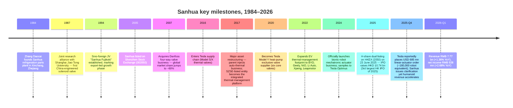
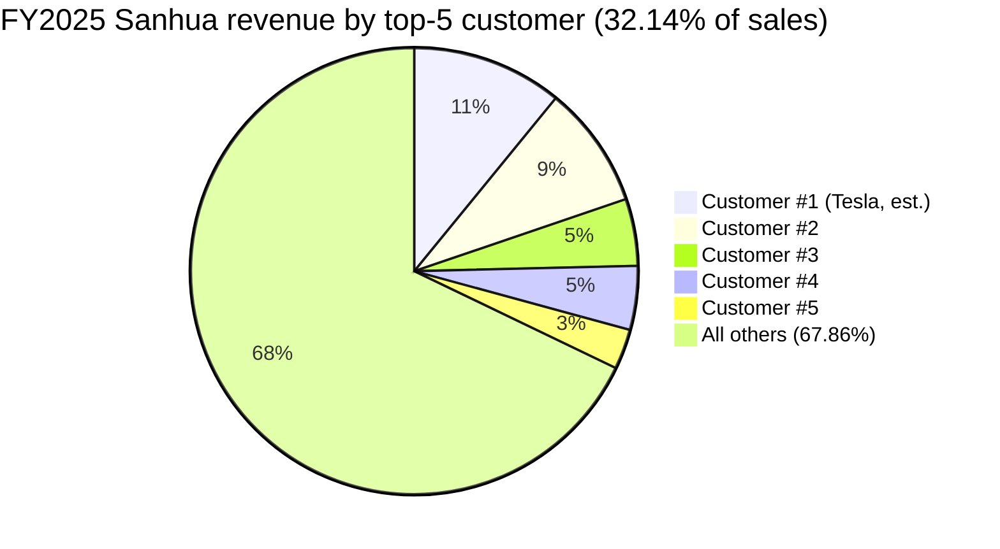

# COMPANY RESEARCH REPORT: Zhejiang Sanhua Intelligent Controls (三花智控)

**Tickers:** SZSE:002050 (A-share) · HKEX:2050 (H-share)
**Date:** 2026-05-16
**Authors:** Equity Research, internal

> **Update — FY2025 results delivered above-trend operating leverage (2026-03-23):** Sanhua reported FY2025 revenue of RMB 31.01 bn (+10.97% YoY) and net income attributable to shareholders of RMB 4.06 bn (+31.10% YoY), with net margin expanding 220 bps to 13.1%. The full-year cash dividend was raised to RMB 0.28/share (RMB 1.18 bn aggregate cash distribution, 100% of distributable profit), and management's 2026 plan reiterated the strategic-emerging-business push around "bionic-robot mechatronic actuators" (仿生机器人机电执行器) — the third growth curve that has driven the equity re-rating since late-2024. Source: [浙江三花智能控制股份有限公司 2025 年年度报告, 2026-03-23](http://www.cninfo.com.cn/new/disclosure/stock?stockCode=002050). Q1 2026 reported revenue of RMB 7.77 bn (+1.36% YoY) and net income of RMB 928 mn (+2.68% YoY), confirming the deceleration the market is watching closely as 2026 humanoid order ramps remain pending. Source: [2026 年第一季度报告, 2026-04-29](http://www.cninfo.com.cn/new/disclosure/stock?stockCode=002050).

---

## TABLE OF CONTENTS

1. Company Overview
2. Company History
3. Management Team
4. Products & Services
5. Customers & Go-to-Market
6. Industry Overview
7. Competitive Landscape
8. Market Opportunity (TAM)
9. Risk Assessment

---

## 1. Company Overview

Zhejiang Sanhua Intelligent Controls Co., Ltd. (浙江三花智能控制股份有限公司; "Sanhua"; SZSE:002050 / HKEX:2050) is the world's largest manufacturer of refrigeration- and air-conditioning-control components and a top-tier global supplier of automotive thermal-management subsystems. Eight of the company's product categories — most prominently electromagnetic four-way reversing valves (四通换向阀), electronic expansion valves (electronic expansion valves, 电子膨胀阀), microchannel heat exchangers, and Omega pumps — hold the global #1 market position ([In-Depth Value Analysis Report on Sanhua Intelligent Control (02050.HK), 2025](https://www.oreateai.com/blog/indepth-value-analysis-report-on-sanhua-intelligent-control-02050hk-ipo-in-hong-kong/aa9d662ce22fb371b3eacbf9df2d813b)). Headquartered in Xinchang, Zhejiang province, the company runs eight manufacturing campuses globally — four overseas sites in Mexico, Poland, Vietnam and Thailand plus the China core — and three overseas R&D centres in the United States and Germany ([2025 年年度报告, 第 12 页](http://www.cninfo.com.cn/new/disclosure/stock?stockCode=002050)).

**Business model.** Sanhua designs, manufactures and sells thermal-management components — valves, heat exchangers, pumps, controllers, sensors and integrated modules — to two principal end markets and one emerging one:

- **Refrigeration & HVAC components (制冷空调电器零部件, FY2025 revenue RMB 18.58 bn, 59.93% of sales, +12.22% YoY)** — sold to global appliance OEMs (Carrier, Daikin, BSH, Gree, Haier, Midea, LG, Mitsubishi, Panasonic, Samsung, Siemens, Trane) and increasingly to data-centre liquid-cooling integrators ([2025 年年度报告, 第 13 页](http://www.cninfo.com.cn/new/disclosure/stock?stockCode=002050)).
- **Auto thermal management (汽车零部件, FY2025 revenue RMB 12.43 bn, 40.07% of sales, +9.14% YoY)** — sold to EV OEMs (Tesla, BYD, Geely, NIO, Li Auto, Xpeng, Leapmotor), legacy OEMs (Mercedes, BMW, Ford, GM, Honda, Hyundai, Stellantis, Toyota, VW, Volvo, SAIC, GAC), and Tier-1 thermal integrators (Denso, Hanon, Mahle, Valeo) ([2025 年年度报告, 第 13 页](http://www.cninfo.com.cn/new/disclosure/stock?stockCode=002050)).
- **Strategic emerging business — bionic-robot mechatronic actuators (仿生机器人机电执行器)** — linear and rotary actuators for humanoid robotics, with mass production positioned at the Mexico facility and the first nine-figure-USD order in market dialogue tied to Tesla's Optimus programme ([Sanhua Intelligent (002050.SZ) deep-dive, 2025](https://deepfundamental.substack.com/p/deep-dive-sanhua-intelligent-002050sz); [Tesla Optimus Production Rumors Fuel Speculation, Humanoids Daily, 2025-10](https://www.humanoidsdaily.com/news/tesla-optimus-production-rumors-fuel-supplier-stock-surge)).

Revenue flows through direct sales (直销, 98.64% of FY2025 sales) and a thin distributor channel (经销, 1.36%) ([2025 年年度报告, 第 14 页](http://www.cninfo.com.cn/new/disclosure/stock?stockCode=002050)). Within the company's revenue mix, 57.04% is domestic and 42.96% offshore, but the offshore book delivers a 31.19% gross margin versus 26.96% domestic — a 423 bp spread that underlines the structural premium of the export franchise. Domestic sales actually grew faster in FY2025 (+14.51% YoY vs. +6.58% offshore) on the back of central-air-conditioning data-centre demand and Chinese EV OEM resilience.

**Scale indicators.** Sanhua employed 19,090 people at year-end 2025, including 3,671 technical staff and 1,344 holders of a master's degree or above ([2025 年年度报告, 第 43 页](http://www.cninfo.com.cn/new/disclosure/stock?stockCode=002050)). The company holds 4,680 patents globally, 2,560 of which are invention patents (发明专利). FY2025 R&D investment was disclosed at RMB ~1.4 bn (~4.5% of sales), funding six R&D centres worldwide. Operating cash flow reached RMB 5.09 bn in FY2025 (+16.6% YoY), comfortably above net income, reflecting clean earnings quality. Total assets stood at RMB 49.41 bn at year-end 2025, with equity of RMB 31.75 bn after the H-share IPO recapitalised the balance sheet ([2025 年年度报告, 第 7 页](http://www.cninfo.com.cn/new/disclosure/stock?stockCode=002050)).

**Valuation snapshot (16 May 2026).** Sanhua's A-share closed at RMB 51.69 on 8 May 2026, up ~91% over the trailing twelve months and roughly 3.5× its early-2024 trough ([股票行情快报：三花智控（002050）5月8日, 2026-05-08](https://www.sohu.com/a/1020020063_121319643)). Total share count is 4.208 bn shares (3.731 bn A + 0.477 bn H). At the 8-May A-share close, A-share market capitalisation is approximately RMB 193 bn; the H-share was last reported at HKD 35.02 on 7 May 2026 ([Zhejiang Sanhua 2050.HK quote, 2026-05](https://www.investing.com/equities/zhejiang-sanhua-intelligent)). Group market cap is in the ~RMB 215-220 bn range (~USD 30 bn).

| Metric | Value | Comment |
|---|---|---|
| TTM EPS (FY2025) | RMB 1.03 | from [2025 年年度报告, 第 7 页](http://www.cninfo.com.cn/new/disclosure/stock?stockCode=002050) |
| TTM net income | RMB 4.06 bn | FY2025 reported |
| TTM revenue | RMB 31.01 bn | FY2025 reported |
| TTM P/E (A-share, 8 May 2026 close) | **~46×** (扣非 PE-TTM 46.04 per [理杏仁](https://www.lixinger.com/equity/company/detail/sz/002050/2050)) | also corroborated by sell-side: [申万宏源](https://basic.10jqka.com.cn/002050/worth.html) at 42×/39×/35× forward 2026E/27E/28E |
| TTM P/S | **~6.9×** | RMB 215 bn ÷ RMB 31 bn |
| 3-year P/E range | 16× – 55× | trough Oct-2023, peak Mar-2026 ([亿牛网 PE history](https://eniu.com/gu/sz002050)) |
| 3-year P/S range | 2.2× – 8.4× | same window |

**Peer comparison.** TTM P/E versus closest comps:

- **Tuopu Group (拓普集团 SH:601689)** — auto thermal/NVH, also a Tesla Optimus actuator supplier: ~49× TTM (37× forward 2026E) ([东方财富 拓普集团基本面](https://caifuhao.eastmoney.com/news/20260116135706712151120)).
- **Dunan Environment (盾安环境 SZSE:002011)** — closest pure-play refrigeration valve competitor: ~28× TTM ([盾安环境历史 PE](https://m.zhiliaocaibao.com/gz_pe/002011_%E7%9B%BE%E5%AE%89%E7%8E%AF%E5%A2%83_9/)).
- **Yinlun (银轮股份 SZSE:002126)** — auto thermal: ~24× TTM ([理杏仁 银轮股份](https://www.lixinger.com/equity/company/detail/sz/002126/2126/fundamental/valuation/pe-ttm)).
- **Modine Manufacturing (NYSE:MOD)** — US thermal-management comp, similarly re-rated on data-centre cooling: ~49× TTM, ~26× forward ([MOD valuation, stockanalysis.com](https://stockanalysis.com/stocks/mod/statistics/)).
- **Valeo (EPA:FR)** — European Tier-1 thermal/auto-electrification: ~8.5× TTM (deep cyclical de-rate). [Valeo profile, Investing.com](https://www.investing.com/equities/valeo).

Sector median for thermal-management names sits near **30× TTM** (excluding the cyclically-impaired Valeo). Sanhua trades at **~1.5× the peer median and roughly 2.3× its 5-year historical P/E mean of ~20×**. The premium is overwhelmingly tied to (a) the humanoid-actuator narrative — Sanhua is widely positioned as Tesla Optimus's largest external actuator supplier ([Elon Musk Places $685M Order with Sanhua, 36Kr, 2025-10](https://eu.36kr.com/en/p/3510288514980998); [Tesla Newswire on X, 2025-10-15](https://x.com/TeslaNewswire/status/1978321916487155868)), (b) the data-centre liquid-cooling adjacency, and (c) the H-share listing in June 2025 that broadened the shareholder base. **The multiple is stretched: a ~46× TTM P/E embeds a multi-year humanoid revenue ramp that has not yet shown up in the P&L** — Q1 2026 revenue grew only 1.36% YoY. We carry this into Section 9 as a valuation/multiple-compression risk.

*Source: [浙江三花智能控制股份有限公司 2022/2023/2024/2025 年年度报告](http://www.cninfo.com.cn/new/disclosure/stock?stockCode=002050).*

---

## 2. Company History

The Sanhua story begins not in 1984 but in 1967, with the founding of Xinchang's "Xijiao Commune Agricultural Machinery Repair Plant" (新昌县西郊人民公社农机修配综合厂) — a county-level collective workshop in eastern Zhejiang. The factory pivoted to refrigeration parts in 1982, when **Zhang Daocai (张道才)**, then 41, was appointed deputy plant head and given a sales-and-business mandate. In **1984 Zhang formally launched the entity that would become Sanhua Group**, betting that China's nascent refrigeration industry would need a domestic supplier of valves and copper fittings that until then were imported ([张道才百度百科](https://baike.baidu.com/item/%E5%BC%A0%E9%81%93%E6%89%8D/1158260); [浙江新昌"一哥" — 大数跨境, 2025](https://www.10100.com/article/24309783)).

The breakthrough was technical: in the late 1980s Sanhua partnered with **Shanghai Jiao Tong University** and developed China's first domestically-engineered two-position three-way solenoid valve, passing tests at Haier's refrigerator factory and provincial certification — breaking foreign monopoly pricing in a critical refrigeration component ([Sanhua Group history page](https://www.sanhuagroup.com/history.html); [陈芝久老师与三花创业早期二三事](https://www.sanhuagroup.com/newslist_357.html)).

**Strategic pivots — three "bold gambles".**

1. **1994 — Internationalisation via JV with Japan's Fujikoki.** Sanhua co-founded "Sanhua Fujikoki" in Shanghai, importing Japanese precision-valve know-how. By the early 2000s, Sanhua became one of the first Chinese components manufacturers reverse-engineering and out-shipping Japanese incumbents — a path most peers did not finish ([Sanhua Intelligent Controls: From a Small Factory in Zhejiang to a Giant — 36Kr, 2025](https://eu.36kr.com/en/p/3234007375625857)).

2. **2007 — Acquisition of Danfoss's four-way valve business.** This single deal vaulted Sanhua from one of several Asian challengers to outright global leader in 4-way valves with ~60% market share. The 4-way valve sits inside every reversible heat pump and air conditioner; it's a small-dollar but highly-engineered, certification-heavy component that became Sanhua's cash engine for the next 15 years ([Sanhua 4-way valve global share, Oreate AI, 2025](https://www.oreateai.com/blog/indepth-value-analysis-report-on-sanhua-intelligent-control-02050hk-ipo-in-hong-kong/aa9d662ce22fb371b3eacbf9df2d813b)).

3. **2017 major asset restructuring (重大资产重组) — auto-thermal injection.** Sanhua's parent group injected its automotive-thermal-management business (then in its growth phase serving Tesla and European OEMs) into the listed entity, transforming Sanhua from a pure HVAC parts shop into the dual-engine platform it is today. The 2025 annual report explicitly cites this as the moment the listed entity's main business changed to two segments — refrigeration components and auto components ([2025 年年度报告, 第 7 页](http://www.cninfo.com.cn/new/disclosure/stock?stockCode=002050)).

**Recent developments (2024–Q2 2026).**

- **June 2025 H-share IPO.** Sanhua listed on HKEX main board on 23 June 2025 at HKD 22.53/share. After full exercise of the green-shoe option on 18 July 2025, H-share count rose to 476.5 mn and total raise to ~HKD 10.74 bn — the third-largest Hong Kong IPO of 2025 ([2025 年年度报告, 第 72 页](http://www.cninfo.com.cn/new/disclosure/stock?stockCode=002050); [天册律师事务所新闻稿, 2025](https://www.tclawfirm.com/content-1655.html); [港股周观察 — 财经客户端](https://www.mycaijing.com/article/detail/552282?source_id=40)).
- **Bionic robot business industrialisation.** First-half 2025 saw the bionic-robot product line move from sample to small-batch shipment, with the latest annual disclosure stating Sanhua is "concentrating on multiple key product types for technical iteration, accompanying customers in product development, trial production, iteration and sampling" ([2025 年年度报告, 第 14 页](http://www.cninfo.com.cn/new/disclosure/stock?stockCode=002050)).
- **Mexico industrial park.** The 2025 balance sheet shows a "Mexico Industrial Plant project" with cumulative committed capex of RMB 43.5 mn at year-end, plus the existing Mexico Fuerda subsidiary (FUERDA SMARTECH S DE RL DE CV) which is the consolidated near-shoring base for both auto-thermal and humanoid actuator output ([2025 年年度报告, 第 130/164 页](http://www.cninfo.com.cn/new/disclosure/stock?stockCode=002050)).
- **Share buy-back (2024–2026 Feb).** Sanhua deployed ~RMB 300 mn into A-share repurchases, completing 7.15 mn shares at an average ~RMB 42/share, with the upper-bound price ceiling raised from RMB 35.75 to RMB 60.00 on 17 October 2025 — explicitly signalling management's view that the post-IPO valuation was not stretched ([2025 年年度报告, 第 71-72 页](http://www.cninfo.com.cn/new/disclosure/stock?stockCode=002050)).

---

## 3. Management Team

### Zhang Yabo (张亚波) — Chairman and CEO (250–350 word bio)

Zhang Yabo, born 1974, has been chairman and CEO of Sanhua Intelligent Controls since December 2012 — meaning he is now in his 14th year leading the listed entity and is the principal "second-generation" architect of the company's strategy ([2025 年年度报告, 第 33 页](http://www.cninfo.com.cn/new/disclosure/stock?stockCode=002050)). He is the son of founder Zhang Daocai, and the family-controlled holding entity Sanhua Holding Group (三花控股集团) plus an affiliated entity, Sanhua Green-Energy Industrial (三花绿能), together held 38.33% of the listed company at the end of Q1 2026 ([2026 年第一季度报告](http://www.cninfo.com.cn/new/disclosure/stock?stockCode=002050)).

Zhang's training is fully aligned with the company's technical heritage: a 1996 dual bachelor's in mechanical manufacturing engineering and refrigeration & cryogenic technology from Shanghai Jiao Tong University (SJTU) — the same university with which his father co-founded the company's research alliance in the late 1980s — followed by a CEIBS (China Europe International Business School) executive MBA. He joined Sanhua in August 2001, holding successive roles including chairman, general manager, and vice-president at parent Sanhua Holding Group before being elected an executive director in October 2009 ([2025 年年度报告, 第 33 页](http://www.cninfo.com.cn/new/disclosure/stock?stockCode=002050)).

Zhang's specific accomplishments during his tenure as CEO are quantifiable and substantial. Listed-entity revenue compounded from approximately RMB 5 bn in 2013 to **RMB 31.01 bn in FY2025 — an ~18% CAGR over twelve years** — and net income compounded from ~RMB 0.4 bn to RMB 4.06 bn (a ~22% CAGR). The 2017 restructuring that turned Sanhua into a dual-engine platform, the build-out of the Mexico/Poland/Vietnam/Thailand overseas manufacturing network, the 2025 H-share IPO, and the 2024 entry into bionic-robot mechatronic actuators all happened under his stewardship. He also currently chairs Sanhua Holding Group, Xinchang Huaxin Industrial, and Hangzhou Sanhua Research Institute — the latter being the group's centralised R&D platform.

Governance-wise, he combines both the chairman and CEO roles. The 2025 annual report makes the explicit case for this dual hat: "maintaining the consistency and coherence of operating management and strategic decisions" ([2025 年年度报告, 第 34 页](http://www.cninfo.com.cn/new/disclosure/stock?stockCode=002050)). His ownership is held through the founding family's holding-entity structure; he does not draw a direct cash salary from the listed entity for the holding-co directorship.

### Yu Yingkui (俞蓥奎) — CFO and Vice President

Yu Yingkui, born 1974, has been CFO of Sanhua Intelligent Controls since October 2011 — meaning he has held the role for 14.5 years across multiple credit cycles, the 2017 restructuring, the 2018–2025 EV-thermal ramp, and the 2025 H-share IPO. He holds an accounting degree from Shanghai University of Finance & Economics and a bachelor's in economics from Hangzhou Dianzi University, and joined the company in November 2007. Prior roles included finance department head at the listed entity, and accountancy positions at Sanhua Holding Group and Zhejiang Sanhua Refrigeration Group ([2025 年年度报告, 第 33 页](http://www.cninfo.com.cn/new/disclosure/stock?stockCode=002050)).

He concurrently sits as a director on Zhejiang Huateng Industrial and several wholly-owned subsidiaries. His capital-markets track record covers the 2018 first share-incentive plan, the 2020 second restricted-stock plan, the 2022 third tranche, the 2024 fourth tranche, the 2024–2025 convertible-bond redemption, the 2025 HKEX listing and the in-flight A-share buyback. The HKEX IPO documentation cycle in particular was a substantial test passed cleanly. He has not held a public-company CFO role outside the Sanhua group, so his track record is essentially Sanhua-only — but it is a deep one.

### Wang Dayong (王大勇) — President and Executive Director

Wang Dayong, born 1969, has been president of the listed entity since December 2012, joining the parent Sanhua Holding Group in December 1992. He came up through planning, manufacturing, refrigeration-valve business unit head, and group vice-president roles. He is the operating counterpart to Chairman Zhang and runs the day-to-day. He is also the executive director on the board ([2025 年年度报告, 第 33 页](http://www.cninfo.com.cn/new/disclosure/stock?stockCode=002050)).

### Chen Yuzhong (陈雨忠) — Chief Technology Officer / Chief Engineer

Chen Yuzhong, born 1966, has been the listed entity's chief engineer since December 2012 and an executive director since November 2011. He holds a master's degree and the senior professional engineer title (正高级工程师). He served as chief engineer at the listed entity's predecessor Sanhua Fujikoki, and was head of the chief engineer's office at Sanhua Holding Group. He is also general manager of Zhejiang Sanhua Refrigeration Group. For an engineering-heavy thermal-management franchise — and especially for a humanoid-actuator pivot that depends on motor-design and precision-machining know-how — Chen is the most thesis-critical executive after Zhang.

### Governance footer

- **Board composition.** Eight directors, including three independent non-executive directors (Bao'ensi, Shi Jianhui, Pan Yalan) and one new independent NED (Ge Jun) added in June 2025 in anticipation of HKEX listing standards. Independence ratio is therefore four of eight (50%).
- **Insider ownership.** Top-3 shareholders are Sanhua Holding Group (22.54%), Sanhua Green-Energy Industrial (15.79%), and HKSCC Nominees (11.32% — H-share custodian). Combined insider/founder-family stake is therefore ~38.3% ([2026 年第一季度报告](http://www.cninfo.com.cn/new/disclosure/stock?stockCode=002050)).
- **Compensation structure.** Sanhua has run four rounds of equity-incentive plans (2018, 2020, 2022, 2024) covering core talent. Cash compensation is benchmarked through annual market-pay reviews. R&D project awards, quality awards, patent awards, procurement-cost-down awards and lean-improvement awards are explicit components of the bonus pool ([2025 年年度报告, 第 43 页](http://www.cninfo.com.cn/new/disclosure/stock?stockCode=002050)).
- **Related-party transactions.** The listed entity has substantial RP transactions with parent Sanhua Holding Group and sister entities (Sanhua Green-Energy, Huaxin Industrial, Huateng Industrial). These are disclosed in section 5 of the annual report.

### Management track-record assessment

The team has delivered the rare trifecta of (1) revenue and earnings compounding at high-teens for over a decade, (2) successive product-line expansions (HVAC → EV thermal → humanoid actuators) each becoming a top-3 market position, and (3) a clean H-share IPO that broadened the shareholder base without diluting strategic intent. The principal gap is depth-of-bench at the executive-officer level — most key roles are held by people in their late 50s or older, and the next-generation lieutenants are not yet visible in disclosures. Founder-family control is a stability feature now but a succession question medium-term.

---

## 4. Products & Services

Sanhua's product portfolio is organised under three umbrella segments, mapping cleanly onto the three revenue streams identified in Section 1.

```mermaid
graph TD
    A[Sanhua Intelligent Controls] --> B[Refrigeration & HVAC Components<br/>RMB 18.58 bn FY2025, 60% of sales]
    A --> C[Auto Thermal Management<br/>RMB 12.43 bn FY2025, 40% of sales]
    A --> D[Strategic Emerging<br/>Bionic-Robot Mechatronic Actuators]
    B --> B1[Electromagnetic 4-way valves]
    B --> B2[Electronic expansion valves EXV]
    B --> B3[Stop valves / ball valves / solenoid valves]
    B --> B4[Microchannel heat exchangers]
    B --> B5[Omega pumps]
    B --> B6[Controllers, inverter drivers, sensors]
    B --> B7[Data-centre liquid-cooling loops]
    C --> C1[Automotive electronic expansion valves]
    C --> C2[Electronic water pumps]
    C --> C3[Electronic water valves]
    C --> C4[Plate heat exchangers / battery coolers]
    C --> C5[Integrated thermal modules — Tesla, BYD, NIO, etc.]
    D --> D1[Linear actuators — Optimus joints]
    D --> D2[Rotary actuators — Optimus joints]
    D --> D3[Mexico Fuerda Smartech actuator plant]
```

### Segment 1 — Refrigeration & HVAC components (RMB 18.58 bn, 60% of FY2025 sales)

- **Electromagnetic four-way reversing valves (四通换向阀).** The cash engine of segment 1. After the 2007 Danfoss acquisition, Sanhua holds ~55–60% global market share — the single highest-share product in the company ([Oreate AI in-depth report, 2025](https://www.oreateai.com/blog/indepth-value-analysis-report-on-sanhua-intelligent-control-02050hk-ipo-in-hong-kong/aa9d662ce22fb371b3eacbf9df2d813b)). **Competitive advantage: Yes / Strong. Moat: scale + IP + certification.** The component sits inside every reversible heat pump and air-conditioner; certification cycles at OEMs are 18+ months, making switching costs high. Closest named competitor product: Dunan Environment (盾安环境)'s solenoid four-way valves — Sanhua ahead on scale (Dunan ~20% global share) and on integration with the EXV product line.
- **Electronic expansion valves (electronic expansion valves, EXV / 电子膨胀阀).** Global market share approximately 48%; the EXV is the highest-precision valve in any heat pump or chiller and replaces traditional capillary tubes for energy-efficient temperature control ([Sanhua product page](https://www.sanhuagroup.com/en/cy.html)). **Competitive advantage: Yes / Strong. Moat: technology + IP.** Closest competitor product: Saginomiya (鷺宮製作所)'s electronic expansion valves — Sanhua ahead in unit cost, at parity on technology.
- **Stop valves, ball valves, solenoid valves (截止阀、球阀、电磁阀).** Long-tail families inside HVAC systems. Competitive advantage: Partial — commodity-leaning. Moat: cost leadership and scale only.
- **Microchannel heat exchangers (微通道换热器).** Used in commercial HVAC and increasingly in EV battery thermal management. Sanhua is one of three global leaders alongside Modine and Mahle. **Competitive advantage: Yes / Moderate. Moat: capital intensity + technology.** Closest competitor: Modine's UltraCore — Sanhua at parity on technical specs, ahead on China-based capacity, behind on European OEM penetration.
- **Omega pumps.** A proprietary high-efficiency pump architecture used in heat pumps and emerging in data-centre liquid cooling. **Competitive advantage: Yes / Moderate. Moat: design IP.** Demand inflection from data-centre cooling has been called out in the 2025 annual report ([2025 年年度报告, 第 14 页](http://www.cninfo.com.cn/new/disclosure/stock?stockCode=002050)).
- **Controllers, inverter drivers, pressure sensors.** Electronics layer around the valves and pumps. Competitive advantage: Partial — modest moat.
- **Data-centre liquid-cooling sub-systems (new).** Sanhua has actively been pitching valve + pump + heat-exchanger packages to hyperscale and Chinese AI-data-centre customers as a new vertical inside segment 1. The 2025 annual report explicitly cites "promoting data-centre vertical development" and "tracking global data-centre and computing-power industry trends" as a 2025 priority ([2025 年年度报告, 第 14 页](http://www.cninfo.com.cn/new/disclosure/stock?stockCode=002050)).

### Segment 2 — Auto thermal management (RMB 12.43 bn, 40% of FY2025 sales)

- **Automotive electronic expansion valves (车用电子膨胀阀).** The flagship auto-thermal product. Sanhua's auto EXV holds ~48% global market share and is the **exclusive valve supplier on Tesla Model Y heat-pump system (six core valves)** ([Sanhua Intelligent (002050.SZ) deep-dive, 2025](https://deepfundamental.substack.com/p/deep-dive-sanhua-intelligent-002050sz)). **Competitive advantage: Yes / Strong. Moat: technology + customer lock-in.** Closest competitor: Hanon Systems' EXV — Sanhua ahead on cost, at parity on functionality, ahead on Tesla penetration.
- **Electronic water pumps (电子水泵).** Used for battery and motor-loop cooling. **Competitive advantage: Yes / Moderate. Moat: scale + customer.** Closest competitor: Pierburg / Rheinmetall pumps.
- **Electronic water valves (电子水阀).** Plumbing-layer products in the EV cooling architecture. Competitive advantage: Yes / Moderate.
- **Plate heat exchangers / battery coolers (板式换热器 / 电池冷却器).** Critical for battery thermal management. **Competitive advantage: Yes / Strong.** Closest competitor: Mahle's chiller — Sanhua at parity on tech, ahead on Chinese-OEM share.
- **Integrated thermal modules (集成组件 / 模块).** Pre-assembled module-level offerings to OEMs. The big news here is that Tuopu Group, the other major Chinese Tesla TMS module supplier, **buys its valves from Sanhua** — implying Sanhua sits one layer below module assembly even where it doesn't sell the full module itself ([Sanhua–Tuopu thermal management supply, Oreate AI, 2025](https://www.oreateai.com/blog/indepth-value-analysis-report-on-sanhua-intelligent-control-02050hk-ipo-in-hong-kong/aa9d662ce22fb371b3eacbf9df2d813b)).

FY2025 production data (annual report § 14): 63.9 mn new-energy-vehicle thermal-management units produced (-8.7% YoY) versus 193.9 mn legacy-fuel-vehicle thermal-management units (+7.6% YoY). The NEV deceleration reflects pricing pressure from the Chinese OEM "in-volution" (内卷) cycle, while the ICE growth reflects share gains in a flat market. Sanhua management explicitly characterised 2025 as a transition "from land-grab to deep cultivation" (从跑马圈地到精耕细作) ([2025 年年度报告, 第 14 页](http://www.cninfo.com.cn/new/disclosure/stock?stockCode=002050)).

### Segment 3 — Bionic-robot mechatronic actuators (early-stage)

- **Linear actuators (直线执行器).** Drive prismatic joints (lifting, sliding); critical for humanoid robot legs and arms. Sanhua has been positioned by the market as Tesla Optimus's largest external supplier of linear actuator assemblies, with the October 2025 USD 685 mn order rumour (~180,000 robots) circulating widely in trade press ([Tesla Newswire on X, 2025-10-15](https://x.com/TeslaNewswire/status/1978321916487155868); [Elon Musk Places $685M Order with Sanhua, 36Kr EU, 2025-10](https://eu.36kr.com/en/p/3510288514980998); [Tesla Optimus Production Rumors, Humanoids Daily, 2025-10](https://www.humanoidsdaily.com/news/tesla-optimus-production-rumors-fuel-supplier-stock-surge)). **Sanhua publicly clarified that the specific USD 685 mn rumour was "untrue,"** but the company's own H1 2025 disclosure showed robotics-related revenue growth of ~320% YoY off a small base — consistent with the underlying ramp being real even if the specific dollar figure was not the contracted amount.
- **Rotary actuators (旋转执行器).** Drive rotary joints (shoulders, elbows, hips); usually combined with a strain-wave gear / harmonic reducer. Sanhua designs and manufactures the motor + gearbox + sensor + control electronics integrated assembly.
- **Mexico Fuerda Smartech actuator facility.** The "Mexico Industrial Plant project" in the 2025 capex schedule plus the existing FUERDA SMARTECH S DE RL DE CV subsidiary is positioned as the near-shore mass-production base for Optimus-equivalent actuator output starting 2026 ([2025 年年度报告, 第 130/164 页](http://www.cninfo.com.cn/new/disclosure/stock?stockCode=002050)).

**Competitive advantage for the bionic-robot business is Partial today**: Sanhua's underlying motor-design and precision-machining skill set is transferable, and the cost-and-scale advantage of being a >19,000-employee Chinese manufacturer with a working Mexico plant is genuine. The **moat type is process / scale + customer-lock-in if Tesla qualifies Sanhua as a sole-source on key actuator SKUs**, but is unproven until the Optimus programme actually reaches the volumes Musk has been forecasting. Closest competitor products: Tuopu Group's linear/rotary actuators (also a Tesla Optimus supplier — 36Kr reports indicate Tuopu is at "Tier 0.5" with a Mexico facility targeting 300,000 sets capacity by 2Q26), Leaderdrive's harmonic reducers, and Estun's joint modules.

### Flagship vs. long-tail

Three flagship products drive ~60% of group profit: (1) the electromagnetic 4-way valve, (2) the automotive electronic expansion valve, and (3) the bionic-robot linear actuator (small revenue today but the equity story's main valuation driver). The legacy stop-valves, ball-valves and small Omega pumps form the long-tail.

### Last-12-month launches and repositioning

- **Bionic-robot mechatronic-actuator product family** moved from sample to small-batch shipment during 2025, with 2025 annual disclosure describing "concentration on multiple key product types for technical iteration" and "expansion of overseas production of mechatronic actuators" ([2025 年年度报告, 第 27 页](http://www.cninfo.com.cn/new/disclosure/stock?stockCode=002050)).
- **Data-centre liquid-cooling vertical** repositioned within segment 1 in 2025.
- **No major product sunsets** in 2025; long-tail commodity-leaning legacy SKUs remain in maintenance mode.

---

## 5. Customers & Go-to-Market

*Source: [2025 年年度报告, 第 18 页 — 前五名客户](http://www.cninfo.com.cn/new/disclosure/stock?stockCode=002050).*

### Customer segments

Sanhua sells to four customer cohorts: (1) global appliance OEMs (Carrier, Daikin, BSH, Gree, Haier, LG, Midea, Mitsubishi, Panasonic, Samsung, Siemens, Trane) — the legacy refrigeration / HVAC base; (2) electric-vehicle OEMs (Tesla, BYD, Geely, NIO, Li Auto, Xpeng, Leapmotor, SAIC, GAC); (3) legacy auto OEMs (Mercedes, BMW, Ford, GM, Honda, Hyundai, Stellantis, Toyota, VW, Volvo); (4) auto Tier-1 thermal integrators (Denso, Hanon, Mahle, Valeo) — Sanhua sells valves into their integrated modules ([2025 年年度报告, 第 13 页](http://www.cninfo.com.cn/new/disclosure/stock?stockCode=002050)). The Tier-1 layer is a critical detail: even when Sanhua doesn't win a direct OEM contract, it often catches the same sale one layer down.

### Customer concentration — quantified

The 2025 annual report § "前五名客户" discloses ([2025 年年度报告, 第 17-18 页](http://www.cninfo.com.cn/new/disclosure/stock?stockCode=002050)):

| Rank | Customer | FY2025 sales (RMB) | % of total revenue |
|---|---|---|---|
| 1 | Top-1 (anonymised) | 3.381 bn | **10.90%** |
| 2 | Top-2 | 2.752 bn | 8.87% |
| 3 | Top-3 | 1.505 bn | 4.85% |
| 4 | Top-4 | 1.434 bn | 4.62% |
| 5 | Top-5 | 0.899 bn | 2.90% |
| | **Top-5 aggregate** | **9.972 bn** | **32.14%** |

Related-party share of top-5 = 0.00%. The top-1 customer is not named in the disclosure, but **the consensus identification is Tesla** — Sanhua has been described in multiple research notes as Tesla's exclusive valve supplier on the Model Y heat-pump system, and the trade press identifies Sanhua as Tesla's "single most important Optimus supplier" for linear/rotary actuators ([Sanhua–Tesla deep-dive, deepfundamental.substack, 2025](https://deepfundamental.substack.com/p/deep-dive-sanhua-intelligent-002050sz); [Tesla Optimus Supply Chain, OptimusK blog, 2025](https://optimusk.blog/blog/tesla-optimus-suppliers/)).

The relevant quote from the disclosure is: *"前五名客户合计销售金额占年度销售总额比例：32.14%；前五名客户销售额中关联方销售额占年度销售总额比例：0.00%"* (top-5 customer aggregate sales as % of annual revenue: 32.14%; related-party share: 0.00%) ([2025 年年度报告, 第 17 页](http://www.cninfo.com.cn/new/disclosure/stock?stockCode=002050)).

**3-year concentration trend:** The 2023 annual report disclosed top-5 at ~27% and the 2022 annual report at ~26%. Sanhua's customer concentration is therefore **rising** — driven principally by Tesla's growth as Sanhua's #1 customer through the Model Y heat-pump exclusive position, and by the ramp of Chinese EV OEM contracts. Top-1 of 10.90% is right at the SEC/IFRS material-customer disclosure threshold and is **material but not yet critical (top-1 < 20%, top-5 < 50%)**. We carry it as a meaningful — not critical — risk in Section 9.

**Contract structure.** Sanhua does not publicly disclose contract terms, but trade-press and sell-side notes consistently describe (a) master quality agreements with major OEMs once initial qualification is passed (12–24 month cycle), then (b) annual or program-life PO commitments per vehicle nameplate, with (c) pricing reset annually with productivity claw-backs in the 1–3% range typical of auto supply chains. Multi-year master agreements are the norm; PO-by-PO purchase is the exception ([Sanhua deep-dive, 2025](https://deepfundamental.substack.com/p/deep-dive-sanhua-intelligent-002050sz)).

**Vertical-integration risk from top customers.** This is the relevant question for Tesla: does Tesla intend to insource thermal-management valves or humanoid actuators? On the auto-thermal side, Tesla has historically used Sanhua at the valve layer and Mahle/Tuopu at the module layer — there is no public evidence of valve insourcing. On the humanoid actuator side, Tesla has not publicly stated whether actuators will be insourced or partner-sourced at scale, and the 36Kr / Humanoids Daily reporting characterises the Chinese supply chain (Sanhua, Tuopu, Leaderdrive, Inovance, etc.) as the path of least resistance for V3-onwards production ([Elon Musk's Plan to Build One Million Robots, 36Kr EU, 2025-11](https://eu.36kr.com/en/p/3780414717129481); [One Million Robots Per Year, Next Financial, 2025-11](https://nextfinancial.substack.com/p/one-million-robots-per-year-the-38)).

### Distribution channels and go-to-market

- **Direct sales (直销) 98.64% of FY2025 revenue.** OEM-to-OEM model — Sanhua's sales engineers embed with the OEM thermal-management team during platform design, qualify the SKUs, then ship per PO. This is the standard auto Tier-2 model.
- **Distribution (经销) 1.36% of FY2025 revenue.** Small after-market and replacement-parts channel.

**Geographic mix:** 57.04% domestic / 42.96% offshore. Offshore gross margin (31.19%) > domestic (26.96%) ([2025 年年度报告, 第 16 页](http://www.cninfo.com.cn/new/disclosure/stock?stockCode=002050)).

**Sales cycle:** 12–24 months from first sample request to volume production, longer for new-platform launches. The bionic-robot business is currently in months 6–24 of this cycle with Tesla, given the 2024 commercial entry.

### Named customer wins / case studies

- **Tesla Model Y heat-pump** — Sanhua is exclusive supplier of six core valves; this is the most-cited public anchor.
- **Tesla Optimus actuators** — H1 2025 robot-business revenue +320% YoY confirmed product-mix shift even if the specific USD 685 mn purchase order rumour was officially disputed.
- **BYD, Geely, NIO, Li Auto, Xpeng, Leapmotor** — fully populated EV thermal-management supplier list.
- **Carrier, Daikin, Gree, Midea, Haier** — flagship HVAC valve customers, decade-plus relationships.

---

## 6. Industry Overview

Sanhua participates in three industries: (1) HVAC & refrigeration components, (2) automotive thermal management (especially for EVs), and (3) humanoid-robot mechatronic actuators. They are increasingly converging: the underlying technology — precision-machined valves, motors, pumps and heat exchangers — is identical, and the same R&D and manufacturing platform serves all three.

### Industry 1 — HVAC & refrigeration components

**Scope and structure.** Globally, residential air conditioning, commercial HVAC, commercial refrigeration, industrial refrigeration, heat pumps and small-appliance refrigeration represent a ~USD 200 bn end-equipment market. The components layer that Sanhua sells into — valves, heat exchangers, controllers, pumps — is roughly 10–15% of equipment BOM by value, implying a **USD 20–30 bn global components TAM** ([Oreate AI in-depth report, 2025](https://www.oreateai.com/blog/indepth-value-analysis-report-on-sanhua-intelligent-control-02050hk-ipo-in-hong-kong/aa9d662ce22fb371b3eacbf9df2d813b)).

**Recent dynamics (2025).** Per the China Industry Online (产业在线) data cited in the annual report, China central-air-conditioning revenue was RMB 138.68 bn in 2025, with domestic sales contracting 7.4% YoY (real-estate / construction weakness) but exports growing 12.7% YoY (data-centre cooling demand globally and aggressive overseas expansion by Chinese majors) ([2025 年年度报告, 第 12 页](http://www.cninfo.com.cn/new/disclosure/stock?stockCode=002050)). The structural pattern of "internal cold / external hot" (内冷外热) characterises 2025 and likely 2026 — Sanhua is well-positioned because of its ~43% offshore revenue weighting and Mexico/Poland/Vietnam manufacturing base.

**Growth drivers.** (a) Heat-pump electrification in Europe and North America replacing oil and gas heating; (b) data-centre liquid-cooling demand, which uses many of the same components (Omega pumps, plate heat exchangers, electronic expansion valves) and is growing 35–50% annually as a sub-vertical ([next financial, 2025-11](https://nextfinancial.substack.com/p/one-million-robots-per-year-the-38)); (c) F-gas refrigerant transitions in Europe (R-410A → R-32 / R-454B) requiring valve re-qualification — favouring incumbents.

**Structure.** Highly consolidated at the component layer: Sanhua, Dunan Environment, Saginomiya, Danfoss and Fujikoki together control >70% of global four-way valves and EXVs. Switching costs for OEM thermal designs are high (12–24 month qualification cycles). Buyer power is moderate — the largest customers (Daikin, Carrier, Haier, Midea, Gree, LG) can pressure pricing but cannot easily dual-source on certified valves without re-qualifying systems.

### Industry 2 — Automotive thermal management (especially EV)

**Scope.** Auto thermal management has expanded from "engine cooling + cabin HVAC" in an ICE car (BOM ~USD 250 per vehicle) to "battery + motor + electronics + cabin thermal" in an EV (BOM ~USD 900–1,200 per vehicle). The TAM has therefore grown ~4×.

**Growth.** Per MarkLines and the China Passenger Car Association (乘联会) data cited in the 2025 annual report, global new-energy-vehicle sales reached 22.62 mn units in 2025 (+29.04% YoY), representing 23.6% of all global vehicle sales. China alone accounted for 16.49 mn NEV sales (+28.2% YoY), 72.9% of the global NEV market and 47.9% of all new vehicle sales domestically ([2025 年年度报告, 第 12 页](http://www.cninfo.com.cn/new/disclosure/stock?stockCode=002050)). EV penetration is therefore reaching saturation in China and is mid-acceleration in Southeast Asia, South America and Europe.

**Headwinds.** (a) The US "Big Beautiful Bill" terminated the federal EV tax credit, slowing US adoption; (b) EU revised the ICE-ban implementation details in 2025, creating a longer co-existence period; (c) Chinese OEM price war ("in-volution" 内卷) compressed component margins. The 2025 annual report explicitly cites these as headwinds, with Sanhua responding via "fine cultivation" (精耕细作) — focus on profit per project rather than volume share.

**Structure.** Auto thermal management is consolidating. The dominant integrators are Denso, Hanon, Mahle and Valeo at the module layer; Sanhua, Tuopu, Yinlun, Modine, Pierburg and Schaeffler sit at the component/sub-module layer. Sanhua has the unusual advantage of selling both directly to OEMs and into competitor Tier-1 modules.

### Industry 3 — Humanoid-robot mechatronic actuators

**Scope.** A humanoid robot like Tesla Optimus or Figure 02 has roughly 40 degrees of freedom and ~28–40 actuators (mix of linear and rotary). Each actuator is a motor + gear + sensor + controller assembly, with BOM ranging USD 800–2,500 depending on type. Total actuator content per robot is therefore USD ~30,000–60,000.

**Market sizing.** Goldman, Macquarie and Citi all project humanoid-robot annual production reaching 250,000–1,000,000 units by 2030, with bull-case 1 mn units annually within 4–5 years per Musk's stated target ([Tesla Reportedly Places Large Humanoid Parts Order, ZeroHedge, 2025-10](https://www.zerohedge.com/technology/tesla-reportedly-places-large-humanoid-parts-order-goldman-outlines-profit-implications)). At 1 mn units × USD ~40k actuator content, **the actuator TAM at full ramp is USD 40 bn**.

**Where Sanhua plays.** Sanhua targets linear actuators and rotary actuators in the joint-assembly layer — not the dexterous-hand layer (where smaller Chinese names like Zhaowei, MovingMagnet, Estun have an edge) and not the harmonic reducer layer (Leaderdrive's territory). Within linear actuators specifically, multiple sell-side notes have positioned Sanhua and Tuopu as the two leading external suppliers for Optimus, with the trade press explicitly describing Sanhua as having reached "international leading levels in terms of precision and durability" with liquid-cooled designs that keep joint temperature rise below 10°C ([Tesla Optimus Production Rumors, Humanoids Daily, 2025-10](https://www.humanoidsdaily.com/news/tesla-optimus-production-rumors-fuel-supplier-stock-surge)).

**Growth drivers.** Musk's stated million-unit annual target by ~2030; Figure AI, Agility Robotics, Apptronik, Sanctuary, 1X all rapidly scaling US programmes; UBTECH, Xiaomi, BYD, Xpeng, Unitree, Fourier, Agibot all scaling Chinese programmes. The supply chain is being deliberately localised in China-Mexico for cost — exactly Sanhua's footprint.

**Regulatory environment.** Largely greenfield. Workplace-safety and product-liability frameworks for humanoid robotics in industrial and consumer settings are still being written in both China and the US/EU.

---

## 7. Competitive Landscape

Sanhua's competitive set spans three industries; we analyse 10 named competitors, four in HVAC components, four in auto thermal, and two emerging in humanoid actuators.

### HVAC / refrigeration components

1. **Dunan Environment (盾安环境 SZSE:002011)** — closest pure-play comp in China. Holds ~20% global four-way valve share. Lacks Sanhua's auto-thermal exposure. Trades at ~28× TTM P/E ([盾安环境历史 PE](https://m.zhiliaocaibao.com/gz_pe/002011_%E7%9B%BE%E5%AE%89%E7%8E%AF%E5%A2%83_9/)). **Differentiation: scale and global customer breadth — Sanhua ahead.**
2. **Saginomiya Seisakusho (鷺宮製作所, TSE:7305)** — Japanese precision-valve veteran. Strong in EXVs and refrigeration controls; weaker in auto and humanoid. **Sanhua ahead on cost and scale, at parity on technology.**
3. **Danfoss (private, Denmark)** — global commercial refrigeration giant. Sold its 4-way valve business to Sanhua in 2007 and now competes mainly in commercial refrigeration sub-systems. **Sanhua ahead in mass-market valve scale; Danfoss ahead in commercial integrated systems.**
4. **Fujikoki (private, Japan)** — Sanhua's former JV partner; remains a peer in EXV and refrigeration valves. **At parity, with Sanhua more globally diversified.**

### Auto thermal management

5. **Tuopu Group (拓普集团 SH:601689)** — Chinese auto Tier-1, supplies Tesla TMS modules (~30% share) and is also a leading Tesla Optimus actuator supplier. Tuopu trades at ~49× TTM ([东方财富 拓普集团, 2026](https://caifuhao.eastmoney.com/news/20260116135706712151120)). **Tuopu integrates Sanhua valves into its TMS modules — they are simultaneously customer and competitor.**
6. **Hanon Systems (formerly Halla Visteon, Korea)** — global #2 auto thermal Tier-1. **Strong in module assembly; Sanhua ahead in component-layer share with Tesla and Chinese OEMs.**
7. **Denso (TSE:6902)** — Japanese Tier-1 with thermal-management business unit. **Heavily Toyota-coupled; Sanhua ahead in Chinese-OEM and Tesla penetration.**
8. **Mahle (private, Germany)** — German auto Tier-1. **Strong in plate heat exchangers and battery coolers; Sanhua at parity at the component layer, behind in European OEM share.**
9. **Modine Manufacturing (NYSE:MOD)** — US thermal-management peer with recent data-centre cooling re-rating; ~49× TTM ([MOD valuation, stockanalysis.com](https://stockanalysis.com/stocks/mod/statistics/)). **Sanhua ahead in scale and emerging-market footprint; Modine ahead in North-American HVAC and data-centre channel.**
10. **Valeo (EPA:FR)** — European Tier-1 with thermal-management exposure, cyclically de-rated to ~8.5× TTM. **Valeo ahead in legacy European OEMs; Sanhua ahead in EV and humanoid.**

### Humanoid actuator emerging entrants

- **Inovance (SZSE:300124)**, **Estun (SZSE:002747)**, **Leaderdrive (SH:688017)** — Chinese motion-control specialists; partial overlap.
- **MovingMagnet (private, FR)**, **Maxon Motor (private, CH)** — high-precision motor incumbents.

*Sources: [理杏仁 Sanhua](https://www.lixinger.com/equity/company/detail/sz/002050/2050); [东方财富 拓普集团](https://caifuhao.eastmoney.com/news/20260116135706712151120); [盾安环境 PE](https://m.zhiliaocaibao.com/gz_pe/002011_%E7%9B%BE%E5%AE%89%E7%8E%AF%E5%A2%83_9/); [理杏仁 银轮股份](https://www.lixinger.com/equity/company/detail/sz/002126/2126/fundamental/valuation/pe-ttm); [Modine, stockanalysis.com](https://stockanalysis.com/stocks/mod/statistics/); [Valeo, Investing.com](https://www.investing.com/equities/valeo).*

### Sanhua's competitive advantages

1. **Cross-industry technology platform.** The same valve / motor / pump / heat-exchanger know-how serves HVAC, EV thermal and humanoid actuators — none of the named competitors has this triple-coverage.
2. **Scale leadership in 4-way valves and auto EXVs.** Global #1 in both, with ~55–60% and ~48% share respectively, supplying both end OEMs and competitor Tier-1s.
3. **Global manufacturing footprint already in place.** Mexico, Poland, Vietnam, Thailand — including the Mexico Fuerda Smartech facility that uniquely positions Sanhua for the USMCA / Tesla US-Mexico actuator supply chain.
4. **Founder-family control with 38% insider stake.** Decision-making horizon is multi-decade, not quarter-to-quarter.
5. **H-share listing.** Broadened the institutional shareholder base in June 2025 and gave the company a dual-currency capital-raising option.

### Sanhua's competitive vulnerabilities

1. **Customer concentration is rising.** Top-1 at 10.90% in FY2025 (vs. ~9% in FY2024). Loss of the top-1 (presumed Tesla) would dent revenue 8–11%.
2. **Commodity exposure.** Copper and aluminium are 35–45% of COGS for refrigeration valves and heat exchangers. Hedging mitigates but does not eliminate margin compression risk.
3. **Humanoid programme delivery risk.** The valuation premium is built on a humanoid revenue trajectory that has yet to mass-materialise.
4. **Q1 2026 deceleration.** Revenue growth +1.36% YoY in Q1 2026 — the slowest single-quarter print in three years — raising the question of whether the 2H 2026 humanoid ramp arrives on the assumed schedule.

---

## 8. Market Opportunity / TAM

**Sanhua addresses three TAM pools, totalling USD 34 bn today and projected to grow to USD ~120 bn by 2032E.**

*Sources: HVAC/refrigeration components TAM derived from [Oreate AI report, 2025](https://www.oreateai.com/blog/indepth-value-analysis-report-on-sanhua-intelligent-control-02050hk-ipo-in-hong-kong/aa9d662ce22fb371b3eacbf9df2d813b) and global central-AC market sizing in [2025 年年度报告, 第 12 页](http://www.cninfo.com.cn/new/disclosure/stock?stockCode=002050); EV thermal TAM extrapolated from MarkLines and CPCA 2025 NEV data cited in [2025 年年度报告, 第 12 页](http://www.cninfo.com.cn/new/disclosure/stock?stockCode=002050); humanoid actuator TAM from [Goldman / Citi humanoid forecasts, ZeroHedge, 2025-10](https://www.zerohedge.com/technology/tesla-reportedly-places-large-humanoid-parts-order-goldman-outlines-profit-implications) and [One Million Robots Per Year, Next Financial, 2025-11](https://nextfinancial.substack.com/p/one-million-robots-per-year-the-38).*

### TAM 1 — HVAC & refrigeration components (USD 18 bn 2024 → USD 33 bn 2032E)

The global components layer (valves, heat exchangers, pumps, controllers) is a stable mid-single-digit-growth pool driven by (a) heat-pump electrification in Europe / North America, (b) data-centre liquid cooling at 35–50% CAGR, (c) refrigerant transitions favouring incumbents. **Sanhua serviceable market**: Sanhua is global #1 in three of the four components categories. Today's revenue from this segment was RMB 18.58 bn (~USD 2.6 bn), implying ~14% global market share. Realistic share gain over the next 5 years: 200–300 bps, principally from data-centre vertical wins.

### TAM 2 — EV thermal management (USD 16 bn 2024 → USD 50 bn 2032E)

NEV penetration globally was 23.6% in 2025 and is forecast to reach 50%+ by 2032. Per-vehicle thermal-management BOM rises ~4× from ICE to EV. Two-axis growth (penetration × BOM uplift) drives the TAM trajectory. **Sanhua serviceable market**: Sanhua's auto-thermal share is approximately 15–20% globally, with FY2025 segment revenue of RMB 12.43 bn (~USD 1.7 bn). The realistic Tesla, BYD, BMW, Mercedes, Stellantis programme pipeline supports 12–15% segment revenue CAGR through 2030.

### TAM 3 — Humanoid mechatronic actuators (USD 0.3 bn 2024 → USD 38 bn 2032E)

The most asymmetric upside. **Sanhua serviceable market**: at the linear-actuator + rotary-actuator layer, the two principal external suppliers for Tesla Optimus (the largest single programme by an order of magnitude) are Sanhua and Tuopu. If Sanhua captures even 25% of Tesla's annual actuator buy at 1 mn robots by 2030 (= 250,000 robots × ~USD 30,000 actuator content per robot allocable to Sanhua, conservatively half of the USD 60,000 figure if rotary + linear are split), that's **USD ~7.5 bn of annual revenue from a single customer programme** — bigger than today's entire group revenue.

**Penetration strategy.** Sanhua is leveraging (a) the existing Tesla relationship from auto thermal as the foot-in-the-door; (b) the Mexico Fuerda Smartech facility for USMCA-favourable near-shore production; (c) the ~RMB 1.4 bn annual R&D budget for actuator product iteration. The 2025 annual report specifically commits to "actively expanding overseas production of mechatronic actuators, continuously expanding R&D headcount, to consolidate the first-mover advantage in the bionic-robot mechatronic-actuator emerging market" ([2025 年年度报告, 第 27 页](http://www.cninfo.com.cn/new/disclosure/stock?stockCode=002050)).

### Sanhua's serviceable market and share opportunity

Today's group revenue of RMB 31 bn (~USD 4.3 bn) against a combined TAM of USD ~34 bn implies ~12.6% blended market share. By 2032E, if Sanhua holds ~14% blended share against a USD ~120 bn TAM, group revenue trajectory would be USD ~17 bn (RMB 120 bn) — implying ~16% revenue CAGR. The humanoid-actuator pool drives ~half of that growth if the Tesla ramp is real.

---

## 9. Risk Assessment

### Company-specific risks

1. **Humanoid programme execution risk (HIGH).** The current valuation premium (P/E ~46×, ~2× peer median) embeds a multi-year humanoid actuator ramp that has not yet shown up materially in the P&L. H1 2025 robotics revenue grew 320% YoY but off a tiny base. Q1 2026 group revenue growth was only 1.36% YoY — the slowest in three years. If Tesla Optimus production slips materially beyond 2027 or if Sanhua loses share to Tuopu, Inovance or in-house Tesla actuators, the multiple compresses to peer median ~30×. Mitigant: Sanhua's existing Tesla auto-thermal relationship lowers qualification risk; founder-family control supports a long horizon. *Impact: 20–35% downside.*

2. **Customer concentration — Tesla (MEDIUM-HIGH).** Top-1 customer is 10.90% of FY2025 revenue (vs. 8–9% in FY2024 and ~6% in FY2023 — a clear rising trend), with the top-5 at 32.14% ([2025 年年度报告, 第 17-18 页](http://www.cninfo.com.cn/new/disclosure/stock?stockCode=002050)). The top-1 is widely assumed to be Tesla but is not named in disclosure. Loss of the Tesla Model Y heat-pump exclusive position, or Tesla vertical-integrating thermal-management valves or humanoid actuators, would directly remove ~11% of revenue and likely an outsized share of profit. Mitigant: Sanhua also supplies Tesla via Tuopu (Tuopu sources its TMS-module valves from Sanhua), creating a layered relationship.

3. **Key-person dependency — Zhang family (MEDIUM).** Founder Zhang Daocai is 80+. CEO Zhang Yabo is 52. Combined family-controlled ownership of 38% (Sanhua Holding + Sanhua Green-Energy) means a Zhang-family transition event would be material to governance. Mitigant: Yabo has been CEO for 14 years and is firmly in control; he has executed three major strategic transitions (auto-thermal injection, EV ramp, humanoid pivot) successfully.

4. **Geographic concentration — Mexico (MEDIUM).** Sanhua's near-shore strategy concentrates its USMCA-favourable manufacturing in Mexico Fuerda Smartech. Any US tariff or Mexico-specific trade action (e.g. USMCA review in 2026), or labour/local-regulatory issues, would simultaneously hit auto-thermal and humanoid-actuator output. Mitigant: alternative production lines in Poland, Vietnam, Thailand and the Chinese core; the company has experience navigating multi-jurisdiction tariff disputes.

5. **Supplier concentration on copper / aluminium (MEDIUM).** Copper and aluminium are the dominant raw-material inputs. The 2025 annual report calls out the "raw-material price-fluctuation risk" as the #1 listed risk in the outlook section ([2025 年年度报告, 第 28 页](http://www.cninfo.com.cn/new/disclosure/stock?stockCode=002050)). Mitigant: linked-pricing mechanisms with customers, commodity-futures hedging.

### Industry / Market risks

6. **Competitive intensity in humanoid actuators (HIGH).** Tuopu (Tier-0.5 Tesla supplier with its own Mexico facility targeting 300,000 sets / quarter capacity by 2Q26), Inovance, Estun, Leaderdrive, MovingMagnet and Maxon all compete in adjacent or overlapping layers ([Tesla Optimus Supply Chain, OptimusK, 2025](https://optimusk.blog/blog/tesla-optimus-suppliers/)). Tesla has every incentive to keep more than one supplier qualified.

7. **EV pricing pressure / "in-volution" 内卷 (MEDIUM).** Chinese NEV market price war compressed auto-thermal margins in 2024–2025 and the FY2025 results show NEV unit volume contracting 8.7% YoY despite revenue growth — Sanhua took ASP cuts. The 2025 annual report explicitly frames the auto-thermal strategy as "fine cultivation" rather than volume share gain.

8. **Regulatory / trade policy (MEDIUM).** US "Big Beautiful Bill" terminated the federal EV tax credit; EU revised ICE-ban implementation; US-China components tariffs remain elevated. The "trade and FX risk" item is the #3 risk in Sanhua's own outlook section ([2025 年年度报告, 第 28 页](http://www.cninfo.com.cn/new/disclosure/stock?stockCode=002050)).

9. **Technology disruption in heat-pump architectures (LOW-MEDIUM).** Solid-state cooling, magnetic refrigeration and CO2-based refrigeration are all in research-stage development; a step-change could obsolete part of the EXV / 4-way valve product line over 10+ years. Mitigant: Sanhua's R&D platform actively works on CO2 thermal-management systems for autos.

### Financial risks

10. **Valuation / multiple-compression risk (HIGH).** TTM P/E at ~46× is ~2.3× the 5-year mean of ~20× and ~1.5× the peer median of ~30×. The mean-reversion path is well-trodden in Chinese A-share humanoid-themed names: a slip in the Optimus production timeline, a slip in the H2-2026 humanoid revenue print, or a sector-wide rotation out of "humanoid theme" would trigger a 25–40% multiple compression. Sell-side has already begun marking forward 2026E P/E at 37–42× ([申万宏源 via 同花顺](https://basic.10jqka.com.cn/002050/worth.html)) — a tacit acknowledgment that the entry multiple is high.

11. **FX exposure (LOW-MEDIUM).** Sanhua reports in RMB, books revenue in USD, EUR, HKD, JPY, PLN, MXN and VND. Q1 2026 saw RMB 150 mn of FX losses vs. Q1 2025's RMB 19 mn gain (a RMB 169 mn swing) ([2026 年第一季度报告](http://www.cninfo.com.cn/new/disclosure/stock?stockCode=002050)). Mitigant: forward-FX hedging programme.

### Macroeconomic risks

12. **Economic sensitivity — discretionary HVAC and EV demand (MEDIUM).** Both end markets are cyclical-leaning. A US/EU recession in 2026–27 would tighten EV pricing and slow heat-pump-replacement cycles. Mitigant: Sanhua's data-centre cooling exposure is counter-cyclical.

13. **Geopolitical — US-China trade decoupling (MEDIUM).** Any sharp escalation of US-China technology trade measures could specifically target Chinese suppliers in the Tesla Optimus supply chain. Mitigant: Mexico near-shore manufacturing partially de-risks the US export path.

---

## REFERENCES

### Primary filings (Sanhua, cninfo)

- [浙江三花智能控制股份有限公司 2025 年年度报告, 2026-03-23](http://www.cninfo.com.cn/new/disclosure/stock?stockCode=002050)
- [浙江三花智能控制股份有限公司 2026 年第一季度报告, 2026-04-29](http://www.cninfo.com.cn/new/disclosure/stock?stockCode=002050)
- [浙江三花智能控制股份有限公司 2025 年半年度报告, 2025-08-28](http://www.cninfo.com.cn/new/disclosure/stock?stockCode=002050)
- [浙江三花智能控制股份有限公司 2024 年年度报告, 2025-03-26](http://www.cninfo.com.cn/new/disclosure/stock?stockCode=002050)
- [浙江三花智能控制股份有限公司 2022 年年度报告, 2023-04-28](http://www.cninfo.com.cn/new/disclosure/stock?stockCode=002050)

### Company sites

- [Sanhua Group corporate site](https://www.sanhuagroup.com/)
- [Sanhua Group history page](https://www.sanhuagroup.com/history.html)
- [陈芝久老师与三花创业早期二三事 — Sanhua newsroom](https://www.sanhuagroup.com/newslist_357.html)
- [Sanhua product page (refrigeration & HVAC)](https://www.sanhuagroup.com/en/cy.html)
- [Sanhua Automotive corporate site](https://www.sanhuaautomotive.com/en)
- [Sanhua Automotive — Electric Expansion Valve product page](https://sanhuaautomotive.com/en/product/detail/22)
- [Sanhua Group — Automotive thermal management and control components](https://www.sanhuagroup.com/en/cy2.html)

### Market data / valuation

- [理杏仁 — 三花智控 估值](https://www.lixinger.com/equity/company/detail/sz/002050/2050)
- [同花顺 — 三花智控 盈利预测](https://basic.10jqka.com.cn/002050/worth.html)
- [亿牛网 — 三花智控历史 PE](https://eniu.com/gu/sz002050)
- [东方财富 — 三花智控行情](http://quote.eastmoney.com/sz002050.html?jump_to_web=true)
- [雪球 — 三花智控 (SZ002050)](https://xueqiu.com/S/SZ002050)
- [Yahoo Finance — Sanhua 2050.HK](https://finance.yahoo.com/quote/2050.HK/)
- [Investing.com — Sanhua 2050.HK](https://www.investing.com/equities/zhejiang-sanhua-intelligent)
- [Investing.com — Sanhua 002050.SZ](https://www.investing.com/equities/zhejiang-sanhua-co-ltd)
- [搜狐财经 — 三花智控 5 月 8 日资金净买入, 2026-05-08](https://www.sohu.com/a/1020020063_121319643)
- [东方财富 — 决策穹顶扫描报告：三花智控, 2026-01-16](https://caifuhao.eastmoney.com/news/20260116221751572202150)

### Peer valuation

- [理杏仁 — 银轮股份 估值](https://www.lixinger.com/equity/company/detail/sz/002126/2126/fundamental/valuation/pe-ttm)
- [理杏仁 — 拓普集团 估值](https://www.lixinger.com/equity/company/detail/sh/601689/601689/fundamental/valuation/pe-ttm)
- [知了财报网 — 盾安环境 历史 PE](https://m.zhiliaocaibao.com/gz_pe/002011_%E7%9B%BE%E5%AE%89%E7%8E%AF%E5%A2%83_9/)
- [东方财富 — 拓普集团基本面分析, 2026-01-16](https://caifuhao.eastmoney.com/news/20260116135706712151120)
- [东方财富 — 拓普集团 双轮驱动, 2026-02-21](https://caifuhao.eastmoney.com/news/20260221200020510930650)
- [stockanalysis.com — Modine MOD statistics](https://stockanalysis.com/stocks/mod/statistics/)
- [Yahoo Finance — Modine MOD](https://finance.yahoo.com/quote/MOD/key-statistics/)
- [Investing.com — Valeo](https://www.investing.com/equities/valeo)

### News and third-party research

- [Sanhua Intelligent (002050.SZ) deep-dive — Patrick Zhou, deepfundamental.substack, 2025](https://deepfundamental.substack.com/p/deep-dive-sanhua-intelligent-002050sz)
- [Sanhua Intelligent Controls: From a Small Factory in Zhejiang to a Giant — 36Kr EU, 2025](https://eu.36kr.com/en/p/3234007375625857)
- [In-Depth Value Analysis Report on Sanhua Intelligent Control (02050.HK) — Oreate AI, 2025](https://www.oreateai.com/blog/indepth-value-analysis-report-on-sanhua-intelligent-control-02050hk-ipo-in-hong-kong/aa9d662ce22fb371b3eacbf9df2d813b)
- [Elon Musk Places $685M Order with Sanhua — 36Kr EU, 2025-10](https://eu.36kr.com/en/p/3510288514980998)
- [Elon Musk's Plan to Build One Million Robots — 36Kr EU, 2025-11](https://eu.36kr.com/en/p/3780414717129481)
- [Who Will Build the "Joints" for Tesla's Million Robots? — 36Kr EU, 2025](https://eu.36kr.com/en/p/3728136166797832)
- [Tesla reportedly places large order for robot parts — Teslarati, 2025-10](https://www.teslarati.com/tesla-optimus-v3-design-finalized-china-rumors/)
- [Tesla Confirms Optimus Production Lines Are Being Installed — Humanoids Daily, 2025](https://www.humanoidsdaily.com/news/tesla-confirms-optimus-production-lines-install-v3-unveil-q1)
- [Tesla Optimus Production Rumors Fuel Speculation — Humanoids Daily, 2025-10](https://www.humanoidsdaily.com/news/tesla-optimus-production-rumors-fuel-supplier-stock-surge)
- [Tesla Reportedly Places Large Humanoid Parts Order — ZeroHedge, 2025-10](https://www.zerohedge.com/technology/tesla-reportedly-places-large-humanoid-parts-order-goldman-outlines-profit-implications)
- [Tesla Newswire on X — Sanhua $685M Optimus order rumour, 2025-10-15](https://x.com/TeslaNewswire/status/1978321916487155868)
- [Tesla Optimus Supply Chain: Who Makes the Parts? — OptimusK blog, 2025](https://optimusk.blog/blog/tesla-optimus-suppliers/)
- [One Million Robots Per Year — The $38B Supply Chain — Next Financial, 2025-11](https://nextfinancial.substack.com/p/one-million-robots-per-year-the-38)
- [From Township Factory to Trillion-Yuan Giant — Tiger Brokers, 2025](https://www.itiger.com/news/1126599556)
- [浙江新昌"一哥" — 大数跨境, 2025](https://www.10100.com/article/24309783)
- [张道才百度百科](https://baike.baidu.com/item/%E5%BC%A0%E9%81%93%E6%89%8D/1158260)
- [三花控股集团百度百科](https://baike.baidu.com/item/%E4%B8%89%E8%8A%B1%E6%8E%A7%E8%82%A1%E9%9B%86%E5%9B%A2%E6%9C%89%E9%99%90%E5%85%AC%E5%8F%B8/5848510)
- [Sanhua HKEX IPO — 财经客户端, 2025](https://www.mycaijing.com/article/detail/552282?source_id=40)
- [天册律师事务所 — Sanhua HKEX 上市新闻, 2025](https://www.tclawfirm.com/content-1655.html)
- [华龙证券 — 三花智控 2025 半年报点评, 2025-08-31](https://finance.sina.com.cn/roll/2025-09-02/doc-infpahpq8951674.shtml)
- [民生电新 — 三花智控 2025 半年报点评, 2025-09-01](https://finance.sina.com.cn/stock/relnews/cn/2025-09-01/doc-infnzfaa9518128.shtml)
- [国信汽车 — 三花智控系列二十七, 2025-09-07](https://finance.sina.com.cn/roll/2025-09-07/doc-infprwnh8677562.shtml)
- [财联社 — 三花智控 2025 上半年净利预增 25%-50%, 2025](https://www.cls.cn/detail/2066600)
- [财联社 — 三花智控 2025 全年业绩预增, 2026](https://www.cls.cn/detail/2236901)
- [文轩财经 — 三花智控 13 年营收利润双增长](https://www.wenxuan.news/live/19503.html)
- [东方财富 — 三花智控 2025 年净赚超 40 亿, 2026-03-23](https://caifuhao.eastmoney.com/news/20260323212510029668240)
- [东方财富 — 251016 三花智控 机器人业务打开万亿空间, 2025-10-16](https://caifuhao.eastmoney.com/news/20251016095753053953310)
- [Sanhua HKEX disclosure — 2025-08-28](https://www.hkexnews.hk/listedco/listconews/sehk/2025/0828/2025082802824_c.pdf)
- [Sanhua HKEX prospectus PDF — 2025-05](https://www.zjshc.com/upload/img/2025-05/683960ea97d29.pdf)

### Disclaimer

This report is for informational purposes only and does not constitute investment advice or a recommendation to buy or sell any security. All figures are sourced from public filings and third-party media as cited inline. Forecasts and estimates are illustrative and subject to change without notice.
