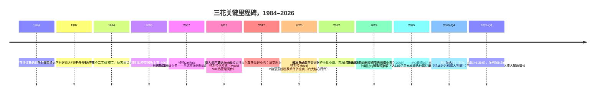
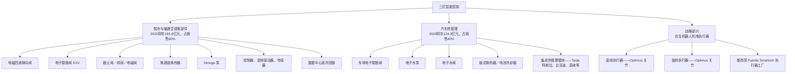
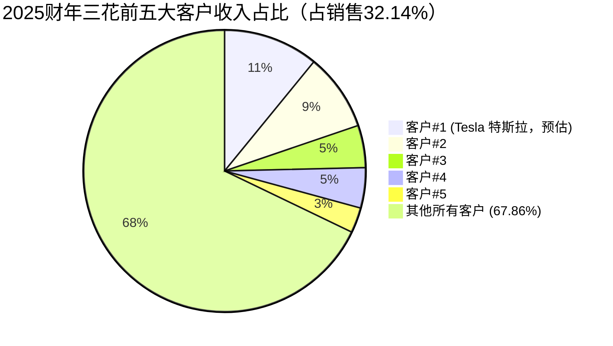
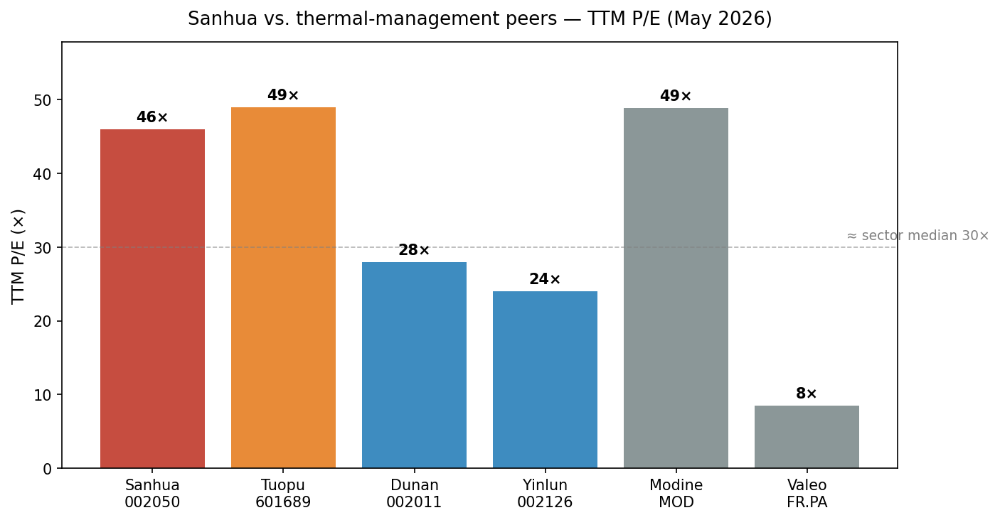

# 公司研究报告：浙江三花智能控制（三花智控）

**股票代码：** SZSE:002050（A股）· HKEX:2050（H股）
**日期：** 2026-05-16
**作者：** 股票研究部，内部

> **更新——2025财年业绩呈现超预期经营杠杆（2026-03-23）：** 三花2025财年实现营业收入311.01亿元（同比+10.97%），归属于股东的净利润40.6亿元（同比+31.10%），净利率扩张220个基点至13.1%。全年现金分红上调至每股0.28元（合计现金分红11.8亿元，占可分配利润100%），管理层2026年规划重申围绕"仿生机器人机电执行器"展开的战略新兴业务推进——这一第三增长曲线自2024年末以来推动公司股权重估。资料来源：[浙江三花智能控制股份有限公司 2025 年年度报告, 2026-03-23](http://www.cninfo.com.cn/new/disclosure/stock?stockCode=002050)。2026年第一季度营业收入77.7亿元（同比+1.36%），净利润9.28亿元（同比+2.68%），印证了市场密切关注的增速放缓——2026年人形机器人订单放量仍待落地。资料来源：[2026 年第一季度报告, 2026-04-29](http://www.cninfo.com.cn/new/disclosure/stock?stockCode=002050)。

---

## 目录

1. 公司概览
2. 公司历史
3. 管理团队
4. 产品与服务
5. 客户与市场策略
6. 行业概览
7. 竞争格局
8. 市场机会（TAM）
9. 风险评估

---

## 1. 公司概览

浙江三花智能控制股份有限公司（"三花"；SZSE:002050 / HKEX:2050）是全球最大的制冷与空调控制零部件制造商，也是汽车热管理子系统的全球顶级供应商。公司有八大产品类别——其中最突出的是电磁四通换向阀、电子膨胀阀（electronic expansion valves, 电子膨胀阀）、微通道换热器与Omega泵——位居全球市场份额第一（[In-Depth Value Analysis Report on Sanhua Intelligent Control (02050.HK), 2025](https://www.oreateai.com/blog/indepth-value-analysis-report-on-sanhua-intelligent-control-02050hk-ipo-in-hong-kong/aa9d662ce22fb371b3eacbf9df2d813b)）。公司总部位于浙江省新昌，在全球运营八大制造基地——除中国本部外，海外包括墨西哥、波兰、越南和泰国四地——以及位于美国和德国的三家海外研发中心（[2025 年年度报告, 第 12 页](http://www.cninfo.com.cn/new/disclosure/stock?stockCode=002050)）。

**业务模式。** 三花设计、制造并销售热管理零部件——阀件、换热器、泵、控制器、传感器及集成模块——主要面向两大核心终端市场和一个新兴市场：

- **制冷空调电器零部件（制冷空调电器零部件，2025财年收入185.8亿元，占销售额59.93%，同比+12.22%）**——销售给全球家电OEM（Carrier 开利、Daikin 大金、BSH 博西、格力、海尔、美的、LG、Mitsubishi 三菱、Panasonic 松下、Samsung 三星、Siemens 西门子、Trane 特灵），并日益拓展至数据中心液冷集成商（[2025 年年度报告, 第 13 页](http://www.cninfo.com.cn/new/disclosure/stock?stockCode=002050)）。
- **汽车热管理（汽车零部件，2025财年收入124.3亿元，占销售额40.07%，同比+9.14%）**——销售给电动车OEM（Tesla 特斯拉、比亚迪、吉利、蔚来、理想、小鹏、零跑）、传统车OEM（Mercedes 奔驰、BMW 宝马、Ford 福特、GM 通用、Honda 本田、Hyundai 现代、Stellantis、Toyota 丰田、VW 大众、Volvo 沃尔沃、上汽、广汽），以及汽车一级热管理集成商（Denso 电装、Hanon 翰昂、Mahle 马勒、Valeo 法雷奥）（[2025 年年度报告, 第 13 页](http://www.cninfo.com.cn/new/disclosure/stock?stockCode=002050)）。
- **战略新兴业务——仿生机器人机电执行器（仿生机器人机电执行器）**——用于人形机器人的直线和旋转执行器，量产基地定位于墨西哥工厂，市场上首笔以亿美元计的订单据传与Tesla 特斯拉的Optimus项目相关（[Sanhua Intelligent (002050.SZ) deep-dive, 2025](https://deepfundamental.substack.com/p/deep-dive-sanhua-intelligent-002050sz); [Tesla Optimus Production Rumors Fuel Speculation, Humanoids Daily, 2025-10](https://www.humanoidsdaily.com/news/tesla-optimus-production-rumors-fuel-supplier-stock-surge)）。

收入通过直销（直销，占2025财年销售额98.64%）和较小规模的经销渠道（经销，1.36%）实现（[2025 年年度报告, 第 14 页](http://www.cninfo.com.cn/new/disclosure/stock?stockCode=002050)）。在公司收入结构中，57.04%来自国内，42.96%来自海外，但海外业务毛利率为31.19%，高于国内的26.96%——423个基点的差距凸显了出口业务的结构性溢价。事实上，2025财年国内销售增长更快（同比+14.51%，海外同比+6.58%），得益于中央空调数据中心需求以及中国电动车OEM的韧性。

**规模指标。** 截至2025年末，三花员工总数19,090人，其中技术人员3,671人，硕士及以上学历1,344人（[2025 年年度报告, 第 43 页](http://www.cninfo.com.cn/new/disclosure/stock?stockCode=002050)）。公司全球持有专利4,680项，其中发明专利（发明专利）2,560项。2025财年研发投入披露约为14亿元（约占销售额4.5%），支持全球六大研发中心运作。2025财年经营性现金流达50.9亿元（同比+16.6%），远超净利润，体现优良的盈利质量。截至2025年末，总资产494.1亿元，H股IPO重塑资产负债表后净资产达317.5亿元（[2025 年年度报告, 第 7 页](http://www.cninfo.com.cn/new/disclosure/stock?stockCode=002050)）。

**估值快照（2026年5月16日）。** 三花A股于2026年5月8日收报51.69元，过去十二个月累计上涨约91%，较2024年初低点上涨约3.5倍（[股票行情快报：三花智控（002050）5月8日, 2026-05-08](https://www.sohu.com/a/1020020063_121319643)）。总股本42.08亿股（37.31亿A股 + 4.77亿H股）。按5月8日A股收盘价计算，A股市值约为1,930亿元；H股于2026年5月7日报收35.02港元（[Zhejiang Sanhua 2050.HK quote, 2026-05](https://www.investing.com/equities/zhejiang-sanhua-intelligent)）。集团总市值约2,150-2,200亿元（约300亿美元）。

| 指标 | 数值 | 备注 |
|---|---|---|
| TTM EPS（2025财年） | 1.03元 | 来源：[2025 年年度报告, 第 7 页](http://www.cninfo.com.cn/new/disclosure/stock?stockCode=002050) |
| TTM 净利润 | 40.6亿元 | 2025财年披露 |
| TTM 营业收入 | 310.1亿元 | 2025财年披露 |
| TTM 市盈率（A股，5月8日收盘） | **约46×**（扣非 PE-TTM 46.04，来源：[理杏仁](https://www.lixinger.com/equity/company/detail/sz/002050/2050)） | 卖方亦印证：[申万宏源](https://basic.10jqka.com.cn/002050/worth.html)对应2026E/27E/28E预测市盈率42×/39×/35× |
| TTM 市销率 | **约6.9×** | 2,150亿元 ÷ 310亿元 |
| 3年市盈率区间 | 16× – 55× | 低点2023年10月，高点2026年3月（[亿牛网 PE history](https://eniu.com/gu/sz002050)） |
| 3年市销率区间 | 2.2× – 8.4× | 同期 |

**同业比较。** 与最相近可比公司的TTM市盈率对比：

- **拓普集团（拓普集团 SH:601689）**——汽车热管理/NVH，同样是Tesla 特斯拉Optimus执行器供应商：约49× TTM（2026E前瞻37×）（[东方财富 拓普集团基本面](https://caifuhao.eastmoney.com/news/20260116135706712151120)）。
- **盾安环境（盾安环境 SZSE:002011）**——最相近的纯制冷阀件竞争对手：约28× TTM（[盾安环境历史 PE](https://m.zhiliaocaibao.com/gz_pe/002011_%E7%9B%BE%E5%AE%89%E7%8E%AF%E5%A2%83_9/)）。
- **银轮股份（银轮股份 SZSE:002126）**——汽车热管理：约24× TTM（[理杏仁 银轮股份](https://www.lixinger.com/equity/company/detail/sz/002126/2126/fundamental/valuation/pe-ttm)）。
- **Modine Manufacturing 摩丁制造（NYSE:MOD）**——美国热管理可比公司，同样因数据中心冷却而重估：约49× TTM，约26×前瞻（[MOD valuation, stockanalysis.com](https://stockanalysis.com/stocks/mod/statistics/)）。
- **Valeo 法雷奥（EPA:FR）**——欧洲一级热管理/汽车电气化供应商：约8.5× TTM（深度周期性重估）。[Valeo profile, Investing.com](https://www.investing.com/equities/valeo)。

热管理板块同业中位TTM市盈率约**30×**（剔除周期性受挫的Valeo 法雷奥）。三花交易价格约为**同业中位的1.5倍，约为其5年历史平均市盈率约20×的2.3倍**。溢价主要源于：（a）人形机器人执行器叙事——三花被广泛定位为Tesla 特斯拉Optimus最大的外部执行器供应商（[Elon Musk Places $685M Order with Sanhua, 36Kr, 2025-10](https://eu.36kr.com/en/p/3510288514980998); [Tesla Newswire on X, 2025-10-15](https://x.com/TeslaNewswire/status/1978321916487155868)），（b）数据中心液冷邻近性，以及（c）2025年6月H股上市拓宽了股东基础。**估值已被拉伸：约46× TTM市盈率隐含了一个尚未在损益表中体现的多年期人形机器人收入放量**——2026年第一季度收入同比仅增长1.36%。我们将其作为估值/倍数压缩风险纳入第9节。

*资料来源：[浙江三花智能控制股份有限公司 2022/2023/2024/2025 年年度报告](http://www.cninfo.com.cn/new/disclosure/stock?stockCode=002050)。*

---

## 2. 公司历史

三花的故事并非始于1984年，而是源自1967年浙东新昌"西郊人民公社农机修配综合厂"（新昌县西郊人民公社农机修配综合厂）的创立——这是一家县级集体所有制作坊。1982年，工厂转向制冷零部件领域，时年41岁的**张道才**被任命为副厂长，负责销售和经营。**1984年，张道才正式创立了后来发展为三花集团的实体**，押注于中国新兴的制冷行业需要一家阀件和铜配件的国产供应商，这些零件此前一直依赖进口（[张道才百度百科](https://baike.baidu.com/item/%E5%BC%A0%E9%81%93%E6%89%8D/1158260); [浙江新昌"一哥" — 大数跨境, 2025](https://www.10100.com/article/24309783)）。

技术突破始于：1980年代末，三花与**上海交通大学**合作，开发出中国首款国产二位三通电磁阀，并通过海尔冰箱厂测试与省级认证——打破了外资在关键制冷部件上的垄断定价（[Sanhua Group history page](https://www.sanhuagroup.com/history.html); [陈芝久老师与三花创业早期二三事](https://www.sanhuagroup.com/newslist_357.html)）。

**战略转折——三次"大胆下注"。**

1. **1994年——通过与日本不二工机合资走向国际化。** 三花与日本不二工机在上海共同创立"三花不二工机"，引进日本精密阀件技术。至21世纪初，三花成为最早实现对日本现役企业逆向工程并实现反超出货的中国零部件制造商之一——这条路径多数同业未能走完（[Sanhua Intelligent Controls: From a Small Factory in Zhejiang to a Giant — 36Kr, 2025](https://eu.36kr.com/en/p/3234007375625857)）。

2. **2007年——收购Danfoss 丹佛斯四通阀业务。** 这一交易使三花从多家亚洲挑战者之一一跃成为四通阀的全球领导者，市场份额约60%。四通阀位于每台可逆热泵和空调内部；是一种单价不高但工程要求高、认证密集的部件，成为三花此后15年的现金引擎（[Sanhua 4-way valve global share, Oreate AI, 2025](https://www.oreateai.com/blog/indepth-value-analysis-report-on-sanhua-intelligent-control-02050hk-ipo-in-hong-kong/aa9d662ce22fb371b3eacbf9df2d813b)）。

3. **2017年重大资产重组（重大资产重组）——汽车热管理业务注入。** 三花母公司将其汽车热管理业务（当时已进入服务于Tesla 特斯拉和欧洲OEM的成长阶段）注入上市主体，使三花从单一暖通空调零部件供应商转变为如今的双引擎平台。2025年年度报告明确将此视为上市主体主营业务转变为两大板块（制冷部件与汽车部件）的转折时刻（[2025 年年度报告, 第 7 页](http://www.cninfo.com.cn/new/disclosure/stock?stockCode=002050)）。

**近期进展（2024年–2026年第二季度）。**

- **2025年6月H股IPO。** 三花于2025年6月23日在港交所主板上市，发行价22.53港元/股。2025年7月18日绿鞋全部行使后，H股股数升至4.765亿股，募资总额约107.4亿港元——2025年港交所第三大IPO（[2025 年年度报告, 第 72 页](http://www.cninfo.com.cn/new/disclosure/stock?stockCode=002050); [天册律师事务所新闻稿, 2025](https://www.tclawfirm.com/content-1655.html); [港股周观察 — 财经客户端](https://www.mycaijing.com/article/detail/552282?source_id=40)）。
- **仿生机器人业务产业化。** 2025年上半年仿生机器人产品线从样品发展到小批量出货，最新年度披露表明三花"集中突破多个关键产品类型的技术迭代，伴随客户进行产品开发、试制、迭代与送样"（[2025 年年度报告, 第 14 页](http://www.cninfo.com.cn/new/disclosure/stock?stockCode=002050)）。
- **墨西哥工业园区。** 2025年资产负债表显示"墨西哥工业基地项目"截至年末累计承诺资本支出4,350万元，加上既有的墨西哥Fuerda子公司（FUERDA SMARTECH S DE RL DE CV），是合并报表层面汽车热管理与人形机器人执行器产出的近岸生产基地（[2025 年年度报告, 第 130/164 页](http://www.cninfo.com.cn/new/disclosure/stock?stockCode=002050)）。
- **股份回购（2024年–2026年2月）。** 三花投入约3亿元用于A股回购，完成715万股回购，均价约42元/股；2025年10月17日股份回购价格上限从35.75元上调至60.00元——明确传递管理层对IPO后估值并未拉伸的判断（[2025 年年度报告, 第 71-72 页](http://www.cninfo.com.cn/new/disclosure/stock?stockCode=002050)）。

---

## 3. 管理团队

### 张亚波——董事长兼首席执行官（250–350字小传）

张亚波，1974年生，自2012年12月起担任三花智能控制董事长兼首席执行官——目前已是其领导上市主体的第14个年头，是公司战略的核心"二代"架构师（[2025 年年度报告, 第 33 页](http://www.cninfo.com.cn/new/disclosure/stock?stockCode=002050)）。他是创始人张道才之子，由家族控股的三花控股集团（三花控股集团）及关联实体三花绿能（三花绿能）合计在2026年第一季度末持有上市公司38.33%股份（[2026 年第一季度报告](http://www.cninfo.com.cn/new/disclosure/stock?stockCode=002050)）。

张亚波的教育背景与公司技术传承高度契合：1996年获上海交通大学（SJTU）机械制造工程与制冷低温技术双学士学位——正是其父在1980年代末与之联合组建科研联盟的大学——随后取得中欧国际工商学院（CEIBS）EMBA学位。2001年8月加入三花，历任三花控股集团董事长、总经理、副总裁等职务，2009年10月当选执行董事（[2025 年年度报告, 第 33 页](http://www.cninfo.com.cn/new/disclosure/stock?stockCode=002050)）。

张亚波在CEO任期内的具体成就可量化且非凡。上市主体营业收入从2013年约50亿元复合增长至**2025财年的310.1亿元——12年复合增长率约18%**，净利润从约4亿元复合增长至40.6亿元（复合增长率约22%）。2017年重组将三花打造为双引擎平台、墨西哥/波兰/越南/泰国海外制造网络建设、2025年H股IPO以及2024年进入仿生机器人机电执行器领域，均在其领导下完成。他目前还兼任三花控股集团、新昌华信工业、杭州三花研究院董事长——后者是集团集中式研发平台。

公司治理方面，他同时担任董事长与CEO。2025年年度报告明确为这种双重身份辩护："保持经营管理与战略决策的一致性与延续性"（[2025 年年度报告, 第 34 页](http://www.cninfo.com.cn/new/disclosure/stock?stockCode=002050)）。其持股通过创始家族控股实体结构实现；未从上市主体直接领取现金薪酬。

### 俞蓥奎——首席财务官兼副总裁

俞蓥奎，1974年生，自2011年10月起担任三花智能控制CFO——已任职14.5年，跨越多个信贷周期、2017年重组、2018–2025年电动车热管理放量及2025年H股IPO。他持有上海财经大学会计学学位及杭州电子科技大学经济学学士学位，2007年11月加入公司。此前职务包括上市主体财务部门负责人，以及三花控股集团与浙江三花制冷集团的会计岗位（[2025 年年度报告, 第 33 页](http://www.cninfo.com.cn/new/disclosure/stock?stockCode=002050)）。

他同时担任浙江华腾工业及多家全资子公司的董事。其资本市场履历涵盖2018年首次股权激励计划、2020年第二期限制性股票计划、2022年第三期、2024年第四期、2024–2025年可转债赎回、2025年港交所上市以及正在推进的A股回购。港交所IPO文档周期尤其是一项扎实通过的重大考验。他未在三花集团以外担任过公众公司CFO，因此其履历基本仅限于三花——但是一段深入的履历。

### 王大勇——总裁兼执行董事

王大勇，1969年生，自2012年12月起担任上市主体总裁，1992年12月加入母公司三花控股集团。他历任规划、制造、制冷阀件事业部负责人及集团副总裁。他是张亚波董事长的运营搭档，负责日常运营。同时担任董事会执行董事（[2025 年年度报告, 第 33 页](http://www.cninfo.com.cn/new/disclosure/stock?stockCode=002050)）。

### 陈雨忠——首席技术官／总工程师

陈雨忠，1966年生，自2012年12月起担任上市主体总工程师，自2011年11月起任执行董事。持有硕士学位及正高级工程师职称（正高级工程师）。曾任上市主体前身三花不二工机总工程师，三花控股集团总工程师办公室主任，现兼任浙江三花制冷集团总经理。对于一家工程导向的热管理企业——尤其是依赖电机设计与精密加工技术的人形机器人执行器转型——陈雨忠是除张亚波之外最具论点关键性的高管。

### 治理附注

- **董事会构成。** 八名董事，包括三名独立非执行董事（包恩斯、施建辉、潘亚兰），以及2025年6月新增的一名独立NED（葛军），以满足港交所上市标准。独立董事比例为四／八（50%）。
- **内部人持股。** 前三大股东为三花控股集团（22.54%）、三花绿能（15.79%）以及香港中央结算（代理人）有限公司（11.32%——H股托管人）。内部人/创始家族合计持股因此约38.3%（[2026 年第一季度报告](http://www.cninfo.com.cn/new/disclosure/stock?stockCode=002050)）。
- **薪酬结构。** 三花已实施四轮股权激励计划（2018、2020、2022、2024），覆盖核心人才。现金薪酬通过年度市场薪酬调查对标。研发项目奖、质量奖、专利奖、采购降本奖以及精益改善奖是奖金池的明确组成部分（[2025 年年度报告, 第 43 页](http://www.cninfo.com.cn/new/disclosure/stock?stockCode=002050)）。
- **关联方交易。** 上市主体与母公司三花控股集团及兄弟实体（三花绿能、华信工业、华腾工业）存在大量关联交易。详见年度报告第五部分。

### 管理团队履历评估

该团队完成了罕见的三重成就：（1）十年以上的收入与盈利复合增长率维持在十几%水平，（2）逐次产品线扩张（暖通空调 → 电动车热管理 → 人形机器人执行器），每一次都获得全球前三的市场地位，（3）一次干净的H股IPO，在不稀释战略意图的前提下拓宽了股东基础。主要短板在于执行官层级的后备深度——大部分核心岗位由50多岁或更年长者担任，下一代副手尚未在披露中显现。创始家族控股目前是稳定优势，但中期存在传承问题。

---

## 4. 产品与服务

三花的产品组合按三大业务板块组织，与第1节中明确的三大收入来源完全对应。

### 板块一——制冷与暖通空调零部件（185.8亿元，占2025财年销售60%）

- **电磁四通换向阀（四通换向阀）。** 板块一的现金引擎。在2007年收购Danfoss 丹佛斯业务后，三花全球市场份额约55–60%——是公司单一市场份额最高的产品（[Oreate AI in-depth report, 2025](https://www.oreateai.com/blog/indepth-value-analysis-report-on-sanhua-intelligent-control-02050hk-ipo-in-hong-kong/aa9d662ce22fb371b3eacbf9df2d813b)）。**竞争优势：有／强。护城河：规模＋知识产权＋认证。** 该部件位于每台可逆热泵和空调内部；OEM认证周期长达18个月以上，使切换成本极高。最接近的同类竞品：盾安环境（盾安环境）的电磁四通阀——三花在规模上领先（盾安全球份额约20%），在与EXV产品线整合上亦占优势。
- **电子膨胀阀（electronic expansion valves, EXV / 电子膨胀阀）。** 全球市场份额约48%；EXV是热泵或冷水机组中精度最高的阀件，取代传统毛细管以实现节能温控（[Sanhua product page](https://www.sanhuagroup.com/en/cy.html)）。**竞争优势：有／强。护城河：技术＋知识产权。** 最接近的同类竞品：Saginomiya 鹭宫制作所（鷺宮製作所）的电子膨胀阀——三花在单位成本上领先，在技术上持平。
- **截止阀、球阀、电磁阀（截止阀、球阀、电磁阀）。** 暖通空调系统内的长尾产品族。竞争优势：部分——偏商品化。护城河：仅成本领先和规模。
- **微通道换热器（微通道换热器）。** 用于商用暖通空调，并日益用于电动车电池热管理。三花是全球三大领导者之一，与Modine 摩丁和Mahle 马勒齐名。**竞争优势：有／中等。护城河：资本密集＋技术。** 最接近竞品：Modine 摩丁的UltraCore——三花在技术参数上持平，在中国本地产能上领先，在欧洲OEM渗透上落后。
- **Omega 泵。** 专有高效泵架构，应用于热泵并新兴于数据中心液冷。**竞争优势：有／中等。护城河：设计知识产权。** 来自数据中心冷却的需求拐点已在2025年年度报告中明确提及（[2025 年年度报告, 第 14 页](http://www.cninfo.com.cn/new/disclosure/stock?stockCode=002050)）。
- **控制器、变频驱动器、压力传感器。** 阀件和泵周边的电子层。竞争优势：部分——护城河有限。
- **数据中心液冷子系统（新业务）。** 三花积极向超大规模数据中心和中国AI数据中心客户推介阀件＋泵＋换热器的组合方案，作为板块一的新增垂直业务。2025年年度报告明确将"推进数据中心垂直领域发展"和"跟踪全球数据中心及算力产业趋势"列为2025年优先事项（[2025 年年度报告, 第 14 页](http://www.cninfo.com.cn/new/disclosure/stock?stockCode=002050)）。

### 板块二——汽车热管理（124.3亿元，占2025财年销售40%）

- **车用电子膨胀阀（车用电子膨胀阀）。** 汽车热管理旗舰产品。三花的车用EXV全球市场份额约48%，是**Tesla 特斯拉Model Y热泵系统的独家阀件供应商（六大核心阀件）**（[Sanhua Intelligent (002050.SZ) deep-dive, 2025](https://deepfundamental.substack.com/p/deep-dive-sanhua-intelligent-002050sz)）。**竞争优势：有／强。护城河：技术＋客户锁定。** 最接近竞品：Hanon Systems 翰昂的EXV——三花在成本上领先，在功能上持平，在Tesla 特斯拉渗透上领先。
- **电子水泵（电子水泵）。** 用于电池和电机回路冷却。**竞争优势：有／中等。护城河：规模＋客户。** 最接近竞品：Pierburg / Rheinmetall 莱茵金属泵。
- **电子水阀（电子水阀）。** 电动车冷却架构中的管路层产品。竞争优势：有／中等。
- **板式换热器／电池冷却器（板式换热器 / 电池冷却器）。** 对电池热管理至关重要。**竞争优势：有／强。** 最接近竞品：Mahle 马勒的电池冷却器——三花在技术上持平，在中国OEM份额上领先。
- **集成热管理模块（集成组件 / 模块）。** 面向OEM的预组装模块级产品。重大动向是另一家主要的中国Tesla 特斯拉TMS模块供应商拓普集团**从三花采购阀件**——这意味着即使三花未直接销售完整模块，也在模块组装的下一层占据位置（[Sanhua–Tuopu thermal management supply, Oreate AI, 2025](https://www.oreateai.com/blog/indepth-value-analysis-report-on-sanhua-intelligent-control-02050hk-ipo-in-hong-kong/aa9d662ce22fb371b3eacbf9df2d813b)）。

2025财年产量数据（年度报告第14节）：新能源汽车热管理产品产量6,390万台（同比-8.7%），传统燃油车热管理产品产量1.939亿台（同比+7.6%）。新能源车的下滑反映中国OEM"内卷"周期的价格压力，而ICE的增长则反映了在平稳市场中的份额提升。三花管理层明确将2025年定性为"从跑马圈地到精耕细作"的转型（从跑马圈地到精耕细作）（[2025 年年度报告, 第 14 页](http://www.cninfo.com.cn/new/disclosure/stock?stockCode=002050)）。

### 板块三——仿生机器人机电执行器（早期阶段）

- **直线执行器（直线执行器）。** 驱动移动副关节（升降、滑动）；对人形机器人的腿部和手臂至关重要。三花被市场定位为Tesla 特斯拉Optimus最大的外部直线执行器组件供应商，2025年10月传闻6.85亿美元订单（约18万台机器人）在业内广泛流传（[Tesla Newswire on X, 2025-10-15](https://x.com/TeslaNewswire/status/1978321916487155868); [Elon Musk Places $685M Order with Sanhua, 36Kr EU, 2025-10](https://eu.36kr.com/en/p/3510288514980998); [Tesla Optimus Production Rumors, Humanoids Daily, 2025-10](https://www.humanoidsdaily.com/news/tesla-optimus-production-rumors-fuel-supplier-stock-surge)）。**三花公开澄清6.85亿美元的具体传闻"不属实"，** 但公司自身2025年上半年披露显示，机器人相关收入同比增长约320%（基数较小）——表明底层放量是真实的，即使具体金额并非合同实际金额。
- **旋转执行器（旋转执行器）。** 驱动旋转副关节（肩部、肘部、髋部）；通常与谐波减速器（应变波齿轮）配合使用。三花负责电机＋齿轮箱＋传感器＋控制电子的一体化组件设计与制造。
- **墨西哥 Fuerda Smartech 执行器工厂。** 2025年资本支出明细中的"墨西哥工业基地项目"加上现有的FUERDA SMARTECH S DE RL DE CV子公司，被定位为2026年起Optimus等量执行器产出的近岸量产基地（[2025 年年度报告, 第 130/164 页](http://www.cninfo.com.cn/new/disclosure/stock?stockCode=002050)）。

**仿生机器人业务的竞争优势目前为部分**：三花的电机设计与精密加工技术底盘具有可迁移性，加上作为一家拥有逾19,000名员工、墨西哥工厂运转正常的中国制造商所享有的成本与规模优势是实实在在的。**护城河类型是工艺／规模＋客户锁定（如果Tesla 特斯拉将三花认证为关键执行器SKU的独家供应商）**，但在Optimus项目实际实现Musk预测的产量之前，这仍未得到验证。最接近的同类竞品：拓普集团的直线/旋转执行器（同样是Tesla 特斯拉Optimus供应商——36Kr报道称拓普处于"Tier 0.5"级别，其墨西哥工厂目标产能2026年第二季度30万套），Leaderdrive 绿的谐波的谐波减速器，以及Estun 埃斯顿的关节模组。

### 旗舰与长尾

三大旗舰产品贡献集团约60%的利润：（1）电磁四通阀，（2）车用电子膨胀阀，以及（3）仿生机器人直线执行器（如今收入不大，但是股权故事中的核心估值驱动力）。传统的截止阀、球阀和小型Omega泵构成长尾。

### 过去12个月的发布与重新定位

- **仿生机器人机电执行器产品族**在2025年从样品发展到小批量出货，2025年年度披露描述为"集中突破多个关键产品类型的技术迭代"以及"扩大机电执行器的海外生产"（[2025 年年度报告, 第 27 页](http://www.cninfo.com.cn/new/disclosure/stock?stockCode=002050)）。
- **数据中心液冷垂直**于2025年在板块一中重新定位。
- **2025年无重大产品退役**；偏商品化的长尾遗留SKU继续维持运营状态。

---

## 5. 客户与市场策略

*资料来源：[2025 年年度报告, 第 18 页 — 前五名客户](http://www.cninfo.com.cn/new/disclosure/stock?stockCode=002050)。*

### 客户分群

三花面向四类客户销售：（1）全球家电OEM（Carrier 开利、Daikin 大金、BSH 博西、格力、海尔、LG、美的、Mitsubishi 三菱、Panasonic 松下、Samsung 三星、Siemens 西门子、Trane 特灵）——传统制冷／暖通空调客户基础；（2）电动车OEM（Tesla 特斯拉、比亚迪、吉利、蔚来、理想、小鹏、零跑、上汽、广汽）；（3）传统车OEM（Mercedes 奔驰、BMW 宝马、Ford 福特、GM 通用、Honda 本田、Hyundai 现代、Stellantis、Toyota 丰田、VW 大众、Volvo 沃尔沃）；（4）汽车一级热管理集成商（Denso 电装、Hanon 翰昂、Mahle 马勒、Valeo 法雷奥）——三花向其集成模块销售阀件（[2025 年年度报告, 第 13 页](http://www.cninfo.com.cn/new/disclosure/stock?stockCode=002050)）。一级供应商层级是关键细节：即使三花未直接拿下OEM合同，仍常能在下一层级获得相同的销售。

### 客户集中度——量化

2025年年度报告第"前五名客户"节披露（[2025 年年度报告, 第 17-18 页](http://www.cninfo.com.cn/new/disclosure/stock?stockCode=002050)）：

| 排名 | 客户 | 2025财年销售（元） | 占总营收% |
|---|---|---|---|
| 1 | 第一（匿名） | 33.81亿元 | **10.90%** |
| 2 | 第二 | 27.52亿元 | 8.87% |
| 3 | 第三 | 15.05亿元 | 4.85% |
| 4 | 第四 | 14.34亿元 | 4.62% |
| 5 | 第五 | 8.99亿元 | 2.90% |
| | **前五大合计** | **99.72亿元** | **32.14%** |

前五大客户中关联方销售占比＝0.00%。第一大客户未在披露中署名，但**市场共识认为是Tesla 特斯拉**——多份研究报告将三花描述为Tesla 特斯拉Model Y热泵系统的独家阀件供应商，业内媒体亦将三花指认为Tesla 特斯拉Optimus直线/旋转执行器的"最重要的单一供应商"（[Sanhua–Tesla deep-dive, deepfundamental.substack, 2025](https://deepfundamental.substack.com/p/deep-dive-sanhua-intelligent-002050sz); [Tesla Optimus Supply Chain, OptimusK blog, 2025](https://optimusk.blog/blog/tesla-optimus-suppliers/)）。

来自披露的相关表述为：*"前五名客户合计销售金额占年度销售总额比例：32.14%；前五名客户销售额中关联方销售额占年度销售总额比例：0.00%"*（前五名客户合计销售占年度总营收32.14%；其中关联方销售占比0.00%）（[2025 年年度报告, 第 17 页](http://www.cninfo.com.cn/new/disclosure/stock?stockCode=002050)）。

**3年集中度趋势：** 2023年年度报告披露前五大约27%，2022年年度报告约26%。三花的客户集中度因此**呈上升趋势**——主要由Tesla 特斯拉作为三花第一大客户、通过Model Y热泵独家地位增长所驱动，以及中国电动车OEM合同放量。第一大客户10.90%恰好处于SEC/IFRS重大客户披露门槛，**重大但尚未至关键（第一< 20%，前五< 50%）**。我们在第9节将其作为有意义——但非关键——的风险予以纳入。

**合同结构。** 三花未公开披露合同条款，但业内媒体和卖方研报一致描述为：（a）通过初始认证后与主要OEM签订主质量协议（12–24个月周期），随后（b）按车型按年或按项目生命周期签订PO承诺，（c）价格年度复议，包含汽车供应链典型的1–3%生产力让利。多年期主合同是常态，逐单采购是例外（[Sanhua deep-dive, 2025](https://deepfundamental.substack.com/p/deep-dive-sanhua-intelligent-002050sz)）。

**顶级客户的垂直整合风险。** 对Tesla 特斯拉而言这是一个相关问题：Tesla 特斯拉是否打算将热管理阀件或人形机器人执行器收归自产？在汽车热管理方面，Tesla 特斯拉历史上在阀件层级采用三花，在模块层级采用Mahle 马勒/拓普——目前无公开证据表明阀件将被收归自产。在人形机器人执行器方面，Tesla 特斯拉尚未公开说明执行器将以自产还是合作伙伴方式规模化采购，36Kr / Humanoids Daily的报道将中国供应链（三花、拓普、Leaderdrive 绿的、Inovance 汇川等）描述为V3及之后量产阻力最小的路径（[Elon Musk's Plan to Build One Million Robots, 36Kr EU, 2025-11](https://eu.36kr.com/en/p/3780414717129481); [One Million Robots Per Year, Next Financial, 2025-11](https://nextfinancial.substack.com/p/one-million-robots-per-year-the-38)）。

### 分销渠道与市场策略

- **直销（直销）占2025财年98.64%。** OEM对OEM模式——三花销售工程师在平台设计阶段嵌入OEM热管理团队，认证SKU，然后按PO出货。这是标准的汽车二级供应商模式。
- **经销（经销）占2025财年1.36%。** 小规模的售后和替换件渠道。

**地理结构：** 57.04%国内 / 42.96%海外。海外毛利率（31.19%）＞国内（26.96%）（[2025 年年度报告, 第 16 页](http://www.cninfo.com.cn/new/disclosure/stock?stockCode=002050)）。

**销售周期：** 从首次送样到批量生产为12–24个月，新平台发布更长。仿生机器人业务目前在与Tesla 特斯拉的合作中处于该周期的第6–24个月，对应2024年的商业进入。

### 已具名的客户中标／案例

- **Tesla 特斯拉Model Y热泵**——三花是六大核心阀件的独家供应商；这是被引用最多的公开锚点。
- **Tesla 特斯拉Optimus执行器**——2025年上半年机器人业务收入同比+320%，即使具体6.85亿美元采购订单传闻被官方否认，依然印证了产品结构的转变。
- **比亚迪、吉利、蔚来、理想、小鹏、零跑**——完整的电动车热管理供应商名单。
- **Carrier 开利、Daikin 大金、格力、美的、海尔**——旗舰暖通空调阀件客户，十年以上合作关系。

---

## 6. 行业概览

三花参与三个行业：（1）暖通空调与制冷零部件，（2）汽车热管理（尤其是电动车），（3）人形机器人机电执行器。三者日益融合：底层技术——精密加工的阀件、电机、泵和换热器——是一致的，同一研发与制造平台服务于所有三个行业。

### 行业一——暖通空调与制冷零部件

**范围与结构。** 全球而言，住宅空调、商用暖通空调、商用制冷、工业制冷、热泵和小家电制冷代表着约2,000亿美元的终端设备市场。三花所销售的零部件层级——阀件、换热器、控制器、泵——约占设备BOM价值的10–15%，意味着**全球零部件TAM约为200–300亿美元**（[Oreate AI in-depth report, 2025](https://www.oreateai.com/blog/indepth-value-analysis-report-on-sanhua-intelligent-control-02050hk-ipo-in-hong-kong/aa9d662ce22fb371b3eacbf9df2d813b)）。

**近期动态（2025年）。** 根据年度报告中引用的产业在线（产业在线）数据，2025年中国中央空调收入1,386.8亿元，内销同比下滑7.4%（房地产／建筑疲软），但出口同比增长12.7%（全球数据中心冷却需求以及中国主要厂商激进的海外扩张）（[2025 年年度报告, 第 12 页](http://www.cninfo.com.cn/new/disclosure/stock?stockCode=002050)）。"内冷外热"的结构性格局（内冷外热）特征贯穿2025年并可能延续至2026年——三花因约43%的海外收入占比及墨西哥/波兰/越南制造基地，占据有利位置。

**增长驱动。** （a）欧洲和北美的热泵电气化替代燃油和燃气供暖；（b）数据中心液冷需求（使用许多相同零部件——Omega泵、板式换热器、电子膨胀阀），作为一个子垂直以35–50%的年增长率增长（[next financial, 2025-11](https://nextfinancial.substack.com/p/one-million-robots-per-year-the-38)）；（c）欧洲含氟气体制冷剂转换（R-410A → R-32 / R-454B）要求阀件重新认证——有利于现役供应商。

**结构。** 零部件层级高度集中：三花、盾安环境、Saginomiya 鹭宫、Danfoss 丹佛斯和Fujikoki 不二工机合计控制全球四通阀和EXV超过70%份额。OEM热管理设计的切换成本极高（12–24个月认证周期）。买方议价能力中等——最大的客户（Daikin 大金、Carrier 开利、海尔、美的、格力、LG）可施压定价，但在不重新认证系统的情况下，难以在认证阀件上轻易双源采购。

### 行业二——汽车热管理（尤其是电动车）

**范围。** 汽车热管理已从ICE车型的"发动机冷却＋驾驶舱HVAC"（BOM约250美元/车）扩展到电动车的"电池＋电机＋电子＋驾驶舱热管理"（BOM约900–1,200美元/车）。TAM因此增长约4倍。

**增长。** 根据MarkLines和中国乘用车协会（乘联会）2025年年度报告引用的数据，2025年全球新能源汽车销量达2,262万辆（同比+29.04%），占全球新车销量的23.6%。中国单独贡献1,649万辆NEV销量（同比+28.2%），占全球NEV市场的72.9%，国内全部新车销量的47.9%（[2025 年年度报告, 第 12 页](http://www.cninfo.com.cn/new/disclosure/stock?stockCode=002050)）。电动车渗透率因此在中国接近饱和，并在东南亚、南美和欧洲处于加速中段。

**逆风。** （a）美国"大美丽法案"终止联邦电动车税收抵免，减缓美国采用；（b）欧盟于2025年修订内燃机禁令实施细则，形成更长共存期；（c）中国OEM价格战（"内卷"）压缩零部件利润率。2025年年度报告明确将这些列为逆风，三花通过"精耕细作"作出回应——聚焦项目利润而非份额扩张。

**结构。** 汽车热管理正在整合。模块层级的主导集成商是Denso 电装、Hanon 翰昂、Mahle 马勒和Valeo 法雷奥；三花、拓普、银轮、Modine 摩丁、Pierburg 和Schaeffler 舍弗勒位于零部件／子模块层。三花独具一种优势——既直接销售给OEM，又向竞争对手的一级模块销售。

### 行业三——人形机器人机电执行器

**范围。** 一台像Tesla 特斯拉Optimus或Figure 02这样的人形机器人约有40个自由度和约28–40个执行器（直线和旋转的组合）。每个执行器是一个电机＋齿轮＋传感器＋控制器组件，BOM在800–2,500美元之间，取决于类型。每台机器人的执行器内容总和因此为约3万–6万美元。

**市场规模。** 高盛、Macquarie 麦格理和Citi 花旗均预测人形机器人年产量到2030年将达25万–100万台，按Musk所述年产100万台目标的乐观情景将在4–5年内达成（[Tesla Reportedly Places Large Humanoid Parts Order, ZeroHedge, 2025-10](https://www.zerohedge.com/technology/tesla-reportedly-places-large-humanoid-parts-order-goldman-outlines-profit-implications)）。在100万台×约4万美元执行器内容的假设下，**全面放量时执行器TAM为400亿美元**。

**三花的位置。** 三花瞄准关节组件层级的直线执行器和旋转执行器——而非灵巧手层（中国中小厂如兆威机电、MovingMagnet 美格纳、Estun 埃斯顿占优势），也非谐波减速器层（Leaderdrive 绿的的领地）。在直线执行器领域，多份卖方研报将三花和拓普定位为Optimus的两大领先外部供应商，业内媒体明确描述三花已在精度和耐用性方面达到"国际领先水平"，其液冷设计可将关节温升控制在10°C以下（[Tesla Optimus Production Rumors, Humanoids Daily, 2025-10](https://www.humanoidsdaily.com/news/tesla-optimus-production-rumors-fuel-supplier-stock-surge)）。

**增长驱动。** Musk声明的2030年前后年产百万台目标；Figure AI、Agility Robotics、Apptronik、Sanctuary、1X均在快速扩张美国项目；优必选、小米、比亚迪、小鹏、宇树、傅利叶、智元机器人均在扩张中国项目。供应链正在中国-墨西哥有意识地本地化以降低成本——这恰好是三花的布局。

**监管环境。** 基本是空白地带。中国和美/欧针对工业和消费场景人形机器人的工作场所安全与产品责任框架仍在起草中。

---

## 7. 竞争格局

三花的竞争集涵盖三个行业；我们分析10家署名竞争对手——暖通空调零部件4家，汽车热管理4家，人形机器人执行器新兴2家。

### 暖通空调／制冷零部件

1. **盾安环境（盾安环境 SZSE:002011）**——中国最相近的纯粹同业。持有全球四通阀份额约20%。缺乏三花的汽车热管理敞口。交易在约28× TTM市盈率（[盾安环境历史 PE](https://m.zhiliaocaibao.com/gz_pe/002011_%E7%9B%BE%E5%AE%89%E7%8E%AF%E5%A2%83_9/)）。**差异化：规模与全球客户广度——三花领先。**
2. **Saginomiya Seisakusho 鹭宫制作所（鷺宮製作所，TSE:7305）**——日本精密阀件老兵。在EXV与制冷控制方面强势；在汽车与人形机器人方面较弱。**三花在成本和规模上领先，在技术上持平。**
3. **Danfoss 丹佛斯（私有，丹麦）**——全球商用制冷巨头。2007年将四通阀业务出售给三花，目前主要在商用制冷子系统中竞争。**三花在大众市场阀件规模上领先；丹佛斯在商用集成系统上领先。**
4. **Fujikoki 不二工机（私有，日本）**——三花前合资伙伴；在EXV和制冷阀件领域仍是同业。**持平，三花在全球多元化上更胜一筹。**

### 汽车热管理

5. **拓普集团（拓普集团 SH:601689）**——中国汽车一级供应商，向Tesla 特斯拉供应TMS模块（约30%份额），同时是领先的Tesla 特斯拉Optimus执行器供应商。拓普交易在约49× TTM市盈率（[东方财富 拓普集团, 2026](https://caifuhao.eastmoney.com/news/20260116135706712151120)）。**拓普将三花阀件集成进其TMS模块——他们同时是客户与竞争对手。**
6. **Hanon Systems 翰昂（原名Halla Visteon 哈拉伟世通，韩国）**——全球汽车热管理一级供应商第二。**在模块组装上强势；三花在与Tesla 特斯拉和中国OEM的零部件层级份额上领先。**
7. **Denso 电装（TSE:6902）**——日本一级供应商，旗下热管理业务部。**与丰田绑定度高；三花在中国OEM和Tesla 特斯拉渗透上领先。**
8. **Mahle 马勒（私有，德国）**——德国汽车一级供应商。**在板式换热器和电池冷却器上强势；三花在零部件层级持平，在欧洲OEM份额上落后。**
9. **Modine Manufacturing 摩丁制造（NYSE:MOD）**——美国热管理同业，近期因数据中心冷却而重估；约49× TTM市盈率（[MOD valuation, stockanalysis.com](https://stockanalysis.com/stocks/mod/statistics/)）。**三花在规模和新兴市场布局上领先；摩丁在北美HVAC和数据中心渠道上领先。**
10. **Valeo 法雷奥（EPA:FR）**——欧洲一级供应商，热管理敞口，周期性下行至约8.5× TTM市盈率。**Valeo 法雷奥在传统欧洲OEM上领先；三花在电动车和人形机器人上领先。**

### 人形机器人执行器新兴入局者

- **Inovance 汇川（SZSE:300124）**、**Estun 埃斯顿（SZSE:002747）**、**Leaderdrive 绿的（SH:688017）**——中国运动控制专家；部分重叠。
- **MovingMagnet 美格纳（私有，法国）**、**Maxon Motor 麦克森（私有，瑞士）**——高精度电机现役厂商。

*资料来源：[理杏仁 Sanhua](https://www.lixinger.com/equity/company/detail/sz/002050/2050); [东方财富 拓普集团](https://caifuhao.eastmoney.com/news/20260116135706712151120); [盾安环境 PE](https://m.zhiliaocaibao.com/gz_pe/002011_%E7%9B%BE%E5%AE%89%E7%8E%AF%E5%A2%83_9/); [理杏仁 银轮股份](https://www.lixinger.com/equity/company/detail/sz/002126/2126/fundamental/valuation/pe-ttm); [Modine, stockanalysis.com](https://stockanalysis.com/stocks/mod/statistics/); [Valeo, Investing.com](https://www.investing.com/equities/valeo)。*

### 三花的竞争优势

1. **跨行业技术平台。** 相同的阀件／电机／泵／换热器技术服务于HVAC、电动车热管理和人形机器人执行器——名单中无一家署名竞争对手具备这种三重覆盖。
2. **四通阀和车用EXV的规模领先。** 二者均为全球第一，份额分别约55–60%和约48%，同时向终端OEM和竞争对手一级供应商供货。
3. **全球制造布局已就绪。** 墨西哥、波兰、越南、泰国——包括墨西哥Fuerda Smartech工厂，独特定位三花进入USMCA/Tesla 特斯拉美-墨执行器供应链。
4. **创始家族控股，内部人持股38%。** 决策视野是数十年，而非季度对季度。
5. **H股上市。** 2025年6月拓宽了机构股东基础，为公司提供了双币种融资选项。

### 三花的竞争弱点

1. **客户集中度上升。** 2025财年第一大客户10.90%（vs. 2024财年约9%）。失去第一大客户（预设为Tesla 特斯拉）将导致收入减少8–11%。
2. **大宗商品敞口。** 铜和铝占制冷阀件和换热器的COGS的35–45%。套保可缓解但不能消除利润率压缩风险。
3. **人形机器人项目执行风险。** 估值溢价建立在尚未大规模实现的人形机器人收入轨迹之上。
4. **2026年第一季度减速。** 2026年第一季度收入同比+1.36%——三年内最慢的单季增速——引发对2026年下半年人形机器人放量是否能按假设时间表到来的质疑。

---

## 8. 市场机会／TAM

**三花面向三个TAM池，目前合计340亿美元，预计到2032E增长至约1,200亿美元。**

*资料来源：HVAC/制冷零部件TAM从[Oreate AI report, 2025](https://www.oreateai.com/blog/indepth-value-analysis-report-on-sanhua-intelligent-control-02050hk-ipo-in-hong-kong/aa9d662ce22fb371b3eacbf9df2d813b)以及[2025 年年度报告, 第 12 页](http://www.cninfo.com.cn/new/disclosure/stock?stockCode=002050)中的全球中央空调市场规模推导；电动车热管理TAM由MarkLines与乘联会2025年NEV数据（载于[2025 年年度报告, 第 12 页](http://www.cninfo.com.cn/new/disclosure/stock?stockCode=002050)）外推；人形机器人执行器TAM参考[Goldman / Citi humanoid forecasts, ZeroHedge, 2025-10](https://www.zerohedge.com/technology/tesla-reportedly-places-large-humanoid-parts-order-goldman-outlines-profit-implications)与[One Million Robots Per Year, Next Financial, 2025-11](https://nextfinancial.substack.com/p/one-million-robots-per-year-the-38)。*

### TAM 1——暖通空调与制冷零部件（2024年180亿美元 → 2032E 330亿美元）

全球零部件层（阀件、换热器、泵、控制器）是一个增速中等个位数的稳定池，驱动因素包括：（a）欧洲／北美热泵电气化，（b）数据中心液冷以35–50% CAGR增长，（c）有利于现役厂商的制冷剂转换。**三花可服务市场**：三花在四个零部件类别中三类位居全球第一。当前来自该板块的收入为185.8亿元（约26亿美元），意味着全球市场份额约14%。未来5年实际份额提升幅度：200–300个基点，主要来自数据中心垂直中标。

### TAM 2——电动车热管理（2024年160亿美元 → 2032E 500亿美元）

全球NEV渗透率2025年为23.6%，预测到2032年达到50%以上。每车热管理BOM从ICE到EV提升约4倍。双轴增长（渗透率×BOM提升）推动TAM轨迹。**三花可服务市场**：三花汽车热管理份额全球约15–20%，2025财年板块收入124.3亿元（约17亿美元）。Tesla 特斯拉、比亚迪、BMW 宝马、Mercedes 奔驰、Stellantis的实际项目管线支持2030年前板块收入CAGR 12–15%。

### TAM 3——人形机器人机电执行器（2024年3亿美元 → 2032E 380亿美元）

最具不对称上行潜力。**三花可服务市场**：在直线执行器＋旋转执行器层级，Tesla 特斯拉Optimus（单一项目规模远超其他）最大的两家外部供应商是三花和拓普。如果三花在2030年Tesla 特斯拉100万台机器人年度执行器采购中夺得即使25%的份额（＝25万台机器人×约3万美元/台执行器内容，保守假设旋转＋直线分摊后约为6万美元一半），那就是**单一客户项目年度收入约75亿美元**——超过今天集团整体收入。

**渗透策略。** 三花正利用：（a）来自汽车热管理的既有Tesla 特斯拉关系作为敲门砖；（b）墨西哥Fuerda Smartech工厂用于USMCA友好的近岸生产；（c）约14亿元的年度研发预算用于执行器产品迭代。2025年年度报告明确承诺"积极扩大机电执行器的海外生产，持续扩充研发人员队伍，巩固在仿生机器人机电执行器新兴市场上的先发优势"（[2025 年年度报告, 第 27 页](http://www.cninfo.com.cn/new/disclosure/stock?stockCode=002050)）。

### 三花的可服务市场与份额机会

当前集团收入310亿元（约43亿美元），对应合计TAM约340亿美元，意味着综合市场份额约12.6%。到2032E，若三花保持综合份额约14%，对应TAM约1,200亿美元，集团收入轨迹将为约170亿美元（1,200亿元）——意味着收入CAGR约16%。如果Tesla 特斯拉放量是真实的，人形机器人执行器池将驱动约半数增长。

---

## 9. 风险评估

### 公司层面风险

1. **人形机器人项目执行风险（高）。** 当前估值溢价（市盈率约46×，约同业中位2倍）隐含了一个尚未在损益表中实质性体现的多年期人形机器人执行器放量。2025年上半年机器人收入同比+320%但基数极小。2026年第一季度集团收入增长仅1.36%——三年内最慢。若Tesla 特斯拉Optimus量产显著推迟至2027年之后，或三花在拓普、Inovance 汇川或Tesla 特斯拉内化执行器面前失份额，估值倍数将压缩至同业中位约30×。缓解：三花现有Tesla 特斯拉汽车热管理关系降低了认证风险；创始家族控股支持长期视角。*影响：20–35%下行空间。*

2. **客户集中度——Tesla 特斯拉（中-高）。** 第一大客户占2025财年收入10.90%（vs. 2024财年8–9%和2023财年约6%——明确的上升趋势），前五大合计32.14%（[2025 年年度报告, 第 17-18 页](http://www.cninfo.com.cn/new/disclosure/stock?stockCode=002050)）。第一大客户被广泛假设为Tesla 特斯拉但未在披露中署名。若失去Tesla 特斯拉Model Y热泵独家地位，或Tesla 特斯拉将热管理阀件或人形机器人执行器垂直整合，将直接抹去约11%的收入并可能带走更大比例的利润。缓解：三花也通过拓普向Tesla 特斯拉供货（拓普从三花采购TMS模块阀件），形成层级化关系。

3. **关键人物依赖——张氏家族（中）。** 创始人张道才已80多岁。CEO 张亚波52岁。家族合计控股38%（三花控股＋三花绿能）意味着张氏家族的传承事件对治理具有重大影响。缓解：亚波已任CEO 14年，掌控稳固；他已成功执行三次重大战略转型（汽车热管理注入、电动车放量、人形机器人转型）。

4. **地理集中度——墨西哥（中）。** 三花的近岸战略将USMCA友好制造集中在墨西哥Fuerda Smartech。任何美国关税或墨西哥特定的贸易行动（如2026年USMCA评审），或劳动力/地方监管问题，将同时打击汽车热管理与人形机器人执行器产出。缓解：波兰、越南、泰国及中国本部的替代产线；公司有跨司法管辖区关税争议的应对经验。

5. **铜／铝的供应商集中度（中）。** 铜和铝是主要原材料输入。2025年年度报告将"原材料价格波动风险"列为展望部分的第一风险（[2025 年年度报告, 第 28 页](http://www.cninfo.com.cn/new/disclosure/stock?stockCode=002050)）。缓解：与客户的联动定价机制、大宗商品期货套保。

### 行业／市场风险

6. **人形机器人执行器的竞争强度（高）。** 拓普（Tier-0.5 Tesla 特斯拉供应商，拥有自有墨西哥工厂，目标2026年第二季度30万套/季产能）、Inovance 汇川、Estun 埃斯顿、Leaderdrive 绿的、MovingMagnet 美格纳和Maxon 麦克森均在邻近或重叠层级竞争（[Tesla Optimus Supply Chain, OptimusK, 2025](https://optimusk.blog/blog/tesla-optimus-suppliers/)）。Tesla 特斯拉有充分动机保留多个合格供应商。

7. **电动车价格压力／"内卷"内卷（中）。** 中国NEV市场价格战在2024–2025年压缩了汽车热管理利润率，2025财年业绩显示NEV单位产量同比下滑8.7%尽管收入仍在增长——三花吃下了ASP折让。2025年年度报告明确将汽车热管理战略定义为"精耕细作"而非份额扩张。

8. **监管／贸易政策（中）。** 美国"大美丽法案"终止联邦电动车税收抵免；欧盟修订内燃机禁令实施；美中零部件关税仍处于高位。"贸易与汇率风险"项在三花展望部分列为第三大风险（[2025 年年度报告, 第 28 页](http://www.cninfo.com.cn/new/disclosure/stock?stockCode=002050)）。

9. **热泵架构的技术颠覆（低-中）。** 固态制冷、磁制冷和CO2制冷均处于研究阶段；10年以上时间尺度上的阶跃变化可能使EXV/四通阀部分产品线过时。缓解：三花研发平台正积极开发用于汽车的CO2热管理系统。

### 财务风险

10. **估值／倍数压缩风险（高）。** TTM市盈率约46×，约为5年均值约20×的2.3倍，约为同业中位约30×的1.5倍。中国A股人形机器人主题股的均值回归路径有先例：Optimus量产时间表推迟、2026年下半年人形机器人收入披露不及预期，或板块整体轮动出"人形机器人主题"，都将触发25–40%的倍数压缩。卖方已开始将前瞻2026E市盈率标记为37–42×（[申万宏源 via 同花顺](https://basic.10jqka.com.cn/002050/worth.html)）——这是对入场倍数偏高的默认确认。

11. **汇率敞口（低-中）。** 三花以人民币报告，以美元、欧元、港元、日元、波兰兹罗提、墨西哥比索和越南盾计入收入。2026年第一季度产生1.5亿元的汇兑损失（2025年第一季度为1,900万元汇兑收益——单季摆动1.69亿元）（[2026 年第一季度报告](http://www.cninfo.com.cn/new/disclosure/stock?stockCode=002050)）。缓解：远期外汇套保项目。

### 宏观经济风险

12. **经济敏感性——可选HVAC与电动车需求（中）。** 两个终端市场均偏周期性。2026–27年美/欧衰退将收紧电动车定价并延缓热泵替换周期。缓解：三花的数据中心冷却敞口为反周期性。

13. **地缘政治——美中贸易脱钩（中）。** 美中科技贸易措施的任何急剧升级都可能特别针对Tesla 特斯拉Optimus供应链中的中国供应商。缓解：墨西哥近岸制造在一定程度上为美国出口路径降低风险。

---

## 参考资料

### 主要披露文件（三花，巨潮）

- [浙江三花智能控制股份有限公司 2025 年年度报告, 2026-03-23](http://www.cninfo.com.cn/new/disclosure/stock?stockCode=002050)
- [浙江三花智能控制股份有限公司 2026 年第一季度报告, 2026-04-29](http://www.cninfo.com.cn/new/disclosure/stock?stockCode=002050)
- [浙江三花智能控制股份有限公司 2025 年半年度报告, 2025-08-28](http://www.cninfo.com.cn/new/disclosure/stock?stockCode=002050)
- [浙江三花智能控制股份有限公司 2024 年年度报告, 2025-03-26](http://www.cninfo.com.cn/new/disclosure/stock?stockCode=002050)
- [浙江三花智能控制股份有限公司 2022 年年度报告, 2023-04-28](http://www.cninfo.com.cn/new/disclosure/stock?stockCode=002050)

### 公司网站

- [Sanhua Group corporate site](https://www.sanhuagroup.com/)
- [Sanhua Group history page](https://www.sanhuagroup.com/history.html)
- [陈芝久老师与三花创业早期二三事 — Sanhua newsroom](https://www.sanhuagroup.com/newslist_357.html)
- [Sanhua product page (refrigeration & HVAC)](https://www.sanhuagroup.com/en/cy.html)
- [Sanhua Automotive corporate site](https://www.sanhuaautomotive.com/en)
- [Sanhua Automotive — Electric Expansion Valve product page](https://sanhuaautomotive.com/en/product/detail/22)
- [Sanhua Group — Automotive thermal management and control components](https://www.sanhuagroup.com/en/cy2.html)

### 市场数据／估值

- [理杏仁 — 三花智控 估值](https://www.lixinger.com/equity/company/detail/sz/002050/2050)
- [同花顺 — 三花智控 盈利预测](https://basic.10jqka.com.cn/002050/worth.html)
- [亿牛网 — 三花智控历史 PE](https://eniu.com/gu/sz002050)
- [东方财富 — 三花智控行情](http://quote.eastmoney.com/sz002050.html?jump_to_web=true)
- [雪球 — 三花智控 (SZ002050)](https://xueqiu.com/S/SZ002050)
- [Yahoo Finance — Sanhua 2050.HK](https://finance.yahoo.com/quote/2050.HK/)
- [Investing.com — Sanhua 2050.HK](https://www.investing.com/equities/zhejiang-sanhua-intelligent)
- [Investing.com — Sanhua 002050.SZ](https://www.investing.com/equities/zhejiang-sanhua-co-ltd)
- [搜狐财经 — 三花智控 5 月 8 日资金净买入, 2026-05-08](https://www.sohu.com/a/1020020063_121319643)
- [东方财富 — 决策穹顶扫描报告：三花智控, 2026-01-16](https://caifuhao.eastmoney.com/news/20260116221751572202150)

### 同业估值

- [理杏仁 — 银轮股份 估值](https://www.lixinger.com/equity/company/detail/sz/002126/2126/fundamental/valuation/pe-ttm)
- [理杏仁 — 拓普集团 估值](https://www.lixinger.com/equity/company/detail/sh/601689/601689/fundamental/valuation/pe-ttm)
- [知了财报网 — 盾安环境 历史 PE](https://m.zhiliaocaibao.com/gz_pe/002011_%E7%9B%BE%E5%AE%89%E7%8E%AF%E5%A2%83_9/)
- [东方财富 — 拓普集团基本面分析, 2026-01-16](https://caifuhao.eastmoney.com/news/20260116135706712151120)
- [东方财富 — 拓普集团 双轮驱动, 2026-02-21](https://caifuhao.eastmoney.com/news/20260221200020510930650)
- [stockanalysis.com — Modine MOD statistics](https://stockanalysis.com/stocks/mod/statistics/)
- [Yahoo Finance — Modine MOD](https://finance.yahoo.com/quote/MOD/key-statistics/)
- [Investing.com — Valeo](https://www.investing.com/equities/valeo)

### 新闻与第三方研究

- [Sanhua Intelligent (002050.SZ) deep-dive — Patrick Zhou, deepfundamental.substack, 2025](https://deepfundamental.substack.com/p/deep-dive-sanhua-intelligent-002050sz)
- [Sanhua Intelligent Controls: From a Small Factory in Zhejiang to a Giant — 36Kr EU, 2025](https://eu.36kr.com/en/p/3234007375625857)
- [In-Depth Value Analysis Report on Sanhua Intelligent Control (02050.HK) — Oreate AI, 2025](https://www.oreateai.com/blog/indepth-value-analysis-report-on-sanhua-intelligent-control-02050hk-ipo-in-hong-kong/aa9d662ce22fb371b3eacbf9df2d813b)
- [Elon Musk Places $685M Order with Sanhua — 36Kr EU, 2025-10](https://eu.36kr.com/en/p/3510288514980998)
- [Elon Musk's Plan to Build One Million Robots — 36Kr EU, 2025-11](https://eu.36kr.com/en/p/3780414717129481)
- [Who Will Build the "Joints" for Tesla's Million Robots? — 36Kr EU, 2025](https://eu.36kr.com/en/p/3728136166797832)
- [Tesla reportedly places large order for robot parts — Teslarati, 2025-10](https://www.teslarati.com/tesla-optimus-v3-design-finalized-china-rumors/)
- [Tesla Confirms Optimus Production Lines Are Being Installed — Humanoids Daily, 2025](https://www.humanoidsdaily.com/news/tesla-confirms-optimus-production-lines-install-v3-unveil-q1)
- [Tesla Optimus Production Rumors Fuel Speculation — Humanoids Daily, 2025-10](https://www.humanoidsdaily.com/news/tesla-optimus-production-rumors-fuel-supplier-stock-surge)
- [Tesla Reportedly Places Large Humanoid Parts Order — ZeroHedge, 2025-10](https://www.zerohedge.com/technology/tesla-reportedly-places-large-humanoid-parts-order-goldman-outlines-profit-implications)
- [Tesla Newswire on X — Sanhua $685M Optimus order rumour, 2025-10-15](https://x.com/TeslaNewswire/status/1978321916487155868)
- [Tesla Optimus Supply Chain: Who Makes the Parts? — OptimusK blog, 2025](https://optimusk.blog/blog/tesla-optimus-suppliers/)
- [One Million Robots Per Year — The $38B Supply Chain — Next Financial, 2025-11](https://nextfinancial.substack.com/p/one-million-robots-per-year-the-38)
- [From Township Factory to Trillion-Yuan Giant — Tiger Brokers, 2025](https://www.itiger.com/news/1126599556)
- [浙江新昌"一哥" — 大数跨境, 2025](https://www.10100.com/article/24309783)
- [张道才百度百科](https://baike.baidu.com/item/%E5%BC%A0%E9%81%93%E6%89%8D/1158260)
- [三花控股集团百度百科](https://baike.baidu.com/item/%E4%B8%89%E8%8A%B1%E6%8E%A7%E8%82%A1%E9%9B%86%E5%9B%A2%E6%9C%89%E9%99%90%E5%85%AC%E5%8F%B8/5848510)
- [Sanhua HKEX IPO — 财经客户端, 2025](https://www.mycaijing.com/article/detail/552282?source_id=40)
- [天册律师事务所 — Sanhua HKEX 上市新闻, 2025](https://www.tclawfirm.com/content-1655.html)
- [华龙证券 — 三花智控 2025 半年报点评, 2025-08-31](https://finance.sina.com.cn/roll/2025-09-02/doc-infpahpq8951674.shtml)
- [民生电新 — 三花智控 2025 半年报点评, 2025-09-01](https://finance.sina.com.cn/stock/relnews/cn/2025-09-01/doc-infnzfaa9518128.shtml)
- [国信汽车 — 三花智控系列二十七, 2025-09-07](https://finance.sina.com.cn/roll/2025-09-07/doc-infprwnh8677562.shtml)
- [财联社 — 三花智控 2025 上半年净利预增 25%-50%, 2025](https://www.cls.cn/detail/2066600)
- [财联社 — 三花智控 2025 全年业绩预增, 2026](https://www.cls.cn/detail/2236901)
- [文轩财经 — 三花智控 13 年营收利润双增长](https://www.wenxuan.news/live/19503.html)
- [东方财富 — 三花智控 2025 年净赚超 40 亿, 2026-03-23](https://caifuhao.eastmoney.com/news/20260323212510029668240)
- [东方财富 — 251016 三花智控 机器人业务打开万亿空间, 2025-10-16](https://caifuhao.eastmoney.com/news/20251016095753053953310)
- [Sanhua HKEX disclosure — 2025-08-28](https://www.hkexnews.hk/listedco/listconews/sehk/2025/0828/2025082802824_c.pdf)
- [Sanhua HKEX prospectus PDF — 2025-05](https://www.zjshc.com/upload/img/2025-05/683960ea97d29.pdf)

### 免责声明

本报告仅供参考，不构成投资建议或买卖任何证券的推荐。所有数据来自公开披露文件与第三方媒体（已在文中注明）。预测与估计仅为示意性，可能在不预先通知的情况下发生变化。
