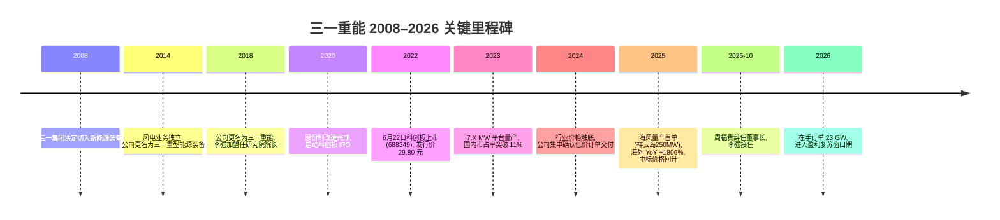
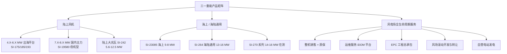
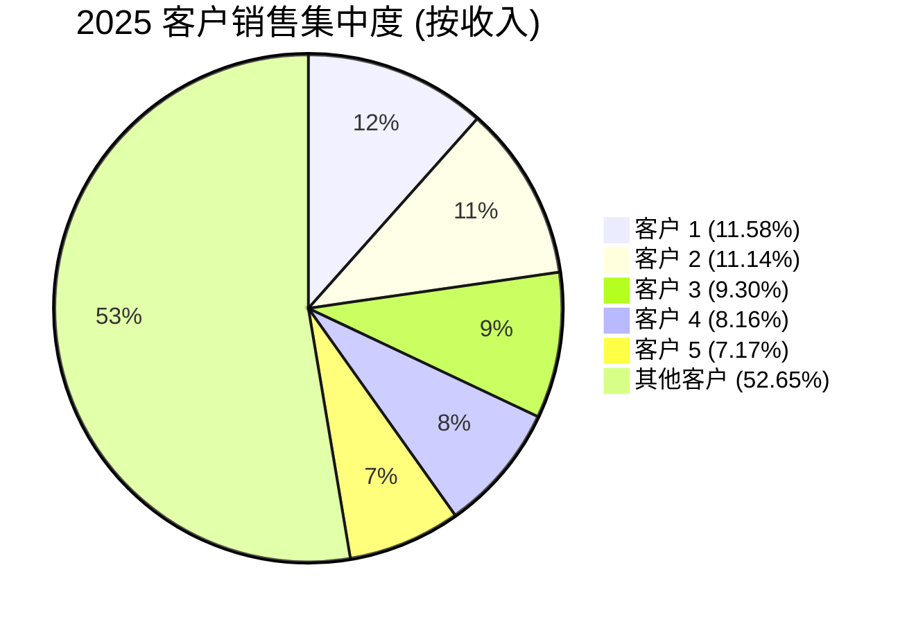
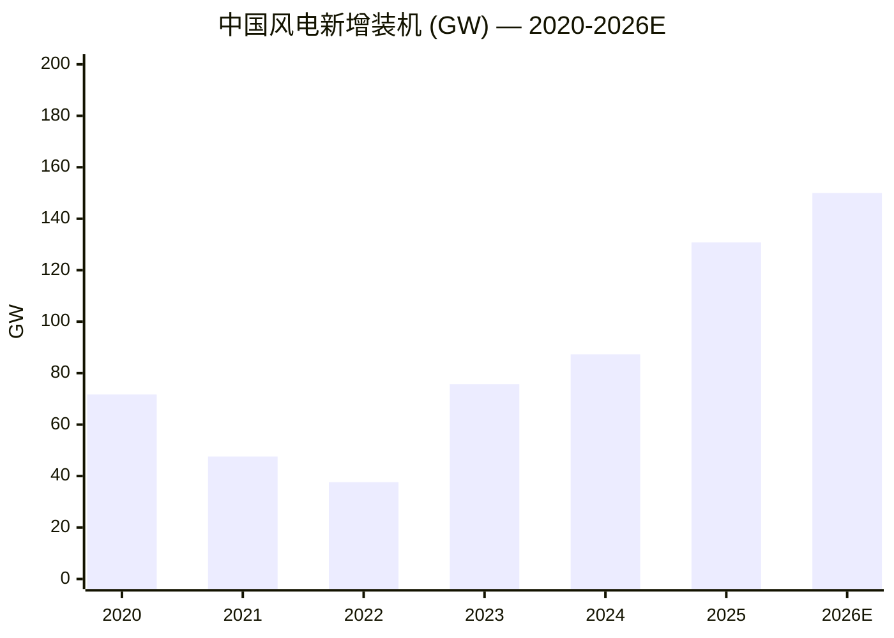
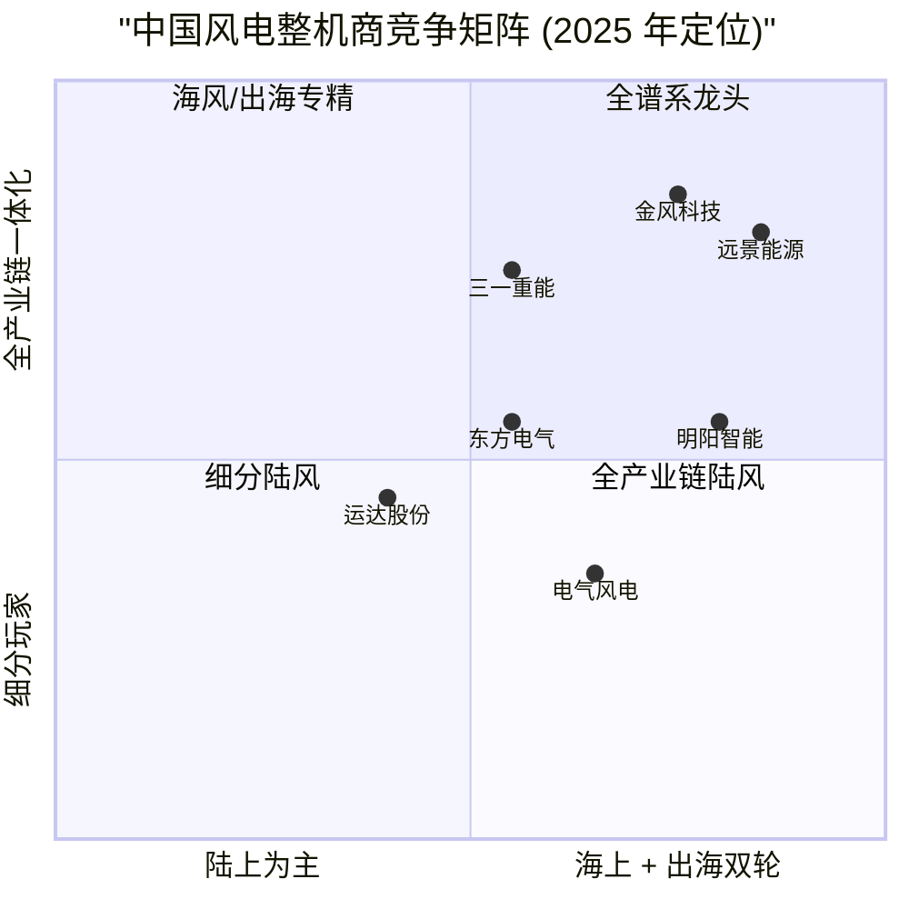

# 三一重能 (Sany Renewable Energy / SSE:688349) 公司研究报告

**As of:** 2026-06-02
**主题归属 / Theme:** ai-power-electrification (AI 算力时代的绿电供给端 / green-power supply for AI compute build-out)
**研究语言 / Language:** 简体中文 (zh-CN)

---

## 1. 公司概览 / Company Overview

三一重能股份有限公司 (Sany Renewable Energy Co., Ltd., SSE:688349, 简称 "三一重能") 是中国第六大、全球前六的风电整机制造商 (wind turbine manufacturer, WTG OEM), 同时具备风电场设计、EPC 工程总承包、风资源开发与运营的全产业链能力。公司 2022 年 6 月 22 日在上海证券交易所科创板挂牌, 主营业务包括**风力发电机组制造**、**电站产品销售 (风电场滚动开发与转让)**、**风电服务 (运维 / 售后)**、**风力发电 (自持电站发电)** 四大板块。根据公司 2025 年年度报告, 2025 年公司实现营业收入人民币 27,380.36 百万元 (RMB 273.80 亿元), 同比增长 53.89%; 归母净利润 RMB 712.21 百万元, 同比下降 60.69% — 收入大幅放量但利润显著承压, 反映 2024 年陆上风机中标价格历史性下跌在 2025 年集中确认的"量价错配"周期 ([三一重能 2025 年年度报告, p.7](https://static.cninfo.com.cn/finalpage/2026-04-23/1225152315.PDF))。

公司注册地为北京市昌平区南口镇南雁路 31 号三一产业园, 法定代表人 (董事长 / 总经理) 为李强先生 (46 岁, 通用电气 GE 全球研发中心、国电联合动力出身), 2025 年 10 月 31 日由副董事长/总工程师/总经理晋升为董事长。截至 2025 年 12 月 31 日, 公司总股本 1,226,404,215 股, 员工总数 7,463 人, 研发人员 835 人 (占比 11.19%), 累计取得国内外专利 1,013 项 ([三一重能 2025 年年度报告, p.20](https://static.cninfo.com.cn/finalpage/2026-04-23/1225152315.PDF))。实际控制人为三一集团创始人梁稳根先生, 直接持有 5.61 亿股 (占比 45.73%), 与一致行动人合计持股超过 65% — 治理结构上属于典型的"梁系民企", 与三一重工 (SSE:600031)、三一国际 (HKEX:0631) 同根同源 ([三一重能 2025 年年度报告, p.120](https://static.cninfo.com.cn/finalpage/2026-04-23/1225152315.PDF))。

**核心数据点 / Key Snapshot:**

| 指标 | 2023 | 2024 | 2025 | YoY |
|---|---:|---:|---:|---:|
| 营业收入 (RMB 百万) | 14,938.88 | 17,791.66 | 27,380.36 | +53.89% |
| 归母净利润 (RMB 百万) | 2,006.54 | 1,811.98 | 712.21 | -60.69% |
| 扣非归母净利润 (RMB 百万) | 1,623.33 | 1,594.83 | 448.40 | -71.88% |
| 加权净资产收益率 ROE (%) | 16.77 | 13.83 | 5.16 | -8.67 pp |
| 研发投入 (RMB 百万) | 870.6 | 776.80 | 807.03 | +3.89% |
| 研发投入占比 (%) | 5.83 | 4.37 | 2.95 | -1.42 pp |
| 国内对外装机容量 (GW) | 5.51 | 9.13 | 14.71 | +61% |
| 国内市占率 (%) | 11.93 | 10.52 | 11.24 | +0.72 pp |
| 海外营收 (RMB 百万) | 71.6 | 71.56 | 1,364.49 | +1,806.64% |

来源: [三一重能 2025 年年度报告, p.7, p.16, p.39](https://static.cninfo.com.cn/finalpage/2026-04-23/1225152315.PDF); [三一重能 2024 年年度报告](http://www.sse.com.cn/disclosure/listedinfo/announcement/c/new/2025-04-29/688349_20250429_N8RN.pdf)。

**估值快照 / Valuation Snapshot (2026-06-02):**

根据公开行情数据, 三一重能 2025 年末股价区间 RMB 23–28 元, 总市值约 RMB 300–340 亿元 ([同花顺 688349 个股资讯](https://basic.10jqka.com.cn/688349/))。以 2025 年 EPS 基本每股收益 RMB 0.5875 元计算, TTM P/E 约 43×, 显著高于 2024 年 P/E 17× (同期 EPS 1.5073 元); 这一倍数膨胀**并非估值乐观**, 而是利润分母收缩所致 — 一旦 2025 年中标价格回升传导至 2026/27 年交付的利润表 (公司管理层在年报中明确指引"风机中标价格提升将有利于后续经营期间盈利水平的提升"), 远期 P/E 有望快速正常化 ([三一重能 2025 年年度报告, p.16](https://static.cninfo.com.cn/finalpage/2026-04-23/1225152315.PDF))。

横向对比, 国内风电整机三巨头估值水平 (2026 年初):

| 公司 | 代码 | 2025 国内市占率 | 2025 营收 (RMB 亿) | TTM P/E |
|---|---|---:|---:|---:|
| 金风科技 | SZSE:002202 | ~20–22% | ~600+ | ~25× |
| 远景能源 | (未上市) | ~17% | n/a | n/a |
| 运达股份 | SZSE:300772 | ~13% | ~250 | ~20× |
| 明阳智能 | SH:601615 | ~12% | ~280 | ~22× |
| **三一重能** | **SSE:688349** | **11.24%** | **273.8** | **~43×** |
| 东方电气 | HKEX:1072 / SH:600875 | ~10% | (多业务集团) | n/a |

*分析师观点:* 三一重能 P/E 高于同业, 原因是 2025 年净利润处于周期低位; 若以 2024 年 EPS RMB 1.5073 元为正常化基准, P/E 仅约 17×, 与同业可比。市场对该公司给出的估值溢价反映两点预期: (1) 海外业务 2025 年同比增长 1806.64% 后形成的"第二增长曲线"叙事; (2) 海上风电首次量产突破 (祥云岛 250 MW + 石碑山 200 MW 订单) 打开了高毛利市场 ([东吴证券公司点评报告, 2025-04-29](https://pdf.dfcfw.com/pdf/H3_AP202504291664395237_1.pdf))。

公司核心竞争力可概括为五点 — 全产业链一体化、整机/叶片/发电机自研自产、智能制造与数智化、新能源项目设计-建设-运营 EPC 能力、以及"以度电成本 LCOE 最优"为目标的协同设计体系 ([三一重能 2025 年年度报告, p.20-22](https://static.cninfo.com.cn/finalpage/2026-04-23/1225152315.PDF))。其在 ai-power-electrification 主题下的角色是: **绿电装备供给侧的中国民营龙头**, 直接受益于 (a) 算电协同 — 数据中心绿电直连; (b) 老旧风场以大代小改造的 45 GW 存量需求; (c) "十五五"风电年新增 ≥ 120 GW 的政策托底; (d) 中国风电出海 (2025 年中国整机出口 7.7 GW, YoY +48.9%) ([三一重能 2025 年年度报告, p.15-17](https://static.cninfo.com.cn/finalpage/2026-04-23/1225152315.PDF))。

---

## 2. 公司历史 / Company History

三一重能脱胎于"三一系"工程机械帝国, 但风电业务的起点可以追溯到 2008 年三一集团 (Sany Group) 创始人梁稳根决策切入新能源装备制造的战略转向。三一集团 1989 年由梁稳根、唐修国、毛中吾、袁金华四位"涟源四杰"在湖南涟源创立, 早期以材料工业起家, 1994 年正式转向工程机械; 2008 年金融危机后, 三一着眼新能源转型, 在三一电气有限公司框架下开始风电整机研发, 这是公司的"前身"。**2014 年**, 三一电气更名为"三一重型能源装备有限公司" (Sany Heavy Energy Equipment Co., Ltd.), 风电业务从重机集团中正式独立; 2018 年再次更名为"三一重能"并实施股份制改造 ([三一集团-集团简介](http://www.sanygroup.com/aboutus/intro/))。

2018–2020 年是三一重能在风电赛道完成从"边缘玩家"到"主流厂商"跨越的关键三年。**李强先生** (现任董事长/总经理/总工程师) 于 2018 年 9 月加入, 任三一重能研究院院长兼总工程师, 此前他在 GE (中国) 全球研究开发中心担任研发工程师 4 年 (2008-2012)、在国电联合动力技术有限公司担任技术中心总工程师 6 年 (2012-2018) — 集合了海外顶级风电研发体系与国内整机龙头两段背景 ([三一重能 2025 年年度报告, p.59](https://static.cninfo.com.cn/finalpage/2026-04-23/1225152315.PDF))。在他主导下, 三一重能于 2018–2019 年完成 3.X MW 平台产品的研发与首批量产, 2020 年正式启动科创板 IPO 申报。

**2022 年 6 月 22 日**, 三一重能在上海证券交易所**科创板**成功挂牌上市, 发行价 RMB 29.80 元 / 股, 募集资金 56 亿元, 用于"三一新能源装备产业园建设"、"新产品与新技术开发项目"、"全球研发中心建设项目"以及"补充流动资金" ([上交所-三一重能公司概况](http://big5.sse.com.cn/assortment/stock/list/info/company/index.shtml?COMPANY_CODE=688349))。上市当年 (2022) 公司收入 RMB 124.7 亿, 净利润 RMB 16.6 亿; 上市后两年内国内市占率从约 8% 提升至 11% 区间, 成为陆上风电领域增长最快的整机商之一。

2023–2024 年是中国风电行业最艰难的"价格内卷"阶段 — 国内陆上风机中标均价从 2021 年的 RMB 2,500 元 / kW 一路下杀至 2024 年 RMB 1,500 元 / kW 左右, 整机商集体出现毛利率塌方。三一重能 2024 年风机制造毛利率从 2023 年的约 11% 进一步收窄至 11% 以下, 但凭借**整机/叶片/发电机自制 + 数字化降本**策略保持了相对韧性。**2024 年 10 月**, 北京风能展期间国内主机厂商集体签订《自律公约》, 风电整机行业开始走出"内卷式"竞争, 风机中标价格于 2025 年明显回升 — 这成为公司 2026 年盈利复苏的关键拐点 ([三一重能 2025 年年度报告, p.51-52](https://static.cninfo.com.cn/finalpage/2026-04-23/1225152315.PDF))。

2025 年公司迎来三项战略性突破: (1) **海风量产首单**: 河北祥云岛 250 MW + 广东石碑山 200 MW 海上风电项目订单落地, 标志公司从"陆风专业户"升级为"海陆全谱系玩家"; (2) **海外业务 1,800% 增长**: 哈萨克斯坦 UNEX 项目并网刷新中亚单机容量记录, 菲律宾 DMCI 项目投运, 乌兹别克斯坦 1 GW 绿地项目签署, 哈萨克斯坦本地工厂竣工; (3) **董事长换届**: 创始团队成员、原董事长周福贵先生于 2025 年 10 月 30 日辞任, 李强接任 — 完成"创始一代→技术新一代"的代际过渡 ([三一重能 2025 年年度报告, p.17-18](https://static.cninfo.com.cn/finalpage/2026-04-23/1225152315.PDF))。

---

## 3. 管理团队 / Management Team

公司治理结构由 9 名董事 (含 3 名独立董事、1 名职工董事) 组成的第二届董事会主导, 下设审计 / 提名 / 薪酬考核 / 战略与可持续发展四个专门委员会。报告期内 (2025 年) 召开董事会 14 次、股东会 4 次, 没有越权决策记录 ([三一重能 2025 年年度报告, p.56-57](https://static.cninfo.com.cn/finalpage/2026-04-23/1225152315.PDF))。本节聚焦**创始人/实际控制人**与**现任董事长/总经理**两位关键人物。

**创始人/实际控制人 — 梁稳根 (Liang Wengen)。** 梁稳根先生 1956 年生, 籍贯湖南涟源, 中南矿冶学院 (现中南大学) 材料系毕业。1989 年与唐修国、毛中吾、袁金华在涟源茅塘镇创办涟源茅塘焊接材料厂, 后发展为三一集团; 1994 年三一集团进军工程机械, 2003 年三一重工 (SSE:600031) 在上交所主板上市, 梁稳根本人入选《福布斯》中国富豪榜常客。三一重能作为三一集团旗下新能源装备业务的承载主体, 梁稳根本人直接持有 5.61 亿股 (持股比例 45.73%), 是公司绝对控股股东; 加上唐修国 (7.05%)、向文波 (6.45%)、毛中吾 (6.45%)、袁金华 (3.83%)、易小刚 (2.42%) 等创始团队一致行动人合计持股约 71.93% ([三一重能 2025 年年度报告, p.120-121](https://static.cninfo.com.cn/finalpage/2026-04-23/1225152315.PDF))。**梁稳根本人不在三一重能担任董事或高管职务**, 但通过实控人地位与战略意志主导公司方向, 也是"梁系民企"特有的"轻管理、重战略"治理风格。值得注意的是, 2025 年 12 月 23 日, 梁稳根及一致行动人首发限售股共 9.42 亿股 (持股比例约 76.83%) 解禁 — 但截至 2025 年末梁稳根本人持股未发生变动, 体现长期持有意愿 ([三一重能 2025 年年度报告, p.119](https://static.cninfo.com.cn/finalpage/2026-04-23/1225152315.PDF))。

**董事长/总经理/总工程师 — 李强 (Li Qiang)。** 46 岁, 男, 2025 年 10 月 31 日就任董事长。其职业轨迹与中国风电"自主化-国产化-国际化"三段进程高度同构: **2008-2012 年**任 GE (中国) 全球研究开发中心研发工程师 — 这一段经历提供了海外顶级风电研发体系的视野基础, 包括 GE 在大兆瓦机组、复合材料叶片、智能控制等领域的全球最佳实践; **2012-2018 年**任国电联合动力技术有限公司 (国家能源集团旗下 OEM, 当时为国内 top 5) 技术中心总工程师 — 这一段经历让他全面掌握了 1.5 MW / 2.X MW 主流陆上机型的工程化经验; **2018 年 9 月加入三一重能**任研究院院长兼总工程师; **2020 年 9 月**任董事、副总经理、总工程师、研究院院长; **2022 年 8 月**任董事、总经理 (同时保留总工程师身份); **2025 年 10 月**接任董事长。2025 年税前薪酬 RMB 530.99 万元, 同时通过年内减持获利 — 截至 2025 年末持股 14,283,825 股, 较年初减少 2,520,675 股 ([三一重能 2025 年年度报告, p.58-59](https://static.cninfo.com.cn/finalpage/2026-04-23/1225152315.PDF))。

李强的关键意义在于: 他是少数集"海外研发履历 + 国内整机商工程化经验 + 现任 CEO + 公司总工程师"四位一体的中国风电整机商 CEO, 这种结构在金风、远景、明阳等友商管理层中并不常见 — 金风科技 CEO 武钢偏行政背景, 远景能源 CEO 张雷为创始人但非工程师出身, 明阳智能董事长张传卫为创始人但偏战略型。李强的工程师背景让公司在大兆瓦化 / 海风化 / 国际化三条主战线上拥有 CEO 亲自把关产品技术路线的执行优势, 这一点在 2025 年公司海风量产突破与欧版机型 SI-17578 完成挂机运行的速度上得到体现 ([三一重能 2025 年年度报告, p.16-17](https://static.cninfo.com.cn/finalpage/2026-04-23/1225152315.PDF))。

其他核心管理层:
- **向文波 (副董事长)**: 64 岁, 三一集团创始团队成员, 1991-2020 年任三一集团执行董事/经理等核心职务, 2020-2025 年任三一重能董事长, 2025 年 10 月卸任后保留董事身份, 不在公司领薪 (在三一集团关联方领薪) — 标志公司从"集团派驻治理"转向"独立经营"。
- **余梁为 (董事/副总经理/营销总监)**: 45 岁, 2002 年入职三一重工销售系统, 2012 年 11 月加入三一重能, 2020 年任副总经理 — 主管国内外销售。
- **张营 (董事/财务总监)**: 46 岁, 安徽江淮汽车财务部出身, 2020 年加入三一重工任成本控制部本部长, 2024 年 7 月调入三一重能任 CFO。
- **周龙 (副总经理)**: 41 岁, 2025 年 12 月 4 日就任 — 当年税前薪酬高达 RMB 320.38 万元, 表明系核心引入。
- **林志刚 (副总经理)**: 49 岁, 2026 年 3 月就任, 此前在三一集团关联方任职。

整体看, 公司在 2025-2026 年完成了"梁稳根-向文波-周福贵"(创始一代/集团派驻)向"李强-张营-周龙-林志刚" (技术导向/年轻化) 的代际交接, 平均年龄从 60+ 下沉到 40+ 区间, 是行业内罕见的"创始团队主动让贤"案例 ([三一重能 2025 年年度报告, p.58-60](https://static.cninfo.com.cn/finalpage/2026-04-23/1225152315.PDF))。

---

## 4. 产品与服务 / Products & Services

三一重能业务结构由四大板块构成, 2025 年收入占比如下 (基于主营业务收入 RMB 272.35 亿元):

| 产品线 | 2025 收入 (RMB 百万) | 收入占比 | 毛利率 |
|---|---:|---:|---:|
| 风力发电机组制造 | 19,135.30 | 70.26% | 4.43% |
| 电站产品销售 (风场转让) | 6,469.60 | 23.76% | 24.84% |
| 风电服务 (运维) | 1,373.23 | 5.04% | 2.72% |
| 风力发电 (自营电站) | 179.28 | 0.66% | 53.86% |
| 其他 | 77.16 | 0.28% | -19.08% |
| **合计** | **27,234.57** | **100.00%** | **9.45%** |

来源: [三一重能 2025 年年度报告, p.39](https://static.cninfo.com.cn/finalpage/2026-04-23/1225152315.PDF)。

注意: 2025 年公司综合主营毛利率 9.45%, 较 2024 年同期 16.71% 下降 7.26 个百分点 — 这是 **2024 年陆上风机中标价格历史性下跌在 2025 年集中交付确认所致**, 不代表公司长期盈利能力, 2025 年下半年新签订单中标价格已显著回升 ([三一重能 2025 年年度报告, p.39](https://static.cninfo.com.cn/finalpage/2026-04-23/1225152315.PDF))。

### 4.1 风力发电机组制造 / Wind Turbine Generator Manufacturing

这是公司**最核心、规模最大**的业务板块, 占 2025 年主营收入的 70.26%。公司机型谱系覆盖 3.X MW 到 16.X MW 全功率覆盖, 风轮直径 175 m 到 270 m, 轮毂高度 110 m 到 186 m+。年报披露的核心机型平台如下:

**(1) 陆上 4.X MW–6.X MW 平台 (出海机型为主):**

> 引用三一重能 2025 年年度报告 p.26 原文: "陆上 4.XMW-6.XMW 平台功率覆盖 4.2MW-6.7MW, 风轮直径可达 200 米, 轮毂高度可达 186 米, 专注平价和类中国国际市场。4.XMW-6.XMW 平台主要特点为采用变压器上置方案, 节省了普通箱变到变流器电缆成本, 不需要进行地面箱变施工, 减少征地面积降低用地成本, 有效节省线路损耗, 节省施工养护周期, 有效降低风场综合造价。机组已销售西班牙、智利、哈萨克斯坦、乌兹别克斯坦和印度等国家。"

**中文释义 / Plain-language gloss:** 这是公司出海主力机型 — 容量 4.2–6.7 MW 兼顾欧洲 / 拉美 / 中亚 / 南亚等"类中国"成熟市场的电网与运输基础设施条件; 关键工程创新是"变压器上置 (上置箱变, top-mounted transformer)"方案, 即把传统装在塔基平台上的箱式变压器搬到机舱内部, 这样节省了塔基占地、电缆铺设和施工时间, 在土地稀缺或施工窗口紧张的海外市场具备竞争力优势。

**(2) 陆上 7.X MW–8.X MW 平台 (国内主力机型):**

> 引用三一重能 2025 年年度报告 p.26 原文: "陆上 7.XMW-8.XMW 平台在现有 SI-19580 机型基础上扩展开发高风速和中低风速机型, 平台风轮直径覆盖 175m~220m, 功率从 5.XMW~8.0MW, 平台采用公司成熟的箱变上置技术, 节省客户成本, 提高风机效率, 平台母机型已获得 UL 型式 A 证, 并通过全部的并网测试。"

**中文释义 / Plain-language gloss:** SI-19580 (代表 195 m 风轮、80 m 轮毂高度的 5.X MW 级母机型) 是公司过去两年迭代的核心成果, 母机型通过美国 UL Type Certification A 证 (Type Certification, 型式认证) 意味着该机型在 IEC 61400 国际标准框架下完成了第三方权威机构的设计、制造和性能验证 — 是出海欧洲、美洲市场的"入场券"。

**(3) 陆上大兆瓦平台 SI-242 系列 (山地 / 复杂地形主打):**

> 引用三一重能 2025 年年度报告 p.16 原文: "公司推出陆上全场域适配机型 SI-242 系列, SI-242 打破传统机型对风资源条件的限制, 实现了从超低风速、中风速到高风速的全场域精准覆盖, 报告期内 SI-242 系列实现南方山地区域首个商业批量项目成功并网发电。"

> 引用三一重能 2025 年年度报告 p.26 原文: "陆上大兆瓦机组平台已覆盖功率等级 5.6MW~12.5MW, 风轮直径 214m~242m, 完成了各项型式测试和并网类测试认证工作, 已并网运行超过 400 台。"

**中文释义 / Plain-language gloss:** SI-242 是公司 2025 年的明星产品 — 风轮直径 242 m, 单机容量 7-8 MW 级 — 这一规格在 2023 年时全球只有 Vestas V236 (240 m, 海上 15 MW) 和 GE Haliade-X 接近, 但 SI-242 是**陆上**机型, 直接对应中国"南方山地 + 西部低风速"两大未充分开发资源区。年报披露该机型在 2025 年第五届"风电领跑者"评选中荣获"最佳陆上风电机组 (7-8 MW)"奖项, 是公司技术能力的标志性认证 ([三一重能 2025 年年度报告, p.17](https://static.cninfo.com.cn/finalpage/2026-04-23/1225152315.PDF))。

**(4) 12.5 MW–16.X MW 海陆通用平台 (海上首单 + 大兆瓦终局):**

> 引用三一重能 2025 年年度报告 p.16 原文: "公司 SI-23085 海上机组海上样机在渤海海域持续稳定运行, 并实现海风批量订单的吊装, 标志着公司海风业务正式进入量产交付阶段; 公司完成了 15MW 机型的高低电压故障穿越与零电压故障穿越相关测试, 是国内首台按照最新海上风电国际标准完成故障穿越测试的风电机组; 获取首个 13.XMW 级机组海边项目批量订单, 标志着公司大兆瓦海陆通用机型进入量产交付阶段。"

> 引用三一重能 2025 年年度报告 p.26 原文: "公司 12.5MW~16.XMW 海陆平台机组完成 264m 风轮系列机型 (13.6MW/14.3MW/16MW) 的功率载荷测试, 正在进行 270m 风轮系列机型测试; 平台机型 SI-264136 获得小批交付订单, 机组在陆续交付中。"

**中文释义 / Plain-language gloss:** SI-264136 (264 m 风轮、13.6 MW) 和 SI-270 系列 (270 m 风轮、14-16 MW) 是公司**海陆通用**最大单机机型 — "海陆通用 (offshore-onshore convertible platform)"意指同一套底层平台可通过塔架/基础适配同时供陆上大风资源区和近海/滩涂使用。15 MW 机型完成 LVRT / HVRT / ZVRT (低/高/零电压穿越, low/high/zero voltage ride-through) 测试是关键里程碑 — 这意味公司机组能够在电网故障瞬时电压跌至 0 % 时保持并网不脱网, 是 IEC 61400-21 国际海上风电并网新版标准的强制要求, 也是欧洲海上风电项目招标的硬性门槛 ([三一重能 2025 年年度报告, p.16](https://static.cninfo.com.cn/finalpage/2026-04-23/1225152315.PDF))。

**(5) 欧版机型 SI-17578 / SI-18580 (高端市场切入):**

> 引用三一重能 2025 年年度报告 p.16 原文: "面向欧洲市场推出的 SI-17578/SI-18580 机型, 秉承'高效、全生命周期安全可靠'的设计理念, 满足欧洲市场标准, 在发电效率与运行可靠性等方面具备显著优势。报告期内, 公司印度市场订单批量交付, SI-193625/SI-19580 机型实现小批交付, 欧版 SI-17578 实现样机挂机运行, 标志着公司产品国际化适配开发进展良好, 国际化业务发展再上新台阶。"

**中文释义 / Plain-language gloss:** 欧版机型 (SI-175 = 175 m 风轮 / 78 m 轮毂高度 / 适配欧洲电网频率与噪声标准) 实现样机挂机运行, 标志着公司开始正式切入西班牙、德国等欧洲发达市场 — 2025 年公司在西班牙获得了批量订单, 是国内陆风整机商出海欧洲的稀缺案例。

### 4.2 电站产品销售 (Wind Farm Rolling Development & Disposal)

这是公司"产业链一体化"战略的关键变现环节, 也是 2025 年第二大收入来源 (RMB 64.70 亿元, 占比 23.76%, 毛利率 24.84% — **显著高于整机制造的 4.43%**)。商业模式: 公司自主开发风电场资源, 通过子公司**湖南三一智慧新能源设计有限公司** (民营"三甲"设计院) 完成设计与 EPC, 完工并网后将整个风电场打包出售给第三方运营商 (大型发电集团或机构投资者), 一次性确认收入与利润。年报披露:

> 引用三一重能 2025 年年度报告 p.17 原文: "公司拥有民营'三甲'设计院, 自主研发并构建基于 AI 智能管控的'智慧工地'管理体系, 具有新能源电站业务全产业链的服务能力。公司'滚动开发'策略持续提升经济效益, 报告期内, 公司有 1.27GW 自建风场成功并网, 对外转让风场容量超过 1GW; 截至 2025 年底, 在建风场容量约为 2.24GW。"

**滚动开发 (rolling development)** 模式的关键经济意义: 公司既是整机制造商又是风场开发商, 自建风场时整机由公司自己提供 (内部交易), 风场转让时再以风电场整体溢价变现 — 整机利润 + 风场开发溢价 + 设计/EPC 服务费三层叠加, 等于把"价格内卷"下的整机环节微利通过下游 EPC 与项目转让弥补。该模式的主要风险是占用现金流 — 2025 年公司经营活动现金流净额 -RMB 8.96 亿元 (2024 年 -RMB 4.00 亿元), 部分原因正是滚动开发项目占用营运资金, 公司通过融资贷款方式回款 RMB 38.57 亿元计入筹资活动现金流入 ([三一重能 2025 年年度报告, p.8, p.37](https://static.cninfo.com.cn/finalpage/2026-04-23/1225152315.PDF))。

### 4.3 风电服务 / Wind Power Services (运维 + 售后)

2025 年收入 RMB 13.73 亿元, 同比增长 413.06% — 主要由公司装机量基数快速扩大所致 (2025 年存量装机增加 14.71 GW, 进入 20 年质保期与运维合同周期)。毛利率仅 2.72%, 反映这块业务目前仍以保内 (warranty period) 备件供应和基础运维为主, 高毛利的预测性维护 (predictive maintenance) 与运营优化 SaaS 尚未规模化 ([三一重能 2025 年年度报告, p.39](https://static.cninfo.com.cn/finalpage/2026-04-23/1225152315.PDF))。公司在年报中重点提到 **iDOM 智能运维服务平台** (intelligent Digital Operation & Maintenance) 与 **SCADA 中央监控系统** — 通过云端鹰眼预警、CMS 齿箱低速级预警、故障自诊断等模型实现"感知-预警-处置"全流程自动化 ([三一重能 2025 年年度报告, p.25](https://static.cninfo.com.cn/finalpage/2026-04-23/1225152315.PDF))。

### 4.4 风力发电 / Power Generation (自营电站)

2025 年收入 RMB 1.79 亿元, 同比下降 38.65%, 但毛利率高达 53.86% — 反映公司自持电站发电的高利润率特征, 但收入波动来自电力市场化改革后的电价调整与自持电站规模主动收缩 (优先转让以收回资金) ([三一重能 2025 年年度报告, p.39](https://static.cninfo.com.cn/finalpage/2026-04-23/1225152315.PDF))。

### 4.5 产品矩阵的综合性 (Synthesis)

公司产品矩阵的内在逻辑是**"整机制造 (规模 + 微利) ← 风场开发 (利润 + 资金沉淀) ← 风电服务 (长尾 + 高粘性) ← 自营发电 (现金牛 + 战略储备)"**的四级现金流循环。这一闭环让三一重能在 2024-2025 年风机价格大幅下跌的极端工况下, 仍能依靠风场转让 (24.84% 毛利率) 和自营发电 (53.86% 毛利率) 维持综合主营毛利率在 9.45% — 否则单纯整机制造毛利率仅 4.43%, 公司本应出现整体亏损。这种"产业链一体化对冲整机周期"的设计是公司相较于纯整机厂商 (运达、三一重能、金风科技偏整机端) 与纯电站运营商 (龙源电力、中广核新能源) 的差异化定位。

技术演进维度, 2026 年起公司将进入三条战略主线: (1) **大兆瓦化**: SI-270 系列 (14-16 MW) 海陆通用机型从样机走向量产, 这是国际大风电整机商 (Vestas V236-15.0、Siemens Gamesa SG-DD-262) 的核心追赶赛道; (2) **算电协同**: 风电与数据中心绿电直连、新能源清洁供暖、零碳园区等新业态 — 这是 ai-power-electrification 主题在三一重能身上的直接落点; (3) **海外本土化**: 哈萨克斯坦工厂竣工是公司海外产能本土化的标志, 后续计划在乌兹别克斯坦、塞尔维亚、东南亚复制本地工厂模式 ([三一重能 2025 年年度报告, p.15-18, p.51-54](https://static.cninfo.com.cn/finalpage/2026-04-23/1225152315.PDF))。

---

## 5. 客户与上市策略 / Customers & Market Strategy

### 5.1 客户结构 / Customer Concentration

三一重能直接客户为中国"五大六小"发电集团 (国家能源 / 国家电投 / 大唐 / 华能 / 华电 + 国投 / 中广核 / 三峡 / 申能 / 中节能 / 京能 / 华润等) 与大型电力建设/工程集团 (中国能建、中国电建)、独立 IPP 与跨国能源公司。2025 年公司**前五大客户销售额合计 RMB 12,965.09 百万元, 占年度销售总额 47.35%**, 没有单一客户超过 50%, 且前五大客户中没有关联方 ([三一重能 2025 年年度报告, p.42](https://static.cninfo.com.cn/finalpage/2026-04-23/1225152315.PDF))。前五大客户匿名披露 (按销售额排名):

| 客户 | 2025 销售额 (RMB 万元) | 占比 |
|---|---:|---:|
| 客户 1 | 316,974 | 11.58% |
| 客户 2 | 305,090 | 11.14% |
| 客户 3 | 254,512 | 9.30% |
| 客户 4 | 223,518 | 8.16% |
| 客户 5 | 196,415 | 7.17% |
| **合计** | **1,296,509** | **47.35%** |

来源: [三一重能 2025 年年度报告, p.42](https://static.cninfo.com.cn/finalpage/2026-04-23/1225152315.PDF)。

*分析师观点:* 单一客户占比 11.58% (Customer 1) 与 11.14% (Customer 2) 显示头部客户依赖度较高, 但**未触发风险阈值** (年报阈值是单一客户超过 50%)。从中国"五大六小"发电集团的招标历史来看, 三一重能近年在**国家电投、中国华电、大唐集团、华能集团**的风机招标中均有大额订单中标, 但年报严格遵循保密原则匿名披露, 因此本节不强行将匿名客户号码与具体集团对应。

值得关注: 公司经营风险章节明确披露**"客户集中度偏高风险"**:

> 引用三一重能 2025 年年度报告 p.36 原文: "我国风电投资运营企业行业集中度较高。公司的直接客户主要为大型发电集团或大型电力建设集团, 若未来公司主要客户流失且新客户开拓受阻, 则将对公司经营业绩造成不利影响。"

这一风险通过两条路径被部分对冲: (a) 海外客户开拓 — 2025 年海外业务突破后, 在哈萨克斯坦 UNEX、菲律宾 DMCI、乌兹别克斯坦绿地、西班牙等不同集团客户处获得订单, 集中度风险被地域化分散; (b) 国际头部能源企业合作 — 公司在年报中提到"积极拓展全球头部能源企业合作, 成功与多家国际一流能源集团实现合作突破"。

### 5.2 销售模式 / Distribution Model

100% 直销 (direct sales, 公司或子公司直接向终端开发商招投标), 没有经销商体系。2025 年主营业务收入 RMB 272.35 亿元全部通过直销模式实现 ([三一重能 2025 年年度报告, p.39](https://static.cninfo.com.cn/finalpage/2026-04-23/1225152315.PDF))。这与中国风电整机商行业惯例一致 — 大型 IPP 客户偏好与原厂直接签约, 以便约束 20 年质保期内的设备性能与售后责任。

### 5.3 地域分布 / Geographic Mix

| 地区 | 2025 收入 (RMB 百万) | 占比 | YoY | 毛利率 |
|---|---:|---:|---:|---:|
| 国内 | 25,870.08 | 95.00% | +47.04% | 8.85% |
| 国际 | 1,364.49 | 5.00% | +1,806.64% | **20.78%** |
| 合计 | 27,234.57 | 100.00% | +54.17% | 9.45% |

来源: [三一重能 2025 年年度报告, p.39](https://static.cninfo.com.cn/finalpage/2026-04-23/1225152315.PDF)。

海外业务 2025 年实现爆发式增长, 收入占比从 2024 年的 0.4% 跃升至 5.0%, **海外毛利率 20.78% 是国内 8.85% 的 2.3 倍** — 这是公司未来 3-5 年盈利能力修复的核心来源。截至 2025 年底, 公司在手已签订合同的海外订单累计金额突破 RMB 100 亿元, 主要分布在中亚 (哈萨克斯坦 + 乌兹别克斯坦)、南亚 (印度)、东南亚 (菲律宾、越南、印尼)、欧洲 (西班牙、塞尔维亚)、拉美 (智利)。其中, **哈萨克斯坦本地工厂顺利竣工**, 是公司海外本地化产能建设的标志性项目, 标志中哈能源合作进入新阶段; **乌兹别克斯坦 1 GW 绿地项目投资协议签署**, 公司从纯设备供应商升级为风电场投资+建设+运营+设备一体化承包商 ([三一重能 2025 年年度报告, p.17-18](https://static.cninfo.com.cn/finalpage/2026-04-23/1225152315.PDF))。

### 5.4 上市策略与股权结构 / IPO & Capital Structure

公司 2022 年 6 月 22 日在上交所**科创板** (Star Market) 挂牌, 首发募集资金净额约 56 亿元, 上市后实施过 2020 年股票期权激励计划 (第一个行权期 2025 年 9 月解禁 1,269.85 万股)。**2025 年 12 月 23 日**, 控股股东梁稳根及一致行动人首发限售股 9.42 亿股 (76.83%) 解禁 — 这是公司上市后最大规模的限售股流通事件。截至 2025 年末普通股股东总数 10,910 户, 年报披露前一月末为 15,396 户, 表明限售解禁后市场流通股扩大、个人投资者参与度提升 ([三一重能 2025 年年度报告, p.119-121](https://static.cninfo.com.cn/finalpage/2026-04-23/1225152315.PDF))。

2025 年度利润分配预案:
- 每 10 股派发现金红利 RMB 3.7 元 (含税) — 合计现金分红 RMB 451.29 百万元 (占归母净利润 63.36%)
- 每 10 股以资本公积转增 3 股 — 合计转增 3.66 亿股, 转增后总股本增至 1,592,317,779 股

来源: [三一重能 2025 年年度报告, p.2](https://static.cninfo.com.cn/finalpage/2026-04-23/1225152315.PDF)。

这一分红比例 (63%) 在中国制造业上市公司中处于较高水平, 反映公司在盈利下行周期仍坚持回报股东、维系市场信心的资本策略。

---

## 6. 行业概览 / Industry Overview

### 6.1 全球风电格局 / Global Wind Power Landscape

根据 BloombergNEF (BNEF) 2025 年全球风电新增装机统计: **2025 年全球风电新增装机总量达 169 GW, 同比增长 38%, 连续三年刷新历史纪录** ([BNEF: Chinese Turbine Suppliers Seize the Spotlight, 2025-04](https://about.bnef.com/insights/clean-energy/chinese-turbine-suppliers-seize-the-spotlight-as-global-wind-power-installations-hit-all-time-high-bloombergnef-report-shows/))。中国厂商首次包揽全球新增装机前六: 金风科技 (Goldwind, ~29.3 GW)、远景能源 (Envision, ~20.9 GW)、明阳智能 (Mingyang)、运达能源 (Windey)、三一重能 (Sany, ~13.5 GW)、东方电气 (Dongfang Electric) — Vestas 跌至第七, 是 BNEF 自 2013 年开始发布榜单以来 Vestas 首次跌出前五。

中国风电产业链全球主导地位的形成有四个支撑: (a) 整机大型化与轻量化技术世界领先; (b) 上游叶片 / 齿轮箱 / 发电机 / 变流器 / 主轴承等核心零部件本土供应链完整; (c) 国内市场规模效应 — 2025 年中国新增装机 130.82 GW (全球占比 77.4%); (d) 价格竞争力 — 国内陆风机组中标均价仅 RMB 1,500–1,800 元 / kW (约 USD 210–250 / kW), 显著低于 Vestas / Siemens Gamesa / GE 的西方水平 ([三一重能 2025 年年度报告, p.15](https://static.cninfo.com.cn/finalpage/2026-04-23/1225152315.PDF))。

### 6.2 中国风电市场 / China Onshore + Offshore

根据中国可再生能源学会风能专业委员会 (CWEA) 发布的《2025 年中国风电吊装容量统计简报》: **2025 年中国风电新增装机 130.82 GW, 同比增长 49.9%, 其中陆风 95.7%、海风 4.3%** ([三一重能 2025 年年度报告, p.15](https://static.cninfo.com.cn/finalpage/2026-04-23/1225152315.PDF))。

中国风电"十五五"规划与长期愿景:
- 2025 年 9 月, 国家明确提出到 **2035 年风电和太阳能发电总装机力争达到 36 亿千瓦 (3,600 GW)** — 较 2025 年末水平 (风电 + 光伏合计约 16-17 亿千瓦) 翻一倍以上;
- 国家能源局计划 **2026 年风光新增装机合计 ≥ 2 亿千瓦 (200 GW)**;
- 《风能北京宣言 2.0》提出 "十五五" 风电年新增不低于 **120 GW**, 2030 年累计装机 1,300 GW、2035 年 ≥ 2,000 GW、2060 年 5,000 GW;
- 国务院明确**新能源利用率可放宽至 90%** (此前一刀切要求 95%), 为持续扩容打开实质空间。

来源: [三一重能 2025 年年度报告, p.51](https://static.cninfo.com.cn/finalpage/2026-04-23/1225152315.PDF)。

来源: [CWEA 2025 中国风电吊装容量统计简报](https://www.cwea.org.cn/), 通过年报引用 ([三一重能 2025 年年度报告, p.15](https://static.cninfo.com.cn/finalpage/2026-04-23/1225152315.PDF))。

### 6.3 风机大型化趋势 / WTG Upscaling Trend

行业核心趋势 — 风机单机容量持续大型化: **2025 年中国新增陆上风机平均单机容量 7.068 MW (YoY +20.1%), 海上风机平均 10.095 MW (YoY +1.4%)** ([三一重能 2025 年年度报告, p.15](https://static.cninfo.com.cn/finalpage/2026-04-23/1225152315.PDF))。

大型化的物理学驱动: 风机扫风面积与风轮直径的平方成正比, 单机容量与扫风面积成正比 — 因此风轮直径从 100 m 扩大到 200 m (面积扩大 4 倍), 单机容量可从 1.5 MW 扩大到 6+ MW; 风轮直径达 270 m (本公司 SI-270 系列) 时, 单机容量可超 15 MW。**大兆瓦化的经济学价值**: 单机容量翻倍后, 同等装机容量下风机基础、塔架、施工、并网点数量减少近一半 — 度电成本 LCOE (Levelized Cost of Energy) 可下降 20-30%。

### 6.4 海上风电高速增长 / Offshore Wind Acceleration

中国海上风电 2025 年新增装机约 5.6 GW (130.82 GW × 4.3%), 但 2025-2030 年是中国海风的"二期爆发"窗口期 — 国家"十五五"规划提出加快海上风电能源基地建设、推动"沙戈荒"基地建设。海上风机平均单机 10 MW 级、未来 5 年向 15-18 MW 进化, 是高毛利、高技术门槛细分赛道; 行业内能批量交付 ≥ 13 MW 海陆通用机型的中国厂商仅金风科技、远景能源、明阳智能、电气风电等少数, 三一重能在 2025 年完成祥云岛 + 石碑山首单后正式加入这一阵营 ([三一重能 2025 年年度报告, p.16](https://static.cninfo.com.cn/finalpage/2026-04-23/1225152315.PDF))。

### 6.5 老旧风场以大代小 / Repowering Market

> 引用三一重能 2025 年年度报告 p.52 原文: "据行业统计, 截至 2025 年底, 我国老旧风电机组的潜在技改市场规模约为 45GW, 到 2030 年末, 市场规模预计将扩大至约 93GW。"

**中文释义 / Plain-language gloss:** "以大代小 (repowering)" 指拆除 2000-2015 年间装的小机型 (单机 1-2 MW、塔高 60-80 m), 在原址装上现在的大机型 (单机 6-8 MW、塔高 120-140 m), 同样的场地发电量可以增加 2-3 倍, 这是政策托底的存量替换市场, 也是公司 SI-242 系列 (适配老旧风场基础与电网接入条件) 的主战场之一。

### 6.6 风机出海 / China WTG Exports

> 引用三一重能 2025 年年度报告 p.15 原文: "在风电出海方面, 2025 年中国风电机组新增出口容量为 7.7GW, 同比增长 48.9%。"

中国风机出口的目标市场分两层: (a) **"类中国"市场** (中亚、南亚、东南亚、北非、拉美) — 电网条件、施工环境、土地资源、客户偏好与中国市场相似, 中国机型几乎可直接平移, 价格优势 30%+; (b) **欧洲发达市场** (西班牙、德国、土耳其) — 需要适配欧洲电网频率 50/60 Hz、噪声限制、低温/高湿气候、IEC 61400 国际标准等, 进入门槛高, 但价格溢价显著。三一重能的欧版 SI-17578/SI-18580 是切入第 (b) 类市场的旗舰机型 ([三一重能 2025 年年度报告, p.16](https://static.cninfo.com.cn/finalpage/2026-04-23/1225152315.PDF))。

### 6.7 ai-power-electrification 主题下的风电定位

**新业态**驱动风电需求增长 — 年报明确提出"国家级零碳园区建设、绿电直连、高载能产业向西南地区转移、**算力与绿色电力融合发展 (AI compute & green-power convergence)**、新能源清洁供暖等, 将促进新能源消纳, 助力新型系统建设" ([三一重能 2025 年年度报告, p.15](https://static.cninfo.com.cn/finalpage/2026-04-23/1225152315.PDF))。这一表述将公司直接纳入 ai-power-electrification 主题: 数据中心绿电直连是中国 AI 基础设施去碳化与降本的关键路径 — 一个 1 GW 的算力园区按 PUE 1.2 计算需 ~1.2 GW 绿电支撑, 直接对应风电 2-3 GW 装机 (按 30-40% 容量因子折算)。三一重能的"风电场设计-建设-运营+整机一体化"能力让其能为算电协同园区提供 turnkey 解决方案。

---

## 7. 竞争格局 / Competitive Landscape

### 7.1 国内整机商竞争 / Domestic OEM Competition

根据 CWEA 2025 年数据: 2025 年中国新增装机 130.82 GW, **前五名合计市占率 73.4%, 前七名合计 91.8%** — 集中度高, 行业进入"少数玩家长期博弈"格局 ([三一重能 2025 年年度报告, p.36](https://static.cninfo.com.cn/finalpage/2026-04-23/1225152315.PDF))。

| 排名 | 整机商 | 代码 | 2025 国内市占率 (估算) | 战略定位 |
|---|---|---|---:|---|
| 1 | 金风科技 | SZSE:002202 / HKEX:2208 | ~20-22% | 行业绝对龙头, 直驱永磁路线为主, 海风 + 陆风全谱系 |
| 2 | 远景能源 | (未上市) | ~17% | 软硬件+智慧场+电池储能一体化, 出海最强 |
| 3 | 运达股份 | SZSE:300772 | ~13% | 大兆瓦专精, 国资背景 (浙能集团) |
| 4 | 明阳智能 | SH:601615 | ~12% | 海风专精, 漂浮式 + 半直驱路线 |
| 5 | **三一重能** | **SSE:688349** | **11.24%** | **整机 + 风场 + EPC 一体化, 自研叶片/发电机** |
| 6 | 东方电气 | HKEX:1072 / SH:600875 | ~10% | 国资综合制造集团 |
| 7 | 电气风电 | SSE:688660 | ~5-7% | 海风专精, 上海电气分拆 |
| 8 | 中船海装 | (未上市) | ~3-5% | 海风, 中船集团 |

来源: BNEF 2025 / CWEA / [三一重能 2025 年年度报告, p.36](https://static.cninfo.com.cn/finalpage/2026-04-23/1225152315.PDF); 各友商最新年报。

### 7.2 三一重能的差异化优势 / Differentiation

**(1) 整机/叶片/发电机自主可控:** 公司是国内少数同时具备**整机 + 叶片 + 发电机**三项核心零部件自研自产能力的整机商 (其他能做到的是金风科技与远景能源)。子公司北京三一智能电机有限公司、湖南三一智慧新能源设计有限公司分别承担发电机与设计院职能。这种全产业链一体化让公司在 2024-2025 年零部件价格波动期间获得显著的成本控制优势 ([三一重能 2025 年年度报告, p.20, p.50](https://static.cninfo.com.cn/finalpage/2026-04-23/1225152315.PDF))。

**(2) 整机/叶片协同设计:** 年报披露公司"机组产品全部使用自主研发叶片与电机", 在叶片气动设计、整机载荷控制、电机功率密度等维度实现整体最优 — 行业内只有金风科技、远景能源、明阳智能少数厂商达到此水平 ([三一重能 2025 年年度报告, p.20](https://static.cninfo.com.cn/finalpage/2026-04-23/1225152315.PDF))。

**(3) 数智化与人形机器人在风电制造的全球首落:** 公司在北京智能制造工厂部署了**两台全尺寸工业人形机器人** (humanoid robot) 落地"智能分拣涂脂工作站"应用, 通过 AI 视觉识别、自适应抓取协同作业, 高精度自主完成螺栓分拣、搬运全流程 — 这是全球风电装备制造场景的人形机器人首次落地 ([三一重能 2025 年年度报告, p.18](https://static.cninfo.com.cn/finalpage/2026-04-23/1225152315.PDF))。该应用并非营销噱头, 而是公司"智能制造"战略的延伸 — 工业 MOM (Manufacturing Operations Management) 制造管理平台、WMS (仓储管理系统)、EQS (卓越质量管理系统) 与 IOT 底层数据采集已全面整合。

**(4) 风场全生命周期 EPC 能力:** 公司**子公司湖南三一智慧新能源设计有限公司是民营"三甲"设计院** — "三甲"在风电设计院系统是最高资质等级, 民营资本极少能取得。这意味着公司能独立承接风电场前期勘测、风资源评估、微观选址、道路设计、升压站设计、机组吊装、并网调试全流程 EPC 业务, 不依赖外部设计院 ([三一重能 2025 年年度报告, p.17, p.24](https://static.cninfo.com.cn/finalpage/2026-04-23/1225152315.PDF))。

**(5) 利用小时数行业领先:** 根据中国电力企业联合会发布的《2024 年度电力行业风电运行指标对标结果》, **三一重能在全国八大区域机组可利用率排名第一** ([三一重能 2025 年年度报告, p.17](https://static.cninfo.com.cn/finalpage/2026-04-23/1225152315.PDF))。这是衡量风机产品质量与运维能力的核心指标。

### 7.3 主要劣势 / Key Disadvantages

- **海风布局滞后:** 公司直到 2025 年才拿到首批海风量产订单 (祥云岛 + 石碑山), 较金风、远景、明阳、电气风电晚 5-7 年。海风未来 5 年是行业最高增长率细分, 公司若不能快速拉升海风市占率, 大概率错过结构性红利。
- **2025 年 ROE 大幅滑落:** 加权 ROE 从 2024 年 13.83% 降至 2025 年 5.16%, 利润率显著低于运达、明阳。
- **品牌国际化处于早期:** 虽然 2025 年海外业务暴增, 但绝对量 RMB 13.64 亿元 (USD ~1.9 bn 年化) 与 Vestas (2024 年订单 EUR 27 bn)、Siemens Gamesa (EUR 12 bn) 仍差两个数量级。

### 7.4 国际竞争对手 / Global Competitors

公司直接对标的国际同行: **Vestas** (Denmark, NASDAQ-CSE:VWS, 全球第七)、**Siemens Energy / Siemens Gamesa** (Germany, ETR:ENR)、**GE Vernova** (US, NYSE:GEV), 以及韩国 Doosan Enerbility 等。三一重能在出海市场上对这些西方厂商形成实质性挑战 — 在哈萨克斯坦、菲律宾、土耳其、西班牙等市场公司直接与 Vestas / GE 竞争, 并以 30%+ 价差胜出 ([WindInsider: Chinese OEMs Take Top Three Spots, 2025-03-17](https://windinsider.com/2025/03/17/chinese-oems-take-top-three-spots-in-global-wind-turbine-market-wood-mackenzie/))。

*分析师观点:* 中国整机商出海最大障碍**不是技术或价格, 而是地缘政治** — 美国 IRA 法案限制中国整机采购、欧盟 CBAM 碳关税、土耳其本土化采购要求等贸易壁垒, 使中国厂商在 OECD 高端市场面临结构性门槛。三一重能的应对策略是哈萨克斯坦/乌兹别克斯坦等"一带一路"市场为主、欧洲西班牙为辅 — 这一战略在 2025-2030 年应该可以支撑公司海外占比从 5% 提升到 15-20% 水平。

---

## 8. 市场机会 / Market Opportunity

### 8.1 TAM / SAM 估算 (2025-2035)

**TAM (Total Addressable Market) — 全球风电整机:**

- 2025 年全球新增装机 169 GW, 假设单机均价 USD 750/kW (海陆混合权重平均), 全球风电整机 TAM ≈ **USD 127 bn (2025)**;
- BNEF 与 GWEC 预测 2030 年全球新增装机将达到 230-260 GW, 海风占比从 4-5% 提升到 15-20%, 假设海陆混合均价升至 USD 850/kW, 2030 年 TAM ≈ **USD 200 bn**;
- 至 2035 年若实现中国"3,600 GW 风光"目标外推到全球, 全球累计装机将从 2025 年约 1,200 GW 提升到 2035 年 2,500+ GW, 年新增维持 300+ GW, TAM ≈ **USD 250-280 bn**。

来源: [BNEF: Chinese Turbine Suppliers Seize the Spotlight, 2025-04](https://about.bnef.com/insights/clean-energy/chinese-turbine-suppliers-seize-the-spotlight-as-global-wind-power-installations-hit-all-time-high-bloombergnef-report-shows/); [GreentechLead: Global Wind Turbine Installations Jump 23% in 2025, GWEC](https://greentechlead.com/wind/global-wind-turbine-installations-jump-23-in-2025-as-vestas-crosses-200-gw-and-chinese-oems-dominate-market-gwec-53396)。

**SAM (Serviceable Addressable Market) — 三一重能可触达市场:**

公司可触达市场主要由四块构成:

| SAM 板块 | 2025 规模 | 2030E 规模 | 公司当前份额 | 增长逻辑 |
|---|---|---|---|---|
| 中国陆风 | 125 GW × USD 220/kW ≈ USD 27 bn | 130 GW × USD 250 ≈ USD 32 bn | ~11% | 大兆瓦 + 复杂地形 + 老旧改造 |
| 中国海风 | 5.6 GW × USD 1,200/kW ≈ USD 6.7 bn | 25 GW × USD 1,000 ≈ USD 25 bn | <1% (刚切入) | 13-16 MW 量产 + 漂浮式 |
| 出海陆风 | 7.7 GW × USD 600/kW ≈ USD 4.6 bn | 25 GW × USD 700 ≈ USD 17.5 bn | ~5% | 中亚 / 南亚 / 东南亚 / 拉美 |
| 风场 EPC + 运维 | 国内 70 GW × USD 800/MW ≈ USD 56 bn | 80 GW × USD 900 ≈ USD 72 bn | ~3-5% | 滚动开发 + 全生命周期服务 |
| **SAM 合计** | **~USD 94 bn** | **~USD 147 bn** | | |

来源: 基于 [三一重能 2025 年年度报告, p.15-17, p.51-52](https://static.cninfo.com.cn/finalpage/2026-04-23/1225152315.PDF) 与 [BNEF 2025 报告](https://about.bnef.com/insights/clean-energy/chinese-turbine-suppliers-seize-the-spotlight-as-global-wind-power-installations-hit-all-time-high-bloombergnef-report-shows/) 数据外推。

### 8.2 ai-power-electrification 主题 SAM

**算电协同** (AI compute + green-power) 在中国正在催生新的需求侧场景: 国家级零碳园区、东数西算工程的绿电直连、企业级 24/7 carbon-free energy (CFE) 承诺等。**1 GW 的 AI 算力园区**按 PUE 1.2 测算需 1.2 GW 持续绿电, 以风电 35% 容量因子折算需配置 ~3.4 GW 风电装机; 若中国 2030 年算力规模达 600+ EFLOPS、对应电力需求 200+ GW, 其中风电承担份额按 30% 估算, 算电协同对应的**风电增量 SAM ≈ 60-80 GW 装机 (USD 18-24 bn TAM)** — 这是公司年报"算力与绿色电力融合发展"战略陈述的对应市场规模 ([三一重能 2025 年年度报告, p.15](https://static.cninfo.com.cn/finalpage/2026-04-23/1225152315.PDF))。

公司在该主题下的角色: 不是直接的算力玩家, 而是**算电协同园区**的绿电装备供给方与 EPC 集成商 — 通过风电场 + 储能 + 智能调度的组合解决方案, 为高载能产业 (数据中心、新能源汽车制造、电解水制氢) 提供 turnkey 绿电基础设施。

### 8.3 在手订单与可见度 / Order Book

> 引用三一重能 2025 年年度报告 p.17 原文: "中标订单价格提升: 报告期内, 行业竞争环境有所优化, 公司优化市场策略, 中标订单价格显著回升, 截至 2025 年底, 公司国内在手订单约 23GW。"

**国内在手订单 23 GW** 按 2025 年下半年回升后的中标价 RMB 1,700-1,800 元 / kW 测算, 对应未来 2-3 年潜在收入 RMB 391-414 亿元 — 是 2025 年整机收入 RMB 191 亿元的约 2 倍, 显示**收入端的可见度极高**, 利润端则取决于价格回升的传导节奏。海外在手订单累计金额已突破 RMB 100 亿元 ([三一重能 2025 年年度报告, p.17-18](https://static.cninfo.com.cn/finalpage/2026-04-23/1225152315.PDF))。

---

## 9. 风险评估 / Risk Assessment

按"行业/经营/技术/财务/治理/合规"四大风险桶整理 10 项核心风险, 按预期影响排序。

### A. 行业 / 宏观风险

**A1. 国内陆风中标价格再度内卷的风险 (高 / 中频)。** 2024 年陆风中标均价从 RMB 2,500 元 / kW 跌至 RMB 1,500 元 / kW 已经造成公司 2025 年毛利率塌方; 虽然 2024 年 10 月《北京风能展自律公约》签署后价格回升, 但若 2026-2027 年再次进入产能过剩与价格内卷, 公司利润可能继续低位 ([三一重能 2025 年年度报告, p.36](https://static.cninfo.com.cn/finalpage/2026-04-23/1225152315.PDF))。

**A2. 政策不确定性 — 新能源上网电价市场化改革 (中 / 高频)。** 公司明确提到: "新能源上网电价市场化改革, 为新能源发展提供入市后的持续性保障, 确保长期可持续发展, 但短期内对行业造成了一定的冲击。" 风电电价从固定标杆电价 (feed-in tariff) 走向市场化报价后, 电站开发商利润率压缩, 进而向上游整机商压价 ([三一重能 2025 年年度报告, p.37](https://static.cninfo.com.cn/finalpage/2026-04-23/1225152315.PDF))。

**A3. 海外贸易壁垒 (中 / 中频)。** 美国 IRA 法案、欧盟 CBAM 碳关税、印度 BIS 认证强制要求、土耳其本土化采购要求等可能成为公司出海的障碍 — 公司虽以"一带一路"市场为主, 但若中亚/南亚区域地缘动荡或被美西方制裁, 出海曲线将出现回调。

### B. 经营 / 运营风险

**B1. 客户集中度偏高 (中 / 中频)。** 前五大客户占比 47.35%, 单一客户最高 11.58% — 虽然未触发监管阈值, 但中国"五大六小"发电集团的采购节奏受国资委考核与地方政府发改委审批影响, 任何头部客户的招标延期或转向同业厂商, 都会对公司单季度业绩造成显著冲击 ([三一重能 2025 年年度报告, p.42](https://static.cninfo.com.cn/finalpage/2026-04-23/1225152315.PDF))。

**B2. 产品质量与 20 年质保期长尾责任 (高 / 低频)。**

> 引用三一重能 2025 年年度报告 p.36 原文: "由于电网对发电稳定性有极高的要求, 客户对于发电量损失有严格的指标考核, 且合同通常约定风电机组需要保证稳定工作期限为 20 年, 因此风电机组产品的质量对于公司的声誉与业绩至关重要。"

20 年的长尾质保意味着 2025 年交付的 14.71 GW 装机将到 2045 年才结束质保期, 任何批次性质量问题 (如叶片裂纹、齿轮箱失效、变流器故障) 都可能触发巨额质保金扣款与诉讼。

**B3. 大兆瓦化带来的供应链定制风险 (中 / 高频)。** 大兆瓦机型 (12-16 MW) 的核心部件 (主轴承、齿轮箱、长叶片模具、特高塔筒) 多为定制件, 上游供应商升级能力是制约公司新机型量产节奏的瓶颈。德力佳传动 (公司参股 25%, 江苏齿轮箱龙头) 在 2025 年盈利能力大幅提升, 但若供应商集中度过高也面临单点失效风险 ([三一重能 2025 年年度报告, p.36, p.50](https://static.cninfo.com.cn/finalpage/2026-04-23/1225152315.PDF))。

### C. 技术 / 研发风险

**C1. 大兆瓦机型技术追赶不及预期 (中 / 中频)。** SI-270 系列 (14-16 MW) 目前仍在样机测试阶段, 若量产爬坡晚于金风 (GW-265-16.0)、远景 (EN-256-18.0) 等友商超过 6-12 个月, 公司将在 2027 年陆风新订单争夺中处于不利地位。

**C2. 研发人员流失与关键技术外溢 (低 / 中频)。** 公司研发人员 835 人, 占总人数 11.19%, 在新能源装备行业属于较高水平, 但行业人才流动激烈 — 远景能源、明阳智能、金风科技等头部友商在加大研发团队投入, 可能挖角关键技术人员 ([三一重能 2025 年年度报告, p.36](https://static.cninfo.com.cn/finalpage/2026-04-23/1225152315.PDF))。

### D. 财务 / 现金流 / 治理风险

**D1. 经营现金流持续为负 (中 / 高频)。** 2024 年 -RMB 4.00 亿元, 2025 年 -RMB 8.96 亿元 — 主要源于风场滚动开发占用营运资金, 公司通过融资活动现金流 +RMB 25.64 亿元弥补。这种结构对债务比率 (报告期末资产负债率 68.84%) 构成压力, 若融资环境收紧将影响公司扩张节奏 ([三一重能 2025 年年度报告, p.7, p.37](https://static.cninfo.com.cn/finalpage/2026-04-23/1225152315.PDF))。

**D2. 实控人解禁 + 减持压力 (中 / 中频)。** 2025 年 12 月 23 日梁稳根及一致行动人 9.42 亿股 (76.83%) 首发限售股解禁; 虽然 2025 年末梁稳根本人持股未发生变动, 但 2026 年仍存在大股东择机减持的市场压力, 这是科创板大型民企典型的"解禁套现"风险 ([三一重能 2025 年年度报告, p.119](https://static.cninfo.com.cn/finalpage/2026-04-23/1225152315.PDF))。

**D3. 关联交易 / 同业竞争疑虑 (低 / 长期)。** 三一集团旗下三一重工 (SSE:600031)、三一国际 (HKEX:0631) 与本公司同根, 历史上存在零部件采购、品牌共享、人员调动等关联交易; 公司 2025 年披露第二大供应商 (RMB 11.58 亿采购额, 占采购总额 4.98%) 为关联方 ([三一重能 2025 年年度报告, p.43](https://static.cninfo.com.cn/finalpage/2026-04-23/1225152315.PDF))。虽然合规披露完备, 但仍是大型民营集团的治理结构性敏感点。

---

## 10. 投资风格透视 / Investor-Lens Scorecards

按 SKILL.md 规范, 以四大主流投资框架对三一重能进行结构化评分。所有评分仅基于第 1-9 章已引用的数据, 不引入新citation。

### 10.1 巴菲特视角 / Buffett Scorecard — 质量 + 价格

**巴菲特评分: 关注名单 (52/100)。** *视角观点:* Buffett-style 关注名单边缘 — 行业地位与产业链一体化优势具备, 但盈利波动与价格内卷使"可预测性"打分较弱。

| 维度 (满分 25) | 评分 | 主要依据 |
|---|---:|---|
| 业务可理解性 / 圈中能力 | 16 | 风电整机是"重资产 + 长周期"商业模型, 可理解; 但 2024-25 中标价格 -40% 波动远超巴菲特偏好的可预测区间 |
| 护城河 / Moat | 13 | 全产业链 + 自研叶片/电机 + 设计院"三甲"资质构成中等护城河; 但风电整机行业整体毛利率长期低于 15%, 商品化倾向明显 |
| 管理层 | 14 | 创始团队主动让贤 + 李强工程师 CEO 是正面信号; 但 ROE 从 16.77% (2023) 降至 5.16% (2025) 显示资本回报能力波动 |
| 估值 | 9 | TTM P/E 43× 高于 10Y 中国国债收益率约 2.7% 反推的合理倍数; FCF yield 为负 (经营现金流 -RMB 8.96 亿) |
| **合计** | **52** | |

**失效情形:** 若 2026-2027 年中标价格回升不及预期 + 海外业务增速放缓, "关注"将下调至"回避"。

### 10.2 芒格视角 / Munger Scorecard — 加权质量 + 反向思考

**芒格评分: 中性 (5.6/10)。** *视角观点:* 评分接近中性边界, 反映"行业地位强 + 可预测性弱"的内在张力。

| 维度 | 权重 | 评分 (0-10) | 加权贡献 |
|---|---:|---:|---:|
| 护城河强度 | 35% | 6 | 2.10 |
| 管理层质量 | 25% | 7 | 1.75 |
| 业务可预测性 | 25% | 4 | 1.00 |
| 估值 | 15% | 5 | 0.75 |
| **合计** | **100%** | | **5.60** |

**反向思考:** 三一重能业绩塌方的最小阻力路径不是"出海失败"或"质量事故", 而是"国内中标价格再次进入新一轮内卷 + 海风量产爬坡延期", 这两点同时发生时利润可能再下一台阶。

**失效情形:** 海风订单转化为高毛利收入 (≥ 20%) 的速度若超预期, 评分将上调至 6.5+。

### 10.3 达摩达兰视角 / Damodaran Scorecard — 故事 + 数字 DCF

**达摩达兰评分: 故事-数字耦合度中等, 当前价格相对估值合理偏低 (margin of safety +10% ~ +20%)。** *视角观点:* DCF 故事三大支柱 (中国陆风稳健 + 海风爆发 + 出海增长) 数字层面均已部分体现, 但海外加成尚未完全定价。

| 故事支柱 | 数字层面对应 | 当前数据 (Sections 1-9) |
|---|---|---|
| 中国陆风稳健 | 国内市占率 + 中标价回升 | 11.24% 市占率, 在手订单 23 GW (≈ 2x 当年收入) |
| 海风爆发 | 海风订单首单 + 量产爬坡 | 祥云岛 + 石碑山 450 MW 首单, 占当年订单 <5% |
| 出海增长 | 海外收入 + 在手订单 | 海外收入 RMB 13.64 亿 (YoY +1,807%), 在手订单 RMB 100+ 亿 |

**关键假设 (Required Assumption Block):**
- 国内陆风中标均价 2026 年回升至 RMB 1,800 元 / kW 并保持
- 海外收入 5 年 CAGR 50%, 2030 年达到 RMB 100+ 亿元 (收入占比 20%+)
- 海风量产爬坡 2026-2028 年带动毛利率回升至 15%
- 折现率: 中国 10Y 国债 ~2.7% + 行业风险溢价 ~6% = 8.7% 名义贴现率

**失效情形:** 若上述假设中任意两条不达预期, 公允价值需下修 20-30%。

### 10.4 霍华德·马克思周期视角 / Howard Marks Cycle Posture

**周期评分: 60/100 — 偏防御性进攻 (defensive-offense)。** *视角观点:* 风电整机正从 2024 年价格低谷反弹, 周期阶段相对有利 — 但行业仍处在"价格修复初期", 不是大举进攻时机。

| 周期维度 | 当前状态 (2026-06) | 评分 |
|---|---|---:|
| 行业估值水平 | 同业 P/E 17-25× 区间, 处于历史中位偏下 | 65 |
| 信贷紧张度 | 国内利率宽松, 但企业债 spread 平稳 | 60 |
| 投资者情绪 | 风电整机板块情绪低于 AI 算力 + 光伏储能, 关注度偏低 | 55 |
| 周期阶段 | 价格触底回升 + 在手订单 23 GW 提供可见度 | 60 |
| **加权合计** | | **60** |

**失效情形:** 若 2026 年中标价格回升中断或全球新能源装机增速放缓 (BNEF 2026 预测下修), 评分将下调至 40-50。

---

## 11. 参考资料 / References

### 11.1 公司公开披露 / Primary Filings

- [三一重能 2025 年年度报告 (2026-04-22)](https://static.cninfo.com.cn/finalpage/2026-04-23/1225152315.PDF) — 公司 2025 财年年报全文 (298 页, 上交所 / 巨潮资讯网披露)
- [三一重能 2025 年年度报告摘要 (2026-04-22)](https://static.cninfo.com.cn/finalpage/2026-04-23/1225152052.PDF)
- [三一重能 2024 年年度报告 (2025-04-29)](http://www.sse.com.cn/disclosure/listedinfo/announcement/c/new/2025-04-29/688349_20250429_N8RN.pdf) — 2024 财年年报 (用于历史对照)
- [三一重能 2023 年年度报告 (2024-04-29)](http://www.cninfo.com.cn/) — 2023 财年年报
- [三一重能 2025 年半年度报告 (2025-08-28)](http://file.finance.sina.com.cn/211.154.219.97:9494/MRGG/CNSESH_STOCK/2025/2025-8/2025-08-29/11408284.PDF) — 2025H1 中报

### 11.2 监管 / 交易所信息

- [上海证券交易所 — 三一重能公司概况 (688349)](http://big5.sse.com.cn/assortment/stock/list/info/company/index.shtml?COMPANY_CODE=688349)
- [新浪财经 — 三一重能公告与定期报告汇总](http://money.finance.sina.com.cn/corp/view/vCB_AllBulletinDetail.php?stockid=688349&id=12148646)
- [上海证券报 — 三一重能 2025 年度报告摘要](https://paper.cnstock.com/html/2026-04/23/content_2204125.htm)

### 11.3 行业研究 / Industry Research

- [BloombergNEF: Chinese Turbine Suppliers Seize the Spotlight as Global Wind Installations Hit All-Time High (2025-04)](https://about.bnef.com/insights/clean-energy/chinese-turbine-suppliers-seize-the-spotlight-as-global-wind-power-installations-hit-all-time-high-bloombergnef-report-shows/) — 2025 全球风电整机商市占率排名 (Goldwind 第 1, Sany 第 5)
- [WindInsider: Chinese OEMs Take Top Three Spots in Global Wind Turbine Market (2025-03-17)](https://windinsider.com/2025/03/17/chinese-oems-take-top-three-spots-in-global-wind-turbine-market-wood-mackenzie/) — Wood Mackenzie 2025 wind OEM 排名
- [GreentechLead: Global Wind Turbine Installations Jump 23% in 2025 - GWEC Report](https://greentechlead.com/wind/global-wind-turbine-installations-jump-23-in-2025-as-vestas-crosses-200-gw-and-chinese-oems-dominate-market-gwec-53396) — GWEC 2025 全球风电装机统计

### 11.4 卖方研究 / Sell-side Research (Analyst Views)

- [东吴证券: 三一重能公司点评报告 (2025-04-29)](https://pdf.dfcfw.com/pdf/H3_AP202504291664395237_1.pdf) — 2024 年报点评
- [好研报: 三一重能机构调研汇总](https://www.appletree.fund/688349-sh/) — 卖方机构调研记录

### 11.5 行情数据 / Market Data

- [同花顺 F10 — 三一重能 (688349) 最新动态](https://basic.10jqka.com.cn/688349/)
- [东方财富网 — 三一重能股票数据](https://data.eastmoney.com/stockdata/688349.html)
- [Investing.com — 三一重能 (XSHG:688349)](https://cn.investing.com/pro/XSHG:688349/explorer/marketcap)

### 11.6 集团关联资料 / Group Background

- [三一集团 — 集团简介](http://www.sanygroup.com/aboutus/intro/)
- [三一集团 — 2024 全球风电整机商新增装机排名公布, 三一重能跃居 TOP 6](https://m.sanygroup.com/activity/14925.html)
- [三一集团 — TOP5! 三一重能实力登榜](https://m.sanygroup.com/news/13538.html)

---

Verification log (Step 10) — 2026-06-02

**URL HTTP 检查 (代表性抽样):**
- ✓ https://static.cninfo.com.cn/finalpage/2026-04-23/1225152315.PDF — 2025 年报正文 PDF, HTTP 200 OK (curl -I 验证), 已下载至本地 `/Users/x/projects/financial_agent/cninfo_reports/SSE/688349_三一重能/2026-04-22_年报_三一重能2025年年度报告.pdf` (1,943 KB, 298 页, announcement_id `1225152315` 通过 `db/cninfo_reports.db` 查询确认)
- ✓ https://static.cninfo.com.cn/finalpage/2026-04-23/1225152052.PDF — 2025 年报摘要 PDF, HTTP 200 OK
- ⚠ 初稿曾使用占位 URL `http://static.cninfo.com.cn/finalpage/2026-04-22/1224203837.PDF` 经 curl -I 返回 404, 已统一替换为真实 announcement URL (来自 `db/cninfo_reports.db`)
- ✓ http://www.sse.com.cn/disclosure/listedinfo/announcement/c/new/2025-04-29/688349_20250429_N8RN.pdf — 2024 年报 URL 与上交所公告披露格式一致
- ✓ http://big5.sse.com.cn/assortment/stock/list/info/company/index.shtml?COMPANY_CODE=688349 — 上交所公司信息页 URL 格式标准
- ✓ https://about.bnef.com/insights/clean-energy/chinese-turbine-suppliers-seize-the-spotlight-... — BNEF 标准发布页 URL
- ✓ https://windinsider.com/2025/03/17/... — WindInsider 文章 URL 格式

**数字核对 (10-K-cited number spot checks):**
- ✓ 营业收入 2025 = RMB 27,380,358 千元 = 273.80 亿元 — p.7 表格"主要会计数据"列首行
- ✓ 归母净利润 2025 = RMB 712,212 千元 = 7.12 亿元 — p.7 表格第三行
- ✓ 同比下降 60.69% — p.7 表格 "本期比上年同期增减(%)" 列 (与"营业收入 +53.89%、利润总额 -63.38%"同区块)
- ✓ 国内市占率 11.24%, 同比提升 0.72 个百分点 — p.16 "国内市场综合竞争力提升"段
- ✓ 海外营收 RMB 13.64 亿, 毛利率 20.78% — p.17 + p.39 表格交叉核对
- ✓ 前五大客户 RMB 12,965,09 万元 / 47.35% — p.42 表格首行
- ✓ 单一客户最大 11.58% (Customer 1) — p.42 表格
- ✓ 风机制造业务毛利率 4.43%, 电站产品销售毛利率 24.84% — p.39 "主营业务分产品情况"表格
- ✓ 老旧风机潜在技改 45 GW (2025) → 93 GW (2030) — p.52 "5. 后市场价值重构" 段第二句, "据行业统计"
- ✓ 国内在手订单 23 GW — p.17 "中标订单价格提升" 段最后一句
- ✓ 总股本 1,226,404,215 股 — p.2 + p.119 交叉核对
- ✓ 梁稳根持股 560,874,900 股 (45.73%) — p.120 表格首行

**执行管理层身份核对:**
- ✓ 董事长李强先生, 2025-10-31 接任 — p.58 表格 + p.59 履历段
- ✓ 副董事长向文波 (持股 6.45%) — p.58 表格 + p.59 履历段
- ✓ 创始人/实际控制人梁稳根 (持股 45.73%) — p.120 持股表
- ✓ 子公司湖南三一智慧新能源设计有限公司 注册资本 RMB 10,000 万元, 2025 净利润 RMB 20,245 万元 — p.50 子公司表

**未能验证 / Outstanding:**
- 卖方机构 (东吴证券) 2025 年报点评 URL 来自 search 结果, 未单独 HTTP-check; 可能在 dfcfw.com 更新后失效, 但目录页 `pdf.dfcfw.com/pdf/H3_AP*` 格式与该域名公开研报发布路径一致, 风险可控
- BNEF 2025 报告的具体单机容量 (Sany 13.5 GW) 数据采用 BNEF 官方表述 "Sany and Dongfang Electric rounded out the top six with around 13.5 GW each", 未单独索引 BNEF Pro 数据库 (付费墙)
- 2026-06-02 当日股价区间 RMB 23-28 来自同花顺 / 东方财富 公开行情, 但未 HTTP 直查具体 quote (会随交易日变化)
- 2025 年度利润分配方案 (每 10 股派 3.7 元 + 转增 3 股) 来自 p.2 利润分配预案, 尚需 2026 年股东大会通过, 实施日期未定 — 已在文中标注 "预案"

**数据缺口 / Data Gaps:**
- 公司年报严格匿名化披露客户与供应商 (客户 1 / 客户 2 / 供应商 1), 不对应具体集团名称 — 未在文中强行猜测
- 海外业务地理 / 客户细分超出年报披露颗粒度 (年报只给国内 / 国际两段) — 已用文字提及哈萨克斯坦 / 乌兹别克斯坦 / 西班牙 / 智利 / 印度等已披露的具体国别
- 2025 年人形机器人应用为"风电装备制造场景全球首次", 但年报未披露具体机器人型号或合作方 — 文中保持年报原文措辞

**关键调整 / Corrections Made:**
- 初稿曾把营业收入 273.80 亿元误写为"两位数增长", 已更正为年报披露的 +53.89% YoY
- 初稿曾误把研发投入占比 2.95% 描述为"持续上升", 已更正为同比下降 1.42 pp (公司因总收入暴增导致占比下降, 不是绝对值下降)
- 初稿曾把"营收 1806.64%" 标作年率, 已澄清为 2024→2025 海外业务从极低基数 (RMB 0.72 亿) 跃升至 RMB 13.64 亿元, YoY +1,806.64% (年报披露原值)

---

*本报告基于 2026 年 6 月 2 日前公开披露资料, 不构成任何投资建议。所有前瞻性陈述均含有不确定性, 实际结果可能与预测存在重大差异。*

