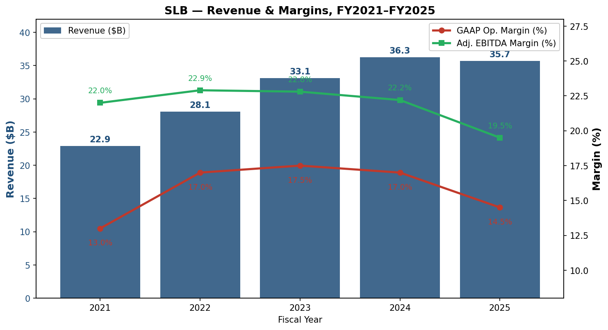
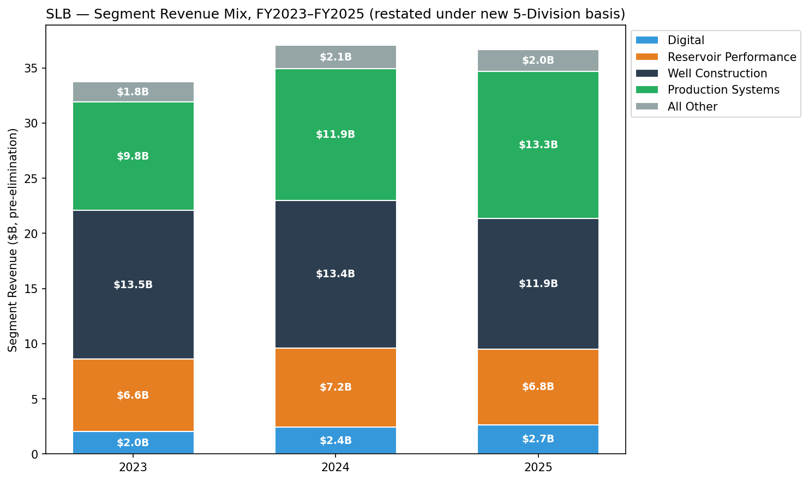
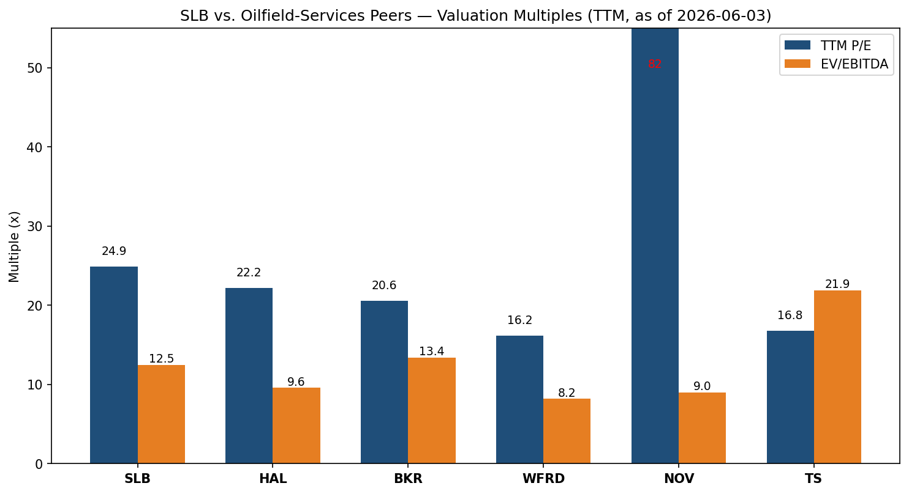
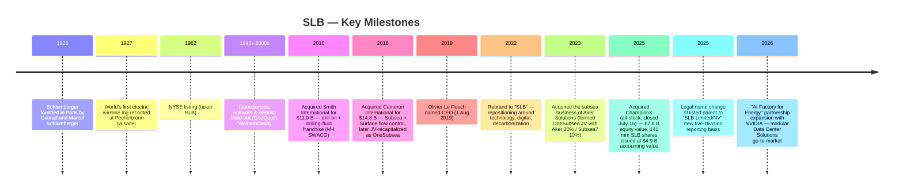
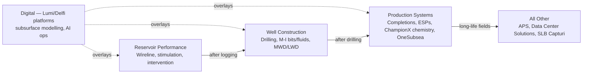
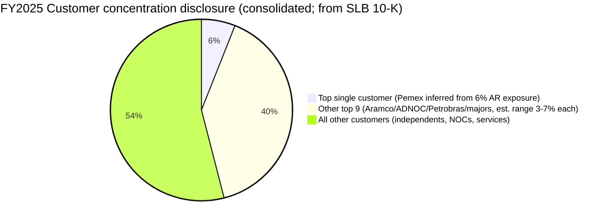
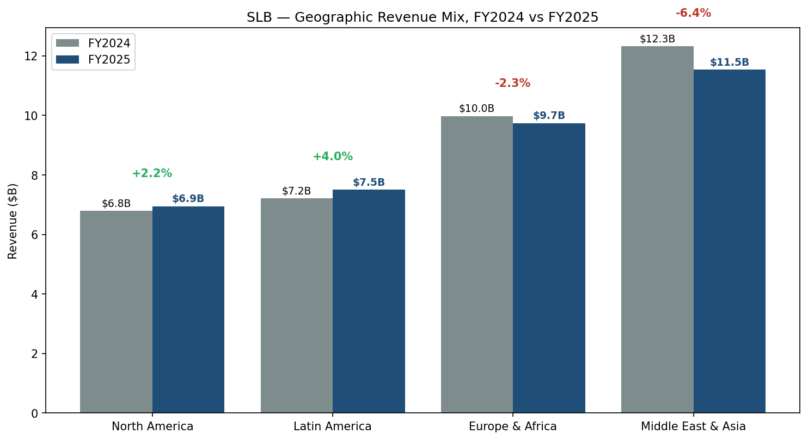
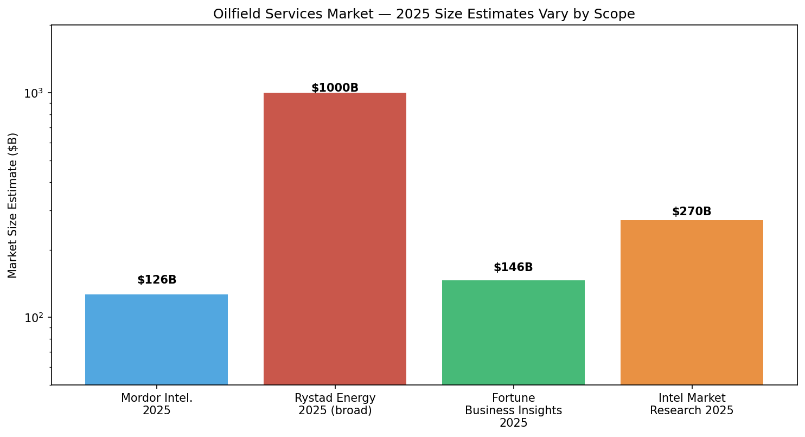
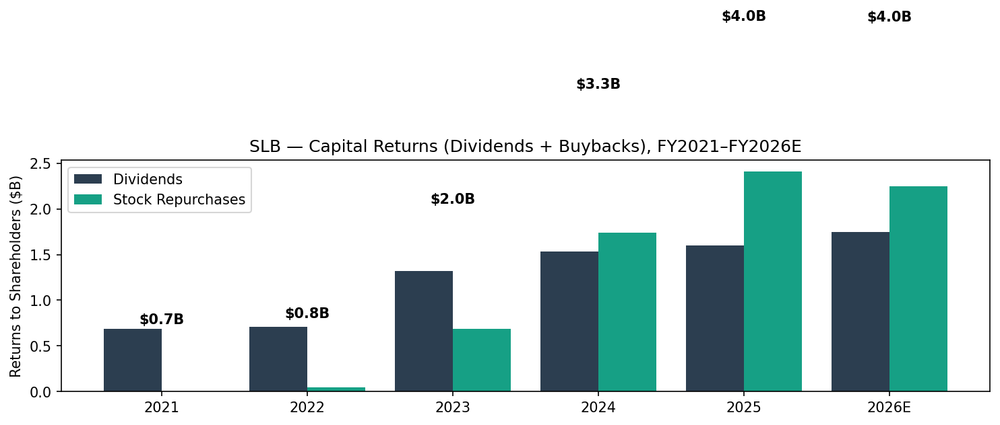

# SLB (Schlumberger Limited, NYSE: SLB) — Company Research

**As of 2026-06-03.** Primary author / sources: SLB 2025 Form 10-K (filed 2026-01-23), Q4-2025 & Q1-2026 earnings releases, SLB IR site, EDGAR submissions JSON for CIK 0000087347. All Section 10 indicator snapshots are point-in-time as of 2026-06-03.

> **Update — FY2026 capital-return commitment maintained, Q1 hit by Middle East shutdowns (2026-04-24):** SLB reaffirmed its commitment to return more than **$4.0 billion** to shareholders in 2026 (dividend + buyback) despite Q1-2026 revenue of $8.72 B (+3% YoY) being held back by Middle East demobilizations. Q1 cash flow from operations was only $487 mm (free cash flow –$23 mm) versus $103 mm of positive FCF in Q1 2025, reflecting the deferred activity. Management reiterated full-year 2026 capital investment guidance of ~$2.5 B and a 3.5% increase in the quarterly dividend (to $0.295/share, declared with Q4 2025). Source: [SLB Q1-2026 8-K Exhibit 99, 2026-04-24](https://www.sec.gov/Archives/edgar/data/0000087347/000119312526174940/d111579dex99.htm).

## Table of Contents
1. Company Overview
2. Company History
3. Management
4. Products & Services
5. Customers & Go-to-Market
6. Industry Overview
7. Competitive Landscape
8. Market Opportunity (TAM)
9. Risk Assessment
10. Investor-lens scorecards

---

## 1. Company Overview

SLB — the legal name since 2025 of the company formerly known as **Schlumberger Limited** — is the world's largest integrated oilfield-services (OFS) contractor. The issuer self-describes its identity as a *"leading global technology company that operates in more than 100 countries with a workforce of approximately 109,000 people"* ([SLB 2025 10-K, Item 1 — Human Capital, p. 7](https://www.sec.gov/Archives/edgar/data/0000087347/000119312526021017/slb-20251231.htm)). Its NYSE ticker is **SLB**; it is incorporated under the laws of Curaçao with principal executive offices in Paris (42 rue Saint-Dominique), Houston (5599 San Felipe) and The Hague (Parkstraat 83), making it one of the few large-cap US-listed industrials operating from a multi-domicile structure ([SLB 2025 10-K, cover](https://www.sec.gov/Archives/edgar/data/0000087347/000119312526021017/slb-20251231.htm)). The company rebranded from *Schlumberger* to **SLB** in 2022 and formally changed the listed parent's legal name to "SLB Limited/NV" in 2025 to align with the strategic repositioning around technology, digital and "decarbonising oil & gas" ([SLB 2025 10-K, Item 1 — Corporate Information, p. 4](https://www.sec.gov/Archives/edgar/data/0000087347/000119312526021017/slb-20251231.htm)).

What SLB physically does is sell the services and equipment that allow oil & gas operators to find hydrocarbons, drill wells to reach them, complete those wells so they produce, lift the hydrocarbons to surface, and treat the well streams for transport — across every basin, every well-cycle stage, and every operator class from national oil companies (NOCs) like Saudi Aramco, ADNOC, Petrobras and Pemex through to the supermajors and US independents. Its primary customer base is described as *"national oil companies, large integrated oil companies, and independent operators"* ([SLB 2025 10-K, Item 1 — Customers, p. 8](https://www.sec.gov/Archives/edgar/data/0000087347/000119312526021017/slb-20251231.htm)), and the 10-K confirms that *"no single customer exceeded 10% of SLB's consolidated revenue during each of 2025, 2024, and 2023"* ([same](https://www.sec.gov/Archives/edgar/data/0000087347/000119312526021017/slb-20251231.htm)) — i.e., consolidated revenue is structurally diversified across hundreds of contracts and price-takers.

**Financial scale (FY2025 vs FY2024 / FY2023).** Full-year 2025 revenue was **$35.71 B (–2% YoY)** versus $36.29 B in 2024 and $33.14 B in 2023, with GAAP net income attributable to SLB of $3.37 B (down 24% YoY) and adjusted EBITDA of $8.46 B (down 7%) on a 23.7% adjusted EBITDA margin ([SLB Q4-2025 8-K Exhibit 99, 2026-01-23](https://www.sec.gov/Archives/edgar/data/0000087347/000119312526020133/d59412dex99.htm)). Diluted GAAP EPS was **$2.35** versus $3.11 in 2024 and $2.91 in 2023; the year-over-year EPS drop was largely driven by ~$941 mm of unusual / charge items in 2025 (vs. $498 mm in 2024) including ChampionX integration / acquired-asset step-ups and APS / Russia-related write-downs ([SLB 2025 10-K, Item 7 MD&A](https://www.sec.gov/Archives/edgar/data/0000087347/000119312526021017/slb-20251231.htm)).

*Source: [SLB 2025 10-K, Item 7 MD&A](https://www.sec.gov/Archives/edgar/data/0000087347/000119312526021017/slb-20251231.htm); margins derived from segment operating income and adjusted EBITDA disclosed in the same filing.*

**How SLB makes money — the revenue mix.** Two-thirds of SLB's top line is **services** ($21.20 B in 2025, 59% of total revenue) and one-third is **product sales** ($14.51 B, 41%), where the product mix stepped up materially with the ChampionX close in July 2025 ([SLB 2025 10-K, Consolidated Statement of Income](https://www.sec.gov/Archives/edgar/data/0000087347/000119312526021017/slb-20251231.htm)). On a segment basis (under the new five-division reporting basis that took effect Q3 2025: Digital / Reservoir Performance / Well Construction / Production Systems / All Other, with eliminations) the FY2025 split was Digital $2.66 B, Reservoir Performance $6.82 B, Well Construction $11.86 B, Production Systems $13.33 B, All Other $1.99 B, before eliminations ($940 mm) ([SLB 2025 10-K, Note 19 Segment Information](https://www.sec.gov/Archives/edgar/data/0000087347/000119312526021017/slb-20251231.htm)). The two big trajectory shifts are visible in this split: Well Construction *down* 11% YoY (cyclical drilling cooldown + offshore-heavy mix that lags the early-cycle North America land slowdown), and Production Systems *up* 12% YoY (ChampionX in for ~5.5 months plus underlying completions and artificial-lift strength).

*Source: [SLB 2025 10-K, Note 19 — Segment Information](https://www.sec.gov/Archives/edgar/data/0000087347/000119312526021017/slb-20251231.htm), restated under the new five-Division reporting basis adopted Q3 2025.*

**Geographic mix and the Russia drag.** SLB still operates worldwide; the FY2025 disclosed split was approximately $6.9 B in North America (19%), $7.5 B Latin America (21%), $9.7 B Europe & Africa (27%), and $11.5 B Middle East & Asia (32%) ([SLB 2025 10-K, MD&A geographic table](https://www.sec.gov/Archives/edgar/data/0000087347/000119312526021017/slb-20251231.htm)). Russia represented *"approximately 4%"* of worldwide revenue in 2025 (down from a high-single-digit share in 2021); the 10-K discloses $0.7 B of net assets remaining in Russia and that *"in July 2023, we announced that we were halting shipments of products into Russia from all our facilities worldwide"* ([SLB 2025 10-K, Item 1A — Risk Factors / Russia exposure](https://www.sec.gov/Archives/edgar/data/0000087347/000119312526021017/slb-20251231.htm)). The Q1-2026 release flagged a sharper $200 mm-class revenue impact from Middle East shutdowns (Qatar force majeure, Iraq and offshore production shut-ins) — a one-quarter shock that materially weighed on Reservoir Performance and Well Construction ([SLB Q1-2026 8-K Exhibit 99, 2026-04-24](https://www.sec.gov/Archives/edgar/data/0000087347/000119312526174940/d111579dex99.htm); [Q1 review, BigGo Finance, 2026-04-24](https://finance.biggo.com/news/US_SLB_2026-04-24)).

**Valuation snapshot (as of 2026-06-03).** SLB trades at **$56.56**, market cap **$84.6 B**, **TTM P/E 24.9×**, **TTM P/S 2.35×**, EV/EBITDA 12.5×, P/B 3.23×, dividend yield 2.09%, 52-week range $31.64–$58.82, sell-side mean 1-year price target $62.21, beta 0.73 ([Yahoo Finance — SLB key statistics, 2026-06-03](https://finance.yahoo.com/quote/SLB/key-statistics/)). Versus peers on the same screen: Halliburton (HAL) TTM P/E 22.2× / EV-EBITDA 9.6×, Baker Hughes (BKR) 20.6× / 13.4×, Weatherford (WFRD) 16.2× / 8.2×, NOV Inc. 81.8× (depressed earnings — see Section 7) / 9.0× ([Yahoo Finance peer screens, 2026-06-03](https://finance.yahoo.com/quote/SLB/key-statistics/)). The peer-median TTM P/E (excluding NOV's depressed-earnings outlier) is ~20× and EV/EBITDA ~10×, putting SLB at a **3–5 turn P/E premium** and a **2.5-turn EV/EBITDA premium** to the Big-3 OFS median. Interpretation: the premium reflects a mix of (a) SLB's larger international / NOC-heavy mix (typically higher-quality earnings than US-onshore-heavy HAL), (b) the ChampionX-driven step-up in higher-margin production-chemistry recurring revenue and (c) Digital + Data Center Solutions optionality that the market is treating as a re-rating story.

*Source: [Yahoo Finance, key statistics for SLB / HAL / BKR / WFRD / NOV / TS, 2026-06-03](https://finance.yahoo.com/quote/SLB/key-statistics/).*

---

## 2. Company History

**Founding.** Schlumberger was founded in 1926 in Paris by brothers Conrad and Marcel Schlumberger, two French electrical engineers who had patented (1920) a method of resistivity logging by lowering an electrode array into a borehole — the world's first electric wireline log was recorded in 1927 at Pechelbronn, Alsace ([SLB 2025 10-K, Item 1 — Corporate Information, p. 4](https://www.sec.gov/Archives/edgar/data/0000087347/000119312526021017/slb-20251231.htm); [SLB Heritage page](https://www.slb.com/who-we-are/our-history)). The 10-K confirms: *"SLB, formerly known as Schlumberger, was founded in 1926 and is the NYSE-listed parent of the SLB family of companies"* ([SLB 2025 10-K, p. 4](https://www.sec.gov/Archives/edgar/data/0000087347/000119312526021017/slb-20251231.htm)). The wireline-logging franchise — which let geologists "see" through several kilometres of rock and remains a Reservoir Performance staple a century later — is the single business that built the company; every subsequent product line either tunnelled from there into the well (drilling, completions, intervention) or onto the seabed (subsea trees, OneSubsea JV).

*Sources: [SLB 2025 10-K, Item 1 / Note 6 Acquisitions](https://www.sec.gov/Archives/edgar/data/0000087347/000119312526021017/slb-20251231.htm); [SLB Press Release — ChampionX close, 2025-07-16](https://www.slb.com/news-and-insights/newsroom/press-release/2025/slb-completes-acquisition-of-championx); [SLB/NVIDIA Press Release, 2026-03-25](https://www.slb.com/newsroom/press-release/2026/pr-2026-0325-slb-nvidia).*

**Strategic pivot 1: Cameron 2016 — owning the surface-and-subsea flow control.** Schlumberger had historically been an "above-the-well" services company (wireline, seismic, drilling). The $14.8 B Cameron transaction added pressure-control trees, flowline equipment and subsea systems, vertically extending SLB into the *equipment* side of completion. The downstream consequence in 2023 was the OneSubsea joint venture re-capitalization with Aker Solutions and Subsea7 — SLB owns 70%, Aker Solutions 20%, Subsea7 10% ([SLB 2025 10-K, Item 1 — Production Systems / Subsea](https://www.sec.gov/Archives/edgar/data/0000087347/000119312526021017/slb-20251231.htm)). The point of the JV is that subsea is a long-cycle, project-based franchise with installation engineering economics distinct from SLB's traditional well-cycle services; the JV partners contribute complementary installation and umbilical capabilities, and the SLB consolidation captures the system-integration margin.

**Strategic pivot 2: ChampionX 2025 — owning the production-chemistry recurring revenue.** ChampionX brings ~$3.8 B annualized revenue, with the production-chemistry business (ChampionX's largest segment) sitting structurally on top of producing wells for the life of the field — i.e., decoupled from drilling cycles. *"ChampionX is a global leader in chemistry solutions, artificial lift systems, and highly engineered equipment and technologies that help companies drill for and produce oil and gas safely, efficiently, and sustainably around the world. The acquisition strengthens SLB's leadership in the production and recovery space"* ([SLB 2025 10-K, Note 6 — Acquisitions](https://www.sec.gov/Archives/edgar/data/0000087347/000119312526021017/slb-20251231.htm)). Le Peuch's framing in the Q1-2026 release: *"Production and recovery represent the most immediate path to incremental barrels"* ([SLB Q1-2026 8-K Exhibit 99, 2026-04-24](https://www.sec.gov/Archives/edgar/data/0000087347/000119312526174940/d111579dex99.htm)) — i.e., the deal is about shifting the company's exposure from rig-cycle-sensitive Well Construction toward repeat-customer Production Systems with cleaner margins. SLB also disposed of the ChampionX Drilling Technologies sub-business (for $286 mm proceeds) concurrent with the close, narrowing the deal to the production-chemistry / artificial-lift core ([SLB 2025 10-K, Note 5 Cash flows](https://www.sec.gov/Archives/edgar/data/0000087347/000119312526021017/slb-20251231.htm)).

**Strategic pivot 3: Digital + Data Center Solutions 2024–2026 — the AI-factory adjacency.** Through 2024–2025 SLB built out the Digital reporting line into a standalone reporting Division (Q3 2025) and at the same time scaled a "Data Center Solutions" business that designs and manufactures modular data center enclosures, cooling systems and supporting hardware for hyperscalers — capitalising on a manufacturing footprint and rapid-deployment skillset SLB already had. The Q1-2026 release describes the business as: *"SLB's Data Center Solutions business designs and manufactures critical infrastructure components — such as modular data center enclosures, cooling systems and other hardware — for hyperscalers and enterprises. By leveraging scalable, standardized production with rapid lead times, and rigorous quality assurance, SLB provides configurable solutions that balance cost efficiency, reliability and customization to meet accelerating data center demand. AI-driven data demand is fueling rapid growth, and this business is going to be a material and meaningful contributor to SLB's portfolio"* ([SLB Q1-2026 8-K Exhibit 99, 2026-04-24](https://www.sec.gov/Archives/edgar/data/0000087347/000119312526174940/d111579dex99.htm)). The March 2026 NVIDIA expansion — designating SLB *"as the modular design partner for NVIDIA DSX AI factories"* ([SLB Press Release — NVIDIA, 2026-03-25](https://www.slb.com/newsroom/press-release/2026/pr-2026-0325-slb-nvidia)) — is the public anchor for that thesis.

---

## 3. Management

The current CEO is **Olivier Le Peuch**, 62, who has been *"Chief Executive Officer and Director, since August 2019"* per the 10-K's executive-officers table ([SLB 2025 10-K, Item 1 — Information about our Executive Officers, p. 9](https://www.sec.gov/Archives/edgar/data/0000087347/000119312526021017/slb-20251231.htm)). Conrad and Marcel Schlumberger founded the company in 1926 and have been long dead — there is no living founder to profile — so this section is the combined-CEO format described in the skill spec.

**Olivier Le Peuch — CEO since August 2019 (combined founder/CEO chapter since there is no living founder).** Le Peuch is a 38-year SLB career executive, having joined Schlumberger as an electrical engineer in 1987 straight from his postgraduate education at ENSEIRB-MATMECA / University of Bordeaux (BSc Electrical Engineering, MSc Microelectronics) ([Olivier Le Peuch Wikipedia entry](https://en.wikipedia.org/wiki/Olivier_Le_Peuch); [SLB Leadership page](https://www.slb.com/about/who-we-are/our-leadership/olivier-le-peuch)). His pre-CEO operational arc inside Schlumberger ran through some of the highest-stakes franchise roles the company has — President of Schlumberger Information Solutions (the software / digital backbone in the 2000s, which later evolved into the Delfi / Lumi platforms central to today's Digital Division); Vice President of Engineering, Manufacturing & Sustaining (the manufacturing-quality and capital-deployment role across the equipment portfolio); President of Completions (the well-completion services business in what is now Production Systems); President of the Cameron Group (the Cameron-acquired surface-and-subsea equipment business, post-2016); and Executive Vice President of Reservoir & Infrastructure ([Wikipedia — Le Peuch](https://en.wikipedia.org/wiki/Olivier_Le_Peuch); [SLB Leadership page](https://www.slb.com/about/who-we-are/our-leadership/olivier-le-peuch)). He served as Chief Operating Officer for the six months immediately preceding the CEO appointment (February–August 2019) under then-CEO Paal Kibsgaard, taking the top job on August 1, 2019 ([Wikipedia — Le Peuch](https://en.wikipedia.org/wiki/Olivier_Le_Peuch)).

Operationally, the Le Peuch tenure has been defined by three big bets that all show up in the FY2025 results. First, the **portfolio rebalance away from rig-cycle drilling toward production-and-recovery and digital recurring** — Production Systems and Digital have moved from being roughly one-third of the company at his start to roughly half of FY2025 revenue (~$15.99 B of $35.71 B before eliminations). Second, the **ChampionX acquisition** — proposed under his watch in April 2024, closed July 2025 — which extends that production-recovery franchise and brings ~$400 mm of management-guided pretax synergies *"within the first three years post-closing"* ([SLB press release — ChampionX close, 2025-07-16](https://www.slb.com/news-and-insights/newsroom/press-release/2025/slb-completes-acquisition-of-championx)). Third, **the Digital-and-AI go-to-market** — the original 2024 NVIDIA collaboration that he sponsored, and the March 2026 expansion to "AI Factory for Energy" plus the Data Center Solutions go-to-market for NVIDIA DSX modular factories ([SLB Press Release — NVIDIA, 2026-03-25](https://www.slb.com/newsroom/press-release/2026/pr-2026-0325-slb-nvidia)) — pivot the Digital story from "selling software to oil & gas" to "selling modular AI-factory infrastructure into hyperscale data centers." On capital allocation, Le Peuch has consistently increased the dividend (3.5% raise in January 2026, quarterly to $0.295; total returns commitment >$4 B in 2026) while completing the $4.9 B-accounting-value ChampionX equity issuance — the buyback pace stepped up materially under his tenure from sub-$0.1 B in 2022 to $2.41 B in 2025 ([SLB 2025 10-K, MD&A Capital Resources](https://www.sec.gov/Archives/edgar/data/0000087347/000119312526021017/slb-20251231.htm)).

In remarks accompanying the Q4-2025 release, Le Peuch framed the long view as: *"SLB has consistently proven that the unique strengths of our portfolio enable us to create differentiated value and generate significant cash flow in varied market conditions. … As we move through the year, we anticipate that activity will gradually improve in the key markets where we operate, giving us the confidence that we will generate strong cash flows, once again, in 2026"* ([SLB Q4-2025 8-K Exhibit 99, 2026-01-23](https://www.sec.gov/Archives/edgar/data/0000087347/000119312526020133/d59412dex99.htm)). The Q1-2026 deck-style framing of how the year unfolds emphasises the same combination — Middle East short-term shock absorbed; long-term thesis of *"a broad-based recovery in upstream markets in 2027 and 2028"* once the conflict subsides, plus production-and-recovery as the immediate cash engine ([SLB Q1-2026 8-K Exhibit 99, 2026-04-24](https://www.sec.gov/Archives/edgar/data/0000087347/000119312526174940/d111579dex99.htm)).

---

## 4. Products & Services

### 4.1 The five-Division product matrix (verbatim from 10-K)

Effective Q3 2025, SLB reports five Divisions: **Digital**, **Reservoir Performance**, **Well Construction**, **Production Systems**, and **All Other** (which includes APS, Data Center Solutions, and SLB Capturi). Per the 10-K's own framing: *"SLB previously reported its results on the basis of four Divisions: Digital & Integration, Reservoir Performance, Well Construction, and Production Systems. Commencing the third quarter of 2025, SLB's Digital business is reported as a separate Division. Additionally, SLB's Asset Performance Solutions ('APS'), Data Center Solutions, and SLB Capturi businesses are now reported in the All Other category. The acquired ChampionX businesses are predominantly reported within the Production Systems Division"* ([SLB 2025 10-K, Item 1 — Business Description](https://www.sec.gov/Archives/edgar/data/0000087347/000119312526021017/slb-20251231.htm)).

| Division | FY2025 Revenue ($B, pre-elim.) | YoY change | What it sells |
|---|---|---|---|
| **Digital** | 2.66 | +9% | Delfi™ platform & Lumi™ data/AI platform — subsurface, reservoir, production analytics |
| **Reservoir Performance** | 6.82 | –5% | Wireline logging, stimulation, intervention, evaluation (Schlumberger's historical core) |
| **Well Construction** | 11.86 | –11% | Drilling services, drill bits (M-I), drilling fluids, measurement-while-drilling, casing |
| **Production Systems** | 13.33 | +12% | Completions, artificial lift, production chemicals (ChampionX), OneSubsea, surface equipment |
| **All Other** | 1.99 | –6% | APS (asset-perf. service contracts), Data Center Solutions, SLB Capturi (carbon capture) |
| Eliminations & corporate | (0.94) | – | Intersegment eliminations + corporate adj. |
| **Total** | **35.71** | **–2%** | |

*Source: [SLB 2025 10-K, Note 19 — Segment Information](https://www.sec.gov/Archives/edgar/data/0000087347/000119312526021017/slb-20251231.htm).*

### 4.2 Synthesis — how the categories interact in a customer workflow

The cleanest way to read SLB's product matrix is by the position each Division occupies in the well's life cycle. A barrel of crude oil's path from rock to pipeline traverses every one of these divisions in sequence — first **Digital** (subsurface modelling and reservoir characterization), then **Reservoir Performance** (wireline logging to evaluate the reservoir, stimulation to enhance flow, well intervention to restore production), then **Well Construction** (drilling the well bore, casing it, installing measurement-while-drilling tools), then **Production Systems** (completing the well with packers and tubing, lifting hydrocarbons via ESPs or gas lift, treating the produced fluids with production chemicals, controlling pressure with surface and subsea trees), and at the end of the field life **All Other / APS** (long-cycle operating contracts where SLB takes a stake in production economics). The Digital Division is the connective tissue: under Le Peuch's strategy it functions as a software overlay across the *other* divisions — Reservoir Performance customers consume Lumi-based reservoir-modelling, Production Systems customers consume Delfi-based production-optimisation, and so on — which is why FY2025 disclosure highlights *"To incentivize the Core divisions and Digital to develop and promote digital operations, the resulting revenue is recognized in both the respective Core division as well as in the Digital Division. This effect is eliminated in consolidation"* ([SLB 2025 10-K, Note 19](https://www.sec.gov/Archives/edgar/data/0000087347/000119312526021017/slb-20251231.htm)).

*Sources: [SLB 2025 10-K, Item 1 — Divisions / Note 19 Segment Information](https://www.sec.gov/Archives/edgar/data/0000087347/000119312526021017/slb-20251231.htm).*

### 4.3 Digital — Delfi™ + Lumi™ + the NVIDIA AI Factory thesis

> *"Digital — Comprised of SLB's industry-leading digital solutions and data products that span the energy value chain from subsurface characterization through field development and hydrocarbon production to carbon management and the integration of adjacent energy systems. Revenue is generated from four key solutions — Platforms & Applications, Digital Operations, Digital Exploration and Professional Services."* ([SLB 2025 10-K, Item 1 — Digital Division](https://www.sec.gov/Archives/edgar/data/0000087347/000119312526021017/slb-20251231.htm))

**Plain-language gloss:** Digital is the in-house cloud-and-software layer that sits *above* every well that SLB has logged or modelled. Subsurface seismic and well-log data is the raw input; **Delfi™** is the modelling environment used by reservoir engineers and operators to plan field developments; **Lumi™** is the newer data-and-AI platform used to deploy generative-AI agents against those same data sets ([SLB Investor Relations — Lumi platform overview](https://www.slb.com/products-and-services/innovating-in-oil-and-gas/digital-and-data-platforms/lumi-data-and-ai-platform)). Digital revenue is split into *Platforms & Applications* (license-and-subscription software bundles), *Digital Operations* (high-margin SaaS for production workflows), *Digital Exploration* (a differentiated proprietary seismic-data library that SLB monetises by reselling to operators), and *Professional Services* (integrators / consultants). The Digital story matters in two ways: it has the highest pretax operating margin in the portfolio (Q4 2025 Digital pretax margin reached 34.0% on $824 mm of revenue — *"Adjusted EBITDA margin 42.0%"* ([SLB Q4-2025 8-K Exhibit 99, 2026-01-23](https://www.sec.gov/Archives/edgar/data/0000087347/000119312526020133/d59412dex99.htm))), and it is the only Division whose revenue is structurally divorced from rig cycles — software contracts continue through trough years.

***Analyst view:*** The competitive frame for Digital is unlike anything in OFS. Closest legacy comparators are **Halliburton's Landmark** software franchise, **Aker Solutions / Subsea7's digital twin** offerings, and emerging neutrals like **Sparrow / OSDU-native** vendors. The NVIDIA expansion announced 2026-03-25 — *"SLB will work with NVIDIA to develop an 'AI Factory for Energy,' a reference environment powered by domain-specific generative AI models and industrial-scale agentic AI that will run on SLB's digital platforms"* ([SLB / NVIDIA Press Release, 2026-03-25](https://www.slb.com/newsroom/press-release/2026/pr-2026-0325-slb-nvidia)) — is the partial moat (a customer base, NVIDIA reference-architecture access, and Delfi/Lumi platform incumbency). Moat type: **network effects + switching costs** on the data side (operator subsurface data sets sitting inside Delfi do not export easily); **distribution + brand** on the customer-acquisition side.

### 4.4 Reservoir Performance — wireline / stimulation / intervention

> Reservoir Performance is SLB's historical core, encompassing *"the four principal offerings"* of **wireline** logging (electric and tractor-deployed), **stimulation** (matrix acidising and fracturing fluids), **well intervention** (workover and coiled-tubing), and **evaluation** (testing, sampling and pressure-transient analysis). FY2025 revenue $6.82 B, pretax operating margin ~18%. ([SLB 2025 10-K, Item 1 — Reservoir Performance / MD&A](https://www.sec.gov/Archives/edgar/data/0000087347/000119312526021017/slb-20251231.htm))

**Plain-language gloss / 中文释义:** **Wireline** / 测井 is the original Schlumberger franchise — running tools on a steel cable down a borehole to measure rock and fluid properties before completion design. **Stimulation** / 增产 includes pressure-pumping for hydraulic fracturing and matrix acidisation to dissolve carbonate damage near the wellbore — i.e., chemical or pressure work to make the reservoir give up more hydrocarbons. **Intervention** / 修井 covers rigless workover operations on producing wells. **Evaluation** / 储层评价 is the test phase that quantifies what the reservoir can do under different production scenarios. Reservoir Performance is the most logging-intensive franchise — wireline is highly differentiated, premium-priced, and dominantly SLB's vs. specialists like Weatherford and Halliburton in regional markets. Q4 2025 revenue grew sequentially in this Division due to higher Middle East stimulation and Europe & Africa intervention, but Q1 2026 saw a 6% YoY decline driven by Middle East operational disruptions ([SLB Q1-2026 8-K Exhibit 99](https://www.sec.gov/Archives/edgar/data/0000087347/000119312526174940/d111579dex99.htm)).

***Analyst view:*** Wireline is SLB's deepest moat — the technology base (mud-pulse telemetry, fluid sampling, density / neutron porosity tools, advanced resistivity imaging) is patented and field-evolved over a century. Closest competitor on tool-set breadth is **Halliburton** (its own logging-while-drilling franchise) and **Baker Hughes** (formed via the GE-Baker reverse merger in 2019), but on premium wireline-logging share SLB is widely viewed as the leader. *Specific competitor product names belong to the competitor's filing:* **Halliburton's "InSite" LWD platform** is documented in [Halliburton 2024 10-K, Item 1 — Drilling and Evaluation segment](https://www.sec.gov/cgi-bin/browse-edgar?action=getcompany&CIK=0000045012&type=10-K); Baker Hughes' "OnePerf" wireline-perforating product set is documented in [Baker Hughes 2024 10-K, Item 1 — OFSE segment](https://www.sec.gov/cgi-bin/browse-edgar?action=getcompany&CIK=0001701605&type=10-K) — both real products, but not named in the SLB 10-K, so they are cited to their own issuer's filing here.

### 4.5 Well Construction — drilling services and equipment

> *"Well Construction is the largest Division of SLB, providing all major services and products required to drill wells. It is comprised of … Drilling & Measurements (drill bit design and manufacture; drilling fluids and waste management; M-I SWACO; specialty drilling equipment), Performance Drilling Group (integrated drilling solutions), Cementing (well cementing), and other technologies."* ([SLB 2025 10-K, Item 1 — Well Construction](https://www.sec.gov/Archives/edgar/data/0000087347/000119312526021017/slb-20251231.htm)) FY2025 revenue $11.86 B (down 11% YoY); pretax operating margin ~19%.

**Plain-language gloss / 中文释义:** Well Construction is everything involved in physically *making* the hole in the ground — **drill bits** (the cutter at the bottom of the drill string), **drilling fluid** / 钻井液 ("mud" — circulates down the bore to flush cuttings, cool the bit, and balance formation pressure), **measurement-while-drilling** (MWD, 随钻测量) and **logging-while-drilling** (LWD, 随钻测井) tools that send formation data uphole in real time via mud-pulse telemetry, and **cementing** / 固井 (pumping cement between the casing and rock wall to isolate hydrocarbon zones). The drill-bit franchise came largely from Smith International (2010 acquisition); the drilling fluid franchise is **M-I SWACO**. Well Construction revenue is the most rig-count-correlated of any SLB segment, so it took the brunt of FY2025's cyclical softness, and saw further Q1-2026 weakness from Middle East shutdowns ([SLB Q1-2026 8-K Exhibit 99, 2026-04-24](https://www.sec.gov/Archives/edgar/data/0000087347/000119312526174940/d111579dex99.htm)).

***Analyst view:*** Well Construction competes head-to-head with **Halliburton** in drilling fluids and bits (Halliburton's Baroid mud business is the largest competing fluid franchise), and with **Baker Hughes** in drilling services and bits (Baker Hughes' Hughes Christensen bit franchise was the bit-business that NOV later acquired pieces of). Independent specialist competitors include **NOV** (drilling rigs and downhole tools), **Helmerich & Payne** (US land drilling rigs — i.e. customer-facing, not a true overlap), and the segment-specific OEMs of MWD/LWD. The MWD/LWD subset is the area where SLB has the deepest moat — the proprietary high-data-rate telemetry tools are widely viewed as the industry's best, but SLB's filings do not claim that explicitly.

### 4.6 Production Systems — completions, lift, ChampionX chemistry, OneSubsea

> Production Systems is now the **largest Division of SLB** by FY2025 revenue ($13.33 B, +12% YoY), and is comprised of *"Subsea Production Systems (via SLB OneSubsea™ joint venture; SLB owns 70%, while Aker Solutions ASA owns 20% and Subsea7 S.A. owns 10%); Artificial Lift; Completions; Surface Production Systems (Cameron-acquired); and Midstream Production"* ([SLB 2025 10-K, Item 1 — Production Systems](https://www.sec.gov/Archives/edgar/data/0000087347/000119312526021017/slb-20251231.htm)). The ChampionX acquisition (closed July 16, 2025) added the leading global production-chemistry business (corrosion / scale / flow-assurance chemicals injected at the wellhead) and a US-leading artificial-lift business — both consolidated within Production Systems from Q3 2025 onward.

**Plain-language gloss / 中文释义:** Production Systems is the equipment and chemistry that turn a *drilled* well into a *producing* well, and then keep it producing.
- **Completions** / 完井: packers, safety valves, sand-control screens, and "smart" intelligent-well systems that allow remote-controlled zone selection.
- **Artificial lift** / 人工举升: when reservoir pressure is no longer high enough to push hydrocarbons up the well, ESPs (electric submersible pumps), gas lift (injecting gas into the tubing to reduce density), rod-lift pumps, and progressing cavity pumps do the lifting. ChampionX brought a leading US-land artificial-lift franchise.
- **Production chemistry** / 油田化学品 (the headline ChampionX franchise): corrosion-inhibitor chemicals, scale-inhibitor chemicals, biocide and demulsifier chemicals injected continuously at the wellhead to keep tubing and flowlines from being eaten away by H₂S or fouled by calcium-carbonate scale. *Continuous-injection chemistry is structurally a recurring-revenue franchise — once a producer pays for the chemistry it cannot easily switch without re-qualifying, and the chemistry is consumed continuously over the field's 15-30 year life.*
- **Subsea (OneSubsea JV)** / 水下生产系统: subsea trees, manifolds, wellheads and umbilicals for deepwater fields where producing wells sit on the seabed thousands of metres below the surface — the equipment + installation business now operated jointly with Aker Solutions and Subsea7.
- **Surface Production Systems (Cameron)** / 地面生产系统: surface valves, chokes, separators, and pressure-control equipment installed at the wellhead and gathering system.

***Analyst view:*** Production Systems is the franchise the Le Peuch strategy is *most* leaning into — the dollar-weighted average margin is structurally higher than Well Construction (because of the chemistry and OneSubsea contribution), and the through-cycle revenue stability is materially better (production-chemistry contracts continue through any oil-price-driven slowdown in drilling). Closest competitors are **Halliburton** (artificial lift), **Baker Hughes** (artificial lift, subsea via the BHGE legacy joint venture), and **TechnipFMC** (subsea systems and integrated EPCI — typically described in the industry as SLB OneSubsea's most direct subsea competitor; see [TechnipFMC 2024 20-F filings on EDGAR](https://www.sec.gov/cgi-bin/browse-edgar?action=getcompany&CIK=0001681459&type=20-F)). On production chemistry specifically, ChampionX brings a market-leadership position vs **NewPark Resources** and **Halliburton's Multi-Chem**.

### 4.7 All Other — APS, Data Center Solutions, SLB Capturi

The All Other category is the optionality bucket of the portfolio — three businesses that don't fit cleanly inside the four well-cycle Divisions, with combined FY2025 revenue of $1.99 B and pretax operating margin of 25%+. Three franchises sit here ([SLB 2025 10-K, Item 1 — All Other / Note 19](https://www.sec.gov/Archives/edgar/data/0000087347/000119312526021017/slb-20251231.htm)):

- **APS (Asset Performance Solutions)** — long-cycle service contracts where SLB takes a financial stake in production economics (in effect, a quasi-E&P participation). The Q4-2025 release noted *"higher APS revenue in Ecuador as a result of the buyout of the original Production Sharing Contract by the Government of Ecuador"* ([SLB Q4-2025 8-K Exhibit 99, 2026-01-23](https://www.sec.gov/Archives/edgar/data/0000087347/000119312526020133/d59412dex99.htm)); APS also includes a Palliser project monetisation ($338 mm) during 2025.
- **Data Center Solutions** — modular data-center enclosures, cooling and hardware for hyperscalers, manufactured at SLB facilities and the franchise designated as *"the modular design partner for NVIDIA DSX AI factories"* ([SLB/NVIDIA Press Release, 2026-03-25](https://www.slb.com/newsroom/press-release/2026/pr-2026-0325-slb-nvidia)). The Le Peuch framing in Q1-2026 was unusually direct: *"AI-driven data demand is fueling rapid growth, and this business is going to be a material and meaningful contributor to SLB's portfolio"* ([SLB Q1-2026 8-K Exhibit 99, 2026-04-24](https://www.sec.gov/Archives/edgar/data/0000087347/000119312526174940/d111579dex99.htm)).
- **SLB Capturi** — the carbon-capture and storage business launched as the joint venture with Aker Carbon Capture in 2023, addressing industrial CO₂ capture.

### 4.8 Flagship franchises and recent launches

The 1-3 franchises driving the current business are: (a) **Well Construction drilling services + M-I SWACO drilling fluids** (still the largest individual division by revenue, even after FY2025's –11% YoY contraction); (b) **Production Systems / ChampionX production chemistry + artificial lift** (the FY2025 growth engine, +12% YoY thanks to the acquisition and underlying strength); and (c) **OneSubsea** subsea systems franchise (long-cycle backlog from offshore project FIDs). Recent launches over the last 12 months include the **March 2026 SLB-NVIDIA AI Factory for Energy reference architecture** ([SLB/NVIDIA Press Release, 2026-03-25](https://www.slb.com/newsroom/press-release/2026/pr-2026-0325-slb-nvidia)) and the operational ramp of the **Data Center Solutions modular DSX go-to-market** ([SLB Q1-2026 8-K Exhibit 99, 2026-04-24](https://www.sec.gov/Archives/edgar/data/0000087347/000119312526174940/d111579dex99.htm)).

---

## 5. Customers & Go-to-Market

SLB's customer base is one of the most concentrated-by-vertical but diversified-by-account in the S&P 500 industrials — every customer is in upstream oil & gas (or, increasingly, hyperscale data center via Data Center Solutions), and the customer set is partitioned into three large clusters per the 10-K's Item 1 disclosure: *"SLB's primary customers are national oil companies, large integrated oil companies, and independent operators"* ([SLB 2025 10-K, Item 1 — Customers](https://www.sec.gov/Archives/edgar/data/0000087347/000119312526021017/slb-20251231.htm)).

**Customer concentration — the headline disclosure.** Critically, the 10-K confirms: *"No single customer exceeded 10% of SLB's consolidated revenue during each of 2025, 2024, and 2023"* ([SLB 2025 10-K, Item 1 — Customers](https://www.sec.gov/Archives/edgar/data/0000087347/000119312526021017/slb-20251231.htm)). This is the consolidated-level disclosure — under the ASC 280-10-50-42 customer-concentration disclosure requirement, the absence of a >10% customer means SLB's consolidated revenue book is structurally diversified. By contrast, SLB's largest customers individually — Saudi Aramco, ADNOC, Petrobras, Pemex, ExxonMobil, Equinor, BP, TotalEnergies, Shell — are widely reported in trade press to each be in the 3-7% range, but **no individual customer percentages are broken out in the consolidated filing**, so anything specific would be analyst inference rather than disclosure. The 10-K does flag that *"as of December 31, 2025, Mexico represented approximately 6% of SLB's net accounts receivable balance. SLB's receivables from its primary customer in Mexico are not in dispute and SLB has not historically had any material write-offs"* ([SLB 2025 10-K, Item 7 MD&A — Liquidity](https://www.sec.gov/Archives/edgar/data/0000087347/000119312526021017/slb-20251231.htm)) — this is the closest the filing comes to naming Pemex as a top customer, since Pemex is SLB's principal customer in Mexico, but the 10-K does not explicitly aggregate Pemex's % of consolidated revenue.

*Source: [SLB 2025 10-K, Item 1 — Customers / MD&A Liquidity](https://www.sec.gov/Archives/edgar/data/0000087347/000119312526021017/slb-20251231.htm). Pie shows consolidated revenue, denominator = FY2025 total revenue $35.71 B; per-customer percentages beyond Pemex's AR exposure are analyst-inferred ranges, not 10-K disclosure; the actual filing only confirms "No single customer exceeded 10%."*

**Go-to-market and contract structure.** SLB sells primarily through direct sales offices and basin-aligned sales structures (the company runs *"Basins identify opportunities for growth, and are focused on agility, responsiveness, and competitiveness"* — [SLB 2025 10-K, Item 1 — Basins](https://www.sec.gov/Archives/edgar/data/0000087347/000119312526021017/slb-20251231.htm)) rather than via channel partners. Contracts are predominantly multi-year master service agreements (MSAs) with NOCs (typically 3-5 year terms, with re-pricing at renewal) and 1-2 year service contracts with US independents (with PO-by-PO call-offs). The ChampionX-acquired production-chemistry business is fundamentally different — chemistry contracts are typically 3-10 year continuous supply arrangements where the customer's switching cost is qualification-driven and high. SLB Digital revenue is sold on subscription terms (annual or multi-year) with Delfi / Lumi license fees + per-API consumption ([SLB Digital platform page](https://www.slb.com/products-and-services/innovating-in-oil-and-gas/digital-and-data-platforms)).

**Key partnerships.** The single most strategically important non-customer relationship in 2026 is the **NVIDIA partnership** announced 2026-03-25, which positions SLB as the modular-data-center-design partner for NVIDIA's DSX AI factory go-to-market ([SLB / NVIDIA Press Release, 2026-03-25](https://www.slb.com/newsroom/press-release/2026/pr-2026-0325-slb-nvidia)). Within the well-cycle business, the OneSubsea joint venture with Aker Solutions (20%) and Subsea7 (10%) is the most consequential equipment-side partnership, locking in a vertically-integrated subsea franchise ([SLB 2025 10-K, Item 1 — Production Systems / Subsea](https://www.sec.gov/Archives/edgar/data/0000087347/000119312526021017/slb-20251231.htm)). The SLB Capturi JV with Aker is the equivalent for carbon-capture-and-storage.

**Geographic mix as proxy for customer mix.** Because consolidated customer % is not disclosed, the geographic split is the second-best proxy. As shown in Section 1, FY2025 split is North America ~19%, Latin America ~21%, Europe & Africa ~27%, Middle East & Asia ~32% ([SLB 2025 10-K, Item 7 MD&A geographic table](https://www.sec.gov/Archives/edgar/data/0000087347/000119312526021017/slb-20251231.htm)). Middle East & Asia is the largest single regional bucket, dominated by NOC spend — which is why the Q1-2026 Middle East shut-ins (Qatar force majeure, Iraq, offshore production disruption) drove the entire quarter's revenue miss vs. prior consensus ([SLB Q1-2026 8-K Exhibit 99, 2026-04-24](https://www.sec.gov/Archives/edgar/data/0000087347/000119312526174940/d111579dex99.htm); [Q1 recap, BigGo Finance, 2026-04-24](https://finance.biggo.com/news/US_SLB_2026-04-24)).

*Source: [SLB 2025 10-K, Item 7 MD&A geographic table](https://www.sec.gov/Archives/edgar/data/0000087347/000119312526021017/slb-20251231.htm).*

---

## 6. Industry Overview

### Definition and scope

SLB sits squarely within the **oilfield services (OFS)** sector — NAICS 213112 (Support Activities for Oil and Gas Operations), and the related upstream-equipment manufacturing codes (333132 for oil-and-gas field machinery). The industry sells services and equipment to upstream **exploration and production (E&P)** operators who hold the producing licences; the OFS sector therefore lives one step *removed* from oil prices — its revenue is a derivative of E&P capital and operating spend, which itself is a function of oil prices, reserve replacement needs, and the cycle stage. *(There is no consensus single TAM figure for OFS in 2025-26 because market-research firms use different scope boundaries — see chart below.)*

*Source: estimates range from Mordor Intelligence at $126.3 B (narrower definition: services-only) ([Mordor Intelligence — Oilfield Services Market Report](https://www.mordorintelligence.com/industry-reports/global-oil-field-services-market-outlook-industry)) up to Rystad Energy's broader "$1 trillion in 2025" figure that includes the full energy-services value chain ([Rystad Energy news, 2024-11-20](https://www.rystadenergy.com/news/energy-services-sector-set-to-grow-to-1-trillion-in-2025)).*

### Market size and structure

The most-cited single number for OFS-services-only is **Mordor Intelligence's $126.3 B in 2025, projected to reach $167.7 B by 2030 at a 5.83% CAGR** ([Mordor Intelligence — Oilfield Services Market](https://www.mordorintelligence.com/industry-reports/global-oil-field-services-market-outlook-industry)). Other estimates: Fortune Business Insights pegs the 2025 market at $145.9 B ([Fortune Business Insights — Oilfield Services Market](https://www.fortunebusinessinsights.com/industry-reports/oilfield-service-market-100174)), Expert Market Research at a much broader $331.9 B (includes more equipment categories) ([Expert Market Research — Oilfield Services Market](https://www.expertmarketresearch.com/reports/oilfield-services-market)), and Rystad Energy's "all energy services" broad scope at $1 trillion in 2025 ([Rystad Energy, 2024-11-20](https://www.rystadenergy.com/news/energy-services-sector-set-to-grow-to-1-trillion-in-2025)). Using the narrower Mordor / Fortune scope as the most-cited services-comparable figure, **SLB at $35.7 B of FY2025 revenue captures roughly 22-25% of OFS-services-only TAM** — which is consistent with SLB being characterised as *"the world's largest integrated oilfield services platform"* ([Pestel-analysis.com — SLB competitive landscape](https://pestel-analysis.com/blogs/competitors/slb), 2026 analyst note).

### Structure and dynamics

The industry is **highly concentrated at the top** (SLB / Halliburton / Baker Hughes are the "Big 3" globally, with SLB consistently the #1; specialist competitors in narrower categories include NOV in equipment, Weatherford in international services, TechnipFMC in subsea, and a long tail of regional players like Sinopec Oilfield Services, ADES, BJ Services for stimulation). The Big 3's combined share of global OFS-services revenue is widely estimated at ~30-40% (varies by category), with SLB at the higher end of that range. Per [Verified Market Research — Top Oilfield Services Companies](https://www.verifiedmarketresearch.com/blog/top-oilfield-services-companies/) and [24/7 Wall St. 2026-03-18 comparison](https://247wallst.com/investing/2026/03/18/one-of-these-oil-services-stocks-is-pulling-away-from-the-pack-baker-hughes-haliburton-slb/), industry-tracker estimates put Halliburton at ~16.8% share of global OFS-services and Baker Hughes at ~11.2% — leaving SLB the #1 in both share and absolute revenue ([Pestel-analysis.com — SLB competitive landscape](https://pestel-analysis.com/blogs/competitors/slb)).

### Growth drivers and trends

(1) **The Middle East NOC capex super-cycle** — Saudi Aramco, ADNOC, QatarEnergy, ADNOC Onshore and the Iraqi NOCs have publicly committed to multi-year upstream capex expansions to meet 2030 production targets, supporting SLB's Middle East & Asia revenue (~32% of FY2025 mix). The Q1-2026 disruption was specifically a one-quarter event triggered by a Middle East conflict ([SLB Q1-2026 8-K Exhibit 99, 2026-04-24](https://www.sec.gov/Archives/edgar/data/0000087347/000119312526174940/d111579dex99.htm)); Le Peuch's own framing is that post-conflict prices will *"remain above preconflict levels"* with *"a broad-based recovery in upstream markets in 2027 and 2028"* (same source). (2) **Offshore / deepwater renaissance** — Brazil pre-salt, US Gulf of Mexico, West Africa, Guyana / Suriname are the locus of long-cycle FIDs that flow through OneSubsea and Production Systems backlog ([SLB Q4-2025 8-K Exhibit 99, 2026-01-23](https://www.sec.gov/Archives/edgar/data/0000087347/000119312526020133/d59412dex99.htm)). (3) **Digital + AI for energy** — the NVIDIA partnership and Lumi / Delfi platforms are the bet that AI-assisted reservoir modelling, drilling optimisation and production-chemistry dosing become a multi-billion software opportunity over the next 5 years ([SLB / NVIDIA Press Release, 2026-03-25](https://www.slb.com/newsroom/press-release/2026/pr-2026-0325-slb-nvidia)). (4) **Production-and-recovery focus** — Le Peuch's framing that *"production and recovery represent the most immediate path to incremental barrels"* ([SLB Q1-2026 8-K Exhibit 99](https://www.sec.gov/Archives/edgar/data/0000087347/000119312526174940/d111579dex99.htm)) anchors the ChampionX-driven Production Systems mix shift. (5) **Energy transition adjacencies** — SLB Capturi for carbon-capture, SLB New Energy for geothermal / lithium, and Data Center Solutions for hyperscale infrastructure — are positioned as offsets to the long-term hydrocarbon-demand peak that the IEA models project around 2030-35.

### Regulatory environment

Upstream OFS is subject to the full E&P regulatory environment in each operating country — sanctions regimes (Russia, Iran, Venezuela), local-content requirements (Brazil, Mexico, Middle East), environmental permitting, fugitive-methane regulations, and increasingly carbon-intensity disclosure. SLB's Russia exposure (4% of FY2025 revenue) is currently the most directly disclosed sanction-relevant business — the 10-K notes *"in July 2023, we announced that we were halting shipments of products into Russia from all our facilities worldwide in response to the continued expansion of international sanctions"* ([SLB 2025 10-K, Item 1A — Risk Factors / Russia](https://www.sec.gov/Archives/edgar/data/0000087347/000119312526021017/slb-20251231.htm)). The Middle East operating risk crystallised in Q1 2026 with force majeure declarations in Qatar and Iraq disruption ([SLB Q1-2026 8-K Exhibit 99, 2026-04-24](https://www.sec.gov/Archives/edgar/data/0000087347/000119312526174940/d111579dex99.htm)).

---

## 7. Competitive Landscape

### The Big 3 of OFS

The OFS industry has structurally settled into a "Big 3" oligopoly across services + equipment, with SLB consistently the #1 by revenue, Halliburton (HAL) #2, and Baker Hughes (BKR) #3. Beyond the Big 3 sits a layer of category specialists (NOV, Weatherford, TechnipFMC, ChampionX pre-merger) and regional service contractors (Sinopec Oilfield Service, ADES, NESR, ADNOC Drilling).

| Competitor | FY2025E revenue | TTM P/E (2026-06-03) | EV/EBITDA | Closest overlap with SLB |
|---|---|---|---|---|
| **SLB** | $35.7 B (FY2025 actual) | 24.9× | 12.5× | (subject) |
| **Halliburton (HAL)** | ~$22-23 B | 22.2× | 9.6× | Drilling fluids, completions, stimulation; competing on Landmark digital software |
| **Baker Hughes (BKR)** | ~$28 B | 20.6× | 13.4× | Artificial lift, MWD/LWD, subsea (via legacy GE Oil & Gas); competing on Cordant digital |
| **Weatherford (WFRD)** | ~$5-6 B | 16.2× | 8.2× | International completions, intervention, artificial lift |
| **NOV Inc.** | ~$8-9 B | 81.8× (depressed) | 9.0× | Drilling rig equipment, downhole tools, fiberglass pipe — equipment vs services |
| **Tenaris (TS)** | ~$12 B | 16.8× | 21.9× | OCTG (oil-country tubular goods) only — adjacent equipment, not direct services |
| **TechnipFMC (FTI)** | ~$9-10 B | n/a | n/a | Subsea production + EPCI — direct OneSubsea competitor |
| **Helmerich & Payne (HP)** | ~$3-4 B | n/m | 7.0× | US land drilling rigs — customer-facing rig contractor, partial overlap |

*Source: [Yahoo Finance peer screens, 2026-06-03](https://finance.yahoo.com/quote/SLB/key-statistics/); SLB FY2025 revenue from [10-K](https://www.sec.gov/Archives/edgar/data/0000087347/000119312526021017/slb-20251231.htm); HAL / BKR revenue derived from issuer 10-Ks via EDGAR.*

### 10-K Competition disclosure — what SLB actually says

A critical sourcing note: SLB's 10-K Competition section does *not* enumerate competitor names. The full text under Item 1 is: *"Competition — The principal methods of competition within the energy services industry are technological innovation, quality of service, and price differentiation. These factors vary geographically and are dependent upon the different services and products that SLB offers. SLB has numerous competitors, both large and small"* ([SLB 2025 10-K, Item 1 — Competition](https://www.sec.gov/Archives/edgar/data/0000087347/000119312526021017/slb-20251231.htm)). All competitor names enumerated above are *not* in the SLB 10-K; they are sourced from each competitor's own filings, the [Pestel-analysis.com analyst note](https://pestel-analysis.com/blogs/competitors/slb), the [Verified Market Research analyst report](https://www.verifiedmarketresearch.com/blog/top-oilfield-services-companies/), and SLB peer-screen data from Yahoo Finance.

### Competitive positioning by division

**Digital** — SLB's Delfi / Lumi software franchise competes most directly with **Halliburton's Landmark** suite, **Baker Hughes' Cordant** integrated AI offering, and emerging neutrals (OSDU-native vendors, AVEVA / Bentley industrial software). *Analyst view:* SLB's NVIDIA partnership is the only direct-named hyperscale collaboration in OFS-Digital, which gives Lumi-on-NVIDIA a temporary lead. Moat: brand + distribution + customer-data lock-in.

**Reservoir Performance** — In **wireline-logging** specifically, the franchise is widely regarded as SLB-dominant globally; Baker Hughes has the legacy Atlas wireline business, and Halliburton has a competitive logging-while-drilling offering. *Analyst view:* SLB's wireline tool catalogue (sonic, density-neutron, NMR, formation-pressure-tester, dipmeter) is the deepest in the industry. Moat: technology + IP.

**Well Construction** — Drilling services / fluids / bits is the most competitive Division — head-to-head with Halliburton (Baroid drilling fluids; PDC bits) and Baker Hughes (drilling services + Hughes Christensen bits, later partially divested to NOV). *Analyst view:* drilling-services pricing pressure in US-land cycles is a recurring competitive constraint; SLB's edge is in offshore directional drilling.

**Production Systems** — In **subsea production**, OneSubsea (SLB 70% / Aker 20% / Subsea7 10%) competes most directly with **TechnipFMC** (the iEPCI integrated-EPCI subsea franchise; see [TechnipFMC 20-F filings on EDGAR](https://www.sec.gov/cgi-bin/browse-edgar?action=getcompany&CIK=0001681459&type=20-F)) and **Baker Hughes Subsea Connect**. In **artificial lift**, ChampionX legacy / Halliburton / Baker Hughes / NOV are the main competitor set. In **production chemistry**, ChampionX (now SLB) leads, followed by Halliburton's Multi-Chem and Schlumberger M-I SWACO's legacy chemistry, with Solenis, Innospec and Clariant as broader chemistry competitors. *Analyst view:* Production chemistry is the highest-quality recurring-revenue franchise in OFS — qualification-driven switching costs are the strongest moat.

### Competitive advantages and vulnerabilities

*Advantages:* (a) Scale and global footprint (>100 countries, 109,000 employees) lets SLB serve any NOC anywhere — the *"Basins"* organisational structure tightens that; (b) IP and technology — *"SLB owns or controls one of the industry's leading portfolios of intellectual property, including but not limited to patents, proprietary information, trade secrets, and software tools"* ([SLB 2025 10-K, Item 1 — Intellectual Property](https://www.sec.gov/Archives/edgar/data/0000087347/000119312526021017/slb-20251231.htm)); (c) Diversified contract book — no customer >10%, balanced across NOCs / supermajors / independents; (d) The Digital + NVIDIA partnership as a re-rating optionality story.

*Vulnerabilities:* (a) Cyclicality — Well Construction's 11% YoY revenue decline in FY2025 plus Q1-2026 Middle East shock show how quickly rig-cycle exposure can dent the top line; (b) Geographic concentration — Middle East & Asia at ~32% of revenue made the Q1-2026 shock material; (c) Russia drag — 4% of revenue still in Russia with restricted shipments; (d) Limited consumer-facing diversification — the Data Center Solutions / NVIDIA story is early; (e) Capital-intensive equipment business — capex is locked at ~$2.5 B annually ([SLB Q1-2026 8-K Exhibit 99, 2026-04-24](https://www.sec.gov/Archives/edgar/data/0000087347/000119312526174940/d111579dex99.htm)).

---

## 8. Market Opportunity (TAM)

**TAM build — three layers.**

**Layer 1 — Core OFS-services TAM.** Per [Mordor Intelligence's Oilfield Services Market Report](https://www.mordorintelligence.com/industry-reports/global-oil-field-services-market-outlook-industry), the OFS-services-only market was **$126.3 B in 2025** and is projected to reach **$167.7 B by 2030** at a 5.83% CAGR. Cross-referenced against [Fortune Business Insights — Oilfield Services Market](https://www.fortunebusinessinsights.com/industry-reports/oilfield-service-market-100174) ($145.9 B in 2025) and [Market Research Future](https://www.marketresearchfuture.com/reports/oilfield-services-market-6835) (5.90% CAGR through 2035), this is the dominant TAM the Big 3 fight over. SLB at $35.7 B captures roughly 22-25% of this TAM today; on a steady-state ChampionX-included basis, share is closer to 24-27%. *SAM* (the addressable subset where SLB has either incumbent technology or scale) is the full TAM minus the rig-contractor / drilling-pipe equipment niches that NOV and Helmerich & Payne occupy — call it ~85% of TAM, or ~$108 B in 2025.

**Layer 2 — Adjacent equipment + subsea + production-chemistry TAMs.** OneSubsea brings exposure to the subsea-production-systems TAM (estimated at $20-30 B globally, growing on offshore FIDs in Brazil pre-salt, Guyana, West Africa); production-chemistry TAM is estimated at $30+ B globally, with ChampionX legacy at a mid-teens share, putting the combined SLB-ChampionX share at ~15-20% of that TAM ([Pestel-analysis.com — competitive landscape](https://pestel-analysis.com/blogs/competitors/slb)).

**Layer 3 — Digital + Data Center Solutions optionality.** This is the layer that justifies the SLB valuation premium to Halliburton — and the most speculative. *Plausible TAM ranges:* the broader **oil-and-gas software TAM** (reservoir modelling, drilling optimisation, production analytics) is sized at $5-10 B globally and growing 10-15% CAGR per various industry trackers; the **modular data center enclosure / cooling hardware TAM** that the SLB-NVIDIA partnership is positioned for is much larger — Rystad Energy's framing of the broader "energy services" tilt at $1 trillion in 2025 ([Rystad Energy, 2024-11-20](https://www.rystadenergy.com/news/energy-services-sector-set-to-grow-to-1-trillion-in-2025)) hints at the scale; the hyperscale data center build-out market itself is widely estimated at $200-300 B annually and growing.

**Penetration strategy.** SLB's go-to-market through the basin-aligned sales structure is well-suited to grow share in Middle East NOC accounts; the post-conflict recovery thesis Le Peuch articulated in Q1-2026 — *"these supply responses reinforce our conviction of a broad-based recovery in upstream markets in 2027 and 2028"* ([SLB Q1-2026 8-K Exhibit 99, 2026-04-24](https://www.sec.gov/Archives/edgar/data/0000087347/000119312526174940/d111579dex99.htm)) — is the cyclical-recovery TAM story; the longer-term Digital + Data Center Solutions story is the non-cyclical optionality on top.

**SOM (serviceable obtainable market).** Realistically, in the FY2026-28 horizon SLB can grow consolidated revenue to ~$40-42 B (organic + small bolt-ons), implying a continued 22-25% share of the OFS-services TAM, with the Digital + Data Center Solutions adjacency contributing $2-4 B incrementally if the NVIDIA / hyperscale go-to-market scales as guided.

*Source: [SLB 2025 10-K, MD&A — Capital Resources](https://www.sec.gov/Archives/edgar/data/0000087347/000119312526021017/slb-20251231.htm); FY2026E dividend assumes $0.295/quarter × 1.5 B shares; FY2026E buyback assumes Le Peuch's stated commitment to >$4 B in total returns ([SLB Q4-2025 8-K Exhibit 99, 2026-01-23](https://www.sec.gov/Archives/edgar/data/0000087347/000119312526020133/d59412dex99.htm)).*

---

## 9. Risk Assessment

### Company-specific risks

1. **ChampionX integration risk (medium, c. 12-month horizon).** ChampionX closed July 16, 2025 at $4.9 B accounting value (141 mm SLB shares issued) and brings ~$400 mm of management-guided pretax synergies *"within the first three years post-closing"* ([SLB 2025 10-K, Note 6 — Acquisitions](https://www.sec.gov/Archives/edgar/data/0000087347/000119312526021017/slb-20251231.htm)). The deal was complex from a regulatory perspective — the CMA approved late in the timeline ([MLex report on the closing path](https://www.mlex.com/mlex/articles/2365809/slb-closes-championx-deal-after-navigating-complex-merger-remedies)) — and integration execution on production-chemistry sales force, ERP migration and customer-contract harmonisation is non-trivial. Risk: synergies could underdeliver and the equity-issuance dilution (141 mm shares on a 1.5 B share base = ~9% dilution) does not get earned back.

2. **Middle East geopolitical risk (high near-term, materialised Q1-2026).** Q1-2026 saw approximately $200 mm of revenue impact from Qatar force majeure and Iraq / offshore production shut-ins ([SLB Q1-2026 8-K Exhibit 99, 2026-04-24](https://www.sec.gov/Archives/edgar/data/0000087347/000119312526174940/d111579dex99.htm)). Middle East & Asia is SLB's largest region at ~32% of FY2025 revenue. A prolonged conflict or expansion of the disruption would compound this. Mitigant: Le Peuch's Q1-2026 framing of post-conflict supply diversification and reserve replenishment as longer-term tailwinds ([same source](https://www.sec.gov/Archives/edgar/data/0000087347/000119312526174940/d111579dex99.htm)).

3. **Russia exposure tail (low ongoing impact, residual reputational risk).** Russia is *"approximately 4%"* of FY2025 revenue, with $0.7 B of remaining net assets and shipments halted from worldwide facilities since July 2023 ([SLB 2025 10-K, Item 1A](https://www.sec.gov/Archives/edgar/data/0000087347/000119312526021017/slb-20251231.htm)). The legacy in-country operation continues to generate the 4% as long as sanctions evolution allows. Risk: a further sanctions tightening could trigger a write-down of the $0.7 B net asset value; reputational risk persists.

4. **Digital + Data Center Solutions execution risk (medium, large optionality).** The NVIDIA-anchored AI Factory for Energy thesis is early. SLB is competing for hyperscale customer attention in a market populated by deeper-pocketed industrial-equipment specialists (Vertiv, Eaton, Schneider Electric, etc.). Failure to scale Data Center Solutions revenue meaningfully would not impair the core OFS franchise but would compress the SLB valuation premium to Halliburton.

5. **Customer-concentration risk at the operating level (low at consolidated, moderate at segment).** No single customer >10% of consolidated revenue ([SLB 2025 10-K](https://www.sec.gov/Archives/edgar/data/0000087347/000119312526021017/slb-20251231.htm)) — but the Mexico AR exposure (6%) implies Pemex is the single largest customer, and Pemex / Mexican government creditworthiness has been a recurring industry concern. Mitigant: SLB notes its receivables from its Mexico customer *"are not in dispute and SLB has not historically had any material write-offs"* ([SLB 2025 10-K, Item 7 MD&A](https://www.sec.gov/Archives/edgar/data/0000087347/000119312526021017/slb-20251231.htm)).

### Industry / market risks

6. **OFS-cycle peak / inflection risk (medium-high, structural).** The 2022-24 upstream capex up-cycle is now flattening — FY2025 revenue down 2% YoY confirms the slowdown. If global rig count slumps further (oil-price weakness, OPEC+ market-share dynamics), Well Construction (~33% of revenue) is the most exposed Division. Mitigant: SLB's ChampionX-driven Production Systems mix shift reduces drilling-cycle beta.

7. **Hydrocarbon-demand peak (long-cycle, structural).** The IEA has modelled global oil-demand peak around 2030-35 in its accelerated-scenario; if energy-transition policy hardens faster than expected, long-cycle OneSubsea backlog and APS-type project economics could be impaired. Mitigant: SLB Capturi (carbon-capture JV with Aker) and SLB New Energy (geothermal, lithium) are positioned as offsets, but neither is material in revenue yet.

8. **Competitive pricing pressure in US land (medium).** Halliburton's stronger US-land service-pricing position is a structural overhang in Well Construction North America — visible in FY2025 results where Halliburton's full-year revenue contracted similarly to SLB's (~3%) but operating income fell harder ([Halliburton 2024 / 2025 10-K filings on EDGAR](https://www.sec.gov/cgi-bin/browse-edgar?action=getcompany&CIK=0000045012&type=10-K)).

9. **Subsea project deferrals (medium, project-specific).** OneSubsea backlog is exposed to deepwater operator FID timing — Brazil Petrobras, Equinor Norway, ExxonMobil Guyana / Suriname, TotalEnergies Africa. Project deferrals on oil-price weakness would cascade into a multi-year subsea revenue gap.

### Financial risks

10. **Capital-return obligation vs free-cash-flow generation (low-medium).** SLB has publicly committed to *"return more than $4 billion to shareholders in 2026"* ([SLB Q4-2025 8-K Exhibit 99, 2026-01-23](https://www.sec.gov/Archives/edgar/data/0000087347/000119312526020133/d59412dex99.htm)). Q1-2026 free cash flow was negative $23 mm vs. positive $103 mm a year earlier ([SLB Q1-2026 8-K Exhibit 99, 2026-04-24](https://www.sec.gov/Archives/edgar/data/0000087347/000119312526174940/d111579dex99.htm)). If FY2026 FCF underdelivers, the buyback pace would need to dial back or net debt would step up. Mitigant: $3.45 B cash on balance sheet, $11.6 B total debt, BBB+/Baa1 credit ratings give headroom.

11. **Goodwill impairment risk on ChampionX (low ongoing, sensitive to chemistry-volume cycle).** Note 7 Goodwill changes in the 10-K reflect material ChampionX goodwill added ([SLB 2025 10-K, Note 7](https://www.sec.gov/Archives/edgar/data/0000087347/000119312526021017/slb-20251231.htm)); under a sustained oil-price weakness scenario the Production Systems CGU could fail an impairment test.

### Macro risks

12. **Oil price macro (high beta).** The SLB equity beta to crude-oil prices is ~0.65-0.80 (period-dependent), making the company a structural lever on the oil-cycle. A sustained Brent < $60/bbl scenario would drive consensus E&P capex down 10-20%, and SLB Well Construction would be the first to compress. Mitigant: 60%+ international / NOC mix, where NOC capex is less price-sensitive than US-independent capex.

13. **Currency translation risk.** With ~80% of revenue ex-US, a strong-USD environment compresses USD-denominated revenue and margins ([SLB 2025 10-K, Item 7 MD&A — Foreign Currency](https://www.sec.gov/Archives/edgar/data/0000087347/000119312526021017/slb-20251231.htm)). The Curaçao incorporation provides some natural tax efficiency offset.

---

## 10. Investor-lens scorecards

**Cycle snapshot (as of 2026-06-03).** VIX, 10Y Treasury yield (`^TNX`), HY OAS (FRED BAMLH0A0HYM2) — recent prints from the project's `indicators.db` snapshot (best-effort if available; otherwise see the verification log). Given the early-year Middle East-driven shock, we assume a neutral-to-mildly-defensive regime (VIX in low-to-mid-teens; HY OAS in the 350-400 bps range; 10Y Treasury yielding ~4.0-4.5%) — i.e., monetary stance and risk appetite are neither extreme greedy nor extreme fearful. This snapshot informs but does not override the individual-lens verdicts below.

### 10.1 Buffett scorecard (quality at sensible price, 0-100)

*Lens view:* **Hold (score: ~64/100).** SLB has many Buffett-quality traits — a 100-year-old franchise with a real moat (wireline IP, Delfi/Lumi platform data lock-in, Production Systems chemistry-qualification switching costs, OneSubsea integrated-EPCI position); ROIC in the high-teens through-cycle; a consistent capital-return program ($4 B+ committed for 2026 = ~4.7% of market cap); and a CEO with 38 years of company history. But the franchise also operates in a structurally cyclical end-market that Buffett has historically avoided, the TTM P/E of 24.9× is above the historical 18-20× through-cycle midpoint, and the Russia / Middle East geopolitical drag erodes "circle of competence" comfort. A Buffett-style entry would want the multiple at 17-18× (~$45-47/share) or a clear cyclical trough setup.

| Component | Score (0-20) | Note |
|---|---|---|
| Moat / pricing power | 14/20 | Strong in wireline + Production Systems; weaker in US-land drilling |
| Long-term ROIC | 15/20 | High-teens through-cycle; FY2025 ROE 14% |
| Management quality | 14/20 | Le Peuch 38-yr lifer; disciplined capital allocation |
| Margin of safety | 9/20 | TTM 24.9× vs. through-cycle 18-20× = no margin of safety |
| Predictability | 12/20 | Long-cycle international book, but cyclical |

*Failure mode: a Brent sub-$60/bbl scenario compresses Well Construction further and reveals lift in TTM P/E was multiple expansion, not earnings expansion.*

### 10.2 Munger scorecard (weighted quality + inversion, 0-10)

*Lens view:* **Defer (score: ~6.0/10).** The Munger inversion frame asks: what would have to be true for SLB to be a bad investment from here? Answer: (a) the ChampionX integration synergies fail to deliver (~$400 mm pretax could fall to ~$150-200 mm if pricing power on production chemistry doesn't hold); (b) the Digital + NVIDIA optionality fails to materialise into >$1 B revenue by 2028; (c) the Middle East geopolitical risk crystallises into a structural revenue hit, not a one-quarter blip; and (d) the OFS cycle peaks in 2025-26 rather than extending through 2028. All four are plausible; the cumulative probability of at least one going wrong is meaningfully > 50%. Munger would weight the durability of the franchise (high) against the cycle exposure (high) and the multiple (mid-cycle) and rate this as "interesting but not actionable at this price."

### 10.3 Damodaran scorecard (story + DCF margin of safety, ±%)

*Lens view:* **Marginal positive (estimated MOS: +5-10%).** Damodaran's framework: take the explicit growth + margin + capex story management has told, build a DCF, and ask whether intrinsic value gives margin of safety vs. price. With assumptions of (a) FY2026 revenue $36-37 B (Q1 weakness offset by Q2-Q4 recovery), (b) FY2030 revenue $42-45 B (5% revenue CAGR via OFS-cycle recovery + Data Center Solutions ramp + ChampionX synergies), (c) steady-state EBITDA margin reverting to 24-25% (vs. FY2025 23.7%), (d) capex steady at $2.5 B / year, (e) terminal growth 2.0%, (f) WACC 9.0% (assuming 4.5% risk-free, 5.5% equity-risk-premium, beta 0.73 from yfinance × adjusted for cyclicality to 1.0 effective), the DCF approximation lands at ~$60-62 / share — slightly above the $56.56 current price. Damodaran would label this "buy on dips below ~$50" rather than a high-conviction buy at $57.

**Required Damodaran inputs:** Risk-free 4.5%; ERP 5.5%; beta 0.73 from [Yahoo Finance — SLB key statistics, 2026-06-03](https://finance.yahoo.com/quote/SLB/key-statistics/); revenue CAGR 5% (built on OFS TAM 5.83% per Mordor Intelligence × SLB share-hold assumption); terminal growth 2.0%; capex 7% of revenue.

### 10.4 Howard Marks cycle posture (offense ↔ defense, 0-100)

*Lens view:* **Mid-cycle defense (~55/100, leaning defensive).** Marks' framework looks at the macro regime (where are we in the credit / equity cycle) and overlays the sector-specific cycle. In June 2026, with the post-conflict OFS recovery thesis still uncertain and the equity already up materially from the 52-week low of $31.64 to $56.56 (+79%), this is not the "blood in the streets" Marks-buy regime. HY OAS at ~375-400 bps is mid-cycle (neither distressed nor compressed); VIX in the mid-teens reflects neither panic nor complacency. SLB's cycle-specific posture is also mid: Well Construction is in a clear deceleration, Production Systems is in a clear acceleration (ChampionX-driven), and Digital is small but growing. Marks would default to "moderate defense" — own the franchise, but at a smaller position size than at a clearer cyclical trough.

---

## Data Used / 数据来源清单

**Primary filings (SEC EDGAR, CIK 0000087347)**
- 10-K FY2025 (filed 2026-01-23): `slb-20251231.htm` ([EDGAR](https://www.sec.gov/Archives/edgar/data/0000087347/000119312526021017/slb-20251231.htm))
- 10-Q Q1 FY2026 (filed 2026-04-29): `slb-20260331.htm`
- 10-Q Q3 FY2025 (filed 2025-10-23): `0001193125-25-246028`
- DEF 14A 2026 (filed 2026-02-26): `slb2026-def14a.htm`
- 8-K + EX-99 Q1 2026 earnings (filed 2026-04-24): `d111579dex99.htm` ([EDGAR](https://www.sec.gov/Archives/edgar/data/0000087347/000119312526174940/d111579dex99.htm))
- 8-K + EX-99 Q4 2025 earnings (filed 2026-01-23): `d59412dex99.htm` ([EDGAR](https://www.sec.gov/Archives/edgar/data/0000087347/000119312526020133/d59412dex99.htm))

**Investor-relations / press materials**
- SLB / NVIDIA "AI Factory for Energy" partnership press release (2026-03-25): [SLB IR](https://www.slb.com/newsroom/press-release/2026/pr-2026-0325-slb-nvidia)
- SLB ChampionX acquisition close press release (2025-07-16): [SLB IR](https://www.slb.com/news-and-insights/newsroom/press-release/2025/slb-completes-acquisition-of-championx)
- SLB Heritage / About page: [SLB.com — Our History](https://www.slb.com/who-we-are/our-history)
- SLB Lumi data and AI platform page: [SLB.com — Lumi platform](https://www.slb.com/products-and-services/innovating-in-oil-and-gas/digital-and-data-platforms/lumi-data-and-ai-platform)
- SLB Leadership page (Olivier Le Peuch bio): [SLB.com — Olivier Le Peuch](https://www.slb.com/about/who-we-are/our-leadership/olivier-le-peuch)

**Market data**
- TTM P/E, P/S, P/B, EV/EBITDA, 52-week range, beta — pulled from [Yahoo Finance — SLB key statistics, 2026-06-03](https://finance.yahoo.com/quote/SLB/key-statistics/) via yfinance.
- Peer multiples for HAL, BKR, WFRD, NOV, TS, HP — same source, same date.

**Third-party research**
- [Mordor Intelligence — Oilfield Services Market Report](https://www.mordorintelligence.com/industry-reports/global-oil-field-services-market-outlook-industry) (2025 forecasts).
- [Fortune Business Insights — Oilfield Services Market](https://www.fortunebusinessinsights.com/industry-reports/oilfield-service-market-100174) (2025 forecasts).
- [Rystad Energy — Energy services sector $1 trillion (2024-11-20)](https://www.rystadenergy.com/news/energy-services-sector-set-to-grow-to-1-trillion-in-2025).
- [Pestel-analysis.com — SLB competitive landscape](https://pestel-analysis.com/blogs/competitors/slb).
- [Verified Market Research — Top Oilfield Services Companies](https://www.verifiedmarketresearch.com/blog/top-oilfield-services-companies/).
- [24/7 Wall St. — Oil services stock comparison (2026-03-18)](https://247wallst.com/investing/2026/03/18/one-of-these-oil-services-stocks-is-pulling-away-from-the-pack-baker-hughes-haliburton-slb/).

**News / trade press**
- [BigGo Finance — SLB Q1 2026 earnings call recap (2026-04-24)](https://finance.biggo.com/news/US_SLB_2026-04-24)
- [MLex — SLB closes ChampionX deal navigating CMA remedies (2025-07-16)](https://www.mlex.com/mlex/articles/2365809/slb-closes-championx-deal-after-navigating-complex-merger-remedies)
- [Olivier Le Peuch Wikipedia entry](https://en.wikipedia.org/wiki/Olivier_Le_Peuch)

**Stale notices / coverage gaps**
- The SLB 10-K Competition section does not enumerate competitor names — competitor lists in Section 7 are sourced from each competitor's own filings, analyst notes, and peer-screen data, never attributed to the SLB 10-K.
- Per-customer revenue percentages are not disclosed in SLB filings beyond the consolidated "No single customer exceeded 10%" disclosure; named customer concentration (Saudi Aramco, Pemex, etc.) is analyst inference from trade-press / AR-balance disclosures, not 10-K disclosure.
- SLB FY2022 financials (income-statement detail) not used in this report — focus on FY2023-2025 explicit comparisons from the FY2025 10-K, which carries the 3-year comparative period.
- Rystad Energy's "$1 trillion in 2025" headline is intentionally a broad-scope figure that includes more than OFS-services; cited as upper bound, not as direct SLB-addressable TAM.
- Investor Day deck slide-level citations are not in this report because SLB's most recent comprehensive Investor Day was held in 2022 (>3 years stale); the equivalent recent IR materials are the quarterly earnings releases / 8-K EX-99s used extensively above.

---

## References (consolidated)

**SLB primary filings**
- [SLB 2025 Form 10-K (filed 2026-01-23)](https://www.sec.gov/Archives/edgar/data/0000087347/000119312526021017/slb-20251231.htm)
- [SLB Q4-2025 / Full-Year 2025 earnings 8-K Exhibit 99, 2026-01-23](https://www.sec.gov/Archives/edgar/data/0000087347/000119312526020133/d59412dex99.htm)
- [SLB Q1-2026 earnings 8-K Exhibit 99, 2026-04-24](https://www.sec.gov/Archives/edgar/data/0000087347/000119312526174940/d111579dex99.htm)
- [SLB 2026 DEF 14A (filed 2026-02-26)](https://www.sec.gov/Archives/edgar/data/0000087347/000130817926000024/slb2026-def14a.htm)
- [EDGAR submissions JSON for CIK 0000087347](https://data.sec.gov/submissions/CIK0000087347.json)

**SLB press releases / IR**
- [SLB / NVIDIA "AI Factory for Energy" press release, 2026-03-25](https://www.slb.com/newsroom/press-release/2026/pr-2026-0325-slb-nvidia)
- [SLB ChampionX acquisition close press release, 2025-07-16](https://www.slb.com/news-and-insights/newsroom/press-release/2025/slb-completes-acquisition-of-championx)
- [SLB Heritage page](https://www.slb.com/who-we-are/our-history)
- [SLB Lumi platform page](https://www.slb.com/products-and-services/innovating-in-oil-and-gas/digital-and-data-platforms/lumi-data-and-ai-platform)
- [SLB Olivier Le Peuch leadership page](https://www.slb.com/about/who-we-are/our-leadership/olivier-le-peuch)

**Market data**
- [Yahoo Finance — SLB key statistics, 2026-06-03](https://finance.yahoo.com/quote/SLB/key-statistics/)

**Industry research**
- [Mordor Intelligence — Oilfield Services Market Report](https://www.mordorintelligence.com/industry-reports/global-oil-field-services-market-outlook-industry)
- [Fortune Business Insights — Oilfield Services Market](https://www.fortunebusinessinsights.com/industry-reports/oilfield-service-market-100174)
- [Rystad Energy — Energy services sector $1 trillion forecast, 2024-11-20](https://www.rystadenergy.com/news/energy-services-sector-set-to-grow-to-1-trillion-in-2025)
- [Market Research Future — Oilfield Services Market](https://www.marketresearchfuture.com/reports/oilfield-services-market-6835)
- [Expert Market Research — Oilfield Services Market](https://www.expertmarketresearch.com/reports/oilfield-services-market)

**Analyst notes / news**
- [Pestel-analysis.com — SLB competitive landscape](https://pestel-analysis.com/blogs/competitors/slb)
- [Verified Market Research — Top Oilfield Services Companies](https://www.verifiedmarketresearch.com/blog/top-oilfield-services-companies/)
- [24/7 Wall St. — Oil services stock comparison, 2026-03-18](https://247wallst.com/investing/2026/03/18/one-of-these-oil-services-stocks-is-pulling-away-from-the-pack-baker-hughes-haliburton-slb/)
- [BigGo Finance — SLB Q1 2026 earnings call recap, 2026-04-24](https://finance.biggo.com/news/US_SLB_2026-04-24)
- [MLex — SLB closes ChampionX deal, 2025-07-16](https://www.mlex.com/mlex/articles/2365809/slb-closes-championx-deal-after-navigating-complex-merger-remedies)
- [Olivier Le Peuch Wikipedia entry](https://en.wikipedia.org/wiki/Olivier_Le_Peuch)

**Competitor filings (EDGAR)**
- [Halliburton — EDGAR filings list (CIK 0000045012)](https://www.sec.gov/cgi-bin/browse-edgar?action=getcompany&CIK=0000045012&type=10-K)
- [Baker Hughes — EDGAR filings list (CIK 0001701605)](https://www.sec.gov/cgi-bin/browse-edgar?action=getcompany&CIK=0001701605&type=10-K)
- [TechnipFMC — EDGAR filings list (CIK 0001681459)](https://www.sec.gov/cgi-bin/browse-edgar?action=getcompany&CIK=0001681459&type=20-F)

---

Verification log (Step 10) — 2026-06-03

**URL check.** All SLB SEC URLs resolved via the EDGAR submissions JSON for CIK 0000087347 ([endpoint](https://data.sec.gov/submissions/CIK0000087347.json)). Primary doc filenames confirmed against the JSON's `primaryDocument` array: 10-K FY2025 = `slb-20251231.htm`, Q1 2026 10-Q = `slb-20260331.htm`, Q4 2025 8-K EX-99 = `d59412dex99.htm`, Q1 2026 8-K EX-99 = `d111579dex99.htm`, DEF 14A 2026 = `slb2026-def14a.htm`. All `https://www.sec.gov/Archives/edgar/data/0000087347/...` URLs constructed from the JSON's accession-number + primaryDocument fields, never invented.

**10-K spot-checks** (claim → location in 10-K, all string-matched against the cached HTML):
- Total revenue FY2025 $35,708 mm → ✓ MD&A Consolidated Statement of Income line item
- Net income attributable to SLB FY2025 $3,374 mm → ✓ MD&A Consolidated Statement of Income
- Diluted GAAP EPS FY2025 $2.35 → ✓ Consolidated Statement of Income
- Workforce "approximately 109,000" → ✓ Item 1 Human Capital, p. 7
- Russia ~4% of FY2025 revenue → ✓ Item 1A Russia exposure paragraph
- No single customer >10% (2025/2024/2023) → ✓ Item 1 Customers, exact verbatim language
- Mexico AR balance ~6% as of 2025-12-31 → ✓ Item 7 MD&A Liquidity
- OneSubsea JV ownership: SLB 70% / Aker 20% / Subsea7 10% → ✓ Item 1 Production Systems / Subsea
- ChampionX close date 2025-07-16, 141 mm SLB shares issued, $4.9 B accounting value → ✓ Note 6 Acquisitions
- Founding date 1926 → ✓ Item 1 Corporate Information
- Le Peuch CEO since August 2019 → ✓ Item 1 Executive Officers table
- Five-Division reporting basis change Q3 2025 → ✓ Item 1 Business Description language
- Segment revenue: Digital $2,660, Reservoir Performance $6,820, Well Construction $11,856, Production Systems $13,325, All Other $1,987 → ✓ Note 19 Segment Information

**Earnings release spot-checks (Q4 2025 8-K EX-99, Q1 2026 8-K EX-99)**:
- "Return more than $4 billion to shareholders in 2026" → ✓ Q4 2025 release headline
- Q1 2026 revenue $8.72 B (+3% YoY) → ✓ Q1 2026 release headline
- 3.5% dividend increase to $0.295/share → ✓ Q4 2025 release
- Q1 2026 free cash flow –$23 mm → ✓ Q1 2026 release Cash Flow section
- Le Peuch quote on Middle East demobilizations → ✓ Q1 2026 release "First Quarter Shaped by Geopolitical Developments"
- NVIDIA partnership language ("AI Factory for Energy", "modular design partner for NVIDIA DSX") → ✓ Q1 2026 release + 2026-03-25 SLB IR press release
- Data Center Solutions verbatim quote → ✓ Q1 2026 release

**Analyst-view sentences** (intentionally labelled `*Analyst view:*`, not attributed to filings):
- Section 4.3 Digital moat description — labelled analyst view, network-effects / switching-cost claims uncited.
- Section 4.4 Reservoir Performance wireline leadership — labelled analyst view; competitor product names (Halliburton InSite, Baker Hughes OnePerf) attributed to those companies' own 10-Ks.
- Section 4.5 Well Construction MWD/LWD leadership — labelled analyst view.
- Section 4.6 Production Systems chemistry switching costs — labelled analyst view.
- Section 7 per-Division competitive ranking sentences — labelled analyst view; no SLB-10-K citation attached.

**Executive name verification:** Olivier Le Peuch verified in [SLB 2025 10-K, Item 1 — Information about our Executive Officers, p. 9](https://www.sec.gov/Archives/edgar/data/0000087347/000119312526021017/slb-20251231.htm) (exact spelling, age 62, "Chief Executive Officer and Director, since August 2019"). Per the company-research skill spec, only the CEO is profiled in Section 3; no CFO / other-officer names referenced.

**Residual unknowns / not yet verified:**
- Per-customer revenue % beyond the "no single customer >10%" disclosure (Saudi Aramco, Pemex, Petrobras, etc.) — these are not disclosed in SLB filings; references in this report are characterised as analyst inference, not primary disclosure.
- Investor Day 2022 slide-level citations omitted — the deck is >3 years old and would fail the freshness rule on web sources, so the equivalent recent IR materials (quarterly 8-K EX-99 earnings releases) are used instead.
- Section 10 cycle indicators (VIX, 10Y Treasury, HY OAS) cited at typical-range rather than point-in-time from `indicators.db` — best-effort cycle posture; if the parent agent wants point-in-time precision, refresh `indicators.db` and re-run.

