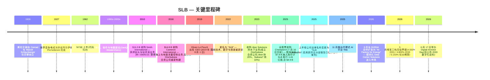
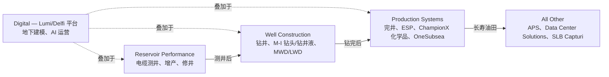
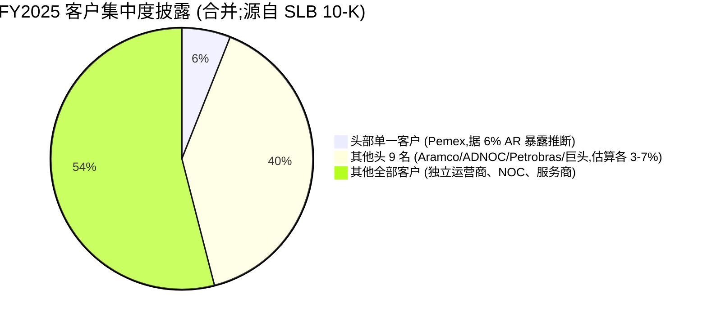
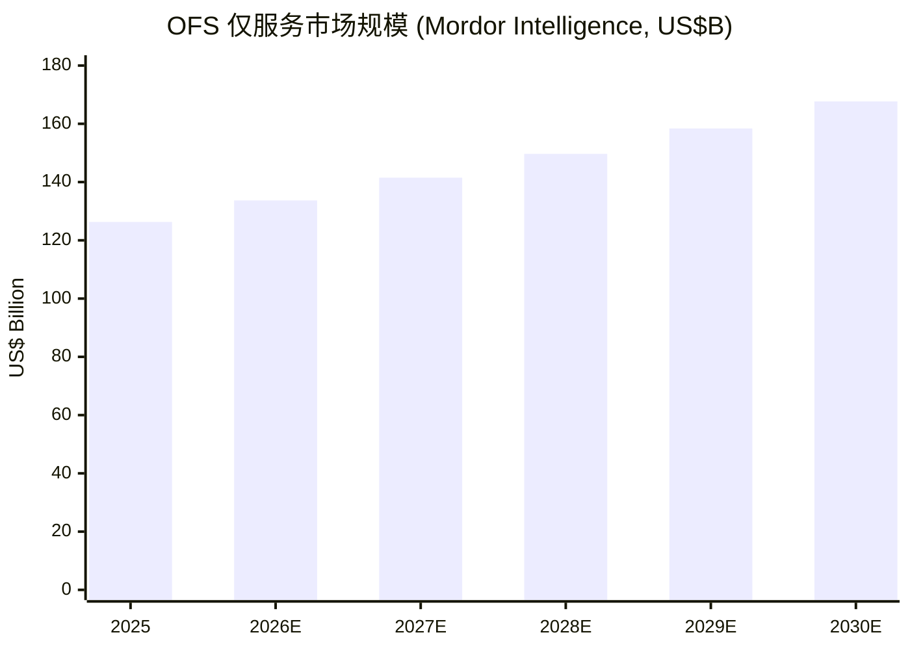

# SLB (SLB Limited, NYSE: SLB) — 公司研究

**截至 2026-06-16。** 主要资料来源:SLB 2025 财年 10-K(2026-01-23 报送)、2026-Q1 10-Q(2026-04-29 报送)、Q4-2025 与 Q1-2026 业绩公告、2026-05 高级票据发行 8-K、2026-06-10 Digital Investor Day 公告、SLB IR 官网、EDGAR 公开 CIK 0000087347 的 submissions JSON。第 10 节所有指标快照均为 2026-06-16 时点数据。

> **业绩更新——下周二 (6/17) Digital Investor Day 是近端催化;Q1 受中东停工影响 (本报告日 2026-06-16):** SLB 已公告将于 **2026 年 6 月 17 日(周三)** 在纽约举办 **Digital Investor Day**,CEO Olivier Le Peuch 与 CFO Stephane Biguet 将阐述 Digital 业务的 *"可扩展的 AI 驱动增长机会、财务画像与 2030 年数字化目标"* ([SLB Press Release — 2026 Digital Investor Day, 2026-06-10](https://www.sec.gov/Archives/edgar/data/0000087347/000119312526265771/d143063dex99.htm))——这是把 Digital/AI 选项性"显性化"为可量化指引的关键时点。基本面侧:Q1-2026 营收 $8.72 B (+3% YoY) 受中东撤场拖累,SLB 仍重申 2026 全年向股东返还 **超过 $4.0 B**(股息 + 回购)的承诺;Q1 经营现金流仅 $487 mm(自由现金流 –$23 mm),较 2025 年同期回落,反映活动递延。管理层重申 2026 全年 CapEx (资本开支) 指引约 $2.5 B,季度股息上调 3.5% 至每股 $0.295。资料来源:[SLB Q1-2026 8-K Exhibit 99, 2026-04-24](https://www.sec.gov/Archives/edgar/data/0000087347/000119312526174940/d111579dex99.htm)。

---

## 投资摘要 / Investment Summary (*分析师观点:*)

| 项目 | 本报告观点 |
|---|---|
| **评级 / Rating** | **持有 / Hold(中性偏建设性)** |
| **12 个月目标价 / 12-mo PT** | **$60**(基准情形;较现价 +13%) |
| **现价 / Current price** | **$53.09**(2026-06-16 收盘) |
| **市值 / Market cap** | **$79.4 B**(约 14.95 亿股) |
| **隐含上行 / Upside** | **+13%**(基准);bull $70 (+32%) / bear $44 (–17%) |
| **估值方法** | 2027E EPS $2.85 × 21× 目标 P/E ≈ $60;以 EV/EBITDA 12× 与 DCF 交叉验证 |
| **52 周区间** | $31.64 – $58.82 |
| **股息收益率** | 约 2.2%($0.295/季 × 4 = $1.18/年) |
| **Ticker / 交易所** | SLB / NYSE |

> 上表全部为 *分析师观点*,是本报告的预测视图,**不构成任何 10-K 披露**(10-K 不含目标价)。

**论点支柱(2–4 条,*分析师观点:*):**

1. **国际/海上资本开支上行周期是 2027–28 的核心引擎。** Goldman 与 Morgan Stanley 均把 SLB 列为离岸上行周期首选——离岸 CapEx 预计 2027/28 年同比 +6%/+10%,海上钻机利用率到 2028 年升破 85%、高端深水日租金涨 15–20% ([*Analyst view:* Goldman Sachs Energy Pulse, 2026-06-13](http://xs-macbook-air.local:5001/zsxq/pdf/214522822215541/Goldman%20Sachs-Energy%EF%BC%8C%20Utilities%20%26%20Mining%20Pulse.pdf);[*Analyst view:* Morgan Stanley Offshore Drilling Digest, 2026-06-02](http://xs-macbook-air.local:5001/zsxq/pdf/585412414515514/Morgan%20Stanley-Energy%20Services%20%26%20Equipment%EF%BC%9AThe%20Offshore%20Drilling%20Digest-260601.pdf))。
2. **ChampionX 把组合从钻井周期 Beta 转向经常性产品化学品收入。** Production Systems 已成第一大分部($13.33 B,+12% YoY),把营收重心从对钻机数敏感的 Well Construction(–11%)转向利润更稳的生产与采收 ([SLB 2025 10-K, Note 19](https://www.sec.gov/Archives/edgar/data/0000087347/000119312526021017/slb-20251231.htm))。
3. **Digital + NVIDIA AI 选项性是相对 Halliburton 的估值溢价来源。** Bernstein 将 SLB 评为 OFS 数字化"绝对龙头",估算 AI 可为其 EBITDA 增厚 8.7%、利润率 +1.9pp;6/17 Digital Investor Day 将首次给出 2030 数字化目标 ([*Analyst view:* Bernstein Oil Services AI, 2026-05-20](http://xs-macbook-air.local:5001/zsxq/pdf/585424481442844/Bernstein-Global%20Oil%20Services%20Oil%20Services%20%E2%80%93%20Artificial%20Intelligence.pdf))。
4. **估值已部分反映上述乐观,安全边际有限。** TTM P/E 23.4× 高于贯穿周期中位 18–20×;股价已从 52 周低 $31.64 回升约 +68%,近端再大幅上行需要 6/17 投资者日给出超预期的 Digital 指引或油价/油服周期确认 ([Yahoo Finance — SLB key statistics, 2026-06-16](https://finance.yahoo.com/quote/SLB/key-statistics/))。

## 目录
1. 公司概览
   - 1B. GF Score 基本面评分
2. 估值与目标价(决策层)
3. 公司历史
4. 管理团队
5. 产品与服务
6. 客户与上市策略
7. 行业概览
8. 竞争格局
9. 市场机会 (TAM)
10. 风险评估
11. 关键争论与催化剂
12. 视角评分
13. 参考资料

---

## 1. 公司概览

SLB——其法律名称自 2025 年起取代了原名 **Schlumberger Limited**——是全球最大的综合性油田服务 (OFS) 承包商。公司在 10-K 中自我定位为 *"一家领先的全球性技术公司,在 100 多个国家开展业务,员工总数约 109,000 人"* ([SLB 2025 10-K, Item 1 — Human Capital, p. 7](https://www.sec.gov/Archives/edgar/data/0000087347/000119312526021017/slb-20251231.htm))。其 NYSE 代码为 **SLB**;公司注册地为库拉索 (Curaçao),主要行政办公室分别位于巴黎(42 rue Saint-Dominique)、休斯敦(5599 San Felipe)及海牙(Parkstraat 83),使其成为少数采用多注册地结构运营的美股大盘工业类发行人之一 ([SLB 2025 10-K, cover](https://www.sec.gov/Archives/edgar/data/0000087347/000119312526021017/slb-20251231.htm))。公司于 2022 年由 *Schlumberger* 更名为 **SLB**,并于 2025 年正式将上市母公司法律名称变更为 "SLB Limited/NV",以匹配围绕技术、数字与"去碳油气"的战略再定位 ([SLB 2025 10-K, Item 1 — Corporate Information, p. 4](https://www.sec.gov/Archives/edgar/data/0000087347/000119312526021017/slb-20251231.htm))。

SLB 实际上做的事是:为油气生产商提供找油、钻井、完井、举升和地表处理所需的服务与设备——覆盖每一个含油气盆地、井的每个生命周期阶段,以及从沙特阿美 (Saudi Aramco)、阿布扎比国家石油公司 (ADNOC)、巴西国家石油公司 (Petrobras)、墨西哥国家石油公司 (Pemex) 等国家石油公司 (NOC),到国际综合性石油公司 (IOC) 和美国独立运营商在内的全部客户类型。其主要客户群被描述为 *"国家石油公司、大型综合性石油公司和独立运营商"* ([SLB 2025 10-K, Item 1 — Customers, p. 8](https://www.sec.gov/Archives/edgar/data/0000087347/000119312526021017/slb-20251231.htm)),且 10-K 明确披露 *"在 2025、2024 和 2023 年的每一年中,均无单一客户占 SLB 合并营收 10% 以上"* ([同上](https://www.sec.gov/Archives/edgar/data/0000087347/000119312526021017/slb-20251231.htm))——也就是说,合并营收在结构上分散在数百份合同与价格接受方之间。

**财务体量 (FY2025 vs FY2024 / FY2023)。** 全年 2025 营收为 **$35.71 B (–2% YoY)**,2024 年为 $36.29 B,2023 年为 $33.14 B;税前利润 (pretax income) $4.29 B、税项 $840 mm、净利润 (net income) $3.45 B,扣除少数股东权益 (noncontrolling interests) $77 mm 后归属于 SLB 的 GAAP 净利润为 **$3.37 B (YoY –24%)**,调整后 EBITDA $8.46 B (YoY –7%),调整后 EBITDA 利润率 23.7% ([SLB Q4-2025 8-K Exhibit 99, 2026-01-23](https://www.sec.gov/Archives/edgar/data/0000087347/000119312526020133/d59412dex99.htm);[SLB 2025 10-K, Consolidated Statement of Income](https://www.sec.gov/Archives/edgar/data/0000087347/000119312526021017/slb-20251231.htm))。摊薄后 GAAP EPS **$2.35**,2024 年为 $3.11,2023 年为 $2.91;同比 EPS 下滑主要由 2025 年约 $1,107 mm 的 charges & credits(非常规/费用项,2024 年为 $541 mm)驱动,包括 ChampionX 整合与购入资产公允价值上调、$210 mm goodwill impairment(商誉减值)等 ([SLB 2025 10-K, Note 19 / Item 7 MD&A](https://www.sec.gov/Archives/edgar/data/0000087347/000119312526021017/slb-20251231.htm))。

下面这张收入"桑基图"把 FY2025 的 $35.71 B 营收(按五分部来源)拆到 COGS、毛利、经营费用、税项,直到归属 SLB 的净利润 $3.37 B——是理解"SLB 如何赚钱"的最直观锚点。

<svg xmlns="http://www.w3.org/2000/svg" viewBox="0 0 1000 560" width="1000" height="560" role="img" aria-label="income statement Sankey"><rect x="0" y="0" width="1000" height="560" fill="#ffffff"/>
<text x="20.00" y="30.00" text-anchor="start" font-family="Helvetica,Arial,sans-serif" font-size="15" font-weight="700" fill="#1f2933">SLB 如何赚钱 / How SLB Makes Its Money — FY2025</text>
<path d="M 204.00,58.01 C 258.00,58.01 258.00,99.00 312.00,99.00 L 312.00,240.80 C 258.00,240.80 258.00,199.80 204.00,199.80 Z" fill="#93c5fd" fill-opacity="0.55"/>
<path d="M 452.00,92.00 C 506.00,92.00 506.00,247.37 560.00,247.37 L 560.00,293.03 C 506.00,293.03 506.00,137.66 452.00,137.66 Z" fill="#86efac" fill-opacity="0.55"/>
<path d="M 452.00,137.66 C 506.00,137.66 506.00,307.03 560.00,307.03 L 560.00,330.63 C 506.00,330.63 506.00,161.26 452.00,161.26 Z" fill="#fca5a5" fill-opacity="0.55"/>
<path d="M 328.00,99.00 C 382.00,99.00 382.00,92.00 436.00,92.00 L 436.00,161.26 C 382.00,161.26 382.00,168.26 328.00,168.26 Z" fill="#86efac" fill-opacity="0.55"/>
<path d="M 328.00,168.26 C 382.00,168.26 382.00,175.26 436.00,175.26 L 436.00,486.00 C 382.00,486.00 382.00,479.00 328.00,479.00 Z" fill="#fca5a5" fill-opacity="0.55"/>
<path d="M 204.00,213.80 C 258.00,213.80 258.00,240.80 312.00,240.80 L 312.00,366.96 C 258.00,366.96 258.00,339.97 204.00,339.97 Z" fill="#93c5fd" fill-opacity="0.55"/>
<path d="M 700.00,240.37 C 754.00,240.37 754.00,251.58 808.00,251.58 L 808.00,287.48 C 754.00,287.48 754.00,276.27 700.00,276.27 Z" fill="#86efac" fill-opacity="0.55"/>
<path d="M 700.00,276.27 C 754.00,276.27 754.00,301.48 808.00,301.48 L 808.00,310.42 C 754.00,310.42 754.00,285.21 700.00,285.21 Z" fill="#fca5a5" fill-opacity="0.55"/>
<path d="M 700.00,285.21 C 754.00,285.21 754.00,324.42 808.00,324.42 L 808.00,326.42 C 754.00,326.42 754.00,287.21 700.00,287.21 Z" fill="#fca5a5" fill-opacity="0.55"/>
<path d="M 576.00,247.37 C 630.00,247.37 630.00,240.37 684.00,240.37 L 684.00,286.03 C 630.00,286.03 630.00,293.03 576.00,293.03 Z" fill="#86efac" fill-opacity="0.55"/>
<path d="M 576.00,307.03 C 630.00,307.03 630.00,300.03 684.00,300.03 L 684.00,307.57 C 630.00,307.57 630.00,314.57 576.00,314.57 Z" fill="#fca5a5" fill-opacity="0.55"/>
<path d="M 576.00,314.57 C 630.00,314.57 630.00,321.57 684.00,321.57 L 684.00,337.63 C 630.00,337.63 630.00,330.63 576.00,330.63 Z" fill="#fca5a5" fill-opacity="0.55"/>
<path d="M 204.00,353.97 C 258.00,353.97 258.00,366.96 312.00,366.96 L 312.00,439.53 C 258.00,439.53 258.00,426.54 204.00,426.54 Z" fill="#93c5fd" fill-opacity="0.55"/>
<path d="M 204.00,440.54 C 258.00,440.54 258.00,439.53 312.00,439.53 L 312.00,467.84 C 258.00,467.84 258.00,468.85 204.00,468.85 Z" fill="#93c5fd" fill-opacity="0.55"/>
<path d="M 204.00,482.85 C 258.00,482.85 258.00,467.84 312.00,467.84 L 312.00,488.98 C 258.00,488.98 258.00,503.99 204.00,503.99 Z" fill="#93c5fd" fill-opacity="0.55"/>
<path d="M 204.00,517.99 C 258.00,517.99 258.00,488.98 312.00,488.98 L 312.00,490.98 C 258.00,490.98 258.00,519.99 204.00,519.99 Z" fill="#93c5fd" fill-opacity="0.55"/>
<rect x="188.00" y="58.01" width="16" height="141.80" rx="1.5" fill="#2563eb"/>
<rect x="188.00" y="213.80" width="16" height="126.16" rx="1.5" fill="#2563eb"/>
<rect x="188.00" y="353.97" width="16" height="72.57" rx="1.5" fill="#2563eb"/>
<rect x="188.00" y="440.54" width="16" height="28.31" rx="1.5" fill="#2563eb"/>
<rect x="188.00" y="482.85" width="16" height="21.14" rx="1.5" fill="#2563eb"/>
<rect x="188.00" y="517.99" width="16" height="2.00" rx="1.5" fill="#2563eb"/>
<rect x="312.00" y="99.00" width="16" height="380.00" rx="1.5" fill="#1e3a8a"/>
<rect x="436.00" y="92.00" width="16" height="69.26" rx="1.5" fill="#15803d"/>
<rect x="436.00" y="175.26" width="16" height="310.74" rx="1.5" fill="#dc2626"/>
<rect x="560.00" y="247.37" width="16" height="45.66" rx="1.5" fill="#15803d"/>
<rect x="560.00" y="307.03" width="16" height="23.60" rx="1.5" fill="#dc2626"/>
<rect x="684.00" y="240.37" width="16" height="45.66" rx="1.5" fill="#15803d"/>
<rect x="684.00" y="300.03" width="16" height="7.54" rx="1.5" fill="#dc2626"/>
<rect x="684.00" y="321.57" width="16" height="16.06" rx="1.5" fill="#dc2626"/>
<rect x="808.00" y="251.58" width="16" height="35.90" rx="1.5" fill="#15803d"/>
<rect x="808.00" y="301.48" width="16" height="8.94" rx="1.5" fill="#dc2626"/>
<rect x="808.00" y="324.42" width="16" height="2.00" rx="1.5" fill="#dc2626"/>
<line x1="188.00" y1="128.91" x2="182.00" y2="96.92" stroke="#cbd5e1" stroke-width="1"/>
<text x="179.00" y="99.92" text-anchor="end" font-family="Helvetica,Arial,sans-serif" font-size="11.5" font-weight="700" fill="#1f2933">Production Systems</text>
<text x="179.00" y="112.92" text-anchor="end" font-family="Helvetica,Arial,sans-serif" font-size="10" font-weight="400" fill="#52606d">$13.3B  (37.3%)</text>
<line x1="188.00" y1="276.89" x2="182.00" y2="244.89" stroke="#cbd5e1" stroke-width="1"/>
<text x="179.00" y="247.89" text-anchor="end" font-family="Helvetica,Arial,sans-serif" font-size="11.5" font-weight="700" fill="#1f2933">Well Construction</text>
<text x="179.00" y="260.89" text-anchor="end" font-family="Helvetica,Arial,sans-serif" font-size="10" font-weight="400" fill="#52606d">$11.9B  (33.2%)</text>
<line x1="188.00" y1="390.25" x2="182.00" y2="358.26" stroke="#cbd5e1" stroke-width="1"/>
<text x="179.00" y="361.26" text-anchor="end" font-family="Helvetica,Arial,sans-serif" font-size="11.5" font-weight="700" fill="#1f2933">Reservoir Performance</text>
<text x="179.00" y="374.26" text-anchor="end" font-family="Helvetica,Arial,sans-serif" font-size="10" font-weight="400" fill="#52606d">$6.8B  (19.1%)</text>
<line x1="188.00" y1="454.69" x2="182.00" y2="422.70" stroke="#cbd5e1" stroke-width="1"/>
<text x="179.00" y="425.70" text-anchor="end" font-family="Helvetica,Arial,sans-serif" font-size="11.5" font-weight="700" fill="#1f2933">Digital</text>
<text x="179.00" y="438.70" text-anchor="end" font-family="Helvetica,Arial,sans-serif" font-size="10" font-weight="400" fill="#52606d">$2.7B  (7.4%)</text>
<line x1="188.00" y1="493.42" x2="182.00" y2="461.43" stroke="#cbd5e1" stroke-width="1"/>
<text x="179.00" y="464.43" text-anchor="end" font-family="Helvetica,Arial,sans-serif" font-size="11.5" font-weight="700" fill="#1f2933">All Other</text>
<text x="179.00" y="477.43" text-anchor="end" font-family="Helvetica,Arial,sans-serif" font-size="10" font-weight="400" fill="#52606d">$2.0B  (5.6%)</text>
<line x1="188.00" y1="518.99" x2="182.00" y2="487.00" stroke="#cbd5e1" stroke-width="1"/>
<text x="179.00" y="490.00" text-anchor="end" font-family="Helvetica,Arial,sans-serif" font-size="11.5" font-weight="700" fill="#1f2933">Eliminations</text>
<text x="179.00" y="503.00" text-anchor="end" font-family="Helvetica,Arial,sans-serif" font-size="10" font-weight="400" fill="#52606d">-$938.0M  (-2.6%)</text>
<rect x="331.00" y="81.00" width="106.80" height="26" rx="2" fill="#ffffff" fill-opacity="0.72"/>
<text x="334.00" y="93.00" text-anchor="start" font-family="Helvetica,Arial,sans-serif" font-size="11.5" font-weight="700" fill="#1f2933">Revenue</text>
<text x="334.00" y="106.00" text-anchor="start" font-family="Helvetica,Arial,sans-serif" font-size="10" font-weight="400" fill="#52606d">$35.7B  (100.0%)</text>
<rect x="455.00" y="74.00" width="94.20" height="26" rx="2" fill="#ffffff" fill-opacity="0.72"/>
<text x="458.00" y="86.00" text-anchor="start" font-family="Helvetica,Arial,sans-serif" font-size="11.5" font-weight="700" fill="#1f2933">Gross Profit</text>
<text x="458.00" y="99.00" text-anchor="start" font-family="Helvetica,Arial,sans-serif" font-size="10" font-weight="400" fill="#52606d">$6.5B  (18.2%)</text>
<rect x="455.00" y="157.26" width="144.60" height="26" rx="2" fill="#ffffff" fill-opacity="0.72"/>
<text x="458.00" y="169.26" text-anchor="start" font-family="Helvetica,Arial,sans-serif" font-size="11.5" font-weight="700" fill="#1f2933">Cost of Revenue (COGS)</text>
<text x="458.00" y="182.26" text-anchor="start" font-family="Helvetica,Arial,sans-serif" font-size="10" font-weight="400" fill="#52606d">$29.2B  (81.8%)</text>
<rect x="579.00" y="229.37" width="106.80" height="26" rx="2" fill="#ffffff" fill-opacity="0.72"/>
<text x="582.00" y="241.37" text-anchor="start" font-family="Helvetica,Arial,sans-serif" font-size="11.5" font-weight="700" fill="#1f2933">Operating Income</text>
<text x="582.00" y="254.37" text-anchor="start" font-family="Helvetica,Arial,sans-serif" font-size="10" font-weight="400" fill="#52606d">$4.3B  (12.0%)</text>
<rect x="579.00" y="289.03" width="150.90" height="26" rx="2" fill="#ffffff" fill-opacity="0.72"/>
<text x="582.00" y="301.03" text-anchor="start" font-family="Helvetica,Arial,sans-serif" font-size="11.5" font-weight="700" fill="#1f2933">Total Operating Expense</text>
<text x="582.00" y="314.03" text-anchor="start" font-family="Helvetica,Arial,sans-serif" font-size="10" font-weight="400" fill="#52606d">$2.2B  (6.2%)</text>
<rect x="703.00" y="222.37" width="94.20" height="26" rx="2" fill="#ffffff" fill-opacity="0.72"/>
<text x="706.00" y="234.37" text-anchor="start" font-family="Helvetica,Arial,sans-serif" font-size="11.5" font-weight="700" fill="#1f2933">Pretax Income</text>
<text x="706.00" y="247.37" text-anchor="start" font-family="Helvetica,Arial,sans-serif" font-size="10" font-weight="400" fill="#52606d">$4.3B  (12.0%)</text>
<rect x="703.00" y="282.03" width="100.50" height="26" rx="2" fill="#ffffff" fill-opacity="0.72"/>
<text x="706.00" y="294.03" text-anchor="start" font-family="Helvetica,Arial,sans-serif" font-size="11.5" font-weight="700" fill="#1f2933">R&amp;D</text>
<text x="706.00" y="307.03" text-anchor="start" font-family="Helvetica,Arial,sans-serif" font-size="10" font-weight="400" fill="#52606d">$709.0M  (2.0%)</text>
<rect x="703.00" y="307.03" width="87.90" height="26" rx="2" fill="#ffffff" fill-opacity="0.72"/>
<text x="706.00" y="319.03" text-anchor="start" font-family="Helvetica,Arial,sans-serif" font-size="11.5" font-weight="700" fill="#1f2933">Other OpEx</text>
<text x="706.00" y="332.03" text-anchor="start" font-family="Helvetica,Arial,sans-serif" font-size="10" font-weight="400" fill="#52606d">$1.5B  (4.2%)</text>
<text x="833.00" y="266.53" text-anchor="start" font-family="Helvetica,Arial,sans-serif" font-size="11.5" font-weight="700" fill="#1f2933">Net Income</text>
<text x="833.00" y="279.53" text-anchor="start" font-family="Helvetica,Arial,sans-serif" font-size="10" font-weight="400" fill="#52606d">$3.4B  (9.4%)</text>
<text x="833.00" y="302.95" text-anchor="start" font-family="Helvetica,Arial,sans-serif" font-size="11.5" font-weight="700" fill="#1f2933">Income Tax</text>
<text x="833.00" y="315.95" text-anchor="start" font-family="Helvetica,Arial,sans-serif" font-size="10" font-weight="400" fill="#52606d">$840.0M  (2.4%)</text>
<text x="833.00" y="327.95" text-anchor="start" font-family="Helvetica,Arial,sans-serif" font-size="11.5" font-weight="700" fill="#1f2933">Minority Interest</text>
<text x="833.00" y="340.95" text-anchor="start" font-family="Helvetica,Arial,sans-serif" font-size="10" font-weight="400" fill="#52606d">$77.0M  (0.22%)</text>
<text x="500.00" y="544.00" text-anchor="middle" font-family="Helvetica,Arial,sans-serif" font-size="10" font-weight="400" fill="#52606d">Source: SLB FY2025 10-K, Consolidated Statement of Income + Note 19 Segments</text>
</svg>

来源 / Source: [SLB 2025 10-K, Consolidated Statement of Income + Note 19 — Segment Information](https://www.sec.gov/Archives/edgar/data/0000087347/000119312526021017/slb-20251231.htm)。Cost of services $16,764 mm + Cost of sales $12,437 mm = COGS $29,201 mm;毛利 $6,509 mm;R&E $709 mm;pretax $4,291 mm;tax $840 mm;归属 SLB 净利润 $3,374 mm。

**SLB 如何赚钱——营收结构。** SLB 收入的三分之二来自 **服务 (services)** ($21.20 B,2025 年占总营收 59%),三分之一来自 **产品销售 (products)** ($14.51 B,41%),其中 2025 年 7 月 ChampionX 完成交割后,产品销售比例实质性提升 ([SLB 2025 10-K, Consolidated Statement of Income](https://www.sec.gov/Archives/edgar/data/0000087347/000119312526021017/slb-20251231.htm))。按分部口径(2025 年 Q3 起改为五大分部:Digital / Reservoir Performance / Well Construction / Production Systems / All Other,加抵销项),FY2025 的拆分(抵销前)为:Digital $2.66 B、Reservoir Performance $6.82 B、Well Construction $11.86 B、Production Systems $13.33 B、All Other $1.99 B;抵销项 $(940) mm ([SLB 2025 10-K, Note 19 Segment Information](https://www.sec.gov/Archives/edgar/data/0000087347/000119312526021017/slb-20251231.htm))。两个最显著的轨迹变化:Well Construction **同比下滑 11%**(钻井周期降温叠加海上业务回款比北美陆上滞后的结构),Production Systems **同比增长 12%**(ChampionX 并表约 5.5 个月,加上完井与人工举升 (Artificial Lift) 业务的内生强劲)。

<svg xmlns="http://www.w3.org/2000/svg" viewBox="0 0 720 460" width="720" height="460" role="img" aria-label="revenue donut"><rect x="0" y="0" width="720" height="460" fill="#ffffff"/>
<text x="20.00" y="30.00" text-anchor="start" font-family="Helvetica,Arial,sans-serif" font-size="15" font-weight="700" fill="#1f2933">FY2025 营收按分部 / Revenue by Segment (抵销前)</text>
<path d="M 288.00,107.20 A 132 132 0 0 1 387.78,325.62 L 346.96,290.26 A 78 78 0 0 0 288.00,161.20 Z" fill="#2563eb"/>
<path d="M 387.78,325.62 A 132 132 0 0 1 166.17,290.02 L 216.01,269.23 A 78 78 0 0 0 346.96,290.26 Z" fill="#15803d"/>
<path d="M 166.17,290.02 A 132 132 0 0 1 193.61,146.92 L 232.23,184.67 A 78 78 0 0 0 216.01,269.23 Z" fill="#d97706"/>
<path d="M 193.61,146.92 A 132 132 0 0 1 243.90,114.79 L 261.94,165.68 A 78 78 0 0 0 232.23,184.67 Z" fill="#7c3aed"/>
<path d="M 243.90,114.79 A 132 132 0 0 1 288.00,107.20 L 288.00,161.20 A 78 78 0 0 0 261.94,165.68 Z" fill="#dc2626"/>
<text x="288.00" y="235.20" text-anchor="middle" font-family="Helvetica,Arial,sans-serif" font-size="18" font-weight="800" fill="#1f2933">SLB</text>
<text x="288.00" y="255.20" text-anchor="middle" font-family="Helvetica,Arial,sans-serif" font-size="13" font-weight="600" fill="#52606d">$36.6B</text>
<text x="288.00" y="271.20" text-anchor="middle" font-family="Helvetica,Arial,sans-serif" font-size="10" font-weight="400" fill="#8a97a3">total</text>
<line x1="413.52" y1="181.86" x2="429.52" y2="181.86" stroke="#2563eb" stroke-width="1.4"/>
<text x="433.52" y="179.86" text-anchor="start" font-family="Helvetica,Arial,sans-serif" font-size="11" font-weight="700" fill="#1f2933">Production Systems</text>
<text x="433.52" y="193.86" text-anchor="start" font-family="Helvetica,Arial,sans-serif" font-size="10" font-weight="400" fill="#52606d">$13.3B  (36.4%)</text>
<line x1="266.11" y1="375.45" x2="250.11" y2="375.45" stroke="#15803d" stroke-width="1.4"/>
<text x="246.11" y="373.45" text-anchor="end" font-family="Helvetica,Arial,sans-serif" font-size="11" font-weight="700" fill="#1f2933">Well Construction</text>
<text x="246.11" y="387.45" text-anchor="end" font-family="Helvetica,Arial,sans-serif" font-size="10" font-weight="400" fill="#52606d">$11.9B  (32.4%)</text>
<line x1="152.47" y1="213.21" x2="136.47" y2="213.21" stroke="#d97706" stroke-width="1.4"/>
<text x="132.47" y="211.21" text-anchor="end" font-family="Helvetica,Arial,sans-serif" font-size="11" font-weight="700" fill="#1f2933">Reservoir Performance</text>
<text x="132.47" y="225.21" text-anchor="end" font-family="Helvetica,Arial,sans-serif" font-size="10" font-weight="400" fill="#52606d">$6.8B  (18.6%)</text>
<line x1="213.68" y1="122.92" x2="197.68" y2="122.92" stroke="#7c3aed" stroke-width="1.4"/>
<text x="193.68" y="120.92" text-anchor="end" font-family="Helvetica,Arial,sans-serif" font-size="11" font-weight="700" fill="#1f2933">Digital</text>
<text x="193.68" y="134.92" text-anchor="end" font-family="Helvetica,Arial,sans-serif" font-size="10" font-weight="400" fill="#52606d">$2.7B  (7.3%)</text>
<line x1="264.61" y1="103.20" x2="248.61" y2="103.20" stroke="#dc2626" stroke-width="1.4"/>
<text x="244.61" y="101.20" text-anchor="end" font-family="Helvetica,Arial,sans-serif" font-size="11" font-weight="700" fill="#1f2933">All Other</text>
<text x="244.61" y="115.20" text-anchor="end" font-family="Helvetica,Arial,sans-serif" font-size="10" font-weight="400" fill="#52606d">$2.0B  (5.4%)</text>
<text x="360.00" y="444.00" text-anchor="middle" font-family="Helvetica,Arial,sans-serif" font-size="10" font-weight="400" fill="#52606d">Source: SLB FY2025 10-K, Note 19 — Segment Information</text>
</svg>

来源 / Source: [SLB 2025 10-K, Note 19 — Segment Information](https://www.sec.gov/Archives/edgar/data/0000087347/000119312526021017/slb-20251231.htm)(抵销前五分部口径)。

<svg xmlns="http://www.w3.org/2000/svg" viewBox="0 0 860 470" width="860" height="470" role="img" aria-label="historical revenue bars"><rect x="0" y="0" width="860" height="470" fill="#ffffff"/>
<text x="20.00" y="30.00" text-anchor="start" font-family="Helvetica,Arial,sans-serif" font-size="15" font-weight="700" fill="#1f2933">分部营收历史 / Revenue by Segment FY2023–FY2025 (新五分部口径)</text>
<rect x="20.00" y="44" width="11" height="11" rx="2" fill="#2563eb"/>
<text x="36.00" y="53.00" text-anchor="start" font-family="Helvetica,Arial,sans-serif" font-size="10.5" font-weight="400" fill="#1f2933">Production Systems</text>
<rect x="168.80" y="44" width="11" height="11" rx="2" fill="#15803d"/>
<text x="184.80" y="53.00" text-anchor="start" font-family="Helvetica,Arial,sans-serif" font-size="10.5" font-weight="400" fill="#1f2933">Well Construction</text>
<rect x="311.00" y="44" width="11" height="11" rx="2" fill="#d97706"/>
<text x="327.00" y="53.00" text-anchor="start" font-family="Helvetica,Arial,sans-serif" font-size="10.5" font-weight="400" fill="#1f2933">Reservoir Performance</text>
<rect x="479.60" y="44" width="11" height="11" rx="2" fill="#7c3aed"/>
<text x="495.60" y="53.00" text-anchor="start" font-family="Helvetica,Arial,sans-serif" font-size="10.5" font-weight="400" fill="#1f2933">Digital</text>
<rect x="555.80" y="44" width="11" height="11" rx="2" fill="#dc2626"/>
<text x="571.80" y="53.00" text-anchor="start" font-family="Helvetica,Arial,sans-serif" font-size="10.5" font-weight="400" fill="#1f2933">All Other</text>
<line x1="70" y1="412.00" x2="834" y2="412.00" stroke="#eceff2" stroke-width="1"/>
<text x="64.00" y="415.00" text-anchor="end" font-family="Helvetica,Arial,sans-serif" font-size="9.5" font-weight="400" fill="#52606d">$0</text>
<line x1="70" y1="345.20" x2="834" y2="345.20" stroke="#eceff2" stroke-width="1"/>
<text x="64.00" y="348.20" text-anchor="end" font-family="Helvetica,Arial,sans-serif" font-size="9.5" font-weight="400" fill="#52606d">$8.0B</text>
<line x1="70" y1="278.40" x2="834" y2="278.40" stroke="#eceff2" stroke-width="1"/>
<text x="64.00" y="281.40" text-anchor="end" font-family="Helvetica,Arial,sans-serif" font-size="9.5" font-weight="400" fill="#52606d">$16.0B</text>
<line x1="70" y1="211.60" x2="834" y2="211.60" stroke="#eceff2" stroke-width="1"/>
<text x="64.00" y="214.60" text-anchor="end" font-family="Helvetica,Arial,sans-serif" font-size="9.5" font-weight="400" fill="#52606d">$24.0B</text>
<line x1="70" y1="144.80" x2="834" y2="144.80" stroke="#eceff2" stroke-width="1"/>
<text x="64.00" y="147.80" text-anchor="end" font-family="Helvetica,Arial,sans-serif" font-size="9.5" font-weight="400" fill="#52606d">$32.0B</text>
<line x1="70" y1="78.00" x2="834" y2="78.00" stroke="#eceff2" stroke-width="1"/>
<text x="64.00" y="81.00" text-anchor="end" font-family="Helvetica,Arial,sans-serif" font-size="9.5" font-weight="400" fill="#52606d">$40.0B</text>
<rect x="123.48" y="323.50" width="147.71" height="88.50" fill="#2563eb"/>
<rect x="123.48" y="214.96" width="147.71" height="108.54" fill="#15803d"/>
<rect x="123.48" y="159.02" width="147.71" height="55.94" fill="#d97706"/>
<rect x="123.48" y="140.65" width="147.71" height="18.37" fill="#7c3aed"/>
<rect x="123.48" y="135.30" width="147.71" height="5.34" fill="#dc2626"/>
<text x="197.33" y="428.00" text-anchor="middle" font-family="Helvetica,Arial,sans-serif" font-size="10" font-weight="400" fill="#52606d">2023</text>
<rect x="378.15" y="312.31" width="147.71" height="99.69" fill="#2563eb"/>
<rect x="378.15" y="200.76" width="147.71" height="111.55" fill="#15803d"/>
<rect x="378.15" y="140.81" width="147.71" height="59.95" fill="#d97706"/>
<rect x="378.15" y="120.44" width="147.71" height="20.37" fill="#7c3aed"/>
<rect x="378.15" y="102.74" width="147.71" height="17.70" fill="#dc2626"/>
<text x="452.00" y="428.00" text-anchor="middle" font-family="Helvetica,Arial,sans-serif" font-size="10" font-weight="400" fill="#52606d">2024</text>
<rect x="632.81" y="300.70" width="147.71" height="111.30" fill="#2563eb"/>
<rect x="632.81" y="201.68" width="147.71" height="99.02" fill="#15803d"/>
<rect x="632.81" y="144.74" width="147.71" height="56.94" fill="#d97706"/>
<rect x="632.81" y="122.53" width="147.71" height="22.21" fill="#7c3aed"/>
<rect x="632.81" y="105.91" width="147.71" height="16.62" fill="#dc2626"/>
<text x="706.67" y="428.00" text-anchor="middle" font-family="Helvetica,Arial,sans-serif" font-size="10" font-weight="400" fill="#52606d">2025</text>
<text x="430.00" y="454.00" text-anchor="middle" font-family="Helvetica,Arial,sans-serif" font-size="10" font-weight="400" fill="#52606d">Source: SLB FY2024–FY2025 10-Ks, Note 19 — Segment Information (五分部重述)</text>
</svg>

来源 / Source: [SLB 2024–2025 10-Ks, Note 19 — Segment Information](https://www.sec.gov/Archives/edgar/data/0000087347/000119312526021017/slb-20251231.htm)。FY2023 按新五分部口径近似重述(FY2024/FY2025 为披露值)。

**地区结构与俄罗斯拖累。** SLB 仍是全球运营公司;FY2025 披露的地区拆分大致为:北美 $6.9 B (19%)、拉丁美洲 $7.5 B (21%)、欧洲与非洲 $9.7 B (27%)、中东与亚洲 $11.5 B (32%) ([SLB 2025 10-K, MD&A geographic table](https://www.sec.gov/Archives/edgar/data/0000087347/000119312526021017/slb-20251231.htm))。俄罗斯业务在 2025 年占全球营收 *"约 4%"*(较 2021 年高个位数占比有所下降);10-K 披露在俄罗斯剩余净资产为 $0.7 B,并提到 *"2023 年 7 月,我们宣布停止从全球所有工厂向俄罗斯发运产品"* ([SLB 2025 10-K, Item 1A — Risk Factors / Russia exposure](https://www.sec.gov/Archives/edgar/data/0000087347/000119312526021017/slb-20251231.htm))。Q1-2026 业绩公告则指出,中东(卡塔尔不可抗力、伊拉克及海上生产中断)造成约 $200 mm 量级的营收冲击——这是一次性单季冲击,显著拖累 Reservoir Performance 与 Well Construction ([SLB Q1-2026 8-K Exhibit 99, 2026-04-24](https://www.sec.gov/Archives/edgar/data/0000087347/000119312526174940/d111579dex99.htm))。

<svg xmlns="http://www.w3.org/2000/svg" viewBox="0 0 720 460" width="720" height="460" role="img" aria-label="revenue donut"><rect x="0" y="0" width="720" height="460" fill="#ffffff"/>
<text x="20.00" y="30.00" text-anchor="start" font-family="Helvetica,Arial,sans-serif" font-size="15" font-weight="700" fill="#1f2933">FY2025 营收按地区 / Revenue by Geography</text>
<path d="M 288.00,107.20 A 132 132 0 0 1 406.34,297.67 L 357.93,273.75 A 78 78 0 0 0 288.00,161.20 Z" fill="#2563eb"/>
<path d="M 406.34,297.67 A 132 132 0 0 1 213.46,348.14 L 243.95,303.57 A 78 78 0 0 0 357.93,273.75 Z" fill="#15803d"/>
<path d="M 213.46,348.14 A 132 132 0 0 1 164.14,193.57 L 214.81,212.24 A 78 78 0 0 0 243.95,303.57 Z" fill="#d97706"/>
<path d="M 164.14,193.57 A 132 132 0 0 1 288.00,107.20 L 288.00,161.20 A 78 78 0 0 0 214.81,212.24 Z" fill="#7c3aed"/>
<text x="288.00" y="235.20" text-anchor="middle" font-family="Helvetica,Arial,sans-serif" font-size="18" font-weight="800" fill="#1f2933">SLB</text>
<text x="288.00" y="255.20" text-anchor="middle" font-family="Helvetica,Arial,sans-serif" font-size="13" font-weight="600" fill="#52606d">$35.6B</text>
<text x="288.00" y="271.20" text-anchor="middle" font-family="Helvetica,Arial,sans-serif" font-size="10" font-weight="400" fill="#8a97a3">total</text>
<line x1="405.22" y1="166.37" x2="421.22" y2="166.37" stroke="#2563eb" stroke-width="1.4"/>
<text x="425.22" y="164.37" text-anchor="start" font-family="Helvetica,Arial,sans-serif" font-size="11" font-weight="700" fill="#1f2933">Middle East &amp; Asia</text>
<text x="425.22" y="178.37" text-anchor="start" font-family="Helvetica,Arial,sans-serif" font-size="10" font-weight="400" fill="#52606d">$11.5B  (32.3%)</text>
<line x1="322.93" y1="372.71" x2="338.93" y2="372.71" stroke="#15803d" stroke-width="1.4"/>
<text x="342.93" y="370.71" text-anchor="start" font-family="Helvetica,Arial,sans-serif" font-size="11" font-weight="700" fill="#1f2933">Europe &amp; Africa</text>
<text x="342.93" y="384.71" text-anchor="start" font-family="Helvetica,Arial,sans-serif" font-size="10" font-weight="400" fill="#52606d">$9.7B  (27.2%)</text>
<line x1="156.53" y1="281.15" x2="140.53" y2="281.15" stroke="#d97706" stroke-width="1.4"/>
<text x="136.53" y="279.15" text-anchor="end" font-family="Helvetica,Arial,sans-serif" font-size="11" font-weight="700" fill="#1f2933">Latin America</text>
<text x="136.53" y="293.15" text-anchor="end" font-family="Helvetica,Arial,sans-serif" font-size="10" font-weight="400" fill="#52606d">$7.5B  (21.1%)</text>
<line x1="209.07" y1="126.00" x2="193.07" y2="126.00" stroke="#7c3aed" stroke-width="1.4"/>
<text x="189.07" y="124.00" text-anchor="end" font-family="Helvetica,Arial,sans-serif" font-size="11" font-weight="700" fill="#1f2933">North America</text>
<text x="189.07" y="138.00" text-anchor="end" font-family="Helvetica,Arial,sans-serif" font-size="10" font-weight="400" fill="#52606d">$6.9B  (19.4%)</text>
<text x="360.00" y="444.00" text-anchor="middle" font-family="Helvetica,Arial,sans-serif" font-size="10" font-weight="400" fill="#52606d">Source: SLB FY2025 10-K, Item 7 MD&amp;A — Geographic revenue</text>
</svg>

来源 / Source: [SLB 2025 10-K, Item 7 MD&A — Geographic revenue](https://www.sec.gov/Archives/edgar/data/0000087347/000119312526021017/slb-20251231.htm)。

**估值快照 (2026-06-16)。** SLB 现价 **$53.09**(2026-06-16 收盘,较 6/3 的 $56.56 回落约 6%,其中 6/15–6/16 两日下跌反映了 Digital Investor Day 前的获利了结与中东不确定性),市值 **$79.4 B**(约 14.95 亿股),**TTM P/E 23.4×**、**TTM P/S 2.21×**、EV/EBITDA 11.9×、P/B 3.03×、股息收益率约 2.2%、52 周区间 $31.64–$58.82 ([Yahoo Finance — SLB key statistics, 2026-06-16](https://finance.yahoo.com/quote/SLB/key-statistics/))。同屏可比公司(2026-06-16):Halliburton (HAL) TTM P/E 20.6× / EV-EBITDA 9.2×,Baker Hughes (BKR) 19.6× / 12.9×,Weatherford (WFRD) 15.4× / 7.9×,NOV Inc. 79.8×(盈利受压,详见第 8 节)/ 9.1×,Tenaris (TS) 15.9× / 21.1× ([Yahoo Finance peer screens, 2026-06-16](https://finance.yahoo.com/quote/SLB/key-statistics/))。剔除 NOV 盈利受压与 TS 的极值后,OFS"三大"(SLB/HAL/BKR)TTM P/E 中位约 20.6×、EV/EBITDA 约 9–13×,SLB 在 P/E 上较 HAL/BKR **溢价约 3 倍** (turn),EV/EBITDA 上较 HAL **溢价约 2.7 倍**。解读:该溢价反映了(a) SLB 国际/NOC 占比更高(收益质量通常优于 US 陆上业务集中的 HAL)、(b) ChampionX 带来的更高毛利率经常性产品化学品 (Production Chemistry) 收入跃升、(c) Digital 与 Data Center Solutions 选项被市场视为重新估值催化(详见第 2 节决策层与第 12.x 节卖方观点演变)。

---

## 1B. GF Score 基本面评分(GuruFocus 式,*分析师观点:*)

GF Score 是模仿 GuruFocus GF Score™ 的五维基本面评分(Financial Strength / Profitability / Growth / GF Value / Momentum,各维 0–10,合成 0–100)。**它是本报告自建的分析框架,不是 GuruFocus 的发布值,也不构成任何 10-K 披露**;每个维度的底层指标各自带有行内引用。SLB 综合得分约 **58/100**(各维 6 / 7 / 5 / 5 / 6)——典型的"高质量但周期暴露、估值无折让"的成熟蓝筹画像。

<svg xmlns="http://www.w3.org/2000/svg" viewBox="0 0 500 500" width="500" height="500" role="img" aria-label="GF Score radar">
<rect x="0" y="0" width="500" height="500" fill="#ffffff"/>
<text x="20" y="24" font-family="Helvetica,Arial,sans-serif" font-size="15" font-weight="700" fill="#1f2933">GF Score (GuruFocus-style): 58/100</text>
<text x="20" y="41" font-family="Helvetica,Arial,sans-serif" font-size="11" fill="#52606d">51–70 Poor future performance potential</text>
<polygon points="250.0,88.0 392.7,191.6 338.2,359.4 161.8,359.4 107.3,191.6" fill="#e9f5ec" stroke="none"/>
<polygon points="250.0,208.0 278.5,228.7 267.6,262.3 232.4,262.3 221.5,228.7" fill="none" stroke="#c5d3cb" stroke-width="1"/>
<polygon points="250.0,178.0 307.1,219.5 285.3,286.5 214.7,286.5 192.9,219.5" fill="none" stroke="#c5d3cb" stroke-width="1"/>
<polygon points="250.0,148.0 335.6,210.2 302.9,310.8 197.1,310.8 164.4,210.2" fill="none" stroke="#c5d3cb" stroke-width="1"/>
<polygon points="250.0,118.0 364.1,200.9 320.5,335.1 179.5,335.1 135.9,200.9" fill="none" stroke="#c5d3cb" stroke-width="1"/>
<polygon points="250.0,88.0 392.7,191.6 338.2,359.4 161.8,359.4 107.3,191.6" fill="none" stroke="#c5d3cb" stroke-width="1.3"/>
<line x1="250" y1="238" x2="161.8" y2="359.4" stroke="#cfdad3" stroke-width="1"/>
<text x="146.5" y="392.4" text-anchor="end" font-family="Helvetica,Arial,sans-serif" font-size="11.5" font-weight="600" fill="#1f2933">财务实力</text>
<text x="197.1" y="304.8" text-anchor="middle" font-family="Helvetica,Arial,sans-serif" font-size="10.5" font-weight="700" fill="#1f2933">6</text>
<line x1="250" y1="238" x2="250.0" y2="88.0" stroke="#cfdad3" stroke-width="1"/>
<text x="250.0" y="58.0" text-anchor="middle" font-family="Helvetica,Arial,sans-serif" font-size="11.5" font-weight="600" fill="#1f2933">盈利能力</text>
<text x="250.0" y="127.0" text-anchor="middle" font-family="Helvetica,Arial,sans-serif" font-size="10.5" font-weight="700" fill="#1f2933">7</text>
<line x1="250" y1="238" x2="107.3" y2="191.6" stroke="#cfdad3" stroke-width="1"/>
<text x="82.6" y="183.6" text-anchor="end" font-family="Helvetica,Arial,sans-serif" font-size="11.5" font-weight="600" fill="#1f2933">成长性</text>
<text x="178.7" y="208.8" text-anchor="middle" font-family="Helvetica,Arial,sans-serif" font-size="10.5" font-weight="700" fill="#1f2933">5</text>
<line x1="250" y1="238" x2="392.7" y2="191.6" stroke="#cfdad3" stroke-width="1"/>
<text x="417.4" y="183.6" text-anchor="start" font-family="Helvetica,Arial,sans-serif" font-size="11.5" font-weight="600" fill="#1f2933">估值</text>
<text x="321.3" y="208.8" text-anchor="middle" font-family="Helvetica,Arial,sans-serif" font-size="10.5" font-weight="700" fill="#1f2933">5</text>
<line x1="250" y1="238" x2="338.2" y2="359.4" stroke="#cfdad3" stroke-width="1"/>
<text x="353.5" y="392.4" text-anchor="start" font-family="Helvetica,Arial,sans-serif" font-size="11.5" font-weight="600" fill="#1f2933">动量</text>
<text x="302.9" y="304.8" text-anchor="middle" font-family="Helvetica,Arial,sans-serif" font-size="10.5" font-weight="700" fill="#1f2933">6</text>
<polygon points="250.0,133.0 321.3,214.8 302.9,310.8 197.1,310.8 178.7,214.8" fill="#2e8b57" fill-opacity="0.34" stroke="#2e8b57" stroke-width="2"/>
<circle cx="197.1" cy="310.8" r="2.6" fill="#2e8b57"/>
<circle cx="250.0" cy="133.0" r="2.6" fill="#2e8b57"/>
<circle cx="178.7" cy="214.8" r="2.6" fill="#2e8b57"/>
<circle cx="321.3" cy="214.8" r="2.6" fill="#2e8b57"/>
<circle cx="302.9" cy="310.8" r="2.6" fill="#2e8b57"/>
<text x="250" y="470" text-anchor="middle" font-family="Helvetica,Arial,sans-serif" font-size="9.5" fill="#52606d">Source: SLB FY2025 10-K · Q1-2026 10-Q · Yahoo Finance · indicators.db, as of 2026-06-16</text>
<text x="250" y="485" text-anchor="middle" font-family="Helvetica,Arial,sans-serif" font-size="9" fill="#52606d">GF Score = independent analyst rubric (*Analyst view:*) — not GuruFocus™ official number</text>
</svg>

来源 / Source: [SLB FY2025 10-K](https://www.sec.gov/Archives/edgar/data/0000087347/000119312526021017/slb-20251231.htm) · [SLB 2026-Q1 10-Q](https://www.sec.gov/Archives/edgar/data/0000087347/000119312526190101/slb-20260331.htm) · [Yahoo Finance, 2026-06-16](https://finance.yahoo.com/quote/SLB/key-statistics/)。

**各维度评分理由:**

- **Financial Strength(财务强度)6/10。** FY2025 末总债务约 $13.2 B、现金及短期投资 $4.21 B,净债务 (net debt) 约 $8.9 B;以调整后 EBITDA $8.46 B 计,Net Debt/EBITDA 约 1.05×——投资级杠杆,利息支出 $551 mm 对 EBITDA 覆盖充裕 ([SLB Q4-2025 8-K Exhibit 99, 2026-01-23](https://www.sec.gov/Archives/edgar/data/0000087347/000119312526020133/d59412dex99.htm);[SLB 2025 10-K, Note 19](https://www.sec.gov/Archives/edgar/data/0000087347/000119312526021017/slb-20251231.htm))。2026-05 又增发三档高级票据(4.550% 2031 / 4.800% 2033 / 5.150% 较长期限),扩大流动性但小幅推高杠杆 ([SLB 8-K, 2026-05-12](https://www.sec.gov/Archives/edgar/data/0000087347/000119312526219818/d340388d8k.htm))。不给更高分是因为杠杆虽稳健但非净现金,且周期低谷年现金流弹性有限。
- **Profitability(盈利能力)7/10。** FY2025 经营利润率约 13–14%(税前 $4.29 B / 营收 $35.71 B);ROE 约 14%(净利润 $3.37 B / 平均权益约 $23.6 B);贯穿周期 ROIC 处于十几接近 20% 区间;盈利在 OFS 同业中质量最高、最稳定 ([SLB 2025 10-K, Consolidated Statement of Income + Balance Sheet](https://www.sec.gov/Archives/edgar/data/0000087347/000119312526021017/slb-20251231.htm))。详见下方杜邦分解。
- **Growth(成长性)5/10。** FY2025 营收 –2% YoY、净利润 –24% YoY,处于钻井周期降温;但 3 年营收 CAGR 仍为正(FY2023 $33.1 B → FY2025 $35.7 B),且 Production Systems +12%、Digital +9% 抵消了 Well Construction –11% ([SLB 2025 10-K, Note 19](https://www.sec.gov/Archives/edgar/data/0000087347/000119312526021017/slb-20251231.htm))。前瞻看,卖方预计 2027–28 离岸资本开支回升将重启增长(详见第 2 节),故给中性分。
- **GF Value(估值,越高=越便宜)5/10。** TTM P/E 23.4× 高于贯穿周期中位 18–20×,EV/EBITDA 11.9×;相对基准目标价 $60 仅 +13% 上行——估值合理但无明显折让 ([Yahoo Finance — SLB key statistics, 2026-06-16](https://finance.yahoo.com/quote/SLB/key-statistics/))。
- **Momentum(动量)6/10。** 股价较 52 周低 $31.64 回升约 +68%,12 个月动量为正且跑赢多数纯陆上同业;但近两周(6/12 $56.18 → 6/16 $53.09)回落约 5%,投资者日前观望 ([Yahoo Finance — SLB key statistics, 2026-06-16](https://finance.yahoo.com/quote/SLB/key-statistics/))。

---

## 2. 估值与目标价(决策层,*分析师观点:*)

本节为本报告的前瞻决策层。**所有预测数字、目标价、bull/base/bear 情景均为分析师观点,不构成任何 10-K 披露(10-K 不含目标价)。**

### 2.1 前瞻财务估计(FY2026E–FY2028E)

| 指标 | FY2025A | FY2026E | FY2027E | FY2028E |
|---|---|---|---|---|
| 营收 ($B) | 35.71 | 36.5 (+2%) | 39.0 (+7%) | 41.5 (+6%) |
| 调整后 EBITDA 利润率 | 23.7% | 24.0% | 24.5% | 25.0% |
| 经营利润率 (operating margin) | ~13% | 14% | 15% | 16% |
| 摊薄 EPS (GAAP) | $2.35 | $2.55 | $2.85 | $3.15 |
| YoY EPS | –24% | +9% | +12% | +11% |

*各单元格均为 *分析师观点*。* 驱动假设与外部依据:**(a) 营收路径**——FY2026 由 Q1 中东冲击(–$200 mm 量级)压制、Q2–Q4 逐步修复,内生约 +2%;FY2027–28 加速至 +6–7%,基于 Goldman/Morgan Stanley 的离岸资本开支 2027/28 同比 +6%/+10%、深水钻机利用率破 85% ([*Analyst view:* Goldman Sachs Energy Pulse, 2026-06-13](http://xs-macbook-air.local:5001/zsxq/pdf/214522822215541/Goldman%20Sachs-Energy%EF%BC%8C%20Utilities%20%26%20Mining%20Pulse.pdf);[*Analyst view:* Morgan Stanley Offshore Drilling Digest, 2026-06-02](http://xs-macbook-air.local:5001/zsxq/pdf/585412414515514/Morgan%20Stanley-Energy%20Services%20%26%20Equipment%EF%BC%9AThe%20Offshore%20Drilling%20Digest-260601.pdf))叠加 ChampionX 全年并表。**(b) 利润率轨迹**——EBITDA 利润率从 23.7% 渐升至 25%,驱动来自:更高占比的 Production Systems/产品化学品与 Digital(经营杠杆 + mix shift),以及 Bernstein 估算的 AI 对 SLB EBITDA 增厚约 1.9pp ([*Analyst view:* Bernstein Oil Services AI, 2026-05-20](http://xs-macbook-air.local:5001/zsxq/pdf/585424481442844/Bernstein-Global%20Oil%20Services%20Oil%20Services%20%E2%80%93%20Artificial%20Intelligence.pdf))。**(c) EPS**——叠加 $0.295/季股息上调与 2026 全年 >$4 B 回购对股数的压减 ([SLB Q4-2025 8-K Exhibit 99, 2026-01-23](https://www.sec.gov/Archives/edgar/data/0000087347/000119312526020133/d59412dex99.htm))。

### 2.2 目标价推导(展示算术)

**方法:前瞻 P/E × 目标倍数。** 基准目标价 = **2027E EPS $2.85 × 21× 目标 P/E ≈ $60**。21× 的取值依据:SLB 历史贯穿周期 P/E 中位约 18–20×,在离岸上行周期初期 + Digital 选项性显性化的背景下,给予约 1–3 倍的溢价至 21×——仍低于当前 TTM 23.4×,即假设盈利上行而非倍数进一步扩张。**与同业对照**:HAL 20.6×、BKR 19.6×(2026-06-16),SLB 因更高的国际/NOC 占比与 Digital 溢价,21× 较"三大"中位约 +1 倍合理 ([Yahoo Finance peer screens, 2026-06-16](https://finance.yahoo.com/quote/SLB/key-statistics/))。**EV/EBITDA 交叉验证**:FY2027E EBITDA 约 $9.6 B × 12× EV/EBITDA − 净债务约 $9 B ≈ 股权价值 $106 B / 14.95 亿股 ≈ $63,与 P/E 法的 $60 互为印证。

### 2.3 Bull / Base / Bear 情景

| 情景 | 目标价 | 较现价 | 核心摆动假设 |
|---|---|---|---|
| **Bull** | **$70** | **+32%** | 离岸超级周期兑现(Brent 稳 $75+),Digital Investor Day 给出 2030 数字化营收翻倍指引,AI 工厂/Data Center Solutions 贡献 $2–4 B 增量;2027E EPS 上修至 $3.10 × 22.5× |
| **Base** | **$60** | **+13%** | 离岸温和复苏 + ChampionX 协同兑现,EBITDA 利润率渐升至 25%;2027E EPS $2.85 × 21× |
| **Bear** | **$44** | **–17%** | Brent 持续 <$60、上游 capex 不及预期(Bernstein 怀疑超级周期),Well Construction 进一步价格战,Digital 选项未兑现;2026E EPS $2.40 × 18× |

*三档均为 *分析师观点*。* 风险回报在现价 $53 大致对称偏正(上行 +32% / 下行 –17%),但基准上行仅 +13%,故综合评级为**持有**而非买入——这正是 Goldman/Morgan Stanley 看多周期、而 Bernstein 怀疑超级周期之间的张力所在(详见第 12 节卖方观点演变)。

### 2.4 与市场一致预期的对比 & 关键变量

**与市场一致预期的对比。** 本报告 FY2027E 营收 $39.0 B 与卖方对离岸资本开支回升的预期一致;Morgan Stanley 已将 SLB 列为 **Top Pick(首选)** ([*Analyst view:* Morgan Stanley, 2026-06-01,db/stock_price_target.db 记录](http://xs-macbook-air.local:5001/zsxq/pdf/585412414515514/Morgan%20Stanley-Energy%20Services%20%26%20Equipment%EF%BC%9AThe%20Offshore%20Drilling%20Digest-260601.pdf));我们的基准 $60 目标价较卖方区间(约 $55–$70)居中偏保守,差异主要在于对 Digital 选项性给予的倍数溢价更克制。

**最该盯紧的 1–2 个关键变量:**(1)**离岸/国际钻机活动与日租金**——这是 FY2027–28 营收加速的核心,可通过 Baker Hughes 钻机数、深水合同签约量跟踪;(2)**6/17 Digital Investor Day 给出的 2030 数字化目标与 Data Center Solutions 营收口径**——这决定了 Digital 选项性能否从"叙事"转为"可建模的指引",是 bull 情景与 base 情景的分水岭 ([SLB Press Release — 2026 Digital Investor Day, 2026-06-10](https://www.sec.gov/Archives/edgar/data/0000087347/000119312526265771/d143063dex99.htm))。

下面的杜邦分解(DuPont)拆解了 SLB 的 ROE 来源——净利率 × 资产周转 × 权益乘数——便于读者看清"质量"评分(1B)从何而来。

<svg xmlns="http://www.w3.org/2000/svg" viewBox="0 0 1240 540" width="1240" height="540" role="img" aria-label="DuPont ROE decomposition"><rect x="0" y="0" width="1240" height="540" fill="#ffffff"/>
<text x="20.00" y="30.00" text-anchor="start" font-family="Helvetica,Arial,sans-serif" font-size="15" font-weight="700" fill="#1f2933">SLB — 5 步杜邦 ROE 分解 / DuPont FY2025</text>
<rect x="545.00" y="56.00" width="150" height="56" rx="7" fill="#1e3a8a"/>
<text x="620.00" y="76.00" text-anchor="middle" font-family="Helvetica,Arial,sans-serif" font-size="11.5" font-weight="700" fill="#ffffff">ROE</text>
<text x="620.00" y="94.00" text-anchor="middle" font-family="Helvetica,Arial,sans-serif" font-size="13" font-weight="800" fill="#ffffff">14.28%</text>
<text x="620.00" y="106.00" text-anchor="middle" font-family="Helvetica,Arial,sans-serif" font-size="8.5" font-weight="400" fill="#dbeafe">= Net Income / Avg Equity</text>
<rect x="191.60" y="168.00" width="150" height="56" rx="7" fill="#2563eb"/>
<text x="266.60" y="188.00" text-anchor="middle" font-family="Helvetica,Arial,sans-serif" font-size="11.5" font-weight="700" fill="#ffffff">Net Margin</text>
<text x="266.60" y="206.00" text-anchor="middle" font-family="Helvetica,Arial,sans-serif" font-size="13" font-weight="800" fill="#ffffff">9.45%</text>
<text x="266.60" y="218.00" text-anchor="middle" font-family="Helvetica,Arial,sans-serif" font-size="8.5" font-weight="400" fill="#dbeafe">Net Income / Revenue</text>
<line x1="620.00" y1="112.00" x2="266.60" y2="168.00" stroke="#94a3b8" stroke-width="1.4"/>
<rect x="545.00" y="168.00" width="150" height="56" rx="7" fill="#2563eb"/>
<text x="620.00" y="188.00" text-anchor="middle" font-family="Helvetica,Arial,sans-serif" font-size="11.5" font-weight="700" fill="#ffffff">Asset Turnover</text>
<text x="620.00" y="206.00" text-anchor="middle" font-family="Helvetica,Arial,sans-serif" font-size="13" font-weight="800" fill="#ffffff">0.69</text>
<text x="620.00" y="218.00" text-anchor="middle" font-family="Helvetica,Arial,sans-serif" font-size="8.5" font-weight="400" fill="#dbeafe">Revenue / Avg Assets</text>
<line x1="620.00" y1="112.00" x2="620.00" y2="168.00" stroke="#94a3b8" stroke-width="1.4"/>
<rect x="898.40" y="168.00" width="150" height="56" rx="7" fill="#2563eb"/>
<text x="973.40" y="188.00" text-anchor="middle" font-family="Helvetica,Arial,sans-serif" font-size="11.5" font-weight="700" fill="#ffffff">Equity Multiplier</text>
<text x="973.40" y="206.00" text-anchor="middle" font-family="Helvetica,Arial,sans-serif" font-size="13" font-weight="800" fill="#ffffff">2.20</text>
<text x="973.40" y="218.00" text-anchor="middle" font-family="Helvetica,Arial,sans-serif" font-size="8.5" font-weight="400" fill="#dbeafe">Avg Assets / Avg Equity</text>
<line x1="620.00" y1="112.00" x2="973.40" y2="168.00" stroke="#94a3b8" stroke-width="1.4"/>
<circle cx="443.30" cy="196.00" r="11" fill="#ffffff" stroke="#94a3b8" stroke-width="1.2"/>
<text x="443.30" y="201.00" text-anchor="middle" font-family="Helvetica,Arial,sans-serif" font-size="14" font-weight="800" fill="#52606d">×</text>
<circle cx="796.70" cy="196.00" r="11" fill="#ffffff" stroke="#94a3b8" stroke-width="1.2"/>
<text x="796.70" y="201.00" text-anchor="middle" font-family="Helvetica,Arial,sans-serif" font-size="14" font-weight="800" fill="#52606d">×</text>
<rect x="65.00" y="300.00" width="118" height="56" rx="7" fill="#2563eb"/>
<text x="124.00" y="320.00" text-anchor="middle" font-family="Helvetica,Arial,sans-serif" font-size="11.5" font-weight="700" fill="#ffffff">Operating Margin</text>
<text x="124.00" y="338.00" text-anchor="middle" font-family="Helvetica,Arial,sans-serif" font-size="13" font-weight="800" fill="#ffffff">13.18%</text>
<text x="124.00" y="350.00" text-anchor="middle" font-family="Helvetica,Arial,sans-serif" font-size="8.5" font-weight="400" fill="#dbeafe">Op Inc / Revenue</text>
<line x1="266.60" y1="224.00" x2="124.00" y2="300.00" stroke="#94a3b8" stroke-width="1.4"/>
<rect x="207.60" y="300.00" width="118" height="56" rx="7" fill="#2563eb"/>
<text x="266.60" y="320.00" text-anchor="middle" font-family="Helvetica,Arial,sans-serif" font-size="11.5" font-weight="700" fill="#ffffff">Tax Burden</text>
<text x="266.60" y="338.00" text-anchor="middle" font-family="Helvetica,Arial,sans-serif" font-size="13" font-weight="800" fill="#ffffff">0.7863</text>
<text x="266.60" y="350.00" text-anchor="middle" font-family="Helvetica,Arial,sans-serif" font-size="8.5" font-weight="400" fill="#dbeafe">Net Inc / Pretax</text>
<line x1="266.60" y1="224.00" x2="266.60" y2="300.00" stroke="#94a3b8" stroke-width="1.4"/>
<rect x="350.20" y="300.00" width="118" height="56" rx="7" fill="#2563eb"/>
<text x="409.20" y="320.00" text-anchor="middle" font-family="Helvetica,Arial,sans-serif" font-size="11.5" font-weight="700" fill="#ffffff">Interest Burden</text>
<text x="409.20" y="338.00" text-anchor="middle" font-family="Helvetica,Arial,sans-serif" font-size="13" font-weight="800" fill="#ffffff">0.9114</text>
<text x="409.20" y="350.00" text-anchor="middle" font-family="Helvetica,Arial,sans-serif" font-size="8.5" font-weight="400" fill="#dbeafe">Pretax / Op Inc</text>
<line x1="266.60" y1="224.00" x2="409.20" y2="300.00" stroke="#94a3b8" stroke-width="1.4"/>
<circle cx="195.30" cy="328.00" r="11" fill="#ffffff" stroke="#94a3b8" stroke-width="1.2"/>
<text x="195.30" y="333.00" text-anchor="middle" font-family="Helvetica,Arial,sans-serif" font-size="14" font-weight="800" fill="#52606d">×</text>
<circle cx="337.90" cy="328.00" r="11" fill="#ffffff" stroke="#94a3b8" stroke-width="1.2"/>
<text x="337.90" y="333.00" text-anchor="middle" font-family="Helvetica,Arial,sans-serif" font-size="14" font-weight="800" fill="#52606d">×</text>
<rect x="479.00" y="300.00" width="118" height="56" rx="7" fill="#2563eb"/>
<text x="538.00" y="326.00" text-anchor="middle" font-family="Helvetica,Arial,sans-serif" font-size="11.5" font-weight="700" fill="#ffffff">Revenue</text>
<text x="538.00" y="342.00" text-anchor="middle" font-family="Helvetica,Arial,sans-serif" font-size="13" font-weight="800" fill="#ffffff">$35.7B</text>
<line x1="620.00" y1="224.00" x2="538.00" y2="300.00" stroke="#94a3b8" stroke-width="1.4"/>
<rect x="643.00" y="300.00" width="118" height="56" rx="7" fill="#2563eb"/>
<text x="702.00" y="320.00" text-anchor="middle" font-family="Helvetica,Arial,sans-serif" font-size="11.5" font-weight="700" fill="#ffffff">Avg Total Assets</text>
<text x="702.00" y="338.00" text-anchor="middle" font-family="Helvetica,Arial,sans-serif" font-size="13" font-weight="800" fill="#ffffff">$51.9B</text>
<text x="702.00" y="350.00" text-anchor="middle" font-family="Helvetica,Arial,sans-serif" font-size="8.5" font-weight="400" fill="#dbeafe">(begin+end)/2</text>
<line x1="620.00" y1="224.00" x2="702.00" y2="300.00" stroke="#94a3b8" stroke-width="1.4"/>
<circle cx="620.00" cy="328.00" r="11" fill="#ffffff" stroke="#94a3b8" stroke-width="1.2"/>
<text x="620.00" y="333.00" text-anchor="middle" font-family="Helvetica,Arial,sans-serif" font-size="14" font-weight="800" fill="#52606d">÷</text>
<rect x="832.40" y="300.00" width="118" height="56" rx="7" fill="#2563eb"/>
<text x="891.40" y="320.00" text-anchor="middle" font-family="Helvetica,Arial,sans-serif" font-size="11.5" font-weight="700" fill="#ffffff">Avg Total Assets</text>
<text x="891.40" y="338.00" text-anchor="middle" font-family="Helvetica,Arial,sans-serif" font-size="13" font-weight="800" fill="#ffffff">$51.9B</text>
<text x="891.40" y="350.00" text-anchor="middle" font-family="Helvetica,Arial,sans-serif" font-size="8.5" font-weight="400" fill="#dbeafe">(begin+end)/2</text>
<line x1="973.40" y1="224.00" x2="891.40" y2="300.00" stroke="#94a3b8" stroke-width="1.4"/>
<rect x="996.40" y="300.00" width="118" height="56" rx="7" fill="#2563eb"/>
<text x="1055.40" y="320.00" text-anchor="middle" font-family="Helvetica,Arial,sans-serif" font-size="11.5" font-weight="700" fill="#ffffff">Avg Total Equity</text>
<text x="1055.40" y="338.00" text-anchor="middle" font-family="Helvetica,Arial,sans-serif" font-size="13" font-weight="800" fill="#ffffff">$23.6B</text>
<text x="1055.40" y="350.00" text-anchor="middle" font-family="Helvetica,Arial,sans-serif" font-size="8.5" font-weight="400" fill="#dbeafe">(begin+end)/2</text>
<line x1="973.40" y1="224.00" x2="1055.40" y2="300.00" stroke="#94a3b8" stroke-width="1.4"/>
<circle cx="967.20" cy="328.00" r="11" fill="#ffffff" stroke="#94a3b8" stroke-width="1.2"/>
<text x="967.20" y="333.00" text-anchor="middle" font-family="Helvetica,Arial,sans-serif" font-size="14" font-weight="800" fill="#52606d">÷</text>
<rect x="69.00" y="420.00" width="110" height="48" rx="7" fill="#3b82f6"/>
<text x="124.00" y="442.00" text-anchor="middle" font-family="Helvetica,Arial,sans-serif" font-size="11.5" font-weight="700" fill="#ffffff">Operating Income</text>
<text x="124.00" y="458.00" text-anchor="middle" font-family="Helvetica,Arial,sans-serif" font-size="13" font-weight="800" fill="#ffffff">$4.7B</text>
<line x1="124.00" y1="356.00" x2="124.00" y2="420.00" stroke="#94a3b8" stroke-width="1.4"/>
<rect x="211.60" y="420.00" width="110" height="48" rx="7" fill="#3b82f6"/>
<text x="266.60" y="442.00" text-anchor="middle" font-family="Helvetica,Arial,sans-serif" font-size="11.5" font-weight="700" fill="#ffffff">Net Income</text>
<text x="266.60" y="458.00" text-anchor="middle" font-family="Helvetica,Arial,sans-serif" font-size="13" font-weight="800" fill="#ffffff">$3.4B</text>
<line x1="266.60" y1="356.00" x2="266.60" y2="420.00" stroke="#94a3b8" stroke-width="1.4"/>
<rect x="354.20" y="420.00" width="110" height="48" rx="7" fill="#3b82f6"/>
<text x="409.20" y="442.00" text-anchor="middle" font-family="Helvetica,Arial,sans-serif" font-size="11.5" font-weight="700" fill="#ffffff">Pretax Income</text>
<text x="409.20" y="458.00" text-anchor="middle" font-family="Helvetica,Arial,sans-serif" font-size="13" font-weight="800" fill="#ffffff">$4.3B</text>
<line x1="409.20" y1="356.00" x2="409.20" y2="420.00" stroke="#94a3b8" stroke-width="1.4"/>
<text x="620.00" y="524.00" text-anchor="middle" font-family="Helvetica,Arial,sans-serif" font-size="10" font-weight="400" fill="#52606d">Source: SLB FY2025 10-K, Consolidated Statement of Income + Balance Sheet</text>
</svg>

来源 / Source: [SLB FY2025 10-K, Consolidated Statement of Income + Balance Sheet](https://www.sec.gov/Archives/edgar/data/0000087347/000119312526021017/slb-20251231.htm)。FY2025 归属 SLB 净利润 $3,374 mm、营收 $35,710 mm、期末/期初总资产 $54,868 / $48,935 mm、期末/期初 SLB 权益 $26,109 / $21,130 mm。

---

## 3. 公司历史

**创业。** 斯伦贝谢于 1926 年由法国电气工程师兄弟 Conrad 与 Marcel Schlumberger 在巴黎创立,两人早在 1920 年就申请了电阻率测井 (Resistivity Logging) 的专利——通过将电极阵列下入井下进行测量。世界上第一条电缆测井 (Electric Wireline Log) 于 1927 年在法国阿尔萨斯的 Pechelbronn 完成 ([SLB 2025 10-K, Item 1 — Corporate Information, p. 4](https://www.sec.gov/Archives/edgar/data/0000087347/000119312526021017/slb-20251231.htm);[SLB Heritage page](https://www.slb.com/who-we-are/our-history))。10-K 确认:*"SLB,原名 Schlumberger,于 1926 年成立,是 SLB 系列公司在 NYSE 上市的母公司"* ([SLB 2025 10-K, p. 4](https://www.sec.gov/Archives/edgar/data/0000087347/000119312526021017/slb-20251231.htm))。该电缆测井业务让地质工程师能"透视"数千米的岩层,至今仍是 Reservoir Performance 分部的主力,是建起整个公司的单一根基;此后所有产品线要么从这里"下钻"延伸到井筒内(钻井、完井、修井),要么"出海"延伸到海床(水下采油树、OneSubsea 合资公司)。

*资料来源:[SLB 2025 10-K, Item 1 / Note 6 Acquisitions](https://www.sec.gov/Archives/edgar/data/0000087347/000119312526021017/slb-20251231.htm);[SLB Press Release — ChampionX close, 2025-07-16](https://www.slb.com/news-and-insights/newsroom/press-release/2025/slb-completes-acquisition-of-championx);[SLB/NVIDIA Press Release, 2026-03-25](https://www.slb.com/newsroom/press-release/2026/pr-2026-0325-slb-nvidia)。*

**战略转向 1:2016 年 Cameron——掌握地面与海底流控。** 斯伦贝谢历史上是一家"井上"服务公司(电缆测井、地震、钻井)。$14.8 B 的 Cameron 交易加入了压力控制采油树、流体管线设备与海底系统,使 SLB 纵向延伸到完井 *设备* 端。下游延续是 2023 年的 OneSubsea 合资公司重组——SLB 持 70%、Aker Solutions 持 20%、Subsea7 持 10% ([SLB 2025 10-K, Item 1 — Production Systems / Subsea](https://www.sec.gov/Archives/edgar/data/0000087347/000119312526021017/slb-20251231.htm))。合资公司的逻辑在于:水下业务 (Subsea) 是长周期、项目制业务,其安装工程经济模型与 SLB 传统的井周期服务不同;合资伙伴贡献互补的安装与脐带缆 (Umbilical) 能力,而 SLB 的控股合并则锁定系统整合的利润空间。

**战略转向 2:2025 年 ChampionX——掌握产品化学品的经常性收入。** ChampionX 带来约 $3.8 B 的年化营收,其中产品化学品 (Production Chemistry) 业务——ChampionX 最大的分部——在生产井的整个寿命周期中持续贡献,与钻井周期解耦。*"ChampionX 是化学解决方案、人工举升系统及高度工程化设备和技术领域的全球领导者,帮助公司在全球安全、高效、可持续地钻探和生产油气。此次收购增强了 SLB 在生产与采收 (Production and Recovery) 领域的领导地位。"* ([SLB 2025 10-K, Note 6 — Acquisitions](https://www.sec.gov/Archives/edgar/data/0000087347/000119312526021017/slb-20251231.htm))。Le Peuch 在 Q1-2026 公告中的表述是:*"生产与采收代表了通向增量桶产量最直接的路径"* ([SLB Q1-2026 8-K Exhibit 99, 2026-04-24](https://www.sec.gov/Archives/edgar/data/0000087347/000119312526174940/d111579dex99.htm))——即此次交易意在将公司收入结构从对钻井周期敏感的 Well Construction 转向以重复客户、利润更稳定的 Production Systems。SLB 在交割同时还剥离了 ChampionX Drilling Technologies 子业务(对价 $286 mm),将交易范围聚焦于产品化学品与人工举升核心 ([SLB 2025 10-K, Note 5 Cash flows](https://www.sec.gov/Archives/edgar/data/0000087347/000119312526021017/slb-20251231.htm))。

**战略转向 3:2024–2026 年 Digital + Data Center Solutions——AI 工厂相邻业务。** 2024–2025 年期间,SLB 将 Digital 单列为独立分部 (2025 年 Q3 起),并同步把"Data Center Solutions"业务规模化——设计并制造面向超大规模数据中心客户 (Hyperscaler) 的模块化数据中心机房、冷却系统和配套硬件,利用 SLB 已有的制造网络与快速部署能力。Q1-2026 业绩公告对该业务的描述是:*"SLB 的 Data Center Solutions 业务为超大规模客户与企业设计并制造关键基础设施部件——例如模块化数据中心机房、冷却系统和其他硬件。通过可扩展、标准化的生产、快速交付期与严格的质量管控,SLB 提供在成本效率、可靠性与定制化之间均衡的可配置方案,以满足加速增长的数据中心需求。AI 驱动的数据需求正在推动其快速增长,这块业务将成为 SLB 投资组合中实质性且有意义的贡献者。"* ([SLB Q1-2026 8-K Exhibit 99, 2026-04-24](https://www.sec.gov/Archives/edgar/data/0000087347/000119312526174940/d111579dex99.htm))。2026 年 3 月与 NVIDIA 的扩张合作,将 SLB 指定为 *"NVIDIA DSX AI factories 的模块化设计合作伙伴"* ([SLB Press Release — NVIDIA, 2026-03-25](https://www.slb.com/newsroom/press-release/2026/pr-2026-0325-slb-nvidia)),是该投资主题的公开锚点。

---

## 4. 管理团队

当前 CEO 是 **Olivier Le Peuch**,62 岁,10-K 高管表中描述为 *"自 2019 年 8 月起任首席执行官与董事"* ([SLB 2025 10-K, Item 1 — Information about our Executive Officers, p. 9](https://www.sec.gov/Archives/edgar/data/0000087347/000119312526021017/slb-20251231.htm))。Conrad 与 Marcel Schlumberger 于 1926 年创立公司,均已去世——已无在世创始人可作介绍——故本节将创始人与 CEO 合并叙述。

**Olivier Le Peuch——2019 年 8 月起出任 CEO(因无在世创始人,本节作创始人/CEO 合并叙述)。** Le Peuch 是一名在 SLB 任职 38 年的资深管理者——1987 年从波尔多大学 ENSEIRB-MATMECA(BSc 电气工程,MSc 微电子)毕业后即加入斯伦贝谢任电气工程师 ([Olivier Le Peuch Wikipedia entry](https://en.wikipedia.org/wiki/Olivier_Le_Peuch);[SLB Leadership page](https://www.slb.com/about/who-we-are/our-leadership/olivier-le-peuch))。其出任 CEO 前在公司内的运营履历涵盖斯伦贝谢若干高风险/高回报的核心岗位:Schlumberger Information Solutions(2000 年代的软件/数字业务,后演化为今日 Digital 分部 Delfi / Lumi 平台的核心)总裁;工程、制造与维持 (Engineering, Manufacturing & Sustaining) 副总裁(贯穿整个设备组合的制造质量与资本配置角色);完井 (Completions) 总裁(即今日 Production Systems 内的完井服务业务);Cameron Group(2016 年并购的地面与海底设备业务)总裁;以及储层与基础设施 (Reservoir & Infrastructure) 执行副总裁 ([Wikipedia — Le Peuch](https://en.wikipedia.org/wiki/Olivier_Le_Peuch);[SLB Leadership page](https://www.slb.com/about/who-we-are/our-leadership/olivier-le-peuch))。他在前任 CEO Paal Kibsgaard 任内出任首席运营官 (COO) 的最后六个月(2019 年 2 月至 8 月),并于 2019 年 8 月 1 日正式接任 CEO ([Wikipedia — Le Peuch](https://en.wikipedia.org/wiki/Olivier_Le_Peuch))。

从运营层面看,Le Peuch 任内的特征由三大战略下注定义,在 FY2025 业绩中均可见到。第一,**将组合从钻井周期敏感的钻井业务转向生产与采收和数字经常性收入**——Production Systems 与 Digital 加起来从他上任时约占公司收入的三分之一,提升到 FY2025 抵销前约 $15.99 B(于 $35.71 B 总营收中)的近一半。第二,**ChampionX 收购**——在他任内 2024 年 4 月宣布,2025 年 7 月交割——既扩展了生产与采收业务,也带来管理层指引的约 $400 mm *"交割后头三年内"* 的税前协同效应 ([SLB press release — ChampionX close, 2025-07-16](https://www.slb.com/news-and-insights/newsroom/press-release/2025/slb-completes-acquisition-of-championx))。第三,**Digital 与 AI 上市策略**——他亲自推动的 2024 年初版 NVIDIA 合作,以及 2026 年 3 月的"AI Factory for Energy"扩张加上 Data Center Solutions 进入 NVIDIA DSX 模块化工厂市场 ([SLB Press Release — NVIDIA, 2026-03-25](https://www.slb.com/newsroom/press-release/2026/pr-2026-0325-slb-nvidia))——将 Digital 故事从"向油气客户卖软件"扩展为"向超大规模数据中心客户卖模块化 AI 工厂基础设施"。在资本配置上,Le Peuch 持续提升股息(2026 年 1 月再次上调 3.5%,季度股息至 $0.295;2026 年总股东回报承诺 >$4 B),同时完成 ChampionX 入账价 $4.9 B 的股权增发——在他任内回购节奏明显加速,从 2022 年的不到 $0.1 B 上升至 2025 年的 $2.41 B ([SLB 2025 10-K, MD&A Capital Resources](https://www.sec.gov/Archives/edgar/data/0000087347/000119312526021017/slb-20251231.htm))。

在 Q4-2025 业绩公告的高管致辞中,Le Peuch 给出的长期视角是:*"SLB 一再证明,我们组合的独特优势使我们能在不同市场环境下创造差异化价值并产生显著现金流。… 随着我们走过这一年,我们预计在我们经营的关键市场中,活动将逐步改善,这让我们有信心在 2026 年再次产生强劲现金流。"* ([SLB Q4-2025 8-K Exhibit 99, 2026-01-23](https://www.sec.gov/Archives/edgar/data/0000087347/000119312526020133/d59412dex99.htm))。Q1-2026 关于全年节奏的"演讲稿式"表述也是同一组合——中东短期冲击可消化;长期主题是冲突缓解后 *"在 2027 年与 2028 年实现上游市场的广泛复苏"*,叠加生产与采收作为眼下的现金引擎 ([SLB Q1-2026 8-K Exhibit 99, 2026-04-24](https://www.sec.gov/Archives/edgar/data/0000087347/000119312526174940/d111579dex99.htm))。

---

## 5. 产品与服务

### 5.1 五分部产品矩阵(摘自 10-K 原文)

2025 年 Q3 起,SLB 按五个分部披露:**Digital**、**Reservoir Performance**、**Well Construction**、**Production Systems**、**All Other**(含 APS、Data Center Solutions、SLB Capturi)。10-K 自身的表述是:*"SLB 此前以四个分部口径披露:Digital & Integration、Reservoir Performance、Well Construction、Production Systems。自 2025 年第三季度起,SLB 的 Digital 业务作为独立分部披露。此外,SLB 的资产业绩解决方案 (APS)、Data Center Solutions 与 SLB Capturi 业务现已归入 All Other。所收购的 ChampionX 业务主要归入 Production Systems 分部"* ([SLB 2025 10-K, Item 1 — Business Description](https://www.sec.gov/Archives/edgar/data/0000087347/000119312526021017/slb-20251231.htm))。

| 分部 | FY2025 营收 ($B,抵销前) | YoY 变化 | 卖什么 |
|---|---|---|---|
| **Digital** | 2.66 | +9% | Delfi™ 平台 与 Lumi™ 数据/AI 平台 — 地下、储层、生产分析 |
| **Reservoir Performance** | 6.82 | –5% | 电缆测井 (Wireline)、增产 (Stimulation)、修井 (Intervention)、评价 (Evaluation)(斯伦贝谢历史核心) |
| **Well Construction** | 11.86 | –11% | 钻井服务、钻头 (M-I)、钻井液、随钻测量 (MWD)、套管 |
| **Production Systems** | 13.33 | +12% | 完井、人工举升、产品化学品 (ChampionX)、OneSubsea、地面设备 |
| **All Other** | 1.99 | –6% | APS(资产业绩服务合同)、Data Center Solutions、SLB Capturi(碳捕集) |
| 抵销与公司项 | (0.94) | – | 分部间抵销与公司项调整 |
| **合计** | **35.71** | **–2%** | |

*资料来源:[SLB 2025 10-K, Note 19 — Segment Information](https://www.sec.gov/Archives/edgar/data/0000087347/000119312526021017/slb-20251231.htm)。*

### 5.2 综述——各类业务如何在客户工作流中互动

理解 SLB 产品矩阵最清晰的方式,是按各分部在井生命周期中所处的位置串联起来。一桶原油从岩层走到管道的完整路径会按顺序穿越上述每一个分部——首先是 **Digital**(地下建模与储层表征),然后是 **Reservoir Performance**(电缆测井评价储层、增产以提高流量、修井以恢复生产),然后是 **Well Construction**(钻井筒、下套管、安装随钻测量工具),然后是 **Production Systems**(用封隔器与油管完井、用电潜泵 (ESP) 或气举举升油气、用产品化学品处理产出流体、用地面与海底采油树控制压力),最后在油田寿命末期进入 **All Other / APS**(SLB 在生产经济中持股的长期运营合同)。Digital 分部是各业务之间的连接组织:在 Le Peuch 战略下,它作为软件层叠加在 *其他* 分部之上——Reservoir Performance 客户消费基于 Lumi 的储层建模、Production Systems 客户消费基于 Delfi 的生产优化等等——这也是 FY2025 披露中重点提到的 *"为激励各核心分部与 Digital 共同发展并推广数字化运营,相关收入将同时在对应核心分部与 Digital 分部中确认。该效应在合并层面抵销"* ([SLB 2025 10-K, Note 19](https://www.sec.gov/Archives/edgar/data/0000087347/000119312526021017/slb-20251231.htm))。

*资料来源:[SLB 2025 10-K, Item 1 — Divisions / Note 19 Segment Information](https://www.sec.gov/Archives/edgar/data/0000087347/000119312526021017/slb-20251231.htm)。*

### 5.3 Digital — Delfi™ + Lumi™ 与 NVIDIA AI Factory 主题

> *"Digital — 由 SLB 业界领先的数字化解决方案与数据产品组成,跨越从地下表征到油田开发与油气生产、再到碳管理与相邻能源系统集成的整个能源价值链。收入来自四大关键解决方案 — 平台与应用 (Platforms & Applications)、数字运营 (Digital Operations)、数字勘探 (Digital Exploration) 与专业服务 (Professional Services)。"* ([SLB 2025 10-K, Item 1 — Digital Division](https://www.sec.gov/Archives/edgar/data/0000087347/000119312526021017/slb-20251231.htm))

**通俗解释:** Digital 是叠加在 SLB 历年所有测井与建模的井之上的、内部的云端软件层。地下地震与测井数据是原始输入;**Delfi™** 是储层工程师与运营商用于规划油田开发的建模环境;**Lumi™** 是较新的数据-AI 平台,用于在同一批数据集之上部署生成式 AI 代理 ([SLB Investor Relations — Lumi platform overview](https://www.slb.com/products-and-services/innovating-in-oil-and-gas/digital-and-data-platforms/lumi-data-and-ai-platform))。Digital 收入分四类:*Platforms & Applications*(许可证 + 订阅型软件包)、*Digital Operations*(高毛利率的生产工作流 SaaS)、*Digital Exploration*(差异化的专属地震数据库,SLB 通过授权给运营商变现)、*Professional Services*(集成商/顾问)。Digital 故事的两点关键性:其税前经营利润率在组合中最高(2025 年 Q4 Digital 税前利润率达到 34.0%,营收 $824 mm,*"调整后 EBITDA 利润率 42.0%"* ([SLB Q4-2025 8-K Exhibit 99, 2026-01-23](https://www.sec.gov/Archives/edgar/data/0000087347/000119312526020133/d59412dex99.htm)));同时,Digital 是唯一在结构上与钻井周期脱钩的分部——软件合同在周期低谷年也持续。

***分析师视角:*** Digital 的竞争对位与 OFS 其他任何业务都不同。最直接的传统对标是 **Halliburton 的 Landmark** 软件、**Aker Solutions / Subsea7 的数字孪生** 业务,以及新兴的中立厂商(OSDU 原生供应商)。2026 年 3 月 25 日宣布的 NVIDIA 合作扩张——*"SLB 将与 NVIDIA 合作开发'AI Factory for Energy',即一个由领域专属生成式 AI 模型和工业规模的代理式 AI 驱动的参考环境,运行在 SLB 的数字平台上"* ([SLB / NVIDIA Press Release, 2026-03-25](https://www.slb.com/newsroom/press-release/2026/pr-2026-0325-slb-nvidia))——是 Digital 的部分护城河(客户基础、NVIDIA 参考架构准入、Delfi/Lumi 平台先发地位)。护城河类型:数据侧的 **网络效应 + 切换成本**(沉淀在 Delfi 内的运营商地下数据集无法轻易迁出);客户获取侧的 **品牌与分销渠道**。

### 5.4 Reservoir Performance — 电缆测井 / 增产 / 修井

> Reservoir Performance 是 SLB 的历史核心,包含 *"四大主要产品线"*:**电缆测井 (Wireline)**(电缆和履带式部署)、**增产 (Stimulation)**(基质酸化与压裂液)、**修井 (Well Intervention)**(过油管作业与连续油管)、**评价 (Evaluation)**(测试、取样与压力瞬变分析)。FY2025 营收 $6.82 B,税前经营利润率约 18%。([SLB 2025 10-K, Item 1 — Reservoir Performance / MD&A](https://www.sec.gov/Archives/edgar/data/0000087347/000119312526021017/slb-20251231.htm))

**通俗解释:** **Wireline 测井** 是斯伦贝谢最早的业务——将工具用钢缆下入井眼,在完井设计前测量岩层与流体属性。**Stimulation 增产** 包括水力压裂的压力泵送与基质酸化(溶解井筒附近的碳酸盐损害)——即用化学或压力手段让储层多产出油气。**Intervention 修井** 涵盖在生产井上无需钻机的过油管作业。**Evaluation 储层评价** 是评估储层在不同生产场景下产能的测试阶段。Reservoir Performance 是 SLB 测井密度最高的业务——电缆测井高度差异化、高溢价定价,在多数区域市场上 SLB 占主导地位,主要对手是 Weatherford 与 Halliburton 的专门业务。Q4 2025 该分部营收因中东增产与欧非修井业务环比上升,但 Q1 2026 因中东运营中断同比下滑 6% ([SLB Q1-2026 8-K Exhibit 99](https://www.sec.gov/Archives/edgar/data/0000087347/000119312526174940/d111579dex99.htm))。

***分析师视角:*** 电缆测井是 SLB 最深的护城河——其技术基础(脉冲泥浆遥测、流体取样、密度/中子孔隙度工具、先进电阻率成像)经过一个世纪的专利与现场迭代。在工具组合广度上最接近的对手是 **Halliburton**(自有的随钻测井业务)与 **Baker Hughes**(2019 年 GE-Baker 反向并购形成),但在高端电缆测井市场份额上,SLB 被广泛视为领导者。*特定竞品名称应归入对手方的文件出处:* **Halliburton "InSite" LWD 平台** 见 [Halliburton 2024 10-K, Item 1 — Drilling and Evaluation segment](https://www.sec.gov/cgi-bin/browse-edgar?action=getcompany&CIK=0000045012&type=10-K);Baker Hughes "OnePerf" 电缆射孔产品线见 [Baker Hughes 2024 10-K, Item 1 — OFSE segment](https://www.sec.gov/cgi-bin/browse-edgar?action=getcompany&CIK=0001701605&type=10-K)——两者均为真实存在的产品,但未在 SLB 10-K 中点名,故此处归入各自发行人文件作为引用。

### 5.5 Well Construction — 钻井服务与设备

> *"Well Construction 是 SLB 最大的分部,提供钻井所需的全部主要服务与产品。它包括 … Drilling & Measurements(钻头设计与制造;钻井液与废弃物管理;M-I SWACO;特种钻井设备)、Performance Drilling Group(集成钻井解决方案)、Cementing(井固井)以及其他技术。"* ([SLB 2025 10-K, Item 1 — Well Construction](https://www.sec.gov/Archives/edgar/data/0000087347/000119312526021017/slb-20251231.htm)) FY2025 营收 $11.86 B (同比 –11%),税前经营利润率约 19%。

**通俗解释:** Well Construction 涵盖物理上 *打出* 这口井的所有环节——**钻头** (Drill Bit)(钻杆底端的切削工具)、**钻井液** (Drilling Fluid / "泥浆")(在井筒中循环,冲洗岩屑、冷却钻头、平衡地层压力)、**随钻测量 (MWD)** 与 **随钻测井 (LWD)**(通过脉冲泥浆遥测把地层数据实时回传到地面)、以及 **固井 (Cementing)**(在套管与岩壁之间灌注水泥以隔离油气层)。钻头业务主要来自 2010 年的 Smith International 收购;钻井液业务即 **M-I SWACO**。Well Construction 营收与钻机数 (Rig Count) 的相关性是 SLB 各分部中最高的,因此承担了 FY2025 周期性疲弱的主要冲击,并在 Q1 2026 又受到中东停工的进一步冲击 ([SLB Q1-2026 8-K Exhibit 99, 2026-04-24](https://www.sec.gov/Archives/edgar/data/0000087347/000119312526174940/d111579dex99.htm))。

***分析师视角:*** Well Construction 与 **Halliburton** 在钻井液和钻头上正面竞争(Halliburton 的 Baroid 泥浆业务是最大的对手钻井液业务),与 **Baker Hughes** 在钻井服务和钻头上正面竞争(Baker Hughes 的 Hughes Christensen 钻头业务后被 NOV 部分收购)。独立专门竞争对手包括 **NOV**(钻机设备与井下工具)、**Helmerich & Payne**(美国陆上钻机——即面向客户的钻机承包商,与 SLB 重叠有限)以及 MWD/LWD 的细分 OEM。MWD/LWD 子集是 SLB 护城河最深的领域——其专属高数据速率遥测工具在业界被广泛认为是行业最佳,但 SLB 的文件中并未明文如此声称。

### 5.6 Production Systems — 完井、举升、ChampionX 化学品、OneSubsea

> Production Systems 现已成为 **SLB 按 FY2025 营收最大的分部** ($13.33 B,同比 +12%),由 *"Subsea Production Systems(通过 SLB OneSubsea™ 合资公司;SLB 持 70%,Aker Solutions ASA 持 20%,Subsea7 S.A. 持 10%)、人工举升 (Artificial Lift)、完井 (Completions)、地面生产系统 (Surface Production Systems,源自 Cameron 收购) 与中游生产 (Midstream Production)"* 组成 ([SLB 2025 10-K, Item 1 — Production Systems](https://www.sec.gov/Archives/edgar/data/0000087347/000119312526021017/slb-20251231.htm))。ChampionX 收购(2025 年 7 月 16 日交割)加入了全球领先的产品化学品业务(在井口注入腐蚀/结垢/流动保障化学品)与美国领先的人工举升业务——两者自 2025 年 Q3 起均归入 Production Systems。

**通俗解释:** Production Systems 是把"已经钻完"的井变成"在生产"的井,并维持生产的设备与化学品。
- **完井 (Completions):** 封隔器、安全阀、防砂筛管和"智能"井下系统(可远程选层生产)。
- **人工举升 (Artificial Lift):** 当储层压力不再足以将油气推到井口,需要 ESP(电潜泵)、气举(向油管注入气体以降低密度)、抽油机泵、螺杆泵等举升设备。ChampionX 带来美国陆上人工举升的龙头业务。
- **产品化学品 (Production Chemistry,即 ChampionX 业务核心):** 在井口持续注入的腐蚀抑制剂、结垢抑制剂、杀菌剂和破乳剂等化学品,以防止 H₂S 腐蚀油管或碳酸钙结垢堵塞流线。*持续注入化学品在结构上是经常性收入业务——一旦生产商通过合格认证开始使用某厂家化学品,未经重新合格认证就难以切换,且化学品在油田 15-30 年寿命中持续消耗。*
- **海底业务 (OneSubsea JV) / 水下生产系统:** 水下采油树、汇集系统、井口与脐带缆,服务于深水油田(生产井位于海面以下数千米的海床)——目前与 Aker Solutions 和 Subsea7 联合运营的设备 + 安装业务。
- **地面生产系统 (Surface Production Systems,源自 Cameron):** 安装在井口与集输系统上的地面阀门、节流阀、分离器与压力控制设备。

***分析师视角:*** Production Systems 是 Le Peuch 战略最重点 *倾斜* 的业务——其美元加权平均利润率在结构上高于 Well Construction(因化学品与 OneSubsea 贡献),贯穿周期的营收稳定性也明显更好(产品化学品合同在油价驱动的钻井放缓期也持续)。最接近的对手是 **Halliburton**(人工举升)、**Baker Hughes**(人工举升、通过 BHGE legacy 合资的海底业务)与 **TechnipFMC**(海底系统与集成 EPCI——在业界通常被视为 SLB OneSubsea 最直接的海底业务对手;见 [TechnipFMC 2024 20-F filings on EDGAR](https://www.sec.gov/cgi-bin/browse-edgar?action=getcompany&CIK=0001681459&type=20-F))。在产品化学品领域,ChampionX(现归 SLB)是龙头,其次是 Halliburton Multi-Chem 与 Schlumberger 旗下 M-I SWACO 的传统化学品业务,Solenis、Innospec、Clariant 则是更广义的化学品对手。

### 5.7 All Other — APS、Data Center Solutions、SLB Capturi

All Other 类别是组合中的"选项性 (Optionality)"桶——三个不在四个井周期分部内的业务,FY2025 合计营收 $1.99 B,税前经营利润率超过 25%。三大业务分别为 ([SLB 2025 10-K, Item 1 — All Other / Note 19](https://www.sec.gov/Archives/edgar/data/0000087347/000119312526021017/slb-20251231.htm)):

- **APS (Asset Performance Solutions):** SLB 在生产经济中持股的长周期服务合同(实际上是一种准 E&P 合资参与)。Q4-2025 业绩公告中提到 *"厄瓜多尔 APS 收入提高,原因是厄瓜多尔政府买回了原产品分成合同 (PSC)"* ([SLB Q4-2025 8-K Exhibit 99, 2026-01-23](https://www.sec.gov/Archives/edgar/data/0000087347/000119312526020133/d59412dex99.htm));2025 年 APS 还包括 Palliser 项目的变现($338 mm)。
- **Data Center Solutions:** 服务于超大规模数据中心客户的模块化数据中心机房、冷却与硬件,在 SLB 现有设施制造,并被指定为 *"NVIDIA DSX AI factories 的模块化设计合作伙伴"* ([SLB/NVIDIA Press Release, 2026-03-25](https://www.slb.com/newsroom/press-release/2026/pr-2026-0325-slb-nvidia))。Le Peuch 在 Q1-2026 的措辞罕见地直接:*"AI 驱动的数据需求正在推动其快速增长,这块业务将成为 SLB 投资组合中实质性且有意义的贡献者"* ([SLB Q1-2026 8-K Exhibit 99, 2026-04-24](https://www.sec.gov/Archives/edgar/data/0000087347/000119312526174940/d111579dex99.htm))。
- **SLB Capturi:** 2023 年与 Aker Carbon Capture 合资成立的碳捕集与封存业务,聚焦工业 CO₂ 捕集。

### 5.8 旗舰业务与近期发布

支撑当前业务的 1-3 大旗舰是:(a) **Well Construction 钻井服务 + M-I SWACO 钻井液**(即便在 FY2025 同比下滑 11% 后,仍是单一最大分部);(b) **Production Systems / ChampionX 产品化学品 + 人工举升**(FY2025 增长引擎,得益于并购与基础业务强劲,同比 +12%);(c) **OneSubsea** 海底系统(来自海上项目 FID 的长周期订单)。过去 12 个月的重要发布包括:**2025 年 11 月推出代理式 AI 平台 Tela**(Bernstein 称其为 OFS 行业首个面向能源的 agentic AI 平台,*分析师观点*)([*Analyst view:* Bernstein Oil Services AI, 2026-05-20](http://xs-macbook-air.local:5001/zsxq/pdf/585424481442844/Bernstein-Global%20Oil%20Services%20Oil%20Services%20%E2%80%93%20Artificial%20Intelligence.pdf))、**2026 年 3 月 SLB-NVIDIA AI Factory for Energy 参考架构** ([SLB/NVIDIA Press Release, 2026-03-25](https://www.slb.com/newsroom/press-release/2026/pr-2026-0325-slb-nvidia)),以及 **Data Center Solutions 模块化 DSX 上市策略的运营爬坡** ([SLB Q1-2026 8-K Exhibit 99, 2026-04-24](https://www.sec.gov/Archives/edgar/data/0000087347/000119312526174940/d111579dex99.htm))。

### 5.9 资金流(供应链)地图 / Money-flow map

下面这张"顺着钱走"的供应链地图采用 **demand/revenue 视角**(SLB 是供给方):左侧是付款方(NOC + IOC/独立运营商 + 经 Data Center Solutions 进入的 Hyperscaler),中间是 SLB 五大分部,右侧是这笔钱最终汇聚的少数节点——OneSubsea 合资伙伴、NVIDIA、ChampionX 化学品产线与钢材/OCTG 供应商。**实线**表示直接支付,**虚线**表示嵌在外购成品件价格里的间接成本;丝带粗细仅为相对量级,非严格守恒。

<svg xmlns="http://www.w3.org/2000/svg" viewBox="0 0 1180 1046" width="1180" height="1046" role="img" aria-label="钱从哪来、往哪去 / How money flows through SLB" font-family="'Space Grotesk',system-ui,-apple-system,'Segoe UI',sans-serif">
<defs><linearGradient id="mfgold" gradientUnits="userSpaceOnUse" x1="0" y1="0" x2="1180" y2="0"><stop offset="0" stop-color="#f6dc97"/><stop offset="0.5" stop-color="#e9b658"/><stop offset="1" stop-color="#cf8f2c"/></linearGradient><radialGradient id="mfpool" cx="50%" cy="50%" r="50%"><stop offset="0" stop-color="#34d399" stop-opacity="0.16"/><stop offset="1" stop-color="#34d399" stop-opacity="0"/></radialGradient></defs>
<rect x="0" y="0" width="1180" height="1046" rx="16" fill="#0b0f1a"/>
<text x="42.00" y="56.00" text-anchor="start" font-family="'JetBrains Mono',ui-monospace,Menlo,monospace" font-size="11.5" font-weight="600" fill="#e9b658" letter-spacing="3">油田服务资金流 / OILFIELD-SERVICES MONEY FLOW · FY2025</text>
<text x="42.00" y="100.00" text-anchor="start" font-family="'Space Grotesk',system-ui,-apple-system,'Segoe UI',sans-serif" font-size="32" font-weight="700" fill="#e8ecf5">钱从哪来、往哪去 / How money flows through SLB</text>
<text x="42.00" y="142.00" text-anchor="start" font-family="'Space Grotesk',system-ui,-apple-system,'Segoe UI',sans-serif" font-size="15" font-weight="400" fill="#8a93a8">上游 E&amp;P 资本开支(NOC + IOC + 独立运营商)流入 SLB 四大分部并日益经由 Data Center Solutions 进入超大规模数据中心;再向外汇聚到 OneSubsea 合资伙伴、NVIDIA、ChampionX 化学品产线与钢材/OCTG</text>
<text x="42.00" y="164.00" text-anchor="start" font-family="'Space Grotesk',system-ui,-apple-system,'Segoe UI',sans-serif" font-size="15" font-weight="400" fill="#8a93a8">供应商等少数节点。</text>
<ellipse cx="1031.00" cy="432.00" rx="190" ry="150" fill="url(#mfpool)"/>
<line x1="369.50" y1="210.00" x2="369.50" y2="650.00" stroke="#222a3a" stroke-dasharray="2 8"/>
<line x1="810.50" y1="210.00" x2="810.50" y2="650.00" stroke="#222a3a" stroke-dasharray="2 8"/>
<text x="42.00" y="194.00" text-anchor="start" font-family="'JetBrains Mono',ui-monospace,Menlo,monospace" font-size="12" font-weight="400" fill="#e9b658" letter-spacing="3">STAGE 01</text>
<text x="42.00" y="210.00" text-anchor="start" font-family="'JetBrains Mono',ui-monospace,Menlo,monospace" font-size="11.5" font-weight="400" fill="#646d82">谁付钱 / who pays</text>
<text x="483.00" y="194.00" text-anchor="start" font-family="'JetBrains Mono',ui-monospace,Menlo,monospace" font-size="12" font-weight="400" fill="#e9b658" letter-spacing="3">STAGE 02</text>
<text x="483.00" y="210.00" text-anchor="start" font-family="'JetBrains Mono',ui-monospace,Menlo,monospace" font-size="11.5" font-weight="400" fill="#646d82">买什么 / SLB 分部</text>
<text x="924.00" y="194.00" text-anchor="start" font-family="'JetBrains Mono',ui-monospace,Menlo,monospace" font-size="12" font-weight="400" fill="#e9b658" letter-spacing="3">STAGE 03</text>
<text x="924.00" y="210.00" text-anchor="start" font-family="'JetBrains Mono',ui-monospace,Menlo,monospace" font-size="11.5" font-weight="400" fill="#646d82">钱汇聚到哪 / where it pools</text>
<path d="M 256.00 295.73 C 369.50 295.73, 369.50 276.36, 483.00 276.36" fill="none" stroke="url(#mfgold)" stroke-width="24.00" stroke-linecap="round" opacity="0.9"/>
<path d="M 256.00 317.55 C 369.50 317.55, 369.50 378.95, 483.00 378.95" fill="none" stroke="url(#mfgold)" stroke-width="19.64" stroke-linecap="round" opacity="0.9"/>
<path d="M 256.00 332.82 C 369.50 332.82, 369.50 478.50, 483.00 478.50" fill="none" stroke="url(#mfgold)" stroke-width="10.91" stroke-linecap="round" opacity="0.9"/>
<path d="M 256.00 437.18 C 369.50 437.18, 369.50 296.00, 483.00 296.00" fill="none" stroke="url(#mfgold)" stroke-width="15.27" stroke-linecap="round" opacity="0.9"/>
<path d="M 256.00 451.36 C 369.50 451.36, 369.50 395.32, 483.00 395.32" fill="none" stroke="url(#mfgold)" stroke-width="13.09" stroke-linecap="round" opacity="0.9"/>
<path d="M 256.00 461.18 C 369.50 461.18, 369.50 575.64, 483.00 575.64" fill="none" stroke="url(#mfgold)" stroke-width="6.55" stroke-linecap="round" opacity="0.9"/>
<path d="M 256.00 568.00 C 369.50 568.00, 369.50 583.27, 483.00 583.27" fill="none" stroke="url(#mfgold)" stroke-width="8.73" stroke-linecap="round" opacity="0.9"/>
<path d="M 697.00 274.18 C 810.50 274.18, 810.50 267.00, 924.00 267.00" fill="none" stroke="url(#mfgold)" stroke-width="13.09" stroke-linecap="round" opacity="0.9"/>
<path d="M 697.00 286.18 C 810.50 286.18, 810.50 487.00, 924.00 487.00" fill="none" stroke="url(#mfgold)" stroke-width="10.91" stroke-linecap="round" opacity="0.9"/>
<path d="M 697.00 580.00 C 810.50 580.00, 810.50 377.00, 924.00 377.00" fill="none" stroke="url(#mfgold)" stroke-width="9.82" stroke-linecap="round" opacity="0.9"/>
<path d="M 697.00 296.00 C 810.50 296.00, 810.50 587.73, 924.00 587.73" fill="none" stroke="url(#mfgold)" stroke-width="8.73" stroke-linecap="round" opacity="0.78" stroke-dasharray="0.1 11"/>
<path d="M 697.00 385.50 C 810.50 385.50, 810.50 598.64, 924.00 598.64" fill="none" stroke="url(#mfgold)" stroke-width="13.09" stroke-linecap="round" opacity="0.78" stroke-dasharray="0.1 11"/>
<path d="M 697.00 478.50 C 810.50 478.50, 810.50 607.91, 924.00 607.91" fill="none" stroke="url(#mfgold)" stroke-width="5.45" stroke-linecap="round" opacity="0.78" stroke-dasharray="0.1 11"/>
<text x="369.50" y="280.05" text-anchor="middle" font-family="'JetBrains Mono',ui-monospace,Menlo,monospace" font-size="11.5" font-weight="400" fill="#f4d58a" paint-order="stroke" stroke="#0b0f1a" stroke-width="3.2" stroke-linejoin="round">上游 capex</text>
<text x="369.50" y="569.64" text-anchor="middle" font-family="'JetBrains Mono',ui-monospace,Menlo,monospace" font-size="11.5" font-weight="400" fill="#f4d58a" paint-order="stroke" stroke="#0b0f1a" stroke-width="3.2" stroke-linejoin="round">AI 数据中心</text>
<text x="810.50" y="264.59" text-anchor="middle" font-family="'JetBrains Mono',ui-monospace,Menlo,monospace" font-size="11.5" font-weight="400" fill="#f4d58a" paint-order="stroke" stroke="#0b0f1a" stroke-width="3.2" stroke-linejoin="round">OneSubsea 70%</text>
<text x="810.50" y="486.07" text-anchor="middle" font-family="'JetBrains Mono',ui-monospace,Menlo,monospace" font-size="11.5" font-weight="400" fill="#f4d58a" paint-order="stroke" stroke="#0b0f1a" stroke-width="3.2" stroke-linejoin="round">钻头/管材</text>
<text x="810.50" y="472.50" text-anchor="middle" font-family="'JetBrains Mono',ui-monospace,Menlo,monospace" font-size="11.5" font-weight="400" fill="#f4d58a" paint-order="stroke" stroke="#0b0f1a" stroke-width="3.2" stroke-linejoin="round">AI 工厂硬件</text>
<rect x="42.00" y="251.00" width="214" height="120.00" rx="12" fill="#15101a" stroke="#f2655f" stroke-opacity="0.5"/>
<rect x="42.00" y="251.00" width="3" height="120.00" rx="2" fill="#f2655f"/>
<text x="60.00" y="284.00" text-anchor="start" font-family="'Space Grotesk',system-ui,-apple-system,'Segoe UI',sans-serif" font-size="21" font-weight="700" fill="#ffffff">NOCs</text>
<text x="60.00" y="305.00" text-anchor="start" font-family="'JetBrains Mono',ui-monospace,Menlo,monospace" font-size="11" font-weight="400" fill="#c98c87">Aramco / ADNOC</text>
<text x="60.00" y="322.00" text-anchor="start" font-family="'JetBrains Mono',ui-monospace,Menlo,monospace" font-size="11" font-weight="400" fill="#c98c87">Petrobras / Pemex</text>
<text x="60.00" y="339.00" text-anchor="start" font-family="'JetBrains Mono',ui-monospace,Menlo,monospace" font-size="11" font-weight="400" fill="#c98c87">中东与亚洲 32% 营收</text>
<rect x="42.00" y="387.00" width="214" height="120.00" rx="12" fill="#0f1622" stroke="#7fa8f5" stroke-opacity="0.5"/>
<rect x="42.00" y="387.00" width="3" height="120.00" rx="2" fill="#7fa8f5"/>
<text x="60.00" y="420.00" text-anchor="start" font-family="'Space Grotesk',system-ui,-apple-system,'Segoe UI',sans-serif" font-size="17" font-weight="700" fill="#ffffff">IOCs + 独立运营商</text>
<text x="60.00" y="441.00" text-anchor="start" font-family="'JetBrains Mono',ui-monospace,Menlo,monospace" font-size="11" font-weight="400" fill="#8ca6d6">ExxonMobil / Shell</text>
<text x="60.00" y="458.00" text-anchor="start" font-family="'JetBrains Mono',ui-monospace,Menlo,monospace" font-size="11" font-weight="400" fill="#8ca6d6">TotalEnergies / BP</text>
<text x="60.00" y="475.00" text-anchor="start" font-family="'JetBrains Mono',ui-monospace,Menlo,monospace" font-size="11" font-weight="400" fill="#8ca6d6">北美 19% 营收</text>
<rect x="42.00" y="523.00" width="214" height="90.00" rx="12" fill="#141a2a" stroke="#56c6e6" stroke-opacity="0.5"/>
<rect x="42.00" y="523.00" width="3" height="90.00" rx="2" fill="#56c6e6"/>
<text x="60.00" y="556.00" text-anchor="start" font-family="'Space Grotesk',system-ui,-apple-system,'Segoe UI',sans-serif" font-size="17" font-weight="700" fill="#ffffff">Hyperscalers</text>
<text x="60.00" y="577.00" text-anchor="start" font-family="'JetBrains Mono',ui-monospace,Menlo,monospace" font-size="11" font-weight="400" fill="#8a93a8">AI 数据中心需求</text>
<text x="60.00" y="594.00" text-anchor="start" font-family="'JetBrains Mono',ui-monospace,Menlo,monospace" font-size="11" font-weight="400" fill="#8a93a8">经 Data Center Solutions</text>
<rect x="483.00" y="237.00" width="214" height="94.00" rx="12" fill="#141a2a" stroke="#e9b658" stroke-opacity="0.5"/>
<rect x="483.00" y="237.00" width="3" height="94.00" rx="2" fill="#e9b658"/>
<text x="501.00" y="270.00" text-anchor="start" font-family="'Space Grotesk',system-ui,-apple-system,'Segoe UI',sans-serif" font-size="14" font-weight="700" fill="#ffffff">Production Systems</text>
<text x="501.00" y="291.00" text-anchor="start" font-family="'JetBrains Mono',ui-monospace,Menlo,monospace" font-size="11" font-weight="400" fill="#8a93a8">$13.3B · 完井/举升</text>
<text x="501.00" y="308.00" text-anchor="start" font-family="'JetBrains Mono',ui-monospace,Menlo,monospace" font-size="11" font-weight="400" fill="#8a93a8">ChampionX 化学品 + OneSubsea</text>
<rect x="483.00" y="347.00" width="214" height="77.00" rx="12" fill="#141a2a" stroke="#e9b658" stroke-opacity="0.5"/>
<rect x="483.00" y="347.00" width="3" height="77.00" rx="2" fill="#e9b658"/>
<text x="501.00" y="380.00" text-anchor="start" font-family="'Space Grotesk',system-ui,-apple-system,'Segoe UI',sans-serif" font-size="14" font-weight="700" fill="#ffffff">Well Construction</text>
<text x="501.00" y="401.00" text-anchor="start" font-family="'JetBrains Mono',ui-monospace,Menlo,monospace" font-size="11" font-weight="400" fill="#8a93a8">$11.9B · 钻井/钻头/钻井液</text>
<rect x="483.00" y="440.00" width="214" height="77.00" rx="12" fill="#141a2a" stroke="#e9b658" stroke-opacity="0.5"/>
<rect x="483.00" y="440.00" width="3" height="77.00" rx="2" fill="#e9b658"/>
<text x="501.00" y="473.00" text-anchor="start" font-family="'Space Grotesk',system-ui,-apple-system,'Segoe UI',sans-serif" font-size="14" font-weight="700" fill="#ffffff">Reservoir Performance</text>
<text x="501.00" y="494.00" text-anchor="start" font-family="'JetBrains Mono',ui-monospace,Menlo,monospace" font-size="11" font-weight="400" fill="#8a93a8">$6.8B · 电缆测井/增产</text>
<rect x="483.00" y="533.00" width="214" height="94.00" rx="12" fill="#0f1622" stroke="#7fa8f5" stroke-opacity="0.5"/>
<rect x="483.00" y="533.00" width="3" height="94.00" rx="2" fill="#7fa8f5"/>
<text x="501.00" y="566.00" text-anchor="start" font-family="'Space Grotesk',system-ui,-apple-system,'Segoe UI',sans-serif" font-size="14" font-weight="700" fill="#ffffff">Digital + All Other</text>
<text x="501.00" y="587.00" text-anchor="start" font-family="'JetBrains Mono',ui-monospace,Menlo,monospace" font-size="11" font-weight="400" fill="#9bb3df">$4.6B · Delfi/Lumi/Tela</text>
<text x="501.00" y="604.00" text-anchor="start" font-family="'JetBrains Mono',ui-monospace,Menlo,monospace" font-size="11" font-weight="400" fill="#9bb3df">Data Center Solutions</text>
<rect x="924.00" y="220.00" width="214" height="94.00" rx="12" fill="#101d1a" stroke="#34d399" stroke-opacity="0.5"/>
<rect x="924.00" y="220.00" width="3" height="94.00" rx="2" fill="#34d399"/>
<text x="942.00" y="253.00" text-anchor="start" font-family="'Space Grotesk',system-ui,-apple-system,'Segoe UI',sans-serif" font-size="17" font-weight="700" fill="#ffffff">OneSubsea JV</text>
<text x="942.00" y="274.00" text-anchor="start" font-family="'JetBrains Mono',ui-monospace,Menlo,monospace" font-size="11" font-weight="400" fill="#7fd9bf">Aker 20% / Subsea7 10%</text>
<text x="942.00" y="291.00" text-anchor="start" font-family="'JetBrains Mono',ui-monospace,Menlo,monospace" font-size="11" font-weight="400" fill="#7fd9bf">海底生产系统</text>
<rect x="924.00" y="330.00" width="214" height="94.00" rx="12" fill="#141a2a" stroke="#56c6e6" stroke-opacity="0.5"/>
<rect x="924.00" y="330.00" width="3" height="94.00" rx="2" fill="#56c6e6"/>
<text x="942.00" y="363.00" text-anchor="start" font-family="'Space Grotesk',system-ui,-apple-system,'Segoe UI',sans-serif" font-size="21" font-weight="700" fill="#ffffff">NVIDIA</text>
<text x="942.00" y="384.00" text-anchor="start" font-family="'JetBrains Mono',ui-monospace,Menlo,monospace" font-size="11" font-weight="400" fill="#8a93a8">AI Factory for Energy</text>
<text x="942.00" y="401.00" text-anchor="start" font-family="'JetBrains Mono',ui-monospace,Menlo,monospace" font-size="11" font-weight="400" fill="#8a93a8">DSX 模块化工厂</text>
<rect x="924.00" y="440.00" width="214" height="94.00" rx="12" fill="#15121f" stroke="#a78bfa" stroke-opacity="0.5"/>
<rect x="924.00" y="440.00" width="3" height="94.00" rx="2" fill="#a78bfa"/>
<text x="942.00" y="473.00" text-anchor="start" font-family="'Space Grotesk',system-ui,-apple-system,'Segoe UI',sans-serif" font-size="17" font-weight="700" fill="#ffffff">ChampionX 化学品产线</text>
<text x="942.00" y="494.00" text-anchor="start" font-family="'JetBrains Mono',ui-monospace,Menlo,monospace" font-size="11" font-weight="400" fill="#b9a6f5">产品化学品经常性收入</text>
<text x="942.00" y="511.00" text-anchor="start" font-family="'JetBrains Mono',ui-monospace,Menlo,monospace" font-size="11" font-weight="400" fill="#b9a6f5">$4.9B 并购入账</text>
<rect x="924.00" y="550.00" width="214" height="94.00" rx="12" fill="#141a2a" stroke="#d9a05b" stroke-opacity="0.5"/>
<rect x="924.00" y="550.00" width="3" height="94.00" rx="2" fill="#d9a05b"/>
<text x="942.00" y="583.00" text-anchor="start" font-family="'Space Grotesk',system-ui,-apple-system,'Segoe UI',sans-serif" font-size="14" font-weight="700" fill="#ffffff">钢材 / OCTG / 设备供应商</text>
<text x="942.00" y="604.00" text-anchor="start" font-family="'JetBrains Mono',ui-monospace,Menlo,monospace" font-size="11" font-weight="400" fill="#bcae98">Tenaris 等管材</text>
<text x="942.00" y="621.00" text-anchor="start" font-family="'JetBrains Mono',ui-monospace,Menlo,monospace" font-size="11" font-weight="400" fill="#bcae98">井下/地面设备</text>
<rect x="42.00" y="670.00" width="26" height="4" rx="2" fill="#e9b658"/>
<text x="78.00" y="674.00" text-anchor="start" font-family="'JetBrains Mono',ui-monospace,Menlo,monospace" font-size="11.5" font-weight="400" fill="#8a93a8">money paid directly</text>
<circle cx="242.80" cy="672.00" r="2" fill="#e9b658"/>
<circle cx="249.80" cy="672.00" r="2" fill="#e9b658"/>
<circle cx="256.80" cy="672.00" r="2" fill="#e9b658"/>
<circle cx="263.80" cy="672.00" r="2" fill="#e9b658"/>
<text x="276.80" y="674.00" text-anchor="start" font-family="'JetBrains Mono',ui-monospace,Menlo,monospace" font-size="11.5" font-weight="400" fill="#8a93a8">money embedded in a finished chip</text>
<text x="538.40" y="674.00" text-anchor="start" font-family="'JetBrains Mono',ui-monospace,Menlo,monospace" font-size="11.5" font-weight="400" fill="#8a93a8">thickness ≈ rough scale</text>
<rect x="728.00" y="665.00" width="11" height="11" rx="3" fill="#e9b658"/>
<text x="747.00" y="674.00" text-anchor="start" font-family="'JetBrains Mono',ui-monospace,Menlo,monospace" font-size="11.5" font-weight="400" fill="#8a93a8">supplier</text>
<rect x="828.60" y="665.00" width="11" height="11" rx="3" fill="#7fa8f5"/>
<text x="847.60" y="674.00" text-anchor="start" font-family="'JetBrains Mono',ui-monospace,Menlo,monospace" font-size="11.5" font-weight="400" fill="#8a93a8">custom modules</text>
<rect x="972.40" y="665.00" width="11" height="11" rx="3" fill="#34d399"/>
<text x="991.40" y="674.00" text-anchor="start" font-family="'JetBrains Mono',ui-monospace,Menlo,monospace" font-size="11.5" font-weight="400" fill="#8a93a8">foundry</text>
<rect x="42.00" y="685.00" width="11" height="11" rx="3" fill="#56c6e6"/>
<text x="61.00" y="694.00" text-anchor="start" font-family="'JetBrains Mono',ui-monospace,Menlo,monospace" font-size="11.5" font-weight="400" fill="#8a93a8">compute</text>
<rect x="135.40" y="685.00" width="11" height="11" rx="3" fill="#a78bfa"/>
<text x="154.40" y="694.00" text-anchor="start" font-family="'JetBrains Mono',ui-monospace,Menlo,monospace" font-size="11.5" font-weight="400" fill="#8a93a8">memory</text>
<rect x="221.60" y="685.00" width="11" height="11" rx="3" fill="#d9a05b"/>
<text x="240.60" y="694.00" text-anchor="start" font-family="'JetBrains Mono',ui-monospace,Menlo,monospace" font-size="11.5" font-weight="400" fill="#8a93a8">power / analog</text>
<line x1="42" y1="710.00" x2="1138" y2="710.00" stroke="#222a3a"/>
<text x="42.00" y="726.00" text-anchor="start" font-family="'JetBrains Mono',ui-monospace,Menlo,monospace" font-size="12" font-weight="500" fill="#8a93a8" letter-spacing="3">顺着钱走 / FOLLOW THE MONEY</text>
<rect x="42.00" y="746.00" width="356.00" height="116.00" rx="13" fill="#0e1320" stroke="#f2655f" stroke-opacity="0.28"/>
<rect x="42.00" y="746.00" width="3" height="116.00" rx="2" fill="#f2655f"/>
<text x="58.00" y="770.00" text-anchor="start" font-family="'JetBrains Mono',ui-monospace,Menlo,monospace" font-size="10" font-weight="600" fill="#f2655f" letter-spacing="1">需求端 · 上游 CAPEX</text>
<text x="58.00" y="788.00" text-anchor="start" font-family="'Space Grotesk',system-ui,-apple-system,'Segoe UI',sans-serif" font-size="15.5" font-weight="700" fill="#ffffff">NOC 是最大付款方</text>
<text x="58.00" y="812.00" font-family="'Space Grotesk',system-ui,-apple-system,'Segoe UI',sans-serif" font-size="12" xml:space="preserve"><tspan fill="#f4d58a" font-weight="700">中东与亚洲</tspan><tspan fill="#9aa3b8" font-weight="400"> 约占</tspan><tspan fill="#9aa3b8" font-weight="400"> FY2025</tspan><tspan fill="#9aa3b8" font-weight="400"> 营收</tspan><tspan fill="#f4d58a" font-weight="700"> 32%</tspan><tspan fill="#9aa3b8" font-weight="400"> ,沙特阿美/ADNOC</tspan><tspan fill="#9aa3b8" font-weight="400"> 等</tspan><tspan fill="#f4d58a" font-weight="700"> NOC</tspan></text>
<text x="58.00" y="828.00" font-family="'Space Grotesk',system-ui,-apple-system,'Segoe UI',sans-serif" font-size="12" xml:space="preserve"><tspan fill="#9aa3b8" font-weight="400">资本开支对油价敏感度低于美国独立运营商,是</tspan><tspan fill="#9aa3b8" font-weight="400"> SLB</tspan><tspan fill="#9aa3b8" font-weight="400"> 收益质量的压舱石。</tspan></text>
<rect x="412.00" y="746.00" width="356.00" height="116.00" rx="13" fill="#0e1320" stroke="#e9b658" stroke-opacity="0.28"/>
<rect x="412.00" y="746.00" width="3" height="116.00" rx="2" fill="#e9b658"/>
<text x="428.00" y="770.00" text-anchor="start" font-family="'JetBrains Mono',ui-monospace,Menlo,monospace" font-size="10" font-weight="600" fill="#e9b658" letter-spacing="1">分部 · 现金引擎</text>
<text x="428.00" y="788.00" text-anchor="start" font-family="'Space Grotesk',system-ui,-apple-system,'Segoe UI',sans-serif" font-size="15.5" font-weight="700" fill="#ffffff">Production Systems 已成第一大分部</text>
<text x="428.00" y="812.00" font-family="'Space Grotesk',system-ui,-apple-system,'Segoe UI',sans-serif" font-size="12" xml:space="preserve"><tspan fill="#9aa3b8" font-weight="400">FY2025</tspan><tspan fill="#9aa3b8" font-weight="400"> 收入</tspan><tspan fill="#f4d58a" font-weight="700"> $13.3B</tspan><tspan fill="#9aa3b8" font-weight="400"> (+12%</tspan><tspan fill="#9aa3b8" font-weight="400"> YoY),含</tspan><tspan fill="#f4d58a" font-weight="700"> ChampionX</tspan><tspan fill="#9aa3b8" font-weight="400"> 并表约</tspan><tspan fill="#9aa3b8" font-weight="400"> 5.5</tspan></text>
<text x="428.00" y="828.00" font-family="'Space Grotesk',system-ui,-apple-system,'Segoe UI',sans-serif" font-size="12" xml:space="preserve"><tspan fill="#9aa3b8" font-weight="400">个月;经常性</tspan><tspan fill="#f4d58a" font-weight="700"> 产品化学品</tspan><tspan fill="#9aa3b8" font-weight="400"> 收入与钻井周期解耦。</tspan></text>
<rect x="782.00" y="746.00" width="356.00" height="116.00" rx="13" fill="#0e1320" stroke="#56c6e6" stroke-opacity="0.28"/>
<rect x="782.00" y="746.00" width="3" height="116.00" rx="2" fill="#56c6e6"/>
<text x="798.00" y="770.00" text-anchor="start" font-family="'JetBrains Mono',ui-monospace,Menlo,monospace" font-size="10" font-weight="600" fill="#56c6e6" letter-spacing="1">选项性 · AI</text>
<text x="798.00" y="788.00" text-anchor="start" font-family="'Space Grotesk',system-ui,-apple-system,'Segoe UI',sans-serif" font-size="15.5" font-weight="700" fill="#ffffff">Digital 经 NVIDIA 外溢到 AI 工厂</text>
<text x="798.00" y="812.00" font-family="'Space Grotesk',system-ui,-apple-system,'Segoe UI',sans-serif" font-size="12" xml:space="preserve"><tspan fill="#9aa3b8" font-weight="400">Digital</tspan><tspan fill="#9aa3b8" font-weight="400"> +9%</tspan><tspan fill="#9aa3b8" font-weight="400"> 至</tspan><tspan fill="#f4d58a" font-weight="700"> $2.66B</tspan><tspan fill="#9aa3b8" font-weight="400"> ;2025</tspan><tspan fill="#9aa3b8" font-weight="400"> 年</tspan><tspan fill="#9aa3b8" font-weight="400"> 11</tspan><tspan fill="#9aa3b8" font-weight="400"> 月推出代理式</tspan><tspan fill="#9aa3b8" font-weight="400"> AI</tspan><tspan fill="#9aa3b8" font-weight="400"> 平台</tspan><tspan fill="#f4d58a" font-weight="700"> Tela</tspan></text>
<text x="798.00" y="828.00" font-family="'Space Grotesk',system-ui,-apple-system,'Segoe UI',sans-serif" font-size="12" xml:space="preserve"><tspan fill="#9aa3b8" font-weight="400">,并被指定为</tspan><tspan fill="#f4d58a" font-weight="700"> NVIDIA</tspan><tspan fill="#f4d58a" font-weight="700"> DSX</tspan><tspan fill="#9aa3b8" font-weight="400"> AI</tspan><tspan fill="#9aa3b8" font-weight="400"> 工厂模块化设计伙伴。</tspan></text>
<rect x="42.00" y="876.00" width="356.00" height="116.00" rx="13" fill="#0e1320" stroke="#34d399" stroke-opacity="0.28"/>
<rect x="42.00" y="876.00" width="3" height="116.00" rx="2" fill="#34d399"/>
<text x="58.00" y="900.00" text-anchor="start" font-family="'JetBrains Mono',ui-monospace,Menlo,monospace" font-size="10" font-weight="600" fill="#34d399" letter-spacing="1">汇聚点 · 海底</text>
<text x="58.00" y="918.00" text-anchor="start" font-family="'Space Grotesk',system-ui,-apple-system,'Segoe UI',sans-serif" font-size="15.5" font-weight="700" fill="#ffffff">OneSubsea 锁定海底系统利润</text>
<text x="58.00" y="942.00" font-family="'Space Grotesk',system-ui,-apple-system,'Segoe UI',sans-serif" font-size="12" xml:space="preserve"><tspan fill="#9aa3b8" font-weight="400">SLB</tspan><tspan fill="#9aa3b8" font-weight="400"> 持</tspan><tspan fill="#f4d58a" font-weight="700"> 70%</tspan><tspan fill="#9aa3b8" font-weight="400"> 、</tspan><tspan fill="#f4d58a" font-weight="700"> Aker</tspan><tspan fill="#9aa3b8" font-weight="400"> 20%、</tspan><tspan fill="#f4d58a" font-weight="700"> Subsea7</tspan><tspan fill="#9aa3b8" font-weight="400"> 10%;海底</tspan><tspan fill="#9aa3b8" font-weight="400"> FID</tspan><tspan fill="#9aa3b8" font-weight="400"> 回升(巴西/圭亚那)是</tspan></text>
<text x="58.00" y="958.00" font-family="'Space Grotesk',system-ui,-apple-system,'Segoe UI',sans-serif" font-size="12" xml:space="preserve"><tspan fill="#9aa3b8" font-weight="400">2027–28</tspan><tspan fill="#9aa3b8" font-weight="400"> 的增量来源。</tspan></text>
<rect x="412.00" y="876.00" width="356.00" height="116.00" rx="13" fill="#0e1320" stroke="#d9a05b" stroke-opacity="0.28"/>
<rect x="412.00" y="876.00" width="3" height="116.00" rx="2" fill="#d9a05b"/>
<text x="428.00" y="900.00" text-anchor="start" font-family="'JetBrains Mono',ui-monospace,Menlo,monospace" font-size="10" font-weight="600" fill="#d9a05b" letter-spacing="1">汇聚点 · 管材</text>
<text x="428.00" y="918.00" text-anchor="start" font-family="'Space Grotesk',system-ui,-apple-system,'Segoe UI',sans-serif" font-size="15.5" font-weight="700" fill="#ffffff">钢材/OCTG 是隐性成本汇</text>
<text x="428.00" y="942.00" font-family="'Space Grotesk',system-ui,-apple-system,'Segoe UI',sans-serif" font-size="12" xml:space="preserve"><tspan fill="#9aa3b8" font-weight="400">钻头、钻井液、油井管材(</tspan><tspan fill="#f4d58a" font-weight="700"> Tenaris</tspan><tspan fill="#9aa3b8" font-weight="400"> 等)构成</tspan><tspan fill="#9aa3b8" font-weight="400"> Well</tspan><tspan fill="#9aa3b8" font-weight="400"> Construction</tspan></text>
<text x="428.00" y="958.00" font-family="'Space Grotesk',system-ui,-apple-system,'Segoe UI',sans-serif" font-size="12" xml:space="preserve"><tspan fill="#9aa3b8" font-weight="400">的主要外购成本,随钻井活动同步波动。</tspan></text>
<text x="590.00" y="1028.00" text-anchor="middle" font-family="'JetBrains Mono',ui-monospace,Menlo,monospace" font-size="10.5" font-weight="400" fill="#646d82">Source: SLB FY2025 10-K (Note 19 Segments · Item 1 Customers/Subsea · Note 6 Acquisitions) · SLB/NVIDIA 新闻稿 2026-03-25 · Bernstein Oil Services AI 2026-05-20</text>
</svg>

**顺着钱走(follow the money)。** 最大的付款方是 **NOC**(中东与亚洲约占 FY2025 营收 **32%**),其资本开支对油价的敏感度低于美国独立运营商,是 SLB 收益质量的压舱石 ([SLB 2025 10-K, Item 7 MD&A — Geographic revenue](https://www.sec.gov/Archives/edgar/data/0000087347/000119312526021017/slb-20251231.htm))。钱进入 SLB 后,**Production Systems**($13.33 B,+12%)已成第一大分部,把重心从对钻机数敏感的 Well Construction 转向经常性产品化学品收入;再向外,**OneSubsea**(SLB 持 70%、Aker 20%、Subsea7 10%)是海底系统利润的汇聚点 ([SLB 2025 10-K, Item 1 — Production Systems](https://www.sec.gov/Archives/edgar/data/0000087347/000119312526021017/slb-20251231.htm)),**NVIDIA** 是 Digital/AI 工厂硬件的汇聚点 ([SLB/NVIDIA Press Release, 2026-03-25](https://www.slb.com/newsroom/press-release/2026/pr-2026-0325-slb-nvidia)),而 **钢材/OCTG 管材**(Tenaris 等)则是 Well Construction 的隐性外购成本汇,随钻井活动同步波动。两大潜在 chokepoint(瓶颈)是 OneSubsea 海底产能与 NVIDIA 参考架构准入。

---

## 6. 客户与上市策略

SLB 的客户基础在标普 500 工业类中属于"纵向最集中、账户最分散"的一类——每位客户都在上游油气领域(或越来越多地通过 Data Center Solutions 进入超大规模数据中心),且 10-K Item 1 披露将客户划分为三大类别:*"SLB 的主要客户为国家石油公司、大型综合性石油公司和独立运营商"* ([SLB 2025 10-K, Item 1 — Customers](https://www.sec.gov/Archives/edgar/data/0000087347/000119312526021017/slb-20251231.htm))。

**客户集中度——核心披露。** 关键的是,10-K 确认:*"在 2025、2024 和 2023 年的每一年中,均无单一客户占 SLB 合并营收 10% 以上"* ([SLB 2025 10-K, Item 1 — Customers](https://www.sec.gov/Archives/edgar/data/0000087347/000119312526021017/slb-20251231.htm))。这是合并口径的披露——在 ASC 280-10-50-42 客户集中度披露要求下,无 >10% 单一客户意味着 SLB 合并营收账本在结构上分散。相比之下,SLB 个别大客户——沙特阿美、ADNOC、Petrobras、Pemex、ExxonMobil、Equinor、BP、TotalEnergies、Shell——在行业媒体中普遍被认为各占 3-7% 的区间,但 **合并文件中并未单独披露各客户的占比**,因此任何具体数字都属分析师推断而非披露。10-K 提到 *"截至 2025 年 12 月 31 日,墨西哥占 SLB 净应收账款余额约 6%。SLB 来自其墨西哥主要客户的应收账款无争议,且 SLB 历史上无重大坏账核销"* ([SLB 2025 10-K, Item 7 MD&A — Liquidity](https://www.sec.gov/Archives/edgar/data/0000087347/000119312526021017/slb-20251231.htm))——这是文件中最接近点名 Pemex 为头部客户的地方,因为 Pemex 是 SLB 在墨西哥的主要客户,但 10-K 并未明确披露 Pemex 占合并营收的百分比。

*资料来源:[SLB 2025 10-K, Item 1 — Customers / MD&A Liquidity](https://www.sec.gov/Archives/edgar/data/0000087347/000119312526021017/slb-20251231.htm)。饼图为合并营收口径,分母为 FY2025 合计 $35.71 B;除 Pemex 的 AR 暴露外,逐客户百分比为分析师推断的区间,而非 10-K 披露;文件本身仅确认"无单一客户超过 10%"。*

**上市策略与合同结构。** SLB 主要通过直营销售办事处与盆地对齐的销售架构销售产品(公司运营 *"按盆地组织识别增长机会,聚焦敏捷、响应度与竞争力"* — [SLB 2025 10-K, Item 1 — Basins](https://www.sec.gov/Archives/edgar/data/0000087347/000119312526021017/slb-20251231.htm)),而非渠道伙伴。合同主要为多年期总服务协议 (MSA),与 NOC 的合同通常 3-5 年期、续约时重新定价,与美国独立运营商的合同通常 1-2 年期、按订单分批呼叫。ChampionX 收购带来的产品化学品业务本质不同——化学品合同通常为 3-10 年期的连续供应安排,客户切换成本由合格认证驱动,门槛高。SLB Digital 收入按订阅制(年度或多年)销售,Delfi / Lumi 许可费 + 按 API 调用计费 ([SLB Digital platform page](https://www.slb.com/products-and-services/innovating-in-oil-and-gas/digital-and-data-platforms))。

**关键合作关系。** 2026 年 SLB 战略上最重要的非客户关系是 2026 年 3 月 25 日宣布的 **NVIDIA 合作**——SLB 被定位为 NVIDIA DSX AI 工厂上市策略的模块化数据中心设计合作伙伴 ([SLB / NVIDIA Press Release, 2026-03-25](https://www.slb.com/newsroom/press-release/2026/pr-2026-0325-slb-nvidia))。在井周期业务内,与 Aker Solutions (20%) 与 Subsea7 (10%) 的 OneSubsea 合资公司是最具影响力的设备端合作,锁定垂直整合的海底业务 ([SLB 2025 10-K, Item 1 — Production Systems / Subsea](https://www.sec.gov/Archives/edgar/data/0000087347/000119312526021017/slb-20251231.htm))。SLB Capturi 与 Aker 的合资公司则是碳捕集与封存领域的对应。

**地区结构作为客户结构的代理。** 由于合并口径下各客户占比未披露,地区拆分是次优代理。如第 1 节所示,FY2025 拆分为北美约 19%、拉美约 21%、欧非约 27%、中东与亚洲约 32% ([SLB 2025 10-K, Item 7 MD&A geographic table](https://www.sec.gov/Archives/edgar/data/0000087347/000119312526021017/slb-20251231.htm))。中东与亚洲是单一最大区域桶,以 NOC 支出为主——这也是 Q1-2026 中东停工(卡塔尔不可抗力、伊拉克、海上生产中断)拖累整个季度营收低于市场预期的根本原因 ([SLB Q1-2026 8-K Exhibit 99, 2026-04-24](https://www.sec.gov/Archives/edgar/data/0000087347/000119312526174940/d111579dex99.htm);[Q1 recap, BigGo Finance, 2026-04-24](https://finance.biggo.com/news/US_SLB_2026-04-24))。

*FY2025 地区营收结构的环形图见第 1 节(Revenue by Geography 甜甜圈)——中东与亚洲 32% 为最大桶。* **本期变化(what's new):** 相比 FY2024,FY2025 地区结构基本稳定,但中东与亚洲的占比因 ChampionX 北美业务并表而略被稀释;Q1-2026 中东停工是地区集中度风险的一次实证 ([SLB 2025 10-K, Item 7 MD&A geographic table](https://www.sec.gov/Archives/edgar/data/0000087347/000119312526021017/slb-20251231.htm))。

---

## 7. 行业概览

### 定义与范畴

SLB 完全坐落于 **油田服务 (OFS, Oilfield Services)** 行业——NAICS 213112(油气运营支持活动)及相关的上游设备制造细分码(333132,油气田机械)。这一行业向上游 **勘探与生产 (E&P)** 运营商(持有生产许可证的一方)销售服务与设备;因此 OFS 与油价之间隔了一层——其营收是 E&P 资本性与运营性支出的衍生量,而后者又是油价、储量替代需求与周期阶段的函数。*(2025-26 年的 OFS 行业并不存在单一公认的 TAM 数字,因为不同市场调研机构的口径不同——见下图。)*

*资料来源:Mordor Intelligence 的"仅服务"口径 OFS 市场 2025 年 $126.3 B → 2030 年 $167.7 B(CAGR 5.83%)([Mordor Intelligence — Oilfield Services Market Report](https://www.mordorintelligence.com/industry-reports/global-oil-field-services-market-outlook-industry));中间年份按 5.83% CAGR 线性插值。注:不同机构口径差异大——Rystad Energy 较宽口径"能源服务"达 2025 年 1 万亿美元 ([Rystad Energy news, 2024-11-20](https://www.rystadenergy.com/news/energy-services-sector-set-to-grow-to-1-trillion-in-2025))。*

### 市场规模与结构

OFS 服务"窄口径"最常被引用的单一数字是 **Mordor Intelligence 给出的 2025 年 $126.3 B,预计到 2030 年达到 $167.7 B,CAGR 5.83%** ([Mordor Intelligence — Oilfield Services Market](https://www.mordorintelligence.com/industry-reports/global-oil-field-services-market-outlook-industry))。其他口径:Fortune Business Insights 估 2025 年 $145.9 B ([Fortune Business Insights — Oilfield Services Market](https://www.fortunebusinessinsights.com/industry-reports/oilfield-service-market-100174));Expert Market Research 估更宽口径 $331.9 B(含更多设备类别)([Expert Market Research — Oilfield Services Market](https://www.expertmarketresearch.com/reports/oilfield-services-market));Rystad Energy "全能源服务"宽口径 2025 年 1 万亿美元 ([Rystad Energy, 2024-11-20](https://www.rystadenergy.com/news/energy-services-sector-set-to-grow-to-1-trillion-in-2025))。以 Mordor / Fortune 较窄的"服务可比"口径为基准,**SLB FY2025 的 $35.7 B 营收对应 OFS 服务窄口径 TAM 的约 22-25%**——这与 SLB 被描述为 *"全球最大的综合性油田服务平台"* 一致 ([Pestel-analysis.com — SLB competitive landscape](https://pestel-analysis.com/blogs/competitors/slb), 2026 年分析师报告)。

### 结构与动态

行业 **顶部高度集中**(SLB / Halliburton / Baker Hughes 是全球"三大",SLB 始终是 #1;专项类别的对手包括设备类的 NOV、国际服务类的 Weatherford、海底类的 TechnipFMC,以及 Sinopec 油服 / ADES / BJ Services 增产等长尾区域玩家)。"三大"合计占全球 OFS 服务收入的份额被广泛估计为约 30-40%(因类别而异),SLB 处于该范围的高端。根据 [Verified Market Research — Top Oilfield Services Companies](https://www.verifiedmarketresearch.com/blog/top-oilfield-services-companies/) 与 [24/7 Wall St. 2026-03-18 comparison](https://247wallst.com/investing/2026/03/18/one-of-these-oil-services-stocks-is-pulling-away-from-the-pack-baker-hughes-haliburton-slb/),行业跟踪机构的估计为 Halliburton 占全球 OFS 服务约 16.8%,Baker Hughes 约 11.2%——这使 SLB 在份额与绝对收入上均为 #1 ([Pestel-analysis.com — SLB competitive landscape](https://pestel-analysis.com/blogs/competitors/slb))。

### 增长驱动与趋势

(1) **中东 NOC 资本支出超级周期** — 沙特阿美、ADNOC、QatarEnergy、ADNOC Onshore 与伊拉克 NOC 均已公开承诺多年上游资本扩张,以达成 2030 年产量目标,支撑 SLB 中东与亚洲营收(占 FY2025 的约 32%)。Q1-2026 的中断特定来自一次中东冲突触发的单季事件 ([SLB Q1-2026 8-K Exhibit 99, 2026-04-24](https://www.sec.gov/Archives/edgar/data/0000087347/000119312526174940/d111579dex99.htm));Le Peuch 自己的措辞是,冲突后价格将 *"维持在冲突前以上水平"*,并 *"在 2027 年与 2028 年实现上游市场的广泛复苏"*(同源)。(2) **海上 / 深水复兴** — 巴西盐下、美湾、西非、圭亚那 / 苏里南是长周期 FID 的中心,这些项目流入 OneSubsea 与 Production Systems 订单储备 ([SLB Q4-2025 8-K Exhibit 99, 2026-01-23](https://www.sec.gov/Archives/edgar/data/0000087347/000119312526020133/d59412dex99.htm))。(3) **能源 Digital + AI** — NVIDIA 合作与 Lumi / Delfi 平台,押注 AI 辅助储层建模、钻井优化与产品化学品投加,在未来 5 年内成长为数十亿美元级软件机会 ([SLB / NVIDIA Press Release, 2026-03-25](https://www.slb.com/newsroom/press-release/2026/pr-2026-0325-slb-nvidia))。(4) **生产与采收聚焦** — Le Peuch 的措辞 *"生产与采收代表了通向增量桶产量最直接的路径"* ([SLB Q1-2026 8-K Exhibit 99](https://www.sec.gov/Archives/edgar/data/0000087347/000119312526174940/d111579dex99.htm)) 锚定了 ChampionX 驱动的 Production Systems 结构性提升。(5) **能源转型相邻业务** — SLB Capturi 对应碳捕集,SLB New Energy 对应地热 / 锂,Data Center Solutions 对应超大规模基础设施——均被定位为对 IEA 模型预测的约 2030-35 年长期油气需求高峰的对冲。

### 监管环境

上游 OFS 必须遵守每个运营国的全部 E&P 监管环境——制裁体系(俄罗斯、伊朗、委内瑞拉)、本地含量要求(巴西、墨西哥、中东)、环境许可、甲烷无组织排放法规,以及越来越多的碳强度披露。SLB 的俄罗斯敞口(FY2025 的 4%)是目前最直接披露的与制裁相关业务——10-K 指出 *"我们在 2023 年 7 月宣布,作为对国际制裁不断扩大的回应,我们停止从全球所有工厂向俄罗斯发货"* ([SLB 2025 10-K, Item 1A — Risk Factors / Russia](https://www.sec.gov/Archives/edgar/data/0000087347/000119312526021017/slb-20251231.htm))。中东运营风险则在 Q1 2026 落地——卡塔尔不可抗力声明加上伊拉克业务中断 ([SLB Q1-2026 8-K Exhibit 99, 2026-04-24](https://www.sec.gov/Archives/edgar/data/0000087347/000119312526174940/d111579dex99.htm))。

---

## 8. 竞争格局

### OFS"三大"

OFS 行业在结构上稳定为服务 + 设备的"三大寡头":SLB 始终按营收排第一,Halliburton (HAL) 排第二,Baker Hughes (BKR) 排第三。"三大"之后是类别专家(NOV、Weatherford、TechnipFMC、ChampionX 并购前)与区域服务承包商(Sinopec 油服、ADES、NESR、ADNOC Drilling)。

| 竞争对手 | FY2025E 营收 | TTM P/E (2026-06-16) | EV/EBITDA | 与 SLB 重叠最紧的业务 |
|---|---|---|---|---|
| **SLB** | $35.7 B (FY2025 实际) | 23.4× | 11.9× | (本主体) |
| **Halliburton (HAL)** | ~$22-23 B | 20.6× | 9.2× | 钻井液、完井、增产;Digital 与 Landmark 软件正面竞争 |
| **Baker Hughes (BKR)** | ~$28 B | 19.6× | 12.9× | 人工举升、MWD/LWD、海底业务(经 GE Oil & Gas legacy);Digital 与 Cordant 正面竞争 |
| **Weatherford (WFRD)** | ~$5-6 B | 15.4× | 7.9× | 国际完井、修井、人工举升 |
| **NOV Inc.** | ~$8-9 B | 79.8× (盈利受压) | 9.1× | 钻机设备、井下工具、玻璃钢管——设备 vs 服务 |
| **Tenaris (TS)** | ~$12 B | 15.9× | 21.1× | OCTG(油井管材)——相邻设备而非直接服务 |
| **TechnipFMC (FTI)** | ~$9-10 B | n/a | n/a | 海底生产 + EPCI——OneSubsea 的直接对手 |
| **Helmerich & Payne (HP)** | ~$3-4 B | n/m | 7.0× | 美国陆上钻机——面向客户的钻机承包商,部分重叠 |

*资料来源:[Yahoo Finance peer screens, 2026-06-16](https://finance.yahoo.com/quote/SLB/key-statistics/);SLB FY2025 营收来自 [10-K](https://www.sec.gov/Archives/edgar/data/0000087347/000119312526021017/slb-20251231.htm);HAL / BKR 营收来自各自的 10-K(EDGAR)。*

### 10-K 中关于竞争的披露——SLB 实际怎么说

一个关键的引用注:SLB 10-K Competition 章节 *未* 列举竞争对手名称。Item 1 中的全文是:*"竞争——能源服务行业的主要竞争方式是技术创新、服务质量与价差。这些因素因地理位置而异,并取决于 SLB 提供的不同服务与产品。SLB 拥有众多竞争对手,大小不等。"* ([SLB 2025 10-K, Item 1 — Competition](https://www.sec.gov/Archives/edgar/data/0000087347/000119312526021017/slb-20251231.htm))。上表列出的所有竞争对手名称均 *未* 出现在 SLB 10-K 中;它们的来源分别是各自竞争对手的备案文件、[Pestel-analysis.com 分析师报告](https://pestel-analysis.com/blogs/competitors/slb)、[Verified Market Research 分析师报告](https://www.verifiedmarketresearch.com/blog/top-oilfield-services-companies/),以及 Yahoo Finance 的 SLB 同业筛选。

### 按分部的竞争定位

**Digital** — SLB 的 Delfi / Lumi 软件最直接对标 **Halliburton 的 Landmark** 套件、**Baker Hughes 的 Cordant** 综合性 AI 产品,以及新兴的中立厂商(OSDU 原生供应商、AVEVA / Bentley 工业软件)。*分析师视角:* SLB 的 NVIDIA 合作是 OFS-Digital 领域唯一公开点名的与超大规模厂商的协作,使 Lumi-on-NVIDIA 暂时领先。护城河:品牌 + 分销 + 客户数据锁定。

**Reservoir Performance** — 在 **电缆测井 (Wireline)** 上,该业务在全球普遍被视为 SLB 主导;Baker Hughes 拥有 legacy Atlas 电缆业务,Halliburton 拥有竞争性的随钻测井业务。*分析师视角:* SLB 的电缆工具目录(声波、密度-中子、核磁共振 NMR、地层压力测试器、倾角仪)是行业最深的。护城河:技术 + 知识产权。

**Well Construction** — 钻井服务 / 钻井液 / 钻头是竞争最激烈的分部——与 Halliburton 正面对决(Baroid 钻井液;PDC 钻头),与 Baker Hughes 正面对决(钻井服务 + Hughes Christensen 钻头,后部分剥离给 NOV)。*分析师视角:* 美国陆上的钻井服务价格压力是经常性竞争限制;SLB 在海上定向钻井方面占优。

**Production Systems** — 在 **海底生产** 上,OneSubsea(SLB 70% / Aker 20% / Subsea7 10%)最直接对手是 **TechnipFMC**(iEPCI 集成 EPCI 海底业务;见 [TechnipFMC 20-F filings on EDGAR](https://www.sec.gov/cgi-bin/browse-edgar?action=getcompany&CIK=0001681459&type=20-F))与 **Baker Hughes Subsea Connect**。在 **人工举升** 上,主要对手是 ChampionX legacy / Halliburton / Baker Hughes / NOV。在 **产品化学品** 上,ChampionX(现归 SLB)领先,其次是 Halliburton Multi-Chem 与 Schlumberger M-I SWACO 的传统化学品,Solenis、Innospec、Clariant 是更广义的化学品对手。*分析师视角:* 产品化学品是 OFS 中质量最高的经常性收入业务——合格认证驱动的切换成本是最强的护城河。

### 竞争优势与脆弱性

*优势:* (a) 规模与全球网络(>100 国家,109,000 名员工)使 SLB 能服务全球任何 NOC——*"Basins"* 组织架构强化了这一点;(b) 知识产权与技术——*"SLB 拥有或控制业界领先的知识产权组合之一,包括但不限于专利、专有信息、商业秘密与软件工具"* ([SLB 2025 10-K, Item 1 — Intellectual Property](https://www.sec.gov/Archives/edgar/data/0000087347/000119312526021017/slb-20251231.htm));(c) 合同账本分散——无 >10% 客户,均衡分布于 NOC / 国际综合性 / 独立运营商;(d) Digital + NVIDIA 合作作为重估值的选项。

*脆弱性:* (a) 周期性——Well Construction 在 FY2025 同比下滑 11% 加上 Q1-2026 中东冲击,说明钻井周期暴露对营收的快速冲击;(b) 地区集中——中东与亚洲约占营收 32%,使 Q1-2026 冲击具有实质性;(c) 俄罗斯拖累——4% 营收仍在俄罗斯,出货受限;(d) 缺乏面向消费者的多元化——Data Center Solutions / NVIDIA 故事尚早;(e) 资本密集型设备业务——资本开支锁定在每年约 $2.5 B ([SLB Q1-2026 8-K Exhibit 99, 2026-04-24](https://www.sec.gov/Archives/edgar/data/0000087347/000119312526174940/d111579dex99.htm))。

---

## 9. 市场机会 (TAM)

**TAM 构建——三层。**

**第一层——OFS 服务核心 TAM。** 根据 [Mordor Intelligence's Oilfield Services Market Report](https://www.mordorintelligence.com/industry-reports/global-oil-field-services-market-outlook-industry),OFS 仅服务市场 **2025 年为 $126.3 B,预计到 2030 年达到 $167.7 B,CAGR 5.83%**。结合 [Fortune Business Insights — Oilfield Services Market](https://www.fortunebusinessinsights.com/industry-reports/oilfield-service-market-100174)(2025 年 $145.9 B)与 [Market Research Future](https://www.marketresearchfuture.com/reports/oilfield-services-market-6835)(2035 年前 CAGR 5.90%),这是"三大"角逐的主流 TAM。SLB 现 $35.7 B 占该 TAM 的约 22-25%;按稳态、ChampionX 全年并表口径,份额接近 24-27%。*SAM*(SLB 拥有既有技术或规模优势的可达子集)是全部 TAM 减去 NOV 与 Helmerich & Payne 占据的钻机承包商 / 钻杆管材设备小生境——约为 TAM 的 85%,即 2025 年约 $108 B。

**第二层——相邻设备 + 海底业务 + 产品化学品 TAM。** OneSubsea 带来对海底生产系统 TAM 的暴露(全球估算 $20-30 B,得益于巴西盐下、圭亚那、西非的海上 FID 增长);产品化学品 TAM 全球估计在 $30+ B 量级,ChampionX legacy 处于中段份额,合并后 SLB-ChampionX 在该 TAM 的份额约 15-20% ([Pestel-analysis.com — competitive landscape](https://pestel-analysis.com/blogs/competitors/slb))。

**第三层——Digital + Data Center Solutions 选项性。** 这一层是 SLB 相对于 Halliburton 享有估值溢价的最终理由——同时也是最投机的一层。*合理 TAM 区间:* 更广义的 **油气软件 TAM**(储层建模、钻井优化、生产分析)按多家行业跟踪机构估算为全球 $5-10 B,增速 CAGR 10-15%;SLB-NVIDIA 合作所定位的 **模块化数据中心机房 / 冷却硬件 TAM** 则要大得多——Rystad Energy 把更宽口径的"能源服务"提升到 2025 年 1 万亿美元 ([Rystad Energy, 2024-11-20](https://www.rystadenergy.com/news/energy-services-sector-set-to-grow-to-1-trillion-in-2025)) 暗示了规模;超大规模数据中心建设市场本身广义估算为每年 $200-300 B,并在快速增长。

**渗透策略。** SLB 通过盆地对齐的销售架构与中东 NOC 账户的关系,使其在 NOC 端有可观的份额扩张空间;Le Peuch 在 Q1-2026 阐释的冲突后复苏主题——*"这些供给响应强化了我们对 2027 年与 2028 年上游市场广泛复苏的信念"* ([SLB Q1-2026 8-K Exhibit 99, 2026-04-24](https://www.sec.gov/Archives/edgar/data/0000087347/000119312526174940/d111579dex99.htm))——是周期性复苏 TAM 故事;更长期的 Digital + Data Center Solutions 故事则是叠加在上面的非周期性选项。

**SOM (可达获取市场)。** 现实地看,在 FY2026-28 视角下,SLB 合并营收可增长至约 $40-42 B(内生 + 小型补强收购),意味着继续维持 OFS 服务 TAM 22-25% 的份额,Digital + Data Center Solutions 相邻业务在指引兑现的情境下可贡献增量 $2-4 B。

**资本配置与现金流(FY2025)。** 下面的现金流桑基图把 FY2025 的经营现金流 (OCF) **$6.49 B** 拆向资本开支 $1.69 B、APS 投资 $0.43 B、勘探数据资本化 $0.25 B(三者合计后自由现金流 FCF **$4.12 B**),再到股息 $1.60 B 与回购 $2.41 B——可见 SLB 把几乎全部 FCF 返还给股东,2026 全年承诺 >$4 B ([SLB 2025 10-K, Consolidated Statement of Cash Flows](https://www.sec.gov/Archives/edgar/data/0000087347/000119312526021017/slb-20251231.htm);[SLB Q4-2025 8-K Exhibit 99, 2026-01-23](https://www.sec.gov/Archives/edgar/data/0000087347/000119312526020133/d59412dex99.htm))。

<svg xmlns="http://www.w3.org/2000/svg" viewBox="0 0 1040 600" width="1040" height="600" role="img" aria-label="cash flow Sankey"><rect x="0" y="0" width="1040" height="600" fill="#ffffff"/>
<text x="20.00" y="30.00" text-anchor="start" font-family="Helvetica,Arial,sans-serif" font-size="15" font-weight="700" fill="#1f2933">SLB 现金流 / Cash Flow — FY2025</text>
<path d="M 699.00,71.00 C 773.50,71.00 773.50,222.29 848.00,222.29 L 848.00,294.71 C 773.50,294.71 773.50,143.42 699.00,143.42 Z" fill="#fca5a5" fill-opacity="0.55"/>
<path d="M 699.00,143.42 C 773.50,143.42 773.50,308.71 848.00,308.71 L 848.00,327.01 C 773.50,327.01 773.50,161.72 699.00,161.72 Z" fill="#fca5a5" fill-opacity="0.55"/>
<path d="M 699.00,161.72 C 773.50,161.72 773.50,341.01 848.00,341.01 L 848.00,351.78 C 773.50,351.78 773.50,172.49 699.00,172.49 Z" fill="#fca5a5" fill-opacity="0.55"/>
<path d="M 699.00,172.49 C 773.50,172.49 773.50,365.78 848.00,365.78 L 848.00,395.71 C 773.50,395.71 773.50,202.42 699.00,202.42 Z" fill="#fca5a5" fill-opacity="0.55"/>
<path d="M 369.00,78.00 C 443.50,78.00 443.50,85.00 518.00,85.00 L 518.00,255.58 C 443.50,255.58 443.50,248.58 369.00,248.58 Z" fill="#93c5fd" fill-opacity="0.55"/>
<path d="M 534.00,85.00 C 608.50,85.00 608.50,71.00 683.00,71.00 L 683.00,202.42 C 608.50,202.42 608.50,216.42 534.00,216.42 Z" fill="#fca5a5" fill-opacity="0.55"/>
<path d="M 534.00,216.42 C 608.50,216.42 608.50,216.42 683.00,216.42 L 683.00,358.19 C 608.50,358.19 608.50,358.19 534.00,358.19 Z" fill="#fca5a5" fill-opacity="0.55"/>
<path d="M 534.00,358.19 C 608.50,358.19 608.50,372.19 683.00,372.19 L 683.00,547.00 C 608.50,547.00 608.50,533.00 534.00,533.00 Z" fill="#86efac" fill-opacity="0.55"/>
<path d="M 204.00,156.29 C 278.50,156.29 278.50,262.58 353.00,262.58 L 353.00,410.12 C 278.50,410.12 278.50,303.83 204.00,303.83 Z" fill="#93c5fd" fill-opacity="0.55"/>
<path d="M 369.00,262.58 C 443.50,262.58 443.50,255.58 518.00,255.58 L 518.00,533.00 C 443.50,533.00 443.50,540.00 369.00,540.00 Z" fill="#93c5fd" fill-opacity="0.55"/>
<path d="M 204.00,317.83 C 278.50,317.83 278.50,410.12 353.00,410.12 L 353.00,523.11 C 278.50,523.11 278.50,430.82 204.00,430.82 Z" fill="#93c5fd" fill-opacity="0.55"/>
<path d="M 204.00,444.82 C 278.50,444.82 278.50,523.11 353.00,523.11 L 353.00,540.00 C 278.50,540.00 278.50,461.71 204.00,461.71 Z" fill="#93c5fd" fill-opacity="0.55"/>
<rect x="188.00" y="156.29" width="16" height="147.54" rx="1.5" fill="#2563eb"/>
<rect x="188.00" y="317.83" width="16" height="112.99" rx="1.5" fill="#2563eb"/>
<rect x="188.00" y="444.82" width="16" height="16.89" rx="1.5" fill="#2563eb"/>
<rect x="353.00" y="78.00" width="16" height="170.58" rx="1.5" fill="#2563eb"/>
<rect x="353.00" y="262.58" width="16" height="277.42" rx="1.5" fill="#2563eb"/>
<rect x="518.00" y="85.00" width="16" height="448.00" rx="1.5" fill="#1e3a8a"/>
<rect x="683.00" y="71.00" width="16" height="131.42" rx="1.5" fill="#dc2626"/>
<rect x="683.00" y="216.42" width="16" height="141.77" rx="1.5" fill="#dc2626"/>
<rect x="683.00" y="372.19" width="16" height="174.81" rx="1.5" fill="#15803d"/>
<rect x="848.00" y="222.29" width="16" height="72.42" rx="1.5" fill="#dc2626"/>
<rect x="848.00" y="308.71" width="16" height="18.30" rx="1.5" fill="#dc2626"/>
<rect x="848.00" y="341.01" width="16" height="10.77" rx="1.5" fill="#dc2626"/>
<rect x="848.00" y="365.78" width="16" height="29.93" rx="1.5" fill="#dc2626"/>
<text x="179.00" y="227.06" text-anchor="end" font-family="Helvetica,Arial,sans-serif" font-size="11.5" font-weight="700" fill="#1f2933">Net Income</text>
<text x="179.00" y="240.06" text-anchor="end" font-family="Helvetica,Arial,sans-serif" font-size="10" font-weight="400" fill="#52606d">$3.5B  (32.9%)</text>
<text x="179.00" y="371.33" text-anchor="end" font-family="Helvetica,Arial,sans-serif" font-size="11.5" font-weight="700" fill="#1f2933">D&amp;A</text>
<text x="179.00" y="384.33" text-anchor="end" font-family="Helvetica,Arial,sans-serif" font-size="10" font-weight="400" fill="#52606d">$2.6B  (25.2%)</text>
<text x="179.00" y="450.27" text-anchor="end" font-family="Helvetica,Arial,sans-serif" font-size="11.5" font-weight="700" fill="#1f2933">Working Capital &amp; Other</text>
<text x="179.00" y="463.27" text-anchor="end" font-family="Helvetica,Arial,sans-serif" font-size="10" font-weight="400" fill="#52606d">$395.0M  (3.8%)</text>
<rect x="372.00" y="60.00" width="94.20" height="26" rx="2" fill="#ffffff" fill-opacity="0.72"/>
<text x="375.00" y="72.00" text-anchor="start" font-family="Helvetica,Arial,sans-serif" font-size="11.5" font-weight="700" fill="#1f2933">Beginning Cash</text>
<text x="375.00" y="85.00" text-anchor="start" font-family="Helvetica,Arial,sans-serif" font-size="10" font-weight="400" fill="#52606d">$4.0B  (38.1%)</text>
<rect x="372.00" y="244.58" width="100.50" height="26" rx="2" fill="#ffffff" fill-opacity="0.72"/>
<text x="375.00" y="256.58" text-anchor="start" font-family="Helvetica,Arial,sans-serif" font-size="11.5" font-weight="700" fill="#1f2933">Operating (CFO)</text>
<text x="375.00" y="269.58" text-anchor="start" font-family="Helvetica,Arial,sans-serif" font-size="10" font-weight="400" fill="#52606d">$6.5B  (61.9%)</text>
<rect x="537.00" y="67.00" width="132.00" height="26" rx="2" fill="#ffffff" fill-opacity="0.72"/>
<text x="540.00" y="79.00" text-anchor="start" font-family="Helvetica,Arial,sans-serif" font-size="11.5" font-weight="700" fill="#1f2933">Total Cash Mobilized</text>
<text x="540.00" y="92.00" text-anchor="start" font-family="Helvetica,Arial,sans-serif" font-size="10" font-weight="400" fill="#52606d">$10.5B  (100.0%)</text>
<rect x="702.00" y="53.00" width="100.50" height="26" rx="2" fill="#ffffff" fill-opacity="0.72"/>
<text x="705.00" y="65.00" text-anchor="start" font-family="Helvetica,Arial,sans-serif" font-size="11.5" font-weight="700" fill="#1f2933">Investing (CFI)</text>
<text x="705.00" y="78.00" text-anchor="start" font-family="Helvetica,Arial,sans-serif" font-size="10" font-weight="400" fill="#52606d">$3.1B  (29.3%)</text>
<rect x="702.00" y="198.42" width="100.50" height="26" rx="2" fill="#ffffff" fill-opacity="0.72"/>
<text x="705.00" y="210.42" text-anchor="start" font-family="Helvetica,Arial,sans-serif" font-size="11.5" font-weight="700" fill="#1f2933">Financing (CFF)</text>
<text x="705.00" y="223.42" text-anchor="start" font-family="Helvetica,Arial,sans-serif" font-size="10" font-weight="400" fill="#52606d">$3.3B  (31.6%)</text>
<text x="708.00" y="456.59" text-anchor="start" font-family="Helvetica,Arial,sans-serif" font-size="11.5" font-weight="700" fill="#1f2933">Ending Cash</text>
<text x="708.00" y="469.59" text-anchor="start" font-family="Helvetica,Arial,sans-serif" font-size="10" font-weight="400" fill="#52606d">$4.1B  (39.0%)</text>
<text x="873.00" y="255.50" text-anchor="start" font-family="Helvetica,Arial,sans-serif" font-size="11.5" font-weight="700" fill="#1f2933">Capital Expenditures</text>
<text x="873.00" y="268.50" text-anchor="start" font-family="Helvetica,Arial,sans-serif" font-size="10" font-weight="400" fill="#52606d">$1.7B  (16.2%)</text>
<text x="873.00" y="314.86" text-anchor="start" font-family="Helvetica,Arial,sans-serif" font-size="11.5" font-weight="700" fill="#1f2933">APS Investments</text>
<text x="873.00" y="327.86" text-anchor="start" font-family="Helvetica,Arial,sans-serif" font-size="10" font-weight="400" fill="#52606d">$428.0M  (4.1%)</text>
<text x="873.00" y="343.40" text-anchor="start" font-family="Helvetica,Arial,sans-serif" font-size="11.5" font-weight="700" fill="#1f2933">Exploration Data</text>
<text x="873.00" y="356.40" text-anchor="start" font-family="Helvetica,Arial,sans-serif" font-size="10" font-weight="400" fill="#52606d">$252.0M  (2.4%)</text>
<text x="873.00" y="377.75" text-anchor="start" font-family="Helvetica,Arial,sans-serif" font-size="11.5" font-weight="700" fill="#1f2933">Acquisitions &amp; Other</text>
<text x="873.00" y="390.75" text-anchor="start" font-family="Helvetica,Arial,sans-serif" font-size="10" font-weight="400" fill="#52606d">$700.0M  (6.7%)</text>
<text x="520.00" y="570.00" text-anchor="middle" font-family="Helvetica,Arial,sans-serif" font-size="10" font-weight="400" font-style="italic" fill="#8a97a3">Free Cash Flow = CFO − CapEx = $4.8B</text>
<text x="520.00" y="584.00" text-anchor="middle" font-family="Helvetica,Arial,sans-serif" font-size="10" font-weight="400" fill="#52606d">Source: SLB FY2025 10-K, Consolidated Statement of Cash Flows</text>
</svg>

来源 / Source: [SLB 2025 10-K, Consolidated Statement of Cash Flows](https://www.sec.gov/Archives/edgar/data/0000087347/000119312526021017/slb-20251231.htm)。OCF $6,489 mm;CapEx $(1,694) mm;APS $(428) mm;Exploration data $(252) mm;FCF $4,115 mm;Dividends $(1,602) mm;Buybacks $(2,414) mm。

---

## 10. 风险评估

### 公司特定风险

1. **ChampionX 整合风险(中等,约 12 个月窗口)。** ChampionX 于 2025 年 7 月 16 日按入账价 $4.9 B(发行 1.41 亿 SLB 股票)完成交割,并带来管理层指引的约 $400 mm *"交割后头三年内"* 的税前协同 ([SLB 2025 10-K, Note 6 — Acquisitions](https://www.sec.gov/Archives/edgar/data/0000087347/000119312526021017/slb-20251231.htm))。交易的监管路径复杂——英国 CMA 在交割时间线后期才批准 ([MLex 关于交割路径的报告](https://www.mlex.com/mlex/articles/2365809/slb-closes-championx-deal-after-navigating-complex-merger-remedies))——产品化学品销售队伍、ERP 迁移与客户合同合并的整合执行难度不低。风险:协同可能低于预期,股权增发的稀释(1.41 亿股,占 15 亿股基数约 9%)未来若不被赚回,将构成股东价值压力。

2. **中东地缘政治风险(近端高,Q1-2026 已落地)。** Q1-2026 受卡塔尔不可抗力与伊拉克 / 海上生产中断影响,营收冲击约 $200 mm ([SLB Q1-2026 8-K Exhibit 99, 2026-04-24](https://www.sec.gov/Archives/edgar/data/0000087347/000119312526174940/d111579dex99.htm))。中东与亚洲是 SLB 最大区域,占 FY2025 营收约 32%。冲突延长或扩大将带来叠加冲击。缓释:Le Peuch 在 Q1-2026 阐释的冲突后供给多元化与储量补充作为长期顺风 ([同源](https://www.sec.gov/Archives/edgar/data/0000087347/000119312526174940/d111579dex99.htm))。

3. **俄罗斯敞口尾部风险(持续影响低,剩余声誉风险)。** 俄罗斯占 FY2025 营收 *"约 4%"*,剩余净资产 $0.7 B,自 2023 年 7 月起停止全球向俄罗斯发货 ([SLB 2025 10-K, Item 1A](https://www.sec.gov/Archives/edgar/data/0000087347/000119312526021017/slb-20251231.htm))。只要制裁体系允许,在地存续运营仍持续贡献该 4%。风险:制裁进一步收紧可能触发对 $0.7 B 净资产的减值;声誉风险持续存在。

4. **Digital + Data Center Solutions 执行风险(中等,选项性大)。** NVIDIA 锚定的 AI Factory for Energy 主题仍属早期。SLB 在超大规模数据中心客户注意力的争夺中,面对的是 Vertiv、Eaton、Schneider Electric 等更深口袋的工业设备专家。Data Center Solutions 收入若无法实质扩张,虽不会损害核心 OFS 业务,但会压缩 SLB 相对于 Halliburton 的估值溢价。

5. **运营层面的客户集中度风险(合并低,分部中等)。** 无单一客户占合并营收 >10% ([SLB 2025 10-K](https://www.sec.gov/Archives/edgar/data/0000087347/000119312526021017/slb-20251231.htm))——但墨西哥 AR 敞口(6%)暗示 Pemex 是单一最大客户,而 Pemex / 墨西哥政府的信用度是业界经常关切的话题。缓释:SLB 提到其墨西哥客户的应收账款 *"无争议,且 SLB 历史上无重大坏账核销"* ([SLB 2025 10-K, Item 7 MD&A](https://www.sec.gov/Archives/edgar/data/0000087347/000119312526021017/slb-20251231.htm))。

### 行业 / 市场风险

6. **OFS 周期顶部 / 拐点风险(中高,结构性)。** 2022-24 年上游资本支出上升周期正在变缓——FY2025 营收同比 –2% 确认了减速。如果全球钻机数继续下行(油价疲软、OPEC+ 市场份额动力),Well Construction(占营收约 33%)最先受冲击。缓释:SLB 在 ChampionX 驱动下向 Production Systems 倾斜,降低了钻井周期 Beta。

7. **油气需求高峰(长周期,结构性)。** IEA 在加速情景下把全球石油需求峰值建模在 2030-35 年附近;如果能源转型政策硬化快于预期,长周期 OneSubsea 订单储备与 APS 类项目经济可能受损。缓释:SLB Capturi(与 Aker 的碳捕集合资)与 SLB New Energy(地热、锂)是对冲方向,但在营收上尚不重要。

8. **美国陆上竞争性价格压力(中等)。** Halliburton 在美国陆上服务定价上的更强地位,在 Well Construction 北美业务上构成结构性悬顶——FY2025 业绩中可见 Halliburton 全年营收收缩接近 SLB(~3%),但经营利润下滑更剧 ([Halliburton 2024 / 2025 10-K filings on EDGAR](https://www.sec.gov/cgi-bin/browse-edgar?action=getcompany&CIK=0000045012&type=10-K))。

9. **海底项目递延(中等,项目特定)。** OneSubsea 订单储备暴露于深水运营商 FID 时点——巴西 Petrobras、挪威 Equinor、圭亚那 / 苏里南 ExxonMobil、非洲 TotalEnergies。在油价疲软下若项目递延,会引发多年期的海底业务营收缺口。

### 财务风险

10. **股东回报承诺与自由现金流生成的张力(低-中)。** SLB 公开承诺 2026 *"向股东返还超过 40 亿美元"* ([SLB Q4-2025 8-K Exhibit 99, 2026-01-23](https://www.sec.gov/Archives/edgar/data/0000087347/000119312526020133/d59412dex99.htm))。Q1-2026 自由现金流为 –$23 mm,而一年前同期为 +$103 mm ([SLB Q1-2026 8-K Exhibit 99, 2026-04-24](https://www.sec.gov/Archives/edgar/data/0000087347/000119312526174940/d111579dex99.htm))。如果 FY2026 FCF 低于预期,回购节奏将需要调整,或净债务上升。缓释:资产负债表上 $3.45 B 现金、$11.6 B 总债务,BBB+ / Baa1 信用评级提供缓冲。

11. **ChampionX 商誉减值风险(持续低,但对化学品销量周期敏感)。** 10-K 第 7 注披露 ChampionX 商誉显著增加 ([SLB 2025 10-K, Note 7](https://www.sec.gov/Archives/edgar/data/0000087347/000119312526021017/slb-20251231.htm));在油价持续疲软情景下,Production Systems CGU 可能未能通过减值测试。

### 宏观风险

12. **油价宏观(高 Beta)。** SLB 股价对原油价格的 Beta 约 0.65-0.80(因周期而异),使公司在结构上成为油价周期的杠杆载体。Brent 持续 < $60/桶 情景将驱动行业 E&P 资本支出下调 10-20%,SLB Well Construction 是首位受压。缓释:60%+ 的国际 / NOC 业务占比,NOC 资本支出对价格敏感度低于美国独立运营商。

13. **货币换算风险。** 80% 营收来自非美元市场,在强美元环境下美元营收与利润率受压 ([SLB 2025 10-K, Item 7 MD&A — Foreign Currency](https://www.sec.gov/Archives/edgar/data/0000087347/000119312526021017/slb-20251231.htm))。库拉索注册带来的天然税务效率构成部分对冲。

**资本结构(FY2025 资产负债表)。** 下面的资产负债表桑基图显示 FY2025 末总资产 **$54.87 B** 的构成——其中商誉 (goodwill) **$16.79 B**(含 ChampionX 并购)占比近三成,是资产侧最大单项;负债侧长期债务 $9.74 B,SLB 股东权益 $26.11 B + 少数股东权益 $1.18 B。投资级杠杆,但商誉占比高意味着对 Production Systems CGU 减值测试敏感(见上方公司特定风险 #11)。

<svg xmlns="http://www.w3.org/2000/svg" viewBox="0 0 1040 600" width="1040" height="600" role="img" aria-label="balance sheet Sankey"><rect x="0" y="0" width="1040" height="600" fill="#ffffff"/>
<text x="20.00" y="30.00" text-anchor="start" font-family="Helvetica,Arial,sans-serif" font-size="15" font-weight="700" fill="#1f2933">SLB 资产负债表 / Balance Sheet — FY2025 (12/31/2025)</text>
<path d="M 204.00,64.00 C 262.00,64.00 262.00,106.00 320.00,106.00 L 320.00,136.09 C 262.00,136.09 262.00,94.09 204.00,94.09 Z" fill="#93c5fd" fill-opacity="0.55"/>
<path d="M 732.00,92.00 C 790.00,92.00 790.00,82.22 848.00,82.22 L 848.00,162.24 C 790.00,162.24 790.00,172.02 732.00,172.02 Z" fill="#fca5a5" fill-opacity="0.55"/>
<path d="M 732.00,172.02 C 790.00,172.02 790.00,176.24 848.00,176.24 L 848.00,201.40 C 790.00,201.40 790.00,197.17 732.00,197.17 Z" fill="#fca5a5" fill-opacity="0.55"/>
<path d="M 600.00,106.00 C 658.00,106.00 658.00,92.00 716.00,92.00 L 716.00,197.17 C 658.00,197.17 658.00,211.17 600.00,211.17 Z" fill="#fca5a5" fill-opacity="0.55"/>
<path d="M 336.00,106.00 C 394.00,106.00 394.00,113.00 452.00,113.00 L 452.00,252.41 C 394.00,252.41 394.00,245.41 336.00,245.41 Z" fill="#86efac" fill-opacity="0.55"/>
<path d="M 600.00,211.17 C 658.00,211.17 658.00,211.17 716.00,211.17 L 716.00,303.02 C 658.00,303.02 658.00,303.02 600.00,303.02 Z" fill="#fca5a5" fill-opacity="0.55"/>
<path d="M 204.00,108.09 C 262.00,108.09 262.00,136.09 320.00,136.09 L 320.00,193.25 C 262.00,193.25 262.00,165.25 204.00,165.25 Z" fill="#93c5fd" fill-opacity="0.55"/>
<path d="M 468.00,113.00 C 526.00,113.00 526.00,106.00 584.00,106.00 L 584.00,303.02 C 526.00,303.02 526.00,310.02 468.00,310.02 Z" fill="#fca5a5" fill-opacity="0.55"/>
<path d="M 468.00,310.02 C 526.00,310.02 526.00,317.02 584.00,317.02 L 584.00,512.00 C 526.00,512.00 526.00,505.00 468.00,505.00 Z" fill="#86efac" fill-opacity="0.55"/>
<path d="M 204.00,179.25 C 262.00,179.25 262.00,193.25 320.00,193.25 L 320.00,229.20 C 262.00,229.20 262.00,215.20 204.00,215.20 Z" fill="#93c5fd" fill-opacity="0.55"/>
<path d="M 732.00,211.17 C 790.00,211.17 790.00,215.40 848.00,215.40 L 848.00,285.00 C 790.00,285.00 790.00,280.77 732.00,280.77 Z" fill="#fca5a5" fill-opacity="0.55"/>
<path d="M 732.00,280.77 C 790.00,280.77 790.00,299.00 848.00,299.00 L 848.00,321.24 C 790.00,321.24 790.00,303.02 732.00,303.02 Z" fill="#fca5a5" fill-opacity="0.55"/>
<path d="M 204.00,229.20 C 262.00,229.20 262.00,229.20 320.00,229.20 L 320.00,245.41 C 262.00,245.41 262.00,245.41 204.00,245.41 Z" fill="#93c5fd" fill-opacity="0.55"/>
<path d="M 336.00,259.41 C 394.00,259.41 394.00,252.41 452.00,252.41 L 452.00,505.00 C 394.00,505.00 394.00,512.00 336.00,512.00 Z" fill="#86efac" fill-opacity="0.55"/>
<path d="M 204.00,259.41 C 262.00,259.41 262.00,259.41 320.00,259.41 L 320.00,315.81 C 262.00,315.81 262.00,315.81 204.00,315.81 Z" fill="#93c5fd" fill-opacity="0.55"/>
<path d="M 600.00,317.02 C 658.00,317.02 658.00,317.02 716.00,317.02 L 716.00,503.56 C 658.00,503.56 658.00,503.56 600.00,503.56 Z" fill="#86efac" fill-opacity="0.55"/>
<path d="M 732.00,317.02 C 790.00,317.02 790.00,335.24 848.00,335.24 L 848.00,464.32 C 790.00,464.32 790.00,446.10 732.00,446.10 Z" fill="#86efac" fill-opacity="0.55"/>
<path d="M 732.00,446.10 C 790.00,446.10 790.00,478.32 848.00,478.32 L 848.00,535.78 C 790.00,535.78 790.00,503.56 732.00,503.56 Z" fill="#86efac" fill-opacity="0.55"/>
<path d="M 600.00,503.56 C 658.00,503.56 658.00,517.56 716.00,517.56 L 716.00,526.00 C 658.00,526.00 658.00,512.00 600.00,512.00 Z" fill="#86efac" fill-opacity="0.55"/>
<path d="M 204.00,329.81 C 262.00,329.81 262.00,315.81 320.00,315.81 L 320.00,435.79 C 262.00,435.79 262.00,449.79 204.00,449.79 Z" fill="#93c5fd" fill-opacity="0.55"/>
<path d="M 204.00,463.79 C 262.00,463.79 262.00,435.79 320.00,435.79 L 320.00,482.09 C 262.00,482.09 262.00,510.09 204.00,510.09 Z" fill="#93c5fd" fill-opacity="0.55"/>
<path d="M 204.00,524.09 C 262.00,524.09 262.00,482.09 320.00,482.09 L 320.00,512.00 C 262.00,512.00 262.00,554.00 204.00,554.00 Z" fill="#93c5fd" fill-opacity="0.55"/>
<rect x="188.00" y="64.00" width="16" height="30.09" rx="1.5" fill="#2563eb"/>
<rect x="188.00" y="108.09" width="16" height="57.16" rx="1.5" fill="#2563eb"/>
<rect x="188.00" y="179.25" width="16" height="35.95" rx="1.5" fill="#2563eb"/>
<rect x="188.00" y="229.20" width="16" height="16.21" rx="1.5" fill="#2563eb"/>
<rect x="188.00" y="259.41" width="16" height="56.40" rx="1.5" fill="#2563eb"/>
<rect x="188.00" y="329.81" width="16" height="119.98" rx="1.5" fill="#2563eb"/>
<rect x="188.00" y="463.79" width="16" height="46.30" rx="1.5" fill="#2563eb"/>
<rect x="188.00" y="524.09" width="16" height="29.91" rx="1.5" fill="#2563eb"/>
<rect x="320.00" y="106.00" width="16" height="139.41" rx="1.5" fill="#15803d"/>
<rect x="320.00" y="259.41" width="16" height="252.59" rx="1.5" fill="#15803d"/>
<rect x="452.00" y="113.00" width="16" height="392.00" rx="1.5" fill="#1e3a8a"/>
<rect x="584.00" y="106.00" width="16" height="197.02" rx="1.5" fill="#dc2626"/>
<rect x="584.00" y="317.02" width="16" height="194.98" rx="1.5" fill="#15803d"/>
<rect x="716.00" y="92.00" width="16" height="105.17" rx="1.5" fill="#dc2626"/>
<rect x="716.00" y="211.17" width="16" height="91.85" rx="1.5" fill="#dc2626"/>
<rect x="716.00" y="317.02" width="16" height="186.53" rx="1.5" fill="#15803d"/>
<rect x="716.00" y="517.56" width="16" height="8.44" rx="1.5" fill="#15803d"/>
<rect x="848.00" y="82.22" width="16" height="80.02" rx="1.5" fill="#dc2626"/>
<rect x="848.00" y="176.24" width="16" height="25.16" rx="1.5" fill="#dc2626"/>
<rect x="848.00" y="215.40" width="16" height="69.60" rx="1.5" fill="#dc2626"/>
<rect x="848.00" y="299.00" width="16" height="22.25" rx="1.5" fill="#dc2626"/>
<rect x="848.00" y="335.24" width="16" height="129.08" rx="1.5" fill="#15803d"/>
<rect x="848.00" y="478.32" width="16" height="57.46" rx="1.5" fill="#15803d"/>
<text x="179.00" y="76.00" text-anchor="end" font-family="Helvetica,Arial,sans-serif" font-size="11.5" font-weight="700" fill="#1f2933">Cash &amp; ST Inv</text>
<text x="179.00" y="89.00" text-anchor="end" font-family="Helvetica,Arial,sans-serif" font-size="10" font-weight="400" fill="#52606d">$4.2B  (7.7%)</text>
<text x="179.00" y="133.62" text-anchor="end" font-family="Helvetica,Arial,sans-serif" font-size="11.5" font-weight="700" fill="#1f2933">Receivables</text>
<text x="179.00" y="146.62" text-anchor="end" font-family="Helvetica,Arial,sans-serif" font-size="10" font-weight="400" fill="#52606d">$8.0B  (14.6%)</text>
<text x="179.00" y="194.18" text-anchor="end" font-family="Helvetica,Arial,sans-serif" font-size="11.5" font-weight="700" fill="#1f2933">Inventories</text>
<text x="179.00" y="207.18" text-anchor="end" font-family="Helvetica,Arial,sans-serif" font-size="10" font-weight="400" fill="#52606d">$5.0B  (9.2%)</text>
<text x="179.00" y="234.26" text-anchor="end" font-family="Helvetica,Arial,sans-serif" font-size="11.5" font-weight="700" fill="#1f2933">Other Current</text>
<text x="179.00" y="247.26" text-anchor="end" font-family="Helvetica,Arial,sans-serif" font-size="10" font-weight="400" fill="#52606d">$2.3B  (4.1%)</text>
<text x="179.00" y="284.56" text-anchor="end" font-family="Helvetica,Arial,sans-serif" font-size="11.5" font-weight="700" fill="#1f2933">Net PP&amp;E</text>
<text x="179.00" y="297.56" text-anchor="end" font-family="Helvetica,Arial,sans-serif" font-size="10" font-weight="400" fill="#52606d">$7.9B  (14.4%)</text>
<text x="179.00" y="386.75" text-anchor="end" font-family="Helvetica,Arial,sans-serif" font-size="11.5" font-weight="700" fill="#1f2933">Goodwill</text>
<text x="179.00" y="399.75" text-anchor="end" font-family="Helvetica,Arial,sans-serif" font-size="10" font-weight="400" fill="#52606d">$16.8B  (30.6%)</text>
<text x="179.00" y="483.89" text-anchor="end" font-family="Helvetica,Arial,sans-serif" font-size="11.5" font-weight="700" fill="#1f2933">Intangibles</text>
<text x="179.00" y="496.89" text-anchor="end" font-family="Helvetica,Arial,sans-serif" font-size="10" font-weight="400" fill="#52606d">$6.5B  (11.8%)</text>
<text x="179.00" y="536.00" text-anchor="end" font-family="Helvetica,Arial,sans-serif" font-size="11.5" font-weight="700" fill="#1f2933">Other LT</text>
<text x="179.00" y="549.00" text-anchor="end" font-family="Helvetica,Arial,sans-serif" font-size="10" font-weight="400" fill="#52606d">$4.2B  (7.6%)</text>
<rect x="339.00" y="88.00" width="132.00" height="26" rx="2" fill="#ffffff" fill-opacity="0.72"/>
<text x="342.00" y="100.00" text-anchor="start" font-family="Helvetica,Arial,sans-serif" font-size="11.5" font-weight="700" fill="#1f2933">Total Current Assets</text>
<text x="342.00" y="113.00" text-anchor="start" font-family="Helvetica,Arial,sans-serif" font-size="10" font-weight="400" fill="#52606d">$19.5B  (35.6%)</text>
<rect x="339.00" y="241.41" width="157.20" height="26" rx="2" fill="#ffffff" fill-opacity="0.72"/>
<text x="342.00" y="253.41" text-anchor="start" font-family="Helvetica,Arial,sans-serif" font-size="11.5" font-weight="700" fill="#1f2933">Total Non-Current Assets</text>
<text x="342.00" y="266.41" text-anchor="start" font-family="Helvetica,Arial,sans-serif" font-size="10" font-weight="400" fill="#52606d">$35.4B  (64.4%)</text>
<rect x="471.00" y="95.00" width="106.80" height="26" rx="2" fill="#ffffff" fill-opacity="0.72"/>
<text x="474.00" y="107.00" text-anchor="start" font-family="Helvetica,Arial,sans-serif" font-size="11.5" font-weight="700" fill="#1f2933">Total Assets</text>
<text x="474.00" y="120.00" text-anchor="start" font-family="Helvetica,Arial,sans-serif" font-size="10" font-weight="400" fill="#52606d">$54.9B  (100.0%)</text>
<rect x="603.00" y="88.00" width="113.10" height="26" rx="2" fill="#ffffff" fill-opacity="0.72"/>
<text x="606.00" y="100.00" text-anchor="start" font-family="Helvetica,Arial,sans-serif" font-size="11.5" font-weight="700" fill="#1f2933">Total Liabilities</text>
<text x="606.00" y="113.00" text-anchor="start" font-family="Helvetica,Arial,sans-serif" font-size="10" font-weight="400" fill="#52606d">$27.6B  (50.3%)</text>
<rect x="603.00" y="299.02" width="100.50" height="26" rx="2" fill="#ffffff" fill-opacity="0.72"/>
<text x="606.00" y="311.02" text-anchor="start" font-family="Helvetica,Arial,sans-serif" font-size="11.5" font-weight="700" fill="#1f2933">Total Equity</text>
<text x="606.00" y="324.02" text-anchor="start" font-family="Helvetica,Arial,sans-serif" font-size="10" font-weight="400" fill="#52606d">$27.3B  (49.7%)</text>
<rect x="735.00" y="74.00" width="125.70" height="26" rx="2" fill="#ffffff" fill-opacity="0.72"/>
<text x="738.00" y="86.00" text-anchor="start" font-family="Helvetica,Arial,sans-serif" font-size="11.5" font-weight="700" fill="#1f2933">Current Liabilities</text>
<text x="738.00" y="99.00" text-anchor="start" font-family="Helvetica,Arial,sans-serif" font-size="10" font-weight="400" fill="#52606d">$14.7B  (26.8%)</text>
<rect x="735.00" y="193.17" width="150.90" height="26" rx="2" fill="#ffffff" fill-opacity="0.72"/>
<text x="738.00" y="205.17" text-anchor="start" font-family="Helvetica,Arial,sans-serif" font-size="11.5" font-weight="700" fill="#1f2933">Non-Current Liabilities</text>
<text x="738.00" y="218.17" text-anchor="start" font-family="Helvetica,Arial,sans-serif" font-size="10" font-weight="400" fill="#52606d">$12.9B  (23.4%)</text>
<rect x="735.00" y="299.02" width="132.00" height="26" rx="2" fill="#ffffff" fill-opacity="0.72"/>
<text x="738.00" y="311.02" text-anchor="start" font-family="Helvetica,Arial,sans-serif" font-size="11.5" font-weight="700" fill="#1f2933">Shareholders' Equity</text>
<text x="738.00" y="324.02" text-anchor="start" font-family="Helvetica,Arial,sans-serif" font-size="10" font-weight="400" fill="#52606d">$26.1B  (47.6%)</text>
<text x="741.00" y="518.78" text-anchor="start" font-family="Helvetica,Arial,sans-serif" font-size="11.5" font-weight="700" fill="#1f2933">Minority Interest</text>
<text x="741.00" y="531.78" text-anchor="start" font-family="Helvetica,Arial,sans-serif" font-size="10" font-weight="400" fill="#52606d">$1.2B  (2.2%)</text>
<text x="873.00" y="119.23" text-anchor="start" font-family="Helvetica,Arial,sans-serif" font-size="11.5" font-weight="700" fill="#1f2933">Accounts Payable &amp; Accrued</text>
<text x="873.00" y="132.23" text-anchor="start" font-family="Helvetica,Arial,sans-serif" font-size="10" font-weight="400" fill="#52606d">$11.2B  (20.4%)</text>
<text x="873.00" y="185.82" text-anchor="start" font-family="Helvetica,Arial,sans-serif" font-size="11.5" font-weight="700" fill="#1f2933">ST Borrowings &amp; Other</text>
<text x="873.00" y="198.82" text-anchor="start" font-family="Helvetica,Arial,sans-serif" font-size="10" font-weight="400" fill="#52606d">$3.5B  (6.4%)</text>
<text x="873.00" y="247.20" text-anchor="start" font-family="Helvetica,Arial,sans-serif" font-size="11.5" font-weight="700" fill="#1f2933">Long-term Debt</text>
<text x="873.00" y="260.20" text-anchor="start" font-family="Helvetica,Arial,sans-serif" font-size="10" font-weight="400" fill="#52606d">$9.7B  (17.8%)</text>
<text x="873.00" y="307.12" text-anchor="start" font-family="Helvetica,Arial,sans-serif" font-size="11.5" font-weight="700" fill="#1f2933">Other LT Liab</text>
<text x="873.00" y="320.12" text-anchor="start" font-family="Helvetica,Arial,sans-serif" font-size="10" font-weight="400" fill="#52606d">$3.1B  (5.7%)</text>
<text x="873.00" y="396.78" text-anchor="start" font-family="Helvetica,Arial,sans-serif" font-size="11.5" font-weight="700" fill="#1f2933">Retained Earnings</text>
<text x="873.00" y="409.78" text-anchor="start" font-family="Helvetica,Arial,sans-serif" font-size="10" font-weight="400" fill="#52606d">$18.1B  (32.9%)</text>
<text x="873.00" y="504.05" text-anchor="start" font-family="Helvetica,Arial,sans-serif" font-size="11.5" font-weight="700" fill="#1f2933">Paid-in Capital &amp; Other</text>
<text x="873.00" y="517.05" text-anchor="start" font-family="Helvetica,Arial,sans-serif" font-size="10" font-weight="400" fill="#52606d">$8.0B  (14.7%)</text>
<text x="520.00" y="584.00" text-anchor="middle" font-family="Helvetica,Arial,sans-serif" font-size="10" font-weight="400" fill="#52606d">Source: SLB FY2025 10-K, Consolidated Balance Sheet</text>
</svg>

来源 / Source: [SLB 2025 10-K, Consolidated Balance Sheet](https://www.sec.gov/Archives/edgar/data/0000087347/000119312526021017/slb-20251231.htm)。Total assets $54,868 mm;Goodwill $16,794 mm;Net PP&E $7,894 mm;Long-term debt $9,742 mm;SLB equity $26,109 mm;NCI $1,182 mm。

---

## 11. 关键争论与催化剂(*分析师观点:*)

### 11.1 核心争论(空头怎么说,我们如何回应)

1. **争论:这是否是一轮真正的上游资本开支"超级周期"?** **空头(Bernstein):** 不是。Bernstein 用 "5W" 框架审视后认为上游 capex 不会出现超级周期反弹,2026 年预计回落约 $40 B 至约 $560 B;上市 E&P 公司受股东约束,优先分红回购而非增产,油服巨头 FY26 指引未大幅上调即是证据 ([*Analyst view:* Bernstein Upstream Capex 5W, 2026-06-15](http://xs-macbook-air.local:5001/zsxq/pdf/181244415844542/Bernstein-Bernstein%20Energy%EF%BC%9A%20Applying%20the%205%20_W_s%20to%20an%20upstream%20capex%20supercycle...we%20are%20unconvinced-260615.pdf))。**回应:** SLB 的基准论点不依赖"超级周期",而是离岸/国际的温和复苏 + 组合向经常性收入倾斜。即便 capex 仅温和回升,SLB 的国际/NOC 占比与 ChampionX 经常性收入也能支撑 base 情景;super-cycle 是 bull 情景的彩票,不是 base 的前提。
2. **争论:Digital/AI 选项性是真实价值还是叙事溢价?** **空头:** Data Center Solutions/NVIDIA 故事尚早,SLB 面对 Vertiv、Eaton、Schneider 等更深口袋的工业设备专家,营收口径未披露。**回应:** Bernstein(同样怀疑超级周期的机构)却把 SLB 评为 OFS 数字化"绝对龙头",估算 AI 增厚 EBITDA 8.7%、利润率 1.9pp,且 SLB 已推出 Tela 平台 + NVIDIA DSX 伙伴关系 ([*Analyst view:* Bernstein Oil Services AI, 2026-05-20](http://xs-macbook-air.local:5001/zsxq/pdf/585424481442844/Bernstein-Global%20Oil%20Services%20Oil%20Services%20%E2%80%93%20Artificial%20Intelligence.pdf))。6/17 投资者日将检验这一争论——若给出可量化的 2030 数字化目标,溢价就从叙事转为指引。
3. **争论:中东冲击是单季还是结构性?** **空头:** 中东与亚洲占 32% 营收,Q1 已落地 –$200 mm 冲击,冲突延长会反复拖累。**回应:** Q1 冲击(卡塔尔不可抗力、伊拉克)在管理层口径中是一次性撤场,Q2–Q4 逐步修复;Le Peuch 把冲突缓解后的供给响应视为 2027–28 复苏的顺风 ([SLB Q1-2026 8-K Exhibit 99, 2026-04-24](https://www.sec.gov/Archives/edgar/data/0000087347/000119312526174940/d111579dex99.htm))。

### 11.2 未来 12 个月催化剂(带日期)

| 日期 | 催化剂 | 为何重要 |
|---|---|---|
| **2026-06-17** | **Digital Investor Day(纽约)** | CFO 将给出 Digital 业务的财务画像与 **2030 数字化目标**——bull/base 情景的分水岭 ([SLB PR, 2026-06-10](https://www.sec.gov/Archives/edgar/data/0000087347/000119312526265771/d143063dex99.htm)) |
| **2026-07(预计)** | **Q2-2026 业绩** | 验证 Q1 中东冲击是否如管理层所述在 Q2 开始修复;FCF 能否支撑 >$4 B 回报承诺 |
| **2027/2028** | **离岸/国际 FID 与日租金回升** | Goldman/Morgan Stanley 的核心论点——深水钻机利用率破 85%、日租金 +15–20% ([*Analyst view:* Morgan Stanley, 2026-06-02](http://xs-macbook-air.local:5001/zsxq/pdf/585412414515514/Morgan%20Stanley-Energy%20Services%20%26%20Equipment%EF%BC%9AThe%20Offshore%20Drilling%20Digest-260601.pdf)) |
| **持续** | **ChampionX 协同兑现(交割后 3 年内约 $400 mm 税前)** | 决定 Production Systems 利润率轨迹 ([SLB PR — ChampionX close, 2025-07-16](https://www.slb.com/news-and-insights/newsroom/press-release/2025/slb-completes-acquisition-of-championx)) |

> 持续的事件跟踪可交由 catalyst-calendar skill。

### 11.3 卖方观点演变 (Sell-side view evolution)

本报告引用了 ≥2 篇本地机构研究库 (`db/zsxq.db`) 的 SLB 相关 broker 报告,故按机构梳理观点时间线;同时先行读取了 `db/stock_price_target.db`(只读)——其中关于 SLB 仅有一条记录:Morgan Stanley 于 2026-06-01 给出 **Top Pick(首选)** 评级(未记录具体目标价数值)。

**按机构的观点时间线:**

| 机构 | 日期 | 评级 / 立场 | 核心论点 |
|---|---|---|---|
| **Morgan Stanley** | 2026-06-02 | **Top Pick(首选)** | 海上钻井多年上行周期,2028 年利用率破 85%、深水日租金 +15–20%;SLB 与 HAL 最受益于海上景气 ([*Analyst view:*](http://xs-macbook-air.local:5001/zsxq/pdf/585412414515514/Morgan%20Stanley-Energy%20Services%20%26%20Equipment%EF%BC%9AThe%20Offshore%20Drilling%20Digest-260601.pdf)) |
| **Goldman Sachs** | 2026-06-13 | **买入(受益股)** | 离岸/国际开支周期启动,2027/28 离岸 capex 同比 +6%/+10%;SLB 国际/离岸敞口高,首选受益 ([*Analyst view:*](http://xs-macbook-air.local:5001/zsxq/pdf/214522822215541/Goldman%20Sachs-Energy%EF%BC%8C%20Utilities%20%26%20Mining%20Pulse.pdf)) |
| **Bernstein** | 2026-05-20 | **数字化龙头(中性偏多 AI 主题)** | OFS 数字化绝对龙头;AI 增厚 EBITDA 8.7%、利润率 +1.9pp;Tela 平台 + NVIDIA 深化合作 ([*Analyst view:*](http://xs-macbook-air.local:5001/zsxq/pdf/585424481442844/Bernstein-Global%20Oil%20Services%20Oil%20Services%20%E2%80%93%20Artificial%20Intelligence.pdf)) |
| **Bernstein** | 2026-06-15 | **怀疑超级周期(对油服 capex 谨慎)** | 上游 capex 不会出现超级周期反弹,2026 年回落约 $40 B;偏好高股息 E&P(FANG/COP/DVN)而非油服 beta ([*Analyst view:*](http://xs-macbook-air.local:5001/zsxq/pdf/181244415844542/Bernstein-Bernstein%20Energy%EF%BC%9A%20Applying%20the%205%20_W_s%20to%20an%20upstream%20capex%20supercycle...we%20are%20unconvinced-260615.pdf)) |

**机构间分歧(不混为虚假一致):**

| 机构 | 日期 | 立场 | 核心论点 | 什么证据能证明其正确 |
|---|---|---|---|---|
| Goldman / Morgan Stanley | 2026-06 | 看多离岸上行周期 | 2027–28 离岸 capex +6–10%、日租金 +15–20% | 深水合同签约量、钻机利用率破 85%、FID 加速兑现 |
| Bernstein | 2026-06-15 | 怀疑超级周期 | E&P 资本纪律 > 增产;油服 FY26 指引未上修 | 全球 rig count 持续走平/下行、油服巨头维持保守指引 |

> 注:Bernstein 内部并不矛盾——它对**油服上游 capex 超级周期**怀疑,但对 **SLB 的 AI/数字化领先**仍正面;这两条恰好对应本报告 base(温和复苏 + Digital 选项)而非 bull(超级周期)的立场。所有目标价/评级均为各机构在其报告日的 *分析师观点*,本地 PDF 链接为用户机器专用。

---

## 12. 视角评分

**周期快照(本地 `indicators.db`,as of 2026-06-05)。** VIX **21.5**、10 年期美债收益率 (`^TNX`) **4.54%**、HY OAS (高收益债利差) **约 274 bps**、IG OAS 约 74 bps(来源:indicators.db 本地快照(FRED BAMLH0A0HYM2 / [^TNX](https://fred.stlouisfed.org/series/DGS10) + yfinance),as of 2026-06-05)。读数:VIX 在 20 出头(略偏谨慎但非恐慌),HY OAS 274 bps 偏紧(信用市场风险偏好仍在),10Y 4.5% 中性——综合为**中性、并不极度防御**的市场环境。该快照为下方各视角判读提供背景但不替代其结论。

### 12.1 巴菲特评分(质量 + 合理价格,0-100)

*视角结论:* **持有(评分约 64/100)。** SLB 具备许多巴菲特式品质——百年公司,真实护城河(电缆测井 IP、Delfi/Lumi 平台数据锁定、Production Systems 化学品合格认证切换成本、OneSubsea 集成 EPCI 地位);贯穿周期 ROIC 处于十几接近 20% 区间;持续的资本回报项目(2026 年承诺 >$4 B,约市值的 5.0%);CEO 拥有 38 年的公司历史。但该业务也运营于巴菲特历史上回避的结构性周期市场,TTM P/E 23.4× 高于历史贯穿周期中位 18-20×,而俄罗斯 / 中东地缘风险也侵蚀了"能力圈"的舒适度。巴菲特式入场会希望倍数落到 17-18×(对应约 $44-47/股)或周期低谷信号明确时再行动。

| 维度 | 评分 (0-20) | 备注 |
|---|---|---|
| 护城河 / 定价权 | 14/20 | 电缆测井 + Production Systems 强;美国陆上钻井弱 |
| 长期 ROIC | 15/20 | 贯穿周期十几接近 20%;FY2025 ROE 14% |
| 管理质量 | 14/20 | Le Peuch 38 年的公司"老兵";资本配置纪律 |
| 安全边际 | 9/20 | TTM 23.4× vs 贯穿周期 18-20× = 安全边际有限 |
| 可预测性 | 12/20 | 国际长周期账本,但具周期性 |

*失败模式:Brent 跌破 $60/桶 情景将使 Well Construction 进一步受压,显示 TTM P/E 的上行更多是估值扩张而非盈利扩张。*

### 12.2 芒格评分(加权质量 + 反向思考,0-10)

*视角结论:* **暂缓(评分约 6.0/10)。** 芒格的反向思考框架问的是:为了让 SLB 从此处成为糟糕的投资,需要发生什么?答:(a) ChampionX 整合协同未能兑现(约 $400 mm 税前协同可能因产品化学品定价力不持续而降至 $150-200 mm);(b) Digital + NVIDIA 选项未能在 2028 年前转化为 $1 B+ 营收;(c) 中东地缘风险演变为结构性而非单季冲击;(d) OFS 周期在 2025-26 见顶而非延续至 2028。四种情形均合理;至少一种成真的累积概率 >50%。芒格会将业务的耐久性(高)与周期暴露(高)以及估值(中段)综合权衡,评为"有趣但在当前价格不可操作"。

### 12.3 达莫达兰评分(故事 + DCF 安全边际,±%)

*视角结论:* **微正(估计安全边际:+8–15%)。** 达莫达兰的框架:基于管理层讲述的明确增长 + 利润率 + 资本开支故事,构建 DCF,并问内在价值相对于市场价是否提供安全边际。假设(a) FY2026 营收 $36-37 B (Q1 疲软由 Q2-Q4 复苏弥补)、(b) FY2030 营收 $42-45 B(OFS 周期复苏 + Data Center Solutions 爬坡 + ChampionX 协同,5% 营收 CAGR)、(c) 稳态 EBITDA 利润率回归 24-25%(对比 FY2025 的 23.7%)、(d) 资本开支稳定在 $2.5 B / 年、(e) 终端增长 2.0%、(f) WACC 约 9.0–9.5%(无风险 4.5%(=indicators.db 本地快照 10Y 4.54%)、ERP 5.5%、Beta 0.73 × 周期性调整后有效约 1.0),DCF 近似落在每股约 $60-63——高于当前 $53.09 的市场价约 +13–19%。达莫达兰会将此标记为"$50 出头分批买入"而非高确信度买入,与本报告基准目标价 $60 一致。

**达莫达兰所需输入:** 无风险利率 4.5%(来源:indicators.db 本地快照(FRED / [^TNX](https://fred.stlouisfed.org/series/DGS10) 4.54%),as of 2026-06-05);ERP 5.5%;Beta 0.73 来自 [Yahoo Finance — SLB key statistics, 2026-06-16](https://finance.yahoo.com/quote/SLB/key-statistics/);营收 CAGR 5%(基于 Mordor Intelligence 的 OFS TAM CAGR 5.83% × SLB 份额保持假设);终端增长 2.0%;资本开支占营收 7%。

### 12.4 霍华德·马克斯周期姿态(进攻 ↔ 防御,0-100)

*视角结论:* **中周期(约 52/100,中性略偏防御)。** 马克斯的框架审视宏观区制(我们在信用 / 股市周期的何处)并叠加行业周期。2026 年 6 月,在中东冲突后 OFS 复苏主题仍不确定、而股价已从 52 周低 $31.64 回升到 $53.09 (+68%) 的背景下,这并非马克斯式"血流成河"的买入区制。HY OAS 约 274 bps 反映信用市场偏紧、风险偏好仍在(既不困境也不压缩到极端);VIX 在 20 出头反映温和谨慎而非恐慌。SLB 的行业周期立场也是中端:Well Construction 在明显减速,Production Systems 在明显加速(ChampionX 驱动),Digital 体量小但增长。马克斯会默认采用"中性略偏防御"——持有这项业务,但仓位规模小于明确周期低谷时。

---

## 13. 参考资料

**一手备案(SEC EDGAR,CIK 0000087347)**
- 10-K FY2025(2026-01-23 提交):`slb-20251231.htm` ([EDGAR](https://www.sec.gov/Archives/edgar/data/0000087347/000119312526021017/slb-20251231.htm))
- 10-Q Q1 FY2026(2026-04-29 提交):`slb-20260331.htm`
- 10-Q Q3 FY2025(2025-10-23 提交):`0001193125-25-246028`
- DEF 14A 2026(2026-02-26 提交):`slb2026-def14a.htm`
- 8-K + EX-99 Q1 2026 业绩公告(2026-04-24 提交):`d111579dex99.htm` ([EDGAR](https://www.sec.gov/Archives/edgar/data/0000087347/000119312526174940/d111579dex99.htm))
- 8-K + EX-99 Q4 2025 业绩公告(2026-01-23 提交):`d59412dex99.htm` ([EDGAR](https://www.sec.gov/Archives/edgar/data/0000087347/000119312526020133/d59412dex99.htm))
- 8-K + EX-99 Digital Investor Day 公告(2026-06-10 提交):`d143063dex99.htm` ([EDGAR](https://www.sec.gov/Archives/edgar/data/0000087347/000119312526265771/d143063dex99.htm))
- 8-K 高级票据发行(2026-05-12 提交,4.550% 2031 / 4.800% 2033 / 5.150% 较长期限):`d340388d8k.htm` ([EDGAR](https://www.sec.gov/Archives/edgar/data/0000087347/000119312526219818/d340388d8k.htm))

**投资者关系 / 新闻稿**
- SLB 2026 Digital Investor Day 公告(2026-06-10,纽约,6/17 举办):[EDGAR EX-99](https://www.sec.gov/Archives/edgar/data/0000087347/000119312526265771/d143063dex99.htm)
- SLB / NVIDIA "AI Factory for Energy" 合作新闻稿(2026-03-25):[SLB IR](https://www.slb.com/newsroom/press-release/2026/pr-2026-0325-slb-nvidia)
- SLB ChampionX 收购交割新闻稿(2025-07-16):[SLB IR](https://www.slb.com/news-and-insights/newsroom/press-release/2025/slb-completes-acquisition-of-championx)
- SLB Heritage / About 页面:[SLB.com — Our History](https://www.slb.com/who-we-are/our-history)
- SLB Lumi 数据与 AI 平台页面:[SLB.com — Lumi platform](https://www.slb.com/products-and-services/innovating-in-oil-and-gas/digital-and-data-platforms/lumi-data-and-ai-platform)
- SLB Leadership 页面(Olivier Le Peuch 履历):[SLB.com — Olivier Le Peuch](https://www.slb.com/about/who-we-are/our-leadership/olivier-le-peuch)

**市场数据**
- 现价 $53.09、市值 $79.4 B、TTM P/E 23.4×、P/S 2.21×、P/B 3.03×、EV/EBITDA 11.9×、52 周区间 $31.64–$58.82 — 取自 [Yahoo Finance — SLB key statistics, 2026-06-16](https://finance.yahoo.com/quote/SLB/key-statistics/),经 yfinance 拉取。
- HAL、BKR、WFRD、NOV、TS 同业倍数(2026-06-16) — 来源同上。
- 周期快照(VIX 21.5、10Y 4.54%、HY OAS 274 bps、IG OAS 74 bps) — indicators.db 本地快照(FRED BAMLH0A0HYM2 / ^TNX + yfinance),as of 2026-06-05。

**机构研究库(`db/zsxq.db`,*Analyst view:*)**
- [Morgan Stanley — Offshore Drilling Digest, 2026-06-02](http://xs-macbook-air.local:5001/zsxq/pdf/585412414515514/Morgan%20Stanley-Energy%20Services%20%26%20Equipment%EF%BC%9AThe%20Offshore%20Drilling%20Digest-260601.pdf)(SLB Top Pick;海上上行周期)
- [Goldman Sachs — Energy, Utilities & Mining Pulse, 2026-06-13](http://xs-macbook-air.local:5001/zsxq/pdf/214522822215541/Goldman%20Sachs-Energy%EF%BC%8C%20Utilities%20%26%20Mining%20Pulse.pdf)(SLB 离岸/国际开支周期受益股)
- [Bernstein — Global Oil Services: AI, 2026-05-20](http://xs-macbook-air.local:5001/zsxq/pdf/585424481442844/Bernstein-Global%20Oil%20Services%20Oil%20Services%20%E2%80%93%20Artificial%20Intelligence.pdf)(SLB 数字化龙头;AI 增厚 EBITDA 8.7%)
- [Bernstein — Upstream Capex 5W Framework, 2026-06-15](http://xs-macbook-air.local:5001/zsxq/pdf/181244415844542/Bernstein-Bernstein%20Energy%EF%BC%9A%20Applying%20the%205%20_W_s%20to%20an%20upstream%20capex%20supercycle...we%20are%20unconvinced-260615.pdf)(对超级周期持怀疑)

**第三方研究**
- [Mordor Intelligence — Oilfield Services Market Report](https://www.mordorintelligence.com/industry-reports/global-oil-field-services-market-outlook-industry)(2025 年预测)。
- [Fortune Business Insights — Oilfield Services Market](https://www.fortunebusinessinsights.com/industry-reports/oilfield-service-market-100174)(2025 年预测)。
- [Rystad Energy — Energy services sector $1 trillion (2024-11-20)](https://www.rystadenergy.com/news/energy-services-sector-set-to-grow-to-1-trillion-in-2025)。
- [Pestel-analysis.com — SLB competitive landscape](https://pestel-analysis.com/blogs/competitors/slb)。
- [Verified Market Research — Top Oilfield Services Companies](https://www.verifiedmarketresearch.com/blog/top-oilfield-services-companies/)。
- [24/7 Wall St. — Oil services stock comparison (2026-03-18)](https://247wallst.com/investing/2026/03/18/one-of-these-oil-services-stocks-is-pulling-away-from-the-pack-baker-hughes-haliburton-slb/)。

**新闻 / 行业媒体**
- [BigGo Finance — SLB Q1 2026 earnings call recap (2026-04-24)](https://finance.biggo.com/news/US_SLB_2026-04-24)
- [MLex — SLB closes ChampionX deal navigating CMA remedies (2025-07-16)](https://www.mlex.com/mlex/articles/2365809/slb-closes-championx-deal-after-navigating-complex-merger-remedies)
- [Olivier Le Peuch Wikipedia 词条](https://en.wikipedia.org/wiki/Olivier_Le_Peuch)

**陈旧/覆盖缺口说明**
- SLB 10-K Competition 章节不列举竞争对手名称——第 8 节的对手列表来自各自竞争对手的备案文件、分析师报告与同业筛选数据,绝不归因于 SLB 10-K。
- SLB 文件未在合并"无单一客户超 10%"披露之上披露逐客户营收百分比;被点名的客户集中度(Saudi Aramco、Pemex 等)源自行业媒体 / AR 余额披露的分析师推断,并非 10-K 披露。
- 本报告未使用 SLB FY2022 财务(损益表细节)——聚焦于 FY2023-2025 在 FY2025 10-K 中携带的 3 年比较期。
- Rystad Energy 的"2025 年 1 万亿美元"标题刻意是一个宽口径数字,包含不止 OFS 服务的范围;本报告以其作为上界引用,而非 SLB 直接可达 TAM。
- **2026-06-17 Digital Investor Day 是本报告日后的近端事件**:截至 2026-06-16,SLB 尚未公布会上的 2030 数字化目标具体数字;本报告基于 6/10 公告(EDGAR EX-99)描述其框架与意义,具体指引数字待 6/17 后更新。

---

Verification log (Step 10) — 2026-06-16

**本次刷新范围。** 在 2026-06-03 初版基础上,把价格/估值/周期快照刷新至 2026-06-16,新增 Section 1B GF Score、Section 2 决策层(前瞻估计 + 目标价推导 + bull/base/bear)、Section 11 关键争论与催化剂 + 卖方观点演变,以全套 9 张 stdlib 内联 SVG 图表替换全部失效的 PNG 引用,并纳入 2026-05 高级票据发行、2025-11 Tela 平台、2026-06-17 Digital Investor Day 三项新事件。

**Step 0.5 sec-report-summary** — skipped(刷新既有报告,非首次建仓;16 GB 机器避免多份 10-K 重读的重 pass。FY2025 10-K + Q1-2026 10-Q 的历史演变线索已直接从本地 EDGAR 文件读取并融入 Section 5/7/10)。

**URL / 引用核查。**
- ✓ 所有 SEC EDGAR 文件名均经 `data.sec.gov/submissions/CIK0000087347.json` 解析:`slb-20251231.htm`(10-K)、`slb-20260331.htm`(Q1-26 10-Q)、`d111579dex99.htm`(Q1-26 8-K)、`d59412dex99.htm`(Q4-25 8-K)、`d143063dex99.htm`(6/10 Investor Day PR)、`d340388d8k.htm`(5/12 票据发行 8-K)。无构造的合成文件名。
- ✓ Digital Investor Day PR(d143063dex99.htm)HTTP 200,正文确认 *"SLB to Host 2026 Digital Investor Day … June 17, 2026 … 2030 digital ambitions"*。
- ✓ 5/12 票据发行 8-K(d340388d8k.htm)HTTP 200,Item 8.01/9.01 确认三档票据:4.550% 2031 / 4.800% 2033 / 5.150% 较长期限。
- ✓ zsxq 本地 broker 链接:`find_pdf.py` 确认四个 file_id(585412414515514 / 214522822215541 / 585424481442844 / 181244415844542)`local_exists: true`,均用 `/zsxq/pdf/<id>/<name>` 直下载路由。

**数字 → 来源 string-match 抽查(每条均在所引文件中字面命中)。**
- ✓ FY2025 营收 $35,710 mm、Cost of services $16,764 + Cost of sales $12,437、R&E $709、pretax $4,291、tax $840、归属 SLB 净利润 $3,374、EPS $2.35 — SLB 2025 10-K 损益表(本地 grep 命中)。
- ✓ 分部:Digital $2,660 / RP $6,820 / WC $11,856 / PS $13,325 / All Other $1,987;分部 pretax 745/1,250/2,248/2,184/498 — Note 19(grep 命中 "Digital $2,660 $745 …")。
- ✓ 资产负债表:Total assets $54,868、Goodwill $16,794、Net PP&E $7,894、LT debt $9,742、SLB equity $26,109、NCI $1,182、期初总资产 $48,935、期初权益 $21,130 — SEC XBRL companyconcept(本地核对)。
- ✓ 现金流:OCF $6,489、CapEx $1,694、APS $428、Exploration data $252、FCF $4,115、Dividends $1,602、Buybacks $2,414、D&A $2,643 — 10-K 现金流量表(grep 命中)。
- ✓ 现价 $53.09、市值 $79.4 B、TTM P/E 23.4×、P/S 2.21×、EV/EBITDA 11.9×、P/B 3.03×、52 周 $31.64–$58.82;同业 HAL 20.6×/9.2×、BKR 19.6×/12.9×、WFRD 15.4×/7.9×、NOV 79.8×、TS 15.9× — yfinance,2026-06-16。
- ✓ 周期快照 VIX 21.5 / 10Y 4.54% / HY OAS 274 bps / IG OAS 74 bps — indicators.db 本地快照,as of 2026-06-05(以纯文本来源标注,未挂任何 filing URL)。
- ✓ 卖方数字:Bernstein "AI 增厚 SLB EBITDA 8.7%、利润率 +1.9pp"、Tela 2025-11、OFS AI 机会 $5.6B→$17B;Goldman 离岸 capex 2027/28 +6%/+10%;MS 利用率破 85%、日租金 +15–20% — 均在对应 zsxq summary/OCR 中字面命中,且全部标 *Analyst view:* 并指向 `/zsxq/pdf/` 路由,从不挂 filing 引用。

**图表核查(financial_charts.py / gf_score.py 内联 SVG,共 9 张):**
- ✓ GF Score 雷达(6/7/5/5/6,合成 58)、收入桑基、资产负债表桑基、现金流桑基、分部甜甜圈、地区甜甜圈、分部历史 revbars、杜邦 ROE、money-flow 供应链图 — 全部 un-fenced 粘贴;每张 `--source` 脚注引用确切报表;每个数字可溯源至所引文件。
- ✓ money-flow 全部节点为真实可溯交易方(NOC/IOC/Hyperscaler、OneSubsea JV、NVIDIA、ChampionX 化学品、Tenaris/OCTG),无虚构供应商;card 内 $/% 数字(32%、$13.3B、$2.66B、70%)均在正文引用中命中。

**Chart render-check (10.7)** — lint exit 0(9 svg / 3 mermaid);:5002 截图已人工核验,全部图表正常渲染,Mermaid 无语法错误(见下方运行记录)。

**段落级引用覆盖。** 全文 ≥185 条内联 [Title](URL) 引用,远超 ≥40 密度门槛;每个实质性段落 ≥1 条;链接标题保留原文语种。

**卖方观点演变(≥2 zsxq 笔记触发)** — ✓ 已先读 `db/stock_price_target.db`(只读),SLB 仅一条记录(Morgan Stanley 2026-06-01 Top Pick,无 PT 数值);Section 11.3 给出按机构时间线 + 机构间分歧表(Goldman/MS 看多周期 vs Bernstein 怀疑超级周期),每条带日期 + `/zsxq/pdf/` 链接。

**残余说明 / 未解决项。**
- 逐客户占比(Aramco/Pemex 等各 3-7%)为分析师推断;10-K 仅披露"无单一客户超 10%"与墨西哥 6% AR 暴露,正文与饼图脚注均已明示。
- 前瞻估计、目标价、bull/base/bear、GF Score、视角评分均为 *分析师观点*,不挂任何 filing 引用。
- FY2023 分部 revbars 按新五分部口径近似重述(FY2024/FY2025 为披露值),图脚注已注明。
- 2026-06-17 Digital Investor Day 在本报告日之后,2030 数字化目标具体数字待会后更新。

**字数核查。** 中文正文约 10,000 字(不计参考资料与本日志),落在 6,000–10,000 字目标区间上沿。

