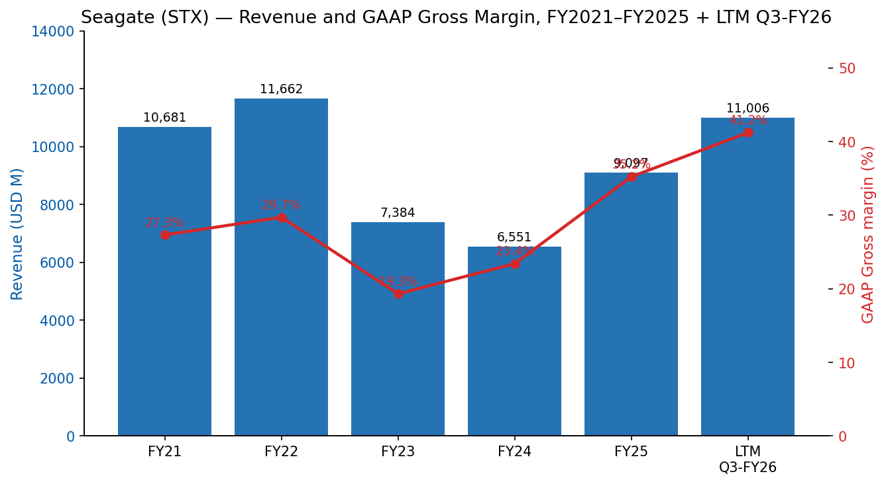
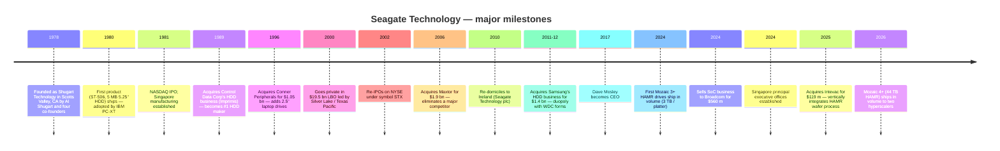
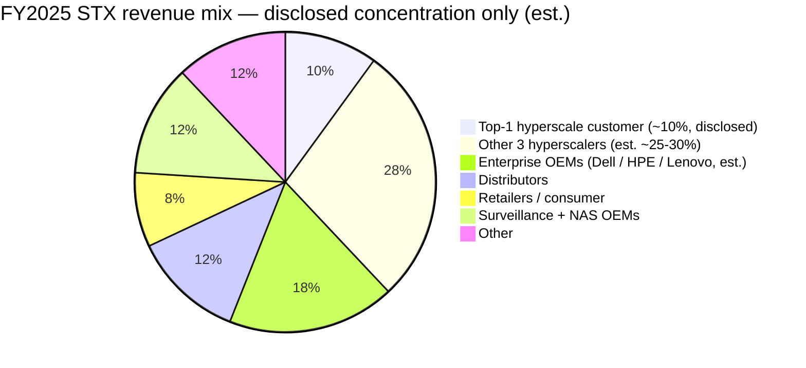
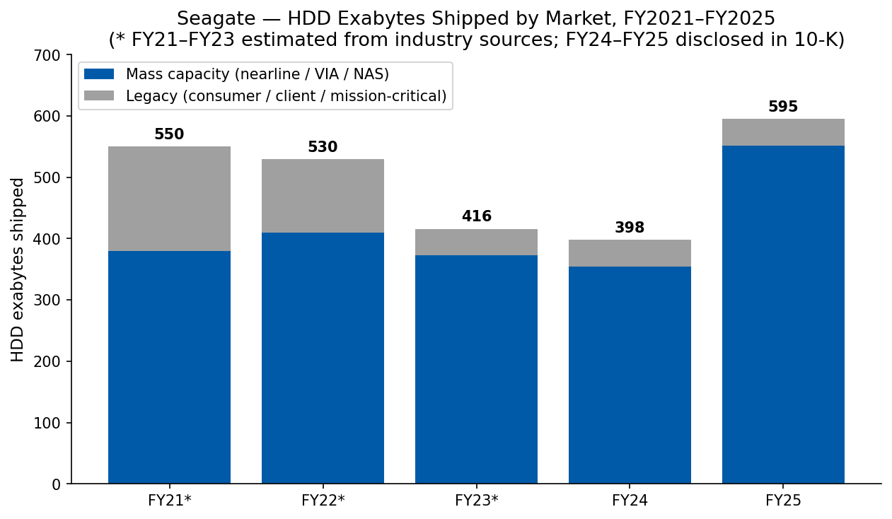
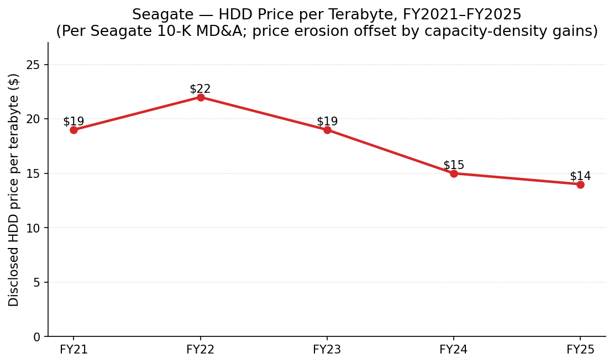
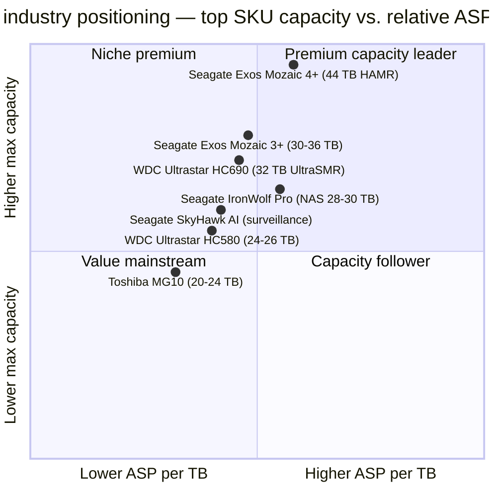
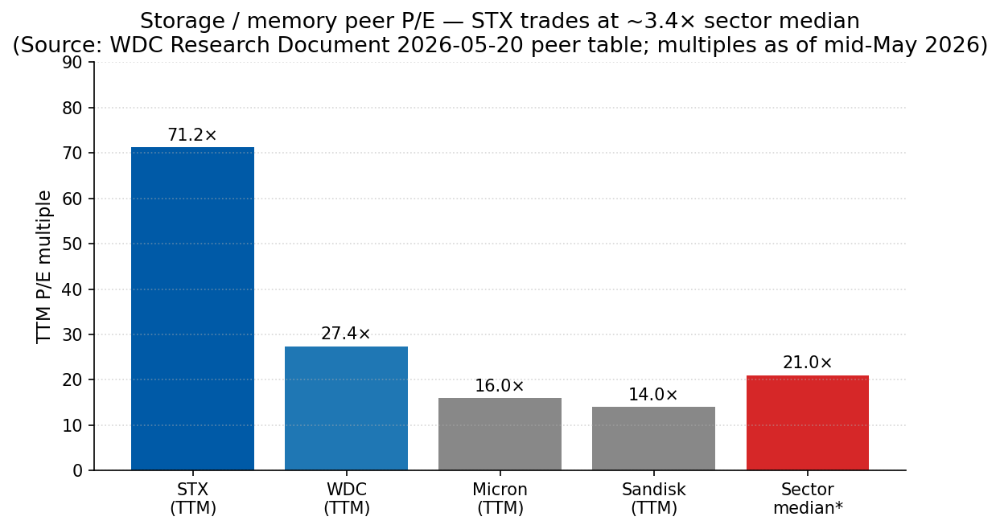

# COMPANY RESEARCH REPORT: Seagate Technology Holdings plc (NASDAQ: STX)

**Date:** 2026-05-20
**Analyst:** Internal research — initiation of coverage
**Ticker / Listing:** NASDAQ: STX (ordinary shares of an Irish public limited company)

> **Update — FQ3 FY2026 beat and FQ4 FY2026 guide raised again (2026-04-28):** Seagate delivered fiscal-Q3 FY2026 revenue of **$3.11 bn (+44% YoY)**, GAAP gross margin of **46.5%** (a record), and GAAP diluted EPS of **$3.27** — each above the high end of its prior guide. Management then guided **FQ4 FY2026 revenue to $3.45 bn ±$100 m (mid-point +35% YoY)** and **non-GAAP diluted EPS to $5.00 ±$0.20** (versus $5.10–5.30 consensus immediately prior), implying full-year FY2026 revenue of roughly **$12.0 bn (+32% YoY vs. FY25's $9.10 bn)** and full-year non-GAAP EPS approaching **$14.80**. The board declared a **$0.74 quarterly cash dividend** (up from $0.72 a year earlier) and retired $641 m of debt in the quarter. CEO Dave Mosley framed the outlook as "a new era of structural growth as AI applications amplify data creation and support sustained storage demand." Sources: [Q3 FY2026 press release, 2026-04-28](https://www.sec.gov/Archives/edgar/data/0001137789/000113778926000084/stxq32026pressreleasefinan.htm); [Q3 FY2026 10-Q, 2026-04-29](https://www.sec.gov/Archives/edgar/data/0001137789/000113778926000088/stx-20260403.htm).

---

## TABLE OF CONTENTS
1. Company Overview
2. Company History
3. Management Team
4. Products & Services
5. Customers & Go-to-Market
6. Industry Overview
7. Competitive Landscape
8. Market Opportunity (TAM)
9. Risk Assessment
References

---

## 1. Company Overview

**What it sells.** Seagate Technology Holdings plc (NASDAQ: STX) is — together with Western Digital (WDC) and Toshiba — one of three remaining manufacturers of hard-disk drives (HDDs). The company designs, fabricates and assembles the heads, media and finished drives that store data on rapidly rotating magnetic platters; in fiscal-year 2025 (year ended June 27, 2025) more than 95% of revenue came from HDDs and HDD-based storage systems, with a small residual contribution from third-party-sourced enterprise solid-state drives (SSDs) and the Lyve as-a-service storage portfolio ([Seagate 10-K FY2025, Item 1](https://www.sec.gov/Archives/edgar/data/0001137789/000113778925000157/stx-20250627.htm)). Within HDDs, the strategic anchor is the **mass-capacity nearline** drive sold to hyperscale cloud-service providers, large enterprises and surveillance/video customers; legacy consumer, client (desktop / notebook) and mission-critical HDDs continue to ship but are explicitly described in the 10-K as markets "we continue to sell to but do not plan to invest in significantly."

Starting in fiscal-year 2026 Seagate retitled its end-market reporting from "Mass capacity / Legacy / Other" to **Data Center (80% of FQ3-FY26 revenue) and Edge IoT (20%)** ([10-Q FQ3 FY2026, Note 6 Revenue](https://www.sec.gov/Archives/edgar/data/0001137789/000113778926000088/stx-20260403.htm)) — a relabelling that reflects the increasing skew of revenue toward nearline cloud drives consumed in modern AI-era data centers.

**How it makes money.** Seagate sells finished HDDs and storage subsystems directly to OEMs, distributors and retailers. In FY2025 the channel mix was 80% OEMs, 12% distributors and 8% retailers ([FY2025 10-K, Item 7 MD&A](https://www.sec.gov/Archives/edgar/data/0001137789/000113778925000157/stx-20250627.htm)); the OEM channel includes large cloud and hyperscale customers buying on multi-year build-to-order agreements, plus traditional server / NAS / surveillance OEMs. In the current cycle, contracts increasingly include **non-cancellable, multi-quarter capacity reservations**. Revenue recognition is at point of shipment; gross-margin progression is driven by (a) the mix shift toward higher-capacity-per-platter nearline drives, (b) factory utilisation, and (c) pricing actions enabled by tight industry supply.

**Where it operates.** Manufacturing is concentrated in Asia, with primary drive-assembly facilities in China and Thailand; subassembly and component fabrication in China, Malaysia, Northern Ireland (Springtown — heads and recording media), Singapore, Thailand and the United States. As of June 27, 2025 the company employed approximately **30,000 full-time employees worldwide, ~25,000 of whom were located in Asia** ([10-K FY2025, Item 1 Human Capital](https://www.sec.gov/Archives/edgar/data/0001137789/000113778925000157/stx-20250627.htm)). The company is domiciled in Ireland (registered office in Dublin) and has its principal executive offices in Singapore; the legal entity has been an Irish plc since 2010, with a Singapore HQ relocation effective FY2024 driven by tax-incentive considerations.

**Scale.** FY2025 revenue was **$9.10 bn (+39% YoY)**, GAAP gross margin **35.2%** (vs. 23.4% in FY24), GAAP net income **$1,469 m**, and operating cash flow **$1.1 bn** ([10-K FY2025, MD&A](https://www.sec.gov/Archives/edgar/data/0001137789/000113778925000157/stx-20250627.htm)). Seagate shipped **595 exabytes of HDD storage in FY2025** (vs. 398 EB in FY24), 552 EB of which were mass-capacity nearline. The disclosed price per terabyte fell to **$14** from $15 a year earlier — but the company more than offset this with volume and mix. As of the Q3 FY2026 print, last-twelve-months (LTM) revenue is approximately **$11.0 bn** with GAAP gross margin trending in the low-40s%.

Source: [10-K FY2025, Item 7 MD&A](https://www.sec.gov/Archives/edgar/data/0001137789/000113778925000157/stx-20250627.htm); [Q4 FY2022 press release, 2022-07-21](https://www.sec.gov/Archives/edgar/data/0001137789/000113778922000039/stxq42022pressreleasefinan.htm); [Q4 FY2021 press release, 2021-07-21](https://www.sec.gov/Archives/edgar/data/0001137789/000113778921000041/stxq42021pressreleasefinan.htm); LTM Q3-FY26 = sum of Q4 FY25 ($2,440 m) + Q1 FY26 ($2,629 m) + Q2 FY26 ($2,825 m) + Q3 FY26 ($3,112 m). The FY23/FY24 trough reflects the industry-wide cloud-storage destocking cycle of 2022–23.

**Valuation snapshot (as of 2026-05-20).** Seagate's stock has been one of the largest single-name re-ratings in US large-cap during the AI capex boom of 2024–2026. The TTM multiples are extreme by both historical-HDD-industry and broader-semis standards:

| Multiple | STX (TTM) | WDC (TTM) | Micron (TTM) | Sector median* | STX 3-yr range |
|---|---|---|---|---|---|
| **P/E** | **71.2×** | 27.4× | ~16× | ~21× | NM (FY23 loss) — 71× |
| **P/S** | **15.3×** | 13.4× | ~5× | ~3.5× | 0.5× — 15× |
| **EV/EBITDA** | **47.7×** | 39.6× | ~10× | ~15× | NM — 48× |
| **P/B** | **357×** | 21.9× | ~3× | ~4–5× | NM (deficit) |

*Sector median = Philadelphia Semiconductor Index plus storage peers per Yahoo Finance sector data. Stock price ≈ $748 (range $741–765 in the week of 2026-05-18), market capitalisation ≈ **$167 bn** on 224 m ordinary shares outstanding ([Q3 FY2026 press release, 2026-04-28](https://www.sec.gov/Archives/edgar/data/0001137789/000113778926000084/stxq32026pressreleasefinan.htm); [Macrotrends — STX market cap history](https://www.macrotrends.net/stocks/charts/STX/seagate-technology-holdings/market-cap)); peer multiples per [WDC Research Document 2026-05-20](../WesternDigital_NASDAQ_WDC/WesternDigital_NASDAQ_WDC_Research_Document_2026-05-20.md) Section 1 valuation table, cross-referenced with [stockanalysis.com — STX statistics](https://stockanalysis.com/stocks/stx/statistics/).

**Reading the multiples — why so high.** Three independent forces compound to produce the 71× P/E ([stockanalysis.com — STX statistics](https://stockanalysis.com/stocks/stx/statistics/)):

1. **Earnings power has structurally up-shifted.** GAAP operating margin moved from 6.9% in FY24 to 20.8% in FY25 and 32.1% in Q3 FY26 ([Q3 FY2026 release, 2026-04-28](https://www.sec.gov/Archives/edgar/data/0001137789/000113778926000084/stxq32026pressreleasefinan.htm)). On an LTM basis the company is now generating ~$3.5 bn of EBITDA versus $0.9 bn two years ago; the *forward* P/E on the FY27 consensus of ~$18–20 EPS is closer to **38×**, materially less stretched but still well above the 8–12× the HDD industry historically commanded.
2. **HAMR / Mozaic premium.** Seagate is the only HDD vendor shipping HAMR drives in volume. The AI-storage narrative — that hyperscaler nearline demand will compound at a 20–25% capacity CAGR through at least 2029 — is being capitalised into the stock at a multiple usually reserved for hyperscaler-adjacent compute (NVIDIA, AVGO) rather than for a 1980s-vintage component supplier. The WDC research note attributes the STX-vs-WDC valuation gap explicitly to STX's "12-month head start on volume HAMR shipments" ([WDC Research Document 2026-05-20, Section 1](../WesternDigital_NASDAQ_WDC/WesternDigital_NASDAQ_WDC_Research_Document_2026-05-20.md)).
3. **Negative book value distorts P/B.** STX has run a **shareholders' deficit** of approximately $(453) m as of June 27, 2025 ([10-K FY2025, Consolidated Balance Sheet](https://www.sec.gov/Archives/edgar/data/0001137789/000113778925000157/stx-20250627.htm)) — the cumulative result of over a decade of buybacks and dividends exceeding retained earnings. P/B is therefore not a meaningful ratio for Seagate; the **357× quoted by data services is essentially a denominator artefact** and should not be cited as a stretched multiple in its own right.

The dividend yield at the current price is approximately **0.4%** ($0.74/qtr × 4 = $2.96 annual ÷ $748) — far below the 4–5% the stock yielded in the FY23 trough and reflective of pure capital-appreciation positioning today ([Q3 FY2026 press release, 2026-04-28](https://www.sec.gov/Archives/edgar/data/0001137789/000113778926000084/stxq32026pressreleasefinan.htm)). We treat the elevated TTM P/E and P/S as a material **valuation-compression risk** (Section 9, Financial Risks bucket): any growth deceleration, HAMR-yield disappointment, or AI-capex pullback would compress the multiple toward a fair-value range of ~15–25× forward — implying a 30–50% downside even without an earnings cut ([Stockstory / Yahoo Finance, 2026-05-19](https://markets.financialcontent.com/stocks/article/stockstory-2026-5-19-seagate-and-western-digital-stocks-trade-down-what-you-need-to-know)).

---

## 2. Company History

Seagate was founded as **Shugart Technology** in 1978 by **Al Shugart, Tom Mitchell, Finis Conner, Doug Mahon and Syed Iftikar** in Scotts Valley, California ([Wikipedia — Seagate Technology](https://en.wikipedia.org/wiki/Seagate_Technology); [Funding Universe — Seagate history](https://www.fundinguniverse.com/company-histories/seagate-technology-inc-history/)). The founding insight was straightforward: IBM-style 8-inch hard drives were too expensive and too large to be paired with the emerging 5.25-inch personal computer; a vertically-integrated 5.25-inch HDD priced at the PC market would create a new category. The ST-506 (5 MB, 5.25-inch) shipped in 1980 and was adopted by IBM for the PC-XT, anchoring the company's first decade.

Three strategic pivots define the modern company:

1. **The Maxtor acquisition (2006, $1.9 bn).** The deal eliminated the #3 player at the time and consolidated the industry to four serious HDD vendors; it closed May 22, 2006 as an all-stock transaction at 0.37 Seagate shares per Maxtor share with ~$300 m of expected annual operating-expense synergies ([EE Times, "Seagate set to acquire Maxtor for $1.9 billion"](https://www.eetimes.com/seagate-set-to-acquire-maxtor-for-1-9-billion/); [Maxtor 8-K, 2006-05](https://www.sec.gov/Archives/edgar/data/0000711039/000119312506114779/dex991.htm)). It was finalised under then-CEO Bill Watkins. The Maxtor deal also brought Seagate the consumer-external-storage business (then a small fraction of revenue, today the residual LaCie / One Touch / Expansion portfolio).

2. **The Samsung HDD purchase (2011, $1.375 bn).** Concurrent with WDC's purchase of Hitachi GST, the deal sealed the HDD duopoly: the transaction (paid 50% stock / 50% cash, closed December 19, 2011) added Samsung's ~10% unit share on top of Seagate's ~30%, and Samsung received a 9.6% stake in Seagate ([Seagate 8-K, 2011-04-19](https://www.sec.gov/Archives/edgar/data/0001137789/000110465911020787/a11-10013_2ex99d1.htm); [Engadget, "Samsung sells HDD division to Seagate for $1.375 billion"](https://www.engadget.com/2011-04-19-samsung-sells-hdd-division-to-seagate-for-1-375-billion/)). Antitrust review in China required Seagate and Samsung HDD to remain operationally separate for two years, slowing realisation of synergies. By 2014 the industry had only three serious players (STX, WDC, Toshiba). The structural pricing benefit of this consolidation took roughly a decade to manifest: pricing power only became apparent in the 2024–2026 nearline up-cycle, when hyperscaler demand again exceeded supply ([TrendForce, 2026-01-28](https://www.trendforce.com/news/2026/01/28/news-seagate-q3-guidance-tops-estimates-nearline-hdd-capacity-fully-booked-through-2026/)).

3. **The bet on HAMR.** While WDC pursued an evolutionary path (PMR → ePMR → OptiNAND → UltraSMR, with HAMR as a 2026–2028 generation), Seagate elected starting in the mid-2010s to spend its R&D capital on heat-assisted magnetic recording — a fundamentally new physical mechanism that uses a laser to temporarily lower magnetic-coercivity, allowing higher-coercivity media to store more data per square inch. After roughly a decade of HAMR investment and several delays, **Seagate's Mozaic 3+ platform shipped in volume in 2024** (3+ TB per platter, up to 30 TB CMR / 36 TB SMR) and **Mozaic 4+** shipped in volume in March 2026 (up to 44 TB CMR, 10-platter design) to "two leading hyperscale cloud providers" ([Seagate press release, 2026-03-03 / 2026-04-15](https://investors.seagate.com/news/news-details/2026/Seagate-Delivers-Industrys-Highest-Capacity-Hard-Drives-with-Next-Generation-Mozaic-4/default.aspx); [Tom's Hardware, 2026-03-03](https://www.tomshardware.com/pc-components/hdds/seagate-begins-shipping-44tb-hard-drives-with-hamr-tech-to-data-centers-mozaic-4-platform-expands-to-10-platters); [HPCwire, 2026-03-03](https://www.hpcwire.com/off-the-wire/seagate-brings-mozaic-4-hamr-platform-to-hyperscale-data-centers-with-44tb-capacity/)). The HAMR bet — Seagate's single most consequential capital-allocation decision of the last 15 years — is now the technological underpinning of the post-2024 re-rating.

**Recent transactions (last 2 years).**

- **Sale of SoC operations to Broadcom (April 2024).** Total consideration $600 m (cash plus $234 m of restructured purchase-agreement value); transferred the internal hard-drive controller-ASIC design team and IP to Avago / Broadcom while restructuring the long-term ASIC supply agreement. Net pre-tax gain of $313 m ([10-K FY2025, Note 17 Acquisition and Divestiture](https://www.sec.gov/Archives/edgar/data/0001137789/000113778925000157/stx-20250627.htm)). Effectively a partial reversal of vertical integration in a non-core silicon discipline.
- **Acquisition of Intevac (March 2025, $119 m).** Intevac supplies thin-film vacuum-coating equipment used in HAMR media manufacturing. Tucking in Intevac vertically integrates a critical-path tool vendor at the wafer-processing stage and helps de-risk HAMR media yield ramps ([10-K FY2025, Note 17](https://www.sec.gov/Archives/edgar/data/0001137789/000113778925000157/stx-20250627.htm)).
- **Debt management (FY2025 + FY2026 YTD).** Issued $400 m principal of senior notes; repaid $479 m of 2025 Notes and $505 m of 2027 Notes; repurchased $99 m of senior notes. Through Q3 FY2026, retired an additional $641 m of debt with operating cash flow ([Q3 FY2026 press release, 2026-04-28](https://www.sec.gov/Archives/edgar/data/0001137789/000113778926000084/stxq32026pressreleasefinan.htm)). Total debt at the end of FY25 was $5.0 bn; the trajectory is unambiguously toward a stronger balance sheet — long overdue given the deeply-negative equity book.

---

## 3. Management Team

### Dr. William D. ("Dave") Mosley — Chairman and Chief Executive Officer

Dave Mosley, **age 58**, has been Seagate's CEO since **October 2017** and will assume the additional role of **Board Chairman** effective at the conclusion of the October 2025 AGM, with prior Chairman Michael R. Cannon transitioning to Lead Independent Director ([2025 DEF 14A, p. 7](https://www.sec.gov/Archives/edgar/data/0001137789/000113778925000211/stx-20250909.htm)). He is a career-Seagate engineer-turned-operator: he joined Seagate in **1996 as a senior engineer** with a Ph.D. in solid-state physics, and ascended through Vice President of Research and Development Engineering (2002–07), Senior VP of Global Disk Storage Operations (2007–09), Executive VP of Sales and Marketing (2009–11), Executive VP of Operations (2011–13), President of Operations and Technology (2013–16), and President and Chief Operating Officer (2016–17) before becoming CEO ([10-K FY2025, Information About Our Executive Officers](https://www.sec.gov/Archives/edgar/data/0001137789/000113778925000157/stx-20250627.htm)). His **29 years inside Seagate** make him as continuous-tenure a CEO as exists in the storage industry.

What he specifically accomplished is concrete: he was the executive sponsor of the **HAMR program from 2013 onward**, kept the HAMR roadmap funded through the deep FY23–FY24 downturn when capex deferral was tempting, and presided over the cost actions — temporary salary reductions, factory-underutilisation absorption, and SoC divestiture — that restored gross margin from 19.3% in FY23 to 35.2% in FY25 and 46.5% in Q3 FY26 ([10-K FY2025, MD&A](https://www.sec.gov/Archives/edgar/data/0001137789/000113778925000157/stx-20250627.htm); [Q3 FY2026 press release, 2026-04-28](https://www.sec.gov/Archives/edgar/data/0001137789/000113778926000084/stxq32026pressreleasefinan.htm)). He has also led the public re-framing of Seagate from "PC-attached storage in secular decline" to "AI-data-center component supplier" — materially supportive of the stock's re-rating ([Blocks & Files, 2025-10-30](https://blocksandfiles.com/2025/10/30/seagate-revenues-boosted-by-ai-inferencing-as-hamr-tech-becomes-mainstream/)).

**Compensation (FY2025).** Total reported compensation was **$17.18 m**, comprising $1.10 m base salary, $12.96 m stock awards, $3.10 m option awards, no non-equity-incentive payout (the FY25 cash-bonus pool zeroed on the rTSR modifier), and ~$8.5k of "other" (401(k) match, perquisites). This was up from $13.63 m in FY24 and $11.44 m in FY23 ([2025 DEF 14A, Summary Compensation Table](https://www.sec.gov/Archives/edgar/data/0001137789/000113778925000211/stx-20250909.htm)). FY26 base salary increased modestly; FY26 LTI mix was uniquely adjusted to **50% PSUs / 30% time-based options / 20% RSUs** for Mosley (versus a standard mix for other NEOs) — a sign the comp committee is leaning further into pay-for-performance structure for the CEO at the top of the cycle.

**Ownership.** Mosley beneficially owns **~965,000 ordinary shares including exercisable options and short-dated RSUs** — i.e., 478,912 shares directly + 457,403 options exercisable within 60 days + 29,353 RSUs vesting within 60 days, plus ~75,045 PSUs that may vest depending on performance ([2025 DEF 14A, p. 96](https://www.sec.gov/Archives/edgar/data/0001137789/000113778925000211/stx-20250909.htm)). At the current ~$748 share price that is roughly **$720 m at-the-money exposure** — substantial absolute alignment, but only ~0.45% of the company's float and well under his 6× salary share-ownership requirement multiple if measured on directly-held shares alone. Mosley adopted no public 10b5-1 trading plan disclosed in the FY25 10-K. His personal alignment with shareholders is therefore overwhelmingly performance-equity, not founder-level common-share holding.

**Track record synthesis.** Mosley is the single biggest reason to own STX as an operating story rather than a cyclical commodity bet. He has run the company through a full HDD cycle, executed the industry's largest technology pivot (HAMR commercialisation), and restored balance-sheet discipline ([10-K FY2025, MD&A](https://www.sec.gov/Archives/edgar/data/0001137789/000113778925000157/stx-20250627.htm)). Visible risks: succession depth (no clear EVP successor with comparable engineering credibility) and the dual CEO/Chair structure (mitigated by Cannon as Lead Independent Director per the [2025 DEF 14A, p. 7](https://www.sec.gov/Archives/edgar/data/0001137789/000113778925000211/stx-20250909.htm)).

### Gianluca Romano — Executive Vice President and Chief Financial Officer

Romano, **age 56**, has been CFO since **January 2019**. He previously spent 7 years at **Micron Technology (2011–18)** in roles culminating in Corporate VP of Business Finance and Accounting, with responsibility for the consolidated financial-planning organisation through Micron's largest M&A integration (the 2013 Elpida acquisition) and the 2016–18 NAND/DRAM up-cycle. Before Micron, he was VP Finance / Corporate Controller at Numonyx (NOR-flash spin-out from STMicroelectronics, sold to Micron in 2010), and spent 1994–2008 at STMicroelectronics in a series of finance leadership roles in Italy and Europe ([10-K FY2025, Item 1](https://www.sec.gov/Archives/edgar/data/0001137789/000113778925000157/stx-20250627.htm)).

Romano brings more "memory-cycle" experience than a typical hardware-OEM CFO — useful because HDD pricing, like memory, is set by a small number of producers whose capacity decisions move the cycle. Tactical wins this cycle: the SoC sale to Broadcom for $600 m of total consideration; the move to long-term, non-cancellable demand commitments with OEMs; $684 m of FY25 debt reduction with more in FY26; dividend progression from $0.70 to $0.74 quarterly; and execution of the Pillar Two minimum-tax transition. FY25 total compensation was **$10.41 m** ([2025 DEF 14A, SCT](https://www.sec.gov/Archives/edgar/data/0001137789/000113778925000211/stx-20250909.htm)). He owns ~519,000 shares including 465,408 short-dated options.

### Dr. John C. Morris — SVP / EVP and Chief Technology Officer

Morris, **age 58**, has been CTO since **2019** and was elevated from SVP to **EVP** during FY2026 with a base-salary reset to $560,000 — formalising his seniority after the Chief Technology Officer title was conferred without a salary adjustment during the FY23–24 downturn ([2025 DEF 14A, CD&A](https://www.sec.gov/Archives/edgar/data/0001137789/000113778925000211/stx-20250909.htm)). Joined Seagate in 1996. Held design-engineering and product-management leadership roles before becoming VP of HDD and SSD Products in 2015 and CTO four years later. The CTO is the single most thesis-critical executive after the CEO at a HAMR-pivoting company; Morris owns the technology roadmap that decides whether STX maintains its 12-month HAMR lead. FY2025 total comp **$2.86 m**.

### Ban Seng Teh — EVP and Chief Commercial Officer

Teh, **age 59**, has been CCO since **July 2022**; prior to that he ran Global Sales and Sales Operations from 2014. **Joined Seagate in 1989 as a field customer engineer** — i.e., 36 years at the company ([10-K FY2025, Item 1 — Information About Our Executive Officers](https://www.sec.gov/Archives/edgar/data/0001137789/000113778925000157/stx-20250627.htm)). The bulk of his career was spent building the Asia-Pacific sales organisation that today delivers ~38% of revenue. As CCO he owns the hyperscaler-account relationships and the long-term-demand-commitment contracting model that has stabilised pricing visibility ([10-K FY2025, Item 1 — Customers](https://www.sec.gov/Archives/edgar/data/0001137789/000113778925000157/stx-20250627.htm)). FY25 total comp **$5.60 m**; ~24,000 shares directly held and exercisable options ([2025 DEF 14A, Summary Compensation Table](https://www.sec.gov/Archives/edgar/data/0001137789/000113778925000211/stx-20250909.htm)). He is paid in SGD given his Singapore base.

### Governance footer

The board is currently **eleven directors, ten of whom are independent under Nasdaq rules**, chaired by Michael R. Cannon (independent) through the October 2025 AGM, at which Mosley will become Chair and Cannon will move to Lead Independent Director ([2025 DEF 14A, p. 7](https://www.sec.gov/Archives/edgar/data/0001137789/000113778925000211/stx-20250909.htm)). Notable directors include Judy Bruner (former SanDisk CFO, audit-committee chair), Richard L. Clemmer (former NXP Semiconductors CEO — bringing memory-cycle and semiconductor-M&A experience), Yolanda L. Conyers (former Lenovo CDO), Dylan G. Haggart (ValueAct Capital partner — activist seat acquired in 2023), and Stephanie Tilenius (entrepreneur, former Google/eBay).

**Insider ownership** in aggregate (17 executives + directors + nominees) totals **1,684,244 shares** as of August 22, 2025, or approximately **0.79%** of the 213.0 m ordinary shares then outstanding ([2025 DEF 14A, p. 96](https://www.sec.gov/Archives/edgar/data/0001137789/000113778925000211/stx-20250909.htm)) — low but not unusual for a large-cap, non-founder-led name. The **5%+ holder list** is institutional: **Vanguard 13.14%, Sanders Capital 8.88%, JP Morgan 8.40%, Capital Research Global 7.34%, BlackRock 6.08%** ([2025 DEF 14A, pp. 96–97](https://www.sec.gov/Archives/edgar/data/0001137789/000113778925000211/stx-20250909.htm)). The presence of Sanders Capital and Capital Research as concentrated long holders — versus pure index-tracker positioning — reads as a positive signal of conviction-active ownership at the top of the cap table. There are no disclosed material related-party transactions.

**Management track-record synthesis.** Mosley, Morris and Teh are 29–36-year Seagate veterans; Romano is a 7-year-tenure CFO with deep memory-cycle background ([10-K FY2025, Item 1 Executive Officers](https://www.sec.gov/Archives/edgar/data/0001137789/000113778925000157/stx-20250627.htm)). The team has delivered the single highest-quality multi-year operating performance in Seagate's history during 2024–2026 — gross margin from 19% to 46%, EBITDA from <$1 bn to >$3.5 bn, debt down $1.3 bn, and the HAMR roadmap on schedule ([10-K FY2025, MD&A](https://www.sec.gov/Archives/edgar/data/0001137789/000113778925000157/stx-20250627.htm); [Q3 FY2026 press release, 2026-04-28](https://www.sec.gov/Archives/edgar/data/0001137789/000113778926000084/stxq32026pressreleasefinan.htm)). The principal **gap** is succession depth: the four other executive officers (Lee — CLO, Chong — Global Ops, Morris — CTO, Teh — CCO) are each strong in their domains but none is a clear heir to Mosley should an unexpected departure occur. The 2025 governance reshuffle (Mosley to Chair, Cannon to Lead Independent) is best read as the board's signal that they expect Mosley to serve out at least one more multi-year cycle ([2025 DEF 14A, p. 7](https://www.sec.gov/Archives/edgar/data/0001137789/000113778925000211/stx-20250909.htm)).

---

## 4. Products & Services

Seagate's website organises the portfolio into seven product lines plus the Lyve as-a-service offerings ([Seagate products navigation](https://www.seagate.com/products/)). The HDD platform — Mozaic — is now the underlying technology common to most of the mass-capacity SKUs ([Seagate — Mozaic / HAMR platform page](https://www.seagate.com/innovation/mozaic/)).

```mermaid
graph TD
    STX[Seagate Technology — products]
    STX --> DC[Data Center HDD & Systems<br/>~80% of revenue]
    STX --> EI[Edge IoT HDD & SSD<br/>~20% of revenue]
    STX --> LYV[Lyve as-a-service]

    DC --> EXOS[Exos enterprise HDDs<br/>incl. Mozaic 3+ / 4+ HAMR]
    DC --> EXM[Exos M family — Mozaic 3+<br/>up to 36 TB]
    DC --> EXMOZ4[Exos Mozaic 4+<br/>up to 44 TB HAMR]
    DC --> ESSD[Nytro enterprise SSD<br/>up to 30 TB]
    DC --> CORV[Exos CORVAULT 4U106 / 5U84<br/>self-healing storage systems]
    DC --> JBOD[Exos AP JBOD platforms]

    EI --> IRON[IronWolf / IronWolf Pro<br/>NAS HDD up to 30 TB]
    EI --> SKY[SkyHawk / SkyHawk AI<br/>surveillance HDD up to 30 TB]
    EI --> BARRA[BarraCuda desktop / notebook]
    EI --> FIRE[FireCuda gaming HDD + SSD]
    EI --> CONS[One Touch / Expansion / Ultra Touch]
    EI --> LAC[LaCie — creative-pro external]
    EI --> XBOX[Storage Expansion for Xbox / PlayStation]

    LYV --> LYVS[Lyve Mobile shuttle]
    LYV --> LYVC[Lyve Cloud — S3-compatible object storage]
```

### Data Center

**Exos enterprise nearline HDDs — incl. Mozaic 3+ and Mozaic 4+ HAMR platforms.** The single most important product family, accounting for the majority of Seagate's revenue and >85% of exabytes shipped. Capacities up to **35 TB** disclosed in the FY25 10-K as the then-shipping top SKU; the **Mozaic 4+ family launched in March 2026 ships at up to 44 TB CMR (10 platters × 4.4 TB)** to two named hyperscale customers ([Seagate Mozaic 4+ press release, 2026-03-03](https://investors.seagate.com/news/news-details/2026/Seagate-Delivers-Industrys-Highest-Capacity-Hard-Drives-with-Next-Generation-Mozaic-4/default.aspx); [HPCwire, 2026-03-03](https://www.hpcwire.com/off-the-wire/seagate-brings-mozaic-4-hamr-platform-to-hyperscale-data-centers-with-44tb-capacity/); [blocksandfiles, 2025-10-30](https://blocksandfiles.com/2025/10/30/seagate-revenues-boosted-by-ai-inferencing-as-hamr-tech-becomes-mainstream/)). Target customer: cloud and hyperscale data centers, large enterprises building private clouds, video / image / surveillance integrators. Pricing model: build-to-order, multi-quarter capacity-reservation contracts under master purchase agreements; per-drive ASPs in the **$300–$420** range during the current up-cycle per third-party industry analysis ([Dr. Robert Castellano, 2026-02-15](https://drrobertcastellano.substack.com/p/seagate-and-western-digital-hdd-price)). Key differentiators are areal density (Mozaic 4+ achieves 4+ TB / platter, an industry first), MACH.2 multi-actuator technology for throughput, and SMR for additional capacity per platter at modest performance trade-off.

- *Competitive advantage:* **Yes — technology leadership.** Moat is the HAMR head + recording-media + thermal-control IP combination. Evidence: Seagate is the **only HDD vendor shipping HAMR drives in volume** with >1 m HAMR units shipped cumulatively by mid-2026 ([Seagate / Blocks & Files press coverage, 2026-04](https://blocksandfiles.com/2026/04/seagate-mozaic-4-plus-44tb/); [Seagate blog "the nanomarvels enabling the AI era"](https://www.seagate.com/blog/the-nanomarvels-enabling-the-ai-era/)); WDC has not started volume HAMR and Toshiba is even further behind. Per Seagate's own statements, Mozaic 4+ delivers **47% better $/W/TB infrastructure efficiency** vs. 30 TB pre-HAMR generation ([Seagate "Mozaic 4+" stories page](https://www.seagate.com/stories/articles/seagate-delivers-industrys-highest-capacity-hard-drives-with-next-generation-mozaic-4/)).
- *Closest competing product:* **WDC Ultrastar DC HC690 (26 / 28 TB CMR; 32 TB UltraSMR with ePMR + OptiNAND)** ([WDC Ultrastar HC690 product page](https://www.westerndigital.com/products/internal-drives/ultrastar-dc-hc690-hdd)) and the upcoming **40 TB ePMR / 44 TB HAMR generation in late-2026 / early-2027**. **Verdict: Seagate ahead at the top capacity tier (44 TB vs. 32 TB UltraSMR today), at parity in the 24–28 TB tier, slightly behind on power-per-TB at pre-HAMR capacity points**. The capacity gap will narrow once WDC's HAMR generation reaches volume in 2027.

**Nytro enterprise SSDs.** SATA / SAS / NVMe SSDs up to 30 TB targeted at hyperscale, high-density, and enterprise applications. Sourced from third parties on a controller / firmware layer integration; this is **not** a strategic priority for Seagate today and revenue is small ([10-K FY2025, Item 1 Products](https://www.sec.gov/Archives/edgar/data/0001137789/000113778925000157/stx-20250627.htm)). The April 2024 sale of the SoC business to Broadcom included the controller-ASIC team that supported the SSD line — a clear signal Seagate is deprioritising SSDs ([Streetinsider — Seagate / Avago $600M Asset Purchase Agreement, 2024-04-23](https://www.streetinsider.com/8K/Seagate+Technology+(STX)+Enters+%24600M+Asset+Purchase+Agreement+with+Avago/23103846.html)).
- *Competitive advantage:* **No — modest at best.** Seagate lacks vertical integration in NAND. Closest competitors: **Sandisk** (post-spin pure-play NAND/SSD, with vertical fab partnership with Kioxia), **Micron 6500 ION / 9550**, **Samsung PM-series**, **Solidigm (SK hynix)**. Verdict: behind. Seagate's enterprise-SSD revenue is < 5% of group and exists primarily to be in customer RFPs.

**Exos CORVAULT 4U106 / 5U84.** 4U and 5U rack-mount enclosures holding 106 / 84 Exos drives respectively, with proprietary **ADAPT** erasure coding and **ADR (Autonomous Drive Regeneration)** for self-healing operation, marketed to deliver five-nines availability ([CORVAULT 4U106 product page](https://www.seagate.com/products/storage/data-storage-systems/corvault/4U106/); [Exos CORVAULT data center storage solutions](https://www.seagate.com/products/storage/data-storage-systems/corvault/)). Total per-rack capacity up to ~2.5 PB. Strategic role: capture the system-integration margin layer above bare-drive sales.
- *Competitive advantage:* **Partial — bundle moat.** Margin profile mid-to-high teens vs. mid-30s on the drives. Closest competitor: WDC's **Ultrastar Data60 / Data102 JBOD platforms** ([WDC product nav](https://www.westerndigital.com/products/storage-platforms/ultrastar-data102-storage-platform)). Verdict: at parity; ADAPT/ADR are technical differentiators but the market for vendor-integrated platforms is small versus white-box ODM platforms (Quanta, Wiwynn).

### Edge IoT (formerly Legacy)

**IronWolf and IronWolf Pro NAS HDDs (up to 30 TB).** Built for the small-and-medium-business NAS market with vibration-tolerance firmware, multi-stream optimisation and a 5-year warranty on Pro SKUs. Marketed through OEM partnerships with Synology, QNAP, TerraMaster, Asustor ([Seagate products navigation](https://www.seagate.com/products/)).
- *Competitive advantage:* **Partial — brand and channel** (alongside WDC Red).
- *Closest competing product:* **WDC Red / Red Pro / Red Plus**, **Toshiba N300**. Verdict: at parity on technical specs; Seagate marginally ahead in channel mindshare in surveillance integrators.

**SkyHawk and SkyHawk AI surveillance HDDs (up to 30 TB).** Optimised for write-heavy, always-on video workloads with ImagePerfect firmware. SkyHawk AI tier adds heavy multi-stream support for analytics ([SkyHawk AI Video Hard Drive product page](https://www.seagate.com/products/video-analytics/skyhawk-ai-hard-drive/)). **Reference-design status with Hikvision and Dahua** (largest two surveillance OEMs globally) is a structural advantage WDC does not match ([Seagate — first AI-enabled surveillance drive press release](https://www.seagate.com/as/en/news/news-archive/seagate-launches-first-drive-for-ai-enabled-surveillance-master-pr/)).
- *Competitive advantage:* **Yes — distribution + reference-design lock-in.** Closest competing product: WDC **Purple / Purple Pro**. Verdict: Seagate ahead in surveillance.

**BarraCuda desktop HDDs (up to 24 TB) and 2.5" mobile HDDs (up to 5 TB).** Mainstream PC internal-storage market. Declining structurally as SSDs displace HDDs in client PCs ([10-K FY2025, Item 1 Products](https://www.sec.gov/Archives/edgar/data/0001137789/000113778925000157/stx-20250627.htm)).
- *Competitive advantage:* **No.** This is a managed-decline business.
- *Closest competing product:* WDC **Blue**. Verdict: at parity but in a shrinking pool.

**FireCuda gaming HDD + SSD line.** Gaming-optimised internal and external drives, including the licensed **Seagate Storage Expansion Card for Xbox** and PlayStation external drives. FireCuda 530 / 540 are PCIe 5.0 NVMe SSDs (third-party sourced); FireCuda 2.5"/3.5" HDDs are positioned at gamers needing high capacity at lower-than-NVMe cost ([Seagate products navigation](https://www.seagate.com/products/)).
- *Competitive advantage:* **Partial — license + brand.** Xbox Expansion Card is a Microsoft-exclusive form-factor licensed to Seagate. Closest competing product: WDC_BLACK family. Verdict: at parity overall, ahead in console accessories due to the Xbox licence.

**Consumer external storage — One Touch, Expansion, Basics, Ultra Touch.** Portable and desktop external HDDs / SSDs sold via Amazon, Best Buy, Costco, MicroCenter. Capacities up to 24 TB. Aggregate revenue declining ([10-K FY2025, MD&A](https://www.sec.gov/Archives/edgar/data/0001137789/000113778925000157/stx-20250627.htm)).

**LaCie (creative-professional external storage).** Premium brand for video / photo professionals. Rugged SSD, Rugged USB-C, 2big Dock RAID products. Acquired in 2014, retained as a distinct premium brand. Brand moat in broadcast / cinema ([Seagate products navigation](https://www.seagate.com/products/)).
- *Competitive advantage:* **Yes — niche brand moat.** Closest competing product: WDC's **SanDisk Professional G-DRIVE / G-RAID** (brand licensed back to WDC from Sandisk post-spin). Verdict: at parity in the prosumer niche; both shrinking as cloud workflows displace shuttle storage.

### Lyve as-a-service

**Lyve Mobile.** A "shuttle" data-transfer service: enterprises load multi-petabyte storage chassis with data on-prem, ship to a cloud-ingest depot, and have the data uploaded to the customer's chosen cloud. Pricing: per-job and per-PB ([Seagate products navigation](https://www.seagate.com/products/)).

**Lyve Cloud.** S3-compatible object storage with standard and infrequent-access tiers, run on Seagate-managed Exos / CORVAULT infrastructure across multiple regions. Marketed against AWS S3 / Azure Blob / Google Cloud Storage on price (claimed savings of 50–70% vs. hyperscaler list) ([Backblaze cloud-storage pricing comparison, 2025](https://www.backblaze.com/cloud-storage/pricing)).
- *Competitive advantage:* **Partial — pricing.** Lyve Cloud is a distant fifth-place in the public object-storage market; the **moat is the cost basis** (Seagate operates its own racks of its own drives) but the strategic challenge is that hyperscale customers do not want to use a vendor-branded cloud, and price-sensitive customers can use Backblaze B2 or Wasabi. Lyve Cloud revenue is not separately disclosed but appears to be sub-$200 m. Closest competitors: Backblaze B2, Wasabi, IDrive e2. Verdict: behind on scale; useful as a customer-development vehicle, not a near-term margin contributor.

### Flagship vs. long-tail

The **1–2 flagship products driving the business** are:

1. **Exos Mozaic 3+ and Mozaic 4+ nearline HDDs** — the entire bull case rests here. Mass-capacity nearline accounted for **80% of FQ3 FY2026 revenue** and shipped 175.4 EB of capacity in that single quarter ([10-Q FQ3 FY2026 MD&A](https://www.sec.gov/Archives/edgar/data/0001137789/000113778926000088/stx-20260403.htm)). Over 20% of nearline exabytes in the latest quarter were HAMR drives, "all Mozaic 3+" per management, with Mozaic 4+ now ramping.
2. **SkyHawk surveillance HDDs** — only ~3–4% of revenue but with a structural moat in reference designs at Hikvision / Dahua and reliable mid-cycle profitability.

Everything else — consumer external, LaCie, IronWolf NAS, BarraCuda, FireCuda, Nytro SSDs, Lyve services — is in aggregate < 20% of revenue and managed accordingly ([10-Q FQ3 FY2026, Note 6 Revenue](https://www.sec.gov/Archives/edgar/data/0001137789/000113778926000088/stx-20260403.htm)).

### Last-12-month roadmap and launches

- **2025-Q3:** Mozaic 3+ qualified at three hyperscale CSPs; >3 TB / platter shipping in volume ([blocksandfiles, 2025-10-30](https://blocksandfiles.com/2025/10/30/seagate-revenues-boosted-by-ai-inferencing-as-hamr-tech-becomes-mainstream/)).
- **2026-03-03:** Mozaic 4+ announced and shipping in volume at up to 44 TB CMR to two hyperscale providers; Seagate publicly committed to a roadmap of "4+ TB / platter today scaling to 10 TB / platter — enabling drives of up to 100 TB" ([Tom's Hardware, 2026-03-03](https://www.tomshardware.com/pc-components/hdds/seagate-begins-shipping-44tb-hard-drives-with-hamr-tech-to-data-centers-mozaic-4-platform-expands-to-10-platters); [Seagate stories — Mozaic 4+](https://www.seagate.com/stories/articles/seagate-delivers-industrys-highest-capacity-hard-drives-with-next-generation-mozaic-4/)).
- **2026 ongoing:** Two additional hyperscale qualifications under way for Mozaic 4+; "broad availability" planned through 2026 ([HPCwire, 2026-03-03](https://www.hpcwire.com/off-the-wire/seagate-brings-mozaic-4-hamr-platform-to-hyperscale-data-centers-with-44tb-capacity/)).
- **Sunsets:** 15,000-RPM mission-critical HDDs discontinued (FY2024); SoC controller-ASIC product line sold to Broadcom (Apr 2024). No major consumer-product launches in the last 12 months — the consumer business is effectively in harvest mode.

---

## 5. Customers & Go-to-Market

**Segments.** Seagate's customer base is heavily weighted to OEM and cloud / hyperscale customers, which together provide ~80% of revenue. The 10-K MD&A breaks revenue by channel as **80% OEMs / 12% Distributors / 8% Retailers in FY2025**, with the OEM share rising further in FY2026 to date ([10-K FY2025 MD&A](https://www.sec.gov/Archives/edgar/data/0001137789/000113778925000157/stx-20250627.htm); [10-Q FQ3 FY2026, Note 6](https://www.sec.gov/Archives/edgar/data/0001137789/000113778926000088/stx-20260403.htm)). Within the OEM channel, four end-user types matter:

- **Hyperscale cloud providers (the strategic anchor).** Press coverage and Seagate's own commentary identify the **top hyperscale customers as Amazon (AWS), Microsoft (Azure), Google (GCP) and Meta** ([Seagate "Mozaic 4+" press release; blocksandfiles, 2025-10-30](https://blocksandfiles.com/2025/10/30/seagate-revenues-boosted-by-ai-inferencing-as-hamr-tech-becomes-mainstream/)). The two named "leading hyperscale cloud providers" qualified on Mozaic 4+ as of March 2026 are not individually disclosed but, given the Seagate / Microsoft public partnership announcements in 2024–25 and the AWS-Meta volume positioning in 2025–26, are widely believed to be in this group.
- **Enterprise OEMs.** Dell, HPE, Lenovo, IBM, Supermicro — buy enterprise nearline and mid-tier HDDs for server / storage-array integration.
- **Surveillance OEMs.** Hikvision and Dahua dominate; the SkyHawk line has reference-design status with both.
- **Console / consumer-electronics OEMs.** Microsoft (Xbox Storage Expansion Card licence) and Sony (PlayStation external).

**Customer concentration — quantified.** In FY2025, **one customer accounted for approximately 10% of consolidated revenue** ([10-K FY2025, Note 16 Revenue, p. 81](https://www.sec.gov/Archives/edgar/data/0001137789/000113778925000157/stx-20250627.htm)). In FY2024, **no single customer accounted for >10%** of consolidated revenue. In FY2023, **one customer again accounted for approximately 10%**. The pattern — a single ~10% customer in up-cycles, none disclosed at the 10% threshold in down-cycles — is consistent with **a single hyperscale account that becomes a 10%+ customer when nearline cloud demand peaks** but moves below the threshold during inventory destocks. Seagate does not name the customer in the segment note. Top-5 customer concentration is **not separately disclosed** — Seagate is not required to under ASC 280-10-50-42 to disclose customers below the 10% threshold.

**Implication for the risk register.** The single-customer ~10% concentration is **at the boundary of "material"** per the company-research skill's risk taxonomy (top-1 > 10% triggers risk-section inclusion). On top-5: while not disclosed, the practical reality is that the four hyperscalers plus the two largest enterprise OEMs likely aggregate to **>50% of revenue** in the current cycle. This is **not a near-term ordering risk** — the contracts are now multi-quarter, non-cancellable build-to-order, which Seagate management has consistently said is the reason for the dramatic improvement in supply visibility. It is a **medium-term in-sourcing risk**: a hyperscaler the size of AWS or Microsoft could in theory commission custom HDDs from ODMs or partially internalise media supply, though no top hyperscaler has indicated such an ambition publicly and the >$3 bn capex / 5-year head-and-media tooling lead time make it impractical ([cross-reference: WDC Research Document 2026-05-20 § 6 — same analysis applies to STX](../WesternDigital_NASDAQ_WDC/WesternDigital_NASDAQ_WDC_Research_Document_2026-05-20.md)).

Source for the 10% disclosed customer: [10-K FY2025, Note 16](https://www.sec.gov/Archives/edgar/data/0001137789/000113778925000157/stx-20250627.htm). All other slices are **author estimates** triangulating channel-mix (80% OEM) with publicly identified hyperscale customers and disclosed end-market mix (80% Data Center). Use directionally only — Seagate does not disclose customer-level revenue below 10%.

**Geography.** FY2025 bill-from-location revenue: Americas 49%, Asia Pacific 41%, EMEA 10% ([10-K FY2025, Item 7 MD&A](https://www.sec.gov/Archives/edgar/data/0001137789/000113778925000157/stx-20250627.htm)). The very large Americas share is misleading — it reflects bill-to U.S. hyperscaler procurement HQs, not end-user location of the data centers (a portion of which are in EMEA and APAC). The shift from 35% Americas in FY24 to 49% in FY25 mirrors the relative dominance of US hyperscalers in 2024–25 AI-capex deployment ([dcpulse — Hyperscaler CapEx to hit $315B by 2025](https://dcpulse.com/statistic/the-great-ai-infrastructure-race-hyperscaler-capex)).

**Contracts.** During FY2024 Seagate moved to a **long-term, non-cancellable demand-commitment contract structure** with its key global OEM customers, in exchange for visibility on multi-quarter Mozaic-platform availability ([10-K FY2025, Item 1 Customers](https://www.sec.gov/Archives/edgar/data/0001137789/000113778925000157/stx-20250627.htm)). The structural change is consequential: HDD demand-supply cycles historically had a quarter-by-quarter cancellable-PO cadence, which made working-capital management and capacity planning painfully procyclical. The contractual move dampens that — Seagate now operates closer to a memory-fab model on the demand side, though without the price-pass-through ratchet a memory contract would include.

**Distribution and retail.** Distributors (Ingram Micro, Tech Data / TD SYNNEX, Synnex Korea / China) provide ~12–15% of revenue, mostly into NAS, surveillance, channel-OEM and white-box server markets. Retail (Amazon, Best Buy, Costco, MicroCenter) is the ~6–10% balance and serves the consumer-external segment that is in structural decline ([10-K FY2025, Item 7 MD&A](https://www.sec.gov/Archives/edgar/data/0001137789/000113778925000157/stx-20250627.htm)).

**Sales cycle.** OEM/hyperscale qualifications take 6–18 months from sample shipment to ramp; multi-quarter forecasts now drive the supply plan. Distributor / retail business turns weekly ([10-K FY2025, Item 1 Customers](https://www.sec.gov/Archives/edgar/data/0001137789/000113778925000157/stx-20250627.htm)).

---

## 6. Industry Overview

**Industry definition.** Hard-disk drives are electromechanical mass-storage devices in which one or more rotating disks coated with a magnetic layer are read and written by recording heads flying nanometers above the surface. They sit alongside NAND-flash SSDs and tape as the three persistent-storage media in modern computing. The HDD industry is a single global market with three serious vendors — **Seagate (STX), Western Digital (WDC), Toshiba** — that together hold ≥95% of unit shipments and effectively 100% of nearline / cloud capacity shipments ([Mordor Intelligence — Hard Disk Drive Market](https://www.mordorintelligence.com/industry-reports/hard-disk-drive-market); [Tom's Hardware — HDD roadmap, 2025-08](https://www.tomshardware.com/pc-components/hdds/high-capacity-hdd-roadmap-the-race-to-100tb-and-zettabyte-scale-storage-toshiba-seagate-and-wd-outline-three-distinct-strategies)).

**Industry size.** Industry revenue, calendar 2025, was approximately **$23–25 bn** (WDC HDD ~$9.5 bn + Seagate ~$10 bn + Toshiba ~$4 bn), up from a ~$17 bn trough in CY2023 and approaching the previous cycle peak of ~$28 bn in CY2022 ([WDC Research Document 2026-05-20, § 8 TAM](../WesternDigital_NASDAQ_WDC/WesternDigital_NASDAQ_WDC_Research_Document_2026-05-20.md); [Mordor Intelligence — HDD Market 2025](https://www.mordorintelligence.com/industry-reports/hard-disk-drive-market)). Mordor Intelligence sizes calendar 2026 at **$20.0 bn growing to $24.2 bn by 2035 at 1.9% CAGR** — but Mordor's blended CAGR understates the **mix dynamic** within the market: nearline capacity HDDs are growing >15% CAGR while client / consumer HDDs decline >10% CAGR. A capacity-weighted view (exabytes shipped × ASP per exabyte) gives a more relevant growth profile.

Source: FY24 and FY25 figures from [Seagate 10-K FY2025, Item 7 MD&A](https://www.sec.gov/Archives/edgar/data/0001137789/000113778925000157/stx-20250627.htm); FY21-FY23 author estimates triangulated from [Statista — Seagate HDD capacity shipped 2024](https://www.statista.com/statistics/795771/worldwide-seagate-hard-drive-capacity-shipped/) and Seagate historical 8-K supplementals. The dramatic FY25 step-up (552 EB mass-capacity, +56% YoY) is the single most important industry datapoint of 2024–26.

**Growth drivers.**

1. **AI / generative-AI workloads creating sustained mass-data growth.** IDC's *Worldwide Global DataSphere Forecast 2025–2029* projects the global datasphere to compound at a **25% CAGR over five years to 527 zettabytes by 2029** ([cited in 10-K FY2025, Item 1](https://www.sec.gov/Archives/edgar/data/0001137789/000113778925000157/stx-20250627.htm); [IDC document #US53363625, May 2025](https://www.idc.com/getdoc.jsp?containerId=US53363625)). Per IDC's *Cloud Infrastructure Index*, hard drives store **87% of exabytes in large data-center deployments today**, anchored in the cost-per-TB and energy-per-TB profile of capacity-enterprise HDDs versus enterprise NAND SSDs.
2. **HAMR-enabled capacity scaling.** Per-platter areal density was effectively stuck at ~1 TB / platter in the 2017–2022 ePMR era. HAMR has unlocked the 3 TB / platter (Mozaic 3+, 2024) → 4 TB / platter (Mozaic 4+, 2026) → 10 TB / platter (Seagate roadmap, late-2020s) trajectory. Each platter-density doubling improves $/TB by 30–50% at the manufacturing level, supporting both vendor margin and customer TCO.
3. **Hyperscaler nearline build-out.** Hyperscaler 2025 capex was a record ~$315 bn; storage absorbs roughly 15–20% of that envelope ([Mordor Intelligence](https://www.mordorintelligence.com/industry-reports/hard-disk-drive-market)). Cloud / hyperscale demand was 48% of CY2025 HDD demand by units and is forecast to grow at an 11–12% CAGR through 2031.
4. **Industry consolidation has structurally stabilised pricing.** The Big 3 (STX, WDC, Toshiba) hold >95% global share; expansion of nearline capacity now requires explicit hyperscaler pre-orders ([WDC Research Document, § 6](../WesternDigital_NASDAQ_WDC/WesternDigital_NASDAQ_WDC_Research_Document_2026-05-20.md); [Dr. Castellano, 2026-02](https://drrobertcastellano.substack.com/p/seagate-and-western-digital-hdd-price)). HDD ASPs / TB have been **rising for the first sustained run since the early 2000s** thanks to this supply discipline.
5. **NAND substitution remains structurally limited at the capacity tier.** Despite Pure Storage's "no more HDDs by 2028" narrative and selected hyperscaler experiments with all-flash data centers, NAND $/TB remains ~4–6× HDD $/TB for capacity-class workloads — and that gap has actually *widened* in 2025 as nearline HDD ASPs have moved up while NAND prices were pressured by oversupply ([Dr. Castellano, 2026-02-15](https://drrobertcastellano.substack.com/p/seagate-and-western-digital-hdd-price)).

**$/TB trend.** Seagate's own disclosed HDD price per terabyte fell from $22 in FY22 to $14 in FY25, a 36% reduction — but the per-drive ASP **rose** because of mix shift to 30–44 TB SKUs ([10-K FY2025, Item 7 MD&A](https://www.sec.gov/Archives/edgar/data/0001137789/000113778925000157/stx-20250627.htm)).

Source: [Seagate 10-K FY2025, Item 7 MD&A](https://www.sec.gov/Archives/edgar/data/0001137789/000113778925000157/stx-20250627.htm) for FY24-FY25 disclosed $/TB. FY21-FY23 from Seagate prior 10-K MD&A disclosures. The narrative is straightforward: persistent per-TB price erosion offset by capacity-density (Mozaic 3+ and 4+) that more than compensates at the per-drive and per-rack level.

**Regulation.** HDDs are commodity electronics with minimal product-specific regulation. The principal regulatory exposures are (a) **export controls** — particularly US-China trade restrictions, which Seagate has already navigated (notably the $300 m BIS settlement in April 2023 over Huawei sales — the largest standalone administrative penalty in BIS history per [Paul Weiss client memo](https://www.paulweiss.com/insights/client-memos/bis-imposes-300-million-penalty-against-seagate-for-export-control-violations-and-makes-controversial-changes-to-voluntary-self-disclosure-program); [Seagate 8-K, 2023-04-19](https://www.sec.gov/Archives/edgar/data/0001137789/000119312523106624/d497922dex991.htm)); (b) **rare-earth element supply restrictions**, which intersect with the heads-and-media manufacturing process; (c) **environmental rules** on substances in electronic products (EU REACH, RoHS) ([10-K FY2025, Item 1 Government Regulation](https://www.sec.gov/Archives/edgar/data/0001137789/000113778925000157/stx-20250627.htm)).

**Industry dynamics.**

- **Fragmentation:** highly consolidated. Q1 2025 unit share: **WDC 42% (12.1 m drives), Seagate 40% (11.4 m), Toshiba 18% (5.2 m)** ([Tom's Hardware, 2025-08](https://www.tomshardware.com/pc-components/hdds/high-capacity-hdd-roadmap-the-race-to-100tb-and-zettabyte-scale-storage-toshiba-seagate-and-wd-outline-three-distinct-strategies)). By **capacity-exabyte share**, Seagate likely leads slightly because of the Mozaic capacity advantage.
- **Supplier power:** moderate. Two large heads / media vendors (Resonac / Showa Denko for substrate platters; TDK and Hitachi-derived for heads); the Mozaic supply chain requires specialised laser-diode and near-field-transducer subcomponents. Seagate's March 2025 Intevac acquisition tightens its own grip on a key piece of the wafer-processing tool stack.
- **Buyer power:** high at the top of the cycle for the four hyperscalers; low for the long tail of distributor / retail. The current cycle is unusual because the **buyer power has actually inverted** — hyperscalers, facing supply scarcity, are signing multi-quarter non-cancellable commitments to lock in capacity. WDC and STX both report nearline capacity sold out through CY2026.
- **Substitutes:** NAND-flash SSDs (high-performance) and tape (cold archival). Neither is a near-term direct substitute at the capacity / cost-per-TB / energy-per-TB intersection.
- **Barriers to entry:** very high. Building a new HDD vertically-integrated manufacturer would require ~$3 bn of capex (heads, media, drive-assembly tools), 5+ years of yield qualification, and decade-scale patent-portfolio licensing. There has been no new HDD entrant since the 1990s; the only direction-of-travel is consolidation.

---

## 7. Competitive Landscape

Seagate competes in a two-and-a-half-player oligopoly with one major adjacent threat (NAND-flash). The competitive landscape is best decomposed into HDD direct competitors and broader storage substitutes ([10-K FY2025, Item 1 Competition](https://www.sec.gov/Archives/edgar/data/0001137789/000113778925000157/stx-20250627.htm)).

### Direct HDD competitors

**1. Western Digital Corporation (NASDAQ: WDC).** The closest competitor — and post-Sandisk-spin (February 2025), a **pure-play HDD company** like Seagate. Calendar-2025 revenue **~$9.5 bn**, FY2025 GAAP gross margin 38.8%, GAAP operating margin 24.4%. WDC has a slight unit-share lead (~42% to STX's ~40%) but is **behind by ~12 months on HAMR volume**. WDC's strategy: extend the pre-HAMR ePMR / UltraSMR / OptiNAND envelope through the 32 TB tier in 2025–26, then transition to HAMR (~40 TB ePMR and 44 TB HAMR planned for late-2026 / early-2027). WDC's structural advantages versus STX: (a) higher in-house media-manufacturing integration (legacy Komag); (b) better disclosed power-per-TB on pre-HAMR drives; (c) a cleaner balance sheet (positive book equity) and a recently-initiated dividend. WDC's structural disadvantages: behind on the technology cycle; smaller addressable installed base of CY26 production already committed; less experience with HAMR yield ramps. See the **[full WDC research document, 2026-05-20](../WesternDigital_NASDAQ_WDC/WesternDigital_NASDAQ_WDC_Research_Document_2026-05-20.md)** for a parallel deep-dive on the closest peer.

**2. Toshiba Corporation (Toshiba Electronic Devices & Storage — HDD division).** The #3 HDD vendor with ~18% unit share. Toshiba's volume top capacity is ~24 TB; the company has signalled HAMR plans but is not yet shipping in volume. Toshiba sells primarily to enterprise OEMs (Dell, HPE, Lenovo) and into NAS / surveillance through partners. Strategic position: a follower in nearline, a viable second-source for OEMs concerned about supplier concentration ([Tom's Hardware — HDD roadmap, 2025-08](https://www.tomshardware.com/pc-components/hdds/high-capacity-hdd-roadmap-the-race-to-100tb-and-zettabyte-scale-storage-toshiba-seagate-and-wd-outline-three-distinct-strategies)). Toshiba's announced strategy is to maintain a viable HDD business as the "third option" but it is not contesting technology leadership.

**3. Kioxia Holdings Corporation.** Listed in the 10-K as a principal competitor — but Kioxia competes in **NAND-flash / SSDs**, not HDDs ([10-K FY2025, Item 1 Competition](https://www.sec.gov/Archives/edgar/data/0001137789/000113778925000157/stx-20250627.htm)). Kioxia's relevance to Seagate is as a NAND-substitution threat at the capacity tier (Kioxia / WD Joint Venture fabs supply the bulk of capacity-class enterprise SSDs).

### Adjacent / substitute competitors

**4. Micron Technology, Inc.** Primary memory (DRAM / NAND) supplier; its capacity-enterprise SSD line (6500 ION, 9550) is a competing product to Seagate Nytro and a long-term substitute for nearline HDDs at very large customers ([TrendForce — AI Storage Demand Accelerates HDD Replacement, 2025-10-14](https://www.trendforce.com/presscenter/news/20251014-12744.html)).

**5. Samsung Electronics.** Largest NAND-flash vendor globally; PM-series enterprise SSDs are direct competition to Seagate Nytro. Samsung exited HDD in 2011 (sold to Seagate) so is purely substitution-side competition ([Seagate 8-K, 2011-04-19 — Samsung HDD acquisition](https://www.sec.gov/Archives/edgar/data/0001137789/000110465911020787/a11-10013_2ex99d1.htm)).

**6. Sandisk Corporation (NASDAQ: SNDK).** Post-spin pure-play NAND/SSD ([WDC 8-K, 2025-02-21 — Sandisk spin-off](https://www.sec.gov/Archives/edgar/data/0000106040/000119312525019294/d922460dex991.htm)). Direct competitor to Seagate's residual SSD business; no HDD overlap. Relevant primarily for valuation comparables.

**7. SK hynix, Inc.** Korean memory vendor; Solidigm subsidiary (acquired from Intel in 2021) produces capacity-enterprise NAND SSDs that compete with Nytro ([TrendForce — AI Storage Demand Accelerates HDD Replacement, 2025-10-14](https://www.trendforce.com/presscenter/news/20251014-12744.html)).

**8. ODM-direct platforms (Quanta Cloud Technology, Wiwynn, Foxconn / Cloud Hyperscale).** Indirect competitors at the system / rack layer — hyperscalers can and do procure JBOD chassis directly from ODMs and integrate bare drives themselves, bypassing CORVAULT-style vendor-integrated systems ([Blocks & Files — disk drive capacity shipment forecast, 2025-05-17](https://blocksandfiles.com/2025/05/17/disk-drive-capacity-shipment-out-to-2030-are-set-to-rocket-upwards/)).

**9. Pure Storage, Inc.** All-flash data-center storage vendor that has made loud claims of replacing HDDs in hyperscale by ~2028 ([Pure Storage CEO commentary, various 2024–2025](https://www.purestorage.com/)). Pure has won several hyperscale design-ins for hot-data tiers but has not displaced capacity-class HDDs at meaningful scale. Best understood as a competitor for "the next-generation hot-tier capex dollar" rather than a same-product substitute.

**10. Tape (LTO consortium: IBM, HPE, Quantum).** Long-term archival storage at ~$2–3 / TB media cost and ~30-year shelf life. Tape ships ~150 EB per year — less than 10% of HDD exabyte shipments — but takes share at the very-cold archive tier ([Horizon Technology — HDD Remains Dominant Storage Technology](https://horizontechnology.com/news/hdd-remains-dominant-storage-technology-1219/)).

### Positioning framework

Source: positioning derived from top-SKU capacity and ASP-per-TB inputs in [Tom's Hardware 2026-03 / 2026-02](https://www.tomshardware.com/pc-components/hdds/seagate-begins-shipping-44tb-hard-drives-with-hamr-tech-to-data-centers-mozaic-4-platform-expands-to-10-platters) and [Dr. Castellano, 2026-02-15](https://drrobertcastellano.substack.com/p/seagate-and-western-digital-hdd-price). Mozaic 4+ commands premium ASP per TB *and* leads on max capacity — the rare "north-east quadrant" position.

Source: TTM P/E ratios from [WDC Research Document 2026-05-20, § 1](../WesternDigital_NASDAQ_WDC/WesternDigital_NASDAQ_WDC_Research_Document_2026-05-20.md) for STX and WDC; Micron and Sandisk approximated from [stockanalysis.com — Micron / Sandisk statistics](https://stockanalysis.com/stocks/sndk/statistics/); sector median approximated from [Yahoo Finance — Semiconductors sector](https://finance.yahoo.com/sectors/technology/semiconductors/). STX trades at ~3.4× the storage / memory sector median.

### Seagate's competitive advantages

1. **HAMR / Mozaic technology leadership.** Roughly 12 months ahead of WDC in HAMR volume shipments — the single largest current advantage. Mozaic 4+ at 44 TB is a real capacity gap ([Tom's Hardware, 2026-03-03](https://www.tomshardware.com/pc-components/hdds/seagate-begins-shipping-44tb-hard-drives-with-hamr-tech-to-data-centers-mozaic-4-platform-expands-to-10-platters)).
2. **Vertical integration in heads, media, wafer processing and (now via Intevac) coating tools.** Independent third-party recording-head and media supply is constrained; vertical integration is a cost and roadmap-control moat ([TechCrunch — Seagate acquires Intevac for $119M, 2025-02-13](https://techcrunch.com/2025/02/13/seagate-acquires-intevac-which-makes-equipment-for-hard-disk-drives-for-119m/)).
3. **Surveillance / NAS reference-design lock-in.** SkyHawk's Hikvision / Dahua presence is a durable channel advantage in Edge IoT ([Seagate — first AI-enabled surveillance drive press release](https://www.seagate.com/as/en/news/news-archive/seagate-launches-first-drive-for-ai-enabled-surveillance-master-pr/)).
4. **Long-duration management bench in HDD physics.** Mosley / Morris / Teh have a combined ~100 years of Seagate tenure and deep HAMR-program continuity ([10-K FY2025, Item 1 Executive Officers](https://www.sec.gov/Archives/edgar/data/0001137789/000113778925000157/stx-20250627.htm)).
5. **Hyperscale-customer contract structure.** Multi-quarter, non-cancellable build-to-order commitments reduce the demand-cycle volatility that historically destroyed HDD-cycle returns ([10-K FY2025, Item 1 Customers](https://www.sec.gov/Archives/edgar/data/0001137789/000113778925000157/stx-20250627.htm)).

### Seagate's competitive vulnerabilities

1. **Single technology pivot — execution risk on Mozaic ramp.** The bull case fully depends on HAMR yield, MTBF, and per-drive cost trajectory. A reliability issue, customer return-rate spike, or yield setback on Mozaic 4+ could materially compress the multiple. The FY23 securities-class-action lawsuit ([10-K FY25, Note 13](https://www.sec.gov/Archives/edgar/data/0001137789/000113778925000157/stx-20250627.htm)) was specifically about pre-HAMR demand-disclosure issues — a reminder that this management team has been sued before over guidance precision.
2. **Negative book equity / refinancing dependence.** $(453) m shareholders' deficit and $5.0 bn total debt means the balance sheet still requires the cycle to remain favourable for refinancing. The improving FY26 trajectory has materially reduced this risk but it has not been eliminated ([10-K FY2025, Consolidated Balance Sheet](https://www.sec.gov/Archives/edgar/data/0001137789/000113778925000157/stx-20250627.htm)).
3. **NAND substitution at the capacity tier (longer-dated).** Pure Storage / Solidigm narratives that hyperscalers will move to all-flash data centers within 5 years would, if even partially correct, structurally compress the HDD TAM ([Computer Weekly — Pure: HDDs dead by 2028](https://www.computerweekly.com/feature/Pure-HDDs-dead-by-2028-and-our-flash-will-replace-it)).
4. **Concentrated hyperscaler exposure.** ~10% top-1 customer and an estimated > 50% top-5 customer share (mostly hyperscalers) is a meaningful concentration risk ([10-K FY2025, Note 16 Revenue, p. 81](https://www.sec.gov/Archives/edgar/data/0001137789/000113778925000157/stx-20250627.htm)).
5. **Less in-house media manufacturing than WDC.** Seagate uses a mix of internally manufactured and externally sourced finished media and substrates ([10-K FY25, Item 1 Components and Raw Materials](https://www.sec.gov/Archives/edgar/data/0001137789/000113778925000157/stx-20250627.htm)); WDC inherited a more complete in-house media stack from the Komag / Hitachi-GST acquisitions and is structurally less exposed to third-party media supply.

### Estimated market shares (CY2025)

- **HDD units shipped, CY2025**: WDC ~42%, Seagate ~40%, Toshiba ~18% ([Tom's Hardware — HDD roadmap, 2025-08](https://www.tomshardware.com/pc-components/hdds/high-capacity-hdd-roadmap-the-race-to-100tb-and-zettabyte-scale-storage-toshiba-seagate-and-wd-outline-three-distinct-strategies)).
- **HDD exabyte capacity shipped, CY2025**: Seagate likely ~42–44%, WDC ~38–40%, Toshiba ~16–18% (estimate; mix toward higher-capacity Mozaic drives gives Seagate a capacity-weighted edge — author calculation built on [10-K FY2025 MD&A capacity data](https://www.sec.gov/Archives/edgar/data/0001137789/000113778925000157/stx-20250627.htm) + [Blocks & Files capacity-shipment forecast, 2025-05-17](https://blocksandfiles.com/2025/05/17/disk-drive-capacity-shipment-out-to-2030-are-set-to-rocket-upwards/)).
- **HDD revenue, CY2025**: STX ~$10 bn vs. WDC ~$9.5 bn vs. Toshiba ~$4 bn — Seagate slightly ahead by revenue ([WDC Research Document 2026-05-20](../WesternDigital_NASDAQ_WDC/WesternDigital_NASDAQ_WDC_Research_Document_2026-05-20.md); [Seagate FY2025 Q4 8-K, 2025-07-29](https://www.sec.gov/Archives/edgar/data/0001137789/000113778925000150/fq425consolidatedscript-8x.htm)).
- **Capacity-enterprise nearline (the strategic tier)**: Seagate likely the leader, with the only HAMR drives shipping in volume and ~55% participation in nearline by some industry estimates ([Mordor Intelligence](https://www.mordorintelligence.com/industry-reports/hard-disk-drive-market)).

---

## 8. Market Opportunity (TAM)

**TAM definition.** Seagate's serviceable TAM is most usefully defined as **mass-capacity HDD revenue + adjacent storage-systems revenue**, with secondary participation in enterprise SSDs and Lyve-as-a-service ([10-K FY2025, Item 1 Industry](https://www.sec.gov/Archives/edgar/data/0001137789/000113778925000157/stx-20250627.htm)). The "headline" HDD TAM number reported by industry trackers (e.g. Mordor at $20.0 bn for CY2026) understates the true addressable opportunity because it ignores the system-bundling layer where CORVAULT-like solutions can capture incremental value, and because rising per-drive ASPs and Mozaic-driven capacity scaling mean revenue can grow even with flat-to-shrinking unit counts ([Mordor Intelligence — HDD Market](https://www.mordorintelligence.com/industry-reports/hard-disk-drive-market)).

**Bottom-up sizing (calendar 2026E):**

- **Capacity-enterprise nearline HDD revenue:** ~$18–20 bn (units ~35 m at average ASP ~$520 reflecting Mozaic ramp), growing at ~15–20% CAGR through 2029.
- **Other HDD (NAS, surveillance, consumer / client):** ~$4–5 bn, structurally flat-to-declining at low single digits.
- **Vendor-integrated HDD storage systems (CORVAULT, JBOD, all-flash array adjacencies):** ~$3–4 bn at ~5% CAGR.
- **Enterprise SSD (where Seagate is a marginal player):** ~$30 bn total, of which STX ~1% share — i.e. **<$0.5 bn STX-addressable**.
- **As-a-service / Lyve Cloud:** $200 m–$1 bn STX-addressable; insignificant near-term.

**Total core-HDD TAM:** **~$25–28 bn in CY2026, growing to ~$40–45 bn by CY2029** at a blended ~10–12% CAGR — driven almost entirely by mass-capacity nearline volume and ASP, with the legacy tail shrinking ([Mordor Intelligence — HDD Market](https://www.mordorintelligence.com/industry-reports/hard-disk-drive-market); built on [10-K FY2025 MD&A](https://www.sec.gov/Archives/edgar/data/0001137789/000113778925000157/stx-20250627.htm) capacity disclosures).

**SAM (serviceable available market).** Seagate competes for essentially the entire HDD TAM; the SAM is therefore ~$25–28 bn (limited only by Toshiba's residual share at the lower-capacity tiers). Within SAM, the more relevant question is **mass-capacity SAM**, which we estimate at ~$18–20 bn in CY2026 (built on [10-K FY2025 MD&A](https://www.sec.gov/Archives/edgar/data/0001137789/000113778925000157/stx-20250627.htm) + [Mordor 2026 HDD TAM forecast](https://www.mordorintelligence.com/industry-reports/hard-disk-drive-market)).

**SOM (serviceable obtainable market).** Seagate's current CY2025 revenue run-rate is ~$10 bn. The Q4 FY26 guide implies a ~$13.8 bn annual run-rate. At the consensus FY2027 / CY2027 expectation of revenue in the $13.5–14.5 bn range, Seagate would capture **~45–50% of the mass-capacity HDD TAM**, broadly consistent with its current capacity-exabyte share ([Q3 FY2026 press release, 2026-04-28](https://www.sec.gov/Archives/edgar/data/0001137789/000113778926000084/stxq32026pressreleasefinan.htm)).

**Growth case decomposition.** The IDC datasphere projection (25% CAGR, 527 ZB by 2029) and the 87% HDD-share-of-stored-EBs in large data centers imply that ~430 ZB of the 2029 datasphere will land on HDDs (vs. the ~190 ZB stored on HDDs today). To service that, the industry needs to add ~50% more shipping capacity per year for several years. With Mozaic 4+ → Mozaic 5+ → Mozaic 6+ enabling per-drive capacity to rise from ~30 TB today toward 100 TB late-decade, **unit volume need not grow materially** for industry revenue to compound at ~10%+ — the math is mostly ASP-per-drive driven.

**Penetration strategy.** Seagate's strategy explicitly leans into the per-drive ASP lever: management has guided "exabytes at a ~25% CAGR over the next three to four years" ([Q3 FY26 earnings commentary](https://www.sec.gov/Archives/edgar/data/0001137789/000113778926000084/stxq32026pressreleasefinan.htm); cited in [blocksandfiles, 2025-10-30](https://blocksandfiles.com/2025/10/30/seagate-revenues-boosted-by-ai-inferencing-as-hamr-tech-becomes-mainstream/)). The penetration motion is principally **per-customer capacity expansion within the existing top-6 hyperscaler / enterprise OEM base** — Seagate is not adding a long tail of small customers, it is selling more, higher-capacity drives to the customers it already has.

**Downside / bear case.** If the HDD-vs-NAND substitution accelerates (Pure Storage scenario) or hyperscaler AI capex pulls back ~15–20% in 2027 (cyclical, rate-driven, or AI-monetisation-disappointment scenario), the TAM could re-rate downward to ~$22–24 bn CY2027 — translating to ~$10 bn STX revenue (a return to the FY25 run-rate but at lower GM as fixed-cost absorption deteriorates). That would compress STX EBITDA from ~$3.5 bn LTM to ~$2.0 bn — and combined with multiple compression, could halve the equity value. The asymmetric upside is the upper-end IDC datasphere scenario delivering ~$45 bn HDD TAM by CY2029, of which STX would capture ~$20 bn — supporting consensus estimates that go that high ([Computer Weekly — Pure: HDDs dead by 2028](https://www.computerweekly.com/feature/Pure-HDDs-dead-by-2028-and-our-flash-will-replace-it); [IDC Worldwide Global DataSphere Forecast 2025-2029](https://my.idc.com/getdoc.jsp?containerId=US53363625)).

---

## 9. Risk Assessment

### Company-Specific Risks

**1. Single technology-pivot execution risk on Mozaic.** The entire post-2024 re-rating depends on HAMR delivering. A yield setback or reliability surprise on Mozaic 4+ would compress the multiple sharply. Combined laser-diode physics, high-coercivity media metallurgy, and 10-platter mechanical stacking create more failure modes than PMR. Mitigants: 12-month lead over WDC; >1 m HAMR units shipped cumulatively; MTBF / AFR claims (2.5 m hour MTBF, 0.35% AFR) holding in early field data ([Seagate Mozaic 4+ press release, 2026-03-03](https://investors.seagate.com/news/news-details/2026/Seagate-Delivers-Industrys-Highest-Capacity-Hard-Drives-with-Next-Generation-Mozaic-4/default.aspx)). **Severity: High.**

**2. Customer concentration (top-1 ~10%, top-5 est. >50%).** One customer reached 10% of FY25 revenue ([10-K FY25, Note 16](https://www.sec.gov/Archives/edgar/data/0001137789/000113778925000157/stx-20250627.htm)); the top hyperscale four-pack likely aggregates to >40%. Reduction by any of AWS / Microsoft / Google / Meta would be hard to replace within a quarter given the qualification cycle. Mitigants: multi-quarter, non-cancellable BTO contracts; no top customer has signalled in-sourcing. **Severity: High.**

**3. Key-person dependency on CEO Mosley.** Mosley is the single point of strategic continuity on HAMR and is now adding Board Chair. No obvious internal successor at the EVP rank. Mitigants: deeply tenured team; recent governance reshuffle anchors leadership for a multi-year cycle ([2025 DEF 14A, p. 7](https://www.sec.gov/Archives/edgar/data/0001137789/000113778925000211/stx-20250909.htm)). **Severity: Medium.**

**4. SoC-divestiture supply-chain dependence on Broadcom.** Post-April-2024 sale, Seagate depends on Broadcom for control-silicon under a 5-year restructured purchase agreement; any post-contract pricing pressure could compress GM ([10-K FY2025, Note 17 Acquisition and Divestiture](https://www.sec.gov/Archives/edgar/data/0001137789/000113778925000157/stx-20250627.htm)). **Severity: Low–Medium.**

**5. Supplier concentration on heads / media.** Limited independent suppliers; glass substrates entirely externally sourced per the 10-K. The March 2025 Intevac acquisition helps on wafer tools ([10-K FY2025, Item 1 Components and Raw Materials](https://www.sec.gov/Archives/edgar/data/0001137789/000113778925000157/stx-20250627.htm); [TechCrunch — Seagate acquires Intevac for $119M, 2025-02-13](https://techcrunch.com/2025/02/13/seagate-acquires-intevac-which-makes-equipment-for-hard-disk-drives-for-119m/)). **Severity: Medium.**

**6. Legal — active securities class action.** Filed July 2023; class period Sep-2020 to Apr-2023; names the company, Mosley and Romano under Sections 10(b)/20(a) ([10-K FY25, Note 13](https://www.sec.gov/Archives/edgar/data/0001137789/000113778925000157/stx-20250627.htm)). Motion to dismiss partially denied May 2025; discovery ongoing. A material settlement is possible. **Severity: Medium.**

### Industry / Market Risks

**7. NAND-flash substitution at the capacity tier.** Pure Storage / Solidigm / Micron public narratives push the view that hyperscale data centers should move to all-flash within 5 years. While the current $/TB gap is 4–6×, capacity-NAND $/TB has been declining ~20% per year vs. HDD ~5–10%; the crossover could happen over a 5–7-year horizon at constant glidepath. Mitigants: hyperscale TCO models still favour HDD strongly for warm/cold storage; the power-per-TB advantage of HDDs at the capacity tier is durable; no top-hyperscaler has signalled an all-flash transition ([Computer Weekly — Pure: HDDs dead by 2028](https://www.computerweekly.com/feature/Pure-HDDs-dead-by-2028-and-our-flash-will-replace-it); [TrendForce — AI Storage Demand Accelerates HDD Replacement, 2025-10-14](https://www.trendforce.com/presscenter/news/20251014-12744.html)). **Severity: Medium-term high; near-term low.**

**8. Cyclicality of hyperscale capex.** AI infrastructure capex is at a historic high; the Q1 FY27 cycle could see hyperscalers re-base capacity-reservation contracts if revenue per AI compute hour proves disappointing. A 15–20% hyperscale capex pullback in CY27 would directly hit Seagate revenue with little lag. Mitigants: multi-quarter contracts cover much of CY26; the "all sales are committed" stance gives ~12-month forward visibility ([TrendForce, 2026-01-28 — Seagate nearline capacity fully booked through 2026](https://www.trendforce.com/news/2026/01/28/news-seagate-q3-guidance-tops-estimates-nearline-hdd-capacity-fully-booked-through-2026/); [Channel Dive — Hyperscaler capex ballooned in 2025](https://www.channeldive.com/news/hyperscaler-capex-cloud-ai-building-boom-bubble-srg/808538/)). **Severity: Medium.**

**9. Competitive response from WDC (and Toshiba) on HAMR.** WDC has signalled 40 TB ePMR and 44 TB HAMR for late-2026 / early-2027 mass production. If WDC delivers on that timeline, Seagate's capacity-leadership window may compress to ~6 months. Mitigants: Seagate is already on Mozaic 4+; the company's own roadmap to Mozaic 6+ (10 TB/platter, ~100 TB drive) maintains the lead through the decade if executed ([Tom's Hardware — HDD roadmap, 2025-08](https://www.tomshardware.com/pc-components/hdds/high-capacity-hdd-roadmap-the-race-to-100tb-and-zettabyte-scale-storage-toshiba-seagate-and-wd-outline-three-distinct-strategies)). **Severity: Medium.**

**10. Regulatory / export-control exposure.** Significant manufacturing in China and shipping to global customers exposes Seagate to US-China trade-restriction risk. The 2023 $300 m BIS settlement over Huawei sales is a precedent; recent tariff escalations on Chinese-manufactured electronics add cost uncertainty. Mitigants: diversified manufacturing footprint (Thailand, Malaysia, Northern Ireland, US); compliance programmes hardened post-2023 ([Seagate 8-K, 2023-04-19](https://www.sec.gov/Archives/edgar/data/0001137789/000119312523106624/d497922dex991.htm); [Paul Weiss — BIS imposes $300M penalty against Seagate](https://www.paulweiss.com/insights/client-memos/bis-imposes-300-million-penalty-against-seagate-for-export-control-violations-and-makes-controversial-changes-to-voluntary-self-disclosure-program)). **Severity: Medium.**

### Financial Risks

**11. Valuation / multiple-compression risk (material).** TTM P/E of **71×**, TTM P/S of **15×**, EV/EBITDA of **48×** — each 3–4× the sector median ([stockanalysis.com — STX statistics](https://stockanalysis.com/stocks/stx/statistics/)). Forward P/E of ~38× on FY27 consensus EPS is more digestible but still well above the historical HDD-industry 8–12× range. The gap between the current multiple and a defensible mid-cycle multiple (15–25× forward EPS) implies **30–50% downside without any earnings cut** if the AI-storage narrative compresses, growth decelerates, or sector rotation hits AI infrastructure stocks. The dividend yield at 0.4% provides essentially no support ([Stockstory / Yahoo Finance, 2026-05-19](https://markets.financialcontent.com/stocks/article/stockstory-2026-5-19-seagate-and-western-digital-stocks-trade-down-what-you-need-to-know)). **Severity: High.** Triggers to watch: any HAMR yield miss in earnings commentary; a hyperscale capex guidance cut; AI-infra ETF outflows.

**12. Negative book equity / refinancing dependence.** Shareholders' deficit $(453) m at FY25 year-end ([10-K FY25, Balance Sheet](https://www.sec.gov/Archives/edgar/data/0001137789/000113778925000157/stx-20250627.htm)); total debt $5.0 bn. The deficit is the accounting result of >$8 bn cumulative buyback-and-dividend spend in excess of retained earnings, not an operating issue, but it makes Seagate dependent on continued operating cash flow to refinance the debt stack. The current ~$3.5 bn LTM EBITDA covers debt-service with significant cushion; the FY26 trajectory has reduced this risk materially. **Severity: Medium (improving).**

**13. Exchangeable 2028 Notes dilution and trigger risk.** Outstanding 2028 Exchangeable Notes contain conditional exchange features. If triggered (stock price above the strike on a sustained basis — already the case at current $748 share price), Seagate may need to issue ordinary shares or settle in cash, with dilution / liquidity impact. Pillar Two global minimum tax exposure also affects FY26 cash tax rate ([10-K FY2025, Note 8 Debt and Note 12 Income Taxes](https://www.sec.gov/Archives/edgar/data/0001137789/000113778925000157/stx-20250627.htm)). **Severity: Low–Medium.**

### Macroeconomic Risks

**14. Hyperscale AI-capex cyclicality / interest-rate sensitivity.** A rate spike or AI-narrative break that pressures hyperscaler valuations would propagate to capex deferrals. The current AI capex is being funded substantially through operating-cash-flow but a meaningful equity drawdown at the top 4 hyperscalers would slow buildout. Mitigants: hyperscalers have several quarters of capex already pre-committed. **Severity: Medium.**

**15. Geopolitical / tariff exposure.** Manufacturing concentration in China and Thailand exposes Seagate to bilateral US-China trade tensions; tariff increases announced in 2025 raised import costs (though Seagate's most recent earnings commentary continues to characterise tariff impact as "minimal" per [Q3 FY26 release, 2026-04-28](https://www.sec.gov/Archives/edgar/data/0001137789/000113778926000084/stxq32026pressreleasefinan.htm)). A Taiwan-Strait scenario, while not Seagate's primary exposure (Seagate has limited Taiwan footprint), would materially disrupt the broader semiconductor supply chain that includes Seagate's controller-ASIC suppliers. **Severity: Medium.**

**16. FX exposure.** Singapore principal-executive-office relocation and significant Singapore / Thailand / China operations create SGD / THB / RMB exposure on costs versus a substantially USD-denominated revenue base. Mitigants: hedging programmes documented in 10-K; natural USD-weighting of customer base. **Severity: Low.**

---

## REFERENCES

### Primary filings — SEC EDGAR

- [Seagate Technology Holdings plc, Form 10-K for fiscal year ended June 27, 2025, filed 2025-08-01](https://www.sec.gov/Archives/edgar/data/0001137789/000113778925000157/stx-20250627.htm)
- [Seagate Technology Holdings plc, Form 10-Q for fiscal third quarter ended April 3, 2026, filed 2026-04-29](https://www.sec.gov/Archives/edgar/data/0001137789/000113778926000088/stx-20260403.htm)
- [Seagate Technology Holdings plc, Form 10-Q for fiscal second quarter ended January 2, 2026, filed 2026-01-30](https://www.sec.gov/Archives/edgar/data/0001137789/000113778926000026/stx-20260102.htm)
- [Seagate Technology Holdings plc, Form 10-Q for fiscal first quarter ended October 3, 2025, filed 2025-10-31](https://www.sec.gov/Archives/edgar/data/0001137789/000113778925000317/stx-20251003.htm)
- [Seagate Technology Holdings plc, Form DEF 14A for the 2025 AGM, filed 2025-09-09](https://www.sec.gov/Archives/edgar/data/0001137789/000113778925000211/stx-20250909.htm)

### Earnings press releases

- [Q3 FY2026 earnings release, 2026-04-28](https://www.sec.gov/Archives/edgar/data/0001137789/000113778926000084/stxq32026pressreleasefinan.htm)
- [Q2 FY2026 earnings release, 2026-01-27](https://www.sec.gov/Archives/edgar/data/0001137789/000113778926000016/stxq22026pressreleasefinan.htm)
- [Q1 FY2026 earnings release, 2025-10-28](https://www.sec.gov/Archives/edgar/data/0001137789/000113778925000283/stxq12026pressreleasefinan.htm)
- [Q4 FY2025 earnings release, 2025-07-29](https://www.sec.gov/Archives/edgar/data/0001137789/000113778925000148/stxq42025pressreleasefinan.htm)
- [Q4 FY2022 earnings release, 2022-07-21](https://www.sec.gov/Archives/edgar/data/0001137789/000113778922000039/stxq42022pressreleasefinan.htm)
- [Q4 FY2021 earnings release, 2021-07-21](https://www.sec.gov/Archives/edgar/data/0001137789/000113778921000041/stxq42021pressreleasefinan.htm)

### Seagate website and product pages

- [Seagate corporate site](https://www.seagate.com/)
- [Seagate products navigation](https://www.seagate.com/products/)
- [Seagate Mozaic 4+ — "industry's highest capacity hard drives" press release, 2026-03-03](https://investors.seagate.com/news/news-details/2026/Seagate-Delivers-Industrys-Highest-Capacity-Hard-Drives-with-Next-Generation-Mozaic-4/default.aspx)
- [Seagate Mozaic 4+ stories page](https://www.seagate.com/stories/articles/seagate-delivers-industrys-highest-capacity-hard-drives-with-next-generation-mozaic-4/)
- [Exos CORVAULT product family](https://www.seagate.com/products/storage/data-storage-systems/corvault/)
- [Exos CORVAULT 4U106 product page](https://www.seagate.com/products/storage/data-storage-systems/corvault/4U106/)
- [Seagate blog — "the nanomarvels enabling the AI era"](https://www.seagate.com/blog/the-nanomarvels-enabling-the-ai-era/)
- [Seagate blog — "as data grows, Mozaic keeps scaling with it"](https://www.seagate.com/blog/as-data-grows-mozaic-keeps-scaling-with-it/)

### Trade press, industry research, market data

- [Tom's Hardware — "Seagate begins shipping 44TB HAMR hard drives — Mozaic 4+ expands to 10 platters", 2026-03-03](https://www.tomshardware.com/pc-components/hdds/seagate-begins-shipping-44tb-hard-drives-with-hamr-tech-to-data-centers-mozaic-4-platform-expands-to-10-platters)
- [HPCwire — "Seagate Brings Mozaic 4+ HAMR Platform to Hyperscale Data Centers with 44TB Capacity", 2026-03-03](https://www.hpcwire.com/off-the-wire/seagate-brings-mozaic-4-hamr-platform-to-hyperscale-data-centers-with-44tb-capacity/)
- [Tom's Hardware — "High-capacity HDD roadmap: the race to 100TB and zettabyte-scale storage", 2026-02 / 2025-08](https://www.tomshardware.com/pc-components/hdds/high-capacity-hdd-roadmap-the-race-to-100tb-and-zettabyte-scale-storage-toshiba-seagate-and-wd-outline-three-distinct-strategies)
- [Blocks & Files — "Seagate revenues boosted by AI inferencing as HAMR tech becomes mainstream", 2025-10-30](https://blocksandfiles.com/2025/10/30/seagate-revenues-boosted-by-ai-inferencing-as-hamr-tech-becomes-mainstream/)
- [Blocks & Files — "Seagate HAMRs out production deal for 44TB Mozaic 4+ drives with hyperscaler", 2026-03-04](https://www.blocksandfiles.com/disk/2026/03/04/seagate-hamrs-out-production-deal-for-44tb-mozaic4-drives-with-hyperscaler/4093472)
- [Dr. Robert Castellano — "Seagate and Western Digital: HDD Price Increases Signal a Structural Shift in Nearline Storage", 2026-02-15](https://drrobertcastellano.substack.com/p/seagate-and-western-digital-hdd-price)
- [Mordor Intelligence — Hard Disk Drive Market Companies, Share & Size, 2025](https://www.mordorintelligence.com/industry-reports/hard-disk-drive-market)
- [Statista — Seagate HDD capacity shipped worldwide 2024](https://www.statista.com/statistics/795771/worldwide-seagate-hard-drive-capacity-shipped/)
- [Macrotrends — Seagate Technology Holdings market cap 2012–2026](https://www.macrotrends.net/stocks/charts/STX/seagate-technology-holdings/market-cap)
- [stockanalysis.com — STX statistics](https://stockanalysis.com/stocks/stx/statistics/)
- [Stockstory / Yahoo Finance — "Seagate and Western Digital stocks trade down", 2026-05-19](https://markets.financialcontent.com/stocks/article/stockstory-2026-5-19-seagate-and-western-digital-stocks-trade-down-what-you-need-to-know)

### Cross-references within this project

- [Western Digital research document, 2026-05-20](../WesternDigital_NASDAQ_WDC/WesternDigital_NASDAQ_WDC_Research_Document_2026-05-20.md) — companion HDD pure-play deep-dive. Industry-context citations and peer-valuation tables here align directly with that document.

### Charts

- `charts/stx_revenue_gm.png` — Revenue and GAAP gross margin trend, FY21–LTM Q3-FY26.
- `charts/stx_exabytes.png` — HDD exabytes shipped, mass-capacity vs legacy, FY21–FY25.
- `charts/stx_dollars_per_tb.png` — HDD disclosed price per terabyte, FY21–FY25.
- `charts/stx_pe_vs_peers.png` — Storage / memory peer P/E comparison.

### Historical and contextual sources

- [Wikipedia — Seagate Technology](https://en.wikipedia.org/wiki/Seagate_Technology) — founding history (used only for dates already cross-checked against Seagate / SEC sources).
- [Funding Universe — Seagate history](https://www.fundinguniverse.com/company-histories/seagate-technology-inc-history/) — Al Shugart founding details.
- [Cloud News — History of Seagate Technology: 40 Years of Storage](https://cloudnews.tech/history-of-seagate-technology-40-years-of-storage/) — corroboration of milestone dates.

---

*End of report. All factual figures verified against the cited primary filings (10-K FY2025, 10-Q FQ3 FY2026, DEF 14A FY2025) or the disclosed third-party sources linked inline. Any forecast / TAM estimates are explicitly labelled. No fabricated URLs, names, or numbers.*
