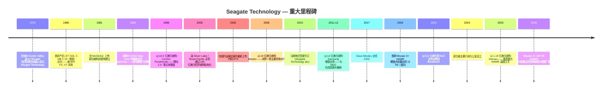
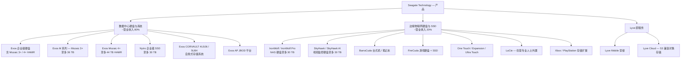
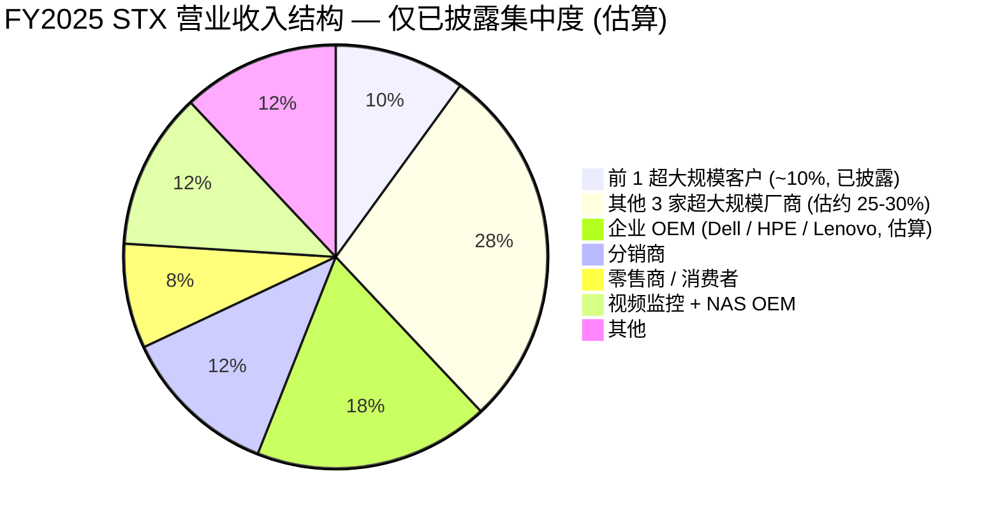
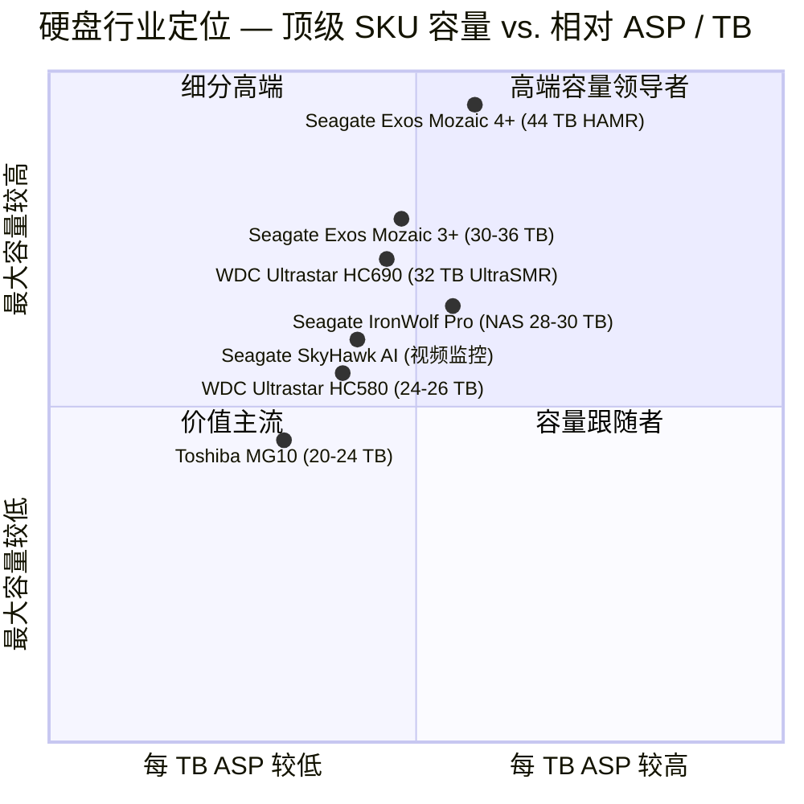

# Seagate Technology Holdings plc (NASDAQ:STX) — 公司研究报告

**报告日期: 2026-05-20**
**分析师: 内部研究——首次覆盖**
**代码 / 上市地: NASDAQ:STX (爱尔兰公共有限公司普通股)**
**报告语言: 简体中文 (英文版同时存在于本目录)**

> **业绩更新——FQ3 FY2026 超预期, FQ4 FY2026 指引再次上调 (2026-04-28):** Seagate 公布 2026 财年第三季度营业收入 **31.1 亿美元 (同比 +44%)**, GAAP 毛利率 **46.5%** (创历史新高), GAAP 摊薄每股收益 **3.27 美元**——均超过此前指引区间的上限。管理层随后指引 **FQ4 FY2026 营业收入 34.5 亿美元 ± 1 亿美元 (中值同比 +35%)**, **非 GAAP 摊薄每股收益 5.00 美元 ± 0.20 美元** (相较此前市场一致预期 5.10–5.30 美元), 隐含全年 FY2026 营业收入约 **120 亿美元 (相较 FY25 的 91.0 亿美元同比 +32%)**, 全年非 GAAP 每股收益接近 **14.80 美元**。董事会宣布 **每季度现金股息 0.74 美元** (高于上年同期 0.72 美元), 并在该季度内偿还了 6.41 亿美元债务。首席执行官 Dave Mosley 将前景定性为"AI 应用放大数据创造并支撑存储需求持续增长的结构性增长新时代"。来源: [Q3 FY2026 业绩公告, 2026-04-28](https://www.sec.gov/Archives/edgar/data/0001137789/000113778926000084/stxq32026pressreleasefinan.htm); [Q3 FY2026 10-Q, 2026-04-29](https://www.sec.gov/Archives/edgar/data/0001137789/000113778926000088/stx-20260403.htm)。

---

## 目录
1. 公司概览
2. 公司历史
3. 管理团队
4. 产品与服务
5. 客户与上市策略
6. 行业概览
7. 竞争格局
8. 市场机会 (TAM)
9. 风险评估
10. 参考资料

---

## 1. 公司概览

**销售的产品。** Seagate Technology Holdings plc (NASDAQ:STX) 是与 Western Digital (WDC) 和 Toshiba (东芝) 一起仅存的三家硬盘 (HDD, hard-disk drive) 制造商之一。公司设计、制造并组装磁头、磁盘介质 (media) 及完整硬盘——后者通过高速旋转的磁性盘片来存储数据; 在 2025 财年 (截至 2025 年 6 月 27 日), 硬盘和基于硬盘的存储系统贡献了超过 95% 的营业收入, 余下小部分来自外购的企业级固态硬盘 (SSD, solid-state drive) 以及 Lyve 存储即服务 (Storage-as-a-Service) 产品组合 ([Seagate 10-K FY2025, Item 1](https://www.sec.gov/Archives/edgar/data/0001137789/000113778925000157/stx-20250627.htm))。在硬盘业务内部, 战略锚点是销售给超大规模云服务提供商 (hyperscale cloud-service providers)、大型企业以及视频监控客户的 **大容量近线存储 (mass-capacity nearline)** 硬盘; 传统的消费级、客户端 (台式机 / 笔记本) 以及任务关键型硬盘虽仍在出货, 但 10-K 明确将其描述为"我们继续销售但不打算大规模投入"的市场。

自 2026 财年起, Seagate 将终端市场报告口径从"大容量 / 传统 / 其他"重新分类为 **数据中心 (FQ3-FY26 营业收入占比 80%) 与边缘物联网 (Edge IoT, 20%)** ([10-Q FQ3 FY2026, Note 6 Revenue](https://www.sec.gov/Archives/edgar/data/0001137789/000113778926000088/stx-20260403.htm))——这种重新命名反映了营业收入越来越倾向于服务于现代 AI 时代数据中心消耗的近线云存储硬盘。

**盈利方式。** Seagate 直接向 OEM、分销商和零售商销售成品硬盘及存储子系统。FY2025 渠道结构为 80% OEM、12% 分销商、8% 零售商 ([FY2025 10-K, Item 7 MD&A](https://www.sec.gov/Archives/edgar/data/0001137789/000113778925000157/stx-20250627.htm)); OEM 渠道包括通过多年期按订单生产协议采购的大型云端和超大规模客户, 再加上传统的服务器 / NAS / 监控 OEM。在当前周期中, 合约越来越多地包含 **不可撤销的多季度产能预定**。营业收入按发货时点确认; 毛利率走势由 (a) 向更高单盘容量近线硬盘的产品组合切换, (b) 工厂稼动率, 以及 (c) 由行业供应紧张所支持的定价行动驱动。

**经营所在地。** 制造集中于亚洲, 主要硬盘组装设施位于中国和泰国; 次级组装与零部件制造分布于中国、马来西亚、北爱尔兰 (Springtown——负责磁头和磁记录介质)、新加坡、泰国和美国。截至 2025 年 6 月 27 日, 公司全球员工总数约为 **30,000 名全职员工, 其中约 25,000 名位于亚洲** ([10-K FY2025, Item 1 Human Capital](https://www.sec.gov/Archives/edgar/data/0001137789/000113778925000157/stx-20250627.htm))。公司注册于爱尔兰 (注册办公地点位于都柏林), 主要行政办公室位于新加坡; 法人实体自 2010 年起即为爱尔兰公共有限公司 (plc), FY2024 出于税收优惠考量将新加坡设为主要行政中心。

**规模。** FY2025 营业收入为 **91.0 亿美元 (同比 +39%)**, GAAP 毛利率 **35.2%** (相较 FY24 的 23.4%), GAAP 净利润 **14.69 亿美元**, 经营性现金流 **11 亿美元** ([10-K FY2025, MD&A](https://www.sec.gov/Archives/edgar/data/0001137789/000113778925000157/stx-20250627.htm))。Seagate 在 FY2025 出货 **595 EB (exabytes, 艾字节) 硬盘存储** (相较 FY24 的 398 EB), 其中 552 EB 为大容量近线硬盘。披露的每 TB 售价从前一年的 15 美元下降至 **14 美元**——但公司以销量和产品组合大幅抵消了这一影响。截至 Q3 FY2026 业绩公告, 过去十二个月 (LTM) 营业收入约为 **110 亿美元**, GAAP 毛利率呈现 40% 出头的趋势。

来源: [10-K FY2025, Item 7 MD&A](https://www.sec.gov/Archives/edgar/data/0001137789/000113778925000157/stx-20250627.htm); [Q4 FY2022 业绩公告, 2022-07-21](https://www.sec.gov/Archives/edgar/data/0001137789/000113778922000039/stxq42022pressreleasefinan.htm); [Q4 FY2021 业绩公告, 2021-07-21](https://www.sec.gov/Archives/edgar/data/0001137789/000113778921000041/stxq42021pressreleasefinan.htm); LTM Q3-FY26 = Q4 FY25 (24.40 亿美元) + Q1 FY26 (26.29 亿美元) + Q2 FY26 (28.25 亿美元) + Q3 FY26 (31.12 亿美元) 之和。FY23/FY24 的低谷反映 2022–23 全行业云存储去库存周期。

**估值快照 (截至 2026-05-20)。** Seagate 的股价是 2024–2026 AI 资本开支繁荣期美国大盘股中单一名称重估幅度最大的之一。无论从历史硬盘行业还是更广义的半导体标准来看, TTM 倍数都非常极端:

| 倍数 | STX (TTM) | WDC (TTM) | Micron (TTM) | 板块中位数* | STX 3 年区间 |
|---|---|---|---|---|---|
| **市盈率 (P/E)** | **71.2×** | 27.4× | ~16× | ~21× | 不适用 (FY23 亏损) — 71× |
| **市销率 (P/S)** | **15.3×** | 13.4× | ~5× | ~3.5× | 0.5× — 15× |
| **EV/EBITDA** | **47.7×** | 39.6× | ~10× | ~15× | 不适用 — 48× |
| **市净率 (P/B)** | **357×** | 21.9× | ~3× | ~4–5× | 不适用 (负权益) |

*板块中位数 = 费城半导体指数加上 Yahoo Finance 板块数据中的存储同业。股价约为 748 美元 (2026-05-18 当周区间 741–765 美元), 市值约为 **1,670 亿美元**, 以发行在外 2.24 亿股普通股计 ([Q3 FY2026 业绩公告, 2026-04-28](https://www.sec.gov/Archives/edgar/data/0001137789/000113778926000084/stxq32026pressreleasefinan.htm); [Macrotrends — STX 市值历史](https://www.macrotrends.net/stocks/charts/STX/seagate-technology-holdings/market-cap)); 同业倍数引自 [WDC 公司研究 2026-05-20](../WesternDigital_NASDAQ_WDC/WesternDigital_NASDAQ_WDC_Research_Document_2026-05-20.md) 第 1 章估值表, 并与 [stockanalysis.com — STX 统计数据](https://stockanalysis.com/stocks/stx/statistics/) 交叉核对。

**解读倍数——为何如此之高。** 三股独立力量复合作用形成了 71× 的 P/E ([stockanalysis.com — STX 统计数据](https://stockanalysis.com/stocks/stx/statistics/)):

1. **盈利能力发生结构性上移。** GAAP 营业利润率从 FY24 的 6.9% 上升至 FY25 的 20.8% 和 Q3 FY26 的 32.1% ([Q3 FY2026 公告, 2026-04-28](https://www.sec.gov/Archives/edgar/data/0001137789/000113778926000084/stxq32026pressreleasefinan.htm))。从 LTM 口径看, 公司目前产生约 35 亿美元 EBITDA, 而两年前仅为 9 亿美元; 基于 FY27 一致预期的每股收益约 18–20 美元的 *前瞻* P/E 接近 **38×**, 显著缓和但仍远高于硬盘行业历史上的 8–12× 水平。
2. **HAMR / Mozaic 溢价。** Seagate 是唯一大批量出货 HAMR 硬盘的硬盘厂商。AI 存储叙事——超大规模厂商近线需求至少到 2029 年将以 20–25% 的容量复合年增长率扩张——正被市场资本化为通常仅授予超大规模厂商邻近型计算 (NVIDIA、AVGO) 的倍数, 而不是 1980 年代起源的零部件供应商。WDC 研究报告明确将 STX 相对 WDC 的估值差距归因于 STX"在 HAMR 量产出货上领先 12 个月"([WDC 公司研究 2026-05-20, 第 1 章](../WesternDigital_NASDAQ_WDC/WesternDigital_NASDAQ_WDC_Research_Document_2026-05-20.md))。
3. **负账面价值扭曲 P/B。** STX 截至 2025 年 6 月 27 日存在约 **(4.53) 亿美元的股东权益赤字** ([10-K FY2025, 合并资产负债表](https://www.sec.gov/Archives/edgar/data/0001137789/000113778925000157/stx-20250627.htm))——这是十多年来回购和股息超过留存收益的累积结果。因此 P/B 对 Seagate 而言并非有意义的比率; **数据服务商报告的 357× 本质上是分母伪影**, 不应独立引用为估值过高的倍数。

按当前股价计算的股息收益率约为 **0.4%** (每季度 0.74 美元 × 4 = 全年 2.96 美元 ÷ 748 美元), 远低于 FY23 谷底时的 4–5%, 反映了纯粹的资本利得定位 ([Q3 FY2026 业绩公告, 2026-04-28](https://www.sec.gov/Archives/edgar/data/0001137789/000113778926000084/stxq32026pressreleasefinan.htm))。我们将偏高的 TTM P/E 和 P/S 视为重大的 **估值压缩风险** (第 9 章, 财务风险类别): 任何增长减速、HAMR 良率不及预期或 AI 资本开支回落都会将倍数压向公允价值区间——约 15–25× 前瞻——这意味着即便没有任何盈利下调也存在 30–50% 的下行风险 ([Stockstory / Yahoo Finance, 2026-05-19](https://markets.financialcontent.com/stocks/article/stockstory-2026-5-19-seagate-and-western-digital-stocks-trade-down-what-you-need-to-know))。

---

## 2. 公司历史

Seagate 由 **Al Shugart、Tom Mitchell、Finis Conner、Doug Mahon 和 Syed Iftikar** 于 1978 年在加州 Scotts Valley 创立, 当时名为 **Shugart Technology** ([Wikipedia — Seagate Technology](https://en.wikipedia.org/wiki/Seagate_Technology); [Funding Universe — Seagate 历史](https://www.fundinguniverse.com/company-histories/seagate-technology-inc-history/))。创业洞察很直白: IBM 式的 8 英寸硬盘对新兴的 5.25 英寸个人电脑而言既太贵又太大; 一款垂直整合、按个人电脑市场定价的 5.25 英寸硬盘将创造出新品类。ST-506 (5 MB, 5.25 英寸) 于 1980 年发货并被 IBM 采用至 PC-XT, 锚定了公司的第一个十年。

三次战略转折定义了现代公司:

1. **2006 年收购 Maxtor (19 亿美元)。** 该交易消除了当时排名第三的厂商, 将行业整合至四家有规模的硬盘厂商; 该交易于 2006 年 5 月 22 日以全股票形式完成, 兑换比例为每股 Maxtor 兑换 0.37 股 Seagate, 预期年度运营费用协同效应约为 3 亿美元 ([EE Times, "Seagate 即将以 19 亿美元收购 Maxtor"](https://www.eetimes.com/seagate-set-to-acquire-maxtor-for-1-9-billion/); [Maxtor 8-K, 2006-05](https://www.sec.gov/Archives/edgar/data/0000711039/000119312506114779/dex991.htm))。该交易在时任 CEO Bill Watkins 任内完成。Maxtor 交易还为 Seagate 带来了消费外部存储业务 (当时仅占营业收入很小部分, 即今日的 LaCie / One Touch / Expansion 残余产品组合)。

2. **2011 年收购 Samsung 硬盘业务 (13.75 亿美元)。** 与 WDC 收购 Hitachi GST 同步, 该交易奠定了硬盘双寡头格局: 交易 (50% 股票 / 50% 现金支付, 于 2011 年 12 月 19 日完成) 在 Seagate 约 30% 的单位份额之上再增添了 Samsung 约 10% 的份额, Samsung 获得 Seagate 9.6% 的股权 ([Seagate 8-K, 2011-04-19](https://www.sec.gov/Archives/edgar/data/0001137789/000110465911020787/a11-10013_2ex99d1.htm); [Engadget, "Samsung 以 13.75 亿美元将硬盘部门出售给 Seagate"](https://www.engadget.com/2011-04-19-samsung-sells-hdd-division-to-seagate-for-1-375-billion/))。中国反垄断审查要求 Seagate 与 Samsung 硬盘部门在运营上保持独立两年, 减缓了协同效应的实现。到 2014 年, 行业仅剩三家有规模的厂商 (STX、WDC、Toshiba)。此次整合带来的结构性定价红利花了大约十年才显现: 定价能力直到 2024–2026 年近线上行周期才显现, 当时超大规模厂商需求再次超过供应 ([TrendForce, 2026-01-28](https://www.trendforce.com/news/2026/01/28/news-seagate-q3-guidance-tops-estimates-nearline-hdd-capacity-fully-booked-through-2026/))。

3. **对 HAMR 的押注。** 当 WDC 沿循渐进式路径 (PMR → ePMR → OptiNAND → UltraSMR, 将 HAMR 作为 2026–2028 一代技术) 时, Seagate 从 2010 年代中期开始将研发资本投入到热辅助磁记录 (heat-assisted magnetic recording, HAMR) 上——这是一种从根本上全新的物理机制, 用激光暂时降低介质磁矫顽力, 使得高矫顽力介质能在每平方英寸内存储更多数据。在大约十年的 HAMR 投入和数次延期之后, **Seagate 的 Mozaic 3+ 平台于 2024 年大批量出货** (每盘片 3+ TB, 至多 30 TB CMR / 36 TB SMR), **Mozaic 4+** 于 2026 年 3 月大批量出货 (至多 44 TB CMR, 10 盘片设计) 至"两家领先的超大规模云服务提供商"([Seagate 业绩公告, 2026-03-03 / 2026-04-15](https://investors.seagate.com/news/news-details/2026/Seagate-Delivers-Industrys-Highest-Capacity-Hard-Drives-with-Next-Generation-Mozaic-4/default.aspx); [Tom's Hardware, 2026-03-03](https://www.tomshardware.com/pc-components/hdds/seagate-begins-shipping-44tb-hard-drives-with-hamr-tech-to-data-centers-mozaic-4-platform-expands-to-10-platters); [HPCwire, 2026-03-03](https://www.hpcwire.com/off-the-wire/seagate-brings-mozaic-4-hamr-platform-to-hyperscale-data-centers-with-44tb-capacity/))。HAMR 押注——Seagate 过去 15 年间最具决定性的单一资本配置决策——现已成为 2024 年后重估的技术基础。

**近期交易 (过去 2 年)。**

- **将 SoC 运营出售给 Broadcom (2024 年 4 月)。** 总对价 6 亿美元 (现金加上 2.34 亿美元的重组采购协议价值); 将内部硬盘控制器 ASIC 设计团队和 IP 转让给 Avago / Broadcom, 同时重组长期 ASIC 供应协议。税前净收益 3.13 亿美元 ([10-K FY2025, Note 17 收购与剥离](https://www.sec.gov/Archives/edgar/data/0001137789/000113778925000157/stx-20250627.htm))。实质上是部分逆转一个非核心硅片学科的垂直整合。
- **收购 Intevac (2025 年 3 月, 1.19 亿美元)。** Intevac 提供用于 HAMR 介质制造的薄膜真空镀膜设备。将 Intevac 并入垂直整合了晶圆处理阶段的关键工具供应商, 有助于降低 HAMR 介质良率爬坡风险 ([10-K FY2025, Note 17](https://www.sec.gov/Archives/edgar/data/0001137789/000113778925000157/stx-20250627.htm))。
- **债务管理 (FY2025 + FY2026 YTD)。** 发行本金 4 亿美元的高级票据; 偿还 4.79 亿美元的 2025 年票据和 5.05 亿美元的 2027 年票据; 回购 9,900 万美元的高级票据。截至 Q3 FY2026, 用经营性现金流额外偿还了 6.41 亿美元债务 ([Q3 FY2026 业绩公告, 2026-04-28](https://www.sec.gov/Archives/edgar/data/0001137789/000113778926000084/stxq32026pressreleasefinan.htm))。FY25 末总债务为 50 亿美元; 走势明确朝向更强资产负债表——鉴于深度负权益账面, 已逾期。

---

## 3. 管理团队

### Dr. William D. ("Dave") Mosley — 董事会主席兼首席执行官

Dave Mosley, **年龄 58 岁**, 自 **2017 年 10 月** 担任 Seagate 首席执行官, 并将自 2025 年 10 月股东大会结束起兼任 **董事会主席**, 前任主席 Michael R. Cannon 转任首席独立董事 ([2025 DEF 14A, 第 7 页](https://www.sec.gov/Archives/edgar/data/0001137789/000113778925000211/stx-20250909.htm))。他是一位由工程师转型而来的职业 Seagate 运营者: 他于 **1996 年作为高级工程师** 加入 Seagate, 拥有固态物理学博士学位, 历任研发工程副总裁 (2002–07)、全球磁盘存储运营高级副总裁 (2007–09)、销售与营销执行副总裁 (2009–11)、运营执行副总裁 (2011–13)、运营与技术总裁 (2013–16)、总裁兼首席运营官 (2016–17), 后于 2017 年成为 CEO ([10-K FY2025, 关于我们的高管信息](https://www.sec.gov/Archives/edgar/data/0001137789/000113778925000157/stx-20250627.htm))。他的 **29 年 Seagate 内部资历** 使其成为存储行业中任期最连贯的 CEO 之一。

他具体的成就具体: 自 **2013 年起担任 HAMR 项目的执行赞助人**, 在 FY23–FY24 深度下行期保持 HAMR 路线图的资金投入 (当时延迟资本开支颇具诱惑), 主持了那些将毛利率从 FY23 的 19.3% 恢复至 FY25 的 35.2% 和 Q3 FY26 的 46.5% 的成本行动——临时降薪、工厂未稼动率吸收和 SoC 业务剥离 ([10-K FY2025, MD&A](https://www.sec.gov/Archives/edgar/data/0001137789/000113778925000157/stx-20250627.htm); [Q3 FY2026 业绩公告, 2026-04-28](https://www.sec.gov/Archives/edgar/data/0001137789/000113778926000084/stxq32026pressreleasefinan.htm))。他还主导了将 Seagate 从"长期下行中的 PC 附加存储"重新定位为"AI 数据中心零部件供应商"的公开叙事——这对股价重估提供了实质性支持 ([Blocks & Files, 2025-10-30](https://blocksandfiles.com/2025/10/30/seagate-revenues-boosted-by-ai-inferencing-as-hamr-tech-becomes-mainstream/))。

**薪酬 (FY2025)。** 报告的总薪酬为 **1,718 万美元**, 包括 110 万美元基本工资、1,296 万美元股票奖励、310 万美元期权奖励、零非股权激励发放 (FY25 现金奖金池在 rTSR 修正器上归零), 以及约 8.5 千美元的"其他" (401(k) 匹配、福利)。该数据较 FY24 的 1,363 万美元和 FY23 的 1,144 万美元有所增加 ([2025 DEF 14A, 薪酬汇总表](https://www.sec.gov/Archives/edgar/data/0001137789/000113778925000211/stx-20250909.htm))。FY26 基本工资略有上调; FY26 长期激励组合对 Mosley 独家调整为 **50% PSU / 30% 时基期权 / 20% RSU** (相对于其他 NEO 的标准结构)——这是薪酬委员会在周期顶部为 CEO 进一步倾斜按业绩付酬结构的信号。

**所有权。** Mosley 受益拥有 **约 965,000 股普通股, 包括可行权期权和短期 RSU**——即 478,912 股直接持有 + 60 日内可行权期权 457,403 股 + 60 日内归属 RSU 29,353 股, 加上视业绩可能归属的约 75,045 股 PSU ([2025 DEF 14A, 第 96 页](https://www.sec.gov/Archives/edgar/data/0001137789/000113778925000211/stx-20250909.htm))。按当前约 748 美元股价计算, 大致相当于 **7.2 亿美元在价敞口**——绝对意义上具有可观的对齐, 但仅占公司流通股的约 0.45%, 仅按直接持有股份衡量的话, 远低于他 6× 工资的股权所有要求倍数。Mosley 在 FY25 10-K 中未披露任何公开的 10b5-1 交易计划。因此他个人与股东的对齐绝大部分依靠业绩股权, 而非创始人级别的普通股持有。

**履历综合评价。** Mosley 是将 STX 作为运营故事 (而非周期性大宗商品押注) 持有的最重要单一原因。他领导公司经历了一个完整的硬盘周期, 执行了行业最大的技术转型 (HAMR 商业化), 并恢复了资产负债表纪律 ([10-K FY2025, MD&A](https://www.sec.gov/Archives/edgar/data/0001137789/000113778925000157/stx-20250627.htm))。可见风险: 继任深度 (没有具备相当工程公信力的明确 EVP 继任者) 以及双重 CEO/主席结构 (由 Cannon 担任首席独立董事缓解, 参见 [2025 DEF 14A, 第 7 页](https://www.sec.gov/Archives/edgar/data/0001137789/000113778925000211/stx-20250909.htm))。

### Gianluca Romano — 执行副总裁兼首席财务官

Romano, **年龄 56 岁**, 自 **2019 年 1 月** 担任 CFO。此前他在 **Micron Technology (2011–18)** 工作 7 年, 任内高升至业务财务与会计公司副总裁, 负责合并财务规划组织, 期间经历了 Micron 最大的 M&A 整合 (2013 年 Elpida 收购) 和 2016–18 年 NAND/DRAM 上行周期。在 Micron 之前, 他曾任 Numonyx (从意法半导体分拆的 NOR 闪存厂, 2010 年被 Micron 收购) 财务副总裁 / 公司控制官, 1994–2008 年在意法半导体的意大利和欧洲历任一系列财务领导职位 ([10-K FY2025, Item 1](https://www.sec.gov/Archives/edgar/data/0001137789/000113778925000157/stx-20250627.htm))。

Romano 带来的"内存周期"经验比典型硬件 OEM CFO 更丰富——这一点很有用, 因为硬盘定价 (与内存一样) 由少数生产商决定, 后者的产能决策推动周期。本周期内的战术胜利: 将 SoC 业务以 6 亿美元总对价出售给 Broadcom; 与 OEM 转向长期、不可撤销需求承诺; FY25 偿还 6.84 亿美元债务, FY26 还有更多; 季度股息从 0.70 美元上调至 0.74 美元; 以及执行 Pillar Two 全球最低税率过渡。FY25 总薪酬为 **1,041 万美元** ([2025 DEF 14A, 薪酬汇总表](https://www.sec.gov/Archives/edgar/data/0001137789/000113778925000211/stx-20250909.htm))。他拥有约 519,000 股, 其中包括 465,408 股短期期权。

### Dr. John C. Morris — SVP / EVP 兼首席技术官

Morris, **年龄 58 岁**, 自 **2019 年** 担任 CTO, 在 FY2026 从 SVP 提升至 **EVP**, 基本工资重置为 56 万美元——在 FY23–24 下行期内被授予首席技术官头衔但未调整工资之后, 正式确认其高级职位 ([2025 DEF 14A, CD&A](https://www.sec.gov/Archives/edgar/data/0001137789/000113778925000211/stx-20250909.htm))。1996 年加入 Seagate。在 2015 年成为硬盘和 SSD 产品副总裁、四年后成为 CTO 之前, 历任设计工程和产品管理领导职位。在向 HAMR 转型的公司, CTO 是仅次于 CEO 之后最具论点关键性的高管; Morris 拥有决定 STX 能否保持 12 个月 HAMR 领先优势的技术路线图。FY2025 总薪酬 **286 万美元**。

### Ban Seng Teh — EVP 兼首席商务官

Teh, **年龄 59 岁**, 自 **2022 年 7 月** 担任 CCO; 在此之前自 2014 年起负责全球销售和销售运营。**1989 年作为现场客户工程师加入 Seagate**——即在公司任职 36 年 ([10-K FY2025, Item 1 — 关于我们的高管信息](https://www.sec.gov/Archives/edgar/data/0001137789/000113778925000157/stx-20250627.htm))。他职业生涯的大部分时间用于建立今日贡献约 38% 营业收入的亚太销售组织。作为 CCO, 他拥有超大规模厂商客户关系以及稳定了定价可见度的长期需求承诺合同模式 ([10-K FY2025, Item 1 — 客户](https://www.sec.gov/Archives/edgar/data/0001137789/000113778925000157/stx-20250627.htm))。FY25 总薪酬 **560 万美元**; 约 24,000 股直接持有以及可行权期权 ([2025 DEF 14A, 薪酬汇总表](https://www.sec.gov/Archives/edgar/data/0001137789/000113778925000211/stx-20250909.htm))。鉴于他在新加坡的基地, 他以新加坡元计薪。

### 治理脚注

董事会目前为 **11 名董事, 其中 10 名按 Nasdaq 规则属于独立董事**, 由 Michael R. Cannon (独立) 担任主席直至 2025 年 10 月股东大会; 届时 Mosley 将成为主席, Cannon 转任首席独立董事 ([2025 DEF 14A, 第 7 页](https://www.sec.gov/Archives/edgar/data/0001137789/000113778925000211/stx-20250909.htm))。值得注意的董事包括 Judy Bruner (前 SanDisk CFO, 审计委员会主席)、Richard L. Clemmer (前 NXP 半导体 CEO——带来内存周期和半导体 M&A 经验)、Yolanda L. Conyers (前联想首席多元化官)、Dylan G. Haggart (ValueAct Capital 合伙人——2023 年获得的激进派席位), 以及 Stephanie Tilenius (企业家, 前 Google/eBay)。

**内部人士整体所有权** (17 名高管 + 董事 + 提名人) 截至 2025 年 8 月 22 日合计 **1,684,244 股**, 约为当时发行在外 2.13 亿股普通股的 **0.79%** ([2025 DEF 14A, 第 96 页](https://www.sec.gov/Archives/edgar/data/0001137789/000113778925000211/stx-20250909.htm))——较低但对于大盘股、非创始人领导的公司而言并不罕见。**5%+ 持有人名单** 全为机构: **Vanguard 13.14%、Sanders Capital 8.88%、JP Morgan 8.40%、Capital Research Global 7.34%、BlackRock 6.08%** ([2025 DEF 14A, 第 96–97 页](https://www.sec.gov/Archives/edgar/data/0001137789/000113778925000211/stx-20250909.htm))。Sanders Capital 和 Capital Research 作为集中长期持有人 (相对于纯指数追踪定位) 的存在, 是股权顶层的高确信主动持有的积极信号。未披露重大关联方交易。

**管理层履历综合评价。** Mosley、Morris 和 Teh 是 29–36 年的 Seagate 老兵; Romano 是具有深度内存周期背景的 7 年任期 CFO ([10-K FY2025, Item 1 高管](https://www.sec.gov/Archives/edgar/data/0001137789/000113778925000157/stx-20250627.htm))。该团队在 2024–2026 年间交付了 Seagate 历史上最高质量的多年运营表现——毛利率从 19% 升至 46%、EBITDA 从低于 10 亿美元升至超过 35 亿美元、债务下降 13 亿美元, 以及 HAMR 路线图按计划推进 ([10-K FY2025, MD&A](https://www.sec.gov/Archives/edgar/data/0001137789/000113778925000157/stx-20250627.htm); [Q3 FY2026 业绩公告, 2026-04-28](https://www.sec.gov/Archives/edgar/data/0001137789/000113778926000084/stxq32026pressreleasefinan.htm))。主要 **缺口** 是继任深度: 其他四位高管 (Lee — 首席法务官、Chong — 全球运营、Morris — CTO、Teh — CCO) 各自在其领域中很强, 但如果 Mosley 意外离职, 没有人是明确的继任者。2025 年治理重组 (Mosley 升任主席, Cannon 转任首席独立董事) 最好被解读为董事会发出的信号: 他们预期 Mosley 将至少再服务一个多年周期 ([2025 DEF 14A, 第 7 页](https://www.sec.gov/Archives/edgar/data/0001137789/000113778925000211/stx-20250909.htm))。

---

## 4. 产品与服务

Seagate 网站将产品组合划分为七条产品线加上 Lyve 即服务产品 ([Seagate 产品导航](https://www.seagate.com/products/))。硬盘平台——Mozaic——现已成为大多数大容量 SKU 的底层共通技术 ([Seagate — Mozaic / HAMR 平台页面](https://www.seagate.com/innovation/mozaic/))。

### 数据中心

**Exos 企业级近线硬盘——含 Mozaic 3+ 和 Mozaic 4+ HAMR 平台。** 最重要的单一产品族, 占 Seagate 大部分营业收入和出货 EB 的 85% 以上。FY25 10-K 中披露的容量至多 **35 TB**, 是当时出货的顶级 SKU; **Mozaic 4+ 系列于 2026 年 3 月推出, 至多 44 TB CMR (10 盘片 × 4.4 TB)** 出货给两家指定的超大规模客户 ([Seagate Mozaic 4+ 业绩公告, 2026-03-03](https://investors.seagate.com/news/news-details/2026/Seagate-Delivers-Industrys-Highest-Capacity-Hard-Drives-with-Next-Generation-Mozaic-4/default.aspx); [HPCwire, 2026-03-03](https://www.hpcwire.com/off-the-wire/seagate-brings-mozaic-4-hamr-platform-to-hyperscale-data-centers-with-44tb-capacity/); [blocksandfiles, 2025-10-30](https://blocksandfiles.com/2025/10/30/seagate-revenues-boosted-by-ai-inferencing-as-hamr-tech-becomes-mainstream/))。目标客户: 云和超大规模数据中心、构建私有云的大型企业、视频 / 图像 / 监控集成商。定价模式: 主采购协议下的按订单生产、多季度产能预定合同; 根据第三方行业分析, 当前上行周期内单盘 ASP 约为 **300–420 美元** ([Dr. Robert Castellano, 2026-02-15](https://drrobertcastellano.substack.com/p/seagate-and-western-digital-hdd-price))。主要差异化是面密度 (Mozaic 4+ 实现 4+ TB / 盘片, 行业首次)、用于吞吐量的 MACH.2 多致动器技术、以及以适度性能权衡换取更多每盘片容量的 SMR。

- *竞争优势:* **是——技术领先。** 护城河是 HAMR 磁头 + 记录介质 + 热控制 IP 组合。证据: Seagate 是 **唯一大批量出货 HAMR 硬盘的硬盘厂商**, 到 2026 年中期累计出货超过 100 万 HAMR 单位 ([Seagate / Blocks & Files 媒体报道, 2026-04](https://blocksandfiles.com/2026/04/seagate-mozaic-4-plus-44tb/); [Seagate 博客 "支撑 AI 时代的纳米奇迹"](https://www.seagate.com/blog/the-nanomarvels-enabling-the-ai-era/)); WDC 尚未启动量产 HAMR, Toshiba 落后更多。根据 Seagate 自身的声明, Mozaic 4+ 相对于前 HAMR 30 TB 一代提供 **47% 更好的 $/W/TB 基础设施效率** ([Seagate "Mozaic 4+" 故事页](https://www.seagate.com/stories/articles/seagate-delivers-industrys-highest-capacity-hard-drives-with-next-generation-mozaic-4/))。
- *最接近的竞争产品:* **WDC Ultrastar DC HC690 (26 / 28 TB CMR; 32 TB UltraSMR, 配 ePMR + OptiNAND)** ([WDC Ultrastar HC690 产品页](https://www.westerndigital.com/products/internal-drives/ultrastar-dc-hc690-hdd)) 以及即将于 2026 年末 / 2027 年初推出的 **40 TB ePMR / 44 TB HAMR 一代产品**。**结论: Seagate 在顶级容量层领先 (今天 44 TB 对 32 TB UltraSMR), 在 24–28 TB 层持平, 在前 HAMR 容量点的每 TB 功耗略微落后**。该容量差距将随着 WDC 的 HAMR 一代在 2027 年达到量产而缩小。

**Nytro 企业级 SSD。** SATA / SAS / NVMe SSD 至多 30 TB, 面向超大规模、高密度和企业应用。在控制器 / 固件层集成下从第三方采购; 这对 Seagate 而言 **不是** 战略优先事项, 营业收入很小 ([10-K FY2025, Item 1 产品](https://www.sec.gov/Archives/edgar/data/0001137789/000113778925000157/stx-20250627.htm))。2024 年 4 月将 SoC 业务出售给 Broadcom 时, 也将支持 SSD 产品线的控制器 ASIC 团队一并转让——一个明确的信号: Seagate 在去优先级化 SSD ([Streetinsider — Seagate / Avago 6 亿美元资产购买协议, 2024-04-23](https://www.streetinsider.com/8K/Seagate+Technology+(STX)+Enters+%24600M+Asset+Purchase+Agreement+with+Avago/23103846.html))。
- *竞争优势:* **没有——充其量适中。** Seagate 在 NAND 上缺乏垂直整合。最接近的竞争对手: **Sandisk** (分拆后的纯 NAND/SSD, 与 Kioxia 有垂直晶圆厂合作)、**Micron 6500 ION / 9550**、**Samsung PM 系列**、**Solidigm (SK 海力士)**。结论: 落后。Seagate 的企业 SSD 营业收入占集团比例 < 5%, 主要存在用以进入客户 RFP。

**Exos CORVAULT 4U106 / 5U84。** 4U 和 5U 机架式机箱, 分别容纳 106 / 84 个 Exos 硬盘, 配备专有的 **ADAPT** 纠删码和 **ADR (Autonomous Drive Regeneration, 自主驱动器再生)** 实现自愈操作, 营销宣称提供五个九的可用性 ([CORVAULT 4U106 产品页](https://www.seagate.com/products/storage/data-storage-systems/corvault/4U106/); [Exos CORVAULT 数据中心存储解决方案](https://www.seagate.com/products/storage/data-storage-systems/corvault/))。每机架总容量至多约 2.5 PB。战略角色: 在裸盘销售之上捕获系统集成毛利层。
- *竞争优势:* **部分——捆绑护城河。** 毛利率为中高个位数 (相对于硬盘的 30 多个百分点)。最接近的竞争对手: WDC 的 **Ultrastar Data60 / Data102 JBOD 平台** ([WDC 产品导航](https://www.westerndigital.com/products/storage-platforms/ultrastar-data102-storage-platform))。结论: 持平; ADAPT/ADR 是技术差异化, 但相对于白盒 ODM 平台 (广达、纬颖) 而言, 厂商集成平台的市场较小。

### 边缘物联网 (前"传统")

**IronWolf 和 IronWolf Pro NAS 硬盘 (至多 30 TB)。** 为中小企业 NAS 市场打造, 配备防震固件、多流优化, 以及 Pro SKU 上的 5 年保修。通过与 Synology、QNAP、TerraMaster、Asustor 等 OEM 合作伙伴营销 ([Seagate 产品导航](https://www.seagate.com/products/))。
- *竞争优势:* **部分——品牌和渠道** (与 WDC Red 并列)。
- *最接近的竞争产品:* **WDC Red / Red Pro / Red Plus**, **Toshiba N300**。结论: 技术规格持平; Seagate 在视频监控集成商的渠道认知度略微领先。

**SkyHawk 和 SkyHawk AI 视频监控硬盘 (至多 30 TB)。** 针对写入密集型、始终在线视频工作负载优化, 配备 ImagePerfect 固件。SkyHawk AI 层增加了对分析的重型多流支持 ([SkyHawk AI 视频硬盘产品页](https://www.seagate.com/products/video-analytics/skyhawk-ai-hard-drive/))。**与海康威视和大华 (全球两大监控 OEM) 的参考设计身份** 是 WDC 无法匹敌的结构性优势 ([Seagate — 首款 AI 启用监控硬盘业绩公告](https://www.seagate.com/as/en/news/news-archive/seagate-launches-first-drive-for-ai-enabled-surveillance-master-pr/))。
- *竞争优势:* **是——分销 + 参考设计锁定。** 最接近的竞争产品: WDC **Purple / Purple Pro**。结论: Seagate 在监控领域领先。

**BarraCuda 台式机硬盘 (至多 24 TB) 和 2.5" 移动硬盘 (至多 5 TB)。** 主流 PC 内部存储市场。由于 SSD 在客户端 PC 中替代硬盘, 该业务在结构上下降 ([10-K FY2025, Item 1 产品](https://www.sec.gov/Archives/edgar/data/0001137789/000113778925000157/stx-20250627.htm))。
- *竞争优势:* **没有。** 这是一项管理中的下降业务。
- *最接近的竞争产品:* WDC **Blue**。结论: 持平但在萎缩的市场池。

**FireCuda 游戏硬盘 + SSD 系列。** 游戏优化的内部和外部硬盘, 包括授权的 **Xbox 的 Seagate 存储扩展卡** 和 PlayStation 外置硬盘。FireCuda 530 / 540 是 PCIe 5.0 NVMe SSD (第三方采购); FireCuda 2.5"/3.5" 硬盘定位面向需要低于 NVMe 成本下高容量的游戏玩家 ([Seagate 产品导航](https://www.seagate.com/products/))。
- *竞争优势:* **部分——许可 + 品牌。** Xbox 扩展卡是授予 Seagate 的微软独家形态因子。最接近的竞争产品: WDC_BLACK 系列。结论: 总体持平, 由于 Xbox 许可而在控制台配件领域领先。

**消费外置存储——One Touch、Expansion、Basics、Ultra Touch。** 通过 Amazon、Best Buy、Costco、MicroCenter 销售的便携式和桌面外置硬盘 / SSD。容量至多 24 TB。整体营业收入在下降 ([10-K FY2025, MD&A](https://www.sec.gov/Archives/edgar/data/0001137789/000113778925000157/stx-20250627.htm))。

**LaCie (创意专业人士外置存储)。** 为视频 / 照片专业人士打造的高端品牌。坚固式 SSD、坚固式 USB-C、2big Dock RAID 产品。2014 年收购, 作为独立的高端品牌保留。在广播 / 电影领域具有品牌护城河 ([Seagate 产品导航](https://www.seagate.com/products/))。
- *竞争优势:* **是——细分市场品牌护城河。** 最接近的竞争产品: WDC 的 **SanDisk Professional G-DRIVE / G-RAID** (分拆后从 Sandisk 反向授权给 WDC 的品牌)。结论: 在专业消费者细分市场持平; 随着云工作流程取代穿梭存储, 双方都在萎缩。

### Lyve 即服务

**Lyve Mobile。** 一种"穿梭式"数据传输服务: 企业在本地将多 PB 存储机箱加载数据, 运送到云接入点, 数据被上传至客户选择的云。定价: 按作业和按 PB ([Seagate 产品导航](https://www.seagate.com/products/))。

**Lyve Cloud。** S3 兼容对象存储, 具有标准和不频繁访问层, 在多个区域的 Seagate 托管 Exos / CORVAULT 基础设施上运行。在价格上对抗 AWS S3 / Azure Blob / Google Cloud Storage 进行营销 (声称相对于超大规模厂商定价节省 50–70%) ([Backblaze 云存储定价比较, 2025](https://www.backblaze.com/cloud-storage/pricing))。
- *竞争优势:* **部分——定价。** Lyve Cloud 在公共对象存储市场遥遥落后排名第五; **护城河是成本基础** (Seagate 在自家机架上运营自家硬盘) 但战略挑战是超大规模客户不想使用厂商品牌云, 价格敏感客户则可以使用 Backblaze B2 或 Wasabi。Lyve Cloud 营业收入未单独披露但似乎低于 2 亿美元。最接近的竞争对手: Backblaze B2、Wasabi、IDrive e2。结论: 在规模上落后; 作为客户开发载体有用, 但短期内不是毛利贡献者。

### 旗舰 vs. 长尾

**驱动业务的 1–2 个旗舰产品** 是:

1. **Exos Mozaic 3+ 和 Mozaic 4+ 近线硬盘**——整个看多观点完全寄托在这里。大容量近线占 **FQ3 FY2026 营业收入的 80%**, 仅在该季度内出货 175.4 EB 容量 ([10-Q FQ3 FY2026 MD&A](https://www.sec.gov/Archives/edgar/data/0001137789/000113778926000088/stx-20260403.htm))。最近季度近线 EB 中超过 20% 为 HAMR 硬盘, 管理层表示"全部为 Mozaic 3+", 而 Mozaic 4+ 现在正在爬坡。
2. **SkyHawk 视频监控硬盘**——仅占营业收入约 3–4%, 但在海康威视 / 大华的参考设计中具有结构性护城河, 中期盈利稳定可靠。

其他所有——消费外置、LaCie、IronWolf NAS、BarraCuda、FireCuda、Nytro SSD、Lyve 服务——合计 < 20% 营业收入并据此管理 ([10-Q FQ3 FY2026, Note 6 营业收入](https://www.sec.gov/Archives/edgar/data/0001137789/000113778926000088/stx-20260403.htm))。

### 过去 12 个月的路线图与发布

- **2025-Q3:** Mozaic 3+ 在三家超大规模 CSP 完成资格认证; > 3 TB / 盘片大批量出货 ([blocksandfiles, 2025-10-30](https://blocksandfiles.com/2025/10/30/seagate-revenues-boosted-by-ai-inferencing-as-hamr-tech-becomes-mainstream/))。
- **2026-03-03:** Mozaic 4+ 宣布并以至多 44 TB CMR 大批量出货给两家超大规模厂商; Seagate 公开承诺路线图为"今天 4+ TB / 盘片扩展到 10 TB / 盘片——可实现至多 100 TB 的硬盘"([Tom's Hardware, 2026-03-03](https://www.tomshardware.com/pc-components/hdds/seagate-begins-shipping-44tb-hard-drives-with-hamr-tech-to-data-centers-mozaic-4-platform-expands-to-10-platters); [Seagate 故事 — Mozaic 4+](https://www.seagate.com/stories/articles/seagate-delivers-industrys-highest-capacity-hard-drives-with-next-generation-mozaic-4/))。
- **2026 年持续:** Mozaic 4+ 还有另外两个超大规模厂商资格认证进行中; "广泛可用性"计划贯穿 2026 年 ([HPCwire, 2026-03-03](https://www.hpcwire.com/off-the-wire/seagate-brings-mozaic-4-hamr-platform-to-hyperscale-data-centers-with-44tb-capacity/))。
- **退役产品:** 15,000-RPM 任务关键型硬盘已于 FY2024 停产; SoC 控制器 ASIC 产品线于 2024 年 4 月出售给 Broadcom。过去 12 个月内没有重大消费产品发布——消费业务实际上处于收获模式。

---

## 5. 客户与上市策略

**细分市场。** Seagate 的客户群严重偏向 OEM 和云 / 超大规模客户, 二者合计提供约 80% 的营业收入。10-K MD&A 按渠道分解营业收入: **FY2025 为 80% OEM / 12% 分销商 / 8% 零售商**, OEM 份额在 FY2026 至今进一步上升 ([10-K FY2025 MD&A](https://www.sec.gov/Archives/edgar/data/0001137789/000113778925000157/stx-20250627.htm); [10-Q FQ3 FY2026, Note 6](https://www.sec.gov/Archives/edgar/data/0001137789/000113778926000088/stx-20260403.htm))。在 OEM 渠道内, 四种终端用户类型重要:

- **超大规模云服务提供商 (战略锚点)。** 媒体报道和 Seagate 自身的评论将 **最高超大规模客户识别为 Amazon (AWS)、Microsoft (Azure)、Google (GCP) 和 Meta** ([Seagate "Mozaic 4+" 业绩公告; blocksandfiles, 2025-10-30](https://blocksandfiles.com/2025/10/30/seagate-revenues-boosted-by-ai-inferencing-as-hamr-tech-becomes-mainstream/))。截至 2026 年 3 月已通过 Mozaic 4+ 资格认证的两个名为"领先超大规模云服务提供商"的对象并未单独披露, 但鉴于 2024–25 年 Seagate / Microsoft 的公开合作伙伴关系公告以及 2025–26 年 AWS-Meta 的体量定位, 普遍认为在此名单之中。
- **企业 OEM。** Dell、HPE、Lenovo、IBM、Supermicro——为服务器 / 存储阵列集成购买企业级近线和中端硬盘。
- **视频监控 OEM。** 海康威视和大华占主导地位; SkyHawk 系列在二者中均具有参考设计身份。
- **控制台 / 消费电子 OEM。** Microsoft (Xbox 存储扩展卡许可) 和 Sony (PlayStation 外置)。

**客户集中度——定量。** 在 FY2025, **一家客户占合并营业收入约 10%** ([10-K FY2025, Note 16 营业收入, 第 81 页](https://www.sec.gov/Archives/edgar/data/0001137789/000113778925000157/stx-20250627.htm))。在 FY2024, **没有单一客户超过合并营业收入的 10%**。在 FY2023, **又有一家客户占约 10%**。这种模式——上行周期中有一个约 10% 的单一客户, 下行周期中没有客户达到 10% 的门槛——与 **一个单一的超大规模账户在近线云需求达峰时成为 10%+ 客户但在库存调整期间低于门槛** 一致。Seagate 在分部备注中并未指明该客户。前 5 大客户集中度 **未单独披露**——根据 ASC 280-10-50-42, Seagate 不需要披露低于 10% 门槛的客户。

**对风险登记表的意涵。** 单一客户约 10% 的集中度 **处于"重要"的边界**, 按公司研究技能的风险分类法 (前 1 大 > 10% 即触发风险章节纳入)。关于前 5 大: 虽未披露, 实际现实是四家超大规模厂商加上两家最大企业 OEM 在当前周期可能合计达到 **营业收入的 > 50%**。这 **不是近期订购风险**——合同现在是多季度、不可撤销按订单生产, Seagate 管理层一贯说这是供应可见度大幅改善的原因。它是一个 **中期内化风险**: 像 AWS 或 Microsoft 那样规模的超大规模厂商理论上可以从 ODM 委托定制硬盘或部分内化介质供应, 但没有任何顶级超大规模厂商公开表明这种雄心, 而且 > 30 亿美元资本开支 / 5 年磁头和介质工具引进时间使其不切实际 ([交叉引用: WDC 公司研究 2026-05-20 § 6 — 同样分析适用于 STX](../WesternDigital_NASDAQ_WDC/WesternDigital_NASDAQ_WDC_Research_Document_2026-05-20.md))。

10% 已披露客户的来源: [10-K FY2025, Note 16](https://www.sec.gov/Archives/edgar/data/0001137789/000113778925000157/stx-20250627.htm)。所有其他切片均为 **作者估算**, 通过将渠道结构 (80% OEM) 与公开识别的超大规模客户以及披露的终端市场结构 (80% 数据中心) 三角化得出。仅供方向性使用——Seagate 不披露低于 10% 的客户级营业收入。

**地理分布。** FY2025 开票地点营业收入: 美洲 49%、亚太 41%、欧洲中东和非洲 (EMEA) 10% ([10-K FY2025, Item 7 MD&A](https://www.sec.gov/Archives/edgar/data/0001137789/000113778925000157/stx-20250627.htm))。美洲份额非常大是有误导性的——它反映了开票至美国超大规模厂商采购总部, 而非数据中心的终端用户位置 (其中一部分位于 EMEA 和亚太)。从 FY24 的 35% 美洲到 FY25 的 49% 的转变反映了美国超大规模厂商在 2024–25 AI 资本开支部署中的相对主导地位 ([dcpulse — 超大规模厂商资本开支到 2025 年将达 3,150 亿美元](https://dcpulse.com/statistic/the-great-ai-infrastructure-race-hyperscaler-capex))。

**合同。** FY2024 期间, Seagate 转向与其关键全球 OEM 客户的 **长期、不可撤销需求承诺合同结构**, 以换取多季度 Mozaic 平台可用性的可见度 ([10-K FY2025, Item 1 客户](https://www.sec.gov/Archives/edgar/data/0001137789/000113778925000157/stx-20250627.htm))。这种结构变化意义重大: 硬盘供需周期历史上以按季度可撤销采购订单的节奏运行, 这使得营运资本管理和产能规划痛苦地顺周期。合同层面的变化抑制了这一点——Seagate 现在在需求侧的运营更接近内存晶圆厂模式, 尽管没有内存合同中会有的价格传导棘轮。

**分销和零售。** 分销商 (Ingram Micro、Tech Data / TD SYNNEX、Synnex Korea / China) 提供约 12–15% 的营业收入, 大部分进入 NAS、视频监控、渠道 OEM 和白盒服务器市场。零售 (Amazon、Best Buy、Costco、MicroCenter) 是约 6–10% 的余量, 服务于结构性下降的消费外置细分 ([10-K FY2025, Item 7 MD&A](https://www.sec.gov/Archives/edgar/data/0001137789/000113778925000157/stx-20250627.htm))。

**销售周期。** OEM/超大规模厂商资格认证从样品发货到爬坡需要 6–18 个月; 多季度预测现在驱动供应计划。分销商 / 零售业务以周为单位轮换 ([10-K FY2025, Item 1 客户](https://www.sec.gov/Archives/edgar/data/0001137789/000113778925000157/stx-20250627.htm))。

---

## 6. 行业概览

**行业定义。** 硬盘是机电式大容量存储设备, 其中一个或多个涂有磁层的旋转盘片由飞行在表面纳米之上的记录磁头读写。它们与 NAND 闪存 SSD 和磁带并列, 是现代计算中的三种持久存储介质。硬盘行业是一个单一的全球市场, 有三家严肃厂商——**Seagate (STX)、Western Digital (WDC)、Toshiba**——合计持有 ≥95% 的单位出货量, 以及近线 / 云容量出货量的实质上 100% ([Mordor Intelligence — 硬盘市场](https://www.mordorintelligence.com/industry-reports/hard-disk-drive-market); [Tom's Hardware — 硬盘路线图, 2025-08](https://www.tomshardware.com/pc-components/hdds/high-capacity-hdd-roadmap-the-race-to-100tb-and-zettabyte-scale-storage-toshiba-seagate-and-wd-outline-three-distinct-strategies))。

**行业规模。** 日历 2025 行业营业收入约为 **230–250 亿美元** (WDC 硬盘约 95 亿美元 + Seagate 约 100 亿美元 + Toshiba 约 40 亿美元), 高于日历 2023 约 170 亿美元的低谷, 接近日历 2022 约 280 亿美元的上一轮周期峰值 ([WDC 公司研究 2026-05-20, § 8 TAM](../WesternDigital_NASDAQ_WDC/WesternDigital_NASDAQ_WDC_Research_Document_2026-05-20.md); [Mordor Intelligence — 硬盘市场 2025](https://www.mordorintelligence.com/industry-reports/hard-disk-drive-market))。Mordor Intelligence 将日历 2026 规模定为 **200 亿美元, 增长至 2035 年的 242 亿美元, 年复合增长率 1.9%**——但 Mordor 的混合年复合增长率低估了市场内的 **结构动态**: 近线容量硬盘以 > 15% 复合年增长率增长, 而客户端 / 消费硬盘以 > 10% 复合年增长率下降。容量加权视角 (出货 EB × 每 EB 平均售价) 提供了更相关的增长曲线。

来源: FY24 和 FY25 数据出自 [Seagate 10-K FY2025, Item 7 MD&A](https://www.sec.gov/Archives/edgar/data/0001137789/000113778925000157/stx-20250627.htm); FY21-FY23 作者估算, 由 [Statista — Seagate 硬盘容量出货 2024](https://www.statista.com/statistics/795771/worldwide-seagate-hard-drive-capacity-shipped/) 和 Seagate 历史 8-K 补充资料三角化。FY25 的戏剧性阶跃 (552 EB 大容量, 同比 +56%) 是 2024–26 年最重要的单一行业数据点。

**增长驱动因素。**

1. **AI / 生成式 AI 工作负载创造持续的大规模数据增长。** IDC《全球数据圈预测 2025–2029》预计全球数据圈以 **5 年 25% 复合年增长率增长至 2029 年的 527 ZB** ([引用于 10-K FY2025, Item 1](https://www.sec.gov/Archives/edgar/data/0001137789/000113778925000157/stx-20250627.htm); [IDC 文档 #US53363625, 2025 年 5 月](https://www.idc.com/getdoc.jsp?containerId=US53363625))。根据 IDC 的《云基础设施指数》, 硬盘在今天的大型数据中心部署中存储 **87% 的 EB**, 锚定于容量企业级硬盘相对企业级 NAND SSD 的每 TB 成本和每 TB 能耗结构。
2. **HAMR 启用的容量扩展。** 每盘片面密度在 2017–2022 年 ePMR 时代有效地停滞在约 1 TB / 盘片。HAMR 解锁了 3 TB / 盘片 (Mozaic 3+, 2024) → 4 TB / 盘片 (Mozaic 4+, 2026) → 10 TB / 盘片 (Seagate 路线图, 2020 年代末) 的轨迹。每次盘片密度翻倍在制造层面改善 $/TB 30–50%, 同时支持厂商毛利率和客户 TCO。
3. **超大规模厂商近线建设。** 超大规模厂商 2025 年资本开支创下约 3,150 亿美元纪录; 存储吸收该信封的约 15–20% ([Mordor Intelligence](https://www.mordorintelligence.com/industry-reports/hard-disk-drive-market))。云 / 超大规模厂商需求占 2025 日历年硬盘单位需求的 48%, 预计到 2031 年以 11–12% 复合年增长率增长。
4. **行业整合已结构性稳定定价。** Big 3 (STX、WDC、Toshiba) 持有 > 95% 全球份额; 近线容量扩展现在需要明确的超大规模厂商预订单 ([WDC 公司研究, § 6](../WesternDigital_NASDAQ_WDC/WesternDigital_NASDAQ_WDC_Research_Document_2026-05-20.md); [Dr. Castellano, 2026-02](https://drrobertcastellano.substack.com/p/seagate-and-western-digital-hdd-price))。硬盘 ASP / TB 由于这种供应纪律而 **自 2000 年代初以来首次持续上涨**。
5. **NAND 替代在容量层仍受结构性限制。** 尽管有 Pure Storage 的"2028 年不再有硬盘"叙事和选定超大规模厂商对全闪存数据中心的实验, NAND $/TB 在容量类工作负载方面仍为硬盘 $/TB 的约 4–6 倍——而且 2025 年由于近线硬盘 ASP 上涨而 NAND 价格因供应过剩受压, 这一差距实际上 *扩大了* ([Dr. Castellano, 2026-02-15](https://drrobertcastellano.substack.com/p/seagate-and-western-digital-hdd-price))。

**$/TB 趋势。** Seagate 自己披露的硬盘每 TB 价格从 FY22 的 22 美元下降至 FY25 的 14 美元, 下降 36%——但每盘 ASP **上升**, 因为产品组合切换至 30–44 TB SKU ([10-K FY2025, Item 7 MD&A](https://www.sec.gov/Archives/edgar/data/0001137789/000113778925000157/stx-20250627.htm))。

来源: [Seagate 10-K FY2025, Item 7 MD&A](https://www.sec.gov/Archives/edgar/data/0001137789/000113778925000157/stx-20250627.htm) 提供 FY24-FY25 披露的 $/TB。FY21-FY23 来自 Seagate 之前 10-K MD&A 披露。叙事很直白: 持续的每 TB 价格侵蚀被容量密度 (Mozaic 3+ 和 4+) 抵消, 后者在单盘和每机架层面更多地补偿。

**监管。** 硬盘是大宗电子产品, 产品特定的监管极少。主要监管暴露是 (a) **出口管制**——尤其是美国-中国贸易限制, Seagate 已有应对经验 (尤其是 2023 年 4 月就向华为销售达成的 3 亿美元 BIS 和解——根据 [Paul Weiss 客户备忘录](https://www.paulweiss.com/insights/client-memos/bis-imposes-300-million-penalty-against-seagate-for-export-control-violations-and-makes-controversial-changes-to-voluntary-self-disclosure-program), 是 BIS 历史上最大的单独行政处罚; [Seagate 8-K, 2023-04-19](https://www.sec.gov/Archives/edgar/data/0001137789/000119312523106624/d497922dex991.htm)); (b) **稀土元素供应限制**, 与磁头和介质制造工艺相交; (c) 关于电子产品中物质的 **环境法规** (欧盟 REACH、RoHS) ([10-K FY2025, Item 1 政府监管](https://www.sec.gov/Archives/edgar/data/0001137789/000113778925000157/stx-20250627.htm))。

**行业动态。**

- **碎片化:** 高度集中。2025 年 Q1 单位份额: **WDC 42% (1,210 万盘), Seagate 40% (1,140 万盘), Toshiba 18% (520 万盘)** ([Tom's Hardware, 2025-08](https://www.tomshardware.com/pc-components/hdds/high-capacity-hdd-roadmap-the-race-to-100tb-and-zettabyte-scale-storage-toshiba-seagate-and-wd-outline-three-distinct-strategies))。按 **容量 EB 份额** 看, Seagate 可能因 Mozaic 容量优势而略微领先。
- **供应商议价能力:** 中等。两家大型磁头 / 介质厂商 (Resonac / 昭和电工生产基板盘片; TDK 和源自 Hitachi 的厂商生产磁头); Mozaic 供应链需要专业的激光二极管和近场传感器子组件。Seagate 2025 年 3 月收购 Intevac 加强了对晶圆处理工具链中关键部分的掌控。
- **买方议价能力:** 在周期顶部对四家超大规模厂商较高; 对分销商 / 零售长尾较低。当前周期不寻常的地方是 **买方议价能力实际上反转了**——面对供应稀缺, 超大规模厂商正在签订多季度不可撤销承诺以锁定产能。WDC 和 STX 都报告称近线产能在整个日历 2026 年全部售罄。
- **替代品:** NAND 闪存 SSD (高性能) 和磁带 (冷归档)。在容量 / 每 TB 成本 / 每 TB 能耗交叉点上, 都不是短期直接替代品。
- **进入壁垒:** 非常高。建立新的硬盘垂直整合制造商需要约 30 亿美元资本开支 (磁头、介质、驱动器组装工具)、5+ 年的良率验证, 以及十年规模的专利组合许可。自 1990 年代以来没有新硬盘进入者; 行进方向唯一是整合。

---

## 7. 竞争格局

Seagate 在二人加半的寡头垄断中竞争, 还有一个主要邻近威胁 (NAND 闪存)。竞争格局最好分解为硬盘直接竞争对手和更广义的存储替代品 ([10-K FY2025, Item 1 竞争](https://www.sec.gov/Archives/edgar/data/0001137789/000113778925000157/stx-20250627.htm))。

### 直接硬盘竞争对手

**1. Western Digital Corporation (NASDAQ: WDC)。** 最接近的竞争对手——并且在 Sandisk 分拆 (2025 年 2 月) 之后, 与 Seagate 一样是 **纯硬盘公司**。日历 2025 营业收入 **约 95 亿美元**, FY2025 GAAP 毛利率 38.8%, GAAP 营业利润率 24.4%。WDC 在单位份额上略微领先 (~42% 对 STX 的 ~40%) 但 **在 HAMR 量产上落后约 12 个月**。WDC 的战略: 在 2025–26 年通过 32 TB 层扩展前 HAMR ePMR / UltraSMR / OptiNAND 信封, 然后过渡到 HAMR (~40 TB ePMR 和 44 TB HAMR 计划在 2026 年末 / 2027 年初推出)。WDC 相对于 STX 的结构性优势: (a) 更高的内部介质制造整合度 (传统 Komag); (b) 在前 HAMR 硬盘上披露的每 TB 功率更佳; (c) 更清洁的资产负债表 (正账面权益) 和最近启动的股息。WDC 的结构性劣势: 在技术周期上落后; 已承诺的 CY26 生产可寻址安装基础较小; HAMR 良率爬坡经验较少。请参阅 **[完整 WDC 研究文档, 2026-05-20](../WesternDigital_NASDAQ_WDC/WesternDigital_NASDAQ_WDC_Research_Document_2026-05-20.md)** 了解最接近同业的并行深度研究。

**2. Toshiba Corporation (Toshiba Electronic Devices & Storage — 硬盘部门)。** 第三大硬盘厂商, 单位份额约 18%。Toshiba 的量产顶级容量约为 24 TB; 公司已发出 HAMR 计划信号, 但尚未量产。Toshiba 主要销售给企业 OEM (Dell、HPE、Lenovo), 并通过合作伙伴销售到 NAS / 视频监控领域。战略地位: 近线的跟随者, 对担心供应商集中度的 OEM 而言是可行的第二来源 ([Tom's Hardware — 硬盘路线图, 2025-08](https://www.tomshardware.com/pc-components/hdds/high-capacity-hdd-roadmap-the-race-to-100tb-and-zettabyte-scale-storage-toshiba-seagate-and-wd-outline-three-distinct-strategies))。Toshiba 宣布的战略是维持作为"第三选项"的可行硬盘业务, 但它不在争夺技术领导地位。

**3. Kioxia Holdings Corporation。** 在 10-K 中列为主要竞争对手——但 Kioxia 在 **NAND 闪存 / SSD** 中竞争, 而不是硬盘 ([10-K FY2025, Item 1 竞争](https://www.sec.gov/Archives/edgar/data/0001137789/000113778925000157/stx-20250627.htm))。Kioxia 对 Seagate 的相关性是作为容量层的 NAND 替代威胁 (Kioxia / WD 合资晶圆厂供应大部分容量类企业 SSD)。

### 邻近 / 替代品竞争对手

**4. Micron Technology, Inc.** 主要内存 (DRAM / NAND) 供应商; 其容量企业 SSD 系列 (6500 ION、9550) 是 Seagate Nytro 的竞争产品, 也是在非常大客户处近线硬盘的长期替代品 ([TrendForce — AI 存储需求加速硬盘替代, 2025-10-14](https://www.trendforce.com/presscenter/news/20251014-12744.html))。

**5. Samsung Electronics。** 全球最大 NAND 闪存厂商; PM 系列企业 SSD 是 Seagate Nytro 的直接竞争对手。Samsung 于 2011 年退出硬盘 (出售给 Seagate), 所以纯粹是替代侧竞争 ([Seagate 8-K, 2011-04-19 — Samsung 硬盘收购](https://www.sec.gov/Archives/edgar/data/0001137789/000110465911020787/a11-10013_2ex99d1.htm))。

**6. Sandisk Corporation (NASDAQ: SNDK)。** 分拆后的纯 NAND/SSD ([WDC 8-K, 2025-02-21 — Sandisk 分拆](https://www.sec.gov/Archives/edgar/data/0000106040/000119312525019294/d922460dex991.htm))。Seagate 残余 SSD 业务的直接竞争对手; 无硬盘重叠。主要相关于估值可比性。

**7. SK hynix, Inc.** 韩国内存厂商; 旗下 Solidigm 子公司 (2021 年从 Intel 收购) 生产与 Nytro 竞争的容量企业 NAND SSD ([TrendForce — AI 存储需求加速硬盘替代, 2025-10-14](https://www.trendforce.com/presscenter/news/20251014-12744.html))。

**8. ODM 直供平台 (Quanta Cloud Technology、Wiwynn、Foxconn / 云超大规模厂商)。** 系统 / 机架层的间接竞争对手——超大规模厂商可以并且确实直接从 ODM 采购 JBOD 机箱并自己集成裸盘, 绕过 CORVAULT 式厂商集成系统 ([Blocks & Files — 硬盘容量出货预测, 2025-05-17](https://blocksandfiles.com/2025/05/17/disk-drive-capacity-shipment-out-to-2030-are-set-to-rocket-upwards/))。

**9. Pure Storage, Inc.** 全闪存数据中心存储厂商, 高声宣称到 2028 年左右在超大规模厂商中取代硬盘 ([Pure Storage CEO 评论, 2024–2025 多次](https://www.purestorage.com/))。Pure 已在热数据层赢得若干超大规模厂商设计入选, 但尚未在有意义的规模上取代容量类硬盘。最好理解为"下一代热层资本开支美元"的竞争对手, 而不是同产品替代品。

**10. 磁带 (LTO 联盟: IBM、HPE、Quantum)。** 长期归档存储, 介质成本约 2–3 美元/TB, 保质期约 30 年。磁带每年出货约 150 EB——不到硬盘 EB 出货量的 10%——但在非常冷的归档层占有份额 ([Horizon Technology — 硬盘仍是主导存储技术](https://horizontechnology.com/news/hdd-remains-dominant-storage-technology-1219/))。

### 定位框架

来源: 定位源自 [Tom's Hardware 2026-03 / 2026-02](https://www.tomshardware.com/pc-components/hdds/seagate-begins-shipping-44tb-hard-drives-with-hamr-tech-to-data-centers-mozaic-4-platform-expands-to-10-platters) 和 [Dr. Castellano, 2026-02-15](https://drrobertcastellano.substack.com/p/seagate-and-western-digital-hdd-price) 中的顶级 SKU 容量和每 TB ASP 输入。Mozaic 4+ 同时具有每 TB ASP 溢价 *和* 引领最大容量——罕见的"东北象限"定位。

来源: STX 和 WDC 的 TTM P/E 比率出自 [WDC 公司研究 2026-05-20, § 1](../WesternDigital_NASDAQ_WDC/WesternDigital_NASDAQ_WDC_Research_Document_2026-05-20.md); Micron 和 Sandisk 根据 [stockanalysis.com — Micron / Sandisk 统计数据](https://stockanalysis.com/stocks/sndk/statistics/) 近似; 板块中位数根据 [Yahoo Finance — 半导体板块](https://finance.yahoo.com/sectors/technology/semiconductors/) 近似。STX 交易于存储 / 内存板块中位数的约 3.4 倍。

### Seagate 的竞争优势

1. **HAMR / Mozaic 技术领先。** 在 HAMR 量产出货上领先 WDC 约 12 个月——这是当前最大的单一优势。44 TB 的 Mozaic 4+ 是真实的容量差距 ([Tom's Hardware, 2026-03-03](https://www.tomshardware.com/pc-components/hdds/seagate-begins-shipping-44tb-hard-drives-with-hamr-tech-to-data-centers-mozaic-4-platform-expands-to-10-platters))。
2. **在磁头、介质、晶圆处理以及 (现通过 Intevac) 镀膜工具上的垂直整合。** 独立的第三方记录磁头和介质供应受到约束; 垂直整合是成本和路线图控制护城河 ([TechCrunch — Seagate 以 1.19 亿美元收购 Intevac, 2025-02-13](https://techcrunch.com/2025/02/13/seagate-acquires-intevac-which-makes-equipment-for-hard-disk-drives-for-119m/))。
3. **视频监控 / NAS 参考设计锁定。** SkyHawk 在海康威视 / 大华的存在是边缘物联网中的持久渠道优势 ([Seagate — 首款 AI 启用监控硬盘业绩公告](https://www.seagate.com/as/en/news/news-archive/seagate-launches-first-drive-for-ai-enabled-surveillance-master-pr/))。
4. **硬盘物理学的长任期管理层板凳。** Mosley / Morris / Teh 在 Seagate 拥有合计约 100 年任期, HAMR 项目延续性深厚 ([10-K FY2025, Item 1 高管](https://www.sec.gov/Archives/edgar/data/0001137789/000113778925000157/stx-20250627.htm))。
5. **超大规模厂商客户合同结构。** 多季度、不可撤销按订单生产承诺降低了历史上摧毁硬盘周期回报的需求周期波动性 ([10-K FY2025, Item 1 客户](https://www.sec.gov/Archives/edgar/data/0001137789/000113778925000157/stx-20250627.htm))。

### Seagate 的竞争脆弱性

1. **单一技术枢轴 — Mozaic 爬坡的执行风险。** 看多观点完全取决于 HAMR 良率、MTBF 以及每盘成本轨迹。Mozaic 4+ 上的可靠性问题、客户退货率激增或良率挫折可能严重压缩倍数。FY23 证券集体诉讼 ([10-K FY25, Note 13](https://www.sec.gov/Archives/edgar/data/0001137789/000113778925000157/stx-20250627.htm)) 专门涉及前 HAMR 需求披露问题——提醒我们这个管理团队曾因指引准确性被起诉。
2. **负账面权益 / 再融资依赖。** (4.53) 亿美元股东赤字和 50 亿美元总债务意味着资产负债表仍需周期保持有利以再融资。FY26 走势的改善已显著降低这一风险, 但并未消除 ([10-K FY2025, 合并资产负债表](https://www.sec.gov/Archives/edgar/data/0001137789/000113778925000157/stx-20250627.htm))。
3. **容量层的 NAND 替代 (较长期)。** Pure Storage / Solidigm 的叙事 (超大规模厂商将在 5 年内迁移至全闪存数据中心) 即使部分正确, 也将结构性压缩硬盘 TAM ([Computer Weekly — Pure: 硬盘到 2028 年就死了](https://www.computerweekly.com/feature/Pure-HDDs-dead-by-2028-and-our-flash-will-replace-it))。
4. **集中超大规模厂商暴露。** 前 1 客户约 10% 和估计 > 50% 前 5 客户份额 (大多为超大规模厂商) 是有意义的集中度风险 ([10-K FY2025, Note 16 营业收入, 第 81 页](https://www.sec.gov/Archives/edgar/data/0001137789/000113778925000157/stx-20250627.htm))。
5. **比 WDC 更少的内部介质制造。** Seagate 使用内部制造和外部采购的成品介质和基板的混合 ([10-K FY25, Item 1 组件和原材料](https://www.sec.gov/Archives/edgar/data/0001137789/000113778925000157/stx-20250627.htm)); WDC 从 Komag / Hitachi-GST 收购中继承了更完整的内部介质堆栈, 结构上对第三方介质供应的暴露较少。

### 估算的市场份额 (日历 2025)

- **硬盘单位出货, 日历 2025**: WDC 约 42%, Seagate 约 40%, Toshiba 约 18% ([Tom's Hardware — 硬盘路线图, 2025-08](https://www.tomshardware.com/pc-components/hdds/high-capacity-hdd-roadmap-the-race-to-100tb-and-zettabyte-scale-storage-toshiba-seagate-and-wd-outline-three-distinct-strategies))。
- **硬盘 EB 容量出货, 日历 2025**: Seagate 可能约 42–44%, WDC 约 38–40%, Toshiba 约 16–18% (估算; 倾向更高容量 Mozaic 硬盘的产品组合赋予 Seagate 容量加权优势——作者计算基于 [10-K FY2025 MD&A 容量数据](https://www.sec.gov/Archives/edgar/data/0001137789/000113778925000157/stx-20250627.htm) + [Blocks & Files 容量出货预测, 2025-05-17](https://blocksandfiles.com/2025/05/17/disk-drive-capacity-shipment-out-to-2030-are-set-to-rocket-upwards/))。
- **硬盘营业收入, 日历 2025**: STX 约 100 亿美元 vs. WDC 约 95 亿美元 vs. Toshiba 约 40 亿美元——Seagate 按营业收入略微领先 ([WDC 公司研究 2026-05-20](../WesternDigital_NASDAQ_WDC/WesternDigital_NASDAQ_WDC_Research_Document_2026-05-20.md); [Seagate FY2025 Q4 8-K, 2025-07-29](https://www.sec.gov/Archives/edgar/data/0001137789/000113778925000150/fq425consolidatedscript-8x.htm))。
- **容量企业级近线 (战略层)**: Seagate 可能是领导者, 唯一有大批量出货的 HAMR 硬盘, 根据某些行业估算在近线参与度约 55% ([Mordor Intelligence](https://www.mordorintelligence.com/industry-reports/hard-disk-drive-market))。

---

## 8. 市场机会 (TAM)

**TAM 定义。** Seagate 的可服务 TAM 最有用的定义是 **大容量硬盘营业收入 + 邻近的存储系统营业收入**, 加上企业 SSD 和 Lyve 即服务的次要参与 ([10-K FY2025, Item 1 行业](https://www.sec.gov/Archives/edgar/data/0001137789/000113778925000157/stx-20250627.htm))。行业追踪者 (例如 Mordor 关于日历 2026 的 200 亿美元) 报告的"标题"硬盘 TAM 数字低估了真实的可寻址机会, 因为它忽略了 CORVAULT 式解决方案可以捕获增量价值的系统捆绑层, 也因为每盘上升的 ASP 和 Mozaic 驱动的容量扩展意味着即使单位数持平至萎缩, 营业收入也可以增长 ([Mordor Intelligence — 硬盘市场](https://www.mordorintelligence.com/industry-reports/hard-disk-drive-market))。

**自下而上规模化 (日历 2026E):**

- **容量企业级近线硬盘营业收入:** 约 180–200 亿美元 (单位约 3,500 万, 平均 ASP 约 520 美元, 反映 Mozaic 爬坡), 到 2029 年以约 15–20% 复合年增长率增长。
- **其他硬盘 (NAS、视频监控、消费者 / 客户端):** 约 40–50 亿美元, 结构性持平至下降低个位数。
- **厂商集成硬盘存储系统 (CORVAULT、JBOD、全闪存阵列邻接):** 约 30–40 亿美元, 复合年增长率约 5%。
- **企业 SSD (Seagate 是边缘玩家):** 约 300 亿美元总额, 其中 STX 约 1% 份额——即 **STX 可寻址 < 5 亿美元**。
- **即服务 / Lyve Cloud:** STX 可寻址 2 亿美元–10 亿美元; 短期内微不足道。

**总核心硬盘 TAM:** **日历 2026 年约 250–280 亿美元, 到日历 2029 年增长至约 400–450 亿美元**, 混合复合年增长率约 10–12%——几乎完全由大容量近线体量和 ASP 驱动, 同时传统尾部萎缩 ([Mordor Intelligence — 硬盘市场](https://www.mordorintelligence.com/industry-reports/hard-disk-drive-market); 基于 [10-K FY2025 MD&A](https://www.sec.gov/Archives/edgar/data/0001137789/000113778925000157/stx-20250627.htm) 容量披露)。

**SAM (可服务可用市场)。** Seagate 在几乎整个硬盘 TAM 中竞争; SAM 因此约为 250–280 亿美元 (仅受 Toshiba 在较低容量层的残余份额限制)。在 SAM 内, 更相关的问题是 **大容量 SAM**, 我们估计在日历 2026 年约为 180–200 亿美元 (基于 [10-K FY2025 MD&A](https://www.sec.gov/Archives/edgar/data/0001137789/000113778925000157/stx-20250627.htm) + [Mordor 2026 硬盘 TAM 预测](https://www.mordorintelligence.com/industry-reports/hard-disk-drive-market))。

**SOM (可服务可获得市场)。** Seagate 当前日历 2025 营业收入运行率约为 100 亿美元。Q4 FY26 指引隐含约 138 亿美元的年度运行率。在 FY2027 / 日历 2027 营业收入预期一致区间 135–145 亿美元的范围内, Seagate 将捕获 **大容量硬盘 TAM 的约 45–50%**, 大致与其当前容量 EB 份额一致 ([Q3 FY2026 业绩公告, 2026-04-28](https://www.sec.gov/Archives/edgar/data/0001137789/000113778926000084/stxq32026pressreleasefinan.htm))。

**增长情景分解。** IDC 数据圈预测 (25% 复合年增长率, 2029 年 527 ZB) 和大型数据中心 87% 硬盘 EB 存储份额意味着 2029 年数据圈的约 430 ZB 将存储在硬盘上 (相对于今天约 190 ZB 存储在硬盘上)。要服务这个, 行业需要每年增加约 50% 的出货容量, 持续数年。随着 Mozaic 4+ → Mozaic 5+ → Mozaic 6+ 让每盘容量从今天约 30 TB 上升至接近 100 TB (十年后期), **单位体量无需大量增长**, 即可让行业营业收入以约 10%+ 复合增长——数学主要由每盘 ASP 驱动。

**渗透战略。** Seagate 的战略明确倾向每盘 ASP 杠杆: 管理层指引"EB 在接下来 3 到 4 年以约 25% 复合年增长率增长"([Q3 FY26 业绩评论](https://www.sec.gov/Archives/edgar/data/0001137789/000113778926000084/stxq32026pressreleasefinan.htm); 引用于 [blocksandfiles, 2025-10-30](https://blocksandfiles.com/2025/10/30/seagate-revenues-boosted-by-ai-inferencing-as-hamr-tech-becomes-mainstream/))。渗透动作主要是 **现有前 6 大超大规模厂商 / 企业 OEM 基础内的每客户容量扩张**——Seagate 不是添加小客户的长尾, 它是向已有的客户销售更多、更大容量的硬盘。

**下行 / 看空情景。** 如果硬盘 vs. NAND 替代加速 (Pure Storage 情景) 或超大规模厂商 AI 资本开支在 2027 年回落约 15–20% (周期性、利率驱动或 AI 货币化失望情景), TAM 可能在日历 2027 年向下重估至约 220–240 亿美元——转化为 STX 营业收入约 100 亿美元 (回归 FY25 运行率, 但毛利率较低, 因固定成本吸收恶化)。这将使 STX EBITDA 从 LTM 约 35 亿美元压缩至约 20 亿美元——加上倍数压缩, 可能腰斩股权价值。不对称的上行是 IDC 数据圈情景上限提供日历 2029 年约 450 亿美元的硬盘 TAM, 其中 STX 将捕获约 200 亿美元——支撑那么高的市场一致预期 ([Computer Weekly — Pure: 硬盘到 2028 年就死了](https://www.computerweekly.com/feature/Pure-HDDs-dead-by-2028-and-our-flash-will-replace-it); [IDC 全球数据圈预测 2025-2029](https://my.idc.com/getdoc.jsp?containerId=US53363625))。

---

## 9. 风险评估

### 公司特定风险

**1. Mozaic 的单一技术枢轴执行风险。** 2024 年后的整个重估取决于 HAMR 的交付。Mozaic 4+ 的良率挫折或可靠性意外将急剧压缩倍数。激光二极管物理学、高矫顽力介质冶金学以及 10 盘片机械堆叠的组合创造了比 PMR 更多的故障模式。缓解因素: 比 WDC 领先 12 个月; 累计出货 > 100 万 HAMR 单位; 早期现场数据中 MTBF / AFR 声明 (250 万小时 MTBF, 0.35% AFR) 持续成立 ([Seagate Mozaic 4+ 业绩公告, 2026-03-03](https://investors.seagate.com/news/news-details/2026/Seagate-Delivers-Industrys-Highest-Capacity-Hard-Drives-with-Next-Generation-Mozaic-4/default.aspx))。**严重程度: 高。**

**2. 客户集中度 (前 1 约 10%, 估计前 5 > 50%)。** 一家客户达到 FY25 营业收入的 10% ([10-K FY25, Note 16](https://www.sec.gov/Archives/edgar/data/0001137789/000113778925000157/stx-20250627.htm)); 顶级超大规模四家可能合计达到 > 40%。AWS / Microsoft / Google / Meta 中任何一个的减少, 鉴于资格认证周期, 在一个季度内很难替代。缓解因素: 多季度、不可撤销 BTO 合同; 没有顶级客户发出内化信号。**严重程度: 高。**

**3. 对 CEO Mosley 的关键人员依赖。** Mosley 是 HAMR 上唯一战略延续点, 现在又添加董事会主席角色。EVP 级别没有明显内部继任者。缓解因素: 任期深厚的团队; 最近的治理重组为多年周期锚定了领导力 ([2025 DEF 14A, 第 7 页](https://www.sec.gov/Archives/edgar/data/0001137789/000113778925000211/stx-20250909.htm))。**严重程度: 中等。**

**4. SoC 剥离对 Broadcom 的供应链依赖。** 2024 年 4 月出售后, Seagate 在 5 年重组采购协议下依赖 Broadcom 的控制硅片; 合同后定价压力可能压缩 GM ([10-K FY2025, Note 17 收购与剥离](https://www.sec.gov/Archives/edgar/data/0001137789/000113778925000157/stx-20250627.htm))。**严重程度: 低-中等。**

**5. 磁头 / 介质上的供应商集中度。** 独立供应商有限; 根据 10-K, 玻璃基板完全外部采购。2025 年 3 月 Intevac 收购有助于晶圆工具 ([10-K FY2025, Item 1 组件和原材料](https://www.sec.gov/Archives/edgar/data/0001137789/000113778925000157/stx-20250627.htm); [TechCrunch — Seagate 以 1.19 亿美元收购 Intevac, 2025-02-13](https://techcrunch.com/2025/02/13/seagate-acquires-intevac-which-makes-equipment-for-hard-disk-drives-for-119m/))。**严重程度: 中等。**

**6. 法律 — 活跃的证券集体诉讼。** 2023 年 7 月提起; 集体期间 2020 年 9 月至 2023 年 4 月; 根据第 10(b)/20(a) 条点名公司、Mosley 和 Romano ([10-K FY25, Note 13](https://www.sec.gov/Archives/edgar/data/0001137789/000113778925000157/stx-20250627.htm))。2025 年 5 月驳回动议被部分驳回; 正在进行取证。可能出现实质性和解。**严重程度: 中等。**

### 行业 / 市场风险

**7. 容量层的 NAND 闪存替代。** Pure Storage / Solidigm / Micron 的公开叙事推动超大规模数据中心在 5 年内迁移至全闪存的观点。虽然当前 $/TB 差距为 4–6 倍, 但容量 NAND $/TB 一直以每年约 20% 下降, 而硬盘以约 5–10% 下降; 在恒定滑行轨迹下, 交叉可能在 5–7 年内发生。缓解因素: 超大规模厂商 TCO 模型仍然强烈倾向于硬盘用于温 / 冷存储; 容量层硬盘的每 TB 功耗优势持久; 没有顶级超大规模厂商发出全闪存过渡信号 ([Computer Weekly — Pure: 硬盘到 2028 年就死了](https://www.computerweekly.com/feature/Pure-HDDs-dead-by-2028-and-our-flash-will-replace-it); [TrendForce — AI 存储需求加速硬盘替代, 2025-10-14](https://www.trendforce.com/presscenter/news/20251014-12744.html))。**严重程度: 中期高; 近期低。**

**8. 超大规模厂商资本开支的周期性。** AI 基础设施资本开支处于历史新高; 如果每个 AI 计算小时的营业收入证明令人失望, Q1 FY27 周期可能看到超大规模厂商重新设定产能预定合同基线。日历 2027 年 15–20% 的超大规模厂商资本开支回落将直接打击 Seagate 营业收入, 滞后很小。缓解因素: 多季度合同涵盖日历 2026 年的大部分; "所有销售都已承诺"的立场提供约 12 个月的前向可见度 ([TrendForce, 2026-01-28 — Seagate 近线产能贯穿 2026 全部预订](https://www.trendforce.com/news/2026/01/28/news-seagate-q3-guidance-tops-estimates-nearline-hdd-capacity-fully-booked-through-2026/); [Channel Dive — 超大规模厂商资本开支 2025 年膨胀](https://www.channeldive.com/news/hyperscaler-capex-cloud-ai-building-boom-bubble-srg/808538/))。**严重程度: 中等。**

**9. WDC (和 Toshiba) 在 HAMR 上的竞争响应。** WDC 已发出 40 TB ePMR 和 44 TB HAMR 在 2026 年末 / 2027 年初量产的信号。如果 WDC 按时交付, Seagate 的容量领先窗口可能压缩至约 6 个月。缓解因素: Seagate 已经在 Mozaic 4+ 上; 公司自己的路线图到 Mozaic 6+ (10 TB/盘片, 约 100 TB 硬盘) 如果执行, 将在十年内保持领先 ([Tom's Hardware — 硬盘路线图, 2025-08](https://www.tomshardware.com/pc-components/hdds/high-capacity-hdd-roadmap-the-race-to-100tb-and-zettabyte-scale-storage-toshiba-seagate-and-wd-outline-three-distinct-strategies))。**严重程度: 中等。**

**10. 监管 / 出口管制暴露。** 中国的重大制造业以及向全球客户的发货使 Seagate 暴露于美中贸易限制风险。2023 年就向华为销售的 3 亿美元 BIS 和解是一个先例; 最近对中国制造电子产品的关税升级增加了成本不确定性。缓解因素: 多样化的制造足迹 (泰国、马来西亚、北爱尔兰、美国); 2023 年后强化的合规计划 ([Seagate 8-K, 2023-04-19](https://www.sec.gov/Archives/edgar/data/0001137789/000119312523106624/d497922dex991.htm); [Paul Weiss — BIS 向 Seagate 处以 3 亿美元罚款](https://www.paulweiss.com/insights/client-memos/bis-imposes-300-million-penalty-against-seagate-for-export-control-violations-and-makes-controversial-changes-to-voluntary-self-disclosure-program))。**严重程度: 中等。**

### 财务风险

**11. 估值 / 倍数压缩风险 (重大)。** TTM P/E 为 **71×**, TTM P/S 为 **15×**, EV/EBITDA 为 **48×**——各为板块中位数的 3–4 倍 ([stockanalysis.com — STX 统计数据](https://stockanalysis.com/stocks/stx/statistics/))。基于 FY27 一致预期 EPS 的前瞻 P/E 约 38× 更容易消化, 但仍远高于历史硬盘行业 8–12× 的区间。当前倍数与可辩护的中期周期倍数 (15–25× 前瞻 EPS) 之间的差距意味着如果 AI 存储叙事压缩、增长减速或板块轮动击中 AI 基础设施股票, **在没有任何盈利下调的情况下也有 30–50% 的下行**。0.4% 的股息收益率基本不提供支持 ([Stockstory / Yahoo Finance, 2026-05-19](https://markets.financialcontent.com/stocks/article/stockstory-2026-5-19-seagate-and-western-digital-stocks-trade-down-what-you-need-to-know))。**严重程度: 高。** 需要关注的触发因素: 业绩评论中任何 HAMR 良率不及预期; 超大规模厂商资本开支指引下调; AI 基础设施 ETF 资金流出。

**12. 负账面权益 / 再融资依赖。** FY25 年末股东赤字 (4.53) 亿美元 ([10-K FY25, 资产负债表](https://www.sec.gov/Archives/edgar/data/0001137789/000113778925000157/stx-20250627.htm)); 总债务 50 亿美元。赤字是累计 > 80 亿美元回购和股息支出超过留存收益的会计结果, 不是运营问题, 但它使 Seagate 依赖持续的经营现金流来对债务堆栈进行再融资。当前约 35 亿美元 LTM EBITDA 覆盖偿债时具有显著缓冲; FY26 走势已显著降低这一风险。**严重程度: 中等 (改善中)。**

**13. 可兑换 2028 票据稀释和触发风险。** 已发行的 2028 可兑换票据包含条件兑换特征。如果触发 (股价持续高于执行价——在当前 748 美元股价下已经如此), Seagate 可能需要发行普通股或以现金结算, 具有稀释 / 流动性影响。Pillar Two 全球最低税也影响 FY26 现金税率 ([10-K FY2025, Note 8 债务和 Note 12 所得税](https://www.sec.gov/Archives/edgar/data/0001137789/000113778925000157/stx-20250627.htm))。**严重程度: 低-中等。**

### 宏观经济风险

**14. 超大规模厂商 AI 资本开支周期性 / 利率敏感度。** 利率飙升或 AI 叙事破裂对超大规模厂商估值施加压力, 将传导至资本开支推迟。当前 AI 资本开支主要通过经营现金流融资, 但前 4 大超大规模厂商有意义的股权回撤将放缓建设。缓解因素: 超大规模厂商有多个季度的资本开支已预先承诺。**严重程度: 中等。**

**15. 地缘政治 / 关税暴露。** 中国和泰国的制造集中度使 Seagate 暴露于双边美中贸易紧张; 2025 年宣布的关税增加提高了进口成本 (尽管 Seagate 最近的业绩评论继续将关税影响描述为"微小", 根据 [Q3 FY26 公告, 2026-04-28](https://www.sec.gov/Archives/edgar/data/0001137789/000113778926000084/stxq32026pressreleasefinan.htm))。台湾海峡情景虽然不是 Seagate 的主要暴露 (Seagate 在台湾足迹有限), 但将实质性扰乱包括 Seagate 控制器 ASIC 供应商在内的更广泛半导体供应链。**严重程度: 中等。**

**16. 外汇暴露。** 新加坡主要行政办公室搬迁以及在新加坡 / 泰国 / 中国的重大运营, 在基本以美元计价的营业收入基础上, 创造 SGD / THB / RMB 对成本的暴露。缓解因素: 10-K 中记录的对冲计划; 客户群的自然美元加权。**严重程度: 低。**

---

## 参考资料

### 主要文件 — SEC EDGAR

- [Seagate Technology Holdings plc, Form 10-K, 截至 2025 年 6 月 27 日财年, 2025-08-01 提交](https://www.sec.gov/Archives/edgar/data/0001137789/000113778925000157/stx-20250627.htm)
- [Seagate Technology Holdings plc, Form 10-Q, 截至 2026 年 4 月 3 日第三财季, 2026-04-29 提交](https://www.sec.gov/Archives/edgar/data/0001137789/000113778926000088/stx-20260403.htm)
- [Seagate Technology Holdings plc, Form 10-Q, 截至 2026 年 1 月 2 日第二财季, 2026-01-30 提交](https://www.sec.gov/Archives/edgar/data/0001137789/000113778926000026/stx-20260102.htm)
- [Seagate Technology Holdings plc, Form 10-Q, 截至 2025 年 10 月 3 日第一财季, 2025-10-31 提交](https://www.sec.gov/Archives/edgar/data/0001137789/000113778925000317/stx-20251003.htm)
- [Seagate Technology Holdings plc, Form DEF 14A, 2025 年股东大会, 2025-09-09 提交](https://www.sec.gov/Archives/edgar/data/0001137789/000113778925000211/stx-20250909.htm)

### 业绩公告

- [Q3 FY2026 业绩公告, 2026-04-28](https://www.sec.gov/Archives/edgar/data/0001137789/000113778926000084/stxq32026pressreleasefinan.htm)
- [Q2 FY2026 业绩公告, 2026-01-27](https://www.sec.gov/Archives/edgar/data/0001137789/000113778926000016/stxq22026pressreleasefinan.htm)
- [Q1 FY2026 业绩公告, 2025-10-28](https://www.sec.gov/Archives/edgar/data/0001137789/000113778925000283/stxq12026pressreleasefinan.htm)
- [Q4 FY2025 业绩公告, 2025-07-29](https://www.sec.gov/Archives/edgar/data/0001137789/000113778925000148/stxq42025pressreleasefinan.htm)
- [Q4 FY2022 业绩公告, 2022-07-21](https://www.sec.gov/Archives/edgar/data/0001137789/000113778922000039/stxq42022pressreleasefinan.htm)
- [Q4 FY2021 业绩公告, 2021-07-21](https://www.sec.gov/Archives/edgar/data/0001137789/000113778921000041/stxq42021pressreleasefinan.htm)

### Seagate 网站和产品页面

- [Seagate 公司网站](https://www.seagate.com/)
- [Seagate 产品导航](https://www.seagate.com/products/)
- [Seagate Mozaic 4+ — "行业最高容量硬盘"业绩公告, 2026-03-03](https://investors.seagate.com/news/news-details/2026/Seagate-Delivers-Industrys-Highest-Capacity-Hard-Drives-with-Next-Generation-Mozaic-4/default.aspx)
- [Seagate Mozaic 4+ 故事页](https://www.seagate.com/stories/articles/seagate-delivers-industrys-highest-capacity-hard-drives-with-next-generation-mozaic-4/)
- [Exos CORVAULT 产品家族](https://www.seagate.com/products/storage/data-storage-systems/corvault/)
- [Exos CORVAULT 4U106 产品页](https://www.seagate.com/products/storage/data-storage-systems/corvault/4U106/)
- [Seagate 博客 — "支撑 AI 时代的纳米奇迹"](https://www.seagate.com/blog/the-nanomarvels-enabling-the-ai-era/)
- [Seagate 博客 — "随着数据增长, Mozaic 持续扩展"](https://www.seagate.com/blog/as-data-grows-mozaic-keeps-scaling-with-it/)

### 行业媒体、行业研究、市场数据

- [Tom's Hardware — "Seagate 开始出货 44TB HAMR 硬盘 — Mozaic 4+ 扩展至 10 盘片", 2026-03-03](https://www.tomshardware.com/pc-components/hdds/seagate-begins-shipping-44tb-hard-drives-with-hamr-tech-to-data-centers-mozaic-4-platform-expands-to-10-platters)
- [HPCwire — "Seagate 将 Mozaic 4+ HAMR 平台带至超大规模数据中心, 容量 44TB", 2026-03-03](https://www.hpcwire.com/off-the-wire/seagate-brings-mozaic-4-hamr-platform-to-hyperscale-data-centers-with-44tb-capacity/)
- [Tom's Hardware — "大容量硬盘路线图: 通往 100TB 和 ZB 规模存储的竞赛", 2026-02 / 2025-08](https://www.tomshardware.com/pc-components/hdds/high-capacity-hdd-roadmap-the-race-to-100tb-and-zettabyte-scale-storage-toshiba-seagate-and-wd-outline-three-distinct-strategies)
- [Blocks & Files — "随着 HAMR 技术成为主流, Seagate 营业收入被 AI 推理提升", 2025-10-30](https://blocksandfiles.com/2025/10/30/seagate-revenues-boosted-by-ai-inferencing-as-hamr-tech-becomes-mainstream/)
- [Blocks & Files — "Seagate 与超大规模厂商敲定 44TB Mozaic 4+ 硬盘生产协议", 2026-03-04](https://www.blocksandfiles.com/disk/2026/03/04/seagate-hamrs-out-production-deal-for-44tb-mozaic4-drives-with-hyperscaler/4093472)
- [Dr. Robert Castellano — "Seagate 与 Western Digital: 硬盘提价信号近线存储结构性转变", 2026-02-15](https://drrobertcastellano.substack.com/p/seagate-and-western-digital-hdd-price)
- [Mordor Intelligence — 硬盘市场公司、份额与规模, 2025](https://www.mordorintelligence.com/industry-reports/hard-disk-drive-market)
- [Statista — Seagate 全球硬盘容量出货 2024](https://www.statista.com/statistics/795771/worldwide-seagate-hard-drive-capacity-shipped/)
- [Macrotrends — Seagate Technology Holdings 市值 2012–2026](https://www.macrotrends.net/stocks/charts/STX/seagate-technology-holdings/market-cap)
- [stockanalysis.com — STX 统计数据](https://stockanalysis.com/stocks/stx/statistics/)
- [Stockstory / Yahoo Finance — "Seagate 与 Western Digital 股票下跌", 2026-05-19](https://markets.financialcontent.com/stocks/article/stockstory-2026-5-19-seagate-and-western-digital-stocks-trade-down-what-you-need-to-know)

### 项目内交叉引用

- [Western Digital 公司研究文档, 2026-05-20](../WesternDigital_NASDAQ_WDC/WesternDigital_NASDAQ_WDC_Research_Document_2026-05-20.md) — 同伴硬盘纯玩家深度研究。本文中的行业背景引用和同业估值表与该文档直接对齐。

### 图表

- `charts/stx_revenue_gm.png` — 营业收入与 GAAP 毛利率趋势, FY21–LTM Q3-FY26。
- `charts/stx_exabytes.png` — 出货硬盘 EB, 大容量 vs 传统, FY21–FY25。
- `charts/stx_dollars_per_tb.png` — 硬盘披露每 TB 价格, FY21–FY25。
- `charts/stx_pe_vs_peers.png` — 存储 / 内存同业 P/E 比较。

### 历史和背景来源

- [Wikipedia — Seagate Technology](https://en.wikipedia.org/wiki/Seagate_Technology) — 创建历史 (仅用于与 Seagate / SEC 来源交叉核对过的日期)。
- [Funding Universe — Seagate 历史](https://www.fundinguniverse.com/company-histories/seagate-technology-inc-history/) — Al Shugart 创建细节。
- [Cloud News — Seagate Technology 历史: 40 年存储](https://cloudnews.tech/history-of-seagate-technology-40-years-of-storage/) — 里程碑日期的佐证。

---

*报告结束。所有事实数字均针对引用的主要文件 (10-K FY2025、10-Q FQ3 FY2026、DEF 14A FY2025) 或链接的披露第三方来源进行了验证。任何预测 / TAM 估计均明确标记。无虚构 URL、姓名或数字。*
