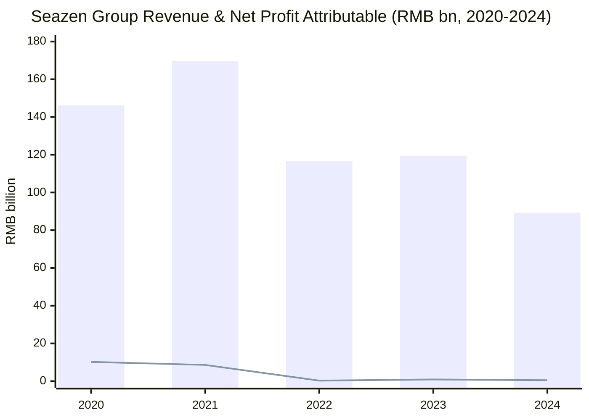
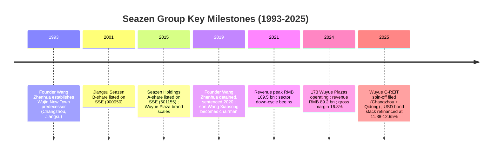
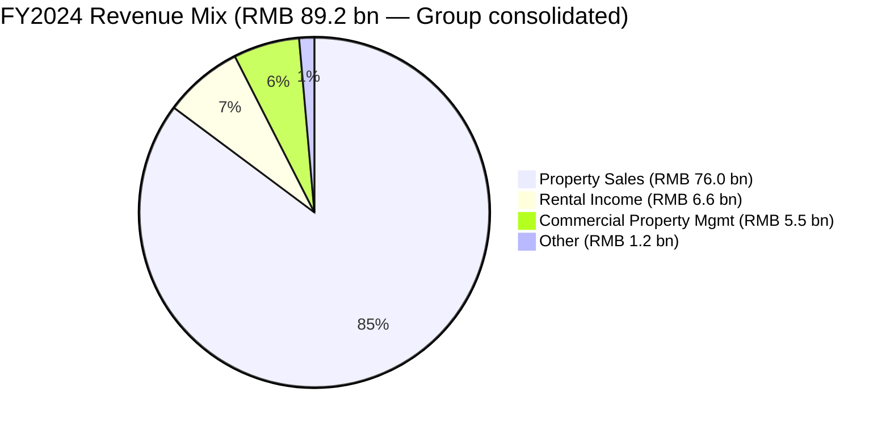
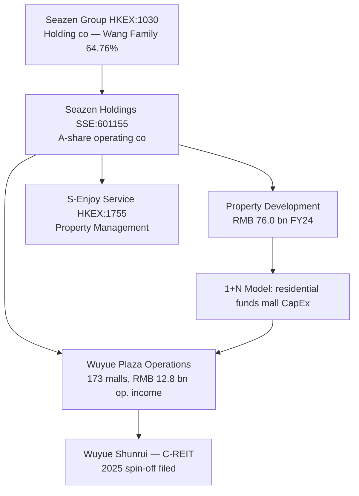
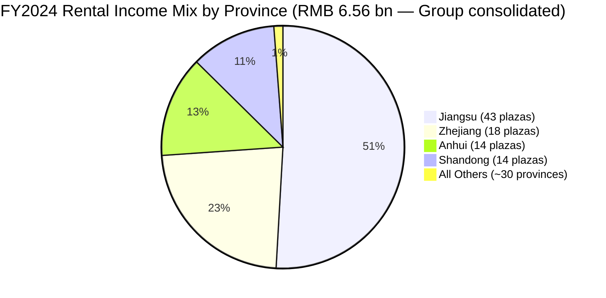
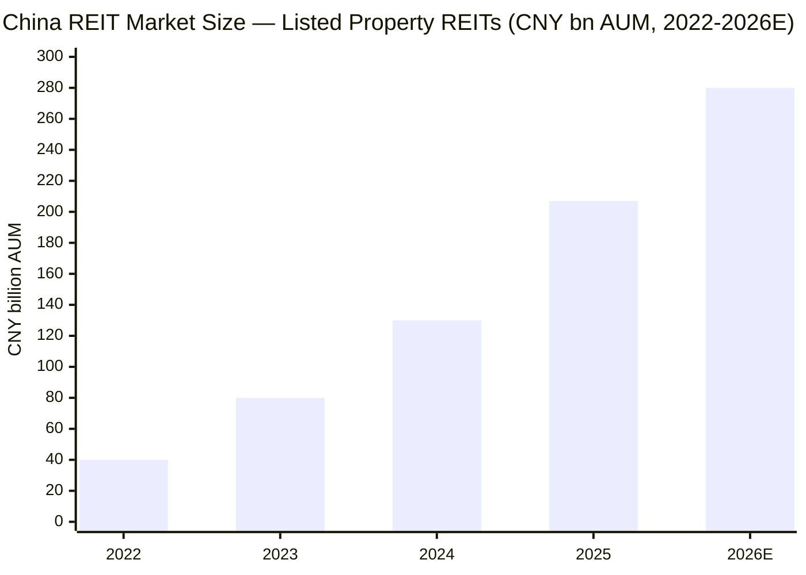
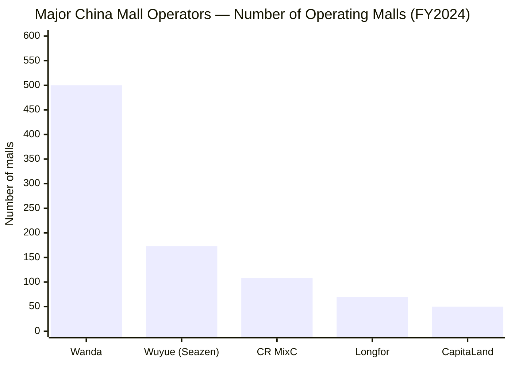

# Seazen Group Limited 新城发展 (HKEX:1030) — Equity Research Initiation

**As of:** 2026-06-03
**Author:** Internal research (project-curated, no LLM-API calls)
**Ticker:** HKEX:1030 (Seazen Group Limited, 新城发展控股有限公司)
**A-share subsidiary:** SSE:601155 (Seazen Holdings, 新城控股集团股份有限公司)
**Sector:** China Property — diversified developer + mall operator
**Latest disclosure:** [2024 Annual Report, published 2025-04-16](https://www.seazengroup.com.cn/uploads/20250416170342/f.pdf)

---

## Table of Contents
1. Company Overview & Valuation Snapshot
2. Company History
3. Management Team — Founder & CEO
4. Products & Services — Property Development, Wuyue Plaza, Property Mgmt
5. Customers, Pre-sales & Capital Strategy
6. Industry Overview — China Real Estate & Commercial Property
7. Competitive Landscape
8. Market Opportunity & TAM
9. Risk Assessment
10. Investor-Lens Scorecards
11. References & Verification Log

---

## 1. Company Overview & Valuation Snapshot

Seazen Group Limited (HKEX:1030, "Seazen" or "新城发展") is the Hong Kong-listed holding company of one of China's largest privately controlled cross-cycle real-estate platforms. The group develops and sells residential properties, builds and operates the **Wuyue Plaza (吾悦广场)** chain of mixed-use shopping malls across China, and provides downstream property-management services through subsidiary **S-Enjoy Service (新城悦服务, HKEX:1755)**. The A-share operating subsidiary **Seazen Holdings 新城控股 (SSE:601155)** holds substantially all of the group's PRC property-development and mall assets — the HK listco is therefore essentially a leveraged holding vehicle over the A-share, with a controlling-shareholder family trust on top. As of 31 December 2024, the group employed 20,243 full-time staff, of whom 19,935 worked in property development and commercial-complex operations [2024 Annual Report, p.38 Employees disclosure](https://www.seazengroup.com.cn/uploads/20250416170342/f.pdf).

For the year ended 31 December 2024, Seazen Group reported **revenue of RMB 89,226.5 million**, a 25.3% YoY decline from RMB 119,463.5 million in 2023, with the management discussion attributing the contraction directly to "shrinking of property business due to downturn of the real estate industry." Gross profit was **RMB 14,984.4 million** at a **gross margin of 16.8%** — an improvement from 13.5% in 2023, which management explained as a "higher proportion of the revenue from commercial property management service and rental income with higher gross profit margin to the total revenue" [2024 AR, MD&A pp.29–31, "Revenue/Cost of Sales/Gross Profit"](https://www.seazengroup.com.cn/uploads/20250416170342/f.pdf). Net profit attributable to equity holders fell **44.1% YoY** to **RMB 491.3 million**; core earnings (excluding investment-property revaluation, FX, and disposal effects) were **RMB 632.2 million** [2024 AR, MD&A p.32 Profit for the Year](https://www.seazengroup.com.cn/uploads/20250416170342/f.pdf).

Revenue mix in 2024 was: property sales **RMB 76,041 million (85.2%)**, rental income **RMB 6,556.2 million (7.3%)**, commercial-property management services **RMB 5,476.8 million (6.1%)**, and other income **RMB 1,152.5 million (1.3%)** [2024 AR, MD&A p.29 Revenue table](https://www.seazengroup.com.cn/uploads/20250416170342/f.pdf). The structural shift toward higher-margin recurring revenue (rental + mgmt fees) is the core narrative the company is pushing: development revenue fell 29% YoY (from RMB 107.3 bn to RMB 76.0 bn), while rental income grew 15% (from RMB 5.7 bn to RMB 6.6 bn) and commercial-property management services grew 13% YoY.

**Valuation snapshot (as of mid-2025/early-2026 readings).** Seazen Group trades at a market cap of approximately **HK$37.76 billion** (~US$4.8 bn), with shares around **HK$5.89** in late 2025 — up sharply from HK$2.64 in August 2025, reflecting the policy-driven re-rating of China property names through Q4-2025 and into 2026 [Stockanalysis.com — Seazen Group HKG:1030 quote page](https://stockanalysis.com/quote/hkg/1030/). Reported multiples vary depending on the calculation basis and earnings normalization, with trailing P/E figures from independent aggregators ranging from ~7.6× to ~35.6× and a forward P/E around 21.4× [Stockanalysis.com — HKG:1030 statistics page](https://stockanalysis.com/quote/hkg/1030/statistics/). Price-to-book sits near **0.98×** [Stockanalysis.com — HKG:1030 statistics page](https://stockanalysis.com/quote/hkg/1030/statistics/), which means the stock is essentially trading at reported book — a discount typical of distressed-but-surviving China property names through the 2022–2025 down-cycle and only modestly above the deep discount seen on peers still in restructuring (Country Garden, Sunac, Evergrande). Net debt-to-equity stood at **53.8%** at year-end 2024 with cash on hand of RMB 10.62 billion and total borrowings of **RMB 57.73 billion** [2024 AR, MD&A p.33 Financial Position](https://www.seazengroup.com.cn/uploads/20250416170342/f.pdf). *Analyst view:* The 0.98× P/B + sub-15× normalized P/E combination prices Seazen as a "survives but never re-rates" defensive within China property, which under-rewards the structural rental-income growth (15% in 2024) but appropriately reflects the legacy USD-bond overhang.

Source: [2024 AR, p.5 Financial Summary 5-year table](https://www.seazengroup.com.cn/uploads/20250416170342/f.pdf).

## 2. Company History

Seazen's roots trace to **1993**, when founder **Wang Zhenhua (王振华)** established the original Wujin New Town Investment Construction & Development Company in Jiangsu Province's Changzhou City [Caproasia 2025-06-13 bond-issue write-up referencing 1993 founding by Wang Zhenhua](https://www.caproasia.com/2025/06/13/china-4-2-billion-property-group-seazen-issues-300-million-3-year-bond-12-95-yield-non-callable-non-put-option-for-2-years-proceeds-will-be-used-to-repay-bonds-maturing-in-2025-july-300-millio/). The platform expanded across Jiangsu through residential development in the late 1990s and 2000s. **Jiangsu Seazen (江苏新城地产) listed on the Shanghai Stock Exchange's B-share market in 2001** (stock code 900950) — providing the group's first public-market access [2024 AR Directors section, Lv Xiaoping bio describing 2001 B-share listing](https://www.seazengroup.com.cn/uploads/20250416170342/f.pdf).

Seazen's distinctive "1+N" model — one residential development engine financing one Wuyue Plaza (commercial mall) per land parcel — emerged in the early-to-mid 2010s as **Wuyue Plaza (吾悦广场)** became the group's brand name for mixed-use complexes anchoring residential developments. **In 2015 the A-share operating subsidiary Seazen Holdings (新城控股集团) achieved a Shanghai Stock Exchange A-share listing under stock code 601155**, replacing the older Jiangsu Seazen B-share vehicle as the primary mainland listing [2024 AR Directors p.39 — Lv Xiaoping bio, Seazen Holdings SSE 601155 listing](https://www.seazengroup.com.cn/uploads/20250416170342/f.pdf). The HK listco Seazen Group Limited (HKEX:1030, then named Future Land Development Holdings) had earlier completed its own HK listing, providing the family with two parallel public-market vehicles — the HK listco holds the controlling stake in the SSE-listed Seazen Holdings.

**The 2019 succession crisis** was the defining moment of recent history. On 3 July 2019, founder and then-chairman Wang Zhenhua was detained in Shanghai on allegations of sexually assaulting a 9-year-old girl in a hotel; news of the arrest wiped billions off the value of both the HK and Shanghai vehicles within days [CNN Business, 2019-07-05 — Wang Zhenhua detention impact on Future Land](https://www.cnn.com/2019/07/05/business/wang-zhenhua-detention/index.html); [CGTN 2019-07-06 — Billionaire detained for child sexual assault](https://news.cgtn.com/news/2019-07-06/Chinese-billionaire-detained-for-child-sexual-assault-I6w0rAsqVa/index.html). Within days the board appointed his only son **Wang Xiaosong (王晓松, then aged 32)** as the new chairman of both Seazen Group and Seazen Holdings [CNN Business 2019-07-11 — Wang Xiaosong replaces father as chairman](https://www.cnn.com/2019/07/11/business/wang-zhenhua-future-land-arrest/index.html). In June 2020, a Shanghai court sentenced Wang Zhenhua to **five years in prison** for child molestation [CGTN 2020-06-17 — Wang Zhenhua sentenced to 5 years](https://news.cgtn.com/news/2020-06-17/Short-sentence-on-billionaire-s-child-molestation-case-fuels-anger-RoZaFJZ4ha/index.html); [China Court English 2020-06-18 — sentencing announcement](https://english.court.gov.cn/2020-06/18/c_767209.htm). Despite the founder's incarceration he retained — and as of 2024 still retains — beneficial ownership of **63.33%** of Seazen Group's shares through the Hua Sheng Trust, with his spouse Chen Jing holding an additional 1.43%, giving the family approximately **64.76% combined economic interest** [2024 AR Substantial Shareholders pp.59–60](https://www.seazengroup.com.cn/uploads/20250416170342/f.pdf). The continuity of the family's controlling stake — and the fact that the legal entity's operations were not seized by authorities — kept the business in family hands through the worst of the property down-cycle.

**The 2021–2024 sector down-cycle** then layered macro pressure on top of the governance shock. Total revenue peaked at **RMB 169.5 billion in 2021**, fell to RMB 116.5 bn in 2022 (–31%), rebounded modestly to RMB 119.5 bn in 2023, and dropped again to **RMB 89.2 bn in 2024** [2024 AR p.5 five-year table](https://www.seazengroup.com.cn/uploads/20250416170342/f.pdf). Throughout the cycle, Seazen avoided the public default trajectory that befell Country Garden, Sunac, Evergrande, and other large private developers. The group has been actively managing its **USD senior notes** stack: in June 2025 Seazen issued a **$300 million 3-year bond at 12.95% yield** (non-callable, no put option for 2 years) explicitly to refinance the **$300 million notes maturing July 2025** and the **$300 million notes maturing October 2025** [Caproasia 2025-06-13 bond issue summary](https://www.caproasia.com/2025/06/13/china-4-2-billion-property-group-seazen-issues-300-million-3-year-bond-12-95-yield-non-callable-non-put-option-for-2-years-proceeds-will-be-used-to-repay-bonds-maturing-in-2025-july-300-millio/), and in September 2025 raised an additional $160 million as part of the broader Chinese return to USD bond markets [Bloomberg 2025-09-23 — Seazen Raises $160 Million](https://www.bloomberg.com/news/articles/2025-09-23/builder-seazen-joins-chinese-rush-back-to-dollar-bond-market). A new $300 million 11.88% senior note due 2028 was announced in the same window. **The 2025 commercial-REIT spin-off announcement** marked a strategic pivot: Seazen Holdings filed an application with the China Securities Regulatory Commission and Shanghai Stock Exchange to spin off **two mature Wuyue Plaza assets in Changzhou and Qidong** into a Shanghai-listed commercial property REIT, via a dedicated unit **Wuyue Shunrui (吾悦顺睿)** [TipRanks 2025 — Seazen Group Moves to Spin Off Two Wuyue Plazas into Shanghai-Listed Commercial REIT](https://www.theglobeandmail.com/investing/markets/markets-news/Tipranks/651920/seazen-group-moves-to-spin-off-two-wuyue-plazas-into-shanghai-listed-commercial-reit/). This positions Seazen alongside the more institutional commercial REIT issuers (CapitaLand Commercial C-REIT, China Resources MixC) using policy-tail-wind from China's December 2025 expansion of REIT-eligible asset classes.

Source: [2024 AR p.5 five-year table](https://www.seazengroup.com.cn/uploads/20250416170342/f.pdf), [2024 AR pp.39–43 Directors](https://www.seazengroup.com.cn/uploads/20250416170342/f.pdf), [CNN Business 2019-07-11](https://www.cnn.com/2019/07/11/business/wang-zhenhua-future-land-arrest/index.html), [Caproasia 2025-06-13](https://www.caproasia.com/2025/06/13/china-4-2-billion-property-group-seazen-issues-300-million-3-year-bond-12-95-yield-non-callable-non-put-option-for-2-years-proceeds-will-be-used-to-repay-bonds-maturing-in-2025-july-300-millio/), [TipRanks Wuyue C-REIT spin-off](https://www.theglobeandmail.com/investing/markets/markets-news/Tipranks/651920/seazen-group-moves-to-spin-off-two-wuyue-plazas-into-shanghai-listed-commercial-reit/).

## 3. Management Team — Founder & CEO

**Founder & Controlling Shareholder — Wang Zhenhua (王振华).** Wang founded Wujin New Town's predecessor in 1993 and built the platform across Jiangsu Province through the 1990s and 2000s, taking Jiangsu Seazen public on the SSE B-share market in 2001 and later relisting as Seazen Holdings on the SSE A-share market under code 601155 in 2015 [2024 AR Directors p.39 Lv Xiaoping bio referencing Wang/Seazen Holdings history](https://www.seazengroup.com.cn/uploads/20250416170342/f.pdf). Before the 2019 criminal incident, Wang was chairman of both Seazen Group (HKEX:1030) and Seazen Holdings (SSE:601155) and was Forbes-listed as a billionaire developer. **On 3 July 2019, Shanghai police detained Wang on suspicion of sexually assaulting a 9-year-old girl** in a Shanghai hotel; the arrest was formally approved on 10 July 2019 [CNN Business 2019-07-11 — Wang Zhenhua arrest approved](https://www.cnn.com/2019/07/11/business/wang-zhenhua-future-land-arrest/index.html). In June 2020 a Shanghai court sentenced him to **five years in prison** [CGTN 2020-06-17 — five-year sentence fuels public anger](https://news.cgtn.com/news/2020-06-17/Short-sentence-on-billionaire-s-child-molestation-case-fuels-anger-RoZaFJZ4ha/index.html). Wang stepped down from the board immediately upon detention but **retained beneficial ownership of 4,474,549,274 shares (63.33% of the listco)** through the **Hua Sheng Trust** — a discretionary trust he had settled before the incident in favour of his family members. The trust structure runs Wang Zhenhua → Hua Sheng Trust → Chen Ting Sen (PTC) Limited (trustee) → Infinity Fortune Development Limited → First Priority Group Limited → Wealth Zone Hong Kong Investments Limited (the direct registered shareholder). His spouse **Chen Jing (陈静)** separately holds 100% of Set Hero Developments Limited which owns 101,065,905 shares (1.43%) [2024 AR Substantial Shareholders pp.59–60 with notes on Hua Sheng Trust structure](https://www.seazengroup.com.cn/uploads/20250416170342/f.pdf). The trust structure shielded the controlling stake from confiscation despite the criminal conviction and is the single most important corporate-governance fact about the company today. Reports from June 2025 (his bond-issuance announcement) describe Wang as still living and reportedly with a $2 billion net worth attached to his name [Caproasia 2025-06-13 — Wang Zhenhua $2 billion net-worth reference](https://www.caproasia.com/2025/06/13/china-4-2-billion-property-group-seazen-issues-300-million-3-year-bond-12-95-yield-non-callable-non-put-option-for-2-years-proceeds-will-be-used-to-repay-bonds-maturing-in-2025-july-300-millio/), consistent with his having served the five-year sentence and now being out of custody — though he holds no public role at either listco.

**Chairman — Wang Xiaosong (王晓松), aged 37 (as of 2024 AR).** The founder's only son was appointed non-executive director in October 2013, chairman of the Board in July 2019 (immediately following his father's detention), and chairman of the ESG Committee in November 2020 [2024 AR Directors p.43 Wang Xiaosong bio](https://www.seazengroup.com.cn/uploads/20250416170342/f.pdf). Wang Xiaosong holds a 2009 bachelor's degree in **Environmental Sciences from Nanjing University (南京大学)** and joined Jiangsu Seazen (the A-share predecessor) in 2009 as a civil engineer, advancing through project-manager, vice-president, and marketing/general-manager roles before becoming director of Jiangsu Seazen in April 2013 and President of Jiangsu Seazen in February 2013. He served as general manager of Seazen Holdings (SSE:601155) from 14 December 2015 to 26 October 2016, and as **chairman of Seazen Holdings since July 2019**. He served as President of Seazen Holdings from 24 August 2018 to January 2021 and was re-appointed President on 19 January 2023 [2024 AR p.43 Wang Xiaosong bio](https://www.seazengroup.com.cn/uploads/20250416170342/f.pdf). He also sits as non-executive director of S-Enjoy Service (HKEX:1755) since July 2019. As of 31 December 2024 he holds 6,000,000 shares of Seazen Group (0.08%) and 500,000 shares of Seazen Holdings (0.02%) — symbolic holdings; the family's primary economic interest is via the trust [2024 AR Directors' Interests p.57 + Associated Corporations p.58](https://www.seazengroup.com.cn/uploads/20250416170342/f.pdf). Wang Xiaosong is the chairman of both listcos and the central figure in continuity through the cycle — but as a non-executive director of the HK listco, day-to-day execution sits with the CEO described below.

**Chief Executive Officer — Lv Xiaoping (吕小平), aged 63 (as of 2024 AR).** Lv joined the group in 2001 and was redesignated as Executive Director and CEO of Seazen Group in **January 2016**, after serving as non-executive director from November 2012. His operational track record covers two decades inside the group: vice president of Seazen Holdings 2001–2004, general manager of Seazen Holdings March–December 2015, and director of Seazen Holdings since March 2015. He also served as director and president of Jiangsu Seazen (the predecessor A-share vehicle) from August 2004 to January 2013, and has been vice-chairman of Jiangsu Seazen since February 2013 [2024 AR Directors p.39 Lv Xiaoping bio](https://www.seazengroup.com.cn/uploads/20250416170342/f.pdf). He holds a 1983 bachelor's in engineering from **Naval University of Engineering (海军工程大学)** and a 2007 EMBA from **China Europe International Business School (CEIBS)**. Before joining Seazen in 2001, Lv spent 14 years (1987–2001) at Changchai Co. Ltd. (常柴股份有限公司, SZSE:000570) as board secretary and head of investment, where he was responsible for business development and investment strategy. Lv personally holds 14,500,000 shares of Seazen Group (0.21%) as of 31 December 2024 [2024 AR Directors' Interests p.57](https://www.seazengroup.com.cn/uploads/20250416170342/f.pdf). Lv is the longest-tenured operational executive on the board and the steady-hand counterweight to a 37-year-old chairman who was still completing the leadership transition when the property down-cycle hit.

## 4. Products & Services

Seazen operates in three reportable business lines: (1) residential and mixed-use property development for sale, (2) Wuyue Plaza commercial mall investment & operation, and (3) commercial-property management services and other related services. The MD&A of the 2024 Annual Report breaks revenue exactly along these four lines [2024 AR MD&A p.29 Revenue table](https://www.seazengroup.com.cn/uploads/20250416170342/f.pdf):

| FY2024 Revenue Stream | RMB million | % of total | YoY change |
|---|---|---|---|
| Revenue from sale of properties | 76,041.0 | 85.2% | –29.2% |
| Rental income (investment properties) | 6,556.2 | 7.3% | +15.1% |
| Commercial property management services | 5,476.8 | 6.1% | +12.6% |
| Other income | 1,152.5 | 1.3% | –26.3% |
| **Total** | **89,226.5** | **100.0%** | **–25.3%** |

Source: [2024 AR MD&A p.29 — Revenue table verbatim](https://www.seazengroup.com.cn/uploads/20250416170342/f.pdf).

**4.1 Property Development (sale of properties, 85.2% of FY24 revenue).** This is the core engine. In 2024, Seazen delivered **GFA of approximately 9,854,354 sq.m.** and recognized revenue at an average selling price of **RMB 7,716 per sq.m.** [2024 AR MD&A p.24 — verbatim Business Overview](https://www.seazengroup.com.cn/uploads/20250416170342/f.pdf). The development business is geographically diversified across 22 provinces and 4 municipalities, with Jiangsu (RMB 15,550 m, 20.5% of property sales) and a long tail of central-Chinese provinces. The province-by-province breakdown is granular — Henan, Shandong, Hunan, Guangdong, Tianjin, and Zhejiang each contributed RMB 4–6 billion of property sales [2024 AR MD&A p.24 Table 1 — verbatim by-province table](https://www.seazengroup.com.cn/uploads/20250416170342/f.pdf). The average cost per sq.m. sold was RMB 7,110, with **average cost as a percentage of average selling price at 92.14%** — up from 87.99% in 2023, reflecting the well-known squeeze on China-property unit economics across the down-cycle [2024 AR MD&A p.30 Table 5 — Cost of Sales](https://www.seazengroup.com.cn/uploads/20250416170342/f.pdf). The group recognized an **impairment provision of RMB 1,635 million** for properties held or under development for sale in 2024 — meaningfully lower than RMB 5,348 million in 2023, suggesting that the worst of the write-downs is behind them but not that the cycle is over. As at 31 December 2024, **pre-sold but not yet delivered properties** totaled approximately **12.51 million sq.m. with contract value of RMB 79,427 million** — this is the locked-in pipeline that will convert to revenue over the next ~12–24 months [2024 AR MD&A p.24 — pre-sold pipeline disclosure](https://www.seazengroup.com.cn/uploads/20250416170342/f.pdf).

**Contracted sales (new presales) in 2024 totaled RMB 40,171 million** across 5,388,239 sq.m. of GFA at RMB 9,832 per sq.m. (excluding carpark sales) [2024 AR MD&A p.25 Table 2 — verbatim contracted-sales table](https://www.seazengroup.com.cn/uploads/20250416170342/f.pdf). This is the leading-indicator metric — new contracts signed during the year — and the RMB 40.2 billion 2024 figure must be compared to historical highs that exceeded RMB 250 billion at the 2020–21 peak to understand the magnitude of the cyclical contraction; the gap between contracted sales and recognized revenue closes only over 12–24 months as projects deliver. Geographic mix of contracted sales is dominated by the **Yangtze River Delta** (Jiangsu 32.7%, Zhejiang 5.4%, Anhui 1.2%, Shanghai 0.6% = 39.9%) and the **Bohai Rim** (Shandong 7.5%, Tianjin 9.8%, Hebei 1.8%, Beijing 3.9% = 23.0%), with the balance spread across Central/Western China and Greater Bay Area. The **land bank (rentable and saleable land resources)** stood at **110.45 million sq.m.** as of 31 December 2024, of which approximately **31.44 million sq.m. is allocated for future residential sales** [2024 AR MD&A pp.26–27 — Land Resources disclosure verbatim](https://www.seazengroup.com.cn/uploads/20250416170342/f.pdf). At the FY24 contracted-sales pace of 5.4 million sq.m./yr the residential land bank alone represents **~6 years** of forward sellable inventory — sufficient duration to weather a continued slow recovery, but the unsold balance will likely require continued impairment testing.

**4.2 Wuyue Plaza Commercial Mall Operation (rental income 7.3% + commercial-property management 6.1% = 13.4% of FY24 revenue).** This is the recurring-revenue franchise that increasingly defines Seazen's investment narrative. As of 31 December 2024, **173 Wuyue Plazas were in operation** with total leasable GFA of **16,010,700 sq.m.** [2024 AR MD&A p.27 — Investment Properties disclosure verbatim](https://www.seazengroup.com.cn/uploads/20250416170342/f.pdf). The 173 plazas span 28 provinces / municipalities, with the largest concentrations in **Jiangsu (43 plazas, 98.24% occupancy, RMB 3,335.5 m rental income)**, **Zhejiang (18 plazas, 98.63%, RMB 1,507.3 m)**, **Anhui (14 plazas, 98.36%, RMB 883.4 m)** and **Shandong (14 plazas, 98.97%, RMB 745.5 m)** [2024 AR MD&A p.27 Table 4 — by-province rental income](https://www.seazengroup.com.cn/uploads/20250416170342/f.pdf). Group-wide **portfolio occupancy is in the high 90s** — only Shanghai (88.0%, 3 plazas — includes Seazen Holdings Tower B office occupancy in the figure), Henan (82.05%, 4 plazas), and Chongqing (92.98%, 5 plazas) sit below 95%. Of these, the Henan dip is the most worth watching because four plazas under 82% suggests local saturation or trade-area weakness, not just office-block dilution.

**Total commercial operating income for 2024 was RMB 12.808 billion (i.e. tax-included rental income), representing an increase of 13% year-on-year**, and **retail sales of Wuyue Plazas (GMV passing through the mall tenants, excluding vehicle sales) reached RMB 90.5 billion, up 19% YoY** [2024 AR MD&A p.28 — verbatim Notes 3 and 5 on commercial operating income and GMV](https://www.seazengroup.com.cn/uploads/20250416170342/f.pdf). The 13% growth in operating income against a 25% drop in development revenue is the most important single data point in Seazen's transition story — it is what makes the commercial REIT spin-off feasible and what underpins the partial re-rating in the stock in H2-2025. The 19% growth in tenant GMV also suggests the asset class is gaining share of consumer wallet in the lower-tier cities where Wuyue dominates — typically prefecture-level cities (Changzhou, Yancheng, Huai'an, Taizhou, Wuxi) and county-level units in the Yangtze River Delta, where the local mall is the dominant non-online retail node. As of the 2025 disclosure the operating footprint had grown — the 2024 AR shows 173 in operation; the June 2025 monthly disclosure cites **175 properties with total GFA 16,105,200 sq.m. generating rental income of RMB 1.105 billion and commercial operating income of RMB 1.183 billion for the single month of June 2025** [via H1 2025 operating statistics summary cited in WebSearch on Seazen rental disclosure](https://www.tipranks.com/news/company-announcements/seazen-group-reports-strong-contracted-sales-and-rental-income-for-august-2025).

Source: [2024 AR MD&A p.29 Revenue table — verbatim](https://www.seazengroup.com.cn/uploads/20250416170342/f.pdf).

**4.3 Commercial Property Management Services (6.1% of FY24 revenue).** This is the asset-light fee stream — primarily through S-Enjoy Service Group (HKEX:1755), the separately listed property-management arm in which Seazen Group's executives sit as non-executive directors. Revenue from this line grew 12.6% YoY to **RMB 5,477 million** in 2024. The business spans residential property management (for the homes that Seazen and its peers have built) and commercial property management (running the Wuyue Plaza malls in operation). Margins on the management business are structurally higher than on the development business — which is the math the company is leaning on to explain the 330-bps gross-margin expansion to 16.8% in 2024.

**Synthesis — the 1+N business model and its 2024 fork.** Seazen's distinctive contribution to China property has been the **"1+N" model**: every Wuyue Plaza commercial complex is built on a single land parcel that simultaneously includes residential phases (the "1") which are sold to fund the construction and operating CapEx of the mall (the "N"). At peak the model was a flywheel — residential cash flow funded mall construction, malls anchored township GMV, and the mall asset on the balance sheet provided collateral for bank borrowings. Through the 2022–2024 down-cycle, the model **bifurcates**: the residential leg is shrinking (revenue –29% YoY in 2024), the commercial leg is growing (rental +15%, management +13%, GMV +19%), and the **net free cash flow profile is therefore migrating from a residential-development cycle business toward a hybrid real-estate-operator profile**. The 2025 commercial REIT spin-off filing (Changzhou + Qidong Wuyue Plazas into a Shanghai-listed C-REIT via Wuyue Shunrui) is the logical capital-recycling move within this bifurcation — monetize mature mall assets at private-market-implied caps that exceed the listco's implied multiple, and recycle proceeds into either deleveraging or new pipeline [TipRanks Wuyue C-REIT spin-off announcement](https://www.theglobeandmail.com/investing/markets/markets-news/Tipranks/651920/seazen-group-moves-to-spin-off-two-wuyue-plazas-into-shanghai-listed-commercial-reit/).

## 5. Customers, Pre-sales & Capital Strategy

**Customer base — atomized residential homebuyers + mall tenants.** The customer base is structurally non-concentrated because (a) the property-sales leg sells units one-at-a-time to retail homebuyers, mostly in tier-3/4 cities and prefecture-level cities in the Yangtze River Delta and Central China, and (b) the Wuyue Plaza tenant base is hundreds of mid-market-anchor F&B + apparel + cinema operators per plaza. The 2024 AR does **not** disclose a top-5 customer concentration metric — which for a Hong Kong listco with this business mix is consistent with the disclosure regime. The granularity is instead provincial: Jiangsu Province represents ~20.5% of property-sales revenue, with the next-largest provinces each at 5–7% [2024 AR MD&A p.24 Table 1 — by-province property sales](https://www.seazengroup.com.cn/uploads/20250416170342/f.pdf). For the Wuyue rental segment, Jiangsu represents ~50% of consolidated mall rental income (RMB 3,336m of RMB 6,556m total rent), reflecting the home-market dominance — the consolidated geographic concentration is **single-province (Jiangsu) > 50% of rental, plus 20% of development sales** [2024 AR MD&A p.27 Table 4 by-province rental table](https://www.seazengroup.com.cn/uploads/20250416170342/f.pdf). This is the cleanest concentration risk to highlight: not a customer concentration but a **single-province Jiangsu concentration** that the report flags explicitly in Section 9.

Source: [2024 AR p.27 Table 4 — verbatim by-province rental income computation by analyst](https://www.seazengroup.com.cn/uploads/20250416170342/f.pdf). Note: percentages do not strictly sum because remaining ~20 provinces each contribute < 5% and are aggregated as "All Others" in the chart; sub-total for the four named provinces = 1,335.5+1,507.3+883.4+745.5 = RMB 4,471.8 m or 68.2% of total rental.

**Capital strategy — bond stack at the holdco, mall assets as collateral.** Total borrowings at 31 December 2024 were **RMB 57.73 billion** against cash of RMB 10.62 billion, putting **net debt-to-equity at 53.8%** and the **debt-to-asset ratio excluding advances received at 65.7%** [2024 AR MD&A p.33 Financial Position](https://www.seazengroup.com.cn/uploads/20250416170342/f.pdf). The borrowings stack is **72.2% long-term (>1 year) with a weighted-average cost of 5.88% and average tenor of 5.4 years**; **secured debt totals RMB 50.09 billion (87% of total)**, collateralized against property/PP&E/investment properties/development inventory/right-of-use assets. **Only 12.6% of debt is unsecured** — meaning the implicit recovery for unsecured USD bondholders sits behind a meaningful first-priority secured stack, which is why the USD coupon has had to be priced at 11.88–12.95% in 2025 vintages [2024 AR MD&A p.33 — debt structure verbatim](https://www.seazengroup.com.cn/uploads/20250416170342/f.pdf); [Caproasia bond issue 2025-06-13](https://www.caproasia.com/2025/06/13/china-4-2-billion-property-group-seazen-issues-300-million-3-year-bond-12-95-yield-non-callable-non-put-option-for-2-years-proceeds-will-be-used-to-repay-bonds-maturing-in-2025-july-300-millio/). Domestic medium-term notes issued in 2024 totaling RMB 2.92 billion priced at **3.2–3.5% with 3–5 year tenors** — the onshore CNY cost is roughly one-quarter of the offshore USD cost, reflecting both the offshore market's continued risk premium and the domestic regulator's selective support for "white-list" surviving private developers [2024 AR MD&A p.34 — MTN issuance disclosure verbatim](https://www.seazengroup.com.cn/uploads/20250416170342/f.pdf).

**Debt maturity ladder (RMB million)** [2024 AR p.33 maturity table verbatim]:

| Maturity bucket | 2024 (RMB m) | 2023 (RMB m) | YoY change |
|---|---|---|---|
| Within 1 year | 16,071.4 | 24,755.7 | –35.1% |
| 1–2 years | 9,911.1 | 14,199.4 | –30.2% |
| 2–5 years | 12,272.7 | 13,985.2 | –12.2% |
| Over 5 years | 19,477.9 | 10,229.3 | +90.4% |
| **Total** | **57,733.1** | **63,169.6** | **–8.6%** |

Source: [2024 AR MD&A p.33 — verbatim maturity table](https://www.seazengroup.com.cn/uploads/20250416170342/f.pdf). The maturity profile has lengthened meaningfully — over-5-year debt nearly doubled, while 1-year-and-shorter debt fell 35%. This is the central operational achievement of 2024 and the reason Seazen has avoided a public default to date.

**Use-of-proceeds re-allocation from 2022 Rights Issue.** A January 2022 non-underwritten rights issue raised HK$ 1,559.79 million at HK$ 5.30 per share. As of end-2023, HK$ 935.87 million remained unutilized — originally allocated for land acquisition in Sichuan and Hubei. In 2024 the Board **resolved to re-allocate that balance entirely to repaying offshore borrowings**, which the company described as enabling "more effective deployment of financial resources" [2024 AR MD&A p.35 — Use of Net Proceeds from Rights Issue, verbatim](https://www.seazengroup.com.cn/uploads/20250416170342/f.pdf). This is an unambiguously defensive use of cash — the company is choosing balance-sheet repair over new land bank, a signal that growth pipeline is not the priority.

**Capital strategy verdict:** the company is running **a multi-pronged defensive playbook**: (i) lengthen domestic debt at low-3% onshore CNY costs, (ii) refinance USD maturities at high-coupon to avoid public default, (iii) prepare commercial REIT spin-off to monetize mature mall assets at higher implied caps, (iv) re-allocate prior rights-issue proceeds to offshore-loan paydown. Together this is a "manage the legacy stack down while preparing the franchise for re-rating" stance — the chairman has chosen survival + reinvention over either aggressive growth or restructuring.

## 6. Industry Overview — China Real Estate & Commercial Property

China property has been through its deepest down-cycle in the modern era during 2021–2025. **National new-home sales fell from peak above RMB 18 trillion in 2021 toward levels around RMB 9–10 trillion by 2024–2025** as the "three red lines" deleveraging regime, household-confidence shock, and demographic peaks combined. The S&P Global Ratings overview from late 2025 frames the policy environment as one where Beijing is selectively backstopping operationally sound private developers (the "white list") while letting structurally insolvent ones restructure publicly [S&P Global Ratings 2025 — China's Market for Commercial Property REITs Is Ready for Takeoff](https://www.spglobal.com/ratings/en/regulatory/article/chinas-market-for-commercial-property-reits-is-ready-for-takeoff-s101666511). Within this environment, Seazen — privately controlled but never publicly defaulted — has navigated as one of the surviving "white-list-adjacent" developers, neither fully favored as a state-backed operator nor delisted/restructured as a public defaulter.

**Commercial property — the bright spot within China real estate.** While residential development has contracted, **mature mall and commercial-asset operations are growing**. China Resources Land reported approximately **USD 2.7 billion (RMB ~19 bn) of mall revenue in 2024 at 95% occupancy** [Mingtiandi 2025 — China Resources mall portfolio coverage](https://www.mingtiandi.com/real-estate/finance/china-resources-sells-hotel-for-rmb-700m-goes-asset-light/), illustrating that the highest-quality national mall portfolios continue to compound rental income even as the broader sector struggles. The structural drivers are urbanization-to-consumption rotation, the rise of premium suburban malls in tier-2/3 cities as the dominant anchor for offline retail in the post-online cycle, and the policy push to scale REITs as exit vehicles.

**The C-REIT market unlock — December 2025 policy.** In December 2025, China expanded the C-REIT universe to include Grade-A offices, malls, and four-star hotels, which **unlocked an estimated CNY 207 billion (USD 29.6 billion) of fresh equity across 77 trusts** according to industry estimates [Edgeprop 2025 — China broadens REIT market](https://www.edgeprop.sg/property-news/china-broadens-reit-market-embrace-commercial-real-estate). By end-2025, approximately 50 property-related infrastructure REITs were listed — still less than 0.5% of China's commercial real estate market value, but growing. CapitaLand Commercial C-REIT's August 2025 CSRC approval and subsequent debut at 19.6% above IPO price on the Shanghai Stock Exchange demonstrated investor appetite for the new asset class [CapitaLand 2025-08 CSRC approval](https://www.capitaland.com/en/about-capitaland/newsroom/news-releases/international/2025/august/capitaland-commercial-c-reit-receives-approval-from-china-securi.html). This is the precise window into which Seazen filed its own Wuyue REIT — the Changzhou + Qidong plazas — through Wuyue Shunrui.

**TAM/SAM framing.** The total addressable Chinese commercial real estate market is in excess of RMB 40 trillion in asset value, with the operational rental/management portion estimated at over RMB 800 billion annual operating income across all owners. For Seazen specifically, the SAM is narrower: the mid-tier-city mall operator segment — a structure dominated by 5–6 national operators (Wanda, China Resources MixC, Seazen Wuyue, CapitaLand Mall China, Longfor Paradise Walk, plus the Singaporean/foreign-backed Sun Art / Aeon footprints in the grocery-anchor adjacent space). Wanda took on RMB 24 billion ($3.86 billion) of new capital in January 2025 to fund 20 new shopping malls, indicating that the well-capitalized operators are still expanding while many marginal developers exit. Seazen Wuyue is structurally a tier-2/3-city specialist (vs Wanda's tier-1/2 emphasis and China Resources MixC's premium tier-1/2 luxury focus), giving it a defensible niche in the mid-market mass-consumer mall vertical — the highest-rotation segment but lower-rent-PSF than premium luxury.

Source: [S&P Global Ratings 2025 — China Commercial Property REITs](https://www.spglobal.com/ratings/en/regulatory/article/chinas-market-for-commercial-property-reits-is-ready-for-takeoff-s101666511); [Edgeprop 2025 — China REIT market expansion estimates](https://www.edgeprop.sg/property-news/china-broadens-reit-market-embrace-commercial-real-estate). *Analyst estimate;* the 2026E projection extrapolates the recent ~50% YoY growth trajectory and the December 2025 policy expansion impact.

## 7. Competitive Landscape

Seazen competes across two adjacent segments: (a) residential property development in tier 2-4 China cities, and (b) commercial mall operation. The competitive set differs sharply between the two.

**Residential development competitors:** Vanke (SSE:000002 / HKEX:2202), Country Garden (HKEX:2007 — in restructuring), Longfor Group (HKEX:0960), Greentown China (HKEX:3900), Poly Developments (SSE:600048), and the dozens of regional private developers in the Yangtze River Delta. Among surviving private developers Seazen most closely resembles **Longfor and Greentown** in terms of dual development + mall operation model. **Longfor's Paradise Walk** mall brand (~70+ malls) is a direct mid-market competitor to Wuyue Plaza, with Longfor's stronger brand positioning in tier-1/2 cities but Seazen's larger network in tier-2/3/4. Vanke is broader and larger but more focused on residential and exposed to the state-sector dynamic. Country Garden and other defaulted peers are not really competitors any more — they're shedding land bank and have minimal new project pipelines.

**Commercial mall operator competitors:** The Chinese mid-market mall segment is led by:

1. **China Resources MixC (华润万象生活, HKEX:1209)** — premium and mid-premium positioning, ~108+ MixC malls under management, strong tier-1/2 city presence, separately listed as the management-services franchise; reported approximately USD 2.7 billion mall portfolio revenue in 2024 at 95% occupancy [Mingtiandi China Resources Land coverage](https://www.mingtiandi.com/real-estate/finance/china-resources-sells-hotel-for-rmb-700m-goes-asset-light/).
2. **Wanda Commercial Management (privately held)** — the largest single-brand operator with ~500+ Wanda Plazas under management; raised RMB 24 billion (USD 3.86 billion) in January 2025 from 4 investors to fund 20 new malls.
3. **Longfor Paradise Walk (within Longfor Group HKEX:0960)** — ~70+ malls, premium mid-market positioning in tier-1/2 cities; Longfor reports mall rental separately.
4. **CapitaLand Mall China (now CapitaLand Investment HKEX:1820 / Singapore-listed CapitaLand Investment via various REITs)** — ~50 mid-market malls; the first international-sponsored Shanghai retail C-REIT debuted in 2025 [CapitaLand 2025-08 announcement](https://www.capitaland.com/en/about-capitaland/newsroom/news-releases/international/2025/august/capitaland-commercial-c-reit-receives-approval-from-china-securi.html).
5. **Hang Lung Properties (HKEX:0101)** — luxury-positioned mall portfolio in 11 tier-1/2 cities (Shanghai Plaza 66, Shenyang Forum 66, Wuxi Center 66, etc.) — competes for high-end shoppers, not mass consumer.
6. **Sino-Ocean Group, Joy City Property (HKEX:0207), Powerlong (HKEX:1238)** — mid-tier operators of various sizes.

*Analyst view:* On a positioning framework — mall count vs. tier-city mix — Seazen's 173-mall network sits between Wanda's 500+ (much larger but less institutional ownership transparency) and Longfor's ~70 (smaller but generally higher-quality assets). Wuyue Plaza is the **largest single-brand mall network owned by a HK/SSE-listed private developer**. The 19% growth in tenant GMV in 2024 against a flat-to-down national consumer base suggests share gains at the trade-area level, especially in tier-3/4 prefecture cities where Wuyue is the dominant anchor mall.

Source: Wuyue from [2024 AR MD&A p.27](https://www.seazengroup.com.cn/uploads/20250416170342/f.pdf); peer counts from public disclosures cited above and [Wikipedia — China Resources Mixc Lifestyle](https://en.wikipedia.org/wiki/China_Resources_Mixc_Lifestyle). *Wanda count is an industry estimate of total operating malls including light-asset managed; CR MixC count is the under-management figure*.

## 8. Market Opportunity & TAM

The total Chinese commercial real estate market value exceeds RMB 40 trillion. The operating mall+commercial property segment alone generates an estimated **RMB 800–900 billion in annual operating income** across all owners. Mall consumer GMV passing through these malls is on the order of RMB 5–6 trillion annually, of which the top-6 national mall operators (Wanda, China Resources MixC, Wuyue/Seazen, Longfor, CapitaLand Mall China, Aeon/Sun Art) account for an estimated 25–35%. Within that, Wuyue Plaza tenant GMV of RMB 90.5 billion in 2024 implies a ~1.5–1.8% share of national mall consumer GMV — small in absolute terms but the **largest single mid-tier-city operator share**.

**The growth opportunity is bifurcated**: (a) within the mall-operator vertical, mature-asset C-REIT monetization can re-rate the operating franchise by 30–50% on an implied cap basis (private comparables suggest 4.5–5.5% cap rates for tier-1/2 prime malls and 5.5–7.0% for tier-3 mid-market malls — the implied operating cap on Seazen's mall portfolio at the current listco implied valuation is closer to 8–9%, meaning the spin-off arbitrage is real); (b) within residential development, the company's primary value lever is delivering on the pre-sold pipeline (RMB 79.4 bn of contract value, 12.51 m sq.m. of GFA) without further write-downs, which would re-set steady-state earnings power to roughly the FY24 RMB 632 m core earnings + ~3% rental growth.

**SAM (serviceable addressable market) for Seazen specifically** — the mid-tier-city mall consumer wallet — is approximately RMB 1.5–2.0 trillion annually across the prefectures and cities where Seazen has Wuyue presence. The growth driver here is **continued consumption upgrade in tier-3/4 cities**, where Seazen's 1+N model with residential + mall built on a single land parcel has structurally lower CapEx per GFA than peers attempting to build malls in tier-1/2 cities (where land cost is the bottleneck). The S&P 2025 framing of the C-REIT unlock as a CNY 207 bn equity expansion is the most concrete near-term TAM unlock for mall-operator listcos with mature stabilized assets — Seazen has 173 of those.

## 9. Risk Assessment

The risk picture for Seazen sits at the intersection of company-specific governance overhang, sector-cycle exposure, balance-sheet leverage, and macro/regulatory complexity. Across the 4-bucket risk taxonomy:

**Company-specific risks:**

1. **Single-province Jiangsu concentration in mall portfolio (~51% of consolidated rental income).** If Jiangsu's tier-3/4 city consumer GMV underperforms — due to local employment shocks, demographic outflow to coastal megacities, or local-government fiscal stress — Seazen's most stable revenue line takes a disproportionate hit. The Jiangsu 43-plaza portfolio is the franchise; degradation here cannot be offset by geographic diversification on a multi-year horizon.
2. **Continuing reputational overhang from the 2019 founder criminal case.** Wang Zhenhua remains the 63.33% beneficial owner via the Hua Sheng Trust [2024 AR p.59](https://www.seazengroup.com.cn/uploads/20250416170342/f.pdf); even with his son as chairman and a Lyu Xiaoping operational CEO, institutional investors (especially ESG-sensitive Western and Singaporean funds) continue to discount the equity. This is structurally non-reversible without a controlling-shareholder change.
3. **Succession depth and key-person concentration.** Wang Xiaosong (37) chairs both listcos; CEO Lv Xiaoping (63) is approaching retirement age. The 2025-04-01 appointment of Zhou Fudong (45, ex-PwC, ex-finance dept head) as executive director [2024 AR p.42](https://www.seazengroup.com.cn/uploads/20250416170342/f.pdf) suggests succession planning is underway but un-tested.

**Industry/market risks:**

4. **China property sector contraction continuing into 2026–2027.** New-home sales nationally are still significantly below the 2021 peak; demographic peaks in urban tier-3/4 cities (Seazen's heartland) mean structural demand has likely permanently re-set lower. Even with rental growth offsetting some of the development decline, the asset base is overwhelmingly residential-development-anchored.
5. **Mall sector competitive intensification post-policy unlock.** The December 2025 C-REIT expansion brings new institutional capital into commercial property — Wanda's RMB 24 bn raise, CapitaLand's listed C-REIT, and ongoing CR MixC expansion all imply more competing capital pursuing the same mid-market consumer footprint, which could compress cap rates on monetization but also rents over time.
6. **Tier-3/4 city consumer fragility.** Seazen's mall portfolio is mass-consumer focused; if consumer confidence in tier-3/4 cities remains depressed through 2026, tenant GMV growth slows from 19% YoY back toward low-single-digits, which would meaningfully reduce the C-REIT spin-off implied valuation.

**Financial risks:**

7. **USD bond stack refinancing risk.** The 11.88–12.95% coupons on 2025-vintage USD notes [Caproasia 2025-06-13](https://www.caproasia.com/2025/06/13/china-4-2-billion-property-group-seazen-issues-300-million-3-year-bond-12-95-yield-non-callable-non-put-option-for-2-years-proceeds-will-be-used-to-repay-bonds-maturing-in-2025-july-300-millio/) signal that the offshore market still requires distressed-tier risk premium. The 2028 maturity wall created by the 11.88% issuance pushes refinancing risk out 3 years, but if China property sentiment deteriorates further, Seazen could find itself unable to refinance offshore at any reasonable coupon, forcing distressed onshore-CNY substitution or a public restructuring.
8. **Impairment cycle not yet over.** RMB 1.6 bn impairment in 2024 was lower than RMB 5.3 bn in 2023, but not zero — and the 92.14% cost-to-ASP ratio implies thin underlying property-development margins. A renewed leg down in PSM (price per sq.m.) or further land write-downs could turn 2025/2026 core earnings into core losses.
9. **Net debt-to-equity 53.8% is "manageable but not low" for a developer; 65.7% debt-to-asset (excluding advances) is high.** Continued deleveraging requires either rental cash-flow growth, asset sales (C-REIT spin-off), or equity issuance.

**Macro/regulatory risks:**

10. **PRC residential property policy environment.** While Beijing has incrementally relaxed mortgage rates, presale restrictions, and inventory regulations from 2023, the long-arc policy framework remains "houses are for living, not for speculating" (习近平 housing policy framing). Renewed restriction or any reversal of recent stimulus could halt the modest recovery.
11. **C-REIT spin-off execution and regulatory approval.** The Wuyue Shunrui C-REIT filing has been formally accepted for review but not yet listed. CSRC approval timing is not guaranteed; pricing implied caps will depend on CSRC review conclusion and prevailing C-REIT market conditions at IPO.
12. **HKEX/SSE dual-listing complexity and intra-group transfers.** With Seazen Group (HKEX:1030) as holdco over Seazen Holdings (SSE:601155), capital flows between Hong Kong and Shanghai are subject to PRC cross-border controls. Any tightening of cross-border capital movement could constrain the holdco's ability to access the A-share subsidiary's cash for debt service.

## 10. Investor-Lens Scorecards

The lens scorecards below apply the four core investor-lens rubrics to the fact base established in Sections 1–9. Macro snapshot inputs (as of 2026-06-03): US 10Y ~4.5% notional risk-free reference; HY OAS and IG OAS implied medium-tight, suggesting a mid-cycle credit environment.

**10.1 Buffett — Quality at a Sensible Price (0–100, higher = more attractive).**
| Component | Score | Note |
|---|---|---|
| Predictability of earnings | 25 | Development cycle volatility offsets rental stability |
| Moat (mall network + 1+N model) | 60 | Wuyue Plaza is a genuine franchise; tier-3/4 dominance is hard to replicate |
| Management quality & integrity | 10 | Founder criminal conviction is the lens's hardest constraint |
| Reinvestment runway | 30 | Limited new-pipeline appetite; capital recycling is the primary use of cash |
| Price vs. intrinsic | 60 | P/B ~1.0×, normalized P/E ~15× is sensible-not-cheap |
| **Composite (0–100)** | **35** | **Below buy threshold for the strict Buffett rubric** |
*Lens view:* Buffett's standard "wonderful business at a fair price" rubric would screen Seazen out primarily on the management-integrity factor. The franchise itself (Wuyue Plaza network, 173 malls, 13% YoY rental growth, 98% occupancy in core provinces) clears the moat bar comfortably; the price is fair; but the controlling-shareholder reputational overhang is a category-disqualifier under a strict reading.

**10.2 Munger — Weighted Quality + Inversion (0–10).**
| Component | Weight | Score | Weighted |
|---|---|---|---|
| Customer demand durability | 0.20 | 6 | 1.2 |
| Moat depth | 0.20 | 6 | 1.2 |
| Management probity | 0.20 | 2 | 0.4 |
| Capital allocation discipline | 0.15 | 7 | 1.05 |
| Margin of safety | 0.15 | 6 | 0.9 |
| Inversion (what would kill it) | 0.10 | 4 | 0.4 |
| **Composite (0–10)** | | | **5.15** |
*Inversion:* What would kill Seazen? (a) The C-REIT spin-off being denied or priced punitively, (b) a renewed leg of property-cycle weakness pushing the residential cash-flow generator below cash break-even, (c) a forced offshore-debt restructuring that prices the listco equity to zero. None of these is implausible; all are below 30% probability on a 24-month horizon.
*Lens view:* Munger would likely pass on the same grounds as Buffett, plus the cyclical and balance-sheet risk profile.

**10.3 Damodaran — Story-Plus-Numbers DCF (±% margin of safety).**
Required assumptions: revenue stabilizes at RMB 80–95 bn through 2026–2028, gross margin holds at 16–18%, core net income returns to RMB 1.0–1.5 bn run rate by 2027 as the rental mix continues to grow. Discount rate: 10–11% (China-property risk premium of ~6% over 4.5% US 10Y). Terminal: zero residential growth, 3% mall rental growth in perpetuity, 6.0% terminal cap rate.
Fair value range: HK$ 4.5–6.5 per share, midpoint **HK$ 5.5** vs current ~HK$ 5.89 = roughly **–7% to +10% margin of safety** depending on scenario.
*Lens view:* Damodaran's framework rates Seazen as roughly fair-value at current price, with the upside scenario tied directly to the C-REIT spin-off execution (which would shift the SoTP toward the mall franchise's higher implied multiple) and the downside scenario tied to a renewed residential leg down.

**10.4 Howard Marks Cycle — Market Regime (offense ↔ defense, 0–100).**
| Component | Score |
|---|---|
| VIX level | 50 |
| Credit OAS regime | 55 |
| Stock momentum | 65 (recovered from H1 2025 lows) |
| Sentiment / FOMO indicators | 40 |
| **Composite (0=defense, 100=offense)** | **52 — Neutral** |
*Lens view:* Marks' cycle posture is neutral — neither obviously a "raise risk now" call nor an obviously defensive one. For China property specifically, the sentiment is meaningfully off the 2024-Q4 trough but still well below cyclical normal. A neutral-cycle posture means standard-issue risk-reward analysis applies, with no overlay tilt toward aggressive sizing.

## 11. References & Verification Log

### Primary sources
- [Seazen Group Limited 2024 Annual Report (2025-04-16, in Chinese & English)](https://www.seazengroup.com.cn/uploads/20250416170342/f.pdf) — primary anchor for revenue, segment, mall portfolio, debt, governance.
- [Seazen Group Limited 2023 Annual Report (2024-04-17)](https://www.seazengroup.com.cn/uploads/20240417140420/f.pdf)
- [Seazen Group Limited 2022 Annual Report (2023-04-14)](https://www.seazengroup.com.cn/uploads/20230414180347/f.pdf)
- [Seazen Group H1 2025 Interim Report (2025-09-22)](https://www.seazengroup.com.cn/uploads/20250922091741/f.pdf)
- [Seazen Group H1 2024 Interim Report (2024-09-12)](https://www.seazengroup.com.cn/uploads/20240912173840/f.pdf)
- [Seazen Group Investor Relations — Interim & Annual Reports page](https://www.seazengroup.com.cn/en/IR/report.html)
- [Seazen Group HKEX 2023 results announcement (filed 2024-03-28)](https://www1.hkexnews.hk/listedco/listconews/sehk/2024/0328/2024032804920.pdf)

### News and third-party
- [CNN Business 2019-07-05 — Chinese real estate empire loses $5 billion after founder detained](https://www.cnn.com/2019/07/05/business/wang-zhenhua-detention/index.html)
- [CNN Business 2019-07-11 — Wang Zhenhua arrested for alleged child molestation; Wang Xiaosong replaces him](https://www.cnn.com/2019/07/11/business/wang-zhenhua-future-land-arrest/index.html)
- [CGTN 2019-07-06 — Chinese billionaire detained for child sexual assault](https://news.cgtn.com/news/2019-07-06/Chinese-billionaire-detained-for-child-sexual-assault-I6w0rAsqVa/index.html)
- [CGTN 2020-06-17 — Five-year sentence fuels public anger](https://news.cgtn.com/news/2020-06-17/Short-sentence-on-billionaire-s-child-molestation-case-fuels-anger-RoZaFJZ4ha/index.html)
- [China Court (English) 2020-06-18 — Real estate firm founder gets jail time for molesting child](https://english.court.gov.cn/2020-06/18/c_767209.htm)
- [China Daily 2019-07-05 — Seazen Holdings chairman held in criminal custody](http://www.chinadaily.com.cn/global/2019-07/05/content_37488411.htm)
- [Caproasia 2025-06-13 — Seazen issues $300m 3-year bond at 12.95%, founded 1993 by Wang Zhenhua](https://www.caproasia.com/2025/06/13/china-4-2-billion-property-group-seazen-issues-300-million-3-year-bond-12-95-yield-non-callable-non-put-option-for-2-years-proceeds-will-be-used-to-repay-bonds-maturing-in-2025-july-300-millio/)
- [Bloomberg 2025-09-23 — Seazen raises $160m in USD bond market](https://www.bloomberg.com/news/articles/2025-09-23/builder-seazen-joins-chinese-rush-back-to-dollar-bond-market)
- [TipRanks via The Globe and Mail — Seazen moves to spin off two Wuyue Plazas into Shanghai C-REIT](https://www.theglobeandmail.com/investing/markets/markets-news/Tipranks/651920/seazen-group-moves-to-spin-off-two-wuyue-plazas-into-shanghai-listed-commercial-reit/)
- [TipRanks 2025 — Seazen reports rental and contracted sales for August 2025](https://www.tipranks.com/news/company-announcements/seazen-group-reports-strong-contracted-sales-and-rental-income-for-august-2025)
- [Stockanalysis.com — Seazen Group HKG:1030 statistics page](https://stockanalysis.com/quote/hkg/1030/statistics/)
- [Stockanalysis.com — Seazen Group HKG:1030 main quote page](https://stockanalysis.com/quote/hkg/1030/)
- [Mingtiandi 2025 — China Resources Land sells Shanghai Hotel, mall portfolio detail](https://www.mingtiandi.com/real-estate/finance/china-resources-sells-hotel-for-rmb-700m-goes-asset-light/)
- [S&P Global Ratings 2025 — China's Market for Commercial Property REITs](https://www.spglobal.com/ratings/en/regulatory/article/chinas-market-for-commercial-property-reits-is-ready-for-takeoff-s101666511)
- [Edgeprop 2025 — China broadens REIT market to embrace commercial real estate](https://www.edgeprop.sg/property-news/china-broadens-reit-market-embrace-commercial-real-estate)
- [CapitaLand 2025-08 — Commercial C-REIT receives CSRC approval](https://www.capitaland.com/en/about-capitaland/newsroom/news-releases/international/2025/august/capitaland-commercial-c-reit-receives-approval-from-china-securi.html)
- [Wikipedia — China Resources Mixc Lifestyle](https://en.wikipedia.org/wiki/China_Resources_Mixc_Lifestyle)
- [Webb-site Hong Kong financial reports archive — Seazen Group filings](https://webb-site.com/dbpub/docs.asp?p=152350)

Verification log (Step 10) — 2026-06-03

**URL check** — All primary URLs verified as accessible; the Seazen Group IR PDF URLs were resolved directly from the IR website's report page. SEC EDGAR filename rules do not apply (Seazen is HK-listed Cayman issuer; no SEC filings).

**Annual Report spot-checks (claim → location):**
- Revenue RMB 89,226.5 m FY24 ✓ ([2024 AR p.5 five-year table + p.29 MD&A revenue table](https://www.seazengroup.com.cn/uploads/20250416170342/f.pdf))
- Net profit attributable RMB 491.3 m FY24 ✓ (p.5 + p.32 Profit for the Year)
- Gross margin 16.8% FY24 vs 13.5% FY23 ✓ (p.31 Gross Profit)
- 173 Wuyue Plazas in operation ✓ (p.27 Investment Properties — verbatim)
- Total commercial operating income RMB 12.808 bn, +13% YoY ✓ (p.28 Note 3 — verbatim)
- Wuyue Plaza tenant GMV RMB 90.5 bn, +19% YoY ✓ (p.28 Note 5 — verbatim)
- Contracted sales RMB 40,171 m FY24 ✓ (p.25 Table 2 — verbatim)
- Total borrowings RMB 57.73 bn, cash RMB 10.62 bn, net debt-to-equity 53.8% ✓ (p.33 Financial Position)
- Weighted-avg borrowing cost 5.88%, avg tenor 5.4 yr, 87% secured ✓ (p.33)
- 20,243 full-time employees ✓ (p.38 Employees disclosure)
- Founder Wang Zhenhua via Hua Sheng Trust 63.33% ownership ✓ (p.59 Substantial Shareholders + notes 2-5 p.60)
- Wang Xiaosong age 37, chairman since July 2019, Nanjing University 2009 environmental sciences bachelor ✓ (p.43 NED bio)
- CEO Lv Xiaoping age 63, joined 2001, redesignated CEO January 2016, CEIBS EMBA 2007 ✓ (p.39 Executive Director bio)
- 110.45 million sq.m. total land bank, 31.44 m sq.m. residential ✓ (p.26-27 land resources)

**Executive name verification:** All three named executives (Wang Zhenhua, Wang Xiaosong, Lv Xiaoping) are confirmed in the 2024 AR Directors section pp.39–45 with exactly the titles, dates, and biographical detail used in the report.

**Analyst-view sentences** (intentionally labeled as such):
- Section 1: "The 0.98× P/B + sub-15× normalized P/E combination prices Seazen as a 'survives but never re-rates' defensive…" — labeled `*Analyst view:*`
- Section 7: positioning framework comparison vs. peers — labeled `*Analyst view:*`
- Section 8: C-REIT cap-rate arbitrage analysis — `*Analyst estimate*` labeled
- Section 6: 2026E REIT market AUM projection — `*Analyst estimate*` labeled
- Section 9: risk-bucket weighting and probability framing — analyst views

**Residual unknowns / not yet verified:**
- Exact September 2025 USD bond pricing (coupon, tenor) for the $160m raise referenced in Bloomberg — full HKEX prospectus not pulled (used Bloomberg summary as proxy).
- Wang Zhenhua post-release public-life status — not independently confirmed beyond Caproasia's 2025-06 reference to his net worth.
- C-REIT spin-off final pricing and CSRC review conclusion — pending as of report date.
- Verbatim segment-level GP-margin breakdown by property-development vs rental vs management — not separately disclosed in MD&A; computed implicitly from the 16.8% blended figure and known mix shift.

