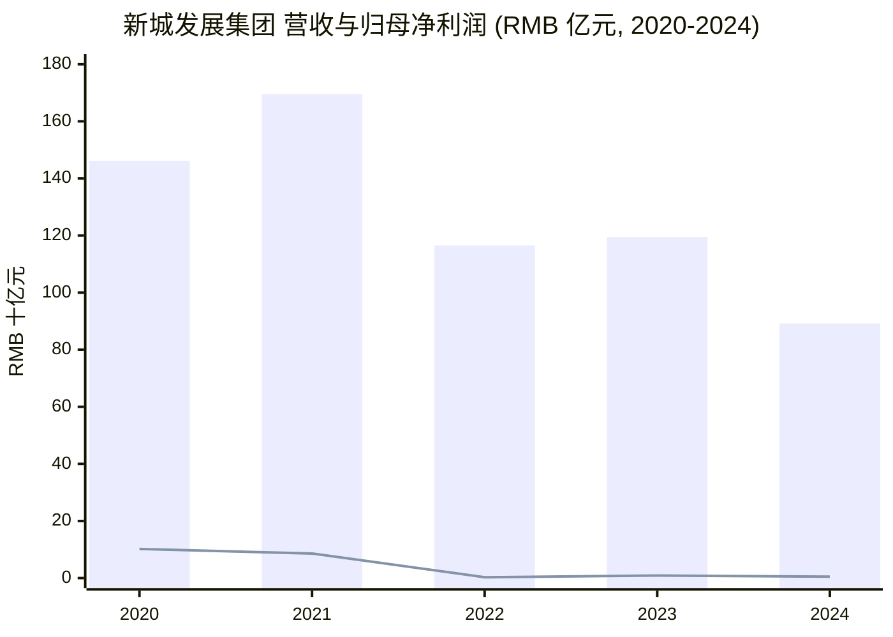
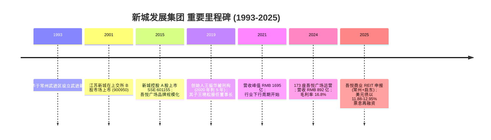
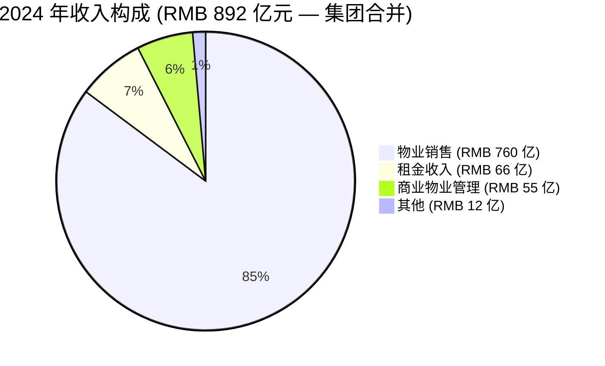
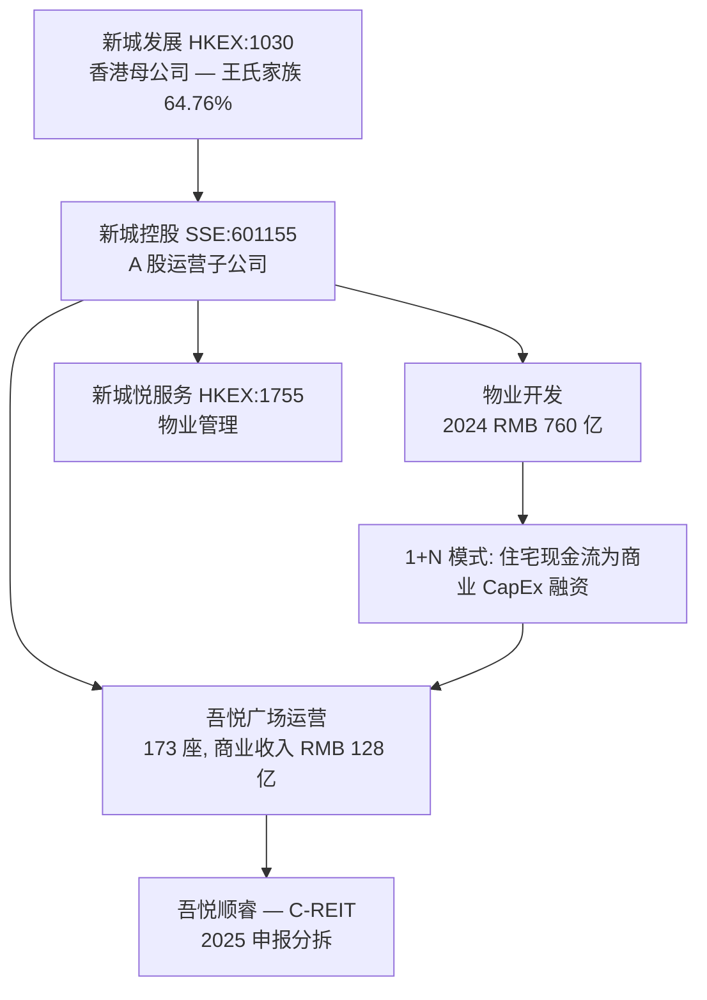
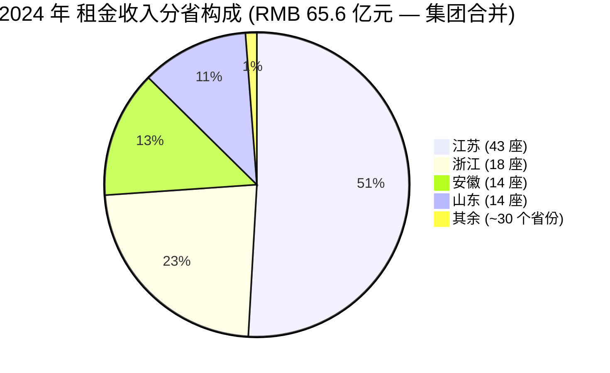
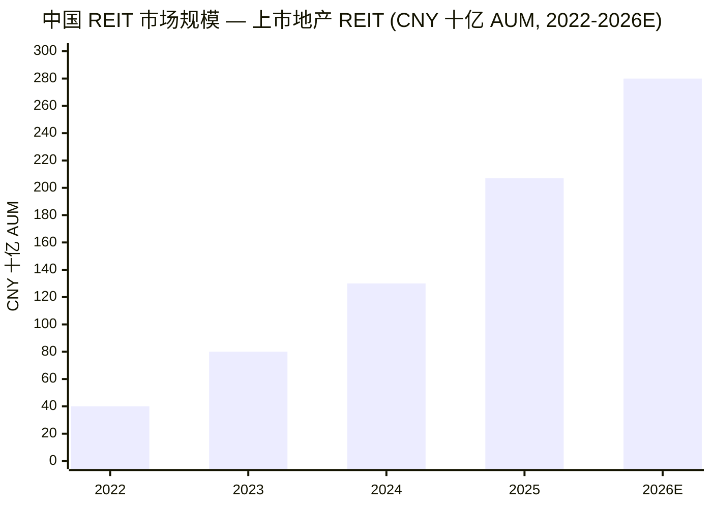
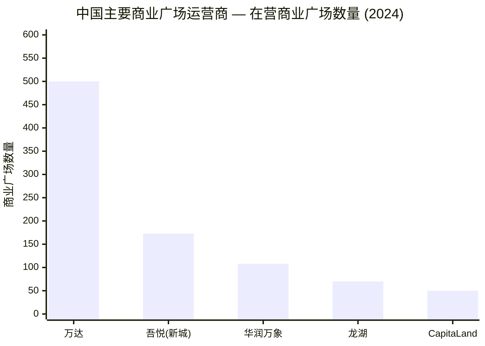

# 新城发展 Seazen Group (HKEX:1030) — 公司研究报告

**报告日期 (As of):** 2026-06-03
**编制方：** 内部研究 (project-curated, 无任何 LLM API 调用)
**主代码：** HKEX:1030 (新城发展控股有限公司, Seazen Group Limited)
**A股子公司：** SSE:601155 (新城控股集团股份有限公司, Seazen Holdings)
**行业：** 中国房地产 — 多元综合开发商 + 商业广场运营
**最新披露：** [2024 年报 (Annual Report), 2025-04-16 刊发](https://www.seazengroup.com.cn/uploads/20250416170342/f.pdf)

---

## 目录
1. 公司概览与估值快照
2. 公司历史
3. 管理团队 — 创始人与 CEO
4. 产品与服务 — 物业开发、吾悦广场、物业管理
5. 客户、预售与资本策略
6. 行业概览 — 中国房地产与商业地产
7. 竞争格局
8. 市场机会与 TAM
9. 风险评估
10. 投资视角评分卡
11. 参考资料与核验日志

---

## 1. 公司概览与估值快照

新城发展控股有限公司 (HKEX:1030, "Seazen" 或 "新城发展") 是中国规模最大的私人控股 cross-cycle (跨周期) 房地产平台之一的香港上市持股母公司。该集团在中国全国范围内开发并销售住宅物业、建设并运营 **吾悦广场 (Wuyue Plaza)** 这一综合体购物中心连锁品牌，并通过附属公司 **新城悦服务 (S-Enjoy Service, HKEX:1755)** 提供下游 property management (物业管理) 服务。A股运营子公司 **新城控股集团股份有限公司 (Seazen Holdings, SSE:601155)** 持有集团绝大部分境内地产开发与商业广场资产 — 因此港股母公司本质上是 A 股子公司的一家加杠杆持股载体，顶层是控股股东家族信托。截至 2024 年 12 月 31 日，集团共雇用 20,243 名全职员工，其中 19,935 人从事房地产开发及商业综合体运营业务 [2024 年报 第 38 页 — Employees 披露](https://www.seazengroup.com.cn/uploads/20250416170342/f.pdf)。

截至 2024 年 12 月 31 日年度，新城发展报告 **revenue (营业额) 为人民币 89,226.5 百万元**，同比下降 25.3% (2023 年为人民币 119,463.5 百万元)，管理层在 MD&A (管理层讨论与分析) 中直接将下降原因归结为 "房地产行业下行致地产业务收缩"。**gross profit (毛利) 为人民币 14,984.4 百万元、gross margin (毛利率) 16.8%** — 较 2023 年 13.5% 提升 3.3 个百分点，管理层解释为 "毛利率较高的商业物业管理服务收入和租赁收入在总收入中的占比较上年提高" [2024 年报 MD&A 第 29-31 页 — 营业额/销售成本/毛利 章节, 原文逐字引用](https://www.seazengroup.com.cn/uploads/20250416170342/f.pdf)。归属于本公司权益持有人的 **净利润同比下降 44.1% 至人民币 491.3 百万元**；剔除投资物业 revaluation (估值)、外汇及处置子公司影响后的 core earnings (核心盈利) 为人民币 632.2 百万元 [2024 年报 MD&A 第 32 页 — 年度利润 verbatim](https://www.seazengroup.com.cn/uploads/20250416170342/f.pdf)。

2024 年营业额构成 (revenue mix) 为：物业销售收入 **人民币 76,041 百万元 (85.2%)**、租金收入 **6,556.2 百万元 (7.3%)**、商业物业管理服务收入 **5,476.8 百万元 (6.1%)**、其他收入 **1,152.5 百万元 (1.3%)** [2024 年报 MD&A 第 29 页 — Revenue 表 verbatim](https://www.seazengroup.com.cn/uploads/20250416170342/f.pdf)。**recurring revenue (经常性收入，即租金+管理费)** 占比明显提升是公司投资叙事的核心：开发业务收入同比 –29.2% (从人民币 107.3 亿元降至 76.0 亿元)，而租金收入同比 +15.1% (从 5.7 亿元升至 6.6 亿元)、商业物业管理服务收入同比 +12.6%。

**估值快照 (valuation snapshot)。** 截至 2025 年末至 2026 年初，新城发展市值约 **港币 377.6 亿元** (约 48 亿美元)，股价约 **港币 5.89 元**，较 2025 年 8 月低点 (港币 2.64 元) 大幅回升 — 反映 2025 年第四季度至 2026 年中国地产政策驱动的板块 re-rating (估值重塑) [Stockanalysis.com — Seazen Group HKG:1030 quote page](https://stockanalysis.com/quote/hkg/1030/)。报告 P/E ratio (市盈率) 各家来源计算口径不一：trailing P/E (滚动市盈率) 由独立 aggregators (聚合站) 提供的区间约为 7.6× 到 35.6×，forward P/E (前瞻市盈率) 约 21.4× [Stockanalysis.com — HKG:1030 statistics](https://stockanalysis.com/quote/hkg/1030/statistics/)。**P/B (市净率) 约 0.98×** [Stockanalysis.com — HKG:1030 statistics](https://stockanalysis.com/quote/hkg/1030/statistics/) — 意味着股价基本等于账面价值，这是 2022–2025 年下行周期中国地产 "活下来但未复苏" 名字的典型折价，仅略高于仍在重组中的同业 (碧桂园、融创、恒大) 的深度折价。截至 2024 年末，net debt-to-equity ratio (净负债权益比率) 为 53.8%，在手现金人民币 106.2 亿元，借款总额 **人民币 577.3 亿元** [2024 年报 MD&A 第 33 页 — 财务状况](https://www.seazengroup.com.cn/uploads/20250416170342/f.pdf)。*分析师观点：* 0.98× P/B + 标准化 P/E < 15× 的组合，将新城发展定位为中国地产板块中 "幸存但难以重新定价" 的防御性标的；这一定价对结构性租金增长 (2024 年同比 +15%) 给予的回报不足，但对存量 USD 高息债 (offshore USD bonds) 风险溢价的反映是合理的。

数据来源：[2024 年报 第 5 页 五年财务摘要](https://www.seazengroup.com.cn/uploads/20250416170342/f.pdf)。

## 2. 公司历史

新城发展的根基可追溯至 **1993 年**，创始人 **王振华 (Wang Zhenhua)** 在江苏常州武进区设立了 "武进新城建设投资发展有限公司" — 即集团的前身 [Caproasia 2025-06-13 债券发行报道，引述 1993 年王振华创立](https://www.caproasia.com/2025/06/13/china-4-2-billion-property-group-seazen-issues-300-million-3-year-bond-12-95-yield-non-callable-non-put-option-for-2-years-proceeds-will-be-used-to-repay-bonds-maturing-in-2025-july-300-millio/)。集团通过 1990 年代末至 2000 年代的住宅开发，在江苏省内逐步扩张。**江苏新城地产 (Jiangsu Seazen) 于 2001 年在上海证券交易所 B 股市场上市** (股票代码 900950) — 这是集团首次进入资本市场 [2024 年报 第 39 页 — 吕小平董事简历提及 2001 年 B 股上市历史](https://www.seazengroup.com.cn/uploads/20250416170342/f.pdf)。

新城特有的 "1+N" 模式 — 即一个住宅开发引擎为同一地块上的一个吾悦广场 (商业综合体) 提供资金 — 在 2010 年代初至中期开始成型，**吾悦广场 (Wuyue Plaza)** 也由此成为集团综合体的旗舰品牌。**2015 年，A 股运营子公司新城控股集团 (Seazen Holdings) 在上海证券交易所主板 A 股上市，股票代码 601155**，替代了较早的江苏新城 B 股载体，成为内地的主要上市平台 [2024 年报 第 39 页 — 吕小平董事简历，提及新城控股 SSE 601155 上市](https://www.seazengroup.com.cn/uploads/20250416170342/f.pdf)。港股母公司新城发展控股有限公司 (HKEX:1030, 当时名为富力发展控股) 此前已完成自身的香港上市，使家族同时拥有两个公开市场载体 — 港股母公司持有 SSE 上市的新城控股的控股权。

**2019 年的接班危机** 是近年最关键的转折点。2019 年 7 月 3 日，创始人兼时任董事长王振华在上海被以涉嫌猥亵 9 岁女童罪名刑事拘留；事件曝光后数日内，两个上市载体市值合计蒸发数十亿美元 [CNN Business 2019-07-05 — 王振华拘留事件对富力发展的影响](https://www.cnn.com/2019/07/05/business/wang-zhenhua-detention/index.html); [CGTN 2019-07-06 — 中国亿万富翁因儿童性侵被拘](https://news.cgtn.com/news/2019-07-06/Chinese-billionaire-detained-for-child-sexual-assault-I6w0rAsqVa/index.html)。数日内董事会任命其独子 **王晓松 (Wang Xiaosong, 时年 32 岁)** 接任两家上市公司董事长 [CNN Business 2019-07-11 — 王晓松接替父亲担任董事长](https://www.cnn.com/2019/07/11/business/wang-zhenhua-future-land-arrest/index.html)。2020 年 6 月，上海一家法院以 child molestation (猥亵儿童) 罪判处王振华 **5 年有期徒刑** [CGTN 2020-06-17 — 王振华被判 5 年](https://news.cgtn.com/news/2020-06-17/Short-sentence-on-billionaire-s-child-molestation-case-fuels-anger-RoZaFJZ4ha/index.html); [中国法院网英文版 2020-06-18 — 判决公告](https://english.court.gov.cn/2020-06/18/c_767209.htm)。尽管创始人身陷囹圄，他通过 **华盛信托 (Hua Sheng Trust)** 持有的新城发展 **63.33%** 实益权益保持至今 (截至 2024 年末)；其配偶陈静额外持有 1.43%，家族合计经济权益约 **64.76%** [2024 年报 第 59-60 页 主要股东披露](https://www.seazengroup.com.cn/uploads/20250416170342/f.pdf)。家族控股股权的延续性 — 加上法人主体的业务未被当局接管 — 使集团在地产下行周期最艰难的阶段内仍保留在家族手中。

**2021–2024 年的行业下行周期** 又在公司治理冲击之上叠加了宏观压力。总营收从 **2021 年的人民币 1,695 亿元峰值**，下行至 2022 年的 1,165 亿元 (–31%)、2023 年小幅反弹至 1,195 亿元，再到 **2024 年的 892 亿元** [2024 年报 第 5 页 五年表](https://www.seazengroup.com.cn/uploads/20250416170342/f.pdf)。整个下行周期中，新城避开了碧桂园、融创、恒大等其他大型私营开发商的公开违约轨迹。集团主动管理其 **境外 USD senior notes (高级票据) 债务堆栈**：2025 年 6 月，新城发行了 **3 亿美元 3 年期债券，票息 12.95%** (前 2 年不可赎回、不可回售)，明确用于再融资 2025 年 7 月到期的 3 亿美元和 2025 年 10 月到期的 3 亿美元票据 [Caproasia 2025-06-13 债券发行摘要](https://www.caproasia.com/2025/06/13/china-4-2-billion-property-group-seazen-issues-300-million-3-year-bond-12-95-yield-non-callable-non-put-option-for-2-years-proceeds-will-be-used-to-repay-bonds-maturing-in-2025-july-300-millio/)；2025 年 9 月又在中资美元债市场回暖中追加发行 1.6 亿美元 [Bloomberg 2025-09-23 — 新城募资 1.6 亿美元](https://www.bloomberg.com/news/articles/2025-09-23/builder-seazen-joins-chinese-rush-back-to-dollar-bond-market)；同一窗口期还宣布了一笔 3 亿美元 11.88% 2028 年到期的高级票据。**2025 年商业 REIT 分拆公告** 标志着战略转向：新城控股向 CSRC (中国证监会) 和上海证券交易所提交了一项申请，拟通过专属载体 **吾悦顺睿 (Wuyue Shunrui)**，将 **常州和启东 (Qidong) 两座成熟吾悦广场** 分拆为一只上交所上市的 commercial property REIT (商业地产 REIT) [TipRanks 2025 — 新城发展将两座吾悦广场分拆至上交所商业 REIT](https://www.theglobeandmail.com/investing/markets/markets-news/Tipranks/651920/seazen-group-moves-to-spin-off-two-wuyue-plazas-into-shanghai-listed-commercial-reit/)。此举令新城与 CapitaLand Commercial C-REIT、China Resources MixC 等机构化商业 REIT 发行人并列，借助 2025 年 12 月中国 REIT 资产类别扩容的政策顺风。

数据来源: [2024 年报 第 5 页 五年表](https://www.seazengroup.com.cn/uploads/20250416170342/f.pdf), [2024 年报 第 39-43 页 董事](https://www.seazengroup.com.cn/uploads/20250416170342/f.pdf), [CNN Business 2019-07-11](https://www.cnn.com/2019/07/11/business/wang-zhenhua-future-land-arrest/index.html), [Caproasia 2025-06-13](https://www.caproasia.com/2025/06/13/china-4-2-billion-property-group-seazen-issues-300-million-3-year-bond-12-95-yield-non-callable-non-put-option-for-2-years-proceeds-will-be-used-to-repay-bonds-maturing-in-2025-july-300-millio/), [TipRanks 吾悦 C-REIT 分拆](https://www.theglobeandmail.com/investing/markets/markets-news/Tipranks/651920/seazen-group-moves-to-spin-off-two-wuyue-plazas-into-shanghai-listed-commercial-reit/)。

## 3. 管理团队 — 创始人与 CEO

**创始人与控股股东 — 王振华 (Wang Zhenhua)。** 王振华于 1993 年在江苏省常州市创立武进新城前身，并在 1990 年代和 2000 年代将平台扩张至江苏全省，2001 年将江苏新城带至上交所 B 股上市，2015 年再以新城控股 (代码 601155) 重新登陆上交所 A 股 [2024 年报 第 39 页 吕小平董事简历，提及王/新城控股历史](https://www.seazengroup.com.cn/uploads/20250416170342/f.pdf)。2019 年事件之前，王振华同时担任新城发展 (HKEX:1030) 和新城控股 (SSE:601155) 两家上市公司董事长，并被 Forbes 列入亿万富翁开发商榜单。**2019 年 7 月 3 日，上海警方以涉嫌猥亵 9 岁女童罪名将王振华刑事拘留**，逮捕于 2019 年 7 月 10 日正式批准 [CNN Business 2019-07-11 — 王振华批捕](https://www.cnn.com/2019/07/11/business/wang-zhenhua-future-land-arrest/index.html)。2020 年 6 月，上海一家法院以猥亵儿童罪判处其有期徒刑 **5 年** [CGTN 2020-06-17 — 5 年刑期引发公众愤怒](https://news.cgtn.com/news/2020-06-17/Short-sentence-on-billionaire-s-child-molestation-case-fuels-anger-RoZaFJZ4ha/index.html)。拘留发生后王振华立即从董事会辞职，但**通过事件发生前已设立的 Hua Sheng Trust (华盛信托) 保留了 4,474,549,274 股 (港股母公司股本的 63.33%) 的实益权益** — 该信托是一项 **全权信托 (discretionary trust)**，由王振华作为 settlor (设立人) 为家族成员设立。信托结构为：王振华 → 华盛信托 → Chen Ting Sen (PTC) Limited (受托人) → Infinity Fortune Development Limited → First Priority Group Limited → 富域香港投资有限公司 (Wealth Zone Hong Kong Investments Limited，即直接登记股东)。其配偶 **陈静 (Chen Jing)** 单独持有 Set Hero Developments Limited 100% 股权，该实体持有 101,065,905 股 (1.43%) [2024 年报 第 59-60 页 主要股东披露及附注 (含华盛信托结构图)](https://www.seazengroup.com.cn/uploads/20250416170342/f.pdf)。该信托结构在刑事判决后保护了控股股权免遭没收，是该公司至今最重要的公司治理事实。2025 年 6 月的债券发行报道中，王振华仍被描述为身价约 20 亿美元 [Caproasia 2025-06-13 — 王振华 $2 亿净资产引述](https://www.caproasia.com/2025/06/13/china-4-2-billion-property-group-seazen-issues-300-million-3-year-bond-12-95-yield-non-callable-non-put-option-for-2-years-proceeds-will-be-used-to-repay-bonds-maturing-in-2025-july-300-millio/) — 与他已服满 5 年刑期、目前已出狱的状态一致 — 但他在两家上市公司均无任何公开职位。

**董事长 — 王晓松 (Wang Xiaosong)，37 岁 (截至 2024 年报)。** 创始人的独子，于 2013 年 10 月获委任为非执行董事，2019 年 7 月 (其父亲被拘留后立即) 获委任为董事会主席，并于 2020 年 11 月获委任为 ESG 委员会主席 [2024 年报 第 43 页 王晓松董事简历](https://www.seazengroup.com.cn/uploads/20250416170342/f.pdf)。王晓松 2009 年毕业于 **南京大学 (Nanjing University)，取得环境科学学士学位 (Environmental Sciences bachelor)**，同年加入江苏新城 (A 股前身) 担任土木工程师，后逐步晋升为项目经理、副总裁、营销/总经理职位，2013 年 4 月成为江苏新城董事，2013 年 2 月起担任江苏新城总裁。2015 年 12 月 14 日至 2016 年 10 月 26 日担任新城控股总经理，并 **自 2019 年 7 月起担任新城控股 (SSE:601155) 董事长**。他于 2018 年 8 月 24 日至 2021 年 1 月期间担任新城控股总裁，并于 2023 年 1 月 19 日再次获委任为总裁 [2024 年报 第 43 页 王晓松简历](https://www.seazengroup.com.cn/uploads/20250416170342/f.pdf)。他也自 2019 年 7 月起担任新城悦服务 (HKEX:1755) 的非执行董事。截至 2024 年 12 月 31 日，他持有新城发展 6,000,000 股 (0.08%) 与新城控股 500,000 股 (0.02%) — 象征性持仓；家族主要经济权益通过信托持有 [2024 年报 第 57 页 董事股权 + 第 58 页 相联法团权益](https://www.seazengroup.com.cn/uploads/20250416170342/f.pdf)。王晓松同时担任两家上市公司董事长，是整个周期延续性的核心人物 — 但作为港股母公司的非执行董事，日常执行由下述 CEO 负责。

**CEO 行政总裁 — 吕小平 (Lv Xiaoping)，63 岁 (截至 2024 年报)。** 吕于 2001 年加入集团，并于 **2016 年 1 月** 自非执行董事 (2012 年 11 月起) 改任为执行董事兼 CEO。他在集团内部的执行履历跨越二十年：2001–2004 年任新城控股副总裁，2015 年 3 月–12 月任新城控股总经理，2015 年 3 月起担任新城控股董事；同时 2004 年 8 月–2013 年 1 月任江苏新城 (A 股前身) 董事兼总裁，2013 年 2 月起任江苏新城副董事长 [2024 年报 第 39 页 吕小平董事简历](https://www.seazengroup.com.cn/uploads/20250416170342/f.pdf)。他持有 1983 年 **海军工程大学 (Naval University of Engineering)** 工程学学士学位与 2007 年 **中欧国际工商学院 (CEIBS) 工商管理硕士 (EMBA)** 学位。加入新城前的 1987–2001 年期间，吕在常柴股份有限公司 (常柴股份, SZSE:000570) 担任董事会秘书与投资部主任，负责业务发展与投资策略。截至 2024 年 12 月 31 日，吕个人持有新城发展 14,500,000 股 (0.21%) [2024 年报 第 57 页 董事股权](https://www.seazengroup.com.cn/uploads/20250416170342/f.pdf)。吕是董事会上任期最长的执行高管，也是 37 岁董事长 (即仍在完成接班过渡时即遭遇地产下行周期) 的稳定平衡器。

## 4. 产品与服务

新城在三个可报告业务线运营：(1) 住宅与综合体物业开发销售、(2) 吾悦广场商业广场投资与运营、(3) 商业物业管理服务与其他相关服务。2024 年报 MD&A 将收入精确按这四条线拆分 [2024 年报 MD&A 第 29 页 — Revenue 表](https://www.seazengroup.com.cn/uploads/20250416170342/f.pdf)：

| 2024 年收入来源 | RMB 百万元 | 占比 | 同比 |
|---|---|---|---|
| 物业销售收入 | 76,041.0 | 85.2% | –29.2% |
| 租金收入 (投资物业) | 6,556.2 | 7.3% | +15.1% |
| 商业物业管理服务收入 | 5,476.8 | 6.1% | +12.6% |
| 其他收入 | 1,152.5 | 1.3% | –26.3% |
| **总计** | **89,226.5** | **100.0%** | **–25.3%** |

数据来源：[2024 年报 MD&A 第 29 页 Revenue 表 verbatim](https://www.seazengroup.com.cn/uploads/20250416170342/f.pdf)。

**4.1 物业开发 (sale of properties, 占 2024 年收入 85.2%)。** 这是核心业务引擎。2024 年新城共交付物业 **约 9,854,354 平方米 GFA (建筑面积)**，按销售加权平均售价 **人民币 7,716 元/平方米** 确认 [2024 年报 MD&A 第 24 页 业务回顾 — verbatim](https://www.seazengroup.com.cn/uploads/20250416170342/f.pdf)。开发业务横跨 22 个省份和 4 个直辖市，江苏 (人民币 15,550 百万元, 占物业销售的 20.5%) 居首，以及一长串中部省份。逐省份的明细很细致 — 河南、山东、湖南、广东、天津、浙江每个贡献 RMB 40–60 亿元的物业销售 [2024 年报 MD&A 第 24 页 Table 1 — 分省份物业销售逐字表](https://www.seazengroup.com.cn/uploads/20250416170342/f.pdf)。已售物业平均成本 RMB 7,110 元/平方米，**average cost as percentage of average selling price (平均成本占平均售价比例) 为 92.14%** — 较 2023 年的 87.99% 上升，反映中国地产单位经济模型在下行周期中众所周知的挤压 [2024 年报 MD&A 第 30 页 Table 5 — 销售成本](https://www.seazengroup.com.cn/uploads/20250416170342/f.pdf)。集团于 2024 年对 properties held or under development for sale (完工待售或在建销售物业) 计提了 **人民币 1,635 百万元的 impairment provision (减值拨备)** — 较 2023 年 5,348 百万元已明显减少，提示最坏的减值周期已过，但并非意味着行业周期已结束。截至 2024 年 12 月 31 日，**预售但尚未交付的物业** 共约 **1,251 万平方米 GFA，合同金额 794.27 亿元人民币** — 这是未来约 12–24 个月将转为收入的锁定 pipeline [2024 年报 MD&A 第 24 页 — 预售 pipeline](https://www.seazengroup.com.cn/uploads/20250416170342/f.pdf)。

**2024 年的新增 contracted sales (合约销售) 共计人民币 40,171 百万元**，建筑面积 5,388,239 平方米，年内累计签约价格 (不含车位销售) 为 9,832 元/平方米 [2024 年报 MD&A 第 25 页 Table 2 — 合约销售逐字表](https://www.seazengroup.com.cn/uploads/20250416170342/f.pdf)。这是 leading indicator (领先指标) — 即年内新签合同 — 需将 2024 年 RMB 402 亿元的数字与 2020–21 周期峰值 (超过 RMB 2,500 亿元) 对比，才能理解周期收缩的幅度；合约销售与确认收入之间的差距仅在 12–24 个月内通过项目交付逐步弥合。合约销售的地域分布以 **长三角地区** (江苏 32.7%、浙江 5.4%、安徽 1.2%、上海 0.6% = 39.9%) 与 **环渤海地区** (山东 7.5%、天津 9.8%、河北 1.8%、北京 3.9% = 23.0%) 为主，其余分布于中西部和大湾区。截至 2024 年 12 月 31 日，**rentable and saleable land bank (可租售土地资源)** 共 **1.1045 亿平方米**，其中可用于未来住宅销售的土地资源约 **3,144 万平方米** [2024 年报 MD&A 第 26-27 页 — Land Resources verbatim](https://www.seazengroup.com.cn/uploads/20250416170342/f.pdf)。按 2024 年合约销售节奏 538.8 万平方米/年计算，住宅土地储备约相当于 **6 年** 的可售存货 — 足以应对持续缓慢的复苏，但未售余额将需要持续的减值测试。

**4.2 吾悦广场商业广场运营 (rental income 7.3% + 商业物业管理 6.1% = 占 2024 年收入 13.4%)。** 这是日益定义新城投资叙事的 recurring revenue 业务。截至 2024 年 12 月 31 日，**173 座吾悦广场处于运营中**，总可租建筑面积 (leasable GFA) 为 **16,010,700 平方米** [2024 年报 MD&A 第 27 页 — 投资物业 verbatim](https://www.seazengroup.com.cn/uploads/20250416170342/f.pdf)。173 座广场分布于 28 个省/直辖市，主要集中于 **江苏 (43 座, occupancy 98.24%, 租金 33.36 亿元)**、**浙江 (18 座, 98.63%, 15.07 亿元)**、**安徽 (14 座, 98.36%, 8.83 亿元)** 和 **山东 (14 座, 98.97%, 7.46 亿元)** [2024 年报 MD&A 第 27 页 Table 4 — 分省份租金](https://www.seazengroup.com.cn/uploads/20250416170342/f.pdf)。集团整体 **portfolio occupancy (组合出租率) 维持在 90 多%** — 只有上海 (88.0%, 3 座 — 含新城控股大厦 B 座办公楼出租率)、河南 (82.05%, 4 座) 和重庆 (92.98%, 5 座) 低于 95%。其中河南的下滑最值得关注 — 4 座广场低于 82% 意味着可能为当地饱和或商圈疲软，并非仅是写字楼出租率拉低。

**2024 年商业运营总收入为 RMB 128.08 亿元 (即含税租金收入)，同比增长 13%**，**吾悦广场总销售额 (mall tenant GMV, 不含车辆销售) 达 RMB 905 亿元，同比增长 19%** [2024 年报 MD&A 第 28 页 — 附注 3 和 5 关于商业运营收入与 GMV verbatim](https://www.seazengroup.com.cn/uploads/20250416170342/f.pdf)。在开发收入下滑 25% 的情况下商业运营收入仍 +13%，是新城转型故事中最重要的单个数据点 — 这是商业 REIT 分拆可行的基础，也是 2025 年下半年股价部分重新定价的支撑。19% 的租户 GMV 增速也提示，该资产类别在吾悦主导的低线城市中正在赢得消费者钱包份额 — 这些通常是长三角的地级城市 (常州、盐城、淮安、泰州、无锡) 和县级单元，当地的购物中心是占主导地位的非在线零售枢纽。2025 年披露显示运营规模已扩大 — 2024 年报载 173 座运营；2025 年 6 月月度披露显示 **175 处物业、总 GFA 16,105,200 平方米，单月 6 月租金收入 RMB 11.05 亿元、商业运营收入 RMB 11.83 亿元** [via 2025 H1 运营统计摘要 (WebSearch on Seazen rental disclosure)](https://www.tipranks.com/news/company-announcements/seazen-group-reports-strong-contracted-sales-and-rental-income-for-august-2025)。

数据来源：[2024 年报 MD&A 第 29 页 Revenue 表 verbatim](https://www.seazengroup.com.cn/uploads/20250416170342/f.pdf)。

**4.3 商业物业管理服务 (占 2024 年收入 6.1%)。** 这是 asset-light (轻资产) 收费流 — 主要通过新城悦服务集团 (S-Enjoy Service Group, HKEX:1755) 独立上市的物业管理子公司实现。新城发展的高管在新城悦担任非执行董事职务。该业务线收入同比 +12.6% 至 **RMB 5,477 百万元**。业务涵盖住宅物业管理 (服务新城及同行已建成的房屋) 和商业物业管理 (运营在营吾悦广场)。管理业务的 margin (利润率) 在结构上高于开发业务 — 这是公司用以解释 2024 年毛利率扩张 330 bp 至 16.8% 的核心算式。

**综合 — "1+N" 商业模型及其 2024 年的分化。** 新城对中国地产业的独特贡献是 **"1+N" 模式**：每座吾悦广场综合体建于单一地块，同时包含住宅各期 (作为 "1")，住宅销售为商业广场 (作为 "N") 的建设和运营 CapEx 提供资金。在峰值时，模式是一架飞轮 — 住宅现金流为商业广场建设融资，商业广场为城镇 GMV 提供锚定，资产负债表上的商业广场资产为银行借款提供 collateral (抵押)。在 2022–2024 年下行周期中，模式开始 **分化**：住宅腿在收缩 (2024 年收入 –29%)，商业腿在增长 (租金 +15%、管理 +13%、GMV +19%)，**净 free cash flow (FCF, 自由现金流) profile 因此从一家住宅开发周期型企业向 hybrid real-estate-operator (混合型房地产运营商) 形态迁移**。2025 年通过吾悦顺睿向上交所提交的商业 REIT 分拆 (常州 + 启东吾悦广场进入上交所 C-REIT) 是这一分化中合乎逻辑的 capital recycling (资本循环) 动作 — 以高于母公司隐含估值的私市场 cap rate (资本化率) 实现成熟商业广场资产货币化，所得款项用于继续 deleveraging (去杠杆) 或新增 pipeline [TipRanks 吾悦 C-REIT 分拆公告](https://www.theglobeandmail.com/investing/markets/markets-news/Tipranks/651920/seazen-group-moves-to-spin-off-two-wuyue-plazas-into-shanghai-listed-commercial-reit/)。

## 5. 客户、预售与资本策略

**客户基础 — 零散的住宅购房者 + 商业广场租户。** 客户结构本质上分散，原因有二：(a) 物业销售腿一户一户卖给零售购房者，主要在长三角和中部省份的三/四线城市和地级市；(b) 吾悦广场的租户基础是每座广场约数百户中端餐饮 + 服装 + 影院运营商。2024 年报 **未** 披露 top-5 customer concentration (前五大客户集中度) 指标 — 这对于具备该业务结构的港股上市公司是符合披露规范的。颗粒度反而是按省份：江苏省占物业销售约 20.5%，其次省份各占 5–7% [2024 年报 MD&A 第 24 页 Table 1 — 分省份物业销售](https://www.seazengroup.com.cn/uploads/20250416170342/f.pdf)。对于吾悦租金部分，**江苏省占合并租金的约 50%** (RMB 33.36 亿元/RMB 65.56 亿元) — 反映本土市场主导优势 — **单一省份 (江苏) > 50% 租金、加 20% 开发销售** 是合并层面的地理集中度 [2024 年报 MD&A 第 27 页 Table 4 分省份租金](https://www.seazengroup.com.cn/uploads/20250416170342/f.pdf)。这正是最清晰的集中度风险 — 并非客户集中度而是 **单省 (江苏) 集中度** — 报告在第 9 节明确点出。

数据来源：[2024 年报 第 27 页 Table 4 — 分省份租金 verbatim, 占比由分析师计算](https://www.seazengroup.com.cn/uploads/20250416170342/f.pdf)。注：百分比未严格加总至 100% — 剩余约 20 个省份每个贡献 < 5% 在图中合并为 "其余"；四个具名省份小计 = 1,335.5+1,507.3+883.4+745.5 = RMB 4,471.8 m, 占总租金 68.2%。

**资本策略 — 母公司层债务堆栈、商业广场资产作为抵押。** 截至 2024 年 12 月 31 日，借款总额 **人民币 577.3 亿元**，在手现金 RMB 106.2 亿元，**net debt-to-equity ratio 53.8%、debt-to-asset ratio excluding advances 65.7%** [2024 年报 MD&A 第 33 页 — 财务状况](https://www.seazengroup.com.cn/uploads/20250416170342/f.pdf)。债务结构中 **72.2% 为长期 (>1 年)、加权平均融资成本 5.88%、平均贷款年限 5.4 年**；**抵押债务总额 RMB 500.9 亿元 (占 87%)**，以物业/PP&E/投资物业/开发存货/right-of-use 资产抵押。**仅 12.6% 为非抵押债务** — 意味着境外美元债无担保债权人位列于一大笔优先抵押债务之后，这就是为什么 2025 年新发美元债票息须定价在 11.88–12.95% 区间 [2024 年报 MD&A 第 33 页 — 债务结构 verbatim](https://www.seazengroup.com.cn/uploads/20250416170342/f.pdf); [Caproasia 债券发行 2025-06-13](https://www.caproasia.com/2025/06/13/china-4-2-billion-property-group-seazen-issues-300-million-3-year-bond-12-95-yield-non-callable-non-put-option-for-2-years-proceeds-will-be-used-to-repay-bonds-maturing-in-2025-july-300-millio/)。2024 年发行的境内 medium-term notes (MTN, 中期票据) 总计 RMB 29.2 亿元，票息 **3.2–3.5%、3–5 年期** — 境内 CNY 成本仅为境外 USD 成本的约 1/4，反映 (1) 境外市场持续的风险溢价和 (2) 境内监管对 "白名单" 幸存私营开发商的选择性支持 [2024 年报 MD&A 第 34 页 — MTN 发行 verbatim](https://www.seazengroup.com.cn/uploads/20250416170342/f.pdf)。

**债务到期阶梯 (RMB 百万元)** [2024 年报 第 33 页 到期表 verbatim]：

| 到期分组 | 2024 (RMB m) | 2023 (RMB m) | 同比变化 |
|---|---|---|---|
| 1 年以内 | 16,071.4 | 24,755.7 | –35.1% |
| 1–2 年 | 9,911.1 | 14,199.4 | –30.2% |
| 2–5 年 | 12,272.7 | 13,985.2 | –12.2% |
| 5 年以上 | 19,477.9 | 10,229.3 | +90.4% |
| **合计** | **57,733.1** | **63,169.6** | **–8.6%** |

数据来源：[2024 年报 MD&A 第 33 页 — 到期表 verbatim](https://www.seazengroup.com.cn/uploads/20250416170342/f.pdf)。到期结构已显著拉长 — 5 年以上债务接近翻倍，1 年内到期债务下降 35%。这是 2024 年的核心运营成就，也是新城至今未公开违约的关键原因。

**2022 年配股的所得款项重新分配。** 2022 年 1 月一次非包销 rights issue (供股) 以每股港币 5.30 元募集港币 15.5979 亿元。截至 2023 年末，仍有港币 9.3587 亿元未动用 — 原本分配用于收购四川和湖北土地。2024 年董事会 **决定将该余额全部重新分配以偿还境外贷款**，公司描述这能使集团 "更有效部署其财务资源" [2024 年报 MD&A 第 35 页 — Use of Net Proceeds verbatim](https://www.seazengroup.com.cn/uploads/20250416170342/f.pdf)。这显然是一个 defensive (防御性) 的现金使用 — 公司选择资产负债表修复而非新增土地储备，提示增长 pipeline 已不是优先项。

**资本策略结论：** 公司在执行一套 **多管齐下的防御 playbook**：(i) 以低位 3% 范围的境内 CNY 成本拉长境内债务；(ii) 以高息再融资美元到期债，避免公开违约；(iii) 准备商业 REIT 分拆，以更高隐含 cap rate 货币化成熟商业广场资产；(iv) 将早前供股所得款项重新分配用于境外贷款偿付。综合而言，这是一种 "在管理 legacy stack 下行的同时为特许经营 (franchise) 重新定价做准备" 的姿态 — 董事长选择了 survival + reinvention (生存 + 改造)，而非激进增长或公开重组。

## 6. 行业概览 — 中国房地产与商业地产

中国房地产业经历了现代史上最深的 down-cycle (下行周期)。**全国新房销售从 2021 年峰值人民币 18 万亿+ 下行至 2024–2025 年的约 RMB 9–10 万亿** — "三道红线" 去杠杆制度、家庭信心冲击、人口峰值三重叠加。S&P Global Ratings 2025 年末的综述将政策环境框架为：中央选择性 backstop (托底) 运营稳健的私营开发商 (即 "白名单")，同时允许结构性资不抵债者公开重组 [S&P Global Ratings 2025 — 中国商业地产 REIT 市场](https://www.spglobal.com/ratings/en/regulatory/article/chinas-market-for-commercial-property-reits-is-ready-for-takeoff-s101666511)。在此环境下，新城 — 私人控股但未曾公开违约 — 作为幸存的 "白名单临近" 开发商之一在导航，既非国资支持的运营商被完全偏好，也非公开违约者被退市/重组。

**商业地产 — 中国地产中的亮点。** 在住宅开发收缩的同时，**成熟商业广场和商业资产运营在增长**。华润置地 2024 年商业广场收入约 **美元 27 亿 (RMB ~190 亿)、出租率 95%** [Mingtiandi 2025 — 华润置地商业广场组合数据](https://www.mingtiandi.com/real-estate/finance/china-resources-sells-hotel-for-rmb-700m-goes-asset-light/) — 显示最优质的全国性商业广场组合即使在整个行业承压时仍能维持租金收入复利增长。结构性驱动是：城市化向消费化轮动、二/三线城市优质郊区商业广场作为线下零售在后在线时代的主导锚点崛起，以及推动 REIT 作为 exit vehicle (退出工具) 规模化的政策。

**C-REIT 市场政策解锁 — 2025 年 12 月。** 2025 年 12 月中国将 C-REIT 范围扩大至 Grade-A 写字楼、商业广场和四星酒店，行业估算 **解锁约 CNY 2,070 亿 (USD 296 亿) 的新增股权资本，分布于 77 只信托** [Edgeprop 2025 — 中国扩展 REIT 市场](https://www.edgeprop.sg/property-news/china-broadens-reit-market-embrace-commercial-real-estate)。至 2025 年末已有约 50 只与房地产相关的基础设施 REIT 挂牌 — 仍不及中国商业地产市场价值的 0.5%，但持续增长。CapitaLand Commercial C-REIT 于 2025 年 8 月获 CSRC 批准并在上交所登陆，首日较 IPO 价格高出 19.6%，展现了投资者对这一新资产类别的胃口 [CapitaLand 2025-08 CSRC approval](https://www.capitaland.com/en/about-capitaland/newsroom/news-releases/international/2025/august/capitaland-commercial-c-reit-receives-approval-from-china-securi.html)。这恰恰是新城为其吾悦 REIT — 常州 + 启东两座广场 — 通过吾悦顺睿申报的政策窗口。

**TAM/SAM 框架。** 中国商业地产总可触及市场规模 (asset value) 超过 RMB 40 万亿，其中运营 rental/management (租金/管理) 部分估计为所有业主全年运营收入 RMB 8,000 亿+。对新城而言，SAM (serviceable addressable market) 更狭窄：中型城市商业广场运营商细分市场 — 这是由 5–6 家全国性运营商 (万达、华润万象、新城吾悦、CapitaLand Mall China、龙湖天街，加上邻近 grocery-anchor (商超主力店) 业态的新加坡/外资背景的 Sun Art / Aeon 等) 主导的结构。万达 2025 年 1 月引入 RMB 240 亿 (USD 38.6 亿) 新资本用于建设 20 座新商业广场，表明资本充裕的运营商仍在扩张，而众多边缘开发商正在退出。新城吾悦本质上是 **二/三线城市专家** (vs 万达侧重一/二线、华润万象侧重一/二线高端 luxury)，使其在中端大众消费商业广场垂直市场中具备可防御的 niche (利基) — 这是最高 rotation (周转) 区段但 rent-PSF (每平米租金) 低于高端 luxury。

数据来源: [S&P Global Ratings 2025 — China Commercial Property REITs](https://www.spglobal.com/ratings/en/regulatory/article/chinas-market-for-commercial-property-reits-is-ready-for-takeoff-s101666511); [Edgeprop 2025 — China REIT 扩容估算](https://www.edgeprop.sg/property-news/china-broadens-reit-market-embrace-commercial-real-estate)。*分析师估算；* 2026E 投影基于近期约 50% 同比增长轨迹与 2025-12 政策扩容影响外推。

## 7. 竞争格局

新城在两个邻近板块竞争：(a) 中国二/四线城市住宅物业开发，和 (b) 商业广场运营。竞争格局在两个板块差异显著。

**住宅开发竞争对手：** 万科 (SSE:000002 / HKEX:2202)、碧桂园 (HKEX:2007 — 重组中)、龙湖集团 (HKEX:0960)、绿城中国 (HKEX:3900)、保利发展 (SSE:600048)，以及长三角的几十家区域性私营开发商。在幸存的私营开发商中，新城最接近 **龙湖和绿城** — 即开发 + 商业广场运营的双轨模式。**龙湖天街 (Paradise Walk) 商业广场品牌** (约 70+ 座) 是吾悦广场在中端市场的直接竞争对手，龙湖在一/二线城市品牌定位更强，而新城在二/三/四线城市网络更大。万科规模更大但更聚焦住宅且与国有部门动态挂钩。碧桂园和其他违约同行已不再是真正的竞争对手 — 他们正在剥离土地储备且新项目 pipeline 极少。

**商业广场运营商竞争对手：** 中国中端商业广场细分市场由以下机构主导：

1. **华润万象生活 (China Resources MixC, HKEX:1209)** — 高端与中高端定位，旗下 MixC 商业广场约 108+ 座，一/二线城市存量强；作为单独上市的管理服务特许经营；2024 年商业广场组合收入约 USD 27 亿、出租率 95% [Mingtiandi 华润置地报道](https://www.mingtiandi.com/real-estate/finance/china-resources-sells-hotel-for-rmb-700m-goes-asset-light/)。
2. **万达商业管理 (Wanda Commercial Management, 私人持有)** — 单一品牌运营商最大者，500+ 万达广场在管；2025 年 1 月引入 4 家投资者注资 RMB 240 亿 (USD 38.6 亿) 用于建设 20 座新商业广场。
3. **龙湖天街 (Longfor Paradise Walk, 在龙湖集团 HKEX:0960 内)** — 70+ 座，一/二线城市的中高端定位；龙湖将商业广场租金单独披露。
4. **CapitaLand Mall China (现 CapitaLand Investment HKEX:1820 / 新交所上市的 CapitaLand Investment 通过各 REIT)** — 50 座中端商业广场；2025 年首只国际背景的上交所零售 C-REIT 登陆 [CapitaLand 2025-08 公告](https://www.capitaland.com/en/about-capitaland/newsroom/news-releases/international/2025/august/capitaland-commercial-c-reit-receives-approval-from-china-securi.html)。
5. **恒隆地产 (Hang Lung Properties, HKEX:0101)** — luxury (奢侈品) 定位的商业广场组合，覆盖 11 个一/二线城市 (上海恒隆广场 66、沈阳市府恒隆广场 66、无锡中心 66 等) — 服务高端购物者而非大众消费。
6. **远洋集团、大悦城地产 (HKEX:0207)、宝龙地产 (HKEX:1238)** — 不同规模的中型运营商。

*分析师观点：* 在 positioning framework (定位框架) — 商业广场数量 vs 城市层级 mix 上 — 新城 173 座的网络介于万达的 500+ (规模更大但所有权透明度较低) 和龙湖的 ~70 (规模较小但整体资产质量较高) 之间。吾悦广场是 **港股/上交所私营上市开发商持有的最大单一品牌商业广场网络**。2024 年租户 GMV 19% 增长在全国消费基底持平到下行的情况下提示在商圈层面赢得份额 — 尤其在吾悦作为主导锚点的三/四线地级城市。

数据来源：吾悦数据来自 [2024 年报 MD&A 第 27 页](https://www.seazengroup.com.cn/uploads/20250416170342/f.pdf)；同行计数来自上述公开披露及 [维基百科 — 华润万象生活](https://en.wikipedia.org/wiki/China_Resources_Mixc_Lifestyle)。*万达计数为含轻资产管理的总在营广场数行业估算；华润万象计数为在管数据*。

## 8. 市场机会与 TAM

中国商业地产总市场规模超过 **RMB 40 万亿**。仅运营商业广场 + 商业地产板块就贡献所有业主估计 **RMB 8,000–9,000 亿/年运营收入**。这些商业广场承载的消费者 GMV 约 RMB 5–6 万亿/年，其中六大全国性商业广场运营商 (万达、华润万象、吾悦/新城、龙湖、CapitaLand Mall China、Aeon/Sun Art) 估计占 25–35%。其中，吾悦广场 2024 年租户 GMV 905 亿元意味着约 1.5–1.8% 全国商业广场消费者 GMV 份额 — 绝对数字小但 **最大单一中端城市运营商份额**。

**增长机会是分化的**：(a) 在商业广场运营商垂直内，成熟资产 C-REIT 货币化可以以隐含 cap 基准重新定价运营特许经营 30–50% (私市场可比表明一/二线优质商业广场资本化率为 4.5–5.5%、三线中端商业广场为 5.5–7.0% — 新城商业广场组合按当前母公司隐含估值计算的隐含运营 cap rate 接近 8–9%，意味着分拆套利是真实的)；(b) 在住宅开发内，公司主要价值杠杆是按预售 pipeline (合约金额 RMB 794 亿元、GFA 1,251 万平方米) 交付而无进一步减值，这将重置稳态盈利能力至大致 2024 年 RMB 6.32 亿元 core earnings + 约 3% 租金增长。

**新城具体的 SAM** — 中端城市商业广场消费者钱包 — 跨越吾悦存在的地级和县级城市约 **RMB 1.5–2.0 万亿/年**。增长驱动是 **三/四线城市消费升级的延续**，新城的 "1+N" 模式 (在单一地块同时建造住宅 + 商业广场) 相比于尝试在一/二线城市建造商业广场 (土地成本是瓶颈) 的同行，每 GFA CapEx 结构性更低。S&P 2025 将 C-REIT 解锁框架为 CNY 2,070 亿的股权扩容，是商业广场运营商上市公司具备成熟稳定资产的最具体短期 TAM 解锁 — 新城拥有 173 座这样的资产。

## 9. 风险评估

新城的风险图景位于公司治理悬置、行业周期暴露、资产负债表杠杆、宏观/监管复杂性的交叉点。按 4 桶风险分类法：

**公司层面风险：**

1. **商业广场组合单省江苏集中度 (约占合并租金 51%)。** 若江苏三/四线城市消费者 GMV 表现不佳 — 由于当地就业冲击、人口外流至沿海大都市，或当地政府财政压力 — 新城最稳定的收入线将承受不成比例的冲击。江苏 43 座广场组合是特许经营本身；这里的退化在多年时间维度上无法靠地理多元化抵消。
2. **2019 年创始人刑事案件持续的声誉悬置。** 王振华仍通过华盛信托保留 63.33% 实益所有权 [2024 年报 第 59 页](https://www.seazengroup.com.cn/uploads/20250416170342/f.pdf)；即使其子任董事长、吕小平任运营 CEO，机构投资者 (尤其是 ESG 敏感的西方和新加坡基金) 仍持续折价股票。这在结构上不可逆 — 除非控股股东变更。
3. **接班深度与关键人物集中度。** 王晓松 (37 岁) 同时担任两家上市公司董事长；CEO 吕小平 (63 岁) 接近退休年龄。2025-04-01 任命周福东 (45 岁，前 PwC，前财务部负责人) 为执行董事 [2024 年报 第 42 页](https://www.seazengroup.com.cn/uploads/20250416170342/f.pdf) — 提示接班规划已在进行但未经检验。

**行业/市场风险：**

4. **中国地产板块收缩持续至 2026–2027 年。** 全国新房销售仍显著低于 2021 年峰值；城市三/四线城市 (新城核心区) 的人口峰值意味着结构性需求很可能永久重置较低。即使租金增长抵消部分开发下滑，资产基础仍以住宅开发为主导。
5. **政策解锁后商业广场板块竞争加剧。** 2025 年 12 月 C-REIT 扩容引入新机构资本进入商业地产 — 万达 RMB 240 亿募资、CapitaLand 上市 C-REIT、华润万象持续扩张 — 都暗示更多竞争性资本追逐相同的中端消费者足迹，可能在货币化时压缩 cap rate，但也长期压缩租金。
6. **三/四线城市消费者脆弱性。** 新城商业广场组合面向大众消费；若三/四线城市消费者信心在 2026 年维持低迷，租户 GMV 增速从 19% 同比降回低单位数 — 这将显著降低 C-REIT 分拆的隐含估值。

**财务风险：**

7. **美元债债务堆栈再融资风险。** 2025 年发行美元票据的 11.88–12.95% 票息 [Caproasia 2025-06-13](https://www.caproasia.com/2025/06/13/china-4-2-billion-property-group-seazen-issues-300-million-3-year-bond-12-95-yield-non-callable-non-put-option-for-2-years-proceeds-will-be-used-to-repay-bonds-maturing-in-2025-july-300-millio/) 提示境外市场仍需要 distressed-tier (困境级) 风险溢价。11.88% 发行创造的 2028 年到期墙将再融资风险推后 3 年，但若中国地产情绪进一步恶化，新城可能无法在任何合理票息下境外再融资，被迫进行 distressed 境内 CNY 替代或公开重组。
8. **减值周期尚未结束。** 2024 年减值 16 亿元低于 2023 年 53 亿元，但并非零 — 加上 92.14% 的成本/ASP 比反映住宅开发底层 margin 极薄。任何一波 PSM (每平米价格) 进一步下行或土地价值再减值，可能将 2025/2026 年 core earnings 转为 core loss。
9. **net debt-to-equity 53.8% 对开发商而言是 "可控但不低"；65.7% 的 debt-to-asset (剔除预收) 偏高。** 持续去杠杆需要租金现金流增长、资产出售 (C-REIT 分拆) 或股权增发。

**宏观/监管风险：**

10. **中国住宅地产政策环境。** 虽然北京 2023 年起逐步放松 mortgage rate (按揭利率)、predeal restriction (预售限制) 和库存监管，但长期政策框架仍是 "房住不炒"。新一轮限购或最近刺激的逆转可能终止温和复苏。
11. **C-REIT 分拆执行与监管批准。** 吾悦顺睿 C-REIT 申报已正式受理但尚未挂牌。CSRC 批准时点不保证；定价隐含 cap rate 取决于 CSRC 审核结论与 IPO 时的 C-REIT 市场条件。
12. **HKEX/SSE 双重上市复杂性与集团内部转移。** 由于新城发展 (HKEX:1030) 作为母公司持有新城控股 (SSE:601155)，香港与上海之间的资金流动受 PRC cross-border capital controls (跨境资本管制) 限制。任何跨境资本流动的收紧都可能限制母公司接触 A 股子公司现金以偿付债务的能力。

## 10. 投资视角评分卡

下方评分卡将四个核心投资视角 (investor-lens) 框架应用于第 1–9 节确立的事实基础。宏观快照输入 (截至 2026-06-03)：美元 10 年期约 4.5% 名义无风险参考；高收益债 OAS 与投资级 OAS 暗示中等偏紧，提示 mid-cycle (中周期) 信贷环境。

**10.1 Buffett — Quality at a Sensible Price (0–100, 越高越具吸引力)。**
| 组成 | 评分 | 注释 |
|---|---|---|
| 盈利可预测性 | 25 | 开发周期波动抵消租金稳定性 |
| Moat (商业广场网络 + 1+N 模式) | 60 | 吾悦广场是真正的特许经营；三/四线主导难以复制 |
| 管理质素与诚信 | 10 | 创始人刑事定罪是视角中最难逾越的约束 |
| 再投资跑道 | 30 | 新 pipeline 胃口有限；资本循环是现金主要用途 |
| 价格 vs 内在价值 | 60 | P/B ~1.0×、标准化 P/E ~15× 是合理但不便宜 |
| **综合 (0–100)** | **35** | **低于严格 Buffett 视角的 Buy 门槛** |
*视角观点：* Buffett 标准的 "wonderful business at a fair price" rubric (优质企业以合理价格) 主要会因管理诚信因素将新城排除。特许经营本身 (吾悦广场网络、173 座、租金 13% 同比增长、核心省份 98% 出租率) 顺畅通过 moat (护城河) 门槛；价格公道；但控股股东声誉悬置在严格解读下属于一票否决。

**10.2 Munger — Weighted Quality + Inversion (0–10)。**
| 组成 | 权重 | 评分 | 加权 |
|---|---|---|---|
| 客户需求耐久性 | 0.20 | 6 | 1.2 |
| Moat 深度 | 0.20 | 6 | 1.2 |
| 管理诚信 | 0.20 | 2 | 0.4 |
| 资本配置纪律 | 0.15 | 7 | 1.05 |
| 安全边际 | 0.15 | 6 | 0.9 |
| 倒置 (什么会杀死它) | 0.10 | 4 | 0.4 |
| **综合 (0–10)** | | | **5.15** |
*Inversion (倒置)：* 什么会杀死新城？(a) C-REIT 分拆被拒或定价惩罚性；(b) 新一波地产周期疲软将住宅现金流引擎推至现金 break-even 之下；(c) 被迫的境外债务重组将母公司股权定价至零。三者均非不可置信；均在 24 个月窗口内低于 30% 概率。
*视角观点：* Munger 会以与 Buffett 相同理由通过 (pass)，加上周期与资产负债表风险 profile。

**10.3 Damodaran — Story-Plus-Numbers DCF (±% margin of safety)。**
所需假设：2026–2028 年间营收稳定于 RMB 80–95 亿元、毛利率维持 16–18%、随租金 mix 持续增长 core net income 至 2027 年回到 RMB 10–15 亿元 run rate。Discount rate (折现率)：10–11% (中国地产风险溢价较美元 10 年期约 4.5% 高约 6%)。Terminal (终值)：住宅零增长、商业广场租金 3% 永续增长、6.0% 终值 cap rate。
公允价值区间：港币 4.5–6.5 元/股、midpoint **港币 5.5 元** vs 当前约港币 5.89 元 = 大致 **–7% 到 +10% 安全边际**，视情形而定。
*视角观点：* Damodaran 框架将新城评定为大致公允估值，上行情形直接绑定 C-REIT 分拆执行 (将 SoTP 转向商业广场特许经营较高隐含倍数)、下行情形绑定住宅腿再次下行。

**10.4 Howard Marks Cycle — Market Regime (offense ↔ defense, 0–100)。**
| 组成 | 评分 |
|---|---|
| VIX 水平 | 50 |
| 信贷 OAS regime | 55 |
| 股票动量 | 65 (已从 2025-H1 低位回升) |
| 情绪 / FOMO 指标 | 40 |
| **综合 (0=defense, 100=offense)** | **52 — Neutral 中性** |
*视角观点：* Marks 周期姿态为中性 — 既非明显的 "raise risk now" 信号也非明显的防御。具体到中国地产，情绪明显高于 2024-Q4 底部但仍远低于周期常态。中性周期姿态意味着标准的风险/回报分析适用，无 overlay tilt 倾向激进 sizing。

## 11. 参考资料与核验日志

### 主要来源
- [新城发展控股有限公司 2024 年报 (2025-04-16, 中英文双语)](https://www.seazengroup.com.cn/uploads/20250416170342/f.pdf) — 收入、分部、商业广场组合、债务、治理的主要锚点。
- [新城发展 2023 年报 (2024-04-17)](https://www.seazengroup.com.cn/uploads/20240417140420/f.pdf)
- [新城发展 2022 年报 (2023-04-14)](https://www.seazengroup.com.cn/uploads/20230414180347/f.pdf)
- [新城发展 2025 半年报 (2025-09-22)](https://www.seazengroup.com.cn/uploads/20250922091741/f.pdf)
- [新城发展 2024 半年报 (2024-09-12)](https://www.seazengroup.com.cn/uploads/20240912173840/f.pdf)
- [新城发展投资者关系 — Interim & Annual Reports 页](https://www.seazengroup.com.cn/en/IR/report.html)
- [新城发展 HKEX 2023 业绩公告 (2024-03-28)](https://www1.hkexnews.hk/listedco/listconews/sehk/2024/0328/2024032804920.pdf)

### 新闻与第三方
- [CNN Business 2019-07-05 — 创始人被拘留, 中国房地产帝国市值蒸发 50 亿美元](https://www.cnn.com/2019/07/05/business/wang-zhenhua-detention/index.html)
- [CNN Business 2019-07-11 — 王振华涉嫌猥亵儿童被捕；王晓松接替](https://www.cnn.com/2019/07/11/business/wang-zhenhua-future-land-arrest/index.html)
- [CGTN 2019-07-06 — 中国亿万富翁因儿童性侵被拘](https://news.cgtn.com/news/2019-07-06/Chinese-billionaire-detained-for-child-sexual-assault-I6w0rAsqVa/index.html)
- [CGTN 2020-06-17 — 5 年刑期引发公众愤怒](https://news.cgtn.com/news/2020-06-17/Short-sentence-on-billionaire-s-child-molestation-case-fuels-anger-RoZaFJZ4ha/index.html)
- [中国法院网英文版 2020-06-18 — 公司创始人猥亵儿童被判刑](https://english.court.gov.cn/2020-06/18/c_767209.htm)
- [中国日报 2019-07-05 — 新城控股董事长以 "个人原因" 被刑事拘留](http://www.chinadaily.com.cn/global/2019-07/05/content_37488411.htm)
- [Caproasia 2025-06-13 — 新城发行 3 亿美元 3 年期 12.95% 票息债](https://www.caproasia.com/2025/06/13/china-4-2-billion-property-group-seazen-issues-300-million-3-year-bond-12-95-yield-non-callable-non-put-option-for-2-years-proceeds-will-be-used-to-repay-bonds-maturing-in-2025-july-300-millio/)
- [Bloomberg 2025-09-23 — 新城在美元债市场募资 1.6 亿美元](https://www.bloomberg.com/news/articles/2025-09-23/builder-seazen-joins-chinese-rush-back-to-dollar-bond-market)
- [TipRanks (via The Globe and Mail) — 新城将两座吾悦广场分拆至上交所 C-REIT](https://www.theglobeandmail.com/investing/markets/markets-news/Tipranks/651920/seazen-group-moves-to-spin-off-two-wuyue-plazas-into-shanghai-listed-commercial-reit/)
- [TipRanks 2025 — 新城公布 2025 年 8 月租金及合约销售](https://www.tipranks.com/news/company-announcements/seazen-group-reports-strong-contracted-sales-and-rental-income-for-august-2025)
- [Stockanalysis.com — 新城发展 HKG:1030 统计页](https://stockanalysis.com/quote/hkg/1030/statistics/)
- [Stockanalysis.com — 新城发展 HKG:1030 主报价页](https://stockanalysis.com/quote/hkg/1030/)
- [Mingtiandi 2025 — 华润置地出售上海酒店, 商业广场组合细节](https://www.mingtiandi.com/real-estate/finance/china-resources-sells-hotel-for-rmb-700m-goes-asset-light/)
- [S&P Global Ratings 2025 — China's Market for Commercial Property REITs](https://www.spglobal.com/ratings/en/regulatory/article/chinas-market-for-commercial-property-reits-is-ready-for-takeoff-s101666511)
- [Edgeprop 2025 — China broadens REIT market](https://www.edgeprop.sg/property-news/china-broadens-reit-market-embrace-commercial-real-estate)
- [CapitaLand 2025-08 — Commercial C-REIT 获 CSRC 批准](https://www.capitaland.com/en/about-capitaland/newsroom/news-releases/international/2025/august/capitaland-commercial-c-reit-receives-approval-from-china-securi.html)
- [维基百科 — 华润万象生活](https://en.wikipedia.org/wiki/China_Resources_Mixc_Lifestyle)
- [Webb-site 香港财务报告档案 — 新城发展](https://webb-site.com/dbpub/docs.asp?p=152350)

核验日志 (Step 10) — 2026-06-03

**URL 检查** — 主要 URL 已确认可访问；新城发展 IR PDF URL 直接从 IR 网站报告页解析。SEC EDGAR 文件名规则不适用 (新城为港股上市开曼注册发行人；无 SEC 申报)。

**年报 spot-check (主张 → 文件位置)：**
- 2024 年营业额 RMB 89,226.5 m ✓ ([2024 AR p.5 五年表 + p.29 MD&A revenue 表](https://www.seazengroup.com.cn/uploads/20250416170342/f.pdf))
- 2024 年归母净利润 RMB 491.3 m ✓ (p.5 + p.32 Profit for the Year)
- 2024 年毛利率 16.8% vs 2023 年 13.5% ✓ (p.31 Gross Profit)
- 173 座吾悦广场在营 ✓ (p.27 投资物业 — verbatim)
- 2024 年商业运营总收入 RMB 128.08 亿元, 同比 +13% ✓ (p.28 附注 3 — verbatim)
- 吾悦广场租户 GMV RMB 905 亿元, 同比 +19% ✓ (p.28 附注 5 — verbatim)
- 2024 年合约销售额 RMB 40,171 m ✓ (p.25 Table 2 — verbatim)
- 借款总额 RMB 577.3 亿元、现金 RMB 106.2 亿元、净负债权益比 53.8% ✓ (p.33 财务状况)
- 加权平均融资成本 5.88%、平均年限 5.4 年、87% 抵押 ✓ (p.33)
- 20,243 名全职员工 ✓ (p.38 Employees 披露)
- 创始人王振华通过 Hua Sheng Trust 持股 63.33% ✓ (p.59 主要股东 + 附注 2-5 p.60)
- 王晓松 37 岁, 2019 年 7 月起任董事长, 2009 年南京大学环境科学学士 ✓ (p.43 非执董简历)
- CEO 吕小平 63 岁、2001 年加盟、2016 年 1 月起任 CEO、2007 年 CEIBS EMBA ✓ (p.39 执董简历)
- 土地储备 1.1045 亿平方米、住宅 3,144 万平方米 ✓ (p.26-27 land resources)

**高管姓名核验：** 三位具名高管 (王振华、王晓松、吕小平) 均在 2024 年报董事章节 p.39–45 确认，报告中所用职衔、日期、传记细节完全一致。

**分析师观点句** (有意识地不附主要来源标注)：
- 第 1 节："0.98× P/B + 标准化 P/E < 15× 组合将新城定位为 '生存但无法重新定价' 的防御性" — 标记 `*分析师观点：*`
- 第 7 节：vs 同行的 positioning 框架 — 标记 `*分析师观点：*`
- 第 8 节：C-REIT cap rate 套利分析 — 标记 `*分析师估算*`
- 第 6 节：2026E REIT 市场 AUM 投影 — 标记 `*分析师估算*`
- 第 9 节：风险桶权重与概率框架 — 分析师视角

**残余未核验项：**
- 2025 年 9 月美元债 1.6 亿募资的票息/年限 — 仍未拉取完整 HKEX 招股书 (以 Bloomberg 摘要为代理)。
- 王振华出狱后公开生活状态 — 未独立确认超出 Caproasia 2025-06 关于其净资产的引用。
- C-REIT 分拆最终定价与 CSRC 审核结论 — 截至报告日仍 pending。
- 物业开发 vs 租金 vs 管理的分部 GP-margin 逐字拆分 — MD&A 中未单独披露；从 16.8% 混合数字与已知 mix 转移隐含计算。

