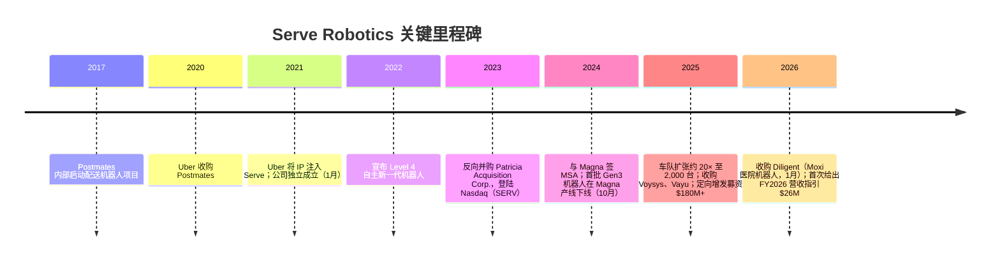
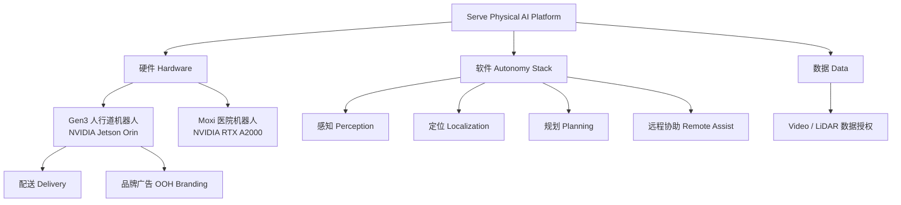
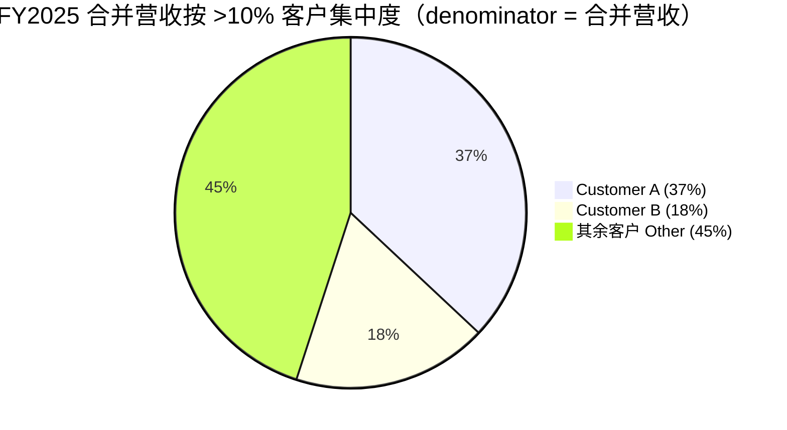
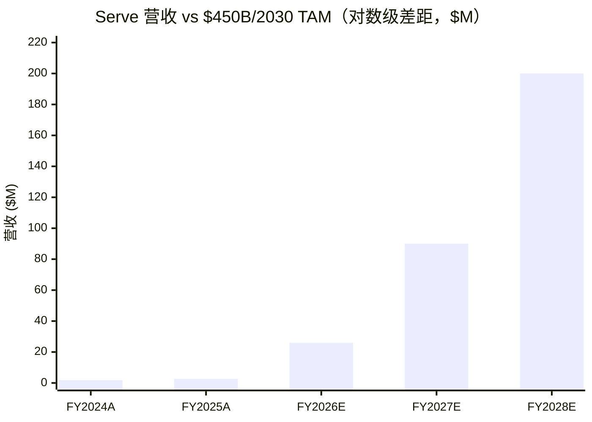

# Serve Robotics Inc.（NASDAQ:SERV）公司研究报告

**报告日期 / As of：2026-06-14**　·　**标的：Serve Robotics Inc.（NASDAQ:SERV）**　·　自主人行道配送机器人 / autonomous sidewalk delivery robot

---

> *分析师观点：* **评级：Hold（中性，高风险）· 12 个月目标价 US$6.5（较 2026-06-12 收盘 $6.97 下行 −7%）· 估值方法：FY2027E 营收 $90M × 5–6× EV/Sales（pre-profit 微型成长股，以营收倍数+现金净额定价）**
> 市值约 US$593M · 企业价值（EV）约 US$356M · 52 周区间 $6.84–$18.64 · NASDAQ:SERV · 流通股约 8,509 万股
>
> | 倍数 / Multiple（*分析师观点：* 前瞻列） | FY2025A | FY2026E | FY2027E |
> |---|---|---|---|
> | EV/Sales | ~134× | ~14× | ~4× |
> | P/Sales | ~224× | ~23× | ~7× |
> | P/E | n/m（亏损 / loss-making） | n/m | n/m |
> | 现金消耗 / Cash burn（经营，年化） | −$80M | −$110~130M | −$90~110M |
>
> 相对表现 / Rel. performance（截至 2026-06-12，来源 yfinance）：1M −19.2% · 6M −43.0% · YTD −41.1% · 12M −36.1%，对比 S&P 500（^GSPC）1M −0.2% · 6M +7.9% · YTD +8.4% · 12M +24.3%（相对 12M ≈ **−60 个百分点**，严重跑输）。
>
> **核心论点（thesis pillars）**——（1）**类目创造者（category creator）**：FY2025 年末车队 **超 2,000 台**人行道配送机器人，为美国最大规模商用 Level 4 自主配送车队，一年内规模扩张 ~20×；（2）**内生需求渠道**：机器人原生接入 **Uber Eats + DoorDash** 两大平台（覆盖约 80% 美国外卖需求），"不与平台竞争而为其供能"；（3）**重资本、深度烧钱**：FY2025 净亏损 **$101.4M**、经营现金流出 **$80.2M**，靠 $180M+ 股权募资续命，**盈利路径未明、现金跑道（cash runway）是核心变量**；（4）**期权价值**：NVIDIA 早期投资+芯片供应、Magna 整车级代工、Diligent（Moxi 医院机器人）并购打开医疗 vertical——但 FY2025 营收仅 **$2.65M**，估值已隐含巨大执行假设。**这是一只 pre-/早期收入的微型股（micro-cap），下行不对称，给予 Hold。**

> **业绩快报 / Update — 首次给出 FY2026 全年营收指引 $26M（2026-05-07 披露）：** 管理层在 Q1 FY2026 财报中给出 **FY2026 营收指引约 $26M**（对比 FY2025 实际 $2.7M，即约 **10× 增长 / triple-digit% growth**），并指引 **FY2026 资本开支约 $25M**、**Non-GAAP 经营费用 $160–170M**。Q1 FY2026 营收 **$3.0M（同比 +578%）**，超过内部计划。
> 来源：[SERV Q1-FY2026 投资者演示, Slide 21 — Q1 Financial Highlights, 2026-05-07](https://www.sec.gov/Archives/edgar/data/1832483/000183248326000017/serve_investorxdeckx07ma.htm)、[SERV Q1-FY2026 业绩新闻稿, 2026-05-07](https://www.sec.gov/Archives/edgar/data/1832483/000183248326000017/serv-20260331_ex991earning.htm)。

## 目录 / Table of Contents

1. 公司概览（含投资论点）
1A. 估值与目标价（前瞻预测 · 目标价推导 · 牛/基准/熊情景）
1B. GF Score（GuruFocus 式）基本面评分卡
2. 公司历史
3. 管理团队
4. 产品与服务
5. 客户与上市策略
6. 行业概览
7. 竞争格局
8. 市场机会（TAM）
9. 风险评估
9.5. 关键争议与催化剂
10. 投资风格透视（investor-lens scorecards）
- 数据来源清单 / Data Used
- 参考资料 / References
- 验证日志 / Verification log

---

## 1. 公司概览

*分析师观点：* 我们对 Serve Robotics（NASDAQ:SERV）给予 **Hold（中性，高风险）** 评级、12 个月目标价 **$6.5**（较现价 $6.97 约 −7%）。**为什么是现在（why now）**：公司刚跨过 **2,000 台机器人**的部署里程碑、首次给出 FY2026 营收指引 $26M（10× 增长），叙事进入"从概念验证到收入拐点"的关键窗口；但股价 12 个月跑输 S&P 500 约 60 个百分点、逼近 52 周低位，市场显然已开始为"营收基数仍极小、现金深度燃烧、盈利遥遥无期"重新定价。**四条论点**：（1）类目创造者+全美最大商用人行道车队；（2）Uber Eats/DoorDash 内生需求渠道；（3）重资本深度烧钱、现金跑道是核心变量；（4）NVIDIA/Magna/Diligent 构成的期权价值——但当前估值已隐含巨大执行假设，下行不对称，故给予 Hold 而非 Buy。本段为分析师前瞻判断，不附带任何 filing 引用（10-K 不含目标价）。

Serve Robotics 是一家自主机器人（autonomous robotics）公司，设计、制造、部署并运营低排放的人行道配送机器人（sidewalk delivery robot）。按公司自述：*"Serve has developed an advanced, AI-powered robotics mobility platform that integrates proprietary hardware, AI, computer vision, and cloud-based fleet management software to enable autonomous operation in complex, real-world environments"*（"Serve 开发了先进的 AI 驱动机器人移动平台，整合自有硬件、AI、计算机视觉与云端车队管理软件，使机器人能在复杂真实环境中自主运行"）([SERV FY2025 10-K, Item 1 Business](https://www.sec.gov/Archives/edgar/data/1832483/000183248326000010/patr-20251231.htm))。其核心技术 2017 年起源于 **Postmates** 内部的一个专项项目；Uber 于 2020 年收购 Postmates 后，于 2021 年 2 月将相关知识产权与资产剥离注入 Serve 独立运营([SERV FY2025 10-K, Item 1 Business — 公司沿革](https://www.sec.gov/Archives/edgar/data/1832483/000183248326000010/patr-20251231.htm))。

**商业模式（business model）——靠什么赚钱。** 公司营收分两类：**fleet services（车队服务）**——含配送服务（delivery）、品牌广告（branding）与数据变现（data monetization）；以及 **software services（软件服务）**——含软件授权（licensing）与工程开发项目([SERV FY2025 10-K, MD&A — Components of Results of Operations](https://www.sec.gov/Archives/edgar/data/1832483/000183248326000010/patr-20251231.htm))。FY2025 总营收 **$2.65M**，其中 fleet services $1.62M、software services $1.03M([SERV FY2025 10-K, Note — Revenue disaggregated by service type](https://www.sec.gov/Archives/edgar/data/1832483/000183248326000010/patr-20251231.htm))。这是一家典型的"规模在前、营收在后"的硬件+AI 平台：FY2025 年末车队已超 2,000 台，但营收基数仍以百万美元计。

**经营地域与规模。** 公司全部营收来自美国运营([SERV FY2025 10-K, Note — Segment](https://www.sec.gov/Archives/edgar/data/1832483/000183248326000010/patr-20251231.htm))。截至 2025-12-31，公司全球雇员 **370 名全职 + 10 名兼职**，其中 359 名在美国、21 名在加拿大子公司；按职能约 **38% 工程/产品、49% 运营、13% 业务拓展/行政**([SERV FY2025 10-K, Item 1 — Human Capital Management](https://www.sec.gov/Archives/edgar/data/1832483/000183248326000010/patr-20251231.htm))。投资者演示进一步披露运营足迹：**44 个美国城市、150+ 街区、14 个州**，累计 **180 万次（1.8M）人行道+医院配送**、**99.8% 完成率**、零重大事故([SERV Q1-FY2026 投资者演示, Slide 6 — Traction, 2026-05-07](https://www.sec.gov/Archives/edgar/data/1832483/000183248326000017/serve_investorxdeckx07ma.htm))。

**关键运营指标（key metrics）——发展演变。** 公司披露两个核心运营指标：**daily active robots（日活机器人）** 与 **daily supply hours（日供给小时）**。日活机器人从 FY2024 全年均值 52 台跃升至 FY2025 全年均值 273 台、Q4 FY2025 均值 547 台；进入 Q1 FY2026 进一步升至 **812 台**（对比 Q1 FY2025 仅 73 台）。日供给小时同步从 Q1 FY2025 的 648 小时增至 Q1 FY2026 的 **10,295 小时**([SERV FY2025 10-K, MD&A — Key Metrics](https://www.sec.gov/Archives/edgar/data/1832483/000183248326000010/patr-20251231.htm)；[SERV Q1-FY2026 10-Q, MD&A — Key Metrics](https://www.sec.gov/Archives/edgar/data/1832483/000183248326000019/serv-20260331.htm)）。**本期新变化**：利用率（utilization）是从"部署"走向"营收"的关键桥梁——管理层明确"尚未在合作伙伴处达到目标利用率水平"，盈利取决于把所有战略伙伴的利用率提升到当前水平之上([SERV FY2025 10-K, Item 1A — utilization 风险因素](https://www.sec.gov/Archives/edgar/data/1832483/000183248326000010/patr-20251231.htm))。

**估值快照（valuation snapshot，REQUIRED）。** 截至 2026-06-12，SERV 收盘 **$6.97**，市值约 **$593M**，企业价值约 **$356M**（市值减去 $187.5M 现金及有价证券，2026-03-31 口径）([yfinance / Yahoo Finance — SERV key statistics, 访问于 2026-06-12](https://finance.yahoo.com/quote/SERV/))。**P/E 为负**——公司 FY2025 GAAP 净亏损 $101.4M，TTM 无正盈利，故 P/E 不适用([SERV FY2025 10-K, Statements of Operations](https://www.sec.gov/Archives/edgar/data/1832483/000183248326000010/patr-20251231.htm))。这是典型的**烧钱型成长（cash-burning growth）**亏损，而非一次性减值或周期性低谷：亏损由 R&D（$45.3M）、G&A（$37.1M）与毛亏损（gross loss $15.4M，因车队扩张推高 COGS）驱动([SERV FY2025 10-K, MD&A — Results of Operations](https://www.sec.gov/Archives/edgar/data/1832483/000183248326000010/patr-20251231.htm))。**P/S 极度拉伸**：按 FY2025 营收 $2.65M，P/S ≈ 224×、EV/Sales ≈ 134×；即便按 Q1 FY2026 年化营收（~$11.9M）或 FY2026 指引 $26M，P/S 仍达 ~50× / ~23×，EV/Sales ~30× / ~14×([yfinance — SERV, 访问于 2026-06-12](https://finance.yahoo.com/quote/SERV/))。如此倍数只能由**纯叙事/类目代理溢价（narrative / category-proxy premium）**解释——市场把 SERV 当作"美国版人行道自主配送第一股"的纯期权来定价，而非由现金流支撑。**因 P/S 远超任何可比成长股、且盈利路径不明，我们在 Section 9 将估值/倍数压缩列为一项财务风险。** 同业层面，可比的纯自主配送上市标的极少（多数为私营，见 Section 7），故缺乏紧密的 P/S 中位数锚——这本身是该股估值脆弱性的来源之一。

<svg xmlns="http://www.w3.org/2000/svg" viewBox="0 0 860 470" width="860" height="470" role="img" aria-label="historical revenue bars"><rect x="0" y="0" width="860" height="470" fill="#ffffff"/>
<text x="20.00" y="30.00" text-anchor="start" font-family="Helvetica,Arial,sans-serif" font-size="15" font-weight="700" fill="#1f2933">Serve Robotics 营收构成 / Revenue by Service Type (FY2024→FY2025)</text>
<rect x="20.00" y="44" width="11" height="11" rx="2" fill="#2563eb"/>
<text x="36.00" y="53.00" text-anchor="start" font-family="Helvetica,Arial,sans-serif" font-size="10.5" font-weight="400" fill="#1f2933">Fleet services</text>
<rect x="142.40" y="44" width="11" height="11" rx="2" fill="#15803d"/>
<text x="158.40" y="53.00" text-anchor="start" font-family="Helvetica,Arial,sans-serif" font-size="10.5" font-weight="400" fill="#1f2933">Software services</text>
<line x1="70" y1="412.00" x2="834" y2="412.00" stroke="#eceff2" stroke-width="1"/>
<text x="64.00" y="415.00" text-anchor="end" font-family="Helvetica,Arial,sans-serif" font-size="9.5" font-weight="400" fill="#52606d">$0</text>
<line x1="70" y1="345.20" x2="834" y2="345.20" stroke="#eceff2" stroke-width="1"/>
<text x="64.00" y="348.20" text-anchor="end" font-family="Helvetica,Arial,sans-serif" font-size="9.5" font-weight="400" fill="#52606d">$572.6K</text>
<line x1="70" y1="278.40" x2="834" y2="278.40" stroke="#eceff2" stroke-width="1"/>
<text x="64.00" y="281.40" text-anchor="end" font-family="Helvetica,Arial,sans-serif" font-size="9.5" font-weight="400" fill="#52606d">$1.1M</text>
<line x1="70" y1="211.60" x2="834" y2="211.60" stroke="#eceff2" stroke-width="1"/>
<text x="64.00" y="214.60" text-anchor="end" font-family="Helvetica,Arial,sans-serif" font-size="9.5" font-weight="400" fill="#52606d">$1.7M</text>
<line x1="70" y1="144.80" x2="834" y2="144.80" stroke="#eceff2" stroke-width="1"/>
<text x="64.00" y="147.80" text-anchor="end" font-family="Helvetica,Arial,sans-serif" font-size="9.5" font-weight="400" fill="#52606d">$2.3M</text>
<line x1="70" y1="78.00" x2="834" y2="78.00" stroke="#eceff2" stroke-width="1"/>
<text x="64.00" y="81.00" text-anchor="end" font-family="Helvetica,Arial,sans-serif" font-size="9.5" font-weight="400" fill="#52606d">$2.9M</text>
<rect x="150.22" y="338.86" width="221.56" height="73.14" fill="#2563eb"/>
<rect x="150.22" y="200.50" width="221.56" height="138.36" fill="#15803d"/>
<text x="261.00" y="428.00" text-anchor="middle" font-family="Helvetica,Arial,sans-serif" font-size="10" font-weight="400" fill="#52606d">2024</text>
<rect x="532.22" y="222.78" width="221.56" height="189.22" fill="#2563eb"/>
<rect x="532.22" y="102.74" width="221.56" height="120.04" fill="#15803d"/>
<text x="643.00" y="428.00" text-anchor="middle" font-family="Helvetica,Arial,sans-serif" font-size="10" font-weight="400" fill="#52606d">2025</text>
<text x="430.00" y="454.00" text-anchor="middle" font-family="Helvetica,Arial,sans-serif" font-size="10" font-weight="400" fill="#52606d">Source: SERV FY2025 10-K, Note — Revenue disaggregated by service type</text>
</svg>

来源 / Source: [SERV FY2025 10-K, Note — Revenue disaggregated by service type](https://www.sec.gov/Archives/edgar/data/1832483/000183248326000010/patr-20251231.htm)

## 1A. 估值与目标价

> 本章全部为**分析师前瞻判断（*分析师观点：*）**——每一个预测数字、目标价、情景目标价都不附带任何 filing 引用（10-K 不含目标价）；预测的**外部依据**（filing 营收/费用/现金、管理层指引、行业预测）逐条内联引用。

**(a) 前瞻预测表（*分析师观点：*）。** SERV 是 pre-profit 微型成长股，决策变量不是 EPS 而是**营收爬坡速度 + 现金跑道**，故下表以营收、毛利率、经营亏损、经营现金流与现金净额为主线。我们的预测建立在：公司 FY2026 营收指引 $26M、capex 指引 $25M、Non-GAAP 经营费用指引 $160–170M（[Q1-FY2026 投资者演示, Slide 21/23](https://www.sec.gov/Archives/edgar/data/1832483/000183248326000017/serve_investorxdeckx07ma.htm)）+ FY2025 实际财务（[FY2025 10-K MD&A](https://www.sec.gov/Archives/edgar/data/1832483/000183248326000010/patr-20251231.htm)）+ ARK $450B/2030 TAM 行业预测（[Q1 演示, Slide 5 引用 ARK Big Ideas 2025](https://www.ark-invest.com/big-ideas-2025)）之上。

| 指标（*分析师观点：*） | FY2024A | FY2025A | FY2026E | FY2027E | FY2028E |
|---|---|---|---|---|---|
| 营收 Revenue（$M） | 1.8 | 2.65 | 26（指引） | 90 | 200 |
| — YoY % |  | +46% | +881% | +246% | +122% |
| 毛利率 Gross margin % | −4% | −580% | −60% | +5% | +25% |
| 经营亏损 Operating loss（$M） | −38.3 | −112.8 | −150~160 | −120 | −80 |
| 经营现金流 Op. cash flow（$M） | −21.5 | −80.2 | −110~130 | −90~110 | −60 |
| 资本开支 Capex（$M） | 10.3 | 37.3 | 25（指引） | 40 | 50 |
| 现金及有价证券 Cash+securities（$M） | 123（仅现金） | 259.8 | ~140 | ~50 | 需再融资 |
| 现金跑道 Cash runway（季度 @ 当前烧速） | — | ~6–8 | ~4–5 | <4 | 依赖融资 |

各预测格的依据：FY2026 营收 = 公司指引 $26M（[Slide 17/21](https://www.sec.gov/Archives/edgar/data/1832483/000183248326000017/serve_investorxdeckx07ma.htm)）；FY2027–28 营收为我们基于利用率爬坡+城市扩张的外推（外部锚：管理层"2026 优化利用率、2027+ 全球扩张"的路线图，[Slide 14/16](https://www.sec.gov/Archives/edgar/data/1832483/000183248326000017/serve_investorxdeckx07ma.htm)），标注为分析师观点；毛利率路径锚定 Gen3 单位成本较 Gen2 降 65%（[Slide 12](https://www.sec.gov/Archives/edgar/data/1832483/000183248326000017/serve_investorxdeckx07ma.htm)）与利用率提升带来的折旧摊薄；现金净额起点 = FY2025 末现金 $106.2M + 有价证券 $153.5M（[FY2025 10-K 资产负债表](https://www.sec.gov/Archives/edgar/data/1832483/000183248326000010/patr-20251231.htm)）。**绝不写 "（来源：本模型）"。**

**毛利率桥（margin bridge，*分析师观点：*）。** FY2025 毛亏损 $15.4M（毛利率约 −580%）的成因：COGS 同比 +855% 至 $18.0M，主因车队规模扩张推动相关人员/折旧/网络成本激增、headcount +约 430%（[FY2025 10-K MD&A — Cost of revenues](https://www.sec.gov/Archives/edgar/data/1832483/000183248326000010/patr-20251231.htm)）。转正路径（分析师观点）：毛利率 −580%（FY25A）→ −60%（FY26E，营收 10× 摊薄固定 COGS）→ +5%（FY27E，利用率达标 + Gen3 单位成本降 65%）→ +25%（FY28E，规模效应）。**这条曲线是整份报告最该被压力测试的假设**——它假设利用率与单位经济同步改善，任何一项滞后，毛利转正就推后。

**(b) 目标价推导（show the arithmetic，*分析师观点：*）。** pre-profit 名字无法用 forward P/E，我们用 **EV/Sales × 营收 + 现金净额** 法：取 FY2027E 营收 $90M × 5–6× EV/Sales = EV ~$450–540M；加回 2026 年末预计现金净额 ~$140M、再扣除两年持续烧钱后净现金回落至 ~$50M，得到权益价值 ~$500–590M ÷ 约 8,800 万股（含稀释）≈ **$5.7–6.7/股**，取中值 **$6.5**。**倍数依据（为什么用 5–6× EV/Sales）**：纯自主/机器人成长股缺乏紧密上市可比，参照（i）Symbotic（SYM，仓储自动化，营收数十亿、EV/Sales 个位数）、（ii）禾赛科技（HSAI，激光雷达，德银给 2026–28E 营收 41.8→70.8 亿元人民币、对应前瞻 EV/Sales 个位数，[*分析师观点：*德银 Hesai 研报, 2026-04-18](http://xs-macbook-air.local:5001/zsxq/pdf/415514558211258/Deutsche%20Bank-Hesai%EF%BC%88HSAI.OQ%EF%BC%89New%20tech%20offensive%EF%BC%9A6D%20SPAD~SoC%EF%BC%8C%204320%20line%20LiDAR%EF%BC%8C%20physical%20AI%20eyes%20%26%20muscle-260418.pdf)）、（iii）一般高增长 pre-profit 硬件名 4–8× EV/Sales。SERV 的 881% FY26E 增速支持区间上沿，但深度烧钱+盈利不明压低至 5–6×。

**(c) 牛/基准/熊情景（*分析师观点：*）。**

| 情景（*分析师观点：*） | 关键假设 | 目标价 | 较现价 $6.97 |
|---|---|---|---|
| 牛 Bull | 利用率超预期、FY2027 营收达 $130M、医疗/数据授权放量、给 8× EV/Sales | $12 | +72% |
| 基准 Base | FY2027 营收 $90M、5–6× EV/Sales、2027 毛利率转正 | $6.5 | −7% |
| 熊 Bear | 利用率停滞、FY2026 营收不及 $26M 指引、被迫折价再融资稀释、de-rate 至 3× EV/Sales | $3 | −57% |

**(d) 与市场一致预期的对比（consensus benchmark）。** 本地 zsxq 机构研报库**没有任何一篇对 SERV 的独立卖方覆盖**（详见数据来源清单与 Section 7）——唯一触及 SERV 的是 UBS"远离汽车的多元化"主题note，仅把 Magna（MGA）描述为 Serve 的合约制造商、未给 SERV 评级或目标价([*分析师观点：*UBS — Road & Spak: Diversification away from Auto, 2026-05-10, p.（Magna 段）](http://xs-macbook-air.local:5001/zsxq/pdf/184124522248882/UBS-Road%20%26%20Spak%EF%BC%9AThe%20Diversification%20of%20%EF%BC%88away%20from%EF%BC%89%20Auto-260510.pdf))。因缺乏可对标的 Street 一致预期，我们不杜撰 consensus 数字——这本身说明 SERV 仍是覆盖稀薄的微型股。**公司唯一的官方前瞻是 FY2026 营收指引 $26M**，我们的 FY2026E 与之一致（采用指引）。

**(e) 最该盯紧的变量（swing variables）。** 两个：（1）**机器人利用率（daily active robots × 单台日配送单量）**——它直接决定营收能否兑现 $26M→$90M 的爬坡，也决定毛利率何时转正；（2）**现金跑道**——按 Q1 FY2026 经营亏损 $51.8M/季的烧速，$187.5M 流动性约够 4–5 个季度，FY2026 内大概率需再融资，**再融资价格与稀释程度**是股价的近端风险。

## 1B. GF Score（GuruFocus 式）基本面评分卡

*分析师观点：* **GF Score（GuruFocus-style）：46/100 — 0–50 区间「最弱的未来表现潜力 / 数据不足（Worst future performance potential / insufficient data）」。** 这一评分是分析师自有评分卡（不归属 GuruFocus），五个子分与综合分均为 *分析师观点：*，不附带任何 filing 引用；每个底层指标在下文逐条内联引用。

<svg xmlns="http://www.w3.org/2000/svg" viewBox="0 0 500 500" width="500" height="500" role="img" aria-label="GF Score radar">
<rect x="0" y="0" width="500" height="500" fill="#ffffff"/>
<text x="20" y="24" font-family="Helvetica,Arial,sans-serif" font-size="15" font-weight="700" fill="#1f2933">GF Score (GuruFocus-style): 46/100</text>
<text x="20" y="41" font-family="Helvetica,Arial,sans-serif" font-size="11" fill="#52606d">0–50 Worst future performance potential / insufficient data</text>
<polygon points="250.0,88.0 392.7,191.6 338.2,359.4 161.8,359.4 107.3,191.6" fill="#e9f5ec" stroke="none"/>
<polygon points="250.0,208.0 278.5,228.7 267.6,262.3 232.4,262.3 221.5,228.7" fill="none" stroke="#c5d3cb" stroke-width="1"/>
<polygon points="250.0,178.0 307.1,219.5 285.3,286.5 214.7,286.5 192.9,219.5" fill="none" stroke="#c5d3cb" stroke-width="1"/>
<polygon points="250.0,148.0 335.6,210.2 302.9,310.8 197.1,310.8 164.4,210.2" fill="none" stroke="#c5d3cb" stroke-width="1"/>
<polygon points="250.0,118.0 364.1,200.9 320.5,335.1 179.5,335.1 135.9,200.9" fill="none" stroke="#c5d3cb" stroke-width="1"/>
<polygon points="250.0,88.0 392.7,191.6 338.2,359.4 161.8,359.4 107.3,191.6" fill="none" stroke="#c5d3cb" stroke-width="1.3"/>
<line x1="250" y1="238" x2="161.8" y2="359.4" stroke="#cfdad3" stroke-width="1"/>
<text x="146.5" y="392.4" text-anchor="end" font-family="Helvetica,Arial,sans-serif" font-size="11.5" font-weight="600" fill="#1f2933">Financial Strength</text>
<text x="146.5" y="405.4" text-anchor="end" font-family="Helvetica,Arial,sans-serif" font-size="9.5" fill="#52606d">财务实力</text>
<text x="188.3" y="316.9" text-anchor="middle" font-family="Helvetica,Arial,sans-serif" font-size="10.5" font-weight="700" fill="#1f2933">7</text>
<line x1="250" y1="238" x2="250.0" y2="88.0" stroke="#cfdad3" stroke-width="1"/>
<text x="250.0" y="58.0" text-anchor="middle" font-family="Helvetica,Arial,sans-serif" font-size="11.5" font-weight="600" fill="#1f2933">Profitability</text>
<text x="250.0" y="71.0" text-anchor="middle" font-family="Helvetica,Arial,sans-serif" font-size="9.5" fill="#52606d">盈利能力</text>
<text x="250.0" y="217.0" text-anchor="middle" font-family="Helvetica,Arial,sans-serif" font-size="10.5" font-weight="700" fill="#1f2933">1</text>
<line x1="250" y1="238" x2="107.3" y2="191.6" stroke="#cfdad3" stroke-width="1"/>
<text x="82.6" y="183.6" text-anchor="end" font-family="Helvetica,Arial,sans-serif" font-size="11.5" font-weight="600" fill="#1f2933">Growth</text>
<text x="82.6" y="196.6" text-anchor="end" font-family="Helvetica,Arial,sans-serif" font-size="9.5" fill="#52606d">成长性</text>
<text x="121.6" y="190.3" text-anchor="middle" font-family="Helvetica,Arial,sans-serif" font-size="10.5" font-weight="700" fill="#1f2933">9</text>
<line x1="250" y1="238" x2="392.7" y2="191.6" stroke="#cfdad3" stroke-width="1"/>
<text x="417.4" y="183.6" text-anchor="start" font-family="Helvetica,Arial,sans-serif" font-size="11.5" font-weight="600" fill="#1f2933">GF Value</text>
<text x="417.4" y="196.6" text-anchor="start" font-family="Helvetica,Arial,sans-serif" font-size="9.5" fill="#52606d">估值</text>
<text x="307.1" y="213.5" text-anchor="middle" font-family="Helvetica,Arial,sans-serif" font-size="10.5" font-weight="700" fill="#1f2933">4</text>
<line x1="250" y1="238" x2="338.2" y2="359.4" stroke="#cfdad3" stroke-width="1"/>
<text x="353.5" y="392.4" text-anchor="start" font-family="Helvetica,Arial,sans-serif" font-size="11.5" font-weight="600" fill="#1f2933">Momentum</text>
<text x="353.5" y="405.4" text-anchor="start" font-family="Helvetica,Arial,sans-serif" font-size="9.5" fill="#52606d">动量</text>
<text x="258.8" y="244.1" text-anchor="middle" font-family="Helvetica,Arial,sans-serif" font-size="10.5" font-weight="700" fill="#1f2933">1</text>
<polygon points="250.0,223.0 307.1,219.5 258.8,250.1 188.3,322.9 121.6,196.3" fill="#2e8b57" fill-opacity="0.34" stroke="#2e8b57" stroke-width="2"/>
<circle cx="188.3" cy="322.9" r="2.6" fill="#2e8b57"/>
<circle cx="250.0" cy="223.0" r="2.6" fill="#2e8b57"/>
<circle cx="121.6" cy="196.3" r="2.6" fill="#2e8b57"/>
<circle cx="307.1" cy="219.5" r="2.6" fill="#2e8b57"/>
<circle cx="258.8" cy="250.1" r="2.6" fill="#2e8b57"/>
<text x="250" y="470" text-anchor="middle" font-family="Helvetica,Arial,sans-serif" font-size="9.5" fill="#52606d">Source: SERV FY2025 10-K + Q1-2026 10-Q · Yahoo Finance · indicators.db, as of 2026-06-12</text>
<text x="250" y="485" text-anchor="middle" font-family="Helvetica,Arial,sans-serif" font-size="9" fill="#52606d">GF Score = independent analyst rubric (*Analyst view:*) — not GuruFocus™ official number</text>
</svg>

> 离中心越远，该维度得分越高；五边形面积越大，综合分越高。注意 **GF Value 维度方向：分越高 = 相对公允价值越便宜**（本例仅 4 分 = 偏贵）。

| 维度 / Dimension | 评分 / Score (0–10) | |
|---|---|---|
| Financial Strength（财务实力） | 7 | `███████░░░` |
| Profitability（盈利能力） | 1 | `█░░░░░░░░░` |
| Growth（成长性） | 9 | `█████████░` |
| GF Value（估值） | 4 | `████░░░░░░` |
| Momentum（动量） | 1 | `█░░░░░░░░░` |
| **GF Score（综合，*分析师观点：*）** | **46 / 100** | **0–50 最弱潜力 / 数据不足** |

**Financial Strength（财务实力）= 7。** 给高分是因为**零金融负债 + 厚现金垫**：FY2025 末现金 $106.2M + 有价证券 $153.5M、合计流动性 $259.8M，无银行借款，权益为正 $350.7M（APIC $559M 远超累计亏损 $209M）([SERV FY2025 10-K, Consolidated Balance Sheets](https://www.sec.gov/Archives/edgar/data/1832483/000183248326000010/patr-20251231.htm))。扣分项是**深度烧钱侵蚀这块垫子**：FY2025 经营现金流出 $80.2M，到 2026-03-31 流动性已降至 $187.5M([SERV Q1-FY2026 10-Q, Liquidity](https://www.sec.gov/Archives/edgar/data/1832483/000183248326000019/serv-20260331.htm))——资产负债表当下健康，但跑道在快速消耗，故是 7 而非 9。

**Profitability（盈利能力）= 1。** 几乎是最低分：FY2025 毛亏损 $15.4M、经营亏损 $112.8M、净亏损 $101.4M，ROE/ROIC 深度为负，无任何盈利年份([SERV FY2025 10-K, Statements of Operations](https://www.sec.gov/Archives/edgar/data/1832483/000183248326000010/patr-20251231.htm))。结构性亏损，给 1 分。

**Growth（成长性）= 9。** 增速是全卡最强项：FY2025 营收 +46%、Q1 FY2026 营收同比 **+578%**，公司指引 FY2026 营收 $26M（约 10× 增长）([SERV Q1-FY2026 10-Q, Statements of Operations](https://www.sec.gov/Archives/edgar/data/1832483/000183248326000019/serv-20260331.htm)；[Q1-FY2026 投资者演示, Slide 21](https://www.sec.gov/Archives/edgar/data/1832483/000183248326000017/serve_investorxdeckx07ma.htm))；车队一年扩张约 20× 至 2,000 台([Slide 6](https://www.sec.gov/Archives/edgar/data/1832483/000183248326000017/serve_investorxdeckx07ma.htm))。与 Section 1A 前瞻模型一致（FY26E +881%）。**注意：高 Growth + 极低 Profitability 的分裂正是雷达图要呈现的，不做平滑。**

**GF Value（估值）= 4。** 偏贵：FY2025 P/S ~224×、EV/Sales ~134×；即便用 FY2026 指引营收，EV/Sales 仍 ~14×，远高于一般成长股([yfinance — SERV, 访问于 2026-06-12](https://finance.yahoo.com/quote/SERV/))。但 881% 的 FY26E 增速使其不至于落到 2 分（PEG 视角下高增速部分支撑高倍数），故给 4。

**Momentum（动量）= 1。** 价格动量极弱：12 个月绝对 −36.1%、对比 S&P 500 +24.3%（相对 −60pts），逼近 52 周低位 $6.84([yfinance — SERV vs ^GSPC, 访问于 2026-06-12](https://finance.yahoo.com/quote/SERV/))。深度跑输、近 52 周低，给 1 分。

**综合算术：**（FS·20 + Prof·25 + Growth·25 + Value·15 + Mom·15）/100 =（7·20 + 1·25 + 9·25 + 4·15 + 1·15）/100 = 465/100 → 约 **4.65 → 46/100**（权重为默认 20/25/25/15/15）。

**一句话注意（caveat）。** 最可能翻动的轴是 **Profitability/Momentum**——任一季度营收+利用率超预期、或一笔大额数据授权落地，都可能让 Momentum 从 1 分快速回升；反之，融资稀释或指引下修会把 Value/Momentum 进一步压低。综合 46 分落在 GuruFocus 最弱区间，与"高风险 Hold"的总判断一致：增长强但盈利与估值安全垫弱。

## 2. 公司历史

Serve 的故事是一段"从大平台内部孵化、再剥离独立"的路径。核心技术 **2017 年**起源于 Postmates 内部专项；2020 年 Uber 收购 Postmates；**2021 年 2 月**，Uber 领导层批准将该项目的知识产权与资产注入 Serve，公司于 **2021 年 1 月**正式成立并开始运营([SERV FY2025 10-K, Item 1 Business — 公司沿革](https://www.sec.gov/Archives/edgar/data/1832483/000183248326000010/patr-20251231.htm))。**2022 年 1 月**，公司宣布部署可在 Level 4 自主（L4 autonomy）下运行的新一代人行道配送机器人([SERV FY2025 10-K, Item 1 — Level 4 Autonomy](https://www.sec.gov/Archives/edgar/data/1832483/000183248326000010/patr-20251231.htm))。

公司通过一次**反向并购（reverse merger）**登陆资本市场：2023 年与已上市壳公司 **Patricia Acquisition Corp.** 合并（这也是为何 FY2025 10-K 的 EDGAR 文件名仍带 `patr-` 前缀、且 CIK 文件中早期含 Patricia 痕迹）([SERV 2023-08 投资者演示与并购文件, 8-K](https://www.sec.gov/Archives/edgar/data/1832483/000183248326000017/serve_investorxdeckx07ma.htm)）。其后股票在 **Nasdaq Capital Market** 以代码 **"SERV"** 交易，截至 2025-12-31 登记股东约 126 名([SERV FY2025 10-K, Item 5 — Market for Common Stock](https://www.sec.gov/Archives/edgar/data/1832483/000183248326000010/patr-20251231.htm))。


来源 / Source: [SERV FY2025 10-K, Item 1 Business + Recent Developments](https://www.sec.gov/Archives/edgar/data/1832483/000183248326000010/patr-20251231.htm)；[SERV Q1-FY2026 投资者演示, Slide 14 — Milestones, 2026-05-07](https://www.sec.gov/Archives/edgar/data/1832483/000183248326000017/serve_investorxdeckx07ma.htm)

**战略转型（strategic pivots）。** 其一，**从单一外卖向多 vertical 扩张**：公司明确"虽然外卖仍是主要商用场景，但正把平台拓展到相邻市场……包括室内物流与医疗"([SERV FY2025 10-K, Item 1 Business](https://www.sec.gov/Archives/edgar/data/1832483/000183248326000010/patr-20251231.htm))。其二，**从"自建一切"到"并购补强"**：FY2025–2026 连续完成多笔并购——2025-04 收购 Voysys AB（远程操控/低延迟视频，自 Phantom Auto）、2025-08 收购 Vayu Robotics（AI 模型）、2026-01 收购 **Diligent Robotics（Moxi 医院机器人）**——后者把自主平台延伸进室内医疗场景([SERV FY2025 10-K, Recent Developments + Item 1 — Diligent](https://www.sec.gov/Archives/edgar/data/1832483/000183248326000010/patr-20251231.htm))。

**近两年关键资本动作。** FY2025 完成两次定向增发（registered direct offering）：2025-01 以 $19.00/股发行约 421 万股、毛募约 $80.0M；2025-10 以 $16.00/股发行 625 万股、毛募约 $100.0M([SERV FY2025 10-K, Recent Developments — Securities Purchase Agreements](https://www.sec.gov/Archives/edgar/data/1832483/000183248326000010/patr-20251231.htm))。流通股从 FY2024 末的约 5,129 万股增至 FY2025 末约 7,473 万股（[FY2025 10-K 资产负债表 — 股本](https://www.sec.gov/Archives/edgar/data/1832483/000183248326000010/patr-20251231.htm)），**持续稀释是这只烧钱股的结构性特征**。

## 3. 管理团队

**Dr. Ali Kashani（联合创始人、CEO 兼董事长）——300+ 字合并简介。** Kashani 博士自 **2021 年 1 月**联合创办 Serve 起即任 CEO 兼董事，并自 **2023 年 7 月**起兼任董事会主席([SERV 2026 DEF 14A — 董事提名人简介](https://www.sec.gov/Archives/edgar/data/1832483/000114036126016694/ny20064047x1_def14a.htm))。创办 Serve 之前，他在 **Postmates** 任副总裁（VP），任期 2017 年 7 月至 2021 年 1 月——正是 Serve 配送机器人项目在 Postmates 内部孵化的同一段时期，他是这项技术从 0 到 1 的直接操盘人，这段经历构成了 Serve 的"创始 thesis"：用人机协作（humans + machines）的方式、以"优化最大成本项——劳动力"为目标来造机器人，而非追求无人化的纯自主([SERV FY2025 10-K, Item 1 — Technology principles](https://www.sec.gov/Archives/edgar/data/1832483/000183248326000010/patr-20251231.htm))。学历上，他在 **University of British Columbia（UBC，不列颠哥伦比亚大学）**同时取得计算机工程学士与机器人学博士（Doctorate in Robotics）([SERV 2026 DEF 14A — Kashani 简介](https://www.sec.gov/Archives/edgar/data/1832483/000114036126016694/ny20064047x1_def14a.htm))。投资者演示称其持有 **15 项专利**([SERV Q1-FY2026 投资者演示, Slide 19 — Team, 2026-05-07](https://www.sec.gov/Archives/edgar/data/1832483/000183248326000017/serve_investorxdeckx07ma.htm))。

**持股与薪酬。** 截至 2026 年代理声明记录日，Kashani 实益持有约 **2,686,653 股、占比约 3.5%**（含配偶 Nikki Stoddart 及关联方少量持股、与少量期权行权可得股份）([SERV 2026 DEF 14A — Security Ownership of Beneficial Owners](https://www.sec.gov/Archives/edgar/data/1832483/000114036126016694/ny20064047x1_def14a.htm))。FY2025 年薪 **$458,000**，并获大额 RSU 授予（如一笔 1,100,000 股 RSU），薪酬结构以现金底薪 + 股权为主([SERV 2026 DEF 14A — Executive Compensation](https://www.sec.gov/Archives/edgar/data/1832483/000114036126016694/ny20064047x1_def14a.htm))。**评估**：创始人仍深度在位、由其本人兼任 CEO+主席（公司称此举因 CEO 与主席合一可提升效率），机器人学博士背景与 Postmates 孵化经历高度契合业务——但约 3.5% 的持股不算高，且公司治理上"CEO 兼主席"削弱了董事会制衡，需结合后续稀释一并观察。（按 skill 规则，本章仅覆盖创始人/现任 CEO——此处二者为同一人，故合并为一份简介；不展开 CFO Brian Read、总裁兼 COO Touraj Parang 等其他高管。）

## 4. 产品与服务

> Section 4 是全报告最重要的一章。Serve 没有像半导体公司那样的"产品矩阵表"，但 10-K 与投资者演示给出了清晰的**产品族结构**——机器人硬件（Gen3 人行道机器人 + Moxi 医院机器人）+ 自主软件栈（autonomy stack）+ 三类服务变现（配送/品牌/数据/软件）。下表按公司自有口径重构产品族，并标注为分析师整理（基于 10-K + 投资者演示的公司原文）。

### 4.1 产品族结构（公司口径重构）

| 层级 / Layer | 产品 / Product | 公司定义（口径来源） | 变现方式 |
|---|---|---|---|
| 户外硬件 | **Serve robot（Gen3）** | 第三代、为人行道专门打造的自主配送机器人 | fleet services — 配送费 / 广告 |
| 室内硬件 | **Moxi robot** | 为医院打造、协助临床后勤的自主机器人（Diligent 2026-01 并入） | 医疗合同（月费 + 用量） |
| 软件 | **Serve autonomy stack** | 端到端自主栈：感知·定位·规划·连接·远程协助 | software services — 授权 / 工程 |
| 数据 | **Video / LiDAR 数据** | 车队采集的视频与激光雷达数据集，授权给第三方 AI 训练 | data monetization |

来源 / Source: [SERV FY2025 10-K, Item 1 — Technology + Revenue components](https://www.sec.gov/Archives/edgar/data/1832483/000183248326000010/patr-20251231.htm)；[SERV Q1-FY2026 投资者演示, Slide 11/12/13 — Platform & Robots, 2026-05-07](https://www.sec.gov/Archives/edgar/data/1832483/000183248326000017/serve_investorxdeckx07ma.htm)


来源 / Source: [SERV Q1-FY2026 投资者演示, Slide 11 — The Serve autonomy stack, 2026-05-07](https://www.sec.gov/Archives/edgar/data/1832483/000183248326000017/serve_investorxdeckx07ma.htm)

### 4.2 综合：四个产品层如何组成一个客户工作流

Serve 的产品逻辑是一个**飞轮（flywheel）**：硬件（机器人）在街道/医院里跑 → 采集多域真实数据 → 训练端到端模型 → 模型让机器人更自主（人机比下降、单位成本下降）→ 更高利用率带来更多营收 → 营收买更多机器人 → 采集更多数据。公司自述："*More Data → Better Models → Better Robots → Stronger Revenue → More Robots → More Data*"([SERV Q1-FY2026 投资者演示, Slide 4/10 — Serve Flywheel, 2026-05-07](https://www.sec.gov/Archives/edgar/data/1832483/000183248326000017/serve_investorxdeckx07ma.htm))。**跨域数据是关键护城河主张**——"在 LA 学到的，能帮 Dallas 的机器人，也能帮导航医院走廊"([Slide 10](https://www.sec.gov/Archives/edgar/data/1832483/000183248326000017/serve_investorxdeckx07ma.htm))。这条飞轮成立的前提是利用率与单位经济真的随规模改善，目前尚在验证中。

### 4.3 Gen3 人行道机器人 —— 旗舰产品

> 10-K 原文（block quote，verbatim）:
> *"In January 2022, we announced the deployment of a new generation of sidewalk delivery robots capable of operating at Level 4 autonomy. Level 4 autonomous robots can operate without humans in the loop for periods of time while they are operating in their intended operating environments (also known as 'ODDs'). … This capability makes it possible to operate our robots at lower cost than remotely operated robots used by our competitors, because it enables a single remote supervisor to oversee multiple deliveries simultaneously."*
> —— [SERV FY2025 10-K, Item 1 — Level 4 Autonomy](https://www.sec.gov/Archives/edgar/data/1832483/000183248326000010/patr-20251231.htm)

**中文释义 / Plain-language gloss：** Gen3 是公司当前的旗舰人行道机器人 / sidewalk delivery robot。它**在物理上做的事**是：在限定运行域（operational design domain，ODD / 运行设计域）内、以 L4 自主（Level 4 autonomy / L4 自动驾驶）自主行驶完成"最后一英里 / last-mile"配送——多数时间无需远程人类介入（human-in-the-loop / 人在环路），只在路口、复杂路况等预定义场景由远程监督员（remote supervisor / 远程监督员）协助。**它与 Gen2 的差异**（投资者演示 Slide 12 的硬件规格对比）：顶速 7→11 mph、续航 23mi/23hrs → 48mi/14hrs、载货 13gal→15gal、耐候从轻雨升级到大雨，而**单位成本（unit cost）较 Gen2 降低 65%**([SERV Q1-FY2026 投资者演示, Slide 12 — Gen2 vs Gen3, 2026-05-07](https://www.sec.gov/Archives/edgar/data/1832483/000183248326000017/serve_investorxdeckx07ma.htm))。**自主栈跑在 NVIDIA Jetson Orin 计算平台上**，配 full-stack AV 传感器（含 active sensors 如 LiDAR、ultrasonics，与 passive sensors 如 cameras）、全天电池与冗余连接([Slide 12](https://www.sec.gov/Archives/edgar/data/1832483/000183248326000017/serve_investorxdeckx07ma.htm)；[FY2025 10-K, Item 1 — Safety / sensor modalities](https://www.sec.gov/Archives/edgar/data/1832483/000183248326000010/patr-20251231.htm))。**战略意义（strategic significance）**：L4 + 单监督员管多机的人机比（human-to-robot ratio）是 SERV 相对"遥控机器人"竞品的成本主张——单位经济能否随利用率改善，是 thesis 的核心赌注。

*分析师观点：* Gen3 的竞争优势属性为 **partial（部分）**，护城河类型为"数据规模 + 真实路测里程 + 跨域模型"——但这类优势在自主配送这一仍由众多私营玩家竞争的赛道里尚未被证明是结构性壁垒；最接近的竞品产品包括 Starship Technologies 的人行道机器人、Coco/Cartken/Kiwibot 等（各竞品规格引自其自有网站，非 SERV 的 10-K）。

### 4.4 Moxi 医院机器人 —— 新增 vertical

> 10-K 原文（verbatim）:
> *"Following our acquisition of Diligent in January 2026, we also operate Moxi robots in hospital environments to assist clinical staff with logistical tasks. Moxi robots operate throughout hospital facilities, navigating hallways, using elevators, accessing secured areas via badge readers, and entering patient care areas to deliver medications, lab samples, and lightweight equipment and supplies."*
> —— [SERV FY2025 10-K, Item 1 — Moxi](https://www.sec.gov/Archives/edgar/data/1832483/000183248326000010/patr-20251231.htm)

**中文释义 / Plain-language gloss：** Moxi 是随 **Diligent Robotics（2026-01 并购）**进入 Serve 的室内医院后勤机器人。它**物理上做的事**：在多层医院/诊所/实验室里自主导航——走廊穿行、乘电梯、刷卡进受限区、用机械臂（mobile arm / 移动机械臂）开柜抽屉，递送药品、化验样本、被服与轻型设备([SERV FY2025 10-K, Item 1 — Moxi](https://www.sec.gov/Archives/edgar/data/1832483/000183248326000010/patr-20251231.htm)；[Q1-FY2026 投资者演示, Slide 13 — Moxi 2.0, 2026-05-07](https://www.sec.gov/Archives/edgar/data/1832483/000183248326000017/serve_investorxdeckx07ma.htm))。**与 Gen3 的差异**：计算用 **NVIDIA RTX A2000**（较前代算力 10×）、电池 18 小时续航、传感器为 3D LiDAR + cameras，运行环境是室内多层医院而非户外人行道([Slide 13](https://www.sec.gov/Archives/edgar/data/1832483/000183248326000017/serve_investorxdeckx07ma.htm))。**战略意义**：医疗护士把大量班次花在非临床后勤上，Moxi 解决医院劳动力短缺，且**合同形态更优**——长期固定月费 + 用量收费，毛利率高、可循环（recurring），是 Serve 把"户外外卖"的一次性配送收入转向"durable recurring"的关键拼图([Q1-FY2026 投资者演示, Slide 18 — Revenue Diversification, 2026-05-07](https://www.sec.gov/Archives/edgar/data/1832483/000183248326000017/serve_investorxdeckx07ma.htm))。投资者演示称已部署 **100 台 Moxi、与 26 家美国医院合作**([Slide 4/6, 2026-05-07](https://www.sec.gov/Archives/edgar/data/1832483/000183248326000017/serve_investorxdeckx07ma.htm))。*分析师观点：* 竞争优势 **partial**，护城河为"医院合同关系 + 室内导航 know-how"；最接近的竞品是 Aethon TUG（已属 ST Engineering）等室内医院物流机器人。

### 4.5 软件与数据变现 —— 高毛利、但模式未证

公司明确把 software services 与 data monetization 作为"补充性、高毛利、增量循环"收入来源([SERV FY2025 10-K, Item 1 Business](https://www.sec.gov/Archives/edgar/data/1832483/000183248326000010/patr-20251231.htm))。**数据变现**指把车队采集的 **video 与 LiDAR 数据集授权给第三方 AI 公司训练模型**——但 10-K 把这条新业务的风险讲得很重：*"Our ability to generate recurring and scalable revenue from this strategy is unproven. Demand for our datasets may be unpredictable and episodic …"*（"我们从该策略产生经常性、可扩展收入的能力尚未被证明；对数据集的需求可能不可预测且零星"）([SERV FY2025 10-K, Item 1A — video/LiDAR licensing 风险](https://www.sec.gov/Archives/edgar/data/1832483/000183248326000010/patr-20251231.htm))。**中文释义：** 这本质是把"开机器人这件事顺手产生的副产品（真实世界 video/LiDAR）"二次卖给需要训练 physical-AI 模型的买家——理论上零边际成本、高毛利；实践上买方（大型科技公司/数据经纪商）议价力强、可能压价或转向合成数据/开源数据。投资者演示称软件收入中 **>45% 为经常性（recurring）**、由订阅制迁移驱动([SERV Q1-FY2026 投资者演示, Slide 18 — Software Revenue, 2026-05-07](https://www.sec.gov/Archives/edgar/data/1832483/000183248326000017/serve_investorxdeckx07ma.htm))。*分析师观点：* 这条线是潜在的"高毛利期权"，但模式未证、买方集中，给 **no/partial** 的护城河判断。

### 4.6 旗舰 vs 长尾 + 近 12 个月动作

旗舰是 **Gen3 人行道机器人**（贡献绝大部分车队与配送收入）；Moxi 是新增的第二增长曲线；软件/数据是高毛利长尾期权。近 12 个月关键动作：2026-01 **完成 Diligent 收购**进入医疗（[FY2025 10-K, Recent Developments / Item 1](https://www.sec.gov/Archives/edgar/data/1832483/000183248326000010/patr-20251231.htm)）；FY2025 完成 Voysys、Vayu 两笔技术并购（[FY2025 10-K, Recent Developments](https://www.sec.gov/Archives/edgar/data/1832483/000183248326000010/patr-20251231.htm)）；首批 Gen3 于 **2024-10** 在 Magna 产线下线（[Q1-FY2026 投资者演示, Slide 14](https://www.sec.gov/Archives/edgar/data/1832483/000183248326000017/serve_investorxdeckx07ma.htm)）。

### 4.7 供应链与"资金流向"——Section 4 的供应链锚

<svg xmlns="http://www.w3.org/2000/svg" viewBox="0 0 1180 931" width="1180" height="931" role="img" aria-label="Serve Robotics 的「资金流向」：谁付钱 → 买什么 → 钱流向谁" font-family="'Space Grotesk',system-ui,-apple-system,'Segoe UI',sans-serif">
<defs><linearGradient id="mfgold" gradientUnits="userSpaceOnUse" x1="0" y1="0" x2="1180" y2="0"><stop offset="0" stop-color="#f6dc97"/><stop offset="0.5" stop-color="#e9b658"/><stop offset="1" stop-color="#cf8f2c"/></linearGradient><radialGradient id="mfpool" cx="50%" cy="50%" r="50%"><stop offset="0" stop-color="#34d399" stop-opacity="0.16"/><stop offset="1" stop-color="#34d399" stop-opacity="0"/></radialGradient></defs>
<rect x="0" y="0" width="1180" height="931" rx="16" fill="#0b0f1a"/>
<text x="42.00" y="56.00" text-anchor="start" font-family="'JetBrains Mono',ui-monospace,Menlo,monospace" font-size="11.5" font-weight="600" fill="#e9b658" letter-spacing="3">SIDEWALK-DELIVERY-ROBOT MONEY FLOW · 2026</text>
<text x="42.00" y="100.00" text-anchor="start" font-family="'Space Grotesk',system-ui,-apple-system,'Segoe UI',sans-serif" font-size="32" font-weight="700" fill="#e8ecf5">Serve Robotics 的「资金流向」：谁付钱 → 买什么 → 钱流向谁</text>
<text x="42.00" y="142.00" text-anchor="start" font-family="'Space Grotesk',system-ui,-apple-system,'Segoe UI',sans-serif" font-size="15" font-weight="400" fill="#8a93a8">需求端由 Uber Eats 与 DoorDash 平台拉动；SERV 把募资与营收投入 Gen3 机器人物料清单（BoM），资金最终汇聚到 NVIDIA（计算）、Ouster（激光雷达）与 Magna（整车级代工）三个上游环节。</text>
<ellipse cx="1031.00" cy="363.50" rx="190" ry="150" fill="url(#mfpool)"/>
<line x1="369.50" y1="188.00" x2="369.50" y2="535.00" stroke="#222a3a" stroke-dasharray="2 8"/>
<line x1="810.50" y1="188.00" x2="810.50" y2="535.00" stroke="#222a3a" stroke-dasharray="2 8"/>
<text x="42.00" y="172.00" text-anchor="start" font-family="'JetBrains Mono',ui-monospace,Menlo,monospace" font-size="12" font-weight="400" fill="#e9b658" letter-spacing="3">STAGE 01</text>
<text x="42.00" y="188.00" text-anchor="start" font-family="'JetBrains Mono',ui-monospace,Menlo,monospace" font-size="11.5" font-weight="400" fill="#646d82">需求 / 谁付钱</text>
<text x="483.00" y="172.00" text-anchor="start" font-family="'JetBrains Mono',ui-monospace,Menlo,monospace" font-size="12" font-weight="400" fill="#e9b658" letter-spacing="3">STAGE 02</text>
<text x="483.00" y="188.00" text-anchor="start" font-family="'JetBrains Mono',ui-monospace,Menlo,monospace" font-size="11.5" font-weight="400" fill="#646d82">Serve 的支出去向</text>
<text x="924.00" y="172.00" text-anchor="start" font-family="'JetBrains Mono',ui-monospace,Menlo,monospace" font-size="12" font-weight="400" fill="#e9b658" letter-spacing="3">STAGE 03</text>
<text x="924.00" y="188.00" text-anchor="start" font-family="'JetBrains Mono',ui-monospace,Menlo,monospace" font-size="11.5" font-weight="400" fill="#646d82">钱最终流向谁（上游瓶颈）</text>
<path d="M 256.00 253.50 C 369.50 253.50, 369.50 351.50, 483.00 351.50" fill="none" stroke="url(#mfgold)" stroke-width="24.00" stroke-linecap="round" opacity="0.9"/>
<path d="M 256.00 371.50 C 369.50 371.50, 369.50 370.17, 483.00 370.17" fill="none" stroke="url(#mfgold)" stroke-width="13.33" stroke-linecap="round" opacity="0.9"/>
<path d="M 256.00 481.50 C 369.50 481.50, 369.50 382.17, 483.00 382.17" fill="none" stroke="url(#mfgold)" stroke-width="10.67" stroke-linecap="round" opacity="0.9"/>
<path d="M 697.00 346.17 C 810.50 346.17, 810.50 253.50, 924.00 253.50" fill="none" stroke="url(#mfgold)" stroke-width="18.67" stroke-linecap="round" opacity="0.9"/>
<path d="M 697.00 362.17 C 810.50 362.17, 810.50 372.00, 924.00 372.00" fill="none" stroke="url(#mfgold)" stroke-width="13.33" stroke-linecap="round" opacity="0.9"/>
<path d="M 697.00 379.50 C 810.50 379.50, 810.50 482.00, 924.00 482.00" fill="none" stroke="url(#mfgold)" stroke-width="21.33" stroke-linecap="round" opacity="0.9"/>
<text x="369.50" y="296.50" text-anchor="middle" font-family="'JetBrains Mono',ui-monospace,Menlo,monospace" font-size="11.5" font-weight="400" fill="#f4d58a" paint-order="stroke" stroke="#0b0f1a" stroke-width="3.2" stroke-linejoin="round">配送费（FY25 占比 37%）</text>
<text x="810.50" y="293.83" text-anchor="middle" font-family="'JetBrains Mono',ui-monospace,Menlo,monospace" font-size="11.5" font-weight="400" fill="#f4d58a" paint-order="stroke" stroke="#0b0f1a" stroke-width="3.2" stroke-linejoin="round">AI 计算芯片</text>
<text x="810.50" y="361.08" text-anchor="middle" font-family="'JetBrains Mono',ui-monospace,Menlo,monospace" font-size="11.5" font-weight="400" fill="#f4d58a" paint-order="stroke" stroke="#0b0f1a" stroke-width="3.2" stroke-linejoin="round">传感器</text>
<text x="810.50" y="424.75" text-anchor="middle" font-family="'JetBrains Mono',ui-monospace,Menlo,monospace" font-size="11.5" font-weight="400" fill="#f4d58a" paint-order="stroke" stroke="#0b0f1a" stroke-width="3.2" stroke-linejoin="round">整车级代工 · capex $37.3M</text>
<rect x="42.00" y="198.50" width="214" height="110.00" rx="12" fill="#15101a" stroke="#f2655f" stroke-opacity="0.5"/>
<rect x="42.00" y="198.50" width="3" height="110.00" rx="2" fill="#f2655f"/>
<text x="60.00" y="231.50" text-anchor="start" font-family="'Space Grotesk',system-ui,-apple-system,'Segoe UI',sans-serif" font-size="17" font-weight="700" fill="#ffffff">UBER EATS</text>
<text x="60.00" y="252.50" text-anchor="start" font-family="'JetBrains Mono',ui-monospace,Menlo,monospace" font-size="11" font-weight="400" fill="#c98c87">FY25 营收占比 37%（Customer A）</text>
<text x="60.00" y="269.50" text-anchor="start" font-family="'JetBrains Mono',ui-monospace,Menlo,monospace" font-size="11" font-weight="400" fill="#c98c87">平台派单 → 配送费</text>
<rect x="42.00" y="324.50" width="214" height="94.00" rx="12" fill="#0f1622" stroke="#7fa8f5" stroke-opacity="0.5"/>
<rect x="42.00" y="324.50" width="3" height="94.00" rx="2" fill="#7fa8f5"/>
<text x="60.00" y="357.50" text-anchor="start" font-family="'Space Grotesk',system-ui,-apple-system,'Segoe UI',sans-serif" font-size="17" font-weight="700" fill="#ffffff">DOORDASH</text>
<text x="60.00" y="378.50" text-anchor="start" font-family="'JetBrains Mono',ui-monospace,Menlo,monospace" font-size="11" font-weight="400" fill="#8ca6d6">多年期战略合作</text>
<text x="60.00" y="395.50" text-anchor="start" font-family="'JetBrains Mono',ui-monospace,Menlo,monospace" font-size="11" font-weight="400" fill="#8ca6d6">在选定城市铺开</text>
<rect x="42.00" y="434.50" width="214" height="94.00" rx="12" fill="#141a2a" stroke="#e9b658" stroke-opacity="0.5"/>
<rect x="42.00" y="434.50" width="3" height="94.00" rx="2" fill="#e9b658"/>
<text x="60.00" y="467.50" text-anchor="start" font-family="'Space Grotesk',system-ui,-apple-system,'Segoe UI',sans-serif" font-size="17" font-weight="700" fill="#ffffff">广告 / 医疗 / 数据</text>
<text x="60.00" y="488.50" text-anchor="start" font-family="'JetBrains Mono',ui-monospace,Menlo,monospace" font-size="11" font-weight="400" fill="#8a93a8">机身广告、Moxi 医院合同</text>
<text x="60.00" y="505.50" text-anchor="start" font-family="'JetBrains Mono',ui-monospace,Menlo,monospace" font-size="11" font-weight="400" fill="#8a93a8">video/LiDAR 数据授权</text>
<rect x="483.00" y="288.50" width="214" height="150.00" rx="12" fill="#15101a" stroke="#f2655f" stroke-opacity="0.5"/>
<rect x="483.00" y="288.50" width="3" height="150.00" rx="2" fill="#f2655f"/>
<text x="501.00" y="321.50" text-anchor="start" font-family="'Space Grotesk',system-ui,-apple-system,'Segoe UI',sans-serif" font-size="17" font-weight="700" fill="#ffffff">SERVE ROBOTICS</text>
<text x="501.00" y="342.50" text-anchor="start" font-family="'JetBrains Mono',ui-monospace,Menlo,monospace" font-size="11" font-weight="400" fill="#d49b96">2,000 台 Gen3 配送机器人</text>
<text x="501.00" y="359.50" text-anchor="start" font-family="'JetBrains Mono',ui-monospace,Menlo,monospace" font-size="11" font-weight="400" fill="#d49b96">FY25 capex $37.3M · 募资 $180M+</text>
<rect x="924.00" y="198.00" width="214" height="111.00" rx="12" fill="#141a2a" stroke="#56c6e6" stroke-opacity="0.5"/>
<rect x="924.00" y="198.00" width="3" height="111.00" rx="2" fill="#56c6e6"/>
<text x="942.00" y="231.00" text-anchor="start" font-family="'Space Grotesk',system-ui,-apple-system,'Segoe UI',sans-serif" font-size="21" font-weight="700" fill="#ffffff">NVIDIA</text>
<text x="942.00" y="252.00" text-anchor="start" font-family="'JetBrains Mono',ui-monospace,Menlo,monospace" font-size="11" font-weight="400" fill="#8a93a8">Jetson Orin（Gen3 计算）</text>
<text x="942.00" y="269.00" text-anchor="start" font-family="'JetBrains Mono',ui-monospace,Menlo,monospace" font-size="11" font-weight="400" fill="#8a93a8">RTX A2000（Moxi）</text>
<text x="942.00" y="286.00" text-anchor="start" font-family="'JetBrains Mono',ui-monospace,Menlo,monospace" font-size="11" font-weight="400" fill="#8a93a8">单一/有限来源供应商</text>
<rect x="924.00" y="325.00" width="214" height="94.00" rx="12" fill="#0f1622" stroke="#7fa8f5" stroke-opacity="0.5"/>
<rect x="924.00" y="325.00" width="3" height="94.00" rx="2" fill="#7fa8f5"/>
<text x="942.00" y="358.00" text-anchor="start" font-family="'Space Grotesk',system-ui,-apple-system,'Segoe UI',sans-serif" font-size="21" font-weight="700" fill="#ffffff">OUSTER</text>
<text x="942.00" y="379.00" text-anchor="start" font-family="'JetBrains Mono',ui-monospace,Menlo,monospace" font-size="11" font-weight="400" fill="#9bb3df">数字激光雷达 / digital LiDAR</text>
<text x="942.00" y="396.00" text-anchor="start" font-family="'JetBrains Mono',ui-monospace,Menlo,monospace" font-size="11" font-weight="400" fill="#9bb3df">单一/有限来源供应商</text>
<rect x="924.00" y="435.00" width="214" height="94.00" rx="12" fill="#101d1a" stroke="#34d399" stroke-opacity="0.5"/>
<rect x="924.00" y="435.00" width="3" height="94.00" rx="2" fill="#34d399"/>
<text x="942.00" y="468.00" text-anchor="start" font-family="'Space Grotesk',system-ui,-apple-system,'Segoe UI',sans-serif" font-size="21" font-weight="700" fill="#ffffff">MAGNA</text>
<text x="942.00" y="489.00" text-anchor="start" font-family="'JetBrains Mono',ui-monospace,Menlo,monospace" font-size="11" font-weight="400" fill="#7fd9bf">Tier-1 整车级合约制造</text>
<text x="942.00" y="506.00" text-anchor="start" font-family="'JetBrains Mono',ui-monospace,Menlo,monospace" font-size="11" font-weight="400" fill="#7fd9bf">Gen3 量产装配 · MSA 2024-01</text>
<rect x="42.00" y="555.00" width="26" height="4" rx="2" fill="#e9b658"/>
<text x="78.00" y="559.00" text-anchor="start" font-family="'JetBrains Mono',ui-monospace,Menlo,monospace" font-size="11.5" font-weight="400" fill="#8a93a8">money paid directly</text>
<circle cx="242.80" cy="557.00" r="2" fill="#e9b658"/>
<circle cx="249.80" cy="557.00" r="2" fill="#e9b658"/>
<circle cx="256.80" cy="557.00" r="2" fill="#e9b658"/>
<circle cx="263.80" cy="557.00" r="2" fill="#e9b658"/>
<text x="276.80" y="559.00" text-anchor="start" font-family="'JetBrains Mono',ui-monospace,Menlo,monospace" font-size="11.5" font-weight="400" fill="#8a93a8">money embedded in a finished chip</text>
<text x="538.40" y="559.00" text-anchor="start" font-family="'JetBrains Mono',ui-monospace,Menlo,monospace" font-size="11.5" font-weight="400" fill="#8a93a8">thickness ≈ rough scale</text>
<rect x="728.00" y="550.00" width="11" height="11" rx="3" fill="#f2655f"/>
<text x="747.00" y="559.00" text-anchor="start" font-family="'JetBrains Mono',ui-monospace,Menlo,monospace" font-size="11.5" font-weight="400" fill="#8a93a8">in-house silicon</text>
<rect x="886.20" y="550.00" width="11" height="11" rx="3" fill="#56c6e6"/>
<text x="905.20" y="559.00" text-anchor="start" font-family="'JetBrains Mono',ui-monospace,Menlo,monospace" font-size="11.5" font-weight="400" fill="#8a93a8">compute</text>
<rect x="979.60" y="550.00" width="11" height="11" rx="3" fill="#7fa8f5"/>
<text x="998.60" y="559.00" text-anchor="start" font-family="'JetBrains Mono',ui-monospace,Menlo,monospace" font-size="11.5" font-weight="400" fill="#8a93a8">RF / wireless</text>
<rect x="42.00" y="570.00" width="11" height="11" rx="3" fill="#34d399"/>
<text x="61.00" y="579.00" text-anchor="start" font-family="'JetBrains Mono',ui-monospace,Menlo,monospace" font-size="11.5" font-weight="400" fill="#8a93a8">foundry</text>
<line x1="42" y1="595.00" x2="1138" y2="595.00" stroke="#222a3a"/>
<text x="42.00" y="611.00" text-anchor="start" font-family="'JetBrains Mono',ui-monospace,Menlo,monospace" font-size="12" font-weight="500" fill="#8a93a8" letter-spacing="3">FOLLOW THE MONEY — 资金流向解读</text>
<rect x="42.00" y="631.00" width="356.00" height="116.00" rx="13" fill="#0e1320" stroke="#f2655f" stroke-opacity="0.28"/>
<rect x="42.00" y="631.00" width="3" height="116.00" rx="2" fill="#f2655f"/>
<text x="58.00" y="655.00" text-anchor="start" font-family="'JetBrains Mono',ui-monospace,Menlo,monospace" font-size="10" font-weight="600" fill="#f2655f" letter-spacing="1">需求端 · 平台拉动</text>
<text x="58.00" y="673.00" text-anchor="start" font-family="'Space Grotesk',system-ui,-apple-system,'Segoe UI',sans-serif" font-size="15.5" font-weight="700" fill="#ffffff">Uber Eats + DoorDash = 内生需求</text>
<text x="58.00" y="697.00" font-family="'Space Grotesk',system-ui,-apple-system,'Segoe UI',sans-serif" font-size="12" xml:space="preserve"><tspan fill="#9aa3b8" font-weight="400">SERV</tspan><tspan fill="#9aa3b8" font-weight="400"> 不与配送平台竞争，而是为其供能；机器人接入两大平台后「从第一天就有需求」。FY2025</tspan></text>
<text x="58.00" y="713.00" font-family="'Space Grotesk',system-ui,-apple-system,'Segoe UI',sans-serif" font-size="12" xml:space="preserve"><tspan fill="#9aa3b8" font-weight="400">单一最大客户（Customer</tspan><tspan fill="#9aa3b8" font-weight="400"> A）占营收</tspan><tspan fill="#f4d58a" font-weight="700"> 37%</tspan><tspan fill="#9aa3b8" font-weight="400"> ，集中度极高。</tspan></text>
<rect x="412.00" y="631.00" width="356.00" height="116.00" rx="13" fill="#0e1320" stroke="#f2655f" stroke-opacity="0.28"/>
<rect x="412.00" y="631.00" width="3" height="116.00" rx="2" fill="#f2655f"/>
<text x="428.00" y="655.00" text-anchor="start" font-family="'JetBrains Mono',ui-monospace,Menlo,monospace" font-size="10" font-weight="600" fill="#f2655f" letter-spacing="1">支出端 · 重资本</text>
<text x="428.00" y="673.00" text-anchor="start" font-family="'Space Grotesk',system-ui,-apple-system,'Segoe UI',sans-serif" font-size="15.5" font-weight="700" fill="#ffffff">钱投向机器人车队</text>
<text x="428.00" y="697.00" font-family="'Space Grotesk',system-ui,-apple-system,'Segoe UI',sans-serif" font-size="12" xml:space="preserve"><tspan fill="#9aa3b8" font-weight="400">FY2025</tspan><tspan fill="#9aa3b8" font-weight="400"> 资本开支</tspan><tspan fill="#f4d58a" font-weight="700"> $37.3M</tspan><tspan fill="#9aa3b8" font-weight="400"> 主要用于扩建</tspan><tspan fill="#9aa3b8" font-weight="400"> Gen3</tspan><tspan fill="#9aa3b8" font-weight="400"> 车队（净</tspan><tspan fill="#9aa3b8" font-weight="400"> PP&amp;E</tspan><tspan fill="#9aa3b8" font-weight="400"> 升至</tspan><tspan fill="#f4d58a" font-weight="700"> $47.0M</tspan></text>
<text x="428.00" y="713.00" font-family="'Space Grotesk',system-ui,-apple-system,'Segoe UI',sans-serif" font-size="12" xml:space="preserve"><tspan fill="#9aa3b8" font-weight="400">）；经营现金流出</tspan><tspan fill="#f4d58a" font-weight="700"> $80.2M</tspan><tspan fill="#9aa3b8" font-weight="400"> ，全靠</tspan><tspan fill="#f4d58a" font-weight="700"> $180M+</tspan><tspan fill="#9aa3b8" font-weight="400"> 股权募资续命。</tspan></text>
<rect x="782.00" y="631.00" width="356.00" height="116.00" rx="13" fill="#0e1320" stroke="#56c6e6" stroke-opacity="0.28"/>
<rect x="782.00" y="631.00" width="3" height="116.00" rx="2" fill="#56c6e6"/>
<text x="798.00" y="655.00" text-anchor="start" font-family="'JetBrains Mono',ui-monospace,Menlo,monospace" font-size="10" font-weight="600" fill="#56c6e6" letter-spacing="1">上游瓶颈 · 计算</text>
<text x="798.00" y="673.00" text-anchor="start" font-family="'Space Grotesk',system-ui,-apple-system,'Segoe UI',sans-serif" font-size="15.5" font-weight="700" fill="#ffffff">NVIDIA：单一来源芯片</text>
<text x="798.00" y="697.00" font-family="'Space Grotesk',system-ui,-apple-system,'Segoe UI',sans-serif" font-size="12" xml:space="preserve"><tspan fill="#9aa3b8" font-weight="400">Gen3</tspan><tspan fill="#9aa3b8" font-weight="400"> 自主栈跑在</tspan><tspan fill="#f4d58a" font-weight="700"> NVIDIA</tspan><tspan fill="#f4d58a" font-weight="700"> Jetson</tspan><tspan fill="#f4d58a" font-weight="700"> Orin</tspan><tspan fill="#9aa3b8" font-weight="400"> 上，Moxi</tspan><tspan fill="#9aa3b8" font-weight="400"> 用</tspan><tspan fill="#f4d58a" font-weight="700"> RTX</tspan><tspan fill="#f4d58a" font-weight="700"> A2000</tspan></text>
<text x="798.00" y="713.00" font-family="'Space Grotesk',system-ui,-apple-system,'Segoe UI',sans-serif" font-size="12" xml:space="preserve"><tspan fill="#9aa3b8" font-weight="400">；10-K</tspan><tspan fill="#9aa3b8" font-weight="400"> 明列</tspan><tspan fill="#9aa3b8" font-weight="400"> NVIDIA</tspan><tspan fill="#9aa3b8" font-weight="400"> 为「单一或有限来源」供应商，断供将「停飞整个车队」。</tspan></text>
<rect x="42.00" y="761.00" width="356.00" height="116.00" rx="13" fill="#0e1320" stroke="#34d399" stroke-opacity="0.28"/>
<rect x="42.00" y="761.00" width="3" height="116.00" rx="2" fill="#34d399"/>
<text x="58.00" y="785.00" text-anchor="start" font-family="'JetBrains Mono',ui-monospace,Menlo,monospace" font-size="10" font-weight="600" fill="#34d399" letter-spacing="1">上游瓶颈 · 制造</text>
<text x="58.00" y="803.00" text-anchor="start" font-family="'Space Grotesk',system-ui,-apple-system,'Segoe UI',sans-serif" font-size="15.5" font-weight="700" fill="#ffffff">Magna：整车级代工</text>
<text x="58.00" y="827.00" font-family="'Space Grotesk',system-ui,-apple-system,'Segoe UI',sans-serif" font-size="12" xml:space="preserve"><tspan fill="#9aa3b8" font-weight="400">首批</tspan><tspan fill="#9aa3b8" font-weight="400"> Gen3</tspan><tspan fill="#9aa3b8" font-weight="400"> 于</tspan><tspan fill="#f4d58a" font-weight="700"> 2024</tspan><tspan fill="#f4d58a" font-weight="700"> 年</tspan><tspan fill="#f4d58a" font-weight="700"> 10</tspan><tspan fill="#f4d58a" font-weight="700"> 月</tspan><tspan fill="#9aa3b8" font-weight="400"> 在</tspan><tspan fill="#9aa3b8" font-weight="400"> Magna</tspan><tspan fill="#9aa3b8" font-weight="400"> 产线下线；SERV</tspan><tspan fill="#9aa3b8" font-weight="400"> 向</tspan><tspan fill="#9aa3b8" font-weight="400"> Magna</tspan><tspan fill="#9aa3b8" font-weight="400"> 发行</tspan></text>
<text x="58.00" y="843.00" font-family="'Space Grotesk',system-ui,-apple-system,'Segoe UI',sans-serif" font-size="12" xml:space="preserve"><tspan fill="#f4d58a" font-weight="700">2,145,000</tspan><tspan fill="#9aa3b8" font-weight="400"> 份认股权证（行权价</tspan><tspan fill="#9aa3b8" font-weight="400"> $0.01）锁定产能。</tspan></text>
<text x="590.00" y="913.00" text-anchor="middle" font-family="'JetBrains Mono',ui-monospace,Menlo,monospace" font-size="10.5" font-weight="400" fill="#646d82">Source: SERV FY2025 10-K（供应商与客户集中度披露）+ 2026-05-07 投资者演示（Slide 8/12/14）+ UBS Road &amp; Spak, 2026-05-10</text>
</svg>

*图：Serve Robotics 的"资金流向"价值链图——实线为直接付款，虚线为隐含在成品中的间接支出。* 来源 / Source: [SERV FY2025 10-K, Item 1 — Manufacturing / Key suppliers](https://www.sec.gov/Archives/edgar/data/1832483/000183248326000010/patr-20251231.htm)；[Q1-FY2026 投资者演示, Slide 8 — Ecosystem partners, 2026-05-07](https://www.sec.gov/Archives/edgar/data/1832483/000183248326000017/serve_investorxdeckx07ma.htm)

**Follow the money（资金流向解读）。** 需求端，**Uber Eats（FY2025 占营收 37%）+ DoorDash** 通过平台派单把配送费付给 Serve；Serve 再把募资与营收投向 Gen3 机器人物料清单（BoM），资金最终汇聚到三个上游瓶颈：**NVIDIA**（Jetson Orin / RTX A2000 计算芯片，10-K 明列为"单一或有限来源 / single or limited source"供应商）、**Ouster**（数字激光雷达，同列单一/有限来源）、**Magna**（Tier-1 整车级合约制造，承担 Gen3 量产装配）([SERV FY2025 10-K, Item 1 — Manufacturing: "Key suppliers of single and limited source components include NVIDIA Corporation, Ouster, Inc."](https://www.sec.gov/Archives/edgar/data/1832483/000183248326000010/patr-20251231.htm))。FY2025 资本开支 $37.3M 主要投向车队，净 PP&E 升至 $47.0M([FY2025 10-K, 现金流量表 + 资产负债表](https://www.sec.gov/Archives/edgar/data/1832483/000183248326000010/patr-20251231.htm))。**陷阱（chokepoint）**：10-K 警告——若失去对这些第三方组件的供应，"performance degradation … could result in poor performance or even **grounding of our entire fleet**"（性能退化甚至可能导致整个车队停飞）([SERV FY2025 10-K, Item 1A — third-party components 风险](https://www.sec.gov/Archives/edgar/data/1832483/000183248326000010/patr-20251231.htm))。

**延伸观看 / Further viewing**（教学辅助，非引用、不含任何数字）：
- [Serve Robotics 官方 YouTube 频道 — 人行道配送机器人实际运行与产品演示](https://www.youtube.com/@serverobotics)（看清 Gen3 在真实街道如何过路口、避障）
- [NVIDIA Jetson Orin 产品页 — Gen3 自主栈所用的边缘 AI 计算模块长什么样](https://www.nvidia.com/en-us/autonomous-machines/embedded-systems/jetson-orin/)（理解"机器人脑子"的算力来源）
- [Diligent Robotics — Moxi 医院机器人产品页/演示 — 室内多层导航、机械臂开柜递送](https://www.diligentrobots.com/moxi)（看清室内医疗 vertical 的形态）

## 5. 客户与上市策略

**客户集中度（customer concentration，REQUIRED）——量化。** SERV 的客户集中度**极高**，且是**合并口径（consolidated）**（公司单一经营分部、全部营收来自美国，故无需区分分部口径）。10-K 披露：FY2025 占营收 >10% 的客户为 **Customer A = 37%、Customer B = 18%**（FY2024 分别为 26%、65%）——即 FY2025 两大客户合计约 **55% 的合并营收**([SERV FY2025 10-K, MD&A — Customer Concentration](https://www.sec.gov/Archives/edgar/data/1832483/000183248326000010/patr-20251231.htm))。进入 Q1 FY2026，集中度因客户增多而**有所稀释**但仍高：Customer A 17%、Customer B 14%、Customer C 11%（合计约 42%）([SERV Q1-FY2026 10-Q — Customer Concentration](https://www.sec.gov/Archives/edgar/data/1832483/000183248326000019/serv-20260331.htm))。**发展演变**：FY2024→FY2025→Q1 FY2026，单一最大客户占比从 65%→37%→17%，呈下降趋势——这是健康信号（依赖单一客户的风险在缓解），但**top-1 仍 >10%、且最大两家仍占近半合并营收**，按 skill 阈值属**material（重大）**风险，已带入 Section 9。10-K 未点名 Customer A/B 的真实身份，但结合"机器人原生接入 Uber Eats 与 DoorDash"的披露，最合理推断是两大外卖平台（此为分析师推断，非 10-K 明文）。


来源 / Source: [SERV FY2025 10-K, MD&A — Customer Concentration（合并口径）](https://www.sec.gov/Archives/edgar/data/1832483/000183248326000010/patr-20251231.htm)

**客户结构与合同形态。** Serve 的"客户"分两层：（1）**平台合作伙伴**——Uber Eats、DoorDash，通过平台级集成（platform-level integration）实时收派单，是配送收入的来源；（2）**品牌广告主、医院、数据买家**——品牌服务合同期通常 <1 年、按提供期间确认收入；软件/工程项目为短期、随项目或订阅周期([SERV FY2025 10-K, Note — Revenue recognition](https://www.sec.gov/Archives/edgar/data/1832483/000183248326000010/patr-20251231.htm))。投资者演示披露**与 Uber Eats 自成立起即集成、与 DoorDash 为多年期战略合作（multi-year strategic partnership）正在选定城市铺开**([SERV Q1-FY2026 投资者演示, Slide 7 — The Ecosystem, 2026-05-07](https://www.sec.gov/Archives/edgar/data/1832483/000183248326000017/serve_investorxdeckx07ma.htm))；且强调"我们不与配送平台竞争，而是为其供能"，机器人接入两大 app 后"从第一天就有内生需求"([Slide 7](https://www.sec.gov/Archives/edgar/data/1832483/000183248326000017/serve_investorxdeckx07ma.htm))。

**Uber 关系——既是渠道也是源头。** Uber 与 Serve 的关系特殊：Serve 的技术与 IP 本就源自 Uber 收购的 Postmates，且 Uber 是早期投资者/分拆方([SERV FY2025 10-K, Item 1 — 公司沿革](https://www.sec.gov/Archives/edgar/data/1832483/000183248326000010/patr-20251231.htm))；如今 Uber Eats 又是其最大需求渠道（FY2025 Customer A 37%）。这意味着**渠道、需求、历史股东三重绑定在 Uber 身上**——既是护城河（内生需求、平台撮合）也是单点风险（若 Uber 改变撮合算法、商户参与度或自建配送，SERV 利用率与营收都会受冲击，10-K 在 utilization 风险因素中明确点出依赖第三方撮合算法）([SERV FY2025 10-K, Item 1A — utilization/partner 风险](https://www.sec.gov/Archives/edgar/data/1832483/000183248326000010/patr-20251231.htm))。

**上市策略与覆盖广度。** 投资者演示称 Serve 覆盖 **80% 美国外卖需求**（通过 Uber Eats + DoorDash）、扩张至 **20 个城市与 6 个都会区（LA 到 D.C. 走廊）**、**4500+ 商户、3.75M 消费者**([SERV Q1-FY2026 投资者演示, Slide 20 — A category-defining 2025, 2026-05-07](https://www.sec.gov/Archives/edgar/data/1832483/000183248326000017/serve_investorxdeckx07ma.htm))。城市扩张打法是"按密度、订单量、监管就绪度选新都会区，先在高密街区跑通单位经济再向外扩"——已上线城市含 **Los Angeles、Miami、Dallas、Atlanta、Chicago、Ft. Lauderdale、Alexandria**([SERV Q1-FY2026 投资者演示, Slide 14/15 — Fleet Expansion, 2026-05-07](https://www.sec.gov/Archives/edgar/data/1832483/000183248326000017/serve_investorxdeckx07ma.htm))。

## 6. 行业概览

**行业定义与范围。** Serve 处在**自主最后一英里配送（autonomous last-mile delivery）**这一新兴赛道，属更广的 **physical AI（物理 AI）/ 服务机器人（service robotics）**范畴，毗邻自动驾驶（AV）、配送无人机（delivery drone）与室内服务机器人。公司自我定位为"在 44 个美国城市运营规模化商用 L4 车队的领先自主机器人公司……物理 AI 的运营层（the operating layer of Physical AI）"([SERV Q1-FY2026 投资者演示, Slide 3/22 — Vision, 2026-05-07](https://www.sec.gov/Archives/edgar/data/1832483/000183248326000017/serve_investorxdeckx07ma.htm))。

**市场规模与结构。** 公司援引第三方把机会量化为：**到 2030 年机器人与无人机配送机会 $450B**（来源标注 ARK Big Ideas 2025）；美国外卖中位距离仅 **2.5 英里**却用 2 吨重的车运送、**当前人工配送单均成本约 $810**（注：此为公司演示给出的"status quo"成本框架，非单笔配送费），公司主张机器人规模化后单均成本可降至 **约 $1**([SERV Q1-FY2026 投资者演示, Slide 5/9 — The Opportunity / Economics, 2026-05-07，来源链：ARK Big Ideas 2025 + NHTSA + Company estimates](https://www.sec.gov/Archives/edgar/data/1832483/000183248326000017/serve_investorxdeckx07ma.htm)；底层 [ARK Big Ideas 2025](https://www.ark-invest.com/big-ideas-2025))。**结构**：赛道高度分散、由众多创业公司+大平台构成，尚无明确赢家；10-K 称"全球自主机器人市场竞争激烈，预期随大量在位公司与新进入者涌入而加剧"([SERV FY2025 10-K, Item 1 — Competition](https://www.sec.gov/Archives/edgar/data/1832483/000183248326000010/patr-20251231.htm))。

**增长驱动（development-over-time）。** 三股结构性力量驱动需求：（1）**劳动力成本通胀（labor cost inflation）**——10-K 指出"通胀也可能成为加速机器人化最后一英里配送采用的顺风，因为人工配送随劳动力涨价而变贵"([SERV FY2025 10-K, MD&A — Inflation](https://www.sec.gov/Archives/edgar/data/1832483/000183248326000010/patr-20251231.htm))；（2）**硬件成本下行**——公司预期 cameras、GPU processors、电机、电池与 LiDAR 等先进传感器成本将持续下降，移动网络则更快更可靠，二者共同压低造机器人与运营的成本曲线([SERV FY2025 10-K, Item 1 — Outlook](https://www.sec.gov/Archives/edgar/data/1832483/000183248326000010/patr-20251231.htm))；（3）**医疗劳动力短缺**——护理/临床支持人手紧缺催生对自主后勤的需求，是 Moxi 的需求底层([SERV FY2025 10-K, Item 1 — healthcare](https://www.sec.gov/Archives/edgar/data/1832483/000183248326000010/patr-20251231.htm))。

**监管环境——赛道独有的关键变量。** 自主配送的命门是地方监管。10-K 警告：地方政府对机器人数量设上限、尺寸/重量限制或对特定地理区域内的自主能力设限，都可能"减少或限制我们在这些市场创收的能力或冲击单位经济"([SERV FY2025 10-K, MD&A — Governmental and Regulatory Conditions](https://www.sec.gov/Archives/edgar/data/1832483/000183248326000010/patr-20251231.htm))。此外，**无障碍（accessibility）**已成现实摩擦——10-K 称"随车队扩张，我们面临越来越多关于无障碍的公众关注；涉及残障人士的事件已导致一些辖区禁止或限制人行道配送运营"([SERV FY2025 10-K, Item 1A — accessibility 风险](https://www.sec.gov/Archives/edgar/data/1832483/000183248326000010/patr-20251231.htm))。这是把"机器人放上公共人行道"这一商业模式与传统软件/硬件公司根本区分开来的行业级风险。

**行业动态（fragmentation / buyer power）。** 买方（外卖平台）议价力强——Serve 的利用率受平台撮合算法与商户参与度直接影响，这部分主动权不在 Serve 手里([SERV FY2025 10-K, MD&A — Overall Demand](https://www.sec.gov/Archives/edgar/data/1832483/000183248326000010/patr-20251231.htm))。替代品包括人类骑手（仍是主流）与配送无人机（drone）；进入壁垒在于真实路测数据、L4 自主能力与监管准入的累积，但这些壁垒尚未被证明足以阻挡资金充裕的新进入者（如大型 AV/科技公司若下场）。
## 7. 竞争格局

**10-K 的竞争口径（verbatim 起点）。** SERV 的 10-K 不点名具体竞品公司，仅笼统描述："*The global market for autonomous robots is highly competitive … we face competition from traditional methods, including human couriers in last-mile delivery and manual logistics workflows in healthcare, as well as from other autonomous robotics providers.*"（"全球自主机器人市场竞争激烈……我们面临来自传统方式的竞争，包括最后一英里配送中的人类骑手、医疗中的人工物流，以及其他自主机器人供应商"）([SERV FY2025 10-K, Item 1 — Competition](https://www.sec.gov/Archives/edgar/data/1832483/000183248326000010/patr-20251231.htm))。以下具名竞品均引自各自公司的公开资料/网站，非 SERV 的 10-K。

**直接竞品（人行道/最后一英里自主配送）。** *分析师观点：* 主要为私营创业公司：**Starship Technologies**（爱沙尼亚/美国，校园与社区人行道机器人，规模较大）、**Coco Robotics**（洛杉矶，远程辅助为主）、**Cartken**（含园区/室内）、**Kiwibot**（校园）、**Avride**（原 Yandex SDG，配送+robotaxi）。这些多以**遥控/低自主**为主，SERV 主打 L4 自主 + 单监督员管多机的成本主张是其差异点([SERV FY2025 10-K, Item 1 — Level 4 Autonomy（成本论点）](https://www.sec.gov/Archives/edgar/data/1832483/000183248326000010/patr-20251231.htm))。**注意**：上述各家份额/规模均为分析师估计，无权威第三方排名可引；这是赛道仍早期、数据稀薄的体现。

**间接/邻接竞品。** （1）**配送无人机（drone）**——Zipline、Wing（Alphabet）、Amazon Prime Air，走空中而非人行道；（2）**网约配送平台自建**——Uber/DoorDash 理论上可自研或扶持竞品，是 SERV 既依赖又警惕的对象（也是为何 SERV 强调"为平台供能而非竞争"）([SERV Q1-FY2026 投资者演示, Slide 7, 2026-05-07](https://www.sec.gov/Archives/edgar/data/1832483/000183248326000017/serve_investorxdeckx07ma.htm))；（3）**室内医院物流机器人**（Moxi 的对手）——Aethon TUG（ST Engineering）、Relay（Swisslog/前 Savioke）。

**竞争优势（competitive advantages，*分析师观点：*）。** （1）**规模与数据领先**——全美最大商用人行道车队（2,000 台），跨域（户外+医院）真实数据是飞轮主张的核心；（2）**Tier-1 供应链**——Magna 整车级代工 + NVIDIA 计算 + Ouster 传感，"商业可规模化的 ecosystem"([SERV Q1-FY2026 投资者演示, Slide 8 — World-class hardware partners, 2026-05-07](https://www.sec.gov/Archives/edgar/data/1832483/000183248326000017/serve_investorxdeckx07ma.htm))；（3）**平台绑定**——Uber Eats/DoorDash 内生需求；（4）**L4 自主**带来的人机比与单位成本优势。

**竞争脆弱性（vulnerabilities）。** （1）**资本实力**——10-K 自陈"作为新企业，面临来自资本更雄厚的在位与新进入竞争者的显著竞争"([SERV FY2025 10-K, Item 1A — early-stage competition 风险](https://www.sec.gov/Archives/edgar/data/1832483/000183248326000010/patr-20251231.htm))；若大型 AV/科技公司下场，SERV 的先发与数据优势可能被资本碾平；（2）**平台依赖**——撮合算法与商户参与度不在自己手里；（3）**监管/无障碍**——任一城市禁令都可能抹掉一块市场；（4）**单位经济未证**——所有优势最终要落到"利用率达标 + 毛利转正"，目前尚未兑现。

```mermaid
quadrantChart
    title 自主最后一英里配送竞争定位（*分析师观点：*）
    x-axis 低自主（遥控为主） --> 高自主（L4）
    y-axis 小规模 --> 大规模车队
    quadrant-1 规模化+高自主
    quadrant-2 规模化+低自主
    quadrant-3 早期+低自主
    quadrant-4 早期+高自主
    Serve(SERV): [0.78, 0.82]
    Starship: [0.55, 0.72]
    Coco: [0.30, 0.45]
    Cartken: [0.50, 0.40]
    Kiwibot: [0.35, 0.30]
    Avride: [0.65, 0.35]
```
来源 / Source: 各竞品定位为分析师估计，基于各公司公开资料；SERV 的 L4 与规模主张引自 [SERV FY2025 10-K, Item 1 — Level 4 Autonomy + Business Strategy](https://www.sec.gov/Archives/edgar/data/1832483/000183248326000010/patr-20251231.htm) 与 [Q1-FY2026 投资者演示, Slide 3/6, 2026-05-07](https://www.sec.gov/Archives/edgar/data/1832483/000183248326000017/serve_investorxdeckx07ma.htm)

## 8. 市场机会（TAM）

**TAM 构建（公司口径 + 源链）。** 公司援引 **ARK Big Ideas 2025**，把**机器人与无人机配送的机会量化为到 2030 年 $450B**([SERV Q1-FY2026 投资者演示, Slide 5 — The Opportunity（来源链：ARK Big Ideas 2025 / NHTSA / Company estimates）, 2026-05-07](https://www.sec.gov/Archives/edgar/data/1832483/000183248326000017/serve_investorxdeckx07ma.htm)；底层 [ARK Big Ideas 2025](https://www.ark-invest.com/big-ideas-2025))。其逻辑支点：美国外卖**中位距离仅 2.5 英里**却用 2 吨车完成，"短途+小包裹=巨大低效"，机器人把"现状约 $810/单"的配送成本结构在规模化后压向"约 $1/单"([SERV Q1-FY2026 投资者演示, Slide 5/9, 2026-05-07](https://www.sec.gov/Archives/edgar/data/1832483/000183248326000017/serve_investorxdeckx07ma.htm))。


来源 / Source: 历史与指引引自 [SERV FY2025 10-K, MD&A](https://www.sec.gov/Archives/edgar/data/1832483/000183248326000010/patr-20251231.htm) 与 [Q1-FY2026 投资者演示, Slide 17/21, 2026-05-07](https://www.sec.gov/Archives/edgar/data/1832483/000183248326000017/serve_investorxdeckx07ma.htm)；FY2027–28 为分析师预测。

**SAM / SOM。** *分析师观点：* SERV 的可服务市场（SAM）远小于 $450B 的总 TAM——它聚焦**美国密集都会区的短途外卖 + 室内医院后勤**两个细分。即便乐观假设 SERV 在 2030 年做到 $200M 营收（我们 FY2028E），对 $450B TAM 的渗透也不足 0.1%——这既说明**赛道空间几乎无上限**，也说明**当前 $593M 市值已为远期渗透定价**，对执行的容错极低。SOM（可获份额）受限于：城市监管准入逐个攻克、平台撮合主动权在 Uber/DoorDash、以及与同样在抢地盘的私营竞品的竞争。

**渗透策略（penetration）。** 公司的打法是"城市接城市、街区接街区"：在高密街区先跑通单位经济，再向外扩，由平台需求"拉"着进入新市场([SERV Q1-FY2026 投资者演示, Slide 15 — Our playbook, 2026-05-07](https://www.sec.gov/Archives/edgar/data/1832483/000183248326000017/serve_investorxdeckx07ma.htm))。已上线 7 个城市，2026 年新增都会区按"密度/订单量/监管就绪度"筛选；演示还列出 2026 与 2027+ 的潜在扩张城市（含纽约、西雅图、波士顿，及东京、伦敦等海外，但明确标注为前瞻、可变）([Slide 16 — Expansion, 2026-05-07](https://www.sec.gov/Archives/edgar/data/1832483/000183248326000017/serve_investorxdeckx07ma.htm))。海外扩张会叠加货币、监管、本地化等新风险（10-K 国际化风险因素）([SERV FY2025 10-K, Item 1A — international expansion 风险](https://www.sec.gov/Archives/edgar/data/1832483/000183248326000010/patr-20251231.htm))。

## 9. 风险评估

### 公司特有风险（company-specific）

**1. 执行/规模化风险（execution）。** 公司自陈"商业化规模化机器人系统的经验有限，可能无法高效或有效地做到"，且需从"早期公司"转型为"能支撑大规模商用的公司"，若转型失败将损害业务([SERV FY2025 10-K, Item 1A — limited experience commercializing at scale](https://www.sec.gov/Archives/edgar/data/1832483/000183248326000010/patr-20251231.htm))。从 2,000 台车队到 $26M→$90M 营收的爬坡全系于利用率提升，而利用率受第三方（平台）撮合算法影响，不完全可控。

**2. 客户集中度（customer concentration）——material。** FY2025 Customer A 占合并营收 37%、Customer B 18%（合计约 55%）([SERV FY2025 10-K, MD&A — Customer Concentration](https://www.sec.gov/Archives/edgar/data/1832483/000183248326000010/patr-20251231.htm))。10-K 明言"失去任何或全部这些客户都会对计划运营产生负面影响"。虽 Q1 FY2026 集中度降至 top-3 约 42%，但 top-1 仍 >10%，按 skill 阈值属重大风险。最大客户大概率是 Uber Eats——与"渠道、需求、历史股东三重绑定 Uber"叠加，单点依赖突出。

**3. 关键人物依赖（key person）。** 公司高度依赖创始人 CEO 兼主席 Kashani 及小规模高管团队；CEO 兼主席削弱治理制衡([SERV 2026 DEF 14A — Board Leadership Structure](https://www.sec.gov/Archives/edgar/data/1832483/000114036126016694/ny20064047x1_def14a.htm))。

**4. 供应商集中度（supplier concentration）——单一来源芯片。** 10-K 明列 **NVIDIA、Ouster** 等为"单一或有限来源"组件供应商，且警告失去第三方组件供应"could result in … grounding of our entire fleet"（可能导致整个车队停飞）([SERV FY2025 10-K, Item 1 — Manufacturing + Item 1A — third-party components](https://www.sec.gov/Archives/edgar/data/1832483/000183248326000010/patr-20251231.htm))。芯片/传感器的供应、价格与交期是车队扩张的硬约束。

**5. 整合风险（integration）——连环并购。** FY2025–2026 连续整合 Voysys、Vayu、Diligent 三笔并购，10-K 风险因素详列整合困难、关键人员流失、协同不及预期等([SERV FY2025 10-K, Item 1A — acquisition/integration 风险](https://www.sec.gov/Archives/edgar/data/1832483/000183248326000010/patr-20251231.htm))；Moxi 进入医疗还叠加医院准入、监管与医院财务健康等新约束([SERV FY2025 10-K, Item 1A — Moxi/hospital 风险](https://www.sec.gov/Archives/edgar/data/1832483/000183248326000010/patr-20251231.htm))。

### 行业/市场风险（industry/market）

**6. 监管与无障碍（regulatory & accessibility）——赛道命门。** 地方政府可对机器人数量设上限、限制尺寸/重量或自主能力；涉及残障人士的事件已导致部分辖区禁止或限制人行道配送([SERV FY2025 10-K, MD&A — Governmental Conditions + Item 1A — accessibility](https://www.sec.gov/Archives/edgar/data/1832483/000183248326000010/patr-20251231.htm))。任一关键城市禁令都可能抹掉一块市场。

**7. 竞争强度（competitive intensity）。** 赛道竞争激烈且将随大量在位+新进入者加剧；公司作为新企业面临资本更雄厚对手的竞争([SERV FY2025 10-K, Item 1 — Competition + Item 1A — early-stage](https://www.sec.gov/Archives/edgar/data/1832483/000183248326000010/patr-20251231.htm))。

**8. 数据/隐私与 AI 监管（data licensing 模式风险）。** 数据变现依赖合法采集与分发 video/LiDAR 数据；隐私、生物识别、AI 监管快速演变可能限制采集范围、抬高合规成本或暴露于诉讼/执法([SERV FY2025 10-K, Item 1A — privacy/data/AI regulation](https://www.sec.gov/Archives/edgar/data/1832483/000183248326000010/patr-20251231.htm))；且该收入模式本身"unproven"（未证）。

### 财务风险（financial）

**9. 盈利时间表与现金消耗（cash burn）——核心风险。** FY2025 净亏损 $101.4M、经营现金流出 $80.2M、累计赤字 $208.9M([SERV FY2025 10-K, MD&A + Statements of Cash Flows](https://www.sec.gov/Archives/edgar/data/1832483/000183248326000010/patr-20251231.htm))。Q1 FY2026 经营亏损 $51.8M/季、净亏损 $49.0M，流动性从 FY2025 末 $259.8M 降至 2026-03-31 的 $187.5M([SERV Q1-FY2026 10-Q — Liquidity](https://www.sec.gov/Archives/edgar/data/1832483/000183248326000019/serv-20260331.htm))。按当前烧速，跑道约 4–5 个季度。

**10. 融资需求与稀释（funding & dilution）。** 公司称现有现金"足以支撑至少未来 12 个月"，但明言"未来可能需要额外股权或债务融资……若无法以可接受条款募资，业务与财务状况将受不利影响"([SERV FY2025 10-K, MD&A — Liquidity and Capital Resources](https://www.sec.gov/Archives/edgar/data/1832483/000183248326000010/patr-20251231.htm))；Q1 10-Q 还附"持续经营（going concern）"框架下的减支预案([SERV Q1-FY2026 10-Q — going concern](https://www.sec.gov/Archives/edgar/data/1832483/000183248326000019/serv-20260331.htm))。FY2025 流通股从 5,129 万增至 7,473 万股，**持续稀释**是结构性的；FY2026 内大概率再融资，价格与稀释是近端股价风险。

**11. 估值/倍数压缩（valuation / multiple compression）。** 即便按 FY2026 指引营收，EV/Sales 仍 ~14×、P/S ~23×，远高于一般成长股；FY2025 口径 P/S 高达 ~224×([yfinance — SERV, 访问于 2026-06-12](https://finance.yahoo.com/quote/SERV/))。任何增长减速、指引下修、板块轮动或利率上行都可能触发 de-rate——熊市情景下 de-rate 至 3× EV/Sales 对应目标价 $3（−57%）。

### 宏观风险（macro）

**12. 消费可选支出敏感（discretionary spending）。** 公司视多数即时点单为可选消费，易受经济放缓、失业、通胀、消费信心影响；经济转弱会减少外卖需求、压低机器人利用率([SERV FY2025 10-K, MD&A — Inflation and Market Considerations](https://www.sec.gov/Archives/edgar/data/1832483/000183248326000010/patr-20251231.htm))。**13. 利率敏感（interest rate）。** 作为无盈利、靠股权融资的长久期成长股，对利率高度敏感——利率上行抬高其权益融资成本、压低估值倍数（10Y 现 4.54%，见 Section 10 宏观快照）。

## 9.5. 关键争议与催化剂

**Debate 1 —— "营收基数仅 $2.65M，$593M 市值是纯泡沫。"** *分析师观点：* 部分成立。FY2025 P/S ~224× 确实荒谬，但这是 pre-revenue 期权股的常态——关键看 FY2026 $26M 指引能否兑现（10× 增长会把 P/S 压到 ~23×）。我们的反驳是"不全否定、但要求兑现"：增长真实（Q1 +578%、车队 20×）但估值已透支，故 Hold 而非 Buy([SERV Q1-FY2026 投资者演示, Slide 21, 2026-05-07](https://www.sec.gov/Archives/edgar/data/1832483/000183248326000017/serve_investorxdeckx07ma.htm))。

**Debate 2 —— "单位经济（unit economics）永远算不平，机器人配送是个伪命题。"** *分析师观点：* 未证，但有路径。公司主张 Gen3 单位成本较 Gen2 降 65%、L4 让单监督员管多机、规模化把单均成本压向 $1（vs 现状 $810 框架）([SERV Q1-FY2026 投资者演示, Slide 9/12, 2026-05-07](https://www.sec.gov/Archives/edgar/data/1832483/000183248326000017/serve_investorxdeckx07ma.htm))。反驳的核心证据是利用率曲线（日活 73→812 台/同比、日供给小时 648→10,295）确在快速爬坡([SERV Q1-FY2026 10-Q — Key Metrics](https://www.sec.gov/Archives/edgar/data/1832483/000183248326000019/serv-20260331.htm))——但毛利率仍 −580%，转正与否仍待 FY2027 验证。

**Debate 3 —— "过度依赖 Uber/DoorDash，平台一旦自建或改算法就完了。"** *分析师观点：* 真实风险，但被'供能而非竞争'的定位部分缓释。Serve 强调与平台是互补关系、覆盖 80% 美国外卖需求([SERV Q1-FY2026 投资者演示, Slide 7/20, 2026-05-07](https://www.sec.gov/Archives/edgar/data/1832483/000183248326000017/serve_investorxdeckx07ma.htm))；但 10-K 自承利用率受平台撮合算法直接影响([SERV FY2025 10-K, MD&A — Overall Demand](https://www.sec.gov/Archives/edgar/data/1832483/000183248326000010/patr-20251231.htm))。Customer A 37% 的集中度使这条争议无法完全消解。

**Debate 4 —— "Magna 给 SERV 代工，但 SERV 自己没有制造护城河。"** *分析师观点：* 来自外部卖方视角。UBS 在主题note中把 Magna（MGA）列为 Serve Robotics 的合约制造商、并指 MGA 拥有 Serve 机器人技术的**非独家许可**——即 SERV 的整车级制造能力是"租来的"、且许可非独家([*分析师观点：*UBS — Road & Spak: Diversification away from Auto, 2026-05-10, p.（Magna/Serve 段）](http://xs-macbook-air.local:5001/zsxq/pdf/184124522248882/UBS-Road%20%26%20Spak%EF%BC%9AThe%20Diversification%20of%20%EF%BC%88away%20from%EF%BC%89%20Auto-260510.pdf))。这把"制造"从护城河降级为"可复制的外包关系"——SERV 的差异化必须靠自主软件+数据，而非硬件制造。

**催化剂日历（未来 12 个月，approx）。**
- **2026-08（约）—— Q2 FY2026 财报**：验证 $26M 全年指引的兑现度、利用率与现金跑道——最重要的近端催化。
- **2026 下半年 —— 新都会区上线**（按 Slide 16 候选含纽约、西雅图、波士顿等）：城市扩张兑现度。
- **2026 内 —— 大概率再融资事件**：定价与稀释程度直接冲击股价（按当前烧速跑道约 4–5 季度）。
- **2026 内 —— Diligent/Moxi 医疗合同放量**：26 家医院合作能否转为可循环月费收入。
- **持续 —— 监管/无障碍事件**：任一关键城市的禁令或放行都会重定价。
（持续跟踪建议用 catalyst-calendar skill。）
### 资本结构图（capital structure）—— 现金流与资产负债 Sankey

下面两张图直观呈现这只"现金燃烧型"企业的财务骨架：现金流量上，经营+投资合计净流出、全靠融资续命；资产负债上，权益为正、零金融负债，但厚现金垫正被快速消耗。

<svg xmlns="http://www.w3.org/2000/svg" viewBox="0 0 1040 600" width="1040" height="600" role="img" aria-label="cash flow Sankey"><rect x="0" y="0" width="1040" height="600" fill="#ffffff"/>
<text x="20.00" y="30.00" text-anchor="start" font-family="Helvetica,Arial,sans-serif" font-size="15" font-weight="700" fill="#1f2933">Serve Robotics (SERV) 现金流 / Cash Flow — FY2025</text>
<path d="M 369.00,71.00 C 443.50,71.00 443.50,78.00 518.00,78.00 L 518.00,226.07 C 443.50,226.07 443.50,219.07 369.00,219.07 Z" fill="#93c5fd" fill-opacity="0.55"/>
<path d="M 534.00,78.00 C 608.50,78.00 608.50,64.00 683.00,64.00 L 683.00,160.39 C 608.50,160.39 608.50,174.39 534.00,174.39 Z" fill="#fca5a5" fill-opacity="0.55"/>
<path d="M 534.00,174.39 C 608.50,174.39 608.50,174.39 683.00,174.39 L 683.00,411.13 C 608.50,411.13 608.50,411.13 534.00,411.13 Z" fill="#fca5a5" fill-opacity="0.55"/>
<path d="M 534.00,411.13 C 608.50,411.13 608.50,425.13 683.00,425.13 L 683.00,554.00 C 608.50,554.00 608.50,540.00 534.00,540.00 Z" fill="#86efac" fill-opacity="0.55"/>
<path d="M 204.00,145.03 C 278.50,145.03 278.50,233.07 353.00,233.07 L 353.00,532.76 C 278.50,532.76 278.50,444.73 204.00,444.73 Z" fill="#93c5fd" fill-opacity="0.55"/>
<path d="M 699.00,174.39 C 773.50,174.39 773.50,176.63 848.00,176.63 L 848.00,359.51 C 773.50,359.51 773.50,357.27 699.00,357.27 Z" fill="#fca5a5" fill-opacity="0.55"/>
<path d="M 699.00,357.27 C 773.50,357.27 773.50,373.51 848.00,373.51 L 848.00,418.36 C 773.50,418.36 773.50,402.12 699.00,402.12 Z" fill="#fca5a5" fill-opacity="0.55"/>
<path d="M 699.00,402.12 C 773.50,402.12 773.50,432.36 848.00,432.36 L 848.00,441.37 C 773.50,441.37 773.50,411.13 699.00,411.13 Z" fill="#fca5a5" fill-opacity="0.55"/>
<path d="M 369.00,233.07 C 443.50,233.07 443.50,226.07 518.00,226.07 L 518.00,540.00 C 443.50,540.00 443.50,547.00 369.00,547.00 Z" fill="#93c5fd" fill-opacity="0.55"/>
<path d="M 204.00,458.73 C 278.50,458.73 278.50,532.76 353.00,532.76 L 353.00,547.00 C 278.50,547.00 278.50,472.97 204.00,472.97 Z" fill="#93c5fd" fill-opacity="0.55"/>
<rect x="188.00" y="145.03" width="16" height="299.69" rx="1.5" fill="#2563eb"/>
<rect x="188.00" y="458.73" width="16" height="14.24" rx="1.5" fill="#2563eb"/>
<rect x="353.00" y="71.00" width="16" height="148.07" rx="1.5" fill="#2563eb"/>
<rect x="353.00" y="233.07" width="16" height="313.93" rx="1.5" fill="#2563eb"/>
<rect x="518.00" y="78.00" width="16" height="462.00" rx="1.5" fill="#1e3a8a"/>
<rect x="683.00" y="64.00" width="16" height="96.39" rx="1.5" fill="#dc2626"/>
<rect x="683.00" y="174.39" width="16" height="236.74" rx="1.5" fill="#dc2626"/>
<rect x="683.00" y="425.13" width="16" height="128.87" rx="1.5" fill="#15803d"/>
<rect x="848.00" y="176.63" width="16" height="182.88" rx="1.5" fill="#dc2626"/>
<rect x="848.00" y="373.51" width="16" height="44.85" rx="1.5" fill="#dc2626"/>
<rect x="848.00" y="432.36" width="16" height="9.01" rx="1.5" fill="#dc2626"/>
<text x="179.00" y="291.88" text-anchor="end" font-family="Helvetica,Arial,sans-serif" font-size="11.5" font-weight="700" fill="#1f2933">Equity &amp; ATM Issuance</text>
<text x="179.00" y="304.88" text-anchor="end" font-family="Helvetica,Arial,sans-serif" font-size="10" font-weight="400" fill="#52606d">$249.5B  (64.9%)</text>
<text x="179.00" y="462.85" text-anchor="end" font-family="Helvetica,Arial,sans-serif" font-size="11.5" font-weight="700" fill="#1f2933">Warrant &amp; Option Exercises</text>
<text x="179.00" y="475.85" text-anchor="end" font-family="Helvetica,Arial,sans-serif" font-size="10" font-weight="400" fill="#52606d">$11.9B  (3.1%)</text>
<rect x="372.00" y="53.00" width="106.80" height="26" rx="2" fill="#ffffff" fill-opacity="0.72"/>
<text x="375.00" y="65.00" text-anchor="start" font-family="Helvetica,Arial,sans-serif" font-size="11.5" font-weight="700" fill="#1f2933">Beginning Cash</text>
<text x="375.00" y="78.00" text-anchor="start" font-family="Helvetica,Arial,sans-serif" font-size="10" font-weight="400" fill="#52606d">$123.3B  (32.0%)</text>
<rect x="372.00" y="215.07" width="106.80" height="26" rx="2" fill="#ffffff" fill-opacity="0.72"/>
<text x="375.00" y="227.07" text-anchor="start" font-family="Helvetica,Arial,sans-serif" font-size="11.5" font-weight="700" fill="#1f2933">Financing (CFF)</text>
<text x="375.00" y="240.07" text-anchor="start" font-family="Helvetica,Arial,sans-serif" font-size="10" font-weight="400" fill="#52606d">$261.4B  (68.0%)</text>
<rect x="537.00" y="60.00" width="132.00" height="26" rx="2" fill="#ffffff" fill-opacity="0.72"/>
<text x="540.00" y="72.00" text-anchor="start" font-family="Helvetica,Arial,sans-serif" font-size="11.5" font-weight="700" fill="#1f2933">Total Cash Mobilized</text>
<text x="540.00" y="85.00" text-anchor="start" font-family="Helvetica,Arial,sans-serif" font-size="10" font-weight="400" fill="#52606d">$384.6B  (100.0%)</text>
<rect x="702.00" y="46.00" width="100.50" height="26" rx="2" fill="#ffffff" fill-opacity="0.72"/>
<text x="705.00" y="58.00" text-anchor="start" font-family="Helvetica,Arial,sans-serif" font-size="11.5" font-weight="700" fill="#1f2933">Operating (CFO)</text>
<text x="705.00" y="71.00" text-anchor="start" font-family="Helvetica,Arial,sans-serif" font-size="10" font-weight="400" fill="#52606d">$80.2B  (20.9%)</text>
<rect x="702.00" y="156.39" width="106.80" height="26" rx="2" fill="#ffffff" fill-opacity="0.72"/>
<text x="705.00" y="168.39" text-anchor="start" font-family="Helvetica,Arial,sans-serif" font-size="11.5" font-weight="700" fill="#1f2933">Investing (CFI)</text>
<text x="705.00" y="181.39" text-anchor="start" font-family="Helvetica,Arial,sans-serif" font-size="10" font-weight="400" fill="#52606d">$197.1B  (51.2%)</text>
<text x="708.00" y="486.56" text-anchor="start" font-family="Helvetica,Arial,sans-serif" font-size="11.5" font-weight="700" fill="#1f2933">Ending Cash</text>
<text x="708.00" y="499.56" text-anchor="start" font-family="Helvetica,Arial,sans-serif" font-size="10" font-weight="400" fill="#52606d">$107.3B  (27.9%)</text>
<text x="873.00" y="265.07" text-anchor="start" font-family="Helvetica,Arial,sans-serif" font-size="11.5" font-weight="700" fill="#1f2933">Purchases of Mkt Securities (net)</text>
<text x="873.00" y="278.07" text-anchor="start" font-family="Helvetica,Arial,sans-serif" font-size="10" font-weight="400" fill="#52606d">$152.3B  (39.6%)</text>
<text x="873.00" y="392.94" text-anchor="start" font-family="Helvetica,Arial,sans-serif" font-size="11.5" font-weight="700" fill="#1f2933">Capex (fleet)</text>
<text x="873.00" y="405.94" text-anchor="start" font-family="Helvetica,Arial,sans-serif" font-size="10" font-weight="400" fill="#52606d">$37.3B  (9.7%)</text>
<text x="873.00" y="433.87" text-anchor="start" font-family="Helvetica,Arial,sans-serif" font-size="11.5" font-weight="700" fill="#1f2933">Acquisitions</text>
<text x="873.00" y="446.87" text-anchor="start" font-family="Helvetica,Arial,sans-serif" font-size="10" font-weight="400" fill="#52606d">$7.5B  (2.0%)</text>
<text x="520.00" y="570.00" text-anchor="middle" font-family="Helvetica,Arial,sans-serif" font-size="10" font-weight="400" font-style="italic" fill="#8a97a3">现金燃烧型企业：经营+投资合计净流出，靠股权融资续命</text>
<text x="520.00" y="584.00" text-anchor="middle" font-family="Helvetica,Arial,sans-serif" font-size="10" font-weight="400" fill="#52606d">Source: SERV FY2025 10-K, Consolidated Statements of Cash Flows</text>
</svg>

来源 / Source: [SERV FY2025 10-K, Consolidated Statements of Cash Flows](https://www.sec.gov/Archives/edgar/data/1832483/000183248326000010/patr-20251231.htm)（经营 −$80.2M、投资 −$198.0M、融资 +$261M+、capex −$37.3M）

<svg xmlns="http://www.w3.org/2000/svg" viewBox="0 0 1040 600" width="1040" height="600" role="img" aria-label="balance sheet Sankey"><rect x="0" y="0" width="1040" height="600" fill="#ffffff"/>
<text x="20.00" y="30.00" text-anchor="start" font-family="Helvetica,Arial,sans-serif" font-size="15" font-weight="700" fill="#1f2933">Serve Robotics (SERV) 资产负债表 / Balance Sheet — FY2025</text>
<path d="M 204.00,64.04 C 262.00,64.04 262.00,106.04 320.00,106.04 L 320.00,219.28 C 262.00,219.28 262.00,177.28 204.00,177.28 Z" fill="#93c5fd" fill-opacity="0.55"/>
<path d="M 732.00,99.00 C 790.00,99.00 790.00,-50.16 848.00,-50.16 L 848.00,-44.81 C 790.00,-44.81 790.00,104.34 732.00,104.34 Z" fill="#fca5a5" fill-opacity="0.55"/>
<path d="M 732.00,104.34 C 790.00,104.34 790.00,-30.81 848.00,-30.81 L 848.00,-23.90 C 790.00,-23.90 790.00,111.25 732.00,111.25 Z" fill="#fca5a5" fill-opacity="0.55"/>
<path d="M 732.00,111.25 C 790.00,111.25 790.00,-9.90 848.00,-9.90 L 848.00,-7.90 C 790.00,-7.90 790.00,113.25 732.00,113.25 Z" fill="#fca5a5" fill-opacity="0.55"/>
<path d="M 600.00,106.00 C 658.00,106.00 658.00,99.00 716.00,99.00 L 716.00,113.17 C 658.00,113.17 658.00,120.17 600.00,120.17 Z" fill="#fca5a5" fill-opacity="0.55"/>
<path d="M 600.00,120.17 C 658.00,120.17 658.00,127.17 716.00,127.17 L 716.00,131.13 C 658.00,131.13 658.00,124.13 600.00,124.13 Z" fill="#fca5a5" fill-opacity="0.55"/>
<path d="M 336.00,106.04 C 394.00,106.04 394.00,113.04 452.00,113.04 L 452.00,369.93 C 394.00,369.93 394.00,362.93 336.00,362.93 Z" fill="#86efac" fill-opacity="0.55"/>
<path d="M 468.00,113.04 C 526.00,113.04 526.00,106.00 584.00,106.00 L 584.00,124.13 C 526.00,124.13 526.00,131.17 468.00,131.17 Z" fill="#fca5a5" fill-opacity="0.55"/>
<path d="M 468.00,131.17 C 526.00,131.17 526.00,138.13 584.00,138.13 L 584.00,512.00 C 526.00,512.00 526.00,505.04 468.00,505.04 Z" fill="#86efac" fill-opacity="0.55"/>
<path d="M 732.00,127.17 C 790.00,127.17 790.00,6.10 848.00,6.10 L 848.00,9.78 C 790.00,9.78 790.00,130.85 732.00,130.85 Z" fill="#fca5a5" fill-opacity="0.55"/>
<path d="M 732.00,130.85 C 790.00,130.85 790.00,23.78 848.00,23.78 L 848.00,25.78 C 790.00,25.78 790.00,132.85 732.00,132.85 Z" fill="#fca5a5" fill-opacity="0.55"/>
<path d="M 600.00,138.13 C 658.00,138.13 658.00,145.13 716.00,145.13 L 716.00,519.00 C 658.00,519.00 658.00,512.00 600.00,512.00 Z" fill="#86efac" fill-opacity="0.55"/>
<path d="M 732.00,145.13 C 790.00,145.13 790.00,39.78 848.00,39.78 L 848.00,636.16 C 790.00,636.16 790.00,741.51 732.00,741.51 Z" fill="#86efac" fill-opacity="0.55"/>
<path d="M 732.00,741.51 C 790.00,741.51 790.00,650.16 848.00,650.16 L 848.00,652.16 C 790.00,652.16 790.00,743.51 732.00,743.51 Z" fill="#86efac" fill-opacity="0.55"/>
<path d="M 732.00,743.51 C 790.00,743.51 790.00,666.16 848.00,666.16 L 848.00,668.16 C 790.00,668.16 790.00,745.51 732.00,745.51 Z" fill="#86efac" fill-opacity="0.55"/>
<path d="M 204.00,191.28 C 262.00,191.28 262.00,219.28 320.00,219.28 L 320.00,354.84 C 262.00,354.84 262.00,326.84 204.00,326.84 Z" fill="#93c5fd" fill-opacity="0.55"/>
<path d="M 204.00,340.84 C 262.00,340.84 262.00,354.84 320.00,354.84 L 320.00,362.93 C 262.00,362.93 262.00,348.93 204.00,348.93 Z" fill="#93c5fd" fill-opacity="0.55"/>
<path d="M 204.00,362.93 C 262.00,362.93 262.00,376.93 320.00,376.93 L 320.00,405.01 C 262.00,405.01 262.00,391.01 204.00,391.01 Z" fill="#93c5fd" fill-opacity="0.55"/>
<path d="M 336.00,376.93 C 394.00,376.93 394.00,369.93 452.00,369.93 L 452.00,504.96 C 394.00,504.96 394.00,511.96 336.00,511.96 Z" fill="#86efac" fill-opacity="0.55"/>
<path d="M 204.00,405.01 C 262.00,405.01 262.00,405.01 320.00,405.01 L 320.00,455.12 C 262.00,455.12 262.00,455.12 204.00,455.12 Z" fill="#93c5fd" fill-opacity="0.55"/>
<path d="M 204.00,469.12 C 262.00,469.12 262.00,455.12 320.00,455.12 L 320.00,488.50 C 262.00,488.50 262.00,502.50 204.00,502.50 Z" fill="#93c5fd" fill-opacity="0.55"/>
<path d="M 204.00,516.50 C 262.00,516.50 262.00,488.50 320.00,488.50 L 320.00,505.06 C 262.00,505.06 262.00,533.06 204.00,533.06 Z" fill="#93c5fd" fill-opacity="0.55"/>
<path d="M 204.00,547.06 C 262.00,547.06 262.00,505.06 320.00,505.06 L 320.00,511.96 C 262.00,511.96 262.00,553.96 204.00,553.96 Z" fill="#93c5fd" fill-opacity="0.55"/>
<rect x="188.00" y="64.04" width="16" height="113.24" rx="1.5" fill="#2563eb"/>
<rect x="188.00" y="191.28" width="16" height="135.56" rx="1.5" fill="#2563eb"/>
<rect x="188.00" y="340.84" width="16" height="8.09" rx="1.5" fill="#2563eb"/>
<rect x="188.00" y="362.93" width="16" height="28.08" rx="1.5" fill="#2563eb"/>
<rect x="188.00" y="405.01" width="16" height="50.11" rx="1.5" fill="#2563eb"/>
<rect x="188.00" y="469.12" width="16" height="33.38" rx="1.5" fill="#2563eb"/>
<rect x="188.00" y="516.50" width="16" height="16.55" rx="1.5" fill="#2563eb"/>
<rect x="188.00" y="547.06" width="16" height="6.90" rx="1.5" fill="#2563eb"/>
<rect x="320.00" y="106.04" width="16" height="256.89" rx="1.5" fill="#15803d"/>
<rect x="320.00" y="376.93" width="16" height="135.03" rx="1.5" fill="#15803d"/>
<rect x="452.00" y="113.04" width="16" height="391.92" rx="1.5" fill="#1e3a8a"/>
<rect x="584.00" y="106.00" width="16" height="18.13" rx="1.5" fill="#dc2626"/>
<rect x="584.00" y="138.13" width="16" height="373.87" rx="1.5" fill="#15803d"/>
<rect x="716.00" y="99.00" width="16" height="14.17" rx="1.5" fill="#dc2626"/>
<rect x="716.00" y="127.17" width="16" height="3.95" rx="1.5" fill="#dc2626"/>
<rect x="716.00" y="145.13" width="16" height="373.87" rx="1.5" fill="#15803d"/>
<rect x="848.00" y="-50.16" width="16" height="5.34" rx="1.5" fill="#dc2626"/>
<rect x="848.00" y="-30.81" width="16" height="6.91" rx="1.5" fill="#dc2626"/>
<rect x="848.00" y="-9.90" width="16" height="2.00" rx="1.5" fill="#dc2626"/>
<rect x="848.00" y="6.10" width="16" height="3.68" rx="1.5" fill="#dc2626"/>
<rect x="848.00" y="23.78" width="16" height="2.00" rx="1.5" fill="#dc2626"/>
<rect x="848.00" y="39.78" width="16" height="596.38" rx="1.5" fill="#15803d"/>
<rect x="848.00" y="650.16" width="16" height="2.00" rx="1.5" fill="#15803d"/>
<rect x="848.00" y="666.16" width="16" height="2.00" rx="1.5" fill="#15803d"/>
<line x1="188.00" y1="120.66" x2="182.00" y2="97.15" stroke="#cbd5e1" stroke-width="1"/>
<text x="179.00" y="100.15" text-anchor="end" font-family="Helvetica,Arial,sans-serif" font-size="11.5" font-weight="700" fill="#1f2933">Cash &amp; Equivalents</text>
<text x="179.00" y="113.15" text-anchor="end" font-family="Helvetica,Arial,sans-serif" font-size="10" font-weight="400" fill="#52606d">$106.2B  (28.9%)</text>
<line x1="188.00" y1="259.06" x2="182.00" y2="235.55" stroke="#cbd5e1" stroke-width="1"/>
<text x="179.00" y="238.55" text-anchor="end" font-family="Helvetica,Arial,sans-serif" font-size="11.5" font-weight="700" fill="#1f2933">ST Mkt Securities</text>
<text x="179.00" y="251.55" text-anchor="end" font-family="Helvetica,Arial,sans-serif" font-size="10" font-weight="400" fill="#52606d">$127.2B  (34.6%)</text>
<line x1="188.00" y1="344.89" x2="182.00" y2="321.38" stroke="#cbd5e1" stroke-width="1"/>
<text x="179.00" y="324.38" text-anchor="end" font-family="Helvetica,Arial,sans-serif" font-size="11.5" font-weight="700" fill="#1f2933">Receivables &amp; Prepaid</text>
<text x="179.00" y="337.38" text-anchor="end" font-family="Helvetica,Arial,sans-serif" font-size="10" font-weight="400" fill="#52606d">$7.6B  (2.1%)</text>
<line x1="188.00" y1="376.97" x2="182.00" y2="353.46" stroke="#cbd5e1" stroke-width="1"/>
<text x="179.00" y="356.46" text-anchor="end" font-family="Helvetica,Arial,sans-serif" font-size="11.5" font-weight="700" fill="#1f2933">LT Mkt Securities</text>
<text x="179.00" y="369.46" text-anchor="end" font-family="Helvetica,Arial,sans-serif" font-size="10" font-weight="400" fill="#52606d">$26.3B  (7.2%)</text>
<line x1="188.00" y1="430.07" x2="182.00" y2="406.56" stroke="#cbd5e1" stroke-width="1"/>
<text x="179.00" y="409.56" text-anchor="end" font-family="Helvetica,Arial,sans-serif" font-size="11.5" font-weight="700" fill="#1f2933">Net PP&amp;E (fleet)</text>
<text x="179.00" y="422.56" text-anchor="end" font-family="Helvetica,Arial,sans-serif" font-size="10" font-weight="400" fill="#52606d">$47.0B  (12.8%)</text>
<line x1="188.00" y1="485.81" x2="182.00" y2="462.31" stroke="#cbd5e1" stroke-width="1"/>
<text x="179.00" y="465.31" text-anchor="end" font-family="Helvetica,Arial,sans-serif" font-size="11.5" font-weight="700" fill="#1f2933">Intangibles</text>
<text x="179.00" y="478.31" text-anchor="end" font-family="Helvetica,Arial,sans-serif" font-size="10" font-weight="400" fill="#52606d">$31.3B  (8.5%)</text>
<line x1="188.00" y1="524.78" x2="182.00" y2="501.27" stroke="#cbd5e1" stroke-width="1"/>
<text x="179.00" y="504.27" text-anchor="end" font-family="Helvetica,Arial,sans-serif" font-size="11.5" font-weight="700" fill="#1f2933">Goodwill</text>
<text x="179.00" y="517.27" text-anchor="end" font-family="Helvetica,Arial,sans-serif" font-size="10" font-weight="400" fill="#52606d">$15.5B  (4.2%)</text>
<line x1="188.00" y1="550.51" x2="182.00" y2="527.00" stroke="#cbd5e1" stroke-width="1"/>
<text x="179.00" y="530.00" text-anchor="end" font-family="Helvetica,Arial,sans-serif" font-size="11.5" font-weight="700" fill="#1f2933">ROU &amp; Other</text>
<text x="179.00" y="543.00" text-anchor="end" font-family="Helvetica,Arial,sans-serif" font-size="10" font-weight="400" fill="#52606d">$6.5B  (1.8%)</text>
<rect x="339.00" y="88.04" width="132.00" height="26" rx="2" fill="#ffffff" fill-opacity="0.72"/>
<text x="342.00" y="100.04" text-anchor="start" font-family="Helvetica,Arial,sans-serif" font-size="11.5" font-weight="700" fill="#1f2933">Total Current Assets</text>
<text x="342.00" y="113.04" text-anchor="start" font-family="Helvetica,Arial,sans-serif" font-size="10" font-weight="400" fill="#52606d">$241.0B  (65.5%)</text>
<rect x="339.00" y="358.93" width="157.20" height="26" rx="2" fill="#ffffff" fill-opacity="0.72"/>
<text x="342.00" y="370.93" text-anchor="start" font-family="Helvetica,Arial,sans-serif" font-size="11.5" font-weight="700" fill="#1f2933">Total Non-Current Assets</text>
<text x="342.00" y="383.93" text-anchor="start" font-family="Helvetica,Arial,sans-serif" font-size="10" font-weight="400" fill="#52606d">$126.7B  (34.5%)</text>
<rect x="471.00" y="95.04" width="113.10" height="26" rx="2" fill="#ffffff" fill-opacity="0.72"/>
<text x="474.00" y="107.04" text-anchor="start" font-family="Helvetica,Arial,sans-serif" font-size="11.5" font-weight="700" fill="#1f2933">Total Assets</text>
<text x="474.00" y="120.04" text-anchor="start" font-family="Helvetica,Arial,sans-serif" font-size="10" font-weight="400" fill="#52606d">$367.7B  (100.0%)</text>
<rect x="603.00" y="88.00" width="113.10" height="26" rx="2" fill="#ffffff" fill-opacity="0.72"/>
<text x="606.00" y="100.00" text-anchor="start" font-family="Helvetica,Arial,sans-serif" font-size="11.5" font-weight="700" fill="#1f2933">Total Liabilities</text>
<text x="606.00" y="113.00" text-anchor="start" font-family="Helvetica,Arial,sans-serif" font-size="10" font-weight="400" fill="#52606d">$17.0B  (4.6%)</text>
<rect x="603.00" y="120.13" width="106.80" height="26" rx="2" fill="#ffffff" fill-opacity="0.72"/>
<text x="606.00" y="132.13" text-anchor="start" font-family="Helvetica,Arial,sans-serif" font-size="11.5" font-weight="700" fill="#1f2933">Total Equity</text>
<text x="606.00" y="145.13" text-anchor="start" font-family="Helvetica,Arial,sans-serif" font-size="10" font-weight="400" fill="#52606d">$350.7B  (95.4%)</text>
<rect x="735.00" y="81.00" width="125.70" height="26" rx="2" fill="#ffffff" fill-opacity="0.72"/>
<text x="738.00" y="93.00" text-anchor="start" font-family="Helvetica,Arial,sans-serif" font-size="11.5" font-weight="700" fill="#1f2933">Current Liabilities</text>
<text x="738.00" y="106.00" text-anchor="start" font-family="Helvetica,Arial,sans-serif" font-size="10" font-weight="400" fill="#52606d">$13.3B  (3.6%)</text>
<rect x="735.00" y="109.17" width="150.90" height="26" rx="2" fill="#ffffff" fill-opacity="0.72"/>
<text x="738.00" y="121.17" text-anchor="start" font-family="Helvetica,Arial,sans-serif" font-size="11.5" font-weight="700" fill="#1f2933">Non-Current Liabilities</text>
<text x="738.00" y="134.17" text-anchor="start" font-family="Helvetica,Arial,sans-serif" font-size="10" font-weight="400" fill="#52606d">$3.7B  (1.0%)</text>
<rect x="735.00" y="134.17" width="132.00" height="26" rx="2" fill="#ffffff" fill-opacity="0.72"/>
<text x="738.00" y="146.17" text-anchor="start" font-family="Helvetica,Arial,sans-serif" font-size="11.5" font-weight="700" fill="#1f2933">Shareholders' Equity</text>
<text x="738.00" y="159.17" text-anchor="start" font-family="Helvetica,Arial,sans-serif" font-size="10" font-weight="400" fill="#52606d">$350.7B  (95.4%)</text>
<text x="873.00" y="-50.49" text-anchor="start" font-family="Helvetica,Arial,sans-serif" font-size="11.5" font-weight="700" fill="#1f2933">Accounts Payable</text>
<text x="873.00" y="-37.49" text-anchor="start" font-family="Helvetica,Arial,sans-serif" font-size="10" font-weight="400" fill="#52606d">$5.0B  (1.4%)</text>
<text x="873.00" y="-25.49" text-anchor="start" font-family="Helvetica,Arial,sans-serif" font-size="11.5" font-weight="700" fill="#1f2933">Accrued Liabilities</text>
<text x="873.00" y="-12.49" text-anchor="start" font-family="Helvetica,Arial,sans-serif" font-size="10" font-weight="400" fill="#52606d">$6.5B  (1.8%)</text>
<line x1="864.00" y1="-8.90" x2="870.00" y2="-3.49" stroke="#cbd5e1" stroke-width="1"/>
<text x="873.00" y="-0.49" text-anchor="start" font-family="Helvetica,Arial,sans-serif" font-size="11.5" font-weight="700" fill="#1f2933">Op Lease (current)</text>
<text x="873.00" y="12.51" text-anchor="start" font-family="Helvetica,Arial,sans-serif" font-size="10" font-weight="400" fill="#52606d">$1.8B  (0.49%)</text>
<line x1="864.00" y1="7.94" x2="870.00" y2="21.51" stroke="#cbd5e1" stroke-width="1"/>
<text x="873.00" y="24.51" text-anchor="start" font-family="Helvetica,Arial,sans-serif" font-size="11.5" font-weight="700" fill="#1f2933">Op Lease (non-current)</text>
<text x="873.00" y="37.51" text-anchor="start" font-family="Helvetica,Arial,sans-serif" font-size="10" font-weight="400" fill="#52606d">$3.5B  (0.94%)</text>
<line x1="864.00" y1="24.78" x2="870.00" y2="46.51" stroke="#cbd5e1" stroke-width="1"/>
<text x="873.00" y="49.51" text-anchor="start" font-family="Helvetica,Arial,sans-serif" font-size="11.5" font-weight="700" fill="#1f2933">Deferred Tax</text>
<text x="873.00" y="62.51" text-anchor="start" font-family="Helvetica,Arial,sans-serif" font-size="10" font-weight="400" fill="#52606d">$255.0M  (0.07%)</text>
<text x="873.00" y="334.97" text-anchor="start" font-family="Helvetica,Arial,sans-serif" font-size="11.5" font-weight="700" fill="#1f2933">Additional Paid-In Capital</text>
<text x="873.00" y="347.97" text-anchor="start" font-family="Helvetica,Arial,sans-serif" font-size="10" font-weight="400" fill="#52606d">$559.5B  (152.2%)</text>
<text x="873.00" y="648.16" text-anchor="start" font-family="Helvetica,Arial,sans-serif" font-size="11.5" font-weight="700" fill="#1f2933">Accumulated Deficit</text>
<text x="873.00" y="661.16" text-anchor="start" font-family="Helvetica,Arial,sans-serif" font-size="10" font-weight="400" fill="#52606d">-$208.9B  (-56.8%)</text>
<text x="873.00" y="673.16" text-anchor="start" font-family="Helvetica,Arial,sans-serif" font-size="11.5" font-weight="700" fill="#1f2933">Common + AOCI</text>
<text x="873.00" y="686.16" text-anchor="start" font-family="Helvetica,Arial,sans-serif" font-size="10" font-weight="400" fill="#52606d">$145.0M  (0.04%)</text>
<text x="520.00" y="570.00" text-anchor="middle" font-family="Helvetica,Arial,sans-serif" font-size="10" font-weight="400" font-style="italic" fill="#8a97a3">权益为正（APIC M 远超累计亏损 M）；零金融负债</text>
<text x="520.00" y="584.00" text-anchor="middle" font-family="Helvetica,Arial,sans-serif" font-size="10" font-weight="400" fill="#52606d">Source: SERV FY2025 10-K, Consolidated Balance Sheets</text>
</svg>

来源 / Source: [SERV FY2025 10-K, Consolidated Balance Sheets](https://www.sec.gov/Archives/edgar/data/1832483/000183248326000010/patr-20251231.htm)（总资产 $367.8M、总负债 $17.0M、权益 $350.7M、APIC $559.5M、累计赤字 −$208.9M）

## 10. 投资风格透视（investor-lens scorecards）

**宏观/周期快照（cycle snapshot，as of 2026-06-07）：** VIX = 21.5（黄/中性偏紧）、10Y Treasury（^TNX）= 4.54%、HY OAS（FRED BAMLH0A0HYM2）= 2.74%（274 bp，信号 red = 利差极紧）、IG OAS = 0.74%（来源：indicators.db 本地快照（FRED BAMLH0A0HYM2 / ^TNX + yfinance），as of 2026-06-07）。下列各视角共用此快照。

**10.1 Buffett 评分卡。** *视角观点:* **Avoid for Buffett-style ownership（score 22/100）。** Buffett 框架要求可理解、有持久护城河、管理良好、价格合理——SERV 在"业务可预测性"（pre-revenue、技术快速迭代、监管悬剑）与"估值"（无 FCF、P/S ~224×）两项几乎零分；护城河（数据规模）尚未证明是结构性壁垒；唯一加分是创始人在位+清白零债资产负债表。

| 维度（25 分制） | 得分 | 依据 |
|---|---|---|
| 业务（circle of competence） | 6 | 重监管、技术迭代快、营收不可见 10 年（[Section 6 监管](https://www.sec.gov/Archives/edgar/data/1832483/000183248326000010/patr-20251231.htm)） |
| 护城河 | 5 | 数据/规模领先但未证为壁垒（[Section 7](https://www.sec.gov/Archives/edgar/data/1832483/000183248326000010/patr-20251231.htm)） |
| 管理 | 9 | 创始人在位、零债（[Section 3](https://www.sec.gov/Archives/edgar/data/1832483/000114036126016694/ny20064047x1_def14a.htm)） |
| 估值 | 2 | 无 FCF、P/S ~224×（[Section 1 快照](https://finance.yahoo.com/quote/SERV/)） |

*失效条件：* 若 FY2027 毛利转正+FCF 拐点出现，业务可预测性可上调；当前缺乏 owner's earnings，估值不可读。

**10.2 Munger 评分卡。** *视角观点:* **Avoid for Munger-style ownership（加权 3.4/10）。** Munger 偏重业务持久性——SELL 在护城河（未证）、可预测性（重监管+早期）双低。**反演检查（inversion，强制句）：** 最可能摧毁 thesis 的单一情景是——**利用率停滞 + 现金跑道耗尽，被迫在低位深度折价再融资，稀释现有股东并触发估值螺旋**（叠加任一关键城市的人行道禁令）。

| 维度 | 权重 | 得分 |
|---|---|---|
| 护城河 | 35% | 3 |
| 管理 | 25% | 7 |
| 业务可预测性 | 25% | 2 |
| 估值 | 15% | 2 |

*失效条件：* 护城河仅源于公司自述的数据飞轮，非第三方份额数据；标为 *分析师观点：*。

**10.3 Damodaran 评分卡。** *视角观点:* **Neutral / 偏 Bearish（MoS 约 −10%）。** 故事支持的内在价值与市值接近——我们的基准 EV/Sales 法得权益价值 ~$500–590M，对比市值 $593M，安全垫几乎为零。

```
营收 CAGR（5 yr → terminal）：约 +90% → +8%（外推自 FY26 指引 + 行业 TAM）
终端经营利润率：约 12%（假设规模化后达成）
再投资率：高（>100%，当前无 FCF —— 这是看跌信号）
WACC：约 13%（= Rf 4.54%（indicators.db, as of 2026-06-07）+ β≈1.7 × ERP 5.0%）
终端增长：2.5%（≤ Rf 4.54%，合规）
内在价值区间：约 $0.50–0.60B
市值（as of 2026-06-12）：约 $0.59B
安全边际（MoS）：约 −10%（价格略超故事支撑的价值）
```
*失效条件：* 再投资率 >100% 与看涨结论矛盾——意味着"要增长却没有内部资金支撑"，必须靠持续外部融资，这是 Damodaran 框架下的扣分项。

**10.4 Howard Marks 周期姿态。** *视角观点:* **Neutral-to-Defense（约 58/100）。** 信用利差极紧（HY OAS 274 bp，处历史偏低/red）暗示风险定价偏乐观、偏防御；但 VIX 21.5 与 10Y 4.54% 处中性区间。**反向证据（强制句）：** HY OAS 274 bp 说"信用市场极度自满/偏贵"，但 VIX 21.5 并不极端低——两者略有分歧，故给中性偏防御而非"硬防御"。对 SERV 这种长久期、无盈利、靠融资的高 β 名字，偏防御的周期姿态应**抑制**任何看涨冲动——这与 10.1/10.3 的偏空结论一致。

**10.9 Cathie Wood Wright's Law（成长包，按"机器人/AI 颠覆故事"加入）。** *视角观点:* **Neutral / mixed（5.0/10）。** SERV 符合"难以 DCF 的颠覆故事"画像，但需要看 Wright's Law 与 TAM 重定价的硬证据。**Wright's Law 数学（强制）：** 今日单位成本代理 = Gen2 基准；Gen3 已实现**单位成本较 Gen2 降 65%**（[Slide 12](https://www.sec.gov/Archives/edgar/data/1832483/000183248326000017/serve_investorxdeckx07ma.htm)）——这是真实的成本曲线证据；今日机会 = 美国短途外卖，5 年后 TAM = 机器人/无人机配送 **$450B/2030**（[Slide 5 引用 ARK](https://www.ark-invest.com/big-ideas-2025)）。**收敛/邻接平台（强制）：** SERV 坐在 **AI × 机器人 × 物理 AI 数据**三平台交叉口（户外配送数据 + 室内医院数据训练同一自主栈，[Slide 10](https://www.sec.gov/Archives/edgar/data/1832483/000183248326000017/serve_investorxdeckx07ma.htm)）——这是看涨信号；但**重度股权稀释（FY2025 股数 +46%）拖累复利引擎**，按 Cathie Wood 框架扣 1 分，故仅 5.0/10 而非更高。

**各视角分歧即信息：** Buffett/Munger（偏空，因无盈利+估值贵）与 Cathie Wood（中性，因颠覆+成本曲线真实）的分歧，恰恰刻画了 SERV 的本质——**一只"成长真实、盈利与估值安全垫薄"的高风险颠覆股**；周期姿态（偏防御）进一步压低任何看涨冲动。综合指向 **Hold（高风险）**。

## 数据来源清单 / Data Used

**Primary filings（SEC EDGAR，CIK 0001832483）**
- 10-K FY2025（filed 2026-03-12，primary doc `patr-20251231.htm`）— 业务、风险、MD&A、财务报表、客户/供应商集中度、关键运营指标。
- 10-Q Q1 FY2026（filed 2026-05-07，`serv-20260331.htm`）— Q1 营收/亏损/现金、利用率、客户集中度、going concern。
- DEF 14A 2026（filed 2026-04-24，`ny20064047x1_def14a.htm`）— CEO/创始人简介、持股、薪酬、治理。
- 8-K（filed 2026-05-07，accession 0001832483-26-000017）— Q1 业绩新闻稿 `serv-20260331_ex991earning.htm` + 投资者演示 `serve_investorxdeckx07ma.htm`。
- 历史 10-K（FY2020–FY2024）与 10-Q 系列在库（用于发展演变核对）。Source: SEC EDGAR。

**Investor-relations materials**
- Q1 FY2026 投资者演示（2026-05-07）— Slide 4/5/6/7/8/9/10/11/12/13/14/15/16/17/18/19/20/21/23（TAM、生态伙伴、Gen2 vs Gen3 规格、飞轮、里程碑、城市扩张、财务路径、团队、Q1 highlights、opex 重算）。Source: 8-K Exhibit 99.2 on SEC EDGAR。
- Q1 FY2026 业绩新闻稿（2026-05-07）。Source: 8-K Exhibit 99.1 on SEC EDGAR。

**Market data**
- SERV 收盘 $6.97、市值 ~$593M、EV ~$356M、52 周 $6.84–$18.64、1M/6M/YTD/12M 回报、流通股 ~8,509 万股，as of 2026-06-12。Source: yfinance / Yahoo Finance。
- 基准对比 ^GSPC（S&P 500）同窗口回报，as of 2026-06-12。Source: yfinance。

**Third-party research**
- ARK Big Ideas 2025 — 机器人与无人机配送 $450B/2030 TAM（经由公司投资者演示 Slide 5 源链引用）。Source: ark-invest.com。

**Institute research（本地 db/zsxq.db）**
- 搜索 7 个别名（SERV / Serve Robotics / delivery robot / 配送机器人 / sidewalk robot / autonomous delivery / 无人配送）。**无任何对 SERV 的独立卖方覆盖**；仅 1 篇主题note 触及 SERV（作为 Magna 的客户被提及），用于 Magna 关系与"制造非护城河"争议：
- [`184124522248882` — UBS：Road & Spak — The Diversification of (away from) Auto, 2026-05-10](http://xs-macbook-air.local:5001/zsxq/pdf/184124522248882/UBS-Road%20%26%20Spak%EF%BC%9AThe%20Diversification%20of%20%EF%BC%88away%20from%EF%BC%89%20Auto-260510.pdf)（*分析师观点：* — Magna 是 Serve 合约制造商、持非独家许可）。
- 估值倍数对标参照（非 SERV 直接覆盖）：[`415514558211258` — Deutsche Bank：Hesai (HSAI) 新技术攻势, 2026-04-18](http://xs-macbook-air.local:5001/zsxq/pdf/415514558211258/Deutsche%20Bank-Hesai%EF%BC%88HSAI.OQ%EF%BC%89New%20tech%20offensive%EF%BC%9A6D%20SPAD~SoC%EF%BC%8C%204320%20line%20LiDAR%EF%BC%8C%20physical%20AI%20eyes%20%26%20muscle-260418.pdf)（用于激光雷达/physical-AI 前瞻 EV/Sales 区间参照）。
- 未做 zsxq 下载补库（SERV 为美股微型股、库内确无覆盖，补库价值低）。

**Macro / cycle inputs（Section 10）**
- VIX 21.5、10Y（^TNX）4.54%、HY OAS（FRED BAMLH0A0HYM2）2.74%、IG OAS 0.74%，snapshot as of 2026-06-07。Source: indicators.db（FRED + yfinance）。

**Stale notices / coverage gaps**
- **本地 zsxq 库无 SERV 独立卖方覆盖** —— 故无法构建 consensus PT / 卖方观点演变（需 ≥2 篇 SERV-覆盖note，实际仅 1 篇 tangential）；目标价与情景全部为分析师自有前瞻。
- 10-K 未点名 Customer A/B 真实身份（推断为 Uber Eats/DoorDash，已标注为分析师推断）。
- 城市级清单（LA/Miami/Dallas/Atlanta/Chicago/Ft. Lauderdale/Alexandria）来自投资者演示，非 10-K（10-K 仅笼统称"multiple geographic markets"）。
- 财务图表略去 income Sankey / 分部 donut（按 segment 拆分仅两行，已用 revbars 呈现）/ 地域 donut（全部美国）/ DuPont（ROE 深度为负、无意义）—— 因 pre-revenue 毛亏损使这些图表无意义，详见验证日志。

## 参考资料 / References

**公司官方 / SEC 备案（CIK 0001832483，均访问于 2026-06-14）**
- [SERV FY2025 10-K（filed 2026-03-12）](https://www.sec.gov/Archives/edgar/data/1832483/000183248326000010/patr-20251231.htm)
- [SERV Q1-FY2026 10-Q（filed 2026-05-07）](https://www.sec.gov/Archives/edgar/data/1832483/000183248326000019/serv-20260331.htm)
- [SERV 2026 DEF 14A（filed 2026-04-24）](https://www.sec.gov/Archives/edgar/data/1832483/000114036126016694/ny20064047x1_def14a.htm)
- [SERV Q1-FY2026 投资者演示（8-K Ex-99.2, 2026-05-07）](https://www.sec.gov/Archives/edgar/data/1832483/000183248326000017/serve_investorxdeckx07ma.htm)
- [SERV Q1-FY2026 业绩新闻稿（8-K Ex-99.1, 2026-05-07）](https://www.sec.gov/Archives/edgar/data/1832483/000183248326000017/serv-20260331_ex991earning.htm)
- [Serve Robotics 官网（serverobotics.com）](https://www.serverobotics.com/)
- [Serve robot 产品页](https://www.serverobotics.com/robot)
- [Diligent Robotics — Moxi 产品页](https://www.diligentrobots.com/moxi)

**本地机构研究（zsxq，*分析师观点：*，按发布日期倒序）**
- 2026-05-10 · [UBS — Road & Spak: The Diversification of (away from) Auto](http://xs-macbook-air.local:5001/zsxq/pdf/184124522248882/UBS-Road%20%26%20Spak%EF%BC%9AThe%20Diversification%20of%20%EF%BC%88away%20from%EF%BC%89%20Auto-260510.pdf)
- 2026-04-18 · [Deutsche Bank — Hesai (HSAI) New tech offensive](http://xs-macbook-air.local:5001/zsxq/pdf/415514558211258/Deutsche%20Bank-Hesai%EF%BC%88HSAI.OQ%EF%BC%89New%20tech%20offensive%EF%BC%9A6D%20SPAD~SoC%EF%BC%8C%204320%20line%20LiDAR%EF%BC%8C%20physical%20AI%20eyes%20%26%20muscle-260418.pdf)

**市场数据（均访问于 2026-06-12）**
- [Yahoo Finance — SERV quote](https://finance.yahoo.com/quote/SERV/)
- [Yahoo Finance — SERV key statistics](https://finance.yahoo.com/quote/SERV/)

**行业研究**
- [ARK Big Ideas 2025（$450B 机器人/无人机配送 TAM 源）](https://www.ark-invest.com/big-ideas-2025)

**宏观 / 周期**
- indicators.db 本地快照（FRED BAMLH0A0HYM2 / ^TNX + yfinance），as of 2026-06-07。

**延伸观看（教学辅助，均访问于 2026-06-14）**
- [Serve Robotics 官方 YouTube 频道](https://www.youtube.com/@serverobotics)
- [NVIDIA Jetson Orin 产品页](https://www.nvidia.com/en-us/autonomous-machines/embedded-systems/jetson-orin/)

<details>
<summary>Verification log (Step 10) — 2026-06-14</summary>

**URL check** — 全部外部 URL 于 2026-06-14 HTTP 核查：5 个 SEC EDGAR 文档以正确的 SEC User-Agent（"Research Analyst lx00617@gmail.com"）均返回 **200**（浏览器 UA 返回 403 为 SEC 反爬，非死链）；serverobotics.com、serverobotics.com/robot、diligentrobots.com/moxi、ARK Big Ideas 2025（`www.ark-invest.com/big-ideas-2025`）、NVIDIA Jetson Orin、Serve YouTube 频道均 **200**。Yahoo Finance 为标准市场数据页。本地 zsxq URL 经 `find_pdf.py --file-id 184124522248882` 确认 `local_exists: true`，路由为 `/zsxq/pdf/<file_id>/<filename>`（非死链 `/zsxq-pdf/`、非不可下载的 `/zsxq/pdf-viewer/`）。

**Step 0.5 sec-report-summary** — skipped（理由：(1) 无现成 `reports/earnings/SERV_*.md`；(2) 16 GB 内存机器上对 7 份历史 10-K 的重度 multi-filing 通读成本高；(3) 我已直接通读 FY2025 10-K 全文 + Q1-2026 10-Q + DEF 14A + 投资者演示，并从中直接建立了发展演变线索（客户集中度 65%→37%→17%、日活机器人 52→273→547→812、营收 $1.8M→$2.65M→$26M 指引、股数 5,129 万→7,473 万），Section 1/2/5/6/9 的 diachronic 叙事已据此完成）。

**Further-viewing URLs** — 2 个链接（Serve 官方 YouTube 频道、NVIDIA Jetson Orin 产品页）以真实浏览器 UA 核查均 200。**注意**：初次尝试的两个具体 YouTube 视频 ID 经 oembed 端点核查为 **404（不存在）**，已弃用，改用已验证 200 的官方频道页与产品页——遵守"不杜撰链接"规则。

**SEC filenames** — 全部从 EDGAR submissions JSON（CIK 0001832483）解析，未按模式拼造：10-K = `patr-20251231.htm`（accession 0001832483-26-000010）、Q1 10-Q = `serv-20260331.htm`（0001832483-26-000019）、DEF 14A = `ny20064047x1_def14a.htm`（0001140361-26-016694）、Q1 投资者演示 = `serve_investorxdeckx07ma.htm`、Q1 业绩稿 = `serv-20260331_ex991earning.htm`（均在 8-K 0001832483-26-000017）。

**10-K / 10-Q 数字 spot-checks**（claim → 位置）：
- FY2025 营收 $2,651K、净亏损 $(101,361)K ✓（MD&A Results of Operations + Statements of Operations）
- FY2025 现金 $106,239K + ST 证券 $127,170K + LT 证券 $26,344K ✓（Balance Sheets）；累计赤字 $(208,886)K ✓
- 客户集中度 Customer A 37% / Customer B 18%（FY2025）✓（MD&A Customer Concentration，合并口径）
- Q1 FY2026 营收 $2,984K、净亏损 $(49,004)K、流动性 $187.5M ✓（10-Q）；日活机器人 812 vs 73 ✓（10-Q Key Metrics）
- 经营现金流 −$80,241K、投资 −$197,999K、capex −$37,334K ✓（Statements of Cash Flows）
- 雇员 370 全职 + 10 兼职 ✓（Item 1 Human Capital）；Magna warrant 2,145,000 股 @ $0.01 ✓（Note — Magna Warrant）

**Financial-statement charts（financial_charts.py）** — revbars（fleet 0.627→1.622 / software 1.186→1.029）、cashflow Sankey（经营 −80.2 / capex −37.3 / 融资正向）、balance Sankey（资产 367.8 / 负债 17.0 / 权益 350.7 / APIC 559.5 / 累计赤字 −208.9）、moneyflow（NVIDIA/Ouster/Magna 节点 + Customer A 37% / capex $37.3M / 认股权证 2,145,000 标签）——每个数字均与所引 10-K 报表 string-match；图表均 **un-fenced** 粘贴；`--source` footer 均在位。**略去并记录**：income Sankey（毛亏损使盈利瀑布无意义）、segment donut（仅两行、已用 revbars）、geography donut（全部美国、单切片）、DuPont（ROE 深度为负、无意义）——均因 pre-revenue/毛亏损而非风格选择。

**Money-flow diagram** — 每个节点均为 10-K/投资者演示/UBS note 实证的真实对手方（Uber Eats、DoorDash、NVIDIA、Ouster、Magna），无杜撰供应商；ribbon/卡片中每个数字（Customer A 37%、capex $37.3M、净 PP&E $47.0M、经营流出 $80.2M、认股权证 2,145,000、首批 Gen3 2024-10）均 string-match 周边段落所引来源；`--source` footer 在位；caption 点明 chokepoint（NVIDIA 单一来源、"停飞整个车队"）并逐链引用。

**Analyst-view 句子**（有意不附 primary 引用）：投资摘要 header 的评级/目标价/前瞻倍数列、Section 1 thesis lead、Section 1A 全部前瞻与情景目标价、Section 1B GF 五维分与综合分、Section 7 竞品定位与份额、Section 10 全部 lens 评分——均已标 *分析师观点：* / *视角观点:*；竞品具名引各自公开资料，非 SERV 的 10-K。

**Institute research（db/zsxq.db）** — 搜索 7 个别名；**库内无 SERV 独立卖方覆盖**，找到 1 篇 tangential note（UBS file_id 184124522248882，Magna/Serve 关系）+ 1 篇估值对标参照（DB Hesai 415514558211258），均标 *分析师观点：*、经 `/zsxq/pdf/<file_id>/<filename>` 路由、引用数字 string-match 其 summary。因仅 1 篇 SERV-覆盖note（<2），**未构建卖方观点演变**（符合 skill 规则）；已在数据来源清单 stale notices 中明示。

**Residual unknowns / not yet verified:**
- Customer A/B 真实身份（10-K 未点名；推断为 Uber Eats/DoorDash，已标注为分析师推断）。
- 单笔配送费/单台机器人精确单位经济（10-K 未披露 per-delivery / per-robot 经济）；用日活机器人、日供给小时、Gen3 单位成本降 65% 作为代理。
- FY2027–28 营收预测为分析师外推（无公司多年指引，仅 FY2026 $26M 单年指引）。

</details>
