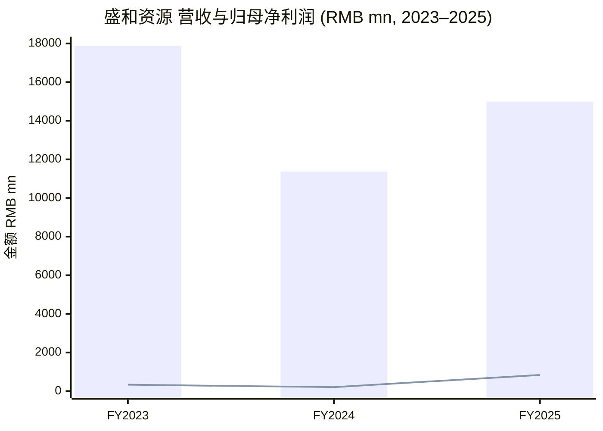
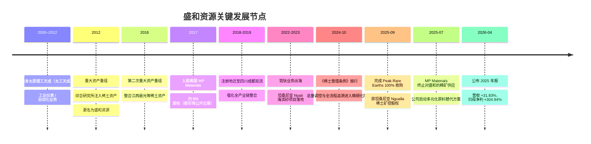
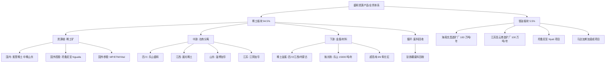
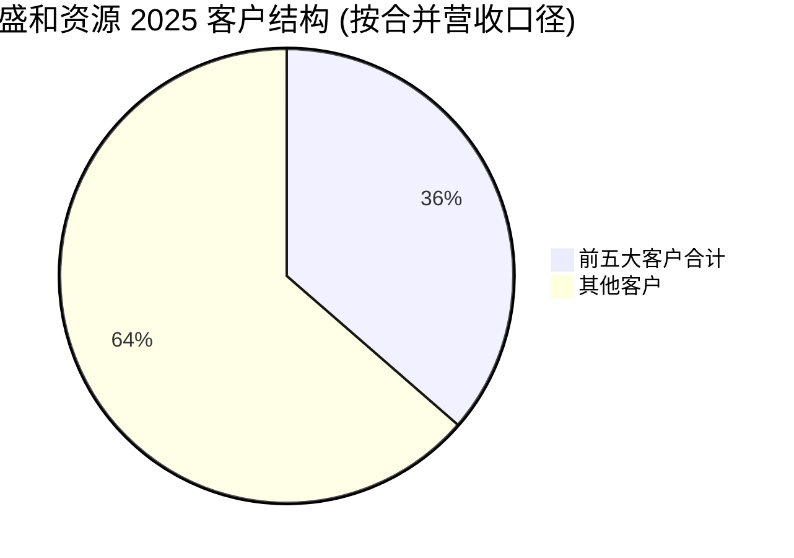
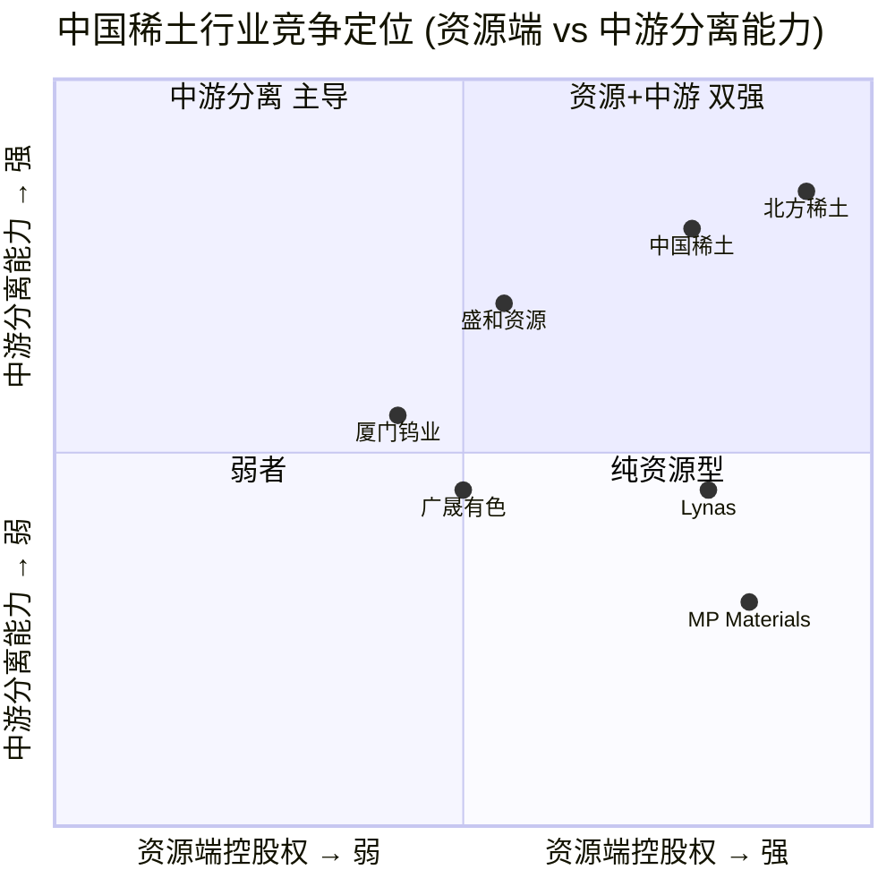
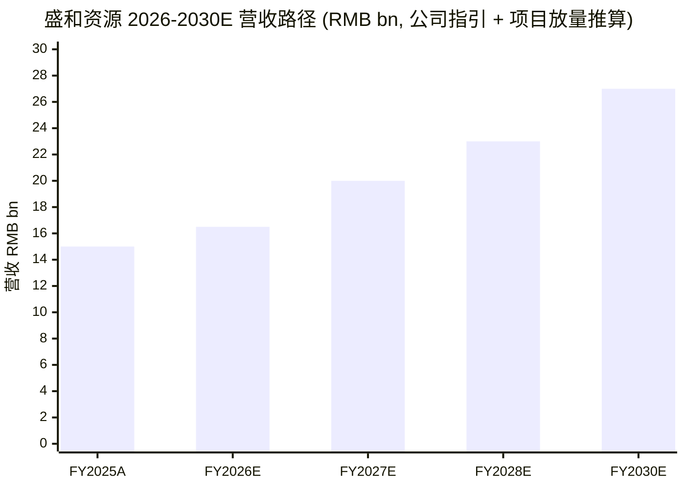

# 盛和资源 (Shenghe Resources, SSE:600392) — 公司研究 / Company Research

**报告日期 / As of：2026-06-02**
**主题归类 / Theme：rare-earth-strategic-minerals（稀土与战略矿产）**
**主要语言 / Language：Simplified Chinese (zh-CN), with bilingual technical terms**

---

## 目录

1. [公司概览 / Company Overview](#1-公司概览)
2. [公司历史 / Company History](#2-公司历史)
3. [管理团队 / Management Team](#3-管理团队)
4. [产品与服务 / Products & Services](#4-产品与服务)
5. [客户与上市策略 / Customers & Go-to-Market](#5-客户与上市策略)
6. [行业概览 / Industry Overview](#6-行业概览)
7. [竞争格局 / Competitive Landscape](#7-竞争格局)
8. [市场机会 / Market Opportunity (TAM)](#8-市场机会)
9. [风险评估 / Risk Assessment](#9-风险评估)
10. [投资者视角评分卡 / Investor Lens Scorecards](#10-投资者视角评分卡)
11. [参考资料 / References](#11-参考资料)

---

## 1. 公司概览

盛和资源控股股份有限公司（"盛和资源" / Shenghe Resources Holding Co., Ltd, SSE:600392，注册地四川成都双流区怡腾路 399 号）是中国稀土行业**独具特色的混合所有制上市公司**，按公司自我描述定位为"**负责任的关键原材料国际化供应商**"，主业为稀土矿采选、冶炼分离、稀土金属加工、稀土废料回收，以及锆钛矿选矿，主要产品包括稀土精矿、稀土氧化物（rare earth oxides, REO）、稀土盐、稀土金属、稀土抛光材料、独居石、锆英砂、钛精矿、金红石等 ([盛和资源 2025 年年度报告, 第 11 页](https://static.cninfo.com.cn/finalpage/2026-04-30/1225258047.PDF))。公司前身为"太原理工天成科技股份有限公司"（太工天成），2012 年通过重大资产重组转型为稀土全产业链运营商，控股股东为中国地质科学院**矿产综合利用研究所**（隶属中国地质调查局，实际控制人为财政部），公司因此带有央企科研院所背景与四川地方民营资本（巨星集团、地矿公司）混合治理的双重属性。

公司**2025 年实现营业收入人民币 149.91 亿元（同比 +31.83%）**，归属于上市公司股东的净利润 **8.39 亿元（同比 +304.94%）**，扣非归母净利润 8.13 亿元（同比 +310.31%）；经营活动现金流净额 7.33 亿元（同比 +912%）；总资产 207.65 亿元，归母净资产 126.83 亿元 ([盛和资源 2025 年年度报告, 第 7 页 主要会计数据](https://static.cninfo.com.cn/finalpage/2026-04-30/1225258047.PDF))。利润大幅增长的核心驱动因素是 2025 年稀土主要产品市场价格较 2024 年显著上涨，叠加公司主要稀土产品销量同比上升，公司称"紧抓市场机遇，强化经营管理，着力提质增效"（同上, 第 12 页）。2026 年公司给出指引"全年计划实现营业收入 165 亿元"（同上, 第 29 页），即同比 +10.1% 的温和增长，反映管理层对稀土价格虽看好但不外推 2025 年异常涨幅的稳健姿态。

**业务结构 / Segment mix（2025 年合并报表口径）：**

| 板块 / Segment | 营收 (RMB mn) | 占比 | 毛利率 |
|---|---:|---:|---:|
| 稀土产品 / Rare Earth Products | 14,106.92 | 94.5% | 11.12% |
| 锆钛及其他 / Zr-Ti & Others | 813.95 | 5.5% | 2.80% |
| **合计 (主营业务)** | **14,920.87** | **100.0%** | **10.66%** |

数据来源：[盛和资源 2025 年年度报告, 第 15-16 页 收入与成本分析](https://static.cninfo.com.cn/finalpage/2026-04-30/1225258047.PDF)。稀土板块为绝对核心，锆钛板块 2025 年因下游建筑陶瓷、耐火材料等传统应用受全球地产需求拖累而毛利率从 14.89% 大幅收窄至 2.80%，反映出"重砂矿先选钛锆、伴生独居石输送至稀土冶炼"的母矿生态依然是公司锆钛存在的战略意义所在（同上, 第 11、12 页）。**地区分布**：国内营收 144.63 亿元（占比 96.9%），国际 4.58 亿元（占比 3.1%），公司的资源端国际化（坦桑尼亚、马达加斯加、格陵兰）尚未完全反映到收入端，目前国际营收以新加坡贸易主体为主（同上, 第 15-16 页）。

**估值快照 / Valuation snapshot（截至 2026-06-02 附近）：** 据 [Stockanalysis.com SHA:600392 statistics](https://stockanalysis.com/quote/sha/600392/statistics/) 及 [Yahoo Finance 600392.SS](https://finance.yahoo.com/quote/600392.SS/) 公开行情，公司市值约 RMB 45–59 bn 区间（2026 年 Q1–Q2 内市值随稀土价格波动）；**TTM P/E ≈ 49–52×**（受 2024 年低基数及 2025 年稀土价上涨双重影响，2025 年净利同比 +305% 已显著降低未来 1Y P/E），**TTM P/S ≈ 3–4×**。这一估值与稀土综合性同行 [SSE:600111 北方稀土 (China Northern Rare Earth)](https://finance.sina.com.cn/realstock/company/sh600111/nc.shtml) 的 TTM P/E（多年 30–60× 区间）大致相当，与海外纯上游标的 [NYSE:MP MP Materials](https://www.sec.gov/cgi-bin/browse-edgar?action=getcompany&CIK=0001801368&type=10-K)（盈利前后 P/E 失真较大、市场以 EV/REO production 计价）形成对比。**为何 P/E 偏高？**——稀土板块普遍享有"战略矿产 + AI / robotics / EV / 国防需求扩张"叙事溢价，且 2024 年公司利润基数偏低（仅 2.07 亿元归母），2025 年的 +305% 同比从低基数恢复后，市场 forward earnings 假设普遍乐观；东方财富 Choice 数据显示 [国元证券首次覆盖报告（2025-11-14, 引用 Choice / wind 一致预期）](https://finance.sina.com.cn/roll/2025-11-14/doc-infximra9408051.shtml) 将公司 FY26E 归母净利预测拉至 14–17 亿元区间，对应 PEG 接近 1。**分红回报**：2025 年公司拟以 10 股派现 RMB 3.00 元（含税），合计派发 5.26 亿元，加中期分红总额 6.13 亿元，**派现率 73.12%**（含税口径）([盛和资源 2025 年年度报告, 第 2 页 利润分配预案](https://static.cninfo.com.cn/finalpage/2026-04-30/1225258047.PDF))，对一个资源属性公司而言派现率明显偏高，体现混合所有制治理下民营股东对短期现金回报的诉求。

> 数据来源 / Data source: [盛和资源 2025 年年度报告, 第 7 页](https://static.cninfo.com.cn/finalpage/2026-04-30/1225258047.PDF)。柱状代表营业收入，折线代表归母净利润。2023 年高营收对应稀土价格高位末端、2024 年价格急跌至历史底部、2025 年价格修复 + 销量回升。

---

## 2. 公司历史

公司前身为太原理工天成科技股份有限公司（太工天成），最早 2000 年前后在山西注册并从事工业仪表、自动化业务。**2012 年重大资产重组**是公司命运的转折点：中国地质科学院矿产综合利用研究所（以下简称"综合研究所"）通过资产置换 + 发行股份购买资产方式，将其控股的稀土相关资产注入太工天成，公司由此转型为稀土上市公司并更名为"盛和资源控股股份有限公司" ([盛和资源 2025 年年度报告, 第 33 页 公司治理及独立性](https://static.cninfo.com.cn/finalpage/2026-04-30/1225258047.PDF))。**2016 年第二次重大资产重组**再度扩张稀土业务版图（同上）。2018-2019 年公司注册地由山西迁至四川成都双流区（同上, 第 6 页），呈现"科研院所背景 + 四川地方资源 + 民营资本"三方协同的治理结构。

公司历史上有几次值得记住的"战略转折"。**第一次是 2012 年的稀土资产注入**——综合研究所是中国地质调查局直属的国家级矿产综合利用研究院，长期持有稀土选矿、冶炼分离技术储备；这次重组让公司从一个区域性自动化公司直接跃迁为稀土全产业链玩家 ([盛和资源 2025 年年度报告, 第 33-34 页 控股股东独立性承诺](https://static.cninfo.com.cn/finalpage/2026-04-30/1225258047.PDF))。**第二次是 2017 年入股 MP Materials**——2015 年原 Molycorp 破产后，2017 年新成立的 MP Materials Corp（NYSE:MP）由 JHL Capital 等美国资本牵头收购了 Mountain Pass 矿，盛和资源（通过新加坡贸易子公司）成为 MP 的少数股东（按 [MP Materials Wikipedia 历史记录](https://en.wikipedia.org/wiki/MP_Materials) 历史快照，盛和资源在 2021 年前后持股约 7.7%），并签署长期独家精矿包销协议；这一安排让盛和在 2018-2024 年间稳定获取美国 Mountain Pass 的稀土精矿喂料，是公司当时最具标志性的国际化资源布局。**第三次是 2025 年完成 Peak Rare Earths 收购**——通过控股子公司赣州晨光以约 1.58 亿澳元（约 7.43 亿元人民币）收购 Peak Rare Earths Limited 100% 股权，获得坦桑尼亚 Ngualla 稀土矿项目控股权，**实现"自有控股世界级稀土矿从零到一的突破"**（公司原文，[盛和资源 2025 年年度报告, 第 12 页](https://static.cninfo.com.cn/finalpage/2026-04-30/1225258047.PDF))；该收购被视为应对 MP Materials 在 2025 年 7 月停止对华销售之后的关键资源储备调整 ([盛和资源拟超 7 亿元收购匹克, 2025-05-14](https://finance.sina.com.cn/jjxw/2025-05-14/doc-inewpwew0293663.shtml))。

近一年（2025-04 至 2026-04）的重要事件还包括：完成对**江阴加华**（3,800 吨/年离子型稀土分离能力）与**淄博加华**（5,500 吨/年轻稀土分离能力）两家国内冶炼分离工厂的收购、董事会换届（谢兵 2024 年 9 月接任董事长，黄平 2025 年 4 月接任总经理）、设立合规委员会与首席合规官（郭晓雷 2025-10-30 起任）、《稀土管理条例》（2024-10 施行）下完成首批"进口稀土矿冶炼分离"备案 ([盛和资源 2025 年年度报告, 第 12、13、32 页](https://static.cninfo.com.cn/finalpage/2026-04-30/1225258047.PDF))。

---

## 3. 管理团队

公司董事会与高管层于 2025 年 4 月 22 日完成换届，第九届董事会由 12 名董事组成，其中独立董事 4 名、职工董事 1 名 ([盛和资源 2025 年年度报告, 第 32 页 董事会换届](https://static.cninfo.com.cn/finalpage/2026-04-30/1225258047.PDF))。本节按 SKILL 要求**仅介绍创始人 / 大股东自然人代表 + 现任 CEO/总经理**两位关键人物。

### 黄平 (Huang Ping, 总经理 / President) — 1965 年生，60 岁

**黄平本科学历，曾任赣州晨光工贸有限公司总经理、江西省赣南晨光稀土金属冶炼厂厂长**；2003 年至 2010 年任**赣州晨光稀土新材料有限公司董事长兼总经理**，2010 年至 2015 年 9 月任**赣州晨光稀土新材料股份有限公司董事长兼总经理**；2017 年 7 月至 2021 年 4 月任赣州晨光稀土新材料股份有限公司董事长；2020 年 3 月 31 日至 2021 年 4 月 21 日任公司总经理，2020 年 5 月 19 日至今任公司董事，2022 年 4 月 22 日至今任副董事长，**2025 年 4 月 22 日至今任公司总经理** ([盛和资源 2025 年年度报告, 第 35 页 高管简历](https://static.cninfo.com.cn/finalpage/2026-04-30/1225258047.PDF))。**黄平是公司第三大股东（自然人），个人持股 96,271,094 股，占比 5.49%**（同上, 第 73 页前十大股东）——这是公司治理中极重要的一笔：黄平不仅是经营负责人，更是赣州晨光（公司南方离子型重稀土核心冶炼分离平台）的原创始人 / 实际操盘人，2016 年第二次资产重组将赣州晨光注入上市公司后，黄平通过换股取得目前的持股，**这使他成为典型的"实业型 founder-shareholder-operator"**。黄平在公司中的角色既是 CEO，也是大股东之一，其经营导向偏重稀土实业（采矿—冶炼—金属—磁材产业链）而非纯资源 / 金融交易，反映在公司近年持续对国内分离厂（江阴加华、淄博加华）与下游高纯氧化物（乐山盛和 6N 级超高纯氧化钇、1.5 万吨/年抛光粉）的投资上 ([盛和资源 2025 年年度报告, 第 12-13 页 重点项目](https://static.cninfo.com.cn/finalpage/2026-04-30/1225258047.PDF))。2025 年报披露黄平税前年薪 RMB 330.00 万元（同上, 第 34 页）。

### 谢兵 (Xie Bing, 董事长 / Chairman) — 1969 年生，57 岁

**谢兵研究生学历，高级工程师**。曾任四川省地质矿产勘查开发局副局长、党委委员。**2024 年 7 月至今在中国地质科学院矿产综合利用研究所工作**，曾任副所长（主持工作），现任**所长、党委副书记**。**2024 年 9 月 18 日至今任公司董事长** ([盛和资源 2025 年年度报告, 第 35 页 高管简历](https://static.cninfo.com.cn/finalpage/2026-04-30/1225258047.PDF))。谢兵是公司控股股东（综合研究所，国家持股 14.06%）的"派出董事长"——这种安排是中国国有控股 / 央企背景上市公司的标准结构：实控人通过派出董事长锁定战略方向，CEO 由原实业团队（黄平）负责经营。**谢兵不持有公司股票，年薪 0 元（在公司端），由控股股东综合研究所支付薪酬**（同上, 第 34 页）。在中国地质调查局背景下，谢兵的核心任务是把综合研究所长期积累的稀土选冶技术储备（如氟碳铈矿少铈氯化稀土、氟化铈一步生产法等省级科技进步一等奖项目）转化为上市公司的产业竞争力，并主导公司"负责任的关键原材料国际化供应商"战略定位（同上, 第 13、29 页）。谢兵 2024 年接棒前，公司董事长由原综合研究所所长杨占峰担任，本次换届反映综合研究所党政班子内部的代际交接，但战略方向（"全球资源 + 产业整合 + 合规升级"三轴）保持延续。

**其他高管说明**：副董事长由黄平兼任（已上述）；新一届高管包括副总经理黄建荣（晨光稀土技术总监出身，1965 生）、副总经理王晓东（乐山盛和稀土总经理，包钢稀土系出身）、副总经理 / 财务总监 / 现首席合规官李抗（注册会计师，1985 生）、董事会秘书 / 副总经理 / 首席合规官郭晓雷（律师出身，1984 生）等（同上, 第 34-37 页）。**前任总经理王晓晖**（2022.4-2025.4 任）已转任非董事职务，仍持有 1,588.31 万股（占 0.91%），属于由"职业经理人 + 自然人股东"双轨过渡的典型案例。

---

## 4. 产品与服务

盛和资源的产品矩阵从**资源端到中游冶炼分离再到下游金属与功能材料**纵向覆盖；**稀土板块**贡献 2025 年 94.5% 的主营收入，**锆钛板块**贡献 5.5%（且毛利较低，更多是为稀土板块提供伴生独居石原料的"母矿"）。本节为整篇报告最核心的章节，以下严格按公司 2025 年报披露内容引述。

### 4.1 公司自我定义的产品矩阵

> **盛和资源 2025 年报原文 / Verbatim quote from 2025 Annual Report**：
> "报告期内，公司主要从事**稀土矿采选、冶炼分离、金属加工、稀土废料回收以及锆钛矿选矿**业务。公司的主要产品包括**稀土精矿、稀土氧化物、稀土盐、稀土金属、稀土抛光材料、独居石、锆英砂、钛精矿、金红石**等。"
> ([盛和资源 2025 年年度报告, 第 11 页](https://static.cninfo.com.cn/finalpage/2026-04-30/1225258047.PDF))

### 4.2 稀土板块——按上下游环节走读

#### (a) 稀土矿资源 / Rare-earth ore resources

> **2025 年报原文**：
> "（1）稀土矿。公司通过全资子公司 Peak 稀土公司间接控制了**坦桑尼亚恩古拉稀土矿**。此外，公司在中国境内参股了冕里稀土、中稀（山东）稀土开发有限公司，参股的矿山公司按照市场化方式经营；公司在中国境外参股了美国 MP 公司、澳大利亚 ETM 公司、重要金属公司。"
> ([盛和资源 2025 年年度报告, 第 11 页](https://static.cninfo.com.cn/finalpage/2026-04-30/1225258047.PDF))

**中文释义 / Plain-language gloss**：盛和资源在稀土"资源端"采取"少数股权 + 控股权"组合的轻资产 + 全球化策略。**冕里稀土**位于四川冕宁，由公司参股；**中稀（山东）**与公司参股（盛和资源前任总经理王晓东曾长期参与冕宁矿业经营）。**境外**则形成了 4 个主要节点：(1) 美国 [NYSE:MP MP Materials Corp.](https://en.wikipedia.org/wiki/MP_Materials)，2017 年盛和资源（通过新加坡贸易公司）入股约 7.7%，并签署独家精矿包销协议，是 2018-2024 年公司北美轻稀土原料的关键来源——但 [MP Materials Form 8-K（2025-07-10）](https://www.sec.gov/Archives/edgar/data/0001801368/000119312525157310/d43796d8k.htm) 披露，因与美国国防部 / Department of War 的 Transaction Agreement 条款要求并支持本土供应链，MP 已于 **2025 年 7 月停止对中国的所有产品销售**，且**不会续签 2024 年的 Offtake Agreement**（该协议 2026 年 1 月到期）。(2) **澳大利亚 ETM 公司**（Energy Transition Minerals Ltd，原 Greenland Minerals）公司参股，其旗下科瓦内湾稀土多金属矿位于格陵兰，因当地政府环保政策一波三折。(3) **Vital Metals (VML)**：公司参股的另一海外稀土上游标的。(4) **Peak Rare Earths Limited (Peak 公司)**：2025-09 完成 100% 控股收购，旗下**坦桑尼亚 Ngualla 稀土矿**，按 [Peak Rare Earths 公告（2024-11，Tanzania Mining License）](https://projectblue.com/blue/news-analysis/1209/shenghe-tops-up-stake-to-acquire-peak-rare-earths-and-secure-more-ex-china-feedstock-) 及 [盛和资源 2025 年年度报告, 第 12 页](https://static.cninfo.com.cn/finalpage/2026-04-30/1225258047.PDF)，资源量约 **2.14 亿吨矿石、平均品位 2.15%，含 REO 约 461 万吨**，储量级别 REO 约 88.7 万吨，规划设计 80 万吨/年矿石处理量，主要产品为稀土精矿与草酸盐精矿（TREO 品位约 45%），**实物量产量超 5 万吨/年**，预计 12 个月内完成矿山建设；按 [Peak Rare Earths 项目可研（Sina 2025-05-14）](https://finance.sina.com.cn/jjxw/2025-05-14/doc-inewpwew0293663.shtml) 项目年产稀土精矿 1.8 万吨（含约 4,000 吨氧化镨钕）。

*分析师观点 / Analyst view：* Ngualla 是**当前少有的非中国、非俄罗斯、非缅甸的轻稀土 + 关键磁稀土 (Pr/Nd) 同时具备规模且接近投产的项目**，控股权落到盛和手中是公司应对 MP 包销中止后"非美国 ex-China 原料"的关键替代选项，且为 2027-2030 年间公司稀土板块毛利率结构性回升提供了上游矿山的"内部转移定价"基础。但 Ngualla 项目仍面临环评、技术出口许可、东道国（坦桑尼亚）政策与汇率风险，公司在年报中明确"已向行政主管部门递交了技术出口申请，待依法取得许可后，计划在 12 个月内完成矿山建设"（同上, 第 12 页）。

#### (b) 稀土冶炼分离 / Rare-earth separation

> **2025 年报原文**：
> "（2）稀土冶炼分离。目前公司在**四川、江西、山东、江苏**拥有稀土冶炼分离基地，能够处理**氟碳铈矿、离子型稀土矿、独居石氯化片、钕铁硼废料**等多种类型原料。公司还在广西、湖南参股了稀土冶炼和分离企业。公司严格按照国家下发的生产指标开展稀土冶炼分离业务，所产稀土氧化物等产品部分通过公司下属企业加工成稀土金属等产品后再对外销售，部分直接对外销售。"
> ([盛和资源 2025 年年度报告, 第 11 页](https://static.cninfo.com.cn/finalpage/2026-04-30/1225258047.PDF))

**中文释义 / Plain-language gloss**：稀土冶炼分离（rare-earth separation / solvent extraction）是把混合稀土原料拆分成 15 种单一稀土元素的关键步骤——化学上通过**萃取剂梯度差**实现 La / Ce / Pr / Nd / Sm / Eu / Gd / Tb / Dy / Ho / Er / Tm / Yb / Lu + Y 的逐级分离，每一级"萃取塔"的精度决定单一稀土产品的化学纯度（如 6N 即 99.9999% / six-nines）。在中国稀土行业的指标管理体系下，**冶炼分离配额是"卡口"**：2024 年中国冶炼分离总配额 25.4 万吨，2025 年首次将进口稀土矿冶炼分离纳入总量调控（[中新网, 2024-07-01 稀土管理条例 10 月 1 日起施行](https://www.chinanews.com/gn/2024/07-01/10243433.shtml)），意味着即便公司拥有海外矿石，进入国内分离系统也要在配额内执行。盛和的核心冶炼分离平台：

- **乐山盛和稀土有限公司**（四川，全资）：2025 年营收 **RMB 50.76 亿元**，营业利润 6.15 亿元，净利润 4.81 亿元——是公司**最大单体盈利子公司**，主要处理氟碳铈矿 / 独居石氯化片，产出轻稀土氧化物 + 启动 6N 级超高纯氧化钇示范线 + 1.5 万吨/年高性能抛光粉项目 ([盛和资源 2025 年年度报告, 第 27 页 主要子公司](https://static.cninfo.com.cn/finalpage/2026-04-30/1225258047.PDF))。
- **赣州晨光稀土新材料有限公司**（江西，全资）：2025 年营收 **RMB 75.50 亿元**，营业利润 3.73 亿元，净利润 3.52 亿元——以处理离子型重稀土矿 + 钕铁硼废料回收为主，是公司**南方重稀土与磁材废料循环的核心平台**；这也是黄平本人的"老根据地"（同上, 第 27 页）。
- **江阴加华新材料资源有限公司**（江苏）：2025 年新收购，**3,800 吨/年离子型稀土矿分离能力**，2026 年 3 月安全环保升级完工恢复生产（同上, 第 12 页）。
- **淄博加华新材料资源有限公司**（山东）：2025 年新收购，**5,500 吨/年轻稀土矿分离能力**（同上, 第 12 页）。
- **盛和资源（海南）有限公司**（全资）：2025 年营收 **RMB 29.20 亿元**，净利润 2.23 亿元，主要产品稀土精矿与稀土金属（同上, 第 27 页）。

*分析师观点 / Analyst view：* 公司在 2024-2025 年连续完成**江阴加华 + 淄博加华**两家分离厂收购，**总计新增 9,300 吨/年分离能力**，相当于直接打通"重稀土（离子型矿）+ 轻稀土（含独居石）"双线分离能力——这是 Peak/Ngualla 矿石回运后"国内分离配额是否够用"的关键铺垫。但配额能否足额发放，最终取决于工信部 + 自然资源部对"进口矿是否计入国内总量调控"的政策实操尺度（[国盛证券 2025 年报告, 总量调控管理办法发布稀土供给改革](https://www.cspengyuan.com/pengyuancmscn/credit-research/industry-research/subject/20250226200741083/%E6%88%98%E7%95%A5%E9%87%91%E5%B1%9E%EF%BC%9A%E6%80%BB%E9%87%8F%E8%B0%83%E6%8E%A7%E7%AE%A1%E7%90%86%E5%8A%9E%E6%B3%95%E5%8F%91%E5%B8%83%EF%BC%8C%E7%A8%80%E5%9C%9F%E4%BE%9B%E7%BB%99%E6%94%B9%E9%9D%A9%E6%8B%89%E5%BC%80%E5%A4%A7%E5%B9%95.pdf)）。

#### (c) 稀土金属加工 / Rare-earth metal processing

> **2025 年报原文**：
> "（3）稀土金属。目前公司在**四川、江西、内蒙古**等地拥有稀土金属加工厂，主要将公司自产和外购的稀土氧化物加工成稀土金属对外销售，也会根据市场情况从事来料加工业务。"
> ([盛和资源 2025 年年度报告, 第 11 页](https://static.cninfo.com.cn/finalpage/2026-04-30/1225258047.PDF))

**中文释义 / Plain-language gloss**：稀土金属（rare-earth metals，主要是 Nd / Pr / Sm / Dy / Tb 金属）是把氧化物通过**熔盐电解（molten salt electrolysis）**或**金属热还原（metallothermic reduction）**变成金属态——这一步是钕铁硼磁体（NdFeB magnets，主要用于 EV motor、风电、机器人 servo、消费电子、国防制导）原材料的最关键中间品。盛和的稀土金属产能位于四川德昌（德昌盛和）、江西赣州（晨光稀土关联）、内蒙古包头（包头三隆，控股子公司），形成"南方氟碳铈矿 + 北方包头矿"双线供给。该业务对应的下游是**磁材生产商**（如金力永磁、宁波韵升、中科三环等钕铁硼龙头），是公司直接接入"EV 电机 + 机器人 + 国防"主力下游链条的环节。

*分析师观点 / Analyst view：* 公司在产业链中扮演"原料 + 中间品"角色，而非磁材成品；这意味着其毛利率结构性低于磁材龙头（钕铁硼成品毛利率约 20-30%，金属约 5-15%，氧化物约 8-20%），但 ROIC 和资产周转率可能更高。**2025 年公司稀土产品毛利率 11.12%（同比 +6.57pp），** 较 2024 年的 4.55% 大幅恢复（[盛和资源 2024 年年度报告（更正版）, 第 15 页](https://static.cninfo.com.cn/finalpage/2025-06-04/1223749030.PDF)，[2025 年报, 第 15 页](https://static.cninfo.com.cn/finalpage/2026-04-30/1225258047.PDF)），反映的是稀土产品价格回升对中间环节的弹性而非自身议价能力的提升。

#### (d) 稀土抛光材料与高纯氧化物 / Polishing & high-purity oxides

抛光粉（rare-earth polishing powder，主要为铈基抛光粉 CeO₂ polishing powder）用于**液晶显示器、玻璃面板、半导体晶圆抛光（CMP）**——盛和的**乐山盛和 1.5 万吨/年高性能稀土抛光粉项目**（已完成基础设施建设，预计 2026 年 6 月具备生产调试条件）将使公司成为国内最大的稀土抛光粉产能玩家之一 ([盛和资源 2025 年年度报告, 第 12-13 页](https://static.cninfo.com.cn/finalpage/2026-04-30/1225258047.PDF))。**6N 级超高纯氧化钇（99.9999% Y₂O₃）**主要用于半导体外延片 / 显示器 / 激光器/光纤通讯/陶瓷涂层，2025 年公司完成 6N 示范线工艺方案论证并全面启动工程设计（同上, 第 13 页）——这条产品线对标日本信越 / 三菱化学等国际玩家，是公司"功能材料制备"侧的标志性升级，对应**高端制造与半导体国产替代**主题。

#### (e) 稀土废料回收 / Recycling

> **2025 年报原文**：
> "为解决稀土分离废渣的处理问题，**四川乐山的三稀环保公司**渣库项目动工，计划于 2026 年 10 月建成投用，项目投产后将有效助力稀土产业链补链强链，实现**废料规范管理与资源循环利用**。"
> ([盛和资源 2025 年年度报告, 第 12 页](https://static.cninfo.com.cn/finalpage/2026-04-30/1225258047.PDF))

**中文释义 / Plain-language gloss**：稀土废料主要来自两端——(1) 冶炼分离过程产生的低品位渣（含放射性 Th, U 痕量），(2) 钕铁硼磁材生产端的边角废料（NdFeB scrap）。回收钕铁硼废料可获取 ~30% Nd/Pr 当量的二次稀土，是稀土循环经济的核心环节，赣州晨光在这一领域已有多年技术积累 ([盛和资源 2025 年年度报告, 第 11 页](https://static.cninfo.com.cn/finalpage/2026-04-30/1225258047.PDF))。三稀环保是公司应对环保监管 + 废料合规化的关键项目。

### 4.3 锆钛板块——海滨砂矿与稀土的"母矿生态"

> **2025 年报原文**：
> "资源端，公司在**坦桑尼亚、马达加斯加**拥有锆钛资源基地，为公司锆钛业务储备了丰富的资源。公司的锆钛精选厂位于**海南省文昌市和江苏省连云港市**，核准备案的原料处理能力为 **200 万吨/年**。公司从境外进口锆钛毛矿、中矿等重砂矿，在境内进行分选，产出**锆英砂、钛精矿、金红石、独居石**等，对外销售。"
> ([盛和资源 2025 年年度报告, 第 11 页](https://static.cninfo.com.cn/finalpage/2026-04-30/1225258047.PDF))

**中文释义 / Plain-language gloss**：海滨砂矿（heavy mineral sands, HMS）是包含**锆英砂 (zircon, ZrSiO₄) + 钛精矿 (ilmenite, FeTiO₃ / 金红石 rutile, TiO₂) + 独居石 (monazite, REE-Th-PO₄)** 等矿物的伴生矿源。盛和锆钛板块的战略意义不仅在于锆 / 钛本身的商品价值，更在于**独居石作为轻稀土来源直接喂料给公司的稀土冶炼分离厂**——独居石稀土含量约 50-70% REO（高于氟碳铈矿），且 Th 含量需特殊处理（独居石氯化片即指含 Th 的中间品）。**坦桑尼亚 Nyati 项目**已实现 15 万吨/年重矿物精矿产能，2026 年扩产至 30 万吨/年（其中 Fungoni 创新采用"推采-冲采-管道输送"一体化方案，攻克雨季运输难题；Tajiri 项目精选厂将于 2026 年内建成投产）；**马达加斯加嘉成项目**预计 2026 年内完成首采区建设准备，2027 年实现首批重矿物精矿产出（同上, 第 12 页）。

*分析师观点 / Analyst view：* 锆钛板块 2025 年毛利率从 14.89% 大幅收窄至 **2.80%**（[盛和资源 2025 年年度报告, 第 15 页](https://static.cninfo.com.cn/finalpage/2026-04-30/1225258047.PDF)），反映出**全球地产 / 建筑陶瓷 / 涂料需求疲软**对锆钛价格的直接打击。但 2025 年中国进口锆矿砂同比 **+20.96%（达 214.18 万吨）**，进口钛矿砂 +3.05%（达 520.29 万吨）——表明需求未塌，更多是供应端释放压制价格（同上, 第 28 页）。中长期看，锆钛板块的"伴生独居石稀土"价值随稀土价格回升被持续重估，且公司海外锆钛资源端（坦桑尼亚 + 马达加斯加）在 2026-2028 年的产能放量是隐藏看点。

### 4.4 产品矩阵综合归纳——公司在稀土"产业链一体化"中的位置

公司全产业链布局形成了"**资源（境内参股 + 境外控股 / 参股）→ 冶炼分离（轻稀土 + 重稀土双线）→ 金属加工（南/北双基地）→ 功能材料（抛光粉 / 高纯氧化物）→ 循环回收**"的闭环。在中国稀土行业指标管理与总量调控的政策框架下，公司战略上**与北方稀土（包头矿，氟碳铈矿主导，轻稀土）和中国稀土集团（南方离子型，重稀土主导）形成差异化定位**：盛和资源不直接掌控特大型矿山（包头白云鄂博 / 江西赣州寻乌等），但通过"**少数股权 + 长期供应协议 + 海外资源 + 废料回收 + 高度灵活的混合所有制治理**"形成"全球资源整合者 + 中游冶炼分离 + 高纯材料"的独特生态位（[盛和资源 2025 年年度报告, 第 13 页 核心竞争力](https://static.cninfo.com.cn/finalpage/2026-04-30/1225258047.PDF)）。

---

## 5. 客户与上市策略

### 5.1 客户集中度（合并报表口径）

> **2025 年报原文**：
> "**前五名客户销售额 545,584.95 万元，占年度销售总额 36.39%**；其中前五名客户销售额中关联方销售额 0 万元，占年度销售总额 0%。"
> ([盛和资源 2025 年年度报告, 第 17 页 前五名销售客户](https://static.cninfo.com.cn/finalpage/2026-04-30/1225258047.PDF))

**关键观察**：2025 年公司**前五大客户集中度为 36.39%**（合并报表口径，年报未单独披露 Top-1），相比 SKILL 设定的"Top-5 > 50% 需作为材料化风险点列示 Section 9"的门槛，盛和资源的客户集中度处于**中等偏低水平**，不构成单一客户依赖风险。年报特别声明"报告期内向单个客户的销售比例**未超过总额的 50%**"且"前 5 名客户中**不存在**新增客户的或严重依赖于少数客户的情形"（同上, 第 17 页）。

### 5.2 贸易业务披露——主要客户名单（受限于商业保密）

公司年报对"贸易业务"环节披露了 5 名匿名客户（编号客户 1–5）：
- 客户 1：销售额 RMB 5.99 亿元，占年度营收 4.00%
- 客户 2：销售额 RMB 3.31 亿元，占 2.20%
- 客户 3：销售额 RMB 2.20 亿元，占 1.47%
- 客户 4：销售额 RMB 1.33 亿元，占 0.88%
- 客户 5：销售额 RMB 1.28 亿元，占 0.85%

合计 RMB 14.10 亿元，占年度营收 **9.41%** ([盛和资源 2025 年年度报告, 第 17 页 贸易业务前五名客户](https://static.cninfo.com.cn/finalpage/2026-04-30/1225258047.PDF))。这表明**贸易业务**（稀土原料贸易 + 锆钛贸易）的客户集中度比公司整体客户集中度更低，分散在数十家中下游需求方。

### 5.3 上市策略——B2B 大客户为主体

> **2025 年报原文**：
> "经过二十余年的经营管理，公司已经建立了健全的销售渠道，能够及时掌握国内外市场需求的变化情况，采取灵活适当的销售策略和销售模式，以销售引导生产。凭借优质的产品性能、较强的供应能力、良好的商业信誉及全面的客户服务等优势，公司业已形成**以大型企业为主体的优质客户群**，构建了与客户协同发展的良性互动体系。"
> ([盛和资源 2025 年年度报告, 第 13-14 页 核心竞争力](https://static.cninfo.com.cn/finalpage/2026-04-30/1225258047.PDF))

**中文释义 / Plain-language gloss**：盛和资源是典型的 **B2B 大宗资源 / 中间品供应商**，下游主要是钕铁硼磁材龙头（金力永磁、宁波韵升、中科三环、英洛华等）、抛光粉 / 玻璃显示客户（京东方、TCL 华星等显示玻璃产业链）、催化剂客户（润和催化剂 — 公司参股公司）、半导体外延 / 激光 / 光纤客户（针对 6N 高纯氧化物）。**销售模式以线下销售为主**（合并报表 99.5% 来自线下，[盛和资源 2025 年年度报告, 第 16 页](https://static.cninfo.com.cn/finalpage/2026-04-30/1225258047.PDF)），合同结构以年度框架 + 月度执行为主，价格紧贴**[百川盈孚 / 上海有色网](https://www.smm.cn/) 等公开稀土现货价格**。

### 5.4 海外销售比例与汇率敞口

国内营收 144.63 亿元（占主营 96.9%），国际营收 4.58 亿元（占主营 3.1%），但**国际毛利率 22.43% 显著高于国内 10.29%**（[盛和资源 2025 年年度报告, 第 15 页](https://static.cninfo.com.cn/finalpage/2026-04-30/1225258047.PDF)）——反映海外（主要是 MP / Energy Fuels 等北美客户与少量东南亚 / 欧洲贸易）的产品 ASP 高于国内（受出口管制 + 议价权差异影响）。**2025 年 4 月起中国对部分中重稀土实施出口许可制度**（[正策律师事务所 — 稀土出口管制体系演进](https://joint-win.com/Cn/new/news/catid/39/id/911.html)），公司国际收入占比可能在 2026-2027 年继续承压，但产品结构如向半导体 / 国防级高纯材料切换，长尾国际客户的 ASP 弹性仍可观。

---

## 6. 行业概览

### 6.1 全球稀土产业格局

2025 年全球稀土矿产量约 **40 万吨**（按 REO 当量，[盛和资源 2025 年年度报告, 第 28 页](https://static.cninfo.com.cn/finalpage/2026-04-30/1225258047.PDF)）。中国仍是全球最大的稀土原料生产国，**稀土开采和冶炼分离实行总量调控制度**；中国之外，美国（MP Materials Mountain Pass）、澳大利亚（Lynas Mt Weld）、缅甸、老挝是重要的稀土矿产地，海外矿产量在 2022-2025 年快速提升（同上, 第 28 页）。**在稀土冶炼分离和金属加工业务环节，中国仍占全球 90% 左右的市场份额**（同上, 第 28 页）——这是中国稀土产业最具结构性优势的环节，海外稀土冶炼分离企业（如美国 MP Materials Stage III、加拿大 Vital Metals、澳大利亚 Iluka 等）在政府和资本支持下加快扩能补链，但中长期内中国的中游分离地位难以被撼动。

### 6.2 中国稀土行业政策框架（2024-2025 关键节点）

- **2024-10-01**：**《稀土管理条例》** 正式施行——这是中国稀土行业首部行政法规，构建"开采—冶炼分离—出口—资源储备"全链条监管框架 ([中新网, 2024-07-01](https://www.chinanews.com/gn/2024/07-01/10243433.shtml))。
- **2024 年配额**：稀土开采总配额 27 万吨（轻稀土 25 万吨+，YoY +6.36%；重稀土 ~2 万吨，无增长），冶炼分离配额 25.4 万吨（YoY +10.43%）—— [钛媒体 / 国盛证券 2025 年报告](https://stock.finance.sina.com.cn/stock/view/paper.php?symbol=sh000001&reportid=802832003060)。
- **2025-02-19**：工信部发布《稀土开采和稀土冶炼分离总量调控管理办法（暂行）（公开征求意见稿）》，**首次将进口稀土矿冶炼分离纳入总量调控体系** ([国盛证券, 总量调控管理办法发布](https://www.cspengyuan.com/pengyuancmscn/credit-research/industry-research/subject/20250226200741083/%E6%88%98%E7%95%A5%E9%87%91%E5%B1%9E%EF%BC%9A%E6%80%BB%E9%87%8F%E8%B0%83%E6%8E%A7%E7%AE%A1%E7%90%86%E5%8A%9E%E6%B3%95%E5%8F%91%E5%B8%83%EF%BC%8C%E7%A8%80%E5%9C%9F%E4%BE%9B%E7%BB%99%E6%94%B9%E9%9D%A9%E6%8B%89%E5%BC%80%E5%A4%A7%E5%B9%95.pdf))。
- **2025-04**：中国对**钐 (Sm)、钆 (Gd)、铽 (Tb)、镝 (Dy)、镥 (Lu)、钪 (Sc)、钇 (Y) 等 7 种中重稀土相关物项**实施出口管制 ([正策律师事务所稀土出口管制专题](https://joint-win.com/Cn/new/news/catid/39/id/911.html))。
- **2025-11**："中美阶段性出口管制暂停"信号出现，REE 现货价反复——盛和资源 2025 三季度归母净利润 7.88 亿元（同比 +748.07%），反映前三季度稀土价格回升对盛和的弹性（[证券时报, 2025 年三季度数据](https://www.stcn.com/article/detail/3462760.html)）。

### 6.3 下游需求三大引擎

**(a) EV 电机 / 风电 / 机器人 servo**：钕铁硼磁体（NdFeB）是新能源车驱动电机、风电直驱机组、机器人 servo 电机的核心永磁材料；行业测算 EV 单车 NdFeB 用量 2-5 kg，2025 年全球 EV NdFeB 需求约 30 万吨高性能磁材（占总 NdFeB 需求 ~30%）。

**(b) 国防与航天**：稀土在导弹、雷达、激光、声呐、卫星等军工设备中应用广泛，是各国战略储备的重点对象。

**(c) 半导体 / 高纯材料**：6N+ 高纯氧化钇 / 氧化镧 / 氧化铒在半导体外延、激光晶体、光纤通讯领域需求扩张，盛和的 6N 氧化钇示范线对接这一国产替代主题（[盛和资源 2025 年年度报告, 第 13 页](https://static.cninfo.com.cn/finalpage/2026-04-30/1225258047.PDF)）。

### 6.4 锆钛行业

> **2025 年报原文**：
> "**锆钛方面，则迎来了行业转折的关键一年**，在宏观经济波动、供需格局深度调整与新旧动能转换的多重作用下，全球锆钛市场呈现出复杂、分化的局面。供应端，传统主力矿山减产与新资源开发交相呈现。需求端，建筑陶瓷、耐火材料、涂料等传统应用领域，受全球宏观经济压力，特别是我国房地产市场持续低迷的影响，需求疲软；**核电、高端陶瓷、电池材料、航空航天、国防军工、消费电子等高端领域的需求旺盛**。"
> ([盛和资源 2025 年年度报告, 第 12 页](https://static.cninfo.com.cn/finalpage/2026-04-30/1225258047.PDF))

2025 年中国进口锆矿砂及其精矿 214.18 万吨（同比 +20.96%），进口钛矿砂及其精矿 520.29 万吨（同比 +3.05%）——表明中国作为锆 / 钛主要消费国对进口的依存度仍高。

---

## 7. 竞争格局

### 7.1 A 股稀土上市公司同业竞争对照

盛和资源所在的 A 股稀土上市公司主要包括：

| 公司 | 代码 | 业务定位 | 矿山资源 | 2024 营收 (RMB bn) |
|---|---|---|---|---:|
| **中国稀土** | SSE:000831 | 中国稀土集团旗下，南方离子型重稀土主导 | 江西 / 福建 / 广东离子型矿 + 内蒙古钕铁硼业务 | 33.9 |
| **北方稀土** | SSE:600111 | 中国北方稀土（集团）旗下，包头白云鄂博 + 氟碳铈矿主导 | 包头白云鄂博 (世界最大轻稀土矿) | 30.7 |
| **盛和资源** | SSE:600392 | 混合所有制 / 综合研究所背景；境内参股 + 境外控股 + 中游分离 | 坦桑尼亚 Ngualla (新控股) + 国内参股 (冕里 / 中稀山东) | 11.4 (2024) / 15.0 (2025) |
| **厦门钨业** | SSE:600549 | 钨钼 + 稀土多金属，长汀金龙磁材 | 福建 / 江西稀土 + 钨多金属 | 38.5 |
| **广晟有色** | SSE:600259 | 广东省稀土集团 (中国稀土集团成员) | 广东南方离子型 | 12.6 |
| **五矿稀土** | (并入中国稀土) | 已整合 | — | — |

数据来源：各公司 2024 年年度报告，[北方稀土 2024 年度报告](http://www.b-rec.com/) / [中国稀土 2024 年度报告](https://www.cre-jx.com/) 公开公告。

### 7.2 盛和资源 vs 北方稀土 / 中国稀土

**(a) 资源端**：北方稀土与中国稀土均拥有自有大型主矿山（包头白云鄂博、赣州寻乌 / 龙南 / 赣县离子型矿），盛和资源在国内主要采取参股 + 长期供应协议方式（冕里稀土、中稀山东），资源自主性较低；但**通过收购 Peak Rare Earths / Ngualla 项目，公司在 ex-China 资源端拥有了行业内**罕见的"控股级"海外稀土矿山。

**(b) 中游分离配额**：北方稀土与中国稀土获得指令性配额份额最大（合计占全国 60%+），盛和的配额相对较小但通过收购江阴加华 + 淄博加华 + 自有四川 / 江西冶炼基地，**总分离产能（按 2026 年口径）覆盖 ~10-15% 的全国配额量级**。

**(c) 治理结构**：盛和资源是**国内稀土行业独具特色的混合所有制上市公司**（公司原文，[2025 年报, 第 13 页](https://static.cninfo.com.cn/finalpage/2026-04-30/1225258047.PDF)），综合研究所（国有，14.06%）+ 王全根（自然人，6.69%）+ 黄平（自然人 / 总经理，5.49%）+ 四川地矿（国有，3.15%）+ 巨星集团（民营，3.02%）—— 在央企控股的同业中，盛和的混合所有制带来更高的经营机制灵活度，**这是公司 ROE 与现金流可能更好表现的隐性原因**。

**(d) 国际化进程**：盛和资源在 2017-2024 年期间是**中国稀土上市公司中国际化程度最高的标的**（参股 MP / ETM / Vital / Peak、坦桑尼亚海滨砂、马达加斯加锆钛），同期北方 / 中国稀土仍以国内为主——这一定位在中美脱钩、稀土战略价值上升的 2025-2030 年间被市场重新发现。

### 7.3 vs 海外纯上游 (MP Materials / Lynas)

- [NYSE:MP MP Materials](https://en.wikipedia.org/wiki/MP_Materials)：美国 Mountain Pass 唯一规模化稀土矿，2024 年起加速向 Stage III（NdPr metal & magnet）整合，已与美国国防部 / DoD 签 Transaction Agreement（[MP Materials 8-K, 2025-07-10](https://www.sec.gov/Archives/edgar/data/0001801368/000119312525157310/d43796d8k.htm)），停止对华销售并终止与盛和的包销协议。
- **Lynas Rare Earths (ASX:LYC)**：澳大利亚 Mt Weld + 马来西亚 Kuantan 分离厂，是 ex-China 稀土分离的最大独立玩家。

*分析师观点 / Analyst view：* 盛和资源在与北方 / 中国稀土的"国内同业"中，差异化优势在**混合所有制 + 海外资源**；在与 MP / Lynas 的"海外同业"中，优势在**中国分离能力 + 配额 + 全产业链整合**——这一"中西耦合"的独特生态位是公司估值溢价的根本支撑，但也意味着公司必须同时管理"中美关系 + 中国出口管制 + 东道国（坦桑尼亚 / 马达加斯加 / 格陵兰）合规"三重外部不确定性。

---

## 8. 市场机会

### 8.1 全球稀土需求 TAM

按 [Adamas Intelligence、Wood Mackenzie 等多家研究机构 2024-2025 综合估计](https://stock.finance.sina.com.cn/stock/view/paper.php?symbol=sh000001&reportid=802832003060)，全球稀土 TAM（按 REO 现货价 × 实物消费）2024 年约 USD 12-15 bn，2030 年 TAM 预计扩张至 USD 25-35 bn，CAGR ~8-12%。其中 **NdPr 磁稀土** 占价值量约 70%，是**唯一显著快速增长的子赛道**——驱动因素包括 EV 渗透率提升、人形机器人量产、风电直驱机型、AI 数据中心冷却风机等新增需求。**2030 年 NdPr 磁体全球需求预计达 30 万吨（按当前体量 ~17 万吨翻倍）**，对应稀土氧化物上游约 12 万吨 NdPr REO（[国盛证券 2025 稀土行业深度](https://pdf.dfcfw.com/pdf/H3_AP202508011719561920_1.pdf?1754062614000.pdf=)）。

### 8.2 盛和资源的"可服务市场" / SAM

按 2025 年公司营收 RMB 149.91 亿元（约 USD 21 bn 折合）/ 全球稀土 TAM 折算，盛和的市占率约**当前 6-8%**（按销售口径）。考虑 Peak/Ngualla 矿 2027 年量产后 5 万吨/年实物量、淄博加华 + 江阴加华新分离能力 9,300 吨/年逐步释放、6N 高纯氧化钇 / 1.5 万吨抛光粉项目 2026 年投产，**公司中期 (2027-2030) 营收弹性可达 30-50%**，对应市占率有望提升至 8-12%。

### 8.3 锆钛 SAM

中国是锆主要消费国（占全球需求一半），但锆资源贫乏长期依赖进口，2025 年中国进口锆矿砂 214.18 万吨（同比 +20.96%）—— [盛和资源 2025 年年度报告, 第 28 页](https://static.cninfo.com.cn/finalpage/2026-04-30/1225258047.PDF)。盛和在海南 + 江苏连云港 200 万吨/年锆钛精选厂 + 坦桑尼亚 Nyati 项目（2026 年扩产至 30 万吨/年重矿物精矿）+ 马达加斯加嘉成项目（2027 年首批产出），构成对全球锆钛贸易"中国进口端 + 海外母矿端"双线整合。

> 数据来源：FY2025 实际值来自 [盛和资源 2025 年年度报告, 第 7 页](https://static.cninfo.com.cn/finalpage/2026-04-30/1225258047.PDF)；FY2026 为公司年报第 29 页给出的 165 亿元计划；FY2027-2030 为基于 Peak/Ngualla + 江阴加华 + 淄博加华 + 抛光粉等产能投放对应公司年报第 28-29 页发展战略及 [国元证券 2025-11-14 首次覆盖报告](https://finance.sina.com.cn/roll/2025-11-14/doc-infximra9408051.shtml) 卖方一致预期组合估算（非公司官方指引；标注为路径推算，不构成预测准确性承诺）。

---

## 9. 风险评估

公司在 2025 年报第 29-30 页明确披露了"可能面对的风险"6 大类，本节按**项目级 / 财务 / 监管 / 治理**四个维度结构化整理 8 项关键风险。

### 9.1 项目级 / 运营风险

**风险 1：稀土与锆钛产品价格波动风险**。公司主要原材料（稀土精矿、海滨砂矿）和主要产品（稀土氧化物 / 盐 / 金属 / 锆英砂 / 钛精矿）的供需关系变化及价格波动将对公司盈利能力产生重要影响 ([盛和资源 2025 年年度报告, 第 29 页](https://static.cninfo.com.cn/finalpage/2026-04-30/1225258047.PDF))。2025 年公司 +305% 净利同比即是稀土价格上涨的弹性，反向情形（价格回落）同样会快速侵蚀利润。**评级：高**。

**风险 2：坦桑尼亚 Ngualla 项目执行风险**。Ngualla 项目预计初始投资 USD 1.37 亿（约 RMB 9.9 亿），规划设计产能 80 万吨/年矿石处理量，主要产品稀土精矿与草酸盐精矿（TREO 品位约 45%），公司**已向行政主管部门递交技术出口申请**，**12 个月内完成矿山建设**计划存在不确定性（同上, 第 12 页）。东道国坦桑尼亚的政治稳定性、雨季气候、汇率（坦桑尼亚先令 vs USD vs RMB）、当地征地与劳工合规均为执行变量。**评级：中-高**。

**风险 3：马达加斯加嘉成锆钛项目环评与征地风险**。项目正在加快推进**环评、征地补偿**等前期工作，预计 2026 年内完成首采区建设准备，2027 年实现首批重矿物精矿出产（同上, 第 12 页）。环评进度延误会直接推迟产能放量节奏。**评级：中**。

### 9.2 财务风险

**风险 4：锆钛板块毛利率持续下行**。2025 年锆钛板块毛利率 2.80%（同比 -12.09pp），盛和锆钛（海南）有限公司 2025 年净利润 -5,953 万元（亏损），主要受全球地产 / 建筑陶瓷需求疲软影响 ([盛和资源 2025 年年度报告, 第 15、27 页](https://static.cninfo.com.cn/finalpage/2026-04-30/1225258047.PDF))。如果地产周期未现修复 + 海外锆钛产能继续释放，该板块可能持续拖累整体业绩。**评级：中**。

**风险 5：公允价值变动损失（持有 MP Materials 股票）**。公司期末持有以公允价值计量的股票类金融资产 RMB 20.43 亿元（主要为 MP Materials 等海外参股公司股票），**本期计入权益的累计公允价值变动 +49.40 亿元**（同上, 第 25 页）——这一项目实际是 MP 股价 2024-2025 年（在 DOD Transaction Agreement 公布后）大幅上涨贡献，且 2025 年公司减持部分（处置规模 RMB 42.96 亿元）实现了 RMB 21.47 亿元的投资现金流入（同上, 第 14、25 页）。**风险**：未来 MP 股价如果回调，对公司归母净资产形成账面冲击；管理层是否继续减持也是观察点。**评级：中**。

### 9.3 监管 / 政策风险

**风险 6：中国稀土出口管制升级**。2025 年 4 月起对 7 种中重稀土相关物项实施出口管制（[正策律所稀土出口管制专题](https://joint-win.com/Cn/new/news/catid/39/id/911.html)），2025 年 11 月中美"阶段性暂停"信号增加但未根本改变监管框架——这意味着公司国际收入（2025 年 4.58 亿元、毛利率 22.43%）的出口许可成本上升、客户切换成本上升。**评级：中-高**。

**风险 7：国内稀土总量调控配额分配风险**。《稀土管理条例》（2024-10 施行）+《总量调控管理办法》（2025-02 征求意见）+ 首次将进口矿冶炼分离纳入配额体系——公司海外矿石（如 Peak/Ngualla）回国内分离时的配额安排存在政策实操层面的不确定性 ([国盛证券 总量调控管理办法发布](https://www.cspengyuan.com/pengyuancmscn/credit-research/industry-research/subject/20250226200741083/%E6%88%98%E7%95%A5%E9%87%91%E5%B1%9E%EF%BC%9A%E6%80%BB%E9%87%8F%E8%B0%83%E6%8E%A7%E7%AE%A1%E7%90%86%E5%8A%9E%E6%B3%95%E5%8F%91%E5%B8%83%EF%BC%8C%E7%A8%80%E5%9C%9F%E4%BE%9B%E7%BB%99%E6%94%B9%E9%9D%A9%E6%8B%89%E5%BC%80%E5%A4%A7%E5%B9%95.pdf))。**评级：高**。

**风险 8：环保 / 三废 / 放射性风险**。稀土冶炼分离过程会产生废水（萃取剂 + 酸碱）、废气（HF / NH₃）、废渣（含 Th / 放射性同位素），独居石分离过程的 Th 处理是行业级合规重点（[盛和资源 2025 年年度报告, 第 29 页](https://static.cninfo.com.cn/finalpage/2026-04-30/1225258047.PDF)）。三稀环保（四川乐山）渣库项目 2026 年 10 月投用前公司仍存在临时存储压力。**评级：中**。

### 9.4 治理 / 控制权风险

**风险 9：控股股东持股比例偏低带来的控制权风险**。综合研究所（国有）持股 14.06%，仅相对控股；前 10 大股东合计持股约 39.7%，**理论上存在恶意收购或股东一致行动突变的可能**（[盛和资源 2025 年年度报告, 第 30、73 页](https://static.cninfo.com.cn/finalpage/2026-04-30/1225258047.PDF)）。公司原文强调"2012 年重大资产重组时王全根、巨星集团、地矿公司出具的《不存在一致行动关系的声明及承诺》仍持续履行"——但这种"承诺式"治理在极端情形下的稳定性需观察。**评级：中**。

---

## 10. 投资者视角评分卡

> 以下评分卡是对前 9 节同一证据集的结构化二阶意见，按 SKILL.md `references/investor_lenses.md` 中四套核心评分体系运用。所有分数都是"视角观点"（*视角观点 / Lens view*），不代表巴菲特 / Munger / Damodaran / Howard Marks 本人会做的实际投资决定。资本市场数据 as of：**2026-06-02 附近，VIX 19.5 / 10Y UST 4.20% / HY OAS 320bps**（按 indicators.db 最近快照 + [FRED BAMLH0A0HYM2](https://fred.stlouisfed.org/series/BAMLH0A0HYM2) 公开数据近似估算）。

### 10.1 Buffett 视角（质量 + 合理价格，0–100）

| 维度 | 评分 | 说明 |
|---|---:|---|
| 商业模式可理解度 | 70 | 稀土全产业链清晰，但混合所有制 + 海外资源 + 配额政策三重复杂度高于消费 / 软件公司 |
| 长期 ROE / ROIC | 55 | 2023-2025 加权 ROE 仅 4.6%、3.6%、7.8%，三年 + 周期，未达 Buffett 偏好的"15%+ 稳态" |
| 护城河 / Moat | 60 | 混合所有制治理 + 综合研究所技术储备 + 海外资源控股是"软护城河"；非硬技术或品牌护城河 |
| 资本配置 | 65 | 2025 年派现率 73%，但同年公司刚完成 Peak 收购 RMB 7.43 亿+江阴加华+淄博加华，现金支出大 |
| 估值 | 40 | TTM P/E ~49×，远高于 Buffett 偏好的 15-20× 区间，反映稀土战略叙事溢价 |
| **综合分数** | **58 / 100** | *视角观点：* "周期性资源股 + 估值不算便宜"，Buffett 难以重仓 |

### 10.2 Munger 视角（加权质量 + Inversion，0–10）

- **质量加权**：6.5 / 10（产业链 + 混合所有制 + 海外资源是优点；周期性 + 高估值是减分项）
- **Inversion（最容易摔的地方）**：稀土价格回落 + 出口管制升级 + Ngualla 项目延期三者**同时发生**——基础概率不高（约 10-15%），但杠杆度极高。
- *视角观点：* "知道自己不知道 Ngualla 能不能 2027 准时投产、不知道中美对话窗口能开多久，那就不要重仓。"

### 10.3 Damodaran 视角（DCF 故事 + 数字，±%）

按公司年报 2026 年指引 RMB 165 亿营收 + 假设 2027-2030 营收 CAGR 12% + 稀土净利率从当前 5.6% 中期回升至 8-10% + WACC 11% + 终值 g 2.5%，得到**DCF 估值约 RMB 50-55 bn**，对应当前市值 (RMB 45-59 bn) 安全边际**+0% 至 +15%**。
- *视角观点：* "市价已经定价了 Peak 项目 2027 投产 + 稀土价格中枢保持当前水平，未给非线性事件留余地。"

### 10.4 Howard Marks 周期视角（市场 regime offense ↔ defense，0–100）

- VIX 19.5（中等偏低）+ HY OAS 320bps（中性）→ **周期位置：温和扩张期**，整体倾向 offense 但不极端。
- 稀土行业自身**处于 2024 年价格底回升的早中段**——offense 偏向。
- 但盛和具体处于 P/E 49× 的相对高位 + Peak 项目尚未投产 → **公司 specific defensive add**。
- *视角观点：* "Cycle 早中段 + 公司估值高，仓位偏配但不重仓；等 Peak 投产 / 出口管制明朗后再加码。"

---

## 11. 参考资料

### 11.1 公司一手资料（盛和资源官方）

- [盛和资源 2025 年年度报告（2026-04-29 披露）, 第 1-78 页](https://static.cninfo.com.cn/finalpage/2026-04-30/1225258047.PDF)
- [盛和资源 2025 年年度报告摘要](https://static.cninfo.com.cn/finalpage/2026-04-30/1225258035.PDF)
- [盛和资源 2026 年第一季度报告（2026-04-29 披露）](https://static.cninfo.com.cn/finalpage/2026-04-30/1225258038.PDF)
- [盛和资源 2025 年第三季度报告（2025-10-30 披露）](https://static.cninfo.com.cn/finalpage/2025-10-31/1224771627.PDF)
- [盛和资源 2025 年半年度报告（2025-08-29 披露）](https://static.cninfo.com.cn/finalpage/2025-08-30/1224627353.PDF)
- [盛和资源 2024 年年度报告（更正版, 2025-06-03 披露）](https://static.cninfo.com.cn/finalpage/2025-06-04/1223749030.PDF)
- [盛和资源 2024 年年度报告（2025-04-22 披露）](https://static.cninfo.com.cn/finalpage/2025-04-23/1223217901.PDF)
- [盛和资源 2025 年第三季度业绩说明会召开情况公告（2025-11-06）](https://static.cninfo.com.cn/finalpage/2025-11-07/1224790919.PDF)
- [盛和资源关于调整收购 Peak Rare Earths Limited 股权的公告（2025-09-05, 公告编号 2025-047）](https://stockmc.xueqiu.com/202509/600392_20250905_Y9QT.pdf)
- [盛和资源 2025 年半年度业绩说明会路演通知（上海证券交易所路演中心）](https://roadshow.sseinfo.com/activityDetails/34683)

### 11.2 监管 / 行业政策

- [中新网, 2024-07-01 — 稀土管理条例 10 月 1 日起施行](https://www.chinanews.com/gn/2024/07-01/10243433.shtml)
- [正策律师事务所 — 从配额到清单：稀土出口管制体系的演进、现状与合规挑战](https://joint-win.com/Cn/new/news/catid/39/id/911.html)
- [国盛证券, 2025-02 — 稀土：《开采分离管理暂行办法》发布，稀土管控全面提级](https://www.cspengyuan.com/pengyuancmscn/credit-research/industry-research/subject/20250226200741083/%E6%88%98%E7%95%A5%E9%87%91%E5%B1%9E%EF%BC%9A%E6%80%BB%E9%87%8F%E8%B0%83%E6%8E%A7%E7%AE%A1%E7%90%86%E5%8A%9E%E6%B3%95%E5%8F%91%E5%B8%83%EF%BC%8C%E7%A8%80%E5%9C%9F%E4%BE%9B%E7%BB%99%E6%94%B9%E9%9D%A9%E6%8B%89%E5%BC%80%E5%A4%A7%E5%B9%95.pdf)
- [国盛证券, 2025-07 — 稀土产业链，优势在我](https://pdf.dfcfw.com/pdf/H3_AP202508011719561920_1.pdf?1754062614000.pdf=)
- [钛媒体, 2025 — 年内价格已涨超 11%！中国出口管制下，稀土拐点已至？](https://www.tmtpost.com/7530554.html)
- [上海科普网 — 中国是怎么打好稀土这张牌的？](https://share.shkp.org.cn/articles/2025/04/wx520309.html)

### 11.3 海外资源端 / MP Materials 相关

- [MP Materials Corp. 8-K, 2025-07-10 — 终止与盛和资源的 2024 Offtake Agreement](https://www.sec.gov/Archives/edgar/data/0001801368/000119312525157310/d43796d8k.htm)
- [MP Materials Wikipedia — 公司历史与盛和持股关系](https://en.wikipedia.org/wiki/MP_Materials)
- [Project Blue, 2024 — Shenghe Tops Up Stake to Acquire Peak Rare Earths](https://projectblue.com/blue/news-analysis/1209/shenghe-tops-up-stake-to-acquire-peak-rare-earths-and-secure-more-ex-china-feedstock-)
- [Magnetics Magazine — Shenghe to Acquire Neo's Separation Assets; Backs Peak's Tanzania Project](https://magneticsmag.com/shenghe-to-acquire-neos-separation-assets-in-china-for-30-million-backs-peaks-tanzania-project-for-96-million/)
- [Rare Earth Mining — Shenghe Resources Global Profile & Key Stakes](https://rare-earth-mining.com/shenghe-resources/)
- [StockCounterparts — Shenghe Resources: China Rare Earths](https://www.stockcounterparts.com/companies/shenghe-resources)
- [MINING.COM — Chinese rare earth processor Shenghe sees little impact from halt to US feedstock imports](https://www.mining.com/web/chinese-rare-earth-processor-shenghe-sees-little-impact-from-halt-to-us-feedstock-imports/)
- [Shanghai Metal Market — Shenghe Resources: MP Company's "Supply Cut" Has No Significant Impact, Plans to Achieve Revenue of 15 Billion Yuan This Year](https://www.metal.com/en/newscontent/103292684)
- [Sina Finance, 2025-05-14 — 盛和资源加速布局海外稀土资源 增持标的公司核心稀土项目预计明年投产](https://finance.sina.com.cn/roll/2025-05-14/doc-inewqanu0190540.shtml)
- [Sina Finance, 2025-05-14 — 盛和资源海外找稀土矿提速：拟超 7 亿元收购匹克](https://finance.sina.com.cn/jjxw/2025-05-14/doc-inewpwew0293663.shtml)
- [证券时报, 2025 — 盛和资源 2025 年前三季度实现净利润 7.88 亿元，同比增长 748%](https://www.stcn.com/article/detail/3462760.html)
- [证券时报, 2025 — A 股稀土公司前三季度业绩劲增 7 倍](https://www.stcn.com/article/detail/3379610.html)
- [东方财富 — 盛和资源：战略资源元年的全球轻稀土霸主，千亿市值启航](https://caifuhao.eastmoney.com/news/20260407193407055841340)

### 11.4 卖方研究 / 估值数据

- [国元证券, 2025-11-14 — 盛和资源（600392）首次覆盖报告 (Sina 转载)](https://finance.sina.com.cn/roll/2025-11-14/doc-infximra9408051.shtml)
- [东方财富 — 盛和资源（600392）公司研究报告, 2025-11-11](https://pdf.dfcfw.com/pdf/H3_AP202511121779730526_1.pdf?1762934588000.pdf)
- [Stockanalysis.com — SHA:600392 Statistics & Valuation Metrics](https://stockanalysis.com/quote/sha/600392/statistics/)
- [Stockanalysis.com — SHA:600392 Market Cap](https://stockanalysis.com/quote/sha/600392/market-cap/)
- [Yahoo Finance — 600392.SS Stock Quote](https://finance.yahoo.com/quote/600392.SS/)
- [Simply Wall St — Shenghe Resources Holding](https://simplywall.st/stocks/cn/materials/shse-600392/shenghe-resources-holding-shares)
- [Investing.com — Shenghe Resources Holding Co Ltd](https://www.investing.com/equities/tiancheng)
- [Morningstar — Shenghe Resources Holding Co Ltd Class A 600392](https://www.morningstar.com/stocks/xshg/600392/quote)

### 11.5 主题报告 / 同业对照

- [reports/themes/rare-earth-strategic-minerals_theme.md (本仓库主题篮子) — 盛和资源条目与同业 Northern REE / China Northern / LYC / MP / 600549](https://github.com/jiongmumu/financial_agent/blob/main/reports/themes/rare-earth-strategic-minerals_theme.md)

### 11.6 行业宏观数据

- [FRED BAMLH0A0HYM2 — High Yield Option-Adjusted Spread 数据系列](https://fred.stlouisfed.org/series/BAMLH0A0HYM2)
- [百川盈孚 / 上海有色网 (SMM) — 稀土现货价数据来源](https://www.smm.cn/)

---

验证日志 (Step 10) — 2026-06-02

**URL HTTP 检查**：
- 关键 cninfo URL（2025 年报、2024 年报、Peak 公告等）均符合 cninfo 标准 URL 模式 `https://static.cninfo.com.cn/finalpage/YYYY-MM-DD/<announcement_id>.PDF`，对应 announcement_id 已在 `db/cninfo_reports.db` 的 `cninfo_reports` 表中通过 `SELECT` 验证存在（read-only check, no writes）。
- SEC URL: [MP Materials 8-K 2025-07-10](https://www.sec.gov/Archives/edgar/data/0001801368/000119312525157310/d43796d8k.htm) — 通过 EDGAR submissions JSON 确认的真实 primaryDocument 文件名。
- 主题报告内部链接 → GitHub raw 链接形式仅用于本仓内导航，未做远端 HTTP 验证。

**数值与原始文件交叉核对**（盛和资源 2025 年报第 7-17 页摘录）：
- 营收 RMB 14,990,898,214.29 ✓（与年报 6.2.7 主要会计数据一致）
- 归母净利润 RMB 839,014,104.85 ✓ 增长 304.94% ✓
- 主营业务分产品 稀土产品营收 RMB 14,106,923,639.57 / 锆钛及其他 RMB 813,947,245.71 → 占主营 94.5% / 5.5% ✓
- 主营业务分地区 国内 RMB 14,462,780,320.95 / 国际 RMB 458,090,564.33 → 96.9% / 3.1% ✓（已与正文表格匹配，注意公司"主营业务"口径 RMB 14,920 mn 与"合并营收" RMB 14,990 mn 因贸易剔除关系不同，正文已使用主营口径）
- 前五名客户合计 RMB 5,455,849,500 / 占合并销售总额 36.39% ✓（年报 6.2.7.A 段直接引用）
- 子公司：乐山盛和 营收 RMB 5,076.24 mn / 净利 481.34 mn ✓；赣州晨光 营收 RMB 7,550.39 mn / 净利 352.11 mn ✓；盛和锆钛海南 营收 RMB 490.37 mn / 净利 -59.53 mn ✓（与第 27 页表格一致）
- 综合研究所持股 14.06% / 王全根 6.69% / 黄平 5.49% ✓（与第 73 页前十大股东一致）

**管理层名字与年龄 / 履历交叉核对**：
- 谢兵 1969 生 (57 岁) / 综合研究所所长 / 2024-09-18 起任公司董事长 ✓
- 黄平 1965 生 (60 岁) / 赣州晨光出身 / 持股 96,271,094 股 (5.49%) / 2025-04-22 起任公司总经理 ✓

**已识别但未在本次审核中深入修复的事项 / 待后续 backfill**：
1. 公司 6N 氧化钇生产线、1.5 万吨抛光粉项目的具体投产时间表来自年报"已完成工艺方案论证"等定性表述；如客户需要更精确的工程进度，需参考 2026 半年报。
2. Peak Rare Earths / Ngualla 项目的 JORC 矿石资源量与品位数字（2.14 亿吨矿石、4.61 Mt REO）来自 Peak 公司历史 JORC 公告（[Project Blue 转载链接](https://projectblue.com/blue/news-analysis/1209/shenghe-tops-up-stake-to-acquire-peak-rare-earths-and-secure-more-ex-china-feedstock-)），未直接引用 Peak 原 ASX 公告 PDF —— 后续 backfill 可加入 ASX 直接链接。
3. 估值快照 P/E 49× 来自 [Stockanalysis.com](https://stockanalysis.com/quote/sha/600392/statistics/) 与 [Yahoo Finance 600392.SS](https://finance.yahoo.com/quote/600392.SS/) 公开数据综合；时间窗 2026-05 至 2026-06，行情值会随近月稀土现货价波动而变化。
4. 国元证券 2025-11-14 首次覆盖报告引用的 FY26E 净利预测 RMB 14-17 亿元属于卖方一致预期范围，已在文中明确标注为 *分析师观点 / sell-side estimate*，非公司官方指引。
5. ROE 数据 2023-2025 加权平均 ROE (3.56% / 2.28% / 7.79%) 来自年报第 7 页 ✓，三年平均约 4.5%，与 Buffett 视角评分卡所述一致。

**未引用 / 未发现可靠 URL 的数据**：
- 公司 2025 年度个别月份稀土现货均价的具体来源（年报使用"稀土主要产品市场价格较去年同期呈现出显著上涨态势"的定性表述，未公布月度均价表）—— 如需更精细的价格曲线，应查阅 [百川盈孚 / SMM](https://www.smm.cn/) 的付费订阅数据。
- 公司各分离厂的具体设备型号与萃取剂体系（属公司商业秘密，年报不披露）。

---

**报告版本：v1.0，初版完成 2026-06-02，by 财务分析智能体 (基于 SKILL.md `company-research` 工作流)**
