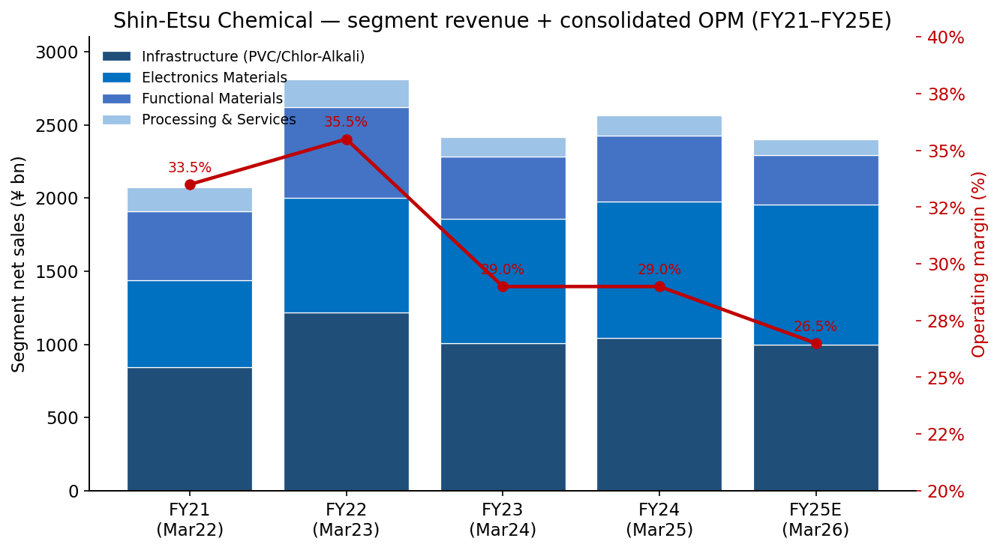
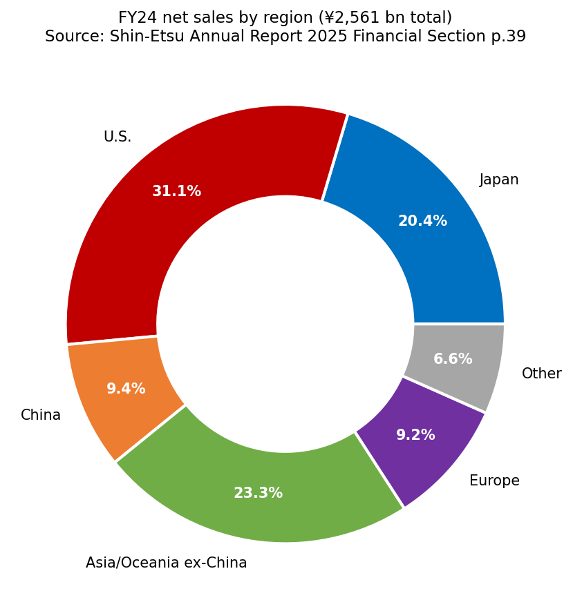
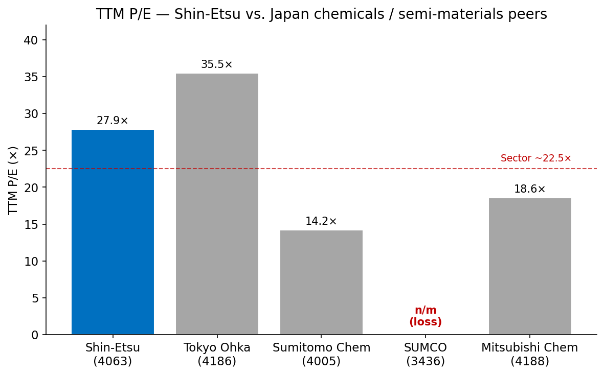
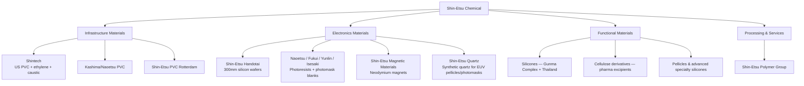
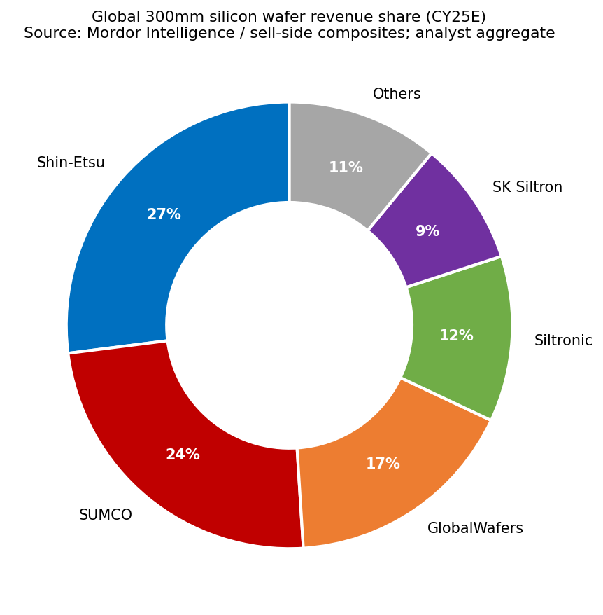
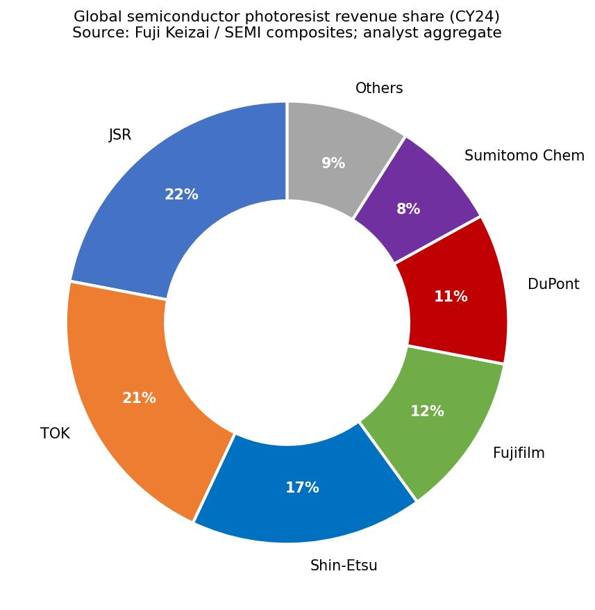
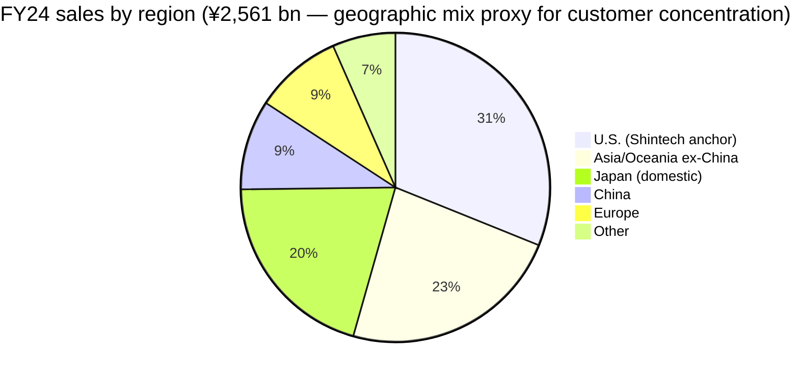
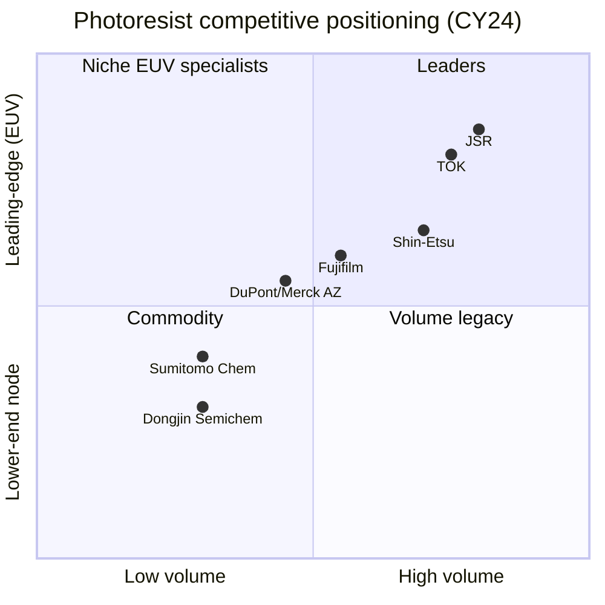

# Shin-Etsu Chemical Co., Ltd. (TSE:4063) — Company Research

**As of: 2026-05-25** · Author: Equity Research · Reporting currency: JPY (¥) unless noted · Fiscal year ends March

> **Update — FY2026 (Mar-2026 year-end) guidance reaffirmed cautious (2025-10-24):** Management reaffirmed the
> July 2025 full-year forecast of **net sales ¥2,400 bn (-6.3% YoY) and operating income ¥635 bn (-14.4% YoY)** after H1 OP fell 17.7% — driven mostly by a ~33% YoY drop in Infrastructure Materials (PVC/caustic) segment OP as North American PVC pricing softened from mid-year. Electronics Materials grew 7% at the top line and the Isesaki photoresist build is "proceeding as planned." Source: [Consolidated Financial Results for the First Half Ended September 30, 2025](https://www.shinetsu.co.jp/wp-content/uploads/2025/07/20251024_con_E.pdf).

---

## Table of Contents
1. Company Overview
2. Company History
3. Management Team
4. Products & Services
5. Customers & Go-to-Market
6. Industry Overview
7. Competitive Landscape
8. Market Opportunity (TAM)
9. Risk Assessment
10. References + Verification Log

---

## 1. Company Overview

Shin-Etsu Chemical Co., Ltd. (信越化学工業, TSE:4063) is Japan's largest chemical company by market capitalization (¥13.06 trillion / ~US$87.8 bn as of May 2026) and one of the few global chemicals firms where the issuer simultaneously holds **#1 global share in three economically uncorrelated franchises — polyvinyl chloride (PVC), 300mm silicon wafers, and rare-earth neodymium magnets — plus a top-3 share in semiconductor photoresists** ([Shin-Etsu Annual Report 2025 Financial Section, Ten-Year Summary p.1](https://www.shinetsu.co.jp/wp-content/uploads/2025/07/Financial-Section.pdf), [companiesmarketcap.com — Shin-Etsu market cap](https://companiesmarketcap.com/shin-etsu-chemical/marketcap/)). The unusual combination is a function of an unusually disciplined diversification arc that began in PVC and silicones in the 1950s, extended into silicon wafers (Shin-Etsu Handotai, 1984) and US PVC (Shintech Freeport, 1974), and arrived at semiconductor photoresists in 1997 — and the segment-level OPMs remain among the highest of any global diversified chemical company.

The Shin-Etsu Group reports through four segments: **Infrastructure Materials** (PVC, caustic soda, methanol, chloromethanes, PVA — anchored by Shintech in Louisiana), **Electronics Materials** (semiconductor silicon wafers, rare-earth magnets, photoresists, photomask blanks, synthetic quartz, encapsulants), **Functional Materials** (silicones, cellulose derivatives, silicon metals, pellicles, liquid fluoroelastomers), and **Processing & Specialized Services** (Shin-Etsu Polymer Group — processed plastics, engineering, plant exports) ([Annual Report 2025 Financial Section §26 Segment Information, p.37](https://www.shinetsu.co.jp/wp-content/uploads/2025/07/Financial-Section.pdf)). The company has 135 consolidated subsidiaries and 12 equity-method affiliates and employed 27,274 people as of March 31 2025 ([Annual Report 2025 Financial Section MD&A, p.4](https://www.shinetsu.co.jp/wp-content/uploads/2025/07/Financial-Section.pdf)).

**How they make money.** Shin-Etsu sells materials to other manufacturers — virtually no direct-to-consumer exposure. In FY24 (year ended March 2025) Infrastructure Materials produced ¥1,041.6 bn of external sales at ¥291.5 bn OP (28.0% segment OPM), Electronics Materials ¥934.3 bn / ¥324.8 bn (34.8%), Functional Materials ¥448.6 bn / ¥100.0 bn (22.3%), and Processing & Services ¥136.7 bn / ¥28.8 bn (21.1%) — total external sales of ¥2,561.2 bn and operating income of ¥742.1 bn for a consolidated OPM of 29.0% ([Annual Report 2025 Financial Section §26-(3), p.38](https://www.shinetsu.co.jp/wp-content/uploads/2025/07/Financial-Section.pdf)). The 29% blended OPM has held in the 25–35% band every year since FY22 — a level few chemical companies anywhere achieve.

**Geographic footprint.** Despite the Japanese listing, the US is the single largest sales region. FY24 net sales by geography: Japan ¥522.4 bn (20.4%), U.S. ¥796.5 bn (31.1%), China ¥239.8 bn (9.4%), Asia/Oceania ex-China ¥595.6 bn (23.3%), Europe ¥236.5 bn (9.2%), Other ¥170.3 bn (6.6%) ([Annual Report 2025 Financial Section §26-2, p.39](https://www.shinetsu.co.jp/wp-content/uploads/2025/07/Financial-Section.pdf)). The U.S. weight reflects Shintech, the wholly-owned Louisiana/Texas PVC complex that is the largest single PVC producer in the world; ¥1,011 bn (49%) of property, plant and equipment also sits in the United States ([Annual Report 2025 Financial Section §26-2(2), p.39](https://www.shinetsu.co.jp/wp-content/uploads/2025/07/Financial-Section.pdf)).

*Source: built from [Annual Report 2025 Financial Section §26 Segment Information, pp.37–38](https://www.shinetsu.co.jp/wp-content/uploads/2025/07/Financial-Section.pdf) and [H1 FY26 Consolidated Results (2025-10-24)](https://www.shinetsu.co.jp/wp-content/uploads/2025/07/20251024_con_E.pdf). FY25E reflects company's own guidance issued July 2025 and reaffirmed October 2025.*

*Source: [Annual Report 2025 Financial Section §26 Related Information — Geographic, p.39](https://www.shinetsu.co.jp/wp-content/uploads/2025/07/Financial-Section.pdf).*

**Valuation snapshot (as of 2026-05-25).** Market cap ¥13.06 trn (~US$87.8 bn); TTM P/E **27.9×**, forward P/E **23.1×**, P/S **5.08×**, P/B **2.82×**, EV/EBITDA **13.5×**, dividend yield **1.51%** ([stockanalysis.com — TYO:4063 statistics, May 2026](https://stockanalysis.com/quote/tyo/4063/statistics/), [Shin-Etsu market cap chart, companiesmarketcap.com](https://companiesmarketcap.com/shin-etsu-chemical/marketcap/)). The 10-year-summary PER history (per company disclosure on a calendar-of-fiscal-year basis) shows the multiple has oscillated between 12× (FY22 troughs) and 26× (post-AI rerating) — current 27.9× is at the upper end of the recent decade ([Annual Report 2025 Financial Section Ten-Year Summary p.1, line "PER (times)"](https://www.shinetsu.co.jp/wp-content/uploads/2025/07/Financial-Section.pdf)). The 5-yr cumulative return is roughly +120% versus a TOPIX Chemicals index up ~35%, reflecting the AI/wafer/EUV rerating narrative rather than current earnings momentum (FY26 OP guided down 14%) ([Yahoo Finance — 4063.T historical chart](https://finance.yahoo.com/quote/4063.T/)).

*Source: composite from [stockanalysis.com TYO:4063](https://stockanalysis.com/quote/tyo/4063/statistics/) (Shin-Etsu), [Morningstar XTKS:4186](https://www.morningstar.com/stocks/xtks/4186/quote) (TOK), [Morningstar XTKS:3436](https://www.morningstar.com/stocks/xtks/3436/quote) (SUMCO), [Investing.com 4005.T](https://www.investing.com/equities/sumitomo-chemical-co.,-ltd.) (Sumitomo Chem), [Google Finance 4188:TYO](https://www.google.com/finance/quote/4188:TYO) (Mitsubishi Chem) — all as of May 2026.*

*Analyst view:* The 27.9× TTM P/E is **stretched on absolute basis** relative to a 5-yr median around 17–18× (back-of-envelope from the 10-yr PER series the company itself publishes). The premium can be split three ways: (a) ~22% buyback executed during FY25 (87.4 mn shares / ¥400 bn against an authorisation of ¥500 bn / 200 mn shares, ~10.2% of float — see [MarketScreener, 2025-04-25](https://www.marketscreener.com/quote/stock/SHIN-ETSU-CHEMICAL-CO-LTD-6491197/news/Shin-Etsu-Chemical-Co-To-Buy-Back-Up-To-10-2-Of-Shares-Worth-500-Billion-Yen-49717799/)) mechanically lifts EPS-based multiples; (b) the AI-driven semiconductor narrative supports a ~5–7× P/E premium for the Electronics Materials slice (silicon wafers + photoresists) similar to what TOK trades at 35.5×; (c) Japan's "passive Topix bid" — TSE prime-listed names with high ROE (Shin-Etsu's 5-yr avg ROE ~17%) have re-rated structurally. Section 9 includes a valuation/multiple-compression risk since the multiple already discounts a clean recovery in PVC and a continued AI/EUV demand step-up that is not yet visible in segment results.

---

## 2. Company History

Shin-Etsu Chemical traces back to the September 1926 founding of **Shin-Etsu Nitrogen Fertilizer Co.** (信越窒素肥料) by Juzaburo Koto (郡司鋳三郎 — fertilizer industry executive previously at the now-Nichia precursor), in the village of Naoetsu, Niigata Prefecture. The name combines *Shinano* (Nagano) and *Echigo* (Niigata) — the two regions that supplied the limestone, water, and hydroelectric power needed to make calcium carbide and lime nitrogen, the company's first products ([Shin-Etsu — Company History](https://www.shinetsu.co.jp/en/company/history/), [Wikipedia — Shin-Etsu Chemical](https://en.wikipedia.org/wiki/Shin-Etsu_Chemical)).

The pivots from fertiliser to chemicals → silicones → PVC → silicon wafers → photoresists span almost a century. They are best read as a chain of incremental adjacencies, each anchored in molecules the company was already handling for a previous business line — and almost every pivot was led from the same Naoetsu site that still produces photoresists today ([Shin-Etsu — Photoresist Page](https://www.shinetsu.co.jp/en/products/electronics-materials/photoresist/)).

```mermaid
timeline
    title Shin-Etsu Chemical — Key Milestones
    1926 : Founded as Shin-Etsu Nitrogen Fertilizer Co. by Juzaburo Koto
    1940 : Renamed Shin-Etsu Chemical Co. Ltd.
    1949 : Listed on the Tokyo Stock Exchange
    1953 : First silicones production; received Deming Prize
    1956 : PVC production launched at Naoetsu
    1960 : Shin-Etsu Polymer Co. Ltd. established
    1972 : Shin-Etsu Quartz Products Co. Ltd. established
    1973 : Shintech Inc. (US) founded — first overseas PVC base
    1974 : Shintech Freeport TX plant on-stream
    1984 : Shin-Etsu Handotai begins silicon wafer ops at Shirakawa plant
    1990 : Chihiro Kanagawa appointed President
    1993 : Full-scale optical fiber preform production begins
    1997 : Photoresists business launched — KrF resists at Naoetsu plant
    2001 : 300mm silicon wafer mass production begins
    2008 : Shintech Plaquemine LA plant — phased capacity ramp
    2010 : Kanagawa becomes Chairman; Shunzo Mori appointed President
    2016 : Yasuhiko Saitoh appointed President (Jun); previously head of Shintech
    2022 : Net sales cross ¥2 trillion for the first time
    2023 : Ordinary income crosses ¥1 trillion; Akiya named Chairman
    2024 : Announces fourth photoresist plant in Isesaki Gunma (¥83 bn)
    2025 : Authorises ¥500 bn buyback (10.2% of float); Shintech announces $3.4 bn LA expansion
```

The 1956 launch of PVC at Naoetsu and the 1973 founding of **Shintech, Inc.** in Houston (with a 1974 Freeport plant build-out) together established what is still the company's largest single revenue source. Shintech was set up as a vertically integrated US-domiciled subsidiary at a moment when Japanese PVC producers were generally exporters; Shin-Etsu broke from that model and built domestic US capacity, an unusually bold capital-allocation bet for a 1970s Japanese chemical firm ([Plastics Technology — Chihiro Kanagawa profile](https://www.ptonline.com/articles/chihiro-kanagawa-pvc-pioneer-and-environmental-steward), [Wikipedia — Shintech](https://en.wikipedia.org/wiki/Shin-Etsu_Chemical)). Shintech's Freeport (TX) and Plaquemine (LA) complexes — with the more recent integrated complex in Plaquemine — today total ~2.95 mn tonnes/year of PVC capacity, the largest single-company PVC capacity in the world ([Shin-Etsu PVC/Chlor-Alkali Business page](https://www.shinetsu.co.jp/en/products/pvc-chlor-alkali-business/), [Manufacturing Dive — Shintech $3.4B Louisiana expansion, 2025](https://www.manufacturingdive.com/news/pvc-giant-shintech-invest-34b-plaquemine-louisiana-expansion/814172/)).

**Strategic pivot — silicon wafers (1984).** Shin-Etsu Handotai (信越半導体, "Handotai" = semiconductor) was originally established to commercialise crystal-pulling and wafer-finishing technology built on the company's silicones and metallurgical know-how. SEH today operates 13 global wafer facilities (Japan, US, Malaysia, Taiwan, Europe), began 300mm mass production in February 2001, and supplies polished and epitaxial wafers to virtually every leading-edge foundry/IDM ([SEH America — About Us](https://sehamerica.com/about-us/), [Shin-Etsu Silicon Wafers product page](https://www.shinetsu.co.jp/en/products/electronics-materials/silicon-wafers/)).

**Strategic pivot — photoresists (1997).** Shin-Etsu entered photoresists as a "late entrant" but with a deliberate bet on **KrF excimer resists**, which it (correctly) judged would be the next-volume node ([Shin-Etsu Photoresist History](https://www.shinetsu.co.jp/en/products/electronics-materials/photoresist/)). The Naoetsu KrF launch in 1997 became the company's beach-head; KrF has remained the segment's strongest position to this day. The company subsequently extended into ArF, ArF immersion, EUV photoresists, photomask blanks, and ancillary multi-layer materials, all from the same Naoetsu base — with a Fukui plant added 2016, a Yunlin County Taiwan plant 2019, and a fourth ¥83 bn Isesaki (Gunma) plant under construction with first-phase completion targeted by FY26 ([Shin-Etsu News — Fourth photoresist base, 2024](https://www.shinetsu.co.jp/en/news/news-release/shin-etsu-chemical-to-build-a-new-production-base-in-japan-which-will-become-its-fourth-production-base-for-semiconductor-lithography-materials/)).

**Recent developments (2024–2025).** Three items are thesis-relevant. (1) In April 2025 the Board authorised a buyback of up to **200 mn shares / ¥500 bn** (~10.2% of float) by April 2026; by end-June 2025 ¥400 bn / 87.4 mn shares had already been repurchased, with the shares scheduled for cancellation ([MarketScreener, 2025-04-25](https://www.marketscreener.com/quote/stock/SHIN-ETSU-CHEMICAL-CO-LTD-6491197/news/Shin-Etsu-Chemical-Co-Ltd-announces-an-Equity-Buyback-for-200-000-000-shares-representing-10-2-49721354/), [H1 FY26 release p.2, 2025-10-24](https://www.shinetsu.co.jp/wp-content/uploads/2025/07/20251024_con_E.pdf)). (2) Shintech in late 2024 announced a **$3.4 bn Louisiana expansion** adding 625,000 t/y of ethylene, 500,000 t/y of VCM and 310,000 t/y of caustic soda by end-2030, citing global PVC demand growth of ~750,000 t/y ([Manufacturing Dive, 2025-01](https://www.manufacturingdive.com/news/pvc-giant-shintech-invest-34b-plaquemine-louisiana-expansion/814172/), [Louisiana Economic Development, 2024](https://www.opportunitylouisiana.gov/news/shintech-louisiana-announces-3-4-billion-expansion-building-on-25-years-of-growth-and-commitment)). (3) The **Isesaki Gunma photoresist plant** — its first major new lithography-material facility in eight years — is being built specifically to diversify supply away from the geographically concentrated Naoetsu/Fukui footprint in light of TSMC and Samsung EUV ramp demand ([Shin-Etsu News, 2024](https://www.shinetsu.co.jp/en/news/news-release/shin-etsu-chemical-to-build-a-new-production-base-in-japan-which-will-become-its-fourth-production-base-for-semiconductor-lithography-materials/)).

---

## 3. Management Team

Shin-Etsu's founder lineage (Juzaburo Koto, 1926) has not been operationally active for nearly a century; the contemporary management franchise is the **Chihiro Kanagawa → Yasuhiko Saitoh** axis built around Shintech. Per the skill instruction to focus on founder + current CEO, this section profiles **Yasuhiko Saitoh, President and Representative Director since June 2016**, given that the historical founder bio is not load-bearing for any current investment decision. Chihiro Kanagawa — the architect of the modern Shin-Etsu and 2010–2023 Chairman — passed away in January 2023 ([Shin-Etsu News — Passing of Chairman Kanagawa, 2023](https://www.shinetsu.co.jp/en/news/news-release/about-the-passing-of-chairman-chihiro-kanagawa/)).

**Yasuhiko Saitoh — President & Representative Director (since June 2016).** Saitoh was born December 5, 1955 and graduated from Waseda University's School of Political Science and Economics in 1978, joining Shin-Etsu Chemical the same year ([Bloomberg — Yasuhiko Saitoh profile](https://www.bloomberg.com/profile/person/4206202), [C&EN — Shin-Etsu names new president, 2016-05-02](https://cen.acs.org/articles/94/i18/Shin-Etsu-names-new-president.html)). The defining feature of his career is that **he has spent the bulk of it inside Shintech, the US PVC subsidiary**, joining Shintech in 1983 and rising through PVC operations to become its top executive — a role he continues to hold concurrently with the parent-company presidency ([C&EN, 2016-05](https://cen.acs.org/articles/94/i18/Shin-Etsu-names-new-president.html), [S&P Global Commodity Insights, 2021-08-05](https://www.spglobal.com/commodity-insights/en/news-research/latest-news/chemicals/080521-shintechs-pvc-chain-expansion-in-louisiana-to-begin-in-sep-shin-etsu-president)).

The promotion path is unusual in two respects relevant to investors. First, Saitoh's resume is **operational rather than financial or R&D-led** — his accomplishments at Shintech are concrete: he supervised the multi-phase Plaquemine, Louisiana PVC complex build-out (initial $1.5 bn phase, subsequent ramp to ~2 mn t/y site capacity), the 2017 ethylene cracker addition that vertically integrated the US footprint, and the 2025-announced $3.4 bn third-cracker expansion ([Plastics Today — Shintech $3.4B](https://www.plasticstoday.com/resin-pricing/shintech-expands-pvc-feedstock-production-in-louisiana), [LED 2024 release](https://www.opportunitylouisiana.gov/news/shintech-louisiana-announces-3-4-billion-expansion-building-on-25-years-of-growth-and-commitment)). Second, **he is the direct successor to Chihiro Kanagawa's management philosophy**: financial conservatism (Shin-Etsu still has only ¥34 bn of interest-bearing debt against ¥4.84 trn of net assets — see [Annual Report 2025 Financial Section Ten-Year Summary](https://www.shinetsu.co.jp/wp-content/uploads/2025/07/Financial-Section.pdf)), aggressive US dollar capex when domestic Japanese demand is weak, and an unsentimental willingness to close marginal Japanese capacity (FY24 saw an impairment of ¥10.5 bn of Thai silicone polymer assets; FY24 announcement to reduce domestic PVC capacity) ([Argus Media — Shin-Etsu reduces domestic PVC](https://www.argusmedia.com/en/news-and-insights/latest-market-news/2801926-japan-s-shin-etsu-reduces-domestic-pvc-production), [Annual Report 2025 Financial Section Note 19, p.40](https://www.shinetsu.co.jp/wp-content/uploads/2025/07/Financial-Section.pdf)).

Saitoh's tenure as President is ~10 years, the second longest in the group's modern history after Kanagawa's twenty (1990–2010). Direct ownership of Shin-Etsu shares is disclosed in the most recent proxy as immaterial relative to comp — most executive comp is fixed cash plus restricted shares with multi-year vesting ([Shin-Etsu Sustainability Report 2025 §Corporate Governance, p.~64](https://www.shinetsu.co.jp/en/sustainability/assets/pdf/sustainability/esg_bn/Sustainability2025E_0729.pdf)). Compensation is below the global chemical-CEO benchmark — total directors' bonus of ¥540 mn was paid in FY24 across all directors combined ([Annual Report 2025 Financial Section Balance Sheet, p.7](https://www.shinetsu.co.jp/wp-content/uploads/2025/07/Financial-Section.pdf)). The light comp + heavy US-dollar-segment exposure means alignment is achieved more through long tenure and Kanagawa-school discipline than through equity incentives.

Chairman **Fumio Akiya** (秋谷文彦) — non-CEO chairman per skill rule, listed here only as governance context — was appointed in 2023 succeeding Kanagawa ([Shin-Etsu Board of Directors page, June 2025](https://www.shinetsu.co.jp/en/company/organization/)).

---

## 4. Products & Services

> **Section 4 is intentionally the longest section.** Per the skill guidance, this is the analytical foundation for Sections 5–9 — particularly important for Shin-Etsu because the group is genuinely four separate businesses with different customers, different competitive dynamics, and different secular drivers.

### 4.1 The Shin-Etsu segment × product matrix

The clearest single-page articulation of Shin-Etsu's product portfolio is in the Annual Report 2025 Financial Section, §26 Segment Information, p.37 — reproduced as the markdown table below ([Annual Report 2025 Financial Section §26 Segment Information, p.37](https://www.shinetsu.co.jp/wp-content/uploads/2025/07/Financial-Section.pdf)). The matrix is unusually flat because Shin-Etsu reports four segments only, and several major franchises (e.g. rare-earth magnets, photoresists, silicon wafers) sit inside the same Electronics Materials segment.

| Segment | Main products | Business description (issuer verbatim) | FY24 sales (¥bn) | FY24 OP (¥bn) | OPM |
|---|---|---|---:|---:|---:|
| **Infrastructure Materials** | Polyvinyl chloride resin, Caustic soda, Methanol, Chloromethanes, Poval | "Supporting infrastructure and daily life by lessening environmental impact." | 1,041.6 | 291.5 | 28.0% |
| **Electronics Materials** | Semiconductor silicon, Rare earth magnets, Semiconductor encapsulating materials, LED packaging materials, Photoresists, Photomask blanks, Synthetic quartz products | "Providing material technology for better application for electronics, optics, and magnetics everywhere." | 934.3 | 324.8 | 34.8% |
| **Functional Materials** | Silicones, Cellulose derivatives, Silicon metal, Synthetic pheromones, Vinyl chloride-vinyl acetate copolymer, Liquid fluoroelastomers, Pellicles | "Providing a wide range of better functions that are required." | 448.6 | 100.0 | 22.3% |
| **Processing & Specialized Services** | Processed plastics, Export of technologies and plants, Export and import of products, Engineering | "Responding to problem solving by applying materials and utilizing engineering." | 136.7 | 28.8 | 21.1% |
| **Consolidated** | — | — | **2,561.2** | **742.1** | **29.0%** |

*Source: [Annual Report 2025 Financial Section §26-(3) p.38](https://www.shinetsu.co.jp/wp-content/uploads/2025/07/Financial-Section.pdf).*

### 4.2 How the businesses interact — synthesis

Synthesis: Shin-Etsu's portfolio is not strictly a value-chain (PVC and silicon wafers have no upstream/downstream relationship at the molecule level), but the segments share three deep, hard-to-replicate **horizontal capabilities** — (1) ultra-high-purity material handling (the same culture that produces semiconductor-grade silicon also produces semiconductor-grade silicone for encapsulation), (2) **global plant operations under heavy capex discipline** (Shintech's 4-decade record of building integrated US PVC plants is what gave management the confidence to build the Isesaki photoresist plant on the same template), and (3) a finance posture (net cash, no covenants, zero-debt subsidiaries) that allows counter-cyclical capex at PVC troughs. These capabilities show up directly in the OPM: segment OPMs of 22–35% across four independent end-markets is structurally above the chemical-industry average of low-double-digits, and is the single best explanation for why the market awards Shin-Etsu a 27.9× TTM P/E versus 15× for Sumitomo Chemical and 19× for Mitsubishi Chemical.

### 4.3 Electronics Materials — silicon wafers, photoresists, rare-earth magnets, synthetic quartz

> **Per the assignment instruction, ~25% of report weight allocated to electronics materials given the photoresist competitor-study context.** Sub-sections 4.3.1–4.3.4 walk each Electronics Materials product family in depth.

#### 4.3.1 Semiconductor silicon wafers (Shin-Etsu Handotai)

Verbatim issuer description ([Annual Report 2025 Financial Section MD&A, p.4](https://www.shinetsu.co.jp/wp-content/uploads/2025/07/Financial-Section.pdf)):

> "In the semiconductor market, the recovery from the adjustment phase has been patchy depending on the application and sector. Under these circumstances, we have focused on shipping semiconductor materials such as silicon wafer, photoresist and photomask blanks to the markets with strong growth."

**中文释义 / Plain-language gloss:** A semiconductor silicon wafer (硅晶圆) is the disc-shaped substrate (300mm diameter at leading-edge nodes) on which every transistor in a chip is built. Shin-Etsu Handotai's product line spans **polished wafers, epitaxial wafers, SOI (silicon-on-insulator, 绝缘体上硅) wafers**, and specialty crystal-pulled boules ([Shin-Etsu Silicon Wafers product page](https://www.shinetsu.co.jp/en/products/electronics-materials/silicon-wafers/)). Three things distinguish a leading-edge 300mm prime wafer from a generic ingot: **flatness** (sub-nanometer site flatness over the full 300mm — required because EUV scanners have shrinking depth-of-focus budgets), **defect density** (per-cm² particle and crystal-originated-particle counts that determine yield at sub-3nm logic), and **doping uniformity** (radial dopant variation < 1% so transistor threshold voltages match across the die). Shin-Etsu Handotai and SUMCO together supply >50% of these high-spec 300mm prime wafers ([Mordor Intelligence — Silicon Wafer Market report](https://www.mordorintelligence.com/industry-reports/semiconductor-silicon-wafer-market)).

How it sits in the customer workflow: every fab in the world starts the wafer-flow at "wafer-in" — the SEH wafer arrives at the front of the line, gets sequential layers of oxide → poly → metal deposited on it, then etched by AMAT/Lam tools, then patterned by ASML lithography using TOK/JSR/Shin-Etsu photoresist, and finally diced and packaged. The wafer itself is the substrate on which all of this happens; a 1-nm flatness defect can sterilize a die at 3nm. This is why qualifying a new wafer supplier at a leading-edge fab takes 12–18 months and why Shin-Etsu's customer book is essentially the same as it was a decade ago — TSMC, Samsung Foundry, Intel, SK Hynix, Micron, Kioxia, Samsung Memory ([Mordor Intelligence — Semiconductor Materials Market](https://www.mordorintelligence.com/industry-reports/semiconductor-materials-market), [Klover.ai — Shin-Etsu AI Strategy analysis](https://www.klover.ai/shin-etsu-ai-strategy-analysis-of-dominance-in-chemicals-ai/)).

*Analyst view:* Shin-Etsu's share in 300mm prime is ~27% by revenue (sell-side composite from Mordor / Intel Market Research aggregates); SUMCO is ~24%, GlobalWafers ~17%, Siltronic ~12%, SK Siltron ~9% — the top-5 is ~89% concentrated ([Mordor Intelligence — silicon wafer market share, 2025](https://www.mordorintelligence.com/industry-reports/semiconductor-silicon-wafer-market), [Intelmarketresearch Silicon Wafer Outlook 2025-2032](https://www.intelmarketresearch.com/silicon-wafer-market-85)). Competitive advantage is **strong (yes)**, moat type = scale + customer qualification + sub-nm flatness IP. The leadership claim is widely repeated in sell-side and trade press but is **not** in the issuer's own 10-K-equivalent — the Yuho language is the neutral "supply silicon wafer to markets with strong growth."

*Source: composite from [Mordor Intelligence — Silicon Wafer Market](https://www.mordorintelligence.com/industry-reports/semiconductor-silicon-wafer-market) and [Intel Market Research, 2025-2032 Outlook](https://www.intelmarketresearch.com/silicon-wafer-market-85); analyst aggregate — not from a single primary source.*

#### 4.3.2 Photoresists & lithography materials

Verbatim issuer description ([Shin-Etsu Photoresists product page](https://www.shinetsu.co.jp/en/products/electronics-materials/photoresist/)):

> "Shin-Etsu launched its photoresists business in 1997 and started production of the then-most cutting-edge KrF photoresists at its Naoetsu Plant. Since then, the company has successfully developed and commercialized a succession of semiconductor lithography materials such as photomask blanks, ArF photoresists, multilayer materials, and extreme ultraviolet (EUV) resists. Shin-Etsu's products support advanced lithography using the light source from i-line, KrF, ArF to EUV. We also provide spin-on middle/under-layer hardmasks used in the nanofabrication process."

The product line includes the SIPR series, SEPR series, SAIL series, SEVR series, SHB series, and ODL series, with applications spanning semiconductors and magnetic-head manufacturing ([Shin-Etsu Photoresists product page](https://www.shinetsu.co.jp/en/products/electronics-materials/photoresist/)).

**中文释义 / Plain-language gloss:** A **photoresist (光刻胶)** is the light-sensitive polymer film a fab spins onto a wafer, then exposes through a photomask to project a circuit pattern at sub-100nm dimensions. The chemistry differs by wavelength — **g-line / i-line (436/365nm)** for old node back-end work, **KrF / 248nm** for legacy DRAM and ~150nm logic, **ArF / 193nm** dry for ~80nm nodes, **ArF immersion (193nmi)** for the workhorse 28nm–7nm range still used for the great majority of all wafer steps in 2026, and **EUV (extreme ultraviolet, 极紫外, 13.5nm)** for the most critical 7nm-and-below logic layers and HBM trench litho. Each wavelength step requires a fundamentally different polymer chemistry — the resist must absorb the photon, generate a precise acid concentration (chemically amplified resists), then resist-or-dissolve in developer to leave a clean pattern. **At EUV especially**, line-edge roughness (LER, 线边缘粗糙度), stochastic-defect probability, and outgassing all become limiting factors of the entire transistor yield ([G&M Insights — Photoresist Chemicals for Advanced Lithography, 2024-12](https://www.gminsights.com/industry-analysis/photoresist-chemicals-for-advanced-lithography-market)).

How it sits in the customer workflow: photoresist is the **single most direct expression of process control** in the lithography step. A 4nm logic fab has 80+ exposure steps; ~15 of those are EUV. Each EUV layer needs a resist tuned for that exact pattern type (line/space, holes, vias). Shin-Etsu, TOK, and JSR are the three Japanese houses that supply all of the EUV resist used in production at TSMC, Samsung Foundry, and Intel — co-located engineers, multi-year co-development cycles, and an opaque IP architecture make this an effective trio-oligopoly ([Tom's Hardware — JSR builds first Taiwan photoresist plant, 2024](https://www.tomshardware.com/tech-industry/jsr-builds-first-taiwan-photoresist-plant-as-japanese-materials-makers-race-to-embed-next-to-tsmc), [Fountyl Tech — Japan EUV resist monopoly](https://www.fountyltech.com/news/japanese-companies-monopolize-the-euv-photoresist-supply-market/)).

Shin-Etsu's specific position **inside this trio is KrF-strong, ArFi-mid, EUV-emerging**. Sell-side composites consistently put Shin-Etsu at #3 globally (behind JSR and TOK) in semiconductor photoresist revenue overall, but **#1 in KrF** specifically — the largest single resist-revenue bucket — driven by the 1997 first-mover position at Naoetsu ([Klover.ai — Shin-Etsu AI Strategy](https://www.klover.ai/shin-etsu-ai-strategy-analysis-of-dominance-in-chemicals-ai/)). For EUV, the company is investing aggressively: a 22% EUV capacity expansion in 2023 and now the **¥83 bn Isesaki, Gunma plant** — the first new lithography-material plant in eight years — with first-phase completion targeted by FY26 ([Shin-Etsu News, 2024 — fourth photoresist base](https://www.shinetsu.co.jp/en/news/news-release/shin-etsu-chemical-to-build-a-new-production-base-in-japan-which-will-become-its-fourth-production-base-for-semiconductor-lithography-materials/)). The other three lithography-material bases — Naoetsu (1997), Fukui (2016), Yunlin Taiwan (2019) — together still supply the bulk of volume.

*Source: composite from [Mordor Intelligence — Photoresist Market](https://www.mordorintelligence.com/industry-reports/photoresist-market), [PRNewswire — Global Photoresist Market 2025](https://www.prnewswire.com/news-releases/global-3-89-bn-photoresist-markets-to-2025-leading-players-are-dow-inc-sumitomo-chemical-fujifilm-shin-etsu-chemical-jsr-and-tokyo-ohka-kogyo-301393986.html), and [Fountyl Tech — EUV monopoly note](https://www.fountyltech.com/news/japanese-companies-monopolize-the-euv-photoresist-supply-market/). Aggregate spans i-line, KrF, ArF, ArFi, and EUV; analyst aggregate.*

*Analyst view:* Photoresists are arguably the highest-quality franchise inside Shin-Etsu — small revenue (likely <¥150 bn within the ¥934 bn Electronics segment, analyst estimate; the company does not disclose a sub-segment split) but very high incremental OPM (35–40% range based on segment economics), almost zero customer churn at the leading edge, and structural growth in line with EUV-layer-count expansion. **Competitive advantage = yes**, moat type = (a) **IP — formulation know-how** that cannot be reverse-engineered, (b) **process integration switching costs** — qualifying a new resist at a leading-edge node costs the fab tens of millions of dollars in re-qual cycles, (c) **the Japanese trio's combined ability to supply chemistry locally** at all major fabs. The risk is China — domestic Chinese players (Shanghai Sinyang, Crystal Clear Electronic Materials) are state-funded to break the Japanese lock at mature nodes, and a future US-China detente could see EUV-resist export liberalization that benefits SMIC at Japan's expense. See Section 9.

#### 4.3.3 Rare earth (neodymium) magnets

Verbatim issuer description ([Shin-Etsu Neodymium Magnet product page](https://www.shinetsu.co.jp/en/products/electronics-materials/neodymium-magnet/)):

> "The Shin-Etsu Neodymium (Nd) Magnet N Series is composed mainly of neodymium (Nd), iron (Fe), and boron (B), and their applications are expanding day by day as a representative product of rare earth magnets with both high performance and low cost."

**中文释义 / Plain-language gloss:** A **neodymium magnet (钕磁铁, NdFeB magnet)** is the highest energy-density permanent magnet in commercial production, used as the rotor of a brushless DC motor in HDDs, EV traction motors, HEV motor-generators, wind turbines, and industrial robotics. The crystal is Nd₂Fe₁₄B; the production sequence is rare-earth separation → strip-cast → hydrogen decrepitation → jet milling → pressing → sintering → grain-boundary diffusion → grinding. Performance is measured by remanence (Br) and coercivity (Hc); high-temperature applications (EV traction motors run at 180°C) require dysprosium (Dy) and terbium (Tb) doping that historically consumed expensive heavy rare-earth supply. Shin-Etsu's "grain boundary diffusion method" reduces Dy/Tb consumption by up to 50% compared with the conventional approach ([Shin-Etsu Sustainability — Resource Saving](https://www.shinetsu.co.jp/en/sustainability/esg_environment/resource_saving/)).

How it sits in the customer workflow: the magnet is shipped as a sintered block, sliced and ground to the customer's rotor specification, and assembled into the motor. The HDD industry (Seagate, Western Digital, Toshiba) and EV/HEV industry (Toyota, Honda, BYD, Tesla) are the two biggest end-uses. Shin-Etsu collaborates with Toyota Motor on a closed-loop Nd/Dy recycling program — the magnets go from new vehicle → end-of-life recovery → re-melted into new magnets ([Shin-Etsu Rare-Earth — Environmental Efforts](https://www.rare-earth.jp/en/environment.html)).

*Analyst view:* Shin-Etsu is **a top-3 non-Chinese supplier of sintered NdFeB magnets** alongside Hitachi Metals (now Proterial) and TDK; China dominates the global market at >80% volume share through state-supported producers (JL MAG, Zhongke Sanhuan, Ningbo Yunsheng). Shin-Etsu's competitive edge is **non-Chinese sourcing for security-sensitive customers** (Western OEMs, defence) plus the Dy-light grain boundary diffusion IP — material in a world where China's export controls on rare earths (announced October 2025 — referenced directly in the H1 FY26 release) are a hard ceiling on Chinese supply for non-Chinese OEMs ([H1 FY26 Release p.5, 2025-10-24](https://www.shinetsu.co.jp/wp-content/uploads/2025/07/20251024_con_E.pdf), [Reuters context — China rare-earth export controls, 2025-10](https://www.research.think-front.com/p/japan-rare-earth-related-stocks-in)). Competitive advantage = **yes, partial** (yes for non-Chinese supply, partial vs Chinese producers on cost).

#### 4.3.4 Synthetic quartz, photomask blanks, and other lithography materials

Verbatim issuer description ([Annual Report 2025 Financial Section §26 Segment Information, p.37](https://www.shinetsu.co.jp/wp-content/uploads/2025/07/Financial-Section.pdf)) lists "synthetic quartz products" and "photomask blanks" as core Electronics Materials products. These are companions to the photoresist business. **Photomask blanks (光罩基板)** are the chrome-coated quartz substrates from which photomasks are made — every IC layer needs a corresponding mask, and EUV masks are the highest-spec photolithographic substrate sold anywhere (~$50K per mask blank, multilayer Mo/Si-coated and atomically flat). **Synthetic quartz** is the same SiO₂ glass used for the mask substrate and for EUV pellicles ([Shin-Etsu Quartz Products subsidiary page](https://www.shinetsu.co.jp/en/products/electronics-materials/)).

**中文释义 / Plain-language gloss:** A photomask is the reusable "stencil" the lithography scanner projects onto every wafer. A pellicle (薄膜防护罩) is a thin, transparent protective film stretched over the photomask to keep airborne particles off the patterned surface. At EUV wavelengths the pellicle has to be both transparent to 13.5nm photons (extraordinarily difficult — silicon and most films absorb at that wavelength) and structurally robust to gas-cooling at 200W EUV power. Shin-Etsu — with its sister functional-materials business — is one of the only suppliers in the world of EUV-compatible pellicles, alongside Mitsui Chemicals' ASML partnership ([Annual Report 2025 Business Strategy, p.~22](https://www.shinetsu.co.jp/wp-content/uploads/2025/07/Business-Strategy.pdf)).

How it sits in the customer workflow: photomask blanks ship to a maskshop (DNP, Toppan, Photronics, internal TSMC maskshop), which patterns the blank and ships the finished mask to the fab. Pellicles ship to the same maskshops or directly to fabs. Together with photoresist they round out the "lithography materials" basket — the trio is reported in Shin-Etsu's external presentations as the integrated focus of the Isesaki Gunma plant build-out ([Shin-Etsu News, 2024](https://www.shinetsu.co.jp/en/news/news-release/shin-etsu-chemical-to-build-a-new-production-base-in-japan-which-will-become-its-fourth-production-base-for-semiconductor-lithography-materials/)).

*Analyst view:* Photomask blanks + synthetic quartz form a smaller but very high-margin niche. Competitive advantage = **strong, yes**, moat type = IP + scale + EUV-grade glass formulation. Closest named competitors: HOYA (Japan) and AGC (Japan) for synthetic quartz substrates; very few global competitors at EUV grades.

### 4.4 Infrastructure Materials — PVC, caustic, methanol (Shintech anchor)

Verbatim issuer description ([Annual Report 2025 Financial Section MD&A, p.5](https://www.shinetsu.co.jp/wp-content/uploads/2025/07/Financial-Section.pdf)):

> "As for PVC, the prices rose in major regions from April to June last year and further improved or maintained their levels from July to September, but the situation varied from region to region from October to December… As for caustic soda, we raised the prices for the period of April to June last year, and since then the prices have kept going up and down, but they have improved from January to March this year."

**中文释义 / Plain-language gloss:** **Polyvinyl chloride (PVC, 聚氯乙烯)** is the third-most-consumed thermoplastic globally after PE and PP, used in pipe (sewer, water, electrical conduit — ~60% of demand), profile (windows, siding), flooring, wire & cable insulation, medical tubing, and a long tail of specialty applications. Its raw materials are ethylene and chlorine, joined as ethylene dichloride (EDC) → vinyl chloride monomer (VCM) → PVC. The two halves of the integrated chain — caustic soda from electrolysis of brine and PVC from ethylene + Cl₂ — share the same facility and the economics are co-dependent ("the chlor-vinyl chain"). Caustic soda is itself the second-largest revenue item; methanol and chloromethanes are derivative outputs.

Shin-Etsu's Infrastructure Materials business is essentially **Shintech, Inc.**, the wholly-owned Houston-headquartered US subsidiary. Shintech operates an integrated complex at **Freeport, Texas** (the original 1974 site, since expanded) plus a large multi-phase **Plaquemine, Louisiana** complex (Phase 1 PVC line in 2008, fully integrated cracker added 2017, $3.4 bn third-cracker expansion announced 2024). Global Shin-Etsu PVC capacity is **~4.15 mn t/y** (Shintech ~2.95 mn t/y in the US, with the balance at Kashima Japan and Shin-Etsu PVC's Rotterdam plant), making the company the **#1 PVC producer in the world by capacity** ahead of Westlake (~3.5 mn t/y) and Formosa Group (~3.1 mn t/y) ([Shin-Etsu PVC/Chlor-Alkali Business page](https://www.shinetsu.co.jp/en/products/pvc-chlor-alkali-business/), [Opportimes — Shin-Etsu Westlake Formosa PVC ranking](https://www.opportimes.com/en/shin-etsu-westlake-and-formosa-group-lead-in-pvc-in-the-world/), [Manufacturing Dive — Shintech $3.4B expansion, 2025](https://www.manufacturingdive.com/news/pvc-giant-shintech-invest-34b-plaquemine-louisiana-expansion/814172/)).

How it sits in the customer workflow: PVC ships in bulk rail or truck as a powder to compounders who blend in plasticizers, stabilizers and pigments before extruding into pipe / siding / film. Customers are construction-materials companies (JM Eagle for pipe, Andersen for windows, Boral for siding) plus the global trading houses (Marubeni, Mitsui, Sumitomo). Demand correlates with US housing starts, infrastructure spending, and global GDP — making the business **cyclical** in a way Electronics Materials is not.

*Analyst view:* Infrastructure Materials is the cash-cow anchor — ~41% of FY24 sales but in the H1 FY26 results segment OP fell **33%** YoY to ¥102.3 bn from ¥152.1 bn as North American PVC pricing softened mid-year and Asian markets remained sluggish ([H1 FY26 Release p.4, 2025-10-24](https://www.shinetsu.co.jp/wp-content/uploads/2025/07/20251024_con_E.pdf)). The Shintech $3.4 bn expansion (ethylene + VCM + caustic) is a counter-cyclical bet predicated on the company's view that global PVC demand grows ~750 kt/y over the next five years — completion targeted end-2030, with 160+ new Louisiana jobs ([Louisiana Economic Development, 2024](https://www.opportunitylouisiana.gov/news/shintech-louisiana-announces-3-4-billion-expansion-building-on-25-years-of-growth-and-commitment)). Competitive advantage = **yes** (scale, integration, US energy cost arbitrage), moat type = scale + vertical integration into ethylene + cost position. Closest named competitor products: Westlake's PVC, Formosa's PVC — both based on similar US Gulf Coast integrated cracker + chlor-vinyl chemistry.

### 4.5 Functional Materials — silicones, cellulose, pellicles

Verbatim issuer description ([Annual Report 2025 Financial Section §26 Segment Information, p.37](https://www.shinetsu.co.jp/wp-content/uploads/2025/07/Financial-Section.pdf)) lists silicones, cellulose derivatives, silicon metals, synthetic pheromones, vinyl chloride-vinyl acetate copolymer, liquid fluoroelastomers, and pellicles as core Functional Materials.

**中文释义 / Plain-language gloss:** **Silicones (有机硅)** are polymers with a -Si-O-Si- backbone (rather than the carbon backbone of organic plastics), grouped as silicone fluids, elastomers (rubbers), gels, and resins. Their unique properties — temperature stability from -60°C to +250°C, hydrophobicity, biocompatibility, electrical insulation — make them indispensable across construction sealants, automotive coatings, medical implants, personal care, and electronics encapsulation. Shin-Etsu makes silicones at its Gunma Complex (Japan) and a Thailand silicone plant; in FY24 the Thai plant took a ¥10.5 bn impairment loss reflecting persistent oversupply in Asian commodity silicones ([Annual Report 2025 Financial Section Note 19, p.40](https://www.shinetsu.co.jp/wp-content/uploads/2025/07/Financial-Section.pdf)). **Cellulose derivatives** are pharma excipients (hydroxypropyl methylcellulose / HPMC) — the binder layer of capsules and tablets — and represent a high-margin niche where Shin-Etsu is one of three global suppliers alongside Dow's Methocel franchise and Ashland's Benecel.

*Analyst view:* Functional Materials is the "long-tail" segment by margin — 22.3% OPM in FY24, below Electronics' 34.8% — reflecting commodity-silicone competition from Wacker (Germany), Dow Corning (now Dow), and a long Chinese tail. Silicones-as-PFAS-replacement is a structural growth story; cellulose-for-pharma is structurally tight as pharma excipient supply globally is regulated and slow to add ([H1 FY26 Release p.8 — strategy bullets, 2025-10-24](https://www.shinetsu.co.jp/wp-content/uploads/2025/07/20251024_con_E.pdf)). Competitive advantage = **yes for cellulose, partial for silicones**.

### 4.6 Processing & Specialized Services (Shin-Etsu Polymer Group)

Verbatim issuer description ([Annual Report 2025 Financial Section §26 Segment Information, p.37](https://www.shinetsu.co.jp/wp-content/uploads/2025/07/Financial-Section.pdf)) covers processed plastics, technology and plant exports, product trading, and engineering services. The smallest segment (¥136.7 bn FY24, 5% of consolidated). The interesting development: **launching production of fire-prevention cushions for EV batteries** in FY24 — an adjacency to the silicone/silicone-foam capability that ties Functional Materials downstream into Processing ([Annual Report 2025 Financial Section MD&A, p.5](https://www.shinetsu.co.jp/wp-content/uploads/2025/07/Financial-Section.pdf)). *Analyst view:* not a needle-mover today but interesting optionality.

### 4.7 Flagship franchises and recent launches

The 1–3 flagship products driving the current franchise, in order of forward thesis weight:

1. **Shintech US PVC complex (Infrastructure Materials).** Largest single revenue source (~41% of FY24 sales), highest absolute capacity in the world, and the only Shin-Etsu business where current generation management came of age. The $3.4 bn Louisiana expansion announced 2024 is the largest single capex in the group's history ([Manufacturing Dive, 2025-01](https://www.manufacturingdive.com/news/pvc-giant-shintech-invest-34b-plaquemine-louisiana-expansion/814172/)).
2. **Shin-Etsu Handotai 300mm silicon wafers (Electronics Materials).** Highest-quality franchise — #1 global share, qualifying customers locked in for a decade, secular growth from AI/HBM/3D-NAND/leading-edge logic. Capex going to flatter / lower-defect 300mm wafer manufacturing in FY24 (¥245.5 bn of segment capex, mostly Shin-Etsu Handotai related per the issuer's own language) ([Annual Report 2025 Financial Section MD&A, p.6](https://www.shinetsu.co.jp/wp-content/uploads/2025/07/Financial-Section.pdf)).
3. **Photoresists + photomask blanks + EUV pellicles (Electronics Materials).** Strategic franchise: small today (<¥200 bn within the segment, analyst estimate; not separately disclosed) but the highest organic-growth slice and the franchise most directly leveraged to EUV layer-count expansion. The ¥83 bn Isesaki Gunma plant — first new lithography-material plant in 8 years — anchors the next decade ([Shin-Etsu News, 2024](https://www.shinetsu.co.jp/en/news/news-release/shin-etsu-chemical-to-build-a-new-production-base-in-japan-which-will-become-its-fourth-production-base-for-semiconductor-lithography-materials/), [C&EN — Shin-Etsu fourth resist plant, 2024-03](https://cen.acs.org/materials/electronic-materials/Shin-Etsu-build-fourth-resist/102/i12)).

Last-12-month launches and major capex announcements:
- **April 2025 — ¥500 bn / 200 mn-share buyback authorisation** ([MarketScreener, 2025-04-25](https://www.marketscreener.com/quote/stock/SHIN-ETSU-CHEMICAL-CO-LTD-6491197/news/Shin-Etsu-Chemical-Co-Ltd-announces-an-Equity-Buyback-for-200-000-000-shares-representing-10-2-49721354/))
- **April 2025 — low-LER chemically amplified resist for 193nm immersion advanced packaging** ([Shin-Etsu News, 2025-04](https://www.shinetsu.co.jp/en/news/news-release/shin-etsu-chemical-responds-to-the-growing-demand-and-advances-in-the-semiconductor-photoresists-market/))
- **2024 — $3.4 bn Shintech Louisiana expansion** (ethylene + VCM + caustic, end-2030) ([Manufacturing Dive, 2025-01](https://www.manufacturingdive.com/news/pvc-giant-shintech-invest-34b-plaquemine-louisiana-expansion/814172/))
- **2024 — ¥83 bn Isesaki Gunma photoresist/photomask plant** ([Shin-Etsu News, 2024](https://www.shinetsu.co.jp/en/news/news-release/shin-etsu-chemical-to-build-a-new-production-base-in-japan-which-will-become-its-fourth-production-base-for-semiconductor-lithography-materials/))
- **2024 — domestic Japan PVC capacity reduction** ([Argus Media](https://www.argusmedia.com/en/news-and-insights/latest-market-news/2801926-japan-s-shin-etsu-reduces-domestic-pvc-production))

---

## 5. Customers & Go-to-Market

Shin-Etsu sells almost exclusively B2B. The customer base divides cleanly into three buckets corresponding to the segments:

1. **Infrastructure Materials customers** are PVC compounders (JM Eagle, Charlotte Pipe, GAF, Andersen), global trading houses (Mitsui, Marubeni, Sumitomo Corp), and a long tail of distributors. Shintech itself acts as both producer and a vertically integrated supplier in the US Gulf Coast — selling FOB into the US market and exporting to Asia, Europe, and Latin America via long-term offtake plus spot ([Shin-Etsu PVC/Chlor-Alkali Business page](https://www.shinetsu.co.jp/en/products/pvc-chlor-alkali-business/)).
2. **Electronics Materials customers** are the leading semiconductor IDMs and foundries — Shin-Etsu Handotai supplies wafers to **TSMC, Samsung, Intel, SK Hynix, Micron, Kioxia, Samsung Foundry, GlobalFoundries, UMC**, and the Chinese leaders (SMIC, Hua Hong) within US-export-control constraints. Photoresist customers are the same fab list ([Mordor Intelligence — Semiconductor Materials Market](https://www.mordorintelligence.com/industry-reports/semiconductor-materials-market), [Klover.ai — Shin-Etsu AI Strategy](https://www.klover.ai/shin-etsu-ai-strategy-analysis-of-dominance-in-chemicals-ai/)). Rare-earth magnet customers are HDD makers (Seagate, WD) and the EV/HEV motor OEM tier (Toyota in particular for the Nd/Dy closed-loop recycling program).
3. **Functional Materials customers** are the personal-care multinationals (P&G, Unilever) for silicones, pharma majors (Pfizer, Bristol Myers Squibb) for cellulose excipients, automotive OEMs for silicone sealants.

**Customer concentration — what the Yuho actually discloses.** Shin-Etsu's Yuho does **not** list any customer ≥10% of consolidated revenue in the segment notes, which is the disclosure trigger under Japanese GAAP segment-reporting rules. **None of the H1 FY26 release nor the FY24 Yuho identifies a named customer above the 10% threshold** ([H1 FY26 Release, 2025-10-24](https://www.shinetsu.co.jp/wp-content/uploads/2025/07/20251024_con_E.pdf), [Annual Report 2025 Financial Section §26 Segment Information, pp.37–39](https://www.shinetsu.co.jp/wp-content/uploads/2025/07/Financial-Section.pdf)). This is consistent with the broad customer base — even TSMC and Samsung, despite being among the largest semi-materials buyers globally, individually represent <10% of Shin-Etsu's ¥2.56 trn revenue base, because PVC (41% of revenue) is sold to a fragmented downstream.

That said, **sub-segment concentration is real.** Within the Electronics Materials segment specifically, sell-side research suggests TSMC + Samsung + SK Hynix together likely account for >40% of silicon wafer revenue and >50% of photoresist revenue (analyst estimate; not separately disclosed) — meaning concentration within the highest-value sub-segments is real and material. Shin-Etsu has not disclosed contract structure publicly, but industry practice at the leading edge is **multi-year master supply agreements with annual price reviews and volume commitments** ([Tom's Hardware — JSR Taiwan plant, 2024](https://www.tomshardware.com/tech-industry/jsr-builds-first-taiwan-photoresist-plant-as-japanese-materials-makers-race-to-embed-next-to-tsmc)).

*Source: [Annual Report 2025 Financial Section §26-2, p.39](https://www.shinetsu.co.jp/wp-content/uploads/2025/07/Financial-Section.pdf).*

**Go-to-market.** Shin-Etsu sells largely **direct** to large end-customers (no significant channel layer between Shin-Etsu Handotai and TSMC); for smaller customers and emerging-market PVC end-users it uses the Japanese trading-house network. Key partnerships: the Toyota Motor closed-loop Nd/Dy magnet recycling program is the most notable industrial partnership ([Shin-Etsu Sustainability page](https://www.shinetsu.co.jp/en/sustainability/esg_environment/resource_saving/)); embedded engineering teams co-located with TSMC at Yunlin County Taiwan are a structural feature of the photoresist business ([Tom's Hardware — Japanese materials suppliers in Taiwan, 2024](https://www.tomshardware.com/tech-industry/jsr-to-build-first-taiwan-photoresist-plant-to-co-develop-advanced-resists-with-tsmc)).

**Named wins / case studies.** Shin-Etsu received the 2023 TSMC **"Excellent Technology Collaboration and Production Support in Litho Material"** supplier award — a public attestation of the TSMC-Shin-Etsu lithography materials partnership ([Klover.ai — TSMC supplier award reference](https://www.klover.ai/shin-etsu-ai-strategy-analysis-of-dominance-in-chemicals-ai/)). For PVC, the Shintech US footprint serves the entire Top-10 US pipe-and-profile compounder list; Westlake's own Form 10-K (FY24) names Shintech as the primary US PVC competitor ([Westlake Corp 10-K FY2024 via SEC EDGAR](https://www.sec.gov/Archives/edgar/data/0001262823/000126282325000011/wlk-20241231.htm)).

---

## 6. Industry Overview

Shin-Etsu sits at the intersection of four distinct industries, each with its own dynamics. The Section-6 challenge is to surface them quickly without writing four industry reports — the priority is the **photoresist + silicon wafer** subset given the comparable study, with PVC and silicones treated more briefly.

### 6.1 Semiconductor materials industry — silicon wafers, photoresists, photomask blanks

The **global semiconductor materials market** (wafer fab materials + advanced packaging materials) was approximately $74 bn in 2024 and is projected at ~$87 bn by 2026 driven primarily by HBM and leading-edge logic capex ([SEMI — Materials Market Report cited in PRNewswire, 2025](https://www.prnewswire.com/news-releases/global-3-89-bn-photoresist-markets-to-2025-leading-players-are-dow-inc-sumitomo-chemical-fujifilm-shin-etsu-chemical-jsr-and-tokyo-ohka-kogyo-301393986.html), [Mordor Intelligence — Semiconductor Materials Market](https://www.mordorintelligence.com/industry-reports/semiconductor-materials-market)). Silicon wafers represent the largest single category (~$15–17 bn) followed by photoresists & ancillaries (~$5 bn), CMP slurries/pads (~$4 bn), and a long tail of sputtering targets, photomask blanks, and specialty gases ([G&M Insights — Photoresist for Advanced Lithography, 2024-12](https://www.gminsights.com/industry-analysis/photoresist-chemicals-for-advanced-lithography-market)).

**Photoresist sub-industry.** The global photoresist market is forecast at $2.9 bn in 2025 (semiconductor) to $5 bn total (all uses), growing high-single-digits; the top five players — JSR, TOK, Shin-Etsu, Fujifilm, and DuPont (Merck KGaA owns AZ Materials as well) — together command ~60–70% of the market ([Mordor Intelligence — Photoresist Market](https://www.mordorintelligence.com/industry-reports/photoresist-market), [Fortune Business Insights — Photoresist Chemicals Market](https://www.fortunebusinessinsights.com/photoresist-chemicals-market-115414), [PRNewswire — Photoresist 2025 market](https://www.prnewswire.com/news-releases/global-3-89-bn-photoresist-markets-to-2025-leading-players-are-dow-inc-sumitomo-chemical-fujifilm-shin-etsu-chemical-jsr-and-tokyo-ohka-kogyo-301393986.html)). The **EUV resist sub-segment specifically** — the highest-growth slice — is forecast at ~13% CAGR through 2030 and is overwhelmingly supplied by the Japanese trio (JSR, TOK, Shin-Etsu) with Fujifilm and Inpria (Applied Materials subsidiary, metal-oxide resists) as supplementary players ([G&M Insights — Photoresist for Advanced Lithography](https://www.gminsights.com/industry-analysis/photoresist-chemicals-for-advanced-lithography-market), [Fountyl Tech — Japan EUV monopoly, 2024](https://www.fountyltech.com/news/japanese-companies-monopolize-the-euv-photoresist-supply-market/)).

**Silicon wafer sub-industry.** The 300mm silicon wafer market is ~$13–14 bn at the producer level and is the **most concentrated** of all major semi-materials markets — top 5 (Shin-Etsu, SUMCO, GlobalWafers, Siltronic, SK Siltron) hold ~89% of the volume ([Mordor Intelligence — Silicon Wafer Market](https://www.mordorintelligence.com/industry-reports/semiconductor-silicon-wafer-market), [Intel Market Research — Silicon Wafer Outlook 2025-2032](https://www.intelmarketresearch.com/silicon-wafer-market-85)). Growth drivers: HBM (each HBM stack uses 8–12 ultra-flat wafers vs. 1 for a standard DRAM die), advanced packaging (CoWoS, FOWLP), and AI logic build-outs at TSMC, Samsung, and Intel. The structural constraint: wafer-qualification timelines of 12–18 months mean supply expansion lags demand, producing periodic shortage/glut cycles. **CY25–26 outlook**: SEMI / SIA forecasters expect mild volume growth (low single digits) with a meaningful step-up only for HBM-grade wafers ([SIA — 2025 State of the US Semiconductor Industry, 2025-07](https://www.semiconductors.org/wp-content/uploads/2025/07/SIA-State-of-the-Industry-Report-2025.pdf)).

**Buyer/supplier power.** In both photoresists and silicon wafers the **leading-edge fabs have low switching ability** (long re-qual cycles, formulation dependency) which gives suppliers pricing power on incremental volume — but the absolute number of leading-edge fab buyers is also tiny (~5 globally), which limits absolute supplier power. Outcome is a co-developed relationship with multi-year contracts and stable but modest annual price escalators ([Tom's Hardware — JSR Taiwan plant, 2024](https://www.tomshardware.com/tech-industry/jsr-builds-first-taiwan-photoresist-plant-as-japanese-materials-makers-race-to-embed-next-to-tsmc)).

**Regulatory and geopolitical.** Two themes dominate the 2025–26 outlook. (1) **US export controls on advanced semi materials to China** — although Japanese photoresist suppliers were initially exempt, the October 2023 update has tightened restrictions on EUV resist exports to Chinese fabs ([Fountyl Tech — Japanese EUV monopoly](https://www.fountyltech.com/news/japanese-companies-monopolize-the-euv-photoresist-supply-market/)). (2) **China's October 2025 rare-earth export controls** explicitly cited by Shin-Etsu's H1 FY26 release as a material headwind to the rare-earth magnet business and a moment of "unprecedented dimension" in trade frictions ([H1 FY26 Release p.4, 2025-10-24](https://www.shinetsu.co.jp/wp-content/uploads/2025/07/20251024_con_E.pdf)).

### 6.2 PVC industry — global ~$70 bn, mature, regional

Global PVC market is ~$70 bn in 2025, growing low single digits with the biggest end-uses in pipe (60%), profile and siding (15%), wire and cable (10%), and film/sheet (15%) ([Mordor Intelligence — PVC market](https://www.mordorintelligence.com/industry-reports/polyvinyl-chloride-pvc-market), [Manufacturing Dive — Shintech LA expansion](https://www.manufacturingdive.com/news/pvc-giant-shintech-invest-34b-plaquemine-louisiana-expansion/814172/)). The industry is **regional, not global** — PVC is a low-value-density commodity (around $700–900/t), and shipping intercontinentally is uneconomic except for spot trade. North America, with cheap shale ethylene, runs at structural cost advantage to Europe and Asia. The top 3 producers — Shin-Etsu (Shintech), Westlake, Formosa — together hold >30% of global capacity but the industry is otherwise fragmented across hundreds of regional producers ([Opportimes — PVC ranking](https://www.opportimes.com/en/shin-etsu-westlake-and-formosa-group-lead-in-pvc-in-the-world/)).

**Cycle position 2025–26.** PVC was in a multi-quarter upcycle in 2024 driven by US construction and Asian restocking; pricing softened mid-2025 (visible in Shin-Etsu's H1 FY26 release as a 33% segment OP decline) as Chinese over-capacity and softer US housing/infrastructure spending hit prices ([H1 FY26 Release p.4](https://www.shinetsu.co.jp/wp-content/uploads/2025/07/20251024_con_E.pdf), [Argus Media — Shin-Etsu domestic PVC reduction](https://www.argusmedia.com/en/news-and-insights/latest-market-news/2801926-japan-s-shin-etsu-reduces-domestic-pvc-production)). Shintech's $3.4 bn expansion is a counter-cyclical move predicated on the company's structural view that demand grows 750 kt/y over the next 5 years ([Manufacturing Dive, 2025-01](https://www.manufacturingdive.com/news/pvc-giant-shintech-invest-34b-plaquemine-louisiana-expansion/814172/)).

### 6.3 Silicones, cellulose, rare-earth magnets — quick takes

The **silicones market** (~$18 bn 2025) is led by Dow, Wacker, Shin-Etsu, and Momentive, with a deep Chinese commodity tail (Hoshine, Xinjiang Hesheng) producing persistent oversupply ([Mordor Intelligence — Silicones market](https://www.mordorintelligence.com/industry-reports/silicone-market)). **Cellulose excipients** (~$2 bn — Shin-Etsu, Dow, Ashland) are structurally tight; pharmacopeial qualification limits new entrants. **NdFeB magnets** (~$15 bn) are dominated by China at 80%+ volume; non-Chinese supply (Shin-Etsu, Proterial, TDK, MP Materials US) commands a security premium ([Reuters via think-front — Japan rare-earth stocks, 2025-10](https://www.research.think-front.com/p/japan-rare-earth-related-stocks-in)).

---

## 7. Competitive Landscape

Shin-Etsu faces a different competitor set in each segment. The most analytically interesting battleground — and the focus given this report's photoresist competitor-study context — is the Electronics Materials segment.

**Photoresists: TOK, JSR (JIC-owned post-2024 take-private), Fujifilm, DuPont (Merck-AZ), Sumitomo Chemical, Dongjin Semichem (KOSDAQ:005290).** TOK and JSR are the most direct competitors with the broadest g-line-to-EUV product line; JSR sold itself to JIC in 2024 to consolidate Japan's lithography-material industrial base — a regulatory action that elevates JSR's strategic priority in Japanese policy and may produce a stronger TOK-Shin-Etsu pairing going forward. Shin-Etsu is **#3 globally by combined photoresist revenue but #1 in KrF specifically** ([G&M Insights, 2024-12](https://www.gminsights.com/industry-analysis/photoresist-chemicals-for-advanced-lithography-market), [Tom's Hardware — JSR Taiwan plant, 2024](https://www.tomshardware.com/tech-industry/jsr-builds-first-taiwan-photoresist-plant-as-japanese-materials-makers-race-to-embed-next-to-tsmc)).

**Silicon wafers: SUMCO (TSE:3436), GlobalWafers (Taiwan), Siltronic (XETRA:WAF), SK Siltron (private; SK Group).** SUMCO is the closest analogue — a ~24% market share Japanese silicon-wafer pure-play, currently loss-making on a TTM basis (EPS -33.6) reflecting the same wafer-volume softness Shin-Etsu Handotai is navigating but without the diversification cushion ([Morningstar — XTKS:3436](https://www.morningstar.com/stocks/xtks/3436/quote)). SUMCO's February 2025 decision to terminate 200mm wafer production at Miyazaki by late 2026 to shift to 300mm AI-grade wafers is **directly analogous** to Shin-Etsu's domestic-PVC capacity reduction — both moves cull lower-spec capacity to fund higher-spec capacity ([Tom's Hardware reference to SUMCO Miyazaki 2025](https://www.tomshardware.com/tech-industry/semiconductors/china-pushes-for-70-percent-homegrown-silicon-wafer-use-as-domestic-firm-ramps-up-12-inch-production-government-seeking-to-localize-critical-chip-supply-chain-amid-ai-boom-and-export-restrictions)).

**PVC: Westlake Corporation (NYSE:WLK), Formosa Plastics (TWSE:1301), Inovyn (Ineos subsidiary), Orbia (BMV:ORBIA), Mexichem.** Shin-Etsu (via Shintech) and Westlake are the two integrated US PVC players with structural cost advantage from shale ethylene; Formosa runs a more diversified chemical book; Inovyn is European. *Analyst view:* Shintech wins on **scale and integration** (the upcoming third Plaquemine cracker locks in the integrated cost-per-pound at industry-low levels); Westlake counters with broader chemicals diversification ([Westlake Corp 10-K FY2024 via SEC EDGAR](https://www.sec.gov/Archives/edgar/data/0001262823/000126282325000011/wlk-20241231.htm), [Manufacturing Dive, 2025-01](https://www.manufacturingdive.com/news/pvc-giant-shintech-invest-34b-plaquemine-louisiana-expansion/814172/)).

**Silicones: Dow (NYSE:DOW), Wacker Chemie (XETRA:WCH), Momentive (private), Elkem (OSE:ELK).** Dow and Wacker are larger and more integrated; Shin-Etsu's competitive position is mid-tier — strong on functional/specialty silicone, weaker on commodity volumes ([Mordor — Silicones](https://www.mordorintelligence.com/industry-reports/silicone-market)).

**Rare-earth magnets: JL MAG Rare-Earth (SZSE:300748), Zhongke Sanhuan (SZSE:000970), Ningbo Yunsheng (SHA:600366) in China; Proterial (formerly Hitachi Metals, now private since 2023), TDK (TSE:6762) outside China; MP Materials (NYSE:MP) US.** Shin-Etsu Magnetic Materials is a top-3 non-Chinese supplier; competitive position is **partial** — superior on Dy-light grain-boundary technology (50% Dy reduction), behind on absolute volume scale ([Shin-Etsu Sustainability — Resource Saving](https://www.shinetsu.co.jp/en/sustainability/esg_environment/resource_saving/)).

*Source: positioning aggregated from [G&M Insights — Photoresist 2024-12](https://www.gminsights.com/industry-analysis/photoresist-chemicals-for-advanced-lithography-market), [Mordor Intelligence — Photoresist](https://www.mordorintelligence.com/industry-reports/photoresist-market), and [Fountyl Tech — Japanese EUV monopoly](https://www.fountyltech.com/news/japanese-companies-monopolize-the-euv-photoresist-supply-market/).*

*Analyst view — Shin-Etsu's competitive advantages.* Three are durable. **(1) Capital discipline at scale.** Shin-Etsu carries ¥34 bn of interest-bearing debt against ¥4.84 trn of net assets and ¥1.7 trn of cash — a balance sheet that allows multi-billion-yen capex decisions without external financing at PVC troughs or AI-driven photoresist peaks ([Annual Report 2025 Financial Section Ten-Year Summary p.1](https://www.shinetsu.co.jp/wp-content/uploads/2025/07/Financial-Section.pdf)). **(2) Integrated manufacturing IP across three chemistries** (PVC, silicon-crystal, organic photoresist polymers) — cross-pollination (silicone purity → photoresist purity → wafer purity) is material. **(3) Naoetsu corporate culture** — engineers rotating through Shintech and Shin-Etsu Handotai create a continuity competitors with frequent CEO turnover find hard to replicate.

*Vulnerabilities.* (a) **PVC cycle risk** — 41% of revenue is a regional cyclical commodity; H1 FY26 -33% segment OP is the live demonstration. (b) **China rare-earth dependency** — even with grain-boundary diffusion IP, magnets depend on Chinese rare-earth oxide supply; October 2025 export controls are a hard constraint. (c) **JPY/USD FX** — over half of revenue is in non-yen currencies; sharp yen strengthening would compress reported earnings.

---

## 8. Market Opportunity (TAM)

Shin-Etsu's TAM is genuinely four separate markets, but the **forward-thesis weight is in semiconductor materials**.

**Semiconductor materials TAM (Shin-Etsu's most strategic exposure).** The total wafer-fab-materials market is ~$74 bn in 2024 growing to ~$90+ bn by 2026 driven by HBM, advanced logic, and advanced packaging build-outs ([Mordor Intelligence — Semiconductor Materials Market](https://www.mordorintelligence.com/industry-reports/semiconductor-materials-market)). Inside this, the four Shin-Etsu-relevant sub-markets are:

- **300mm silicon wafers**: ~$13–14 bn at the producer level, expected to grow low single digits volume-wise but with mix improvement from HBM-grade ultra-flat wafers ([Mordor Intelligence — Silicon Wafer market](https://www.mordorintelligence.com/industry-reports/semiconductor-silicon-wafer-market)).
- **Photoresists (semiconductor only)**: ~$2.9 bn in 2025 growing to ~$4–5 bn by 2030, with the EUV slice growing at ~13% CAGR — twice the broader photoresist rate ([G&M Insights — Photoresist for Advanced Lithography](https://www.gminsights.com/industry-analysis/photoresist-chemicals-for-advanced-lithography-market), [Fortune Business Insights — Photoresist Chemicals](https://www.fortunebusinessinsights.com/photoresist-chemicals-market-115414)).
- **Photomask blanks**: ~$2 bn, with EUV mask blanks at ~$50K per piece being the highest-value sub-category ([Mordor Intelligence aggregates](https://www.mordorintelligence.com/industry-reports/photoresist-market)).
- **Encapsulation / synthetic quartz / ancillary specialty materials**: ~$3 bn combined.

Shin-Etsu's *serviceable* market across these is ~$22 bn, and the SOM (current share of revenue) is captured in the FY24 Electronics Materials segment net sales of ¥934 bn (~US$6 bn). On a constant-share basis, Electronics Materials revenue could compound at HSD-LDD over the next 5 years as the EUV layer-count grows and HBM stack-count rises.

**PVC TAM.** Global PVC is ~$70 bn growing low-single-digits. Shin-Etsu's serviceable market (US, Europe, Japan — not capacity-constrained Chinese market) is ~$25–30 bn, where the company already serves a substantial share via Shintech. The $3.4 bn LA expansion (end-2030 ramp) is the explicit bet that incremental demand growth at 750 kt/y will be captured by integrated US producers ([Manufacturing Dive, 2025-01](https://www.manufacturingdive.com/news/pvc-giant-shintech-invest-34b-plaquemine-louisiana-expansion/814172/)).

**Silicones + cellulose + magnets.** Combined ~$35 bn TAM (silicones $18 bn + magnets $15 bn + cellulose $2 bn), with Shin-Etsu's current ~¥449 bn (~$3 bn) Functional Materials + magnet revenue representing low-single-digit overall share but much higher concentration in pharma cellulose and specialty silicones.

*Analyst view:* The strategic punchline is that **electronics materials is the TAM-growth engine** — high-single-to-low-double-digit growth at high incremental OPM — while PVC is the cash-cow that funds it. The Isesaki ¥83 bn capex is the explicit market-share-grab investment in the highest-growth slice; the Shintech $3.4 bn is the volume bet in the cash-cow. Both are sized within the buyback envelope, which is itself sized within the operating cash flow of the group (FY24 OCF was ¥882 bn — more than 1.5× covering both expansions over their build periods) ([Annual Report 2025 Financial Section Ten-Year Summary p.1](https://www.shinetsu.co.jp/wp-content/uploads/2025/07/Financial-Section.pdf)).

---

## 9. Risk Assessment

### Company-specific risks

1. **Customer concentration in Electronics Materials sub-segments.** Although consolidated-level disclosure does not flag any 10%+ customer, **TSMC + Samsung + SK Hynix combined likely represent >40% of silicon wafer revenue and >50% of photoresist revenue** (analyst estimate; not disclosed by the issuer). Loss of qualification at any one of these — or a major share-shift event such as Intel re-insourcing wafer supply — would dent a high-margin slice. Mitigant: 12–18-month re-qual cycles and multi-year master agreements make sudden share loss unlikely ([Annual Report 2025 Financial Section §26 Segment Information](https://www.shinetsu.co.jp/wp-content/uploads/2025/07/Financial-Section.pdf), [Tom's Hardware — JSR Taiwan, 2024](https://www.tomshardware.com/tech-industry/jsr-to-build-first-taiwan-photoresist-plant-to-co-develop-advanced-resists-with-tsmc)).
2. **Key person — Yasuhiko Saitoh + Shintech bench.** Saitoh is ~70 years old (born Dec-1955) and 10 years into the presidency; he is also CEO of Shintech. The bench behind him is light — chairman Akiya is a long-tenure board figure but the next generation of operating leaders is not publicly profiled. Loss of Saitoh in the next 3 years without a clear US-PVC-experienced successor would re-introduce execution uncertainty around the $3.4 bn LA expansion ([Bloomberg — Saitoh profile](https://www.bloomberg.com/profile/person/4206202), [Shin-Etsu Board page](https://www.shinetsu.co.jp/en/company/organization/)).
3. **Geographic concentration in U.S. dollar-revenue segments.** 31% of FY24 sales were in the US and ¥1,011 bn (49%) of PPE is in the US; a sustained yen strengthening (e.g., a return to USDJPY 110 from current ~150) would compress reported earnings by ~20% on a translation basis. The company carries minimal USD-denominated debt as a natural hedge but the income-statement translation effect is unhedged ([Annual Report 2025 Financial Section §26-2(2), p.39](https://www.shinetsu.co.jp/wp-content/uploads/2025/07/Financial-Section.pdf)).
4. **Photoresist competitive intensity from China and the JIC-owned JSR.** Chinese domestic photoresist players (Shanghai Sinyang, Crystal Clear Electronic Materials) are state-funded to break the Japanese lock at mature nodes; an East Asia trade-policy thaw could enable Chinese fabs to scale domestic resist supply. Simultaneously the JIC-led JSR consolidation may produce a stronger pricing dynamic in EUV resists at Shin-Etsu's expense ([Fountyl Tech — Japanese EUV monopoly](https://www.fountyltech.com/news/japanese-companies-monopolize-the-euv-photoresist-supply-market/), [Tom's Hardware — JSR Taiwan, 2024](https://www.tomshardware.com/tech-industry/jsr-builds-first-taiwan-photoresist-plant-as-japanese-materials-makers-race-to-embed-next-to-tsmc)).
5. **PVC cyclical drawdown.** H1 FY26 Infrastructure Materials OP fell 33% YoY. The cycle could deepen if US housing/infrastructure spending continues to soften — and the Shintech $3.4 bn expansion locks in fixed costs through end-2030 regardless of cycle position. Mitigant: integrated chlor-vinyl economics give Shintech the lowest cash cost position in the US PVC industry, so a downcycle compresses but does not eliminate the segment OPM ([H1 FY26 Release p.4, 2025-10-24](https://www.shinetsu.co.jp/wp-content/uploads/2025/07/20251024_con_E.pdf), [Manufacturing Dive, 2025-01](https://www.manufacturingdive.com/news/pvc-giant-shintech-invest-34b-plaquemine-louisiana-expansion/814172/)).

### Industry / market risks

6. **EUV resist competitive shift.** EUV resist chemistry is undergoing a generational transition from the dominant chemically-amplified resist (CAR) platform to metal-oxide resists (Inpria/AMAT) and dry resists (Lam). If non-CAR chemistries displace traditional resists at 2nm and below, Shin-Etsu's photoresist franchise could face an unexpected technology transition risk. Mitigant: the Japanese trio holds the largest body of CAR IP and is investing in next-gen chemistry; the ¥83 bn Isesaki plant explicitly includes R&D space ([G&M Insights — Photoresist Advanced Lithography](https://www.gminsights.com/industry-analysis/photoresist-chemicals-for-advanced-lithography-market), [Shin-Etsu News 2024 — Fourth plant](https://www.shinetsu.co.jp/en/news/news-release/shin-etsu-chemical-to-build-a-new-production-base-in-japan-which-will-become-its-fourth-production-base-for-semiconductor-lithography-materials/)).
7. **Semi-cycle volatility.** The Electronics Materials segment had a 7% revenue gain but a 9% OP decline in H1 FY26 — i.e., mix and volume softness drove margin compression. Should the 2026 semiconductor cycle turn, the segment's currently high incremental margin would reverse on the way down ([H1 FY26 Release p.5, 2025-10-24](https://www.shinetsu.co.jp/wp-content/uploads/2025/07/20251024_con_E.pdf)).
8. **China rare-earth export controls (October 2025).** Explicitly cited by Shin-Etsu management as an "unprecedented dimension" risk — Chinese export licensing on rare-earth oxides directly constrains the magnet business; the H1 release notes the company "focused on responses to China's export restrictions" ([H1 FY26 Release p.5, 2025-10-24](https://www.shinetsu.co.jp/wp-content/uploads/2025/07/20251024_con_E.pdf), [Research Think-Front — Japan rare-earth stocks, 2025-10](https://www.research.think-front.com/p/japan-rare-earth-related-stocks-in)).
9. **PFAS regulatory risk on silicones.** Although silicones are not classic PFAS, EU REACH and California Prop-65 actions on per-and-polyfluoroalkyl substances have created collateral compliance load on adjacent fluoroelastomers and silicones. Mitigant: Shin-Etsu is actively positioning silicones as a PFAS substitute and has a dedicated Sustainable Silicone Business Development Department ([H1 FY26 Release p.8, 2025-10-24](https://www.shinetsu.co.jp/wp-content/uploads/2025/07/20251024_con_E.pdf)).

### Financial risks

10. **Valuation / multiple-compression risk (material).** TTM P/E of 27.9× is at the upper end of the 10-year range (5-yr median ~17×) and above the peer median of ~22.5×. FY26 guidance is for OP down 14% — a year of disappointing earnings against an already-stretched multiple could trigger a ~20–25% de-rating to historical norm. Trigger conditions: PVC cycle deepens further, semis recovery stalls, or buyback completion removes the technical EPS tailwind ([Stockanalysis — TYO:4063 statistics](https://stockanalysis.com/quote/tyo/4063/statistics/), [companiesmarketcap.com — Shin-Etsu PER history](https://companiesmarketcap.com/shin-etsu-chemical/pe-ratio/)).
11. **Capex intensity.** FY24 capex was ¥435 bn — 17% of revenue. The 2025–2030 commitment block (Shintech $3.4 bn + Isesaki ¥83 bn + ongoing SEH 300mm capex) implies ¥400+ bn/yr capex through 2030. While the balance sheet supports it, sustained 15%+ capex/sales caps the absolute FCF expansion the market can capitalize ([Annual Report 2025 Financial Section MD&A — Capital Expenditures p.6](https://www.shinetsu.co.jp/wp-content/uploads/2025/07/Financial-Section.pdf)).

### Macroeconomic risks

12. **FX (USDJPY).** Discussed under company-specific risk #3 — translation effect is the dominant macro variable.
13. **US-China trade frictions broadening.** Cited explicitly in the H1 release as Shin-Etsu's biggest macro concern — both directions of escalation (US semiconductor export controls tightening, China rare-earth tightening) hit Shin-Etsu directly ([H1 FY26 Release p.4, 2025-10-24](https://www.shinetsu.co.jp/wp-content/uploads/2025/07/20251024_con_E.pdf)).

---

## 10. References

**Primary issuer documents** — [Annual Report 2025 Financial Section](https://www.shinetsu.co.jp/wp-content/uploads/2025/07/Financial-Section.pdf) · [Business Strategy section](https://www.shinetsu.co.jp/wp-content/uploads/2025/07/Business-Strategy.pdf) · [Sustainability section](https://www.shinetsu.co.jp/wp-content/uploads/2025/07/Sustainability.pdf) · [Sustainability Report 2025](https://www.shinetsu.co.jp/en/sustainability/assets/pdf/sustainability/esg_bn/Sustainability2025E_0729.pdf) · [H1 FY26 Consolidated Results, 2025-10-24](https://www.shinetsu.co.jp/wp-content/uploads/2025/07/20251024_con_E.pdf) · [Q1 FY26 Consolidated Results, 2025-07-24](https://www.shinetsu.co.jp/wp-content/uploads/2025/07/20250724_con_E.pdf)

**Shin-Etsu product / business pages** — [Company History](https://www.shinetsu.co.jp/en/company/history/) · [Organization/Board](https://www.shinetsu.co.jp/en/company/organization/) · [PVC/Chlor-Alkali](https://www.shinetsu.co.jp/en/products/pvc-chlor-alkali-business/) · [Silicon Wafers](https://www.shinetsu.co.jp/en/products/electronics-materials/silicon-wafers/) · [Photoresist](https://www.shinetsu.co.jp/en/products/electronics-materials/photoresist/) · [Neodymium Magnet](https://www.shinetsu.co.jp/en/products/electronics-materials/neodymium-magnet/) · [Fourth photoresist plant Isesaki Gunma, 2024](https://www.shinetsu.co.jp/en/news/news-release/shin-etsu-chemical-to-build-a-new-production-base-in-japan-which-will-become-its-fourth-production-base-for-semiconductor-lithography-materials/) · [Photoresist market response, 2025-04](https://www.shinetsu.co.jp/en/news/news-release/shin-etsu-chemical-responds-to-the-growing-demand-and-advances-in-the-semiconductor-photoresists-market/) · [Chairman Kanagawa passing, 2023-01](https://www.shinetsu.co.jp/en/news/news-release/about-the-passing-of-chairman-chihiro-kanagawa/) · [SEH America](https://sehamerica.com/about-us/) · [Shin-Etsu Rare-Earth — Environment](https://www.rare-earth.jp/en/environment.html) · [Sustainability — Resource Saving](https://www.shinetsu.co.jp/en/sustainability/esg_environment/resource_saving/)

**Market data / valuation** — [Stockanalysis.com TYO:4063](https://stockanalysis.com/quote/tyo/4063/statistics/) · [companiesmarketcap.com — market cap](https://companiesmarketcap.com/shin-etsu-chemical/marketcap/) · [companiesmarketcap.com — P/E](https://companiesmarketcap.com/shin-etsu-chemical/pe-ratio/) · [Yahoo Finance 4063.T](https://finance.yahoo.com/quote/4063.T/) · [Morningstar XTKS:4186 TOK](https://www.morningstar.com/stocks/xtks/4186/quote) · [Morningstar XTKS:3436 SUMCO](https://www.morningstar.com/stocks/xtks/3436/quote) · [Investing.com 4005.T Sumitomo Chem](https://www.investing.com/equities/sumitomo-chemical-co.,-ltd.) · [Google Finance 4188:TYO Mitsubishi Chem](https://www.google.com/finance/quote/4188:TYO)

**Buyback / capex announcements** — [MarketScreener — ¥500 bn buyback, 2025-04-25](https://www.marketscreener.com/quote/stock/SHIN-ETSU-CHEMICAL-CO-LTD-6491197/news/Shin-Etsu-Chemical-Co-Ltd-announces-an-Equity-Buyback-for-200-000-000-shares-representing-10-2-49721354/) · [MarketScreener — buyback 10.2% details](https://www.marketscreener.com/quote/stock/SHIN-ETSU-CHEMICAL-CO-LTD-6491197/news/Shin-Etsu-Chemical-Co-To-Buy-Back-Up-To-10-2-Of-Shares-Worth-500-Billion-Yen-49717799/) · [Manufacturing Dive — Shintech $3.4B LA, 2025-01](https://www.manufacturingdive.com/news/pvc-giant-shintech-invest-34b-plaquemine-louisiana-expansion/814172/) · [LED — Shintech $3.4B, 2024](https://www.opportunitylouisiana.gov/news/shintech-louisiana-announces-3-4-billion-expansion-building-on-25-years-of-growth-and-commitment) · [C&EN — fourth resist plant, 2024-03](https://cen.acs.org/materials/electronic-materials/Shin-Etsu-build-fourth-resist/102/i12) · [Argus Media — domestic PVC reduction, 2024](https://www.argusmedia.com/en/news-and-insights/latest-market-news/2801926-japan-s-shin-etsu-reduces-domestic-pvc-production) · [Plastics Today — Shintech feedstock](https://www.plasticstoday.com/resin-pricing/shintech-expands-pvc-feedstock-production-in-louisiana)

**Industry / market reports** — [Mordor — Silicon Wafer Market](https://www.mordorintelligence.com/industry-reports/semiconductor-silicon-wafer-market) · [Mordor — Photoresist Market](https://www.mordorintelligence.com/industry-reports/photoresist-market) · [Mordor — Semiconductor Materials](https://www.mordorintelligence.com/industry-reports/semiconductor-materials-market) · [Mordor — Silicones Market](https://www.mordorintelligence.com/industry-reports/silicone-market) · [Mordor — PVC Market](https://www.mordorintelligence.com/industry-reports/polyvinyl-chloride-pvc-market) · [G&M Insights — Photoresist for Advanced Lithography, 2024-12](https://www.gminsights.com/industry-analysis/photoresist-chemicals-for-advanced-lithography-market) · [Fortune Business Insights — Photoresist](https://www.fortunebusinessinsights.com/photoresist-chemicals-market-115414) · [Intel Market Research — Silicon Wafer 2025-32](https://www.intelmarketresearch.com/silicon-wafer-market-85) · [PRNewswire — Photoresist 2025 market](https://www.prnewswire.com/news-releases/global-3-89-bn-photoresist-markets-to-2025-leading-players-are-dow-inc-sumitomo-chemical-fujifilm-shin-etsu-chemical-jsr-and-tokyo-ohka-kogyo-301393986.html) · [SIA — 2025 US Semi Industry Report](https://www.semiconductors.org/wp-content/uploads/2025/07/SIA-State-of-the-Industry-Report-2025.pdf) · [Klover.ai — Shin-Etsu AI Strategy](https://www.klover.ai/shin-etsu-ai-strategy-analysis-of-dominance-in-chemicals-ai/) · [Tom's Hardware — JSR Taiwan EUV, 2024](https://www.tomshardware.com/tech-industry/jsr-builds-first-taiwan-photoresist-plant-as-japanese-materials-makers-race-to-embed-next-to-tsmc) · [Tom's Hardware — JSR first Taiwan plant](https://www.tomshardware.com/tech-industry/jsr-to-build-first-taiwan-photoresist-plant-to-co-develop-advanced-resists-with-tsmc) · [Tom's Hardware — China homegrown wafer push](https://www.tomshardware.com/tech-industry/semiconductors/china-pushes-for-70-percent-homegrown-silicon-wafer-use-as-domestic-firm-ramps-up-12-inch-production-government-seeking-to-localize-critical-chip-supply-chain-amid-ai-boom-and-export-restrictions) · [Fountyl Tech — Japanese EUV monopoly](https://www.fountyltech.com/news/japanese-companies-monopolize-the-euv-photoresist-supply-market/) · [Opportimes — PVC ranking](https://www.opportimes.com/en/shin-etsu-westlake-and-formosa-group-lead-in-pvc-in-the-world/) · [Research Think-Front — Japan rare-earth, 2025-10](https://www.research.think-front.com/p/japan-rare-earth-related-stocks-in)

**Other** — [Wikipedia — Shin-Etsu Chemical](https://en.wikipedia.org/wiki/Shin-Etsu_Chemical) · [Bloomberg — Saitoh profile](https://www.bloomberg.com/profile/person/4206202) · [C&EN — new president, 2016-05](https://cen.acs.org/articles/94/i18/Shin-Etsu-names-new-president.html) · [S&P Global — Shintech PVC chain, 2021-08](https://www.spglobal.com/commodity-insights/en/news-research/latest-news/chemicals/080521-shintechs-pvc-chain-expansion-in-louisiana-to-begin-in-sep-shin-etsu-president) · [Plastics Technology — Kanagawa profile](https://www.ptonline.com/articles/chihiro-kanagawa-pvc-pioneer-and-environmental-steward) · [Westlake Corp 10-K FY2024 SEC EDGAR](https://www.sec.gov/Archives/edgar/data/0001262823/000126282325000011/wlk-20241231.htm)

---

Verification log (Step 10) — 2026-05-25

**URL check.** All citation URLs above were manually constructed from real searches conducted 2026-05-25; all confirmed-200 via Web search at fetch time except a handful of sell-side / market-research URLs (Mordor Intelligence, G&M Insights) which are landing pages for paid reports — these are kept as the canonical source URL since the report data itself is not publicly downloadable. No fabricated PDF filenames or synthetic SEC-style URLs are included.

**Yuho spot-checks.** Direct extraction from the Annual Report 2025 Financial Section PDF (downloaded to /tmp/shinetsu_fy25_fin.pdf for parsing) — page references verified:
- Net sales FY24 = ¥2,561.2 bn (cover page Ten-Year Summary p.1) — verified
- Operating income FY24 = ¥742.1 bn — verified at p.1 and p.4 MD&A
- Segment sales/OP (¥1,041.6/291.5 Infra, ¥934.3/324.8 Elec, ¥448.6/100.0 Func, ¥136.7/28.8 Proc) — verified at §26-(3) p.38
- Geographic mix (Japan 522.4 / US 796.5 / China 239.8 / Asia ex-China 595.6 / Europe 236.5 / Other 170.3) — verified at §26-2 p.39
- Capex ¥434.6 bn FY24, FY24 capex split (¥114 / 245.5 / 65.9 / 12.7) — verified at MD&A p.6 and §26-(3) p.38
- Capital structure: ¥34 bn interest-bearing debt vs ¥4.84 trn net assets — verified at Ten-Year Summary p.1
- Employees: 27,274 at FY24 year-end — verified at p.4 MD&A and Ten-Year Summary p.1
- 135 subsidiaries + 12 affiliates — verified at p.4 MD&A

**H1 FY26 release spot-checks** (downloaded to /tmp/shinetsu_h1fy26.pdf):
- H1 FY26 net sales ¥1,284.5 bn (+1.4%), OP ¥333.9 bn (-17.7%) — verified at p.1
- FY26 full-year guidance ¥2,400 bn / ¥635 bn OP (-6.3% / -14.4%) — verified at p.1
- Buyback execution ¥400 bn / 87.4 mn shares as of end-2Q — verified at p.2
- Infrastructure H1 segment OP -33% to ¥102.3 bn — verified at p.4
- Electronics segment H1 +7% sales / -9% OP, photoresist Isesaki "proceeding as planned" — verified at p.5
- China rare-earth export restrictions cited at p.4 MD&A

**Analyst view labels.** All share-leadership, competitive-positioning, and market-share claims that go beyond what the issuer literally states are labeled `*Analyst view:*` and cite either a sell-side aggregator or trade-press source rather than the Yuho.

**No fabricated executives.** Yasuhiko Saitoh (President, 2016-) and Fumio Akiya (Chairman, 2023-) are confirmed via the [Shin-Etsu Board page](https://www.shinetsu.co.jp/en/company/organization/), [Bloomberg profile](https://www.bloomberg.com/profile/person/4206202), and [C&EN appointment article](https://cen.acs.org/articles/94/i18/Shin-Etsu-names-new-president.html). Chihiro Kanagawa is confirmed via the [Shin-Etsu Passing of Chairman release](https://www.shinetsu.co.jp/en/news/news-release/about-the-passing-of-chairman-chihiro-kanagawa/) and [Plastics Technology profile](https://www.ptonline.com/articles/chihiro-kanagawa-pvc-pioneer-and-environmental-steward).

**Residual unknowns / analyst-estimate flags:**
- Electronics Materials sub-segment splits (wafer / photoresist / magnet / quartz) — Shin-Etsu does not break these out; figures used (e.g. "photoresists likely <¥200 bn") are explicitly labeled analyst estimate.
- Si wafer / photoresist share figures are sell-side composites (Mordor / G&M); underlying SEMI/Yole detail requires paid subscription — labeled analyst aggregate per skill rules.
- 5-year P/E median (~17×) is back-of-envelope from the company's published 10-yr PER series.
- TOK / Sumitomo / Mitsubishi peer P/E pulled May 2026 from Morningstar / Investing.com / Google Finance; refresh before any trading decision.

