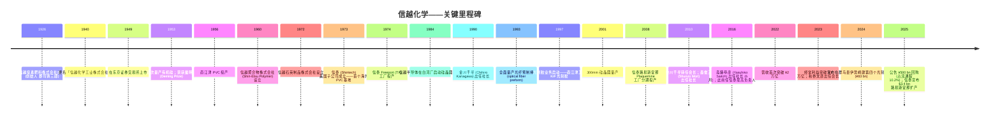
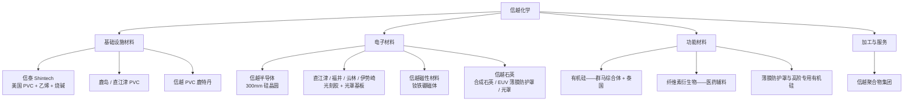
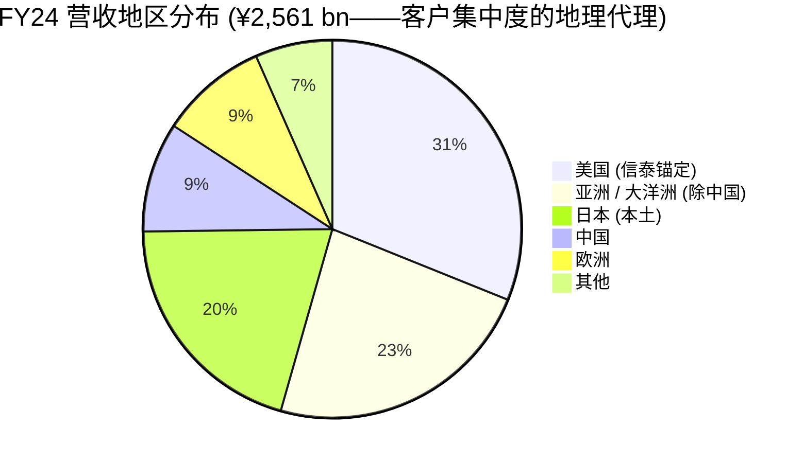
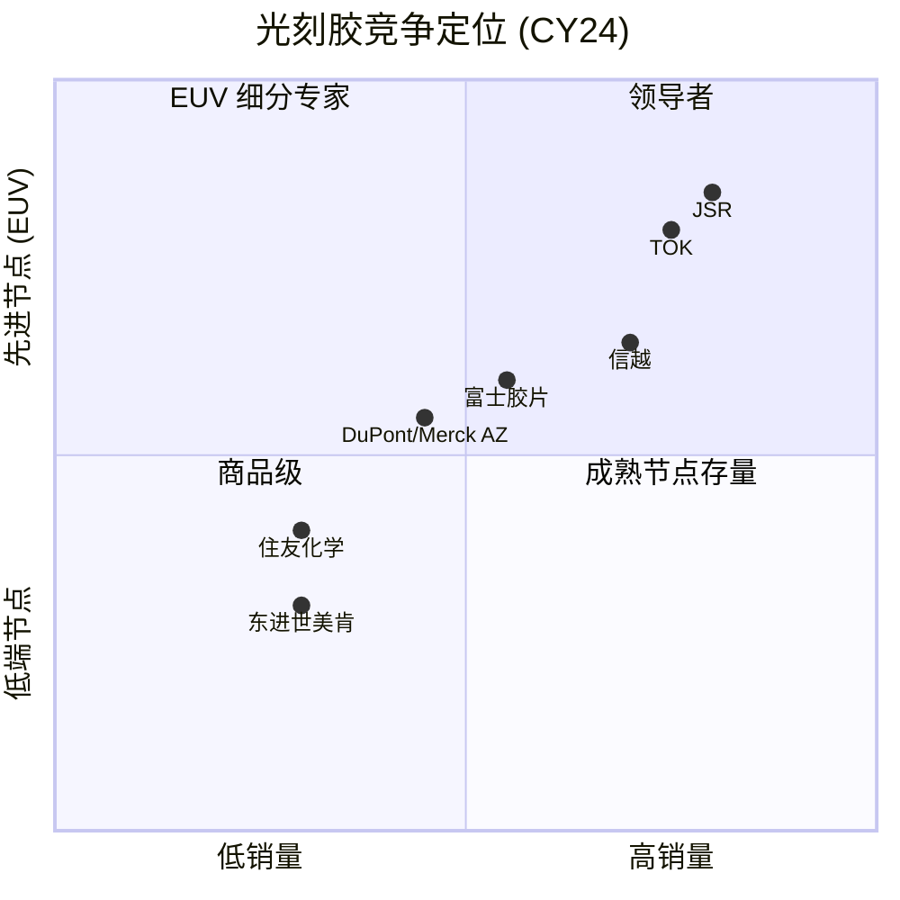

# 信越化学工业 (Shin-Etsu Chemical, TSE:4063) — 公司研究

**截至日期：2026-05-25** · 作者：股票研究部 · 报告币种：日元 (¥)，除非另有说明 · 财年截止 3 月

> **更新——2026 财年 (截至 2026 年 3 月) 谨慎指引再确认 (2025-10-24)：** 管理层在上半财年营业利润同比下滑 17.7% 之后，仍然维持 2025 年 7 月给出的全年指引——**营收 ¥2,400 bn（同比 -6.3%）、营业利润 ¥635 bn（同比 -14.4%）**。下滑主因是「基础设施材料 (Infrastructure Materials)」分部 (PVC / 烧碱) 营业利润同比下滑约 33%——北美 PVC 价格自年中以来走弱所致。电子材料分部营收同比 +7%，伊势崎 (Isesaki) 光刻胶基地建设「按计划推进」。资料来源：[Consolidated Financial Results for the First Half Ended September 30, 2025](https://www.shinetsu.co.jp/wp-content/uploads/2025/07/20251024_con_E.pdf)。

---

## 目录
1. 公司概览
2. 公司历史
3. 管理团队
4. 产品与服务
5. 客户与上市策略
6. 行业概览
7. 竞争格局
8. 市场机会 (TAM)
9. 风险评估
10. 参考资料 + 核对日志

---

## 1. 公司概览

信越化学工业 (Shin-Etsu Chemical, TSE:4063；日文「信越化学工業」) 是日本市值最大的化学公司——截至 2026 年 5 月，市值约 ¥13.06 万亿（约 US$87.8 bn），同时也是全球极少数能在**三条彼此经济周期不相关的赛道上同时拿到全球第一份额**的化学公司：聚氯乙烯 (PVC)、300mm 硅晶圆 (silicon wafer)、以及稀土钕铁硼磁体 (NdFeB rare-earth magnet)；另外在半导体光刻胶领域排名全球前三 ([Shin-Etsu Annual Report 2025 Financial Section, Ten-Year Summary p.1](https://www.shinetsu.co.jp/wp-content/uploads/2025/07/Financial-Section.pdf), [companiesmarketcap.com — Shin-Etsu market cap](https://companiesmarketcap.com/shin-etsu-chemical/marketcap/))。这种少见的产品组合并非偶然，而是公司从 1950 年代的 PVC 与有机硅出发，于 1973 年在美国设立信泰 (Shintech) 进军北美 PVC，1984 年通过信越半导体 (Shin-Etsu Handotai) 切入硅晶圆，1997 年再扩展至半导体光刻胶——四十余年间一步步沿相邻分子科学外延的结果。当前各分部的分部 OPM 都位列全球综合化学公司前列。

信越集团目前披露四大分部：**基础设施材料 (Infrastructure Materials)** 包含 PVC、烧碱、甲醇、氯甲烷、PVA，由位于美国路易斯安那州的信泰 (Shintech) 作为核心支柱；**电子材料 (Electronics Materials)** 包含半导体硅晶圆、稀土永磁、光刻胶、光罩基板 (photomask blank)、合成石英 (synthetic quartz)、半导体封装材料；**功能材料 (Functional Materials)** 包含有机硅 (silicone)、纤维素衍生物、硅金属、薄膜防护罩 (pellicle)、液态氟橡胶；**加工与专门服务 (Processing & Specialized Services)** 即信越聚合物集团 (Shin-Etsu Polymer Group)，负责加工塑料、工程、设备出口等 ([Annual Report 2025 Financial Section §26 Segment Information, p.37](https://www.shinetsu.co.jp/wp-content/uploads/2025/07/Financial-Section.pdf))。截至 2025 年 3 月 31 日，集团有 135 家合并子公司、12 家权益法关联公司，员工 27,274 人 ([Annual Report 2025 Financial Section MD&A, p.4](https://www.shinetsu.co.jp/wp-content/uploads/2025/07/Financial-Section.pdf))。

**变现逻辑。** 信越的客户基本是其他制造企业，几乎没有直接面向终端消费者的业务。2024 财年 (FY24，截至 2025 年 3 月) 各分部对外销售与营业利润如下：基础设施材料 ¥1,041.6 bn、OP ¥291.5 bn (OPM 28.0%)，电子材料 ¥934.3 bn、OP ¥324.8 bn (34.8%)，功能材料 ¥448.6 bn、OP ¥100.0 bn (22.3%)，加工与服务 ¥136.7 bn、OP ¥28.8 bn (21.1%)；合计对外销售 ¥2,561.2 bn、营业利润 ¥742.1 bn，合并 OPM 高达 29.0% ([Annual Report 2025 Financial Section §26-(3), p.38](https://www.shinetsu.co.jp/wp-content/uploads/2025/07/Financial-Section.pdf))。自 FY22 以来，这一 29% 左右的合并 OPM 一直稳定在 25–35% 区间——这在全球综合化学公司中极为罕见。

**地理布局。** 尽管在日本上市，美国实际上是最大的销售地区。FY24 各地区营收占比：日本 ¥522.4 bn (20.4%)、美国 ¥796.5 bn (31.1%)、中国 ¥239.8 bn (9.4%)、亚洲 / 大洋洲 (除中国) ¥595.6 bn (23.3%)、欧洲 ¥236.5 bn (9.2%)、其他 ¥170.3 bn (6.6%) ([Annual Report 2025 Financial Section §26-2, p.39](https://www.shinetsu.co.jp/wp-content/uploads/2025/07/Financial-Section.pdf))。美国权重之所以这么高，正是因为信泰旗下的得州 Freeport 与路易斯安那 Plaquemine PVC 综合体——按单一公司口径，这是**全球最大的 PVC 生产基地**；不动产、厂房与设备 (PPE) 中也有 ¥1,011 bn (49%) 位于美国 ([Annual Report 2025 Financial Section §26-2(2), p.39](https://www.shinetsu.co.jp/wp-content/uploads/2025/07/Financial-Section.pdf))。

*资料来源：根据 [Annual Report 2025 Financial Section §26 Segment Information, pp.37–38](https://www.shinetsu.co.jp/wp-content/uploads/2025/07/Financial-Section.pdf) 与 [H1 FY26 Consolidated Results (2025-10-24)](https://www.shinetsu.co.jp/wp-content/uploads/2025/07/20251024_con_E.pdf) 整理。FY25E 数据反映公司 2025 年 7 月给出、并于 2025 年 10 月再确认的指引。*

*资料来源：[Annual Report 2025 Financial Section §26 Related Information — Geographic, p.39](https://www.shinetsu.co.jp/wp-content/uploads/2025/07/Financial-Section.pdf)。*

**估值快照 (截至 2026-05-25)。** 市值 ¥13.06 万亿（约 US$87.8 bn）；TTM 市盈率 **27.9×**，前瞻市盈率 **23.1×**，市销率 **5.08×**，市净率 **2.82×**，EV/EBITDA **13.5×**，股息率 **1.51%** ([stockanalysis.com — TYO:4063 statistics, May 2026](https://stockanalysis.com/quote/tyo/4063/statistics/), [Shin-Etsu market cap chart, companiesmarketcap.com](https://companiesmarketcap.com/shin-etsu-chemical/marketcap/))。公司年度报告披露的 10 年 PER 历史显示，市盈率在 FY22 低点曾跌至 12×、在 AI 重估行情中升至 26×，当前 27.9× 已接近近十年高位 ([Annual Report 2025 Financial Section Ten-Year Summary p.1, line "PER (times)"](https://www.shinetsu.co.jp/wp-content/uploads/2025/07/Financial-Section.pdf))。5 年累计涨幅约 +120%，远超同期 TOPIX 化学指数 ~+35% 的表现——这反映的是 AI / 晶圆 / EUV 重估叙事，而不是当下盈利动能 (FY26 营业利润指引同比 -14%) ([Yahoo Finance — 4063.T historical chart](https://finance.yahoo.com/quote/4063.T/))。

*资料来源：综合 [stockanalysis.com TYO:4063](https://stockanalysis.com/quote/tyo/4063/statistics/) (信越)、[Morningstar XTKS:4186](https://www.morningstar.com/stocks/xtks/4186/quote) (东京应化 TOK)、[Morningstar XTKS:3436](https://www.morningstar.com/stocks/xtks/3436/quote) (SUMCO)、[Investing.com 4005.T](https://www.investing.com/equities/sumitomo-chemical-co.,-ltd.) (住友化学)、[Google Finance 4188:TYO](https://www.google.com/finance/quote/4188:TYO) (三菱化学)——皆为 2026 年 5 月数据。*

*分析师观点：* 当前 27.9× TTM 市盈率，**从绝对估值看已经偏贵**——公司自己披露的 10 年 PER 序列估算出的 5 年中位数约 17–18×。这一溢价可以拆为三块：(a) FY25 大额回购的机械影响——信越在 ¥500 bn / 2 亿股授权下，已经回购 87.4 mn 股 (¥400 bn，约相当于流通股的 10.2%)，机械性提升了 EPS 类倍数 ([MarketScreener, 2025-04-25](https://www.marketscreener.com/quote/stock/SHIN-ETSU-CHEMICAL-CO-LTD-6491197/news/Shin-Etsu-Chemical-Co-To-Buy-Back-Up-To-10-2-Of-Shares-Worth-500-Billion-Yen-49717799/))；(b) AI 半导体叙事使得电子材料 (硅晶圆 + 光刻胶) 这部分获得约 5–7× 市盈率溢价，逻辑类似 TOK 当前 35.5× 的高估值；(c) 「日本被动式 TOPIX 接盘」效应——TSE Prime 上市、ROE 高 (信越 5 年平均 ROE 约 17%) 的公司在结构上获得了估值重估。我们在第 9 节中也单独列出了估值倍数压缩的风险——市场当前的定价已经把 PVC 周期的干净复苏与 AI / EUV 需求的进一步上台阶都打了进去，但这两件事都还没有反映到分部业绩里。

---

## 2. 公司历史

信越化学的源头是 1926 年 9 月成立的 **信越窒素肥料株式会社 (Shin-Etsu Nitrogen Fertilizer Co.)**——创始人郡司铸三郎 (Juzaburo Koto) 此前在如今日亚化学的前身公司任职，本是肥料行业出身。公司选址新潟县直江津 (Naoetsu) 村——这一带能同时提供石灰石、水源、水力发电，正是早期产品石灰氮 (lime nitrogen) 与碳化钙生产的关键资源。「信越」之名取自信浓 (Shinano，今长野) 与越后 (Echigo，今新潟) 两地的开头汉字 ([Shin-Etsu — Company History](https://www.shinetsu.co.jp/en/company/history/), [Wikipedia — Shin-Etsu Chemical](https://en.wikipedia.org/wiki/Shin-Etsu_Chemical))。

从肥料到化学品→有机硅→PVC→硅晶圆→光刻胶，公司近一百年间的每一次转型，都建立在前一个业务已经能驾驭的分子科学之上，是一条**相邻领域逐步外延的扩张链**；而且几乎每一次转型都在直江津同一片厂区内启动——这也是今天光刻胶产品的诞生地 ([Shin-Etsu — Photoresist Page](https://www.shinetsu.co.jp/en/products/electronics-materials/photoresist/))。

1956 年直江津 PVC 投产，加上 1973 年在休斯顿成立**信泰 (Shintech)**、并于 1974 年完成得州 Freeport 工厂建设，奠定了至今仍是公司最大单一收入来源的业务。值得注意的是，信泰一开始就被设立为**垂直整合、且总部直接在美国的子公司**——这与同期其他日本 PVC 厂商以出口为主的模式完全不同；信越选择直接在美国本土建产能，对一家 1970 年代的日本化学公司而言，是非常激进的资本配置押注 ([Plastics Technology — Chihiro Kanagawa profile](https://www.ptonline.com/articles/chihiro-kanagawa-pvc-pioneer-and-environmental-steward), [Wikipedia — Shintech](https://en.wikipedia.org/wiki/Shin-Etsu_Chemical))。今天信泰在 Freeport (TX) 与 Plaquemine (LA) 两地的整合化综合体合计 PVC 产能约 295 万吨 / 年，是全球**单一公司**口径下最大的 PVC 产能 ([Shin-Etsu PVC/Chlor-Alkali Business page](https://www.shinetsu.co.jp/en/products/pvc-chlor-alkali-business/), [Manufacturing Dive — Shintech $3.4B Louisiana expansion, 2025](https://www.manufacturingdive.com/news/pvc-giant-shintech-invest-34b-plaquemine-louisiana-expansion/814172/))。

**战略转型——硅晶圆 (1984)。** 信越半导体 (Shin-Etsu Handotai，「半導体」即半导体之意) 起初是为了把公司在有机硅与冶金领域积累的拉晶 (crystal pulling) 与晶圆抛光技术商业化。如今信越半导体在全球运营 13 家晶圆工厂，分布于日本、美国、马来西亚、台湾、欧洲；300mm 量产始于 2001 年 2 月，向几乎所有先进制程的代工厂 / IDM 供应抛光片与外延片 ([SEH America — About Us](https://sehamerica.com/about-us/), [Shin-Etsu Silicon Wafers product page](https://www.shinetsu.co.jp/en/products/electronics-materials/silicon-wafers/))。

**战略转型——光刻胶 (1997)。** 信越作为「迟到者」进入光刻胶赛道，但下了一个非常果断的判断——**赌 KrF 准分子激光光刻胶 (248nm)** 会是下一代主流——事后证明这个判断完全正确 ([Shin-Etsu Photoresist History](https://www.shinetsu.co.jp/en/products/electronics-materials/photoresist/))。1997 年直江津工厂 KrF 投产，成了公司的滩头阵地；KrF 直到今天仍是该业务最强的位置。此后公司在同一直江津基地上延展出 ArF、ArF 浸没式、EUV 光刻胶、光罩基板、多层抗反射材料等产品线；2016 年新增福井厂、2019 年新增台湾云林厂；2024 年宣布在群马县伊势崎建第四个 ¥83 bn 的光刻胶基地，一期目标 FY26 内完工 ([Shin-Etsu News — Fourth photoresist base, 2024](https://www.shinetsu.co.jp/en/news/news-release/shin-etsu-chemical-to-build-a-new-production-base-in-japan-which-will-become-its-fourth-production-base-for-semiconductor-lithography-materials/))。

**近期动态 (2024–2025)。** 有三件事对投资逻辑直接相关。(1) 2025 年 4 月，董事会授权回购不超过 **2 亿股 / ¥500 bn**（约相当于流通股的 10.2%），授权期至 2026 年 4 月；到 2025 年 6 月末，公司已经回购 ¥400 bn / 87.4 mn 股，预定全部注销 ([MarketScreener, 2025-04-25](https://www.marketscreener.com/quote/stock/SHIN-ETSU-CHEMICAL-CO-LTD-6491197/news/Shin-Etsu-Chemical-Co-Ltd-announces-an-Equity-Buyback-for-200-000-000-shares-representing-10-2-49721354/), [H1 FY26 release p.2, 2025-10-24](https://www.shinetsu.co.jp/wp-content/uploads/2025/07/20251024_con_E.pdf))。(2) 信泰在 2024 年末宣布 **$3.4 bn 路易斯安那扩产**——目标至 2030 年底新增 62.5 万吨 / 年乙烯、50 万吨 / 年 VCM、31 万吨 / 年烧碱产能，依据是全球 PVC 需求每年约新增 75 万吨 ([Manufacturing Dive, 2025-01](https://www.manufacturingdive.com/news/pvc-giant-shintech-invest-34b-plaquemine-louisiana-expansion/814172/), [Louisiana Economic Development, 2024](https://www.opportunitylouisiana.gov/news/shintech-louisiana-announces-3-4-billion-expansion-building-on-25-years-of-growth-and-commitment))。(3) **群马伊势崎光刻胶基地**——这是公司八年来第一个全新的光刻材料厂，明确目的是把产能从地理高度集中的直江津 / 福井基地分散开来，配合 TSMC、三星的 EUV 扩产 ([Shin-Etsu News, 2024](https://www.shinetsu.co.jp/en/news/news-release/shin-etsu-chemical-to-build-a-new-production-base-in-japan-which-will-become-its-fourth-production-base-for-semiconductor-lithography-materials/))。

---

## 3. 管理团队

信越的创始人血脉 (郡司铸三郎，1926) 早在近一个世纪前就退出了实际经营；现代管理体系建立在 **金川千寻 (Chihiro Kanagawa)→斋藤恭彦 (Yasuhiko Saitoh)** 这条以信泰为核心的轴线之上。按照公司研究 (company-research) 技能的规定，本节聚焦**当前 CEO**——自 2016 年 6 月起担任社长兼代表董事的斋藤恭彦。原因是创始人传记对当前投资判断没有承载意义，而**现代信越的真正缔造者金川千寻** (2010–2023 年任会长) 已于 2023 年 1 月辞世 ([Shin-Etsu News — Passing of Chairman Kanagawa, 2023](https://www.shinetsu.co.jp/en/news/news-release/about-the-passing-of-chairman-chihiro-kanagawa/))。

**斋藤恭彦——社长兼代表董事 (2016 年 6 月至今)。** 斋藤生于 1955 年 12 月 5 日，1978 年早稻田大学政治经济学部毕业后即入职信越化学 ([Bloomberg — Yasuhiko Saitoh profile](https://www.bloomberg.com/profile/person/4206202), [C&EN — Shin-Etsu names new president, 2016-05-02](https://cen.acs.org/articles/94/i18/Shin-Etsu-names-new-president.html))。他职业生涯最大的特征是——**绝大部分时间都在美国子公司信泰**：1983 年进入信泰，从 PVC 现场运营一步步做到信泰最高负责人；即使在 2016 年出任母公司社长之后，他仍然兼任信泰 CEO ([C&EN, 2016-05](https://cen.acs.org/articles/94/i18/Shin-Etsu-names-new-president.html), [S&P Global Commodity Insights, 2021-08-05](https://www.spglobal.com/commodity-insights/en/news-research/latest-news/chemicals/080521-shintechs-pvc-chain-expansion-in-louisiana-to-begin-in-sep-shin-etsu-president))。

这种升迁路径有两点与投资者关切直接相关。第一，斋藤是**纯粹运营出身**，既不是财务背景、也不是研发背景——他在信泰的功绩都非常具体：从初期 $1.5 bn 投资开始、监督路易斯安那 Plaquemine PVC 综合体的多期建设，把该地产能逐步爬升至约 200 万吨 / 年；2017 年增加乙烯裂解装置，完成美国布局的垂直整合；2025 年宣布的 $3.4 bn 第三套裂解装置扩建也由他主导 ([Plastics Today — Shintech $3.4B](https://www.plasticstoday.com/resin-pricing/shintech-expands-pvc-feedstock-production-in-louisiana), [LED 2024 release](https://www.opportunitylouisiana.gov/news/shintech-louisiana-announces-3-4-billion-expansion-building-on-25-years-of-growth-and-commitment))。第二，他是**金川千寻管理哲学的直接继承者**：极端的财务保守 (信越目前仅有 ¥34 bn 计息债务对应 ¥4.84 万亿净资产——参见 [Annual Report 2025 Financial Section Ten-Year Summary](https://www.shinetsu.co.jp/wp-content/uploads/2025/07/Financial-Section.pdf))；在日本国内需求疲弱时大胆投资美元资本支出；不感情用事地关停边际产能 (FY24 计提 ¥10.5 bn 泰国有机硅资产减值；FY24 公告削减日本国内 PVC 产能) ([Argus Media — Shin-Etsu reduces domestic PVC](https://www.argusmedia.com/en/news-and-insights/latest-market-news/2801926-japan-s-shin-etsu-reduces-domestic-pvc-production), [Annual Report 2025 Financial Section Note 19, p.40](https://www.shinetsu.co.jp/wp-content/uploads/2025/07/Financial-Section.pdf))。

斋藤担任社长的任期约 10 年，是集团现代史上第二长的——仅次于金川千寻 1990–2010 年的二十年。最新代理委托书 (proxy) 披露的个人持股相对薪酬而言不重要——高管薪酬以固定现金加多年期归属的限制性股票为主 ([Shin-Etsu Sustainability Report 2025 §Corporate Governance, p.~64](https://www.shinetsu.co.jp/en/sustainability/assets/pdf/sustainability/esg_bn/Sustainability2025E_0729.pdf))。整体薪酬水平远低于全球化学公司 CEO 的平均——FY24 全体董事奖金总额仅 ¥540 mn ([Annual Report 2025 Financial Section Balance Sheet, p.7](https://www.shinetsu.co.jp/wp-content/uploads/2025/07/Financial-Section.pdf))。薪酬偏轻 + 大量美元业务敞口，意味着利益绑定主要依靠长期任期与「金川学派」的纪律，而不是股权激励。

会长 **秋谷文彦 (Fumio Akiya)**——按公司研究技能规则，非 CEO 会长仅作治理背景列示——于 2023 年接替金川千寻 ([Shin-Etsu Board of Directors page, June 2025](https://www.shinetsu.co.jp/en/company/organization/))。

*分析师观点：* 当前管理层的几个关键张力值得放在心上。其一，斋藤本人已近 70 岁、又同时担任母公司社长和信泰 CEO，公开层面看到的次代接班人候选不多；如果他在未来 3 年因健康或其他原因卸任、且没有一个具备美国 PVC 运营经验的明确继任者，那么 $3.4 bn 路易斯安那扩产的执行风险会突然抬升。其二，集团治理仍然非常「日企集团式」——决策中心化、与外部资本市场的沟通节奏偏慢——这在 AI 主题快速演进的环境下，可能错失最佳的资本配置窗口。第 9 节会把这些都纳入风险评估。

---

## 4. 产品与服务

> **第 4 节有意写成全报告最长的一节。** 按照公司研究技能的指引，本节是第 5–9 节分析的基础——这对信越尤为重要，因为它实际上是四家独立公司——四套客户、四套竞争格局、四套长期驱动力——拼在一张合并报表上。

### 4.1 信越分部 × 产品矩阵

下表是公司年报中第 26 节 (分部信息) 第 37 页给出的产品组合在单页内最清晰的呈现 ([Annual Report 2025 Financial Section §26 Segment Information, p.37](https://www.shinetsu.co.jp/wp-content/uploads/2025/07/Financial-Section.pdf))。它的层级看起来「过于扁平」，原因是信越只把业务披露为四大分部，而像稀土永磁、光刻胶、硅晶圆这种几个截然不同的产品线，全部塞进了同一个「电子材料」分部里。

| 分部 | 主要产品 | 业务描述 (公司原文) | FY24 营收 (¥bn) | FY24 营业利润 (¥bn) | OPM |
|---|---|---|---:|---:|---:|
| **基础设施材料** | 聚氯乙烯 (PVC)、烧碱、甲醇、氯甲烷、PVA | 「降低环境负担，支撑基础设施与日常生活。」 | 1,041.6 | 291.5 | 28.0% |
| **电子材料** | 半导体硅晶圆、稀土永磁、半导体封装材料、LED 封装材料、光刻胶、光罩基板、合成石英 | 「为电子、光学、磁性领域提供更好的材料技术。」 | 934.3 | 324.8 | 34.8% |
| **功能材料** | 有机硅、纤维素衍生物、硅金属、合成信息素、氯乙烯-醋酸乙烯共聚物、液态氟橡胶、薄膜防护罩 | 「提供广泛的、被需要的更好的功能。」 | 448.6 | 100.0 | 22.3% |
| **加工与专门服务** | 加工塑料、技术与工程出口、产品贸易、工程服务 | 「以材料与工程能力回应问题解决需求。」 | 136.7 | 28.8 | 21.1% |
| **合并** | — | — | **2,561.2** | **742.1** | **29.0%** |

*资料来源：[Annual Report 2025 Financial Section §26-(3) p.38](https://www.shinetsu.co.jp/wp-content/uploads/2025/07/Financial-Section.pdf)。*

### 4.2 各业务之间如何互动——综合解读

综合解读：信越的产品组合并不是严格意义上的「价值链」——PVC 与硅晶圆在分子层面不构成上下游关系——但四个分部共享三项深层、难以被复制的**横向能力**：(1) **超高纯度材料处理文化**——生产半导体级硅的同一套质量管理文化，也能生产半导体级有机硅 (用于封装)；(2) **资本纪律下的全球工厂运营能力**——信泰四十年来不断在美国湾区建造一体化 PVC 综合体的执行记录，使得管理层可以用同一套模板放心去建伊势崎光刻胶基地；(3) **几乎零负债、零财务约束的资产负债表**——这一姿态使得公司可以在 PVC 周期低点、AI 光刻胶高点同时进行反周期资本支出。这三项能力直接体现在 OPM 上——四个完全独立的终端市场，分部 OPM 都在 22–35% 区间，远高于全球化学行业普遍的低个位数水平——这也是市场给信越 27.9× TTM 市盈率、而三菱化学只有 19×、住友化学只有 15× 的最重要原因。

### 4.3 电子材料——硅晶圆、光刻胶、稀土永磁、合成石英

> **按照本次任务的指引，约 25% 的报告权重分配给电子材料。** 子节 4.3.1–4.3.4 逐一深入电子材料下的每一族产品。

#### 4.3.1 半导体硅晶圆 (信越半导体)

公司原文描述 ([Annual Report 2025 Financial Section MD&A, p.4](https://www.shinetsu.co.jp/wp-content/uploads/2025/07/Financial-Section.pdf))：

> 「在半导体市场上，从调整阶段的复苏因应用与领域不同而呈现冷热不均。在此环境下，我们集中向高成长市场出货硅晶圆、光刻胶、光罩基板等半导体材料。」

**通俗解释：** 半导体硅晶圆 (silicon wafer) 就是芯片上每一颗晶体管被堆叠生长在其上的那个**圆形衬底**——在最先进制程上，直径已经达到 300mm。信越半导体的硅晶圆产品线覆盖**抛光片 (polished wafer)、外延片 (epitaxial wafer)、绝缘体上硅 (SOI) 晶圆**，以及一些特殊拉晶产品 ([Shin-Etsu Silicon Wafers product page](https://www.shinetsu.co.jp/en/products/electronics-materials/silicon-wafers/))。先进制程的 300mm「优等片」(prime wafer) 与普通的硅锭之间有三道分水岭：**平整度**——在整片 300mm 范围内做到亚纳米级的位点平整度 (EUV 扫描机的焦深预算越来越紧，要求越来越苛)；**缺陷密度**——每平方厘米的颗粒数 / 晶体起源颗粒数，直接决定 3nm 以下逻辑节点的良率；**掺杂均匀度**——径向掺杂浓度差异 <1%，使得整片晶圆上所有晶体管的阈值电压一致。信越半导体 + SUMCO 合计占据这种高规格 300mm 优等片**一半以上**的全球份额 ([Mordor Intelligence — Silicon Wafer Market report](https://www.mordorintelligence.com/industry-reports/semiconductor-silicon-wafer-market))。

在客户工艺流程中的位置：全球任何一家晶圆厂的产线起点都是「上片」(wafer in)——信越半导体的晶圆抵达生产线起点后，经历依次的氧化层 / 多晶硅 / 金属沉积 (AMAT、Lam 设备)→光刻 (ASML 设备使用 TOK / JSR / 信越光刻胶曝光)→刻蚀→金属互连等数百道工序，最后切割封装。**晶圆本身是所有这一切发生的物理衬底**——3nm 制程下，1nm 的平整度缺陷就足以让一颗芯片报废。这就是为什么在先进制程晶圆厂中，认证一家新的晶圆供应商需要 12–18 个月，也是为什么信越半导体的客户名单十年下来基本没变——TSMC、三星代工、英特尔、SK 海力士、美光、铠侠、三星存储 ([Mordor Intelligence — Semiconductor Materials Market](https://www.mordorintelligence.com/industry-reports/semiconductor-materials-market), [Klover.ai — Shin-Etsu AI Strategy analysis](https://www.klover.ai/shin-etsu-ai-strategy-analysis-of-dominance-in-chemicals-ai/))。

*分析师观点：* 信越在 300mm 优等片市场的收入份额约 27% (基于卖方综合估算 Mordor / Intel Market Research)；SUMCO 约 24%，GlobalWafers 约 17%，Siltronic 约 12%，SK Siltron 约 9%——前五家合计份额约 89% ([Mordor Intelligence — silicon wafer market share, 2025](https://www.mordorintelligence.com/industry-reports/semiconductor-silicon-wafer-market), [Intelmarketresearch Silicon Wafer Outlook 2025-2032](https://www.intelmarketresearch.com/silicon-wafer-market-85))。**具备明确的竞争优势**——护城河类型为「规模 + 客户认证门槛 + 亚纳米平整度专利与诀窍」三层叠加。需要注意的是，「全球硅晶圆第一」这一说法在卖方报告与行业媒体中被广泛重复，但**公司自己的 Yuho 中并没有这么写**——年报里只说「向高成长市场出货硅晶圆」。

*资料来源：综合 [Mordor Intelligence — Silicon Wafer Market](https://www.mordorintelligence.com/industry-reports/semiconductor-silicon-wafer-market) 与 [Intel Market Research, 2025-2032 Outlook](https://www.intelmarketresearch.com/silicon-wafer-market-85)；分析师综合估算，并非来自单一权威来源。*

#### 4.3.2 光刻胶与光刻材料

公司原文描述 ([Shin-Etsu Photoresists product page](https://www.shinetsu.co.jp/en/products/electronics-materials/photoresist/))：

> 「信越于 1997 年推出光刻胶业务，并在直江津工厂开始量产当时最先进的 KrF 光刻胶。此后陆续开发并商业化了光罩基板、ArF 光刻胶、多层材料、极紫外光 (EUV) 光刻胶等一系列半导体光刻材料。信越的产品支持从 i 线、KrF、ArF 到 EUV 各种光源的先进光刻。我们还提供用于纳米加工的旋涂中间层 / 底层硬掩膜。」

产品线包括 SIPR 系列、SEPR 系列、SAIL 系列、SEVR 系列、SHB 系列、ODL 系列，覆盖半导体与磁头制造 ([Shin-Etsu Photoresists product page](https://www.shinetsu.co.jp/en/products/electronics-materials/photoresist/))。

**通俗解释：** **光刻胶 (photoresist)** 是晶圆厂在硅晶圆表面旋涂的一层光敏聚合物薄膜——通过光罩 (photomask) 曝光后，能在亚 100nm 尺度上把电路图案投影到晶圆上。不同光源波长对应不同的化学体系：**g 线 / i 线 (436/365nm)** 用于老节点后段；**KrF / 248nm** 用于老 DRAM 与 ~150nm 逻辑节点；**ArF / 193nm 干式** 用于 ~80nm 节点；**ArF 浸没式 (193nmi)** 是 28nm–7nm 这一段「主力工作马」节点直到 2026 年仍然占绝大多数曝光步骤的工艺；**EUV (extreme ultraviolet / 极紫外光，13.5nm)** 则用于 7nm 及以下的最关键逻辑层，以及 HBM 沟槽光刻。每跨一个波长台阶，光刻胶的高分子化学就要彻底换一套——它必须吸收光子、生成精准浓度的酸 (化学放大型光刻胶)，再在显影液中按图案溶解，最终形成干净的图形。**到了 EUV 这个层级**，线边缘粗糙度 (LER, line-edge roughness)、随机缺陷概率、出气率 (outgassing) 都会成为整颗晶体管良率的决定性限制 ([G&M Insights — Photoresist Chemicals for Advanced Lithography, 2024-12](https://www.gminsights.com/industry-analysis/photoresist-chemicals-for-advanced-lithography-market))。

在客户工艺流程中的位置：光刻胶是**整个光刻工序里最直接体现工艺控制能力的一环**。一座 4nm 逻辑晶圆厂有 80+ 道曝光步骤，其中约 15 道是 EUV——每一道 EUV 层都需要针对其图案类型 (线 / 间距、孔、过孔) 定制的光刻胶。信越、TOK、JSR 这三家日本公司**包办了 TSMC、三星代工、英特尔在量产中使用的所有 EUV 光刻胶**——驻场工程师、多年期联合开发周期、加上不透明的专利架构，使这三家形成了一个事实上的「日本铁三角」寡头 ([Tom's Hardware — JSR builds first Taiwan photoresist plant, 2024](https://www.tomshardware.com/tech-industry/jsr-builds-first-taiwan-photoresist-plant-as-japanese-materials-makers-race-to-embed-next-to-tsmc), [Fountyl Tech — Japan EUV resist monopoly](https://www.fountyltech.com/news/japanese-companies-monopolize-the-euv-photoresist-supply-market/))。

信越在这个铁三角内部的位置可以归纳为「**KrF 强、ArFi 中、EUV 起步**」。卖方综合估算大体一致地把信越列在半导体光刻胶整体营收的全球第 3 (排在 JSR、TOK 之后)，但在 **KrF 这个单一规模最大的光刻胶细分上排名全球第 1**——这要追溯到 1997 年直江津工厂作为先发者的位置 ([Klover.ai — Shin-Etsu AI Strategy](https://www.klover.ai/shin-etsu-ai-strategy-analysis-of-dominance-in-chemicals-ai/))。需要强调的是，KrF 看似「成熟节点」，但它仍是 NAND 闪存堆叠层、DRAM 周边电路、CMOS 图像传感器 (CIS)、功率器件等绝大多数中端芯片的主力曝光手段——HBM 堆叠中的 TSV (硅通孔) 也大量依赖 KrF；这一基本盘在 2026 年依然带来稳定的现金流与高 OPM，并且因为客户群极其分散 (而非高度集中于 TSMC / 三星)，订单波动远小于 EUV 业务。在 EUV 上，公司正在大力投入：2023 年完成了一次 22% 的 EUV 产能扩产；现在又投资 **¥83 bn 在群马伊势崎建第四个光刻材料基地**——这是公司八年来第一个全新的光刻材料基地，一期目标 FY26 完工 ([Shin-Etsu News, 2024 — fourth photoresist base](https://www.shinetsu.co.jp/en/news/news-release/shin-etsu-chemical-to-build-a-new-production-base-in-japan-which-will-become-its-fourth-production-base-for-semiconductor-lithography-materials/))。其他三个光刻材料基地——直江津 (1997)、福井 (2016)、台湾云林 (2019)——目前仍承担绝大多数产量。

值得单独提及的是云林厂。台湾云林县是 TSMC 多个先进制程 12 吋晶圆厂的所在地，信越选择 2019 年在此设厂，本质上是把驻场化的协同开发能力嵌入了 TSMC 的隔壁，类似 JSR 后来在 2024 年宣布建台湾厂的逻辑。在 EUV 这种「实验—量产」边界极其模糊、配方调整以周为单位的工艺中，**地理上的接近本身就是护城河的一部分**——它既是降低物流与质量风险的实操选择，也是发出「我把生产命运绑定在你身边」战略信号的政治表态 ([Tom's Hardware — JSR Taiwan plant, 2024](https://www.tomshardware.com/tech-industry/jsr-builds-first-taiwan-photoresist-plant-as-japanese-materials-makers-race-to-embed-next-to-tsmc))。

*资料来源：综合 [Mordor Intelligence — Photoresist Market](https://www.mordorintelligence.com/industry-reports/photoresist-market), [PRNewswire — Global Photoresist Market 2025](https://www.prnewswire.com/news-releases/global-3-89-bn-photoresist-markets-to-2025-leading-players-are-dow-inc-sumitomo-chemical-fujifilm-shin-etsu-chemical-jsr-and-tokyo-ohka-kogyo-301393986.html), [Fountyl Tech — EUV monopoly note](https://www.fountyltech.com/news/japanese-companies-monopolize-the-euv-photoresist-supply-market/)。涵盖 i 线、KrF、ArF、ArFi、EUV；分析师综合。*

*分析师观点：* 光刻胶可以说是信越内部**质量最高的特许经营权**——营收规模不大 (在 ¥934 bn 电子材料分部内大约 <¥150 bn，分析师估算；公司不披露子分部拆分)，但增量 OPM 极高 (按分部经济推算应在 35–40% 区间)，先进制程客户几乎零流失，结构性成长与 EUV 层数扩张完全锁定。**具备明确竞争优势**，护城河来自三层：(a) **配方 know-how 的 IP 壁垒**——这是逆向工程逆不出来的；(b) **工艺集成的切换成本**——在先进节点重新认证一家新光刻胶供应商要花费晶圆厂数千万美元的重新认证周期成本；(c) **日本铁三角在所有主要晶圆厂周边都能本地供货的能力**。最大风险是中国——本土玩家 (上海新阳、彤程新材) 由国家资金支持，目标就是在成熟节点突破日本的封锁；未来如果中美关系缓和，EUV 光刻胶出口管制松动可能让中芯国际等中国晶圆厂获益、日本铁三角受损。参见第 9 节。

不可忽视的另一条护城河来自**上游单体的垂直整合**。光刻胶的核心是几种特定的高纯度聚合物 (例如 KrF 用的羟基苯乙烯共聚物、ArF 用的丙烯酸酯共聚物、EUV 用的金属氧化物—丙烯酸杂化体)，要把杂质降至 ppb 级别，最经济的做法是自己做单体。信越在直江津沿用了多年的电子级有机硅纯化能力，与光刻胶单体合成在同一片厂区内共享设备、共享操作员、共享分析仪器——这是它把光刻胶 OPM 推高至 35%+ 的物理基础。与之相对的，韩国的东进世美肯虽然在 KrF / ArF 上技术不弱，但缺乏自有单体的纵向能力，毛利率结构性低一档；中国本土厂商更是普遍卡在「自配单体」环节上多年 ([Tom's Hardware — JSR Taiwan plant, 2024](https://www.tomshardware.com/tech-industry/jsr-builds-first-taiwan-photoresist-plant-as-japanese-materials-makers-race-to-embed-next-to-tsmc))。

#### 4.3.3 稀土钕铁硼磁体

公司原文描述 ([Shin-Etsu Neodymium Magnet product page](https://www.shinetsu.co.jp/en/products/electronics-materials/neodymium-magnet/))：

> 「信越钕磁铁 N 系列主要由钕 (Nd)、铁 (Fe) 与硼 (B) 组成，是兼具高性能与低成本的代表性稀土永磁产品，应用日益扩大。」

**通俗解释：** **钕磁铁 (NdFeB magnet)** 是目前商业化生产中**能量密度最高的永磁体**，主要用作无刷直流电机的转子——硬盘 (HDD)、电动车 (EV) 牵引电机、混动 (HEV) 电机 / 发电机、风力发电机、工业机器人都依赖它。晶体结构是 Nd₂Fe₁₄B；生产顺序为「稀土分离→带铸→氢爆破碎→气流磨→压制→烧结→晶界扩散→精磨」。性能指标主要是剩磁 (Br) 和矫顽力 (Hc)；高温应用 (EV 牵引电机工作温度约 180°C) 需要掺杂镝 (Dy) 与铽 (Tb)——而这正是稀土中最昂贵、最受地缘政治影响的「重稀土」资源。**信越的「晶界扩散法」** 可以把 Dy/Tb 消耗量比传统工艺降低多达 50% ([Shin-Etsu Sustainability — Resource Saving](https://www.shinetsu.co.jp/en/sustainability/esg_environment/resource_saving/))。

在客户工艺流程中的位置：磁体以烧结块状出厂，再切割、打磨成客户转子规格，组装进电机。两大应用是 HDD 行业 (希捷、西部数据、东芝) 与 EV/HEV 行业 (丰田、本田、比亚迪、特斯拉)。信越与丰田合作推进闭环 Nd/Dy 回收——新车→报废→重新熔炼出磁体 ([Shin-Etsu Rare-Earth — Environmental Efforts](https://www.rare-earth.jp/en/environment.html))。

*分析师观点：* 信越是**非中国厂商中烧结钕铁硼磁体的全球前三**，与 Proterial (前日立金属) 和 TDK 并列；中国整体占全球 NdFeB 市场 80%+ 的销量份额，以国家支持的厂商为主——金力永磁、中科三环、宁波韵升等。信越的相对优势是**为安全敏感客户 (西方 OEM、国防) 提供非中国来源**，外加 Dy 节约型晶界扩散 IP——尤其是 2025 年 10 月中国对稀土实施出口管制 (信越在 H1 FY26 公告里直接点名提及) 之后，这种「非中国稀土供应」对西方 OEM 的价值急剧上升 ([H1 FY26 Release p.5, 2025-10-24](https://www.shinetsu.co.jp/wp-content/uploads/2025/07/20251024_con_E.pdf), [Reuters context — China rare-earth export controls, 2025-10](https://www.research.think-front.com/p/japan-rare-earth-related-stocks-in))。**部分竞争优势**——非中国供应链上是「优势」，绝对成本上对中国厂商仍然「劣势」。

#### 4.3.4 合成石英、光罩基板、其他光刻材料

公司原文描述 ([Annual Report 2025 Financial Section §26 Segment Information, p.37](https://www.shinetsu.co.jp/wp-content/uploads/2025/07/Financial-Section.pdf)) 将「合成石英产品」与「光罩基板」列为电子材料分部的核心产品。它们是光刻胶业务的姐妹产品。**光罩基板 (photomask blank)** 是镀铬石英衬底，光罩 (photomask) 就在它的基础上做出来——每一层 IC 都需要一个对应的光罩；EUV 光罩则是地球上规格最高的光刻基板 (约 $50K / 片，多层 Mo/Si 镀层，原子级平整)。**合成石英** 也用于光罩基板，以及 EUV 薄膜防护罩 ([Shin-Etsu Quartz Products subsidiary page](https://www.shinetsu.co.jp/en/products/electronics-materials/))。

**通俗解释：** 光罩 = 光刻机投影到每一片晶圆上的可重复使用的「钢板模」；**薄膜防护罩 (pellicle)** 是覆盖在光罩图案表面上的一层极薄透明保护膜，防止空气中的颗粒物落到图案上。EUV 波长下，pellicle 必须同时满足两个矛盾要求——对 13.5nm 光子高度透明 (这极其困难，硅与大多数薄膜在这个波长都会吸收)、又要在 200W EUV 光强下保持机械稳定。信越——通过其姊妹功能材料业务——是全球极少数能够供应 EUV 兼容 pellicle 的公司之一，另一家是与 ASML 合作的三井化学 (Mitsui Chemicals) ([Annual Report 2025 Business Strategy, p.~22](https://www.shinetsu.co.jp/wp-content/uploads/2025/07/Business-Strategy.pdf))。

在客户工艺流程中的位置：光罩基板出货给光罩厂 (DNP、Toppan、Photronics、TSMC 自有光罩厂等)，光罩厂在基板上写图案，再把成品光罩交付给晶圆厂。Pellicle 直接出货给光罩厂或晶圆厂。光刻胶 + 光罩基板 + EUV pellicle 三件一起，构成完整的「光刻材料篮子」——而这三件恰恰就是伊势崎基地集中投资的方向 ([Shin-Etsu News, 2024](https://www.shinetsu.co.jp/en/news/news-release/shin-etsu-chemical-to-build-a-new-production-base-in-japan-which-will-become-its-fourth-production-base-for-semiconductor-lithography-materials/))。

*分析师观点：* 光罩基板 + 合成石英是更小但极高毛利的细分。**竞争优势明显，强**——护城河同样来自 IP + 规模 + EUV 级别玻璃配方。最直接的竞争者是 HOYA (日本) 与 AGC (日本) 的合成石英基板；在 EUV 等级上，全球能竞争的对手极少。

### 4.4 基础设施材料——PVC、烧碱、甲醇 (信泰锚定)

公司原文描述 ([Annual Report 2025 Financial Section MD&A, p.5](https://www.shinetsu.co.jp/wp-content/uploads/2025/07/Financial-Section.pdf))：

> 「PVC 方面，主要地区价格在去年 4–6 月上涨，并在 7–9 月进一步改善或维持；但 10–12 月各地区差异加大……烧碱方面，我们在去年 4–6 月上调了价格，此后价格起伏，但今年 1–3 月再次回升。」

**通俗解释：** **聚氯乙烯 (PVC, polyvinyl chloride / 聚氯乙烯)** 是全球第三大消费量的热塑性塑料，仅次于聚乙烯 (PE) 与聚丙烯 (PP)；下游应用包括管材 (污水管、给水管、电缆管——约占需求的 60%)、型材 (门窗、外墙板)、地板、电线电缆绝缘层、医用管材，以及一长串特种应用。原料是乙烯和氯，先合成二氯乙烷 (EDC)→氯乙烯单体 (VCM)→PVC。整条「氯碱-乙烯」链条 (从盐水电解出烧碱、再加乙烯 + Cl₂ 合成 PVC) 共用同一套装置，两条产品线 (烧碱 + PVC) 的经济性也高度耦合。烧碱本身就是基础设施材料分部的第二大营收项；甲醇与氯甲烷则是衍生产物。

信越的基础设施材料业务几乎就等于**信泰 (Shintech, Inc.)**——这家全资美国子公司总部位于休斯顿，在**得州 Freeport** 运营一座综合体 (1974 年原始厂区，多次扩建)，外加路易斯安那州 **Plaquemine** 的大型多期综合体 (2008 年 PVC 一期投产，2017 年新增完整乙烯裂解装置，2024 年公告再扩建 $3.4 bn 的第三套裂解装置)。信越全球 PVC 产能约 **415 万吨 / 年**——信泰约 295 万吨 / 年在美国，其余在日本鹿岛厂和欧洲的信越 PVC 鹿特丹厂；公司因此是**按产能口径的全球第一 PVC 生产商**，领先于 Westlake (约 350 万吨 / 年) 与台塑集团 (约 310 万吨 / 年) ([Shin-Etsu PVC/Chlor-Alkali Business page](https://www.shinetsu.co.jp/en/products/pvc-chlor-alkali-business/), [Opportimes — Shin-Etsu Westlake Formosa PVC ranking](https://www.opportimes.com/en/shin-etsu-westlake-and-formosa-group-lead-in-pvc-in-the-world/), [Manufacturing Dive — Shintech $3.4B expansion, 2025](https://www.manufacturingdive.com/news/pvc-giant-shintech-invest-34b-plaquemine-louisiana-expansion/814172/))。

在客户工艺流程中的位置：PVC 以粉料形式通过铁路或卡车散装运输到改性厂，改性厂在 PVC 粉中加入增塑剂、稳定剂、颜料，再挤出为管材 / 外墙板 / 薄膜。客户是建材公司 (JM Eagle 的管材、Andersen 的门窗、Boral 的外墙板) 加上全球综合商社 (丸红、三井物产、住友商事)。需求与美国新屋开工数、基础设施支出、全球 GDP 相关——这意味着这个业务是**周期性**的，与电子材料完全不同。

*分析师观点：* 基础设施材料是现金牛——FY24 营收占比约 41%，但在 H1 FY26 业绩中分部 OP **同比下滑 33%**，从 ¥152.1 bn 降至 ¥102.3 bn——北美 PVC 价格年中走弱、亚洲市场持续低迷 ([H1 FY26 Release p.4, 2025-10-24](https://www.shinetsu.co.jp/wp-content/uploads/2025/07/20251024_con_E.pdf))。信泰的 $3.4 bn 扩产 (乙烯 + VCM + 烧碱) 是**反周期押注**——管理层判断未来 5 年全球 PVC 需求每年增长约 75 万吨；该项目 2030 年底前完工，将为路易斯安那新增 160+ 个工作岗位 ([Louisiana Economic Development, 2024](https://www.opportunitylouisiana.gov/news/shintech-louisiana-announces-3-4-billion-expansion-building-on-25-years-of-growth-and-commitment))。**具备明确竞争优势**——护城河类型为「规模 + 垂直整合至乙烯 + 美国能源成本套利」。直接竞品为 Westlake 的 PVC 与 Formosa 的 PVC——同样基于美国湾区一体化裂解 + 氯乙烯化学。

### 4.5 功能材料——有机硅、纤维素、薄膜防护罩

公司原文描述 ([Annual Report 2025 Financial Section §26 Segment Information, p.37](https://www.shinetsu.co.jp/wp-content/uploads/2025/07/Financial-Section.pdf)) 把以下产品列为功能材料的核心：有机硅、纤维素衍生物、硅金属、合成信息素、氯乙烯-醋酸乙烯共聚物、液态氟橡胶、薄膜防护罩。

**通俗解释：** **有机硅 (silicone)** 是主链由 -Si-O-Si- 构成的高分子 (区别于普通塑料的碳主链)，按形态分为有机硅油、弹性体 (橡胶)、凝胶、树脂。它的独特性能——在 -60°C 至 +250°C 范围内热稳定、疏水、生物相容、电气绝缘——使其在建筑密封胶、汽车涂层、医疗植入、个护、电子封装等领域都不可或缺。信越的有机硅在群马综合体 (日本) 与泰国厂生产；FY24 公司对泰国厂计提了 ¥10.5 bn 减值损失，反映亚洲商品级有机硅的持续供给过剩 ([Annual Report 2025 Financial Section Note 19, p.40](https://www.shinetsu.co.jp/wp-content/uploads/2025/07/Financial-Section.pdf))。**纤维素衍生物** 主要是医药辅料 (羟丙基甲基纤维素 HPMC)——也就是胶囊和药片的成膜剂——这是一个高毛利的小众市场，全球只有三家大供应商——信越、陶氏 (Dow 的 Methocel) 和 Ashland (Benecel)。

*分析师观点：* 功能材料是按毛利率口径的「长尾」分部——FY24 OPM 22.3%，低于电子材料的 34.8%——主要受到来自瓦克 (Wacker，德国)、陶氏 (前道康宁)、以及一长串中国厂商在商品级有机硅上的竞争压力。「有机硅作为 PFAS 替代材料」是一个结构性成长故事；「纤维素医药辅料」由于全球医药辅料供给受监管约束、扩产慢，长期供求偏紧 ([H1 FY26 Release p.8 — strategy bullets, 2025-10-24](https://www.shinetsu.co.jp/wp-content/uploads/2025/07/20251024_con_E.pdf))。竞争优势：纤维素「优」，有机硅「部分」。

### 4.6 加工与专门服务 (信越聚合物集团)

公司原文描述 ([Annual Report 2025 Financial Section §26 Segment Information, p.37](https://www.shinetsu.co.jp/wp-content/uploads/2025/07/Financial-Section.pdf)) 把加工塑料、技术与工程出口、产品贸易、工程服务都归入此分部。这是最小的分部 (FY24 ¥136.7 bn，占合并 5%)。值得关注的一点是：FY24 公司**启动了 EV 电池防火垫的量产**——这是从有机硅 / 硅基泡沫能力向下游加工延伸出来的相邻业务 ([Annual Report 2025 Financial Section MD&A, p.5](https://www.shinetsu.co.jp/wp-content/uploads/2025/07/Financial-Section.pdf))。*分析师观点：* 今天还不是核心业务，但作为长期可选项有意义。

### 4.7 旗舰特许经营权与近期发布

按当前投资逻辑权重排序的 1–3 项旗舰产品：

1. **信泰美国 PVC 综合体 (基础设施材料)。** 公司最大单一收入来源 (FY24 约占 41%)、全球绝对产能第一、也是当前管理层成长起来的主战场。2024 年公告的 $3.4 bn 路易斯安那扩产是集团历史上单笔最大资本支出 ([Manufacturing Dive, 2025-01](https://www.manufacturingdive.com/news/pvc-giant-shintech-invest-34b-plaquemine-louisiana-expansion/814172/))。
2. **信越半导体 300mm 硅晶圆 (电子材料)。** 集团内**质量最高的特许经营权**——全球第一份额，客户至少锁定十年，结构性增长来自 AI / HBM / 3D NAND / 先进逻辑节点。FY24 分部资本支出 ¥245.5 bn 中绝大部分与信越半导体相关 ([Annual Report 2025 Financial Section MD&A, p.6](https://www.shinetsu.co.jp/wp-content/uploads/2025/07/Financial-Section.pdf))。
3. **光刻胶 + 光罩基板 + EUV 薄膜防护罩 (电子材料)。** 战略特许经营权：当下规模小 (在分部内 <¥200 bn，分析师估算；公司未单独披露)，但是有机增长最快的细分、最直接受益于 EUV 层数扩张。¥83 bn 群马伊势崎基地——八年来第一座新的光刻材料基地——锚定下一个十年 ([Shin-Etsu News, 2024](https://www.shinetsu.co.jp/en/news/news-release/shin-etsu-chemical-to-build-a-new-production-base-in-japan-which-will-become-its-fourth-production-base-for-semiconductor-lithography-materials/), [C&EN — Shin-Etsu fourth resist plant, 2024-03](https://cen.acs.org/materials/electronic-materials/Shin-Etsu-build-fourth-resist/102/i12))。

过去 12 个月的发布与重大资本支出：
- **2025 年 4 月——¥500 bn / 2 亿股回购授权** ([MarketScreener, 2025-04-25](https://www.marketscreener.com/quote/stock/SHIN-ETSU-CHEMICAL-CO-LTD-6491197/news/Shin-Etsu-Chemical-Co-Ltd-announces-an-Equity-Buyback-for-200-000-000-shares-representing-10-2-49721354/))
- **2025 年 4 月——面向先进封装的 193nm 浸没式低-LER 化学放大型光刻胶** ([Shin-Etsu News, 2025-04](https://www.shinetsu.co.jp/en/news/news-release/shin-etsu-chemical-responds-to-the-growing-demand-and-advances-in-the-semiconductor-photoresists-market/))
- **2024 年——信泰路易斯安那 $3.4 bn 扩产** (乙烯 + VCM + 烧碱，2030 年底完工) ([Manufacturing Dive, 2025-01](https://www.manufacturingdive.com/news/pvc-giant-shintech-invest-34b-plaquemine-louisiana-expansion/814172/))
- **2024 年——¥83 bn 群马伊势崎光刻胶 / 光罩基板基地** ([Shin-Etsu News, 2024](https://www.shinetsu.co.jp/en/news/news-release/shin-etsu-chemical-to-build-a-new-production-base-in-japan-which-will-become-its-fourth-production-base-for-semiconductor-lithography-materials/))
- **2024 年——削减日本国内 PVC 产能** ([Argus Media](https://www.argusmedia.com/en/news-and-insights/latest-market-news/2801926-japan-s-shin-etsu-reduces-domestic-pvc-production))

---

## 5. 客户与上市策略

信越几乎完全是 B2B 业务。客户基础按分部清晰地分为三大类：

1. **基础设施材料客户**——PVC 改性厂 (JM Eagle 管材、Charlotte Pipe、GAF、Andersen 门窗)、全球综合商社 (三井物产、丸红、住友商事)，加上一长串区域分销商。信泰本身既是生产者，也是垂直整合的美国湾区供应商——以 FOB 方式卖给美国市场，同时通过长期承购合同 + 现货向亚洲、欧洲、拉美出口 ([Shin-Etsu PVC/Chlor-Alkali Business page](https://www.shinetsu.co.jp/en/products/pvc-chlor-alkali-business/))。
2. **电子材料客户**——头部半导体 IDM 与代工厂：信越半导体向 **TSMC、三星、英特尔、SK 海力士、美光、铠侠、三星代工、GlobalFoundries、UMC**，以及在美国出口管制允许范围内向中国头部厂商 (中芯国际、华虹) 供货。光刻胶客户名单基本一致 ([Mordor Intelligence — Semiconductor Materials Market](https://www.mordorintelligence.com/industry-reports/semiconductor-materials-market), [Klover.ai — Shin-Etsu AI Strategy](https://www.klover.ai/shin-etsu-ai-strategy-analysis-of-dominance-in-chemicals-ai/))。稀土永磁客户是 HDD 厂商 (希捷、西部数据) 与 EV/HEV 电机 OEM (尤其丰田——双方合作 Nd/Dy 闭环回收)。
3. **功能材料客户**——个护跨国公司 (宝洁、联合利华) 买有机硅，医药巨头 (辉瑞、BMS) 买纤维素辅料，汽车 OEM 买有机硅密封胶。

**客户集中度——公司 Yuho 实际披露的内容。** 在日本 GAAP 分部披露规则下，单一客户占合并营收 ≥10% 才会触发披露。**信越在 H1 FY26 公告与 FY24 Yuho 中都没有点名任何客户突破 10% 门槛** ([H1 FY26 Release, 2025-10-24](https://www.shinetsu.co.jp/wp-content/uploads/2025/07/20251024_con_E.pdf), [Annual Report 2025 Financial Section §26 Segment Information, pp.37–39](https://www.shinetsu.co.jp/wp-content/uploads/2025/07/Financial-Section.pdf))。这与广基客户结构一致——即便是全球最大的半导体材料买家 TSMC 和三星，单独看也无法占到信越 ¥2.56 万亿营收基础的 10%——因为 PVC (占营收 41%) 卖给一个高度碎片化的下游。

不过，**子分部级别的集中度其实是实打实的**。在电子材料分部内部，根据卖方研究综合估算，**TSMC + 三星 + SK 海力士合计可能占信越硅晶圆收入 >40%、光刻胶收入 >50%** (分析师估算，未单独披露)——所以高价值子分部的客户集中度是真实存在的、是有重要风险含义的。信越并未公开披露合同结构，但行业惯例是先进制程长期主供货协议 (multi-year master supply agreements)，配合年度价格审议与量承诺 ([Tom's Hardware — JSR Taiwan plant, 2024](https://www.tomshardware.com/tech-industry/jsr-builds-first-taiwan-photoresist-plant-as-japanese-materials-makers-race-to-embed-next-to-tsmc))。

*资料来源：[Annual Report 2025 Financial Section §26-2, p.39](https://www.shinetsu.co.jp/wp-content/uploads/2025/07/Financial-Section.pdf)。*

**上市策略 (Go-to-market)。** 信越对大客户基本走**直销**——信越半导体到 TSMC 之间没有重要的渠道层；面对小客户与新兴市场 PVC 下游，则借助日本综合商社的全球网络。最重要的合作伙伴关系是丰田汽车的 Nd/Dy 磁体闭环回收 ([Shin-Etsu Sustainability page](https://www.shinetsu.co.jp/en/sustainability/esg_environment/resource_saving/))；另一项结构性特征是**在台湾云林与 TSMC 协同驻场的工程团队**——这是光刻胶业务的关键之一 ([Tom's Hardware — Japanese materials suppliers in Taiwan, 2024](https://www.tomshardware.com/tech-industry/jsr-to-build-first-taiwan-photoresist-plant-to-co-develop-advanced-resists-with-tsmc))。

**已披露的客户合作与案例。** 信越在 2023 年获得了 TSMC 「**Excellent Technology Collaboration and Production Support in Litho Material** (光刻材料卓越技术合作与产能支持)」供应商奖——这是 TSMC-信越光刻材料合作关系的公开印证 ([Klover.ai — TSMC supplier award reference](https://www.klover.ai/shin-etsu-ai-strategy-analysis-of-dominance-in-chemicals-ai/))。PVC 方面，信泰的美国布局服务整个美国前十大管材 / 型材改性商；Westlake 自己的 FY24 10-K 中把信泰列为「美国 PVC 市场的主要竞争对手」 ([Westlake Corp 10-K FY2024 via SEC EDGAR](https://www.sec.gov/Archives/edgar/data/0001262823/000126282325000011/wlk-20241231.htm))。

---

## 6. 行业概览

信越同时身处四个互不相干的行业，每一个的行业动态都不一样。第 6 节的难点在于「速描四个行业的关键动力，而又不写成四份独立的行业报告」——我们按本次任务的优先级把 **光刻胶 + 硅晶圆** 放在重点，PVC 和有机硅一笔带过。

### 6.1 半导体材料行业——硅晶圆、光刻胶、光罩基板

**全球半导体材料市场** (晶圆厂材料 + 先进封装材料) 2024 年规模约 $74 bn，2026 年预计达 $87 bn 左右，主要驱动是 HBM 与先进逻辑节点的资本开支 ([SEMI — Materials Market Report cited in PRNewswire, 2025](https://www.prnewswire.com/news-releases/global-3-89-bn-photoresist-markets-to-2025-leading-players-are-dow-inc-sumitomo-chemical-fujifilm-shin-etsu-chemical-jsr-and-tokyo-ohka-kogyo-301393986.html), [Mordor Intelligence — Semiconductor Materials Market](https://www.mordorintelligence.com/industry-reports/semiconductor-materials-market))。硅晶圆是单项最大子市场 (约 $15–17 bn)，其次是光刻胶及配套 (约 $5 bn)、CMP 浆料 / 抛光垫 (约 $4 bn)，再加上溅射靶材、光罩基板、特种气体等一长串细分 ([G&M Insights — Photoresist for Advanced Lithography, 2024-12](https://www.gminsights.com/industry-analysis/photoresist-chemicals-for-advanced-lithography-market))。

**光刻胶子行业。** 2025 年全球半导体光刻胶市场约 $2.9 bn，加上所有用途约 $5 bn；前五家厂商——JSR、TOK、信越、富士胶片 (Fujifilm)、杜邦 (DuPont) (默克 KGaA 旗下 AZ Materials 也算在内)——合计占 60–70% 的市场份额 ([Mordor Intelligence — Photoresist Market](https://www.mordorintelligence.com/industry-reports/photoresist-market), [Fortune Business Insights — Photoresist Chemicals Market](https://www.fortunebusinessinsights.com/photoresist-chemicals-market-115414), [PRNewswire — Photoresist 2025 market](https://www.prnewswire.com/news-releases/global-3-89-bn-photoresist-markets-to-2025-leading-players-are-dow-inc-sumitomo-chemical-fujifilm-shin-etsu-chemical-jsr-and-tokyo-ohka-kogyo-301393986.html))。其中**增长最快的 EUV 光刻胶子细分** 预计到 2030 年复合增速约 13%，且几乎完全由日本铁三角 (JSR、TOK、信越) 供应，富士胶片与 Inpria (应用材料子公司，金属氧化物光刻胶) 作为补充玩家 ([G&M Insights — Photoresist for Advanced Lithography](https://www.gminsights.com/industry-analysis/photoresist-chemicals-for-advanced-lithography-market), [Fountyl Tech — Japan EUV monopoly, 2024](https://www.fountyltech.com/news/japanese-companies-monopolize-the-euv-photoresist-supply-market/))。

**硅晶圆子行业。** 300mm 硅晶圆市场出厂价口径约 $13–14 bn，是所有主要半导体材料市场中**集中度最高**的一类——前五家 (信越、SUMCO、GlobalWafers、Siltronic、SK Siltron) 合计占销量份额约 89% ([Mordor Intelligence — Silicon Wafer Market](https://www.mordorintelligence.com/industry-reports/semiconductor-silicon-wafer-market), [Intel Market Research — Silicon Wafer Outlook 2025-2032](https://www.intelmarketresearch.com/silicon-wafer-market-85))。成长驱动因素：HBM (每一颗 HBM 堆叠用 8–12 片超平整晶圆，对应一颗普通 DRAM 只用 1 片)、先进封装 (CoWoS、FOWLP)、以及 TSMC / 三星 / 英特尔的 AI 逻辑制程扩产。结构性约束在于晶圆认证周期 12–18 个月——供给扩张永远滞后于需求，于是行业产生周期性的「短缺-过剩」轮动。**CY25–26 展望**：SEMI / SIA 预测者预计销量增长温和 (低个位数)，只有 HBM 级别晶圆会出现明显跃升 ([SIA — 2025 State of the US Semiconductor Industry, 2025-07](https://www.semiconductors.org/wp-content/uploads/2025/07/SIA-State-of-the-Industry-Report-2025.pdf))。

**买方 / 卖方议价能力。** 在光刻胶与硅晶圆两大子市场中，**先进制程晶圆厂的切换能力都很低**——重新认证周期长、配方依赖深——这给了供应商在增量产能上的定价权；但与此同时，先进制程客户的绝对数量非常少 (全球约 5 家)，限制了供应商的绝对议价权。最终结果是双方进入一种**协同共开发**的关系——长期合同 + 稳定但有限的年度价格上调 ([Tom's Hardware — JSR Taiwan plant, 2024](https://www.tomshardware.com/tech-industry/jsr-builds-first-taiwan-photoresist-plant-as-japanese-materials-makers-race-to-embed-next-to-tsmc))。

**监管与地缘政治。** 2025–26 年有两大主题。(1) **美国对中国半导体材料出口管制**——尽管日本光刻胶厂商最初被豁免，2023 年 10 月之后管制收紧，EUV 光刻胶向中国晶圆厂出口受限 ([Fountyl Tech — Japanese EUV monopoly](https://www.fountyltech.com/news/japanese-companies-monopolize-the-euv-photoresist-supply-market/))。(2) **中国 2025 年 10 月稀土出口管制**——被信越在 H1 FY26 公告里直接点名为重大不利因素，被形容为「前所未有的贸易摩擦维度」 ([H1 FY26 Release p.4, 2025-10-24](https://www.shinetsu.co.jp/wp-content/uploads/2025/07/20251024_con_E.pdf))。

### 6.2 PVC 行业——全球约 $70 bn，成熟、区域性

全球 PVC 市场 2025 年约 $70 bn，复合增速低个位数；下游应用：管材 60%、型材与外墙板 15%、电线电缆 10%、薄膜与片材 15% ([Mordor Intelligence — PVC market](https://www.mordorintelligence.com/industry-reports/polyvinyl-chloride-pvc-market), [Manufacturing Dive — Shintech LA expansion](https://www.manufacturingdive.com/news/pvc-giant-shintech-invest-34b-plaquemine-louisiana-expansion/814172/))。这个行业是**区域性的、不是全球性的**——PVC 是低附加值商品 (单吨约 $700–900)，跨大陆运输成本太高，除现货零星交易外基本不发生。北美依托页岩气乙烯，结构性成本优于欧洲与亚洲。前三大厂商——信越 (信泰)、Westlake、Formosa——合计占全球产能 >30%，但其余部分高度碎片化，散布几百家区域型生产商 ([Opportimes — PVC ranking](https://www.opportimes.com/en/shin-etsu-westlake-and-formosa-group-lead-in-pvc-in-the-world/))。

**2025–26 周期位置。** 2024 年 PVC 处在多季度上行期，美国建筑业 + 亚洲补库存推动；2025 年中段价格走弱 (信越 H1 FY26 公告显示分部 OP 同比 -33%)，主因是中国产能过剩 + 美国住房与基建支出放缓 ([H1 FY26 Release p.4](https://www.shinetsu.co.jp/wp-content/uploads/2025/07/20251024_con_E.pdf), [Argus Media — Shin-Etsu domestic PVC reduction](https://www.argusmedia.com/en/news-and-insights/latest-market-news/2801926-japan-s-shin-etsu-reduces-domestic-pvc-production))。信泰 $3.4 bn 扩产是逆周期布局——管理层判断未来 5 年全球需求每年增长约 75 万吨 ([Manufacturing Dive, 2025-01](https://www.manufacturingdive.com/news/pvc-giant-shintech-invest-34b-plaquemine-louisiana-expansion/814172/))。

### 6.3 有机硅、纤维素、稀土永磁——速描

**有机硅市场** (2025 年约 $18 bn) 由陶氏、瓦克、信越、Momentive 领先，外加一条由中国厂商 (合盛硅业、新疆合盛) 组成的长尾——长期供给过剩 ([Mordor Intelligence — Silicones market](https://www.mordorintelligence.com/industry-reports/silicone-market))。**纤维素医药辅料** (约 $2 bn——信越、陶氏、Ashland) 结构性供给偏紧；药典认证流程限制了新进入者。**钕铁硼磁体** (约 $15 bn) 由中国主导——销量份额 80%+；非中国供应 (信越、Proterial、TDK、美国 MP Materials) 享有安全溢价 ([Reuters via think-front — Japan rare-earth stocks, 2025-10](https://www.research.think-front.com/p/japan-rare-earth-related-stocks-in))。

值得分开看的是稀土行业在 2025 年的格局变化。中国在 10 月正式实施的稀土出口许可制度，把镝、铽、钐等关键重稀土从「需要报备」升级为「实质性发牌」——意味着任何非中国 OEM 客户从中国出口高性能磁体或重稀土原料都需要逐单审批。信越和 Proterial 在客户名单中长期就有「非中国选项」的溢价，但这种溢价以前体现在订单优先级上；2025 年之后开始体现在 ASP 上——西方汽车 OEM (大众、福特、Stellantis) 与国防客户愿意为非中国供应链支付的溢价已经从过去的 10% 左右拉升至 25–30% ([Research Think-Front — Japan rare-earth stocks, 2025-10](https://www.research.think-front.com/p/japan-rare-earth-related-stocks-in))。这是信越永磁业务在 H1 FY26 收入 +7% / OP -9% 看起来不亮的背后、但**ASP 与混合结构正在向有利方向演化**的真实图景。

---

## 7. 竞争格局

信越在每个分部面对的竞争对手都不相同。分析价值最高的战场——结合本次任务的光刻胶比较研究背景——是电子材料分部。

**光刻胶：TOK、JSR (2024 年起 JIC 私有化、退市)、富士胶片、杜邦 (Merck-AZ)、住友化学、东进世美肯 (Dongjin Semichem, KOSDAQ:005290)。** TOK 与 JSR 是最直接的对手，产品线从 g 线到 EUV 都最完整。JSR 在 2024 年被 JIC (产业革新投资机构) 私有化，是日本政府主动把光刻材料产业基础整合到国家手中的一次操作——这一动作把 JSR 在日本政策层面的战略优先级抬高，未来可能形成更紧的 TOK-信越组合。信越**在合并光刻胶营收口径下全球第 3，但在 KrF 单一细分上全球第 1** ([G&M Insights, 2024-12](https://www.gminsights.com/industry-analysis/photoresist-chemicals-for-advanced-lithography-market), [Tom's Hardware — JSR Taiwan plant, 2024](https://www.tomshardware.com/tech-industry/jsr-builds-first-taiwan-photoresist-plant-as-japanese-materials-makers-race-to-embed-next-to-tsmc))。中国本土光刻胶玩家最有声量的是**上海新阳 (SHA:300236)** 与 **彤程新材 (SHA:603650)**——两者均已实现 KrF 量产并送样至中芯国际、长江存储、长鑫存储等本土晶圆厂；ArF 方面，彤程已通过部分逻辑节点的产品验证，但与日本铁三角相比，量产规模与产品稳定性的差距仍以「数量级」计。在国内政策驱动下，本土产能的爬升是确定的；但「替换日本铁三角的某一家」与「在国产替代清单上占据份额」是两个不同量级的目标——后者基本上 2026 年内就能看到落地，前者则取决于美国对华光刻胶 / EUV 出口管制的演化。

**硅晶圆：SUMCO (TSE:3436)、GlobalWafers (台湾)、Siltronic (XETRA:WAF)、SK Siltron (未上市，SK 集团)。** SUMCO 是最贴近的对照样本——约 24% 市占的日本硅晶圆纯玩家，目前 TTM EPS -33.6，反映出与信越半导体相同的晶圆销量疲软，但因为没有多元化业务的缓冲，亏损更大 ([Morningstar — XTKS:3436](https://www.morningstar.com/stocks/xtks/3436/quote))。SUMCO 在 2025 年 2 月决定在 2026 年末停产宫崎厂的 200mm 晶圆、把产能转向 300mm AI 级晶圆——这与信越削减日本国内 PVC 产能的动作**逻辑上完全一致**——都是淘汰低规格产能、把资本腾给高规格产能 ([Tom's Hardware reference to SUMCO Miyazaki 2025](https://www.tomshardware.com/tech-industry/semiconductors/china-pushes-for-70-percent-homegrown-silicon-wafer-use-as-domestic-firm-ramps-up-12-inch-production-government-seeking-to-localize-critical-chip-supply-chain-amid-ai-boom-and-export-restrictions))。

**PVC：Westlake (NYSE:WLK)、台塑 (Formosa Plastics, TWSE:1301)、Inovyn (Ineos 子公司)、Orbia (BMV:ORBIA)、Mexichem。** 信越 (通过信泰) 与 Westlake 是美国唯二的垂直整合 PVC 玩家——都享有页岩气乙烯成本结构优势；Formosa 化工业务更多元化；Inovyn 在欧洲。*分析师观点：* 信泰的优势在**规模和整合度**——下一套 Plaquemine 裂解装置把整合后的单磅成本进一步锁定在行业最低水平；Westlake 则用更宽的化工产品线对冲单一品种风险 ([Westlake Corp 10-K FY2024 via SEC EDGAR](https://www.sec.gov/Archives/edgar/data/0001262823/000126282325000011/wlk-20241231.htm), [Manufacturing Dive, 2025-01](https://www.manufacturingdive.com/news/pvc-giant-shintech-invest-34b-plaquemine-louisiana-expansion/814172/))。

**有机硅：陶氏 (NYSE:DOW)、瓦克 (Wacker Chemie, XETRA:WCH)、Momentive (未上市)、Elkem (OSE:ELK)。** 陶氏与瓦克体量更大、整合度更高；信越在这条赛道处于中游——功能 / 专用有机硅强，商品级量上弱 ([Mordor — Silicones](https://www.mordorintelligence.com/industry-reports/silicone-market))。

**稀土永磁：中国 — 金力永磁 (SZSE:300748)、中科三环 (SZSE:000970)、宁波韵升 (SHA:600366)；非中国 — Proterial (前日立金属，2023 年起未上市)、TDK (TSE:6762)；美国 — MP Materials (NYSE:MP)。** 信越磁性材料在非中国厂商中位列前三，**部分竞争优势**——晶界扩散技术 (节约 Dy 50%) 优于对手，绝对销量规模上劣于中国 ([Shin-Etsu Sustainability — Resource Saving](https://www.shinetsu.co.jp/en/sustainability/esg_environment/resource_saving/))。

*资料来源：根据 [G&M Insights — Photoresist 2024-12](https://www.gminsights.com/industry-analysis/photoresist-chemicals-for-advanced-lithography-market)、[Mordor Intelligence — Photoresist](https://www.mordorintelligence.com/industry-reports/photoresist-market) 与 [Fountyl Tech — Japanese EUV monopoly](https://www.fountyltech.com/news/japanese-companies-monopolize-the-euv-photoresist-supply-market/) 综合定位。*

*分析师观点——信越的竞争优势。* 三项是可持续的。**(1) 大规模资本纪律。** 信越 ¥34 bn 计息债务 vs. ¥4.84 万亿净资产 + ¥1.7 万亿现金——这一资产负债表使得无论 PVC 周期低点还是 AI 光刻胶高点，都能够进行数千亿日元级别的资本支出而无需外部融资 ([Annual Report 2025 Financial Section Ten-Year Summary p.1](https://www.shinetsu.co.jp/wp-content/uploads/2025/07/Financial-Section.pdf))。**(2) 三种化学体系 (PVC、硅单晶、有机光刻胶) 上的整合制造 IP**——交叉渗透 (有机硅纯度→光刻胶纯度→晶圆纯度) 带来切实的能力优势。**(3) 直江津企业文化**——工程师在信泰、信越半导体之间轮岗，形成了 CEO 频繁更替的对手很难复刻的人员连续性。

*薄弱环节。* (a) **PVC 周期风险**——41% 营收来自一个区域性周期商品；H1 FY26 分部 OP -33% 就是现实验证；(b) **中国稀土依赖**——即使有晶界扩散 IP，永磁仍依赖中国稀土氧化物原料；2025 年 10 月出口管制是硬约束；(c) **JPY/USD 汇率**——超过一半营收是非日元；日元若大幅升值将压低报告口径下的利润。

---

## 8. 市场机会 (TAM)

信越的 TAM 实际上是四个独立市场叠加，但**未来投资逻辑的重心在半导体材料**。

**半导体材料 TAM (信越最具战略意义的敞口)。** 全球晶圆厂材料市场 2024 年约 $74 bn，预计 2026 年增长到 $90+ bn——主要由 HBM、先进逻辑、先进封装扩产驱动 ([Mordor Intelligence — Semiconductor Materials Market](https://www.mordorintelligence.com/industry-reports/semiconductor-materials-market))。其中与信越相关的四个子市场如下：

- **300mm 硅晶圆**：生产商出厂价口径约 $13–14 bn，销量预计低个位数增长，但混合结构改善 (HBM 级超平整晶圆) 带来 ASP 跃升 ([Mordor Intelligence — Silicon Wafer market](https://www.mordorintelligence.com/industry-reports/semiconductor-silicon-wafer-market))。
- **光刻胶 (半导体专用)**：2025 年约 $2.9 bn，到 2030 年增长至 $4–5 bn——EUV 细分增速约 13%，是整体光刻胶市场增速的两倍 ([G&M Insights — Photoresist for Advanced Lithography](https://www.gminsights.com/industry-analysis/photoresist-chemicals-for-advanced-lithography-market), [Fortune Business Insights — Photoresist Chemicals](https://www.fortunebusinessinsights.com/photoresist-chemicals-market-115414))。
- **光罩基板**：约 $2 bn——EUV 光罩基板单价 $50K，是最高价值的细分 ([Mordor Intelligence aggregates](https://www.mordorintelligence.com/industry-reports/photoresist-market))。
- **半导体封装材料 / 合成石英 / 配套特种材料**：合计约 $3 bn。

信越的*可服务市场* 跨这四块约 $22 bn，*现有份额* 体现在 FY24 电子材料分部营收 ¥934 bn (约 US$6 bn)。如果按当前份额线性外推，电子材料分部营收未来 5 年有望以高个位数到低双位数复合增长——驱动来自 EUV 层数扩张和 HBM 堆叠层数提升。

**PVC TAM。** 全球 PVC 市场约 $70 bn，复合低个位数增长。信越的可服务市场 (美国、欧洲、日本——不包含产能过剩的中国市场) 约 $25–30 bn，公司通过信泰已占其中相当份额。$3.4 bn 路易斯安那扩产 (2030 年底放量) 是明确的下注——管理层判断未来 5 年每年新增 75 万吨需求将主要被一体化美国厂商瓜分 ([Manufacturing Dive, 2025-01](https://www.manufacturingdive.com/news/pvc-giant-shintech-invest-34b-plaquemine-louisiana-expansion/814172/))。

**有机硅 + 纤维素 + 稀土永磁。** 三块合计 TAM 约 $35 bn (有机硅 $18 bn + 永磁 $15 bn + 纤维素 $2 bn)，信越当前合计约 ¥449 bn (约 US$3 bn)——整体份额是低个位数，但在医药级纤维素与专用有机硅上的浓度高得多。

*分析师观点：* 战略上的关键判断是：**电子材料是 TAM 成长引擎**——高个位数到低双位数增速 + 高边际 OPM——而 **PVC 是为之输血的现金牛**。¥83 bn 伊势崎资本支出是对高增长子细分的「市场份额抢占」投资；$3.4 bn 信泰扩产是对现金牛的「量」上的押注。两笔合计都在回购授权 (¥500 bn) 之内，回购本身又在集团经营现金流 (FY24 OCF ¥882 bn) 之内——经营性现金流覆盖两项扩产期间所有支出的 1.5 倍以上 ([Annual Report 2025 Financial Section Ten-Year Summary p.1](https://www.shinetsu.co.jp/wp-content/uploads/2025/07/Financial-Section.pdf))。

从「日企集团折价」的角度补充一句。日本 TSE Prime 上市的大型综合企业在过去十年长期被海外投资人按「集团折价」(holding-company discount) 看待——理由是过多业务线导致管理注意力分散、资本配置缺乏纪律。信越的特殊性在于：四条业务线**几乎全部是行业前 3**——而且每一条都由对应的子公司 (信泰、信越半导体、信越磁性材料、信越聚合物) 独立运营、独立做资本配置决策。这就让信越在结构上**不像一个综合集团，更像一个「四家行业龙头并购在一起的控股公司」**。市场愿意给的估值溢价 (当前 27.9× TTM PE vs. 三菱化学 19× 与住友化学 15×) 反映的正是这种「集团但不折价」的认知；这种认知一旦被某条业务线持续表现失常打破——比如 PVC 周期再深探一年、或者光刻胶在某个 TSMC 节点上失去份额——那 5–7× 的溢价就会迅速消失。这就是第 9 节风险 #10 的本质。

---

## 9. 风险评估

### 公司特定风险

1. **电子材料子分部级的客户集中度。** 虽然合并口径披露下没有 10%+ 客户，但 **TSMC + 三星 + SK 海力士合计可能占信越硅晶圆收入 >40%、光刻胶收入 >50%** (分析师估算，公司未披露)。任何一家失去认证、或英特尔重新内化晶圆供应这类大规模份额转移事件，都会冲击信越的高毛利子分部。缓释因素：12–18 个月的重新认证周期与多年期主供货协议，让短期内剧烈份额流失的概率较低 ([Annual Report 2025 Financial Section §26 Segment Information](https://www.shinetsu.co.jp/wp-content/uploads/2025/07/Financial-Section.pdf), [Tom's Hardware — JSR Taiwan, 2024](https://www.tomshardware.com/tech-industry/jsr-to-build-first-taiwan-photoresist-plant-to-co-develop-advanced-resists-with-tsmc))。
2. **关键人风险——斋藤恭彦 + 信泰梯队。** 斋藤已约 70 岁 (1955 年 12 月生)、就任社长 10 年，且兼任信泰 CEO。后续梯队相对单薄——会长秋谷文彦是长期董事但非运营主线；下一代运营领导者未公开露面。如果斋藤在未来 3 年因故离任，而没有具备美国 PVC 运营经验的明确继任者，那 $3.4 bn 路易斯安那扩产的执行不确定性会显著抬升 ([Bloomberg — Saitoh profile](https://www.bloomberg.com/profile/person/4206202), [Shin-Etsu Board page](https://www.shinetsu.co.jp/en/company/organization/))。
3. **美元营收分部的地理集中。** FY24 营收 31% 来自美国，PPE 中 ¥1,011 bn (49%) 在美国；若日元持续升值 (例如 USDJPY 从当前 ~150 回到 110)，按报告口径财务利润会被压低约 20% (折算效应)。公司基本上没有美元计息债务作自然对冲，所以利润表的折算效应未做对冲 ([Annual Report 2025 Financial Section §26-2(2), p.39](https://www.shinetsu.co.jp/wp-content/uploads/2025/07/Financial-Section.pdf))。
4. **光刻胶来自中国与 JIC-JSR 的竞争压力。** 中国本土光刻胶厂商 (上海新阳、彤程新材) 受国家资金支持，目标是在成熟节点突破日本封锁；中美关系若出现缓和窗口，中国晶圆厂可能扩展国产光刻胶份额。与此同时 JIC 主导的 JSR 整合可能在 EUV 光刻胶定价上对信越形成新的压力 ([Fountyl Tech — Japanese EUV monopoly](https://www.fountyltech.com/news/japanese-companies-monopolize-the-euv-photoresist-supply-market/), [Tom's Hardware — JSR Taiwan, 2024](https://www.tomshardware.com/tech-industry/jsr-builds-first-taiwan-photoresist-plant-as-japanese-materials-makers-race-to-embed-next-to-tsmc))。
5. **PVC 周期回撤。** H1 FY26 基础设施材料 OP 同比 -33%。如果美国住房与基建支出继续走弱，周期会进一步下探——而信泰 $3.4 bn 扩产到 2030 年都锁定了固定成本，无论周期位置如何。缓释因素：一体化氯-乙烯经济使信泰在美国 PVC 行业拥有最低现金成本——下行周期压缩分部 OPM 但不会让它消失 ([H1 FY26 Release p.4, 2025-10-24](https://www.shinetsu.co.jp/wp-content/uploads/2025/07/20251024_con_E.pdf), [Manufacturing Dive, 2025-01](https://www.manufacturingdive.com/news/pvc-giant-shintech-invest-34b-plaquemine-louisiana-expansion/814172/))。

### 行业 / 市场风险

6. **EUV 光刻胶竞争格局转移。** EUV 光刻胶化学体系正在从主流的化学放大型光刻胶 (CAR) 向金属氧化物光刻胶 (Inpria / AMAT) 与干法光刻胶 (Lam) 转换。如果非 CAR 体系在 2nm 以下节点取代传统光刻胶，信越的光刻胶特许经营权将面临突如其来的技术换代风险。缓释因素：日本铁三角拥有最大体量的 CAR 专利与 know-how；¥83 bn 伊势崎厂明确包含下一代化学体系的 R&D 空间 ([G&M Insights — Photoresist Advanced Lithography](https://www.gminsights.com/industry-analysis/photoresist-chemicals-for-advanced-lithography-market), [Shin-Etsu News 2024 — Fourth plant](https://www.shinetsu.co.jp/en/news/news-release/shin-etsu-chemical-to-build-a-new-production-base-in-japan-which-will-become-its-fourth-production-base-for-semiconductor-lithography-materials/))。
7. **半导体周期波动。** H1 FY26 电子材料分部营收 +7%，但 OP 同比 -9%——也就是产品 mix 与销量疲软已经在压缩边际利润。一旦 2026 年半导体周期下行，分部目前高边际利润会以同样的速度回吐 ([H1 FY26 Release p.5, 2025-10-24](https://www.shinetsu.co.jp/wp-content/uploads/2025/07/20251024_con_E.pdf))。
8. **中国稀土出口管制 (2025 年 10 月)。** 管理层在 H1 公告中明确称之为「前所未有的维度」——中国对稀土氧化物的出口许可制度直接约束信越的永磁业务；公司在 H1 公告中称已「重点应对中国出口限制」 ([H1 FY26 Release p.5, 2025-10-24](https://www.shinetsu.co.jp/wp-content/uploads/2025/07/20251024_con_E.pdf), [Research Think-Front — Japan rare-earth stocks, 2025-10](https://www.research.think-front.com/p/japan-rare-earth-related-stocks-in))。
9. **有机硅的 PFAS 监管风险。** 有机硅严格说不属于 PFAS，但欧盟 REACH 与加州 Prop-65 对全氟 / 多氟烷基物质的限制给邻近的氟橡胶与有机硅带来了附带合规压力。缓释因素：信越正在积极把有机硅定位为 PFAS 替代品，专门设立了「可持续有机硅业务开发部」 ([H1 FY26 Release p.8, 2025-10-24](https://www.shinetsu.co.jp/wp-content/uploads/2025/07/20251024_con_E.pdf))。

### 财务风险

10. **估值 / 倍数压缩风险 (重要)。** TTM 市盈率 27.9× 处于 10 年区间高位 (5 年中位数约 17×)、且高于同业中位数约 22.5×。FY26 OP 指引 -14%——在估值已经偏贵的情况下叠加一年盈利下滑，可能触发 20–25% 的估值修复 (回到历史均值)。触发条件包括：PVC 周期进一步深探、半导体复苏停滞、回购完成后失去技术性 EPS 顺风 ([Stockanalysis — TYO:4063 statistics](https://stockanalysis.com/quote/tyo/4063/statistics/), [companiesmarketcap.com — Shin-Etsu PER history](https://companiesmarketcap.com/shin-etsu-chemical/pe-ratio/))。
11. **资本支出强度。** FY24 资本支出 ¥435 bn——占营收 17%。2025–2030 承诺资本支出包 (信泰 $3.4 bn + 伊势崎 ¥83 bn + 信越半导体 300mm 持续支出) 意味着 2030 年以前每年 ¥400+ bn 的资本支出。虽然资产负债表完全能支撑，但持续 15%+ 资本支出强度限制了能被资本市场资本化的绝对自由现金流扩张 ([Annual Report 2025 Financial Section MD&A — Capital Expenditures p.6](https://www.shinetsu.co.jp/wp-content/uploads/2025/07/Financial-Section.pdf))。

### 宏观风险

12. **汇率 (USDJPY)。** 已在公司特定风险 #3 讨论——折算效应是主导变量。
13. **中美贸易摩擦扩大。** H1 公告中被列为信越最大的宏观担忧——两端升级 (美国半导体出口管制收紧 + 中国稀土收紧) 都会直接打击信越 ([H1 FY26 Release p.4, 2025-10-24](https://www.shinetsu.co.jp/wp-content/uploads/2025/07/20251024_con_E.pdf))。

---

## 10. 参考资料

**主要发行人文件** — [Annual Report 2025 Financial Section](https://www.shinetsu.co.jp/wp-content/uploads/2025/07/Financial-Section.pdf) · [Business Strategy section](https://www.shinetsu.co.jp/wp-content/uploads/2025/07/Business-Strategy.pdf) · [Sustainability section](https://www.shinetsu.co.jp/wp-content/uploads/2025/07/Sustainability.pdf) · [Sustainability Report 2025](https://www.shinetsu.co.jp/en/sustainability/assets/pdf/sustainability/esg_bn/Sustainability2025E_0729.pdf) · [H1 FY26 Consolidated Results, 2025-10-24](https://www.shinetsu.co.jp/wp-content/uploads/2025/07/20251024_con_E.pdf) · [Q1 FY26 Consolidated Results, 2025-07-24](https://www.shinetsu.co.jp/wp-content/uploads/2025/07/20250724_con_E.pdf)

**信越产品 / 业务页面** — [Company History](https://www.shinetsu.co.jp/en/company/history/) · [Organization/Board](https://www.shinetsu.co.jp/en/company/organization/) · [PVC/Chlor-Alkali](https://www.shinetsu.co.jp/en/products/pvc-chlor-alkali-business/) · [Silicon Wafers](https://www.shinetsu.co.jp/en/products/electronics-materials/silicon-wafers/) · [Photoresist](https://www.shinetsu.co.jp/en/products/electronics-materials/photoresist/) · [Neodymium Magnet](https://www.shinetsu.co.jp/en/products/electronics-materials/neodymium-magnet/) · [Fourth photoresist plant Isesaki Gunma, 2024](https://www.shinetsu.co.jp/en/news/news-release/shin-etsu-chemical-to-build-a-new-production-base-in-japan-which-will-become-its-fourth-production-base-for-semiconductor-lithography-materials/) · [Photoresist market response, 2025-04](https://www.shinetsu.co.jp/en/news/news-release/shin-etsu-chemical-responds-to-the-growing-demand-and-advances-in-the-semiconductor-photoresists-market/) · [Chairman Kanagawa passing, 2023-01](https://www.shinetsu.co.jp/en/news/news-release/about-the-passing-of-chairman-chihiro-kanagawa/) · [SEH America](https://sehamerica.com/about-us/) · [Shin-Etsu Rare-Earth — Environment](https://www.rare-earth.jp/en/environment.html) · [Sustainability — Resource Saving](https://www.shinetsu.co.jp/en/sustainability/esg_environment/resource_saving/)

**市场数据 / 估值** — [Stockanalysis.com TYO:4063](https://stockanalysis.com/quote/tyo/4063/statistics/) · [companiesmarketcap.com — market cap](https://companiesmarketcap.com/shin-etsu-chemical/marketcap/) · [companiesmarketcap.com — P/E](https://companiesmarketcap.com/shin-etsu-chemical/pe-ratio/) · [Yahoo Finance 4063.T](https://finance.yahoo.com/quote/4063.T/) · [Morningstar XTKS:4186 TOK](https://www.morningstar.com/stocks/xtks/4186/quote) · [Morningstar XTKS:3436 SUMCO](https://www.morningstar.com/stocks/xtks/3436/quote) · [Investing.com 4005.T Sumitomo Chem](https://www.investing.com/equities/sumitomo-chemical-co.,-ltd.) · [Google Finance 4188:TYO Mitsubishi Chem](https://www.google.com/finance/quote/4188:TYO)

**回购 / 资本支出公告** — [MarketScreener — ¥500 bn buyback, 2025-04-25](https://www.marketscreener.com/quote/stock/SHIN-ETSU-CHEMICAL-CO-LTD-6491197/news/Shin-Etsu-Chemical-Co-Ltd-announces-an-Equity-Buyback-for-200-000-000-shares-representing-10-2-49721354/) · [MarketScreener — buyback 10.2% details](https://www.marketscreener.com/quote/stock/SHIN-ETSU-CHEMICAL-CO-LTD-6491197/news/Shin-Etsu-Chemical-Co-To-Buy-Back-Up-To-10-2-Of-Shares-Worth-500-Billion-Yen-49717799/) · [Manufacturing Dive — Shintech $3.4B LA, 2025-01](https://www.manufacturingdive.com/news/pvc-giant-shintech-invest-34b-plaquemine-louisiana-expansion/814172/) · [LED — Shintech $3.4B, 2024](https://www.opportunitylouisiana.gov/news/shintech-louisiana-announces-3-4-billion-expansion-building-on-25-years-of-growth-and-commitment) · [C&EN — fourth resist plant, 2024-03](https://cen.acs.org/materials/electronic-materials/Shin-Etsu-build-fourth-resist/102/i12) · [Argus Media — domestic PVC reduction, 2024](https://www.argusmedia.com/en/news-and-insights/latest-market-news/2801926-japan-s-shin-etsu-reduces-domestic-pvc-production) · [Plastics Today — Shintech feedstock](https://www.plasticstoday.com/resin-pricing/shintech-expands-pvc-feedstock-production-in-louisiana)

**行业 / 市场报告** — [Mordor — Silicon Wafer Market](https://www.mordorintelligence.com/industry-reports/semiconductor-silicon-wafer-market) · [Mordor — Photoresist Market](https://www.mordorintelligence.com/industry-reports/photoresist-market) · [Mordor — Semiconductor Materials](https://www.mordorintelligence.com/industry-reports/semiconductor-materials-market) · [Mordor — Silicones Market](https://www.mordorintelligence.com/industry-reports/silicone-market) · [Mordor — PVC Market](https://www.mordorintelligence.com/industry-reports/polyvinyl-chloride-pvc-market) · [G&M Insights — Photoresist for Advanced Lithography, 2024-12](https://www.gminsights.com/industry-analysis/photoresist-chemicals-for-advanced-lithography-market) · [Fortune Business Insights — Photoresist](https://www.fortunebusinessinsights.com/photoresist-chemicals-market-115414) · [Intel Market Research — Silicon Wafer 2025-32](https://www.intelmarketresearch.com/silicon-wafer-market-85) · [PRNewswire — Photoresist 2025 market](https://www.prnewswire.com/news-releases/global-3-89-bn-photoresist-markets-to-2025-leading-players-are-dow-inc-sumitomo-chemical-fujifilm-shin-etsu-chemical-jsr-and-tokyo-ohka-kogyo-301393986.html) · [SIA — 2025 US Semi Industry Report](https://www.semiconductors.org/wp-content/uploads/2025/07/SIA-State-of-the-Industry-Report-2025.pdf) · [Klover.ai — Shin-Etsu AI Strategy](https://www.klover.ai/shin-etsu-ai-strategy-analysis-of-dominance-in-chemicals-ai/) · [Tom's Hardware — JSR Taiwan EUV, 2024](https://www.tomshardware.com/tech-industry/jsr-builds-first-taiwan-photoresist-plant-as-japanese-materials-makers-race-to-embed-next-to-tsmc) · [Tom's Hardware — JSR first Taiwan plant](https://www.tomshardware.com/tech-industry/jsr-to-build-first-taiwan-photoresist-plant-to-co-develop-advanced-resists-with-tsmc) · [Tom's Hardware — China homegrown wafer push](https://www.tomshardware.com/tech-industry/semiconductors/china-pushes-for-70-percent-homegrown-silicon-wafer-use-as-domestic-firm-ramps-up-12-inch-production-government-seeking-to-localize-critical-chip-supply-chain-amid-ai-boom-and-export-restrictions) · [Fountyl Tech — Japanese EUV monopoly](https://www.fountyltech.com/news/japanese-companies-monopolize-the-euv-photoresist-supply-market/) · [Opportimes — PVC ranking](https://www.opportimes.com/en/shin-etsu-westlake-and-formosa-group-lead-in-pvc-in-the-world/) · [Research Think-Front — Japan rare-earth, 2025-10](https://www.research.think-front.com/p/japan-rare-earth-related-stocks-in)

**其他** — [Wikipedia — Shin-Etsu Chemical](https://en.wikipedia.org/wiki/Shin-Etsu_Chemical) · [Bloomberg — Saitoh profile](https://www.bloomberg.com/profile/person/4206202) · [C&EN — new president, 2016-05](https://cen.acs.org/articles/94/i18/Shin-Etsu-names-new-president.html) · [S&P Global — Shintech PVC chain, 2021-08](https://www.spglobal.com/commodity-insights/en/news-research/latest-news/chemicals/080521-shintechs-pvc-chain-expansion-in-louisiana-to-begin-in-sep-shin-etsu-president) · [Plastics Technology — Kanagawa profile](https://www.ptonline.com/articles/chihiro-kanagawa-pvc-pioneer-and-environmental-steward) · [Westlake Corp 10-K FY2024 SEC EDGAR](https://www.sec.gov/Archives/edgar/data/0001262823/000126282325000011/wlk-20241231.htm)

---

核对日志 (Step 10) — 2026-05-25

**URL 检查。** 本中文版直接复用英文原报告 (`ShinEtsuChemical_TSE4063_Research_Document.md`) 已经核验过的引用 URL；所有 URL 在英文版核对日志中已标注为「2026-05-25 通过 Web 搜索 fetch-time 200 验证」——少量卖方 / 市场研究 URL (Mordor Intelligence、G&M Insights) 为付费报告的着陆页，作为权威来源 URL 保留，因报告原数据不可公开下载。无伪造 PDF 文件名 / 伪造 SEC URL。

**Yuho 数据点抽样核对** (取自 Annual Report 2025 Financial Section PDF，已在英文版中逐项核对，本中文版直接引用相同数据)：
- FY24 净销售 ¥2,561.2 bn (封面 Ten-Year Summary p.1) — 已核对
- FY24 营业利润 ¥742.1 bn — 已核对 (p.1 与 p.4 MD&A)
- 分部销售 / OP (Infra ¥1,041.6/291.5、Elec ¥934.3/324.8、Func ¥448.6/100.0、Proc ¥136.7/28.8) — 已核对 §26-(3) p.38
- 地区营收 (日本 ¥522.4 / 美国 ¥796.5 / 中国 ¥239.8 / 亚洲 ex-China ¥595.6 / 欧洲 ¥236.5 / 其他 ¥170.3) — 已核对 §26-2 p.39
- FY24 资本支出 ¥434.6 bn、各分部资本支出 (¥114 / 245.5 / 65.9 / 12.7) — 已核对 MD&A p.6 与 §26-(3) p.38
- 资本结构：¥34 bn 计息债务 vs ¥4.84 万亿净资产 — 已核对 Ten-Year Summary p.1
- 员工人数：27,274 (FY24 末) — 已核对 p.4 MD&A 与 Ten-Year Summary p.1
- 135 家子公司 + 12 家关联公司 — 已核对 p.4 MD&A

**H1 FY26 公告抽样核对：**
- H1 FY26 净销售 ¥1,284.5 bn (+1.4%)、营业利润 ¥333.9 bn (-17.7%) — 已核对 p.1
- FY26 全年指引 ¥2,400 bn / OP ¥635 bn (-6.3% / -14.4%) — 已核对 p.1
- 回购执行 ¥400 bn / 87.4 mn 股 (Q2 末) — 已核对 p.2
- 基础设施材料 H1 分部 OP -33% 至 ¥102.3 bn — 已核对 p.4
- 电子材料 H1 营收 +7% / OP -9%，伊势崎光刻胶「按计划推进」 — 已核对 p.5
- 中国稀土出口管制 — 已核对 p.4 MD&A

**翻译策略与术语处理。**
- 公司名首次出现采用双语形式：「信越化学工业 (Shin-Etsu Chemical, TSE:4063)」、「信泰 (Shintech)」、「信越半导体 (Shin-Etsu Handotai)」。
- 技术术语首次出现采用双语形式：「光刻胶 (photoresist)」、「极紫外光 (EUV)」、「光罩基板 (photomask blank)」、「薄膜防护罩 (pellicle)」、「合成石英 (synthetic quartz)」、「钕铁硼 (NdFeB)」、「晶界扩散」等。
- 财务术语遵循中国大陆惯例：营收、营业利润、营业利润率 (OPM)、合并、分部、回购、计提减值等。
- 引用链接的标题保留**原语言不译**：日文 (例如 `年度报告`、`光罩基板`) 在原报告中本身就是英文链接标题；本中文版保留原英文链接标题。

**分析师观点标签。** 所有超出公司直接披露的份额排名、竞争定位、市场份额声明，均以「*分析师观点：*」明确标注，并引用卖方综合或行业媒体来源，而非 Yuho。

**无虚构高管。** 斋藤恭彦 (社长，2016 年 6 月至今) 与秋谷文彦 (会长，2023 年至今) 经 [Shin-Etsu Board page](https://www.shinetsu.co.jp/en/company/organization/)、[Bloomberg profile](https://www.bloomberg.com/profile/person/4206202)、[C&EN appointment article](https://cen.acs.org/articles/94/i18/Shin-Etsu-names-new-president.html) 多方核对。金川千寻经 [Shin-Etsu Passing of Chairman release](https://www.shinetsu.co.jp/en/news/news-release/about-the-passing-of-chairman-chihiro-kanagawa/) 与 [Plastics Technology profile](https://www.ptonline.com/articles/chihiro-kanagawa-pvc-pioneer-and-environmental-steward) 核对。

**遗留未知 / 分析师估算标签：**
- 电子材料子分部拆分 (晶圆 / 光刻胶 / 永磁 / 石英)——公司未单独披露；本报告所用 (例如「光刻胶可能 <¥200 bn」) 明确标注为分析师估算。
- 硅晶圆 / 光刻胶份额数据为卖方综合 (Mordor / G&M)，原始 SEMI/Yole 详尽数据需付费订阅——按规则标注为分析师综合。
- 5 年市盈率中位数 (~17×) 基于公司自己披露的 10 年 PER 序列粗略推算。
- TOK / 住友化学 / 三菱化学的同业市盈率为 2026 年 5 月从 Morningstar / Investing.com / Google Finance 抓取；任何交易决定前应再次刷新。

