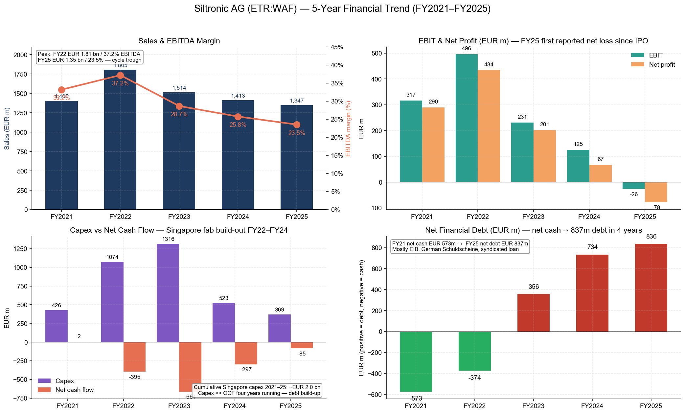
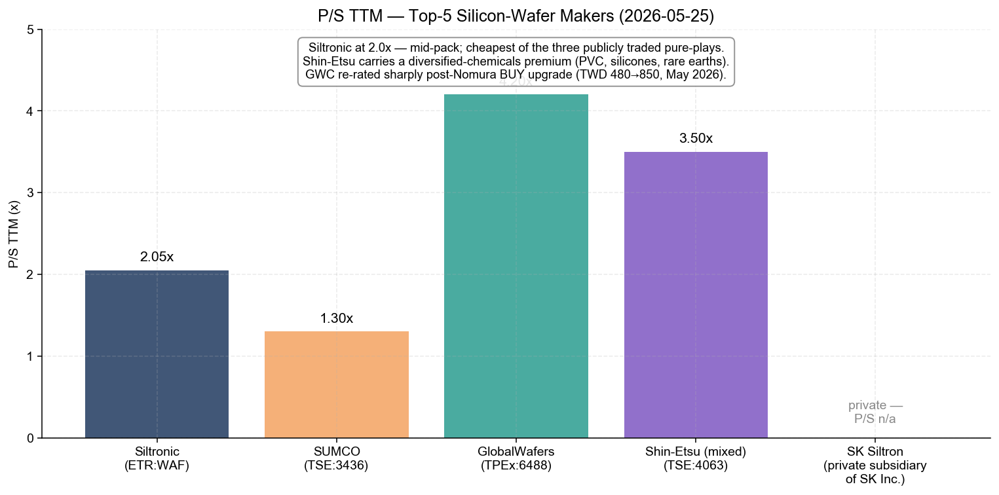

# 公司研究报告 — Siltronic AG（ETR:WAF / FWB:WAF）

**截至日期：** 2026-05-25
**作者：** Equity Research, Financial Agent
**上市地：** 法兰克福证券交易所 Prime Standard；SDAX 第 150 位，TecDAX 第 22 位 ([Annual Report 2025, p. 15](https://www.siltronic.com/fileadmin/investorrelations/2025/Q4/260420_Siltronic_Annual_Report_2025_safe.pdf))
**所处行业：** 半导体材料 — 300 mm / 200 mm 超高纯度硅片 (hyperpure silicon wafer)

---

> **更新 — FY2026 指引重申（2026-04-29）：** 管理层在 Q1 2026 业绩电话会议上维持 FY2026 全年指引不变：销售额较 FY2025 下滑 mid-single-digit %（即约 EUR 12.8 亿），EBITDA 利润率 (EBITDA margin) 20–24%，资本开支 (Capex) EUR 1.80–2.20 亿，折旧 EUR 4.90–5.20 亿，净现金流"与去年大致相当"（FY25 为 EUR ‑8,500 万）。Q1 2026 EBITDA 利润率 21.2% 落在指引区间下沿，季度销售环比下滑 17.5%——反映 Q4 2025 交付节奏前移影响，以及长期协议 (LTA) 范围之外的现货价格压力。两个结构性增长引擎仍清晰：(i) AI 服务器需求拉动 300 mm 硅片面积消耗（2026e 服务器细分预计 +44% YoY 晶圆面积增长），(ii) 新加坡 Fab S2 进入爬坡期，目标中期 EBITDA 利润率 >50%。资料来源：[Q1 2026 Conference Call Presentation, 2026-04-29](https://www.siltronic.com/fileadmin/investorrelations/2026/Q1/20260429_Q1_2026_conference_call_presentation__.pdf)。

---

## 目录

1. 公司概览
2. 公司历史
3. 管理团队
4. 产品与服务
5. 客户与上市策略
6. 行业概览
7. 竞争格局
8. 市场机会
9. 风险评估
10. 参考资料
11. 验证日志

---

## 1. 公司概览

Siltronic AG 是全球五大超高纯度硅片 (hyperpure silicon wafer) 制造商之一——即在每一颗现代集成电路 (IC) 制造起点处所用、由单晶硅 (monocrystalline silicon) 切割并经过抛光 (polished) 或在其上额外生长出磊晶层 (epitaxial wafer) 的圆形晶圆基板。公司在其年报中自我定位为"半导体行业领先的超高纯度硅片制造商之一"，"在亚洲、德国和美国的四个生产基地制造直径最大 300 mm 的硅片" ([Annual Report 2025, p. 18](https://www.siltronic.com/fileadmin/investorrelations/2025/Q4/260420_Siltronic_Annual_Report_2025_safe.pdf))。更关键的是，Siltronic 是"唯一总部位于西方的主要硅片制造商"——其余前五名供应商（Shin-Etsu Handotai / 信越半导体、SUMCO、GlobalWafers / 环球晶圆、SK Siltron）总部分别在日本、台湾、韩国——这一地缘属性自 2020–22 年 GlobalWafers 收购案被否后已成为公司战略身份的核心。

业务结构上 Siltronic 是典型的**单一产品公司**：年报明文指出"Siltronic 集团是一家单一产品公司，全部收入来自我们自产的、面向半导体行业的硅片销售" ([Annual Report 2025, p. 62](https://www.siltronic.com/fileadmin/investorrelations/2025/Q4/260420_Siltronic_Annual_Report_2025_safe.pdf))，分部报告也确认仅有"硅片"一个可报告分部，下分 300 mm 与 200 mm 两个直径规格，以及抛光、磊晶 (epitaxial)、区熔 (float-zone, FZ) 三类工艺变体 ([Annual Report 2025, p. 152, Note 18 Segment reporting](https://www.siltronic.com/fileadmin/investorrelations/2025/Q4/260420_Siltronic_Annual_Report_2025_safe.pdf))。收入模式为**直销**：芯片制造商（即"整合元件制造商 / IDM"：Samsung、SK Hynix、Micron、Intel、Infineon、STMicroelectronics——以及晶圆代工厂 TSMC、GlobalFoundries、UMC、SMIC）以多年期数量合约下单。新加坡新厂的合同结构尤其有特色：**约 80% 的产能已锁入带预付款的长期协议 (LTA)** ([Investor Presentation April 2026, p. 12](https://www.siltronic.com/fileadmin/investorrelations/2026/Q1/20260429_Siltronic_InvestorPresentation__.pdf))——这一可见性在纯材料供应商中是少见的。

公司运营层面 2025 年覆盖四个生产基地：**Burghausen**（德国——与母公司 Wacker Chemie 共用一个化学工业园，提供多晶硅 (polysilicon) 与公用工程；同时是研发总部，约 450 名研发员工与 1,900 项有效专利）、**Freiberg**（萨克森州，德国——长晶 + 300 mm 制造，1995 年并购）、**Portland**（美国俄勒冈州——前身为 1978 年成立的 Wacker Siltronic Corporation）、**Singapore**（含三座硅片工厂，包括 2024 年开始营运并自 2025 年 8 月起进入计划折旧的新厂 **Fab S2**） ([Annual Report 2025, p. 114, Note 1 Nature of operations](https://www.siltronic.com/fileadmin/investorrelations/2025/Q4/260420_Siltronic_Annual_Report_2025_safe.pdf))。新加坡 Tampines 园区由 **Siltronic Silicon Wafer Pte. Ltd.（SSW）** 主导——这是 Siltronic 与 Samsung Electronics 于 2006 年合资设立的 50:50 合资公司，Siltronic 于 2014 年增持至 77.7% ([Investor Presentation April 2026, p. 3 — 50+ years history](https://www.siltronic.com/fileadmin/investorrelations/2026/Q1/20260429_Siltronic_InvestorPresentation__.pdf))。

规模指标方面 Siltronic 处于五巨头中游。FY2025 销售额 **EUR 13.467 亿**（同比 ‑4.7%，FY2024 为 EUR 14.128 亿），EBITDA **EUR 3.169 亿**（利润率 23.5%），但 EBIT 转负至 **EUR ‑2,640 万**，归属股东净亏损 **EUR ‑7,790 万 / 每股 EUR ‑2.31** —— 主因新加坡厂折旧自 2025 年 8 月起入账 ([Annual Report 2025, p. 2, Group key figures](https://www.siltronic.com/fileadmin/investorrelations/2025/Q4/260420_Siltronic_Annual_Report_2025_safe.pdf))。年末员工 4,249 人，较上年 4,357 人减少 ([Annual Report 2025, p. 2](https://www.siltronic.com/fileadmin/investorrelations/2025/Q4/260420_Siltronic_Annual_Report_2025_safe.pdf))。成本基础主要以欧元与新加坡元计价，但收入约 80% 以美元结算——产生的天然汇率错配 (FX mismatch) 部分被新加坡厂的运营缓解（其成本以 SGD 结算，而 SGD/USD 相关性接近 0.95） ([Annual Report 2025, p. 20, Economic and legal influences](https://www.siltronic.com/fileadmin/investorrelations/2025/Q4/260420_Siltronic_Annual_Report_2025_safe.pdf))。

*资料来源：[Siltronic Annual Report 2025, p. 2, Group key figures](https://www.siltronic.com/fileadmin/investorrelations/2025/Q4/260420_Siltronic_Annual_Report_2025_safe.pdf)；FY2021–FY2025 经审计 IFRS 合并数据。*

**估值快照（截至 2026-05-25）。** Siltronic 在 Xetra 收盘价 **EUR 94.60**（盘中 +1.34%），按 3,000 万股已发行无面值记名股本对应总市值 **EUR 28.4 亿** ([Stockanalysis.com — ETR:WAF, 2026-05-25](https://stockanalysis.com/quote/etr/WAF/))。**滚动 P/E (TTM) 不具参考意义**——因为 FY2025 净亏损 EUR ‑7,790 万（基本每股收益 EUR ‑2.31）。亏损并非一次性减值或资产冲销，而是**周期低点 + 新厂爬坡成本**叠加的产物：(i) 销售额较 FY22 高点回落 25.4%；(ii) 新加坡 Fab S2 自 2025 年 8 月起开始折旧（FY26 指引折旧 EUR 4.90–5.20 亿，几乎吃光整个 FY25 EBITDA）；(iii) EUR/USD 年均汇率从 2024 年的 1.08 上行至 2025 年的 1.13，构成额外负面汇兑影响 ([Annual Report 2025, p. 26, Sales and earnings development](https://www.siltronic.com/fileadmin/investorrelations/2025/Q4/260420_Siltronic_Annual_Report_2025_safe.pdf))。滚动 **P/S 2.05×**（按 EUR 13.5 亿收入基础计算）；52 周价格区间 **EUR 31.70 – EUR 99.55**，过去 12 个月股价累计上涨 **172.9%**——市场已部分计入 AI 驱动的硅片需求复苏以及新加坡资本开支转化为盈利的预期 ([Stockanalysis.com — ETR:WAF](https://stockanalysis.com/quote/etr/WAF/))。按 FY25 报告 EBITDA（EUR 3.169 亿）+ 净债务（EUR 8.365 亿）的 EV/EBITDA 约为 **11.6×**——明显高于 IPO 后周期低谷年份，但仍在长期周期中位水平范围内。

*分析师观点：* 负的滚动 P/E 最适合解读为**典型的周期低点估值失真**叠加新一轮资本开支周期。最贴近的可比机制是 SUMCO（TSE:3436）——同样 TTM 不盈利（EPS TTM JPY ‑33.6），多重数据出现类似失真 ([Yahoo Finance — SUMCO 3436.T](https://finance.yahoo.com/quote/3436.T/key-statistics/))。Shin-Etsu Chemical（TSE:4063）滚动 P/E 约 21–25× ([companiesmarketcap — Shin-Etsu P/E](https://companiesmarketcap.com/shin-etsu-chemical/pe-ratio/))，但这一比较不公允——Shin-Etsu 收入分散于 PVC、有机硅、纤维素衍生物、稀土磁体等多业务，半导体硅片仅约 1/4。改用 P/S（在周期失真期最干净的横向比较指标），Siltronic 2.0× 低于 GlobalWafers ~4.2×（野村 2026 年 5 月将 GWC 目标价从 TWD 480 上调至 TWD 850 之后），略高于 SUMCO ~1.3×。整体估值对一家正从周期底部走出的公司来说**合理偏吸引**，并内含新加坡厂达到中期 >50% EBITDA 利润率目标的看涨期权。多头风险点为约 EUR 15 亿的贷款堆栈——FY26 起进入分期偿还，FY27 末迎来契约 (covenant) 复核；需求复苏若慢于预期，将先压缩流动性余量而非当期盈利。

*资料来源：[Stockanalysis.com (Siltronic, 2026-05-25)](https://stockanalysis.com/quote/etr/WAF/); [Yahoo Finance (SUMCO 3436.T)](https://finance.yahoo.com/quote/3436.T/); [Yahoo Finance (Shin-Etsu 4063.T)](https://finance.yahoo.com/quote/4063.T/); GlobalWafers P/S 系参考 [Sino-American Silicon Wikipedia, 2026-05](https://en.wikipedia.org/wiki/GlobalWafers) 及市场数据推算。*

---
