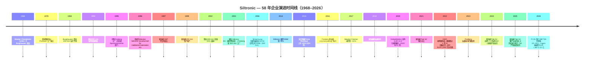

# 公司研究报告 — Siltronic AG（ETR:WAF / FWB:WAF）

**截至日期：** 2026-05-25
**作者：** Equity Research, Financial Agent
**上市地：** 法兰克福证券交易所 Prime Standard；SDAX 第 150 位，TecDAX 第 22 位 ([Annual Report 2025, p. 15](https://www.siltronic.com/fileadmin/investorrelations/2025/Q4/260420_Siltronic_Annual_Report_2025_safe.pdf))
**所处行业：** 半导体材料 — 300 mm / 200 mm 超高纯度硅片 (hyperpure silicon wafer)

---

> **更新 — FY2026 指引重申（2026-04-29）：** 管理层在 Q1 2026 业绩电话会议上维持 FY2026 全年指引不变：销售额较 FY2025 下滑 mid-single-digit %（即约 EUR 12.8 亿），EBITDA 利润率 (EBITDA margin) 20–24%，资本开支 (Capex) EUR 1.80–2.20 亿，折旧 EUR 4.90–5.20 亿，净现金流"与去年大致相当"（FY25 为 EUR ‑8,500 万）。Q1 2026 EBITDA 利润率 21.2% 落在指引区间下沿，季度销售环比下滑 17.5%——反映 Q4 2025 交付节奏前移影响，以及长期协议 (LTA) 范围之外的现货价格压力。两个结构性增长引擎仍清晰：(i) AI 服务器需求拉动 300 mm 硅片面积消耗（2026e 服务器细分预计 +44% YoY 晶圆面积增长），(ii) 新加坡 Fab S2 进入爬坡期，目标中期 EBITDA 利润率 >50%。资料来源：[Q1 2026 Conference Call Presentation, 2026-04-29](https://www.siltronic.com/fileadmin/investorrelations/2026/Q1/20260429_Q1_2026_conference_call_presentation__.pdf)。

---

## 目录

1. 公司概览
2. 公司历史
3. 管理团队
4. 产品与服务
5. 客户与上市策略
6. 行业概览
7. 竞争格局
8. 市场机会
9. 风险评估
10. 参考资料
11. 验证日志

---

## 1. 公司概览

Siltronic AG 是全球五大超高纯度硅片 (hyperpure silicon wafer) 制造商之一——即在每一颗现代集成电路 (IC) 制造起点处所用、由单晶硅 (monocrystalline silicon) 切割并经过抛光 (polished) 或在其上额外生长出磊晶层 (epitaxial wafer) 的圆形晶圆基板。公司在其年报中自我定位为"半导体行业领先的超高纯度硅片制造商之一"，"在亚洲、德国和美国的四个生产基地制造直径最大 300 mm 的硅片" ([Annual Report 2025, p. 18](https://www.siltronic.com/fileadmin/investorrelations/2025/Q4/260420_Siltronic_Annual_Report_2025_safe.pdf))。更关键的是，Siltronic 是"唯一总部位于西方的主要硅片制造商"——其余前五名供应商（Shin-Etsu Handotai / 信越半导体、SUMCO、GlobalWafers / 环球晶圆、SK Siltron）总部分别在日本、台湾、韩国——这一地缘属性自 2020–22 年 GlobalWafers 收购案被否后已成为公司战略身份的核心。

业务结构上 Siltronic 是典型的**单一产品公司**：年报明文指出"Siltronic 集团是一家单一产品公司，全部收入来自我们自产的、面向半导体行业的硅片销售" ([Annual Report 2025, p. 62](https://www.siltronic.com/fileadmin/investorrelations/2025/Q4/260420_Siltronic_Annual_Report_2025_safe.pdf))，分部报告也确认仅有"硅片"一个可报告分部，下分 300 mm 与 200 mm 两个直径规格，以及抛光、磊晶 (epitaxial)、区熔 (float-zone, FZ) 三类工艺变体 ([Annual Report 2025, p. 152, Note 18 Segment reporting](https://www.siltronic.com/fileadmin/investorrelations/2025/Q4/260420_Siltronic_Annual_Report_2025_safe.pdf))。收入模式为**直销**：芯片制造商（即"整合元件制造商 / IDM"：Samsung、SK Hynix、Micron、Intel、Infineon、STMicroelectronics——以及晶圆代工厂 TSMC、GlobalFoundries、UMC、SMIC）以多年期数量合约下单。新加坡新厂的合同结构尤其有特色：**约 80% 的产能已锁入带预付款的长期协议 (LTA)** ([Investor Presentation April 2026, p. 12](https://www.siltronic.com/fileadmin/investorrelations/2026/Q1/20260429_Siltronic_InvestorPresentation__.pdf))——这一可见性在纯材料供应商中是少见的。

公司运营层面 2025 年覆盖四个生产基地：**Burghausen**（德国——与母公司 Wacker Chemie 共用一个化学工业园，提供多晶硅 (polysilicon) 与公用工程；同时是研发总部，约 450 名研发员工与 1,900 项有效专利）、**Freiberg**（萨克森州，德国——长晶 + 300 mm 制造，1995 年并购）、**Portland**（美国俄勒冈州——前身为 1978 年成立的 Wacker Siltronic Corporation）、**Singapore**（含三座硅片工厂，包括 2024 年开始营运并自 2025 年 8 月起进入计划折旧的新厂 **Fab S2**） ([Annual Report 2025, p. 114, Note 1 Nature of operations](https://www.siltronic.com/fileadmin/investorrelations/2025/Q4/260420_Siltronic_Annual_Report_2025_safe.pdf))。新加坡 Tampines 园区由 **Siltronic Silicon Wafer Pte. Ltd.（SSW）** 主导——这是 Siltronic 与 Samsung Electronics 于 2006 年合资设立的 50:50 合资公司，Siltronic 于 2014 年增持至 77.7% ([Investor Presentation April 2026, p. 3 — 50+ years history](https://www.siltronic.com/fileadmin/investorrelations/2026/Q1/20260429_Siltronic_InvestorPresentation__.pdf))。

规模指标方面 Siltronic 处于五巨头中游。FY2025 销售额 **EUR 13.467 亿**（同比 ‑4.7%，FY2024 为 EUR 14.128 亿），EBITDA **EUR 3.169 亿**（利润率 23.5%），但 EBIT 转负至 **EUR ‑2,640 万**，归属股东净亏损 **EUR ‑7,790 万 / 每股 EUR ‑2.31** —— 主因新加坡厂折旧自 2025 年 8 月起入账 ([Annual Report 2025, p. 2, Group key figures](https://www.siltronic.com/fileadmin/investorrelations/2025/Q4/260420_Siltronic_Annual_Report_2025_safe.pdf))。年末员工 4,249 人，较上年 4,357 人减少 ([Annual Report 2025, p. 2](https://www.siltronic.com/fileadmin/investorrelations/2025/Q4/260420_Siltronic_Annual_Report_2025_safe.pdf))。成本基础主要以欧元与新加坡元计价，但收入约 80% 以美元结算——产生的天然汇率错配 (FX mismatch) 部分被新加坡厂的运营缓解（其成本以 SGD 结算，而 SGD/USD 相关性接近 0.95） ([Annual Report 2025, p. 20, Economic and legal influences](https://www.siltronic.com/fileadmin/investorrelations/2025/Q4/260420_Siltronic_Annual_Report_2025_safe.pdf))。

*资料来源：[Siltronic Annual Report 2025, p. 2, Group key figures](https://www.siltronic.com/fileadmin/investorrelations/2025/Q4/260420_Siltronic_Annual_Report_2025_safe.pdf)；FY2021–FY2025 经审计 IFRS 合并数据。*

**估值快照（截至 2026-05-25）。** Siltronic 在 Xetra 收盘价 **EUR 94.60**（盘中 +1.34%），按 3,000 万股已发行无面值记名股本对应总市值 **EUR 28.4 亿** ([Stockanalysis.com — ETR:WAF, 2026-05-25](https://stockanalysis.com/quote/etr/WAF/))。**滚动 P/E (TTM) 不具参考意义**——因为 FY2025 净亏损 EUR ‑7,790 万（基本每股收益 EUR ‑2.31）。亏损并非一次性减值或资产冲销，而是**周期低点 + 新厂爬坡成本**叠加的产物：(i) 销售额较 FY22 高点回落 25.4%；(ii) 新加坡 Fab S2 自 2025 年 8 月起开始折旧（FY26 指引折旧 EUR 4.90–5.20 亿，几乎吃光整个 FY25 EBITDA）；(iii) EUR/USD 年均汇率从 2024 年的 1.08 上行至 2025 年的 1.13，构成额外负面汇兑影响 ([Annual Report 2025, p. 26, Sales and earnings development](https://www.siltronic.com/fileadmin/investorrelations/2025/Q4/260420_Siltronic_Annual_Report_2025_safe.pdf))。滚动 **P/S 2.05×**（按 EUR 13.5 亿收入基础计算）；52 周价格区间 **EUR 31.70 – EUR 99.55**，过去 12 个月股价累计上涨 **172.9%**——市场已部分计入 AI 驱动的硅片需求复苏以及新加坡资本开支转化为盈利的预期 ([Stockanalysis.com — ETR:WAF](https://stockanalysis.com/quote/etr/WAF/))。按 FY25 报告 EBITDA（EUR 3.169 亿）+ 净债务（EUR 8.365 亿）的 EV/EBITDA 约为 **11.6×**——明显高于 IPO 后周期低谷年份，但仍在长期周期中位水平范围内。

*分析师观点：* 负的滚动 P/E 最适合解读为**典型的周期低点估值失真**叠加新一轮资本开支周期。最贴近的可比机制是 SUMCO（TSE:3436）——同样 TTM 不盈利（EPS TTM JPY ‑33.6），多重数据出现类似失真 ([Yahoo Finance — SUMCO 3436.T](https://finance.yahoo.com/quote/3436.T/key-statistics/))。Shin-Etsu Chemical（TSE:4063）滚动 P/E 约 21–25× ([companiesmarketcap — Shin-Etsu P/E](https://companiesmarketcap.com/shin-etsu-chemical/pe-ratio/))，但这一比较不公允——Shin-Etsu 收入分散于 PVC、有机硅、纤维素衍生物、稀土磁体等多业务，半导体硅片仅约 1/4。改用 P/S（在周期失真期最干净的横向比较指标），Siltronic 2.0× 低于 GlobalWafers ~4.2×（野村 2026 年 5 月将 GWC 目标价从 TWD 480 上调至 TWD 850 之后），略高于 SUMCO ~1.3×。整体估值对一家正从周期底部走出的公司来说**合理偏吸引**，并内含新加坡厂达到中期 >50% EBITDA 利润率目标的看涨期权。多头风险点为约 EUR 15 亿的贷款堆栈——FY26 起进入分期偿还，FY27 末迎来契约 (covenant) 复核；需求复苏若慢于预期，将先压缩流动性余量而非当期盈利。

*资料来源：[Stockanalysis.com (Siltronic, 2026-05-25)](https://stockanalysis.com/quote/etr/WAF/); [Yahoo Finance (SUMCO 3436.T)](https://finance.yahoo.com/quote/3436.T/); [Yahoo Finance (Shin-Etsu 4063.T)](https://finance.yahoo.com/quote/4063.T/); GlobalWafers P/S 系参考 [Sino-American Silicon Wikipedia, 2026-05](https://en.wikipedia.org/wiki/GlobalWafers) 及市场数据推算。*

---

## 2. 公司历史

Siltronic 的源头可追溯到 **1968 年 12 月**——彼时 Wacker-Chemie GmbH 在巴伐利亚 Burghausen 设立了一家全资子公司 **Wacker-Chemitronic Gesellschaft für Elektronik-Grundstoffe mbH**，目的是将 Wacker 多年来为新兴 IC 行业开发的多晶硅 (polysilicon) 与硅片技术商业化 ([Wikipedia — Siltronic, history section](https://en.wikipedia.org/wiki/Siltronic); [Siltronic Investor Presentation April 2026, p. 3](https://www.siltronic.com/fileadmin/investorrelations/2026/Q1/20260429_Siltronic_InvestorPresentation__.pdf))。Burghausen 基地至今仍与 Wacker 的多晶硅与化学品综合园区共址——Siltronic 借此长期协议获取多晶硅、公用工程与共享基础设施 ([Annual Report 2025, p. 153, related-party disclosures](https://www.siltronic.com/fileadmin/investorrelations/2025/Q4/260420_Siltronic_Annual_Report_2025_safe.pdf))。美国据点始于 **1978 年**——Wacker Siltronic Corporation 在俄勒冈州 Portland 落成；新加坡子公司 SSP（Wacker Siltronic Singapore Pte. Ltd.）则在 **1997 年**成立 ([Investor Presentation April 2026, p. 3 — 50+ years history](https://www.siltronic.com/fileadmin/investorrelations/2026/Q1/20260429_Siltronic_InvestorPresentation__.pdf))。

塑造现代 Siltronic 的有三次战略转折。**第一次：1995 年并购 Freiberg 基地**——这是德国统一后改制的前东德痕量元素厂，后来成为 Siltronic 在欧洲的 300 mm 主基地，也是所谓"萨克森硅谷"集群的地理核心：欧盟出产的每两到三颗半导体中约有一颗源自这里（Bosch、Infineon、即将建成的 TSMC 德累斯顿厂、GlobalFoundries Dresden、NXP 全部位于 Freiberg 长晶车间方圆 30 公里内） ([Investor Presentation April 2026, p. 13 — Freiberg location](https://www.siltronic.com/fileadmin/investorrelations/2026/Q1/20260429_Siltronic_InvestorPresentation__.pdf))。Freiberg 基地自 1995 年以来累计资本开支已超过 EUR 10 亿，2023 年新建长晶车间扩建项目是最近一次重大投资。

**第二次：2006 年与 Samsung 共建 SSW 合资公司**，正式把 Siltronic 推上记忆体行业 300 mm 主力供应商的位置。该合资公司在新加坡成立，专为新建 300 mm 工厂服务，给予 Siltronic 来自 Samsung DRAM 与 NAND 爬坡的稳定提货承诺，同时让 Samsung 多了一条不依赖 Shin-Etsu / SUMCO 双寡头的供应路径。Siltronic 于 2014 年将 SSW 持股提升至 77.7%，目前通过荷兰 Siltronic Holding International B.V. 间接持有 ([Annual Report 2025, p. 116, Composition of the Group](https://www.siltronic.com/fileadmin/investorrelations/2025/Q4/260420_Siltronic_Annual_Report_2025_safe.pdf))。Samsung 仍持有 22.3% 少数股权。这一合资结构在年报中的最新影响是：FY25 SSW 子公司在 EUR 8.253 亿净资产上仍录得 EUR ‑3,970 万亏损——新加坡损益表仍处爬坡阶段 ([Annual Report 2025, p. 155, List of shareholdings](https://www.siltronic.com/fileadmin/investorrelations/2025/Q4/260420_Siltronic_Annual_Report_2025_safe.pdf))。

**第三次，也是影响最深远的：2015 年 IPO 与 2017 年 Wacker 减持。** Wacker Chemie 在 **2015 年 6 月**以每股 EUR 30 价格将 Siltronic 在法兰克福 Prime Standard 板块上市，融得新资金同时保留控股权 ([Wacker Chemie ad-hoc disclosure — Siltronic IPO plan, 2015](https://www.wacker.com/cms/en-us/about-wacker/investor-relations/ad-hoc-disclosures/detail-101691.html))。2017 年初 Wacker 一次性大宗减持，将持股降至略低于 31% 的少数水平——自此保持稳定 ([Annual Report 2025, p. 16, Shareholder structure](https://www.siltronic.com/fileadmin/investorrelations/2025/Q4/260420_Siltronic_Annual_Report_2025_safe.pdf))。但 Wacker Chemie 仍通过 Dr. Tobias Ohler（同时是 Wacker 执行董事会成员）担任监事会主席，因此母子公司的历史纽带在治理层面仍然存在，尽管股权层面已经只是少数。

**关键并购 / 战略事件：**
- **1995** — 并购 Freiberg 工厂（德国统一后改制的 Spurenelemente Freiberg 资产）
- **2006** — 与 Samsung Electronics 在新加坡设立 50:50 合资公司 SSW
- **2014** — Siltronic 将 SSW 持股从 50% 提升至 77.7%
- **2017** — Wacker Chemie 减持至约 31%（IPO 后股东结构首次实质变化）
- **2020-12** — GlobalWafers（台湾）宣布 EUR 43.5 亿自愿要约收购，初始价格 EUR 125/股（后提高至 EUR 145/股）
- **2022-02-01** — GWC 收购案失效，因德国 BMWi（联邦经济与气候保护部）未能在 2022 年 1 月 31 日截止日前出具"无异议证书"；Siltronic 收到 **EUR 5,000 万分手费** ([Siltronic ad-hoc — Public tender offer not completed, 2022-02-01](https://www.siltronic.com/en/investors/financial-releases/ad-hoc-reports/siltronic-ag-public-tender-offer-by-globalwafers-will-not-be-completed-as-offer-conditions-have-not-been-fulfilled-within-the-applicable-deadline-2191243-1643673381.html); [CNBC — GlobalWafers bid for Siltronic fails amid tech sovereignty concerns, 2022-02-01](https://www.cnbc.com/2022/02/01/globalwafers-bid-for-siltronic-fails-amid-tech-sovereignty-concerns-.html))
- **2024-03-22** — 公告关闭 Burghausen 小直径硅片（SD，≤150 mm）产线，2025 年完成 ([Siltronic press release — Siltronic ends wafer production for small diameters, 2024-03-22](https://www.siltronic.com/en/press/press-releases/siltronic-ends-wafer-production-for-small-diameters.html))
- **2024** — 新加坡 Fab S2 落成启用；2025 年 8 月起开始折旧

**近两年（2024–2026）的三条主线。** 第一是 **Burghausen 小直径 SD 产线的有序关闭**——这条产线生产的 ≤150 mm 硅片"占全球硅片销售不到 5%"，到 FY23 已"明显亏损" ([Siltronic press release — SD shutdown, 2024-03-22](https://www.siltronic.com/en/press/press-releases/siltronic-ends-wafer-production-for-small-diameters.html))。该次关闭贡献了 FY25 销售额下滑的约三分之一 ([Annual Report 2025, p. 24, Actual vs guided performance](https://www.siltronic.com/fileadmin/investorrelations/2025/Q4/260420_Siltronic_Annual_Report_2025_safe.pdf))。第二是 **新加坡 Fab S2 客户认证**——"主要客户的认证在 2025 年 7 月完成"，由此触发计划折旧 ([Investor Presentation April 2026, p. 12](https://www.siltronic.com/fileadmin/investorrelations/2026/Q1/20260429_Siltronic_InvestorPresentation__.pdf))。第三是 **Capex 进入下行通道**：从 FY23 的 EUR 13.159 亿（占销售 87%）下滑到 FY24 的 EUR 5.234 亿，再到 FY25 的 EUR 3.691 亿，FY26 指引 EUR 1.80–2.20 亿——周期最高投资强度阶段已确定走完 ([Q1 2026 Conference Call Presentation, p. 6](https://www.siltronic.com/fileadmin/investorrelations/2026/Q1/20260429_Q1_2026_conference_call_presentation__.pdf))。

---

## 3. 管理团队

Siltronic 并非由创始人主导——这是一家从 Wacker 集团分拆出来的 57 年老公司。按 company-research 技能规则，本章仅介绍**现任 CEO**。

**Dr. Michael Heckmeier，首席执行官（CEO）（2023 年 5 月就任；合同已提前延至 2031 年）。** 1967 年出生，主修数学与物理，在康斯坦茨大学（University of Konstanz）取得物理学博士学位 ([Siltronic press release — Supervisory Board appoints Dr. Michael Heckmeier as future CEO, 2022-12-22](https://www.siltronic.com/en/press/press-releases/supervisory-board-appoints-dr-michael-heckmeier-as-future-ceo-of-siltronic-ag.html))。加入 Siltronic 之前，Heckmeier 在德国特种化学与生命科学集团 Merck KGaA（达姆施塔特）**连续工作 25 年**，自 1998 年起负责液晶 (Liquid Crystals, LC) 业务的多个岗位。这一履历背景对 Siltronic 极其相关：液晶在特种材料世界中是与硅片功能最相近的对照品——高纯度、低缺陷化学品，向亚洲电子 OEM 销售，直面日韩中竞争，并同样暴露于消费电子周期。在 Merck，Heckmeier 先后负责 LC 材料研发与新业务部门，2015 年起执掌全球颜料与化妆品 (Pigment & Cosmetics) 业务，2017 年晋升 **Merck 全球显示解决方案 (Display Solutions) 事业部 EVP**，主管收入超 EUR 10 亿、覆盖 OLED 材料、光刻胶、LC 化学品的业务，主要客户包括 Samsung Display、LG Display、BOE、Tianma ([Investor Presentation April 2026, p. 29 — Executive Board profiles](https://www.siltronic.com/fileadmin/investorrelations/2026/Q1/20260429_Siltronic_InvestorPresentation__.pdf); [Siltronic press release — Heckmeier appointment, 2022-12-22](https://www.siltronic.com/en/press/press-releases/supervisory-board-appoints-dr-michael-heckmeier-as-future-ceo-of-siltronic-ag.html))。除物理学博士学位外，他还持有 General Management MBA 学位。

Heckmeier 入主 Siltronic 的时点既处于上一轮 Capex 周期尾部，又恰逢 AI 周期复苏起点——节奏可谓恰到好处。他在 FY25 年报中传达的"我们打造你数字生活的基石" (We create the foundation of your digital life) 表述，配合 Q&A 中的财务管理强调——"得益于精准投资、持续的成本效率和主动的现金管理，我们 2025 年再次取得稳健业绩。本年我们将继续聚焦这些抓手以进一步增强韧性" ([Annual Report 2025, p. 7, Interview with the Executive Board](https://www.siltronic.com/fileadmin/investorrelations/2025/Q4/260420_Siltronic_Annual_Report_2025_safe.pdf))——形成一个清晰的双轴目标：业务增长 + 现金/资产负债表自律。他的中期愿景是"在 Leading Edge 与 Power 两个细分中跻身全球前三大硅片厂"——即从 SK Siltron（当前 Leading Edge 出货量排名第四）手中夺份额，同时巩固 Siltronic 在 Power 领域的既有 Top-3 地位。按公司"股权承诺" (Share Ownership Commitment) 制度，执行董事会成员必须持有相当于年度基本薪资 50% 的 Siltronic 股票，Heckmeier 与另两位董事均合规 ([Annual Report 2025, p. 49, Disclosures relevant to acquisitions](https://www.siltronic.com/fileadmin/investorrelations/2025/Q4/260420_Siltronic_Annual_Report_2025_safe.pdf))。2025 年执行董事会三位成员的全口径薪酬合计 EUR 4.29 m（固定 EUR 1.45 m + 短期变量 EUR 0.87 m + 长期股权激励 EUR 1.54 m + 养老金 EUR 0.43 m），详见 Compensation Report ([Annual Report 2025, p. 153, Remuneration of corporate bodies](https://www.siltronic.com/fileadmin/investorrelations/2025/Q4/260420_Siltronic_Annual_Report_2025_safe.pdf))。

2025 年 12 月，监事会提前 5 年续约 Heckmeier 与 CFO Claudia Schmitt——两人合同期均延至 **2031 年**，传递出穿越下一个投资周期的连续性信号 ([Siltronic press release — Supervisory Board resolves early contract extension, 2025](https://www.siltronic.com/en/press/press-releases/aufsichtsrat-der-siltronic-ag-beschliesst-vorzeitige-vertragsverlaengerung-von-dr-michael-heckmeier-als-ceo-und-claudia-schmitt-als-cfo.html))。考虑到新加坡折旧的体量（FY26 折旧高点 EUR 4.90–5.20 亿，未来 8–10 年逐步消化）与 FY27 末的契约复核，提前续约在运营上意义重大。

---
