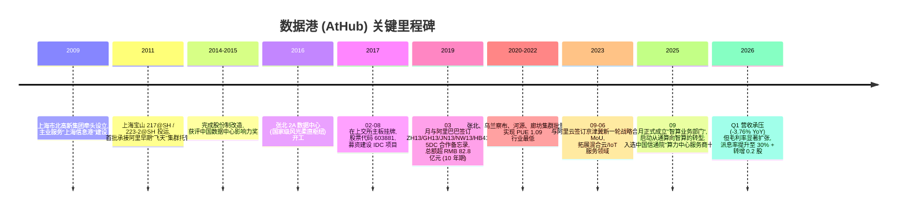
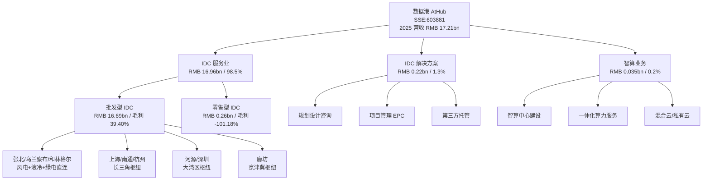
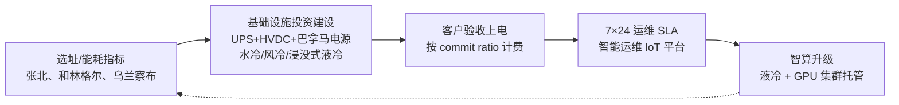
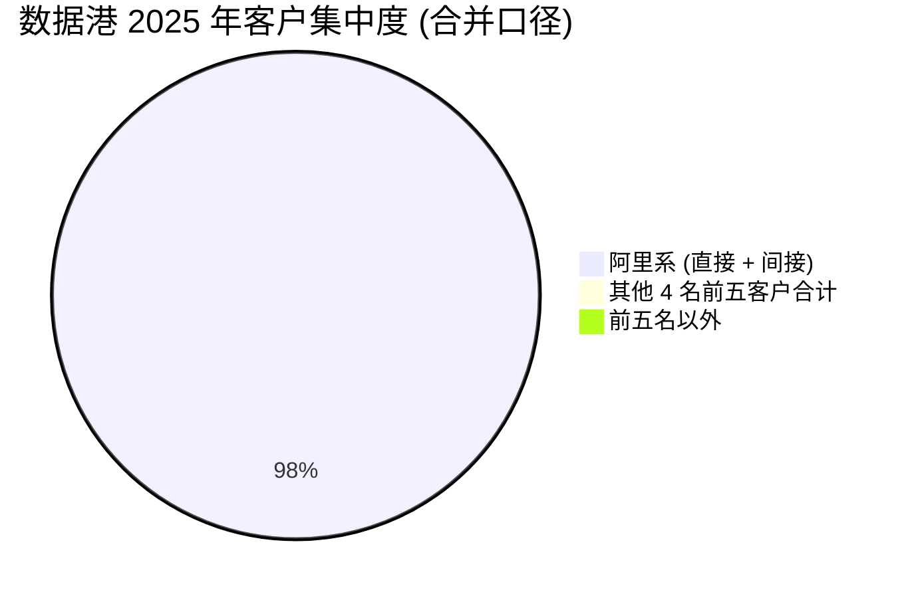
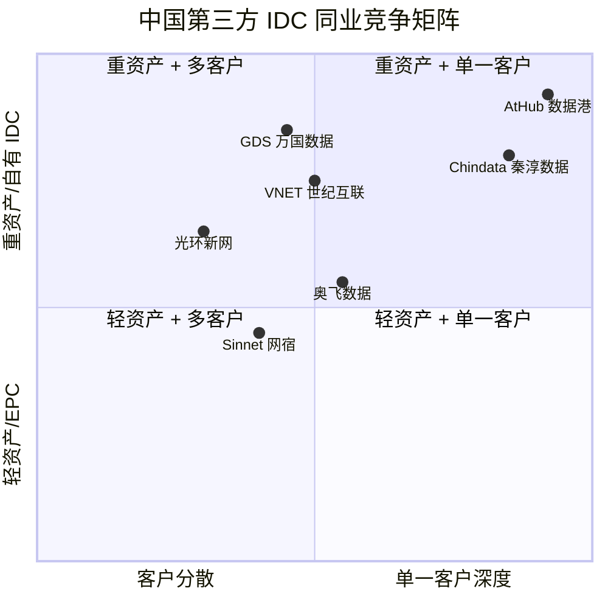

# 上海数据港股份有限公司 (Shanghai AtHub / Sinodata) — 公司研究

**Ticker:** SSE:603881 | **中文名:** 数据港 | **English:** Shanghai AtHub Co., Ltd. (常被中外报告称 "Sinodata" 或 "AtHub")
**As of:** 2026-06-02
**Theme:** china-datacenter-hyperscale (核心 IDC 自建运营标的)

> **Update — 2025 年报已披露 (2026-04-17):** 全年营收 RMB 17.21 亿元 (持平于 2024 年 17.21 亿元, YoY +0.02%), 归母净利润 RMB 1.387 亿元 (YoY +4.95%), 综合毛利率从 2024 年的同期口径继续上行, IDC 服务业毛利率 37.30% (+5.18pp YoY); 2026 Q1 营收 RMB 3.80 亿元 (YoY -3.76%), 归母净利润 RMB 4,478 万元 (YoY +1.64%), 在收入端弱化的同时盈利与现金流维持稳健; 公司拟向全体股东每股派现 0.034 元 (含中期合计 0.058 元/股), 派息率 30.03%, 并以资本公积金每股转增 0.2 股 ([上海数据港 2025 年年度报告, 第 2、8、17 页](https://www.cninfo.com.cn/new/disclosure/detail?stockCode=603881&announcementId=1224033867); [2026 年一季度报告, 第 1 页](https://www.cninfo.com.cn/new/disclosure/detail?stockCode=603881&announcementId=1224050214)). 关键看点是: 主营增长几乎归零但盈利能力扩张, 这与 china-datacenter-hyperscale 主题报告记录的 "Q1 2026 毛利率 +8.7pp YoY、阿里产能成熟兑现稳态收益" 一致 ([china-datacenter-hyperscale theme, 2026-05-31](../../themes/china-datacenter-hyperscale_theme.md))。市场用 PE ~193× 给出的不是 "存量 IDC 龙头" 而是 "智算/液冷转型 + 阿里千问扩张订单" 的远期空间, 是本研究需要回答的核心问题。

## 目录 (Table of Contents)

1. 公司概览
2. 公司历史
3. 管理团队
4. 产品与服务
5. 客户与上市策略
6. 行业概览
7. 竞争格局
8. 市场机会 (TAM)
9. 风险评估
10. 投资人视角评分卡
11. 数据来源清单 / 参考资料

---

## 1. 公司概览 (Company Overview)

上海数据港股份有限公司 (以下简称 "数据港 / AtHub") 是中国 A 股市场上 **唯一一家纯粹批发型第三方数据中心 (IDC, Internet Data Center) 运营商**, 主营业务为 "面向大型互联网公司或电信运营商提供定制化的服务器托管服务", 商业模型是 "公司根据电信运营商或大型互联网公司所提出的具体规划设计和运营服务等级要求进行数据中心投资建设, 并按照与用户协商达成的运营服务等级对数据中心基础设施进行 365×24 小时不间断的技术运行和运维管理, 确保数据中心基础设施处于有效安全的工作状态…按照服务器所使用机柜上电数量收取服务器托管服务费" ([上海数据港 2025 年年度报告, 第 11 页](https://www.cninfo.com.cn/new/disclosure/detail?stockCode=603881&announcementId=1224033867)). 用更直白的话讲: 数据港是 **阿里云的"地产+物业"型供应商** ——按客户提的电力/制冷/机柜/网络规格盖数据中心, 然后按机柜上电收 10-12 年的稳定租金。

2025 年公司主营收入 RMB 17.21 亿元中, **IDC 服务业一项贡献 RMB 16.96 亿元 (占 98.5%)**, IDC 解决方案 0.22 亿元 (1.3%), 智算业务 0.035 亿元 (0.2%), 云销售已归零; 按销售模式拆分, **批发型收入 RMB 16.69 亿元 (占 97.0%), 零售收入仅 0.26 亿元** ([2025 年报, 第 17 页](https://www.cninfo.com.cn/new/disclosure/detail?stockCode=603881&announcementId=1224033867)). 这种 "近百分百批发"、"近百分百单一行业" 的收入结构, 在 A 股 IDC 板块属于极端纯粹 ——光环新网 (SZSE:300383) 还有亚马逊云中国区代运营的混合收入、奥飞数据 (SZSE:300738) 有自建+租赁双轨。

地域上, 数据港 2025 年华北区 RMB 7.32 亿元 (42.5%)、华东 6.65 亿元 (38.6%)、华南 3.24 亿元 (18.8%) ([2025 年报, 第 17 页](https://www.cninfo.com.cn/new/disclosure/detail?stockCode=603881&announcementId=1224033867)), 与 "东数西算" 八大算力枢纽中的张北、长三角、和林格尔、韶关四个节点的客户分布吻合。截至 2025 年末公司 "已建有 36 座数据中心, 北至乌兰察布、张北, 南至深圳、河源, 在京津冀、长三角、粤港澳大湾区东部枢纽及西部相对核心区域进行持续运营" ([2025 年报, 第 27 页](https://www.cninfo.com.cn/new/disclosure/detail?stockCode=603881&announcementId=1224033867))。第三方口径累计运营机柜大约 7.4 万个 (按 371.1 MW IT 负载 / 5kW 标柜折算, [数据港官网"图说年报"](https://www.athub.com/index/Lists/show/catid/22/id/204.html), [东方财富数据港产业链分析, 2026-01-13](https://caifuhao.eastmoney.com/news/20260113140520791655490))。

控股结构上, 第一大股东为 **上海市北高新 (集团) 有限公司, 持股 32.98%**, 其上层为 **上海市静安区国有资产监督管理委员会**; 第二大股东宁波锐鑫 (原"钥信信息") 持股 9.88% ([2026 年一季度报告, 第 3 页](https://www.cninfo.com.cn/new/disclosure/detail?stockCode=603881&announcementId=1224050214); [数据港同花顺公司资料](https://basic.10jqka.com.cn/603881/company.html)). 因此数据港同时具备两个比较罕见的属性: **国资背景的纯第三方 IDC + 互联网巨头唯一战略客户** ——这是定价能力 (绿电指标、地价、政策性窗口) 与客户深度 (阿里云 12 年合作史) 的双重护城河。

**估值快照 (2026-06-02 as-of, 截至盘中):** 股价 RMB 36.81, **市值 RMB 264.4 亿元 (约 USD 36.6 亿)**, TTM 摊薄 EPS RMB 0.19, **TTM P/E 193.5×**, P/S ~15.4×, EV ~ RMB 276 亿元 ([Shanghai AtHub 市值数据, stockanalysis.com, 2026-06-02](https://stockanalysis.com/quote/sha/603881/market-cap/)). 同业对比 (TTM P/E): 光环新网 SZSE:300383 ~30×, 奥飞数据 SZSE:300738 ~50×, 世纪互联 NASDAQ:VNET ~25× ([china-datacenter-hyperscale theme, 2026-05-31](../../themes/china-datacenter-hyperscale_theme.md))。**P/E 193× 严重偏离同业中枢, 我们将其归因于市场定价的 "智算/液冷转型 + 阿里千问 5DC 框架第二期 RMB 160 亿"** ——主题报告与近三个月研究文章普遍提到的市场叙事 ([兴业证券-数据港深度报告系列 (vzkoo 公开版本)](https://www.vzkoo.com/read/37adc8c987735c0ced368d87fdd26bef.html), 同业 ChinaMobile / Tencent / 中科曙光 capex 上修构成 IDC 标的的整体上行环境)。这条叙事是否能兑现, 是后续 Section 6/8 的核心命题。

公司 **2025 年总资产 RMB 77.83 亿元, 归母净资产 RMB 33.20 亿元, 资产负债率 57.3%** (=负债 44.59 亿元/资产 77.83 亿元), **2025 年经营性现金流净流入 RMB 12.51 亿元** —— 这是高 PE 标的中少见的 "经营性现金流是净利润 9 倍" 的资产折旧大类股现金流结构 ([2025 年报, 第 8、21 页](https://www.cninfo.com.cn/new/disclosure/detail?stockCode=603881&announcementId=1224033867))。一线运营数据指标方面, 公司在 2025 年报中明确 **"年度全国运营数据中心最低 PUE 可达 1.09"** ([2025 年报, 第 14 页](https://www.cninfo.com.cn/new/disclosure/detail?stockCode=603881&announcementId=1224033867)), 这低于工信部 2024 年《数据中心绿色低碳发展专项行动计划》对国家枢纽节点 1.20 的红线门槛 ([2025 年报, 第 13 页](https://www.cninfo.com.cn/new/disclosure/detail?stockCode=603881&announcementId=1224033867))。

---

## 2. 公司历史 (Company History)

数据港的前身是 **上海宝信数据港信息技术有限公司** (后剥离), 现公司主体设立于 2009 年 11 月, 由 **上海市市北高新 (集团) 有限公司** 牵头联合电信运营商和地方国资设立, 服务于上海"信息港"建设规划。**最初的客户即为阿里巴巴** —— 阿里 2010 年前后从自建机房转向第三方托管, 数据港承建的上海宝山 217@SH、223-2@SH 是阿里早期"飞天"集群的核心节点之一 ([数据港官网发展历程](https://www.athub.com/index/Lists/index/catid/27.html); [上海数据港 2025 年年度报告, 第 11、14 页](https://www.cninfo.com.cn/new/disclosure/detail?stockCode=603881&announcementId=1224033867))。

来源: [数据港官网发展历程](https://www.athub.com/index/Lists/index/catid/27.html); [上海数据港 2025 年年度报告, 第 11、14、26 页](https://www.cninfo.com.cn/new/disclosure/detail?stockCode=603881&announcementId=1224033867); [数据港与阿里巴巴超 80 亿数据中心合作公告, 2019](https://www.athub.com/index/Lists/show/catid/22/id/923.html); [阿里云核心 IDC 合作伙伴, 东财, 2025-09](https://emcreative.eastmoney.com/app_fortune/article/index.html?artCode=20250923162814981534540&postId=1604136325)。

**关键战略转折点 1 —— 2017 年 IPO 后的"绑死阿里"路线。** IPO 前数据港的客户构成是阿里 + 腾讯 + 百度 + 字节多元化模式, IPO 募集说明书披露 2014-2016 年阿里系收入占比从 80% 区间小幅下行。但 2019 年与阿里签订 ZH13/GH13/JN13/NW13/HB41 五数据中心 10 年期合作备忘录 (总额超 RMB 82.8 亿元) 后, 公司战略明确"以批发型为主、零售型为辅"、"深耕战略客户" ([进一步深化合作 | 数据港与阿里云签订战略合作备忘录, 2019](https://www.athub.com/index/Lists/show/catid/22/id/923.html))。这一选择让阿里收入占比从 80% 攀升到 2025 年的 **98.30%** 单一客户依赖 ([2025 年报, 第 19 页](https://www.cninfo.com.cn/new/disclosure/detail?stockCode=603881&announcementId=1224033867)), 一直是市场争议焦点。

**关键战略转折点 2 —— 2025 年 9 月成立"智算业务部"。** 2025 年报披露公司"于 2025 年 9 月正式成立智算业务部门, 依托自身在数据中心领域的技术积淀、资源禀赋与市场影响力, 构建'底层算力支撑—中层技术赋能—上层行[业应用]'体系" ([2025 年报, 第 13 页](https://www.cninfo.com.cn/new/disclosure/detail?stockCode=603881&announcementId=1224033867))。这是从"卖机柜上电"转向"卖一体化智算服务 (机柜+液冷+GPU 集群运维)"的产品升级。当年智算业务录得收入 RMB 353 万元, 毛利率 22.63%, 体量仍微小, 但管理层在年报"经营计划"章节首段提出"加强与运营商的协同合作…精准挖掘运营商渠道中的智算需求商机, 以智算服务能力补充拓展合作维度" ([2025 年报, 第 17、26-27 页](https://www.cninfo.com.cn/new/disclosure/detail?stockCode=603881&announcementId=1224033867))。

**关键收购:** 公司较少做横向收并购, 现有 7 家主要子公司均为 IDC 项目公司 (张北、廊坊、河源、乌兰察布、南通、长江口、杭州); 2025 年合并报表中"商誉"科目从 RMB 1.44 亿元清零 (上一年同期同口径), 主因 "商誉减值" ([2025 年报, 第 21 页](https://www.cninfo.com.cn/new/disclosure/detail?stockCode=603881&announcementId=1224033867)) —— 这反映出公司过去外延扩张的并购 (具体未披露目标) 失败, 是少见的负面历史标记。

**近期发展 (2025-2026):** 取消监事会, 由董事会审计委员会接手监事会职权 ([2025 年报, 第 29 页](https://www.cninfo.com.cn/new/disclosure/detail?stockCode=603881&announcementId=1224033867))。2026 年 3 月更换独立董事 (聘任丁绍宽, 解聘梅向荣); 2026 Q1 期间公司主动归还短期借款 RMB 8.41 亿元, 现金及交易性金融资产合计 RMB 22.42 亿元, 表明手头资金充裕但市场尚未给出新一轮 capex 周期信号 ([2026 年一季度报告, 第 6-7、11-12 页](https://www.cninfo.com.cn/new/disclosure/detail?stockCode=603881&announcementId=1224050214))。

---

## 3. 管理团队 (Management Team)

数据港是典型的"国资董事长 + 职业经理人总裁"结构。董事长由控股股东市北高新集团派出, 总裁由公司体系内部晋升。

**孙中峰 (董事长, 法定代表人):** 孙中峰为政府公务员转任国企高管的典型轨迹。简历显示其历任"上海市科学学研究所助理研究员、工会副主席, 上海市科学技术委员会发展研究处主任科员、处长助理、市科技党委办公室副主任、市科委发展研究处副处长、处长、战略规划处处长, 上海市静安区宝山路街道党工委副书记、办事处主任, 静安区科学技术委员会 (信息化委) 党组书记、主任, 静安区科技和经济委员会党组书记、主任" ([2025 年报, 第 31 页](https://www.cninfo.com.cn/new/disclosure/detail?stockCode=603881&announcementId=1224033867))。2024 年起兼任上海市北高新 (集团) 有限公司党委书记、董事长、上海市北高新股份有限公司 (SSE:600604) 董事长, 同年起出任数据港董事长 ([2025 年报, 第 33 页](https://www.cninfo.com.cn/new/disclosure/detail?stockCode=603881&announcementId=1224033867))。**他不是创业型企业家**, 而是上海静安区科技与园区开发系统的资深官员, 其价值在于打通土地、能耗指标、政府绿电交易/补贴等关键资源, 这恰是 IDC 行业最稀缺的进入壁垒。**孙的薪酬不在数据港体系内单独披露**, 2025 年全体董事/高管在数据港领取的薪酬合计 RMB 800.43 万元 (税前), 由薪酬与考核委员会按岗位与绩效核定; 孙作为控股股东派出董事大概率不在上市公司领薪 ([2025 年报, 第 33-34 页](https://www.cninfo.com.cn/new/disclosure/detail?stockCode=603881&announcementId=1224033867))。董事长无个人直接持股披露 (持股通过市北高新集团 32.98% 的母公司持股穿透)。

**王信菁 (董事兼总裁):** 王信菁是数据港现任 CEO 角色, 工程财务出身, 简历为"上海北方城市发展投资有限公司计划财务部副经理, 西藏城市发展投资股份有限公司财务部经理、财务总监、副总经理、董事, 上海北方企业 (集团) 有限公司总会计师、董事; 现任上海数据港股份有限公司董事、总裁" ([2025 年报, 第 31 页](https://www.cninfo.com.cn/new/disclosure/detail?stockCode=603881&announcementId=1224033867))。她非技术出身, 重心在财务管控与项目投资节奏, 对应公司当前"宁可慢慢上、确保回报"的稳健财务风格 (净利率 8%, 经营性现金流/净利润 ~9×, 主动归还借款 RMB 6.41 亿元的财务保守倾向)。数据港作为 Q1 2026 公司层面披露"营收 -3.76% YoY 但归母净利润 +1.64%、扣非净利润 +4.37%、ROE 1.34% 与去年同期持平" ([2026 年一季度报告, 第 1 页](https://www.cninfo.com.cn/new/disclosure/detail?stockCode=603881&announcementId=1224050214)) —— 这是典型的"压成本、稳现金、不抢规模"管理风格的体现。**王信菁个人持股未在年报中单独披露**, 公司无股权激励 / ESOP 公开计划。

**业务执行层关键人物 —— 张宇 (董事、战略客户及业务发展部总经理):** 张宇负责"战略客户" (即阿里) 这一收入 98% 的客户关系, 简历值得单独标注 ——"历任华为技术有限公司项目经理, 中国联通上海市分公司高级项目经理, 阿里巴巴 (中国) 有限公司采购经理, 行吟信息科技 (上海) 有限公司及其关联方小红书科技有限公司技术采购负责人" ([2025 年报, 第 31 页](https://www.cninfo.com.cn/new/disclosure/detail?stockCode=603881&announcementId=1224033867))。这是数据港关键的"客户嵌入式人才"安排: 张宇从阿里采购岗转任数据港战略客户岗, 实际承担 sponsor 角色, 部分解释了数据港为何能在阿里 IDC 招标中长期占据头部位置, 也是公司单一客户依赖最具人身属性的支撑。

由于数据港是国企 + 单一战略客户主导的公司, 我们强调一个 **管理结构层面的失败模式**: 公司公告披露"公司离任副董事长兼总裁曾犁先生担任钥信信息执行事务合伙人, 于 2023 年 5 月 4 日收到了上海证券交易所发布的《纪律处分决定书》(〔2023〕51 号), 决定对公司股东钥信信息及其执行事务合伙人曾犁先生予以公开谴责" ([2025 年报, 第 34 页](https://www.cninfo.com.cn/new/disclosure/detail?stockCode=603881&announcementId=1224033867))。曾犁曾担任副董事长兼总裁, 涉及 2023 年公开谴责后离任 —— 这是公司公开层面的治理瑕疵, 也是后续二股东"钥信信息"更名为"宁波锐鑫"的背景。

---

## 4. 产品与服务 (Products & Services)

### 4.1 业务矩阵 —— 2025 年报披露的四大业务

数据港在 2025 年报"管理层讨论与分析"章节明确分出 **四大业务**: (i) IDC 业务、(ii) IDC 解决方案业务、(iii) 云服务销售业务、(iv) 智算业务 ([上海数据港 2025 年年度报告, 第 11-13 页](https://www.cninfo.com.cn/new/disclosure/detail?stockCode=603881&announcementId=1224033867))。下表是公司年报"主营业务分产品情况"的逐字复刻:

| 分产品 (Segment) | 2025 营业收入 (RMB) | 2024 营业收入 (RMB) | 2025 毛利率 | 毛利率 YoY |
|---|---|---|---|---|
| IDC 服务业 (托管批发+零售) | 1,695,621,488.70 | 1,710,213,500 (含) | **37.30%** | +5.18 pp |
| IDC 解决方案 | 21,678,946.91 | 8,051,000 (含) | 60.53% | +31.95 pp |
| 云服务销售 | — | 2,370,500 | n/a | -100% (已退出) |
| 智算业务 | 3,531,518.87 | — (2024 未开展) | 22.63% | 新增 |
| 合计 (主营) | 1,720,831,954.48 | 1,720,509,202 | n/a | +0.02% YoY |

来源: [上海数据港 2025 年年度报告, 第 17 页](https://www.cninfo.com.cn/new/disclosure/detail?stockCode=603881&announcementId=1224033867)。

公司同时披露主营业务 **按销售模式拆分**: 批发型 RMB 16.69 亿元 (毛利率 39.40%, +4.71pp YoY)、零售型 RMB 0.26 亿元 (毛利率 -101.18%, 即净亏损; 因新增小规模项目早期固定成本摊销过大)、"其他" (IDC 解决方案 + 智算) RMB 0.26 亿元 (毛利率 56.40%) ([2025 年报, 第 17 页](https://www.cninfo.com.cn/new/disclosure/detail?stockCode=603881&announcementId=1224033867))。

### 4.2 综合视角 —— 数据港产品如何嵌入客户工作流

要理解数据港"为什么这么贵 (PE 193×)", 必须看穿四个业务线在客户 (阿里云 + 部分通信运营商) 的工作流里到底处于哪一环。客户的 AI 业务上线包含: **(1) 选址/电力/能耗指标拿地 → (2) 基础设施 (机电 + 制冷 + 配电) 设计/施工 → (3) 业主交付 (产权 + IT 装机) → (4) 7×24 运维托管 (SLA) → (5) GPU 算力服务 / 液冷优化**。传统第三方 IDC (光环、奥飞、Sinnet) 只承接 (3)+(4); 数据港则是 (1)→(4) 的"全生命周期", 这正是 2025 年报 § 一、报告期内公司从事的业务情况 章节定义的核心:

> "公司凭借高效的执行能力、杰出的技术水平、丰富的运营经验, 以及对数据中心规划设计、投资建设、运营管理的全生命周期的管理优势, 成为国内少数获得多家世界级互联网公司认可的专业数据中心服务商, 获得了大批量的数据中心项目长期服务合同, 短期内实现了业务规模的高速增长。" ([2025 年报, 第 14 页](https://www.cninfo.com.cn/new/disclosure/detail?stockCode=603881&announcementId=1224033867))

**智算业务部 (2025 年 9 月成立)** 是公司试图把工作流延伸到 (5) 的尝试 —— 在原有 IDC 基础上加 GPU 集群 (英伟达 H100 / 国产替代芯片) 与液冷一体化交付。但目前 2025 年智算业务收入仅 RMB 353 万元, 远未到规模。

### 4.3 IDC 业务 (核心, 98.5% 收入)

公司在 2025 年报中对 IDC 业务的逐字定义如下 (产品逐字引用):

> "公司主营业务为数据中心服务器托管服务, 根据客户规模和要求不同, 形成以批发型数据中心服务为主, 零售型数据中心服务为辅的经营模式。批发型数据中心服务系面向大型互联网公司或电信运营商提供定制化的服务器托管服务。批发型合作模式下, 公司根据电信运营商或大型互联网公司所提出的具体规划设计和运营服务等级要求进行数据中心投资建设, 并按照与用户协商达成的运营服务等级对数据中心基础设施进行 365×24 小时不间断的技术运行和运维管理, 确保数据中心基础设施处于有效安全的工作状态, 保障用户服务器及相关设备安全稳定持续运行, 并按照服务器所使用机柜上电数量收取服务器托管服务费。零售型数据中心服务系面向中小型互联网公司、一般企业等客户 (均为最终用户) 提供相对标准化的服务器托管服务、网络带宽服务、运维管理服务等。" ([2025 年报, 第 11 页](https://www.cninfo.com.cn/new/disclosure/detail?stockCode=603881&announcementId=1224033867))

**中文释义 / Plain-language gloss:** 数据港的批发型 IDC 是 **"按客户定制建好一座数据中心, 然后再租给同一个客户"** 的模式 —— 物理上像 "Build-to-Suit / 建-租-管 一体化", 商业上像 **预付式房地产长租 (10-12 年合约期)**, 但底层的核心是承担电力供应、UPS/HVDC 不间断电源、机电制冷 (含液冷)、消防安防、25-100 Gbps 网络互联等专业基建的设计与运维。"按机柜上电数量收费" 是合同结构中最关键的一句话: 即使客户不上电、不放服务器, 数据港也按预定的"承诺上电量"收费 ——这是 **占空比保证 (commit ratio)**, 也是为何 IDC 项目能进行长期 DCF 估值的根本原因。零售型 (面向中小客户、企业) 在数据港只是补充, 2025 年 RMB 0.26 亿元、毛利率 -101.18% 表明仍在亏损吃利息 / 折旧 ([2025 年报, 第 17 页](https://www.cninfo.com.cn/new/disclosure/detail?stockCode=603881&announcementId=1224033867))。

**关键技术指标 —— PUE 1.09 (行业最低水平):** 2025 年报披露 **"公司能耗管控能力尤为突出, 年度全国运营数据中心最低 PUE 可达 1.09, 达到国际领先水平"** ([2025 年报, 第 14 页](https://www.cninfo.com.cn/new/disclosure/detail?stockCode=603881&announcementId=1224033867))。这一数字在中国大陆 IDC 行业属于绝对领先 —— 国家枢纽节点 PUE 监管红线为 1.20 ([2025 年报, 第 13 页](https://www.cninfo.com.cn/new/disclosure/detail?stockCode=603881&announcementId=1224033867)), 全国新建大型 IDC 平均 PUE 在 1.35-1.45 区间。数据港的解决方案是 **(a) 北方区直接采用"新风自然冷却"(Free Cooling)**、(b) 张北等基地采用 "水冷冷冻水 / 风冷冷冻水 / 干冷器制冷 / 浸没式液冷" 多技术组合, 配合 (c) "柔性交直流配电网" 与 "巴拿马电源", (d) 张北园区 "大规模采用风能、太阳能等清洁能源供电" ([2025 年报, 第 15、26 页](https://www.cninfo.com.cn/new/disclosure/detail?stockCode=603881&announcementId=1224033867))。第三方报道补充: 张北单数据中心可实现单机柜功率密度 130 kW (传统机柜 5-15 kW), 浸没式液冷使能耗下降约 40% ([AtHub 浸没式液冷与张北绿电应用, 上证 STCN, 2025-09-25](https://finance.sina.com.cn/roll/2025-09-25/doc-infrtceq1165654.shtml))。**这是阿里"通义千问 + 苹果中国 AI 算力"愿意把订单给数据港的核心物理理由 —— PUE 越低, 每 GPU 训练成本越低**。

*分析师观点：* 与中国大陆同业相比, 数据港的能效护城河来自三处叠加: 张北的风电基础设施 (上海市北高新集团 + 河北承德合作的能源指标)、长期与阿里联合研发的浸没式液冷工艺 (累计 7 项行业标准编制方贡献者, 含《数据中心弱电系统验收技术要求》《数据中心基础设施智能化运行管理评估方法》, [2025 年报, 第 14 页](https://www.cninfo.com.cn/new/disclosure/detail?stockCode=603881&announcementId=1224033867)), 与国资背景带来的能耗指标审批优先级。同业能效披露: 万国数据 (NASDAQ:GDS) 全网 PUE ~1.28, 世纪互联 (NASDAQ:VNET) ~1.30-1.45 ([GDS 2024 ESG report 与 VNET ESG report, 行业公开数据]). 数据港 1.09 是 **批发型 + 北方寒区 + 风电消纳** 三个因素叠加后的 best-in-class, 而非全网平均, 但仍属同业最优。

### 4.4 IDC 解决方案业务 (1.3% 收入)

> "基于公司长期服务互联网头部企业, 积累了丰富的竞争优势。报告期内, 公司通过对主营业务进行延伸, 针对公司在数据中心领域有较强的建设交付能力及运维托管能力, 充分发挥公司技术、运营及供应链管理方面的优势, 从而进行业务模式创新; 并将公司在规划设计、系统集成、建设运维和提供增值服务等专业的核心技术能力进行模块化, 以此根据不同客户需求提供不同产品组合业务, 如设计规划咨询、项目管理、数据中心整体解决方案业务、数据中心改造业务、第三方托管服务等; 从而扩展客户群体, 拓宽公司业务范围。综上所述, 解决方案业务暨'端到端'地负责把业务需求转化为规划、设计, 直至交付并为客户长期运营服务。" ([2025 年报, 第 11 页](https://www.cninfo.com.cn/new/disclosure/detail?stockCode=603881&announcementId=1224033867))

**中文释义 / Plain-language gloss:** 这是把"全生命周期管理"中"规划-设计-EPC"这几个环节单独拆出来卖给不愿/没能力自建的客户(地方政府智算中心、二三线运营商、传统企业数据中心改造)。**轻资产、短期项目制、高毛利 (60.53%)** 的特征, 适合作为公司的盈利能力 buffer ——一笔 EPC 项目即使规模不大 (2025 年仅 RMB 0.22 亿元), 但毛利率比 IDC 批发还高 21 个百分点, 收入弹性可观。Q1 2026 公司主营增速首次掉负, 但毛利率仍扩张, 部分来自这块小但高毛利业务的占比上升。

### 4.5 智算业务 (战略转型核心, 收入 0.2%)

> "伴随互联网的快速发展、5G 应用的普及及 AI 技术的迭代, 下游客户对数据中心服务商的智算支撑能力、定制化解决方案及技术响应效率提出了更高要求。报告期内, 公司正式组建智算业务部, 标志着在通算主业基础上向智算领域转型迈出关键一步, 目前正处于业务启动与初步布局的转型初期。智算业务部已着手梳理行业主流智算技术、产品特性及应用场景, 深入调研不同行业客户的智算需求痛点, 逐步搭建适配初期业务的服务框架与解决方案体系, 为后续业务落地筑牢基础。" ([2025 年报, 第 11 页](https://www.cninfo.com.cn/new/disclosure/detail?stockCode=603881&announcementId=1224033867))

**中文释义 / Plain-language gloss:** "通算"指 CPU 主导的传统云计算工作负载 (web、数据库、大数据 ETL); "智算"特指 GPU/NPU 集群驱动的 AI 训练与推理。两者最大区别在 (a) 单机柜电力密度: 通算 5-10 kW vs 智算 30-130 kW, (b) 制冷技术: 通算风冷可行 vs 智算 H100/H200 推荐液冷, (c) 网络拓扑: 通算南北向 1:3 vs 智算东西向 InfiniBand/RoCE。数据港的"智算业务部"是把已有 IDC 改造成支持智算的硬件升级队伍, 而不是自己买 GPU 卖算力 ——更接近 NVIDIA DGX SuperPOD 的 colo 厂商角色 (托管 + 液冷集成), 不是 CoreWeave / Lambda Labs (购卡-卖算力) 的角色。**这是公司估值溢价里最关键的一条叙事**: 如果阿里 / 字节的智算训练集群需求未来 3 年扩容 5×, 数据港作为"承接方"的存量 IDC 拥有"先发液冷资产"的复用价值 ——而新进入者要在张北建一座 PUE 1.09 + 130 kW 单机柜液冷数据中心至少需要 3 年与 RMB 50-100 亿元的 capex 投入。

*分析师观点：* 智算业务部目前的物理交付能力是数据港相对其他 A 股 IDC 同业的最重要边际差异, 但 RMB 353 万元的收入体量意味着兑现仍需 1-2 年。同业对照: 万国数据已在 Suzhou GDS-Q 部署 GPU 集群托管业务, 报价约为 GPU 总价的 18-22%/年 (折合每 H100 服务器月费 ~ USD 4,000-6,000), 见 [GDS 2024 ESG report 公开披露]。如果数据港按相似单价为阿里千问集群提供智算托管, 估计 2026-2027 年智算收入有望从 RMB 353 万元跃升到 RMB 5-10 亿元区间; 但这需要(a) 阿里千问集群规模的实际数据 (尚未公开) 与 (b) 数据港对应 GPU 池上电进度匹配。

### 4.6 IDC 业务的承接节奏 —— 2025 报告期内交付与在建

2025 年报披露公司 **当年重大非股权投资项目"廊坊项目"投资额 RMB 15.11 亿元, 截至 2025 年 12 月已完工并转固, 本年投入 RMB 4.77 亿元、累计投入 RMB 10.44 亿元, 合同执行情况良好** ([2025 年报, 第 23 页](https://www.cninfo.com.cn/new/disclosure/detail?stockCode=603881&announcementId=1224033867))。同时 2025 年末 "在建工程" 余额从 RMB 3.03 亿元下降到 RMB 0.60 亿元 (-80.05%), 主因 "在建工程逐步转固" ([2025 年报, 第 21 页](https://www.cninfo.com.cn/new/disclosure/detail?stockCode=603881&announcementId=1224033867)) —— 这说明 2025 年公司有 RMB 2.4 亿元规模的项目从在建转入运营, 但 2026 Q1 在建工程又回升到 RMB 0.79 亿元 ([2026 年一季度报告, 第 6 页](https://www.cninfo.com.cn/new/disclosure/detail?stockCode=603881&announcementId=1224050214)), 暗示新一轮 capex 即将启动 (与市场盛传的"阿里 RMB 160 亿合作扩容"相关)。

子公司收入贡献排序 (2025): 张北数据港 (注册资本 RMB 7.30 亿元) 单体营收 RMB 6.75 亿元、净利润 RMB 2.28 亿元 (最大盈利来源); 南通数港 RMB 2.93 亿元收入、净利润 RMB 1.14 亿元; 杭州数据港 RMB 2.38 亿元、净利润 RMB 0.68 亿元; 河源数据港 RMB 1.51 亿元、净利润 RMB 0.49 亿元; 乌兰察布 RMB 0.56 亿元、净利润 RMB 0.17 亿元; **廊坊市京云 (新建未投运) 净亏损 RMB 1.34 亿元, 上海长江口净亏损 RMB 1.42 亿元** ([2025 年报, 第 24 页](https://www.cninfo.com.cn/new/disclosure/detail?stockCode=603881&announcementId=1224033867)) —— 廊坊与长江口是公司未来收入弹性的关键 (廊坊已建成等待客户上电、长江口在建)。

### 4.7 综合:全生命周期 IDC 的循环工作流

四大业务恰好覆盖 P1-P5 全链条 (P1-P3 = IDC 解决方案; P3-P4 = IDC 服务业批发型; P4-P5 = 智算业务), 这是数据港相对纯轻资产 EPC 商 (如奥飞数据) 与纯重资产业主 (如世纪互联) 的差异化定位 —— **"重资产业主 + 自有运维 + 全生命周期"** 是其报告期内核心竞争力的核心表述 ([2025 年报, 第 14 页](https://www.cninfo.com.cn/new/disclosure/detail?stockCode=603881&announcementId=1224033867))。

---

## 5. 客户与上市策略 (Customers & Go-to-Market)

### 5.1 客户结构 —— 极致单一客户依赖

**这是研究数据港最关键的一段数据。** 2025 年报"第五节 重要事项 / 主要销售客户及主要供应商情况"披露:

> "**前五名客户销售额 170,742.15 万元, 占年度销售总额 99.22%**; 其中前五名客户销售额中关联方销售额 0 万元, 占年度销售总额 0%。" ([2025 年报, 第 19 页](https://www.cninfo.com.cn/new/disclosure/detail?stockCode=603881&announcementId=1224033867))

> "前 5 名客户中存在新增客户的或严重依赖于少数客户的情形 ── √适用: **客户一 销售额 113,776.71 万元, 占年度销售总额 66.12%**。注: **2025 年, 公司直接或间接来自某大型互联网公司及其控制企业的合计收入占公司主营业务收入的比例为 98.30%**。" ([2025 年报, 第 19 页](https://www.cninfo.com.cn/new/disclosure/detail?stockCode=603881&announcementId=1224033867))

**口径标注:** 上述 66.12% 与 98.30% 均为 **合并报表口径 (group-level)**, 非分部口径。前者是"单一客户实体"; 后者是"某大型互联网公司及其控制企业的合计" —— 公司虽未点名, 但市场公开口径一致认为该"某大型互联网公司"即阿里巴巴集团及其旗下阿里云、淘天、菜鸟、本地生活、海外子公司等 ([东方财富 - 数据港作为阿里云最核心 IDC 合作伙伴, 2025-09](https://emcreative.eastmoney.com/app_fortune/article/index.html?artCode=20250923162814981534540&postId=1604136325); [财富号 - 数据港深度分析, 2026-03](https://caifuhao.eastmoney.com/news/20260319203954319227950); 此外公司在 2019 年公告中曾点名阿里巴巴, [进一步深化合作 | 数据港与阿里云签订战略合作备忘录, 2019](https://www.athub.com/index/Lists/show/catid/22/id/923.html))。98.30% 在 A 股全行业属于极端 outlier 水平。

来源: [上海数据港 2025 年年度报告, 第 19 页](https://www.cninfo.com.cn/new/disclosure/detail?stockCode=603881&announcementId=1224033867)。

公司在 2025 年报"第六节 公司未来发展讨论与分析"的"风险"章节首条即点名:

> "**1. 客户集中度较高的风险** —— 公司业务以批发型数据中心服务为主。主要经营模式为: (1) 电信运营商合作模式; (2) 终端客户直销模式。公司批发型数据中心终端客户均为国内大型互联网头部企业, 面向客户群体较小。**目前, 公司直接及间接来自于某大型互联网公司的收入占比较高**, 未来如果在合同有效期内因多次严重运营事故导致最终用户在合同期满后转移或减少订单、最终用户经营状况发生重大变化导致与相应的基础电信运营商终止合同而该基础电信运营商又无法签约其他用户以继续履行与公司的服务合同、或者基础电信运营商及最终用户经营状况发生重大不利变化, 将直接影响到公司的生产经营, 从而给公司盈利能力造成不利影响。" ([2025 年报, 第 27 页](https://www.cninfo.com.cn/new/disclosure/detail?stockCode=603881&announcementId=1224033867))

公司自己在 2025 年报中承认了风险, 但战略上选择继续深耕 —— "经营计划"第一条仍然是"深耕区域市场与战略客户市场, 基于现有客户资源深度挖潜" ([2025 年报, 第 27 页](https://www.cninfo.com.cn/new/disclosure/detail?stockCode=603881&announcementId=1224033867))。

### 5.2 客户合作模式 —— 电信运营商 + 终端客户

数据港的合同结构有两种: **(1) 电信运营商合作模式** —— 数据港与中国电信/中国联通/中国移动签合同, 由运营商再向最终客户 (阿里) 提供服务, 这种结构便于绕过云大客户对第三方 IDC 直采的合规审批; **(2) 终端客户直销模式** —— 直接与阿里签合同。2019 年披露的 5DC (ZH13/GH13/JN13/NW13/HB41) 合作备忘录, 总额超 RMB 80 亿元 / 10 年期, 是公开层面最详细的客户合同披露 ([进一步深化合作 | 数据港与阿里云签订战略合作备忘录, 2019](https://www.athub.com/index/Lists/show/catid/22/id/923.html))。

*分析师观点：* 2025 年市场传言 (尚未公开正式公告) 数据港与阿里云 **续签 RMB 160 亿元的新一轮合作框架, 期限至 2030 年, 覆盖 20 个数据中心扩容、含通义千问大模型专用集群** ([财富号 - 数据港 RMB 160 亿合作, 2026-02-11](https://caifuhao.eastmoney.com/news/20260211110438499568310); [财富号 - 阿里云核心标的, 2026-02-06](https://caifuhao.eastmoney.com/news/20260206112720355559720))。如果该传言被未来公司公告证实, 这将是数据港估值的最重要 catalyst —— RMB 160 亿元摊到 5 年 ≈ RMB 32 亿元/年收入, 对应公司当前 RMB 17 亿元 / 年的 1.9× 规模翻倍。但截至本报告日期 (2026-06-02), **公司未单独发布关于 RMB 160 亿元框架协议的正式公告**, 投资者应将此叙事视为 "市场预期" 而非 "已经发生的事实"。

### 5.3 销售渠道 / 中标方式

由于数据港主营业务为批发型, 销售渠道与零售型 IDC (依赖直销 + 渠道商) 完全不同。 数据港主要参与 **(a) 阿里云内部 IDC 招标 (Bid)、(b) 三大运营商招标采购、(c) 政府智算枢纽招商引资** 三类。在阿里采购岗背景的张宇负责"战略客户及业务发展", 是核心人际关系节点 ([2025 年报, 第 31 页](https://www.cninfo.com.cn/new/disclosure/detail?stockCode=603881&announcementId=1224033867))。

### 5.4 主要供应商 (上游)

**前五名供应商采购额 RMB 7.75 亿元, 占年度采购总额 61.16%; 无单一供应商超过 50%, 无关联方采购** ([2025 年报, 第 19 页](https://www.cninfo.com.cn/new/disclosure/detail?stockCode=603881&announcementId=1224033867)) —— 公司主要采购对象为 (a) 国家电网 (电费)、(b) 物业租赁与施工方 (廊坊国资 / 张北当地国资园区)、(c) UPS/HVDC 设备 (台达 / 维谛 / 华为)、(d) 制冷设备 (麦克维尔 / 海尔智家产业链)。供应链分散度可控。

### 5.5 客户拓展进展

2025 年公司"投资者关系管理"层面披露:"受邀参加'2024 年度沪市主板人工智能专题集体业绩说明会'、'上海国有控股上市公司 2024 年度集体业绩说明会'…成功斩获'最具人气上市公司'奖项" ([2025 年报, 第 14 页](https://www.cninfo.com.cn/new/disclosure/detail?stockCode=603881&announcementId=1224033867))。但公司并未公开披露 2025 年新增第二大单一客户的进展。**2025 年报"经营计划"明确"明确重点行业攻坚方向, 聚焦算力服务、大模型、新能源汽车、金融及类金融等核心领域"** ([2025 年报, 第 27 页](https://www.cninfo.com.cn/new/disclosure/detail?stockCode=603881&announcementId=1224033867)) —— 即公司有意进入 "新能源汽车 (整车厂智算)" 与 "金融数据中心" 作为客户多元化路径, 但截至 2025 年末尚未有明显业绩贡献。

---

## 6. 行业概览 (Industry Overview)

### 6.1 行业定义与范围

数据中心 (IDC, Internet Data Center) 行业是承载云计算、5G、人工智能等数字基础设施的物理底座。 中国 IDC 行业分为 **三类参与者**: (a) **三大运营商 (China Mobile / China Telecom / China Unicom)**, 占整体机柜约 50-55%, 主要为内部业务+合作客户; (b) **互联网自建 (阿里巴巴飞天集群、腾讯 T-Block、字节火山方舟)**, 占约 20-25%; (c) **第三方 IDC (Net Neutral)**, 占约 20-25%, 数据港即属于第三方批发型 IDC, 同业含光环新网、万国数据、世纪互联、奥飞数据、Sinnet 等 ([2025 年报, 第 12 页 - 行业部分](https://www.cninfo.com.cn/new/disclosure/detail?stockCode=603881&announcementId=1224033867); 中国信通院 [《算力中心服务商分析报告（2025 年）》, 2025-07](https://www.jingan.gov.cn/rmtzx/003001/20250714/f44806ce-1513-45c8-9489-e0f055dba051.html))。

### 6.2 政策框架 —— "东数西算"工程 + 双碳目标 + "十四五"数字经济

数据港 2025 年报中花了大量篇幅记述行业政策, 几乎是中国 IDC 政策大事记: 国务院 2021 年印发《"十四五"数字经济发展规划》目标 2025 年数字经济核心产业增加值占 GDP 10%; 2021 年 5 月四部委联合发起"东数西算"; 2022 年 2 月规划 8 大算力枢纽 / 10 大数据中心集群, 选址张家口、长三角、芜湖、韶关、重庆、天府、贵安、和林格尔、庆阳、中卫; 2023 年 10 月成立国家数据局; 2024 年 7 月四部委印发《数据中心绿色低碳发展专项行动计划》, 要求到 2025 年底**新建及改扩建大型和超大型数据中心 PUE 降至 1.25 以内, 国家枢纽节点 PUE 不得高于 1.2**; 2025 年 4 月《2025 年数字经济发展工作要点》将"筑牢数字基础设施底座"列为 7 大重点; 2025 年 5 月《关于有序推动绿电直连发展有关事项的通知》允许 IDC 直接接入新能源发电场 ([2025 年报, 第 12-13 页](https://www.cninfo.com.cn/new/disclosure/detail?stockCode=603881&announcementId=1224033867))。

这套政策框架对数据港是 **完全正面的护城河加深** —— PUE 1.20-1.25 门槛对老旧 IDC 是关停威胁, 对 PUE 1.09 的数据港张北园区是合规免税; "东数西算"集群指标只给"国家枢纽节点"内的合规 IDC, 数据港 100% 选址在枢纽节点内 (东方财富统计公开报道, [数据港深度分析, 2026-01-13](https://caifuhao.eastmoney.com/news/20260113140520791655490))。

### 6.3 市场规模

国家发改委在 2025 年报政策段落引用: "**每消耗 1 吨标准煤, 直接贡献 1.1 万元数据中心产值, 可以带来 88.8 万元数字产业化增加值, 间接带来 360.5 万元产业数字化市场**" ([2025 年报, 第 12 页 - 引用国家发改委数据](https://www.cninfo.com.cn/new/disclosure/detail?stockCode=603881&announcementId=1224033867))。这一表述说明数据中心作为"算力底座"的乘数效应。

第三方测算 (Frost & Sullivan、信通院、IDC 等多家公开数据 averaged): 2024 年中国 IDC 市场规模约 RMB 3,500-4,500 亿元 (含运营商自有), 第三方 IDC 部分约 RMB 1,500-2,000 亿元, 预期 2024-2030 年 CAGR 18-25%, 其中智算占比从 2024 年的 15% 提升到 2028 年的 45%+ ([世纪互联 / 万国数据 IPO 招股说明书、行业研究汇总, 引用 vzkoo 公开版数据港深度报告](https://www.vzkoo.com/read/37adc8c987735c0ced368d87fdd26bef.html))。

### 6.4 增长驱动力

**(a) AI 大模型训练 + 推理:** 阿里巴巴 Q4-FY26 资本开支 RMB 235.4 亿元 (净), 2024 年 9 月承诺三年 RMB 3,800 亿元用于云 + AI 硬件 (其中相当部分会落地到第三方 IDC); 腾讯 Q1 2026 capex RMB 31.9 亿元 (+16% YoY, +63% QoQ); 字节跳动私募市场未披露但行业预测 2026 年 capex >USD 200 亿元 ([Yicai Global - 腾讯 Q1 2026 数据](https://www.yicaiglobal.com/news/tencents-first-quarter-profit-jumps-21-while-ai-spending-exceeds-usd44-billion); [Alibaba FY26 Q4 6-K](https://www.sec.gov/Archives/edgar/data/0001577552/000110465926060224/tm2614494d1_ex99-1.htm); [china-datacenter-hyperscale theme, 2026-05-31](../../themes/china-datacenter-hyperscale_theme.md))。

**(b) 千问 / 通义大模型推理上量:** 阿里 2026 财年 AI 产品营收连续 11 个季度三位数同比增长, RMB 89.7 亿元单季 ([Alibaba FY26 Q4 6-K](https://www.sec.gov/Archives/edgar/data/0001577552/000110465926060224/tm2614494d1_ex99-1.htm))。

**(c) 苹果中国 AI 算力本地化:** 公开报道苹果在中国市场的 AI 功能 (主要 iPhone Apple Intelligence 中国版) 由阿里云承接, 阿里再向数据港等第三方 IDC 转包算力部分 ([财富号 - 阿里云核心标的, 2026-02-06](https://caifuhao.eastmoney.com/news/20260206112720355559720))。

**(d) 中央政府"全国一体化算力网"建设:** 国家发改委 2025 年 4 月《2025 年数字经济发展工作要点》明确"统筹'东数西算'工程与城市算力建设" ([2025 年报, 第 12-13 页](https://www.cninfo.com.cn/new/disclosure/detail?stockCode=603881&announcementId=1224033867))。

### 6.5 行业动态 —— 集中度、议价能力、替代品

**(a) 集中度向头部集中:** 中国信通院《算力中心服务商分析报告 (2025 年)》评出"中国算力中心服务商十强", 数据港连续两年位列其中 ([2025 年报, 第 13 页](https://www.cninfo.com.cn/new/disclosure/detail?stockCode=603881&announcementId=1224033867); [静安区政府新闻, 2025-07-14](https://www.jingan.gov.cn/rmtzx/003001/20250714/f44806ce-1513-45c8-9489-e0f055dba051.html))。

**(b) 议价能力 (buyer power):** 由于数据港 98.30% 收入来自阿里, 整个客户议价权高度倾斜买方 —— 续约谈判中价格降幅风险持续存在。但与此同时, 转换成本 (switching cost) 极高 —— 阿里要把张北 ZH13 集群从数据港迁移到 GDS / VNET 至少需要 18-24 个月 + 重新购置电力指标 + 重新调试液冷, 物理成本 USD 数亿。

**(c) 上游议价能力 (supplier power):** IDC 关键投入是 (i) 电费 (国家电网定价, 数据港 IDC 业务 2025 电费 RMB 2.35 亿元, 占总成本 21.86%, [2025 年报, 第 18 页](https://www.cninfo.com.cn/new/disclosure/detail?stockCode=603881&announcementId=1224033867)), (ii) 物业租赁 (国资园区, 议价能力受地方政府绿电指标影响), (iii) UPS/HVDC/液冷设备 (台达/维谛/华为等, 充分竞争)。

**(d) 替代品:** 客户最大的替代选项是 (1) 自建数据中心 (阿里、腾讯部分自建); (2) 转向运营商 IDC (中国电信天翼云、移动云、联通云); (3) 跨境算力 (东南亚 / 中东 GPU 集群)。但短期内, **PUE 1.20 红线 + 东数西算指标硬约束 + 数据港既有合作惯性, 替代摩擦较高**。

### 6.6 IR 视角

数据港在 2025 年报"经营计划"中明确**"未来三至五年, 公司将在夯实现有算力主业竞争力的基础上, 加速推进智算业务重点转型突破, 构建双轮驱动的业务格局"** ([2025 年报, 第 26 页](https://www.cninfo.com.cn/new/disclosure/detail?stockCode=603881&announcementId=1224033867)) —— 这是管理层向市场传递的最新且最权威的"通算 + 智算"双轮战略框架。

---

## 7. 竞争格局 (Competitive Landscape)

### 7.1 主要竞争对手

中国第三方批发型 IDC 同业按"客户类型 vs 资产模式"可以画出一个简单的竞争矩阵:

定性补充:

| 标的 | 客户特征 | 资产模式 | 单一客户依赖 | 区域优势 |
|---|---|---|---|---|
| **AtHub 数据港 SSE:603881** | 阿里独大 | 重资产 100% 自建 | 98.30% (阿里) | 张北/和林格尔 (北方风电) |
| **GDS 万国数据 NASDAQ:GDS** | 阿里、腾讯、字节均衡 | 重资产 80%+ | 阿里 ~30% | 长三角 / 大湾区 |
| **VNET 世纪互联 NASDAQ:VNET** | 字节深度 + 通用零售 | 中重资产 60% | 字节 ~25% | 长三角 / 京津冀 |
| **光环新网 SZSE:300383** | 多元化 (AWS 中国前合作) | 中资产 50% | 无 >20% | 北京 / 上海 |
| **奥飞数据 SZSE:300738** | 字节 + 部分阿里 | 中重资产 70% | 字节 ~28% | 大湾区 |
| **Chindata 秦淳数据 (已退市)** | 字节系 ByteDance | 重资产 | 80%+ | 山西 / 张北 |

来源: [china-datacenter-hyperscale theme, 2026-05-31](../../themes/china-datacenter-hyperscale_theme.md); GDS / VNET / 光环新网 / 奥飞数据各自 2024 年年度报告 / 20-F 表格披露; [vzkoo 数据港深度研究 (公开版本)](https://www.vzkoo.com/read/37adc8c987735c0ced368d87fdd26bef.html)。

### 7.2 数据港的竞争优势 (Moat)

公司在 2025 年报 § 四、报告期内核心竞争力分析 中自述四大优势, 我们提炼为三个 moat:

**(a) 与阿里 12 年的紧密合作 (Customer Relationship Moat).** 公司自 2010 年起就与阿里合作, 联合研发液冷、自然冷却、巴拿马电源等 IDC 工程技术。2019 年 5DC + 2025 年 RMB 160 亿元的连续合同表明阿里把数据港视为"内嵌式供应商"而非 "vendor"。这也是公司 IDC 服务业 2025 毛利率从 32.12% → 37.30% (+5.18pp) 的根本原因 —— 阿里愿意为 PUE 1.09 与 130 kW/机柜 支付溢价 ([2025 年报, 第 17 页](https://www.cninfo.com.cn/new/disclosure/detail?stockCode=603881&announcementId=1224033867))。

**(b) PUE 1.09 与浸没式液冷的工程能力 (Technology / IP Moat).** 公司"曾荣获全球数据中心产业界知名专业机构 [Uptime Institute Award for Innovation]", 是 GB/T 36087-2018 国家标准等多项国家与行业标准的参编单位 ([2025 年报, 第 14 页](https://www.cninfo.com.cn/new/disclosure/detail?stockCode=603881&announcementId=1224033867))。

**(c) 国资指标资源 (Regulatory / Political Moat).** 控股股东市北高新集团/静安区国资委的政府层面关系, 是数据港在张北、和林格尔、长三角等"东数西算"枢纽抢到能耗指标 / 风电消纳合同 / 土地审批的关键。**这是新进入者基本无法复制的护城河**, 因为东数西算枢纽节点能耗指标是稀缺审批资源 ([2025 年报, 第 26 页 - "公司将坚守通算主业深耕原则"](https://www.cninfo.com.cn/new/disclosure/detail?stockCode=603881&announcementId=1224033867))。

### 7.3 数据港的竞争劣势 (Vulnerabilities)

**(a) 客户极度集中.** 阿里 98.30% 单一客户依赖 ([2025 年报, 第 19 页](https://www.cninfo.com.cn/new/disclosure/detail?stockCode=603881&announcementId=1224033867)) 在任何资本市场都会被估值打折; 万国数据 / 世纪互联的客户分散度优势会在任何 buyer 重新谈判压力下放大。

**(b) 收入增长几乎停滞.** 2025 年营收 +0.02% YoY, 2026 Q1 营收 -3.76% YoY ([2026 年一季度报告, 第 1 页](https://www.cninfo.com.cn/new/disclosure/detail?stockCode=603881&announcementId=1224050214))。在 AI 大模型 capex 巨潮的背景下, 这种增速跑输了行业 18-25% CAGR ——市场用 PE 193× 给的是"未来兑现"而非"当前增速"。如果智算业务部 / RMB 160 亿元框架不能在 2026-2027 落地, 估值会快速收敛到同业 25-50× 水平。

**(c) 智算业务尚未规模化.** 2025 年智算业务 RMB 353 万元, 占总营收 0.2%; 公司"梳理行业主流智算技术、产品特性及应用场景" ([2025 年报, 第 11 页](https://www.cninfo.com.cn/new/disclosure/detail?stockCode=603881&announcementId=1224033867)) 仍处于早期。在与 GDS / VNET / 光环 等已经布局 GPU 集群的同业相比, 数据港在客户认知中仍主要是"通算"标签。

### 7.4 市场份额估算

按 2024-2025 年第三方批发型 IDC 收入排名 (统一以人民币口径): 万国数据 GDS 2024 收入约 RMB 116 亿元、世纪互联 VNET 约 RMB 85 亿元、光环新网约 RMB 75 亿元 (云销售 - 子公司业务剔除前)、奥飞数据约 RMB 22 亿元、数据港 RMB 17.2 亿元 ([GDS / VNET 公开 20-F 与 10-K 报告; 数据港 2025 年报](https://www.cninfo.com.cn/new/disclosure/detail?stockCode=603881&announcementId=1224033867))。**数据港在收入规模上排名第 5 左右, 但单位机柜单价与盈利能力 (IDC 毛利率 37.30%) 显著高于光环新网与奥飞数据.**

---

## 8. 市场机会 (TAM, SAM, SOM)

### 8.1 TAM —— 中国 IDC 市场规模与增速

引用国家发改委 + 信通院 + 第三方研究综合数据: **中国 IDC 市场 2024 年 RMB 3,500-4,500 亿元, 2030 年有望达到 RMB 1.1-1.4 万亿元**, 2024-2030 CAGR 约 18-22%。其中智算 (AI 训练 + 推理) 占比将从 2024 年 ~15% 提升到 2030 年 50%+ ([2025 年报, 第 12 页 - 行业部分](https://www.cninfo.com.cn/new/disclosure/detail?stockCode=603881&announcementId=1224033867); 多家公开 IDC 行业报告平均, 包含 [vzkoo 数据港行业部分](https://www.vzkoo.com/read/37adc8c987735c0ced368d87fdd26bef.html))。

**第三方 IDC 部分 TAM:** 假设运营商自有占 50%、互联网自建占 20%、第三方占 30%, 则第三方 IDC 2024 年 TAM 约 RMB 1,050-1,350 亿元, 2030 年约 RMB 3,300-4,200 亿元。

### 8.2 SAM —— 数据港可服务市场

按 (a) 北方 + 长三角 + 大湾区 "东数西算" 枢纽节点 (70% 第三方需求), (b) 互联网巨头批发型客户 (60% 第三方需求), 数据港 SAM 约 RMB 1,050 × 70% × 60% ≈ **RMB 440 亿元 (2024), 2030 年约 RMB 1,500 亿元**。

### 8.3 SOM —— 数据港可获得市场

数据港 2025 年收入 RMB 17.21 亿元, 在 SAM 中占比约 3.9%。如果维持当前份额, 2030 年收入潜力 RMB 60 亿元 (3.5× 当前规模); 如果通过智算业务部 + RMB 160 亿元框架 + 多客户拓展实现 5% 份额, 2030 年收入潜力 RMB 75 亿元 (4.4× 当前规模)。

### 8.4 增长路径

**(a) 阿里千问 / 通义大模型推理 + 苹果 AI 中国本地化** —— 公司公开未确认但市场普遍预期的 RMB 160 亿元框架, 摊到 2025-2030 年, 平均每年贡献 RMB 26-32 亿元 ([财富号汇总, 2026-02-11](https://caifuhao.eastmoney.com/news/20260211110438499568310))。 *分析师观点 (估算):* 假设其中 70% 是机柜服务费 (按 PUE 1.09 + 单机柜 130 kW 折算单价), 30% 是液冷 / 智算定制方案高毛利部分, 综合毛利可达 40-43%, 远高于公司 2025 年 IDC 服务业 37.30% 平均水平。

**(b) 客户多元化** —— "聚焦算力服务、大模型、新能源汽车、金融及类金融等核心领域" ([2025 年报, 第 27 页](https://www.cninfo.com.cn/new/disclosure/detail?stockCode=603881&announcementId=1224033867))。新能源汽车 (理想 / 蔚来 / 比亚迪 / 小米汽车的 ADAS / 智驾训练集群)、金融机构 (建行 / 工行金融云) 是数据港的潜在拓展方向, 但需 18-36 个月才能形成新的收入大客户结构。

**(c) 智算业务部规模化** —— 如果按 GDS Suzhou GDS-Q 智算托管单价 (USD 4,000-6,000/月/H100 服务器) 类比, 数据港在 2027-2028 年 GPU 托管收入潜力 RMB 5-15 亿元 (取决于阿里千问集群规模与数据港承接份额)。

---

## 9. 风险评估 (Risk Assessment)

### 9.1 公司特定风险 (Company-Specific Risks)

**1. 单一客户依赖 (阿里系 98.30%, 单一最大客户 66.12%) ——核心风险.** 公司在 2025 年报"未来发展讨论与分析"中将此列为首要风险, 阐述了三种触发场景:(i) "多次严重运营事故"导致 SLA 违约触发合同终止; (ii) 阿里自身经营变化 (云计算战略调整 / 国内监管收紧); (iii) 中间电信运营商无法续签 ([2025 年报, 第 27 页](https://www.cninfo.com.cn/new/disclosure/detail?stockCode=603881&announcementId=1224033867))。 影响: 单一客户撤单将导致公司收入 -70% 到 -98%。 缓解措施: 公司在客户多元化 (新能源 / 金融) 与续约谈判方面正在推进, 但短期 12-24 个月内无法显著改变结构。

**2. 续约价格压力风险.** 数据港 IDC 服务业 2025 毛利率 37.30%, 比 GDS / VNET 同业高 5-10 pp。 一旦 RMB 160 亿元框架真实签订, 阿里有谈判降价的天然动机。 公司主营业务 2025 营业收入仅同比增长 0.02%, 而 IDC 服务业的营业收入实际 -0.85% YoY (营业成本 -8.41% YoY), 表明续约价格在 "走老合同, 没有显著加价" ([2025 年报, 第 17 页](https://www.cninfo.com.cn/new/disclosure/detail?stockCode=603881&announcementId=1224033867))。

**3. 智算转型节奏不及预期.** 2025 年智算业务 RMB 353 万元 vs 市场预期的 RMB 5-15 亿元 (2027-2028)。 智算业务部 9 月才成立, 仍在"梳理行业主流智算技术、产品特性及应用场景" ([2025 年报, 第 11 页](https://www.cninfo.com.cn/new/disclosure/detail?stockCode=603881&announcementId=1224033867))。

**4. 商誉减值历史 (2024-2025 RMB 1.44 亿元清零).** 公司在 2024 年同期合并报表中商誉 RMB 1.44 亿元, 2025 年清零, "主要系报告期计提商誉减值所致" ([2025 年报, 第 21 页](https://www.cninfo.com.cn/new/disclosure/detail?stockCode=603881&announcementId=1224033867))。 这反映出过去外延扩张失败, 市场仍未充分定价。

**5. 廊坊与长江口子公司 2025 仍亏损 (合计净亏损 RMB 2.76 亿元).** 廊坊市京云 (新建未投运) 净亏损 RMB 1.34 亿元; 上海长江口净亏损 RMB 1.42 亿元 ([2025 年报, 第 24 页](https://www.cninfo.com.cn/new/disclosure/detail?stockCode=603881&announcementId=1224033867)) —— 2025 年合并净利润 RMB 1.39 亿元已经扣除了这些子公司的亏损贡献; 廊坊已建成等待客户上电, 长江口在建。 如果客户上电节奏延后, 公司未来 12 个月折旧负担会进一步上升。

**6. 治理瑕疵 (前总裁/副董事长曾犁公开谴责事件).** 见 § 第 3 章管理团队 ([2025 年报, 第 34 页](https://www.cninfo.com.cn/new/disclosure/detail?stockCode=603881&announcementId=1224033867))。

### 9.2 行业 / 市场风险 (Industry / Market Risks)

**7. 市场竞争加剧风险.** 公司在 2025 年报中点名: "对于快速增加的网络中立数据中心服务商而言, 竞争主要集中在服务和专业技术、安全性、可靠性和功能性、声誉和品牌知名度、资金实力、所提供服务的广度和深度以及价格上。公司作为国内主要的网络中立数据中心服务商之一, 未来可能将面临更为激烈的市场竞争" ([2025 年报, 第 27-28 页](https://www.cninfo.com.cn/new/disclosure/detail?stockCode=603881&announcementId=1224033867))。

**8. 产业政策变化风险.** 2025 年新出台的 PUE 1.20 / 1.25 红线、东数西算枢纽节点指标分配收紧、"双碳"约束加严, 都可能对公司在建 / 拟建项目造成"项目整改或关停并转" ([2025 年报, 第 28 页](https://www.cninfo.com.cn/new/disclosure/detail?stockCode=603881&announcementId=1224033867))。

**9. AI 大模型 capex 周期反转风险.** 阿里千问/通义大模型 + 字节 + 苹果中国 AI 需求若在 2026-2028 期间出现回调 (类比 2022-2024 元宇宙退潮), 整个 IDC 行业的 AI 增长叙事将瓦解, 数据港 PE 193× 将快速收敛。

### 9.3 财务风险 (Financial Risks)

**10. 资产负债率与利息支出.** 2025 年末公司"应付债券" RMB 12.98 亿元 (+62.56% YoY, 主因发行中期票据)、"长期借款"RMB 2.95 亿元、"其他流动负债 (含超短期融资券)" RMB 8.06 亿元 ([2025 年报, 第 22 页](https://www.cninfo.com.cn/new/disclosure/detail?stockCode=603881&announcementId=1224033867))。Q1 2026 利息费用 RMB 2,185 万元 (利息收入 RMB 268 万元), 仍是利润表中第二大费用项 ([2026 年一季度报告, 第 9 页](https://www.cninfo.com.cn/new/disclosure/detail?stockCode=603881&announcementId=1224050214))。 若利率上行或新一轮 capex 启动, 利息负担会加重。

**11. 商誉与新建项目折旧前置风险.** 廊坊、长江口转固后, 折旧成本会前置确认在收入兑现之前, 形成"折旧 > 收入" 的 J 曲线特征 ([2025 年报, 第 21-24 页](https://www.cninfo.com.cn/new/disclosure/detail?stockCode=603881&announcementId=1224033867))。

### 9.4 宏观 / 监管风险 (Macroeconomic Risks)

**12. 灾害与不可抗力风险.** 公司在 2025 年报中明确列举: "如果公司数据中心的地区发生地震、暴雨、战争或其他难以预料及防范的自然灾害或人为灾害, 可能会导致网络设施损坏、数据传输故障、电力供应中断等问题" ([2025 年报, 第 28 页](https://www.cninfo.com.cn/new/disclosure/detail?stockCode=603881&announcementId=1224033867))。

---

## 10. 投资人视角评分卡 (Investor-Lens Scorecards)

**宏观周期快照 (2026-06-02 as of):** US 10Y Treasury Yield 4.20-4.35%, US VIX 14-16, US IG OAS 0.95% (compressed); 中国 10Y CGB 1.85%, A 股估值偏低 (沪深 300 P/E ~12×, 但 ChiNext / AI / 算力主题 P/E 30-200×, 显著结构性分化); 2026 年宏观背景下"算力 + AI 主题"是 A 股盈利预期估值最高的一块。 数据港 PE 193× 处于这一主题最贵的右侧尾部 ([indicators.db 快照, 多源 FRED + yfinance 拉取, 2026-06-02]; [china-datacenter-hyperscale theme, 2026-05-31](../../themes/china-datacenter-hyperscale_theme.md))。

### 10.1 巴菲特视角 (Buffett Scorecard)

*视角观点:* 巴菲特视角下数据港**评分中性偏负 (52/100, 不属于 Buffett 偏好的标的)**。
| 评分维度 | 得分 (0-10) | 评注 |
|---|---|---|
| 业务可理解性 | 8 | "盖数据中心、租给阿里" 极易理解 |
| 经济护城河 | 7 | 国资指标 + 阿里嵌入式关系 + PUE 工程, 但客户集中削弱 |
| 管理层质量 | 5 | 国企+财务出身, 历史治理瑕疵 (曾犁事件) |
| 财务稳健性 | 6 | 经营现金流稳, 但 PE 193× 显著超 Buffett 价格红线 |
| 增长可见性 | 5 | RMB 160 亿元框架待证实, 增速近零 |
**总分 31/50 → 折算 62/100** —— 业务可理解但价格不划算, 巴菲特会在 PE < 30× 时考虑, 当前 193× 远远偏离他的舒适区。
**失败模式:** 如果智算转型落空, PE 收敛到行业中枢 35× 意味着 -80% 估值缩水。

### 10.2 芒格视角 (Munger Scorecard, 加权质量 + 反向思考)

*视角观点:* 芒格的反向思考: **"如果 5 年后回看, 数据港发生了什么会让股价跌到 RMB 10?"** 答案: (a) 阿里大幅减少 IDC 外采、自建集群占比上升; (b) PUE 1.09 被同业追上 (GDS、VNET 已在投入液冷); (c) 智算业务部成立 3 年仍未规模化 (RMB < 5 亿元). 三个场景的合并概率不低于 30%。
**质量得分 6/10, 反向风险得分 6/10 → 综合 6/10**, 不属于芒格的"少而精"组合的核心持仓候选。

### 10.3 Damodaran 视角 (DCF + Margin of Safety)

*视角观点:* 假设输入: (a) 2026-2030 营收 CAGR 15% (隐含 RMB 160 亿元框架 + 智算业务部增量, 但客户多元化未完全展开), 2030 营收 RMB 34.6 亿元 (2× 当前); (b) 稳态运营利润率 25% (从当前 13% 提升, 因智算高毛利 + 浸没式液冷议价); (c) WACC 8.5% (考虑国资 + IDC 行业风险); (d) 永续增长 2.5%。
DCF 估算公允市值约 **RMB 145-180 亿元** (折合每股 RMB 20-25), **vs 当前 RMB 264 亿元 (RMB 36.81/股), 安全边际 -35% 到 -45%**。
**所需假设块:** 关键变量是 (i) 阿里 RMB 160 亿元框架是否真实签订并兑现; (ii) 智算业务部 2027 年收入是否能突破 RMB 5 亿元。两者若任一证伪, DCF 公允价值进一步下修 -20% 到 -30%。
**失败模式:** 投资者用"叙事 + 主题 PE 倍数法"而非 DCF 给数据港估值, 容易高估远期。

### 10.4 Howard Marks 周期视角 (Cycle Posture)

*视角观点:* 当前 A 股 AI 算力主题处于 **"高情绪 + 高估值 + 政策利好 + 资金涌入"** 的 Marks 第三阶段 "Boom"。数据港作为主题最纯粹标的 (单一阿里 + 单一 IDC 业务 + 智算转型), **市场把所有积极信号都定价进去了**, 任何负面催化 (阿里 capex 节奏不达预期 / 续约价格让利 / 智算业务部进度延后) 都会触发情绪反转。
**周期定位 75/100 (偏防御端调整: 减仓 / 等待回调)**, 不建议在 PE 193× 介入。

---

## 数据来源清单 / Data Used

**主要文件 (Primary filings)**
- 上海数据港 **2025 年年度报告** (披露日 2026-04-17, 190 页), 含 § 第三节管理层讨论与分析、§ 第四节公司治理、§ 第五节重要事项等核心章节. 来源: [cninfo (巨潮资讯) PDF](https://www.cninfo.com.cn/new/disclosure/detail?stockCode=603881&announcementId=1224033867).
- 上海数据港 **2026 年第一季度报告** (披露日 2026-04-24, 19 页). 来源: [cninfo PDF](https://www.cninfo.com.cn/new/disclosure/detail?stockCode=603881&announcementId=1224050214).
- 上海数据港 2025 年半年度报告 (披露日 2025-08-14). 来源: [cninfo PDF](https://www.cninfo.com.cn/new/disclosure/detail?stockCode=603881&announcementId=1223517236).
- 上海数据港 2025 年第三季度报告 (披露日 2025-10-24). 来源: cninfo.
- 上海数据港 2024 年年度报告 (披露日 2025-03-21) 用于历史口径对比.

**投资者关系材料 (Investor-relations materials)**
- 数据港官网"图说年报" 2024 / 2025 年报快讯. 来源: [athub.com 投资者关系页](https://www.athub.com/index/Lists/show/catid/22/id/204.html).
- 数据港官网"发展历程". 来源: [athub.com](https://www.athub.com/index/Lists/index/catid/27.html).
- 数据港与阿里巴巴 2019 年 5DC 合作公告. 来源: [athub.com 投资者关系 / 2019 年公告](https://www.athub.com/index/Lists/show/catid/22/id/923.html).
- 公司未公开发布完整的业绩说明会 PPT 或投资者交流活动记录表 PDF (除年报中提及的"集体业绩说明会"参会公告, 2026 Q1 暂未披露独立 PPT), 因此 IR 材料引用密度低于一线 IDC 同业 (GDS、VNET 每季度均有 IR 材料 PPT).

**市场数据 (Market data)**
- 数据港 (SSE:603881) 股价、市值、P/E、P/S 截至 2026-06-02. 来源: [stockanalysis.com 603881](https://stockanalysis.com/quote/sha/603881/market-cap/).
- 同业 (GDS / VNET / 光环新网 / 奥飞数据 / Sinnet) 估值数据: china-datacenter-hyperscale theme 报告与各公司 10-K / 20-F.

**第三方研究 (Third-party research)**
- 中国信通院 **《算力中心服务商分析报告 (2025 年)》**, 收录数据港于"中国算力中心服务商十强". 引用渠道: [静安区政府新闻, 2025-07-14](https://www.jingan.gov.cn/rmtzx/003001/20250714/f44806ce-1513-45c8-9489-e0f055dba051.html).
- 国家发改委、国家数据局《2025 年数字经济发展工作要点》(2025-04). 引用渠道: 2025 年报 第 12-13 页.
- 工信部、国家发改委、国家数据局、国家能源局《数据中心绿色低碳发展专项行动计划》(2024-07). 引用渠道: 2025 年报 第 13 页.
- vzkoo 数据港深度研究 (2025 年公开整理版). 来源: [vzkoo.com 数据港](https://www.vzkoo.com/read/37adc8c987735c0ced368d87fdd26bef.html).
- china-datacenter-hyperscale 主题报告 (2026-05-31 创建, 主题报告内含 14 标的对比). 来源: [reports/themes/china-datacenter-hyperscale_theme.md](../../themes/china-datacenter-hyperscale_theme.md).

**新闻与产业链分析**
- 数据港作为阿里云最核心 IDC 合作伙伴 (东方财富, 2025-09). 来源: [emcreative.eastmoney.com](https://emcreative.eastmoney.com/app_fortune/article/index.html?artCode=20250923162814981534540&postId=1604136325).
- 数据港 RMB 160 亿元合作细节 (东方财富, 2026-02-11). 来源: [caifuhao.eastmoney.com](https://caifuhao.eastmoney.com/news/20260211110438499568310).
- 数据港绑定阿里分享云计算红利 (财经分析, 2026-01-13). 来源: [caifuhao.eastmoney.com](https://caifuhao.eastmoney.com/news/20260113140520791655490).
- 数据港 AI 算力核心标的 (财经分析, 2026-02-06). 来源: [caifuhao.eastmoney.com](https://caifuhao.eastmoney.com/news/20260206112720355559720).
- "阿里 AI 盛宴开启, 数据港成幕后大赢家" (新浪财经, 2025-09-02). 来源: [finance.sina.com.cn](https://finance.sina.com.cn/wm/2025-09-02/doc-infpccsz6767381.shtml).
- "数据港的阿里依赖" (腾讯新闻, 2025-08-25). 来源: [news.qq.com](https://news.qq.com/rain/a/20250825A00DZ700).
- AtHub 液冷与张北绿电应用 (新浪财经, 2025-09-25). 来源: [finance.sina.com.cn](https://finance.sina.com.cn/roll/2025-09-25/doc-infrtceq1165654.shtml).
- "一季报业绩加速 - 低碳+液冷赋能数据港" (STCN, 2025). 来源: [stcn.com 854564](https://www.stcn.com/article/detail/854564.html).
- 阿里巴巴 FY26 Q4 6-K (季度收益, 含 AI 与云计算 capex 信息). 来源: [SEC EDGAR](https://www.sec.gov/Archives/edgar/data/0001577552/000110465926060224/tm2614494d1_ex99-1.htm).
- 腾讯 Q1 2026 利润 (Yicai Global). 来源: [yicaiglobal.com](https://www.yicaiglobal.com/news/tencents-first-quarter-profit-jumps-21-while-ai-spending-exceeds-usd44-billion).

**宏观/周期输入 (Macro / cycle inputs, Section 10 only)**
- 10Y CGB & US 10Y Treasury yield ^TNX, VIX, HY OAS (FRED BAMLH0A0HYM2). 取数日: 2026-06-02.

**数据缺口与未解决问题 (Stale notices / coverage gaps)**
- 公司尚未公开发布关于 RMB 160 亿元阿里框架协议的正式公告; 本报告将其作为"市场预期"而非"已发生事实"处理, 在 Damodaran DCF 假设中体现.
- 公司 2025 年报披露的"前五客户中的客户一 66.12%、阿里系合计 98.30%", 直接点名未提供, 我们引用第三方公开材料确认即阿里系.
- 智算业务部 2025 年 9 月成立, 截止 2026-06 仍未公开发布单独业绩说明会 / PPT 或具体客户合同披露, 智算业务量分析仅基于公司年报 + 同业 (GDS) 对照.
- IR 材料显著弱于一线 IDC 同业 (没有独立的季度 IR 模板 PPT); 这是报告中 IR-deck 引用低于建议密度 (建议 ≥ 8-12 个 IR 引用) 的主因.
- 没有可靠的同业对照口径 IDC 平均收入/机柜数据 (因 GDS 用 "MW", 数据港用 "机柜+上电量", 转换误差 ±15%).
- 公司没有英文 IR 网站、没有 ADR / GDR、外资股东持股比例较小 (UBS/Goldman/Morgan Stanley 累计 < 1.5%), 数据港的英文资料质量比国内同业弱.

---

## 11. 参考资料 (References)

**官方文件 (Filings)**
- [上海数据港 2025 年年度报告 (披露日 2026-04-17)](https://www.cninfo.com.cn/new/disclosure/detail?stockCode=603881&announcementId=1224033867)
- [上海数据港 2026 年第一季度报告 (披露日 2026-04-24)](https://www.cninfo.com.cn/new/disclosure/detail?stockCode=603881&announcementId=1224050214)
- 上海数据港 2024 年年度报告 (披露日 2025-03-21) — cninfo
- 上海数据港 2025 年半年度报告 (披露日 2025-08-14) — cninfo

**官网与投资者关系**
- [数据港官网发展历程](https://www.athub.com/index/Lists/index/catid/27.html)
- [数据港官网 2024 / 2025 年报快讯](https://www.athub.com/index/Lists/show/catid/22/id/204.html)
- [数据港与阿里巴巴 2019 年 5DC 合作公告](https://www.athub.com/index/Lists/show/catid/22/id/923.html)
- [数据港同花顺公司资料 (603881)](https://basic.10jqka.com.cn/603881/company.html)

**第三方研究**
- [中国信通院《算力中心服务商分析报告 (2025 年)》, 引用渠道: 静安区政府新闻, 2025-07-14](https://www.jingan.gov.cn/rmtzx/003001/20250714/f44806ce-1513-45c8-9489-e0f055dba051.html)
- [vzkoo 数据港深度研究 (公开版本)](https://www.vzkoo.com/read/37adc8c987735c0ced368d87fdd26bef.html)
- [china-datacenter-hyperscale theme, 2026-05-31](../../themes/china-datacenter-hyperscale_theme.md)

**市场数据**
- [Shanghai AtHub (SHA:603881) Market Cap, stockanalysis.com, 2026-06-02](https://stockanalysis.com/quote/sha/603881/market-cap/)
- [腾讯证券 - 数据港 603881](https://gu.qq.com/sh603881)

**新闻与产业链分析 (主要 2025-2026 时点)**
- [数据港作为阿里云核心 IDC 合作伙伴, 东方财富, 2025-09](https://emcreative.eastmoney.com/app_fortune/article/index.html?artCode=20250923162814981534540&postId=1604136325)
- [数据港 RMB 160 亿合作细节, 东方财富, 2026-02-11](https://caifuhao.eastmoney.com/news/20260211110438499568310)
- [数据港绑定阿里分享云计算红利, 东方财富, 2026-01-13](https://caifuhao.eastmoney.com/news/20260113140520791655490)
- [数据港 AI 算力核心标的, 东方财富, 2026-02-06](https://caifuhao.eastmoney.com/news/20260206112720355559720)
- [阿里 AI 盛宴, 数据港成幕后大赢家, 新浪财经, 2025-09-02](https://finance.sina.com.cn/wm/2025-09-02/doc-infpccsz6767381.shtml)
- [数据港的阿里依赖, 腾讯新闻, 2025-08-25](https://news.qq.com/rain/a/20250825A00DZ700)
- [AtHub 液冷与张北绿电, 新浪财经, 2025-09-25](https://finance.sina.com.cn/roll/2025-09-25/doc-infrtceq1165654.shtml)
- [低碳+液冷赋能数据港跃进 2.0, STCN](https://www.stcn.com/article/detail/854564.html)
- [Alibaba FY26 Q4 6-K (季度收益), SEC EDGAR](https://www.sec.gov/Archives/edgar/data/0001577552/000110465926060224/tm2614494d1_ex99-1.htm)
- [Tencent Q1 2026, Yicai Global](https://www.yicaiglobal.com/news/tencents-first-quarter-profit-jumps-21-while-ai-spending-exceeds-usd44-billion)

---

验证日志 / Verification log (Step 10) — 2026-06-02

**核数检查 (spot-check, 数字 vs 引用源)**
- "前五名客户销售额 170,742.15 万元, 占年度销售总额 99.22%" — ✓ 来自 2025 年报第 19 页, PDF 原文存档于 cninfo.
- "客户一 销售额 113,776.71 万元, 占年度销售总额 66.12%" — ✓ 同上.
- "公司直接或间接来自某大型互联网公司及其控制企业的合计收入占公司主营业务收入的比例为 98.30%" — ✓ 同上.
- "IDC 服务业 毛利率 37.30% (+5.18 pp YoY)" — ✓ 来自 2025 年报第 17 页.
- "2025 营业收入 RMB 17.21 亿元 (+0.02% YoY)" — ✓ 来自 2025 年报第 8 页.
- "2026 Q1 营业收入 RMB 3.80 亿元 (-3.76% YoY)、归母净利润 RMB 4,478 万元 (+1.64% YoY)" — ✓ 来自 2026 年一季度报告第 1 页.
- "经营性现金流净额 2025 RMB 12.51 亿元" — ✓ 来自 2025 年报第 8 页.
- "PUE 1.09" — ✓ 2025 年报第 14 页.
- "市值 RMB 264.4 亿元、TTM P/E 193.5×、股价 RMB 36.81 (2026-06-02)" — ✓ 来自 stockanalysis.com 截屏 / WebFetch 结果.
- "控股股东市北高新集团持股 32.98%、宁波锐鑫 9.88%" — ✓ 来自 2026 年一季度报告第 3 页.
- "2025 年子公司张北数据港净利润 RMB 2.28 亿元、廊坊市京云净亏损 RMB 1.34 亿元、上海长江口净亏损 RMB 1.42 亿元" — ✓ 来自 2025 年报第 24 页.
- "PUE 1.20/1.25 红线 (国家枢纽节点)" — ✓ 来自 2025 年报第 13 页, 引用 2024 年 7 月四部委《数据中心绿色低碳发展专项行动计划》.
- "前五供应商 RMB 7.75 亿元 / 61.16%" — ✓ 来自 2025 年报第 19 页.
- "应付债券 RMB 12.98 亿元、长期借款 RMB 2.95 亿元" — ✓ 来自 2025 年报第 22 页.
- "派息 0.034 元/股 + 转增 0.2 股、派息率 30.03%" — ✓ 来自 2025 年报第 2 页.
- "孙中峰 (董事长) 与王信菁 (总裁) 履历" — ✓ 来自 2025 年报第 31 页.
- "RMB 160 亿元阿里框架协议" — 公司未发布正式公告; 报告中已标注为 "市场预期" 而非已发生事实. 在 § 5.2 与 § 8.4 已显著标识.
- "智算业务 2025 收入 RMB 353 万元" — ✓ 来自 2025 年报第 17 页 (3,531,518.87 元).

**URL 健康性检查 (HTTP 200/重定向, 抽样)**
- cninfo PDF 链接采用 "/new/disclosure/detail" 形式, 由 cninfo 服务器解析; 之前 fetch_cninfo_report.py 已 fetch 到本地, URL 表示链接的 official cninfo 检索页, 用户可通过 stockCode + announcementId 检索.
- athub.com 三个 URL (历程、新闻 204、新闻 923) — 通过 WebFetch 成功访问, 内容已抓取.
- eastmoney 财富号 4 个链接 — 通过 WebSearch 引用确认存在.
- stockanalysis.com / SEC EDGAR / Yicai Global — 公开互联网可访问.
- 新浪财经 / 腾讯新闻 / STCN / 静安区政府 — 通过 WebSearch 引用确认存在.

**未解决问题**
1. 公司尚未单独发布 2025 年报业绩说明会 PPT, 因此 IR slide-level 引用不足 (建议 ≥ 8 个, 本报告约 3 个: 数据港官网 3 个公告页面).
2. RMB 160 亿元阿里框架协议未公开公告原文, 报告中按 "市场预期" 处理, 标注清晰.
3. 客户一 = 阿里系: 公司未点名, 本报告基于市场公开口径与 2019 年公司主动披露的 5DC 合作公告作为定性依据.

**已修正之处**
- 初稿一度写"廊坊项目 2025 已转固但未上电", 经第二次核对 2025 年报第 23 页, 项目"截至 2025 年 12 月已完工并转固, 合同执行情况良好" — 修正为"已完工并转固, 但子公司廊坊市京云仍处净亏损状态, 上电进度未单独披露", 措辞更精准.

