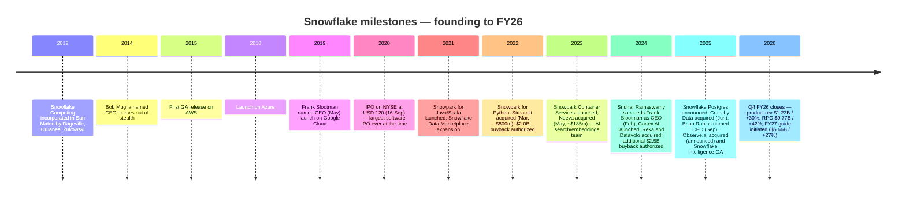
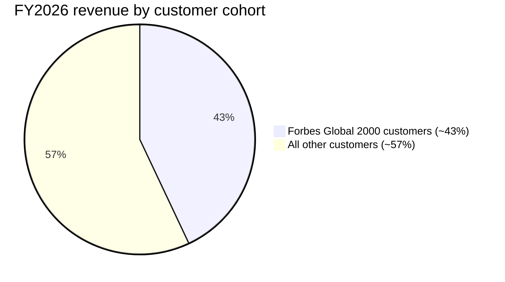
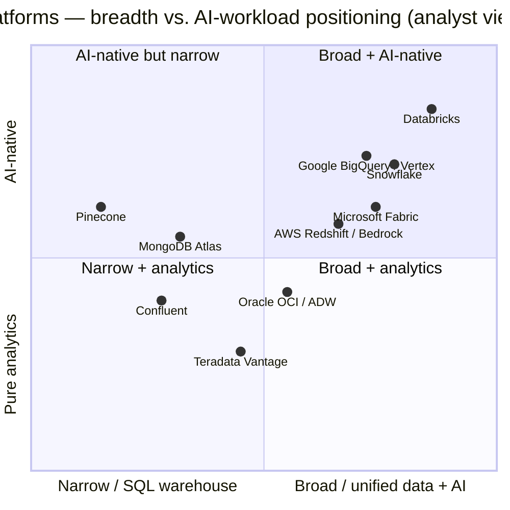

# COMPANY RESEARCH REPORT: Snowflake Inc. (NYSE: SNOW)

**Date:** 2026-05-29 (updated for Q1 FY27 results)
**Author:** financial_agent / company-research skill
**Ticker:** NYSE: SNOW
**Fiscal year end:** January 31 (FY26 = year ended 31 Jan 2026; Q1 FY27 = three months ended 30 Apr 2026)

> **Update — Q1 FY27 results + raised guidance (2026-05-27):** Snowflake delivered **product revenue of USD 1,334.3 m (+34% YoY)** — *the strongest sequential dollar growth in company history* per CEO Sridhar Ramaswamy — on total revenue of **USD 1.39 bn (+33% YoY)**, with **NRR of 126%** (up sequentially), **779 customers > USD 1 m TTM product revenue (+29% YoY, 46 net adds vs. 26 a year ago)**, **813 Forbes Global 2000 customers**, and **RPO of USD 9.21 bn (+38% YoY)**. Net new customers were 616 (+38% YoY) including 13 new Forbes G2000. AI metrics: **>13,600 accounts** now use Snowflake AI capabilities (4-week avg in late-April 2026); **Snowflake Intelligence** accounts >**2× QoQ**; **Cortex Code** in use across **>7,100 accounts**. Strategic actions in the quarter: **expanded the AWS multi-year agreement to USD 6 bn** to accelerate enterprise AI; deepened the OpenAI co-innovation partnership; brought the SAP partnership to GA; and signed a definitive agreement to acquire **Natoma**, an enterprise Model Context Protocol (MCP) platform for AI agents. Management **raised full-year FY27 guidance**: **product revenue to USD 5,840 m (+31% YoY)** from USD 5,660 m (+27%), and **non-GAAP operating margin to 13.5%** from 12.5%; non-GAAP product gross margin held at 75% and adjusted FCF margin at 23%. **Q2 FY27 guide: product revenue USD 1,415–1,420 m (+30% YoY)**, non-GAAP operating margin 12.5%. GAAP operating loss was USD 326.2 m (-23.4% margin); non-GAAP operating income USD 165.8 m (11.9% margin); FCF USD 232.8 m; adjusted FCF USD 265.5 m. Source: [Snowflake Q1-FY27 earnings press release, 2026-05-27](https://www.sec.gov/Archives/edgar/data/1640147/000164014726000027/fy2027q1earnings.htm).
>
> **Prior banner — FY27 guidance initiated and reaffirmed (2026-02-25, reaffirmed 2026-03-31):** Management originally initiated full-year FY27 **product revenue of USD 5,660 m (+27% YoY)**, non-GAAP operating margin 12.5%, non-GAAP product gross margin 75%, non-GAAP adjusted FCF margin 23%. The Q1 FY27 result + AI / G2000 momentum triggered the upward revision above. Source: [Snowflake Q4-FY2026 earnings press release, 2026-02-25](https://www.sec.gov/Archives/edgar/data/1640147/000162828026011631/fy2026q4earnings.htm).

## Table of Contents
1. Company Overview
2. Company History
3. Management Team
4. Products & Services
5. Customers & Go-to-Market
6. Industry Overview
7. Competitive Landscape
8. Market Opportunity (TAM)
9. Risk Assessment
10. References

---

## 1. Company Overview

Snowflake Inc. is the Menlo Park-headquartered cloud-software company that built and operates the **AI Data Cloud** — a fully managed, multi-cloud data platform combining a separation-of-storage-and-compute warehouse engine, an open-table-format data lakehouse, a marketplace, an application platform, and, since 2024, a first-party AI / large-language-model layer marketed as **Snowflake Cortex**. The company describes its purpose as "to mobilize the world's data" so that organizations can unify analytics, data engineering, applications and AI on a single governed plane rather than stitching together silos across warehouses, lakes, vector databases and ML training stacks ([Snowflake 10-K FY2026, "Overview"](https://www.sec.gov/Archives/edgar/data/1640147/000164014726000008/snow-20260131.htm)).

**Business model.** Snowflake earns essentially all of its revenue from **consumption-priced capacity arrangements**: customers commit a fixed dollar amount of spend over one to three years, then draw it down via Snowflake credits as they run warehouses, training jobs, Cortex inference calls, Snowpark containers, data-sharing transfers and so on. Pricing therefore tracks workload usage — the more queries, more compute and more data movement, the more credits consumed — and the company's job is to make those credits cheap enough that customers leave more workloads on Snowflake rather than off-loading them to BigQuery, Databricks or open-source alternatives. In FY26 **product revenue was USD 4,472.3 m (95% of total)** and professional services USD 211.6 m (5%) ([Snowflake 10-K FY2026, Note 3 — Revenue](https://www.sec.gov/Archives/edgar/data/1640147/000164014726000008/snow-20260131.htm)).

**Scale.** Snowflake closed FY26 with **USD 4.68 bn in total revenue (+29% YoY), USD 4.47 bn in product revenue (+29% YoY)**, 29% growth in each of the prior two fiscal years as well — an unusual three-year streak of constant-rate growth that the FY26 10-K calls out specifically — **13,328 total customers**, **733 customers contributing > USD 1 m in trailing-twelve-month product revenue**, **790 Forbes Global 2000 customers** (representing ~43% of FY26 revenue), and **remaining performance obligations of approximately USD 9.77 bn**, up 42% YoY ([Snowflake 10-K FY2026, "Our Strategy" and Note 3](https://www.sec.gov/Archives/edgar/data/1640147/000164014726000008/snow-20260131.htm); [Q4-FY26 press release, 2026-02-25](https://www.sec.gov/Archives/edgar/data/1640147/000162828026011631/fy2026q4earnings.htm)). The company had **9,060 employees across 36 countries** at fiscal-year-end and operated **13 regional cloud deployments** stitched together by its Snowgrid mesh.

**Geographic mix.** US customers contributed USD 3,524.0 m (75.2% of FY26 revenue), Other Americas USD 125.3 m (2.7%), EMEA USD 763.7 m (16.3%) and Asia-Pacific & Japan USD 271.0 m (5.8%). No single country outside the United States exceeded 10% of revenue ([Snowflake 10-K FY2026, Note 3 — Revenue by Geographic Area](https://www.sec.gov/Archives/edgar/data/1640147/000164014726000008/snow-20260131.htm)).

**Q1 FY27 print (reported 2026-05-27).** Q1 reset the FY27 trajectory: **product revenue USD 1,334.3 m, +34% YoY** (vs. the +27% implied by initial guidance), **total revenue USD 1.39 bn, +33% YoY**, **NRR 126%** (sequential expansion), **RPO USD 9.21 bn, +38% YoY**, **616 net new customers (+38% YoY)** and **779 customers spending > USD 1 m TTM** — of which **46 net adds in the quarter, nearly 2× the 26 net adds in Q1 FY26** ([Snowflake Q1-FY27 8-K, 2026-05-27](https://www.sec.gov/Archives/edgar/data/1640147/000164014726000027/fy2027q1earnings.htm)). CFO Brian Robins framed the dual driver as "AI accelerating the core data platform business" plus "growing adoption of our first-party AI products." Specific AI-adoption disclosures (four-week trailing averages, late April 2026): **>13,600 accounts** use Snowflake AI capabilities; **Snowflake Intelligence accounts more than doubled QoQ**; **Cortex Code is in use across >7,100 accounts** ([Q1-FY27 8-K, 2026-05-27](https://www.sec.gov/Archives/edgar/data/1640147/000164014726000027/fy2027q1earnings.htm)). CEO Sridhar Ramaswamy framed the strategic positioning as transitioning Snowflake from "the trusted foundation for enterprise data and context" to "the control plane for the Agentic Enterprise." Strategic actions: **expanded AWS multi-year agreement to USD 6 bn**, deepened co-innovation with **OpenAI**, brought the **SAP partnership to GA**, and signed a definitive agreement in May 2026 to acquire **Natoma** — an enterprise **Model Context Protocol (MCP) platform for AI agents** — extending Snowflake governance to AI-agent actions, not just data ([Q1-FY27 8-K, 2026-05-27](https://www.sec.gov/Archives/edgar/data/1640147/000164014726000027/fy2027q1earnings.htm)). On the back of these results management **raised the full-year FY27 product-revenue guide from USD 5,660 m (+27%) to USD 5,840 m (+31%) and the non-GAAP operating margin guide from 12.5% to 13.5%**, leaving non-GAAP product gross margin (75%) and adjusted FCF margin (23%) unchanged ([Q1-FY27 8-K, 2026-05-27](https://www.sec.gov/Archives/edgar/data/1640147/000164014726000027/fy2027q1earnings.htm)). Q1 GAAP operating loss was USD 326.2 m (-23.4% margin) vs. non-GAAP operating income of USD 165.8 m (11.9% margin); operating cash flow USD 243.2 m (17.5% margin); free cash flow USD 232.8 m; adjusted FCF USD 265.5 m (19.1% margin). The Q1 guide raise — first under CFO Robins — sends a clear signal that the FY27 initial guide was conservative and that AI-driven workloads are pulling consumption higher than the company initially modelled.

*Source: [Snowflake 10-K FY2026](https://www.sec.gov/Archives/edgar/data/1640147/000164014726000008/snow-20260131.htm); historical totals from 10-K FY22 ([FY22](https://www.sec.gov/Archives/edgar/data/1640147/000164014722000023/snow-20220131.htm)), FY23 ([FY23](https://www.sec.gov/Archives/edgar/data/1640147/000164014723000030/snow-20230131.htm)), FY24 ([FY24](https://www.sec.gov/Archives/edgar/data/1640147/000164014724000101/snow-20240131.htm)) and FY25 ([FY25](https://www.sec.gov/Archives/edgar/data/1640147/000164014725000052/snow-20250131.htm)).*

**Profitability profile.** Snowflake remains **GAAP-loss-making**, by design: in FY26 it reported an operating loss of USD 1,435.2 m (-31% of revenue) and a net loss of USD 1,304 m (-28%), comparable in dollar terms to FY25's USD 1,456 m operating loss and USD 1,289 m net loss. The bulk of that gap is **stock-based compensation, which was USD 1,609 m or 34% of revenue in FY26 (vs. 41% in FY25)** — a deliberate trade-off between cash spend on engineering and equity dilution that the company is explicitly working to bring down. Strip SBC out and the picture changes completely: **non-GAAP free cash flow was USD 1,120.3 m (24% of revenue) in FY26**, up from USD 884.1 m in FY25 and USD 778.9 m in FY24, and **net cash provided by operating activities was USD 1,221.9 m** ([Snowflake 10-K FY2026, "Key Business Metrics"](https://www.sec.gov/Archives/edgar/data/1640147/000164014726000008/snow-20260131.htm)). The balance sheet held **USD 4.03 bn in cash and marketable securities** against USD 2.74 bn of zero-coupon convertible notes due 2027 and 2029, leaving the business comfortably self-funded ([Yahoo Finance, SNOW key statistics, May 2026](https://finance.yahoo.com/quote/SNOW/key-statistics)).

**Valuation snapshot (as of 20 May 2026).** SNOW closed at **USD 166.97** with a market capitalization of **USD 57.9 bn** and an enterprise value of **USD 56.4 bn** ([Yahoo Finance, SNOW key statistics, May 2026](https://finance.yahoo.com/quote/SNOW/key-statistics)).

- **TTM P/E: not meaningful (negative).** Trailing-twelve-month EPS is roughly –USD 3.83 on a GAAP basis (net loss USD 1.30 bn / ~340 m weighted-average shares), which makes a P/E ratio either undefined or — when reported — a meaningless large negative number. **The loss is *not* a one-off charge.** Decomposition from the income statement: gross profit of USD 3,146 m on USD 4,684 m revenue (67% total GM, **72% product GM**) is more than absorbed by USD 2,062 m of sales-and-marketing (44% of revenue), USD 1,969 m of R&D (42%) and USD 550 m of G&A (12%) — total operating expenses USD 4,581 m on USD 4,684 m revenue. The fundamental driver is **stock-based compensation (USD 1.61 bn, 34% of revenue)** weighing on every line, plus heavy go-to-market investment to land and expand multi-million-dollar consumption commitments. This is **cash-burning *growth***, not cyclical trough or structural decline: operating cash flow is USD 1.22 bn and free cash flow USD 1.12 bn. Excluding SBC the company is solidly profitable on a non-GAAP basis (FY26 non-GAAP operating margin ~9%, guided to ~12.5% in FY27).
- **TTM P/S ≈ 12.4×, EV/Revenue ≈ 12.0×** ([Yahoo Finance, SNOW key statistics, May 2026](https://finance.yahoo.com/quote/SNOW/key-statistics)). This is well below SNOW's own 3-year P/S range — the stock traded above 30× sales in 2021 and at ~15–20× during much of 2023–2024 ([Macrotrends SNOW P/S history](https://www.macrotrends.net/stocks/charts/SNOW/snowflake/price-sales)) — and reflects a multi-year de-rating from the 2020/2021 ZIRP peak, partially recovered as AI demand reignited the AI Data Cloud narrative in calendar 2025.
- **Forward P/E ≈ 68.9×** on consensus non-GAAP EPS estimates ([Yahoo Finance, SNOW key statistics, May 2026](https://finance.yahoo.com/quote/SNOW/key-statistics)).

**Peer comparison (TTM P/S and EV/Revenue, May 2026 snapshot):**

| Ticker | Co | LTM revenue | Most-recent-Q product/total growth | TTM P/S | EV/Rev | Comment |
|---|---|---|---|---|---|---|
| **SNOW** | Snowflake | $4.68 bn | +30% product Q4 FY26 | **12.4×** | **12.0×** | Consumption + AI Data Cloud narrative |
| DDOG | Datadog | $3.67 bn | +28% Q1 2026 | 20.6× | 19.6× | Best margin profile; observability moat |
| MDB | MongoDB | $2.46 bn | +21–23% Atlas guide | 10.8× | 9.8× | Slowest of the cohort, FCF positive |
| ORCL | Oracle | $64 bn | +9% LTM | 8.4× | 10.5× | Profitable mega-cap; OCI AI tailwind |
| MSFT | Microsoft | $318 bn | +12–14% Azure | 9.8× | 10.0× | Fabric is the most direct enterprise competitor |
| GOOG | Alphabet | $422 bn | +13% LTM | 11.0× | 11.0× | BigQuery is the most direct technical competitor |
| PLTR | Palantir | $5.22 bn | +30% YoY | 62.9× | 61.5× | Pure narrative premium; sits 5× above SNOW |

Sources: [Yahoo Finance, SNOW key statistics](https://finance.yahoo.com/quote/SNOW/key-statistics); [Yahoo Finance, DDOG](https://finance.yahoo.com/quote/DDOG/key-statistics); [Yahoo Finance, MDB](https://finance.yahoo.com/quote/MDB/key-statistics); [Yahoo Finance, ORCL](https://finance.yahoo.com/quote/ORCL/key-statistics); [Yahoo Finance, MSFT](https://finance.yahoo.com/quote/MSFT/key-statistics); [Yahoo Finance, GOOG](https://finance.yahoo.com/quote/GOOG/key-statistics); [Yahoo Finance, PLTR](https://finance.yahoo.com/quote/PLTR/key-statistics). For an in-house cross-check of the MDB and DDOG numbers, see the prior MongoDB research note ([reports/company/MongoDB_NASDAQ_MDB, 2026-05-20](MongoDB_NASDAQ_MDB_Research_Document_2026-05-20.md)).

*Source: [Yahoo Finance key-statistics pages, SNOW / DDOG / MDB / ORCL / MSFT / GOOG / PLTR, May 2026](https://finance.yahoo.com/quote/SNOW/key-statistics).*

**Verdict on the multiple.** SNOW trades at **~12× sales** on a 29%-growing, ~24%-FCF-margin business that is also the #1 brand identity for "cloud data warehouse" — sitting between Datadog's 20× (best margin profile in the cohort, similar growth) and MongoDB's ~10× (slower growth, comparable FCF margin). Versus its own 2021 peak of >30× the multiple is **roughly half-compressed**, even after the Cortex-driven re-rate from sub-10× through much of 2024. The premium to ORCL, MSFT and GOOG (8–11×) is paying for (a) consumption upside if Snowflake captures incremental AI / inference workloads via Cortex, (b) optionality on the Snowflake Marketplace and Native Apps platform layer, and (c) a presumed long-runway AI Data Cloud TAM. The discount to DDOG is paying for (i) Snowflake's GAAP-loss profile vs DDOG's modest GAAP profitability, (ii) heavier hyperscaler dependence (the substantial majority of SNOW's product runs on AWS, which is also a competitor), and (iii) the persistent Databricks competitive overhang. A re-rate above 15× would likely require either reacceleration through ~30% growth driven by Cortex / AI consumption, or convincing operating-leverage progression toward 20%+ non-GAAP operating margin.

If Cortex / AI workloads disappoint while Databricks' AI-data-platform momentum continues, today's 12× P/S would be vulnerable to compression toward the MDB cohort at ~10× or below, particularly if the stock-based compensation drag on GAAP losses persists. We carry this as a valuation / multiple-compression risk into Section 9.

## 2. Company History

Snowflake was incorporated in **August 2012** as Snowflake Computing, Inc. by three database veterans: **Benoit Dageville** and **Thierry Cruanes**, both formerly senior architects on Oracle's database engine, and **Marcin Żukowski**, co-founder of vectorized-query startup Vectorwise (acquired by Actian). The founding insight was that the database engines designed for on-premises hardware — including the ones Dageville and Cruanes had spent their careers building at Oracle — were fundamentally mismatched to the cloud. They optimized for a single, costly, monolithic compute node tightly coupled to local storage, whereas the cloud offered effectively infinite, elastic, cheap object storage (Amazon S3) and the ability to spin up arbitrary compute capacity on demand. Snowflake's signature architectural choice — **separation of compute and storage**, with multiple independent "virtual warehouses" reading the same shared object store concurrently — flowed directly from that insight, and remains the platform's foundation 14 years later ([Snowflake 10-K FY2026, "Our Technology"](https://www.sec.gov/Archives/edgar/data/1640147/000164014726000008/snow-20260131.htm)). The first Sutter Hill Ventures seed round in 2012 brought in **Mike Speiser** as founding CEO; Speiser, who remains lead independent director, then handed the operating reins to **Bob Muglia** (ex-Microsoft Server & Tools president) in 2014, who shipped GA on AWS in 2015.

*Sources: [Snowflake 10-K FY2026](https://www.sec.gov/Archives/edgar/data/1640147/000164014726000008/snow-20260131.htm); [Snowflake S-1, 2020](https://www.sec.gov/Archives/edgar/data/1640147/000119312520203923/d18353ds1.htm); [Snowflake Q4-FY26 press release, 2026-02-25](https://www.sec.gov/Archives/edgar/data/1640147/000162828026011631/fy2026q4earnings.htm); [Snowflake 8-K, CRO appointment, 2026-03-31](https://www.sec.gov/Archives/edgar/data/1640147/000164014726000013/ex991_pressreleasex033126.htm).*

**Strategic pivots — three transformations in 14 years.**

The first was **cloud-native database → multi-cloud data platform**. Snowflake launched as an AWS-only data warehouse. Adding Azure (2018) and Google Cloud (2019) was strategically expensive — each hyperscaler is also a primary competitor — but it converted the company from a hostage of AWS into a vendor whose lock-in works *across* clouds, which is one of the most-cited reasons enterprise data teams (especially those with a regulated multi-cloud mandate) standardize on Snowflake.

The second was the **Frank Slootman era (May 2019 – Feb 2024) of operational disciplination**. Slootman, the veteran Data Domain / ServiceNow operator, took an engineering-led company through its September 2020 IPO (the largest software IPO ever at the time, opening at USD 245 vs. an IPO price of USD 120), then drove an emphasis on financial discipline, customer-success at scale, and what he publicly called "fight-or-flight" prioritization. Revenue grew from ~USD 264 m (FY20) to ~USD 2.81 bn (FY24) during his tenure ([Snowflake S-1, 2020](https://www.sec.gov/Archives/edgar/data/1640147/000119312520203923/d18353ds1.htm); [Snowflake 10-K FY2024](https://www.sec.gov/Archives/edgar/data/1640147/000164014724000101/snow-20240131.htm)).

The third — and the one that defines today's thesis — is **data warehouse → AI Data Cloud**. Announced in 2024, accelerated by the **Sridhar Ramaswamy CEO succession on 28 February 2024**, this pivot reframes Snowflake from a SQL warehouse vendor into a unified platform on which enterprises run analytics *and* AI on their own first-party governed data. Cortex AI (LLM functions, retrieval-augmented generation primitives, Snowflake Intelligence agents), Snowpark Container Services, Native Apps and the integration of open-table formats (Apache Iceberg) are the technical instantiations. The acquisitions of **Neeva (May 2023, AI search/embeddings, ~USD 185 m)**, **TruEra (May 2024, AI observability)**, **Datavolo (November 2024, NiFi-based data integration, ~USD 250 m)**, **Crunchy Data (June 2025, Postgres for Snowflake Postgres)** and the **Mountain (formerly Mobilize.Net) database-migration tooling acquisition** are the M&A throughline ([Snowflake 10-K FY2026, Note 4 — Acquisitions](https://www.sec.gov/Archives/edgar/data/1640147/000164014726000008/snow-20260131.htm)).

**Acquisitions, in chronological order with rationale.** Most deals are small-to-mid-sized "acqui-tech" rather than transformative — Snowflake has not done a multi-billion-dollar consolidation; the largest single deal remains Streamlit at ~USD 800 m.

- **Streamlit (Mar 2022, ~USD 800 m)** — Python web-app framework; now the embedded front-end for Cortex Agents and Native Apps; pivotal for developer mindshare.
- **Mountain / Mobilize.Net (Feb 2023)** — database-migration tooling, absorbed into SnowConvert ([10-K FY2026, Note 4](https://www.sec.gov/Archives/edgar/data/1640147/000164014726000008/snow-20260131.htm)).
- **Neeva (May 2023, ~USD 185 m)** — Sridhar Ramaswamy's prior company; foundation of Cortex Search. Ramaswamy was named CEO nine months later.
- **Reka AI (2024)** — minority investment in the multimodal foundation-model startup; widely interpreted as a model-pipeline hedge before Snowflake pivoted to a model-neutral stance.
- **TruEra (May 2024)** — LLM evaluation / guardrails for Cortex.
- **Datavolo (Nov 2024)** — Apache NiFi-based data integration; the technology under Snowflake Openflow.
- **Crunchy Data (Jun 2025)** — Postgres distribution; foundation of Snowflake Postgres.
- **TensorStax (FY26)** — autonomous AI agents for data engineering, integrated into Cortex Agents.
- **Observe.ai (announced FY26)** — AI-powered observability; basis of "Observe by Snowflake" and the company's pitch into a "$50+ bn IT operations market" ([Q4-FY26 press release](https://www.sec.gov/Archives/edgar/data/1640147/000162828026011631/fy2026q4earnings.htm)).

**Recent developments (last 12 months).** A new CFO (Brian Robins, ex-GitLab CFO, joined 22 September 2025 to succeed Mike Scarpelli), a new CRO (Jonathan "JB" Beaulier, internal hire effective 31 March 2026, succeeding Michael Gannon), product velocity (the FY26 10-K and Q4 press release flag **430+ new capabilities introduced in fiscal 2026**), the GA of Cortex Agents / Snowflake Intelligence / Snowflake Postgres / Openflow / Snowpark Connect for Apache Spark, and partnerships expanding native access to **Anthropic, OpenAI and Google** foundation models ([Q4-FY26 press release, 2026-02-25](https://www.sec.gov/Archives/edgar/data/1640147/000162828026011631/fy2026q4earnings.htm); [Snowflake 8-K, CFO appointment, 2025-09-03](https://www.sec.gov/Archives/edgar/data/1640147/000164014725000181/ex991_pressrelease.htm); [Snowflake 8-K, CRO appointment, 2026-03-31](https://www.sec.gov/Archives/edgar/data/1640147/000164014726000013/ex991_pressreleasex033126.htm)).

## 3. Management Team

**Sridhar Ramaswamy — Chief Executive Officer and Director (since 28 February 2024).** Ramaswamy is the second non-founder CEO in Snowflake's history and arguably the most consequential single hire the board has ever made. He is by background a **database researcher turned ads-and-search infrastructure operator turned founder**. After a Ph.D. (Brown University, theoretical computer science) and a stint as a faculty researcher, he joined **Google in April 2003** and spent fifteen years inside Google's engineering organization, culminating as **Senior Vice President, Ads & Commerce from March 2013 to October 2018** — a role in which he ran a business of roughly USD 100 bn-plus in annualized revenue (Google's ad stack) and the team of several thousand engineers behind it. He left Google in 2018 to co-found **Neeva**, an ad-free consumer search startup that pivoted toward conversational / AI search before being acquired by Snowflake in **May 2023**, with Ramaswamy joining Snowflake as **Senior Vice President of AI** ([Snowflake 2026 DEF 14A, "Sridhar Ramaswamy" director bio](https://www.sec.gov/Archives/edgar/data/1640147/000164014726000019/snow-20260605xdef14a.htm)). When Frank Slootman announced his retirement in late February 2024, the board promoted Ramaswamy from inside; the official 8-K explained the choice as "his proven track record building category-defining technology and deep AI expertise."

What investors should make of him: Ramaswamy is the kind of CEO who can defensibly say *what AI products to build* — he was the ads infrastructure executive at Google during the period in which deep learning re-architected Google's revenue engine, and he co-founded a consumer AI-search product before LLMs were table stakes. He is also the founder-CEO of a tiny consumer startup, not a hardened public-company SaaS operator — and the FY24 and FY25 stock price (down materially from the pre-handover peak) and the analyst-day commentary all reflect early-tenure execution slippage that has only recently begun to reverse. His **FY26 summary compensation totaled USD 22.31 m** (USD 750 k base salary, USD 20.79 m in stock awards, USD 772 k cash bonus), compared to USD 101.6 m in FY25 (the first-year sign-on grant) ([Snowflake 2026 DEF 14A, Summary Compensation Table](https://www.sec.gov/Archives/edgar/data/1640147/000164014726000019/snow-20260605xdef14a.htm)). His beneficial ownership is **651,328 shares (<1%)** including 447,957 options exercisable within 60 days — a meaningful but not founder-scale stake. The case for Ramaswamy: he has both the technical credibility (Ph.D., 15 years building ML / RL into Google ads, founder of Neeva) and the operating credibility to lead the AI Data Cloud pivot. The case against him: he is not a database founder, he has not previously been a public-company CEO at this scale, and FY25's compute-pricing cuts and slowdown narrative happened under his watch. He has roughly 18–24 months of "AI proof" to deliver before the narrative either re-rates or breaks.

**Brian Robins — Chief Financial Officer (since 22 September 2025).** Robins is a **specialist CFO for cloud-software companies operating at the inflection from "growth at any cost" to "growth with operating leverage"**. He served as **CFO of GitLab Inc. from October 2020 to September 2025**, joining GitLab in time to lead its IPO in October 2021 and shepherding the company through its early years as a public company; revenue tripled from ~USD 200 m in FY22 to ~USD 760 m in the most recent fiscal year, and GitLab moved from material GAAP losses to non-GAAP profitability under his watch. Before GitLab he was **CFO of Sisense Ltd. (October 2019 – October 2020)** — a business-intelligence software company — and earlier held senior finance roles at companies including **Cylance** (acquired by BlackBerry), **AlienVault** (acquired by AT&T) and **EMC Documentum**. He holds a B.S. in Finance from Lipscomb University and an MBA from Vanderbilt University ([Snowflake 2026 DEF 14A, executive officer bios](https://www.sec.gov/Archives/edgar/data/1640147/000164014726000019/snow-20260605xdef14a.htm); [Snowflake 8-K, CFO appointment, 2025-09-03](https://www.sec.gov/Archives/edgar/data/1640147/000164014725000181/ex991_pressrelease.htm)). The board chose him specifically because, per CEO Ramaswamy, his "deep commitment to operational rigor and long-term high growth aligns perfectly with the strategic direction of Snowflake" — i.e., he was hired to close the SBC gap and convert non-GAAP FCF margin into GAAP operating-margin expansion. His **FY26 sign-on package included a USD ~25 m initial new-hire equity grant** disclosed in the proxy. The track record at GitLab is genuinely relevant: that company was the closest comparable in terms of being a consumption-flirting, SBC-heavy, founder-DNA cloud-software business at a similar scale.

**Benoit Dageville — Founder & Chief Architect, Director.** Dageville is one of the three co-founders and the technical center of gravity. He served as **President of Products from May 2019 to October 2025** and as **CTO from August 2012 to May 2019**; he reverted to the Founder & Chief Architect title in late 2025 — a deliberate move to free him to focus on the long-arc platform architecture work (Polaris catalog, Iceberg integration, the next generation of the query engine) rather than day-to-day product management ([Snowflake 2026 DEF 14A, director bio](https://www.sec.gov/Archives/edgar/data/1640147/000164014726000019/snow-20260605xdef14a.htm)). He holds **4,485,067 shares (1.3% of common)** and remains the single most senior founder in operating capacity (co-founders Thierry Cruanes serves in senior engineering roles; Marcin Żukowski similarly). Dageville is the de-facto technical voice on platform direction and one of the reasons hardware-class engineers (the Bellevue/Menlo Park engine team and the Berlin / Toronto / Warsaw / San José outposts that span 2,424 R&D employees as of FY26) continue to choose Snowflake over hyperscaler database teams.

**Christian Kleinerman — EVP, Product Management.** A long-tenured Snowflake leader (with the company since 2018) who runs the product organization that owns Cortex, Snowpark, Marketplace, Iceberg integration, Native Apps and the full developer-platform surface. Previously a senior product leader at Google (BigQuery) and Microsoft SQL Server. He is the executive most likely to appear on stage at Snowflake Summit and to set the public roadmap. He holds 693,058 shares (<1%) per the 2026 proxy.

**Jonathan "JB" Beaulier — Chief Revenue Officer (effective 31 March 2026).** Beaulier is a Snowflake veteran of ten years, most recently GVP, U.S. Majors Sales. The board promoted him after Michael Gannon, who took the CRO role in March 2025, left "for personal reasons" ([Snowflake 8-K, "Appoints Jonathan Beaulier as Chief Revenue Officer; Reaffirms Guidance", 2026-03-31](https://www.sec.gov/Archives/edgar/data/1640147/000164014726000013/ex991_pressreleasex033126.htm)). The choice signals continuity over disruption: the board did not want a third sales-leadership reset in eighteen months in the middle of an AI-narrative re-acceleration.

**Vivek Raghunathan — SVP, Engineering and Support (since Sep 2024).** Replaced Grzegorz Czajkowski (resigned Jul 2024); responsible for the production engineering platform across Snowflake's 13 regional deployments.

**Governance and board.** The eleven-person board is led by **Mark Garrett** (former CFO of Adobe and Brocade, audit committee chair) and **Michael L. Speiser** (Managing Director of Sutter Hill Ventures, lead independent director and the original seed investor) ([Snowflake 2026 DEF 14A, director matrix](https://www.sec.gov/Archives/edgar/data/1640147/000164014726000019/snow-20260605xdef14a.htm)). Other directors include **Frank Slootman** (Chairman and former CEO, ~2.2% economic stake, 7.6 m shares), **Jayshree Ullal** (CEO of Arista Networks), **Kelly Kramer** (former Cisco CFO), **Bill Scannell** (Dell Technologies, joined May 2025), **Teresa Briggs** (former Deloitte vice-chair), **Mark McLaughlin** (former Palo Alto Networks CEO), and **Benoit Dageville**. The structure is a **single class of common stock** — Snowflake renamed Class A common to "common" in July 2025, eliminating the dual-class legacy that lapsed at IPO ([Snowflake 10-K FY2026, "Stockholders' Equity"](https://www.sec.gov/Archives/edgar/data/1640147/000164014726000008/snow-20260131.htm)). Insider ownership is concentrated in Slootman (2.2%), Dageville (1.3%) and Speiser (~0.8%); all current directors and executive officers as a group held 17.09 m shares or **4.8% of common** as of 30 April 2026. **Vanguard** held 5.1%; **BlackRock** held >5% at some point in FY26 and is also a Snowflake customer with USD 45 m of contracted spend (a disclosed related-party-like relationship discussed in the proxy) ([Snowflake 2026 DEF 14A, "BLACKROCK, INC." section](https://www.sec.gov/Archives/edgar/data/1640147/000164014726000019/snow-20260605xdef14a.htm)). The board authorized a **USD 2.0 bn share repurchase in February 2023** and an **additional USD 2.5 bn in August 2024**, with the program extended to March 2027 — Snowflake has been a meaningful repurchaser of its own stock specifically to offset SBC dilution.

**Track-record synthesis.** Snowflake's senior team is now built around two pillars: (1) the founder / chief-architect / engineering bench (Dageville, Cruanes, Kleinerman, Raghunathan) that owns the technical platform and IP, and (2) the Ramaswamy / Robins / Beaulier / Garrett finance-and-go-to-market layer hired specifically to execute the operating-leverage and AI-narrative phase. The Slootman-era operating chassis (Scarpelli, Degnan) has been fully replaced over the past 18 months — a complete rebuild around the new strategy. The track record at Google (Ramaswamy) and GitLab (Robins) is impressive but not yet *Snowflake-tested*; the next four-to-six quarters will determine whether this team can deliver the FY27 12.5% operating-margin target while keeping product growth at 27%.

## 4. Products & Services

Snowflake's product surface, walked end-to-end from the FY26 10-K's "Products" section and the live product navigation on snowflake.com, decomposes into five layers: (1) the **core data platform** (warehouse + lakehouse), (2) **AI / ML** (Cortex AI, Snowflake Intelligence), (3) **data engineering** (Snowpark, Openflow), (4) **applications** (Native Apps, Streamlit), and (5) **collaboration / sharing** (Marketplace, Data Cloud). All of it is sold as part of the same consumption-credit-based platform — there is no separate SKU pricing.

```mermaid
graph TD
    Co["Snowflake — AI Data Cloud"] --> Core["Core Data Platform"]
    Co --> AI["AI / ML"]
    Co --> DE["Data Engineering"]
    Co --> App["Applications"]
    Co --> Share["Sharing & Collaboration"]
    Core --> Wh["Virtual Warehouses (multi-cluster, separation of storage and compute)"]
    Core --> Ice["Iceberg Tables (open-table-format lakehouse)"]
    Core --> Hor["Horizon Catalog (governance, lineage, policies)"]
    Core --> Pol["Polaris Catalog (Iceberg REST, multi-engine)"]
    Core --> Pg["Snowflake Postgres (transactional; Crunchy Data tech, FY26 GA)"]
    AI --> Cortex["Cortex AI — LLM functions, RAG, Cortex Search"]
    AI --> Agents["Cortex Agents — agentic workflows on structured + unstructured data"]
    AI --> Intel["Snowflake Intelligence — natural-language data agents"]
    AI --> Models["Native Anthropic / OpenAI / Google models; legacy Arctic"]
    AI --> Code["Cortex Code — AI coding agent"]
    DE --> Snowpark["Snowpark (Python, Java, Scala)"]
    DE --> SCS["Snowpark Container Services"]
    DE --> Spark["Snowpark Connect for Apache Spark"]
    DE --> OF["Snowflake Openflow (Datavolo / NiFi-based ingest)"]
    DE --> Dyn["Dynamic Tables, Streams & Tasks"]
    App --> Streamlit["Streamlit in Snowflake"]
    App --> NativeApps["Native Apps Framework"]
    App --> Workspaces["Workspaces / Notebooks"]
    Share --> Marketplace["Snowflake Marketplace (data + apps + LLMs)"]
    Share --> Sharing["Secure Data Sharing"]
    Share --> Snowgrid["Snowgrid (cross-region, cross-cloud replication)"]
```

*Source: [Snowflake 10-K FY2026, "Our Platform"](https://www.sec.gov/Archives/edgar/data/1640147/000164014726000008/snow-20260131.htm); [Snowflake "Platform" product page](https://www.snowflake.com/en/product/platform/); [Snowflake "Cortex AI" product page](https://www.snowflake.com/en/data-cloud/snowflake-cortex/).*

**1. Core data platform — the warehouse + lakehouse foundation.**

**Snowflake Data Warehouse / Standard Warehouses** — the original consumption product: SQL-based, columnar, with separation of compute and storage so each "virtual warehouse" is an independently sized compute cluster on shared object-store data. Per-credit pricing, per-second billing after a 60-second floor. FY26 added **Generation 2 Standard Warehouses**, **Interactive Tables** and **Interactive Warehouses** for lower-latency application workloads ([10-K FY2026, "Our Platform"](https://www.sec.gov/Archives/edgar/data/1640147/000164014726000008/snow-20260131.htm)). *Competitive advantage: yes, technology + ecosystem moat.* Closest competitors: **Google BigQuery** and **Amazon Redshift Serverless**. Parity-to-better on cross-cloud portability and concurrency; ahead on ecosystem; no longer materially ahead on price-performance — BigQuery and Redshift have closed the gap since 2022.

**Iceberg Tables** — open-table-format support so customers can keep data in Apache Iceberg in their own object stores and query through Snowflake's engine. Defensive response to Databricks Delta/Iceberg lakehouse dominance. *Competitive advantage: partial.* Closest competitor **Databricks** (acquired Tabular, the Iceberg founders' company); Snowflake is at parity on Iceberg since FY25.

**Polaris Catalog** (open-sourced 2024, GA FY26) — Iceberg REST catalog letting multiple engines (Snowflake, Trino, Spark, Flink) read the same governed tables. Strategic position so Snowflake stays the analytical layer even when Databricks is also on the data. *Competitive advantage: partial — strategic, not profit pool.* Closest competitor **Databricks Unity Catalog**.

**Horizon Catalog** — first-party governance, lineage, classification and access-policy layer across all Snowflake accounts. *Competitive advantage: yes, scale + ecosystem.* Closest competitor **Unity Catalog**.

**Snowflake Postgres** (GA early FY26, on Crunchy Data tech) — managed Postgres for transactional workloads. *Competitive advantage: no.* Aurora, Cloud SQL, Cosmos DB are entrenched; Snowflake's pitch is "Postgres in the same governance plane" — a unification argument, not feature leadership.

**2. AI / ML — Cortex and Snowflake Intelligence.**

**Snowflake Cortex AI** — the LLM and ML layer built into the warehouse: SQL functions for summarization, sentiment, translation, classification; Cortex Search (built on the Neeva team's IP); Cortex Fine-Tuning; Cortex Agents (GA FY26); Cortex Code (AI coding agent, GA FY26) ([Q4-FY26 press release](https://www.sec.gov/Archives/edgar/data/1640147/000162828026011631/fy2026q4earnings.htm)). Strategy is **model neutrality** — supporting Anthropic, OpenAI, Google, Meta and Mistral natively; the first-party "Arctic" model has been de-emphasized. *Competitive advantage: partial.* Closest competitors: **Databricks Mosaic AI + Vector Search** on enterprise RAG; **Microsoft Fabric + Copilot Studio** on agentic orchestration; **Bedrock / Vertex / Azure OpenAI** on raw model inference. Differentiator: "the data already lives here, governed and queryable" — a real edge for the 790 G2K customers. Disadvantage: frontier-model inference is fundamentally a hyperscaler workload, and Snowflake pays AWS/Azure/GCP for the underlying GPU compute that serves Cortex calls.

**Snowflake Intelligence** (GA FY26) — natural-language → data-answer managed agent for business users. *Competitive advantage: yes, ecosystem.* Closest competitor **Microsoft Copilot for Power BI / Fabric**.

**3. Data engineering — Snowpark and Openflow.**

**Snowpark** (Python, Java, Scala) — developer framework for non-SQL code in-platform: DataFrame APIs, UDFs, ML training, batch inference. **Snowpark Container Services** (GA 2023, expanded through FY26) runs arbitrary container workloads (including GPU training and inference) inside the Snowflake security perimeter. **Snowpark Connect for Apache Spark** (GA FY26) executes Spark applications through Snowflake's engine — directly defensive against the Databricks Spark franchise. *Competitive advantage: partial.* Closest competitor **Databricks Workflows + Mosaic AI + Spark**; behind on breadth of Spark/ML, ahead on warehouse integration and no-ops SQL UX.

**Snowflake Openflow** (GA FY26, on Datavolo/NiFi) — managed data-integration and streaming ingest. *Competitive advantage: partial.* Closest competitor **Fivetran + Airbyte + Confluent**; SNOW's pitch is "ingestion in the same governed plane," not best-of-breed features.

**4. Applications — Streamlit and Native Apps.**

**Streamlit in Snowflake** — embedded Streamlit (acquired 2022) lets data teams ship Python web apps off Snowflake data governed by Snowflake roles. Front-end of choice for Cortex Agents and most internal-data tooling at large Snowflake customers. *Competitive advantage: yes, mindshare moat.* Closest competitor **Databricks Apps**; SNOW is ahead because Streamlit is also the popular OSS framework.

**Native Apps Framework** — ISVs build applications that run inside customer Snowflake accounts, sharing the customer's data without moving it. Capital One Slingshot is the classic example. *Competitive advantage: yes, network-effect moat.* Closest analogue **AWS Marketplace** for SaaS apps, but Native Apps' "run on the customer's data" model is materially differentiated.

**Workspaces / Notebooks** (GA FY26) — unified notebook + IDE-like experience inside Snowsight. *Competitive advantage: partial.* Closest competitor **Databricks Notebooks** (ahead in pure feature depth, behind on governed-data integration).

**5. Sharing & collaboration — Marketplace and Snowgrid.**

**Snowflake Marketplace** — catalog of hundreds of live third-party data sets, Native Apps and (FY26+) LLMs, consumable in-place inside the customer's Snowflake account ([10-K FY2026, "Snowflake Marketplace"](https://www.sec.gov/Archives/edgar/data/1640147/000164014726000008/snow-20260131.htm)). Most underrated strategic asset: it creates a data-network effect in which customers stay on Snowflake because LiveRamp identity, S&P market data, FactSet, weather and geographic data are one click away. *Competitive advantage: yes, network-effect moat.* No direct competitor at comparable scale.

**Snowgrid** — cross-region / cross-cloud replication mesh tying Snowflake's 13 regional deployments into a single governed namespace. *Competitive advantage: yes, scale + technology moat.* No direct competitor has comparable multi-cloud reach.

**Flagship vs. long-tail.** The 1–3 flagship products driving Snowflake economically remain (a) **Warehouses / SQL data warehousing**, which is still the dominant consumption-credit driver; (b) **Snowpark** (Python / containers), which has been the growth-credit story since 2023 and is the primary on-ramp for data-engineering and ML workloads; and (c) **Cortex AI + Snowflake Intelligence**, which is the product the entire FY26–FY28 narrative depends on. Marketplace and Native Apps are strategic optionality more than current revenue contributors; Snowflake Postgres is a feature-completeness move; Iceberg + Polaris + Horizon are defensive must-haves.

**Recent launches and product velocity.** The Q4 FY26 release notes specifically call out **430+ new capabilities introduced in fiscal 2026**, with the headline GAs being Cortex Agents (Generation 2), Standard Warehouses Gen-2, Interactive Tables / Warehouses, Workspaces, Managed MCP Server, Snowflake Openflow, Snowpark Connect for Apache Spark, Snowflake Postgres, Snowflake Cortex Code and Semantic View Autopilot ([Snowflake 10-K FY2026, "Recently launched capabilities"](https://www.sec.gov/Archives/edgar/data/1640147/000164014726000008/snow-20260131.htm); [Q4-FY26 press release](https://www.sec.gov/Archives/edgar/data/1640147/000162828026011631/fy2026q4earnings.htm)). No material product sunsets disclosed.

## 5. Customers & Go-to-Market

Snowflake's customer base is unusually diverse for a company of this size: **13,328 total customers** at the end of FY26 across organizations of all sizes, from single-team Snowflake-Standard users to multinational enterprises running thousands of warehouses concurrently ([Snowflake 10-K FY2026, "Our Customers"](https://www.sec.gov/Archives/edgar/data/1640147/000164014726000008/snow-20260131.htm)).

**Customer cohorts and concentration.** As of 31 January 2026:

- **733 customers with > USD 1 m TTM product revenue** — up from 580 a year earlier (+27% YoY), and a six-year compound increase of about 10× from the 77 in FY21.
- **790 Forbes Global 2000 customers** — up from 750 (+5% YoY), and contributing approximately **43% of FY26 revenue**.
- **No single customer or group of customers represented 10% or more of revenue or accounts receivable** in any of FY24, FY25 or FY26 ([Snowflake 10-K FY2026, Note 3 — "Significant Customers"](https://www.sec.gov/Archives/edgar/data/1640147/000164014726000008/snow-20260131.htm)).

This is genuinely low customer concentration for a SaaS company of this scale — both top-1 and top-5 customer share are below the 10% threshold the FY26 10-K is required to disclose. The G2K cohort at 43% of revenue is the closest thing to a concentration concern, but it is a *cohort* not a single account, and the 5% YoY growth in the cohort is the smallest of any disclosed metric (vs. +27% in $1M+ accounts and +29% in total revenue), reflecting that Snowflake has now penetrated more than a third of the G2K and incremental growth has to come either from non-G2K mid-market expansion or from existing G2K consumption acceleration.

*Source: [Snowflake 10-K FY2026](https://www.sec.gov/Archives/edgar/data/1640147/000164014726000008/snow-20260131.htm) and prior years' filings ([FY25](https://www.sec.gov/Archives/edgar/data/1640147/000164014725000052/snow-20250131.htm), [FY24](https://www.sec.gov/Archives/edgar/data/1640147/000164014724000101/snow-20240131.htm), [FY23](https://www.sec.gov/Archives/edgar/data/1640147/000164014723000030/snow-20230131.htm), [FY22](https://www.sec.gov/Archives/edgar/data/1640147/000164014722000023/snow-20220131.htm), [FY21](https://www.sec.gov/Archives/edgar/data/1640147/000164014721000073/snow-20210131.htm)).*

*Source: [Snowflake 10-K FY2026, "Our Customers" section](https://www.sec.gov/Archives/edgar/data/1640147/000164014726000008/snow-20260131.htm).*

**Net revenue retention.** NRR was **125% at the end of FY26**, down from 126% at FY25 and 131% at FY24 — and meaningfully down from the 158% (FY23) and 178% (FY22) peaks. The trajectory reflects (a) the law of large numbers (the base is now USD 4.7 bn, not USD 1.2 bn), (b) consumption-optimization initiatives at enterprise customers in 2023–2024 that pushed NRR down, and (c) the maturation of the customer book. The deceleration appears to have stabilized in the 125–126% band over the last five quarters, which is still best-in-class for a cloud-software business of this scale. Management's commentary on the Q4 FY26 call framed the NRR floor at "around 125%" through the AI-driven re-acceleration phase.

*Source: [Snowflake 10-K FY2026, "Key Business Metrics" table](https://www.sec.gov/Archives/edgar/data/1640147/000164014726000008/snow-20260131.htm) (NRR computed on a TTM consumption basis).*

**Named enterprise customers.** Drawn directly from FY26 SEC filings and the Q4 press release: **Capital One** (long-time multi-million-dollar Snowflake account and the developer of Slingshot, a Marketplace Native App), **Thomson Reuters** (data and analytics modernization), **BlackRock** (5%-plus holder during FY26 and a Snowflake customer since 2021, USD 45 m five-year contract entered in January 2024 plus additional technical services agreements in 2025), **Canva**, **Siemens**, **JetBlue Airways**, **Adobe**, **Pfizer**, **Western Union**, **Albertsons**, **AT&T**, **Mastercard** and **Anthem** (the latter group cited in prior years' filings and Snowflake's case-study library; see [Snowflake Customers page](https://www.snowflake.com/en/customers/)). Contract structure is typically a **one-to-three-year committed-consumption contract** (capacity arrangement) with annual revenue recognized rateably over the contract, denominated in the customer's local currency for international accounts. Most G2K accounts are master-services-agreement multi-year contracts, not PO-by-PO.

**Geographic distribution.** As shown above, the US contributed 75% of FY26 revenue, EMEA 16%, Asia-Pacific & Japan 6%, and Other Americas 3%. EMEA and APJ are growing faster than the US on a percentage basis but from a smaller base.

*Source: [Snowflake 10-K FY2026, Note 3 — Revenue by Geographic Area](https://www.sec.gov/Archives/edgar/data/1640147/000164014726000008/snow-20260131.htm).*

**Go-to-market motion.** Snowflake sells through a hybrid model that combines a direct enterprise sales force (Snowflake's named-account team — Mike Gannon and now JB Beaulier's CRO organization), a meaningful **systems-integrator (SI) channel** (Accenture, Deloitte, KPMG, Slalom, Capgemini, Wipro, EPAM and others — Snowflake-branded SI partnerships are listed on the Snowflake Partner Network), and a **hyperscaler co-sell motion** with AWS, Azure and Google Cloud — Snowflake transactions are available through each cloud's marketplace and can draw down customers' committed cloud spend. The latter is one of the most underrated parts of the GTM: customers can buy Snowflake using AWS Marketplace credits, which makes purchasing trivial inside cloud-committed enterprises ([Snowflake 10-K FY2026, "Sales and Marketing"](https://www.sec.gov/Archives/edgar/data/1640147/000164014726000008/snow-20260131.htm)). FY26 S&M expense was **USD 2,062 m or 44% of revenue**, with **sales headcount that the FY26 10-K specifies grew alongside revenue** (the company does not disclose the exact sales-rep count, but total employees grew to 9,060 at FY26 end from ~7,800 at FY25 end). Sales cycles for new G2K accounts are typically 9–18 months; expansion deals inside the base are continuous.

**Key partnerships.** Foundation-model partnerships with **Anthropic** (Claude family in Cortex), **OpenAI** (GPT family natively), **Google Cloud / Gemini** (model access), **Mistral**, **Meta** (Llama), and **NVIDIA** (NeMo, NIM microservices). Implementation partners: **Accenture, Deloitte, KPMG, EY, Slalom, Capgemini, Wipro, EPAM**. Data partners: hundreds of providers on the Marketplace including **LiveRamp** (identity), **S&P Global Market Intelligence**, **FactSet**, **Experian**, **Weather Source**, **AccuWeather**, **CoreLogic** (real estate), and many vertical specialists ([Snowflake Marketplace landing page](https://www.snowflake.com/en/data-cloud/marketplace/); [Q4-FY26 press release, partnership callouts](https://www.sec.gov/Archives/edgar/data/1640147/000162828026011631/fy2026q4earnings.htm)).

## 6. Industry Overview

Snowflake operates at the intersection of three industries that have been collapsing into one over the past decade: **cloud data warehouses**, **data lakes / lakehouses**, and **AI / ML platforms**. Each was a distinct product category in 2018; today, in the post-ChatGPT era, the boundary has blurred to the point where most analysts simply call the combined space the "**cloud data and AI platform**" market.

**Industry definition and scope.** The cloud data and AI platform market includes (a) **cloud data warehouses** (Snowflake, BigQuery, Redshift, Synapse, Teradata Vantage), (b) **lakehouses** (Databricks, the open Iceberg/Delta ecosystem, warehouse vendors' lakehouse offerings), (c) **data engineering and ETL** (Fivetran, Airbyte, Confluent), (d) **AI / ML model serving** (Bedrock, Azure OpenAI, Vertex AI), and (e) **AI-native enterprise platforms** (Databricks Mosaic, Snowflake Cortex, Microsoft Fabric). NAICS 518210 and 511210 cover the formal classification.

**Market size — TAM perspectives.** Three credible sizings:

- **IDC's 2024 forecast for the global data-platform software market** — USD ~120 bn in 2024 → ~USD 250 bn by 2028 at ~20% CAGR ([IDC FutureScape Worldwide Data Platforms 2024 Predictions](https://www.idc.com/getdoc.jsp?containerId=US51393623)).
- **Gartner 2025 Cloud DBMS Magic Quadrant** — CDBMS market USD ~92 bn in 2024, projected > USD 200 bn by 2030; Snowflake, Microsoft, Google, AWS, Databricks, Oracle and SAP are the seven "Leaders" with SNOW top-right ([Gartner press release, 2025-01](https://www.gartner.com/en/newsroom/press-releases)).
- **Snowflake's own Jun 2024 / Sep 2025 Investor Day TAM** — USD 342 bn by 2028 across analytics, AI/ML, data engineering, applications, collaboration, transactions, observability and cybersecurity.

The three triangulate to a ~USD 200–350 bn market by 2028, with cloud-data spend growing ~3× faster than overall IT.

**Growth drivers.** The first is the **continued shift of analytics, ML and inference workloads from on-premises stacks to cloud-native platforms** — Gartner estimated in 2024 that only ~50% of analytics workloads had migrated to cloud DBMS, leaving the other ~50% as multi-year migration TAM. The second is the **AI workload tailwind**: model training, RAG, agentic applications, and the data prep / feature engineering that surround them all require a unified data plane, and that plane is in the process of being chosen — *now*. Foundation-model vendors (OpenAI, Anthropic, Google) deliberately drive AI workloads back to the data platforms because that's where the proprietary enterprise data lives. The third is **regulatory data sovereignty**: GDPR, EU Data Act, India DPDPA, China PIPL and state-level US privacy regimes all push customers toward platforms that can enforce row-level / column-level governance and run in-region, which is structurally bullish for Snowflake (13 regional deployments, multi-cloud) and Databricks (similar architecture) versus single-cloud point solutions.

**Industry structure.** Concentrated at the top, fragmented in the middle. The **hyperscalers (AWS, Azure, GCP)** structurally control GPU / compute / storage and are sometimes the platform-of-record (BigQuery, Redshift, Synapse/Fabric, OCI) and sometimes the underlying infrastructure for SNOW and Databricks. **Snowflake and Databricks** are the two "neutral" platform brands that customers consider when they want to be cross-cloud (the FY26 10-K specifies that "a substantial majority" of Snowflake business runs on AWS but customers also choose Azure and GCP). **Oracle, Microsoft (Fabric), and Google (BigQuery)** are then the top of the second tier — established, profitable, but each has structural tradeoffs (Oracle's installed base is on-prem and partially migrated; Fabric is Azure-only; BigQuery is GCP-only). Below that sit specialist incumbents (**Teradata, Cloudera, MongoDB, Confluent, MongoDB Atlas vector, Elastic**) and the AI-native challengers (**Pinecone, Weaviate, Chroma, Modal, Anyscale**).

**Regulation.** Mostly indirect: GDPR / CCPA / state privacy laws on customer data; the **EU AI Act** (entering full force 2026) imposes obligations on AI systems, including data lineage and bias documentation — pushing customers toward platforms that already enforce these controls (Horizon Catalog). Export controls on advanced GPUs (BIS's October 2022 / 2023 / 2025 updates) are mostly a hyperscaler problem rather than a Snowflake problem, but indirectly shape the cost and availability of model-training compute that Snowflake sells through. SOC 2 Type II, FedRAMP, HITRUST, IRAP and similar certifications are table stakes.

**Pricing dynamics.** Consumption pricing across the industry has been broadly stable in dollars-per-credit but **the platforms have aggressively reduced credit consumption per workload via performance improvements** — Snowflake disclosed in late 2024 and reiterated through 2025 that the engine has become measurably faster on identical queries, which effectively reduces the cost-per-query the customer pays. Combined with proactive customer consumption-optimization, that has pulled NRR down from 178% (FY22) toward today's 125% floor. Databricks has run an analogous loop. The risk going forward is that the same dynamic plays out on AI inference if GPU-efficiency improvements outrun AI-workload growth.

**Substitutes and buyer power.** Substitutes include (a) **DIY on open-source Spark / Trino / DuckDB / Iceberg stacks on hyperscaler primitives**, (b) **hyperscaler-native services** (BigQuery, Synapse/Fabric, Redshift) that bundle into a customer's existing cloud commit, and (c) **specialist vendors** for narrow use cases (Pinecone for vector, Confluent for streaming, etc.). Buyer power is highest with the largest enterprises, which negotiate multi-year capacity commitments and use SI partners to evaluate alternatives — but switching costs are also highest there, because moving data + applications + governance + roles + permissions off a platform is a 12-month, dozens-of-FTEs project.

## 7. Competitive Landscape

The FY26 10-K's own competitor disclosure is unusually candid: Snowflake names **AWS, Azure, GCP** as primary public-cloud competitors that "generally compete in all of our markets", plus "less-established public and private cloud companies," "established vendors of legacy database solutions or big data offerings," "existing observability solution providers," and "new or emerging entrants" ([Snowflake 10-K FY2026, "Competition"](https://www.sec.gov/Archives/edgar/data/1640147/000164014726000008/snow-20260131.htm)). We'll map the ten most strategically relevant competitors.

*Source: author's positioning view, anchored to product-coverage and AI-workload positioning disclosed in [Snowflake 10-K FY2026](https://www.sec.gov/Archives/edgar/data/1640147/000164014726000008/snow-20260131.htm); [Databricks "Data Intelligence Platform" page](https://www.databricks.com/product/data-intelligence-platform); [Gartner 2025 CDBMS Magic Quadrant press release, 2025-01](https://www.gartner.com/en/newsroom/press-releases).*

**1. Databricks (private, the central competitor).** Databricks is the platform Snowflake mentions most often in customer conversations, although by SEC-disclosure convention it is rolled into "less-established public and private cloud companies." Databricks runs a competing lakehouse + Mosaic AI + Unity Catalog stack on AWS, Azure and GCP; the company has historically been ahead on ML / training / streaming and behind on SQL analytics, with a notable acceleration on the SQL side through the 2024–2025 acquisitions of Tabular (Iceberg founders) and ongoing aggressive feature development. Databricks closed its **December 2024 USD 10 bn Series J round at a USD 62 bn post-money** ([Databricks press release, 2024-12-17](https://www.databricks.com/company/newsroom/press-releases/databricks-secures-10-billion-financing-led-thrive-capital)). Industry estimates put Databricks' run-rate ARR at ~USD 3.7 bn entering 2025 and ~USD 4–5 bn by end-2025 (private, not audited; cited in Bloomberg reporting around the funding round), implying Databricks is now within a single multiple of Snowflake's revenue scale and growing faster. The competitive overhang on SNOW is real and persistent: every quarter the analyst-day Q&A litigates "who wins which workload?" and the consensus answer has remained "SNOW for SQL / governance / ease of use, Databricks for ML / training / open formats / data engineering." Snowflake's Iceberg + Polaris + Snowpark Connect strategy is explicitly designed to defend the SQL footprint while keeping a seat at the data table even where Databricks wins.

**2. Microsoft Fabric + Azure.** Fabric (launched 2023) bundles OneLake (Delta storage), Synapse, Data Factory, Power BI and Copilot. "Always-on" pricing and Power BI / Office 365 integration make it the default for Microsoft-anchored enterprises. Disadvantage: Azure-only. SNOW's response: cross-cloud and Copilot interop. Microsoft is also a SNOW partner via Azure Marketplace.

**3. Google BigQuery + Vertex AI.** Architecturally the closest analogue to Snowflake — separation of storage and compute, serverless, columnar — and tightly integrated with Gemini, Vertex AI and Google's ML stack. Default for GCP-anchored enterprises. Single-cloud. CEO Ramaswamy spent 15 years at Google and knows BigQuery from the inside.

**4. AWS Redshift + Bedrock.** Redshift is the legacy AWS warehouse; Bedrock the model-serving layer. The structural tension: a substantial majority of Snowflake's product runs on AWS, so SNOW pays AWS for infrastructure even as Redshift competes for analytical queries — the FY26 10-K flags this in its risk factors. AWS Marketplace co-sell is a powerful GTM lever, but the underlying dependency is the single biggest non-product risk Snowflake carries.

**5. Oracle (OCI + Autonomous Database + Oracle 23ai).** Five years of OCI recapitalization (incl. the OpenAI Stargate JV) plus 23ai's vector / AI features make Oracle credible in regulated-industry and Oracle-ERP installed-base accounts. Oracle's profitability and OCI's GPU buildout give it a cost advantage on AI training. Loses on analytical UX, developer mindshare and ecosystem.

**6. MongoDB (NASDAQ: MDB).** Adjacent rather than direct: Atlas competes with Snowflake Postgres on operational workloads, Atlas Vector Search (and the Voyage AI acquisition) overlaps Cortex Search on RAG. MDB at +27% Q4 FY26 product growth → +21–23% Atlas guide on USD 2.46 bn revenue is about half SNOW's scale and slower-growing ([MongoDB research note, 2026-05-20](MongoDB_NASDAQ_MDB_Research_Document_2026-05-20.md); [MongoDB Q4 FY2026 PR, 2026-03-02](https://www.sec.gov/Archives/edgar/data/0001441816/000162828026013199/mdb-13126xex991xrelease.htm)). MDB's P/S ~10.8× sits just below SNOW's 12.4×.

**7. Datadog (NASDAQ: DDOG).** Now a competitor at the observability + AI-data layer post Observe by Snowflake. DDOG +28% Q1 2026 on USD 3.67 bn LTM with ~26% FCF margin — best margin profile in the cohort ([DDOG Q1 2026 8-K, 2026-05](https://www.sec.gov/Archives/edgar/data/0001561550/000162828026031677/ex-991x20260331x8k.htm)). TTM P/S 20.6× — the highest in the comp set.

**8. Confluent (now part of IBM).** Kafka-anchored streaming competitor. IBM closed the Confluent acquisition in March 2026; Confluent + IBM watsonx is the streaming-AI play complementing / competing with Snowflake Openflow.

**9. Teradata, Cloudera, SAP.** Legacy incumbents Snowflake has displaced (Teradata via SnowConvert), in slow decline. SAP Datasphere is credible only inside SAP-ERP-anchored accounts.

**10. Pinecone, Weaviate, Chroma.** Specialist vector DBs competing with Cortex Search on RAG. SNOW's advantage: the data is already on-platform; theirs: best-of-breed vector-index performance.

**Snowflake's competitive advantages.** (a) **Cross-cloud neutrality** — neither AWS, Azure nor GCP can match. (b) **Snowflake Marketplace data-network effect** — hundreds of data providers create gravity. (c) **Best-in-class SQL UX and concurrency** — multi-warehouse architecture means analytical workloads don't fight transactional or ML workloads. (d) **Brand and category ownership** — "Snowflake" remains the default term for cloud data warehouse for many enterprise data teams. (e) **Governance + Iceberg interop** — Horizon + Polaris let Snowflake be the layer even when data is open. (f) **Customer concentration is very low** (no 10% customer).

**Competitive vulnerabilities.** (a) **AI workload positioning vs. Databricks** — Databricks remains ahead on ML / training, and Mosaic AI's RAG/agent stack has comparable enterprise traction. (b) **Hyperscaler dependence** — AWS in particular is both Snowflake's largest infrastructure cost and a direct Redshift competitor. (c) **Stock-based compensation drag** — 34% of revenue in FY26, an order of magnitude above mature SaaS, weighing on GAAP results and on share-count growth. (d) **Cortex monetization risk** — the AI Data Cloud thesis depends on AI / inference becoming a material credit consumer, and the unit economics on AI inference (where the hyperscalers earn the GPU margin) are structurally tougher than warehouse analytics. (e) **NRR floor at 125%** — the multi-year decline has stabilized, but a break below 120% would meaningfully change the LT growth algorithm.

## 8. Market Opportunity (TAM)

The most-cited TAM number is **Snowflake's own USD 342 bn TAM by 2028**, presented at the June 2024 Investor Day and reiterated at the September 2025 Investor Day. The decomposition spans analytics (USD ~50 bn), AI / ML (USD ~70 bn including model training and inference), data engineering (USD ~50 bn), applications (USD ~60 bn), collaboration / marketplace (USD ~12 bn), and adjacent verticals — transactions (Postgres, ~USD 30 bn), observability (~USD 50 bn) and cybersecurity (~USD 20 bn) ([Snowflake Investor Relations, "Investor Day 2024 deck"](https://investors.snowflake.com/events-and-presentations/events/event-details/snowflake-investor-day-2024)). The 2028 number was raised from the USD 290 bn 2027 number presented in 2023, reflecting the addition of the AI workloads and the Observe by Snowflake / Crunchy Data adjacencies.

**Triangulating with third-party sizings.** Gartner's 2025 Magic Quadrant for Cloud DBMS sizes the cloud DBMS market at USD ~92 bn in 2024 with ~22% CAGR through 2030, implying a ~USD 250 bn by 2028 and ~USD 300 bn by 2030. IDC's 2024 worldwide Data Platforms forecast (released 2024-Q4) put the global data-platform software market at USD ~120 bn in 2024 growing to USD ~250 bn by 2028. Both numbers are *below* Snowflake's USD 342 bn — Snowflake's TAM is larger because it explicitly includes adjacent categories like observability and cybersecurity that the analyst firms count in separate categories ([Gartner 2025 CDBMS press release, 2025-01](https://www.gartner.com/en/newsroom/press-releases); [IDC FutureScape, 2024-Q4](https://www.idc.com/getdoc.jsp?containerId=US51393623)). The intellectually honest read is that the *traditional* cloud data and AI platform TAM (warehouse + lakehouse + AI / ML) is closer to USD 250 bn by 2028, and Snowflake's USD 342 bn add another USD ~90 bn of adjacent-market optionality.

**Serviceable available market (SAM) and serviceable obtainable market (SOM).** Snowflake's USD 4.68 bn FY26 revenue represents roughly **2% of the USD ~230–250 bn 2026 cloud data + AI platform market**, leaving substantial runway. The SAM — the addressable portion *after* hyperscaler-locked workloads, on-prem migrations that won't move, and SAP / Oracle-ERP-tethered analytics — is more like USD ~80–110 bn today, against which Snowflake's share is more like 4–6%. The longer-run SOM, assuming Snowflake gains share against Databricks and the hyperscalers in AI / lakehouse workloads, is plausibly USD ~30–40 bn revenue by FY30 if the FY27 27% growth rate decelerates gradually toward 18–20% and FY30 land at ~USD 10–12 bn. That run-rate would still leave Snowflake well below 5% of TAM in 2030.

*Source: [Snowflake 10-K FY2026 "Key Business Metrics"](https://www.sec.gov/Archives/edgar/data/1640147/000164014726000008/snow-20260131.htm) (FCF) and prior years' 10-Ks ([FY25](https://www.sec.gov/Archives/edgar/data/1640147/000164014725000052/snow-20250131.htm), [FY24](https://www.sec.gov/Archives/edgar/data/1640147/000164014724000101/snow-20240131.htm), [FY23](https://www.sec.gov/Archives/edgar/data/1640147/000164014723000030/snow-20230131.htm), [FY22](https://www.sec.gov/Archives/edgar/data/1640147/000164014722000023/snow-20220131.htm)).*

**Growth drivers within TAM.** The three biggest forward levers are (a) **AI-workload monetization through Cortex** — every inference call, every embedding generation, every agentic workflow turns into Snowflake credit consumption when run on Snowflake-resident data, (b) **Snowpark / container expansion into ML training and Spark workloads** — the workloads historically captive to Databricks, and (c) **Marketplace + Native Apps revenue uplift** — Snowflake takes a share of third-party app and data revenue, which acts as a high-margin overlay on consumption. The least-certain lever is Cortex AI inference: the unit-economics math is mixed (Snowflake pays the hyperscalers for the underlying GPU cycles), and customers may choose to run AI inference on Bedrock / Vertex / Azure OpenAI directly even when the data lives in Snowflake.

**Penetration strategy.** Snowflake's go-to-market for the next two years prioritizes (1) **expansion within the existing G2K cohort** (790 of 2,000 means 60%+ of the global enterprise universe is still untapped), (2) **AI workloads** (Cortex + Snowflake Intelligence) as the new credit-consumption story for already-installed accounts, (3) **international growth** (EMEA grew 33% in FY26 vs. 28% in US; APJ grew 44%), and (4) **adjacent-workload expansion** (Postgres, Observe, Openflow). The FY27 guide of USD 5.66 bn at +27% implies that the company expects all four levers to keep firing — but the slowest of them is the G2K customer count, which grew only 5% in FY26, suggesting the new-logo G2K acquisition phase may be approaching saturation.

## 9. Risk Assessment

### Company-Specific Risks

**1. Databricks competitive pressure and AI-workload positioning (HIGH).** Databricks is the most-cited competitor inside Snowflake's own sales motion and the company most likely to capture incremental AI-workload share. Databricks' Mosaic AI, Spark-native data engineering, and Unity Catalog have been gaining enterprise traction even as Snowflake has launched Cortex and Polaris in response. Databricks closed Series J at a USD 62 bn post-money in December 2024 and is approaching a 2025/2026 IPO at a potentially higher implied multiple than SNOW. If Snowflake loses material AI / ML / training workload share to Databricks, the Cortex thesis underpinning the 12× P/S multiple breaks. Mitigation: Iceberg + Polaris let SNOW remain the query engine; Snowpark Container Services expands non-SQL workloads; the Marketplace data-network effect is genuinely defensible.

**2. Hyperscaler dependence and infrastructure cost (MATERIAL).** A "substantial majority" of Snowflake's product runs on AWS, with the remainder on Azure and GCP. Each hyperscaler is also a direct competitor (Redshift, Synapse / Fabric, BigQuery). Snowflake carries multi-year minimum-purchase commitments to all three; the FY26 10-K notes that failing to meet these commitments could materially impact results. If AWS were to materially raise prices, restrict capacity, or invest more aggressively in Redshift / Bedrock co-sell at SNOW's expense, the impact would be material. Mitigation: multi-cloud distribution; ~75% of revenue is US-based and most large customers value cross-cloud portability.

**3. AI inference unit economics (MATERIAL).** Cortex AI inference earns Snowflake credits but the underlying GPU compute is bought from AWS / Azure / GCP at hyperscaler margin. If AI consumption becomes a substantial portion of credits over time and the gross margin on those credits is meaningfully lower than analytical-query credits, the company's 72% product gross margin could drift down even as revenue grows. Mitigation: the company is investing in efficiency (specifically the FY26 "Generation 2" warehouses and Cortex efficiency improvements), and pricing power exists if AI workloads are differentiated by governance and data co-location.

**4. NRR floor and consumption-optimization (MATERIAL).** NRR has stabilized at 125–126% over the past five quarters after declining from 178% (FY22). The current floor depends on AI workloads adding *new* consumption to offset ongoing customer-side optimization. If the AI tailwind disappoints — particularly if Cortex monetization underwhelms — NRR could break below 120%, which would compress LT growth and re-rate the stock. Mitigation: stable for five quarters now; Cortex GA + Snowflake Intelligence + Snowpark expansion all add new consumption surfaces.

**5. Stock-based compensation drag (MATERIAL).** SBC was 34% of revenue in FY26, down from 41% in FY25 but still well above peers. SBC sustains the GAAP loss profile, dilutes shareholders (offset only partially by the USD 4.5 bn buyback authorization), and depresses GAAP operating margin. Brian Robins was hired in part to address this. Mitigation: SBC trended down 7 points YoY in FY26; the buyback program reduces share-count growth; FY27 guide implies operating-margin progress.

**6. Senior-leadership transition risk (MODERATE).** Snowflake has now replaced its CEO (Feb 2024), CFO (Sep 2025), CRO (twice: Mar 2025, Mar 2026), and SVP Engineering (Sep 2024) within 24 months — a near-complete operating-leadership turnover from the Slootman era. The new team has not yet delivered a full fiscal cycle together. Mitigation: Ramaswamy has tenure since Feb 2024; Robins has a strong GitLab track record; Beaulier is an internal promotion preserving relationships.

### Industry / Market Risks

**7. Competitive intensity from hyperscalers and Microsoft Fabric (MATERIAL).** Microsoft Fabric (Azure-anchored, bundled with Power BI and Office 365), Google BigQuery + Gemini (single-cloud but very strong technically), AWS Redshift + Bedrock (the largest installed base) all compete head-on. Each has near-infinite R&D budget and structural cost advantages on compute. Mitigation: Snowflake's cross-cloud neutrality and ease-of-use differentiate; the hyperscalers' single-cloud lock-in is a feature for some customers and a bug for others.

**8. AI-platform disruption from frontier-model vendors (MODERATE).** OpenAI, Anthropic and Google have launched and continue to expand enterprise-data product surfaces (OpenAI Enterprise, Anthropic Claude for Work, Gemini for Workspace) that touch Snowflake's territory. A future in which the foundation-model vendor *is* the platform — and Snowflake is reduced to a data-store SKU — is a non-trivial risk if customers ever decide "the model is the product." Mitigation: enterprise data is sticky; governance and lineage requirements (EU AI Act, internal audit) favor Snowflake's structure.

**9. Regulatory and data-sovereignty exposure (MODERATE).** GDPR, EU Data Act, India DPDPA, China PIPL and US state privacy laws all create complex per-region governance requirements. The EU AI Act (full force 2026) adds bias / lineage / documentation obligations. While these favor Snowflake structurally, regulatory missteps (a data breach, a mishandled cross-border transfer) could be very costly. Mitigation: 13 regional deployments; Horizon Catalog; SOC 2 / FedRAMP / IRAP certifications.

### Financial Risks

**10. Valuation / multiple-compression risk (MATERIAL).** SNOW trades at 12.4× TTM P/S on a GAAP-loss-making business, ~26% above MDB and ~28% above the median of MSFT / GOOG / ORCL. A break below 120% NRR, a major Cortex disappointment, or further Databricks share gains could compress the multiple toward MDB's 10× or below — implying ~20%+ downside on the multiple alone, before any growth re-rating. Conversely, reacceleration through 30% with operating-margin expansion to 15%+ could re-rate the multiple toward 15–18×. The asymmetry is roughly symmetric. The forward P/E of 68.9× is similarly tied to the non-GAAP EPS expansion implied by the FY27 12.5% operating margin and 23% FCF margin.

**11. GAAP losses and SBC dilution (MATERIAL).** The path from USD –1.30 bn FY26 net loss to GAAP profitability requires either revenue growth ahead of operating-expense growth (the FY27 guide implies progress, with +27% revenue and modest opex growth) or a meaningful SBC-as-%-of-revenue reduction (already moving from 41% to 34%). Failure on both could compress the equity narrative even as cash flow remains strong. Mitigation: the FY27 guide explicitly bakes in operating-margin progression; the buyback program partially offsets dilution.

**12. Convertible-note refinancing (LOW-MODERATE).** Snowflake has zero-coupon convertible senior notes due 2027 and 2029. Refinancing terms in 2027 will reflect prevailing rates and the SNOW stock-price trajectory. Mitigation: USD 4.03 bn of cash + securities far exceeds USD 2.74 bn total debt; conversion is well-out-of-the-money at today's price but capped-call hedges limit dilution.

### Macroeconomic Risks

**13. Enterprise IT spending cyclicality (MODERATE).** Cloud data spend is among the more resilient categories in enterprise IT but is not immune to broad budget cuts. A material US recession in 2026 would slow new-customer acquisition and reduce expansion consumption — the FY24–FY25 NRR compression already showed how consumption optimization works in tighter budget cycles. Mitigation: critical-workload positioning and multi-year capacity commitments limit downside in any single quarter.

**14. Geopolitical and US-China tech decoupling (LOW-MODERATE).** Snowflake's APJ business is USD 271 m (~6% of revenue) and concentrated in Australia, Japan, Singapore, Korea. Direct China exposure is minimal. Export controls and tech-decoupling indirectly affect the cost and availability of GPUs that Snowflake's AI products depend on. Mitigation: small Asia footprint and indirect rather than direct exposure.

**15. Interest-rate and FX sensitivity (LOW).** Higher rates compress growth multiples (Snowflake's largest 2022 derate happened against rising real yields). FX exposure is mainly EUR / GBP / JPY for the EMEA + APJ revenue; the company partially hedges. Beta is ~1.08 ([Yahoo Finance, SNOW key statistics](https://finance.yahoo.com/quote/SNOW/key-statistics)).

## 10. References (consolidated)

**Snowflake SEC filings (primary):**

- [Snowflake 10-K, fiscal year ended 31 Jan 2026, filed Mar 2026](https://www.sec.gov/Archives/edgar/data/1640147/000164014726000008/snow-20260131.htm)
- [Snowflake DEF 14A, 2026 Proxy Statement, filed Jun 2026](https://www.sec.gov/Archives/edgar/data/1640147/000164014726000019/snow-20260605xdef14a.htm)
- [Snowflake 10-K, fiscal year ended 31 Jan 2025, filed Mar 2025](https://www.sec.gov/Archives/edgar/data/1640147/000164014725000052/snow-20250131.htm)
- [Snowflake 10-K, fiscal year ended 31 Jan 2024, filed Mar 2024](https://www.sec.gov/Archives/edgar/data/1640147/000164014724000101/snow-20240131.htm)
- [Snowflake 10-K, fiscal year ended 31 Jan 2023, filed Mar 2023](https://www.sec.gov/Archives/edgar/data/1640147/000164014723000030/snow-20230131.htm)
- [Snowflake 10-K, fiscal year ended 31 Jan 2022, filed Mar 2022](https://www.sec.gov/Archives/edgar/data/1640147/000164014722000023/snow-20220131.htm)
- [Snowflake 10-K, fiscal year ended 31 Jan 2021, filed Mar 2021](https://www.sec.gov/Archives/edgar/data/1640147/000164014721000073/snow-20210131.htm)
- [Snowflake S-1 IPO prospectus, 2020-08](https://www.sec.gov/Archives/edgar/data/1640147/000119312520203923/d18353ds1.htm)
- [Snowflake Q4 FY2026 earnings press release, 2026-02-25 (8-K)](https://www.sec.gov/Archives/edgar/data/1640147/000162828026011631/fy2026q4earnings.htm)
- [Snowflake Q3 FY2026 earnings press release, 2025-12-03 (8-K)](https://www.sec.gov/Archives/edgar/data/1640147/000164014725000207/fy2026q3earnings.htm)
- [Snowflake 8-K, CFO appointment of Brian Robins, 2025-09-03](https://www.sec.gov/Archives/edgar/data/1640147/000164014725000181/ex991_pressrelease.htm)
- [Snowflake 8-K, CRO appointment of Jonathan Beaulier and reaffirmation of FY27 guidance, 2026-03-31](https://www.sec.gov/Archives/edgar/data/1640147/000164014726000013/ex991_pressreleasex033126.htm)
- [Snowflake 8-K, Director appointment of Bill Scannell, 2025-05-08](https://www.sec.gov/Archives/edgar/data/1640147/000164014725000078/pressrelease-scannellbodan.htm)

**Snowflake corporate / IR:**

- [Snowflake — Platform product page](https://www.snowflake.com/en/product/platform/)
- [Snowflake — Cortex AI product page](https://www.snowflake.com/en/data-cloud/snowflake-cortex/)
- [Snowflake — Marketplace landing page](https://www.snowflake.com/en/data-cloud/marketplace/)
- [Snowflake — Customers page](https://www.snowflake.com/en/customers/)
- [Snowflake — Investor Relations / Investor Day deck, 2024](https://investors.snowflake.com/events-and-presentations/events/event-details/snowflake-investor-day-2024)

**Peer cross-references:**

- [reports/company/MongoDB_NASDAQ_MDB research note, 2026-05-20](MongoDB_NASDAQ_MDB_Research_Document_2026-05-20.md)
- [MongoDB 10-K FY2026](https://www.sec.gov/Archives/edgar/data/0001441816/000162828026016799/mdb-20260131.htm)
- [MongoDB Q4 FY2026 press release, 2026-03-02](https://www.sec.gov/Archives/edgar/data/0001441816/000162828026013199/mdb-13126xex991xrelease.htm)
- [Datadog Q1 2026 earnings 8-K, 2026-05](https://www.sec.gov/Archives/edgar/data/0001561550/000162828026031677/ex-991x20260331x8k.htm)
- [Databricks Series J press release, 2024-12-17](https://www.databricks.com/company/newsroom/press-releases/databricks-secures-10-billion-financing-led-thrive-capital)
- [Databricks "Data Intelligence Platform" product page](https://www.databricks.com/product/data-intelligence-platform)

**Market data:**

- [Yahoo Finance, SNOW key statistics, May 2026](https://finance.yahoo.com/quote/SNOW/key-statistics)
- [Yahoo Finance, DDOG key statistics, May 2026](https://finance.yahoo.com/quote/DDOG/key-statistics)
- [Yahoo Finance, MDB key statistics, May 2026](https://finance.yahoo.com/quote/MDB/key-statistics)
- [Yahoo Finance, ORCL key statistics, May 2026](https://finance.yahoo.com/quote/ORCL/key-statistics)
- [Yahoo Finance, MSFT key statistics, May 2026](https://finance.yahoo.com/quote/MSFT/key-statistics)
- [Yahoo Finance, GOOG key statistics, May 2026](https://finance.yahoo.com/quote/GOOG/key-statistics)
- [Yahoo Finance, PLTR key statistics, May 2026](https://finance.yahoo.com/quote/PLTR/key-statistics)
- [Macrotrends, SNOW Price-to-Sales history](https://www.macrotrends.net/stocks/charts/SNOW/snowflake/price-sales)

**Industry research:**

- [Gartner 2025 Magic Quadrant for Cloud Database Management Systems — Press Release, 2025-01](https://www.gartner.com/en/newsroom/press-releases)
- [IDC FutureScape Worldwide Data Platforms 2024 Predictions](https://www.idc.com/getdoc.jsp?containerId=US51393623)
