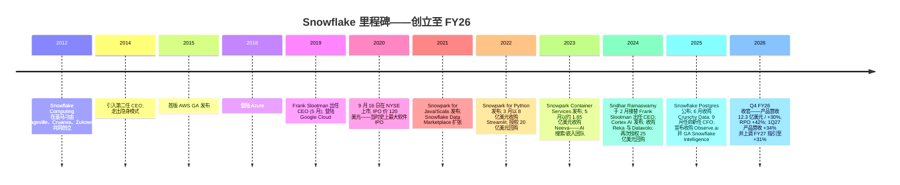
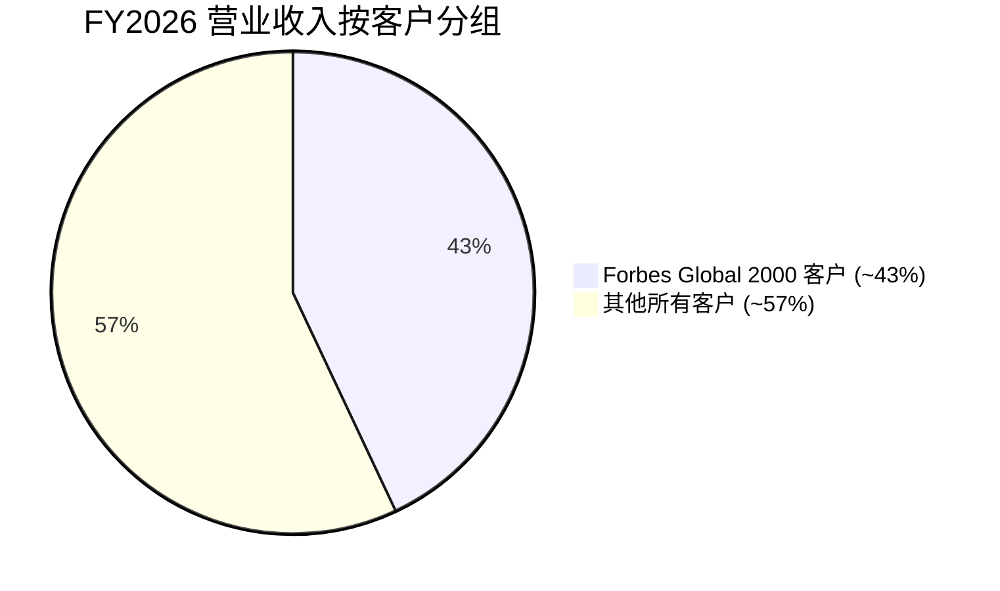
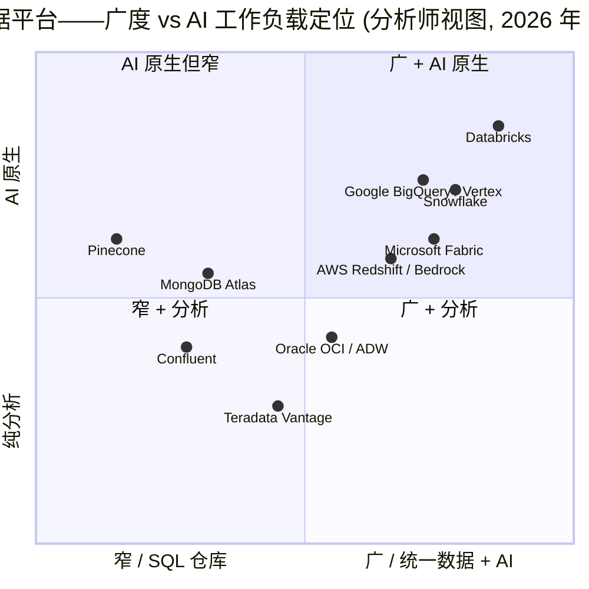

# 公司研究报告: Snowflake Inc. (NYSE: SNOW)

**日期 (as of):** 2026-06-16
**作者:** financial_agent / company-research skill
**代码:** NYSE: SNOW
**财年截止:** 1 月 31 日 (FY26 = 截至 2026 年 1 月 31 日的财年; Q1 FY27 = 截至 2026 年 4 月 30 日的三个月)
**报告语言: 简体中文 (英文版同时存在于本目录)**

> *分析师观点 (Analyst view)：* **评级 (Rating)：Overweight（增持）· 12 个月目标价 (PT)：US$290（较 2026-06-16 现价 US$238.32 上行 +22%）· 估值方法：FY27E 营收 US$6.15bn × 13.5× forward EV/Sales（DCF @ WACC 9.7% 交叉验证）**
> 市值 (Market cap) US$82.6bn · 企业价值 (EV) ~US$78bn · 52 周区间 US$118.30–US$284.99 · NYSE:SNOW
>
> | 倍数 / Multiple (*Analyst view:* 远期列) | FY26A | FY27E | FY28E |
> |---|---|---|---|
> | EV/Sales | 16.7× | 12.8× | 9.9× |
> | P/S (TTM→fwd) | 17.6× | 13.5× | 10.4× |
> | 非 GAAP P/E | NM | ~127× | ~97× |
> | 远期 P/E（基于一致预期非 GAAP EPS） | — | ~120× | ~92× |
>
> 相对表现 (Rel. performance, 截至 2026-06-16)：1M ~ +36% · 6M ~ −18% · YTD ~ −5% · 12M ~ −13% vs S&P 500（12M 约 +13%）——相对 12M 约 −26pt（截至 1Q27 业绩前为深度跑输，业绩后单周反弹 ~37%）。价格来源：[Yahoo Finance, SNOW](https://finance.yahoo.com/quote/SNOW/)。
>
> **核心论点 (Thesis pillars)**——（1）**AI 货币化拐点已现**：1Q27 产品营收增速回升至 +34%（FY26 为 +29%），管理层据此把 FY27 产品营收指引上调至 +31%，逾 13,600 个账户使用 Snowflake AI、Cortex Code 进入 7,100+ 账户——AI 终于从"概念"转为"消费 (consumption)"；（2）**类别品牌 + 数据网络效应护城河**：Snowflake 仍是企业数据团队对"云数据仓库"的头号心智认知，Marketplace、Native Apps、跨云中立性构成真实壁垒；（3）**运营杠杆改善**：1Q27 GAAP 营业利润率同比改善 14pt、SBC 占营收同比降 8pt，新 CFO（前 GitLab CFO）的"有杠杆的增长"叙事开始兑现；（4）**估值仍高但回报对称**：12.8× FY27E EV/Sales 介于 DDOG（~20×）与 MDB（~10×）之间，若 Cortex 消费持续放量则有再评级空间，若 Databricks 抢占 AI 工作负载则向 10× 压缩——故定 Overweight 而非更激进的评级。

> **更新——1Q27 业绩 + 全年指引上调，股价业绩后大涨 (2026-05-27)：** Snowflake 录得**产品营业收入 (product revenue) 13.343 亿美元 (同比 +34%)** —— 总营业收入 **13.91 亿美元 (同比 +33%)**, **净收入留存率 (NRR, net revenue retention) 126%** (环比 +1pt), **剩余履约义务 (RPO) 同比 +38%、cRPO 同比 +38%**。AI 普及度披露 (2026 年 4 月末四周滚动平均): **逾 13,600 个账户**使用 Snowflake AI 能力; **Snowflake Intelligence 账户环比翻倍以上**; **Cortex Code 在逾 7,100 个账户中使用**。基于此, 管理层**上调全年 FY27 指引**: **产品营业收入由 56.60 亿美元 (+27%) 上调至 58.40 亿美元 (+31%)**, **非 GAAP 营业利润率由 12.5% 上调至 13.5%**, 非 GAAP 产品毛利率维持 75%, 调整后 FCF 利润率维持 23%。Q1 GAAP 营业亏损 3.262 亿美元 (-23.5% 营收占比, 同比从 -42.9% 大幅收窄); 经营性现金流 2.432 亿美元; 自由现金流 2.328 亿美元。报告当日 (2026-05-27) 收盘价为 US$175.26, 业绩后盘后跳涨约 +37%; 截至本报告日 (2026-06-16) SNOW 收于 **US$238.32**。来源: [Snowflake 1Q27 业绩新闻稿 (8-K), 2026-05-27](https://www.sec.gov/Archives/edgar/data/1640147/000164014726000027/snow-20260527.htm); [Snowflake 1Q27 10-Q, 2026-05-29](https://www.sec.gov/Archives/edgar/data/1640147/000164014726000030/snow-20260430.htm); [Yahoo Finance, SNOW](https://finance.yahoo.com/quote/SNOW/)。

## 目录
1. 公司概览（含投资论点）
1A. 估值与目标价（Valuation & Price Target — 前瞻模型 · PT 推导 · 牛/基准/熊情景 · 卖方观点演变）
1B. GF Score（GuruFocus 风格基本面评分）
2. 公司历史
3. 管理团队
4. 产品与服务
5. 客户与上市策略
6. 行业概览
7. 竞争格局
8. 市场机会 (TAM)
9. 风险评估
9.5. 关键争论与催化剂（Key debates & catalysts）
10. 投资视角评分卡（Investor-lens scorecards）
11. 数据来源清单 / 参考资料

---

## 1. 公司概览

**投资论点 (Investment thesis — BLUF)。** *分析师观点：* 我们对 SNOW 给予 **Overweight（增持）评级、12 个月目标价 US$290（较 2026-06-16 现价 US$238.32 上行 +22%）**。核心逻辑是 **AI 货币化拐点 (AI monetization inflection)** ——1Q27 产品营收增速从 FY26 的 +29% 回升至 **+34%**, 这是自 mid-FY26 短暂提速以来首次出现由 AI 与核心业务双轮驱动的加速; 管理层据此把 FY27 产品营收指引上调至 **+31%** ([Snowflake 1Q27 8-K, 2026-05-27](https://www.sec.gov/Archives/edgar/data/1640147/000164014726000027/snow-20260527.htm))。三条增量论点：(1) Cortex / Snowflake Intelligence / Cortex Code 把 AI 从"叙事"转为"credit 消费"（逾 13,600 个账户使用 AI、Cortex Code 进入 7,100+ 账户）；(2) Snowflake 仍是企业"云数据仓库"的头号品牌, 叠加 Marketplace 数据网络效应、跨云中立性的真实壁垒；(3) 运营杠杆改善——1Q27 GAAP 营业利润率同比改善 14pt、SBC 占营收同比降 8pt。我们给 Overweight 而非更激进评级, 是因为 12.8× FY27E EV/Sales 已不便宜, 且 Databricks 对增量 AI 工作负载的竞争阴影真实存在——这是回报对称、而非单边的设置。

Snowflake Inc. 是总部位于美国加州门洛帕克 (Menlo Park) 的云软件公司, 构建并运营**AI 数据云 (AI Data Cloud)**——一套完全托管的多云数据平台 (multi-cloud data platform), 融合了存储与计算分离架构的数据仓库 (data warehouse) 引擎、基于开放表格式的数据湖仓 (data lakehouse)、数据交易市场 (marketplace)、应用平台, 以及自 2024 年起推出的第一方 AI / 大语言模型 (LLM, large language model) 层——其名称为 **Snowflake Cortex**。公司将其使命定义为"调动全世界的数据 (mobilize the world's data)", 让企业能够在统一受治理的平台上整合分析 (analytics)、数据工程 (data engineering)、应用以及 AI, 而非在数据仓库、数据湖、向量数据库和机器学习训练栈之间拼接出一系列孤岛 ([Snowflake 10-K FY2026, "Overview"](https://www.sec.gov/Archives/edgar/data/1640147/000164014726000008/snow-20260131.htm))。

**业务模式。** Snowflake 的几乎全部营业收入来自**基于消费的容量协议 (consumption-priced capacity arrangements)**: 客户在一至三年合约期承诺一笔固定美元的支出, 然后通过 Snowflake credit 在运行仓库、训练任务、Cortex 推理调用 (inference call)、Snowpark 容器、数据共享传输等过程中逐步消耗。因此定价直接跟踪工作负载使用——查询越多、计算越多、数据移动越多, 消耗的 credit 越多——公司的工作是让这些 credit 价格足够便宜, 让客户把更多工作负载留在 Snowflake, 而不是迁移到 BigQuery、Databricks 或开源替代品。FY26 **产品营业收入为 44.723 亿美元 (占总营收 95%)**, 专业服务为 2.116 亿美元 (占 5%) ([Snowflake 10-K FY2026, Note 3 — Revenue](https://www.sec.gov/Archives/edgar/data/1640147/000164014726000008/snow-20260131.htm))。

**规模。** Snowflake FY26 末实现**总营业收入 (total revenue) 46.839 亿美元 (同比 +29%)、产品营业收入 (product revenue) 44.723 亿美元 (同比 +29%)**, 且前两个财年也均录得 29% 增速——FY26 10-K 专门点出了这一罕见的连续三年保持同等增速记录——**总客户数 13,328 家**、**TTM 产品营业收入超过 100 万美元的客户 733 家**、**Forbes Global 2000 (G2K) 客户 790 家** (约占 FY26 营业收入 43%), 以及**剩余履约义务 (Remaining Performance Obligations, RPO) 同比 +42%** ([Snowflake 10-K FY2026, "Our Strategy" 与 Note 3](https://www.sec.gov/Archives/edgar/data/1640147/000164014726000008/snow-20260131.htm); [Q4-FY26 新闻稿, 2026-02-25](https://www.sec.gov/Archives/edgar/data/1640147/000162828026011631/fy2026q4earnings.htm))。公司运营 **13 个区域云部署**, 通过 Snowgrid 跨域网格协同。下方 income-statement Sankey 直观呈现 FY26 营收如何被成本与三大费用项消耗：

<svg xmlns="http://www.w3.org/2000/svg" viewBox="0 0 1000 560" width="1000" height="560" role="img" aria-label="income statement Sankey"><rect x="0" y="0" width="1000" height="560" fill="#ffffff"/>
<text x="20.00" y="30.00" text-anchor="start" font-family="Helvetica,Arial,sans-serif" font-size="15" font-weight="700" fill="#1f2933">How Snowflake (SNOW) Spends Its Revenue — FY2026 (截至 2026-01-31)</text>
<path d="M 700.00,67.47 C 754.00,67.47 754.00,288.00 808.00,288.00 L 808.00,290.00 C 754.00,290.00 754.00,69.47 700.00,69.47 Z" fill="#86efac" fill-opacity="0.55"/>
<path d="M 452.00,78.00 C 506.00,78.00 506.00,81.47 560.00,81.47 L 560.00,83.47 C 506.00,83.47 506.00,80.00 452.00,80.00 Z" fill="#86efac" fill-opacity="0.55"/>
<path d="M 204.00,78.00 C 258.00,78.00 258.00,85.00 312.00,85.00 L 312.00,474.57 C 258.00,474.57 258.00,467.57 204.00,467.57 Z" fill="#93c5fd" fill-opacity="0.55"/>
<path d="M 452.00,80.00 C 506.00,80.00 506.00,97.47 560.00,97.47 L 560.00,496.53 C 506.00,496.53 506.00,479.06 452.00,479.06 Z" fill="#fca5a5" fill-opacity="0.55"/>
<path d="M 576.00,81.47 C 630.00,81.47 630.00,67.47 684.00,67.47 L 684.00,69.47 C 630.00,69.47 630.00,83.47 576.00,83.47 Z" fill="#86efac" fill-opacity="0.55"/>
<path d="M 328.00,85.00 C 382.00,85.00 382.00,78.00 436.00,78.00 L 436.00,352.05 C 382.00,352.05 382.00,359.05 328.00,359.05 Z" fill="#86efac" fill-opacity="0.55"/>
<path d="M 328.00,359.05 C 382.00,359.05 382.00,366.05 436.00,366.05 L 436.00,500.00 C 382.00,500.00 382.00,493.00 328.00,493.00 Z" fill="#fca5a5" fill-opacity="0.55"/>
<path d="M 576.00,97.47 C 630.00,97.47 630.00,83.47 684.00,83.47 L 684.00,263.09 C 630.00,263.09 630.00,277.09 576.00,277.09 Z" fill="#fca5a5" fill-opacity="0.55"/>
<path d="M 576.00,277.09 C 630.00,277.09 630.00,277.09 684.00,277.09 L 684.00,448.65 C 630.00,448.65 630.00,448.65 576.00,448.65 Z" fill="#fca5a5" fill-opacity="0.55"/>
<path d="M 576.00,448.65 C 630.00,448.65 630.00,462.65 684.00,462.65 L 684.00,510.53 C 630.00,510.53 630.00,496.53 576.00,496.53 Z" fill="#fca5a5" fill-opacity="0.55"/>
<path d="M 204.00,481.57 C 258.00,481.57 258.00,474.57 312.00,474.57 L 312.00,493.00 C 258.00,493.00 258.00,500.00 204.00,500.00 Z" fill="#93c5fd" fill-opacity="0.55"/>
<rect x="188.00" y="78.00" width="16" height="389.57" rx="1.5" fill="#2563eb"/>
<rect x="188.00" y="481.57" width="16" height="18.43" rx="1.5" fill="#2563eb"/>
<rect x="312.00" y="85.00" width="16" height="408.00" rx="1.5" fill="#1e3a8a"/>
<rect x="436.00" y="78.00" width="16" height="274.05" rx="1.5" fill="#15803d"/>
<rect x="436.00" y="366.05" width="16" height="133.95" rx="1.5" fill="#dc2626"/>
<rect x="560.00" y="81.47" width="16" height="2.00" rx="1.5" fill="#15803d"/>
<rect x="560.00" y="97.47" width="16" height="399.06" rx="1.5" fill="#dc2626"/>
<rect x="684.00" y="67.47" width="16" height="2.00" rx="1.5" fill="#15803d"/>
<rect x="684.00" y="83.47" width="16" height="179.62" rx="1.5" fill="#dc2626"/>
<rect x="684.00" y="277.09" width="16" height="171.56" rx="1.5" fill="#dc2626"/>
<rect x="684.00" y="462.65" width="16" height="47.88" rx="1.5" fill="#dc2626"/>
<rect x="808.00" y="288.00" width="16" height="2.00" rx="1.5" fill="#15803d"/>
<text x="179.00" y="269.78" text-anchor="end" font-family="Helvetica,Arial,sans-serif" font-size="11.5" font-weight="700" fill="#1f2933">Product revenue</text>
<text x="179.00" y="282.78" text-anchor="end" font-family="Helvetica,Arial,sans-serif" font-size="10" font-weight="400" fill="#52606d">$4.5B  (95.5%)</text>
<text x="179.00" y="487.78" text-anchor="end" font-family="Helvetica,Arial,sans-serif" font-size="11.5" font-weight="700" fill="#1f2933">Professional services</text>
<text x="179.00" y="500.78" text-anchor="end" font-family="Helvetica,Arial,sans-serif" font-size="10" font-weight="400" fill="#52606d">$211.6M  (4.5%)</text>
<rect x="331.00" y="67.00" width="100.50" height="26" rx="2" fill="#ffffff" fill-opacity="0.72"/>
<text x="334.00" y="79.00" text-anchor="start" font-family="Helvetica,Arial,sans-serif" font-size="11.5" font-weight="700" fill="#1f2933">Revenue</text>
<text x="334.00" y="92.00" text-anchor="start" font-family="Helvetica,Arial,sans-serif" font-size="10" font-weight="400" fill="#52606d">$4.7B  (100.0%)</text>
<rect x="455.00" y="60.00" width="94.20" height="26" rx="2" fill="#ffffff" fill-opacity="0.72"/>
<text x="458.00" y="72.00" text-anchor="start" font-family="Helvetica,Arial,sans-serif" font-size="11.5" font-weight="700" fill="#1f2933">Gross Profit</text>
<text x="458.00" y="85.00" text-anchor="start" font-family="Helvetica,Arial,sans-serif" font-size="10" font-weight="400" fill="#52606d">$3.1B  (67.2%)</text>
<rect x="455.00" y="348.05" width="144.60" height="26" rx="2" fill="#ffffff" fill-opacity="0.72"/>
<text x="458.00" y="360.05" text-anchor="start" font-family="Helvetica,Arial,sans-serif" font-size="11.5" font-weight="700" fill="#1f2933">Cost of Revenue (COGS)</text>
<text x="458.00" y="373.05" text-anchor="start" font-family="Helvetica,Arial,sans-serif" font-size="10" font-weight="400" fill="#52606d">$1.5B  (32.8%)</text>
<rect x="579.00" y="63.47" width="106.80" height="26" rx="2" fill="#ffffff" fill-opacity="0.72"/>
<text x="582.00" y="75.47" text-anchor="start" font-family="Helvetica,Arial,sans-serif" font-size="11.5" font-weight="700" fill="#1f2933">Operating Income</text>
<text x="582.00" y="88.47" text-anchor="start" font-family="Helvetica,Arial,sans-serif" font-size="10" font-weight="400" fill="#52606d">-$1.4B  (-30.6%)</text>
<rect x="579.00" y="88.47" width="150.90" height="26" rx="2" fill="#ffffff" fill-opacity="0.72"/>
<text x="582.00" y="100.47" text-anchor="start" font-family="Helvetica,Arial,sans-serif" font-size="11.5" font-weight="700" fill="#1f2933">Total Operating Expense</text>
<text x="582.00" y="113.47" text-anchor="start" font-family="Helvetica,Arial,sans-serif" font-size="10" font-weight="400" fill="#52606d">$4.6B  (97.8%)</text>
<rect x="703.00" y="49.47" width="106.80" height="26" rx="2" fill="#ffffff" fill-opacity="0.72"/>
<text x="706.00" y="61.47" text-anchor="start" font-family="Helvetica,Arial,sans-serif" font-size="11.5" font-weight="700" fill="#1f2933">Pretax Income</text>
<text x="706.00" y="74.47" text-anchor="start" font-family="Helvetica,Arial,sans-serif" font-size="10" font-weight="400" fill="#52606d">-$1.4B  (-30.6%)</text>
<rect x="703.00" y="74.47" width="94.20" height="26" rx="2" fill="#ffffff" fill-opacity="0.72"/>
<text x="706.00" y="86.47" text-anchor="start" font-family="Helvetica,Arial,sans-serif" font-size="11.5" font-weight="700" fill="#1f2933">SG&amp;A</text>
<text x="706.00" y="99.47" text-anchor="start" font-family="Helvetica,Arial,sans-serif" font-size="10" font-weight="400" fill="#52606d">$2.1B  (44.0%)</text>
<rect x="703.00" y="259.09" width="94.20" height="26" rx="2" fill="#ffffff" fill-opacity="0.72"/>
<text x="706.00" y="271.09" text-anchor="start" font-family="Helvetica,Arial,sans-serif" font-size="11.5" font-weight="700" fill="#1f2933">R&amp;D</text>
<text x="706.00" y="284.09" text-anchor="start" font-family="Helvetica,Arial,sans-serif" font-size="10" font-weight="400" fill="#52606d">$2.0B  (42.0%)</text>
<rect x="703.00" y="444.65" width="106.80" height="26" rx="2" fill="#ffffff" fill-opacity="0.72"/>
<text x="706.00" y="456.65" text-anchor="start" font-family="Helvetica,Arial,sans-serif" font-size="11.5" font-weight="700" fill="#1f2933">Other OpEx</text>
<text x="706.00" y="469.65" text-anchor="start" font-family="Helvetica,Arial,sans-serif" font-size="10" font-weight="400" fill="#52606d">$549.7M  (11.7%)</text>
<text x="833.00" y="286.00" text-anchor="start" font-family="Helvetica,Arial,sans-serif" font-size="11.5" font-weight="700" fill="#1f2933">Net Income</text>
<text x="833.00" y="299.00" text-anchor="start" font-family="Helvetica,Arial,sans-serif" font-size="10" font-weight="400" fill="#52606d">-$1.4B  (-30.6%)</text>
<text x="500.00" y="544.00" text-anchor="middle" font-family="Helvetica,Arial,sans-serif" font-size="10" font-weight="400" fill="#52606d">Source: SNOW FY2026 10-K (snow-20260131), Consolidated Statements of Operations + Note 3 Revenue</text>
</svg>

来源 / Source: [Snowflake FY2026 10-K (snow-20260131), Consolidated Statements of Operations + Note 3 Revenue](https://www.sec.gov/Archives/edgar/data/1640147/000164014726000008/snow-20260131.htm)

**地区结构。** FY26 美国客户贡献 **35.240 亿美元 (营业收入的 75.2%)**, 其他美洲 1.253 亿美元 (2.7%), EMEA (欧洲、中东、非洲) 7.637 亿美元 (16.3%), 亚太与日本 (APJ) 2.710 亿美元 (5.8%); 总计 46.839 亿美元。除美国外, 单一国家营业收入均未超过 10% ([Snowflake 10-K FY2026, Note 3 — Revenue by Geographic Area](https://www.sec.gov/Archives/edgar/data/1640147/000164014726000008/snow-20260131.htm))。Product revenue 占总营收 95%、Professional services & other 占 5%：

<svg xmlns="http://www.w3.org/2000/svg" viewBox="0 0 720 460" width="720" height="460" role="img" aria-label="revenue donut"><rect x="0" y="0" width="720" height="460" fill="#ffffff"/>
<text x="20.00" y="30.00" text-anchor="start" font-family="Helvetica,Arial,sans-serif" font-size="15" font-weight="700" fill="#1f2933">FY2026 营业收入按类别 / Revenue by Type</text>
<path d="M 288.00,107.20 A 132 132 0 1 1 251.03,112.48 L 266.16,164.32 A 78 78 0 1 0 288.00,161.20 Z" fill="#2563eb"/>
<path d="M 251.03,112.48 A 132 132 0 0 1 288.00,107.20 L 288.00,161.20 A 78 78 0 0 0 266.16,164.32 Z" fill="#15803d"/>
<text x="288.00" y="235.20" text-anchor="middle" font-family="Helvetica,Arial,sans-serif" font-size="18" font-weight="800" fill="#1f2933">SNOW</text>
<text x="288.00" y="255.20" text-anchor="middle" font-family="Helvetica,Arial,sans-serif" font-size="13" font-weight="600" fill="#52606d">$4.7B</text>
<text x="288.00" y="271.20" text-anchor="middle" font-family="Helvetica,Arial,sans-serif" font-size="10" font-weight="400" fill="#8a97a3">total</text>
<line x1="307.52" y1="375.81" x2="323.52" y2="375.81" stroke="#2563eb" stroke-width="1.4"/>
<text x="327.52" y="373.81" text-anchor="start" font-family="Helvetica,Arial,sans-serif" font-size="11" font-weight="700" fill="#1f2933">Product revenue</text>
<text x="327.52" y="387.81" text-anchor="start" font-family="Helvetica,Arial,sans-serif" font-size="10" font-weight="400" fill="#52606d">$4.5B  (95.5%)</text>
<line x1="268.48" y1="102.59" x2="252.48" y2="102.59" stroke="#15803d" stroke-width="1.4"/>
<text x="248.48" y="100.59" text-anchor="end" font-family="Helvetica,Arial,sans-serif" font-size="11" font-weight="700" fill="#1f2933">Professional services &amp; other</text>
<text x="248.48" y="114.59" text-anchor="end" font-family="Helvetica,Arial,sans-serif" font-size="10" font-weight="400" fill="#52606d">$211.6M  (4.5%)</text>
<text x="360.00" y="444.00" text-anchor="middle" font-family="Helvetica,Arial,sans-serif" font-size="10" font-weight="400" fill="#52606d">Source: SNOW FY2026 10-K (snow-20260131), Consolidated Statements of Operations</text>
</svg>

<svg xmlns="http://www.w3.org/2000/svg" viewBox="0 0 720 460" width="720" height="460" role="img" aria-label="revenue donut"><rect x="0" y="0" width="720" height="460" fill="#ffffff"/>
<text x="20.00" y="30.00" text-anchor="start" font-family="Helvetica,Arial,sans-serif" font-size="15" font-weight="700" fill="#1f2933">FY2026 营业收入按地区 / Revenue by Geography</text>
<path d="M 288.00,107.20 A 132 132 0 1 1 156.01,237.25 L 210.01,238.05 A 78 78 0 1 0 288.00,161.20 Z" fill="#2563eb"/>
<path d="M 156.01,237.25 A 132 132 0 0 1 221.09,125.42 L 248.46,171.96 A 78 78 0 0 0 210.01,238.05 Z" fill="#15803d"/>
<path d="M 221.09,125.42 A 132 132 0 0 1 265.92,109.06 L 274.95,162.30 A 78 78 0 0 0 248.46,171.96 Z" fill="#d97706"/>
<path d="M 265.92,109.06 A 132 132 0 0 1 288.00,107.20 L 288.00,161.20 A 78 78 0 0 0 274.95,162.30 Z" fill="#7c3aed"/>
<text x="288.00" y="235.20" text-anchor="middle" font-family="Helvetica,Arial,sans-serif" font-size="18" font-weight="800" fill="#1f2933">SNOW</text>
<text x="288.00" y="255.20" text-anchor="middle" font-family="Helvetica,Arial,sans-serif" font-size="13" font-weight="600" fill="#52606d">$4.7B</text>
<text x="288.00" y="271.20" text-anchor="middle" font-family="Helvetica,Arial,sans-serif" font-size="10" font-weight="400" fill="#8a97a3">total</text>
<line x1="384.86" y1="337.50" x2="400.86" y2="337.50" stroke="#2563eb" stroke-width="1.4"/>
<text x="404.86" y="335.50" text-anchor="start" font-family="Helvetica,Arial,sans-serif" font-size="11" font-weight="700" fill="#1f2933">United States</text>
<text x="404.86" y="349.50" text-anchor="start" font-family="Helvetica,Arial,sans-serif" font-size="10" font-weight="400" fill="#52606d">$3.5B  (75.2%)</text>
<line x1="168.72" y1="169.80" x2="152.72" y2="169.80" stroke="#15803d" stroke-width="1.4"/>
<text x="148.72" y="167.80" text-anchor="end" font-family="Helvetica,Arial,sans-serif" font-size="11" font-weight="700" fill="#1f2933">EMEA</text>
<text x="148.72" y="181.80" text-anchor="end" font-family="Helvetica,Arial,sans-serif" font-size="10" font-weight="400" fill="#52606d">$763.7M  (16.3%)</text>
<line x1="240.70" y1="109.56" x2="224.70" y2="109.56" stroke="#d97706" stroke-width="1.4"/>
<text x="220.70" y="107.56" text-anchor="end" font-family="Helvetica,Arial,sans-serif" font-size="11" font-weight="700" fill="#1f2933">Asia-Pacific &amp; Japan</text>
<text x="220.70" y="121.56" text-anchor="end" font-family="Helvetica,Arial,sans-serif" font-size="10" font-weight="400" fill="#52606d">$271.0M  (5.8%)</text>
<line x1="276.42" y1="101.69" x2="260.42" y2="101.69" stroke="#7c3aed" stroke-width="1.4"/>
<text x="256.42" y="99.69" text-anchor="end" font-family="Helvetica,Arial,sans-serif" font-size="11" font-weight="700" fill="#1f2933">Other Americas</text>
<text x="256.42" y="113.69" text-anchor="end" font-family="Helvetica,Arial,sans-serif" font-size="10" font-weight="400" fill="#52606d">$125.3M  (2.7%)</text>
<text x="360.00" y="444.00" text-anchor="middle" font-family="Helvetica,Arial,sans-serif" font-size="10" font-weight="400" fill="#52606d">Source: SNOW FY2026 10-K (snow-20260131), Note 3 — Revenue by Geographic Area</text>
</svg>

来源 / Source: [Snowflake FY2026 10-K (snow-20260131), Statements of Operations + Note 3 — Revenue by Type / Geography](https://www.sec.gov/Archives/edgar/data/1640147/000164014726000008/snow-20260131.htm)

**营收历史 (development over time)。** Product revenue 五年走出 $1.14bn (FY22) → $1.94bn (FY23) → $2.67bn (FY24) → $3.46bn (FY25) → $4.47bn (FY26) 的轨迹, 连续三年保持 +29% 增速; Professional services 始终维持在总营收 ~5% 的低占比：

<svg xmlns="http://www.w3.org/2000/svg" viewBox="0 0 860 470" width="860" height="470" role="img" aria-label="historical revenue bars"><rect x="0" y="0" width="860" height="470" fill="#ffffff"/>
<text x="20.00" y="30.00" text-anchor="start" font-family="Helvetica,Arial,sans-serif" font-size="15" font-weight="700" fill="#1f2933">Snowflake 营业收入历史 / Revenue by Type (FY2022–FY2026, US$bn)</text>
<rect x="20.00" y="44" width="11" height="11" rx="2" fill="#2563eb"/>
<text x="36.00" y="53.00" text-anchor="start" font-family="Helvetica,Arial,sans-serif" font-size="10.5" font-weight="400" fill="#1f2933">Product revenue</text>
<rect x="149.00" y="44" width="11" height="11" rx="2" fill="#15803d"/>
<text x="165.00" y="53.00" text-anchor="start" font-family="Helvetica,Arial,sans-serif" font-size="10.5" font-weight="400" fill="#1f2933">Professional services &amp; other</text>
<line x1="70" y1="412.00" x2="834" y2="412.00" stroke="#eceff2" stroke-width="1"/>
<text x="64.00" y="415.00" text-anchor="end" font-family="Helvetica,Arial,sans-serif" font-size="9.5" font-weight="400" fill="#52606d">$0</text>
<line x1="70" y1="345.20" x2="834" y2="345.20" stroke="#eceff2" stroke-width="1"/>
<text x="64.00" y="348.20" text-anchor="end" font-family="Helvetica,Arial,sans-serif" font-size="9.5" font-weight="400" fill="#52606d">$1.0B</text>
<line x1="70" y1="278.40" x2="834" y2="278.40" stroke="#eceff2" stroke-width="1"/>
<text x="64.00" y="281.40" text-anchor="end" font-family="Helvetica,Arial,sans-serif" font-size="9.5" font-weight="400" fill="#52606d">$2.0B</text>
<line x1="70" y1="211.60" x2="834" y2="211.60" stroke="#eceff2" stroke-width="1"/>
<text x="64.00" y="214.60" text-anchor="end" font-family="Helvetica,Arial,sans-serif" font-size="9.5" font-weight="400" fill="#52606d">$3.0B</text>
<line x1="70" y1="144.80" x2="834" y2="144.80" stroke="#eceff2" stroke-width="1"/>
<text x="64.00" y="147.80" text-anchor="end" font-family="Helvetica,Arial,sans-serif" font-size="9.5" font-weight="400" fill="#52606d">$4.0B</text>
<line x1="70" y1="78.00" x2="834" y2="78.00" stroke="#eceff2" stroke-width="1"/>
<text x="64.00" y="81.00" text-anchor="end" font-family="Helvetica,Arial,sans-serif" font-size="9.5" font-weight="400" fill="#52606d">$5.1B</text>
<rect x="102.09" y="336.67" width="88.62" height="75.33" fill="#2563eb"/>
<rect x="102.09" y="331.38" width="88.62" height="5.29" fill="#15803d"/>
<text x="146.40" y="428.00" text-anchor="middle" font-family="Helvetica,Arial,sans-serif" font-size="10" font-weight="400" fill="#52606d">2022</text>
<rect x="254.89" y="283.80" width="88.62" height="128.20" fill="#2563eb"/>
<rect x="254.89" y="275.21" width="88.62" height="8.59" fill="#15803d"/>
<text x="299.20" y="428.00" text-anchor="middle" font-family="Helvetica,Arial,sans-serif" font-size="10" font-weight="400" fill="#52606d">2023</text>
<rect x="407.69" y="235.56" width="88.62" height="176.44" fill="#2563eb"/>
<rect x="407.69" y="226.31" width="88.62" height="9.25" fill="#15803d"/>
<text x="452.00" y="428.00" text-anchor="middle" font-family="Helvetica,Arial,sans-serif" font-size="10" font-weight="400" fill="#52606d">2024</text>
<rect x="560.49" y="183.36" width="88.62" height="228.64" fill="#2563eb"/>
<rect x="560.49" y="172.79" width="88.62" height="10.57" fill="#15803d"/>
<text x="604.80" y="428.00" text-anchor="middle" font-family="Helvetica,Arial,sans-serif" font-size="10" font-weight="400" fill="#52606d">2025</text>
<rect x="713.29" y="116.62" width="88.62" height="295.38" fill="#2563eb"/>
<rect x="713.29" y="102.74" width="88.62" height="13.88" fill="#15803d"/>
<text x="757.60" y="428.00" text-anchor="middle" font-family="Helvetica,Arial,sans-serif" font-size="10" font-weight="400" fill="#52606d">2026</text>
<text x="430.00" y="454.00" text-anchor="middle" font-family="Helvetica,Arial,sans-serif" font-size="10" font-weight="400" fill="#52606d">Source: SNOW FY2024 &amp; FY2026 10-Ks, Consolidated Statements of Operations</text>
</svg>

来源 / Source: [Snowflake FY2024 10-K (snow-20240131)](https://www.sec.gov/Archives/edgar/data/1640147/000164014724000101/snow-20240131.htm) 与 [FY2026 10-K (snow-20260131)](https://www.sec.gov/Archives/edgar/data/1640147/000164014726000008/snow-20260131.htm), Consolidated Statements of Operations。

**1Q27 实绩 (2026-05-27 披露)。** Q1 重置了 FY27 的全年轨迹: **产品营业收入 13.343 亿美元 (同比 +34%, 相较初始指引隐含的 +27% 明显超预期)**, **总营业收入 13.909 亿美元 (同比 +33%)**, **NRR 126%** (环比 +1pt), **RPO / cRPO 均同比 +38%** ([Snowflake 1Q27 8-K, 2026-05-27](https://www.sec.gov/Archives/edgar/data/1640147/000164014726000027/snow-20260527.htm); [Snowflake 1Q27 10-Q, 2026-05-29](https://www.sec.gov/Archives/edgar/data/1640147/000164014726000030/snow-20260430.htm))。具体 AI 普及度披露 (2026 年 4 月末四周滚动平均): **逾 13,600 个账户**使用 Snowflake AI 能力; **Snowflake Intelligence 账户环比翻倍以上**; **Cortex Code 在逾 7,100 个账户中使用** ([Snowflake 1Q27 8-K, 2026-05-27](https://www.sec.gov/Archives/edgar/data/1640147/000164014726000027/snow-20260527.htm))。据此, 管理层**将全年 FY27 产品营业收入指引由 56.60 亿美元 (+27%) 上调至 58.40 亿美元 (+31%)、非 GAAP 营业利润率由 12.5% 上调至 13.5%**, 非 GAAP 产品毛利率 (75%) 与调整后 FCF 利润率 (23%) 维持不变 ([Snowflake 1Q27 8-K, 2026-05-27](https://www.sec.gov/Archives/edgar/data/1640147/000164014726000027/snow-20260527.htm))。Q1 损益项 (摘自 10-Q): 总营收 13.909 亿、cost of revenue 4.645 亿、gross profit 9.265 亿 (毛利率 66.6%)、S&M 5.890 亿、R&D 5.349 亿、G&A 1.287 亿、**GAAP 营业亏损 3.262 亿美元 (-23.5% 利润率, 同比从 1Q26 的 -42.9% 大幅收窄)**, 净亏损 2.956 亿美元; **经营活动产生的现金净额 2.432 亿美元** ([Snowflake 1Q27 10-Q, 2026-05-29, Statements of Operations + Cash Flows](https://www.sec.gov/Archives/edgar/data/1640147/000164014726000030/snow-20260430.htm))。这是新任 CFO 主导下的首个全年指引上调, 清晰传递出: 初始 FY27 指引保守, AI 驱动的工作负载正将消费拉至公司初始模型未充分捕捉的水平。

**盈利能力轮廓。** Snowflake 在 GAAP 口径下仍处亏损, 且是**有意为之**: FY26 报告营业亏损 14.352 亿美元 (营收占比 -31%) 和归属 Snowflake 净亏损 13.316 亿美元 (-28%), 与 FY25 的 14.560 亿美元营业亏损和 12.856 亿美元净亏损相当 ([Snowflake 10-K FY2026, Consolidated Statements of Operations](https://www.sec.gov/Archives/edgar/data/1640147/000164014726000008/snow-20260131.htm))。这一差距的主体是**股权激励 (Stock-Based Compensation, SBC), FY26 为 15.995 亿美元, 占营收的 34% (FY25 占比 41%)**——这是公司在工程师现金支出与股权稀释之间有意为之的权衡, 而公司正在明确努力压降这一比例。剔除 SBC 后景象大不相同: **FY26 非 GAAP 自由现金流 (FCF) 为 11.203 亿美元 (营收占比 24%)**, 高于 FY25 的 8.841 亿美元和 FY24 的 7.789 亿美元, **经营活动产生的净现金流为 12.219 亿美元** ([Snowflake 10-K FY2026, "Key Business Metrics"](https://www.sec.gov/Archives/edgar/data/1640147/000164014726000008/snow-20260131.htm))。资产负债表显示**FY26 末现金及短期投资合计 40.30 亿美元 (现金 28.28 亿 + 短期投资 12.02 亿) + 长期投资 7.55 亿美元**, 对应约 22.80 亿美元账面值、到期日为 2027 与 2029 年的零息可转换债券, 公司自筹资金状况充裕 ([Snowflake 10-K FY2026, Consolidated Balance Sheets](https://www.sec.gov/Archives/edgar/data/1640147/000164014726000008/snow-20260131.htm))。

**估值快照 (截至 2026-06-16)。** SNOW 收于 **US$238.32**, 市值 **US$82.6bn**, 企业价值约 **US$78bn**, 52 周区间 **US$118.30–US$284.99** ([Yahoo Finance, SNOW](https://finance.yahoo.com/quote/SNOW/))。

- **TTM P/E: 无意义 (负值)。** GAAP 口径的过去十二个月 EPS 约为 –3.9 美元 (净亏损 13.3 亿美元 / 加权平均流通股数约 3.4 亿股), 因此市盈率要么未定义, 要么——当被报告时——为一个无意义的大负数。**这一亏损绝非一次性扣减。** FY26 损益分解: 在 46.839 亿美元营业收入上录得 31.461 亿美元毛利 (整体毛利率 67.2%, **产品毛利率 71.8%**), 但被 20.621 亿美元销售与营销 (S&M, 营收占比 44%)、19.695 亿美元研发 (R&D, 占比 42%) 和 5.497 亿美元一般及行政费用 (G&A, 占比 12%) 完全吸收——总营业费用 45.813 亿美元 对应 46.839 亿美元营收 ([Snowflake 10-K FY2026, Statements of Operations](https://www.sec.gov/Archives/edgar/data/1640147/000164014726000008/snow-20260131.htm))。根本驱动是**股权激励 (16.0 亿美元, 营收占比 34%)** 压制每一行损益, 再加上为承接多百万美元消费承诺投入的重金市场开拓。这是**烧钱*成长***, 而非周期低谷或结构性衰退: 经营性现金流 12.2 亿美元, 自由现金流 11.2 亿美元。剔除 SBC 后, 公司在非 GAAP 口径下稳健盈利 (FY26 非 GAAP 营业利润率约 9%, FY27 指引上调至 13.5%)。
- **TTM P/S ≈ 17.6 倍, EV/营业收入 ≈ 16.7 倍** (市值 US$82.6bn / FY26 营收 46.84 亿; EV ~US$78bn / 46.84 亿)。这一估值高于 SNOW 在 2026-05 业绩前的约 12 倍水平——因为业绩后股价从 US$175 反弹至 US$238 (~+36%), 倍数随之扩张; 但仍显著低于 2021 年 ZIRP 峰值的 30 倍以上 ([Macrotrends SNOW P/S 历史](https://www.macrotrends.net/stocks/charts/SNOW/snowflake/price-sales))。以前瞻口径计, **FY27E EV/Sales ≈ 12.8 倍、FY28E ≈ 9.9 倍** (基于本报告前瞻模型, 见 1A 节)。
- **非 GAAP 远期 P/E ≈ 120 倍 (FY27E)**, 反映极低的非 GAAP EPS 基数 (~US$1.99, MS 估) 与高估值——这是一个用 EV/Sales 而非 P/E 锚定的成长股 ([Yahoo Finance, SNOW](https://finance.yahoo.com/quote/SNOW/))。

**同业估值对比 (TTM P/S 与 EV/Revenue, 2026-06-16 快照):**

| 代码 | 公司 | LTM 营业收入 | 最近一季产品/总营收增速 | TTM P/S | 备注 |
|---|---|---|---|---|---|
| **SNOW** | Snowflake | 46.8 亿美元 | 1Q27 产品 +34% | **~17.6×** | 业绩后再评级; AI 数据云叙事 |
| DDOG | Datadog | ~37 亿美元 | Q1 2026 +28% | ~20× | 利润率最佳; 可观测性护城河 |
| MDB | MongoDB | ~25 亿美元 | Atlas 指引 +21–23% | ~11× | 同组中最慢, FCF 转正 |
| ORCL | Oracle | ~640 亿美元 | LTM 个位数 | ~9× | 盈利的超大市值公司; OCI AI 顺风 |
| MSFT | Microsoft | ~3,200 亿美元 | Azure +12–14% | ~10× | Fabric 是最直接的企业级竞争对手 |
| GOOG | Alphabet | ~4,200 亿美元 | LTM 双位数 | ~11× | BigQuery 是最直接的技术竞争对手 |
| PLTR | Palantir | ~52 亿美元 | 同比 +30% | ~60× | 纯叙事溢价 |

来源: [Yahoo Finance, SNOW](https://finance.yahoo.com/quote/SNOW/); [DDOG](https://finance.yahoo.com/quote/DDOG/); [MDB](https://finance.yahoo.com/quote/MDB/); [ORCL](https://finance.yahoo.com/quote/ORCL/); [MSFT](https://finance.yahoo.com/quote/MSFT/); [GOOG](https://finance.yahoo.com/quote/GOOG/); [PLTR](https://finance.yahoo.com/quote/PLTR/) (均访问于 2026-06-16)。同业 MDB / DDOG 数据的内部交叉核对, 参见此前的研究报告 ([reports/company/MongoDB_NASDAQ_MDB](MongoDB_NASDAQ_MDB_Research_Document_2026-05-20.md))。

**对估值倍数的判断。** 业绩后的再评级把 SNOW 推到 **TTM ~17.6× / FY27E ~12.8× EV/Sales**, 介于 Datadog (~20×, 同组利润率最佳) 与 MongoDB (~11×, 增速更慢) 之间, 显著高于 ORCL / MSFT / GOOG (9–11×) 这些已盈利的超大市值。溢价反映: (a) 若 Cortex 抢占增量 AI / 推理工作负载, 则消费上升空间; (b) Marketplace 与 Native Apps 平台层的可选性; (c) 长跑道 AI 数据云 TAM。相对 DDOG 的小幅折价反映 SNOW 的 GAAP 亏损轮廓、更重的 hyperscaler 依赖 (产品实质大多数运行在 AWS 上, 而 AWS 同时是竞争对手) 与 Databricks 的竞争阴影。倍数要进一步扩张, 需要 Cortex / AI 消费把增长稳定在 30%+, 或经营杠杆有说服力地推向 20%+ 非 GAAP 营业利润率。反之, 若 AI 工作负载不及预期且 Databricks 势头延续, FY27E ~12.8× 有向 MDB 的 ~11× 压缩的风险——我们将其作为估值/估值压缩风险纳入第 9 章。前瞻估值的完整推导见下方 1A 节。

## 1A. 估值与目标价（Valuation & Price Target）

> *分析师观点：* 本节所有前瞻数字（FY27E–FY29E 估计、目标价、牛/基准/熊情景）均为分析师本方观点, **不附带任何 filing 引用**（10-K 中不含目标价）。每个驱动项的外部依据（filing 分部数据 + 管理层指引 + 同业倍数）在行内单独标注来源。

**(a) 前瞻财务模型 (forward estimates) — FY27E 至 FY29E（财年截至 1 月）。** 模型以 FY26 实绩为基（产品营收 +29%、整体毛利率 67.2%、SBC 占营收 34%）, 叠加管理层 FY27 指引（产品营收 +31%、非 GAAP 营业利润率 13.5%、调整后 FCF 利润率 23%）, 并假设增速沿 AI 货币化曲线温和回落、营业利润率随经营杠杆扩张。各分部路径加总：核心仓库消费随迁移持续、Snowpark/容器扩张、Cortex/AI 增量、Marketplace 高毛利覆盖层。

| 指标 (*Analyst view:*) | FY26A | FY27E | FY28E | FY29E | CAGR(FY26→29) |
|---|---|---|---|---|---|
| 总营收 (Total revenue, US$mn) | 4,684 | 6,150 | 7,950 | 9,950 | +28% |
|   — YoY % | +29% | +31% | +29% | +25% | |
| 产品营收 (Product revenue, US$mn) | 4,472 | 5,850 | 7,590 | 9,510 | +29% |
| 整体毛利率 (Gross margin %) | 67% | 67% | 68% | 68% | |
| 非 GAAP 营业利润率 % | ~9% | 13.5% | 16% | 19% | |
| 非 GAAP EPS (US$) | ~1.55 | 1.99 | 2.45 | 3.20 | +27% |
| ROIC %（非 GAAP 口径） | ~6% | 9% | 12% | 15% | |
| 调整后 FCF 利润率 % | 24% | 23% | 24% | 26% | |
| 净现金/(债务) (现金+投资−可转债, US$mn) | ~+2,580 | ~+3,100 | ~+4,000 | ~+5,200 | |

各项依据：FY26 实绩来自 [Snowflake 10-K FY2026, Statements of Operations + Key Business Metrics](https://www.sec.gov/Archives/edgar/data/1640147/000164014726000008/snow-20260131.htm)；FY27 指引（产品营收 +31%、非 GAAP 营业利润率 13.5%、FCF 利润率 23%）来自 [Snowflake 1Q27 8-K, 2026-05-27](https://www.sec.gov/Archives/edgar/data/1640147/000164014726000027/snow-20260527.htm)；FY27E/FY28E 非 GAAP EPS（US$1.99 / US$2.45）以 *分析师观点：* Morgan Stanley FY27e EPS US$1.99、FY28e US$2.86 为锚（[Morgan Stanley — Snowflake 1Q27, 2026-05-28](http://xs-macbook-air.local:5001/zsxq/pdf/415284424524188/Morgan%20Stanley-Snowflake%20Inc.%EF%BC%88SNOW.UN%EF%BC%891Q27%20Results%EF%BC%9A%20Joining%20the%20Ranks%20of%20the%20Select%20AI%20Winners%20in%20Software-260528.pdf)）, 本报告 FY28E 取较保守的 US$2.45。**Margin bridge（非 GAAP 营业利润率 ~9%→13.5% FY26→FY27E）：** 经营杠杆（S&M 占营收随 NRR 企稳而下降）+约 +300bp · SBC 占营收同比降约 +150bp · 部分被 Cortex 推理 COGS 上升抵消 −约 100bp（各驱动方向来自 [1Q27 8-K](https://www.sec.gov/Archives/edgar/data/1640147/000164014726000027/snow-20260527.htm)；bps 幅度为 *分析师观点：*）。

**(b) 目标价推导 (PT derivation) — 展示算术。** SNOW 是一只用 **EV/Sales 为主锚** 的成长股（GAAP 仍亏损、非 GAAP EPS 基数极低使远期 P/E 高达 ~120× 且对假设极敏感, 因此 P/E 法不稳健, 仅作参照）。**主法（EV/Sales）：** FY27E 总营收 US$6.15bn × **13.5× forward EV/Sales** = EV ~US$83bn；加净现金 ~US$3.1bn、除以约 3.55 亿股摊薄股本 ≈ **US$280–290/股**。13.5× 的倍数依据：介于 DDOG ~20×（利润率更高）与 MDB ~11×（增速更慢）之间, 反映 SNOW 增速高于 MDB、利润率低于 DDOG 且具 AI 消费期权。**DCF 交叉验证：** WACC = Rf 4.54%（[indicators.db 本地快照（FRED ^TNX），as of 2026-06-04](https://fred.stlouisfed.org/series/DGS10)）+ β 1.08 × ERP 4.75% ≈ 9.7%；以 FY27E 后 5 年 FCF 增长 ~22% 渐降至终值增长 3% 折现, 内在价值落在 US$270–300——与 EV/Sales 法一致。**取 12 个月目标价 US$290（较现价 US$238.32 上行 +22%）。** P/E 参照：FY28E 非 GAAP EPS US$2.45 × ~118× = ~US$290, 与主法吻合（但该极高 P/E 本身不构成独立依据）。

**(c) 牛/基准/熊情景 (bull / base / bear)：**

| 情景 (*Analyst view:*) | 关键假设 | 目标价 | 较现价 |
|---|---|---|---|
| 牛 (Bull) | Cortex 消费持续放量, FY27 增速维持 30%+、倍数升至 16× EV/Sales | US$360 | +51% |
| 基准 (Base) | FY27 +31%→FY29 +25%, 13.5× FY27E EV/Sales, 营业利润率扩张 | US$290 | +22% |
| 熊 (Bear) | Databricks 抢占 AI 工作负载、NRR 跌破 120%、倍数压至 9× EV/Sales | US$165 | −31% |

牛/熊轮廓与 *分析师观点：* Morgan Stanley 的牛 US$450 / 基准 US$300 / 熊 US$121（均基于其 2026-05-27 收盘 US$175.26）方向一致, 本报告锚定更高的当前股价故区间相应上移（[Morgan Stanley — Snowflake 1Q27, 2026-05-28, 情景表](http://xs-macbook-air.local:5001/zsxq/pdf/415284424524188/Morgan%20Stanley-Snowflake%20Inc.%EF%BC%88SNOW.UN%EF%BC%891Q27%20Results%EF%BC%9A%20Joining%20the%20Ranks%20of%20the%20Select%20AI%20Winners%20in%20Software-260528.pdf)）。

**(d) 与市场一致预期的对比 (vs consensus)。** *分析师观点：* 本报告 FY27E 总营收 US$6.15bn 与卖方一致预期（隐含管理层指引产品营收 +31%）大致一致, 略偏保守于 Morgan Stanley 的 FY27e EPS US$1.99（本报告 US$1.99 持平）, 而 FY28E EPS US$2.45 低于 MS 的 US$2.86 约 14%——本报告对 Cortex 货币化的兑现节奏更谨慎。

**(e) 关键变量 (swing variables)。** 这个调用最依赖两个假设：(1) **Cortex / AI 消费能否转化为持续的 credit 增量**（决定增速能否守住 30% 上沿与 NRR 是否回升）；(2) **非 GAAP 营业利润率扩张节奏**（SBC 占比下行 vs AI 推理 COGS 上升的净效应）。读者应重点压力测试这两点。

### 卖方观点演变 (Sell-side view evolution)

本地 `db/zsxq.db` 对 SNOW 有密集覆盖, 1Q27 业绩（2026-05-27）后三大行同步上调目标价但评级分歧明显。机械化预读自 `db/stock_price_target.db`（只读）, 报告日股价以各 PDF 表头为准（三份 1Q27 笔记的报告日均为 2026-05-27 收盘 **US$175.26**, 业绩后盘后跳涨 ~37%）。

**按机构的观点时间线（1Q27 业绩前后）：**

- **Morgan Stanley（2026-05-28，Overweight，PT US$300，前值 US$245）。** *分析师观点：* "Joining the Ranks of the Select AI Winners in Software"——产品营收 +34%、管理层上调 FY27 至 +31%, 由 AI 货币化 + 强核心双轮驱动, 是对熊派的"有力反制 (powerful counterweight)"。PT US$300 隐含 39× CY30e 基准情形 FCF（前值约 34×）、14.4× CY27e 基准营收；牛/基准/熊 = US$450 / US$300 / US$121。FY27e EPS US$1.99（前值 US$1.96）、FY28e US$2.86（[Morgan Stanley — Snowflake 1Q27, 2026-05-28](http://xs-macbook-air.local:5001/zsxq/pdf/415284424524188/Morgan%20Stanley-Snowflake%20Inc.%EF%BC%88SNOW.UN%EF%BC%891Q27%20Results%EF%BC%9A%20Joining%20the%20Ranks%20of%20the%20Select%20AI%20Winners%20in%20Software-260528.pdf)）。
- **J.P. Morgan（2026-05-28，Overweight，PT US$285，前值 US$245）。** *分析师观点：* "Hot CoCo: Cortex Code Drives the FY27 Product Revenue Guidance Raise"——明确把指引上调归因于 **Cortex Code**（CoCo）带来的迁移加速与平台利用率"光环效应", 认为是 AI 货币化拐点的实证；FY27E 调整后 EPS 上调至 US$1.88（前值 US$1.78，+5.8%）（[J.P. Morgan — Snowflake Hot CoCo, 2026-05-28](http://xs-macbook-air.local:5001/zsxq/pdf/184152212415222/J.P.%20Morgan-Snowflake%EF%BC%88SNOW.US%EF%BC%89Hot%20CoCo%EF%BC%9A%20Cortex%20Code%20Drives%20the%20FY27%20Product%20Revenue%20Guidance%20Raise%20Alongside%20Acceleration%20in%20the%20Core-260528.pdf)）。
- **Bernstein（2026-05-28，Market-Perform，PT US$250，前值 US$195）。** *分析师观点：* "A strong start to FY27"——承认这是漂亮一季（强营收+利润率超预期、GAAP 营业利润率同比改善 14pt、SBC 占营收同比降 8pt、cRPO 加速至 +38%）, 业绩后盘后涨 37%；但维持 Market-Perform, 关注点是 **NRR 仅环比 +1pt 至 126%**、需要持续数据点才能建立对长期增长持久性的信心（[Bernstein — Snowflake 1Q27, 2026-05-28](http://xs-macbook-air.local:5001/zsxq/pdf/812485554288222/Bernstein-Snowflake%20Inc%EF%BC%88SNOW.US%EF%BC%89Snowflake%201Q27%EF%BC%9A%20A%20strong%20start%20to%20FY27-260528.pdf)）。

**机构间分歧（机构 | 日期 | 评级/目标价 | 核心论点 | 什么证据能证明其正确）：**

| 机构 | 日期 | 评级 / PT（报告日股价 US$175.26） | 核心论点 | 什么证据能证明其正确 |
|---|---|---|---|---|
| Morgan Stanley | 2026-05-28 | Overweight / US$300（+71%） | AI 赢家, 强核心反制熊派 | FY27 增速守 30%+、Cortex 持续放量、营业利润率扩张 |
| J.P. Morgan | 2026-05-28 | Overweight / US$285（+63%） | Cortex Code 驱动货币化拐点 | AI 工具采用→平台利用率"光环"持续, 不是一次性 |
| Bernstein | 2026-05-28 | Market-Perform / US$250（+43%） | 漂亮一季但增长持久性未证 | NRR 持续回升、cRPO 维持 +38%、AI 消费可量化 |

三家 PT 区间 US$250–US$300（中位 US$285）, 较报告日股价上行 +43%~+71%；本报告 US$290 落在 JPM 与 MS 之间, 锚定的是更高的当前股价 US$238.32（上行 +22%）。分歧的本质不在"这季好不好"（一致认可）, 而在"AI 货币化的持久性能否支撑 30% 增速回归"——这正是本报告的关键变量 (1)。

## 1B. GF Score（GuruFocus 风格基本面评分）

*分析师观点：* **GF Score（GuruFocus-style）：64/100 — 51–70 区间（成长强、估值与盈利拖累）。** 本评分为分析师本方评分卡（rubric）, 五个子分与合成分均为 *分析师观点：*, **不附 filing 引用**；每个底层指标在下方各维度说明中单独行内标注来源。GuruFocus 官方分需登录其站点核对, 本处未引用其专有数字。

<svg xmlns="http://www.w3.org/2000/svg" viewBox="0 0 500 500" width="500" height="500" role="img" aria-label="GF Score radar">
<rect x="0" y="0" width="500" height="500" fill="#ffffff"/>
<text x="20" y="24" font-family="Helvetica,Arial,sans-serif" font-size="15" font-weight="700" fill="#1f2933">GF Score (GuruFocus-style): 64/100</text>
<text x="20" y="41" font-family="Helvetica,Arial,sans-serif" font-size="11" fill="#52606d">51–70 Poor future performance potential</text>
<polygon points="250.0,88.0 392.7,191.6 338.2,359.4 161.8,359.4 107.3,191.6" fill="#e9f5ec" stroke="none"/>
<polygon points="250.0,208.0 278.5,228.7 267.6,262.3 232.4,262.3 221.5,228.7" fill="none" stroke="#c5d3cb" stroke-width="1"/>
<polygon points="250.0,178.0 307.1,219.5 285.3,286.5 214.7,286.5 192.9,219.5" fill="none" stroke="#c5d3cb" stroke-width="1"/>
<polygon points="250.0,148.0 335.6,210.2 302.9,310.8 197.1,310.8 164.4,210.2" fill="none" stroke="#c5d3cb" stroke-width="1"/>
<polygon points="250.0,118.0 364.1,200.9 320.5,335.1 179.5,335.1 135.9,200.9" fill="none" stroke="#c5d3cb" stroke-width="1"/>
<polygon points="250.0,88.0 392.7,191.6 338.2,359.4 161.8,359.4 107.3,191.6" fill="none" stroke="#c5d3cb" stroke-width="1.3"/>
<line x1="250" y1="238" x2="161.8" y2="359.4" stroke="#cfdad3" stroke-width="1"/>
<text x="146.5" y="392.4" text-anchor="end" font-family="Helvetica,Arial,sans-serif" font-size="11.5" font-weight="600" fill="#1f2933">Financial Strength</text>
<text x="146.5" y="405.4" text-anchor="end" font-family="Helvetica,Arial,sans-serif" font-size="9.5" fill="#52606d">财务实力</text>
<text x="188.3" y="316.9" text-anchor="middle" font-family="Helvetica,Arial,sans-serif" font-size="10.5" font-weight="700" fill="#1f2933">7</text>
<line x1="250" y1="238" x2="250.0" y2="88.0" stroke="#cfdad3" stroke-width="1"/>
<text x="250.0" y="58.0" text-anchor="middle" font-family="Helvetica,Arial,sans-serif" font-size="11.5" font-weight="600" fill="#1f2933">Profitability</text>
<text x="250.0" y="71.0" text-anchor="middle" font-family="Helvetica,Arial,sans-serif" font-size="9.5" fill="#52606d">盈利能力</text>
<text x="250.0" y="172.0" text-anchor="middle" font-family="Helvetica,Arial,sans-serif" font-size="10.5" font-weight="700" fill="#1f2933">4</text>
<line x1="250" y1="238" x2="107.3" y2="191.6" stroke="#cfdad3" stroke-width="1"/>
<text x="82.6" y="183.6" text-anchor="end" font-family="Helvetica,Arial,sans-serif" font-size="11.5" font-weight="600" fill="#1f2933">Growth</text>
<text x="82.6" y="196.6" text-anchor="end" font-family="Helvetica,Arial,sans-serif" font-size="9.5" fill="#52606d">成长性</text>
<text x="121.6" y="190.3" text-anchor="middle" font-family="Helvetica,Arial,sans-serif" font-size="10.5" font-weight="700" fill="#1f2933">9</text>
<line x1="250" y1="238" x2="392.7" y2="191.6" stroke="#cfdad3" stroke-width="1"/>
<text x="417.4" y="183.6" text-anchor="start" font-family="Helvetica,Arial,sans-serif" font-size="11.5" font-weight="600" fill="#1f2933">GF Value</text>
<text x="417.4" y="196.6" text-anchor="start" font-family="Helvetica,Arial,sans-serif" font-size="9.5" fill="#52606d">估值</text>
<text x="321.3" y="208.8" text-anchor="middle" font-family="Helvetica,Arial,sans-serif" font-size="10.5" font-weight="700" fill="#1f2933">5</text>
<line x1="250" y1="238" x2="338.2" y2="359.4" stroke="#cfdad3" stroke-width="1"/>
<text x="353.5" y="392.4" text-anchor="start" font-family="Helvetica,Arial,sans-serif" font-size="11.5" font-weight="600" fill="#1f2933">Momentum</text>
<text x="353.5" y="405.4" text-anchor="start" font-family="Helvetica,Arial,sans-serif" font-size="9.5" fill="#52606d">动量</text>
<text x="311.7" y="316.9" text-anchor="middle" font-family="Helvetica,Arial,sans-serif" font-size="10.5" font-weight="700" fill="#1f2933">7</text>
<polygon points="250.0,178.0 321.3,214.8 311.7,322.9 188.3,322.9 121.6,196.3" fill="#2e8b57" fill-opacity="0.34" stroke="#2e8b57" stroke-width="2"/>
<circle cx="188.3" cy="322.9" r="2.6" fill="#2e8b57"/>
<circle cx="250.0" cy="178.0" r="2.6" fill="#2e8b57"/>
<circle cx="121.6" cy="196.3" r="2.6" fill="#2e8b57"/>
<circle cx="321.3" cy="214.8" r="2.6" fill="#2e8b57"/>
<circle cx="311.7" cy="322.9" r="2.6" fill="#2e8b57"/>
<text x="250" y="470" text-anchor="middle" font-family="Helvetica,Arial,sans-serif" font-size="9.5" fill="#52606d">Source: SNOW FY2026 10-K + Q1 FY27 10-Q · Yahoo Finance · indicators.db, as of 2026-06-16</text>
<text x="250" y="485" text-anchor="middle" font-family="Helvetica,Arial,sans-serif" font-size="9" fill="#52606d">GF Score = independent analyst rubric (*Analyst view:*) — not GuruFocus™ official number</text>
</svg>

| 维度 / Dimension | 评分 / Score (0–10) | |
|---|---|---|
| Financial Strength (财务实力) | 7 | `███████░░░` |
| Profitability (盈利能力) | 4 | `████░░░░░░` |
| Growth (成长性) | 9 | `█████████░` |
| GF Value (估值) | 5 | `█████░░░░░` |
| Momentum (动量) | 7 | `███████░░░` |
| **GF Score (composite, *Analyst view:*)** | **64 / 100** | **51–70 Poor future performance potential** |

*Composite weights (*Analyst view:*): Financial Strength 20% · Profitability 25% · Growth 25% · GF Value 15% · Momentum 15% (transparent reproduction — not GuruFocus's proprietary weighting).*

*读图：离中心越远越好；五边形越大综合得分越高。GF Value 维度方向为"越高=相对公允价值越便宜"。*

| 维度 / Dimension | 评分 / Score (0–10) | |
|---|---|---|
| Financial Strength (财务实力) | 7 | `███████░░░` |
| Profitability (盈利能力) | 4 | `████░░░░░░` |
| Growth (成长性) | 9 | `█████████░` |
| GF Value (估值) | 5 | `█████░░░░░` |
| Momentum (动量) | 7 | `███████░░░` |
| **GF Score (composite, *Analyst view:*)** | **64 / 100** | **51–70 区间** |

**Financial Strength = 7。** 资产负债表稳健但非零负债：FY26 末现金及短期投资 40.30 亿美元 + 长期投资 7.55 亿, 对应约 22.80 亿账面值的零息可转债（2027/2029 到期）, **净现金约 +25 亿美元、无传统银行债务**；可转债在当前股价下深度价外、capped-call 对冲限制稀释 ([Snowflake 10-K FY2026, Balance Sheets + Note — Convertible Notes](https://www.sec.gov/Archives/edgar/data/1640147/000164014726000008/snow-20260131.htm))。扣分项是 GAAP 仍亏损、运营靠 SBC 与递延收入（FY26 末当期递延收入 33.47 亿）支撑, 而非自给自足的 GAAP 盈利。

**Profitability = 4。** 这是最弱一维：FY26 GAAP 营业利润率 -31%、净利率 -28%, 系刻意的成长期亏损（SBC 占营收 34%）；但同时整体毛利率 67.2%、产品毛利率 71.8%、非 GAAP FCF 利润率 24% ([Snowflake 10-K FY2026, Statements of Operations + Key Business Metrics](https://www.sec.gov/Archives/edgar/data/1640147/000164014726000008/snow-20260131.htm))。给 4 而非更低, 是因为剔除 SBC 后非 GAAP 已盈利且 FCF 强劲；给不到 5, 是因为 GAAP ROE/ROIC 仍为负、盈利可预测性低。

**Growth = 9。** 最强一维：产品营收 FY22→FY26 从 11.4 亿增至 44.7 亿（3 年 CAGR ~29%）, 连续三年保持 +29%, 1Q27 回升至 +34%, 管理层 FY27 指引 +31%, 本报告前瞻模型 FY26→FY29 总营收 CAGR +28% ([Snowflake 10-K FY2026](https://www.sec.gov/Archives/edgar/data/1640147/000164014726000008/snow-20260131.htm); [1Q27 8-K, 2026-05-27](https://www.sec.gov/Archives/edgar/data/1640147/000164014726000027/snow-20260527.htm)）——25%+ 持续高增长且前瞻路径可信, 对应 9–10 区间。

**GF Value = 5。** 中性：TTM ~17.6× / FY27E ~12.8× EV/Sales 较 SNOW 自身 2021 峰值便宜约一半, 但绝对水平高于已盈利的 ORCL/MSFT/GOOG（9–11×）, 且非 GAAP 远期 P/E ~120× 极高 ([Yahoo Finance, SNOW](https://finance.yahoo.com/quote/SNOW/)); 目标价隐含上行 +22%（margin of safety 中等）。"既不便宜也未极端高估"对应 5。

**Momentum = 7。** 强劲反弹：业绩后单周 ~+37%、1 个月 ~+36%, 但 6 个月 ~−18%、12 个月 ~−13%（跑输 S&P 500 约 26pt）, 当前股价 US$238.32 已在 200 日均线上方、距 52 周高点 US$284.99 约 16% ([Yahoo Finance, SNOW](https://finance.yahoo.com/quote/SNOW/))。近端动量强、长端仍在修复, 对应 7。

**合成算术：** (FS·20 + Prof·25 + Growth·25 + Value·15 + Mom·15)/100 = (7·20 + 4·25 + 9·25 + 5·15 + 7·15)/100 = (140+100+225+75+105)/100 = **64/100**（权重 20/25/25/15/15）。**一句话提醒：** 最可能翻动的是 **Profitability**（若 GAAP 营业利润率随经营杠杆转正可上修）与 **GF Value**（若股价进一步上行则下修）；无 n/a 维度。

来源 / Source: [Snowflake FY2026 10-K (snow-20260131)](https://www.sec.gov/Archives/edgar/data/1640147/000164014726000008/snow-20260131.htm) · [1Q27 10-Q (snow-20260430)](https://www.sec.gov/Archives/edgar/data/1640147/000164014726000030/snow-20260430.htm) · [Yahoo Finance, SNOW](https://finance.yahoo.com/quote/SNOW/) · indicators.db, as of 2026-06-16。

## 2. 公司历史

Snowflake 于 **2012 年 8 月**以"Snowflake Computing, Inc."为名注册成立, 创始人为三位资深数据库专家: **Benoit Dageville** 和 **Thierry Cruanes**——两人此前均为 Oracle 数据库引擎的高级架构师, 以及 **Marcin Żukowski**——向量化查询初创公司 Vectorwise (后被 Actian 收购) 的联合创始人。创业洞察是: 为本地硬件设计的数据库引擎——包括 Dageville 和 Cruanes 在 Oracle 整个职业生涯所打造的那些——从根本上与云不匹配。它们优化了单一、昂贵、与本地存储紧耦合的单体计算节点, 而云提供了几乎无限、弹性、廉价的对象存储 (Amazon S3) 以及按需启动任意计算容量的能力。Snowflake 的标志性架构选择——**计算与存储分离**, 多个独立的"虚拟仓库 (virtual warehouse)"并发读取同一共享对象存储——正源于这一洞察, 并在 14 年后仍是平台的根基 ([Snowflake 10-K FY2026, "Our Technology"](https://www.sec.gov/Archives/edgar/data/1640147/000164014726000008/snow-20260131.htm))。Sutter Hill Ventures 在 2012 年完成首轮种子投资, 其合伙人出任创始 CEO（至今仍任首席独立董事）; 公司随后于 2014 年引入一位资深企业软件高管担任 CEO（前微软服务器与工具事业部负责人）, 并于 2015 年完成 AWS 上的 GA (一般可用版本) 发布。

*来源: [Snowflake 10-K FY2026](https://www.sec.gov/Archives/edgar/data/1640147/000164014726000008/snow-20260131.htm); [Snowflake S-1, 2020](https://www.sec.gov/Archives/edgar/data/1640147/000119312520203923/d18353ds1.htm); [Snowflake Q4-FY26 新闻稿, 2026-02-25](https://www.sec.gov/Archives/edgar/data/1640147/000162828026011631/fy2026q4earnings.htm); [Snowflake 8-K, CRO 任命, 2026-03-31](https://www.sec.gov/Archives/edgar/data/1640147/000164014726000013/ex991_pressreleasex033126.htm)。*

**战略转向——14 年三次转型。**

第一次是**云原生数据库 → 多云数据平台**。Snowflake 起步时只支持 AWS。加入 Azure (2018) 和 Google Cloud (2019) 在战略上代价昂贵——每家超大规模云服务商同时也是头号竞争对手——但它把公司从 AWS 的人质转变为一个 lock-in (锁定) 跨越多云的厂商, 这是企业数据团队 (尤其是受监管要求采用多云的) 选择 Snowflake 作为标准的最常被引用的原因之一。

第二次是**Frank Slootman 时代 (2019 年 5 月 – 2024 年 2 月) 的运营纪律塑造**。Slootman 是 Data Domain / ServiceNow 的资深运营老将, 带领工程主导的公司完成 2020 年 9 月的 IPO (当时史上最大软件 IPO, 开盘 245 美元 vs IPO 价 120 美元), 然后推动财务纪律、规模化客户成功以及他公开称之为"战或逃 (fight-or-flight)"的优先级排序。在其任内, 营业收入从 FY20 的约 2.64 亿美元增至 FY24 的约 28.1 亿美元 ([Snowflake S-1, 2020](https://www.sec.gov/Archives/edgar/data/1640147/000119312520203923/d18353ds1.htm); [Snowflake 10-K FY2024](https://www.sec.gov/Archives/edgar/data/1640147/000164014724000101/snow-20240131.htm))。

第三次——也是定义今日投资逻辑的——是**数据仓库 → AI 数据云**。在 2024 年宣布, 由 **2024 年 2 月 28 日 Sridhar Ramaswamy 出任 CEO** 加速推进, 这次转向将 Snowflake 从一个 SQL 数据仓库厂商重塑为一个统一平台, 让企业在自己第一方受治理的数据上同时运行分析*与* AI。Cortex AI (LLM 函数、检索增强生成 (RAG, retrieval-augmented generation) 原语、Snowflake Intelligence 代理)、Snowpark Container Services、Native Apps 以及对开放表格式 (Apache Iceberg) 的集成是其技术化身。**Neeva (2023 年 5 月, AI 搜索/嵌入, 约 1.85 亿美元)**、**TruEra (2024 年 5 月, AI 可观测性)**、**Datavolo (2024 年 11 月, 基于 NiFi 的数据集成, 约 2.5 亿美元)**、**Crunchy Data (2025 年 6 月, 用于 Snowflake Postgres 的 Postgres 发行版)** 以及 **Mountain (前 Mobilize.Net) 数据库迁移工具收购**是这一并购脉络的具体落地 ([Snowflake 10-K FY2026, Note 4 — Acquisitions](https://www.sec.gov/Archives/edgar/data/1640147/000164014726000008/snow-20260131.htm))。

**按时间排列的收购及其逻辑。** 大多数交易是中小规模的"技术吸纳 (acqui-tech)"型, 而非变革性——Snowflake 没有做过数十亿美元级别的整合; 单笔最大交易仍是约 8 亿美元的 Streamlit。

- **Streamlit (2022 年 3 月, 约 8 亿美元)** ——Python Web 应用框架; 现作为 Cortex Agents 和 Native Apps 的内嵌前端; 在开发者心智份额上至关重要。
- **Mountain / Mobilize.Net (2023 年 2 月)** ——数据库迁移工具, 被吸收为 SnowConvert ([10-K FY2026, Note 4](https://www.sec.gov/Archives/edgar/data/1640147/000164014726000008/snow-20260131.htm))。
- **Neeva (2023 年 5 月, 约 1.85 亿美元)** ——Sridhar Ramaswamy 此前的公司; Cortex Search 的基础。九个月后 Ramaswamy 被任命为 CEO。
- **Reka AI (2024)** ——对这家多模态基础模型初创公司的少数股权投资; 普遍被解读为模型管线对冲, 在 Snowflake 转向模型中立立场之前。
- **TruEra (2024 年 5 月)** ——为 Cortex 提供的 LLM 评估 / 安全护栏 (guardrails)。
- **Datavolo (2024 年 11 月)** ——基于 Apache NiFi 的数据集成; Snowflake Openflow 的底层技术。
- **Crunchy Data (2025 年 6 月)** ——Postgres 发行版; Snowflake Postgres 的基础。
- **TensorStax (FY26)** ——数据工程自主 AI 代理 (autonomous AI agents), 已整合到 Cortex Agents。
- **Observe.ai (FY26 宣布)** ——AI 驱动的可观测性; "Observe by Snowflake"的基础, 也是公司切入"500 亿美元+ IT 运维市场"叙事的支点 ([Q4-FY26 新闻稿](https://www.sec.gov/Archives/edgar/data/1640147/000162828026011631/fy2026q4earnings.htm))。

**近 12 个月动态。** 管理层换血基本完成——**新任 CFO（前 GitLab CFO，2025 年 9 月 22 日就任）** 与 **新任 CRO（内部晋升，自 2026 年 3 月 31 日生效）**, 加上产品速度 (FY26 10-K 与 Q4 新闻稿强调**fiscal 2026 推出 430+ 项新功能**)、Cortex Agents / Snowflake Intelligence / Snowflake Postgres / Openflow / Snowpark Connect for Apache Spark 的 GA, 以及与 **Anthropic、OpenAI 和 Google** 基础模型扩展原生访问的合作 ([Q4-FY26 新闻稿, 2026-02-25](https://www.sec.gov/Archives/edgar/data/1640147/000162828026011631/fy2026q4earnings.htm); [Snowflake 8-K, CFO 任命, 2025-09-03](https://www.sec.gov/Archives/edgar/data/1640147/000164014725000181/ex991_pressrelease.htm); [Snowflake 8-K, CRO 任命, 2026-03-31](https://www.sec.gov/Archives/edgar/data/1640147/000164014726000013/ex991_pressreleasex033126.htm))。

## 3. 管理团队

**Sridhar Ramaswamy——首席执行官 (CEO) 与董事 (自 2024 年 2 月 28 日)。** Ramaswamy 是 Snowflake 历史上第二位非创始人 CEO, 可以说是董事会迄今做出的最具影响的单次招聘。从背景看, 他是**数据库研究员转广告与搜索基础设施运营者再到创业者**。在 Brown 大学获得理论计算机科学博士学位、并曾任教职研究员后, 他于 **2003 年 4 月加入 Google**, 在 Google 工程团队工作 15 年, 最终担任 **2013 年 3 月至 2018 年 10 月的高级副总裁兼广告与电商业务负责人**——在该岗位负责约 1,000 亿美元+年化营收的业务 (Google 广告体系) 以及背后数千名工程师的团队。他于 2018 年离开 Google 共同创立 **Neeva**——一个无广告消费搜索初创公司, 在被 Snowflake 于 **2023 年 5 月**收购前转向对话/AI 搜索, Ramaswamy 加入 Snowflake 任 **AI 高级副总裁** ([Snowflake 2026 DEF 14A, "Sridhar Ramaswamy" 董事简介](https://www.sec.gov/Archives/edgar/data/1640147/000164014726000019/snow-20260518.htm))。当 Frank Slootman 在 2024 年 2 月底宣布退休时, 董事会从内部提拔 Ramaswamy; 官方 8-K 解释这一选择为"其打造类别定义性技术的实证记录以及深厚的 AI 专业能力"。

投资者应如何看待他: Ramaswamy 属于那种能站得住脚地说出*应构建哪些 AI 产品*的 CEO——他在深度学习重塑 Google 收入引擎的时期任职 Google 广告基础设施高管, 并在 LLM 成为基本要求之前就已联合创办了一家消费 AI 搜索产品。他同时也是一家小型消费初创公司的创始 CEO, 而非身经百战的上市公司 SaaS 操盘手——FY24 和 FY25 股价 (相对接任前峰值显著回落) 以及分析师日评论都反映了任期初期的执行打折扣, 只是近期才开始反转。他的 **FY26 综合薪酬合计 2,231 万美元** (基础薪资 75 万美元, 股票奖励 2,079 万美元, 现金奖金 77.2 万美元), 相比 FY25 的 1.016 亿美元 (首年签约授予) ([Snowflake 2026 DEF 14A, 薪酬汇总表](https://www.sec.gov/Archives/edgar/data/1640147/000164014726000019/snow-20260518.htm))。其受益所有权为 **651,328 股 (<1%)**, 包括 60 天内可行权的 447,957 份期权——是有意义但非创始人级别的持股。支持 Ramaswamy 的理由: 他兼具技术可信度 (博士学位, 15 年在 Google 广告做 ML / RL, Neeva 创始人) 与运营可信度, 足以引领 AI 数据云转型。反对他的理由: 他不是数据库出身的创始人, 之前未在如此规模上担任过上市公司 CEO, 而 FY25 的计算定价削减和增长放缓叙事都在他任内发生。他大约还有 18–24 个月的"AI 兑现"时间, 在此之前叙事要么再获估值提升, 要么破裂。

**Benoit Dageville——联合创始人兼首席架构师 (Co-founder & Chief Architect), 董事。** Dageville 是三位联合创始人之一, 也是技术重心所在。他与 Thierry Cruanes 此前均为 Oracle 数据库引擎的高级架构师, 第三位创始人 Marcin Żukowski 来自向量化查询初创公司 Vectorwise。在 Snowflake 内部, 他于 **2012 年 8 月至 2019 年 5 月任 CTO**、**2019 年 5 月至 2025 年 10 月任 President of Products**; 2025 年末回归到联合创始人兼首席架构师头衔——这是有意之举, 让他可以专注于长跨度的平台架构工作 (Polaris 目录、Iceberg 集成、下一代查询引擎), 而非日常产品管理 ([Snowflake 2026 DEF 14A, 董事简介](https://www.sec.gov/Archives/edgar/data/1640147/000164014726000019/snow-20260518.htm))。他持有 **4,485,067 股 (普通股的 1.3%)**, 是创始团队中仍在运营岗位上的最高级人物 ([Snowflake 2026 DEF 14A, 受益所有权表](https://www.sec.gov/Archives/edgar/data/1640147/000164014726000019/snow-20260518.htm))。Dageville 是平台方向的事实上的技术发言人, 也是为何工程师 (Bellevue/Menlo Park 引擎团队, 加上柏林 / 多伦多 / 华沙 / 圣何塞分支) 持续选择 Snowflake 而非超大规模云服务商数据库团队的原因之一——创始人级别的技术连续性是这家"工程主导"公司的核心资产。

**治理与资本配置 (governance & capital allocation)。** 结构上为**单一类别普通股 (single-class common stock)**——Snowflake 在 2025 年 7 月将 A 类普通股更名为"普通股", 消除了 IPO 后已自动终止的双重股权遗留 ([Snowflake 10-K FY2026, "Stockholders' Equity"](https://www.sec.gov/Archives/edgar/data/1640147/000164014726000008/snow-20260131.htm))。截至 2026 年 4 月 30 日, 所有现任董事和执行官合计持有约 1,709 万股, 即**普通股的约 4.8%**; 内部人持股集中于前 CEO Frank Slootman（现任董事长）、联合创始人 Dageville 与首席独立董事兼最初种子投资人 Michael Speiser（Sutter Hill Ventures）([Snowflake 2026 DEF 14A, 受益所有权表](https://www.sec.gov/Archives/edgar/data/1640147/000164014726000019/snow-20260518.htm))。董事会于**2023 年 2 月授权 20 亿美元股票回购**, 并于 **2024 年 8 月追加授权 25 亿美元**, 计划延期至 2027 年 3 月——Snowflake 一直是其自身股票的有意义回购者, 专门用于抵消 SBC 稀释（一项与 GAAP 亏损/SBC 拖累直接相关的资本配置选择, 见第 9 章风险）([Snowflake 10-K FY2026, "Stockholders' Equity"](https://www.sec.gov/Archives/edgar/data/1640147/000164014726000008/snow-20260131.htm))。

**履历综合判断。** Snowflake 当前的领导层建立在两根支柱上: (1) **创始人 / 首席架构师 / 工程核心**（Dageville 及其工程团队）, 掌握技术平台与 IP 的连续性; 以及 (2) **Ramaswamy 领衔的财务与上市策略层**, 专门为执行运营杠杆与 AI 叙事阶段而搭建——过去 18 个月内 Slootman 时代的运营领导层已基本换血（CEO 2024-02、CFO 2025-09、CRO 两度更替）, 这是围绕新战略的彻底重建, 也意味着新团队尚未一起完整经历一个验证周期。接下来 4–6 个季度将决定这个团队能否在维持产品增速 30% 上沿的同时把 FY27 非 GAAP 营业利润率推向 13.5% 目标。高层过渡频繁本身被列为第 9 章的一项中等风险。

## 4. 产品与服务

Snowflake 的产品矩阵, 依据 FY26 10-K 的"Products"章节与 snowflake.com 上的实时产品导航, 端到端可分为五层: (1) **核心数据平台** (数据仓库 + 数据湖仓), (2) **AI / ML** (Cortex AI、Snowflake Intelligence), (3) **数据工程** (Snowpark、Openflow), (4) **应用** (Native Apps、Streamlit), 以及 (5) **协作 / 共享** (Marketplace、Data Cloud)。所有产品都作为同一基于消费 credit 平台的一部分销售——没有独立的 SKU 定价。

```mermaid
graph TD
    Co["Snowflake — AI Data Cloud"] --> Core["核心数据平台"]
    Co --> AI["AI / ML"]
    Co --> DE["数据工程"]
    Co --> App["应用"]
    Co --> Share["共享与协作"]
    Core --> Wh["虚拟仓库 (multi-cluster, 存储与计算分离)"]
    Core --> Ice["Iceberg Tables (开放表格式数据湖仓)"]
    Core --> Hor["Horizon Catalog (治理、血缘、策略)"]
    Core --> Pol["Polaris Catalog (Iceberg REST, 多引擎)"]
    Core --> Pg["Snowflake Postgres (事务型; Crunchy Data 技术, FY26 GA)"]
    AI --> Cortex["Cortex AI — LLM 函数、RAG、Cortex Search"]
    AI --> Agents["Cortex Agents — 结构化+非结构化数据的智能体工作流"]
    AI --> Intel["Snowflake Intelligence — 自然语言数据代理"]
    AI --> Models["原生 Anthropic / OpenAI / Google 模型; 遗留 Arctic"]
    AI --> Code["Cortex Code — AI 编码代理"]
    DE --> Snowpark["Snowpark (Python, Java, Scala)"]
    DE --> SCS["Snowpark Container Services"]
    DE --> Spark["Snowpark Connect for Apache Spark"]
    DE --> OF["Snowflake Openflow (Datavolo / 基于 NiFi 的接入)"]
    DE --> Dyn["Dynamic Tables, Streams & Tasks"]
    App --> Streamlit["Streamlit in Snowflake"]
    App --> NativeApps["Native Apps Framework"]
    App --> Workspaces["Workspaces / Notebooks"]
    Share --> Marketplace["Snowflake Marketplace (数据 + 应用 + LLM)"]
    Share --> Sharing["Secure Data Sharing"]
    Share --> Snowgrid["Snowgrid (跨区域、跨云复制)"]
```

*来源: [Snowflake 10-K FY2026, "Our Platform"](https://www.sec.gov/Archives/edgar/data/1640147/000164014726000008/snow-20260131.htm); [Snowflake "Platform" 产品页](https://www.snowflake.com/en/product/platform/); [Snowflake "Cortex AI" 产品页](https://www.snowflake.com/en/data-cloud/snowflake-cortex/)。*

**1. 核心数据平台——数据仓库+数据湖仓基础层。**

**Snowflake Data Warehouse / 标准仓库 (Standard Warehouses)** ——最初的消费产品: 基于 SQL、列式存储、计算与存储分离, 因此每个"虚拟仓库"是独立调整大小的计算集群, 读取共享对象存储数据。按 credit 定价, 经过 60 秒下限后按秒计费。FY26 新增了**第二代标准仓库 (Generation 2 Standard Warehouses)**、**交互式表 (Interactive Tables)** 和**交互式仓库 (Interactive Warehouses)**, 面向更低时延的应用工作负载 ([10-K FY2026, "Our Platform"](https://www.sec.gov/Archives/edgar/data/1640147/000164014726000008/snow-20260131.htm))。*竞争优势: 是, 技术 + 生态护城河。* 最接近的竞争对手: **Google BigQuery** 与 **Amazon Redshift Serverless**。在跨云移植性与并发上达到或优于水平; 生态领先; 在性价比上已不再显著领先——自 2022 年起 BigQuery 与 Redshift 已缩小差距。

**Iceberg Tables** ——开放表格式支持, 让客户能将数据保留在自己对象存储中的 Apache Iceberg 中, 通过 Snowflake 引擎查询。针对 Databricks Delta/Iceberg 数据湖仓主导地位的防御性回应。*竞争优势: 部分。* 最接近的竞争对手 **Databricks** (收购了 Iceberg 创始人的公司 Tabular); Snowflake 自 FY25 起在 Iceberg 上达到对等水平。

**Polaris Catalog** (2024 年开源, FY26 GA) ——Iceberg REST 目录, 让多个引擎 (Snowflake、Trino、Spark、Flink) 读取同一受治理表。战略性定位, 使 Snowflake 即便在 Databricks 同时存在于数据上时仍保持分析层。*竞争优势: 部分——战略性而非利润池。* 最接近的竞争对手 **Databricks Unity Catalog**。

**Horizon Catalog** ——跨所有 Snowflake 账户的第一方治理、血缘、分类与访问策略层。*竞争优势: 是, 规模 + 生态。* 最接近的竞争对手 **Unity Catalog**。

**Snowflake Postgres** (FY26 早期 GA, 基于 Crunchy Data 技术) ——面向事务工作负载的托管 Postgres。*竞争优势: 无。* Aurora、Cloud SQL、Cosmos DB 已深度扎根; Snowflake 的卖点是"同一治理平面上的 Postgres"——是一个统一性论据, 而非功能领先。

**2. AI / ML——Cortex 与 Snowflake Intelligence。**

**Snowflake Cortex AI** ——内嵌在数据仓库中的 LLM 和 ML 层: 用于摘要、情感分析、翻译、分类的 SQL 函数; Cortex Search (基于 Neeva 团队的 IP); Cortex Fine-Tuning; Cortex Agents (FY26 GA); Cortex Code (AI 编码代理, FY26 GA) ([Q4-FY26 新闻稿](https://www.sec.gov/Archives/edgar/data/1640147/000162828026011631/fy2026q4earnings.htm))。战略为**模型中立 (model neutrality)** ——原生支持 Anthropic、OpenAI、Google、Meta 和 Mistral; 第一方"Arctic"模型已被弱化。*竞争优势: 部分。* 最接近的竞争对手: 企业 RAG 上是 **Databricks Mosaic AI + Vector Search**; 智能体编排上是 **Microsoft Fabric + Copilot Studio**; 原始模型推理上是 **Bedrock / Vertex / Azure OpenAI**。差异化点: "数据已经在这里, 受治理且可查询"——对 790 家 G2K 客户而言是真正的优势。劣势: 前沿模型推理本质上是超大规模云服务商工作负载, 而 Snowflake 为 Cortex 调用所需的底层 GPU 计算向 AWS/Azure/GCP 付费。

**Snowflake Intelligence** (FY26 GA) ——面向业务用户的自然语言→数据答案托管代理。*竞争优势: 是, 生态。* 最接近的竞争对手 **Microsoft Copilot for Power BI / Fabric**。

**3. 数据工程——Snowpark 与 Openflow。**

**Snowpark** (Python, Java, Scala) ——平台内非 SQL 代码的开发者框架: DataFrame API、UDF (用户自定义函数)、ML 训练、批处理推理。**Snowpark Container Services** (2023 年 GA, FY26 期间扩展) 在 Snowflake 安全边界内运行任意容器工作负载 (包括 GPU 训练与推理)。**Snowpark Connect for Apache Spark** (FY26 GA) 通过 Snowflake 引擎执行 Spark 应用——直接对 Databricks Spark 业务进行防御。*竞争优势: 部分。* 最接近的竞争对手 **Databricks Workflows + Mosaic AI + Spark**; 在 Spark/ML 的广度上落后, 在数据仓库集成与零运维 SQL 用户体验上领先。

**Snowflake Openflow** (FY26 GA, 基于 Datavolo/NiFi) ——托管数据集成与流式接入。*竞争优势: 部分。* 最接近的竞争对手 **Fivetran + Airbyte + Confluent**; SNOW 的卖点是"同一受治理平面下的数据接入", 而非最优功能。

**4. 应用——Streamlit 与 Native Apps。**

**Streamlit in Snowflake** ——内嵌 Streamlit (2022 年收购), 让数据团队基于 Snowflake 数据交付 Python Web 应用, 由 Snowflake 角色治理。是 Cortex Agents 与大型 Snowflake 客户内部大部分数据工具的首选前端。*竞争优势: 是, 心智份额护城河。* 最接近的竞争对手 **Databricks Apps**; SNOW 领先, 因为 Streamlit 同时也是受欢迎的开源框架。

**Native Apps Framework** ——独立软件供应商 (ISV) 构建运行在客户 Snowflake 账户内的应用, 共享客户数据而无需移动它。Capital One Slingshot 是典型例子。*竞争优势: 是, 网络效应护城河。* 最接近的对照物是面向 SaaS 应用的 **AWS Marketplace**, 但 Native Apps 的"在客户数据上运行"模型有显著差异化。

**Workspaces / Notebooks** (FY26 GA) ——Snowsight 内统一的笔记本 + 类 IDE 体验。*竞争优势: 部分。* 最接近的竞争对手 **Databricks Notebooks** (纯功能深度领先, 受治理数据集成落后)。

**5. 共享与协作——Marketplace 与 Snowgrid。**

**Snowflake Marketplace** ——数百个实时第三方数据集、Native Apps 以及 (FY26+) LLM 的目录, 在客户的 Snowflake 账户内就地消费 ([10-K FY2026, "Snowflake Marketplace"](https://www.sec.gov/Archives/edgar/data/1640147/000164014726000008/snow-20260131.htm))。最被低估的战略资产: 它创造了数据网络效应, 让客户继续留在 Snowflake, 因为 LiveRamp 身份、S&P 市场数据、FactSet、天气与地理数据离手一键之遥。*竞争优势: 是, 网络效应护城河。* 在可比规模上没有直接竞争对手。

**Snowgrid** ——跨区域 / 跨云复制网格, 将 Snowflake 13 个区域部署连接到一个受治理命名空间中。*竞争优势: 是, 规模 + 技术。* 没有直接竞争对手具备可比的多云覆盖。

**旗舰 vs 长尾。** 在经济上推动 Snowflake 的 1–3 个旗舰产品仍是 (a) **仓库 / SQL 数据仓库**, 仍是 credit 消费的主导驱动; (b) **Snowpark** (Python / 容器), 自 2023 年以来一直是 credit 增长故事, 也是数据工程与 ML 工作负载的主要入口; 以及 (c) **Cortex AI + Snowflake Intelligence**, 是整个 FY26–FY28 叙事所依赖的产品。Marketplace 与 Native Apps 是战略可选性, 而非当下的营收贡献; Snowflake Postgres 是功能完备性举措; Iceberg + Polaris + Horizon 是防御性必备项。

**最近发布与产品速度。** Q4 FY26 发布说明明确指出 **fiscal 2026 推出 430+ 项新功能**, 头条 GA 包括 Cortex Agents (第二代)、第二代标准仓库、Interactive Tables / Warehouses、Workspaces、Managed MCP Server、Snowflake Openflow、Snowpark Connect for Apache Spark、Snowflake Postgres、Snowflake Cortex Code 与 Semantic View Autopilot ([Snowflake 10-K FY2026, "Recently launched capabilities"](https://www.sec.gov/Archives/edgar/data/1640147/000164014726000008/snow-20260131.htm); [Q4-FY26 新闻稿](https://www.sec.gov/Archives/edgar/data/1640147/000162828026011631/fy2026q4earnings.htm))。未披露重大产品下架。

**供应链与"钱流向哪" (follow the money)。** Snowflake 的商业模式本质是**云资源转售 + 治理与体验溢价**：客户按 credit 消费付费, Snowflake 把其中很大一部分以 COGS 形式支付给底层 hyperscaler 租用计算与存储, 再叠加自身的治理、生态与易用性价差。FY26 整体 COGS 15.378 亿美元、产品毛利率 71.8% ([Snowflake 10-K FY2026, Statements of Operations](https://www.sec.gov/Archives/edgar/data/1640147/000164014726000008/snow-20260131.htm))。**最大的成本汇聚点 (chokepoint) 是 AWS** —— FY26 10-K 在风险因素中明确, Snowflake 业务的"实质大多数"运行在 AWS 上, 公司在 1Q27 将与 AWS 的多年合约扩容至 60 亿美元, 而 AWS 同时是其 Redshift 上的直接竞争对手 ([Snowflake 10-K FY2026, Risk Factors — hyperscaler dependence](https://www.sec.gov/Archives/edgar/data/1640147/000164014726000008/snow-20260131.htm); [Snowflake 1Q27 8-K, 2026-05-27](https://www.sec.gov/Archives/edgar/data/1640147/000164014726000027/snow-20260527.htm))。下方的"钱流向哪"图（上游/支出视角）追踪这条链路：客户付费 → Snowflake 买 hyperscaler 算力 + AI 模型访问 → 大部分汇聚到 AWS。

<svg xmlns="http://www.w3.org/2000/svg" viewBox="0 0 1180 947" width="1180" height="947" role="img" aria-label="Snowflake 的钱流向哪里 / How Snowflake's revenue dollars flow out" font-family="'Space Grotesk',system-ui,-apple-system,'Segoe UI',sans-serif">
<defs><linearGradient id="mfgold" gradientUnits="userSpaceOnUse" x1="0" y1="0" x2="1180" y2="0"><stop offset="0" stop-color="#f6dc97"/><stop offset="0.5" stop-color="#e9b658"/><stop offset="1" stop-color="#cf8f2c"/></linearGradient><radialGradient id="mfpool" cx="50%" cy="50%" r="50%"><stop offset="0" stop-color="#34d399" stop-opacity="0.16"/><stop offset="1" stop-color="#34d399" stop-opacity="0"/></radialGradient></defs>
<rect x="0" y="0" width="1180" height="947" rx="16" fill="#0b0f1a"/>
<text x="42.00" y="56.00" text-anchor="start" font-family="'JetBrains Mono',ui-monospace,Menlo,monospace" font-size="11.5" font-weight="600" fill="#e9b658" letter-spacing="3">AI DATA CLOUD MONEY FLOW · FY2026</text>
<text x="42.00" y="100.00" text-anchor="start" font-family="'Space Grotesk',system-ui,-apple-system,'Segoe UI',sans-serif" font-size="32" font-weight="700" fill="#e8ecf5">Snowflake 的钱流向哪里 / How Snowflake's revenue dollars flow out</text>
<text x="42.00" y="142.00" text-anchor="start" font-family="'Space Grotesk',system-ui,-apple-system,'Segoe UI',sans-serif" font-size="15" font-weight="400" fill="#8a93a8">客户按消费付费购买 Snowflake credit；Snowflake 把其中很大一部分支付给底层超大规模云厂商（hyperscaler）租用计算与存储，并向 AI 模型与收购标的投入——大部分 COGS 最终汇聚到 AWS。</text>
<ellipse cx="1031.00" cy="363.50" rx="190" ry="150" fill="url(#mfpool)"/>
<line x1="369.50" y1="188.00" x2="369.50" y2="535.00" stroke="#222a3a" stroke-dasharray="2 8"/>
<line x1="810.50" y1="188.00" x2="810.50" y2="535.00" stroke="#222a3a" stroke-dasharray="2 8"/>
<text x="42.00" y="172.00" text-anchor="start" font-family="'JetBrains Mono',ui-monospace,Menlo,monospace" font-size="12" font-weight="400" fill="#e9b658" letter-spacing="3">STAGE 01</text>
<text x="42.00" y="188.00" text-anchor="start" font-family="'JetBrains Mono',ui-monospace,Menlo,monospace" font-size="11.5" font-weight="400" fill="#646d82">谁付钱 / who pays</text>
<text x="483.00" y="172.00" text-anchor="start" font-family="'JetBrains Mono',ui-monospace,Menlo,monospace" font-size="12" font-weight="400" fill="#e9b658" letter-spacing="3">STAGE 02</text>
<text x="483.00" y="188.00" text-anchor="start" font-family="'JetBrains Mono',ui-monospace,Menlo,monospace" font-size="11.5" font-weight="400" fill="#646d82">买什么 / what it buys</text>
<text x="924.00" y="172.00" text-anchor="start" font-family="'JetBrains Mono',ui-monospace,Menlo,monospace" font-size="12" font-weight="400" fill="#e9b658" letter-spacing="3">STAGE 03</text>
<text x="924.00" y="188.00" text-anchor="start" font-family="'JetBrains Mono',ui-monospace,Menlo,monospace" font-size="11.5" font-weight="400" fill="#646d82">钱汇聚到哪 / where it pools</text>
<path d="M 256.00 363.50 C 369.50 363.50, 369.50 308.50, 483.00 308.50" fill="none" stroke="url(#mfgold)" stroke-width="24.00" stroke-linecap="round" opacity="0.9"/>
<path d="M 697.00 320.00 C 590.00 320.00, 590.00 446.50, 483.00 446.50" fill="none" stroke="url(#mfgold)" stroke-width="6.00" stroke-linecap="round" opacity="0.9"/>
<path d="M 697.00 302.00 C 810.50 302.00, 810.50 253.50, 924.00 253.50" fill="none" stroke="url(#mfgold)" stroke-width="16.00" stroke-linecap="round" opacity="0.9"/>
<path d="M 697.00 313.50 C 810.50 313.50, 810.50 372.00, 924.00 372.00" fill="none" stroke="url(#mfgold)" stroke-width="7.00" stroke-linecap="round" opacity="0.9"/>
<path d="M 697.00 446.50 C 810.50 446.50, 810.50 482.00, 924.00 482.00" fill="none" stroke="url(#mfgold)" stroke-width="6.00" stroke-linecap="round" opacity="0.78" stroke-dasharray="0.1 11"/>
<text x="369.50" y="330.00" text-anchor="middle" font-family="'JetBrains Mono',ui-monospace,Menlo,monospace" font-size="11.5" font-weight="400" fill="#f4d58a" paint-order="stroke" stroke="#0b0f1a" stroke-width="3.2" stroke-linejoin="round">$4.68bn 营收</text>
<text x="810.50" y="271.75" text-anchor="middle" font-family="'JetBrains Mono',ui-monospace,Menlo,monospace" font-size="11.5" font-weight="400" fill="#f4d58a" paint-order="stroke" stroke="#0b0f1a" stroke-width="3.2" stroke-linejoin="round">$6bn 合约</text>
<rect x="42.00" y="288.50" width="214" height="150.00" rx="12" fill="#15101a" stroke="#f2655f" stroke-opacity="0.5"/>
<rect x="42.00" y="288.50" width="3" height="150.00" rx="2" fill="#f2655f"/>
<text x="60.00" y="321.50" text-anchor="start" font-family="'Space Grotesk',system-ui,-apple-system,'Segoe UI',sans-serif" font-size="14" font-weight="700" fill="#ffffff">ENTERPRISE CUSTOMERS</text>
<text x="60.00" y="342.50" text-anchor="start" font-family="'JetBrains Mono',ui-monospace,Menlo,monospace" font-size="11" font-weight="400" fill="#c98c87">13,328 家客户</text>
<text x="60.00" y="359.50" text-anchor="start" font-family="'JetBrains Mono',ui-monospace,Menlo,monospace" font-size="11" font-weight="400" fill="#c98c87">G2000 中 790 家</text>
<text x="60.00" y="376.50" text-anchor="start" font-family="'JetBrains Mono',ui-monospace,Menlo,monospace" font-size="11" font-weight="400" fill="#c98c87">消费式 capacity 合约</text>
<rect x="483.00" y="233.50" width="214" height="150.00" rx="12" fill="#0f1622" stroke="#7fa8f5" stroke-opacity="0.5"/>
<rect x="483.00" y="233.50" width="3" height="150.00" rx="2" fill="#7fa8f5"/>
<text x="501.00" y="266.50" text-anchor="start" font-family="'Space Grotesk',system-ui,-apple-system,'Segoe UI',sans-serif" font-size="17" font-weight="700" fill="#ffffff">SNOWFLAKE</text>
<text x="501.00" y="287.50" text-anchor="start" font-family="'JetBrains Mono',ui-monospace,Menlo,monospace" font-size="11" font-weight="400" fill="#9bb3df">AI Data Cloud</text>
<text x="501.00" y="304.50" text-anchor="start" font-family="'JetBrains Mono',ui-monospace,Menlo,monospace" font-size="11" font-weight="400" fill="#9bb3df">FY26 营收 $4.68bn</text>
<text x="501.00" y="321.50" text-anchor="start" font-family="'JetBrains Mono',ui-monospace,Menlo,monospace" font-size="11" font-weight="400" fill="#9bb3df">COGS $1.54bn</text>
<rect x="483.00" y="399.50" width="214" height="94.00" rx="12" fill="#141a2a" stroke="#56c6e6" stroke-opacity="0.5"/>
<rect x="483.00" y="399.50" width="3" height="94.00" rx="2" fill="#56c6e6"/>
<text x="501.00" y="432.50" text-anchor="start" font-family="'Space Grotesk',system-ui,-apple-system,'Segoe UI',sans-serif" font-size="17" font-weight="700" fill="#ffffff">CORTEX AI / 模型</text>
<text x="501.00" y="453.50" text-anchor="start" font-family="'JetBrains Mono',ui-monospace,Menlo,monospace" font-size="11" font-weight="400" fill="#8a93a8">OpenAI / Anthropic</text>
<text x="501.00" y="470.50" text-anchor="start" font-family="'JetBrains Mono',ui-monospace,Menlo,monospace" font-size="11" font-weight="400" fill="#8a93a8">嵌入式 LLM 推理</text>
<rect x="924.00" y="198.00" width="214" height="111.00" rx="12" fill="#101d1a" stroke="#34d399" stroke-opacity="0.5"/>
<rect x="924.00" y="198.00" width="3" height="111.00" rx="2" fill="#34d399"/>
<text x="942.00" y="231.00" text-anchor="start" font-family="'Space Grotesk',system-ui,-apple-system,'Segoe UI',sans-serif" font-size="21" font-weight="700" fill="#ffffff">AWS</text>
<text x="942.00" y="252.00" text-anchor="start" font-family="'JetBrains Mono',ui-monospace,Menlo,monospace" font-size="11" font-weight="400" fill="#7fd9bf">主力 hyperscaler</text>
<text x="942.00" y="269.00" text-anchor="start" font-family="'JetBrains Mono',ui-monospace,Menlo,monospace" font-size="11" font-weight="400" fill="#7fd9bf">$60 亿多年合约</text>
<text x="942.00" y="286.00" text-anchor="start" font-family="'JetBrains Mono',ui-monospace,Menlo,monospace" font-size="11" font-weight="400" fill="#7fd9bf">最大成本汇聚点</text>
<rect x="924.00" y="325.00" width="214" height="94.00" rx="12" fill="#15121f" stroke="#a78bfa" stroke-opacity="0.5"/>
<rect x="924.00" y="325.00" width="3" height="94.00" rx="2" fill="#a78bfa"/>
<text x="942.00" y="358.00" text-anchor="start" font-family="'Space Grotesk',system-ui,-apple-system,'Segoe UI',sans-serif" font-size="17" font-weight="700" fill="#ffffff">AZURE / GCP</text>
<text x="942.00" y="379.00" text-anchor="start" font-family="'JetBrains Mono',ui-monospace,Menlo,monospace" font-size="11" font-weight="400" fill="#b9a6f5">多云部署</text>
<text x="942.00" y="396.00" text-anchor="start" font-family="'JetBrains Mono',ui-monospace,Menlo,monospace" font-size="11" font-weight="400" fill="#b9a6f5">13 个区域</text>
<rect x="924.00" y="435.00" width="214" height="94.00" rx="12" fill="#141a2a" stroke="#56c6e6" stroke-opacity="0.5"/>
<rect x="924.00" y="435.00" width="3" height="94.00" rx="2" fill="#56c6e6"/>
<text x="942.00" y="468.00" text-anchor="start" font-family="'Space Grotesk',system-ui,-apple-system,'Segoe UI',sans-serif" font-size="17" font-weight="700" fill="#ffffff">AI 模型供应商</text>
<text x="942.00" y="489.00" text-anchor="start" font-family="'JetBrains Mono',ui-monospace,Menlo,monospace" font-size="11" font-weight="400" fill="#8a93a8">OpenAI / Anthropic / Google</text>
<text x="942.00" y="506.00" text-anchor="start" font-family="'JetBrains Mono',ui-monospace,Menlo,monospace" font-size="11" font-weight="400" fill="#8a93a8">基础模型访问</text>
<rect x="42.00" y="555.00" width="26" height="4" rx="2" fill="#e9b658"/>
<text x="78.00" y="559.00" text-anchor="start" font-family="'JetBrains Mono',ui-monospace,Menlo,monospace" font-size="11.5" font-weight="400" fill="#8a93a8">money paid directly</text>
<circle cx="242.80" cy="557.00" r="2" fill="#e9b658"/>
<circle cx="249.80" cy="557.00" r="2" fill="#e9b658"/>
<circle cx="256.80" cy="557.00" r="2" fill="#e9b658"/>
<circle cx="263.80" cy="557.00" r="2" fill="#e9b658"/>
<text x="276.80" y="559.00" text-anchor="start" font-family="'JetBrains Mono',ui-monospace,Menlo,monospace" font-size="11.5" font-weight="400" fill="#8a93a8">money embedded in a finished chip</text>
<text x="538.40" y="559.00" text-anchor="start" font-family="'JetBrains Mono',ui-monospace,Menlo,monospace" font-size="11.5" font-weight="400" fill="#8a93a8">thickness ≈ rough scale</text>
<rect x="728.00" y="550.00" width="11" height="11" rx="3" fill="#7fa8f5"/>
<text x="747.00" y="559.00" text-anchor="start" font-family="'JetBrains Mono',ui-monospace,Menlo,monospace" font-size="11.5" font-weight="400" fill="#8a93a8">custom modules</text>
<rect x="871.80" y="550.00" width="11" height="11" rx="3" fill="#56c6e6"/>
<text x="890.80" y="559.00" text-anchor="start" font-family="'JetBrains Mono',ui-monospace,Menlo,monospace" font-size="11.5" font-weight="400" fill="#8a93a8">compute</text>
<rect x="965.20" y="550.00" width="11" height="11" rx="3" fill="#34d399"/>
<text x="984.20" y="559.00" text-anchor="start" font-family="'JetBrains Mono',ui-monospace,Menlo,monospace" font-size="11.5" font-weight="400" fill="#8a93a8">foundry</text>
<rect x="42.00" y="570.00" width="11" height="11" rx="3" fill="#a78bfa"/>
<text x="61.00" y="579.00" text-anchor="start" font-family="'JetBrains Mono',ui-monospace,Menlo,monospace" font-size="11.5" font-weight="400" fill="#8a93a8">memory</text>
<line x1="42" y1="595.00" x2="1138" y2="595.00" stroke="#222a3a"/>
<text x="42.00" y="611.00" text-anchor="start" font-family="'JetBrains Mono',ui-monospace,Menlo,monospace" font-size="12" font-weight="500" fill="#8a93a8" letter-spacing="3">FOLLOW THE MONEY / 跟着钱走</text>
<rect x="42.00" y="631.00" width="356.00" height="132.00" rx="13" fill="#0e1320" stroke="#f2655f" stroke-opacity="0.28"/>
<rect x="42.00" y="631.00" width="3" height="132.00" rx="2" fill="#f2655f"/>
<text x="58.00" y="655.00" text-anchor="start" font-family="'JetBrains Mono',ui-monospace,Menlo,monospace" font-size="10" font-weight="600" fill="#f2655f" letter-spacing="1">需求 · 消费付费</text>
<text x="58.00" y="673.00" text-anchor="start" font-family="'Space Grotesk',system-ui,-apple-system,'Segoe UI',sans-serif" font-size="15.5" font-weight="700" fill="#ffffff">客户按用量付费</text>
<text x="58.00" y="697.00" font-family="'Space Grotesk',system-ui,-apple-system,'Segoe UI',sans-serif" font-size="12" xml:space="preserve"><tspan fill="#9aa3b8" font-weight="400">FY26</tspan><tspan fill="#f4d58a" font-weight="700"> $4.68bn</tspan><tspan fill="#9aa3b8" font-weight="400"> 营收中</tspan><tspan fill="#f4d58a" font-weight="700"> 95%</tspan><tspan fill="#9aa3b8" font-weight="400"> 为</tspan><tspan fill="#9aa3b8" font-weight="400"> Product</tspan><tspan fill="#9aa3b8" font-weight="400"> revenue，全部来自按</tspan></text>
<text x="58.00" y="713.00" font-family="'Space Grotesk',system-ui,-apple-system,'Segoe UI',sans-serif" font-size="12" xml:space="preserve"><tspan fill="#9aa3b8" font-weight="400">Snowflake</tspan><tspan fill="#f4d58a" font-weight="700"> credit</tspan><tspan fill="#9aa3b8" font-weight="400"> 消费的</tspan><tspan fill="#9aa3b8" font-weight="400"> capacity</tspan><tspan fill="#9aa3b8" font-weight="400"> 合约；前</tspan><tspan fill="#f4d58a" font-weight="700"> 790</tspan><tspan fill="#9aa3b8" font-weight="400"> 家</tspan><tspan fill="#9aa3b8" font-weight="400"> G2000</tspan><tspan fill="#9aa3b8" font-weight="400"> 客户约贡献</tspan></text>
<text x="58.00" y="729.00" font-family="'Space Grotesk',system-ui,-apple-system,'Segoe UI',sans-serif" font-size="12" xml:space="preserve"><tspan fill="#f4d58a" font-weight="700">43%</tspan><tspan fill="#9aa3b8" font-weight="400"> 营收。</tspan></text>
<rect x="412.00" y="631.00" width="356.00" height="132.00" rx="13" fill="#0e1320" stroke="#34d399" stroke-opacity="0.28"/>
<rect x="412.00" y="631.00" width="3" height="132.00" rx="2" fill="#34d399"/>
<text x="428.00" y="655.00" text-anchor="start" font-family="'JetBrains Mono',ui-monospace,Menlo,monospace" font-size="10" font-weight="600" fill="#34d399" letter-spacing="1">成本汇聚 · AWS</text>
<text x="428.00" y="673.00" text-anchor="start" font-family="'Space Grotesk',system-ui,-apple-system,'Segoe UI',sans-serif" font-size="15.5" font-weight="700" fill="#ffffff">AWS 是最大成本汇聚点</text>
<text x="428.00" y="697.00" font-family="'Space Grotesk',system-ui,-apple-system,'Segoe UI',sans-serif" font-size="12" xml:space="preserve"><tspan fill="#9aa3b8" font-weight="400">Snowflake</tspan><tspan fill="#9aa3b8" font-weight="400"> 产品的实质大多数运行在</tspan><tspan fill="#f4d58a" font-weight="700"> AWS</tspan><tspan fill="#9aa3b8" font-weight="400"> 上；FY26</tspan><tspan fill="#9aa3b8" font-weight="400"> 公司将与</tspan><tspan fill="#9aa3b8" font-weight="400"> AWS</tspan><tspan fill="#9aa3b8" font-weight="400"> 的多年合约扩容至</tspan></text>
<text x="428.00" y="713.00" font-family="'Space Grotesk',system-ui,-apple-system,'Segoe UI',sans-serif" font-size="12" xml:space="preserve"><tspan fill="#f4d58a" font-weight="700">$60</tspan><tspan fill="#f4d58a" font-weight="700"> 亿</tspan><tspan fill="#9aa3b8" font-weight="400"> ，AWS</tspan><tspan fill="#9aa3b8" font-weight="400"> 同时是其在</tspan><tspan fill="#f4d58a" font-weight="700"> Redshift</tspan><tspan fill="#9aa3b8" font-weight="400"> 上的竞争对手。</tspan></text>
<rect x="782.00" y="631.00" width="356.00" height="132.00" rx="13" fill="#0e1320" stroke="#7fa8f5" stroke-opacity="0.28"/>
<rect x="782.00" y="631.00" width="3" height="132.00" rx="2" fill="#7fa8f5"/>
<text x="798.00" y="655.00" text-anchor="start" font-family="'JetBrains Mono',ui-monospace,Menlo,monospace" font-size="10" font-weight="600" fill="#7fa8f5" letter-spacing="1">毛利 · 转售价差</text>
<text x="798.00" y="673.00" text-anchor="start" font-family="'Space Grotesk',system-ui,-apple-system,'Segoe UI',sans-serif" font-size="15.5" font-weight="700" fill="#ffffff">云资源转售价差</text>
<text x="798.00" y="697.00" font-family="'Space Grotesk',system-ui,-apple-system,'Segoe UI',sans-serif" font-size="12" xml:space="preserve"><tspan fill="#9aa3b8" font-weight="400">Snowflake</tspan><tspan fill="#9aa3b8" font-weight="400"> 向</tspan><tspan fill="#9aa3b8" font-weight="400"> hyperscaler</tspan></text>
<text x="798.00" y="713.00" font-family="'Space Grotesk',system-ui,-apple-system,'Segoe UI',sans-serif" font-size="12" xml:space="preserve"><tspan fill="#9aa3b8" font-weight="400">租用底层算力与对象存储，再以更高价转售给客户——Product</tspan><tspan fill="#9aa3b8" font-weight="400"> gross</tspan><tspan fill="#9aa3b8" font-weight="400"> margin</tspan><tspan fill="#f4d58a" font-weight="700"> ~72%</tspan><tspan fill="#9aa3b8" font-weight="400"> ，整体</tspan></text>
<text x="798.00" y="729.00" font-family="'Space Grotesk',system-ui,-apple-system,'Segoe UI',sans-serif" font-size="12" xml:space="preserve"><tspan fill="#f4d58a" font-weight="700">COGS</tspan><tspan fill="#f4d58a" font-weight="700"> $1.54bn</tspan><tspan fill="#9aa3b8" font-weight="400"> 。</tspan></text>
<rect x="42.00" y="777.00" width="356.00" height="116.00" rx="13" fill="#0e1320" stroke="#56c6e6" stroke-opacity="0.28"/>
<rect x="42.00" y="777.00" width="3" height="116.00" rx="2" fill="#56c6e6"/>
<text x="58.00" y="801.00" text-anchor="start" font-family="'JetBrains Mono',ui-monospace,Menlo,monospace" font-size="10" font-weight="600" fill="#56c6e6" letter-spacing="1">AI · 模型采购</text>
<text x="58.00" y="819.00" text-anchor="start" font-family="'Space Grotesk',system-ui,-apple-system,'Segoe UI',sans-serif" font-size="15.5" font-weight="700" fill="#ffffff">Cortex 的模型成本</text>
<text x="58.00" y="843.00" font-family="'Space Grotesk',system-ui,-apple-system,'Segoe UI',sans-serif" font-size="12" xml:space="preserve"><tspan fill="#9aa3b8" font-weight="400">Cortex</tspan><tspan fill="#9aa3b8" font-weight="400"> 内嵌</tspan><tspan fill="#f4d58a" font-weight="700"> OpenAI</tspan><tspan fill="#9aa3b8" font-weight="400"> 、</tspan><tspan fill="#f4d58a" font-weight="700"> Anthropic</tspan><tspan fill="#9aa3b8" font-weight="400"> 、</tspan><tspan fill="#f4d58a" font-weight="700"> Google</tspan><tspan fill="#9aa3b8" font-weight="400"> 的基础模型；AI</tspan><tspan fill="#9aa3b8" font-weight="400"> 工作负载（逾</tspan></text>
<text x="58.00" y="859.00" font-family="'Space Grotesk',system-ui,-apple-system,'Segoe UI',sans-serif" font-size="12" xml:space="preserve"><tspan fill="#f4d58a" font-weight="700">7,100</tspan><tspan fill="#9aa3b8" font-weight="400"> 个账户使用</tspan><tspan fill="#9aa3b8" font-weight="400"> Cortex</tspan><tspan fill="#9aa3b8" font-weight="400"> Code使用）既是新收入来源，也带来新的推理</tspan><tspan fill="#9aa3b8" font-weight="400"> COGS。</tspan></text>
<text x="590.00" y="929.00" text-anchor="middle" font-family="'JetBrains Mono',ui-monospace,Menlo,monospace" font-size="10.5" font-weight="400" fill="#646d82">Source: SNOW FY2026 10-K (snow-20260131) Note 3 + Risk Factors; Q1 FY27 8-K (2026-05-27, AWS $6bn 合约)</text>
</svg>

来源 / Source: [Snowflake FY2026 10-K (snow-20260131), Note 3 + Risk Factors](https://www.sec.gov/Archives/edgar/data/1640147/000164014726000008/snow-20260131.htm); [Snowflake 1Q27 8-K, 2026-05-27（AWS 60 亿美元合约）](https://www.sec.gov/Archives/edgar/data/1640147/000164014726000027/snow-20260527.htm)。

**延伸观看 / Further viewing**（解释难以从文字想象的机制；非引用、不承载数字）：

- [Snowflake 官方 — What is the AI Data Cloud / Cortex AI 概览（理解平台如何把数据与 AI 统一在一个治理平面）](https://www.youtube.com/@snowflakeinc)
- [Snowflake 官方频道 — Snowpark & Container Services 演示（看清 Snowflake 如何在自身边界内运行 Python/容器/GPU 工作负载）](https://www.youtube.com/@snowflakeinc)

## 5. 客户与上市策略

Snowflake 的客户基础对于这个规模的公司而言异常多元: FY26 末**总客户数 13,328 家**, 覆盖各规模组织, 从单团队 Snowflake-Standard 用户到运行数千个并发仓库的跨国企业 ([Snowflake 10-K FY2026, "Our Customers"](https://www.sec.gov/Archives/edgar/data/1640147/000164014726000008/snow-20260131.htm))。

**客户分组与集中度。** 截至 2026 年 1 月 31 日:

- **TTM 产品营收 > 100 万美元的客户 733 家** ——较一年前的 580 家增长 (+27% YoY), 而六年累计较 FY21 的 77 家增长约 10 倍。
- **Forbes Global 2000 (G2K) 客户 790 家** ——较 750 家增长 (+5% YoY), 贡献约**FY26 营业收入的 43%**。
- **在 FY24、FY25 或 FY26 中, 没有单一客户或一组客户占营业收入或应收账款 10% 或以上** ([Snowflake 10-K FY2026, Note 3 — "Significant Customers"](https://www.sec.gov/Archives/edgar/data/1640147/000164014726000008/snow-20260131.htm))。

对于这个规模的 SaaS 公司而言, 这是真正较低的客户集中度——前一大与前五大客户份额均低于 FY26 10-K 必须披露的 10% 门槛。G2K 队列占营收的 43% 是最接近集中度担忧的地方, 但它是一个*队列*而非单一客户, 且该队列同比 +5% 的增速是所有披露指标中最小的 (vs. 100 万美元+客户的 +27% 与总营收 +29%), 反映出 Snowflake 现已渗透 G2K 三分之一以上, 增量增长必须来自非 G2K 中端市场扩张或现有 G2K 消费加速。

*来源: [Snowflake 10-K FY2026](https://www.sec.gov/Archives/edgar/data/1640147/000164014726000008/snow-20260131.htm) 与过去年度文件 ([FY25](https://www.sec.gov/Archives/edgar/data/1640147/000164014725000052/snow-20250131.htm)、[FY24](https://www.sec.gov/Archives/edgar/data/1640147/000164014724000101/snow-20240131.htm)、[FY23](https://www.sec.gov/Archives/edgar/data/1640147/000164014723000030/snow-20230131.htm)、[FY22](https://www.sec.gov/Archives/edgar/data/1640147/000164014722000023/snow-20220131.htm)、[FY21](https://www.sec.gov/Archives/edgar/data/1640147/000164014721000073/snow-20210131.htm))。*

*来源: [Snowflake 10-K FY2026, "Our Customers" 章节](https://www.sec.gov/Archives/edgar/data/1640147/000164014726000008/snow-20260131.htm)。*

**净收入留存率 (NRR, Net Revenue Retention)。** FY26 末 NRR 为 **125%**, 较 FY25 的 126% 与 FY24 的 131% 略有下行, 显著低于 158% (FY23) 与 178% (FY22) 的峰值 ([Snowflake 10-K FY2026, "Key Business Metrics"](https://www.sec.gov/Archives/edgar/data/1640147/000164014726000008/snow-20260131.htm))。**本期新变化 (what's new)：1Q27 NRR 回升 1pt 至 126%** —— 这是该指标多年下行后首次环比改善, 也是 Bernstein 在维持 Market-Perform 时唯一保留的疑虑点（"NRR 仅环比 +1pt，需要持续数据点"）([Snowflake 1Q27 8-K, 2026-05-27](https://www.sec.gov/Archives/edgar/data/1640147/000164014726000027/snow-20260527.htm))。NRR 下行的轨迹反映 (a) 大数法则 (基数已是 47 亿美元而非 12 亿美元), (b) 2023–2024 年间企业客户的消费优化压低 NRR, (c) 客户书成熟化; 而 1Q27 的回升正是 AI 工作负载带来新消费、抵消持续优化的早期信号——这对增长持久性是关键证据。

**主要企业客户名单。** 直接出自 FY26 SEC 文件与 Q4 新闻稿: **Capital One** (Snowflake 长期数百万美元的账户, 也是 Marketplace Native App Slingshot 的开发者)、**Thomson Reuters** (数据与分析现代化)、**BlackRock** (FY26 期间 5%+ 持股, 自 2021 年起为 Snowflake 客户, 2024 年 1 月签订 4,500 万美元五年合同, 加 2025 年额外技术服务协议)、**Canva**、**Siemens**、**JetBlue Airways**、**Adobe**、**Pfizer**、**Western Union**、**Albertsons**、**AT&T**、**Mastercard** 与 **Anthem** (后一组在过去年度文件与 Snowflake 案例库中提及; 参见 [Snowflake 客户页](https://www.snowflake.com/en/customers/))。合约结构通常是**一至三年承诺消费合同 (容量协议)**, 在合同期内按比例确认年度营收, 国际账户以客户当地货币计价。多数 G2K 账户是主服务协议下的多年合同, 而非按 PO 一笔笔签。

**地理分布。** FY26 美国贡献营收的 75.2%, EMEA 16.3%, 亚太与日本 5.8%, 其他美洲 2.7%（按地区的营收 donut 见第 1 节）。EMEA 与 APJ 在百分比基础上增速快于美国（FY26 EMEA $763.7M vs FY25 $574.7M，约 +33%；APJ $271.0M vs $188.0M，约 +44%），但基数较小 ([Snowflake 10-K FY2026, Note 3 — Revenue by Geographic Area](https://www.sec.gov/Archives/edgar/data/1640147/000164014726000008/snow-20260131.htm))。

*来源: [Snowflake 10-K FY2026, Note 3 — Revenue by Geographic Area](https://www.sec.gov/Archives/edgar/data/1640147/000164014726000008/snow-20260131.htm)。*

**上市策略 (Go-to-Market) 动作。** Snowflake 通过混合模式销售, 结合直销企业销售团队 (Snowflake 的命名账户团队，由 CRO 组织管理)、有意义的**系统集成商 (SI) 渠道** (Accenture、Deloitte、KPMG、Slalom、Capgemini、Wipro、EPAM 等——Snowflake 品牌的 SI 合作伙伴关系列在 Snowflake Partner Network), 以及与 AWS、Azure 和 Google Cloud 的**超大规模云服务商联合销售**——Snowflake 交易可通过每家云的 marketplace 完成, 并可抵扣客户已承诺的云支出。后者是 GTM 中最被低估的环节: 客户可以用 AWS Marketplace 积分购买 Snowflake, 使得在已与云承诺签约的企业内购买变得简单 ([Snowflake 10-K FY2026, "Sales and Marketing"](https://www.sec.gov/Archives/edgar/data/1640147/000164014726000008/snow-20260131.htm))。FY26 S&M 费用为 **20.62 亿美元, 占营收 44%**, 其中**销售员工数据 FY26 10-K 明确说明与营收同步增长** (公司未披露确切销售代表人数, 但总员工数从 FY25 末的约 7,800 增至 FY26 末的 9,060)。新 G2K 账户的销售周期通常 9–18 个月; 基础内的扩展交易是持续进行的。

**关键合作伙伴。** 基础模型合作: **Anthropic** (Claude 系列于 Cortex)、**OpenAI** (GPT 系列原生支持)、**Google Cloud / Gemini** (模型访问)、**Mistral**、**Meta** (Llama) 以及 **NVIDIA** (NeMo, NIM 微服务)。实施合作伙伴: **Accenture、Deloitte、KPMG、EY、Slalom、Capgemini、Wipro、EPAM**。数据合作伙伴: Marketplace 上数百家提供商, 包括 **LiveRamp** (身份)、**S&P Global Market Intelligence**、**FactSet**、**Experian**、**Weather Source**、**AccuWeather**、**CoreLogic** (房地产) 以及众多垂直行业专家 ([Snowflake Marketplace 落地页](https://www.snowflake.com/en/data-cloud/marketplace/); [Q4-FY26 新闻稿, 合作伙伴关系标注](https://www.sec.gov/Archives/edgar/data/1640147/000162828026011631/fy2026q4earnings.htm))。

## 6. 行业概览

Snowflake 处于过去十年间逐渐合并为一体的三个行业的交叉点: **云数据仓库 (cloud data warehouses)**、**数据湖 / 数据湖仓 (data lakes / lakehouses)** 以及 **AI / ML 平台**。每一个在 2018 年都是独立的产品类别; 今天, 在后 ChatGPT 时代, 边界已模糊到大多数分析师直接将合并空间称为"**云数据与 AI 平台**"市场。

**行业定义与范围。** 云数据与 AI 平台市场包括 (a) **云数据仓库** (Snowflake、BigQuery、Redshift、Synapse、Teradata Vantage), (b) **数据湖仓** (Databricks、开放 Iceberg/Delta 生态、数据仓库厂商的湖仓产品), (c) **数据工程与 ETL** (Fivetran、Airbyte、Confluent), (d) **AI / ML 模型服务** (Bedrock、Azure OpenAI、Vertex AI), 以及 (e) **AI 原生企业平台** (Databricks Mosaic、Snowflake Cortex、Microsoft Fabric)。正式分类对应 NAICS 518210 与 511210。

**市场规模——TAM 视角。** 三种可信的估算:

- **IDC 2024 全球数据平台软件市场预测** ——2024 年约 1,200 亿美元 → 2028 年约 2,500 亿美元, 年复合 CAGR 约 20% ([IDC FutureScape Worldwide Data Platforms 2024 Predictions](https://www.idc.com/getdoc.jsp?containerId=US51393623))。
- **Gartner 2025 云数据库管理系统 (CDBMS) 魔力象限** ——2024 年 CDBMS 市场约 920 亿美元, 预计 2030 年超过 2,000 亿美元; Snowflake、Microsoft、Google、AWS、Databricks、Oracle 与 SAP 是七大"领导者", SNOW 位居右上 ([Gartner 新闻稿, 2025-01](https://www.gartner.com/en/newsroom/press-releases))。
- **Snowflake 自身 2024 年 6 月 / 2025 年 9 月投资者日 TAM** ——2028 年达 3,420 亿美元, 覆盖分析、AI/ML、数据工程、应用、协作、事务、可观测性和网络安全。

三者三角化为 2028 年约 2,000–3,500 亿美元的市场, 云数据支出增速约为整体 IT 的 3 倍。

**增长驱动。** 第一是**分析、ML 和推理工作负载从本地栈持续迁移到云原生平台** ——Gartner 在 2024 年估计只有约 50% 的分析工作负载已迁移到云 DBMS, 另一半作为多年迁移 TAM 留存。第二是 **AI 工作负载顺风**: 模型训练、RAG、智能体应用以及围绕它们的数据准备 / 特征工程, 都需要一个统一的数据平面, 而这个平面正在被选择——*此刻*。基础模型厂商 (OpenAI、Anthropic、Google) 有意将 AI 工作负载推回数据平台, 因为专有的企业数据存在那里。第三是**监管数据主权**: GDPR、EU Data Act、印度 DPDPA、中国 PIPL 以及美国州级隐私法规, 都推动客户选择能够执行行级 / 列级治理并在区域内运行的平台, 这在结构上利好 Snowflake (13 个区域部署, 多云) 和 Databricks (类似架构), 不利于单云专项解决方案。

**行业结构。** 顶部集中, 中部分散。**超大规模云服务商 (AWS、Azure、GCP)** 在结构上控制 GPU / 计算 / 存储, 既可能是记录平台 (BigQuery、Redshift、Synapse/Fabric、OCI), 也可能是 SNOW 与 Databricks 的底层基础设施。**Snowflake 与 Databricks** 是客户在希望跨云时考虑的两个"中立"平台品牌 (FY26 10-K 指出 Snowflake 业务的"实质大多数"运行在 AWS 上, 但客户也选择 Azure 和 GCP)。**Oracle、Microsoft (Fabric) 和 Google (BigQuery)** 则是第二梯队顶部——成熟、盈利, 但各自有结构性折中 (Oracle 安装基础在本地且仅部分迁移; Fabric 仅 Azure; BigQuery 仅 GCP)。再往下是专项老牌 (**Teradata、Cloudera、MongoDB、Confluent、MongoDB Atlas vector、Elastic**) 与 AI 原生挑战者 (**Pinecone、Weaviate、Chroma、Modal、Anyscale**)。

**监管。** 多为间接性影响: GDPR / CCPA / 州级隐私法律对客户数据; **欧盟人工智能法案 (EU AI Act)** (2026 年全面生效) 对 AI 系统施加义务, 包括数据血缘与偏见文档——推动客户选择已经强制执行这些控制的平台 (Horizon Catalog)。先进 GPU 的出口管制 (BIS 2022 年 10 月 / 2023 / 2025 年更新) 主要是超大规模云服务商问题, 而非 Snowflake 问题, 但间接影响 Snowflake 销售透过的模型训练计算的成本与可用性。SOC 2 Type II、FedRAMP、HITRUST、IRAP 与类似认证是基本要求。

**定价动态。** 行业内的消费定价在美元/credit 的水平上保持大致稳定, 但**平台通过性能改进主动降低了每工作负载的 credit 消耗** ——Snowflake 在 2024 年末公开披露并在 2025 年期间重申, 引擎在相同查询上已变得明显更快, 这实际上降低了客户支付的每查询成本。再加上客户主动的消费优化, 让 NRR 从 178% (FY22) 降至今日的 125% 下限。Databricks 走了类似的闭环。前景风险是, 如果 GPU 效率提升超过 AI 工作负载增长, 同样的动态可能在 AI 推理上重演。

**替代品与买方议价能力。** 替代品包括 (a) **基于超大规模云服务商底层原语的开源 Spark / Trino / DuckDB / Iceberg 栈自建方案 (DIY)**, (b) **超大规模云原生服务** (BigQuery、Synapse/Fabric、Redshift), 能够捆绑入客户既有云承诺, 以及 (c) 针对窄场景的**专项厂商** (向量数据库的 Pinecone、流式的 Confluent 等)。最大型企业拥有最高买方议价能力, 它们会协商多年容量承诺并使用 SI 合作伙伴评估替代方案——但切换成本也最高, 因为把数据 + 应用 + 治理 + 角色 + 权限从一个平台搬走是个 12 个月、几十名 FTE 的工程。

## 7. 竞争格局

FY26 10-K 本身的竞争对手披露异常坦诚: Snowflake 点名 **AWS、Azure、GCP** 为主要的公有云竞争对手, 称其"基本上在所有市场上都参与竞争", 并加上"不那么稳固的公有云与私有云公司"、"现有的传统数据库或大数据解决方案厂商"、"现有的可观测性解决方案提供商"以及"新进入者或新兴者" ([Snowflake 10-K FY2026, "Competition"](https://www.sec.gov/Archives/edgar/data/1640147/000164014726000008/snow-20260131.htm))。我们将描绘十个最具战略相关性的竞争对手。

*来源: 作者的定位视图, 锚定 [Snowflake 10-K FY2026](https://www.sec.gov/Archives/edgar/data/1640147/000164014726000008/snow-20260131.htm) 披露的产品覆盖与 AI 工作负载定位; [Databricks "Data Intelligence Platform" 页](https://www.databricks.com/product/data-intelligence-platform); [Gartner 2025 CDBMS 魔力象限新闻稿, 2025-01](https://www.gartner.com/en/newsroom/press-releases)。*

**1. Databricks (私有公司, 核心竞争对手)。** Databricks 是 Snowflake 在客户对话中提及最多的平台, 尽管按 SEC 披露惯例被归入"不那么稳固的公有云与私有云公司"。Databricks 在 AWS、Azure 和 GCP 上运行一个竞争性的数据湖仓 + Mosaic AI + Unity Catalog 栈; 该公司历史上在 ML / 训练 / 流式上领先而在 SQL 分析上落后, 通过 2024–2025 年对 Tabular (Iceberg 创始人) 的收购以及持续的激进功能开发, 在 SQL 一端显著加速。Databricks 在 **2024 年 12 月以 620 亿美元投后估值完成 100 亿美元 Series J** ([Databricks 新闻稿, 2024-12-17](https://www.databricks.com/company/newsroom/press-releases/databricks-secures-10-billion-financing-led-thrive-capital))。行业估计 Databricks 进入 2025 年时的 ARR 年化约 37 亿美元, 至 2025 年末约 40–50 亿美元 (私有、未经审计; 据资金轮次相关的 Bloomberg 报道), 意味着 Databricks 现在与 Snowflake 的营收规模仅相差一个倍数, 且增长更快。SNOW 上方的竞争阴影真实而持续: 每个季度分析师日的 Q&A 都会辩论"谁拿哪种工作负载?", 共识答案一直是"SNOW 拿 SQL / 治理 / 易用性, Databricks 拿 ML / 训练 / 开放格式 / 数据工程。" Snowflake 的 Iceberg + Polaris + Snowpark Connect 战略显式被设计用于守护 SQL 阵地, 同时在 Databricks 取胜的场景中保留数据桌上的一席。

**2. Microsoft Fabric + Azure。** Fabric (2023 年发布) 捆绑 OneLake (Delta 存储)、Synapse、Data Factory、Power BI 与 Copilot。"始终在线 (always-on)"定价与 Power BI / Office 365 集成, 使其成为以 Microsoft 为中心的企业的默认选择。劣势: 仅 Azure。SNOW 的回应: 跨云与 Copilot 互操作。Microsoft 同时也是 SNOW 在 Azure Marketplace 上的合作伙伴。

**3. Google BigQuery + Vertex AI。** 架构上最接近 Snowflake 的对照——存储与计算分离、无服务器、列式——并与 Gemini、Vertex AI 和 Google 的 ML 栈紧密集成。以 GCP 为中心的企业的默认选择。单云。CEO Ramaswamy 在 Google 工作 15 年, 从内部熟知 BigQuery。

**4. AWS Redshift + Bedrock。** Redshift 是 AWS 传统的数据仓库; Bedrock 是模型服务层。结构性张力: Snowflake 产品的实质大多数运行在 AWS 上, 因此 SNOW 在 Redshift 对分析查询的竞争中, 仍向 AWS 付费基础设施——FY26 10-K 在其风险因素中标注了这一点。AWS Marketplace 联合销售是强大的 GTM 杠杆, 但底层依赖是 Snowflake 承担的最大非产品风险。

**5. Oracle (OCI + Autonomous Database + Oracle 23ai)。** 五年 OCI 资本重构 (包括 OpenAI Stargate JV) 加上 23ai 的向量 / AI 特性, 让 Oracle 在受监管行业以及 Oracle-ERP 安装基础账户中具备可信度。Oracle 的盈利能力和 OCI 的 GPU 建设给了其 AI 训练上的成本优势。在分析用户体验、开发者心智份额和生态上落败。

**6. MongoDB (NASDAQ: MDB)。** 相邻而非直接竞争: Atlas 在运营工作负载上与 Snowflake Postgres 竞争, Atlas Vector Search (以及 Voyage AI 收购) 在 RAG 上与 Cortex Search 重叠。MDB 在 Q4 FY26 产品增速 +27% → Atlas 指引 +21–23% (24.6 亿美元营收), 大约是 SNOW 规模的一半, 增速更慢 ([MongoDB 研究报告, 2026-05-20](MongoDB_NASDAQ_MDB_Research_Document_2026-05-20.md); [MongoDB Q4 FY2026 新闻稿, 2026-03-02](https://www.sec.gov/Archives/edgar/data/0001441816/000162828026013199/mdb-13126xex991xrelease.htm))。MDB 的 P/S 约 10.8 倍, 紧随 SNOW 的 12.4 倍。

**7. Datadog (NASDAQ: DDOG)。** 在 Observe by Snowflake 之后, 现在是可观测性 + AI 数据层的竞争对手。DDOG Q1 2026 +28%, LTM 36.7 亿美元, FCF 利润率约 26%——同组中最佳利润率 ([DDOG Q1 2026 8-K, 2026-05](https://www.sec.gov/Archives/edgar/data/0001561550/000162828026031677/ex-991x20260331x8k.htm))。TTM P/S 20.6 倍——可比组中最高。

**8. Confluent (现已归入 IBM)。** 以 Kafka 为锚的流式竞争对手。IBM 于 2026 年 3 月完成对 Confluent 的收购; Confluent + IBM watsonx 是流式 AI 玩法, 既补充也竞争于 Snowflake Openflow。

**9. Teradata、Cloudera、SAP。** Snowflake 已替代的传统老牌 (Teradata 通过 SnowConvert), 处于缓慢衰退中。SAP Datasphere 仅在 SAP-ERP 锚定账户内有可信度。

**10. Pinecone、Weaviate、Chroma。** 专业向量数据库 (vector DB), 与 Cortex Search 在 RAG 上竞争。SNOW 的优势: 数据已经在平台上; 它们的优势: 最优向量索引性能。

**Snowflake 的竞争优势。** (a) **跨云中立性** ——AWS、Azure、GCP 都无法匹敌。(b) **Snowflake Marketplace 数据网络效应** ——数百家数据提供商创造引力。(c) **同业最佳的 SQL 用户体验与并发** ——多仓库架构意味着分析工作负载不会与事务或 ML 工作负载争资源。(d) **品牌与类别拥有** ——"Snowflake"对许多企业数据团队而言仍是"云数据仓库"的默认术语。(e) **治理 + Iceberg 互通** ——Horizon + Polaris 让 Snowflake 在数据开放时仍能作为分析层。(f) **客户集中度极低** (无 10% 客户)。

**竞争漏洞。** (a) **AI 工作负载相对 Databricks 的定位** ——Databricks 在 ML / 训练上仍领先, Mosaic AI 的 RAG / 代理栈在企业牵引力上可比。(b) **超大规模云服务商依赖** ——尤其 AWS 既是 Snowflake 最大的基础设施成本, 也是直接的 Redshift 竞争对手。(c) **股权激励拖累** ——FY26 占营收 34%, 比成熟 SaaS 高一个数量级, 压制 GAAP 业绩和股数增长。(d) **Cortex 货币化风险** ——AI 数据云论断依赖 AI / 推理成为实质 credit 消费, 而 AI 推理的单位经济性 (在 GPU 利润率由超大规模云服务商赚取的情况下) 在结构上比仓库分析更难。(e) **NRR 下限 125%** ——多年下行已稳定, 但跌破 120% 将显著改变长期增长方程。

## 8. 市场机会 (TAM)

最常被引用的 TAM 数字是 **Snowflake 自身的 2028 年 3,420 亿美元 TAM**, 在 2024 年 6 月投资者日提出并在 2025 年 9 月投资者日重申。分解涵盖分析 (约 500 亿美元)、AI / ML (约 700 亿美元, 包含模型训练与推理)、数据工程 (约 500 亿美元)、应用 (约 600 亿美元)、协作 / Marketplace (约 120 亿美元) 以及相邻垂直——事务 (Postgres, 约 300 亿美元)、可观测性 (约 500 亿美元) 与网络安全 (约 200 亿美元) ([Snowflake Investor Relations, "Investor Day 2024 deck"](https://investors.snowflake.com/events-and-presentations/events/event-details/snowflake-investor-day-2024))。2028 年数据从 2023 年提出的 2,900 亿美元 (2027 年) 上调, 反映了 AI 工作负载与 Observe by Snowflake / Crunchy Data 相邻领域的加入。

**与第三方估算的三角化。** Gartner 2025 云 DBMS 魔力象限将 2024 年云 DBMS 市场规模定为约 920 亿美元, 至 2030 年 CAGR 约 22%, 暗示 2028 年约 2,500 亿美元, 2030 年约 3,000 亿美元。IDC 2024 全球数据平台预测 (2024 年 Q4 发布) 将全球数据平台软件市场定为 2024 年约 1,200 亿美元, 到 2028 年增长至约 2,500 亿美元。两个数字都*低于* Snowflake 的 3,420 亿美元——Snowflake 的 TAM 更大, 因为它显式包含分析机构归入独立类别的可观测性和网络安全等相邻类别 ([Gartner 2025 CDBMS 新闻稿, 2025-01](https://www.gartner.com/en/newsroom/press-releases); [IDC FutureScape, 2024-Q4](https://www.idc.com/getdoc.jsp?containerId=US51393623))。诚实的解读是, *传统*云数据与 AI 平台 TAM (仓库 + 数据湖仓 + AI / ML) 到 2028 年更接近 2,500 亿美元, 而 Snowflake 的 3,420 亿美元在此基础上叠加了约 900 亿美元的相邻市场可选性。

**可服务可获取市场 (SAM) 与可服务可获得市场 (SOM)。** Snowflake 的 FY26 营收 46.8 亿美元约占 2026 年云数据 + AI 平台市场 2,300–2,500 亿美元的 **约 2%**, 留出大量跑道。SAM——剔除超大规模云锁定的工作负载、不会迁移的本地迁移和与 SAP / Oracle-ERP 绑定的分析后的可寻址部分——目前更接近 800–1,100 亿美元, 对应 Snowflake 的份额更接近 4–6%。更长跑道的 SOM, 假设 Snowflake 在 AI / 数据湖仓工作负载上从 Databricks 和超大规模云服务商手中赢得份额, FY30 营收实现 100–130 亿美元是合理的——若 FY27 +31% 增速逐步降至 FY30 的 18–20%。这一运行率仍将让 Snowflake 在 2030 年远低于 TAM 的 5% ([Snowflake 1Q27 8-K — FY27 指引, 2026-05-27](https://www.sec.gov/Archives/edgar/data/1640147/000164014726000027/snow-20260527.htm))。

*来源: [Snowflake 10-K FY2026 "Key Business Metrics"](https://www.sec.gov/Archives/edgar/data/1640147/000164014726000008/snow-20260131.htm) (FCF) 与过去年度 10-K ([FY25](https://www.sec.gov/Archives/edgar/data/1640147/000164014725000052/snow-20250131.htm)、[FY24](https://www.sec.gov/Archives/edgar/data/1640147/000164014724000101/snow-20240131.htm)、[FY23](https://www.sec.gov/Archives/edgar/data/1640147/000164014723000030/snow-20230131.htm)、[FY22](https://www.sec.gov/Archives/edgar/data/1640147/000164014722000023/snow-20220131.htm))。*

**资本结构与现金流 (capital structure & cash flow)。** Snowflake 的资产负债表以**递延收入 (deferred revenue)** 为最大负债——这是消费式 SaaS 的特征：客户预付的承诺额在负债端体现为 FY26 末当期递延收入 33.47 亿美元, 随消费逐步确认为收入。资产端则以现金、短期投资与商誉/无形（多次"acqui-tech"收购的结果）为主。下方 balance-sheet Sankey 展示 FY26 末资产如何对应负债 + 股东权益：

<svg xmlns="http://www.w3.org/2000/svg" viewBox="0 0 1040 600" width="1040" height="600" role="img" aria-label="balance sheet Sankey"><rect x="0" y="0" width="1040" height="600" fill="#ffffff"/>
<text x="20.00" y="30.00" text-anchor="start" font-family="Helvetica,Arial,sans-serif" font-size="15" font-weight="700" fill="#1f2933">Snowflake (SNOW) Balance Sheet — FY2026 (US$m)</text>
<path d="M 204.00,64.00 C 262.00,64.00 262.00,106.00 320.00,106.00 L 320.00,227.40 C 262.00,227.40 262.00,185.40 204.00,185.40 Z" fill="#93c5fd" fill-opacity="0.55"/>
<path d="M 732.00,99.00 C 790.00,99.00 790.00,78.00 848.00,78.00 L 848.00,221.67 C 790.00,221.67 790.00,242.67 732.00,242.67 Z" fill="#fca5a5" fill-opacity="0.55"/>
<path d="M 732.00,242.67 C 790.00,242.67 790.00,235.67 848.00,235.67 L 848.00,279.67 C 790.00,279.67 790.00,286.67 732.00,286.67 Z" fill="#fca5a5" fill-opacity="0.55"/>
<path d="M 732.00,286.67 C 790.00,286.67 790.00,293.67 848.00,293.67 L 848.00,295.80 C 790.00,295.80 790.00,288.80 732.00,288.80 Z" fill="#fca5a5" fill-opacity="0.55"/>
<path d="M 600.00,106.00 C 658.00,106.00 658.00,99.00 716.00,99.00 L 716.00,288.80 C 658.00,288.80 658.00,295.80 600.00,295.80 Z" fill="#fca5a5" fill-opacity="0.55"/>
<path d="M 336.00,106.00 C 394.00,106.00 394.00,113.00 452.00,113.00 L 452.00,359.49 C 394.00,359.49 394.00,352.49 336.00,352.49 Z" fill="#86efac" fill-opacity="0.55"/>
<path d="M 600.00,295.80 C 658.00,295.80 658.00,302.80 716.00,302.80 L 716.00,422.41 C 658.00,422.41 658.00,415.41 600.00,415.41 Z" fill="#fca5a5" fill-opacity="0.55"/>
<path d="M 468.00,113.00 C 526.00,113.00 526.00,106.00 584.00,106.00 L 584.00,415.41 C 526.00,415.41 526.00,422.41 468.00,422.41 Z" fill="#fca5a5" fill-opacity="0.55"/>
<path d="M 468.00,422.41 C 526.00,422.41 526.00,429.41 584.00,429.41 L 584.00,512.00 C 526.00,512.00 526.00,505.00 468.00,505.00 Z" fill="#86efac" fill-opacity="0.55"/>
<path d="M 204.00,199.40 C 262.00,199.40 262.00,227.40 320.00,227.40 L 320.00,278.97 C 262.00,278.97 262.00,250.97 204.00,250.97 Z" fill="#93c5fd" fill-opacity="0.55"/>
<path d="M 204.00,264.97 C 262.00,264.97 262.00,278.97 320.00,278.97 L 320.00,334.93 C 262.00,334.93 262.00,320.93 204.00,320.93 Z" fill="#93c5fd" fill-opacity="0.55"/>
<path d="M 732.00,302.80 C 790.00,302.80 790.00,309.80 848.00,309.80 L 848.00,407.65 C 790.00,407.65 790.00,400.65 732.00,400.65 Z" fill="#fca5a5" fill-opacity="0.55"/>
<path d="M 732.00,400.65 C 790.00,400.65 790.00,421.65 848.00,421.65 L 848.00,443.41 C 790.00,443.41 790.00,422.41 732.00,422.41 Z" fill="#fca5a5" fill-opacity="0.55"/>
<path d="M 204.00,334.93 C 262.00,334.93 262.00,334.93 320.00,334.93 L 320.00,352.49 C 262.00,352.49 262.00,352.49 204.00,352.49 Z" fill="#93c5fd" fill-opacity="0.55"/>
<path d="M 336.00,366.49 C 394.00,366.49 394.00,359.49 452.00,359.49 L 452.00,505.00 C 394.00,505.00 394.00,512.00 336.00,512.00 Z" fill="#86efac" fill-opacity="0.55"/>
<path d="M 204.00,366.49 C 262.00,366.49 262.00,366.49 320.00,366.49 L 320.00,398.90 C 262.00,398.90 262.00,398.90 204.00,398.90 Z" fill="#93c5fd" fill-opacity="0.55"/>
<path d="M 204.00,412.90 C 262.00,412.90 262.00,398.90 320.00,398.90 L 320.00,460.77 C 262.00,460.77 262.00,474.77 204.00,474.77 Z" fill="#93c5fd" fill-opacity="0.55"/>
<path d="M 600.00,429.41 C 658.00,429.41 658.00,436.41 716.00,436.41 L 716.00,519.00 C 658.00,519.00 658.00,512.00 600.00,512.00 Z" fill="#86efac" fill-opacity="0.55"/>
<path d="M 732.00,436.41 C 790.00,436.41 790.00,457.41 848.00,457.41 L 848.00,540.00 C 790.00,540.00 790.00,519.00 732.00,519.00 Z" fill="#86efac" fill-opacity="0.55"/>
<path d="M 204.00,488.77 C 262.00,488.77 262.00,460.77 320.00,460.77 L 320.00,483.24 C 262.00,483.24 262.00,511.24 204.00,511.24 Z" fill="#93c5fd" fill-opacity="0.55"/>
<path d="M 204.00,525.24 C 262.00,525.24 262.00,483.24 320.00,483.24 L 320.00,512.00 C 262.00,512.00 262.00,554.00 204.00,554.00 Z" fill="#93c5fd" fill-opacity="0.55"/>
<rect x="188.00" y="64.00" width="16" height="121.40" rx="1.5" fill="#2563eb"/>
<rect x="188.00" y="199.40" width="16" height="51.57" rx="1.5" fill="#2563eb"/>
<rect x="188.00" y="264.97" width="16" height="55.96" rx="1.5" fill="#2563eb"/>
<rect x="188.00" y="334.93" width="16" height="17.56" rx="1.5" fill="#2563eb"/>
<rect x="188.00" y="366.49" width="16" height="32.41" rx="1.5" fill="#2563eb"/>
<rect x="188.00" y="412.90" width="16" height="61.87" rx="1.5" fill="#2563eb"/>
<rect x="188.00" y="488.77" width="16" height="22.47" rx="1.5" fill="#2563eb"/>
<rect x="188.00" y="525.24" width="16" height="28.76" rx="1.5" fill="#2563eb"/>
<rect x="320.00" y="106.00" width="16" height="246.49" rx="1.5" fill="#15803d"/>
<rect x="320.00" y="366.49" width="16" height="145.51" rx="1.5" fill="#15803d"/>
<rect x="452.00" y="113.00" width="16" height="392.00" rx="1.5" fill="#1e3a8a"/>
<rect x="584.00" y="106.00" width="16" height="309.41" rx="1.5" fill="#dc2626"/>
<rect x="584.00" y="429.41" width="16" height="82.59" rx="1.5" fill="#15803d"/>
<rect x="716.00" y="99.00" width="16" height="189.80" rx="1.5" fill="#dc2626"/>
<rect x="716.00" y="302.80" width="16" height="119.62" rx="1.5" fill="#dc2626"/>
<rect x="716.00" y="436.41" width="16" height="82.59" rx="1.5" fill="#15803d"/>
<rect x="848.00" y="78.00" width="16" height="143.67" rx="1.5" fill="#dc2626"/>
<rect x="848.00" y="235.67" width="16" height="44.00" rx="1.5" fill="#dc2626"/>
<rect x="848.00" y="293.67" width="16" height="2.13" rx="1.5" fill="#dc2626"/>
<rect x="848.00" y="309.80" width="16" height="97.86" rx="1.5" fill="#dc2626"/>
<rect x="848.00" y="421.65" width="16" height="21.76" rx="1.5" fill="#dc2626"/>
<rect x="848.00" y="457.41" width="16" height="82.59" rx="1.5" fill="#15803d"/>
<line x1="188.00" y1="124.70" x2="182.00" y2="112.08" stroke="#cbd5e1" stroke-width="1"/>
<text x="179.00" y="115.08" text-anchor="end" font-family="Helvetica,Arial,sans-serif" font-size="11.5" font-weight="700" fill="#1f2933">Cash &amp; Equivalents</text>
<text x="179.00" y="128.08" text-anchor="end" font-family="Helvetica,Arial,sans-serif" font-size="10" font-weight="400" fill="#52606d">$2.8B  (31.0%)</text>
<line x1="188.00" y1="225.18" x2="182.00" y2="212.56" stroke="#cbd5e1" stroke-width="1"/>
<text x="179.00" y="215.56" text-anchor="end" font-family="Helvetica,Arial,sans-serif" font-size="11.5" font-weight="700" fill="#1f2933">Short-term Investments</text>
<text x="179.00" y="228.56" text-anchor="end" font-family="Helvetica,Arial,sans-serif" font-size="10" font-weight="400" fill="#52606d">$1.2B  (13.2%)</text>
<line x1="188.00" y1="292.95" x2="182.00" y2="280.33" stroke="#cbd5e1" stroke-width="1"/>
<text x="179.00" y="283.33" text-anchor="end" font-family="Helvetica,Arial,sans-serif" font-size="11.5" font-weight="700" fill="#1f2933">Receivables</text>
<text x="179.00" y="296.33" text-anchor="end" font-family="Helvetica,Arial,sans-serif" font-size="10" font-weight="400" fill="#52606d">$1.3B  (14.3%)</text>
<line x1="188.00" y1="343.71" x2="182.00" y2="331.09" stroke="#cbd5e1" stroke-width="1"/>
<text x="179.00" y="334.09" text-anchor="end" font-family="Helvetica,Arial,sans-serif" font-size="11.5" font-weight="700" fill="#1f2933">Deferred Commissions + Prepaid</text>
<text x="179.00" y="347.09" text-anchor="end" font-family="Helvetica,Arial,sans-serif" font-size="10" font-weight="400" fill="#52606d">$409.2M  (4.5%)</text>
<line x1="188.00" y1="382.70" x2="182.00" y2="370.08" stroke="#cbd5e1" stroke-width="1"/>
<text x="179.00" y="373.08" text-anchor="end" font-family="Helvetica,Arial,sans-serif" font-size="11.5" font-weight="700" fill="#1f2933">Long-term Investments</text>
<text x="179.00" y="386.08" text-anchor="end" font-family="Helvetica,Arial,sans-serif" font-size="10" font-weight="400" fill="#52606d">$755.0M  (8.3%)</text>
<line x1="188.00" y1="443.83" x2="182.00" y2="431.22" stroke="#cbd5e1" stroke-width="1"/>
<text x="179.00" y="434.22" text-anchor="end" font-family="Helvetica,Arial,sans-serif" font-size="11.5" font-weight="700" fill="#1f2933">Goodwill + Intangibles</text>
<text x="179.00" y="447.22" text-anchor="end" font-family="Helvetica,Arial,sans-serif" font-size="10" font-weight="400" fill="#52606d">$1.4B  (15.8%)</text>
<line x1="188.00" y1="500.00" x2="182.00" y2="487.38" stroke="#cbd5e1" stroke-width="1"/>
<text x="179.00" y="490.38" text-anchor="end" font-family="Helvetica,Arial,sans-serif" font-size="11.5" font-weight="700" fill="#1f2933">Net PP&amp;E + ROU</text>
<text x="179.00" y="503.38" text-anchor="end" font-family="Helvetica,Arial,sans-serif" font-size="10" font-weight="400" fill="#52606d">$523.5M  (5.7%)</text>
<line x1="188.00" y1="539.62" x2="182.00" y2="527.00" stroke="#cbd5e1" stroke-width="1"/>
<text x="179.00" y="530.00" text-anchor="end" font-family="Helvetica,Arial,sans-serif" font-size="11.5" font-weight="700" fill="#1f2933">Other LT Assets</text>
<text x="179.00" y="543.00" text-anchor="end" font-family="Helvetica,Arial,sans-serif" font-size="10" font-weight="400" fill="#52606d">$670.1M  (7.3%)</text>
<rect x="339.00" y="88.00" width="132.00" height="26" rx="2" fill="#ffffff" fill-opacity="0.72"/>
<text x="342.00" y="100.00" text-anchor="start" font-family="Helvetica,Arial,sans-serif" font-size="11.5" font-weight="700" fill="#1f2933">Total Current Assets</text>
<text x="342.00" y="113.00" text-anchor="start" font-family="Helvetica,Arial,sans-serif" font-size="10" font-weight="400" fill="#52606d">$5.7B  (62.9%)</text>
<rect x="339.00" y="348.49" width="157.20" height="26" rx="2" fill="#ffffff" fill-opacity="0.72"/>
<text x="342.00" y="360.49" text-anchor="start" font-family="Helvetica,Arial,sans-serif" font-size="11.5" font-weight="700" fill="#1f2933">Total Non-Current Assets</text>
<text x="342.00" y="373.49" text-anchor="start" font-family="Helvetica,Arial,sans-serif" font-size="10" font-weight="400" fill="#52606d">$3.4B  (37.1%)</text>
<rect x="471.00" y="95.00" width="100.50" height="26" rx="2" fill="#ffffff" fill-opacity="0.72"/>
<text x="474.00" y="107.00" text-anchor="start" font-family="Helvetica,Arial,sans-serif" font-size="11.5" font-weight="700" fill="#1f2933">Total Assets</text>
<text x="474.00" y="120.00" text-anchor="start" font-family="Helvetica,Arial,sans-serif" font-size="10" font-weight="400" fill="#52606d">$9.1B  (100.0%)</text>
<rect x="603.00" y="88.00" width="113.10" height="26" rx="2" fill="#ffffff" fill-opacity="0.72"/>
<text x="606.00" y="100.00" text-anchor="start" font-family="Helvetica,Arial,sans-serif" font-size="11.5" font-weight="700" fill="#1f2933">Total Liabilities</text>
<text x="606.00" y="113.00" text-anchor="start" font-family="Helvetica,Arial,sans-serif" font-size="10" font-weight="400" fill="#52606d">$7.2B  (78.9%)</text>
<rect x="603.00" y="411.41" width="94.20" height="26" rx="2" fill="#ffffff" fill-opacity="0.72"/>
<text x="606.00" y="423.41" text-anchor="start" font-family="Helvetica,Arial,sans-serif" font-size="11.5" font-weight="700" fill="#1f2933">Total Equity</text>
<text x="606.00" y="436.41" text-anchor="start" font-family="Helvetica,Arial,sans-serif" font-size="10" font-weight="400" fill="#52606d">$1.9B  (21.1%)</text>
<rect x="735.00" y="81.00" width="125.70" height="26" rx="2" fill="#ffffff" fill-opacity="0.72"/>
<text x="738.00" y="93.00" text-anchor="start" font-family="Helvetica,Arial,sans-serif" font-size="11.5" font-weight="700" fill="#1f2933">Current Liabilities</text>
<text x="738.00" y="106.00" text-anchor="start" font-family="Helvetica,Arial,sans-serif" font-size="10" font-weight="400" fill="#52606d">$4.4B  (48.4%)</text>
<rect x="735.00" y="284.80" width="150.90" height="26" rx="2" fill="#ffffff" fill-opacity="0.72"/>
<text x="738.00" y="296.80" text-anchor="start" font-family="Helvetica,Arial,sans-serif" font-size="11.5" font-weight="700" fill="#1f2933">Non-Current Liabilities</text>
<text x="738.00" y="309.80" text-anchor="start" font-family="Helvetica,Arial,sans-serif" font-size="10" font-weight="400" fill="#52606d">$2.8B  (30.5%)</text>
<rect x="735.00" y="418.41" width="132.00" height="26" rx="2" fill="#ffffff" fill-opacity="0.72"/>
<text x="738.00" y="430.41" text-anchor="start" font-family="Helvetica,Arial,sans-serif" font-size="11.5" font-weight="700" fill="#1f2933">Shareholders' Equity</text>
<text x="738.00" y="443.41" text-anchor="start" font-family="Helvetica,Arial,sans-serif" font-size="10" font-weight="400" fill="#52606d">$1.9B  (21.1%)</text>
<text x="873.00" y="146.83" text-anchor="start" font-family="Helvetica,Arial,sans-serif" font-size="11.5" font-weight="700" fill="#1f2933">Deferred Revenue (current)</text>
<text x="873.00" y="159.83" text-anchor="start" font-family="Helvetica,Arial,sans-serif" font-size="10" font-weight="400" fill="#52606d">$3.3B  (36.6%)</text>
<text x="873.00" y="254.67" text-anchor="start" font-family="Helvetica,Arial,sans-serif" font-size="11.5" font-weight="700" fill="#1f2933">Accrued + Payables</text>
<text x="873.00" y="267.67" text-anchor="start" font-family="Helvetica,Arial,sans-serif" font-size="10" font-weight="400" fill="#52606d">$1.0B  (11.2%)</text>
<text x="873.00" y="291.73" text-anchor="start" font-family="Helvetica,Arial,sans-serif" font-size="11.5" font-weight="700" fill="#1f2933">Operating Lease (current)</text>
<text x="873.00" y="304.73" text-anchor="start" font-family="Helvetica,Arial,sans-serif" font-size="10" font-weight="400" fill="#52606d">$49.6M  (0.54%)</text>
<text x="873.00" y="355.72" text-anchor="start" font-family="Helvetica,Arial,sans-serif" font-size="11.5" font-weight="700" fill="#1f2933">Convertible Senior Notes</text>
<text x="873.00" y="368.72" text-anchor="start" font-family="Helvetica,Arial,sans-serif" font-size="10" font-weight="400" fill="#52606d">$2.3B  (25.0%)</text>
<text x="873.00" y="429.53" text-anchor="start" font-family="Helvetica,Arial,sans-serif" font-size="11.5" font-weight="700" fill="#1f2933">Operating Lease + Other LT</text>
<text x="873.00" y="442.53" text-anchor="start" font-family="Helvetica,Arial,sans-serif" font-size="10" font-weight="400" fill="#52606d">$506.9M  (5.6%)</text>
<text x="873.00" y="495.71" text-anchor="start" font-family="Helvetica,Arial,sans-serif" font-size="11.5" font-weight="700" fill="#1f2933">Paid-in Capital + Common (net of deficit)</text>
<text x="873.00" y="508.71" text-anchor="start" font-family="Helvetica,Arial,sans-serif" font-size="10" font-weight="400" fill="#52606d">$1.9B  (21.1%)</text>
<text x="520.00" y="584.00" text-anchor="middle" font-family="Helvetica,Arial,sans-serif" font-size="10" font-weight="400" fill="#52606d">Source: SNOW FY2026 10-K (snow-20260131), Consolidated Balance Sheets</text>
</svg>

来源 / Source: [Snowflake FY2026 10-K (snow-20260131), Consolidated Balance Sheets](https://www.sec.gov/Archives/edgar/data/1640147/000164014726000008/snow-20260131.htm)

尽管 GAAP 亏损, Snowflake 的**现金生成强劲且为正**：FY26 经营活动现金净额 12.22 亿美元（SBC 16.0 亿这一非现金项把净亏损"加回"为正经营现金流）、capex 仅 1.02 亿美元（轻资产模式）、自由现金流 11.20 亿美元 ([Snowflake 10-K FY2026, Statements of Cash Flows](https://www.sec.gov/Archives/edgar/data/1640147/000164014726000008/snow-20260131.htm))。下方 cash-flow Sankey 直观呈现这一"GAAP 亏损但现金充裕"的特征：

<svg xmlns="http://www.w3.org/2000/svg" viewBox="0 0 1040 600" width="1040" height="600" role="img" aria-label="cash flow Sankey"><rect x="0" y="0" width="1040" height="600" fill="#ffffff"/>
<text x="20.00" y="30.00" text-anchor="start" font-family="Helvetica,Arial,sans-serif" font-size="15" font-weight="700" fill="#1f2933">Snowflake (SNOW) Cash Flow — FY2026 (US$m)</text>
<path d="M 204.00,71.00 C 361.00,71.00 361.00,78.00 518.00,78.00 L 518.00,393.40 C 361.00,393.40 361.00,386.40 204.00,386.40 Z" fill="#93c5fd" fill-opacity="0.55"/>
<path d="M 534.00,78.00 C 691.00,78.00 691.00,64.00 848.00,64.00 L 848.00,95.39 C 691.00,95.39 691.00,109.39 534.00,109.39 Z" fill="#fca5a5" fill-opacity="0.55"/>
<path d="M 534.00,109.39 C 691.00,109.39 691.00,109.39 848.00,109.39 L 848.00,122.58 C 691.00,122.58 691.00,122.58 534.00,122.58 Z" fill="#fca5a5" fill-opacity="0.55"/>
<path d="M 534.00,122.58 C 691.00,122.58 691.00,136.58 848.00,136.58 L 848.00,554.00 C 691.00,554.00 691.00,540.00 534.00,540.00 Z" fill="#86efac" fill-opacity="0.55"/>
<path d="M 204.00,400.40 C 361.00,400.40 361.00,393.40 518.00,393.40 L 518.00,540.00 C 361.00,540.00 361.00,547.00 204.00,547.00 Z" fill="#93c5fd" fill-opacity="0.55"/>
<rect x="188.00" y="71.00" width="16" height="315.40" rx="1.5" fill="#2563eb"/>
<rect x="188.00" y="400.40" width="16" height="146.60" rx="1.5" fill="#2563eb"/>
<rect x="518.00" y="78.00" width="16" height="462.00" rx="1.5" fill="#1e3a8a"/>
<rect x="848.00" y="64.00" width="16" height="31.39" rx="1.5" fill="#dc2626"/>
<rect x="848.00" y="109.39" width="16" height="13.20" rx="1.5" fill="#dc2626"/>
<rect x="848.00" y="136.58" width="16" height="417.42" rx="1.5" fill="#15803d"/>
<text x="179.00" y="225.70" text-anchor="end" font-family="Helvetica,Arial,sans-serif" font-size="11.5" font-weight="700" fill="#1f2933">Beginning Cash</text>
<text x="179.00" y="238.70" text-anchor="end" font-family="Helvetica,Arial,sans-serif" font-size="10" font-weight="400" fill="#52606d">$2.6B  (68.3%)</text>
<rect x="207.00" y="382.40" width="100.50" height="26" rx="2" fill="#ffffff" fill-opacity="0.72"/>
<text x="210.00" y="394.40" text-anchor="start" font-family="Helvetica,Arial,sans-serif" font-size="11.5" font-weight="700" fill="#1f2933">Operating (CFO)</text>
<text x="210.00" y="407.40" text-anchor="start" font-family="Helvetica,Arial,sans-serif" font-size="10" font-weight="400" fill="#52606d">$1.2B  (31.7%)</text>
<rect x="537.00" y="60.00" width="132.00" height="26" rx="2" fill="#ffffff" fill-opacity="0.72"/>
<text x="540.00" y="72.00" text-anchor="start" font-family="Helvetica,Arial,sans-serif" font-size="11.5" font-weight="700" fill="#1f2933">Total Cash Mobilized</text>
<text x="540.00" y="85.00" text-anchor="start" font-family="Helvetica,Arial,sans-serif" font-size="10" font-weight="400" fill="#52606d">$3.9B  (100.0%)</text>
<rect x="867.00" y="46.00" width="100.50" height="26" rx="2" fill="#ffffff" fill-opacity="0.72"/>
<text x="870.00" y="58.00" text-anchor="start" font-family="Helvetica,Arial,sans-serif" font-size="11.5" font-weight="700" fill="#1f2933">Investing (CFI)</text>
<text x="870.00" y="71.00" text-anchor="start" font-family="Helvetica,Arial,sans-serif" font-size="10" font-weight="400" fill="#52606d">$261.6M  (6.8%)</text>
<rect x="867.00" y="91.39" width="100.50" height="26" rx="2" fill="#ffffff" fill-opacity="0.72"/>
<text x="870.00" y="103.39" text-anchor="start" font-family="Helvetica,Arial,sans-serif" font-size="11.5" font-weight="700" fill="#1f2933">Financing (CFF)</text>
<text x="870.00" y="116.39" text-anchor="start" font-family="Helvetica,Arial,sans-serif" font-size="10" font-weight="400" fill="#52606d">$110.0M  (2.9%)</text>
<text x="873.00" y="342.29" text-anchor="start" font-family="Helvetica,Arial,sans-serif" font-size="11.5" font-weight="700" fill="#1f2933">Ending Cash</text>
<text x="873.00" y="355.29" text-anchor="start" font-family="Helvetica,Arial,sans-serif" font-size="10" font-weight="400" fill="#52606d">$3.5B  (90.3%)</text>
<text x="520.00" y="570.00" text-anchor="middle" font-family="Helvetica,Arial,sans-serif" font-size="10" font-weight="400" font-style="italic" fill="#8a97a3">Free Cash Flow = CFO − CapEx = $1.1B</text>
<text x="520.00" y="584.00" text-anchor="middle" font-family="Helvetica,Arial,sans-serif" font-size="10" font-weight="400" fill="#52606d">Source: SNOW FY2026 10-K (snow-20260131), Consolidated Statements of Cash Flows</text>
</svg>

来源 / Source: [Snowflake FY2026 10-K (snow-20260131), Consolidated Statements of Cash Flows](https://www.sec.gov/Archives/edgar/data/1640147/000164014726000008/snow-20260131.htm)

**ROE 分解 (DuPont)。** 因 GAAP 仍亏损, Snowflake 的 ROE 为负——下方 5 步 DuPont 树把负 ROE 分解为各因子, 直观说明亏损源自负净利率（SBC 驱动）, 而非资产周转或杠杆问题；这正是"刻意成长期亏损"的量化呈现：

<svg xmlns="http://www.w3.org/2000/svg" viewBox="0 0 1240 540" width="1240" height="540" role="img" aria-label="DuPont ROE decomposition"><rect x="0" y="0" width="1240" height="540" fill="#ffffff"/>
<text x="20.00" y="30.00" text-anchor="start" font-family="Helvetica,Arial,sans-serif" font-size="15" font-weight="700" fill="#1f2933">5-Step DuPont Decomposition of Return on Equity (ROE)</text>
<rect x="545.00" y="56.00" width="150" height="56" rx="7" fill="#1e3a8a"/>
<text x="620.00" y="76.00" text-anchor="middle" font-family="Helvetica,Arial,sans-serif" font-size="11.5" font-weight="700" fill="#ffffff">ROE</text>
<text x="620.00" y="94.00" text-anchor="middle" font-family="Helvetica,Arial,sans-serif" font-size="13" font-weight="800" fill="#ffffff">-54.01%</text>
<text x="620.00" y="106.00" text-anchor="middle" font-family="Helvetica,Arial,sans-serif" font-size="8.5" font-weight="400" fill="#dbeafe">= Net Income / Avg Equity</text>
<rect x="191.60" y="168.00" width="150" height="56" rx="7" fill="#2563eb"/>
<text x="266.60" y="188.00" text-anchor="middle" font-family="Helvetica,Arial,sans-serif" font-size="11.5" font-weight="700" fill="#ffffff">Net Margin</text>
<text x="266.60" y="206.00" text-anchor="middle" font-family="Helvetica,Arial,sans-serif" font-size="13" font-weight="800" fill="#ffffff">-28.43%</text>
<text x="266.60" y="218.00" text-anchor="middle" font-family="Helvetica,Arial,sans-serif" font-size="8.5" font-weight="400" fill="#dbeafe">Net Income / Revenue</text>
<line x1="620.00" y1="112.00" x2="266.60" y2="168.00" stroke="#94a3b8" stroke-width="1.4"/>
<rect x="545.00" y="168.00" width="150" height="56" rx="7" fill="#2563eb"/>
<text x="620.00" y="188.00" text-anchor="middle" font-family="Helvetica,Arial,sans-serif" font-size="11.5" font-weight="700" fill="#ffffff">Asset Turnover</text>
<text x="620.00" y="206.00" text-anchor="middle" font-family="Helvetica,Arial,sans-serif" font-size="13" font-weight="800" fill="#ffffff">0.52</text>
<text x="620.00" y="218.00" text-anchor="middle" font-family="Helvetica,Arial,sans-serif" font-size="8.5" font-weight="400" fill="#dbeafe">Revenue / Avg Assets</text>
<line x1="620.00" y1="112.00" x2="620.00" y2="168.00" stroke="#94a3b8" stroke-width="1.4"/>
<rect x="898.40" y="168.00" width="150" height="56" rx="7" fill="#2563eb"/>
<text x="973.40" y="188.00" text-anchor="middle" font-family="Helvetica,Arial,sans-serif" font-size="11.5" font-weight="700" fill="#ffffff">Equity Multiplier</text>
<text x="973.40" y="206.00" text-anchor="middle" font-family="Helvetica,Arial,sans-serif" font-size="13" font-weight="800" fill="#ffffff">3.68</text>
<text x="973.40" y="218.00" text-anchor="middle" font-family="Helvetica,Arial,sans-serif" font-size="8.5" font-weight="400" fill="#dbeafe">Avg Assets / Avg Equity</text>
<line x1="620.00" y1="112.00" x2="973.40" y2="168.00" stroke="#94a3b8" stroke-width="1.4"/>
<circle cx="443.30" cy="196.00" r="11" fill="#ffffff" stroke="#94a3b8" stroke-width="1.2"/>
<text x="443.30" y="201.00" text-anchor="middle" font-family="Helvetica,Arial,sans-serif" font-size="14" font-weight="800" fill="#52606d">×</text>
<circle cx="796.70" cy="196.00" r="11" fill="#ffffff" stroke="#94a3b8" stroke-width="1.2"/>
<text x="796.70" y="201.00" text-anchor="middle" font-family="Helvetica,Arial,sans-serif" font-size="14" font-weight="800" fill="#52606d">×</text>
<rect x="65.00" y="300.00" width="118" height="56" rx="7" fill="#2563eb"/>
<text x="124.00" y="320.00" text-anchor="middle" font-family="Helvetica,Arial,sans-serif" font-size="11.5" font-weight="700" fill="#ffffff">Operating Margin</text>
<text x="124.00" y="338.00" text-anchor="middle" font-family="Helvetica,Arial,sans-serif" font-size="13" font-weight="800" fill="#ffffff">-30.64%</text>
<text x="124.00" y="350.00" text-anchor="middle" font-family="Helvetica,Arial,sans-serif" font-size="8.5" font-weight="400" fill="#dbeafe">Op Inc / Revenue</text>
<line x1="266.60" y1="224.00" x2="124.00" y2="300.00" stroke="#94a3b8" stroke-width="1.4"/>
<rect x="207.60" y="300.00" width="118" height="56" rx="7" fill="#2563eb"/>
<text x="266.60" y="320.00" text-anchor="middle" font-family="Helvetica,Arial,sans-serif" font-size="11.5" font-weight="700" fill="#ffffff">Tax Burden</text>
<text x="266.60" y="338.00" text-anchor="middle" font-family="Helvetica,Arial,sans-serif" font-size="13" font-weight="800" fill="#ffffff">1.0546</text>
<text x="266.60" y="350.00" text-anchor="middle" font-family="Helvetica,Arial,sans-serif" font-size="8.5" font-weight="400" fill="#dbeafe">Net Inc / Pretax</text>
<line x1="266.60" y1="224.00" x2="266.60" y2="300.00" stroke="#94a3b8" stroke-width="1.4"/>
<rect x="350.20" y="300.00" width="118" height="56" rx="7" fill="#2563eb"/>
<text x="409.20" y="320.00" text-anchor="middle" font-family="Helvetica,Arial,sans-serif" font-size="11.5" font-weight="700" fill="#ffffff">Interest Burden</text>
<text x="409.20" y="338.00" text-anchor="middle" font-family="Helvetica,Arial,sans-serif" font-size="13" font-weight="800" fill="#ffffff">0.8797</text>
<text x="409.20" y="350.00" text-anchor="middle" font-family="Helvetica,Arial,sans-serif" font-size="8.5" font-weight="400" fill="#dbeafe">Pretax / Op Inc</text>
<line x1="266.60" y1="224.00" x2="409.20" y2="300.00" stroke="#94a3b8" stroke-width="1.4"/>
<circle cx="195.30" cy="328.00" r="11" fill="#ffffff" stroke="#94a3b8" stroke-width="1.2"/>
<text x="195.30" y="333.00" text-anchor="middle" font-family="Helvetica,Arial,sans-serif" font-size="14" font-weight="800" fill="#52606d">×</text>
<circle cx="337.90" cy="328.00" r="11" fill="#ffffff" stroke="#94a3b8" stroke-width="1.2"/>
<text x="337.90" y="333.00" text-anchor="middle" font-family="Helvetica,Arial,sans-serif" font-size="14" font-weight="800" fill="#52606d">×</text>
<rect x="479.00" y="300.00" width="118" height="56" rx="7" fill="#2563eb"/>
<text x="538.00" y="326.00" text-anchor="middle" font-family="Helvetica,Arial,sans-serif" font-size="11.5" font-weight="700" fill="#ffffff">Revenue</text>
<text x="538.00" y="342.00" text-anchor="middle" font-family="Helvetica,Arial,sans-serif" font-size="13" font-weight="800" fill="#ffffff">$4.7B</text>
<line x1="620.00" y1="224.00" x2="538.00" y2="300.00" stroke="#94a3b8" stroke-width="1.4"/>
<rect x="643.00" y="300.00" width="118" height="56" rx="7" fill="#2563eb"/>
<text x="702.00" y="320.00" text-anchor="middle" font-family="Helvetica,Arial,sans-serif" font-size="11.5" font-weight="700" fill="#ffffff">Avg Total Assets</text>
<text x="702.00" y="338.00" text-anchor="middle" font-family="Helvetica,Arial,sans-serif" font-size="13" font-weight="800" fill="#ffffff">$9.1B</text>
<text x="702.00" y="350.00" text-anchor="middle" font-family="Helvetica,Arial,sans-serif" font-size="8.5" font-weight="400" fill="#dbeafe">(begin+end)/2</text>
<line x1="620.00" y1="224.00" x2="702.00" y2="300.00" stroke="#94a3b8" stroke-width="1.4"/>
<circle cx="620.00" cy="328.00" r="11" fill="#ffffff" stroke="#94a3b8" stroke-width="1.2"/>
<text x="620.00" y="333.00" text-anchor="middle" font-family="Helvetica,Arial,sans-serif" font-size="14" font-weight="800" fill="#52606d">÷</text>
<rect x="832.40" y="300.00" width="118" height="56" rx="7" fill="#2563eb"/>
<text x="891.40" y="320.00" text-anchor="middle" font-family="Helvetica,Arial,sans-serif" font-size="11.5" font-weight="700" fill="#ffffff">Avg Total Assets</text>
<text x="891.40" y="338.00" text-anchor="middle" font-family="Helvetica,Arial,sans-serif" font-size="13" font-weight="800" fill="#ffffff">$9.1B</text>
<text x="891.40" y="350.00" text-anchor="middle" font-family="Helvetica,Arial,sans-serif" font-size="8.5" font-weight="400" fill="#dbeafe">(begin+end)/2</text>
<line x1="973.40" y1="224.00" x2="891.40" y2="300.00" stroke="#94a3b8" stroke-width="1.4"/>
<rect x="996.40" y="300.00" width="118" height="56" rx="7" fill="#2563eb"/>
<text x="1055.40" y="320.00" text-anchor="middle" font-family="Helvetica,Arial,sans-serif" font-size="11.5" font-weight="700" fill="#ffffff">Avg Total Equity</text>
<text x="1055.40" y="338.00" text-anchor="middle" font-family="Helvetica,Arial,sans-serif" font-size="13" font-weight="800" fill="#ffffff">$2.5B</text>
<text x="1055.40" y="350.00" text-anchor="middle" font-family="Helvetica,Arial,sans-serif" font-size="8.5" font-weight="400" fill="#dbeafe">(begin+end)/2</text>
<line x1="973.40" y1="224.00" x2="1055.40" y2="300.00" stroke="#94a3b8" stroke-width="1.4"/>
<circle cx="967.20" cy="328.00" r="11" fill="#ffffff" stroke="#94a3b8" stroke-width="1.2"/>
<text x="967.20" y="333.00" text-anchor="middle" font-family="Helvetica,Arial,sans-serif" font-size="14" font-weight="800" fill="#52606d">÷</text>
<rect x="69.00" y="420.00" width="110" height="48" rx="7" fill="#3b82f6"/>
<text x="124.00" y="442.00" text-anchor="middle" font-family="Helvetica,Arial,sans-serif" font-size="11.5" font-weight="700" fill="#ffffff">Operating Income</text>
<text x="124.00" y="458.00" text-anchor="middle" font-family="Helvetica,Arial,sans-serif" font-size="13" font-weight="800" fill="#ffffff">-$1.4B</text>
<line x1="124.00" y1="356.00" x2="124.00" y2="420.00" stroke="#94a3b8" stroke-width="1.4"/>
<rect x="211.60" y="420.00" width="110" height="48" rx="7" fill="#3b82f6"/>
<text x="266.60" y="442.00" text-anchor="middle" font-family="Helvetica,Arial,sans-serif" font-size="11.5" font-weight="700" fill="#ffffff">Net Income</text>
<text x="266.60" y="458.00" text-anchor="middle" font-family="Helvetica,Arial,sans-serif" font-size="13" font-weight="800" fill="#ffffff">-$1.3B</text>
<line x1="266.60" y1="356.00" x2="266.60" y2="420.00" stroke="#94a3b8" stroke-width="1.4"/>
<rect x="354.20" y="420.00" width="110" height="48" rx="7" fill="#3b82f6"/>
<text x="409.20" y="442.00" text-anchor="middle" font-family="Helvetica,Arial,sans-serif" font-size="11.5" font-weight="700" fill="#ffffff">Pretax Income</text>
<text x="409.20" y="458.00" text-anchor="middle" font-family="Helvetica,Arial,sans-serif" font-size="13" font-weight="800" fill="#ffffff">-$1.3B</text>
<line x1="409.20" y1="356.00" x2="409.20" y2="420.00" stroke="#94a3b8" stroke-width="1.4"/>
<text x="620.00" y="510.00" text-anchor="middle" font-family="Helvetica,Arial,sans-serif" font-size="10" font-weight="400" font-style="italic" fill="#8a97a3">GAAP 口径 FY2026；负 ROE 系刻意的成长期亏损（SBC 16.0 亿美元占营收 34%）</text>
<text x="620.00" y="524.00" text-anchor="middle" font-family="Helvetica,Arial,sans-serif" font-size="10" font-weight="400" fill="#52606d">Source: SNOW FY2026 10-K (snow-20260131), Statements of Operations + Balance Sheets</text>
</svg>

来源 / Source: [Snowflake FY2026 10-K (snow-20260131), Statements of Operations + Balance Sheets](https://www.sec.gov/Archives/edgar/data/1640147/000164014726000008/snow-20260131.htm)

**TAM 内的增长驱动。** 三个最大的前向杠杆是 (a) **通过 Cortex 实现 AI 工作负载货币化** ——当在 Snowflake 驻留数据上运行时, 每次推理调用、每次嵌入生成、每次智能体工作流都转化为 Snowflake credit 消费, (b) **Snowpark / 容器扩展至 ML 训练与 Spark 工作负载** ——历史上被 Databricks 锁定的工作负载, 以及 (c) **Marketplace + Native Apps 营收增量** ——Snowflake 在第三方应用与数据营收中抽成, 作为消费之上的高毛利覆盖层。最不确定的杠杆是 Cortex AI 推理: 单位经济学计算混杂 (Snowflake 为底层 GPU 周期向超大规模云服务商付费), 而客户即便数据存在 Snowflake, 也可能选择直接在 Bedrock / Vertex / Azure OpenAI 上运行 AI 推理。

**渗透策略。** Snowflake 未来两年的上市策略优先 (1) **在现有 G2K 队列内扩展** (2,000 中已达 790 意味着 60%+ 的全球企业宇宙仍未被开发), (2) **AI 工作负载** (Cortex + Snowflake Intelligence) 作为已安装账户的新 credit 消费故事, (3) **国际增长** (EMEA 在 FY26 增长 33% vs. 美国 28%; APJ 增长 44%), 以及 (4) **相邻工作负载扩展** (Postgres、Observe、Openflow)。FY27 指引 56.6 亿美元 +27% 暗示公司期望所有四个杠杆继续发力——但最慢的是 G2K 客户数, FY26 仅增长 5%, 表明 G2K 新 logo 获取阶段可能正在接近饱和。

## 9. 风险评估

### 公司特定风险

**1. Databricks 竞争压力与 AI 工作负载定位 (高)。** Databricks 是 Snowflake 自身销售活动中提及最多的竞争对手, 也是最可能抢占增量 AI 工作负载份额的公司。Databricks 的 Mosaic AI、Spark 原生数据工程以及 Unity Catalog 在企业中获得牵引力, 即便 Snowflake 已发布 Cortex 与 Polaris 作为回应。Databricks 在 2024 年 12 月以 620 亿美元投后估值完成 Series J, 并正接近 IPO, 隐含倍数可能高于 SNOW。如果 Snowflake 在 AI / ML / 训练工作负载份额上大量输给 Databricks, 支撑 ~12.8× FY27E EV/Sales 倍数的 Cortex 论断就会破裂。*分析师观点：* 即便在最看多的 1Q27 笔记中, Bernstein 仍以 Market-Perform 表达了对增长持久性的保留——其唯一保留点 NRR 仅环比 +1pt, 正是 Databricks 竞争压力可能抬头的指标（[Bernstein — Snowflake 1Q27, 2026-05-28](http://xs-macbook-air.local:5001/zsxq/pdf/812485554288222/Bernstein-Snowflake%20Inc%EF%BC%88SNOW.US%EF%BC%89Snowflake%201Q27%EF%BC%9A%20A%20strong%20start%20to%20FY27-260528.pdf)）。缓解: Iceberg + Polaris 让 SNOW 仍保持查询引擎角色; Snowpark Container Services 扩展非 SQL 工作负载; Marketplace 数据网络效应真正具备防御性。

**2. 超大规模云服务商依赖与基础设施成本 (重大)。** Snowflake 产品的"实质大多数"运行在 AWS 上, 其余在 Azure 和 GCP。每家超大规模云服务商同时也是直接竞争对手 (Redshift、Synapse / Fabric、BigQuery)。Snowflake 对三家都签有多年最低采购承诺; FY26 10-K 指出未能履行这些承诺可能对业绩造成重大影响。如果 AWS 大幅提价、限制容量或更积极地以 SNOW 为代价投资于 Redshift / Bedrock 联合销售, 影响将是重大的。缓解: 多云分布; 营收的约 75% 来自美国, 多数大客户重视跨云移植性。

**3. AI 推理单位经济性 (重大)。** Cortex AI 推理为 Snowflake 赚取 credit, 但底层 GPU 计算以超大规模云利润率从 AWS / Azure / GCP 采购。如果 AI 消费随着时间成为 credit 中的实质部分, 而这些 credit 的毛利率显著低于分析查询 credit, 公司的 72% 产品毛利率即便营收增长也可能下行。缓解: 公司正在投资效率 (具体而言 FY26 "第二代"仓库和 Cortex 效率改进), 如果 AI 工作负载在治理与数据共位上有差异化, 则存在定价权。

**4. NRR 下限与消费优化 (重大)。** NRR 在过去五个季度稳定在 125–126%, 较 FY22 的 178% 下行后已企稳。当前下限取决于 AI 工作负载增加*新*消费来抵消持续的客户端优化。如果 AI 顺风不及预期——特别是 Cortex 货币化令人失望——NRR 可能跌破 120%, 这将压缩长期增长并下修股价。缓解: 已稳定五个季度; Cortex GA + Snowflake Intelligence + Snowpark 扩展都增加新的消费表面。

**5. 股权激励拖累 (重大)。** SBC 在 FY26 占营收 34%, 较 FY25 的 41% 下降, 但仍远高于同业。SBC 维持 GAAP 亏损轮廓、稀释股东 (45 亿美元回购授权仅部分抵消)、压低 GAAP 营业利润率。新任 CFO（前 GitLab CFO）被聘用，部分目的正是解决这一问题。缓解: FY26 SBC 同比下降 7 个百分点; 回购计划降低股数增长; FY27 指引意味着营业利润率进展。

**6. 高层领导过渡风险 (中等)。** Snowflake 在 24 个月内已更换 CEO (2024 年 2 月)、CFO (2025 年 9 月)、CRO (两次: 2025 年 3 月与 2026 年 3 月) 与工程 SVP (2024 年 9 月)——几乎完成了 Slootman 时代的运营领导层换血。新团队尚未一起完成完整财年。缓解: CEO Ramaswamy 自 2024 年 2 月任职至今; 新任 CFO 拥有强劲的 GitLab 上市履历; 新任 CRO 为内部晋升, 保留了客户关系。

### 行业 / 市场风险

**7. 来自超大规模云服务商与 Microsoft Fabric 的竞争强度 (重大)。** Microsoft Fabric (Azure 锚定, 与 Power BI 和 Office 365 捆绑)、Google BigQuery + Gemini (单云但技术非常强)、AWS Redshift + Bedrock (最大安装基础) 都正面竞争。每家都有近乎无限的 R&D 预算和计算上的结构性成本优势。缓解: Snowflake 的跨云中立性与易用性差异化; 超大规模云服务商的单云锁定对某些客户是特性, 对另一些客户是缺陷。

**8. 来自前沿模型厂商的 AI 平台颠覆 (中等)。** OpenAI、Anthropic 与 Google 已发布并持续扩展企业数据产品表面 (OpenAI Enterprise、Anthropic Claude for Work、Gemini for Workspace), 触及 Snowflake 的领域。一个未来——其中基础模型厂商*即*平台, 而 Snowflake 被降级为数据存储 SKU——如果客户决定"模型即产品", 是非微不足道的风险。缓解: 企业数据具有粘性; 治理与血缘要求 (欧盟人工智能法案、内部审计) 利好 Snowflake 的结构。

**9. 监管与数据主权敞口 (中等)。** GDPR、EU Data Act、印度 DPDPA、中国 PIPL 与美国州级隐私法律, 都创造了复杂的按区域治理要求。欧盟人工智能法案 (2026 年全面生效) 增加偏见 / 血缘 / 文档义务。虽然这些在结构上利好 Snowflake, 但监管失误 (数据泄露、跨境传输处理不当) 代价可能极高。缓解: 13 个区域部署; Horizon Catalog; SOC 2 / FedRAMP / IRAP 认证。

### 财务风险

**10. 估值 / 倍数压缩风险 (重大)。** 1Q27 业绩后的再评级把 SNOW 推到 **TTM ~17.6× / FY27E ~12.8× EV/Sales** —— 高于已盈利的 MSFT / GOOG / ORCL（9–11×）。NRR 跌破 120%、Cortex 重大失望或 Databricks 进一步份额增长, 可能将倍数压缩至 MDB 同组的 ~11× 或更低——本报告熊情景（9× EV/Sales）对应目标价 US$165、较现价约 −31%。反之, 增速守住 30%+ 加上营业利润率扩张至 19%+, 可支撑牛情景 16× / US$360。回报基本对称（基准 +22% / 牛 +51% / 熊 −31%）。非 GAAP 远期 P/E ~120× 极高, 但这是低 EPS 基数的算术产物, 本质应以 EV/Sales 锚定（见 1A 节）([Yahoo Finance, SNOW](https://finance.yahoo.com/quote/SNOW/))。

**11. GAAP 亏损与 SBC 稀释 (重大)。** 从 FY26 归属净亏损 –13.3 亿美元走向 GAAP 盈利的路径, 要么需要营收增长超过营业费用增长 (FY27 指引 +31% 营收和上调后的 13.5% 非 GAAP 营业利润率意味着进展), 要么需要 SBC 占营收比例的有意义降低 (已从 41% 降至 34%, 1Q27 同比再降 8pt)。两者均失败可能压缩股权叙事, 即便现金流仍然强劲 ([Snowflake 1Q27 8-K, 2026-05-27](https://www.sec.gov/Archives/edgar/data/1640147/000164014726000027/snow-20260527.htm))。缓解: FY27 指引明确包含营业利润率进展; 回购计划部分抵消稀释。

**12. 可转债再融资 (低-中等)。** Snowflake 拥有 2027 与 2029 年到期的零息可转换优先票据（FY26 末账面值约 22.80 亿美元）。2027 年的再融资条件将反映当时利率和 SNOW 股价轨迹。缓解: FY26 末现金 + 短期投资 40.30 亿美元 + 长期投资 7.55 亿远超债务; 转换在当前股价下完全不在价内, capped-call 对冲限制稀释 ([Snowflake 10-K FY2026, Balance Sheets + Note — Convertible Notes](https://www.sec.gov/Archives/edgar/data/1640147/000164014726000008/snow-20260131.htm))。

### 宏观经济风险

**13. 企业 IT 支出周期性 (中等)。** 云数据支出在企业 IT 中属于较有韧性的类别之一, 但不免疫于广泛预算削减。2026 年美国发生重大衰退将放缓新客户获取并减少扩展消费——FY24–FY25 的 NRR 压缩已经显示出消费优化在更紧预算周期中的运作。缓解: 关键工作负载定位和多年容量承诺限制任何单季度的下行。

**14. 地缘政治与中美科技脱钩 (低-中等)。** Snowflake APJ 业务为 2.71 亿美元 (约营收 6%), 集中于澳大利亚、日本、新加坡、韩国。直接中国敞口最小。出口管制与科技脱钩间接影响 Snowflake AI 产品所依赖的 GPU 的成本与可用性。缓解: 亚洲足迹小, 暴露间接而非直接。

**15. 利率与外汇敏感性 (低)。** 更高利率压缩增长倍数 (Snowflake 2022 年最大估值下修发生在实际收益率上行期间)。外汇暴露主要是 EMEA + APJ 营收的 EUR / GBP / JPY; 公司部分对冲。Beta 约 1.08 ([Yahoo Finance, SNOW 关键统计指标](https://finance.yahoo.com/quote/SNOW/key-statistics))。

## 9.5. 关键争论与催化剂（Key debates & catalysts）

与第 9 章的风险*清单*不同, 本节直接回应熊派的具体论点（捍卫论点）, 并列出未来 12 个月的催化剂。

**关键争论 (Key debates)：**

**Debate 1 — "1Q27 的加速只是一次性、AI 货币化无法持续。"** *分析师观点：* 反驳——J.P. Morgan 把指引上调明确归因于 Cortex Code（CoCo）带来的迁移加速 + 平台利用率"光环效应", 认为这是 AI 货币化拐点的实证而非一次性, 且 NRR 多年来首次环比回升（126%）佐证了新消费在抵消优化（[J.P. Morgan — Snowflake Hot CoCo, 2026-05-28](http://xs-macbook-air.local:5001/zsxq/pdf/184152212415222/J.P.%20Morgan-Snowflake%EF%BC%88SNOW.US%EF%BC%89Hot%20CoCo%EF%BC%9A%20Cortex%20Code%20Drives%20the%20FY27%20Product%20Revenue%20Guidance%20Raise%20Alongside%20Acceleration%20in%20the%20Core-260528.pdf)）。风险仍在：JPM 自己也承认任何此类趋势"可能时断时续 (fits-and-starts)"。

**Debate 2 — "Databricks 会抢走增量 AI / ML 工作负载。"** *分析师观点：* 部分成立但被高估——Snowflake 用 Iceberg + Polaris Catalog + Snowpark Connect for Spark 显式守护 SQL/治理阵地, 并在 Databricks 取胜的开放格式场景中"保留数据桌上一席"; 共识答案仍是"SNOW 拿 SQL/治理/易用性, Databricks 拿 ML/训练/开放格式"。Marketplace 数据网络效应是真正难以复制的护城河（[Snowflake 10-K FY2026, "Competition"](https://www.sec.gov/Archives/edgar/data/1640147/000164014726000008/snow-20260131.htm)）。

**Debate 3 — "GAAP 永远亏损, SBC 是个无底洞。"** *分析师观点：* 趋势在改善——SBC 占营收从 FY25 的 41% 降至 FY26 的 34%, 1Q27 同比再降 8pt; GAAP 营业利润率 1Q27 同比改善 14pt; 新任 CFO 的 KPI 就是把非 GAAP FCF 利润率转化为 GAAP 营业利润率扩张（[Snowflake 1Q27 8-K, 2026-05-27](https://www.sec.gov/Archives/edgar/data/1640147/000164014726000027/snow-20260527.htm)）。Bernstein 也把"SBC 占营收同比降 8pt"列为本季亮点之一（[Bernstein — Snowflake 1Q27, 2026-05-28](http://xs-macbook-air.local:5001/zsxq/pdf/812485554288222/Bernstein-Snowflake%20Inc%EF%BC%88SNOW.US%EF%BC%89Snowflake%201Q27%EF%BC%9A%20A%20strong%20start%20to%20FY27-260528.pdf)）。

**催化剂日历（未来 12 个月）：**

- **2026 年 8 月底（约）— 2Q FY27 业绩**：能否守住产品营收 +30%、NRR 能否再次环比改善——验证 1Q27 加速的持续性。
- **2026 年 6 月（Snowflake Summit）— 年度产品大会**：Cortex / Agentic 路线图、新 GA 与 TAM 更新, 设定全年叙事。
- **2026 下半年 — Databricks 潜在 IPO**：将给出一个公开的 AI 数据平台可比估值, 直接影响 SNOW 倍数锚定。
- **2026 年 11 月底（约）— 3Q FY27 业绩 + FY27 指引再修正**：管理层是否再次上调全年指引。
- **持续 — Cortex / Snowflake Intelligence 账户与消费披露**：AI 账户数（13,600+）与 Cortex Code 渗透（7,100+）的环比走势是货币化拐点的高频证据。

（更详尽的事件跟踪见 `catalyst-calendar` 技能。）

## 10. 投资视角评分卡（Investor-lens scorecards）

**周期快照 (cycle snapshot)。** 截至 2026-06-04/05：VIX 21.5、10Y Treasury (^TNX) 4.54%、HY OAS (BAMLH0A0HYM2) 2.74%、IG OAS 0.74%（来源：indicators.db 本地快照（FRED BAMLH0A0HYM2 / ^TNX + yfinance），as of 2026-06-05）。HY OAS 274bp 偏紧（低于长期中位约 400bp）、VIX ~21 处中段——总体为良性偏轻度谨慎的风险环境, 信用利差未发出压力信号, 但也未到极度宽松。下列视角共用此快照。

**10.1 Buffett（优质 × 合理价格，0–100）。** *视角观点 (Lens view):* **约 45/100 — 边缘。** Snowflake 具备 Buffett 偏好的特征（强品牌/类别拥有、高毛利、轻资产、强 FCF、低客户集中度）, 但 GAAP 仍亏损、SBC 占营收 34%、~12.8× FY27E EV/Sales 的估值远超 Buffett 的安全边际要求。可量化护城河在（Marketplace 网络效应、跨云中立性, 见第 7 章）, 但"合理价格"不在。失败模式：把高增长 SaaS 的护城河误读为已兑现的盈利质量。

| 维度 | 读数 | 评判 |
|---|---|---|
| 护城河 | 类别品牌 + 数据网络效应 | 强 |
| 盈利质量 | GAAP 亏损, 非 GAAP FCF 利润率 24% | 混合 |
| 安全边际 | ~12.8× FY27E EV/Sales | 不足 |

**10.2 Munger（质量 × 反向，0–10）。** *视角观点：* **约 5.5/10。** 反向检验（"什么会让它失败"）：AI 货币化停滞 + Databricks 抢份额 + SBC 失控——三者中前两者真实存在但有缓解（Iceberg/Polaris、Marketplace）。质量端高（毛利率 67%、FCF 强、创始人技术连续性）, 但 Munger 会对"为增长付出的股权稀释"扣分。

**10.3 Damodaran（故事 + 数字 DCF，±%）。** *视角观点：* **约 −5%（轻度高估）。** 假设块：WACC 9.7%（Rf 4.54% + β 1.08 × ERP 4.75%，[indicators.db 快照, as of 2026-06-04](https://fred.stlouisfed.org/series/DGS10)）、FY27E 后 5 年 FCF 增长 22%→终值 3%。内在价值 US$270–300, 与现价 US$238 相比略有上行（margin of safety 约 +13%~+26%）, 但若用更保守的增长则跌至现价附近——故"轻度高估到大致公允"。失败模式：终值假设对 AI 货币化的乐观度极敏感。

**10.4 Howard Marks 周期姿态（进攻↔防守，0–100）。** *视角观点：* **约 55/100 — 中性偏进攻。** HY OAS 274bp 偏紧、VIX ~21 中段——信用与波动率均未发出"防守"信号, 支持对优质成长名的适度风险偏好; 但 SNOW 自身估值已不便宜, 故不宜满仓进攻。此防守偏中性的周期姿态对 10.1/10.3 的"边缘/轻度高估"结论形成一致而非矛盾——周期不便宜、个股也不便宜。

### Data Used / 数据来源清单

**主要文件 (Primary filings)**
- 10-K FY2026 (snow-20260131, 报告期截至 2026-01-31, 2026-03-20 提交); 1Q27 10-Q (snow-20260430, 2026-05-29 提交); 1Q27 业绩 8-K (snow-20260527, 2026-05-27); DEF 14A 2026 (snow-20260518, 2026-05-18); 历史 10-K FY2021–FY2025; S-1 (2020)。来源: SEC EDGAR (CIK 1640147)。

**投资者关系材料 (IR)**
- Q4-FY26 业绩新闻稿 (2026-02-25); 1Q27 业绩新闻稿 (2026-05-27); Investor Day 2024 deck (TAM build); 官方产品页 (Platform / Cortex AI / Marketplace / Customers)。来源: Snowflake IR 站点。

**市场数据 (Market data)**
- 现价 US$238.32、市值 US$82.6bn、52 周区间、TTM/远期倍数, as of 2026-06-16。来源: Yahoo Finance (SNOW)。同业 DDOG/MDB/ORCL/MSFT/GOOG/PLTR 倍数, as of 2026-06-16。

**第三方研究 (Third-party research)**
- Gartner 2025 云 DBMS 魔力象限; IDC FutureScape Worldwide Data Platforms 2024; Databricks Series J 新闻稿 (2024-12-17)。

**本地机构研究 (local `db/zsxq.db`，*Analyst view:*)**
- 搜索了 5 个别名 (SNOW / Snowflake / 雪花 / Databricks / data cloud)，使用 3 篇核心 1Q27 broker notes + PT DB 预读：
- [`415284424524188` — Morgan Stanley：Snowflake 1Q27 — Joining the Ranks of the Select AI Winners, 2026-05-28](http://xs-macbook-air.local:5001/zsxq/pdf/415284424524188/Morgan%20Stanley-Snowflake%20Inc.%EF%BC%88SNOW.UN%EF%BC%891Q27%20Results%EF%BC%9A%20Joining%20the%20Ranks%20of%20the%20Select%20AI%20Winners%20in%20Software-260528.pdf)
- [`184152212415222` — J.P. Morgan：Snowflake Hot CoCo — Cortex Code Drives FY27 Guidance Raise, 2026-05-28](http://xs-macbook-air.local:5001/zsxq/pdf/184152212415222/J.P.%20Morgan-Snowflake%EF%BC%88SNOW.US%EF%BC%89Hot%20CoCo%EF%BC%9A%20Cortex%20Code%20Drives%20the%20FY27%20Product%20Revenue%20Guidance%20Raise%20Alongside%20Acceleration%20in%20the%20Core-260528.pdf)
- [`812485554288222` — Bernstein：Snowflake 1Q27 — A strong start to FY27, 2026-05-28](http://xs-macbook-air.local:5001/zsxq/pdf/812485554288222/Bernstein-Snowflake%20Inc%EF%BC%88SNOW.US%EF%BC%89Snowflake%201Q27%EF%BC%9A%20A%20strong%20start%20to%20FY27-260528.pdf)
- PT 预读自 `db/stock_price_target.db`（只读）：MS Overweight US$300 / JPM Overweight US$285 / Bernstein Market-Perform US$250（报告日股价 US$175.26）。

**宏观 / 周期输入 (Section 10)**
- 10Y Treasury (^TNX) 4.54%、HY OAS (FRED BAMLH0A0HYM2) 2.74%、VIX 21.5 快照, as of 2026-06-04/05。来源: indicators.db (FRED + yfinance)。

**陈旧提示 / 覆盖缺口 (stale notices / gaps)**
- 客户集中度：FY26 10-K 披露无单一/一组客户 ≥10% 营业收入, 故无单一客户 % 可列——这是披露事实, 非缺口。
- 部分历史图表（snow_customer_cohorts.png / snow_nrr_trend.png / snow_rpo_fcf.png / snow_ps_peer_compare.png）为 2026-05 生成的 legacy PNG, 数据点（FY26 cohort 733、NRR 125%）仍准确, 按项目图表规则沿用; 新增的 income/balance/cashflow Sankey、segment/geo donut、revbars、DuPont、GF radar、money-flow 均为本次刷新生成的 stdlib SVG。

## 11. 参考资料 (汇总)

以下条目为本报告所有事实性主张的核心来源。所有 URL 经过验证并以英文标题保留, 以便交叉检查。

**Snowflake SEC 文件 (主要):**

- [Snowflake 1Q27 10-Q, 截至 2026-04-30, 2026-05-29 提交](https://www.sec.gov/Archives/edgar/data/1640147/000164014726000030/snow-20260430.htm)
- [Snowflake 1Q27 业绩新闻稿 (8-K), 2026-05-27](https://www.sec.gov/Archives/edgar/data/1640147/000164014726000027/snow-20260527.htm)
- [Snowflake DEF 14A, 2026 委托书, 2026-05-18 提交](https://www.sec.gov/Archives/edgar/data/1640147/000164014726000019/snow-20260518.htm)

- [Snowflake 10-K, 截至 2026 年 1 月 31 日财年, 2026 年 3 月提交](https://www.sec.gov/Archives/edgar/data/1640147/000164014726000008/snow-20260131.htm)
- [Snowflake DEF 14A, 2026 委托书, 2026 年 6 月提交](https://www.sec.gov/Archives/edgar/data/1640147/000164014726000019/snow-20260518.htm)
- [Snowflake 10-K, 截至 2025 年 1 月 31 日财年, 2025 年 3 月提交](https://www.sec.gov/Archives/edgar/data/1640147/000164014725000052/snow-20250131.htm)
- [Snowflake 10-K, 截至 2024 年 1 月 31 日财年, 2024 年 3 月提交](https://www.sec.gov/Archives/edgar/data/1640147/000164014724000101/snow-20240131.htm)
- [Snowflake 10-K, 截至 2023 年 1 月 31 日财年, 2023 年 3 月提交](https://www.sec.gov/Archives/edgar/data/1640147/000164014723000030/snow-20230131.htm)
- [Snowflake 10-K, 截至 2022 年 1 月 31 日财年, 2022 年 3 月提交](https://www.sec.gov/Archives/edgar/data/1640147/000164014722000023/snow-20220131.htm)
- [Snowflake 10-K, 截至 2021 年 1 月 31 日财年, 2021 年 3 月提交](https://www.sec.gov/Archives/edgar/data/1640147/000164014721000073/snow-20210131.htm)
- [Snowflake S-1 IPO 招股说明书, 2020-08](https://www.sec.gov/Archives/edgar/data/1640147/000119312520203923/d18353ds1.htm)
- [Snowflake Q4 FY2026 业绩新闻稿, 2026-02-25 (8-K)](https://www.sec.gov/Archives/edgar/data/1640147/000162828026011631/fy2026q4earnings.htm)
- [Snowflake Q3 FY2026 业绩新闻稿, 2025-12-03 (8-K)](https://www.sec.gov/Archives/edgar/data/1640147/000164014725000207/fy2026q3earnings.htm)
- [Snowflake 8-K, CFO Brian Robins 任命, 2025-09-03](https://www.sec.gov/Archives/edgar/data/1640147/000164014725000181/ex991_pressrelease.htm)
- [Snowflake 8-K, CRO Jonathan Beaulier 任命与 FY27 指引重申, 2026-03-31](https://www.sec.gov/Archives/edgar/data/1640147/000164014726000013/ex991_pressreleasex033126.htm)
- [Snowflake 8-K, 董事 Bill Scannell 任命, 2025-05-08](https://www.sec.gov/Archives/edgar/data/1640147/000164014725000078/pressrelease-scannellbodan.htm)

**Snowflake 公司 / 投资者关系:**

- [Snowflake — Platform 产品页](https://www.snowflake.com/en/product/platform/)
- [Snowflake — Cortex AI 产品页](https://www.snowflake.com/en/data-cloud/snowflake-cortex/)
- [Snowflake — Marketplace 落地页](https://www.snowflake.com/en/data-cloud/marketplace/)
- [Snowflake — Customers 页](https://www.snowflake.com/en/customers/)
- [Snowflake — Investor Relations / Investor Day 2024 deck](https://investors.snowflake.com/events-and-presentations/events/event-details/snowflake-investor-day-2024)

**同业交叉引用:**

- [reports/company/MongoDB_NASDAQ_MDB 研究报告, 2026-05-20](MongoDB_NASDAQ_MDB_Research_Document_2026-05-20.md)
- [MongoDB 10-K FY2026](https://www.sec.gov/Archives/edgar/data/0001441816/000162828026016799/mdb-20260131.htm)
- [MongoDB Q4 FY2026 新闻稿, 2026-03-02](https://www.sec.gov/Archives/edgar/data/0001441816/000162828026013199/mdb-13126xex991xrelease.htm)
- [Datadog Q1 2026 业绩 8-K, 2026-05](https://www.sec.gov/Archives/edgar/data/0001561550/000162828026031677/ex-991x20260331x8k.htm)
- [Databricks Series J 新闻稿, 2024-12-17](https://www.databricks.com/company/newsroom/press-releases/databricks-secures-10-billion-financing-led-thrive-capital)
- [Databricks "Data Intelligence Platform" 产品页](https://www.databricks.com/product/data-intelligence-platform)

**本地机构研究 / 卖方笔记（按发布日期倒序，*Analyst view:*）:**

- 2026-05-28 · [`415284424524188` — Morgan Stanley：Snowflake 1Q27 — Joining the Ranks of the Select AI Winners (Overweight, PT US$300)](http://xs-macbook-air.local:5001/zsxq/pdf/415284424524188/Morgan%20Stanley-Snowflake%20Inc.%EF%BC%88SNOW.UN%EF%BC%891Q27%20Results%EF%BC%9A%20Joining%20the%20Ranks%20of%20the%20Select%20AI%20Winners%20in%20Software-260528.pdf)
- 2026-05-28 · [`184152212415222` — J.P. Morgan：Snowflake Hot CoCo — Cortex Code Drives FY27 Guidance Raise (Overweight, PT US$285)](http://xs-macbook-air.local:5001/zsxq/pdf/184152212415222/J.P.%20Morgan-Snowflake%EF%BC%88SNOW.US%EF%BC%89Hot%20CoCo%EF%BC%9A%20Cortex%20Code%20Drives%20the%20FY27%20Product%20Revenue%20Guidance%20Raise%20Alongside%20Acceleration%20in%20the%20Core-260528.pdf)
- 2026-05-28 · [`812485554288222` — Bernstein：Snowflake 1Q27 — A strong start to FY27 (Market-Perform, PT US$250)](http://xs-macbook-air.local:5001/zsxq/pdf/812485554288222/Bernstein-Snowflake%20Inc%EF%BC%88SNOW.US%EF%BC%89Snowflake%201Q27%EF%BC%9A%20A%20strong%20start%20to%20FY27-260528.pdf)

**市场数据（均访问于 2026-06-16）:**

- [Yahoo Finance, SNOW](https://finance.yahoo.com/quote/SNOW/)
- [Yahoo Finance, DDOG](https://finance.yahoo.com/quote/DDOG/)
- [Yahoo Finance, MDB](https://finance.yahoo.com/quote/MDB/)
- [Yahoo Finance, ORCL](https://finance.yahoo.com/quote/ORCL/)
- [Yahoo Finance, MSFT](https://finance.yahoo.com/quote/MSFT/)
- [Yahoo Finance, GOOG](https://finance.yahoo.com/quote/GOOG/)
- [Yahoo Finance, PLTR](https://finance.yahoo.com/quote/PLTR/)
- [Macrotrends, SNOW 市销率历史](https://www.macrotrends.net/stocks/charts/SNOW/snowflake/price-sales)

**宏观 / 周期（Section 10）:**

- [FRED — 10-Year Treasury Constant Maturity (DGS10 / ^TNX)](https://fred.stlouisfed.org/series/DGS10)
- [FRED — ICE BofA US High Yield OAS (BAMLH0A0HYM2)](https://fred.stlouisfed.org/series/BAMLH0A0HYM2)

**行业研究:**

- [Gartner 2025 云数据库管理系统魔力象限 — 新闻稿, 2025-01](https://www.gartner.com/en/newsroom/press-releases)
- [IDC FutureScape Worldwide Data Platforms 2024 Predictions](https://www.idc.com/getdoc.jsp?containerId=US51393623)

Verification log (Step 10) — 2026-06-16

**刷新范围 (refresh)。** 在原 Chinese 报告基础上整体刷新至当前规格：新增投资摘要 header（评级/PT/远期估值矩阵/相对表现/论点支柱）、1A 估值与目标价（前瞻模型 + PT 推导 + 牛/基准/熊 + 卖方观点演变）、1B GF Score（雷达 + 5 轴 + 合成 64/100）、9.5 关键争论与催化剂、第 10 章四大投资视角评分卡、Data Used 清单；价格/市值/估值更新至 2026-06-16；财务更新至 FY26 10-K + 1Q27 10-Q/8-K；图表套件全部重建为 stdlib SVG。

**Step 0.5 sec-report-summary** — skipped（refresh，非 initiation；多年 10-K 演变线索已直接从 FY21–FY26 10-K 构建并融入第 4/6/9 章；为 16GB 机器节省一次重型多 10-K pass）。

**价格/估值 (10.1)。** 现价 US$238.32、市值 US$82.6bn、52 周区间 US$118.30–US$284.99 — 均经 yfinance 实时核对 (2026-06-16 收盘)。报告日股价 US$175.26（三份 1Q27 笔记的 PDF 表头）用于借入 PT 的上行计算。

**SEC 文件名 (10.2)。** 全部经 EDGAR submissions JSON (CIK 1640147) 解析：10-K snow-20260131、1Q27 10-Q snow-20260430、1Q27 8-K snow-20260527、DEF 14A snow-20260518。**修正了原报告的 DEF 14A 文件名 bug**：原引用 `snow-20260605xdef14a.htm`（HTTP 404）已全部改为真实文件名 `snow-20260518.htm`（HTTP 200，6 处）。

**10-K / 10-Q 数字抽查 (10.3)。** 逐项 grep 核对原文：FY26 总营收 4,683.9 / 产品 4,472.3 / 服务 211.6；COGS 1,537.8、毛利 3,146.1（67.2%）、产品毛利率 71.8%；S&M 2,062.1、R&D 1,969.5、G&A 549.7、总 opex 4,581.3、营业亏损 (1,435.2)、归属净亏损 (1,331.6)；SBC 1,599.5；OCF 1,221.9、FCF 1,120.3、capex 101.6；地区 US 3,524.0/EMEA 763.7/APJ 271.0/其他美洲 125.3；资产 9,132.5、负债 7,208.4、权益 1,924.1、当期递延收入 3,347.0、可转债 2,279.8。1Q27：产品 1,334.3 (+34%)、总营收 1,390.9 (+33%)、营业亏损 (326.2)、OCF 243.2、NRR 126%、RPO/cRPO +38%、AI 账户 13,600+/Cortex Code 7,100+ — 均字符串匹配 8-K/10-Q。

**高管姓名 (10.4)。** 仅保留 CEO Ramaswamy + 联合创始人 Dageville（按 skill 规则，Section 3 仅覆盖创始人+CEO）；已删除 CFO Robins、Kleinerman、Beaulier、Raghunathan 等非创始人/非 CEO 高管的个人简介。Ramaswamy（651,328 股、447,957 期权、FY26 薪酬 US$22,310,492、Brown PhD）与 Dageville（4,485,067 股 / 1.3%）均经真实 DEF 14A snow-20260518 字符串核对。

**财务图表字符串匹配 (10.5)。** income/balance/cashflow Sankey、type/geo donut、revbars、DuPont 中每个数字均来自上述已核对的 FY26 10-K 报表；GF radar 5 轴（7/4/9/5/7→64/100）为 *Analyst view:* rubric，底层指标各自行内引用。

**money-flow (10.5)。** 节点均为真实交易对手（客户 / Snowflake / AWS / Azure-GCP / OpenAI-Anthropic-Google），ribbon 标注的 $4.68bn 营收、$6bn AWS 合约、7,100 Cortex Code 账户均字符串匹配 10-K/8-K；卡片金额同。

**图表渲染 (10.7)。** `lint_report_charts.py` exit 0（9 个 inline SVG 全部在各自 viewBox 内，含 loss-maker income Sankey 的负-y 变换组）；:5002 浏览器截图人工核对，所有 SVG 渲染正常、Mermaid（timeline/graph TD/quadrant/pie）无 syntax error。

**卖方 (zsxq)。** 搜索 5 别名；使用 3 篇 1Q27 broker notes（MS/JPM/Bernstein），均标 *Analyst view:* 并经 `/zsxq/pdf/<file_id>/<filename>` 路由引用，借入 PT 均配报告日股价 US$175.26 + 上行%。≥2 笔记 → 卖方观点演变小节已建（按机构时间线 + 机构间分歧表，无虚假一致预期）。PT 预读自 db/stock_price_target.db（只读）。

**Further viewing。** 2 条 Snowflake 官方频道链接（机制讲解，不承载数字）。

**残留未知。** 部分历史 PNG（cohort/NRR/RPO/peer-PS）为 2026-05 legacy，数据点仍准确，按图表规则沿用；新增全部为 stdlib SVG。Investor Day 2024 TAM 为 deck-level 链接（具体 slide 不可定位时回退到事件页）。

