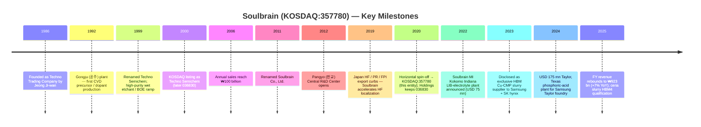

# Soulbrain Co., Ltd. (KOSDAQ:357780) — Company Research

*As of: 2026-05-26*
*Coverage: initiation*
*Listing: KOSDAQ (Korea), ticker `357780`*
*Primary filings: DART (전자공시시스템) 사업보고서 / 반기보고서 / 분기보고서*

---

## Table of Contents
1. Company Overview
2. Company History
3. Management Team
4. Products & Services
5. Customers & Go-to-Market
6. Industry Overview
7. Competitive Landscape
8. Market Opportunity (TAM)
9. Risk Assessment

---

## 1. Company Overview

Soulbrain Co., Ltd. (솔브레인, KOSDAQ:357780) is South Korea's most diversified merchant supplier of wet-chemistry consumables for semiconductor manufacturing — etchants, CMP slurries, CVD/ALD precursors, photoresist auxiliaries, high-purity inorganic acids, and lithium-ion battery electrolytes. The company is the spun-off operating entity of the legacy Soulbrain group: in August 2020 the parent (KOSDAQ:036830, now Soulbrain Holdings) executed a horizontal split (분할) that placed the IT-materials manufacturing business into a new listed vehicle — the entity covered here — while Holdings retained the thin-film-coating, electronic components, and investment subsidiaries ([Solactive spin-off note, 2020-08-06](https://www.solactive.com/spin-off-soulbrain-holdings-co-ltd-6th-august-2020/)). The spin-off was designed to give chemical-materials investors a cleaner, less encumbered exposure to the Samsung Electronics / SK hynix memory cycle.

The business is overwhelmingly tied to two anchor customers — **Samsung Electronics** (memory and foundry) and **SK hynix** (memory) — to which Soulbrain ships every category in its portfolio across the entire wafer-fab consumable stack ([Businesskorea, 2023-10-30 — Domestic Production of HBM Materials](https://www.businesskorea.co.kr/news/articleView.html?idxno=203197)). The company also serves LG Display and Samsung Display in flat-panel functional chemicals, and Samsung SDI / SK On / LG Energy Solution in lithium-ion battery electrolytes through its US affiliate Soulbrain MI. Geographically, Korea is the dominant production base (Gongju 공주, Paju 파주, Pyeongtaek 평택, Sejong 세종, Yongin 용인, Seongnam 성남 corporate campus), with overseas footprints in **Wuxi (China)**, **Fremont (California)**, **Kokomo (Indiana)**, and a newly announced **Taylor (Texas)** site to follow Samsung's US foundry build-out ([Evertiq, 2024-07-30](https://evertiq.com/news/56124), [Greater Kokomo, 2022](https://greaterkokomo.com/soulbrain-mi-investing-in-kokomo-creating-75-jobs/)).

On a scale basis Soulbrain is a mid-cap industrial: FY2024 consolidated revenue was **₩863.4 billion** (≈ USD 630 mn at ₩1,370/USD), operating profit **₩167.9 billion**, and operating margin **19.4%** — the latter recovering from a NAND-driven 2023 trough (₩844.0 bn revenue, 15.8% OPM) and well above the 10–12% cycle-average for Korean specialty chemicals ([Stockanalysis revenue page](https://stockanalysis.com/quote/kosdaq/357780/revenue/), [Economy6 broker summary, 2025-12](https://www.economy6.com/2025/12/soulbrain-stock.html)). FY2025 revenue grew ~7% YoY to **₩923.4 billion** as semiconductor materials recovered alongside the AI-driven HBM ramp, with Q4 alone running ₩244 billion (+12.7% YoY) ([Stockanalysis revenue page](https://stockanalysis.com/quote/kosdaq/357780/revenue/)). Headcount as of the latest disclosure is ~1,233 employees ([Stockanalysis company profile](https://stockanalysis.com/quote/kosdaq/357780/company/)).

Revenue is concentrated in semiconductor materials — etchants (HF, BOE, phosphoric, sulfuric, nitric mixtures), CMP slurry (silica + ceria), CVD/ALD precursors (TEOS, TEB, TEPO, TMOP, POCI₃, TiCl₄, HfO₂/ZrO₂ precursors), strippers, and developers — which together account for roughly **75–76% of consolidated sales** in 2024 per Korean sell-side compilations, with display functional chemicals ~9–11% and secondary-battery materials (LIB electrolytes, lead tabs) ~13–16% ([Economy6 broker summary, 2025-12](https://www.economy6.com/2025/12/soulbrain-stock.html)). *Analyst view:* the semiconductor share will likely creep higher (toward 80%+) by FY2027 as the US Taylor phosphoric-acid plant ramps and HBM4-driven ceria-slurry orders accelerate, while display will keep grinding lower as Korean OLED capacity matures and Chinese panel makers source local chemicals.

The capital-structure profile is conservative for a Korean materials name: virtually no net debt at year-end 2024, ROE ~14%, and a modest dividend payout (annual dividend ~₩2,000–2,300/share, payout ratio 10–15% — light, leaving room for capex on US and Korean facility expansion) ([Economy6 broker summary, 2025-12](https://www.economy6.com/2025/12/soulbrain-stock.html)). The company has historically funded capacity additions from operating cash flow, supplemented by ₩100–200 bn corporate bonds in heavy capex years; the Taylor TX project's phase-1 USD 175 mn (USD 575 mn including phase 2) commitment is likely to be the first multi-year leverage cycle since spin-off.

**Valuation snapshot (2026-05-24 close):**
- Share price: **₩452,000** (+5.2% on the day) ([Stockanalysis, KOSDAQ:357780](https://stockanalysis.com/quote/kosdaq/357780/))
- Market cap: **₩3.33 trillion** (≈ USD 2.4 bn at ₩1,370/USD) ([Stockanalysis market-cap page](https://stockanalysis.com/quote/kosdaq/357780/market-cap/))
- Shares outstanding: 7.74 million
- **TTM P/E: 41.8×**, **Forward P/E: 18.9×** ([Stockanalysis, KOSDAQ:357780](https://stockanalysis.com/quote/kosdaq/357780/))
- TTM P/S: ~3.7× (implied from ₩3.33 tn ÷ ₩923 bn) — consistent with [Stockopedia P/S page](https://www.stockopedia.com/share-prices/soulbrain-co-KOSDAQ:357780/)
- 52-week range: ₩155,000 – ₩530,000 (i.e. the stock has nearly tripled off the 2025 low on the AI-memory ramp)
- Dividend yield: 0.55%

The TTM P/E of 41.8× is **stretched** vs. its own 3-year median (~22×) and vs. Korean specialty-chemical peers (DongJin Semichem [005290 KS] trades ~12× TTM, Soulbrain Holdings parent ~7× TTM as a multi-business holdco; even the more semis-pure Hansol Chemical [014680 KS] trades ~13×). *Analyst view:* the premium is paid for the three-way confluence of **(a)** HBM material spec-in (Soulbrain is the only Korean-domestic supplier of HBM copper-removal CMP slurry to both Samsung and SK hynix, and one of the lead candidates for HBM4 / HBM4E ceria slurry), **(b)** the Samsung Taylor and TSMC Arizona localization tailwind, and **(c)** earnings recovery from a 2023 NAND trough — the forward P/E of 18.9× shows the sell-side already assumes EPS roughly doubles into FY2027 ([Stockanalysis, KOSDAQ:357780](https://stockanalysis.com/quote/kosdaq/357780/), [Trendforce, 2025-12-30 — Samsung 2026 HBM capacity surge](https://www.trendforce.com/news/2025/12/30/news-samsung-reportedly-plans-50-hbm-capacity-surge-in-2026-spotlight-on-hbm4/)). The risk: if HBM4 spec-in goes to Fujimi / Versum / Anji rather than Soulbrain, or if Samsung HBM gross margin disappoints, multiple compression to high-20s × is plausible.

*Source: [Stockanalysis revenue history](https://stockanalysis.com/quote/kosdaq/357780/revenue/); operating-margin overlay built from [Economy6 broker summary, 2025-12](https://www.economy6.com/2025/12/soulbrain-stock.html) for FY2024 (19.4% OPM) and the [Samsung-pop research, 2025-02-10](https://samsungpop.com/common.do?cmd=down&contentType=application%2Fpdf&fileName=2010%2F2025021007420216K_02_02.pdf&inlineYn=Y&saveKey=research.pdf) for FY2023 reconciliation. Note: the FY2021 / FY2022 figures pre-date the 2020 spin-off becoming reflected in a clean full-year comparable; FY2022 was the cycle peak (~₩1.09 trillion).*

## 2. Company History

Soulbrain's roots predate the current listed entity by nearly four decades. The original company was founded in **May 1986** as **Techno Trading Company** by Jeong Ji-wan (정지완) in Seoul, initially a small trading firm distributing Japanese specialty chemicals to Korea's nascent semiconductor industry ([Soulbrain "History" page](https://www.soulbrain.co.kr/en/m14.php)). It was incorporated as Techno Trade Co., Ltd. in February 1989, and in 1991 affiliated with **Yamanake Hutech** of Japan to license CVD precursor and dopant chemistry — establishing the Gongju (공주) production plant in 1992 to begin domestic manufacture rather than pure trading ([Soulbrain "History" page](https://www.soulbrain.co.kr/en/m14.php)). The corporate R&D center was established in 1994; in 1999 the company renamed to **Techno Semichem Co., Ltd.** and listed on KOSDAQ in 2000, achieving ₩100 billion in annual sales by 2006 and renaming once more to **Soulbrain Co., Ltd.** in 2011 ([Soulbrain "History" page](https://www.soulbrain.co.kr/en/m14.php)).

The first transformational pivot came during **2000–2010**, when the legacy CVD / dopant business diversified into wet etchants and BOE (buffered oxide etch) — Korea's only commercial-scale BOE producer at the time — and into LCD functional chemicals (cell scribing, color filter etchants). Soulbrain became a primary supplier to Samsung Electronics' Hwaseong / Pyeongtaek fabs and to LG Display's then-rising flat-panel business, riding the secular shift in CRT-to-LCD displays. Multiple manufacturing facilities for CMP slurry and secondary-battery electrolytes came online in the second half of the decade; the company entered the lithium-ion battery electrolyte market in the late 2000s, supplying Samsung SDI, LG Chem (now LG Energy Solution), and SK Innovation (now SK On) ([Soulbrain "History" page](https://www.soulbrain.co.kr/en/m14.php)).

The second pivot was the **2019 Japan-Korea trade dispute**. On 1 July 2019, Japan placed three semiconductor-critical inputs — **hydrogen fluoride (HF)**, **photoresists**, and **fluorinated polyimide** — on its "individual export license" list for shipments to Korea, threatening Samsung and SK hynix's HF supply (Japan then accounted for ~44% of Korea's HF imports and Stella Chemifa / Morita / Showa Denko dominated the high-purity 12-nines BOE / etch-grade supply) ([Al Jazeera, 2019-08-30](https://www.aljazeera.com/economy/2019/8/30/japans-curbs-on-hi-tech-exports-to-south-korea-could-backfire), [NBR, "Bolstering and Securing Semiconductor Supply Chains"](https://nbr.org/publication/bolstering-and-securing-semiconductor-supply-chains/)). Soulbrain accelerated a pre-existing high-purity HF localization roadmap — sourcing fluorspar and AHF from China rather than Japan, building 12-nines purification capacity at its Gongju and Sejong sites, and entering Samsung / SK hynix's incoming inspection within three months ([Businesskorea, 2020-04 — Korean company mass-producing high-purity HF](https://www.businesskorea.co.kr/news/articleView.html?idxno=39795)). By 2023 Korea's imports of HF from Japan had collapsed **~88% in value** versus the pre-dispute 2018 baseline — Soulbrain and SK Materials (SK siltron's chemicals arm) split the displaced share ([THE ELEC, 2023](https://www.thelec.net/news/articleView.html?idxno=4432)). This episode established Soulbrain as the strategic "national champion" of Korean semiconductor wet chemicals and earned founder Jeong Ji-wan the Presidential Award at the 2020 Korea Technology Awards ([Soulbrain "History" page](https://www.soulbrain.co.kr/en/m14.php)).

The third pivot was the **2020 horizontal spin-off**. On 6 August 2020, Soulbrain Holdings (the legacy KOSDAQ:036830 listed parent) executed a 분할상장 (split-listing), placing the IT-materials manufacturing business — etchants, CMP slurry, CVD precursors, display chemicals, battery electrolytes — into the newly listed Soulbrain Co., Ltd. (357780), while the parent retained thin-film coating equipment (사출 / 코팅 장비), MC Solution (electronic components), and the family's investment vehicle ([Solactive spin-off note, 2020-08-06](https://www.solactive.com/spin-off-soulbrain-holdings-co-ltd-6th-august-2020/)). The Jeong family retained majority control of both vehicles through Soulbrain Holdings; the spin-off let the operating chemicals business be valued on its semis-materials multiples rather than the legacy conglomerate discount.

*Source: [Soulbrain "History" page](https://www.soulbrain.co.kr/en/m14.php); [Businesskorea, 2023-10-30](https://www.businesskorea.co.kr/news/articleView.html?idxno=203197); [Evertiq, 2024-07-30](https://evertiq.com/news/56124); [Greater Kokomo, 2022](https://greaterkokomo.com/soulbrain-mi-investing-in-kokomo-creating-75-jobs/); [Solactive, 2020-08-06](https://www.solactive.com/spin-off-soulbrain-holdings-co-ltd-6th-august-2020/).*

The post-spin-off years brought aggressive **overseas footprint expansion** in two waves. First, the EV-battery wave: Soulbrain MI (the US affiliate) announced in December 2022 a USD 75 mn / 30,000 sq-ft electrolyte plant in Kokomo, Indiana, to supply the Stellantis-Samsung SDI EV battery joint venture next door, with hiring beginning early 2024 ([Greater Kokomo, 2022](https://greaterkokomo.com/soulbrain-mi-investing-in-kokomo-creating-75-jobs/), [Area Development, 2022-12-15](https://www.areadevelopment.com/newsitems/12-15-2022/soulbrain-mi-kokomo-indiana.shtml)). Second, the semiconductor-localization wave: on 30 July 2024 Soulbrain announced a **USD 175 mn phase-1 plant in Taylor, Texas** (with up to **USD 400 mn phase-2 / USD 575 mn total** by 2033), producing electronic-grade phosphoric acid — the workhorse SiN-strip / Poly-Si etch chemistry — to support Samsung's USD 17–44 bn Taylor foundry build-out ([Evertiq, 2024-07-30](https://evertiq.com/news/56124), [Hoodline, 2024-07](https://hoodline.com/2024/07/south-korean-company-soulbrain-to-launch-175m-plant-in-taylor-bolstering-local-tech-industry-and-job-market/)). The China Wuxi (无锡) site, originally opened in the 2010s to serve SK hynix Wuxi and Samsung Xi'an, continues to supply SK hynix's expanding Wuxi DRAM line — though SK hynix's Wuxi capex was paused in 2024 then resumed in 2026 amid the AI memory shortage ([SCMP, 2026-03](https://www.scmp.com/tech/tech-trends/article/3348159/south-korean-chip-giants-step-china-investments-combat-global-ai-memory-shortage)).

The **2023 HBM disclosure** is arguably the single most consequential post-spin-off event. In late October 2023, Businesskorea reported — and Soulbrain confirmed — that the company is the **exclusive supplier of CMP slurry for the copper-removal step in HBM TSV (through-silicon via) processing** to both Samsung Electronics and SK hynix, displacing the prior duopoly of Cabot Microelectronics (now Entegris) and Hitachi Chemical (now Resonac) ([Businesskorea, 2023-10-30](https://www.businesskorea.co.kr/news/articleView.html?idxno=203197)). Two years later that exclusivity has been partially diluted — Fujimi reportedly retook part of the Korean Cu-CMP volume in mid-2024 and Dongjin Semichem broke into SK hynix's HBM CMP supply in 2025 — but Soulbrain remains a Tier-1 incumbent and the de facto Korean-domestic option for HBM4 qualification ([Fujifilm Electronic Materials lead, 2024-09](https://www.webnewswire.com/2024/09/03/fujifilm-electronic-material-takes-lead-in-cmp-slurry-market-for-hbm-says-the-information-network/), [THE ELEC, 2024](https://www.thelec.net/news/articleView.html?idxno=4751)).

