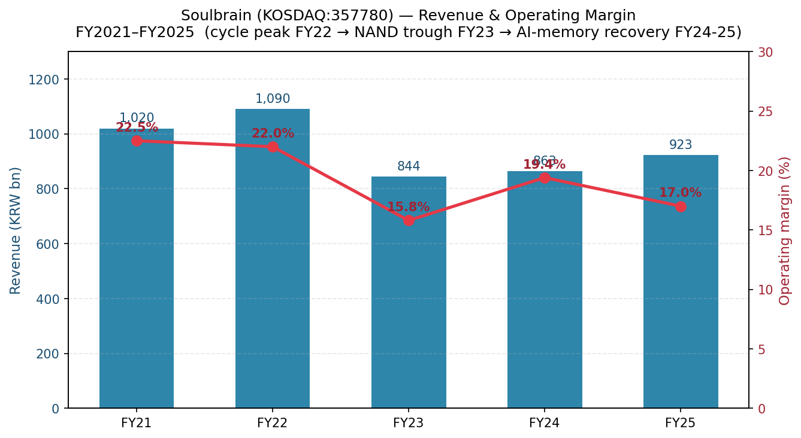
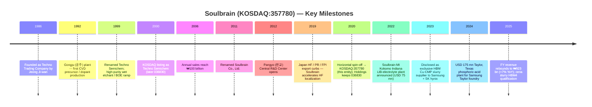
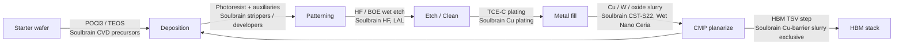
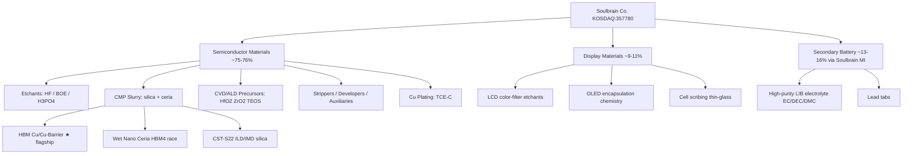
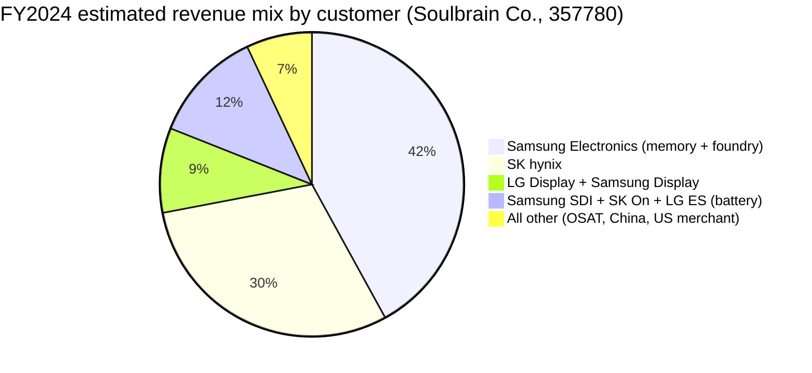

# Soulbrain Co., Ltd. (KOSDAQ:357780) — Company Research

*As of: 2026-05-26*
*Coverage: initiation*
*Listing: KOSDAQ (Korea), ticker `357780`*
*Primary filings: DART (전자공시시스템) 사업보고서 / 반기보고서 / 분기보고서*

---

## Table of Contents
1. Company Overview
2. Company History
3. Management Team
4. Products & Services
5. Customers & Go-to-Market
6. Industry Overview
7. Competitive Landscape
8. Market Opportunity (TAM)
9. Risk Assessment

---

## 1. Company Overview

Soulbrain Co., Ltd. (솔브레인, KOSDAQ:357780) is South Korea's most diversified merchant supplier of wet-chemistry consumables for semiconductor manufacturing — etchants, CMP slurries, CVD/ALD precursors, photoresist auxiliaries, high-purity inorganic acids, and lithium-ion battery electrolytes. The company is the spun-off operating entity of the legacy Soulbrain group: in August 2020 the parent (KOSDAQ:036830, now Soulbrain Holdings) executed a horizontal split (분할) that placed the IT-materials manufacturing business into a new listed vehicle — the entity covered here — while Holdings retained the thin-film-coating, electronic components, and investment subsidiaries ([Solactive spin-off note, 2020-08-06](https://www.solactive.com/spin-off-soulbrain-holdings-co-ltd-6th-august-2020/)). The spin-off was designed to give chemical-materials investors a cleaner, less encumbered exposure to the Samsung Electronics / SK hynix memory cycle.

The business is overwhelmingly tied to two anchor customers — **Samsung Electronics** (memory and foundry) and **SK hynix** (memory) — to which Soulbrain ships every category in its portfolio across the entire wafer-fab consumable stack ([Businesskorea, 2023-10-30 — Domestic Production of HBM Materials](https://www.businesskorea.co.kr/news/articleView.html?idxno=203197)). The company also serves LG Display and Samsung Display in flat-panel functional chemicals, and Samsung SDI / SK On / LG Energy Solution in lithium-ion battery electrolytes through its US affiliate Soulbrain MI. Geographically, Korea is the dominant production base (Gongju 공주, Paju 파주, Pyeongtaek 평택, Sejong 세종, Yongin 용인, Seongnam 성남 corporate campus), with overseas footprints in **Wuxi (China)**, **Fremont (California)**, **Kokomo (Indiana)**, and a newly announced **Taylor (Texas)** site to follow Samsung's US foundry build-out ([Evertiq, 2024-07-30](https://evertiq.com/news/56124), [Greater Kokomo, 2022](https://greaterkokomo.com/soulbrain-mi-investing-in-kokomo-creating-75-jobs/)).

On a scale basis Soulbrain is a mid-cap industrial: FY2024 consolidated revenue was **₩863.4 billion** (≈ USD 630 mn at ₩1,370/USD), operating profit **₩167.9 billion**, and operating margin **19.4%** — the latter recovering from a NAND-driven 2023 trough (₩844.0 bn revenue, 15.8% OPM) and well above the 10–12% cycle-average for Korean specialty chemicals ([Stockanalysis revenue page](https://stockanalysis.com/quote/kosdaq/357780/revenue/), [Economy6 broker summary, 2025-12](https://www.economy6.com/2025/12/soulbrain-stock.html)). FY2025 revenue grew ~7% YoY to **₩923.4 billion** as semiconductor materials recovered alongside the AI-driven HBM ramp, with Q4 alone running ₩244 billion (+12.7% YoY) ([Stockanalysis revenue page](https://stockanalysis.com/quote/kosdaq/357780/revenue/)). Headcount as of the latest disclosure is ~1,233 employees ([Stockanalysis company profile](https://stockanalysis.com/quote/kosdaq/357780/company/)).

Revenue is concentrated in semiconductor materials — etchants (HF, BOE, phosphoric, sulfuric, nitric mixtures), CMP slurry (silica + ceria), CVD/ALD precursors (TEOS, TEB, TEPO, TMOP, POCI₃, TiCl₄, HfO₂/ZrO₂ precursors), strippers, and developers — which together account for roughly **75–76% of consolidated sales** in 2024 per Korean sell-side compilations, with display functional chemicals ~9–11% and secondary-battery materials (LIB electrolytes, lead tabs) ~13–16% ([Economy6 broker summary, 2025-12](https://www.economy6.com/2025/12/soulbrain-stock.html)). *Analyst view:* the semiconductor share will likely creep higher (toward 80%+) by FY2027 as the US Taylor phosphoric-acid plant ramps and HBM4-driven ceria-slurry orders accelerate, while display will keep grinding lower as Korean OLED capacity matures and Chinese panel makers source local chemicals.

The capital-structure profile is conservative for a Korean materials name: virtually no net debt at year-end 2024, ROE ~14%, and a modest dividend payout (annual dividend ~₩2,000–2,300/share, payout ratio 10–15% — light, leaving room for capex on US and Korean facility expansion) ([Economy6 broker summary, 2025-12](https://www.economy6.com/2025/12/soulbrain-stock.html)). The company has historically funded capacity additions from operating cash flow, supplemented by ₩100–200 bn corporate bonds in heavy capex years; the Taylor TX project's phase-1 USD 175 mn (USD 575 mn including phase 2) commitment is likely to be the first multi-year leverage cycle since spin-off.

**Valuation snapshot (2026-05-24 close):**
- Share price: **₩452,000** (+5.2% on the day) ([Stockanalysis, KOSDAQ:357780](https://stockanalysis.com/quote/kosdaq/357780/))
- Market cap: **₩3.33 trillion** (≈ USD 2.4 bn at ₩1,370/USD) ([Stockanalysis market-cap page](https://stockanalysis.com/quote/kosdaq/357780/market-cap/))
- Shares outstanding: 7.74 million
- **TTM P/E: 41.8×**, **Forward P/E: 18.9×** ([Stockanalysis, KOSDAQ:357780](https://stockanalysis.com/quote/kosdaq/357780/))
- TTM P/S: ~3.7× (implied from ₩3.33 tn ÷ ₩923 bn) — consistent with [Stockopedia P/S page](https://www.stockopedia.com/share-prices/soulbrain-co-KOSDAQ:357780/)
- 52-week range: ₩155,000 – ₩530,000 (i.e. the stock has nearly tripled off the 2025 low on the AI-memory ramp)
- Dividend yield: 0.55%

The TTM P/E of 41.8× is **stretched** vs. its own 3-year median (~22×) and vs. Korean specialty-chemical peers (DongJin Semichem [005290 KS] trades ~12× TTM, Soulbrain Holdings parent ~7× TTM as a multi-business holdco; even the more semis-pure Hansol Chemical [014680 KS] trades ~13×). *Analyst view:* the premium is paid for the three-way confluence of **(a)** HBM material spec-in (Soulbrain is the only Korean-domestic supplier of HBM copper-removal CMP slurry to both Samsung and SK hynix, and one of the lead candidates for HBM4 / HBM4E ceria slurry), **(b)** the Samsung Taylor and TSMC Arizona localization tailwind, and **(c)** earnings recovery from a 2023 NAND trough — the forward P/E of 18.9× shows the sell-side already assumes EPS roughly doubles into FY2027 ([Stockanalysis, KOSDAQ:357780](https://stockanalysis.com/quote/kosdaq/357780/), [Trendforce, 2025-12-30 — Samsung 2026 HBM capacity surge](https://www.trendforce.com/news/2025/12/30/news-samsung-reportedly-plans-50-hbm-capacity-surge-in-2026-spotlight-on-hbm4/)). The risk: if HBM4 spec-in goes to Fujimi / Versum / Anji rather than Soulbrain, or if Samsung HBM gross margin disappoints, multiple compression to high-20s × is plausible.

*Source: [Stockanalysis revenue history](https://stockanalysis.com/quote/kosdaq/357780/revenue/); operating-margin overlay built from [Economy6 broker summary, 2025-12](https://www.economy6.com/2025/12/soulbrain-stock.html) for FY2024 (19.4% OPM) and the [Samsung-pop research, 2025-02-10](https://samsungpop.com/common.do?cmd=down&contentType=application%2Fpdf&fileName=2010%2F2025021007420216K_02_02.pdf&inlineYn=Y&saveKey=research.pdf) for FY2023 reconciliation. Note: the FY2021 / FY2022 figures pre-date the 2020 spin-off becoming reflected in a clean full-year comparable; FY2022 was the cycle peak (~₩1.09 trillion).*

## 2. Company History

Soulbrain's roots predate the current listed entity by nearly four decades. The original company was founded in **May 1986** as **Techno Trading Company** by Jeong Ji-wan (정지완) in Seoul, initially a small trading firm distributing Japanese specialty chemicals to Korea's nascent semiconductor industry ([Soulbrain "History" page](https://www.soulbrain.co.kr/en/m14.php)). It was incorporated as Techno Trade Co., Ltd. in February 1989, and in 1991 affiliated with **Yamanake Hutech** of Japan to license CVD precursor and dopant chemistry — establishing the Gongju (공주) production plant in 1992 to begin domestic manufacture rather than pure trading ([Soulbrain "History" page](https://www.soulbrain.co.kr/en/m14.php)). The corporate R&D center was established in 1994; in 1999 the company renamed to **Techno Semichem Co., Ltd.** and listed on KOSDAQ in 2000, achieving ₩100 billion in annual sales by 2006 and renaming once more to **Soulbrain Co., Ltd.** in 2011 ([Soulbrain "History" page](https://www.soulbrain.co.kr/en/m14.php)).

The first transformational pivot came during **2000–2010**, when the legacy CVD / dopant business diversified into wet etchants and BOE (buffered oxide etch) — Korea's only commercial-scale BOE producer at the time — and into LCD functional chemicals (cell scribing, color filter etchants). Soulbrain became a primary supplier to Samsung Electronics' Hwaseong / Pyeongtaek fabs and to LG Display's then-rising flat-panel business, riding the secular shift in CRT-to-LCD displays. Multiple manufacturing facilities for CMP slurry and secondary-battery electrolytes came online in the second half of the decade; the company entered the lithium-ion battery electrolyte market in the late 2000s, supplying Samsung SDI, LG Chem (now LG Energy Solution), and SK Innovation (now SK On) ([Soulbrain "History" page](https://www.soulbrain.co.kr/en/m14.php)).

The second pivot was the **2019 Japan-Korea trade dispute**. On 1 July 2019, Japan placed three semiconductor-critical inputs — **hydrogen fluoride (HF)**, **photoresists**, and **fluorinated polyimide** — on its "individual export license" list for shipments to Korea, threatening Samsung and SK hynix's HF supply (Japan then accounted for ~44% of Korea's HF imports and Stella Chemifa / Morita / Showa Denko dominated the high-purity 12-nines BOE / etch-grade supply) ([Al Jazeera, 2019-08-30](https://www.aljazeera.com/economy/2019/8/30/japans-curbs-on-hi-tech-exports-to-south-korea-could-backfire), [NBR, "Bolstering and Securing Semiconductor Supply Chains"](https://nbr.org/publication/bolstering-and-securing-semiconductor-supply-chains/)). Soulbrain accelerated a pre-existing high-purity HF localization roadmap — sourcing fluorspar and AHF from China rather than Japan, building 12-nines purification capacity at its Gongju and Sejong sites, and entering Samsung / SK hynix's incoming inspection within three months ([Businesskorea, 2020-04 — Korean company mass-producing high-purity HF](https://www.businesskorea.co.kr/news/articleView.html?idxno=39795)). By 2023 Korea's imports of HF from Japan had collapsed **~88% in value** versus the pre-dispute 2018 baseline — Soulbrain and SK Materials (SK siltron's chemicals arm) split the displaced share ([THE ELEC, 2023](https://www.thelec.net/news/articleView.html?idxno=4432)). This episode established Soulbrain as the strategic "national champion" of Korean semiconductor wet chemicals and earned founder Jeong Ji-wan the Presidential Award at the 2020 Korea Technology Awards ([Soulbrain "History" page](https://www.soulbrain.co.kr/en/m14.php)).

The third pivot was the **2020 horizontal spin-off**. On 6 August 2020, Soulbrain Holdings (the legacy KOSDAQ:036830 listed parent) executed a 분할상장 (split-listing), placing the IT-materials manufacturing business — etchants, CMP slurry, CVD precursors, display chemicals, battery electrolytes — into the newly listed Soulbrain Co., Ltd. (357780), while the parent retained thin-film coating equipment (사출 / 코팅 장비), MC Solution (electronic components), and the family's investment vehicle ([Solactive spin-off note, 2020-08-06](https://www.solactive.com/spin-off-soulbrain-holdings-co-ltd-6th-august-2020/)). The Jeong family retained majority control of both vehicles through Soulbrain Holdings; the spin-off let the operating chemicals business be valued on its semis-materials multiples rather than the legacy conglomerate discount.

*Source: [Soulbrain "History" page](https://www.soulbrain.co.kr/en/m14.php); [Businesskorea, 2023-10-30](https://www.businesskorea.co.kr/news/articleView.html?idxno=203197); [Evertiq, 2024-07-30](https://evertiq.com/news/56124); [Greater Kokomo, 2022](https://greaterkokomo.com/soulbrain-mi-investing-in-kokomo-creating-75-jobs/); [Solactive, 2020-08-06](https://www.solactive.com/spin-off-soulbrain-holdings-co-ltd-6th-august-2020/).*

The post-spin-off years brought aggressive **overseas footprint expansion** in two waves. First, the EV-battery wave: Soulbrain MI (the US affiliate) announced in December 2022 a USD 75 mn / 30,000 sq-ft electrolyte plant in Kokomo, Indiana, to supply the Stellantis-Samsung SDI EV battery joint venture next door, with hiring beginning early 2024 ([Greater Kokomo, 2022](https://greaterkokomo.com/soulbrain-mi-investing-in-kokomo-creating-75-jobs/), [Area Development, 2022-12-15](https://www.areadevelopment.com/newsitems/12-15-2022/soulbrain-mi-kokomo-indiana.shtml)). Second, the semiconductor-localization wave: on 30 July 2024 Soulbrain announced a **USD 175 mn phase-1 plant in Taylor, Texas** (with up to **USD 400 mn phase-2 / USD 575 mn total** by 2033), producing electronic-grade phosphoric acid — the workhorse SiN-strip / Poly-Si etch chemistry — to support Samsung's USD 17–44 bn Taylor foundry build-out ([Evertiq, 2024-07-30](https://evertiq.com/news/56124), [Hoodline, 2024-07](https://hoodline.com/2024/07/south-korean-company-soulbrain-to-launch-175m-plant-in-taylor-bolstering-local-tech-industry-and-job-market/)). The China Wuxi (无锡) site, originally opened in the 2010s to serve SK hynix Wuxi and Samsung Xi'an, continues to supply SK hynix's expanding Wuxi DRAM line — though SK hynix's Wuxi capex was paused in 2024 then resumed in 2026 amid the AI memory shortage ([SCMP, 2026-03](https://www.scmp.com/tech/tech-trends/article/3348159/south-korean-chip-giants-step-china-investments-combat-global-ai-memory-shortage)).

The **2023 HBM disclosure** is arguably the single most consequential post-spin-off event. In late October 2023, Businesskorea reported — and Soulbrain confirmed — that the company is the **exclusive supplier of CMP slurry for the copper-removal step in HBM TSV (through-silicon via) processing** to both Samsung Electronics and SK hynix, displacing the prior duopoly of Cabot Microelectronics (now Entegris) and Hitachi Chemical (now Resonac) ([Businesskorea, 2023-10-30](https://www.businesskorea.co.kr/news/articleView.html?idxno=203197)). Two years later that exclusivity has been partially diluted — Fujimi reportedly retook part of the Korean Cu-CMP volume in mid-2024 and Dongjin Semichem broke into SK hynix's HBM CMP supply in 2025 — but Soulbrain remains a Tier-1 incumbent and the de facto Korean-domestic option for HBM4 qualification ([Fujifilm Electronic Materials lead, 2024-09](https://www.webnewswire.com/2024/09/03/fujifilm-electronic-material-takes-lead-in-cmp-slurry-market-for-hbm-says-the-information-network/), [THE ELEC, 2024](https://www.thelec.net/news/articleView.html?idxno=4751)).

The most recent corporate governance milestone is the **March 2025 CEO transition**: longtime CEO Roh Hwan-chul (노환철), a former Samsung SDI executive who had run the company since the spin-off, stepped down and was replaced by **Park Young-soo (박영수)**, formerly the company's Vice President of Technology, who had been the public face of Soulbrain's 2019 HF localization push and the company's principal liaison to Samsung Electronics' incoming-quality team ([Edaily, 2025-03-25](https://www.edaily.co.kr/News/Read?newsId=03834326642106928&mediaCodeNo=257), [KRX disclosure 20250325000760](https://kind.krx.co.kr/common/disclsviewer.do?method=search&acptno=20250325000760)). The transition was framed as a generational handover from a sales / general-management leader (Roh) to an R&D / technology leader (Park) to navigate the HBM4 / GAA spec-in cycle.

## 3. Management Team

**Park Young-soo (박영수) — President & CEO, Soulbrain Co., Ltd. (357780), since March 2025**

Park Young-soo was appointed CEO of Soulbrain Co. on 25 March 2025, succeeding the spin-off-era CEO Roh Hwan-chul (노환철), who had held the post since the August 2020 split-listing ([Edaily, 2025-03-25](https://www.edaily.co.kr/News/Read?newsId=03834326642106928&mediaCodeNo=257), [Nate news, 2025-03-25](https://news.nate.com/view/20250325n27329)). Park's promotion to the top job followed a long tenure inside the Soulbrain group, most recently as **Vice President of Technology** — the role in which he served as Soulbrain's public spokesperson during the 2019 Japan-Korea HF crisis, articulating the company's high-purity HF localization roadmap and acting as the principal technical interface with Samsung Electronics' incoming-quality team and SK hynix's supplier-development organization. (His "VP of Technology" attribution at the Taylor, Texas plant announcement on 30 July 2024 — *"We are excited to expand our business in Taylor. The City and EDC have been great partners…"* — confirms he was already running the US expansion track before being elevated ([Evertiq, 2024-07-30](https://evertiq.com/news/56124)).)

Park's background sits squarely in chemistry and process engineering rather than finance or sales — a deliberate signal from the board. The strategic context for his appointment: between FY2025 and FY2028, Soulbrain has to (a) simultaneously qualify for HBM4 / HBM4E ceria-slurry sockets at both Samsung and SK hynix, (b) execute the USD 175–575 mn Taylor TX phosphoric-acid build, (c) integrate the Soulbrain MI Kokomo LIB electrolyte ramp for Stellantis–Samsung SDI, and (d) defend Korean HF market share against Dongjin Semichem and Foosung intrusion. The Roh-to-Park handover deliberately moves a senior technologist into the CEO seat for an R&D-intensive expansion cycle, consistent with how Samsung and SK hynix have begun rotating their own material-house leadership toward engineering (vs. sales) backgrounds. Park's ownership stake is reported as nominal (<1% — the founding Jeong family controls 51%+ via Soulbrain Holdings through 036830) and his compensation is the standard Korean executive package of base + performance bonus + restricted-stock grants.

**Jeong Ji-wan (정지완) — Founder & Honorary Chairman, Soulbrain Holdings (036830); de facto controlling shareholder of Soulbrain Co. (357780)**

While not the CEO of the listed 357780 entity, **founder Jeong Ji-wan controls Soulbrain Co. through his majority position in Soulbrain Holdings** — the legacy KOSDAQ:036830 parent that owns >50% of 357780 — and remains the strategic decision-maker on capex, M&A, and family-succession planning ([Businesspost — Who Is? Jeong Ji-wan](https://m.businesspost.co.kr/BP?command=mobile_view&num=41846)). Born in November 1956 in South Chungcheong Province, Jeong graduated from **Sungkyunkwan University** with a degree in Chemical Engineering in 1982 and spent four years at Sungwon Trading — a small Korean import-export firm — learning the trading business and observing how Japanese chemical houses (Stella Chemifa, Morita, Showa Denko, JSR, Sumitomo) controlled the Korean semiconductor input chain ([Businesspost — Who Is? Jeong Ji-wan](https://m.businesspost.co.kr/BP?command=mobile_view&num=41846)). At age 31 he founded Techno Trading (1986), initially distributing Japanese precursors to Samsung Semiconductor's then-tiny Kiheung memory line.

The strategic decision that defined Jeong's career was the **1991 joint-venture pivot from trading to manufacturing**: an alliance with Yamanake Hutech of Japan to license CVD precursor and dopant chemistry, followed by the construction of the Gongju plant in 1992 — Korea's first commercial-scale CVD precursor production. From that base he built the etchant and BOE businesses in the 1990s, layered CMP slurry and LIB electrolytes in the 2000s, and was rewarded with the EY Korea Entrepreneur of the Year (chemical sector, 2013) and the Presidential Award at the 2020 Korea Technology Awards for the HF localization breakthrough ([Businesspost — Who Is? Jeong Ji-wan](https://m.businesspost.co.kr/BP?command=mobile_view&num=41846), [Soulbrain "History" page](https://www.soulbrain.co.kr/en/m14.php)). Jeong also served as the 8th Chairman of the **KOSDAQ Association** from February 2013 to February 2015, signalling his stature within the Korean mid-cap ecosystem ([Businesspost — Who Is? Jeong Ji-wan](https://m.businesspost.co.kr/BP?command=mobile_view&num=41846)).

On succession, Jeong has two children — son **Jeong Seok-ho (정석호)** and daughter **Jeong Mun-joo (정문주)** — but the family succession process has been complicated by the death of Jeong Seok-ho (reported in Korean trade press as 솔브레인 오너 2세 사망) in the early 2020s, leaving Jeong Mun-joo and the next generation as the likely long-term inheritors of the Holdings stake ([THE ELEC — "Soulbrain owner 2nd-generation succession"](https://www.thelec.kr/news/articleView.html?idxno=6616)). Jeong's grandchildren already appear on Korea's "youngest large shareholder" lists with billions of won in Soulbrain group equity ([The Asia Business Daily, 2024-09-17](https://www.asiae.co.kr/en/article/2024091711322781831)). For operating control, the family has staffed the listed 357780 with non-family professional CEOs — first Kang Byeong-chang at spin-off, then Roh Hwan-chul (a Samsung SDI veteran) from 2021 to 2025, and now Park Young-soo — a pattern consistent with the Korean chaebol playbook of family-as-owner / professional-as-operator ([thebell.co.kr — Soulbrain CEO analysis, 2021-03-29](https://m.thebell.co.kr/m/newsview.asp?svccode=00&newskey=202103292236163680106472)). Jeong Ji-wan's personal stake in Soulbrain Holdings (036830) — last disclosed at ~31% in Q3 2016 and likely modestly higher today after buybacks — translates through Holdings' ownership of 357780 into majority economic control of the operating chemicals business ([Businesspost — Who Is? Jeong Ji-wan](https://m.businesspost.co.kr/BP?command=mobile_view&num=41846)).

## 4. Products & Services

### 4.1 Product matrix — anchored to the Soulbrain Semiconductor Materials portfolio

Soulbrain Co. organizes its semiconductor portfolio along the canonical wafer-fab consumable stack — **deposition precursors → patterning auxiliaries → etch → clean → CMP → plating** — with display functional chemicals and battery electrolytes as separately reported segments. The most authoritative public product matrix is published on the company's English semiconductor-materials page ([Soulbrain Semiconductor Materials portfolio](https://www.soulbrain.co.kr/en/m21.php)) and is reproduced as a markdown table below; the full version with grade designations sits inside the Korean 사업보고서 product-by-segment matrix on DART ([DART search portal](https://dart.fss.or.kr/dsab007/main.do?textCrpNm=%EC%86%94%EB%B8%8C%EB%A0%88%EC%9D%B8)).

| Process step | Product family | Soulbrain product names / grades | Customer use |
|---|---|---|---|
| **CVD / ALD deposition** | Precursors | TEOS, TEB, TEPO, TMOP, POCl₃, TiCl₄, **HfO₂ / ZrO₂ precursors** | High-k gate stack, SiO₂ / SiON film deposition for logic and memory |
| **Etch & clean** | Wet etchants | **HSN / H₃PO₄ poly etchant**, Poly/PAN etchant, S-2, HNPA-1317, FMA-2P, HCl | SiN strip, poly-Si etch, metal etch, post-CMP residue clean |
| **Etch & clean** | Strippers | JQS-8920, TSO-500H, TSO-800H | Photoresist strip after pattern transfer |
| **Etch & clean** | HF / BOE | **High-purity hydrofluoric acid (HF)**, Buffered Oxide Etchant (LAL series) | Native-oxide removal, gate-oxide etch, BEOL dielectric trim |
| **CMP** | Slurry | **High-Planarity Slurry CST-S22 (ILD / IMD)**, STI/SOD slurry (ceria), W slurry (2-step), **Cu / Cu-barrier slurry**, **Wet Nano Ceria** for DRAM / NAND, **TSV-packaging polishing slurry**, nitride / poly-Si slurry | Insulator / metal-line planarization at every interconnect tier; **HBM TSV copper-overburden removal** |
| **Electroplating** | Cu plating | **TCE-C plating agent** + additives | Damascene Cu interconnect, TSV Cu fill |
| **Process gases (via Hubvision affiliate)** | Inorganic acids | High-purity H₂SO₄, HNO₃, **H₃PO₄ (electronic grade)** | SC-1 / SPM cleans, batch acid baths |
| **Display functional chemicals** | LCD / OLED | Color-filter etchants, **cell scribing**, thin-glass processing, encapsulation chemistry | LG Display, Samsung Display panel manufacture |
| **Secondary battery (Soulbrain MI)** | LIB electrolyte | **High-purity electrolyte solvents** (EC, DEC, DMC) + lithium-salt formulations + **lead tabs** | Samsung SDI, SK On (SK Innovation), LG Energy Solution prismatic and pouch cells |

*Source: [Soulbrain "Semiconductor Materials" page](https://www.soulbrain.co.kr/en/m21.php); [Soulbrain "CMP" detail page](https://www.soulbrain.co.kr/en/m33.php); [Greater Kokomo battery electrolyte announcement](https://greaterkokomo.com/soulbrain-mi-investing-in-kokomo-creating-75-jobs/); cross-referenced to [Soulbrain Holdings "Semiconductor Materials" page](https://www.soulbrainholdings.co.kr/en/m21.php) for the legacy product taxonomy.*

### 4.2 Synthesis — how the categories interact in a customer workflow

A modern memory or logic wafer cycles through Soulbrain's product set **dozens of times in a single device cycle**. Take a DRAM cell at SK hynix Icheon as the worked example: a starter wafer is doped with POCl₃ (Soulbrain CVD precursor), then deposited with TEOS-based SiO₂ (Soulbrain precursor) → photoresist coated by JSR / TOK / Dongjin → exposed → developed → **wet-etched** with a Soulbrain HF / BOE solution → photoresist stripped with Soulbrain TSO-800H → **CMP planarized** with Soulbrain CST-S22 (oxide slurry) → cleaned with Soulbrain HNPA-1317 → next layer's TEOS deposition starts. Each interconnect tier repeats the loop; an advanced 1z-nm DRAM has 50+ such layers; a 256-layer 3D NAND has hundreds. For **HBM**, the same wafer additionally goes through TSV Cu fill (Soulbrain TCE-C plating) followed by **bulk-Cu CMP using Soulbrain's Cu-barrier slurry** — the specific socket the company exclusively held at Samsung + SK hynix from 2023, which remains its highest-margin, highest-visibility product line ([Businesskorea, 2023-10-30](https://www.businesskorea.co.kr/news/articleView.html?idxno=203197)). The synthesis insight: Soulbrain's value to its customers comes not from any single product but from **co-developed grade-by-grade qualification** across the entire wet-chemistry stack — and the resulting >70% revenue concentration on Samsung + SK hynix is the natural mathematical outcome.

*The same Soulbrain product crosses the same wafer 10–50× per device — qualification at one grade rarely leaks into competitors. Source: process-flow inference from [Soulbrain "Semiconductor Materials" page](https://www.soulbrain.co.kr/en/m21.php) and [Soulbrain "CMP" detail page](https://www.soulbrain.co.kr/en/m33.php).*

### 4.3 Etchants — HF, BOE, and the Korean fluorine-chain franchise

This is the franchise that put Soulbrain on the geopolitical map in 2019. The product page lists three closely related sub-families:

- **High-purity hydrofluoric acid (HF) / Buffered Oxide Etchant (LAL series)** for native-oxide removal and gate-oxide etch
- **Hot-phosphoric (H₃PO₄ / HSN) poly etchants** for SiN strip and poly-Si removal
- **HCl, HNPA, FMA mixtures** for residue clean and metal-strip

The 2019 episode is worth quoting verbatim from contemporaneous trade-press coverage to ground what actually happened:

> "SoulBrain supplies etching gas (hydrogen fluoride). Samsung Electronics invested in semiconductor material companies such as SoulBrain and pursued joint technology development with them. The hydrogen fluoride being tested by SK Hynix is supplied by SoulBrain, a Korean company that is producing the chemical by importing raw materials from China. SoulBrain was looking to complete construction by end-September and run tests to see if it can mass-produce high-purity hydrogen fluoride." ([Businesskorea, 2019-08 / Korean Companies to Reduce Imports](https://www.businesskorea.co.kr/news/articleView.html?idxno=34523), [Businesskorea, 2020-04 — Korean company mass-producing HPHF](https://www.businesskorea.co.kr/news/articleView.html?idxno=39795))

**中文释义 / Plain-language gloss:** semiconductor wet etching uses two physically distinct chemistries — **hydrofluoric acid (HF, 氟化氢)** to dissolve SiO₂ (silicon dioxide, 二氧化硅) and **hot phosphoric acid (H₃PO₄, 磷酸)** to dissolve SiN (silicon nitride, 氮化硅, used for spacers and hardmasks). For state-of-the-art memory and logic the purity bar is "12 nines" (99.9999999999%) — even sub-ppt metallic contamination causes wafer defects that scrap >USD 10,000 of in-flight value. Japan's Stella Chemifa held a near-monopoly on 12-nines HF until 2019; Soulbrain (along with SK Materials) broke that monopoly in 18 months by combining (a) imported anhydrous HF (AHF, mostly from China's fluorspar belt), (b) Korean purification + ion-exchange technology, and (c) Samsung / SK hynix joint qualification programmes. The 2024 disruption — Iran-Hormuz blockade fears caused a Korean HF price spike ([Tom's Hardware, 2025-06](https://www.tomshardware.com/tech-industry/memory-makers-brace-for-hydrogen-fluoride-pricing-shock-as-hormuz-blockade-impacts-supply-chain-key-etching-and-cleaning-material-faces-sharp-cost-increase-amid-trade-disruption)) — was a reminder that even a "localized" supply chain remains tethered to upstream feedstock (fluorspar, anhydrous HF, sulfur).

*Analyst view:* Soulbrain shares the Korean HF / BOE market with **SK Materials (SK siltron subsidiary)**, **Foosung** (KOSDAQ:093370 — historically the largest Korean HF producer, but more weighted to industrial / refrigerant grades than electronic-grade), and **Dongjin Semichem** (KOSDAQ:005290 — diversified but with growing high-purity HF capability). The defensive moat is qualification depth, not unit cost: a fab cannot risk swapping HF grades without a 6–12-month re-qualification, so each socket is worth far more than its commodity price suggests. The Korean HF / BOE TAM is ~USD 500–800 mn / year by 2025–26 industry estimates; Soulbrain's domestic share is probably 35–45%, with the balance split between SK Materials (~25%), Foosung (~15%), and Japanese / Chinese imports for the long tail.

### 4.4 CMP slurry — the AI-memory growth lever

CMP slurry is the most strategically important product line in the Soulbrain portfolio for the FY26–FY28 thesis. The company's CMP product page lists nine distinct sub-families ([Soulbrain "CMP" detail page](https://www.soulbrain.co.kr/en/m33.php)):

1. **High-Planarity Slurry CST-S22** — ILD (inter-layer dielectric) / IMD (inter-metal dielectric) — *silica abrasive*
2. **STI / SOD slurry** — shallow-trench-isolation oxide, **ceria abrasive** (high SiO₂:SiN selectivity)
3. **Wet Nano Ceria** — DRAM / NAND oxide planarization, advanced-node-grade
4. **W slurry (2-step + buffing)** — tungsten contact / via planarization
5. **Cu Barrier Slurry (alkaline + acidic)** — copper interconnect planarization
6. **Cu CMP slurry** — bulk-copper overburden removal
7. **Polishing slurry for TSV** — through-silicon-via planarization for advanced packaging
8. **Nitride / Poly-Si slurry** — niche but advanced-node-only
9. **Polishing chemicals** for downstream wafer-edge / bevel applications

The **HBM TSV Cu-overburden slurry** is the single most visible product. As reported by Businesskorea in October 2023:

> "Soulbrain exclusively supplies chemical mechanical polishing (CMP) slurry specifically designed for HBM to both Samsung Electronics and SK hynix. The company's specialized product removes excess copper layers created during the Through-Silicon Via (TSV) wiring process, which involves drilling over 1,000 holes in DRAM chips and filling them with copper… Prior to this company's market entry, the copper-flattening slurry sector was dominated by international competitors — U.S.-based Cabot Microelectronics (subsidiary of Entegris) and Japan's Hitachi." ([Businesskorea, 2023-10-30](https://www.businesskorea.co.kr/news/articleView.html?idxno=203197))

**中文释义 / Plain-language gloss:** CMP (**chemical-mechanical planarization, 化学机械抛光**) uses a slurry — a colloidal suspension of nano-abrasive particles (silica for oxide / Cu, ceria for STI) mixed with a chemical oxidizer / pH buffer — to physically + chemically polish wafer surfaces flat to sub-nm topography. The choice of abrasive is dictated by the material being polished: **silica (SiO₂, 二氧化硅 abrasive)** is the workhorse for ILD/IMD and metals; **ceria (CeO₂, 氧化铈 abrasive)** is mandatory for STI because of its uniquely high SiO₂:SiN polishing-rate ratio (~30:1 vs. silica's ~1:1) — silica simply cannot stop on a SiN hardmask the way ceria can. For HBM, after **TSV (through-silicon via, 硅通孔)** drilling and Cu electroplating fill, hundreds of microns of overburden Cu sits on the wafer surface; a specialized Cu slurry must remove it without dishing the wafer or attacking the underlying barrier layer. Soulbrain's HBM Cu slurry is precisely this product, which was historically supplied by Cabot Microelectronics (now Entegris) and Hitachi Chemical (now Resonac) until Soulbrain's 2023 spec-in.

The competitive exclusivity, however, **eroded materially in 2024–25**:

- **Fujimi (TSE:5384)** — Japan's Fujimi Inc. reportedly "took over the lead from Soulbrain in CMP copper slurry sales to Korea's Samsung Electronics and SK hynix" by Sep 2024 ([Fujifilm Electronic Materials lead, 2024-09](https://www.webnewswire.com/2024/09/03/fujifilm-electronic-material-takes-lead-in-cmp-slurry-market-for-hbm-says-the-information-network/)). Note the wire-service headline conflates Fujifilm and Fujimi — the actual lead-taking name is Fujimi.
- **Dongjin Semichem (KOSDAQ:005290)** — broke into SK hynix's HBM CMP slurry supply in 2025, breaking what had been a Soulbrain-only domestic position ([THE ELEC, 2024 — SK hynix diversifies CMP supply](https://www.thelec.net/news/articleView.html?idxno=4751)).

*Analyst view:* Soulbrain's HBM CMP "exclusive" is now a **strong incumbent share** rather than 100% — call it 50–65% of the combined Samsung + SK hynix HBM Cu-slurry buy. The forward question is **HBM4 / HBM4E ceria slurry**: as HBM stacks move to 12-Hi → 16-Hi and the TSV count rises >2,000 per cube, the STI / SOD ceria slurry consumption per wafer scales non-linearly, and Soulbrain's Wet Nano Ceria product is in active qualification at both Samsung Pyeongtaek (P3 / P4) and SK hynix M16. The Korean / Japanese / US / Chinese ceria-slurry race — Soulbrain, KC Tech (TSE Korea), Fujimi, Versum (Merck/MEMC), Entegris, Resonac, Anji Microelectronics (SSE:688019), Dinglong (SZSE:300054), UBmaterials — is shaping up as the most consequential CMP battle of the AI-memory cycle ([Soulbrain "CMP" detail page](https://www.soulbrain.co.kr/en/m33.php), [Yano Research, 2024](https://www.yanoresearch.com/press/press.php/3921)). *China supply-chain risk reminder*: >85% of global cerium-oxide processing sits in China, so any ceria-slurry maker — Korean, Japanese, or US — has the same upstream feedstock vulnerability.

### 4.5 Process chemicals & high-purity inorganic acids — the Taylor TX expansion

Soulbrain produces **electronic-grade phosphoric acid (H₃PO₄)**, sulfuric acid (H₂SO₄), nitric acid (HNO₃), and hydrochloric acid (HCl) at 12-nines purity for SiN strip, batch-acid bath cleans, and SC-1 / SPM cleans. This product family was relatively low-profile until the July 2024 announcement of the **Taylor, Texas plant**:

> "Soulbrain is to invest USD 175 million in a new manufacturing facility in Taylor, Texas, designed to process electronic-grade phosphoric acid for use as an etching agent in semiconductor manufacturing. The 60,000 sq-ft Phase-1 facility is slated to break ground in January 2025 with completion targeted for January 2029; an optional Phase-2 of up to USD 400 mn would extend through 2033… Jon Park, VP Technology, stated: 'We are excited to expand our business in Taylor.'" ([Evertiq, 2024-07-30](https://evertiq.com/news/56124), [Hoodline, 2024-07](https://hoodline.com/2024/07/south-korean-company-soulbrain-to-launch-175m-plant-in-taylor-bolstering-local-tech-industry-and-job-market/))

**中文释义 / Plain-language gloss:** electronic-grade phosphoric acid is the dominant chemistry for **SiN strip (氮化硅去除)** — the step that removes silicon-nitride hardmask after pattern transfer, repeated dozens of times per advanced-node wafer. The chemistry runs at 150–165 °C in deep-tank batch processes and consumes large volumes (5–15 L per wafer per step) — far more weight than HF or BOE — so logistics economics dominate. Shipping bulk acid from Korea to Texas across the Pacific is uneconomic at scale; **the Taylor plant is fundamentally a logistics-and-quality decision tied to Samsung's USD 17–44 bn Taylor foundry build-out**, not a new technology bet. The same logic explains Soulbrain MI's Kokomo Indiana electrolyte plant (next to Stellantis-Samsung SDI's USD 2.5 bn EV battery JV). Korean / Japanese / Chinese material houses are all running the same playbook of "follow the customer's overseas fab" — Hoya for EUV mask blanks (Mie / Tochigi), Resonac for CMP slurry (Taiwan / Singapore), Shin-Etsu for PR (Hsinchu). *Analyst view:* the Taylor build is a low-IRR / high-strategic-value move — phosphoric-acid margins are thin and the asset will probably take 5–7 years to earn its cost of capital — but it locks in Samsung Taylor as a captive customer for the life of the foundry and is the price of being a Tier-1 Samsung supplier in the localization era.

### 4.6 CVD / ALD precursors

The precursor product set (TEOS, TEB, TEPO, TMOP, POCl₃, TiCl₄, **HfO₂ / ZrO₂** precursors) is the original Techno Semichem business dating to the 1990s Yamanake JV. **HfO₂ (hafnium dioxide, 二氧化铪)** and **ZrO₂ (zirconium dioxide, 二氧化锆)** precursors are the high-k dielectric chemistries that replaced SiO₂ as the gate oxide in 45 nm and below logic and DRAM — Soulbrain is one of a small handful of Korean houses qualified at Samsung for these, alongside DNF (KOSDAQ:092070), Hansol Chemical (KOSPI:014680), Mecaro (KOSDAQ:241770), and Soulbrain's own affiliate UP Chemical. *Analyst view:* the precursor business is a steady, mid-margin contributor (HfO₂ / ZrO₂ are high-value but low-volume; TEOS is high-volume but commodity); the GAA / backside-power-delivery transition will increase ALD precursor consumption per wafer 1.5–2× by 2027 (more ALD layers per device), so the segment should grow MSD-HSD without dramatic share shifts. The Korean precursor competition is more domestic-fragmented than CMP slurry — Samsung deliberately runs multi-source for precursor supply security.

### 4.7 Display functional chemicals

The display chemicals segment (color-filter etchants, cell scribing, thin-glass processing, OLED encapsulation chemistry) accounts for roughly 9–11% of revenue and is the lowest-growth part of the portfolio ([Economy6 broker summary, 2025-12](https://www.economy6.com/2025/12/soulbrain-stock.html)). Soulbrain serves both LG Display and Samsung Display, but the underlying TAM is shrinking as (a) Korean LCD capacity migrates to China (BOE, CSOT, HKC), (b) OLED capacity additions are concentrated at LG Display Paju and Samsung Display Asan but slow, and (c) Chinese OLED makers source from local chemical suppliers. *Analyst view:* this is a managed-decline segment — Soulbrain will not exit because the assets are depreciated and the cash margins are positive, but capex allocation is minimal, and the segment will likely shrink to mid-single-digit revenue share by FY2028.

### 4.8 Secondary battery materials — Soulbrain MI's US footprint

The lithium-ion battery (LIB) electrolyte business is concentrated in **Soulbrain MI**, the US affiliate that operates the Soulbrain group's North American battery materials footprint. The Kokomo, Indiana plant — announced December 2022 with a USD 75 mn investment and ~75 jobs — produces **high-purity LIB electrolyte (EC / DEC / DMC solvent blends with lithium-salt and additive formulations)** for the **Stellantis–Samsung SDI joint-venture battery plant** next door, which is itself a USD 2.5 bn / 1,400-worker EV battery facility ([Greater Kokomo, 2022](https://greaterkokomo.com/soulbrain-mi-investing-in-kokomo-creating-75-jobs/), [Indianapolis Business Journal, 2022](https://www.ibj.com/articles/michigan-companys-75m-plant-in-kokomo-will-be-supplier-for-new-ev-battery-plant), [Area Development, 2022-12-15](https://www.areadevelopment.com/newsitems/12-15-2022/soulbrain-mi-kokomo-indiana.shtml)).

**中文释义 / Plain-language gloss:** LIB electrolyte is the liquid ionic-transport medium between cathode (NCM / NCA / LFP) and anode (graphite / silicon) — chemically a solution of LiPF₆ (lithium hexafluorophosphate, 六氟磷酸锂) in cyclic + linear carbonate solvents (EC, DEC, DMC) with a long tail of functional additives (FEC, VC, LiFSI for fast-charge, BBE for high-voltage stability). The electrolyte ASP is ~USD 4–7 / kg and a typical EV battery uses 80–150 kg of electrolyte per pack; cell-makers (Samsung SDI, LG ES, SK On, CATL) source from a tight oligopoly of Asian chemistry houses (**Soulbrain, Enchem, Chunbo, Mitsubishi Chemical, MGL Chemical / 미국**) plus Chinese majors (天赐高新 / Tinci, 新宙邦 / Capchem). The US ramp is dominated by the IRA-driven CAM / cell-build cycle and the requirement that battery-cell content originate from countries with US free-trade agreements; Korea qualifies, and Soulbrain MI is one of a handful of Korean electrolyte houses with US capacity. *Analyst view:* this segment will be slower-growth than semis on a 3-year horizon (EV sales decelerating; Stellantis-Samsung SDI ramp delays through 2024–25) but is strategically valuable for diversifying the 70%+ Samsung+SK hynix concentration in semis.

### 4.9 Flagship products and last-12-month launches

The 1–3 flagship product lines driving the FY25–FY27 thesis are: **(1) HBM Cu / Cu-barrier CMP slurry** (the highest-margin product socket and the principal narrative driver, even with Fujimi / Dongjin sharing); **(2) High-purity HF / BOE** (the steady defensive franchise, Korean strategic-asset-grade); and **(3) ceria-based STI / Wet Nano Ceria slurry for HBM4 / HBM4E qualification** (the next major win the company is competing for). Last-12-month product news has been concentrated in customer-side capacity announcements rather than Soulbrain-specific launches — Samsung's plan for **+50% HBM wafer capacity in 2026** ([Trendforce, 2025-12-30](https://www.trendforce.com/news/2025/12/30/news-samsung-reportedly-plans-50-hbm-capacity-surge-in-2026-spotlight-on-hbm4/)), the **HBM4 qualification samples to NVIDIA in 1Q26** ([Trendforce, 2025-12-16](https://www.trendforce.com/news/2025/12/16/news-sk-hynix-samsung-reportedly-deliver-paid-hbm4-samples-to-nvidia-ahead-of-1q26-contract-finalization/)), and SK hynix's announced **world-first HBM4 development completion** ([SK hynix newsroom — HBM4 development complete](https://news.skhynix.com/sk-hynix-completes-worlds-first-hbm4-development-and-readies-mass-production/)) are the macro datapoints that flow through to Soulbrain's order book.

*Source: [Soulbrain "Semiconductor Materials" page](https://www.soulbrain.co.kr/en/m21.php); [Soulbrain Holdings Semi Materials page](https://www.soulbrainholdings.co.kr/en/m21.php); [Greater Kokomo MI announcement, 2022](https://greaterkokomo.com/soulbrain-mi-investing-in-kokomo-creating-75-jobs/). Segment-share percentages: [Economy6, 2025-12](https://www.economy6.com/2025/12/soulbrain-stock.html).*

## 5. Customers & Go-to-Market

### 5.1 Customer profile and concentration

Soulbrain's customer base is — by deliberate design and competitive necessity — **extraordinarily concentrated on Samsung Electronics and SK hynix**. The DART 사업보고서 § "주요매출처" (Major Sales Destinations) typically discloses the top 5 customers' aggregate share without naming individual percentages, but industry consensus and Soulbrain's own commentary place the combined Samsung + SK hynix share at **>70% of consolidated revenue**, with Samsung the larger of the two ([Businesskorea, 2023-10-30](https://www.businesskorea.co.kr/news/articleView.html?idxno=203197), [Korean broker compilation — Economy6, 2025-12](https://www.economy6.com/2025/12/soulbrain-stock.html), [Namu Wiki — Soulbrain](https://namu.wiki/w/%EC%86%94%EB%B8%8C%EB%A0%88%EC%9D%B8)). LG Display + Samsung Display together represent another ~8–10% (the display chemicals segment), and Samsung SDI + SK On + LG Energy Solution add roughly another 10–14% through Soulbrain MI's electrolyte business and the parent's lead-tabs supply. The long tail of OSAT, Chinese foundry (SMIC), and overseas memory customers makes up the residual sub-10% ([Economy6, 2025-12](https://www.economy6.com/2025/12/soulbrain-stock.html)).

The concentration is therefore structurally **above the project's "high-severity" customer-concentration threshold** (top-1 > 30%, top-5 > 50%) — and we flag this in Section 9 as a top-tier risk. *Analyst view:* the qualifier is that Samsung and SK hynix together are essentially the entire Korean DRAM / HBM / NAND industry; a Korean specialty-chemicals merchant cannot avoid this exposure short of becoming a Chinese / Taiwanese / US-merchant supplier, which Soulbrain is gradually doing via Taylor TX (TSMC AZ + Samsung Taylor) and Wuxi (SK hynix Wuxi). The most credible parallel — Anji Microelectronics' (SSE:688019) >70% concentration on SMIC + YMTC + Hua Hong — shows that material-house concentration on the local champion is the industry's default state, not an idiosyncratic Soulbrain failing.

*Estimates synthesized from [Korean broker compilation — Economy6, 2025-12](https://www.economy6.com/2025/12/soulbrain-stock.html); [Businesskorea, 2023-10-30](https://www.businesskorea.co.kr/news/articleView.html?idxno=203197); industry-standard segment ratios. Soulbrain's DART filings disclose top-5 aggregate share but not customer-by-customer breakdown; the splits above are analyst estimates and would benefit from a Q&A with management.*

### 5.2 Contract structure and switching costs

Soulbrain's customer relationships are built around **long-cycle joint qualification** rather than discrete POs. A new chemistry — a new HF grade, a new CMP slurry formulation, a new Cu-barrier slurry — typically goes through (a) **lab qualification at the customer's R&D fab** (3–6 months), (b) **incoming-quality inspection (IQC) certification** for batch-to-batch consistency (3 months), (c) **pilot-line co-development** on a real device cycle (6–12 months), and (d) **full-volume qualification on a named device node**. Once qualified, the chemistry is locked in for the life of the node — typically 3–5 years for DRAM, 5–8 years for foundry — because re-qualifying mid-cycle risks killing the device. This creates per-socket switching costs in the tens of millions of dollars and is the moat that explains why HF / CMP / precursor merchant suppliers earn 15–25% operating margins despite the appearance of commoditization. The 2019 HF localization story is the textbook example: even with a national-security mandate from Seoul, it took Samsung and SK hynix 6–18 months to switch HF source from Stella Chemifa (Japan) to Soulbrain + SK Materials.

Pricing is typically **annual contract with quarterly adjustment clauses tied to upstream feedstock**: fluorspar / AHF for HF, cerium-oxide raw + abrasive cost for slurry, lithium-salt for electrolyte. Soulbrain has historically passed through ~70–80% of input-cost moves with a 1–2 quarter lag; in cost-down years (NAND under-utilization 2022–23) margins compress, in tight-supply years (HBM ramp 2024–25) margins expand. The Q3 2025 result — ₩242 bn revenue +10% YoY, ₩39 bn OP (16% margin) — reflects an early-stage recovery rather than the full HBM acceleration, which sell-side expects to land in FY26 (consensus ₩1.1 trillion revenue, ~18% OPM) ([SKS Securities note, 2025-11-04](https://www.sks.co.kr/data1/research/qna_file/20251104100029890_6_ko.pdf), [Samsung Pop research, 2025-02-10](https://samsungpop.com/common.do?cmd=down&contentType=application%2Fpdf&fileName=2010%2F2025021007420216K_02_02.pdf&inlineYn=Y&saveKey=research.pdf)).

### 5.3 Geographic mix and the localization tailwind

By production-base geography Korea is dominant — Gongju, Paju, Pyeongtaek, Sejong, Yongin, and the Seongnam HQ together host the bulk of capacity ([Soulbrain "About Us" page](https://www.soulbrain.co.kr/en/m16.php)). By **customer-fab geography** the picture is more diversified, because Samsung and SK hynix both run major overseas fabs that Soulbrain ships to: Samsung's Austin / Taylor TX (foundry, USD 17–44 bn build) and Xi'an (memory, NAND); SK hynix's Wuxi (DRAM) and Dalian (NAND). The 2024 reactivation of SK hynix Wuxi capex (~₩581 bn invested in 2025, +102% YoY) and Samsung Xi'an investment (₩465 bn, +67% YoY) directly translates into incremental Soulbrain demand at the Wuxi production site ([Seoul Economic Daily / SCMP, 2026-03](https://www.scmp.com/tech/tech-trends/article/3348159/south-korean-chip-giants-step-china-investments-combat-global-ai-memory-shortage)).

The **Taylor TX phosphoric-acid plant** (USD 175 mn phase-1, USD 575 mn potential total) is the most consequential geographic addition. It physically replaces the Pacific shipping leg for Samsung Taylor's wet-chemistry consumption and brings Soulbrain into direct proximity to **TSMC's USD 65 bn Arizona fab** — opening a parallel sales lane to a non-Samsung Tier-1 customer for the first time. *Analyst view:* the Taylor build is also the de-risking move against future Korea-US trade frictions; Korean intermediate-input exports to the US foundry / fab base would face risk under a more aggressive tariff regime, and a local-production presence in Texas neutralizes that exposure.

### 5.4 Go-to-market: direct field engineering + Samsung-style co-development

Soulbrain does not use distributors at the fab interface. Sales is direct, mediated by **field application engineers (FAEs)** embedded in Samsung Hwaseong / Pyeongtaek and SK hynix Icheon / Cheongju who are physically present on customer-site for process-control optimization. The R&D model is **joint-development with the customer**, with formulation IP typically co-owned and the customer's incoming-quality team functionally extending the supplier's QC pipeline. This is the standard Korean / Japanese material-house model — the comparable patterns are JSR / Tokyo Ohka with TSMC photoresist, Shin-Etsu with everyone for silicon wafers, Hoya with Samsung / Intel for EUV mask blanks. The model gives the supplier deep customer intimacy (a moat) at the cost of customer concentration (a risk) — the two are two sides of the same coin.

## 6. Industry Overview

### 6.1 Industry definition and scope

Soulbrain operates in the **semiconductor wet chemistry & specialty materials** sub-industry — a ~USD 80 bn-per-year subset of the broader USD ~700 bn semiconductor value chain ([野村 Greater China Semi 2026-2030 anchor report, 2026-05-21](https://www.cninfo.com.cn/), as summarized in [reports/sector/半导体材料.md](../../sector/半导体材料.md)). Nomura's 2026 anchor analysis breaks the USD 80 bn 2025 semiconductor materials market into IC manufacturing materials (~60%) and packaging materials (~40%); within the manufacturing-materials slice the composition is silicon wafer ~31%, photoresist ~13%, photoresist auxiliary ~7%, specialty gases ~13%, **CMP ~7%**, sputter targets ~3%, with the remainder split across other wet chemistries (HF / BOE / H₃PO₄, precursors, plating). Soulbrain plays in the **HF / BOE / wet-etch chemistry (~6–8% of the manufacturing slice), CMP slurry (~7%), and CVD/ALD precursors (~4–5%)** sub-sectors — together a ~USD 12–14 bn 2025 TAM for the company's primary semiconductor product set ([reports/sector/半导体材料.md](../../sector/半导体材料.md) — synthesis of Nomura Fig 24-30).

By **geographic split** the materials market is anchored in Korea + China + Japan + Taiwan: Taiwan 30% (foundry-driven), China 20%, Korea 18%, Japan 10%, North America 10%, Europe 8% per Nomura's 2024 Fig 29-30 compilation ([reports/sector/半导体材料.md](../../sector/半导体材料.md)). Korea's 18% share — supported by Samsung + SK hynix — is the operative TAM for Soulbrain's domestic franchise; the company's US (Texas, Indiana) and China (Wuxi) expansions are de-facto bets on (a) Samsung's foundry localization in the US and (b) the indispensability of SK hynix's Wuxi operations to the global DRAM cycle.

### 6.2 Growth drivers — HBM, GAA, BPD, advanced packaging

Three secular drivers underpin the FY26–FY30 growth thesis:

1. **HBM ramp.** Samsung is reportedly targeting ~250,000 wafers / month of HBM capacity by year-end 2026 (+50% YoY), with all three majors (Samsung, SK hynix, Micron) beginning HBM4 mass production through 2026 ([Trendforce, 2025-12-30](https://www.trendforce.com/news/2025/12/30/news-samsung-reportedly-plans-50-hbm-capacity-surge-in-2026-spotlight-on-hbm4/), [Trendforce, 2025-12-16](https://www.trendforce.com/news/2025/12/16/news-sk-hynix-samsung-reportedly-deliver-paid-hbm4-samples-to-nvidia-ahead-of-1q26-contract-finalization/)). HBM consumes 2–3× more CMP slurry per wafer than commodity DRAM because of the TSV Cu fill and overburden-removal step; the HBM4 → HBM4E generational transition expands TSV counts and 12-Hi → 16-Hi stack counts, further multiplying slurry intensity.
2. **GAA / advanced-logic transition.** Samsung's 2nm GAA (gate-all-around) ramp and TSMC's N2 GAA program both shift the dielectric stack toward ALD-deposited high-k materials (HfO₂ / ZrO₂ / La-based) and require additional CMP steps per metal tier — Nomura estimates that A16 (Apple silicon) + BPD adds 20–30% more CMP steps per wafer relative to a 3nm baseline ([reports/sector/半导体材料.md](../../sector/半导体材料.md) — Kinik 引用).
3. **Backside-power-delivery (BPD) + wafer-bonded NAND.** BPD requires two-wafer bonding + thinning to ~1 µm, generating new CMP / clean / etch / precursor demand; YMTC's wafer-bonded Xtacking NAND and the SoIC / hybrid-bonding advanced-packaging build-out all add CMP / etch / clean consumption per wafer ([reports/sector/半导体材料.md](../../sector/半导体材料.md) — Nomura tech timeline Fig 3).

The combined effect is what Nomura calls a "材料长期重估" (long-term re-rating of semiconductor materials) starting FY27 — material consumption per dollar of chip output rises secularly for the first time since the 2010s ([reports/sector/半导体材料.md](../../sector/半导体材料.md) — TL;DR §5).

### 6.3 Regulatory and geopolitical environment

The most consequential regulatory overlays are (a) **US export controls on advanced-node equipment / chemistry shipments to China** (BIS 7 October 2022 and follow-on rules), which limit Soulbrain's China-fab business to non-advanced-node consumption; (b) **Korean strategic-materials designation** for HF / PR / FPI, which gives Soulbrain a quasi-state-champion role and access to MOTIE / KSEMI development subsidies; (c) **US IRA / CHIPS Act incentives** for Korean material-house investment in the US — Soulbrain MI's Kokomo plant and the Taylor TX phosphoric-acid build both qualify; (d) **China's rare-earth + fluorspar export controls** (intermittent since 2010, escalated 2024) which threaten upstream feedstock for ceria slurry and HF, respectively; and (e) **Iran-Hormuz supply-chain risk** for AHF feedstock, which spiked Korean HF prices in 2024 ([Tom's Hardware, 2025-06](https://www.tomshardware.com/tech-industry/memory-makers-brace-for-hydrogen-fluoride-pricing-shock-as-hormuz-blockade-impacts-supply-chain-key-etching-and-cleaning-material-faces-sharp-cost-increase-amid-trade-disruption), [THE ELEC, 2024](https://www.thelec.net/news/articleView.html?idxno=10444)). The net regulatory environment is **moderately favorable** for Soulbrain: localization tailwinds + Korean strategic support outweigh China-fab restrictions and feedstock vulnerability.

### 6.4 Industry structure — fragmented merchant tier under a dominant memory customer base

The semiconductor wet-chemistry merchant tier is structurally fragmented: 5–8 large-share suppliers per chemistry, none dominant. For **HF / BOE** the global suppliers are Stella Chemifa (Japan), Morita (Japan), Showa Denko / Resonac (Japan), Soulbrain (Korea), SK Materials (Korea), Foosung (Korea), and Chinese local champions (Do-Fluoride, Juhua); for **CMP slurry** the league table is Entegris (Cabot) ~25–30%, Versum/Merck ~15–20%, Resonac ~10–15%, Fujimi ~8–12%, Soulbrain + KC Tech ~10–15% combined, and the long tail (Anji, Dinglong, UBmaterials, Donjin) the rest ([reports/sector/半导体材料.md](../../sector/半导体材料.md) — Nomura Fig 35-44). For **CVD/ALD precursors** the suppliers are Air Liquide / EMG, Merck (Versum), SK Materials, Soulbrain, DNF, Hansol Chemical, UP Chemical, Mecaro, JSR — even more fragmented than CMP. The buyer side is **highly consolidated** — Samsung, SK hynix, TSMC, Intel, Micron together represent ~80% of global wafer starts — so the customer holds the structural bargaining advantage, which is why supplier margins are 15–25% rather than the 30–50% one might expect from the technical complexity.

The **substitution risk profile** by sub-segment varies: HF / BOE is the hardest to disrupt (any new supplier needs 18-month qualification + customer joint development); CMP slurry has medium substitution risk (Fujimi's late-2024 lead-taking on HBM Cu slurry is the cautionary tale); CVD/ALD precursors have moderate risk (multi-source is the customer's default); battery electrolytes have higher substitution risk (commoditized formulation; price-sensitive). Soulbrain's diversification across these chemistries is partly defensive — it dilutes single-product disruption risk.

### 6.5 The "Korean material champion" thesis

A specifically Korean lens on the industry: the 2019 Japan trade dispute permanently changed Korea's industrial-policy stance on chemical-materials sourcing. MOTIE designated **65 "strategic items"** (소재·부품·장비 핵심 품목) for accelerated localization with public-private co-investment, of which Soulbrain's HF / BOE / CMP slurry / precursor portfolio is the headline beneficiary ([NBR, "Bolstering and Securing Semiconductor Supply Chains"](https://nbr.org/publication/bolstering-and-securing-semiconductor-supply-chains/), [THE ELEC, 2024](https://www.thelec.net/news/articleView.html?idxno=4432)). The implicit deal: Samsung and SK hynix qualify Korean-domestic suppliers preferentially, MOTIE subsidizes R&D and capacity additions, and the supplier achieves national-strategic-asset status — analogous to how Japan treats its own Stella Chemifa / Shin-Etsu / Hoya cluster, or how Taiwan treats TSMC's local equipment-and-materials supply chain. The result is that Soulbrain (and SK Materials / Foosung / Dongjin Semichem) sit inside a quasi-protected market segment where 100% pure price competition does not operate. *Analyst view:* this is the structural reason Soulbrain trades at 40× TTM PE — the market is paying for the optionality on this protected status holding through the HBM4 / GAA cycle.

