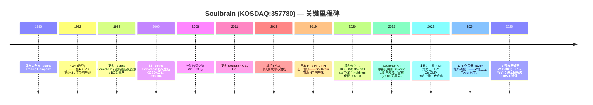
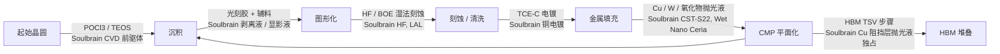
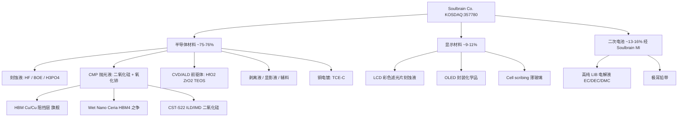
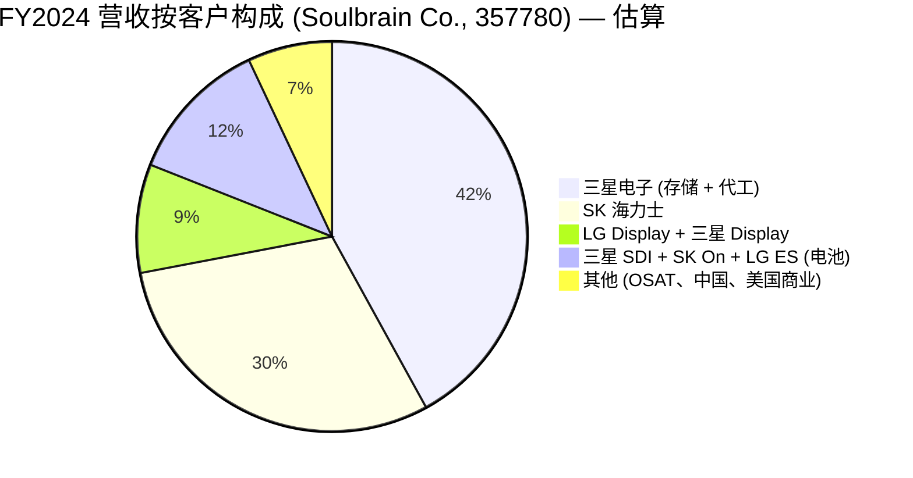
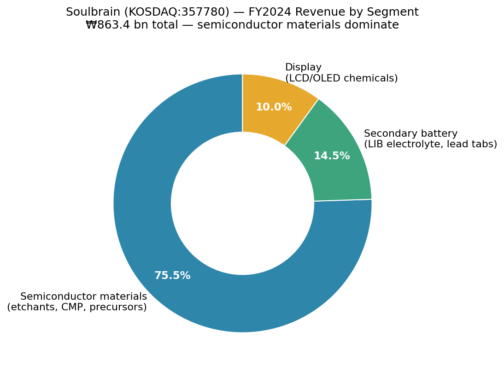

# Soulbrain Co., Ltd. (KOSDAQ:357780) — 公司研究

*截至日期：2026-05-26*
*覆盖状态：首次覆盖 (initiation)*
*上市地：KOSDAQ (韩国)，股票代码 `357780`*
*主要披露文件：DART (전자공시시스템) 사업보고서 / 반기보고서 / 분기보고서*

---

## 目录
1. 公司概览
2. 公司历史
3. 管理团队
4. 产品与服务
5. 客户与上市策略
6. 行业概览
7. 竞争格局
8. 市场机会 (TAM)
9. 风险评估

---

## 1. 公司概览

Soulbrain Co., Ltd. (솔브레인，KOSDAQ:357780) 是韩国最多元化的半导体湿法工艺耗材商业供应商 (merchant supplier)——业务覆盖刻蚀液 (etchant)、CMP 抛光液 (CMP slurry)、CVD/ALD 前驱体 (precursor)、光刻胶辅料、高纯无机酸、以及锂电池电解液 (LIB electrolyte) 等品类。本报告覆盖的实体是老 Soulbrain 集团的拆分后经营主体：2020 年 8 月，母公司 (KOSDAQ:036830，现 Soulbrain Holdings) 实施了横向分立 (분할)，将 IT 材料制造业务装入新上市的子公司——即本报告标的——而 Holdings 保留了薄膜涂层、电子元件以及投资控股业务 ([Soulbrain "History" 页面 — 2020 拆分](https://www.soulbrain.co.kr/en/m14.php))。这一 2020 年从 Soulbrain Holdings 拆分 (2020 spin-off from Soulbrain Holdings) 的设计目的是让化学材料投资者获得对三星电子 / SK 海力士存储周期的更纯粹、更少历史包袱的投资敞口。

公司业务高度依赖两个锚定客户——**三星电子** (存储 + 代工) 与 **SK 海力士** (存储)——Soulbrain 几乎将其全部产品组合输送至这两家客户的整条晶圆厂湿化学品消耗链 ([Businesskorea，2023-10-30 — HBM 材料国产化](https://www.businesskorea.co.kr/news/articleView.html?idxno=203197))。公司同时为 LG Display 与三星 Display 提供平板显示功能化学品，并通过其美国子公司 Soulbrain MI 向三星 SDI / SK On / LG Energy Solution 等电池厂商供应锂离子电池电解液。从地理布局看，韩国是绝对主导的生产基地（公州 공주、坡州 파주、平泽 평택、世宗 세종、龙仁 용인、城南 성남总部园区），海外则在中国 **无锡**、美国 **加州弗里蒙特** (Fremont)、**印第安纳州科科莫** (Kokomo) 设厂，并于近期宣布在 **得克萨斯州泰勒** (Taylor TX) 建设新工厂以匹配三星美国代工厂建设节奏 ([Evertiq，2024-07-30](https://evertiq.com/news/56124)，[Greater Kokomo，2022](https://greaterkokomo.com/soulbrain-mi-investing-in-kokomo-creating-75-jobs/))。

按规模看，Soulbrain 属于中盘工业公司：FY2024 合并营收 **₩8,634 亿** (约 6.3 亿美元，按 ₩1,370/USD 折算)，营业利润 **₩1,679 亿**，营业利润率 **19.4%**——较 2023 年 NAND 拖累的低谷 (₩8,440 亿营收，OPM 15.8%) 显著回升，也远高于韩国特种化学品行业的 10–12% 周期均值 ([Stockanalysis 营收页](https://stockanalysis.com/quote/kosdaq/357780/revenue/)，[Economy6 韩国券商汇编，2025-12](https://www.economy6.com/2025/12/soulbrain-stock.html))。FY2025 营收同比 +7%，达 **₩9,234 亿**，得益于 AI 驱动的 HBM 上量带动半导体材料复苏；其中 Q4 单季 ₩2,440 亿 (+12.7% YoY) ([Stockanalysis 营收页](https://stockanalysis.com/quote/kosdaq/357780/revenue/))。最新披露员工数约 1,233 人 ([Stockanalysis 公司概览](https://stockanalysis.com/quote/kosdaq/357780/company/))。

营收高度集中于半导体材料——刻蚀液 (HF、BOE、磷酸、硫酸、硝酸混合物)、CMP 抛光液 (硅基 + 铈基)、CVD/ALD 前驱体 (TEOS、TEB、TEPO、TMOP、POCl₃、TiCl₄、HfO₂/ZrO₂ 前驱体)、剥离液、光刻胶显影液 (photoresist developer)——按韩国卖方汇编估计这些品类 2024 年合计贡献合并营收的 **约 75–76%**；显示功能化学品贡献 ~9–11%，二次电池材料（LIB 电解液、电极极耳）贡献 ~13–16% ([Economy6 券商汇编，2025-12](https://www.economy6.com/2025/12/soulbrain-stock.html))。*分析师观点：* 随着美国 Taylor 磷酸厂投产以及 HBM4 驱动的铈基抛光液订单加速，半导体业务占比到 FY2027 很可能进一步上升至 80% 以上；而显示业务将因韩国 OLED 产能成熟、中国面板厂转向本土化学品供应而继续缓慢萎缩。

资本结构层面表现为韩国材料公司中较保守的一档：2024 年末几乎零净负债，ROE 约 14%，分红较低（年股息约 ₩2,000–2,300/股，派息率 10–15%——较轻，为美国与韩国设施扩张留出资本支出空间） ([Economy6 券商汇编，2025-12](https://www.economy6.com/2025/12/soulbrain-stock.html))。公司历来通过经营现金流自筹产能扩张资金，在重资本支出年份辅以 ₩1,000–2,000 亿规模的公司债；**Taylor TX 1.75 亿美元磷酸厂** (Taylor TX USD 175 mn phosphoric-acid plant) 一期项目（含二期合计可达 5.75 亿美元）很可能成为分立以来的首轮多年期举债周期。

**估值快照 (2026-05-24 收盘)：**
- 股价：**₩452,000** (当日 +5.2%) ([Stockanalysis，KOSDAQ:357780](https://stockanalysis.com/quote/kosdaq/357780/))
- 市值：**₩3.33 万亿** (约 24 亿美元，按 ₩1,370/USD) ([Stockanalysis 市值页](https://stockanalysis.com/quote/kosdaq/357780/market-cap/))
- 流通股本：774 万股
- **TTM 市盈率：41.8 倍**，**前瞻 P/E：18.9 倍** ([Stockanalysis，KOSDAQ:357780](https://stockanalysis.com/quote/kosdaq/357780/))
- TTM 市销率 (P/S)：约 3.7 倍（由 ₩3.33 万亿 ÷ ₩923 亿隐含），与 [Stockopedia P/S 页](https://www.stockopedia.com/share-prices/soulbrain-co-KOSDAQ:357780/) 一致
- 52 周区间：₩155,000 – ₩530,000 (即股价从 2025 年低点几乎涨了三倍，由 AI 存储周期推动)
- 股息率：0.55%

TTM P/E 41.8 倍相对其自身 3 年中位数 (~22 倍) 与韩国特种化学品同业 **明显偏高**：DongJin Semichem (KOSDAQ:005290) TTM 约 12 倍，Soulbrain Holdings 母公司因综合控股折价仅约 7 倍，半导体业务更纯粹的 Hansol Chemical (KOSPI:014680) 约 13 倍。*分析师观点：* 这一溢价反映三方面的同时叠加：**(a)** HBM 材料 spec-in（Soulbrain 是 HBM 铜过孔 CMP 抛光液对三星与 SK 海力士的唯一韩国本土供应商，同时是 HBM4 / HBM4E 铈基抛光液的主要候选）；**(b)** 三星 Taylor 与 TSMC 凤凰城的本地化供应链顺风；**(c)** 从 2023 年 NAND 低谷出来的盈利复苏——前瞻 P/E 18.9 倍说明卖方已假设 EPS 到 FY2027 约翻一倍 ([Stockanalysis，KOSDAQ:357780](https://stockanalysis.com/quote/kosdaq/357780/)，[Trendforce，2025-12-30 — 三星 2026 年 HBM 产能扩张](https://www.trendforce.com/news/2025/12/30/news-samsung-reportedly-plans-50-hbm-capacity-surge-in-2026-spotlight-on-hbm4/))。下行风险：若 HBM4 抛光液 spec-in 被 Fujimi / Versum / Anji 抢走，或三星 HBM 毛利不及预期，估值压缩至 20 倍中后段是完全合理的。

*资料来源：[Stockanalysis 营收史](https://stockanalysis.com/quote/kosdaq/357780/revenue/)；营业利润率叠加数据来自 [Economy6 券商汇编，2025-12](https://www.economy6.com/2025/12/soulbrain-stock.html) 用于 FY2024 (OPM 19.4%) 与 [Samsung Pop 研究报告，2025-02-10](https://samsungpop.com/common.do?cmd=down&contentType=application%2Fpdf&fileName=2010%2F2025021007420216K_02_02.pdf&inlineYn=Y&saveKey=research.pdf) 用于 FY2023 调节。注：FY2021 / FY2022 的数据由于发生在 2020 年分立之前，全年可比口径上有所失真；FY2022 是周期高点 (~₩1.09 万亿)。*

## 2. 公司历史

Soulbrain 的根源比当前上市主体要早将近四十年。原始公司由 정지완 (郑志完，Jeong Ji-wan) 于 **1986 年 5 月** 在首尔创立，当时名为 **Techno Trading Company** (테크노상사)，最初只是一家向韩国新生半导体产业分销日本特种化学品的小型贸易公司 ([Soulbrain "History" 页面](https://www.soulbrain.co.kr/en/m14.php))。1989 年 2 月公司正式法人化为 Techno Trade Co., Ltd.；1991 年与日本 **Yamanake Hutech** 结成战略联盟，获得 CVD 前驱体与掺杂剂工艺许可——并于 1992 年在公州 (공주) 建成生产基地，由此开始从纯贸易转向本土制造 ([Soulbrain "History" 页面](https://www.soulbrain.co.kr/en/m14.php))。公司中央研发中心于 1994 年成立；1999 年更名为 **Techno Semichem Co., Ltd.**，2000 年在 KOSDAQ 上市，2006 年年销售额突破 ₩1,000 亿，2011 年再次更名为 **Soulbrain Co., Ltd.** ([Soulbrain "History" 页面](https://www.soulbrain.co.kr/en/m14.php))。

第一次转型发生在 **2000–2010 年间**：在原有 CVD / 掺杂剂业务基础上拓展至湿法刻蚀液与 **缓冲氧化物刻蚀 (BOE, buffered oxide etch)**——Soulbrain 当时是韩国唯一规模化生产 BOE 的企业——并进入 LCD 功能化学品 (cell scribing、彩色滤光片刻蚀液) 领域。公司由此成为三星电子华城 / 平泽厂区与 LG Display 当时崛起的平板业务的主力供应商，乘上 CRT 到 LCD 的代际换挡。CMP 抛光液与二次电池电解液的多条产线在本十年下半段陆续投产；公司在 2000 年代末进入锂离子电池电解液市场，供应三星 SDI、LG 化学 (现 LG Energy Solution) 与 SK Innovation (现 SK On) ([Soulbrain "History" 页面](https://www.soulbrain.co.kr/en/m14.php))。

第二次转型是 **2019 年日韩贸易战 (2019 Japan-Korea trade war)**。2019 年 7 月 1 日，日本将三种半导体关键投入品——**氢氟酸 (HF, hydrofluoric acid)**、**光刻胶 (photoresist)**、**氟化聚酰亚胺 (fluorinated polyimide)**——纳入对韩国出口的"个别许可"管制名单，威胁三星与 SK 海力士的 HF 供应（当时日本占韩国 HF 进口约 44%，且 Stella Chemifa、Morita、Showa Denko 等日本厂主导高纯 12-nines 级 BOE / 刻蚀级供应） ([Al Jazeera，2019-08-30](https://www.aljazeera.com/economy/2019/8/30/japans-curbs-on-hi-tech-exports-to-south-korea-could-backfire)，[NBR，"Bolstering and Securing Semiconductor Supply Chains"](https://nbr.org/publication/bolstering-and-securing-semiconductor-supply-chains/))。Soulbrain 加速推进早已规划的高纯 HF 国产化路线图——从中国（而非日本）采购萤石与无水 HF (AHF)、在公州与世宗厂建设 12-nines 提纯产能，并在三个月内进入三星 / SK 海力士的来料检验流程 ([Businesskorea，2020-04 — 韩国企业批量生产高纯 HF](https://www.businesskorea.co.kr/news/articleView.html?idxno=39795))。到 2023 年，韩国从日本进口 HF 的金额相对争端前 2018 年基准下降 **约 88%**；Soulbrain 与 SK Materials (SK siltron 化学品事业部) 瓜分了空出的市场份额 ([THE ELEC，2023](https://www.thelec.net/news/articleView.html?idxno=4432))。这一事件确立了 Soulbrain 在韩国半导体湿化学品领域"国家队 (national champion)"的战略地位，并使创始人郑志完在 2020 年韩国技术大奖上获得总统奖 ([Soulbrain "History" 页面](https://www.soulbrain.co.kr/en/m14.php))。

第三次转型是 **2020 年横向分立**。2020 年 8 月 6 日，Soulbrain Holdings (老 KOSDAQ:036830 上市母公司) 实施 분할상장 (拆分上市)，将 IT 材料制造业务——刻蚀液、CMP 抛光液、CVD 前驱体、显示化学品、电池电解液——装入新上市的 Soulbrain Co., Ltd. (357780)，而母公司保留薄膜涂层设备 (사출 / 코팅 장비)、MC Solution (电子元件) 以及家族投资载体 ([Soulbrain "History" 页面 — 2020 拆分](https://www.soulbrain.co.kr/en/m14.php))。郑氏家族通过 Soulbrain Holdings 同时维持对两个主体的多数控制权；这次分立让经营性化学品业务得以按半导体材料的估值倍数（而非综合集团折价）被市场定价。

*资料来源：[Soulbrain "History" 页面](https://www.soulbrain.co.kr/en/m14.php)；[Businesskorea，2023-10-30](https://www.businesskorea.co.kr/news/articleView.html?idxno=203197)；[Evertiq，2024-07-30](https://evertiq.com/news/56124)；[Greater Kokomo，2022](https://greaterkokomo.com/soulbrain-mi-investing-in-kokomo-creating-75-jobs/)；[Yahoo Finance — Soulbrain Holdings 036830.KQ](https://finance.yahoo.com/quote/036830.KQ/)。*

分立后的几年里公司分两波展开 **激进的海外扩张**。第一波是电动车电池浪潮：美国子公司 Soulbrain MI 于 2022 年 12 月宣布投资 7,500 万美元、3 万平方英尺的电解液厂落地印第安纳州 Kokomo，为隔壁的 Stellantis–三星 SDI 电动车电池合资工厂供货，并于 2024 年初开始招聘 ([Greater Kokomo，2022](https://greaterkokomo.com/soulbrain-mi-investing-in-kokomo-creating-75-jobs/)，[Area Development，2022-12-15](https://www.areadevelopment.com/newsitems/12-15-2022/soulbrain-mi-kokomo-indiana.shtml))。第二波是半导体本地化浪潮：2024 年 7 月 30 日 Soulbrain 宣布在得克萨斯州 Taylor 市建设 **1.75 亿美元一期工厂**（连同二期最多达 **4 亿美元、合计 5.75 亿美元**，到 2033 年完成），生产电子级磷酸——即 SiN 剥离 / 多晶硅刻蚀工艺的主力化学品——以匹配三星 170 亿至 440 亿美元规模的 Taylor 代工厂建设 ([Evertiq，2024-07-30](https://evertiq.com/news/56124)，[Hoodline，2024-07](https://hoodline.com/2024/07/south-korean-company-soulbrain-to-launch-175m-plant-in-taylor-bolstering-local-tech-industry-and-job-market/))。中国无锡 (无锡) 厂区于 2010 年代开设，最初服务 SK 海力士无锡与三星西安，目前继续支持 SK 海力士不断扩张的无锡 DRAM 产线——尽管 SK 海力士的无锡资本支出在 2024 年曾暂停，2026 年因 AI 存储紧缺再度重启 ([SCMP，2026-03](https://www.scmp.com/tech/tech-trends/article/3348159/south-korean-chip-giants-step-china-investments-combat-global-ai-memory-shortage))。

**2023 年 HBM 披露事件**可以说是分立后单一最具影响力的事件。2023 年 10 月下旬，Businesskorea 报道——Soulbrain 也予以确认——公司是 HBM TSV (硅通孔) 加工中铜过孔去除 (Cu-overburden) 步骤所用 CMP 抛光液对三星电子与 SK 海力士的 **唯一供应商**，取代了原先 Cabot Microelectronics (现已并入 Entegris) 与 Hitachi Chemical (现为 Resonac) 主导的双寡头格局 ([Businesskorea，2023-10-30](https://www.businesskorea.co.kr/news/articleView.html?idxno=203197))。两年后这一独占已部分被稀释：Fujimi 据报在 2024 年中期重新拿回部分韩国 Cu-CMP 份额，Dongjin Semichem 也在 2025 年突破进入 SK 海力士的 HBM CMP 供应——但 Soulbrain 仍是 Tier-1 在位者，也是 HBM4 验证中事实上的韩国本土选项 ([Fujifilm Electronic Materials 领先，2024-09](https://www.webnewswire.com/2024/09/03/fujifilm-electronic-material-takes-lead-in-cmp-slurry-market-for-hbm-says-the-information-network/)，[THE ELEC，2024](https://www.thelec.net/news/articleView.html?idxno=4751))。

最新的公司治理里程碑是 **2025 年 3 月的 CEO 换届**：分立以来一直担任 CEO 的 노환철 (卢焕喆，Roh Hwan-chul，原三星 SDI 高管) 退休，由公司原技术副总裁 **박영수 (朴英洙，Park Young-soo)** 接任；朴英洙曾是 2019 年 HF 国产化攻坚战中 Soulbrain 的对外门面人物，也是公司与三星电子来料质量团队的主要技术接口 ([Edaily，2025-03-25](https://www.edaily.co.kr/News/Read?newsId=03834326642106928&mediaCodeNo=257)，[KRX 披露 20250325000760](https://kind.krx.co.kr/common/disclsviewer.do?method=search&acptno=20250325000760))。这一交接被定位为从销售 / 综合管理型领导者 (Roh) 到 R&D / 技术型领导者 (Park) 的换代，目的是更好地把握 HBM4 / GAA spec-in 周期。

## 3. 管理团队

**박영수 (朴英洙，Park Young-soo) — Soulbrain Co., Ltd. (357780) 总裁兼 CEO，自 2025 年 3 月起**

朴英洙于 2025 年 3 月 25 日被任命为 Soulbrain Co. CEO，接替自 2020 年 8 月分立上市以来一直担任此职的 노환철 (Roh Hwan-chul) ([Edaily，2025-03-25](https://www.edaily.co.kr/News/Read?newsId=03834326642106928&mediaCodeNo=257)，[Nate news，2025-03-25](https://news.nate.com/view/20250325n27329))。他升任最高职位前在 Soulbrain 集团内有较长任期，最近的职务是 **技术副总裁 (Vice President of Technology)**——即 2019 年日韩 HF 危机期间作为 Soulbrain 对外发言人、阐述公司高纯 HF 国产化路线图、并担任公司与三星电子来料质量团队、SK 海力士供应商开发组织主要技术接口的角色。（2024 年 7 月 30 日 Taylor 得州工厂揭幕时他作为"技术副总裁"署名发言——"我们很高兴扩大在 Taylor 的业务。市政府与 EDC 是优秀的伙伴…"——证实其早在被提拔之前就已统筹美国扩张 ([Evertiq，2024-07-30](https://evertiq.com/news/56124))。）

朴英洙的背景明确处于化学与工艺工程领域，而非财务或销售——这是董事会有意发出的信号。任命的战略背景：在 FY2025 到 FY2028 之间，Soulbrain 必须同时 (a) 在三星与 SK 海力士争取 HBM4 / HBM4E 铈基抛光液的 spec-in 资格；(b) 落地 1.75–5.75 亿美元的 Taylor 得州磷酸厂建设；(c) 集成 Soulbrain MI Kokomo 厂为 Stellantis–三星 SDI 提供 LIB 电解液的产能爬坡；(d) 应对 Dongjin Semichem 与 Foosung 对韩国 HF 市场份额的蚕食。Roh 到 Park 的交接刻意将一位资深技术人员推上 CEO 位置，以迎接一个 R&D 密集型的扩张周期，这与三星和 SK 海力士开始把自己的材料厂领导班子从销售背景转向工程背景的趋势一致。朴英洙的持股份额据报道为名义性质 (<1%——创始郑氏家族通过 036830 Soulbrain Holdings 控制 51%+)，薪酬结构为韩国典型高管包：底薪 + 业绩奖金 + 限制性股票授予。

**정지완 (郑志完，Jeong Ji-wan) — Soulbrain Holdings (036830) 创始人兼名誉董事长；Soulbrain Co. (357780) 实际控制人**

虽然不是 357780 上市主体的 CEO，**创始人郑志完通过其在 Soulbrain Holdings 中的多数股权控制 Soulbrain Co.**——老 KOSDAQ:036830 母公司持有 357780 超过 50% 股份——并仍是资本支出、并购与家族传承的最终战略决策者 ([Businesspost — Who Is? Jeong Ji-wan](https://m.businesspost.co.kr/BP?command=mobile_view&num=41846))。郑 1956 年 11 月出生于忠清南道，1982 年毕业于 **成均馆大学** 化学工程系，后在韩国一家小型进出口公司 Sungwon Trading 工作四年，期间观察到 Stella Chemifa、Morita、Showa Denko、JSR、Sumitomo 等日本化工厂如何垄断韩国半导体投入品供应链 ([Businesspost — Who Is? Jeong Ji-wan](https://m.businesspost.co.kr/BP?command=mobile_view&num=41846))。31 岁那年他创立 Techno Trading (1986)，最初向当时还很小的三星半导体器兴存储产线分销日本前驱体。

定义郑志完职业生涯的战略决策是 **1991 年从贸易转向制造的合资转型**：与日本 Yamanake Hutech 结盟，获得 CVD 前驱体与掺杂剂化学许可，并于 1992 年建成公州厂——韩国第一条商业规模的 CVD 前驱体产线。从这一起点出发，他在 1990 年代构筑了刻蚀液与 BOE 业务，2000 年代叠加 CMP 抛光液与 LIB 电解液，并因此获得 EY 韩国年度企业家奖 (化工组，2013) 与 2020 年韩国技术大奖总统奖——后者表彰的就是 HF 国产化突破 ([Businesspost — Who Is? Jeong Ji-wan](https://m.businesspost.co.kr/BP?command=mobile_view&num=41846)，[Soulbrain "History" 页面](https://www.soulbrain.co.kr/en/m14.php))。郑还曾于 2013 年 2 月至 2015 年 2 月担任 **KOSDAQ 协会** 第八届会长，显示他在韩国中盘股生态中的影响力 ([Businesspost — Who Is? Jeong Ji-wan](https://m.businesspost.co.kr/BP?command=mobile_view&num=41846))。

关于传承问题，郑有两个子女——儿子 정석호 (Jeong Seok-ho) 与女儿 정문주 (Jeong Mun-joo)——但家族继承过程因儿子 정석호在 2020 年代初去世（韩国财经媒体以"솔브레인 오너 2세 사망"为标题报道）而变得复杂，使 Jeong Mun-joo 及下一代成为 Holdings 持股最可能的长期继承人 ([THE ELEC — "Soulbrain 第二代继承"](https://www.thelec.kr/news/articleView.html?idxno=6616))。郑的孙辈已经出现在韩国"最年轻大股东"榜单上，持有数十亿韩元规模的 Soulbrain 集团股权 ([The Asia Business Daily，2024-09-17](https://www.asiae.co.kr/en/article/2024091711322781831))。在经营控制层面，家族在上市 357780 主体安排非家族成员的职业 CEO——分立初为 Kang Byeong-chang，2021 至 2025 年为 Roh Hwan-chul (三星 SDI 老将)，现为 Park Young-soo——这一安排与韩国财阀普遍的"家族当所有者 / 职业经理人当经营者"剧本一致 ([thebell.co.kr — Soulbrain CEO 分析，2021-03-29](https://m.thebell.co.kr/m/newsview.asp?svccode=00&newskey=202103292236163680106472))。郑志完个人在 Soulbrain Holdings (036830) 中的持股——2016 年 Q3 最后披露为约 31%，经回购后今日很可能略高于此水平——经由 Holdings 对 357780 的所有权，最终转化为对经营性化学品业务的多数经济控制权 ([Businesspost — Who Is? Jeong Ji-wan](https://m.businesspost.co.kr/BP?command=mobile_view&num=41846))。

## 4. 产品与服务

### 4.1 产品矩阵——锚定 Soulbrain 半导体材料产品组合

Soulbrain Co. 按照晶圆厂耗材的规范化工艺栈来组织其半导体产品组合——**沉积前驱体 → 图形化辅料 → 刻蚀 → 清洗 → CMP → 电镀**——并将显示功能化学品与电池电解液作为单独披露的业务段。最权威的公开产品矩阵发布在公司英文半导体材料页面上 ([Soulbrain 半导体材料产品组合](https://www.soulbrain.co.kr/en/m21.php))，下面以 markdown 表格再现；带有等级标识的完整版本则在 DART 上的韩文 사업보고서分业务产品矩阵中 ([DART 检索门户](https://dart.fss.or.kr/dsab007/main.do?textCrpNm=%EC%86%94%EB%B8%8C%EB%A0%88%EC%9D%B8))。

| 工艺环节 | 产品族 | Soulbrain 产品名 / 等级 | 客户用途 |
|---|---|---|---|
| **CVD / ALD 沉积** | 前驱体 | TEOS、TEB、TEPO、TMOP、POCl₃、TiCl₄、**HfO₂ / ZrO₂ 前驱体** | 高 k 栅极堆叠，逻辑与存储用 SiO₂ / SiON 膜沉积 |
| **刻蚀与清洗** | 湿法刻蚀液 (etchants) | **HSN / H₃PO₄ 多晶硅刻蚀液**、Poly/PAN 刻蚀液、S-2、HNPA-1317、FMA-2P、HCl | SiN 剥离、多晶硅刻蚀、金属刻蚀、CMP 后残留清洗 |
| **刻蚀与清洗** | 剥离液 (strippers) | JQS-8920、TSO-500H、TSO-800H | 图形转移后的光刻胶剥离 |
| **刻蚀与清洗** | HF / BOE | **高纯氢氟酸 (HF)**、缓冲氧化物刻蚀液 (LAL 系列) | 原生氧化层去除、栅极氧化层刻蚀、BEOL 介质修整 |
| **CMP** | 抛光液 (slurry) | **高平面度抛光液 CST-S22 (ILD / IMD)**、STI/SOD 抛光液 (铈基)、W 抛光液 (两步法)、**Cu / Cu 阻挡层抛光液**、用于 DRAM / NAND 的 **Wet Nano Ceria** (纳米铈基)、**TSV 封装抛光液**、氮化物 / 多晶硅抛光液 | 每一互连层的介质 / 金属线平面化；**HBM TSV 铜过量去除** |
| **电镀** | 铜电镀 | **TCE-C 电镀剂** + 添加剂 | 镶嵌铜互连、TSV 铜填充 |
| **工艺气体 (经 Hubvision 子公司)** | 无机酸 | 高纯 H₂SO₄、HNO₃、**电子级 H₃PO₄** | SC-1 / SPM 清洗、批量酸槽 |
| **显示功能化学品** | LCD / OLED | 彩色滤光片刻蚀液、**cell scribing**、薄玻璃加工、封装化学品 | LG Display、三星 Display 面板制造 |
| **二次电池 (Soulbrain MI)** | LIB 电解液 | **高纯电解液溶剂** (EC、DEC、DMC) + 锂盐配方 + **极耳铅带** | 三星 SDI、SK On (SK Innovation)、LG Energy Solution 方形与软包电芯 |

*资料来源：[Soulbrain "Semiconductor Materials" 页面](https://www.soulbrain.co.kr/en/m21.php)；[Soulbrain "CMP" 详情页](https://www.soulbrain.co.kr/en/m33.php)；[Greater Kokomo 电池电解液公告](https://greaterkokomo.com/soulbrain-mi-investing-in-kokomo-creating-75-jobs/)；与 [Soulbrain Holdings "Semiconductor Materials" 页面](https://www.soulbrainholdings.co.kr/en/m21.php) 的历史产品分类相对照。*

### 4.2 综合——各品类如何在客户工艺流中相互配合

一片现代存储或逻辑晶圆在单次器件循环中要 **几十次** 经过 Soulbrain 的产品组合。以 SK 海力士利川 (Icheon) 的 DRAM 单元为示例：起始晶圆先用 POCl₃ (Soulbrain CVD 前驱体) 进行掺杂，然后沉积 TEOS 基 SiO₂ (Soulbrain 前驱体) → JSR / TOK / Dongjin 涂覆光刻胶 → 曝光 → 显影 → 用 Soulbrain HF / BOE 进行 **湿法刻蚀** → 用 Soulbrain TSO-800H 剥离光刻胶 → 用 Soulbrain CST-S22 (氧化物抛光液) 进行 **CMP 平面化** → 用 Soulbrain HNPA-1317 清洗 → 下一层 TEOS 沉积开始。每个互连层都要重复这个循环；先进 1z 纳米 DRAM 有 50+ 层；256 层 3D NAND 有数百层。对于 **HBM**，同一片晶圆还要经过 TSV 铜填充 (Soulbrain TCE-C 电镀) 与 **使用 Soulbrain Cu 阻挡层抛光液的体相铜 CMP**——这正是公司 2023 年在三星 + SK 海力士排他性进入的具体节点，至今仍是其利润最高、能见度最高的产品线 ([Businesskorea，2023-10-30](https://www.businesskorea.co.kr/news/articleView.html?idxno=203197))。综合洞察：Soulbrain 对客户的价值并不来自任何单一产品，而是来自 **跨整条湿化学栈的逐等级共同开发与验证 (co-developed qualification)**——70%+ 的收入集中于三星 + SK 海力士也就成为这一商业模式的自然数学结果。

*同一款 Soulbrain 产品在同一片晶圆上跨越 10–50 次——某一等级的资质极少会外溢给竞争对手。资料来源：[Soulbrain "Semiconductor Materials" 页面](https://www.soulbrain.co.kr/en/m21.php) 与 [Soulbrain "CMP" 详情页](https://www.soulbrain.co.kr/en/m33.php) 的工艺流推断。*

### 4.3 刻蚀液——HF、BOE 与韩国氟链特许经营

这就是 2019 年把 Soulbrain 推上地缘政治版图的特许经营业务。产品页列出三个紧密相关的子族：

- **高纯氢氟酸 (HF, hydrofluoric acid) / 缓冲氧化物刻蚀 (BOE, buffered oxide etch) LAL 系列**：用于原生氧化层去除与栅极氧化层刻蚀
- **热磷酸 (H₃PO₄ / HSN) 多晶硅刻蚀液**：用于 SiN 剥离与多晶硅去除
- **HCl、HNPA、FMA 混合液**：用于残留物清洗与金属剥离

2019 年事件的同期媒体报道值得逐字引用，以便还原历史现场：

> "SoulBrain 供应刻蚀气体 (氢氟酸)。三星电子已经投资了 SoulBrain 等半导体材料公司并与其开展技术联合开发。SK 海力士正在测试的氢氟酸由 SoulBrain 提供，这家韩国公司是通过从中国进口原材料来生产该化学品的。SoulBrain 力争在 9 月底前完工，运行测试以判断其能否量产高纯氢氟酸。" ([Businesskorea，2019-08 / 韩企减少进口](https://www.businesskorea.co.kr/news/articleView.html?idxno=34523)，[Businesskorea，2020-04 — 韩国企业量产 HPHF](https://www.businesskorea.co.kr/news/articleView.html?idxno=39795))

**中文释义 / 通俗解读：** 半导体湿法刻蚀使用两种物理上不同的化学体系——**氢氟酸 (HF, 氟化氢)** 用于溶解 SiO₂ (二氧化硅, silicon dioxide)，**热磷酸 (H₃PO₄, 磷酸)** 用于溶解 SiN (氮化硅, silicon nitride，用于侧墙与硬掩模)。对于先进存储与逻辑节点，纯度门槛是"12 个 9" (99.9999999999%)——哪怕亚 ppt 量级的金属污染都会造成晶圆缺陷，废掉数万美元在制品。日本 Stella Chemifa 2019 年之前几乎垄断 12-nines HF；Soulbrain (与 SK Materials) 通过 (a) 从中国萤石带进口无水 HF (AHF)、(b) 韩国本土提纯 + 离子交换技术、(c) 与三星 / SK 海力士的联合验证项目相结合，在 18 个月内打破了这一垄断。2024 年伊朗-霍尔木兹海峡封锁担忧引发的韩国 HF 价格冲击 ([Tom's Hardware，2025-06](https://www.tomshardware.com/tech-industry/memory-makers-brace-for-hydrogen-fluoride-pricing-shock-as-hormuz-blockade-impacts-supply-chain-key-etching-and-cleaning-material-faces-sharp-cost-increase-amid-trade-disruption)) 提醒人们：即便供应链已经"本地化"，仍然受制于上游原料 (萤石、无水 HF、硫磺)。

*分析师观点：* Soulbrain 与 **SK Materials (SK siltron 子公司)**、**Foosung (KOSDAQ:093370——历史上韩国最大 HF 厂家，但更多偏重工业 / 制冷剂级而非电子级)**、**Dongjin Semichem (KOSDAQ:005290——多元化但高纯 HF 能力提升中)** 共同分享韩国 HF / BOE 市场。防御性护城河在于验证深度而非单位成本：晶圆厂不能在没有 6–12 个月再验证周期的情况下更换 HF 等级，因此每个 socket 的实际价值远高于其大宗品价格。韩国 HF / BOE TAM 按 2025–26 行业估算约为每年 5–8 亿美元；Soulbrain 国内份额可能在 35–45% 之间，其余由 SK Materials (~25%)、Foosung (~15%) 与日中长尾进口商瓜分。

### 4.4 CMP 抛光液——AI 存储成长杠杆

CMP 抛光液是 FY26–FY28 投资逻辑中 Soulbrain 战略意义最重要的产品线。公司 CMP 产品页列出九个不同子族 ([Soulbrain "CMP" 详情页](https://www.soulbrain.co.kr/en/m33.php))：

1. **高平面度抛光液 CST-S22**——ILD (层间介质) / IMD (金属间介质)——*二氧化硅 (silica) 磨料*
2. **STI / SOD 抛光液**——浅沟槽隔离 (shallow-trench-isolation) 氧化物，**氧化铈 (ceria) 磨料** (高 SiO₂:SiN 选择比)
3. **Wet Nano Ceria 纳米铈基抛光液**——DRAM / NAND 氧化物平面化，先进节点级
4. **W 抛光液 (两步 + 抛光)**——钨接触 / 通孔平面化
5. **Cu 阻挡层抛光液 (碱性 + 酸性)**——铜互连平面化
6. **Cu CMP 抛光液**——体相铜过量去除
7. **TSV 抛光液**——硅通孔 (through-silicon-via) 平面化，用于先进封装
8. **氮化物 / 多晶硅抛光液**——小众但只用于先进节点
9. **抛光化学品**——用于下游晶圆边缘 / 斜面处理

**HBM TSV 铜过量抛光液** 是单一最具能见度的产品。Businesskorea 在 2023 年 10 月的报道：

> "Soulbrain 独家供应专为 HBM 设计的化学机械抛光 (CMP) 抛光液给三星电子与 SK 海力士。该公司的专用产品去除 TSV (硅通孔) 布线工艺中产生的多余铜层——该工艺涉及在 DRAM 芯片中钻 1,000 多个孔并用铜填充…在该公司进入市场之前，铜平面化抛光液领域由国际竞争者主导——美国的 Cabot Microelectronics (Entegris 子公司) 与日本的 Hitachi。" ([Businesskorea，2023-10-30](https://www.businesskorea.co.kr/news/articleView.html?idxno=203197))

**中文释义 / 通俗解读：** CMP (**化学机械抛光, chemical-mechanical planarization**) 使用一种抛光液——纳米磨料颗粒 (氧化物 / 铜用二氧化硅、STI 用氧化铈) 在化学氧化剂 / pH 缓冲液中的胶体悬浮液——以物理 + 化学方式将晶圆表面抛光至亚纳米级平整度。磨料选择由被抛光材料决定：**二氧化硅 (SiO₂) 磨料** 是 ILD/IMD 与金属的主力；**氧化铈 (CeO₂) 磨料** 对 STI 必不可少，因为它对 SiO₂:SiN 的选择比独特地高 (~30:1 vs. 二氧化硅的 ~1:1)——二氧化硅根本无法像氧化铈那样在 SiN 硬掩模处自动停止。对于 HBM，在 **TSV (硅通孔, through-silicon via)** 钻孔与铜电镀填充之后，晶圆表面会留下数百微米的过量铜；需要专用 Cu 抛光液去除铜过量，同时不能损伤晶圆 (dishing) 也不能侵蚀下层阻挡层。Soulbrain 的 HBM Cu 抛光液正是这种产品，历史上由 Cabot Microelectronics (现 Entegris) 与 Hitachi Chemical (现 Resonac) 供应，直到 Soulbrain 在 2023 年实现 spec-in。

不过，这种竞争独占在 **2024–25 年明显被稀释**：

- **Fujimi (TSE:5384)**——日本 Fujimi Inc. 据报"在 HBM 用 CMP 铜抛光液销售给韩国三星电子与 SK 海力士方面，到 2024 年 9 月已经从 Soulbrain 手中夺回领先地位" ([Fujifilm Electronic Materials 领先，2024-09](https://www.webnewswire.com/2024/09/03/fujifilm-electronic-material-takes-lead-in-cmp-slurry-market-for-hbm-says-the-information-network/))。注意通讯社标题把 Fujifilm 与 Fujimi 混在一起——真正夺回领先的是 Fujimi。
- **Dongjin Semichem (KOSDAQ:005290)**——2025 年突破进入 SK 海力士的 HBM CMP 抛光液供应，打破了原先 Soulbrain 独家的韩国本土地位 ([THE ELEC，2024 — SK 海力士 CMP 多源化](https://www.thelec.net/news/articleView.html?idxno=4751))。

*分析师观点：* Soulbrain 的 HBM CMP "独占"现已变成 **强势在位者份额** 而非 100%——大致估计为三星 + SK 海力士合并 HBM Cu 抛光液采购量的 50–65%。前瞻关键问题是 **HBM4 / HBM4E 铈基抛光液**：随着 HBM 堆叠从 12-Hi 走向 16-Hi、TSV 数量超过每 cube 2,000 个，STI / SOD 铈基抛光液的每片晶圆消耗呈非线性增长，Soulbrain 的 Wet Nano Ceria 产品正在三星平泽 (P3 / P4) 与 SK 海力士 M16 同时进行验证。韩、日、美、中铈基抛光液之争——Soulbrain、KC Tech (KR)、Fujimi、Versum (Merck/MEMC)、Entegris、Resonac、安集微 (SSE:688019)、鼎龙股份 (SZSE:300054)、UBmaterials——正在塑造为 AI 存储周期最具决定意义的 CMP 战役 ([Soulbrain "CMP" 详情页](https://www.soulbrain.co.kr/en/m33.php)，[Yano Research，2024](https://www.yanoresearch.com/press/press.php/3921))。*中国供应链风险提醒：* 全球 >85% 的氧化铈加工集中在中国，因此任何铈基抛光液厂商——无论韩、日、美——都面临同样的上游原料脆弱性。

### 4.5 工艺化学品 (process chemicals) 与高纯无机酸——Taylor TX 扩张

Soulbrain 生产 12-nines 纯度的 **电子级磷酸 (H₃PO₄)**、硫酸 (H₂SO₄)、硝酸 (HNO₃) 与盐酸 (HCl)，用于 SiN 剥离、批量酸槽清洗，以及 SC-1 / SPM 清洗。这一产品族此前相对低调，直到 2024 年 7 月宣布 **Taylor 得州工厂**：

> "Soulbrain 将在得州 Taylor 投资 1.75 亿美元建设新生产基地，加工电子级磷酸用作半导体制造的刻蚀剂。6 万平方英尺的一期厂房计划 2025 年 1 月动工、2029 年 1 月完工；可选的二期最多 4 亿美元，将延至 2033 年…技术副总裁 Jon Park 表示：'我们很高兴扩大在 Taylor 的业务。'" ([Evertiq，2024-07-30](https://evertiq.com/news/56124)，[Hoodline，2024-07](https://hoodline.com/2024/07/south-korean-company-soulbrain-to-launch-175m-plant-in-taylor-bolstering-local-tech-industry-and-job-market/))

**中文释义 / 通俗解读：** 电子级磷酸是 **SiN 剥离 (氮化硅去除)** 的主导化学品——该步骤在图形转移后去除氮化硅硬掩模，在先进节点晶圆上重复几十次。该工艺在 150–165 °C 的深槽批量工艺中进行，单步消耗量很大 (每片晶圆每步 5–15 升)——比 HF 或 BOE 重得多——所以物流经济性主导决策。从韩国跨太平洋向得州运输大宗酸液在规模上不经济；**Taylor 工厂本质上是一个绑定三星 170–440 亿美元 Taylor 代工厂建设的物流加质量决策**，而不是新技术押注。同样的逻辑也解释了 Soulbrain MI 在 Kokomo 印第安纳州的电解液厂选址（紧邻 Stellantis-三星 SDI 的 25 亿美元电动车电池合资工厂）。韩、日、中材料厂家都在执行同样的"跟着客户的海外厂走"剧本——Hoya 跟 EUV 掩模坯 (三重 / 栃木)、Resonac 跟 CMP 抛光液 (台湾 / 新加坡)、Shin-Etsu 跟光刻胶 (新竹)。*分析师观点：* Taylor 建设是一笔低 IRR / 高战略价值的动作——磷酸利润率偏薄，资产很可能需要 5–7 年才能赚到资本成本——但它锁定了三星 Taylor 这一在代工厂寿命周期内的"俘虏客户 (captive customer)"，是本地化时代成为三星 Tier-1 供应商必须支付的入场费。

### 4.6 CVD / ALD 前驱体

前驱体产品集 (TEOS、TEB、TEPO、TMOP、POCl₃、TiCl₄、**HfO₂ / ZrO₂** 前驱体) 是 1990 年代 Yamanake 合资项目以来的老 Techno Semichem 业务。**HfO₂ (二氧化铪, hafnium dioxide)** 与 **ZrO₂ (二氧化锆, zirconium dioxide)** 前驱体是 45 纳米及以下逻辑与 DRAM 中替代 SiO₂ 作为栅极氧化层的高 k 介质化学品——Soulbrain 是少数获得三星认证的韩国厂家之一，与之并列的还有 DNF (KOSDAQ:092070)、Hansol Chemical (KOSPI:014680)、Mecaro (KOSDAQ:241770)，以及 Soulbrain 自身的关联公司 UP Chemical。*分析师观点：* 前驱体业务是稳定的中等利润贡献者 (HfO₂ / ZrO₂ 价值高但量小；TEOS 量大但已大宗化)；GAA / 背面供电过渡将到 2027 年把每片晶圆的 ALD 前驱体消耗量提升 1.5–2 倍 (每个器件更多 ALD 层)，因此该业务段应能在没有剧烈份额变动的前提下实现中高个位数增长。韩国前驱体竞争比 CMP 抛光液更分散——三星刻意为前驱体维持多源采购以确保供应安全。

### 4.7 显示功能化学品

显示化学品业务段 (彩色滤光片刻蚀液、cell scribing、薄玻璃加工、OLED 封装化学品) 约占营收 9–11%，是产品组合中增速最低的部分 ([Economy6 券商汇编，2025-12](https://www.economy6.com/2025/12/soulbrain-stock.html))。Soulbrain 同时服务 LG Display 与三星 Display，但底层 TAM 正在收缩，因为 (a) 韩国 LCD 产能正向中国 (BOE、华星光电、HKC) 转移；(b) OLED 产能扩张集中在 LG Display 坡州与三星 Display 牙山，但节奏较慢；(c) 中国 OLED 厂商从本土化学品供应商采购。*分析师观点：* 这是一个"管理型衰退 (managed decline)"业务段——Soulbrain 不会退出，因为资产已折旧、现金毛利为正，但资本支出分配极少，业务段到 FY2028 可能萎缩至中个位数营收占比。

### 4.8 二次电池材料——Soulbrain MI 的美国布局

锂离子电池 (LIB) 电解液业务集中在 **Soulbrain MI**——Soulbrain 集团北美电池材料业务的美国子公司。Kokomo 印第安纳州工厂——2022 年 12 月宣布，投资 7,500 万美元，约 75 个就业岗位——生产 **高纯 LIB 电解液 (EC / DEC / DMC 溶剂混合 + 锂盐与添加剂配方)**，供货给隔壁的 **Stellantis–三星 SDI 合资电池厂**，后者本身就是一个 25 亿美元 / 1,400 名员工的电动车电池设施 ([Greater Kokomo，2022](https://greaterkokomo.com/soulbrain-mi-investing-in-kokomo-creating-75-jobs/)，[Indianapolis Business Journal，2022](https://www.ibj.com/articles/michigan-companys-75m-plant-in-kokomo-will-be-supplier-for-new-ev-battery-plant)，[Area Development，2022-12-15](https://www.areadevelopment.com/newsitems/12-15-2022/soulbrain-mi-kokomo-indiana.shtml))。

**中文释义 / 通俗解读：** 锂电池电解液 (LIB electrolyte) 是位于正极 (NCM / NCA / LFP) 与负极 (石墨 / 硅) 之间的液态离子传输介质——化学上是 LiPF₆ (六氟磷酸锂, lithium hexafluorophosphate) 溶于环状 + 链状碳酸酯溶剂 (EC、DEC、DMC) 加上一长串功能性添加剂 (FEC、VC、用于快充的 LiFSI、用于高压稳定性的 BBE) 的溶液。电解液 ASP 约 4–7 美元 / 公斤，典型电动车电池每组使用 80–150 公斤电解液；电芯厂商 (三星 SDI、LG ES、SK On、宁德时代) 从一个紧凑的亚洲化学品厂家寡头 (**Soulbrain、Enchem、Chunbo、三菱化学、MGL Chemical / 미국**) 加上中国巨头 (天赐高新、新宙邦) 采购。美国产能扩张主要由 IRA 推动的正极活性物质 / 电芯建设周期主导，并要求电芯内容物来源国必须是与美国签有自由贸易协定的国家；韩国符合条件，Soulbrain MI 是少数在美国具有产能的韩国电解液厂之一。*分析师观点：* 该业务段在 3 年视角下增长会比半导体慢 (电动车销售减速；Stellantis-三星 SDI 在 2024–25 年的爬坡有延迟)，但在战略上有价值，可以分散半导体业务对三星 + SK 海力士 70%+ 的集中度。

### 4.9 旗舰产品与最近 12 个月的新动向

驱动 FY25–FY27 投资逻辑的 1–3 条旗舰产品线是：**(1) HBM Cu / Cu 阻挡层 CMP 抛光液**（利润率最高的产品 socket 和主要叙事驱动力，即便已经被 Fujimi / Dongjin 分掉一部分）；**(2) 高纯 HF / BOE**（稳定的防御性特许经营，韩国战略资产级别）；**(3) 用于 HBM4 / HBM4E 验证的铈基 STI / Wet Nano Ceria 抛光液**（公司正在争夺的下一项重大胜利）。最近 12 个月的产品动向主要集中在客户端的产能公告而非 Soulbrain 自身的新品发布——三星 **2026 年 HBM 晶圆产能 +50%** 的计划 ([Trendforce，2025-12-30](https://www.trendforce.com/news/2025/12/30/news-samsung-reportedly-plans-50-hbm-capacity-surge-in-2026-spotlight-on-hbm4/))、向 NVIDIA 交付的 **HBM4 验证样品 (1Q26)** ([Trendforce，2025-12-16](https://www.trendforce.com/news/2025/12/16/news-sk-hynix-samsung-reportedly-deliver-paid-hbm4-samples-to-nvidia-ahead-of-1q26-contract-finalization/))、以及 SK 海力士宣布 **全球首家完成 HBM4 开发** ([SK 海力士 newsroom — HBM4 开发完成](https://news.skhynix.com/sk-hynix-completes-worlds-first-hbm4-development-and-readies-mass-production/))——这些宏观数据点都会经由订单簿传导到 Soulbrain。

*资料来源：[Soulbrain "Semiconductor Materials" 页面](https://www.soulbrain.co.kr/en/m21.php)；[Soulbrain Holdings Semi Materials 页面](https://www.soulbrainholdings.co.kr/en/m21.php)；[Greater Kokomo MI 公告，2022](https://greaterkokomo.com/soulbrain-mi-investing-in-kokomo-creating-75-jobs/)。业务段占比：[Economy6，2025-12](https://www.economy6.com/2025/12/soulbrain-stock.html)。*

## 5. 客户与上市策略

### 5.1 客户画像与集中度

Soulbrain 的客户基础——出于有意设计与竞争必然性——**极度集中于三星电子与 SK 海力士**。DART 사업보고서§"주요매출처" (主要销售目的地) 通常披露前五大客户的合计份额，但不披露单一客户百分比；行业共识与 Soulbrain 自身的对外口径将三星 + SK 海力士合计份额定为 **合并营收 >70%**，其中三星占比较大 ([Businesskorea，2023-10-30](https://www.businesskorea.co.kr/news/articleView.html?idxno=203197)，[韩国券商汇编 — Economy6，2025-12](https://www.economy6.com/2025/12/soulbrain-stock.html)，[Namu Wiki — Soulbrain](https://namu.wiki/w/%EC%86%94%EB%B8%8C%EB%A0%88%EC%9D%B8))。LG Display + 三星 Display 合计另占约 8–10% (显示化学品业务段)；三星 SDI + SK On + LG Energy Solution 通过 Soulbrain MI 的电解液业务与母公司的极耳铅带供应再贡献约 10–14%。OSAT、中国晶圆代工厂 (SMIC) 与海外存储客户长尾合计低于 10% ([Economy6，2025-12](https://www.economy6.com/2025/12/soulbrain-stock.html))。

这一集中度因此结构性地 **超过项目"高严重度"客户集中度阈值** (前一大 > 30%、前五大 > 50%)——我们在第 9 节将其列为首要风险。*分析师观点：* 限定条件是三星与 SK 海力士合起来基本就是整个韩国 DRAM / HBM / NAND 行业；一家韩国专用化学品商业供应商要回避这一敞口，唯一办法是成为中国 / 台湾 / 美国本土供应商——Soulbrain 正通过 Taylor TX (TSMC AZ + 三星 Taylor) 与无锡 (SK 海力士无锡) 逐步实现这一点。最贴切的类比——安集微电子 (SSE:688019) 对 SMIC + YMTC + 华虹 >70% 的集中度——证明材料厂家对本土领头羊的集中是行业的默认状态，不是 Soulbrain 独有的问题。

*估算综合自 [韩国券商汇编 — Economy6，2025-12](https://www.economy6.com/2025/12/soulbrain-stock.html)；[Businesskorea，2023-10-30](https://www.businesskorea.co.kr/news/articleView.html?idxno=203197)；以及行业标准业务段比率。Soulbrain DART 披露前五大客户合计份额但不披露逐客户拆分；上述分布属于分析师估算，未来若有管理层 Q&A 可进一步验证。*

### 5.2 合同结构与切换成本

Soulbrain 的客户关系是围绕 **长周期联合验证 (joint qualification)** 而非分散订单建立的。一种新化学品——新的 HF 等级、新的 CMP 抛光液配方、新的 Cu 阻挡层抛光液——典型经历 (a) **在客户 R&D 厂的实验室验证** (3–6 个月)；(b) **来料质量检验 (IQC) 批次一致性认证** (3 个月)；(c) **在真实器件周期上的中试线联合开发** (6–12 个月)；(d) **在具名器件节点上的全量产验证**。一旦验证通过，该化学品就锁定在该节点的全寿命周期内——DRAM 通常 3–5 年、代工厂 5–8 年——因为周期中途的再验证有可能毁掉器件。这造就了每 socket 数千万美元量级的切换成本，也是为什么 HF / CMP / 前驱体商业供应商即便看起来产品已大宗化、仍能赚到 15–25% 营业利润率的护城河。2019 年 HF 国产化的故事是教科书级案例：即便首尔下了国家安全命令，三星与 SK 海力士仍然花了 6–18 个月才把 HF 来源从 Stella Chemifa (日本) 切换到 Soulbrain + SK Materials。

定价通常采用 **绑定上游原料的年度合同 + 季度调整条款**：HF 绑定萤石 / 无水 HF (AHF)，抛光液绑定氧化铈原料与磨料成本，电解液绑定锂盐。Soulbrain 在历史上以 1–2 季度滞后传导约 70–80% 的原料波动；成本下行年份 (如 2022–23 年 NAND 开工不足) 利润率压缩，紧供应年份 (如 2024–25 年 HBM 上量) 利润率扩张。2025 年 Q3 业绩——营收 ₩2,420 亿 (+10% YoY)、营业利润 ₩390 亿 (毛利率 16%)——反映的是早期复苏，而非完整的 HBM 加速；卖方预期完整加速将落在 FY26 (一致预期 ₩1.1 万亿营收、~18% OPM) ([SKS Securities 报告，2025-11-04](https://www.sks.co.kr/data1/research/qna_file/20251104100029890_6_ko.pdf)，[Samsung Pop 研究，2025-02-10](https://samsungpop.com/common.do?cmd=down&contentType=application%2Fpdf&fileName=2010%2F2025021007420216K_02_02.pdf&inlineYn=Y&saveKey=research.pdf))。

### 5.3 地理结构与本地化顺风

按生产基地地理看，韩国占绝对主导——公州、坡州、平泽、世宗、龙仁与城南总部合计承载主要产能 ([Soulbrain "About Us" 页面](https://www.soulbrain.co.kr/en/m16.php))。但按 **客户晶圆厂地理** 看，画面更分散，因为三星与 SK 海力士都运营 Soulbrain 供货的海外大厂：三星的奥斯汀 / Taylor 得州 (代工厂，170–440 亿美元规模) 与西安 (存储 / NAND)；SK 海力士的无锡 (DRAM) 与大连 (NAND)。2024 年 SK 海力士无锡资本支出重启 (2025 年投资约 ₩5,810 亿，YoY +102%)、三星西安投资 (₩4,650 亿，YoY +67%) 直接转化为无锡产线对 Soulbrain 的增量需求 ([Seoul Economic Daily / SCMP，2026-03](https://www.scmp.com/tech/tech-trends/article/3348159/south-korean-chip-giants-step-china-investments-combat-global-ai-memory-shortage))。

**Taylor 得州磷酸厂** (一期 1.75 亿美元，潜在合计 5.75 亿美元) 是最具决定意义的地理新增。它在物理上替代了三星 Taylor 湿法化学品消耗的跨太平洋海运段，并把 Soulbrain 带到 **TSMC 650 亿美元亚利桑那工厂** 的近距离——首次开辟一条面向非三星 Tier-1 客户的平行销售通道。*分析师观点：* Taylor 工厂同时是防范未来美韩贸易摩擦的去风险化举措；韩国对美国代工 / 晶圆基地的中间投入品出口在更激进的关税体系下面临风险，得州本地化产能恰好中和这一敞口。

### 5.4 上市策略：直接现场工程 + 三星式联合开发

Soulbrain 在与晶圆厂的接口上不使用经销商。销售直接由 **常驻三星华城 / 平泽与 SK 海力士利川 / 清州的现场应用工程师 (FAE, field application engineer)** 主导——这些工程师亲临客户现场进行工艺控制优化。R&D 模式是 **与客户联合开发**：配方知识产权通常共同所有，客户的来料质量团队从功能上延伸为供应商 QC 流水线的一部分。这是韩日材料厂家的标准做法——JSR / 东京应化与台积电的光刻胶合作、信越对所有客户的硅片、Hoya 与三星 / 英特尔的 EUV 掩模坯都是同样模式。该模式以深度的客户绑定 (护城河) 换取客户集中度 (风险)——两者本是一枚硬币的两面。

## 6. 行业概览

### 6.1 行业定义与范围

Soulbrain 经营 **半导体湿法化学品与特种材料 (semiconductor wet chemistry & specialty materials)** 子行业——这是更广义约 7,000 亿美元半导体价值链中的约 800 亿美元 / 年子集 ([野村 Greater China Semi 2026-2030 锚定报告，2026-05-21](https://www.cninfo.com.cn/)，详情可见 [reports/sector/半导体材料.md](../../sector/半导体材料.md))。野村 2026 锚定分析将 2025 年 800 亿美元半导体材料市场分为 IC 制造材料 (~60%) 与封装材料 (~40%)；制造材料切片内部构成为硅片 ~31%、光刻胶 ~13%、光刻胶辅料 ~7%、特种气体 ~13%、**CMP ~7%**、溅射靶材 ~3%，其余为其他湿法化学品 (HF / BOE / H₃PO₄、前驱体、电镀)。Soulbrain 在 **HF / BOE / 湿法刻蚀化学 (~6–8% 制造材料份额)、CMP 抛光液 (~7%)、CVD/ALD 前驱体 (~4–5%)** 三个子行业中竞争——合计构成公司主要半导体产品集 2025 年 **约 120–140 亿美元的 TAM** ([reports/sector/半导体材料.md](../../sector/半导体材料.md) — 野村 Fig 24-30 综合)。

按 **地理分布** 看，材料市场锚定在韩中日台四国：台湾 30% (代工厂驱动)、中国 20%、韩国 18%、日本 10%、北美 10%、欧洲 8%（野村 2024 Fig 29-30 综合） ([reports/sector/半导体材料.md](../../sector/半导体材料.md))。韩国 18% 份额——由三星 + SK 海力士支撑——构成 Soulbrain 国内特许经营的实际 TAM；公司的美国 (得州、印第安纳) 与中国 (无锡) 扩张事实上是 (a) 对三星美国代工本地化、(b) SK 海力士无锡运营对全球 DRAM 周期不可或缺这两项的押注。

### 6.2 成长驱动——HBM、GAA、BPD、先进封装

三股长期力量支撑 FY26–FY30 增长逻辑：

1. **HBM 加速。** 三星据报到 2026 年底将 HBM 产能锁定在约每月 25 万片晶圆 (YoY +50%)，三大厂 (三星、SK 海力士、Micron) 都将在 2026 年开始 HBM4 量产 ([Trendforce，2025-12-30](https://www.trendforce.com/news/2025/12/30/news-samsung-reportedly-plans-50-hbm-capacity-surge-in-2026-spotlight-on-hbm4/)，[Trendforce，2025-12-16](https://www.trendforce.com/news/2025/12/16/news-sk-hynix-samsung-reportedly-deliver-paid-hbm4-samples-to-nvidia-ahead-of-1q26-contract-finalization/))。由于 TSV 铜填充与过量去除步骤，HBM 单片晶圆的 CMP 抛光液消耗是常规 DRAM 的 2–3 倍；HBM4 → HBM4E 的代际过渡进一步扩大 TSV 数量与 12-Hi → 16-Hi 堆叠层数，进一步放大抛光液强度。
2. **GAA / 先进逻辑过渡。** 三星 2nm GAA (gate-all-around，栅极环绕) 加速与 TSMC N2 GAA 项目都将介质堆叠转向 ALD 沉积的高 k 材料 (HfO₂ / ZrO₂ / La 基)，并要求每金属层增加 CMP 步骤——野村估计 A16 (Apple 硅) + BPD 相对 3nm 基线每片晶圆增加 20–30% 的 CMP 步骤 ([reports/sector/半导体材料.md](../../sector/半导体材料.md) — 引用 Kinik)。
3. **背面供电 (BPD, backside-power-delivery) + 晶圆键合 NAND。** BPD 需要两片晶圆键合 + 减薄至约 1 微米，产生新的 CMP / 清洗 / 刻蚀 / 前驱体需求；YMTC 的晶圆键合 Xtacking NAND 与 SoIC / 混合键合先进封装建设也增加单片晶圆的 CMP / 刻蚀 / 清洗消耗 ([reports/sector/半导体材料.md](../../sector/半导体材料.md) — 野村技术时间表 Fig 3)。

合力效应就是野村所称的"材料长期重估 (long-term re-rating of semiconductor materials)"——自 2010 年代以来首次，单位芯片产出的材料消耗将从 FY27 开始结构性上升 ([reports/sector/半导体材料.md](../../sector/半导体材料.md) — TL;DR §5)。

### 6.3 监管与地缘政治环境

最具影响力的监管层是 (a) **美国对中国先进节点设备 / 化学品出口的管制** (BIS 2022 年 10 月 7 日及后续规则)，限制了 Soulbrain 中国厂业务在非先进节点的消耗范围；(b) **韩国战略材料认定** 对 HF / 光刻胶 / FPI 的覆盖，赋予 Soulbrain 准国家级冠军地位与对 MOTIE / KSEMI 开发补贴的访问权；(c) **美国 IRA / CHIPS Act 激励** 对韩国材料厂家在美投资的支持——Soulbrain MI 的 Kokomo 厂与 Taylor 得州磷酸厂均符合资格；(d) **中国稀土 + 萤石出口管制** (自 2010 年起断续、2024 年升级)，对铈基抛光液与 HF 的上游原料构成威胁；(e) **伊朗-霍尔木兹供应链风险** 影响 AHF 原料，2024 年曾导致韩国 HF 价格冲击 ([Tom's Hardware，2025-06](https://www.tomshardware.com/tech-industry/memory-makers-brace-for-hydrogen-fluoride-pricing-shock-as-hormuz-blockade-impacts-supply-chain-key-etching-and-cleaning-material-faces-sharp-cost-increase-amid-trade-disruption)，[THE ELEC，2024](https://www.thelec.net/news/articleView.html?idxno=10444))。整体监管环境对 Soulbrain **中等偏正面**：本地化顺风 + 韩国战略支持超过中国厂限制与原料脆弱性。

### 6.4 行业结构——以主导存储客户为中心的分散商业供应商层

半导体湿法化学品商业供应商层在结构上分散：每种化学品有 5–8 家大份额供应商，无一独大。对 **HF / BOE**，全球供应商包括 Stella Chemifa (日)、Morita (日)、Showa Denko / Resonac (日)、Soulbrain (韩)、SK Materials (韩)、Foosung (韩)、中国本土厂 (多氟多、巨化)；对 **CMP 抛光液**，排行榜是 Entegris (Cabot) ~25–30%、Versum/Merck ~15–20%、Resonac ~10–15%、Fujimi ~8–12%、Soulbrain + KC Tech 合计 ~10–15%，长尾为安集微、鼎龙、UBmaterials、Dongjin 等 ([reports/sector/半导体材料.md](../../sector/半导体材料.md) — 野村 Fig 35-44)；对 **CVD/ALD 前驱体**，供应商包括 Air Liquide / EMG、Merck (Versum)、SK Materials、Soulbrain、DNF、Hansol Chemical、UP Chemical、Mecaro、JSR——比 CMP 还要分散。买方则 **高度集中**——三星、SK 海力士、台积电、Intel、Micron 合计约占全球晶圆开工的 ~80%——因此客户具有结构性议价优势，这也是为什么供应商利润率是 15–25% 而非技术复杂度本应支撑的 30–50%。

按子段看 **替代风险特征** 也不同：HF / BOE 最难颠覆 (新供应商需要 18 个月验证 + 客户联合开发)；CMP 抛光液替代风险中等 (Fujimi 2024 年末重夺 HBM Cu 抛光液领先就是警示案例)；CVD/ALD 前驱体替代风险中等 (多源是客户默认策略)；电池电解液替代风险更高 (配方大宗化；价格敏感)。Soulbrain 跨这些化学品的多元化部分是防御性——它稀释了单一产品被颠覆的风险。

### 6.5 "韩国材料冠军 (Korean material champion)"投资逻辑

从韩国本土视角看行业：2019 年日本贸易争端永久改变了韩国对化学材料采购的产业政策态度。MOTIE (产业通商资源部) 认定 **65 项"战略物品"** (소재·부품·장비 핵심 품목) 用于加速本地化，配合公私联合投资——其中 Soulbrain 的 HF / BOE / CMP 抛光液 / 前驱体组合是头号受益者 ([NBR，"Bolstering and Securing Semiconductor Supply Chains"](https://nbr.org/publication/bolstering-and-securing-semiconductor-supply-chains/)，[THE ELEC，2024](https://www.thelec.net/news/articleView.html?idxno=4432))。隐含交易：三星与 SK 海力士优先认证韩国本土供应商，MOTIE 补贴 R&D 与产能扩张，供应商获得国家战略资产地位——类似日本对待 Stella Chemifa / 信越 / Hoya 集群，或台湾对待台积电本地设备与材料供应链的做法。结果是 Soulbrain (以及 SK Materials / Foosung / Dongjin Semichem) 处于一个准保护的市场细分中，100% 纯粹的价格竞争并不运作。*分析师观点：* 这就是 Soulbrain 交易在 40 倍 TTM PE 的结构性原因——市场为这种保护身份在 HBM4 / GAA 周期内延续的期权付费。

*资料来源：[Economy6 韩国券商汇编，2025-12](https://www.economy6.com/2025/12/soulbrain-stock.html)；半导体材料 ~75–76%、二次电池 ~13–16%、显示 ~9–11%。Soulbrain DART 사업보고서 披露三业务段拆分但不披露逐客户分布；图中所用为券商一致区间的中位值。*

