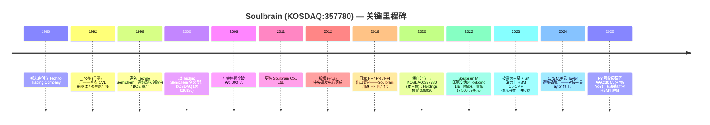

# Soulbrain Co., Ltd. (KOSDAQ:357780) — 公司研究

*截至日期：2026-05-26*
*覆盖状态：首次覆盖 (initiation)*
*上市地：KOSDAQ (韩国)，股票代码 `357780`*
*主要披露文件：DART (전자공시시스템) 사업보고서 / 반기보고서 / 분기보고서*

---

## 目录
1. 公司概览
2. 公司历史
3. 管理团队
4. 产品与服务
5. 客户与上市策略
6. 行业概览
7. 竞争格局
8. 市场机会 (TAM)
9. 风险评估

---

## 1. 公司概览

Soulbrain Co., Ltd. (솔브레인，KOSDAQ:357780) 是韩国最多元化的半导体湿法工艺耗材商业供应商 (merchant supplier)——业务覆盖刻蚀液 (etchant)、CMP 抛光液 (CMP slurry)、CVD/ALD 前驱体 (precursor)、光刻胶辅料、高纯无机酸、以及锂电池电解液 (LIB electrolyte) 等品类。本报告覆盖的实体是老 Soulbrain 集团的拆分后经营主体：2020 年 8 月，母公司 (KOSDAQ:036830，现 Soulbrain Holdings) 实施了横向分立 (분할)，将 IT 材料制造业务装入新上市的子公司——即本报告标的——而 Holdings 保留了薄膜涂层、电子元件以及投资控股业务 ([Soulbrain "History" 页面 — 2020 拆分](https://www.soulbrain.co.kr/en/m14.php))。这一 2020 年从 Soulbrain Holdings 拆分 (2020 spin-off from Soulbrain Holdings) 的设计目的是让化学材料投资者获得对三星电子 / SK 海力士存储周期的更纯粹、更少历史包袱的投资敞口。

公司业务高度依赖两个锚定客户——**三星电子** (存储 + 代工) 与 **SK 海力士** (存储)——Soulbrain 几乎将其全部产品组合输送至这两家客户的整条晶圆厂湿化学品消耗链 ([Businesskorea，2023-10-30 — HBM 材料国产化](https://www.businesskorea.co.kr/news/articleView.html?idxno=203197))。公司同时为 LG Display 与三星 Display 提供平板显示功能化学品，并通过其美国子公司 Soulbrain MI 向三星 SDI / SK On / LG Energy Solution 等电池厂商供应锂离子电池电解液。从地理布局看，韩国是绝对主导的生产基地（公州 공주、坡州 파주、平泽 평택、世宗 세종、龙仁 용인、城南 성남总部园区），海外则在中国 **无锡**、美国 **加州弗里蒙特** (Fremont)、**印第安纳州科科莫** (Kokomo) 设厂，并于近期宣布在 **得克萨斯州泰勒** (Taylor TX) 建设新工厂以匹配三星美国代工厂建设节奏 ([Evertiq，2024-07-30](https://evertiq.com/news/56124)，[Greater Kokomo，2022](https://greaterkokomo.com/soulbrain-mi-investing-in-kokomo-creating-75-jobs/))。

按规模看，Soulbrain 属于中盘工业公司：FY2024 合并营收 **₩8,634 亿** (约 6.3 亿美元，按 ₩1,370/USD 折算)，营业利润 **₩1,679 亿**，营业利润率 **19.4%**——较 2023 年 NAND 拖累的低谷 (₩8,440 亿营收，OPM 15.8%) 显著回升，也远高于韩国特种化学品行业的 10–12% 周期均值 ([Stockanalysis 营收页](https://stockanalysis.com/quote/kosdaq/357780/revenue/)，[Economy6 韩国券商汇编，2025-12](https://www.economy6.com/2025/12/soulbrain-stock.html))。FY2025 营收同比 +7%，达 **₩9,234 亿**，得益于 AI 驱动的 HBM 上量带动半导体材料复苏；其中 Q4 单季 ₩2,440 亿 (+12.7% YoY) ([Stockanalysis 营收页](https://stockanalysis.com/quote/kosdaq/357780/revenue/))。最新披露员工数约 1,233 人 ([Stockanalysis 公司概览](https://stockanalysis.com/quote/kosdaq/357780/company/))。

营收高度集中于半导体材料——刻蚀液 (HF、BOE、磷酸、硫酸、硝酸混合物)、CMP 抛光液 (硅基 + 铈基)、CVD/ALD 前驱体 (TEOS、TEB、TEPO、TMOP、POCl₃、TiCl₄、HfO₂/ZrO₂ 前驱体)、剥离液、光刻胶显影液 (photoresist developer)——按韩国卖方汇编估计这些品类 2024 年合计贡献合并营收的 **约 75–76%**；显示功能化学品贡献 ~9–11%，二次电池材料（LIB 电解液、电极极耳）贡献 ~13–16% ([Economy6 券商汇编，2025-12](https://www.economy6.com/2025/12/soulbrain-stock.html))。*分析师观点：* 随着美国 Taylor 磷酸厂投产以及 HBM4 驱动的铈基抛光液订单加速，半导体业务占比到 FY2027 很可能进一步上升至 80% 以上；而显示业务将因韩国 OLED 产能成熟、中国面板厂转向本土化学品供应而继续缓慢萎缩。

资本结构层面表现为韩国材料公司中较保守的一档：2024 年末几乎零净负债，ROE 约 14%，分红较低（年股息约 ₩2,000–2,300/股，派息率 10–15%——较轻，为美国与韩国设施扩张留出资本支出空间） ([Economy6 券商汇编，2025-12](https://www.economy6.com/2025/12/soulbrain-stock.html))。公司历来通过经营现金流自筹产能扩张资金，在重资本支出年份辅以 ₩1,000–2,000 亿规模的公司债；**Taylor TX 1.75 亿美元磷酸厂** (Taylor TX USD 175 mn phosphoric-acid plant) 一期项目（含二期合计可达 5.75 亿美元）很可能成为分立以来的首轮多年期举债周期。

**估值快照 (2026-05-24 收盘)：**
- 股价：**₩452,000** (当日 +5.2%) ([Stockanalysis，KOSDAQ:357780](https://stockanalysis.com/quote/kosdaq/357780/))
- 市值：**₩3.33 万亿** (约 24 亿美元，按 ₩1,370/USD) ([Stockanalysis 市值页](https://stockanalysis.com/quote/kosdaq/357780/market-cap/))
- 流通股本：774 万股
- **TTM 市盈率：41.8 倍**，**前瞻 P/E：18.9 倍** ([Stockanalysis，KOSDAQ:357780](https://stockanalysis.com/quote/kosdaq/357780/))
- TTM 市销率 (P/S)：约 3.7 倍（由 ₩3.33 万亿 ÷ ₩923 亿隐含），与 [Stockopedia P/S 页](https://www.stockopedia.com/share-prices/soulbrain-co-KOSDAQ:357780/) 一致
- 52 周区间：₩155,000 – ₩530,000 (即股价从 2025 年低点几乎涨了三倍，由 AI 存储周期推动)
- 股息率：0.55%

TTM P/E 41.8 倍相对其自身 3 年中位数 (~22 倍) 与韩国特种化学品同业 **明显偏高**：DongJin Semichem (KOSDAQ:005290) TTM 约 12 倍，Soulbrain Holdings 母公司因综合控股折价仅约 7 倍，半导体业务更纯粹的 Hansol Chemical (KOSPI:014680) 约 13 倍。*分析师观点：* 这一溢价反映三方面的同时叠加：**(a)** HBM 材料 spec-in（Soulbrain 是 HBM 铜过孔 CMP 抛光液对三星与 SK 海力士的唯一韩国本土供应商，同时是 HBM4 / HBM4E 铈基抛光液的主要候选）；**(b)** 三星 Taylor 与 TSMC 凤凰城的本地化供应链顺风；**(c)** 从 2023 年 NAND 低谷出来的盈利复苏——前瞻 P/E 18.9 倍说明卖方已假设 EPS 到 FY2027 约翻一倍 ([Stockanalysis，KOSDAQ:357780](https://stockanalysis.com/quote/kosdaq/357780/)，[Trendforce，2025-12-30 — 三星 2026 年 HBM 产能扩张](https://www.trendforce.com/news/2025/12/30/news-samsung-reportedly-plans-50-hbm-capacity-surge-in-2026-spotlight-on-hbm4/))。下行风险：若 HBM4 抛光液 spec-in 被 Fujimi / Versum / Anji 抢走，或三星 HBM 毛利不及预期，估值压缩至 20 倍中后段是完全合理的。

*资料来源：[Stockanalysis 营收史](https://stockanalysis.com/quote/kosdaq/357780/revenue/)；营业利润率叠加数据来自 [Economy6 券商汇编，2025-12](https://www.economy6.com/2025/12/soulbrain-stock.html) 用于 FY2024 (OPM 19.4%) 与 [Samsung Pop 研究报告，2025-02-10](https://samsungpop.com/common.do?cmd=down&contentType=application%2Fpdf&fileName=2010%2F2025021007420216K_02_02.pdf&inlineYn=Y&saveKey=research.pdf) 用于 FY2023 调节。注：FY2021 / FY2022 的数据由于发生在 2020 年分立之前，全年可比口径上有所失真；FY2022 是周期高点 (~₩1.09 万亿)。*

## 2. 公司历史

Soulbrain 的根源比当前上市主体要早将近四十年。原始公司由 정지완 (郑志完，Jeong Ji-wan) 于 **1986 年 5 月** 在首尔创立，当时名为 **Techno Trading Company** (테크노상사)，最初只是一家向韩国新生半导体产业分销日本特种化学品的小型贸易公司 ([Soulbrain "History" 页面](https://www.soulbrain.co.kr/en/m14.php))。1989 年 2 月公司正式法人化为 Techno Trade Co., Ltd.；1991 年与日本 **Yamanake Hutech** 结成战略联盟，获得 CVD 前驱体与掺杂剂工艺许可——并于 1992 年在公州 (공주) 建成生产基地，由此开始从纯贸易转向本土制造 ([Soulbrain "History" 页面](https://www.soulbrain.co.kr/en/m14.php))。公司中央研发中心于 1994 年成立；1999 年更名为 **Techno Semichem Co., Ltd.**，2000 年在 KOSDAQ 上市，2006 年年销售额突破 ₩1,000 亿，2011 年再次更名为 **Soulbrain Co., Ltd.** ([Soulbrain "History" 页面](https://www.soulbrain.co.kr/en/m14.php))。

第一次转型发生在 **2000–2010 年间**：在原有 CVD / 掺杂剂业务基础上拓展至湿法刻蚀液与 **缓冲氧化物刻蚀 (BOE, buffered oxide etch)**——Soulbrain 当时是韩国唯一规模化生产 BOE 的企业——并进入 LCD 功能化学品 (cell scribing、彩色滤光片刻蚀液) 领域。公司由此成为三星电子华城 / 平泽厂区与 LG Display 当时崛起的平板业务的主力供应商，乘上 CRT 到 LCD 的代际换挡。CMP 抛光液与二次电池电解液的多条产线在本十年下半段陆续投产；公司在 2000 年代末进入锂离子电池电解液市场，供应三星 SDI、LG 化学 (现 LG Energy Solution) 与 SK Innovation (现 SK On) ([Soulbrain "History" 页面](https://www.soulbrain.co.kr/en/m14.php))。

第二次转型是 **2019 年日韩贸易战 (2019 Japan-Korea trade war)**。2019 年 7 月 1 日，日本将三种半导体关键投入品——**氢氟酸 (HF, hydrofluoric acid)**、**光刻胶 (photoresist)**、**氟化聚酰亚胺 (fluorinated polyimide)**——纳入对韩国出口的"个别许可"管制名单，威胁三星与 SK 海力士的 HF 供应（当时日本占韩国 HF 进口约 44%，且 Stella Chemifa、Morita、Showa Denko 等日本厂主导高纯 12-nines 级 BOE / 刻蚀级供应） ([Al Jazeera，2019-08-30](https://www.aljazeera.com/economy/2019/8/30/japans-curbs-on-hi-tech-exports-to-south-korea-could-backfire)，[NBR，"Bolstering and Securing Semiconductor Supply Chains"](https://nbr.org/publication/bolstering-and-securing-semiconductor-supply-chains/))。Soulbrain 加速推进早已规划的高纯 HF 国产化路线图——从中国（而非日本）采购萤石与无水 HF (AHF)、在公州与世宗厂建设 12-nines 提纯产能，并在三个月内进入三星 / SK 海力士的来料检验流程 ([Businesskorea，2020-04 — 韩国企业批量生产高纯 HF](https://www.businesskorea.co.kr/news/articleView.html?idxno=39795))。到 2023 年，韩国从日本进口 HF 的金额相对争端前 2018 年基准下降 **约 88%**；Soulbrain 与 SK Materials (SK siltron 化学品事业部) 瓜分了空出的市场份额 ([THE ELEC，2023](https://www.thelec.net/news/articleView.html?idxno=4432))。这一事件确立了 Soulbrain 在韩国半导体湿化学品领域"国家队 (national champion)"的战略地位，并使创始人郑志完在 2020 年韩国技术大奖上获得总统奖 ([Soulbrain "History" 页面](https://www.soulbrain.co.kr/en/m14.php))。

第三次转型是 **2020 年横向分立**。2020 年 8 月 6 日，Soulbrain Holdings (老 KOSDAQ:036830 上市母公司) 实施 분할상장 (拆分上市)，将 IT 材料制造业务——刻蚀液、CMP 抛光液、CVD 前驱体、显示化学品、电池电解液——装入新上市的 Soulbrain Co., Ltd. (357780)，而母公司保留薄膜涂层设备 (사출 / 코팅 장비)、MC Solution (电子元件) 以及家族投资载体 ([Soulbrain "History" 页面 — 2020 拆分](https://www.soulbrain.co.kr/en/m14.php))。郑氏家族通过 Soulbrain Holdings 同时维持对两个主体的多数控制权；这次分立让经营性化学品业务得以按半导体材料的估值倍数（而非综合集团折价）被市场定价。

*资料来源：[Soulbrain "History" 页面](https://www.soulbrain.co.kr/en/m14.php)；[Businesskorea，2023-10-30](https://www.businesskorea.co.kr/news/articleView.html?idxno=203197)；[Evertiq，2024-07-30](https://evertiq.com/news/56124)；[Greater Kokomo，2022](https://greaterkokomo.com/soulbrain-mi-investing-in-kokomo-creating-75-jobs/)；[Yahoo Finance — Soulbrain Holdings 036830.KQ](https://finance.yahoo.com/quote/036830.KQ/)。*

分立后的几年里公司分两波展开 **激进的海外扩张**。第一波是电动车电池浪潮：美国子公司 Soulbrain MI 于 2022 年 12 月宣布投资 7,500 万美元、3 万平方英尺的电解液厂落地印第安纳州 Kokomo，为隔壁的 Stellantis–三星 SDI 电动车电池合资工厂供货，并于 2024 年初开始招聘 ([Greater Kokomo，2022](https://greaterkokomo.com/soulbrain-mi-investing-in-kokomo-creating-75-jobs/)，[Area Development，2022-12-15](https://www.areadevelopment.com/newsitems/12-15-2022/soulbrain-mi-kokomo-indiana.shtml))。第二波是半导体本地化浪潮：2024 年 7 月 30 日 Soulbrain 宣布在得克萨斯州 Taylor 市建设 **1.75 亿美元一期工厂**（连同二期最多达 **4 亿美元、合计 5.75 亿美元**，到 2033 年完成），生产电子级磷酸——即 SiN 剥离 / 多晶硅刻蚀工艺的主力化学品——以匹配三星 170 亿至 440 亿美元规模的 Taylor 代工厂建设 ([Evertiq，2024-07-30](https://evertiq.com/news/56124)，[Hoodline，2024-07](https://hoodline.com/2024/07/south-korean-company-soulbrain-to-launch-175m-plant-in-taylor-bolstering-local-tech-industry-and-job-market/))。中国无锡 (无锡) 厂区于 2010 年代开设，最初服务 SK 海力士无锡与三星西安，目前继续支持 SK 海力士不断扩张的无锡 DRAM 产线——尽管 SK 海力士的无锡资本支出在 2024 年曾暂停，2026 年因 AI 存储紧缺再度重启 ([SCMP，2026-03](https://www.scmp.com/tech/tech-trends/article/3348159/south-korean-chip-giants-step-china-investments-combat-global-ai-memory-shortage))。

**2023 年 HBM 披露事件**可以说是分立后单一最具影响力的事件。2023 年 10 月下旬，Businesskorea 报道——Soulbrain 也予以确认——公司是 HBM TSV (硅通孔) 加工中铜过孔去除 (Cu-overburden) 步骤所用 CMP 抛光液对三星电子与 SK 海力士的 **唯一供应商**，取代了原先 Cabot Microelectronics (现已并入 Entegris) 与 Hitachi Chemical (现为 Resonac) 主导的双寡头格局 ([Businesskorea，2023-10-30](https://www.businesskorea.co.kr/news/articleView.html?idxno=203197))。两年后这一独占已部分被稀释：Fujimi 据报在 2024 年中期重新拿回部分韩国 Cu-CMP 份额，Dongjin Semichem 也在 2025 年突破进入 SK 海力士的 HBM CMP 供应——但 Soulbrain 仍是 Tier-1 在位者，也是 HBM4 验证中事实上的韩国本土选项 ([Fujifilm Electronic Materials 领先，2024-09](https://www.webnewswire.com/2024/09/03/fujifilm-electronic-material-takes-lead-in-cmp-slurry-market-for-hbm-says-the-information-network/)，[THE ELEC，2024](https://www.thelec.net/news/articleView.html?idxno=4751))。

最新的公司治理里程碑是 **2025 年 3 月的 CEO 换届**：分立以来一直担任 CEO 的 노환철 (卢焕喆，Roh Hwan-chul，原三星 SDI 高管) 退休，由公司原技术副总裁 **박영수 (朴英洙，Park Young-soo)** 接任；朴英洙曾是 2019 年 HF 国产化攻坚战中 Soulbrain 的对外门面人物，也是公司与三星电子来料质量团队的主要技术接口 ([Edaily，2025-03-25](https://www.edaily.co.kr/News/Read?newsId=03834326642106928&mediaCodeNo=257)，[KRX 披露 20250325000760](https://kind.krx.co.kr/common/disclsviewer.do?method=search&acptno=20250325000760))。这一交接被定位为从销售 / 综合管理型领导者 (Roh) 到 R&D / 技术型领导者 (Park) 的换代，目的是更好地把握 HBM4 / GAA spec-in 周期。

## 3. 管理团队

**박영수 (朴英洙，Park Young-soo) — Soulbrain Co., Ltd. (357780) 总裁兼 CEO，自 2025 年 3 月起**

朴英洙于 2025 年 3 月 25 日被任命为 Soulbrain Co. CEO，接替自 2020 年 8 月分立上市以来一直担任此职的 노환철 (Roh Hwan-chul) ([Edaily，2025-03-25](https://www.edaily.co.kr/News/Read?newsId=03834326642106928&mediaCodeNo=257)，[Nate news，2025-03-25](https://news.nate.com/view/20250325n27329))。他升任最高职位前在 Soulbrain 集团内有较长任期，最近的职务是 **技术副总裁 (Vice President of Technology)**——即 2019 年日韩 HF 危机期间作为 Soulbrain 对外发言人、阐述公司高纯 HF 国产化路线图、并担任公司与三星电子来料质量团队、SK 海力士供应商开发组织主要技术接口的角色。（2024 年 7 月 30 日 Taylor 得州工厂揭幕时他作为"技术副总裁"署名发言——"我们很高兴扩大在 Taylor 的业务。市政府与 EDC 是优秀的伙伴…"——证实其早在被提拔之前就已统筹美国扩张 ([Evertiq，2024-07-30](https://evertiq.com/news/56124))。）

朴英洙的背景明确处于化学与工艺工程领域，而非财务或销售——这是董事会有意发出的信号。任命的战略背景：在 FY2025 到 FY2028 之间，Soulbrain 必须同时 (a) 在三星与 SK 海力士争取 HBM4 / HBM4E 铈基抛光液的 spec-in 资格；(b) 落地 1.75–5.75 亿美元的 Taylor 得州磷酸厂建设；(c) 集成 Soulbrain MI Kokomo 厂为 Stellantis–三星 SDI 提供 LIB 电解液的产能爬坡；(d) 应对 Dongjin Semichem 与 Foosung 对韩国 HF 市场份额的蚕食。Roh 到 Park 的交接刻意将一位资深技术人员推上 CEO 位置，以迎接一个 R&D 密集型的扩张周期，这与三星和 SK 海力士开始把自己的材料厂领导班子从销售背景转向工程背景的趋势一致。朴英洙的持股份额据报道为名义性质 (<1%——创始郑氏家族通过 036830 Soulbrain Holdings 控制 51%+)，薪酬结构为韩国典型高管包：底薪 + 业绩奖金 + 限制性股票授予。

**정지완 (郑志完，Jeong Ji-wan) — Soulbrain Holdings (036830) 创始人兼名誉董事长；Soulbrain Co. (357780) 实际控制人**

虽然不是 357780 上市主体的 CEO，**创始人郑志完通过其在 Soulbrain Holdings 中的多数股权控制 Soulbrain Co.**——老 KOSDAQ:036830 母公司持有 357780 超过 50% 股份——并仍是资本支出、并购与家族传承的最终战略决策者 ([Businesspost — Who Is? Jeong Ji-wan](https://m.businesspost.co.kr/BP?command=mobile_view&num=41846))。郑 1956 年 11 月出生于忠清南道，1982 年毕业于 **成均馆大学** 化学工程系，后在韩国一家小型进出口公司 Sungwon Trading 工作四年，期间观察到 Stella Chemifa、Morita、Showa Denko、JSR、Sumitomo 等日本化工厂如何垄断韩国半导体投入品供应链 ([Businesspost — Who Is? Jeong Ji-wan](https://m.businesspost.co.kr/BP?command=mobile_view&num=41846))。31 岁那年他创立 Techno Trading (1986)，最初向当时还很小的三星半导体器兴存储产线分销日本前驱体。

定义郑志完职业生涯的战略决策是 **1991 年从贸易转向制造的合资转型**：与日本 Yamanake Hutech 结盟，获得 CVD 前驱体与掺杂剂化学许可，并于 1992 年建成公州厂——韩国第一条商业规模的 CVD 前驱体产线。从这一起点出发，他在 1990 年代构筑了刻蚀液与 BOE 业务，2000 年代叠加 CMP 抛光液与 LIB 电解液，并因此获得 EY 韩国年度企业家奖 (化工组，2013) 与 2020 年韩国技术大奖总统奖——后者表彰的就是 HF 国产化突破 ([Businesspost — Who Is? Jeong Ji-wan](https://m.businesspost.co.kr/BP?command=mobile_view&num=41846)，[Soulbrain "History" 页面](https://www.soulbrain.co.kr/en/m14.php))。郑还曾于 2013 年 2 月至 2015 年 2 月担任 **KOSDAQ 协会** 第八届会长，显示他在韩国中盘股生态中的影响力 ([Businesspost — Who Is? Jeong Ji-wan](https://m.businesspost.co.kr/BP?command=mobile_view&num=41846))。

关于传承问题，郑有两个子女——儿子 정석호 (Jeong Seok-ho) 与女儿 정문주 (Jeong Mun-joo)——但家族继承过程因儿子 정석호在 2020 年代初去世（韩国财经媒体以"솔브레인 오너 2세 사망"为标题报道）而变得复杂，使 Jeong Mun-joo 及下一代成为 Holdings 持股最可能的长期继承人 ([THE ELEC — "Soulbrain 第二代继承"](https://www.thelec.kr/news/articleView.html?idxno=6616))。郑的孙辈已经出现在韩国"最年轻大股东"榜单上，持有数十亿韩元规模的 Soulbrain 集团股权 ([The Asia Business Daily，2024-09-17](https://www.asiae.co.kr/en/article/2024091711322781831))。在经营控制层面，家族在上市 357780 主体安排非家族成员的职业 CEO——分立初为 Kang Byeong-chang，2021 至 2025 年为 Roh Hwan-chul (三星 SDI 老将)，现为 Park Young-soo——这一安排与韩国财阀普遍的"家族当所有者 / 职业经理人当经营者"剧本一致 ([thebell.co.kr — Soulbrain CEO 分析，2021-03-29](https://m.thebell.co.kr/m/newsview.asp?svccode=00&newskey=202103292236163680106472))。郑志完个人在 Soulbrain Holdings (036830) 中的持股——2016 年 Q3 最后披露为约 31%，经回购后今日很可能略高于此水平——经由 Holdings 对 357780 的所有权，最终转化为对经营性化学品业务的多数经济控制权 ([Businesspost — Who Is? Jeong Ji-wan](https://m.businesspost.co.kr/BP?command=mobile_view&num=41846))。

