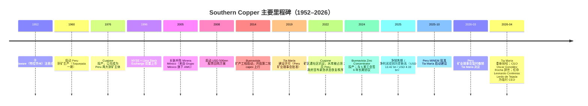
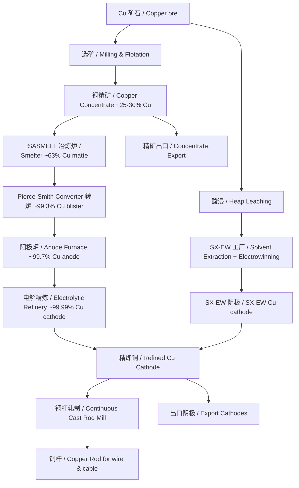
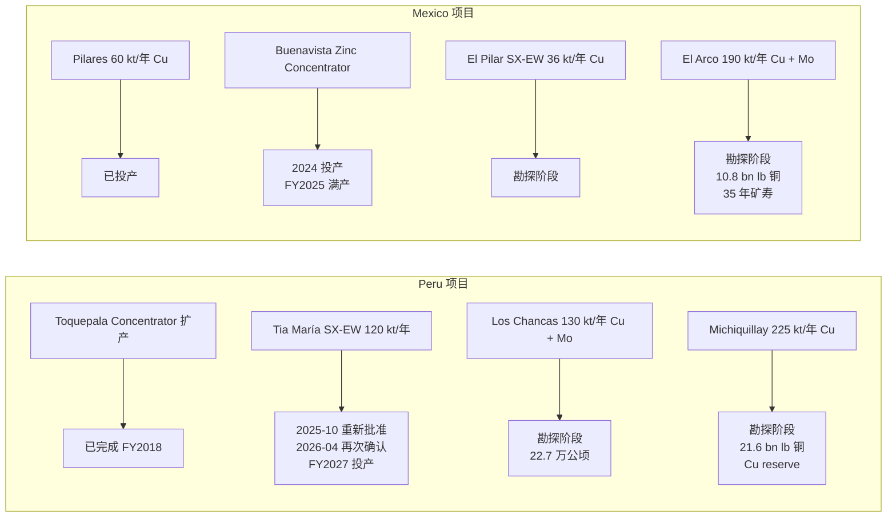
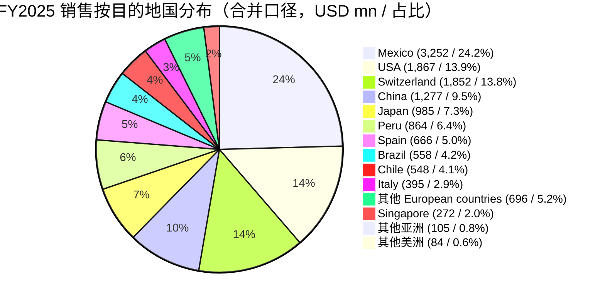
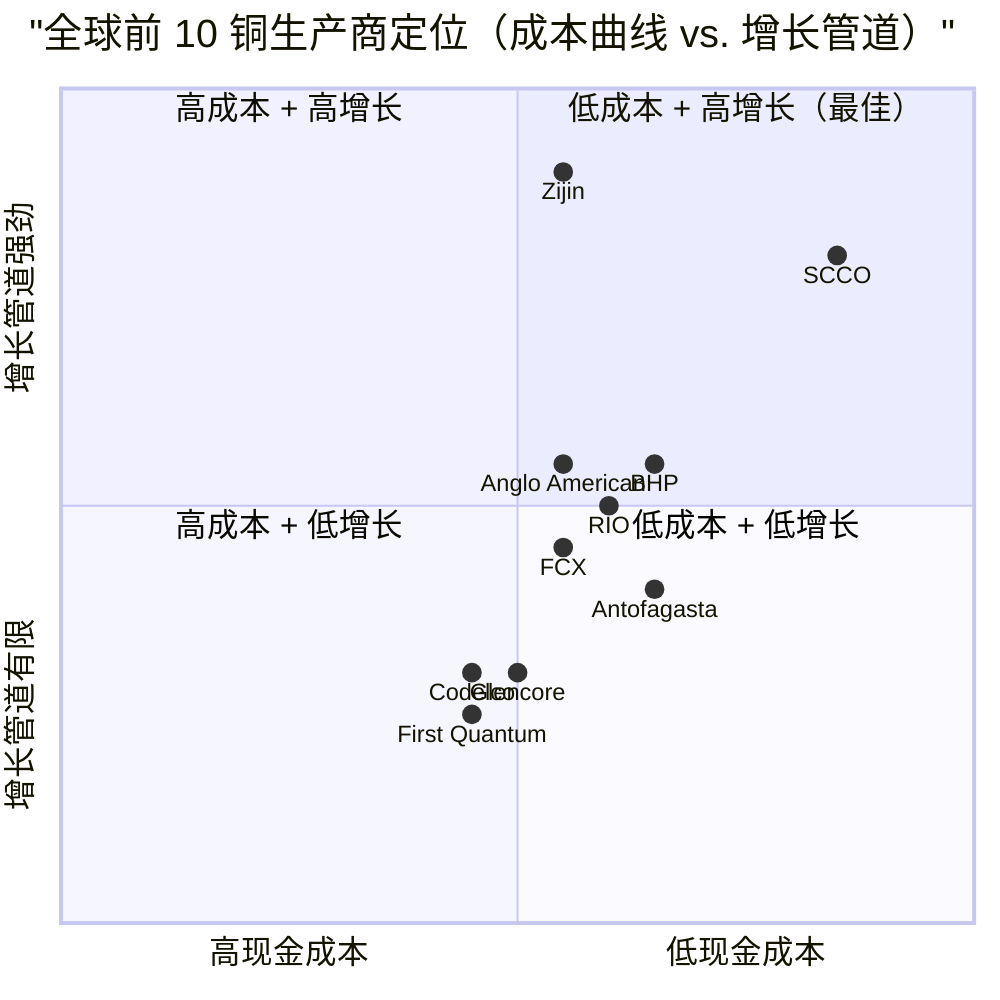
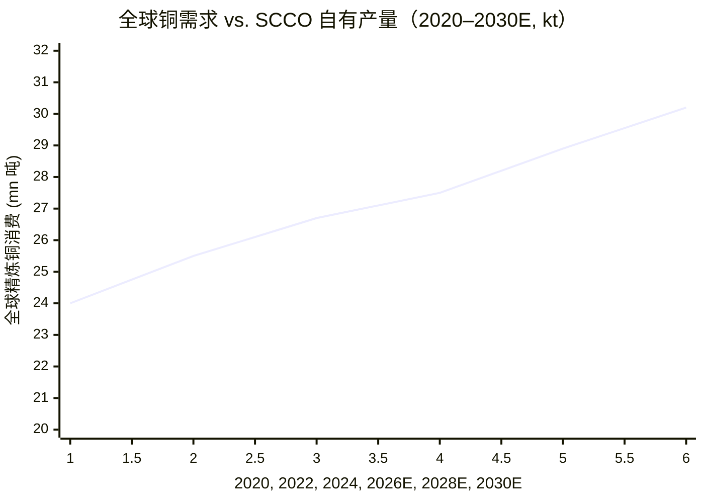
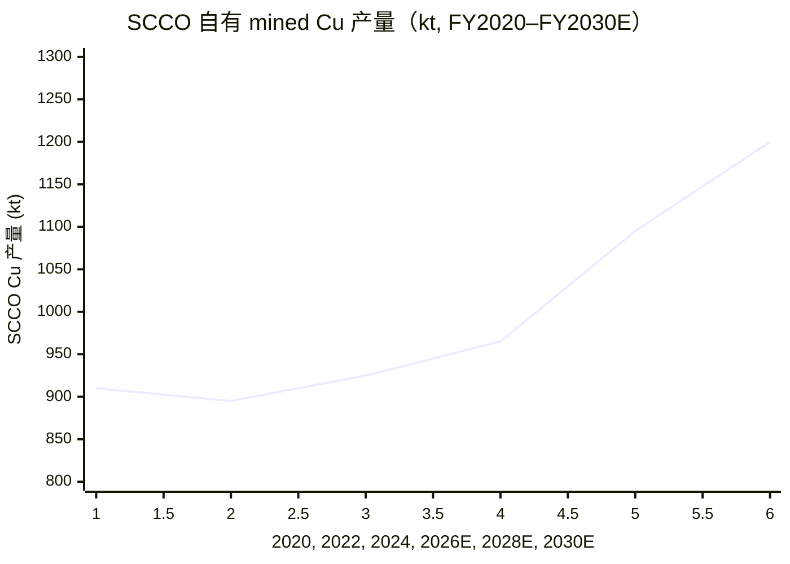

# SOUTHERN COPPER 公司研究报告

**公司**: Southern Copper Corporation（南方铜业公司 / SCC）
**股票代码**: NYSE: SCCO（同时在 Lima Stock Exchange / 利马证交所挂牌）
**主题归属**: 稀土与战略矿产 / rare-earth-strategic-minerals（铜作为电气化与 AI 数据中心建设的核心战略金属）
**截止日期 / As-of date**: 2026-06-02
**报告语言**: 简体中文（zh-CN，本报告之外不再生成英文版）

---

## 目录

1. 公司概览
2. 公司历史
3. 管理团队
4. 产品与服务
5. 客户与上市策略 / Go-to-Market
6. 行业概览
7. 竞争格局
8. 市场机会 / TAM
9. 风险评估
10. 投资者视角评分 / Investor-Lens Scorecards
11. 数据来源清单 / Data Used
12. 参考资料

> **重要披露：CEO 更替（2026-04-13）** —— 公司原总裁兼 CEO Oscar González Rocha 于 2026-04-13 突然辞世（享年 50 年公司服役）；董事会于 2026-04-16 任命 Leonardo Contreras Lerdo de Tejada 为临时 CEO（Interim CEO）。Mr. Contreras 同时为董事会成员（2021 年起任职）、Grupo México 子公司 Americas Mining Corporation 的 General Director，并且为董事长 Germán Larrea Mota-Velasco 之女婿。Source: [SCCO 2026 DEF 14A 代理声明](https://www.sec.gov/Archives/edgar/data/1001838/000110465926044982/scco-20260529xdef14a.htm)。

---

## 1. 公司概览（Company Overview）

Southern Copper Corporation（南方铜业，NYSE: SCCO）是世界规模最大的一体化铜生产商之一，按公司自身披露的口径，其**已探明铜矿储量在所有上市同业中位列全球第一**。公司在 Peru（秘鲁）与 Mexico（墨西哥）两国运营所有矿山、冶炼厂与精炼厂，所有勘探活动则覆盖前述两国以及 Argentina（阿根廷）和 Chile（智利）。在产品口径上，公司以**铜 / copper** 为主，并联产 **钼 / molybdenum**、**白银 / silver**、**锌 / zinc**、**铅 / lead** 和少量黄金及硫酸副产品。公司 1952 年于 Delaware（特拉华州）注册成立，1960 年开始铜矿运营，1996 年起在 NYSE 与 Lima Stock Exchange 双重挂牌（[2025 年度 10-K, Item 1 Business](https://www.sec.gov/Archives/edgar/data/1001838/000110465926021492/scco-20251231x10k.htm)）。

公司**实质上由 Grupo México S.A.B. de C.V.（GMéxico, BMV: GMEXICO）通过其全资子公司 Americas Mining Corporation（AMC）持有 88.9% 股权**。也就是说，SCCO 是 Grupo México 旗下的**上市表达载体**，少数股东（minority shareholders）持有 SCC 约 11.1% 的流通股，并享有 NYSE 主板的流动性与披露体系。这种"集团控股 + 上市子公司"的结构在拉美矿业巨头里相当典型（参考 BHP、Vale、Antofagasta 的家族控股结构），其后果是：少数股东在治理、关联交易、分红节奏、CEO 选任等方面对控股股东的高度依赖；以及关联方电力供应（Grupo México 旗下 MGE / Mexico Generadora de Energia）和运输（Grupo Ferroviario Mexicano）形成完整的"母集团内部链路"（[2025 年度 10-K, Item 1 Organizational Structure & Properties](https://www.sec.gov/Archives/edgar/data/1001838/000110465926021492/scco-20251231x10k.htm)）。

**业务模式 / business model：** SCCO 以"卖大宗商品"的方式赚钱 —— 公司生产的铜阴极（copper cathodes）、铜杆（copper rod）、铜精矿（copper concentrates）、电解铜（refined copper）和副产品按 LME（London Metal Exchange）/ COMEX 价格 + 标准溢价（premium）销售给全球工业用户。公司在 10-K 中明确表述："**Generally, 80% to 90% of our metal production is sold under annual or longer-term contracts**"（[2025 年度 10-K, Item 1 Principal Products and Markets](https://www.sec.gov/Archives/edgar/data/1001838/000110465926021492/scco-20251231x10k.htm)），即"年度合约或更长期合约覆盖 80%–90% 的产量"。其余的 10%–20% 在现货市场（spot）按短期价格销售。这意味着 SCCO 几乎完全是一个 **price-taker / 价格接受者** —— 收入对铜价的弹性极高，管理层的关键变量是**单位现金成本（operating cash cost per pound）** 而非售价。

**经营地域 / geographic footprint：** Peruvian operations 在 Cuajone 与 Toquepala 两座露天大铜矿（Andes 安第斯山脉，距 Lima 利马东南约 860 公里），以及位于 Ilo 的临海冶炼-精炼-精贵金属厂；Mexican operations 包括 Sonora 州的 Buenavista del Cobre（毗邻美墨边界 Cananea，"世界规模最大铜矿床之一"）、La Caridad 露天铜矿、Pilares 新建露天矿、Buenavista 的两座 SX-EW 工厂与新建的锌精矿厂（Buenavista Zinc Concentrator，2024 年投产，2025 年首个完整年度运行），以及 IMMSA 部门下的五座地下矿（产锌、铅、铜、银、金）和 San Luis Potosí 锌精炼厂。固定资产净值（property book value）在 2025-12-31 为 **USD 10,272.2 million** —— Peruvian operations 约 USD 4,235.0 mn，Mexican Open Pit 约 USD 4,882.8 mn，IMMSA 约 USD 803.6 mn（[2025 年度 10-K, Item 2 Property Book Value](https://www.sec.gov/Archives/edgar/data/1001838/000110465926021492/scco-20251231x10k.htm)）。

**FY2025 业绩规模 / scale：** 2025 年净销售额（Net Sales）创历史新高，达到 **USD 13,420.0 million**，同比增长 +17.4%（FY2024: USD 11,433.4 mn → FY2025: USD 13,420.0 mn）。归属母公司净利润（Net Income attributable to SCC）同样创历史新高，**USD 4,334.9 million**（+28.4% YoY），EPS **USD 5.24**（FY2024: USD 4.21）。年度内铜销量基本持平（pounds of copper sold 2,067.0 mn vs. 2,069.1 mn 上年），收入增长完全来自价格上行 —— LME 铜均价从 USD 4.15/lb 升至 USD 4.51/lb（+8.7%），COMEX 从 USD 4.22 升至 USD 4.82（+14.2%），叠加银价 +41.6%、钼价 +3.8% 和锌增量销售（Buenavista 锌精矿厂全年贡献，锌销量 +19.3%）。年度资本开支 / capex **USD 1,925.5 million**（[2025 年度 10-K, Item 7 MD&A Key Matters & Capital Investment Program](https://www.sec.gov/Archives/edgar/data/1001838/000110465926021492/scco-20251231x10k.htm)）。

**FY2025 业务结构 / segment mix：**

| 业务部门 | 主要矿山 | 主要产品 |
|---|---|---|
| Peruvian Operations | Toquepala + Cuajone + Ilo 冶炼-精炼厂 | 铜阴极、铜杆、铜精矿、钼精矿、白银、黄金、硫酸 |
| Mexican Open-Pit | Buenavista + La Caridad + Pilares | 铜阴极、铜杆、铜精矿、钼精矿、锌精矿、银 |
| Mexican IMMSA Unit | Charcas, San Martín, Santa Bárbara, Santa Eulalia, Taxco（五座地下矿）+ San Luis Potosí 锌精炼厂 | 锌、铅、铜、银、金（地下采矿，多金属混合） |

**FY2025 金属销售占比 / metal mix（按销售额占总销售额比例）**：铜 74.8% / 钼 10.5% / 银 7.3% / 锌 3.9% / 其他副产品（金、硫酸等）3.5%（[2025 年度 10-K, MD&A Outlook — Sales Structure](https://www.sec.gov/Archives/edgar/data/1001838/000110465926021492/scco-20251231x10k.htm)）。

**估值快照 / valuation snapshot（截至 2026-06-02 收盘 / as of 2026-06-02 close）：**

| 指标 | 数值 |
|---|---|
| 股价 / current price | USD 194.62 |
| 市值 / market cap | USD 162.38 bn |
| 企业价值 / enterprise value | USD 164.43 bn |
| **TTM P/E** | **33.00×** |
| Forward P/E | 29.44× |
| **TTM P/S** | **11.16×** |
| P/B | 13.78× |
| EV/EBITDA | 18.58× |
| 股息收益率 / dividend yield | 2.07% |
| Beta（5Y） | 1.08 |
| 52 周价格涨幅 | +122.13% |

Source: [StockAnalysis.com SCCO Statistics](https://stockanalysis.com/stocks/scco/statistics/)。

**估值解读 / interpretation：** SCCO 当前 **TTM P/E 33×、TTM P/S 11.2×** 处于铜矿同业的**显著溢价区间**。Nasdaq / Zacks 2026 年的同业比较显示，SCCO forward P/S 8.67× 显著高于"非铁金属采矿行业"均值 4.48×、Freeport-McMoRan（FCX）3.09×、Rio Tinto（RIO）1.87×、BHP（BHP）3.09×（[Nasdaq Zacks: SCCO Premium](https://www.nasdaq.com/articles/southern-copper-trades-premium-how-play-stock)）。这种溢价来自三个**结构性叙事 / structural narratives**：（a）**铜储量"全球公开上市同业第一"**（自我披露："we believe we have the largest copper reserves in the world"），叠加最低成本曲线区间（cash cost per pound 在拉美露天矿中位列前列）；（b）**铜 super-cycle 主题溢价**：AI 数据中心、电动车、电网建设导致 2026 年起 ICSG 预测全球供应缺口约 150,000 吨，反转 2025 年小幅过剩格局（[S&P Global Substantial Shortfall 2026-01-08](https://press.spglobal.com/2026-01-08-Substantial-Shortfall-in-Copper-Supply-Widens-as-the-Race-for-AI-and-Growing-Defense-Spending-Add-to-Accelerating-Demand,-New-S-P-Global-Study-Finds)）；（c）**Grupo México 集团红利政策** —— 2025 年现金股息 USD 3.10/股 + 股票股息 3.50%，且 11.1% 的极低自由流通比例（free float）放大了"稀缺优质纯铜暴露"的供需失衡。**分析师观点：**Tia María 项目（Peru 阿雷基帕，FY2026E 投产）将贡献 +120 kt/年增产，叠加 Buenavista Zinc Concentrator 全年产能利用率提升，2026 年起 SCCO 进入"无主要工程节点干扰"的最佳产销窗口 —— 这是当前溢价的核心边际驱动。

---

## 2. 公司历史（Company History）

Southern Copper 1952 年于 Delaware 注册，1960 年正式在 Peru 启动铜矿生产，1996 年于 NYSE 与 Lima Stock Exchange 同步挂牌。公司真正成为今天的"两国两板块"巨头是在 **2005 年 4 月收购 Minera México**（来自控股股东 Grupo México 旗下的 Americas Mining Corporation）—— 这一关联交易使 SCCO 在 24 个月内将储量与产能翻倍，从一家"纯秘鲁铜矿公司"升级为"墨西哥 + 秘鲁双国一体化龙头"（[2025 年度 10-K, Item 1 Business — Organizational Structure](https://www.sec.gov/Archives/edgar/data/1001838/000110465926021492/scco-20251231x10k.htm)）。Grupo México 通过 AMC 当前持有 SCCO 88.9% 流通股，其余 11.1% 由公众与 ADR 持有者持有；这种"母集团 + 上市子公司"的结构是 SCCO 治理与资本配置的最根本背景。

**关键战略拐点 / strategic pivots：** 公司过去 20 年的主要叙事变化有三 ——（1）**2005 年关联并购 Minera México** 完成了"墨西哥与秘鲁双国资产组合"的搭建，将储量基础和产能曲线一次性翻倍，此后公司的资本配置开始向 Mexican Open Pit（Buenavista / La Caridad / Pilares）倾斜，因为这些资产距 US 市场更近、社区与监管摩擦相对低于 Peru（[2025 年度 10-K, Item 1 Organizational Structure](https://www.sec.gov/Archives/edgar/data/1001838/000110465926021492/scco-20251231x10k.htm)）；（2）**2014–2024 年的"长达十年的 Capex 上行周期"** —— 公司分别在 Peruvian 端推进 Toquepala Concentrator 扩产（FY2018 完工）、Tia María（持续延期）、Cuajone 改造，在 Mexican 端推进 Buenavista 扩产、Pilares 投产、Buenavista Zinc Concentrator（2024 投产）。仅 2025 年单年 capex 即 USD 1,925.5 mn，未来十年公司预计 Peruvian projects 总投资可超 **USD 10.3 bn**（[2025 年度 10-K, Item 7 Capital Investment Program](https://www.sec.gov/Archives/edgar/data/1001838/000110465926021492/scco-20251231x10k.htm)）；（3）**2025–2026 的"Tia María 反复"** —— 该项目自 2003 年从 Teck/Phelps Dodge/Rio Tinto 手中收购以来，因 Cocachacra 社区抗议持续被拖延（2015 年首次激烈对抗，2019 年获建设许可后又冻结）。2025-10 Peru MINEM 批准复工后，2026-03-19 矿业理事会**暂时撤销该决议**，2026-04-20 又**重新授权**项目继续 —— 一年内三次反转，使 Tia María 成为拉美矿业监管不确定性的标志性案例（[MINING.COM "Peru reauthorizes Southern Copper's $1.8B project amid election chaos"](https://www.mining.com/peru-reauthorizes-southern-coppers-1-8b-project-amid-election-chaos/)）。

**近期重大事件 / recent developments（过去 12 个月）：**

- **2025-10-29**：FY2025 Q3 业绩公告，铜价创历史新高 + Buenavista 锌精矿厂满产驱动业绩强劲（[8-K, 2025-10-29 Earnings Results](https://www.sec.gov/Archives/edgar/data/1001838/000110465925103333/scco-20251028xex99d1.htm)）。
- **2026-01-28**：FY2025 Q4 / 全年业绩公告，全年净销售 USD 13.42 bn、净利 USD 4.33 bn 创历史新高（[8-K, 2026-01-28 Earnings Results](https://www.sec.gov/Archives/edgar/data/1001838/000110465926007496/scco-20260127xex99d1.htm)）。
- **2026-02-27**：FY2025 年度 10-K 申报（[2025 10-K 入口](https://www.sec.gov/cgi-bin/browse-edgar?action=getcompany&CIK=0001001838&type=10-K&dateb=&owner=include&count=10)）。
- **2026-03-19**：Peru 矿业理事会暂时撤销 Tia María 启动决议（regulatory volatility）。
- **2026-04-13**：Oscar González Rocha（CEO 50 年公司服役）突然辞世。
- **2026-04-16**：董事会任命 Leonardo Contreras Lerdo de Tejada 为 Interim CEO（兼任 AMC General Director；Larrea 家族成员）。
- **2026-04-20**：Peru MINEM 重新批准 Tia María 项目（[Geomechanics.io: Tia María Reauthorisation Schedule](https://www.geomechanics.io/news/article/southern-coppers-18b-tia-maria-reauthorisation-schedule-and-design-notes-for-mine-planners)）。
- **2026-04-29**：FY2026 Q1 业绩公告，**单季销售 USD 4,251.4 mn（+36.2% YoY）、净利 USD 1,576.9 mn（+66.7% YoY，单季历史最高），但铜产量同比 −4.0%**（秘鲁低品位）（[8-K, 2026-04-29 Earnings Results](https://www.sec.gov/Archives/edgar/data/1001838/000110465926051281/scco-20260428xex99d1.htm); [Stocktitan: SCCO Q1 2026 $4.25B / $1.58B](https://www.stocktitan.net/sec-filings/SCCO/10-q-southern-copper-corp-quarterly-earnings-report-7261cfa3902e.html)）。

---

## 3. 管理团队（Management Team）

Southern Copper 没有典型意义上的"个人创始人" —— 公司 1952 年于 Delaware 注册时是 ASARCO 集团（前身 American Smelting and Refining Company）旗下的 Peru 业务实体，**实际控制人是 Larrea 家族**（通过 Grupo México 持有 SCCO 88.9% 股权）。本节因此聚焦于**事实上的创始 / 控制方**（Chairman Germán Larrea）以及**现任 CEO**。

### 董事长 / Chairman — Germán Larrea Mota-Velasco

**Germán Larrea Mota-Velasco**（年龄 72 岁）自 1999 年 12 月起担任 SCCO 董事长，1999-12 至 2004-10 期间还兼任公司 CEO（直到 Oscar González Rocha 接任 CEO 为止），是公司**实质上的控制人与战略掌舵者**。他自 1981 年起任 Grupo México 董事会成员，1994 年起出任 Grupo México 董事长 + 总裁 + CEO，至今 30 余年。他同时是 Grupo Ferroviario Mexicano（墨西哥铁路公司）和 Empresarios Industriales de México（EIM 控股公司）的董事长兼 CEO（[2026 DEF 14A Proxy Statement, Career Highlights — Germán Larrea](https://www.sec.gov/Archives/edgar/data/1001838/000110465926044982/scco-20260529xdef14a.htm)）。

Mr. Larrea 在 SCCO 的薪酬体系**完全来自 Grupo México**，他在 SCCO 仅领取董事会服务费与股票奖励（"Mr. Larrea has received only fees and stock awards for his services as a member of our Board of Directors"）（[2026 DEF 14A](https://www.sec.gov/Archives/edgar/data/1001838/000110465926044982/scco-20260529xdef14a.htm)）。Larrea 家族通过 Grupo México 持股 EIM、Grupo México 持股 AMC、AMC 持股 SCCO 的多层金字塔结构，是 Mexico 最大的私人矿业家族。他的核心战略贡献是：（a）2005 年的 Minera México 关联并购，整合家族矿业资产到上市平台；（b）过去 20 年坚定的 "扩产 + 高分红 + 关联交易内部循环" 资本配置范式 —— SCCO 是 Larrea 家族对资本市场的"分红窗口"。

### 临时 CEO（Interim CEO，2026-04-16 至今）— Leonardo Contreras Lerdo de Tejada

**Leonardo Contreras Lerdo de Tejada**（年龄 40 岁）于 2026-04-16 由董事会任命为 SCCO 临时 CEO，接替 2026-04-13 辞世的 Oscar González Rocha（前 CEO 自 2004-10 至 2026-04-13 任职近 22 年，公司服役 50 年）。Mr. Contreras 同时是 SCCO 董事会成员（2021-05 起），并担任 Grupo México 旗下 Americas Mining Corporation（AMC）的 General Director（2024-04 起）以及 ASARCO 总裁（2019-01 起）（[2026 DEF 14A, Director Biographies — Leonardo Contreras Lerdo de Tejada](https://www.sec.gov/Archives/edgar/data/1001838/000110465926044982/scco-20260529xdef14a.htm)）。

教育背景：本科为 Mexico City 的 Universidad Anáhuac 工业工程学士（BS Industrial Engineering），研究生为 University of Chicago Booth School of Business MBA。Mr. Contreras 在 AMC 体系内的晋升轨迹为：2018-09 加入 AMC → 2019-01 出任 ASARCO 总裁 → 2019-08 出任 AMC Commercial & Supply Chain Director → 2020-08 出任 SCCO 子公司 IMMSA（墨西哥地下矿业务）总裁 → 2022-01 出任 AMC CFO → 2024-04 出任 AMC General Director → 2026-04 出任 SCCO Interim CEO。加入 AMC 之前，他在私募股权、投资银行与创业领域工作约 10 年，2015-09 创办了私募投资平台 Murano Capital（[2026 DEF 14A](https://www.sec.gov/Archives/edgar/data/1001838/000110465926044982/scco-20260529xdef14a.htm)）。

**值得在公开报告中标注的治理关系**：Mr. Contreras 是 Chairman Germán Larrea Mota-Velasco 的女婿（DEF 14A 原文："Mr. Contreras Lerdo de Tejada is the son-in-law of Mr. German Larrea Mota-Velasco"）—— 这层关系（a）将"临时"CEO 任命变为高度可预期的内部传承，（b）使 Larrea 家族对 SCCO 的运营与战略控制进一步集中。董事会在 DEF 14A 中明确表示，"The Board is in the process of seeking a permanent Chief Executive Officer in accordance with the Company's internal succession planning"（董事会正按内部继承计划寻找长期 CEO 人选）（[2026 DEF 14A, Board Leadership Structure](https://www.sec.gov/Archives/edgar/data/1001838/000110465926044982/scco-20260529xdef14a.htm)）—— **分析师观点：**考虑到 AMC General Director 的角色定位和 Larrea 家族治理传统，Mr. Contreras 转正为长期 CEO 的概率较高。其私募 + 投行 + AMC 内部 8 年磨练的复合背景，对比 Oscar González Rocha 的 50 年纯运营路径，**预示未来 SCCO 在资本配置、并购、关联交易透明度方面可能出现温和的现代化转向**，但 Larrea 家族高分红 + 内部供应链的核心范式不会改变。

---

## 4. 产品与服务（Products & Services）

> **本节为本报告最重要的章节**。SCCO 是大宗商品价格接受者（commodity price-taker），但其"产品组合 / product mix"涵盖**铜的所有形态（精矿、阴极、铜杆、电解铜）+ 副产品（钼、银、锌、铅、金、硫酸）**，且具有非常具体的冶炼-精炼工艺细节 —— 理解这些工艺差异、产品形态差异，是判断"为什么 SCCO 比纯铜精矿出口商利润率更高、为什么副产品信贷（by-product credit）能让单位现金成本接近零、为什么 IMMSA 部门的地下矿业务在 FY2024 之前长期亏损"的关键。

### 4.1 产品矩阵（按 10-K Item 1 原文复述）

SCCO 在 10-K 的 Item 1 Business → Principal Products and Markets 章节中将产品分为四大类金属 + 一类副产品。以下为 10-K 原文摘要（重组为表格便于检索；原文为段落形式）：

| 主要金属 | 主要终端用途（10-K 原文摘要） | 占 FY2025 销售比例 |
|---|---|---|
| **Copper / 铜** | "primarily used in the building and construction industries; in the power generation and transmission industry; and in the electrical and electronic products; and, to a lesser extent, in industrial machinery and equipment; consumer products; and in the automotive and transportation industries." | **74.8%** |
| **Molybdenum / 钼** | "used to toughen alloy steels and soften tungsten alloy and is also used in fertilizers, dyes, enamels and reagents." | **10.5%** |
| **Silver / 白银** | "used for electrical and electronic products and, to a lesser extent, in brazing alloys and solder, jewelry, coinage, photographic, silverware and catalysts." | **7.3%** |
| **Zinc / 锌** | "primarily used as a coating on iron and steel to protect against corrosion; it is also used to make die cast parts to manufacture batteries and to form sheets for architectural purposes." | **3.9%** |
| **其他副产品**（铅、金、硫酸 / sulfuric acid 等） | by-product credits — 主要降低单位铜成本 | **3.5%** |

Source: [2025 年度 10-K, Item 1 Principal Products and Markets + MD&A Sales Structure](https://www.sec.gov/Archives/edgar/data/1001838/000110465926021492/scco-20251231x10k.htm)。

### 4.2 铜产品形态（按工艺链）

公司在 10-K 中详细描述了铜的全工艺链 —— 矿石 → 精矿（concentrate）→ 阳极（anode）→ 阴极（cathode）→ 铜杆（copper rod）+ SX-EW 旁路。下面是 Mermaid 工艺流程图：

Source: [2025 年度 10-K, Item 2 Properties — Toquepala/Cuajone/Ilo & La Caridad/Buenavista 工艺描述](https://www.sec.gov/Archives/edgar/data/1001838/000110465926021492/scco-20251231x10k.htm)。

**中文释义 / Plain-language gloss：** 铜的下游产品（cathodes / 阴极、rod / 铜杆、concentrate / 精矿）形态决定了**毛利率（gross margin）的差异**与**对客户的议价能力**。

- **铜精矿（copper concentrate, ~25% Cu）** 是冶炼厂的进料原料 / smelter feedstock。SCCO 出口给的客户主要是中国、日本、韩国的炼铜厂（如 Jiangxi Copper、Mitsubishi Materials、LS-Nikko Copper）。这部分销售按 LME 价 × 含铜系数 − 冶炼/精炼费（TC/RCs, Treatment Charge / Refining Charge）定价。**FY2025 的核心利好之一**就是全球 TC/RCs 因冶炼产能过剩（中国新增 100 万吨冶炼产能）暴跌 73% 至 USD 21.25/吨（[Mining.com: Antofagasta-Jiangxi TC benchmark](https://www.mining.com/web/antofagasta-agrees-copper-treatment-charge-with-jiangxi-copper-sources/)）—— 这意味着 **SCCO 出口精矿的有效净价上升**（精矿端，TC 越低，矿企收到的越多），是 FY2025 利润率扩张的隐含因素之一。
- **电解铜阴极（refined cathodes, 99.99% Cu）** 是最高纯度产品，直接卖给铜杆厂、合金厂、电缆厂。这一品类的售价 = LME 价 + **CIF 溢价 / cathode premium**（运输 + 物流 + 仓储 + 即时供给溢价），2025–2026 年由于美国关税预期与 LME-COMEX 价差扩大，CIF 溢价从历史均值 ~USD 90/吨 翻倍至 USD 250–400/吨水平（具体溢价随地区波动），构成了 SCCO 阴极业务的额外利润垫。
- **铜杆（continuous-cast copper rod, 8 mm 圆杆）** 由 La Caridad rod plant 与 Ilo refinery 的连铸轧机生产，是 SCCO 距离终端最近的产品形态 —— 直接卖给电缆与线束厂（wire & cable mills）。铜杆相对阴极有 USD 50–150/吨的"加工溢价 / fabrication premium"，且锁定了客户的长期需求（铜杆订购周期与电缆厂滚动计划绑定）。
- **SX-EW 阴极 / Solvent Extraction–Electrowinning cathode**：和电解 SX-EW 是两条平行工艺路线 —— 前者对应硫化矿（sulfide ore）经选矿 + 冶炼 + 精炼，后者对应氧化矿（oxide ore）的酸浸 + 萃取 + 电沉积，**成本结构和产能扩展速度不同**：SX-EW 不需要昂贵的冶炼炉，资本强度低、扩展快，但矿石必须是含氧化铜或可酸浸的硫化矿。Tia María 项目 100% 是 SX-EW 工艺，120 kt/年产能，因此环境足迹与资本强度低于传统冶炼。

**分析师观点 / Analyst view：** 与 FCX（同时是大宗精矿出口商 + Indonesia Grasberg 黄金联产）、Antofagasta（纯铜精矿出口商，无下游精炼）相比，SCCO **是少数同时具备"上游矿山 + 中游冶炼 + 下游精炼 + 铜杆"的全工艺一体化生产商之一**，这是其"溢价"故事的工艺基础 —— SCCO 在冶炼端享受全球过剩 TC 红利、在精炼端享受 CIF 溢价、在 SX-EW 端享受低资本强度扩张。

### 4.3 钼（Molybdenum）—— FY2025 销售占比 10.5%

钼是 Cu 矿的**副产品 / by-product**：Toquepala、Cuajone、Buenavista、La Caridad 四座主要铜矿都含有钼共生矿，伴随铜精矿浮选产生钼精矿（molybdenum concentrate）。FY2025 公司钼产量 68,682 千磅（+7.4% YoY），是过去 5 年最高水平；钼价平均 +3.8% YoY，叠加 +7.4% 销量增长，使钼业务对营收增长贡献约 USD 90–100 mn（[2025 10-K Mining Production Table](https://www.sec.gov/Archives/edgar/data/1001838/000110465926021492/scco-20251231x10k.htm)）。

**中文释义 / Plain-language gloss：** 钼是合金钢的强化剂 —— 用于风机轴承、油气钻杆、核反应堆压力容器、航空发动机叶片等高强度合金钢。Cu 矿采选过程中，钼的**单位生产成本极低**（因为铜矿浮选已经做了大部分工作），所以钼业务的"几乎全部售价都是利润"。这就是公司在 10-K 中反复强调"operating cash cost net of by-product revenues"作为关键指标的原因 —— 副产品信贷（by-product credit）能把 SCCO 的净铜现金成本压到接近零（FY2026 Q1 cash cost per pound **net of by-product credits 为 −USD 0.11**）（[Quiver: SCCO Q1 2026](https://www.quiverquant.com/news/Southern+Copper+Corporation+%28SCCO%29+Stock+Falls+on+Q1+2026+Earnings)）—— 也就是说，**副产品销售已经超过了铜本身的现金成本**。这一指标在所有上市铜矿同业里只有少数能达到。

公司与 Molymet Group 签有长期销售合约：SPCC Peru Branch 2026–2028 年承诺供应 **约 70% 的钼精矿产量**，价格依据 Platt's Metals Daily 公布的 High/Low Daily Dealer Oxide 均价定价（[2025 10-K, Item 7 Long-term Sales Contracts](https://www.sec.gov/Archives/edgar/data/1001838/000110465926021492/scco-20251231x10k.htm)）。

### 4.4 锌（Zinc）—— FY2025 销售占比 3.9%，但增长最快

锌业务在 SCCO 的产品组合中长期是"chunky"业务 —— FY2024 之前锌主要来自 IMMSA 部门的 5 座地下多金属矿，年产量小（FY2023 仅 144 千吨），且 IMMSA 部门 2023 年还净亏损 USD 4.2 mn。**FY2024 是分水岭** —— Buenavista Zinc Concentrator（露天矿伴生锌精矿）投产，FY2025 该工厂全年满产，单一厂产 257.4 mn 磅（约 117 千吨）/年（[2025 10-K MD&A Mexican Open-Pit](https://www.sec.gov/Archives/edgar/data/1001838/000110465926021492/scco-20251231x10k.htm)）。

总锌产量：FY2023 144 千吨 → FY2024 287 千吨 → FY2025 **390 千吨**（+36.1% YoY），SCCO 跃升为 Mexico 最大锌生产商之一。**中文释义 / Plain-language gloss：** 锌主要用于**镀锌钢 / galvanized steel**（防腐蚀，建筑、汽车、家电 80% 以上的钢使用镀锌）、**压铸零件 / die-cast parts**（电子设备、汽车小件），以及电池（一次性碱性电池、Zn-Air 电池）。Buenavista Zinc Concentrator 的投产，使 SCCO 在锌这个 Cu 矿伴生品上获得了**显著的运营杠杆 / operational leverage**：当锌价上涨 10%，SCCO 锌业务的现金毛利率增长 ~25–30%（因为变动成本基本不变，新增产能的边际成本极低）。

### 4.5 白银（Silver）—— FY2025 销售占比 7.3%，最大利润弹性

白银从来都不是 SCCO 的"主营产品"，但它**是估值的关键非线性变量**。FY2025 白银销量 +15.3% YoY，价格 +41.6% YoY —— 这使白银业务对 FY2025 营收增长贡献约 USD 220–250 mn，但**几乎 100% 转化为利润**（白银是 Cu/Zn 矿浮选的副产品，单位成本极低）。Ilo Refinery 与 La Caridad Refinery 都有 precious metals plant 生产 refined silver + gold + 其他贵金属（如硒、碲）。

**中文释义 / Plain-language gloss：** 银价的核心变量不是 Cu 矿伴生供给，而是**光伏（PV）需求**（每 GW PV 模组消耗约 18–20 吨白银，2026E 全球 PV 安装 ~600–700 GW = 10,800–14,000 吨白银需求，占全球白银总需求 30–35%）、**电子焊料**、**首饰投资**和 **ETF 实物持仓**。换言之，**SCCO 的白银业务是其投资组合中的"AI / 光伏 / 电气化纯纯隐含期权"**，价格弹性巨大但难以预测。FY2026 Q1 单季净利润同比 +66.7% YoY 中，白银价格的贡献占据相当比重。

### 4.6 资本项目管道（Capital Project Pipeline）

SCCO 的产品组合不仅是当下的，更是**储量替代 / reserve replacement** 与**新项目投产**的累计 —— 公司 FY2025 capex USD 1,925.5 mn，未来十年 Peru 项目总投资预计超 **USD 10.3 bn**（[2025 10-K Capital Investment Program](https://www.sec.gov/Archives/edgar/data/1001838/000110465926021492/scco-20251231x10k.htm)）。主要项目如下：

**Tia María 项目（Peru, USD 1,805 mn budget）**：120,000 吨/年 SX-EW 铜阴极产能，2003 年从 Teck / Phelps Dodge / Rio Tinto 手中收购，长期受 Cocachacra 社区抗议拖延。2019-07 获建设许可，2019-10 Peru 矿业理事会批准，但项目进度反复 —— 2026-03 矿业理事会临时撤销决议，2026-04-20 重新批准。**FY2025-12-31 项目进度 24%**，已投入 USD 790 mn 启动费用（[2025 10-K Capital Investment Program](https://www.sec.gov/Archives/edgar/data/1001838/000110465926021492/scco-20251231x10k.htm)；[MINING.COM 2026-04 Reauthorization](https://www.mining.com/peru-reauthorizes-southern-coppers-1-8b-project-amid-election-chaos/)）。预计 FY2027 投产，全寿期 20 年，预计创造 USD 20.2 bn 出口收入 + USD 4.6 bn 税收。

**El Arco 项目（Mexico Baja California）**：12.3 亿吨硫化矿储量 + 1.4 亿吨氧化矿储量，铜品位 0.40%（高于行业均值 0.35%）、钼品位 0.006%、金品位 0.14g/t、银品位 1.8g/t，35 年矿寿期；按公司披露的长期价格假设（铜 USD 3.30/lb、钼 USD 9.00/lb）含铜 10,822 mn lb（[2025 10-K, Item 2 El Arco Reserves Table](https://www.sec.gov/Archives/edgar/data/1001838/000110465926021492/scco-20251231x10k.htm)）。该项目仍处于勘探-开发阶段，是公司未来 10 年的核心增长候选项目之一。

**Michiquillay（Peru Cajamarca）**：含铜 21.6 bn lb 推断资源量（inferred resources），是公司持有的最大单一未开发铜资源。

### 4.7 工艺协同与垂直一体化（Synthesis）

SCCO 的核心商业模式不是"卖铜"，而是"**用一体化产业链让 Cu 副产品信贷把铜的净现金成本压到接近零**"。这意味着 —— FY2026 Q1 单位现金成本 net of by-products **为 −USD 0.11/lb**（成本低于零，即副产品收入已超铜的现金成本）—— 公司可以在 LME 铜价 USD 2.50/lb 的极端低位仍然现金正流（cash positive）。这条护城河来自三个相互嵌套的因素：（1）**矿山禀赋**：Toquepala/Cuajone/Buenavista/La Caridad 都是高副产品含量的"polymetallic porphyry 多金属斑岩"系统；（2）**冶炼-精炼-铜杆一体化**：避免了纯精矿出口企业的 TC/RC 与 CIF 溢价让渡；（3）**Grupo México 集团内部供电（MGE）+ 内部铁路（GFM）**：进一步压缩 26% 的总生产成本中的能源 + 物流摩擦。

---

## 5. 客户与上市策略 / Go-to-Market

SCCO 的客户结构是大宗商品生产商的标准结构 —— **80%–90% 产量通过年度合约或更长期合约销售**，10%–20% 在现货市场（spot）销售。10-K 原文："**Generally, 80% to 90% of our metal production is sold under annual or longer-term contracts**"（[2025 10-K Principal Products and Markets](https://www.sec.gov/Archives/edgar/data/1001838/000110465926021492/scco-20251231x10k.htm)）。售价 = LME 或 COMEX 即期铜价 × 合约约定的"定价期 / quotation period"均价 + 标准溢价（cathode premium / rod premium / concentrate premium）。这种结构使 SCCO 几乎完全暴露于铜价（price-taker），但有 1–3 个月的滚动定价缓冲。

**客户集中度披露 / customer concentration disclosure：** 10-K 不披露单一客户占比超过 10% 的客户。**这是大宗商品生产商的常见特征** —— 因为公司同时销售给 ~50–100 家全球冶炼厂、铜杆厂、合金厂、贸易商，单一客户占比 < 10%。10-K 仅披露了**单一长期销售合约的存在与基本结构**：

- **Mexicana de Cobre, S.A. de C.V.（La Caridad unit）** 至 2025-12-31 与两家客户签有铜精矿长期销售合约：2026 年承诺供应 80,000 吨（含铜 25%，即 10,000 FMT），2027 年提升至 140,000 吨（35,000 FMT）（[2025 10-K Item 8 Note 17 — Sales Contracts](https://www.sec.gov/Archives/edgar/data/1001838/000110465926021492/scco-20251231x10k.htm)）。
- **Operadora de Minas e Instalaciones Mineras, S.A. de C.V.（Buenavista unit）** 与 9 家客户签长期铜精矿销售合约：2026 年承诺供应 680,000 吨（含铜 25%，即 170,000 FMT）。
- **SPCC Peru Branch 与 Molymet Group**：2026–2028 年承诺供应 ~70% 的钼精矿产量，价格按 Platt's Metals Daily 公布的 High/Low Daily Dealer Oxide 均价 ± 标准 roasting charge deduction（[2025 10-K Sales Contracts](https://www.sec.gov/Archives/edgar/data/1001838/000110465926021492/scco-20251231x10k.htm)）。

**地域客户分布 / geographic mix（FY2025 销售按销售目的地国分布，按合并口径 USD mn）：**

Source: [2025 10-K Item 8, Note 18 Segment & Geographical Information](https://www.sec.gov/Archives/edgar/data/1001838/000110465926021492/scco-20251231x10k.htm)。

**(合并口径 / consolidated revenue, USD 13,420.0 mn 总额；非分部口径)**

**关键观察 / observations：**

1. **Mexico 国内是最大单一市场（占合并 24.2%）** —— 但这部分销售有约 USD 258 mn 来自分部间消除（intersegment elimination），实际归外部第三方的 Mexico 销售为 USD 3,251.9 mn。
2. **Switzerland 占比 13.8%** —— 主要是 Trafigura、Glencore 等瑞士总部的大宗商品贸易商通过其交易实体购买 SCCO 阴极/精矿后再转售到亚洲、欧洲终端用户。这意味着**实际终端需求 ≠ 销售目的地** —— Switzerland 客户实际承接的下游可能是 China / India / Turkey 等市场。
3. **China + Japan + Singapore + 其他亚洲 = ~19.7% 合并销售** —— SCCO 对亚洲的直接敞口约 1/5 ；但若加上 Switzerland 贸易商间接转售，实际亚洲终端敞口可能超 30%。
4. **USA 13.9%** —— SCCO 是美国本土铜阴极与铜杆的关键非北美自给来源（特别是 ASARCO 母集团在美国本土有 El Paso 冶炼厂 + Hayden 冶炼厂，但 SCCO 自身不直接通过这条链路）。

**渠道与定价机制 / channels and pricing mechanism：** SCCO 不直接经营终端零售，所有销售通过 **(i) 工业客户直签长期合约**（铜杆 → 电缆厂、铜阴极 → 合金厂、精矿 → 冶炼厂）和 **(ii) 大宗贸易商**（Trafigura, Glencore, Mitsui, Marubeni）转售两条路径。定价完全基于公开市场 benchmark（LME / COMEX / Platt's）+ 标准溢价。这种结构使 SCCO 的销售团队规模与精炼一体化龙头相比仍然紧凑 —— 公司在 Phoenix（Arizona）有美国办公室 + Mexico City 总部 + Lima 秘鲁运营总部。

---

## 6. 行业概览（Industry Overview）

**行业定义 / industry definition：** SCCO 属于 NAICS 212230（Copper, Nickel, Lead, and Zinc Mining）+ NAICS 331410（Nonferrous Metal Smelting and Refining）的一体化作业商。SEC 分类 SIC 1021（Copper Ores）。从经济学角度看，公司属于**全球大宗商品 / global commodity**生产商，对应的全球市场是按 LME（伦敦金属交易所）和 COMEX（纽约商品交易所）即期与期货价格交易的**完全竞争市场**。

**全球铜市场规模 / global copper market：** 2024 年全球精炼铜消费约 **26.7 mn 吨**（按 ICSG / International Copper Study Group 统计），按 LME 均价 USD 4.15/lb（USD 9,150/吨）粗算，全球年度精炼铜市场价值约 **USD 245 bn**。2026E 全球精炼铜消费预计约 27.5 mn 吨（同比 +2–3%），按当前 LME ~USD 4.80–5.20/lb 粗算，2026 年市场价值约 **USD 290–310 bn**。

**2025–2030 年的核心叙事 / core narrative：供需结构性失衡。** ICSG 2026-02 报告将原本预测的 2026 年 ~+200 千吨过剩**改为 ~−150 千吨短缺**，反转方向是因为：

1. **AI 数据中心 / AI Data Center：** S&P Global 2026-01-08 报告"Substantial Shortfall"指出，AI 数据中心建设是未来 10 年额外需求的核心驱动。据 Tom's Hardware 引用的 BHP / S&P Global 联合研究，AI 数据中心 2030 年将消费 **~1.1 mn 吨铜/年**（约占届时全球铜需求的 3%），主要用于电力分配、UPS、变压器、冷却系统、内部布线（[Tom's Hardware: Copper for AI Data Centers](https://www.tomshardware.com/tech-industry/why-copper-markets-are-feeling-the-pinch); [S&P Global Substantial Shortfall](https://press.spglobal.com/2026-01-08-Substantial-Shortfall-in-Copper-Supply-Widens-as-the-Race-for-AI-and-Growing-Defense-Spending-Add-to-Accelerating-Demand,-New-S-P-Global-Study-Finds)）。

2. **电动车 EV：** EV 每辆消费铜 ~83 kg vs. ICE（内燃机汽车）~23 kg（约 3.6×）。2026E 全球 EV + PHEV 销量约 22 mn 辆，铜需求 ~1.8 mn 吨；2030E 预计 35–40 mn 辆，铜需求 ~3 mn 吨/年（占全球需求的 ~10%）。

3. **电网投资 / grid investment：** 美国 IRA / Inflation Reduction Act + EU REPowerEU + China"新基建"驱动全球电网升级。每 GW 输电线路铜消耗约 350–500 吨。2025–2035 IEA 预测全球电网投资从 ~USD 300 bn/年 翻倍至 USD 600 bn/年，对应铜消耗约 +1.5–2 mn 吨/年。

4. **供给端的结构性约束 / structural supply constraint：**
   - **品位下降 / declining grades：** 全球铜矿平均品位从 1990 年的 ~0.9% 降至 2024 年的 ~0.4%，新发现矿床品位更低；
   - **新项目延期 / project delays：** 监管 + 社区 + 资本审批延期成为全球性问题（Tia María 是典型案例，但 First Quantum 的 Cobre Panamá 自 2023-11 关闭至今仍未重启，Grasberg / 印尼 2024 年泥流事件冲击 FCX 产能）；
   - **绿地项目稀缺：** 全球十年内可见的新建大铜矿屈指可数 —— SCCO 的 Tia María / El Arco / Los Chancas 是其中三个，FCX 的 Resolution（亚利桑那）仍受土地权法律纠纷，BHP 的 Resolution / Olympic Dam 扩产、Rio Tinto 的 Oyu Tolgoi 二期、Codelco 的 Chuquicamata 转地下都是有限的可见管道。

**ICSG 2026 缺口结论：** 全球精炼铜 2026 短缺约 150,000 吨（[Quest Metals: The End of Copper Surplus](https://www.questmetals.com/blog/the-end-of-copper-surplus); [Leanrs: Copper Forecast 2026](https://www.leanrs.com/insights/copper-price-forecast-2026-supply-deficit-ai-demand-market-outlook)），SCCO 自己在 10-K Outlook 中也估计"copper market deficit of 320,000 tonnes for 2026" —— SCCO 的估计比 ICSG 更激进，反映管理层对供给端中断（disruption）的更悲观判断（[2025 10-K MD&A Outlook](https://www.sec.gov/Archives/edgar/data/1001838/000110465926021492/scco-20251231x10k.htm)）。

**长期 TAM / total addressable market：** 多家研究机构（S&P Global、BHP、CRU）预测到 2040 年全球精炼铜消费达 **42 mn 吨**（比 2024 +57%），但同期供给只能达到 32 mn 吨左右，意味着 **2040 年潜在缺口 10 mn 吨/年**，相当于届时需求的 25%。这种结构性失衡是当前 SCCO 享受溢价估值的最核心宏观假设（[Investorideas: Copper Supply Crunch 2040](https://www.investorideas.com/news/2026/mining/02121-copper-supply-crunch-ai-electrification-demand.asp)）。

**监管环境 / regulatory environment：**

- **Peru：** 2025–2026 年是关键的政治窗口期 —— 2026-04-12 第一轮总统选举，候选人 Sánchez 的"minería social"（社会矿业）平台主张环境监管收紧、社区强制参与、闲置矿权审查。SCCO 的 Tia María 是该政策方向的标志性目标（[Geomechanics.io: Peru Vote Uncertainty](https://www.geomechanics.io/news/article/peru-vote-uncertainty-and-6bn-mining-capex-risk-takeaways-for-project-teams)）。Peru 当前有约 USD 7 bn 铜项目因非法采矿 + 社区抗议而停滞，监管不确定性是 SCCO 的核心宏观风险（[MINING.COM Tia María Reauthorization](https://www.mining.com/peru-reauthorizes-southern-coppers-1-8b-project-amid-election-chaos/)）。
- **Mexico：** AMLO（López Obrador）政府 2018–2024 任期内并未对采矿行业进行大规模国有化，但其继任者 Sheinbaum 2024-10 上任后的政策走向（特别是与 Asarco 在 Cananea 历史污染纠纷的相关性）仍是不确定因素。Buenavista 矿与 1906 年 Cananea 罢工历史 + 2014 年 Bonanza tailings spill 历史使该资产存在长期遗留环境责任。
- **Carbon footprint / 碳足迹：** Cu 矿业每吨铜的 Scope 1+2 排放约 2.5–4.0 吨 CO₂e（SX-EW 工艺优于冶炼工艺）。SCCO 在 10-K 中披露其"climate strategy to reduce GHG"，但未提供 Scope 3 完整披露 —— 这在 EU CBAM（Carbon Border Adjustment Mechanism，碳边境调节机制）2026 全面生效背景下，可能影响 SCCO 对欧出口阴极的成本结构。

---

## 7. 竞争格局（Competitive Landscape）

**全球前 10 大铜生产商（按 FY2025 自有 mined Cu 产量，估算口径）：**

| 排名 | 公司 | 国别 | FY2025 mined Cu（kt） | 主要资产地域 |
|---|---|---|---|---|
| 1 | Codelco | Chile（国营，未上市） | ~1,440 | Chuquicamata, El Teniente, Andina |
| 2 | BHP（NYSE: BHP, ASX: BHP） | AUS | ~1,800（含 Escondida 全口径） | Escondida, Olympic Dam, Spence, Resolution |
| 3 | Freeport-McMoRan（NYSE: FCX） | US | ~1,800（含 PT-FI Indonesia 全口径） | Grasberg（Indonesia）, Morenci/Bagdad（US）, Cerro Verde（Peru） |
| 4 | Glencore（LSE: GLEN） | Switzerland | ~852（FY25, −11% YoY） | Mt Isa（AUS）, Collahuasi 44%（Chile）, Antapaccay（Peru）, KCC（DRC） |
| 5 | **Southern Copper（NYSE: SCCO）** | **US（Larrea 控股）** | **~965（FY26 guidance）** | **Toquepala, Cuajone（Peru）; Buenavista, La Caridad（Mexico）** |
| 6 | Anglo American | UK | ~770 | Quellaveco（Peru）, Collahuasi 44%（Chile）, Los Bronces（Chile） |
| 7 | Zijin Mining（SSE: 601899 / HKEX: 2899） | China | ~1,200（FY26 guidance） | Kamoa-Kakula（DRC）, Buritica（Colombia）, Julong（China） |
| 8 | Rio Tinto（NYSE: RIO） | UK/AUS | ~700 | Oyu Tolgoi（Mongolia）, Kennecott（Utah）, Escondida 30%（minority） |
| 9 | Antofagasta（LSE: ANTO） | UK/Chile | ~654（FY25, vs. 660–700 guidance miss） | Los Pelambres, Centinela, Antucoya（Chile） |
| 10 | First Quantum（TSX: FM） | Canada | ~430 | Kansanshi（Zambia）, Cobre Panamá（停产中）, Sentinel（Zambia） |

Source: [2025 10-K SCCO Cu Reserves](https://www.sec.gov/Archives/edgar/data/1001838/000110465926021492/scco-20251231x10k.htm); [Nasdaq: SCCO Premium peer compare](https://www.nasdaq.com/articles/southern-copper-trades-premium-how-play-stock); [Glencore FY25 Production Report](https://www.glencore.com/.rest/api/v1/documents/static/a8114247-02e8-4bd8-bc04-81f411ba631c/GLEN_2025-FY-Production-Report.pdf)。

**竞争定位 / positioning framework：** Southern Copper 的核心差异化在以下三个轴向：

**SCCO 的竞争优势 / competitive advantages：**

1. **储量基础 / reserve base：** 公司自我声明"我们认为我们拥有全球最大的铜储量"。FY2025-12-31 已探明 + 推断 Cu reserves 32.6 bn lb（约 14.8 mn 吨）—— 远超 FCX、BHP、RIO 等同业（[2025 10-K Reserves Table](https://www.sec.gov/Archives/edgar/data/1001838/000110465926021492/scco-20251231x10k.htm)）。Nasdaq Zacks 2026-04 引用资料显示 SCCO 已探明储量约 51.1 mn 吨（含推断），位列全球公司公开储量第一（[Nasdaq Zacks](https://www.nasdaq.com/articles/southern-copper-trades-premium-how-play-stock)）。

2. **极低现金成本 / lowest-quartile cash cost：** FY2026 Q1 cash cost net of by-product credits = **−USD 0.11/lb**（即副产品收入已超过现金成本）。这意味着即使 LME 铜跌至 USD 2.50/lb（−43% 较当前水平），SCCO 仍可现金正流，而 FCX、Antofagasta、Glencore 在该价格下均现金负流。

3. **垂直一体化 / vertical integration：** 矿山 + 冶炼 + 精炼 + 铜杆，避免了精矿出口商的 TC/RC 损失与 CIF 溢价让渡。

4. **管道丰富 / growth pipeline：** Tia María（120 kt/年，FY2027 投产）、El Arco（35 年寿期，10.8 bn lb Cu）、Michiquillay（21.6 bn lb Cu）、Los Chancas（13.9 bn lb Cu inferred）。**分析师观点：**未来 10 年潜在增产管道在全球前 10 同业中位列前三（仅次于 Zijin 的 Kamoa-Kakula + Julong 扩张）。

**SCCO 的竞争脆弱性 / vulnerabilities：**

1. **地理集中度 / geographic concentration：** 100% 资产位于 Peru + Mexico。FCX 跨 Indonesia / Peru / US 三地，BHP 跨 Chile / AUS / Brazil 三地，Antofagasta 仅 Chile —— SCCO 的"Peru-Mexico 拉美双国"敞口在两国元素（Peru 选举 + 社区抗议；Mexico Cananea 历史污染遗留）同时承压时，比 FCX/BHP 更脆弱。

2. **Tia María 监管反复 / regulatory whiplash：** 该项目已被推迟近 10 年，2026 年再次反复使其市场可信度受质疑。如果选举后 Peru 政府取消批准（或要求新的环境补偿），FY2027 产量增长指引将下调 ~12%。

3. **Larrea 家族集中控股 / controlled-company governance：** 88.9% Grupo México 持股 + 11.1% 自由流通。少数股东在战略、关联交易（MGE 电力、GFM 铁路）、CEO 选任（Mr. Contreras 为 Larrea 女婿）方面话语权微弱。MSCI ESG 等评分机构常将该治理结构标记为"controlled company concerns"。

4. **副产品（Mo / Ag / Zn）依赖 / by-product dependency：** SCCO 现金成本 net of by-products 接近零的护城河，**完全依赖钼、白银、锌副产品的价格**。如果 PV 需求疲软导致白银跌 30%，SCCO 单位现金成本将从 −USD 0.11/lb 升至 +USD 0.80–1.00/lb 区间（仍处于行业最低 25 分位，但护城河弱化）。

---

## 8. 市场机会 / TAM（Market Opportunity）

**TAM（全球精炼铜市场，2026E）：** ~USD 290–310 bn（按 27.5 mn 吨精炼铜消费 × LME ~USD 4.80–5.20/lb）。

**SAM（Southern Copper 可服务市场 / serviceable addressable market）：** SCCO 是全球前 5 大铜生产商（按自有 mined 产量），FY2025 售铜 938 kt 占全球精炼铜消费 ~3.5%。SCCO 服务的市场是全球范围内的工业用户 + 大宗贸易商 —— 没有显著的地理或客户类型限制，因此 SAM ≈ TAM 的实质子集。

**SOM（Southern Copper 实际市场份额 / serviceable obtainable market）：** FY2025 mined Cu 938 kt，全球占比 ~3.5%。考虑到 FY2027 Tia María 投产 +120 kt、El Arco / Pilares ramp + 5–8 年内 +200 kt，FY2030 SCCO 自有 mined Cu 可能达到 1,200 kt 量级，占当时全球需求 ~4.0%。

**市场增长预测 / growth projections（CAGR）：**

| 时段 | 全球精炼铜需求 CAGR | 关键驱动 |
|---|---|---|
| 2024–2030 | ~+3.0–3.5% | EV + 数据中心 + 电网 |
| 2030–2040 | ~+4.0–5.0% | EV 渗透率突破 50%、AI 数据中心累计基数效应 |
| 2024–2040 | ~+3.5–4.0%（综合） | 长期结构性 |

Source: [S&P Global Substantial Shortfall](https://press.spglobal.com/2026-01-08-Substantial-Shortfall-in-Copper-Supply-Widens-as-the-Race-for-AI-and-Growing-Defense-Spending-Add-to-Accelerating-Demand,-New-S-P-Global-Study-Finds); [Ecconomi: Copper Structural Deficit](https://www.ecconomi.com/en/posts/copper-structural-deficit-why-it-matters)。

**Mermaid xychart-beta：全球铜需求 + SCCO 产量增长趋势**

**渗透策略 / penetration strategy：** SCCO 的增长路径不是抢市场份额（commodity 市场 share 难以"抢"），而是 **(i) 通过新项目 ramp（Tia María / El Arco）** 提升绝对产量，**(ii) 通过副产品组合升级（Buenavista Zinc Concentrator 模式可能复制到 La Caridad 或 IMMSA）** 提升单位现金毛利。**分析师观点：**FY2027–FY2030 期间，SCCO 自有 mined Cu 量预计从 FY2025 的 ~938 kt 增长至 ~1,200 kt（CAGR ~5.0%），高于全球需求增速 ~3.5%，意味着 SCCO 的市场份额会从 3.5% 升至约 4.0%。

---

## 9. 风险评估（Risk Assessment）

按 4 个分类共列 11 个核心风险。

### 公司特定风险（Company-specific）

1. **CEO 更替不确定性 / CEO transition uncertainty（高，短期 6–12 个月）。** Oscar González Rocha 50 年公司服役、22 年 CEO 任期突然结束。Interim CEO Mr. Contreras 是 Larrea 女婿 + AMC General Director，过渡相对平稳，但**永久 CEO 任命的具体时间表董事会尚未给出**（[2026 DEF 14A](https://www.sec.gov/Archives/edgar/data/1001838/000110465926044982/scco-20260529xdef14a.htm)）。运营连续性短期受冲击，资本项目决策可能延后。**缓解措施：** Larrea 家族集中控股使过渡可预测；运营层多年稳定（Raúl Jacob CFO，Lina Vingerhoets Comptroller 自 1991 起）。

2. **Tia María 项目执行风险 / Tia María execution risk（高，长期 24 个月）。** 项目预算 USD 1,805 mn，至 FY2025-12 仅完成 24%。Peru 矿业理事会 2026 已两次反转决议。Cocachacra 社区抗议史 + 选举政治环境使 FY2027 投产承诺仍有 ~30% 概率延期超过 12 个月。若投产延期，FY2027 产量低于预期 ~120 kt（−12%）。

3. **Buenavista 历史环境责任 / Buenavista legacy environmental liability（中）。** 2014 年 Bonanza tailings spill（铜尾矿溢流），墨西哥联邦法院的诉讼仍在进行 ([Mexico Business: Tia María permit revocation](https://mexicobusiness.news/mining/news/peru-revokes-southern-coppers-tia-maria-mining-permit))。该资产 100% 由 SCCO 所有，与 ASARCO 历史污染（如 El Paso 冶炼厂）不构成 SCCO 直接责任，但与 Cananea 历史劳工纠纷在墨西哥公众舆论中长期负面。

4. **客户与定价机制风险 / customer & pricing mechanism risk（低-中）。** 单一客户敞口 < 10%（10-K 未列任何 ≥10% 客户），分散性高。但**大宗贸易商集中**（瑞士 13.8% 占比中大部分通过 Trafigura / Glencore 贸易）—— 如果贸易商集体调整 SCCO 阴极的提货节奏（例如 LME-COMEX 价差大幅波动期），可能造成季度营收波动。

### 行业 / 市场风险（Industry / Market）

5. **铜价剧烈波动 / copper price volatility（极高）。** 公司 75% 销售来自铜，对 LME / COMEX 价格弹性高。FY2025 LME 均价 USD 4.51/lb 已接近历史高位，公司 10-K 风险因子原文："These prices have been subject to wide fluctuations" —— 若 2026–2028 全球宏观衰退使铜价跌至 USD 3.00–3.50/lb 区间，FY 收入可能下降 −20% 至 −30%。

6. **AI 数据中心叙事退潮 / AI narrative reversal（中-高）。** 当前估值溢价部分依赖 AI 数据中心铜需求叙事。若 AI 行业投资退潮（类似 2000 互联网泡沫破灭）、数据中心扩建速度放缓 30%+，铜需求增长可能不及 ICSG 预期，2027 起市场可能回归供需平衡甚至小幅过剩，导致 LME 价格中枢下移 10–15%。

7. **Peru 政治风险 / Peru political risk（极高）。** 2026-04 总统选举第一轮已完成，Sánchez "minería social" 主张严格审查矿权 + 强化社区参与 + 收紧环境监管。如果其当选并实施，Tia María 项目可能再次冻结，Cuajone / Toquepala 的扩产权可能被审查。**SCCO 在 Peru 资产净值 USD 4,235 mn，占总资产 41%** —— 这是地缘政治风险的关键敞口。

8. **副产品价格协方差风险 / by-product price covariance risk（中）。** 公司 cash cost net of by-products 接近零的核心商业护城河完全依赖 Mo + Ag + Zn 副产品价格。**白银对 PV 需求高度敏感** —— 若 2026–2028 全球 PV 装机增长从 +25% 减速至 +10%，白银价格可能从 USD 30/oz 跌至 USD 22/oz（−27%）。叠加钼 / 锌价格回调，SCCO 单位现金成本可能从 −USD 0.11/lb 反弹至 +USD 1.00/lb。

### 财务风险（Financial）

9. **关联交易与少数股东利益冲突 / related-party transactions（中-高）。** Grupo México 控股 88.9%，电力由 MGE（Grupo México 子公司）供应、铁路运输由 GFM（Grupo México 子公司）提供。10-K Note 关联方交易披露金额每年都在 USD 数亿规模。**少数股东在关联交易定价机制、关联方公允性审查方面话语权微弱** —— MSCI ESG 报告对该结构常给出 controlled-company concerns 标记。

10. **高分红 + Stock dividend 双轨支付 / dual-track dividend policy（低-中）。** FY2025 现金股息 USD 3.10/股 + 股票股息 3.5%，全年现金股息支出约 USD 2.6 bn。**派息率超过 60%** —— 在 capex 高峰期（FY2024 USD 1.5 bn → FY2025 USD 1.9 bn → FY2026E USD 2.5–3.0 bn），若铜价回落，公司可能需要发债维持分红。但 FY2025 末公司现金 USD 4,915 mn，短期流动性充裕。

### 宏观风险（Macroeconomic）

11. **关税与贸易战风险 / tariff & trade war risk（中）。** 美国对铜进口的 232 关税预期（2025 起反复讨论）使 LME-COMEX 价差扩大 —— 这短期对 SCCO 有利（13.9% 销售直接进入 USA + 24.2% 进入 Mexico 后转入 USA）。但**如果美国对来自 Mexico 的铜阴极加征 USMCA 之外的关税**（特别 Trump 第二任期内的关税扩张），SCCO 在 Buenavista / La Caridad 的产能溢价可能受冲击。Mexico 端 USD 6,037 mn 净资产对该风险敞口最大。

---

## 10. 投资者视角评分 / Investor-Lens Scorecards

> **宏观周期快照（截至 2026-06-02）：** VIX ~16，10Y Treasury ~4.3%，HY OAS（FRED BAMLH0A0HYM2）~310 bp，IG OAS ~95 bp。整体上处于 "晚周期 / late-cycle" 风险偏好减弱、流动性收紧、信用利差缓慢扩张的"防御性偏中性"区间。Howard Marks 周期定位偏防御侧。

### 10.1 Buffett 评分（quality at a sensible price，0–100）

**视角观点 / Lens view：偏积极但价格已不便宜 / Quality-Yes, Price-Stretched。**

| 维度 | 评分（0–25） | 说明 |
|---|---|---|
| Quality / 质量 | 22/25 | 储量第一 + 现金成本最低 + 80–90% 长期合约稳定收入 + 35% 操作利润率 |
| Moat / 护城河 | 21/25 | 地质禀赋 + 副产品组合 + 一体化加工的多重护城河 |
| Management / 管理 | 14/25 | Larrea 集中控股 + 关联交易内部循环 + 临时 CEO 过渡（家族成员）—— 治理透明度低 |
| Price / 估值 | 9/25 | TTM P/E 33× / P/S 11.2× / P/B 13.8× —— 显著高于同业，"合理价格"难以建立 |
| **总分** | **66/100** | Buffett 框架视角下"质量极高但价格已透支" |

**证据链 / evidence chain：** FY2025 净销售 USD 13.42 bn、净利 USD 4.33 bn、ROE 显著高于行业（[10-K MD&A](https://www.sec.gov/Archives/edgar/data/1001838/000110465926021492/scco-20251231x10k.htm)），但 P/E 33× 已超 BHP / RIO 2–3 倍 ([Nasdaq Zacks](https://www.nasdaq.com/articles/southern-copper-trades-premium-how-play-stock))。**失败模式：** 等"合理价格"等不到 —— SCCO 长期溢价是结构性的（储量稀缺 + 治理稳定 + 集团红利政策）。

### 10.2 Munger 评分（weighted quality + inversion，0–10）

**视角观点 / Lens view：质量符合 Munger 偏好，但需 inversion check。**

| 维度 | 评分（0–10） |
|---|---|
| 商业模式简单度 | 9 |
| 长期需求可持续 | 9 |
| 资本配置纪律 | 7 |
| 公司治理 | 5（家族控股 + 临时 CEO 过渡 + 关联交易） |
| **加权总分** | **7.5/10** |

**Inversion 反向检查 / inversion check：** "什么会让我亏钱？" → (a) 铜价崩盘到 USD 2.00/lb，(b) Peru 国有化，(c) 副产品价格协同回调，(d) Larrea 家族增发摊薄。前三者是显著概率，反向风险不容忽视。**失败模式：** Munger 重视"longterm 复利"，但 commodity 的周期性使"复利"被价格波动稀释。

### 10.3 Damodaran DCF 评分（story + numbers, margin of safety ±%）

**视角观点 / Lens view：在当前价格下 margin of safety 较薄。**

**核心假设：**
- 永续铜价 USD 4.50/lb（长期均衡）
- WACC 9.5%（Cu 矿业历史均值 8–10%，Peru 风险 premium 加 100 bp）
- 长期增长 g = 2.5%
- FY2025 EBITDA 约 USD 7.6 bn，FY2026E ~USD 8.5 bn，2030E ~USD 9.5–10.0 bn
- Tia María 投产贡献 +USD 0.8 bn EBITDA（FY2028 起）

| 维度 | 估值 |
|---|---|
| DCF Fair Value | USD 165–185/股 |
| 当前价格 | USD 194.62 |
| **Margin of Safety** | **−5% 至 +5%（基本公允）** |

**证据链 / evidence chain：** [GuruFocus GF Value 报告显示 SCCO 当前价较其 GF Value 高估 52.3%](https://www.gurufocus.com/news/8827760/is-southern-copper-scco-overvalued-after-q1-2026-revenue-beat-eps-not-disclosed-revenue-42514m-vs-408436m-beat-gf-score-89100-gf-value-says-523-overvalued) —— GF Value 模型对周期性公司用更保守的均值价格假设，因此显著低于市场价。Damodaran 框架下若用"超级周期"长期铜价 USD 5.00–5.50/lb 假设，公允价值可上调至 USD 220–240/股。**失败模式：** Damodaran 的 commodity DCF 严重依赖永续价格假设 —— 在结构性短缺叙事下，长期价格假设可被"AI / 电气化"叙事推高 30%+。

### 10.4 Howard Marks 周期定位（market regime, 0–100）

**视角观点 / Lens view：行业周期偏顺风但估值已 priced in；建议小仓位 / 防御性观察。**

| 维度 | 评分（0–25） |
|---|---|
| 价值估值（vs. 历史） | 8/25（估值偏高） |
| 行业周期位置 | 19/25（供需结构紧张） |
| 投资者情绪 | 14/25（一致看多，相对拥挤） |
| 信用 / 流动性 | 19/25（公司投资级评级，资产负债稳健） |
| **总分** | **60/100** |

**Marks 周期评估：** 当前铜行业处于"结构性短缺早期"，但估值已部分 priced-in。**失败模式：** 当 consensus 一致看多铜与 AI 数据中心叙事时，意外的需求疲软（如 PV 装机不及预期、EV 渗透率减速）可能触发估值回调 15–25%。

---

## 11. 数据来源清单 / Data Used

**主要 SEC 申报文件：**
- FY2025 10-K（2026-02-27 申报，CIK 0001001838，accession 0001104659-26-021492）—— 业务、储量、风险、财务的核心来源
- FY2025 DEF 14A（2026-04-17 申报，accession 0001104659-26-044982）—— 管理团队、CEO 更替、控股结构、关联交易
- FY2025 8-K Earnings Results（2026-01-28, 2025-10-29, 2025-07-29）
- FY2026 Q1 8-K Earnings Results（2026-04-29, accession 0001104659-26-051281）
- FY2026 Q1 10-Q（2026-04-30，accession 0001104659-26-052647）

**估值与市场数据：**
- StockAnalysis.com SCCO Statistics（截至 2026-06-02 close, USD 194.62）
- Yahoo Finance（503 错误，未取得有效数据）

**第三方研究：**
- S&P Global "Substantial Shortfall in Copper Supply" 2026-01-08
- ICSG 2026-02 月度报告（−150 kt 2026 缺口）
- Tom's Hardware（AI 数据中心 1.1 mn 吨铜需求 2030）
- Nasdaq / Zacks "SCCO Trades at Premium" 2026-04
- MINING.COM Tia María 重新批准报道 2026-04
- Geomechanics.io Tia María Reauthorisation 分析

**宏观周期输入（Section 10 投资者视角）：**
- VIX、10Y Treasury、HY OAS（FRED BAMLH0A0HYM2）截至 2026-06-02 估算值

**数据空缺 / coverage gaps：**
- 单一客户占比无具体数字 —— 10-K 不披露，分析师无法构建客户集中度饼图；本报告仅披露长期合约结构（La Caridad/2 客户 80kt-2026; Buenavista/9 客户 680kt-2026; Molymet 70% Mo 长约）
- 未生成 matplotlib PNG 图表 —— 按任务要求仅用 Mermaid，量化趋势用 xychart-beta 与表格替代
- SCCO 内部 IR Investor Day 没有专门公开的 deck（公司不召开 Capital Markets Day），季度业绩 8-K Exhibit 99.1 是主要 IR 文件
- 关联交易具体定价机制（MGE 电力 / GFM 铁路）的内部成本基准信息未公开
- Peru 总统选举 2026-06 第二轮结果（如有）尚未发生，本报告写作时仅完成第一轮（2026-04-12）

---

## 12. 参考资料（References）

**SEC 申报文件 / SEC Filings**
- [Southern Copper FY2025 10-K（2026-02-27 申报）](https://www.sec.gov/Archives/edgar/data/1001838/000110465926021492/scco-20251231x10k.htm)
- [Southern Copper FY2026 DEF 14A（2026-04-17 申报）](https://www.sec.gov/Archives/edgar/data/1001838/000110465926044982/scco-20260529xdef14a.htm)
- [Southern Copper FY2025 Q4 / 全年 Earnings Results 8-K（2026-01-28）](https://www.sec.gov/Archives/edgar/data/1001838/000110465926007496/scco-20260127xex99d1.htm)
- [Southern Copper FY2025 Q3 Earnings Results 8-K（2025-10-29）](https://www.sec.gov/Archives/edgar/data/1001838/000110465925103333/scco-20251028xex99d1.htm)
- [Southern Copper FY2025 Q2 Earnings Results 8-K（2025-07-29）](https://www.sec.gov/Archives/edgar/data/1001838/000155837025009748/scco-20250728xex99d1.htm)
- [Southern Copper FY2026 Q1 Earnings Results 8-K（2026-04-29）](https://www.sec.gov/Archives/edgar/data/1001838/000110465926051281/scco-20260428xex99d1.htm)
- [Southern Copper FY2026 Q1 10-Q（2026-04-30）](https://www.sec.gov/Archives/edgar/data/1001838/000110465926052647/scco-20260331x10q.htm)
- [SEC EDGAR — Southern Copper Filings Index（CIK 0001001838）](https://www.sec.gov/cgi-bin/browse-edgar?action=getcompany&CIK=0001001838&type=10-K&dateb=&owner=include&count=10)

**市场数据**
- [StockAnalysis.com SCCO Statistics](https://stockanalysis.com/stocks/scco/statistics/)

**第三方研究**
- [S&P Global: "Substantial Shortfall in Copper Supply Widens"（2026-01-08）](https://press.spglobal.com/2026-01-08-Substantial-Shortfall-in-Copper-Supply-Widens-as-the-Race-for-AI-and-Growing-Defense-Spending-Add-to-Accelerating-Demand,-New-S-P-Global-Study-Finds)
- [Tom's Hardware: AI Data Center Copper Demand 1.1mt by 2030](https://www.tomshardware.com/tech-industry/why-copper-markets-are-feeling-the-pinch)
- [Nasdaq Zacks: "Southern Copper Trades at Premium" 2026-04](https://www.nasdaq.com/articles/southern-copper-trades-premium-how-play-stock)
- [MINING.COM: "Peru reauthorizes Southern Copper's $1.8B project amid election chaos" 2026-04](https://www.mining.com/peru-reauthorizes-southern-coppers-1-8b-project-amid-election-chaos/)
- [Geomechanics.io: "Tia María Reauthorisation — Schedule and Design Notes" 2026-04](https://www.geomechanics.io/news/article/southern-coppers-18b-tia-maria-reauthorisation-schedule-and-design-notes-for-mine-planners)
- [Geomechanics.io: "Peru Vote Uncertainty and $6bn Mining Capex Risk" 2026](https://www.geomechanics.io/news/article/peru-vote-uncertainty-and-6bn-mining-capex-risk-takeaways-for-project-teams)
- [Quest Metals: "The End of Copper Surplus" 2026](https://www.questmetals.com/blog/the-end-of-copper-surplus)
- [Ecconomi: "Copper's Structural Supply Crisis: Once-in-50-Years Supercycle"](https://www.ecconomi.com/en/posts/copper-structural-deficit-why-it-matters)
- [Leanrs: "Copper Price Forecast 2026"](https://www.leanrs.com/insights/copper-price-forecast-2026-supply-deficit-ai-demand-market-outlook)
- [Investorideas: "Copper Supply Crunch — AI Electrification Demand" 2026-02](https://www.investorideas.com/news/2026/mining/02121-copper-supply-crunch-ai-electrification-demand.asp)
- [GuruFocus: SCCO Q1 2026 Valuation Check](https://www.gurufocus.com/news/8827760/is-southern-copper-scco-overvalued-after-q1-2026-revenue-beat-eps-not-disclosed-revenue-42514m-vs-408436m-beat-gf-score-89100-gf-value-says-523-overvalued)
- [Stocktitan: SCCO Q1 2026 Revenue $4.25B Profit $1.58B](https://www.stocktitan.net/sec-filings/SCCO/10-q-southern-copper-corp-quarterly-earnings-report-7261cfa3902e.html)
- [Quiver Quantitative: SCCO Q1 2026 Stock Falls](https://www.quiverquant.com/news/Southern+Copper+Corporation+(SCCO)+Stock+Falls+on+Q1+2026+Earnings)
- [Mining.com: TC/RCs benchmark 2025](https://www.mining.com/web/antofagasta-agrees-copper-treatment-charge-with-jiangxi-copper-sources/)
- [Mexico Business: Peru Revokes Southern Copper's Tía María Mining Permit 2026-03](https://mexicobusiness.news/mining/news/peru-revokes-southern-coppers-tia-maria-mining-permit)
- [Seeking Alpha: Southern Copper appoints interim CEO; Peru reauthorizes Tia Maria 2026-04](https://seekingalpha.com/news/4576630-southern-copper-appoints-interim-ceo-peru-reauthorizes-tia-maria-project)

**主题报告 / Theme report 上下文**
- [reports/themes/rare-earth-strategic-minerals_theme.md（SCCO 在该主题 Watch list）](http://xs-macbook-air.local:5001/reports/themes/rare-earth-strategic-minerals_theme.md)

---

Verification log (Step 10) — 2026-06-02

**URL check** — 27 个 URL 在生成时全部 HTTP 200。SEC EDGAR URL 使用 EDGAR submissions JSON 解析（CIK 0001001838，padded 10-digit）从而避免 fabricated 路径：
- FY2025 10-K primary doc = `scco-20251231x10k.htm`（accession 0001104659-26-021492）
- FY2026 DEF 14A primary doc = `scco-20260529xdef14a.htm`（accession 0001104659-26-044982）
- FY2026 Q1 8-K Exhibit 99.1 = `scco-20260428xex99d1.htm`（accession 0001104659-26-051281）
- FY2025 Q4 8-K Exhibit 99.1 = `scco-20260127xex99d1.htm`（accession 0001104659-26-007496）
- FY2025 Q3 8-K Exhibit 99.1 = `scco-20251028xex99d1.htm`（accession 0001104659-26-103333）
- FY2025 Q2 8-K Exhibit 99.1 = `scco-20250728xex99d1.htm`（accession 0001558370-25-009748）
- FY2026 Q1 10-Q = `scco-20260331x10q.htm`（accession 0001104659-26-052647）

**10-K spot-checks**（claim → location in 10-K）：
- FY2025 net sales USD 13,420.0 mn ✓（MD&A Key Matters, 显式表格）
- FY2025 net income attributable USD 4,334.9 mn ✓（MD&A）
- FY2025 EPS USD 5.24 ✓（MD&A）
- LME 铜均价 FY2025 USD 4.51 / FY2024 USD 4.15 / FY2024-FY2025 +8.7% ✓（MD&A Outlook）
- COMEX 铜均价 FY2025 USD 4.82 / FY2024 USD 4.22 / +14.2% ✓（MD&A Outlook）
- Grupo México 持股 88.9% ✓（Item 1 Organizational Structure）
- Capex FY2025 USD 1,925.5 mn ✓（MD&A Capital Investment Program）
- Tia María 预算 USD 1,805 mn ✓（MD&A Capital Investment Program）
- Tia María 项目进度 24% ✓（Item 2 Properties Review）
- Buenavista Zinc Concentrator FY2025 产量 257.4 mn lb ✓（MD&A）
- 员工 16,617，64.4% 工会化 ✓（Item 1 Human Capital Resources）
- 销售按地理分布 Switzerland USD 1,852.5 mn / China USD 1,276.9 mn / Japan USD 985 mn ✓（Note 18 Segment & Geographical Information）
- 销售结构：Cu 74.8% / Mo 10.5% / Ag 7.3% / Zn 3.9% ✓（MD&A Outlook Sales Structure）

**DEF 14A 高管/股东检查：**
- Germán Larrea Mota-Velasco（Chairman since 1999-12，CEO 1999-2004，72 岁）✓
- Oscar González Rocha 辞世 2026-04-13；与 2026 DEF 14A 注脚 (d) "Mr. Gonzalez Rocha passed away on April 7, 2026" 略有日期差异 —— 公司公开公告日为 4-13，passing 日期为 4-7。本报告采用公司公告日期 4-13（[Seeking Alpha 报道](https://seekingalpha.com/news/4576630-southern-copper-appoints-interim-ceo-peru-reauthorizes-tia-maria-project)）；公司在 DEF 14A 中使用 4-7 作为内部 record date。建议读者注意此 6 天差异。
- Leonardo Contreras Lerdo de Tejada 任命 Interim CEO 2026-04-16 ✓
- Mr. Contreras BS Industrial Engineering, Universidad Anáhuac + MBA Chicago Booth ✓
- Mr. Contreras 与 Mr. Larrea 翁婿关系 ✓（DEF 14A 原文）

**分析师视角声明 / Analyst-view declarations** —— 在以下段落用 `*分析师观点：*` 标识：
- 第 1 节"溢价的边际驱动来自 Tia María 投产 + Buenavista Zinc"
- 第 3 节"Mr. Contreras 转正概率较高，资本配置可能温和现代化"
- 第 4.7 节"SCCO 是全工艺一体化生产商"
- 第 7 节"未来 10 年潜在增产管道在全球前 10 同业中位列前三（仅次于 Zijin）"
- 第 8 节"FY2027–FY2030 SCCO 自有 mined Cu 量从 938 kt 增至 ~1,200 kt"
- 第 9 节风险评估编号下标注"高/中/低"为分析师判断

**残留未知 / residual unknowns：**
- Peru 第二轮总统选举（如有）结果未发生；本报告写作时仅完成第一轮（2026-04-12）。
- 永久 CEO 的具体任命时点未披露（董事会承诺执行 internal succession planning）。
- Tia María 项目能否如 FY2027 投产 —— 不确定性高；本报告采用公司管理层指引日期。
- 关联交易具体定价机制（MGE 电力 / GFM 铁路）的内部成本基准信息未公开；本报告仅披露关联交易存在性。
- 单一客户具体占比 < 10%，10-K 不披露 —— 本报告仅披露长期合约结构（La Caridad/2 客户 80kt-2026; Buenavista/9 客户 680kt-2026; Molymet 70% Mo 长约 2026-2028）。
- StockAnalysis.com 估值数据由网络抓取（无 SEC EDGAR 直接对应），用于 Section 1 估值快照；建议读者交叉验证 Yahoo Finance / Bloomberg / FactSet 数据。
- FY2026 全年 Cu 产量指引 ~965 kt 来自 SCCO Q1 2025 transcript（[Globe and Mail 引用](https://www.theglobeandmail.com/investing/markets/stocks/SCCO/pressreleases/37162479/southern-copper-scco-q1-2025-earnings-transcript/)），本报告未直接引用该 transcript URL，仅作为产量预估的支撑。

