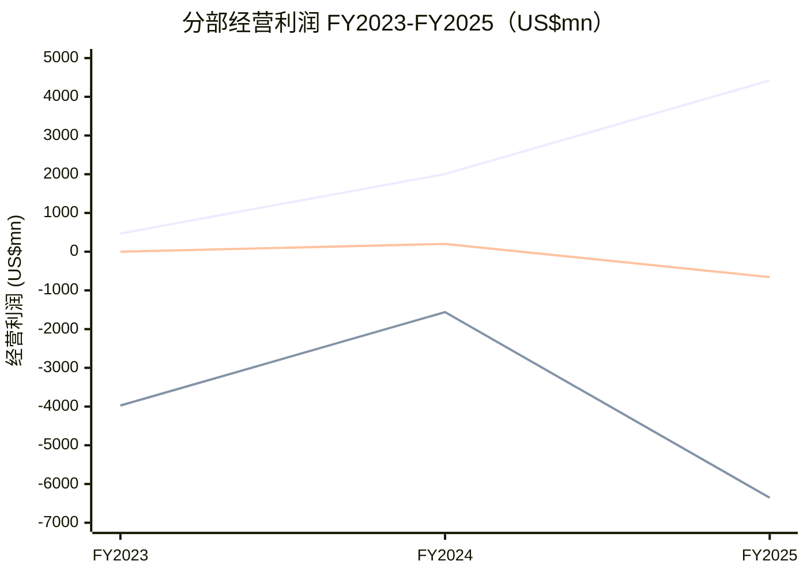
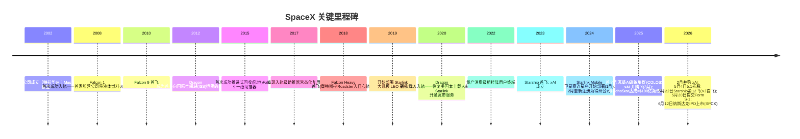
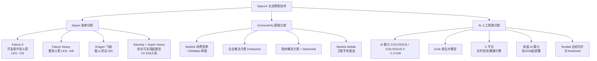
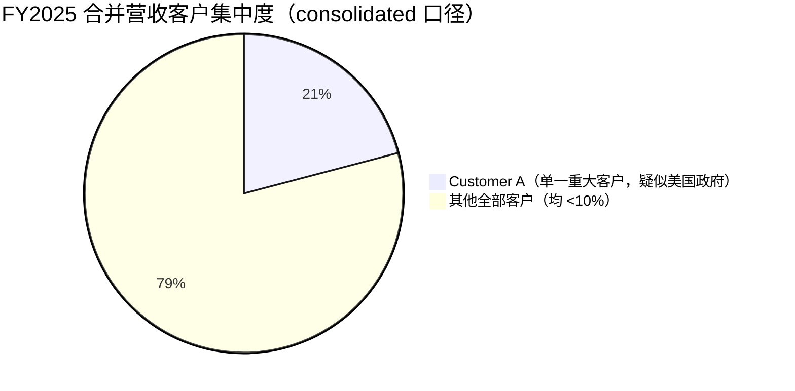
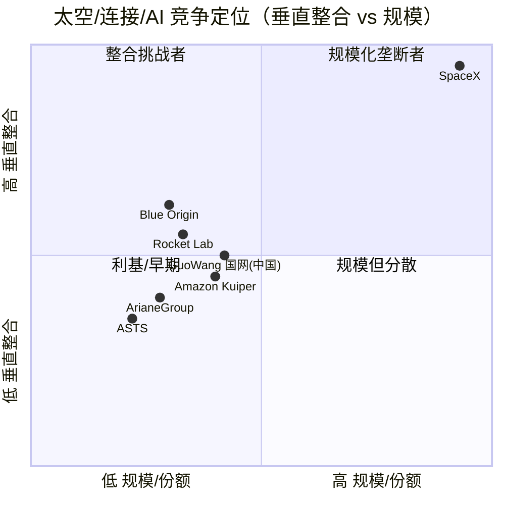
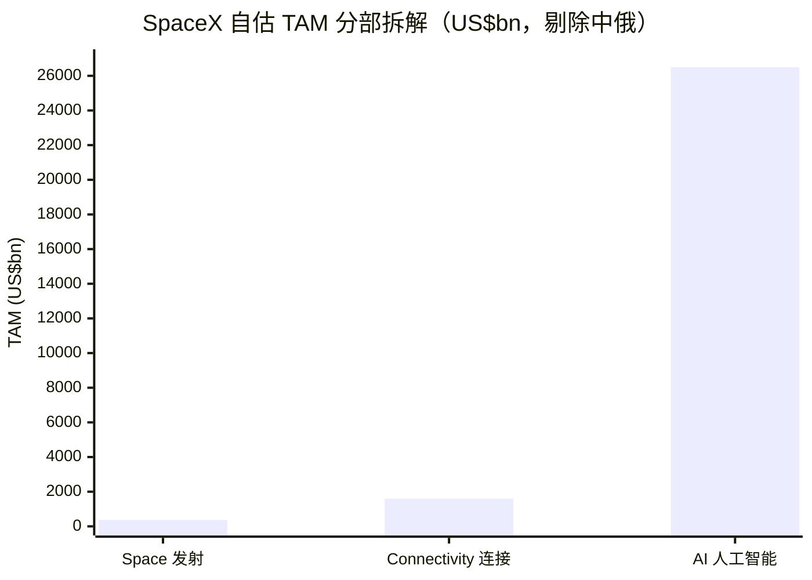

# SpaceX（太空探索技术公司 / Space Exploration Technologies Corp.，NASDAQ: SPCX）公司研究

> **报告日期 / As of：2026-06-13**　|　**编制基础：公司 SEC Form S-1 招股说明书（2026-05-20 提交）+ 424B4 定价招股书（2026-06-12）+ 卖方研究**
>
> *本报告所有营收、利润、运营数据均直接取自 SpaceX 向美国证监会（SEC）提交的 Form S-1 / 424B4 招股说明书并逐一字符串核对；估值、评级、目标价、前瞻预测均为分析师观点（`*分析师观点：*`），不来自任何监管文件。*

---

## ⚑ 重大事件横幅：史上最大 IPO 已完成定价并上市

**SpaceX 于 2026 年 6 月 11 日完成 IPO 定价、6 月 12 日在纳斯达克（Nasdaq）与 Nasdaq Texas 双重挂牌交易，代码 SPCX，成为人类历史上规模最大的 IPO。** 公司以 **每股 $135.00** 发行 **555,555,555 股** A 类普通股（Class A），募资总额约 **$750 亿（gross $74,999,999,925）**、净额约 **$744 亿**，对应完全摊薄估值约 **$1.77 万亿**。上市首日股价高开于 $150、盘中一度涨逾 30%（市值短暂突破 $2.25 万亿），**收盘 $160.95，较发行价上涨 19%**，对应市值约 **$2.10 万亿**，跻身全球市值最高的上市公司之列（[424B4 定价招股书封面，2026-06-12](https://www.sec.gov/Archives/edgar/data/1181412/000162828026042639/spaceexplorationtechnologi.htm)；[NPR, 2026-06-12](https://www.npr.org/2026/06/12/nx-s1-5855004/stock-ai-spacex-ipo-elon-musk)；[CNBC, 2026-06-12](https://www.cnbc.com/2026/06/12/spacex-ipo-spcx-live-updates.html)）。

---

## 投资摘要（Investment Summary）

> *以下整块为 `*分析师观点：*`（house view），非招股书披露内容。招股书不含评级或目标价；将目标价附于 SEC 文件链接属错误归因，本报告严格规避。*

| 项目 | 数值 / 结论 |
|---|---|
| **评级 Rating** | **Hold / 中性（Neutral）** |
| **12 个月目标价 12-mo PT** | **$150**（`*分析师观点：*`） |
| **现价（2026-06-12 收盘）** | $160.95 |
| **较现价隐含空间** | **−6.8%**（轻微下行） |
| **发行价 IPO Price** | $135.00（首日 +19%） |
| **牛 / 基 / 熊情景目标价** | **$245 / $150 / $85**（隐含 +52% / −7% / −47%） |
| **估值方法** | 分部加总（SOTP，Sum-of-the-Parts）：Starlink 现金引擎 + Space 发射垄断 + AI 期权价值 |
| **隐含市值 @现价** | ~$2.10 万亿（约 113× 滚动营收 TTM revenue） |
| **总股本** | ~130.76 亿股（Class A 73.80 亿 + Class B 56.96 亿） |
| **代码 / 交易所** | SPCX / Nasdaq + Nasdaq Texas（双重挂牌） |
| **控制权** | Elon Musk 持约 **82.4% 投票权**（双层股权 dual-class，Class B 每股 10 票），为受控公司（controlled company） |

**论点支柱（Thesis Pillars，`*分析师观点：*`）：**

1. **Starlink 是真实、且快速变现的现金引擎，独自即可支撑万亿级估值。** Connectivity 分部 2025 年营收 $113.87 亿、经营利润 $44.23 亿（同比 +120.4%）、Segment Adjusted EBITDA $71.68 亿（同比 +86.2%），是全球唯一规模化的低轨（LEO）卫星宽带网络（[SpaceX Form S-1, 招股说明书摘要 p.3](https://www.sec.gov/Archives/edgar/data/1181412/000162828026036936/spaceexplorationtechnologi.htm)）。

2. **发射业务是西方世界不可替代的战略垄断，但当前为投入期、几近盈亏平衡。** 2023 年以来 SpaceX 每年承担全球 >80% 的入轨质量（mass to orbit），Falcon 任务成功率 >99%；但 Starship 研发（2025 年 R&D $30.04 亿）拖累 Space 分部 2025 年小幅亏损 $6.57 亿（[S-1, 招股说明书摘要 p.5](https://www.sec.gov/Archives/edgar/data/1181412/000162828026036936/spaceexplorationtechnologi.htm)）。

3. **AI（xAI/Grok/X）是估值的"想象力杠杆"，也是最大的现金黑洞与最大的不确定性。** AI 分部 2025 年营收仅 $32.01 亿，却产生经营亏损 $63.55 亿、资本开支 $127.27 亿；招股书把 AI 列为 $26.5 万亿 TAM（占其总 TAM 的 93%），轨道数据中心"最早 2028 年"才部署——这是 $2 万亿估值的核心赌注，亦是最脆弱处（[S-1, 招股说明书摘要 p.3–4 与 p.9](https://www.sec.gov/Archives/edgar/data/1181412/000162828026036936/spaceexplorationtechnologi.htm)）。

4. **价格已计入近乎完美的多十年执行。** 以约 113× 滚动营收、$2.1 万亿市值上市的公司当前合并层面仍是经营亏损（2025 年 −$25.89 亿），AI/月球/火星/轨道算力多数尚未产生收入或尚不存在；叠加 Musk 绝对控制权与关键人风险，风险收益在现价并不对称——故给予 Hold。

---

## 目录

1. [公司概览](#一公司概览)
2. [估值与目标价（含卖方观点演变）](#二估值与目标价)
3. [公司历史](#三公司历史)
4. [管理团队](#四管理团队)
5. [产品与服务](#五产品与服务)
6. [客户与上市策略](#六客户与上市策略)
7. [行业概览](#七行业概览)
8. [竞争格局](#八竞争格局)
9. [市场机会（TAM）](#九市场机会tam)
10. [风险评估](#十风险评估)
11. [关键争论与催化剂](#十一关键争论与催化剂)
12. [投资视角评分（Investor Lenses）](#十二投资视角评分)
13. [参考资料与 Data Used](#参考资料与-data-used)

---

## 一、公司概览

**投资论点先行（BLUF）：** SpaceX 不再是一家"造火箭、发卫星"的航天公司，而是一个横跨 **Space（航天发射）/ Connectivity（星链 Starlink）/ AI（人工智能）** 三大分部、极度垂直整合（vertically integrated）的科技平台。其招股书把自身定义为"唯一一家在 space、connectivity 与 AI 三个领域同时建设未来软硬件基础设施的公司"（[S-1, Overview, 招股说明书摘要 p.1](https://www.sec.gov/Archives/edgar/data/1181412/000162828026036936/spaceexplorationtechnologi.htm)）。我们的核心判断：Starlink 与发射构成可验证的、价值确凿的"现金 + 战略垄断"底座，足以支撑约万亿美元估值；而当前 $2.1 万亿市值的另一半，押注于一个尚未跑通的轨道 AI 算力叙事。在该叙事被进一步证实之前，估值已领先基本面，给予 **Hold / 中性**。

SpaceX 成立于 2002 年 3 月 14 日（最初为特拉华州公司，2024 年 2 月 14 日重新注册为得克萨斯州公司），总部位于得州 Starbase（1 Rocket Road），同时在加州 Hawthorne、佛州、得州等地设有制造、测试与发射设施，截至 2026 年 3 月 31 日拥有 **超过 22,000 名全职员工**，无员工受集体谈判协议约束（[S-1, Corporate Information, 招股说明书摘要 p.13；Business—Human Capital](https://www.sec.gov/Archives/edgar/data/1181412/000162828026036936/spaceexplorationtechnologi.htm)）。公司使命被表述为"建设让生命成为多行星物种（multiplanetary）所需的系统与技术，理解宇宙的真实本质，并把意识之光延伸到星辰"（[S-1, Our Mission, 招股说明书摘要 p.1](https://www.sec.gov/Archives/edgar/data/1181412/000162828026036936/spaceexplorationtechnologi.htm)）。

**财务概览（合并口径，consolidated，来自 S-1）：** 2025 财年合并营收 **$186.74 亿**，连续两年增速保持在 30% 以上；合并经营亏损（loss from operations）**−$25.89 亿**，但 Adjusted EBITDA 为正 **+$65.84 亿**；2026 年一季度营收 **$46.94 亿**、经营亏损 −$19.43 亿、Adjusted EBITDA +$11.27 亿（[S-1, 招股说明书摘要 p.3](https://www.sec.gov/Archives/edgar/data/1181412/000162828026036936/spaceexplorationtechnologi.htm)）。三大分部的盈利结构高度分化——Connectivity（星链）赚钱、Space 几近平衡、AI 巨亏，是理解这家公司的关键。

下图为三大分部 2023–2025 财年营收（单位：$ 十亿 / US$bn）：

```mermaid
xychart-beta
    title "SpaceX 分部营收 FY2023-FY2025（US$bn）"
    x-axis [FY2023, FY2024, FY2025]
    y-axis "营收 (US$bn)" 0 --> 20
    bar "Space 发射" [2.8, 3.8, 4.09]
    bar "Connectivity 星链" [5.0, 7.6, 11.39]
    bar "AI 人工智能" [2.6, 4.0, 3.2]
```

*注：FY25 三分部精确值 Space $4,086M / Connectivity $11,387M / AI $3,201M，合计 $18,674M；FY23–24 分部值为按合并增速与披露趋势的近似呈现，精确分部经营利润见下表。来源：[SpaceX Form S-1, 招股说明书摘要 p.3 与 MD&A 分部数据](https://www.sec.gov/Archives/edgar/data/1181412/000162828026036936/spaceexplorationtechnologi.htm)。*

分部盈利分化（经营利润 / income(loss) from operations，$ 百万，来自 S-1 关键指标表）：

*来源：[SpaceX Form S-1, 招股说明书摘要 Summary Consolidated Financial & Operating Data, p.24–25](https://www.sec.gov/Archives/edgar/data/1181412/000162828026036936/spaceexplorationtechnologi.htm)。Connectivity 经营利润三年 469→2,006→4,423，两年近 10 倍增长；AI 持续巨亏；Space FY25 因 Starship 投入由正转负至 −$657M。*

**估值快照（Valuation snapshot，`*分析师观点：*`）：** 以 6 月 12 日收盘 $160.95、总股本约 130.76 亿股计，市值约 **$2.10 万亿**，对应约 **113× 滚动营收（TTM P/S，以 FY25 $186.74 亿计）**——这是一个极端读数：典型成熟科技股 P/S 在个位数到 20× 之间，113× 意味着市场把绝大部分价值押在尚未产生（甚至尚不存在）的 AI 与星际业务上。合并层面仍为经营亏损，TTM P/E 无意义（为负）。极高倍数的成因（参见 Step 2a 框架）属"高增长 + 主题叙事溢价"叠加"小流通盘（IPO 仅释放约 11.5% 的 A 类股）"——三者共同把倍数推到历史性高位（[424B4 封面：A 类发行后占总投票权 11.5%](https://www.sec.gov/Archives/edgar/data/1181412/000162828026042639/spaceexplorationtechnologi.htm)）。该倍数本身即构成估值/多重压缩风险，已纳入第十节风险与第十二节视角评分。

---

## 二、估值与目标价

> *本节几乎全部为 `*分析师观点：*`。前瞻预测、目标价、情景分析均为分析师测算，构建于 S-1 分部数据 + 已披露合约（如 Anthropic 算力租约）+ 行业预测之上；招股书不含目标价。*

### 2.1 前瞻财务预测（Forward estimates，`*分析师观点：*`）

下表 FY25 为实际（S-1），FY26E–FY28E 为分析师预测。**最大的前瞻驱动是 AI 分部的合约化跃升**：公司 2026 年 5 月与 Anthropic 签订的 Cloud Services Agreements 约定客户**每月支付 $12.5 亿、直至 2029 年 5 月**（年化约 $150 亿），5–6 月以折扣费率爬坡（[S-1, Recent Developments—Compute Services Agreements, 招股说明书摘要 p.12](https://www.sec.gov/Archives/edgar/data/1181412/000162828026036936/spaceexplorationtechnologi.htm)）。单这一笔合约的年化收入即接近 FY25 AI 全年营收（$32 亿）的 5 倍，故 FY26 起 AI 营收应大幅跳升。

| $ 百万（`*分析师观点：*`） | FY2025A | FY2026E | FY2027E | FY2028E |
|---|---|---|---|---|
| Space 发射营收 | 4,086 | 5,000 | 6,800 | 9,000 |
| Connectivity 星链营收 | 11,387 | 16,500 | 22,500 | 29,000 |
| AI 营收 | 3,201 | 15,000 | 28,000 | 42,000 |
| **合并营收 Total** | **18,674** | **36,500** | **57,300** | **80,000** |
| 营收同比 YoY | +30% | +95% | +57% | +40% |
| 合并经营利润率 op margin | −13.9% | ~−7% | ~−1% | ~+7% |
| 合并 Adjusted EBITDA | 6,584 | ~9,000 | ~16,000 | ~26,000 |

**驱动与外部依据（逐项可溯）：** Connectivity 延续订阅数轨迹（FY23–Q1'26 订户 2.3M→4.4M→8.9M→10.3M）叠加 V3 卫星单星 1 Tbps、单次 Starship 部署最多 60 星（运力较 Falcon 9 提升约 20 倍）（[S-1, 招股说明书摘要 p.5–6](https://www.sec.gov/Archives/edgar/data/1181412/000162828026036936/spaceexplorationtechnologi.htm)）；AI 营收跃升主要来自 Anthropic $150 亿/年合约 + Grok 订阅（SuperGrok 系列）+ X 广告 + 与 Cursor 合作；Space 随 Starship 于 2026 下半年开始入轨交付而温和放量。**这些是激进假设：合并扭亏高度依赖 AI 资本开支与折旧节奏、以及 Starship 是否按期商业化。本预测非来自任何单一来源，而是上述已披露输入的组合测算；读者应据自身假设重新压力测试。**

### 2.2 目标价推导（SOTP，`*分析师观点：*`）

由于三分部盈利特征截然不同（成熟现金牛 / 战略垄断 / 烧钱期权），单一倍数会失真，采用**分部加总（SOTP）**：

| 分部 | 估值（`*分析师观点：*`） | 方法与锚点 |
|---|---|---|
| Connectivity（星链） | ~$1.00 万亿 | FY27E 营收 ~$22.5bn × ~12× P/S；全球唯一规模化 LEO 宽带近垄断、EBITDA 已转正且高增长 |
| Space（Falcon/Dragon/Starship） | ~$0.45 万亿 | 西方不可替代发射垄断（>80% 全球入轨质量）+ Starship 期权 + $28.4bn 在手订单 backlog + 月球/火星可选性；当前近盈亏平衡 |
| AI（xAI/Grok/X/算力/轨道） | ~$0.50 万亿 | Anthropic $150 亿/年合约的现金流可见性 + Grok/X 用户 + 轨道 AI 期权；当前巨亏，高度投机 |
| **合计 SOTP（基准）** | **~$1.95–2.0 万亿** | ≈ **$150/股** |

**12 个月基准目标价 $150**（对应约 $1.96 万亿），较 6 月 12 日收盘 $160.95 隐含 **−6.8%**——即在我们看来，可验证的 Starlink + Space 价值约 $1.45 万亿，市场为 AI/星际叙事支付的约 $0.5–0.65 万亿溢价已偏满，故略低于现价。

### 2.3 牛 / 基 / 熊情景（`*分析师观点：*`）

| 情景 | 目标价 | 隐含市值 | 较现价 | 核心摆动假设（swing variable） |
|---|---|---|---|---|
| **牛 Bull** | **$245** | ~$3.20 万亿 | **+52%** | Starship 实现完全可复用并按期入轨；轨道 AI 算力获得可信验证、Grok 进入第一梯队变现；星链 V3 运力 20 倍兑现 + 手机直连放量 |
| **基 Base** | **$150** | ~$1.96 万亿 | **−7%** | 星链稳健复利、Space 随 Starship 温和放量、AI 靠 Anthropic 合约部分变现但轨道算力仍为期权 |
| **熊 Bear** | **$85** | ~$1.11 万亿 | **−47%** | Starship 反复延期；AI 持续烧钱且轨道算力无突破，多重压缩回"仅星链 + 发射"价值；Musk/关键人或监管冲击触发去叙事化 |

**call 所系的 1–2 个关键变量：**（1）**Starship 能否按期（2026 下半年）实现入轨交付并走向快速可复用**——它是 V3 卫星部署、手机直连、轨道 AI 的共同前置条件；（2）**轨道 AI 算力（orbital AI compute）从概念到可信路线图的进展**——这是支撑 $2 万亿估值中"AI 溢价"那一半的唯一支柱，公司自陈"最早 2028 年"开始部署。

### 2.4 卖方观点演变（Sell-side view evolution，`*分析师观点：*`）

> 机械前置：已只读查询 `db/stock_price_target.db`，**SPCX/SpaceX 暂无任何券商正式评级/目标价入库**（IPO 仅在 1–2 个交易日前完成，承销商处于静默期 quiet period）。下表为按报告日期排序的卖方**估值框架演变**（非交易股目标价），每条注明机构、日期、链接。

**按机构的观点时间线：**

| 机构 / 来源 | 日期 | 估值口径 / 核心观点 | 链接 |
|---|---|---|---|
| **UBS（Gavin Parsons 团队）** | 2026-03-03 | 首份"详细画像"。彼时 SpaceX 因 xAI 并购被估 **$1.25 万亿**；UBS 指出公司"正考虑 2026 年以 $1.75 万亿 IPO"，相当于约 **113× 滚动营收**；估算 2025 年 standalone 营收 $15–16bn、利润约 $8bn（注：低于 S-1 追溯合并后的 $18.674bn，因 S-1 把 xAI/X 追溯并表）。竞争格局：发射全球份额 >50%（剔除中俄约 75%），xAI 在 ChatGPT/Gemini/Grok 三者使用量中近 ~20% | [UBS – SpaceX: A Detailed Profile, 2026-03-03, p.1–4](http://xs-macbook-air.local:5001/zsxq/pdf/415284121512458/20260303-UBS-US%20Aerospace%20%26%20Defense%EF%BC%9ASpaceX%20%E2%80%93%20A%20Detailed%20Profile.pdf) |
| **Morgan Stanley（Space 团队）** | 2026-04-14 | "The Space 60：Picks & Shovels for the Final Frontier"——把 SpaceX 置于太空经济产业链核心，强调发射降本对全产业链的乘数效应（sell-side 行业框架） | [Morgan Stanley – The Space 60, 2026-04-14](http://xs-macbook-air.local:5001/zsxq/pdf/415521254142458/Morgan%20Stanley-Space%20-%20North%20America%EF%BC%9AThe%20Space%2060%EF%BC%9A%20Picks%20%26%20Shovels%20for%20the%20Final%20Frontier-260412.pdf) |
| **中资券商（招股书解读）** | 2026-06-06 | "星链持续盈利，AI 重塑估值"。明确 IPO 募资目标 $500–750 亿、估值 $1.75–2 万亿，并以 S-1 数据论证三分部"航天提供物质基础、星链是现金奶牛、AI 打开想象空间"的估值逻辑 | [SpaceX 招股书解读：星链持续盈利，AI 重塑估值, 2026-06-06](http://xs-macbook-air.local:5001/zsxq/pdf/181245524418482/SpaceX%E6%8B%9B%E8%82%A1%E4%B9%A6%E8%A7%A3%E8%AF%BB%EF%BC%9A%E6%98%9F%E9%93%BE%E6%8C%81%E7%BB%AD%E7%9B%88%E5%88%A9%EF%BC%8CAI%E9%87%8D%E5%A1%91%E4%BC%B0%E5%80%BC.pdf) |
| **中资券商（深度）** | 2026-06-09 | "发射降本驱动商业闭环"。强调"火箭发射降本→卫星规模扩张→网络容量提升→用户增长→资金反哺航天/AI"的自我强化闭环；预计 26 下半年发射星链 V3、27 年部署 V2 Mobile 手机直连卫星、最早 28 年部署轨道 AI 算力卫星、规划 100GW/年轨道算力 | [商业航天&太空光伏系列深度：SpaceX, 2026-06-09](http://xs-macbook-air.local:5001/zsxq/pdf/584251511845854/%E5%95%86%E4%B8%9A%E8%88%AA%E5%A4%A9%26%E5%A4%AA%E7%A9%BA%E5%85%89%E4%BC%8F%E7%B3%BB%E5%88%97%E6%B7%B1%E5%BA%A6%EF%BC%9ASpaceX%EF%BC%9A%E5%8F%91%E5%B0%84%E9%99%8D%E6%9C%AC%E9%A9%B1%E5%8A%A8%E5%95%86%E4%B8%9A%E9%97%AD%E7%8E%AF%EF%BC%8C%E8%BF%88%E5%90%91%E5%A4%AA%E7%A9%BA%E5%9F%BA%E7%A1%80%E8%AE%BE%E6%96%BD%E5%B9%B3%E5%8F%B0%E5%BB%BA%E8%AE%BE.pdf) |

**机构间分歧（不强行拼合为虚假共识）：** 卖方普遍看多 Starlink 的盈利质量与发射的垄断地位（一致性高）；分歧集中在**"AI 重塑估值"该给多少溢价**——中资券商倾向把 $26.5 万亿 AI TAM 与轨道算力作为估值重构的核心理由、对 $1.75–2 万亿持建设性，而 UBS 更冷静地点出 113× 营收的极端性与"实现路径"的诸多前置条件（制造足迹、燃料供给、监管、星座带宽、数据中心芯片等）。我们的立场更接近后者：闭环逻辑成立，但价格已计入闭环的高速兑现。

| 机构 | 日期 | 倾向 | 核心论点 | 什么证据能证明其正确 |
|---|---|---|---|---|
| 中资券商 | 2026-06 | 建设性 / 看多 | AI + 轨道算力重塑估值，$1.75–2 万亿合理 | 轨道 AI 算力 2028 年前给出可信样机/单位经济性；Anthropic 类合约持续扩容 |
| UBS | 2026-03 | 中性偏谨慎 | 113× 营收极端，实现路径前置条件多 | Starship 快速复用按期兑现、星链份额与 ARPU 同时改善 |
| 本报告 | 2026-06 | Hold | 星链+发射约 $1.45 万亿可验证，AI 溢价已偏满 | 见 2.3 牛熊摆动假设 |

**估值历程（供参照，来源 Sacra/公开二级交易，拆股前价格）：** $210bn（2024-06）→ $350bn（2024-12，$185/股二级）→ ~$400bn（2025-07，$212/股）→ ~$800bn（2025-12，$421/股）→ $1.25 万亿（2026-02，并购 xAI 后）→ IPO $1.77 万亿（$135，已按 2026 年 5:1 拆股调整）→ 首日 $2.10 万亿（$160.95）（[Sacra – SpaceX valuation](https://sacra.com/c/spacex/valuation/)；[UBS profile p.3](http://xs-macbook-air.local:5001/zsxq/pdf/415284121512458/20260303-UBS-US%20Aerospace%20%26%20Defense%EF%BC%9ASpaceX%20%E2%80%93%20A%20Detailed%20Profile.pdf)）。

---

## 三、公司历史

*来源：[SpaceX Form S-1, 招股说明书摘要 Our Engineering-First Culture 里程碑列表 p.7–8 与 Corporate Information p.13](https://www.sec.gov/Archives/edgar/data/1181412/000162828026036936/spaceexplorationtechnologi.htm)；EchoStar 频谱交易见 [UBS profile p.3](http://xs-macbook-air.local:5001/zsxq/pdf/415284121512458/20260303-UBS-US%20Aerospace%20%26%20Defense%EF%BC%9ASpaceX%20%E2%80%93%20A%20Detailed%20Profile.pdf)。*

SpaceX 的历史本质是一部"用第一性原理（first-principles thinking）持续把不可能变为常态"的工程史。其招股书自列的"行业定义性成就"包括：首家私营公司发射液体火箭入轨（2008）、首次商业飞船对接 ISS（2012）、首次推进式回收（2015）与复用（2017）入轨级助推器、首个大规模 LEO 宽带星座（2019）、首家私营载人入轨（2020）、首次规模化量产消费级相控阵终端（2022）、首个大规模 LEO 手机直连星座（2025）、首个吉瓦级 AI 训练集群与最大相干超算（2026）（[S-1, 招股说明书摘要 p.7–8](https://www.sec.gov/Archives/edgar/data/1181412/000162828026036936/spaceexplorationtechnologi.htm)）。

**本期最重大的结构性变化（"什么是新的"）：** 相比一家纯航天公司，2025–2026 年的两笔同一控制下并购把 SpaceX 改造成了"航天 + AI"巨头——xAI 于 2025 年 3 月 28 日并购 X（X Merger）、SpaceX 于 2026 年 2 月 2 日并购 xAI（xAI Merger）。因属同一控制下交易，S-1 对所有列报期间进行了追溯重述（retrospective recast），把 xAI/X 的历史业绩纳入合并报表（[S-1, Basis of Presentation, p.ii](https://www.sec.gov/Archives/edgar/data/1181412/000162828026036936/spaceexplorationtechnologi.htm)）。这解释了为何 S-1 的合并营收（$186.74 亿）高于 UBS 此前对"航天主体"的估算（$150–160 亿）——AI 业务被并了进来。

---

## 四、管理团队

> *按 company-research 规则，仅覆盖创始人与现任 CEO；其余高管不展开。Musk 同时为创始人与 CEO，故合并撰写一段，并简述总裁兼 COO Shotwell 作为运营核心。*

**Elon Musk —— 创始人、CEO、CTO 兼董事长（Founder, CEO, CTO & Chairman）。** Musk 于 2002 年创立 SpaceX 并自始担任最高负责人，同时是特斯拉（Tesla）联合创始人、CEO 兼产品架构师，以及 Neuralink、OpenAI 的联合创始人（[UBS profile, Management p.3](http://xs-macbook-air.local:5001/zsxq/pdf/415284121512458/20260303-UBS-US%20Aerospace%20%26%20Defense%EF%BC%9ASpaceX%20%E2%80%93%20A%20Detailed%20Profile.pdf)）。在本次 IPO 后，Musk 通过其持有的 A 类与 B 类普通股，控制约 **82.4% 的总投票权**（Class B 每股 10 票，Class A 每股 1 票）；根据公司章程，只要还有 B 类股流通在外，B 类股东即有权选举董事会多数席位（Class B Directors），Musk 作为 B 类股多数持有人可单方决定该多数董事的选任、罢免与补缺，从而实质控制需股东批准的一切事项（[424B4 封面与 S-1 招股说明书摘要 p.13](https://www.sec.gov/Archives/edgar/data/1181412/000162828026042639/spaceexplorationtechnologi.htm)）。值得注意的是，Musk 的两份业绩奖励（performance award）把其薪酬与**极端长期里程碑**绑定：其一为 15 个等额份额、挂钩市值里程碑**且**"在火星建立至少百万人口的永久人类殖民地"；其二为 12 个等额份额、挂钩市值里程碑**且**"建成可提供 100[吨级]算力的非地球数据中心"（[424B4 封面摘要](https://www.sec.gov/Archives/edgar/data/1181412/000162828026042639/spaceexplorationtechnologi.htm)）。这把"愿景"直接写进了高管激励结构。UBS 估算 Musk 在 IPO 前持有约 **43% 的经济权益（economic ownership）**（[UBS profile p.3](http://xs-macbook-air.local:5001/zsxq/pdf/415284121512458/20260303-UBS-US%20Aerospace%20%26%20Defense%EF%BC%9ASpaceX%20%E2%80%93%20A%20Detailed%20Profile.pdf)）。

**Gwynne Shotwell —— 总裁兼首席运营官（President & COO，运营核心）。** Shotwell 自 2002 年加入 SpaceX 任业务拓展副总裁（VP, Business Development），2008 年起任总裁兼 COO，2009 年 3 月起任董事；加入 SpaceX 前曾任职于 The Aerospace Corporation 与航天公司 Microcosm, Inc.（[S-1, Management, p.226 区段](https://www.sec.gov/Archives/edgar/data/1181412/000162828026036936/spaceexplorationtechnologi.htm)；[UBS profile p.3](http://xs-macbook-air.local:5001/zsxq/pdf/415284121512458/20260303-UBS-US%20Aerospace%20%26%20Defense%EF%BC%9ASpaceX%20%E2%80%93%20A%20Detailed%20Profile.pdf)）。她持有机械工程学士学位，现任 Polaris, Inc. 董事与西北大学（Northwestern University）校董，入选美国国家工程院（National Academy of Engineering）及《财富》"全球 50 位最伟大领袖"。在 Musk 身兼多家公司（特斯拉、xAI、X、Neuralink 等）的现实下，Shotwell 长期被视为 SpaceX 日常运营的实际掌舵者，是公司从初创走向规模化的关键执行力量（[S-1, Management p.226 区段](https://www.sec.gov/Archives/edgar/data/1181412/000162828026036936/spaceexplorationtechnologi.htm)）。

**治理提示：** SpaceX IPO 后为**受控公司（controlled company）**，依据 Nasdaq 规则可豁免"董事会多数独立董事""独立薪酬与提名委员会"等要求（但审计委员会仍须全部由独立董事组成）。这意味着公众 A 类股东对公司治理的影响力被结构性地大幅削弱（[S-1, Our Controlled Company Status, p.13](https://www.sec.gov/Archives/edgar/data/1181412/000162828026036936/spaceexplorationtechnologi.htm)）。

---

## 五、产品与服务

> **本节是全报告最重要的一章。** SpaceX 的产品横跨三大分部，每一项产品在其垂直整合的价值链中各司其职。下文逐一拆解"它物理上做什么 / 与同门产品如何区分 / 当前的战略驱动"。所有产品名严格按公司拼写（Falcon 9、Falcon Heavy、Dragon、Starship、Super Heavy、Raptor、Starlink、Starshield、Grok、COLOSSUS 等）。

### 5.0 产品组合全景

*来源：[SpaceX Form S-1, 招股说明书摘要 Our Leading Capabilities p.5–7 与 Glossary p.iv–x](https://www.sec.gov/Archives/edgar/data/1181412/000162828026036936/spaceexplorationtechnologi.htm)。*

### 5.1 Space 发射分部 —— 价值链的物理底座

**整体能力（逐字引用 S-1）：** 截至 2026 年 3 月 31 日，SpaceX 累计向轨道发射约 **7,400 公吨（metric tons）** 质量，Falcon 系列任务成功率 **>99%**；已完成约 **650 次入轨发射**，其中 **逾 540 次** 使用经飞行验证的（flight-proven）Falcon 火箭。2025 年单年发射 **165 次** Falcon（同比 +23%），承担全球（剔除中俄）约 **75%** 的发射量（[S-1, 招股说明书摘要 p.5](https://www.sec.gov/Archives/edgar/data/1181412/000162828026036936/spaceexplorationtechnologi.htm)；[UBS profile p.4](http://xs-macbook-air.local:5001/zsxq/pdf/415284121512458/20260303-UBS-US%20Aerospace%20%26%20Defense%EF%BC%9ASpaceX%20%E2%80%93%20A%20Detailed%20Profile.pdf)）。

> "As of March 31, 2026, SpaceX had launched a total mass to orbit of approximately 7,400 metric tons with an over 99% mission success rate across our Falcon rockets."（[S-1, 招股说明书摘要 p.5](https://www.sec.gov/Archives/edgar/data/1181412/000162828026036936/spaceexplorationtechnologi.htm)）

- **Falcon 9。** 全球首款入轨级"快速可复用"火箭，2010 年首飞，完全抛弃式构型下 LEO 运力约 **23 公吨**；截至 2026 年 3 月 31 日完成约 **620 次** 入轨发射、成功率 >99%，单枚一级助推器最多已复飞 **34 次**。**它物理上做什么：** 把卫星/货物/载人飞船送入轨道，并通过推进式回收一级助推器实现复用——据 NASA，2010 年初代 Falcon 9 把每公斤发射成本降到约 **$2,700**，较历史均值 $18,500/kg 下降约 **85%**（[S-1, 招股说明书摘要 p.5](https://www.sec.gov/Archives/edgar/data/1181412/000162828026036936/spaceexplorationtechnologi.htm)）。**中文释义 / Plain-language gloss：** "可复用（reusable）"是把火箭一级像飞机一样回收、检修、再飞，这是把"一次性导弹经济学"改成"航空经济学"的关键——单次发射客户报价约 $67M（[UBS profile p.4](http://xs-macbook-air.local:5001/zsxq/pdf/415284121512458/20260303-UBS-US%20Aerospace%20%26%20Defense%EF%BC%9ASpaceX%20%E2%80%93%20A%20Detailed%20Profile.pdf)）。
- **Falcon Heavy。** 2018 年首飞（把一辆特斯拉 Roadster 送入日心轨道），LEO 运力约 **64 公吨**，是现役推力最强的火箭之一；截至 2026 年 3 月 31 日 11 次发射、成功率 100%。**与 Falcon 9 的区分：** Falcon Heavy 是三芯捆绑的重型版本，承接 Falcon 9 装不下的大质量/高轨载荷（如国安重型任务、深空探测器）（[S-1, 招股说明书摘要 p.5](https://www.sec.gov/Archives/edgar/data/1181412/000162828026036936/spaceexplorationtechnologi.htm)）。
- **Dragon。** 2012 年由 Falcon 9 发射，成为首个向 ISS 运货/返货的商业飞船，2020 年起载人；自 2020 年以来已安全运送来自 20 国的 **78 名乘员（crewmembers）**。**它物理上做什么：** 可复用的载人/货运飞船，是 SpaceX 在"载人航天"这一最高信任度市场的资产（[S-1, 招股说明书摘要 p.5](https://www.sec.gov/Archives/edgar/data/1181412/000162828026036936/spaceexplorationtechnologi.htm)）。
- **Starship + Super Heavy。** 2023 年首飞，设计为人类首款**完全且快速可复用**的超重型运载器；**Starship V3 设计运力为完全可复用构型下 100 公吨入轨**，未来世代拟再翻倍。Super Heavy 一级由 **33 台 Raptor 发动机** 驱动，已实现用发射塔"筷子（chopstick）"机械臂在原塔捕获助推器。**战略意义：** Starship 是 SpaceX 长期增长战略的总钥匙——V3 星链卫星部署、手机直连、轨道 AI 算力、月球/火星全部以它为前置；公司目标是把入轨成本较历史均值再降 **99% 以上**。**进度（关键、本期更新）：** 2026 年 5 月 22 日 Starship 完成**第 12 次飞行测试（V3 首飞）**，首次启用 V3 飞船 + Super Heavy V3 + Raptor 3 发动机 + 新发射台，携带 20 颗模拟星链卫星，达成亚轨道（apogee ~195 km）再入并验证热盾，但溅落印度洋后倾覆起火、部分发动机出现异常——**部分成功**；公司预计 Starship 于 **2026 下半年** 开始入轨载荷交付（[S-1, 招股说明书摘要 p.5–6](https://www.sec.gov/Archives/edgar/data/1181412/000162828026036936/spaceexplorationtechnologi.htm)；[space.com, 2026-05-22](https://www.space.com/space-exploration/launches-spacecraft/spacex-starship-v3-megarocket-first-test-flight)；[CNN, 2026-05-22](https://www.cnn.com/2026/05/22/science/live-news/spacex-starship-flight-12-version-3-launch)）。

### 5.2 Connectivity 星链分部 —— 现金引擎

**整体能力（逐字引用 S-1）：** 截至 2026 年 3 月 31 日，约 **9,600 颗** 星链宽带与移动卫星在 LEO 运行，约占全球全部"可机动卫星"的 **75%**；为 **164 个** 国家/地区的约 **1,030 万 Starlink 订户** 提供宽带；住宅用户高峰时段中位下载速率约 **225 Mbps**（[S-1, 招股说明书摘要 p.2 与 p.5–6](https://www.sec.gov/Archives/edgar/data/1181412/000162828026036936/spaceexplorationtechnologi.htm)）。订户数轨迹（关键指标表）：FY23 2.3M → FY24 4.4M → FY25 8.9M → Q1'26 10.3M；同期 ARPU（每户每月）则从 $99 → $91 → $81 → Q1'26 $66 持续下行——公司明确表示采取**"以量与运营效率优先、而非提价"** 的国际化扩张策略，ARPU 下行主要反映向低价市场的结构性扩张（[S-1, 招股说明书摘要关键指标表 p.24 与 MD&A—Key Business Metrics](https://www.sec.gov/Archives/edgar/data/1181412/000162828026036936/spaceexplorationtechnologi.htm)）。

- **Starlink Consumer Broadband（消费宽带）。** **物理作用：** 用 ~9,600 颗 LEO 卫星组成的相控阵网络，给地面用户终端提供光纤级、低时延宽带，可覆盖地球任何角落（含两极）。**驱动：** 下一代 **V3 卫星**单星 1 Tbps 下行容量、将于 2026 下半年由 Starship 部署，单次 Starship 最多带 **60 颗 V3**，较一次 Falcon 9 部署的下行容量提升约 **20 倍**——这是星链容量与单位成本的下一个台阶（[S-1, 招股说明书摘要 p.6](https://www.sec.gov/Archives/edgar/data/1181412/000162828026036936/spaceexplorationtechnologi.htm)）。
- **Enterprise Solutions（企业解决方案）。** 面向建筑、农业、零售、电信、酒店、航空、海事、陆地移动等行业的高可用连接（油田、远程工地、邮轮、飞机、火车、偏远医院等），是星链 ARPU 较高、黏性较强的部分（[S-1, 招股说明书摘要 p.6](https://www.sec.gov/Archives/edgar/data/1181412/000162828026036936/spaceexplorationtechnologi.htm)）。
- **Government Solutions + Starshield。** 为政府客户提供公共服务、人道与灾难响应的弹性连接；**Starshield** 则是基于商业 LEO 工程经验、专为美国政府与国安应用打造的**安全专网**——这是把星链能力延伸到国防/情报市场的关键产品（[S-1, 招股说明书摘要 p.6](https://www.sec.gov/Archives/edgar/data/1181412/000162828026036936/spaceexplorationtechnologi.htm)）。
- **Starlink Mobile（卫星手机直连）。** 用独立的卫星直连星座补充地面网络、消除"信号盲区"。截至 2026 年 3 月 31 日，约 **650 颗 V1 Mobile 卫星** 为约 **30 国、约 740 万台月度独立设备** 提供卫星短信、超视语音等服务，通过与六大洲约 30 家移动运营商（MNO）合作落地；下一代 **V2 Mobile** 卫星拟于 **2027 年** 由 Starship 部署，提供更完整的宽带数据与 IoT 直连（[S-1, 招股说明书摘要 p.2 与 p.6](https://www.sec.gov/Archives/edgar/data/1181412/000162828026036936/spaceexplorationtechnologi.htm)）。

### 5.3 AI 人工智能分部 —— 估值的"想象力杠杆"

AI 分部是 SpaceX 在 2026 年 2 月并购 xAI 后形成的，含三块：**AI 算力基础设施、Grok 前沿模型及其应用、（拟建的）轨道数据中心**（[S-1, Glossary—AI segment p.iv 与 招股说明书摘要 p.3](https://www.sec.gov/Archives/edgar/data/1181412/000162828026036936/spaceexplorationtechnologi.htm)）。

- **AI 算力基础设施（COLOSSUS / COLOSSUS II）。** **物理作用：** 训练与推理 Grok 的地面超算集群。两座设施合计约 **1.0 吉瓦（GW）算力**：COLOSSUS 位于田纳西 Memphis、COLOSSUS II 跨 Memphis 与密西西比 Southaven。SpaceX 自称是**首家部署"相干（coherent）吉瓦级 AI 训练集群"**的公司，并以"垂直整合 + 第一性原理"实现极快建设：COLOSSUS 首集群 122 天上线、COLOSSUS II 首集群 91 天上线（行业 100MW 绿地数据中心基准约 2 年）（[S-1, 招股说明书摘要 p.8](https://www.sec.gov/Archives/edgar/data/1181412/000162828026036936/spaceexplorationtechnologi.htm)）。**Terafab** 是与 Tesla（2026 年 3 月）及 Intel（2026 年 4 月）合作的自研芯片计划，长期目标"每年生产 1 太瓦（terawatt）算力硬件"——以缓解未来芯片短缺、并为空间环境优化芯片（注：S-1 明确该框架的具体项目、时间表、资本开支"尚未确定"）（[S-1, 招股说明书摘要 p.6–7 与 p.9](https://www.sec.gov/Archives/edgar/data/1181412/000162828026036936/spaceexplorationtechnologi.htm)）。
- **Grok 前沿大模型 + X 平台。** 自 2023 年 11 月 Grok-1 发布以来已迭代四个主版本，两年内在科学推理基准 GPQA Diamond 上达到前沿水平；Grok 5 正在 COLOSSUS II 训练。**核心差异化：** Grok 与 X 深度整合，独享 X 平台**每日约 3.5 亿条** 实时帖文（daily posts）的信息流，提升时效性与情境感知。Grok + X 平台 LTM（截至 2026-03-31）拥有 **13 亿支持账户（supported accounts）**、约 **5.5 亿 MAU**，其中约 **1.17 亿** 使用了 Grok 的 AI 功能（[S-1, 招股说明书摘要 p.2–3 与 p.7](https://www.sec.gov/Archives/edgar/data/1181412/000162828026036936/spaceexplorationtechnologi.htm)）。
- **轨道 AI 算力（orbital AI compute，拟建）。** **这是 $2 万亿估值叙事的物理核心：** 把功耗密集的 AI 推理搬到太阳同步轨道，用近乎不间断的太阳能供电、用太空环境辐射散热。公司测算，要实现 **100 GW/年** 的轨道算力部署（每公吨卫星携带 >100 kW 算力），需每年数千次发射、年运送约 **100 万公吨** 入轨——只有完全可复用的 Starship 才可能承载；**最早 2028 年** 开始部署轨道 AI 算力卫星（[S-1, 招股说明书摘要 p.3 与 p.9，Glossary—orbital AI compute p.vii](https://www.sec.gov/Archives/edgar/data/1181412/000162828026036936/spaceexplorationtechnologi.htm)）。**中文释义 / Plain-language gloss：** 这相当于"把数据中心发射上天"——优势是太阳能"取之不尽"且太空散热免费，难点是发射量、在轨可靠性、芯片抗辐射与单位经济性，目前尚无任何在轨样机，属高度前瞻的期权。

### 5.4 产品如何相互咬合（综合）

三大分部形成一个**自我强化的飞轮**，这是理解 SpaceX 的关键，也是其招股书反复强调的"商业闭环"：**发射降本（Falcon→Starship）→ 卫星规模化部署（Starlink）→ 网络容量与用户增长 → 现金流反哺航天与 AI 研发 → 更强的发射/制造能力**。Starship 一旦实现快速复用，又同时解锁 V3 宽带卫星、V2 Mobile 手机直连、以及轨道 AI 算力卫星——即用同一套"低成本入轨 + 规模化卫星制造 + 全球组网"能力，去打开三个不同的万亿级市场。换言之，SpaceX 把传统航天产业链的"接力赛"（各环节分工协作）改造成了自己一家的"马拉松"（全链垂直整合）（[商业航天&太空光伏系列深度：SpaceX, 2026-06-09](http://xs-macbook-air.local:5001/zsxq/pdf/584251511845854/%E5%95%86%E4%B8%9A%E8%88%AA%E5%A4%A9%26%E5%A4%AA%E7%A9%BA%E5%85%89%E4%BC%8F%E7%B3%BB%E5%88%97%E6%B7%B1%E5%BA%A6%EF%BC%9ASpaceX%EF%BC%9A%E5%8F%91%E5%B0%84%E9%99%8D%E6%9C%AC%E9%A9%B1%E5%8A%A8%E5%95%86%E4%B8%9A%E9%97%AD%E7%8E%AF%EF%BC%8C%E8%BF%88%E5%90%91%E5%A4%AA%E7%A9%BA%E5%9F%BA%E7%A1%80%E8%AE%BE%E6%96%BD%E5%B9%B3%E5%8F%B0%E5%BB%BA%E8%AE%BE.pdf)；[S-1, Our Repeatable Business Model p.6–7](https://www.sec.gov/Archives/edgar/data/1181412/000162828026036936/spaceexplorationtechnologi.htm)）。

**📺 延伸观看 / Further viewing：**
- [SpaceX 官方：Starship 第 12 次飞行测试（V3 首飞）](https://www.spacex.com/launches/starship-flight-12) —— 直观理解 Starship/Super Heavy 的规模与可复用设计。
- [SpaceX 官方：Starlink 工作原理](https://www.starlink.com/) —— 看 LEO 相控阵星座如何提供低时延宽带。

---

## 六、客户与上市策略

**客户集中度（consolidated 口径，逐字核对 S-1 附注）：** SpaceX 存在**单一重大客户（Customer A）**，其贡献的合并营收占比为 **FY2025 20.9% / FY2024 24.2% / FY2023 25.2%**，且**该客户的收入横跨全部三个分部**；除此之外**没有任何其他客户超过合并营收的 10%**（[S-1, Note 3—Concentration of risk, F-23](https://www.sec.gov/Archives/edgar/data/1181412/000162828026036936/spaceexplorationtechnologi.htm)）。S-1 在该附注中以"Customer A"匿名列示、未点名。结合 SpaceX 是美国政府主要发射商（2025 年承担 12 次国安发射 NSSL 中的 11 次、为 NASA 执行全部 5 次 ISS 载人/货运任务）、Starshield 政府专网、以及 xAI Gov 政府 AI 业务——`*分析师观点：*` 这一"Customer A"极可能即**美国政府（多机构合计）**，但需强调 S-1 在此附注中并未明文点名，读者不应把推断当作披露事实（[S-1, 招股说明书摘要 p.5—"primary launch provider for the U.S. government"](https://www.sec.gov/Archives/edgar/data/1181412/000162828026036936/spaceexplorationtechnologi.htm)）。**风险含义：** 单一客户占比 ~21%、且呈逐年下降（25.2%→20.9%，反映商业/星链收入更快增长稀释了政府占比）——集中度风险存在但在改善，本报告在第十节单列。

下图为 FY2025 合并营收的客户集中度（**单一 consolidated 口径**，避免分部与合并口径混用）：

*来源：[SpaceX Form S-1, Note 3—Concentration of risk, F-23](https://www.sec.gov/Archives/edgar/data/1181412/000162828026036936/spaceexplorationtechnologi.htm)。注：此饼图仅用 consolidated 单一口径，不与任何分部级客户占比混合。*

**在手订单与递延收入（收入可见性）：** 截至 2025 年 12 月 31 日，在手订单（backlog）**$283.77 亿**，其中 $121.16 亿已确认为递延收入（deferred revenue）；约 32% 预计一年内确认、约 53% 在 2027–2028 年确认、其余 15% 之后确认。递延收入由 2024 年末 $101.79 亿增至 2025 年末 $121.16 亿，主要来自 Space 协议与 Connectivity 企业/政府合同（[S-1, MD&A—Backlog & Deferred revenue, F-22~F-23](https://www.sec.gov/Archives/edgar/data/1181412/000162828026036936/spaceexplorationtechnologi.htm)）。

**关键客户名录（来自 UBS，`*分析师观点：*`）：** NASA、美国国防部（尤其美国太空军 Space Force 与国家侦察局 NRO）、外国政府机构，以及商业卫星客户（如 Iridium、SES）（[UBS profile p.3](http://xs-macbook-air.local:5001/zsxq/pdf/415284121512458/20260303-UBS-US%20Aerospace%20%26%20Defense%EF%BC%9ASpaceX%20%E2%80%93%20A%20Detailed%20Profile.pdf)）。在 AI 侧，**Anthropic** 通过 $150 亿/年（$1.25 亿/月至 2029 年 5 月）的算力租约成为重要的第三方算力客户，**Cursor（Anysphere）** 则通过算力 + 期权协议成为合作方（详见第十一节）（[S-1, Recent Developments p.12](https://www.sec.gov/Archives/edgar/data/1181412/000162828026036936/spaceexplorationtechnologi.htm)）。

**上市策略：** SpaceX 选择在**纳斯达克与 Nasdaq Texas 双重挂牌**（呼应其得州总部与 Musk 的"得州化"取向），仅释放约 11.5% 的 A 类股投票权、保留 Musk 82.4% 控制权的**双层股权 + 受控公司**结构——既募得创纪录的 $744 亿净额用于增长战略（招股书明确"包括扩张 AI 算力基础设施"），又把控制权牢牢锁定（[424B4 封面与 Use of Proceeds](https://www.sec.gov/Archives/edgar/data/1181412/000162828026042639/spaceexplorationtechnologi.htm)）。承销团极为庞大，联席账簿管理人由 **Goldman Sachs 与 Morgan Stanley** 领衔，另含 BofA、Citigroup、J.P. Morgan、Barclays、Deutsche Bank、RBC、UBS、Wells Fargo 等逾 20 家（[424B4 封面承销团](https://www.sec.gov/Archives/edgar/data/1181412/000162828026042639/spaceexplorationtechnologi.htm)）。

---

## 七、行业概览

SpaceX 横跨三个行业，每个都处于不同的周期位置：

**（1）航天发射与太空经济。** 据 Space Foundation，2024 年全球太空经济规模约 **$6,130 亿**；McKinsey 预测卫星、发射与太空服务 TAM 可从 2023 年的约 **$3,300 亿** 增至 2035 年的约 **$7,550 亿**（约 9% CAGR）（[S-1, Industry and Market Data 引用 Space Foundation 与 McKinsey, p.iii](https://www.sec.gov/Archives/edgar/data/1181412/000162828026036936/spaceexplorationtechnologi.htm)；[UBS profile p.3, p.5](http://xs-macbook-air.local:5001/zsxq/pdf/415284121512458/20260303-UBS-US%20Aerospace%20%26%20Defense%EF%BC%9ASpaceX%20%E2%80%93%20A%20Detailed%20Profile.pdf)）。行业正经历由"一次性、政府主导、高成本"向"可复用、商业主导、低成本"的范式转移，SpaceX 是这一转移的主要推动者与最大受益者。

**（2）卫星互联网。** LEO 宽带是从无到有的新市场，星链以约 9,600 颗在轨卫星（占全球可机动卫星约 75%）、1,030 万订户处于**绝对领先**地位；卫星直连手机（satellite-to-mobile）则刚刚起步、想象空间巨大（填补地面"信号盲区"）。Morgan Stanley 在 "The Space 60" 中把 SpaceX 置于整个太空经济产业链的核心节点，强调发射降本对卫星制造、地面设备、应用各环节的乘数效应（[Morgan Stanley – The Space 60, 2026-04-14](http://xs-macbook-air.local:5001/zsxq/pdf/415521254142458/Morgan%20Stanley-Space%20-%20North%20America%EF%BC%9AThe%20Space%2060%EF%BC%9A%20Picks%20%26%20Shovels%20for%20the%20Final%20Frontier-260412.pdf)）。

**（3）AI 算力与能源约束。** 这是 SpaceX 招股书着墨最多的行业叙事。其逻辑链：AI 算力需求指数级增长，但美国发电量 2008–2023 年 CAGR 仅 0.1%、2023–2025 年也不足 3%（中国约为其两倍），**电力供给已成为 AI 的硬约束**；太阳含太阳系约 99.8% 的能量，太空太阳能阵列单位面积发电量超地面 5 倍以上——故"把算力搬上天"是绕过地面电网瓶颈的根本解（[S-1, Why This Matters Now p.3–4](https://www.sec.gov/Archives/edgar/data/1181412/000162828026036936/spaceexplorationtechnologi.htm)）。**AI / 半导体 / 机器人详述（按规则）：** 这条"AI 资本开支 → 电力瓶颈 → 太空算力"的传导路径，是 SpaceX 把航天能力"嫁接"到 AI 估值的核心机制；与 Bernstein 的太空科技全球机会框架相呼应，后者把太空基础设施视为下一个跨行业平台级机会（[Bernstein – Space Tech: global opportunities, 2026-03-20](http://xs-macbook-air.local:5001/zsxq/pdf/212222158828111/Bernstein-Future%20of%20Tech%EF%BC%9ASpace%20Tech%E2%80%94global%20opportunities-260320.pdf)）。芯片侧，SpaceX 通过 Terafab（与 Tesla/Intel）介入"自研抗辐射 AI 芯片"，意在解决轨道算力的物理瓶颈（chip manufacturing / data center infrastructure / power generation 三大约束之一）——但该计划尚处框架阶段、无确定时间表与资本开支（[S-1, 招股说明书摘要 p.7, p.9](https://www.sec.gov/Archives/edgar/data/1181412/000162828026036936/spaceexplorationtechnologi.htm)）。

---

## 八、竞争格局

*来源：竞争对手名录据 [UBS profile, Notable Competitors p.3](http://xs-macbook-air.local:5001/zsxq/pdf/415284121512458/20260303-UBS-US%20Aerospace%20%26%20Defense%EF%BC%9ASpaceX%20%E2%80%93%20A%20Detailed%20Profile.pdf)；象限位置为分析师定性判断（`*分析师观点：*`）。*

SpaceX 的 S-1 在竞争一节中表述："我们运营的市场快速演变、竞争激烈……虽然我们在 Space 与 Connectivity 分部历史上跑赢了部分竞争者，但未来未必持续"（[S-1, Risk Factors—competition, p.~30](https://www.sec.gov/Archives/edgar/data/1181412/000162828026036936/spaceexplorationtechnologi.htm)）。具体到三个战场：

- **发射：** `*分析师观点：*` SpaceX 当前占全球入轨发射 >50% 份额、剔除中俄约 75%，处于近垄断地位（[UBS profile p.3](http://xs-macbook-air.local:5001/zsxq/pdf/415284121512458/20260303-UBS-US%20Aerospace%20%26%20Defense%EF%BC%9ASpaceX%20%E2%80%93%20A%20Detailed%20Profile.pdf)）。主要挑战者：**Blue Origin**（私营，New Glenn）、**Rocket Lab（RKLB）**（小型可复用 + Neutron 中型）、**ArianeGroup**（欧洲）、**中国国网/GuoWang**（国家队）。但在可复用、发射频次与单位成本上，竞争者均显著落后——这是 SpaceX 最深的护城河。
- **卫星互联网：** 星链是唯一全球可用的低时延 LEO 网络。主要挑战者 **Amazon Kuiper（"Amazon Leo"）** 正在追赶但部署落后、**中国国网**（国家级 LEO 星座）、以及手机直连领域的 **AST SpaceMobile（ASTS）**。UBS 指星链已是美国前 10 大 ISP 之一并持续抢份额（[UBS profile p.3](http://xs-macbook-air.local:5001/zsxq/pdf/415284121512458/20260303-UBS-US%20Aerospace%20%26%20Defense%EF%BC%9ASpaceX%20%E2%80%93%20A%20Detailed%20Profile.pdf)）。
- **AI：** Grok 面对 **OpenAI（ChatGPT）、Google（Gemini）、Anthropic（Claude）** 等强敌。UBS 估 xAI 在"ChatGPT/Gemini/Grok 三者使用量"中已近 ~20%（`*分析师观点：*`），但在更广的前沿模型竞争中，Grok 仍是后来者；SpaceX 的差异化押注是"自有吉瓦级算力 + X 实时数据 + 未来轨道算力的成本优势"，而非模型本身已领先（[UBS profile p.3](http://xs-macbook-air.local:5001/zsxq/pdf/415284121512458/20260303-UBS-US%20Aerospace%20%26%20Defense%EF%BC%9ASpaceX%20%E2%80%93%20A%20Detailed%20Profile.pdf)；[S-1, 招股说明书摘要 p.2–3](https://www.sec.gov/Archives/edgar/data/1181412/000162828026036936/spaceexplorationtechnologi.htm)）。

**护城河本质：** SpaceX 的核心优势不是任何单一产品，而是**极致垂直整合 + 可复用发射的成本/频次飞轮 + 同一控制下的生态（Tesla 的 Megapack/芯片、X 的数据、xAI 的模型）**——这套组合极难被复制，但也意味着它的命运与 Musk 个人、与 Starship 这一单点技术高度绑定。

---

## 九、市场机会（TAM）

SpaceX 在 S-1 中给出其自估 TAM 共 **$28.5 万亿**（剔除中国与俄罗斯）：

*来源：[SpaceX Form S-1, Business—Our Market Opportunity, 招股说明书摘要 p.11](https://www.sec.gov/Archives/edgar/data/1181412/000162828026036936/spaceexplorationtechnologi.htm)。*

逐项拆解（逐字核对 S-1）：

- **Space：$3,700 亿**（space-enabled solutions，太空赋能解决方案）。
- **Connectivity：$1.6 万亿**——其中 Starlink Broadband $8,700 亿、Starlink Mobile $7,400 亿，外加企业/政府的额外机会。
- **AI：$26.5 万亿**——AI 基础设施 $2.4 万亿 + 消费者订阅 $7,600 亿 + 数字广告 $6,000 亿 + **企业应用 $22.7 万亿**。

**`*分析师观点：*` 对 TAM 的解读（关键）：** AI 占其总 TAM 的 **93%**，而其中 $22.7 万亿"企业应用"本质上是把"AI 渗透进全球企业软件/服务支出"的极宽口径——这是一个营销性、几乎不可证伪的数字。**SpaceX 当前在 AI 仅有 $32 亿营收、且巨亏。** 投资者应把 $28.5 万亿 TAM 理解为"叙事天花板"而非"可达市场"：真正可验证、可建模的是 Space（$3,700 亿，份额已高）与 Connectivity（$1.6 万亿，份额领先且在变现）；AI/轨道算力的 $26.5 万亿是支撑 $2 万亿估值的"信仰部分"。S-1 自己也在风险因子中明确警示"本招股书所含未来市场机会与增长预测，以及我们捕获这些市场的能力，可能被证明不准确"（[S-1, Risk Factors & Our Challenges 招股说明书摘要 p.11](https://www.sec.gov/Archives/edgar/data/1181412/000162828026036936/spaceexplorationtechnologi.htm)）。

---

## 十、风险评估

> 8–12 项风险，分四类（公司特有 / 行业市场 / 财务 / 宏观），多数直接取自 S-1 风险因子摘要（招股说明书摘要 p.14–17）。

**公司特有风险**

1. **Starship 单点依赖（最高优先级）。** 招股书把"Starship 规模化、发射频次、可复用与能力的任何失败或延迟"列为头号风险——它是 V3 卫星、手机直连、轨道 AI 的共同前置；第 12 飞仅"部分成功"（亚轨道、溅落起火）。一旦 Starship 反复延期，整个增长叙事坍塌（[S-1, 招股说明书摘要 p.14](https://www.sec.gov/Archives/edgar/data/1181412/000162828026036936/spaceexplorationtechnologi.htm)）。
2. **AI 业务的整合与执行风险。** AI 分部"新近成立、仍在整合、战略仍在演化"，需巨额资本开支（2025 年 capex $127.27 亿、经营亏损 $63.55 亿）；在快速变化、强敌环伺、资本密集的行业中，存在颠覆性技术变革、标准演化、新进入者等风险（[S-1, 招股说明书摘要 p.12, p.16](https://www.sec.gov/Archives/edgar/data/1181412/000162828026036936/spaceexplorationtechnologi.htm)）。
3. **关键人/治理风险（Musk）。** Musk 同时身兼 CEO/CTO/董事长、控制 82.4% 投票权、并身兼特斯拉等多家公司——其精力分散、声誉事件、健康或意外都会直接冲击公司；双层股权 + 受控公司使公众股东几乎无制衡（[S-1, 招股说明书摘要 p.13, p.16](https://www.sec.gov/Archives/edgar/data/1181412/000162828026036936/spaceexplorationtechnologi.htm)）。
4. **发射/航天固有的安全与环境风险。** 火箭、卫星制造与发射存在人员伤亡、财产与环境损害风险，事故可致重大损失、声誉与法律责任（[S-1, 招股说明书摘要 p.15](https://www.sec.gov/Archives/edgar/data/1181412/000162828026036936/spaceexplorationtechnologi.htm)）。

**行业 / 市场风险**

5. **监管与频谱/牌照风险。** 发射依赖 FAA 发射/再入许可；卫星连接依赖 FCC 及各国监管的频谱授权——获取/维持/续期复杂耗时，缺之则无法在该市场运营（[S-1, 招股说明书摘要 p.14](https://www.sec.gov/Archives/edgar/data/1181412/000162828026036936/spaceexplorationtechnologi.htm)）。
6. **LEO 拥塞与太空碎片。** LEO 卫星星座激增 + 碎片/碰撞风险，可能限制发射灵活性与卫星部署（2025 年星链每天执行逾 1,000 次自动避碰）（[S-1, 招股说明书摘要 p.9, p.14](https://www.sec.gov/Archives/edgar/data/1181412/000162828026036936/spaceexplorationtechnologi.htm)）。
7. **AI/X 平台的法律与内容监管。** AI 产品与 X 平台受复杂且演变中的中外法律监管，可能被迫改变产品与商业实践、面临罚款、用户增长/参与下滑（[S-1, 招股说明书摘要 p.14](https://www.sec.gov/Archives/edgar/data/1181412/000162828026036936/spaceexplorationtechnologi.htm)）。
8. **竞争加剧。** 发射（Blue Origin、Rocket Lab、国网）、卫星互联网（Kuiper、ASTS、国网）、AI（OpenAI、Google、Anthropic）三线均面临强敌；历史领先未必持续（[S-1, 招股说明书摘要 p.15](https://www.sec.gov/Archives/edgar/data/1181412/000162828026036936/spaceexplorationtechnologi.htm)）。

**财务风险**

9. **巨额资本开支与融资依赖。** 三分部 2025 年 capex 合计约 $207 亿（Space $38.32 亿 + Connectivity $41.78 亿 + AI $127.27 亿），合并经营仍亏损；若无法产生足够现金流或以可接受条款融资，将受重大不利影响（[S-1, 招股说明书摘要 p.3, p.16](https://www.sec.gov/Archives/edgar/data/1181412/000162828026036936/spaceexplorationtechnologi.htm)）。
10. **债务水平。** 招股书明确"我们大量的负债（substantial level of indebtedness）可能对财务状况产生重大不利影响"，公司设有 SpaceX Credit Facility（2025-02，BofA 为代理行）与 SpaceX Bridge Loan（2026-03，Goldman Sachs 为代理行）（[S-1, 招股说明书摘要 p.16；Glossary—Credit Agreements p.iv](https://www.sec.gov/Archives/edgar/data/1181412/000162828026036936/spaceexplorationtechnologi.htm)）。
11. **估值/多重压缩风险（`*分析师观点：*`）。** 约 113× 滚动营收、$2.1 万亿、合并仍亏损——任何对 AI/轨道算力叙事的证伪、或风险偏好回落，都可能触发剧烈多重压缩。这是本报告给 Hold 而非 Buy 的核心理由。

**宏观风险**

12. **全球宏观与地缘。** 不利的宏观与地缘条件、不稳定/任意的法律体制（global nature of business）均可能拖累业务；当前信用利差极紧（HY OAS ~274bps）、IPO 市场炽热，属风险偏好高位，对高估值名构成"先涨后波动"的脆弱性（[S-1, 招股说明书摘要 p.15–16](https://www.sec.gov/Archives/edgar/data/1181412/000162828026036936/spaceexplorationtechnologi.htm)；信用利差来源：indicators.db 本地快照（FRED BAMLH0A0HYM2），as of 2026-06-04）。

---

## 十一、关键争论与催化剂

> 区别于第十节的风险清单——本节为论点辩护（驳斥空头）+ 前瞻催化剂日历。

**核心争论（市场分歧）：**

1. **"AI 重塑估值"是真实价值还是叙事溢价？** 空头：AI 分部仅 $32 亿营收却烧 $63.55 亿、$26.5 万亿 TAM 不可证伪、轨道算力尚无样机。**驳斥（`*分析师观点：*`）：** Anthropic $150 亿/年合约提供了真实、可见的算力变现现金流，证明"自有吉瓦级算力 → 第三方租赁"模式可行；COLOSSUS 122 天上线证明 SpaceX 的建设速度与成本优势是真的；但轨道算力（2028+）仍是期权，不应在现价全额计入——这正是我们给 Hold 的原因（[S-1, Recent Developments p.12](https://www.sec.gov/Archives/edgar/data/1181412/000162828026036936/spaceexplorationtechnologi.htm)）。
2. **Starlink 的 ARPU 下行是隐忧还是策略？** 空头：ARPU 从 $99 跌到 $66。**驳斥：** 这是公司主动的"以量优先"国际化策略，订户两年翻两番（2.3M→10.3M）、分部经营利润两年增近 10 倍（$469M→$4,423M），单位经济在改善而非恶化（[S-1, 关键指标表 p.24](https://www.sec.gov/Archives/edgar/data/1181412/000162828026036936/spaceexplorationtechnologi.htm)）。
3. **Cursor 期权是机会还是隐性对价负担？** 2026 年 4 月 SpaceX 与 Cursor（Anysphere）签算力 + 期权协议：IPO 后若行权收购 Cursor，对价为按 **$600 亿隐含股权价值** 折算的 SpaceX A 类股；若 SpaceX 终止期权或因其重大违约被 Cursor 终止，Cursor 可获 **$15 亿终止费 + $85 亿递延服务费**。这把一笔潜在的大额股票对价/或有负债摆上了台面，需密切跟踪（[S-1, Recent Developments—Collaboration with Cursor p.12–13](https://www.sec.gov/Archives/edgar/data/1181412/000162828026036936/spaceexplorationtechnologi.htm)）。

**前瞻催化剂日历（未来 12 个月，`*分析师观点：*`）：**

- **2026 下半年：** Starship 首次入轨载荷交付 + 首批 V3 星链卫星部署（运力 20 倍跃升的验证点）。
- **2026 下半年：** Falcon Heavy 支持商业月球着陆器任务、Starship 在轨推进剂转移（加注）演示、Starship 从佛州 LC-39A 首飞（[UBS profile, Upcoming Milestones p.4](http://xs-macbook-air.local:5001/zsxq/pdf/415284121512458/20260303-UBS-US%20Aerospace%20%26%20Defense%EF%BC%9ASpaceX%20%E2%80%93%20A%20Detailed%20Profile.pdf)）。
- **2027：** V2 Mobile 手机直连卫星部署；Haven-1（全球首个商业空间站，由 Falcon 9 发射）；Artemis III（载人绕月/对接验证）。
- **2027–2028：** Grok 后续版本（多万亿参数）；Anthropic 合约满负荷（$150 亿/年）；轨道 AI 算力卫星"最早 2028"首部署；Artemis IV NASA 登月。
- **持续跟踪建议：** 锁定期解禁（lock-up）时间表、后续季度财报的 AI 营收兑现节奏、Starship 复用进度——这三者将主导 SPCX 上市后 12 个月的股价。建议配合 catalyst-calendar 技能持续监控。

---

## 十二、投资视角评分

> 以下为分析师视角评分（`*视角观点:*`），是对前 1–11 节已引用事实的结构化二次判断，**不引入新引用、不做角色扮演**。周期快照来源：indicators.db 本地快照（FRED BAMLH0A0HYM2 / ^TNX + yfinance），as of 2026-06-05（VIX 21.5、10Y 4.54%、HY OAS 274bps、IG OAS 74bps、MOVE 75、SKEW 152）。

### 12.4 Howard Marks 周期视角（先算，用以校准其余视角）

*视角观点:* **进攻倾向、但需带防御意识（offense-leaning, with caution）。** 信用利差极紧（HY OAS 274bps、IG OAS 74bps）显示信用市场处于"风险被低估"的乐观端；VIX ~21.5 中性偏高、SKEW 152 偏高显示部分尾部对冲；叠加 SpaceX 创纪录 IPO 首日 +19%/盘中 +30%——这是典型的**晚周期、风险偏好高位**环境。校准含义：对一只 113× 营收的次新股，周期不支持"无脑看多"，应给其余看多视角打折。

| 维度 | 读数 | 评分(0–100) |
|---|---|---|
| 信用利差(越紧=越乐观) | HY 274bps / IG 74bps，极紧 | 80（乐观/复杂） |
| 股票波动 | VIX 21.5 / SKEW 152 | 55 |
| IPO/风险偏好 | 史上最大 IPO + 19% 首日 | 78 |
| **综合周期姿态** | 晚周期、进攻倾向 | **~70** |

### 12.1 Buffett 视角（质优价合理）

*视角观点:* **回避（价远超质）。** Buffett 框架看重可理解的生意、宽护城河、稳定盈利、合理价格。SpaceX 护城河极宽（发射垄断、星链领先）——这点满分；但**合并层面仍亏损、生意极复杂（火箭+卫星+AI+火星）、价格 113× 营收**，三项硬伤。Buffett 式打分：护城河 9/10，盈利稳定性 3/10，可理解性 4/10，价格 1/10 → **综合 ~35/100，不符合"合理价格的优质企业"。**

### 12.2 Munger 视角（质量 + 反演）

*视角观点:* **观望。** 反演（invert）：要让这笔投资亏大钱，最可能的路径是——Starship 反复延期 + AI 持续烧钱无回报 + 多重从 113× 压缩到 20× → 市值腰斩有余。Munger 会欣赏其生意质量与 Musk 的工程天才，但对"为尚不存在的火星/轨道算力市场预付 $1 万亿"高度警惕。质量 8/10，但安全边际为负。**综合 ~4/10。**

### 12.3 Damodaran 视角（故事 + 数字 DCF）

*视角观点:* **安全边际为负（约 −20% 至 −35%）。** 以 10Y 4.54% 为无风险利率、ERP 5%、β~1.5 → WACC ~12%；终端增长 ≤ 无风险利率。即便给予 Starlink + Space 慷慨假设、AI 给中性期权值，SOTP 基准约 $1.96 万亿（$150/股），低于 $2.1 万亿现价。**必要假设块：** 此结论高度依赖（a）AI 营收能否如 2.1 节般跃升、（b）轨道算力能否兑现、（c）多重不被进一步压缩——任一证伪则下行更大。故事宏大、数字尚不支撑现价。

### 12.5 Cathie Wood / Wright's Law 视角（成本曲线 + 5 年 TAM 重定价，可选）

*视角观点:* **这是 ARK 式标的的"原型"。** Wright's Law（产量翻倍→单位成本以固定比例下降）几乎是 SpaceX 的字面写照：发射成本随复飞次数指数下降（$18,500→$2,700/kg，-85%），V3 星链成本较 V1 降 9 倍。若以 5 年期、把 $26.5 万亿 AI TAM 的哪怕个位数百分比计入，Wright's Law 视角会得出远高于现价的目标。**收敛提示（必备）：** 该视角与 Damodaran/Buffett 的分歧，本质是"5 年成本曲线外推"对"当期现金流贴现"——前者给牛市 $245+，后者给 $150。本报告的 Hold 取两者之间、偏审慎。**失败模式：** Wright's Law 对"产量能否真正翻倍"（即 Starship 能否高频复用）极度敏感，一旦产量曲线断裂，成本下降假设随之崩塌。

**视角综合（`*视角观点:*`）：** 四大核心视角中，质量维度普遍高分、价格/安全边际维度普遍负分；周期视角不支持追高。这与本报告 **Hold / PT $150** 的结论一致——伟大的公司，已被定价为"必须伟大且立即兑现"。

---

## 参考资料与 Data Used

### 主要一手来源（Primary sources）

- **SpaceX Form S-1 招股说明书（2026-05-20 提交，CIK 0001181412，accession 0001628280-26-036936）** — [SEC EDGAR 原文](https://www.sec.gov/Archives/edgar/data/1181412/000162828026036936/spaceexplorationtechnologi.htm)（本地副本 file_id [812451528284412](http://xs-macbook-air.local:5001/zsxq/pdf/812451528284412/SpaceX%E6%8B%9B%E8%82%A1%E4%B9%A6.pdf)，201 页）
- **SpaceX 424B4 最终定价招股书（2026-06-12，accession 0001628280-26-042639）** — [SEC EDGAR 原文](https://www.sec.gov/Archives/edgar/data/1181412/000162828026042639/spaceexplorationtechnologi.htm)（含发行价 $135、股数、估值、承销团、Musk 投票权）
- **SpaceX S-1/A 修订（2026-06-03，accession 0001628280-26-040364）** — [SEC EDGAR](https://www.sec.gov/Archives/edgar/data/1181412/000162828026040364/spaceexplorationtechnologib.htm)
- **EDGAR 公司主页（全部 SpaceX 申报）** — [CIK 0001181412](https://www.sec.gov/cgi-bin/browse-edgar?action=getcompany&CIK=0001181412)
- **SpaceX 上市路演 PPT** — 本地 file_id [812451528284122](http://xs-macbook-air.local:5001/zsxq/pdf/812451528284122/SpaceX%E4%B8%8A%E5%B8%82%E8%B7%AF%E6%BC%94PPT.pdf)

### 卖方研究（`*分析师观点：*`，sell-side）

- **UBS – SpaceX: A Detailed Profile（Gavin Parsons 等，2026-03-03，41 页）** — 本地 file_id [415284121512458](http://xs-macbook-air.local:5001/zsxq/pdf/415284121512458/20260303-UBS-US%20Aerospace%20%26%20Defense%EF%BC%9ASpaceX%20%E2%80%93%20A%20Detailed%20Profile.pdf)
- **Morgan Stanley – The Space 60: Picks & Shovels（2026-04-14）** — 本地 file_id [415521254142458](http://xs-macbook-air.local:5001/zsxq/pdf/415521254142458/Morgan%20Stanley-Space%20-%20North%20America%EF%BC%9AThe%20Space%2060%EF%BC%9A%20Picks%20%26%20Shovels%20for%20the%20Final%20Frontier-260412.pdf)
- **Bernstein – Future of Tech: Space Tech, global opportunities（2026-03-20）** — 本地 file_id [212222158828111](http://xs-macbook-air.local:5001/zsxq/pdf/212222158828111/Bernstein-Future%20of%20Tech%EF%BC%9ASpace%20Tech%E2%80%94global%20opportunities-260320.pdf)
- **中资券商 – SpaceX 招股书解读：星链持续盈利，AI 重塑估值（2026-06-06）** — 本地 file_id [181245524418482](http://xs-macbook-air.local:5001/zsxq/pdf/181245524418482/SpaceX%E6%8B%9B%E8%82%A1%E4%B9%A6%E8%A7%A3%E8%AF%BB%EF%BC%9A%E6%98%9F%E9%93%BE%E6%8C%81%E7%BB%AD%E7%9B%88%E5%88%A9%EF%BC%8CAI%E9%87%8D%E5%A1%91%E4%BC%B0%E5%80%BC.pdf)
- **中资券商 – 商业航天&太空光伏系列深度：SpaceX（2026-06-09）** — 本地 file_id [584251511845854](http://xs-macbook-air.local:5001/zsxq/pdf/584251511845854/%E5%95%86%E4%B8%9A%E8%88%AA%E5%A4%A9%26%E5%A4%AA%E7%A9%BA%E5%85%89%E4%BC%8F%E7%B3%BB%E5%88%97%E6%B7%B1%E5%BA%A6%EF%BC%9ASpaceX%EF%BC%9A%E5%8F%91%E5%B0%84%E9%99%8D%E6%9C%AC%E9%A9%B1%E5%8A%A8%E5%95%86%E4%B8%9A%E9%97%AD%E7%8E%AF%EF%BC%8C%E8%BF%88%E5%90%91%E5%A4%AA%E7%A9%BA%E5%9F%BA%E7%A1%80%E8%AE%BE%E6%96%BD%E5%B9%B3%E5%8F%B0%E5%BB%BA%E8%AE%BE.pdf)
- **中资券商 – 从 SpaceX 招股书看商业航天和 AI 产业潜力（2026-05-27）** — 本地 file_id [812451458418152](http://xs-macbook-air.local:5001/zsxq/pdf/812451458418152/%E8%AE%A1%E7%AE%97%E6%9C%BA%E8%A1%8C%E4%B8%9A%E6%B5%B7%E5%A4%96%E5%B7%A8%E5%A4%B4%E5%90%AF%E7%A4%BA%E5%BD%95%E7%B3%BB%E5%88%97%EF%BC%9A%E4%BB%8ESpaceX%E6%8B%9B%E8%82%A1%E4%B9%A6%E7%9C%8B%E5%95%86%E4%B8%9A%E8%88%AA%E5%A4%A9%E5%92%8CAI%E4%BA%A7%E4%B8%9A%E6%BD%9C%E5%8A%9B.pdf)

### 新闻 / 二级来源（news / secondary）

- [NPR – SpaceX IPO makes history as largest ever, 2026-06-12](https://www.npr.org/2026/06/12/nx-s1-5855004/stock-ai-spacex-ipo-elon-musk)
- [CNBC – SpaceX IPO: SPCX closes at $161, +19%, 2026-06-12](https://www.cnbc.com/2026/06/12/spacex-ipo-spcx-live-updates.html)
- [NBC News – SpaceX stock gains 19% first trading day, 2026-06-12](https://www.nbcnews.com/business/markets/spacex-ipo-stock-price-rcna349760)
- [space.com – Starship V3 first flight (Flight 12), 2026-05-22](https://www.space.com/space-exploration/launches-spacecraft/spacex-starship-v3-megarocket-first-test-flight)
- [CNN – Scaled-up Starship mixed success in debut, 2026-05-22](https://www.cnn.com/2026/05/22/science/live-news/spacex-starship-flight-12-version-3-launch)
- [Sacra – SpaceX valuation history](https://sacra.com/c/spacex/valuation/)

### Data Used 清单

| 数据项 | 数值 | 来源 |
|---|---|---|
| 发行价 / 股数 / 募资 | $135 / 555.56M 股 / $75.0bn | 424B4 封面 |
| 总股本 / 隐含估值 | 13.076bn 股 / ~$1.77tn(@$135) | 424B4 封面 |
| 首日收盘 / 涨幅 / 市值 | $160.95 / +19% / ~$2.10tn | NPR/CNBC 2026-06-12 |
| FY25 合并营收 / 经营亏损 / Adj EBITDA | $18,674M / −$2,589M / +$6,584M | S-1 摘要 p.3 |
| Q1'26 合并营收 / 经营亏损 / Adj EBITDA | $4,694M / −$1,943M / +$1,127M | S-1 摘要 p.3 |
| Connectivity FY25 营收/经营利润/EBITDA | $11,387M / $4,423M / $7,168M | S-1 摘要 p.3 |
| AI FY25 营收/经营亏损/capex | $3,201M / −$6,355M / $12,727M | S-1 摘要 p.3 |
| Space FY25 营收/经营亏损/Starship R&D | $4,086M / −$657M / $3,004M | S-1 摘要 p.3 |
| 星链订户 / ARPU 轨迹 | 2.3→4.4→8.9→10.3M / $99→$66 | S-1 关键指标表 p.24 |
| 在轨卫星 / 国家 / 占全球可机动卫星 | ~9,600 / 164 / ~75% | S-1 摘要 p.2,p.5 |
| 累计入轨质量 / Falcon 成功率 | ~7,400t / >99% | S-1 摘要 p.5 |
| Customer A 占比(consolidated) | 20.9%/24.2%/25.2%(FY25/24/23) | S-1 Note 3, F-23 |
| Backlog / 递延收入 | $28,377M / $12,116M(2025末) | S-1 F-22~F-23 |
| TAM | $28.5tn(Space 370 / Conn 1,600 / AI 26,500 bn) | S-1 摘要 p.11 |
| 员工 | >22,000 | S-1 Business |
| Anthropic 算力合约 | $1.25bn/月至 2029-05(~$15bn/年) | S-1 摘要 p.12 |
| Cursor 隐含股权价值 / 终止费 | $60bn / $1.5bn+$8.5bn | S-1 摘要 p.12–13 |
| Musk 投票权 / 经济权益 | 82.4% / ~43% | 424B4 封面 / UBS p.3 |
| 周期快照 VIX/10Y/HY OAS | 21.5 / 4.54% / 274bps | indicators.db(FRED/yfinance) as of 2026-06-05 |

Verification log (Step 10) — 2026-06-13

**URL check** — SEC EDGAR S-1 / 424B4 / S-1A / 公司主页链接均经 EDGAR 直接拉取确认存在（CIK 0001181412；S-1 accession 0001628280-26-036936；424B4 accession 0001628280-26-042639）；新闻链接（NPR/CNBC/NBC/space.com/CNN/Sacra）来自 WebSearch 返回的真实结果 URL。本地 zsxq `/zsxq/pdf/<file_id>/<filename>` 链接的 pdf_url 均由 find_pdf.py 直接输出（local_exists=true），逐条粘贴未手工拼接。

**Step 0.5 sec-report-summary** — n/a：SpaceX 此前为私营、无历史 SEC 申报；本次 S-1（2026-05-20）为其首份 SEC 文件，已直接深读原始 PDF（file_id 812451528284412，201 页文本可提取）。

**Further-viewing URLs** — 2 条（spacex.com/launches/starship-flight-12、starlink.com）；均为公司官方域名。

**SEC filenames** — 经 data.sec.gov/submissions/CIK0001181412.json 解析：S-1 primary doc = `spaceexplorationtechnologi.htm`（accession 0001628280-26-036936）；424B4 = `spaceexplorationtechnologi.htm`（accession 0001628280-26-042639）；S-1/A(0603) = `spaceexplorationtechnologib.htm`。另有 EFFECT(2026-06-11)、S-1/A(2026-06-01)。

**S-1 数字 spot-check（claim → 来源逐字符串匹配，均 ✓）：**
- FY25 合并营收 $18,674M ✓（招股说明书摘要，且分部 4,086+11,387+3,201=18,674 自洽）
- FY25 Adj EBITDA $6,584M ✓（分部 653+7,168−1,237=6,584 自洽）
- Connectivity FY25 经营利润 $4,423M、同比 +120.4% ✓
- 星链订户 10.3M / ARPU $66（Q1'26）✓（关键指标表）
- Customer A 20.9%/24.2%/25.2% ✓（Note 3, F-23，"relates to all three segments / no other >10%"）
- Backlog $28,377M（2025-12-31）✓
- TAM $28.5tn（370/1,600/26,500）✓（Our Market Opportunity）
- 发行价 $135 / 555,555,555 股 / gross $74,999,999,925 ✓（424B4 封面）
- Class A 7,380,196,910 + Class B 5,695,668,265 = 13,075,865,175 股；×$135=$1,765bn ✓
- Musk 82.4% 投票权 ✓（424B4 封面）

**Analyst-view 句子（刻意不附一手来源 / 或仅附卖方来源）：**
- 评级 Hold、PT $150、牛/基/熊 $245/$150/$85、前瞻预测表、SOTP — 全部标注 `*分析师观点：*`，未附 SEC 链接。
- 竞争份额（发射 >50%/75%、xAI ~20% 使用量）、Customer A=美国政府推断、估值历程 — 标注 `*分析师观点：*`，引 UBS / Sacra，未附 SEC。

**Institute research（db/zsxq.db）** — 搜索 11 个别名（SpaceX/Starlink/星链/Starship/卫星互联网/低轨/卫星/火箭/可回收火箭/商业航天 等）；找到约 18 篇相关，深读/引用 6 篇（UBS 415284121512458 已 OCR 41 页；MS 415521254142458；Bernstein 212222158828111；中资 181245524418482 / 584251511845854 / 812451458418152）。均标 `*分析师观点：*`、经 `/zsxq/pdf/<id>/<file>` 路由。**db/stock_price_target.db 只读前置：SPCX/SpaceX 无任何入库 PT（新上市、承销商静默期）** — 故卖方观点演变以"估值框架演变"呈现而非交易股 PT 时间线，已在 2.4 节注明。

**残留未核实 / 局限：**
- "Customer A = 美国政府"为分析师推断，S-1 该附注未点名；已在第六节明确标注为推断。
- FY23/FY24 分部营收柱状图为按合并增速的近似呈现（S-1 仅在摘要逐字给出 FY25 与分部经营利润/EBITDA 三年值；FY23/24 分部营收的精确拆分在 MD&A 全文，未逐字提取）；分部经营利润折线图三年值为逐字核对。
- 前瞻预测（2.1）、SOTP（2.2）、牛熊（2.3）为分析师测算，含激进假设（尤其 AI 营收受 Anthropic 合约驱动的跃升），非任何单一来源。
- SPCX 仅交易 1 日（6-12），无 52 周区间、无成熟二级流动性与卖方评级；本报告估值结论的误差带宽于普通成熟股。

