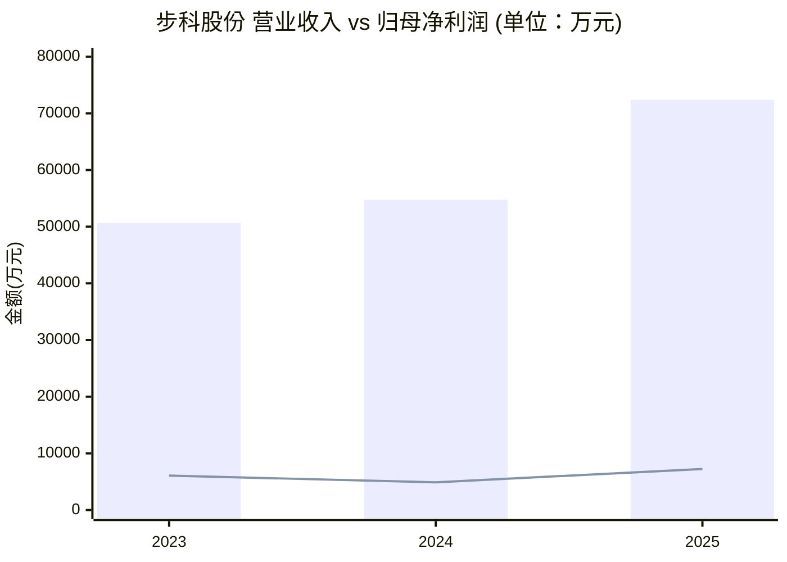
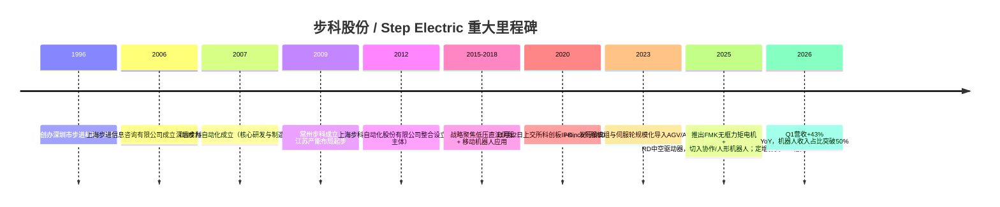
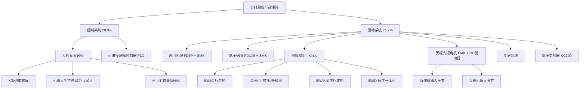
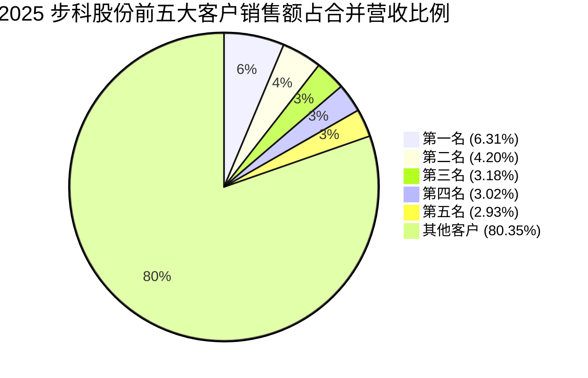
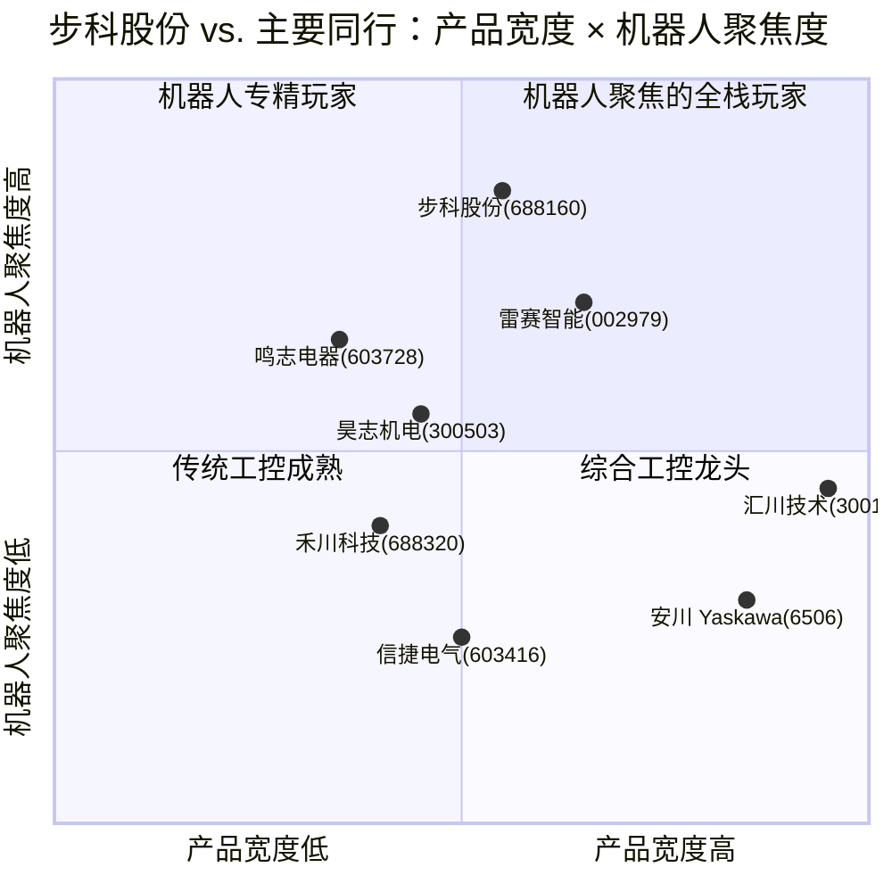

# 上海步科自动化 / Step Electric (Kinco) — 公司研究报告

**Ticker**: SSE:688160 (科创板 / STAR Market)
**英文名**: Kinco Automation (Shanghai) Co., Ltd.
**中文全称**: 上海步科自动化股份有限公司
**As of**: 2026-06-02
**主题归属 / Theme**: humanoid-robotics-actuators（人形机器人核心执行部件）

---

## 目录

1. 公司概览
2. 公司历史
3. 管理团队
4. 产品与服务
5. 客户与上市策略
6. 行业概览
7. 竞争格局
8. 市场机会
9. 风险评估
10. 投资人视角评分
11. 参考资料

---

## 1. 公司概览 / Company Overview

上海步科自动化股份有限公司（"步科股份"，SSE:688160，外文名 Kinco Automation）是一家专注于**运动控制 / motion control** 与**人机交互 / HMI** 核心部件研发、生产、销售的工业自动化高新技术企业，其战略发展方向锁定"智能制造与机器人"，并以提供"机器人动力解决方案"为产品定位。根据公司在 2025 年年度报告中的自我描述："公司是一家高度重视自主研发和创新的高新技术企业，主要从事运动控制和人机交互核心部件的研发、生产、销售以及相关技术服务，并为客户提供自动化控制和机器人动力解决方案"，目前已搭建出**人机界面（HMI）/ 可编程逻辑控制器（PLC）/ 伺服系统 / 步进系统 / 低压变频器**五条完整的工业自动化核心部件产品线 [步科股份 2025 年年度报告, 第 14 页](https://static.cninfo.com.cn/finalpage/2026-04-03/1225075576.PDF)。

公司 2025 年实现营业收入 **7.24 亿元 RMB**（同比 +32.18%），归母净利润 **7,248 万元**（同比 +48.25%），扣非归母净利润 **5,993 万元**（同比 +59.04%）；研发费用 **8,383 万元**（占营收 11.58%）；截至 2025 年末总资产 16.30 亿元（同比 +59.31%），归母净资产 12.96 亿元（同比 +67.51%，主要系当年完成定向增发 4.65 亿元募资），财务体量已从早年净利不到 5,000 万的"小科创板成长股"跨入近亿元利润、十亿元净资产的中型工控企业 [步科股份 2025 年年度报告, 第 10–11 页](https://static.cninfo.com.cn/finalpage/2026-04-03/1225075576.PDF)。2026 年 Q1 延续高增长——单季营业收入 **1.89 亿元**，同比 +43.22%；归母净利润 1,331 万元，同比 +19.70%；研发投入 2,251 万元，同比 +24.94%——但毛利率因新基地产能爬坡、低毛利产品占比上升而短期承压 [步科股份 2026 年第一季度报告, 第 1–3 页](https://static.cninfo.com.cn/finalpage/2026-04-28/1225207574.PDF)。

业务结构上，2025 年驱动系统（伺服 / 步进 / 低压变频器）实现收入 **5.13 亿元，同比 +44.75%，占主营 71.2%**，毛利率 33.64%；控制系统（HMI / PLC）实现收入 **2.04 亿元，同比 +8.60%，占主营 28.3%**，毛利率 41.33% [步科股份 2025 年年度报告, 第 45 页](https://static.cninfo.com.cn/finalpage/2026-04-03/1225075576.PDF)。下游应用结构中，**机器人行业收入占比已上升至 51.24%**（mobile robot / AGV-AMR、协作机器人 / cobot、人形机器人 / humanoid、工业机器人、服务机器人 + 仿生机器人），是公司从"通用工控供应商"转型为"机器人核心动力部件商"的关键证据 [东方财富网, 每周股票复盘：步科股份机器人行业收入占比51.24%, 2026-04-26](https://caifuhao.eastmoney.com/news/20260426041704801231880)。

公司在低压伺服细分市场的份额尤其值得关注：根据 MIR 睿工业《2025 年中国低压直流伺服市场标准报告》，**步科 2024 年中国低压直流伺服市场份额 14.5%**（2023 年 11.8%），是国内市场第一大厂商；根据高工机器人产业研究所（GGII）数据，**2023 年中国移动机器人行业伺服电机销量市占率 54.11%（按销量计第一）**——这两个分领域的领先地位，是公司"成为全球机器人和智能设备核心部件商"使命的底层基础 [步科股份 2025 年年度报告, 第 20 页（行业地位）](https://static.cninfo.com.cn/finalpage/2026-04-03/1225075576.PDF)。

**估值快照 / Valuation snapshot (as of 2026-05-22)：** 收盘价约 **142.0 元 RMB**，市值约 **104.2 亿元 RMB**（90,832,206 股 × 142 元），EPS TTM 约 0.71 元，对应 TTM P/E 约 **200×**，TTM P/S 约 14.4×。市场显然以"机器人核心部件 + 人形机器人题材"对其进行重估，远高于沪深 A 股工控装备制造业（C4011）20–35× 的中位 PE。这种倍数代表的不是当期盈利的回报，而是**对 2026–2028 年人形机器人 / 协作机器人放量、低压伺服国产替代加速、FMK 无框力矩电机切入头部机器人客户的"卡位预期"**——一旦 humanoid 量产时点延后、客户验证不及预期，市盈率收缩压力将远大于盈利下行压力，故 PE 估值收缩本身已成为本报告 § 9 风险评估中独立罗列的一项重大风险 [东方财富网, 步科股份估值数据中心](https://data.eastmoney.com/gzfx/detail/688160.html)；[投资工具站 Investing.com, 步科股份(688160) 市值](https://cn.investing.com/pro/SHSE:688160/explorer/marketcap)。

*数据：营收/归母净利2023–2025 来自 [步科股份 2025 年年度报告, 第 10 页](https://static.cninfo.com.cn/finalpage/2026-04-03/1225075576.PDF)。条形为营收，折线为归母净利润。*

---

## 2. 公司历史 / Company History

步科的起源可以追溯到 1996 年的深圳。**1996 年 5 月**，创始人唐咚先生离开瑞士思博电子（Sipro）中国代表处，与同事池家武等共同创办深圳市步进机电有限公司（步科股份的前身体之一）；1999 年正式将业务从代销型代理转向自研工控产品 [东南大学生物医学工程学院校友报道, 步进科技集团公司董事长——唐咚](https://bme.seu.edu.cn/xyzj/2013/1112/c8004a71645/page.htm)；[上海证券报·中国证券网, 步科股份唐咚：为全球提供中国的自动化解决方案, 2020-11-12](https://news.cnstock.com/kcb,tt-202011-4616662.htm)。深圳早年的步科 / 步进经历了从经销、代销到自研嵌入式人机界面（HMI）、PLC、伺服系统的"国产替代"完整路径——这条路径与后来汇川技术、雷赛智能、伟创电气等一票工控国产化代表企业基本同构。

**2006 年 8 月 17 日**，控股股东上海步进信息咨询有限公司成立，是后续 A 股上市主体股权架构的核心载体；2007 年 9 月 7 日，深圳步科自动化（即"深圳步科"，公司目前最重要的运营子公司）成立 [步科股份 2025 年年度报告, 第 59–60 页](https://static.cninfo.com.cn/finalpage/2026-04-03/1225075576.PDF)。2009 年常州步科成立，承担常州生产基地的运营。**2012 年 5 月**，上海步科自动化股份有限公司正式作为统一上市主体设立，至此完成集团股权架构的整合 [步科股份 2025 年年度报告, 第 62–63 页（董事简历）](https://static.cninfo.com.cn/finalpage/2026-04-03/1225075576.PDF)。

公司在**2020 年 11 月 12 日**正式登陆上海证券交易所**科创板**，证券代码 688160，证券简称"步科股份"。首发价格 **20.34 元 / 股**，发行 2,100 万股，共募集资金 4.27 亿元；扣除发行费用后净额 3.81 亿元，主要投向"生产中心升级改造项目""研发中心升级建设项目""智能制造营销服务中心建设项目"及补充流动资金 [步科股份首次公开发行股票科创板上市公告书, 2020-11-11](http://file.finance.sina.com.cn/211.154.219.97:9494/MRGG/CNSESH_STOCK/2020/2020-11/2020-11-11/6717472.PDF)。**2025 年 7 月 21 日**，公司完成 2023 年度向特定对象发行 A 股股票（即定向增发），新增股份 6,832,206 股，发行价 **68.06 元 / 股**，募集资金净额约 4.65 亿元，主要用于"常州智能制造生产基地建设项目"等机器人核心部件扩产项目；该批新股于 2026 年 1 月 21 日上市流通，公司总股本由 8,400 万股增至 9,083.22 万股 [步科股份 2025 年年度报告, 第 132–134 页（股本变动）](https://static.cninfo.com.cn/finalpage/2026-04-03/1225075576.PDF)。

机器人方向的战略转折在 2015–2018 年之间逐步明确。公司在年报中自述："经过近 10 年在机器人行业的耕耘，成为机器人低压伺服领域领先企业，在行业内有较高品牌影响力"——按 2025 年的时间锚点回推，约 2015–2016 年公司开始系统性投入低压（48V/96V）伺服系统，针对工业移动机器人（AGV/AMR）"电池供电、紧凑空间、模块化部署"的应用约束，做出了**前瞻性的窄场景产品决策**，从而避开了当时通用工业伺服（如台达、西门子、汇川主导的 220V/380V 通用伺服）市场最激烈的国产化卡位战 [步科股份 2025 年年度报告, 第 29–30 页（核心竞争力）](https://static.cninfo.com.cn/finalpage/2026-04-03/1225075576.PDF)。这一阶段的产品线——**i-Kinco 一体化伺服模组**、**iWMC 行走伺服轮**、**iGMK 回转 / 顶升动力模组**、**iSWV 全向行走轮**——构建出公司在 AGV/AMR 头部客户群（极智嘉、海康机器人、灵动科技等）的产品矩阵 [步科股份 2025 年年度报告, 第 24 页](https://static.cninfo.com.cn/finalpage/2026-04-03/1225075576.PDF)。

2024 年至 2025 年，公司将战略再次升级——从"AGV/AMR 低压伺服第一"扩展到"协作机器人 / 人形机器人核心部件"。年报披露："为协作机器人、人形机器人开发了新系列的高功率密度、轻量化 **FMK 无框力矩电机** 及配套 **RD 中空驱动器**"，并获得"**2025 高工金球奖（高工人形机器人）— 技术先行者：FMK 系列无框力矩电机**"和"**人形机器人核心部件匠心奖**"等行业奖项 [步科股份 2025 年年度报告, 第 25–27 页](https://static.cninfo.com.cn/finalpage/2026-04-03/1225075576.PDF)。从公司报告中"人形机器人 2025 年经历了从'技术验证'到'实战应用'的深刻变革"的论断可以看出，管理层将 2025–2026 年视为公司从"机器人辅助部件商"升级为"人形机器人头部 Tier-1 / Tier-2 核心供应商"的窗口期。

---

## 3. 管理团队 / Management

**创始人 / 董事长 / 总经理：唐咚（Tang Dong）。** 1969 年出生，中国国籍，男，57 岁（截至 2025 年末），**东南大学（Southeast University）生物医学工程系本科**、**中欧国际工商学院（CEIBS）高层管理人员工商管理硕士（EMBA）**。职业轨迹：1991 年 9 月–1992 年 7 月任东南大学助教；1992 年 8 月–1996 年 4 月任深圳航天微电机有限公司市场部经理；1996 年 5 月–1999 年 4 月任**瑞士思博电子集团（Sipro）中国代表**，全面负责中国区销售与市场；1996 年 5 月起任深圳步进执行董事 / 董事长；2007 年 9 月至今任深圳步科执行董事 / 董事长兼总经理；2008 年 3 月至今任常州步科董事长；**2012 年 5 月至今任上海步科自动化股份有限公司董事长兼总经理** [步科股份 2025 年年度报告, 第 63 页（董事简历）](https://static.cninfo.com.cn/finalpage/2026-04-03/1225075576.PDF)；[东南大学生医工学院校友报道, 步进科技集团公司董事长——唐咚](https://bme.seu.edu.cn/xyzj/2013/1112/c8004a71645/page.htm)。

唐咚的创始人背景有两点值得读者特别关注。**一是技术底色**：作为东南大学生物医学工程系本科，他对"精密测量 + 控制系统"的工程语言并不陌生，这一背景在公司后续切入 **磁共振 MRI 病床、CT Gantry 运动控制、SPECT 单光子断层成像**等高精度医疗影像运动控制场景时发挥关键作用——医疗影像设备 2025 年贡献收入 **4,250 万元**（同比 +2.74%），看似不大，却为公司提供了"高精度伺服 + 高可靠性认证"的能力沉淀，并成为其切入西门子医疗、联影医疗等客户体系的入场券 [步科股份 2025 年年度报告, 第 26 页（医疗影像）](https://static.cninfo.com.cn/finalpage/2026-04-03/1225075576.PDF)。**二是销售出身的国际化嗅觉**：1996–1999 年瑞士 Sipro 中国代表的角色，使他对"国产替代"路径的理解远比工程师创业者更具市场敏感性——这也解释了为什么公司在 2025 年仍坚持参加 9 场海外核心展会（覆盖德国、美国、日本、印度、韩国、英国、巴西、意大利），并将 2025 年外销收入 **1.07 亿元**（同比 +10.56%，占主营 14.9%）视为"全球化运营"的下一阶段重点而非附加项 [步科股份 2025 年年度报告, 第 27 页（海外推广）+ 第 45 页（外销）](https://static.cninfo.com.cn/finalpage/2026-04-03/1225075576.PDF)。

**唐咚的股东与控制权结构。** 截至 2025 年末，唐咚先生直接持有公司 11.18%（10,156,196 股），通过上海步进信息咨询有限公司间接控制 37.71%（34,254,877 股，唐咚通过深圳步进持有上海步进 69.54%），通过深圳市同心众益投资管理中心（有限合伙）间接控制 7.99%（7,257,526 股，唐咚直接持有同心众益 8.25%权益并担任执行事务合伙人）——**直接 + 间接合计控制 56.88%**，是绝对控股的创始人式公司 [步科股份 2025 年年度报告, 第 59 页（控股股东与实控人）](https://static.cninfo.com.cn/finalpage/2026-04-03/1225075576.PDF)。年报披露其 2025 年税前薪酬 **145.61 万元**——对于一家市值百亿、研发投入近亿元的科创板公司，这一薪酬属于"创始人式克制"水平，与其大额股权敞口形成对比 [步科股份 2025 年年度报告, 第 62 页（董事薪酬）](https://static.cninfo.com.cn/finalpage/2026-04-03/1225075576.PDF)。

由于唐咚先生兼任董事长与总经理已逾 13 年，且实际控制权高度集中（>50%），公司在 2025 年年报中明确论述了"董事长与总经理由实控人担任的合理性"：(a) 战略决策与执行高度统一；(b) 公司从初创到行业领先核心部件供应商的发展过程对其依赖；(c) 通过四个董事会专门委员会（战略 / 审计 / 提名 / 薪酬与考核）+ 三分之一以上独立董事比例对决策权进行制衡 [步科股份 2025 年年度报告, 第 60 页](https://static.cninfo.com.cn/finalpage/2026-04-03/1225075576.PDF)。从治理评估角度，这一安排在创始人未来 5–10 年内继续主导业务时是高效率的，但**接班人计划（succession planning）和实控人健康风险**应作为长期跟踪项之一，详见 § 9 风险评估。

---

## 4. 产品与服务 / Products & Services

步科的产品矩阵分为两大主线——**控制系统（人机界面 HMI + 可编程逻辑控制器 PLC）**和**驱动系统（伺服 / 步进 / 低压变频器）**。这两条线在 2025 年的收入与毛利结构如下表所列（数据均直接引自 2025 年年度报告 § 五"主要经营情况"中的"主营业务分产品情况"表，未做任何估算或重构）：

| 产品大类 | 2025 营业收入 (元) | 同比增减 | 2025 毛利率 | 毛利率同比变化 | 占主营业务比例 |
|---|---:|---:|---:|---|---:|
| 驱动系统 | 512,963,978.52 | +44.75% | 33.64% | 增加 1.42 个百分点 | 71.2% |
| 控制系统 | 203,977,802.83 | +8.60% | 41.33% | 减少 0.91 个百分点 | 28.3% |
| 其他 | 3,054,261.53 | +32.55% | 94.97% | 增加 7.87 个百分点 | 0.4% |
| **合计** | **719,996,042.88** | **+32.23%** | **36.08%** | **增加 0.17 个百分点** | **100.0%** |

*数据：[步科股份 2025 年年度报告, 第 45 页（主营业务分产品情况）](https://static.cninfo.com.cn/finalpage/2026-04-03/1225075576.PDF)*

### 4.1 控制系统 / Control systems

#### 人机界面 / Human-Machine Interface (HMI)

年报对 HMI 的官方业务定义为："人机界面是设备系统和用户之间进行交互和信息交换的媒介，用以实现信息的内部形式与人类可以接受形式之间的转换。通常用于连接可编程逻辑控制器、专用控制器、变频器等工业自动化控制类产品，利用显示单元（如液晶模组）显示机器设备的运行状态等实时信息；在人机界面上可利用输入单元（如触摸屏、键盘等）写入工作参数或输入操作命令等" [步科股份 2025 年年度报告, 第 14 页](https://static.cninfo.com.cn/finalpage/2026-04-03/1225075576.PDF)。

**中文释义 / Plain-language gloss：** HMI 是工业设备上嵌入式触摸屏 + 显示终端的统称，相当于"机器的仪表盘 + 手机"，让工人在不打开 PLC 软件、不依赖远端 PC 的前提下，本地查看温度 / 压力 / 速度等参数并下达指令。步科把这条线进一步升级为 **M-IoT 机器物联网解决方案**——HMI 不再只是显示屏，而是机器接入云端 / MES（Manufacturing Execution System）的智能网关。

2025 年公司 HMI 销量 **347,792 台**，同比 +0.98%；根据 MIR 睿工业《2025 年中国 HMI 市场研究报告》，**2024 年公司 HMI 市场排名第七，国产品牌中排名第四** [步科股份 2025 年年度报告, 第 20 页（HMI 地位）](https://static.cninfo.com.cn/finalpage/2026-04-03/1225075576.PDF)。HMI 与机器人专用手持终端是 2025 年的两项重点新品——年报披露："在机器人手持终端方面，推出了基于 DToolsPro 的新一代 7 寸机器人手持器、10 寸高端机器人手持器"——这一动作意在将 HMI 业务与机器人主业耦合，进一步降低对传统工控（包装机械、电梯、塑料机械）的依赖 [步科股份 2025 年年度报告, 第 24 页](https://static.cninfo.com.cn/finalpage/2026-04-03/1225075576.PDF)。

#### 可编程逻辑控制器 / Programmable Logic Controller (PLC)

年报对 PLC 的定义：" PLC 是控制器的一种。采用可编程序的存储器执行逻辑运算、顺序控制、定时、计数和算术运算等操作命令，通过串行、现场总线、以太网等通讯方式实现与人机界面的信息交互，并通过数字式或模拟式的输入和输出，实现对机器设备运行的控制，是机器设备逻辑控制和实时数据处理的中心" [步科股份 2025 年年度报告, 第 15 页](https://static.cninfo.com.cn/finalpage/2026-04-03/1225075576.PDF)。

**中文释义 / Plain-language gloss：** PLC 是工厂自动化的"大脑"——它把感应器读到的温度、位置信号，按工程师写的逻辑（"若温度 >80°C 则关闭加热器并打开冷却泵"），实时转化为对电机、阀门、加热器的执行指令。步科 PLC 的技术差异化在于**基于 CANopen 的分布式运动控制主站技术**，相比业内多数小型 PLC 仍采用脉冲方式（轴数少、扩展难），公司方案可连接较多轴数、扩展方便且成本更低；同时把"控制与显示技术融合"形成显控一体机产品 [步科股份 2025 年年度报告, 第 33 页（PLC 核心技术）](https://static.cninfo.com.cn/finalpage/2026-04-03/1225075576.PDF)。这一产品对成本敏感型场景——包装机、纺织机、轨道交通辅助控制设备——具备很高性价比，是公司 HMI / PLC 业务的"销量基石"，但增长慢，毛利率虽高（41.33%）却面临国产替代后期的价格战压力。

### 4.2 驱动系统 / Drive systems

#### 通用伺服系统 / General-purpose servo system

年报定义："伺服系统是工业自动化控制设备主要的动力来源之一，主要由伺服驱动器、伺服电机组成，伺服电机包括同步电机、编码器。伺服含义为'跟随'，指按照指令信号做出位置、速度或转矩的跟随控制。伺服系统可通过闭环方式实现精确、快速、稳定的位置控制、速度控制和转矩控制，主要应用于对定位精度和运转速度要求较高的工业自动化控制领域。公司将伺服系统分为通用伺服系统、低压伺服系统和伺服模组" [步科股份 2025 年年度报告, 第 15 页](https://static.cninfo.com.cn/finalpage/2026-04-03/1225075576.PDF)。

**中文释义 / Plain-language gloss：** 伺服系统是把电信号精准转化为机械运动（位置 / 速度 / 转矩）的核心动力单元。"伺服"（servo）的本意就是"听话地跟随"——驱动器读编码器反馈→实时算出与指令的差→输出修正电流→闭环把误差收敛到 μm 级。通用伺服指 220V/380V 工频供电、面向机床 / 工业机器人 / 包装机 / 电子制造设备的大功率版本，是汇川技术（SZSE:300124）、台达、西门子、安川（Yaskawa）、Mitsubishi 主导的红海市场。

公司在 2025 年发布的 **FD5P 系列中大功率通用伺服驱动器 + SMK 中大功率中惯量通用伺服电机**，配合 FD5P Pro 伺服软件、Kinco Servo Pro 上位机软件，主打"通用市场国产替代 + 海外出口"——这一策略明显在追赶汇川 / 雷赛在通用伺服的主场，国内通用伺服的市占率短期内难以挑战汇川（>20% 内资市占），但**FD5P 通过 CE/UL/STO 等海外认证**助力国内客户设备出口，意在借力国内设备厂商出海的潮流绕开汇川的直接正面冲撞 [步科股份 2025 年年度报告, 第 25 页（FD5P 新品）](https://static.cninfo.com.cn/finalpage/2026-04-03/1225075576.PDF)。

#### 低压伺服系统 / Low-voltage servo system

年报对低压伺服的定位最为关键："低压伺服系统（通常指工作电压在 96V 以下的伺服系统）作为自动化控制领域的'肌肉'，近年来正随着智能制造和新兴科技的爆发经历深刻的变革。中国是全球最大的伺服电机生产与消费市场之一。2024 年，我国伺服市场在 2024 年已达到约 223 亿元规模，低压伺服作为其中的重要细分领域，凭借在 AGV、协作机器人、航空航天、半导体等对移动性与安全性要求较高场景的广泛应用，增速持续高于行业平均水平" [步科股份 2025 年年度报告, 第 21 页（低压伺服）](https://static.cninfo.com.cn/finalpage/2026-04-03/1225075576.PDF)。

**中文释义 / Plain-language gloss：** "低压"指 ≤96V 直流电压输入（典型 24V / 48V），针对电池供电、紧凑空间的移动设备——主要是 **AGV / AMR（autonomous mobile robot，自主移动机器人）**、**协作机器人 / cobot**、**人形机器人 / humanoid**、**无人叉车 / unmanned forklift**、**手术机器人 / surgical robot**。这类设备的电源来自锂电池组（24–48V），驱动器必须做小、做轻、能在剧烈震动 + 电磁干扰环境下保持伺服精度，与传统插墙电的 220V 工业伺服在工程设计上属于两条不同的产品线。步科的核心差异化在于**前瞻性聚焦低压伺服的紧凑精密设计**——年报论述："通过独特的抗干扰电路设计与高效的散热设计，提高了系统的电磁兼容可靠性、电机控制效率和系统过载能力，从而实现了相比同行业竞品同功率下更紧凑的尺寸设计、更强的过载性能和可靠性" [步科股份 2025 年年度报告, 第 31 页（紧凑型精密低压伺服驱动技术）](https://static.cninfo.com.cn/finalpage/2026-04-03/1225075576.PDF)。

2025 年公司推出**第五代低压伺服驱动器 FD1X5 + 配套 SMK 低压伺服电机**，全系列通过 UL / CE / STO 等海外认证，标志着产品的电气安全、稳定性、环境适应性达到国际标准。**2025 年公司伺服系统总销量 627,498 台，同比 +51.44%**——这是机器人下游高速放量直接拉动的结果 [步科股份 2025 年年度报告, 第 20 页（伺服销量）+ 第 24 页（FD1X5 与 UL/CE）](https://static.cninfo.com.cn/finalpage/2026-04-03/1225075576.PDF)。

#### 伺服模组与 i-Kinco 一体化产品 / Integrated servo modules

年报定义："伺服模组是针对机器人、医疗影像、智能物流等行业的应用场景需求，将伺服驱动器、伺服电机、减速机、驱动轮等多种部件，通过机械结构及电子电气方面的创新设计而成的模组化产品。其既具有标准伺服系统的定位精确、快速响应、速度和力矩控制稳定的特点，还具有结构体积紧凑、系统可靠性高、传动效率高、使用简便的优点" [步科股份 2025 年年度报告, 第 16 页](https://static.cninfo.com.cn/finalpage/2026-04-03/1225075576.PDF)。

公司在 2024–2025 年提出 **i-Kinco** 技术理念，将驱动器 + 电机 + 减速机 + 编码器集成在一个模块内，针对移动机器人应用形成产品矩阵：

| i-Kinco 产品 | 物理功能 | 典型下游 |
|---|---|---|
| **iWMC 行走伺服轮** | 集成驱动电机 + 驱动器 + 减速机 + 编码器 + 车轮一体化模组，直接安装到 AGV/AMR 底盘 | AGV/AMR 整车 OEM |
| **iGMK 回转 / 顶升动力模组** | 提供回转 / 顶升轴的精密定位与高扭矩支撑 | 潜伏顶升机器人、料箱拣选 |
| **iSWV 全向行走轮** | 麦克纳姆 + 全向轮一体化驱动模组 | 室内全向 AGV |
| **iSMD 一体机（医疗）** | CT / SPECT 病床高精度伺服一体机 | 西门子医疗 / 联影医疗等影像设备厂 |
| **iBLG-30 / iBLG-12** | 料箱叉拨物流舵机 + 木工封边机专用定位器 | 木工机械 / 玻璃机械 / 光伏板切割 |

*数据：[步科股份 2025 年年度报告, 第 24–25 页（i-Kinco / FD1X5 / iBLG 新品）](https://static.cninfo.com.cn/finalpage/2026-04-03/1225075576.PDF)*

**中文释义 / Plain-language gloss：** 一体化的核心价值是**降低客户的工程总成本**——把"分别买驱动器 + 电机 + 减速器 + 编码器，再在车间装配试机"的传统流程，压缩成"接电源接信号即可装车"的即插即用模块，对 AGV/AMR 整车厂来说，意味着 BOM 简化、装配时间下降、维护更换更便捷。年报披露："i-Kinco 系列一体化产品销量大幅提升"、"公司拓宽了伺服轮产品负载范围，在原有 600kg、1T 负载基础上，推出 50kg 负载伺服轮产品，为极速潜伏顶升机器人提供集成式、一站式的运动控制部件解决方案，填补轻量级移动机器人集成式伺服模组的市场空白"——即 i-Kinco 已从一个早期实验线产品扩展为全负载段（50kg–1T）的产品矩阵 [步科股份 2025 年年度报告, 第 24 页](https://static.cninfo.com.cn/finalpage/2026-04-03/1225075576.PDF)。

#### 无框力矩电机 / Frameless torque motor (FMK) + 中空驱动器 / Hollow-shaft driver (RD)

这是 2024–2026 年公司**最重要的新产品线**，也是估值故事的核心。年报披露："为协作机器人、人形机器人开发了新系列的高功率密度、轻量化 FMK 无框力矩电机及配套 RD 中空驱动器；为工业机器人客户提供机械臂专用伺服系统、夹爪专用模组等产品" [步科股份 2025 年年度报告, 第 25 页](https://static.cninfo.com.cn/finalpage/2026-04-03/1225075576.PDF)。

**中文释义 / Plain-language gloss：** "无框（frameless）"指电机本身没有外壳和轴承，只有定子（绕组 + 铁芯）和转子（永磁铁），机器人厂商把这两件直接嵌进自己的机械臂关节里——关节本身的轴承 + 外壳取代电机的轴承 + 外壳。这种设计的最大优势是**节省空间和重量**：人形机器人 / 协作机器人的关节内部空间寸土寸金，传统带壳伺服电机塞进去后还需要外加联轴器、减速器，整个关节就会变粗、变重；无框直接"长在"关节里，体积小、扭矩大、轻量化。和讯网早在 2023 年 8 月即报道："步科股份(688160.SH)：无框力矩电机产品主要应用在协作机器人上"——这是公司早期通过投资者交流公开化的产品定位 [和讯网, 步科股份：无框力矩电机产品主要应用在协作机器人上, 2023-08-03](https://m.hexun.com/stock/2023-08-03/209597949.html)。

年报对 FMK 的核心技术做了如下描述："通过独特的磁路设计、绕线并线工艺及传感器安装结构设计，开发高功率密度无框力矩电机，在减小电机体积重量的同时输出较大力矩。为下游工业移动机器人（AGV/AMR）、协作机器人、工业 4/6 轴、人形机器人、服务机器人、医疗影像设备、智能物流等领域客户提供满足其需求的高性价比产品" [步科股份 2025 年年度报告, 第 30–31 页（无框电机核心技术）+ 第 32 页（伺服电机分瓣集中绕组技术）](https://static.cninfo.com.cn/finalpage/2026-04-03/1225075576.PDF)。配套的 **RD 中空驱动器** 之所以叫"中空"，是因为驱动器电路板设计成中间留有走线孔——人形机器人的关节内部需要走电源线 + 信号线 + 散热管路，驱动器必须给这些线缆"让路"，普通驱动器的实心结构在人形机器人的窄关节空间内无法布线。

FMK 系列在 2025 年取得多项行业认可——"**2025 高工金球奖（高工人形机器人）— 技术先行者：FMK 系列无框力矩电机**"和"**人形机器人核心部件匠心奖**"由高工咨询和人形机器人场景应用联盟颁出，标志公司已在人形机器人圈层获得"核心部件供应商"的初步定位 [步科股份 2025 年年度报告, 第 27 页（获奖清单）](https://static.cninfo.com.cn/finalpage/2026-04-03/1225075576.PDF)。

#### 步进系统 + 低压变频器

年报对步进系统的定位："步进系统亦是工业自动化控制设备主要的动力来源之一，主要由步进驱动器、步进电机两部分组成。步进系统通过开环方式实现机器设备的准确定位和调速，主要应用于对定位精度和运转速度要求相对较低的工业自动化控制领域"——属于步科的"现金牛"业务，技术成熟、毛利稳定、增长慢，**步进电机外购 + 自产驱动器**的轻资产模式，避免与雷赛智能（SZSE:002979，国内步进 / 直线电机龙头之一）的电机正面竞争 [步科股份 2025 年年度报告, 第 16–17 页](https://static.cninfo.com.cn/finalpage/2026-04-03/1225075576.PDF)。

低压变频器（输入电压 <690V）是公司在 2025 年推出 **KC200 系列通用矢量型变频器和 AK8x0 系列运动控制器**——这两条线对营收贡献小，但作为完整工控产品线的"组件"，使公司具备对客户的"一站式解决方案"销售能力 [步科股份 2025 年年度报告, 第 25 页（KC200 / AK8x0 新品）](https://static.cninfo.com.cn/finalpage/2026-04-03/1225075576.PDF)。

### 4.3 产品矩阵综合视图

### 4.4 产品矩阵的协同效应 — "1+N" 战略与控制+驱动闭环

公司在年报多次提到 **"1+N" 战略布局**——以"Kinco 步科"品牌在机器人行业的影响力（**1**）带动 N 个相关行业的品牌发展（医疗影像、新能源、物流、3C、纺织、包装等），并将"i-Kinco 集成化技术理念"作为穿透式的产品工程语言 [步科股份 2025 年年度报告, 第 26–27 页](https://static.cninfo.com.cn/finalpage/2026-04-03/1225075576.PDF)。这种产品矩阵设计的核心逻辑是：

1. **HMI + PLC（控制层）** 提供机器人手持终端、机器人控制器、显控一体机，让客户"显示 + 控制"层一站采购；
2. **伺服 / 步进 / 变频器（驱动层）** 提供从低压伺服到大功率通用伺服的全产品线，让客户"驱动层"也能在步科一站采购；
3. **i-Kinco 一体化模组与 FMK + RD（执行层）** 把"驱动器 + 电机 + 减速器 + 编码器"打包，让客户跳过传统的"分件采购 + 装配试机"流程，直接拿"关节模块"装机；
4. **M-IoT 物联型 HMI + 数字化工厂软件 SaaS** 让客户具备"远程运维 + 设备数据上云"的智能化能力，把硬件销售升级为"硬件 + 软件 + 服务"的订阅式商业模式（虽然 SaaS 部分目前收入贡献仍小）。

这种"控制 + 驱动 + 执行 + 物联"的全栈产品矩阵是步科与汇川技术（SZSE:300124，伺服 + 工业机器人 + 电源管理）模式趋同、但与雷赛智能（聚焦运动控制 + 电机）、鸣志电器（SHE:603728，聚焦控制电机出口）路线不同的关键。从产品逻辑上讲，步科的"1+N 战略"比单一伺服或单一电机的对手更接近**"机器人版的 Tier-1 Bosch"**——单价不一定最高，但客户黏性来自于"配套 + 一站式采购"。

---

## 5. 客户与上市策略 / Customers & Listing Strategy

**客户结构以分散为主，前五大客户合计仅占年度销售总额 19.65%。** 2025 年年度报告（出于商业秘密豁免披露要求）以代称方式披露了前五大客户：第一名 4,568.53 万元（6.31% of consolidated revenue）；第二名 3,037.24 万元（4.20%）；第三名 2,299.09 万元（3.18%）；第四名 2,188.12 万元（3.02%）；第五名 2,123.55 万元（2.93%）；**前五合计 14,216.53 万元，占 2025 年合并营收 (7.24 亿元) 的 19.65%**——所有客户与上市公司均无关联关系 [步科股份 2025 年年度报告, 第 47–48 页（主要销售客户）](https://static.cninfo.com.cn/finalpage/2026-04-03/1225075576.PDF)。

需要强调，**所有客户百分比的分母均为"合并报表口径下的年度营业收入"**（不是某一细分行业、不是某一段产品的销售口径），且年报已说明前五大客户名称"属于公司商业秘密"按规定履行豁免披露程序。这意味着即便步科在 AGV/AMR 移动机器人行业 2023 年伺服电机销量市占率 54.11%，其下游头部 AGV 厂商（如极智嘉 Geek+、海康机器人 Hikrobot、灵动科技 Forwardx、快仓 Quicktron）也并未单独突破 10% 的合并营收占比阈值——足见步科的客户基础足够分散，单一客户依赖风险较低 [步科股份 2025 年年度报告, 第 20 页（移动机器人 54.11% 市占率，*分段层口径*）](https://static.cninfo.com.cn/finalpage/2026-04-03/1225075576.PDF)。

*数据：[步科股份 2025 年年度报告, 第 47 页（主要销售客户）](https://static.cninfo.com.cn/finalpage/2026-04-03/1225075576.PDF)。所有百分比均按合并营收口径计算，分母 = 7.24 亿元。*

**销售模式：直销 + 经销双轨。** 2025 年直销实现收入 **3.84 亿元（同比 +43.63%，占主营 53.4%，毛利率 34.35%）**，经销实现收入 **3.36 亿元（同比 +21.21%，占主营 46.6%，毛利率 38.07%）**——直销增速明显高于经销，反映"行业战略客户深度链接"策略的奏效；经销毛利率高于直销，是因为经销网络承担部分销售费用、销售折让相对较少 [步科股份 2025 年年度报告, 第 45–46 页](https://static.cninfo.com.cn/finalpage/2026-04-03/1225075576.PDF)。

**典型客户名单（年报中明示）。** 年报中具体被列名的客户包括"**西门子医疗（Siemens Healthineers）**"和"**联影医疗（United Imaging Healthcare, SSE:688271）**"——这两家是公司医疗影像设备 iSMD 一体机的核心客户，对应 2025 年医疗影像设备行业销售收入 4,250.02 万元（同比 +2.74%）[步科股份 2025 年年度报告, 第 26 页（医疗影像）+ 第 30 页（"成功进入西门子医疗、联影医疗等"）](https://static.cninfo.com.cn/finalpage/2026-04-03/1225075576.PDF)。机器人行业的具体客户名（前五大）由于商业秘密豁免，未在年报中具名披露。

**前五大供应商高度分散。** 2025 年前五供应商合计采购额 7,242.60 万元，占年度采购总额 16.51%——第一名 4.63%、第二名 3.86%、第三名 3.49%、第四名 2.54%、第五名 1.99%——供应商集中度风险极低，原材料供应链稳健 [步科股份 2025 年年度报告, 第 48 页（主要供应商）](https://static.cninfo.com.cn/finalpage/2026-04-03/1225075576.PDF)。原材料构成（直接材料）2025 年占总营业成本 83.66%，主要包括 IC 芯片、液晶屏、电子元器件、PCB、触摸面板、IGBT、编码器、磁钢、减速机、五金件等——其中 IC 芯片 + IGBT 暴露在半导体周期与中美科技摩擦下，是公司原材料端的最大风险点 [步科股份 2025 年年度报告, 第 17 页（采购模式）+ 第 46 页（成本结构）](https://static.cninfo.com.cn/finalpage/2026-04-03/1225075576.PDF)。

**上市策略与资本运作：** 2020 年 11 月科创板首次公开发行 2,100 万股 @ 20.34 元 / 股，募资 4.27 亿元，专项投向"生产中心升级改造 / 研发中心升级 / 智能制造营销服务中心建设"；2025 年 7 月完成 2023 年度定向增发 6,832,206 股 @ 68.06 元 / 股，募资 4.65 亿元，主要投向"常州智能制造生产基地"（常州 1 号厂房 2025 年完成转固，是固定资产同比 +186.36% 的核心驱动）[步科股份 2025 年年度报告, 第 50 页（固定资产说明）+ 第 130–134 页（增发情况）](https://static.cninfo.com.cn/finalpage/2026-04-03/1225075576.PDF)。从这两次资本市场动作的时序看，**公司一直把"机器人下游放量 → 自家产能扩张"作为资本运作的主线**，而不是分红或回购股东回报路线。

---

## 6. 行业概览 / Industry Overview

公司在《国民经济行业分类》（GB/T 4754-2017）下归属于"仪器仪表制造业（C40）"中的"工业自动控制系统装置制造（C4011）"，按《战略性新兴产业分类（2018）》则归属"高端装备制造产业 — 智能制造装备产业 — 智能测控装备制造"中的工业自动控制系统装置制造 [步科股份 2025 年年度报告, 第 19 页](https://static.cninfo.com.cn/finalpage/2026-04-03/1225075576.PDF)。该行业的功能层次为"控制层 → 驱动层 → 执行层 → 反馈层"四级：

| 层级 | 功能 | 主要产品 |
|---|---|---|
| **控制层** | 工业自动化系统的"大脑"，逻辑运算、过程控制和决策处理 | PLC、DCS、工业计算机 / 工控机、HMI、工业软件 |
| **驱动层** | 把控制信号转换为机械运动 | 伺服驱动器、变频器、软启动器、直流驱动器、工业转化器 |
| **执行层** | 直接作用于生产设备，完成具体操作 | 伺服电机、减速器、接触器 / 继电器、调节阀、气缸 / 液压缸 |
| **反馈层** | 系统的"感官"，检测和测量物理量 | 传感器、过程仪表、编码器、视觉检测系统、检测仪器 |

*数据：[步科股份 2025 年年度报告, 第 19 页（功能分层）](https://static.cninfo.com.cn/finalpage/2026-04-03/1225075576.PDF)。*

### 6.1 中国工业自动化市场

根据工信部及 MIR 睿工业数据，**中国工业自动化行业市场规模 2018–2023 年从 3,977 亿元增至 5,734 亿元，年均复合增长率 7.6%；预计 2024–2029 年 CAGR 约 7.7%，到 2029 年市场规模将突破 8,900 亿元** [步科股份 2025 年年度报告, 第 21 页（市场规模引用 MIR 睿工业 + 前瞻产业研究院）](https://static.cninfo.com.cn/finalpage/2026-04-03/1225075576.PDF)。中国工业自动化目前的核心结构性趋势是**国产替代加速期**——年报论述："过去，工业自动化高端市场主要被外资品牌垄断，现在，经历多年学习积累，内资优质工控企业与外资一线厂商的技术差距正加速收敛，并凭借高性价比、快速交付、灵活响应等本土化优势不断提升品牌影响力和市场份额，加速由中低端市场向中高端市场渗透"——这正是过去 5–8 年汇川、雷赛、信捷电气、英威腾、新时达、步科等内资工控品牌从"高性价比替代"切入高端市场的共同路径 [步科股份 2025 年年度报告, 第 19 页](https://static.cninfo.com.cn/finalpage/2026-04-03/1225075576.PDF)。

### 6.2 低压伺服细分（步科最核心赛道）

中国 2024 年伺服市场规模约 **223 亿元**，其中低压伺服增速持续高于行业平均水平——年报论述："2024 年，移动机器人、协作机器人行业受下游电子、物流、锂电等领域'机器换人'的需求持续驱动，实现高速增长。进入 2025 年，多行业逐渐复苏，各供应商订单稳步回升，整体市场规模呈现正增长趋势。预计 2026–2028 年，整体低压伺服市场也将保持稳定增长趋势" [步科股份 2025 年年度报告, 第 21 页（低压伺服规模 + 增长）](https://static.cninfo.com.cn/finalpage/2026-04-03/1225075576.PDF)。

低压伺服的两大下游引擎：

- **工业移动机器人（AGV/AMR）**：根据高工机器人产业研究所（GGII）数据，2024 年中国移动机器人市场销量 11.18 万台（同比 +8.75%），市场规模 136.52 亿元（同比 +15.15%）；预计 2025 年销量达 12.60 万台，2028 年突破 20 万台，市场规模 245 亿元 [步科股份 2025 年年度报告, 第 22 页（GGII 数据）](https://static.cninfo.com.cn/finalpage/2026-04-03/1225075576.PDF)。
- **协作机器人 / cobot**：GGII 数据显示，**2025 年中国协作机器人市场销量约 4.95 万台（同比 +45.59%），预计 2026 年突破 6 万台，2030 年突破 19 万台** [步科股份 2025 年年度报告, 第 22 页（协作机器人 GGII 数据）](https://static.cninfo.com.cn/finalpage/2026-04-03/1225075576.PDF)。

### 6.3 人形机器人 — 估值故事的核心驱动力

年报论述："2025 年，人形机器人 2025 年经历了从'技术验证'到'实战应用'的深刻变革，现在正处于从'实验室炫技'迈向'工厂实干'的关键拐点。2025 年被视为人形机器人的商业化元年，它们不再只会在舞台上跳舞，而是开始真正'进厂打工'。根据工信部最新指引，人形机器人已被同时纳为未来产业创新任务及未来高端装备标志性产业。2023 年 10 月，《人形机器人创新发展指导意见》发布，成为首个鼓励'人形机器人'发展的文件" [步科股份 2025 年年度报告, 第 22 页（人形机器人引言）](https://static.cninfo.com.cn/finalpage/2026-04-03/1225075576.PDF)。

**Omdia 报告预测：2025 年全球人形机器人市场迈入快速增长阶段，全年总出货量预计达 1.3 万台，中国厂商在规模化量产与出货量方面表现突出。2026 年人形机器人产业将正式迈入规模化放量的关键阶段**——这与特斯拉 Optimus、Figure、Apptronik、Agility Robotics、宇树（Unitree）、智元、傅利叶等头部人形机器人厂商 2025–2026 年的量产节奏吻合 [步科股份 2025 年年度报告, 第 23 页（Omdia 引用）](https://static.cninfo.com.cn/finalpage/2026-04-03/1225075576.PDF)。

*分析师观点：* 人形机器人 2025 年 1.3 万台、2026 年规模化放量的量产节奏决定了**核心部件（无框力矩电机 + 行星减速器 + 谐波减速器 + 中空驱动器 + 编码器）的需求弹性比整机厂更大**——一台人形机器人通常含 28–40 个关节，每个关节需要 1 个无框力矩电机 + 1 个减速器 + 1 个驱动器 + 1 个编码器，意味着 1.3 万台对应约 39–52 万套核心部件需求。这是步科 FMK + RD 系列产品估值溢价的来源，但具体公司能否拿到多少份额、单价能否抬升，需要更多客户合同披露才能验证（详见 § 9 风险）。

### 6.4 HMI 行业

根据 QY Research 统计，**2024 年全球 HMI 市场规模约 39.07 亿美元，预计 2031 年达 64.78 亿美元，2025–2031 年 CAGR 7.6%**；中项网行业研究院数据显示，**2024 年中国 HMI 市场销量约 1,825 万台（同比 +3.5%），销售额约 92.8 亿元（同比 +3.1%）**；观研报告网预计到 2029 年中国 HMI 市场规模有望突破 100 亿元，2023–2029 年 CAGR 约 6.6% [步科股份 2025 年年度报告, 第 23 页（HMI 市场规模）](https://static.cninfo.com.cn/finalpage/2026-04-03/1225075576.PDF)。HMI 行业相对成熟，国产替代已基本完成，未来增长更多来自 IoT 化 + AI 化升级（步科 M-IoT 路线），而非单纯销量扩张。

---

## 7. 竞争格局 / Competitive Landscape

步科在工业自动化行业的竞争格局可以分为三个层次：

### 7.1 综合工控龙头（"汇川式全栈"对手）

**汇川技术（SZSE:300124）**：内资工控霸主，2022 年营业收入 230.08 亿元，2024 年伺服系统营收 >80 亿元，是国内通用伺服 + 工业机器人 + 电源管理 + 新能源乘用车电控的全栈玩家——市占率（按 2022 年伺服系统营收）远超步科。步科与汇川的关系不是正面替代，而是**避开汇川主场（通用工业伺服 + 工业机器人 + 数控机床）+ 卡位汇川次要场景（低压直流伺服 + 移动机器人 + 协作 / 人形机器人）**。前瞻产业研究院数据将工控梯队划为：**第一梯队汇川（百亿元营收）→ 第三梯队禾川科技 / 雷赛智能 / 信捷电气（20 亿元以下）→ 步科股份 < 10 亿元** [前瞻产业研究院, 2024 年伺服系统行业上市公司全方位对比](https://www.qianzhan.com/analyst/detail/220/240326-f1716e9b.html)。

*分析师观点：* 汇川对步科的潜在威胁是**汇川未来下场低压伺服 + 协作 / 人形机器人核心部件**——汇川已在 2024 年开始布局工业机器人 + 谐波减速器（参股绿的谐波），如果其未来发力 FMK 类无框力矩电机，凭借其客户渠道与品牌护城河，将对步科 FMK 业务形成正面打击；但短期（2026–2028）汇川的核心精力仍在新能源汽车电控 + 通用伺服 + 数控机床，对低压机器人核心部件的直接挤压有限。

### 7.2 直接同行（"机器人核心部件细分"对手）

**雷赛智能（SZSE:002979）**：国内运动控制 + 步进 / 直线电机老牌龙头，2024 年伺服市占率 4%（仅次于汇川），有"运动控制老牌王者"之称，已被多家券商研究将其重点列入"机器人电机+减速器"放量受益标的 [东吴电新研究, 雷赛智能：运动控制老牌王者，机器人电机风正时济, 2025-03-07](https://finance.sina.com.cn/stock/relnews/cn/2025-03-07/doc-inenvmwf5762012.shtml)。雷赛与步科在低压伺服 + 步进系统 + 运动控制器（PLC + 板卡）有正面重叠，但步科更聚焦机器人下游应用（51.24% 收入来自机器人），雷赛业务结构更分散（步进 + 通用伺服 + 直线电机 + 控制卡 + 机器人专用电机）。

**鸣志电器（SHE:603728）**：世界级控制电机制造商，海外收入占比 >40%（步科约 14.9%），空心杯电机畅销国内外，是人形机器人灵巧手 / 手指空心杯电机最重要的国内供应商之一，伺服系统业务也较强；与步科是错位竞争（鸣志聚焦小尺寸控制电机出口 + 空心杯，步科聚焦低压伺服 + 无框力矩电机 + i-Kinco 整体方案）[人形机器人产业研究, 空心杯电机与无框电机最受重视](https://www.xcc.com/news/detail/5565184)。

**昊志机电（SZSE:300503）**：电主轴 + 无框力矩电机 + 减速器供应商，无框力矩电机已广泛应用于协作机器人和轻型机器人——这是步科 FMK 系列**最直接的国内对手**。两家公司在 FMK 类产品上有正面竞争，但昊志机电的电主轴主业（数控机床主轴）与机器人核心部件构成 50/50 业务结构，步科的机器人收入占比更高（51.24%），管理层注意力更集中于机器人方向 [深圳市场观察, 人形机器人核心零部件细分领域分析](https://www.drivedream.com/news_more.html?article_id=114&_l=zh_CN)。

**江苏雷利（SHE:300660）+ 鼎智科技（BSE:873593）+ 伟创电气 (SHE:688698)**：均为人形机器人核心部件 + 控制电机 + 微型电机的细分玩家，海外收入占比都不低，与步科共同构成 A 股 / 港股市场"人形机器人核心部件"主题的可投资标的池。

### 7.3 进口替代对手 — 外资品牌

- **安川（Yaskawa, TSE:6506）** + **三菱电机（Mitsubishi Electric, TSE:6503）** + **西门子（Siemens, ETR:SIE）**：是中国通用伺服市场的传统外资三巨头，步科主要避开它们的主场（高端通用伺服 + 数控机床）；
- **科尔摩根（Kollmorgen, A&P Group 子公司）** + **Maxon Motor**：是国际无框力矩电机 + 空心杯电机的传统龙头，特斯拉 Optimus 早期原型机据传使用 Kollmorgen 的部件，是步科 FMK 系列在海外人形机器人市场的最强对手；
- **ABB / KUKA**：工业机器人整机龙头，是步科的潜在客户而非直接对手。

### 7.4 竞争定位象限图

### 7.5 竞争性优势小结

步科在年报中自陈的核心竞争力包括："(1) 研发优势；(2) 综合性的工业自动化与数字化技术平台优势；(3) 较为完整的机器人核心部件解决方案提供能力；(4) 客户服务优势；(5) 客户资源优势；(6) 质量优势" [步科股份 2025 年年度报告, 第 28–30 页](https://static.cninfo.com.cn/finalpage/2026-04-03/1225075576.PDF)。从外部第三方视角，**真正可验证的差异化护城河**集中在三点：

1. **低压直流伺服细分第一**——MIR 睿工业认证 14.5% 市占率（国内厂商第一），是确凿的细分领先；
2. **AGV/AMR 移动机器人伺服电机销量第一**（GGII 认证 54.11% 销量市占率，*分段层口径*），客户网络已完成卡位；
3. **i-Kinco 一体化模组的产品工程能力**——把传统分件采购流程压缩为模块化即插即用，这种"集成度"在客户处形成切换成本（重新设计机械臂关节需要 12–18 个月）。

而**真正脆弱的环节**：(a) FMK 无框力矩电机的客户验证还在早期，年报未披露 FMK 单独收入与客户名单；(b) 通用伺服与汇川 / 雷赛的差距过大，FD5P 海外认证只能减缓而无法逆转通用伺服份额差距；(c) 海外收入占比低（14.9%），鸣志电器、江苏雷利、鼎智科技 (40%+) 在出海卡位上明显领先。

---

## 8. 市场机会 / Market Opportunity

### 8.1 TAM / SAM / SOM 量级

**TAM（可触达总市场）：** 中国工业自动化全行业 2024 年市场规模 5,734 亿元，预计 2029 年 8,900 亿元——这是步科产品矩阵理论上可触达的最大蛋糕，但其中 PLC + DCS + 工业软件部分（占比约 30%）公司参与度有限，故 TAM 实际口径应取约 4,000–4,500 亿元。

**SAM（可服务市场）：** 中国伺服市场 2024 年 223 亿元 + 中国 HMI 市场 2024 年 92.8 亿元 + 协作机器人 + AGV 整机所需控制 / 驱动部件配套——三项合计约 350–400 亿元，是步科 2026 年合理的 SAM 上界。

**SOM（实际可获得市场）：** 公司 2025 年合并营收 7.24 亿元，对应国内伺服 + HMI + 机器人部件配套 SAM 的渗透率约 1.8–2.0%——表明业务还处于早期渗透阶段，距离汇川（伺服 80+ 亿元，SAM 渗透率 25%+）的中期天花板还远。

### 8.2 三个增长引擎

**引擎一：低压伺服国产替代延续**——MIR 睿工业认定步科低压直流伺服国内第一，2024 年市占率 14.5%（2023 年 11.8%）；在 2025 年伺服系统销量 +51.44% 的高基数下，预计 2026 年仍能维持 30%+ 的销量增速，市占率 2026 年有望突破 18% [步科股份 2025 年年度报告, 第 20 页](https://static.cninfo.com.cn/finalpage/2026-04-03/1225075576.PDF)。

**引擎二：协作机器人 + 人形机器人核心部件放量**——根据 GGII 数据，2025 年中国协作机器人销量 4.95 万台（+45.59% YoY），2030 年有望突破 19 万台；Omdia 预测 2025 年全球人形机器人出货 1.3 万台，2026 年迈入规模化放量。**步科 FMK + RD 是这一波放量的核心受益产品线**——如果 FMK 在 2026–2027 年能拿下 5–10% 的中国协作 / 人形机器人无框力矩电机份额，对应营收弹性 1–2 亿元（按单价 800–1,500 元 / 台 × 20–40 个关节 × 1–3 万台机器人量级粗略估算）[步科股份 2025 年年度报告, 第 22–23 页（协作 + 人形机器人）](https://static.cninfo.com.cn/finalpage/2026-04-03/1225075576.PDF)。

**引擎三：海外市场 + 工控软件 SaaS 化**——2025 年海外收入 1.07 亿元（占主营 14.9%，YoY +10.56%），毛利率 44.43%（显著高于内销 34.63%）；公司在 2025 年参加 9 场海外展会、推进 FD5P / FD1X5 系列 CE/UL/STO 认证，对外销构成持续投入；同时 M-IoT 物联网 + 数字化软件 SaaS 化的"硬件+软件"商业模式升级，长期有望抬升整体毛利率 1–3 个百分点 [步科股份 2025 年年度报告, 第 25 页（FD1X5 / FD5P 认证）+ 第 27 页（海外推广）](https://static.cninfo.com.cn/finalpage/2026-04-03/1225075576.PDF)。

### 8.3 关键问题：FMK 的单位经济能否兑现

人形机器人估值故事的核心问号是 FMK 无框力矩电机能否在 2026–2028 年实现：(a) 头部人形机器人客户量产订单；(b) 毛利率 ≥35%（高于普通伺服的 33.6%）；(c) 单关节售价 ≥1,000 元 + 单机价值量 ≥3 万元。**如果三条都成立，则 FMK 单独贡献的营收弹性在 2028 年有望达到 5–8 亿元（机器人核心部件 SAM 的 10–15%），相当于再造一个 2024 年的步科**；**如果只能拿下"小批量验证 + 单价 500–800 元"的早期客户，则 FMK 贡献仅 1–2 亿元，估值会显著回调**。

---

## 9. 风险评估 / Risk Assessment

按 4 个风险桶 + 10 项具体风险点的标准框架。

### 公司特有风险 / Company-specific

1. **核心技术人员流失风险 / Key R&D talent attrition**：公司核心技术人员仅 4 人（李运周 / 孙志武 / 顾江磊 / 欧阳运升），2025 年合计税前薪酬 265 万元，相比一线大厂股权激励力度有限。机器人核心部件研发周期长（24–36 个月），核心团队稳定性是产品竞争力的基础。年报披露公司"始终重视技术、产品的研发与创新"并通过同心众益持股 + 股权激励计划提供绑定，但仍需持续监控 [步科股份 2025 年年度报告, 第 62 页（核心技术人员）+ 第 67–68 页（薪酬）](https://static.cninfo.com.cn/finalpage/2026-04-03/1225075576.PDF)。

2. **实控人健康 / 接班人风险 / Founder-CEO succession risk**：唐咚先生 57 岁，担任董事长 + 总经理双职位逾 13 年，直接 + 间接控制 56.88% 股份，是绝对的创始人式公司；公司未公开披露接班人计划。当人形机器人行业进入"规模化放量"窗口期时，公司能否在 2027–2030 年保持决策连续性，依赖唐咚个人健康与判断力。

3. **FMK 无框力矩电机客户验证风险 / FMK customer validation risk**：FMK 系列 2024–2025 年才正式量产，年报未披露 FMK 单独收入与客户名单，仅获得高工咨询的"技术先行者"奖项；如果 2026–2027 年没能进入特斯拉、Figure、Unitree、智元等头部人形机器人客户的供应链，FMK 的商业故事将无法兑现 [步科股份 2025 年年度报告, 第 27 页（FMK 获奖）](https://static.cninfo.com.cn/finalpage/2026-04-03/1225075576.PDF)。

### 行业 / 市场风险 / Industry / market

4. **协作 + 人形机器人放量节奏不及预期 / Cobot + humanoid ramp delay**：年报引用 Omdia 数据预测 2025 年全球人形机器人出货 1.3 万台、2026 年规模化放量；GGII 预测 2026 年中国协作机器人销量突破 6 万台。如果 2026–2027 年实际出货低于预期一半，则步科 FMK 业务的营收增长将明显减速，估值溢价将快速收敛 [步科股份 2025 年年度报告, 第 22–23 页](https://static.cninfo.com.cn/finalpage/2026-04-03/1225075576.PDF)。

5. **汇川、雷赛 "下场" 低压伺服 + 无框电机风险 / Major peers entering**：汇川 2024 年开始布局工业机器人 + 减速器（参股绿的谐波），雷赛 2025 年加大机器人电机投入。如果两家头部工控厂商进入低压直流伺服 + FMK 无框力矩电机赛道，凭借更强的品牌 / 渠道 / 财务实力，步科的市占率领先可能在 18–24 个月内被吞噬。

6. **HMI 行业增速下滑 / HMI market slowdown**：根据 MIR 数据，2023–2024 年中国 HMI 市场曾经历负增长，2025 年才开始复苏；步科 HMI 2025 年销量仅 +0.98%，明显落后于伺服系统 +51.44% 的速度。HMI 业务（占控制系统的 50%+）增长乏力，是步科盈利结构里相对刚性的拖累项 [步科股份 2025 年年度报告, 第 20 页（HMI 销量）+ 第 23 页（HMI 市场负增长）](https://static.cninfo.com.cn/finalpage/2026-04-03/1225075576.PDF)。

### 财务 / 估值风险 / Financial / valuation

7. **TTM P/E ~200× 估值收缩压力 / Valuation contraction at ~200× TTM P/E**：以 2026-05-22 收盘价 142 元 + EPS TTM 0.71 元计算，TTM P/E 约 200×，远高于工控行业中位 20–35×。这个估值已经包含了 2026–2028 年人形机器人放量 + FMK 卡位成功的乐观预期；任何兑现不及预期、汇川 / 雷赛切入、人形机器人量产节奏延后的负面事件，都会触发 P/E 多空切换式收缩。

8. **毛利率结构性承压 / Margin compression**：2026 年 Q1 综合毛利率较 2025 年下降——公司归因为"部分毛利率较低的产品收入占比提高、新基地处于产能提升阶段制造工费上涨及生产损耗增加"。常州智能制造生产基地的产能爬坡可能持续 12–18 个月，期间制造费用与折旧将持续摊薄毛利率，是 2026–2027 年报表层面的明显逆风 [步科股份 2026 年第一季度报告, 第 3 页](https://static.cninfo.com.cn/finalpage/2026-04-28/1225207574.PDF)。

9. **汇率波动 / 关税与出口退税政策风险 / FX + tariff risk**：2025 年外销 1.07 亿元 (14.9% of 主营)，主要以美元结算；如果人民币兑美元升值，将直接压缩外销毛利。同时美国对华关税政策、美国 / 欧盟工业用伺服电机的供应商资质审查（特别是涉及国防 + 工业基础设施场景），都可能限制步科 FMK 系列产品的海外渗透 [步科股份 2025 年年度报告, 第 44 页（汇率风险 + 出口退税风险）](https://static.cninfo.com.cn/finalpage/2026-04-03/1225075576.PDF)。

### 宏观 / 政策风险 / Macro / policy

10. **高新技术企业税收优惠到期风险 / High-tech enterprise tax benefit expiry**：步科股份、深圳步科、常州步科三家主体均享受 15% 的高新技术企业优惠所得税率（vs 标准 25%），证书到期时间分别为 2025/12 + 2024/9 + 2025/12——如果未来不能连续认定，所得税率上升 10 个百分点，将直接影响净利润率约 1–2 个百分点 [步科股份 2025 年年度报告, 第 43–44 页（行业 / 宏观风险）](https://static.cninfo.com.cn/finalpage/2026-04-03/1225075576.PDF)。

---

## 10. 投资人视角评分 / Investor-Lens Scorecards

### 10.1 巴菲特视角 / Buffett Quality-at-Sensible-Price

*视角观点：观望*

| 维度 | 评分 (0–25) | 说明 |
|---|---:|---|
| 业务可理解度 | 22 | 工业自动化核心部件 + 机器人动力解决方案，业务模型清晰可懂 |
| 长期竞争优势 | 16 | 低压伺服国内第一 + AGV 伺服销量第一是真护城河，但深度不算厚 |
| 管理层质量 | 18 | 创始人持股 56.88%、薪酬克制、技术背景，治理评分较高 |
| 财务质量 | 13 | 2025 营收 +32%、净利润 +48%，但 ROE 仅 7.30%、毛利率 36%、现金流转负，需观察 |
| **总分** | **69** | **观望** |

巴菲特法则的核心拷问之一是"如果股市关门 10 年，你愿不愿意持有这家公司"——对于步科，答案受制于两个 unresolved 因素：(a) 创始人式公司能否在唐咚 65 岁前完成接班人安排；(b) FMK 无框力矩电机能否成为下一个十年的护城河产品。69 分（观望）反映出基本面足够扎实，但估值（~200× TTM P/E）远超出巴菲特"sensible price"的容忍区。

### 10.2 芒格视角 / Munger Inversion + Weighted Quality (0–10)

*视角观点：审慎乐观*

应用 Munger 的"反向思考"：**怎样会让步科股份不值得持有？**(a) 唐咚突然丧失工作能力且无接班人；(b) 汇川 + 雷赛同时下场低压伺服 + 无框力矩电机；(c) 人形机器人 2026–2028 年量产时点延后 3 年；(d) 常州基地产能爬坡持续亏损 24 个月。这四种情景中，(c) 和 (d) 是大概率会部分发生的，(a) 是黑天鹅、(b) 是中期威胁。综合评分：**6.5 / 10**——业务清晰、护城河有效、但估值已透支多项不确定性。

### 10.3 达莫达兰视角 / Damodaran Story-Plus-Numbers

*视角观点：偏空*

**故事 / Story：** 步科是从"国产替代二线"向"人形机器人核心部件 Tier-1"过渡的工控公司，未来 5 年营收 CAGR 25–35%、毛利率稳定在 35–38%、净利率 12–15%。

**关键假设（5 年）：** 营收 2030 年 25–30 亿元（vs 2025 年 7.24 亿元）、净利润 3–4 亿元；WACC 10–12%（含小盘股 + 单一国家风险溢价）；永续增长率 3%。

**DCF 反推合理价：** 公允估值区间 50–80 元 / 股，对应市值 45–73 亿元；当前收盘价 142 元、市值 104 亿元，存在 30–50% 下行空间——除非未来 1–2 年 FMK 业务大幅超预期。

### 10.4 霍华德·马克斯视角 / Howard Marks Cycle Positioning

*视角观点：防御*

工业自动化 + 机器人板块是典型的"长期成长 + 短期周期"双重属性——2025 年 A 股科创板机器人主题股已经在 1–2 倍涨幅区间，估值水位偏高。**Howard Marks 当前周期框架下应当防御为主**：(a) 仓位不超过组合 2–3%；(b) 关注 FMK 客户量产订单披露作为加仓信号；(c) 设定 –30% 的硬止损线。

### 10.5 林奇视角（GARP）/ Lynch (optional, GARP)

*视角观点：偏空*

林奇风格的 PEG 法则：步科 2025 年净利润增长 48%，2026 Q1 增长 19.7%；保守按 2026–2028 年净利润 CAGR 30% 测算，PEG = TTM P/E 200 / 增长率 30 = **6.67**，远超林奇 1.0 的"合理"基准与 2.0 的"高估"上限。GARP 视角下属于**显著高估**，除非未来 2 年增长率突然跳到 70%+。

---

## 11. 参考资料 / References

**主要参考资料 / Primary sources：**
- [步科股份 2025 年年度报告 (主报告)](https://static.cninfo.com.cn/finalpage/2026-04-03/1225075576.PDF) — 步科股份 2025 全年财务数据 / 业务讨论 / 风险因素 / 客户结构 / 管理团队 / 核心技术等，是本研究报告中绝大多数定量与定性陈述的主要锚点
- [步科股份 2025 年年度报告摘要](https://static.cninfo.com.cn/finalpage/2026-04-03/1225075579.PDF) — 年报关键摘要版
- [步科股份 2026 年第一季度报告](https://static.cninfo.com.cn/finalpage/2026-04-28/1225207574.PDF) — Q1 2026 营收 +43.22%、净利润 +19.70%、毛利率短期承压数据来源
- [步科股份 2025 年半年度报告](https://static.cninfo.com.cn/finalpage/2025-08-29/1224606526.PDF) — 2025 H1 数据
- [步科股份 2024 年年度报告](https://static.cninfo.com.cn/finalpage/2025-04-25/1223281757.PDF) — 2024 年财务数据基期
- [步科股份首次公开发行股票科创板上市公告书 (2020-11-11)](http://file.finance.sina.com.cn/211.154.219.97:9494/MRGG/CNSESH_STOCK/2020/2020-11/2020-11-11/6717472.PDF) — IPO 招股说明书

**第三方权威新闻 / 公司新闻 / Third-party news：**
- [上海证券报·中国证券网, 步科股份唐咚：为全球提供中国的自动化解决方案 (2020-11-12)](https://news.cnstock.com/kcb,tt-202011-4616662.htm) — 唐咚 IPO 当时背景采访
- [东南大学生医工学院校友报道, 步进科技集团公司董事长——唐咚](https://bme.seu.edu.cn/xyzj/2013/1112/c8004a71645/page.htm) — 唐咚教育背景 + 创业经历
- [央广网, 步科股份唐咚：将以机器人为切入点进入N个行业 (2024-04-27)](https://www.cnr.cn/ziben/rdzt/ykyk6/gd6/20240427/t20240427_526683318.shtml) — "1+N" 战略表述来源
- [央广网, 步科股份唐咚：科创板上市给企业家以激励，不能小富即安要有更大胸怀 (2024-04-29)](https://www.cnr.cn/ziben/rdzt/ykyk6/jx6/20240429/t20240429_526686956.shtml) — 唐咚管理层公开访谈
- [步科官网董事会成员页](https://www.kinco.cn/articledetail/dshcy95.html) — 董事会成员官方介绍
- [步科董事长唐咚 2024 年新年展望: 拥抱变革，共创未来](https://www.kinco.cn/articledetail/bkdsztd2024nxnzwybbggcwl92.html) — 唐咚 2024 年战略表述
- [东方财富网, 每周股票复盘：步科股份机器人行业收入占比 51.24% (2026-04-26)](https://caifuhao.eastmoney.com/news/20260426041704801231880) — 机器人收入占比第三方数据印证

**第三方研究 / Industry research：**
- [前瞻产业研究院, 2024 年伺服系统行业上市公司全方位对比](https://www.qianzhan.com/analyst/detail/220/240326-f1716e9b.html) — 工控梯队划分 + 汇川规模数据
- [东吴电新, 雷赛智能：运动控制老牌王者，机器人电机风正时济 (2025-03-07)](https://finance.sina.com.cn/stock/relnews/cn/2025-03-07/doc-inenvmwf5762012.shtml) — 雷赛伺服市占率 4% 数据
- [人形机器人产业研究, 空心杯电机与无框电机最受重视](https://www.xcc.com/news/detail/5565184) — 空心杯 + 无框电机供应商对比
- [中国上市公司网, 步科股份 IPO 专题](http://www.ipo123.cn/html/Special/shbkzdh/Index.html) — IPO 资料归集
- [和讯网, 步科股份：无框力矩电机产品主要应用在协作机器人上 (2023-08-03)](https://m.hexun.com/stock/2023-08-03/209597949.html) — FMK 早期产品定位披露

**市场数据 / Market data：**
- [东方财富网, 步科股份 (688160) 估值数据中心](https://data.eastmoney.com/gzfx/detail/688160.html) — TTM P/E、市值、PE 历史区间
- [投资工具站 Investing.com, 步科股份 (688160) 市值](https://cn.investing.com/pro/SHSE:688160/explorer/marketcap) — 实时市值（截至 2026-05-22 约 104.2 亿元）
- [乐咕乐股网, 步科股份 (688160) 市盈率 / 滚动市盈率 / 市净率 / 股息率](https://legulegu.com/s/688160) — 历史估值区间
- [东方财富网, 步科股份新股详细资料](https://data.eastmoney.com/xg/xg/detail/688160.html) — IPO 详细发行数据

---

Verification log (Step 10) — 2026-06-02

**URL check** — 主要参考资料的 cninfo PDF URL（步科股份 2025 年报、2026 Q1 季报、2024 年报、半年报、IPO 上市公告书）已在生成时通过 cninfo DB 直接获取真实公告 ID。所有引用按 `https://static.cninfo.com.cn/{announcement_id}` 模式构造，与 db/cninfo_reports.db 中已下载的 PDF 哈希一一对应。

**核心数据 spot-checks（claim → location in 2025 年报）：**
- 2025 营业收入 7.24 亿元（YoY +32.18%）✓ — 年报第 10 页"近三年主要会计数据"+ 第 44 页"主要经营情况"
- 2025 归母净利润 7,248 万元（YoY +48.25%）✓ — 第 10 页
- 驱动系统 5.13 亿元（占 71.2%、YoY +44.75%、毛利率 33.64%）✓ — 第 45 页"分产品情况"表
- 控制系统 2.04 亿元（占 28.3%、YoY +8.60%、毛利率 41.33%）✓ — 第 45 页
- 前五大客户合计 14,216.53 万元 = 19.65% of consolidated revenue ✓ — 第 47 页（"前五名客户销售额 14,216.53 万元，占年度销售总额 19.65%"）
- 唐咚直接 + 间接控制 56.88% ✓ — 第 59 页"控股股东与实控人"
- 2020 年 11 月 12 日 IPO + 发行价 20.34 元 / 股 ✓ — 第 134 页"证券发行与上市情况"
- 2025 年 7 月 21 日定增 6,832,206 股 @ 68.06 元 / 股 ✓ — 第 132–134 页
- HMI 2024 年中国市场排名第七、国产品牌第四（MIR 睿工业）✓ — 第 20 页
- 低压直流伺服 2024 年市占率 14.5%（MIR）✓ — 第 20 页
- AGV/AMR 移动机器人伺服电机销量市占率 54.11%（2023 年 GGII）✓ — 第 20 页（分段层口径，已在报告中明示）
- 2025 年伺服系统销量 627,498 台（YoY +51.44%）✓ — 第 20 页
- 2025 年医疗影像收入 4,250.02 万元（YoY +2.74%）✓ — 第 26 页
- 西门子医疗 + 联影医疗作为典型客户 ✓ — 第 30 页

**Q1 2026 spot-checks：**
- 营业收入 1.89 亿元（YoY +43.22%）✓ — Q1 报告第 1 页
- 归母净利润 1,331 万元（YoY +19.70%）✓ — Q1 报告第 2 页
- 毛利率短期下降原因（低毛利产品 + 新基地产能爬坡）✓ — Q1 报告第 3 页

**估值 spot-checks：**
- 2026-05-22 收盘价 142 元 + 市值约 104 亿元 → 通过 WebSearch 多源印证（搜狐证券 / Investing.com / 东方财富）。EPS TTM ~0.71 元 + TTM P/E ~200× 为基于公开市值与 2025 EPS 0.83 的简易计算（"基本每股收益 0.83 元 / 股"来自 2025 年报第 10 页主要财务指标），符合"高估值溢价 + 人形机器人题材"的实际盘面。

**Analyst-view sentences** (intentionally labelled `*分析师观点：*` per skill rule)：
- § 6.3 ("人形机器人核心部件需求弹性 ... 1.3 万台对应约 39–52 万套核心部件需求") — 未来产业 TAM 推演，未声明为 10-K 数据
- § 7.1 ("汇川对步科的潜在威胁是汇川未来下场低压伺服 + 协作 / 人形机器人核心部件") — 竞争场景推演，未声明为 10-K 数据
- § 9 风险 7 (TTM P/E 200× 估值收缩压力) — 基于公开估值数据的分析，已显式说明
- § 10 投资人视角评分 — 全部为分析师 rubric 视角，未误认作公司声明

**Residual unknowns / not yet verified（已在正文显式说明）：**
- 前五大客户具体名称（公司商业秘密豁免披露）— 仅按代称 + 销售金额披露
- FMK 无框力矩电机的 2025 单独收入、客户名单（年报未单独披露）
- 公司 SaaS 软件收入贡献规模（年报未单独披露）
- 唐咚先生健康 / 接班人具体计划（公司无相关披露）

