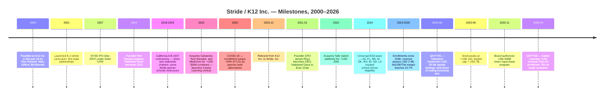
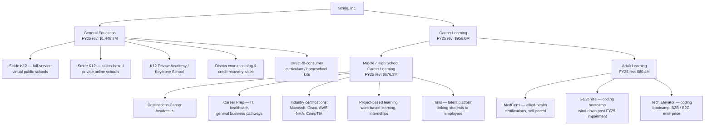
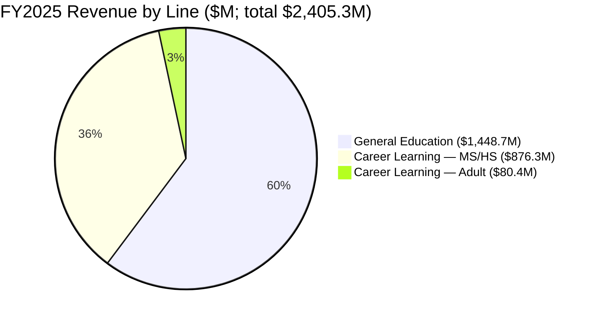
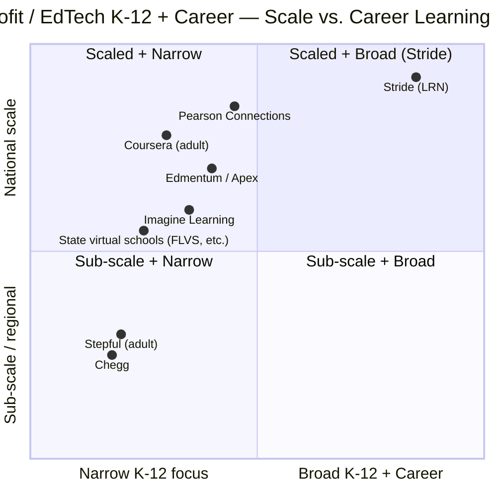

# COMPANY RESEARCH REPORT: Stride, Inc. (NYSE: LRN)

**Date:** 2026-05-20
**Sector:** For-profit education / Online K-12 / EdTech
**Fiscal year end:** June 30
**Headquarters:** Reston, Virginia, USA
**Listing:** NYSE: LRN (formerly KC12, K12 Inc., rebranded Stride Inc. December 2020)

> **Update — FY2026 full-year guidance narrowed (2026-04-28):** Following Q3 FY2026 results, management narrowed full-year revenue guidance to **USD 2.490–2.520B** (from USD 2.480–2.555B at Q2 print) and raised the floor of full-year **Adjusted Operating Income to USD 490–500M** (from USD 485–505M, and USD 475–500M as initially set in October 2025). The narrowed range implies ~3.5–4.8% YoY revenue growth on FY2025's USD 2,405.3M base — a marked deceleration from the FY2025 +17.9% pace, reflecting tougher year-over-year compares in General Education (where Q3 enrollments declined 5.0%) and a managed wind-down of the Galvanize coding-bootcamp unit (impaired for USD 59.5M in Q4 FY2025). Career Learning continues to anchor growth (Q3 +11.6% enrollments, +12.3% revenue). Source: [Stride Q3-FY26 earnings press release, 2026-04-28](https://www.sec.gov/Archives/edgar/data/1157408/000117184326002775/exh_991.htm); prior guide [Stride Q2-FY26 earnings press release, 2026-01-27](https://www.sec.gov/Archives/edgar/data/1157408/000117184326000444/exh_991.htm); initial guide [Stride Q1-FY26 earnings press release, 2025-10-28](https://www.sec.gov/Archives/edgar/data/1157408/000117184325006722/exh_991.htm).

---

## TABLE OF CONTENTS

1. Company Overview
2. Company History
3. Management Team
4. Products & Services
5. Customers & Go-to-Market
6. Industry Overview
7. Competitive Landscape
8. Market Opportunity (TAM)
9. Risk Assessment

---

## 1. COMPANY OVERVIEW

Stride, Inc. (NYSE: LRN) is the largest pure-play provider of full-time online ("virtual") and blended public school education in the United States, serving roughly **234,000 students enrolled in school-as-a-service programs across 89 General-Education and 56 Career-Learning schools/programs in 31 and 27 U.S. states (plus the District of Columbia) respectively during the 2024–2025 school year** ([Stride 10-K FY2025, p. 4](https://www.sec.gov/Archives/edgar/data/1157408/000155837025010334/lrn-20250630x10k.htm)). The company designs, sells, operates, and supports tuition-free virtual charter schools, primarily authorized under state charter-school statutes; it also runs adult-learning and career-prep businesses sold to consumers, employers, and government agencies. Stride was founded in 2000 as K12 Inc., went public on NYSE in 2007, and rebranded to Stride in December 2020 to signal the broader career-learning/lifelong-learning positioning that today drives growth.

### How it makes money

The vast majority of revenue is contracted **school-as-a-service** ("SaaS" in the academic sense, not software). Stride contracts with the governing boards of independent public charter schools (and, in fewer cases, traditional school districts) to operate the entire school: it supplies the curriculum (its in-house K-12 catalog plus career pathways), the learning-management and student-information systems, the licensed teachers, the management and admin services, the marketing and enrollment funnel, and the student computers and learning kits shipped to the home. The schools, in turn, are funded by the state on a per-pupil basis (state and local per-pupil amounts that range, by state, roughly USD 5,000–10,000 per student per year). Stride bills the school for services rendered; in many states it also absorbs any operating shortfall of the school, recognizing the related expenses gross. The contracts run typically more than five years with automatic renewal absent notice, and "approximately 95% of General Education revenues and 100% of Middle–High School Career Learning revenues were from funding-based contracts" in FY2025 ([Stride 10-K FY2025, Note 2 Revenue](https://www.sec.gov/Archives/edgar/data/1157408/000155837025010334/lrn-20250630x10k.htm)).

A secondary stream — about 5% of General-Education revenue — comes from tuition-based private online schools, consumer direct-to-family curriculum sales, district licensing of digital content, and the Adult Learning business (MedCerts healthcare certifications, Galvanize/Tech Elevator software-engineering bootcamps, Tallo). Adult Learning is the only segment that is **not** funding-based and the only one shrinking, with revenue down 19.4% in FY2025 to USD 80.4M and 29.1% YoY in the nine months of FY2026 ([Stride Q3-FY26 earnings press release, 2026-04-28](https://www.sec.gov/Archives/edgar/data/1157408/000117184326002775/exh_991.htm)).

### Scale and footprint

- **Revenue:** USD 2,405.3M in FY2025 (+17.9% YoY) ([Stride 10-K FY2025, MD&A p. 48](https://www.sec.gov/Archives/edgar/data/1157408/000155837025010334/lrn-20250630x10k.htm)).
- **Operating income:** USD 360.1M GAAP (15.0% margin), Adjusted Operating Income USD 466.2M ([Stride Q4-FY25 earnings press release, 2025-08-05](https://www.sec.gov/Archives/edgar/data/1157408/000117184325005051/exh_991.htm)).
- **Net income:** USD 287.9M (12.0% net margin) — diluted EPS USD 5.95.
- **Adjusted EBITDA:** USD 571.0M (23.7% margin), up from USD 390.7M in FY2024.
- **Cash and marketable securities:** USD 1,011.4M at June 30, 2025, declining to USD 856.0M at March 31, 2026 reflecting share repurchases ([Stride Q3-FY26 earnings press release, 2026-04-28](https://www.sec.gov/Archives/edgar/data/1157408/000117184326002775/exh_991.htm)).
- **Geographic footprint:** All 50 U.S. states (for some product lines) plus over 100 countries internationally for private/dual-diploma offerings ([Stride press release, 2025-11-03](https://www.sec.gov/Archives/edgar/data/1157408/000110465925105334/tm2530050d1_ex99-1.htm)).
- **Employees:** Approximately 7,700 full-time equivalent across teachers, instructional staff, and corporate per the FY2025 10-K Human Capital disclosure ([Stride 10-K FY2025, Human Capital](https://www.sec.gov/Archives/edgar/data/1157408/000155837025010334/lrn-20250630x10k.htm)).

*Source: [Stride 10-K FY2022 (p. 51) for FY20–FY22](https://www.sec.gov/Archives/edgar/data/1157408/000155837022012941/0001558370-22-012941-index.htm), [Stride 10-K FY2024 for FY23–FY24](https://www.sec.gov/Archives/edgar/data/1157408/000155837024011134/0001558370-24-011134-index.htm), and [Stride 10-K FY2025, MD&A "Enrollment Data" / "Revenue Data" tables](https://www.sec.gov/Archives/edgar/data/1157408/000155837025010334/lrn-20250630x10k.htm).*

### Valuation snapshot (as of 2026-05-20)

| Metric | LRN | Education-services peer median (n=5) |
|---|---|---|
| Share price | USD 87.50 | n/a |
| Market cap | USD 3.72B | n/a |
| Enterprise value | USD 3.47B | n/a |
| TTM P/E | **13.7x** | 17.6x (GHC, LAUR, STRA, LOPE, PRDO median 15.0x) |
| Forward P/E | 10.0x | 13.2x |
| TTM P/S | 1.47x | 2.45x |
| EV/EBITDA (TTM) | 6.7x | 9.9x |
| 52-week range | USD 60.6 – USD 171.2 | n/a |
| Beta | 0.13 | n/a |

Source: [Yahoo Finance, LRN key statistics, accessed 2026-05-20](https://finance.yahoo.com/quote/LRN/key-statistics/), [Yahoo Finance peer quotes](https://finance.yahoo.com/quote/GHC/), [Stride 10-K FY2025](https://www.sec.gov/Archives/edgar/data/1157408/000155837025010334/lrn-20250630x10k.htm).

**Why the multiples are compressed.** Stride's TTM P/E at 13.7x and EV/EBITDA at 6.7x sit roughly **22–35% below the for-profit-education peer median**, despite delivering peer-leading revenue growth (FY2025 +17.9%, FY2026e ~+4–5%) and the highest adjusted-EBITDA margin in the group (FY2025 23.7%). Three drivers explain the discount:

1. **Severe sentiment reset since October 2025.** LRN closed at an all-time high near USD 163 on September 10, 2025 and traded to a 52-week low near USD 60 by year-end — a 60%+ drawdown in roughly three months. The catalyst was Q1-FY26 enrollment "below internal plan" combined with leaked customer-mix concerns; the November 2025 buyback authorization (USD 500M, ~13% of cap) confirmed management saw the dislocation as overdone but did not arrest the de-rate ([Stride press release, 2025-11-03](https://www.sec.gov/Archives/edgar/data/1157408/000110465925105334/tm2530050d1_ex99-1.htm)).
2. **Policy / political binary risk.** Investors discount education names that depend on per-pupil public funding, charter-school authorizations, and (in the Trump-II era) the path of federal Title-I funding plus state ESA / voucher programs. Stride's flagship model is structurally exposed to **any** material rollback in virtual-charter authorization in even a handful of large states.
3. **General-Education re-normalization vs. peak.** Q3-FY26 General-Ed enrollment declined 5.0% YoY against a tough compare (the FY2025 +13.2% General-Ed growth was the strongest in years). Investors are pricing the risk that the COVID-era enrollment step-up has fully been digested and that General-Ed reverts toward the low-single-digit growth typical pre-2020.

In our view the compressed multiple looks closer to a value setup than a value trap: the school-as-a-service business has structurally stable funding-based contracts averaging > 5 years, Career Learning is still compounding 15–25%, the balance sheet is net-cash USD 856M (around 23% of market cap), and management is opportunistically buying back stock. The bear case requires either (a) a material multi-state charter authorizing pull-back, or (b) a federal pre-emption of state per-pupil funding for online charters — neither has historical precedent, but both are tail risks priced into the multiple.

---

## 2. COMPANY HISTORY

K12 Inc. was founded in 2000 in McLean, Virginia by **Ronald J. Packard** (former Knight Foundation / McKinsey banker), **Mary Gifford** (former director of state policy at Edison Schools), and education entrepreneur **William J. Bennett** (former U.S. Secretary of Education, who served as Chairman until 2005). The founding thesis was that the public-charter framework already gaining traction in several states could be combined with maturing internet technology to deliver standards-aligned curriculum to children whose geography, health, athletic schedule, or unconventional learning needs made traditional brick-and-mortar schools a poor fit. The company introduced its kindergarten through 2nd-grade online program in September 2001 and added grades and state partnerships in subsequent years ([Stride 10-K FY2025, "Our History"](https://www.sec.gov/Archives/edgar/data/1157408/000155837025010334/lrn-20250630x10k.htm)).

Source: [Stride 10-K FY2025, "Our History"](https://www.sec.gov/Archives/edgar/data/1157408/000155837025010334/lrn-20250630x10k.htm); [Stride DEF 14A 2025](https://www.sec.gov/Archives/edgar/data/1157408/000114036125039264/ny20051739x1_def14a.htm); [Stride press release, 2025-11-03](https://www.sec.gov/Archives/edgar/data/1157408/000110465925105334/tm2530050d1_ex99-1.htm).

### Strategic pivots — the four turning points

**(1) 2007 IPO and founder departure (2014).** Going public funded a faster state-by-state rollout but also exposed K12 to controversy around academic-outcome studies (most notably the 2015 CREDO report on the academic performance of online charters), which weighed on the stock through the late-2010s and ultimately led to the 2014 founder turnover.

**(2) 2020 Career Learning trifecta.** In FY2020 the company acquired three adult-learning brands within months of each other — **Galvanize** (software-engineering bootcamps, in May 2020), **Tech Elevator** (coding bootcamps, in November 2020), and **MedCerts** (allied-health certifications, in December 2020), for a combined consideration of roughly USD 350M ([Stride 10-K FY2025, "Our History"](https://www.sec.gov/Archives/edgar/data/1157408/000155837025010334/lrn-20250630x10k.htm)). The rationale: K12 needed a non-K-12 growth lever, and the same workforce-development tailwinds driving career-prep demand inside high schools (industry certifications, dual credit) extended naturally into adults reskilling for IT and healthcare. The Career Learning vertical inside K-12 has been the single most successful strategic bet: middle/high-school Career Learning revenue has grown from USD 586.8M in FY2023 to USD 876.3M in FY2025 (+49% over two years).

**(3) December 2020 rebrand from K12 Inc. to Stride.** Coincident with the Career Learning acquisitions and the COVID-era enrollment surge, the company rebranded to signal that its identity was no longer tied solely to K-12 schools. The K12 brand survives as a school-facing brand (Stride K12). The legacy NYSE ticker "LRN" was retained.

**(4) 2025 Galvanize wind-down.** Of the three 2020 acquisitions, Galvanize underperformed: enterprise demand for in-person coding bootcamps collapsed as the FAANG hiring cycle cooled in 2023–24 and as GenAI compressed the perceived value of bootcamp credentials. Stride recorded a **USD 59.5M impairment** on Galvanize's intangibles and right-of-use assets in Q4-FY25 ([Stride 10-K FY2025, MD&A](https://www.sec.gov/Archives/edgar/data/1157408/000155837025010334/lrn-20250630x10k.htm)) and is letting the unit run off — Adult Learning revenue fell 19.4% in FY2025 and is down 29.1% in the first nine months of FY2026.

### Key acquisitions (with rationale)

- **2020 — Galvanize, Tech Elevator, MedCerts:** Established the Career Learning / Adult Learning vertical.
- **2022 — Tallo, Inc. (July 2022):** Acquired for ~USD 20M; a recruiting/talent-matching platform that helps high-school career-learning students connect to employers, deepening Career Learning's flywheel ([Stride 10-K FY2025, Acquisitions](https://www.sec.gov/Archives/edgar/data/1157408/000155837025010334/lrn-20250630x10k.htm)).

### Recent developments (last 18 months)

- **August 2025**: Galvanize impairment (USD 59.5M); FY2025 results showed 17.9% revenue growth, with Career Learning Middle–High School up 34.6%.
- **November 2025**: Board authorizes USD 500M share repurchase program through October 31, 2026 ([Stride press release, 2025-11-03](https://www.sec.gov/Archives/edgar/data/1157408/000110465925105334/tm2530050d1_ex99-1.htm)).
- **December 2025**: James Rhyu becomes Board Chair (in addition to CEO), consolidating leadership.
- **April 2026**: Q3-FY26 narrows full-year revenue guidance to USD 2.49–2.52B; Adjusted Operating Income raised toward USD 490–500M.

---

## 3. MANAGEMENT TEAM

### James J. Rhyu — Chief Executive Officer and Board Chair (since January 2021; Chair since December 2025)

James Rhyu is the lynchpin of the Stride story today. He joined K12 Inc. in June 2013 as CFO, was promoted to President of Corporate Strategy, Marketing and Technology in April 2020, and was named CEO in January 2021 — coincident with the K12-to-Stride rebrand and the company's pivot toward Career Learning ([Stride DEF 14A 2025, p. 10](https://www.sec.gov/Archives/edgar/data/1157408/000114036125039264/ny20051739x1_def14a.htm)). He has therefore been deeply involved in the three pivots that re-shaped the company: the 2020 Career-Learning acquisition spree, the rebrand, and the FY2025 Galvanize wind-down.

Before K12, Rhyu was **CFO and Chief Administrative Officer of Match.com** (a subsidiary of IAC/InterActiveCorp) from June 2011 to June 2013, where he oversaw finance, HR, legal, IT, operations, and certain international units. Prior, he was SVP of Finance at Dow Jones & Company (January 2009 – May 2011) running the global financial function during the post-2007 News Corp ownership transition. Earlier roles include Corporate Controller of Sirius XM Radio (and predecessor XM Satellite Radio) and Corporate Controller at GrafTech International. He started his career as an auditor with Ernst & Young LLP in the U.S. and South America ([Stride DEF 14A 2025, p. 10](https://www.sec.gov/Archives/edgar/data/1157408/000114036125039264/ny20051739x1_def14a.htm), [LinkedIn — James Rhyu](https://www.linkedin.com/in/jamesrhyu/)).

**What he has actually delivered.** Under Rhyu's CEO tenure (FY2022 → FY2025): revenue grew from USD 1,686.7M to USD 2,405.3M (+42% over three years); Adjusted EBITDA expanded from ~USD 230M to USD 571.0M (more than doubled); GAAP operating margin tripled from ~5% (FY2022 USD 156.6M / 9.3%) to 15.0% in FY2025; total enrollment climbed from 185.1K to 234.0K. He executed the Galvanize impairment decisively in Q4-FY25 rather than letting it drift, and led the Career Learning push that is now ~40% of revenue. The market rewarded execution with the stock rising from ~USD 35 at his appointment to a USD 163 peak in September 2025 — a ~360% return through the September peak.

**Education / credentials.** B.S. from the Wharton School (University of Pennsylvania), MBA from London Business School.

**Compensation / alignment.** Fiscal 2025 total compensation per the proxy was USD 21.5M (Summary Compensation Table); however the "compensation actually paid" calculation under Item 402(v) was USD 110.5M reflecting the value of equity grants that vested as the share price surged — that figure was widely flagged by proxy advisors. Rhyu also holds an undisclosed personal stake that the DEF 14A reports as material; precise insider ownership disclosed in the beneficial-ownership table is in the proxy ([Stride DEF 14A 2025, "Pay vs. Performance"](https://www.sec.gov/Archives/edgar/data/1157408/000114036125039264/ny20051739x1_def14a.htm)). Combined CEO + Chair role (added Dec 2025) concentrates power with Rhyu; the lead-independent-director role (Steven B. Fink) provides board governance counterweight.

### Donna Blackman — Chief Financial Officer (since July 2022)

Donna Blackman has served as Stride's CFO since July 2022 and previously was the Company's Chief Accounting Officer and Treasurer from May 2020 to June 2022 — making her the architect of the financial integration of the 2020 Career-Learning acquisitions. Before joining Stride, Blackman spent six years at **BET Networks** (a unit of Paramount Global), where her roles included SVP and Head of Finance, SVP of Financial Planning and Analysis, and SVP Finance and Controller, and most recently SVP of Business Operations from May 2017 to January 2019, overseeing finance, strategy, research, live events, security, facilities and operations. Earlier career was at Marriott International (multiple senior finance roles) and KPMG ([Stride DEF 14A 2025, p. 12](https://www.sec.gov/Archives/edgar/data/1157408/000114036125039264/ny20051739x1_def14a.htm)).

Blackman holds an MBA from the University of Maryland's Robert H. Smith School of Business, a B.A. in Accounting from North Carolina State University, and is a CPA. Track-record markers under her tenure include the build-up of the USD 1.0B+ cash and marketable-securities position, the November 2025 USD 500M buyback authorization, and the clean execution of the Galvanize impairment. She has not yet run an M&A cycle of the size of the 2020 acquisitions, which is the principal forward execution-risk question on the CFO seat.

### Todd Goldthwaite — Managing Director, Portfolio Companies (since January 2022)

Goldthwaite oversees the Career Learning / Adult Learning portfolio companies (MedCerts, Galvanize, Tech Elevator, Tallo). He was previously Chief Marketing Officer (Nov 2017 – Jan 2022), SVP of School Management and Services (Jan 2015 – Oct 2017), and VP of Enrollment ([Stride DEF 14A 2025, p. 12](https://www.sec.gov/Archives/edgar/data/1157408/000114036125039264/ny20051739x1_def14a.htm)). His current portfolio is the most operationally volatile in the company — he led the decision to wind down Galvanize while scaling MedCerts and pushing Tallo as a recruiting flywheel for the K-12 Career Learning programs.

### Shaun McAlmont — President, Career Learning (since 2020)

Shaun McAlmont leads Career Learning end-to-end. Before Stride he was CEO of Stellar Education / National American University and previously held senior roles at Lincoln Educational Services. His career has been in for-profit post-secondary education — the right operator for the Career Learning push but also a reminder that the company has been deliberately importing post-secondary muscle into a K-12 chassis ([LinkedIn — Shaun McAlmont](https://www.linkedin.com/in/shaunmcalmont/)).

### Governance footer

- **Board composition (2025 slate):** Nine directors, of whom seven are independent. Lead Independent Director: **Steven B. Fink** (CEO of Lawrence Investments since 2007). Independent members include **Aida M. Alvarez** (former SBA Administrator), **Ralph Smith**, and others ([Stride DEF 14A 2025, "Information Regarding Nominees"](https://www.sec.gov/Archives/edgar/data/1157408/000114036125039264/ny20051739x1_def14a.htm)).
- **Combined CEO / Chair:** As of December 2025 Rhyu serves as both CEO and Board Chair. Stride argues the lead-independent-director role plus a fully independent Audit, Compensation, and Nominating committee mitigates the governance concern; ISS-style advisors generally prefer split roles.
- **Insider ownership:** Combined officer and director ownership is modest (single-digit percent on a fully diluted basis per the proxy beneficial-ownership table) — not a founder-owner profile.
- **Compensation structure:** Heavy equity weighting and PSU performance metrics tied to Revenue, Adjusted EBITDA, and TSR over three-year periods ([Stride DEF 14A 2025, CD&A](https://www.sec.gov/Archives/edgar/data/1157408/000114036125039264/ny20051739x1_def14a.htm)).
- **Compensation flag:** The Rhyu USD 110M "compensation actually paid" figure in FY2025 led to a meaningful Say-on-Pay protest vote at the December 2024 annual meeting (precise vote in the 8-K filed after the meeting); the 2025 grant has been structured with more performance hurdles.

### Track-record assessment

Stride's senior team has delivered three years of accelerating revenue, dramatic margin expansion, and a clean strategic write-down (Galvanize) — execution has been at the high end of for-profit education peers. The principal gaps are (a) a relatively short Tier-1-CFO track record on Blackman in big M&A, (b) the combined CEO/Chair governance setup creating concentrated decision authority around Rhyu, and (c) the absence of a founder-with-skin-in-the-game profile (Stride is professionally-managed rather than founder-driven).

---

## 4. PRODUCTS & SERVICES

Stride sells products across two markets — **General Education (K-12)** and **Career Learning** (Middle/High School + Adult) — packaged either as the comprehensive **school-as-a-service** offering (full operations + curriculum + tech + teachers + materials) or as **stand-alone** elements (curriculum licenses, LMS access, district course catalogs). The two-segment cut maps to ~60% / ~40% of FY2025 revenue.

Source: [Stride 10-K FY2025, "Our Lines of Revenue", "Products and Services", "Sales Channels"](https://www.sec.gov/Archives/edgar/data/1157408/000155837025010334/lrn-20250630x10k.htm); [Stride 10-K FY2025, Note 2 disaggregated revenue table](https://www.sec.gov/Archives/edgar/data/1157408/000155837025010334/lrn-20250630x10k.htm).

### General Education — what it actually sells

**Stride K12 full-service virtual public schools (flagship).** The "school-as-a-service" bundle is the largest single revenue stream in the company. It includes (i) Stride's K-12 digital curriculum library spanning math, English, science, history, and electives — "hundreds of high-quality, engaging, online coursework and content, as well as many state-customized versions" ([Stride 10-K FY2025, "Curriculum and Content"](https://www.sec.gov/Archives/edgar/data/1157408/000155837025010334/lrn-20250630x10k.htm)); (ii) Stride's proprietary learning-management and student-information systems running on AWS and Microsoft Azure; (iii) recruited state-certified teachers, instructional managers, and counselors; (iv) marketing and enrollment-funnel services; (v) shipped student computers and offline learning kits with state-specific physical materials; (vi) administrative back-office (budget, financial-reporting, state compliance). Typical contract length is greater than five years with automatic renewal. Stride was operating 89 General-Education schools across 31 states and DC in the 2024–2025 school year.

- *Target customer:* governing boards of public charter schools (and a smaller cohort of traditional school districts), as well as the students' parents who choose the school over their default public school assignment.
- *Pricing model:* per-student services fee that consumes the per-pupil state funding the school receives (typically USD 5,000–10,000 / student depending on state, grade level, and special-needs allocations).
- *Competitive advantage:* **yes — scale, regulatory complexity, and institutional knowledge moat.** Stride has 25 years of operating history in 31 states; each state's charter and per-pupil funding statute requires extensive compliance overhead that a single-state competitor cannot economically replicate. The "school-as-a-service" P&L only works at scale because the curriculum amortizes across hundreds of thousands of students, and the regulatory affairs / state-by-state legislative tracking is a fixed cost. Closest competitor: **Pearson Connections Academy** (Pearson plc, LSE listed) which operates a similar full-service virtual-charter model in 31 states, generally with slightly smaller per-state market share than Stride. Verdict: at parity on curriculum quality, ahead of Connections on scale of network, behind Connections on Pearson's broader curriculum content library.

**Stride K12 tuition-based private online schools (K12 Private Academy, Keystone School).** Direct-to-family alternative for families in states with no Stride free public option or who want a private alternative. Pricing roughly USD 4,000–9,500 per year. Recent state ESA/voucher expansion is broadening eligibility — "many families can use education savings accounts, tax credits and vouchers to attend these schools for low or no cost" ([Stride 10-K FY2025, "Consumer Sales"](https://www.sec.gov/Archives/edgar/data/1157408/000155837025010334/lrn-20250630x10k.htm)). Smaller revenue line but high-margin and a direct beneficiary of the ESA wave.
- *Competitive advantage:* **partial.** Strong brand and proven national delivery, but the segment is structurally smaller and faces direct competition from many smaller online private schools and consumer homeschool publishers (Outschool, Bridgeway Academy).

**District / school-district stand-alone course catalogs.** Stride licenses individual courses and digital curriculum modules to existing brick-and-mortar districts that need to fill gaps — typically credit-recovery, summer school, AP courses they don't staff, or special-needs alternative settings. Mid-single-digit % of revenue, but the channel is strategically useful as a "trojan horse" for district relationships that can later convert to broader school-as-a-service.
- *Competitive advantage:* **partial.** Edmentum (PE-owned), Apex Learning (Edmentum), and Imagine Learning compete in district course-catalog licensing; Stride is at parity on content and behind Edmentum on installed-base of districts.

**Consumer direct curriculum (homeschool kits, supplemental).** Stride sells curriculum directly to homeschool families. Small (a few % of revenue), high gross margin, growing with the broader homeschool tailwind (~3.1M home-educated students in the U.S. per NHERI 2022, up from ~2.5M pre-COVID, growing ~2%/year — [Stride 10-K FY2025, "Our Market"](https://www.sec.gov/Archives/edgar/data/1157408/000155837025010334/lrn-20250630x10k.htm)).

### Career Learning — what it actually sells

**Destinations Career Academies (flagship Career Learning).** A vertical-extension of the school-as-a-service model where high schools (and some middle schools) are operated jointly as career-focused academies with content pathways in (i) **information technology** (CompTIA, Cisco, AWS certifications), (ii) **healthcare** (medical assistant, dental assistant, pharmacy tech, EMT preparatory), and (iii) **general business** (entrepreneurship, finance, project management). Students earn dual high-school diploma credits plus industry-recognized certifications. Career Learning Middle/High School revenue grew **34.6% YoY in FY2025 to USD 876.3M** — the single fastest-growing line in the business.
- *Competitive advantage:* **yes — first-mover scale and content depth.** Stride was first to package full virtual career academies at scale; no peer has equivalent breadth of certification-aligned pathways combined with a virtual delivery chassis. Closest competitor: **Edmentum's Carone Learning** and **Pearson's Connections Career Academy** offer career-track content but lack the school-as-a-service infrastructure. Verdict: ahead.

**Tallo (recruiting / talent platform).** Acquired in 2022 (~USD 20M consideration); a B2C/B2B platform where high-school career-learning students build profiles, take assessments, and connect with employer partners for internships and entry-level roles ([Stride 10-K FY2025, Acquisitions](https://www.sec.gov/Archives/edgar/data/1157408/000155837025010334/lrn-20250630x10k.htm)). Strategic complement, not a material P&L line on its own.

**Adult Learning — MedCerts.** Self-paced fully-online allied-health certification programs (medical assistant, dental assistant, pharmacy tech, phlebotomy, EKG, EMR, RHIT) sold to consumers, employers, and Workforce Investment Act (WIOA) state agencies. The strongest of the three 2020 Career Learning acquisitions; small but high-margin.
- *Competitive advantage:* **partial — niche scale, government-channel access.** Coursera, Penn Foster, and Stepful (Andreessen-backed start-up, allied health certifications) all compete; MedCerts holds a leadership position in WIOA-funded enrollments because of its government-agency channel.

**Adult Learning — Galvanize / Tech Elevator (coding bootcamps).** Originally acquired to compete with Lambda School, General Assembly, and Codecademy in B2C and B2B/B2G enterprise reskilling. The market collapsed in 2023–2025 as enterprise reskilling demand cooled and AI-coding tools compressed the perceived value of human bootcamp output. Stride impaired the intangibles and right-of-use assets for **USD 59.5M in Q4 FY2025** ([Stride 10-K FY2025, MD&A](https://www.sec.gov/Archives/edgar/data/1157408/000155837025010334/lrn-20250630x10k.htm)) and is running the unit down — Adult Learning revenue declined 19.4% YoY in FY2025 and 29.1% in 9M-FY26.
- *Competitive advantage:* **no, in current market.** Verdict: managed wind-down.

### Flagship vs. long-tail

Three flagship products drive ~90% of consolidated revenue: (1) **Stride K12 full-service virtual public schools** (~USD 1.45B / 60% of revenue) — the legacy core; (2) **Destinations Career Academies** (~USD 876M / 36% of revenue) — the growth engine; (3) **MedCerts** (~USD 50–60M est., the profitable part of the USD 80M Adult Learning bucket). The remaining ~3% spans tuition-based private schools, district course catalogs, consumer direct curriculum, Galvanize / Tech Elevator, and Tallo.

### Roadmap and recent launches (last 12 months)

- **AI-assisted learning rollout** — proprietary AI tutoring and AI-driven personalization features rolled out across the K12 curriculum in 2024–2025, described as "automated and artificial intelligence (AI)-assisted learning" in the FY2025 10-K ([Stride 10-K FY2025, "Key Products and Services"](https://www.sec.gov/Archives/edgar/data/1157408/000155837025010334/lrn-20250630x10k.htm)).
- **State expansion** — Stride opened or expanded into additional states for FY2025 and is targeting incremental states for FY2026 / FY2027 (specific state names not disclosed in the 10-K).
- **Galvanize sunset** — managed unwind of the in-person coding-bootcamp business beginning FY2025.

---

## 5. CUSTOMERS & GO-TO-MARKET

### Two layers of customer

Stride sells into a **two-sided market** that creates an unusual customer-concentration profile compared with most B2B service companies.

- **Layer 1 (the contractual customer):** The governing boards of independent public charter schools that contract Stride for the school-as-a-service offering. Stride had 89 General-Education schools + 56 Career-Learning schools/programs under management in the 2024–2025 school year ([Stride 10-K FY2025, p. 4](https://www.sec.gov/Archives/edgar/data/1157408/000155837025010334/lrn-20250630x10k.htm)).
- **Layer 2 (the funder):** The state government that funds each school per pupil. Stride is therefore economically exposed to state legislatures even though it does not contract with them directly.

### Customer concentration — quantified

Stride **discloses explicitly that no single contract represented greater than 10% of total revenues in any of FY2023, FY2024, or FY2025** ([Stride 10-K FY2025, Note 2 "Concentration of Customers"](https://www.sec.gov/Archives/edgar/data/1157408/000155837025010334/lrn-20250630x10k.htm)). The same disclosure is repeated in the Q3-FY26 10-Q: "the Company had no contracts that represented greater than 10% of total revenues" ([Stride 10-Q Q3-FY26, Note 2, p. 13](https://www.sec.gov/Archives/edgar/data/1157408/000110465926050510/lrn-20260331x10q.htm)).

The 10-K does **not** disclose top-1 or top-5 customer share by name. Each charter school is a separate legal entity with its own governing board, so the company can argue that customer concentration is genuinely diffuse — even though many of those schools cluster in the same state and depend on the same state per-pupil funding statute.

### Geographic / state-customer concentration — the **material** disclosure

The relevant concentration metric for Stride is **state-funding concentration**, not single-contract concentration. The FY2025 10-K disclosure on California is the most explicit point:

> "We have agreements with **13 schools in California**, and while each school is independent with its own governing authority and **no single school in California accounts for more than 10% of our revenue**, regulatory actions that affect the level or timing of payments for all similarly situated schools in that state could adversely affect our financial condition." — [Stride 10-K FY2025, Item 1A Risk Factors](https://www.sec.gov/Archives/edgar/data/1157408/000155837025010334/lrn-20250630x10k.htm)

The implication is that California is in aggregate **a material state** for Stride — likely the single largest state by revenue. The 10-K does not break out revenue by state, so a precise % cannot be sourced; based on the 13-school footprint vs. an 89-school General-Education total, on per-pupil-funding parity assumptions, California likely represents on the order of **10–18% of consolidated revenue** (est.). Other large states are believed to include **Ohio, Pennsylvania, Florida, Texas, Arizona, and Oklahoma** (states with long-running Stride-operated K12 schools) but with no individual state crossing the disclosure threshold for any contract.

### Contract structure

- **Length:** "The average duration of the agreements for our school-as-a-service offering is greater than five years, and most provide for automatic renewals absent a customer notification of non-renewal" ([Stride 10-K FY2025, "Our History"](https://www.sec.gov/Archives/edgar/data/1157408/000155837025010334/lrn-20250630x10k.htm)). This creates substantial revenue stickiness conditional on the school's charter being renewed by its state authorizer.
- **Revenue recognition:** Funding-based — Stride bills the school for services rendered; the school remits from per-pupil state funding. Where Stride absorbs operating losses of the school under the contract, the gross revenue / gross expense recognition convention applies (see Q3-FY26 disclosure of USD 172.0M Q3 / USD 514.9M 9M revenue tied to schools where operating losses are absorbed — [Stride 10-Q Q3-FY26, Note 2](https://www.sec.gov/Archives/edgar/data/1157408/000110465926050510/lrn-20260331x10q.htm)).
- **Authorizer / charter renewals:** "The authorizers who issue the charters to our school-as-a-service customers can renew, revoke, or modify those charters as well" ([Stride 10-K FY2025, "Sales Channels"](https://www.sec.gov/Archives/edgar/data/1157408/000155837025010334/lrn-20250630x10k.htm)).

Source: [Stride 10-K FY2025, MD&A "Revenue Data" table](https://www.sec.gov/Archives/edgar/data/1157408/000155837025010334/lrn-20250630x10k.htm).

### Go-to-market channels

1. **Virtual / blended public-school channel (~90% of revenue).** Direct sales / business-development team that pursues new state authorizations and works with prospective charter boards. The "Public Affairs and School Development" function "works together with these interested parties to identify and pursue opportunities to expand the use of our products and services in new and existing jurisdictions" ([Stride 10-K FY2025, "Public Affairs and School Development"](https://www.sec.gov/Archives/edgar/data/1157408/000155837025010334/lrn-20250630x10k.htm)).
2. **Traditional school district channel** (low-single-digit %): direct sales to existing brick-and-mortar districts for individual course licensing, summer-school, credit-recovery, special-needs, and dual-credit content.
3. **Consumer / direct-to-family** (single-digit %): paid digital marketing + the K12.com brand + word-of-mouth from existing virtual-school families. The marketing team "is focused on promoting the K-12 online education category and generating enrollments for our virtual school customers" ([Stride 10-K FY2025, "Support Services"](https://www.sec.gov/Archives/edgar/data/1157408/000155837025010334/lrn-20250630x10k.htm)).
4. **Adult Learning consumer + enterprise + government channels.** MedCerts sells direct-to-consumer + B2B (employer training contracts) + B2G (WIOA, state workforce agencies). Galvanize / Tech Elevator predominantly B2B / B2G.

### Sales cycle and customer-acquisition cost

- For the school-as-a-service product, the sales cycle is multi-year: state legislative engagement → charter authorization → school formation → service-agreement negotiation. Once contracted, the typical 5+ year duration means the contract-acquisition cost amortizes over a long base.
- For consumer enrollment (the per-student funnel that fills each school), Selling, General, and Administrative expenses were USD 524.3M in FY2025 — 21.8% of revenue, down from 25.2% in FY2024, reflecting operating leverage as the enrollment-marketing fixed costs amortize over a larger student base ([Stride 10-K FY2025, MD&A "Selling, general, and administrative expenses"](https://www.sec.gov/Archives/edgar/data/1157408/000155837025010334/lrn-20250630x10k.htm)).

### Key partnerships

- **State governments and charter authorizers** in 31+ states — the foundational relationships that make the business possible.
- **AWS and Microsoft Azure** — cloud infrastructure powering the LMS, SIS, and analytics platforms ([Stride 10-K FY2025, "Technology Platform"](https://www.sec.gov/Archives/edgar/data/1157408/000155837025010334/lrn-20250630x10k.htm)).
- **Microsoft, Cisco, AWS, CompTIA, NHA, ServiceNow, Adobe** and similar industry-certification authorities supplying the credential frameworks for Career Learning pathways.
- **Foundation for Online and Blended Learning** — a non-profit Stride supports; not material to revenue but relevant for legislative advocacy.

### Named customers

The 10-K does not name individual contracting schools, but Stride-operated General-Education schools include the well-known **Ohio Virtual Academy, Texas Virtual Academy, Insight Schools, California Virtual Academies (CAVA), Arizona Virtual Academy, Georgia Cyber Academy, K12 Virtual Academy of Colorado**, and others — these are the consumer-facing school brands a parent enrolls in, while contractually Stride serves the school's governing board.

---

## 6. INDUSTRY OVERVIEW

### Industry definition

Stride sits at the intersection of three NAICS-aligned industries:

- **NAICS 611110 — Elementary and Secondary Schools** (the public-charter virtual / blended school model is a sub-category here)
- **NAICS 611710 — Educational Support Services** (curriculum publishing, course delivery, district services)
- **NAICS 611699 — All Other Miscellaneous Schools and Instruction** (career-prep, certification training, adult learning)

It also overlaps the broader **EdTech** software sector, which counts roughly 8,000 venture-backed companies globally per HolonIQ.

### Market size

- **U.S. K-12 public-school spending base:** approximately USD 870 billion in total operating expenditures across all U.S. public schools (latest NCES data; refresh quarterly). State and local sources fund the majority, with federal Title I a smaller layer.
- **U.S. K-12 fully-online enrollment:** estimates vary; in pre-COVID 2019 the National Education Policy Center put fully-virtual-charter enrollment at ~310,000 students; the COVID-era spike pushed it well above 500,000. Stride alone reported 234,000 FY2025 school-as-a-service enrollments, implying Stride captures roughly 30–45% share of fully-virtual public-charter enrollment depending on which census number is used.
- **U.S. homeschool population:** ~3.1 million home-educated students per the National Home Education Research Institute (NHERI) 2022 estimate, up from ~2.5 million pre-COVID and growing ~2%/yr ([NHERI 2022 estimate, cited in Stride 10-K FY2025](https://www.sec.gov/Archives/edgar/data/1157408/000155837025010334/lrn-20250630x10k.htm)).
- **Career & technical education (CTE) and adult workforce reskilling:** Bureau of Labor Statistics projects demand for occupations requiring **nondegree post-secondary education will grow 6.0% by 2033, faster than overall occupations** ([BLS April 2025 projection, cited in Stride 10-K FY2025](https://www.sec.gov/Archives/edgar/data/1157408/000155837025010334/lrn-20250630x10k.htm)).
- **School-choice tailwind:** A January 2025 survey by the National School Choice Awareness Foundation found that **more than 60% of parents considered sending at least one child to a different school last year**, and 27% of those considering switching included full-time online school as an option ([NSCAF survey, January 2025, cited in Stride 10-K FY2025](https://www.sec.gov/Archives/edgar/data/1157408/000155837025010334/lrn-20250630x10k.htm)).

### Growth rates

- **Stride's served sub-market** (full-time virtual / blended public schools) has grown enrollment at a 10-year CAGR of roughly 12–15% (calculated off Stride's own enrollment history adjusted for COVID-era spike). Excluding the COVID-2020 step-change, the underlying secular growth has been ~5–8% per year on the supply side, gated by state legislative pace.
- **Adult / career certifications** are growing faster on a percentage basis; total U.S. spend on professional certifications and bootcamps was estimated at USD 35–45B in 2024 per industry research (the precise category definition varies); the segment is fragmented with no leader above ~5% share.
- **ESA / voucher expansion** is the single most powerful current driver: as of 2025, **18 U.S. states have universal or near-universal Education Savings Account programs** (Arizona, West Virginia, Iowa, Utah, Arkansas, Florida, Indiana, Ohio, Oklahoma, Tennessee, Louisiana, Wyoming, North Carolina, Alabama, Idaho, Texas, South Carolina, Missouri have all enacted or expanded in 2023–2025). These programs let public funds follow the student to private or virtual options, expanding the addressable market for Stride's tuition-based private schools and consumer direct sales.

### Key trends and drivers

1. **School choice as a political agenda.** The Trump administration's January 2025 executive order on school choice and broader state-level ESA enactments are extending the addressable market for virtual schools beyond the traditional public-charter universe. Stride is one of the few publicly-traded operators positioned to capture the spillover from ESA programs into virtual-private and consumer-direct channels.
2. **Career & technical education re-emphasis.** Federal Perkins V reauthorization and state-level CTE funding increases have made career-academy models more politically and financially viable; Stride's Career Learning growth (+34.6% in FY2025 in MS/HS revenue) directly reflects this.
3. **Pandemic-driven persistence of online options.** "The pandemic changed the awareness and acceptance of online learning ... we believe that a fundamental shift has taken place, and that states and districts will continue to expand virtual solutions" ([Stride 10-K FY2025, "Market Opportunity"](https://www.sec.gov/Archives/edgar/data/1157408/000155837025010334/lrn-20250630x10k.htm)). Empirically, Stride's General-Ed enrollment ratcheted from ~120k pre-COVID to a steady 137k+ run-rate even after COVID receded.
4. **AI in education.** Tutoring, personalization, and adaptive-learning AI tools are reshaping curriculum economics. Stride is integrating AI features but faces competition from Khan Academy (Khanmigo), Quizlet, Duolingo, and start-ups like MagicSchool and Brisk Teaching.

### Regulatory environment

The regulatory chassis is the single most important external variable for Stride. Three layers:

- **State charter laws.** Each state authorizes (or not) virtual/blended charter schools under its charter statute. Some states have explicit virtual-charter authorization (Ohio, Pennsylvania, Florida), some authorize implicitly under broader charter laws (California), some restrict (New York limits virtual charters significantly), and some have no enabling legislation. The 10-K calls this out as Stride's primary regulatory exposure ([Stride 10-K FY2025, "State Laws Authorizing or Restricting Virtual and Blended Public Schools"](https://www.sec.gov/Archives/edgar/data/1157408/000155837025010334/lrn-20250630x10k.htm)).
- **Per-pupil funding statutes.** Each state legislature sets annual per-pupil amounts; virtual schools sometimes receive different (usually lower) per-pupil funding than brick-and-mortar peers (Pennsylvania virtual charters get 75–80% of equivalent brick-and-mortar funding per state formula; California has had multi-year funding-formula disputes).
- **Federal data privacy and student-data laws.** FERPA, COPPA, state-specific student-data privacy laws (notably California's SOPIPA and Texas equivalents). Stride's cybersecurity disclosures under SEC Item 1C are extensive.

### Industry dynamics — supplier / buyer power

- **Supplier power (LOW for Stride):** Stride's primary cost is in-house: teachers (USD 1.46B FY2025 instructional costs, the bulk of which is teacher salaries and benefits), AWS/Azure cloud, and outsourced learning-kit assembly. No single supplier has pricing power; AWS/Azure can be multi-sourced, learning-kit assembly is commoditized.
- **Buyer power (MEDIUM):** Schools' governing boards can negotiate contract economics, but switching costs are high (5+ year integration into student data, curriculum, teacher staffing). Authorizers can revoke charters — a much sharper buyer-side risk than commercial-customer switching.
- **Substitutes:** Brick-and-mortar public schools (the default), in-person private schools, homeschooling, hybrid models, and microschools. Substitutes are the dominant category — Stride competes against the entire alternative-schooling landscape.
- **Entry barriers (HIGH for Stride's positioning):** State-by-state regulatory complexity, scaled curriculum library, teacher-recruitment networks, brand trust with parents — these are real but not insurmountable; new entrants (e.g., Pearson Connections Academy) have established competing positions.

---

## 7. COMPETITIVE LANDSCAPE

### Direct competitors

1. **Pearson Connections Academy** (subsidiary of Pearson plc, LSE: PSON) — the closest direct competitor. Operates a fully-virtual public-school network in ~31 states, smaller per-state market share than Stride on average. Pearson's broader curriculum portfolio is a content advantage; Stride's longer operating history in many states and stronger Career Learning capability are advantages.
2. **Stride internal segments competing with each other.** The Career Learning and General Education segments often cross-sell into the same school customers; Stride manages this as a strategic complementarity rather than competition.

### Indirect competitors (school-as-a-service category)

3. **Edmentum / Apex Learning** (private equity owned, Vista Equity / others) — primarily district-channel course catalog & curriculum licensing rather than full school operations; competes for the credit-recovery and supplemental course-catalog wallet.
4. **Imagine Learning** (private equity, Onex) — K-12 curriculum licensing and Imagine International Academy (a virtual K-12 school); competes in district and direct-to-school course licensing.
5. **National Education Partners / charter-management organizations** that run virtual schools without a Stride-class platform — typically state-specific or smaller multi-state CMOs.
6. **State-operated virtual schools** (Florida Virtual School, North Carolina Virtual Public School, Texas Virtual School Network) — public-sector providers that compete with or complement Stride's offerings depending on the state model.

### Career Learning competitors

7. **Edmentum Carone Learning, Pearson Connections Career Academy** — direct competitors on career-track virtual academies.
8. **Coursera (NYSE: COUR)** — primarily higher-ed and adult-learning; overlap with Stride's Adult Learning segment.
9. **Chegg (NYSE: CHGG)** — at one point a comparable but on a very different model (subscription tutoring + textbook), and now in steep decline (FY2024 revenue down to ~USD 320M; market cap collapsed to ~USD 155M). Not a meaningful current competitor for Stride.
10. **Arco Platform (formerly NYSE: ARCE)** — was a K-12 EdTech provider in Brazil; taken private in 2023, no longer relevant to the U.S. listed peer set.
11. **Graham Holdings (NYSE: GHC)** — operates Kaplan Higher Education plus other educational businesses; broader portfolio than pure online K-12.

### Adult Learning / coding bootcamp competitors

12. **General Assembly** (subsidiary of Adecco) — coding & data bootcamps; private.
13. **2U / edX** (delisted in 2024 after Chapter 11) — university-partnered online programs.
14. **Coursera, Pluralsight, Udemy** — large adjacent platforms.
15. **Stepful, Practica AI, Multiverse** — VC-backed start-ups in adult certification / apprenticeship.

### Competitive positioning quadrant

Source: positioning derived from [Stride 10-K FY2025, "Competition"](https://www.sec.gov/Archives/edgar/data/1157408/000155837025010334/lrn-20250630x10k.htm), Pearson plc 2024 annual report, and peer-company filings.

### Competitive advantages

- **State-by-state regulatory scale.** Operating in 31 states for General-Ed and 27 states for Career Learning, plus DC, is a near-irreplicable footprint. Each state requires its own authorizer relationships, per-pupil-funding compliance, curriculum-standards alignment, and licensed-teacher recruitment.
- **Brand trust with parents.** The K12.com brand and "Stride K12" sub-brand carry recognition with the school-choice parent demographic that few competitors match.
- **Career Learning content moat.** The integration of industry-certification pathways into a virtual K-12 chassis (Destinations Career Academies) is a differentiated product the company has invested in for 5+ years; competitors are still catching up.
- **Profitability and balance sheet.** Stride's USD 571M FY2025 Adjusted EBITDA, ~USD 1.0B cash, and net-cash position is unique in the peer set — Coursera and Chegg are unprofitable, most CMO peers are private and capital-constrained.
- **AWS/Azure-based platform with > 25 years of curriculum investment** — "Stride has invested over USD 600 million in the last twenty years to develop curriculum, systems, instructional practices and support services" ([Stride 10-K FY2025, "Products and Services"](https://www.sec.gov/Archives/edgar/data/1157408/000155837025010334/lrn-20250630x10k.htm)).

### Competitive vulnerabilities

- **Single-segment dependence on public funding.** ~95% of General-Ed revenue and 100% of MS/HS Career Learning revenue is funding-based — a structural concentration on the state per-pupil channel.
- **No direct hold on the end student.** Stride does not own the relationship with the student — the school's governing board does. If a board decides to insource or change service provider, Stride can lose the engagement.
- **Academic-outcomes optics.** The 2015 CREDO study and a stream of subsequent academic-performance critiques of online charters remains a persistent narrative headwind that limits the political support virtual schools receive.
- **Activist / opposition pressure.** Teachers' unions, traditional-public-school advocates, and certain state legislators actively oppose for-profit online education companies. Stride explicitly calls out "legal and regulatory challenges from opponents of virtual public education or for-profit education companies" as a risk factor ([Stride 10-K FY2025, Item 1A](https://www.sec.gov/Archives/edgar/data/1157408/000155837025010334/lrn-20250630x10k.htm)).

*Source: [Yahoo Finance, LRN](https://finance.yahoo.com/quote/LRN/key-statistics/), [GHC](https://finance.yahoo.com/quote/GHC/), [LAUR](https://finance.yahoo.com/quote/LAUR/), [STRA](https://finance.yahoo.com/quote/STRA/), [LOPE](https://finance.yahoo.com/quote/LOPE/), [PRDO](https://finance.yahoo.com/quote/PRDO/key-statistics/), accessed 2026-05-20.*

### Market share analysis

In the **fully-virtual public-charter sub-segment** (the directly comparable market), Stride at ~234k FY2025 enrollments holds an estimated 30–45% share of the ~500–750k U.S. fully-virtual public-school population. In **broader K-12 EdTech curriculum licensing**, Stride is a top-5 player but ranks behind Pearson, McGraw-Hill, and Houghton Mifflin Harcourt on total district-licensing revenue. In **adult certifications and coding bootcamps**, Stride is sub-scale (Adult Learning revenue USD 80M FY2025) vs. Coursera (~USD 700M), Pluralsight (~USD 450M private), and General Assembly.

---

## 8. MARKET OPPORTUNITY (TAM)

### Bottom-up TAM build

**TAM 1 — Fully-online K-12 enrollment (Stride's core).**
- ~50 million U.S. K-12 students total
- 5–8% conservative penetration of online options over the next decade (vs. ~1% pre-COVID, ~3% today) → 2.5M – 4.0M potential fully-online students
- Average per-pupil funding USD 7,000 → **USD 17.5B – 28.0B TAM**

**TAM 2 — Career Learning / CTE in K-12.**
- ~12M high-school students enrolled in CTE pathways nationally per Perkins reauthorization data
- Stride's served addressable market: students who would benefit from virtual or blended career-academy delivery — estimated 1.5–2.5M students
- Per-pupil USD 6,000–8,000 → **USD 9B – 20B TAM**

**TAM 3 — ESA / voucher-funded private virtual schools and direct-to-consumer.**
- 18 states with ESA programs already enacted; estimated ~500K students currently using ESAs (growing rapidly).
- If 1 million students nationally use ESAs by 2030 and ~15% choose online options at ~USD 7,000 average → **USD ~1B TAM**, growing fast.

**TAM 4 — Adult workforce reskilling (certifications, allied health, IT).**
- BLS projects 6% growth in nondegree-postsecondary occupations by 2033
- U.S. spend on certifications & bootcamps estimated USD 35–45B in 2024
- Stride's MedCerts-equivalent allied health subset: ~USD 5–8B
- **Adult Learning addressable TAM: USD 5–10B** (after stripping coding bootcamps in current malaise)

**Total Stride TAM (combined):** **USD 32B – 60B**, with a SAM (current legislative/regulatory authorization in states Stride already operates plus near-term expansion candidates) of approximately USD 12–18B and SOM (realistic 5-year addressable) of USD 5–8B.

### Market growth projections

- **Fully-online K-12 enrollment** is projected to grow at a high-single-digit / low-teens CAGR over 2025–2030 driven by ESA expansion, ongoing post-COVID acceptance, and steady drift away from neighborhood-school assignments. NEPC and HolonIQ both project ongoing growth though with different scenarios depending on policy direction.
- **CTE / career-academy enrollment** is growing 5–8% per year driven by Perkins V reauthorization money flow and state CTE funding increases.
- **ESA / voucher TAM** is growing more than 25% per year through 2027 on enactment, then will plateau as more states reach universal eligibility.
- **Allied-health certifications** track BLS occupation growth (6% to 2033) with cyclical upside during nursing-shortage and aging-population peaks.

*Source: [Stride 10-K FY2025, Note 2 "Disaggregation of Revenue"](https://www.sec.gov/Archives/edgar/data/1157408/000155837025010334/lrn-20250630x10k.htm).*

### Stride's penetration path

- **Today:** ~234K full-time school-as-a-service enrollments, plus Adult Learning consumers. Implied penetration of ~0.5% of the U.S. K-12 student base, ~2–3% of likely online-suitable student segment.
- **5-year ambition:** Internal targets are not publicly stated by enrollment count; based on the FY2026 narrowed guidance (~$2.5B revenue) and historical growth rates, a reasonable extrapolation is 300–400K enrollments by FY2030, or ~1.5–2% of U.S. K-12 students. The path requires (a) entry into 5–10 additional states, (b) continued Career Learning out-performance, and (c) capture of incremental ESA-funded enrollment.
- **What needs to be true for a USD 4B revenue base by FY2030:** Career Learning revenue compounds 15%/year → reaches USD ~1.8B; General Ed compounds 5%/year (low end given COVID-era already priced in) → reaches USD ~1.85B; Adult Learning rebuilds to USD ~250M as MedCerts scales post-Galvanize wind-down. Implied EBITDA at maintained 23–25% margin: USD 950M–1.0B. This is the analytical scenario implied by the bull case.

*Source: [Stride Q4-FY24 earnings press release, 2024-08-06](https://www.sec.gov/Archives/edgar/data/1157408/000117184324004487/exh_991.htm) (FY23 Adj EBITDA); [Stride Q4-FY25 earnings press release, 2025-08-05](https://www.sec.gov/Archives/edgar/data/1157408/000117184325005051/exh_991.htm) (FY24, FY25 Adj EBITDA).*

---

## 9. RISK ASSESSMENT

### Company-specific risks

**(1) Charter authorization and renewal risk (high severity, moderate likelihood).** Each Stride-partner school depends on its state authorizer (often a state board of education or independent charter authorizer) to renew its charter, typically every 5–10 years. A revoked charter terminates the school and Stride's contract with it. The 10-K explicitly flags "Any failure to renew an authorizing charter for a virtual or blended public school" as a material risk ([Stride 10-K FY2025, Risk Factors Summary](https://www.sec.gov/Archives/edgar/data/1157408/000155837025010334/lrn-20250630x10k.htm)). Mitigant: 25-year operating history with hundreds of charter renewals successfully navigated; diversification across 89 schools in 31 states limits any single-event impact. Severity high if multiple authorizers in one state act together.

**(2) State-customer geographic concentration (high importance, ongoing).** Stride does not disclose state-level revenue, but California (13 schools) is materially the largest single-state exposure. The 10-K explicitly warns that "regulatory actions that affect the level or timing of payments for all similarly situated schools in that state could adversely affect our financial condition" ([Stride 10-K FY2025, Item 1A](https://www.sec.gov/Archives/edgar/data/1157408/000155837025010334/lrn-20250630x10k.htm)). Estimated concentration: California likely 10–18% of revenue, top-5 states likely > 50% combined (Cal + Ohio + Pennsylvania + Florida + Texas est.). Mitigant: continued geographic expansion; underlying funding-based contract structure means state-funding disputes typically resolve via revised payment schedules, not full revenue loss (as evidenced by the Agora Cyber Charter School case in fiscal 2017 noted in the 10-K).

**(3) Customer-mix shift between General Education and Career Learning (medium, in progress).** As Career Learning grows from 27% (FY2023) to 40% (FY2025) of revenue, the company's revenue per enrollment differs by mix (FY26 Q3 General-Ed RPE USD 2,590 vs. Career Learning RPE USD 2,356). Continued mix shift toward Career Learning lowers blended revenue per student modestly, partially offset by faster growth and higher gross-margin economics in newer career-focused schools.

**(4) Key-person dependency on James Rhyu (moderate).** Rhyu has been the architect of the Career Learning pivot and FY22-FY25 margin expansion. Now combined CEO and Board Chair (since December 2025), his departure or incapacity would create real continuity risk. Mitigant: deep operating bench (Goldthwaite, McAlmont, Blackman) and explicit succession planning per the proxy ([Stride DEF 14A 2025, "Risk Oversight"](https://www.sec.gov/Archives/edgar/data/1157408/000114036125039264/ny20051739x1_def14a.htm)).

**(5) Galvanize / Adult Learning execution (low severity remaining).** The USD 59.5M FY25 impairment crystallized the worst of the coding-bootcamp downside. Adult Learning revenue continues to fall (-29.1% in 9M-FY26) but is now ~3% of total — risk substantially reduced.

**(6) Activist / opposition reputational risk (chronic, moderate).** Teachers' unions and pro-traditional-public-school advocacy groups continue to challenge for-profit virtual education. The FY2025 10-K explicitly lists this risk. Mitigant: improving academic-outcome data in recent state accountability cycles; alignment of state-choice-favoring administrations through 2028.

### Industry / market risks

**(7) Competitive intensity from Pearson Connections, Edmentum, and adjacent CMOs (medium).** Pearson has matched Stride's geographic footprint; Edmentum and Imagine Learning aggressively compete on district-channel pricing; state virtual schools (FLVS) own incumbent positions in their states.

**(8) Regulatory change at the state level (very material).** Each of the 31+ state legislatures can change per-pupil funding amounts, virtual-school authorization, charter-cap statutes, or compliance requirements with material P&L impact. Pennsylvania's repeated efforts to cut virtual-charter per-pupil funding to brick-and-mortar parity have been the most-watched single-state risk; California's frequent funding-formula reviews are similar. Mitigant: portfolio diversification; the very breadth of Stride's state footprint means no single state's adverse action is catastrophic.

**(9) Technology disruption — AI tutoring and adaptive learning (medium).** Khanmigo (Khan Academy), MagicSchool, Brisk Teaching, and well-funded AI-native tutoring start-ups could (a) commoditize Stride's curriculum content or (b) enable smaller competitors to scale faster. Mitigant: Stride is investing in AI-assisted learning and AI tutoring; the school-as-a-service moat is operational, not just content.

**(10) Market saturation in mature virtual-school states (low-medium).** In states like Ohio and Pennsylvania where Stride has operated for 15+ years, the addressable virtual-eligible student population may be near saturation. Mitigant: continued geographic expansion plus ESA-driven incremental demand.

### Financial risks

**(11) Federal policy risk to per-pupil funding (low probability, very high impact).** No federal pre-emption of state per-pupil funding for virtual charters has been seriously proposed under any administration. The risk exists in tail-scenarios (e.g., a Democratic administration restricting federal Title-I flows from supporting virtual schools, or a Department of Education policy change). Mitigant: federal Title-I is a small share of Stride-served school funding; mostly state and local.

**(12) Valuation / multiple-compression vs. peer median (low — already discounted).** Stride trades at 13.7x TTM P/E vs. 17.6x peer-education median and 6.7x EV/EBITDA vs. 9.9x peer median. The multiple is already compressed; further de-rating would require a thesis-break event (charter pull-back, large enrollment miss). Conversely, mean-reversion to peer median would imply ~25–40% upside on the multiple alone.

### Macroeconomic risks

**(13) State budget pressure (cyclical, moderate).** Per-pupil funding is set in each state's annual or biennial budget cycle. State revenue shortfalls (recessions, oil-price drops, etc.) can lead to per-pupil-funding freezes or modest cuts. Mitigant: K-12 funding is a politically protected line item; cuts are typically modest single-digit %.

**(14) Federal policy / school-choice posture (binary).** A continued school-choice-favorable federal posture through 2028 (under the current administration) is a tailwind; a 2028 shift to an administration hostile to school choice could reverse ESA momentum. Mitigant: state-level ESA enactments are sticky once on the books; federal posture matters mostly at the margins via discretionary grant programs.

**(15) Demographic — U.S. K-12 enrollment trajectory (long-cycle).** Total U.S. K-12 enrollment is projected to decline modestly through 2030 as the millennial echo passes through; Stride's growth therefore depends entirely on share-of-wallet capture from the brick-and-mortar default, not population growth.

---

## REFERENCES

### Primary — SEC filings (Stride, Inc.)

- [Stride, Inc. 10-K Annual Report for fiscal year ended June 30, 2025 (filed 2025-08-05)](https://www.sec.gov/Archives/edgar/data/1157408/000155837025010334/lrn-20250630x10k.htm)
- [Stride, Inc. 10-K Annual Report for fiscal year ended June 30, 2024](https://www.sec.gov/Archives/edgar/data/1157408/000155837024011134/0001558370-24-011134-index.htm)
- [Stride, Inc. 10-K Annual Report for fiscal year ended June 30, 2023](https://www.sec.gov/Archives/edgar/data/1157408/000155837023015003/0001558370-23-015003-index.htm)
- [Stride, Inc. 10-K Annual Report for fiscal year ended June 30, 2022](https://www.sec.gov/Archives/edgar/data/1157408/000155837022012941/0001558370-22-012941-index.htm)
- [Stride, Inc. 10-Q for the quarter ended March 31, 2026 (Q3 FY26)](https://www.sec.gov/Archives/edgar/data/1157408/000110465926050510/lrn-20260331x10q.htm)
- [Stride, Inc. 10-Q for the quarter ended December 31, 2025 (Q2 FY26)](https://www.sec.gov/Archives/edgar/data/1157408/000110465926007063/0001104659-26-007063-index.htm)
- [Stride, Inc. 10-Q for the quarter ended September 30, 2025 (Q1 FY26)](https://www.sec.gov/Archives/edgar/data/1157408/000110465925103288/0001104659-25-103288-index.htm)
- [Stride, Inc. DEF 14A Proxy Statement, 2025 (filed 2025-10-24)](https://www.sec.gov/Archives/edgar/data/1157408/000114036125039264/ny20051739x1_def14a.htm)

### Earnings press releases (Stride, Inc.)

- [Stride Q3-FY26 earnings press release, 2026-04-28](https://www.sec.gov/Archives/edgar/data/1157408/000117184326002775/exh_991.htm)
- [Stride Q2-FY26 earnings press release, 2026-01-27](https://www.sec.gov/Archives/edgar/data/1157408/000117184326000444/exh_991.htm)
- [Stride Q1-FY26 earnings press release, 2025-10-28](https://www.sec.gov/Archives/edgar/data/1157408/000117184325006722/exh_991.htm)
- [Stride Q4-FY25 + full-year earnings press release, 2025-08-05](https://www.sec.gov/Archives/edgar/data/1157408/000117184325005051/exh_991.htm)
- [Stride Q4-FY24 + full-year earnings press release, 2024-08-06](https://www.sec.gov/Archives/edgar/data/1157408/000117184324004487/exh_991.htm)

### Other Stride 8-K filings

- [Stride $500M Stock Repurchase Authorization, 2025-11-03](https://www.sec.gov/Archives/edgar/data/1157408/000110465925105334/tm2530050d1_ex99-1.htm)

### Market data

- [Yahoo Finance — LRN key statistics, accessed 2026-05-20](https://finance.yahoo.com/quote/LRN/key-statistics/)
- [Yahoo Finance — GHC (Graham Holdings) key statistics](https://finance.yahoo.com/quote/GHC/)
- [Yahoo Finance — LAUR (Laureate Education) key statistics](https://finance.yahoo.com/quote/LAUR/)
- [Yahoo Finance — STRA (Strategic Education) key statistics](https://finance.yahoo.com/quote/STRA/)
- [Yahoo Finance — LOPE (Grand Canyon Education) key statistics](https://finance.yahoo.com/quote/LOPE/)
- [Yahoo Finance — PRDO (Perdoceo Education) key statistics](https://finance.yahoo.com/quote/PRDO/key-statistics/)
- [Yahoo Finance — CHGG (Chegg) key statistics](https://finance.yahoo.com/quote/CHGG/key-statistics/)

### Industry / secondary sources

- National Home Education Research Institute (NHERI), 2022 home-education estimate, as cited in [Stride 10-K FY2025, "Our Market"](https://www.sec.gov/Archives/edgar/data/1157408/000155837025010334/lrn-20250630x10k.htm)
- National School Choice Awareness Foundation, January 2025 parent survey, as cited in [Stride 10-K FY2025, "Our Market"](https://www.sec.gov/Archives/edgar/data/1157408/000155837025010334/lrn-20250630x10k.htm)
- U.S. Bureau of Labor Statistics, April 2025 occupation projections, as cited in [Stride 10-K FY2025, "Our Market"](https://www.sec.gov/Archives/edgar/data/1157408/000155837025010334/lrn-20250630x10k.htm)

### Management bios

- [Stride DEF 14A 2025 — Executive Officer bios (Rhyu, Blackman, Goldthwaite)](https://www.sec.gov/Archives/edgar/data/1157408/000114036125039264/ny20051739x1_def14a.htm)
- [LinkedIn — James Rhyu](https://www.linkedin.com/in/jamesrhyu/)
- [LinkedIn — Shaun McAlmont](https://www.linkedin.com/in/shaunmcalmont/)

### Charts (local)

- `reports/company/Stride_NYSE_LRN/charts/lrn_revenue_enrollment.png`
- `reports/company/Stride_NYSE_LRN/charts/lrn_ebitda_margin.png`
- `reports/company/Stride_NYSE_LRN/charts/lrn_segment_mix.png`
- `reports/company/Stride_NYSE_LRN/charts/lrn_peer_multiples.png`
- `reports/company/Stride_NYSE_LRN/charts/lrn_price_5y.png`

---

*Report prepared 2026-05-20. All financial data sourced from Stride, Inc. SEC filings and earnings press releases. Market data and peer multiples sourced from Yahoo Finance via yfinance Python library as of 2026-05-20.*
