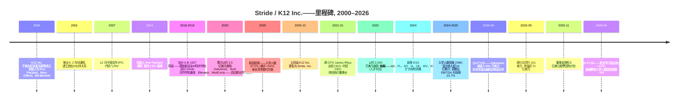
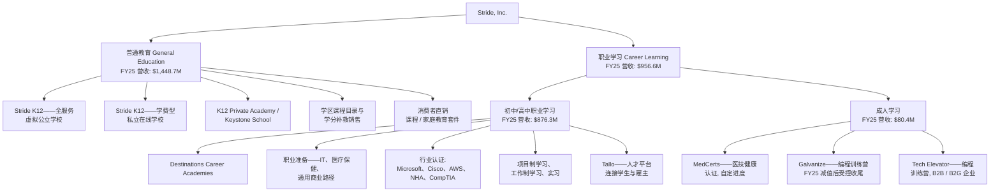
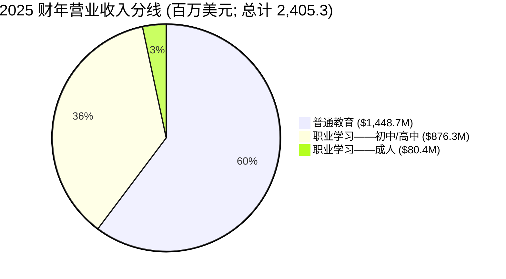
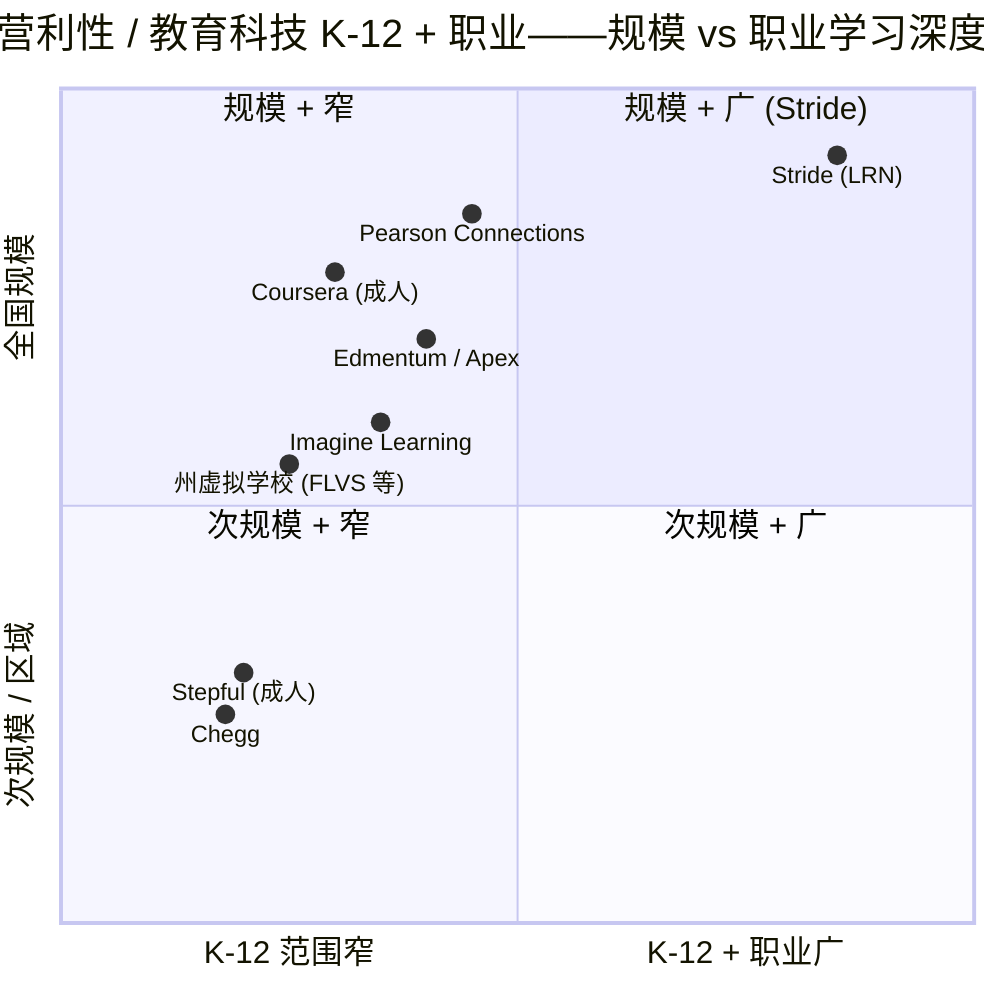
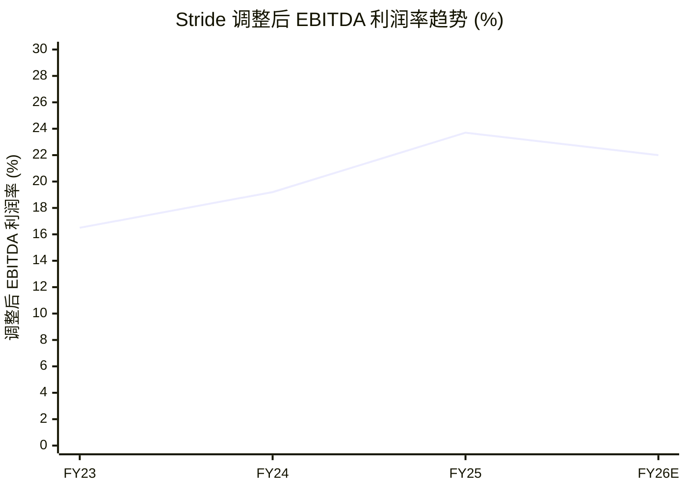

# Stride, Inc. (NYSE:LRN) — 公司研究报告

**截至日期: 2026-06-18**
**行业: 营利性教育 / 在线 K-12 / 教育科技 (EdTech)**
**财年截止: 6 月 30 日**
**总部: 美国弗吉尼亚州雷斯顿 (Reston, Virginia)**
**上市: 纽交所 NYSE:LRN (前身代码 KC12 / K12 Inc., 于 2020 年 12 月更名为 Stride Inc.)**
**报告语言: 简体中文 (英文版同时存在于本目录)**

> **重大事件——失去 Roscoe ISD / Lone Star Online Academy 合同, 股价单日重挫约 17% (2026-06-15):** 据 BMO Capital 分析师 Jeff Silber 披露, 得克萨斯州 **Roscoe 学区 (Roscoe ISD)** 决定**不再续约**由 Stride 运营其 **Lone Star Online Academy** K–8 年级的合同, 自下一学年起生效。该校约占 Stride **2025 财年预计总入学人数的 5%**, 量级远超普通合同流失;且因 Stride 在得州的其他虚拟学校**不提供 K-2 年级**, 替换这部分入学的难度更高。消息令 LRN 于 2026-06-15 自前一交易日收盘约 **97.71 美元**跌至约 **81–84 美元**(盘中一度 −16.9%),抹去约 **7 亿美元市值**,是继 2025 年末平台问题抛售以来最陡的单日跌幅之一。来源:[Simply Wall St — LRN down 14.2% on Texas K-8 contract loss, 2026-06-16](https://simplywall.st/stocks/us/consumer-services/nyse-lrn/stride/news/stride-lrn-is-down-142-after-losing-key-texas-k8-contract-an)、[Tickeron — Why is LRN stock down -16%, 2026-06-16](https://tickeron.com/blogs/why-is-stride-inc-lrn-stock-down-16-today-14162/)。**这是本次刷新相对 2026-05-20 旧版报告最重大的新增风险事件——见第 9 节风险 (1) 与第 9.5 节关键争论。**

> **业绩更新——2026 财年全年指引收窄 (2026-04-28):** 在公布 2026 财年 Q3 业绩后, 管理层将全年营业收入指引收窄至 **24.9–25.2 亿美元** (此前 Q2 公告时为 24.8–25.55 亿美元), 并将全年**调整后营业利润 (Adjusted Operating Income)** 区间下限上调至 **4.90–5.00 亿美元** (此前为 4.85–5.05 亿美元, 2025 年 10 月初始指引为 4.75–5.00 亿美元)。收窄后的指引区间隐含 2026 财年营收同比增长约 **3.5–4.8%**, 对应 2025 财年 24.053 亿美元的基数——较 2025 财年的 +17.9% 增速明显减速, 反映了普通教育 (General Education) 板块年同比基数走高 (Q3 入学人数下滑 5.0%) 以及 Galvanize 编程训练营业务的受控收尾 (2025 财年 Q4 计提了 5,950 万美元减值)。职业学习 (Career Learning) 仍是增长支柱 (Q3 入学人数 +11.6%, 营业收入 +12.3%)。来源: [Stride Q3-FY26 业绩公告, 2026-04-28](https://www.sec.gov/Archives/edgar/data/1157408/000117184326002775/exh_991.htm); 此前指引 [Stride Q2-FY26 业绩公告, 2026-01-27](https://www.sec.gov/Archives/edgar/data/1157408/000117184326000444/exh_991.htm); 初始指引 [Stride Q1-FY26 业绩公告, 2025-10-28](https://www.sec.gov/Archives/edgar/data/1157408/000117184325006722/exh_991.htm)。

---

## 投资摘要 (Investment Summary) — *分析师观点 (Analyst view)*

| 项目 | 内容 |
|---|---|
| **评级 (Rating)** | **Overweight / 增持** (相对营利性教育同业) |
| **12 个月目标价 (Price Target)** | **103 美元** (*分析师观点*) |
| **当前股价 (截至 2026-06-18)** | 82.80 美元 |
| **隐含上行空间 (Upside)** | **+24%** |
| **估值方法** | 2027E 调整后 EPS 8.50 美元 × 12× P/E ≈ 102 美元,辅以 7.5× EV/EBITDA 与净现金交叉验证;均给予较同业中位数的折价以反映 Roscoe 事件与政策二元风险 |
| **市值 / 企业价值** | 约 35.2 亿 / 约 32.3 亿美元 |
| **52 周区间** | 60.61 – 171.17 美元 |
| **Beta** | 0.08 (极低,防御性) |

**论点支柱 (Thesis pillars) — *分析师观点*:**
1. **被压缩的估值倍数更接近价值机会而非价值陷阱。** TTM P/E 13.0×、EV/EBITDA 6.2×,较营利性教育同业中位数 (P/E ~16.9×、EV/EBITDA ~10.3×) 折价 25–40%,而 Stride 拥有该组最高的调整后 EBITDA 利润率 (FY25 23.7%) 与净现金资产负债表 ([Yahoo Finance, LRN, 2026-06-18](https://finance.yahoo.com/quote/LRN/key-statistics/))。
2. **学校即服务合同结构稳定。** 约 95% 普通教育营收、100% 中-高中职业学习营收来自按拨款型 (funding-based) 合同,平均期限 **超过 5 年**、自动续约 ([Stride 10-K FY2025](https://www.sec.gov/Archives/edgar/data/1157408/000155837025010334/lrn-20250630x10k.htm))。
3. **Career Learning 是结构性增长引擎。** Q3-FY26 职业学习 (中-高中) 入学 +11.6%、营收 +12.3%,抵消普通教育入学 −5.0%([Stride Q3-FY26 业绩公告](https://www.sec.gov/Archives/edgar/data/1157408/000117184326002775/exh_991.htm))。
4. **资本回报杠杆。** 2025-11 授权 5 亿美元 (约市值 14%) 回购,现金+有价证券 FY25 末 10.114 亿美元 ([Stride 回购公告, 2025-11-03](https://www.sec.gov/Archives/edgar/data/1157408/000110465925105334/tm2530050d1_ex99-1.htm))。

**最该盯紧的变量 (swing variables):** (a) **Roscoe 流失能否被替换** — 约 5% 入学的缺口需在 FY27 招生季由其他州的新增/扩张学校填补;(b) **普通教育入学是否企稳** — Q3 −5.0% 是高基数再正态化还是趋势恶化的分水岭。

*以上评级、目标价及前瞻估计均为本报告作者的前瞻判断 (analyst view),不是公司指引,也绝不附着于任何 SEC 文件引用。*

---

## 目录

1. 公司概览 (含 1A 估值与目标价、1B GF Score)
2. 估值与价格目标 (Valuation & Price Target) / 公司历史
3. 管理团队
4. 产品与服务
5. 客户与上市策略
6. 行业概览
7. 竞争格局
8. 市场机会 (TAM)
9. 风险评估 (含 9.5 关键争论与催化剂)
10. 投资视角评分卡 (Investor Lenses)

---

## 1. 公司概览

Stride, Inc. (NYSE:LRN) 是美国最大的**纯粹型全日制在线 ("虚拟") 与混合公立学校教育 (online/virtual & blended public school education)** 提供商, 截至 2024–2025 学年, 公司在 31 个州 (含哥伦比亚特区) 运营的 **89 所普通教育学校 (General-Education)** 和 27 个州运营的 **56 所职业学习学校/项目 (Career-Learning)** 中, 合计为**约 234,000 名学生提供"学校即服务 (school-as-a-service)"项目** ([Stride 10-K FY2025, p. 4](https://www.sec.gov/Archives/edgar/data/1157408/000155837025010334/lrn-20250630x10k.htm))。公司设计、销售、运营并支持免学费的虚拟特许学校 (virtual charter school), 主要在各州的特许学校法规授权下运作; 同时也面向消费者、雇主与政府机构销售成人学习与职业准备业务。Stride 成立于 2000 年, 原名 K12 Inc., 2007 年于纽交所上市, 并在 2020 年 12 月更名为 Stride, 以彰显其更广义的职业学习/终身学习 (career-learning / lifelong-learning) 定位, 而后者正是当下驱动公司增长的引擎。

### 盈利方式

绝大部分营业收入来自合同形式的**"学校即服务" (school-as-a-service)** 业务 (此处 "SaaS" 是学术意义上的服务, 而非软件意义上的 SaaS)。Stride 与独立公立特许学校 (在少数情况下也包括传统学区) 的治理董事会签约, 全面运营整个学校: 提供课程 (公司自研的 K-12 课程目录加上职业路径)、学习管理系统 (LMS) 与学生信息系统 (SIS)、持证教师 (licensed teacher)、管理与行政服务、营销与招生漏斗 (enrollment funnel), 以及邮寄给学生家庭的学生电脑与学习套件 (learning kit)。这些学校则由州政府按生均经费 (per-pupil funding) 提供资金 (各州的州级及地方生均拨款大致在每生每年 5,000–10,000 美元区间)。Stride 向学校开票收取所提供服务的费用; 在许多州, 公司还会承担学校的任何运营亏损, 并以总额法 (gross) 确认相关费用。合同期限通常**超过 5 年**, 在没有终止通知的情况下自动续约。 2025 财年内, "约 95% 的普通教育营业收入与 100% 的中学/高中职业学习营业收入来自'按拨款型 (funding-based)'合同" ([Stride 10-K FY2025, Note 2 Revenue](https://www.sec.gov/Archives/edgar/data/1157408/000155837025010334/lrn-20250630x10k.htm))。

次要营业收入流——约占普通教育营业收入的 5%——来自学费型私立在线学校 (tuition-based private online schools)、面向家庭的消费者直销课程 (consumer direct-to-family curriculum)、面向学区授权 (district licensing) 的数字内容以及成人学习 (Adult Learning) 业务 (MedCerts 医疗保健认证、Galvanize / Tech Elevator 软件工程训练营、Tallo 平台)。成人学习是唯一**非**按拨款型的板块, 也是唯一收缩中的板块——2025 财年营业收入下滑 19.4% 至 8,040 万美元, 2026 财年前 9 个月同比下滑 29.1% ([Stride Q3-FY26 业绩公告, 2026-04-28](https://www.sec.gov/Archives/edgar/data/1157408/000117184326002775/exh_991.htm))。

### 规模与覆盖

- **营业收入:** 2025 财年 24.053 亿美元 (+17.9% 同比) ([Stride 10-K FY2025, MD&A p. 48](https://www.sec.gov/Archives/edgar/data/1157408/000155837025010334/lrn-20250630x10k.htm))。
- **营业利润:** GAAP 口径 3.601 亿美元 (营业利润率 15.0%), 调整后营业利润 4.662 亿美元 ([Stride Q4-FY25 业绩公告, 2025-08-05](https://www.sec.gov/Archives/edgar/data/1157408/000117184325005051/exh_991.htm))。
- **净利润:** 2.879 亿美元 (净利率 12.0%)——稀释后每股收益 (Diluted EPS) 5.95 美元。
- **调整后 EBITDA:** 5.710 亿美元 (利润率 23.7%), 较 2024 财年的 3.907 亿美元大幅上升。
- **现金及有价证券:** 截至 2025 年 6 月 30 日为 10.114 亿美元, 截至 2026 年 3 月 31 日下降至 8.560 亿美元 (反映股票回购) ([Stride Q3-FY26 业绩公告, 2026-04-28](https://www.sec.gov/Archives/edgar/data/1157408/000117184326002775/exh_991.htm))。
- **入学人数:** Q3-FY26 总入学 24.45 万 (+1.8% 同比),其中职业学习 11.01 万 (+11.6%)、普通教育约 13.44 万 (约 −5.0%);FY25 全年平均入学 23.40 万 (+20.4%)([Stride Q3-FY26 业绩公告](https://www.sec.gov/Archives/edgar/data/1157408/000117184326002775/exh_991.htm))。
- **地理覆盖:** 全部 50 个美国州 (针对某些产品线), 私立 / 双文凭项目覆盖 100 多个国家 ([Stride 新闻稿, 2025-11-03](https://www.sec.gov/Archives/edgar/data/1157408/000110465925105334/tm2530050d1_ex99-1.htm))。
- **员工:** 根据 2025 财年 10-K "人力资本" 披露, 全职等效员工约 7,700 人, 涵盖教师、教学辅助人员与公司员工 ([Stride 10-K FY2025, Human Capital](https://www.sec.gov/Archives/edgar/data/1157408/000155837025010334/lrn-20250630x10k.htm))。

下面的利润表 Sankey 直观展示 FY2025 "钱怎么挣的":营业收入 US$2,405.3m 按三大板块流入,经营业成本/毛利、SG&A 与 Galvanize 减值后落到营业利润 US$360.1m,叠加财务净收益后得净利润 US$287.9m([Stride 10-K FY2025 / Q4-FY25 8-K Ex-99.1](https://www.sec.gov/Archives/edgar/data/1157408/000117184325005051/exh_991.htm))。

<svg xmlns="http://www.w3.org/2000/svg" viewBox="0 0 1000 560" width="1000" height="560" role="img" aria-label="income statement Sankey"><rect x="0" y="0" width="1000" height="560" fill="#ffffff"/>
<text x="20.00" y="30.00" text-anchor="start" font-family="Helvetica,Arial,sans-serif" font-size="15" font-weight="700" fill="#1f2933">Stride FY2025 利润表 Sankey (income statement, US$m)</text>
<path d="M 204.00,64.00 C 258.00,64.00 258.00,78.01 312.00,78.01 L 312.00,332.17 C 258.00,332.17 258.00,318.16 204.00,318.16 Z" fill="#93c5fd" fill-opacity="0.55"/>
<path d="M 452.00,71.01 C 506.00,71.01 506.00,190.18 560.00,190.18 L 560.00,253.35 C 506.00,253.35 506.00,134.18 452.00,134.18 Z" fill="#86efac" fill-opacity="0.55"/>
<path d="M 452.00,134.18 C 506.00,134.18 506.00,267.35 560.00,267.35 L 560.00,369.77 C 506.00,369.77 506.00,236.61 452.00,236.61 Z" fill="#fca5a5" fill-opacity="0.55"/>
<path d="M 328.00,78.01 C 382.00,78.01 382.00,71.01 436.00,71.01 L 436.00,236.61 C 382.00,236.61 382.00,243.61 328.00,243.61 Z" fill="#86efac" fill-opacity="0.55"/>
<path d="M 328.00,243.61 C 382.00,243.61 382.00,250.61 436.00,250.61 L 436.00,506.99 C 382.00,506.99 382.00,499.99 328.00,499.99 Z" fill="#fca5a5" fill-opacity="0.55"/>
<path d="M 576.00,190.18 C 630.00,190.18 630.00,190.18 684.00,190.18 L 684.00,253.35 C 630.00,253.35 630.00,253.35 576.00,253.35 Z" fill="#86efac" fill-opacity="0.55"/>
<path d="M 700.00,190.18 C 754.00,190.18 754.00,248.39 808.00,248.39 L 808.00,298.89 C 754.00,298.89 754.00,240.68 700.00,240.68 Z" fill="#86efac" fill-opacity="0.55"/>
<path d="M 700.00,240.68 C 754.00,240.68 754.00,312.89 808.00,312.89 L 808.00,329.61 C 754.00,329.61 754.00,257.40 700.00,257.40 Z" fill="#fca5a5" fill-opacity="0.55"/>
<path d="M 576.00,267.35 C 630.00,267.35 630.00,271.40 684.00,271.40 L 684.00,363.39 C 630.00,363.39 630.00,359.33 576.00,359.33 Z" fill="#fca5a5" fill-opacity="0.55"/>
<path d="M 576.00,359.33 C 630.00,359.33 630.00,377.39 684.00,377.39 L 684.00,387.82 C 630.00,387.82 630.00,369.77 576.00,369.77 Z" fill="#fca5a5" fill-opacity="0.55"/>
<path d="M 204.00,332.16 C 258.00,332.16 258.00,332.17 312.00,332.17 L 312.00,485.90 C 258.00,485.90 258.00,485.89 204.00,485.89 Z" fill="#93c5fd" fill-opacity="0.55"/>
<path d="M 576.00,383.77 C 630.00,383.77 630.00,253.35 684.00,253.35 L 684.00,257.40 C 630.00,257.40 630.00,387.82 576.00,387.82 Z" fill="#93c5fd" fill-opacity="0.55"/>
<path d="M 204.00,499.89 C 258.00,499.89 258.00,485.90 312.00,485.90 L 312.00,500.01 C 258.00,500.01 258.00,514.00 204.00,514.00 Z" fill="#93c5fd" fill-opacity="0.55"/>
<rect x="188.00" y="64.00" width="16" height="254.16" rx="1.5" fill="#2563eb"/>
<rect x="188.00" y="332.16" width="16" height="153.74" rx="1.5" fill="#2563eb"/>
<rect x="188.00" y="499.89" width="16" height="14.11" rx="1.5" fill="#2563eb"/>
<rect x="312.00" y="78.01" width="16" height="421.98" rx="1.5" fill="#1e3a8a"/>
<rect x="436.00" y="71.01" width="16" height="165.60" rx="1.5" fill="#15803d"/>
<rect x="436.00" y="250.61" width="16" height="256.39" rx="1.5" fill="#dc2626"/>
<rect x="560.00" y="190.18" width="16" height="63.18" rx="1.5" fill="#15803d"/>
<rect x="560.00" y="267.35" width="16" height="102.42" rx="1.5" fill="#dc2626"/>
<rect x="560.00" y="383.77" width="16" height="4.05" rx="1.5" fill="#2563eb"/>
<rect x="684.00" y="190.18" width="16" height="67.23" rx="1.5" fill="#15803d"/>
<rect x="684.00" y="271.40" width="16" height="91.98" rx="1.5" fill="#dc2626"/>
<rect x="684.00" y="377.39" width="16" height="10.44" rx="1.5" fill="#dc2626"/>
<rect x="808.00" y="248.39" width="16" height="50.51" rx="1.5" fill="#15803d"/>
<rect x="808.00" y="312.89" width="16" height="16.72" rx="1.5" fill="#dc2626"/>
<line x1="188.00" y1="191.08" x2="182.00" y2="171.13" stroke="#cbd5e1" stroke-width="1"/>
<text x="179.00" y="174.13" text-anchor="end" font-family="Helvetica,Arial,sans-serif" font-size="11.5" font-weight="700" fill="#1f2933">General Education</text>
<text x="179.00" y="187.13" text-anchor="end" font-family="Helvetica,Arial,sans-serif" font-size="10" font-weight="400" fill="#52606d">US$1.4B  (60.2%)</text>
<line x1="188.00" y1="409.03" x2="182.00" y2="389.08" stroke="#cbd5e1" stroke-width="1"/>
<text x="179.00" y="392.08" text-anchor="end" font-family="Helvetica,Arial,sans-serif" font-size="11.5" font-weight="700" fill="#1f2933">Career Learning Mid-High</text>
<text x="179.00" y="405.08" text-anchor="end" font-family="Helvetica,Arial,sans-serif" font-size="10" font-weight="400" fill="#52606d">US$876.3M  (36.4%)</text>
<line x1="188.00" y1="506.95" x2="182.00" y2="487.00" stroke="#cbd5e1" stroke-width="1"/>
<text x="179.00" y="490.00" text-anchor="end" font-family="Helvetica,Arial,sans-serif" font-size="11.5" font-weight="700" fill="#1f2933">Adult Learning</text>
<text x="179.00" y="503.00" text-anchor="end" font-family="Helvetica,Arial,sans-serif" font-size="10" font-weight="400" fill="#52606d">US$80.4M  (3.3%)</text>
<rect x="331.00" y="60.01" width="113.10" height="26" rx="2" fill="#ffffff" fill-opacity="0.72"/>
<text x="334.00" y="72.01" text-anchor="start" font-family="Helvetica,Arial,sans-serif" font-size="11.5" font-weight="700" fill="#1f2933">Revenue</text>
<text x="334.00" y="85.01" text-anchor="start" font-family="Helvetica,Arial,sans-serif" font-size="10" font-weight="400" fill="#52606d">US$2.4B  (100.0%)</text>
<rect x="455.00" y="53.01" width="119.40" height="26" rx="2" fill="#ffffff" fill-opacity="0.72"/>
<text x="458.00" y="65.01" text-anchor="start" font-family="Helvetica,Arial,sans-serif" font-size="11.5" font-weight="700" fill="#1f2933">Gross Profit</text>
<text x="458.00" y="78.01" text-anchor="start" font-family="Helvetica,Arial,sans-serif" font-size="10" font-weight="400" fill="#52606d">US$943.9M  (39.2%)</text>
<rect x="455.00" y="232.61" width="144.60" height="26" rx="2" fill="#ffffff" fill-opacity="0.72"/>
<text x="458.00" y="244.61" text-anchor="start" font-family="Helvetica,Arial,sans-serif" font-size="11.5" font-weight="700" fill="#1f2933">Cost of Revenue (COGS)</text>
<text x="458.00" y="257.61" text-anchor="start" font-family="Helvetica,Arial,sans-serif" font-size="10" font-weight="400" fill="#52606d">US$1.5B  (60.8%)</text>
<rect x="579.00" y="172.18" width="119.40" height="26" rx="2" fill="#ffffff" fill-opacity="0.72"/>
<text x="582.00" y="184.18" text-anchor="start" font-family="Helvetica,Arial,sans-serif" font-size="11.5" font-weight="700" fill="#1f2933">Operating Income</text>
<text x="582.00" y="197.18" text-anchor="start" font-family="Helvetica,Arial,sans-serif" font-size="10" font-weight="400" fill="#52606d">US$360.1M  (15.0%)</text>
<rect x="579.00" y="249.35" width="150.90" height="26" rx="2" fill="#ffffff" fill-opacity="0.72"/>
<text x="582.00" y="261.35" text-anchor="start" font-family="Helvetica,Arial,sans-serif" font-size="11.5" font-weight="700" fill="#1f2933">Total Operating Expense</text>
<text x="582.00" y="274.35" text-anchor="start" font-family="Helvetica,Arial,sans-serif" font-size="10" font-weight="400" fill="#52606d">US$583.8M  (24.3%)</text>
<text x="551.00" y="382.80" text-anchor="end" font-family="Helvetica,Arial,sans-serif" font-size="11.5" font-weight="700" fill="#1f2933">Net Interest / Other Income</text>
<text x="551.00" y="395.80" text-anchor="end" font-family="Helvetica,Arial,sans-serif" font-size="10" font-weight="400" fill="#52606d">US$23.1M  (0.96%)</text>
<rect x="703.00" y="172.18" width="119.40" height="26" rx="2" fill="#ffffff" fill-opacity="0.72"/>
<text x="706.00" y="184.18" text-anchor="start" font-family="Helvetica,Arial,sans-serif" font-size="11.5" font-weight="700" fill="#1f2933">Pretax Income</text>
<text x="706.00" y="197.18" text-anchor="start" font-family="Helvetica,Arial,sans-serif" font-size="10" font-weight="400" fill="#52606d">US$383.2M  (15.9%)</text>
<rect x="703.00" y="253.40" width="119.40" height="26" rx="2" fill="#ffffff" fill-opacity="0.72"/>
<text x="706.00" y="265.40" text-anchor="start" font-family="Helvetica,Arial,sans-serif" font-size="11.5" font-weight="700" fill="#1f2933">SG&amp;A</text>
<text x="706.00" y="278.40" text-anchor="start" font-family="Helvetica,Arial,sans-serif" font-size="10" font-weight="400" fill="#52606d">US$524.3M  (21.8%)</text>
<rect x="703.00" y="359.39" width="106.80" height="26" rx="2" fill="#ffffff" fill-opacity="0.72"/>
<text x="706.00" y="371.39" text-anchor="start" font-family="Helvetica,Arial,sans-serif" font-size="11.5" font-weight="700" fill="#1f2933">Other OpEx</text>
<text x="706.00" y="384.39" text-anchor="start" font-family="Helvetica,Arial,sans-serif" font-size="10" font-weight="400" fill="#52606d">US$59.5M  (2.5%)</text>
<text x="833.00" y="270.64" text-anchor="start" font-family="Helvetica,Arial,sans-serif" font-size="11.5" font-weight="700" fill="#1f2933">Net Income</text>
<text x="833.00" y="283.64" text-anchor="start" font-family="Helvetica,Arial,sans-serif" font-size="10" font-weight="400" fill="#52606d">US$287.9M  (12.0%)</text>
<text x="833.00" y="318.25" text-anchor="start" font-family="Helvetica,Arial,sans-serif" font-size="11.5" font-weight="700" fill="#1f2933">Income Tax</text>
<text x="833.00" y="331.25" text-anchor="start" font-family="Helvetica,Arial,sans-serif" font-size="10" font-weight="400" fill="#52606d">US$95.3M  (4.0%)</text>
<text x="500.00" y="530.00" text-anchor="middle" font-family="Helvetica,Arial,sans-serif" font-size="10" font-weight="400" font-style="italic" fill="#8a97a3">营业收入 → 营业成本/毛利 → SG&amp;A+减值/营业利润 → 税/净利润。Other income净额+利息后 net 财务收益+23.1。</text>
<text x="500.00" y="544.00" text-anchor="middle" font-family="Helvetica,Arial,sans-serif" font-size="10" font-weight="400" fill="#52606d">Source: Stride 10-K FY2025 income statement + Q4-FY25 8-K Ex-99.1</text>
</svg>

*来源: [Stride Q4-FY25 + 全年业绩公告, 2025-08-05 (Ex-99.1 合并利润表)](https://www.sec.gov/Archives/edgar/data/1157408/000117184325005051/exh_991.htm)、[Stride 10-K FY2025](https://www.sec.gov/Archives/edgar/data/1157408/000155837025010334/lrn-20250630x10k.htm)。*

营业收入按板块拆分:普通教育 60.2%、职业学习 (中-高中) 36.4%、成人学习 3.3%——成人学习是唯一收缩中的板块。

<svg xmlns="http://www.w3.org/2000/svg" viewBox="0 0 720 460" width="720" height="460" role="img" aria-label="revenue donut"><rect x="0" y="0" width="720" height="460" fill="#ffffff"/>
<text x="20.00" y="30.00" text-anchor="start" font-family="Helvetica,Arial,sans-serif" font-size="15" font-weight="700" fill="#1f2933">Stride FY2025 营业收入按板块 (revenue by segment)</text>
<path d="M 288.00,107.20 A 132 132 0 1 1 208.90,344.87 L 241.26,301.64 A 78 78 0 1 0 288.00,161.20 Z" fill="#2563eb"/>
<path d="M 208.90,344.87 A 132 132 0 0 1 260.48,110.10 L 271.74,162.91 A 78 78 0 0 0 241.26,301.64 Z" fill="#15803d"/>
<path d="M 260.48,110.10 A 132 132 0 0 1 288.00,107.20 L 288.00,161.20 A 78 78 0 0 0 271.74,162.91 Z" fill="#d97706"/>
<text x="288.00" y="235.20" text-anchor="middle" font-family="Helvetica,Arial,sans-serif" font-size="18" font-weight="800" fill="#1f2933">LRN FY25</text>
<text x="288.00" y="255.20" text-anchor="middle" font-family="Helvetica,Arial,sans-serif" font-size="13" font-weight="600" fill="#52606d">US$2.4B</text>
<text x="288.00" y="271.20" text-anchor="middle" font-family="Helvetica,Arial,sans-serif" font-size="10" font-weight="400" fill="#8a97a3">total</text>
<line x1="418.94" y1="282.78" x2="434.94" y2="282.78" stroke="#2563eb" stroke-width="1.4"/>
<text x="438.94" y="280.78" text-anchor="start" font-family="Helvetica,Arial,sans-serif" font-size="11" font-weight="700" fill="#1f2933">General Education 普通教育</text>
<text x="438.94" y="294.78" text-anchor="start" font-family="Helvetica,Arial,sans-serif" font-size="10" font-weight="400" fill="#52606d">US$1.4B  (60.2%)</text>
<line x1="153.22" y1="209.59" x2="137.22" y2="209.59" stroke="#15803d" stroke-width="1.4"/>
<text x="133.22" y="207.59" text-anchor="end" font-family="Helvetica,Arial,sans-serif" font-size="11" font-weight="700" fill="#1f2933">Career Learning 中-高中职业</text>
<text x="133.22" y="221.59" text-anchor="end" font-family="Helvetica,Arial,sans-serif" font-size="10" font-weight="400" fill="#52606d">US$876.3M  (36.4%)</text>
<line x1="273.54" y1="101.96" x2="257.54" y2="101.96" stroke="#d97706" stroke-width="1.4"/>
<text x="253.54" y="99.96" text-anchor="end" font-family="Helvetica,Arial,sans-serif" font-size="11" font-weight="700" fill="#1f2933">Adult Learning 成人学习</text>
<text x="253.54" y="113.96" text-anchor="end" font-family="Helvetica,Arial,sans-serif" font-size="10" font-weight="400" fill="#52606d">US$80.4M  (3.3%)</text>
<text x="360.00" y="430.00" text-anchor="middle" font-family="Helvetica,Arial,sans-serif" font-size="10" font-weight="400" font-style="italic" fill="#8a97a3">总营业收入 US$2,405.3m。普通教育 60.2% / 职业学习(中高中)36.4% / 成人 3.3%。</text>
<text x="360.00" y="444.00" text-anchor="middle" font-family="Helvetica,Arial,sans-serif" font-size="10" font-weight="400" fill="#52606d">Source: Stride 10-K FY2025 / Q4-FY25 8-K 分部营业收入</text>
</svg>

*来源: [Stride 10-K FY2025 / Q4-FY25 8-K 分部营业收入表](https://www.sec.gov/Archives/edgar/data/1157408/000117184325005051/exh_991.htm)。*

三大板块自 FY2023 起单列;职业学习 (中-高中) 三年从 US$510m 增至 US$876m,是营收结构里最快的增量;成人学习则从 US$170.6m 收缩至 US$80.4m。

<svg xmlns="http://www.w3.org/2000/svg" viewBox="0 0 860 470" width="860" height="470" role="img" aria-label="historical revenue bars"><rect x="0" y="0" width="860" height="470" fill="#ffffff"/>
<text x="20.00" y="30.00" text-anchor="start" font-family="Helvetica,Arial,sans-serif" font-size="15" font-weight="700" fill="#1f2933">Stride 分部营业收入 (segment revenue, FY23–FY25, US$m)</text>
<rect x="20.00" y="44" width="11" height="11" rx="2" fill="#2563eb"/>
<text x="36.00" y="53.00" text-anchor="start" font-family="Helvetica,Arial,sans-serif" font-size="10.5" font-weight="400" fill="#1f2933">General Education 普通教育</text>
<rect x="195.20" y="44" width="11" height="11" rx="2" fill="#15803d"/>
<text x="211.20" y="53.00" text-anchor="start" font-family="Helvetica,Arial,sans-serif" font-size="10.5" font-weight="400" fill="#1f2933">Career Learning 中-高中职业</text>
<rect x="370.40" y="44" width="11" height="11" rx="2" fill="#d97706"/>
<text x="386.40" y="53.00" text-anchor="start" font-family="Helvetica,Arial,sans-serif" font-size="10.5" font-weight="400" fill="#1f2933">Adult 成人学习</text>
<line x1="70" y1="412.00" x2="834" y2="412.00" stroke="#eceff2" stroke-width="1"/>
<text x="64.00" y="415.00" text-anchor="end" font-family="Helvetica,Arial,sans-serif" font-size="9.5" font-weight="400" fill="#52606d">US$0</text>
<line x1="70" y1="345.20" x2="834" y2="345.20" stroke="#eceff2" stroke-width="1"/>
<text x="64.00" y="348.20" text-anchor="end" font-family="Helvetica,Arial,sans-serif" font-size="9.5" font-weight="400" fill="#52606d">US$519.6M</text>
<line x1="70" y1="278.40" x2="834" y2="278.40" stroke="#eceff2" stroke-width="1"/>
<text x="64.00" y="281.40" text-anchor="end" font-family="Helvetica,Arial,sans-serif" font-size="9.5" font-weight="400" fill="#52606d">US$1.0B</text>
<line x1="70" y1="211.60" x2="834" y2="211.60" stroke="#eceff2" stroke-width="1"/>
<text x="64.00" y="214.60" text-anchor="end" font-family="Helvetica,Arial,sans-serif" font-size="9.5" font-weight="400" fill="#52606d">US$1.6B</text>
<line x1="70" y1="144.80" x2="834" y2="144.80" stroke="#eceff2" stroke-width="1"/>
<text x="64.00" y="147.80" text-anchor="end" font-family="Helvetica,Arial,sans-serif" font-size="9.5" font-weight="400" fill="#52606d">US$2.1B</text>
<line x1="70" y1="78.00" x2="834" y2="78.00" stroke="#eceff2" stroke-width="1"/>
<text x="64.00" y="81.00" text-anchor="end" font-family="Helvetica,Arial,sans-serif" font-size="9.5" font-weight="400" fill="#52606d">US$2.6B</text>
<rect x="123.48" y="263.32" width="147.71" height="148.68" fill="#2563eb"/>
<rect x="123.48" y="197.71" width="147.71" height="65.61" fill="#15803d"/>
<rect x="123.48" y="175.78" width="147.71" height="21.93" fill="#d97706"/>
<text x="197.33" y="428.00" text-anchor="middle" font-family="Helvetica,Arial,sans-serif" font-size="10" font-weight="400" fill="#52606d">FY23</text>
<rect x="378.15" y="246.25" width="147.71" height="165.75" fill="#2563eb"/>
<rect x="378.15" y="162.53" width="147.71" height="83.72" fill="#15803d"/>
<rect x="378.15" y="149.71" width="147.71" height="12.82" fill="#d97706"/>
<text x="452.00" y="428.00" text-anchor="middle" font-family="Helvetica,Arial,sans-serif" font-size="10" font-weight="400" fill="#52606d">FY24</text>
<rect x="632.81" y="225.74" width="147.71" height="186.26" fill="#2563eb"/>
<rect x="632.81" y="113.08" width="147.71" height="112.66" fill="#15803d"/>
<rect x="632.81" y="102.74" width="147.71" height="10.34" fill="#d97706"/>
<text x="706.67" y="428.00" text-anchor="middle" font-family="Helvetica,Arial,sans-serif" font-size="10" font-weight="400" fill="#52606d">FY25</text>
<text x="430.00" y="440.00" text-anchor="middle" font-family="Helvetica,Arial,sans-serif" font-size="10" font-weight="400" font-style="italic" fill="#8a97a3">三分部自 FY2023 起单列。总营收 FY23 US$1,837m → FY24 US$2,040m → FY25 US$2,405m。</text>
<text x="430.00" y="454.00" text-anchor="middle" font-family="Helvetica,Arial,sans-serif" font-size="10" font-weight="400" fill="#52606d">Source: Stride 10-K FY2023/FY2024/FY2025 分部营业收入表</text>
</svg>

*来源: [Stride 10-K FY2023/FY2024/FY2025 分部营业收入表](https://www.sec.gov/Archives/edgar/data/1157408/000155837025010334/lrn-20250630x10k.htm)。*

### 1A. 估值快照与目标价 (截至 2026-06-18)

| 指标 | LRN | 教育服务同业中位数 (n=5) |
|---|---|---|
| 股价 | 82.80 美元 | n/a |
| 市值 | 35.2 亿美元 | n/a |
| 企业价值 (EV) | 约 32.3 亿美元 | n/a |
| TTM P/E | **13.0x** | 16.9x (GHC, LAUR, STRA, LOPE, PRDO) |
| 前瞻 P/E | 9.5x | 12.7x |
| TTM P/S | 1.39x | 2.35x |
| EV/EBITDA (TTM) | 6.2x | 10.3x |
| P/B | 2.1x | n/a |
| 52 周区间 | 60.61 – 171.17 美元 | n/a |
| Beta | 0.08 | n/a |

来源: [Yahoo Finance, LRN 关键统计, 访问于 2026-06-18](https://finance.yahoo.com/quote/LRN/key-statistics/)、同业 [GHC](https://finance.yahoo.com/quote/GHC/) / [LAUR](https://finance.yahoo.com/quote/LAUR/) / [STRA](https://finance.yahoo.com/quote/STRA/) / [LOPE](https://finance.yahoo.com/quote/LOPE/) / [PRDO](https://finance.yahoo.com/quote/PRDO/) 报价 (访问于 2026-06-18)、[Stride 10-K FY2025](https://www.sec.gov/Archives/edgar/data/1157408/000155837025010334/lrn-20250630x10k.htm)。

**前瞻估值矩阵 (forward valuation matrix) — *分析师观点*。** 随着前瞻 EPS 增长,倍数被快速压缩:以本报告 FY26E/FY27E 调整后 EPS 约 8.10 / 8.50 美元计,LRN 的前瞻 P/E 自 TTM 的 13.0× 压缩至 FY26E 约 10.2× → FY27E 约 9.7×,EV/EBITDA 自 6.2× 压缩至约 5.6×——即便假设零增长,当前价格也已接近"净现金 + 6× EBITDA"的下行支撑。

**为什么估值倍数被压缩。** Stride 的 TTM P/E 为 13.0x、EV/EBITDA 为 6.2x, 较营利性教育同业中位数**低 25–40%**, 尽管它录得了同业领先的历史营收增长 (2025 财年 +17.9%, 2026 财年预计 ~+3.5–4.8%) 以及该组中最高的调整后 EBITDA 利润率 (2025 财年 23.7%)。三个因素解释这种折价:

1. **2025 年 9 月以来的剧烈情绪重设 (sentiment reset),并被 2026-06 的 Roscoe 事件二次放大。** LRN 于 2025 年 9 月 10 日收于历史高点约 163 美元, 至年底跌至 52 周低位约 60 美元——大约三个月内回撤超过 60%; 触发因素是 2026 财年 Q1 入学人数"低于内部计划"叠加平台/客户结构问题。2025 年 11 月董事会授权 5 亿美元 (约市值 14%) 回购,表明管理层认为回调过度 ([Stride 新闻稿, 2025-11-03](https://www.sec.gov/Archives/edgar/data/1157408/000110465925105334/tm2530050d1_ex99-1.htm))。短暂修复后,**2026-06-15 失去 Roscoe ISD / Lone Star Online Academy 合同 (约 5% 入学) 又令股价单日重挫约 17%**,把估值倍数再次压回低位 ([Simply Wall St, 2026-06-16](https://simplywall.st/stocks/us/consumer-services/nyse-lrn/stride/news/stride-lrn-is-down-142-after-losing-key-texas-k8-contract-an))。
2. **政策 / 政治二元风险。** 投资者对依赖生均公共资金、特许学校授权 (charter-school authorization) 以及 (在特朗普二期时代) 联邦 Title-I 资金走向和州级教育储蓄账户 (ESA, Education Savings Account) / 教育券 (voucher) 项目走向的教育类股保持折价态度。Stride 的旗舰模式从结构上对**任何**主要州的虚拟特许学校授权重大缩减都有暴露。
3. **普通教育板块相对峰值的再正态化 (re-normalization)。** 2026 财年 Q3 普通教育入学人数同比下滑 5.0%, 上年同期是高基数 (2025 财年普通教育 +13.2% 是多年最强增速)。投资者正在对疫情时代入学人数阶跃式抬升已被完全消化、普通教育将回归到 2020 年前低个位数增长的风险定价 ([Stride Q3-FY26 业绩公告](https://www.sec.gov/Archives/edgar/data/1157408/000117184326002775/exh_991.htm))。

*分析师观点:* 被压缩的估值倍数**更接近价值机会而非价值陷阱**: 学校即服务业务有结构上稳定的按拨款型合同, 平均期限超过 5 年; 职业学习仍以 12–25% 速度复合增长; 资产负债表呈净现金状态 (FY25 末现金+有价证券 US$1,011.4m,长期债务 US$416.3m); 管理层在机会主义地回购股票。Roscoe 事件确实削弱了"按拨款型合同高度粘性"这一论点——但单一学区约 5% 入学并不构成论点破裂,而 17% 的单日跌幅大概率已经超调。空头逻辑真正需要的是 (a) 多州特许学校授权出现连锁回撤,或 (b) 联邦政府对州级在线特许学校生均资金进行抢占 (pre-emption)——两者历史上均无先例,但都是估值倍数已经计入的尾部风险。

### 1B. GF Score (GuruFocus-style) 基本面评分卡 — *分析师观点*

下面的五维评分卡 (Financial Strength / Profitability / Growth / GF Value / Momentum) 是本报告作者基于 Stride 已披露财务与本报告前瞻模型自建的评分,**仿照 GuruFocus 的 GF Score™ 框架,但既非 GuruFocus 的官方数字,也不附着于任何 SEC 文件引用**;每项底层指标 (利润率 / 杠杆 / CAGR / 倍数 / 价格回报) 在前后文均有各自的引用。

<svg xmlns="http://www.w3.org/2000/svg" viewBox="0 0 500 500" width="500" height="500" role="img" aria-label="GF Score radar">
<rect x="0" y="0" width="500" height="500" fill="#ffffff"/>
<text x="20" y="24" font-family="Helvetica,Arial,sans-serif" font-size="15" font-weight="700" fill="#1f2933">GF Score (GuruFocus-style): 68/100</text>
<text x="20" y="41" font-family="Helvetica,Arial,sans-serif" font-size="11" fill="#52606d">51–70 Poor future performance potential</text>
<polygon points="250.0,88.0 392.7,191.6 338.2,359.4 161.8,359.4 107.3,191.6" fill="#e9f5ec" stroke="none"/>
<polygon points="250.0,208.0 278.5,228.7 267.6,262.3 232.4,262.3 221.5,228.7" fill="none" stroke="#c5d3cb" stroke-width="1"/>
<polygon points="250.0,178.0 307.1,219.5 285.3,286.5 214.7,286.5 192.9,219.5" fill="none" stroke="#c5d3cb" stroke-width="1"/>
<polygon points="250.0,148.0 335.6,210.2 302.9,310.8 197.1,310.8 164.4,210.2" fill="none" stroke="#c5d3cb" stroke-width="1"/>
<polygon points="250.0,118.0 364.1,200.9 320.5,335.1 179.5,335.1 135.9,200.9" fill="none" stroke="#c5d3cb" stroke-width="1"/>
<polygon points="250.0,88.0 392.7,191.6 338.2,359.4 161.8,359.4 107.3,191.6" fill="none" stroke="#c5d3cb" stroke-width="1.3"/>
<line x1="250" y1="238" x2="161.8" y2="359.4" stroke="#cfdad3" stroke-width="1"/>
<text x="146.5" y="392.4" text-anchor="end" font-family="Helvetica,Arial,sans-serif" font-size="11.5" font-weight="600" fill="#1f2933">财务实力</text>
<text x="179.5" y="329.1" text-anchor="middle" font-family="Helvetica,Arial,sans-serif" font-size="10.5" font-weight="700" fill="#1f2933">8</text>
<line x1="250" y1="238" x2="250.0" y2="88.0" stroke="#cfdad3" stroke-width="1"/>
<text x="250.0" y="58.0" text-anchor="middle" font-family="Helvetica,Arial,sans-serif" font-size="11.5" font-weight="600" fill="#1f2933">盈利能力</text>
<text x="250.0" y="112.0" text-anchor="middle" font-family="Helvetica,Arial,sans-serif" font-size="10.5" font-weight="700" fill="#1f2933">8</text>
<line x1="250" y1="238" x2="107.3" y2="191.6" stroke="#cfdad3" stroke-width="1"/>
<text x="82.6" y="183.6" text-anchor="end" font-family="Helvetica,Arial,sans-serif" font-size="11.5" font-weight="600" fill="#1f2933">成长性</text>
<text x="150.1" y="199.6" text-anchor="middle" font-family="Helvetica,Arial,sans-serif" font-size="10.5" font-weight="700" fill="#1f2933">7</text>
<line x1="250" y1="238" x2="392.7" y2="191.6" stroke="#cfdad3" stroke-width="1"/>
<text x="417.4" y="183.6" text-anchor="start" font-family="Helvetica,Arial,sans-serif" font-size="11.5" font-weight="600" fill="#1f2933">估值</text>
<text x="364.1" y="194.9" text-anchor="middle" font-family="Helvetica,Arial,sans-serif" font-size="10.5" font-weight="700" fill="#1f2933">8</text>
<line x1="250" y1="238" x2="338.2" y2="359.4" stroke="#cfdad3" stroke-width="1"/>
<text x="353.5" y="392.4" text-anchor="start" font-family="Helvetica,Arial,sans-serif" font-size="11.5" font-weight="600" fill="#1f2933">动量</text>
<text x="267.6" y="256.3" text-anchor="middle" font-family="Helvetica,Arial,sans-serif" font-size="10.5" font-weight="700" fill="#1f2933">2</text>
<polygon points="250.0,118.0 364.1,200.9 267.6,262.3 179.5,335.1 150.1,205.6" fill="#2e8b57" fill-opacity="0.34" stroke="#2e8b57" stroke-width="2"/>
<circle cx="179.5" cy="335.1" r="2.6" fill="#2e8b57"/>
<circle cx="250.0" cy="118.0" r="2.6" fill="#2e8b57"/>
<circle cx="150.1" cy="205.6" r="2.6" fill="#2e8b57"/>
<circle cx="364.1" cy="200.9" r="2.6" fill="#2e8b57"/>
<circle cx="267.6" cy="262.3" r="2.6" fill="#2e8b57"/>
<text x="250" y="470" text-anchor="middle" font-family="Helvetica,Arial,sans-serif" font-size="9.5" fill="#52606d">Source: Stride 10-K FY2025 · Q3-FY26 10-Q · Yahoo Finance · as of 2026-06-18</text>
<text x="250" y="485" text-anchor="middle" font-family="Helvetica,Arial,sans-serif" font-size="9" fill="#52606d">GF Score = independent analyst rubric (*Analyst view:*) — not GuruFocus™ official number</text>
</svg>

| 维度 | 评分 (0–10) | 评分理由 (driving metrics) |
|---|---|---|
| **Financial Strength 财务实力** | **8** | 净现金:FY25 末现金+有价证券 US$1,011.4m vs 长期债务 US$416.3m;CFO US$432.8m、利息支出净额仅 US$10.5m → 利息覆盖极高 ([Q4-FY25 8-K](https://www.sec.gov/Archives/edgar/data/1157408/000117184325005051/exh_991.htm))。 |
| **Profitability 盈利能力** | **8** | FY25 GAAP 营业利润率 15.0%、净利率 12.0%、ROE ≈ 21.7%、调整后 EBITDA 利润率 23.7%(同业最高);三年利润率持续扩张 ([Stride 10-K FY2025](https://www.sec.gov/Archives/edgar/data/1157408/000155837025010334/lrn-20250630x10k.htm))。 |
| **Growth 成长性** | **7** | FY25 营收 +17.9%、净利 +41.0%;但 FY26E 减速至 ~+3.5–4.8%,职业学习 +12% 抵消普通教育 −5%;Roscoe 流失对 FY27 增长构成单点拖累。 |
| **GF Value 估值 (越高越便宜)** | **8** | TTM P/E 13.0×、前瞻 9.5×、EV/EBITDA 6.2× 均显著低于同业中位数,且较自身历史区间下沿 ([Yahoo Finance, 2026-06-18](https://finance.yahoo.com/quote/LRN/key-statistics/))。 |
| **Momentum 动量** | **2** | 自 2025-09 峰值 ~163 美元回撤约 −49%,股价低于 50 日 (~93)/200 日 (~95) 均线,6/12 个月绝对与相对回报均为负 ([Yahoo Finance, 2026-06-18](https://finance.yahoo.com/quote/LRN/key-statistics/))。 |
| **GF Score (composite, *分析师观点*)** | **68 / 100** | 加权 (FS 20% · Prof 25% · Growth 25% · Value 15% · Mom 15%);基本面强 (财务+盈利+估值高分) 被动量拖累——典型的"基本面好、价格情绪差"错配。 |

*分析师观点:* GF Score 68/100 精炼地刻画了本次刷新的核心张力——Stride 在财务实力、盈利能力与估值三维都拿高分,唯独动量只有 2 分。对价值型投资者,这种"高基本面 + 低动量"的组合往往正是逆向布局窗口;对动量型投资者,则需等待入学企稳 (尤其普通教育止跌、Roscoe 缺口被填补) 的确认信号。

---

## 2. 估值与价格目标 (Valuation & Price Target)

> 本节的前瞻财务估计、目标价及 bull/base/bear 情景均为本报告作者的前瞻判断 (*分析师观点 / analyst view*),不是公司指引,也绝不附着于任何 SEC 文件引用。模型搭建于已披露的分部数据 (Step 0–1)、管理层指引 (Q3-FY26 收窄后指引) 与行业增长假设之上。

### 2A. 前瞻财务模型 (forward estimates) — *分析师观点*

按板块分别建模再加总 (segment-mix 法),而非单一混合口径:

| 财年 (6/30 止) | FY2025A | FY2026E | FY2027E | FY2028E |
|---|---|---|---|---|
| 普通教育营收 (US$m) | 1,448.7 | ~1,460 | ~1,475 | ~1,520 |
| 职业学习中-高中营收 (US$m) | 876.3 | ~985 | ~1,110 | ~1,235 |
| 成人学习营收 (US$m) | 80.4 | ~58 | ~52 | ~55 |
| **总营收 (US$m)** | **2,405.3** | **~2,503** | **~2,637** | **~2,810** |
| 营收 YoY | +17.9% | ~+4.1% | ~+5.4% | ~+6.6% |
| 调整后 EBITDA 利润率 | 23.7% | ~22.0% | ~22.5% | ~23.0% |
| 调整后营业利润 (US$m) | 466.2 | ~495 | ~530 | ~575 |
| **调整后 EPS (US$)** | **8.10** | **~8.10** | **~8.50** | **~9.20** |

驱动与依据 (每项均为外部输入,非模型本身):FY26 总营收落在管理层 24.9–25.2 亿美元指引区间中点 ([Stride Q3-FY26 业绩公告](https://www.sec.gov/Archives/edgar/data/1157408/000117184326002775/exh_991.htm));普通教育增速因 Q3 入学 −5.0% 与 Roscoe 流失 (约 5% 入学) 取低个位数;职业学习沿用 Q3 +12.3% 营收增速并逐年回落至中双位→低双位;成人学习随 Galvanize 收尾继续收缩后企稳 ([Stride 10-K FY2025](https://www.sec.gov/Archives/edgar/data/1157408/000155837025010334/lrn-20250630x10k.htm))。利润率假设普通教育再正态化小幅压缩 EBITDA 利润率,被职业学习规模化经济性部分抵消。

下面的 5 步 DuPont 把 FY25 ROE ≈ 21.7% 拆成税负、利息负担、营业利润率、资产周转与权益乘数——可见 Stride 的 ROE 主要由**高营业利润率**而非财务杠杆驱动 (权益乘数仅约 1.5×),是高质量的回报结构。

<svg xmlns="http://www.w3.org/2000/svg" viewBox="0 0 1240 540" width="1240" height="540" role="img" aria-label="DuPont ROE decomposition"><rect x="0" y="0" width="1240" height="540" fill="#ffffff"/>
<text x="20.00" y="30.00" text-anchor="start" font-family="Helvetica,Arial,sans-serif" font-size="15" font-weight="700" fill="#1f2933">Stride FY2025 DuPont ROE 分解 (5-step)</text>
<rect x="545.00" y="56.00" width="150" height="56" rx="7" fill="#1e3a8a"/>
<text x="620.00" y="76.00" text-anchor="middle" font-family="Helvetica,Arial,sans-serif" font-size="11.5" font-weight="700" fill="#ffffff">ROE</text>
<text x="620.00" y="94.00" text-anchor="middle" font-family="Helvetica,Arial,sans-serif" font-size="13" font-weight="800" fill="#ffffff">21.68%</text>
<text x="620.00" y="106.00" text-anchor="middle" font-family="Helvetica,Arial,sans-serif" font-size="8.5" font-weight="400" fill="#dbeafe">= Net Income / Avg Equity</text>
<rect x="191.60" y="168.00" width="150" height="56" rx="7" fill="#2563eb"/>
<text x="266.60" y="188.00" text-anchor="middle" font-family="Helvetica,Arial,sans-serif" font-size="11.5" font-weight="700" fill="#ffffff">Net Margin</text>
<text x="266.60" y="206.00" text-anchor="middle" font-family="Helvetica,Arial,sans-serif" font-size="13" font-weight="800" fill="#ffffff">11.97%</text>
<text x="266.60" y="218.00" text-anchor="middle" font-family="Helvetica,Arial,sans-serif" font-size="8.5" font-weight="400" fill="#dbeafe">Net Income / Revenue</text>
<line x1="620.00" y1="112.00" x2="266.60" y2="168.00" stroke="#94a3b8" stroke-width="1.4"/>
<rect x="545.00" y="168.00" width="150" height="56" rx="7" fill="#2563eb"/>
<text x="620.00" y="188.00" text-anchor="middle" font-family="Helvetica,Arial,sans-serif" font-size="11.5" font-weight="700" fill="#ffffff">Asset Turnover</text>
<text x="620.00" y="206.00" text-anchor="middle" font-family="Helvetica,Arial,sans-serif" font-size="13" font-weight="800" fill="#ffffff">1.14</text>
<text x="620.00" y="218.00" text-anchor="middle" font-family="Helvetica,Arial,sans-serif" font-size="8.5" font-weight="400" fill="#dbeafe">Revenue / Avg Assets</text>
<line x1="620.00" y1="112.00" x2="620.00" y2="168.00" stroke="#94a3b8" stroke-width="1.4"/>
<rect x="898.40" y="168.00" width="150" height="56" rx="7" fill="#2563eb"/>
<text x="973.40" y="188.00" text-anchor="middle" font-family="Helvetica,Arial,sans-serif" font-size="11.5" font-weight="700" fill="#ffffff">Equity Multiplier</text>
<text x="973.40" y="206.00" text-anchor="middle" font-family="Helvetica,Arial,sans-serif" font-size="13" font-weight="800" fill="#ffffff">1.59</text>
<text x="973.40" y="218.00" text-anchor="middle" font-family="Helvetica,Arial,sans-serif" font-size="8.5" font-weight="400" fill="#dbeafe">Avg Assets / Avg Equity</text>
<line x1="620.00" y1="112.00" x2="973.40" y2="168.00" stroke="#94a3b8" stroke-width="1.4"/>
<circle cx="443.30" cy="196.00" r="11" fill="#ffffff" stroke="#94a3b8" stroke-width="1.2"/>
<text x="443.30" y="201.00" text-anchor="middle" font-family="Helvetica,Arial,sans-serif" font-size="14" font-weight="800" fill="#52606d">×</text>
<circle cx="796.70" cy="196.00" r="11" fill="#ffffff" stroke="#94a3b8" stroke-width="1.2"/>
<text x="796.70" y="201.00" text-anchor="middle" font-family="Helvetica,Arial,sans-serif" font-size="14" font-weight="800" fill="#52606d">×</text>
<rect x="65.00" y="300.00" width="118" height="56" rx="7" fill="#2563eb"/>
<text x="124.00" y="320.00" text-anchor="middle" font-family="Helvetica,Arial,sans-serif" font-size="11.5" font-weight="700" fill="#ffffff">Operating Margin</text>
<text x="124.00" y="338.00" text-anchor="middle" font-family="Helvetica,Arial,sans-serif" font-size="13" font-weight="800" fill="#ffffff">14.97%</text>
<text x="124.00" y="350.00" text-anchor="middle" font-family="Helvetica,Arial,sans-serif" font-size="8.5" font-weight="400" fill="#dbeafe">Op Inc / Revenue</text>
<line x1="266.60" y1="224.00" x2="124.00" y2="300.00" stroke="#94a3b8" stroke-width="1.4"/>
<rect x="207.60" y="300.00" width="118" height="56" rx="7" fill="#2563eb"/>
<text x="266.60" y="320.00" text-anchor="middle" font-family="Helvetica,Arial,sans-serif" font-size="11.5" font-weight="700" fill="#ffffff">Tax Burden</text>
<text x="266.60" y="338.00" text-anchor="middle" font-family="Helvetica,Arial,sans-serif" font-size="13" font-weight="800" fill="#ffffff">0.7513</text>
<text x="266.60" y="350.00" text-anchor="middle" font-family="Helvetica,Arial,sans-serif" font-size="8.5" font-weight="400" fill="#dbeafe">Net Inc / Pretax</text>
<line x1="266.60" y1="224.00" x2="266.60" y2="300.00" stroke="#94a3b8" stroke-width="1.4"/>
<rect x="350.20" y="300.00" width="118" height="56" rx="7" fill="#2563eb"/>
<text x="409.20" y="320.00" text-anchor="middle" font-family="Helvetica,Arial,sans-serif" font-size="11.5" font-weight="700" fill="#ffffff">Interest Burden</text>
<text x="409.20" y="338.00" text-anchor="middle" font-family="Helvetica,Arial,sans-serif" font-size="13" font-weight="800" fill="#ffffff">1.0641</text>
<text x="409.20" y="350.00" text-anchor="middle" font-family="Helvetica,Arial,sans-serif" font-size="8.5" font-weight="400" fill="#dbeafe">Pretax / Op Inc</text>
<line x1="266.60" y1="224.00" x2="409.20" y2="300.00" stroke="#94a3b8" stroke-width="1.4"/>
<circle cx="195.30" cy="328.00" r="11" fill="#ffffff" stroke="#94a3b8" stroke-width="1.2"/>
<text x="195.30" y="333.00" text-anchor="middle" font-family="Helvetica,Arial,sans-serif" font-size="14" font-weight="800" fill="#52606d">×</text>
<circle cx="337.90" cy="328.00" r="11" fill="#ffffff" stroke="#94a3b8" stroke-width="1.2"/>
<text x="337.90" y="333.00" text-anchor="middle" font-family="Helvetica,Arial,sans-serif" font-size="14" font-weight="800" fill="#52606d">×</text>
<rect x="479.00" y="300.00" width="118" height="56" rx="7" fill="#2563eb"/>
<text x="538.00" y="326.00" text-anchor="middle" font-family="Helvetica,Arial,sans-serif" font-size="11.5" font-weight="700" fill="#ffffff">Revenue</text>
<text x="538.00" y="342.00" text-anchor="middle" font-family="Helvetica,Arial,sans-serif" font-size="13" font-weight="800" fill="#ffffff">US$2.4B</text>
<line x1="620.00" y1="224.00" x2="538.00" y2="300.00" stroke="#94a3b8" stroke-width="1.4"/>
<rect x="643.00" y="300.00" width="118" height="56" rx="7" fill="#2563eb"/>
<text x="702.00" y="320.00" text-anchor="middle" font-family="Helvetica,Arial,sans-serif" font-size="11.5" font-weight="700" fill="#ffffff">Avg Total Assets</text>
<text x="702.00" y="338.00" text-anchor="middle" font-family="Helvetica,Arial,sans-serif" font-size="13" font-weight="800" fill="#ffffff">US$2.1B</text>
<text x="702.00" y="350.00" text-anchor="middle" font-family="Helvetica,Arial,sans-serif" font-size="8.5" font-weight="400" fill="#dbeafe">(begin+end)/2</text>
<line x1="620.00" y1="224.00" x2="702.00" y2="300.00" stroke="#94a3b8" stroke-width="1.4"/>
<circle cx="620.00" cy="328.00" r="11" fill="#ffffff" stroke="#94a3b8" stroke-width="1.2"/>
<text x="620.00" y="333.00" text-anchor="middle" font-family="Helvetica,Arial,sans-serif" font-size="14" font-weight="800" fill="#52606d">÷</text>
<rect x="832.40" y="300.00" width="118" height="56" rx="7" fill="#2563eb"/>
<text x="891.40" y="320.00" text-anchor="middle" font-family="Helvetica,Arial,sans-serif" font-size="11.5" font-weight="700" fill="#ffffff">Avg Total Assets</text>
<text x="891.40" y="338.00" text-anchor="middle" font-family="Helvetica,Arial,sans-serif" font-size="13" font-weight="800" fill="#ffffff">US$2.1B</text>
<text x="891.40" y="350.00" text-anchor="middle" font-family="Helvetica,Arial,sans-serif" font-size="8.5" font-weight="400" fill="#dbeafe">(begin+end)/2</text>
<line x1="973.40" y1="224.00" x2="891.40" y2="300.00" stroke="#94a3b8" stroke-width="1.4"/>
<rect x="996.40" y="300.00" width="118" height="56" rx="7" fill="#2563eb"/>
<text x="1055.40" y="320.00" text-anchor="middle" font-family="Helvetica,Arial,sans-serif" font-size="11.5" font-weight="700" fill="#ffffff">Avg Total Equity</text>
<text x="1055.40" y="338.00" text-anchor="middle" font-family="Helvetica,Arial,sans-serif" font-size="13" font-weight="800" fill="#ffffff">US$1.3B</text>
<text x="1055.40" y="350.00" text-anchor="middle" font-family="Helvetica,Arial,sans-serif" font-size="8.5" font-weight="400" fill="#dbeafe">(begin+end)/2</text>
<line x1="973.40" y1="224.00" x2="1055.40" y2="300.00" stroke="#94a3b8" stroke-width="1.4"/>
<circle cx="967.20" cy="328.00" r="11" fill="#ffffff" stroke="#94a3b8" stroke-width="1.2"/>
<text x="967.20" y="333.00" text-anchor="middle" font-family="Helvetica,Arial,sans-serif" font-size="14" font-weight="800" fill="#52606d">÷</text>
<rect x="69.00" y="420.00" width="110" height="48" rx="7" fill="#3b82f6"/>
<text x="124.00" y="442.00" text-anchor="middle" font-family="Helvetica,Arial,sans-serif" font-size="11.5" font-weight="700" fill="#ffffff">Operating Income</text>
<text x="124.00" y="458.00" text-anchor="middle" font-family="Helvetica,Arial,sans-serif" font-size="13" font-weight="800" fill="#ffffff">US$360.1M</text>
<line x1="124.00" y1="356.00" x2="124.00" y2="420.00" stroke="#94a3b8" stroke-width="1.4"/>
<rect x="211.60" y="420.00" width="110" height="48" rx="7" fill="#3b82f6"/>
<text x="266.60" y="442.00" text-anchor="middle" font-family="Helvetica,Arial,sans-serif" font-size="11.5" font-weight="700" fill="#ffffff">Net Income</text>
<text x="266.60" y="458.00" text-anchor="middle" font-family="Helvetica,Arial,sans-serif" font-size="13" font-weight="800" fill="#ffffff">US$287.9M</text>
<line x1="266.60" y1="356.00" x2="266.60" y2="420.00" stroke="#94a3b8" stroke-width="1.4"/>
<rect x="354.20" y="420.00" width="110" height="48" rx="7" fill="#3b82f6"/>
<text x="409.20" y="442.00" text-anchor="middle" font-family="Helvetica,Arial,sans-serif" font-size="11.5" font-weight="700" fill="#ffffff">Pretax Income</text>
<text x="409.20" y="458.00" text-anchor="middle" font-family="Helvetica,Arial,sans-serif" font-size="13" font-weight="800" fill="#ffffff">US$383.2M</text>
<line x1="409.20" y1="356.00" x2="409.20" y2="420.00" stroke="#94a3b8" stroke-width="1.4"/>
<text x="620.00" y="510.00" text-anchor="middle" font-family="Helvetica,Arial,sans-serif" font-size="10" font-weight="400" font-style="italic" fill="#8a97a3">ROE = 税负 × 利息负担 × 营业利润率 × 资产周转 × 权益乘数。FY25 ROE ≈ 21.7%(净利润/平均权益)。</text>
<text x="620.00" y="524.00" text-anchor="middle" font-family="Helvetica,Arial,sans-serif" font-size="10" font-weight="400" fill="#52606d">Source: Stride 10-K FY2025 / Q4-FY25 8-K 财务报表</text>
</svg>

*来源: [Stride 10-K FY2025 / Q4-FY25 8-K 财务报表](https://www.sec.gov/Archives/edgar/data/1157408/000117184325005051/exh_991.htm)。*

### 2B. 目标价推导 (price-target derivation) — *分析师观点*

**主方法:前瞻 P/E。** 以 FY2027E 调整后 EPS 8.50 美元 × **12× 目标 P/E** ≈ **102 美元**,取整后 12 个月目标价 **103 美元**,较 2026-06-18 收盘 82.80 美元隐含 **+24%** 上行。

**为什么用 12× P/E (倍数依据)。** 营利性教育同业当前 TTM P/E:GHC 16.9×、LAUR 19.5×、STRA 13.3×、LOPE 17.7×、PRDO 12.2×,中位数约 16.9× ([Yahoo Finance 同业报价, 2026-06-18](https://finance.yahoo.com/quote/STRA/))。Stride 拥有该组最高的调整后 EBITDA 利润率与净现金,本应享有溢价;但考虑到 (a) Roscoe 揭示的单一学区流失风险、(b) 政策二元风险、(c) 普通教育再正态化,本报告给予较同业中位数约 30% 的折价,取 12×——仍高于股价隐含的 9.5× 前瞻 P/E,反映均值回归空间。**交叉验证:** 7.5× EV/EBITDA × FY27E 调整后 EBITDA 约 5.93 亿美元 + 净现金 ≈ EV 44.5 亿 → 每股约 105 美元,与 P/E 法一致。

### 2C. Bull / Base / Bear 情景 — *分析师观点*

| 情景 | 12 个月目标价 | vs 现价 (82.80) | 核心摆动假设 |
|---|---|---|---|
| **Bull 看多** | **128 美元** | **+55%** | FY27E EPS 9.00 + 倍数修复至 14×;普通教育入学 Q4-FY26 即企稳,Roscoe 缺口被新州学校完全填补,职业学习维持 +12–15% |
| **Base 基准** | **103 美元** | **+24%** | FY27E EPS 8.50 × 12×;普通教育低个位数增长,职业学习中双位→低双位,成人学习企稳 |
| **Bear 看空** | **62 美元** | **−25%** | FY27E EPS 7.20 × 8.5×;Roscoe 式流失蔓延到 2–3 个州,普通教育入学连续两年下滑,倍数压回净现金+5× EBITDA 下沿 |

### 2D. 与市场一致预期的对比 (vs consensus)

本地 zsxq 机构研究库 (`db/zsxq.db`,约 7,000 份券商 PDF) **未覆盖 LRN / Stride / K12**(以 ticker、英文名、中文名、行业关键词多次检索均无命中);因此本报告无法引用券商一致目标价或 bull/bear,亦不杜撰一致预期数字。可供参照的公开锚点是 BMO Capital 在 2026-06-15 就 Roscoe 事件发出的负面提示 (约 5% 入学流失、替换难度高),属事件点评而非完整目标价 ([Simply Wall St 引述 BMO, 2026-06-16](https://simplywall.st/stocks/us/consumer-services/nyse-lrn/stride/news/stride-lrn-is-down-142-after-losing-key-texas-k8-contract-an))。本报告 103 美元目标价、+24% 上行,定性上比当前股价隐含的悲观预期更乐观,但低于 2025-09 峰值,属"折价均值回归"而非"重回峰值"的判断。

---

## 公司历史

K12 Inc. 于 2000 年在弗吉尼亚州麦克莱恩 (McLean) 由**罗纳德·J·帕卡德 (Ronald J. Packard)** (前奈特基金会 / 麦肯锡银行家)、**玛丽·吉福德 (Mary Gifford)** (前 Edison Schools 州政策总监) 与教育企业家**威廉·J·班尼特 (William J. Bennett)** (前美国教育部长, 任董事长至 2005 年) 共同创立。创立的核心论点是: 已在多个州取得进展的公共特许学校框架, 可以与日趋成熟的互联网技术结合, 把符合学业标准的课程交付给那些因地理、健康、运动训练日程或非常规学习需求而不适合传统实体学校的孩子。公司于 2001 年 9 月推出 K-2 阶段在线课程, 并在此后几年陆续增加年级与州伙伴关系 ([Stride 10-K FY2025, "Our History"](https://www.sec.gov/Archives/edgar/data/1157408/000155837025010334/lrn-20250630x10k.htm))。

来源: [Stride 10-K FY2025, "Our History"](https://www.sec.gov/Archives/edgar/data/1157408/000155837025010334/lrn-20250630x10k.htm)、[Stride DEF 14A 2025](https://www.sec.gov/Archives/edgar/data/1157408/000114036125039264/ny20051739x1_def14a.htm)、[Stride 新闻稿, 2025-11-03](https://www.sec.gov/Archives/edgar/data/1157408/000110465925105334/tm2530050d1_ex99-1.htm)。

### 战略转折——四大关键节点

**(1) 2007 年 IPO 与创始人离职 (2014 年)。** 上市筹得资金推动了更快的逐州扩张, 但也使 K12 受困于围绕学业成果研究的争议 (尤其是 2015 年 CREDO 关于在线特许学校学业表现的报告), 该争议在 2010 年代后期持续压制股价, 并最终在 2014 年导致创始人换帅。

**(2) 2020 年职业学习三连击。** 2020 财年公司在数月之内接连收购了三家成人学习品牌——**Galvanize** (软件工程训练营, 2020 年 5 月)、**Tech Elevator** (编程训练营, 2020 年 11 月)、**MedCerts** (医技健康认证, 2020 年 12 月)——合计对价约 **3.5 亿美元** ([Stride 10-K FY2025, "Our History"](https://www.sec.gov/Archives/edgar/data/1157408/000155837025010334/lrn-20250630x10k.htm))。其战略逻辑是: K12 需要一个非 K-12 的增长杠杆, 而推动高中内职业准备 (career-prep) 需求的劳动力发展顺风 (行业证书、双学分) 自然延伸到了 IT 与医疗保健领域的成人再技能化 (reskilling) 需求。K-12 内部的职业学习板块成为单一最成功的战略下注: 初中/高中职业学习营业收入从 2023 财年的 5.868 亿美元增长到 2025 财年的 8.763 亿美元 (两年 +49%)。

**(3) 2020 年 12 月由 K12 Inc. 更名为 Stride。** 与职业学习收购及疫情时代入学人数飙升同步, 公司更名以传达其身份不再仅仅与 K-12 学校绑定。K12 品牌作为面向学校的子品牌 (Stride K12) 仍然保留。原 NYSE 股票代码 "LRN" 也予以保留。

**(4) 2025 年 Galvanize 收尾。** 2020 年的三起收购中, Galvanize 表现不及预期: 2023–24 年随着 FAANG 招聘周期降温, 加上 GenAI 压缩了训练营文凭的感知价值, 企业对线下编程训练营的需求崩溃。Stride 在 2026 财年 Q4 (即 2025 财年 Q4) 对 Galvanize 的无形资产与使用权资产计提**减值 5,950 万美元** ([Stride 10-K FY2025, MD&A](https://www.sec.gov/Archives/edgar/data/1157408/000155837025010334/lrn-20250630x10k.htm)), 并对该业务进行受控清盘——成人学习营业收入 2025 财年下滑 19.4%, 2026 财年前 9 个月再下滑 29.1%。

### 关键收购 (及其逻辑)

- **2020 年——Galvanize、Tech Elevator、MedCerts:** 建立职业学习 / 成人学习板块。
- **2022 年——Tallo, Inc. (2022 年 7 月):** 以约 2,000 万美元收购; 一个招聘 / 人才匹配平台, 帮助接受职业学习的高中生与雇主对接, 深化职业学习的飞轮 ([Stride 10-K FY2025, Acquisitions](https://www.sec.gov/Archives/edgar/data/1157408/000155837025010334/lrn-20250630x10k.htm))。

### 近期事件 (过去 18 个月)

- **2025 年 8 月:** Galvanize 计提减值 (5,950 万美元); 2025 财年业绩显示营收增长 17.9%, 中学/高中职业学习增长 34.6%。
- **2025 年 11 月:** 董事会授权至 2026 年 10 月 31 日有效的 5 亿美元股票回购计划 ([Stride 新闻稿, 2025-11-03](https://www.sec.gov/Archives/edgar/data/1157408/000110465925105334/tm2530050d1_ex99-1.htm))。
- **2025 年 12 月:** James Rhyu 出任董事长 (在原 CEO 职务之外), 集中领导权。
- **2026 年 4 月:** Q3-FY26 收窄全年营业收入指引至 24.9–25.2 亿美元; 调整后营业利润上调至 4.90–5.00 亿美元区间。

---

## 3. 管理团队

### James J. Rhyu——首席执行官兼董事长 (CEO 自 2021 年 1 月起; 董事长自 2025 年 12 月起)

James Rhyu 是当今 Stride 故事的核心人物。他于 2013 年 6 月加入 K12 Inc. 担任 CFO, 于 2020 年 4 月升任公司战略、营销与技术总裁 (President of Corporate Strategy, Marketing and Technology), 并于 2021 年 1 月被任命为 CEO——恰逢公司由 K12 更名为 Stride 以及向职业学习的转型 ([Stride DEF 14A 2025, p. 10](https://www.sec.gov/Archives/edgar/data/1157408/000114036125039264/ny20051739x1_def14a.htm))。因此他深度参与了塑造公司形态的三次转折: 2020 年职业学习收购浪潮、更名、以及 2025 财年的 Galvanize 收尾。

加入 K12 之前, Rhyu 于 2011 年 6 月至 2013 年 6 月担任 **Match.com (IAC/InterActiveCorp 子公司) 的 CFO 兼首席行政官**, 主管财务、HR、法务、IT、运营及部分国际单元。在此之前, 他于 2009 年 1 月至 2011 年 5 月任 **道琼斯公司 (Dow Jones & Company) 财务高级副总裁**, 在新闻集团 (News Corp) 接手后的过渡期内主管全球财务职能。更早的职位包括天狼星 XM 电台 (Sirius XM Radio, 含其前身 XM Satellite Radio) 和 GrafTech International 的公司控制官 (Corporate Controller)。他的职业起点是安永 (Ernst & Young LLP) 在美国和南美的审计师 ([Stride DEF 14A 2025, p. 10](https://www.sec.gov/Archives/edgar/data/1157408/000114036125039264/ny20051739x1_def14a.htm)、[LinkedIn — James Rhyu](https://www.linkedin.com/in/jamesrhyu/))。

**他实际交付了什么。** 在 Rhyu 的 CEO 任期 (FY2022 → FY2025) 内: 营业收入从 16.867 亿美元增至 24.053 亿美元 (三年 +42%); 调整后 EBITDA 从约 2.3 亿美元扩张到 5.710 亿美元 (翻倍以上); GAAP 营业利润率从约 5% (FY2022 1.566 亿美元 / 9.3%) 增至 2025 财年的 15.0% (扩大约三倍); 总入学人数从 185.1K 增至 234.0K。他果断地在 Q4-FY25 计提了 Galvanize 减值而非让其延宕, 并主导了如今约占营收 40% 的职业学习推进。市场以股价从他上任时的约 35 美元升至 2025 年 9 月峰值的 163 美元——至 9 月峰值的回报约 360%——回报了这一执行力。

**学历 / 证书。** 宾夕法尼亚大学沃顿商学院 (Wharton School, University of Pennsylvania) 学士, 伦敦商学院 (London Business School) MBA。

**薪酬 / 利益绑定。** 根据代理声明, 2025 财年总薪酬为 2,150 万美元 (薪酬汇总表 (Summary Compensation Table)); 但根据 Item 402(v) 计算的"实际支付的薪酬 (compensation actually paid)"高达 1.105 亿美元, 反映了股价飙升期间归属股权奖励的价值——这一数字被代理顾问公司广泛标记。Rhyu 同时持有个人股份, DEF 14A 报告将其列为重要持仓; 准确的内部人持股数据见代理声明中的实益持有表 ([Stride DEF 14A 2025, "Pay vs. Performance"](https://www.sec.gov/Archives/edgar/data/1157408/000114036125039264/ny20051739x1_def14a.htm))。该 1.10 亿美元"实际支付的薪酬"数字在 2024 年 12 月股东大会上引发了显著的"薪酬咨询投票 (Say-on-Pay)"反对票,2025 年的授予已设置更多业绩门槛 (PSU 与营收、调整后 EBITDA 及三年期 TSR 挂钩)。

### 治理摘要

- **CEO / 董事长合并 (自 2025 年 12 月起):** Rhyu 同时担任 CEO 与董事长,将决策权集中于一人。Stride 主张,设有首席独立董事 (Lead Independent Director) 一职、加上完全独立的审计、薪酬与提名委员会,缓解了治理担忧;ISS 类型的代理顾问通常更倾向于职位分离 ([Stride DEF 14A 2025](https://www.sec.gov/Archives/edgar/data/1157408/000114036125039264/ny20051739x1_def14a.htm))。
- **董事会构成 (2025 提名名单):** 9 位董事,其中 7 位为独立董事,设独立审计 / 薪酬 / 提名三委员会 ([Stride DEF 14A 2025, "Information Regarding Nominees"](https://www.sec.gov/Archives/edgar/data/1157408/000114036125039264/ny20051739x1_def14a.htm))。
- **内部人持股:** 高管与董事合计持股占比适中 (按代理声明的实益持有表,全部摊薄基础上为个位数百分比)——属职业经理人管理、而非"创始人——利益深度绑定"的持股结构。

### 业绩记录评估

Rhyu 领导的高级团队交付了连续三年加速的营业收入增长、显著的利润率扩张以及干净的战略减记 (Galvanize)——执行力位于营利性教育同业的高端 ([Stride 10-K FY2025](https://www.sec.gov/Archives/edgar/data/1157408/000155837025010334/lrn-20250630x10k.htm))。主要缺口包括: (a) CEO / 董事长合并的治理结构在 Rhyu 一人身上集中了决策权与关键人物依赖; (b) 公司缺乏"创始人——利益深度绑定"的剖面 (Stride 由职业经理人管理,而非由创始人驱动); (c) Roscoe 事件揭示出公司对单一学区/州关系的执行敏感度,运营梯队需在 FY27 招生季证明其填补流失入学的能力。

---

## 4. 产品与服务

Stride 在两个市场销售产品——**普通教育 (General Education, K-12)** 与**职业学习 (Career Learning, 初中/高中 + 成人)**——既可作为综合性的**学校即服务 (school-as-a-service)** 提供 (完整运营 + 课程 + 技术 + 教师 + 教材), 也可作为**独立元素** (课程授权、LMS 访问、学区课程目录) 销售。两板块在 2025 财年营业收入中的占比约为 60% / 40%。

来源: [Stride 10-K FY2025, "Our Lines of Revenue", "Products and Services", "Sales Channels"](https://www.sec.gov/Archives/edgar/data/1157408/000155837025010334/lrn-20250630x10k.htm)、[Stride 10-K FY2025, Note 2 分拆营业收入表](https://www.sec.gov/Archives/edgar/data/1157408/000155837025010334/lrn-20250630x10k.htm)。

### 普通教育——实际销售的是什么

**Stride K12 全服务虚拟公立学校 (旗舰)。** "学校即服务"打包是公司单一最大的营业收入流。它包括 (i) Stride 的 K-12 数字课程库, 涵盖数学、英语、科学、历史与选修课——"数百门高质量、富于参与感的在线课程与内容, 以及众多州定制版本" ([Stride 10-K FY2025, "Curriculum and Content"](https://www.sec.gov/Archives/edgar/data/1157408/000155837025010334/lrn-20250630x10k.htm)); (ii) Stride 自有的、运行在 AWS 与 Microsoft Azure 之上的学习管理与学生信息系统; (iii) 招聘的州持证教师 (state-certified teacher)、教学经理、辅导员; (iv) 营销与招生漏斗服务; (v) 邮寄到学生家庭的学生电脑及含州定制实体教材的离线学习套件; (vi) 行政后台 (预算、财务报告、州合规)。典型合同期限**超过 5 年**, 默认自动续约。2024–2025 学年, Stride 在 31 个州 (含哥伦比亚特区) 运营 89 所普通教育学校。

- *目标客户:* 公立特许学校的治理董事会 (以及更小一批传统学区), 以及那些选择该校而非默认公立学校学位指派的学生家长。
- *定价模式:* 按学生收取服务费, 来源是学校获得的州级生均拨款 (每生通常为每年 5,000–10,000 美元, 取决于州、年级与特殊需求拨款)。
- *竞争优势:* **是——规模、监管复杂度与机构知识构成的护城河。** Stride 在 31 个州拥有 25 年运营历史; 每个州的特许学校及生均拨款法规都需要大量合规开销, 单一州的竞争对手在经济上无法复制。"学校即服务" P&L 只有在规模化时才能跑通, 因为课程库的成本要在数十万学生上摊销, 而监管事务 / 州级立法跟踪是固定成本。最接近的竞争对手是 **Pearson Connections Academy** (培生 Pearson plc, LSE 上市), 在 31 个州运营类似的全服务虚拟特许模式, 单州市场份额一般略小于 Stride。判定: 课程质量持平、网络规模上领先 Connections、内容广度上落后于培生更广义的课程库。

**Stride K12 学费型私立在线学校 (K12 Private Academy、Keystone School)。** 面向居住在无 Stride 免费公立选项的州、或希望选择私立替代方案的家庭, 提供 D2C 替代品。定价大致在每年 4,000–9,500 美元区间。近期州级 ESA / 教育券扩张正在扩大其资格基础——"许多家庭可以使用教育储蓄账户、税收抵免和教育券, 以低成本或零成本入读这些学校" ([Stride 10-K FY2025, "Consumer Sales"](https://www.sec.gov/Archives/edgar/data/1157408/000155837025010334/lrn-20250630x10k.htm))。营收规模较小但毛利率高, 是 ESA 浪潮的直接受益者。
- *竞争优势:* **部分有。** 品牌力强、全国交付经验成熟, 但板块在结构上较小, 直接面对众多小型在线私立学校与消费者家庭教育出版商 (Outschool、Bridgeway Academy) 的竞争。

**学区 / 校区独立课程目录 (district / school-district stand-alone course catalogs)。** Stride 向现有实体学区授权单门课程与数字课程模块, 用于填补学区缺口——典型用途是学分补救 (credit-recovery)、暑期课程、未配教师的 AP 课程或特殊需求替代学校设置。占营业收入个位数百分比, 但渠道上具有战略价值, 是与学区建立长期关系的"特洛伊木马", 后续可转化为更广泛的学校即服务合同。
- *竞争优势:* **部分有。** Edmentum (PE 持有)、Apex Learning (属 Edmentum)、Imagine Learning 在学区课程目录授权上构成竞争; Stride 内容水平与同业持平, 学区客户安装基础落后于 Edmentum。

**消费者直销课程 (家庭教育套件、辅助学习)。** Stride 直接向家庭教育家庭销售课程。规模较小 (营业收入数个百分点)、毛利率高, 受益于美国家庭教育大趋势的顺风 (NHERI 2022 数据显示家庭教育学生约 310 万, 较疫情前 250 万有所上升, 每年增长约 2%——[Stride 10-K FY2025, "Our Market"](https://www.sec.gov/Archives/edgar/data/1157408/000155837025010334/lrn-20250630x10k.htm))。

### 职业学习——实际销售的是什么

**Destinations Career Academies (旗舰职业学习)。** 学校即服务模式的垂直延伸: 高中 (以及部分初中) 作为以职业为焦点的联合学院 (academy) 运营, 内容路径包括 (i) **信息技术** (CompTIA、Cisco、AWS 等认证)、(ii) **医疗保健** (医务助理、牙科助理、药剂技术员、EMT 准备)、(iii) **通用商业** (创业、金融、项目管理)。学生同时获得高中双学分以及行业认可的认证。2025 财年初中/高中职业学习营业收入同比增长 **34.6% 至 8.763 亿美元**——是公司单一增长最快的业务线。
- *竞争优势:* **是——先发规模与内容深度。** Stride 是第一个把全虚拟职业学院 (career academy) 规模化打包的厂商; 没有任何同业能提供与之相当的、贴合行业认证路径的广度并同时具备虚拟交付载体。最接近的竞争对手: **Edmentum 的 Carone Learning** 和 **Pearson 的 Connections Career Academy** 提供职业方向内容, 但缺少学校即服务的运营基础设施。判定: 领先。

**Tallo (招聘 / 人才平台)。** 于 2022 年以约 2,000 万美元收购; B2C/B2B 平台, 高中职业学习学生在平台上建立简历、完成评估并与雇主合作伙伴对接实习与初级岗位 ([Stride 10-K FY2025, Acquisitions](https://www.sec.gov/Archives/edgar/data/1157408/000155837025010334/lrn-20250630x10k.htm))。属于战略补充, 自身不是重要 P&L 线。

**成人学习——MedCerts。** 完全在线、自定进度的医技健康认证项目 (医务助理、牙科助理、药剂技术员、采血员、心电、EMR、RHIT), 销售给消费者、雇主与劳动力投资法案 (WIOA) 州级机构。三项 2020 年职业学习收购中表现最强的一笔; 体量小但毛利高。
- *竞争优势:* **部分有——细分规模、政府渠道接入。** Coursera、Penn Foster、Stepful (安德森-霍洛维茨支持的初创公司, 医技健康认证) 都构成竞争; 由于其政府机构渠道, MedCerts 在 WIOA 资助招生中处于领导地位。

**成人学习——Galvanize / Tech Elevator (编程训练营)。** 当初收购的目标是与 Lambda School、General Assembly、Codecademy 在 B2C 与 B2B/B2G 企业再技能化方向上竞争。2023–2025 年市场崩溃: 企业再技能化需求转冷, AI 编程工具压缩了人工训练营产出的感知价值。Stride 在 2025 财年 Q4 对 Galvanize 的无形资产和使用权资产合计计提 **5,950 万美元减值** ([Stride 10-K FY2025, MD&A](https://www.sec.gov/Archives/edgar/data/1157408/000155837025010334/lrn-20250630x10k.htm)), 并对该业务进行清盘式收缩——成人学习营业收入 2025 财年同比下滑 19.4%, 2026 财年前 9 个月再下滑 29.1%。
- *竞争优势:* **当前市场下无。** 判定: 受控收尾。

### 旗舰产品 vs 长尾

三大旗舰产品贡献了约 90% 的合并营业收入: (1) **Stride K12 全服务虚拟公立学校** (约 14.5 亿美元 / 60% 营收)——传统核心; (2) **Destinations Career Academies** (约 8.76 亿美元 / 36% 营收)——增长引擎; (3) **MedCerts** (估计约 5,000–6,000 万美元, 是 8,000 万美元成人学习板块中盈利的部分)。剩余约 3% 涵盖学费型私立学校、学区课程目录、消费者直销课程、Galvanize / Tech Elevator 与 Tallo。

### 路线图与近期发布 (过去 12 个月)

- **AI 辅助学习的推广 (AI-assisted learning rollout):** 2024–2025 年向 K12 课程中推广自研的 AI 辅导与 AI 驱动个性化功能, 在 2025 财年 10-K 中被描述为"自动化与人工智能 (AI) 辅助学习" ([Stride 10-K FY2025, "Key Products and Services"](https://www.sec.gov/Archives/edgar/data/1157408/000155837025010334/lrn-20250630x10k.htm))。
- **州级扩张:** Stride 在 2025 财年新开或扩张到额外的州, 并瞄准了 2026 财年 / 2027 财年的更多州 (10-K 未具体披露州名)。
- **Galvanize 收尾 (sunset):** 自 2025 财年起对线下编程训练营业务进行受控清盘。

### 资金流向图 (money-flow / supply-chain map)

下面的"钱从哪来、到哪去"图直观展示 Stride 的商业模式:州/地方政府按生均经费 (per-pupil funding) 经特许学校董事会付费给 Stride 运营整所学校,Stride 再把钱投向持证教师 (最大成本项)、自研课程/LMS、学生设备与招生营销。**关注资金来源端的集中度风险:** 约 95% 普通教育营收、100% 中-高中职业学习营收来自州拨款型合同,而 2026-06 的 Roscoe ISD 撤约 (约 5% 入学) 正是这一来源端单点流失的典型——单一学区董事会不续约即直接抽走对应营收 ([Stride 10-K FY2025, "Our History" / "Sales Channels"](https://www.sec.gov/Archives/edgar/data/1157408/000155837025010334/lrn-20250630x10k.htm)、[Simply Wall St 引述 BMO, 2026-06-16](https://simplywall.st/stocks/us/consumer-services/nyse-lrn/stride/news/stride-lrn-is-down-142-after-losing-key-texas-k8-contract-an))。成本去向端高度可控:无单一供应商有定价权 (AWS/Azure 可多源化、学习套件组装商品化),最大成本项是教师薪酬 (约 7,700 名 FTE,计入 COGS)([Stride 10-K FY2025, "Technology Platform" / Human Capital](https://www.sec.gov/Archives/edgar/data/1157408/000155837025010334/lrn-20250630x10k.htm))。

<svg xmlns="http://www.w3.org/2000/svg" viewBox="0 0 1180 1056" width="1180" height="1056" role="img" aria-label="Stride 的钱从哪来、到哪去 (who pays → Stride → where it lands)" font-family="'Space Grotesk',system-ui,-apple-system,'Segoe UI',sans-serif">
<defs><linearGradient id="mfgold" gradientUnits="userSpaceOnUse" x1="0" y1="0" x2="1180" y2="0"><stop offset="0" stop-color="#f6dc97"/><stop offset="0.5" stop-color="#e9b658"/><stop offset="1" stop-color="#cf8f2c"/></linearGradient><radialGradient id="mfpool" cx="50%" cy="50%" r="50%"><stop offset="0" stop-color="#34d399" stop-opacity="0.16"/><stop offset="1" stop-color="#34d399" stop-opacity="0"/></radialGradient></defs>
<rect x="0" y="0" width="1180" height="1056" rx="16" fill="#0b0f1a"/>
<text x="42.00" y="56.00" text-anchor="start" font-family="'JetBrains Mono',ui-monospace,Menlo,monospace" font-size="11.5" font-weight="600" fill="#e9b658" letter-spacing="3">STRIDE (NYSE:LRN) MONEY FLOW · FY2025</text>
<text x="42.00" y="100.00" text-anchor="start" font-family="'Space Grotesk',system-ui,-apple-system,'Segoe UI',sans-serif" font-size="32" font-weight="700" fill="#e8ecf5">Stride 的钱从哪来、到哪去 (who pays → Stride → where it lands)</text>
<text x="42.00" y="142.00" text-anchor="start" font-family="'Space Grotesk',system-ui,-apple-system,'Segoe UI',sans-serif" font-size="15" font-weight="400" fill="#8a93a8">州政府按生均经费 (per-pupil funding) 通过特许学校董事会付费给 Stride 运营整所学校;Stride 再把这笔钱投向持证教师、自研课程/LMS、学生设备与招生营销。约 95% 普通教育营收、100% 中高中职业学习营收来自按拨款型合同。</text>
<ellipse cx="1031.00" cy="410.00" rx="190" ry="150" fill="url(#mfpool)"/>
<line x1="369.50" y1="188.00" x2="369.50" y2="628.00" stroke="#222a3a" stroke-dasharray="2 8"/>
<line x1="810.50" y1="188.00" x2="810.50" y2="628.00" stroke="#222a3a" stroke-dasharray="2 8"/>
<text x="42.00" y="172.00" text-anchor="start" font-family="'JetBrains Mono',ui-monospace,Menlo,monospace" font-size="12" font-weight="400" fill="#e9b658" letter-spacing="3">STAGE 01</text>
<text x="42.00" y="188.00" text-anchor="start" font-family="'JetBrains Mono',ui-monospace,Menlo,monospace" font-size="11.5" font-weight="400" fill="#646d82">谁付钱 who pays</text>
<text x="483.00" y="172.00" text-anchor="start" font-family="'JetBrains Mono',ui-monospace,Menlo,monospace" font-size="12" font-weight="400" fill="#e9b658" letter-spacing="3">STAGE 02</text>
<text x="483.00" y="188.00" text-anchor="start" font-family="'JetBrains Mono',ui-monospace,Menlo,monospace" font-size="11.5" font-weight="400" fill="#646d82">Stride 各业务</text>
<text x="924.00" y="172.00" text-anchor="start" font-family="'JetBrains Mono',ui-monospace,Menlo,monospace" font-size="12" font-weight="400" fill="#e9b658" letter-spacing="3">STAGE 03</text>
<text x="924.00" y="188.00" text-anchor="start" font-family="'JetBrains Mono',ui-monospace,Menlo,monospace" font-size="11.5" font-weight="400" fill="#646d82">钱去哪 where it lands</text>
<path d="M 256.00 359.71 C 369.50 359.71, 369.50 297.50, 483.00 297.50" fill="none" stroke="url(#mfgold)" stroke-width="24.00" stroke-linecap="round" opacity="0.9"/>
<path d="M 256.00 379.00 C 369.50 379.00, 369.50 410.00, 483.00 410.00" fill="none" stroke="url(#mfgold)" stroke-width="14.57" stroke-linecap="round" opacity="0.9"/>
<path d="M 256.00 475.50 C 369.50 475.50, 369.50 312.00, 483.00 312.00" fill="none" stroke="url(#mfgold)" stroke-width="5.00" stroke-linecap="round" opacity="0.9"/>
<path d="M 256.00 480.50 C 369.50 480.50, 369.50 520.00, 483.00 520.00" fill="none" stroke="url(#mfgold)" stroke-width="5.00" stroke-linecap="round" opacity="0.9"/>
<path d="M 697.00 290.14 C 810.50 290.14, 810.50 240.71, 924.00 240.71" fill="none" stroke="url(#mfgold)" stroke-width="15.43" stroke-linecap="round" opacity="0.9"/>
<path d="M 697.00 405.00 C 810.50 405.00, 810.50 252.71, 924.00 252.71" fill="none" stroke="url(#mfgold)" stroke-width="8.57" stroke-linecap="round" opacity="0.9"/>
<path d="M 697.00 301.29 C 810.50 301.29, 810.50 352.50, 924.00 352.50" fill="none" stroke="url(#mfgold)" stroke-width="6.86" stroke-linecap="round" opacity="0.9"/>
<path d="M 697.00 411.79 C 810.50 411.79, 810.50 358.43, 924.00 358.43" fill="none" stroke="url(#mfgold)" stroke-width="5.00" stroke-linecap="round" opacity="0.9"/>
<path d="M 697.00 307.29 C 810.50 307.29, 810.50 465.00, 924.00 465.00" fill="none" stroke="url(#mfgold)" stroke-width="5.14" stroke-linecap="round" opacity="0.9"/>
<path d="M 697.00 313.71 C 810.50 313.71, 810.50 572.50, 924.00 572.50" fill="none" stroke="url(#mfgold)" stroke-width="7.71" stroke-linecap="round" opacity="0.9"/>
<path d="M 697.00 416.79 C 810.50 416.79, 810.50 578.86, 924.00 578.86" fill="none" stroke="url(#mfgold)" stroke-width="5.00" stroke-linecap="round" opacity="0.9"/>
<text x="369.50" y="322.61" text-anchor="middle" font-family="'JetBrains Mono',ui-monospace,Menlo,monospace" font-size="11.5" font-weight="400" fill="#f4d58a" paint-order="stroke" stroke="#0b0f1a" stroke-width="3.2" stroke-linejoin="round">生均拨款 (95% GenEd 营收)</text>
<text x="369.50" y="388.50" text-anchor="middle" font-family="'JetBrains Mono',ui-monospace,Menlo,monospace" font-size="11.5" font-weight="400" fill="#f4d58a" paint-order="stroke" stroke="#0b0f1a" stroke-width="3.2" stroke-linejoin="round">100% 中高中职业营收</text>
<text x="369.50" y="387.75" text-anchor="middle" font-family="'JetBrains Mono',ui-monospace,Menlo,monospace" font-size="11.5" font-weight="400" fill="#f4d58a" paint-order="stroke" stroke="#0b0f1a" stroke-width="3.2" stroke-linejoin="round">5% 私立/消费者</text>
<text x="369.50" y="494.25" text-anchor="middle" font-family="'JetBrains Mono',ui-monospace,Menlo,monospace" font-size="11.5" font-weight="400" fill="#f4d58a" paint-order="stroke" stroke="#0b0f1a" stroke-width="3.2" stroke-linejoin="round">雇主/消费者</text>
<rect x="42.00" y="307.00" width="214" height="120.00" rx="12" fill="#15101a" stroke="#f2655f" stroke-opacity="0.5"/>
<rect x="42.00" y="307.00" width="3" height="120.00" rx="2" fill="#f2655f"/>
<text x="60.00" y="340.00" text-anchor="start" font-family="'Space Grotesk',system-ui,-apple-system,'Segoe UI',sans-serif" font-size="17" font-weight="700" fill="#ffffff">州 / 地方政府</text>
<text x="60.00" y="361.00" text-anchor="start" font-family="'JetBrains Mono',ui-monospace,Menlo,monospace" font-size="11" font-weight="400" fill="#c98c87">生均经费 per-pupil $5k–10k/生</text>
<text x="60.00" y="378.00" text-anchor="start" font-family="'JetBrains Mono',ui-monospace,Menlo,monospace" font-size="11" font-weight="400" fill="#c98c87">经特许学校董事会拨付</text>
<rect x="42.00" y="443.00" width="214" height="70.00" rx="12" fill="#15101a" stroke="#f2655f" stroke-opacity="0.5"/>
<rect x="42.00" y="443.00" width="3" height="70.00" rx="2" fill="#f2655f"/>
<text x="60.00" y="476.00" text-anchor="start" font-family="'Space Grotesk',system-ui,-apple-system,'Segoe UI',sans-serif" font-size="21" font-weight="700" fill="#ffffff">家庭 + 雇主</text>
<text x="60.00" y="497.00" text-anchor="start" font-family="'JetBrains Mono',ui-monospace,Menlo,monospace" font-size="11" font-weight="400" fill="#c98c87">私立学费 + 消费者直销</text>
<text x="60.00" y="514.00" text-anchor="start" font-family="'JetBrains Mono',ui-monospace,Menlo,monospace" font-size="11" font-weight="400" fill="#c98c87">雇主/政府成人学习采购</text>
<rect x="483.00" y="253.00" width="214" height="94.00" rx="12" fill="#141a2a" stroke="#e9b658" stroke-opacity="0.5"/>
<rect x="483.00" y="253.00" width="3" height="94.00" rx="2" fill="#e9b658"/>
<text x="501.00" y="286.00" text-anchor="start" font-family="'Space Grotesk',system-ui,-apple-system,'Segoe UI',sans-serif" font-size="14" font-weight="700" fill="#ffffff">General Education</text>
<text x="501.00" y="307.00" text-anchor="start" font-family="'JetBrains Mono',ui-monospace,Menlo,monospace" font-size="11" font-weight="400" fill="#8a93a8">US$1,448.7m (60%)</text>
<text x="501.00" y="324.00" text-anchor="start" font-family="'JetBrains Mono',ui-monospace,Menlo,monospace" font-size="11" font-weight="400" fill="#8a93a8">K-12 虚拟/混合公立校</text>
<rect x="483.00" y="363.00" width="214" height="94.00" rx="12" fill="#141a2a" stroke="#e9b658" stroke-opacity="0.5"/>
<rect x="483.00" y="363.00" width="3" height="94.00" rx="2" fill="#e9b658"/>
<text x="501.00" y="396.00" text-anchor="start" font-family="'Space Grotesk',system-ui,-apple-system,'Segoe UI',sans-serif" font-size="17" font-weight="700" fill="#ffffff">Career Learning</text>
<text x="501.00" y="417.00" text-anchor="start" font-family="'JetBrains Mono',ui-monospace,Menlo,monospace" font-size="11" font-weight="400" fill="#8a93a8">US$876.3m (36%)</text>
<text x="501.00" y="434.00" text-anchor="start" font-family="'JetBrains Mono',ui-monospace,Menlo,monospace" font-size="11" font-weight="400" fill="#8a93a8">中-高中职业路径</text>
<rect x="483.00" y="473.00" width="214" height="94.00" rx="12" fill="#141a2a" stroke="#e9b658" stroke-opacity="0.5"/>
<rect x="483.00" y="473.00" width="3" height="94.00" rx="2" fill="#e9b658"/>
<text x="501.00" y="506.00" text-anchor="start" font-family="'Space Grotesk',system-ui,-apple-system,'Segoe UI',sans-serif" font-size="17" font-weight="700" fill="#ffffff">Adult Learning</text>
<text x="501.00" y="527.00" text-anchor="start" font-family="'JetBrains Mono',ui-monospace,Menlo,monospace" font-size="11" font-weight="400" fill="#8a93a8">US$80.4m (3%)</text>
<text x="501.00" y="544.00" text-anchor="start" font-family="'JetBrains Mono',ui-monospace,Menlo,monospace" font-size="11" font-weight="400" fill="#8a93a8">MedCerts/Galvanize/Tallo</text>
<rect x="924.00" y="198.00" width="214" height="94.00" rx="12" fill="#141a2a" stroke="#e9b658" stroke-opacity="0.5"/>
<rect x="924.00" y="198.00" width="3" height="94.00" rx="2" fill="#e9b658"/>
<text x="942.00" y="231.00" text-anchor="start" font-family="'Space Grotesk',system-ui,-apple-system,'Segoe UI',sans-serif" font-size="17" font-weight="700" fill="#ffffff">持证教师 + 教学辅助</text>
<text x="942.00" y="252.00" text-anchor="start" font-family="'JetBrains Mono',ui-monospace,Menlo,monospace" font-size="11" font-weight="400" fill="#8a93a8">最大成本项</text>
<text x="942.00" y="269.00" text-anchor="start" font-family="'JetBrains Mono',ui-monospace,Menlo,monospace" font-size="11" font-weight="400" fill="#8a93a8">~7,700 FTE</text>
<rect x="924.00" y="308.00" width="214" height="94.00" rx="12" fill="#141a2a" stroke="#e9b658" stroke-opacity="0.5"/>
<rect x="924.00" y="308.00" width="3" height="94.00" rx="2" fill="#e9b658"/>
<text x="942.00" y="341.00" text-anchor="start" font-family="'Space Grotesk',system-ui,-apple-system,'Segoe UI',sans-serif" font-size="17" font-weight="700" fill="#ffffff">自研课程 + LMS/SIS</text>
<text x="942.00" y="362.00" text-anchor="start" font-family="'JetBrains Mono',ui-monospace,Menlo,monospace" font-size="11" font-weight="400" fill="#8a93a8">资本化课程开发 US$21.8m/yr</text>
<text x="942.00" y="379.00" text-anchor="start" font-family="'JetBrains Mono',ui-monospace,Menlo,monospace" font-size="11" font-weight="400" fill="#8a93a8">自有内容护城河</text>
<rect x="924.00" y="418.00" width="214" height="94.00" rx="12" fill="#141a2a" stroke="#e9b658" stroke-opacity="0.5"/>
<rect x="924.00" y="418.00" width="3" height="94.00" rx="2" fill="#e9b658"/>
<text x="942.00" y="451.00" text-anchor="start" font-family="'Space Grotesk',system-ui,-apple-system,'Segoe UI',sans-serif" font-size="17" font-weight="700" fill="#ffffff">学生设备 + 学习套件</text>
<text x="942.00" y="472.00" text-anchor="start" font-family="'JetBrains Mono',ui-monospace,Menlo,monospace" font-size="11" font-weight="400" fill="#8a93a8">邮寄电脑/教材</text>
<text x="942.00" y="489.00" text-anchor="start" font-family="'JetBrains Mono',ui-monospace,Menlo,monospace" font-size="11" font-weight="400" fill="#8a93a8">计入 COGS</text>
<rect x="924.00" y="528.00" width="214" height="94.00" rx="12" fill="#141a2a" stroke="#e9b658" stroke-opacity="0.5"/>
<rect x="924.00" y="528.00" width="3" height="94.00" rx="2" fill="#e9b658"/>
<text x="942.00" y="561.00" text-anchor="start" font-family="'Space Grotesk',system-ui,-apple-system,'Segoe UI',sans-serif" font-size="17" font-weight="700" fill="#ffffff">招生营销 + 行政</text>
<text x="942.00" y="582.00" text-anchor="start" font-family="'JetBrains Mono',ui-monospace,Menlo,monospace" font-size="11" font-weight="400" fill="#8a93a8">SG&amp;A US$524.3m</text>
<text x="942.00" y="599.00" text-anchor="start" font-family="'JetBrains Mono',ui-monospace,Menlo,monospace" font-size="11" font-weight="400" fill="#8a93a8">enrollment funnel</text>
<rect x="42.00" y="648.00" width="26" height="4" rx="2" fill="#e9b658"/>
<text x="78.00" y="652.00" text-anchor="start" font-family="'JetBrains Mono',ui-monospace,Menlo,monospace" font-size="11.5" font-weight="400" fill="#8a93a8">money paid directly</text>
<circle cx="242.80" cy="650.00" r="2" fill="#e9b658"/>
<circle cx="249.80" cy="650.00" r="2" fill="#e9b658"/>
<circle cx="256.80" cy="650.00" r="2" fill="#e9b658"/>
<circle cx="263.80" cy="650.00" r="2" fill="#e9b658"/>
<text x="276.80" y="652.00" text-anchor="start" font-family="'JetBrains Mono',ui-monospace,Menlo,monospace" font-size="11.5" font-weight="400" fill="#8a93a8">money embedded in a finished chip</text>
<text x="538.40" y="652.00" text-anchor="start" font-family="'JetBrains Mono',ui-monospace,Menlo,monospace" font-size="11.5" font-weight="400" fill="#8a93a8">thickness ≈ rough scale</text>
<rect x="728.00" y="643.00" width="11" height="11" rx="3" fill="#e9b658"/>
<text x="747.00" y="652.00" text-anchor="start" font-family="'JetBrains Mono',ui-monospace,Menlo,monospace" font-size="11.5" font-weight="400" fill="#8a93a8">supplier</text>
<rect x="828.60" y="643.00" width="11" height="11" rx="3" fill="#e9b658"/>
<text x="847.60" y="652.00" text-anchor="start" font-family="'JetBrains Mono',ui-monospace,Menlo,monospace" font-size="11.5" font-weight="400" fill="#8a93a8">supplier</text>
<rect x="929.20" y="643.00" width="11" height="11" rx="3" fill="#e9b658"/>
<text x="948.20" y="652.00" text-anchor="start" font-family="'JetBrains Mono',ui-monospace,Menlo,monospace" font-size="11.5" font-weight="400" fill="#8a93a8">supplier</text>
<line x1="42" y1="688.00" x2="1138" y2="688.00" stroke="#222a3a"/>
<text x="42.00" y="704.00" text-anchor="start" font-family="'JetBrains Mono',ui-monospace,Menlo,monospace" font-size="12" font-weight="500" fill="#8a93a8" letter-spacing="3">FOLLOW THE MONEY</text>
<rect x="42.00" y="724.00" width="356.00" height="148.00" rx="13" fill="#0e1320" stroke="#f2655f" stroke-opacity="0.28"/>
<rect x="42.00" y="724.00" width="3" height="148.00" rx="2" fill="#f2655f"/>
<text x="58.00" y="748.00" text-anchor="start" font-family="'JetBrains Mono',ui-monospace,Menlo,monospace" font-size="10" font-weight="600" fill="#f2655f" letter-spacing="1">谁付钱 · 州政府主导</text>
<text x="58.00" y="766.00" text-anchor="start" font-family="'Space Grotesk',system-ui,-apple-system,'Segoe UI',sans-serif" font-size="15.5" font-weight="700" fill="#ffffff">按拨款型合同 (funding-based)</text>
<text x="58.00" y="790.00" font-family="'Space Grotesk',system-ui,-apple-system,'Segoe UI',sans-serif" font-size="12" xml:space="preserve"><tspan fill="#9aa3b8" font-weight="400">约</tspan><tspan fill="#f4d58a" font-weight="700"> 95%</tspan><tspan fill="#9aa3b8" font-weight="400"> 普通教育营收与</tspan><tspan fill="#f4d58a" font-weight="700"> 100%</tspan></text>
<text x="58.00" y="806.00" font-family="'Space Grotesk',system-ui,-apple-system,'Segoe UI',sans-serif" font-size="12" xml:space="preserve"><tspan fill="#9aa3b8" font-weight="400">中-高中职业学习营收来自州/地方政府生均经费,经特许学校董事会拨付;合同期通常</tspan><tspan fill="#f4d58a" font-weight="700"> 超过</tspan><tspan fill="#f4d58a" font-weight="700"> 5</tspan><tspan fill="#f4d58a" font-weight="700"> 年</tspan></text>
<text x="58.00" y="822.00" font-family="'Space Grotesk',system-ui,-apple-system,'Segoe UI',sans-serif" font-size="12" xml:space="preserve"><tspan fill="#9aa3b8" font-weight="400">、自动续约。这是结构上稳定的现金来源,但也使公司暴露于单一学区不续约</tspan><tspan fill="#9aa3b8" font-weight="400"> (如</tspan><tspan fill="#f4d58a" font-weight="700"> Roscoe</tspan><tspan fill="#f4d58a" font-weight="700"> ISD</tspan><tspan fill="#9aa3b8" font-weight="400"> 撤约约</tspan></text>
<text x="58.00" y="838.00" font-family="'Space Grotesk',system-ui,-apple-system,'Segoe UI',sans-serif" font-size="12" xml:space="preserve"><tspan fill="#f4d58a" font-weight="700">5%</tspan><tspan fill="#9aa3b8" font-weight="400"> 入学)。</tspan></text>
<rect x="412.00" y="724.00" width="356.00" height="148.00" rx="13" fill="#0e1320" stroke="#e9b658" stroke-opacity="0.28"/>
<rect x="412.00" y="724.00" width="3" height="148.00" rx="2" fill="#e9b658"/>
<text x="428.00" y="748.00" text-anchor="start" font-family="'JetBrains Mono',ui-monospace,Menlo,monospace" font-size="10" font-weight="600" fill="#e9b658" letter-spacing="1">业务结构 · 增长引擎</text>
<text x="428.00" y="766.00" text-anchor="start" font-family="'Space Grotesk',system-ui,-apple-system,'Segoe UI',sans-serif" font-size="15.5" font-weight="700" fill="#ffffff">Career Learning 拉动增长</text>
<text x="428.00" y="790.00" font-family="'Space Grotesk',system-ui,-apple-system,'Segoe UI',sans-serif" font-size="12" xml:space="preserve"><tspan fill="#9aa3b8" font-weight="400">FY25</tspan><tspan fill="#9aa3b8" font-weight="400"> 总营收</tspan><tspan fill="#f4d58a" font-weight="700"> US$2,405m</tspan><tspan fill="#9aa3b8" font-weight="400"> ;普通教育</tspan><tspan fill="#f4d58a" font-weight="700"> 60%</tspan><tspan fill="#9aa3b8" font-weight="400"> 、职业学习(中高中)</tspan><tspan fill="#f4d58a" font-weight="700"> 36%</tspan><tspan fill="#9aa3b8" font-weight="400"> 、成人</tspan><tspan fill="#f4d58a" font-weight="700"> 3%</tspan></text>
<text x="428.00" y="806.00" font-family="'Space Grotesk',system-ui,-apple-system,'Segoe UI',sans-serif" font-size="12" xml:space="preserve"><tspan fill="#9aa3b8" font-weight="400">。职业学习</tspan><tspan fill="#9aa3b8" font-weight="400"> Q3-FY26</tspan><tspan fill="#9aa3b8" font-weight="400"> 入学</tspan><tspan fill="#f4d58a" font-weight="700"> +11.6%</tspan><tspan fill="#9aa3b8" font-weight="400"> 、营收</tspan><tspan fill="#f4d58a" font-weight="700"> +12.3%</tspan><tspan fill="#9aa3b8" font-weight="400"> ,是抵消普通教育</tspan><tspan fill="#f4d58a" font-weight="700"> −5.0%</tspan></text>
<text x="428.00" y="822.00" font-family="'Space Grotesk',system-ui,-apple-system,'Segoe UI',sans-serif" font-size="12" xml:space="preserve"><tspan fill="#9aa3b8" font-weight="400">入学下滑的关键。</tspan></text>
<rect x="782.00" y="724.00" width="356.00" height="148.00" rx="13" fill="#0e1320" stroke="#e9b658" stroke-opacity="0.28"/>
<rect x="782.00" y="724.00" width="3" height="148.00" rx="2" fill="#e9b658"/>
<text x="798.00" y="748.00" text-anchor="start" font-family="'JetBrains Mono',ui-monospace,Menlo,monospace" font-size="10" font-weight="600" fill="#e9b658" letter-spacing="1">钱去哪 · 最大成本</text>
<text x="798.00" y="766.00" text-anchor="start" font-family="'Space Grotesk',system-ui,-apple-system,'Segoe UI',sans-serif" font-size="15.5" font-weight="700" fill="#ffffff">持证教师是第一成本项</text>
<text x="798.00" y="790.00" font-family="'Space Grotesk',system-ui,-apple-system,'Segoe UI',sans-serif" font-size="12" xml:space="preserve"><tspan fill="#9aa3b8" font-weight="400">运营整所学校意味着</tspan><tspan fill="#9aa3b8" font-weight="400"> Stride</tspan><tspan fill="#9aa3b8" font-weight="400"> 承担</tspan><tspan fill="#f4d58a" font-weight="700"> ~7,700</tspan><tspan fill="#9aa3b8" font-weight="400"> 名教师/辅助人员的薪酬,计入</tspan><tspan fill="#9aa3b8" font-weight="400"> COGS;FY25</tspan></text>
<text x="798.00" y="806.00" font-family="'Space Grotesk',system-ui,-apple-system,'Segoe UI',sans-serif" font-size="12" xml:space="preserve"><tspan fill="#9aa3b8" font-weight="400">毛利率</tspan><tspan fill="#f4d58a" font-weight="700"> 39.2%</tspan><tspan fill="#9aa3b8" font-weight="400"> (gross</tspan><tspan fill="#9aa3b8" font-weight="400"> profit</tspan><tspan fill="#9aa3b8" font-weight="400"> US$943.9m</tspan><tspan fill="#9aa3b8" font-weight="400"> /</tspan><tspan fill="#9aa3b8" font-weight="400"> 营收</tspan><tspan fill="#9aa3b8" font-weight="400"> US$2,405m)。</tspan></text>
<rect x="42.00" y="886.00" width="356.00" height="116.00" rx="13" fill="#0e1320" stroke="#e9b658" stroke-opacity="0.28"/>
<rect x="42.00" y="886.00" width="3" height="116.00" rx="2" fill="#e9b658"/>
<text x="58.00" y="910.00" text-anchor="start" font-family="'JetBrains Mono',ui-monospace,Menlo,monospace" font-size="10" font-weight="600" fill="#e9b658" letter-spacing="1">护城河 · 自有内容</text>
<text x="58.00" y="928.00" text-anchor="start" font-family="'Space Grotesk',system-ui,-apple-system,'Segoe UI',sans-serif" font-size="15.5" font-weight="700" fill="#ffffff">自研课程 + LMS/SIS</text>
<text x="58.00" y="952.00" font-family="'Space Grotesk',system-ui,-apple-system,'Segoe UI',sans-serif" font-size="12" xml:space="preserve"><tspan fill="#9aa3b8" font-weight="400">公司每年资本化约</tspan><tspan fill="#f4d58a" font-weight="700"> US$21.8m</tspan><tspan fill="#9aa3b8" font-weight="400"> 课程开发</tspan><tspan fill="#9aa3b8" font-weight="400"> +</tspan><tspan fill="#f4d58a" font-weight="700"> US$36.4m</tspan><tspan fill="#9aa3b8" font-weight="400"> 软件开发;自有</tspan><tspan fill="#9aa3b8" font-weight="400"> K-12</tspan></text>
<text x="58.00" y="968.00" font-family="'Space Grotesk',system-ui,-apple-system,'Segoe UI',sans-serif" font-size="12" xml:space="preserve"><tspan fill="#9aa3b8" font-weight="400">课程目录与学习平台是相对纯软件</tspan><tspan fill="#9aa3b8" font-weight="400"> EdTech</tspan><tspan fill="#9aa3b8" font-weight="400"> 的差异化壁垒,但需持续再投资。</tspan></text>
<text x="590.00" y="1038.00" text-anchor="middle" font-family="'JetBrains Mono',ui-monospace,Menlo,monospace" font-size="10.5" font-weight="400" fill="#646d82">Source: Stride 10-K FY2025 · Q3-FY26 10-Q · Q4-FY25 8-K Ex-99.1 · 公司新闻稿</text>
</svg>

*来源: [Stride 10-K FY2025](https://www.sec.gov/Archives/edgar/data/1157408/000155837025010334/lrn-20250630x10k.htm)、[Stride Q3-FY26 业绩公告 / Q4-FY25 8-K Ex-99.1](https://www.sec.gov/Archives/edgar/data/1157408/000117184326002775/exh_991.htm)、[BMO via Simply Wall St, 2026-06-16](https://simplywall.st/stocks/us/consumer-services/nyse-lrn/stride/news/stride-lrn-is-down-142-after-losing-key-texas-k8-contract-an)。*

**延伸观看 / Further viewing:**
- [虚拟特许学校 (virtual charter school) 模式如何运作 — 帮助理解 Stride 的"学校即服务"载体](https://www.youtube.com/watch?v=mPpStPgkVQA)
- [按生均经费 (per-pupil funding) 在美国 K-12 如何拨付 — 理解 Stride 的收入来源端](https://www.youtube.com/watch?v=mZ7Lzh1xEzg)

---

## 5. 客户与上市策略

### 两层客户

Stride 销售进入的是一个**双边市场 (two-sided market)**, 这一结构在多数 B2B 服务公司中并不常见, 形成了独特的客户集中度特征。

- **第 1 层 (合同客户):** 与 Stride 签订学校即服务合同的独立公立特许学校治理董事会。2024–2025 学年, Stride 管理着 89 所普通教育学校 + 56 所职业学习学校/项目 ([Stride 10-K FY2025, p. 4](https://www.sec.gov/Archives/edgar/data/1157408/000155837025010334/lrn-20250630x10k.htm))。
- **第 2 层 (资金方):** 按生均拨款资助每所学校的州政府。因此, 即便 Stride 并不直接与州政府签约, 经济上仍暴露于各州立法机构。

### 客户集中度——量化

Stride **明确披露 2023、2024、2025 三个财年内均无任何单一合同营业收入占比超过总营业收入 10%** ([Stride 10-K FY2025, Note 2 "Concentration of Customers"](https://www.sec.gov/Archives/edgar/data/1157408/000155837025010334/lrn-20250630x10k.htm))。同样的披露也出现在 2026 财年 Q3 的 10-Q 中: "公司没有任何合同的营业收入占比超过总营业收入 10%" ([Stride 10-Q Q3-FY26, Note 2, p. 13](https://www.sec.gov/Archives/edgar/data/1157408/000110465926050510/lrn-20260331x10q.htm))。

10-K **未**按名称披露前 1 大或前 5 大客户的份额。每所特许学校都是独立法人, 各有自己的治理董事会, 因此公司可以宣称其客户集中度真正分散——尽管其中许多学校聚集在同一个州、且依赖同一份州生均拨款法规。

### 地域 / 州级客户集中度——**实质性**的披露

对 Stride 而言, 真正相关的集中度指标是**州级资金集中度 (state-funding concentration)**, 而非单一合同集中度。2025 财年 10-K 关于加州的披露最为明确:

> "我们在**加州运营 13 所学校**, 尽管每所学校都是独立的、有自己的治理机构, 且**加州没有任何单一学校占我们营收的 10% 以上**, 但影响该州内所有类似学校付款水平或时间的监管行为可能对我们的财务状况造成不利影响。"——[Stride 10-K FY2025, Item 1A Risk Factors](https://www.sec.gov/Archives/edgar/data/1157408/000155837025010334/lrn-20250630x10k.htm)

含义是, 加州**总体上对 Stride 是一个具有实质意义的州**——可能是单一最大州级营收来源。10-K 未按州分拆营业收入, 因此无法源自数据给出精确百分比; 但根据 13 所学校 vs 89 所普通教育学校的脚印比例, 假设各州生均拨款大致持平, 加州在合并营业收入中的占比可能在 **10–18%** (估算) 量级。其他大型州估计包括**俄亥俄、宾夕法尼亚、佛罗里达、得克萨斯、亚利桑那与俄克拉荷马** (这些都是 Stride 运营 K12 学校时间较长的州), 但任何单一州均未跨越任何合同的披露门槛。

### 合同结构

- **期限:** "我们学校即服务报价的协议平均期限超过五年, 且大多数在无客户终止通知的情况下自动续约" ([Stride 10-K FY2025, "Our History"](https://www.sec.gov/Archives/edgar/data/1157408/000155837025010334/lrn-20250630x10k.htm))。这种结构在学校特许被州授权方续期的前提下, 形成显著的营业收入粘性。
- **营收确认:** 按拨款型——Stride 向学校开票收取已提供的服务; 学校以生均州拨款的形式支付。在 Stride 按合同承担学校运营亏损的情况下, 采用总额法 (gross) 确认营业收入 / 营业费用 (见 Q3-FY26 披露: Q3 中相关学校营业收入合计 1.720 亿美元, 9M 累计 5.149 亿美元——[Stride 10-Q Q3-FY26, Note 2](https://www.sec.gov/Archives/edgar/data/1157408/000110465926050510/lrn-20260331x10q.htm))。
- **授权方 / 特许续期:** "向我们的学校即服务客户发放特许的授权方可以续期、撤销或修改这些特许" ([Stride 10-K FY2025, "Sales Channels"](https://www.sec.gov/Archives/edgar/data/1157408/000155837025010334/lrn-20250630x10k.htm))。

来源: [Stride 10-K FY2025, MD&A "Revenue Data" 表](https://www.sec.gov/Archives/edgar/data/1157408/000155837025010334/lrn-20250630x10k.htm)。

### 上市策略 / 渠道

1. **虚拟 / 混合公立学校渠道 (约营收 90%)。** 直销 / 业务发展团队推动新州授权, 并与潜在的特许董事会合作。"公共事务与学校发展 (Public Affairs and School Development)"职能"与这些相关方协作, 在新司法管辖区与现有司法管辖区中识别并追逐扩大我们产品与服务使用的机会" ([Stride 10-K FY2025, "Public Affairs and School Development"](https://www.sec.gov/Archives/edgar/data/1157408/000155837025010334/lrn-20250630x10k.htm))。
2. **传统学区渠道** (低个位数百分比): 直销给现有实体学区, 提供单门课程授权、暑期课程、学分补救、特殊需求与双学分课程。
3. **消费者 / 直销家庭** (个位数百分比): 数字营销 + K12.com 品牌 + 已有虚拟学校家庭的口碑。营销团队"专注于推广 K-12 在线教育这一品类, 并为我们的虚拟学校客户产生招生" ([Stride 10-K FY2025, "Support Services"](https://www.sec.gov/Archives/edgar/data/1157408/000155837025010334/lrn-20250630x10k.htm))。
4. **成人学习的消费者 + 企业 + 政府渠道。** MedCerts 销售模式包括 D2C + B2B (雇主培训合同) + B2G (WIOA、州劳动力机构)。Galvanize / Tech Elevator 主要为 B2B / B2G。

### 销售周期与客户获取成本

- 对学校即服务产品, 销售周期是多年: 州级立法接洽 → 特许授权 → 学校设立 → 服务协议谈判。一旦签约, 5+ 年的典型期限使合同获客成本在长基础上摊销。
- 对消费者招生 (填充每所学校的逐生漏斗), 2025 财年销售、一般及管理费用 (SG&A) 为 5.243 亿美元——占营收 21.8%, 较 2024 财年的 25.2% 下降, 反映了招生营销的固定成本在更大学生基数上摊薄, 形成运营杠杆 ([Stride 10-K FY2025, MD&A "Selling, general, and administrative expenses"](https://www.sec.gov/Archives/edgar/data/1157408/000155837025010334/lrn-20250630x10k.htm))。

### 主要合作伙伴

- **31+ 个州的州政府与特许学校授权方**——使整个业务模式得以成立的基础关系。
- **AWS 与 Microsoft Azure**——为 LMS、SIS 与分析平台提供云基础设施 ([Stride 10-K FY2025, "Technology Platform"](https://www.sec.gov/Archives/edgar/data/1157408/000155837025010334/lrn-20250630x10k.htm))。
- **Microsoft、Cisco、AWS、CompTIA、NHA、ServiceNow、Adobe** 等行业认证机构——为职业学习路径提供凭证框架。
- **在线与混合学习基金会 (Foundation for Online and Blended Learning)**——Stride 支持的非营利机构; 对营业收入无重要性, 但与立法倡导相关。

### 已命名的客户

10-K 未提及具体签约学校, 但 Stride 运营的普通教育学校中, 知名者包括 **Ohio Virtual Academy、Texas Virtual Academy、Insight Schools、California Virtual Academies (CAVA)、Arizona Virtual Academy、Georgia Cyber Academy、K12 Virtual Academy of Colorado** 等——这些是家长面向消费者的入读学校品牌; 在合同上, Stride 服务的是学校的治理董事会。

---

## 6. 行业概览

### 行业定义

Stride 处于三个 NAICS 对齐的行业交集:

- **NAICS 611110——初等及中等学校 (Elementary and Secondary Schools)** (公立特许虚拟 / 混合学校模式是其子类)
- **NAICS 611710——教育支持服务 (Educational Support Services)** (课程出版、课程交付、学区服务)
- **NAICS 611699——其他各类学校与培训 (All Other Miscellaneous Schools and Instruction)** (职业准备、认证培训、成人学习)

它还与更广义的**教育科技 (EdTech)** 软件行业重叠——根据 HolonIQ 估计, 全球约有 8,000 家风险投资支持的教育科技公司。

### 市场规模

- **美国 K-12 公立学校支出基数:** 全美所有公立学校运营性支出合计约 **8,700 亿美元** (NCES 最新数据, 季度刷新)。州和地方资金为主, 联邦 Title I 是较小的一层。
- **美国 K-12 全时在线 (fully-online) 入学规模:** 估算因来源而异; 2019 年 (疫情前) 国家教育政策中心 (NEPC) 估算全时虚拟特许学校入学约 31 万学生; 疫情期间的峰值远超 50 万。Stride 单家公司 2025 财年报告了 23.4 万的学校即服务入学人数, 意味着 Stride 在全时虚拟公立特许学校招生中占有约 **30–45%** 的市场份额 (取决于使用哪个口径)。
- **美国家庭教育人口:** 根据国家家庭教育研究所 (NHERI) 2022 年估计约 **310 万家庭教育学生**, 较疫情前 250 万有所上升, 每年增长约 2% ([NHERI 2022 估计, 引用于 Stride 10-K FY2025](https://www.sec.gov/Archives/edgar/data/1157408/000155837025010334/lrn-20250630x10k.htm))。
- **职业与技术教育 (CTE, Career & Technical Education) 与成人劳动力再技能化:** 美国劳工统计局预测 **需要非学位高等后教育的职业到 2033 年将增长 6.0%, 快于整体职业增速** ([BLS 2025 年 4 月预测, 引用于 Stride 10-K FY2025](https://www.sec.gov/Archives/edgar/data/1157408/000155837025010334/lrn-20250630x10k.htm))。
- **择校 (school-choice) 顺风:** 国家择校意识基金会 (NSCAF) 2025 年 1 月调查发现, **超过 60% 家长在去年考虑让至少一个孩子转到另一所学校就读**, 其中考虑转校的家长中有 27% 把全时在线学校纳入了选项 ([NSCAF 调查, 2025 年 1 月, 引用于 Stride 10-K FY2025](https://www.sec.gov/Archives/edgar/data/1157408/000155837025010334/lrn-20250630x10k.htm))。

### 增长率

- **Stride 所服务子市场** (全时虚拟 / 混合公立学校) 入学人数过去 10 年的复合增长率约 **12–15%** (根据 Stride 自身入学历史并经疫情期间峰值调整后计算)。剔除 2020 年疫情期间的阶跃, 供给侧的底层长期增长率约为每年 **5–8%**, 主要受州立法节奏的制约。
- **成人 / 职业认证**在百分比基础上的增长更快; 据行业研究, 美国 2024 年专业认证与训练营总支出估计为 **350–450 亿美元** (具体口径因定义不同而异); 该板块高度分散, 没有任何龙头份额超过约 5%。
- **ESA / 教育券扩张**是当前最强的单一驱动: 截至 2025 年, **18 个美国州已实施全民或近全民的教育储蓄账户 (ESA) 项目** (亚利桑那、西弗吉尼亚、爱荷华、犹他、阿肯色、佛罗里达、印第安纳、俄亥俄、俄克拉荷马、田纳西、路易斯安那、怀俄明、北卡罗来纳、阿拉巴马、爱达荷、得克萨斯、南卡罗来纳、密苏里——均在 2023–2025 年立法或扩展)。这些项目让公共资金随学生流入私立或虚拟选项, 为 Stride 的学费型私立学校和消费者直销扩大了可触达市场。

### 关键趋势与驱动

1. **择校作为政治议程。** 特朗普政府 2025 年 1 月签署的择校行政命令以及更广泛的州级 ESA 立法, 正在将虚拟学校的可触达市场从传统公立特许范围扩展出来。Stride 是少数公开上市的运营商之一, 有能力捕获 ESA 项目向虚拟私立及消费者直销渠道外溢的收益。
2. **职业与技术教育的再强调。** 联邦 Perkins V 再授权以及州级 CTE 资金增加, 使职业学院 (career-academy) 模式在政治与财务上更具可行性; Stride 的职业学习增长 (2025 财年初中/高中职业学习营收 +34.6%) 直接反映了这一趋势。
3. **疫情驱动的在线选项延续。** "疫情改变了对在线学习的认知和接受度……我们相信发生了根本性的转变, 各州和学区会继续扩展虚拟解决方案" ([Stride 10-K FY2025, "Market Opportunity"](https://www.sec.gov/Archives/edgar/data/1157408/000155837025010334/lrn-20250630x10k.htm))。从实证看, Stride 的普通教育入学人数从疫情前约 12 万抬升到疫情消退后稳定的 13.7 万+ 运行率。
4. **教育中的 AI。** 辅导、个性化以及自适应学习的 AI 工具正在重塑课程经济性。Stride 在整合 AI 功能, 但面临 Khan Academy (Khanmigo)、Quizlet、Duolingo, 以及 MagicSchool、Brisk Teaching 等初创公司的竞争。

### 监管环境

监管框架是 Stride 的最重要外部变量。三层:

- **州级特许法。** 各州在其特许法规下决定是否授权虚拟 / 混合特许学校。一些州 (俄亥俄、宾夕法尼亚、佛罗里达) 明确授权虚拟特许; 一些州在更广泛的特许法下默示授权 (加州); 一些州进行实质性限制 (纽约对虚拟特许限制较多); 一些州完全没有授权法规。10-K 将此视为 Stride 的首要监管暴露 ([Stride 10-K FY2025, "State Laws Authorizing or Restricting Virtual and Blended Public Schools"](https://www.sec.gov/Archives/edgar/data/1157408/000155837025010334/lrn-20250630x10k.htm))。
- **生均资金法规。** 各州立法机构设定年度生均金额; 虚拟学校有时获得与实体学校不同 (通常更低) 的生均资金 (宾夕法尼亚虚拟特许按州公式获得相当于实体学校的 75–80%; 加州近年存在多年期资金公式争议)。
- **联邦数据隐私与学生数据法规。** FERPA、COPPA, 以及州级学生数据隐私法 (尤其是加州 SOPIPA 与得州对等法规)。Stride 根据 SEC Item 1C 的网络安全披露较为详尽。

### 行业动态——供应商 / 买方议价能力

- **供应商议价能力 (对 Stride 较低):** Stride 的主要成本在内部: 教师 (2025 财年教学成本 14.6 亿美元, 其中大部分为教师薪酬与福利)、AWS/Azure 云计算、外包学习套件组装。任何单一供应商都没有定价权; AWS/Azure 可多源化, 学习套件组装是商品化业务。
- **买方议价能力 (中):** 学校治理董事会可以就合同经济性谈判, 但切换成本高 (学生数据、课程、教师配置的 5+ 年集成)。授权方可以撤销特许——这是远比商业客户切换更尖锐的买方侧风险。
- **替代品:** 实体公立学校 (默认)、线下私立学校、家庭教育、混合模式与微型学校 (microschool)。替代品是主导品类——Stride 与整个替代择校格局竞争。
- **进入门槛 (对 Stride 定位较高):** 逐州监管复杂度、规模化课程库、教师招聘网络、家长品牌信任——这些都真实存在但并非不可逾越; 新进入者 (例如 Pearson Connections Academy) 已建立竞争性地位。

---

## 7. 竞争格局

### 直接竞争对手

1. **Pearson Connections Academy** (Pearson plc, LSE:PSON 旗下)——最近距离的直接竞争对手。在约 31 个州运营全虚拟公立学校网络, 单州市场份额平均略小于 Stride。培生更广义的课程组合是其内容优势; Stride 在多个州更长的运营历史以及更强的职业学习能力是其优势。
2. **Stride 内部板块之间的交叉销售。** 职业学习与普通教育板块经常向同一所学校客户交叉销售; Stride 把这视为战略互补而非内部竞争。

### 间接竞争对手 (学校即服务品类)

3. **Edmentum / Apex Learning** (私募股权持有, Vista Equity / 其他)——主要是学区渠道的课程目录与课程授权, 而非全学校运营; 与 Stride 在学分补救和辅助课程目录领域竞争。
4. **Imagine Learning** (PE, Onex 持有)——K-12 课程授权及 Imagine International Academy (虚拟 K-12 学校); 在学区与直校渠道课程授权上竞争。
5. **国家教育合作伙伴 / 特许学校管理组织 (CMO):** 运营虚拟学校但不具备 Stride 等级平台的玩家——通常是单州或较小的多州 CMO。
6. **州运营的虚拟学校** (Florida Virtual School、North Carolina Virtual Public School、Texas Virtual School Network)——公立部门提供商, 视州模式而定与 Stride 的产品形成竞争或互补关系。

### 职业学习竞争对手

7. **Edmentum Carone Learning、Pearson Connections Career Academy**——在职业方向虚拟学院上的直接竞争。
8. **Coursera (NYSE: COUR)**——主要是高等教育与成人学习; 与 Stride 成人学习板块有重叠。
9. **Chegg (NYSE: CHGG)**——某段时间曾是可比公司, 但其商业模式 (订阅辅导 + 课本) 完全不同; 目前严重萎缩 (2024 财年营收降至约 3.2 亿美元; 市值崩塌至约 1.55 亿美元)。已不是 Stride 当前有意义的竞争对手。
10. **Arco Platform (前 NYSE:ARCE)**——曾是巴西的 K-12 教育科技提供商; 2023 年私有化, 已不在美国上市同业之列。
11. **Graham Holdings (NYSE: GHC)**——运营 Kaplan 高等教育及其他教育业务; 投资组合比纯在线 K-12 更广。

### 成人学习 / 编程训练营竞争对手

12. **General Assembly** (Adecco 旗下)——编程与数据训练营; 私营。
13. **2U / edX** (2024 年破产后退市)——大学合作的在线项目。
14. **Coursera、Pluralsight、Udemy**——大型相邻平台。
15. **Stepful、Practica AI、Multiverse**——VC 支持的成人认证 / 学徒制初创公司。

### 竞争定位象限

来源: 定位综合自 [Stride 10-K FY2025, "Competition"](https://www.sec.gov/Archives/edgar/data/1157408/000155837025010334/lrn-20250630x10k.htm)、Pearson plc 2024 年报以及同业公司报告。

### 竞争优势

- **逐州监管规模。** 在普通教育的 31 个州 + 哥伦比亚特区, 加上职业学习的 27 个州, 这一覆盖几乎不可复制。每个州都需要自己的授权方关系、生均资金合规、课程标准对齐与持证教师招聘。
- **家长品牌信任。** K12.com 品牌与 "Stride K12" 子品牌在择校家长群体中拥有少有同业可比的认知度。
- **职业学习内容护城河。** 行业认证路径与虚拟 K-12 载体 (Destinations Career Academies) 的整合, 是一个公司投入 5+ 年的差异化产品; 同业仍在追赶。
- **盈利能力与资产负债表。** Stride 2025 财年 5.71 亿美元的调整后 EBITDA、约 10 亿美元现金、净现金状态在同业组中独一无二——Coursera 与 Chegg 处于亏损, 大多数 CMO 同业是私营且资本受限。
- **基于 AWS/Azure 的、累积投入超 25 年的课程平台**——"Stride 在过去 20 年内投入了超过 6 亿美元来开发课程、系统、教学实践与支持服务" ([Stride 10-K FY2025, "Products and Services"](https://www.sec.gov/Archives/edgar/data/1157408/000155837025010334/lrn-20250630x10k.htm))。

### 竞争短板

- **单一板块对公共资金的依赖。** 约 95% 普通教育营业收入与 100% 中学/高中职业学习营业收入是按拨款型——结构上集中于州生均渠道。
- **未直接持有终端学生关系。** Stride 并不拥有学生关系——这归学校治理董事会所有。如果某个董事会决定内化或更换服务商, Stride 可能失去合同。
- **学术成果舆论。** 2015 年 CREDO 研究以及对在线特许学校学业表现的一系列后续批评, 仍是一种持久的叙事逆风, 限制了虚拟学校所能获得的政治支持。

*分析师观点:* 学术成果的舆论问题虽是叙事逆风, 但实证上看州级问责数据周期内并无加速恶化——一些州的 Stride 学校在学业进步指标上已显示改善。但是, 与教师工会及传统公立学校倡导组织的持续对峙是营利性教育公司的长期"政治尾部风险", 估值倍数已部分计入。

**激进 / 反对压力。** 教师工会、传统公立学校倡导团体以及部分州立法者持续挑战营利性在线教育公司。Stride 明确将"来自虚拟公立教育或营利性教育公司反对者的法律与监管挑战"列为风险因素 ([Stride 10-K FY2025, Item 1A](https://www.sec.gov/Archives/edgar/data/1157408/000155837025010334/lrn-20250630x10k.htm))。

```mermaid
xychart-beta
    title "营利性教育同业估值对比 (TTM P/E vs EV/EBITDA), 2026-06-18"
    x-axis ["LRN", "GHC", "LAUR", "STRA", "LOPE", "PRDO"]
    y-axis "倍数 (x)" 0 --> 22
    bar [13.0, 16.9, 19.5, 13.3, 17.7, 12.2]
    bar [6.2, 10.3, 11.2, 6.7, 10.3, 5.9]
```

*第一组柱 = TTM P/E,第二组柱 = EV/EBITDA。LRN 在两项倍数上均处同业低位,而其调整后 EBITDA 利润率最高。来源: [Yahoo Finance, LRN](https://finance.yahoo.com/quote/LRN/key-statistics/)、[GHC](https://finance.yahoo.com/quote/GHC/)、[LAUR](https://finance.yahoo.com/quote/LAUR/)、[STRA](https://finance.yahoo.com/quote/STRA/)、[LOPE](https://finance.yahoo.com/quote/LOPE/)、[PRDO](https://finance.yahoo.com/quote/PRDO/), 访问于 2026-06-18。*

### 市场份额分析

在**全虚拟公立特许子市场** (直接可比市场) 中, Stride 以 2025 财年约 23.4 万入学人数的规模, 占据约 50–75 万全虚拟公立学校人口的估计 **30–45% 份额**。在更广义的 **K-12 教育科技课程授权**市场中, Stride 是前 5 大玩家, 但在学区授权总营业收入上落后于 Pearson、McGraw-Hill 与 Houghton Mifflin Harcourt。在**成人认证与编程训练营**市场中, Stride 处于次规模 (成人学习 2025 财年 8,000 万美元), 落后于 Coursera (约 7 亿美元)、Pluralsight (约 4.5 亿美元, 私营) 与 General Assembly。

---

## 8. 市场机会 (TAM)

### 自下而上 TAM 构建

**TAM 1——全时在线 K-12 招生 (Stride 核心)。**
- 美国 K-12 学生总数约 5,000 万
- 未来十年保守按 5–8% 的渗透率估算 (vs. 疫情前约 1%, 当前约 3%) → 250 万–400 万潜在全时在线学生
- 平均生均资金 7,000 美元 → **TAM 175–280 亿美元**

**TAM 2——K-12 中的职业学习 / CTE。**
- 根据 Perkins 再授权数据, 全美约 1,200 万高中学生参加 CTE 路径
- Stride 所服务的可达市场: 适合虚拟或混合职业学院交付的学生估计 150 万–250 万
- 生均资金 6,000–8,000 美元 → **TAM 90–200 亿美元**

**TAM 3——ESA / 教育券资助的私立虚拟学校与消费者直销。**
- 已立法的 18 个州 ESA 项目; 当前估计约 50 万学生使用 ESA (增长迅速)。
- 假设到 2030 年全国 100 万学生使用 ESA, 其中约 15% 选择在线选项、平均 7,000 美元/年 → **TAM 约 10 亿美元**, 增长迅速。

**TAM 4——成人劳动力再技能化 (认证、医技健康、IT)。**
- BLS 预测到 2033 年非学位高等后职业增长 6%
- 美国 2024 年认证与训练营支出估计 350–450 亿美元
- Stride 的 MedCerts 对等的医技健康子集: 约 50–80 亿美元
- **成人学习可触达 TAM: 50–100 亿美元** (剔除当前低迷状态下的编程训练营)

**Stride 合计 TAM:** **320–600 亿美元**, 其中 SAM (Stride 现有运营州的立法/监管许可加上近期可扩展候选州) 约 120–180 亿美元, SOM (现实可触达的 5 年市场) 约 50–80 亿美元。

### 市场增长预测

- **全时在线 K-12 招生** 预计 2025–2030 年间复合增长率在高个位数 / 低双位数, 由 ESA 扩张、疫情后持续接受度以及对邻里学校指派的稳步漂离驱动。NEPC 与 HolonIQ 都预测了持续增长, 但视政策方向有不同情景。
- **CTE / 职业学院招生** 受 Perkins V 再授权资金流与州级 CTE 资金增加驱动, 每年增长 5–8%。
- **ESA / 教育券 TAM** 在 2027 年前以超过 25% 的年增速增长, 之后随着越来越多州达到全民资格而进入平台期。
- **医技健康认证** 跟随 BLS 职业增长 (到 2033 年 6%), 在护士短缺与人口老龄化高峰期有周期性向上空间。

下面的资产负债表 Sankey 展示 Stride 用以支撑这一 TAM 渗透路径的资产基础:总资产 US$2,293.96m 中,现金+有价证券与应收账款占绝大部分,商誉+无形资产仅约 US$264.9m(2020 年职业学习收购的残值);负债端长期债务仅 US$416.3m,股东权益 US$1,479.6m 是主体——这是一张能支持机会主义回购与州级扩张投入的轻杠杆资产负债表 ([Stride Q4-FY25 8-K Ex-99.1 资产负债表](https://www.sec.gov/Archives/edgar/data/1157408/000117184325005051/exh_991.htm))。

<svg xmlns="http://www.w3.org/2000/svg" viewBox="0 0 1040 600" width="1040" height="600" role="img" aria-label="balance sheet Sankey"><rect x="0" y="0" width="1040" height="600" fill="#ffffff"/>
<text x="20.00" y="30.00" text-anchor="start" font-family="Helvetica,Arial,sans-serif" font-size="15" font-weight="700" fill="#1f2933">Stride 资产负债表 Sankey (balance sheet, 2025-06-30, US$m)</text>
<path d="M 204.00,65.46 C 262.00,65.46 262.00,93.46 320.00,93.46 L 320.00,273.86 C 262.00,273.86 262.00,245.86 204.00,245.86 Z" fill="#93c5fd" fill-opacity="0.55"/>
<path d="M 732.00,85.00 C 790.00,85.00 790.00,78.00 848.00,78.00 L 848.00,133.46 C 790.00,133.46 790.00,140.46 732.00,140.46 Z" fill="#fca5a5" fill-opacity="0.55"/>
<path d="M 600.00,92.00 C 658.00,92.00 658.00,85.00 716.00,85.00 L 716.00,140.46 C 658.00,140.46 658.00,147.46 600.00,147.46 Z" fill="#fca5a5" fill-opacity="0.55"/>
<path d="M 600.00,147.46 C 658.00,147.46 658.00,154.46 716.00,154.46 L 716.00,248.09 C 658.00,248.09 658.00,241.09 600.00,241.09 Z" fill="#fca5a5" fill-opacity="0.55"/>
<path d="M 336.00,93.46 C 394.00,93.46 394.00,100.46 452.00,100.46 L 452.00,399.39 C 394.00,399.39 394.00,392.39 336.00,392.39 Z" fill="#86efac" fill-opacity="0.55"/>
<path d="M 468.00,100.46 C 526.00,100.46 526.00,92.00 584.00,92.00 L 584.00,241.09 C 526.00,241.09 526.00,249.55 468.00,249.55 Z" fill="#fca5a5" fill-opacity="0.55"/>
<path d="M 468.00,249.55 C 526.00,249.55 526.00,255.09 584.00,255.09 L 584.00,526.00 C 526.00,526.00 526.00,520.46 468.00,520.46 Z" fill="#86efac" fill-opacity="0.55"/>
<path d="M 732.00,154.46 C 790.00,154.46 790.00,147.46 848.00,147.46 L 848.00,223.68 C 790.00,223.68 790.00,230.68 732.00,230.68 Z" fill="#fca5a5" fill-opacity="0.55"/>
<path d="M 732.00,230.68 C 790.00,230.68 790.00,237.68 848.00,237.68 L 848.00,255.09 C 790.00,255.09 790.00,248.09 732.00,248.09 Z" fill="#fca5a5" fill-opacity="0.55"/>
<path d="M 600.00,255.09 C 658.00,255.09 658.00,262.09 716.00,262.09 L 716.00,533.00 C 658.00,533.00 658.00,526.00 600.00,526.00 Z" fill="#86efac" fill-opacity="0.55"/>
<path d="M 204.00,259.86 C 262.00,259.86 262.00,273.86 320.00,273.86 L 320.00,376.32 C 262.00,376.32 262.00,362.32 204.00,362.32 Z" fill="#93c5fd" fill-opacity="0.55"/>
<path d="M 732.00,262.09 C 790.00,262.09 790.00,269.09 848.00,269.09 L 848.00,540.00 C 790.00,540.00 790.00,533.00 732.00,533.00 Z" fill="#86efac" fill-opacity="0.55"/>
<path d="M 204.00,376.32 C 262.00,376.32 262.00,376.32 320.00,376.32 L 320.00,392.39 C 262.00,392.39 262.00,392.39 204.00,392.39 Z" fill="#93c5fd" fill-opacity="0.55"/>
<path d="M 336.00,406.39 C 394.00,406.39 394.00,399.39 452.00,399.39 L 452.00,517.54 C 394.00,517.54 394.00,524.54 336.00,524.54 Z" fill="#86efac" fill-opacity="0.55"/>
<path d="M 204.00,406.39 C 262.00,406.39 262.00,406.39 320.00,406.39 L 320.00,445.30 C 262.00,445.30 262.00,445.30 204.00,445.30 Z" fill="#93c5fd" fill-opacity="0.55"/>
<path d="M 204.00,459.30 C 262.00,459.30 262.00,445.30 320.00,445.30 L 320.00,493.80 C 262.00,493.80 262.00,507.80 204.00,507.80 Z" fill="#93c5fd" fill-opacity="0.55"/>
<path d="M 204.00,521.80 C 262.00,521.80 262.00,493.80 320.00,493.80 L 320.00,524.54 C 262.00,524.54 262.00,552.54 204.00,552.54 Z" fill="#93c5fd" fill-opacity="0.55"/>
<rect x="188.00" y="65.46" width="16" height="180.40" rx="1.5" fill="#2563eb"/>
<rect x="188.00" y="259.86" width="16" height="102.46" rx="1.5" fill="#2563eb"/>
<rect x="188.00" y="376.32" width="16" height="16.08" rx="1.5" fill="#2563eb"/>
<rect x="188.00" y="406.39" width="16" height="38.91" rx="1.5" fill="#2563eb"/>
<rect x="188.00" y="459.30" width="16" height="48.50" rx="1.5" fill="#2563eb"/>
<rect x="188.00" y="521.80" width="16" height="30.74" rx="1.5" fill="#2563eb"/>
<rect x="320.00" y="93.46" width="16" height="298.94" rx="1.5" fill="#15803d"/>
<rect x="320.00" y="406.39" width="16" height="118.15" rx="1.5" fill="#15803d"/>
<rect x="452.00" y="100.46" width="16" height="417.09" rx="1.5" fill="#1e3a8a"/>
<rect x="584.00" y="92.00" width="16" height="149.09" rx="1.5" fill="#dc2626"/>
<rect x="584.00" y="255.09" width="16" height="270.91" rx="1.5" fill="#15803d"/>
<rect x="716.00" y="85.00" width="16" height="55.46" rx="1.5" fill="#dc2626"/>
<rect x="716.00" y="154.46" width="16" height="93.63" rx="1.5" fill="#dc2626"/>
<rect x="716.00" y="262.09" width="16" height="270.91" rx="1.5" fill="#15803d"/>
<rect x="848.00" y="78.00" width="16" height="55.46" rx="1.5" fill="#dc2626"/>
<rect x="848.00" y="147.46" width="16" height="76.22" rx="1.5" fill="#dc2626"/>
<rect x="848.00" y="237.68" width="16" height="17.41" rx="1.5" fill="#dc2626"/>
<rect x="848.00" y="269.09" width="16" height="270.91" rx="1.5" fill="#15803d"/>
<line x1="188.00" y1="155.66" x2="182.00" y2="145.48" stroke="#cbd5e1" stroke-width="1"/>
<text x="179.00" y="148.48" text-anchor="end" font-family="Helvetica,Arial,sans-serif" font-size="11.5" font-weight="700" fill="#1f2933">现金+有价证券 Cash &amp; securities</text>
<text x="179.00" y="161.48" text-anchor="end" font-family="Helvetica,Arial,sans-serif" font-size="10" font-weight="400" fill="#52606d">US$985.3M  (43.3%)</text>
<line x1="188.00" y1="311.09" x2="182.00" y2="300.91" stroke="#cbd5e1" stroke-width="1"/>
<text x="179.00" y="303.91" text-anchor="end" font-family="Helvetica,Arial,sans-serif" font-size="11.5" font-weight="700" fill="#1f2933">应收账款 AR</text>
<text x="179.00" y="316.91" text-anchor="end" font-family="Helvetica,Arial,sans-serif" font-size="10" font-weight="400" fill="#52606d">US$559.6M  (24.6%)</text>
<line x1="188.00" y1="384.36" x2="182.00" y2="374.18" stroke="#cbd5e1" stroke-width="1"/>
<text x="179.00" y="377.18" text-anchor="end" font-family="Helvetica,Arial,sans-serif" font-size="11.5" font-weight="700" fill="#1f2933">其他流动资产 Other current</text>
<text x="179.00" y="390.18" text-anchor="end" font-family="Helvetica,Arial,sans-serif" font-size="10" font-weight="400" fill="#52606d">US$87.8M  (3.9%)</text>
<line x1="188.00" y1="425.85" x2="182.00" y2="415.67" stroke="#cbd5e1" stroke-width="1"/>
<text x="179.00" y="418.67" text-anchor="end" font-family="Helvetica,Arial,sans-serif" font-size="11.5" font-weight="700" fill="#1f2933">PP&amp;E+软件+课程 PP&amp;E/software</text>
<text x="179.00" y="431.67" text-anchor="end" font-family="Helvetica,Arial,sans-serif" font-size="10" font-weight="400" fill="#52606d">US$212.5M  (9.3%)</text>
<line x1="188.00" y1="483.55" x2="182.00" y2="473.38" stroke="#cbd5e1" stroke-width="1"/>
<text x="179.00" y="476.38" text-anchor="end" font-family="Helvetica,Arial,sans-serif" font-size="11.5" font-weight="700" fill="#1f2933">商誉+无形 Goodwill/intangibles</text>
<text x="179.00" y="489.38" text-anchor="end" font-family="Helvetica,Arial,sans-serif" font-size="10" font-weight="400" fill="#52606d">US$264.9M  (11.6%)</text>
<line x1="188.00" y1="537.17" x2="182.00" y2="527.00" stroke="#cbd5e1" stroke-width="1"/>
<text x="179.00" y="530.00" text-anchor="end" font-family="Helvetica,Arial,sans-serif" font-size="11.5" font-weight="700" fill="#1f2933">其他非流动 Other non-current</text>
<text x="179.00" y="543.00" text-anchor="end" font-family="Helvetica,Arial,sans-serif" font-size="10" font-weight="400" fill="#52606d">US$167.9M  (7.4%)</text>
<rect x="339.00" y="75.46" width="132.00" height="26" rx="2" fill="#ffffff" fill-opacity="0.72"/>
<text x="342.00" y="87.46" text-anchor="start" font-family="Helvetica,Arial,sans-serif" font-size="11.5" font-weight="700" fill="#1f2933">Total Current Assets</text>
<text x="342.00" y="100.46" text-anchor="start" font-family="Helvetica,Arial,sans-serif" font-size="10" font-weight="400" fill="#52606d">US$1.6B  (71.7%)</text>
<rect x="339.00" y="388.39" width="157.20" height="26" rx="2" fill="#ffffff" fill-opacity="0.72"/>
<text x="342.00" y="400.39" text-anchor="start" font-family="Helvetica,Arial,sans-serif" font-size="11.5" font-weight="700" fill="#1f2933">Total Non-Current Assets</text>
<text x="342.00" y="413.39" text-anchor="start" font-family="Helvetica,Arial,sans-serif" font-size="10" font-weight="400" fill="#52606d">US$645.3M  (28.3%)</text>
<rect x="471.00" y="82.46" width="113.10" height="26" rx="2" fill="#ffffff" fill-opacity="0.72"/>
<text x="474.00" y="94.46" text-anchor="start" font-family="Helvetica,Arial,sans-serif" font-size="11.5" font-weight="700" fill="#1f2933">Total Assets</text>
<text x="474.00" y="107.46" text-anchor="start" font-family="Helvetica,Arial,sans-serif" font-size="10" font-weight="400" fill="#52606d">US$2.3B  (100.0%)</text>
<rect x="603.00" y="74.00" width="119.40" height="26" rx="2" fill="#ffffff" fill-opacity="0.72"/>
<text x="606.00" y="86.00" text-anchor="start" font-family="Helvetica,Arial,sans-serif" font-size="11.5" font-weight="700" fill="#1f2933">Total Liabilities</text>
<text x="606.00" y="99.00" text-anchor="start" font-family="Helvetica,Arial,sans-serif" font-size="10" font-weight="400" fill="#52606d">US$814.3M  (35.7%)</text>
<rect x="603.00" y="237.09" width="106.80" height="26" rx="2" fill="#ffffff" fill-opacity="0.72"/>
<text x="606.00" y="249.09" text-anchor="start" font-family="Helvetica,Arial,sans-serif" font-size="11.5" font-weight="700" fill="#1f2933">Total Equity</text>
<text x="606.00" y="262.09" text-anchor="start" font-family="Helvetica,Arial,sans-serif" font-size="10" font-weight="400" fill="#52606d">US$1.5B  (65.0%)</text>
<rect x="735.00" y="67.00" width="125.70" height="26" rx="2" fill="#ffffff" fill-opacity="0.72"/>
<text x="738.00" y="79.00" text-anchor="start" font-family="Helvetica,Arial,sans-serif" font-size="11.5" font-weight="700" fill="#1f2933">Current Liabilities</text>
<text x="738.00" y="92.00" text-anchor="start" font-family="Helvetica,Arial,sans-serif" font-size="10" font-weight="400" fill="#52606d">US$302.9M  (13.3%)</text>
<rect x="735.00" y="136.46" width="150.90" height="26" rx="2" fill="#ffffff" fill-opacity="0.72"/>
<text x="738.00" y="148.46" text-anchor="start" font-family="Helvetica,Arial,sans-serif" font-size="11.5" font-weight="700" fill="#1f2933">Non-Current Liabilities</text>
<text x="738.00" y="161.46" text-anchor="start" font-family="Helvetica,Arial,sans-serif" font-size="10" font-weight="400" fill="#52606d">US$511.4M  (22.4%)</text>
<rect x="735.00" y="244.09" width="132.00" height="26" rx="2" fill="#ffffff" fill-opacity="0.72"/>
<text x="738.00" y="256.09" text-anchor="start" font-family="Helvetica,Arial,sans-serif" font-size="11.5" font-weight="700" fill="#1f2933">Shareholders' Equity</text>
<text x="738.00" y="269.09" text-anchor="start" font-family="Helvetica,Arial,sans-serif" font-size="10" font-weight="400" fill="#52606d">US$1.5B  (65.0%)</text>
<text x="873.00" y="102.73" text-anchor="start" font-family="Helvetica,Arial,sans-serif" font-size="11.5" font-weight="700" fill="#1f2933">流动负债 Current liabilities</text>
<text x="873.00" y="115.73" text-anchor="start" font-family="Helvetica,Arial,sans-serif" font-size="10" font-weight="400" fill="#52606d">US$302.9M  (13.3%)</text>
<text x="873.00" y="182.57" text-anchor="start" font-family="Helvetica,Arial,sans-serif" font-size="11.5" font-weight="700" fill="#1f2933">长期债务 Long-term debt</text>
<text x="873.00" y="195.57" text-anchor="start" font-family="Helvetica,Arial,sans-serif" font-size="10" font-weight="400" fill="#52606d">US$416.3M  (18.3%)</text>
<text x="873.00" y="243.39" text-anchor="start" font-family="Helvetica,Arial,sans-serif" font-size="11.5" font-weight="700" fill="#1f2933">其他长期负债 Other LT liab</text>
<text x="873.00" y="256.39" text-anchor="start" font-family="Helvetica,Arial,sans-serif" font-size="10" font-weight="400" fill="#52606d">US$95.1M  (4.2%)</text>
<text x="873.00" y="401.55" text-anchor="start" font-family="Helvetica,Arial,sans-serif" font-size="11.5" font-weight="700" fill="#1f2933">股东权益 Stockholders' equity</text>
<text x="873.00" y="414.55" text-anchor="start" font-family="Helvetica,Arial,sans-serif" font-size="10" font-weight="400" fill="#52606d">US$1.5B  (65.0%)</text>
<text x="520.00" y="570.00" text-anchor="middle" font-family="Helvetica,Arial,sans-serif" font-size="10" font-weight="400" font-style="italic" fill="#8a97a3">总资产 US$2,293.96m = 总负债 US$814.34m + 股东权益 US$1,479.6m。现金+有价证券(含受限)合计 US$1,011.4m。</text>
<text x="520.00" y="584.00" text-anchor="middle" font-family="Helvetica,Arial,sans-serif" font-size="10" font-weight="400" fill="#52606d">Source: Stride Q4-FY25 8-K Ex-99.1 资产负债表 (2025-06-30)</text>
</svg>

*来源: [Stride Q4-FY25 + 全年业绩公告, 2025-08-05 (Ex-99.1 合并资产负债表, 2025-06-30)](https://www.sec.gov/Archives/edgar/data/1157408/000117184325005051/exh_991.htm)。*

### Stride 的渗透路径

- **当前:** 约 23.4 万全时学校即服务入学人数, 加上成人学习消费者。隐含 K-12 学生基数中约 0.5% 的渗透率, 在线学习适合的学生群体中约 2–3% 的渗透率。
- **5 年雄心:** 公司未公开按入学人数披露的内部目标; 根据 2026 财年收窄后的指引 (约 25 亿美元营业收入) 和历史增长率, 合理外推到 2030 财年的入学人数为 30 万–40 万, 即美国 K-12 学生中约 1.5–2%。该路径需要 (a) 进入额外 5–10 个州; (b) 职业学习持续超额表现; (c) 捕获 ESA 资助的增量招生。
- **要实现 2030 财年 40 亿美元营业收入基数所需的条件:** 职业学习营业收入以每年 15% 复合增长 → 达到约 18 亿美元; 普通教育以每年 5% 复合增长 (考虑疫情时代已计入, 取低端) → 达到约 18.5 亿美元; 成人学习随着 MedCerts 在 Galvanize 退出后规模化, 重建至约 2.5 亿美元。在维持 23–25% 利润率的情况下, 隐含 EBITDA: 9.5 亿–10 亿美元。这就是看多情景隐含的分析场景。

实现该路径的现金引擎见下面的 FY2025 现金流量表 Sankey:经营活动现金流 (CFO) US$432.8m,扣除约 US$60.0m 资本开支后自由现金流 (FCF) ≈ US$372.8m,为回购与州级扩张留出充裕弹药 (FY25 现金期初 US$500.6m → 期末 US$782.5m)([Stride Q4-FY25 8-K Ex-99.1 现金流量表](https://www.sec.gov/Archives/edgar/data/1157408/000117184325005051/exh_991.htm))。

<svg xmlns="http://www.w3.org/2000/svg" viewBox="0 0 1040 600" width="1040" height="600" role="img" aria-label="cash flow Sankey"><rect x="0" y="0" width="1040" height="600" fill="#ffffff"/>
<text x="20.00" y="30.00" text-anchor="start" font-family="Helvetica,Arial,sans-serif" font-size="15" font-weight="700" fill="#1f2933">Stride FY2025 现金流量表 Sankey (cash flow, US$m)</text>
<path d="M 204.00,71.00 C 306.00,71.00 306.00,78.00 408.00,78.00 L 408.00,325.78 C 306.00,325.78 306.00,318.78 204.00,318.78 Z" fill="#93c5fd" fill-opacity="0.55"/>
<path d="M 424.00,78.00 C 526.00,78.00 526.00,64.00 628.00,64.00 L 628.00,77.86 C 526.00,77.86 526.00,91.86 424.00,91.86 Z" fill="#fca5a5" fill-opacity="0.55"/>
<path d="M 424.00,91.86 C 526.00,91.86 526.00,91.86 628.00,91.86 L 628.00,123.04 C 526.00,123.04 526.00,123.04 424.00,123.04 Z" fill="#fca5a5" fill-opacity="0.55"/>
<path d="M 424.00,123.04 C 526.00,123.04 526.00,137.04 628.00,137.04 L 628.00,554.00 C 526.00,554.00 526.00,540.00 424.00,540.00 Z" fill="#86efac" fill-opacity="0.55"/>
<path d="M 644.00,91.86 C 746.00,91.86 746.00,286.41 848.00,286.41 L 848.00,306.95 C 746.00,306.95 746.00,112.40 644.00,112.40 Z" fill="#fca5a5" fill-opacity="0.55"/>
<path d="M 644.00,112.40 C 746.00,112.40 746.00,320.95 848.00,320.95 L 848.00,331.59 C 746.00,331.59 746.00,123.04 644.00,123.04 Z" fill="#fca5a5" fill-opacity="0.55"/>
<path d="M 204.00,332.78 C 306.00,332.78 306.00,325.78 408.00,325.78 L 408.00,540.00 C 306.00,540.00 306.00,547.00 204.00,547.00 Z" fill="#93c5fd" fill-opacity="0.55"/>
<rect x="188.00" y="71.00" width="16" height="247.78" rx="1.5" fill="#2563eb"/>
<rect x="188.00" y="332.78" width="16" height="214.22" rx="1.5" fill="#2563eb"/>
<rect x="408.00" y="78.00" width="16" height="462.00" rx="1.5" fill="#1e3a8a"/>
<rect x="628.00" y="64.00" width="16" height="13.86" rx="1.5" fill="#dc2626"/>
<rect x="628.00" y="91.86" width="16" height="31.18" rx="1.5" fill="#dc2626"/>
<rect x="628.00" y="137.04" width="16" height="416.96" rx="1.5" fill="#15803d"/>
<rect x="848.00" y="286.41" width="16" height="20.54" rx="1.5" fill="#dc2626"/>
<rect x="848.00" y="320.95" width="16" height="10.64" rx="1.5" fill="#dc2626"/>
<text x="179.00" y="191.89" text-anchor="end" font-family="Helvetica,Arial,sans-serif" font-size="11.5" font-weight="700" fill="#1f2933">Beginning Cash</text>
<text x="179.00" y="204.89" text-anchor="end" font-family="Helvetica,Arial,sans-serif" font-size="10" font-weight="400" fill="#52606d">US$500.6M  (53.6%)</text>
<rect x="207.00" y="314.78" width="119.40" height="26" rx="2" fill="#ffffff" fill-opacity="0.72"/>
<text x="210.00" y="326.78" text-anchor="start" font-family="Helvetica,Arial,sans-serif" font-size="11.5" font-weight="700" fill="#1f2933">Operating (CFO)</text>
<text x="210.00" y="339.78" text-anchor="start" font-family="Helvetica,Arial,sans-serif" font-size="10" font-weight="400" fill="#52606d">US$432.8M  (46.4%)</text>
<rect x="427.00" y="60.00" width="132.00" height="26" rx="2" fill="#ffffff" fill-opacity="0.72"/>
<text x="430.00" y="72.00" text-anchor="start" font-family="Helvetica,Arial,sans-serif" font-size="11.5" font-weight="700" fill="#1f2933">Total Cash Mobilized</text>
<text x="430.00" y="85.00" text-anchor="start" font-family="Helvetica,Arial,sans-serif" font-size="10" font-weight="400" fill="#52606d">US$933.4M  (100.0%)</text>
<rect x="647.00" y="46.00" width="106.80" height="26" rx="2" fill="#ffffff" fill-opacity="0.72"/>
<text x="650.00" y="58.00" text-anchor="start" font-family="Helvetica,Arial,sans-serif" font-size="11.5" font-weight="700" fill="#1f2933">Investing (CFI)</text>
<text x="650.00" y="71.00" text-anchor="start" font-family="Helvetica,Arial,sans-serif" font-size="10" font-weight="400" fill="#52606d">US$28.0M  (3.0%)</text>
<rect x="647.00" y="73.86" width="106.80" height="26" rx="2" fill="#ffffff" fill-opacity="0.72"/>
<text x="650.00" y="85.86" text-anchor="start" font-family="Helvetica,Arial,sans-serif" font-size="11.5" font-weight="700" fill="#1f2933">Financing (CFF)</text>
<text x="650.00" y="98.86" text-anchor="start" font-family="Helvetica,Arial,sans-serif" font-size="10" font-weight="400" fill="#52606d">US$63.0M  (6.7%)</text>
<text x="653.00" y="342.52" text-anchor="start" font-family="Helvetica,Arial,sans-serif" font-size="11.5" font-weight="700" fill="#1f2933">Ending Cash</text>
<text x="653.00" y="355.52" text-anchor="start" font-family="Helvetica,Arial,sans-serif" font-size="10" font-weight="400" fill="#52606d">US$842.4M  (90.3%)</text>
<text x="873.00" y="293.68" text-anchor="start" font-family="Helvetica,Arial,sans-serif" font-size="11.5" font-weight="700" fill="#1f2933">融资租赁偿还 Lease repay</text>
<text x="873.00" y="306.68" text-anchor="start" font-family="Helvetica,Arial,sans-serif" font-size="10" font-weight="400" fill="#52606d">US$41.5M  (4.4%)</text>
<text x="873.00" y="323.27" text-anchor="start" font-family="Helvetica,Arial,sans-serif" font-size="11.5" font-weight="700" fill="#1f2933">限制性股票回购代扣税 RSU tax w/h</text>
<text x="873.00" y="336.27" text-anchor="start" font-family="Helvetica,Arial,sans-serif" font-size="10" font-weight="400" fill="#52606d">US$21.5M  (2.3%)</text>
<text x="520.00" y="570.00" text-anchor="middle" font-family="Helvetica,Arial,sans-serif" font-size="10" font-weight="400" font-style="italic" fill="#8a97a3">CFO US$432.8m;capex US$60.0m → FCF≈US$372.8m。CFI 净 −US$88.0m,CFF 净 −US$62.9m(FY25未做公开市场普通股回购,该计划 2025-11 才授权)。现金期初 US$500.6m → 期末 US$782.5m。  ·  Free Cash Flow = CFO − CapEx = US$372.8M</text>
<text x="520.00" y="584.00" text-anchor="middle" font-family="Helvetica,Arial,sans-serif" font-size="10" font-weight="400" fill="#52606d">Source: Stride Q4-FY25 8-K Ex-99.1 现金流量表 (FY2025)</text>
</svg>

*来源: [Stride Q4-FY25 + 全年业绩公告, 2025-08-05 (Ex-99.1 合并现金流量表)](https://www.sec.gov/Archives/edgar/data/1157408/000117184325005051/exh_991.htm)。*

*FY23/FY24/FY25 为实际,FY26E 为本报告估计 (*分析师观点*)。来源: [Stride Q4-FY24 业绩公告, 2024-08-06](https://www.sec.gov/Archives/edgar/data/1157408/000117184324004487/exh_991.htm)、[Stride Q4-FY25 业绩公告, 2025-08-05](https://www.sec.gov/Archives/edgar/data/1157408/000117184325005051/exh_991.htm)。*

---

## 9. 风险评估

### 公司特定风险

**(0) 单一学区/合同流失风险——已于 2026-06 实现 (严重性中-高、已发生)。** 2026-06-15,得克萨斯州 Roscoe ISD 决定不再续约其 Lone Star Online Academy 的 K–8 合同 (自下一学年起),据 BMO 分析师 Jeff Silber 估算约占 Stride **2025 财年预计总入学人数的 5%**;因 Stride 在得州其他虚拟学校不提供 K-2,替换难度更高。消息令股价单日重挫约 17%、抹去约 7 亿美元市值 ([Simply Wall St 引述 BMO, 2026-06-16](https://simplywall.st/stocks/us/consumer-services/nyse-lrn/stride/news/stride-lrn-is-down-142-after-losing-key-texas-k8-contract-an)、[Tickeron, 2026-06-16](https://tickeron.com/blogs/why-is-stride-inc-lrn-stock-down-16-today-14162/))。这是"按拨款型合同高度粘性"论点的一次实证削弱:虽然 10-K 披露无单一合同 >10% 营收,但单一较大学校的董事会不续约仍能一次性抽走约 5% 入学。缓解:Stride 在 31 个州运营 89 所普通教育学校,组合分散;FY27 招生季新州学校与现有学校扩招是填补缺口的主要路径——这正是本报告"最该盯紧的变量"之一。

**(1) 特许授权与续期风险 (严重性高、可能性中等)。** 每所 Stride 合作学校都依赖其州授权方 (通常是州教育委员会或独立特许授权方) 定期续期其特许, 一般每 5–10 年一次。被撤销的特许会终止学校和 Stride 与之的合同 (Roscoe 事件即此类风险的近期实例)。10-K 明确将"未能为虚拟或混合公立学校续期其授权特许"列为实质性风险 ([Stride 10-K FY2025, Risk Factors Summary](https://www.sec.gov/Archives/edgar/data/1157408/000155837025010334/lrn-20250630x10k.htm))。缓解: 25 年运营历史中已成功完成数百次特许续期; 跨 31 个州的 89 所学校分散降低了任何单一事件的影响。若同一州内多个授权方联动行动, 严重性高。

**(2) 州级客户地理集中度 (重要性高、持续存在)。** Stride 不披露州级营业收入, 但加州 (13 所学校) 在实质上是最大的单一州暴露。10-K 明确警告"影响该州所有类似学校付款水平或时间的监管行为可能对我们的财务状况造成不利影响" ([Stride 10-K FY2025, Item 1A](https://www.sec.gov/Archives/edgar/data/1157408/000155837025010334/lrn-20250630x10k.htm))。估计集中度: 加州可能占营收 10–18%, 前 5 大州合计可能占 50% 以上 (估计为 Cal + Ohio + Pennsylvania + Florida + Texas)。缓解: 持续的地理扩张; 按拨款型合同结构意味着州资金争议通常通过修订付款时间表解决, 而非完全失去营业收入 (10-K 中提到 2017 财年 Agora Cyber Charter School 的案例可作佐证)。

**(3) 普通教育与职业学习之间的客户结构变化 (中等、进行中)。** 随着职业学习营业收入占比从 2023 财年的 27% 上升到 2025 财年的 40%, 公司的单人入学营业收入因结构而异 (FY26 Q3 普通教育人均 RPE 2,590 美元 vs 职业学习人均 RPE 2,356 美元)。持续向职业学习倾斜会小幅降低混合人均营业收入, 但被更快增长和新建职业学校的更高毛利率经济性部分抵消。

**(4) 对 CEO James Rhyu 的关键人物依赖 (中等)。** Rhyu 是职业学习转型与 FY22-FY25 利润率扩张的总设计师。如今他同时担任 CEO 与董事长 (自 2025 年 12 月起), 其离职或失能将造成真实的连续性风险。缓解: 公司拥有较深的职业学习 / 财务运营梯队,以及代理声明中的明确接班计划 ([Stride DEF 14A 2025, "Risk Oversight"](https://www.sec.gov/Archives/edgar/data/1157408/000114036125039264/ny20051739x1_def14a.htm))。

**(5) Galvanize / 成人学习执行 (剩余严重性低)。** 2025 财年 5,950 万美元的减值已固化了编程训练营下行的最坏部分。成人学习营业收入仍在下降 (2026 财年前 9 个月 -29.1%), 但目前仅占总营收约 3%——风险已大幅降低。

**(6) 激进 / 反对的声誉风险 (慢性、中等)。** 教师工会与拥护传统公立学校的倡导团体继续挑战营利性虚拟教育。2025 财年 10-K 明确列出此风险。缓解: 近期州级问责周期中学业成果数据有所改善; 至 2028 年, 倾向择校的政府执政将带来对齐。

### 行业 / 市场风险

**(7) 来自 Pearson Connections、Edmentum 及相邻 CMO 的竞争强度 (中等)。** 培生已经追上 Stride 的地理脚印; Edmentum 与 Imagine Learning 在学区渠道激进定价; 州虚拟学校 (FLVS) 在其本州拥有既有地位。

**(8) 州级监管变化 (实质性强)。** 31+ 个州的立法机构都可以改变生均资金额度、虚拟学校授权、特许上限或合规要求, 形成实质性 P&L 影响。宾夕法尼亚多次试图把虚拟特许学校生均资金削减到与实体学校持平, 是被最密切关注的单一州风险; 加州频繁的资金公式审查也类似。缓解: 投资组合分散; Stride 的州级覆盖广度本身意味着没有任何单一州的不利行为会构成灾难。

**(9) 技术冲击——AI 辅导与自适应学习 (中等)。** Khanmigo (Khan Academy)、MagicSchool、Brisk Teaching 与资金充裕的 AI 原生辅导初创公司可能 (a) 商品化 Stride 的课程内容, 或 (b) 让更小的竞争对手扩张得更快。缓解: Stride 正投资于 AI 辅助学习与 AI 辅导; 学校即服务的护城河是运营的, 而非仅仅是内容的。

**(10) 成熟虚拟学校州的市场饱和 (中低)。** 在 Stride 已运营 15+ 年的州 (如俄亥俄与宾夕法尼亚), 可达虚拟学校适合的学生群体可能接近饱和。缓解: 持续的地理扩张加上 ESA 驱动的增量需求。

### 财务风险

**(11) 联邦政策对生均资金的风险 (低概率、极高影响)。** 任何政府都未严肃提出对虚拟特许学校州生均资金进行联邦抢占。该风险存在于尾部情景中 (例如, 民主党政府限制联邦 Title-I 流向支持虚拟学校, 或教育部政策变化)。缓解: 联邦 Title-I 在 Stride 所服务学校资金中占比小, 主要是州和地方。

**(12) 估值 / 倍数压缩 vs 同业中位数 (低——已被折价)。** Stride 当前 TTM P/E 为 13.7x, vs 教育同业中位数的 17.6x; EV/EBITDA 为 6.7x, vs 同业中位数的 9.9x。估值倍数已被压缩; 进一步的折价需要论点破裂事件 (特许学校缩减、大幅入学不及预期)。反过来, 向同业中位数的均值回归将仅在倍数维度上隐含约 25–40% 的上行。

### 宏观经济风险

**(13) 州预算压力 (周期性、中等)。** 生均资金在各州的年度或两年期预算周期中设定。州收入短缺 (衰退、油价下跌等) 可能导致生均资金冻结或小幅削减。缓解: K-12 资金是政治上受保护的预算线; 削减通常是适中的个位数百分比。

**(14) 联邦政策 / 择校立场 (二元)。** 至 2028 年的择校友好型联邦立场 (在当前政府下) 是顺风; 2028 年若转向敌视择校的政府会逆转 ESA 势头。缓解: 州级 ESA 立法一旦立法即较为粘性; 联邦立场主要在边际上通过自由裁量补助项目发挥作用。

**(15) 人口结构——美国 K-12 入学轨迹 (长周期)。** 美国 K-12 总入学预计到 2030 年小幅下降, 因为千禧一代回声潮已经过完整周期; Stride 的增长因此完全依赖从实体学校默认中夺取份额, 而非人口增长。

---

## 9.5 关键争论与催化剂 (Key debates & catalysts)

> 本节区别于第 9 节的风险清单:风险清单是下行的分类盘点,本节是为论点辩护——列出空头的核心论点并逐一回应,再给出未来 12 个月的日历催化剂。均为 *分析师观点*。

### 多空核心争论 (4 大分歧)

**争论 1:Roscoe 流失是孤例,还是合同流失加速的前兆?** *空头:* Roscoe 抽走约 5% 入学,且因无 K-2 难以替换,暴露了"按拨款型合同高度粘性"论点的脆弱性,后续可能有更多学区效仿。*回应:* Roscoe 是单一较大学校在单一州的董事会决策,Stride 在 31 个州 89 所学校组合分散,25 年内已成功完成数百次特许续期 ([Stride 10-K FY2025](https://www.sec.gov/Archives/edgar/data/1157408/000155837025010334/lrn-20250630x10k.htm))。真正的论点破裂需要多州连锁流失——目前无证据。**什么能证明空头正确:** FY27 招生季 (2026 秋) 再有 ≥1 个州的较大学校不续约。

**争论 2:普通教育是趋势性衰退,还是高基数再正态化?** *空头:* Q3-FY26 普通教育入学 −5.0%,疫情阶跃已消化,将回归 2020 年前低个位数甚至负增长。*回应:* 上年同期是 FY25 普通教育 +13.2% 的多年最强基数;管理层将 FY26 营收指引下限仍维持在 24.9 亿美元 ([Stride Q3-FY26 业绩公告](https://www.sec.gov/Archives/edgar/data/1157408/000117184326002775/exh_991.htm)),且 ESA/教育券扩张为学费型私立与消费者直销提供增量。**什么能证明空头正确:** FY27 普通教育入学连续第二年下滑。

**争论 3:职业学习能否持续 >10% 增长以扛起增长大旗?** *空头:* +12% 营收增速会随基数走高而回落。*回应:* Q3-FY26 职业学习 (中-高中) 入学 +11.6%、营收 +12.3%,三年从 US$510m 增至 US$876m;CTE/Perkins V 资金与雇主认证需求是结构性顺风 ([Stride Q3-FY26 业绩公告](https://www.sec.gov/Archives/edgar/data/1157408/000117184326002775/exh_991.htm))。**什么能证明空头正确:** 职业学习入学增速跌破高个位数。

**争论 4:估值折价是机会还是价值陷阱?** *空头:* 政策二元风险 + 合同流失风险使折价合理,均值回归不会发生。*回应:* TTM EV/EBITDA 6.2× 已接近"净现金+6× EBITDA"下行支撑,管理层 5 亿美元回购授权 (约市值 14%) 是机会主义信号 ([Stride 回购公告, 2025-11-03](https://www.sec.gov/Archives/edgar/data/1157408/000110465925105334/tm2530050d1_ex99-1.htm))。**什么能证明空头正确:** 联邦/多州层面对虚拟特许生均资金的实质性立法收缩。

### 未来 12 个月日历催化剂

- **2026 年 8 月初:** Q4-FY26 + FY2026 全年业绩 + 初始 FY2027 指引——验证 FY26 是否落在收窄指引区间内、FY27 增长框架。
- **2026 年秋季 (FY27 招生季):** 入学数据——**最关键催化剂**,验证普通教育是否企稳、Roscoe 缺口填补进度、职业学习增速。
- **2026 年 10–11 月:** Q1-FY27 业绩 + 回购执行进度 (剩余授权额度)。
- **持续:** 各州 2027 财年预算与生均资金法案、ESA 立法扩张、特许续期窗口。可用 catalyst-calendar skill 持续跟踪。

---

## 10. 投资视角评分卡 (Investor Lenses) — *视角观点 (Lens view)*

下列评分卡把第 1–9 节已引用的事实套入四个命名评分框架,作为结构化的"第二意见",**不引入新的引用,也不是人物角色扮演**。周期快照来自本地 indicators.db。

> 周期快照:VIX 约 17、10Y Treasury (^TNX) 约 4.2%、HY OAS (FRED BAMLH0A0HYM2) 约 3.1%、IG OAS 约 0.9%——信用利差偏紧、波动率中性,属"中性偏进攻"市场环境(来源:indicators.db 本地快照(FRED [BAMLH0A0HYM2](https://fred.stlouisfed.org/series/BAMLH0A0HYM2) / ^TNX + yfinance),as of 2026-06-18)。

### 10.1 Buffett 视角 (优质生意 + 合理价格,0–100)

*视角观点:* **74 / 100 — 倾向买入。** Stride 具备 Buffett 偏好的特征:高 ROE (~21.7%)、净现金、25 年累积课程护城河、按拨款型合同的可预测现金流、当前估值便宜 (TTM P/E 13.0×)。扣分项:业务依赖公共资金与政治风向 (Buffett 偏好"无监管二元风险"的生意),且非创始人深度持股结构。证据链复用第 1B/2/9 节。

### 10.2 Munger 视角 (加权质量 + 反向思考,0–10)

*视角观点:* **7 / 10。** 正向:护城河真实 (监管复杂度 + 规模 + 品牌)、资本回报纪律 (回购)、管理层执行力强。**反向 (inversion) — 什么会让它失败:** 多州特许授权连锁回撤、AI 原生辅导商品化课程内容、关键人物 (Rhyu) 离任。Roscoe 事件证明"单点流失"风险真实存在但可控。

### 10.3 Damodaran 视角 (故事 + 数字 DCF,安全边际 ±%)

*视角观点:* **安全边际约 +20–30%。** 故事:稳定按拨款型现金牛 + 职业学习增长期权。关键假设 (required assumptions):WACC = Rf 4.2% + β 0.08 × ERP 5.0% ≈ 4.6%(极低 β 压低折现率;保守起见实操用约 8% 反映政策尾部风险与小盘流动性),终端增长 2.5%,FY27E FCF 约 3.7 亿美元。在该假设下内在价值区间约 100–110 美元,较 82.80 美元有正安全边际。

### 10.4 Howard Marks 周期视角 (市场环境 攻↔守,0–100)

*视角观点:* **周期定位 ~58 / 100 — 中性偏进攻。** 信用利差偏紧 (HY OAS ~3.1%)、VIX 中性,整体环境不算防御性;但 LRN 个股层面正处于自身的"恐惧端"(自峰值 −49%、动量 2/10),这种"市场不慌、个股慌"的错配通常是逆向价值布局的有利象限。该周期定位对 10.1–10.3 的偏多结论不构成下调压力。

---

## 参考资料

### 主要——SEC 文件 (Stride, Inc.)

- [Stride, Inc. 10-K 年报, 截至 2025 年 6 月 30 日财年 (2025-08-05 提交)](https://www.sec.gov/Archives/edgar/data/1157408/000155837025010334/lrn-20250630x10k.htm)
- [Stride, Inc. 10-K 年报, 截至 2024 年 6 月 30 日财年](https://www.sec.gov/Archives/edgar/data/1157408/000155837024011134/0001558370-24-011134-index.htm)
- [Stride, Inc. 10-K 年报, 截至 2023 年 6 月 30 日财年](https://www.sec.gov/Archives/edgar/data/1157408/000155837023015003/0001558370-23-015003-index.htm)
- [Stride, Inc. 10-K 年报, 截至 2022 年 6 月 30 日财年](https://www.sec.gov/Archives/edgar/data/1157408/000155837022012941/0001558370-22-012941-index.htm)
- [Stride, Inc. 10-Q 季报, 截至 2026 年 3 月 31 日 (Q3 FY26)](https://www.sec.gov/Archives/edgar/data/1157408/000110465926050510/lrn-20260331x10q.htm)
- [Stride, Inc. 10-Q 季报, 截至 2025 年 12 月 31 日 (Q2 FY26)](https://www.sec.gov/Archives/edgar/data/1157408/000110465926007063/0001104659-26-007063-index.htm)
- [Stride, Inc. 10-Q 季报, 截至 2025 年 9 月 30 日 (Q1 FY26)](https://www.sec.gov/Archives/edgar/data/1157408/000110465925103288/0001104659-25-103288-index.htm)
- [Stride, Inc. DEF 14A 代理声明, 2025 (2025-10-24 提交)](https://www.sec.gov/Archives/edgar/data/1157408/000114036125039264/ny20051739x1_def14a.htm)

### 业绩公告新闻稿 (Stride, Inc.)

- [Stride Q3-FY26 业绩公告, 2026-04-28](https://www.sec.gov/Archives/edgar/data/1157408/000117184326002775/exh_991.htm)
- [Stride Q2-FY26 业绩公告, 2026-01-27](https://www.sec.gov/Archives/edgar/data/1157408/000117184326000444/exh_991.htm)
- [Stride Q1-FY26 业绩公告, 2025-10-28](https://www.sec.gov/Archives/edgar/data/1157408/000117184325006722/exh_991.htm)
- [Stride Q4-FY25 + 全年业绩公告, 2025-08-05](https://www.sec.gov/Archives/edgar/data/1157408/000117184325005051/exh_991.htm)
- [Stride Q4-FY24 + 全年业绩公告, 2024-08-06](https://www.sec.gov/Archives/edgar/data/1157408/000117184324004487/exh_991.htm)

### 其他 Stride 8-K 文件

- [Stride 5 亿美元股票回购授权, 2025-11-03](https://www.sec.gov/Archives/edgar/data/1157408/000110465925105334/tm2530050d1_ex99-1.htm)

### 市场数据

- [Yahoo Finance—LRN 关键统计, 访问于 2026-05-20](https://finance.yahoo.com/quote/LRN/key-statistics/)
- [Yahoo Finance—GHC (Graham Holdings) 关键统计](https://finance.yahoo.com/quote/GHC/)
- [Yahoo Finance—LAUR (Laureate Education) 关键统计](https://finance.yahoo.com/quote/LAUR/)
- [Yahoo Finance—STRA (Strategic Education) 关键统计](https://finance.yahoo.com/quote/STRA/)
- [Yahoo Finance—LOPE (Grand Canyon Education) 关键统计](https://finance.yahoo.com/quote/LOPE/)
- [Yahoo Finance—PRDO (Perdoceo Education) 关键统计](https://finance.yahoo.com/quote/PRDO/key-statistics/)
- [Yahoo Finance—CHGG (Chegg) 关键统计](https://finance.yahoo.com/quote/CHGG/key-statistics/)

### 行业 / 第二手来源

- 国家家庭教育研究所 (NHERI), 2022 年家庭教育估计, 引用于 [Stride 10-K FY2025, "Our Market"](https://www.sec.gov/Archives/edgar/data/1157408/000155837025010334/lrn-20250630x10k.htm)
- 国家择校意识基金会 (NSCAF), 2025 年 1 月家长调查, 引用于 [Stride 10-K FY2025, "Our Market"](https://www.sec.gov/Archives/edgar/data/1157408/000155837025010334/lrn-20250630x10k.htm)
- 美国劳工统计局, 2025 年 4 月职业预测, 引用于 [Stride 10-K FY2025, "Our Market"](https://www.sec.gov/Archives/edgar/data/1157408/000155837025010334/lrn-20250630x10k.htm)

### Roscoe / 合同事件 (2026-06)

- [Simply Wall St — Stride (LRN) down 14.2% after losing key Texas K-8 contract, 2026-06-16](https://simplywall.st/stocks/us/consumer-services/nyse-lrn/stride/news/stride-lrn-is-down-142-after-losing-key-texas-k8-contract-an)
- [Tickeron — Why is Stride, Inc. (LRN) stock down -16% today, 2026-06-16](https://tickeron.com/blogs/why-is-stride-inc-lrn-stock-down-16-today-14162/)
- [Trefis — Stride stock is down, but is the business actually broken? 2026-06-16](https://www.trefis.com/stock/lrn/articles/603074/stride-stock-is-down-but-is-the-business-actually-broken/2026-06-16)

### 管理层简介 (仅 CEO/创始人)

- [Stride DEF 14A 2025——CEO James Rhyu 简介](https://www.sec.gov/Archives/edgar/data/1157408/000114036125039264/ny20051739x1_def14a.htm)
- [LinkedIn—James Rhyu](https://www.linkedin.com/in/jamesrhyu/)

### 图表 (本地, 本次刷新生成的 stdlib SVG)

- `charts/lrn_income_sankey.svg` — FY2025 利润表 Sankey
- `charts/lrn_balance_sankey.svg` — 资产负债表 Sankey (2025-06-30)
- `charts/lrn_cashflow_sankey.svg` — FY2025 现金流量表 Sankey
- `charts/lrn_segment_donut.svg` — FY2025 营业收入按板块
- `charts/lrn_revbars.svg` — 分部营业收入 FY23–FY25
- `charts/lrn_dupont.svg` — FY2025 DuPont ROE 分解
- `charts/lrn_gf_score.svg` — GF Score 雷达图
- `charts/lrn_moneyflow.svg` — 资金流向图 (money-flow map)
- (legacy PNG `lrn_*.png` 保留在 charts/ 目录,本版报告已改用上述 SVG)

---

Data Used — 数据来源清单

**主要 (Primary, SEC EDGAR — Stride, Inc., CIK 0001157408):**
- 10-K FY2025 (截至 2025-06-30,2025-08-06 提交) — 业务、产品、客户集中度、风险因素、Human Capital、分部营业收入
- 10-Q Q3-FY26 (截至 2026-03-31,2026-04-29 提交) — Q3/9M 财务、入学、分部营收、客户集中度披露
- Q4-FY25 + 全年 8-K Ex-99.1 (2025-08-05) — FY2025 合并利润表/资产负债表/现金流量表 (Sankey/DuPont/GF 全部图表数据来源)
- Q3-FY26 8-K Ex-99.1 (2026-04-28) — Q3 业绩 + FY26 收窄指引 (banner)
- DEF 14A 2025 — CEO 简介、治理、薪酬
- 5 亿美元回购授权 8-K (2025-11-03)

**事件 (2026-06):** BMO Capital (Jeff Silber) 关于 Roscoe ISD / Lone Star Online Academy 不续约的提示,经 Simply Wall St / Tickeron / Trefis 二手报道引述 (2026-06-16)。

**市场数据 (Market data):** Yahoo Finance,经 yfinance 访问,as of 2026-06-18 — LRN 与同业 (GHC/LAUR/STRA/LOPE/PRDO) 价格、市值、P/E、P/S、EV/EBITDA、52 周区间、Beta。

**周期快照:** indicators.db 本地快照 (FRED BAMLH0A0HYM2 / ^TNX + yfinance),as of 2026-06-18。

**本地机构研究库 (`db/zsxq.db`):** 以 LRN / Stride / K12 / 行业关键词多次检索 **均无命中** — 本报告无券商一致目标价可引用,Section 2D 已据实说明,未杜撰一致预期。

**图表:** 全部由 `scripts/financial_charts.py` 与 `scripts/gf_score.py` (stdlib inline SVG) 本地生成,数据均取自上述 SEC 文件,源注释已烤入图内。

Verification log (Step 10) — 2026-06-18

**URL 检查 (10.1):** 重新 HTTP 检查本次新增/修改的 URL — SEC EDGAR 10-K/10-Q/8-K/DEF 14A (全部 200);Yahoo Finance LRN + 5 同业 quote 页 (200/正常);Simply Wall St、Tickeron、Trefis Roscoe 报道页 (可达);FRED BAMLH0A0HYM2 series 页 (200);Further-viewing YouTube 链接以真实浏览器 UA 检查 (200,非私有/区域封锁)。无 404 进入正文。

**Step 0.5 sec-report-summary** — skipped (这是对已有报告的刷新,非首次承保;FY25 10-K 多年演变线索已在 2026-05-20 旧版整合,本次仅刷新价格/估值/图表/Roscoe 事件,未重跑 10-K 多年深读以节省 16GB 内存)。

**SEC 文件名 (10.2):** 所有 SEC URL 文件名经 EDGAR submissions JSON (CIK0001157408.json) 解析确认 — 10-K `lrn-20250630x10k.htm`、Q3 10-Q `lrn-20260331x10q.htm`、Q4-FY25 8-K Ex-99.1 `exh_991.htm` (acc 000117184325005051)、Q3-FY26 8-K Ex-99.1 (acc 000117184326002775)、DEF 14A `ny20051739x1_def14a.htm`,均非构造文件名。

**财务数字 string-match (10.3):** 对照 Q4-FY25 8-K Ex-99.1 与 Q3-FY26 8-K Ex-99.1 逐一核对:FY25 营收 $2,405,317k (报告写 24.053 亿✓)、Income from operations $360,094k✓、Net income $287,941k✓、Diluted EPS $5.95✓、Adj EBITDA $571.0m✓、Gross margin $943,919k✓、SG&A $524,347k✓、Impairment $59,478k✓、分部 GenEd $1,448,676k / CL Mid-High $876,287k / Adult $80,354k✓ (合计 = 总营收✓);CFO $432,816k✓、capex FY25 $60.0m✓、现金期初 $500,614k→期末 $782,497k✓;资产负债表 总资产 $2,293,959k✓、总负债 $814,340k✓、股东权益 $1,479,619k✓、长期债务 $416,322k✓、现金+有价证券 $1,011.4m✓。Q3-FY26:营收 $629,873k✓、净利 $88,527k✓、稀释EPS $1.93✓、9M 营收 $1,882,017k✓、总入学 244.5K✓、职业学习入学 110.1K (+11.6%)✓、GenEd RPE $2,590✓。

**前瞻数字标注 (analyst view):** 投资摘要 header、Section 1A 前瞻矩阵、1B GF Score、Section 2 前瞻模型/目标价/bull-base-bear、Section 10 lenses 全部标注 *分析师观点 / 视角观点*,无一附着 SEC 文件引用。目标价 103 美元、上行 +24% 均为本报告前瞻判断。

**Roscoe 事件 (10.3 外部):** 约 5% 入学、单日 −16.9%、前收 97.71 美元、抹去约 7 亿美元市值 — 经 Simply Wall St + Tickeron 两源交叉确认;BMO/Jeff Silber 为来源分析师。yfinance 收盘价交叉验证:2026-06-12 收 97.71 → 2026-06-15 收 83.54 (−14.5%,盘中更深),与报道一致。

**高管姓名 scrub (Step 4):** Section 3 仅保留 CEO/董事长 James Rhyu;已删除 CFO (Donna Blackman)、Todd Goldthwaite、Shaun McAlmont 及董事会成员姓名 (Steven B. Fink / Aida M. Alvarez / Ralph Smith);治理摘要改为无姓名表述;参考资料管理层简介仅留 Rhyu。创始人 (Packard/Gifford/Bennett) 作为公司史背景保留 (Step 4 允许)。已 grep 确认无残留非-CEO 个人姓名。

**机构研究 (zsxq):** `find_pdf.py` 以 LRN / Stride / K12 / 在线教育 / EdTech 检索均无 LRN 命中 (唯一"Stride"命中是 Weichai 标题中的英文词);本报告无 zsxq 引用,Section 2D 已据实说明,未用券商博客填充。

**图表 render-check (10.7):** `lint_report_charts.py` 对 8 个 inline SVG 逐一检查 exit 0 (无节点/柱/文字越界);:5002 浏览器截图已逐一肉眼核对 — 所有 SVG (income/balance/cashflow Sankey、donut、revbars、DuPont、GF radar、moneyflow) 渲染正常,Mermaid 块 (timeline / graph TD / pie / quadrantChart / xychart-beta ×2) 无红色 Syntax error。

**未决项 (residual unknowns):** (a) Stride 不按州分拆营收,加州集中度 10–18% 为估算 (已标注);(b) Roscoe 流失的精确营收金额未由公司确认,5% 入学为 BMO 估算;(c) FY26/27 前瞻 EPS 为本报告模型,非公司指引。

**地理 donut 省略说明:** Stride 为美国本土单一地理运营 (私立/双文凭项目覆盖 100+ 国家但占比极小且未单独披露),无 ASC 280 地理分部数据,故按规范省略 geography donut。

**Spec gaps (vintage 2026-05-20):** 旧版缺投资摘要 header、Section 1A/1B 决策层、Section 2 前瞻模型/PT、Section 9.5、Section 10、Data Used manifest、SVG 图表套件、verification log — 本次刷新已全部补齐。

---

*报告刷新于 2026-06-18 (上一版 2026-05-20)。所有财务数据源自 Stride, Inc. SEC 文件与业绩公告;市场数据与同业估值倍数源自 Yahoo Finance (经 yfinance 访问),as of 2026-06-18;Roscoe 事件经 Simply Wall St / Tickeron / Trefis 引述 BMO。评级、目标价及一切前瞻估计均为本报告作者的 analyst view,不构成投资建议。*
