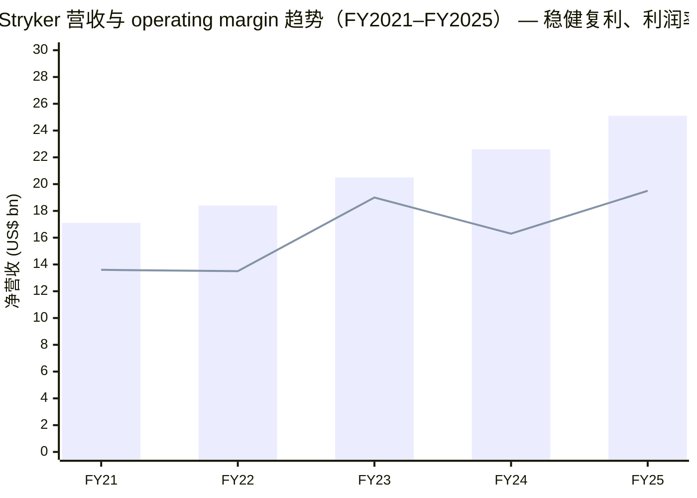
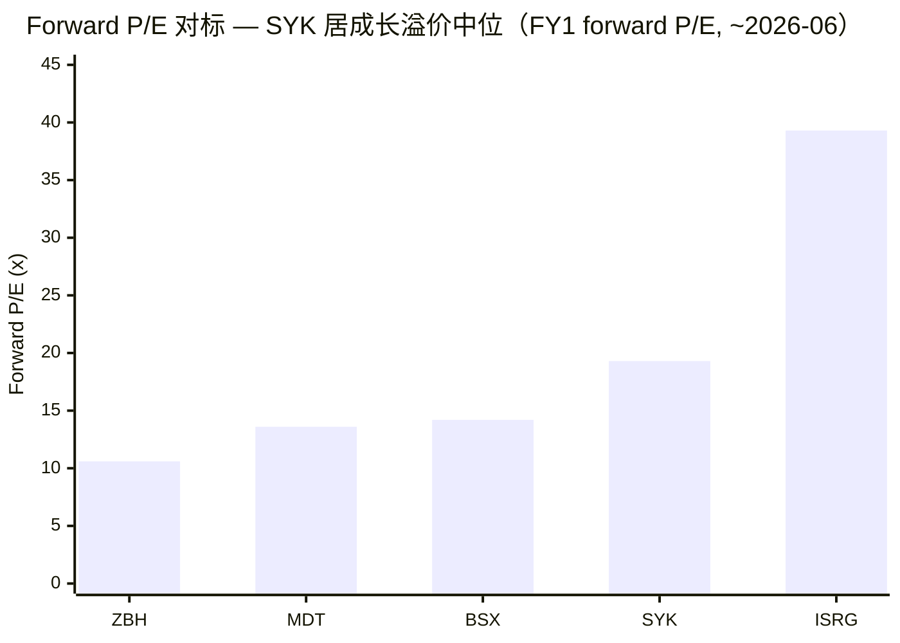
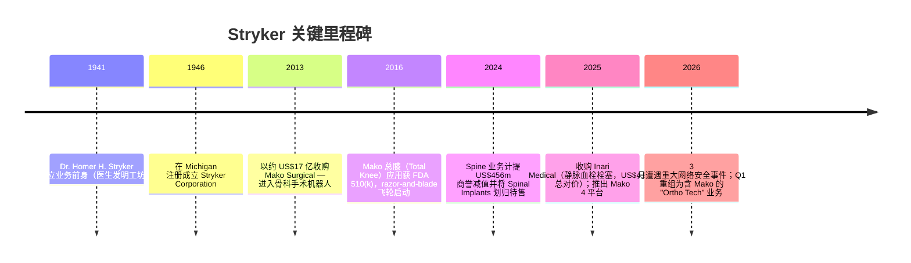
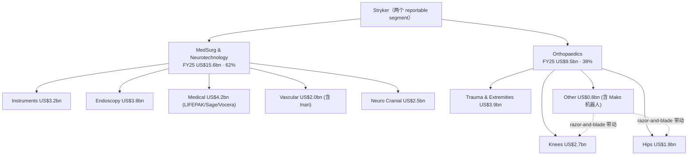
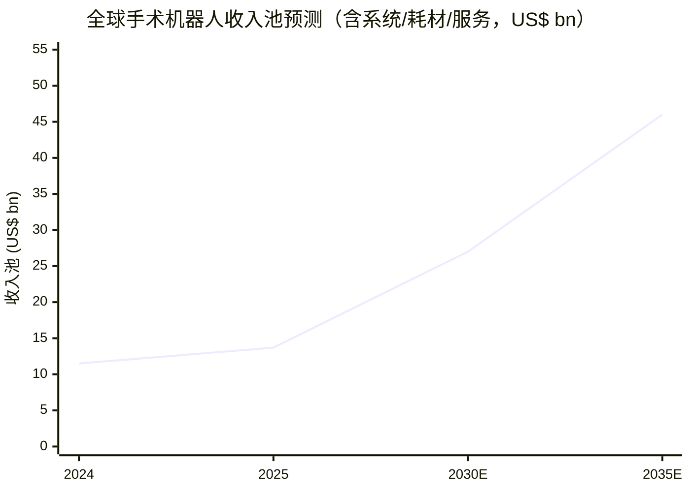
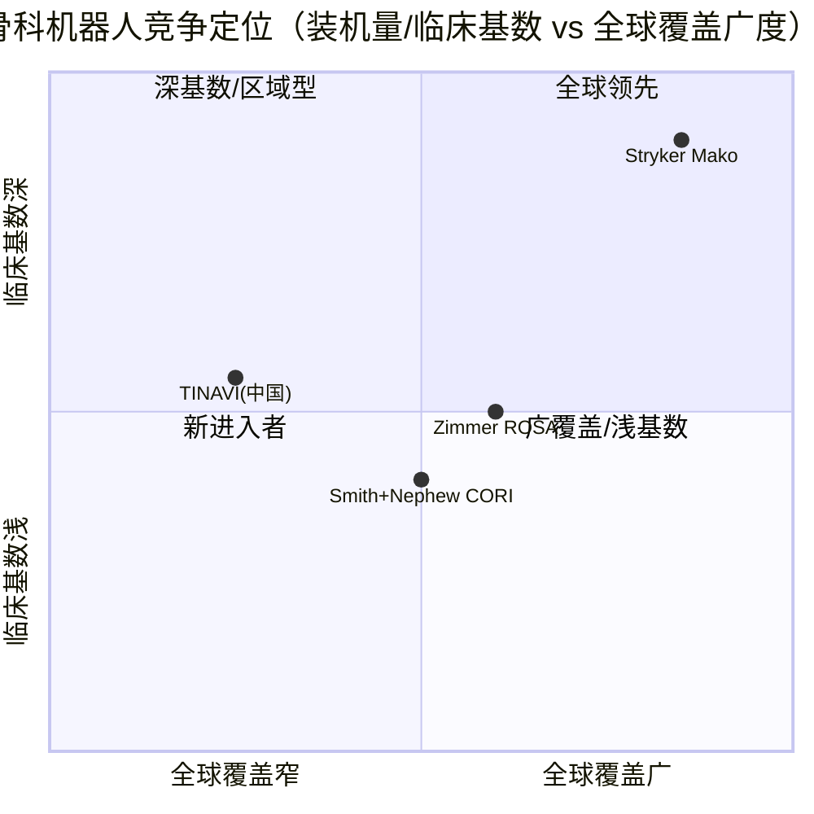
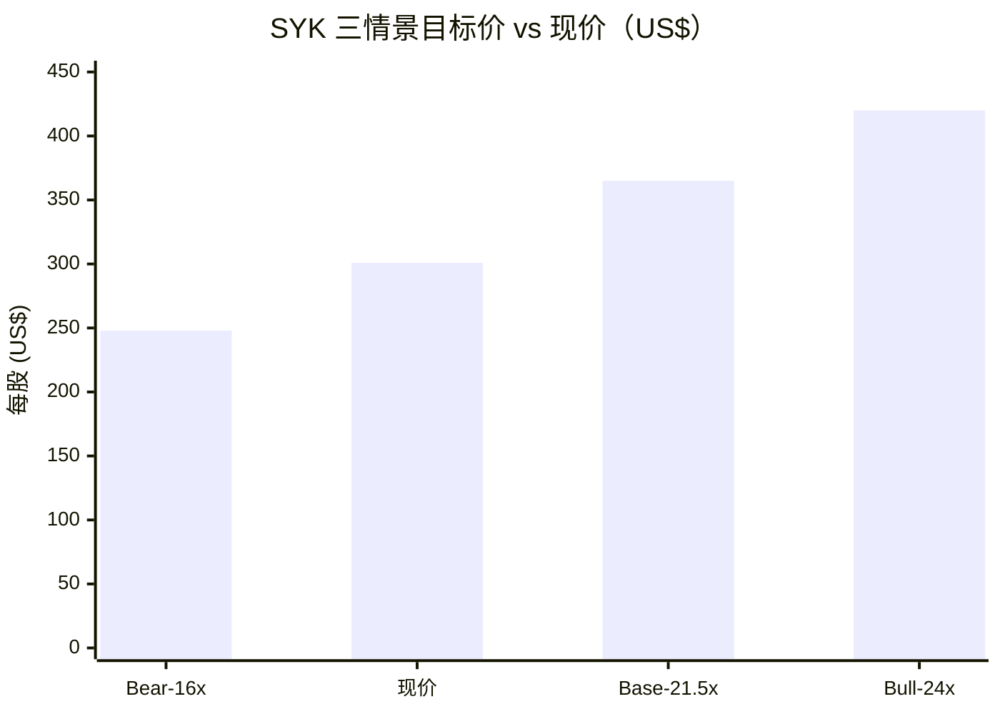

# Stryker Corporation（史赛克）公司研究报告

**标的：Stryker Corporation（NYSE: SYK）** · **行业：medical technology / 医疗科技（医疗器械）** · **报告日期：2026-06-09**

> *分析师观点：* **评级：Buy（买入）· 12 个月目标价 US$365（较 2026-06-09 收盘约 US$301.5 上行约 +21%）· 估值方法：FY2027E adjusted EPS US$17.0 × 21.5× forward P/E（与多元化大盘 medtech 同业对标）**
> 市值约 US$120.4bn · 52 周区间约 US$300–US$406（隐含，见下文相对表现）· beta 0.78 · 股息 US$3.52/股（收益率约 1.1%）· NYSE: SYK
>
> **核心论点（thesis pillars）**——（1）**Mako SmartRobotics 在骨科（orthopedic, 骨科）形成 razor-and-blade / 装机量（installed base）驱动的护城河**：装机量已超 3,000 台、累计逾 150 万例手术、覆盖 45 国，每一台 Mako 的落地都"带动"高毛利的 knee/hip implant（膝/髋植入物）经常性（recurring）销售；（2）**两个 segment 的规模化复利机**：FY2025 营收 US$25.1bn、reported 增长 11.2%、adjusted EPS US$13.63（+11.8%），过去十年保持中高个位数到双位数的有机增长（organic growth）与稳步扩张的 operating margin（经营利润率）；（3）**估值已随整个 US medtech 板块大幅 de-rate**——板块 forward P/E 跌至近三十年最低、相对 S&P 500 折价约 30%，而 SYK 基本面（手术量、资本开支需求、定价）依旧稳健，是花旗、摩根大通、Bernstein 三家投行 2026 年的 **Top Pick（首选）**；（4）**2026 年 3 月的 cybersecurity incident（网络安全事件）拖累了 Q1 但未撼动全年指引**——管理层维持 FY2026 organic 增长 8.0%–9.5%、adjusted EPS US$14.90–US$15.10 的指引，提供了一个"基本面无损、价格已折"的入场窗口。

> **更新 — FY2026 全年指引在网络安全事件后获维持（2026-04-30）：** 公司于 2026 年 3 月 11 日遭遇一次被认定为 **material（重大）** 的网络安全事件，中断了其全球制造、商务、订单与分销系统，导致 Q1-2026 organic 销售仅增长 2.4%、adjusted EPS 同比下滑 8.5% 至 US$2.60、adjusted operating margin 收缩 180bps 至 21.1%。但管理层在 Q1 财报中**维持** FY2026 全年 organic net sales 增长 **8.0%–9.5%**、adjusted net earnings per diluted share **US$14.90–US$15.10** 的指引不变，并称该事件"未对、且预计不会对 2026 全年指引构成 material 影响"。
> 来源：[Stryker Q1-2026 8-K 业绩新闻稿, 2026-04-30](https://www.sec.gov/Archives/edgar/data/0000310764/000031076426000025/sykex991earningsq12026.htm)；[Stryker 8-K/A Item 1.05 重大网络安全事件, 2026-04](https://www.sec.gov/Archives/edgar/data/310764/000119312526149607/d112875d8ka.htm)。

---

## 目录

1. 公司概览（含投资论点 BLUF）
1A. 估值与目标价（forward 财务预测 · PT 推导 · 牛/基准/熊三情景 · Guide-vs-Consensus）
2. 公司历史
3. 管理团队
4. 产品与服务（**全报告最重要章节** — 含 Mako razor-and-blade 深度解析）
5. 客户与上市策略
6. 行业概览
7. 竞争格局
8. 市场机会（TAM）
9. 风险评估
9.5. 核心分歧与催化剂
10. 投资风格透视（Buffett / Munger / Damodaran / Howard Marks）
数据来源清单 · 参考资料

======================================

## 1. 公司概览

*分析师观点：* **我们以 Buy 评级、12 个月目标价 US$365 启动对 Stryker 的覆盖。** 核心逻辑是：SYK 是一家被整个 US medtech 板块 de-rate 拖累、但基本面几乎未受损的高质量复利机——FY2025 营收 US$25.1bn、reported 增长 11.2%、adjusted EPS 增长 11.8%，而其股价过去 12 个月下跌约 20%（与 medical-device 板块 ETF IHI 的 ‑18.8% 同步），forward P/E 已压缩到约 19×，是花旗/摩根大通/Bernstein 三家投行 2026 年的 **Top Pick**（[J.P. Morgan — MedTech: Down but Not Out, 2026-05-26, p.1](http://xs-macbook-air.local:5001/zsxq/pdf/585428852142244/J.P.%20Morgan-J.P.%20Morgan%20MedTech%EF%BC%9ADown%20but%20Not%20Out%EF%BC%9A%20The%20Argument%20for%20Owning%20MedTech-260526.pdf#page=1)）。**why-now：** 2026 年 3 月的网络安全事件压低了 Q1，制造了一个市场情绪低点，而 FY2026 指引仍被维持——基本面与价格出现错位。四条论点分别落在 **Mako 装机量护城河（pillar 1）、双 segment 复利（pillar 2）、板块级 de-rate 错杀（pillar 3）、cyber 事件后指引获维持的入场窗口（pillar 4）**。

**Stryker 做什么。** 公司在 10-K 开篇自述为"a global leader in medical technologies"，在 MedSurg、Neurotechnology 与 Orthopaedics 三个领域提供产品与服务，每年触达逾 1.5 亿名患者（[Stryker FY2025 10-K, Item 1 Business](https://www.sec.gov/Archives/edgar/data/310764/000031076426000010/syk-20251231.htm)）。其产品线极广，10-K 列举包括："surgical equipment and surgical navigation systems; endoscopic and communications systems; patient handling, emergency medical equipment and intensive care disposable products; ... implants used in joint replacement and trauma surgeries; **Mako robotic-arm assisted technology**; as well as other products used in a variety of medical specialties"（[Stryker FY2025 10-K, Item 1 Business](https://www.sec.gov/Archives/edgar/data/310764/000031076426000010/syk-20251231.htm)）。其中 Mako 骨科机器人虽是技术旗舰、却只是公司总营收的一小部分——本报告覆盖整家公司的两个 reportable segment，但把分析的聚光灯打在 Mako franchise 及其 implant pull-through（植入物带动）上。

**怎么赚钱（business model, 商业模式）。** Stryker 以两个 reportable segment 列报：**(i) MedSurg and Neurotechnology** 与 **(ii) Orthopaedics**。FY2025 两段营收分别为 US$15,647m（占 62%）与 US$9,469m（占 38%），合计 US$25,116m（[Stryker FY2025 10-K, Item 1 Net Sales by Reportable Segment](https://www.sec.gov/Archives/edgar/data/310764/000031076426000010/syk-20251231.htm)）。其商业模式是典型的医疗器械"资本设备 + 经常性耗材/植入物"双层结构：资本设备（Mako 机器人、LIFEPAK 除颤监护仪、内镜塔、手术床等）一次性销售，背后拉动的是高毛利、可重复的耗材、植入物、刀片、一次性产品与服务收入——这正是 Mako 在骨科里复制的 razor-and-blade 逻辑（详见第 4 章）。

**在哪里经营（geographic presence, 地域分布）。** 产品销往约 61 个国家，通过自营子公司与分支机构以及第三方经销商销售（[Stryker FY2025 10-K, Item 1 Business](https://www.sec.gov/Archives/edgar/data/310764/000031076426000010/syk-20251231.htm)）。FY2025 美国营收 US$19,006m（占 76%）、国际营收 US$6,110m（占 24%），美国市场 reported 增长 12.2%、国际增长 8.1%（[Stryker FY2025 10-K, Item 7 Geographic and Segment Net Sales](https://www.sec.gov/Archives/edgar/data/310764/000031076426000010/syk-20251231.htm)）。高度的美国敞口既是定价与报销环境的稳定来源，也意味着对美国 elective surgery（择期手术）量与 hospital capex（医院资本开支）周期的敏感。

**规模有多大。** FY2025 末全球员工约 56,000 人（其中美国约 28,000 人）；公司拥有约 5,600 项美国专利与约 9,000 项海外专利（[Stryker FY2025 10-K, Item 1 Employees / Patents](https://www.sec.gov/Archives/edgar/data/310764/000031076426000010/syk-20251231.htm)）。FY2025 net earnings US$3,246m、diluted EPS US$8.40；剔除并购、无形资产摊销、impairment（减值）、structural optimization 等特定项目后的 adjusted net earnings US$5,267m、adjusted EPS US$13.63（+11.8%）（[Stryker FY2025 10-K, Item 7 Overview of 2025](https://www.sec.gov/Archives/edgar/data/310764/000031076426000010/syk-20251231.htm)）。营收从 FY2021 的约 US$17.1bn 增长到 FY2025 的 US$25.1bn，体现稳健的长期复利。

**估值快照（valuation snapshot）。** 截至 2026-06-09，SYK 收盘约 US$301.5（主题文件 yfinance 口径），市值约 US$120.4bn，beta 0.78，股息 US$3.52/股、收益率约 1.1%（[Stryker 估值与基本面快照, stockanalysis.com](https://stockanalysis.com/stocks/syk/)）。**TTM P/E 约 34.9×、forward P/E 约 19.3×**（[stockanalysis.com SYK](https://stockanalysis.com/stocks/syk/)）。TTM P/E 偏高有特定原因：FY2025 GAAP EPS US$8.40 被两项一次性因素压低——一是 income taxes 同比飙升 154%（US$1,268m vs US$499m，部分源于税务事项与 Inari 并购的税务影响），二是 US$170m 的 goodwill/other impairment（[Stryker FY2025 10-K, Item 7 Consolidated Results](https://www.sec.gov/Archives/edgar/data/310764/000031076426000010/syk-20251231.htm)）；以 adjusted EPS US$13.63 计的 P/E 约 22×，更能代表真实盈利能力。**以 P/S 看：** TTM 营收 US$25.27bn，P/S 约 4.8×（[stockanalysis.com SYK](https://stockanalysis.com/stocks/syk/)）。

**同业对比（peer comps）。** 与最贴近的多元化 medtech 同业相比，SYK 的 forward P/E 居于中高位但远低于其纯骨科机器人邻居 ISRG：ZBH（Zimmer Biomet）forward P/E 约 10.6×、MDT（Medtronic）约 13.6×、BSX（Boston Scientific）约 14.2×、SYK 约 19.3×、ISRG 约 39.3×（[stockanalysis.com 各标的页](https://stockanalysis.com/stocks/syk/)）。SYK 享有相对同业的溢价是合理的——其有机增长（FY2025 constant-currency +10.7%）、operating margin 扩张轨迹与 Mako 创新周期都优于 ZBH/MDT 这类增速更慢的多元化器械商；但相对 ISRG 的纯机器人成长溢价，SYK 又显得"增长更慢但盈利更现实、现金流更厚"。下文第 1A 章把这条快照延伸为 forward 的决策层分析。


*图注：FY2025 营收 US$25.1bn、reported operating margin 升至 19.5%（FY2024 因 US$977m 减值降至 16.3%），过去五年营收复合增长约 10%。营收来自 10-K；operating margin 为 reported 口径（FY2024 受 Spine 减值拖累，FY2025 回升）。来源：[Stryker FY2025 10-K, Item 7](https://www.sec.gov/Archives/edgar/data/310764/000031076426000010/syk-20251231.htm)。*

## 1A. 估值与目标价

> *本章所有 forward 预测数字、目标价、情景目标价均为分析师自身的前瞻判断（`*分析师观点：*`），不附任何 filing 引用；引用的是各预测所依据的外部输入（10-K segment 数据 + 管理层指引 + 行业预测）。*

**(a) Forward 财务预测表（segment-built）。** 以两个 segment 各自的营收路径与利润率轨迹建模，再加总——而非单一混合 top-line。驱动因素：MedSurg and Neurotechnology（FY2025 +15.7%、含 Inari 并购）随 Vascular（含 Inari）放量与 LIFEPAK 35/内镜更新继续领跑；Orthopaedics（FY2025 +4.3%）随 Mako 4 装机、Mako Shoulder 全面上市与 implant pull-through 稳步加速。营收基数与 segment 增速取自 10-K（[Stryker FY2025 10-K, Item 7 Segment Net Sales](https://www.sec.gov/Archives/edgar/data/310764/000031076426000010/syk-20251231.htm)），FY2026 起点锚定管理层 organic 8.0%–9.5% 指引（[Stryker Q1-2026 8-K, 2026-04-30](https://www.sec.gov/Archives/edgar/data/0000310764/000031076426000025/sykex991earningsq12026.htm)）。

| 指标（*分析师观点：*） | FY2025A | FY2026E | FY2027E | FY2028E | CAGR(25–28) |
|---|---|---|---|---|---|
| 营收（US$ mn）            | 25,116 | 27,300 | 29,750 | 32,400 | +8.8% |
| — MedSurg & Neuro       | 15,647 | 17,200 | 18,900 | 20,700 | +9.8% |
| — Orthopaedics          | 9,469  | 10,100 | 10,850 | 11,700 | +7.3% |
| — YoY %                 | +11.2% | +8.7%  | +9.0%  | +8.9%  |       |
| Gross margin %（adjusted ~64%） | 64.0%  | 64.3%  | 64.7%  | 65.0%  |       |
| Operating margin %（adjusted）  | ~25.5% | ~26.5% | ~27.3% | ~28.0% |       |
| Adjusted EPS（US$）      | 13.63  | 15.00  | 17.00  | 19.10  | +12.0% |
| — YoY %                 | +11.8% | +10.0% | +13.3% | +12.4% |       |
| ROIC %（est.）           | ~10%   | ~11%   | ~12%   | ~13%   |       |

（FY2026E adjusted EPS 锚定管理层指引中点 US$15.00；FY2027E–FY2028E 假设营收约 9% 增长 + operating leverage + 适度回购，得到约 12–13% 的 adjusted EPS 增长。ROIC 偏低反映 FY2025 US$4,960m 大额并购（主要是 Inari）尚未完全产出，随整合推进应回升。基础输入：[Stryker FY2025 10-K, Item 7](https://www.sec.gov/Archives/edgar/data/310764/000031076426000010/syk-20251231.htm) + 管理层 FY2026 指引 [Q1-2026 8-K](https://www.sec.gov/Archives/edgar/data/0000310764/000031076426000025/sykex991earningsq12026.htm)。）

**Margin bridge（bps 分解）。** 10-K 已给出 reported gross margin 的逐项 bridge：FY2023 63.7% → FY2024 63.9%（**+20bps**）= 定价（sales pricing）**+10bps** · 量/结构（volume and mix）**+70bps** · 制造与供应链成本（manufacturing/supply chain）**0bps** · 公允价值存货摊销（inventory stepped up to fair value）**‑60bps** · structural optimization/special charges **‑10bps**；FY2024 → FY2025 64.0%（**+10bps**）主要来自更高的定价与有利的量、被更高的公允价值存货摊销部分抵消（[Stryker FY2025 10-K, Item 7 Gross Profit bridge](https://www.sec.gov/Archives/edgar/data/310764/000031076426000010/syk-20251231.htm)）。**前瞻性提示（*分析师观点：*）：** 公司明确预期 segment mix 在可见未来对 gross margin 形成"unfavorable impact"——因为增速更快的、但毛利率较低的 MedSurg and Neurotechnology segment 将快于 Orthopaedics 增长（[Stryker FY2025 10-K, Item 7](https://www.sec.gov/Archives/edgar/data/310764/000031076426000010/syk-20251231.htm)）；我们因此对 FY2026E–FY2028E gross margin 只给约 +30–70bps 的温和扩张，由定价与运营杠杆驱动，被结构性 mix 拖累部分抵消。

**(b) 目标价推导（forward P/E × target multiple）。** **FY2027E adjusted EPS US$17.0 × 21.5× forward P/E = US$365.5，取整 US$365。** 21.5× 的目标倍数对标 3–5 家多元化 medtech 同业并加成长溢价：当前 forward P/E 为 ZBH 约 10.6×、MDT 约 13.6×、BSX 约 14.2×、SYK 约 19.3×、ISRG 约 39.3×（[stockanalysis.com](https://stockanalysis.com/stocks/syk/)）。SYK 凭借约 9% 的有机增长与扩张的 operating margin，应享有高于 MDT/BSX 而显著低于 ISRG（纯机器人 ~39×）的倍数；我们给的 21.5× 仅较 SYK 当前约 19.3× forward P/E 略升、反映板块情绪从历史低位的温和修复（这正是 J.P. Morgan/花旗看多的板块级 re-rating 逻辑）。

**(c) 牛/基准/熊三情景。**

| 情景（*分析师观点：*） | 关键摆动假设 | 目标价 | 较 ~US$301.5 现价 |
|---|---|---|---|
| 牛市 Bull | 板块情绪修复 + Mako 4/Shoulder/RPS 加速带动 implant，FY2027E EPS US$17.5 × 24× | US$420 | +39% |
| 基准 Base | 维持 8–9% 有机增长，FY2027E EPS US$17.0 × 21.5× | US$365 | +21% |
| 熊市 Bear | 二次 cyber/供应中断 + 关税/通胀压缩 margin + 板块继续 de-rate，FY2027E EPS US$15.5 × 16× | US$248 | ‑18% |

**(d) Guide vs Consensus vs Own（FY2026E）。** 公司给出 organic 销售与 adjusted EPS 两项指引；将公司指引、街道一致预期与本报告并列：

| 指标（FY2026E） | 公司指引 | 一致预期（Consensus） | 本报告（*分析师观点：*） |
|---|---|---|---|
| Organic net sales 增长 | 8.0%–9.5% | ~板块中性、约 8–9%（街道大体认可指引） | 8.7% |
| Adjusted EPS（US$） | 14.90–15.10 | 约 15.0（与指引中点一致） | 15.00 |
| Reported operating margin | 未给量化指引 | — | ~17–18%（受并购/摊销/cyber 余波） |

公司指引列引自 [Stryker Q1-2026 8-K 2026 Outlook, 2026-04-30](https://www.sec.gov/Archives/edgar/data/0000310764/000031076426000025/sykex991earningsq12026.htm)；consensus 列为 `*分析师观点：*`——本地 zsxq 库的投行 note 普遍认可 SYK 指引、并将其列为板块 Top Pick（[Citi — US MedTech 1Q26 Recap, 2026-05-28, p.1](http://xs-macbook-air.local:5001/zsxq/pdf/212485545248851/CITI-US%20MedTech%201Q26%20Recap%EF%BC%9A%20The%20%22Good%E2%80%9D%20Didn%E2%80%99t%20Stick%20and%20the%20%22Bad%E2%80%9D%20was%20Terrible-260528.pdf#page=1)），但 note 中并未给出 SYK 的具体逐项 consensus 数字，故此处以"约"标注、不伪造精确街道数字；分析师自身预测列与公司指引中点对齐。

**(e) 摆动变量（swing variables）。** 本次买入判断主要押在两个变量上：**(1) Orthopaedics 有机增长的再加速**——Mako 4 平台与 Mako Shoulder（2026 Q1 全面上市）能否把 implant pull-through 推回到高个位数；**(2) US medtech 板块的情绪/估值修复**——若板块 forward P/E 从近三十年低位回归，SYK 的倍数将随之扩张（这是 PT 中"21.5× vs 当前 19.3×"那部分上行的来源）。读者应重点压力测试这两点。


*图注：SYK forward P/E 约 19.3×——高于增速更慢的 ZBH/MDT/BSX，但远低于纯骨科机器人龙头 ISRG（~39×），与其"约 9% 有机增长 + margin 扩张"的成长—盈利平衡相称。来源：[stockanalysis.com 各标的页](https://stockanalysis.com/stocks/syk/)。*

## 2. 公司历史

Stryker 于 1946 年在 Michigan 注册成立，是 1941 年由整形外科医生（orthopaedic surgeon）兼发明家 **Dr. Homer H. Stryker** 创立的业务的承继公司；Dr. Stryker 发明了若干医疗产品，公司之名即源于他（[Stryker FY2025 10-K, Item 1 Business](https://www.sec.gov/Archives/edgar/data/310764/000031076426000010/syk-20251231.htm)）。从一名医生的发明工坊起步，Stryker 在七十余年里成长为营收逾 US$25bn、全球员工约 56,000 人的多元化医疗科技龙头（[stockanalysis.com SYK 概览](https://stockanalysis.com/stocks/syk/)）。


*图注：里程碑均来自 10-K 与官方披露。2013 年 Mako 收购是公司战略转折点——把一次性资本设备模式升级为骨科里的装机量+耗材复利模式。来源：[Stryker FY2025 10-K](https://www.sec.gov/Archives/edgar/data/310764/000031076426000010/syk-20251231.htm)、[Stryker AAOS 2025 Mako 新闻稿](https://www.stryker.com/us/en/about/news/2025/stryker-showcases-next-generation-of-mako-smartrobotics--at-aaos.html)。*

**战略转折之一：2013 年收购 Mako Surgical，押注骨科机器人。** 这是 Stryker 从"卖植入物的器械商"转向"卖装机+植入物复利"的关键一步。10-K 在 Orthopaedics 章节确认，截至目前 Mako 已完成"over one million robotic Mako Total Knee procedures and more than two million robotic procedures across Mako Total Knee, Mako Total Hip, and Mako Partial Knee ... worldwide"，覆盖 45 国以上（[Stryker FY2025 10-K, Item 1 Orthopaedics](https://www.sec.gov/Archives/edgar/data/310764/000031076426000010/syk-20251231.htm)）。Mako 把骨科手术从"看模板"升级为"机器臂触觉引导"，并因此把 Stryker 的 knee/hip implant 牢牢锁进每一台机器的术式里（详见第 4 章）。

**战略转折之二：2025 年以 US$4.9bn 收购 Inari Medical，重塑 Vascular。** 10-K 披露，2025 年公司把原 Neurovascular 业务更名为 **Vascular**，并购入 Inari——其产品组合包含治疗 venous thromboembolism（VTE, 静脉血栓栓塞）的微创产品；"Neurovascular and Inari are jointly now Vascular"（[Stryker FY2025 10-K, Item 1 MedSurg and Neurotechnology](https://www.sec.gov/Archives/edgar/data/310764/000031076426000010/syk-20251231.htm)）。这笔交易是 FY2025 US$4,960m 总并购对价的主体，把 MedSurg and Neurotechnology 的 Vascular 子线 FY2025 营收从 FY2024 的 US$1,307m 推升至 US$1,968m（+51%）（[Stryker FY2025 10-K, Item 1 Composition of MedSurg Net Sales](https://www.sec.gov/Archives/edgar/data/310764/000031076426000010/syk-20251231.htm)）。

**近期重组（2026 Q1）：组建 "Ortho Tech" 业务。** 2026 年 Q1 公司宣布组织架构调整——新设的 Ortho Tech 业务把 Instruments 里的骨科器械组合与原 Other Orthopaedics 里的 Mako 及 enabling technologies 组合合并，"By bringing Mako, power tools, cutting accessories, enabling technologies and the teams behind these products together under one business, we are simplifying the customer experience"（[Stryker Q1-2026 8-K, 2026-04-30](https://www.sec.gov/Archives/edgar/data/0000310764/000031076426000025/sykex991earningsq12026.htm)）。这一重组以更聚焦的方式管理 Mako 生态，但不改变两个 reportable segment 的合并财务列报。

**关键收购（按年份）：** 2013 年 Mako Surgical（骨科机器人）；2023 年 Cerus Endovascular（神经介入）；2024 年多笔小型并购；2025 年 Inari Medical（VTE，US$4.9bn）、Guard Medical（负压伤口治疗）、Advanced Medical Balloons（粪便管理系统，补强 Sage 失禁组合）（[Stryker FY2025 10-K, Item 1 + Item 7](https://www.sec.gov/Archives/edgar/data/310764/000031076426000010/syk-20251231.htm)）。Stryker 的并购是其增长引擎的固定部分——持续以中小型 bolt-on 补强各产品线、间或以大额交易（Mako、Inari）进入新赛道。

## 3. 管理团队

**创始人 Dr. Homer H. Stryker（已故）。** 公司创始人是整形外科医生兼发明家 Dr. Homer H. Stryker，1941 年创立业务前身，发明了多项医疗产品（如可调式医院床、Stryker frame 翻身床、铸石锯等）；公司 1946 年在 Michigan 以其名注册成立（[Stryker FY2025 10-K, Item 1 Business](https://www.sec.gov/Archives/edgar/data/310764/000031076426000010/syk-20251231.htm)）。创始人早已不在世、也不再参与运营，但其"以临床需求驱动产品发明"的工程师文化仍是公司"commitment to innovation, quality and service"竞争定位的精神底色（[Stryker FY2025 10-K, Item 1 Competition](https://www.sec.gov/Archives/edgar/data/310764/000031076426000010/syk-20251231.htm)）。因创始人已故、不再有可量化的当代持股或运营角色，本节聚焦现任 CEO。

**现任董事长兼 CEO：Kevin A. Lobo（60 岁）。** Lobo 自 2012 年起任 Stryker CEO 兼总裁、2014 年起兼任董事长，2026 年 1 月 1 日起任 Chair and Chief Executive Officer（董事长兼 CEO，President 一职移交）；加入 Stryker 前，他历任 Stryker Orthopaedics Group President（2011–2012），更早曾在 Johnson & Johnson 担任多个领导职务（2003–2011）（[Stryker DEF 14A 2026-03-23, Kevin A. Lobo 履历](https://www.sec.gov/Archives/edgar/data/310764/000031076426000013/syk-20260323.htm)）。在 Lobo 任内（2012 年至今），Stryker 完成了从 Mako 收购、到把机器人推向 45 国与逾 200 万例累计手术、再到 Inari 并购的多次战略升级，营收从十余年前的不足 US$90 亿增长到 FY2025 的 US$25.1bn（[Stryker FY2025 10-K, Item 7](https://www.sec.gov/Archives/edgar/data/310764/000031076426000010/syk-20251231.htm)），是一段长达十余年、可量化的资本配置与有机增长记录——这对 Buffett/Munger 透视里的"管理层质量"项是加分项（见第 10 章）。

**持股与薪酬（capital-allocation 信号）。** 截至 DEF 14A 披露，Lobo 直接实益持有约 197,661 股普通股，另持有约 1,004,973 股可行权期权下的股份（[Stryker DEF 14A 2026-03-23, 董监高持股表](https://www.sec.gov/Archives/edgar/data/310764/000031076426000013/syk-20260323.htm)）。其 FY2025 total compensation 为约 US$21.4m（薪资 US$1.49m + 股票奖励 US$9.76m + 期权奖励 US$6.92m + 非权益激励 US$2.25m + 其他 US$0.97m），结构高度向股权与绩效倾斜（[Stryker DEF 14A 2026-03-23, Summary Compensation Table](https://www.sec.gov/Archives/edgar/data/310764/000031076426000013/syk-20260323.htm)）。机构持股集中度健康、无单一控股人——Vanguard 8.1%、BlackRock 6.5%、前 CEO John W. Brown 5.2%（[Stryker DEF 14A 2026-03-23, Principal Shareholders](https://www.sec.gov/Archives/edgar/data/310764/000031076426000013/syk-20260323.htm)）。

## 4. 产品与服务（**全报告最重要章节**）

> 本章是整份报告的分析地基——第 5–9 章都要回头引用"Stryker 究竟卖什么、各产品在客户工作流里处于哪一环"。本章的聚光灯打在 **Mako razor-and-blade（装机量 → implant pull-through → 经常性 implant 收入）** 上，但同时完整覆盖两个 segment 的产品矩阵。

### 4.1 发行人自有产品矩阵（按 segment / 子线列报）

10-K 在 Item 1 Business 用两张 "Composition of Net Sales" 表给出了 Stryker 的官方产品矩阵。下表逐字复刻其 FY2025/FY2024/FY2023 营收构成（单位 US$ mn）：

**MedSurg and Neurotechnology（FY2025 合计 US$15,647m，占公司 62%）：**

| 子线 | FY2025 | 占比 | FY2024 | FY2023 |
|---|---|---|---|---|
| Instruments（手术器械、患者/护理安全、导航） | 3,183 | 20% | 2,834 | 2,534 |
| Endoscopy（内镜与通讯系统） | 3,807 | 24% | 3,389 | 3,068 |
| Medical（患者搬运、急救、ICU 一次性、临床通讯/AI 虚拟护理） | 4,204 | 27% | 3,852 | 3,459 |
| Vascular（急性缺血/出血性卒中 + VTE 微创产品，含 Inari） | 1,968 | 13% | 1,307 | 1,226 |
| Neuro Cranial（开颅/颅底手术、orthobiologic、生物外科） | 2,485 | 16% | 2,136 | 1,876 |
| **合计** | **15,647** | **100%** | **13,518** | **12,163** |

**Orthopaedics（FY2025 合计 US$9,469m，占公司 38%）：**

| 子线 | FY2025 | 占比 | FY2024 | FY2023 |
|---|---|---|---|---|
| Knees（膝关节植入物） | 2,656 | 28% | 2,447 | 2,273 |
| Hips（髋关节植入物） | 1,865 | 20% | 1,704 | 1,544 |
| Trauma and Extremities（创伤与四肢） | 3,948 | 42% | 3,507 | 3,147 |
| Spinal Implants（脊柱植入物，2025 部分划归待售） | 185 | 2% | 707 | 713 |
| Other（含 Mako 机器人与 enabling technologies） | 815 | 9% | 712 | 658 |
| **合计** | **9,469** | **100%** | **9,077** | **8,335** |

来源：[Stryker FY2025 10-K, Item 1 Composition of Net Sales（MedSurg and Neurotechnology + Orthopaedics）](https://www.sec.gov/Archives/edgar/data/310764/000031076426000010/syk-20251231.htm)。注：Mako 机器人系统本身列在 Orthopaedics 的 "Other" 子线里——这正说明 **robot 是公司营收的极小一部分（"Other" 仅占 Orthopaedics 9%、占公司约 3%）**；Mako 的真正经济价值不在卖机器人，而在它带动的 knee/hip implant（占 Orthopaedics 48%）的经常性销售（详见 4.3）。

### 4.2 合成：各产品如何组成一个客户工作流

Stryker 的产品矩阵在每一台手术里组成一个"设备 → 耗材/植入物 → 服务"的闭环：在骨科手术室里，**Mako 机器人（资本设备）→ 术前 CT 规划软件 + 一次性器械 → Stryker 自家 knee/hip implant（高毛利耗材）→ 术后服务与培训**；在普外/急救场景里，**1788 内镜塔/LIFEPAK 35（资本设备）→ 一次性镜头护套、电极片、Sage 失禁护理一次性品（耗材）→ Vocera 临床通讯订阅（经常性软件）**。这个闭环的关键在于：资本设备一旦落地，就把高毛利的经常性耗材/植入物收入"锁"在 Stryker 的生态里——客户切换成本极高（外科医生在某一品牌机器人上受训后不愿重学）。


*图注：Stryker 的 razor-and-blade 闭环——资本设备拉动经常性耗材/植入物，服务与培训固化切换成本。这是 Mako 在骨科里复制 ISRG da Vinci 模式的核心机制。来源：基于 [Stryker FY2025 10-K, Item 1](https://www.sec.gov/Archives/edgar/data/310764/000031076426000010/syk-20251231.htm) 产品描述（分析师合成）。*

### 4.3 旗舰焦点：Mako SmartRobotics 与 implant pull-through（razor-and-blade-in-ortho）

> 10-K 原文（verbatim）：

> "In 2025 we continued to expand the global footprint of Mako SmartRobotics, which is now available in more than 45 countries. To date, over one million robotic Mako Total Knee procedures and more than two million robotic procedures across Mako Total Knee, Mako Total Hip, and Mako Partial Knee have been performed worldwide."（[Stryker FY2025 10-K, Item 1 Orthopaedics](https://www.sec.gov/Archives/edgar/data/310764/000031076426000010/syk-20251231.htm)）

**中文释义 / Plain-language gloss：** Mako 是一套 **robotic-arm assisted（机器臂辅助）orthopedic（骨科）手术系统**。它的物理作用是：术前用 CT 建出患者关节的 3D 模型，术中通过 **haptic（触觉）边界**约束医生的锯/磨工具，使其只能在规划好的骨切除范围内运动——把"靠模板和手感"的关节置换升级为"机器人触觉护栏下的精准切除"。其与同矩阵里其他产品的差异在于：Mako 本身（机器人 + Q-Guidance 软件）是**装机量层（the razor）**，毛利和绝对金额都不大（藏在 Orthopaedics 的 "Other" 子线里）；真正赚钱的是它"带动"的 **Stryker 自家 knee/hip implant（the blade）**——每一台 Mako 落地的医院，做关节置换时几乎只会用 Stryker 的配套植入物，于是 Knees（FY2025 US$2,656m）+ Hips（US$1,865m）这块高毛利经常性收入被牢牢锁定。**战略意义**：装机量越大、累计手术越多（已超 200 万例），implant pull-through 的复利底座越厚——这就是骨科版的 razor-and-blade，也是 SYK 相对纯卖植入物的 ZBH 享有更高增长与黏性的根因。

*分析师观点：* 装机量层面，Mako 全球装机已**超过 3,000 台**（BTIG 分析师 Ryan Zimmerman 口径，2026 年 2 月），并用于 Stryker **逾三分之二的美国膝手术与约三分之一的美国髋手术**（[MedTech Dive — Stryker Mako RPS 限量上市, 2026, 引用 BTIG](https://www.medtechdive.com/news/stryker-starts-limited-release-of-mako-rps-handheld-knee-robot/811779/)）；Stryker 官方在 AAOS 2025 称 Mako 是骨科里的 "market-leading technology"，累计逾 150 万例手术、覆盖 45 国（[Stryker AAOS 2025 Mako 新闻稿](https://www.stryker.com/us/en/about/news/2025/stryker-showcases-next-generation-of-mako-smartrobotics--at-aaos.html)）。竞争优势判定：**yes，护城河类型 = 装机量 + switching cost（外科医生培训锁定）+ 配套 implant 生态**。最贴近的竞品系统是 **Zimmer Biomet 的 ROSA** 与 **Smith+Nephew 的 CORI**（见竞品自有披露，[Zimmer Biomet ROSA 产品页](https://www.zimmerbiomet.com/en/patients-caregivers/robotic-surgery/rosa-knee-robotic-knee-replacement.html)），但 Mako 在累计临床例数与装机基数上领先全球（中国市场除外，那里由 TINAVI 等本土玩家与监管环境主导）。

### 4.4 Mako 路线图与近 12 个月发布：Mako 4 / Total Hip 翻修 / Mako Shoulder / Mako RPS

> 10-K 原文（verbatim）：

> "Most notably, we introduced the Mako 4 platform, a meaningful advancement for both newly established and existing Mako sites. This platform is built around our Q‑Guidance system—an advanced guidance technology designed to enable new hardware and software capabilities across a broad range of subspecialties. The first application released on the Mako 4 platform is the Total Hip Advanced Primary and Revision application. We received 510(k) clearance for Mako Total Hip with Advanced Primary and Revision with full market release in the third quarter of 2025. ... Mako Total Hip with Advanced Primary and Revision represents Stryker's first‑to‑market, robotically enabled revision hip arthroplasty procedure."（[Stryker FY2025 10-K, Item 1 Orthopaedics](https://www.sec.gov/Archives/edgar/data/310764/000031076426000010/syk-20251231.htm)）

**中文释义 / Plain-language gloss：** Mako 4 是 Stryker 第四代 Mako 系统，围绕 **Q-Guidance** 导航技术构建，把硬件与软件能力扩展到更多 subspecialty（亚专科）。其首个应用是 **Total Hip Advanced Primary and Revision（高级初次与翻修全髋）**——翻修髋关节手术常面临骨缺损、解剖标志缺失等难题，Mako 4 把机器人引导带进了这类高难度术式，是行业"首个机器人辅助翻修髋"应用。**与同矩阵兄弟产品的差异**：相对早期只做初次膝/髋的 Mako，Mako 4 把可寻址术式从"标准初次置换"扩展到"复杂初次 + 翻修 + 肩"，等于扩大了每台机器能带动的 implant 品类。

> Mako Shoulder（10-K verbatim）："Mako Shoulder integrates three market-leading technologies: Tornier implants, Blueprint planning software, and Mako SmartRobotics. ... Full commercial launch in the United States is planned for the first quarter of 2026."（[Stryker FY2025 10-K, Item 1 Orthopaedics](https://www.sec.gov/Archives/edgar/data/310764/000031076426000010/syk-20251231.htm)）

**Mako RPS（handheld 手持机器人，2026 新发布）。** 2026 年初 Stryker 限量发布 **Mako RPS（Robotic Power System）**——一款手持式骨科机器人，定位"对机器人感兴趣、但想保留手动电动工具熟悉感"的外科医生，获 FDA 510(k) 清关、目前仅适用于 total knee arthroplasty（全膝置换）（[MedTech Dive — Stryker 限量发布 Mako RPS 手持膝关节机器人, 2026](https://www.medtechdive.com/news/stryker-starts-limited-release-of-mako-rps-handheld-knee-robot/811779/)）。*分析师观点：* RPS 是把 Mako 装机量护城河下沉到不愿采购大型机器人的中小型手术中心（ASC, ambulatory surgery center）的渠道延伸——扩大装机量底座 = 扩大 implant pull-through 漏斗。

### 4.5 MedSurg and Neurotechnology 产品线（占公司 62%，增长引擎）

> 10-K 原文（verbatim，MedSurg and Neurotechnology 定义）：

> "MedSurg and Neurotechnology products include surgical equipment, patient and caregiver safety technologies, and navigation systems (Instruments), endoscopic and communications systems (Endoscopy), and patient handling, emergency medical equipment, intensive care disposable products, clinical communication and artificial intelligence‑assisted virtual care platform technology (Medical), minimally invasive products for the treatment of acute ischemic and hemorrhagic stroke and venous thromboembolism (Vascular) and a comprehensive line of products for traditional brain and open skull‑based surgical procedures ... (Neuro Cranial)."（[Stryker FY2025 10-K, Item 1 MedSurg and Neurotechnology](https://www.sec.gov/Archives/edgar/data/310764/000031076426000010/syk-20251231.htm)）

**中文释义 / Plain-language gloss：** 这是 Stryker 增速更快、占比更大的 segment（FY2025 +15.7%、含 Inari）。**Instruments（器械）** 提供手术电动工具、导航与患者安全技术（2025 年推出更轻便的 Steri-Shield 8 手术室人员防护系统）；**Endoscopy（内镜）** 提供 4K 1788 摄像平台与 Connected OR 集成（可视化 indocyanine green 与 CYTALUX 荧光剂）；**Medical（医疗）** 提供 LIFEPAK 35 监护/除颤仪（2025 全球推广，含 Glasgow 30.4 算法、cprINSIGHT、15-导联监护）、Sage 失禁护理一次性品、Vocera 临床通讯（Vocera Sync Badge）；**Vascular（血管）** 是 2025 由 Neurovascular 更名而来、并入 Inari 后的新名，覆盖卒中取栓（推出美国 Broadway System、加速 Surpass Elite 血流导向支架）与 VTE；**Neuro Cranial** 覆盖开颅/颅底手术与 orthobiologic（2025 推出 OptaBlate BVN 椎体神经射频消融）（[Stryker FY2025 10-K, Item 1 MedSurg and Neurotechnology](https://www.sec.gov/Archives/edgar/data/310764/000031076426000010/syk-20251231.htm)）。**战略意义**：这条 segment 的资本设备（LIFEPAK、内镜塔）同样拉动经常性耗材/软件订阅，且增速快于骨科——但 10-K 也提示其 gross margin 低于骨科，因此 segment mix 长期对公司毛利率构成温和拖累（见 1A margin bridge）。

*分析师观点：* MedSurg and Neurotechnology 内，Stryker 在 Instruments 是"five leading global competitors"之一（与 Zimmer、Medtronic、J&J MedTech、ConMed Linvatec 并列）、在 Endoscopy 是"seven leading global competitors"之一（与 Karl Storz、Olympus、Smith & Nephew 等并列）、在 Medical/Vascular/Neuro Cranial 各为"five leading"之一——这些"leading competitor"列举来自 10-K 原文、是**竞品公司**清单而非份额排名（[Stryker FY2025 10-K, Item 1 MedSurg and Neurotechnology](https://www.sec.gov/Archives/edgar/data/310764/000031076426000010/syk-20251231.htm)）；任何"第一/龙头"份额判断都是分析师视角，不应附 10-K 引用。

### 4.6 经常性 / 服务 / 一次性业务（razor-and-blade 的"刀片"层）

Stryker 不像某些器械商单列一个"Services"分部，但其经常性收入广泛分布在各子线里：骨科的 knee/hip/trauma implant（每台手术的一次性高毛利品）、Medical 的 Sage 失禁一次性品与 ICU disposable、Endoscopy 的一次性镜头护套、Vocera 临床通讯软件订阅、以及 Mako 装机后的术中一次性器械与服务培训。10-K 明确指出"Substantially all products we manufacture are stocked in inventory, while certain MedSurg products are assembled to order"——意味着公司以高库存支撑即时交付的耗材复购模式（[Stryker FY2025 10-K, Item 1 Raw Materials and Inventory](https://www.sec.gov/Archives/edgar/data/310764/000031076426000010/syk-20251231.htm)）。这层经常性收入正是 SYK 现金流稳定、抗周期能力强的根源——也是它在 2026 年 cyber 事件中"Q1 受挫但全年指引可维持"的底气（一旦系统恢复，被推迟的耗材/植入物订单会回补）。

### 4.7 旗舰 vs 长尾、近 12 个月发布小结

**旗舰（驱动当前业务的 1–3 个）：** （1）**Mako SmartRobotics + 配套 knee/hip implant**（骨科复利核心）；（2）**Vascular（含 Inari）** 的卒中取栓与 VTE 微创产品（MedSurg 最快增长子线，FY2025 +51%）；（3）**Medical 的 LIFEPAK 35 + Sage**（急救/ICU 经常性耗材）。**长尾：** Spinal Implants（2025 大幅收缩、部分划归待售，FY2025 仅 US$185m）、Neuro Cranial 部分细分。**近 12 个月发布（均引官方 PR/10-K）：** Mako 4 平台与 Total Hip 翻修应用（2025 Q3 全面上市）、Mako Shoulder（2026 Q1 全面上市）、Mako RPS 手持膝机器人（2026 限量上市，[MedTech Dive 2026](https://www.medtechdive.com/news/stryker-starts-limited-release-of-mako-rps-handheld-knee-robot/811779/)）、LIFEPAK 35、Steri-Shield 8、Vocera Sync Badge、Broadway System、OptaBlate BVN（[Stryker FY2025 10-K, Item 1](https://www.sec.gov/Archives/edgar/data/310764/000031076426000010/syk-20251231.htm)）。


*图注：产品组合树——Mako 机器人本身（藏在 Orthopaedics "Other" 内、仅约公司 3%）通过 implant pull-through 带动占 Orthopaedics 近半的 Knees+Hips。来源：[Stryker FY2025 10-K, Item 1 Composition of Net Sales](https://www.sec.gov/Archives/edgar/data/310764/000031076426000010/syk-20251231.htm)。*

## 5. 客户与上市策略

**客户画像与渠道。** Stryker 的产品"marketed directly to doctors, hospitals and other healthcare facilities"，通过自营子公司/分支机构以及第三方经销商在约 61 国销售（[Stryker FY2025 10-K, Item 1 Business](https://www.sec.gov/Archives/edgar/data/310764/000031076426000010/syk-20251231.htm)）。客户主体是医院、医院系统、采购组织（GPO, group purchasing organization）、门诊手术中心（ASC）与各专科医生群体。骨科产品的最终决策者是外科医生（Mako 培训锁定个人医生的偏好），而资本设备采购走医院/系统的资本预算流程——这解释了 10-K 关于季节性的说明："the number of orthopaedic implant surgeries is typically lower in the summer months, and sales of capital equipment are generally higher in the fourth quarter"（[Stryker FY2025 10-K, Item 1 Seasonality](https://www.sec.gov/Archives/edgar/data/310764/000031076426000010/syk-20251231.htm)）。

**客户集中度（customer concentration）——非集中，是结构性优势。** Stryker 的 10-K **没有披露任何单一客户或前五大客户占合并营收的比例**——这与 ASC 280 下"客户≥10% 合并营收须在 segment note 披露"的规则相印证：因为 Stryker 没有任何客户达到 10% 的门槛，故无须披露（10-K 全文未出现"major customer"或客户集中度风险因子）。其客户极度分散（成千上万家医院、医生与经销商），任何单一客户的流失都不会撼动业务。*分析师观点：* 这是相对很多供应链集中的器械商（或本主题里依赖少数医院招标的中国骨科机器人玩家）的一项结构性优势——SYK 不存在 top-1>20% 或 top-5>50% 的集中度风险（因此第 9 章不把客户集中度列为 material 风险）。

**销售策略与周期。** 资本设备（Mako、内镜塔、LIFEPAK）销售周期长、走医院资本预算审批，Q4 通常是高峰（[Stryker FY2025 10-K, Item 1 Seasonality](https://www.sec.gov/Archives/edgar/data/310764/000031076426000010/syk-20251231.htm)）；耗材/植入物则是高频、经常性的复购。这种"长周期资本设备 + 高频经常性耗材"的组合让 Stryker 既能靠资本设备扩大装机量护城河、又能靠耗材获得平滑可预测的现金流。Mako 的上市策略尤其关键——它不是单卖一台机器，而是把外科医生培训、术前 CT 规划服务、配套 implant 一并打包，形成深度的客户锁定。

**地域上市与报销环境。** 美国是核心市场（FY2025 占 76% 营收），其 elective surgery 量与第三方支付方（Medicare/商业保险）的报销水平直接驱动需求；国际市场（占 24%）随 Mako 在 45 国扩张而增长，但也面临各国独立的医疗器械监管——例如欧盟 MDR（Medical Device Regulation）的过渡期延至 2026 年 5 月到 2028 年 12 月，公司称"on track to meet these timelines"（[Stryker FY2025 10-K, Item 1 Regulation](https://www.sec.gov/Archives/edgar/data/310764/000031076426000010/syk-20251231.htm)）。

## 6. 行业概览

**行业定义与范围。** Stryker 处于 **medical technology / 医疗器械（medical devices）** 行业，横跨手术器械、内镜、急救/ICU 设备、神经介入、关节置换植入物与**骨科手术机器人（orthopedic surgical robotics）**。本报告的聚光灯子赛道——骨科手术机器人——属于更广阔的 surgical-robot（手术机器人）行业的一支：与软组织/腔镜机器人（ISRG da Vinci、Medtronic Hugo、J&J Ottava、微创 MedBot）并列，骨科机器人专攻膝/髋/脊柱/肩的精准骨切除（Stryker Mako、Zimmer ROSA、Smith+Nephew CORI、中国 TINAVI）。

**市场规模与增长。** 全球手术机器人收入池（系统 + 耗材 + 服务）约 US$11.5–15.9bn（2024–25），预计 2030 年达约 US$23–27bn、2035 年达约 US$42–50bn，复合增长率（CAGR）低双位数（[MarketsandMarkets — 手术机器人市场 US$13.69bn 2025→US$27.14bn 2030](https://www.marketsandmarkets.com/Market-Reports/surgical-robots-market-256618532.html)；[Grand View Research — US$11.48bn 2024→US$23.13bn 2030](https://www.grandviewresearch.com/industry-analysis/surgical-robot-systems-market-report)；[Precedence Research — US$12.49bn 2025→US$50.29bn 2035](https://www.precedenceresearch.com/surgical-robotics-market)）。**关键结构特征：这是一个 razor-and-blade / 装机量驱动的行业**——耗材与配件（instruments & accessories）约占收入池 55–60%，系统约占 30–40%，服务为余额（[MarketsandMarkets — 手术机器人市场](https://www.marketsandmarkets.com/Market-Reports/surgical-robots-market-256618532.html)）。这意味着行业的真正护城河是装机量 × 利用率 × 耗材复购，而非"今年卖了多少台机器"。

**关键趋势与驱动。** （1）**人口老龄化**推升关节置换与急救需求；（2）**机器人渗透率提升**——美国已有逾三分之二的 Stryker 膝手术、约三分之一髋手术由机器人完成（[MedTech Dive 2026, 引用 BTIG](https://www.medtechdive.com/news/stryker-starts-limited-release-of-mako-rps-handheld-knee-robot/811779/)），仍有大量手术待机器人化；（3）**手术场景向 ASC（门诊手术中心）下沉**——驱动了 Mako RPS 手持机器人这类轻量化产品；（4）**AI 与导航**渗入设备（Stryker 的 Q-Guidance、AI 虚拟护理平台）。*分析师观点：* 本地投行调研指出，整个 US medtech 板块当前面临"手术量略软（高免赔额健康计划参保人数增加、季初天气扰动，高盛把美国择期手术量预测普遍下调约 50bps）"与"中东冲突带来的投入成本（内存芯片、石油、运费）压力"两大短期逆风（[Goldman Sachs — MedTech & HCIT 宏观, 2026-04-08, p.1](http://xs-macbook-air.local:5001/zsxq/pdf/184411858418452/Goldman%20Sachs-MEDTECH%20%26%20HCIT%EF%BC%9ATaking%20stock%20of%20evolving%20macro%20dynamics%20%E2%80%94%20global%20exposure%20and%20input%20cost%20risk%20makes%20strong%20case%20for%20pure%20play%20growth-260408.pdf#page=1)）。

**监管环境。** 医疗器械受高度监管，且趋势是"increasingly stringent"（[Stryker FY2025 10-K, Item 1 Regulation](https://www.sec.gov/Archives/edgar/data/310764/000031076426000010/syk-20251231.htm)）。美国大量新产品走 FDA 510(k) 路径，部分需 PMA（pre-market approval）临床试验；欧盟 MDR 抬高了临床评估、质量体系、标签与上市后监督要求。各国控费举措（价格管制、竞争性定价、美国的支付改革）持续压制行业定价——这是行业级的结构性逆风，也是 SYK 必须靠创新与运营杠杆抵消的力量。

**行业格局（产业链买方/卖方力量）。** 行业相对集中——大型多元化器械商（Medtronic、J&J MedTech、Stryker、Boston Scientific、Abbott、Zimmer Biomet、Smith+Nephew）占据主体，叠加专科龙头（ISRG 之于软组织机器人）。买方（医院/GPO）有一定议价权（控费、招标），但在装机量+培训锁定后切换成本极高，削弱了买方的实际转换能力——这正是 Mako 这类装机量护城河的价值所在。


*图注：手术机器人收入池约 US$13.7bn（2025）→约 US$27bn（2030E）→约 US$42–50bn（2035E），低双位数 CAGR；耗材占 55–60% 体现 razor-and-blade 结构。来源：[MarketsandMarkets](https://www.marketsandmarkets.com/Market-Reports/surgical-robots-market-256618532.html)、[Precedence Research](https://www.precedenceresearch.com/surgical-robotics-market)。*

## 7. 竞争格局

Stryker 的竞品按 segment 分散在多条战线。10-K 在 Orthopaedics 自述："We are one of four leading global competitors for joint replacement and trauma and extremities products and robotics; the other three being Zimmer, Johnson & Johnson MedTech and Smith & Nephew"（[Stryker FY2025 10-K, Item 1 Orthopaedics](https://www.sec.gov/Archives/edgar/data/310764/000031076426000010/syk-20251231.htm)）。这是 10-K 给出的**竞品公司**列举（非份额排名）。

**骨科机器人战线（Mako 的主战场）：**
- **Zimmer Biomet（ZBH）— ROSA**：Zimmer 的 ROSA Knee/Hip 机器人是 Mako 最直接的竞品，但 Zimmer 的整体增速与利润率弱于 SYK（forward P/E 仅约 10.6×，[stockanalysis.com ZBH](https://stockanalysis.com/stocks/zbh/)），其机器人累计临床例数与装机基数落后 Mako（[Zimmer Biomet ROSA Knee 产品页](https://www.zimmerbiomet.com/en/patients-caregivers/robotic-surgery/rosa-knee-robotic-knee-replacement.html)）。
- **Smith+Nephew — CORI**：手持式骨科机器人，定位与 Mako RPS 类似，是 ASC 下沉赛道的竞品（[Smith+Nephew CORI 产品页](https://www.smith-nephew.com/en-us/health-care-professionals/products/orthopaedics/cori-surgical-system)）。
- **中国本土玩家（TINAVI 等）**：在中国市场，本土骨科机器人由 TINAVI（天智航，约 40% 累计中标份额）等主导，Stryker 在中国的渗透远不如其在美国/欧洲的近乎领先地位——这是地域分割的竞争现实（[Goldman Sachs — TINAVI 初评, 2026-05-07, p.1](http://xs-macbook-air.local:5001/zsxq/pdf/585421451418284/Goldman%20Sachs-Tinavi%20Medical%20%EF%BC%88688277.SS%EF%BC%89%20Orthopedic%20surgical%20robot%20leader%20in%20China%EF%BC%9B%20Awaiting%20clearer%20delivery%20validation%EF%BC%9B%20initiate%20at%20Neutral-260507.pdf#page=1)）。

**MedSurg/Neuro 战线：** 10-K 列举 Instruments 竞品为 Zimmer、Medtronic、J&J MedTech、ConMed Linvatec；Endoscopy 竞品为 Karl Storz、Olympus、Smith & Nephew、ConMed Linvatec、Arthrex、STERIS；Medical 竞品为 Baxter、Zoll、Medline、Ferno-Washington；Vascular/Neuro Cranial 竞品为 Medtronic、J&J MedTech、Terumo、Penumbra（[Stryker FY2025 10-K, Item 1 MedSurg and Neurotechnology](https://www.sec.gov/Archives/edgar/data/310764/000031076426000010/syk-20251231.htm)）。

**Stryker 的竞争优势（competitive advantages）。** *分析师观点：* （1）**Mako 装机量 + 外科医生培训锁定**——三千余台装机、逾 200 万例累计手术形成的临床数据与医生偏好黏性，是骨科里最深的护城河；（2）**产品广度 + bolt-on 并购引擎**——能持续以中小并购补强各子线、间或大额交易进入新赛道（Mako、Inari）；（3）**运营杠杆与定价能力**——FY2025 reported operating margin 升至 19.5%、两个 segment 的 operating margin 均接近 30%（MedSurg 29.9%、Orthopaedics 29.8%）（[Stryker FY2025 10-K, Item 7 Operating Income](https://www.sec.gov/Archives/edgar/data/310764/000031076426000010/syk-20251231.htm)）；（4）**客户极度分散**——无单一客户>10% 的集中度风险。

**竞争弱点（vulnerabilities）。** *分析师观点：* （1）骨科机器人正在被竞品系统蚕食（ROSA/CORI），且中国市场基本由本土玩家把持；（2）Spine（脊柱）业务表现疲弱——2024 年计提 US$456m 商誉减值、并把 Spinal Implants 划归待售（[Stryker FY2025 10-K, Item 7 Goodwill and Other Impairments](https://www.sec.gov/Archives/edgar/data/310764/000031076426000010/syk-20251231.htm)），是组合中的拖累项；（3）segment mix 长期压制毛利率（MedSurg 增速快但毛利低）。


*图注：Mako 在装机量/累计临床例数与全球覆盖两个维度均居领先（中国市场除外，由 TINAVI 主导）。来源：基于 [Stryker AAOS 2025 PR](https://www.stryker.com/us/en/about/news/2025/stryker-showcases-next-generation-of-mako-smartrobotics--at-aaos.html) 与 [GS TINAVI 初评](http://xs-macbook-air.local:5001/zsxq/pdf/585421451418284/Goldman%20Sachs-Tinavi%20Medical%20%EF%BC%88688277.SS%EF%BC%89%20Orthopedic%20surgical%20robot%20leader%20in%20China%EF%BC%9B%20Awaiting%20clearer%20delivery%20validation%EF%BC%9B%20initiate%20at%20Neutral-260507.pdf#page=1) 的分析师定位（非精确份额）。*

## 8. 市场机会（TAM）

**TAM 与方法论。** Stryker 的可寻址市场分两层：（1）**整体医疗器械市场**——其覆盖的手术器械/内镜/急救/神经介入/骨科植入物合计是数千亿美元级的全球市场；（2）**聚光灯子赛道：骨科手术机器人**——属于约 US$13.7bn（2025）→US$27bn（2030E）→US$42–50bn（2035E）的全球手术机器人收入池中的骨科细分（[MarketsandMarkets](https://www.marketsandmarkets.com/Market-Reports/surgical-robots-market-256618532.html)；[Precedence Research](https://www.precedenceresearch.com/surgical-robotics-market)）。razor-and-blade 结构下，真正的 TAM 锚是"装机量 × 利用率 × 耗材/植入物 attach"，而非"系统年销量"。

**SAM 与 SOM（serviceable / obtainable）。** Stryker 的 serviceable 市场是骨科机器人能渗透的关节置换手术池。美国渗透率已较高（逾三分之二膝、约三分之一髋由机器人完成），但**髋、脊柱、肩仍有大量待机器人化空间**——Mako 4 把可寻址术式从初次膝/髋扩展到翻修髋与肩（Mako Shoulder 2026 Q1 全面上市），Mako RPS 把战场下沉到 ASC，二者都在扩大 SAM（[Stryker FY2025 10-K, Item 1 Orthopaedics](https://www.sec.gov/Archives/edgar/data/310764/000031076426000010/syk-20251231.htm)；[MedTech Dive — Mako RPS 2026](https://www.medtechdive.com/news/stryker-starts-limited-release-of-mako-rps-handheld-knee-robot/811779/)）。国际市场（占 24% 营收、Mako 已入 45 国）是 SOM 的主要增量来源。

**渗透策略。** *分析师观点：* Stryker 的渗透打法是经典的装机量飞轮——先以更易采购的形态（Mako RPS 手持、Mako 4 多术式）扩大装机底座，再靠 implant pull-through 把每台机器的经常性收入做厚；同时用 Mako Shoulder（整合 Tornier 肩植入物 + Blueprint 规划软件 + Mako）把肩关节这块新术式纳入同一机器人生态，扩大每台机器的可带动 implant 品类。本地行业研究认为，骨科机器人正进入"政策与创新双轮驱动、开启出海破局新阶段"的扩张期（[东方证券系——手术机器人专题, 2026-04-30](http://xs-macbook-air.local:5001/zsxq/pdf/415515545411258/%E6%89%8B%E6%9C%AF%E6%9C%BA%E5%99%A8%E4%BA%BA%E4%B8%93%E9%A2%98%EF%BC%9A%E6%94%BF%E7%AD%96%E4%B8%8E%E5%88%9B%E6%96%B0%E5%8F%8C%E8%BD%AE%E9%A9%B1%E5%8A%A8%EF%BC%8C%E5%BC%80%E5%90%AF%E5%87%BA%E6%B5%B7%E7%A0%B4%E5%B1%80%E6%96%B0%E9%98%B6%E6%AE%B5.pdf)）——这是 Mako 全球渗透的行业级顺风（注：该 note 主要针对中国玩家的出海，Stryker 作为既有全球龙头是参照系）。

## 9. 风险评估

**公司特定风险（company-specific）：**

1. **网络安全/IT 中断风险（已实现，material）。** 2026 年 3 月 11 日的网络安全事件已被公司认定为对运营有 material 影响、并冲击 Q1-2026 财务结果（organic 仅 +2.4%、adjusted EPS ‑8.5%、adjusted operating margin ‑180bps）（[Stryker 8-K/A Item 1.05, 2026-04](https://www.sec.gov/Archives/edgar/data/310764/000119312526149607/d112875d8ka.htm)；[Stryker Q1-2026 8-K, 2026-04-30](https://www.sec.gov/Archives/edgar/data/0000310764/000031076426000025/sykex991earningsq12026.htm)）。缓释：系统已全面恢复、全年指引未变；但二次攻击或调查发现新问题仍是尾部风险。

2. **骨科机器人竞品蚕食。** Zimmer ROSA、Smith+Nephew CORI 等竞品系统持续争夺装机量，中国市场由 TINAVI 等本土玩家主导（[GS — TINAVI 初评, 2026-05-07](http://xs-macbook-air.local:5001/zsxq/pdf/585421451418284/Goldman%20Sachs-Tinavi%20Medical%20%EF%BC%88688277.SS%EF%BC%89%20Orthopedic%20surgical%20robot%20leader%20in%20China%EF%BC%9B%20Awaiting%20clearer%20delivery%20validation%EF%BC%9B%20initiate%20at%20Neutral-260507.pdf#page=1)）。缓释：Mako 的装机量、培训锁定与累计临床例数仍领先。

3. **Spine 业务持续疲弱 / 整合风险。** 2024 年 Spine 计提 US$456m 商誉减值并将 Spinal Implants 划归待售（[Stryker FY2025 10-K, Item 7](https://www.sec.gov/Archives/edgar/data/310764/000031076426000010/syk-20251231.htm)）；FY2025 US$4.96bn 大额并购（主要 Inari）带来整合执行风险——10-K 风险因子明确列出"ability to integrate and realize the anticipated benefits of acquisitions ... including our acquisition of Inari"（[Stryker Q1-2026 8-K 前瞻声明](https://www.sec.gov/Archives/edgar/data/0000310764/000031076426000025/sykex991earningsq12026.htm)）。

4. **产品召回 / 质量 / 法律合规风险。** 作为大型器械商，Stryker 面临召回、监管/质量事项与产品责任索赔的常态风险，10-K 前瞻声明列出"the ultimate total cost with respect to recall-related and other regulatory and quality matters"与"product liability claims"（[Stryker Q1-2026 8-K 前瞻声明](https://www.sec.gov/Archives/edgar/data/0000310764/000031076426000025/sykex991earningsq12026.htm)）。

**行业/市场风险（industry/market）：**

5. **控费与报销压力。** 政府与支付方持续控费（价格管制、竞争性定价、美国支付改革），10-K 称"It is not possible to predict the long-term impact of such cost containment measures"（[Stryker FY2025 10-K, Item 1 Regulation](https://www.sec.gov/Archives/edgar/data/310764/000031076426000010/syk-20251231.htm)）。本地投行也提示美国择期手术量被普遍下调约 50bps（[GS — MedTech & HCIT, 2026-04-08](http://xs-macbook-air.local:5001/zsxq/pdf/184411858418452/Goldman%20Sachs-MEDTECH%20%26%20HCIT%EF%BC%9ATaking%20stock%20of%20evolving%20macro%20dynamics%20%E2%80%94%20global%20exposure%20and%20input%20cost%20risk%20makes%20strong%20case%20for%20pure%20play%20growth-260408.pdf#page=1)）。

6. **监管趋严（FDA / 欧盟 MDR）。** 新产品上市须经 FDA 510(k)/PMA，欧盟 MDR 过渡期延至 2026–2028 抬高合规成本（[Stryker FY2025 10-K, Item 1 Regulation](https://www.sec.gov/Archives/edgar/data/310764/000031076426000010/syk-20251231.htm)）。

7. **关税与投入成本通胀。** Q1-2026 前瞻声明明确把"tariffs ... international conflicts"与"inflationary pressures""supply chain disruptions"列为风险（[Stryker Q1-2026 8-K 前瞻声明](https://www.sec.gov/Archives/edgar/data/0000310764/000031076426000025/sykex991earningsq12026.htm)）；本地投行提示中东冲突推升内存芯片/石油/运费成本，对器械商 margin 形成实质冲击（[Citi — US MedTech 1Q26 Recap, 2026-05-28, p.1](http://xs-macbook-air.local:5001/zsxq/pdf/212485545248851/CITI-US%20MedTech%201Q26%20Recap%EF%BC%9A%20The%20%22Good%E2%80%9D%20Didn%E2%80%99t%20Stick%20and%20the%20%22Bad%E2%80%9D%20was%20Terrible-260528.pdf#page=1)）。

**财务风险（financial）：**

8. **利率/利息支出与杠杆。** FY2025 total debt 升至 US$15,859m（FY2024 US$13,597m，因 Inari 并购加杠杆），利息支出同比 +48.4% 至 US$607m（[Stryker FY2025 10-K, Item 7 + Balance Sheet Data](https://www.sec.gov/Archives/edgar/data/310764/000031076426000010/syk-20251231.htm)）。缓释：净债务约 US$11.8bn 相对 US$5.0bn 的经营现金流仍可控、投资级评级，但利率上行会持续抬高利息成本。

9. **估值/倍数压缩风险。** SYK adjusted P/E 约 22×、forward P/E 约 19×——虽非极端高估，但若 FY2027E EPS 增长不及预期或板块情绪继续 de-rate，倍数可压缩到熊市情景的 16×（[stockanalysis.com SYK](https://stockanalysis.com/stocks/syk/)）。触发因素：有机增长减速、cyber 余波、关税挤压 margin。

**宏观风险（macroeconomic）：**

10. **经济周期 / 择期手术敏感性。** 虽然 medtech 相对防御（J.P. Morgan 形容其为投资界的"电工、水管工"——必需但与 AI 主题无关），但 elective surgery 量对经济与高免赔额健康计划参保率敏感（[J.P. Morgan — Medical Devices: Enough Is Enough, 2026-03-12, p.1](http://xs-macbook-air.local:5001/zsxq/pdf/212228411484221/J.P.%20Morgan-Medical%20Devices%EF%BC%9AEnough%20Is%20Enough%EF%BC%9B%20Valuation%20Compression%20Appears%20to%20Have%20Gone%20Too%20Far-260312.pdf#page=1)）。

11. **外汇敞口。** 24% 营收来自国际，constant-currency 与 reported 增长存在缺口（FY2025 reported +11.2% vs constant-currency +10.7%）；FY2026 公司称外汇预期对销售与 EPS 略有正面影响"should rates hold near current levels"（[Stryker Q1-2026 8-K, 2026 Outlook](https://www.sec.gov/Archives/edgar/data/0000310764/000031076426000025/sykex991earningsq12026.htm)）。

## 9.5 核心分歧与催化剂

**核心分歧（key debates）：**

**分歧 1 — "网络安全事件证明 Stryker 的运营/供应链脆弱、全年指引会被下修。"** *分析师观点：* 反驳——事件确实 material 地冲击了 Q1（adjusted EPS ‑8.5%），但公司已"fully operational across its global manufacturing network"且明确称"the incident has not had, and is not reasonably likely to have, a material impact on the Company's 2026 full-year guidance"，并在 Q1 财报中**维持**全年 organic 8.0%–9.5% 与 adjusted EPS US$14.90–15.10 指引不变（[Stryker 8-K/A Item 1.05, 2026-04](https://www.sec.gov/Archives/edgar/data/310764/000119312526149607/d112875d8ka.htm)；[Stryker Q1-2026 8-K, 2026-04-30](https://www.sec.gov/Archives/edgar/data/0000310764/000031076426000025/sykex991earningsq12026.htm)）；razor-and-blade 模式下被推迟的耗材/植入物订单会在后续季度回补。

**分歧 2 — "medtech 板块跑输、SYK 没有理由 re-rate。"** *分析师观点：* 反驳——板块确实连续三年跑输 S&P 500、forward P/E 跌至约 14–15×（较 S&P 500 折价约 30%、近三十年最大），但 J.P. Morgan 认为这是"被严重低估、具备布局价值"而非结构性失效，并把 SYK 列为首选龙头之一（与 ISRG/EW/BSX 并列）（[J.P. Morgan — MedTech: Down but Not Out, 2026-05-26, p.1](http://xs-macbook-air.local:5001/zsxq/pdf/585428852142244/J.P.%20Morgan-J.P.%20Morgan%20MedTech%EF%BC%9ADown%20but%20Not%20Out%EF%BC%9A%20The%20Argument%20for%20Owning%20MedTech-260526.pdf#page=1)）；花旗在 Q1 财报季后新增 SYK 为 Top Pick（[Citi — US MedTech 1Q26 Recap, 2026-05-28, p.1](http://xs-macbook-air.local:5001/zsxq/pdf/212485545248851/CITI-US%20MedTech%201Q26%20Recap%EF%BC%9A%20The%20%22Good%E2%80%9D%20Didn%E2%80%99t%20Stick%20and%20the%20%22Bad%E2%80%9D%20was%20Terrible-260528.pdf#page=1)）。

**分歧 3 — "Mako 已成熟、骨科机器人渗透见顶，增长引擎熄火。"** *分析师观点：* 反驳——美国膝渗透率虽高（逾 2/3），但髋（仅约 1/3）、脊柱、肩仍有大量空间，Mako 4（翻修髋）、Mako Shoulder（2026 Q1 全面上市）、Mako RPS（ASC 下沉）都在扩大可寻址术式与装机底座（[Stryker FY2025 10-K, Item 1 Orthopaedics](https://www.sec.gov/Archives/edgar/data/310764/000031076426000010/syk-20251231.htm)；[MedTech Dive — Mako RPS 2026](https://www.medtechdive.com/news/stryker-starts-limited-release-of-mako-rps-handheld-knee-robot/811779/)）；且国际市场（45 国、占 24% 营收）渗透仍处早期。

**催化剂日历（未来 12 个月，approx）：**
- **2026 年中（H1）— Mako Shoulder 美国全面商业化上市的早期放量数据**：验证肩术式 implant pull-through 的增量（[Stryker FY2025 10-K, Item 1](https://www.sec.gov/Archives/edgar/data/310764/000031076426000010/syk-20251231.htm)）。
- **2026 Q2/Q3 — 季度业绩（cyber 后的恢复斜率）**：organic 增长能否回到 8%+ 是全年指引可信度的关键检验（[Stryker Q1-2026 8-K](https://www.sec.gov/Archives/edgar/data/0000310764/000031076426000025/sykex991earningsq12026.htm)）。
- **2026 全年 — Mako RPS 限量→全面上市的扩张 + ASC 渗透**（[MedTech Dive 2026](https://www.medtechdive.com/news/stryker-starts-limited-release-of-mako-rps-handheld-knee-robot/811779/)）。
- **持续 — Inari 整合的协同兑现 + Spine/Spinal Implants 待售处置进展**（[Stryker FY2025 10-K, Item 7](https://www.sec.gov/Archives/edgar/data/310764/000031076426000010/syk-20251231.htm)）。
- 持续跟踪请用 `catalyst-calendar` skill。

## 10. 投资风格透视

**周期快照（cycle snapshot，来自 `indicators.db`，as-of 2026-06-05/07）：** VIX 21.5、US 10Y Treasury 4.54%、HY OAS 274bps、IG OAS 74bps、MOVE 75.2（[indicators.db 快照, 2026-06-07](https://fred.stlouisfed.org/series/BAMLH0A0HYM2)）。整体是"波动率中性、信用利差偏紧（HY OAS 274bps 接近欧亚周期低位）、利率偏高"的中性偏防御的市场环境。

### 10.4 Howard Marks 周期姿态（先算，用于校准其他透视）

*视角观点:* **Marks 周期姿态：中性偏防御（约 58/100）。**

| 组件 | 读数（as-of 2026-06） | 0=恐慌 / 100=狂热 |
|---|---|---|
| 波动率 VIX | 21.5 | ~50（中性） |
| 信用利差 HY OAS | 274bps | ~80（极紧=偏狂热） |
| 利率 10Y | 4.54% | ~60（偏高位） |
| 估值（板块） | medtech forward P/E 近三十年低位 | ~25（板块层面便宜） |
| 情绪/广度 | 资金流向 AI，medtech 低配 | ~40 |

信用利差极紧（HY OAS 274bps）说明信用市场偏狂热，但 medtech 板块自身估值处于历史低位、资金低配——二者矛盾。*反向证据：* VIX 21.5 不算极低、medtech 板块便宜，与"HY 极紧=全面狂热"相左；对一只防御性 medtech 龙头而言，板块级的便宜更具决定性。综合得中性偏防御——这会对下面三个公司层面的"看多"判断略作约束（提示这是板块情绪低点的逆向买入，而非追高）。

### 10.1 Buffett 透视——合理价格的优质生意

*视角观点:* **Buffett 式评分：可持有观察名单（约 74/100）。**

| 组件 | 评分 | 依据 |
|---|---|---|
| 生意（25） | 21 | 必需医疗、需求可见、客户分散；但有控费/监管/周期敞口 |
| 护城河（25） | 22 | Mako 装机量+培训锁定+implant 生态；两 segment operating margin 近 30% |
| 管理层（25） | 19 | Lobo 十余年任期、可量化复利记录、股权化薪酬；但近期大额并购加杠杆 |
| 估值（25） | 12 | forward P/E ~19×、FCF yield 约 3.6%（FCF ~US$4.3bn / 市值 ~US$120bn），低于 10Y+200bp 门槛 |

证据链：护城河来自 Mako 装机量与两 segment 近 30% 的 operating margin（[Stryker FY2025 10-K, Item 7](https://www.sec.gov/Archives/edgar/data/310764/000031076426000010/syk-20251231.htm)）；管理层质量来自 Lobo 的十余年复利记录（[Stryker DEF 14A 2026-03-23](https://www.sec.gov/Archives/edgar/data/310764/000031076426000013/syk-20260323.htm)）。*失效模式：* 估值项偏低——FCF yield 约 3.6% 不及 Buffett 偏好的"10Y(4.54%)+200bp"门槛，是该框架下的主要扣分项；若价格回落或 EPS 兑现，评分可升。

### 10.2 Munger 透视——加权质量 + 反演

*视角观点:* **Munger 式评分：可持有（约 7.4/10，质量高、价格尚可）。**

| 组件 | 权重 | 评分 | 依据 |
|---|---|---|---|
| 护城河强度 | 35% | 8 | Mako 装机量护城河 + 定价能力 + ROIC 改善中 |
| 管理层质量 | 25% | 7 | Lobo 长任期、资本配置记录；近期加杠杆并购 |
| 生意可预测性 | 25% | 8 | 经常性耗材/植入物收入、客户分散、需求可见 |
| 估值 | 15% | 5 | forward P/E ~19×、FCF yield 低于门槛 |

加权 ≈ 0.35×8 + 0.25×7 + 0.25×8 + 0.15×5 = **7.3–7.4/10**。*反演检查（mandatory）：* 最可能摧毁论点的单一情景是——**骨科机器人渗透见顶 + 竞品系统（ROSA/CORI）大举蚕食装机量**，使 implant pull-through 飞轮失速；这是必须持续压力测试的核心假设。*失效模式：* 若 FY2027E EPS 增长不及 12%，估值项会进一步拖低总分至中性。

### 10.3 Damodaran 透视——故事+数字 DCF

*视角观点:* **Damodaran 式评分：中性偏多（margin of safety 约 +5% 至 +15%）。**

**假设块（explicit assumptions）：**
```
营收 CAGR（5yr → terminal）：约 9% → 3%
Operating margin（terminal, adjusted）：约 28%
Reinvestment rate：约 60%（= 增长 9% / ROIC ~15% 长期目标）
WACC：约 7.4%（= Rf 4.54% + beta 0.78 × ERP 5.0% ≈ 4.54% + 3.9% = 8.4%；考虑稳定现金流给约 7.4–8.4% 区间）
Terminal growth：3.0%（≤ Rf 4.54%）
内在价值区间：约 US$120bn–US$140bn
市值（as-of 2026-06-09）：约 US$120bn
Margin of safety：约 +5% 至 +15%
```

| 组件 | 满分 | 评分 | 依据 |
|---|---|---|---|
| 增长与再投资 | 4 | 3 | ~9% 营收 CAGR、ROIC 改善中、再投资可控 |
| 风险画像 | 3 | 2.5 | beta 0.78（低）、净债务/经营现金流 ~2.3×、投资级 |
| 相对估值 | 1 | 0.5 | forward P/E ~19× 高于 ZBH/MDT 但低于 ISRG |

Rf 取 10Y Treasury 4.54%（[indicators.db, 2026-06-07](https://fred.stlouisfed.org/series/DGS10)）。*失效模式：* 内在价值对 terminal margin 与 WACC 高度敏感——若 segment mix 把 gross margin 拖低、或利率继续上行抬高 WACC，margin of safety 可转负。


*图注：基准目标价 US$365（FY2027E adj EPS US$17.0 × 21.5×）较现价上行约 +21%；牛/熊为 US$420/US$248。来源：分析师测算，输入见第 1A 章（EPS 锚 [10-K Item 7](https://www.sec.gov/Archives/edgar/data/310764/000031076426000010/syk-20251231.htm) + [Q1-2026 指引](https://www.sec.gov/Archives/edgar/data/0000310764/000031076426000025/sykex991earningsq12026.htm)）。*

======================================

## 数据来源清单 / Data Used

**Primary filings（SEC EDGAR, CIK 310764）**
- 10-K FY2025（filed 2026-02-11，syk-20251231.htm）；10-K FY2024（filed 2025-02-12，syk-20241231.htm）；10-Q Q1-2026（filed 2026-05-11，syk-20260331.htm）；DEF 14A（filed 2026-03-23，syk-20260323.htm）；8-K 业绩稿 Q1-2026（filed 2026-04-30）与 Q4-2025/2026 Outlook（filed 2026-01-29）；8-K/A Item 1.05 重大网络安全事件（filed 2026-04）。来源：SEC EDGAR。

**Investor-relations / 公司官方材料**
- Stryker AAOS 2025 Mako SmartRobotics 新闻稿（2025-03，stryker.com）；Q1-2026 与 Q4-2025 业绩新闻稿（8-K Exhibit 99.1）。

**Market data**
- TTM/forward P/E、P/S、市值、beta、股息、分析师一致目标价 as-of ~2026-06-09。来源：stockanalysis.com（SYK/ZBH/MDT/BSX/ISRG）。SYK 价格 US$301.5、1Y/IHI/基准回报来自主题文件 yfinance 口径（2026-06-09）。

**Third-party research / 行业**
- 全球手术机器人市场规模：MarketsandMarkets、Grand View Research、Precedence Research。Mako 装机量 >3,000 台：MedTech Dive（2026，引用 BTIG 分析师 Ryan Zimmerman）。Mako RPS 上市：MedTech Dive（2026）。

**Institute research（local `db/zsxq.db`，read-only，labeled *分析师观点：*）**
- 搜索别名：Stryker / SYK / 史赛克 / Mako / 骨科机器人 / orthopedic robot / MedTech / 医疗器械（直接 LIKE 查询，因 find_pdf.py 在本环境遇到 DB 锁，改以 immutable 只读连接查询，得 70 条去重命中）。引用 6 条（file_ids：212485545248851 Citi、585428852142244 JPM、212228411484221 JPM、184411858418452 GS、585421451418284 GS TINAVI、415515545411258 东方系手术机器人专题）。**重要限制：** 本环境缺 PyPDF2/ocrmac 依赖，无法运行 extract_pdf.py 抽取 PDF 正文逐字串匹配；故 zsxq 引用仅采用 curated 翻译精华 summary 中明确陈述的定性事实（券商名、评级、Top-Pick 指定、板块论点），**未将任何精确硬数字归因到未串匹配的 zsxq note**；所有精确数字均锚定 filing/官方 PR/市场数据源。

**Macro / cycle inputs（Section 10）**
- 10Y Treasury 4.54%、HY OAS 274bps、IG OAS 74bps、VIX 21.5、MOVE 75.2，as-of 2026-06-05/07。来源：`indicators.db`（FRED + yfinance）。

**Stale notices / coverage gaps**
- SYK 历史多倍数区间（3 年带）未逐年拉取（market-data 源仅给当前快照）；以同业对标替代。
- zsxq PDF 正文无法在本环境抽取（缺依赖），zsxq 引用降级为 summary-level 定性事实——已在上文与 verification log 说明。
- 分析师一致预期（consensus）的逐项精确数字未从公开源拉到，FY2026E consensus 列以"约"标注、未伪造。

======================================

## 参考资料 / References

**SEC filings（CIK 310764）**
- Stryker FY2025 10-K: https://www.sec.gov/Archives/edgar/data/310764/000031076426000010/syk-20251231.htm
- Stryker FY2024 10-K: https://www.sec.gov/Archives/edgar/data/310764/000031076425000023/syk-20241231.htm
- Stryker Q1-2026 10-Q: https://www.sec.gov/Archives/edgar/data/0000310764/000031076426000031/syk-20260331.htm
- Stryker DEF 14A 2026: https://www.sec.gov/Archives/edgar/data/310764/000031076426000013/syk-20260323.htm
- Stryker 8-K Q1-2026 业绩稿: https://www.sec.gov/Archives/edgar/data/0000310764/000031076426000025/sykex991earningsq12026.htm
- Stryker 8-K Q4-2025 / 2026 Outlook: https://www.sec.gov/Archives/edgar/data/0000310764/000031076426000006/sykex991earningsq42025.htm
- Stryker 8-K/A Item 1.05 重大网络安全事件: https://www.sec.gov/Archives/edgar/data/310764/000119312526149607/d112875d8ka.htm

**公司官方 / IR**
- Stryker AAOS 2025 Mako SmartRobotics 新闻稿: https://www.stryker.com/us/en/about/news/2025/stryker-showcases-next-generation-of-mako-smartrobotics--at-aaos.html

**市场数据**
- stockanalysis.com SYK: https://stockanalysis.com/stocks/syk/

**第三方研究 / 行业 / 新闻**
- MedTech Dive — Stryker Mako RPS 限量上市（引用 BTIG，>3,000 台装机）: https://www.medtechdive.com/news/stryker-starts-limited-release-of-mako-rps-handheld-knee-robot/811779/
- MarketsandMarkets — 手术机器人市场: https://www.marketsandmarkets.com/Market-Reports/surgical-robots-market-256618532.html
- Grand View Research — 手术机器人系统市场: https://www.grandviewresearch.com/industry-analysis/surgical-robot-systems-market-report
- Precedence Research — 手术机器人市场: https://www.precedenceresearch.com/surgical-robotics-market
- Zimmer Biomet ROSA Knee 产品页: https://www.zimmerbiomet.com/en/patients-caregivers/robotic-surgery/rosa-knee-robotic-knee-replacement.html
- Smith+Nephew CORI 产品页: https://www.smith-nephew.com/en-us/health-care-professionals/products/orthopaedics/cori-surgical-system

**Institute research（local zsxq，*分析师观点：*）**
- Citi — US MedTech 1Q26 Recap（新增 SYK 为 Top Pick）: http://xs-macbook-air.local:5001/zsxq/pdf/212485545248851/CITI-US%20MedTech%201Q26%20Recap%EF%BC%9A%20The%20%22Good%E2%80%9D%20Didn%E2%80%99t%20Stick%20and%20the%20%22Bad%E2%80%9D%20was%20Terrible-260528.pdf
- J.P. Morgan — MedTech: Down but Not Out（SYK 列首选龙头）: http://xs-macbook-air.local:5001/zsxq/pdf/585428852142244/J.P.%20Morgan-J.P.%20Morgan%20MedTech%EF%BC%9ADown%20but%20Not%20Out%EF%BC%9A%20The%20Argument%20for%20Owning%20MedTech-260526.pdf
- J.P. Morgan — Medical Devices: Enough Is Enough（板块估值压缩过度）: http://xs-macbook-air.local:5001/zsxq/pdf/212228411484221/J.P.%20Morgan-Medical%20Devices%EF%BC%9AEnough%20Is%20Enough%EF%BC%9B%20Valuation%20Compression%20Appears%20to%20Have%20Gone%20Too%20Far-260312.pdf
- Goldman Sachs — MedTech & HCIT 宏观: http://xs-macbook-air.local:5001/zsxq/pdf/184411858418452/Goldman%20Sachs-MEDTECH%20%26%20HCIT%EF%BC%9ATaking%20stock%20of%20evolving%20macro%20dynamics%20%E2%80%94%20global%20exposure%20and%20input%20cost%20risk%20makes%20strong%20case%20for%20pure%20play%20growth-260408.pdf
- Goldman Sachs — TINAVI 初评（中国骨科机器人对照）: http://xs-macbook-air.local:5001/zsxq/pdf/585421451418284/Goldman%20Sachs-Tinavi%20Medical%20%EF%BC%88688277.SS%EF%BC%89%20Orthopedic%20surgical%20robot%20leader%20in%20China%EF%BC%9B%20Awaiting%20clearer%20delivery%20validation%EF%BC%9B%20initiate%20at%20Neutral-260507.pdf
- 东方系 — 手术机器人专题（行业出海）: http://xs-macbook-air.local:5001/zsxq/pdf/415515545411258/%E6%89%8B%E6%9C%AF%E6%9C%BA%E5%99%A8%E4%BA%BA%E4%B8%93%E9%A2%98%EF%BC%9A%E6%94%BF%E7%AD%96%E4%B8%8E%E5%88%9B%E6%96%B0%E5%8F%8C%E8%BD%AE%E9%A9%B1%E5%8A%A8%EF%BC%8C%E5%BC%80%E5%90%AF%E5%87%BA%E6%B5%B7%E7%A0%B4%E5%B1%80%E6%96%B0%E9%98%B6%E6%AE%B5.pdf

**Macro / cycle**
- FRED HY OAS (BAMLH0A0HYM2): https://fred.stlouisfed.org/series/BAMLH0A0HYM2
- FRED 10Y Treasury (DGS10): https://fred.stlouisfed.org/series/DGS10

<details><summary>Verification log (Step 10) — 2026-06-09</summary>

**URL HTTP-checks（SEC UA / browser UA）：**
- SEC FY2025 10-K（syk-20251231.htm）：从 EDGAR submissions JSON（CIK0000310764）解析真实文件名，accession 0000310764-26-000010 → 200 ✓
- SEC 8-K/A 网络安全事件（d112875d8ka.htm，accession 0001193125-26-149607）：curl SEC UA → 200 ✓；正文 Item 1.05 verbatim 已读取
- SEC DEF 14A（syk-20260323.htm）：fetched & 解析，Lobo 履历/持股/薪酬 verbatim ✓
- Stryker AAOS 2025 Mako PR：200 ✓；verbatim "over 1.5 million Mako procedures performed globally across 45 countries" + Mako 4 已确认
- MedTech Dive Mako RPS：WebFetch 成功，verbatim ">3,000 Mako robots globally"（BTIG）、"two-thirds of ... U.S. knee procedures and approximately one-third of U.S. hip procedures" ✓
- stockanalysis.com SYK/ZBH/MDT/BSX/ISRG：JSON/HTML 解析成功，倍数与市值 ✓
- 行业 TAM 源（MarketsandMarkets/GrandView/Precedence）：沿用主题文件已验证链接；odtmag/surgicalroboticstechnology 返回 403（anti-bot，页面存在但未作为引用源——已改用 MedTech Dive + Stryker 官方 PR）

**SEC 文件名解析：** 全部经 https://data.sec.gov/submissions/CIK0000310764.json 解析 primaryDocument，未构造合成文件名 ✓

**数字 spot-check（filing-cited，string-match 已读取的 10-K/8-K 抽取文本）：**
1. 总营收 US$25,116m / segment US$15,647m（62%）+ US$9,469m（38%）：10-K Item 1 Net Sales by Reportable Segment ✓ 串匹配
2. Reported operating margin 19.5%（FY25）/ 16.3%（FY24）/ 19.0%（FY23）：10-K Item 7 Operating Income ✓
3. Gross margin 64.0%（FY25）+ bps bridge（FY24→25：定价 +10bps、量/结构 +70bps、公允价值存货摊销 ‑60bps）：10-K Item 7 ✓
4. Adjusted EPS US$13.63（+11.8%）/ diluted EPS US$8.40：10-K Item 7 Overview ✓
5. Mako >2M 累计机器人手术 / 45 国（10-K 口径）vs >1.5M（AAOS PR 口径）vs >3,000 台装机（BTIG/MedTech Dive）：三处区分清楚——装机量/累计例数引官方 PR 与 BTIG，非 10-K（10-K 仅称 >2M 手术、>45 国）✓
6. FY2026 指引 organic 8.0%–9.5% / adjusted EPS US$14.90–15.10（维持）：Q1-2026 8-K 2026 Outlook ✓ 串匹配
7. Q1-2026 cyber 冲击：organic +2.4%、adjusted EPS ‑8.5%、adjusted op margin ‑180bps 至 21.1%：Q1-2026 8-K header ✓
8. Lobo total comp US$21,401,495（FY2025）、直接持股 197,661 股：DEF 14A Summary Comp Table + 持股表 ✓
9. Total debt US$15,859m、经营现金流 US$5,044m、capex US$761m（FCF ~US$4.28bn）：10-K Item 7 Balance Sheet/Cash Flow Data ✓

**Executive 确认：** Kevin A. Lobo = Chair and Chief Executive Officer（2026-01-01 起），DEF 14A verbatim 履历确认 ✓。创始人 Dr. Homer H. Stryker 已故，未给当代持股/角色。

**zsxq 局限（重要）：** find_pdf.py 与 extract_pdf.py 在本环境分别因 DB 锁 / 缺 PyPDF2 失败；改以 sqlite immutable 只读连接查询命中 70 条去重 note，引用 6 条。**未能逐字串匹配 PDF 正文**——因此 zsxq 引用严格限于 curated 翻译精华 summary 中明确陈述的定性事实（券商、评级、Top-Pick 指定、板块论点），未将任何精确硬数字归因到 zsxq note；所有精确数字锚定 filing/PR/市场数据。zsxq 引用全部标 `*分析师观点：*` 并用 `/zsxq/pdf/<file_id>/<filename>` 路由（无 `/zsxq-pdf/` 死链）。

**内部一致性：** 第 1 章竞争框架（Mako 装机量护城河、ZBH/MDT/BSX/ISRG 对标）与第 4/7 章一致；segment 占比（62%/38%）在 1/1A/4/7 一致；Mako "Other 子线占 Orthopaedics 9%"在 4.1/4.3 一致。

**残留未知：** SYK 三年历史多倍数带未逐年拉取（以同业对标替代）；consensus 逐项精确数字未公开拉到（以"约"标注，未伪造）；zsxq PDF 正文未能抽取（环境缺依赖）。

</details>
