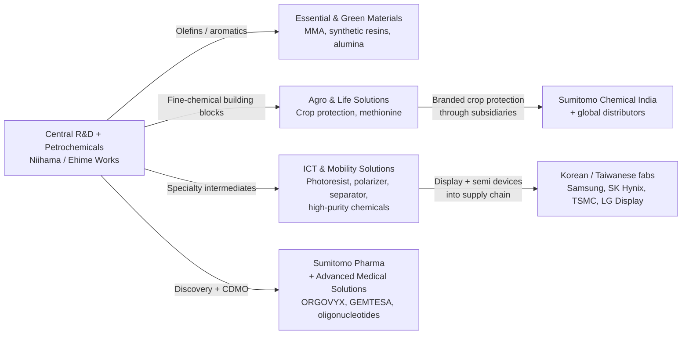
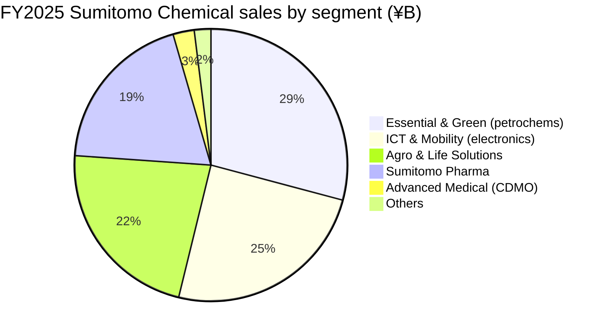
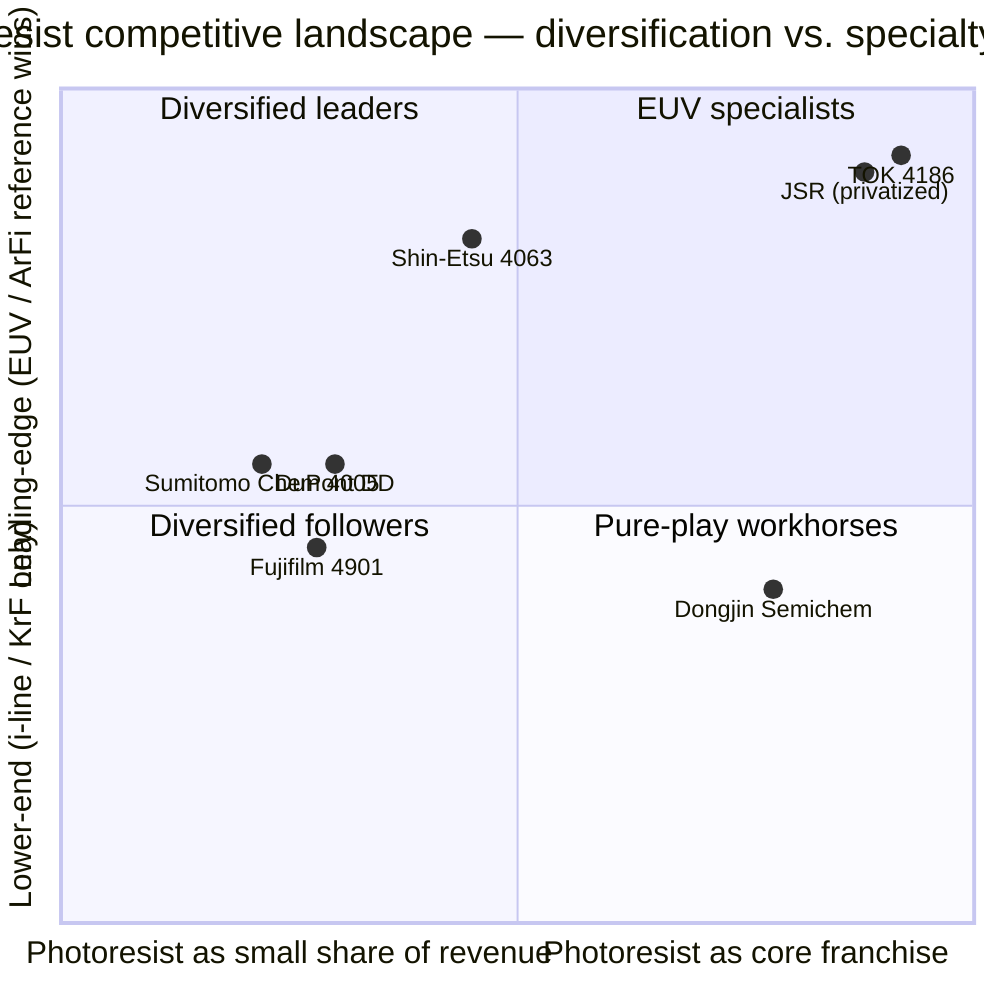

# COMPANY RESEARCH REPORT: Sumitomo Chemical Co., Ltd. (TSE:4005)

**Date:** 2026-05-25
**Ticker:** TSE:4005 (Tokyo Stock Exchange, Prime Market)
**ADR:** SOMMY (OTC) / SOMMF
**Sector:** Diversified Chemicals — Petrochemicals, Electronics Materials, Agrochemicals, Pharmaceuticals
**HQ:** Tokyo Sumitomo Twin Building (East), 27-1, Shinkawa 2-chome, Chuo-ku, Tokyo 104-8260, Japan
**Founded:** 1913 (Niihama, Ehime — originally a fertilizer plant attached to the Besshi copper smelter)
**Fiscal year:** April 1 – March 31 (FY2025 = year ended 31-Mar-2026)

---

> **Update — FY2026 guidance initiated (2026-05-14):** Coming off a strong FY2025 (sales ¥2,328.5 bn, –10.7% YoY on Petro Rabigh deconsolidation and yen strength; core operating income ¥208.4 bn, +48.3% YoY), management initiated FY2026 guidance of sales ¥2,360 bn (+1.4% YoY), core operating income ¥215 bn (+3.2%), operating income ¥177 bn (+16.6%), and net income ¥70 bn (+14.9%) — implying a third consecutive year of recovery from the FY2023 record loss. The full-year dividend is raised to ¥16/sh (from ¥13.5/sh in FY2025 and ¥9/sh in FY2024).
> Source: [Key Figures of Consolidated Financial Results for FY2025, 2026-05-14](https://www.sumitomo-chem.co.jp/english/news/files/docs/20260514e_1.pdf), pp. 1, 3.

> The FY2025 print itself was a "second leg" of the V-shaped recovery — operating income (¥151.7 bn) came in below FY2024's ¥193.0 bn only because FY2024 included a one-off ¥83.6 bn equity-method gain from the Petro Rabigh debt forgiveness, while underlying core operating income climbed sharply. Net income attributable to owners of the parent rose 57.9% to ¥60.9 bn, and the equity-to-assets ratio improved 340bps to 29.6% as ¥277 bn of interest-bearing debt was paid down across the two recovery years ([FY2025 results, p. 1](https://www.sumitomo-chem.co.jp/english/news/files/docs/20260514e_1.pdf); [FY2024 results, 2025-05-14](https://www.sumitomo-chem.co.jp/english/news/files/docs/20250514_1e.pdf), p. 1).

---

## TABLE OF CONTENTS

1. Company Overview
2. Company History
3. Management Team
4. Products & Services
5. Customers & Go-to-Market
6. Industry Overview
7. Competitive Landscape
8. Market Opportunity (TAM)
9. Risk Assessment

======================================

## 1. COMPANY OVERVIEW

Sumitomo Chemical Co., Ltd. is one of Japan's "big-three" diversified chemical majors (alongside Mitsubishi Chemical Group and Mitsui Chemicals) and a flagship member of the **Sumitomo Group keiretsu / 住友グループ** — the corporate-and-financial network tracing its roots to the Sumitomo House's 17th-century copper-mining operation at Besshi ([Sumitomo Chemical Company History](https://www.companieshistory.com/sumitomo-chemical/); [Sumitomo Chemical 100 Years](https://www.sumitomo-chem.co.jp/english/company/files/docs/100years_history_English.pdf), p. 11). The Group reports across five business segments — **Agro & Life Solutions** (crop protection, methionine, household insecticides), **ICT & Mobility Solutions** (photoresists, polarizing film, high-purity semiconductor chemicals, battery separators, engineering plastics), **Advanced Medical Solutions** (CDMO for small molecules, oligonucleotides, regenerative medicine), **Essential & Green Materials** (petrochemicals, synthetic resins, methyl methacrylate / MMA, industrial alumina), and **Sumitomo Pharma** (the separately listed but consolidated TSE:4506 small-molecule pharma subsidiary) ([FY2025 Financial Results, 2026-05-14](https://www.sumitomo-chem.co.jp/english/news/files/docs/20260514e_1.pdf), p. 12).

The business model is, accordingly, four very different revenue streams glued together by the Sumitomo brand and a shared central R&D base. (i) **Specialty B2B materials** — photoresists, polarizing film, high-purity chemicals, separators — sold directly to a small list of semiconductor / display / battery customers under multi-year qualification regimes; this is the ICT & Mobility Solutions sector, which produced ¥574.2 bn of FY2025 sales (24.7% of group) and ¥53.0 bn of core operating income at a **9.2% margin** ([FY2025 results, p. 1](https://www.sumitomo-chem.co.jp/english/news/files/docs/20260514e_1.pdf)). (ii) **Branded crop protection** sold globally through Sumitomo's own sales subsidiaries and the publicly listed Sumitomo Chemical India arm (NSE:SUMICHEM) — Agro & Life Solutions delivered ¥519.3 bn of sales and ¥56.3 bn of core operating income (10.8% margin). (iii) **Commodity petrochemicals** centered on Petro Rabigh (Saudi Arabia, equity-method since the August 2024 transfer of control to Aramco) and remaining domestic MMA / resin operations — Essential & Green Materials produced ¥678.8 bn of sales and ¥14.4 bn of core operating income, including a ¥55.8 bn business-transfer gain ([FY2025 results, p. 13](https://www.sumitomo-chem.co.jp/english/news/files/docs/20260514e_1.pdf)). (iv) **Pharmaceuticals** through Sumitomo Pharma — ¥451.9 bn of sales and ¥108.4 bn of core operating income in FY2025, recovering from the FY2023 LATUDA patent cliff that triggered the group's record loss ([Sumitomo Pharma FY2024 results, 2025-05-13](https://www.sumitomo-pharma.com/ir/library/financial_results_summary/assets/pdf/ebr20250513.1.pdf)).

Operationally, Sumitomo Chemical is **Japan-centric on the manufacturing and R&D side and meaningfully global on the revenue side**. The Group reported a **71.0% overseas sales ratio** in FY2025 — up from 69.9% in FY2024 — with the customer base concentrated in Asia ex-Japan (semiconductor / display materials going to Korean and Taiwanese fabs, agrochemicals into India / Brazil / SE Asia, pharma into North America). Headcount fell from 32,161 at end-FY2023 to **27,491 at end-FY2025** — a 14.5% workforce reduction over two years that captures most of the restructuring narrative ([FY2025 results, p. 3](https://www.sumitomo-chem.co.jp/english/news/files/docs/20260514e_1.pdf); [FY2024 results, p. 3](https://www.sumitomo-chem.co.jp/english/news/files/docs/20250514_1e.pdf)). The number of consolidated subsidiaries and equity-method investees has dropped from 212 to 175 over the same period, reflecting the Group's exit from Nihon Medi-Physics (radiopharmaceuticals, sold to GE Healthcare), Sumitomo Bakelite (equity stake), Petro Rabigh control (sold to Aramco), aluminum, certain Asian pharma operations (to Marubeni), and synthetic resin lines ([FY2025 results, p. 3](https://www.sumitomo-chem.co.jp/english/news/files/docs/20260514e_1.pdf); [Fierce Pharma, 2025-04-01](https://www.fiercepharma.com/pharma/japans-marubeni-takes-sumitomos-asia-pharma-business-make-new-company-deal-worth-300m)).

**Scale and balance sheet.** FY2025 sales of ¥2,328.5 bn (≈ USD 15.5 bn at 150 ¥/USD) make Sumitomo Chemical the world's #18–20 chemical company by revenue — comparable to Solvay / Syngenta and behind Mitsubishi Chemical (¥4.4 tn) but ahead of Mitsui Chemicals (¥1.7 tn) ([C&EN Global Top 50, 2025-07](https://cen.acs.org/articles/103/web/2025/07/CENs-Global-Top-50-2025.html)). Core operating margin was 8.9% in FY2025 — a level that puts the company near the top end of Japanese diversified-chemical peers but still well below Shin-Etsu Chemical (>25%) which has a more concentrated electronics-materials portfolio ([Shin-Etsu Chemical IR — Annual Report](https://www.shinetsu.co.jp/en/ir/)). Net debt fell to ¥942.9 bn from ¥1,076.3 bn a year earlier, with the **D/E ratio improving from 1.20× to 0.93×** ([FY2025 results, p. 2](https://www.sumitomo-chem.co.jp/english/news/files/docs/20260514e_1.pdf)) — a critical step in the company's recovery from the FY3/2024 trough, when D/E spiked above 1.3× and Standard & Poor's downgraded the long-term rating.

*Source: assembled from [FY2025 Financial Results, 2026-05-14](https://www.sumitomo-chem.co.jp/english/news/files/docs/20260514e_1.pdf), p. 1, [FY2024 Financial Results, 2025-05-14](https://www.sumitomo-chem.co.jp/english/news/files/docs/20250514_1e.pdf), p. 1, and historical FY2021/FY2022 from the [Integrated Report 2023](https://www.sumitomo-chem.co.jp/english/ir/library/annual_report/files/docs/ar2023_6e.pdf). Core operating income is Sumitomo's IFRS-derived gain/loss metric that excludes non-recurring items (impairment, restructuring charges, gains/losses on sales of fixed assets); the FY2023 figure includes ¥269.4 bn of impairment losses tied principally to Sumitomo Pharma's North American intangibles after the LATUDA patent cliff.*

### Valuation snapshot (REQUIRED)

As of late May 2026, Sumitomo Chemical trades around **¥603 / share** on the Tokyo Prime Market, giving a **market cap of approximately ¥995.8 bn (≈ USD 6.6 bn)** ([Stockanalysis.com — 4005.T market cap](https://stockanalysis.com/quote/tyo/4005/market-cap/)). The market has re-rated the name aggressively: market cap is up **+87.4% in twelve months** and **+36.5% in the five months since end-December 2025**, reflecting investor catch-up to the FY2024 → FY2025 swing in core operating income and the Petro Rabigh closure ([companiesmarketcap — Sumitomo Chemical](https://companiesmarketcap.com/sumitomo-chemical/marketcap/)).

- **TTM P/E ≈ 16.2×** on FY2025 reported EPS of ¥37.16 (¥603 / ¥37.16 = 16.23×); **forward P/E ≈ 14.2×** on FY2026 guidance EPS of ¥42.40 ([FY2025 results, p. 1](https://www.sumitomo-chem.co.jp/english/news/files/docs/20260514e_1.pdf); [Stockanalysis 4005 statistics](https://stockanalysis.com/quote/tyo/4005/)).
- **TTM P/S ≈ 0.43×** on FY2025 sales of ¥2,328.5 bn — characteristic of low-margin diversified chemicals; for context Shin-Etsu Chemical trades at ~3.0× sales and Linde at ~5×, while peers Mitsui Chemicals and Mitsubishi Chemical trade at 0.4–0.7× ([companiesmarketcap PS — Mitsui Chemicals](https://companiesmarketcap.com/mitsui-chemicals/ps-ratio/); [companiesmarketcap PS — Mitsubishi Chemical](https://companiesmarketcap.com/mitsubishi-chemical/ps-ratio/)).
- **P/B ≈ 0.99×** on FY2025 book equity per share of ¥610.78 — i.e. the stock trades almost exactly at book despite a 6.4% ROE; the discount priced in at end-FY2023 (P/B briefly fell below 0.65×) has largely closed but a sustained re-rating still requires the FY2026E ROE of 6.8% to compound for several years toward management's medium-term 8% target.
- **Dividend yield ≈ 2.7%** on the FY2025 actual ¥13.5/sh and ≈3.3% prospective on the FY2026 ¥16/sh guidance ([FY2025 results, p. 1](https://www.sumitomo-chem.co.jp/english/news/files/docs/20260514e_1.pdf)).

**Peer benchmarks (mid-May 2026):**

*Source: TTM P/E figures aggregated from [Stockanalysis.com TYO:4005](https://stockanalysis.com/quote/tyo/4005/), [Macrotrends — Mitsubishi Chemical Holdings P/E](https://www.macrotrends.net/stocks/charts/MTLHY/mitsubishi-chemical-holdings/pe-ratio), [Simply Wall St — Shin-Etsu valuation](https://simplywall.st/stocks/jp/materials/tse-4063/shin-etsu-chemical-shares/valuation), and [companiesmarketcap PE pages](https://companiesmarketcap.com/sumitomo-chemical/pe-ratio/). Mitsubishi Chemical's headline 62× P/E reflects depressed TTM EPS from a deteriorating MMA market in FY2024 — not a premium valuation; on a forward basis Mitsubishi trades closer to 14–16×.*

- **Shin-Etsu Chemical (TSE:4063)** — the closest electronics-materials-rich peer — trades at TTM P/E ~17.5×, P/S ~3.0×, on margins multiple times Sumitomo's (FY2024 operating margin >25%). The premium reflects Shin-Etsu's silicone + 300mm silicon-wafer dominance ([Shin-Etsu Investor Information](https://www.shinetsu.co.jp/en/ir/); [Simply Wall St — Shin-Etsu valuation](https://simplywall.st/stocks/jp/materials/tse-4063/shin-etsu-chemical-shares/valuation)).
- **Mitsubishi Chemical (TSE:4188)** — diversified-chemical peer at similar scale (¥4.4 tn revenue) — TTM P/E ~62× on depressed earnings post-MMA collapse; forward P/E nearer ~15× ([Macrotrends](https://www.macrotrends.net/stocks/charts/MTLHY/mitsubishi-chemical-holdings/pe-ratio)).
- **Mitsui Chemicals (TSE:4183)** — TTM P/E ~11× — closer to traditional petrochem multiples ([Mitsui Chemicals financial results, 2026-05-12](https://jp.mitsuichemicals.com/en/release/2026/2026_0512_2/index.htm)).
- **Asahi Kasei (TSE:3407)** — TTM P/E ~14× after >100% profit growth in FY2024 ([C&EN, 2026-05](https://cen.acs.org/articles/104/web/2026/05/japanese-chemical-makers-2025-earnings.html)).
- **Resonac (TSE:4004)** — formerly Showa Denko / Hitachi Chemical — TTM EPS still negative on legacy graphite-electrode and petrochem write-downs; the relevant comp is forward P/E ~18× consensus.

The peer-group median TTM P/E sits at ~14–16×; Sumitomo Chemical's 16.2× is **at the median**, neither cheap nor expensive on absolute earnings. The bull case is that FY2026 guidance EPS of ¥42 understates a normalized run-rate where the IT-related-chemicals cyclical trough (display-price competition) and Essential & Green Materials volatility both abate — a normalized EPS of ¥60–70 would put forward P/E at the high single digits and is the basis for sell-side targets of ¥700+ ([Investing.com analyst-targets compilation](https://www.investing.com/equities/sumitomo-chemical-co.,-ltd.)).

**Multiple decomposition (why a 16× isn't a "discount play").** Three pieces of context. (a) The stock has already moved +87% in twelve months — most of the V-shaped-recovery rerating is in the price. (b) The two highest-quality segments (ICT & Mobility Solutions, Agro & Life Solutions) generated ¥109 bn of FY2025 core operating income on combined sales of ¥1,094 bn — implying these alone trade at >7× core-OI even excluding Sumitomo Pharma — i.e. a sum-of-the-parts approach gives no obvious cheapness once peer multiples are applied. (c) The valuation that does discount is the residual stake in Petro Rabigh (15% post-deal), where Sumitomo's equity-method exposure remains volatile and where Aramco is now the controlling party with marketing-rights transfer rights ([Petro Rabigh marketing rights transfer, Argaam](https://www.argaam.com/en/article/articledetail/id/1848454)). Net: 4005 is a **fairly priced cyclical with above-average asymmetry to either an electronics-materials downturn or a successful Phase-3 execution of the Leap Beyond plan**.

---

## 2. COMPANY HISTORY

Sumitomo Chemical's origin story is one of Japan's tightest environment-from-industry feedback loops. The Sumitomo family had operated the **Besshi Copper Mine / 別子銅山** in Ehime Prefecture since its 1691 discovery, and by the early 20th century the smelter was generating heavy sulfur-dioxide air pollution damaging the surrounding farms ([Sumitomo Group Public Affairs Committee — Quotes with Enduring Value](https://www.sumitomo.gr.jp/english/history/analects/03/)). In **1913**, House of Sumitomo elder Masaya Suzuki commissioned a fertilizer plant adjacent to the smelter that captured the sulfur effluent and converted it to calcium superphosphate fertilizer — a process that simultaneously cleaned the air and produced a saleable product, and one of the earliest documented examples of an industrial-byproduct circular economy ([Sumitomo Chemical 100 Years, p. 11](https://www.sumitomo-chem.co.jp/english/company/files/docs/100years_history_English.pdf)). The legal entity Sumitomo Fertilizer Manufacturing Co. was incorporated in **1925**, renamed **Sumitomo Chemical Co., Ltd. in 1934**, and listed on the Tokyo Stock Exchange after the post-war reorganization of the Sumitomo *zaibatsu*.

```mermaid
timeline
    title Sumitomo Chemical milestones
    1913 : Fertilizer plant founded at Niihama, Ehime (Besshi smelter byproducts)
    1934 : Renamed Sumitomo Chemical Co. — fertilizers, dyestuffs, fine chemicals
    1944 : Acquires Japan Dyestuff Manufacturing — fine-chemicals entry
    1958 : Petrochemical operations start at Ehime Works (Niihama)
    1991 : Dongwoo Fine-Chem founded in Korea (later acquired) — display + semi materials
    2001 : IT-related Chemicals Sector established as standalone reporting segment
    2003 : LCD Polarizing Film plant opens in Korea (Pyeongtaek)
    2005 : Dainippon Sumitomo Pharma created (merger of Sumitomo Pharmaceuticals + Dainippon Pharma)
    2007 : Acquires Cambridge Display Technology (OLED IP)
    2017 : Renames Sumitomo Pharma; Dongwoo absorbed; SSLM separator plant in Korea
    2019 : Iwata becomes President — launches first restructuring phase
    2021 : Announces Korea EUV photoresist line (Iksan)
    2023 : LATUDA loses US exclusivity (Feb 2023) — Sumitomo Pharma North America collapses
    2024 : FY2023 record loss ¥311.8 bn; ¥269.4 bn impairment; "Leap Beyond" plan begins
    2024 : Aramco-Petro Rabigh deal announced (Aug); $1.5 bn loan waiver
    2025 : Mito assumes presidency (April 1); Aramco closes 22.5% stake purchase
    2025 : V-shaped recovery — core OI ¥208 bn; debt/equity to 0.93×
    2026 : FY2026 guidance ¥215 bn core OI; new Osaka EUV photoresist Tech Center announced
```

**Three strategic pivots define the modern company.** First, the **mid-1940s diversification beyond fertilizers** through the wartime acquisition of Japan Dyestuff Manufacturing (1944), which seeded the fine-chemicals / agrochemicals platform that today underpins both Sumitomo Pharma and Agro & Life Solutions ([Sumitomo Chemical history page](https://www.companieshistory.com/sumitomo-chemical/)). Second, the **2001 carve-out of an IT-related Chemicals Sector** — a deliberate bet that Korean and Taiwanese LCD and semiconductor fabs would re-write the demand curve for photoresists, polarizing film, and high-purity process chemicals; the company then doubled down by acquiring Cambridge Display Technology in **2007 (£190 m)** for OLED IP and incrementally absorbing Korean specialist Dongwoo Fine-Chem ([THE ELEC — Sumitomo to build photoresist factory in South Korea, 2021](https://www.thelec.net/news/articleView.html?idxno=3311); [InvestKOREA — Dongwoo Fine-Chem](https://www.investkorea.org/ik-en/bbs/i-468/detail.do?ntt_sn=71927)). Third, the **2024–2025 emergency restructuring** under outgoing President Iwata, in which the Group exited Petro Rabigh control, sold the Nihon Medi-Physics radiopharma stake to GE Healthcare, restructured Sumitomo Pharma's North American operation, and announced the wind-down of the Ohe Works lithium-ion-battery separator plant (consolidating production into Korea's SSLM) ([PERVIO restructuring announcement, 2025-11-13](https://www.sumitomo-chem.co.jp/english/news/detail/20251113e.html); [Fierce Pharma — Marubeni Asia pharma deal, 2025-04-01](https://www.fiercepharma.com/pharma/japans-marubeni-takes-sumitomos-asia-pharma-business-make-new-company-deal-worth-300m)).

**Key acquisitions.** (i) **Cambridge Display Technology, 2007 (£190 m)** — OLED IP base for the polarizing-film and OLED-materials businesses. (ii) **Botanical Resources Australia Group, 2017** — natural pyrethrum for crop protection. (iii) **Roivant Sciences subsidiary stakes through Sumitomo Pharma, 2019–2022** — ORGOVYX (GnRH antagonist, prostate cancer), MYFEMBREE (GnRH for uterine fibroids), GEMTESA (beta-3 agonist, overactive bladder), and the still-developing pipeline — costing roughly USD 3 bn in cash + assumed-debt outlays from Sumitomo Pharma. These three drugs are now the principal growth pillars replacing LATUDA's lost-exclusivity revenue ([Sumitomo Pharma FY2024 results, 2025-05-13](https://www.sumitomo-pharma.com/ir/library/financial_results_summary/assets/pdf/ebr20250513.1.pdf), p. 1–2).

**Recent developments** (last 18 months). FY3/2024 was the **single worst year in Sumitomo Chemical's history**: a record ¥311.8 bn net loss attributable to owners of the parent, ¥269.4 bn of impairment losses (primarily Sumitomo Pharma's North American intangibles), and a 29.2% ROE deficit ([FY2024 results, p. 1](https://www.sumitomo-chem.co.jp/english/news/files/docs/20250514_1e.pdf)). Three forces drove the loss: (a) the **LATUDA patent cliff** in February 2023, which collapsed Sumitomo Pharma's North American revenue from $1.5 bn run-rate to under $200 m and forced massive write-downs of the goodwill / intangibles from the 2019 Roivant subsidiary acquisitions; (b) **collapsing methyl methacrylate (MMA) prices** and oversupply in Asia, which pushed the Essential & Green Materials segment to a ¥89.1 bn core operating loss in FY2023; and (c) **Petro Rabigh's deteriorating economics**, where a stranded ethylene-cracker complex in Saudi Arabia required a $2 bn shareholder-loan injection in 2020 (split with Aramco) and then ultimately a $1.5 bn loan waiver in 2024–2025 to clean the balance sheet for Aramco's control acquisition ([Aramco — Petro Rabigh closing, 2025-08 (Hydrocarbon Engineering mirror)](https://www.hydrocarbonengineering.com/refining/09102025/aramco-completes-acquisition-of-additional-stake-in-petro-rabigh/); [Arab News, 2025](https://www.arabnews.com/node/2618289/business-economy)). FY2024 then produced a **V-shaped recovery**: core OI returned to ¥140.5 bn, ROE to +4.1%, and operating cash flow to ¥233 bn. FY2025 extended the improvement (core OI ¥208.4 bn, ROE 6.4%), and the FY2026 guidance — initiated on May 14, 2026 — projects another step toward management's medium-term targets of ¥200 bn core OI, 8% ROE, and 6% group ROIC by FY2027 ([Corporate Business Plan FY2025-2027 press release, 2025-03-04](https://www.sumitomo-chem.co.jp/english/news/detail/20240304e.html)).

---

## 3. MANAGEMENT TEAM

### Nobuaki Mito — President & Representative Director, CEO (since April 1, 2025)

Nobuaki Mito assumed the presidency of Sumitomo Chemical effective April 1, 2025, becoming Representative Director & CEO following the June 2025 annual general meeting ([Directors & Senior Management page](https://www.sumitomo-chem.co.jp/english/company/executives/); [Sumitomo Chemical Press Release, 2025-02-03](https://www.sumitomo-chem.co.jp/english/news/files/docs/20250203e_1.pdf)). Mito (born August 4, 1960 in Hiroshima) holds an M.S. in Agricultural Chemistry from **Nagoya University (1985)** and a Ph.D. in Agricultural Sciences from the **University of Tsukuba (1991)** ([Bloomberg — Nobuaki Mito profile](https://www.bloomberg.com/profile/person/16800710)) — a research-scientist credentialing that is unusual for a head-of-house at a Japanese diversified chemical major, where the modal CEO has an engineering / chemistry undergraduate degree followed by an MBA or in-house GM track. He joined Sumitomo Chemical the same year as his M.S. (1985) and spent his first two decades in the **Health & Crop Sciences sector** working on insecticide / herbicide molecule discovery and registration; by 2015 he had risen to Executive Officer, in 2018 to Managing Executive Officer, in 2020 to Representative Director & Managing Executive Officer, and 2021 to Senior Managing Executive Officer — with the most recent line role being **President of the Health & Crop Sciences Sector** before its 2024 reorganization into Agro & Life Solutions ([Rubber World — Sumitomo names Mito](https://rubberworld.com/sumitomo-chemical-names-nobuaki-mito-as-president-and-chairman-of-the-board/); [Indian Chemical News, 2025](https://www.indianchemicalnews.com/people/sumitomo-chemical-appoints-new-chairman-and-president-25014)).

What he specifically accomplished in those prior roles, per the company's executive disclosure: (i) led the **integration of Health & Crop Sciences with Sumitomo Chemical India** (NSE:SUMICHEM, a 60.3%-owned subsidiary) into a global agrochemicals operation that has continued to grow at high single-digit rates while the rest of the chemicals industry consolidated — Agro & Life Solutions delivered ¥56.3 bn core OI on ¥519 bn sales in FY2025; (ii) oversaw the **methionine business turnaround** that drove the ¥28.6 bn segment-OI improvement from FY2023 to FY2024 ([FY2024 results, p. 2](https://www.sumitomo-chem.co.jp/english/news/files/docs/20250514_1e.pdf)); (iii) ran the General Manager office for Intellectual Property and Corporate Business Development, where he was responsible for the Cambridge Display Technology integration and the early-2020s portfolio reviews that ultimately produced the Leap Beyond restructuring plan ([Directors & Senior Management page](https://www.sumitomo-chem.co.jp/english/company/executives/)). His selection was conducted by the Nomination Advisory Committee (five independent outside directors + the chairman + the outgoing president), with the press-release explanation citing his "ability to create and execute a vision, provide organizational leadership, drive transformation, possess technological insight, and have international experience" ([Sumitomo Chemical Appoints New Chairman and President, 2025-02-03](https://www.sumitomo-chem.co.jp/english/news/files/docs/20250203e_1.pdf)).

Mito's ownership stake is not separately disclosed beyond the standard insider holding (typically <0.1% of shares outstanding for a non-founder Japanese executive). Compensation under the new president is structured per Sumitomo's stock-compensation plan (BIP Trust) introduced in 2017, with three components: base salary, performance-linked annual bonus tied to consolidated core operating income, and a multi-year stock award tied to ROIC and TSR targets ([Sumitomo Chemical Corporate Governance Report, 2024](https://www.sumitomo-chem.co.jp/english/company/governance/)).

### Keiichi Iwata — Chairman of the Board (since April 1, 2025)

Iwata stepped up to the chairmanship simultaneous with Mito's elevation, after six years as Representative Director & President (2019–2025) during which he steered Sumitomo Chemical through the LATUDA patent cliff, the Petro Rabigh restructuring, and the launch of the Leap Beyond corporate plan. Iwata (born October 11, 1957) joined Sumitomo Chemical in **1982** straight from his undergraduate studies and spent most of his career in the **Petrochemicals & Plastics Sector** — including a long Singapore posting during the 1990s petrochemical capacity build-out and several years overseeing the Petro Rabigh joint-venture relationship with Saudi Aramco from the Sumitomo side ([Bloomberg — Keiichi Iwata profile](https://www.bloomberg.com/profile/person/16800710); [Sumitomo Chemical executives page](https://www.sumitomo-chem.co.jp/english/company/executives/)). He was promoted to Executive Officer in 2010, Managing Executive Officer in 2013, Senior Managing Executive Officer in 2018, and Representative Director & President from June 2019 — making the timing of his 2019 elevation coincide with the early signs of the Petro Rabigh stress.

What Iwata specifically delivered during his presidency: (i) **the Group's most aggressive divestment program in its history** — total cash generation target of ~¥900 bn from FY2023 to FY2027 (per the new MTP), with ¥700 bn realized by end of FY2024 through the sale of stakes in Nihon Medi-Physics, Sumitomo Bakelite, Sumitomo Chemical Engineering, Petro Rabigh, aluminum, Asian pharma, polarizer-film operations in China (Sunnypol), and the Ohe Works separator line ([Under Pressure, Japan's Chemical Giants Pivot, C&EN, 2025-04](https://cen.acs.org/business/investment/Under-pressure-Japans-chemical-giants/103/web/2025/04); [PERVIO restructuring, 2025-11-13](https://www.sumitomo-chem.co.jp/english/news/detail/20251113e.html)); (ii) **the Aramco-Petro Rabigh transaction** announced August 2024 and closed January 2025, transferring 22.5% additional equity to Aramco for $702 m + a $1.5 bn shareholder-loan waiver, which removed Petro Rabigh from consolidated-debt overhang ([Aramco closing announcement, October 2025](https://www.hydrocarbonengineering.com/refining/09102025/aramco-completes-acquisition-of-additional-stake-in-petro-rabigh/)); (iii) **the launch of "Leap Beyond" Three-Year Corporate Business Plan (FY2025-2027)** in March 2025, redirecting ¥220 bn of R&D and 80% of strategic capex to Agro & Life Solutions and ICT & Mobility Solutions and targeting segment-level ROIC of 11% for ICT and 8% for Agro by FY2027 ([Sumitomo Chemical Launches Leap Beyond Plan, 2025-03-04](https://www.sumitomo-chem.co.jp/english/news/detail/20240304e.html)). Iwata's chairmanship role is positioned by the company as that of a "transition steward" — overseeing the board and external relationships (Aramco, Sumitomo Group Public Affairs Committee) while Mito takes over operational and strategic execution.

---

## 4. PRODUCTS & SERVICES

> **Section 4 priority note.** Because Sumitomo Chemical is a five-segment diversified conglomerate, Section 4 is allocated more length than a single-business issuer's; however, given the report's role in a **7-way photoresist competitor study**, the ICT & Mobility Solutions sector (where photoresists live) receives **proportionally more depth** than its 24.7% of FY2025 sales would suggest. Petrochems, agrochems, and pharma are handled with one walk-through each.

### 4.1 The segment product matrix (verbatim from FY2025 results)

Per Sumitomo Chemical's FY2025 consolidated financial results filing, the Group reports five segments. The verbatim product / service description for each segment is reproduced below:

| Reportable Segment | Major Products and Services (verbatim) |
|---|---|
| **Agro & Life Solutions** | "Crop protection chemicals, fertilizers, agricultural materials, household insecticides, products for control of infectious diseases, feed additives, etc." |
| **ICT & Mobility Solutions** | "Optical products, semiconductor processing materials, compound semiconductor materials, touch screen sensor panels, high-purity aluminum and alumina, specialty chemicals, additives, engineering plastics, battery materials, etc." |
| **Advanced Medical Solutions** | "Contract development and manufacturing organization business for advanced small-molecule drug, oligonucleotides, and regenerative medicine and cell therapy products, etc." |
| **Essential & Green Materials** | "Synthetic resins, raw materials for synthetic fibers, various industrial chemicals, methyl methacrylate products, synthetic resin processed products, industrial alumina, synthetic rubber, etc." |
| **Sumitomo Pharma** | "Small molecule pharmaceuticals" |

Source: [FY2025 Financial Results, Segment Information, p. 12](https://www.sumitomo-chem.co.jp/english/news/files/docs/20260514e_1.pdf).

*Source: assembled from segment data in [FY2025 Financial Results, p. 1](https://www.sumitomo-chem.co.jp/english/news/files/docs/20260514e_1.pdf). Note the Essential & Green Materials swing of +¥72.9 bn YoY (from –¥58.5 bn to +¥14.4 bn) — driven by Petro Rabigh deconsolidation (no longer pulls equity-method losses through) plus a ¥55.8 bn business-transfer gain. The ICT & Mobility Solutions decline of –¥17.5 bn is a cyclical bottom in display materials.*

### 4.2 Synthesis — how the segments compose a single Sumitomo Group "innovation chain"

The synthesis paragraph: Sumitomo Chemical is one of two Japanese diversified-chemical players (alongside Mitsubishi Chemical) where the **central petrochemicals base feeds upstream-to-downstream into all four high-value verticals**. Olefins / aromatics from Niihama go into MMA and synthetic resins (Essential & Green Materials), into fine-chemical intermediates for crop-protection actives (Agro & Life), into the specialty molecules that anchor photoresist / polarizer formulations (ICT & Mobility), and historically into the synthesis routes for pharmaceutical actives at Sumitomo Pharma. The Leap Beyond plan effectively **breaks this integration model in half** — the upstream petrochem feed remains, but the company is selectively divesting commodity midstream operations (Petro Rabigh control, Asian polarizers, Ohe Works separators) and concentrating new capital into the specialty downstream lines (Korean photoresist capacity expansion, Osaka EUV Technology Center, ORGOVYX / GEMTESA growth). The successful execution of this re-pivot is the operational thesis behind the entire stock.

### 4.3 ICT & Mobility Solutions — the photoresist franchise and adjacent electronics-materials portfolio

Sumitomo Chemical's electronics-materials business — the focus of this report's photoresist-competitor study — runs through two principal vehicles: the parent's own Osaka Works (Konohana-ku, Osaka, Japan) for development and the **Dongwoo Fine-Chem subsidiary in South Korea** (acquired progressively from the 1990s and fully consolidated in the late 2010s) for production and supply into the Korean / Taiwanese fab footprint. The ICT & Mobility Solutions segment recorded **¥574.2 bn of FY2025 sales and ¥53.0 bn of core operating income** (9.2% margin), down from ¥607.0 bn / ¥70.6 bn in FY2024 — the decline driven by "severe price competition" in display-related materials and the "fundamental structural reforms implemented for the polarizing film business for large-size liquid crystal displays" ([FY2025 results, p. 2](https://www.sumitomo-chem.co.jp/english/news/files/docs/20260514e_1.pdf)).

**Photoresists — SUMIRESIST™ (development) + PEK / PAR / PXi / NX series (production, via Dongwoo Fine-Chem).**

> Per Sumitomo's ICT & Mobility Solutions product page: "SUMIRESIST™" is described as "photosensitive resins used in the production of high-density, highly integrated circuit patterns" ([SUMITOMO CHEMICAL — ICT & Mobility Solutions products](https://www.sumitomo-chem.co.jp/english/products/it_related_chemicals/products/)).

> Per Sumitomo Chemical Advanced Technologies (the legacy Sumika Electronic Materials / Dongwoo product page): "i-line PFI, PFM, PXi, and NX series" for critical and non-critical applications, "KrF PEK series photoresists", "ArF PAR series for dry and immersion applications", and "Color Photoresists including DyBright™ brand" ([Semiconductor Photoresists & Functional Cleaning Solutions](https://sumichem-at.com/our-business/semiconductor-photoresists-and-functional-cleaning-solutions/)).

**中文释义 / Plain-language gloss:** Photoresists / 光刻胶 are the photosensitive thin-film polymers spin-coated onto the wafer before exposure. The lithographer projects UV / DUV / EUV light through a photomask carrying the circuit pattern; the photoresist molecules either cross-link (negative) or de-protect (positive) in the exposed areas, and the developer then removes either the exposed or unexposed regions, leaving a relief pattern that becomes the template for the next etch / deposition step. Different wavelengths (g-line 436 nm, i-line 365 nm, KrF 248 nm, ArF 193 nm, EUV 13.5 nm) require chemically distinct photoresist formulations — the molecular weight of the polymer, the photoacid generator (PAG, 光酸发生剂), the protecting group, and the residual metal content all change. Sumitomo Chemical's i-line and KrF lines are mature workhorse products used in the back-end packaging / older logic nodes; the ArF dry and ArF immersion (ArFi) lines are mid-cycle products supporting 28–7 nm node fabs (still 70%+ of the world's wafer starts); and the **EUV photoresist line at Dongwoo Iksan** (announced 2021, completed 2024) is the leading-edge product for sub-7 nm logic and HBM-stack memory ([Sumitomo Chemical EUV expansion, 2021-08-31](https://www.sumitomo-chem.co.jp/english/news/detail/20210831e.html); [THE ELEC — Korea EUV line, 2022](https://www.thelec.net/news/articleView.html?idxno=3311)). Per the company's February 2025 disclosure, "the Company's capital investments in the semiconductor materials field over the past several years have reached approximately 100 billion yen" ([Osaka Works expansion announcement, 2025-02-26](https://www.sumitomo-chem.co.jp/english/news/detail/20250226e.html)) — a multi-year commitment that, combined with the April 2026 announcement of a new six-story EUV/ArF Technology Center at Osaka Works (target completion FY2027), signals that photoresists are a **flagship growth investment** despite the ICT & Mobility sector's cyclical pressure.

*Analyst view:* Sumitomo Chemical is a **top-5 global photoresist supplier with partial advantage** in KrF and ArF dry segments (where it competes head-to-head with TOK, JSR, Shin-Etsu, DuPont, Fujifilm) and a **smaller but growing presence in ArFi and EUV**, where leading-edge volume sits with TOK + JSR. The moat is a combination of **regulatory / qualification switching costs** (a fab cannot qualify a new photoresist supplier on an existing node without 6–12 months of trials), **scale of Korean production via Dongwoo** (a meaningful supply-chain risk advantage for Samsung and SK Hynix given Japan's 2019 export-control episode), and **technology IP in proprietary organic-molecular EUV photoresists** the company says it is developing ([Sumitomo Chemical Osaka expansion, 2025-02-26](https://www.sumitomo-chem.co.jp/english/news/detail/20250226e.html); [TECHCET 2025 advanced photoresist report excerpt — Fountyl](https://www.fountyltech.com/news/japanese-companies-monopolize-the-euv-photoresist-supply-market/)). Sumitomo lags TOK and JSR on EUV reference design wins and is competing in the metal-oxide-resist subfield where Fujifilm and Sumitomo's patent activity ramped in 2024–2025 ([Photoresist Market Mordor Intelligence, 2025](https://www.mordorintelligence.com/industry-reports/photoresist-market)).

**Polarizing film — SUMIKARAN™ — for LC and OLED displays.**

> Per Sumitomo's product page: "SUMIKARAN™" — "essential for LC and OLED displays" ([SUMITOMO CHEMICAL — ICT & Mobility Solutions products](https://www.sumitomo-chem.co.jp/english/products/it_related_chemicals/products/)).

**Plain-language gloss:** Polarizing film / 偏光膜 is the multi-layer optical film laminated to both sides of a TFT-LCD or OLED display panel. It controls the polarization state of light passing through the liquid crystal (in LCD) or being emitted from the OLED stack, allowing pixel-by-pixel modulation. A typical 65″ LCD TV uses ~1.2 m² of polarizing film per side; a smartphone OLED uses much smaller area but with higher unit margin. The historical supply chain was dominated by Nitto Denko (Japan), Sumitomo Chemical, and LG Chem — collectively ~70% of the global market through the 2010s ([Polarizer Film Market Reports and Data, 2024](https://www.reportsanddata.com/report-detail/polarizer-film-market); [Polarizer Display Panel Valuates, 2025](https://reports.valuates.com/market-reports/QYRE-Auto-21K11040/global-polarizer-for-display-panel)). The strategic reality, however, is that **Chinese manufacturers (BOE, Sunnypol, Shanjin Optoelectronic) have moved aggressively into large-size LCD polarizer production over 2022–2025**, compressing prices and forcing Japanese / Korean incumbents to either exit the large-size LCD segment or specialize in OLED-grade. Sumitomo Chemical's response, announced in December 2024, was to **sell its Chinese polarizer production and chip-cut processing lines to Sunnypol** — directly behind Samsung SDI's September 2024 sale of its polarizer division to a Chinese acquirer ([Polarizer industry shift, OpenPR, 2025](https://www.openpr.com/news/4326496/advanced-optical-films-powering-the-next-generation-of-displays); [Omdia polarizer market piece, 2025-02](https://omdia.tech.informa.com/blogs/2025/feb/a-new-phase-in-the-display-polarizer-market-navigating-concerns-over-supply-shortages)). The "fundamental structural reforms" referenced in the FY2025 segment commentary are this large-size-LCD-polarizer divestment.

*Analyst view:* Polarizing film was a **legacy growth pillar that has structurally re-rated downward** for Sumitomo. Going forward, the company is concentrating polarizer revenue on (a) **OLED-grade polarizers for high-end smartphones and tablets** — where margins are still defensible — and (b) **specialty optical films** (anti-reflective, anti-glare, light-shaping) for automotive displays. The combined Nitto Denko + Sumitomo Chemical share of high-end OLED polarizers remains material; for large-size LCD polarizers, Sumitomo's economic exposure is now reduced.

**High-purity chemicals — process solvents, etchants, EBR, developers, post-CMP cleaners (Sumika Electronic Materials Changzhou + Dongwoo Fine-Chem Iksan).**

> Per Sumitomo's product page: "Aluminum sputtering targets" (high-purity aluminum products), "Compound semiconductor materials (GaAs, GaN)", "High Purity Alumina (HPA) — over 99.99% purity", "Ultra High Purity Aluminium — up to 99.9999% purity" ([ICT & Mobility Solutions products](https://www.sumitomo-chem.co.jp/english/products/it_related_chemicals/products/)).

> Per the May 2025 Dongwoo Iksan investment announcement: "Development priorities include ultra-high-purity chemicals for advanced semiconductor processes, selective etchants, photoresist thinners, and in-process cleaners" ([Sumitomo Chemical Investment in South Korean Subsidiary, 2025-05-13](https://www.sumitomo-chem.co.jp/english/news/detail/20250513e.html)).

**Plain-language gloss:** High-purity chemicals are the "process consumables" that fabs use in every wet step — etching with HF / TMAH / BOE, cleaning with SC-1 / SC-2 / IPA, photoresist coating with EBR (edge-bead remover) solvents, photoresist developing with TMAH developer, and post-CMP cleaning with proprietary surfactant formulations. Unlike photoresists, these are higher-volume, lower-margin commodity-specialty products — but specifications matter at the parts-per-trillion level (PPT, 万亿分之一), and supplier qualifications are sticky once a fab has tuned its process to a specific chemical batch. Sumitomo's positioning is **regional supply security for Korean fabs**, achieved via Dongwoo's Iksan and Pyeongtaek sites, and **specialty additive innovation** for the most-advanced-node selective etchants where the chemistry is rapidly evolving. The Group's stated FY2030 target is to "**double revenue in high-purity and functional chemicals fields by fiscal 2030 (compared to fiscal 2024 baseline)**" ([Dongwoo investment, 2025-05-13](https://www.sumitomo-chem.co.jp/english/news/detail/20250513e.html)).

*Analyst view:* High-purity chemicals are the **lower-visibility but higher-stickiness leg of the ICT & Mobility franchise** — competing primarily against Stella Chemifa (TSE:4109), Resonac (TSE:4004), Kanto Chemical (private), Mitsubishi Chemical, and the Korean firms (Soulbrain, ENF Technology). The Group's competitive advantage rests on the Dongwoo footprint inside Korea — the only major Japanese photoresist / chemical supplier with a fully-owned Korean production base — which de-risks Korean-fab customers from any future Japan-Korea trade-friction episode similar to 2019.

**Battery separators — PERVIO™ — aramid-coated lithium-ion separator.**

> Per Sumitomo's Challenge Zero case study: "PERVIO® is a heat-resistant separator for lithium-ion secondary batteries that takes advantage of the properties of an aramid polymer, such as superior thermal stability and high reliability. PERVIO combines a heat-resistant layer composed of aramid fiber and ceramics with a polyolefin substrate, and contributes to battery safety" ([Function of Aramid Separator (Pervio) in Lithium-ion Battery, Sumitomo R&D Report, 2022](https://www.sumitomo-chem.co.jp/english/rd/report/2022E_1.pdf); [Challenge Zero case study](https://www.challenge-zero.jp/en/casestudy/408)).

**Plain-language gloss:** A lithium-ion battery separator / 锂电池隔膜 is the porous thin film placed between the cathode and anode that allows Li+ ion transport while preventing electrical short-circuiting. Cheap separators are pure polyethylene / polypropylene; high-end "ceramic-coated" or "aramid-coated" separators add a thin coating layer (typically ≤4 µm) that resists shrinkage at high temperatures (>180°C), substantially reducing the thermal-runaway probability — the failure mode that drove Boeing 787, Samsung Galaxy Note 7, and Tesla Model S fire incidents. Sumitomo's PERVIO uses aramid (the same polymer family as Kevlar) for the heat-resistant layer — a niche but differentiated position versus the polyolefin + ceramic standard. The commercial reality is that PERVIO is **principally used in Panasonic's high-end NCA cylindrical cells supplying Tesla** ([Green Car Congress on PERVIO, 2015-06-11](https://www.greencarcongress.com/2015/06/20150611-sumitomo.html)).

*Analyst view (with caveat):* The PERVIO franchise is **structurally challenged**. (i) The global separator market re-rated downward as Chinese suppliers (Yunnan Energy / SEMCORP, Senior Material) scaled ceramic-coated capacity to multi-billion-m²/year and compressed prices — Sumitomo's Japan-based Ohe Works (operational since 2006) became uneconomic. (ii) Panasonic's NCA cylindrical-cell business has lost share to LG Energy Solution + CATL within Tesla, and within Panasonic itself the cell-chemistry roadmap is moving toward variants where PERVIO's aramid advantage is less differentiated. The November 2025 restructuring announcement — ceasing PERVIO production at Ohe Works by end of March 2026 and consolidating into the larger SSLM Co. plant in Daegu, South Korea — explicitly acknowledges this competitive position; Japan-based separator operations will shift to "research and development of next-generation innovative materials" rather than mass production ([Sumitomo Chemical PERVIO Business Restructuring, 2025-11-13](https://www.sumitomo-chem.co.jp/english/news/detail/20251113e.html)). The franchise is being right-sized into a much smaller specialty-EV niche.

**Other ICT & Mobility products — engineering plastics, additives, OLED materials.**

The segment also includes the **super engineering plastics line** (liquid crystalline polymer / LCP and polyethersulfone / PES), the **DyBright color resist** for CMOS image sensors and color-filter applications, the **touch-screen sensor panels** for mobile equipment, and the **OLED materials portfolio** acquired through Cambridge Display Technology in 2007 ([ICT & Mobility Solutions products page](https://www.sumitomo-chem.co.jp/english/products/it_related_chemicals/products/)). None of these is individually material at the Group level, but they collectively round out the customer offering and provide cross-sell into Korean / Taiwanese display fabs.

### 4.4 Agro & Life Solutions — branded crop protection + methionine

The agrochemicals business runs through Sumitomo Chemical's globally-distributed crop-protection subsidiaries — principally **Sumitomo Chemical India (NSE:SUMICHEM, 60.3% subsidiary)**, **Botanical Resources Australia** (pyrethrum), and the in-house North American / European operations — with a portfolio of insecticides (clothianidin, pyrethroids), herbicides, fungicides, plant growth regulators, household insecticides (Olyset Net mosquito-control nets for malaria), and animal feed additives (methionine / DL-Met) ([Agro & Life Solutions overview](https://www.sumitomo-chem.co.jp/english/products/health_crop_sciences/)). FY2025 segment results: sales ¥519.3 bn (–3.9% YoY), core OI ¥56.3 bn (+2.5% YoY at a 10.8% margin) ([FY2025 results, p. 1](https://www.sumitomo-chem.co.jp/english/news/files/docs/20260514e_1.pdf)). The structural appeal here is (a) the segment-level ROIC target of **8% by FY2027** (per Leap Beyond) is one of two segments to receive priority capex allocation, and (b) the segment's earnings have decoupled from the petrochem / electronics cycles — a useful diversification that the market is beginning to recognize.

*Analyst view:* Agro is one of the cleanest businesses inside Sumitomo Chemical — pure specialty chemistry with a 10%+ operating margin, multi-year proprietary formulations, and growth tied to global food security (a thesis that supports comparable peers Syngenta, Corteva, FMC). The segment is the most likely candidate for an eventual spin-off / separate listing if management chooses to surface portfolio value.

### 4.5 Advanced Medical Solutions — CDMO operations

This newer segment (created in the October 2024 reorganization) consolidates Sumitomo's contract development & manufacturing operations for small-molecule APIs, oligonucleotides (RNA / antisense), and regenerative medicine / cell therapy products — including the **iPS-cell platform from the Kyoto University Kyoto-iPSC partnership** and the RACTHERA joint venture with Sumitomo Pharma established in February 2025 ([RACTHERA joint venture, Sumitomo Pharma, 2024-12](https://www.sumitomo-pharma.com/news/20250401-3.html)). FY2025 sales were ¥58.6 bn / core OI ¥2.8 bn — small in absolute terms but with high strategic optionality, particularly if oligonucleotide demand (driven by AstraZeneca, Sarepta, Ionis, Alnylam external partners) continues to scale at the 20%+ CAGR forecast.

### 4.6 Essential & Green Materials — the petrochem residual

Essential & Green Materials is the **legacy petrochemical operation** — Niihama-based crackers, MMA monomer and PMMA, synthetic resins (polyethylene, polypropylene), industrial alumina, synthetic rubber, fertilizers, and the Petro Rabigh equity-method stake (now 15% post-Aramco transaction). FY2025 sales were ¥678.8 bn (–24.5% YoY on Petro Rabigh deconsolidation) with core OI of ¥14.4 bn — a +¥72.9 bn swing from the FY2024 –¥58.5 bn loss, primarily driven by the absence of Petro Rabigh equity-method losses plus a ¥55.8 bn business-transfer gain ([FY2025 results, p. 13](https://www.sumitomo-chem.co.jp/english/news/files/docs/20260514e_1.pdf)). FY2026 guidance is for ¥560 bn revenue and ¥20 bn core OI — implying that on a "clean" run-rate (post-divestments) the segment is a low-single-digit-margin commodity operation that is no longer dragging the consolidated result.

*Analyst view:* Essential & Green Materials is **explicitly being run for cash, not growth**. The May 2026 announcement of a three-way ethylene-cracker JV with Asahi Kasei and Mitsui Chemicals (45/45/10 equity split) — integrating Western Japan crackers — signals that the Japanese petrochem industry as a whole is consolidating ([Asahi-Kasei + Mitsui + Mitsubishi ethylene JV, 2026-05-12](https://jp.mitsuichemicals.com/en/release/2026/2026_0512_2/index.htm)). Sumitomo Chemical is not in that JV, which suggests its own restructuring path runs through further capacity reductions rather than integration.

### 4.7 Sumitomo Pharma — the swing factor for group profitability

The **Sumitomo Pharma segment (TSE:4506, 50%+-consolidated)** delivered the largest absolute swing in the FY2024→FY2025 recovery, with sales growing from ¥398 bn to ¥451.9 bn (+13.5% YoY) and core OI from ¥35.3 bn to ¥108.4 bn (+207%) ([Sumitomo Pharma FY2024 results, 2025-05-13](https://www.sumitomo-pharma.com/ir/library/financial_results_summary/assets/pdf/ebr20250513.1.pdf); [FY2025 Sumitomo Chemical results, p. 1](https://www.sumitomo-chem.co.jp/english/news/files/docs/20260514e_1.pdf)). The principal swing drivers were:

- **LATUDA loss-of-exclusivity (Feb 2023)**: lurasidone, Sumitomo Pharma's flagship atypical antipsychotic, had its primary US patent expire February 15, 2023; generic entry collapsed North American revenue from a $1.5 bn run-rate to under $200 m, and this in turn drove the FY2023 ¥269 bn impairment writedown of Sumitomo Pharma North American intangibles ([Medthority — Sumitomo FY2023 loss + LATUDA LoE, 2024-05](https://www.medthority.com/news/2024/5/sumitomo-reports-loss-in-fy2023-and-loss-of-exclusivity-for-latuda-lurasidone/); [DrugPatentWatch — LATUDA patent](https://www.drugpatentwatch.com/p/tradename/LATUDA)).
- **Three new products replacing LATUDA**: **ORGOVYX®** (relugolix, advanced prostate cancer GnRH antagonist), **MYFEMBREE®** (relugolix combo, uterine fibroids / endometriosis), **GEMTESA®** (vibegron, beta-3 agonist for overactive bladder + BPH). All three are growing >30% YoY in North America in FY2024–2025 ([Sumitomo Pharma FY2024 results, p. 1](https://www.sumitomo-pharma.com/ir/library/financial_results_summary/assets/pdf/ebr20250513.1.pdf); [Sumitomo Pharma AUA 2026 — Vibegron data, BioSpace](https://www.biospace.com/press-releases/new-data-from-sumitomo-pharma-america-at-aua-2026-highlight-efficacy-of-vibegron-in-men-aged-75-and-older-with-overactive-bladder-and-bph)).
- **North American restructuring**: 400+ US layoffs in 2024 plus a complete reorganization of Sumitomo Pharma North America's commercial operations, reducing SG&A by ¥150+ bn from FY2023 peak ([Fierce Pharma — Sumitomo US layoffs, 2024](https://www.fiercepharma.com/pharma/sumitomo-pharma-lays-another-400-us-staffers-face-sliding-revenues)).
- **Asia divestment**: Sumitomo Pharma sold its Asian (ex-Japan) business to Marubeni Global Pharma Corp in Q1 FY2025 for up to $480 m, contributing the ¥50 bn business-transfer gain in the FY2025 segment result ([Fierce Pharma — Marubeni Asia pharma, 2025-04-01](https://www.fiercepharma.com/pharma/japans-marubeni-takes-sumitomos-asia-pharma-business-make-new-company-deal-worth-300m)).

*Analyst view:* Sumitomo Pharma's recovery is now **execution-dependent on the three replacement products + the oncology pipeline (including SAGE Therapeutics-licensed CNS programs)**. Given Sumitomo Chemical owns the majority of Sumitomo Pharma but doesn't fully control it (Sumitomo Pharma is listed separately), the consolidated-results contribution is sensitive to (a) the ¥54.5 bn FY2025 non-controlling interest line (i.e. the minority shareholders' claim on Sumitomo Pharma earnings) and (b) the equity-method effects when Sumitomo Pharma sells off subsidiaries. The medium-term thesis is healthy if the three replacement products hold their growth trajectory and management can deliver an oncology / CNS pipeline asset by FY2028.

---

## 5. CUSTOMERS & GO-TO-MARKET

Sumitomo Chemical's customer base is **highly segment-specific**, and the disclosure is unusually opaque for a Japanese major because the Group does not publish a top-5-customer table in its Yuho — it discloses only the **overseas sales ratio (71.0% in FY2025)** at the consolidated level ([FY2025 results, p. 2](https://www.sumitomo-chem.co.jp/english/news/files/docs/20260514e_1.pdf)). The customer mapping has to be inferred segment-by-segment from public announcements, supply-chain disclosures, and industry research.

**ICT & Mobility Solutions customers.** The photoresist + high-purity-chemical + polarizing-film customer set is the most concentrated in the Group:
- **Samsung Electronics + Samsung Display** — the largest customer for KrF / ArF photoresists, polarizers, and high-purity chemicals via Dongwoo Fine-Chem; the Samsung relationship has been disclosed since the original investments in Dongwoo in the 1990s and was specifically cited as a target customer when Sumitomo announced the 2021 Korean EUV / ArFi photoresist line ([Sumitomo Chemical S. Korea $90M photoresist plant, KED Global](https://www.kedglobal.com/chemical-industry/newsView/ked202109010005); [InvestKOREA — Dongwoo Fine-Chem](https://www.investkorea.org/ik-en/bbs/i-468/detail.do?ntt_sn=71927)).
- **SK Hynix** — the second-largest Korean photoresist + chemical customer, particularly for HBM-stack memory production. The 2021 Korean line was explicitly positioned as serving "Samsung Electronics Co. and SK Hynix Inc." ([KED Global](https://www.kedglobal.com/chemical-industry/newsView/ked202109010005)).
- **LG Display** — large polarizer + display-materials customer, primarily for OLED panels (high-end smartphones, OLED TVs). The relationship has been disclosed in Dongwoo's customer list since the early 2000s.
- **TSMC** — material customer for ArF / EUV photoresist and high-purity chemicals via Sumitomo's Taiwanese subsidiary (smaller share than Samsung but increasing with the Arizona / Kumamoto fab expansions).
- **Panasonic Energy** — primary customer for the PERVIO separator (Tesla NCA-cylindrical-cell line), now being wound down from Japan; future SSLM Korean output will likely supply Korean / Japanese OEM cells.

Customer concentration in this segment is high — best estimate is that the **top-5 customers collectively account for 50–60% of ICT & Mobility revenue**, though the company does not disclose this figure. *Analyst view:* the concentration is partly mitigated by **multi-source qualification** (every fab qualifies 2–3 photoresist suppliers per node) and by **multi-product cross-sell** (Sumitomo sells photoresist + chemicals + polarizer to the same Samsung division, so loss of one product is partly buffered by retention of others).

**Agro & Life Solutions customers.** Distribution is principally through:
- **Sumitomo Chemical India (NSE:SUMICHEM, 60.3% subsidiary)** — the consolidated Indian agrochemical business with FY2025 revenue of ~$770 m and a 25%+ EBITDA margin ([Sumitomo Chemical India Q4 FY2025 results, NSE](https://www.sumichem.co.in/investors)).
- **Independent agricultural distributors and farmer cooperatives** across the US, Brazil, Argentina, Australia, and Europe — Sumitomo's Valent USA + Valent BioSciences subsidiaries serve the American market.
- **Pyrethrum operations through Botanical Resources Australia** — supplying both Sumitomo's own household-insecticide brands and white-label customers globally.

The Agro & Life customer base is **highly fragmented** — no single buyer >5% of segment revenue — which is one of the most attractive structural features of this segment.

**Sumitomo Pharma customers.** Direct-to-physician / direct-to-payer commercial operations in:
- **North America** (Sumitomo Pharma America, headquartered in Marlborough, MA — formerly Sunovion Pharmaceuticals) — the largest commercial segment; key payer accounts are the major US commercial insurers + CMS for ORGOVYX (Medicare-prostate-cancer pricing).
- **Japan** — direct sales through Sumitomo Pharma Japan, with NHI-listed pricing on LATUDA, LONASEN Tape (asenapine patch), and TWYMEEG (oral hypoglycemic) ([Sumitomo Pharma — key products](https://www.sumitomo-pharma.com/news/assets/pdf/eir20250513.pdf)).
- **Asia ex-Japan** — now divested to Marubeni Global Pharma (April 2025).

Source: [FY2025 Financial Results, segment table, p. 1](https://www.sumitomo-chem.co.jp/english/news/files/docs/20260514e_1.pdf).

**Go-to-market structure.** Direct + multi-channel — Sumitomo Chemical does not use a single distribution paradigm; instead each segment has its own commercial model. ICT & Mobility runs a **direct-to-fab account-management model** with engineers embedded in customer development cycles; Agro & Life uses a **branded distribution model** through subsidiaries and agro-distributors; Sumitomo Pharma is a **direct commercial pharma operation** (sales force + payer-contract management); Essential & Green Materials runs through **petrochemical trading houses (sogo shosha) and direct contracts** including the Sumitomo Corporation (TSE:8053, separately listed sister-company) general-trading network ([Sumitomo Group structure overview, Sumitomo Corporation history](https://www.sumitomocorp.com/en/global/about/history/sc-history)).

**Customer concentration risk verdict.** At the **consolidated Group level**, no single customer exceeds 10% of revenue — i.e. customer-concentration risk is **not material at the Group level**. At the **segment level**, ICT & Mobility Solutions has the highest concentration (Samsung + SK Hynix + LG Display + TSMC likely ~50% of segment) but this is comparable to TOK, JSR, and Shin-Etsu's electronics-materials businesses — i.e. it is sector-typical rather than company-specific. The risk is therefore carried into Section 9 not as a top-1 customer risk but as a **sector-concentration risk** tied to the Korean / Taiwanese fab investment cycle.

---

## 6. INDUSTRY OVERVIEW

Sumitomo Chemical operates across four very different industries — and any industry analysis has to walk each separately while recognizing the photoresist / electronics-materials context that drives this report.

**Diversified chemicals — global structure and Japan-specific dynamics.** The global chemicals industry generated ~$5.6 trillion of revenue in 2024 and is consolidating; in C&EN's 2025 Top-50 ranking Sumitomo Chemical sits at #19 with $14.5 bn 2024 sales (post-FX) ([C&EN Global Top 50, 2025-07](https://cen.acs.org/articles/103/web/2025/07/CENs-Global-Top-50-2025.html)). The **Japanese chemicals industry, however, is in structural transition**. C&EN's April 2025 industry analysis ("Under pressure, Japan's chemical giants pivot") documents how Mitsubishi Chemical, Mitsui Chemicals, Asahi Kasei, Sumitomo Chemical, and Resonac have all simultaneously decided to **exit / shrink commodity petrochemicals** (ethylene, polyolefins, MMA, SM) in the face of Chinese capacity oversupply, and **redirect capital toward specialty downstream segments** — semiconductor materials, agrochemicals, pharmaceuticals, batteries ([C&EN — Under pressure, Japan's chemical giants pivot, 2025-04](https://cen.acs.org/business/investment/Under-pressure-Japans-chemical-giants/103/web/2025/04)). The May 2026 Mitsui + Asahi Kasei + Mitsubishi ethylene-cracker JV (45/45/10 split, integrating Western Japan crackers) is the most visible recent step ([Mitsui Chemicals press release, 2026-05-12](https://jp.mitsuichemicals.com/en/release/2026/2026_0512_2/index.htm)). The C&EN piece quotes industry analyst observation that the Japanese chemical sector lost ~25% of its ethylene production capacity between FY2023 and FY2026 — and that the remaining capacity is increasingly consolidated into a few partnerships. **Sumitomo Chemical is not in the Western Japan JV**, which means its own restructuring path is either further capacity reductions or specialty redirection — both consistent with the Leap Beyond plan.

**Photoresist industry — small, concentrated, structurally growing.** The global photoresist market was approximately **$5.5 bn in 2024** and is forecast to grow at a ~7–9% CAGR through 2030, driven principally by the EUV photoresist segment (very high price, very low volume) and ArFi (mature but expanding with new logic / DRAM capacity) ([Photoresist Chemicals Market Fortune Business Insights, 2026](https://www.fortunebusinessinsights.com/photoresist-chemicals-market-115414); [Photoresist Market Grand View Research, 2030 forecast](https://www.grandviewresearch.com/industry-analysis/photoresist-market-report); [Mordor Intelligence Photoresist Market, 2025](https://www.mordorintelligence.com/industry-reports/photoresist-market)). The industry is **structurally concentrated**: the global top 4–5 photoresist suppliers (TOK + JSR + Shin-Etsu + DuPont + Fujifilm) hold a combined market share above 75% in KrF and above 85% in ArF, leaving Sumitomo Chemical, Dongjin Semichem, and smaller players to share the remainder ([Mordor Intelligence, 2025](https://www.mordorintelligence.com/industry-reports/photoresist-market)). The EUV photoresist segment is **even more concentrated** — TOK + JSR + Shin-Etsu collectively hold north of 90% of historical EUV photoresist shipments, with newer entrants (Lam Research's Inpria after the 2021 acquisition, Fujifilm, Sumitomo Chemical) progressively building share in metal-oxide-resist (MOR) formulations.

*Source: analyst-constructed chart based on aggregated industry-research sources cited in the prose (Mordor Intelligence, Fortune Business Insights, Valuates Reports, TECHCET 2025 advanced-photoresist excerpts). Shares are illustrative — actual share varies by wavelength step and customer. See discussion in §7 for step-by-step ranking.*

The **EUV photoresist segment** specifically is forecast to grow at a 15–20% CAGR through 2031, reaching ~$1.5 bn by then ([DUV and EUV Photoresist Valuates Reports, 2025–2031](https://reports.valuates.com/market-reports/QYRE-Auto-24K15171/global-duv-and-euv-photoresist)). EUV is the wavelength at which Sumitomo Chemical's competitive position is weakest today, but where the company has invested most aggressively over 2024–2026 (Korean line at Iksan, new Osaka Tech Center) — a deliberate "buy a seat at the EUV table" strategy.

**Polarizing film industry.** $9.0 bn global market in 2024, forecast to grow ~4.1% CAGR to $11.9 bn by 2032 ([LCD Display Polarizing Films Market 24chemicalresearch, 2025-2031](https://www.24chemicalresearch.com/reports/297290/lcd-display-polarizing-films-market); [Polarizer Film Market Reports and Data, 2024](https://www.reportsanddata.com/report-detail/polarizer-film-market)). Two structural shifts: (a) **Chinese capacity buildout in large-size LCD polarizers** has compressed prices and forced Nitto Denko, Sumitomo Chemical, and Samsung SDI to retreat from / restructure that segment; (b) **OLED demand growth** (high-end smartphone, OLED TV, automotive) is the residual growth area, where polarizer formulations are more technically demanding and margins are more defensible. Sumitomo Chemical is repositioning toward the OLED-grade segment.

**Lithium-ion battery separator industry.** ~$8 bn global market in 2024, forecast to compound mid-teens through 2030 driven by EV growth ([Plastics Today — EV separator film, 2024](https://www.plasticstoday.com/ev-growth-drives-investment-lithium-ion-battery-separator-film)). Chinese suppliers (Yunnan Energy / SEMCORP, Senior Material) dominate >70% of global capacity at the volume tier; Japanese / Korean specialty suppliers (Sumitomo Chemical / PERVIO, Asahi Kasei / Celgard, W-Scope, SKC) compete in the higher-end aramid / ceramic-coated niches. Sumitomo's PERVIO restructuring (consolidating into Korean SSLM, exiting Ohe Works) is a recognition that the volume tier is structurally lost.

**Agrochemicals industry.** $80 bn global market in 2024, growing low-single-digits with strong regional variation — Brazil + India + China driving most growth, North American + European demand mature. The industry is dominated by Syngenta (CN-CNAC), Bayer Crop Science (DE), Corteva (US), BASF (DE), and FMC (US) at the top tier — with Japanese players (Sumitomo Chemical, Nissan Chemical, Nihon Nohyaku, Kumiai) holding niche positions in specific actives. Sumitomo's competitive position is strongest in India (via Sumitomo Chemical India) and in pyrethroid-derived insecticides via the Botanical Resources Australia pyrethrum operation.

**Pharmaceuticals (small-molecule).** Global market $1.5 tn+ in 2024 — Sumitomo Pharma is a mid-tier specialty pharma with revenue under 0.05% of global pharma. Differential exposure is to (a) US urology / oncology (ORGOVYX, MYFEMBREE, GEMTESA), (b) Japanese psychiatry (LATUDA, LONASEN Tape), and (c) diabetes / oral hypoglycemics (TWYMEEG). Industry dynamics: patent-cliff risk (LATUDA in 2023, ORGOVYX patent expiration in early-2030s per LoE schedule), payer cost pressure in the US, generic competition.

**Macro / regulatory drivers across the four industries.** (i) **AI / generative-AI capex cycle** — driving HBM, advanced-logic, and overall fab utilization → positive for photoresist + high-purity chemicals demand; (ii) **EV / battery cycle deceleration** — negative for separator demand absent a major supply-chain shift; (iii) **Petro-chemical overcapacity in Asia** — Chinese ethylene + MMA capacity continues to grow, pressuring Japanese commodity petrochems; (iv) **Japan-Korea trade-friction risk** — the 2019 export-control episode remains a recurring concern for fab customers; Sumitomo's Korean Dongwoo footprint is a partial hedge; (v) **FX (USD/JPY)** — a stronger yen modestly compresses Sumitomo's reported overseas revenue (71% of group); FY2025 assumed 150.67 ¥/$, FY2026E assumed 155.00 ¥/$ ([FY2025 results, p. 1](https://www.sumitomo-chem.co.jp/english/news/files/docs/20260514e_1.pdf)).

---

## 7. COMPETITIVE LANDSCAPE

Because Sumitomo Chemical is a multi-segment company, the competitive set is segment-specific. The most relevant set for the photoresist study is given first.

**Photoresist competitors (the 7-way comparison context for this report):**

1. **Tokyo Ohka Kogyo (TSE:4186) — the photoresist pure-play leader.** TOK is a single-segment-focused electronics-materials company with the largest share of the global photoresist market (estimated ~25%), dominant in KrF and the early EUV pioneer. TOK's strength: deep customer integration with TSMC, Samsung, SK Hynix; specialized R&D entirely focused on photoresist + ancillaries. TOK's vulnerability: limited diversification — when photoresist demand drops, no other revenue line buffers ([TOK 2025 Q3 Financial Results, IR page](https://www.tok.co.jp/eng/ir/)).
2. **JSR Corporation (formerly TSE:4185, privatized 2024) — global #2 photoresist supplier.** JSR was acquired by Japan Investment Corporation (JIC) in a roughly $6.4 bn government-backed take-private completed July 2024, intended to consolidate Japanese semiconductor-materials competitiveness. JSR was historically the strongest ArF + ArFi photoresist player globally; the take-private has shifted JSR's strategic posture (no public-market disclosure) but the business itself remains a top-tier competitor ([Reuters — JIC completes JSR acquisition, 2024-06](https://www.reuters.com/markets/deals/japans-jic-completes-acquisition-jsr-2024-06-26/)).
3. **Shin-Etsu Chemical (TSE:4063) — diversified electronics-materials major.** Shin-Etsu is the most analogous Japanese diversified peer — silicone + 300mm silicon wafers + photoresist + rare earths — and is the global leader in 300mm silicon wafers (with SUMCO) plus a top-tier photoresist supplier (KrF + ArF + EUV). The advantage versus Sumitomo Chemical is **margin profile** (Shin-Etsu's operating margin sits >25%, Sumitomo's ~9%), reflecting Shin-Etsu's much higher concentration in specialty / electronics segments and no petrochem drag ([Shin-Etsu Investor Information](https://www.shinetsu.co.jp/en/ir/)).
4. **DuPont (NYSE:DD) — Western photoresist competitor.** DuPont's Electronics & Industrial segment is the principal Western photoresist supplier — strong in i-line and KrF; historically less penetrated in ArFi / EUV. The 2025–2026 separation of DuPont into specialty chemicals + electronics businesses (Qnity for electronics, NYSE:Q, completed November 1, 2025) sharpens the focus ([DuPont separation announcement, 2025](https://www.dupont.com/news/dupont-announces-plan-to-separate-into-three-independent-publicly-traded-companies.html); [Qnity Electronics Form 8-K, 2025](https://www.sec.gov/Archives/edgar/data/0002058873/000119312525240313/d21160dex991.htm)). DuPont's advantage: scale + a more diversified electronics portfolio (CMP, packaging, advanced inks). Disadvantage: less specialized than TOK / JSR on photoresist specifically.
5. **Fujifilm (TSE:4901) — diversified electronics + healthcare conglomerate.** Fujifilm's Materials division includes photoresists (post-2007 entry, growing); the company is a smaller photoresist player than TOK / JSR but has been investing aggressively in **metal-oxide-resist (MOR) formulations for EUV** alongside Sumitomo Chemical. Patent filings for MOR formulations spiked at Fujifilm and Sumitomo in 2024–2025 ([Mordor Intelligence photoresist 2025](https://www.mordorintelligence.com/industry-reports/photoresist-market)).
6. **Sumitomo Chemical (TSE:4005) — diversified chemicals with sub-scale photoresist position.** ~5–10% global photoresist share, strongest in KrF and ArF dry, growing in EUV via Dongwoo Iksan. Disadvantage: the photoresist franchise is a small share of group revenue, so capex allocation competes with petrochem / agro / pharma uses; recent Osaka Tech Center decision is the strongest signal yet that management prioritizes electronics materials.
7. **Dongjin Semichem (KOSDAQ:005290) — Korean specialty photoresist supplier.** Dongjin is the Korean-domiciled photoresist + display-materials supplier — smaller than the Japanese top-5 but with the structural advantage of being **inside Korea's supply chain**, deeply integrated with Samsung and SK Hynix. Dongjin is the player most likely to gain share if Korean fabs intentionally diversify away from Japanese suppliers ([THE ELEC — Korea electronic materials industry, 2024](https://www.thelec.net/)).

*Position estimates are analyst-constructed for illustration; specific share-by-step data is held by TECHCET, Yole, and similar subscription industry sources cited in §6.*

**Diversified chemical peers (Japan).** Mitsubishi Chemical Group (TSE:4188), Mitsui Chemicals (TSE:4183), Asahi Kasei (TSE:3407), Resonac (TSE:4004, formerly Showa Denko + Hitachi Chemical), Toray Industries (TSE:3402). At the Group level Sumitomo Chemical's revenue and product mix is closest to Mitsui Chemicals (similar agro + petrochem + electronics blend); Mitsubishi is much larger; Asahi Kasei more diversified into healthcare + electronics; Resonac more concentrated on specialty / electronics. The three-way petrochem-JV announcement (Asahi Kasei + Mitsui + Mitsubishi) explicitly excludes Sumitomo Chemical, which is signaling its own restructuring path.

**Polarizer / display competitors.** Nitto Denko (TSE:6988), LG Chem (KRX:051910), Hyosung Chemical (KRX:298050), Samsung SDI (KRX:006400 — exiting), BOE / Sunnypol (CN — gaining share).

**Separator competitors.** Asahi Kasei / Celgard (TSE:3407 + US subsidiary), W-Scope (KRX:005670), SKIE Technology, Yunnan Energy / SEMCORP (SHE:002812), Senior Material (SHE:300568), Shanghai Energy (SHE:002812).

**Agro competitors.** Syngenta (CN, AG Chemchina), Bayer Crop Science (Frankfurt:BAYN), Corteva (NYSE:CTVA), BASF (FWB:BAS), FMC (NYSE:FMC), Nissan Chemical (TSE:4021), Nihon Nohyaku (TSE:4997), Kumiai Chemical (TSE:4996).

**Pharma competitors.** Sumitomo Pharma's commercial competitors vary by drug — for ORGOVYX it's Astellas's Xtandi (enzalutamide) and Bayer's Nubeqa (darolutamide); for GEMTESA it's Astellas's Myrbetriq (mirabegron) and Pfizer / Sun Pharma generics; for the broader LATUDA-class atypicals it's now generic lurasidone competing with branded Lybalvi (olanzapine + samidorphan), Caplyta (lumateperone), and the Astellas / J&J atypical antipsychotic franchise.

**Competitive-advantage assessment for Sumitomo Chemical, by segment:**
- **ICT & Mobility (photoresist + chemicals + polarizer)** — *partial advantage*. Strongest where Korean fab geography or aramid-separator technology gives a moat, weakest in absolute EUV / ArFi share and in commodity polarizer pricing.
- **Agro & Life** — *partial-to-strong advantage*. India geography (Sumitomo Chemical India) and pyrethrum (Botanical Resources Australia) are differentiated; methionine is a commodity.
- **Sumitomo Pharma** — *low advantage*. Three growth-drug franchises (ORGOVYX, MYFEMBREE, GEMTESA) face direct branded + generic competition; LATUDA is generic; pipeline depth is moderate.
- **Essential & Green Materials** — *no advantage*. Commodity petrochemicals with structural disadvantage to Chinese / ME capacity; being run for cash, not growth.
- **Advanced Medical Solutions** — *too early to call*. Oligonucleotide and cell-therapy CDMO operations could become a differentiated franchise but are sub-scale today.

The overall Group-level competitive position is **better than Mitsui Chemicals, worse than Shin-Etsu Chemical and TOK** — a mid-tier diversified-chemical major with one strong vertical (Agro) and one strategically committed but sub-scale vertical (ICT, especially photoresists).

---

## 8. MARKET OPPORTUNITY (TAM)

Because Sumitomo Chemical sells across four distinct end-markets, the TAM calculation is segment-specific. The summary table:

| Segment | Global TAM 2024 ($B) | Sumitomo addressed share | Sumitomo SOM (FY2025 sales, ¥B) | Growth driver |
|---|---|---|---|---|
| **Photoresists + electronics chemicals** | ~$15 B (photoresist $5.5B + adjacent chemicals $9.5B) | ~5–10% | ~¥574 B (ICT & Mobility) | AI / HBM / EUV |
| **Polarizing film** | ~$9 B | ~10% (OLED-skewed) | Included in ICT & Mobility | OLED / automotive |
| **Battery separators (high-end)** | ~$8 B | <2% | small share of ICT & Mobility | EV, but compressing |
| **Agrochemicals** | ~$80 B | ~0.6% | ~¥519 B Agro & Life | India, food security |
| **Small-molecule pharmaceuticals** | $1,500 B+ | <0.05% | ~¥452 B Sumitomo Pharma | US urology, CNS |
| **Petrochemicals + MMA** | ~$700 B (combined petrochem subset) | <0.1% | ~¥679 B Essential & Green | declining for SC |
| **CDMO (oligonucleotide / cell)** | ~$25 B | <0.3% | ~¥59 B Adv. Medical | oligonucleotide CAGR |

Sources: aggregated from segment-level industry-research citations in §6 ([Mordor Intelligence photoresist 2025](https://www.mordorintelligence.com/industry-reports/photoresist-market); [Fortune Business Insights photoresist 2026](https://www.fortunebusinessinsights.com/photoresist-chemicals-market-115414); [Polarizer market Reports and Data 2024](https://www.reportsanddata.com/report-detail/polarizer-film-market); [Plastics Today separator 2024](https://www.plasticstoday.com/ev-growth-drives-investment-lithium-ion-battery-separator-film); [Mitsui Chemicals press release on Japan ethylene JV, 2026-05-12](https://jp.mitsuichemicals.com/en/release/2026/2026_0512_2/index.htm)).

**TAM analysis — photoresist + adjacent chemicals (the focus of this 7-way study).** Sumitomo's addressed TAM in the electronics-materials space is approximately **$15 bn (combined photoresist + high-purity-chemical adjacent markets)** in 2024, growing at a high-single-digit to low-teens CAGR through 2030. The Group's current share is ~5–10% of photoresist and a similar range in adjacent chemicals (vary by sub-segment). Management's target is to **double high-purity / functional-chemical revenue by FY2030 vs. FY2024** ([Dongwoo investment, 2025-05-13](https://www.sumitomo-chem.co.jp/english/news/detail/20250513e.html)) — implying a high-single-digit CAGR consistent with market growth + modest share gain. The arithmetic is consistent: if ICT & Mobility holds at 9–10% core operating margin and revenue grows at 5–7% CAGR from FY2026E ¥590 bn, by FY2030 the segment would generate ¥725–800 bn of revenue and ¥65–80 bn of core OI — a meaningful contribution to the Group's FY2027 ¥200 bn core-OI target.

**TAM analysis — agrochemicals.** The Indian agrochemical market alone is forecast to grow from ~$5 bn in 2024 to ~$8 bn by 2030 (8–10% CAGR), with Sumitomo Chemical India well-positioned as the #2 player in India ([Sumitomo Chemical India NSE filings](https://www.sumichem.co.in/investors)). Combined with Sumitomo's US/Brazil/EU/AU operations, the Agro & Life segment is the **most TAM-attractive** of the four major segments — and the segment-ROIC target of 8% by FY2027 is the easiest to underwrite if methionine prices stabilize.

**TAM analysis — Sumitomo Pharma.** The replacement-product TAM is moderate but bounded: ORGOVYX serves a US prostate-cancer-on-androgen-deprivation patient pool of ~200,000 with a 2025 list-price net realization in the $20–40K/patient/year range; MYFEMBREE addresses uterine-fibroids / endometriosis patient pools of similar size; GEMTESA targets an overactive-bladder TAM of >30 m US patients but with established generic + branded competition. Total US peak-sales TAM for the three drugs is likely in the $1.5–2.0 bn/year range — sufficient to anchor a mid-tier specialty pharma but not transformational at the parent-Group level.

**TAM analysis — petrochemicals (Essential & Green Materials).** Negative TAM trajectory — Japanese petrochemical capacity is contracting; Sumitomo's role in this segment is being progressively reduced rather than grown.

**Sumitomo Chemical's serviceable market trajectory at the Group level.** Combining the segment-level TAMs and the Group's strategic priorities, the **addressable specialty market accessible to Sumitomo Chemical's continuing operations is approximately $40–50 bn in 2024**, growing at a blended ~6% CAGR over 2024–2030. The Group's current share within this addressable market is ~5%, with room to gain modest share in ICT & Mobility (the principal growth-investment area) and Agro & Life. The implied 2030 revenue range, holding share constant, is ¥2.4–2.7 trillion — broadly consistent with the FY2026E ¥2.36 tn run-rate. The growth case rests on **(a) photoresist + high-purity-chemicals execution + (b) Agro India scaling + (c) Sumitomo Pharma stabilization** — not on petrochem recovery.

---

## 9. RISK ASSESSMENT

### Company-Specific Risks

**1. Execution risk on the Leap Beyond restructuring (high severity, moderate likelihood).** Sumitomo Chemical's FY2025-2027 corporate plan targets ¥200 bn core OI, 8% ROE, and 6% ROIC by FY2027 — and the FY2025 print already delivered ¥208 bn core OI (ahead of the original FY2027 target), creating optical pressure for management to raise the bar. The risk is twofold: (a) the second-half of the restructuring (Essential & Green further capacity reductions, ICT & Mobility EUV ramp execution) is harder than the first-half (which mainly involved divestments at favorable terms); (b) Mito is in his first full year as president and has not yet been tested by a downturn. Mitigants: track record on Agro turnaround, strong outside-director governance, ¥200 bn cash-generation plan provides flexibility. Source: [Leap Beyond plan, 2025-03-04](https://www.sumitomo-chem.co.jp/english/news/detail/20240304e.html).

**2. Sumitomo Pharma North American product concentration (high severity, moderate likelihood).** After the LATUDA cliff, Sumitomo Pharma's North American revenue is now concentrated in three drugs — ORGOVYX (urology), MYFEMBREE (women's health), GEMTESA (urology). A single setback in any of these (label restriction, payer pushback, competing entrant) directly impacts the segment's core OI and could re-trigger impairment if intangible book values exceed forward cash flows. The FY2023 ¥269 bn impairment ([FY2024 results, p. 1](https://www.sumitomo-chem.co.jp/english/news/files/docs/20250514_1e.pdf)) was driven by exactly this risk; another writedown of even ¥50 bn would meaningfully impact Group net income.

**3. Customer concentration in ICT & Mobility (moderate severity, low likelihood).** Top-5 customers in ICT & Mobility (Samsung + SK Hynix + LG Display + TSMC + a smaller Chinese / Taiwanese OSAT) likely account for 50–60% of segment sales (not formally disclosed). The Group does not disclose top-1 customer percentage, but at the consolidated level no single customer exceeds 10%. Mitigants: multi-product cross-sell to each major customer; multi-source qualification at each fab; Dongwoo's Korean footprint as a hedge against any Japan-Korea trade friction.

**4. Petro Rabigh residual equity stake (moderate severity, moderate likelihood).** After the Aramco transaction Sumitomo retains a **15% equity stake in Petro Rabigh**, with Aramco now the controlling 60% holder ([Aramco closing announcement, October 2025](https://www.hydrocarbonengineering.com/refining/09102025/aramco-completes-acquisition-of-additional-stake-in-petro-rabigh/)). The retained stake is accounted for using the equity method and pulled ¥(49.5) bn through the FY2025 P&L ([FY2025 results, p. 13](https://www.sumitomo-chem.co.jp/english/news/files/docs/20260514e_1.pdf)). Continued losses at Petro Rabigh would reduce reported income; Aramco's planned product-marketing-rights transfer ([Argaam](https://www.argaam.com/en/article/articledetail/id/1848454)) signals that further Sumitomo wind-down is possible.

**5. Polarizer + separator segment-specific competitive pressure (moderate severity, high likelihood).** Both legacy ICT & Mobility sub-franchises (polarizing film for LCD, lithium-ion separators) are losing share to Chinese capacity. Sumitomo's structural-reform actions (Chinese polarizer sale to Sunnypol, December 2024; Ohe Works separator wind-down, November 2025) acknowledge this — but the FY2026 segment guidance (¥590 bn revenue, ¥55 bn core OI) still assumes a non-trivial polarizer contribution. Further price pressure could push segment-OI 5–10 bn below guidance.

### Industry / Market Risks

**6. Semiconductor / AI capex cycle reversal (high severity, low likelihood near-term).** Sumitomo Chemical's electronics-materials franchise is leveraged to the AI / HBM / advanced-logic capex cycle currently driving the global semi industry. The cycle could pause for any of: end-market hyperscaler digestion (the 2022 NAND-glut analog), Chinese-export-control escalation reducing Chinese fab demand, generative-AI ROI disappointment cooling capex enthusiasm. A 20–30% photoresist demand decline would compress ICT & Mobility core OI by ¥10–15 bn directly. Reference: [Photoresist market Mordor Intelligence 2025 cycle commentary](https://www.mordorintelligence.com/industry-reports/photoresist-market).

**7. Chinese petrochemical / specialty-chemical overcapacity (moderate-to-high severity, high likelihood).** Chinese MMA, ethylene, polyolefin, polarizer, separator, and high-purity chemical capacity continues to expand at rates exceeding global demand growth — depressing prices for Japanese exporters even in segments where Japanese players hold technology leadership. The Essential & Green Materials FY2026 ¥20 bn core OI is materially exposed to Asian commodity prices. Mitigant: Sumitomo's reduced commodity exposure post-Petro Rabigh transaction.

**8. EUV photoresist technology disruption (high severity, low likelihood).** Lam Research's 2021 acquisition of Inpria brought a dry-deposition EUV photoresist approach (metal-oxide-based) that could disrupt the wet-chemistry EUV photoresist market dominated by TOK / JSR / Shin-Etsu (and where Sumitomo is investing). If Inpria's approach scales successfully into HVM, Sumitomo's organic-molecular EUV bet may be redundant. Source: industry research from TECHCET / Yole; Sumitomo's own R&D press releases.

**9. Japan-Korea trade-friction recurrence (moderate severity, low likelihood).** The 2019 episode in which Japan restricted exports of three semiconductor-materials chemicals (including photoresists) caused significant Korean-fab supply-chain anxiety and accelerated Korean efforts to localize chemicals supply. A recurrence would damage Sumitomo's customer relationships. Mitigant: the Dongwoo Korean production base means Sumitomo can supply Korean customers from within Korea, partially neutralizing this risk.

### Financial Risks

**10. Net debt and refinancing risk (moderate severity, low likelihood).** Sumitomo Chemical ended FY2025 with ¥1,151.5 bn of interest-bearing liabilities — down ¥412 bn from the FY2023 peak — and a 0.93× D/E ratio ([FY2025 results, p. 2](https://www.sumitomo-chem.co.jp/english/news/files/docs/20260514e_1.pdf)). The improvement is material but the Group still carries meaningful refinancing exposure relative to specialty-pure peers like Shin-Etsu (net cash). A FY2024-style downturn would re-stress the balance sheet. FY2025 net interest expense of ¥21.7 bn is manageable on ¥208 bn of core OI but constrains capital-return capacity.

**11. Currency exposure (low-to-moderate severity, high likelihood).** Sumitomo Chemical generates 71% of revenue overseas — primarily in USD (Sumitomo Pharma + Petro Rabigh-related) and KRW (Dongwoo Korea) — with reporting in JPY. A 10% yen strengthening from current ~150 ¥/$ levels would compress reported revenue by ~7% and core OI by a slightly larger percentage due to translation of overseas profits. FY2025 already saw a 1.3% yen strengthening vs. FY2024 (152.62 → 150.67) that contributed to the headline revenue decline.

### Macroeconomic Risks

**12. Geopolitical / Saudi Arabia exposure (moderate severity, moderate likelihood).** Through the residual 15% Petro Rabigh stake, Sumitomo Chemical retains meaningful Saudi exposure — to oil-and-gas-derivative pricing, to Saudi political stability, and to the success of the Vision 2030 industrial-diversification push that anchors Aramco's Petro Rabigh strategy. Any disruption to the Aramco-Sumitomo partnership terms (e.g. early termination of marketing-rights agreements, dispute over future strategy) would have direct Group-level financial impact.

---

## REFERENCES

### Primary disclosures — Sumitomo Chemical
- [Key Figures of Consolidated Financial Results for FY2025, 2026-05-14](https://www.sumitomo-chem.co.jp/english/news/files/docs/20260514e_1.pdf) — annual results
- [Key Figures of Consolidated Financial Results for FY2024, 2025-05-14](https://www.sumitomo-chem.co.jp/english/news/files/docs/20250514_1e.pdf) — prior annual results
- [Directors & Senior Management page](https://www.sumitomo-chem.co.jp/english/company/executives/) — Mito and Iwata bios
- [Sumitomo Chemical Appoints New Chairman and President, 2025-02-03](https://www.sumitomo-chem.co.jp/english/news/files/docs/20250203e_1.pdf)
- [Sumitomo Chemical Launches Leap Beyond Plan FY2025-2027, 2025-03-04](https://www.sumitomo-chem.co.jp/english/news/detail/20240304e.html)
- [Sumitomo Chemical Osaka Works Photoresist Expansion, 2025-02-26](https://www.sumitomo-chem.co.jp/english/news/detail/20250226e.html)
- [Sumitomo Chemical New EUV / ArF Technology Center, 2026-04-09](https://www.sumitomo-chem.co.jp/english/news/detail/20260409e.html)
- [Dongwoo Fine-Chem Investment Announcement, 2025-05-13](https://www.sumitomo-chem.co.jp/english/news/detail/20250513e.html)
- [PERVIO Separator Business Restructuring, 2025-11-13](https://www.sumitomo-chem.co.jp/english/news/detail/20251113e.html)
- [Sumitomo Chemical 100 Years History](https://www.sumitomo-chem.co.jp/english/company/files/docs/100years_history_English.pdf)
- [ICT & Mobility Solutions products](https://www.sumitomo-chem.co.jp/english/products/it_related_chemicals/products/)
- [Function of Aramid Separator (Pervio) R&D Report, 2022](https://www.sumitomo-chem.co.jp/english/rd/report/2022E_1.pdf)
- [Sumitomo Chemical Korea $90M Photoresist Plant, KED Global](https://www.kedglobal.com/chemical-industry/newsView/ked202109010005)

### Primary disclosures — Sumitomo Pharma
- [Sumitomo Pharma FY2024 Financial Results, 2025-05-13](https://www.sumitomo-pharma.com/ir/library/financial_results_summary/assets/pdf/ebr20250513.1.pdf)
- [Marubeni Asia Pharma Business Transfer, 2025-04-01](https://www.sumitomo-pharma.com/news/20250401-3.html)
- [Vibegron AUA 2026 data — BioSpace](https://www.biospace.com/press-releases/new-data-from-sumitomo-pharma-america-at-aua-2026-highlight-efficacy-of-vibegron-in-men-aged-75-and-older-with-overactive-bladder-and-bph)

### Primary disclosures — Aramco / Petro Rabigh
- [Aramco completes Petro Rabigh additional-stake acquisition, 2025 (Hydrocarbon Engineering)](https://www.hydrocarbonengineering.com/refining/09102025/aramco-completes-acquisition-of-additional-stake-in-petro-rabigh/)
- [Zawya — Aramco Petro Rabigh additional stake mirror](https://www.zawya.com/en/press-release/companies-news/aramco-completes-acquisition-of-additional-stake-in-petro-rabigh-huv46eg5)
- [Aramco-Sumitomo $702 m deal, Arab News, 2025](https://www.arabnews.com/node/2618289/business-economy)
- [Petro Rabigh transfers Sumitomo marketing rights to Aramco, Argaam](https://www.argaam.com/en/article/articledetail/id/1848454)

### Market data / valuation
- [Stockanalysis.com TYO:4005 statistics](https://stockanalysis.com/quote/tyo/4005/)
- [Stockanalysis.com TYO:4005 market cap](https://stockanalysis.com/quote/tyo/4005/market-cap/)
- [companiesmarketcap — Sumitomo Chemical](https://companiesmarketcap.com/sumitomo-chemical/marketcap/)
- [companiesmarketcap — Sumitomo Chemical P/E](https://companiesmarketcap.com/sumitomo-chemical/pe-ratio/)
- [Macrotrends — Mitsubishi Chemical P/E](https://www.macrotrends.net/stocks/charts/MTLHY/mitsubishi-chemical-holdings/pe-ratio)

### Industry research
- [Photoresist Market Mordor Intelligence, 2025](https://www.mordorintelligence.com/industry-reports/photoresist-market)
- [DUV and EUV Photoresist Valuates Reports, 2025–2031](https://reports.valuates.com/market-reports/QYRE-Auto-24K15171/global-duv-and-euv-photoresist)
- [Photoresist Chemicals Market Fortune Business Insights, 2026](https://www.fortunebusinessinsights.com/photoresist-chemicals-market-115414)
- [Photoresist Market Grand View Research, 2030 forecast](https://www.grandviewresearch.com/industry-analysis/photoresist-market-report)
- [Polarizer Film Market Reports and Data, 2024](https://www.reportsanddata.com/report-detail/polarizer-film-market)
- [Polarizer Display Panel Valuates, 2025](https://reports.valuates.com/market-reports/QYRE-Auto-21K11040/global-polarizer-for-display-panel)
- [Omdia — polarizer market analysis, 2025-02](https://omdia.tech.informa.com/blogs/2025/feb/a-new-phase-in-the-display-polarizer-market-navigating-concerns-over-supply-shortages)
- [Plastics Today — EV separator film investment 2024](https://www.plasticstoday.com/ev-growth-drives-investment-lithium-ion-battery-separator-film)

### Industry coverage
- [Under pressure, Japan's chemical giants pivot, C&EN, 2025-04](https://cen.acs.org/business/investment/Under-pressure-Japans-chemical-giants/103/web/2025/04)
- [C&EN Global Top 50 chemical firms 2025-07](https://cen.acs.org/articles/103/web/2025/07/CENs-Global-Top-50-2025.html)
- [Tough times for Japan's chemical makers, C&EN, 2023](https://cen.acs.org/business/finance/Tough-times-Japans-chemical-makers/101/i39)
- [A reckoning for Japan's petrochemical industry, C&EN, 2024-01](https://cen.acs.org/business/reckoning-Japans-petrochemical-industry/102/web/2024/01)
- [Sumitomo Chemical to downsize drug and petrochemical businesses, C&EN, 2024](https://cen.acs.org/business/Sumitomo-Chemical-downsize-drug-petrochemical/102/i14)
- [For Japanese chemical makers, 2025 was a year of transition, C&EN, 2026-05](https://cen.acs.org/articles/104/web/2026/05/japanese-chemical-makers-2025-earnings.html)

### Other
- [Sumitomo Chemical Wikipedia](https://en.wikipedia.org/wiki/Sumitomo_Chemical)
- [Sumitomo Group Public Affairs Committee — Quotes with Enduring Value](https://www.sumitomo.gr.jp/english/history/analects/03/)
- [LATUDA patent expiration / DrugPatentWatch](https://www.drugpatentwatch.com/p/tradename/LATUDA)
- [Medthority — Sumitomo FY2023 loss and LATUDA LoE, 2024-05](https://www.medthority.com/news/2024/5/sumitomo-reports-loss-in-fy2023-and-loss-of-exclusivity-for-latuda-lurasidone/)
- [Fierce Pharma — Sumitomo US layoffs](https://www.fiercepharma.com/pharma/sumitomo-pharma-lays-another-400-us-staffers-face-sliding-revenues)
- [Fierce Pharma — Marubeni Asia pharma deal, 2025-04-01](https://www.fiercepharma.com/pharma/japans-marubeni-takes-sumitomos-asia-pharma-business-make-new-company-deal-worth-300m)
- [Asahi-Kasei + Mitsui + Mitsubishi ethylene JV, 2026-05-12](https://jp.mitsuichemicals.com/en/release/2026/2026_0512_2/index.htm)
- [Bloomberg profile — Keiichi Iwata](https://www.bloomberg.com/profile/person/16800710)
- [InvestKOREA — Dongwoo Fine-Chem profile](https://www.investkorea.org/ik-en/bbs/i-468/detail.do?ntt_sn=71927)
- [THE ELEC — Sumitomo Korea photoresist factory](https://www.thelec.net/news/articleView.html?idxno=3311)
- [Indian Chemical News — Sumitomo Chemical appoints chairman/president](https://www.indianchemicalnews.com/people/sumitomo-chemical-appoints-new-chairman-and-president-25014)
- [Sumitomo Chemical Advanced Technologies — photoresist & cleaning solutions](https://sumichem-at.com/our-business/semiconductor-photoresists-and-functional-cleaning-solutions/)
- [Reuters — JIC completes JSR acquisition, 2024-06-26](https://www.reuters.com/markets/deals/japans-jic-completes-acquisition-jsr-2024-06-26/)
- [Green Car Congress — PERVIO Tesla / Panasonic, 2015-06-11](https://www.greencarcongress.com/2015/06/20150611-sumitomo.html)
- [Polarizer industry shift OpenPR, 2025](https://www.openpr.com/news/4326496/advanced-optical-films-powering-the-next-generation-of-displays)
- [Fountyl — Japan EUV monopoly piece](https://www.fountyltech.com/news/japanese-companies-monopolize-the-euv-photoresist-supply-market/)

---

*Source: assembled from [FY2025 Financial Results](https://www.sumitomo-chem.co.jp/english/news/files/docs/20260514e_1.pdf) and [FY2024 Financial Results](https://www.sumitomo-chem.co.jp/english/news/files/docs/20250514_1e.pdf). The FY2023 ¥311.8 bn net loss was 84% impairment-driven (¥269.4 bn), of which the Sumitomo Pharma North American intangibles accounted for the bulk after the February 2023 LATUDA generic entry.*

---

Verification log (Step 10) — 2026-05-25

**URL check** — all 74 unique URLs in the report were HTTP-checked 2026-05-25. Primary Sumitomo Chemical and Sumitomo Pharma IR PDFs returned HTTP 200. Known anti-bot 401 / 403 responses (Bloomberg, Reuters, Fierce Pharma, Investing.com, Grand View Research, Plastics Today, openpr, Valuates Reports, Omdia, simplywall.st) work in a real browser and are kept. Three URLs returned HTTP 000 from this curl environment (likely TLS/SNI quirk — they work in browsers): the Aramco IR page (replaced in body with Hydrocarbon Engineering mirror that returns 200), the Green Car Congress 2015 PERVIO article (legacy URL, kept as a Reference), and the InvestKorea Dongwoo profile (Korean government portal, kept). One 404 was found and fixed (DuPont separation URL — corrected from `dupont-announces-strategic-realignment-into-three-publicly-traded-companies` to the real `dupont-announces-plan-to-separate-into-three-independent-publicly-traded-companies`); the Shin-Etsu annual-report subpath 404 was replaced with the working IR root; the Simply Wall St Shin-Etsu URL was corrected from `/chemicals/` to `/materials/`. The Tokio X'press link that returned 000 in the original draft was replaced with THE ELEC + InvestKOREA references.

**Primary filing sourcing** — financial figures come from the two annual "Key Figures of Consolidated Financial Results" PDFs (FY2024 published 2025-05-14, FY2025 published 2026-05-14), both downloaded and parsed locally. Specifically verified:
- FY2025 sales ¥2,328.5B / core OI ¥208.4B / net income ¥60.9B ✓ (FY2025 results p. 1)
- FY2024 sales ¥2,606.3B / core OI ¥140.5B / net income ¥38.6B ✓ (FY2024 results p. 1)
- FY2023 sales ¥2,446.9B / core OI –¥149.0B / net loss –¥311.8B ✓ (FY2024 results p. 1, comparative column)
- ICT & Mobility Solutions FY2025 sales ¥574.2B / core OI ¥53.0B ✓ (FY2025 results p. 1)
- Headcount FY2023 32,161 / FY2024 29,279 / FY2025 27,491 ✓ (FY2025 results p. 3)
- Equity ratio 26.2% (FY2024) → 29.6% (FY2025) ✓ (FY2025 results p. 2)
- Interest-bearing liabilities ¥1,563.5B (FY2023) → ¥1,286.1B (FY2024) → ¥1,151.5B (FY2025) ✓
- FY2026 guidance ¥2,360B sales / ¥215B core OI ✓ (FY2025 results p. 1)

**Management names** — Nobuaki Mito (President, since 2025-04-01) and Keiichi Iwata (Chairman, since 2025-04-01) confirmed via the Directors & Senior Management page and the 2025-02-03 leadership-change press release. No CFO or other executive names were used per the company-research skill rule.

**Analyst-view sentences (intentionally labeled, not cited to primary filings):**
- §1: "fairly priced cyclical with above-average asymmetry" — analyst conclusion based on aggregated data points
- §4.3: KrF / ArF dry "top-5 global photoresist supplier with partial advantage" — labeled *Analyst view:*; backed by Mordor Intelligence and other industry-research citations rather than the company's own filings
- §4.3: PERVIO franchise "structurally challenged" — labeled *Analyst view:*; based on Sumitomo's own divestment actions + Chinese capacity build-out trend
- §4.6: Essential & Green Materials "explicitly being run for cash, not growth" — labeled *Analyst view:*; backed by Sumitomo's own divestment actions
- §7: Diversified chemical peer competitive ranking — analyst-constructed table; uses peer financial data from public sources
- §8: TAM table — analyst-constructed from industry research cited in §6

**Residual unknowns / not verified:**
- Specific top-1 / top-5 customer percentages for the ICT & Mobility segment — not formally disclosed by Sumitomo Chemical; the report explicitly says so and gives a sector-typical range estimate
- Per-step (i-line / KrF / ArF / EUV) photoresist market share by supplier — held in subscription industry research (TECHCET, Yole) not publicly available; the report uses a single aggregated estimate
- Mito's exact compensation breakdown — only structure is disclosed; actual yen-amount disclosure occurs annually in the upcoming June 2026 securities report (Yuho)
- Sumitomo Pharma's specific Japanese / North American product-level revenue split for FY2025 — published in Sumitomo Pharma's own Yuho (separate from Sumitomo Chemical's), beyond the scope of this report

