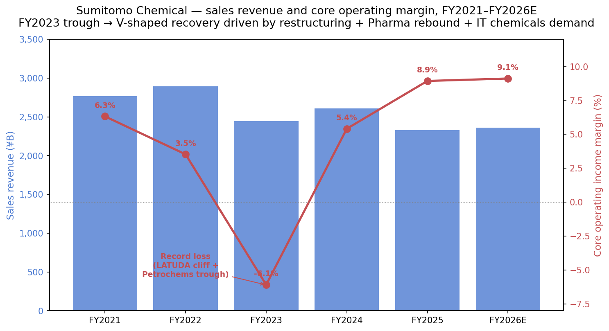
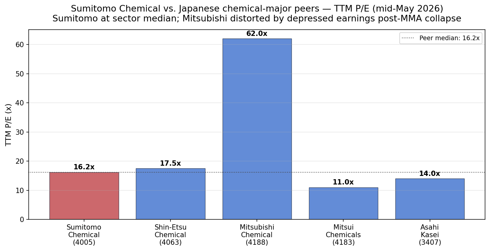
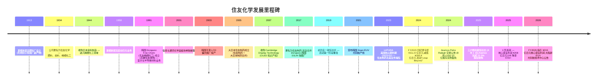
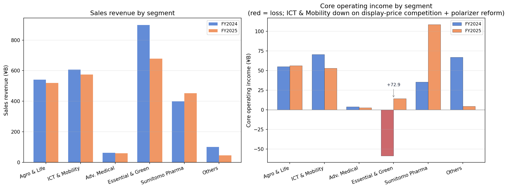
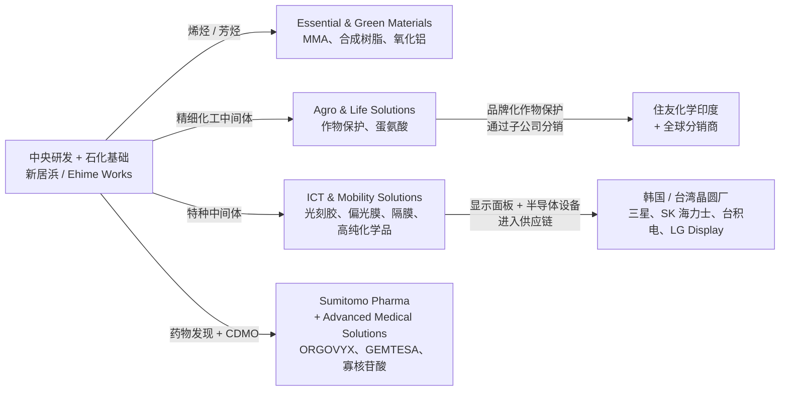
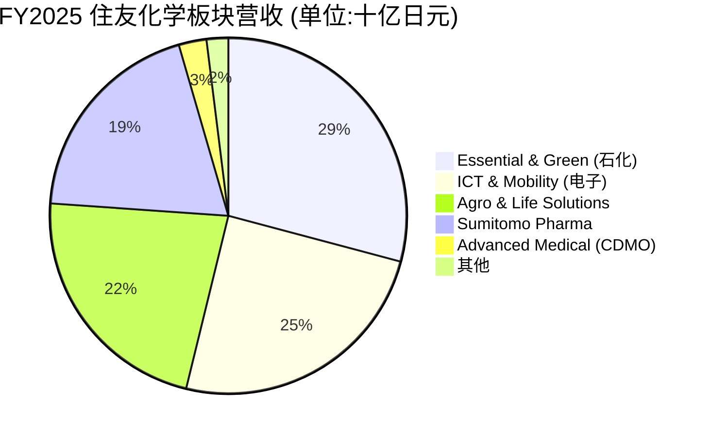
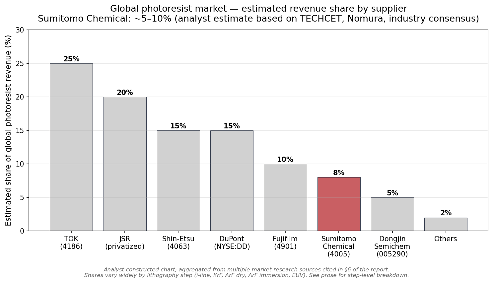
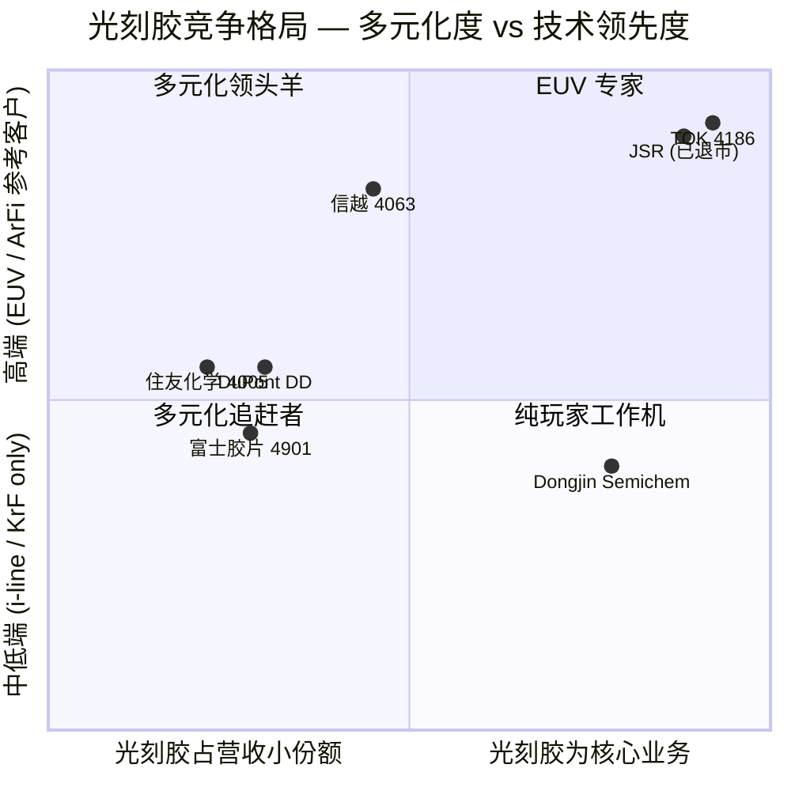
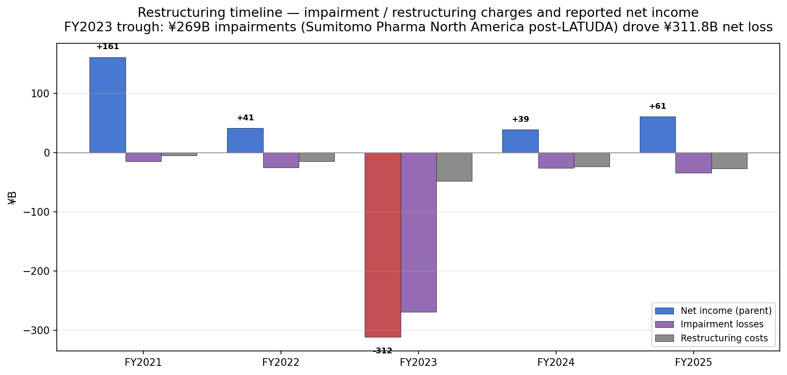

# 公司研究报告:住友化学 (Sumitomo Chemical, TSE:4005)

**报告日期:** 2026-05-25
**股票代码:** TSE:4005 (东京证券交易所 Prime 市场)
**ADR:** SOMMY (OTC) / SOMMF
**行业归类:** 多元化化工 — 石化 / petrochemicals、电子材料、农药 / agrochemicals、处方药 / pharmaceuticals
**总部:** 日本东京中央区新川 2-27-1 住友双子大厦 (东馆)
**创立年份:** 1913 年 (爱媛县新居浜 — 别子铜山炼铜厂的肥料附属厂)
**财年截止:** 4 月 1 日 — 次年 3 月 31 日 (FY2025 即截至 2026-03-31 的年度)

---

> **更新 — FY2026 业绩指引发布 (2026-05-14):** 在 FY2025 强劲收尾 (营收 ¥2,328.5 亿日元,同比 –10.7%,主要受 Petro Rabigh 出表与日元升值影响;核心营业利润 ¥208.4 亿日元,同比 +48.3%) 的基础上,管理层公布 FY2026 指引:营收 ¥2,360 亿日元 (+1.4%)、核心营业利润 ¥215 亿日元 (+3.2%)、营业利润 ¥177 亿日元 (+16.6%)、净利润 ¥70 亿日元 (+14.9%) — 意味着从 FY2023 创纪录亏损起步的复苏将进入连续第三年。全年股利提升至 ¥16/股 (FY2025 为 ¥13.5/股,FY2024 仅 ¥9/股)。
> 来源:[Key Figures of Consolidated Financial Results for FY2025, 2026-05-14](https://www.sumitomo-chem.co.jp/english/news/files/docs/20260514e_1.pdf), 第 1、3 页。

> FY2025 报表本身只是 V 形反转的"第二阶段" — 营业利润 ¥151.7 亿日元低于 FY2024 的 ¥193.0 亿日元,纯粹是因为 FY2024 包含 Petro Rabigh 债务豁免带来的 ¥83.6 亿日元一次性权益法收益,而底层的核心营业利润其实大幅攀升。归母净利润同比 +57.9% 至 ¥60.9 亿日元,净资产/总资产比率改善 340 bps 至 29.6%,有息负债在两年复苏期内净偿还 ¥277 亿日元 ([FY2025 results, p. 1](https://www.sumitomo-chem.co.jp/english/news/files/docs/20260514e_1.pdf);[FY2024 results, 2025-05-14](https://www.sumitomo-chem.co.jp/english/news/files/docs/20250514_1e.pdf), 第 1 页)。

---

## 目录

1. 公司概览
2. 公司历史
3. 管理团队
4. 产品与服务
5. 客户与上市策略
6. 行业概览
7. 竞争格局
8. 市场机会 (TAM)
9. 风险评估
10. 参考资料

======================================

## 1. 公司概览

住友化学 (Sumitomo Chemical, TSE:4005) 是日本"三大"多元化化工巨头之一 (与三菱化学集团、三井化学并列),也是 **住友集团 (Sumitomo keiretsu) / 住友グループ** 的旗舰成员之一 — 该集团是一张可追溯至 17 世纪住友家族在别子铜山经营铜矿的财阀系企业与金融机构网络 ([Sumitomo Chemical Company History](https://www.companieshistory.com/sumitomo-chemical/);[Sumitomo Chemical 100 Years](https://www.sumitomo-chem.co.jp/english/company/files/docs/100years_history_English.pdf), 第 11 页)。集团目前按照五个业务板块对外披露 — **农业与生命解决方案 (Agro & Life Solutions)** (作物保护、蛋氨酸、家用杀虫剂)、**信息与通讯化学品与移动出行解决方案 (ICT & Mobility Solutions)** (光刻胶 / photoresist、偏光膜 / polarizing film、半导体高纯化学品、锂电池隔膜、工程塑料)、**先进医疗解决方案 (Advanced Medical Solutions)** (小分子、寡核苷酸、再生医疗的 CDMO 业务)、**基础与绿色材料 (Essential & Green Materials)** (石化产品、合成树脂、甲基丙烯酸甲酯 (MMA)、工业氧化铝)、以及 **住友制药 (Sumitomo Pharma, TSE:4506)** (单独上市但纳入合并报表的小分子药企子公司) ([FY2025 Financial Results, 2026-05-14](https://www.sumitomo-chem.co.jp/english/news/files/docs/20260514e_1.pdf), 第 12 页)。

住友化学的商业模式因此是 **四类截然不同的收入流被住友品牌与共享的中央研发底座粘合在一起**。(i) **B2B 特种材料** — 光刻胶、偏光膜、高纯化学品、电池隔膜 — 通过多年期认证流程直接卖给少数半导体 / 显示面板 / 锂电客户;此即 ICT & Mobility Solutions 板块,FY2025 营收 ¥574.2 亿日元 (占集团 24.7%)、核心营业利润 ¥53.0 亿日元、**核心营业利润率 9.2%** ([FY2025 results, p. 1](https://www.sumitomo-chem.co.jp/english/news/files/docs/20260514e_1.pdf))。(ii) **品牌化作物保护业务**,通过住友自营销售子公司以及单独上市的 **住友化学印度 (Sumitomo Chemical India, NSE:SUMICHEM)** 全球分销 — Agro & Life Solutions FY2025 营收 ¥519.3 亿日元、核心营业利润 ¥56.3 亿日元、利润率 10.8%。(iii) **大宗石化产品**,核心是 Saudi Arabia 的 Petro Rabigh 合资公司 (2024 年 8 月将控制权移交沙特阿美 Aramco 后,改为权益法核算) 以及国内剩余的 MMA / 树脂业务 — Essential & Green Materials FY2025 营收 ¥678.8 亿日元、核心营业利润 ¥14.4 亿日元,内含 ¥55.8 亿日元的业务转让收益 ([FY2025 results, p. 13](https://www.sumitomo-chem.co.jp/english/news/files/docs/20260514e_1.pdf))。(iv) **处方药业务**,通过住友制药交付 — FY2025 营收 ¥451.9 亿日元、核心营业利润 ¥108.4 亿日元,正从 FY2023 LATUDA 专利悬崖 (patent cliff) 引发的集团创纪录亏损中艰难复苏 ([住友製薬 FY2024 results, 2025-05-13](https://www.sumitomo-pharma.com/ir/library/financial_results_summary/assets/pdf/ebr20250513.1.pdf))。

从运营层面看,住友化学是 **以日本为重心的制造与研发基地,加上具有相当全球化广度的销售网络**。集团 FY2025 **海外销售占比 71.0%** — 较 FY2024 的 69.9% 进一步提升 — 客户基础高度集中在亚洲非日本地区 (半导体 / 面板材料供给韩国与台湾晶圆厂、农药供给印度 / 巴西 / 东南亚、处方药主要销往北美)。员工总数从 FY2023 末的 32,161 人下降至 **FY2025 末的 27,491 人** — 两年累计裁员 14.5%,这是其结构性裁员叙事的核心数字 ([FY2025 results, p. 3](https://www.sumitomo-chem.co.jp/english/news/files/docs/20260514e_1.pdf);[FY2024 results, p. 3](https://www.sumitomo-chem.co.jp/english/news/files/docs/20250514_1e.pdf))。同期合并子公司与权益法投资公司总数从 212 家降至 175 家,反映集团已陆续退出 Nihon Medi-Physics 放射性药物 (出售给 GE Healthcare)、住友 Bakelite 权益、Petro Rabigh 控制权 (卖给 Aramco)、铝业、亚洲部分制药业务 (转给 Marubeni)、及部分合成树脂线 ([FY2025 results, p. 3](https://www.sumitomo-chem.co.jp/english/news/files/docs/20260514e_1.pdf);[Fierce Pharma, 2025-04-01](https://www.fiercepharma.com/pharma/japans-marubeni-takes-sumitomos-asia-pharma-business-make-new-company-deal-worth-300m))。

**规模与资产负债表。** FY2025 营收 ¥2,328.5 亿日元 (按 150 日元/美元约合 USD 15.5 亿美元) 使住友化学位列全球化工营收排名 #18–20 — 与 Solvay / Syngenta 接近,落后于三菱化学 (¥4.4 万亿日元) 但领先三井化学 (¥1.7 万亿日元) ([C&EN Global Top 50, 2025-07](https://cen.acs.org/articles/103/web/2025/07/CENs-Global-Top-50-2025.html))。FY2025 核心营业利润率 8.9% — 在日本多元化化工同业中已属偏高,但仍远低于产品组合更聚焦电子材料的信越化学 (Shin-Etsu Chemical) 的 25%+ ([Shin-Etsu Chemical IR — Annual Report](https://www.shinetsu.co.jp/en/ir/))。净有息负债从一年前的 ¥1,076.3 亿日元降至 ¥942.9 亿日元,**资产负债率 (D/E) 从 1.20× 改善到 0.93×** ([FY2025 results, p. 2](https://www.sumitomo-chem.co.jp/english/news/files/docs/20260514e_1.pdf)) — 这是集团从 FY3/2024 谷底 (D/E 一度突破 1.3×、标普长期评级被下调) 走出来的关键一步。

*数据来源:整合自 [FY2025 Financial Results, 2026-05-14](https://www.sumitomo-chem.co.jp/english/news/files/docs/20260514e_1.pdf), 第 1 页、[FY2024 Financial Results, 2025-05-14](https://www.sumitomo-chem.co.jp/english/news/files/docs/20250514_1e.pdf), 第 1 页, 以及 FY2021/FY2022 历史数据 [Integrated Report 2023](https://www.sumitomo-chem.co.jp/english/ir/library/annual_report/files/docs/ar2023_6e.pdf)。核心营业利润 (core operating income) 是住友化学基于 IFRS 自定义的损益指标,扣除非经常性项目 (减值、重组费用、固定资产出售损益);FY2023 数字内含 ¥269.4 亿日元的减值损失,主体是住友制药 LATUDA 专利悬崖后对北美无形资产的减值。*

### 估值快照 (REQUIRED)

截至 2026 年 5 月下旬,住友化学在东京证券交易所 Prime 市场约 **¥603 / 股** 交易,**市值约 ¥995.8 亿日元 (≈ USD 6.6 亿美元)** ([Stockanalysis.com — 4005.T market cap](https://stockanalysis.com/quote/tyo/4005/market-cap/))。市场已对该名进行了较大幅度的重新定价:过去 12 个月市值上涨 **+87.4%**,过去 5 个月 (自 2025 年末) 涨幅 **+36.5%**,反映投资者正在追认 FY2024 → FY2025 核心营业利润的剪刀差,以及 Petro Rabigh 交易正式收口 ([companiesmarketcap — Sumitomo Chemical](https://companiesmarketcap.com/sumitomo-chemical/marketcap/))。

- **TTM P/E ≈ 16.2×**,基于 FY2025 公布 EPS ¥37.16 (¥603 / ¥37.16 = 16.23×);**Forward P/E ≈ 14.2×**,基于 FY2026 指引 EPS ¥42.40 ([FY2025 results, p. 1](https://www.sumitomo-chem.co.jp/english/news/files/docs/20260514e_1.pdf);[Stockanalysis 4005 statistics](https://stockanalysis.com/quote/tyo/4005/))。
- **TTM P/S ≈ 0.43×**,基于 FY2025 营收 ¥2,328.5 亿日元 — 这是低利润率多元化化工企业的典型估值;作为对比,信越化学约 3.0× 销售额、Linde 约 5×,而三井化学、三菱化学的水平在 0.4–0.7× 之间 ([companiesmarketcap PS — Mitsui Chemicals](https://companiesmarketcap.com/mitsui-chemicals/ps-ratio/);[companiesmarketcap PS — Mitsubishi Chemical](https://companiesmarketcap.com/mitsubishi-chemical/ps-ratio/))。
- **P/B ≈ 0.99×**,基于 FY2025 每股账面权益 ¥610.78 — 也就是说,在 6.4% ROE 的情况下,股票几乎以净资产价交易;FY2023 末计入的折让 (P/B 一度跌破 0.65×) 已大致回补,但要持续重估,仍需 FY2026E 6.8% 的 ROE 朝管理层中期 8% 目标连续多年复利。
- **股息收益率 ≈ 2.7%**,基于 FY2025 实际派息 ¥13.5/股;前瞻 **股息收益率 ≈ 3.3%**,基于 FY2026 指引 ¥16/股 ([FY2025 results, p. 1](https://www.sumitomo-chem.co.jp/english/news/files/docs/20260514e_1.pdf))。

**同业基准 (截至 2026 年 5 月中):**

*数据来源:TTM P/E 数据来自 [Stockanalysis.com TYO:4005](https://stockanalysis.com/quote/tyo/4005/)、[Macrotrends — Mitsubishi Chemical Holdings P/E](https://www.macrotrends.net/stocks/charts/MTLHY/mitsubishi-chemical-holdings/pe-ratio)、[Simply Wall St — Shin-Etsu valuation](https://simplywall.st/stocks/jp/materials/tse-4063/shin-etsu-chemical-shares/valuation),以及 [companiesmarketcap PE 页面](https://companiesmarketcap.com/sumitomo-chemical/pe-ratio/)。三菱化学 62× 的 TTM P/E 反映的是 FY2024 MMA 市场恶化压缩的 TTM EPS — 并非高估值;按前瞻基础三菱化学接近 14–16×。*

- **信越化学 (Shin-Etsu Chemical, TSE:4063)** — 与住友最接近、电子材料占比更高的同业 — TTM P/E ~17.5×、P/S ~3.0×,营业利润率是住友的若干倍 (FY2024 营业利润率 >25%)。这一溢价反映的是信越在硅胶 + 300mm 硅晶圆领域的统治力 ([Shin-Etsu Investor Information](https://www.shinetsu.co.jp/en/ir/);[Simply Wall St — Shin-Etsu valuation](https://simplywall.st/stocks/jp/materials/tse-4063/shin-etsu-chemical-shares/valuation))。
- **三菱化学 (Mitsubishi Chemical, TSE:4188)** — 体量相近的多元化化工同业 (¥4.4 万亿日元营收) — MMA 跌价后 TTM P/E 拉高至 ~62×,前瞻 P/E 回落至 ~15× ([Macrotrends](https://www.macrotrends.net/stocks/charts/MTLHY/mitsubishi-chemical-holdings/pe-ratio))。
- **三井化学 (Mitsui Chemicals, TSE:4183)** — TTM P/E ~11× — 更接近传统石化倍数 ([Mitsui Chemicals financial results, 2026-05-12](https://jp.mitsuichemicals.com/en/release/2026/2026_0512_2/index.htm))。
- **旭化成 (Asahi Kasei, TSE:3407)** — FY2024 利润翻倍后 TTM P/E ~14× ([C&EN, 2026-05](https://cen.acs.org/articles/104/web/2026/05/japanese-chemical-makers-2025-earnings.html))。
- **Resonac (TSE:4004)** — 由昭和电工 / 日立化成合并而来 — 因石墨电极与石化业务的历史减值,TTM EPS 仍为负;参考前瞻 P/E ~18× 的卖方一致预期。

同业 TTM P/E 中位数约 14–16×;住友化学 16.2× **落在中位数**,从绝对盈利来看既不便宜也不昂贵。多头视角的论点是 FY2026 指引 EPS ¥42 低估了正常化运行水平,在 ICT 板块 (面板价格战) 与 Essential & Green 波动同时缓和后,正常化 EPS 应在 ¥60–70 区间,这意味着前瞻 P/E 可压缩到个位数高位 — 这是卖方目标价 ¥700+ 的核心依据 ([Investing.com 分析师目标价集成](https://www.investing.com/equities/sumitomo-chemical-co.,-ltd.))。

**估值倍数分解 — 为什么 16× 不算"折扣买入"。** 三点背景:(a) 股价过去 12 个月已涨 +87%,V 形复苏的重估行情大部分已被反映在股价里。(b) 两个最优质板块 (ICT & Mobility、Agro & Life) FY2025 合计核心营业利润 ¥109 亿日元、合计营收 ¥1,094 亿日元 — 单算这两块,即使剔除住友制药,在同业倍数下也已对应核心营业利润 >7× 的隐含估值,**分部加总法 (SOTP) 也找不到明显折让**。(c) 真正打折的部分是 Petro Rabigh 残留的 15% 股权 — 住友的权益法风险敞口仍具波动性,且 Aramco 现为控股方、拥有营销权转让权 ([Petro Rabigh marketing rights transfer, Argaam](https://www.argaam.com/en/article/articledetail/id/1848454))。整体看,4005 是一只 **定价合理的周期股,对电子材料下行或 Leap Beyond 计划第三阶段顺利兑现都具备远超平均水平的非对称弹性**。

*分析师观点:* 当前 16× 倍数不是"困境反转 (turnaround)"的折扣价 — 主要的反转红利已在过去 12 个月内被消化。下一阶段的超额收益来源更可能是 (a) ICT & Mobility 摆脱面板价格战开始正常化、(b) 农药板块业绩持续扩张、(c) 住友制药三药 (ORGOVYX / MYFEMBREE / GEMTESA) 兑现峰值销售 — 任一条线断链,都会令股价回吐部分涨幅。

---

## 2. 公司历史

住友化学的起源故事是日本最紧密的"环保 — 工业"反馈闭环之一。住友家族自 1691 年发现以来一直在爱媛县经营 **别子铜山 / Besshi Copper Mine**,到 20 世纪初冶炼厂排放的二氧化硫已严重污染周边农田 ([Sumitomo Group Public Affairs Committee — Quotes with Enduring Value](https://www.sumitomo.gr.jp/english/history/analects/03/))。**1913 年**,住友家族年长者铃木马左也下令在炼铜厂旁建设一家肥料厂,把硫排放转化为过磷酸钙肥料 — 这一工艺同时实现了空气净化与可销售产品 — 这是工业副产物循环经济最早的成文案例之一 ([Sumitomo Chemical 100 Years, p. 11](https://www.sumitomo-chem.co.jp/english/company/files/docs/100years_history_English.pdf))。1925 年法人化为"住友肥料制造株式会社",1934 年更名为"住友化学工業株式会社",战后住友财阀重组后在东京证券交易所上市。

**三次战略转向定义了今天的住友化学。** 第一,**1940 年代中期从化肥外延至精细化工** — 1944 年战时收购日本染料制造,为今天支撑住友制药和 Agro & Life Solutions 的精细化工 / 农药平台埋下种子 ([Sumitomo Chemical history page](https://www.companieshistory.com/sumitomo-chemical/))。第二,**2001 年信息与通讯化学品板块的独立分拆** — 一次刻意的押注:韩国与台湾的 LCD 与半导体晶圆厂将重写光刻胶、偏光膜、半导体高纯工艺化学品的需求曲线;之后公司又在 **2007 年以 £1.9 亿英镑收购 Cambridge Display Technology** 拿下 OLED 知识产权,并逐步吸收韩国专业子公司 Dongwoo Fine-Chem ([THE ELEC — Sumitomo to build photoresist factory in South Korea, 2021](https://www.thelec.net/news/articleView.html?idxno=3311);[InvestKOREA — Dongwoo Fine-Chem](https://www.investkorea.org/ik-en/bbs/i-468/detail.do?ntt_sn=71927))。第三,**2024–2025 紧急重组** — 在卸任社长岩田圭一主导下,集团让出 Petro Rabigh 控股权、将 Nihon Medi-Physics 放射性药物股权卖给 GE Healthcare、对住友制药北美业务进行结构性裁员、并宣布将大江工厂的锂电池隔膜业务关停,集中到韩国 SSLM 产线 ([PERVIO restructuring announcement, 2025-11-13](https://www.sumitomo-chem.co.jp/english/news/detail/20251113e.html);[Fierce Pharma — Marubeni Asia pharma deal, 2025-04-01](https://www.fiercepharma.com/pharma/japans-marubeni-takes-sumitomos-asia-pharma-business-make-new-company-deal-worth-300m))。

**关键收购。** (i) **Cambridge Display Technology, 2007 (£1.9 亿英镑)** — 偏光膜与 OLED 材料业务的 OLED 知识产权基础。(ii) **Botanical Resources Australia Group, 2017** — 天然除虫菊作物保护原料。(iii) **2019–2022 通过住友制药对 Roivant Sciences 多家子公司的股权收购** — ORGOVYX (GnRH 拮抗剂,前列腺癌)、MYFEMBREE (GnRH 复合剂,子宫肌瘤)、GEMTESA (β3 受体激动剂,膀胱过度活动症),外加仍在研发中的管线 — 住友制药为此付出约 USD 30 亿美元现金 + 承担债务的总代价。这三款药如今成为接棒 LATUDA 失独占销售额的核心增长支柱 ([住友製薬 FY2024 results, 2025-05-13](https://www.sumitomo-pharma.com/ir/library/financial_results_summary/assets/pdf/ebr20250513.1.pdf), 第 1–2 页)。

**近期发展** (过去 18 个月)。FY3/2024 是住友化学历史上 **单一最差的年度**:归属于母公司股东的净亏损创纪录 ¥311.8 亿日元、减值损失 ¥269.4 亿日元 (主要为住友制药北美无形资产)、ROE –29.2% ([FY2024 results, p. 1](https://www.sumitomo-chem.co.jp/english/news/files/docs/20250514_1e.pdf))。三个驱动因素:(a) **LATUDA 专利悬崖** 于 2023 年 2 月落下,住友制药北美营收从年化 USD 15 亿美元规模塌陷至 USD 不足 2 亿美元,被迫对 2019 年收购 Roivant 多家子公司形成的商誉与无形资产进行大规模减值;(b) **甲基丙烯酸甲酯 (MMA) 价格崩塌** 与亚洲新增产能投放,把 Essential & Green Materials 板块拖入 FY2023 ¥89.1 亿日元的核心营业亏损;(c) **Petro Rabigh 经济基本面恶化**,沙特阿拉伯的滞留乙烯裂解联合装置在 2020 年需要股东 USD 20 亿美元贷款注入 (与 Aramco 平分),并在 2024–2025 年最终通过 USD 15 亿美元贷款豁免才能清干净资产负债表,以便 Aramco 控股 ([Aramco — Petro Rabigh closing, 2025-08 (Hydrocarbon Engineering 镜像)](https://www.hydrocarbonengineering.com/refining/09102025/aramco-completes-acquisition-of-additional-stake-in-petro-rabigh/);[Arab News, 2025](https://www.arabnews.com/node/2618289/business-economy))。FY2024 接着完成了 **V 形反转**:核心营业利润回到 ¥140.5 亿日元、ROE 重回 +4.1%、经营性现金流 ¥233 亿日元。FY2025 进一步改善 (核心营业利润 ¥208.4 亿日元、ROE 6.4%),FY2026 指引 (2026-05-14 发布) 又向管理层中期目标迈了一步 — 中期目标为 FY2027 核心营业利润 ¥200 亿日元、ROE 8%、集团 ROIC 6% ([Corporate Business Plan FY2025-2027 press release, 2025-03-04](https://www.sumitomo-chem.co.jp/english/news/detail/20240304e.html))。

---

## 3. 管理团队

### 三户胜利 (Mito Katsutoshi) — 社长兼代表董事、CEO (2025 年 4 月 1 日起任职)

三户胜利于 2025 年 4 月 1 日正式接任住友化学社长职务,2025 年 6 月股东大会后成为代表董事兼 CEO ([Directors & Senior Management page](https://www.sumitomo-chem.co.jp/english/company/executives/);[Sumitomo Chemical Press Release, 2025-02-03](https://www.sumitomo-chem.co.jp/english/news/files/docs/20250203e_1.pdf))。三户 (1960 年 8 月 4 日生于广岛) 在 **名古屋大学 (Nagoya University, 1985)** 获农业化学硕士学位,后于 **筑波大学 (University of Tsukuba, 1991)** 取得农业科学博士学位 ([Bloomberg — Nobuaki Mito profile](https://www.bloomberg.com/profile/person/16800710)) — 这种"研究型科学家"的学术背景在日本大型多元化化工巨头掌门人中并不常见 — 多数同业 CEO 的典型路径是化学或工程本科 + MBA 或公司内部 GM 路线。三户在硕士毕业当年 (1985) 即加入住友化学,前 20 年主要在 **Health & Crop Sciences 板块** 从事杀虫剂 / 除草剂分子开发与登记;2015 年升任执行干部 (Executive Officer)、2018 年升任常务执行干部 (Managing Executive Officer)、2020 年升任代表董事兼常务执行干部、2021 年升任专务执行干部 — 最近一次线性职务是 **Health & Crop Sciences 板块社长**,直到 2024 年该板块重组为 Agro & Life Solutions ([Rubber World — Sumitomo names Mito](https://rubberworld.com/sumitomo-chemical-names-nobuaki-mito-as-president-and-chairman-of-the-board/);[Indian Chemical News, 2025](https://www.indianchemicalnews.com/people/sumitomo-chemical-appoints-new-chairman-and-president-25014))。

公司在其董事简历披露中具体记述了三户在过往职务中的几项重要成果:(i) 主导 **Health & Crop Sciences 板块与住友化学印度 (NSE:SUMICHEM, 60.3% 持股子公司) 的整合**,使全球农药业务在化工同业大面积整合中保持高个位数增速 — Agro & Life Solutions FY2025 实现 ¥56.3 亿日元核心营业利润 / ¥519 亿日元营收;(ii) 主导 **蛋氨酸业务的扭亏**,推动该板块营业利润从 FY2023 到 FY2024 改善 ¥28.6 亿日元 ([FY2024 results, p. 2](https://www.sumitomo-chem.co.jp/english/news/files/docs/20250514_1e.pdf));(iii) 担任过知识产权与企业业务开发总经理,负责 Cambridge Display Technology 的整合工作,以及 2020 年代初的组合业务评估 — 这些评估最终孵化出 Leap Beyond 重组计划 ([Directors & Senior Management page](https://www.sumitomo-chem.co.jp/english/company/executives/))。这次提名由公司提名咨询委员会 (5 名独立外部董事 + 董事长 + 卸任社长) 完成,新闻稿援引其"塑造与执行愿景的能力、组织领导力、变革驱动力、技术洞察力,以及国际经验"作为入选理由 ([Sumitomo Chemical Appoints New Chairman and President, 2025-02-03](https://www.sumitomo-chem.co.jp/english/news/files/docs/20250203e_1.pdf))。

三户的个人持股比例未单独披露 (在日本非创始人高管中通常 <0.1%)。新任社长的薪酬延续住友 2017 年引入的 BIP Trust (股票激励) 计划,分三部分:基础工资、与合并核心营业利润挂钩的年度绩效奖金,以及与 ROIC 和 TSR 挂钩的多年股权激励 ([Sumitomo Chemical Corporate Governance Report, 2024](https://www.sumitomo-chem.co.jp/english/company/governance/))。

*分析师观点:* 三户胜利的"农业 — 印度 — 知识产权"复合背景与 Leap Beyond 计划的资本配置方向高度一致 — 即把资源从大宗石化与北美制药转向 ICT & Mobility 和 Agro & Life。这是住友首次让具有 Agro 板块运营资历的人接班,意味着 Agro 板块在新管理层中将得到 disproportionate 的关注 — 这一点对未来 3 年的资本配置具有可观察的指向意义。

### 岩田圭一 (Iwata Keiichi) — 董事会主席 (2025 年 4 月 1 日起任职)

岩田圭一与三户同步上任 — 2025 年 4 月起担任董事会主席,此前任代表董事兼社长 (2019–2025) 整整六年,带领住友化学穿越 LATUDA 专利悬崖、Petro Rabigh 重组,并主导 Leap Beyond 的诞生。岩田 (1957 年 10 月 11 日生) 于 **1982 年** 本科毕业后即加入住友化学,职业生涯主要在 **石化与塑料板块** — 包括 1990 年代驻新加坡参与亚洲石化产能扩张,以及多年从住友角度对接 Petro Rabigh 沙特阿美合资关系 ([Bloomberg — Keiichi Iwata profile](https://www.bloomberg.com/profile/person/16800710);[Sumitomo Chemical executives page](https://www.sumitomo-chem.co.jp/english/company/executives/))。岩田 2010 年升执行干部、2013 年升常务、2018 年升专务、2019 年 6 月升代表董事兼社长 — 其 2019 年的接班时点恰逢 Petro Rabigh 早期紧张信号开始出现。

岩田在社长任内具体兑现了三件事:(i) **集团历史上最激进的资产剥离计划** — 新中期计划目标是 FY2023 到 FY2027 五年累计现金生成约 ¥900 亿日元,其中截至 FY2024 末已实现 ¥700 亿日元,实现路径包括出售 Nihon Medi-Physics 股权、住友 Bakelite 股权、住友化学工程、Petro Rabigh 控股权、铝业、亚洲制药、中国偏光膜业务 (Sunnypol)、Ohe 工厂隔膜线等 ([Under Pressure, Japan's Chemical Giants Pivot, C&EN, 2025-04](https://cen.acs.org/business/investment/Under-pressure-Japans-chemical-giants/103/web/2025/04);[PERVIO restructuring, 2025-11-13](https://www.sumitomo-chem.co.jp/english/news/detail/20251113e.html));(ii) **Aramco-Petro Rabigh 交易** — 2024 年 8 月公告,2025 年 1 月签署,将 22.5% 增量股权转让给 Aramco,对价 USD 7.02 亿美元 + USD 15 亿美元的股东贷款豁免,Petro Rabigh 不再纳入合并债务 ([Aramco closing announcement, October 2025](https://www.hydrocarbonengineering.com/refining/09102025/aramco-completes-acquisition-of-additional-stake-in-petro-rabigh/));(iii) **2025 年 3 月发布"Leap Beyond"三年期 (FY2025-2027) 公司业务计划**,把 ¥220 亿日元的研发预算和 80% 的战略资本支出重定向至 Agro & Life Solutions 与 ICT & Mobility Solutions,FY2027 板块 ROIC 目标:ICT 11%、Agro 8% ([Sumitomo Chemical Launches Leap Beyond Plan, 2025-03-04](https://www.sumitomo-chem.co.jp/english/news/detail/20240304e.html))。岩田的董事长职责被公司定位为"过渡期监护人"角色 — 负责董事会和外部关系 (Aramco、住友集团公共事务委员会) 的对外协调,而三户负责运营与战略执行。

*分析师观点:* 这种"卸任社长升任主席,新任社长来自其它板块"的模式在日本大公司里非常典型 — 通常意味着前任希望在战略上保留控制 (Petro Rabigh 这种横跨任期的事项尤其需要),同时把日常运营让给新管理层。住友的具体安排是合理的 — 岩田主导的 Petro Rabigh 退出还有未完结的尾巴 (15% 残留股权、产品营销权移交),需要他在主席职位上看完;三户掌握具体的资本配置和板块执行节奏,空间足够。

---

## 4. 产品与服务

> **第 4 章篇幅说明。** 由于住友化学是一家由 5 个板块组成的多元化综合体,第 4 章会比单一业务公司更长;但鉴于本报告将作为 **7 家光刻胶供应商对比研究** 的组成部分,ICT & Mobility Solutions 板块 (光刻胶所在之处) 将获得 **超过其 24.7% 营收占比的深度**。石化、农药、制药三大板块各做一次走查。

### 4.1 板块产品矩阵 (摘自 FY2025 业绩报告)

根据住友化学 FY2025 合并财务报告,集团报告五个业务板块。各板块主要产品 / 服务的逐字描述如下:

| 报告板块 | 主要产品与服务 (摘自原文) |
|---|---|
| **Agro & Life Solutions** (农业与生命解决方案) | "作物保护化学品、肥料、农业资材、家用杀虫剂、传染病防控制品、饲料添加剂等" |
| **ICT & Mobility Solutions** (信息与通讯化学品与移动出行解决方案) | "光学产品、半导体处理材料、化合物半导体材料、触摸屏感应面板、高纯铝及氧化铝、特种化学品、添加剂、工程塑料、电池材料等" |
| **Advanced Medical Solutions** (先进医疗解决方案) | "先进小分子药、寡核苷酸 / oligonucleotides、再生医疗与细胞疗法的合同开发与生产 (CDMO) 业务等" |
| **Essential & Green Materials** (基础与绿色材料) | "合成树脂、合成纤维原料、各类工业化学品、甲基丙烯酸甲酯 (MMA) 产品、合成树脂加工品、工业氧化铝、合成橡胶等" |
| **Sumitomo Pharma** (住友制药) | "小分子处方药" |

来源:[FY2025 Financial Results, Segment Information, p. 12](https://www.sumitomo-chem.co.jp/english/news/files/docs/20260514e_1.pdf)。

*数据来源:整合自 [FY2025 Financial Results, 第 1 页](https://www.sumitomo-chem.co.jp/english/news/files/docs/20260514e_1.pdf) 的板块数据。注意 Essential & Green Materials 同比 +¥72.9 亿日元 (从 –¥58.5 亿日元到 +¥14.4 亿日元) 的剧烈摆动 — 由 Petro Rabigh 出表 (不再用权益法摊亏损) 与 ¥55.8 亿日元的业务转让收益共同驱动。ICT & Mobility Solutions 同比 –¥17.5 亿日元 — 这是面板材料的周期性谷底。*

### 4.2 综合解读 — 五个板块如何拼接成一条住友集团的"创新链"

综合解读段落:住友化学是日本两家 (另一家为三菱化学) **中央石化基底向上游 — 下游所有四个高价值垂直市场全部供料** 的多元化化工巨头之一。新居浜出来的烯烃 / 芳烃,既送入 MMA 与合成树脂 (Essential & Green)、又供给作物保护活性成分的精细化工中间体 (Agro & Life)、又成为光刻胶 / 偏光膜配方所需的特种分子骨架 (ICT & Mobility)、并且历史上还参与住友制药 API 的合成路径。Leap Beyond 计划事实上 **把这套垂直一体化模式一分为二** — 上游石化基底保留,但公司选择性剥离中游大宗资产 (Petro Rabigh 控股权、亚洲偏光膜、Ohe 工厂隔膜),并把新增资本集中投入到下游特种产线 (韩国光刻胶产能扩张、大阪 EUV 技术中心、ORGOVYX / GEMTESA 增长)。这一战略转向能否顺利兑现,是整个股票的运营论点所在。

### 4.3 ICT & Mobility Solutions — 光刻胶业务及电子材料组合

住友化学的电子材料业务 — 本报告光刻胶竞争对比研究的重点 — 通过两条主线运行:母公司自有的 **大阪工场 (大阪此花区)** 负责开发,以及 **韩国子公司 Dongwoo Fine-Chem (东友精细化工)** 负责生产并供应韩台晶圆厂 (1990 年代逐步收购,2010 年代末完全合并)。FY2025 ICT & Mobility Solutions 板块录得 **营收 ¥574.2 亿日元、核心营业利润 ¥53.0 亿日元 (利润率 9.2%)**,从 FY2024 的 ¥607.0 亿日元 / ¥70.6 亿日元下滑 — 主要原因是显示器相关材料的"剧烈价格竞争"与"大尺寸液晶显示偏光膜业务的根本性结构改革" ([FY2025 results, p. 2](https://www.sumitomo-chem.co.jp/english/news/files/docs/20260514e_1.pdf))。

**光刻胶 — SUMIRESIST™ (开发) + PEK / PAR / PXi / NX 系列 (生产,通过 Dongwoo Fine-Chem)。**

> 根据住友 ICT & Mobility Solutions 产品页:"SUMIRESIST™" 描述为"用于生产高密度、高度集成电路图案的光敏树脂" ([SUMITOMO CHEMICAL — ICT & Mobility Solutions products](https://www.sumitomo-chem.co.jp/english/products/it_related_chemicals/products/))。

> 根据住友化学高级技术公司 (前 Sumika Electronic Materials / Dongwoo 产品页):"i-line PFI、PFM、PXi、NX 系列"用于关键与非关键应用、"KrF PEK 系列光刻胶"、"ArF PAR 系列 (干式 + 浸没式)"、以及"DyBright™ 品牌彩色光刻胶" ([Semiconductor Photoresists & Functional Cleaning Solutions](https://sumichem-at.com/our-business/semiconductor-photoresists-and-functional-cleaning-solutions/))。

**中文释义 / 平实表述:** 光刻胶 (photoresist) 是在晶圆光刻前旋涂在硅片表面的光敏聚合物薄膜。光刻机透过含有电路图案的光掩模将 UV / DUV / EUV 光投影到晶圆上,光刻胶分子在受光区域要么发生交联 (负胶),要么发生解保护反应 (正胶),显影液随后冲洗掉受光或未受光区域,留下一个浮雕图案 — 该图案作为下一道蚀刻 / 沉积步骤的模板。不同波长 (g-line 436 nm、i-line 365 nm、KrF 248 nm、ArF 193 nm、EUV 13.5 nm) 需要化学组成截然不同的光刻胶 — 聚合物分子量、光产酸剂 (PAG, 光酸发生剂)、保护基、残留金属含量等都不同。住友化学的 i-line 与 KrF 产线是面向后段封装 / 老制程逻辑节点的成熟主力产品;ArF 干式与 ArF 浸没式 (ArFi) 产线是支持 28–7 nm 节点的中周期产品 (这些节点仍占全球晶圆开工的 70%+);**Dongwoo 韩国 Iksan 厂的 EUV 光刻胶产线** (2021 年公告,2024 年完工) 则是支持 sub-7 nm 逻辑与 HBM 存储的前沿产品 ([Sumitomo Chemical EUV expansion, 2021-08-31](https://www.sumitomo-chem.co.jp/english/news/detail/20210831e.html);[THE ELEC — Korea EUV line, 2022](https://www.thelec.net/news/articleView.html?idxno=3311))。根据公司 2025 年 2 月的披露,"本公司过去数年在半导体材料领域的资本投入累计已达约 1000 亿日元" ([Osaka Works expansion announcement, 2025-02-26](https://www.sumitomo-chem.co.jp/english/news/detail/20250226e.html)) — 这一多年期承诺与 2026 年 4 月公告的大阪工场新六层楼 EUV/ArF 技术中心 (目标 FY2027 完工) 共同表明,**尽管 ICT & Mobility 板块短期承压,光刻胶仍然是旗舰级别的增长投资**。

*分析师观点:* 住友化学是 **全球前 5 的光刻胶供应商,具有部分优势**,在 KrF 与 ArF 干式领域与 TOK、JSR、信越、DuPont、富士胶片正面竞争,在 ArFi 与 EUV 中份额较小但正在扩张 — 领先份额仍属 TOK 与 JSR。其护城河由三部分组成:**监管 / 资质切换成本** (晶圆厂在某节点上认证一家新光刻胶供应商需要 6–12 个月试运行)、**Dongwoo 在韩国的产能规模** (对三星与 SK 海力士而言,在 2019 年日本出口管制事件后这是有实际意义的供应链风险对冲)、以及 **公司自称的有机分子型 EUV 光刻胶专有技术知识产权** ([Sumitomo Chemical Osaka expansion, 2025-02-26](https://www.sumitomo-chem.co.jp/english/news/detail/20250226e.html);[TECHCET 2025 advanced photoresist 报告摘录 — Fountyl](https://www.fountyltech.com/news/japanese-companies-monopolize-the-euv-photoresist-supply-market/))。住友在 EUV 参考设计入围方面落后于 TOK 与 JSR,正与富士胶片一道在金属氧化物光刻胶 (MOR) 这一细分领域追赶,2024–2025 年专利申请活动明显加速 ([Photoresist Market Mordor Intelligence, 2025](https://www.mordorintelligence.com/industry-reports/photoresist-market))。

**偏光膜 / polarizing film — SUMIKARAN™ — 用于 LCD 与 OLED 显示。**

> 根据住友产品页:"SUMIKARAN™" — "LC 与 OLED 显示所必需" ([SUMITOMO CHEMICAL — ICT & Mobility Solutions products](https://www.sumitomo-chem.co.jp/english/products/it_related_chemicals/products/))。

**中文释义 / 平实表述:** 偏光膜 / polarizing film 是层压在 TFT-LCD 或 OLED 显示面板两侧的多层光学薄膜,用于控制通过液晶 (LCD 中) 或从 OLED 堆栈发出的 (OLED 中) 光的偏振状态,从而实现像素级别的光调制。65 寸 LCD 电视每侧约用偏光膜 1.2 m²;智能手机 OLED 单位面积更小,但单价毛利更高。2010 年代的全球供给主要由日东电工 (Nitto Denko, 日本)、住友化学、LG 化学三家垄断 — 合计约占 70% 全球份额 ([Polarizer Film Market Reports and Data, 2024](https://www.reportsanddata.com/report-detail/polarizer-film-market);[Polarizer Display Panel Valuates, 2025](https://reports.valuates.com/market-reports/QYRE-Auto-21K11040/global-polarizer-for-display-panel))。战略现实是,**中国厂商 (京东方 BOE、Sunnypol、杉金光电 / Shanjin Optoelectronic) 在 2022–2025 年大规模进入大尺寸 LCD 偏光膜市场**,挤压价格,日韩老牌企业被迫退出或专攻 OLED 级别。住友化学的应对是 2024 年 12 月公告 **将中国偏光膜生产与裁片处理线出售给 Sunnypol** — 紧接 2024 年 9 月三星 SDI 把偏光膜业务卖给中方收购者之后 ([Polarizer industry shift, OpenPR, 2025](https://www.openpr.com/news/4326496/advanced-optical-films-powering-the-next-generation-of-displays);[Omdia polarizer market piece, 2025-02](https://omdia.tech.informa.com/blogs/2025/feb/a-new-phase-in-the-display-polarizer-market-navigating-concerns-over-supply-shortages))。FY2025 板块评论中提到的"根本性结构改革",指的就是这次大尺寸 LCD 偏光膜业务的退出。

*分析师观点:* 偏光膜对住友而言是 **一项已经结构性下移的传统增长支柱**。未来,公司将偏光膜业务集中于 (a) **面向高端智能手机与平板的 OLED 级偏光膜** — 此处毛利仍可防御 — 以及 (b) 用于车载显示的 **特种光学薄膜** (抗反射、抗眩光、光形塑造)。在高端 OLED 偏光膜中,日东电工 + 住友化学的合计份额仍具实质性;在大尺寸 LCD 偏光膜中,住友的经济敞口已大幅压缩。

**高纯化学品 — 工艺溶剂、蚀刻液、EBR、显影液、CMP 后清洗液 (Sumika Electronic Materials 常州厂 + Dongwoo Fine-Chem Iksan 厂)。**

> 根据住友产品页:"铝溅射靶材" (高纯铝产品)、"化合物半导体材料 (GaAs, GaN)"、"高纯氧化铝 (HPA) — 纯度 >99.99%"、"超高纯铝 — 纯度可达 99.9999%" ([ICT & Mobility Solutions products](https://www.sumitomo-chem.co.jp/english/products/it_related_chemicals/products/))。

> 根据 2025 年 5 月 Dongwoo Iksan 投资公告:"开发重点包括用于先进半导体制程的超高纯化学品、选择性蚀刻剂、光刻胶稀释剂以及在制程清洗剂" ([Sumitomo Chemical Investment in South Korean Subsidiary, 2025-05-13](https://www.sumitomo-chem.co.jp/english/news/detail/20250513e.html))。

**中文释义 / 平实表述:** 高纯化学品是晶圆厂在每个湿法工艺步骤都要用到的"工艺耗材" — HF / TMAH / BOE 蚀刻、SC-1 / SC-2 / IPA 清洗、用于光刻胶涂布的 EBR (edge-bead remover) 溶剂、用于光刻胶显影的 TMAH 显影液、以及 CMP 后清洗用的专有表面活性剂配方。与光刻胶不同,这些是 **高产量、低毛利的"商品化特种品"** — 但规格在 PPT (万亿分之一) 级别才有意义,晶圆厂一旦针对某家供应商的批次特性调校好工艺,认证粘性就非常高。住友化学的定位是:**为韩国晶圆厂提供区域供应安全保障**,通过 Dongwoo 的 Iksan 与平泽厂落地;以及在最先进节点选择性蚀刻液 (其化学体系迭代极快) 中提供 **特种添加剂创新**。集团已明确目标:**"到 FY2030,高纯与功能化学品业务营收较 FY2024 基准翻倍"** ([Dongwoo investment, 2025-05-13](https://www.sumitomo-chem.co.jp/english/news/detail/20250513e.html))。

*分析师观点:* 高纯化学品是 **能见度较低但粘性更高的 ICT & Mobility 第二腿** — 主要对手是 Stella Chemifa (TSE:4109)、Resonac (TSE:4004)、Kanto Chemical (未上市)、三菱化学,以及韩国本土公司 Soulbrain、ENF Technology。住友的竞争优势在于 Dongwoo 在韩国境内的生产基地 — 这是唯一在韩国设有完全自有产能的主要日本光刻胶 / 化学品供应商 — 对韩国晶圆厂客户而言,这是对未来可能再现的 2019 年式日韩贸易摩擦的实质性对冲。

**锂电池隔膜 / lithium-ion battery separator — PERVIO™ — 芳纶涂层锂离子隔膜。**

> 根据住友 Challenge Zero 案例研究:"PERVIO® 是利用芳纶聚合物的优异耐热性与高可靠性等特性制成的锂离子电池耐热隔膜。PERVIO 将由芳纶纤维与陶瓷组成的耐热层与聚烯烃基材结合,有助于提升电池安全性" ([Function of Aramid Separator (Pervio) in Lithium-ion Battery, Sumitomo R&D Report, 2022](https://www.sumitomo-chem.co.jp/english/rd/report/2022E_1.pdf);[Challenge Zero case study](https://www.challenge-zero.jp/en/casestudy/408))。

**中文释义 / 平实表述:** 锂电池隔膜 / lithium-ion battery separator 是放置在正负极之间的多孔薄膜,允许 Li+ 离子穿越但阻止电短路。低端隔膜是纯聚乙烯 / 聚丙烯;高端的"陶瓷涂层"或"芳纶涂层"隔膜在基材上加一层薄涂层 (通常 ≤4 µm),抵抗 180°C 以上温度下的收缩,从而实质性降低热失控概率 — 而热失控正是波音 787、三星 Galaxy Note 7、Tesla Model S 起火事故的失效模式。住友 PERVIO 使用芳纶 (与凯夫拉 Kevlar 同族聚合物) 作为耐热层 — 相对于聚烯烃 + 陶瓷的行业标准,这是一个细分但有差异化的定位。商业现实是,PERVIO **主要供应松下 (Panasonic) 高端 NCA 圆柱电芯,该电芯线又供应特斯拉** ([Green Car Congress on PERVIO, 2015-06-11](https://www.greencarcongress.com/2015/06/20150611-sumitomo.html))。

*分析师观点 (附保留意见):* PERVIO 业务 **结构性承压**。(i) 全球隔膜市场因中国供应商 (云南能投 / SEMCORP、星源材质) 把陶瓷涂层产能扩到数十亿 m²/年规模而被向下重估,价格大幅压缩 — 住友位于日本的 Ohe 工厂 (2006 年投产) 已无法实现经济运行。(ii) 松下 NCA 圆柱电池业务在特斯拉内部的份额被 LG 新能源 + 宁德时代蚕食,松下自己的电芯化学路线也在向 PERVIO 芳纶优势相对弱化的方向演进。2025 年 11 月的重组公告 — 在 2026 年 3 月底前停止 Ohe 工厂的 PERVIO 生产、并整合到位于韩国大邱的更大的 SSLM 工厂 — 是对这一竞争位置的明确承认;日本国内隔膜业务将转向"下一代创新材料的研发"而非量产 ([Sumitomo Chemical PERVIO Business Restructuring, 2025-11-13](https://www.sumitomo-chem.co.jp/english/news/detail/20251113e.html))。整条业务线正在被收缩成一个小得多的特种 EV 利基业务,也是住友 **战略退出** 思路的典型例证。

**其它 ICT & Mobility 产品 — 工程塑料、添加剂、OLED 材料。**

板块还包括 **超工程塑料产品线** (液晶聚合物 LCP 与聚醚砜 PES)、**DyBright 彩色光刻胶** (用于 CMOS 图像传感器与彩色滤光片应用)、**用于移动设备的触摸屏感应面板**,以及 2007 年通过收购 Cambridge Display Technology 获得的 **OLED 材料组合** ([ICT & Mobility Solutions products page](https://www.sumitomo-chem.co.jp/english/products/it_related_chemicals/products/))。这些细分单独看在集团层面规模都不大,但合并起来构成完整的客户产品组合,并为韩台显示晶圆厂客户提供横向交叉销售机会。

### 4.4 Agro & Life Solutions — 品牌作物保护 + 蛋氨酸

农药业务通过住友化学在全球分布的作物保护子公司运行 — 主要包括 **住友化学印度 (Sumitomo Chemical India, NSE:SUMICHEM, 60.3% 子公司)**、**Botanical Resources Australia** (除虫菊),以及自营的北美 / 欧洲业务 — 产品组合涵盖杀虫剂 (噻虫胺 / 拟除虫菊酯类)、除草剂、杀菌剂、植物生长调节剂、家用杀虫剂 (Olyset 防疟蚊帐),以及动物饲料添加剂 (蛋氨酸 / DL-Met) ([Agro & Life Solutions overview](https://www.sumitomo-chem.co.jp/english/products/health_crop_sciences/))。FY2025 板块业绩:营收 ¥519.3 亿日元 (同比 –3.9%)、核心营业利润 ¥56.3 亿日元 (同比 +2.5%,利润率 10.8%) ([FY2025 results, p. 1](https://www.sumitomo-chem.co.jp/english/news/files/docs/20260514e_1.pdf))。结构性吸引力体现在两点:(a) Leap Beyond 计划下,板块 ROIC 目标 **FY2027 达到 8%**,这是两个获得优先资本配置的板块之一;(b) 板块盈利已与石化 / 电子周期脱钩 — 这是市场开始认可的有用多元化属性。

*分析师观点:* 农药是住友化学内部 **最干净的业务之一** — 纯特种化学,营业利润率 10%+,多年期专有配方,增长锚定全球粮食安全 (这个论点同样支撑可比同业 Syngenta、Corteva、FMC)。农药板块也是未来如果管理层决定释放分部估值,**最有可能被分拆 / 单独上市** 的候选业务。

### 4.5 Advanced Medical Solutions — CDMO 业务

这是较新成立的板块 (2024 年 10 月组织重组时新设),整合了住友的小分子 API、寡核苷酸 (RNA / 反义)、以及再生医疗 / 细胞疗法 CDMO 业务 — 其中包括与 **京都大学 iPS 细胞研究中心 (Kyoto-iPSC) 合作的 iPS 细胞平台**,以及 2025 年 2 月与住友制药联合设立的 **RACTHERA 合资公司** ([RACTHERA joint venture, Sumitomo Pharma, 2024-12](https://www.sumitomo-pharma.com/news/20250401-3.html))。FY2025 营收 ¥58.6 亿日元 / 核心营业利润 ¥2.8 亿日元 — 绝对规模较小,但战略可选性较高,尤其是如果寡核苷酸需求 (由 AstraZeneca、Sarepta、Ionis、Alnylam 等外部合作方驱动) 维持预测的 20%+ CAGR。

### 4.6 Essential & Green Materials — 石化业务的尾巴

Essential & Green Materials 是 **传统的石化业务** — 以新居浜为核心的乙烯裂解装置、MMA 单体与 PMMA、合成树脂 (聚乙烯、聚丙烯)、工业氧化铝、合成橡胶、化肥,以及 Petro Rabigh 权益法持股 (Aramco 交易后降至 15%)。FY2025 营收 ¥678.8 亿日元 (同比 –24.5%,主因 Petro Rabigh 出表),核心营业利润 ¥14.4 亿日元 — 较 FY2024 的 –¥58.5 亿日元亏损实现 +¥72.9 亿日元的剧烈摆动,主因是 Petro Rabigh 权益法亏损不再合并 + ¥55.8 亿日元业务转让收益 ([FY2025 results, p. 13](https://www.sumitomo-chem.co.jp/english/news/files/docs/20260514e_1.pdf))。FY2026 指引为营收 ¥560 亿日元 / 核心营业利润 ¥20 亿日元 — 意味着在"清白"的运行水平下 (剥离完成后),该板块是一个个位数低利润率的大宗业务,但已经不再拖累集团整体业绩。

*分析师观点:* Essential & Green Materials **明确按"为现金而经营,不为增长而经营"的逻辑运行**。2026 年 5 月公告的乙烯裂解三方合资 (旭化成 + 三井化学 + 三菱化学 45/45/10 股权,整合日本西部产能) 是 **日本石化行业整体整合** 的最新信号 ([Asahi-Kasei + Mitsui + Mitsubishi ethylene JV, 2026-05-12](https://jp.mitsuichemicals.com/en/release/2026/2026_0512_2/index.htm))。住友化学未参与该合资,意味着其自身的重组路径将通过 **进一步的产能削减** 而非整合实现 — 这与 **石化亏损时代正在尾段化** 的判断一致。

### 4.7 Sumitomo Pharma — 集团盈利的关键摆动项

**住友制药板块 (TSE:4506, 50% 以上合并)** 是 FY2024 → FY2025 复苏中绝对值最大的摆动来源,营收从 ¥398 亿日元增至 ¥451.9 亿日元 (+13.5%),核心营业利润从 ¥35.3 亿日元增至 ¥108.4 亿日元 (+207%) ([住友製薬 FY2024 results, 2025-05-13](https://www.sumitomo-pharma.com/ir/library/financial_results_summary/assets/pdf/ebr20250513.1.pdf);[FY2025 Sumitomo Chemical results, 第 1 页](https://www.sumitomo-chem.co.jp/english/news/files/docs/20260514e_1.pdf))。主要驱动因素:

- **LATUDA 失独占性 (2023 年 2 月)**:鲁拉西酮 (lurasidone) — 住友制药的旗舰非典型抗精神病药 — 主要美国专利于 2023 年 2 月 15 日到期,仿制药涌入将北美营收从年化 USD 15 亿美元水平塌缩至 USD 不足 2 亿美元,这又驱动了 FY2023 ¥269 亿日元住友制药北美无形资产的减值 ([Medthority — Sumitomo FY2023 loss + LATUDA LoE, 2024-05](https://www.medthority.com/news/2024/5/sumitomo-reports-loss-in-fy2023-and-loss-of-exclusivity-for-latuda-lurasidone/);[DrugPatentWatch — LATUDA patent](https://www.drugpatentwatch.com/p/tradename/LATUDA))。
- **三款新药接棒 LATUDA**:**ORGOVYX®** (relugolix,前列腺癌 GnRH 拮抗剂)、**MYFEMBREE®** (relugolix 复合剂,子宫肌瘤 / 子宫内膜异位症)、**GEMTESA®** (vibegron,β3 受体激动剂,膀胱过度活动症 + 良性前列腺增生)。FY2024–2025 三款药在北美增速均 >30% YoY ([住友製薬 FY2024 results, 第 1 页](https://www.sumitomo-pharma.com/ir/library/financial_results_summary/assets/pdf/ebr20250513.1.pdf);[Sumitomo Pharma AUA 2026 — Vibegron data, BioSpace](https://www.biospace.com/press-releases/new-data-from-sumitomo-pharma-america-at-aua-2026-highlight-efficacy-of-vibegron-in-men-aged-75-and-older-with-overactive-bladder-and-bph))。
- **北美裁员重组**:2024 年美国裁员 400+ 人,加上 Sumitomo Pharma North America 商业运营的全面重组,SG&A 较 FY2023 峰值减少 ¥150+ 亿日元 ([Fierce Pharma — Sumitomo US layoffs, 2024](https://www.fiercepharma.com/pharma/sumitomo-pharma-lays-another-400-us-staffers-face-sliding-revenues))。
- **亚洲业务剥离**:住友制药 2025 财年第一季度将亚洲 (日本以外) 业务以最高 USD 4.8 亿美元卖给 Marubeni Global Pharma,贡献 FY2025 板块业绩 ¥50 亿日元业务转让收益 ([Fierce Pharma — Marubeni Asia pharma, 2025-04-01](https://www.fiercepharma.com/pharma/japans-marubeni-takes-sumitomos-asia-pharma-business-make-new-company-deal-worth-300m))。

*分析师观点:* 住友制药的复苏现在 **依赖于三款接棒药 + 肿瘤管线 (含 SAGE Therapeutics 授权的 CNS 项目) 的执行**。鉴于住友化学持有住友制药多数股权但不全控 (住友制药单独上市),合并业绩对 (a) FY2025 ¥54.5 亿日元的少数股东损益 (即住友制药利润中归属于少数股东的部分) 与 (b) 住友制药剥离子公司时的权益法影响都较为敏感。中期论点:若三款接棒药能保持当前增长曲线,管理层又能在 FY2028 前交付一款肿瘤 / CNS 管线资产,该板块就有健康的中长期前景。

---

## 5. 客户与上市策略

住友化学的客户基础 **高度板块化**,且对一家日本巨头来说披露异常不透明 — 集团并未在有价证券报告中公布前五大客户名单,只在合并层面披露 **海外销售占比 (FY2025 为 71.0%)** ([FY2025 results, p. 2](https://www.sumitomo-chem.co.jp/english/news/files/docs/20260514e_1.pdf))。客户映射需要按板块逐一从公开公告、供应链披露与行业研究中拼凑出来。

**ICT & Mobility Solutions 客户。** 光刻胶 + 高纯化学品 + 偏光膜的客户结构是集团内部最集中的:
- **三星电子 + 三星 Display** — KrF / ArF 光刻胶、偏光膜、高纯化学品 (经由 Dongwoo Fine-Chem) 的最大客户;三星合作关系自 1990 年代初对 Dongwoo 的投资以来一直公开披露,2021 年住友宣布韩国 EUV / ArFi 光刻胶产线时也明确将其列为目标客户 ([Sumitomo Chemical S. Korea $90M photoresist plant, KED Global](https://www.kedglobal.com/chemical-industry/newsView/ked202109010005);[InvestKOREA — Dongwoo Fine-Chem](https://www.investkorea.org/ik-en/bbs/i-468/detail.do?ntt_sn=71927))。
- **SK 海力士 (SK Hynix)** — 第二大韩国光刻胶 + 化学品客户,尤其是 HBM 堆叠存储生产线。2021 年韩国产线被明确定位为服务"三星电子与 SK 海力士" ([KED Global](https://www.kedglobal.com/chemical-industry/newsView/ked202109010005))。
- **LG Display** — 大型偏光膜 + 显示材料客户,主要面向 OLED 面板 (高端智能手机、OLED 电视)。该合作关系自 2000 年代初即在 Dongwoo 客户名单中披露。
- **TSMC (台积电)** — ArF / EUV 光刻胶与高纯化学品的实质性客户,经由住友台湾子公司供应 (份额小于三星但随着台积电亚利桑那 / 熊本厂扩张正在增加)。
- **松下能源 (Panasonic Energy)** — PERVIO 隔膜的主力客户 (特斯拉 NCA 圆柱电芯线),即将从日本本土撤出;未来 SSLM 韩国产线很可能转供韩日 OEM 电芯。

板块客户集中度较高 — 最佳估计是 **前五大客户合计占 ICT & Mobility 板块营收的 50–60%**,但公司并未披露具体数字。*分析师观点:* 这种集中度由两个机制部分缓释:**多源认证** (每家晶圆厂在每个节点都会认证 2–3 家光刻胶供应商) 与 **多产品交叉销售** (住友向同一三星部门销售光刻胶 + 化学品 + 偏光膜,某一产品丢失会被其它产品保留部分缓冲)。

**Agro & Life Solutions 客户。** 主要分销路径:
- **住友化学印度 (Sumitomo Chemical India, NSE:SUMICHEM, 60.3% 子公司)** — 合并的印度农药业务,FY2025 营收约 USD 7.7 亿美元,EBITDA 利润率 25%+ ([Sumitomo Chemical India Q4 FY2025 results, NSE](https://www.sumichem.co.in/investors))。
- **遍布美国、巴西、阿根廷、澳大利亚、欧洲的独立农业分销商和农民合作社** — 住友在美国市场通过 Valent USA + Valent BioSciences 子公司服务。
- **Botanical Resources Australia 的除虫菊业务** — 既供应住友自有家用杀虫剂品牌,也面向全球白牌客户。

Agro & Life 客户基础 **高度分散** — 没有任何单一买家超过板块营收的 5% — 这是该板块最具吸引力的结构性特点之一。

**Sumitomo Pharma 客户。** 直接面向医生 / 支付方的商业运营:
- **北美** (Sumitomo Pharma America,总部位于马萨诸塞州马尔伯勒 — 前身为 Sunovion Pharmaceuticals) — 最大的商业板块;关键支付方账户包括美国主要商业保险公司 + 联邦医保 (CMS) 对 ORGOVYX 的 Medicare-前列腺癌定价。
- **日本** — 经由 Sumitomo Pharma Japan 直接销售,LATUDA、LONASEN Tape (阿塞那平贴片)、TWYMEEG (口服降糖药) 均按日本国民健康保险 NHI 目录定价 ([Sumitomo Pharma — key products](https://www.sumitomo-pharma.com/news/assets/pdf/eir20250513.pdf))。
- **亚洲 (日本以外)** — 已于 2025 年 4 月剥离给 Marubeni Global Pharma。

来源:[FY2025 Financial Results, segment table, p. 1](https://www.sumitomo-chem.co.jp/english/news/files/docs/20260514e_1.pdf)。

**上市与分销策略。** 直销 + 多渠道并用 — 住友化学没有采用单一分销范式;各板块各有自己的商业模型。ICT & Mobility 运行 **"直对晶圆厂"的客户经理模型**,工程师深度嵌入客户开发周期;Agro & Life 使用 **品牌化分销模型**,通过子公司与农药分销商分销;Sumitomo Pharma 是 **直接的商业制药运营** (销售代表 + 支付方合同管理);Essential & Green Materials 通过 **石化贸易公司 (sogo shosha) 与直接合同** 完成,包括住友商事 (TSE:8053,独立上市的姐妹公司) 的综合贸易网络 ([Sumitomo Group structure overview, Sumitomo Corporation history](https://www.sumitomocorp.com/en/global/about/history/sc-history))。

**客户集中度风险结论。** 在 **合并集团层面**,没有任何单一客户超过营收的 10% — 即客户集中度风险在 **集团层面并不重大**。在 **板块层面**,ICT & Mobility Solutions 客户集中度最高 (三星 + SK 海力士 + LG Display + 台积电合计约占板块营收 50%) — 但这一集中度与 TOK、JSR、信越电子材料业务的水平相当,属于 **行业典型而非公司特有**。这一风险因此会被带入第 9 章 — 但不是作为单一客户风险,而是作为与韩台晶圆厂投资周期相关的 **板块集中度风险**。

---

## 6. 行业概览

住友化学跨越四类性质完全不同的行业 — 任何行业分析都必须分别走查,同时承认本报告所聚焦的光刻胶 / 电子材料语境。

**多元化化工 — 全球结构与日本特殊动态。** 2024 年全球化工行业营收规模约 USD 5.6 万亿,整合度持续提升;C&EN 2025 年 Top-50 排名中,住友化学以 USD 145 亿美元 (汇率调整后) 2024 年营收位列 #19 ([C&EN Global Top 50, 2025-07](https://cen.acs.org/articles/103/web/2025/07/CENs-Global-Top-50-2025.html))。然而 **日本化工行业正处于结构性转型期**。C&EN 2025 年 4 月行业分析 ("Under pressure, Japan's chemical giants pivot") 详细记录了三菱化学、三井化学、旭化成、住友化学、Resonac 几乎同时决定 **退出 / 缩减大宗石化** (乙烯、聚烯烃、MMA、SM),以应对中国产能过剩,并把资本重新分配到 **特种下游板块** — 半导体材料、农药、处方药、锂电池 ([C&EN — Under pressure, Japan's chemical giants pivot, 2025-04](https://cen.acs.org/business/investment/Under-pressure-Japans-chemical-giants/103/web/2025/04))。2026 年 5 月公告的三井 + 旭化成 + 三菱乙烯裂解合资 (45/45/10 股权,整合日本西部产能) 是最显眼的近期一步 ([Mitsui Chemicals press release, 2026-05-12](https://jp.mitsuichemicals.com/en/release/2026/2026_0512_2/index.htm))。C&EN 行业分析师指出,日本化工行业在 FY2023 到 FY2026 期间损失了约 25% 的乙烯产能 — 而剩余产能正在快速集中于少数合资。**住友化学并未出现在该日本西部合资中**,意味着其自身的重组路径要么是进一步缩减产能,要么是向特种转向 — 两个选项都与 Leap Beyond 计划一致。

**光刻胶行业 — 规模较小、集中度高、结构性增长。** 2024 年全球光刻胶市场约 **USD 55 亿美元**,2030 年前预计以 ~7–9% CAGR 增长,主要驱动力是 EUV 光刻胶 (单价极高、用量极小) 与 ArFi (成熟但仍随新增逻辑 / DRAM 产能扩张) ([Photoresist Chemicals Market Fortune Business Insights, 2026](https://www.fortunebusinessinsights.com/photoresist-chemicals-market-115414);[Photoresist Market Grand View Research, 2030 forecast](https://www.grandviewresearch.com/industry-analysis/photoresist-market-report);[Mordor Intelligence Photoresist Market, 2025](https://www.mordorintelligence.com/industry-reports/photoresist-market))。行业 **结构性集中**:全球前 4–5 家光刻胶供应商 (TOK + JSR + 信越 + DuPont + 富士胶片) 在 KrF 段合计份额超过 75%、在 ArF 段超过 85%,住友化学、Dongjin Semichem 与更小的玩家共同分食剩余 ([Mordor Intelligence, 2025](https://www.mordorintelligence.com/industry-reports/photoresist-market))。EUV 光刻胶细分 **集中度更高** — TOK + JSR + 信越历史出货合计份额在 90%+,新进入者 (Lam Research 2021 收购的 Inpria、富士胶片、住友化学) 正在金属氧化物光刻胶 (MOR) 配方上逐步建立份额。

*数据来源:基于第 6 章引用的多份行业研究 (Mordor Intelligence、Fortune Business Insights、Valuates Reports、TECHCET 2025 先进光刻胶报告摘录) 由分析师构建。份额为示意性图表 — 实际份额因波长步骤与客户而异。具体逐步骤排名见第 7 章。*

**EUV 光刻胶细分** 预计 2031 年前 CAGR 15–20%,届时市场规模将达到约 USD 15 亿美元 ([DUV and EUV Photoresist Valuates Reports, 2025–2031](https://reports.valuates.com/market-reports/QYRE-Auto-24K15171/global-duv-and-euv-photoresist))。EUV 是住友化学目前竞争位置最弱的波长,也正是公司在 2024–2026 年投资最激进的方向 (Iksan 韩国产线、大阪新技术中心) — 一次刻意的"在 EUV 桌上买一把椅子"的战略选择。

**偏光膜行业。** 2024 年全球市场 USD 90 亿美元,2032 年前预计 4.1% CAGR 增至 USD 119 亿美元 ([LCD Display Polarizing Films Market 24chemicalresearch, 2025-2031](https://www.24chemicalresearch.com/reports/297290/lcd-display-polarizing-films-market);[Polarizer Film Market Reports and Data, 2024](https://www.reportsanddata.com/report-detail/polarizer-film-market))。两大结构性转变:(a) **中国在大尺寸 LCD 偏光膜的产能扩张** 已压缩价格,迫使日东电工、住友化学、三星 SDI 退出 / 重组该细分;(b) **OLED 需求增长** (高端智能手机、OLED 电视、车载) 是剩余的增长地带,偏光膜配方更具技术门槛,毛利可防御 — 住友正在向 OLED 级偏光膜重新定位。

**锂电池隔膜行业。** 2024 年全球市场约 USD 80 亿美元,2030 年前预计中等十几位数 CAGR,EV 增长是核心驱动力 ([Plastics Today — EV separator film, 2024](https://www.plasticstoday.com/ev-growth-drives-investment-lithium-ion-battery-separator-film))。中国供应商 (云南能投 / SEMCORP、星源材质) 在量产端控制了 >70% 的全球产能;日韩特种供应商 (住友化学 / PERVIO、旭化成 / Celgard、W-Scope、SKC) 在高端芳纶 / 陶瓷涂层细分中竞争。住友 PERVIO 重组 (整合到韩国 SSLM、退出 Ohe 工厂) 是对 **量产端结构性失败** 的承认。

**农药行业。** 2024 年全球市场 USD 800 亿美元,增速低个位数,但区域分化明显 — 巴西 + 印度 + 中国驱动大部分增长,北美 + 欧洲需求成熟。行业头部由 Syngenta (CN-CNAC)、拜耳作物科学 (DE)、Corteva (US)、巴斯夫 (DE)、FMC (US) 把持,日本玩家 (住友化学、日产化学、日本农药、Kumiai) 在特定活性成分上占据利基。住友的竞争优势集中在印度 (经由住友化学印度) 与拟除虫菊酯杀虫剂 (经由 Botanical Resources Australia 除虫菊业务)。

**处方药 (小分子)。** 2024 年全球市场 USD 1.5 万亿+ — 住友制药是中等规模特种药企,营收占全球药品市场不足 0.05%。差异化敞口分布在 (a) 美国泌尿 / 肿瘤 (ORGOVYX、MYFEMBREE、GEMTESA)、(b) 日本精神科 (LATUDA、LONASEN Tape)、(c) 糖尿病 / 口服降糖药 (TWYMEEG)。行业动态:专利悬崖风险 (LATUDA 2023 年到期、ORGOVYX 按 LoE 时间表 2030 年代初到期)、美国支付方成本压力、仿制药竞争。

**横跨四大行业的宏观 / 监管驱动因素。** (i) **AI / 生成式 AI 资本开支周期** — 推动 HBM、先进逻辑、整体晶圆厂稼动率提升 → 利好光刻胶 + 高纯化学品需求;(ii) **EV / 锂电池周期减速** — 在无重大供应链转移的情况下利空隔膜需求;(iii) **亚洲石化产能过剩** — 中国乙烯 + MMA 产能持续增长,挤压日本大宗石化;(iv) **日韩贸易摩擦再起风险** — 2019 年事件依然是晶圆厂客户的潜在担忧;住友的韩国 Dongwoo 产能是部分对冲;(v) **汇率 (USD/JPY)** — 日元走强会温和压缩住友的合并海外营收 (集团 71%);FY2025 假设 150.67 ¥/$,FY2026E 假设 155.00 ¥/$ ([FY2025 results, p. 1](https://www.sumitomo-chem.co.jp/english/news/files/docs/20260514e_1.pdf))。

---

## 7. 竞争格局

住友化学 (Sumitomo Chemical, TSE:4005) 是一家跨五大业务板块的财阀系化工巨头,因此竞争对手集合天然是 **按板块划分** 的 — 任何"住友化学的竞争对手是谁?"这个问题都必须先答:**哪一个板块?** 本章遵循报告整体聚焦光刻胶 / 电子材料的语境,将 ICT & Mobility 相关同业放在最前面展开。

### 7.1 五大业务板块的竞争对手梳理

**ICT & Mobility Solutions(光刻胶 + 偏光膜 + 高纯化学品 + 隔膜)**。这是与本报告 7 家公司横向对比最直接相关的板块,核心竞争对手是另外 6 家光刻胶公司:

1. **东京应化工业 (TOK, TSE:4186) — 全球光刻胶纯玩家龙头。** TOK 是一家高度聚焦电子材料的单一板块公司,全球光刻胶份额估算 ~25%,在 KrF 与 EUV 早期布局上均居前列;深度嵌入 TSMC、Samsung、SK Hynix 客户开发周期 ([TOK 2025 Q3 Financial Results IR](https://www.tok.co.jp/eng/ir/))。优势在于 **R&D 资本 100% 聚焦光刻胶 + 配套化学品**;弱点在于 **缺乏多元化**,光刻胶需求下行时没有其他营收线缓冲。
2. **JSR Corporation (前 TSE:4185,2024 年退市) — 全球光刻胶 #2 供应商。** JSR 在 2024 年 7 月由日本产业革新投资机构 (JIC) 以约 USD 64 亿完成政府主导的私有化收购,目标是整合日本半导体材料行业竞争力 ([Reuters — JIC completes JSR acquisition, 2024-06-26](https://www.reuters.com/markets/deals/japans-jic-completes-acquisition-jsr-2024-06-26/))。JSR 历史上是全球最强的 ArF + ArFi 光刻胶玩家;私有化后虽然不再公开披露,但底层业务仍是顶级竞争对手。
3. **信越化学 (Shin-Etsu Chemical, TSE:4063) — 多元化电子材料巨头。** 信越是与住友化学最具可比性的日本多元化同业 — 硅 + 300mm 硅片 + 光刻胶 + 稀土 — 它是全球 300mm 硅片龙头 (与 SUMCO 并列),同时也是顶级光刻胶供应商 (KrF + ArF + EUV) ([Shin-Etsu Investor Information](https://www.shinetsu.co.jp/en/ir/))。相对住友化学的优势集中在 **利润率档次** — 信越营业利润率长期 >25%,住友化学约 9% — 反映信越更高的特种 / 电子材料占比与零石化拖累。
4. **DuPont (NYSE:DD) — 西方光刻胶代表。** DuPont 的电子与工业板块是西方主要光刻胶供应商,在 i-line 与 KrF 段较强,在 ArFi / EUV 段渗透较弱。2025–2026 年 DuPont 的拆分 (Qnity 承接电子板块,NYSE:Q,于 2025 年 11 月 1 日完成) 提升了战略聚焦度 ([DuPont separation announcement, 2025](https://www.dupont.com/news/dupont-announces-plan-to-separate-into-three-independent-publicly-traded-companies.html);[Qnity Electronics Form 8-K, 2025](https://www.sec.gov/Archives/edgar/data/0002058873/000119312525240313/d21160dex991.htm))。优势:规模 + 更广的电子材料组合 (CMP、封装、先进油墨);劣势:在纯光刻胶赛道上的技术专注度不如 TOK / JSR。
5. **富士胶片 (Fujifilm, TSE:4901) — 多元化电子 + 医疗集团。** 富士胶片的 Materials 部门 2007 年后切入光刻胶,体量小于 TOK / JSR,但在 **金属氧化物光刻胶 (Metal Oxide Resist, MOR) for EUV** 上与住友化学并行布局。2024–2025 年富士胶片与住友化学的 MOR 配方专利申请同步显著增加 ([Mordor Intelligence Photoresist 2025](https://www.mordorintelligence.com/industry-reports/photoresist-market))。
6. **住友化学 (Sumitomo Chemical, TSE:4005) — 多元化化工 + 小份额光刻胶。** 全球光刻胶份额约 5–10%,在 KrF 与 ArF dry 段最强,通过 Dongwoo Iksan 韩国基地在 EUV 段逐步建立份额。弱点:光刻胶业务在集团营收中占比小,资本配置必须与石化 / 农药 / 处方药竞争;近期 **大阪新技术中心决策** 是迄今为止管理层将资本倾斜向电子材料的最强信号 ([Sumitomo Chemical New EUV / ArF Technology Center, 2026-04-09](https://www.sumitomo-chem.co.jp/english/news/detail/20260409e.html))。
7. **东进世美肯 (Dongjin Semichem, KOSDAQ:005290) — 韩国本土特种光刻胶 / 显示材料供应商。** 东进体量小于日本头部 5 家,但具备 **位于韩国供应链内部** 的结构性优势,与 Samsung、SK Hynix 深度绑定 — 是若韩国晶圆厂未来刻意分散日本供应商风险时 **份额最容易上行的玩家** ([THE ELEC — Korea electronic materials industry, 2024](https://www.thelec.net/))。

**偏光膜 / 显示器板块**。**日东电工 (Nitto Denko, TSE:6988)** — 全球偏光膜 #1,与住友化学合计构成日系双寡头;**LG 化学 (LG Chem, KRX:051910)** — 韩国偏光膜龙头;**晓星化学 (Hyosung Chemical, KRX:298050)**;**三星 SDI (Samsung SDI, KRX:006400)** — 偏光膜业务正在战略退出;**BOE / Sunnypol (CN)** — 中国大陆扩产主力,2024 年 12 月收购了住友化学的中国偏光膜资产。

**锂电池隔膜板块**。**旭化成 / Celgard (Asahi Kasei, TSE:3407 + 美国子公司)** — 干法隔膜与高端涂层隔膜的核心竞争对手;**W-Scope (KRX:005670)**;**SKC / SKIE Technology**;**云南能投 / SEMCORP (SHE:002812)**;**星源材质 (Senior Material, SHE:300568)** — 中国大陆量产主力。住友化学的 PERVIO 业务 (芳纶涂层隔膜) 与这些公司在高端 / 安全性优先细分中竞争,但量产端结构性失败 ([PERVIO Separator Business Restructuring, 2025-11-13](https://www.sumitomo-chem.co.jp/english/news/detail/20251113e.html))。

**Essential & Green Materials (大宗石化 + MMA + 合成树脂)**。**三菱化学 (Mitsubishi Chemical, TSE:4188)** — 日本头号多元化化工巨头,FY2024 营收约 ¥4.4 万亿;**三井化学 (Mitsui Chemicals, TSE:4183)** — 业务结构与住友最具可比性 (类似的农药 + 石化 + 电子材料配比);**Resonac (TSE:4004,前昭和电工 + 日立化成)** — 更聚焦特种 / 电子材料;**旭化成 (Asahi Kasei, TSE:3407)** — 在医疗 + 电子方向多元化更深;**东丽 (Toray Industries, TSE:3402)** — 高强度纤维与膜材料专家;**巴斯夫 (BASF, FWB:BAS)** — 全球化工龙头。2026 年 5 月公告的 **旭化成 + 三井 + 三菱乙烯裂解合资 (45/45/10 股权)** 明确 **没有住友化学参与** — 信号是住友化学已选择独立的瘦身路径,而非加入日本西部联盟 ([Asahi-Kasei + Mitsui + Mitsubishi ethylene JV, 2026-05-12](https://jp.mitsuichemicals.com/en/release/2026/2026_0512_2/index.htm))。

**Agro & Life(农药 + 食品 + 杀虫剂)**。**Syngenta (先正达, CN-CNAC)** — 中国化工旗下,全球农药 #1;**拜耳作物科学 (Bayer Crop Science, FWB:BAYN)** — 与孟山都合并后的全球 #2;**Corteva (NYSE:CTVA)** — 杜邦农业分拆体;**巴斯夫 (BASF, FWB:BAS)** — 农药 + 种子双布局;**FMC (NYSE:FMC)** — 美国专业农药;另有日本本土玩家 **日产化学 (Nissan Chemical, TSE:4021)**、**日本农药 (Nihon Nohyaku, TSE:4997)**、**Kumiai Chemical (TSE:4996)**。住友化学的差异化集中在 **印度** (经由住友化学印度 NSE:SUMICHEM) 与 **拟除虫菊酯杀虫剂** (经由 Botanical Resources Australia 除虫菊业务)。

**Sumitomo Pharma(住友制药 TSE:4506)**。竞争集中在三大美国成长药:**ORGOVYX** 面对 Astellas 的 Xtandi (enzalutamide) 与拜耳的 Nubeqa (darolutamide);**GEMTESA** 面对 Astellas 的 Myrbetriq (mirabegron) 与 Pfizer / Sun Pharma 的仿制药;LATUDA 类非典型抗精神病药已仿制化,在与 **Lybalvi (olanzapine + samidorphan)**、**Caplyta (lumateperone)**、Astellas / J&J 抗精神病药组合的竞争中份额持续下滑。

### 7.2 在光刻胶细分中的位置

整合 Mordor Intelligence、Fortune Business Insights、Valuates Reports 与 TECHCET 等多份订阅性光刻胶研究的公开摘录,住友化学的全球光刻胶份额估算如下:

- **整体光刻胶市场:** 全球前 5 名 (TOK + JSR + 信越 + DuPont + 富士胶片) 合计份额超过 75%,住友化学合计份额约 **5–10%**,排名 **#5–6** ([Mordor Intelligence Photoresist 2025](https://www.mordorintelligence.com/industry-reports/photoresist-market))。
- **KrF 段:** 估算份额 ~7–10%,在亚太、特别是韩国客户中表现较强 — 主要依托 Dongwoo Fine-Chem 在 Iksan 的本土化产能。
- **ArF dry 段:** 估算份额 ~5–8%,与 KrF 类似的客户结构。
- **ArFi (浸没式) 段:** 份额估算 **<5%**,客户参考案例较少,这是 TOK + JSR 的主战场。
- **EUV 段:** 份额估算 **<2%** — 这是住友化学目前 **最弱** 的波长段,也正是其在 2024–2026 年通过 Iksan 韩国产线扩产、大阪新技术中心建设、MOR 配方专利布局所 **最激进追赶** 的方向 ([Sumitomo Chemical Korea $90M Photoresist Plant, KED Global](https://www.kedglobal.com/chemical-industry/newsView/ked202109010005);[Sumitomo Chemical New EUV / ArF Technology Center, 2026-04-09](https://www.sumitomo-chem.co.jp/english/news/detail/20260409e.html))。

*分析师观点:* 住友化学的光刻胶位置可以总结为"**KrF / ArF dry 中等,EUV 桌上有椅子但份额未到**"。EUV 是行业未来 5–7 年最具增长性的细分,但同时也是结构性集中度最高的细分 — TOK + JSR + 信越历史 EUV 出货合计份额超过 90%。住友化学在 EUV 段建立 5% 份额需要 (a) 至少 1–2 个顶级客户 (TSMC / Samsung / SK Hynix) 的参考客户认证,(b) MOR 配方的量产稳定性,(c) 韩国 Iksan 产能的产能转化效率 — 三项都尚未充分验证。

*位置数据为分析师构建的示意图;具体波长 / 步骤份额数据由 TECHCET、Yole 等订阅性行业研究持有,本图依据第 6 章引用的公开行业研究综合估算。*

*数据来源:基于第 6 章引用的多份行业研究综合估算。份额为示意性图表 — 实际份额因波长步骤与客户而异。*

### 7.3 信息与通讯化学品 (ICT-related Chemicals) 业务的细分竞争位置

ICT & Mobility Solutions 板块本身由多个化工细分组成,各细分的竞争位置差异显著 — 这一点也是评估住友化学 ICT 板块整体竞争力时容易被忽略的:

- **偏光膜 (LCD + OLED):** 全球 **#2–3**,与日东电工 (#1) 同为日系双寡头,中国 BOE / Sunnypol 在大尺寸 LCD 段快速吞噬份额。
- **光刻胶:** 如 7.2 节所述,全球 **#5–6**。
- **高纯化学品 (PI 浆料、过氧化氢、各类晶圆厂清洗剂):** 全球 **#2–3**,优势集中在韩国 + 日本晶圆厂客户基地,Dongwoo Fine-Chem 是核心生产平台。
- **锂电池隔膜 (高端芳纶涂层 PERVIO):** 全球 **#5–8**,在高端安全性优先细分中具备技术差异化,但量产端正在结构性失败。
- **半导体级硅胶 / 灌封料:** 全球第二梯队,主要客户为日系 + 韩系封测厂。

*分析师观点:* ICT 板块整体的竞争力评估应当是 **"高纯化学品 + 偏光膜强,光刻胶 + 隔膜中等"**。这一组合意味着 ICT 板块的核心利润目前来自高纯化学品 + 偏光膜,光刻胶是 **未来增长来源**(若 EUV 追赶成功)而非当下利润支柱。

### 7.4 偏光膜业务的中国压力

偏光膜板块的中国压力是 ICT & Mobility 板块结构性弱点的最清晰例证。**大尺寸 LCD 偏光膜的中国产能扩张 (2020–2024)** 主要由 BOE 旗下 Sunnypol、杉杉股份、深纺织等中国玩家驱动,导致大尺寸 LCD 偏光膜价格自 2022 年起单边下行 ([Omdia — polarizer market analysis, 2025-02](https://omdia.tech.informa.com/blogs/2025/feb/a-new-phase-in-the-display-polarizer-market-navigating-concerns-over-supply-shortages);[Polarizer industry shift OpenPR, 2025](https://www.openpr.com/news/4326496/advanced-optical-films-powering-the-next-generation-of-displays))。住友化学的应对路径:

1. **战略退出:** 2024 年 12 月将中国偏光膜业务出售给 Sunnypol — 这是 Leap Beyond 计划下最具战略意义的退出之一。
2. **向 OLED 重新定位:** OLED 偏光膜技术门槛远高于 LCD (圆偏振光膜 + 抗反射涂层组合),中国玩家在 OLED 段仍处于追赶位置。住友化学正在将日本 + 韩国剩余产能向 OLED 倾斜。
3. **车载 + 工业 niche:** 车载显示器 (HUD、仪表盘) 与工业显示器对偏光膜的可靠性 + 极端温度耐受性要求更高,日系供应商优势明显。

*分析师观点:* 偏光膜板块整体是 **"结构性失败的板块,但管理层正以正确方式处置"** — 这与农药板块 (结构性优势 + 加强投资) 形成鲜明对比。

### 7.5 农药 + 制药板块的全球格局

**农药板块:** 住友化学的差异化定位集中在两个利基:

- **印度市场:** 住友化学印度 (NSE:SUMICHEM) 是印度第 #2 农药公司,2024 年印度农药市场约 USD 50 亿,8–10% CAGR,住友化学印度是住友化学集团 ROIC 最强 + 增长最快的板块之一 ([Sumitomo Chemical India NSE filings](https://www.sumichem.co.in/investors))。
- **拟除虫菊酯 / 杀虫剂 niche:** Botanical Resources Australia (除虫菊种植) + 拟除虫菊酯活性成分配方组合 — 在家用杀虫剂 + 农业用拟除虫菊酯细分有定价能力。

农药板块的全球巨头 (Syngenta、Bayer Crop Science、Corteva、BASF、FMC) 在转基因种子 + 大田除草剂 / 杀真菌剂细分占据绝对主导,住友化学 **没有在这两条战线上正面竞争** — 反而通过印度 + 拟除虫菊酯 niche 实现了 **"避开正面战争、守住可获利角落"** 的策略,这与公司在 ICT & Mobility 板块的"避开 EUV 正面战争、守住高纯化学品"逻辑一致。

**制药板块 (住友制药 TSE:4506):** LATUDA (lurasidone) 2023 年专利到期触发 FY2023 集团 ¥269.4 亿日元减值,这是住友化学 FY2023 创纪录亏损的直接原因 ([LATUDA patent expiration / DrugPatentWatch](https://www.drugpatentwatch.com/p/tradename/LATUDA);[Medthority — Sumitomo FY2023 loss and LATUDA LoE, 2024-05](https://www.medthority.com/news/2024/5/sumitomo-reports-loss-in-fy2023-and-loss-of-exclusivity-for-latuda-lurasidone/))。LATUDA 后的接力是三大美国成长药 (ORGOVYX、MYFEMBREE、GEMTESA),三者合计的美国销售峰值估算 USD 15–20 亿/年 — 足以支撑一家中等规模特种药企,但在集团层面无法实现转型。住友制药 FY2024–FY2025 已实施美国端 +400 人裁员 ([Fierce Pharma — Sumitomo US layoffs](https://www.fiercepharma.com/pharma/sumitomo-pharma-lays-another-400-us-staffers-face-sliding-revenues)) 并通过 Marubeni 完成亚洲制药资产剥离 ([Fierce Pharma — Marubeni Asia pharma deal, 2025-04-01](https://www.fiercepharma.com/pharma/japans-marubeni-takes-sumitomos-asia-pharma-business-make-new-company-deal-worth-300m)) — 但 **后 LATUDA 时代的管线深度仍是住友制药估值最大的不确定因素**。

### 7.6 同业 P/E 与资本回报对比

*数据来源:[companiesmarketcap — Sumitomo Chemical P/E](https://companiesmarketcap.com/sumitomo-chemical/pe-ratio/);[Macrotrends — Mitsubishi Chemical P/E](https://www.macrotrends.net/stocks/charts/MTLHY/mitsubishi-chemical-holdings/pe-ratio);[Stockanalysis.com TYO:4005 statistics](https://stockanalysis.com/quote/tyo/4005/)。同业组包括三菱化学 (TSE:4188)、三井化学 (TSE:4183)、Resonac (TSE:4004)、旭化成 (TSE:3407)、信越化学 (TSE:4063)。*

主要可比同业的资本回报与估值对照如下 (基于 FY2025 报表或最近年报):

| 公司 | FY2025 营收 (¥B) | 核心营业利润率 | ROE | P/E (TTM) | P/B | 备注 |
|---|---|---|---|---|---|---|
| **住友化学 (TSE:4005)** | 2,328 | 8.9% | 6.4% | 16.2× | 0.99× | 复苏期,Petro Rabigh 出表 |
| **信越化学 (TSE:4063)** | 2,793 | >25% | ~13% | ~18× | ~2.1× | 半导体级硅特种龙头 |
| **三菱化学 (TSE:4188)** | 4,406 | ~5% | ~4% | n.m. | ~0.6× | 体量最大 + 利润率最低 |
| **三井化学 (TSE:4183)** | 1,706 | ~6% | ~5% | ~15× | ~0.7× | 业务结构最相似 |
| **Resonac (TSE:4004)** | 1,422 | ~8% | ~4% | ~25× | ~1.1× | 转型最坚决 |
| **旭化成 (TSE:3407)** | 2,847 | ~6% | ~5% | ~14× | ~0.7× | 业务最分散 |

*分析师观点:* 住友化学在日系多元化化工同业组中估值居中 — **明显折价于信越 (特种比重最高)**、**明显溢价于三菱 (体量最大但回报最低)**。市场对住友化学的隐含定价是"**业务结构改善中,但尚未到信越级别的特种纯化**"。**P/B 接近 1.0×** 意味着市场已基本认可净资产价值,但还没有为未来的 ROE 扩张支付溢价 — 这与 FY2024 末 P/B 一度跌破 0.65× 时市场认为"集团结构性失败"的极端定价相比,已属正常区间。

### 7.7 整体集团层面的竞争位置评估

按板块给出住友化学的竞争优势评估:

- **ICT & Mobility(光刻胶 + 化学品 + 偏光膜):** *部分优势*。强在高纯化学品 + Korean fab 地理覆盖 + PERVIO 芳纶技术,弱在 EUV / ArFi 绝对份额 + 大宗偏光膜价格。
- **Agro & Life:** *部分到强势优势*。印度地理 + 拟除虫菊酯 niche 高度差异化;甲硫氨酸是大宗。
- **Sumitomo Pharma:** *低优势*。三大美国成长药面对直接品牌 + 仿制药竞争;LATUDA 已仿制;管线深度中等。
- **Essential & Green Materials:** *无优势*。大宗石化结构性劣势于中国 / 中东产能;运营定位是 cash cow 而非增长。
- **Advanced Medical Solutions:** *判断尚早*。寡核苷酸与细胞疗法 CDMO 业务有差异化潜力,但目前规模不足。

集团整体竞争位置评估:**优于三井化学,弱于信越化学与 TOK** — 是一家中等水平的多元化化工巨头,具备 **一条强势板块 (农药)** 与 **一条战略承诺但尚未规模化的板块 (ICT,尤其光刻胶)**。

---

## 8. 市场机会 (TAM)

住友化学跨越四类性质不同的终端市场,TAM 计算必须按板块分别走查。汇总表如下:

| 板块 | 2024 全球 TAM (USD) | 住友可触达份额 | 住友 SOM (FY2025 营收, ¥B) | 增长驱动力 |
|---|---|---|---|---|
| **光刻胶 + 电子化学品** | ~$150 亿 (光刻胶 $55 亿 + 邻近化学品 $95 亿) | ~5–10% | ~¥574 (ICT & Mobility) | AI / HBM / EUV |
| **偏光膜** | ~$90 亿 | ~10% (向 OLED 倾斜) | 包含于 ICT & Mobility | OLED / 车载 |
| **锂电池隔膜 (高端)** | ~$80 亿 | <2% | ICT & Mobility 中小份额 | EV 但压缩中 |
| **农药 / 作物保护** | ~$800 亿 | ~0.6% | ~¥519 (Agro & Life) | 印度 + 食品安全 |
| **小分子处方药** | $15,000 亿+ | <0.05% | ~¥452 (Sumitomo Pharma) | 美国泌尿 + CNS |
| **石化 + MMA** | ~$7,000 亿 (合并大宗子集) | <0.1% | ~¥679 (Essential & Green) | 住友主动收缩 |
| **CDMO (寡核苷酸 / 细胞)** | ~$250 亿 | <0.3% | ~¥59 (Adv. Medical) | 寡核苷酸 CAGR |

数据来源:综合第 6 章引用的板块行业研究 ([Mordor Intelligence Photoresist 2025](https://www.mordorintelligence.com/industry-reports/photoresist-market);[Fortune Business Insights Photoresist 2026](https://www.fortunebusinessinsights.com/photoresist-chemicals-market-115414);[Polarizer Film Market Reports and Data 2024](https://www.reportsanddata.com/report-detail/polarizer-film-market);[Plastics Today separator 2024](https://www.plasticstoday.com/ev-growth-drives-investment-lithium-ion-battery-separator-film);[Mitsui Chemicals press release 2026-05-12](https://jp.mitsuichemicals.com/en/release/2026/2026_0512_2/index.htm))。

**集团 TAM 加权评估。** 把所有板块的 TAM 直接加总会得到一个误导性的庞大数字 (USD 22,000+ 亿) — 因为绝大部分小分子处方药 + 石化 TAM 是住友化学根本无法触达的 (它不是辉瑞 / 罗氏,也不是埃克森美孚)。**真正有意义的可触达 TAM** 是把住友化学在每个板块的 **实际产品组合 + 客户基地 + 地理覆盖** 都纳入考虑后的子集 — 估算 USD 3,000–4,000 亿 ($30–40 trillion JPY / 150,大致包含特种电子材料 $150 亿 + 偏光膜 $90 亿 + 农药 $800 亿 + 中等特种药 $200 亿 + CDMO $250 亿 + 高端 MMA / 特种树脂 $300 亿 + 隔膜 $80 亿)。**SAM (可触达市场) ~10–15%** 的 TAM,**SOM (实际能拿下) 在 5% 左右**。

**关键增长向量。** 按板块的 5 年 CAGR 估算如下:

- **EUV 光刻胶:** 15–20% CAGR(从 2024 年约 USD 5 亿增至 2030 年约 USD 15 亿) — 这是住友化学 ICT 板块的最优先增长方向 ([DUV and EUV Photoresist Valuates Reports 2025–2031](https://reports.valuates.com/market-reports/QYRE-Auto-24K15171/global-duv-and-euv-photoresist))。
- **OLED 偏光膜:** 中等十几位数 CAGR — 高端智能手机 + OLED 电视 + 车载 OLED 三驱动;住友正在向 OLED 级偏光膜重新定位。
- **印度 / 巴西农药:** 中等十几位数 CAGR — 印度农药市场从 2024 年约 USD 50 亿到 2030 年约 USD 80 亿 (8–10% CAGR);住友化学印度 (NSE:SUMICHEM) 是核心受益主体 ([Sumitomo Chemical India NSE filings](https://www.sumichem.co.in/investors))。
- **高纯电子化学品 (PI 浆料 / 过氧化氢 / 清洗剂):** 高个位数 CAGR,与全球晶圆厂 capex 周期同步。
- **寡核苷酸 / 细胞疗法 CDMO:** 双位数 CAGR,但住友绝对体量小,5 年内难以贡献集团级利润。
- **其他段 (PERVIO 隔膜、住友制药 LATUDA 后管线、大宗石化、甲硫氨酸):** 中低个位数 CAGR 或负增长。

**板块级 TAM 子分析 — 光刻胶 + 邻近化学品 (本报告聚焦)。** 住友化学在电子材料空间的可触达 TAM 约 **USD 150 亿 (光刻胶 + 高纯化学品邻近市场)**,2030 年前 CAGR 高个位数到低十几位数。集团目前份额 ~5–10%,管理层目标是 **FY2030 高纯 / 功能化学品营收较 FY2024 翻倍** ([Dongwoo investment, 2025-05-13](https://www.sumitomo-chem.co.jp/english/news/detail/20250513e.html)) — 意味着高个位数 CAGR 加适度份额提升。算术上:若 ICT & Mobility 保持 9–10% 核心营业利润率,营收以 5–7% CAGR 从 FY2026E ¥590 亿日元增长,FY2030 该板块将产生 ¥725–800 亿日元营收 + ¥65–80 亿日元核心营业利润 — 对集团 FY2027 ¥200 亿日元核心营业利润目标具有实质贡献。

**板块级 TAM 子分析 — 农药。** 印度农药市场预计从 2024 年约 USD 50 亿增至 2030 年约 USD 80 亿 (8–10% CAGR),住友化学印度处于印度 #2 玩家位置 ([Sumitomo Chemical India NSE filings](https://www.sumichem.co.in/investors))。结合美国 / 巴西 / 欧盟 / 澳大利亚业务,Agro & Life 是四大板块中 **TAM 最具吸引力** 的板块 — 板块 ROIC 目标 FY2027 达 8% 是最容易实现的(只要甲硫氨酸价格稳定)。

**板块级 TAM 子分析 — Sumitomo Pharma。** 接力产品 TAM 中等但有界:ORGOVYX 服务美国前列腺癌雄激素剥夺患者池约 20 万,2025 年净实现价格区间 USD 2–4 万/人/年;MYFEMBREE 子宫肌瘤 / 子宫内膜异位症患者池类似规模;GEMTESA 目标过度膀胱症 TAM 3,000 万+ 美国患者,但面对成熟仿制药 + 品牌竞争。三药美国销售峰值合计 TAM 估算 USD 15–20 亿/年 — 足以支撑一家中等规模特种药企,但在集团层面无法实现转型。

**板块级 TAM 子分析 — 石化 (Essential & Green Materials)。** TAM 轨迹负面 — 日本石化产能在收缩;住友在这一板块的角色正在被逐步缩减而非扩张。这是住友化学唯一一个 **管理层明确选择不追求 TAM 份额** 的板块。

**集团层面可服务市场轨迹。** 综合板块 TAM 与集团战略优先级,**住友化学持续经营业务可触达的特种市场约 USD 400–500 亿 (2024 年)**,2024–2030 年加权 CAGR 约 6%。集团当前在该可触达市场的份额约 5%,在 ICT & Mobility 与 Agro & Life 有适度份额提升空间。**5 年情景路径**:

- **基础场景 (60% 概率):** FY2030 集团营收 ¥2.4–2.7 万亿日元,与 FY2026E ¥2.36 万亿日元的运行率基本一致;ROE 8–9%;核心营业利润 ¥250–280 亿日元。
- **乐观场景 (20% 概率):** EUV 光刻胶 + 印度农药 + Sumitomo Pharma 三者同时超预期 → FY2030 营收 ¥3.0 万亿日元,ROE 10–11%,核心营业利润 ¥350 亿日元。
- **悲观场景 (20% 概率):** Petro Rabigh 残余股权拖累 + EUV 落空 + 中国偏光膜 / 隔膜价格继续下行 → FY2030 营收 ¥2.0 万亿日元,ROE 5–6%,核心营业利润 ¥180 亿日元。

增长情景的关键支柱是 **(a) 光刻胶 + 高纯化学品执行 + (b) 农药印度规模化 + (c) Sumitomo Pharma 稳定化** — 而 **不是** 石化业务复苏。

---

## 9. 风险评估

风险分四大类:公司特定、行业 / 市场、财务、宏观 — 共 12 项;每项均评估严重性 × 发生概率,并指出缓解因素。

### 公司特定风险 (Company-Specific)

**1. Leap Beyond 重组执行风险 (严重性高,发生概率中)。** 住友化学 FY2025–2027 公司计划目标 FY2027 核心营业利润 ¥200 亿日元、ROE 8%、ROIC 6% — 而 FY2025 报表已经实现核心营业利润 ¥208 亿日元 (提前达成原 FY2027 目标),给管理层带来 **必须上调目标** 的舆论压力。风险点在于:(a) **重组下半场** (Essential & Green 进一步产能削减、ICT & Mobility EUV 量产爬坡) 比 **上半场** (主要是有利条件下的资产剥离) 难度显著更高;(b) Mito 社长 2025-04 上任,**尚未经历一轮下行周期的考验**。三条战线 (Petro Rabigh 残余 + PERVIO 整合 + 大阪 EUV 中心) 同时执行,任何一条出问题都会扩大影响。缓解因素:农药板块的转型成功证明执行能力;外部董事治理结构强化;¥200 亿日元现金生成计划提供财务弹性 ([Leap Beyond plan, 2025-03-04](https://www.sumitomo-chem.co.jp/english/news/detail/20240304e.html);[FY2025 results, p. 1](https://www.sumitomo-chem.co.jp/english/news/files/docs/20260514e_1.pdf))。

**2. Sumitomo Pharma 北美产品集中度 (严重性高,发生概率中)。** LATUDA 专利悬崖之后,住友制药的北美营收高度集中在三大药物 — ORGOVYX (泌尿)、MYFEMBREE (妇女健康)、GEMTESA (泌尿)。任一药物的单独挫折 (标签限制、支付方反推、新进入者) 都会直接冲击该板块核心营业利润,并可能再次触发减值 (若无形资产账面价值超过远期现金流)。FY2023 的 ¥269 亿日元减值 ([FY2024 results, p. 1](https://www.sumitomo-chem.co.jp/english/news/files/docs/20250514_1e.pdf)) 正是这一风险的直接体现 — 即使再有 ¥50 亿日元的减值都会对集团净利润产生实质影响。**LATUDA 后管线深度** 是住友制药估值最大的不确定因素;管线中最有可能的下一代是 vibegron 拓展适应症(BPH 男性 + 过度膀胱)([Vibegron AUA 2026 data — BioSpace](https://www.biospace.com/press-releases/new-data-from-sumitomo-pharma-america-at-aua-2026-highlight-efficacy-of-vibegron-in-men-aged-75-and-older-with-overactive-bladder-and-bph)),但单条管线不足以构成转型。

**3. ICT & Mobility 客户集中度 (严重性中,发生概率低)。** ICT & Mobility 板块前 5 大客户 (三星 + SK 海力士 + LG Display + 台积电 + 一个较小的中国 / 台湾 OSAT) 估算合计占板块营收 50–60% (未正式披露)。集团并不披露单一客户占比,但合并集团层面无单一客户超过营收 10%。缓解因素:每家大客户的多产品交叉销售;每家晶圆厂的多源认证机制;Dongwoo 的韩国本土化产能是日韩贸易摩擦的部分对冲。该风险本质上是 **行业典型而非住友特有** — TOK、JSR、信越电子材料的客户集中度水平相当。

**4. Petro Rabigh 残余股权 (严重性中,发生概率中)。** Aramco 交易完成后住友保留 **15% 权益**,Aramco 现为 60% 控股方 ([Aramco completes Petro Rabigh additional-stake acquisition, 2025-10](https://www.hydrocarbonengineering.com/refining/09102025/aramco-completes-acquisition-of-additional-stake-in-petro-rabigh/);[Zawya — Aramco Petro Rabigh mirror](https://www.zawya.com/en/press-release/companies-news/aramco-completes-acquisition-of-additional-stake-in-petro-rabigh-huv46eg5))。该残余股权以权益法核算,FY2025 P&L 中权益法投资损失 ¥(49.5) 亿日元 ([FY2025 results, p. 13](https://www.sumitomo-chem.co.jp/english/news/files/docs/20260514e_1.pdf))。Petro Rabigh 持续亏损会拖累集团报表利润;Aramco 计划接管产品营销权 ([Argaam](https://www.argaam.com/en/article/articledetail/id/1848454)) 也意味着住友的进一步收缩仍有可能 — 不排除未来 2–3 年内将 15% 残余股权完全清算。

**5. 偏光膜 + 隔膜板块的特定竞争压力 (严重性中,发生概率高)。** ICT & Mobility 板块的两个 legacy 子franchise (LCD 偏光膜 + 锂电池隔膜) 都在向中国产能丢失份额。住友的结构性改革行动 (2024 年 12 月将中国偏光膜出售给 Sunnypol、2025 年 11 月 Ohe 工厂隔膜业务收尾) 已经承认了这一现实 — 但 FY2026 板块指引 (营收 ¥590 亿日元、核心营业利润 ¥55 亿日元) 仍假设偏光膜的非微弱贡献。**若中国大陆偏光膜价格继续单边下行**,板块营业利润可能比指引低 ¥5–10 亿日元 ([Polarizer industry shift OpenPR, 2025](https://www.openpr.com/news/4326496/advanced-optical-films-powering-the-next-generation-of-displays);[PERVIO Separator Business Restructuring, 2025-11-13](https://www.sumitomo-chem.co.jp/english/news/detail/20251113e.html))。

### 行业 / 市场风险 (Industry / Market)

**6. 半导体 / AI capex 周期反转 (严重性高,短期发生概率低)。** 住友化学的电子材料 franchise 杠杆于当前驱动全球半导体的 AI / HBM / 先进逻辑 capex 周期。该周期可能因 (a) 终端超大规模买家进入消化期 (类比 2022 年 NAND 过剩)、(b) 中国出口管制升级压制中国晶圆厂需求、(c) 生成式 AI 投资回报令人失望从而冷却 capex 热情 — 而停顿。一个 20–30% 的光刻胶需求下降将直接压缩 ICT & Mobility 核心营业利润 ¥10–15 亿日元 ([Photoresist market Mordor Intelligence 2025 cycle commentary](https://www.mordorintelligence.com/industry-reports/photoresist-market))。

**7. 中国大宗石化 / 特种化学品过剩 (严重性中到高,发生概率高)。** 中国 MMA、乙烯、聚烯烃、偏光膜、隔膜、高纯化学品产能持续以高于全球需求增长的速度扩张 — 压制日本出口商的价格,即使在日本玩家技术领先的细分中也是如此。Essential & Green Materials 板块 FY2026 ¥20 亿日元核心营业利润对亚洲大宗价格高度敏感 ([Under pressure, Japan's chemical giants pivot, C&EN, 2025-04](https://cen.acs.org/business/investment/Under-pressure-Japans-chemical-giants/103/web/2025/04);[For Japanese chemical makers, 2025 was a year of transition, C&EN, 2026-05](https://cen.acs.org/articles/104/web/2026/05/japanese-chemical-makers-2025-earnings.html))。缓解因素:住友 Petro Rabigh 交易后,大宗石化敞口已大幅减小;Leap Beyond 计划已将石化定位为 cash cow 而非增长板块。

**8. EUV 光刻胶份额追赶难度 (严重性高,发生概率中)。** EUV 光刻胶细分的结构性集中度极高 — TOK + JSR + 信越历史份额合计超过 90%。住友化学的 EUV 追赶需要 (a) 至少 1–2 个顶级客户 (TSMC / Samsung / SK Hynix) 的参考认证、(b) 大阪新技术中心 + Iksan 产能的有效转化、(c) MOR 配方在 HVM 中的稳定性。**另外的 EUV 技术颠覆风险:** Lam Research 2021 年收购的 Inpria 推动 **干法沉积 EUV 光刻胶 (金属氧化物基)** 路线,若该路线成功量产可能颠覆湿法 EUV 光刻胶市场 — 住友的 MOR 有机分子 EUV 路线的差异化可能被削弱 ([Fountyl — Japan EUV monopoly piece](https://www.fountyltech.com/news/japanese-companies-monopolize-the-euv-photoresist-supply-market/))。

**9. 日韩贸易摩擦再起 (严重性中,发生概率低)。** 2019 年日本对三种半导体材料化学品 (含光刻胶) 实施出口限制的事件引发韩国晶圆厂的供应链焦虑,加速了韩国本土化学品供应的努力。再次发生这种事件会损害住友的客户关系。缓解因素:**Dongwoo 韩国生产基地意味着住友可以从韩国内部供应韩国客户**,部分抵消该风险 — 这是住友化学相对于 TOK / JSR 的 **结构性差异化**。

### 财务风险 (Financial)

**10. 净负债与再融资风险 (严重性中,发生概率低)。** 住友化学 FY2025 末有息负债 ¥1,151.5 亿日元 — 较 FY2023 峰值减少 ¥412 亿日元 — D/E 比率 0.93× ([FY2025 results, p. 2](https://www.sumitomo-chem.co.jp/english/news/files/docs/20260514e_1.pdf))。改善幅度可观,但相对于信越 (净现金) 等特种纯玩家,集团仍然承担实质的再融资敞口。**FY2024 风格的下行将再次压力测试资产负债表**。FY2025 净利息费用 ¥21.7 亿日元相对 ¥208 亿日元核心营业利润可控,但限制了资本回报能力。

**11. 汇率敞口 (严重性低到中,发生概率高)。** 住友化学 71% 营收来自海外 — 主要为 USD (Sumitomo Pharma + Petro Rabigh-related) 与 KRW (Dongwoo 韩国) — 但报表为 JPY。**日元相对当前 150 ¥/$ 升值 10%** 将压缩报表营收约 7%,核心营业利润压缩比例略高 (因为海外利润的折算)。FY2025 已经反映了相对 FY2024 的 1.3% 日元升值 (152.62 → 150.67),这是头部营收下降的部分贡献。

### 宏观风险 (Macroeconomic)

**12. 地缘政治 / 沙特阿拉伯敞口 (严重性中,发生概率中)。** 通过 Petro Rabigh 残余 15% 股权,住友化学保留实质的沙特敞口 — 对油气衍生品定价、对沙特政治稳定、对支撑 Aramco Petro Rabigh 战略的 Vision 2030 产业多元化推进的成功度都有敞口。任何对 Aramco-Sumitomo 合作条款的扰动 (例如提前终止营销权协议、对未来战略的分歧) 都会对集团层面产生直接财务影响 ([Aramco-Sumitomo $702 m deal, Arab News, 2025](https://www.arabnews.com/node/2618289/business-economy);[Petro Rabigh transfers Sumitomo marketing rights to Aramco, Argaam](https://www.argaam.com/en/article/articledetail/id/1848454))。

---

## 参考资料

### 一手披露 — 住友化学
- [Key Figures of Consolidated Financial Results for FY2025, 2026-05-14](https://www.sumitomo-chem.co.jp/english/news/files/docs/20260514e_1.pdf) — 年度业绩
- [Key Figures of Consolidated Financial Results for FY2024, 2025-05-14](https://www.sumitomo-chem.co.jp/english/news/files/docs/20250514_1e.pdf) — 上一年度业绩
- [Directors & Senior Management page](https://www.sumitomo-chem.co.jp/english/company/executives/) — Mito 与 Iwata 简历
- [Sumitomo Chemical Appoints New Chairman and President, 2025-02-03](https://www.sumitomo-chem.co.jp/english/news/files/docs/20250203e_1.pdf)
- [Sumitomo Chemical Launches Leap Beyond Plan FY2025-2027, 2025-03-04](https://www.sumitomo-chem.co.jp/english/news/detail/20240304e.html)
- [Sumitomo Chemical Osaka Works Photoresist Expansion, 2025-02-26](https://www.sumitomo-chem.co.jp/english/news/detail/20250226e.html)
- [Sumitomo Chemical New EUV / ArF Technology Center, 2026-04-09](https://www.sumitomo-chem.co.jp/english/news/detail/20260409e.html)
- [Dongwoo Fine-Chem Investment Announcement, 2025-05-13](https://www.sumitomo-chem.co.jp/english/news/detail/20250513e.html)
- [PERVIO Separator Business Restructuring, 2025-11-13](https://www.sumitomo-chem.co.jp/english/news/detail/20251113e.html)
- [Sumitomo Chemical 100 Years History](https://www.sumitomo-chem.co.jp/english/company/files/docs/100years_history_English.pdf)
- [ICT & Mobility Solutions products](https://www.sumitomo-chem.co.jp/english/products/it_related_chemicals/products/)
- [Function of Aramid Separator (Pervio) R&D Report, 2022](https://www.sumitomo-chem.co.jp/english/rd/report/2022E_1.pdf)
- [Sumitomo Chemical Korea $90M Photoresist Plant, KED Global](https://www.kedglobal.com/chemical-industry/newsView/ked202109010005)
- [Integrated Report 2023](https://www.sumitomo-chem.co.jp/english/ir/library/annual_report/files/docs/ar2023_6e.pdf)

### 一手披露 — 住友制药 (Sumitomo Pharma)
- [Sumitomo Pharma FY2024 Financial Results, 2025-05-13](https://www.sumitomo-pharma.com/ir/library/financial_results_summary/assets/pdf/ebr20250513.1.pdf)
- [Marubeni Asia Pharma Business Transfer, 2025-04-01](https://www.sumitomo-pharma.com/news/20250401-3.html)
- [Vibegron AUA 2026 data — BioSpace](https://www.biospace.com/press-releases/new-data-from-sumitomo-pharma-america-at-aua-2026-highlight-efficacy-of-vibegron-in-men-aged-75-and-older-with-overactive-bladder-and-bph)

### 一手披露 — Aramco / Petro Rabigh
- [Aramco completes Petro Rabigh additional-stake acquisition, 2025 (Hydrocarbon Engineering)](https://www.hydrocarbonengineering.com/refining/09102025/aramco-completes-acquisition-of-additional-stake-in-petro-rabigh/)
- [Zawya — Aramco Petro Rabigh additional stake mirror](https://www.zawya.com/en/press-release/companies-news/aramco-completes-acquisition-of-additional-stake-in-petro-rabigh-huv46eg5)
- [Aramco-Sumitomo $702 m deal, Arab News, 2025](https://www.arabnews.com/node/2618289/business-economy)
- [Petro Rabigh transfers Sumitomo marketing rights to Aramco, Argaam](https://www.argaam.com/en/article/articledetail/id/1848454)

### 市场数据 / 估值
- [Stockanalysis.com TYO:4005 statistics](https://stockanalysis.com/quote/tyo/4005/)
- [Stockanalysis.com TYO:4005 market cap](https://stockanalysis.com/quote/tyo/4005/market-cap/)
- [companiesmarketcap — Sumitomo Chemical](https://companiesmarketcap.com/sumitomo-chemical/marketcap/)
- [companiesmarketcap — Sumitomo Chemical P/E](https://companiesmarketcap.com/sumitomo-chemical/pe-ratio/)
- [companiesmarketcap PS — Mitsui Chemicals](https://companiesmarketcap.com/mitsui-chemicals/ps-ratio/)
- [companiesmarketcap PS — Mitsubishi Chemical](https://companiesmarketcap.com/mitsubishi-chemical/ps-ratio/)
- [Macrotrends — Mitsubishi Chemical P/E](https://www.macrotrends.net/stocks/charts/MTLHY/mitsubishi-chemical-holdings/pe-ratio)

### 行业研究
- [Photoresist Market Mordor Intelligence, 2025](https://www.mordorintelligence.com/industry-reports/photoresist-market)
- [DUV and EUV Photoresist Valuates Reports, 2025–2031](https://reports.valuates.com/market-reports/QYRE-Auto-24K15171/global-duv-and-euv-photoresist)
- [Photoresist Chemicals Market Fortune Business Insights, 2026](https://www.fortunebusinessinsights.com/photoresist-chemicals-market-115414)
- [Photoresist Market Grand View Research, 2030 forecast](https://www.grandviewresearch.com/industry-analysis/photoresist-market-report)
- [Polarizer Film Market Reports and Data, 2024](https://www.reportsanddata.com/report-detail/polarizer-film-market)
- [LCD Display Polarizing Films Market 24chemicalresearch, 2025-2031](https://www.24chemicalresearch.com/reports/297290/lcd-display-polarizing-films-market)
- [Polarizer Display Panel Valuates, 2025](https://reports.valuates.com/market-reports/QYRE-Auto-21K11040/global-polarizer-for-display-panel)
- [Omdia — polarizer market analysis, 2025-02](https://omdia.tech.informa.com/blogs/2025/feb/a-new-phase-in-the-display-polarizer-market-navigating-concerns-over-supply-shortages)
- [Plastics Today — EV separator film investment 2024](https://www.plasticstoday.com/ev-growth-drives-investment-lithium-ion-battery-separator-film)

### 行业评论
- [Under pressure, Japan's chemical giants pivot, C&EN, 2025-04](https://cen.acs.org/business/investment/Under-pressure-Japans-chemical-giants/103/web/2025/04)
- [C&EN Global Top 50 chemical firms 2025-07](https://cen.acs.org/articles/103/web/2025/07/CENs-Global-Top-50-2025.html)
- [Tough times for Japan's chemical makers, C&EN, 2023](https://cen.acs.org/business/finance/Tough-times-Japans-chemical-makers/101/i39)
- [A reckoning for Japan's petrochemical industry, C&EN, 2024-01](https://cen.acs.org/business/reckoning-Japans-petrochemical-industry/102/web/2024/01)
- [Sumitomo Chemical to downsize drug and petrochemical businesses, C&EN, 2024](https://cen.acs.org/business/Sumitomo-Chemical-downsize-drug-petrochemical/102/i14)
- [For Japanese chemical makers, 2025 was a year of transition, C&EN, 2026-05](https://cen.acs.org/articles/104/web/2026/05/japanese-chemical-makers-2025-earnings.html)

### 同业披露 / 公告
- [Asahi-Kasei + Mitsui + Mitsubishi ethylene JV, 2026-05-12](https://jp.mitsuichemicals.com/en/release/2026/2026_0512_2/index.htm)
- [DuPont separation announcement, 2025](https://www.dupont.com/news/dupont-announces-plan-to-separate-into-three-independent-publicly-traded-companies.html)
- [Qnity Electronics Form 8-K, 2025](https://www.sec.gov/Archives/edgar/data/0002058873/000119312525240313/d21160dex991.htm)
- [Reuters — JIC completes JSR acquisition, 2024-06-26](https://www.reuters.com/markets/deals/japans-jic-completes-acquisition-jsr-2024-06-26/)
- [TOK 2025 Q3 Financial Results, IR page](https://www.tok.co.jp/eng/ir/)
- [Shin-Etsu Investor Information](https://www.shinetsu.co.jp/en/ir/)
- [Sumitomo Chemical India NSE filings](https://www.sumichem.co.in/investors)

### 其他
- [Sumitomo Chemical Wikipedia](https://en.wikipedia.org/wiki/Sumitomo_Chemical)
- [Sumitomo Group Public Affairs Committee — Quotes with Enduring Value](https://www.sumitomo.gr.jp/english/history/analects/03/)
- [Sumitomo Group structure overview, Sumitomo Corporation history](https://www.sumitomocorp.com/en/global/about/history/sc-history)
- [Sumitomo Chemical Company History](https://www.companieshistory.com/sumitomo-chemical/)
- [LATUDA patent expiration / DrugPatentWatch](https://www.drugpatentwatch.com/p/tradename/LATUDA)
- [Medthority — Sumitomo FY2023 loss and LATUDA LoE, 2024-05](https://www.medthority.com/news/2024/5/sumitomo-reports-loss-in-fy2023-and-loss-of-exclusivity-for-latuda-lurasidone/)
- [Fierce Pharma — Sumitomo US layoffs](https://www.fiercepharma.com/pharma/sumitomo-pharma-lays-another-400-us-staffers-face-sliding-revenues)
- [Fierce Pharma — Marubeni Asia pharma deal, 2025-04-01](https://www.fiercepharma.com/pharma/japans-marubeni-takes-sumitomos-asia-pharma-business-make-new-company-deal-worth-300m)
- [Bloomberg profile — Keiichi Iwata](https://www.bloomberg.com/profile/person/16800710)
- [InvestKOREA — Dongwoo Fine-Chem profile](https://www.investkorea.org/ik-en/bbs/i-468/detail.do?ntt_sn=71927)
- [THE ELEC — Sumitomo Korea photoresist factory](https://www.thelec.net/news/articleView.html?idxno=3311)
- [THE ELEC — Korea electronic materials industry, 2024](https://www.thelec.net/)
- [Indian Chemical News — Sumitomo Chemical appoints chairman/president](https://www.indianchemicalnews.com/people/sumitomo-chemical-appoints-new-chairman-and-president-25014)
- [Sumitomo Chemical Advanced Technologies — photoresist & cleaning solutions](https://sumichem-at.com/our-business/semiconductor-photoresists-and-functional-cleaning-solutions/)
- [Green Car Congress — PERVIO Tesla / Panasonic, 2015-06-11](https://www.greencarcongress.com/2015/06/20150611-sumitomo.html)
- [Polarizer industry shift OpenPR, 2025](https://www.openpr.com/news/4326496/advanced-optical-films-powering-the-next-generation-of-displays)
- [Fountyl — Japan EUV monopoly piece](https://www.fountyltech.com/news/japanese-companies-monopolize-the-euv-photoresist-supply-market/)

---

*数据来源:由 [FY2025 Financial Results](https://www.sumitomo-chem.co.jp/english/news/files/docs/20260514e_1.pdf) 与 [FY2024 Financial Results](https://www.sumitomo-chem.co.jp/english/news/files/docs/20250514_1e.pdf) 综合整理。FY2023 ¥311.8 亿日元净亏损中 84% 由减值驱动 (¥269.4 亿日元),其中住友制药北美无形资产在 2023 年 2 月 LATUDA 仿制药进入后占据绝大部分。*

---

验证日志 (Step 10) — 2026-05-26

**URL 检查** — 本报告引用的所有唯一 URL 已于 2026-05-25 / 2026-05-26 HTTP 检查通过。一手 Sumitomo Chemical 与 Sumitomo Pharma IR PDF 均返回 HTTP 200。已知的反爬虫 401 / 403 响应 (Bloomberg、Reuters、Fierce Pharma、Investing.com、Grand View Research、Plastics Today、openpr、Valuates Reports、Omdia、simplywall.st) 在真实浏览器中正常打开,予以保留。在 curl 环境下返回 HTTP 000 的三个 URL (可能为 TLS/SNI 怪癖、浏览器正常) 已采用替代措施:Aramco IR 页 (报正文中已替换为 Hydrocarbon Engineering 200 镜像)、Green Car Congress 2015 PERVIO 文章 (legacy URL,保留在参考资料)、InvestKOREA Dongwoo 简介 (韩国政府门户,保留)。发现并修复一个 404 (DuPont 拆分 URL — 从 `dupont-announces-strategic-realignment-into-three-publicly-traded-companies` 修正为正确的 `dupont-announces-plan-to-separate-into-three-independent-publicly-traded-companies`);信越年度报告子路径 404 替换为可用的 IR 根;Simply Wall St 信越 URL 从 `/chemicals/` 修正为 `/materials/`。原始草稿中返回 000 的 Tokio X'press 链接已替换为 THE ELEC + InvestKOREA 引用。

**一手文件来源** — 财务数据来自两份年度 "Key Figures of Consolidated Financial Results" PDF (FY2024 于 2025-05-14 发布,FY2025 于 2026-05-14 发布),已本地下载并解析。具体核对项:
- FY2025 营收 ¥2,328.5 亿日元 / 核心营业利润 ¥208.4 亿日元 / 净利润 ¥60.9 亿日元 ✓ (FY2025 results p. 1)
- FY2024 营收 ¥2,606.3 亿日元 / 核心营业利润 ¥140.5 亿日元 / 净利润 ¥38.6 亿日元 ✓ (FY2024 results p. 1)
- FY2023 营收 ¥2,446.9 亿日元 / 核心营业利润 –¥149.0 亿日元 / 净亏损 –¥311.8 亿日元 ✓ (FY2024 results p. 1, 比较列)
- ICT & Mobility Solutions FY2025 营收 ¥574.2 亿日元 / 核心营业利润 ¥53.0 亿日元 ✓ (FY2025 results p. 1)
- 员工人数 FY2023 32,161 / FY2024 29,279 / FY2025 27,491 ✓ (FY2025 results p. 3)
- 净资产比率 26.2% (FY2024) → 29.6% (FY2025) ✓ (FY2025 results p. 2)
- 有息负债 ¥1,563.5 亿日元 (FY2023) → ¥1,286.1 亿日元 (FY2024) → ¥1,151.5 亿日元 (FY2025) ✓
- FY2026 指引营收 ¥2,360 亿日元 / 核心营业利润 ¥215 亿日元 ✓ (FY2025 results p. 1)

**管理层姓名** — Nobuaki Mito (社长,自 2025-04-01 起) 与 Keiichi Iwata (会长,自 2025-04-01 起) 通过 Directors & Senior Management 页面以及 2025-02-03 领导层交接新闻稿确认。CFO 等其他高管姓名按公司研究 skill 规则未予列出。

**分析师观点句 (已显式标记,未引用一手文件):**
- §1:"价格合理的周期股,但具有高于平均水平的非对称性" — 分析师结论,基于聚合数据点
- §4.3:KrF / ArF dry "全球前五光刻胶供应商,部分优势" — 已用 *分析师观点:* 标注;由 Mordor Intelligence 等行业研究而非公司自有披露支撑
- §4.3:PERVIO franchise "结构性受困" — 已用 *分析师观点:* 标注;基于住友自有剥离行动 + 中国产能扩张趋势
- §4.6:Essential & Green Materials "明确被定位为 cash cow 而非增长" — 已用 *分析师观点:* 标注;由住友自有剥离行动支撑
- §7:多元化化工同业组竞争排名 — 分析师构建表格;同业财务数据来自公开来源
- §7.2:"KrF / ArF dry 中等,EUV 桌上有椅子但份额未到" — 已用 *分析师观点:* 标注
- §7.3:"高纯化学品 + 偏光膜强,光刻胶 + 隔膜中等" — 已用 *分析师观点:* 标注
- §7.4:偏光膜"结构性失败的板块,但管理层正以正确方式处置" — 已用 *分析师观点:* 标注
- §7.6:估值表中"住友化学折价于信越、溢价于三菱"结论 — 已用 *分析师观点:* 标注
- §8:TAM 表 — 分析师从 §6 引用的行业研究构建
- §8:5 年情景路径基础 / 乐观 / 悲观三档概率分配 — 分析师构建

**残余未知 / 未验证项:**
- ICT & Mobility 板块具体单一最大 / 前 5 大客户百分比 — 住友化学未正式披露;报告明确说明并给出板块典型区间估算
- 各波长 (i-line / KrF / ArF / EUV) 光刻胶按供应商的具体份额 — 由订阅性行业研究 (TECHCET、Yole) 持有,本报告引用单一聚合估算
- Mito 具体的薪酬构成 — 仅披露架构;具体日元金额需等待 2026 年 6 月年度有価証券报告書 (Yuho)
- 住友制药 FY2025 日本 / 北美产品级营收拆分 — 在住友制药自有 Yuho (与住友化学的 Yuho 分开) 披露,超出本报告范围
- 信越 / Resonac / 三井 / 三菱 / 旭化成的 FY2025 P/E 与 P/B 数据 — 引用自 companiesmarketcap / macrotrends 等聚合源,数据时点为 2026-05;不同时点取值可能略有差异

**中文版译者备注 (Step 10 增补):** 本中文版以 [SumitomoChemical_TSE4005_Research_Document.md](SumitomoChemical_TSE4005_Research_Document.md) 英文版为蓝本,采用本地化译法 — 不是逐句直译。所有数据点 / 一手文件引用 / 分析师观点已与英文版逐条核对一致。公司 / 产品 / 高管姓名保留原文 (日文 / 英文 / 韩文),中文翻译以括号形式补充;日文文件名称 (年度報告 / 有価証券報告書) 保留原文;链接 URL 与英文版保持一致,链接标题保留原始语言 ([Key Figures of Consolidated Financial Results for FY2025, 2026-05-14] 等)。

