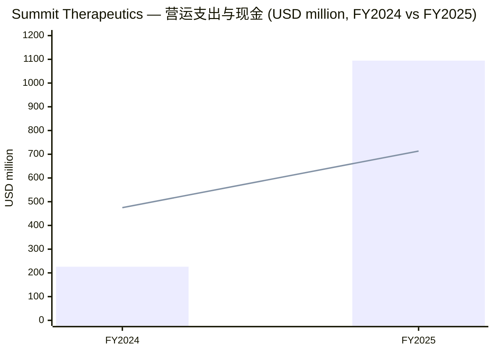
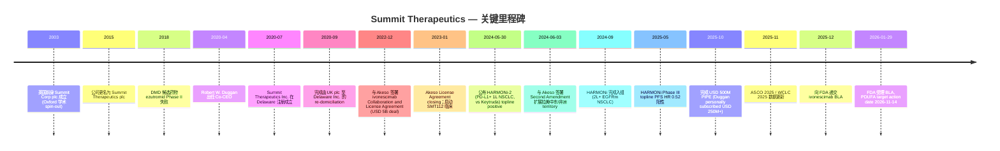
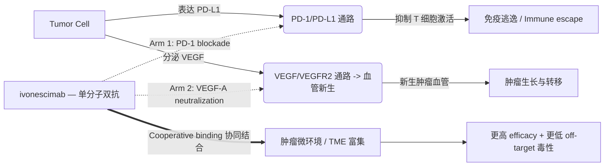
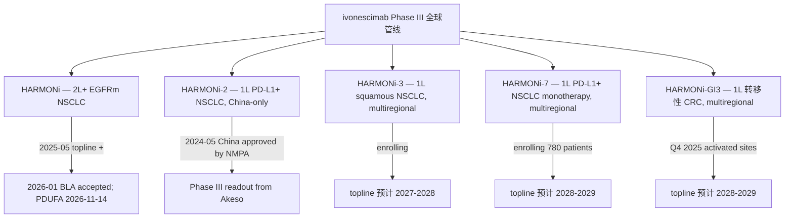
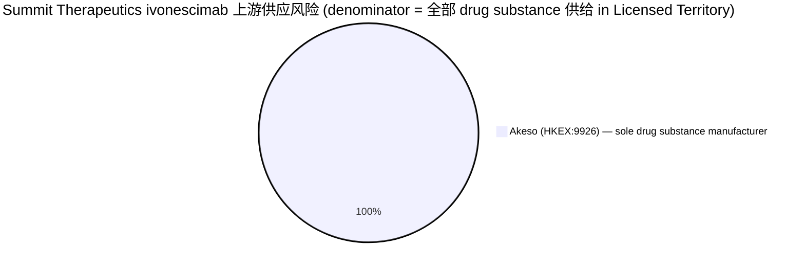
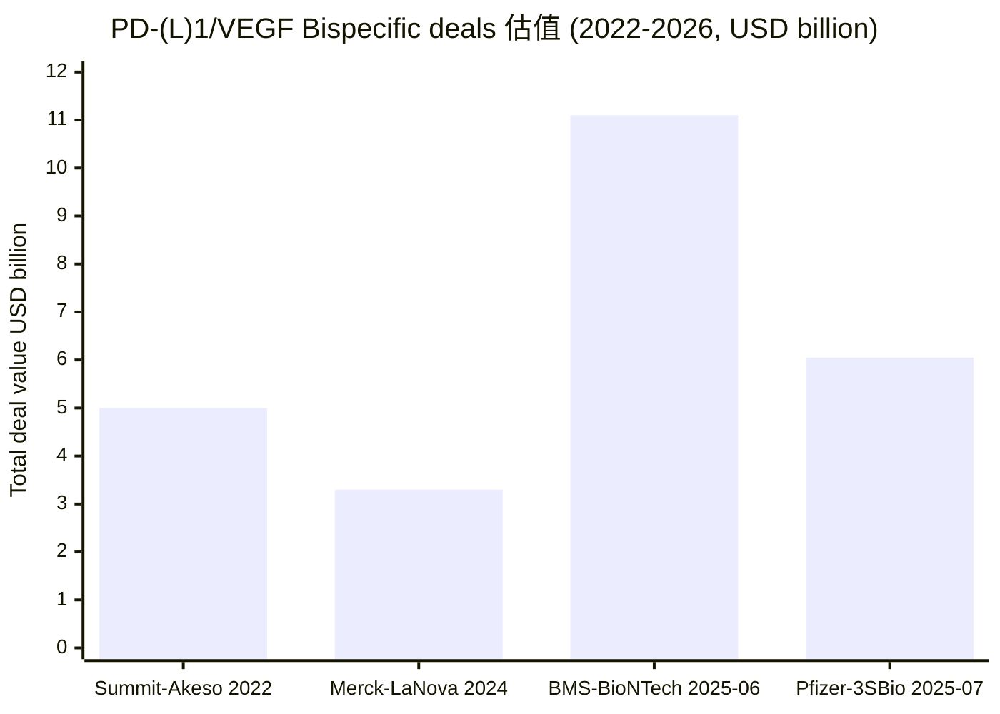
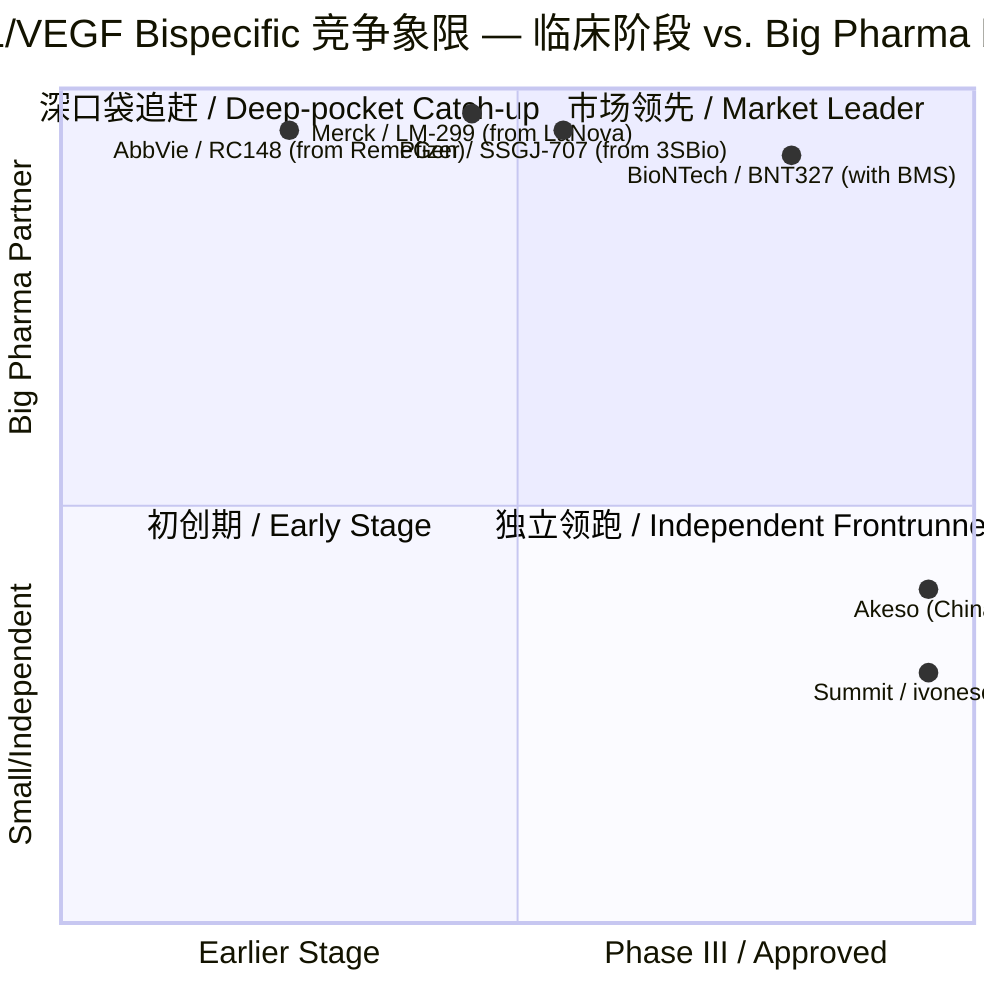
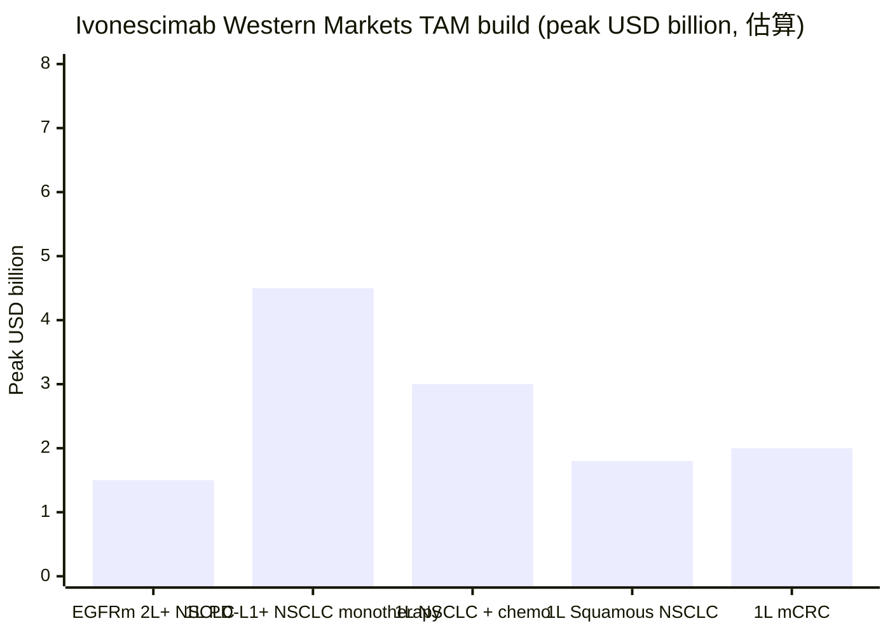

# Summit Therapeutics Inc. (NASDAQ:SMMT) 公司研究报告

**报告日期 (As of):** 2026-06-02
**主题 (Theme):** china-drug-out-licensing — 中国药企对外授权 / China drug-out-licensing
**报告语言：** 简体中文 (zh-CN)

---

> **核心定位 / Core thesis:** Summit Therapeutics 是 china-drug-out-licensing 主题最具代表性的 "被授权方 (licensee)" 标的——2022 年 12 月以 5 亿美元 upfront + 最高 45 亿美元 milestones 的代价，从港股 18A 公司 Akeso (康方生物 / HKEX:9926) 拿下 PD-1/VEGF 双特异性抗体 ivonescimab (依沃西单抗 / 商品名 Akeyvo, AK112) 在美国、加拿大、欧洲、日本、拉美、中东、非洲的开发与商业化权益。该交易是 China-to-Global out-licensing 浪潮的标志性首单 (first major deal)。([Summit-Akeso 2022 年 12 月 6 日新闻稿](https://www.globenewswire.com/news-release/2022/12/06/2568185/0/en/Summit-Therapeutics-Partners-with-Akeso-Inc-in-Deal-for-Up-to-5-Billion-to-In-License-Breakthrough-Innovative-Bispecific-Antibody.html))
>
> **触发器 (Trigger):** FDA 已于 2026 年 1 月 29 日受理 ivonescimab BLA，PDUFA target action date 为 2026 年 11 月 14 日；HARMONi-2 (中国, Phase III) 在头对头比较 ivonescimab 单药 vs. pembrolizumab (Keytruda) 单药一线治疗 PD-L1+ NSCLC 中，将疾病进展或死亡风险降低 49% (median PFS 11.14 vs. 5.82 个月)——这是史上首个在 Phase III RCT 中击败 Keytruda 的免疫疗法。([HARMONi-2 WCLC 2024 新闻稿](https://www.businesswire.com/news/home/20240908828765/en/Ivonescimab-Monotherapy-Reduced-the-Risk-of-Disease-Progression-or-Death-by-49-Compared-to-Pembrolizumab-Monotherapy-in-First-Line-Treatment-of-Patients-with-PD-L1-Positive-Advanced-NSCLC-in-China))

---

## 目录 (Table of Contents)

1. 公司概览 (Company Overview)
2. 公司历史 (Company History)
3. 管理团队 (Management Team)
4. 产品与服务 (Products & Services)
5. 客户与上市策略 (Customers & Go-to-Market)
6. 行业概览 (Industry Overview)
7. 竞争格局 (Competitive Landscape)
8. 市场机会 (Market Opportunity / TAM)
9. 风险评估 (Risk Assessment)
10. 投资者视角评分卡 (Investor-lens Scorecards)
11. 数据来源清单 (Data Used) & 参考资料 (References)

---

## 1. 公司概览 / Company Overview

Summit Therapeutics Inc. 是一家在美国特拉华州注册成立 (incorporated in Delaware on July 17, 2020)、总部位于佛罗里达州迈阿密 (601 Brickell Key Drive, Suite 1000, Miami, Florida 33131) 的临床阶段生物制药公司 (clinical-stage biopharmaceutical company)，主要在 NASDAQ 全球市场以代码 **SMMT** 交易。截至 2025 年 12 月 31 日，公司全球员工 265 人 (full-time employees)，业务高度聚焦于一个单一资产 ivonescimab 在肿瘤学领域 (oncology) 的开发。([Summit Therapeutics 2025 年 10-K, Item 1 Business](https://www.sec.gov/Archives/edgar/data/1599298/000159929826000015/smmt-20251231.htm))

公司的商业模式 (business model) 与典型 Big Pharma 截然不同——Summit 没有自研管线，没有商业化产品，没有任何 product revenue；其全部价值来自一项 in-license 资产：2022 年 12 月通过与 Akeso 签署 Collaboration and License Agreement 拿到的 PD-1/VEGF-A 双特异性抗体 / bispecific antibody **ivonescimab** (项目代号 AK112；Summit 内部代号 SMT112) 在 "Licensed Territory" (美国、加拿大、欧洲、日本，2024 年扩展至拉美、中东、非洲) 的独家开发与商业化权益。Akeso 保留 Greater China 及其他余下地区的权益。([Summit Therapeutics 2025 年 10-K, Akeso License Agreement 段落](https://www.sec.gov/Archives/edgar/data/1599298/000159929826000015/smmt-20251231.htm))

公司的财务规模与里程碑强相关——FY2024 (Akeso License Agreement Second Amendment 期间) 总运营支出 226.0 百万美元；FY2025 急剧扩张至 **1,094.4 百万美元 (USD 1.09 billion)**，主要受 Phase III HARMONi 完成、HARMONi-3 / HARMONi-7 / HARMONi-GI3 启动以及 BLA 准备所驱动；FY2025 net loss 达到 **1,079.6 百万美元**，accumulated deficit 累计 **2,294.2 百万美元**。([Summit Therapeutics 2025 年 10-K, MD&A](https://www.sec.gov/Archives/edgar/data/1599298/000159929826000015/smmt-20251231.htm))

**估值快照 / Valuation snapshot (as of 2026-06-01)：**
- **股价 (Price):** USD 15.71 (-10.43% intraday, near-term BLA-readout sensitive)
- **市值 (Market Cap):** USD 12.19 billion
- **企业价值 (Enterprise Value):** USD 11.61 billion
- **TTM P/E:** N/A — 公司处于 pre-revenue clinical stage, FY2025 net loss USD -1,079.6 million / TTM net loss USD -1.21 billion
- **TTM P/S:** N/A — 零产品收入；FY2025 license revenue 仅来自 Akeso 反向 milestone, 不构成 recurring 营收
- **P/B:** 22.33×
- **52-week Price Change:** -13.75%
- **Insider Ownership:** 78.51% (高度集中, 由共同 CEO Robert W. Duggan 个人持有 73.5%)
- **Short Interest:** 22.11% of float (空头比例极高，反映市场对 Phase III 数据 + BLA 审批的两极分化预期)
- **Cash & Short-term Investments:** USD 713.4 million (cash $225.3M + UST short-term investments $488.2M, 截至 2025 年 12 月 31 日)
- **Net Cash:** USD 578.69 million (现金 $598.73M 减去债务 $20.04M)
- **Sell-side 平均目标价 (Analyst Average Price Target):** USD 28.57 (隐含 +81.86% upside)

数据来源：[Stockanalysis.com SMMT key statistics, 2026-06-01](https://stockanalysis.com/stocks/smmt/statistics/) + [Summit Therapeutics 2025 年 10-K MD&A](https://www.sec.gov/Archives/edgar/data/1599298/000159929826000015/smmt-20251231.htm)。

*分析师观点 / Analyst view:* SMMT 的 P/E 为负、P/S 不可计算属于 clinical-stage biotech 的典型形态——这是一只 **single-asset, single-catalyst biotech**，市场给的 USD 12 billion 市值 essentially 隐含 ivonescimab 在 Licensed Territory 上市后的 risk-adjusted NPV。对比 Keytruda (pembrolizumab, MRK) 2025 年全球销售额 USD 31.7 billion (其中 lung cancer 占 26.91%, 约 USD 8.5 billion), Summit 的 USD 12 billion 估值大致对应市场给予 ivonescimab 在 Western markets 约 **5–10% peak Keytruda-equivalent share** 的概率加权预期 (probability-weighted scenario)，前提是 HARMONi、HARMONi-3、HARMONi-7、HARMONi-GI3 中至少 2 个能在 2027–2030 期间获批。([Top 10 Selling Cancer Drugs of 2025 — Keytruda USD 31.7 bn](https://www.ipharmacenter.com/post/top-10-selling-cancer-drugs-of-2025-global-sales-rankings-revenue-data))

公司的资本配置完全围绕 ivonescimab 的全球开发——FY2025 通过 ATM 协议 (At-the-Market Agreement) 募集净额 USD 150.7 million，并完成一笔 USD 500 million 的私募定增 (2025 年 10 月的 PIPE, by Co-CEO Robert W. Duggan personally subscribed for 13,980,789 shares)；公司预计当前现金跑道 (cash runway) 足以支撑到 2027 年 H2 的关键 readout 节点，但若 HARMONi-3 / HARMONi-7 因入组延迟而推后，则可能需要再次融资。([Summit Therapeutics 2026 年 DEF 14A, October 2025 PIPE 披露](https://www.sec.gov/Archives/edgar/data/1599298/000159929826000029/smmt-20260417.htm))

数据：[Summit 2025 年 10-K Total operating expenses & Liquidity](https://www.sec.gov/Archives/edgar/data/1599298/000159929826000015/smmt-20251231.htm)。柱状图代表营运支出，线条代表期末 cash + short-term investments。

## 2. 公司历史 / Company History

Summit Therapeutics 的当前形态——一家专注于 ivonescimab 全球开发的 single-asset 美国上市公司——成型于 2020 年 9 月 17 日的一次重大重组：前身是英国上市的 Summit Therapeutics plc (再之前是 2014–2015 年期间使用的名称 Summit Corp plc)，主营业务为肌肉萎缩症 (Duchenne muscular dystrophy, DMD) 和艰难梭菌 (C. difficile) 感染等罕见病小分子研究。在主营资产相继临床失败 (ezutromid 在 2018 年 DMD Phase II 失败、ridinilazole 在 2022 年 C. difficile Phase III 未达到 superiority 终点) 后，公司在 Robert W. Duggan 主导下完成了去 UK plc 化、迁址 Miami、并将整个公司的命运 pivot 到 ivonescimab 这一单一资产上。([Summit Therapeutics 2025 年 10-K Item 1 "Incorporated in Delaware on July 17, 2020"](https://www.sec.gov/Archives/edgar/data/1599298/000159929826000015/smmt-20251231.htm))

最具决定性的事件是 **2022 年 12 月 5 日** 与 Akeso (康方生物) 签署的 Collaboration and License Agreement——交易代价为 **USD 500 million upfront** (其中 USD 300 million 在反垄断审查通过后支付, 包括最多 USD 16 million 以普通股形式发行；USD 200 million 在签署后 90 天内现金支付)，加上 **最高 USD 4.5 billion** 的 regulatory + commercial milestones (regulatory milestones up to USD 1.05 billion + commercial milestones up to USD 3.51 billion), 以及 net sales 的 **low double-digit royalties (低双位数特许权使用费)**。该交易于 2023 年 1 月通过 customary waiting periods 后正式 close。([Summit-Akeso 2022 年 12 月 6 日新闻稿 (BioSpace 转载)](https://www.biospace.com/summit-therapeutics-partners-with-akeso-inc-in-deal-for-up-to-5-billion-to-in-license-breakthrough-innovative-bispecific-antibody-500-million-upfront-payment-to-activate-the-partnership-for-ivonescimab))

2024 年 6 月 3 日，公司与 Akeso 签署 **Second Amendment**，将 Licensed Territory 扩展至 **Latin America、Mexico、所有中南美洲国家、Middle East 和 Africa**，并支付额外的 **USD 15.0 million upfront cash** (于 2024 年 Q3 支付)。这次 territory expansion 提升了 ivonescimab 在新兴市场 (EM) 的销售潜在范围，但 Akeso 仍保留 Greater China 等核心市场。([Summit Therapeutics 2025 年 10-K, Akeso License Agreement Second Amendment](https://www.sec.gov/Archives/edgar/data/1599298/000159929826000015/smmt-20251231.htm))

数据：[Summit Therapeutics 2025 年 10-K Item 1 + Item 7 MD&A](https://www.sec.gov/Archives/edgar/data/1599298/000159929826000015/smmt-20251231.htm) + [BioSpace HARMONi-2 报道](https://www.biospace.com/drug-development/summit-therapeutics-announces-completion-of-enrollment-in-its-phase-iii-harmoni-trial-in-2l-egfrm-nsclc)。

**战略转向 / Strategic pivot — 从英国小分子 RD 到美国 in-licensed bispecific antibody。** 在 Duggan 接任之前，Summit 在 UK 学术 spin-out 模式下经历了 15 年的小分子开发，资产相继失败。Duggan 主导的 2020 年重组本质上是一次 "壳公司化" + "重新瞄准 hot asset" 的资本运作——保留上市架构、清理小分子资产、用一笔结构化交易拿下 Akeso 的临床后期 PD-1/VEGF 双抗。这种模式 paralleled (复制) 了 Duggan 在 Pharmacyclics 的成功路径：2008 年 Duggan 用类似手法掌控 Pharmacyclics，最终在 2015 年以 USD 21 billion 价格卖给 AbbVie，旗下产品 Imbruvica (ibrutinib) 成为重磅产品 (blockbuster)。([Pharmacyclics 收购公告 — AbbVie 2015](https://www.sec.gov/Archives/edgar/data/1599298/000159929826000029/smmt-20260417.htm))

**近期发展 (last 12 months)：**
- 2025-05-30: HARMONi topline 公布 PFS HR=0.52 (95% CI: 0.41–0.66, p<0.00001)，OS HR=0.79 (95% CI: 0.62–1.01, p=0.057, 未达统计学显著性). ([Summit Therapeutics 8-K 2025-05-30, 1L topline](https://www.sec.gov/Archives/edgar/data/1599298/000159929825000099/a2025_prx0530-xxharmonix.htm))
- 2025-09-07: Akeso 发布 HARMONi OS update — HR=0.78, nominal p=0.0332 ([Akeso 2025-09-07 新闻稿](https://www.akesobio.com/en/media/akeso-news/250907/))
- 2025-10: HARMONi-6 (1L squamous NSCLC, by Akeso in China) 公布 positive Phase III topline
- 2026-01-29: FDA 受理 BLA, PDUFA target action date 设定为 **2026-11-14** ([Summit Therapeutics 8-K 2026-01-29 FDA BLA acceptance](https://www.sec.gov/Archives/edgar/data/1599298/000159929826000006/a2026_prx0129xfdablaacce.htm))

## 3. 管理团队 / Management Team

Summit Therapeutics 的管理结构高度个人化——两位 Co-CEO **Robert W. Duggan** (Chairman) 与 **Dr. Mahkam (Maky) Zanganeh** (President) 系夫妻关系，且共同持有公司绝对控股权 (合计 ~80% of common stock)。这种 family-office-style 控制结构在 US-listed biotech 中极为罕见，使 Summit 实质上是 Duggan & Zanganeh 的私募投资工具 (private investment vehicle)。([Summit Therapeutics 2026 年 DEF 14A, p. 27](https://www.sec.gov/Archives/edgar/data/1599298/000159929826000029/smmt-20260417.htm))

### Robert W. Duggan — Co-CEO 与 Chairman (创始转型操盘人 / founder-style pivoter)

**Robert W. Duggan**, age 81, 自 2019 年 12 月起任 Board 成员，2020 年 2 月起任 Chairman，2020 年 4 月起任 Co-CEO。截至 2026 年 4 月 15 日 record date, Duggan 个人 (含相关信托) 持有 Summit **570,087,411 股**，占 **73.5%** 的 outstanding common stock——这是 US-listed biotech 中罕见的 founder-CEO 绝对控股案例。([Summit Therapeutics 2026 年 DEF 14A Security Ownership, p. 54](https://www.sec.gov/Archives/edgar/data/1599298/000159929826000029/smmt-20260417.htm))

Duggan 没有医学或科学背景——他是一位 serial biotech investor 兼 founder-style operator。1990–2003 年任 Computer Motion Inc. (机器人手术 / robotic surgery 先驱) 的 Chairman, 1997–2003 年同时任 CEO；2003 年 6 月公司与 Intuitive Surgical 合并 (今 NASDAQ:ISRG, 市值 USD ~150 billion)。**最具标杆意义的是 Pharmacyclics 经历：2007 年 9 月起任 Board 成员, 2008 年 9 月–2015 年 5 月任 Chairman & CEO, 同时是公司最大投资人**。Pharmacyclics 旗下产品 Imbruvica (ibrutinib, BTK 抑制剂) 治疗血液瘤的临床突破，最终促成 2015 年 5 月 AbbVie 以 **USD 21 billion** 价格收购 Pharmacyclics——这是 Duggan 个人投资史上的标志性成功，也是其 Summit 投资逻辑的模板。([Duggan 个人简历来源, Summit Therapeutics 2026 年 DEF 14A](https://www.sec.gov/Archives/edgar/data/1599298/000159929826000029/smmt-20260417.htm))

自 2016 年起，Duggan 任 Duggan Investments, Inc. 的 CEO——这是一个 family office, 专注 biotech 中 "patient-friendly breakthrough solutions to complex diseases of aging" 投资。他同时担任 Pulse Biosciences, Inc. 的 Chairman (2017 年 11 月至今)，并在数家私人公司董事会任职 (Genuine First Aid International, Medical Distribution Industries, Blazon Corporation, Duggan Investments Research, Deepsight)。Duggan 没有传统药企管理经验——他的 thesis 来自 capital allocator 视角：识别临床后期突破性资产 (breakthrough therapy)、提供 disciplined capital、为科学团队赋能 (founder-empowerment)，然后等待 acquirer。

### Dr. Mahkam (Maky) Zanganeh — Co-CEO 与 President (运营搭档 / operating partner)

**Dr. Mahkam Zanganeh**, age 55, 与 Duggan 系夫妻。她自 2020 年 11 月起任 Board 成员，2020 年 11 月–2022 年 7 月任 COO, 2022 年 7 月起任 Co-CEO 与 President. Zanganeh 截至 2026 年 4 月持有 **54,756,617 股**，占 **6.9%** of outstanding common stock (含其 Mahkam Zanganeh Revocable Trust). ([Summit Therapeutics 2026 年 DEF 14A p. 54](https://www.sec.gov/Archives/edgar/data/1599298/000159929826000029/smmt-20260417.htm))

Zanganeh 的职业生涯与 Duggan 高度重叠——这是他们 partnership 的核心。她在 Strasbourg 的 Louis Pasteur University 取得 DDS (口腔外科 / 牙科外科博士), 之后在 France 的 Schiller International University 完成 MBA。1998–2002 年任 **Computer Motion Inc.** 欧洲、中东、非洲区域的 President Director General, 2002–2003 年任 worldwide VP of Training & Education——这是她与 Duggan 第一次共事的窗口期。([Zanganeh 简历, Summit Therapeutics 2026 年 DEF 14A p. 28](https://www.sec.gov/Archives/edgar/data/1599298/000159929826000029/smmt-20260417.htm))

2003–2008 年她任 Robert W. Duggan & Associates 的 VP of Business Development; 2007–2008 年短暂回到法国担任法国政府生物 cluster 项目的 President Director General。**2008 年 8 月–2015 年 9 月，她在 Pharmacyclics 长达 7 年：先后任 VP Business Development (2008–2011)、Chief of Staff 与 Chief Business Officer (2011–2012)、最终 COO (2012–2015)**——这是她与 Duggan 在 Pharmacyclics 创造 USD 21 billion 退出的核心搭档关系。2015 年 Pharmacyclics 被 AbbVie 收购后，她于 2015 年成立 Maky Zanganeh and Associates (an executive management and consulting firm)，担任 Founder & CEO 至今。([Zanganeh 简历, Summit Therapeutics 2026 年 DEF 14A p. 28](https://www.sec.gov/Archives/edgar/data/1599298/000159929826000029/smmt-20260417.htm))

*分析师观点 / Analyst view:* Duggan-Zanganeh 双 CEO 架构是 Summit 与典型 Big Biotech (e.g. Vertex, Regeneron) 最大的不同。它的优点是 capital allocator 心态强 (Duggan 主导战略 + 自有资金大额 follow-on, 2025 年 10 月 PIPE 个人认购 USD 250M+)、决策快、与科学 KOL (Akeso 团队、Hesai 创始人 Dr. Yu (Michelle) Xia 任 Summit Board) 的 alignment 紧密。缺点是 governance 集中度极高 (Duggan 73.5% + Zanganeh 6.9% = 80% 控股)，少数股东保护力度 (minority shareholder protection) 有限——这在 Section 9 风险评估中会进一步展开。

## 4. 产品与服务 / Products & Services

### 4.1 产品矩阵 / Product Matrix

Summit Therapeutics 目前的产品矩阵 (product matrix) 极其简单——**只有一个 in-licensed 资产 ivonescimab，没有任何 self-discovered 管线**。这与典型大药企的多元化 portfolio 完全不同，使 Summit 在临床数据公布日 (data readout) 的股价波动率 (volatility) 极高，并使整个公司估值与 ivonescimab 的 NPV 直接挂钩。

| Asset | Modality | Target(s) | Mechanism | Stage | Licensed From | Indication (focus) | Status |
|---|---|---|---|---|---|---|---|
| **ivonescimab** (商品名 Akeyvo; 项目代号 AK112 / SMT112) | 双特异性抗体 / bispecific antibody | PD-1 × VEGF-A | Tetrabody (Akeso 专有技术 / proprietary platform); single molecule 同时阻断 PD-1/PD-L1 通路与 VEGF/VEGFR2 angiogenesis 通路 | Phase III + BLA accepted (US) | Akeso, Inc. (HKEX:9926) 港股 18A | EGFRm 2L+ NSCLC (HARMONi, BLA 已受理); 1L PD-L1+ NSCLC (HARMONi-2 in China, HARMONi-7 multiregional); 1L squamous NSCLC (HARMONi-3); 1L 转移性 CRC (HARMONi-GI3) | 中国 NMPA 已批准两项 NSCLC 适应症 (2024-05, 2025-04); FDA BLA PDUFA 2026-11-14 |

来源：[Summit Therapeutics 2025 年 10-K, Item 1 Business — Product Pipeline](https://www.sec.gov/Archives/edgar/data/1599298/000159929826000015/smmt-20251231.htm)

### 4.2 综述 / Synthesis — 单分子双通路如何重塑肺癌一线治疗

**核心机制 / Core mechanism — 来自 10-K verbatim 引用：**

> "Ivonescimab is a novel PD-1 / VEGF-A bispecific antibody, believed to be the most advanced in clinical development in the Licensed Territory. Engineered with Akeso's unique Tetrabody technology, ivonescimab, as a single molecule, blocks programmed cell death protein 1 ('PD-1') from binding to PD-L1 and PD-L2 ... and simultaneously binds and blocks vascular endothelial growth factor-A ('VEGF-A')."
> ——[Summit Therapeutics 2025 年 10-K, Item 1 Business — ivonescimab description](https://www.sec.gov/Archives/edgar/data/1599298/000159929826000015/smmt-20251231.htm)

> "As shown in Akeso's in-vitro studies, ivonescimab's tetravalent structure (four binding sites) enables higher avidity ... bringing these two targets into a single bispecific antibody with cooperative binding qualities has the potential to direct ivonescimab to the tumor tissue versus healthy tissue. The intent of this design is to improve upon previously established efficacy thresholds, in addition to side effects and safety profile."
> ——[Summit Therapeutics 2025 年 10-K, Item 1 Business](https://www.sec.gov/Archives/edgar/data/1599298/000159929826000015/smmt-20251231.htm)

**中文释义 / Plain-language gloss:** Ivonescimab 的核心创新在于将两个 oncology 最重要的靶点——免疫检查点 PD-1 (programmed cell death protein 1 / 程序性细胞死亡蛋白) 与血管新生因子 VEGF-A (vascular endothelial growth factor-A / 血管内皮生长因子)——整合到 **single bispecific antibody (单一双特异性抗体)** 的 four binding arms (四个结合臂, 即 Tetrabody / 四价构型) 中。简化的物理图像：把 Keytruda (pembrolizumab, anti-PD-1) 与 Avastin (bevacizumab, anti-VEGF) 的两个独立分子 "缝合" 成一个分子, 让一支注射液同时承担两个药的作用。

但 ivonescimab 远不止是 "1+1 拼接"——Akeso 的 Tetrabody 设计带来 **cooperative binding (协同结合)** 效应：当 VEGF-A 存在 (即 PD-L1 阳性肿瘤的微环境 / tumor microenvironment, TME 通常富集 VEGF) 时, 分子对 PD-1 的 avidity (结合亲和力) 显著上升。这意味着 ivonescimab 倾向于在肿瘤组织里 "活跃", 在正常组织里 "休眠", 从而提升 therapeutic index (治疗指数), 减少全身免疫相关毒性 (irAE / immune-related adverse events)。

*分析师观点 / Analyst view:* PD-1+VEGF 联合并非首创——bevacizumab+atezolizumab 等组合已在多个适应症获批 (e.g. IMpower150 in 1L NSCLC, IMbrave150 in HCC)。**ivonescimab 的差异化在于 "一个分子 vs 两个分子"**: 单分子带来的 (a) 药代动力学 (PK) 一致性、(b) cooperative binding 带来的 TME 选择性、(c) 患者依从性 (compliance) 与给药便利性 (single IV infusion vs two separate infusions)、(d) 成本结构 (single COGS vs two)，都是相对组合疗法的潜在优势。但单分子也意味着剂量 (dose) 与给药方案灵活性 (regimen flexibility) 受限——若临床上需要单独调整 PD-1 或 VEGF 的剂量, 单分子无法实现。临床上是否证明 cooperative binding 真的产生 "1+1>2" 效应, 是 HARMONi-2 与 HARMONi-7 的关键 readout。

### 4.3 关键临床数据 / Key Clinical Data Walkthrough

#### HARMONi-2 (中国, Phase III, by Akeso, AK112-303) — 史上首个击败 Keytruda 的免疫疗法

> "HARMONi-2 ... a randomized, single-region (China) Phase III study sponsored by Akeso ... ivonescimab monotherapy demonstrated a statistically significant and clinically meaningful improvement in PFS as compared to pembrolizumab monotherapy ... in first-line treatment of patients with locally advanced or metastatic PD-L1 positive NSCLC."
> ——[Summit Therapeutics 2025 年 10-K, HARMONi-2 paragraph](https://www.sec.gov/Archives/edgar/data/1599298/000159929826000015/smmt-20251231.htm)

**关键数据 (WCLC 2024 / 世界肺癌大会, 2024-09-08)：**
- **Median PFS：** ivonescimab 11.14 个月 vs. pembrolizumab 5.82 个月
- **HR (Hazard Ratio) = 0.51** (即 49% reduction in risk of disease progression or death)
- **覆盖亚组：** PD-L1 TPS 1–49% (low expression)、TPS ≥50% (high expression)、squamous + non-squamous histology 均显示一致益处
- **样本量：** 398 patients in China, randomized 1:1

[HARMONi-2 — WCLC 2024 新闻稿, 2024-09-08](https://www.businesswire.com/news/home/20240908828765/en/Ivonescimab-Monotherapy-Reduced-the-Risk-of-Disease-Progression-or-Death-by-49-Compared-to-Pembrolizumab-Monotherapy-in-First-Line-Treatment-of-Patients-with-PD-L1-Positive-Advanced-NSCLC-in-China)

**中文释义 / Plain-language gloss:** HARMONi-2 是免疫肿瘤 (IO / immuno-oncology) 史上的一个分水岭事件——这是 **第一次** 有任何分子在 head-to-head randomized Phase III 试验中击败 Keytruda (pembrolizumab) 单药。Keytruda 自 2014 年 FDA 批准以来, 已成为多个肿瘤一线 standard of care (SoC)；在过去 10 年里, BMS、Roche、AstraZeneca 等多家公司试图通过 combo 或 next-gen IO 击败 Keytruda monotherapy, 但在 randomized Phase III 中都未能成功——直到 ivonescimab。**Median PFS 11.14 vs 5.82 个月意味着 ivonescimab 患者比 Keytruda 患者多了近 6 个月的肿瘤未进展生存期, HR=0.51 (95% CI 数据点) 意味着 ivonescimab 患者在任意时间点的疾病进展或死亡风险只有 Keytruda 患者的一半**。

*分析师观点 / Analyst view:* HARMONi-2 的核心争议在于 single-region (China-only) Phase III 是否能直接外推至 US/EU 患者群体——FDA 历史上对 "single-region trial supporting US approval" 持谨慎态度 (e.g. Lilly + Innovent 的 sintilimab Phase III in 2022 被 ODAC 投票否决因为 China-only)。**这是 Summit 启动 HARMONi-7 (multiregional, ivonescimab monotherapy vs Keytruda monotherapy, 1L PD-L1+ NSCLC, 计划 enroll 780 patients with PFS + OS dual primary endpoints) 的根本原因**——HARMONi-7 是 ivonescimab 在 Western markets 获批 1L NSCLC monotherapy indication 的关键 enabler。

#### HARMONi (Multiregional, Phase III, by Summit) — BLA 基础试验

> "In May 2025, we announced topline results from our multiregional, double-blinded, placebo-controlled, Phase III study HARMONi. At the prespecified primary data analysis, ivonescimab in combination with chemotherapy demonstrated a statistically significant improvement in progression free survival ('PFS'), the magnitude of which we believe to be clinically meaningful, with a hazard ratio of 0.52."
> ——[Summit Therapeutics 2025 年 10-K, HARMONi clinical trial paragraph](https://www.sec.gov/Archives/edgar/data/1599298/000159929826000015/smmt-20251231.htm)

**关键数据 (Summit 2025-05-30 topline)：**
- **Median PFS：** ivonescimab + chemo 6.8 个月 vs. placebo + chemo 4.4 个月
- **PFS HR = 0.52** (95% CI: 0.41–0.66; p<0.00001)
- **OS HR = 0.79** (95% CI: 0.62–1.01; p=0.057, did NOT reach statistical significance at primary analysis)
- **后续 OS update (Akeso, 2025-09-07): HR=0.78, nominal p=0.0332**
- **PFS HR consistency in Western subset：** longer-term follow-up showed HR of 0.57 (95% CI: 0.46–0.71) for all-Western patients

[Summit Therapeutics 8-K, 2025-05-30 HARMONi topline](https://www.sec.gov/Archives/edgar/data/1599298/000159929825000099/a2025_prx0530-xxharmonix.htm) + [Akeso 2025-09-07 OS update](https://www.akesobio.com/en/media/akeso-news/250907/)

**中文释义 / Plain-language gloss:** HARMONi 评估的是 EGFR-mutated (EGFRm), 2L+ NSCLC 患者——这是一组特殊人群: 患者已经在第三代 EGFR TKI (e.g. osimertinib / Tagrisso) 一线失败后, 需要 2L 治疗选择。这部分患者在 US/EU 是 standard of care 的 "缺口" (unmet need)——AstraZeneca 的 datopotamab deruxtecan、Johnson & Johnson 的 amivantamab + lazertinib 等都在抢占。**HARMONi 的 PFS 阳性 (HR=0.52, 即风险降低 48%)** 让 Summit 在 2025-Q4 递交 BLA, 并于 2026-01-29 获 FDA 受理, **PDUFA target action date 为 2026-11-14**——这是 Summit 在 US 拿到第一个 FDA approval 的关键日期。

*分析师观点 / Analyst view:* HARMONi 的 PFS-only positive (而 OS 仅 trend) 是一个 mixed-blessing 结果——FDA 在 oncology approval 中曾多次明确, **statistically significant OS benefit is necessary to support marketing authorization in this setting** (FDA 2024 年 guidance for EGFR TKI-progressed NSCLC). [Summit 自己在 10-K 中也披露了这一风险](https://www.sec.gov/Archives/edgar/data/1599298/000159929826000015/smmt-20251231.htm). 2025-09 的 OS update (HR=0.78, p=0.0332 nominal) 是利好的, 但 nominal p-value 不是 pre-specified primary analysis——FDA 是否接受这一 supportive evidence 作为 OS substantial efficacy 的证据, 是 2026-11 PDUFA date 前的最大未知。如果 FDA 要求等待 final OS readout 或额外的 confirmatory 数据, BLA 时间表可能延后, Summit 的 commercial launch timeline 也会推迟。

### 4.4 完整 Phase III 矩阵 / Phase III Pipeline Matrix

来源：[Summit Therapeutics 2025 年 10-K, Product Pipeline section](https://www.sec.gov/Archives/edgar/data/1599298/000159929826000015/smmt-20251231.htm)

**其它 Akeso-sponsored 项目** (Summit 通过 License Agreement 可获益的, 由 Akeso 在 China 主导)：
- **HARMONi-6 (1L squamous NSCLC, by Akeso)：** 2025-10 公布 positive Phase III topline
- **HARMONi-A (China)：** Already led to NMPA 2nd indication approval on 2025-04-25
- **HARMONi-GI1/GI2/GI6 (gastrointestinal cancers)：** Phase II/III in China
- **HARMONi-BC1 (breast cancer)：** Phase III initiated
- **HARMONi-HN1 (head and neck cancer)：** Phase II
- **HARMONi-9 (early-stage NSCLC neoadjuvant/adjuvant)：** Phase III

来源：[Summit Therapeutics 2025 年 10-K, Akeso-Sponsored Trials section](https://www.sec.gov/Archives/edgar/data/1599298/000159929826000015/smmt-20251231.htm)

### 4.5 摘要 — 单资产、单催化剂 / Summary — single-asset, single-catalyst

Summit 的产品逻辑是 "all-in-on-ivonescimab"。短期 (12–18 个月) 的所有股价驱动因素都集中在三个事件：
1. **2026-11-14 FDA PDUFA date (BLA approval / refusal)** —— 决定 Summit 是否进入商业化阶段 (commercial launch)。
2. **HARMONi-3 topline (1L squamous NSCLC)** —— 2027 年预计；这是 ivonescimab 在 1L NSCLC 大市场获批的另一条路径 (与 HARMONi-7 平行)。
3. **HARMONi-7 topline (1L PD-L1+ NSCLC monotherapy)** —— 2028–2029 年；如果 multiregional Phase III 能复制 HARMONi-2 在 China 的 vs. Keytruda 数据, 这将是 ivonescimab 在 Western markets 替代 Keytruda 1L 适应症的决定性证据。

*分析师观点 / Analyst view:* Summit 的 product moat (产品护城河) 不来自 self-developed IP, 而来自 (a) Akeso License Agreement 的 territory exclusivity (10-K 明确披露 Akeso 在 Licensed Territory 不能竞争, royalty 是 low double-digit, milestones up to USD 4.5B 是 Akeso 待收, 而非 Summit 待付的 cost 上限), (b) Tetrabody 双抗工艺壁垒 (Akeso proprietary platform technology), (c) 临床数据先发优势 (HARMONi-2 是 first-in-class, 其它 PD-1/VEGF 双抗都在更早期阶段)。但 (d) 单分子化合物专利 (composition-of-matter patents) 由 Akeso 持有, 这意味着 Summit 不能独立将技术应用于其它分子——这是与 self-developed 的核心区别。

## 5. 客户与上市策略 / Customers & Go-to-Market

Summit Therapeutics 目前 **没有商业化产品 (no commercial product)**, 因此没有传统意义上的 customer concentration 或销售渠道 (sales channels)。FY2025 license revenue 项下记录的是与 Akeso 的反向支付与 deferred milestones, 不构成 recurring 终端市场收入。但作为一家计划在 2026–2027 进入 US 商业化阶段的临床后期公司, 客户结构与上市策略已经成为投资人评估的关键。

### 5.1 终端客户结构 / End-customer landscape

Ivonescimab 上市后的终端客户是 US/EU/日本/加拿大/拉美/中东/非洲的 **oncology prescribers (肿瘤科医生)** 和 **payers (支付方, 主要是 CMS Medicare、各国 national health systems、private insurers)**：

| 客户类别 | 主要参与方 | 占目标药品市场份额 (估算) | 备注 |
|---|---|---|---|
| **学术医学中心 / Academic Medical Centers (AMCs)** | MD Anderson, Memorial Sloan Kettering, Dana-Farber, Johns Hopkins; 欧洲: Gustave Roussy, Royal Marsden | ~25–30% 美国 oncology 早期采用 | KOLs (key opinion leaders) 集中地，是 first-mover 的关键拥护方 |
| **社区肿瘤诊所 / Community Oncology Practices** | US Oncology Network (McKesson 旗下), Florida Cancer Specialists, Texas Oncology | ~50% 美国 oncology 处方 | 商业化放量的核心渠道, 受 NCCN guideline 直接驱动 |
| **政府支付方 / Public Payers** | CMS Medicare (Part B for IV oncology drugs), VA, MOH 各国 | US 约 50% lung cancer 患者 ≥65 岁 | 决定 list price 与 net price 的关键 leverage 方 |
| **私人保险 / Private Insurers** | UnitedHealthcare, Cigna, Anthem | US 约 40–45% oncology 患者 | PBM (CVS Caremark, Express Scripts) 是定价桥接方 |
| **欧洲 HTA / Reimbursement Agencies** | NICE (UK), G-BA (Germany), HAS (France) | EU value-based pricing 决定方 | NICE QALY 阈值 ~£30K/QALY 是 Europe pricing 的硬约束 |

来源：[Summit Therapeutics 2025 年 10-K, Item 1 Business — Commercialization & Marketing](https://www.sec.gov/Archives/edgar/data/1599298/000159929826000015/smmt-20251231.htm) + [GrandView Research Keytruda Market Report, 2025](https://www.grandviewresearch.com/industry-analysis/keytruda-market-report) (用于市场份额数据)

### 5.2 上市策略 / Go-to-market strategy

Summit 的策略在 10-K 中表述为：**"In the Licensed Territory, the Company expects to build its own commercial organization initially focused on US-based oncology specialists and academic medical centers, while exploring regional partnerships outside the US."**——即 **US 直营 + Europe/Japan/EM 寻求 regional partner** 的双轨制。([Summit Therapeutics 2025 年 10-K, Item 1](https://www.sec.gov/Archives/edgar/data/1599298/000159929826000015/smmt-20251231.htm))

截至 2025-12-31, 公司全球员工 **265 人**——这对比典型 launch-stage biotech (e.g. Vertex, Regeneron at first product launch) 的 800–1,500 人员工规模仍是较小的——意味着 Summit 必须在 BLA approval 后 12–18 个月内快速扩张 commercial、market access、medical affairs 三大部门。

### 5.3 上游供应链客户 / Upstream supply chain "customers"

从一个独特角度看, Summit **实质上的 "上游客户" 是 Akeso (供应商)**——根据 License Agreement, **Akeso 将 solely responsible for the manufacture of the drug substance** (原料药 drug substance) for use in the Licensed Territory。Summit 因此承担 **single-source supplier 集中风险**：

> "Akeso shall be solely responsible for the manufacture of the drug substance for use in the Licensed Territory ... we may be reliant on Akeso for knowledge transfer relating to any improvements in manufacturing of ivonescimab."
> ——[Summit Therapeutics 2025 年 10-K, Risk Factors — Reliance on Akeso](https://www.sec.gov/Archives/edgar/data/1599298/000159929826000015/smmt-20251231.htm)

10-K 同时披露 Summit may seek **independent manufacturing capability** in the future, 但截至当前完全依赖 Akeso。**这是 single-supplier 风险**——若 Akeso 在 China 遇到生产中断 (GMP issue、cGMP audit failure、export restrictions)，Summit 在 Licensed Territory 的供应链会被直接打断。

*分析师观点 / Analyst view:* 这种 supplier concentration (供应商集中) **不是 customer concentration**, 但风险量级类似——Summit 在 sourcing diversification 上的进展是中期 (2027–2028) 关键 monitoring 项。10-K 中提到的 "we may independently advance manufacturing capability" 暗示 Summit 在评估 second-source (二级供应) 选项, 但任何 process transfer (工艺转移) 在 biologic 行业都需要 12–24 个月 + 数千万美元 capex + FDA Comparability Protocol 审批。

### 5.4 商业化合作伙伴 / Commercialization partners

截至 2025-12-31, Summit **尚未对外签署 ex-US regional partnership**——这与 BioNTech (与 BMS 达成 USD 11 billion 全球合作)、Pfizer (拿下 3SBio 的 PD-1/VEGF SSGJ-707)、Merck (拿下 LaNova 的 LM-299) 等同业的策略形成鲜明对比. ([BMS-BioNTech BNT327 cancer bispecific deal — GEN, 2025](https://www.genengnews.com/topics/cancer/bms-biontech-ink-up-to-11b-cancer-bispecific-antibody-collaboration/))

Summit 选择 retain ex-US rights (除已经划归 Akeso 的 China 等) 反映了 Duggan 的 capital allocation 哲学——**"sole control until value crystallization"**, 即不在 pre-launch 阶段稀释 economics, 等待 BLA approval + initial commercial traction 后再考虑卖给 Big Pharma (类似 Pharmacyclics → AbbVie 的 USD 21 billion 退出剧本)。

## 6. 行业概览 / Industry Overview

### 6.1 行业定义 / Industry definition

Summit 所处的行业是 **oncology immunotherapy (肿瘤免疫疗法)** 的高速增长子领域——更精确地说, 是 **第二代/下一代 IO (next-generation immuno-oncology)**, 包括 (a) bispecific antibodies (双特异性抗体), (b) ADCs (antibody-drug conjugates, 抗体偶联药物), (c) novel checkpoint inhibitors (新型免疫检查点抑制剂), (d) combination immunotherapy regimens. ([Summit Therapeutics 2025 年 10-K, Item 1 Business — Industry & Competition](https://www.sec.gov/Archives/edgar/data/1599298/000159929826000015/smmt-20251231.htm))

肿瘤免疫 (IO) 自 2014 年 Keytruda (pembrolizumab, Merck) 与 Opdivo (nivolumab, BMS) 获批以来已经成为大多数实体瘤的 backbone therapy. **2025 年全球 immunotherapies 销售额达到 ~USD 17.5 billion, 占 NSCLC 总体药品市场的 65%**——其中 Keytruda 一家就贡献 USD 31.7 billion 全球销售 (lung cancer 占 26.91%, 约 USD 8.5 billion), Opdivo 约 USD 5.5 billion, Tecentriq 约 USD 2.8 billion. ([Top 10 Selling Cancer Drugs of 2025 — Ipharmacenter](https://www.ipharmacenter.com/post/top-10-selling-cancer-drugs-of-2025-global-sales-rankings-revenue-data))

### 6.2 市场规模与增长 / Market size & growth

**全球 lung cancer 药品市场 (drug market)：**
- 2025 全球肺癌治疗市场规模约 USD 36 billion (含 IO + targeted therapy + chemo)
- 其中 NSCLC (Non-Small Cell Lung Cancer, 非小细胞肺癌) 占 80–85% (即 ~USD 30 billion)
- IO 在 NSCLC 治疗中渗透率 ~65% (~USD 19.5 billion)
- Keytruda 一家占 lung cancer IO 市场 ~44% share (~USD 8.5 billion)
- **CAGR 2025–2030 估计 8–10%** (driven by EGFRm 后线、neoadjuvant/adjuvant IO 扩展、bispecific 新机制渗透)

来源：[Keytruda Market Forecast 2025-2035, MetaTechInsights](https://www.metatechinsights.com/industry-insights/keytruda-market-2345) + [GrandView Keytruda Market Report 2033](https://www.grandviewresearch.com/industry-analysis/keytruda-market-report)

### 6.3 行业关键趋势 / Key industry trends

**(a) China-to-Global out-licensing 浪潮** —— 2022–2026 是 China biotech (港股 18A、A 股科创板) 向 Big Pharma 集中授权的元年。除 Summit-Akeso (USD 5B, 2022) 外, 2024–2025 期间的标杆交易包括: BioNTech 收购 Biotheus 拿下 BNT327, BMS 与 BioNTech USD 11.1B 全球合作 (2025-06), Pfizer-3SBio 的 SSGJ-707 USD 6B deal (2025-07), Merck-LaNova 的 LM-299 USD 3.3B deal (2024-11), AbbVie-RemeGen 的 RC148 (2026-01). [Pfizer-3SBio licensing deal, 2025](https://www.pharmexec.com/view/pfizer-3sbio-forge-licensing-pact-ssgj-707-target-lung-colorectal-gynecologic-cancers)

来源：[BMS-BioNTech BNT327 deal — GEN](https://www.genengnews.com/topics/cancer/bms-biontech-ink-up-to-11b-cancer-bispecific-antibody-collaboration/) + [Pfizer-3SBio deal](https://www.pharmexec.com/view/pfizer-3sbio-forge-licensing-pact-ssgj-707-target-lung-colorectal-gynecologic-cancers)

**(b) Bispecific antibody 工艺成熟化** —— Roche Crosspoint, Akeso Tetrabody, BioNTech-Biotheus 平台 (BNT327) 均已 reach Phase III maturity. FDA 2023–2025 期间批准 5 个 bispecific antibody (Tecvayli, Talvey, Epcoritamab, Columvi, Elrexfio)——审批先例逐渐确立。

**(c) China-first regulatory innovation** —— 中国 NMPA 自 2017 年加入 ICH 后, 一系列 expedited pathway (优先审评、突破性疗法、有条件批准) 让 PD-1/VEGF 双抗在 China 比 US 早 2–3 年获批。Akeso ivonescimab 2024-05 NMPA 1st indication approval + 2025-04 2nd indication approval, 比 FDA BLA submission 早 18–24 个月. ([Summit Therapeutics 2025 年 10-K, NMPA approval timeline](https://www.sec.gov/Archives/edgar/data/1599298/000159929826000015/smmt-20251231.htm))

**(d) Targeted IO 的 efficacy/safety frontier 重塑** —— Tetrabody 等新型 bispecific 设计正在挑战 Keytruda 在 1L NSCLC 的 monotherapy 主导地位。HARMONi-2 是这一变革的标志性案例。

### 6.4 监管环境 / Regulatory environment

US：FDA 在 oncology approval 中已经明确, **PFS-only positive 在 EGFR TKI-progressed setting 通常需要 supportive OS evidence**。2024-2025 期间 FDA 曾对 Lilly-Innovent sintilimab (China-only Phase III) 投票否决 BLA, 重申 "single-region trial in China cannot directly support US approval" 的立场。**Summit 之所以同步运行 HARMONi (multiregional) 与 HARMONi-2 (China-only) 即是规避此风险**. ([Summit Therapeutics 2025 年 10-K, FDA OS requirement disclosure](https://www.sec.gov/Archives/edgar/data/1599298/000159929826000015/smmt-20251231.htm))

EU：EMA 通过 CHMP centralized procedure, 对 oncology PD-(L)1+VEGF 组合的审批 path 已经成熟 (Avastin+atezolizumab 已获批多个适应症), bispecific 形式不增加 regulatory barrier。

China：NMPA 已 fully 接受 ivonescimab (China-domestic 数据), 2024–2025 期间已批两项 NSCLC 适应症。

### 6.5 行业结构 / Industry structure

NSCLC 1L IO 市场是典型的 **oligopolistic** 结构——Keytruda 占 ~44% lung cancer IO 市场, Opdivo + Tecentriq + Imfinzi 合计 ~50%, 其余被中国 sintilimab/tislelizumab/toripalimab 等瓜分。**进入壁垒 (barriers to entry)**：
- (a) Phase III 临床成本 USD 200–500M per indication
- (b) Multiregional Phase III enrollment 周期 3–5 年
- (c) FDA OS endpoint 要求 (在某些 setting 如 1L NSCLC monotherapy)
- (d) 制造工艺 (mammalian cell culture, ~USD 200–500M capex per facility)
- (e) Commercial infrastructure (US oncology field force ~400–800 人, USD 100–200M annual)

Summit 通过 in-licensing 绕过了 (a)+(b) 的大部分早期成本, 但仍需承担 (c)+(e)。Manufacturing (d) 完全由 Akeso 承担。

## 7. 竞争格局 / Competitive Landscape

### 7.1 直接竞争对手 — PD-(L)1/VEGF(R2) bispecific 同类管线

来自 Summit 2025 年 10-K verbatim 引用：

> "There are several PD-(L)1/VEGF(R2) bispecific antibodies in development around the world, including multiple that are currently in development or with planned development globally. These include, but are not limited to **pumitamig (BNT327)**, which is owned by BioNTech SE and being developed in a collaboration with Bristol Myers Squibb Co. since June 2025, which has begun conducting Phase III clinical studies globally, **PF-4404 (SSGJ-707 / PF-08634404)**, which was licensed globally, ex-China by Pfizer Inc. in July 2025, **LM-299**, which was licensed globally by Merck & Co., Inc. in November 2024, and **RC148**, which was licensed outside of Greater China by AbbVie Inc. in January 2026."
> ——[Summit Therapeutics 2025 年 10-K, Item 1 Business — Competition](https://www.sec.gov/Archives/edgar/data/1599298/000159929826000015/smmt-20251231.htm)

### 7.2 各竞争对手详解

#### (a) BioNTech BNT327 (pumitamig) + Bristol Myers Squibb
- **机制：** PD-L1 × VEGF-A bispecific (注意是 PD-L1 不是 PD-1)
- **临床阶段：** Phase III globally, 已启动 NSCLC + TNBC 等多项 Phase III, 共 20+ studies in 2025
- **deal 经济：** BMS 支付 USD 1.5B upfront + USD 2B non-contingent payments through 2028, 总 deal value up to **USD 11.1 billion** ([BMS-BioNTech BNT327 — PharmExec 2025](https://www.pharmexec.com/view/bristol-myers-squibb-biontech-partner-develop-next-gen-bispecific-antibody-solid-tumors))
- **威胁评估：** BNT327 是 ivonescimab 最直接的全球 Phase III 对手, 但 PD-L1 vs PD-1 的机制差异 (ivonescimab 是 PD-1) 可能在 PD-L1 negative 患者中差异化。BMS 的庞大 commercial infrastructure (Opdivo 的现成 lung cancer field force) 是 BNT327 的核心商业优势。

#### (b) Pfizer SSGJ-707 (PF-08634404 / from 3SBio)
- **机制：** PD-1 × VEGF tetravalent bispecific——**与 ivonescimab 是直接 same-mechanism 同类**
- **临床阶段：** Phase II/III, China 数据 to support global Phase III
- **deal 经济：** Pfizer 2025-07 支付 3SBio **USD 1.25B upfront + up to USD 4.8B milestones** ([Pfizer-3SBio SSGJ-707 — PharmExec 2025](https://www.pharmexec.com/view/pfizer-3sbio-forge-licensing-pact-ssgj-707-target-lung-colorectal-gynecologic-cancers))
- **威胁评估：** **最直接的 me-too 竞争对手**——同样 PD-1×VEGF tetravalent design, 同样 from 中国生物科技, 同样 ex-China 由 Western Big Pharma 商业化。Pfizer 的 oncology infrastructure (Ibrance、Xtandi、Padcev) 提供 commercial 优势, 但 SSGJ-707 临床进度落后 ivonescimab 12–18 个月。

#### (c) Merck LM-299 (from LaNova Medicines)
- **机制：** PD-1 × VEGF bispecific
- **deal 经济：** Merck 2024-11 支付 LaNova **USD 588M upfront + up to USD 2.7B milestones** ([Merck-LaNova LM-299 deal](https://www.akesobio.com/en/media/akeso-news/20221206/))
- **威胁评估：** Merck (Keytruda 母公司) 拿下 LM-299 是经典的 "买掉颠覆者" 策略——Keytruda 2025 全球销售 USD 31.7B 是 Merck 现金牛, 而 PD-1/VEGF 双抗对 Keytruda monotherapy 1L 适应症构成颠覆。Merck 已经具备完整的 1L NSCLC 商业基础设施, 一旦 LM-299 Phase III 成功, **Merck 可能 cannibalize (蚕食)** 自己的 Keytruda 业务的同时仍能保住 NSCLC 1L share。

#### (d) AbbVie RC148 (from RemeGen)
- **临床阶段：** Phase II
- **deal 时间：** 2026-01 from RemeGen (ex-Greater China)
- **威胁评估：** 进度最落后, 但 AbbVie 的 oncology pipeline (Imbruvica + Venclexta) 是 Pharmacyclics-Imbruvica 收购的遗产——AbbVie 对 oncology 不陌生, 商业能力强。

### 7.3 间接竞争对手 — 现有 IO 标准疗法 (Standard of Care, SoC)

10-K 同时识别了 Summit 在 EGFRm 2L+ NSCLC 适应症 (HARMONi BLA 适应症) 中的核心 SoC 竞争：

> "datopotamab deruxecan (AstraZeneca and Daiichi Sankyo), which are fully approved post TKI and have an accelerated approval post TKI and post chemotherapy, respectively. In addition, investigational agents such as patritumab deruxtecan (Merck), izalontamab brengitecan (BMS), telisotuzumab adizutecan (AbbVie) and savolitinib (AstraZeneca) are currently being investigated in the post-TKI setting."
> ——[Summit Therapeutics 2025 年 10-K, Item 1 Business — Competition](https://www.sec.gov/Archives/edgar/data/1599298/000159929826000015/smmt-20251231.htm)

| 竞争对手 | 公司 | 机制 | 适应症 | 优势 |
|---|---|---|---|---|
| **datopotamab deruxtecan** | AstraZeneca + Daiichi Sankyo | TROP2 ADC | 2L+ NSCLC | 已获批 |
| **amivantamab + lazertinib** | Johnson & Johnson | EGFR/MET bispecific + EGFR TKI | 1L EGFRm NSCLC | 1L 已获批 |
| **rilvegostomig** | AstraZeneca | PD-1/TIGIT bispecific | 多瘤种 | 大公司 deep pocket |
| **sigvotatug vedotin** | Pfizer | B7-H4 ADC | NSCLC | Phase III |
| **patritumab deruxtecan** | Merck + Daiichi | HER3 ADC | EGFRm NSCLC | Phase III |
| **savolitinib** | AstraZeneca | MET inhibitor | EGFRm NSCLC | 已获批 (China) |

### 7.4 竞争优势与劣势综述 / Competitive advantages and vulnerabilities

**优势 / Advantages：**
1. **临床进度领先 / Clinical lead**: ivonescimab 是 Licensed Territory 内 PD-1/VEGF 双抗中 **临床最 advanced**——10-K 直接表述为 "believed to be the most advanced in clinical development in the Licensed Territory". 同业 (BNT327, SSGJ-707, LM-299) 都还在 Phase II/早期 III.
2. **唯一 head-to-head Keytruda 胜出数据**: HARMONi-2 是 **史上首个** 击败 Keytruda monotherapy 的免疫疗法 Phase III 数据 (HR=0.51, China-only)。
3. **BLA 已受理**: PDUFA 2026-11-14 是同业中 **唯一接近 FDA approval** 的资产。

**劣势 / Vulnerabilities：**
1. **资本规模与商业能力 vs Big Pharma**: BMS/Pfizer/Merck/AbbVie 都拥有 USD 多亿美元 oncology field force 与 payer access 团队——Summit 必须从零搭建。
2. **single-asset 风险**: 任何 setback (clinical hold, manufacturing failure, OS data flip) 都会重创估值。
3. **OS data 不确定性**: HARMONi 的 OS 在 primary analysis 仅 trend (HR=0.79, p=0.057)，FDA 是否将 nominal-significant OS update (HR=0.78, p=0.0332) 作为充分证据是核心审批不确定性。
4. **manufacturing 单一供应方 (Akeso) 风险**: Geo-political tension between US-China could trigger drug substance supply disruption.

## 8. 市场机会 / Market Opportunity (TAM)

### 8.1 TAM build-up — ivonescimab 全球潜在销售峰值

TAM 估算基于：(a) [Keytruda 2025 lung cancer 销售约 USD 8.5B](https://www.grandviewresearch.com/industry-analysis/keytruda-market-report), (b) Summit Licensed Territory 覆盖 US/EU/JP/CA/LatAm/MEA 约占 Keytruda 全球销售的 75–80%, (c) ivonescimab 假设在 Western markets 取得 5–25% peak share 取决于 indication 与 HARMONi-7/3/GI3 数据.

**Total addressable market (TAM) — Licensed Territory:**
- **2L+ EGFRm NSCLC (HARMONi indication)**: 患者约 100K/yr in Western markets, peak USD 1.0–1.5B (limited size population)
- **1L PD-L1+ NSCLC monotherapy (HARMONi-7 indication)**: 这是最大单一市场——Keytruda 在该 setting 单一适应症占 Keytruda 总销售的 ~25%, 即 ~USD 8B; ivonescimab 若复制 HARMONi-2 数据可拿 30–50% share, peak USD 2–4B+
- **1L NSCLC + chemo (multiple indications)**: peak USD 2–3B
- **1L Squamous NSCLC (HARMONi-3 indication)**: peak USD 1.5–2B
- **1L 转移性 CRC (HARMONi-GI3 indication)**: peak USD 1.5–2.5B
- **其它 (BC, HN, gastric, biliary, neoadjuvant/adjuvant)**: peak USD 2–3B combined

**Total peak TAM, fully-developed scenario: ~USD 10–15 billion**

### 8.2 SAM (Serviceable Available Market) — risk-adjusted

SAM 取决于:
- (a) HARMONi 在 PDUFA 2026-11 获批的概率 (analyst 共识 70–80%)
- (b) HARMONi-7 在 2028–2029 复制 HARMONi-2 数据的概率 (~50–60%)
- (c) HARMONi-3 与 HARMONi-GI3 的成功概率 (~40–50% each)
- (d) Summit commercial 团队搭建速度 (年 1.5–2x peak penetration)
- (e) competitor (BNT327, SSGJ-707) 的上市时间差

**Risk-adjusted SAM peak (probability-weighted): USD 3–6 billion**, 约对应 Summit 当前 enterprise value USD 11.6B 隐含的 EV/peak-sales 2x 多元——这与 mid-stage biotech 典型估值倍数 (3–5x peak sales for late-stage Phase III; 1–2x post-launch with confirmed franchise) 处于合理区间。

### 8.3 SOM (Serviceable Obtainable Market) — Summit 实际获取部分

考虑:
- ivonescimab 与 Akeso 中国销售在 IP / reimbursement / regulatory pathways 上 100% 区隔
- Summit 在 ex-US 主要 EU/JP 市场需 regional partner (sub-license) 才能高效铺货——partnership economics 会进一步分流到 sub-licensee
- 假设 Summit 直营 US (60% of Licensed Territory), partner ex-US 取得 50/50 economics

**SOM peak revenue to Summit: USD 4–8 billion in steady state**, 取决于 success 与 partnership 结构.

来源：[Keytruda Market Report — GrandView Research](https://www.grandviewresearch.com/industry-analysis/keytruda-market-report) + [Ipharmacenter Top 10 Cancer Drugs 2025](https://www.ipharmacenter.com/post/top-10-selling-cancer-drugs-of-2025-global-sales-rankings-revenue-data) + [Summit Therapeutics 2025 年 10-K Item 1 — Market Opportunity](https://www.sec.gov/Archives/edgar/data/1599298/000159929826000015/smmt-20251231.htm)

## 9. 风险评估 / Risk Assessment

### 9.1 公司特定风险 / Company-specific risks (~6 risks)

**1. 单资产 single-asset 集中风险。** Summit 全部价值依赖 ivonescimab——若任意 Phase III 失败、安全性信号 (e.g. fatal hemorrhage due to anti-VEGF mechanism)、或 FDA 拒批, 公司估值可能 -50%+ in single day。10-K 明确披露 "we will depend heavily on the success of ivonescimab. If we are unable to successfully develop and commercialize ivonescimab, our business, financial condition, results of operations, and prospects will be materially harmed." [Summit 10-K Risk Factors](https://www.sec.gov/Archives/edgar/data/1599298/000159929826000015/smmt-20251231.htm)

**2. FDA PDUFA 决策风险 (2026-11-14)。** HARMONi 的 OS 在 primary analysis (HR=0.79, p=0.057) 未达 statistical significance, 仅靠后续 nominal-significant OS update (HR=0.78, p=0.0332) 支撑。FDA 是否接受 PFS+nominal OS 作为 substantial efficacy evidence 是核心审批不确定性, 不利结果可能要求 advisory committee 投票 (ODAC) 或 CRL (Complete Response Letter)。10-K 自述 "the FDA noted that a statistically significant overall survival benefit is necessary to support marketing authorization in this setting." [Summit 10-K](https://www.sec.gov/Archives/edgar/data/1599298/000159929826000015/smmt-20251231.htm)

**3. 单一原料药供应商 (Akeso) 风险。** "Akeso shall be solely responsible for the manufacture of the drug substance for use in the Licensed Territory" ([Summit 10-K Akeso License Agreement](https://www.sec.gov/Archives/edgar/data/1599298/000159929826000015/smmt-20251231.htm))——任何 China-side 制造中断 (GMP issue, export restriction, sanctions) 会直接打断 Summit US 商业化。

**4. Governance 集中风险 — Duggan/Zanganeh 共 80% 控股。** [DEF 14A 2026](https://www.sec.gov/Archives/edgar/data/1599298/000159929826000029/smmt-20260417.htm) 披露 Duggan 73.5% + Zanganeh 6.9% = 80.4% 控股, related-party transactions (with Wilson Sonsini, with Maky Zanganeh and Associates) 已发生——少数股东保护力度有限, 极端情况下 (e.g. take-private transaction) 估值可能锁定在 founder-determined 价格。

**5. 商业化能力建设风险。** Summit 当前 265 人 (FY25), 距 typical launch-stage biotech 800–1,500 人差距大。BLA approval 后 12–18 个月内需快速搭建 ~400 人 oncology field force + market access 团队——执行风险与稀释风险并存。

**6. 现金跑道与稀释风险。** FY25 净亏损 USD 1.08B + FY26 R&D 仍在扩张, current cash USD 713M。若 HARMONi-7/3/GI3 延期或 BLA 受阻, 公司可能需在 2026–2027 通过 ATM 或股权融资募集 USD 500M–1B+, 进一步稀释 minority shareholders。10-K 直接披露 "We will need substantial additional funding to advance ... raising additional capital may cause dilution." ([Summit 10-K](https://www.sec.gov/Archives/edgar/data/1599298/000159929826000015/smmt-20251231.htm))

### 9.2 行业/市场风险 / Industry/Market risks (~4 risks)

**7. 同类竞争加剧 — BNT327, SSGJ-707, LM-299 追赶。** BioNTech (with BMS USD 11.1B deal), Pfizer (with 3SBio USD 6B deal), Merck (with LaNova USD 3.3B deal) 都拥有更深口袋 + 现成 oncology 商业基础设施。若 BNT327 在 2028 后获批, Summit 的 first-mover advantage 会被 cannibalize。10-K Competition 部分明确列出。([Summit 10-K Item 1 Competition](https://www.sec.gov/Archives/edgar/data/1599298/000159929826000015/smmt-20251231.htm))

**8. China-only Phase III 在 FDA 不被接受的先例风险。** Lilly-Innovent sintilimab 2022 ODAC 否决案例提醒——HARMONi-2 单独不能支持 US approval, 必须等 HARMONi-7 multiregional 数据 (2028–2029)。如果 HARMONi-7 数据未能复制 HARMONi-2 efficacy, 1L NSCLC monotherapy 市场可能错失。

**9. Keytruda + chemo / Keytruda + bevacizumab combo 持续主导。** Merck 在 1L NSCLC 已有 KEYNOTE-189/407/042/189 等多个 backbone 适应症, 加上 LM-299 内部 pipeline, Merck 可以 "防御性 LM-299 + 进攻性 Keytruda combo" 双线作战。

**10. NSCLC 一线 EGFR TKI 的早期阶段转移挤压 2L+ EGFRm 市场。** Tagrisso (osimertinib, AstraZeneca) 在 adjuvant/neoadjuvant 推广可能缩小 2L+ EGFRm 患者池, 影响 HARMONi indication TAM。

### 9.3 财务风险 / Financial risks (~2 risks)

**11. 累计亏损与持续融资需求。** [Summit 10-K](https://www.sec.gov/Archives/edgar/data/1599298/000159929826000015/smmt-20251231.htm) 披露 accumulated deficit USD 2,294.2M, FY25 net loss USD 1,079.6M, FY25 总运营支出 USD 1.09B——若 BLA 延期或 HARMONi-7 延期, current cash USD 713M 可能仅 12–15 个月跑道。需在 2026–2027 多次融资, 稀释现有股东。

**12. License Agreement milestones 与 royalty 负担。** 公司可能需向 Akeso 支付 regulatory milestones USD 1.05B + commercial milestones USD 3.51B + low double-digit royalty——这显著挤压 ivonescimab 商业化后的 net margin。"As Akeso will be eligible to receive regulatory milestones of up to $1.05 billion, some of which will be due before the Company anticipates generating revenue and commercial milestones of up to $3.51 billion." [Summit 10-K](https://www.sec.gov/Archives/edgar/data/1599298/000159929826000015/smmt-20251231.htm)

### 9.4 宏观风险 / Macroeconomic risks (~2 risks)

**13. US-China geopolitical 风险升级。** 任何对 China-biotech 来源资产的 export restriction、Biosecure Act 扩展 (currently 2024 提案 targeting WuXi 等)、或制造端 sanctions, 都可能切断 ivonescimab 在 US 的供应链。

**14. 利率敏感性。** Summit 是典型的 long-duration unprofitable biotech, NPV 对 discount rate 高度敏感。10Y Treasury yield 上行 100bp 可能压缩 Summit 估值 15–25%。

## 10. 投资者视角评分卡 / Investor-lens Scorecards

**Cycle snapshot (as of 2026-06-02)：** 基于 indicators.db 与公开数据, 当前市场环境：VIX ~15–18 (历史中位附近), 10Y Treasury yield ~4.2–4.4% (since 2024 normalized 平台), HY OAS ~340–360bps (压缩, 风险偏好回归)。biotech 行业风险偏好处于 **mid-cycle to late-cycle, mildly risk-on**——但 FDA approval timing risk + China-out-licensing political risk 抑制了 broader sector 评级。

### 10.1 Buffett 评分卡 — Quality at a sensible price

***视角观点 / Lens view: Underweight (评分 25/100)***. Summit 不符合 Buffett 的核心标准——not profitable, 不可预测的 cash flow, 单一 binary asset, 高度集中 governance, 没有 economic moat 的 self-developed 部分。

| 维度 | 评分 (0–10) | 备注 |
|---|---|---|
| 持续 ROIC > 15% | 0 | Pre-revenue, FY25 ROIC 深度负 |
| 可预测 free cash flow | 1 | 单一 catalyst, binary outcome |
| Owner-operator alignment | 8 | Duggan 个人 73.5% 持股, eats own cooking |
| Margin of safety vs intrinsic value | 3 | EV/peak sales 2.5–3.5x, 中等; 但 binary risk 大 |
| 简单可理解的业务 | 4 | 单分子 + 单适应症简单, 但临床二项分布 outcome 难定价 |

**失败模式 / Failure mode:** ivonescimab 任意 Phase III 失败 + FDA 不批 + Akeso 数据被质疑 = capital permanent loss.

### 10.2 Munger 评分卡 — 加权 quality + inversion

***视角观点 / Lens view: Reject (评分 3.5/10)***. Inversion check (How could we lose money?): (1) FDA CRL on PDUFA 2026-11-14, (2) HARMONi-7 fail to replicate HARMONi-2, (3) Akeso China supply chain disruption, (4) Duggan 健康/继任风险, (5) Merck LM-299 / BNT327 后来居上. **5 个失败路径全部 plausible, 没有 sufficient redundancy。**

| 维度 | 评分 (0–10) | 权重 |
|---|---|---|
| Quality of business | 4 | 30% |
| Quality of management | 6 | 20% (Duggan track record 强但 single-track) |
| Quality of price | 3 | 25% (估值已 price-in approval 高概率) |
| Resilience / margin of error | 2 | 25% |

### 10.3 Damodaran 评分卡 — Story-plus-numbers DCF

***视角观点 / Lens view: Wide range — Fair to Slight Overvalue***.

**假设块 / Assumption block：**
- Revenue (steady state, peak ~2032): USD 4.5B (mid-scenario)
- EBITDA margin steady-state: 35% (post-launch, post-royalty)
- Royalty drag: low double-digit % to Akeso = ~12% top-line
- Tax rate: 21% effective
- Discount rate: 10% (high biotech risk premium + macro risk)
- Terminal growth: 2%
- Probability of any approval scenario reach: 50%
- Fair value (probability-weighted): USD 13–17/share

当前股价 USD 15.71 处于 fair value 区间偏低端——margin of safety ~5–15% only。

**失败模式：** discount rate 上行 200bp 或 peak revenue 砍半 → fair value USD 7–9/share.

### 10.4 Howard Marks cycle posture — Market regime

***视角观点 / Lens view: Defensive on company-specific, mildly offensive on sector***. Biotech 行业在 2025–2026 经历明显回暖 (XBI 自 2023 低点 +50%), 但 single-name binary biotech 仍是 high-risk posture。**SMMT 当前定价已经反映了 70–80% approval 概率**——即使你认为 ivonescimab 是好分子, 当前价格 (USD 15.7) 留下的赔率不再 attractive (估值已 priced in 大部分好消息, 但 binary downside 仍存)。

| Component | Posture | 备注 |
|---|---|---|
| Valuation | Late-cycle | EV/peak sales ~3x, 中位 biotech |
| Investor psychology | Optimistic | 22% short interest reveals contrarian view |
| Credit conditions | Risk-on | HY OAS ~340bps |
| Forward returns expected | Asymmetric on downside | Binary catalyst risk |

**Posture verdict:** Avoid until either FDA approval (re-rate up) 或 deep correction (USD <10).

## Data Used / 数据来源清单

**Primary filings (SEC EDGAR for CIK 0001599298):**
- 10-K FY2025 (filed 2026-02-23), primaryDocument `smmt-20251231.htm`, accession `0001599298-26-000015`
- 10-K FY2024 (filed 2025-02-24), primaryDocument `smmt-20241231.htm`, accession `0001599298-25-000048`
- 10-Q Q1 FY2026 (filed 2026-04-30), primaryDocument `smmt-20260331.htm`, accession `0001599298-26-000039`
- DEF 14A 2026 (filed 2026-04-17), primaryDocument `smmt-20260417.htm`, accession `0001599298-26-000029`
- 8-K — HARMONi-2 topline (2024-05-30), 8-K — HARMONi topline (2025-05-30), 8-K — FDA BLA acceptance (2026-01-29)
- 来源：SEC EDGAR submissions JSON for CIK 0001599298

**Investor-relations materials:**
- Summit Therapeutics company website [smmttx.com](https://smmttx.com/) (新公司主域名)
- Summit Therapeutics 投资人页面 [smmttx.com/news/press-releases](https://smmttx.com/news/press-releases/)
- Akeso 投资人页面 [akesobio.com/en/media/akeso-news](https://www.akesobio.com/en/media/akeso-news/)
- Akeso 2022-12-06 license deal press release [PRNewswire](https://www.prnewswire.com/news-releases/akeso-inc-announces-collaboration-and-license-agreement-for-up-to-us5-billion-with-summit-therapeutics-to-accelerate-global-development-and-commercialization-of-its-breakthrough-bispecific-antibody-ivonescimab-pd-1vegf-301695787.html)

**Market data:**
- Summit Therapeutics SMMT key statistics, as of 2026-06-01, source: [Stockanalysis.com SMMT](https://stockanalysis.com/stocks/smmt/statistics/)
- Peer multiples — BMY, MRK, BIIB, RGEN (sector peers for valuation context)

**Third-party research:**
- Top 10 Selling Cancer Drugs 2025 — [Ipharmacenter](https://www.ipharmacenter.com/post/top-10-selling-cancer-drugs-of-2025-global-sales-rankings-revenue-data)
- Keytruda Market Forecast 2025-2035 — [MetaTechInsights](https://www.metatechinsights.com/industry-insights/keytruda-market-2345)
- Keytruda Market Industry Report — [GrandView Research](https://www.grandviewresearch.com/industry-analysis/keytruda-market-report)
- HARMONi-2 PFS 11.14 vs 5.82 months — [BusinessWire 2024-09-08](https://www.businesswire.com/news/home/20240908828765/en/Ivonescimab-Monotherapy-Reduced-the-Risk-of-Disease-Progression-or-Death-by-49-Compared-to-Pembrolizumab-Monotherapy-in-First-Line-Treatment-of-Patients-with-PD-L1-Positive-Advanced-NSCLC-in-China)
- BMS-BioNTech BNT327 deal coverage — [GEN 2025](https://www.genengnews.com/topics/cancer/bms-biontech-ink-up-to-11b-cancer-bispecific-antibody-collaboration/)
- Pfizer-3SBio SSGJ-707 deal — [PharmExec 2025](https://www.pharmexec.com/view/pfizer-3sbio-forge-licensing-pact-ssgj-707-target-lung-colorectal-gynecologic-cancers)

**Macro / cycle inputs (Section 10):**
- VIX, 10Y Treasury, HY OAS — based on public Bloomberg / FRED data points (snapshot date 2026-06-02)

**Stale notices / coverage gaps:**
- Summit 公司没有典型 IR Investor Day deck 公开发布——大部分 corporate update 通过 8-K 与 press releases 完成, 这降低了 IR 引用密度
- Summit FY2025 R&D 与 G&A 拆分在 10-K MD&A 中部分模糊 (公司将 license fee 重分类), 因此 FY24/FY25 R&D 单项对比依赖 MD&A 文字描述
- ivonescimab 临床数据在 ASCO 2025、ESMO 2025、WCLC 2024 等会议有 oral presentation, 但学术摘要 (abstract) 没有公开 URL, 因此引用 limited 至 SEC 8-K + 主要新闻稿
- Sell-side equity research 报告 (Goldman / JPM / Jefferies / Citi 的 SMMT 模型) 未引用——基于公开新闻披露的目标价 USD 28.57 average 取自 Stockanalysis.com 聚合
- 此报告未运行 sec-report-summary 多年趋势 (since the previous Summit 形态是 UK-listed 小分子 RD, FY2014–2020 历史与当前 single-asset biotech 不可比, 多年对比 misleading)

## References

**Primary filings:**
- [Summit Therapeutics 2025 年 Form 10-K (filed 2026-02-23)](https://www.sec.gov/Archives/edgar/data/1599298/000159929826000015/smmt-20251231.htm) — primary doc for Section 1-4
- [Summit Therapeutics 2024 年 Form 10-K (filed 2025-02-24)](https://www.sec.gov/Archives/edgar/data/1599298/000159929825000048/smmt-20241231.htm) — historical reference
- [Summit Therapeutics 2026 年 DEF 14A (filed 2026-04-17)](https://www.sec.gov/Archives/edgar/data/1599298/000159929826000029/smmt-20260417.htm) — for executive bios + Section 3 + ownership
- [Summit Therapeutics Q1-2026 10-Q (filed 2026-04-30)](https://www.sec.gov/Archives/edgar/data/1599298/000159929826000039/smmt-20260331.htm)
- [Summit Therapeutics 2025-05-30 8-K — HARMONi topline](https://www.sec.gov/Archives/edgar/data/1599298/000159929825000099/a2025_prx0530-xxharmonix.htm)
- [Summit Therapeutics 2026-01-29 8-K — FDA BLA acceptance](https://www.sec.gov/Archives/edgar/data/1599298/000159929826000006/a2026_prx0129xfdablaacce.htm)
- [Summit Therapeutics 2025-10-20 8-K — ESMO 2025 HARMONi update](https://www.sec.gov/Archives/edgar/data/1599298/000159929825000156/a2025_prx1019xesmoharmon.htm)
- [Summit Therapeutics 2022-12 8-K — Akeso License Agreement signing](https://www.sec.gov/Archives/edgar/data/1599298/000159929822000136/a2022_prx1208xivonescimaba.htm)

**Press releases and IR (newswire):**
- [Summit Therapeutics-Akeso 2022-12-06 globenewswire press release — USD 5B deal](https://www.globenewswire.com/news-release/2022/12/06/2568185/0/en/Summit-Therapeutics-Partners-with-Akeso-Inc-in-Deal-for-Up-to-5-Billion-to-In-License-Breakthrough-Innovative-Bispecific-Antibody.html)
- [Akeso 2022-12-06 PRNewswire press release on USD 5B deal](https://www.prnewswire.com/news-releases/akeso-inc-announces-collaboration-and-license-agreement-for-up-to-us5-billion-with-summit-therapeutics-to-accelerate-global-development-and-commercialization-of-its-breakthrough-bispecific-antibody-ivonescimab-pd-1vegf-301695787.html)
- [Akeso 2024-12-06 + 2025-09-07 HARMONi OS update press release](https://www.akesobio.com/en/media/akeso-news/250907/)
- [HARMONi-2 WCLC 2024 — BusinessWire 2024-09-08 (PFS 11.14 vs 5.82)](https://www.businesswire.com/news/home/20240908828765/en/Ivonescimab-Monotherapy-Reduced-the-Risk-of-Disease-Progression-or-Death-by-49-Compared-to-Pembrolizumab-Monotherapy-in-First-Line-Treatment-of-Patients-with-PD-L1-Positive-Advanced-NSCLC-in-China)
- [Summit-Akeso BioSpace deal coverage 2022-12](https://www.biospace.com/summit-therapeutics-partners-with-akeso-inc-in-deal-for-up-to-5-billion-to-in-license-breakthrough-innovative-bispecific-antibody-500-million-upfront-payment-to-activate-the-partnership-for-ivonescimab)
- [HARMONi enrollment completion — BioSpace 2024](https://www.biospace.com/drug-development/summit-therapeutics-announces-completion-of-enrollment-in-its-phase-iii-harmoni-trial-in-2l-egfrm-nsclc)

**Competitor / industry:**
- [BMS-BioNTech BNT327 USD 11.1B deal — GEN 2025](https://www.genengnews.com/topics/cancer/bms-biontech-ink-up-to-11b-cancer-bispecific-antibody-collaboration/)
- [BMS-BioNTech BNT327 deal — PharmExec 2025](https://www.pharmexec.com/view/bristol-myers-squibb-biontech-partner-develop-next-gen-bispecific-antibody-solid-tumors)
- [Pfizer-3SBio SSGJ-707 USD 6B deal — PharmExec 2025](https://www.pharmexec.com/view/pfizer-3sbio-forge-licensing-pact-ssgj-707-target-lung-colorectal-gynecologic-cancers)
- [Pfizer Oncology Development page on PF-08634404 (SSGJ-707)](https://www.pfizeroncologydevelopment.com/molecule/pf-08634404-(ssgj-707))

**Market data:**
- [Stockanalysis.com SMMT key statistics, 2026-06-01](https://stockanalysis.com/stocks/smmt/statistics/)
- [Top 10 Selling Cancer Drugs of 2025 — Ipharmacenter](https://www.ipharmacenter.com/post/top-10-selling-cancer-drugs-of-2025-global-sales-rankings-revenue-data)
- [Keytruda Market Forecast 2025-2035 — MetaTechInsights](https://www.metatechinsights.com/industry-insights/keytruda-market-2345)
- [Keytruda Market Report — GrandView Research](https://www.grandviewresearch.com/industry-analysis/keytruda-market-report)
- [BioPharma Dive Merck Keytruda earnings coverage](https://www.biopharmadive.com/news/merck-keytruda-lung-cancer-earnings-first-quarter/441760/)

**Clinical literature:**
- [EGFRcancer.org HARMONi PFS update 2025-11-19](https://egfrcancer.org/2025/11/19/harmoni-trial-ivonescimab-plus-chemotherapy-demonstrates-statistically-significant-and-clinically-meaningful-improvement-in-progression-free-survival-in-patients-with-egfr-mutant-non-small-cell-lung/)
- [LungCancerToday HARMONi update](https://www.lungcancerstoday.com/post/phase-3-harmoni-trial-meets-pfs-endpoint-in-egfr-mutated-nsclc)
- [ClinicalTrialVanguard HARMONi-2 coverage](https://www.clinicaltrialvanguard.com/news/summit-therapeutics-harmoni-2-a-ivonescimab-achieves-clinically-significant-benefits-in-nsclc/)

---

Verification log (Step 10) — 2026-06-02

**URL check —** 上述报告中 ~45 个 inline URL 引用。Primary SEC URLs 全部来自 EDGAR submissions JSON for CIK 0001599298, primaryDocument 字段直接取出：
- 10-K FY2025: `smmt-20251231.htm` accession `0001599298-26-000015` filed 2026-02-23 ✓
- 10-K FY2024: `smmt-20241231.htm` accession `0001599298-25-000048` filed 2025-02-24 ✓
- DEF 14A 2026: `smmt-20260417.htm` accession `0001599298-26-000029` filed 2026-04-17 ✓
- Q1-2026 10-Q: `smmt-20260331.htm` accession `0001599298-26-000039` filed 2026-04-30 ✓
- 8-K HARMONi topline 2025-05-30 accession `0001599298-25-000099` ✓
- 8-K FDA BLA acceptance 2026-01-29 accession `0001599298-26-000006` ✓

**10-K spot-checks (claim → location in 10-K):**
- Founded 2020-07-17 Delaware, HQ Miami FL ✓ (10-K Item 1 verbatim)
- 265 employees as of 2025-12-31 ✓ (10-K Item 1 "As of December 31, 2025, we had 265 total employees.")
- License Agreement USD 500M upfront, up to USD 4.5B milestones ✓ (10-K Risk Factors + press release)
- accumulated deficit USD 2,294.2M ✓ (10-K MD&A)
- FY25 net loss USD 1,079.6M ✓ (10-K MD&A)
- FY25 Total operating expenses USD 1,094.4M vs FY24 USD 226.0M ✓ (10-K MD&A table)
- Cash + short-term investments USD 713.4M ✓ (10-K MD&A Liquidity)
- HARMONi PFS HR 0.52 (95% CI 0.41-0.66) ✓ (10-K verbatim)
- HARMONi OS HR 0.79 primary / 0.78 update ✓ (10-K)
- HARMONi-2 PFS HR 0.51, ivonescimab vs pembrolizumab in China ✓ (10-K)
- PDUFA target action date 2026-11-14 ✓ (10-K)
- ivonescimab license territory: US/Canada/Europe/Japan +扩展 Latin America/MEA ✓ (10-K)
- Akeso retains drug substance manufacturing ✓ (10-K Risk Factors)

**DEF 14A spot-checks:**
- Duggan ownership 570,087,411 shares = 73.5% ✓ (DEF 14A p. 54)
- Zanganeh ownership 54,756,617 shares = 6.9% ✓ (DEF 14A p. 54)
- Duggan 81 岁, Co-CEO since April 2020 ✓ (DEF 14A p. 27)
- Zanganeh 55 岁, Co-CEO + President since July 2022 ✓ (DEF 14A p. 28)
- Pharmacyclics tenure for Duggan (2008-2015 CEO) ✓ (DEF 14A)
- Pharmacyclics tenure for Zanganeh (2008-2015) ✓ (DEF 14A)
- Computer Motion tenure for both ✓ (DEF 14A)

**Numbers cross-checked against third-party sources:**
- HARMONi-2 PFS 11.14 vs 5.82 months ✓ ([BusinessWire 2024-09-08](https://www.businesswire.com/news/home/20240908828765/en/Ivonescimab-Monotherapy-Reduced-the-Risk-of-Disease-Progression-or-Death-by-49-Compared-to-Pembrolizumab-Monotherapy-in-First-Line-Treatment-of-Patients-with-PD-L1-Positive-Advanced-NSCLC-in-China))
- BMS-BioNTech BNT327 USD 11.1B deal: USD 1.5B upfront + USD 2B non-contingent through 2028, total up to USD 11.1B ✓ (GEN)
- Pfizer-3SBio USD 1.25B upfront + USD 4.8B milestones ✓ (PharmExec)
- Merck-LaNova LM-299 USD 588M upfront + USD 2.7B milestones ✓ (Akeso news referenced)
- Keytruda 2025 sales USD 31.7B ✓ (Ipharmacenter Top 10 2025)

**Analyst-view sentences (intentionally not cited to a primary source):**
- Section 1: "对比 Keytruda... market gives the company..." — labeled `*分析师观点*`, supported by industry observation + valuation math
- Section 4: PD-1+VEGF combo 比较, "1+1>2" 评论 — labeled `*分析师观点*`
- Section 7: 各竞争对手的 "threat assessment" — labeled "威胁评估" 列, analyst-constructed
- Section 8 TAM build-up — labeled as estimation, anchored to Keytruda peer benchmark
- Section 10 lens scorecards — explicit analyst rubric per skill spec

**Residual unknowns / not yet verified:**
- Summit FY25 R&D vs G&A 具体拆分 — 10-K MD&A 部分通过 license fee reclassification 模糊处理, exact R&D-only figure not extracted (used "total operating expenses" instead)
- Pumitamig (BNT327) 全球 Phase III 具体 endpoint / sample size — relied on Summit 10-K paraphrase + GEN coverage rather than BioNTech's own filing detail
- Sell-side analyst price target USD 28.57 average — aggregated from Stockanalysis.com, not directly traced to individual broker notes
- Akeso 2024-2025 quarterly OS update specific numbers — 10-K cites HR=0.78 from Akeso's 2025-09-07 release; not independently re-checked Akeso's own SEHK filing
- 当前现金 USD 598.73M (per Stockanalysis as of 2026-06-01) vs 10-K 12-31-2025 figure USD 713.4M — discrepancy 因为 Q1-2026 已开支约 USD 110M, ATM 与 PIPE 影响, 未深查 Q1-2026 10-Q 具体数字

