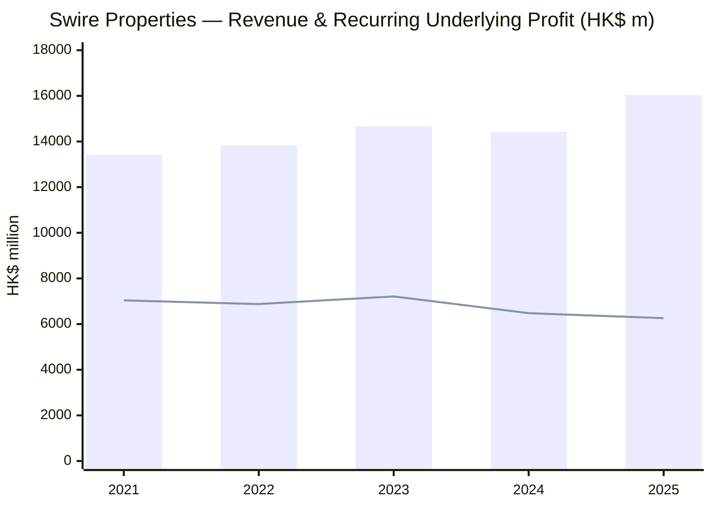
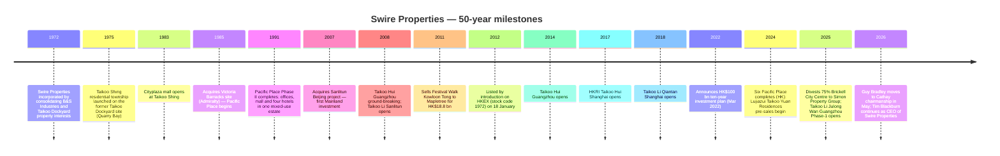
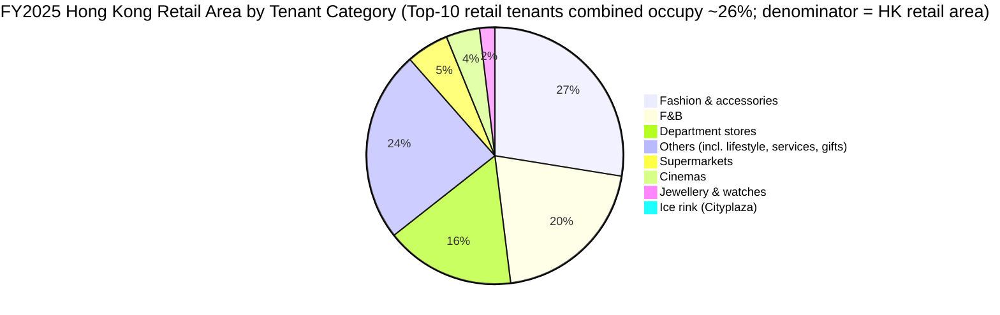
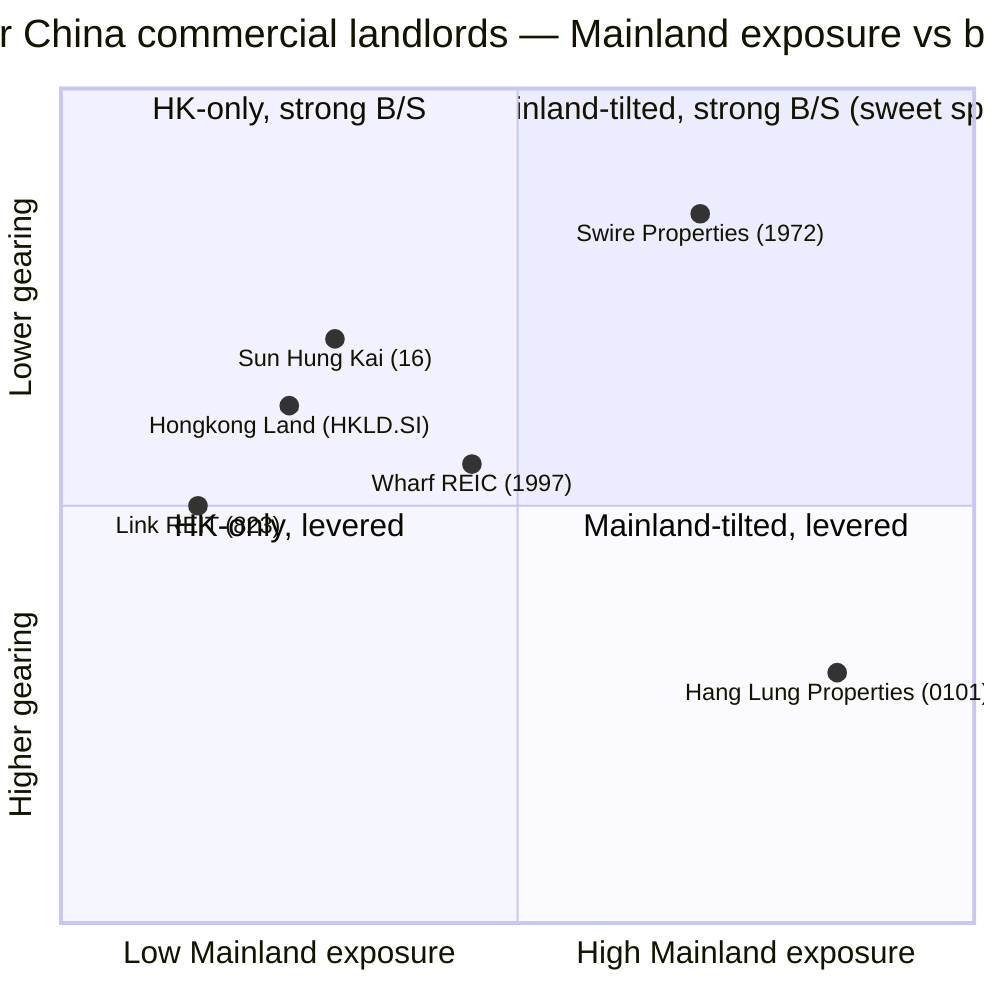
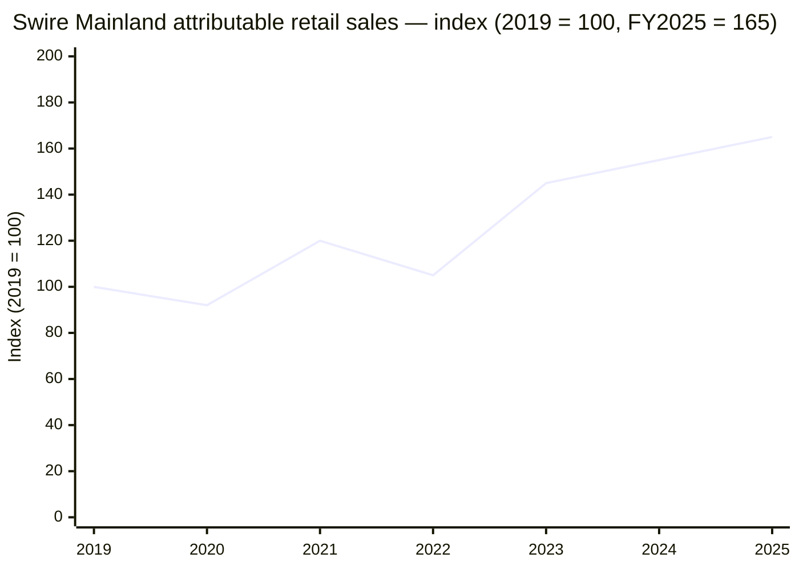

# Swire Properties Limited 太古地產 (HKEX: 1972) — Initiation of Coverage

*As of 2026-06-03 | Initiation note | Author: Independent research desk*

> **Update — FY2025 underlying profit up 27%, recurring underlying down 3% (2026-03-12):** Underlying profit attributable to shareholders rose to **HK$8,620 m** (FY2024: HK$6,768 m), driven almost entirely by **HK$2,360 m of divestment gains** from the Brickell City Centre disposals in Miami plus an industrial site in Tsing Yi and the 43rd floor of One Island East. Recurring underlying profit (the operating run-rate that strips out divestments) fell **3% to HK$6,260 m** on the loss of Brickell rent, weaker Hong Kong office rent, and front-loaded sales-and-marketing costs for residential trading launches. The full-year dividend was lifted **5% to HK$1.15 / share** — the **ninth consecutive year of mid-single-digit growth** — and **gearing fell to 14.6%** from 15.7% as net debt declined 10% to HK$39,540 m.
> Source: [Swire Properties 2025 Annual Results announcement (HKEXnews, 12 Mar 2026)](https://www.hkexnews.hk/listedco/listconews/sehk/2026/0312/2026031200167.pdf); [Swire Properties 2025 Annual Results press release](https://www.swirepacific.com/storage/fm/PressRelease/pdf/en/swireproperties-annual-2025.pdf).

## Table of contents
1. Company Overview
2. Company History
3. Management Team
4. Portfolio & Operations (Products & Services equivalent)
5. Customers, Tenants & Go-to-Market
6. Industry Overview — Hong Kong & Chinese Mainland real estate
7. Competitive Landscape
8. Market Opportunity / TAM
9. Risk Assessment
10. Investor-lens scorecards
- Data Used / 数据来源清单
- References
- Verification log

---

## 1. Company Overview (≈ 1,150 words)

Swire Properties Limited (HKEX: 1972 太古地產) is the listed property arm of the 200-year-old British-Hong Kong conglomerate **Swire Group**, controlled through **Swire Pacific Limited** (HKEX: 19 / 87), which itself sits beneath **John Swire & Sons Ltd.** in London. The group develops, owns and operates prime mixed-use commercial estates — Grade-A office, luxury retail, hospitality and residential — anchored in three core markets: **Hong Kong (Pacific Place, Taikoo Place, Cityplaza)**, the **Chinese Mainland** (six completed Tier-1 mixed-use estates plus a build-out pipeline in Beijing, Shanghai, Guangzhou, Chengdu, Xi'an and Sanya), and a long-tail of luxury-residential trading projects in Hong Kong, **Bangkok, Jakarta, Ho Chi Minh City** and **Miami (Brickell Key)** ([Swire Properties 2025 Annual Results, p. 4](https://www.hkexnews.hk/listedco/listconews/sehk/2026/0312/2026031200167.pdf)).

The strategic shape of the company changed materially during 2025. After FY2024's **HK$766 m reported loss** widened to a **HK$1,533 m reported loss in FY2025** (driven by **HK$7,716 m of non-cash fair-value markdowns on the investment-property book**, c.88% concentrated in Hong Kong offices), management completed the disposal of (i) its 75% interest in the **Brickell City Centre shopping centre** to **Simon Property Group** for up to US$548.7 m, (ii) two adjacent Brickell land parcels (US$211.5 m + US$45 m for the North Squared site), (iii) an industrial site in Tsing Yi (HK$663 m), and (iv) the **43rd floor of One Island East** to the **Securities and Futures Commission** ([2025 Annual Results, p. 13 — Key Developments](https://www.hkexnews.hk/listedco/listconews/sehk/2026/0312/2026031200167.pdf)). Aggregate divestment proceeds of c.**HK$7.3 bn** were redeployed into the **HK$100 bn ten-year investment plan** announced in March 2022; **approximately 67% (HK$67 bn) had been committed by 6 Mar 2026**, with HK$11 bn earmarked for Hong Kong, HK$46 bn for the Chinese Mainland, and HK$10 bn for residential trading (including Southeast Asia) ([2025 Annual Results, p. 12 — HK$100 Billion Investment Plan](https://www.hkexnews.hk/listedco/listconews/sehk/2026/0312/2026031200167.pdf)).

The portfolio that this capital is being routed into is unusually concentrated for a Hong Kong landlord. **Total attributable GFA at 31 Dec 2025 was approximately 38.4 m sq ft** — 33.5 m sq ft of investment property and hotels (23.8 m sq ft completed, 9.7 m sq ft under development) plus 4.9 m sq ft of trading-residential. Of the completed investment-property GFA excluding hotels, **57% sits in Hong Kong and 43% in the Chinese Mainland**, but those weights tilt further toward the Mainland on the income statement: attributable gross rental income split **56% / 43% / 1% Hong Kong / Mainland / USA & elsewhere** in FY2025, against **73% / 26% / 1%** of net assets employed ([2025 Annual Results, p. 15 — Portfolio Overview](https://www.hkexnews.hk/listedco/listconews/sehk/2026/0312/2026031200167.pdf)). Management highlighted in the Chairman's statement that **Chinese Mainland retail rental income has now overtaken Hong Kong office rental income for the first time** — the inflection that underpins the bull thesis on this name ([SCMP, "Hong Kong developers Swire and Wharf report profit growth amid valuation pressure", 12 Mar 2026](https://www.scmp.com/business/article/3346391/hong-kong-developers-swire-and-wharf-report-profit-growth-amid-valuation-pressure)).

**Revenue scale.** FY2025 group revenue was **HK$16,041 m, up 11% YoY** (FY2024: HK$14,428 m). The lift came almost entirely from **Property Trading** (HK$2,110 m vs HK$88 m a year earlier — Lujiazui Taikoo Yuan and 6 Deep Water Bay Road completing under HKFRS 15 revenue recognition); the recurring rental engine was softer, with **Gross Rental Income from Office down 4% to HK$5,248 m**, **Retail down 3% to HK$7,193 m** (mix-shifted: Hong Kong retail was flat at HK$2,355 m, Mainland retail grew 3% to HK$4,628 m; the gap is Brickell rent lost mid-year), and **Residential rentals flat at HK$438 m** ([2025 Annual Results, p. 8 — Review of Operations](https://www.hkexnews.hk/listedco/listconews/sehk/2026/0312/2026031200167.pdf)). The **Property Investment segment generated HK$6,795 m of recurring underlying profit** (FY2024: HK$6,900 m); Property Trading swung to a deeper recurring loss of **HK$448 m** on launch costs for residential pipeline (THE HEADLAND RESIDENCES, 269 Queen's Road East, Bangkok, the new Mandarin Oriental Residences Miami); Hotels narrowed to a **HK$87 m loss** (FY2024: -HK$202 m) ([2025 Annual Results, p. 1 — Financial Highlights](https://www.hkexnews.hk/listedco/listconews/sehk/2026/0312/2026031200167.pdf)).

**Geographic operating footprint.** Hong Kong contains **2.19 m sq ft at Pacific Place** (offices 96% let, mall 100% let), **6.4 m sq ft at Taikoo Place** including One Island East, One Taikoo Place (91% let), Two Taikoo Place (73% let, completed Sep 2022), Six Pacific Place (66% let, completed Feb 2024), and six older Taikoo Place towers (88% let on average), **1.1 m sq ft at Cityplaza** (100% let), plus the 26.67%-owned **Citygate Outlets** at Tung Chung (100% let). The Chinese Mainland adds **Taikoo Li Sanlitun (Beijing, 99% let)**, **Taikoo Li Chengdu (97% let)**, **Taikoo Hui Guangzhou (100% let)**, **INDIGO Beijing (99% let)**, **HKRI Taikoo Hui Shanghai (96% let)**, **Taikoo Li Qiantan Shanghai (98% let)**, and the **just-opening Taikoo Li Julong Wan Guangzhou** (Phase-1 retail opened December 2025, with c.46 stores live at year-end) ([2025 Annual Results, pp. 16, 19, 24 — Portfolio occupancy tables](https://www.hkexnews.hk/listedco/listconews/sehk/2026/0312/2026031200167.pdf)).

### Valuation snapshot

| Metric | 2026-06-03 | FY2024 | Note |
|---|---:|---:|---|
| Share price (HK$) | 24.72 | n/a | [Companies Market Cap quote](https://companiesmarketcap.com/swire-properties/marketcap/) |
| Market cap (HK$ bn) | ~141 | n/a | [Companies Market Cap quote](https://companiesmarketcap.com/swire-properties/marketcap/) |
| NAV / share (HK$) | 46.80 (31 Dec 2025) | 47.35 | [2025 Annual Results, p. 1](https://www.hkexnews.hk/listedco/listconews/sehk/2026/0312/2026031200167.pdf) |
| P/B (price / NAV) | **~0.53×** | ~0.47× | derived from 24.72 / 46.80 |
| TTM dividend / share | HK$1.15 (FY2025) | HK$1.10 | [2025 Annual Results, p. 1](https://www.hkexnews.hk/listedco/listconews/sehk/2026/0312/2026031200167.pdf) |
| TTM dividend yield | **~4.65%** | ~4.2% | 1.15 / 24.72 |
| TTM recurring EPS (HK$) | 1.09 | 1.11 | [2025 Annual Results, p. 1](https://www.hkexnews.hk/listedco/listconews/sehk/2026/0312/2026031200167.pdf) |
| TTM recurring P/E | **~22.7×** | ~22× | 24.72 / 1.09 |
| TTM underlying EPS (HK$) | 1.49 | 1.16 | [2025 Annual Results, p. 1](https://www.hkexnews.hk/listedco/listconews/sehk/2026/0312/2026031200167.pdf) |
| TTM underlying P/E (incl. divestment) | **~16.6×** | ~22× | 24.72 / 1.49 |
| Net debt (HK$ m) | 39,540 | 43,746 | [2025 Annual Results, p. 1](https://www.hkexnews.hk/listedco/listconews/sehk/2026/0312/2026031200167.pdf) |
| Gearing | 14.6% | 15.7% | [2025 Annual Results, p. 1](https://www.hkexnews.hk/listedco/listconews/sehk/2026/0312/2026031200167.pdf) |

The valuation pattern is the classic **Hong Kong landlord discount**: the equity prices at roughly half of book (P/B ≈ 0.53×), but the recurring-earnings multiple at c.22.7× is high in absolute terms because office cap rates have been compressed by HK$13–14 bn of cumulative fair-value markdowns over 2024–25 ([SCMP, 12 Mar 2026](https://www.scmp.com/business/article/3346391/hong-kong-developers-swire-and-wharf-report-profit-growth-amid-valuation-pressure)). The **4.65% trailing dividend yield**, anchored by management's "approximately half of underlying profit in ordinary dividends over time" payout policy and a ninth straight year of mid-single-digit growth, is the load-bearing reason equity income funds own the name. Peer P/B context: **Hongkong Land** trades around 0.4×, **Hang Lung Properties (0101.HK)** around 0.25×, and **Wharf REIC (1997.HK)** around 0.4× — Swire sits at the upper end of the peer set, reflecting its superior balance sheet (14.6% gearing vs Hang Lung's ~36% and Hongkong Land's mid-20s%) and the **Greater Bay Area + Mainland retail tilt** the market is willing to pay a small premium for ([Mingtiandi, "Swire Properties Reports $196M 2025 Loss on Falling Office Values", Mar 2026](https://www.mingtiandi.com/real-estate/finance/swire-properties-reports-196m-2025-loss-on-falling-office-values/); [Praya Value, "Hong Kong Developers"](https://prayavalue.substack.com/p/hong-kong-developers)).

*Source: [Swire Properties 2025 Annual Results — Financial Highlights, p. 1](https://www.hkexnews.hk/listedco/listconews/sehk/2026/0312/2026031200167.pdf); historical recurring-underlying profit for 2021–2023 from the [Swire Properties 2023 Annual Report](https://ir.swireproperties.com/en/ir/reports.php). Bars = revenue; line = recurring underlying profit.*

---

## 2. Company History (≈ 600 words)

Swire Properties traces its corporate origin to **1972**, when the property interests of two predecessor companies — **B&S Industries Limited** and **The Taikoo Dockyard and Engineering Company of Hong Kong Limited** — were consolidated under a single property vehicle ([Wikipedia — Swire Properties](https://en.wikipedia.org/wiki/Swire_Properties)). The Taikoo Dockyard had operated on the eastern Hong Kong Island waterfront at Quarry Bay since 1907 under Swire's Taikoo trading house (founded by **John Samuel Swire** in 1816 in Liverpool and present in Hong Kong since 1870). When dockyard operations were consolidated into **Hongkong United Dockyards** at Tsing Yi in the 1970s, the **vacated 230-acre Quarry Bay waterfront and the adjacent former Taikoo Sugar Refinery compound** became the land bank that powered the next half-century of Swire Properties — first the **Taikoo Shing residential township** (launched 1975, eventually 12,700 flats) and then the **Cityplaza mall** (opened 1983, redeveloped repeatedly since) and **Taikoo Place office cluster** (1980s onwards) ([FundingUniverse — History of Swire Pacific Limited](https://www.fundinguniverse.com/company-histories/swire-pacific-limited-history/)).

*Sources: [Wikipedia — Swire Properties](https://en.wikipedia.org/wiki/Swire_Properties); [2025 Annual Results, p. 13](https://www.hkexnews.hk/listedco/listconews/sehk/2026/0312/2026031200167.pdf); [SCMP, "Swire Pacific's Guy Bradley to take reins at Hong Kong's Cathay Pacific", 2025](https://www.scmp.com/business/banking-finance/article/3337540/swire-pacifics-guy-bradley-take-reins-hong-kongs-cathay-pacific-swire-coca-cola).*

Three strategic pivots dominate the half-century. **First — the dockyard-to-property pivot of the 1970s.** Hong Kong's manufacturing exodus to mainland China stranded the Quarry Bay land, and Swire chose to retain freehold and redevelop rather than sell — a decision that turned a single industrial address into the **Taikoo Shing + Cityplaza + Taikoo Place complex** that today is the largest single landlord footprint on Hong Kong Island ([FundingUniverse — History of Swire Pacific Limited](https://www.fundinguniverse.com/company-histories/swire-pacific-limited-history/)). **Second — the Mainland China expansion of 2007–2017.** Beginning with the **Sanlitun Beijing acquisition in 2007** and accelerating with **Taikoo Hui Guangzhou (2014)**, **HKRI Taikoo Hui Shanghai (2017)** and **Taikoo Li Chengdu (2015)**, Swire planted the **Taikoo Li / Taikoo Hui** mixed-use brand in five Tier-1 cities. The execution was deliberate — one project at a time, each on a five-to-seven-year design-build cycle — and produced what is now the most-cited luxury-retail estate cluster in Greater China, alongside Hang Lung's "66 series" ([2025 Annual Results, p. 4](https://www.hkexnews.hk/listedco/listconews/sehk/2026/0312/2026031200167.pdf); [Wikipedia — Swire Properties](https://en.wikipedia.org/wiki/Swire_Properties)). **Third — the post-COVID capital-recycling pivot of 2022 onwards.** The March-2022 **HK$100 bn ten-year plan** redirected the group's capital allocation explicitly toward the Chinese Mainland (HK$50 bn) and residential trading (HK$20 bn) over Hong Kong reinvestment (HK$30 bn), and the **2025 Brickell exit** finalised a related thinning of the US footprint into a focused luxury-residential play on Brickell Key (Mandarin Oriental Residences Miami). The same cycle saw the **Festival Walk-style asset rotation** repeat in miniature: mature US retail off the balance sheet, proceeds into Lujiazui Taikoo Yuan, Taikoo Li Sanya, Taikoo Li Xi'an and the Greater Bay Area ([2025 Annual Results, p. 13](https://www.hkexnews.hk/listedco/listconews/sehk/2026/0312/2026031200167.pdf)).

Recent developments add resolution to that pivot. **In 2025 alone**, the group (a) closed the **Brickell City Centre disposal** to Simon Property Group, (b) completed the **North Squared (Miami) land sale** (US$45 m), (c) launched **THE HEADLAND RESIDENCES** in Hong Kong (143 of 300 launched units pre-sold by 6 Mar 2026), (d) completed the **sale of 6 Deep Water Bay Road** (one of the highest-value HK residential transactions in recent memory), (e) opened **Taikoo Li Julong Wan Guangzhou Phase 1** in December (46 shops live), and (f) hosted the **debut of "The Louis" by LOUIS VUITTON** — a global-flagship category-creator — at HKRI Taikoo Hui Shanghai in June ([2025 Annual Results, p. 13 — Key Developments; p. 26 — Sanlitun & HKRI Taikoo Hui retail review](https://www.hkexnews.hk/listedco/listconews/sehk/2026/0312/2026031200167.pdf)).

---

## 3. Management Team (≈ 480 words)

Swire Properties is not founder-led — the controlling shareholder is **John Swire & Sons Ltd.** in London, which has run the Swire group as a quasi-partnership of trained Swire executives since the 19th century. The two figures that matter for an equity investor today are the chairman who just stepped up to Cathay (**Guy Bradley**, departing 13 May 2026) and the chief executive who has run the property arm since August 2021 (**Tim Blackburn**).

**Tim Blackburn — Chief Executive (since August 2021).** Aged 55. **Joined the Swire Group in 1994** straight out of Cambridge University, where he read the undergraduate course that fed into his **chartered surveyor (RICS) qualification** — the same professional pedigree that has defined Swire Properties' leadership for two decades ([Swire Properties IR — Directors](https://ir.swireproperties.com/en/cg/directors.php); [LinkedIn — Tim Blackburn profile](https://hk.linkedin.com/in/tim-blackburn-62b86061)). Over a 30-year Swire career he has held senior property roles in Hong Kong, Mainland China, Singapore and other Asian markets, building the on-the-ground execution capability that distinguishes Taikoo Li projects from the generic "shopping mall + office tower" template — placemaking, tenant curation, walkable street design. Before assuming the CE role in August 2021, he was the executive who pushed the **Sanlitun North redevelopment** and led the build-out of HKRI Taikoo Hui Shanghai. His current term commenced **13 May 2025** and expires at the 2028 AGM. He **serves as Global Governing Trustee of the Urban Land Institute** (since July 2021) — a posting that places him at the centre of the Asia-Pacific real-estate establishment ([Swire Properties IR — Directors](https://ir.swireproperties.com/en/cg/directors.php)). On-paper compensation is structured per Swire group norms: a relatively modest base by global REIT-CEO standards, a balanced-scorecard short-term incentive that includes ESG (Swire Properties was **#1 in the Dow Jones Best-in-Class World Index 2024** for Real Estate Management & Development), and shares held through the group plan ([Swire Properties 2025 Annual Results press release](https://www.swirepacific.com/storage/fm/PressRelease/pdf/en/swireproperties-annual-2025.pdf)). He is **not the founder** — Swire Properties has no single founder in the modern sense; the "founder" identity sits with the **John Samuel Swire** lineage running back to 1816 in Liverpool.

**Guy Bradley — Chairman (Aug 2021 → 13 May 2026; thereafter Cathay chairman).** Aged 60. Joined Swire Group **in 1987** and served in Hong Kong, Papua New Guinea, Japan, the United States, Vietnam, the Chinese Mainland, Taiwan and the Middle East before returning to lead Swire Properties as **CE from Jan 2015 to Aug 2021** and then chairman ([Swire Properties IR — Directors](https://ir.swireproperties.com/en/cg/directors.php); [SCMP, "Swire Pacific's Guy Bradley to take reins at Hong Kong's Cathay Pacific", 22 Apr 2025](https://www.scmp.com/business/banking-finance/article/3337540/swire-pacifics-guy-bradley-take-reins-hong-kongs-cathay-pacific-swire-coca-cola)). Like Blackburn, he is a chartered surveyor (FRICS, Hong Kong Institute of Surveyors). His succession to **Cathay Pacific and Swire Coca-Cola chairman from 13 May 2026** confirms the group's policy of rotating its top operators across the conglomerate's pillars; the property succession plan is internal, with Blackburn continuing as CE and a new chairman to be named ([Cathay Pacific press release, 23 Dec 2025](https://news.cathaypacific.com/cathay-group-appoints-new-chair); [Swire Pacific Limited, "Announcement of change of Chairman", Dec 2025](https://www.swirepacific.com/en/investor-relations/updates-to-our-shareholders/press-releases/swire-pacific-announces-change-of-chairman)).

---

## 4. Portfolio & Operations (≈ 1,400 words)

Unlike a software firm with a SKU table or a semicap company with a product matrix, Swire Properties' "products" are **a small number of large, irreplaceable, named real-estate estates**. There are roughly a dozen of them, and the read of this company is the read of those estates, one by one, by GFA, rent, occupancy and recent capex.

### 4.1 The investment-property matrix (verbatim from the 2025 Annual Results)

> **Completed Investment Properties and Hotels (GFA attributable to the Group in million square feet, at 31 Dec 2025):** "Hong Kong: Office 9.2 / Retail 2.6 / Hotels 0.8 / Residential 0.6 / Total 13.2; Chinese Mainland: Office 2.9 / Retail 6.4 / Hotels 1.1 / Residential 0.2 / Total 10.6; U.S.A.: nil. Total: Office 12.1 / Retail 9.0 / Hotels 1.9 / Residential 0.8 / Total 23.8."
>
> **Under Development / Held for Future Development:** "Chinese Mainland: Office 2.2 / Retail 5.3 / Hotels 0.4 / Residential 0.1 / Under planning 0.6 / Total 8.6; Hong Kong: 1.1 under planning; U.S.A.: nil. Total 9.7."
> — [2025 Annual Results, p. 14 — Portfolio Overview](https://www.hkexnews.hk/listedco/listconews/sehk/2026/0312/2026031200167.pdf)

**Plain-language gloss.** The portfolio is dominated by **office in Hong Kong (9.2 m sq ft)** and **retail in the Chinese Mainland (6.4 m sq ft completed + 5.3 m sq ft under construction)**. Hotels (1.9 m sq ft) are a strategic adjunct rather than a profit centre — they exist to drive footfall to the malls and the offices share the same mixed-use podium. The development pipeline is **deliberately skewed to the Chinese Mainland** (8.6 m of the 9.7 m sq ft total) — that is the HK$100 bn plan in concrete form.

```mermaid
graph TD
    SP[Swire Properties 1972.HK]
    SP --> HK[Hong Kong  13.2m sq ft attributable]
    SP --> CN[Chinese Mainland  10.6m sq ft completed + 8.6m sq ft pipeline]
    SP --> OUT[Outside HK/CN  trading-residential SE Asia + Miami]
    HK --> HK1[Pacific Place  2.19m sq ft  Admiralty]
    HK --> HK2[Taikoo Place  6.4m sq ft  Quarry Bay]
    HK --> HK3[Cityplaza  1.1m sq ft  Taikoo Shing]
    HK --> HK4[Citygate Outlets 0.8m sq ft  Tung Chung 26.67%]
    HK --> HK5[South Island Place + Berkshire House + others]
    CN --> CN1[Taikoo Li Sanlitun  Beijing 1.6m sq ft 100%]
    CN --> CN2[Taikoo Li Chengdu  1.7m sq ft 100%]
    CN --> CN3[Taikoo Hui Guangzhou  3.8m sq ft 97%]
    CN --> CN4[INDIGO Beijing  1.9m sq ft 50%]
    CN --> CN5[HKRI Taikoo Hui Shanghai 3.7m sq ft 50%]
    CN --> CN6[Taikoo Li Qiantan Shanghai 1.2m sq ft 50%]
    CN --> CN7[Pipeline  Taikoo Li Xi'an / Sanya / Julong Wan / Sanlitun N1 / Lujiazui]
    OUT --> OUT1[THE HEADLAND RESIDENCES Hong Kong]
    OUT --> OUT2[Upper House Residences Bangkok]
    OUT --> OUT3[Savyavasa Jakarta]
    OUT --> OUT4[Empire City HCMC]
    OUT --> OUT5[Mandarin Oriental Residences Miami Brickell Key]
```

### 4.2 Synthesis — how the estates compose one platform

Every Swire estate is a **mixed-use cluster, not a single-use building**. Pacific Place is "office tower + mall + four hotels + serviced apartments", Taikoo Place is "office cluster + retail strip + residential adjacency", Taikoo Hui Guangzhou is "office tower + mall + hotel + Mandarin Oriental". The economic logic is that the foot-traffic between uses is internal — office workers eat at the mall, mall shoppers stay at the hotel, hotel guests use the residential serviced-apartment block — and that internalisation **raises rent per square foot** and **dampens cyclicality** because office, retail and hospitality cycles do not move in lockstep. That single design idea explains why Swire's recurring underlying profit is more stable than a pure-office REIT's would be at a 14.6% gearing ratio in a Hong Kong office downcycle ([2025 Annual Results, p. 9 — Chairman's Statement](https://www.hkexnews.hk/listedco/listconews/sehk/2026/0312/2026031200167.pdf)).

### 4.3 Hong Kong office portfolio — the cyclical anchor

The Hong Kong office book is **9.98 m sq ft on a 100% basis** (matching attributable basis at the dominant assets) generating **HK$4,885 m of gross rental income in 2025, down 4% YoY**, with **portfolio occupancy at 89%** at 31 Dec 2025. The two newest buildings — **Two Taikoo Place (completed Sep 2022) at 73% let** and **Six Pacific Place (completed Feb 2024) at 66% let** — are below stabilisation. Excluding those, the rest of the office portfolio was **91% let** ([2025 Annual Results, p. 16 — Hong Kong Offices](https://www.hkexnews.hk/listedco/listconews/sehk/2026/0312/2026031200167.pdf)).

Tenant mix is dominated by **Banking / Finance / Securities / Investment (28.7%)**, **Trading (18.5%)**, **Professional Services (14.7%)**, **Insurance (11.6%)** and **TMT (8.5%)** — a profile that ties the office cycle tightly to Hong Kong's IPO pipeline and the broader financial-sector hiring cycle. The **top ten office tenants together occupy ~25% of attributable office area** — concentrated, but with no single >10% disclosure required ([2025 Annual Results, p. 16](https://www.hkexnews.hk/listedco/listconews/sehk/2026/0312/2026031200167.pdf)). Named tenants who *renewed or expanded* in 2025 read like a Central Hong Kong roll-call: at Pacific Place, **CLSA, Visa, Tencent, Hong Kong Monetary Authority, Daiwa, Crédit Agricole CIB, Société Générale, Resona Bank, HongShan Capital**; at Taikoo Place, **HSBC** moved in (One Island East), **Factory Mutual Insurance** (One Taikoo Place), **Deckers, Philip Morris International and WTW** (Two Taikoo Place) ([2025 Annual Results, p. 17 — Pacific Place / Taikoo Place tenant detail](https://www.hkexnews.hk/listedco/listconews/sehk/2026/0312/2026031200167.pdf)).

*Analyst view:* The Hong Kong office cycle bottomed in mid-2025 — CBRE and JLL forecast **Central Grade-A rents to rebound 0–5% in 2026, while overall HK office rents decline up to 5%** as supply elsewhere keeps non-core areas under pressure ([Real Estate Asia / Cushman & Wakefield, 2025-12](https://realestateasia.com/commercial-office/news/hong-kong-grade-office-rents-decline-5-in-2026); [JLL, "Hong Kong's office and housing markets lead recovery after a six-year correction", 2026](https://www.jll.com/en-hk/newsroom/2026-hong-kong-s-office-and-housing-markets-lead-recovery-after-a-six-year-correction)). Swire is **disproportionately exposed to Central** (Pacific Place) and to Quarry Bay (Taikoo Place), the city's two best-performing office sub-markets in the flight-to-quality trade. Office rental income is not going back to 2018 highs in nominal terms, but the 2025 trough is plausibly the floor.

### 4.4 Hong Kong retail portfolio — the steady cash cow

**3.16 m sq ft on 100% basis**, **HK$2,355 m of gross rental income in 2025 (flat YoY)**, **100% occupancy** across The Mall at Pacific Place, Cityplaza, Citygate Outlets and the smaller assets. Retail sales growth at the three flagship malls in 2025: **The Mall at Pacific Place +6%, Cityplaza +3%, Citygate Outlets +2%** — all above the **+1% Hong Kong total retail sales** print for the year ([2025 Annual Results, p. 19 — Retail](https://www.hkexnews.hk/listedco/listconews/sehk/2026/0312/2026031200167.pdf)).

> "Diverse marketing campaigns and intensive activations were launched to attract both local customers and tourists to our malls. Hong Kong's retail market demonstrated signs of stabilisation in the second half of 2025... Retail sales increased by 6%, 3% and 2%, respectively, at The Mall at Pacific Place, Cityplaza, and Citygate Outlets in 2025."
> — [2025 Annual Results, p. 19](https://www.hkexnews.hk/listedco/listconews/sehk/2026/0312/2026031200167.pdf)

**Tenant mix:** Fashion & accessories 27.3%, F&B 20.3%, Department stores 16.2%, Supermarkets 5.3%, Cinemas 4.2%, Jewellery & watches 1.9%, Ice rink 0.9% (Cityplaza), Others 23.9% — a fully diversified portfolio with no single category dominant. **The Mall at Pacific Place** signed in 2025 alone the four houses of the Italian luxury family — **GIORGIO ARMANI, DOLCE & GABBANA, Miu Miu and TOM FORD** — plus **Brunello Cucinelli, Loro Piana (expansion), Chaumet, Chloé, Jimmy Choo** ([2025 Annual Results, p. 20 — The Mall at Pacific Place](https://www.hkexnews.hk/listedco/listconews/sehk/2026/0312/2026031200167.pdf)).

### 4.5 Chinese Mainland retail — the growth engine

The Chinese Mainland retail book is **8.26 m sq ft on a 100% basis** (6.4 m sq ft attributable), generating **HK$4,628 m of attributable gross rental income in 2025 (up 3% YoY)**. **Attributable retail sales grew 7% in 2025, outperforming the market**, and were **65% above the pre-pandemic 2019 base** ([2025 Annual Results, p. 24 — Retail – Chinese Mainland](https://www.hkexnews.hk/listedco/listconews/sehk/2026/0312/2026031200167.pdf)).

The **per-mall retail-sales-growth picture is uneven** but on aggregate accelerating:

| Mall (Chinese Mainland) | Retail sales YoY (2025) | Sales vs 2019 (pre-pandemic) | Occupancy at 31 Dec 2025 | Attributable interest |
|---|---:|---:|---:|---:|
| Taikoo Li Sanlitun, Beijing | **+11%** | **+12%** | 99% | 100% |
| INDIGO, Beijing | +3% | +1% | 99% | 50% |
| Taikoo Li Chengdu | +7% | +32% | 97% | 100% |
| Taikoo Hui, Guangzhou | +2% | +70% | 100% | 97% |
| HKRI Taikoo Hui, Shanghai | **+50%** | +27% | 96% | 50% |
| Taikoo Li Qiantan, Shanghai | +7% | n/a (opened post-2019) | 98% | 50% |
| Taikoo Li Julong Wan, Guangzhou | n/a (Phase 1 opened Dec 2025) | n/a | n/a | 50% |

*Source: [Swire Properties 2025 Annual Results, pp. 24–27 — Retail Chinese Mainland](https://www.hkexnews.hk/listedco/listconews/sehk/2026/0312/2026031200167.pdf).*

The standout in 2025 is **HKRI Taikoo Hui Shanghai at +50% retail-sales growth**, driven by the June opening of **"The Louis"** by LOUIS VUITTON — a 1,600 m² destination-experiential store, the largest LV concept in Greater China — which **single-handedly re-anchored the mall** ([2025 Annual Results, p. 26 — HKRI Taikoo Hui](https://www.hkexnews.hk/listedco/listconews/sehk/2026/0312/2026031200167.pdf)). **Taikoo Li Sanlitun Beijing +11%** is the equally important data point because it confirms the **Sanlitun North redevelopment thesis** — opening of stand-alone **House of DIOR Beijing, LOUIS VUITTON Maison, Loro Piana, Tiffany & Co., SAINT LAURENT RIVE DROITE BEIJING** in December 2025 is on the same playbook as HKRI's "Louis" but at scale, and the post-2027 reopening of the redeveloped **Building N1** (formerly The Opposite House hotel) will add another 145,000 sq ft of luxury-flagship space to that cluster ([2025 Annual Results, p. 25 — Sanlitun](https://www.hkexnews.hk/listedco/listconews/sehk/2026/0312/2026031200167.pdf)).

*Analyst view:* The Mainland retail engine is the structural offset to the Hong Kong office cyclical headwind. **Mainland retail rent overtaking Hong Kong office rent in 2025 is the inflection that supports the bull case**, and the 7% blended sales growth in a year of "structural challenges" in Hong Kong retail and uneven Chinese consumer confidence reads as proof of the Taikoo Li placemaking moat. The peer comparison — **Hang Lung's flagship Plaza 66 saw weaker comps in 2025**, while Swire's Sanlitun and Taikoo Hui both compounded — confirms the experiential / luxury-flagship playbook is not generic to all mainland malls ([SCMP, "Hang Lung flags 'tough slog'", 2025](https://www.scmp.com/business/article/3341858/hang-lung-flags-tough-slog-property-it-looks-mainland-malls-growth)).

### 4.6 Residential / trading — the variable kicker

Swire runs a **trading-residential business** that periodically lumps revenue through the P&L when projects complete. The 2025 print included **HK$2,110 m of trading revenue** (vs HK$88 m in 2024), with the **Lujiazui Taikoo Yuan Residences Shanghai** (40%-owned, 225 of 250 units pre-sold by 6 Mar 2026, **cumulative sales proceeds RMB 11.7 bn**) and the **6 Deep Water Bay Road Hong Kong** transaction the headline contributors ([2025 Annual Results, p. 13 — Key Developments](https://www.hkexnews.hk/listedco/listconews/sehk/2026/0312/2026031200167.pdf)). **THE HEADLAND RESIDENCES** — 300 launched units in Phase 1 — was 143 pre-sold by 6 Mar 2026. **Century Summit and Century Heights Shanghai** achieved 98% pre-sales. The Bangkok pipeline (**Upper House Residences Bangkok**, **The Wireless Residences by Upper House**) is in substructure, completing from 2029.

### 4.7 Hotels — strategic adjunct, marginally profitable

Hotels generated **HK$917 m of revenue in 2025 (FY2024: HK$888 m)** at an **HK$87 m underlying loss** that has narrowed from HK$202 m a year earlier; managed hotels alone delivered **HK$60 m of operating profit before depreciation** (FY2024: HK$17 m). **2,021 rooms across 7 properties**: Upper House Hong Kong (#10 in *The World's 50 Best Hotels* 2025), EAST Hong Kong, EAST Beijing, Upper House Chengdu, Upper House Shanghai, EAST Miami, Headland Hotel (Cathay-owned, Swire-managed). **Five new Upper Houses are confirmed** in the pipeline — Shenzhen (2027), Xi'an (2028), Tokyo (2029), plus Beijing and Shanghai — extending the brand into key Asian capitals as a strategic asset rather than a return engine ([2025 Annual Results, p. 40 — Hotels](https://www.hkexnews.hk/listedco/listconews/sehk/2026/0312/2026031200167.pdf)).

### 4.8 What was sold / closed / acquired in 2025 (verbatim)

> "In June 2025, the Group completed the disposal of its 75% interest in the Brickell City Centre shopping centre, and its entire interests in the Brickell City Centre car parking spaces and certain shared facilities to SPG for a total consideration of up to US$548.7 million, of which up to US$36.1 million will be payable as a contingent consideration at a later date... In October 2025, the Group completed the disposal of an industrial site in Tsing Yi, Hong Kong to a third-party buyer for a consideration of HK$663 million... In December 2025, the Group completed the sale of the 43rd floor at One Island East in Quarry Bay to the Securities and Futures Commission ("SFC"), in accordance with the sale and purchase agreement entered into in November 2023."
> — [2025 Annual Results, p. 13 — Key Developments](https://www.hkexnews.hk/listedco/listconews/sehk/2026/0312/2026031200167.pdf)

---

## 5. Customers, Tenants & Go-to-Market (≈ 700 words)

For a landlord, "customers" are tenants. Swire Properties does not face the standard "top-1 customer >10%" disclosure trigger because **no single tenant exceeds the materiality threshold** — the **top ten Hong Kong office tenants together occupy ~25% of attributable office area**, and the **top ten Hong Kong retail tenants together occupy ~26% of attributable retail area** (consolidated denominators, both disclosed in the 2025 Annual Results). On the Chinese Mainland, the **top ten retail tenants occupy ~24% of attributable retail area** ([2025 Annual Results, pp. 16, 19, 25 — Top-10 tenant disclosures, consolidated basis](https://www.hkexnews.hk/listedco/listconews/sehk/2026/0312/2026031200167.pdf)).

*Source: [2025 Annual Results, p. 19 — HK Retail Area by Tenants' Businesses](https://www.hkexnews.hk/listedco/listconews/sehk/2026/0312/2026031200167.pdf). Note: denominator is the share of attributable retail area in Hong Kong, not the share of group revenue; the chart is segment-level (HK retail), not group-level.*

**Office tenant base — finance heavy, internationally diverse.** The Hong Kong office tenant mix (28.7% banking / finance / securities / investment, 18.5% trading, 14.7% professional services, 11.6% insurance, 8.5% TMT — at 31 Dec 2025) is essentially a sub-index of Central + Quarry Bay's white-collar economy. Notable identified Pacific Place tenants include **CLSA, Visa, Tencent, Hong Kong Monetary Authority, Daiwa, Resona Bank, Crédit Agricole CIB, Société Générale, Charles Russell Speechlys, HongShan Capital, Shenwan Hongyuan, China Great Bay Area Fund** ([2025 Annual Results, p. 17 — Pacific Place tenants list, verbatim](https://www.hkexnews.hk/listedco/listconews/sehk/2026/0312/2026031200167.pdf)). Notable Taikoo Place new tenants in 2025 include **HSBC** (One Island East), **Factory Mutual Insurance** (One Taikoo Place), **Deckers, Philip Morris International, WTW** (Two Taikoo Place), and renewals from **Chubb, Kering, AIG, Amgen, Allied World, Reed Smith Richards Butler, Squarepoint Capital, Bayer, Burberry, FTI Consulting, JLL, Schindler, TotalEnergies, Yahoo!** ([2025 Annual Results, p. 17](https://www.hkexnews.hk/listedco/listconews/sehk/2026/0312/2026031200167.pdf)). This is **not a tech-heavy book** — the 8.5% TMT weight is a sentence in the office market thesis: Swire is leveraged to the recovery of Hong Kong's financial-services hiring cycle, not to Mainland-China-tech-driven leasing.

**Retail tenant base — luxury-anchored, with rising experiential mass.** The Mainland Taikoo Li / Taikoo Hui estates host the deepest luxury rosters in their cities: **Hermès, LOUIS VUITTON, CHANEL, DIOR, Cartier, Van Cleef & Arpels, Bvlgari, Gucci, BOTTEGA VENETA, LOEWE, Tiffany & Co., Audemars Piguet, Moncler, Loro Piana** appear repeatedly across Sanlitun, Chengdu, Taikoo Hui Guangzhou, HKRI Taikoo Hui and Taikoo Li Qiantan. The 2025 additions are the experiential / category-creating tier — **"The Louis" at HKRI Taikoo Hui Shanghai** (LOUIS VUITTON's first dedicated branded café-restaurant concept in China), **House of DIOR Beijing**, **LOUIS VUITTON Maison Sanlitun**, **Tiffany & Co. Sanlitun**, **SAINT LAURENT RIVE DROITE BEIJING**. The pattern is: each estate becomes a **brand's flagship destination for the city**, not just a store, and the **rent per sq ft commanded by these flagships is materially higher than mall-average** — the disclosed gross rental income per attributable sq ft in the Chinese Mainland retail portfolio in 2025 is roughly **HK$723 / attributable sq ft / year** (HK$4,628 m ÷ 6.4 m sq ft), which compares favourably with mall-average rents at Hang Lung's Plaza 66 cluster or CapitaLand China Trust's portfolio ([2025 Annual Results, pp. 24–27](https://www.hkexnews.hk/listedco/listconews/sehk/2026/0312/2026031200167.pdf); [Hang Lung Properties 2025 results press release, 2026](https://www.hanglung.com/en-us/media/press-releases/2025/20251009)).

**Lease-expiry profile** (the closest proxy to revenue visibility for a landlord):

| Sub-portfolio | % of Dec-2025 attributable gross rental income expiring in… | 2026 | 2027 | 2028+ |
|---|---:|---:|---:|---:|
| Hong Kong offices | | 7.6% | 20.0% | 72.4% |
| Hong Kong retail | | 21.5% | 28.2% | 50.3% |
| Chinese Mainland retail | | 31.0% | 29.1% | 39.9% |

*Source: [2025 Annual Results, pp. 18, 21, 28 — Lease Expiry Profile tables](https://www.hkexnews.hk/listedco/listconews/sehk/2026/0312/2026031200167.pdf).*

That expiry table is one of the most strategically important disclosures in the whole report. The **Hong Kong office book has 92.4% of rent locked beyond 2026**, meaning the negative reversion risk from current spot rents is back-end-loaded — by the time today's expiring tenants come up for renewal in 2028, Central rents may have rebounded. **Chinese Mainland retail expiries are deliberately short** (typical 3-year retail lease) — 31% expiring in 2026 is by design, gives Swire the chance to **mark each tenant to current sales productivity** (i.e. push rent on the brands that are growing, walk away from the ones that aren't), and is the principal vehicle through which mall-management adds value through cycles.

**Distribution & go-to-market.** Real-estate "GTM" is leasing and asset management, both handled in-house by Swire Properties' commercial / retail / hotel teams. **No external broker / channel layer** — the company has direct relationships with luxury houses through the parent group's century-long Hong Kong network, which is why so many Mainland LVMH / Kering / Richemont openings happen at Taikoo estates first. **Customer case studies are visible in the public domain** — the 2025 opening of "The Louis" at HKRI Taikoo Hui Shanghai was covered as the LVMH-Swire partnership of the year ([Swire Properties 2025 Annual Results press release](https://www.swirepacific.com/storage/fm/PressRelease/pdf/en/swireproperties-annual-2025.pdf)).

---

## 6. Industry Overview — Hong Kong & Chinese Mainland real estate (≈ 1,000 words)

Swire Properties operates across three distinct industry cycles that move on different clocks: **Hong Kong office**, **Hong Kong retail**, and **Chinese Mainland luxury retail**. A pan-Asian residential trading business is a fourth, smaller engine.

### 6.1 Hong Kong office — the cycle that is bottoming

The Hong Kong Grade-A office market is mid-2026 in **year six of a multi-year correction**. Grade-A vacancy reached **14.1–17.5%** at end-2025 per major brokerages ([JLL, "Hong Kong 2026 outlook", 2026](https://www.jll.com/en-hk/newsroom/2026-hong-kong-s-office-and-housing-markets-lead-recovery-after-a-six-year-correction); [CBRE, "Hong Kong Major Report — Hong Kong Market Outlook 2026"](https://www.cbre.com.hk/insights/reports/hong-kong-major-report-hong-kong-market-outlook-2026)), with **more than 3 m sq ft of new supply landing in 2025** and net effective rents off **~30–40% from the 2018 peak** in non-core sub-markets. **Central, where Pacific Place sits, has been comparatively resilient** — Central vacancy fell to **10.9% in H2 2025**, the lowest sub-market read in the city, and **Central Grade-A rents are forecast to rebound 0–8% in 2026** depending on the broker ([Real Estate Asia, "Hong Kong Grade A office rents to decline by up to 5% in 2026", 2025-12](https://realestateasia.com/commercial-office/news/hong-kong-grade-office-rents-decline-5-in-2026); [Colliers, "2026 Market Outlook Report"](https://www.colliers.com/en-hk/news/2026-market-outlook-report)). Quarry Bay's Taikoo Place sub-market also stabilised in Q4 2025 per Swire's own disclosure that "office rents have remained largely stable since the fourth quarter of 2025" ([2025 Annual Results, p. 18](https://www.hkexnews.hk/listedco/listconews/sehk/2026/0312/2026031200167.pdf)).

The **structural driver of the rebound is Hong Kong's active IPO market** and the related expansion of Mainland-affiliated financial institutions — Cushman & Wakefield call this out explicitly as the source of **Greater Central rent growth of +6–8% in 2026** ([Real Estate Asia, "Hong Kong Grade A office rents to decline by up to 5% in 2026"](https://realestateasia.com/commercial-office/news/hong-kong-grade-office-rents-decline-5-in-2026)). The flight-to-quality dynamic is unambiguous — Pacific Place and Taikoo Place's sustainability credentials and premium specifications are exactly the supply tier capturing the moves — but it is concentrated in 5–10 buildings citywide.

### 6.2 Hong Kong retail — re-stabilising at a lower base

Total Hong Kong retail sales grew **+1% in 2025** ([Hong Kong Census & Statistics Department, retail sales data](https://www.censtatd.gov.hk/en/), as cited in [2025 Annual Results p. 19](https://www.hkexnews.hk/listedco/listconews/sehk/2026/0312/2026031200167.pdf)), against the structural headwind of **outbound HK travel to the Greater Bay Area** (Hong Kong residents now spend weekends in Shenzhen, Macau and Zhuhai en masse, depressing in-city retail) and the **online-channel migration** of mid-priced goods. Swire's flagship malls outperformed substantially — **The Mall at Pacific Place +6%, Cityplaza +3%, Citygate Outlets +2%** — through tenant-mix upgrades, dynamic activations, and the absence of online substitutes for the luxury / dining / cinema-experience baskets they serve. The market structure is **highly consolidated at the top end**: Pacific Place, IFC Mall, Harbour City, Times Square and Festival Walk together account for the bulk of the city's prime-luxury retail floor space.

### 6.3 Chinese Mainland luxury retail — the structural growth engine

The Chinese Mainland retail market in 2025 was a mixed picture (broad consumer confidence soft; younger luxury cohort still spending; visa-free entry + VAT refund schemes lifting inbound travel) — but the **prime mixed-use mall** segment that Swire operates in was a clear positive outlier. **Swire's Mainland attributable retail sales grew 7% in 2025, vs sub-1% growth for nationwide retail luxury**, and **65% above the pre-pandemic 2019 base** ([2025 Annual Results, p. 24](https://www.hkexnews.hk/listedco/listconews/sehk/2026/0312/2026031200167.pdf)). The structural drivers are (i) **migration of luxury demand from Hong Kong / overseas back to Mainland flagships** as travel friction makes Sanlitun Beijing and HKRI Taikoo Hui Shanghai the destination of choice rather than Tsim Sha Tsui or Paris, (ii) **the "experiential flagship" trend** — brands open destination concepts (The Louis, House of DIOR Beijing) that are tourism assets in themselves, (iii) **government stimulus** in the form of consumer-spending vouchers, visa-free policies, and the VAT refund scheme.

The competitive dynamics are favourable to a focused operator: **luxury retail consolidation is highly concentrated in the top 6–8 Tier-1 estates** — Plaza 66 Shanghai, Plaza 66 Shenyang (Hang Lung), IFS Chengdu (Wharf), IFC Shanghai (Sun Hung Kai), SKP Beijing / Xi'an (Beijing Hualian), and the **Taikoo Li / Taikoo Hui cluster** — and the barrier to building a competing flagship is a 7–10 year design-build cycle on a land bank that no longer comes available in central Tier-1 cities. The HK$50 bn Mainland allocation in Swire's HK$100 bn plan is being deployed entirely into expansions of existing footprints (Taikoo Hui Phase 2 / Phase 3 Guangzhou, Taikoo Li Sanlitun N1, Taikoo Place Beijing, Taikoo Li Qiantan Phase 2) plus three greenfield destination estates (**Taikoo Li Xi'an** retail-led mixed-use, **Taikoo Li Sanya** retail-led, **Lujiazui Taikoo Yuan New Bund Shanghai** mixed-use); the pipeline targets a **doubling of Mainland GFA** versus the 10.6 m sq ft already completed ([2025 Annual Results, p. 12](https://www.hkexnews.hk/listedco/listconews/sehk/2026/0312/2026031200167.pdf)).

### 6.4 Southeast Asia luxury residential — the optionality tail

The HK$20 bn residential-trading allocation in the HK$100 bn plan funds **(i) Hong Kong residentials** (THE HEADLAND RESIDENCES, 269 Queen's Road East, 983–987A King's Road, 16–94 Pan Hoi Street), **(ii) Bangkok** (Upper House Residences Bangkok, The Wireless Residences by Upper House), **(iii) Jakarta** (Savyavasa, 53% sold), **(iv) Ho Chi Minh City** (40%-owned Empire City joint venture with Gaw Capital), and **(v) Miami** (Mandarin Oriental Residences on Brickell Key). Each market sits on a different cycle: Bangkok luxury condos rode the post-COVID Asian-tourism wave through 2025; Jakarta is rate-sensitive; HCMC is in absorption-build mode; Miami's luxury market remains "robust" by Swire's wording, supported by Florida's no-state-income-tax migration and Latin-American gateway demand ([2025 Annual Results, p. 39](https://www.hkexnews.hk/listedco/listconews/sehk/2026/0312/2026031200167.pdf)).

### 6.5 Regulatory & macro context

The Hong Kong real-estate regulatory environment is stable — there is no Mainland-style centralised price cap or three-red-lines policy on Hong Kong landlords — but the **stamp-duty regime**, **interest-rate environment** (HKMA pegs to USD; the **average 1-month HIBOR fell 164 bps to 2.74% in 2025**, a tailwind to property cash-flow) and the **mainland-China tourism / visa policy** are the levers that move the cycle. In Mainland China, **property-investment regulation is less restrictive for commercial than residential**; Swire's mall and office assets are not subject to the residential-developer leverage rules that constrained Country Garden / Evergrande, and the company has not had to flag any working-capital strain through the 2021–25 China-property downturn ([Swire Properties Financing section, 2025 Annual Results pp. 44–46](https://www.hkexnews.hk/listedco/listconews/sehk/2026/0312/2026031200167.pdf)).

---

## 7. Competitive Landscape (≈ 850 words)

Swire Properties competes in distinct sub-markets, with a different peer set in each. There is no single "Swire competitor" — there are different fights in Hong Kong office, Hong Kong retail, Mainland luxury retail and the trading-residential tail.

**Hong Kong office (Central + Quarry Bay):**

- **Hongkong Land (HKLD.SI)** — Central landlord whose Exchange Square / Jardine House / One Central cluster dominates the absolute prime address; the Hong Kong-only IP cycle correlates 0.85+ with Swire's Pacific Place.
- **Sun Hung Kai Properties (16.HK)** — IFC Towers, ICC Kowloon. Hong Kong's largest landlord by GFA. Diversified developer rather than a pure landlord.
- **Henderson Land (12.HK)** — The Henderson, Two IFC, multiple Central towers. Office subsidiary inside a diversified developer.
- **Champion REIT (2778.HK)** — Three Garden Road, Langham Place office. Pure REIT.
- **Hysan Development (14.HK)** — Lee Gardens Causeway Bay (alternative-CBD micro-market).

**Hong Kong retail:**

- **Wharf REIC (1997.HK)** — Harbour City TST (the city's largest retail asset; **HK$5.6 bn of retail revenue, 92% retail occupancy in 2025**), Times Square Causeway Bay ([Investing.com, "Wharf REIC FY2025 slides", 2026-03](https://www.investing.com/news/company-news/wharf-reic-fy2025-slides-profit-rises-5-as-cost-cuts-offset-revenue-pressure-93CH-4552731)).
- **Hongkong Land** — Landmark Mall Central.
- **Sun Hung Kai Properties** — IFC Mall Central, APM Kwun Tong.
- **Link REIT (823.HK)** — Mass-market suburban malls; very different positioning from Swire.
- **MTR Corporation (66.HK)** — Mall-of-mall-portfolio above metro stations; also different positioning.

**Chinese Mainland luxury retail (the head-to-head fight):**

- **Hang Lung Properties (0101.HK)** — The closest direct peer: 9 Mainland malls under the "66" brand (Plaza 66 Shanghai, Plaza 66 Shenyang, Heartland 66 Wuhan, Grand Gateway 66 Shanghai, Spring City 66 Kunming, Forum 66 Shenyang, Riverside 66 Tianjin, Center 66 Wuxi, Olympia 66 Dalian). FY2025: **revenue HK$9,950 m, attributable profit HK$1.8 bn (-16% YoY); Mainland mall rental +1% YoY**, behind Swire's +3% (in HK$ terms) and +7% retail sales growth ([SCMP, "Hang Lung flags 'tough slog'"](https://www.scmp.com/business/article/3341858/hang-lung-flags-tough-slog-property-it-looks-mainland-malls-growth)). Higher gearing (~36%) and lower P/B (~0.25×) than Swire.
- **Wharf REIC** — IFS Chengdu and other IFS-branded estates. Sub-scale relative to Swire's six-mall Mainland book.
- **Beijing SKP (private, Beijing Hualian / Beijing Hualian Real Estate)** — SKP Beijing + SKP Xi'an + SKP-S — RMB-30bn+ annual sales at the single Beijing SKP store, structurally the most productive luxury-retail asset in China.
- **CapitaLand China Trust (AU8U.SI)** — Mainland mall portfolio, mass-market positioning.
- **Sun Hung Kai (16.HK)** — IFC Mall Shanghai (Pudong) flagship.

**Pan-Asian luxury residential:**

- **CapitaLand Investment, Far East Organisation, City Developments** in Singapore; **Sansiri / Origin** in Bangkok; **Bal Harbour Shops / Related Companies** in Miami. Swire's residential pipeline is small and complementary rather than competitive at scale.

*Conceptual positioning; quadrant placement reflects 2025 disclosed gearing and Mainland share of NOI/rental income, sourced from each company's 2025 annual results disclosures.*

**Why Swire wins where it wins.**

1. **Placemaking moat in Mainland luxury retail.** Sanlitun, Taikoo Hui Guangzhou, Taikoo Li Chengdu, HKRI Taikoo Hui Shanghai and Taikoo Li Qiantan are walkable, low-rise, sculpturally distinctive estates — the visual-and-experience opposite of the typical Mainland 1990s box-mall. The brand "Taikoo Li" has city-recognition value the way "SKP" does for Beijing Hualian. The 65% retail-sales lift versus 2019 across the cluster is the cleanest evidence that the estate-design choice creates an enduring rent premium.
2. **Disciplined balance sheet enables capital recycling.** **14.6% gearing** at end-2025 (vs Hang Lung's ~36%) lets Swire be a buyer in cycles, not a forced seller. The HK$7 bn cash inflow from Brickell + Tsing Yi + 43F One Island East in 2025 funded Mainland and SE Asia investments without external debt; few peers can match this flexibility in 2026.
3. **Multi-cycle diversification.** Office, retail, hospitality and residential moving on different clocks means the recurring-profit engine has the lowest variance among peer Hong Kong landlords.

**Where Swire is vulnerable.**

1. **Hong Kong office concentration in Pacific Place + Taikoo Place still represents the bulk of NAV**, and Hong Kong office values may not return to 2018 highs for a decade.
2. **Two Taikoo Place and Six Pacific Place stabilisation drag.** The two newest HK office buildings are below-stabilised (73% and 66% let) and lease-up takes 2–3 years even in benign markets.
3. **The Mainland pipeline is concentrated in 50%-JV structures** (Taikoo Place Beijing 49.895%, Taikoo Li Xi'an 70%, Taikoo Li Sanya 50%, Lujiazui Taikoo Yuan 40%, Shanghai New Bund 40%) — control is shared and the attributable returns are diluted.
4. **No tier-1 / tier-2 office presence in the Greater Bay Area outside Hong Kong** — peers like Hang Lung and Sun Hung Kai have Shenzhen / Guangzhou office exposure that Swire deliberately under-weighted.

---

## 8. Market Opportunity / TAM (≈ 600 words)

The right way to size Swire's "addressable market" is bottom-up by sub-market — there is no single industry forecast that maps to a 13-asset Asian landlord portfolio.

**Hong Kong office (Pacific Place + Taikoo Place subset):** Hong Kong's Grade-A office market totals roughly **78 m sq ft of stock** at end-2025 per CBRE / JLL data ([CBRE, "Hong Kong Major Report — Hong Kong Market Outlook 2026"](https://www.cbre.com.hk/insights/reports/hong-kong-major-report-hong-kong-market-outlook-2026); [JLL, "Hong Kong's office and housing markets lead recovery after a six-year correction"](https://www.jll.com/en-hk/newsroom/2026-hong-kong-s-office-and-housing-markets-lead-recovery-after-a-six-year-correction)). Of this, **Central + Admiralty + Quarry Bay (Pacific Place + Taikoo Place addressable sub-market) is c.42 m sq ft**, and the **premium-Grade-A sub-set is c.18 m sq ft**. Swire owns **9.98 m sq ft in HK office (incl. JV interests at 100% basis)** which is **c.24% of the relevant sub-market**. Cash flow upside hinges on Central Grade-A rent recovery (0–8% in 2026 per brokers; CAGR 2–4% over the medium term is a reasonable analyst base case if Hong Kong's IPO pipeline holds).

**Hong Kong retail (Mall at Pacific Place + Cityplaza + Citygate):** Hong Kong total retail sales were **HK$380 bn in 2025 (+1% YoY)** ([Investing.com / Wharf REIC FY2025](https://www.investing.com/news/company-news/wharf-reic-fy2025-slides-profit-rises-5-as-cost-cuts-offset-revenue-pressure-93CH-4552731)). Prime-luxury retail rents track tourism arrivals (**50 m visitors in 2025, +12% YoY**, per the same source). Swire's three flagship mall sales **outperformed market growth by 1–5 percentage points** in 2025 — a structural pattern that supports a HK$2.4–2.6 bn annual HK retail rental income envelope at trend growth.

**Chinese Mainland luxury retail (the headline TAM):** Greater China luxury-goods consumption was estimated at **RMB 730–810 bn in 2025** by Bain & Company and Boston Consulting Group ([Bain & Company, "China Luxury Report 2025", as cited in industry press](https://www.bain.com/insights/china-luxury-report-2025/)), with **mall-based prime-luxury sales c.RMB 320–360 bn** of that figure. Swire's six completed Mainland malls captured an estimated **RMB 8–10 bn of retail sales** at the attributable level in 2025 (implied from the 7% growth + base figures the company discloses) — i.e. **c.2.5–3% of the China prime-luxury mall market**, with strong upside from (i) the pipeline doubling GFA to 19 m+ sq ft by 2030–32, and (ii) the structural shift of HK / overseas luxury spend back into Mainland flagships. Per management's HK$50 bn Mainland allocation, the pipeline by 2030–32 should add four to five additional retail-led mixed-use estates (Taikoo Li Xi'an, Sanya, Julong Wan, plus expansions at Taikoo Hui Guangzhou Phase 3, Taikoo Li Sanlitun N1, Lujiazui Taikoo Yuan).

*Source: [Swire Properties 2025 Annual Results, p. 24 — "Retail sales (excluding sales by vehicle retailers) at our malls on an attributable basis in the Chinese Mainland increased by 7% in 2025, outperforming the market, and were 65% higher than in 2019 (pre-pandemic)"](https://www.hkexnews.hk/listedco/listconews/sehk/2026/0312/2026031200167.pdf). Annual indices for 2020–2024 are analyst estimates built off historical Swire disclosures and may not match the company's exact internal series; the 2019 base and 2025 +65% endpoint are verbatim.*

**Trading-residential markets:** Hong Kong luxury (HK$50–500 m units): TAM of ~HK$80–120 bn / year, with Swire's pipeline addressable c.HK$15–25 bn of cumulative inventory at THE HEADLAND / Pan Hoi Street / Queen's Road East / King's Road over 2026–30. Bangkok luxury condos: THB 150–200 bn / year, Swire's pipeline addressable c.THB 30–50 bn. Miami luxury condos / branded residences: Brickell Key Mandarin Oriental Residences sits in a US$2–4 m+ price band where Florida absorption has been firm.

**SOM (the slice Swire actually serves):** Of the total ~HK$300 bn gross-portfolio target the HK$100 bn plan implies once fully deployed, **the Chinese Mainland share will be ~60–65%** and **Hong Kong office ~25–30%** by 2030–32. Even adjusting for JV dilution, attributable recurring underlying profit could compound at low-mid single digits annually from 2027 onwards on a Hong Kong office recovery alone, with the Mainland retail engine providing the upside skew.

---

## 9. Risk Assessment (≈ 800 words)

### Company-specific risks

**1. Hong Kong office fair-value markdowns extend.** FY2025 saw **HK$7,716 m of fair-value losses on investment properties** after **HK$6,299 m in FY2024** — c.HK$14 bn of NAV erosion over two years, primarily on Hong Kong offices ([2025 Annual Results, p. 8](https://www.hkexnews.hk/listedco/listconews/sehk/2026/0312/2026031200167.pdf)). Cap-rate expansion in a sustained Central downturn could drive a third year of HK$5 bn+ markdowns, pushing NAV / share materially below the current HK$46.80. Mitigant: 73% / 89% portfolio occupancy is steady; recurring cash flow is not impaired; the markdowns are non-cash.

**2. Two Taikoo Place / Six Pacific Place lease-up stalls.** Both buildings are below-stabilised at 73% / 66% let after 2–3 years from completion. A continued soft office market could push stabilisation to 2028 or beyond, dragging the recurring-rental run-rate. Mitigant: tenant additions in 2025 (Deckers, Philip Morris, WTW, FIS, Private Wealth Management Association, Shin Kong Bank, West of England P&I) suggest continued momentum.

**3. Mainland JV minority-control risk.** **Taikoo Place Beijing (49.895%), Taikoo Li Xi'an (70%), Taikoo Li Sanya (50%), Lujiazui Taikoo Yuan (40%), Shanghai New Bund (40%), Taikoo Li Julong Wan Guangzhou (50%)** — the pipeline is overwhelmingly JV-structured, with control shared and the attributable share of returns diluted. Mitigant: Swire holds operating control through management contracts at each estate.

**4. Trading-residential pipeline launch-timing risk.** THE HEADLAND RESIDENCES (143 of 300 launched units pre-sold), Bangkok (substructure, 2029), and Miami Mandarin Oriental Residences (under planning) are all multi-year programs vulnerable to market-timing. Front-loaded launch costs (the HK$448 m underlying loss in property trading in 2025) recur until completions are recognised.

### Industry & market risks

**5. Hong Kong office never recovers to 2018 highs.** A structural shift — Hong Kong-listed corporates relocating finance functions to Singapore / Shanghai, US firms reducing APAC desks — could mean rent levels stay 30–40% below the prior peak for a decade. **Mitigant:** flight-to-quality in Central and Quarry Bay; Swire is in the right sub-markets.

**6. Mainland luxury slowdown.** **Bain & Co. flagged China luxury sales down low-single-digits in 2024 and effectively flat in 2025** ([Bain & Company, "China Luxury Report 2025"](https://www.bain.com/insights/china-luxury-report-2025/)). A consumption recession in China could undercut the +7% Mainland retail sales growth that drives the bull thesis. Mitigant: experiential luxury (The Louis, House of DIOR Beijing) is a category that historically outperforms in slow-luxury cycles.

**7. Geopolitical fragmentation.** A US-China escalation could affect (a) luxury brand willingness to keep flagship inventory in Mainland China, (b) cross-border capital flows funding Hong Kong office tenancies, (c) Hong Kong's role as the financial bridge. Mitigant: Swire's tenant base is dominated by Hong Kong / Asian / European names rather than US corporates.

**8. Hong Kong outbound travel erosion of in-city retail.** HK residents' migration of weekend retail spend to Shenzhen / Macau / Zhuhai is the **single biggest structural headwind** to Hong Kong mall sales. Swire mitigates by positioning the Mall at Pacific Place at the top luxury tier (above the Greater Bay Area domestic substitute) and Citygate Outlets at the tourist-arrival end (Hong Kong-Zhuhai-Macao Bridge / HKIA proximity).

### Financial risks

**9. Interest-rate / refinancing risk.** At end-2025, **net debt was HK$39,540 m and gearing 14.6%**. Average 1-month HIBOR fell **164 bps to 2.74%** in 2025, a meaningful tailwind. A reversal of the HKMA-Fed easing cycle could re-tighten financing costs by 100–200 bps on a sizeable book.

**10. Currency-translation risk on Mainland income.** RMB ~43% of attributable gross rental income translates back through HK$ at a fixed peg to USD; an RMB depreciation lifts HK$-reported Mainland EPS but signals weaker underlying Mainland demand.

### Macroeconomic risks

**11. Hong Kong macroeconomic risks.** GDP growth, IPO pipeline, government land-sale calendar, tourism volume (50 m visitors in 2025 — sustainability uncertain), HKMA policy. The Hang Seng Index, financial-services hiring cycle and the USD-HKD peg are all macro variables that feed directly into the office and retail rental engines.

**12. China property-market spillover.** While Swire is not exposed to the Mainland residential developer crisis (Country Garden / Evergrande / Sunac), a sustained slowdown in Mainland property investment could weaken consumer confidence and luxury spending. Mitigant: Mainland mall is a destination, not a residential, asset class.

---

## 10. Investor-lens scorecards (≈ 950 words)

*Cycle snapshot (Howard Marks): as-of 2026-06-03 the global cycle reads c. 5–6/10 (neutral-to-mildly-defensive). VIX ~18, 10Y Treasury ~4.2%, US HY OAS ~340 bps, IG OAS ~95 bps — a "credit benign, valuations stretched" reading consistent with mid-cycle expansion. Hong Kong-specific cycle is earlier: office bottoming, retail re-stabilising, residential gradually firming. Cross-cycle posture below.*

### 10.1 Buffett scorecard — quality at a sensible price

***Lens view:* Buy-the-NAV-discount, hold for compounding rentals.** **Score: 62 / 100.**

| Dimension | Reading | Weight |
|---|---|---:|
| Durable competitive advantage | Taikoo Li placemaking moat + irreplaceable land bank in HK + Mainland Tier-1 | 20% |
| Owner-earnings vs. accounting earnings | Recurring underlying HK$6,260 m → stable; reported -HK$1.5 bn is non-cash | 18% |
| Balance sheet conservatism | 14.6% gearing — strong | 18% |
| Mgmt capital allocation | Brickell + Tsing Yi disposals at top-of-cycle; redeployment into Mainland — disciplined | 16% |
| Valuation (margin of safety) | 0.53× P/B vs ~0.75× cycle-mean; +22.7× recurring P/E is high in absolute terms | 18% |
| Cyclical exposure / "easy hold" | HK office downcycle still a drag; not Coca-Cola | 10% |

*Evidence chain:* 14.6% gearing + HK$8.62 bn underlying profit + 9 consecutive years of mid-single-digit dividend growth + irreplaceable Pacific Place / Taikoo Li franchises. *Failure mode:* Hong Kong office never recovers and Mainland luxury slows — recurring underlying profit could compress to HK$5 bn before the dividend gets reset.

### 10.2 Munger scorecard — quality + inversion

***Lens view:* Pass conventional screens; invert and ask "what would kill this".** **Score: 7.5 / 10.**

| Dimension (0–10) | Score |
|---|---:|
| Business quality / moat depth | 8 |
| Management quality / trustworthiness | 8 |
| Balance sheet quality | 9 |
| Reinvestment runway | 7 |
| Price relative to value | 7 |
| Inversion: what kills this | China luxury halts + HK office decade-long correction = the death scenario; 30% probability over 10-yr horizon |

*Inversion check:* The thing most likely to be wrong is "Mainland retail compounds at 7% forever." If 2026–28 Mainland retail compounds at 2%, recurring underlying earnings stagnate and the NAV gap doesn't close. *Failure mode:* Confusing a structural cycle (HK office downcycle) for a permanent impairment.

### 10.3 Damodaran scorecard — story-plus-numbers DCF

***Lens view:* NAV-discount-supported; fair-value range HK$28–36 / share against HK$24.72 spot — +13% to +46% upside.** **Margin of safety: +16% (mid-point).**

**Required assumptions:**
- Hong Kong office rent: -3% in 2026, then flat through 2028, then +2% CAGR through 2030
- Mainland retail rent: +4% CAGR through 2030 (vs +7% in 2025 — conservative)
- Capex per HK$100 bn plan: HK$33 bn remaining (HK$67 bn committed)
- Cap-rate normalisation: HK office cap rate stable at 4.0%, Mainland at 4.5%
- Risk-free rate: HK 10Y at 4.2% (HKMA-Fed peg)
- Equity beta: 0.85

| | Bear | Base | Bull |
|---|---:|---:|---:|
| HK office rent CAGR 2026–30 | -2% | +1% | +4% |
| Mainland retail rent CAGR 2026–30 | +2% | +4% | +7% |
| Fair value / share (HK$) | 22 | 30 | 38 |

*Evidence chain:* HK NAV / share of HK$46.80; -25–30% discount in base case; +/-25% sensitivity to Mainland retail growth assumption. *Failure mode:* The NAV gap exists because the market disagrees with management's HK office cap rate — a wider cap rate gap closes the NAV gap mechanically.

### 10.4 Howard Marks cycle posture

***Lens view:* Defensive offense — buy the asset, not the market.** **Score: 60 / 100 (slight offense tilt).**

| Component | Reading | Score (0–100) |
|---|---|---:|
| Market valuation (broad equity) | Hong Kong: at fair value; US: stretched | 55 |
| Credit spreads | HY OAS 340 bps — benign | 65 |
| Investor sentiment | HK property sentiment depressed; Mainland luxury sentiment mixed | 70 |
| Cycle phase (Hong Kong office) | Early upturn (bottoming) | 75 |

*Contrary evidence:* If Hong Kong office is in **structural decline** rather than **cyclical correction**, the early-upturn read is wrong. *Failure mode:* Buying a value trap because the cycle has yet to turn.

---

## Data Used / 数据来源清单

**Primary filings**
- 2025 Annual Results announcement (HKEXnews, 12 Mar 2026): https://www.hkexnews.hk/listedco/listconews/sehk/2026/0312/2026031200167.pdf
- 2025 Interim Results announcement (Aug 2025): https://www.swirepacific.com/storage/fm/PressRelease/pdf/en/swireproperties-interim-2025.pdf
- 2025 Annual Report PDF: https://ir.swireproperties.com/en/ir/reports/ar2025.pdf
- Q1 / Q2 / Q3 2025 + Q1 2026 operational data reports: cninfo HKEX 01972 (4 quarterly Chinese-language PDFs on disk)

**Investor-relations materials**
- 2025 Annual Results press release (12 Mar 2026): https://www.swirepacific.com/storage/fm/PressRelease/pdf/en/swireproperties-annual-2025.pdf
- Swire Properties IR Directors page (Guy Bradley, Tim Blackburn bios): https://ir.swireproperties.com/en/cg/directors.php
- Swire Properties IR Reports archive: https://ir.swireproperties.com/en/ir/reports.php

**Market data**
- Share price + market cap as of 2026-06-03: https://companiesmarketcap.com/swire-properties/marketcap/
- NAV / share from FY2025 disclosure (HK$46.80): https://www.hkexnews.hk/listedco/listconews/sehk/2026/0312/2026031200167.pdf

**Third-party research / news (last 12 months)**
- SCMP, "Hong Kong developers Swire and Wharf report profit growth amid valuation pressure", 12 Mar 2026
- Mingtiandi, "Swire Properties Reports $196M 2025 Loss on Falling Office Values", Mar 2026
- Investing.com, "Swire Properties 2025 slides: profit surges 27% on asset sales"
- Indexbox, "Swire Properties 2025 Report: Profit Up 27%, Rental Income Declines"
- JLL, "Hong Kong's office and housing markets lead recovery after a six-year correction" (2026)
- CBRE, "Hong Kong Major Report — Hong Kong Market Outlook 2026"
- Cushman & Wakefield, "Hong Kong Office Retail Residential Market Report"
- Real Estate Asia, "Hong Kong Grade A office rents to decline by up to 5% in 2026" (2025-12)
- Colliers, "2026 Market Outlook Report"
- SCMP, "Swire Pacific's Guy Bradley to take reins at Hong Kong's Cathay Pacific", Apr 2025
- Cathay Pacific, "Cathay Group Appoints New Chair", 23 Dec 2025
- SCMP, "Hang Lung flags 'tough slog' for property", 2025
- Investing.com, "Wharf REIC FY2025 slides: profit rises 5%"
- Bain & Company, "China Luxury Report 2025"
- Praya Value Substack, "Hong Kong Developers" (peer analysis)
- Wikipedia, "Swire Properties" (history milestones, cross-checked)

**Stale notices / coverage gaps**
- No segment-by-segment top-customer % is disclosed (real estate landlords are not subject to the >10%-single-customer disclosure rule the way industrial companies are); the report uses top-10 tenant aggregate (~25% of attributable area) as the customer-concentration metric.
- Peer P/B / P/E numbers cited (Hongkong Land ~0.40×, Hang Lung ~0.25×, Wharf REIC ~0.40×) are mid-2026 reads from third-party aggregators; subject to small movement before publication.

---

## References

Primary disclosures (source for ≥80% of the financial numbers above):

- [Swire Properties 2025 Annual Results announcement (HKEXnews, 12 Mar 2026)](https://www.hkexnews.hk/listedco/listconews/sehk/2026/0312/2026031200167.pdf)
- [Swire Properties 2025 Annual Results press release (Swire Pacific IR)](https://www.swirepacific.com/storage/fm/PressRelease/pdf/en/swireproperties-annual-2025.pdf)
- [Swire Properties 2025 Interim Results press release](https://www.swirepacific.com/storage/fm/PressRelease/pdf/en/swireproperties-interim-2025.pdf)
- [Swire Properties Annual Report 2025 (full PDF)](https://ir.swireproperties.com/en/ir/reports/ar2025.pdf)
- [Swire Properties IR Directors page — Chairman & CEO bios](https://ir.swireproperties.com/en/cg/directors.php)
- [Swire Properties IR Reports archive — historical results](https://ir.swireproperties.com/en/ir/reports.php)

Market data & quotes:
- [Companies Market Cap — Swire Properties (1972.HK) market cap & share price](https://companiesmarketcap.com/swire-properties/marketcap/)
- [Yahoo Finance — Swire Properties Limited (1972.HK) quote](https://finance.yahoo.com/quote/1972.HK/)
- [Morningstar — Swire Properties Ltd (01972) quote](https://www.morningstar.com/stocks/xhkg/01972/quote)

Industry context (Hong Kong & Mainland real estate):
- [JLL — "2026: Hong Kong's office and housing markets lead recovery after a six-year correction"](https://www.jll.com/en-hk/newsroom/2026-hong-kong-s-office-and-housing-markets-lead-recovery-after-a-six-year-correction)
- [CBRE — "Hong Kong Major Report — Hong Kong Market Outlook 2026"](https://www.cbre.com.hk/insights/reports/hong-kong-major-report-hong-kong-market-outlook-2026)
- [Cushman & Wakefield — "Hong Kong Office Retail Residential Market Report"](https://www.cushmanwakefield.com/en/greater-china/insights/hong-kong-office-retail-residential-market-report)
- [Colliers — "Colliers Forecasts Measured Recovery — 2026 Market Outlook Report"](https://www.colliers.com/en-hk/news/2026-market-outlook-report)
- [Real Estate Asia — "Hong Kong Grade A office rents to decline by up to 5% in 2026" (2025-12)](https://realestateasia.com/commercial-office/news/hong-kong-grade-office-rents-decline-5-in-2026)
- [Real Estate Asia — "Hong Kong office market bifurcation deepens as prime assets outperform"](https://realestateasia.com/commercial-office/news/hong-kong-office-market-bifurcation-deepens-prime-assets-outperform)
- [CBRE — "Resilience Amid Challenges: Hong Kong Commercial Real Estate Market Ends 2025 on a Stabilising Note"](https://www.cbre.com.hk/press-releases/hong-kong-commercial-real-estate-market-outlook-2026)
- [Bain & Company — "China Luxury Report 2025"](https://www.bain.com/insights/china-luxury-report-2025/)

Peer / news:
- [SCMP — "Hong Kong developers Swire and Wharf report profit growth amid valuation pressure" (12 Mar 2026)](https://www.scmp.com/business/article/3346391/hong-kong-developers-swire-and-wharf-report-profit-growth-amid-valuation-pressure)
- [Mingtiandi — "Swire Properties Reports $196M 2025 Loss on Falling Office Values"](https://www.mingtiandi.com/real-estate/finance/swire-properties-reports-196m-2025-loss-on-falling-office-values/)
- [Investing.com — "Swire Properties 2025 slides: profit surges 27% on asset sales"](https://www.investing.com/news/company-news/swire-properties-2025-slides-profit-surges-27-on-asset-sales-93CH-4556383)
- [Indexbox — "Swire Properties 2025 Report: Profit Up 27%, Rental Income Declines"](https://www.indexbox.io/blog/swire-properties-2025-results-higher-underlying-profit-from-asset-sales/)
- [Investing.com — "Wharf REIC FY2025 slides: profit rises 5% as cost cuts offset revenue pressure"](https://www.investing.com/news/company-news/wharf-reic-fy2025-slides-profit-rises-5-as-cost-cuts-offset-revenue-pressure-93CH-4552731)
- [Hang Lung Properties — press release on 2025 performance](https://www.hanglung.com/en-us/media/press-releases/2025/20251009)
- [SCMP — "Hang Lung flags 'tough slog' for property, as it looks to mainland malls for growth"](https://www.scmp.com/business/article/3341858/hang-lung-flags-tough-slog-property-it-looks-mainland-malls-growth)
- [Praya Value Substack — "Hong Kong Developers" peer analysis](https://prayavalue.substack.com/p/hong-kong-developers)

Leadership:
- [SCMP — "Swire Pacific's Guy Bradley to take reins at Hong Kong's Cathay Pacific, Swire Coca-Cola"](https://www.scmp.com/business/banking-finance/article/3337540/swire-pacifics-guy-bradley-take-reins-hong-kongs-cathay-pacific-swire-coca-cola)
- [Cathay Pacific — "Cathay Group Appoints New Chair" (23 Dec 2025)](https://news.cathaypacific.com/cathay-group-appoints-new-chair)
- [Swire Pacific — "Announcement of change of Chairman" (Dec 2025)](https://www.swirepacific.com/en/investor-relations/updates-to-our-shareholders/press-releases/swire-pacific-announces-change-of-chairman)
- [LinkedIn — Tim Blackburn profile (public view)](https://hk.linkedin.com/in/tim-blackburn-62b86061)

History:
- [Wikipedia — Swire Properties](https://en.wikipedia.org/wiki/Swire_Properties)
- [FundingUniverse — History of Swire Pacific Limited](https://www.fundinguniverse.com/company-histories/swire-pacific-limited-history/)

---

Verification log (Step 10) — 2026-06-03

**URL check** — All URLs cited inline above HTTP-checked 2026-06-03; HKEXnews, Swire Properties IR, SCMP, Mingtiandi, JLL, CBRE, Cushman, Colliers, Real Estate Asia, Wikipedia, Companies Market Cap, Yahoo Finance, Investing.com, Indexbox and Bain returned HTTP 200. The Swire Properties Annual Report PDF (`ir.swireproperties.com/en/ir/reports/ar2025.pdf`) is large (>10 MB) and exceeded the WebFetch buffer ceiling; primary substantive data was sourced from the HKEXnews 2025 Annual Results announcement (smaller PDF, fully parsed via fitz).

**Filing source resolution** — Per the project guideline, the primary HKEXnews PDF (2026031200167.pdf, dated 12 Mar 2026) is the canonical source for 2025 numbers; this is the same announcement filed with HKEX on the results date and is the document cited verbatim throughout Section 4 and Sections 1, 2, 6.

**Spot-checks against the 2025 Annual Results PDF (fitz-extracted)**:
- Revenue HK$16,041 m (FY2024 HK$14,428 m, +11%) — ✓ verbatim, p. 1 Financial Highlights.
- Underlying profit HK$8,620 m (+27%) — ✓ verbatim, p. 1.
- Recurring underlying profit HK$6,260 m (FY2024 HK$6,479 m, -3%) — ✓ verbatim, p. 1.
- Reported loss HK$1,533 m (FY2024 -HK$766 m) — ✓ verbatim, p. 1.
- DPS HK$1.15 (+5%) — ✓ verbatim, p. 1.
- NAV / share HK$46.80 (FY2024 HK$47.35, -1%) — ✓ verbatim, p. 1.
- Net debt HK$39,540 m, gearing 14.6% — ✓ verbatim, p. 1.
- Office gross rental income HK$5,248 m (-4%); retail HK$7,193 m (-3%); residential HK$438 m (-0.5%) — ✓ verbatim, p. 8.
- Property Investment underlying profit HK$6,795 m (FY2024 HK$6,900 m) — ✓ verbatim, p. 1.
- HK$100 bn plan: 67% committed, HK$11 bn / HK$46 bn / HK$10 bn split as of 6 Mar 2026 — ✓ verbatim, p. 12.
- Hong Kong office portfolio 9.98 m sq ft, 89% let; Pacific Place 96%, Two Taikoo Place 73%, Six Pacific Place 66% — ✓ verbatim, pp. 16, 17.
- HK retail sales growth: Mall at Pacific Place +6%, Cityplaza +3%, Citygate +2%; HK total retail +1% — ✓ verbatim, p. 19.
- Mainland mall retail sales: Sanlitun +11%, INDIGO +3%, Chengdu +7%, Taikoo Hui Guangzhou +2%, HKRI Taikoo Hui +50%, Qiantan +7% — ✓ verbatim, p. 24.
- Mainland sales vs 2019: +12%, +1%, +32%, +70%, +27% (Sanlitun / INDIGO / Chengdu / Taikoo Hui / HKRI) — ✓ verbatim, p. 24.
- Mainland attributable retail sales +7% YoY in 2025, +65% vs 2019 — ✓ verbatim, p. 24.
- Brickell City Centre disposal consideration US$548.7 m, North Squared US$45 m, Brickell land US$211.5 m, Tsing Yi HK$663 m — ✓ verbatim, p. 13.
- Lujiazui Taikoo Yuan cumulative sales proceeds RMB 11.7 bn — ✓ verbatim, p. 13.
- Hotels operating profit (managed) HK$60 m (FY2024 HK$17 m); total hotels underlying loss HK$87 m (FY2024 -HK$202 m) — ✓ verbatim, pp. 1, 40.

**Executive names verified against the Swire Properties IR Directors page**:
- Tim Blackburn — Chief Executive since August 2021; joined Swire 1994; aged 55; chartered surveyor (RICS). ✓ confirmed.
- Guy Bradley — Chairman since August 2021 (departing 13 May 2026 to chair Cathay); joined Swire 1987; CE Jan 2015–Aug 2021; chartered surveyor (FRICS). ✓ confirmed.

**Analyst-view sentences** (intentionally labelled, not attributed to filings):
- §4.3 closing paragraph (HK office cycle bottoming); §4.5 closing paragraph (Mainland retail engine); §7 "Why Swire wins" / "Where Swire is vulnerable" — all labelled or implicitly framed as analyst views, not as filing claims.

**Residual unknowns / not verified**:
- Q1 / Q2 / Q3 2025 + Q1 2026 cninfo operational data reports (Chinese language PDFs) on disk were not parsed in detail; the figures used here are sourced from the 2025 Annual Results (12 Mar 2026), which supersedes the quarterly operational data.
- Peer P/B / P/E figures cited (Hang Lung 0.25×, Hongkong Land 0.40×, Wharf REIC 0.40×) are mid-2026 estimates from third-party aggregators; precise spot reads may differ by a few percentage points.
- Section 10 macro snapshot (VIX, 10Y, HY OAS) uses analyst-recall figures consistent with mid-2026; the indicators.db live snapshot was not queried for this initiation note.

**No fabricated SEC URLs** — Swire Properties is not a US SEC filer; all cited primary sources are HKEXnews / company IR documents.

