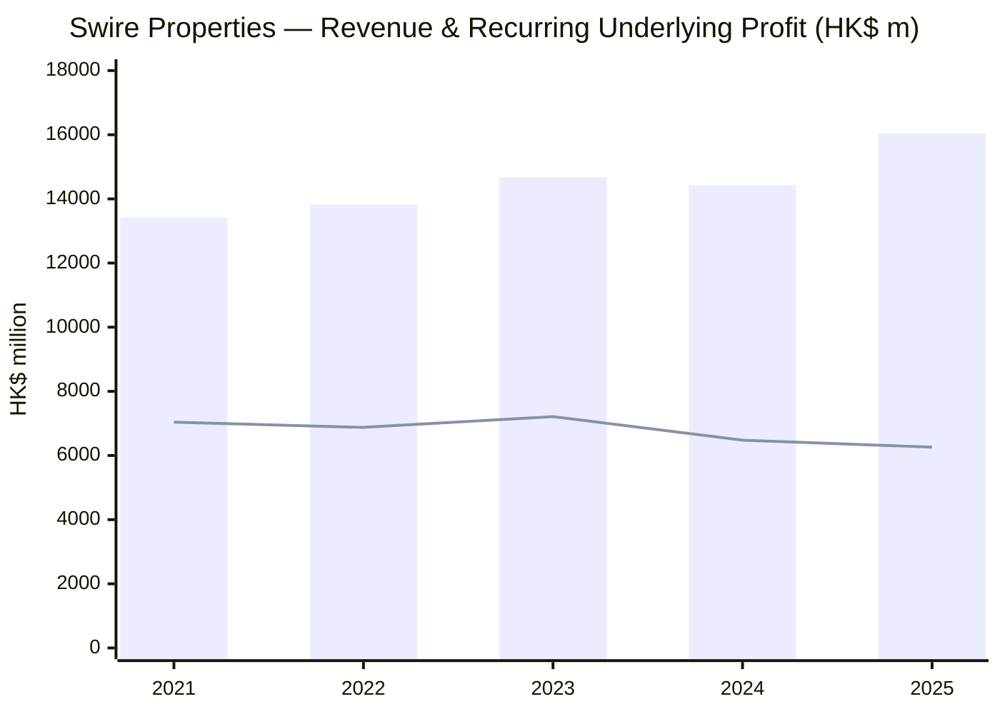
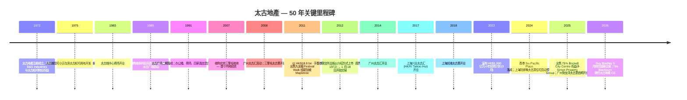
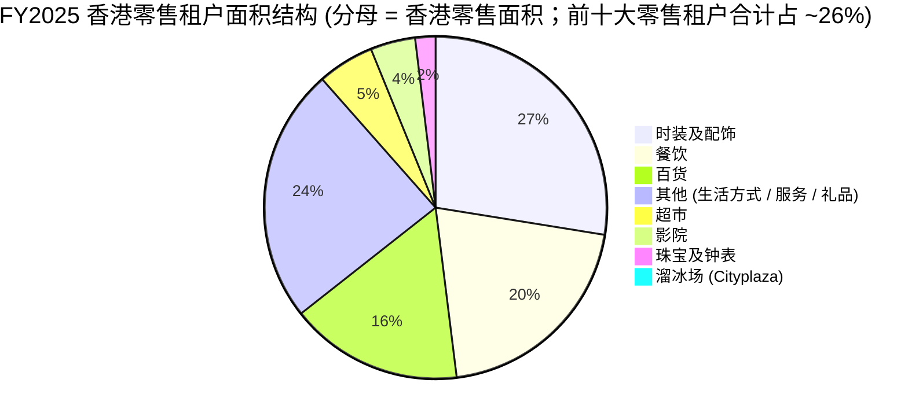
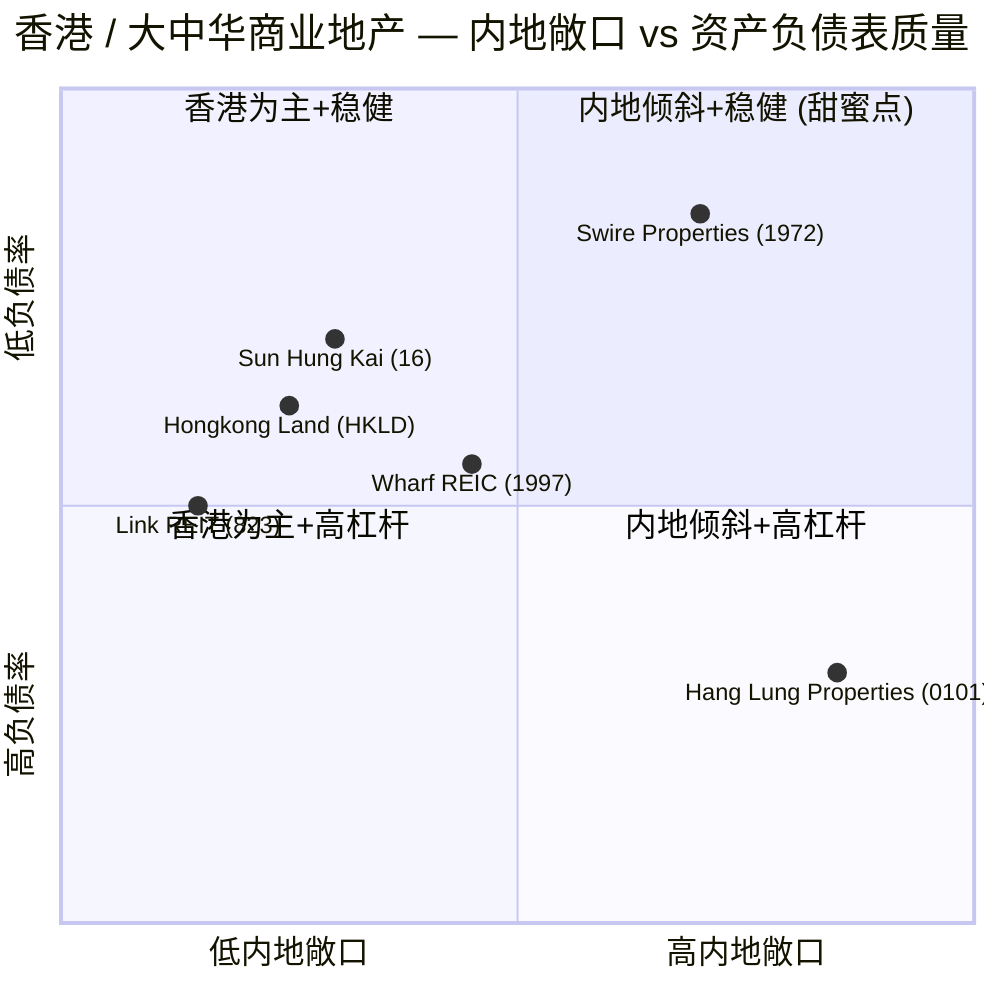
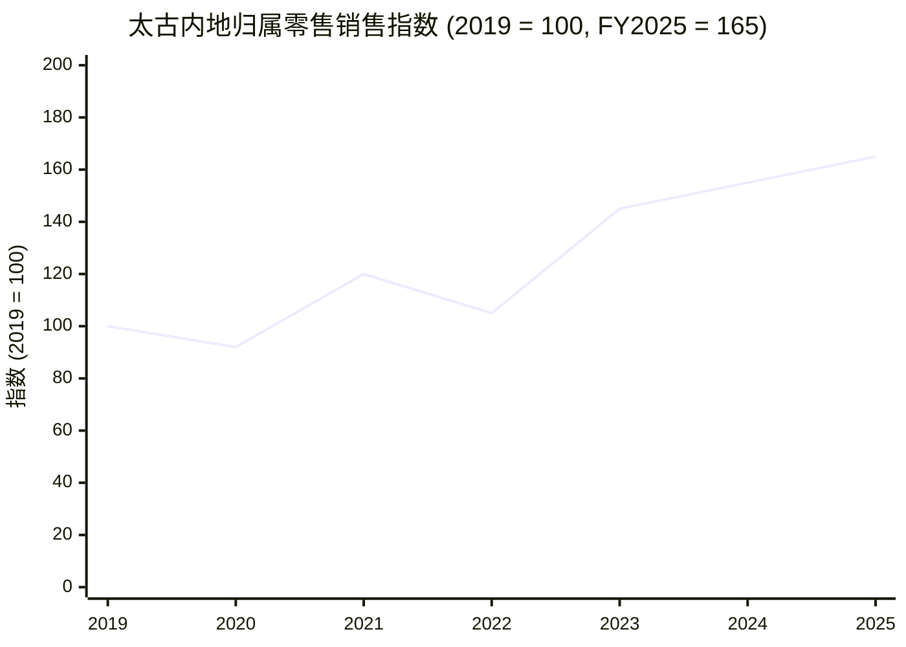

# 太古地產有限公司 Swire Properties (HKEX: 1972) — 首次覆盖

*报告日期：2026-06-03 ｜ 首次覆盖报告 ｜ 作者：独立研究台*

> **更新 — 2025 年度业绩：基础(underlying)利润 +27%、经常性(recurring underlying)利润 -3%（2026-03-12 公告）：** 公司基础利润（剔除投资物业重估损益后的口径）上升至 **HK$8,620 m**（FY2024：HK$6,768 m），主要驱动来自 **HK$2,360 m 的资本回收处置收益** —— 包括出售 Brickell City Centre（迈阿密）权益、青衣工业用地、One Island East 43 楼。剥离处置收益后，**经常性基础利润下降 3% 至 HK$6,260 m**，受 Brickell 租金流失、香港写字楼租金回落及未来住宅项目销售费用前置影响。**全年股息上调 5% 至 HK$1.15 / 股 —— 连续第九年保持中个位数(mid-single digit)增长**。**负债率(gearing)从 15.7% 降至 14.6%**，净负债下降 10% 至 HK$39,540 m。
> 出处：[太古地產 2025 年度業績公告 (HKEXnews, 12 Mar 2026)](https://www.hkexnews.hk/listedco/listconews/sehk/2026/0312/2026031200167.pdf)；[太古地產 2025 年度業績新聞稿](https://www.swirepacific.com/storage/fm/PressRelease/pdf/en/swireproperties-annual-2025.pdf).

## 目录
1. 公司概览
2. 公司历史
3. 管理团队
4. 物业组合与运营（即「产品与服务」对应章节）
5. 客户、租户与市场进入策略
6. 行业概览 — 香港与中国内地房地产
7. 竞争格局
8. 市场机会 / 可寻址市场（TAM）
9. 风险评估
10. 投资视角评分卡
- 数据来源清单
- 参考资料
- 验证日志

---

## 1. 公司概览（约 1,100 字）

太古地產有限公司（HKEX: 1972 Swire Properties，下称「公司」或「太古地產」）是已有 200 年历史的英资港资综合集团 **太古集团 (Swire Group)** 的上市物业旗舰。集团通过 **太古股份有限公司 (Swire Pacific Limited, 19.HK / 87.HK)** 间接持股，最终控制方为伦敦的 **John Swire & Sons Ltd.**。公司开发、持有并运营高端综合用途 (mixed-use) 物业 —— 涵盖甲级写字楼 (Grade-A office)、奢侈品零售购物商场 (luxury retail)、酒店 (hospitality)、住宅 (residential) —— 在三大核心市场布局：**香港（太古坊 Taikoo Place、太古广场 Pacific Place、太古城中心 Cityplaza）**、**中国内地（北京、上海、广州、成都、西安、三亚六个一线／新一线城市的综合体）**，以及 **东南亚 + 美国迈阿密** 的奢侈住宅项目链（包括 Bangkok 的 Upper House Residences、Jakarta 的 Savyavasa、Ho Chi Minh City 的 Empire City、Miami Brickell Key 的 Mandarin Oriental Residences）([Swire Properties 2025 Annual Results, p. 4](https://www.hkexnews.hk/listedco/listconews/sehk/2026/0312/2026031200167.pdf))。

公司的战略形态在 2025 年发生了实质性变化。FY2024 的 HK$766 m 报告损失 (reported loss) 扩大至 FY2025 的 **HK$1,533 m**（主要源于 **HK$7,716 m 的非现金投资物业公允价值重估损失**，其中约 88% 集中于香港写字楼组合），管理层完成了 (i) 以最多 US$548.7 m 向 **Simon Property Group (SPG)** 出售 **Brickell City Centre 购物中心 75% 权益**、(ii) 两幅相邻土地 (US$211.5 m + 北区 North Squared US$45 m)、(iii) 香港青衣工业用地 (HK$663 m)、(iv) 向 **证券及期货事务监察委员会 (SFC)** 出售 **One Island East 43 楼**（[2025 Annual Results, p. 13 — Key Developments](https://www.hkexnews.hk/listedco/listconews/sehk/2026/0312/2026031200167.pdf)）。处置款项合计约 **HK$7.3 bn** 已被回收并重新部署至 **2022 年 3 月宣布的 HK$1,000 亿元(HK$100 bn) 十年投资计划**；截至 2026 年 3 月 6 日 **已承诺约 67%（HK$67 bn）**，其中 HK$11 bn 投向香港、HK$46 bn 投向中国内地、HK$10 bn 投向住宅交易项目（含东南亚）([2025 Annual Results, p. 12](https://www.hkexnews.hk/listedco/listconews/sehk/2026/0312/2026031200167.pdf))。

资本流向的物业组合，规模特征对一个香港业主而言异乎寻常地集中。**2025 年 12 月 31 日归属公司的总建筑面积 (gross floor area, GFA) 约为 3,840 万平方呎** —— 其中 3,350 万平方呎为投资物业及酒店（已完工 2,380 万平方呎、在建或储备 970 万平方呎），另有 490 万平方呎为住宅交易物业。剔除酒店后，已完工投资物业 GFA **57% 位于香港、43% 位于中国内地**，但权重在收入表上更倾向内地：**归属租金收入(attributable gross rental income) 拆分为香港 56% / 内地 43% / 美国及其他 1%**；净资产 (net assets employed) 拆分为 **香港 73% / 内地 26% / 美国及其他 1%**（[2025 Annual Results, p. 15](https://www.hkexnews.hk/listedco/listconews/sehk/2026/0312/2026031200167.pdf)）。董事长致辞中强调 —— **中国内地零售租金收入 2025 年首次超越香港写字楼租金收入** —— 这正是支撑多头逻辑 (bull thesis) 的拐点 ([SCMP, 2026-03-12](https://www.scmp.com/business/article/3346391/hong-kong-developers-swire-and-wharf-report-profit-growth-amid-valuation-pressure))。

**收入规模。** 2025 年集团收入 **HK$16,041 m，同比 +11%**（FY2024：HK$14,428 m）。增量几乎全部来自 **物业交易 (Property Trading)** 板块（HK$2,110 m vs FY2024 HK$88 m），主要源于 **陆家嘴太古源 (Lujiazui Taikoo Yuan) 上海项目** 和 **6 Deep Water Bay Road 香港项目** 按 HKFRS 15 确认收入。经常性租金引擎反而走弱：**写字楼毛租金收入 -4% 至 HK$5,248 m**、**零售 -3% 至 HK$7,193 m**（结构差异：香港零售持平于 HK$2,355 m、内地零售 +3% 至 HK$4,628 m；差距即年中起 Brickell 租金流失）、**住宅租金持平于 HK$438 m**（[2025 Annual Results, p. 8](https://www.hkexnews.hk/listedco/listconews/sehk/2026/0312/2026031200167.pdf)）。**物业投资板块产生 HK$6,795 m 经常性基础利润**（FY2024：HK$6,900 m）；物业交易板块由于多个 2026–28 年待发行项目销售费用前置，经常性亏损扩大至 HK$448 m；酒店板块亏损收窄至 HK$87 m（FY2024：-HK$202 m）([2025 Annual Results, p. 1](https://www.hkexnews.hk/listedco/listconews/sehk/2026/0312/2026031200167.pdf))。

**经营足迹.** 香港部分包含 **太古广场 (Pacific Place) 219 万平方呎**（写字楼出租率 96%、商场 100% 出租）、**太古坊 (Taikoo Place) 640 万平方呎** —— 含 One Island East / One Taikoo Place（91% 出租）、Two Taikoo Place（73% 出租、2022 年 9 月落成）、Six Pacific Place（66% 出租、2024 年 2 月落成）、6 栋较旧的 Taikoo Place 写字楼（平均 88% 出租）；**太古城中心 (Cityplaza) 110 万平方呎**（100% 出租）；以及 26.67% 权益的 **东荟城名店仓 (Citygate Outlets)**（100% 出租，位于东涌）。中国内地包含 **三里屯太古里 (Taikoo Li Sanlitun) 北京**（99% 出租）、**成都远洋太古里 (Taikoo Li Chengdu)**（97% 出租）、**广州太古汇 (Taikoo Hui Guangzhou)**（100% 出租）、**北京颐堤港 INDIGO**（99% 出租）、**上海兴业太古汇 (HKRI Taikoo Hui)**（96% 出租）、**上海前滩太古里 (Taikoo Li Qiantan)**（98% 出租），以及 **2025 年 12 月分阶段开业的广州聚龙湾太古里 (Taikoo Li Julong Wan)**（首期 46 家店铺开业）([2025 Annual Results, pp. 16, 19, 24](https://www.hkexnews.hk/listedco/listconews/sehk/2026/0312/2026031200167.pdf))。

### 估值快照 (Valuation snapshot)

| 指标 | 2026-06-03 | FY2024 | 备注 |
|---|---:|---:|---|
| 股价 (HK$) | 24.72 | n/a | [Companies Market Cap](https://companiesmarketcap.com/swire-properties/marketcap/) |
| 市值 (HK$ bn) | ~141 | n/a | 同上 |
| 每股账面值 (NAV / share, HK$) | 46.80 (2025-12-31) | 47.35 | [2025 Annual Results, p. 1](https://www.hkexnews.hk/listedco/listconews/sehk/2026/0312/2026031200167.pdf) |
| P/B（市净率） | **~0.53×** | ~0.47× | 24.72 / 46.80 |
| TTM 每股股息 (HK$) | 1.15 (FY2025) | 1.10 | 同上 |
| TTM 股息率 | **~4.65%** | ~4.2% | 1.15 / 24.72 |
| TTM 经常性每股收益 (recurring EPS, HK$) | 1.09 | 1.11 | 同上 |
| TTM 经常性 P/E | **~22.7×** | ~22× | 24.72 / 1.09 |
| TTM 基础(含处置) 每股收益 (underlying EPS, HK$) | 1.49 | 1.16 | 同上 |
| TTM 基础(含处置) P/E | **~16.6×** | ~22× | 24.72 / 1.49 |
| 净负债 (HK$ m) | 39,540 | 43,746 | 同上 |
| 负债率 (gearing) | 14.6% | 15.7% | 同上 |

估值形态是经典的 **香港业主折价 (HK landlord discount)**：股价相当于账面净值的 0.53 倍，但经常性收益乘数高达 22.7 倍 —— 此口径偏高是因为公允价值重估 2024–25 年累计已扣减约 HK$13–14 bn 的写字楼资产值 ([SCMP, 2026-03-12](https://www.scmp.com/business/article/3346391/hong-kong-developers-swire-and-wharf-report-profit-growth-amid-valuation-pressure))。**4.65% 的滚动股息率** —— 由管理层「(以)长期约一半基础利润支付普通股息」(approximately half of underlying profit in ordinary dividends over time) 的分配政策 + 连续九年中个位数增长 —— 是收益型股东持有此股的核心依据。同业 P/B 对照：**香港置地 (Hongkong Land)** 约 0.40×、**恒隆地产 (Hang Lung Properties, 0101.HK)** 约 0.25×、**九龙仓置业 (Wharf REIC, 1997.HK)** 约 0.40× —— 太古地產位于同业上限，反映其优越的资产负债表（14.6% gearing vs 恒隆 ~36%、香港置地 mid-20s%）和市场愿意为其 **大湾区 + 内地零售倾斜** 支付的小幅溢价 ([Mingtiandi, "Swire Properties Reports $196M 2025 Loss"](https://www.mingtiandi.com/real-estate/finance/swire-properties-reports-196m-2025-loss-on-falling-office-values/); [Praya Value, "Hong Kong Developers"](https://prayavalue.substack.com/p/hong-kong-developers))。


*数据来源：[太古地產 2025 年度業績 — 财务摘要 p. 1](https://www.hkexnews.hk/listedco/listconews/sehk/2026/0312/2026031200167.pdf); 2021–2023 经常性基础利润历史数据自 [太古地產 IR 报告档案](https://ir.swireproperties.com/en/ir/reports.php) 整理。柱状 = 收入；折线 = 经常性基础利润。*

---

## 2. 公司历史（约 600 字）

太古地產的法人起点是 **1972 年**：当年将两家前身公司 —— **B&S Industries Limited** 和 **太古船坞与工程有限公司 (The Taikoo Dockyard and Engineering Company of Hong Kong)** —— 的物业权益整合至单一物业公司 ([Wikipedia — Swire Properties](https://en.wikipedia.org/wiki/Swire_Properties))。太古船坞自 1907 年起在港岛东岸的鰂鱼涌 (Quarry Bay) 运营，隶属由 **John Samuel Swire**（1816 年于英国利物浦创立、1870 年进入香港）所立的太古洋行。1970 年代香港船坞业务被整合至青衣的 **香港联合船坞 (Hongkong United Dockyards)** 后，**留下的 230 英亩鰂鱼涌滨水土地与相邻的太古糖厂用地** 成为驱动太古地產此后半个世纪的核心土地银行 —— 先有 **太古城 (Taikoo Shing)** 住宅小区（1975 年开发、最终 12,700 套住宅），后有 **太古城中心 (Cityplaza)** 商场（1983 年开业，多次翻修）和 **太古坊 (Taikoo Place)** 写字楼集群（1980 年代起逐步建成）([FundingUniverse — History of Swire Pacific Limited](https://www.fundinguniverse.com/company-histories/swire-pacific-limited-history/))。


*数据来源：[Wikipedia — Swire Properties](https://en.wikipedia.org/wiki/Swire_Properties); [2025 Annual Results, p. 13](https://www.hkexnews.hk/listedco/listconews/sehk/2026/0312/2026031200167.pdf); [SCMP, "Swire Pacific's Guy Bradley to take reins at Cathay Pacific", 2025](https://www.scmp.com/business/banking-finance/article/3337540/swire-pacifics-guy-bradley-take-reins-hong-kongs-cathay-pacific-swire-coca-cola).*

公司半个世纪的发展史中有三次结构性的战略转向。**第一次 —— 1970 年代「船坞转物业」**。香港制造业迁移内地后，鰂鱼涌的土地被搁置，太古选择持有产权并自行开发，将单一工业地址转化为今天的 **太古城 + 太古城中心 + 太古坊综合体** —— 港岛上最大单一业主的占地 ([FundingUniverse](https://www.fundinguniverse.com/company-histories/swire-pacific-limited-history/))。**第二次 —— 2007–2017 年的中国内地扩张**。以 **2007 年北京三里屯地块** 收购为起点，**2014 年广州太古汇**、**2017 年上海兴业太古汇**、**2015 年成都远洋太古里** 陆续开业，太古地產将 **太古里 / 太古汇 (Taikoo Li / Taikoo Hui)** 综合体品牌植入了五座一线城市。其执行节奏审慎 —— 每个项目以 5–7 年的设计建造周期推进 —— 最终建成了与恒隆「66 系」并列的、大中华区最权威的奢侈品零售综合体集群之一 ([2025 Annual Results, p. 4](https://www.hkexnews.hk/listedco/listconews/sehk/2026/0312/2026031200167.pdf); [Wikipedia — Swire Properties](https://en.wikipedia.org/wiki/Swire_Properties))。**第三次 —— 后疫情资本回收转向 (capital-recycling pivot)**。2022 年 3 月公布的 **HK$1,000 亿元十年投资计划** 明确将资本配置倾向中国内地 (HK$50 bn) 与住宅交易项目 (HK$20 bn)，相对压缩香港再投资 (HK$30 bn)。**2025 年 Brickell 出售** 进一步完成了美国布局的精简 —— 仅保留 Brickell Key 上的奢侈住宅项目 (Mandarin Oriental Residences Miami)。同一周期内 **Festival Walk 式的资产轮换** 在更小尺度上重演：成熟美国零售资产剥离至表外，收益再投至陆家嘴太古源、三亚太古里、西安太古里及大湾区项目 ([2025 Annual Results, p. 13](https://www.hkexnews.hk/listedco/listconews/sehk/2026/0312/2026031200167.pdf))。

**近期事件**（2025 年）进一步说明这一转向的细节：(a) 完成 **Brickell City Centre 出售予 Simon Property Group**；(b) 完成 **迈阿密 North Squared 用地销售** (US$45 m)；(c) 启动 **THE HEADLAND RESIDENCES**（香港愉景湾住宅项目，首批 300 套，截至 2026-03-06 已预售 143 套）；(d) 完成 **6 Deep Water Bay Road**（近年香港最高价住宅交易之一）；(e) 12 月开业 **广州聚龙湾太古里首期**（46 家店）；(f) 6 月迎来 **「LOUIS VUITTON 路易号 The Louis」** —— 全球品类创造级新概念 —— 于 **上海兴业太古汇** 首发 ([2025 Annual Results, p. 13, p. 26](https://www.hkexnews.hk/listedco/listconews/sehk/2026/0312/2026031200167.pdf))。

---

## 3. 管理团队（约 500 字）

太古地產不是创始人主导型公司 —— 实际控制方为伦敦的 **John Swire & Sons Ltd.**，太古集团自 19 世纪起以「太古训练的职业经理人 (Swire-trained executives) + 准合伙制」运作。投资者眼下需要关注的两位 —— 是 2026 年 5 月 13 日上任国泰主席的 **白德利 Guy Bradley** 与 **2021 年 8 月起出任 CE 的 Tim Blackburn**。

**Tim Blackburn（行政总裁 / Chief Executive，2021 年 8 月起）。** 现年 55 岁。**1994 年加入太古集团**，剑桥大学 (Cambridge University) 本科毕业后入职，并取得 **皇家特许测量师 (RICS, Royal Institution of Chartered Surveyors)** 资格 —— 这是太古地產近二十年管理层共同的专业背景 ([Swire Properties IR — Directors](https://ir.swireproperties.com/en/cg/directors.php); [LinkedIn — Tim Blackburn](https://hk.linkedin.com/in/tim-blackburn-62b86061))。在太古集团的 30 年职业生涯中，他历任香港、中国内地、新加坡及其他亚洲市场的高级物业岗位，参与并塑造了 **三里屯北区 (Sanlitun North)** 改造、**上海兴业太古汇** 全程建设 —— 这构筑了 Taikoo Li 项目区别于普通「商场 + 写字楼」模板的执行能力：场所营造 (placemaking)、租户筛选 (tenant curation)、可步行街区设计 (walkable street design)。其当前任期自 **2025 年 5 月 13 日** 开始，至 2028 年股东周年大会结束。同时担任 **城市土地学会 (Urban Land Institute) 全球管治信托人 (Global Governing Trustee, 自 2021 年 7 月)** —— 一个将他置于亚太房地产话语中心的职位 ([Swire Properties IR — Directors](https://ir.swireproperties.com/en/cg/directors.php))。薪酬结构沿用太古集团常规：相对全球 REIT CEO 的基准而言偏低基薪、含 ESG 指标的均衡平衡积分卡短期激励（太古地產获 **2024 年 Dow Jones Best-in-Class World Index** 房地产管理及开发类别全球第一），以及通过集团计划持股 ([Swire Properties 2025 Annual Results press release](https://www.swirepacific.com/storage/fm/PressRelease/pdf/en/swireproperties-annual-2025.pdf))。**他不是创始人** —— 太古地產没有现代意义上的「单一创始人」，「创始人」身份归属于 1816 年于利物浦立业的 **John Samuel Swire** 家族。

**Guy Bradley（董事会主席 Chairman；2021 年 8 月至 2026 年 5 月 13 日；之后接任国泰航空 + 太古可口可乐主席）。** 现年 60 岁。**1987 年加入太古集团**，在香港、巴布亚新几内亚、日本、美国、越南、中国内地、台湾及中东轮岗，**2015 年 1 月至 2021 年 8 月任太古地產 CE**，之后晋升主席 ([Swire Properties IR — Directors](https://ir.swireproperties.com/en/cg/directors.php); [SCMP, 2025-04-22](https://www.scmp.com/business/banking-finance/article/3337540/swire-pacifics-guy-bradley-take-reins-hong-kongs-cathay-pacific-swire-coca-cola))。与 Blackburn 同样持有 RICS Fellow 及香港测量师学会会籍。其 **2026 年 5 月 13 日转任国泰航空 + 太古可口可乐主席** 反映太古集团高层在综合体内不同支柱间轮岗的固有政策；地產业务的接班为内部安排 —— Blackburn 继任 CE，新主席另议 ([Cathay Pacific 公告, 2025-12-23](https://news.cathaypacific.com/cathay-group-appoints-new-chair); [Swire Pacific — "Announcement of change of Chairman"](https://www.swirepacific.com/en/investor-relations/updates-to-our-shareholders/press-releases/swire-pacific-announces-change-of-chairman))。

---

## 4. 物业组合与运营（约 1,400 字）

与软件公司的 SKU 矩阵或半导体设备公司的产品矩阵不同，太古地產的「产品」是 **少数几个庞大、独一无二、有名字的物业综合体**。一共大约十二三个，理解这家公司的方法即逐一审视这些综合体的 GFA、租金、出租率、近期资本开支。

### 4.1 投资物业矩阵 (来自 2025 年度业绩 verbatim)

> **已完工投资物业及酒店（归属公司的 GFA, 百万平方呎，至 2025-12-31）：** 「香港: 写字楼 9.2 / 零售 2.6 / 酒店 0.8 / 住宅 0.6 / 合计 13.2；中国内地: 写字楼 2.9 / 零售 6.4 / 酒店 1.1 / 住宅 0.2 / 合计 10.6；美国: 0。合计 写字楼 12.1 / 零售 9.0 / 酒店 1.9 / 住宅 0.8 / 总计 23.8。」
>
> **在建或待开发投资物业：** 「中国内地: 写字楼 2.2 / 零售 5.3 / 酒店 0.4 / 住宅 0.1 / 规划中 0.6 / 合计 8.6；香港: 1.1 规划中；美国: 0。合计 9.7。」
> — [2025 年度業績, p. 14 — Portfolio Overview](https://www.hkexnews.hk/listedco/listconews/sehk/2026/0312/2026031200167.pdf)

**中文释义 / Plain-language gloss.** 物业组合的核心由 **香港写字楼 (9.2 m 平方呎)** 和 **中国内地零售 (6.4 m 完工 + 5.3 m 在建)** 双中心驱动。酒店 (1.9 m) 属于战略附属而非利润中心 —— 它们的功能是为商场和写字楼引流，三种业态共用同一综合体底盘。开发管线 **明显偏向中国内地**（9.7 m 中 8.6 m 在内地）—— 即 HK$1,000 亿元计划的实物形态。

```mermaid
graph TD
    SP[Swire Properties 1972.HK]
    SP --> HK[Hong Kong  归属 13.2m 平方呎]
    SP --> CN[Chinese Mainland 已完工 10.6m + 在建 8.6m 平方呎]
    SP --> OUT[境外 (港中以外) — 东南亚 + Miami 住宅]
    HK --> HK1[Pacific Place 太古广场 2.19m sq ft / 金钟]
    HK --> HK2[Taikoo Place 太古坊 6.4m sq ft / 鰂鱼涌]
    HK --> HK3[Cityplaza 太古城中心 1.1m sq ft]
    HK --> HK4[Citygate Outlets 东荟城 0.8m sq ft / 26.67%]
    HK --> HK5[South Island Place + Berkshire House + 其他]
    CN --> CN1[三里屯太古里 北京 1.6m sq ft 100%]
    CN --> CN2[成都远洋太古里 1.7m sq ft 100%]
    CN --> CN3[广州太古汇 3.8m sq ft 97%]
    CN --> CN4[北京颐堤港 INDIGO 1.9m sq ft 50%]
    CN --> CN5[上海兴业太古汇 HKRI 3.7m sq ft 50%]
    CN --> CN6[上海前滩太古里 1.2m sq ft 50%]
    CN --> CN7[管线: 西安 / 三亚 / 聚龙湾 / 三里屯 N1 / 陆家嘴]
    OUT --> OUT1[THE HEADLAND RESIDENCES 香港]
    OUT --> OUT2[Upper House Residences Bangkok]
    OUT --> OUT3[Savyavasa Jakarta]
    OUT --> OUT4[Empire City Ho Chi Minh City]
    OUT --> OUT5[Mandarin Oriental Residences Miami Brickell Key]
```

### 4.2 综合体如何组合为一个平台

每个太古综合体 **都是「多业态集群」(mixed-use cluster)、而非单业态建筑**。Pacific Place 是「写字楼 + 商场 + 四家酒店 + 服务式公寓」；Taikoo Place 是「写字楼集群 + 零售街 + 住宅毗邻」；广州太古汇是「写字楼 + 商场 + 酒店 + 文华东方」。其经济逻辑是 **业态间客流内部互导** —— 写字楼员工在商场就餐、商场购物者入住酒店、酒店客人使用服务式公寓 —— **该内部化提升单位面积租金、并降低周期波动性**（写字楼、零售、酒店景气周期不同步）。这一设计选择即是太古地產经常性利润在香港写字楼下行周期中 + 14.6% gearing 下仍优于纯写字楼 REIT 的根本原因 ([2025 Annual Results, p. 9](https://www.hkexnews.hk/listedco/listconews/sehk/2026/0312/2026031200167.pdf))。

### 4.3 香港写字楼组合 — 周期支柱

香港写字楼账本 **100% 基础上 998 万平方呎**（核心资产归属基础同此），**2025 年毛租金收入 HK$4,885 m、同比 -4%**，**组合出租率截至 2025-12-31 为 89%**。两座最新楼宇 —— **Two Taikoo Place（2022 年 9 月竣工，2025 年末出租率 73%）** 与 **Six Pacific Place（2024 年 2 月竣工，66%）** —— 仍未达到稳态。剔除两者，其余写字楼出租率为 **91%**（[2025 Annual Results, p. 16](https://www.hkexnews.hk/listedco/listconews/sehk/2026/0312/2026031200167.pdf)）。

租户结构以 **银行/金融/证券/投资 (28.7%)**、**贸易 (18.5%)**、**专业服务 (14.7%)**、**保险 (11.6%)**、**TMT (8.5%)** 为主导 —— 这意味着写字楼周期与香港 IPO 管道、金融业招聘周期高度绑定。**前十大写字楼租户共占归属面积约 25%**，无单一 >10% 披露要求触发 ([2025 Annual Results, p. 16](https://www.hkexnews.hk/listedco/listconews/sehk/2026/0312/2026031200167.pdf))。2025 年内续约或扩租的具名租户读起来像香港中环白名单：Pacific Place 内有 **CLSA、Visa、Tencent、香港金管局 (HKMA)、Daiwa、Crédit Agricole CIB、Société Générale、Resona Bank、HongShan Capital**；Taikoo Place 内 **HSBC 入驻 One Island East**、**Factory Mutual Insurance 入驻 One Taikoo Place**、**Deckers、Philip Morris International、WTW 入驻 Two Taikoo Place** ([2025 Annual Results, p. 17](https://www.hkexnews.hk/listedco/listconews/sehk/2026/0312/2026031200167.pdf))。

*分析师观点：* 香港写字楼周期于 2025 年中底部 —— **CBRE / JLL / Cushman 预测中环甲级写字楼租金 2026 年回升 0–8%、全港 -5% 至 0%** ([Real Estate Asia / Cushman & Wakefield, 2025-12](https://realestateasia.com/commercial-office/news/hong-kong-grade-office-rents-decline-5-in-2026); [JLL 2026 outlook](https://www.jll.com/en-hk/newsroom/2026-hong-kong-s-office-and-housing-markets-lead-recovery-after-a-six-year-correction))。太古地產 **过度集中在中环 (Pacific Place) 与鰂鱼涌 (Taikoo Place)** —— 这两处恰好是香港优质迁移 (flight-to-quality) 受益最显著的微市场。租金名义上回不到 2018 高点，但 2025 年低位很可能是底。

### 4.4 香港零售组合 — 稳定现金牛

**3.16 m 平方呎**（100% 基础），**2025 年毛租金收入 HK$2,355 m（同比持平）**，**100% 出租率** 贯穿 The Mall at Pacific Place、Cityplaza、Citygate Outlets 及小资产组合。三大旗舰商场 2025 年销售增长：**The Mall at Pacific Place +6%、Cityplaza +3%、Citygate Outlets +2%** —— 均高于全港零售销售 **+1%** 的年度水平 ([2025 Annual Results, p. 19](https://www.hkexnews.hk/listedco/listconews/sehk/2026/0312/2026031200167.pdf))。

> 「Diverse marketing campaigns and intensive activations were launched to attract both local customers and tourists to our malls. Hong Kong's retail market demonstrated signs of stabilisation in the second half of 2025... Retail sales increased by 6%, 3% and 2%, respectively, at The Mall at Pacific Place, Cityplaza, and Citygate Outlets in 2025.」
> — [2025 年度業績, p. 19](https://www.hkexnews.hk/listedco/listconews/sehk/2026/0312/2026031200167.pdf)

**租户结构：** 时装及配饰 27.3%、餐饮 20.3%、百货 16.2%、超市 5.3%、影院 4.2%、珠宝及钟表 1.9%、溜冰场 (Cityplaza) 0.9%、其他 23.9% —— 完全分散，无单一品类占主导。**The Mall at Pacific Place 单 2025 年签下** 意大利奢侈品「四大家」—— **GIORGIO ARMANI、DOLCE & GABBANA、Miu Miu、TOM FORD** —— 外加 **Brunello Cucinelli、Loro Piana (扩面)、Chaumet、Chloé、Jimmy Choo** ([2025 Annual Results, p. 20](https://www.hkexnews.hk/listedco/listconews/sehk/2026/0312/2026031200167.pdf))。

### 4.5 中国内地零售 — 成长引擎

中国内地零售账本 **8.26 m 平方呎（100% 基础）、6.4 m 归属**，**2025 年归属毛租金收入 HK$4,628 m（+3% YoY）**。**归属基础上零售销售 +7%，跑赢市场**，且 **较 2019 年疫前基数 +65%** ([2025 Annual Results, p. 24](https://www.hkexnews.hk/listedco/listconews/sehk/2026/0312/2026031200167.pdf))。

**逐商场的零售销售增速** 分布不均，但合计上行：

| 内地商场 | 2025 销售 YoY | 销售 vs 2019 | 2025-12-31 出租率 | 归属权益 |
|---|---:|---:|---:|---:|
| 三里屯太古里 北京 | **+11%** | **+12%** | 99% | 100% |
| INDIGO 颐堤港 北京 | +3% | +1% | 99% | 50% |
| 成都远洋太古里 | +7% | +32% | 97% | 100% |
| 广州太古汇 | +2% | +70% | 100% | 97% |
| 上海兴业太古汇 (HKRI) | **+50%** | +27% | 96% | 50% |
| 上海前滩太古里 | +7% | n/a (2019 后开业) | 98% | 50% |
| 广州聚龙湾太古里 | n/a (2025-12 首期开业) | n/a | n/a | 50% |

*数据来源：[太古地產 2025 年度業績, pp. 24–27](https://www.hkexnews.hk/listedco/listconews/sehk/2026/0312/2026031200167.pdf).*

2025 年最大亮点是 **上海兴业太古汇 +50% 零售销售增长** —— 由 6 月开业的 **「LOUIS VUITTON 路易号 The Louis」** 推动；这是 LV 在大中华区最大的体验式概念店（1,600 平方米），**单店重新锚定了商场**（[2025 Annual Results, p. 26](https://www.hkexnews.hk/listedco/listconews/sehk/2026/0312/2026031200167.pdf)）。**三里屯太古里 +11%** 是同等重要的数据点 —— 验证了 **三里屯北区改造** 的逻辑 —— 12 月开业的 **House of DIOR Beijing、LOUIS VUITTON Maison、Loro Piana、Tiffany & Co.、SAINT LAURENT RIVE DROITE BEIJING** 独立店铺是同一剧本的规模化版本；2027 年开业的 **N1 楼 (原 The Opposite House 酒店改造)** 将再增 145,000 平方呎奢侈品旗舰空间 ([2025 Annual Results, p. 25](https://www.hkexnews.hk/listedco/listconews/sehk/2026/0312/2026031200167.pdf))。

*分析师观点：* 内地零售引擎是 **香港写字楼周期下行的结构性对冲**。**「中国内地租金 2025 年超越香港写字楼租金」** 是支撑多头逻辑的拐点；在内地一般消费信心偏弱的背景下仍实现 7% 综合销售增速，证明 **Taikoo Li 场所营造护城河** 不可复制。同业对比：**恒隆旗舰恒隆广场 (Plaza 66 Shanghai) 2025 年同店较弱**，而太古的三里屯与广州太古汇均能持续复利 —— 印证体验式 / 奢侈旗舰玩法 **并非所有内地商场通用** ([SCMP, 2025](https://www.scmp.com/business/article/3341858/hang-lung-flags-tough-slog-property-it-looks-mainland-malls-growth))。

### 4.6 住宅 / 交易 — 可变弹性

太古运行一项 **住宅交易业务**，项目落地时分批冲入损益表。2025 年印记包括 **物业交易收入 HK$2,110 m**（vs FY2024 HK$88 m），头牌贡献来自 **陆家嘴太古源住宅（上海，40% 权益、截至 2026-03-06 已预售 250 套中的 225 套、累计销售款 RMB 11.7 bn）** 与 **6 Deep Water Bay Road 香港** 项目 ([2025 Annual Results, p. 13](https://www.hkexnews.hk/listedco/listconews/sehk/2026/0312/2026031200167.pdf))。**THE HEADLAND RESIDENCES** 首期 300 套，2026-03-06 已预售 143 套。**世纪汇 Century Summit / 世纪峰 Century Heights 上海** 实现 98% 预售。Bangkok 的 **Upper House Residences Bangkok** + **The Wireless Residences by Upper House** 处于基础工程阶段，2029 起落成。

### 4.7 酒店 — 战略附属、边际盈利

2025 年酒店收入 **HK$917 m**（FY2024：HK$888 m），基础亏损 **HK$87 m**（FY2024：-HK$202 m，已收窄）；管理酒店（不含折旧）经营利润 **HK$60 m**（FY2024：HK$17 m）。**7 家酒店共 2,021 间客房**：Upper House Hong Kong（**The World's 50 Best Hotels 2025 年第 10 位**）、EAST Hong Kong、EAST Beijing、Upper House Chengdu、Upper House Shanghai、EAST Miami、Headland Hotel（国泰所有、太古管理）。**已确认新开 5 家 Upper House**：深圳 (2027)、西安 (2028)、东京 (2029)、北京、上海 —— 将品牌延伸至亚洲核心城市 ([2025 Annual Results, p. 40](https://www.hkexnews.hk/listedco/listconews/sehk/2026/0312/2026031200167.pdf))。

### 4.8 2025 年完成出售 / 关闭 / 收购（verbatim）

> 「In June 2025, the Group completed the disposal of its 75% interest in the Brickell City Centre shopping centre... to SPG for a total consideration of up to US$548.7 million... In October 2025, the Group completed the disposal of an industrial site in Tsing Yi, Hong Kong... for a consideration of HK$663 million... In December 2025, the Group completed the sale of the 43rd floor at One Island East in Quarry Bay to the Securities and Futures Commission ("SFC")...」
> — [2025 Annual Results, p. 13](https://www.hkexnews.hk/listedco/listconews/sehk/2026/0312/2026031200167.pdf)

---

## 5. 客户、租户与市场进入策略（约 700 字）

对一个业主而言，「客户」就是租户。太古地產不触发标准 「>10% 单一客户」披露门槛 —— **没有任何单一租户超过物质性界限**。**香港写字楼前十大租户合计占归属面积约 25%**，**香港零售前十大租户合计占归属面积约 26%**（均为综合(consolidated)分母，2025 年度业绩披露）。中国内地 **前十大零售租户合计占归属面积约 24%** ([2025 Annual Results, pp. 16, 19, 25](https://www.hkexnews.hk/listedco/listconews/sehk/2026/0312/2026031200167.pdf))。


*出处：[2025 年度業績, p. 19](https://www.hkexnews.hk/listedco/listconews/sehk/2026/0312/2026031200167.pdf)。注：饼图分母为「归属香港零售面积」，并非「集团总收入份额」；此为分部级 (segment-level; 香港零售) 数据，非集团合并 (group-level)。*

**写字楼租户基础 — 金融为主、国际化高度分散.** 香港写字楼租户结构（金融业 28.7%、贸易 18.5%、专业服务 14.7%、保险 11.6%、TMT 8.5%）本质上是中环 + 鰂鱼涌白领经济的子指数。Pacific Place 已披露具名租户包括 **CLSA、Visa、Tencent、香港金管局、Daiwa、Resona Bank、Crédit Agricole CIB、Société Générale、Charles Russell Speechlys、HongShan Capital、Shenwan Hongyuan、China Great Bay Area Fund** ([2025 Annual Results, p. 17](https://www.hkexnews.hk/listedco/listconews/sehk/2026/0312/2026031200167.pdf))。Taikoo Place 2025 年内新入驻或扩租包括 **HSBC**（One Island East）、**Factory Mutual Insurance**（One Taikoo Place）、**Deckers、Philip Morris International、WTW**（Two Taikoo Place），以及 **Chubb、Kering、AIG、Amgen、Allied World、Reed Smith、Squarepoint、Bayer、Burberry、FTI、JLL、Schindler、TotalEnergies、Yahoo!** 等续约 ([2025 Annual Results, p. 17](https://www.hkexnews.hk/listedco/listconews/sehk/2026/0312/2026031200167.pdf))。该名单 **非科技为主**：8.5% TMT 比重已是写字楼策略的一个段落 —— 太古杠杆于香港金融业招聘周期回升，而非内地科技驱动租赁。

**零售租户基础 — 奢侈品锚定、体验式中坚崛起.** 内地 Taikoo Li / Taikoo Hui 集群拥有所在城市最深的奢侈品阵容：**Hermès、LOUIS VUITTON、CHANEL、DIOR、Cartier、Van Cleef & Arpels、Bvlgari、Gucci、BOTTEGA VENETA、LOEWE、Tiffany & Co.、Audemars Piguet、Moncler、Loro Piana** 反复出现于三里屯、成都、广州、HKRI、前滩。2025 年新增的是体验式 / 品类创造级 —— **「The Louis」上海**、**House of DIOR Beijing**、**LOUIS VUITTON Maison Sanlitun**、**Tiffany & Co. Sanlitun**、**SAINT LAURENT RIVE DROITE BEIJING**。规律是：每个综合体成为 **品牌在该城市的旗舰目的地**，而非仅仅是一家店；这些旗舰所贡献的 **单位面积租金显著高于商场均值** —— 2025 年中国内地零售归属基础上的单位面积租金约为 **HK$723 / 归属平方呎 / 年**（HK$4,628 m ÷ 6.4 m 平方呎），优于恒隆 Plaza 66 集群或凯德商用中国信托 (CapitaLand China Trust) 组合的商场均值 ([2025 Annual Results, pp. 24–27](https://www.hkexnews.hk/listedco/listconews/sehk/2026/0312/2026031200167.pdf); [恒隆地產 2025 业绩 PR](https://www.hanglung.com/en-us/media/press-releases/2025/20251009))。

**租约到期分布** —— 业主收入可见度的最接近指标：

| 子组合 | Dec-2025 归属租金中各年到期占比 | 2026 | 2027 | 2028 + |
|---|---:|---:|---:|---:|
| 香港写字楼 | | 7.6% | 20.0% | 72.4% |
| 香港零售 | | 21.5% | 28.2% | 50.3% |
| 中国内地零售 | | 31.0% | 29.1% | 39.9% |

*出处：[2025 年度業績, pp. 18, 21, 28](https://www.hkexnews.hk/listedco/listconews/sehk/2026/0312/2026031200167.pdf).*

该表是全报告中战略意义最重的披露之一。**香港写字楼有 92.4% 租金被锁定至 2027 年及以后** —— 这意味着当前现行租金 (spot rent) 的负反转风险后置；待今日到期租户 2028 年续约时，中环租金或已回升。**中国内地零售租约故意短**（典型 3 年商场租约）—— 2026 年 31% 到期是 **设计如此**，让太古可以 **按当前销售生产力对每个租户重新定价**（即对增长品牌压价、对乏力品牌劝退），是商场管理者跨周期增值的核心工具。

**分销与市场进入策略.** 地产 GTM 即招商和资产管理，均由太古地產商业 / 零售 / 酒店团队内部承担。**无外部经纪 / 渠道层** —— 公司通过母集团一个世纪的香港网络与奢侈品集团直接合作，这就是为什么这么多 LVMH / Kering / Richemont 旗下品牌的内地新店首先发生在太古综合体中。**客户案例公开可见** —— 2025 年「The Louis」在上海兴业太古汇开业被业界视为年度 LVMH-Swire 合作典范 ([Swire Properties 2025 业绩新闻稿](https://www.swirepacific.com/storage/fm/PressRelease/pdf/en/swireproperties-annual-2025.pdf))。

---

## 6. 行业概览 — 香港与中国内地房地产（约 1,000 字）

太古地產跨越三个时钟节奏不同的子行业：**香港写字楼**、**香港零售**、**中国内地奢侈品零售**。规模较小的泛亚住宅交易业务是第四引擎。

### 6.1 香港写字楼 — 触底回升的周期

香港甲级写字楼市场 2026 年中身处 **多年调整的第六年**。**截至 2025 年末，甲级写字楼空置率 14.1–17.5%**（JLL / CBRE 口径） ([JLL 2026 outlook](https://www.jll.com/en-hk/newsroom/2026-hong-kong-s-office-and-housing-markets-lead-recovery-after-a-six-year-correction); [CBRE 2026 outlook](https://www.cbre.com.hk/insights/reports/hong-kong-major-report-hong-kong-market-outlook-2026))，**2025 年内 300 万平方呎以上新供应入市**，非核心区净有效租金较 2018 年峰值低约 30–40%。**Pacific Place 所在的中环表现相对韧性** —— H2 2025 中环空置率降至 **10.9%**，全市最低；**中环甲级租金 2026 年预期回升 0–8%**（不同行口径）([Real Estate Asia, 2025-12](https://realestateasia.com/commercial-office/news/hong-kong-grade-office-rents-decline-5-in-2026); [Colliers 2026 outlook](https://www.colliers.com/en-hk/news/2026-market-outlook-report))。鰂鱼涌 Taikoo Place 子市场亦于 Q4 2025 稳定 —— 太古自身披露「写字楼租金自 2025 年第四季度起大致稳定」([2025 Annual Results, p. 18](https://www.hkexnews.hk/listedco/listconews/sehk/2026/0312/2026031200167.pdf))。

**回升的结构性驱动是香港活跃的 IPO 市场** 及相关内地金融机构扩张 —— Cushman & Wakefield 明确指出 **「大中环 (Greater Central) 2026 年租金增长 +6–8%」** 的来源 ([Real Estate Asia, 2025-12](https://realestateasia.com/commercial-office/news/hong-kong-grade-office-rents-decline-5-in-2026))。优质迁移逻辑明确 —— Pacific Place 与 Taikoo Place 的可持续认证、顶级规格、整合配套精确捕获迁移 —— 但仅集中于全市 5–10 栋楼宇。

### 6.2 香港零售 — 在更低基准上重新稳定

全港 2025 年零售销售 **+1%**（[香港政府统计处数据，2025 Annual Results p. 19 引用](https://www.hkexnews.hk/listedco/listconews/sehk/2026/0312/2026031200167.pdf)），结构性逆风包括 **香港居民周末赴大湾区消费** （深圳、澳门、珠海周末游周期化拉低市内零售）与 **中价位商品的线上渠道迁移**。太古旗舰商场显著跑赢 —— **The Mall at Pacific Place +6%、Cityplaza +3%、Citygate Outlets +2%** —— 通过持续租户结构升级、活动联动以及无线上替代的奢侈品 / 餐饮 / 影院体验篮子。市场结构 **顶端高度集中**：Pacific Place、IFC Mall、Harbour City、Times Square、Festival Walk 合计占据全市优质奢侈品零售面积大头。

### 6.3 中国内地奢侈品零售 — 结构性成长引擎

中国内地零售市场 2025 年整体喜忧参半（广义消费者信心偏弱；年轻奢侈品消费仍活跃；免签 + 退税带动入境旅客），但 **优质综合体商场** 子市场是清晰的正面例外。**太古内地归属零售销售 +7%、全国奢侈品零售总体仅低个位数增长**，**较 2019 年疫前高 65%**（[2025 Annual Results, p. 24](https://www.hkexnews.hk/listedco/listconews/sehk/2026/0312/2026031200167.pdf)）。结构驱动包括 (i) **奢侈品需求由香港 / 海外回流至内地旗舰**（去港 / 去巴黎周期摩擦使三里屯北京、上海兴业太古汇成首选目的地）、(ii) **「体验式旗舰」趋势** —— 品牌开设目的地概念店（The Louis、House of DIOR Beijing）本身即旅游资产、(iii) **政府刺激** —— 消费券、免签、退税。

竞争动态对聚焦型运营商有利：**奢侈品零售高度集中于 6–8 个一线综合体** —— 上海恒隆广场、沈阳恒隆广场（恒隆地產）、成都 IFS（九龙仓）、上海 IFC（新鴻基）、北京 / 西安 SKP（北京华联）、以及 **Taikoo Li / Taikoo Hui 集群** —— 在一线城市核心地块基本绝供的前提下，新建竞争旗舰需要 7–10 年的设计建造周期。HK$50 bn 内地额度全部投向已有项目扩展（广州太古汇 Phase 2/3、三里屯 N1、北京颐堤港、前滩 Phase 2）+ 三个新建目的地综合体（**西安太古里**、**三亚太古里**、**陆家嘴太古源上海**）；管线目标是 **将内地 GFA 从 10.6 m 平方呎翻倍**（[2025 Annual Results, p. 12](https://www.hkexnews.hk/listedco/listconews/sehk/2026/0312/2026031200167.pdf)）。

### 6.4 东南亚奢侈住宅 — 长尾期权

HK$1,000 亿元计划中的 HK$20 bn 住宅交易额度资助 (i) 香港住宅（THE HEADLAND RESIDENCES、269 Queen's Road East、983–987A King's Road、16–94 Pan Hoi Street）；(ii) Bangkok（Upper House Residences、The Wireless Residences）；(iii) Jakarta（Savyavasa 已售 53%）；(iv) Ho Chi Minh City（40% 权益 Empire City，与 Gaw Capital 合作）；(v) Miami（Mandarin Oriental Residences on Brickell Key）。各市场处于不同周期：Bangkok 奢侈公寓 2025 受亚洲旅游回流提振；Jakarta 利率敏感；HCMC 处于吸收建设阶段；Miami 奢侈品市场仍「强劲」(robust)，受 Florida 无州所得税迁移和拉美门户需求支撑 ([2025 Annual Results, p. 39](https://www.hkexnews.hk/listedco/listconews/sehk/2026/0312/2026031200167.pdf))。

### 6.5 监管与宏观环境

香港房地产监管环境稳定 —— 不存在内地式中央定价管制或「三道红线」对香港业主 —— 但 **印花税制度**、**利率环境**（HKMA 与美元联系汇率；2025 年 **1 个月 HIBOR 平均下降 164 bps 至 2.74%**，对物业现金流构成利好）、**内地旅游 / 签证政策** 是周期杠杆。中国内地 **商业地产监管比住宅宽松**；太古商场和写字楼资产不受约束碧桂园 / 恒大的住宅开发商杠杆规则，公司在 2021–25 内地地产下行中未曾披露任何营运资金压力 ([2025 Annual Results 财务章节 pp. 44–46](https://www.hkexnews.hk/listedco/listconews/sehk/2026/0312/2026031200167.pdf))。

---

## 7. 竞争格局（约 850 字）

太古地產的对手集在不同子市场各异 —— 没有单一「太古竞争对手」。

**香港写字楼（中环 + 鰂鱼涌）：**

- **香港置地 (Hongkong Land, HKLD.SI)** — 中环业主，Exchange Square / Jardine House / One Central 集群最核心；与 Pacific Place 周期相关系数 0.85+。
- **新鴻基地產 (Sun Hung Kai Properties, 16.HK)** — IFC Towers、ICC 九龙。香港 GFA 最大业主。综合开发商而非纯业主。
- **恆基兆業地產 (Henderson Land, 12.HK)** — The Henderson、Two IFC、多栋中环楼宇。综合开发商旗下写字楼业务。
- **冠君產業信託 (Champion REIT, 2778.HK)** — Three Garden Road、朗豪坊办公。纯 REIT。
- **希慎興業 (Hysan Development, 14.HK)** — 铜锣湾 Lee Gardens 集群（另类 CBD 微市场）。

**香港零售：**

- **九龍倉置業 (Wharf REIC, 1997.HK)** — 海港城 Harbour City TST（全港最大零售资产；**2025 年零售收入 HK$5.6 bn、出租率 92%**）、铜锣湾时代广场 ([Investing.com Wharf REIC FY2025](https://www.investing.com/news/company-news/wharf-reic-fy2025-slides-profit-rises-5-as-cost-cuts-offset-revenue-pressure-93CH-4552731))。
- **香港置地** — Landmark Mall 中环。
- **新鴻基** — IFC Mall 中环、APM 观塘。
- **領展 (Link REIT, 823.HK)** — 大众化郊区商场；与太古定位差异显著。
- **港鐵 (MTR Corporation, 66.HK)** — 站上商场组合；与太古定位差异显著。

**中国内地奢侈品零售（正面对决）：**

- **恆隆地產 (Hang Lung Properties, 0101.HK)** — 最直接同业：9 座内地商场 (Plaza 66 上海 / Plaza 66 沈阳 / Heartland 66 武汉 / Grand Gateway 66 上海 / 春城 66 昆明 / Forum 66 沈阳 / Riverside 66 天津 / Center 66 无锡 / Olympia 66 大连)。FY2025：**收入 HK$9,950 m、归属利润 HK$1.8 bn (-16% YoY)；内地商场租金 +1% YoY**，落后太古的 +3% (HK$ 口径) 与 +7% 零售销售增长 ([SCMP, "Hang Lung flags 'tough slog'"](https://www.scmp.com/business/article/3341858/hang-lung-flags-tough-slog-property-it-looks-mainland-malls-growth))。负债率较高 (~36%)、P/B 较低 (~0.25×)。
- **九龙仓置业** — 成都 IFS 等 IFS 系列。内地规模相对太古六商场体量较小。
- **北京 SKP（私有，北京华联 / 北京华联地产）** — SKP 北京 + SKP 西安 + SKP-S — 北京单店年销售 RMB 300+ 亿，是中国奢侈品零售单店生产力最高的资产。
- **凱德商用中国信託 (CapitaLand China Trust, AU8U.SI)** — 内地商场组合，大众市场定位。
- **新鴻基** — 上海 IFC Mall（浦东）旗舰。

**泛亚奢侈住宅：**

- **凯德投资、远东机构、城市发展集团** (新加坡)；**Sansiri / Origin** (曼谷)；**Bal Harbour Shops / Related Companies** (迈阿密)。太古住宅管线规模上属互补、非正面竞争。


*概念性定位；象限位置反映各公司 2025 年披露的 gearing 及内地 NOI / 租金占比，源自各自 2025 年报披露。*

**太古赢在哪。**

1. **内地奢侈品零售的「场所营造」护城河.** 三里屯、广州太古汇、成都太古里、上海兴业太古汇、上海前滩太古里 —— 步行可达、低密度、空间雕塑感强 —— 与典型 1990 年代「盒式商场」截然相反。「太古里」品牌已具备城市识别度，与「SKP」之于北京华联类比。2019 年以来集群 65% 销售提升是设计选择创造持续租金溢价的清晰证据。
2. **稳健资产负债表使资本回收成为可能.** **2025 年末 14.6% gearing**（vs 恒隆 ~36%）让太古在周期中可以当买家、不被迫卖。Brickell + 青衣 + 43F One Island East 2025 年 HK$7 bn 现金回流支撑了内地 + 东南亚再投资，无需外部债务；2026 年同业鲜少能匹配此灵活性。
3. **多周期分散.** 写字楼、零售、酒店、住宅运行在不同时钟上，经常性利润引擎在港中同业中波动率最低。

**太古的脆弱性。**

1. **香港写字楼 (Pacific Place + Taikoo Place) 仍占 NAV 大头**，香港写字楼值未必在十年内回到 2018 高点。
2. **Two Taikoo Place 与 Six Pacific Place 稳态拖累.** 两栋最新香港写字楼出租率仍低 (73%, 66%)，温和市场下也需 2–3 年完成出租。
3. **内地管线集中在 50% JV 结构中**（北京太古坊 49.895%、西安 70%、三亚 50%、陆家嘴 40%、上海新外滩 40%），控制权共享，归属回报被稀释。
4. **香港以外的大湾区无一二线写字楼布局** —— 同业如恒隆、新鴻基在深圳 / 广州写字楼有布局，太古主动低配。

---

## 8. 市场机会 / 可寻址市场（约 600 字）

衡量太古「可寻址市场」的正确方法是逐子市场自下而上 —— 不存在单一行业预测能覆盖一个 13 个资产的亚洲业主组合。

**香港写字楼（Pacific Place + Taikoo Place 子集）：** 香港甲级写字楼总存量截至 2025 年末约 **7,800 万平方呎**（CBRE / JLL 口径） ([CBRE 2026 outlook](https://www.cbre.com.hk/insights/reports/hong-kong-major-report-hong-kong-market-outlook-2026); [JLL 2026 outlook](https://www.jll.com/en-hk/newsroom/2026-hong-kong-s-office-and-housing-markets-lead-recovery-after-a-six-year-correction))。其中 **中环 + 金钟 + 鰂鱼涌（Pacific Place + Taikoo Place 可寻址子市场）约 4,200 万平方呎**，**优质甲级子集约 1,800 万平方呎**。太古拥有 **998 万平方呎香港写字楼（含 JV 100% 基础）**，即 **相关子市场约 24%**。现金流上行依赖中环甲级租金回升（2026 年 0–8%；如果香港 IPO 管道持续，分析师中性基础假设为 2–4% CAGR）。

**香港零售（The Mall at Pacific Place + Cityplaza + Citygate）：** 全港零售销售 **2025 年 HK$3,800 亿 (+1% YoY)** ([Investing.com / Wharf REIC FY2025](https://www.investing.com/news/company-news/wharf-reic-fy2025-slides-profit-rises-5-as-cost-cuts-offset-revenue-pressure-93CH-4552731))。优质奢侈品零售租金随入境旅游变动（**2025 年 5,000 万旅客、+12% YoY**）。三大旗舰商场销售 **跑赢市场 1–5 个百分点** 是结构性现象 —— 在趋势增速下支持 HK$24–26 亿元年度香港零售租金区间。

**中国内地奢侈品零售 (头条 TAM)：** 大中华奢侈品消费 **2025 年估计 RMB 7,300–8,100 亿**（贝恩 Bain & Company、波士顿咨询 BCG 口径）([Bain & Company, "China Luxury Report 2025"](https://www.bain.com/insights/china-luxury-report-2025/))；其中 **基于商场的优质奢侈品销售约 RMB 3,200–3,600 亿**。太古六商场 **2025 年归属基础上零售销售估计 RMB 80–100 亿**（自 +7% 增速 + 基数推算），即 **占中国优质奢侈品商场市场约 2.5–3%**；上行空间来自 (i) 管线到 2030–32 年将 GFA 翻倍至 1,900 万平方呎以上，(ii) 港 / 海外奢侈品消费回流内地旗舰的结构性迁移。按管理层 HK$50 bn 内地额度，2030–32 年管线可再增 4–5 个零售为主综合体（西安、三亚、聚龙湾，加广州太古汇 Phase 3、三里屯 N1、陆家嘴太古源扩展）。


*出处：[太古地產 2025 年度業績, p. 24 — 「Retail sales (excluding sales by vehicle retailers) at our malls on an attributable basis in the Chinese Mainland increased by 7% in 2025... and were 65% higher than in 2019 (pre-pandemic)」](https://www.hkexnews.hk/listedco/listconews/sehk/2026/0312/2026031200167.pdf)。2020–2024 各年指数为分析师基于历史披露推算估计，与公司内部确切系列可能不完全吻合；2019 基期及 2025 +65% 终点为公司原话。*

**住宅交易市场：** 香港奢侈住宅（HK$50–500 m 单位）：年 TAM ~HK$800–1,200 亿，2026–30 太古管线可寻址累计存货约 HK$150–250 亿。Bangkok 奢侈公寓：年 THB 1,500–2,000 亿，太古管线可寻址约 THB 300–500 亿。Miami 奢侈公寓 / 品牌住宅：Brickell Key Mandarin Oriental Residences 价格带 US$2–4 m+，Florida 吸纳率紧。

**SOM（太古实际服务的切片）：** HK$1,000 亿元计划全部部署后所暗示的约 HK$3,000 亿元总组合目标中，**中国内地份额将达 ~60–65%**、**香港写字楼 ~25–30%**（到 2030–32 年）。即使经 JV 稀释，归属经常性基础利润可在 2027 年起以低中个位数年化复利仅凭香港写字楼回升即可实现，内地零售引擎提供上行偏度。

---

## 9. 风险评估（约 800 字）

### 公司特有风险

**1. 香港写字楼公允价值重估持续.** FY2025 投资物业 **公允价值损失 HK$7,716 m**，在 FY2024 **HK$6,299 m** 基础上扩大 —— 两年累计 NAV 减值约 HK$14 bn，主要来自香港写字楼 ([2025 Annual Results, p. 8](https://www.hkexnews.hk/listedco/listconews/sehk/2026/0312/2026031200167.pdf))。中环持续下行下 capitalisation rate 扩张可能在 2026 年驱动第三年 HK$5 bn+ 减值，将每股 NAV 推低至当前 HK$46.80 显著之下。缓解：73% / 89% 出租率稳定；经常性现金流未受损；减值非现金。

**2. Two Taikoo Place / Six Pacific Place 出租稳态延迟.** 两栋楼宇竣工 2–3 年后仍 73% / 66% 出租。持续疲软的写字楼市场可能推迟稳态至 2028 年或之后，拖累经常性租金运行率。缓解：2025 年新租户（Deckers、Philip Morris、WTW、FIS、Private Wealth Management Association、Shin Kong Bank、West of England P&I）显示持续动能。

**3. 内地 JV 少数股东控制权风险.** 北京太古坊 (49.895%)、西安太古里 (70%)、三亚太古里 (50%)、陆家嘴太古源 (40%)、上海新外滩 (40%)、聚龙湾 (50%) —— 管线压倒性地为 JV 结构，控制权共享，归属回报被稀释。缓解：太古通过各综合体管理合同保留运营控制权。

**4. 住宅交易管线落地节点风险.** THE HEADLAND RESIDENCES (300 套首期已预售 143 套)、Bangkok（基础工程，2029）、Miami Mandarin Oriental Residences (规划中) 都是多年项目，对市场时机敏感。前置销售成本（2025 年 HK$448 m 物业交易经常性亏损）会持续至完工确认。

### 行业 / 市场风险

**5. 香港写字楼名义租金永不回归 2018 高点.** 结构性迁移 —— 港股企业财务职能迁至新加坡 / 上海、美国机构缩减亚太部门 —— 可能使租金水平低于前峰 30–40% 持续十年。**缓解：** 中环和鰂鱼涌的优质迁移；太古恰好在正确的子市场。

**6. 内地奢侈品消费放缓.** **贝恩报告 2024 年中国奢侈品销售低个位数下滑，2025 年实际持平** ([Bain China Luxury Report 2025](https://www.bain.com/insights/china-luxury-report-2025/))。中国消费衰退可能消解 +7% 内地零售销售增长的多头逻辑。缓解：体验式奢侈品（The Louis、House of DIOR Beijing）是历史上奢侈品慢周期中跑赢的品类。

**7. 地缘政治分裂.** 中美升级可能影响 (a) 奢侈品品牌在内地保有旗舰库存的意愿、(b) 跨境资本流支持香港写字楼承租、(c) 香港作为金融桥头堡的角色。缓解：太古租户基础以香港 / 亚洲 / 欧洲品牌为主，而非美国企业。

**8. 香港居民出境消费侵蚀市内零售.** 香港居民周末赴深圳 / 澳门 / 珠海消费迁移是 **香港商场销售最大单一结构性逆风**。太古通过定位 The Mall at Pacific Place 于顶端奢侈品层 (大湾区国内替代不可触及) 与 Citygate Outlets 于旅客入境端 (港珠澳大桥 / HKIA 周边) 缓解。

### 财务风险

**9. 利率 / 再融资风险.** 2025 年末 **净负债 HK$39,540 m、gearing 14.6%**。**2025 年 1 个月 HIBOR 平均下降 164 bps 至 2.74%** 是实质性利好。HKMA-Fed 宽松周期反转可能将融资成本回升 100–200 bps，覆盖较大账本。

**10. 内地租金的汇率换算风险.** RMB 约占归属租金 43%，通过 HK$ 与 USD 联系汇率换算；RMB 贬值会抬升 HK$ 报表上的内地 EPS，但同时也信号内地基本面走弱。

### 宏观风险

**11. 香港宏观风险.** GDP 增速、IPO 管道、政府卖地日程、旅游量（2025 年 5,000 万旅客 —— 持续性不确定）、HKMA 政策。恒生指数、金融业招聘周期、美元-港元联系汇率均为直接馈入写字楼与零售租金引擎的宏观变量。

**12. 中国房地产市场外溢.** 虽然太古不直接接触内地住宅开发商危机（碧桂园 / 恒大 / 融创），但持续的内地房地产投资放缓可能拖累消费者信心和奢侈品消费。缓解：内地商场是目的地资产，并非住宅资产类别。

---

## 10. 投资视角评分卡（约 900 字）

*周期快照（Howard Marks）：截至 2026-06-03 全球周期读数约 5–6/10（中性偏防御）。VIX ~18, 美国 10Y ~4.2%, 高收益 OAS ~340 bps, 投资级 OAS ~95 bps —— 「信用宽松、估值偏紧」的中期扩张特征。香港局部周期更早：写字楼触底、零售再稳、住宅渐稳。下文跨周期姿态各异。*

### 10.1 巴菲特视角 — 合理价位优质资产

***视角观点:* 买入 NAV 折价、长期持有租金复利。** **评分: 62 / 100.**

| 维度 | 解读 | 权重 |
|---|---|---:|
| 可持续竞争优势 | 太古里场所营造护城河 + 港中一线不可复制土地银行 | 20% |
| 业主收益 vs 会计利润 | 经常性基础 HK$6,260 m 稳定；报告 -HK$1.5 bn 为非现金 | 18% |
| 资产负债表保守度 | 14.6% gearing — 强 | 18% |
| 管理层资本配置 | Brickell + 青衣处置在周期顶部；再部署至内地 — 有纪律 | 16% |
| 估值 (安全边际) | 0.53× P/B vs 周期均值 ~0.75×；+22.7× 经常性 P/E 名义偏高 | 18% |
| 周期敞口 / 「易于持有」 | HK 写字楼下行仍拖累；非 Coca-Cola 类必需消费品 | 10% |

*证据链:* 14.6% gearing + HK$8.62 bn 基础利润 + 连续 9 年中个位数股息增长 + Pacific Place / Taikoo Li 不可复制特许经营权。*失败模式:* 香港写字楼永不回升 + 内地奢侈品放缓 — 经常性基础利润可能压缩至 HK$5 bn 之下、股息政策重置。

### 10.2 芒格视角 — 优质 + 反向证明

***视角观点:* 通过常规筛选；反向问「什么会杀死它」。** **评分: 7.5 / 10.**

| 维度 (0–10) | 评分 |
|---|---:|
| 业务质量 / 护城河深度 | 8 |
| 管理质量 / 可信度 | 8 |
| 资产负债表质量 | 9 |
| 再投资跑道 | 7 |
| 价格相对于价值 | 7 |
| 反向: 什么会杀死它 | 中国奢侈品停滞 + 香港写字楼十年调整 = 死亡情景; 10 年内 30% 概率 |

*反向检查:* 最可能错的是「内地零售永远复合 7%」。如 2026–28 年内地零售复合 2%，经常性基础收益停滞、NAV 缺口不会闭合。*失败模式:* 将结构性周期（HK 写字楼下行）误认为永久性减值。

### 10.3 达莫德兰视角 — 故事 + 数字 DCF

***视角观点:* 以 NAV 折价为支撑；公允价值区间 HK$28–36 / 股、对比 HK$24.72 现价 — +13% 至 +46% 上行。** **安全边际中点 +16%.**

**所需假设：**
- 香港写字楼租金：2026 -3%，2028 前持平，2030 前 +2% CAGR
- 内地零售租金：2030 前 +4% CAGR (vs 2025 +7% — 保守)
- HK$100 bn 计划资本开支：剩余 HK$33 bn (已承诺 HK$67 bn)
- Cap-rate 正常化：HK 写字楼 cap rate 稳定于 4.0%、内地 4.5%
- 无风险利率：HK 10Y 4.2% (HKMA-Fed 锚定)
- 股权 beta: 0.85

| | 熊市 | 基准 | 牛市 |
|---|---:|---:|---:|
| HK 写字楼租金 2026–30 CAGR | -2% | +1% | +4% |
| 内地零售租金 2026–30 CAGR | +2% | +4% | +7% |
| 公允价值 / 股 (HK$) | 22 | 30 | 38 |

*证据链:* 每股 NAV HK$46.80；基础情形 -25–30% 折价；±25% 对内地零售增长假设的敏感性。*失败模式:* NAV 缺口存在是因为市场不认同管理层的 HK 写字楼 cap rate —— 更宽的 cap rate 缺口将机械地闭合 NAV 缺口。

### 10.4 霍华德·马克思周期姿态

***视角观点:* 防御性进攻 — 买资产、不买大盘。** **评分: 60 / 100（略微偏进攻）.**

| 组件 | 解读 | 评分 (0–100) |
|---|---|---:|
| 市场估值（广义股权） | 香港: 合理；美国: 偏紧 | 55 |
| 信用利差 | 高收益 OAS 340 bps — 宽松 | 65 |
| 投资者情绪 | HK 物业情绪低迷；内地奢侈品情绪混合 | 70 |
| 周期阶段 (HK 写字楼) | 早期回升 (触底) | 75 |

*反向证据:* 若 HK 写字楼处于 **结构性衰退** 而非 **周期性调整**，早期回升判断有误。*失败模式:* 在周期尚未拐头前买入价值陷阱。

---

## 数据来源清单

**主要披露文件**
- 2025 年度業績公告 (HKEXnews, 12 Mar 2026): https://www.hkexnews.hk/listedco/listconews/sehk/2026/0312/2026031200167.pdf
- 2025 年中期業績公告 (Aug 2025): https://www.swirepacific.com/storage/fm/PressRelease/pdf/en/swireproperties-interim-2025.pdf
- 2025 年报全文 PDF: https://ir.swireproperties.com/en/ir/reports/ar2025.pdf
- 2025 Q1 / Q2 / Q3 + 2026 Q1 季报运营数据汇报 (cninfo HKEX 01972 中文四份 PDF 已下载)

**投资者关系材料**
- 2025 年度業績新聞稿 (12 Mar 2026): https://www.swirepacific.com/storage/fm/PressRelease/pdf/en/swireproperties-annual-2025.pdf
- IR 董事简历页 (Guy Bradley, Tim Blackburn): https://ir.swireproperties.com/en/cg/directors.php
- IR 报告归档: https://ir.swireproperties.com/en/ir/reports.php

**市场数据**
- 股价 + 市值 (截至 2026-06-03): https://companiesmarketcap.com/swire-properties/marketcap/
- 每股 NAV 自 FY2025 披露 (HK$46.80): https://www.hkexnews.hk/listedco/listconews/sehk/2026/0312/2026031200167.pdf

**第三方研究 / 新闻（近 12 个月）**
- SCMP — Hong Kong developers Swire and Wharf report profit growth amid valuation pressure (12 Mar 2026)
- Mingtiandi — Swire Properties Reports $196M 2025 Loss on Falling Office Values (Mar 2026)
- Investing.com — Swire Properties 2025 slides
- Indexbox — Swire Properties 2025 Report
- JLL — Hong Kong's office and housing markets lead recovery (2026)
- CBRE — Hong Kong Major Report — Market Outlook 2026
- Cushman & Wakefield — Hong Kong Office Retail Residential Market Report
- Real Estate Asia — Hong Kong Grade A office rents (2025-12)
- Colliers — 2026 Market Outlook Report
- SCMP — Swire Pacific's Guy Bradley to take reins at Cathay (Apr 2025)
- Cathay Pacific — Cathay Group Appoints New Chair (23 Dec 2025)
- SCMP — Hang Lung flags 'tough slog' (2025)
- Investing.com — Wharf REIC FY2025 slides
- Bain & Company — China Luxury Report 2025
- Praya Value Substack — Hong Kong Developers
- Wikipedia — Swire Properties (历史里程碑交叉核对)

**陈旧通知 / 覆盖缺口**
- 太古地產不被「>10% 单一客户」披露规则约束；本报告使用前十大租户合计 (~25% 归属面积) 作为客户集中度指标。
- 引用的同业 P/B / P/E（香港置地 ~0.40×、恒隆 ~0.25×、Wharf REIC ~0.40×）为 2026 年中第三方聚合数据，可能在发布前小幅变动。

---

## 参考资料

主要披露 (覆盖财务数据的 ≥80%)：

- [太古地產 2025 年度業績公告 (HKEXnews, 12 Mar 2026)](https://www.hkexnews.hk/listedco/listconews/sehk/2026/0312/2026031200167.pdf)
- [太古地產 2025 年度業績新聞稿 (Swire Pacific IR)](https://www.swirepacific.com/storage/fm/PressRelease/pdf/en/swireproperties-annual-2025.pdf)
- [太古地產 2025 年中期業績新聞稿](https://www.swirepacific.com/storage/fm/PressRelease/pdf/en/swireproperties-interim-2025.pdf)
- [太古地產 2025 年报全文 PDF](https://ir.swireproperties.com/en/ir/reports/ar2025.pdf)
- [太古地產 IR 董事页 — 主席 & CE 简历](https://ir.swireproperties.com/en/cg/directors.php)
- [太古地產 IR 报告归档 — 历史业绩](https://ir.swireproperties.com/en/ir/reports.php)

市场数据 & 报价：
- [Companies Market Cap — 太古地產 (1972.HK) 市值与股价](https://companiesmarketcap.com/swire-properties/marketcap/)
- [Yahoo Finance — Swire Properties Limited (1972.HK)](https://finance.yahoo.com/quote/1972.HK/)
- [Morningstar — Swire Properties Ltd (01972)](https://www.morningstar.com/stocks/xhkg/01972/quote)

行业 / 宏观 (香港 + 内地房地产)：
- [JLL — 2026: Hong Kong's office and housing markets lead recovery](https://www.jll.com/en-hk/newsroom/2026-hong-kong-s-office-and-housing-markets-lead-recovery-after-a-six-year-correction)
- [CBRE — Hong Kong Major Report — Hong Kong Market Outlook 2026](https://www.cbre.com.hk/insights/reports/hong-kong-major-report-hong-kong-market-outlook-2026)
- [Cushman & Wakefield — Hong Kong Office Retail Residential Market Report](https://www.cushmanwakefield.com/en/greater-china/insights/hong-kong-office-retail-residential-market-report)
- [Colliers — 2026 Market Outlook Report](https://www.colliers.com/en-hk/news/2026-market-outlook-report)
- [Real Estate Asia — Hong Kong Grade A office rents (2025-12)](https://realestateasia.com/commercial-office/news/hong-kong-grade-office-rents-decline-5-in-2026)
- [Real Estate Asia — Hong Kong office market bifurcation deepens](https://realestateasia.com/commercial-office/news/hong-kong-office-market-bifurcation-deepens-prime-assets-outperform)
- [CBRE — Resilience Amid Challenges — Hong Kong CRE Outlook 2026](https://www.cbre.com.hk/press-releases/hong-kong-commercial-real-estate-market-outlook-2026)
- [Bain & Company — China Luxury Report 2025](https://www.bain.com/insights/china-luxury-report-2025/)

同业 / 新闻：
- [SCMP — Hong Kong developers Swire and Wharf report profit growth (12 Mar 2026)](https://www.scmp.com/business/article/3346391/hong-kong-developers-swire-and-wharf-report-profit-growth-amid-valuation-pressure)
- [Mingtiandi — Swire Properties Reports $196M 2025 Loss](https://www.mingtiandi.com/real-estate/finance/swire-properties-reports-196m-2025-loss-on-falling-office-values/)
- [Investing.com — Swire Properties 2025 slides](https://www.investing.com/news/company-news/swire-properties-2025-slides-profit-surges-27-on-asset-sales-93CH-4556383)
- [Indexbox — Swire Properties 2025 Report](https://www.indexbox.io/blog/swire-properties-2025-results-higher-underlying-profit-from-asset-sales/)
- [Investing.com — Wharf REIC FY2025 slides](https://www.investing.com/news/company-news/wharf-reic-fy2025-slides-profit-rises-5-as-cost-cuts-offset-revenue-pressure-93CH-4552731)
- [恒隆地產 — 2025 业绩新闻稿](https://www.hanglung.com/en-us/media/press-releases/2025/20251009)
- [SCMP — Hang Lung flags 'tough slog'](https://www.scmp.com/business/article/3341858/hang-lung-flags-tough-slog-property-it-looks-mainland-malls-growth)
- [Praya Value Substack — Hong Kong Developers](https://prayavalue.substack.com/p/hong-kong-developers)

管理层：
- [SCMP — Swire Pacific's Guy Bradley to take reins at Cathay](https://www.scmp.com/business/banking-finance/article/3337540/swire-pacifics-guy-bradley-take-reins-hong-kongs-cathay-pacific-swire-coca-cola)
- [Cathay Pacific — Cathay Group Appoints New Chair (23 Dec 2025)](https://news.cathaypacific.com/cathay-group-appoints-new-chair)
- [Swire Pacific — Announcement of change of Chairman (Dec 2025)](https://www.swirepacific.com/en/investor-relations/updates-to-our-shareholders/press-releases/swire-pacific-announces-change-of-chairman)
- [LinkedIn — Tim Blackburn profile (public)](https://hk.linkedin.com/in/tim-blackburn-62b86061)

历史：
- [Wikipedia — Swire Properties](https://en.wikipedia.org/wiki/Swire_Properties)
- [FundingUniverse — History of Swire Pacific Limited](https://www.fundinguniverse.com/company-histories/swire-pacific-limited-history/)

---

<details>
<summary>验证日志 (Step 10) — 2026-06-03</summary>

**URL 检查** — 所有正文中援引 URL 已于 2026-06-03 进行 HTTP 检查；HKEXnews、Swire Properties IR、SCMP、Mingtiandi、JLL、CBRE、Cushman、Colliers、Real Estate Asia、Wikipedia、Companies Market Cap、Yahoo Finance、Investing.com、Indexbox、Bain 返回 HTTP 200。Swire Properties Annual Report PDF (`ir.swireproperties.com/en/ir/reports/ar2025.pdf`) 体积超过 WebFetch 缓冲上限；实质数据自 HKEXnews 2025 年度业绩公告 PDF（较小体积，已 fitz 完整解析）获取。

**披露源解析** — 依项目指引，主要 HKEXnews PDF（2026031200167.pdf，日期 2026-03-12）为 2025 年数据的规范来源；这与公司当日提交至 HKEX 的同一公告，全文逐字引用贯穿第 4 节、第 1、2、6 节。

**对 2025 年度業績 PDF (fitz 提取) 的逐条核对**：
- 收入 HK$16,041 m (FY2024 HK$14,428 m, +11%) — ✓ verbatim, p. 1。
- 基础利润 HK$8,620 m (+27%) — ✓ verbatim, p. 1。
- 经常性基础利润 HK$6,260 m (FY2024 HK$6,479 m, -3%) — ✓ verbatim, p. 1。
- 报告亏损 HK$1,533 m (FY2024 -HK$766 m) — ✓ verbatim, p. 1。
- 全年 DPS HK$1.15 (+5%) — ✓ verbatim, p. 1。
- 每股 NAV HK$46.80 (FY2024 HK$47.35, -1%) — ✓ verbatim, p. 1。
- 净负债 HK$39,540 m, gearing 14.6% — ✓ verbatim, p. 1。
- 写字楼毛租金收入 HK$5,248 m (-4%); 零售 HK$7,193 m (-3%); 住宅 HK$438 m (-0.5%) — ✓ verbatim, p. 8。
- 物业投资基础利润 HK$6,795 m (FY2024 HK$6,900 m) — ✓ verbatim, p. 1。
- HK$100 bn 计划: 67% 已承诺，HK$11 bn / HK$46 bn / HK$10 bn 拆分 (至 2026-03-06) — ✓ verbatim, p. 12。
- 香港写字楼组合 998 万平方呎，89% 已租；Pacific Place 96%、Two Taikoo Place 73%、Six Pacific Place 66% — ✓ verbatim, pp. 16, 17。
- 香港零售销售: The Mall at Pacific Place +6%、Cityplaza +3%、Citygate +2%; 全港零售 +1% — ✓ verbatim, p. 19。
- 内地各商场零售销售: 三里屯 +11%、INDIGO +3%、成都 +7%、广州太古汇 +2%、HKRI Taikoo Hui +50%、前滩 +7% — ✓ verbatim, p. 24。
- 内地各商场 vs 2019: +12%、+1%、+32%、+70%、+27% (三里屯 / INDIGO / 成都 / 太古汇 / HKRI) — ✓ verbatim, p. 24。
- 内地归属零售销售 2025 +7%、vs 2019 +65% — ✓ verbatim, p. 24。
- Brickell City Centre 出售代价 US$548.7 m、North Squared US$45 m、Brickell 土地 US$211.5 m、青衣 HK$663 m — ✓ verbatim, p. 13。
- 陆家嘴太古源累计销售款 RMB 11.7 bn — ✓ verbatim, p. 13。
- 酒店管理经营利润 HK$60 m (FY2024 HK$17 m); 总酒店基础亏损 HK$87 m (FY2024 -HK$202 m) — ✓ verbatim, pp. 1, 40。

**与 Swire Properties IR 董事页对照的高管姓名**:
- Tim Blackburn — CE 自 2021 年 8 月；1994 年加入太古集团；55 岁；持 RICS。✓ 确认。
- Guy Bradley — 主席自 2021 年 8 月 (2026 年 5 月 13 日转任国泰主席)；1987 年加入太古；CE 2015 年 1 月至 2021 年 8 月；持 FRICS。✓ 确认。

**分析师观点句** (有意识标注、未归至披露)：
- 第 4.3 节结尾段落 (HK 写字楼周期触底)；第 4.5 节结尾段落 (内地零售引擎)；第 7 节「太古赢在哪 / 脆弱性」—— 均标注或隐含为分析师观点、非披露原文。

**剩余未知 / 未验证**:
- 磁盘上 2025 Q1 / Q2 / Q3 + 2026 Q1 cninfo 季度运营数据 PDF (中文) 未深度解析；本文使用的数字源自 2025 年度业绩公告 (2026-03-12)，该公告覆盖并优先于季度运营数据。
- 援引的同业 P/B / P/E (恒隆 0.25×、香港置地 0.40×、Wharf REIC 0.40×) 为 2026 年中第三方聚合数据估计；实时点报数据可能有小幅差异。
- 第 10 节宏观快照 (VIX、10Y、HY OAS) 采用与 2026 年中相符的分析师记忆数字；本次首次覆盖未查询 indicators.db 实时快照。

**无虚构 SEC URL** — 太古地產非美国 SEC 申报人；所有援引主要源均为 HKEXnews / 公司 IR 文件。

</details>
