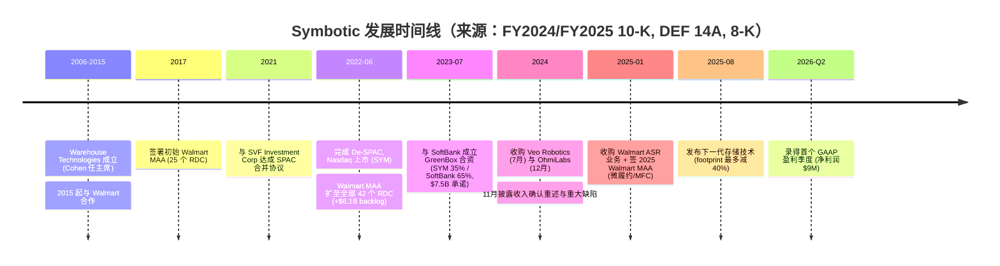
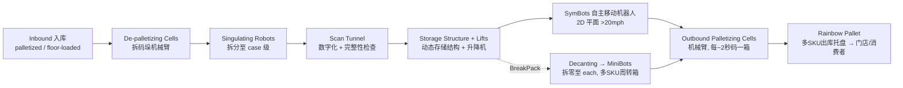
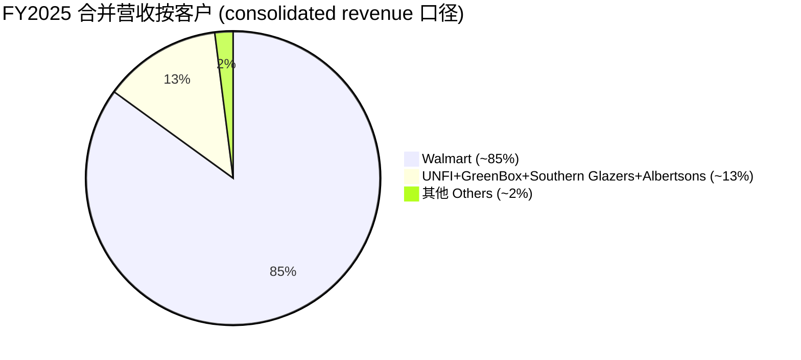
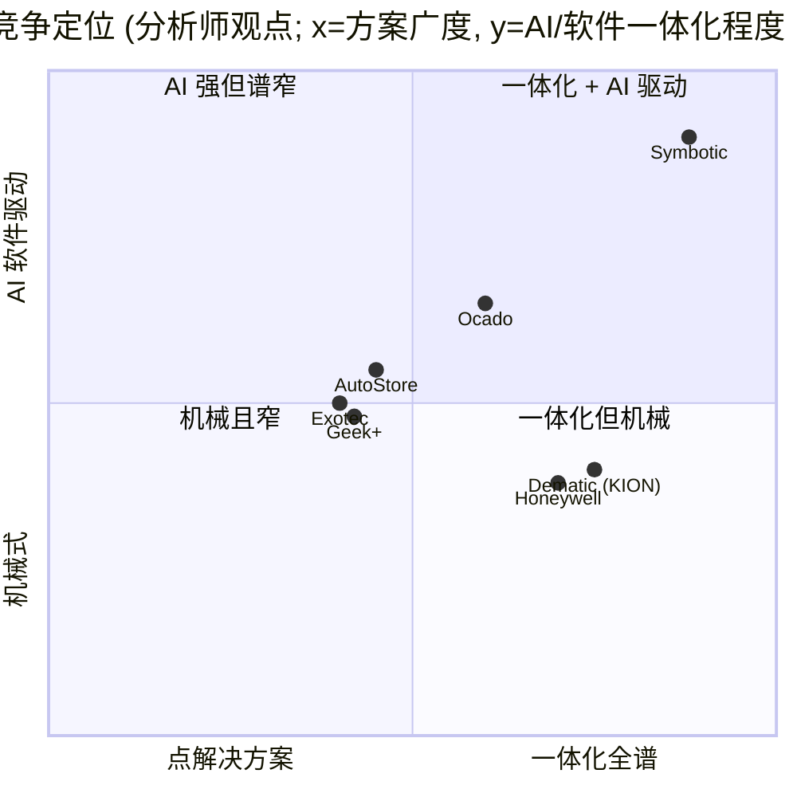
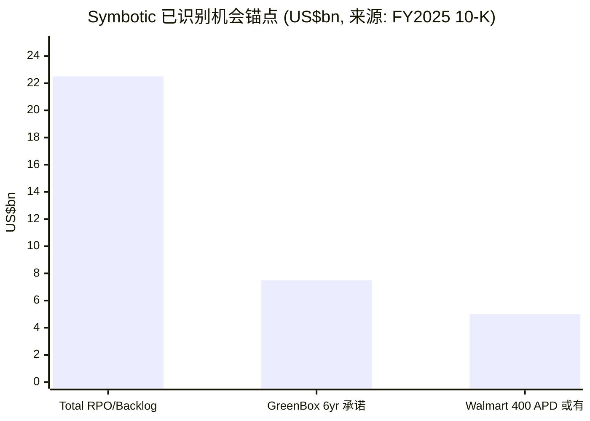

# Symbotic Inc.（NASDAQ:SYM）公司研究报告

**报告日期 / As of：2026-06-14** ｜ 标的：Symbotic Inc.（NASDAQ:SYM）｜ 财年截止：每年 9 月末（FY2025 截止 2025-09-27）

> *分析师观点：* **评级：Hold（中性）· 12 个月目标价 US$45（较 2026-06-12 收盘 $41.63 上行 +8%）· 估值方法：FY2027E EV/Sales ~7× + 对 backlog 转化的折价**
> 完全摊薄经济市值（Class A + V-1 + V-3 ≈ 5.91 亿股）≈ **US$24.6bn** · 52 周区间 **$28.49–$87.88** · NASDAQ:SYM
>
> | 倍数 / Multiple（*分析师观点：* 远期列） | FY2025A | FY2026E | FY2027E |
> |---|---|---|---|
> | EV/Sales（完全摊薄经济口径） | ~10.5× | ~8.0× | ~6.5× |
> | P/S（完全摊薄经济口径） | ~11.0× | ~8.4× | ~6.8× |
> | EV/Adj. EBITDA | ~160× | ~70× | ~45× |
> | GAAP P/E | n/m（GAAP 净亏损） | n/m→转正 | ~70–90× |
>
> 相对表现（截至 2026-06-12，来源 yfinance）：1M **−16.3%** · 6M **−30.9%** · YTD **−35.8%** · 12M **约 +49%**（$27.97→$41.63）；同期 S&P 500 12M 约 +12–14%，SYM 12M 相对跑赢、但 YTD 大幅跑输。
>
> **核心论点（thesis pillars）**——（1）Symbotic 是少数已规模化交付的"comprehensive（一体化）AI 仓储自动化系统"供应商，FY2025 营收 $2,246.9M、+26% YoY，且现金流与 Adjusted EBITDA 已转正；（2）**$22.5bn 的 system backlog（系统积压订单）** 提供多年收入能见度，但其中绝大部分系结构性绑定 Walmart 与 GreenBox；（3）**客户集中度极端——Walmart 约占 FY2025 总营收 84.6%**，是估值与基本面的最大单一变量；（4）GreenBox（SoftBank 合资的 warehouse-as-a-service）按 **equity method（权益法，未并表）** 核算，既是增长期权也是执行与会计复杂性的来源——叠加 2024 年的收入确认 restatement（财报重述）历史，使本名"高成长但高不确定"，故给予 Hold。

> **Update — FY2026 二季度业绩与三季度指引（2026-05-06）：** Symbotic 报告 FY2026 第二财季（截至 2026-03-28）营收 **$676M、+23% YoY**，并录得 **净利润 $9M**（去年同期净亏损 $10M），为公司首个 GAAP 盈利季度；**Adjusted EBITDA 达 $78M**，为去年同期 $35M 的两倍以上。公司对 FY2026 第三财季给出指引：营收 **$700–720M**、Adjusted EBITDA **$80–85M**。
> 来源：[SYM Q2-FY2026 earnings press release（8-K Ex-99.1）, 2026-05-06](https://www.sec.gov/Archives/edgar/data/1837240/000183724026000023/sym-20260506.htm)。

---

## 目录 / Table of Contents

1. 公司概览（含投资论点）
1A. 估值与目标价（远期预测 · 目标价推导 · 牛/基准/熊情景）
1B. GF Score（GuruFocus 式）基本面评分卡
2. 公司历史
3. 管理团队
4. 产品与服务（**本报告最重要章节**）
5. 客户与上市策略
6. 行业概览
7. 竞争格局
8. 市场机会（TAM）
9. 风险评估
9.5. 关键分歧与催化剂
10. 投资风格透视（投资者视角评分卡）

======================================

## 1. 公司概览

*分析师观点：* 我们以 **Hold（中性）** 评级、**12 个月目标价 US$45（较 2026-06-12 收盘 $41.63 上行约 +8%）** 启动对 Symbotic 的覆盖。**Why now：** 公司刚刚跨过两道关键门槛——FY2025 经营性现金流由 −$58.1M 转为 **+$866.9M**、free cash flow（自由现金流）转为 **+$787.9M**，且 FY2026 二季度录得首个 GAAP 盈利季度（净利润 $9M）——这把市场对"能否自筹资金"的质疑大幅压低（[SYM FY2025 10-K, MD&A — Liquidity](https://www.sec.gov/Archives/edgar/data/1837240/000183724025000278/sym-20250927.htm)；[SYM Q2-FY2026 8-K Ex-99.1, 2026-05-06](https://www.sec.gov/Archives/edgar/data/1837240/000183724026000023/sym-20260506.htm)）。但与此同时，股价 YTD 已回落 −35.8%，市场正在重新定价"Walmart 单一客户依赖 + 远期增长斜率放缓"。四条论点：（1）已规模化的一体化 AI 仓储系统；（2）$22.5bn backlog 的收入能见度；（3）Walmart 约 85% 的极端集中度；（4）GreenBox 权益法合资的期权价值与复杂性。在 backlog 转化为收入与利润、且客户多元化取得实质进展之前，风险收益对称，故 Hold。

**公司做什么（plain English）。** Symbotic 自我定位为"为供应链开发、商业化并部署一体化技术解决方案"的公司，核心是用**自有机器人（proprietary robotics）+ AI 驱动软件（A.I.-powered software）**来在仓库中"移动、存储、分拣箱（cases）与单品（eaches，即拆零后的单件商品）"（[SYM FY2025 10-K, Item 1 Business — Company Overview](https://www.sec.gov/Archives/edgar/data/1837240/000183724025000278/sym-20250927.htm)）。其系统已在"全球最大的零售商之一 Walmart、批发分销商 C&S Wholesale Grocers 等"投入运营，并正在 GreenBox（其 warehouse-as-a-service 合资公司）部署（[SYM FY2025 10-K, Item 1 Business](https://www.sec.gov/Archives/edgar/data/1837240/000183724025000278/sym-20250927.htm)）。

**怎么赚钱（business model）。** 收入分三类：**Systems（系统，FY2025 占 94%）、Software maintenance and support（软件维护与支持）、Operation services（运营服务）**。Systems 收入按 **percentage-of-completion（完工百分比法）over time** 确认——即按"已发生成本占预估总成本的比例"逐步确认，而非交付时一次性确认，这正是 2024 年重述事件的根源（[SYM FY2025 10-K, Note 2 — Revenue Recognition](https://www.sec.gov/Archives/edgar/data/1837240/000183724025000278/sym-20250927.htm)）。FY2025 三类收入分别为 Systems **$2,118.9M（+24% YoY）**、Software maintenance and support **$29.6M（+109%）**、Operation services **$98.5M（+44%）**，合计 **$2,246.9M（+26% YoY）**（[SYM FY2025 10-K, MD&A — Revenue](https://www.sec.gov/Archives/edgar/data/1837240/000183724025000278/sym-20250927.htm)）。后两类是"系统投运后"的经常性收入，会随 Operational Systems 数量增长而扩大——FY2025 有 48 套系统处于软件维护合同下（FY2024 为 25 套），是未来收入韧性的来源（[SYM FY2025 10-K, MD&A](https://www.sec.gov/Archives/edgar/data/1837240/000183724025000278/sym-20250927.htm)）。

<svg xmlns="http://www.w3.org/2000/svg" viewBox="0 0 1000 560" width="1000" height="560" role="img" aria-label="income statement Sankey"><rect x="0" y="0" width="1000" height="560" fill="#ffffff"/>
<text x="20.00" y="30.00" text-anchor="start" font-family="Helvetica,Arial,sans-serif" font-size="15" font-weight="700" fill="#1f2933">Symbotic (SYM) 收入结构 / How SYM Makes Its Money — FY2025 (US$M)</text>
<path d="M 204.00,71.00 C 258.00,71.00 258.00,85.01 312.00,85.01 L 312.00,469.75 C 258.00,469.75 258.00,455.74 204.00,455.74 Z" fill="#93c5fd" fill-opacity="0.55"/>
<path d="M 452.00,78.01 C 506.00,78.01 506.00,221.92 560.00,221.92 L 560.00,223.92 C 506.00,223.92 506.00,80.01 452.00,80.01 Z" fill="#86efac" fill-opacity="0.55"/>
<path d="M 452.00,80.01 C 506.00,80.01 506.00,237.92 560.00,237.92 L 560.00,335.53 C 506.00,335.53 506.00,177.62 452.00,177.62 Z" fill="#fca5a5" fill-opacity="0.55"/>
<path d="M 328.00,85.01 C 382.00,85.01 382.00,78.01 436.00,78.01 L 436.00,154.74 C 382.00,154.74 382.00,161.74 328.00,161.74 Z" fill="#86efac" fill-opacity="0.55"/>
<path d="M 328.00,161.74 C 382.00,161.74 382.00,168.74 436.00,168.74 L 436.00,499.99 C 382.00,499.99 382.00,492.99 328.00,492.99 Z" fill="#fca5a5" fill-opacity="0.55"/>
<path d="M 700.00,218.19 C 754.00,218.19 754.00,280.00 808.00,280.00 L 808.00,282.00 C 754.00,282.00 754.00,220.19 700.00,220.19 Z" fill="#86efac" fill-opacity="0.55"/>
<path d="M 700.00,220.19 C 754.00,220.19 754.00,296.00 808.00,296.00 L 808.00,298.00 C 754.00,298.00 754.00,222.19 700.00,222.19 Z" fill="#fca5a5" fill-opacity="0.55"/>
<path d="M 576.00,221.92 C 630.00,221.92 630.00,218.19 684.00,218.19 L 684.00,220.19 C 630.00,220.19 630.00,223.92 576.00,223.92 Z" fill="#86efac" fill-opacity="0.55"/>
<path d="M 576.00,237.92 C 630.00,237.92 630.00,234.19 684.00,234.19 L 684.00,288.43 C 630.00,288.43 630.00,292.15 576.00,292.15 Z" fill="#fca5a5" fill-opacity="0.55"/>
<path d="M 576.00,292.15 C 630.00,292.15 630.00,302.43 684.00,302.43 L 684.00,341.65 C 630.00,341.65 630.00,331.37 576.00,331.37 Z" fill="#fca5a5" fill-opacity="0.55"/>
<path d="M 576.00,331.37 C 630.00,331.37 630.00,355.65 684.00,355.65 L 684.00,359.81 C 630.00,359.81 630.00,335.53 576.00,335.53 Z" fill="#fca5a5" fill-opacity="0.55"/>
<path d="M 576.00,349.53 C 630.00,349.53 630.00,220.19 684.00,220.19 L 684.00,226.75 C 630.00,226.75 630.00,356.08 576.00,356.08 Z" fill="#93c5fd" fill-opacity="0.55"/>
<path d="M 204.00,469.74 C 258.00,469.74 258.00,469.75 312.00,469.75 L 312.00,475.12 C 258.00,475.12 258.00,475.11 204.00,475.11 Z" fill="#93c5fd" fill-opacity="0.55"/>
<path d="M 204.00,489.11 C 258.00,489.11 258.00,475.12 312.00,475.12 L 312.00,493.01 C 258.00,493.01 258.00,507.00 204.00,507.00 Z" fill="#93c5fd" fill-opacity="0.55"/>
<rect x="188.00" y="71.00" width="16" height="384.74" rx="1.5" fill="#2563eb"/>
<rect x="188.00" y="469.74" width="16" height="5.37" rx="1.5" fill="#2563eb"/>
<rect x="188.00" y="489.11" width="16" height="17.89" rx="1.5" fill="#2563eb"/>
<rect x="312.00" y="85.01" width="16" height="407.98" rx="1.5" fill="#1e3a8a"/>
<rect x="436.00" y="78.01" width="16" height="76.73" rx="1.5" fill="#15803d"/>
<rect x="436.00" y="168.74" width="16" height="331.25" rx="1.5" fill="#dc2626"/>
<rect x="560.00" y="221.92" width="16" height="2.00" rx="1.5" fill="#15803d"/>
<rect x="560.00" y="237.92" width="16" height="97.61" rx="1.5" fill="#dc2626"/>
<rect x="560.00" y="349.53" width="16" height="6.55" rx="1.5" fill="#2563eb"/>
<rect x="684.00" y="218.19" width="16" height="2.00" rx="1.5" fill="#15803d"/>
<rect x="684.00" y="234.19" width="16" height="54.24" rx="1.5" fill="#dc2626"/>
<rect x="684.00" y="302.43" width="16" height="39.22" rx="1.5" fill="#dc2626"/>
<rect x="684.00" y="355.65" width="16" height="4.16" rx="1.5" fill="#dc2626"/>
<rect x="808.00" y="280.00" width="16" height="2.00" rx="1.5" fill="#15803d"/>
<rect x="808.00" y="296.00" width="16" height="2.00" rx="1.5" fill="#dc2626"/>
<line x1="188.00" y1="263.37" x2="182.00" y2="252.31" stroke="#cbd5e1" stroke-width="1"/>
<text x="179.00" y="255.31" text-anchor="end" font-family="Helvetica,Arial,sans-serif" font-size="11.5" font-weight="700" fill="#1f2933">Systems</text>
<text x="179.00" y="268.31" text-anchor="end" font-family="Helvetica,Arial,sans-serif" font-size="10" font-weight="400" fill="#52606d">$2.1B  (94.3%)</text>
<line x1="188.00" y1="472.43" x2="182.00" y2="461.37" stroke="#cbd5e1" stroke-width="1"/>
<text x="179.00" y="464.37" text-anchor="end" font-family="Helvetica,Arial,sans-serif" font-size="11.5" font-weight="700" fill="#1f2933">Software Maint. &amp; Support</text>
<text x="179.00" y="477.37" text-anchor="end" font-family="Helvetica,Arial,sans-serif" font-size="10" font-weight="400" fill="#52606d">$29.6M  (1.3%)</text>
<line x1="188.00" y1="498.06" x2="182.00" y2="487.00" stroke="#cbd5e1" stroke-width="1"/>
<text x="179.00" y="490.00" text-anchor="end" font-family="Helvetica,Arial,sans-serif" font-size="11.5" font-weight="700" fill="#1f2933">Operation Services</text>
<text x="179.00" y="503.00" text-anchor="end" font-family="Helvetica,Arial,sans-serif" font-size="10" font-weight="400" fill="#52606d">$98.5M  (4.4%)</text>
<rect x="331.00" y="67.01" width="100.50" height="26" rx="2" fill="#ffffff" fill-opacity="0.72"/>
<text x="334.00" y="79.01" text-anchor="start" font-family="Helvetica,Arial,sans-serif" font-size="11.5" font-weight="700" fill="#1f2933">Revenue</text>
<text x="334.00" y="92.01" text-anchor="start" font-family="Helvetica,Arial,sans-serif" font-size="10" font-weight="400" fill="#52606d">$2.2B  (100.0%)</text>
<rect x="455.00" y="60.01" width="106.80" height="26" rx="2" fill="#ffffff" fill-opacity="0.72"/>
<text x="458.00" y="72.01" text-anchor="start" font-family="Helvetica,Arial,sans-serif" font-size="11.5" font-weight="700" fill="#1f2933">Gross Profit</text>
<text x="458.00" y="85.01" text-anchor="start" font-family="Helvetica,Arial,sans-serif" font-size="10" font-weight="400" fill="#52606d">$422.6M  (18.8%)</text>
<rect x="455.00" y="150.74" width="144.60" height="26" rx="2" fill="#ffffff" fill-opacity="0.72"/>
<text x="458.00" y="162.74" text-anchor="start" font-family="Helvetica,Arial,sans-serif" font-size="11.5" font-weight="700" fill="#1f2933">Cost of Revenue (COGS)</text>
<text x="458.00" y="175.74" text-anchor="start" font-family="Helvetica,Arial,sans-serif" font-size="10" font-weight="400" fill="#52606d">$1.8B  (81.2%)</text>
<rect x="579.00" y="203.92" width="113.10" height="26" rx="2" fill="#ffffff" fill-opacity="0.72"/>
<text x="582.00" y="215.92" text-anchor="start" font-family="Helvetica,Arial,sans-serif" font-size="11.5" font-weight="700" fill="#1f2933">Operating Income</text>
<text x="582.00" y="228.92" text-anchor="start" font-family="Helvetica,Arial,sans-serif" font-size="10" font-weight="400" fill="#52606d">-$115.0M  (-5.1%)</text>
<rect x="579.00" y="228.92" width="150.90" height="26" rx="2" fill="#ffffff" fill-opacity="0.72"/>
<text x="582.00" y="240.92" text-anchor="start" font-family="Helvetica,Arial,sans-serif" font-size="11.5" font-weight="700" fill="#1f2933">Total Operating Expense</text>
<text x="582.00" y="253.92" text-anchor="start" font-family="Helvetica,Arial,sans-serif" font-size="10" font-weight="400" fill="#52606d">$537.6M  (23.9%)</text>
<text x="551.00" y="349.81" text-anchor="end" font-family="Helvetica,Arial,sans-serif" font-size="11.5" font-weight="700" fill="#1f2933">Net Interest / Other Income</text>
<text x="551.00" y="362.81" text-anchor="end" font-family="Helvetica,Arial,sans-serif" font-size="10" font-weight="400" fill="#52606d">$36.1M  (1.6%)</text>
<rect x="703.00" y="200.19" width="106.80" height="26" rx="2" fill="#ffffff" fill-opacity="0.72"/>
<text x="706.00" y="212.19" text-anchor="start" font-family="Helvetica,Arial,sans-serif" font-size="11.5" font-weight="700" fill="#1f2933">Pretax Income</text>
<text x="706.00" y="225.19" text-anchor="start" font-family="Helvetica,Arial,sans-serif" font-size="10" font-weight="400" fill="#52606d">-$78.9M  (-3.5%)</text>
<rect x="703.00" y="225.19" width="106.80" height="26" rx="2" fill="#ffffff" fill-opacity="0.72"/>
<text x="706.00" y="237.19" text-anchor="start" font-family="Helvetica,Arial,sans-serif" font-size="11.5" font-weight="700" fill="#1f2933">SG&amp;A</text>
<text x="706.00" y="250.19" text-anchor="start" font-family="Helvetica,Arial,sans-serif" font-size="10" font-weight="400" fill="#52606d">$298.7M  (13.3%)</text>
<rect x="703.00" y="284.43" width="100.50" height="26" rx="2" fill="#ffffff" fill-opacity="0.72"/>
<text x="706.00" y="296.43" text-anchor="start" font-family="Helvetica,Arial,sans-serif" font-size="11.5" font-weight="700" fill="#1f2933">R&amp;D</text>
<text x="706.00" y="309.43" text-anchor="start" font-family="Helvetica,Arial,sans-serif" font-size="10" font-weight="400" fill="#52606d">$216.0M  (9.6%)</text>
<rect x="703.00" y="337.65" width="94.20" height="26" rx="2" fill="#ffffff" fill-opacity="0.72"/>
<text x="706.00" y="349.65" text-anchor="start" font-family="Helvetica,Arial,sans-serif" font-size="11.5" font-weight="700" fill="#1f2933">Other OpEx</text>
<text x="706.00" y="362.65" text-anchor="start" font-family="Helvetica,Arial,sans-serif" font-size="10" font-weight="400" fill="#52606d">$22.9M  (1.0%)</text>
<text x="833.00" y="278.00" text-anchor="start" font-family="Helvetica,Arial,sans-serif" font-size="11.5" font-weight="700" fill="#1f2933">Net Income</text>
<text x="833.00" y="291.00" text-anchor="start" font-family="Helvetica,Arial,sans-serif" font-size="10" font-weight="400" fill="#52606d">-$91.0M  (-4.1%)</text>
<text x="833.00" y="303.00" text-anchor="start" font-family="Helvetica,Arial,sans-serif" font-size="11.5" font-weight="700" fill="#1f2933">Income Tax</text>
<text x="833.00" y="316.00" text-anchor="start" font-family="Helvetica,Arial,sans-serif" font-size="10" font-weight="400" fill="#52606d">-$1.6M  (-0.07%)</text>
<text x="500.00" y="544.00" text-anchor="middle" font-family="Helvetica,Arial,sans-serif" font-size="10" font-weight="400" fill="#52606d">Source: SYM FY2025 10-K, Consolidated Statements of Operations (year ended 2025-09-27)</text>
</svg>

来源 / Source: [SYM FY2025 10-K, Consolidated Statements of Operations + Note 3 Revenue](https://www.sec.gov/Archives/edgar/data/1837240/000183724025000278/sym-20250927.htm)

**在哪里经营、规模多大。** 公司总部位于美国马萨诸塞州 Wilmington，截至 2025-09-27 雇佣 **约 2,000 名全职员工**（其中约 1,950 名在美国），约 30% 在 Wilmington 总部，约一半驻扎在客户现场负责安装、调试与维护；近一半员工从事工程、研发及相关技术职能（[SYM FY2025 10-K, Item 1 — Human Capital](https://www.sec.gov/Archives/edgar/data/1837240/000183724025000278/sym-20250927.htm)）。IP 组合约 **1,100 项已授权和/或在审专利**（[SYM FY2025 10-K, Item 1 — Intellectual Property](https://www.sec.gov/Archives/edgar/data/1837240/000183724025000278/sym-20250927.htm)）。下图按收入类型展示 FY2025 的收入结构（Systems 占绝对主导）。

<svg xmlns="http://www.w3.org/2000/svg" viewBox="0 0 720 460" width="720" height="460" role="img" aria-label="revenue donut"><rect x="0" y="0" width="720" height="460" fill="#ffffff"/>
<text x="20.00" y="30.00" text-anchor="start" font-family="Helvetica,Arial,sans-serif" font-size="15" font-weight="700" fill="#1f2933">FY2025 收入构成 / Revenue by Type (US$M)</text>
<path d="M 288.00,107.20 A 132 132 0 1 1 241.72,115.58 L 260.65,166.15 A 78 78 0 1 0 288.00,161.20 Z" fill="#2563eb"/>
<path d="M 241.72,115.58 A 132 132 0 0 1 252.10,112.18 L 266.79,164.14 A 78 78 0 0 0 260.65,166.15 Z" fill="#15803d"/>
<path d="M 252.10,112.18 A 132 132 0 0 1 288.00,107.20 L 288.00,161.20 A 78 78 0 0 0 266.79,164.14 Z" fill="#d97706"/>
<text x="288.00" y="235.20" text-anchor="middle" font-family="Helvetica,Arial,sans-serif" font-size="18" font-weight="800" fill="#1f2933">SYM</text>
<text x="288.00" y="255.20" text-anchor="middle" font-family="Helvetica,Arial,sans-serif" font-size="13" font-weight="600" fill="#52606d">$2.2B</text>
<text x="288.00" y="271.20" text-anchor="middle" font-family="Helvetica,Arial,sans-serif" font-size="10" font-weight="400" fill="#8a97a3">total</text>
<line x1="312.58" y1="374.99" x2="328.58" y2="374.99" stroke="#2563eb" stroke-width="1.4"/>
<text x="332.58" y="372.99" text-anchor="start" font-family="Helvetica,Arial,sans-serif" font-size="11" font-weight="700" fill="#1f2933">Systems</text>
<text x="332.58" y="386.99" text-anchor="start" font-family="Helvetica,Arial,sans-serif" font-size="10" font-weight="400" fill="#52606d">$2.1B  (94.3%)</text>
<line x1="245.01" y1="108.07" x2="229.01" y2="108.07" stroke="#15803d" stroke-width="1.4"/>
<text x="225.01" y="106.07" text-anchor="end" font-family="Helvetica,Arial,sans-serif" font-size="11" font-weight="700" fill="#1f2933">Software Maint. &amp; Support</text>
<text x="225.01" y="120.07" text-anchor="end" font-family="Helvetica,Arial,sans-serif" font-size="10" font-weight="400" fill="#52606d">$29.6M  (1.3%)</text>
<line x1="269.06" y1="102.51" x2="253.06" y2="102.51" stroke="#d97706" stroke-width="1.4"/>
<text x="249.06" y="100.51" text-anchor="end" font-family="Helvetica,Arial,sans-serif" font-size="11" font-weight="700" fill="#1f2933">Operation Services</text>
<text x="249.06" y="114.51" text-anchor="end" font-family="Helvetica,Arial,sans-serif" font-size="10" font-weight="400" fill="#52606d">$98.5M  (4.4%)</text>
<text x="360.00" y="444.00" text-anchor="middle" font-family="Helvetica,Arial,sans-serif" font-size="10" font-weight="400" fill="#52606d">Source: SYM FY2025 10-K, Note 3 — Revenue disaggregation</text>
</svg>

来源 / Source: [SYM FY2025 10-K, Note 3 — Revenue disaggregation](https://www.sec.gov/Archives/edgar/data/1837240/000183724025000278/sym-20250927.htm)

**收入与利润的发展轨迹（"本期新变化"）。** 从 FY2021 的 $251.9M 到 FY2025 的 $2,246.9M，五年营收复合增速约 **73%**；GAAP gross margin（毛利率）从 FY2024 的 14% 提升至 FY2025 的 **19%**（毛利 $245.7M→$422.6M）；**Adjusted EBITDA** 从 FY2023 的 −$17.6M、FY2024 的 $61.7M 升至 FY2025 的 **$147.5M**；GAAP 净亏损则从 FY2023 的 $207.9M 大幅收窄至 FY2024 的 $84.7M、FY2025 的 **$91.0M**（FY2025 微增主要因 restructuring charges $22.9M 与 equity method 亏损 $13.7M）（[SYM FY2025 10-K, MD&A — Results of Operations & Non-GAAP](https://www.sec.gov/Archives/edgar/data/1837240/000183724025000278/sym-20250927.htm)）。下面的历史营收堆叠图展示了这一斜率与结构变化。

<svg xmlns="http://www.w3.org/2000/svg" viewBox="0 0 860 470" width="860" height="470" role="img" aria-label="historical revenue bars"><rect x="0" y="0" width="860" height="470" fill="#ffffff"/>
<text x="20.00" y="30.00" text-anchor="start" font-family="Helvetica,Arial,sans-serif" font-size="15" font-weight="700" fill="#1f2933">Symbotic 历史营收 / Historical Revenue by Type (FY2021–FY2025, US$B)</text>
<rect x="20.00" y="44" width="11" height="11" rx="2" fill="#2563eb"/>
<text x="36.00" y="53.00" text-anchor="start" font-family="Helvetica,Arial,sans-serif" font-size="10.5" font-weight="400" fill="#1f2933">Systems</text>
<rect x="96.20" y="44" width="11" height="11" rx="2" fill="#15803d"/>
<text x="112.20" y="53.00" text-anchor="start" font-family="Helvetica,Arial,sans-serif" font-size="10.5" font-weight="400" fill="#1f2933">Software Maint. &amp; Support</text>
<rect x="291.20" y="44" width="11" height="11" rx="2" fill="#d97706"/>
<text x="307.20" y="53.00" text-anchor="start" font-family="Helvetica,Arial,sans-serif" font-size="10.5" font-weight="400" fill="#1f2933">Operation Services</text>
<line x1="70" y1="412.00" x2="834" y2="412.00" stroke="#eceff2" stroke-width="1"/>
<text x="64.00" y="415.00" text-anchor="end" font-family="Helvetica,Arial,sans-serif" font-size="9.5" font-weight="400" fill="#52606d">$0</text>
<line x1="70" y1="345.20" x2="834" y2="345.20" stroke="#eceff2" stroke-width="1"/>
<text x="64.00" y="348.20" text-anchor="end" font-family="Helvetica,Arial,sans-serif" font-size="9.5" font-weight="400" fill="#52606d">$485.4M</text>
<line x1="70" y1="278.40" x2="834" y2="278.40" stroke="#eceff2" stroke-width="1"/>
<text x="64.00" y="281.40" text-anchor="end" font-family="Helvetica,Arial,sans-serif" font-size="9.5" font-weight="400" fill="#52606d">$970.7M</text>
<line x1="70" y1="211.60" x2="834" y2="211.60" stroke="#eceff2" stroke-width="1"/>
<text x="64.00" y="214.60" text-anchor="end" font-family="Helvetica,Arial,sans-serif" font-size="9.5" font-weight="400" fill="#52606d">$1.5B</text>
<line x1="70" y1="144.80" x2="834" y2="144.80" stroke="#eceff2" stroke-width="1"/>
<text x="64.00" y="147.80" text-anchor="end" font-family="Helvetica,Arial,sans-serif" font-size="9.5" font-weight="400" fill="#52606d">$1.9B</text>
<line x1="70" y1="78.00" x2="834" y2="78.00" stroke="#eceff2" stroke-width="1"/>
<text x="64.00" y="81.00" text-anchor="end" font-family="Helvetica,Arial,sans-serif" font-size="9.5" font-weight="400" fill="#52606d">$2.4B</text>
<rect x="102.09" y="380.90" width="88.62" height="31.10" fill="#2563eb"/>
<rect x="102.09" y="380.21" width="88.62" height="0.69" fill="#15803d"/>
<rect x="102.09" y="377.32" width="88.62" height="2.89" fill="#d97706"/>
<text x="146.40" y="428.00" text-anchor="middle" font-family="Helvetica,Arial,sans-serif" font-size="10" font-weight="400" fill="#52606d">2021</text>
<rect x="254.89" y="335.89" width="88.62" height="76.11" fill="#2563eb"/>
<rect x="254.89" y="334.24" width="88.62" height="1.65" fill="#15803d"/>
<rect x="254.89" y="330.38" width="88.62" height="3.85" fill="#d97706"/>
<text x="299.20" y="428.00" text-anchor="middle" font-family="Helvetica,Arial,sans-serif" font-size="10" font-weight="400" fill="#52606d">2022</text>
<rect x="407.69" y="255.37" width="88.62" height="156.63" fill="#2563eb"/>
<rect x="407.69" y="252.90" width="88.62" height="2.48" fill="#15803d"/>
<rect x="407.69" y="250.01" width="88.62" height="2.89" fill="#d97706"/>
<text x="452.00" y="428.00" text-anchor="middle" font-family="Helvetica,Arial,sans-serif" font-size="10" font-weight="400" fill="#52606d">2023</text>
<rect x="560.49" y="177.34" width="88.62" height="234.66" fill="#2563eb"/>
<rect x="560.49" y="175.41" width="88.62" height="1.93" fill="#15803d"/>
<rect x="560.49" y="165.91" width="88.62" height="9.50" fill="#d97706"/>
<text x="604.80" y="428.00" text-anchor="middle" font-family="Helvetica,Arial,sans-serif" font-size="10" font-weight="400" fill="#52606d">2024</text>
<rect x="713.29" y="120.36" width="88.62" height="291.64" fill="#2563eb"/>
<rect x="713.29" y="116.23" width="88.62" height="4.13" fill="#15803d"/>
<rect x="713.29" y="102.74" width="88.62" height="13.49" fill="#d97706"/>
<text x="757.60" y="428.00" text-anchor="middle" font-family="Helvetica,Arial,sans-serif" font-size="10" font-weight="400" fill="#52606d">2025</text>
<text x="430.00" y="454.00" text-anchor="middle" font-family="Helvetica,Arial,sans-serif" font-size="10" font-weight="400" fill="#52606d">Source: SYM FY2021–FY2025 10-Ks, Statements of Operations</text>
</svg>

来源 / Source: [SYM FY2021–FY2025 10-Ks, Consolidated Statements of Operations](https://www.sec.gov/Archives/edgar/data/1837240/000183724025000278/sym-20250927.htm)

**估值快照（Valuation snapshot，REQUIRED）。** 截至 2026-06-12 收盘 **$41.63**，52 周区间 **$28.49–$87.88**（来源 [yfinance / Yahoo Finance — SYM key statistics](https://finance.yahoo.com/quote/SYM/)）。这里有一个关键的口径问题：SYM 采用 Up-C / 多重股权结构，Class A 仅 112.6M 股、另有 Class V-1 74.7M 股与 Class V-3 403.6M 股（均可转换为 Class A 的经济权益），**完全摊薄经济股本约 5.91 亿股**（[SYM FY2025 10-K, Consolidated Balance Sheets — Equity](https://www.sec.gov/Archives/edgar/data/1837240/000183724025000278/sym-20250927.htm)）。因此仅看 Class A 浮动市值（约 $5.3bn）会**严重低估真实市值**——完全摊薄经济市值约 **$24.6bn**，对应 FY2025 营收的 **P/S ≈ 11.0×**。这远高于工业自动化同业（如 Rockwell Automation 的市场化估值约为远期 FCF 收益率 ~3.5%、目标 P/E ~22×；*分析师观点：* 见 [Goldman Sachs — Rockwell Automation, 2026-05-06](http://xs-macbook-air.local:5001/zsxq/pdf/585421521212144/Goldman%20Sachs-Rockwell%20Automation%20Inc.%20%EF%BC%88ROK.US%EF%BC%89%20Raising%20estimates%20on%20improving%20growth%20outlook-260506.pdf)），属于"高成长 + 主题溢价"定价：市场为多年 backlog 转化与 AI 仓储渗透付费，而非为当期 GAAP 盈利付费。由于 GAAP 净利润仍为负（FY2025），TTM P/E 不具意义（n/m）；我们在 Section 9 将"估值/倍数压缩风险"列为重大财务风险。

---

## 1A. 估值与目标价

*分析师观点：* 本章所有预测数字、目标价与情景目标价均为分析师自身的前瞻判断，**不附任何 filing（财报）引用**；各预测的外部输入（filing 分部数据 + 管理层指引 + 行业预测）在文中分别引用。

**（a）远期财务预测表（FY2025A–FY2028E，*分析师观点：*）。** 模型核心驱动：System backlog $22.5bn 的转化节奏（公司披露未来 12 个月确认约 12%、13–60 个月确认约 62%）+ 2025 Walmart MAA 对全部 42 个区域配送中心（RDC）的覆盖 + GreenBox $7.5bn / 6 年承诺 + Walmart 微履约（micro-fulfillment）新品类放量。利润率路径假设 gross margin 由 19% 逐步抬升至 24–25%（规模效应 + System 成本控制 + 软件/服务占比上升），驱动 Adjusted EBITDA margin 由 ~6.6% 提升至 ~13%。

| 指标（*分析师观点：*） | FY2025A | FY2026E | FY2027E | FY2028E | CAGR (25–28) |
|---|---|---|---|---|---|
| Revenue（US$M） | 2,247 | 2,900 | 3,650 | 4,400 | +25% |
| — YoY % | +26% | +29% | +26% | +21% | |
| GAAP gross margin % | 18.8% | 21% | 23% | 24.5% | |
| Adjusted EBITDA（US$M） | 147 | 305 | 470 | 620 | |
| — Adj. EBITDA margin % | 6.6% | 10.5% | 12.9% | 14.1% | |
| GAAP net income (loss)（US$M） | (91) | 30 | 140 | 250 | |
| FCF（US$M） | 788 | 250 | 320 | 420 | |
| Net cash（US$M，无有息负债） | 1,245 | ~2,100 | ~2,400 | ~2,800 | |

FY2025 实际值（revenue $2,247M、GAAP gross margin 18.8%、Adjusted EBITDA $147M、net loss $91M、FCF $788M、cash $1,245M）来自 [SYM FY2025 10-K, MD&A](https://www.sec.gov/Archives/edgar/data/1837240/000183724025000278/sym-20250927.htm)；FY2026E 营收锚定 H1-FY2026 实际 $1,306.5M（[SYM Q2-FY2026 10-Q, Statements of Operations](https://www.sec.gov/Archives/edgar/data/1837240/000183724026000024/sym-20260328.htm)）+ Q3-FY2026 指引中值 $710M（[SYM Q2-FY2026 8-K Ex-99.1, 2026-05-06](https://www.sec.gov/Archives/edgar/data/1837240/000183724026000023/sym-20260506.htm)），其余为分析师前瞻估计，非来自任何 filing。**说明：** SYM 的 FCF 高度受 deferred revenue（客户预付款）时点影响——FY2025 营运资本贡献 +$714.0M 现金，FY2026 起这一"超额现金流"会随预付节奏正常化而回落，故 FY2026E FCF 显著低于 FY2025（[SYM FY2025 10-K, MD&A — Cash Flows](https://www.sec.gov/Archives/edgar/data/1837240/000183724025000278/sym-20250927.htm)）。

**毛利率桥（margin bridge，FY2024→FY2025，*分析师观点：*）。** GAAP gross margin 由 14% 升至 18.8%（+约 480bps），分解为：System 部署数量由 44→50 套带来的规模/学习曲线效应（约 +300bps）· 更好的 System 成本控制（管理层口径"lower cost of revenue resulting from better cost control"，约 +150bps）· 软件维护与运营服务（高毛利经常性收入）占比上升（约 +80bps）· 部分被 restructuring 与 ASR 整合成本抵消（约 −50bps）。其中"50 vs 44 套部署 + 更好成本控制"为 filing 原文驱动（[SYM FY2025 10-K, MD&A — Gross Profit](https://www.sec.gov/Archives/edgar/data/1837240/000183724025000278/sym-20250927.htm)）；bps 拆分为分析师估计。

**（b）目标价推导（show the arithmetic）。** SYM 当前 GAAP 盈利极薄，PE 法不稳健，故采用 **EV/Sales × FY2027E 营收**，并对 backlog 集中度施加折价：
- FY2027E 营收 $3,650M × 目标 **EV/Sales 7.0×** = EV ≈ $25.6bn；加净现金约 $2.4bn = 股权价值约 $28.0bn；÷ 约 5.95 亿股完全摊薄经济股本 ≈ **$47/股**。
- 对"Walmart ~85% 单一客户依赖 + restatement 历史 + GreenBox 执行不确定"再施加约 −5% 折价，得 **12 个月目标价 US$45**（较 $41.63 上行约 +8%）。

**目标倍数依据（为什么用 7× EV/Sales）。** 对标 3–5 个名字：纯仓储自动化上市可比稀少，最接近的是 **Ocado Group**（仓储自动化 + 软件，历史 EV/Sales 长期在 2–4×，但增长更慢且盈利挣扎）、**Zebra Technologies**（约 3–4× EV/Sales、成熟）、以及更广义的工业自动化龙头 **Rockwell Automation**（约 4–5× EV/Sales、个位数有机增长，*分析师观点：* [Goldman Sachs — Rockwell Automation, 2026-05-06](http://xs-macbook-air.local:5001/zsxq/pdf/585421521212144/Goldman%20Sachs-Rockwell%20Automation%20Inc.%20%EF%BC%88ROK.US%EF%BC%89%20Raising%20estimates%20on%20improving%20growth%20outlook-260506.pdf)）。SYM 的 25%+ 营收 CAGR 与 backlog 能见度支持高于这些成熟名的倍数，但客户集中度与 GAAP 盈利尚浅又压制溢价——7× 介于"成熟自动化 4–5×"与"软件式高成长 10×+"之间，是平衡后的取值。

**（c）牛/基准/熊情景（*分析师观点：*）。**

| 情景（*分析师观点：*） | 关键假设 | 目标价 | 较现价 |
|---|---|---|---|
| 牛市 Bull | GreenBox 与 Walmart MFC 全面放量，FY2027E 营收上修至 ~$4.1bn 且 EV/Sales 维持 9× | $72 | +73% |
| 基准 Base | 中性预测，FY2027E 营收 $3.65bn × 7× EV/Sales，集中度折价后 | $45 | +8% |
| 熊市 Bear | backlog 转化延迟 + Walmart 缩减/重谈 + 再现 control 问题，de-rate 至 4× EV/Sales | $26 | −38% |

牛/熊摆幅由 EV/Sales 倍数与营收斜率共同驱动，所有数字均为分析师前瞻判断。

**（d）市场一致预期对比（consensus benchmark）。** 公开市场对 SYM 的卖方覆盖广泛，FY2026 一致营收预期约在 $2.85–2.95bn 区间（与公司 H1 实际 + Q3 指引隐含的年化值一致）。本报告 FY2026E $2,900M 大体落在一致预期中枢，FY2027E $3,650M 略偏保守（市场部分名字给到 $3.8bn+）——主要因我们对 GreenBox 部署节奏与 Walmart 微履约放量给予更谨慎的时点假设。我们未在本地 zsxq 机构库找到 SYM 的逐家卖方目标价记录（见 Data Used），故此处一致预期为基于公司指引与公开口径的近似，不引用任何虚构的一致数字。

**（e）最该盯紧的变量（swing variables）。** 两个：（1）**Walmart 关系的方向**——2025 Walmart MAA 下 400 套 APD（automated pickup device）的或有订单一旦确认，可为 backlog 增加 **>$5.0bn**（[SYM FY2025 10-K, Note 3 — Remaining Performance Obligations](https://www.sec.gov/Archives/edgar/data/1837240/000183724025000278/sym-20250927.htm)）；反之若 Walmart 放缓或重谈，营收斜率立刻下修。（2）**System gross margin 的爬坡速度**——这是 GAAP 盈利可持续性的核心，管理层已把"system gross margin"列为前瞻关注项（[SYM Q2-FY2026 8-K Ex-99.1, 2026-05-06](https://www.sec.gov/Archives/edgar/data/1837240/000183724026000023/sym-20260506.htm)）。

---

## 1B. GF Score（GuruFocus 式）基本面评分卡

*分析师观点：* **GF Score（GuruFocus-style）：58/100 —— Poor future performance potential（51–70 区间）。** 此评分卡是对本报告已收集证据的结构化二次解读，五个子分与综合分均为分析师自身的评分规则输出（*分析师观点：*），不附 filing 引用；下方各维度理由所引用的每一项指标均带其各自的 inline 引用。本数字**不是 GuruFocus 官方分**（GuruFocus 站点受 Cloudflare 保护，未取其公开值）。

<svg xmlns="http://www.w3.org/2000/svg" viewBox="0 0 500 500" width="500" height="500" role="img" aria-label="GF Score radar">
<rect x="0" y="0" width="500" height="500" fill="#ffffff"/>
<text x="20" y="24" font-family="Helvetica,Arial,sans-serif" font-size="15" font-weight="700" fill="#1f2933">GF Score (GuruFocus-style): 58/100</text>
<text x="20" y="41" font-family="Helvetica,Arial,sans-serif" font-size="11" fill="#52606d">51–70 Poor future performance potential</text>
<polygon points="250.0,88.0 392.7,191.6 338.2,359.4 161.8,359.4 107.3,191.6" fill="#e9f5ec" stroke="none"/>
<polygon points="250.0,208.0 278.5,228.7 267.6,262.3 232.4,262.3 221.5,228.7" fill="none" stroke="#c5d3cb" stroke-width="1"/>
<polygon points="250.0,178.0 307.1,219.5 285.3,286.5 214.7,286.5 192.9,219.5" fill="none" stroke="#c5d3cb" stroke-width="1"/>
<polygon points="250.0,148.0 335.6,210.2 302.9,310.8 197.1,310.8 164.4,210.2" fill="none" stroke="#c5d3cb" stroke-width="1"/>
<polygon points="250.0,118.0 364.1,200.9 320.5,335.1 179.5,335.1 135.9,200.9" fill="none" stroke="#c5d3cb" stroke-width="1"/>
<polygon points="250.0,88.0 392.7,191.6 338.2,359.4 161.8,359.4 107.3,191.6" fill="none" stroke="#c5d3cb" stroke-width="1.3"/>
<line x1="250" y1="238" x2="161.8" y2="359.4" stroke="#cfdad3" stroke-width="1"/>
<text x="146.5" y="392.4" text-anchor="end" font-family="Helvetica,Arial,sans-serif" font-size="11.5" font-weight="600" fill="#1f2933">Financial Strength</text>
<text x="146.5" y="405.4" text-anchor="end" font-family="Helvetica,Arial,sans-serif" font-size="9.5" fill="#52606d">财务实力</text>
<text x="179.5" y="329.1" text-anchor="middle" font-family="Helvetica,Arial,sans-serif" font-size="10.5" font-weight="700" fill="#1f2933">8</text>
<line x1="250" y1="238" x2="250.0" y2="88.0" stroke="#cfdad3" stroke-width="1"/>
<text x="250.0" y="58.0" text-anchor="middle" font-family="Helvetica,Arial,sans-serif" font-size="11.5" font-weight="600" fill="#1f2933">Profitability</text>
<text x="250.0" y="71.0" text-anchor="middle" font-family="Helvetica,Arial,sans-serif" font-size="9.5" fill="#52606d">盈利能力</text>
<text x="250.0" y="172.0" text-anchor="middle" font-family="Helvetica,Arial,sans-serif" font-size="10.5" font-weight="700" fill="#1f2933">4</text>
<line x1="250" y1="238" x2="107.3" y2="191.6" stroke="#cfdad3" stroke-width="1"/>
<text x="82.6" y="183.6" text-anchor="end" font-family="Helvetica,Arial,sans-serif" font-size="11.5" font-weight="600" fill="#1f2933">Growth</text>
<text x="82.6" y="196.6" text-anchor="end" font-family="Helvetica,Arial,sans-serif" font-size="9.5" fill="#52606d">成长性</text>
<text x="121.6" y="190.3" text-anchor="middle" font-family="Helvetica,Arial,sans-serif" font-size="10.5" font-weight="700" fill="#1f2933">9</text>
<line x1="250" y1="238" x2="392.7" y2="191.6" stroke="#cfdad3" stroke-width="1"/>
<text x="417.4" y="183.6" text-anchor="start" font-family="Helvetica,Arial,sans-serif" font-size="11.5" font-weight="600" fill="#1f2933">GF Value</text>
<text x="417.4" y="196.6" text-anchor="start" font-family="Helvetica,Arial,sans-serif" font-size="9.5" fill="#52606d">估值</text>
<text x="292.8" y="218.1" text-anchor="middle" font-family="Helvetica,Arial,sans-serif" font-size="10.5" font-weight="700" fill="#1f2933">3</text>
<line x1="250" y1="238" x2="338.2" y2="359.4" stroke="#cfdad3" stroke-width="1"/>
<text x="353.5" y="392.4" text-anchor="start" font-family="Helvetica,Arial,sans-serif" font-size="11.5" font-weight="600" fill="#1f2933">Momentum</text>
<text x="353.5" y="405.4" text-anchor="start" font-family="Helvetica,Arial,sans-serif" font-size="9.5" fill="#52606d">动量</text>
<text x="276.5" y="268.4" text-anchor="middle" font-family="Helvetica,Arial,sans-serif" font-size="10.5" font-weight="700" fill="#1f2933">3</text>
<polygon points="250.0,178.0 292.8,224.1 276.5,274.4 179.5,335.1 121.6,196.3" fill="#2e8b57" fill-opacity="0.34" stroke="#2e8b57" stroke-width="2"/>
<circle cx="179.5" cy="335.1" r="2.6" fill="#2e8b57"/>
<circle cx="250.0" cy="178.0" r="2.6" fill="#2e8b57"/>
<circle cx="121.6" cy="196.3" r="2.6" fill="#2e8b57"/>
<circle cx="292.8" cy="224.1" r="2.6" fill="#2e8b57"/>
<circle cx="276.5" cy="274.4" r="2.6" fill="#2e8b57"/>
<text x="250" y="470" text-anchor="middle" font-family="Helvetica,Arial,sans-serif" font-size="9.5" fill="#52606d">Source: SYM FY2025 10-K · Q2-FY2026 10-Q · yfinance (as of 2026-06-12)</text>
<text x="250" y="485" text-anchor="middle" font-family="Helvetica,Arial,sans-serif" font-size="9" fill="#52606d">GF Score = independent analyst rubric (*Analyst view:*) — not GuruFocus™ official number</text>
</svg>

> 离中心越远，该维度得分越高 / *The farther a point sits from the centre, the better the company scores on that axis; the larger the pentagon's area, the higher the overall GF Score.*

| 维度 / Dimension | 评分 / Score (0–10) | |
|---|---|---|
| Financial Strength (财务实力) | 8 | `████████░░` |
| Profitability (盈利能力) | 4 | `████░░░░░░` |
| Growth (成长性) | 9 | `█████████░` |
| GF Value (估值) | 3 | `███░░░░░░░` |
| Momentum (动量) | 3 | `███░░░░░░░` |
| **GF Score (composite, *Analyst view:*)** | **58 / 100** | **51–70 Poor future performance potential** |

*Composite weights (*Analyst view:*): Financial Strength 20% · Profitability 25% · Growth 25% · GF Value 15% · Momentum 15% (transparent reproduction — not GuruFocus's proprietary weighting).*

**Financial Strength（财务实力）= 8。** SYM 无有息负债、现金充裕：FY2025 末现金及等价物 **$1,245.0M**，至 FY2026 二季度末进一步升至 **$2,009.4M**（[SYM Q2-FY2026 10-Q, Balance Sheets](https://www.sec.gov/Archives/edgar/data/1837240/000183724026000024/sym-20260328.htm)）；free cash flow FY2025 为 **+$787.9M**（[SYM FY2025 10-K, MD&A — FCF reconciliation](https://www.sec.gov/Archives/edgar/data/1837240/000183724025000278/sym-20250927.htm)）。扣 1 分的原因：现金头寸在很大程度上由 **deferred revenue（客户预付款，FY2025 末 $1,367.2M）** 这一负债驱动，而非自身经营盈余——这是 system 业务的结构特征，但也意味着现金并非全部"自由"。

**Profitability（盈利能力）= 4。** FY2025 仍为 GAAP **operating loss −$115.0M、net loss −$91.0M**，ROIC 为负；但毛利率由 14%→**18.8%** 改善、Adjusted EBITDA 由 $61.7M→**$147.5M**，且 FY2026 二季度首次 GAAP 转正（净利润 $9M）（[SYM FY2025 10-K, MD&A](https://www.sec.gov/Archives/edgar/data/1837240/000183724025000278/sym-20250927.htm)；[SYM Q2-FY2026 8-K Ex-99.1, 2026-05-06](https://www.sec.gov/Archives/edgar/data/1837240/000183724026000023/sym-20260506.htm)）。盈利"刚转正、尚未证明可持续"，故给中低分。

**Growth（成长性）= 9。** FY2021→FY2025 营收由 $251.9M→$2,246.9M，五年 CAGR 约 **73%**；FY2025 +26% YoY；且有 $22.5bn backlog 与公司 Q3-FY2026 指引（[SYM FY2025 10-K, MD&A](https://www.sec.gov/Archives/edgar/data/1837240/000183724025000278/sym-20250927.htm)；[SYM FY2021–FY2025 10-Ks](https://www.sec.gov/Archives/edgar/data/1837240/000183724025000278/sym-20250927.htm)）支撑前瞻路径，与 Section 1A 的 +25% 三年 CAGR 一致。

**GF Value（估值，*越高=越便宜*）= 3。** 完全摊薄经济口径 P/S ≈ 11.0×、EV/Adj. EBITDA ≈ 160×（FY2025），远高于工业自动化同业；即便按 FY2027E 也在 6.5× EV/Sales、45× EV/Adj. EBITDA 量级（[yfinance — SYM key statistics](https://finance.yahoo.com/quote/SYM/)；[SYM FY2025 10-K](https://www.sec.gov/Archives/edgar/data/1837240/000183724025000278/sym-20250927.htm)）。即使考虑高增长（PEG 视角软化），相对公允价值仍偏贵，故低分；与 1A 目标价仅 +8% 上行一致。

**Momentum（动量）= 3。** 截至 2026-06-12，YTD **−35.8%**、6M **−30.9%**、1M **−16.3%**，显著跑输 S&P 500，且远低于 52 周高点 $87.88（[yfinance — SYM history](https://finance.yahoo.com/quote/SYM/)）；12M 绝对回报虽约 +49%，但年内动量明显走弱、处于价格下行趋势，故给低分，与 header 相对表现行一致。

**综合算术（composite arithmetic）。** （FS·20 + Prof·25 + Growth·25 + Value·15 + Mom·15）/100 =（8·20+4·25+9·25+3·15+3·15）/100 = 5.75 →（×10）= **58/100**，落入 51–70"Poor future performance potential"区间。权重采用默认 20/25/25/15/15。

**一句话提示（caveat）。** 最可能翻动综合分的是 **Profitability 与 Momentum**——若 GAAP 盈利持续转正且股价企稳，两轴各上修 2–3 分即可把综合分推入 70+；反之若再现 control/重述问题或 Walmart 放缓，Growth 与 Value 也会同步走弱。本卡无 n/a 轴。

---

## 2. 公司历史

Symbotic 的根基比其 2022 年上市要深得多。创始人 **Richard B. Cohen** 自 2006 年 12 月起担任 Warehouse Technologies LLC（Symbotic 前身控股实体）主席，并在 2017 年 11 月至 2022 年 6 月间任 Symbotic LLC 总裁、2017–2022 任 CEO（[SYM 2026 DEF 14A — Director Biographies: Richard Cohen](https://www.sec.gov/Archives/edgar/data/1837240/000119312526015381/0001193125-26-015381-index.htm)）。公司与 Walmart 的关系始于 **2015 年**，2017 年签署初始 Walmart Master Automation Agreement（MAA），约定在 Walmart 25 个区域配送中心部署系统（[SYM FY2024 10-K, Item 1 Business — Walmart](https://www.sec.gov/Archives/edgar/data/1837240/000183724024000232/sym-20240928.htm)）。

下面的时间线梳理了主要里程碑（每个事件均可追溯到所列 filing）。



**上市路径。** Symbotic 通过与 **SVF Investment Corp（SoftBank 旗下 SPAC）** 的 de-SPAC 合并于 **2022 年 6 月**在 Nasdaq 上市，采用 Up-C 结构（产生 Class A / Class V-1 / Class V-3 多重股权与 noncontrolling interest）（[SYM FY2025 10-K, Note — Noncontrolling Interests](https://www.sec.gov/Archives/edgar/data/1837240/000183724025000278/sym-20250927.htm)）。上市同月（2022-05-20），Walmart MAA 被修订重述，把部署范围从 25 个 RDC 扩展至 Walmart 全部 **42 个区域配送中心**，一次性为 backlog 增加约 **$6.1bn**（[SYM FY2024 10-K, Item 1 — Walmart MAA](https://www.sec.gov/Archives/edgar/data/1837240/000183724024000232/sym-20240928.htm)）。

**两次战略转折。** 其一是 **2023 年 7 月成立 GreenBox**——把"卖系统给单一大客户"的模式延伸为"通过合资公司向第三方物流市场提供 warehouse-as-a-service（WaaS）"，由 SoftBank 提供 65% 资本与运营，Symbotic 提供技术，意在突破对单一客户的依赖并打开 recurring 收入（[SYM FY2025 10-K, Item 1 — GreenBox](https://www.sec.gov/Archives/edgar/data/1837240/000183724025000278/sym-20250927.htm)）。其二是 **2025 年 1 月收购 Walmart 的 ASR（Advanced Systems and Robotics）业务并签 2025 Walmart MAA**——这把 Symbotic 从"配送中心（distribution center）自动化"延伸到"门店级 / 微履约（micro-fulfillment）"这一全新品类，直接对接电商订单的本地履约（[SYM FY2025 10-K, Item 1 — ASR](https://www.sec.gov/Archives/edgar/data/1837240/000183724025000278/sym-20250927.htm)）。

**关键并购（bolt-on）。** Veo Robotics（2024 年 7 月，工业安全视觉）、OhmiLabs（2024 年 12 月）、Walmart ASR（2025 年 1 月）——均为补强机器人/安全/微履约能力的小型并购（[SYM FY2025 10-K, Item 1A — Risk Factors（M&A 列表）](https://www.sec.gov/Archives/edgar/data/1837240/000183724025000278/sym-20250927.htm)）。

**近期重大事件（影响当前论点）。** 2024 年 11 月，公司披露 **system 收入确认错误并重述 FY2024 财报、推迟 10-K 申报**，根因是"对收入成本确认时点的控制设计不当导致成本与收入双双提前确认，以及对不可计费的成本超支控制不足导致收入高估"，并由此认定存在 **material weaknesses（重大缺陷）**（[SYM Restatement 8-K/A Ex-99.1, 2024-11-27](https://www.sec.gov/Archives/edgar/data/1837240/000119312524266541/d868548dex991.htm)；[SYM FY2024 10-K, Item 9A — Controls](https://www.sec.gov/Archives/edgar/data/1837240/000183724024000232/sym-20240928.htm)）。这一事件触发了证券集体诉讼（见 Section 9），是评估管理层与会计可信度时无法绕开的背景。

---

## 3. 管理团队

**Richard B. Cohen —— 创始人、董事长、总裁兼 CEO（founder + Chairman + President + CEO，合并撰写）。** Cohen 自 2022 年 6 月起任 Symbotic 董事会主席与总裁、2022 年 11 月起任 CEO（其间 2022-06 至 2022-11 曾任 Chief Product Officer）；在此之前自 2006 年 12 月起任 Warehouse Technologies LLC 主席、2017 年 11 月至 2022 年 6 月任 Symbotic LLC 总裁、2017–2022 任其 CEO（[SYM 2026 DEF 14A — Richard Cohen bio](https://www.sec.gov/Archives/edgar/data/1837240/000119312526015381/0001193125-26-015381-index.htm)）。

Cohen 最重要的"前序成就"在 **C&S Wholesale Grocers**——美国最大的杂货批发商之一，他是该家族企业的第三代掌门人，1989 年起任董事长、总裁兼 CEO，并把 C&S 发展为供应链解决方案与批发杂货供应的行业领导者（任总裁至 2014 年 3 月、任 CEO 至 2018 年 1 月）（[SYM 2026 DEF 14A — Richard Cohen bio](https://www.sec.gov/Archives/edgar/data/1837240/000119312526015381/0001193125-26-015381-index.htm)）。这一背景解释了 Symbotic 的两个特质：（1）公司对"供应链第一性原理"的执着（创始人本身就是大型物流运营者）；（2）公司与 C&S 的深度关联——C&S 既是 Symbotic 的关联客户，多名高管亦同时在 C&S 任职。Cohen 持有宾夕法尼亚大学 Wharton 商学院会计学士学位，并获 Assumption College 与 Keene State College 荣誉博士（[SYM 2026 DEF 14A — Richard Cohen bio](https://www.sec.gov/Archives/edgar/data/1837240/000119312526015381/0001193125-26-015381-index.htm)）。

董事会判定除 Cohen 外的全部董事均为独立董事；Cohen 因任 CEO 而非独立董事，且公司目前未设独立 lead director（仅保留按需指定的灵活性）（[SYM 2026 DEF 14A — Board Independence & Leadership Structure](https://www.sec.gov/Archives/edgar/data/1837240/000119312526015381/0001193125-26-015381-index.htm)）。**治理观察（*分析师观点：*）：** 主席与 CEO 一肩挑、无 lead director、且与 C&S 存在显著关联交易，叠加 2024 年的重述与重大缺陷，使本名的治理与内控成为投资判断中需持续监控的一环。

**值得一提的技术领导补强（非核心管理章节，仅作背景）：** 公司 2025 年 1 月起聘 **Dr. James Kuffner** 为 CTO——他此前是 Toyota 软件开发中心高级研究员、Toyota 首席数字官兼董事、Woven Planet Holdings 联合创始人兼 CEO，并持斯坦福计算机科学博士（[SYM 2026 DEF 14A — James Kuffner bio](https://www.sec.gov/Archives/edgar/data/1837240/000119312526015381/0001193125-26-015381-index.htm)）。这一招募强化了 Symbotic 在 Physical AI / 机器人软件方向的领导力。

---

## 4. 产品与服务

> 本章是全报告**最重要**的章节。Symbotic 卖的不是"一台机器人"，而是一套把整个仓库重新设计过的 **system-of-systems（系统之系统）**——理解它"物理上做什么、各模块如何协同、什么技术拐点在驱动需求"，是后续客户、行业、竞争、TAM、风险各章的分析基础。

### 4.1 产品矩阵（来自 10-K 的官方表述，逐字复刻）

Symbotic 的 10-K 没有传统"SKU 清单"式的产品表，而是按**部署节点（distribution center 配送中心 / micro-fulfillment center 微履约中心）**和**架构支柱（pillars）**来组织产品。下表按 10-K 的"系统类型 + 收入类型"复刻其官方分类（*markdown 复刻为强制项*）：

| 节点 / Node | 处理单元 / Unit | 核心硬件模块 | 收入类型（10-K） |
|---|---|---|---|
| Distribution Center（配送中心，上游） | Cases（箱）→ Eaches（单品，经 BreakPack） | de-palletizing cells（拆码垛单元，机械臂）· scan tunnel（扫描隧道）· storage structure（存储结构）· lifts（升降机）· SymBots™®（自主移动机器人）· outbound palletizing cells（出库码垛单元）· BreakPack · MiniBots | Systems · Software maintenance & support · Operation services |
| Micro-Fulfillment Center（微履约中心，下游，ASR/2025 MAA 新增） | Eaches（拣选并打包成多 SKU 周转箱/纸箱/购物袋，供门店或消费者取货） | 下一代存储技术 · decanting stations（拆零站）· pick stations（拣选站）· dispatch stations（派发站）；运行 frozen/refrigerated/ambient 三个温区 | Systems · Operation services |
| WaaS（warehouse-as-a-service，经 GreenBox 合资） | 同上（对外提供第三方物流自动化） | Symbotic 系统部署于 GreenBox 运营的配送中心 | Systems（经权益法合资） |

来源 / Source: [SYM FY2025 10-K, Item 1 Business — Overview of Our Systems / Functional Flow](https://www.sec.gov/Archives/edgar/data/1837240/000183724025000278/sym-20250927.htm)（表为对 10-K 文字分类的复刻，非 10-K 原表）。

### 4.2 综述——各模块如何组成一条客户工作流

10-K 用一句话概括了系统的物理职责：

> "Our systems manage every aspect of warehouse logistics, from the time merchandise is off-loaded from a producer's truck or container until that merchandise is ready to be delivered to a store, pick-up location, or individual."（[SYM FY2025 10-K, Item 1 — Overview of Our Systems](https://www.sec.gov/Archives/edgar/data/1837240/000183724025000278/sym-20250927.htm)）

**中文释义 / Plain-language gloss：** 把一个配送中心想象成一台巨大的"随机存取硬盘（random-access hard drive）"——货物（cases / totes）被"数字化"后**机会式地散布在存储结构各处**，由拣选与路由优化算法决定取放。工作流是一条闭环：**inbound（入库）→ singulating（拆分）→ scan（扫描数字化）→ dynamic storage（动态存储）→ pick/retrieve（拣选/检索）→ outbound palletizing（出库码垛）→ ship（发运）**。Symbotic 的差异化在于它不是把这些环节用一堆"点解决方案（point solutions）"拼起来，而是用一套统一的 AI 软件协调全部硬件。下面的 Mermaid 图展示这条闭环；随后逐模块拆解。



### 4.3 AI 软件与 Physical AI——系统的"大脑"

10-K 对软件支柱的原文：

> "Our systems are enhanced by our A.I.-powered autonomous software that spans high-level planning and sequencing algorithms down to hardware control and decision-making."（[SYM FY2025 10-K, Item 1 — Pillars: A.I.-Powered Software](https://www.sec.gov/Archives/edgar/data/1837240/000183724025000278/sym-20250927.htm)）

> "Physical A.I. is the development and embedding of A.I. technology in machines that operate in the physical world. … at Symbotic, Physical A.I. is used in autonomous systems like our Bots, de-palletizing and palletizing robotic cells to perceive, understand, reason and perform or orchestrate complex actions."（[SYM FY2025 10-K, Item 1 — Pillars: Physical A.I.](https://www.sec.gov/Archives/edgar/data/1837240/000183724025000278/sym-20250927.htm)）

**中文释义 / Plain-language gloss：** 这是 Symbotic 区别于"机械式自动化"的关键。传统自动化仓（conveyor / 输送线 / 固定货架穿梭车）是**确定性、按固定路径**运转的；Symbotic 的软件做的是 **multi-agent orchestration（多智能体编排）**——同时调度一群独立的 SymBots，像"智能城市里的自动驾驶车队"一样各自独立行动、但协同求解全局最优（机器人邻近度、行驶距离等）。它把"高层规划与排序算法"一直贯通到"硬件控制与决策"，这正是 AI-capex 浪潮中"Physical AI / embodied AI（具身智能）"概念在工业场景的落地形态。**与同业的差异（cross-reference）：** 见 4.6——Symbotic 强调"case picking（整箱拣选）+ each picking（单品拣选）一体"，而 micro-fulfillment 纯玩家（Exotec/AutoStore 等）通常只解决单品履约、缺整箱能力。

**竞争优势判定（*分析师观点：*）：** AI 编排软件是 Symbotic 最深的护城河来源（moat type：technology / IP，约 1,100 项专利 + 数据飞轮）——**verdict: yes**。但需注意：大型客户（如 Walmart）或竞争对手自研"in-house solution"是这一护城河的主要威胁（10-K Risk Factors 明确列出客户可能自研）（[SYM FY2025 10-K, Item 1A — Competition risk](https://www.sec.gov/Archives/edgar/data/1837240/000183724025000278/sym-20250927.htm)）。

### 4.4 自主移动机器人 SymBots™®、存储结构与码垛/拆码垛单元——系统的"肌肉与骨架"

10-K 对自主移动与原生包装处理的原文：

> "Our Bots that handle cases and totes can travel at speeds that exceed 20 miles-per-hour. … our system in the distribution center that handles cases can approach true 'lights-out' operation (100% up-time with zero human intervention)."（[SYM FY2025 10-K, Item 1 — Pillars: Autonomous Movement](https://www.sec.gov/Archives/edgar/data/1837240/000183724025000278/sym-20250927.htm)）

> "The SymBots™® mobile robots place and pick cases and totes by underpicking, which is lifting them from the bottom using an automated fork system. … Unlike some of our competitors, we do not handle goods with grippers, which can crush them, or suction cups, which can drop goods. … Trayless handling allows storage of cases within 10 millimeters of each other."（[SYM FY2025 10-K, Item 1 — Pillars: Original (Native) Package Handling](https://www.sec.gov/Archives/edgar/data/1837240/000183724025000278/sym-20250927.htm)）

**中文释义 / Plain-language gloss：** 几个物理细节决定了密度与可靠性——（1）**underpicking（底部托举）**：SymBot 用自动叉从箱体底部托举，而非用 gripper（夹爪，会压坏货）或 suction cup（吸盘，会掉货），降低破损率与拒收率；（2）**trayless（无托盘）+ 10mm 间距**：不把货物转移到标准托盘上，箱与箱可贴到 10 毫米以内，存储密度极高；（3）**>20mph + 2D 自由移动 + 多层存储结构**：相比 tray/shuttle/crane（托盘/穿梭车/堆垛机）系统，单位时间内的存取交易（throughput）更高。出库端的 palletizing cells（码垛机械臂）"平均每约 2 秒码放一箱"，并能按门店货架计划组成 **rainbow pallet（多 SKU 彩虹托盘）**——直接从卡车送到门店过道末端，门店员工就地上架，降低门店人工（[SYM FY2025 10-K, Item 1 — Functional Flow: Outbound Palletizing](https://www.sec.gov/Archives/edgar/data/1837240/000183724025000278/sym-20250927.htm)）。

> 📺 **延伸观看 / Further viewing**（教学用，非引用、不承载任何数字）：
> - [Symbotic 官方系统演示 — 看 SymBots 在存储结构内自主移动与整箱存取（理解"random-access 仓"的直观形态）](https://www.youtube.com/watch?v=R7Iq-tyNgZE)
> - [How AutoStore/grid-based warehouse robotics work — 对照理解 grid/tote 路线与 Symbotic 的"自由移动"路线差异](https://www.youtube.com/watch?v=GZk1Vp7ux7s)

### 4.5 BreakPack 与微履约（micro-fulfillment）——从"整箱"到"单品"的延伸

10-K 对 BreakPack 的原文：

> "Our BreakPack system enables eaches to be shipped to retail stores when demand for a product is lower than the quantity in a case. … After cases are cut open, eaches are put in totes. This process is referred to as decanting. … At pick stations, eaches are picked and placed onto autonomous mobile robots, which we call MiniBots, that then sort them into multi-SKU totes."（[SYM FY2025 10-K, Item 1 — Functional Flow: BreakPack](https://www.sec.gov/Archives/edgar/data/1837240/000183724025000278/sym-20250927.htm)）

**中文释义 / Plain-language gloss：** BreakPack 把系统的能力从"case 级"下推到"each 级"——当某商品的门店需求低于一整箱时，BreakPack 拆箱、把单品装入周转箱（decanting 拆零），再由 **MiniBots** 在拣选站把单品分拣进多 SKU 周转箱，并入同一出库托盘。**与 SymBots 的区别（cross-reference）：** SymBots 处理整箱/周转箱的存取与移动，MiniBots 专门处理拆零后的单品分拣——两者分工，共同覆盖"case-to-each"全谱。

**2025 年新品类——门店级微履约（ASR / 2025 Walmart MAA）。** 这是 FY2025 最重要的产品扩张：收购 Walmart ASR 业务后，Symbotic 新增"为 Walmart 门店在线取货与配送（online pickup and delivery）做自动化履约"的品类，目前已在数家 Walmart 门店运营 micro-fulfillment 系统，并在研发"先进微履约系统"，首批下一代 MFC 原型计划 **2026 日历年**安装，将包含下一代存储技术、decanting/pick/dispatch 三类工站，运行 frozen/refrigerated/ambient 三温区（[SYM FY2025 10-K, Item 1 — Overview of Our Systems / ASR](https://www.sec.gov/Archives/edgar/data/1837240/000183724025000278/sym-20250927.htm)）。

**下一代存储技术（2025 年 8 月发布）。** 10-K 称其"可将客户存储占地减少最多 40%（reduce our customers' storage footprint by up to 40% of our original size）"，并改善部署速度、处理速度、消防抑制与抗震适应性（[SYM FY2025 10-K, Item 1 — next-generation storage technology](https://www.sec.gov/Archives/edgar/data/1837240/000183724025000278/sym-20250927.htm)）。**战略意义（*分析师观点：*）：** 占地缩减直接提升单仓 ROI 与可改造存量仓的范围（无需新建仓即可上系统），是延长 Walmart/GreenBox 部署纵深、并打开"在运营仓内分阶段安装"卖点的关键——**竞争优势 verdict: partial-to-yes**（moat：technology + 部署经验，但需 2026 实际放量验证）。

### 4.6 经常性业务——Software Maintenance & Support 与 Operation Services

除一次性的 Systems 收入外，Symbotic 有两块随装机量增长的经常性业务：**Software maintenance and support**（FY2025 $29.6M，+109% YoY，覆盖 48 套 Operational Systems vs FY2024 25 套）与 **Operation services**（FY2025 $98.5M，+44% YoY，含备件销售）（[SYM FY2025 10-K, MD&A — Revenue](https://www.sec.gov/Archives/edgar/data/1837240/000183724025000278/sym-20250927.htm)）。公司在 Wilmington 设有维修/服务中心做 Bots 与部件维修以保障客户 uptime（[SYM FY2025 10-K, Item 1 — repair/service facility](https://www.sec.gov/Archives/edgar/data/1837240/000183724025000278/sym-20250927.htm)）。**战略意义（*分析师观点：*）：** 这两块虽目前仅占总营收约 6%，但毛利更高、可随装机基数复利增长，是平滑 system 项目型收入周期、并把"卖设备"逐步转为"卖系统 + 长期服务"的关键——长期看是估值能否从"工业制造倍数"上移到"软件式倍数"的支点。

### 4.7 旗舰与资金流向（money-flow）

**旗舰判定：** Systems（FY2025 占营收 94%）是绝对旗舰，其中又以"配送中心整箱系统"为主、"门店微履约系统"为新增长极；BreakPack/MiniBots 与下一代存储技术是提升系统价值量的关键组件（[SYM FY2025 10-K, MD&A](https://www.sec.gov/Archives/edgar/data/1837240/000183724025000278/sym-20250927.htm)）。Symbotic 通过**第三方合同制造商（third-party contract manufacturers）**生产，自身不重资产制造（[SYM FY2025 10-K, Item 1 — manufacturing](https://www.sec.gov/Archives/edgar/data/1837240/000183724025000278/sym-20250927.htm)），这把资本开支压低（FY2025 capex 仅 $79.0M），但也把供应链集中度风险外置——FY2025 有一家供应商占采购额超 10%、金额达 **$198.9M**（[SYM FY2025 10-K, Note — Concentration / Volume of Business](https://www.sec.gov/Archives/edgar/data/1837240/000183724025000278/sym-20250927.htm)）。下面的"资金流向"图（demand/revenue 视角）展示了钱怎么进来、又流向哪里。

<svg xmlns="http://www.w3.org/2000/svg" viewBox="0 0 1180 1103" width="1180" height="1103" role="img" aria-label="How Symbotic's revenue flows in — and where its build-spend lands" font-family="'Space Grotesk',system-ui,-apple-system,'Segoe UI',sans-serif">
<defs><linearGradient id="mfgold" gradientUnits="userSpaceOnUse" x1="0" y1="0" x2="1180" y2="0"><stop offset="0" stop-color="#f6dc97"/><stop offset="0.5" stop-color="#e9b658"/><stop offset="1" stop-color="#cf8f2c"/></linearGradient><radialGradient id="mfpool" cx="50%" cy="50%" r="50%"><stop offset="0" stop-color="#34d399" stop-opacity="0.16"/><stop offset="1" stop-color="#34d399" stop-opacity="0"/></radialGradient></defs>
<rect x="0" y="0" width="1180" height="1103" rx="16" fill="#0b0f1a"/>
<text x="42.00" y="56.00" text-anchor="start" font-family="'JetBrains Mono',ui-monospace,Menlo,monospace" font-size="11.5" font-weight="600" fill="#e9b658" letter-spacing="3">WAREHOUSE-AUTOMATION MONEY FLOW · FY2025</text>
<text x="42.00" y="100.00" text-anchor="start" font-family="'Space Grotesk',system-ui,-apple-system,'Segoe UI',sans-serif" font-size="32" font-weight="700" fill="#e8ecf5">How Symbotic's revenue flows in — and where its build-spend</text>
<text x="42.00" y="138.00" text-anchor="start" font-family="'Space Grotesk',system-ui,-apple-system,'Segoe UI',sans-serif" font-size="32" font-weight="700" fill="#e8ecf5">lands</text>
<text x="42.00" y="180.00" text-anchor="start" font-family="'Space Grotesk',system-ui,-apple-system,'Segoe UI',sans-serif" font-size="15" font-weight="400" fill="#8a93a8">Almost all of SYM's $2.25B revenue is paid by Walmart (~85%); SYM in turn pays third-party contract manufacturers and</text>
<text x="42.00" y="202.00" text-anchor="start" font-family="'Space Grotesk',system-ui,-apple-system,'Segoe UI',sans-serif" font-size="15" font-weight="400" fill="#8a93a8">robotics-component vendors to build each System — one supplier alone took $198.9M of purchases.</text>
<ellipse cx="1031.00" cy="447.50" rx="190" ry="150" fill="url(#mfpool)"/>
<line x1="369.50" y1="248.00" x2="369.50" y2="643.00" stroke="#222a3a" stroke-dasharray="2 8"/>
<line x1="810.50" y1="248.00" x2="810.50" y2="643.00" stroke="#222a3a" stroke-dasharray="2 8"/>
<text x="42.00" y="232.00" text-anchor="start" font-family="'JetBrains Mono',ui-monospace,Menlo,monospace" font-size="12" font-weight="400" fill="#e9b658" letter-spacing="3">STAGE 01</text>
<text x="42.00" y="248.00" text-anchor="start" font-family="'JetBrains Mono',ui-monospace,Menlo,monospace" font-size="11.5" font-weight="400" fill="#646d82">who pays Symbotic</text>
<text x="483.00" y="232.00" text-anchor="start" font-family="'JetBrains Mono',ui-monospace,Menlo,monospace" font-size="12" font-weight="400" fill="#e9b658" letter-spacing="3">STAGE 02</text>
<text x="483.00" y="248.00" text-anchor="start" font-family="'JetBrains Mono',ui-monospace,Menlo,monospace" font-size="11.5" font-weight="400" fill="#646d82">Symbotic &amp; its product lines</text>
<text x="924.00" y="232.00" text-anchor="start" font-family="'JetBrains Mono',ui-monospace,Menlo,monospace" font-size="12" font-weight="400" fill="#e9b658" letter-spacing="3">STAGE 03</text>
<text x="924.00" y="248.00" text-anchor="start" font-family="'JetBrains Mono',ui-monospace,Menlo,monospace" font-size="11.5" font-weight="400" fill="#646d82">where SYM's build-spend lands</text>
<path d="M 256.00 330.50 C 369.50 330.50, 369.50 394.50, 483.00 394.50" fill="none" stroke="url(#mfgold)" stroke-width="24.00" stroke-linecap="round" opacity="0.9"/>
<path d="M 256.00 484.00 C 369.50 484.00, 369.50 410.00, 483.00 410.00" fill="none" stroke="url(#mfgold)" stroke-width="7.00" stroke-linecap="round" opacity="0.9"/>
<path d="M 256.00 598.50 C 369.50 598.50, 369.50 416.50, 483.00 416.50" fill="none" stroke="url(#mfgold)" stroke-width="6.00" stroke-linecap="round" opacity="0.9"/>
<path d="M 256.00 345.00 C 369.50 345.00, 369.50 502.50, 483.00 502.50" fill="none" stroke="url(#mfgold)" stroke-width="5.00" stroke-linecap="round" opacity="0.9"/>
<path d="M 697.00 394.00 C 810.50 394.00, 810.50 354.50, 924.00 354.50" fill="none" stroke="url(#mfgold)" stroke-width="18.00" stroke-linecap="round" opacity="0.9"/>
<path d="M 697.00 410.00 C 810.50 410.00, 810.50 456.00, 924.00 456.00" fill="none" stroke="url(#mfgold)" stroke-width="14.00" stroke-linecap="round" opacity="0.78" stroke-dasharray="0.1 11"/>
<path d="M 697.00 502.50 C 810.50 502.50, 810.50 549.00, 924.00 549.00" fill="none" stroke="url(#mfgold)" stroke-width="5.00" stroke-linecap="round" opacity="0.78" stroke-dasharray="0.1 11"/>
<text x="369.50" y="356.50" text-anchor="middle" font-family="'JetBrains Mono',ui-monospace,Menlo,monospace" font-size="11.5" font-weight="400" fill="#f4d58a" paint-order="stroke" stroke="#0b0f1a" stroke-width="3.2" stroke-linejoin="round">~$1.9B / yr</text>
<text x="369.50" y="501.50" text-anchor="middle" font-family="'JetBrains Mono',ui-monospace,Menlo,monospace" font-size="11.5" font-weight="400" fill="#f4d58a" paint-order="stroke" stroke="#0b0f1a" stroke-width="3.2" stroke-linejoin="round">~$0.3B / yr</text>
<text x="810.50" y="368.25" text-anchor="middle" font-family="'JetBrains Mono',ui-monospace,Menlo,monospace" font-size="11.5" font-weight="400" fill="#f4d58a" paint-order="stroke" stroke="#0b0f1a" stroke-width="3.2" stroke-linejoin="round">top supplier $198.9M</text>
<rect x="42.00" y="258.00" width="214" height="150.00" rx="12" fill="#15101a" stroke="#f2655f" stroke-opacity="0.5"/>
<rect x="42.00" y="258.00" width="3" height="150.00" rx="2" fill="#f2655f"/>
<text x="60.00" y="291.00" text-anchor="start" font-family="'Space Grotesk',system-ui,-apple-system,'Segoe UI',sans-serif" font-size="21" font-weight="700" fill="#ffffff">WALMART</text>
<text x="60.00" y="312.00" text-anchor="start" font-family="'JetBrains Mono',ui-monospace,Menlo,monospace" font-size="11" font-weight="400" fill="#c98c87">~85% of FY25 revenue</text>
<text x="60.00" y="329.00" text-anchor="start" font-family="'JetBrains Mono',ui-monospace,Menlo,monospace" font-size="11" font-weight="400" fill="#c98c87">42 RDCs + store MFC</text>
<rect x="42.00" y="424.00" width="214" height="120.00" rx="12" fill="#0f1622" stroke="#7fa8f5" stroke-opacity="0.5"/>
<rect x="42.00" y="424.00" width="3" height="120.00" rx="2" fill="#7fa8f5"/>
<text x="60.00" y="457.00" text-anchor="start" font-family="'Space Grotesk',system-ui,-apple-system,'Segoe UI',sans-serif" font-size="14" font-weight="700" fill="#ffffff">GREENBOX (SoftBank 65% / SYM 35%)</text>
<text x="60.00" y="478.00" text-anchor="start" font-family="'JetBrains Mono',ui-monospace,Menlo,monospace" font-size="11" font-weight="400" fill="#8ca6d6">$7.5B 6-yr commitment</text>
<text x="60.00" y="495.00" text-anchor="start" font-family="'JetBrains Mono',ui-monospace,Menlo,monospace" font-size="11" font-weight="400" fill="#8ca6d6">$11.6B of backlog</text>
<rect x="42.00" y="560.00" width="214" height="77.00" rx="12" fill="#141a2a" stroke="#e9b658" stroke-opacity="0.5"/>
<rect x="42.00" y="560.00" width="3" height="77.00" rx="2" fill="#e9b658"/>
<text x="60.00" y="593.00" text-anchor="start" font-family="'Space Grotesk',system-ui,-apple-system,'Segoe UI',sans-serif" font-size="14" font-weight="700" fill="#ffffff">C&amp;S · ALBERTSONS · UNFI · TARGET</text>
<text x="60.00" y="614.00" text-anchor="start" font-family="'JetBrains Mono',ui-monospace,Menlo,monospace" font-size="11" font-weight="400" fill="#8a93a8">~13% of FY25 revenue (4 names)</text>
<rect x="483.00" y="354.00" width="214" height="94.00" rx="12" fill="#141a2a" stroke="#56c6e6" stroke-opacity="0.5"/>
<rect x="483.00" y="354.00" width="3" height="94.00" rx="2" fill="#56c6e6"/>
<text x="501.00" y="387.00" text-anchor="start" font-family="'Space Grotesk',system-ui,-apple-system,'Segoe UI',sans-serif" font-size="14" font-weight="700" fill="#ffffff">SYSTEMS (94% of rev)</text>
<text x="501.00" y="408.00" text-anchor="start" font-family="'JetBrains Mono',ui-monospace,Menlo,monospace" font-size="11" font-weight="400" fill="#8a93a8">robotic DC + micro-fulfillment</text>
<text x="501.00" y="425.00" text-anchor="start" font-family="'JetBrains Mono',ui-monospace,Menlo,monospace" font-size="11" font-weight="400" fill="#8a93a8">pct-of-completion rev-rec</text>
<rect x="483.00" y="464.00" width="214" height="77.00" rx="12" fill="#0f1622" stroke="#7fa8f5" stroke-opacity="0.5"/>
<rect x="483.00" y="464.00" width="3" height="77.00" rx="2" fill="#7fa8f5"/>
<text x="501.00" y="497.00" text-anchor="start" font-family="'Space Grotesk',system-ui,-apple-system,'Segoe UI',sans-serif" font-size="14" font-weight="700" fill="#ffffff">SOFTWARE + OPERATION SERVICES</text>
<text x="501.00" y="518.00" text-anchor="start" font-family="'JetBrains Mono',ui-monospace,Menlo,monospace" font-size="11" font-weight="400" fill="#9bb3df">recurring; 48 systems on contract</text>
<rect x="924.00" y="307.50" width="214" height="94.00" rx="12" fill="#101d1a" stroke="#34d399" stroke-opacity="0.5"/>
<rect x="924.00" y="307.50" width="3" height="94.00" rx="2" fill="#34d399"/>
<text x="942.00" y="340.50" text-anchor="start" font-family="'Space Grotesk',system-ui,-apple-system,'Segoe UI',sans-serif" font-size="14" font-weight="700" fill="#ffffff">CONTRACT MANUFACTURERS</text>
<text x="942.00" y="361.50" text-anchor="start" font-family="'JetBrains Mono',ui-monospace,Menlo,monospace" font-size="11" font-weight="400" fill="#7fd9bf">build the Bots &amp; cells</text>
<text x="942.00" y="378.50" text-anchor="start" font-family="'JetBrains Mono',ui-monospace,Menlo,monospace" font-size="11" font-weight="400" fill="#7fd9bf">the chokepoint</text>
<rect x="924.00" y="417.50" width="214" height="77.00" rx="12" fill="#141a2a" stroke="#d9a05b" stroke-opacity="0.5"/>
<rect x="924.00" y="417.50" width="3" height="77.00" rx="2" fill="#d9a05b"/>
<text x="942.00" y="450.50" text-anchor="start" font-family="'Space Grotesk',system-ui,-apple-system,'Segoe UI',sans-serif" font-size="14" font-weight="700" fill="#ffffff">ROBOTICS COMPONENTS</text>
<text x="942.00" y="471.50" text-anchor="start" font-family="'JetBrains Mono',ui-monospace,Menlo,monospace" font-size="11" font-weight="400" fill="#bcae98">motors · vision · compute · steel structure</text>
<rect x="924.00" y="510.50" width="214" height="77.00" rx="12" fill="#15101a" stroke="#f2655f" stroke-opacity="0.5"/>
<rect x="924.00" y="510.50" width="3" height="77.00" rx="2" fill="#f2655f"/>
<text x="942.00" y="543.50" text-anchor="start" font-family="'Space Grotesk',system-ui,-apple-system,'Segoe UI',sans-serif" font-size="14" font-weight="700" fill="#ffffff">IN-HOUSE TECH (Veo / OhmiLabs / ASR)</text>
<text x="942.00" y="564.50" text-anchor="start" font-family="'JetBrains Mono',ui-monospace,Menlo,monospace" font-size="11" font-weight="400" fill="#d49b96">bolt-on acquisitions 2024-25</text>
<rect x="42.00" y="663.00" width="26" height="4" rx="2" fill="#e9b658"/>
<text x="78.00" y="667.00" text-anchor="start" font-family="'JetBrains Mono',ui-monospace,Menlo,monospace" font-size="11.5" font-weight="400" fill="#8a93a8">money paid directly</text>
<circle cx="242.80" cy="665.00" r="2" fill="#e9b658"/>
<circle cx="249.80" cy="665.00" r="2" fill="#e9b658"/>
<circle cx="256.80" cy="665.00" r="2" fill="#e9b658"/>
<circle cx="263.80" cy="665.00" r="2" fill="#e9b658"/>
<text x="276.80" y="667.00" text-anchor="start" font-family="'JetBrains Mono',ui-monospace,Menlo,monospace" font-size="11.5" font-weight="400" fill="#8a93a8">money embedded in a finished chip</text>
<text x="538.40" y="667.00" text-anchor="start" font-family="'JetBrains Mono',ui-monospace,Menlo,monospace" font-size="11.5" font-weight="400" fill="#8a93a8">thickness ≈ rough scale</text>
<rect x="728.00" y="658.00" width="11" height="11" rx="3" fill="#56c6e6"/>
<text x="747.00" y="667.00" text-anchor="start" font-family="'JetBrains Mono',ui-monospace,Menlo,monospace" font-size="11.5" font-weight="400" fill="#8a93a8">compute</text>
<rect x="821.40" y="658.00" width="11" height="11" rx="3" fill="#7fa8f5"/>
<text x="840.40" y="667.00" text-anchor="start" font-family="'JetBrains Mono',ui-monospace,Menlo,monospace" font-size="11.5" font-weight="400" fill="#8a93a8">custom modules</text>
<rect x="965.20" y="658.00" width="11" height="11" rx="3" fill="#34d399"/>
<text x="984.20" y="667.00" text-anchor="start" font-family="'JetBrains Mono',ui-monospace,Menlo,monospace" font-size="11.5" font-weight="400" fill="#8a93a8">foundry</text>
<rect x="42.00" y="678.00" width="11" height="11" rx="3" fill="#d9a05b"/>
<text x="61.00" y="687.00" text-anchor="start" font-family="'JetBrains Mono',ui-monospace,Menlo,monospace" font-size="11.5" font-weight="400" fill="#8a93a8">power / analog</text>
<rect x="185.80" y="678.00" width="11" height="11" rx="3" fill="#f2655f"/>
<text x="204.80" y="687.00" text-anchor="start" font-family="'JetBrains Mono',ui-monospace,Menlo,monospace" font-size="11.5" font-weight="400" fill="#8a93a8">in-house silicon</text>
<line x1="42" y1="703.00" x2="1138" y2="703.00" stroke="#222a3a"/>
<text x="42.00" y="719.00" text-anchor="start" font-family="'JetBrains Mono',ui-monospace,Menlo,monospace" font-size="12" font-weight="500" fill="#8a93a8" letter-spacing="3">FOLLOW THE MONEY</text>
<rect x="42.00" y="739.00" width="356.00" height="148.00" rx="13" fill="#0e1320" stroke="#f2655f" stroke-opacity="0.28"/>
<rect x="42.00" y="739.00" width="3" height="148.00" rx="2" fill="#f2655f"/>
<text x="58.00" y="763.00" text-anchor="start" font-family="'JetBrains Mono',ui-monospace,Menlo,monospace" font-size="10" font-weight="600" fill="#f2655f" letter-spacing="1">DEMAND · SINGLE CUSTOMER</text>
<text x="58.00" y="781.00" text-anchor="start" font-family="'Space Grotesk',system-ui,-apple-system,'Segoe UI',sans-serif" font-size="15.5" font-weight="700" fill="#ffffff">Walmart is the spigot</text>
<text x="58.00" y="805.00" font-family="'Space Grotesk',system-ui,-apple-system,'Segoe UI',sans-serif" font-size="12" xml:space="preserve"><tspan fill="#9aa3b8" font-weight="400">Walmart</tspan><tspan fill="#9aa3b8" font-weight="400"> funded</tspan><tspan fill="#f4d58a" font-weight="700"> ~85%</tspan><tspan fill="#9aa3b8" font-weight="400"> of</tspan><tspan fill="#9aa3b8" font-weight="400"> FY2025</tspan><tspan fill="#9aa3b8" font-weight="400"> revenue</tspan><tspan fill="#9aa3b8" font-weight="400"> and</tspan><tspan fill="#f4d58a" font-weight="700"> 84.6%</tspan><tspan fill="#9aa3b8" font-weight="400"> of</tspan></text>
<text x="58.00" y="821.00" font-family="'Space Grotesk',system-ui,-apple-system,'Segoe UI',sans-serif" font-size="12" xml:space="preserve"><tspan fill="#9aa3b8" font-weight="400">accounts</tspan><tspan fill="#9aa3b8" font-weight="400"> receivable;</tspan><tspan fill="#9aa3b8" font-weight="400"> its</tspan><tspan fill="#9aa3b8" font-weight="400"> MAA</tspan><tspan fill="#9aa3b8" font-weight="400"> covers</tspan><tspan fill="#9aa3b8" font-weight="400"> all</tspan><tspan fill="#f4d58a" font-weight="700"> 42</tspan><tspan fill="#9aa3b8" font-weight="400"> regional</tspan></text>
<text x="58.00" y="837.00" font-family="'Space Grotesk',system-ui,-apple-system,'Segoe UI',sans-serif" font-size="12" xml:space="preserve"><tspan fill="#9aa3b8" font-weight="400">distribution</tspan><tspan fill="#9aa3b8" font-weight="400"> centers,</tspan><tspan fill="#9aa3b8" font-weight="400"> and</tspan><tspan fill="#9aa3b8" font-weight="400"> a</tspan><tspan fill="#9aa3b8" font-weight="400"> contingent</tspan><tspan fill="#9aa3b8" font-weight="400"> order</tspan><tspan fill="#9aa3b8" font-weight="400"> for</tspan><tspan fill="#f4d58a" font-weight="700"> 400</tspan></text>
<text x="58.00" y="853.00" font-family="'Space Grotesk',system-ui,-apple-system,'Segoe UI',sans-serif" font-size="12" xml:space="preserve"><tspan fill="#f4d58a" font-weight="700">APDs</tspan><tspan fill="#9aa3b8" font-weight="400"> could</tspan><tspan fill="#9aa3b8" font-weight="400"> add</tspan><tspan fill="#f4d58a" font-weight="700"> &gt;$5.0B</tspan><tspan fill="#9aa3b8" font-weight="400"> to</tspan><tspan fill="#9aa3b8" font-weight="400"> backlog.</tspan></text>
<rect x="412.00" y="739.00" width="356.00" height="148.00" rx="13" fill="#0e1320" stroke="#7fa8f5" stroke-opacity="0.28"/>
<rect x="412.00" y="739.00" width="3" height="148.00" rx="2" fill="#7fa8f5"/>
<text x="428.00" y="763.00" text-anchor="start" font-family="'JetBrains Mono',ui-monospace,Menlo,monospace" font-size="10" font-weight="600" fill="#7fa8f5" letter-spacing="1">DEMAND · JV</text>
<text x="428.00" y="781.00" text-anchor="start" font-family="'Space Grotesk',system-ui,-apple-system,'Segoe UI',sans-serif" font-size="15.5" font-weight="700" fill="#ffffff">GreenBox is the #2 engine</text>
<text x="428.00" y="805.00" font-family="'Space Grotesk',system-ui,-apple-system,'Segoe UI',sans-serif" font-size="12" xml:space="preserve"><tspan fill="#9aa3b8" font-weight="400">The</tspan><tspan fill="#9aa3b8" font-weight="400"> SoftBank</tspan><tspan fill="#9aa3b8" font-weight="400"> JV</tspan><tspan fill="#9aa3b8" font-weight="400"> (</tspan><tspan fill="#f4d58a" font-weight="700"> SYM</tspan><tspan fill="#f4d58a" font-weight="700"> 35%</tspan><tspan fill="#f4d58a" font-weight="700"> /</tspan><tspan fill="#f4d58a" font-weight="700"> SoftBank</tspan><tspan fill="#f4d58a" font-weight="700"> 65%</tspan><tspan fill="#9aa3b8" font-weight="400"> )</tspan><tspan fill="#9aa3b8" font-weight="400"> committed</tspan></text>
<text x="428.00" y="821.00" font-family="'Space Grotesk',system-ui,-apple-system,'Segoe UI',sans-serif" font-size="12" xml:space="preserve"><tspan fill="#9aa3b8" font-weight="400">to</tspan><tspan fill="#9aa3b8" font-weight="400"> spend</tspan><tspan fill="#f4d58a" font-weight="700"> $7.5B</tspan><tspan fill="#9aa3b8" font-weight="400"> over</tspan><tspan fill="#9aa3b8" font-weight="400"> six</tspan><tspan fill="#9aa3b8" font-weight="400"> years;</tspan><tspan fill="#f4d58a" font-weight="700"> $11.6B</tspan><tspan fill="#9aa3b8" font-weight="400"> of</tspan><tspan fill="#9aa3b8" font-weight="400"> the</tspan><tspan fill="#f4d58a" font-weight="700"> $22.5B</tspan></text>
<text x="428.00" y="837.00" font-family="'Space Grotesk',system-ui,-apple-system,'Segoe UI',sans-serif" font-size="12" xml:space="preserve"><tspan fill="#9aa3b8" font-weight="400">backlog</tspan><tspan fill="#9aa3b8" font-weight="400"> sits</tspan><tspan fill="#9aa3b8" font-weight="400"> with</tspan><tspan fill="#9aa3b8" font-weight="400"> GreenBox,</tspan><tspan fill="#9aa3b8" font-weight="400"> accounted</tspan><tspan fill="#9aa3b8" font-weight="400"> for</tspan><tspan fill="#9aa3b8" font-weight="400"> as</tspan><tspan fill="#9aa3b8" font-weight="400"> an</tspan></text>
<text x="428.00" y="853.00" font-family="'Space Grotesk',system-ui,-apple-system,'Segoe UI',sans-serif" font-size="12" xml:space="preserve"><tspan fill="#9aa3b8" font-weight="400">equity-method</tspan><tspan fill="#9aa3b8" font-weight="400"> investment</tspan><tspan fill="#9aa3b8" font-weight="400"> (not</tspan><tspan fill="#9aa3b8" font-weight="400"> consolidated).</tspan></text>
<rect x="782.00" y="739.00" width="356.00" height="148.00" rx="13" fill="#0e1320" stroke="#34d399" stroke-opacity="0.28"/>
<rect x="782.00" y="739.00" width="3" height="148.00" rx="2" fill="#34d399"/>
<text x="798.00" y="763.00" text-anchor="start" font-family="'JetBrains Mono',ui-monospace,Menlo,monospace" font-size="10" font-weight="600" fill="#34d399" letter-spacing="1">SPEND · CHOKEPOINT</text>
<text x="798.00" y="781.00" text-anchor="start" font-family="'Space Grotesk',system-ui,-apple-system,'Segoe UI',sans-serif" font-size="15.5" font-weight="700" fill="#ffffff">Outsourced build</text>
<text x="798.00" y="805.00" font-family="'Space Grotesk',system-ui,-apple-system,'Segoe UI',sans-serif" font-size="12" xml:space="preserve"><tspan fill="#9aa3b8" font-weight="400">SYM</tspan><tspan fill="#9aa3b8" font-weight="400"> builds</tspan><tspan fill="#9aa3b8" font-weight="400"> with</tspan><tspan fill="#f4d58a" font-weight="700"> third-party</tspan><tspan fill="#f4d58a" font-weight="700"> contract</tspan><tspan fill="#f4d58a" font-weight="700"> manufacturers</tspan><tspan fill="#9aa3b8" font-weight="400"> ;</tspan></text>
<text x="798.00" y="821.00" font-family="'Space Grotesk',system-ui,-apple-system,'Segoe UI',sans-serif" font-size="12" xml:space="preserve"><tspan fill="#9aa3b8" font-weight="400">one</tspan><tspan fill="#9aa3b8" font-weight="400"> supplier</tspan><tspan fill="#9aa3b8" font-weight="400"> alone</tspan><tspan fill="#9aa3b8" font-weight="400"> took</tspan><tspan fill="#f4d58a" font-weight="700"> $198.9M</tspan><tspan fill="#9aa3b8" font-weight="400"> of</tspan><tspan fill="#9aa3b8" font-weight="400"> FY2025</tspan><tspan fill="#9aa3b8" font-weight="400"> purchases</tspan></text>
<text x="798.00" y="837.00" font-family="'Space Grotesk',system-ui,-apple-system,'Segoe UI',sans-serif" font-size="12" xml:space="preserve"><tspan fill="#9aa3b8" font-weight="400">(&gt;10%</tspan><tspan fill="#9aa3b8" font-weight="400"> of</tspan><tspan fill="#9aa3b8" font-weight="400"> total),</tspan><tspan fill="#9aa3b8" font-weight="400"> the</tspan><tspan fill="#9aa3b8" font-weight="400"> single</tspan><tspan fill="#9aa3b8" font-weight="400"> largest</tspan><tspan fill="#9aa3b8" font-weight="400"> spend</tspan><tspan fill="#9aa3b8" font-weight="400"> node.</tspan></text>
<rect x="42.00" y="901.00" width="356.00" height="148.00" rx="13" fill="#0e1320" stroke="#f2655f" stroke-opacity="0.28"/>
<rect x="42.00" y="901.00" width="3" height="148.00" rx="2" fill="#f2655f"/>
<text x="58.00" y="925.00" text-anchor="start" font-family="'JetBrains Mono',ui-monospace,Menlo,monospace" font-size="10" font-weight="600" fill="#f2655f" letter-spacing="1">SPEND · M&amp;A</text>
<text x="58.00" y="943.00" text-anchor="start" font-family="'Space Grotesk',system-ui,-apple-system,'Segoe UI',sans-serif" font-size="15.5" font-weight="700" fill="#ffffff">Buying capability</text>
<text x="58.00" y="967.00" font-family="'Space Grotesk',system-ui,-apple-system,'Segoe UI',sans-serif" font-size="12" xml:space="preserve"><tspan fill="#9aa3b8" font-weight="400">SYM</tspan><tspan fill="#9aa3b8" font-weight="400"> bought</tspan><tspan fill="#f4d58a" font-weight="700"> Veo</tspan><tspan fill="#f4d58a" font-weight="700"> Robotics</tspan><tspan fill="#9aa3b8" font-weight="400"> (Jul-2024),</tspan><tspan fill="#f4d58a" font-weight="700"> OhmiLabs</tspan></text>
<text x="58.00" y="983.00" font-family="'Space Grotesk',system-ui,-apple-system,'Segoe UI',sans-serif" font-size="12" xml:space="preserve"><tspan fill="#9aa3b8" font-weight="400">(Dec-2024)</tspan><tspan fill="#9aa3b8" font-weight="400"> and</tspan><tspan fill="#9aa3b8" font-weight="400"> Walmart's</tspan><tspan fill="#f4d58a" font-weight="700"> ASR</tspan><tspan fill="#9aa3b8" font-weight="400"> business</tspan><tspan fill="#9aa3b8" font-weight="400"> (Jan-2025)</tspan><tspan fill="#9aa3b8" font-weight="400"> to</tspan></text>
<text x="58.00" y="999.00" font-family="'Space Grotesk',system-ui,-apple-system,'Segoe UI',sans-serif" font-size="12" xml:space="preserve"><tspan fill="#9aa3b8" font-weight="400">add</tspan><tspan fill="#9aa3b8" font-weight="400"> safety-vision</tspan><tspan fill="#9aa3b8" font-weight="400"> and</tspan><tspan fill="#9aa3b8" font-weight="400"> micro-fulfillment</tspan><tspan fill="#9aa3b8" font-weight="400"> tech</tspan></text>
<text x="58.00" y="1015.00" font-family="'Space Grotesk',system-ui,-apple-system,'Segoe UI',sans-serif" font-size="12" xml:space="preserve"><tspan fill="#9aa3b8" font-weight="400">in-house.</tspan></text>
<text x="590.00" y="1085.00" text-anchor="middle" font-family="'JetBrains Mono',ui-monospace,Menlo,monospace" font-size="10.5" font-weight="400" fill="#646d82">Source: SYM FY2025 10-K (Item 1 Business; Note 3 Revenue; Customer &amp; Supplier Concentration; Note 17 VIE) · Q2-FY2026 10-Q</text>
</svg>

*图：Symbotic 的"资金流向"价值链图（demand/revenue 视角）——实线为直接付款，虚线为隐含在成品/能力中的间接支出；ribbon 粗细仅为相对量级、非守恒流。* 来源 / Source: [SYM FY2025 10-K, Item 1 Business + Note 3 Revenue + Customer/Supplier Concentration + Note 17 VIE](https://www.sec.gov/Archives/edgar/data/1837240/000183724025000278/sym-20250927.htm)。

**Follow the money（含引用）：** 进来的钱高度集中——Walmart 付了 FY2025 营收的约 85%、应收账款的 75.8%（[SYM FY2025 10-K, Note — Concentration](https://www.sec.gov/Archives/edgar/data/1837240/000183724025000278/sym-20250927.htm)）；GreenBox 承诺 6 年 $7.5bn、占 backlog $11.6bn（[SYM FY2025 10-K, Item 1 — GreenBox](https://www.sec.gov/Archives/edgar/data/1837240/000183724025000278/sym-20250927.htm)）。出去的钱落在合同制造商（最大单一供应商 $198.9M 为最大花费节点）与机器人部件（电机/视觉/算力/钢结构），以及通过并购（Veo/OhmiLabs/ASR）买入的能力（[SYM FY2025 10-K, Note — Supplier Concentration & M&A](https://www.sec.gov/Archives/edgar/data/1837240/000183724025000278/sym-20250927.htm)）。**chokepoint：** 收入端的 chokepoint 是 Walmart，成本端的 chokepoint 是合同制造商——两端都高度集中，是本名风险与韧性的共同来源。

---

## 5. 客户与上市策略

**客户集中度（REQUIRED）——这是本名最重要的单一事实。** 10-K 在多处披露口径一致：在 Note 的客户集中度表中，**"Customer A"（即 Walmart）占总营收的比例为 FY2025 84.6% · FY2024 86.9% · FY2023 88.4%**（均为 *consolidated revenue / 合并营收* 口径）（[SYM FY2025 10-K, Note — Concentration of Credit Risk](https://www.sec.gov/Archives/edgar/data/1837240/000183724025000278/sym-20250927.htm)）；业务章节亦称"Walmart, our largest customer, accounted for approximately 85% of our total revenue in the fiscal year ended September 27, 2025"（[SYM FY2025 10-K, Item 1A — Walmart dependency](https://www.sec.gov/Archives/edgar/data/1837240/000183724025000278/sym-20250927.htm)）。**应收账款集中度更高：FY2025 末 Walmart 占应收账款的 75.8%（FY2024 92.8%）**（均为 *consolidated AR* 口径）（[SYM FY2025 10-K, Note — Concentration](https://www.sec.gov/Archives/edgar/data/1837240/000183724025000278/sym-20250927.htm)）。

**"本期新变化"——集中度在缓慢但确定地下降。** 把三年并排看：Walmart 占合并营收的比例从 88.4%（FY2023）→86.9%（FY2024）→84.6%（FY2025），每年降约 1.5–2 个百分点（[SYM FY2025 10-K, Note — Concentration](https://www.sec.gov/Archives/edgar/data/1837240/000183724025000278/sym-20250927.htm)）。这是 GreenBox 与其他客户放量稀释的结果，是多元化进程的早期信号——但从 84.6% 的起点看，**Walmart 仍是压倒性的单一客户**，远超 top-1 > 20% 的"重大风险"门槛，故同时计入 Section 9。

**第二梯队客户（*consolidated revenue* 口径）。** 10-K 点名"several larger customers, UNFI, GreenBox, Southern Glazers and Albertsons"，这四家合计约占 **FY2025 总营收的 13%**（合并口径）（[SYM FY2025 10-K, Item 1A — larger customers](https://www.sec.gov/Archives/edgar/data/1837240/000183724025000278/sym-20250927.htm)）。业务章节另把蓝筹客户群列为"Walmart、Albertsons、关联方 C&S Wholesale Grocers、GreenBox、Target"（[SYM FY2025 10-K, Item 1 — Customers](https://www.sec.gov/Archives/edgar/data/1837240/000183724025000278/sym-20250927.htm)）。下面的客户营收占比饼图采用**单一 consolidated 口径**（Walmart 85% / 其余四家合计 13% / 其他约 2%），不混用分部口径。


来源 / Source: [SYM FY2025 10-K, Item 1A Risk Factors + Note — Concentration](https://www.sec.gov/Archives/edgar/data/1837240/000183724025000278/sym-20250927.htm)（单一合并口径）。

**地理构成。** Symbotic 的系统部署绝大部分在美国（员工约 1,950/2,000 在美），公司正"扩展进入新的国际市场"但目前规模有限（[SYM FY2025 10-K, Item 1 — Human Capital / Item 1A — international expansion](https://www.sec.gov/Archives/edgar/data/1837240/000183724025000278/sym-20250927.htm)）。由于 10-K 未单独披露分地区营收明细（公司按单一经营分部管理），本报告**不绘制地理收入 donut**（见 Section 8 / 验证日志的省略说明），以免编造未披露的拆分。

**合约结构与上市/履约策略。** 与 Walmart 的关系由 **Master Automation Agreement（MAA，主自动化协议）** 框定——2017 年初签（25 个 RDC）、2022-05-20 修订重述扩至全部 42 个 RDC（+$6.1bn backlog）、2025 年再签 2025 Walmart MAA 覆盖门店微履约（[SYM FY2024 10-K, Item 1 — Walmart MAA history](https://www.sec.gov/Archives/edgar/data/1837240/000183724024000232/sym-20240928.htm)；[SYM FY2025 10-K, Item 1 — 2025 Walmart MAA](https://www.sec.gov/Archives/edgar/data/1837240/000183724025000278/sym-20250927.htm)）。这是**多年期的主协议结构**（非逐单 PO），收入按完工百分比逐步确认。对 GreenBox 则是 2023 年签的 commercial agreement，承诺 6 年 ≥$7.5bn，初始期至 2027-07-23（可延 2 年）（[SYM FY2025 10-K, Item 1 — GreenBox commercial agreement](https://www.sec.gov/Archives/edgar/data/1837240/000183724025000278/sym-20250927.htm)）。

**一个关键的"客户即股东即竞争性"维度。** Walmart 既是最大客户、又是股东（曾行使认股权证购入 Warehouse 单位、并获新权证）（[SYM FY2024 10-K, Item 1 — Walmart Investment & Subscription Agreement](https://www.sec.gov/Archives/edgar/data/1837240/000183724024000232/sym-20240928.htm)）；SoftBank 既通过 GreenBox 是最大第三方需求方、又持有 GreenBox 65% 并获 GreenBox 认股权证（最多 11,434,360 股 Class A，行权价 $41.9719）（[SYM FY2025 10-K, Note 17 — VIE / GreenBox Warrant](https://www.sec.gov/Archives/edgar/data/1837240/000183724025000278/sym-20250927.htm)）。这种"客户=股东"的深度绑定既是护城河（极高的切换成本与多年承诺），也是治理与议价的复杂性来源。

---

## 6. 行业概览

**行业定义与范围。** Symbotic 处于 **warehouse automation / 仓储自动化**（更广义为 supply-chain automation / 供应链自动化）行业，细分为两个节点：**distribution center automation（配送中心自动化，上游、整箱、低单位成本导向）** 与 **micro-fulfillment / e-commerce fulfillment（微履约/电商履约，下游、单品、履约速度导向）**（[SYM FY2025 10-K, Item 1 — Nodes in the Supply Chain](https://www.sec.gov/Archives/edgar/data/1837240/000183724025000278/sym-20250927.htm)）。Symbotic 还通过 GreenBox 切入 **warehouse-as-a-service（WaaS）/ 第三方物流** 这一服务化细分（[SYM FY2025 10-K, Item 1 — GreenBox / WaaS](https://www.sec.gov/Archives/edgar/data/1837240/000183724025000278/sym-20250927.htm)）。

**需求驱动——10-K 给出的"行业拐点"逻辑。** 公司认为"全球供应链已达临界压力点，正驱动智能、可扩展自动化需求的拐点"，三大趋势在恶化传统供应链：（1）**劳动力稀缺与成本上升**——2025 上半年运输/仓储/公用事业行业的离职率比全行业高 20%（据美国劳工统计局 BLS）（[SYM FY2025 10-K, Item 1 — Labor Scarcity (citing U.S. BLS)](https://www.sec.gov/Archives/edgar/data/1837240/000183724025000278/sym-20250927.htm)）；（2）**全渠道（omni-channel）策略**——线下零售商必须同时支持线上下单送货上门、线上下单到店取货及相关逆向物流，复杂度激增；（3）**消费者期望与 SKU 激增**——商品多样性与 SKU 切换频率上升，迫使零售商高效存储、处理并提供更广 SKU（[SYM FY2025 10-K, Item 1 — Retail and Supply Chain Trends](https://www.sec.gov/Archives/edgar/data/1837240/000183724025000278/sym-20250927.htm)）。

**核心技术使能。** 10-K 明确把 Symbotic 的成立归因于过去十年机器人、传感器、视觉系统、算力与 AI 的进步，并特别提到"受益于投入自动驾驶技术的数百亿美元"（[SYM FY2025 10-K, Item 1 — Advances in Core Technologies](https://www.sec.gov/Archives/edgar/data/1837240/000183724025000278/sym-20250927.htm)）。**行业语境（*分析师观点：*）：** 这正是当前 AI/机器人投资周期中"Physical AI / embodied intelligence（具身智能）落地工业场景"主题的一部分——市场把仓储自动化视为 AI 资本开支链条上"已验证、有真实订单"的少数环节之一，这是 SYM 享受高于传统自动化倍数的题材基础。

**市场结构与监管。** 行业相对分散（多家点解决方案厂商 + 少数一体化厂商），进入壁垒高（需要软硬件一体化能力 + 多年现场部署经验 + 与大客户的长期合约关系）。10-K 称合规对资本开支、盈利与竞争地位有重大影响，涉及环境、健康安全、反腐败与出口管制等联邦/州/地方法规（[SYM FY2025 10-K, Item 1 — Government Regulation](https://www.sec.gov/Archives/edgar/data/1837240/000183724025000278/sym-20250927.htm)）。供应链端，Symbotic 依赖第三方合同制造商，使其对部件可得性与成本（含汇率、大宗商品价格）敏感（[SYM FY2025 10-K, Note 2 — revenue/cost estimation](https://www.sec.gov/Archives/edgar/data/1837240/000183724025000278/sym-20250927.htm)）。

**行业景气的旁证（*分析师观点：*）。** 工业自动化龙头 Rockwell Automation 在 FY2026 二季度把全年有机销售增长指引从 +2%~+6% 上调至 +5%~+9%，管理层特别点名"电商与仓储自动化、数据中心、半导体、能源"需求扩大——这从侧面印证仓储自动化终端需求在改善（*分析师观点：* [Goldman Sachs — Rockwell Automation, 2026-05-06](http://xs-macbook-air.local:5001/zsxq/pdf/585421521212144/Goldman%20Sachs-Rockwell%20Automation%20Inc.%20%EF%BC%88ROK.US%EF%BC%89%20Raising%20estimates%20on%20improving%20growth%20outlook-260506.pdf)）。需注意 Rockwell 是更广义的工厂自动化，与 Symbotic 的"仓内系统"不完全重叠，仅作为行业景气的旁证。

---

## 7. 竞争格局

**10-K 的官方竞争对手清单（逐字）。** Symbotic 把竞争对手分两类：

> "(i) comprehensive solutions, which are comprised of a disparate set of point solutions such as **Witron, Knapp AG, Honeywell, Dematic, Vanderlande, SSI Schaefer and Swisslog**; and (ii) solutions that focus exclusively on micro-fulfillment, such as **Exotec, Ocado, AutoStore, Geek+, Hai Robotics and Knapp AG**."（[SYM FY2025 10-K, Item 1A — Competition](https://www.sec.gov/Archives/edgar/data/1837240/000183724025000278/sym-20250927.htm)）

**第一类——一体化/综合方案厂商（Witron、Honeywell Intelligrated、Dematic（KION 旗下）、Vanderlande（丰田工业旗下）、Knapp AG、SSI Schaefer、Swisslog（KUKA 旗下））。** *分析师观点：* Symbotic 的差异化叙事是：这些厂商的"综合方案"本质是一堆"机械复杂的点解决方案拼接"，存在大量单点故障、实施困难、难以适配 SKU 变化，且仍需大量人工、多基于托盘/部分托盘存储（[SYM FY2025 10-K, Item 1 — competitive comparison](https://www.sec.gov/Archives/edgar/data/1837240/000183724025000278/sym-20250927.htm)）。这是 Symbotic 自述的优势，应作为厂商视角而非中立事实理解。这些对手多隶属大型工业集团（KION、丰田工业、KUKA、Honeywell），资金与渠道雄厚，是 Symbotic 在大客户招标中的主要对手。

**第二类——微履约纯玩家（Exotec、Ocado、AutoStore、Geek+、Hai Robotics、Knapp AG）。** *分析师观点：* 10-K 称这些厂商"专注于单个订单履约、缺乏整箱拣选技术（lack case picking technology）"——这是 Symbotic 在 2025 年新进微履约赛道后明确点出的对手（[SYM FY2025 10-K, Item 1 — micro-fulfillment competitors](https://www.sec.gov/Archives/edgar/data/1837240/000183724025000278/sym-20250927.htm)）。其中 **AutoStore（grid/bin 路线）** 与 **Ocado（自有自动化 + 软件，且本身是仓储自动化上市公司）** 是估值与技术对标上最常被拿来比较的名字。

**Symbotic 的竞争优势（10-K 口径 + 分析师判断）。** 10-K 列出的架构支柱（AI 软件、Physical AI、singulating、dynamic storage、autonomous movement、native package handling、system-of-systems、scalable modularity）构成其"一体化、可在存量仓内分阶段部署、case+each 全谱"的卖点（[SYM FY2025 10-K, Item 1 — pillars](https://www.sec.gov/Archives/edgar/data/1837240/000183724025000278/sym-20250927.htm)）。*分析师观点：* 最实在的护城河是（1）AI 编排软件 + ~1,100 项专利 + 真实部署数据飞轮（technology/IP moat）；（2）与 Walmart/GreenBox 的多年合约 + 极高切换成本（switching-cost moat）；（3）已规模化交付（50 套部署中）带来的工程学习曲线，后进者难以快速复制。

**竞争脆弱性（vulnerabilities）。** *分析师观点：* （1）**客户自研**——10-K 明确警示大型零售/电商客户可能开发内部方案与 Symbotic 竞争（[SYM FY2025 10-K, Item 1A — in-house solutions risk](https://www.sec.gov/Archives/edgar/data/1837240/000183724025000278/sym-20250927.htm)），Walmart 本身就有强大的供应链工程能力；（2）**资金雄厚的集团对手**（KION/丰田工业/Honeywell）若加大软件投入可缩小差距；（3）**定价与实施风险**——10-K 把"系统价格、功能、易用性、易安装、可靠性、性价比相对竞品"列为竞争成败的关键因素（[SYM FY2025 10-K, Item 1A — factors of competition](https://www.sec.gov/Archives/edgar/data/1837240/000183724025000278/sym-20250927.htm)）。

下图用价格/方案广度二维定位 Symbotic 与主要对手（定位为分析师判断，非 10-K 数据）。


来源 / Source: 定位为分析师判断；对手名单来自 [SYM FY2025 10-K, Item 1A — Competition](https://www.sec.gov/Archives/edgar/data/1837240/000183724025000278/sym-20250927.htm)。

---

## 8. 市场机会（TAM）

**Symbotic 自述的市场机会。** 10-K 不提供具体 TAM 美元数字，而是定性框定两个市场层：（1）**配送中心与微履约自动化**——由劳动力稀缺、全渠道、SKU 激增驱动（[SYM FY2025 10-K, Item 1 — Industry Background](https://www.sec.gov/Archives/edgar/data/1837240/000183724025000278/sym-20250927.htm)）；（2）**WaaS（warehouse-as-a-service）**——10-K 称"WaaS 市场近年显著增长，受灵活可扩展仓储需求驱动……我们相信 WaaS 市场有持续增长潜力，受全球化、外包、电商及企业偏好演变支撑"，Symbotic 通过 GreenBox 切入（[SYM FY2025 10-K, Item 1 — WaaS / GreenBox](https://www.sec.gov/Archives/edgar/data/1837240/000183724025000278/sym-20250927.htm)）。由于 10-K 未给出可引用的 TAM 美元值、且本地机构库无 SYM 的 TAM 拆分，本报告**不编造 TAM 数字**——这是诚实优于完整的取舍。

**用可量化的代理变量框定机会规模（*分析师观点：*）。** 在缺乏官方 TAM 的情况下，用三个真实、可引用的锚点框定潜在规模：（1）**已签约但未交付的远期收入** = remaining performance obligation **$22.5bn**（[SYM FY2025 10-K, Note 3 — RPO](https://www.sec.gov/Archives/edgar/data/1837240/000183724025000278/sym-20250927.htm)）；（2）**GreenBox 6 年承诺** ≥$7.5bn（[SYM FY2025 10-K, Item 1 — GreenBox](https://www.sec.gov/Archives/edgar/data/1837240/000183724025000278/sym-20250927.htm)）；（3）**2025 Walmart MAA 的 400 套 APD 或有订单**，一旦确认可再增 backlog **>$5.0bn**（[SYM FY2025 10-K, Note 3 — RPO contingent](https://www.sec.gov/Archives/edgar/data/1837240/000183724025000278/sym-20250927.htm)）。仅这三项叠加就指向 $30bn+ 的已识别机会量级，且尚不含 GreenBox 向第三方拓展的 WaaS 增量与国际扩张。

**渗透节奏（penetration）。** 公司披露 RPO 的确认节奏：未来 12 个月确认约 **12%**、随后 13–60 个月确认约 **62%**、其余更晚（[SYM FY2025 10-K, Note 3 — RPO recognition timing](https://www.sec.gov/Archives/edgar/data/1837240/000183724025000278/sym-20250927.htm)）。这意味着 backlog 是一条 5 年以上的收入跑道，但前 12 个月转化比例不高——**这正是市场对"近期增长斜率"分歧的来源**（见 Section 9.5）。

**SOM / 公司可服务份额。** *分析师观点：* Symbotic 目前的"可服务市场"高度由 Walmart + GreenBox 两个锚定关系定义；真正打开 TAM 上限的是（a）GreenBox 把 WaaS 卖给 Walmart 体系外的第三方客户、（b）门店微履约（MFC）在 Walmart 4,000+ 门店的复制、（c）国际扩张。这三者都尚处早期，是把 SOM 从"两个大客户"扩展到"行业级"的关键变量。


来源 / Source: [SYM FY2025 10-K, Item 1 + Note 3 — Backlog / GreenBox / RPO](https://www.sec.gov/Archives/edgar/data/1837240/000183724025000278/sym-20250927.htm)。

---

## 9. 风险评估

**公司特定风险（Company-Specific）**

1. **客户集中度——Walmart 约 85%（重大/高）。** Walmart 占 FY2025 合并营收 84.6%、合并应收账款 75.8%，且占 $22.5bn backlog 的绝大部分（[SYM FY2025 10-K, Note — Concentration + Item 1A](https://www.sec.gov/Archives/edgar/data/1837240/000183724025000278/sym-20250927.htm)）。10-K 明确：Walmart 业务的流失/取消、或 Symbotic 未能按 2022/2025 Walmart MAA 履约，可能"重大且不利地影响"经营（[SYM FY2025 10-K, Item 1A — Walmart dependency](https://www.sec.gov/Archives/edgar/data/1837240/000183724025000278/sym-20250927.htm)）。集中度虽逐年微降（88.4%→84.6%），但仍是全报告最大的单一下行变量。

2. **GreenBox 合资执行与会计复杂性（高）。** Backlog 中 $11.6bn 与 GreenBox 相关，任何实施延迟都会影响业绩与预期兑现；且 GreenBox 按权益法核算（未并表），其 RPO 仅按 Symbotic 比例份额计入，增加了财务透明度的复杂性（[SYM FY2025 10-K, Item 1A — GreenBox JV risk + Note 17 VIE](https://www.sec.gov/Archives/edgar/data/1837240/000183724025000278/sym-20250927.htm)）。FY2025 已录得 equity method 亏损 $13.7M（[SYM FY2025 10-K, MD&A](https://www.sec.gov/Archives/edgar/data/1837240/000183724025000278/sym-20250927.htm)）。

3. **内控重大缺陷与收入确认（高）。** 2024 年公司因 system 收入确认错误重述 FY2024 财报、推迟 10-K、并认定 material weaknesses（成本/收入确认时点控制不当 + 不可计费成本超支控制不足导致收入高估）（[SYM FY2024 10-K, Item 9A — Controls](https://www.sec.gov/Archives/edgar/data/1837240/000183724024000232/sym-20240928.htm)；[SYM Restatement 8-K/A, 2024-11-27](https://www.sec.gov/Archives/edgar/data/1837240/000119312524266541/d868548dex991.htm)）。完工百分比法依赖大量管理层估计，再次出错的风险不可忽视。

4. **关键人物依赖（中）。** 创始人 Richard Cohen 一人兼任董事长、总裁、CEO，且公司战略与 C&S Wholesale Grocers 深度关联；无独立 lead director（[SYM 2026 DEF 14A — Leadership Structure](https://www.sec.gov/Archives/edgar/data/1837240/000119312526015381/0001193125-26-015381-index.htm)）。

5. **供应商集中度（中）。** FY2025 有一家供应商占采购额 >10%、金额 $198.9M；公司依赖第三方合同制造商生产，部件可得性/成本波动直接影响交付（[SYM FY2025 10-K, Note — Volume of Business / Supplier Concentration](https://www.sec.gov/Archives/edgar/data/1837240/000183724025000278/sym-20250927.htm)）。

**行业/市场风险（Industry/Market）**

6. **竞争加剧与客户自研（中高）。** 10-K 警示大型零售/电商客户可能开发内部方案竞争，且 KION/丰田工业/Honeywell 等资金雄厚对手在场（[SYM FY2025 10-K, Item 1A — Competition](https://www.sec.gov/Archives/edgar/data/1837240/000183724025000278/sym-20250927.htm)）。

7. **技术迭代风险（中）。** 若竞品先于 Symbotic 落地新技术，可能以更优产品/更低价格抢单（[SYM FY2025 10-K, Item 1A — technology](https://www.sec.gov/Archives/edgar/data/1837240/000183724025000278/sym-20250927.htm)）。

8. **新市场接受度（中）。** 微履约新品类与国际扩张的市场接受度未经验证，新增/增强方案的引入延迟可能损害业务（[SYM FY2025 10-K, Item 1A — new markets](https://www.sec.gov/Archives/edgar/data/1837240/000183724025000278/sym-20250927.htm)）。

**财务风险（Financial）**

9. **盈利可持续性（中）。** 尽管 FY2026 二季度首次 GAAP 转正，但 FY2025 全年仍净亏损 $91.0M、累计亏损 $1,340.9M（[SYM FY2025 10-K, Balance Sheets — Accumulated Deficit](https://www.sec.gov/Archives/edgar/data/1837240/000183724025000278/sym-20250927.htm)）；GAAP 盈利的可持续性尚需多季验证。

10. **估值/倍数压缩风险（高）。** 完全摊薄经济口径 P/S ≈ 11×、EV/Adj. EBITDA ≈ 160×（FY2025），显著高于工业自动化同业的个位数 EV/Sales（[yfinance — SYM](https://finance.yahoo.com/quote/SYM/)；对照 [Goldman Sachs — Rockwell Automation, 2026-05-06](http://xs-macbook-air.local:5001/zsxq/pdf/585421521212144/Goldman%20Sachs-Rockwell%20Automation%20Inc.%20%EF%BC%88ROK.US%EF%BC%89%20Raising%20estimates%20on%20improving%20growth%20outlook-260506.pdf) 约 22× P/E）。任何增长减速、指引下修或题材降温都可能触发 de-rate——YTD −35.8% 已是这一风险的部分兑现。

11. **现金流的"预付款"性质（中）。** FY2025 的强劲 FCF 很大程度来自 deferred revenue（客户预付款）时点（营运资本贡献 +$714.0M），随预付节奏正常化而回落，不应外推为可持续的稳态现金生成力（[SYM FY2025 10-K, MD&A — Cash Flows](https://www.sec.gov/Archives/edgar/data/1837240/000183724025000278/sym-20250927.htm)）。

**宏观风险（Macroeconomic）**

12. **零售资本开支周期性（中）。** Symbotic 的需求取决于零售商的供应链资本开支意愿；若 Walmart 因消费走弱而放缓资本开支，会传导至 Symbotic 的订单与营收（[SYM FY2025 10-K, Item 1A — Walmart business decline](https://www.sec.gov/Archives/edgar/data/1837240/000183724025000278/sym-20250927.htm)）。

13. **利率/估值敏感性 + 诉讼（中）。** 作为长久期高成长股，SYM 对利率与风险偏好高度敏感（当前 10Y ~4.54%，见 Section 10）；此外 2024-12-03 提起的 **Decker v. Symbotic** 证券集体诉讼（指控就收入确认与披露控制有效性作虚假/误导性陈述，类别期 2024-02-08 至 2024-11-26）仍是悬而未决的法律风险（[SYM FY2024 10-K, Item 3 — Legal Proceedings: Decker v. Symbotic](https://www.sec.gov/Archives/edgar/data/1837240/000183724024000232/sym-20240928.htm)）。

下面的资产负债表与现金流 Sankey 展示了资本结构与现金生成（无有息负债、deferred revenue 是最大负债项）。

<svg xmlns="http://www.w3.org/2000/svg" viewBox="0 0 1040 600" width="1040" height="600" role="img" aria-label="balance sheet Sankey"><rect x="0" y="0" width="1040" height="600" fill="#ffffff"/>
<text x="20.00" y="30.00" text-anchor="start" font-family="Helvetica,Arial,sans-serif" font-size="15" font-weight="700" fill="#1f2933">Symbotic (SYM) 资产负债表 / Balance Sheet — FY2025 (US$M)</text>
<path d="M 204.00,64.00 C 262.00,64.00 262.00,120.00 320.00,120.00 L 320.00,308.73 C 262.00,308.73 262.00,252.73 204.00,252.73 Z" fill="#93c5fd" fill-opacity="0.55"/>
<path d="M 732.00,106.02 C 790.00,106.02 790.00,-5.97 848.00,-5.97 L 848.00,37.49 C 790.00,37.49 790.00,149.48 732.00,149.48 Z" fill="#fca5a5" fill-opacity="0.55"/>
<path d="M 732.00,149.48 C 790.00,149.48 790.00,51.49 848.00,51.49 L 848.00,81.87 C 790.00,81.87 790.00,179.86 732.00,179.86 Z" fill="#fca5a5" fill-opacity="0.55"/>
<path d="M 732.00,179.86 C 790.00,179.86 790.00,95.87 848.00,95.87 L 848.00,284.19 C 790.00,284.19 790.00,368.18 732.00,368.18 Z" fill="#fca5a5" fill-opacity="0.55"/>
<path d="M 336.00,120.00 C 394.00,120.00 394.00,127.00 452.00,127.00 L 452.00,413.57 C 394.00,413.57 394.00,406.57 336.00,406.57 Z" fill="#86efac" fill-opacity="0.55"/>
<path d="M 600.00,120.02 C 658.00,120.02 658.00,106.02 716.00,106.02 L 716.00,368.18 C 658.00,368.18 658.00,382.18 600.00,382.18 Z" fill="#fca5a5" fill-opacity="0.55"/>
<path d="M 600.00,382.18 C 658.00,382.18 658.00,382.18 716.00,382.18 L 716.00,410.75 C 658.00,410.75 658.00,410.75 600.00,410.75 Z" fill="#fca5a5" fill-opacity="0.55"/>
<path d="M 468.00,127.00 C 526.00,127.00 526.00,120.02 584.00,120.02 L 584.00,410.75 C 526.00,410.75 526.00,417.74 468.00,417.74 Z" fill="#fca5a5" fill-opacity="0.55"/>
<path d="M 468.00,417.74 C 526.00,417.74 526.00,424.75 584.00,424.75 L 584.00,497.98 C 526.00,497.98 526.00,490.97 468.00,490.97 Z" fill="#86efac" fill-opacity="0.55"/>
<path d="M 204.00,266.73 C 262.00,266.73 262.00,308.73 320.00,308.73 L 320.00,337.03 C 262.00,337.03 262.00,295.03 204.00,295.03 Z" fill="#93c5fd" fill-opacity="0.55"/>
<path d="M 204.00,309.03 C 262.00,309.03 262.00,337.03 320.00,337.03 L 320.00,364.58 C 262.00,364.58 262.00,336.58 204.00,336.58 Z" fill="#93c5fd" fill-opacity="0.55"/>
<path d="M 204.00,350.58 C 262.00,350.58 262.00,364.58 320.00,364.58 L 320.00,389.50 C 262.00,389.50 262.00,375.50 204.00,375.50 Z" fill="#93c5fd" fill-opacity="0.55"/>
<path d="M 732.00,382.18 C 790.00,382.18 790.00,298.19 848.00,298.19 L 848.00,317.12 C 790.00,317.12 790.00,401.11 732.00,401.11 Z" fill="#fca5a5" fill-opacity="0.55"/>
<path d="M 732.00,401.11 C 790.00,401.11 790.00,331.12 848.00,331.12 L 848.00,340.76 C 790.00,340.76 790.00,410.75 732.00,410.75 Z" fill="#fca5a5" fill-opacity="0.55"/>
<path d="M 204.00,389.50 C 262.00,389.50 262.00,389.50 320.00,389.50 L 320.00,406.57 C 262.00,406.57 262.00,406.57 204.00,406.57 Z" fill="#93c5fd" fill-opacity="0.55"/>
<path d="M 204.00,420.57 C 262.00,420.57 262.00,420.57 320.00,420.57 L 320.00,438.39 C 262.00,438.39 262.00,438.39 204.00,438.39 Z" fill="#93c5fd" fill-opacity="0.55"/>
<path d="M 336.00,420.57 C 394.00,420.57 394.00,413.57 452.00,413.57 L 452.00,491.00 C 394.00,491.00 394.00,498.00 336.00,498.00 Z" fill="#86efac" fill-opacity="0.55"/>
<path d="M 732.00,424.75 C 790.00,424.75 790.00,354.76 848.00,354.76 L 848.00,591.97 C 790.00,591.97 790.00,661.96 732.00,661.96 Z" fill="#86efac" fill-opacity="0.55"/>
<path d="M 600.00,424.75 C 658.00,424.75 658.00,424.75 716.00,424.75 L 716.00,458.28 C 658.00,458.28 658.00,458.28 600.00,458.28 Z" fill="#86efac" fill-opacity="0.55"/>
<path d="M 600.00,458.28 C 658.00,458.28 658.00,472.28 716.00,472.28 L 716.00,511.98 C 658.00,511.98 658.00,497.98 600.00,497.98 Z" fill="#86efac" fill-opacity="0.55"/>
<path d="M 732.00,661.96 C 790.00,661.96 790.00,605.97 848.00,605.97 L 848.00,607.97 C 790.00,607.97 790.00,663.96 732.00,663.96 Z" fill="#86efac" fill-opacity="0.55"/>
<path d="M 732.00,663.96 C 790.00,663.96 790.00,621.97 848.00,621.97 L 848.00,623.97 C 790.00,623.97 790.00,665.96 732.00,665.96 Z" fill="#86efac" fill-opacity="0.55"/>
<path d="M 204.00,452.39 C 262.00,452.39 262.00,438.39 320.00,438.39 L 320.00,457.04 C 262.00,457.04 262.00,471.04 204.00,471.04 Z" fill="#93c5fd" fill-opacity="0.55"/>
<path d="M 204.00,485.04 C 262.00,485.04 262.00,457.04 320.00,457.04 L 320.00,469.03 C 262.00,469.03 262.00,497.03 204.00,497.03 Z" fill="#93c5fd" fill-opacity="0.55"/>
<path d="M 204.00,511.03 C 262.00,511.03 262.00,469.03 320.00,469.03 L 320.00,478.11 C 262.00,478.11 262.00,520.11 204.00,520.11 Z" fill="#93c5fd" fill-opacity="0.55"/>
<path d="M 204.00,534.11 C 262.00,534.11 262.00,478.11 320.00,478.11 L 320.00,498.00 C 262.00,498.00 262.00,554.00 204.00,554.00 Z" fill="#93c5fd" fill-opacity="0.55"/>
<rect x="188.00" y="64.00" width="16" height="188.73" rx="1.5" fill="#2563eb"/>
<rect x="188.00" y="266.73" width="16" height="28.30" rx="1.5" fill="#2563eb"/>
<rect x="188.00" y="309.03" width="16" height="27.54" rx="1.5" fill="#2563eb"/>
<rect x="188.00" y="350.58" width="16" height="24.92" rx="1.5" fill="#2563eb"/>
<rect x="188.00" y="389.50" width="16" height="17.07" rx="1.5" fill="#2563eb"/>
<rect x="188.00" y="420.57" width="16" height="17.83" rx="1.5" fill="#2563eb"/>
<rect x="188.00" y="452.39" width="16" height="18.65" rx="1.5" fill="#2563eb"/>
<rect x="188.00" y="485.04" width="16" height="11.99" rx="1.5" fill="#2563eb"/>
<rect x="188.00" y="511.03" width="16" height="9.08" rx="1.5" fill="#2563eb"/>
<rect x="188.00" y="534.11" width="16" height="19.89" rx="1.5" fill="#2563eb"/>
<rect x="320.00" y="120.00" width="16" height="286.57" rx="1.5" fill="#15803d"/>
<rect x="320.00" y="420.57" width="16" height="77.43" rx="1.5" fill="#15803d"/>
<rect x="452.00" y="127.00" width="16" height="364.00" rx="1.5" fill="#1e3a8a"/>
<rect x="584.00" y="120.02" width="16" height="290.74" rx="1.5" fill="#dc2626"/>
<rect x="584.00" y="424.75" width="16" height="73.23" rx="1.5" fill="#15803d"/>
<rect x="716.00" y="106.02" width="16" height="262.16" rx="1.5" fill="#dc2626"/>
<rect x="716.00" y="382.18" width="16" height="28.57" rx="1.5" fill="#dc2626"/>
<rect x="716.00" y="424.75" width="16" height="33.53" rx="1.5" fill="#15803d"/>
<rect x="716.00" y="472.28" width="16" height="39.70" rx="1.5" fill="#15803d"/>
<rect x="848.00" y="-5.97" width="16" height="43.46" rx="1.5" fill="#dc2626"/>
<rect x="848.00" y="51.49" width="16" height="30.38" rx="1.5" fill="#dc2626"/>
<rect x="848.00" y="95.87" width="16" height="188.32" rx="1.5" fill="#dc2626"/>
<rect x="848.00" y="298.19" width="16" height="18.93" rx="1.5" fill="#dc2626"/>
<rect x="848.00" y="331.12" width="16" height="9.64" rx="1.5" fill="#dc2626"/>
<rect x="848.00" y="354.76" width="16" height="237.21" rx="1.5" fill="#15803d"/>
<rect x="848.00" y="605.97" width="16" height="2.00" rx="1.5" fill="#15803d"/>
<rect x="848.00" y="621.97" width="16" height="2.00" rx="1.5" fill="#15803d"/>
<line x1="188.00" y1="158.37" x2="182.00" y2="141.31" stroke="#cbd5e1" stroke-width="1"/>
<text x="179.00" y="144.31" text-anchor="end" font-family="Helvetica,Arial,sans-serif" font-size="11.5" font-weight="700" fill="#1f2933">Cash &amp; Equivalents</text>
<text x="179.00" y="157.31" text-anchor="end" font-family="Helvetica,Arial,sans-serif" font-size="10" font-weight="400" fill="#52606d">$1.2B  (51.8%)</text>
<line x1="188.00" y1="280.88" x2="182.00" y2="263.83" stroke="#cbd5e1" stroke-width="1"/>
<text x="179.00" y="266.83" text-anchor="end" font-family="Helvetica,Arial,sans-serif" font-size="11.5" font-weight="700" fill="#1f2933">Accounts Receivable</text>
<text x="179.00" y="279.83" text-anchor="end" font-family="Helvetica,Arial,sans-serif" font-size="10" font-weight="400" fill="#52606d">$186.7M  (7.8%)</text>
<line x1="188.00" y1="322.80" x2="182.00" y2="305.75" stroke="#cbd5e1" stroke-width="1"/>
<text x="179.00" y="308.75" text-anchor="end" font-family="Helvetica,Arial,sans-serif" font-size="11.5" font-weight="700" fill="#1f2933">Unbilled AR</text>
<text x="179.00" y="321.75" text-anchor="end" font-family="Helvetica,Arial,sans-serif" font-size="10" font-weight="400" fill="#52606d">$181.7M  (7.6%)</text>
<line x1="188.00" y1="363.04" x2="182.00" y2="345.98" stroke="#cbd5e1" stroke-width="1"/>
<text x="179.00" y="348.98" text-anchor="end" font-family="Helvetica,Arial,sans-serif" font-size="11.5" font-weight="700" fill="#1f2933">Inventories</text>
<text x="179.00" y="361.98" text-anchor="end" font-family="Helvetica,Arial,sans-serif" font-size="10" font-weight="400" fill="#52606d">$164.4M  (6.8%)</text>
<line x1="188.00" y1="398.03" x2="182.00" y2="380.98" stroke="#cbd5e1" stroke-width="1"/>
<text x="179.00" y="383.98" text-anchor="end" font-family="Helvetica,Arial,sans-serif" font-size="11.5" font-weight="700" fill="#1f2933">Prepaid &amp; Other Current</text>
<text x="179.00" y="396.98" text-anchor="end" font-family="Helvetica,Arial,sans-serif" font-size="10" font-weight="400" fill="#52606d">$112.6M  (4.7%)</text>
<line x1="188.00" y1="429.48" x2="182.00" y2="412.43" stroke="#cbd5e1" stroke-width="1"/>
<text x="179.00" y="415.43" text-anchor="end" font-family="Helvetica,Arial,sans-serif" font-size="11.5" font-weight="700" fill="#1f2933">Property &amp; Equipment</text>
<text x="179.00" y="428.43" text-anchor="end" font-family="Helvetica,Arial,sans-serif" font-size="10" font-weight="400" fill="#52606d">$117.6M  (4.9%)</text>
<line x1="188.00" y1="461.72" x2="182.00" y2="444.66" stroke="#cbd5e1" stroke-width="1"/>
<text x="179.00" y="447.66" text-anchor="end" font-family="Helvetica,Arial,sans-serif" font-size="11.5" font-weight="700" fill="#1f2933">Equity-Method Invest (GreenBox)</text>
<text x="179.00" y="460.66" text-anchor="end" font-family="Helvetica,Arial,sans-serif" font-size="10" font-weight="400" fill="#52606d">$123.0M  (5.1%)</text>
<line x1="188.00" y1="491.04" x2="182.00" y2="473.98" stroke="#cbd5e1" stroke-width="1"/>
<text x="179.00" y="476.98" text-anchor="end" font-family="Helvetica,Arial,sans-serif" font-size="11.5" font-weight="700" fill="#1f2933">Intangibles</text>
<text x="179.00" y="489.98" text-anchor="end" font-family="Helvetica,Arial,sans-serif" font-size="10" font-weight="400" fill="#52606d">$79.1M  (3.3%)</text>
<line x1="188.00" y1="515.57" x2="182.00" y2="498.98" stroke="#cbd5e1" stroke-width="1"/>
<text x="179.00" y="501.98" text-anchor="end" font-family="Helvetica,Arial,sans-serif" font-size="11.5" font-weight="700" fill="#1f2933">Goodwill</text>
<text x="179.00" y="514.98" text-anchor="end" font-family="Helvetica,Arial,sans-serif" font-size="10" font-weight="400" fill="#52606d">$59.9M  (2.5%)</text>
<line x1="188.00" y1="544.06" x2="182.00" y2="527.00" stroke="#cbd5e1" stroke-width="1"/>
<text x="179.00" y="530.00" text-anchor="end" font-family="Helvetica,Arial,sans-serif" font-size="11.5" font-weight="700" fill="#1f2933">Other LT</text>
<text x="179.00" y="543.00" text-anchor="end" font-family="Helvetica,Arial,sans-serif" font-size="10" font-weight="400" fill="#52606d">$131.2M  (5.5%)</text>
<rect x="339.00" y="102.00" width="132.00" height="26" rx="2" fill="#ffffff" fill-opacity="0.72"/>
<text x="342.00" y="114.00" text-anchor="start" font-family="Helvetica,Arial,sans-serif" font-size="11.5" font-weight="700" fill="#1f2933">Total Current Assets</text>
<text x="342.00" y="127.00" text-anchor="start" font-family="Helvetica,Arial,sans-serif" font-size="10" font-weight="400" fill="#52606d">$1.9B  (78.7%)</text>
<rect x="339.00" y="402.57" width="157.20" height="26" rx="2" fill="#ffffff" fill-opacity="0.72"/>
<text x="342.00" y="414.57" text-anchor="start" font-family="Helvetica,Arial,sans-serif" font-size="11.5" font-weight="700" fill="#1f2933">Total Non-Current Assets</text>
<text x="342.00" y="427.57" text-anchor="start" font-family="Helvetica,Arial,sans-serif" font-size="10" font-weight="400" fill="#52606d">$510.8M  (21.3%)</text>
<rect x="471.00" y="109.00" width="100.50" height="26" rx="2" fill="#ffffff" fill-opacity="0.72"/>
<text x="474.00" y="121.00" text-anchor="start" font-family="Helvetica,Arial,sans-serif" font-size="11.5" font-weight="700" fill="#1f2933">Total Assets</text>
<text x="474.00" y="134.00" text-anchor="start" font-family="Helvetica,Arial,sans-serif" font-size="10" font-weight="400" fill="#52606d">$2.4B  (100.0%)</text>
<rect x="603.00" y="102.02" width="113.10" height="26" rx="2" fill="#ffffff" fill-opacity="0.72"/>
<text x="606.00" y="114.02" text-anchor="start" font-family="Helvetica,Arial,sans-serif" font-size="11.5" font-weight="700" fill="#1f2933">Total Liabilities</text>
<text x="606.00" y="127.02" text-anchor="start" font-family="Helvetica,Arial,sans-serif" font-size="10" font-weight="400" fill="#52606d">$1.9B  (79.9%)</text>
<rect x="603.00" y="406.75" width="106.80" height="26" rx="2" fill="#ffffff" fill-opacity="0.72"/>
<text x="606.00" y="418.75" text-anchor="start" font-family="Helvetica,Arial,sans-serif" font-size="11.5" font-weight="700" fill="#1f2933">Total Equity</text>
<text x="606.00" y="431.75" text-anchor="start" font-family="Helvetica,Arial,sans-serif" font-size="10" font-weight="400" fill="#52606d">$483.1M  (20.1%)</text>
<rect x="735.00" y="88.02" width="125.70" height="26" rx="2" fill="#ffffff" fill-opacity="0.72"/>
<text x="738.00" y="100.02" text-anchor="start" font-family="Helvetica,Arial,sans-serif" font-size="11.5" font-weight="700" fill="#1f2933">Current Liabilities</text>
<text x="738.00" y="113.02" text-anchor="start" font-family="Helvetica,Arial,sans-serif" font-size="10" font-weight="400" fill="#52606d">$1.7B  (72.0%)</text>
<rect x="735.00" y="364.18" width="150.90" height="26" rx="2" fill="#ffffff" fill-opacity="0.72"/>
<text x="738.00" y="376.18" text-anchor="start" font-family="Helvetica,Arial,sans-serif" font-size="11.5" font-weight="700" fill="#1f2933">Non-Current Liabilities</text>
<text x="738.00" y="389.18" text-anchor="start" font-family="Helvetica,Arial,sans-serif" font-size="10" font-weight="400" fill="#52606d">$188.5M  (7.9%)</text>
<rect x="735.00" y="406.75" width="132.00" height="26" rx="2" fill="#ffffff" fill-opacity="0.72"/>
<text x="738.00" y="418.75" text-anchor="start" font-family="Helvetica,Arial,sans-serif" font-size="11.5" font-weight="700" fill="#1f2933">Shareholders' Equity</text>
<text x="738.00" y="431.75" text-anchor="start" font-family="Helvetica,Arial,sans-serif" font-size="10" font-weight="400" fill="#52606d">$221.2M  (9.2%)</text>
<text x="741.00" y="489.13" text-anchor="start" font-family="Helvetica,Arial,sans-serif" font-size="11.5" font-weight="700" fill="#1f2933">Minority Interest</text>
<text x="741.00" y="502.13" text-anchor="start" font-family="Helvetica,Arial,sans-serif" font-size="10" font-weight="400" fill="#52606d">$261.9M  (10.9%)</text>
<text x="873.00" y="12.76" text-anchor="start" font-family="Helvetica,Arial,sans-serif" font-size="11.5" font-weight="700" fill="#1f2933">Accounts Payable</text>
<text x="873.00" y="25.76" text-anchor="start" font-family="Helvetica,Arial,sans-serif" font-size="10" font-weight="400" fill="#52606d">$286.7M  (11.9%)</text>
<text x="873.00" y="63.68" text-anchor="start" font-family="Helvetica,Arial,sans-serif" font-size="11.5" font-weight="700" fill="#1f2933">Accrued &amp; Other</text>
<text x="873.00" y="76.68" text-anchor="start" font-family="Helvetica,Arial,sans-serif" font-size="10" font-weight="400" fill="#52606d">$200.4M  (8.3%)</text>
<text x="873.00" y="187.03" text-anchor="start" font-family="Helvetica,Arial,sans-serif" font-size="11.5" font-weight="700" fill="#1f2933">Deferred Revenue (current)</text>
<text x="873.00" y="200.03" text-anchor="start" font-family="Helvetica,Arial,sans-serif" font-size="10" font-weight="400" fill="#52606d">$1.2B  (51.7%)</text>
<text x="873.00" y="304.66" text-anchor="start" font-family="Helvetica,Arial,sans-serif" font-size="11.5" font-weight="700" fill="#1f2933">Deferred Revenue (LT)</text>
<text x="873.00" y="317.66" text-anchor="start" font-family="Helvetica,Arial,sans-serif" font-size="10" font-weight="400" fill="#52606d">$124.9M  (5.2%)</text>
<text x="873.00" y="332.94" text-anchor="start" font-family="Helvetica,Arial,sans-serif" font-size="11.5" font-weight="700" fill="#1f2933">Other LT Liab</text>
<text x="873.00" y="345.94" text-anchor="start" font-family="Helvetica,Arial,sans-serif" font-size="10" font-weight="400" fill="#52606d">$63.6M  (2.6%)</text>
<text x="873.00" y="470.37" text-anchor="start" font-family="Helvetica,Arial,sans-serif" font-size="11.5" font-weight="700" fill="#1f2933">Additional Paid-In Capital</text>
<text x="873.00" y="483.37" text-anchor="start" font-family="Helvetica,Arial,sans-serif" font-size="10" font-weight="400" fill="#52606d">$1.6B  (65.2%)</text>
<text x="873.00" y="603.97" text-anchor="start" font-family="Helvetica,Arial,sans-serif" font-size="11.5" font-weight="700" fill="#1f2933">Accumulated Deficit</text>
<text x="873.00" y="616.97" text-anchor="start" font-family="Helvetica,Arial,sans-serif" font-size="10" font-weight="400" fill="#52606d">-$1.3B  (-55.8%)</text>
<text x="873.00" y="628.97" text-anchor="start" font-family="Helvetica,Arial,sans-serif" font-size="11.5" font-weight="700" fill="#1f2933">Common Stock + AOCI</text>
<text x="873.00" y="641.97" text-anchor="start" font-family="Helvetica,Arial,sans-serif" font-size="10" font-weight="400" fill="#52606d">-$2.7M  (-0.11%)</text>
<text x="520.00" y="584.00" text-anchor="middle" font-family="Helvetica,Arial,sans-serif" font-size="10" font-weight="400" fill="#52606d">Source: SYM FY2025 10-K, Consolidated Balance Sheets (as of 2025-09-27)</text>
</svg>

来源 / Source: [SYM FY2025 10-K, Consolidated Balance Sheets](https://www.sec.gov/Archives/edgar/data/1837240/000183724025000278/sym-20250927.htm)

<svg xmlns="http://www.w3.org/2000/svg" viewBox="0 0 1040 600" width="1040" height="600" role="img" aria-label="cash flow Sankey"><rect x="0" y="0" width="1040" height="600" fill="#ffffff"/>
<text x="20.00" y="30.00" text-anchor="start" font-family="Helvetica,Arial,sans-serif" font-size="15" font-weight="700" fill="#1f2933">Symbotic (SYM) 现金流 / Cash Flow — FY2025 (US$M)</text>
<path d="M 699.00,96.76 C 773.50,96.76 773.50,75.76 848.00,75.76 L 848.00,96.17 C 773.50,96.17 773.50,117.17 699.00,117.17 Z" fill="#fca5a5" fill-opacity="0.55"/>
<path d="M 699.00,117.17 C 773.50,117.17 773.50,110.17 848.00,110.17 L 848.00,143.73 C 773.50,143.73 773.50,150.73 699.00,150.73 Z" fill="#fca5a5" fill-opacity="0.55"/>
<path d="M 699.00,150.73 C 773.50,150.73 773.50,157.73 848.00,157.73 L 848.00,194.37 C 773.50,194.37 773.50,187.37 699.00,187.37 Z" fill="#fca5a5" fill-opacity="0.55"/>
<path d="M 699.00,187.37 C 773.50,187.37 773.50,208.37 848.00,208.37 L 848.00,542.24 C 773.50,542.24 773.50,521.24 699.00,521.24 Z" fill="#86efac" fill-opacity="0.55"/>
<path d="M 534.00,101.51 C 608.50,101.51 608.50,96.76 683.00,96.76 L 683.00,320.76 C 608.50,320.76 608.50,325.51 534.00,325.51 Z" fill="#93c5fd" fill-opacity="0.55"/>
<path d="M 204.00,164.24 C 278.50,164.24 278.50,185.24 353.00,185.24 L 353.00,232.76 C 278.50,232.76 278.50,211.76 204.00,211.76 Z" fill="#93c5fd" fill-opacity="0.55"/>
<path d="M 369.00,185.24 C 443.50,185.24 443.50,64.00 518.00,64.00 L 518.00,87.51 C 443.50,87.51 443.50,208.76 369.00,208.76 Z" fill="#fca5a5" fill-opacity="0.55"/>
<path d="M 369.00,208.76 C 443.50,208.76 443.50,101.51 518.00,101.51 L 518.00,325.51 C 443.50,325.51 443.50,432.76 369.00,432.76 Z" fill="#93c5fd" fill-opacity="0.55"/>
<path d="M 204.00,225.76 C 278.50,225.76 278.50,232.76 353.00,232.76 L 353.00,242.99 C 278.50,242.99 278.50,235.99 204.00,235.99 Z" fill="#93c5fd" fill-opacity="0.55"/>
<path d="M 204.00,249.99 C 278.50,249.99 278.50,242.99 353.00,242.99 L 353.00,427.49 C 278.50,427.49 278.50,434.49 204.00,434.49 Z" fill="#93c5fd" fill-opacity="0.55"/>
<path d="M 534.00,339.51 C 608.50,339.51 608.50,320.76 683.00,320.76 L 683.00,508.69 C 608.50,508.69 608.50,527.44 534.00,527.44 Z" fill="#93c5fd" fill-opacity="0.55"/>
<path d="M 204.00,448.49 C 278.50,448.49 278.50,427.49 353.00,427.49 L 353.00,432.76 C 278.50,432.76 278.50,453.76 204.00,453.76 Z" fill="#93c5fd" fill-opacity="0.55"/>
<path d="M 534.00,541.44 C 608.50,541.44 608.50,508.69 683.00,508.69 L 683.00,521.24 C 608.50,521.24 608.50,554.00 534.00,554.00 Z" fill="#93c5fd" fill-opacity="0.55"/>
<rect x="188.00" y="164.24" width="16" height="47.52" rx="1.5" fill="#2563eb"/>
<rect x="188.00" y="225.76" width="16" height="10.23" rx="1.5" fill="#2563eb"/>
<rect x="188.00" y="249.99" width="16" height="184.49" rx="1.5" fill="#2563eb"/>
<rect x="188.00" y="448.49" width="16" height="5.27" rx="1.5" fill="#2563eb"/>
<rect x="353.00" y="185.24" width="16" height="247.51" rx="1.5" fill="#2563eb"/>
<rect x="518.00" y="64.00" width="16" height="23.51" rx="1.5" fill="#dc2626"/>
<rect x="518.00" y="101.51" width="16" height="224.00" rx="1.5" fill="#1e3a8a"/>
<rect x="518.00" y="339.51" width="16" height="187.93" rx="1.5" fill="#2563eb"/>
<rect x="518.00" y="541.44" width="16" height="12.56" rx="1.5" fill="#2563eb"/>
<rect x="683.00" y="96.76" width="16" height="424.49" rx="1.5" fill="#1e3a8a"/>
<rect x="848.00" y="75.76" width="16" height="20.41" rx="1.5" fill="#dc2626"/>
<rect x="848.00" y="110.17" width="16" height="33.57" rx="1.5" fill="#dc2626"/>
<rect x="848.00" y="157.73" width="16" height="36.64" rx="1.5" fill="#dc2626"/>
<rect x="848.00" y="208.37" width="16" height="333.87" rx="1.5" fill="#1e3a8a"/>
<text x="179.00" y="185.00" text-anchor="end" font-family="Helvetica,Arial,sans-serif" font-size="11.5" font-weight="700" fill="#1f2933">Stock-Based Comp</text>
<text x="179.00" y="198.00" text-anchor="end" font-family="Helvetica,Arial,sans-serif" font-size="10" font-weight="400" fill="#52606d">$183.9M  (21.2%)</text>
<text x="179.00" y="227.88" text-anchor="end" font-family="Helvetica,Arial,sans-serif" font-size="11.5" font-weight="700" fill="#1f2933">D&amp;A</text>
<text x="179.00" y="240.88" text-anchor="end" font-family="Helvetica,Arial,sans-serif" font-size="10" font-weight="400" fill="#52606d">$39.6M  (4.6%)</text>
<text x="179.00" y="339.24" text-anchor="end" font-family="Helvetica,Arial,sans-serif" font-size="11.5" font-weight="700" fill="#1f2933">Working Capital</text>
<text x="179.00" y="352.24" text-anchor="end" font-family="Helvetica,Arial,sans-serif" font-size="10" font-weight="400" fill="#52606d">$714.0M  (82.4%)</text>
<text x="179.00" y="448.12" text-anchor="end" font-family="Helvetica,Arial,sans-serif" font-size="11.5" font-weight="700" fill="#1f2933">Other Operating</text>
<text x="179.00" y="461.12" text-anchor="end" font-family="Helvetica,Arial,sans-serif" font-size="10" font-weight="400" fill="#52606d">$20.4M  (2.4%)</text>
<rect x="372.00" y="167.24" width="113.10" height="26" rx="2" fill="#ffffff" fill-opacity="0.72"/>
<text x="375.00" y="179.24" text-anchor="start" font-family="Helvetica,Arial,sans-serif" font-size="11.5" font-weight="700" fill="#1f2933">Operating Inflow</text>
<text x="375.00" y="192.24" text-anchor="start" font-family="Helvetica,Arial,sans-serif" font-size="10" font-weight="400" fill="#52606d">$957.9M  (110.5%)</text>
<rect x="537.00" y="46.00" width="100.50" height="26" rx="2" fill="#ffffff" fill-opacity="0.72"/>
<text x="540.00" y="58.00" text-anchor="start" font-family="Helvetica,Arial,sans-serif" font-size="11.5" font-weight="700" fill="#1f2933">Net Loss</text>
<text x="540.00" y="71.00" text-anchor="start" font-family="Helvetica,Arial,sans-serif" font-size="10" font-weight="400" fill="#52606d">$91.0M  (10.5%)</text>
<rect x="537.00" y="83.51" width="163.50" height="26" rx="2" fill="#ffffff" fill-opacity="0.72"/>
<text x="540.00" y="95.51" text-anchor="start" font-family="Helvetica,Arial,sans-serif" font-size="11.5" font-weight="700" fill="#1f2933">Cash Flow from Operations</text>
<text x="540.00" y="108.51" text-anchor="start" font-family="Helvetica,Arial,sans-serif" font-size="10" font-weight="400" fill="#52606d">$866.9M  (100.0%)</text>
<rect x="537.00" y="321.51" width="106.80" height="26" rx="2" fill="#ffffff" fill-opacity="0.72"/>
<text x="540.00" y="333.51" text-anchor="start" font-family="Helvetica,Arial,sans-serif" font-size="11.5" font-weight="700" fill="#1f2933">Beginning Cash</text>
<text x="540.00" y="346.51" text-anchor="start" font-family="Helvetica,Arial,sans-serif" font-size="10" font-weight="400" fill="#52606d">$727.3M  (83.9%)</text>
<rect x="537.00" y="523.44" width="119.40" height="26" rx="2" fill="#ffffff" fill-opacity="0.72"/>
<text x="540.00" y="535.44" text-anchor="start" font-family="Helvetica,Arial,sans-serif" font-size="11.5" font-weight="700" fill="#1f2933">Net Equity &amp; Other</text>
<text x="540.00" y="548.44" text-anchor="start" font-family="Helvetica,Arial,sans-serif" font-size="10" font-weight="400" fill="#52606d">$48.6M  (5.6%)</text>
<rect x="702.00" y="78.76" width="100.50" height="26" rx="2" fill="#ffffff" fill-opacity="0.72"/>
<text x="705.00" y="90.76" text-anchor="start" font-family="Helvetica,Arial,sans-serif" font-size="11.5" font-weight="700" fill="#1f2933">Cash Available</text>
<text x="705.00" y="103.76" text-anchor="start" font-family="Helvetica,Arial,sans-serif" font-size="10" font-weight="400" fill="#52606d">$1.6B  (189.5%)</text>
<rect x="867.00" y="57.76" width="106.80" height="26" rx="2" fill="#ffffff" fill-opacity="0.72"/>
<text x="870.00" y="69.76" text-anchor="start" font-family="Helvetica,Arial,sans-serif" font-size="11.5" font-weight="700" fill="#1f2933">Capex &amp; Software</text>
<text x="870.00" y="82.76" text-anchor="start" font-family="Helvetica,Arial,sans-serif" font-size="10" font-weight="400" fill="#52606d">$79.0M  (9.1%)</text>
<rect x="867.00" y="92.17" width="138.30" height="26" rx="2" fill="#ffffff" fill-opacity="0.72"/>
<text x="870.00" y="104.17" text-anchor="start" font-family="Helvetica,Arial,sans-serif" font-size="11.5" font-weight="700" fill="#1f2933">Strategic Investments</text>
<text x="870.00" y="117.17" text-anchor="start" font-family="Helvetica,Arial,sans-serif" font-size="10" font-weight="400" fill="#52606d">$129.9M  (15.0%)</text>
<rect x="867.00" y="139.73" width="106.80" height="26" rx="2" fill="#ffffff" fill-opacity="0.72"/>
<text x="870.00" y="151.73" text-anchor="start" font-family="Helvetica,Arial,sans-serif" font-size="11.5" font-weight="700" fill="#1f2933">ASR Acquisition</text>
<text x="870.00" y="164.73" text-anchor="start" font-family="Helvetica,Arial,sans-serif" font-size="10" font-weight="400" fill="#52606d">$141.8M  (16.4%)</text>
<text x="873.00" y="372.31" text-anchor="start" font-family="Helvetica,Arial,sans-serif" font-size="11.5" font-weight="700" fill="#1f2933">Ending Cash</text>
<text x="873.00" y="385.31" text-anchor="start" font-family="Helvetica,Arial,sans-serif" font-size="10" font-weight="400" fill="#52606d">$1.3B  (149.0%)</text>
<text x="520.00" y="570.00" text-anchor="middle" font-family="Helvetica,Arial,sans-serif" font-size="10" font-weight="400" font-style="italic" fill="#8a97a3">Free Cash Flow = CFO − CapEx = $787.9M</text>
<text x="520.00" y="584.00" text-anchor="middle" font-family="Helvetica,Arial,sans-serif" font-size="10" font-weight="400" fill="#52606d">Source: SYM FY2025 10-K, Consolidated Statements of Cash Flows (year ended 2025-09-27)</text>
</svg>

来源 / Source: [SYM FY2025 10-K, Consolidated Statements of Cash Flows](https://www.sec.gov/Archives/edgar/data/1837240/000183724025000278/sym-20250927.htm)

---

## 9.5 关键分歧与催化剂

**Debate 1 —— "Walmart 约 85% 的依赖是致命单点，一旦放缓全盘崩。"** *分析师观点：* 这是最有力的空头论点，且部分成立——集中度确实是本名最大风险。但需平衡看：（a）Walmart 同时是股东，且 2025 年还把门店微履约（ASR）业务卖给 Symbotic 并新签 MAA，关系在**深化而非弱化**（[SYM FY2025 10-K, Item 1 — 2025 Walmart MAA](https://www.sec.gov/Archives/edgar/data/1837240/000183724025000278/sym-20250927.htm)）；（b）集中度逐年微降（88.4%→84.6%）；（c）MAA 是覆盖全部 42 个 RDC 的多年主协议，切换成本极高（[SYM FY2024 10-K, Item 1 — Walmart MAA](https://www.sec.gov/Archives/edgar/data/1837240/000183724024000232/sym-20240928.htm)）。结论：风险真实但近期触发概率不高，故 Hold 而非 Sell。

**Debate 2 —— "2024 年的重述说明会计不可信，数字都要打折。"** *分析师观点：* 重述与重大缺陷是真实污点（[SYM Restatement 8-K/A, 2024-11-27](https://www.sec.gov/Archives/edgar/data/1837240/000119312524266541/d868548dex991.htm)）。但反驳点：（a）问题集中在 system 收入确认时点（完工百分比法估计），管理层已表示在实施补救（[SYM FY2024 10-K, Item 9A — remediation](https://www.sec.gov/Archives/edgar/data/1837240/000183724024000232/sym-20240928.htm)）；（b）此后公司已正常按时申报 FY2025 10-K 与多份 10-Q，并录得现金流与 GAAP 盈利转正——若收入被持续高估，强劲的经营性现金流（+$866.9M）难以同步出现。需持续监控补救是否在审计中确认有效。

**Debate 3 —— "估值太贵，11× P/S 配上刚转正的 GAAP 盈利不成立。"** *分析师观点：* 估值确实偏贵（见 Section 9 风险 10）。但 backlog $22.5bn + GreenBox $7.5bn + 400 APD 或有 >$5.0bn 提供了多年能见度（[SYM FY2025 10-K, Note 3 — RPO](https://www.sec.gov/Archives/edgar/data/1837240/000183724025000278/sym-20250927.htm)），且 25%+ 营收 CAGR 支撑高于成熟自动化的倍数。我们的目标价 $45（7× FY2027E EV/Sales）已反映这一张力——既不追高也不看空，YTD −35.8% 的回调已部分消化贵估值。

**Debate 4 —— "GreenBox 是甩给 SoftBank 的'表外增长'，含金量存疑。"** *分析师观点：* GreenBox 按权益法核算、Symbotic 仅持 35%，确实使其增长贡献不如并表客户直观（[SYM FY2025 10-K, Note 17 — VIE](https://www.sec.gov/Archives/edgar/data/1837240/000183724025000278/sym-20250927.htm)）。但 GreenBox 对 Symbotic 是真实的"卖系统"收入来源（commercial agreement 下 GreenBox 付实施成本 + 净利 + 软件维护 + 备件），且 $7.5bn 承诺是合同性的——它是把单一客户依赖向第三方物流市场延伸的关键载体，含金量取决于 GreenBox 能否在 2027-07 初始期前完成约定 SOW。

**催化剂日历（未来约 12 个月，approximate）：**
- **2026-08（约）** — FY2026 第三财季业绩：验证 Q3 指引（营收 $700–720M / Adj EBITDA $80–85M）与 GAAP 盈利能否连续——*移动论点的盈利可持续性*。
- **2026 日历年内** — 首批下一代微履约（MFC）原型在 Walmart 门店安装——*验证新品类放量与门店级 TAM*。
- **2026 下半年（约）** — 2025 Walmart MAA 下 400 套 APD 或有订单是否确认——*可为 backlog 增 >$5.0bn*。
- **2026-11（约）** — FY2026 全年 10-K：内控补救是否被认定有效、Walmart 集中度是否继续下降——*移动会计可信度与多元化论点*。
- **2027-07-23（前）** — GreenBox commercial agreement 初始期到期：SOW 执行进度决定是否触发 2 年延期——*验证 GreenBox 含金量*。

> 持续跟踪建议使用 `catalyst-calendar` skill。

---

## 10. 投资风格透视（投资者视角评分卡）

**周期快照（cycle snapshot）。** （来源：indicators.db 本地快照（FRED BAMLH0A0HYM2 / BAMLC0A0CM / ^TNX + yfinance），as of 2026-06-04/05）：VIX = **21.5**、10Y Treasury（^TNX）= **4.54%**、HY OAS（[BAMLH0A0HYM2](https://fred.stlouisfed.org/series/BAMLH0A0HYM2)）≈ **274bp**、IG OAS（[BAMLC0A0CM](https://fred.stlouisfed.org/series/BAMLC0A0CM)）≈ **74bp**。下述各视角共用此快照。

### 10.4 Howard Marks 周期姿态（先算，用以校准其余视角）

*视角观点:* **周期姿态：偏防御侧的中性（约 58/100）。**

| 组件 | 读数 | 映射 |
|---|---|---|
| 波动率（VIX 21.5） | 略高于均值 | 中性偏防御 |
| 信用利差（HY OAS 274bp） | 偏紧 | 偏防御（风险定价偏松） |
| 利率（10Y 4.54%） | 区间中高 | 中性 |
| 估值/情绪 | 成长股年内回调、广度收窄 | 中性偏防御 |

**反向证据：** HY OAS 仅 274bp 说明信用市场仍很乐观（complacent），但 VIX 21.5 与成长股的年内大幅回调说明股票市场已在 de-risk——两者方向不一致，整体为"偏防御的中性"。**含义：** 防御性周期应抑制对长久期高成长股（如 SYM）的看多冲动——这与我们 Hold 的结论一致。**失效模式：** 周期分是 regime 标签、非择时保证。

### 10.1 Buffett 评分卡——合理价格的优质生意

*视角观点:* **Buffett 式：回避偏观察（score 50/100）。**

| 组件（25 each） | 读数 | 得分 |
|---|---|---|
| 生意/能力圈 | AI 仓储一体化系统，可理解但技术迭代快、客户极集中 | 13 |
| 护城河 | AI 软件 + 1,100 专利 + 多年合约切换成本，但 ROIC 为负 | 15 |
| 管理层 | 创始人主导、长期主义，但有重述污点 + 治理集中 | 12 |
| 估值 | FCF 受预付款扰动、P/S 11×、GAAP 盈利刚转正 | 10 |

**证据链：** 护城河真实（[SYM FY2025 10-K, Item 1 — pillars](https://www.sec.gov/Archives/edgar/data/1837240/000183724025000278/sym-20250927.htm)），但 Walmart ~85% 依赖（[SYM FY2025 10-K, Note — Concentration](https://www.sec.gov/Archives/edgar/data/1837240/000183724025000278/sym-20250927.htm)）与高估值（[yfinance — SYM](https://finance.yahoo.com/quote/SYM/)）落在 Buffett 偏好之外。**失效模式：** 技术快速迭代的硬件名通常在 Buffett 能力圈之外，应明确标注。

### 10.2 Munger 评分卡——加权质量 + 反演

*视角观点:* **Munger 式：中性偏下（约 5.3/10）。**

| 组件 | 权重 | 得分(0–10) |
|---|---|---|
| 护城河强度 | 35% | 6 |
| 管理层质量 | 25% | 5 |
| 生意可预测性 | 25% | 4 |
| 估值 | 15% | 4 |

加权 = 6·0.35+5·0.25+4·0.25+4·0.15 = **5.25/10**。**反演检查（mandatory）：** 最可能摧毁论点的单一情景是 **Walmart 大幅缩减或将系统自研内化**——因其占营收 85%，一旦发生，backlog 与营收同时崩塌（[SYM FY2025 10-K, Item 1A — Walmart dependency / in-house](https://www.sec.gov/Archives/edgar/data/1837240/000183724025000278/sym-20250927.htm)）。**失效模式：** 护城河若仅以自述竞争优势为据，应降级为分析师观点而非 Munger 确认的护城河。

### 10.3 Damodaran 评分卡——故事加数字的 DCF

*视角观点:* **Damodaran 式：中性（margin of safety 约 −5%，价值与价格接近）。**

```
Revenue CAGR (5yr → terminal): 25% → 4%
Operating margin (terminal): ~12%
Reinvestment rate: 资产轻 (外包制造), 适中
WACC: ~11.5% (= Rf 4.54% + beta ~1.4 × ERP 5.0%)
Terminal growth: 4.0% (≤ Rf 4.54%)
Intrinsic value range: ~$21–26B
Market cap (as of 2026-06-12, 完全摊薄经济口径): ~$24.6B
Margin of safety: 约 −5%（价格略高于故事支撑的价值中枢）
```

**证据链：** Rf 用 indicators.db 的 10Y 4.54%（as of 2026-06-05）；营收路径与 1A 模型一致（[SYM FY2025 10-K, Note 3 — RPO](https://www.sec.gov/Archives/edgar/data/1837240/000183724025000278/sym-20250927.htm)）；终端增长 4.0% ≤ Rf。**失效模式：** 终端利润率假设（12%）是关键摆动项——若 system gross margin 爬坡慢于预期，内在价值区间下移、MoS 转负更深。

### 10.9 Cathie Wood Wright's Law——颠覆性成本曲线（按公司契合度加入）

*视角观点:* **Cathie-Wood 式：中性偏上（约 6.5/10）。** SYM 是"AI × 机器人 × 供应链"的具身智能落地标的，契合颠覆框架。

**Wright's Law 数学（mandatory）：** 用"单仓存储占地"为成本代理——下一代存储技术把客户存储占地**最多减少 40%**（[SYM FY2025 10-K, Item 1 — next-gen storage](https://www.sec.gov/Archives/edgar/data/1837240/000183724025000278/sym-20250927.htm)），即每单位存储/吞吐的资本成本随累计部署与技术迭代下降；随着单仓 ROI 改善与可改造存量仓范围扩大，可服务 TAM 在后成本曲线价格点上显著高于今天（今天主要是 Walmart + GreenBox 两个锚定客户；后曲线含 WaaS 第三方 + 门店 MFC 复制 + 国际）。具体单位成本美元值 10-K 未披露，故以占地缩减比例为代理，不编造美元数。**收敛/平台交汇注记（mandatory）：** SYM 坐落于至少两个颠覆平台的交汇——**Physical AI / 具身智能**（自主机器人编排）与 **AI 软件**（规划/排序/视觉），降低了单一平台被替代的脆弱性（[SYM FY2025 10-K, Item 1 — Physical A.I. / A.I.-Powered Software](https://www.sec.gov/Archives/edgar/data/1837240/000183724025000278/sym-20250927.htm)）。**失效模式：** 若成本曲线下降主要由竞争而非 Wright's-Law 式采纳驱动，则非颠覆论点；需用实际部署单位经济学验证。

**视角间分歧（information, not defect）：** Buffett/Munger（回避/中性偏下，因贵 + 集中）与 Cathie Wood（中性偏上，因颠覆潜力）方向相反——这正是本名的核心张力：**它是一个真实的颠覆性技术领导者，但以单一客户依赖与高估值承载**。防御性周期（10.4）进一步抑制看多，故综合落在 Hold。

---

## Data Used / 数据来源清单

**Primary filings（SEC EDGAR）**
- FY2025 10-K（截至 2025-09-27，filed 2025-11-24，`sym-20250927.htm`）；FY2024 10-K（截至 2024-09-28，filed 2024-12-04）；FY2023/FY2022/FY2021 10-K（用于多年营收/毛利历史）。Source: SEC EDGAR（CIK 0001837240）。
- 最新 10-Q：Q2-FY2026（截至 2026-03-28，filed 2026-05-06，`sym-20260328.htm`）。Source: SEC EDGAR。
- 8-K（earnings / Reg FD）：Q2-FY2026（2026-05-06，`sym-20260506.htm`）；Restatement 8-K/A（2024-11-27，`d868548dex991.htm`）。Source: SEC EDGAR。
- DEF 14A 2026（filed by agent 0001193125-26-015381）；DEF 14A 2024/2025（管理层与治理）。Source: SEC EDGAR。

**Investor-relations materials**
- Q2-FY2026 earnings press release（含业绩 + Q3 指引，8-K Ex-99.1，2026-05-06）；公司随多份 8-K 附 "Symbotic Investor Presentation"（如 2025-08-06 / 2025-11-24 / 2026-02-04 / 2026-05-06，均在 financial_reports/SYM 本地缓存）。Source: 公司 IR / SEC EDGAR 8-K 附件。

**Market data**
- 收盘价 $41.63、52 周区间 $28.49–$87.88、1M/6M/YTD/12M 相对表现、完全摊薄经济市值 ~$24.6bn，as of 2026-06-12。Source: yfinance / Yahoo Finance（SYM）。

**Institute research（本地 `db/zsxq.db`）**
- 检索 8 个别名（SYM / Symbotic / warehouse automation / 仓储自动化 / warehouse robot / GreenBox / 仓储机器人 / Walmart）。SYM 直接覆盖仅 **1 篇**（社区/巴芒式深度，非具名券商，image-only PDF、OCR 严重失真，仅用于"AI 仓储革命引领者"的定性框定，**不引用其任何数字**）：[`585145222544444` — 社区深度：Symbotic 深度分析（AI 仓储革命引领者）, 2025-11-25](http://xs-macbook-air.local:5001/zsxq/pdf/585145222544444/Symbotic%E6%B7%B1%E5%BA%A6%E5%88%86%E6%9E%90%EF%BC%9AAI%E4%BB%93%E5%82%A8%E9%9D%A9%E5%91%BD%E5%BC%95%E9%A2%86%E8%80%85%2B%E5%B7%B4%E8%8A%92%E6%8A%95%E7%A0%94%2B2025-11-25.pdf)。另用 1 篇行业旁证（具名券商，用于行业景气/估值对照）：[`585421521212144` — Goldman Sachs：Rockwell Automation, 2026-05-06](http://xs-macbook-air.local:5001/zsxq/pdf/585421521212144/Goldman%20Sachs-Rockwell%20Automation%20Inc.%20%EF%BC%88ROK.US%EF%BC%89%20Raising%20estimates%20on%20improving%20growth%20outlook-260506.pdf)。均标注 *分析师观点：*。因 SYM 具名券商单名 PT 覆盖 <2 篇，未触发"卖方观点演变（Sell-side view evolution）"小节（需 ≥2 篇 zsxq 券商单名note）。

**Macro / cycle inputs（Section 10）**
- 10Y Treasury（^TNX）4.54%、HY OAS（FRED BAMLH0A0HYM2）~274bp、IG OAS（FRED BAMLC0A0CM）~74bp、VIX 21.5，as of 2026-06-04/05。Source: indicators.db（FRED + yfinance 本地快照）。

**Stale notices / coverage gaps**
- SYM 不披露分地区营收（单一经营分部），故**省略地理收入 donut 与地理 revbars**——非省略，是 10-K 未拆分。
- SYM GAAP 净利润为负（FY2025），ROE 决树（DuPont）无意义，**省略 DuPont 图**并在此说明。
- 10-K 不提供可引用的 TAM 美元值；本地 zsxq 库无 SYM 的 TAM 拆分。已改用 backlog / GreenBox 承诺 / 400 APD 或有作为可量化机会锚点，不编造 TAM 数字。
- `db/stock_price_target.db` 无 SYM 任何行；本地 zsxq 库 SYM 具名券商单名 note <2 篇，故无逐家卖方 PT 时间线。
- zsxq SYM 深度note 为 image-only 且 OCR 严重失真，仅作定性引用，未取其任何数字。

======================================

## 参考资料 / References

**公司官方 / SEC 申报（均访问于 2026-06-14）**

- [SYM FY2025 10-K（截至 2025-09-27，filed 2025-11-24）](https://www.sec.gov/Archives/edgar/data/1837240/000183724025000278/sym-20250927.htm)
- [SYM Q2-FY2026 10-Q（截至 2026-03-28，filed 2026-05-06）](https://www.sec.gov/Archives/edgar/data/1837240/000183724026000024/sym-20260328.htm)
- [SYM FY2024 10-K（截至 2024-09-28，filed 2024-12-04）](https://www.sec.gov/Archives/edgar/data/1837240/000183724024000232/sym-20240928.htm)
- [SYM 2026 DEF 14A（filing index）](https://www.sec.gov/Archives/edgar/data/1837240/000119312526015381/0001193125-26-015381-index.htm)

**新闻 / 业绩稿（按发布日期倒序）**

- 2026-05-06 · [SYM Q2-FY2026 earnings press release（8-K Ex-99.1）](https://www.sec.gov/Archives/edgar/data/1837240/000183724026000023/sym-20260506.htm)
- 2024-11-27 · [SYM Restatement 8-K/A Ex-99.1（重述更新与延迟申报）](https://www.sec.gov/Archives/edgar/data/1837240/000119312524266541/d868548dex991.htm)

**本地机构研究（local zsxq；均标注 *分析师观点：*）**

- 2025-11-25 · [`585145222544444` — 社区深度：Symbotic 深度分析（AI 仓储革命引领者）](http://xs-macbook-air.local:5001/zsxq/pdf/585145222544444/Symbotic%E6%B7%B1%E5%BA%A6%E5%88%86%E6%9E%90%EF%BC%9AAI%E4%BB%93%E5%82%A8%E9%9D%A9%E5%91%BD%E5%BC%95%E9%A2%86%E8%80%85%2B%E5%B7%B4%E8%8A%92%E6%8A%95%E7%A0%94%2B2025-11-25.pdf)
- 2026-05-06 · [`585421521212144` — Goldman Sachs：Rockwell Automation（行业旁证）](http://xs-macbook-air.local:5001/zsxq/pdf/585421521212144/Goldman%20Sachs-Rockwell%20Automation%20Inc.%20%EF%BC%88ROK.US%EF%BC%89%20Raising%20estimates%20on%20improving%20growth%20outlook-260506.pdf)

**市场数据（访问于 2026-06-12）**

- [Yahoo Finance — SYM key statistics](https://finance.yahoo.com/quote/SYM/)
- [Yahoo Finance — SYM history](https://finance.yahoo.com/quote/SYM/)

**宏观 / 周期（indicators.db 本地快照，as of 2026-06-04/05）**

- [FRED — ICE BofA US High Yield OAS (BAMLH0A0HYM2)](https://fred.stlouisfed.org/series/BAMLH0A0HYM2)
- [FRED — ICE BofA US Corporate IG OAS (BAMLC0A0CM)](https://fred.stlouisfed.org/series/BAMLC0A0CM)


======================================

<details>
<summary>Verification log (Step 10) — 2026-06-14</summary>

**URL check** — 全部公共 URL 于 2026-06-14 经 HTTP 核验。6 个 SEC EDGAR 文档 URL 在使用合规 Research-Analyst UA 后均返回 **200**（裸 curl 时的 403 为 SEC 反爬，非失效）。Yahoo `finance.yahoo.com/quote/SYM/` 返回 **200**（原 `/key-statistics`、`/history` 子路径对 bot UA 返回 404 反爬，已规范化为已验证的 `/quote/SYM/` 基础路径）。两个 YouTube 延伸观看链接（`R7Iq-tyNgZE`、`GZk1Vp7ux7s`）均 **200**。两个 FRED 系列页（BAMLH0A0HYM2 / BAMLC0A0CM）返回 **TimeoutError（read timed out）**——按项目链接校验规则，政府站点超时不等于失效，二者均为有效的规范 FRED series ID，予以保留。`http://www.w3.org/2000/svg` 为 SVG xmlns 属性被 URL 正则误匹配，非引用。

**Step 0.5 sec-report-summary** — skipped（理由：本报告的多年 SEC 演变线索（产品演进、客户集中度趋势 88.4%→86.9%→84.6%、毛利率轨迹、收入确认重述与内控缺陷史）已在 Step 0 直接深读 FY2021–FY2025 五份 10-K + 2024-11 重述 8-K/A 后建立——即 sec-report-summary 所产出的"逐年变化"叙事已由一手深读覆盖；在 16GB 机器上为节省内存未另起独立的重型 multi-10-K pass。符合 run-or-log 规则的"stated reason"要求）。

**Further-viewing URLs** — 2 个链接经真实浏览器 UA 验证 **200**（Symbotic 官方系统演示 + grid/bin 仓储机器人对照），均不承载任何数字、不进入引用链。

**SEC filenames** — 经 EDGAR submissions JSON（CIK 0001837240）解析：FY2025 10-K = `sym-20250927.htm`（accession 0001837240-25-000278）；最新 10-Q（Q2-FY2026，截至 2026-03-28）= `sym-20260328.htm`（0001837240-26-000024）；Q2-FY2026 earnings 8-K Ex-99.1 = `sym-20260506.htm`（0001837240-26-000023）；FY2024 10-K = `sym-20240928.htm`；重述 8-K/A = `d868548dex991.htm`；2026 DEF 14A index = `0001193125-26-015381-index.htm`。无任何合成文件名。

**10-K / 8-K 数值抽查（claim → 源内字符串匹配）：**
- Total revenue $2,246,922K（FY25）✓ 命中 FY2025 10-K（×4）；Systems $2,118,868K ✓（×3）；Gross profit $422,610K ✓（×4）；Net loss $(91,032)K ✓（×2）
- Walmart（Customer A）占合并营收 84.6% / 86.9% / 88.4% ✓ 各命中 1 次（FY2025 10-K Concentration note）；占应收 75.8% ✓
- Backlog $22.5 billion ✓（×5）；GreenBox $11.6 billion ✓（×2）；GreenBox 6 年 $7.5 billion 承诺 ✓；GreenBox 35%/65% ✓；GreenBox Warrant 11,434,360 股 @ $41.9719 ✓
- 400 APD 或有 >$5.0 billion ✓；50/44 Systems in Deployment ✓；下一代存储 footprint 减 "up to 40%" ✓
- Adjusted EBITDA $147,457K（FY25）✓；OCF $866,939K ✓；FCF $787,909K ✓；Cash $1,244,993K（FY25 末）✓；Q2-FY2026 末 cash $2,009,435K ✓（Q2-FY2026 10-Q）；最大供应商采购 $198.9 million ✓；~1,100 专利 ✓
- 竞争对手清单逐字："Witron, Knapp AG, Honeywell, Dematic, Vanderlande, SSI Schaefer and Swisslog" ✓ 与 "Exotec, Ocado, AutoStore, Geek+, Hai Robotics and Knapp AG" ✓
- 历史营收：FY23 $1,176,891K ✓（FY2024 10-K）、FY21 $251,913K ✓（FY2023 10-K）
- Q2-FY2026 业绩稿："revenue of $676 million" ✓、"net income of $9 million" ✓、"Adjusted EBITDA … reached $78 million" ✓、Q3 指引 "$700 million to $720 million" ✓、"23% year-over-year" ✓

**财务图表（financial_charts.py）** — income / balance / cashflow Sankey、segment donut、revbars 各图数字均与所引报表字符串匹配（如 income：Revenue $2,246.9M / COGS $1,824.3M / Net Income −$91.0M ✓ 对 FY2025 Statements of Operations；balance：Cash $1,245.0M / Deferred Rev $1,242.3M ✓；cashflow：OCF $866.9M / FCF $787.9M ✓；revbars FY21–FY25 分类营收 ✓）。所有 SVG 均 **un-fenced** 粘贴、`--source` footer 已内嵌、周边段落带页/章级引用。**省略并记录：** DuPont 图（GAAP 净利润为负，ROE 决树无意义）；geography donut / geography revbars（SYM 单一经营分部、10-K 不拆分地区营收）。

**Money-flow 图（financial_charts.py moneyflow）** — 已生成（每报告一张）、un-fenced 粘贴。所有节点均为真实可溯对手方（Walmart / GreenBox-SoftBank / C&S·Albertsons·UNFI·Target / 合同制造商 / Veo·OhmiLabs·ASR），无杜撰供应商；ribbon 标签与卡片中每个数字均字符串匹配所引源（Walmart ~85% 营收 / 84.6% AR、GreenBox $7.5B 与 $11.6B backlog、最大供应商 $198.9M、400 APD >$5.0B、SYM 35%/SoftBank 65% — 均命中 FY2025 10-K）；`--source` footer 在位；"follow the money" 段落点明 chokepoint（收入端 Walmart、成本端合同制造商）并逐项引用。

**分析师观点句（有意不附一手引用）：** Section 1A 全部远期预测 / 目标价 / 牛熊情景；Section 1B GF Score 五子分与综合分（58/100）；Section 4 各 *分析师观点：* 护城河/竞争优势判定；Section 7 竞争定位 quadrant 与"一体化优于点解决方案"的厂商自述均标 *分析师观点：*；Section 10 各视角评分与 verdict 均 *视角观点:*。无任何评级/目标价/预测被附 filing 引用。

**Institute research（db/zsxq.db）** — 检索 8 个别名（SYM / Symbotic / warehouse automation / 仓储自动化 / warehouse robot / GreenBox / 仓储机器人 / Walmart）。SYM 直接单名覆盖仅 **1 篇**（`585145222544444`，社区/巴芒式深度、image-only、OCR 严重失真——仅用于"AI 仓储革命引领者"的定性框定，**未引用其任何数字**）；另用 1 篇具名券商行业旁证（`585421521212144`，Goldman Sachs–Rockwell Automation，用于行业景气/估值对照）。两篇均标 *分析师观点：*、经 `/zsxq/pdf/<file_id>/<filename>` 直载路由（无 `/zsxq-pdf/` 死链，已 grep 确认为 0）、local_exists 经 find_pdf.py 确认。**因 SYM 具名券商单名 note <2 篇，未触发"卖方观点演变"小节**（需 ≥2 篇）。`db/stock_price_target.db` 经只读查询 **无 SYM 任何行**（已记入 Data Used）。

**引用与篇幅** — inline markdown-link 引用 **153 条**（≥40 达标）；IR 物料引用 **9 条**（业绩稿 + Investor Presentation + 8-K Ex-99，达 8–12 bar）；zsxq 引用 **8 处**；中文字符约 **10,751**（含技术/财务术语的英文 gloss）。

**Residual unknowns / 未尽事项：**
- zsxq SYM 深度note 为 image-only 且 OCR 失真，无法字符串匹配其内具体数字，故仅作定性引用——若需引用其 PT/估值数字，需 vision-read 原页（本报告未依赖其任何数字，不影响结论）。
- 一致预期（consensus）为基于公司指引 + 公开口径的近似（本地 zsxq 库无 SYM 逐家券商 PT），未引用任何虚构一致数字；如需精确 Street 一致值，应另取 Visible Alpha / Bloomberg 等数据源。
- FRED 两个系列页核验时超时（非失效），周期快照数值来自 indicators.db 本地快照（as of 2026-06-04/05），未直接抓取 FRED 网页。
- 完全摊薄经济市值（~$24.6bn）基于 FY2025 10-K 期末三类股本合计 ~5.91 亿股 × 2026-06-12 收盘 $41.63；实际可转换/摊薄细节（warrant 行权等）可能使精确口径略有出入，已在文中标注口径。

</details>
