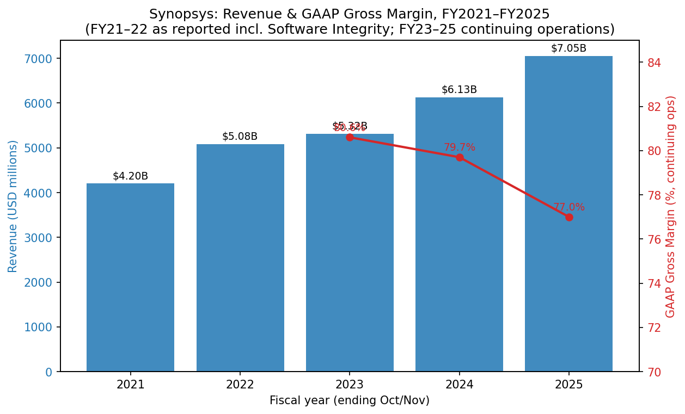
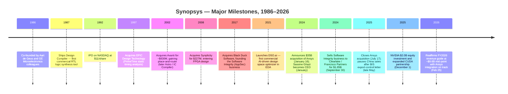
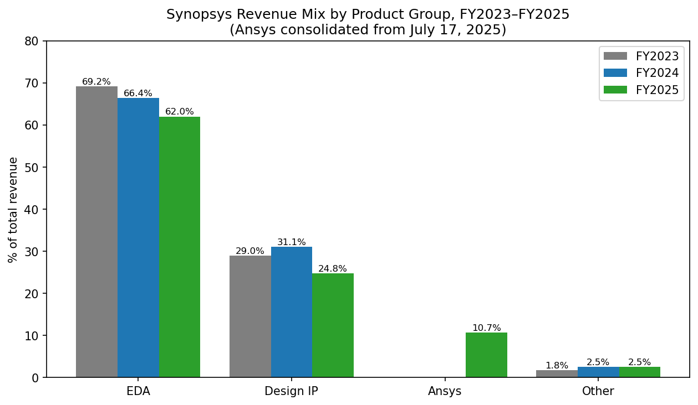
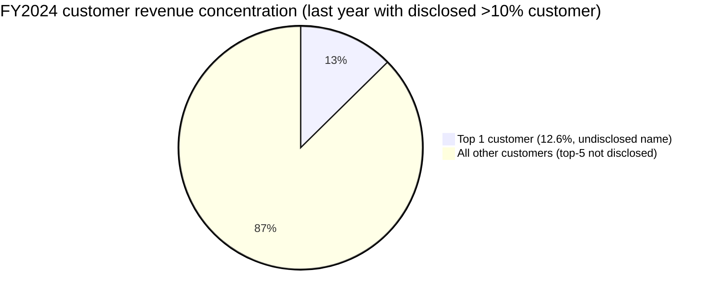
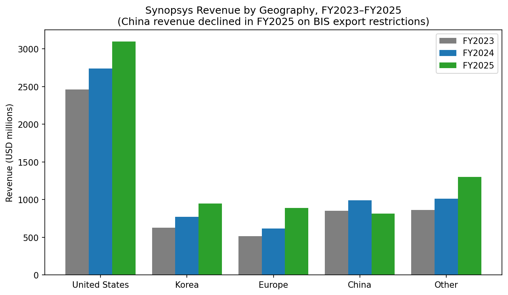
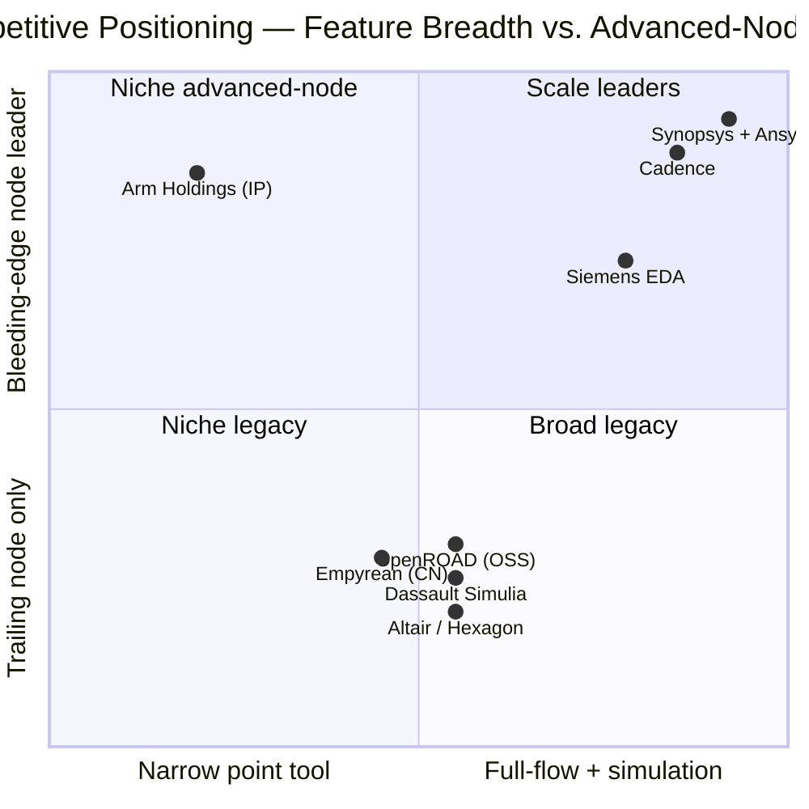
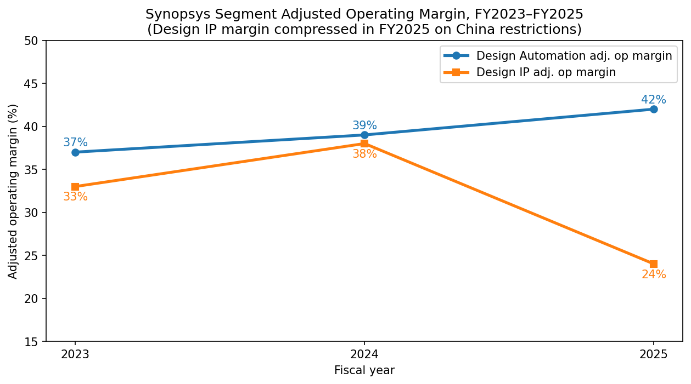

# COMPANY RESEARCH REPORT: Synopsys, Inc. (NASDAQ: SNPS)

**Date:** 2026-05-20
**Analyst note:** Synopsys' fiscal year ends on the Saturday nearest October 31. References to "FY2025" mean the year ended October 31, 2025. All figures in USD unless noted.

> **Update — FY2026 revenue guidance reaffirmed at ~$9.61B mid-point (2026-02-25):** Following the close of the $35B Ansys acquisition on July 17, 2025 and a Q1 FY2026 print that came in at the high end of the guided range, management reaffirmed full-year FY2026 revenue guidance at $9,560–9,660M (mid-point $9.61B, including ~$2.9B of expected Ansys revenue) and non-GAAP EPS at $14.38–14.46. This implies ~36% YoY revenue growth vs FY2025's $7,054M, almost entirely Ansys-driven. Stated drivers: "AI-powered system-level and semiconductor R&D" demand and on-track Ansys integration; guidance assumes no further changes to U.S. export controls or the BIS "Entity List."
> Source: [Synopsys Q1-FY2026 earnings release, 2026-02-25](https://www.sec.gov/Archives/edgar/data/0000883241/000119312526071601/d921168dex991.htm).

## TABLE OF CONTENTS
1. Company Overview
2. Company History
3. Management Team
4. Products & Services
5. Customers & Go-to-Market
6. Industry Overview
7. Competitive Landscape
8. Market Opportunity (TAM)
9. Risk Assessment
10. References

---

## 1. Company Overview

Synopsys, Inc. (NASDAQ: SNPS) is the world's largest supplier of electronic design automation (EDA) software and one of two scale leaders in semiconductor design intellectual property (IP). The company describes itself as "the leader in engineering solutions from silicon to systems," a positioning expanded materially in July 2025 when Synopsys completed its ~$35 billion cash-and-stock acquisition of Ansys, Inc., the dominant supplier of physics-based simulation software for mechanical, electromagnetic, fluids, optics, and embedded-software analysis ([Synopsys Completes Acquisition of Ansys press release, 2025-07-17](https://news.synopsys.com/2025-07-17-Synopsys-Completes-Acquisition-of-Ansys)). With Ansys consolidated, Synopsys now serves the full vertical stack from transistor design through full-system multiphysics simulation, addressing a self-estimated $31 billion total addressable market.

**What the company does.** Synopsys sells the mission-critical software, simulation, and reusable circuit IP that semiconductor and systems engineers use to design, verify, manufacture, and validate integrated circuits and the electronic systems that incorporate them. A modern AI accelerator like NVIDIA's Blackwell or a flagship smartphone SoC literally cannot be built without EDA software, of which Synopsys is one of three required vendors (the others being Cadence Design Systems and Siemens EDA). Per the FY2025 10-K, Synopsys reports through two segments — Design Automation (DA) and Design IP — but discloses revenue across four product groups: EDA (62.0% of FY2025 revenue), Design IP (24.8%), Ansys (10.7%, partial-year), and Other (2.5%) ([Synopsys FY2025 10-K, Note 5 Revenue](https://www.sec.gov/Archives/edgar/data/883241/000088324125000028/snps-20251031.htm)).

**How they make money.** The dominant revenue model is multi-year Technology Subscription License (TSL) arrangements, generally two to three years in duration, recognized ratably over the license term. Hardware (emulation/prototyping) and certain IP licenses are recognized at delivery; Ansys software historically mixes time-based subscription and perpetual-plus-maintenance. The company reports three revenue categories in its income statement: time-based products ($3,489.6M in FY2025, 49% of revenue, +8% YoY), upfront products ($2,010.6M, 29%, +12% YoY), and maintenance and service ($1,554.0M, 22%, +41% YoY on the Ansys consolidation). Total revenue grew 15% to $7,054.2M in FY2025 with a GAAP gross margin of 77.0% ([Synopsys FY2025 10-K, MD&A — Revenue](https://www.sec.gov/Archives/edgar/data/883241/000088324125000028/snps-20251031.htm)). The business is heavily recurring: as of January 31, 2026, contracted but unsatisfied performance obligations (backlog) stood at $11.3 billion, of which roughly 47% is expected to convert to revenue in the next twelve months ([Synopsys Q1-FY2026 10-Q, Note on Revenue](https://www.sec.gov/Archives/edgar/data/883241/000088324126000014/snps-20260131.htm)).

**Where they operate.** Synopsys is headquartered at 675 Almanor Avenue, Sunnyvale, California, and operates globally with sales and engineering offices across the United States, Canada, Europe, Israel, Japan, China, Korea, India, and Taiwan ([Synopsys FY2025 10-K, Item 1 Business](https://www.sec.gov/Archives/edgar/data/883241/000088324125000028/snps-20251031.htm)). Geographic revenue mix in FY2025: United States $3,100.1M (44%), Korea $947.0M (13%), Europe $888.5M (13%), China $814.3M (12%), Other $1,304.2M (18%). China revenue declined ~18% year-on-year in FY2025 — from $989.5M in FY2024 — primarily reflecting the U.S. Bureau of Industry and Security ("BIS") export-control letters of late May 2025 that compelled Synopsys to pause certain semiconductor design software shipments to Chinese customers (the so-called "Q3 2025 BIS Restrictions") ([Synopsys FY2025 10-K, MD&A — Impact of Global Trade Policy](https://www.sec.gov/Archives/edgar/data/883241/000088324125000028/snps-20251031.htm)).

**How large are they.** FY2025 revenue of $7.054 billion (continuing operations), GAAP net income of $1.336 billion ($8.07 diluted EPS), non-GAAP net income of $2.138 billion ($12.91 diluted EPS) ([Synopsys Q4 & FY2025 earnings release, 2025-12-10](https://www.sec.gov/Archives/edgar/data/0000883241/000119312525314200/d29055dex991.htm)). Workforce: approximately 28,000 employees at fiscal-year-end 2025, up roughly 40% year-over-year primarily from the Ansys merger; ~75% are engineers; voluntary turnover was 5.7% ([Synopsys FY2025 10-K, Human Capital](https://www.sec.gov/Archives/edgar/data/883241/000088324125000028/snps-20251031.htm)). Cash, cash equivalents, and short-term investments were $3.0 billion as of October 31, 2025; the company issued $14.3 billion of new Senior Notes plus Term Loan borrowings to fund the Ansys cash consideration, lifting interest expense to $446.7M in FY2025 from $36.8M in FY2024.

**Valuation snapshot.** As of mid-May 2026, SNPS traded at approximately $516 per share, with a market capitalization in the $96–99 billion range and a TTM P/E of ~78.6× and TTM P/S of ~11.0× ([Synopsys SNPS — Yahoo Finance, May 2026](https://finance.yahoo.com/quote/SNPS/)). The 52-week range is $365.74–$651.73 ([stockanalysis.com — SNPS Statistics, May 2026](https://stockanalysis.com/stocks/snps/statistics/)). The closest comparable, Cadence Design Systems (NASDAQ: CDNS), trades at a similar nosebleed multiple (~$93–100B market cap; TTM P/E ~81.9× per [Fullratio CDNS PE history](https://fullratio.com/stocks/nasdaq-cdns/pe-ratio); TTM P/S ~16.7× per [stockanalysis.com — CDNS Statistics](https://stockanalysis.com/stocks/cdns/statistics/)). The S&P 500 IT sector median P/E sits in the mid-30s range, so SNPS and CDNS both trade at roughly 2× the sector median.

*Source: [Synopsys FY2025 10-K — Consolidated Statements of Income & Note 19 Segment Disclosure](https://www.sec.gov/Archives/edgar/data/883241/000088324125000028/snps-20251031.htm); FY21–22 figures from [Synopsys FY2022 10-K](https://www.sec.gov/Archives/edgar/data/883241/000088324122000017/snps-20221031.htm) and [FY2021 10-K](https://www.sec.gov/Archives/edgar/data/883241/000088324121000022/snps-20211030.htm) and include the now-divested Software Integrity business; FY23–25 reflect continuing operations only.*

**Why is the multiple stretched?** The TTM P/E reflects three compounding effects, none of which is a "value trap" red flag but each of which matters: (1) GAAP earnings in FY2025 were depressed by ~$816M of acquired-intangible amortization, $254.8M of acquisition/divestiture costs, $446.7M of interest expense on Ansys debt, and a $121.6M unrealized loss on settled treasury-rate locks — i.e., the numerator (price) reflects a forward earnings power the denominator (TTM GAAP EPS of $6.35) does not yet capture ([Synopsys FY2025 10-K — MD&A and Note 18](https://www.sec.gov/Archives/edgar/data/883241/000088324125000028/snps-20251031.htm)). On management's $14.38–14.46 non-GAAP EPS guide for FY2026, the forward P/E compresses to ~36× ([Synopsys Q1-FY2026 earnings release, 2026-02-25](https://www.sec.gov/Archives/edgar/data/0000883241/000119312525314200/d29055dex991.htm)). (2) The market is paying an AI-design premium — EDA is the literal toolchain for every advanced AI chip, and customer R&D budgets are accelerating despite cyclicality elsewhere in semis. NVIDIA's $2.0 billion private-placement equity investment in Synopsys at $414.79/share on December 1, 2025, formalizing a multi-year CUDA/Omniverse partnership, is the cleanest market signal of this premium ([NVIDIA and Synopsys Announce Strategic Partnership, 2025-12-01](https://news.synopsys.com/2025-12-01-NVIDIA-and-Synopsys-Announce-Strategic-Partnership-to-Revolutionize-Engineering-and-Design)). (3) EDA is structurally an oligopoly with 90%-plus combined share among three players and effectively no new entrants in twenty-five years, supporting durable pricing power. The downside symmetry — what would compress a ~78× multiple back to the sector median — is taken up in Section 9.

---

## 2. Company History

Synopsys was founded as "Optimal Solutions" in 1986 inside the General Electric Microelectronics Center in Research Triangle Park, North Carolina, by Aart J. de Geus and a team of fellow GE researchers. The founding insight was that automated logic synthesis — turning a high-level register-transfer-level (RTL) description into a gate-level netlist — could displace the manual schematic work that then defined chip design. Synopsys was incorporated in December 1986 and shipped its first product, Design Compiler, in 1987. Aart de Geus has served on the Synopsys board continuously since inception and as CEO from 1994 through January 2024, when he transitioned to Executive Chair to make way for Sassine Ghazi ([Synopsys FY2025 10-K, Information about Executive Officers](https://www.sec.gov/Archives/edgar/data/883241/000088324125000028/snps-20251031.htm)).

*Source: timeline assembled from [Synopsys FY2025 10-K](https://www.sec.gov/Archives/edgar/data/883241/000088324125000028/snps-20251031.htm), [Synopsys Completes Acquisition of Ansys, 2025-07-17](https://news.synopsys.com/2025-07-17-Synopsys-Completes-Acquisition-of-Ansys), and [NVIDIA-Synopsys Partnership Announcement, 2025-12-01](https://news.synopsys.com/2025-12-01-NVIDIA-and-Synopsys-Announce-Strategic-Partnership-to-Revolutionize-Engineering-and-Design).*

**Strategic pivots.** Three pivots define modern Synopsys. The *first* was the early-2000s acquisition spree culminating in the 2002 Avanti deal, which transformed Synopsys from a synthesis specialist into a full-flow ("RTL-to-GDSII") provider competing toe-to-toe with Cadence. The *second*, from roughly 2011 onward, was the expansion into semiconductor IP through DesignWare — recognizing that as design teams shrank and chip complexity exploded, customers would increasingly buy reusable building blocks rather than design every block in-house. By FY2025 the Design IP segment generated $1.75B in revenue, second only to Arm Holdings among IP licensors. The *third* and ongoing pivot is the AI-driven full-stack expansion announced through DSO.ai (2021), Synopsys.ai (2023), and culminated by the Ansys acquisition (2025) — repositioning the company from "EDA vendor" to "engineering solutions from silicon to systems" addressing physics-based simulation across mechanical, electromagnetic, fluids, and optical domains.

**Key acquisitions (2017–2025).** Black Duck Software (2017, software composition analysis — later divested as part of Software Integrity in 2024); Cigital and Coverity prior years (also bundled into Software Integrity); Avanti (2002, place-and-route); Magma Design Automation (2012, $507M); Coverity (2014); Numetrics (2007); ChipEDA, SiliconSmart, multiple sensor / IP tuck-ins; OpenLight (joint venture spun out in 2022 and later divested with the Optical Solutions Group); and the company-defining Ansys merger (July 17, 2025, ~$35B). On the divestiture side, Synopsys sold its Software Integrity business on September 30, 2024 for $1.65 billion to Clearlake Capital and Francisco Partners, recording a pre-tax gain of ~$860 million, and divested its Optical Solutions Group to Keysight Technologies on October 17, 2025 — both moves to focus the post-Ansys portfolio ([Synopsys FY2025 10-K, Note 3 Discontinued Operations](https://www.sec.gov/Archives/edgar/data/883241/000088324125000028/snps-20251031.htm)).

**Recent developments (last 12 months).** The dominant story is the Ansys integration: $23.4 billion of goodwill added in FY2025, $756.6M of partial-year Ansys revenue contribution, and Sassine Ghazi's team now organizing toward a "first integrated capabilities" delivery in 1H FY2026. The second story is the May–July 2025 China export-control episode: on May 29, 2025, Synopsys received a BIS letter requiring it to halt certain EDA shipments to China customers, suspending its FY2025 guidance ([Tom's Hardware coverage, 2025-05-30](https://www.tomshardware.com/tech-industry/semiconductors/chip-design-software-giant-pauses-china-sales-and-suspends-financial-guidance-synopsys-slams-the-brakes-as-washington-issues-fresh-crackdown-on-semiconductor-software-exports)); restrictions were partially clarified in July and the company resumed selective shipments while building out compliance workflows. The third story is governance refresh — Peter Shimer (former Deloitte interim CEO) joined the board on February 19, 2026; Luis Borgen and Ajei Gopal will not stand for re-election at the 2026 annual meeting ([Synopsys Appoints Peter Shimer to Board, 2026-02-19](https://www.sec.gov/Archives/edgar/data/0000883241/000119312526059438/d78071dex991.htm)).

---

## 3. Management Team

### Sassine Ghazi — President and Chief Executive Officer

Sassine Ghazi, age 55, became CEO of Synopsys in January 2024 after a 26-year career inside the company that took him from applications engineer to COO to chief executive — exactly the kind of internally-promoted, technical-track CEO that historically defines successful EDA leadership. Per the FY2025 10-K, Ghazi joined Synopsys in March 1998 as an applications engineer and "held a series of sales positions with increasing responsibility, culminating in leadership of worldwide strategic accounts." Prior to becoming COO in August 2020, he was general manager for all digital and custom products — the largest business group inside the company, encompassing Design Compiler, Fusion Compiler, IC Compiler II, and the custom analog flow. Before Synopsys he was a design engineer at Intel Corporation. He holds a bachelor's in Business Administration from Lebanese American University, a B.S.E.E. from Georgia Tech (1993), and an M.S.E.E. from the University of Tennessee (1995) ([Synopsys FY2025 10-K, Executive Officers](https://www.sec.gov/Archives/edgar/data/883241/000088324125000028/snps-20251031.htm)).

What Ghazi specifically accomplished as COO matters more than the title chronology. During his August 2020–January 2024 COO tenure, Synopsys revenue grew from $3.69B (FY2020) to $5.84B (FY2023) — roughly 58% cumulative, ~16% CAGR — while operating income expanded faster than revenue. He owned the field organization that closed Synopsys' largest-ever multi-year deals with hyperscaler customers during the AI buildout, and he sponsored the DSO.ai launch in 2021. As CEO he is the architect of two defining bets: the $35 billion Ansys acquisition (announced two weeks after his promotion) and the NVIDIA strategic partnership / $2B equity investment closed December 2025. Both are explicit "platform" bets — Ansys widens the addressable surface from silicon design into multiphysics and the NVIDIA tie-up establishes Synopsys as the preferred software partner on CUDA-accelerated design infrastructure. Ghazi's public-speaking pattern in earnings calls and the 10-K letter emphasizes "silicon to systems" — a deliberate reframing that, if it lands, justifies Synopsys' continued premium multiple. His ownership stake is not separately disclosed outside the proxy, but per the 2026 DEF 14A he was granted equity awards consistent with Synopsys' standard CEO compensation architecture (the bulk of pay is performance-based equity).

The risk in the CEO story is that Ghazi has now been CEO for only ~28 months, immediately undertook the largest EDA acquisition in history, and must integrate a company whose product lines (mechanical FEA, CFD, optics) overlap minimally with Synopsys' historical core. The 10-K specifically warns that "we may not realize the full anticipated benefits of the Ansys Merger" and notes additional restructuring charges of $118.3M in Q1 FY2026 tied to the integration ([Synopsys Q1-FY2026 10-Q, Consolidated Statements of Income](https://www.sec.gov/Archives/edgar/data/883241/000088324126000014/snps-20260131.htm)). His first major integration test arrives in 1H FY2026 when the first "fused" Synopsys-Ansys product capabilities are scheduled to ship.

### Aart J. de Geus — Co-founder and Executive Chair

Dr. Aart de Geus, age 71, co-founded Synopsys in December 1986 and has served on the board continuously since inception. He was CEO from 1994 to 2012, Co-CEO with Dr. Chi-Foon Chan from May 2012 to April 2022, sole CEO from April 2022 to January 2024, and Executive Chair since January 2024. He also serves on the board of directors of Applied Materials (since July 2007). Education: M.S.E.E. from the Swiss Federal Institute of Technology Lausanne and a Ph.D. in Electrical Engineering from Southern Methodist University ([Synopsys FY2025 10-K, Executive Officers](https://www.sec.gov/Archives/edgar/data/883241/000088324125000028/snps-20251031.htm); [Aart J. de Geus, Wikipedia](https://en.wikipedia.org/wiki/Aart_de_Geus)). As Executive Chair, de Geus retains substantial influence over long-term strategic decisions and customer-facing engagements while delegating day-to-day execution to Ghazi. He filed a Rule 10b5-1 trading arrangement on October 14, 2025 covering up to 74,641 shares through October 2026 ([Synopsys FY2025 10-K, Item 9B Insider Trading Arrangements](https://www.sec.gov/Archives/edgar/data/883241/000088324125000028/snps-20251031.htm)).

### Shelagh Glaser — Chief Financial Officer

Shelagh Glaser, age 61, has served as CFO since December 2022. Prior to Synopsys, Glaser was CFO of Zendesk, Inc. from May 2021 to November 2022 (through the take-private to Hellman & Friedman / Permira). Earlier, she spent ~22 years at Intel Corporation, where she served as Corporate Vice President, CFO and COO for Intel's Data Platform Group (July 2019 – May 2021) and as Corporate Vice President / CFO and senior finance roles within the Client Computing Group (December 2013 – July 2019). She is a director and Audit Committee member of PubMatic, Inc. since June 2022. Education: B.A. in Economics, University of Michigan; M.B.A. in Finance, Carnegie Mellon University ([Synopsys FY2025 10-K, Executive Officers](https://www.sec.gov/Archives/edgar/data/883241/000088324125000028/snps-20251031.htm)).

The CFO-specific bet here is debt execution. Glaser raised $14.3 billion of fresh debt (Senior Notes plus Term Loan) to fund the Ansys cash consideration — Synopsys' first material leverage event in its 39-year history. The structure includes a five-year interest-rate hedge that settled at a $121.6M unrealized loss in FY2025 (reported in the cash-flow reconciliation), and management has publicly committed to "rapid deleveraging over a period of two years" ([Synopsys Completes Acquisition of Ansys, 2025-07-17](https://news.synopsys.com/2025-07-17-Synopsys-Completes-Acquisition-of-Ansys)). Free-cash-flow generation of ~$1.9 billion guided for FY2026 makes the deleveraging path mechanically credible if Ansys revenue tracks plan. Glaser's Intel pedigree — large, complex-deal capital allocation — is the right CV for the moment.

### Mike Ellow — Chief Revenue Officer

Mike Ellow, age 62, joined Synopsys as CRO in November 2025 — a notable hire because he came directly from running Synopsys' largest competitor. Per the 10-K, Ellow was the Chief Executive Officer of Siemens EDA (the rebranded Mentor Graphics) from June 2024 to November 2025, and before that EVP of EDA Global Sales, Services and Customer Support at Siemens from January 2021. He started his career in sales at Cadence Design Systems in 1997, spent ~13 years there, joined Berkeley Design Automation in 2011, and moved into Siemens / Mentor via the 2017 Siemens-Mentor acquisition. He holds a B.S.E.E. from Lehigh, an M.S.E.E. from USC, and an M.B.A. from Cal State Fullerton ([Synopsys FY2025 10-K, Executive Officers](https://www.sec.gov/Archives/edgar/data/883241/000088324125000028/snps-20251031.htm)). Hiring the head of Siemens EDA into the CRO seat is a clean competitive signal — Ellow knows the Siemens playbook, the cross-tool bake-off cycles, and the specific accounts where Synopsys vs. Siemens vs. Cadence sit head-to-head.

### Governance

The board consists of 11 directors as of the 2026 DEF 14A filing, including Sassine Ghazi (CEO), Aart de Geus (Executive Chair), Ajei Gopal (former Ansys CEO, not standing for re-election at the 2026 annual meeting), Ravi Vijayaraghavan (former Ansys board member), and Peter Shimer (joined February 2026, audit committee). Luis Borgen also will not be renominated for re-election ([Synopsys Appoints Peter Shimer to Board, 2026-02-19](https://www.sec.gov/Archives/edgar/data/0000883241/000119312526059438/d78071dex991.htm)). Independent directors form a majority; CEO and Chair roles are separated (de Geus is Executive Chair, not independent). Insider ownership at the executive level is not heavy in absolute terms — typical for a 39-year-old public company without supervoting structure — but the LinkedIn / Form 4 filings indicate Ghazi, Glaser, and de Geus have meaningful equity exposure relative to base compensation. Compensation is heavily performance-equity weighted; the company maintains a clawback policy and conducted shareholder advisory ("say-on-pay") vote with passing results. Stock repurchase authorization was replenished to $2.0 billion in February 2026.

### Management track record assessment

This is a deep, technically-grounded executive bench. Ghazi is a 26-year insider with a credible operating track record from his COO tenure; de Geus' continued role provides institutional continuity through the largest portfolio expansion in company history; Glaser brings the right CFO profile for an investment-grade levered transition; and the Ellow hire is the most competitively interesting move on the senior team. The single biggest open question is execution risk on the Ansys integration — a deal that, even priced at the announcement multiple of ~$35B, has to deliver both revenue synergies and cost discipline in a market segment (multiphysics simulation) where Synopsys has limited operating muscle memory.

---

## 4. Products & Services

Synopsys' product portfolio splits cleanly between EDA software (the historical core), Design IP (semiconductor IP blocks the customer drops into a chip), and — post-July 2025 — Ansys' physics-based simulation tools. The website walk below mirrors the navigation on synopsys.com.

```mermaid
graph TD
    A[Synopsys] --> B[Design Automation Segment]
    A --> C[Design IP Segment]
    B --> D[EDA — Digital Design]
    B --> E[EDA — Custom & Analog]
    B --> F[EDA — Verification]
    B --> G[EDA — Manufacturing & Test]
    B --> H[EDA — System Design / FPGA]
    B --> I[Ansys — Simulation & Analysis]
    D --> D1[Fusion Compiler — RTL-to-GDSII]
    D --> D2[Design Compiler / DC NXT]
    D --> D3[IC Compiler II / 3DIC Compiler]
    D --> D4[PrimeTime — static timing signoff]
    E --> E1[Custom Compiler]
    E --> E2[HSPICE / FineSim / PrimeSim]
    F --> F1[VCS — logic simulation]
    F --> F2[Verdi — debug]
    F --> F3[ZeBu — emulation hardware]
    F --> F4[HAPS — FPGA prototyping]
    G --> G1[IC Validator — physical verification]
    G --> G2[Proteus / S-Litho — mask synthesis]
    G --> G3[TestMAX — DFT and ATPG]
    H --> H1[Synplify Pro / Premier]
    H --> H2[Platform Architect]
    I --> I1[Mechanical / Structural FEA]
    I --> I2[Fluids / CFD — Fluent, CFX]
    I --> I3[Electromagnetics — HFSS, Maxwell]
    I --> I4[Semiconductor — RedHawk-SC, Totem]
    I --> I5[Embedded — SCADE, medini]
    C --> J[Interface IP — PCIe, DDR, MIPI, USB, Ethernet]
    C --> K[Foundation IP — logic libs, memory compilers, SRAM, OTP]
    C --> L[Security IP — Root of Trust, cryptography]
    C --> M[Processor IP — ARC CPU, DSP, NPU]
    C --> N[IP Subsystems — ARC Data Fusion, IP Accelerated]
    C --> O[Verification IP — AMBA, Ethernet, MIPI VIP]
```

*Source: assembled from the [Synopsys product navigation tree at synopsys.com](https://www.synopsys.com/) and the [DesignWare IP catalog page](https://www.synopsys.com/en-us/designware-ip.html), cross-checked against the FY2025 10-K Item 1 Business description.*

### Design Automation — EDA Core

**Digital Implementation (Fusion Design Platform).** Synopsys' flagship full-flow product is **Fusion Compiler**, an RTL-to-GDSII implementation engine integrating synthesis, place-and-route, and signoff in a single data model ([Fusion Compiler product page](https://www.synopsys.com/implementation-and-signoff/physical-implementation/fusion-compiler.html)). It targets advanced-node (3nm / 2nm / Angstrom-era) digital chips for hyperscaler, AI accelerator, and mobile SoC customers. The legacy **Design Compiler** (synthesis) and **IC Compiler II** (place-and-route) remain available for customers who prefer separate engines. **3DIC Compiler** addresses multi-die / chiplet integration — increasingly the dominant package architecture for AI accelerators. *Competitive advantage: yes (technology / IP).* Fusion Compiler is widely regarded — by named customers including Intel, Samsung, and most leading hyperscaler chip teams — as offering best-in-class power-performance-area (PPA) at 5nm and below; AI-driven optimization via DSO.ai materially compresses turnaround time vs. competing flows. *Closest competitor:* Cadence Innovus Implementation System (at parity on many digital flows, behind at the bleeding-edge nodes per most foundry-published benchmarks).

**Static Timing Signoff (PrimeTime).** **PrimeTime** is the de facto industry-standard static timing analysis (STA) signoff tool — virtually every advanced-node chip taped out in the last twenty years has been signed off with PrimeTime ([PrimeTime — Static Timing Analysis](https://www.synopsys.com/implementation-and-signoff/signoff/primetime.html)). *Competitive advantage: yes (very high — switching costs, ecosystem lock-in, certification with all major foundries).* This is arguably Synopsys' single deepest moat: foundries publish design rules and PDKs validated against PrimeTime, EDA validation flows assume PrimeTime golden, and customer engineering flows have decades of accumulated scripts/methodologies wrapped around it. *Closest competitor:* Cadence Tempus Timing Solution — technically capable but commercially marginal in advanced-node digital signoff.

**Custom / Analog (Custom Compiler, PrimeSim).** **Custom Compiler** is the schematic-driven analog/mixed-signal design environment; **PrimeSim** (consolidating the legacy HSPICE, FineSim, and CustomSim brands) provides SPICE-class circuit simulation. *Competitive advantage: partial.* Synopsys is strong but Cadence Virtuoso has historically dominated custom IC design layout, particularly outside hyperscaler digital workflows; Synopsys has been gaining share at advanced nodes but Virtuoso remains the default for analog-heavy customers. *Closest competitor:* Cadence Virtuoso (ahead in pure-play analog/custom layout).

**Verification (VCS, Verdi, ZeBu).** **VCS** is the industry-leading logic simulator for RTL functional verification; **Verdi** is the dominant debug environment; **ZeBu** is hardware emulation hardware that runs at billions of cycles per day, used by every major hyperscaler / chip vendor for pre-silicon validation of AI accelerators and CPUs; **HAPS** provides FPGA-based prototyping ([Synopsys EDA verification family](https://www.synopsys.com/verification.html)). *Competitive advantage: yes (technology and scale).* Verification — particularly emulation hardware — is a duopoly between Synopsys ZeBu and Cadence Palladium; the two players essentially divide the market roughly evenly with installed bases at every Tier-1 customer. Synopsys VCS retains the largest simulator share. *Closest competitor:* Cadence Xcelium (simulation), Palladium Z3 (emulation) — at parity to slightly ahead on raw emulation capacity per dollar in current generation.

**Manufacturing & Test (Proteus, IC Validator, TestMAX).** Synopsys provides mask-data-prep / OPC software (**Proteus**, **S-Litho**), physical verification (**IC Validator**), and DFT/ATPG test (**TestMAX**). *Competitive advantage: partial.* Strong but not uncontested: Siemens EDA's Calibre is the dominant physical verification / DRC tool industry-wide — a Synopsys gap. *Closest competitor:* Siemens Calibre (ahead in PV/DRC).

**System Design / FPGA (Synplify, Platform Architect).** **Synplify Pro / Premier** dominates FPGA synthesis; **Platform Architect** addresses early-architecture SoC modeling. Niche by revenue but high-margin.

### Design IP — DesignWare

Synopsys' Design IP segment (FY2025 revenue: $1.752B, 24.8% of total) sells pre-validated, foundry-characterized circuit blocks that customers integrate into their own chip designs. The portfolio spans **Interface IP** (PCIe Gen6/7, DDR5/LPDDR5X, MIPI, USB, HDMI, Ethernet 800G/1.6T), **Foundation IP** (standard-cell logic libraries, memory compilers including SRAM, register files, ROM, OTP, NVM), **Security IP** (Root of Trust, post-quantum cryptographic accelerators, embedded SIM), **Processor IP** (the ARC family of CPUs, DSPs, and NPU cores acquired from ARC International in 2010), and **IP Subsystems** including the ARC Data Fusion IP Subsystem for sensor processing ([DesignWare IP overview](https://www.synopsys.com/en-us/designware-ip.html)). *Competitive advantage:* mixed across the portfolio. Interface IP is genuinely best-in-class — Synopsys has the largest catalog of foundry-validated PCIe / DDR / USB IP at advanced nodes, and these are the building blocks every hyperscaler chip requires. Foundation IP and memory compilers are at parity with Cadence and the foundry-internal libraries. Processor IP (ARC) is materially behind Arm in CPU and behind Cadence Tensilica in DSP. *Closest competitor:* Cadence IP (Tensilica + Denali + acquired blocks) overall; Arm Holdings for processor IP.

The Design IP segment had a difficult FY2025 — revenue declined 8% to $1,752M from $1,906M and adjusted operating margin compressed from 38% to 24%. Management attributed the decline to "China export control restrictions, such as the Q3 2025 BIS Restrictions, weaker than expected demand from a major foundry customer, and certain roadmap and resource decisions that did not yield their intended results" ([Synopsys FY2025 10-K, Segment Results](https://www.sec.gov/Archives/edgar/data/883241/000088324125000028/snps-20251031.htm)). The combination of (i) a single-customer demand reset, (ii) export restrictions on a meaningful subset of customers, and (iii) self-admitted roadmap errors makes this segment the single most visible execution risk in the FY2026 thesis.

### Ansys (consolidated into Design Automation post-July 17, 2025)

The Ansys portfolio adds physics-based simulation across mechanical/structural FEA (Ansys Mechanical), CFD (Fluent, CFX), electromagnetic (HFSS, Maxwell, Q3D), semiconductor power/EM integrity (RedHawk-SC, Totem — these overlap with Synopsys' own RedHawk product line acquired via Ansys), optical (Speos, Zemax), embedded software (SCADE, medini), and systems-of-systems (Ansys Twin Builder). *Competitive advantage: yes (technology and scale).* Ansys is the dominant general-purpose physics simulation vendor; closest direct competitors are Siemens Simcenter (formerly CD-adapco/STAR-CCM+) in CFD, Dassault Systèmes' Simulia (Abaqus) in mechanical, and Altair HyperWorks across multiple physics. Synopsys recognized $756.6M of Ansys revenue in partial-year FY2025 and guides $2.9B of Ansys revenue in FY2026 ([Synopsys Q4 & FY2025 earnings release, 2025-12-10](https://www.sec.gov/Archives/edgar/data/0000883241/000119312525314200/d29055dex991.htm)).

### Flagship vs. long-tail

The 1–3 products that drive the business are unambiguously: **Fusion Compiler / IC Compiler II** (digital implementation, the largest single SKU family by revenue), **PrimeTime** (signoff, the highest-margin and most defensible product), and **VCS + ZeBu** (verification, including emulation hardware which contributed material upfront-revenue growth in FY2025). Within IP, **interface IP** (PCIe and DDR families) is the flagship, with security IP a fast-growth follower. Ansys flagship products are **Fluent, HFSS, and Mechanical**.

### Last-12-month launches, sunsets, and repositioning

- **Sunset/divestiture:** Software Integrity (the AppSec business — Black Duck, Coverity, Defensics) divested September 30, 2024 to Clearlake/Francisco Partners for $1.65B.
- **Sunset/divestiture:** Optical Solutions Group divested to Keysight Technologies on October 17, 2025; PowerArtist RTL business also divested. Combined revenue impact in FY2026 is ~$110M.
- **Launch:** "Synopsys.ai" full-stack AI suite covering DSO.ai, VSO.ai (verification), ASO.ai (analog), TSO.ai (test) — full launch through 2024–2025.
- **Launch (planned):** First integrated Synopsys-Ansys "fused" capabilities targeting multi-die advanced packaging, scheduled for 1H FY2026 ([Synopsys Completes Acquisition of Ansys, 2025-07-17](https://news.synopsys.com/2025-07-17-Synopsys-Completes-Acquisition-of-Ansys)).
- **Partnership-driven roadmap:** GPU-accelerated EDA — Synopsys committed in December 2025 to porting compute-intensive flows (physical verification, RC extraction, electromagnetic simulation, optical analysis) to NVIDIA CUDA, with NVIDIA investing $2B at $414.79/share ([NVIDIA-Synopsys Strategic Partnership, 2025-12-01](https://news.synopsys.com/2025-12-01-NVIDIA-and-Synopsys-Announce-Strategic-Partnership-to-Revolutionize-Engineering-and-Design)).

*Source: [Synopsys FY2025 10-K, Note 5 Revenue Disaggregation](https://www.sec.gov/Archives/edgar/data/883241/000088324125000028/snps-20251031.htm).*

---

## 5. Customers & Go-to-Market

Synopsys serves essentially every semiconductor company of scale in the world plus a long tail of systems and aerospace/defense customers via the Ansys business. The 10-K describes the addressable customer base as ranging "from semiconductor and systems customers across a wide range of industries" — in practice, this means every hyperscaler with an internal silicon team (Alphabet, Amazon, Meta, Microsoft, Apple), every merchant semi (NVIDIA, AMD, Intel, Qualcomm, Broadcom, Marvell, MediaTek), every leading foundry (TSMC, Samsung Foundry, Intel Foundry, GlobalFoundries, UMC, SMIC where licensable), every advanced IDM (Samsung, SK hynix, Micron), and every major IP licensee.

**Customer concentration — quantified.** Per the FY2025 10-K (Note 19, Segment Disclosure), "One customer, including its subsidiaries, accounted for 12.6% and 13.5% of our consolidated revenue in fiscal 2024 and fiscal 2023, respectively. No customer accounted for over 10% of our accounts receivable as of October 31, 2025, and October 31, 2024" ([Synopsys FY2025 10-K, Note 19 Segment Disclosure](https://www.sec.gov/Archives/edgar/data/883241/000088324125000028/snps-20251031.htm)). Notably, the 10-K is silent on whether any customer exceeded 10% in FY2025 itself, implying that no customer crossed the 10% threshold in FY2025 — likely a function of (a) Ansys revenue being added to the consolidated denominator (~$757M of partial-year revenue), and (b) potential softness in the largest pre-existing customer's spend (Synopsys called out "weaker than expected demand from a major foundry customer" in the Design IP segment). Synopsys does not name the >10% customer. Market consensus, based on triangulating Design IP customer disclosures, foundry partner lists, and industry coverage, is that the historical 10%+ customer is most likely TSMC, given Synopsys' deep IP-foundry alignment, though this is not company-confirmed.

*Source: [Synopsys FY2025 10-K, Note 19 Segment Disclosure](https://www.sec.gov/Archives/edgar/data/883241/000088324125000028/snps-20251031.htm). Synopsys does not disclose top-5 cumulative customer share; only customers >10% are required to be disclosed under ASC 280-10-50-42.*

The customer-concentration risk is **moderate, not material**: with top-1 below 15% and a documented two-year downtrend (13.5% → 12.6% → likely <10%), Synopsys is not single-customer dependent. Contracts are structured as multi-year TSL master agreements with sub-orders, generally two to three years in duration with annual escalators and automatic renewal language — meaningfully higher visibility than PO-by-PO models. The most acute concentration risk is geographic (China) and segment-specific (Design IP foundry exposure), not single-customer.

**Distribution channels and sales motion.** Synopsys sells direct to end customers globally through a regional sales force; there is effectively no channel / reseller layer for primary EDA software because deals are large ($1M–$100M+ TSL contracts negotiated bilaterally with customer procurement and CTO/CDO offices). Sales cycle for greenfield customers is typically 6–18 months; renewals are negotiated 6–9 months ahead of contract end. The deal architecture commonly bundles EDA software, IP licenses, and emulation hardware into Flexible Spending Account ("FSA") arrangements where the customer commits a total dollar value and pulls down specific product mix during the term — a structure that helps Synopsys lock in multi-year spend while giving customers flexibility on tool mix. Backlog of $11.3B at January 31, 2026 includes $1.9B of non-cancellable FSA commitments ([Synopsys Q1-FY2026 10-Q](https://www.sec.gov/Archives/edgar/data/0000883241/000088324126000014/snps-20260131.htm)).

**Key partnerships.** The NVIDIA strategic partnership and $2.0B equity investment announced December 1, 2025 is the single most consequential go-to-market move in Synopsys' modern history — it ties Synopsys' compute-intensive workflows directly to NVIDIA CUDA, positions Synopsys as the default EDA partner on accelerated computing infrastructure, and creates a natural cross-sell motion as NVIDIA-built reference systems propagate through hyperscaler chip teams ([NVIDIA and Synopsys Announce Strategic Partnership, 2025-12-01](https://news.synopsys.com/2025-12-01-NVIDIA-and-Synopsys-Announce-Strategic-Partnership-to-Revolutionize-Engineering-and-Design)). Beyond NVIDIA, Synopsys maintains deep foundry partnerships — formal "Reference Flows" and PDK certification programs with TSMC, Samsung Foundry, Intel Foundry, GlobalFoundries, UMC, and others — that are critical for ensuring Synopsys tools are pre-validated for new process nodes on day one. Cloud partnerships include the EDA SaaS offering with Microsoft Azure (the industry's first), plus availability of EDA workloads on AWS and Google Cloud.

**Customer case studies (named wins).** Synopsys does not regularly disclose named customer wins in filings, but recent partnership press releases name Intel (process-node co-development), Samsung Foundry (3DIC and SF2 reference flows), Arm (joint IP/EDA optimization), NVIDIA (Blackwell-era and beyond), and Microsoft (Azure cloud EDA SaaS). For Ansys, named customers historically include Boeing, GM, Ford, GE, every major aerospace and defense prime, and every Tier-1 automotive OEM.

---

## 6. Industry Overview

**Industry definition.** Electronic Design Automation (EDA) is the software, hardware, and services used to design, verify, manufacture, and validate integrated circuits and the electronic systems that incorporate them. The broader "engineering simulation" industry — which Synopsys-with-Ansys now spans — adds physics-based simulation across mechanical, electromagnetic, fluid, thermal, optical, and embedded-software domains. NAICS classifications include 511210 (Software Publishers) and 541512 (Computer Systems Design Services). The adjacent semiconductor IP industry (NAICS 511210 / 541512 partial) is increasingly viewed as part of the same value chain.

**Market size and structure.** Estimates for the 2024–2025 global EDA software market range from $14.5B to $19.2B depending on scope and methodology — variance is largely driven by whether the source includes semiconductor IP, professional services, and hardware (emulation) or only pure EDA software ([Electronic Design Automation Software Market — Precedence Research, 2025](https://www.precedenceresearch.com/electronic-design-automation-software-market); [EDA Software Industry Analysis — IBISWorld, 2025](https://www.ibisworld.com/united-states/industry/electronic-design-automation-software-developers/4540/)). Combined with Ansys' ~$2.5B physics-simulation pre-deal revenue, the Synopsys-defined TAM is now ~$31 billion (Synopsys management estimate, 2023 vintage) — explicitly cited in the Ansys closing release ([Synopsys Completes Acquisition of Ansys, 2025-07-17](https://news.synopsys.com/2025-07-17-Synopsys-Completes-Acquisition-of-Ansys)).

**Growth rates.** Historical EDA growth has been mid-to-high single digits over 2015–2022 with acceleration to low double digits 2022–2025 as the AI infrastructure buildout pulled forward chip design starts. Forecasted CAGR through 2030–2032 sits in the 10–12% range across multiple third-party forecasts ([Electronic Design Automation Market Size & Forecast to 2032 — Persistence Market Research](https://www.persistencemarketresearch.com/market-research/electronic-design-automation-eda-market.asp)). The AI-physics-simulation tailwind suggests upside vs. these baselines — Ansys' segment growth in particular has reaccelerated as digital-twin demand from automotive, aerospace, and high-tech sectors compounds.

**Key trends and drivers.**

1. *AI-driven chip design.* Hyperscaler custom silicon (Google TPU, Amazon Trainium, Microsoft Cobalt, Meta MTIA), merchant AI (NVIDIA, AMD MI series), and a flood of AI-accelerator startups have materially expanded the number of chip designs in flight and the EDA dollar spend per design. Synopsys management has consistently called this the dominant tailwind in 2024–2025.
2. *AI as a tool inside EDA.* Synopsys.ai and Cadence's Cerebrus and JedAI have shifted EDA from rules-driven optimization to ML-driven design-space exploration, compressing turnaround time by 30–50% on representative blocks and supporting price-mix uplift as customers adopt premium AI-enabled tiers.
3. *Advanced-node and multi-die.* 3nm production ramped in 2024, 2nm samples in 2025–2026, and chiplet/2.5D/3D architectures (CoWoS at TSMC, I-Cube at Samsung) require entirely new toolchains for thermal, timing, signal-integrity, and mechanical co-design — playing directly into the Synopsys-Ansys "silicon to systems" thesis.
4. *Cloud and SaaS EDA.* Microsoft Azure–Synopsys partnership, AWS / Google Cloud EDA AMIs, and emerging burst-compute and ML-acceleration workloads on cloud GPUs are shifting customer infrastructure budgets toward consumption-based models, with EDA SaaS arrangements still <10% of industry revenue but growing fastest.
5. *Geopolitical bifurcation.* The May 2025 BIS export-control letters and prior 2022/2023 EAR-Sec 744.17 restrictions have effectively partitioned the EDA market into a "US/allies" tier where Synopsys / Cadence / Siemens compete freely and a "China" tier where shipments are constrained — particularly to entity-listed customers (SMIC, YMTC, CXMT, Huawei HiSilicon and affiliates). Chinese domestic EDA (Empyrean, Primarius, Semitronix, X-Epic) is rapidly building scale but remains years behind on advanced nodes.

**Regulatory environment.** The dominant regulatory factor is U.S. export control. The May 23–29, 2025 BIS letters added semiconductor design software to the list of items requiring export licenses for specified Chinese customers, forcing Synopsys to pause certain shipments and suspend FY2025 guidance ([Tom's Hardware, 2025-05-30](https://www.tomshardware.com/tech-industry/semiconductors/chip-design-software-giant-pauses-china-sales-and-suspends-financial-guidance-synopsys-slams-the-brakes-as-washington-issues-fresh-crackdown-on-semiconductor-software-exports)). Secondary regulatory pressures include data-localization laws (EU, China, India), antitrust scrutiny of EDA-IP consolidation (the FTC and EU Commission both reviewed and cleared the Ansys deal with limited divestiture remedies including the PowerArtist RTL business sale), and AI-specific governance — the EU AI Act, U.S. executive orders on AI safety — which affect Synopsys' embedded-AI tooling but are not yet revenue-material.

**Industry dynamics.** EDA is one of the most consolidated software industries in technology. Effective market share among the three primary EDA vendors as of 2024–2025: **Synopsys ~31%, Cadence ~30%, Siemens EDA ~13%**, leaving ~26% to specialty point-tool vendors, semiconductor IP-only firms, and Chinese domestic players ([Leading Companies in the Global EDA Market — Intellectual Market Insights, 2025](https://www.intellectualmarketinsights.com/blogs/leading-companies-in-the-global-electronic-design-automation-market-2025)). Supplier power is moderate (a small number of skilled algorithm engineers worldwide; foundry process-tech intelligence is uniquely concentrated). Buyer power is structurally moderate-low — switching costs are enormous for any customer above a few designs, design teams' tools are tightly integrated with methodologies and scripts accumulated over years, and the three vendors are mostly required (most leading customers buy from at least two of three, often all three, to avoid single-source risk). Barriers to entry are essentially impassable for a full-flow new entrant — Synopsys, Cadence, and the Mentor lineage have each invested 30+ years and tens of billions of dollars of R&D. Substitutes are negligible for advanced-node chip design; only the lowest-end / educational / FPGA-only segment sees meaningful open-source competition (e.g., OpenROAD, Yosys, Verilator).

*Source: [Synopsys FY2025 10-K, Note 19 Segment Disclosure — Geographic Information](https://www.sec.gov/Archives/edgar/data/883241/000088324125000028/snps-20251031.htm).*

---

## 7. Competitive Landscape

The EDA industry is a textbook three-player oligopoly with a long tail of point-tool and IP-only specialists. Synopsys' direct, indirect, and emerging competitors break down as follows.

**Cadence Design Systems (NASDAQ: CDNS) — primary competitor across nearly the entire portfolio.** Cadence is roughly the same revenue scale as Synopsys (FY2024 revenue ~$4.6B; market cap ~$93–100B in May 2026). Cadence's strengths include Virtuoso (analog/custom layout — ahead of Synopsys Custom Compiler), Innovus (digital P&R — at parity with IC Compiler II), Tempus (timing signoff — behind PrimeTime), Xcelium / Palladium (verification — at parity to slightly ahead in current-generation emulation), Allegro (PCB design — Synopsys is not in PCB), and Sigrity (signal/power integrity). On AI tools, Cadence Cerebrus (analogous to Synopsys DSO.ai) is competitive but Synopsys.ai has the broader product surface. Cadence acquired BETA CAE Systems in 2024 ($1.2B mechanical-CAE), giving it a small Ansys-like simulation footprint vastly smaller than Synopsys' $35B Ansys acquisition. Cadence trades at a ~82× TTM P/E and ~17× TTM P/S ([Cadence Design Systems — stockanalysis.com](https://stockanalysis.com/stocks/cdns/statistics/)).

**Siemens EDA (subsidiary of Siemens AG; the rebranded Mentor Graphics).** ~13% market share. Strengths: Calibre (physical verification — the industry standard, materially ahead of Synopsys IC Validator and Cadence Pegasus), Catapult (high-level synthesis), Veloce (emulation — competitive), Questa (simulation — third place behind VCS and Xcelium), and PCB design. Siemens' embed-into-industrial-software strategy via the broader Siemens Digital Industries Software (Simcenter, Teamcenter, NX) is the most differentiated competitive vector against Synopsys-with-Ansys. The June 2024 promotion of Mike Ellow to Siemens EDA CEO and his subsequent November 2025 move *to Synopsys* as CRO is one of the most consequential leadership shifts in the industry in a decade.

**Arm Holdings (LSE/Nasdaq: ARM).** Direct competitor in CPU IP only; not in EDA. Arm is materially larger than Synopsys ARC in CPU IP, with ~$3B+ FY2024 revenue and effectively the entire mobile and substantial datacenter footprint. Synopsys does not compete on Arm-class CPUs but does compete in DSP, NPU, and security IP.

**Ansys legacy competitors (now indirectly Synopsys competitors via the merger).** Dassault Systèmes (Simulia/Abaqus, CATIA — direct mechanical/structural and PLM overlap; ~€6B revenue), Siemens Simcenter (CFD/structural/electromagnetic — direct overlap), Altair Engineering (HyperWorks — broad multiphysics overlap; ~$650M revenue, acquired by Siemens in early 2025 for ~$10B), Hexagon (smaller multiphysics overlap), MathWorks (Simulink in the model-based design tier, adjacent rather than overlapping), and PTC (Creo and post-2023 Ansys-Workbench-adjacent positioning).

**Chinese domestic EDA / IP players (emerging).** Empyrean Technology (Beijing-listed 688521), Primarius Technologies, Semitronix, X-Epic, and Cerebrum collectively still account for the low-single-digit percentage of the China EDA market — most reports peg the Big Three (Synopsys, Cadence, Siemens) at ~78–80% of China EDA spend even in 2024 ([Leading Companies in the Global EDA Market, 2025](https://www.intellectualmarketinsights.com/blogs/leading-companies-in-the-global-electronic-design-automation-market-2025)). Chinese players are growing 30–50% YoY off a small base, prioritized by Beijing's industrial policy and direct state funding through the China IC Industry Investment Fund. The May 2025 BIS restrictions both materially impair Synopsys' China revenue near-term *and* accelerate domestic substitution by removing the Big Three's tools from sensitive Chinese customers — a structural negative even after specific restrictions are clarified.

**Open-source / point-tool challengers.** OpenROAD (DARPA-funded full RTL-to-GDSII flow, used by academic and select industrial teams; minimal commercial impact), Yosys (open-source synthesis), Verilator (open-source SystemVerilog simulator widely used for cycle-accurate simulation), Magic / KLayout (open-source layout). These are educational and niche-commercial in nature; they do not compete for the advanced-node customer dollar but exert minor pricing pressure at the low end.

*Source: positioning chart constructed from public market-share estimates and product-feature reviews including [Leading Companies in the Global EDA Market, 2025](https://www.intellectualmarketinsights.com/blogs/leading-companies-in-the-global-electronic-design-automation-market-2025) and [Synopsys FY2025 10-K competitive description](https://www.sec.gov/Archives/edgar/data/883241/000088324125000028/snps-20251031.htm). Coordinates are qualitative.*

**Synopsys' competitive advantages.** *PrimeTime ecosystem lock-in* (deepest single moat — every advanced foundry calibrates against PrimeTime), *broadest IP catalog* (only Synopsys and Cadence offer end-to-end interface IP at 3nm/2nm), *the only full silicon-to-systems portfolio post-Ansys*, *AI-tool maturity* (DSO.ai at industrial scale since 2021), and *the NVIDIA CUDA partnership* which structurally aligns the most-important compute platform of the next decade with Synopsys' tool roadmap.

**Synopsys' competitive vulnerabilities.** *Physical verification gap* (Siemens Calibre remains the industry standard, an unsolved competitive sore), *custom/analog layout gap* (Cadence Virtuoso is genuinely ahead), *Design IP segment softness* (FY2025 revenue decline and margin compression suggest execution and product-portfolio issues that are not yet resolved), *Ansys integration execution* (multiphysics simulation customers have different procurement cycles, sales motions, and competitive landscapes than EDA — the synergy thesis requires Synopsys to build a sales motion it has never previously needed), and *China revenue downside risk* (~12% of FY2025 revenue, structurally exposed to further BIS / entity list expansion).

*Source: [Synopsys FY2025 10-K, Note 19 Segment Disclosure](https://www.sec.gov/Archives/edgar/data/883241/000088324125000028/snps-20251031.htm).*

---

## 8. Market Opportunity (TAM)

Synopsys' self-disclosed TAM, used in the Ansys closing release, is **$31 billion** based on 2023 management estimates ([Synopsys Completes Acquisition of Ansys, 2025-07-17](https://news.synopsys.com/2025-07-17-Synopsys-Completes-Acquisition-of-Ansys)). This is comprised of approximately three pieces, which I reconstruct from the company's own segment definitions and third-party industry sizing:

- **EDA software (core) — approximately $16–19 billion in 2024–2025**, growing roughly 10–12% CAGR through 2030. Multiple independent estimates cluster around this range: $19.2B (2025 estimate, [Precedence Research](https://www.precedenceresearch.com/electronic-design-automation-software-market)), $14.55B (alternative, narrower scope), and $17.2B (2024) per the Persistence Market Research forecast that targets $37.8B by 2032 at a 10.5% CAGR ([EDA Market Size & Forecast — Persistence Market Research](https://www.persistencemarketresearch.com/market-research/electronic-design-automation-eda-market.asp)).
- **Semiconductor IP — approximately $7–8 billion in 2024**, growing 10–13% CAGR. Synopsys and Cadence collectively account for the majority of merchant interface and foundation IP; Arm dominates CPU IP. Synopsys' Design IP segment delivered $1.75B in FY2025 (down 8% YoY but a multi-year up-trend pre-FY2025).
- **Physics-based simulation (Ansys core) — approximately $6–8 billion in 2024**, growing 8–11% CAGR. Combined Ansys + Dassault Simulia + Siemens Simcenter + Altair + Hexagon Manufacturing Intelligence is the addressable base; Ansys had ~30%+ share pre-merger.

Combined, the bottoms-up math lands ~$29–35B, broadly consistent with Synopsys management's $31B framing.

**SAM (Serviceable Addressable Market).** Synopsys is a credible full-flow vendor across essentially the entire TAM: it can plausibly serve every dollar in EDA, the merchant interface/foundation/security IP portion (~$5B of the $7–8B IP TAM, excluding Arm CPU IP and Tensilica DSP IP where Cadence dominates), and effectively all of Ansys' historical addressable footprint. Practical SAM is therefore on the order of $28–30B.

**SOM (Serviceable Obtainable Market).** Today, Synopsys' SOM is essentially equivalent to its current revenue run-rate plus the integration synergies — i.e., the $9.6B FY2026 revenue guide represents ~31% share of the ~$31B TAM, broadly matching Cadence (~30%) and well ahead of Siemens EDA (~13%). The most credible incremental SOM growth vector is (a) wallet-share expansion at AI-accelerator and hyperscaler customers, where chip-design intensity is increasing 15–25% YoY; (b) physics-simulation cross-sell into chip-design customers (Ansys penetration into semiconductor R&D budgets is currently low — most Ansys revenue today is from automotive/aerospace/industrial); and (c) defensive market-share retention vs. Chinese domestic substitutes in non-restricted product categories.

**Market growth projections.** A reasonable composite scenario: ~$31B 2024 TAM → ~$50B 2030 TAM at ~9–10% CAGR. At constant ~30% share, this implies a steady-state Synopsys revenue trajectory toward ~$15B by 2030, vs. the FY2026 guide of $9.6B — i.e., the math supports a continued 8–10% organic growth rate for the next five years, before considering further AI / multi-die / cloud-EDA tailwinds. The ~10% CAGR baseline matches the consensus of [Precedence Research](https://www.precedenceresearch.com/electronic-design-automation-software-market), [Persistence Market Research](https://www.persistencemarketresearch.com/market-research/electronic-design-automation-eda-market.asp), and [Mordor Intelligence](https://www.mordorintelligence.com/industry-reports/electronic-design-automation-eda-tools-market).

**Penetration strategy.** The post-Ansys strategy emphasizes three vectors: (1) deepen advanced-node share at hyperscaler and merchant AI chip teams, with NVIDIA CUDA acceleration as the leading-edge product wedge; (2) cross-sell Ansys simulation into the semiconductor design segment, where multiphysics is increasingly relevant for thermal, electromagnetic, and mechanical co-design of multi-die packages; and (3) expand cloud / SaaS consumption-based offerings via the Microsoft Azure partnership and selective expansion to AWS / GCP. The principal risk to the penetration story is China — both as a near-term revenue drag and as a multi-year share-loss vector if domestic substitutes mature faster than the BIS framework eases.

---

## 9. Risk Assessment

### Company-Specific Risks

**1. Ansys integration execution risk (high severity / moderate-to-high likelihood).** The $35B Ansys acquisition is the largest deal in EDA history and ~3× Synopsys' next-largest historical acquisition. Synergy realization requires combining two engineering organizations of comparable scale, harmonizing GTM motions across semiconductor and industrial/aerospace customer bases, and delivering a credible "fused" product roadmap in 1H FY2026. The FY2025 10-K explicitly warns that "we may not realize the full anticipated benefits" and recorded $254.8M of acquisition/divestiture costs and $118.3M of additional restructuring charges in Q1 FY2026 alone ([Synopsys Q1-FY2026 10-Q](https://www.sec.gov/Archives/edgar/data/0000883241/000088324126000014/snps-20260131.htm)). Mitigants: experienced internal leadership team retained from Ansys (Ajei Gopal as outgoing board member, Janet Lee as GC), modest geographic/product overlap reduces antitrust unwind risk, and disciplined integration program announced.

**2. Design IP segment underperformance (high severity / elevated likelihood of persistence into FY2026).** Design IP revenue declined 8% in FY2025 and adjusted operating margin compressed from 38% to 24%. Three causes — China restrictions, weaker foundry-customer demand, and "certain roadmap and resource decisions that did not yield their intended results" — are partially structural and partially self-inflicted ([Synopsys FY2025 10-K MD&A](https://www.sec.gov/Archives/edgar/data/883241/000088324125000028/snps-20251031.htm)). Management has begun reallocating resources to higher-growth opportunities but expects "muted growth" in fiscal 2026. Mitigants: Design IP is structurally a 25%-of-revenue segment, so even a flat-to-down FY2026 still allows total revenue to grow on Ansys and EDA strength.

**3. Customer concentration — moderate, evaluated explicitly.** One customer accounted for 12.6% of consolidated revenue in FY2024 (13.5% in FY2023); FY2025 figure is undisclosed but implied <10%. Three-year trend is downward, indicating diversification. Contract structure is multi-year master-agreement / FSA, providing visibility. Threshold check: top-1 is below the 20% "material" line and well below the 30% "high" line per the project's risk taxonomy. Risk remains because the top customer is plausibly a foundry whose chip-design volume is structurally tied to semiconductor cyclicality. Mitigants: backlog of $11.3B (Jan 2026) and FSA non-cancellable commitments of $1.9B provide cushion against any single-customer reset.

**4. Key person dependency on Sassine Ghazi.** Ghazi is only ~28 months into the CEO role, was the principal architect of the Ansys deal, and is leading the most consequential platform integration in company history. Ghazi has no announced 10b5-1 plan filed during the most recent fiscal year per the 10-K, suggesting committed-to-role posture, but the dependency on his execution through the FY2026–FY2027 integration window is high. Mitigants: Aart de Geus remains as Executive Chair, providing institutional continuity and strategic backstop.

**5. China revenue and geopolitical risk (high severity / high likelihood of further disruption).** China was $814M (11.5%) of FY2025 revenue, down from $989.5M (16.1%) in FY2024 on BIS export controls. Further restrictions, entity-list additions, or retaliatory measures by China (export controls on rare earth or advanced-packaging materials affecting Synopsys' customers) could compress China revenue further or trigger broader semiconductor demand softness. Mitigants: declining concentration (already cut as a % of revenue in FY2025) and broad customer base across the rest of the world.

**6. Supplier / labor concentration (low-moderate severity).** Synopsys' "supplier" base is principally talent — algorithm engineers with deep computational geometry and EDA-specific expertise. The supply is genuinely scarce globally and concentrated in a handful of regions (Silicon Valley, Bangalore, Shanghai, Shenzhen, Yerevan, Tel Aviv). The Ansys deal materially expanded the talent pool but also introduced retention risk. Mitigants: 5.7% voluntary turnover in FY2025, equity-heavy compensation, multiple global engineering hubs.

### Industry / Market Risks

**7. Competitive intensity — high but stable.** The three-player oligopoly has been remarkably stable for two decades, but Cadence is at parity or ahead in multiple product categories (Virtuoso, Innovus, Palladium emulation in current gen), and Siemens EDA's Calibre dominance in physical verification remains a Synopsys gap. The Mike Ellow CRO hire from Siemens is a defensive talent move. Risk of share loss in any single year is low (switching costs are immense) but pricing-power compression is plausible if Cadence's product gap continues to close.

**8. Technology disruption — AI changes the EDA tool itself.** Both Synopsys.ai and Cadence's Cerebrus / JedAI represent the early innings of AI-driven design automation. If a startup or open-source effort delivered a step-change improvement in chip-design productivity (e.g., a generative-AI synthesis tool achieving 30% PPA improvement at zero incremental compute), the EDA premium pricing structure could be challenged. Currently very low probability but high severity tail risk. Mitigants: Synopsys' decade-long head start on EDA-specific ML, the NVIDIA CUDA partnership, and the data network effects from running customer workflows.

**9. Regulatory change — U.S. export controls and antitrust.** Beyond the May 2025 BIS letters, further escalation of U.S.–China tech controls (e.g., extending restrictions to broader EDA categories or to additional Chinese customers via entity-list expansion) is the most acute regulatory risk. Antitrust: the FTC and EU Commission have already approved the Ansys deal with limited remedies, so further antitrust risk is principally on future tuck-in M&A.

**10. Market saturation — limited in the medium term.** EDA is structurally an under-penetrated market relative to the value it enables (R&D spend in the customers it serves is many multiples of EDA tool budgets), but the segment is mature and large customers are sophisticated negotiators. Pricing-power upside is real but bounded. Not a near-term thesis killer.

### Financial Risks

**11. Valuation / multiple-compression risk — material.** TTM P/E of ~78× and TTM P/S of ~11× both sit at roughly 2× the IT sector median. Forward P/E compresses to ~36× on FY2026 management guidance ([SNPS — Yahoo Finance](https://finance.yahoo.com/quote/SNPS/)). The premium is defensible *if* (a) Ansys integration delivers on synergy targets, (b) AI-design intensity continues to drive 10%+ organic growth, and (c) China revenue stabilizes. De-rate triggers: miss vs. FY2026 guidance, a second BIS letter materially extending restrictions, integration synergy delay, or a sector rotation out of AI-adjacent compute names. Per the project's risk taxonomy thresholds (P/E > 2× sector median triggers a valuation risk callout), this risk is explicitly flagged.

**12. Leverage and interest expense.** Synopsys raised $14.3B of fresh debt to fund the Ansys cash consideration, lifting FY2025 interest expense to $446.7M from $36.8M in FY2024 ([Synopsys FY2025 10-K MD&A](https://www.sec.gov/Archives/edgar/data/883241/000088324125000028/snps-20251031.htm)). Management has guided to "rapid deleveraging over a period of two years" supported by ~$1.9B of FY2026 guided free cash flow. Mitigants: investment-grade rating, FCF generation, and a structurally low capex business model. Risk if FCF disappoints or interest rates spike.

**13. FX exposure.** Synopsys reports in USD but has material non-USD revenue (Europe, Korea, Japan) and non-USD costs (international engineering hubs). The 10-K Q&A states a 10% Euro depreciation would generate a ~$3.4M loss on forward contracts plus offsetting impact on Euro-based operating expenses ([Synopsys FY2025 10-K, Item 7A Quantitative Disclosures](https://www.sec.gov/Archives/edgar/data/883241/000088324125000028/snps-20251031.htm)) — i.e., FX exposure exists but is actively hedged and not a thesis driver.

### Macroeconomic Risks

**14. Semiconductor industry cyclicality.** Synopsys revenue is well-insulated relative to the broader semiconductor cycle (multi-year TSL contracts ratably recognized), but very deep downturns historically have produced a 1–2 year lag effect on EDA revenue and sharper effects on upfront IP and hardware (emulation) shipments. The current AI-driven design intensity is partially offsetting the more cyclical downstream chip-demand patterns.

**15. Interest rate sensitivity.** With $14.3B+ of new floating- and fixed-rate debt, Synopsys is more rate-sensitive than at any prior point in its history. A 100bp rise in funding costs on the floating-rate portion would meaningfully compress free-cash-flow available for deleveraging. Mitigant: management entered interest-rate hedges in early FY2025 (settled at a $121.6M unrealized loss but locked in subsequent debt economics).

**16. Geopolitical (broader than China).** Tail risks include Taiwan-related disruption to TSMC and the broader Asian semiconductor supply chain, conflict-related risk to engineering hubs in Israel (Synopsys has significant Israel headcount via legacy acquisitions), and any further escalation of U.S.–Europe trade friction. Not a near-term thesis driver but the tail is non-trivial.

---

## 10. References

### SEC EDGAR — Synopsys Filings
- [Synopsys FY2025 Annual Report on Form 10-K (filed December 2025)](https://www.sec.gov/Archives/edgar/data/883241/000088324125000028/snps-20251031.htm)
- [Synopsys Q1-FY2026 Quarterly Report on Form 10-Q (filed February 2026)](https://www.sec.gov/Archives/edgar/data/883241/000088324126000014/snps-20260131.htm)
- [Synopsys 2026 DEF 14A Proxy Statement](https://www.sec.gov/Archives/edgar/data/883241/000088324126000007/)
- [Synopsys FY2022 10-K (used for FY21 / FY22 prior-period revenue)](https://www.sec.gov/Archives/edgar/data/883241/000088324122000017/snps-20221031.htm)
- [Synopsys FY2021 10-K (used for FY20 / FY21 prior-period revenue)](https://www.sec.gov/Archives/edgar/data/883241/000088324121000022/snps-20211030.htm)
- [Synopsys 8-K — Director-Officer Change (Peter Shimer board appointment), 2026-02-19](https://www.sec.gov/Archives/edgar/data/0000883241/000119312526059438/d78071dex991.htm)
- [Synopsys 8-K — Q1 FY2026 Earnings Press Release, 2026-02-25](https://www.sec.gov/Archives/edgar/data/0000883241/000119312526071601/d921168dex991.htm)
- [Synopsys 8-K — Q4 / FY2025 Earnings Press Release, 2025-12-10](https://www.sec.gov/Archives/edgar/data/0000883241/000119312525314200/d29055dex991.htm)
- [Synopsys 8-K — NVIDIA Strategic Partnership & $2B Private Placement, 2025-12-01](https://www.sec.gov/Archives/edgar/data/0000883241/000119312525303209/d36680dex991.htm)
- [Synopsys 8-K — Completion of Ansys Acquisition, 2025-07-17](https://www.sec.gov/Archives/edgar/data/0000883241/000114036125026139/ef20051970_ex99-1.htm)

### Company Communications & Website
- [Synopsys Completes Acquisition of Ansys — news release, 2025-07-17](https://news.synopsys.com/2025-07-17-Synopsys-Completes-Acquisition-of-Ansys)
- [NVIDIA and Synopsys Announce Strategic Partnership to Revolutionize Engineering and Design — news release, 2025-12-01](https://news.synopsys.com/2025-12-01-NVIDIA-and-Synopsys-Announce-Strategic-Partnership-to-Revolutionize-Engineering-and-Design)
- [Synopsys IR — Synopsys Completes Acquisition of Ansys](https://investor.synopsys.com/news/news-details/2025/Synopsys-Completes-Acquisition-of-Ansys/default.aspx)
- [Fusion Compiler product page](https://www.synopsys.com/implementation-and-signoff/physical-implementation/fusion-compiler.html)
- [DesignWare Semiconductor IP catalog](https://www.synopsys.com/en-us/designware-ip.html)
- [Synopsys Board of Directors](https://www.synopsys.com/company/corporate-governance-ethics/board-of-directors.html)

### Market Data — Stock Statistics
- [Synopsys (SNPS) Statistics & Valuation — stockanalysis.com](https://stockanalysis.com/stocks/snps/statistics/)
- [Synopsys (SNPS) — Yahoo Finance](https://finance.yahoo.com/quote/SNPS/)
- [Cadence Design Systems (CDNS) Statistics & Valuation — stockanalysis.com](https://stockanalysis.com/stocks/cdns/statistics/)
- [CDNS PE Ratio History — Fullratio](https://fullratio.com/stocks/nasdaq-cdns/pe-ratio)

### Industry Research
- [Electronic Design Automation Software Market — Precedence Research, 2025](https://www.precedenceresearch.com/electronic-design-automation-software-market)
- [Electronic Design Automation Market Size & Forecast to 2032 — Persistence Market Research](https://www.persistencemarketresearch.com/market-research/electronic-design-automation-eda-market.asp)
- [Electronic Design Automation Tools Market — Mordor Intelligence](https://www.mordorintelligence.com/industry-reports/electronic-design-automation-eda-tools-market)
- [EDA Software Industry Analysis — IBISWorld, 2025](https://www.ibisworld.com/united-states/industry/electronic-design-automation-software-developers/4540/)
- [Leading Companies in the Global EDA Market — Intellectual Market Insights, 2025](https://www.intellectualmarketinsights.com/blogs/leading-companies-in-the-global-electronic-design-automation-market-2025)

### News and Trade Press (last 12 months)
- [Synopsys Pauses China Sales Amid New Chip Design Export Controls — Tom's Hardware, 2025-05-30](https://www.tomshardware.com/tech-industry/semiconductors/chip-design-software-giant-pauses-china-sales-and-suspends-financial-guidance-synopsys-slams-the-brakes-as-washington-issues-fresh-crackdown-on-semiconductor-software-exports)
- [Synopsys closes on $35B Ansys acquisition — RCR Wireless, 2025-07-17](https://www.rcrwireless.com/20250717/test-and-measurement/ansys-acquisition)
- [Nvidia to invest $2 billion in Synopsys — Evertiq, 2025-12-02](https://evertiq.com/design/2025-12-02-nvidia-invest-2-billion-in-synopsys)
- [Synopsys in $2 Billion Private Placement and Strategic Partnership With NVIDIA — Cleary Gottlieb, 2025-12](https://www.clearygottlieb.com/news-and-insights/news-listing/synopsys-in-2-billion-private-placement-and-strategic-partnership-with-nvidia)

### Biographical
- [Aart de Geus — Wikipedia](https://en.wikipedia.org/wiki/Aart_de_Geus)
- [Aart J. de Geus — Applied Materials Board of Directors](https://www.appliedmaterials.com/us/en/about/leadership/board-of-directors/aart-j-de-geus.html)
