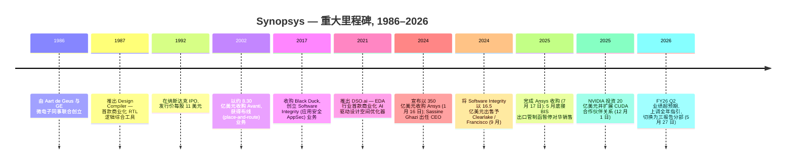
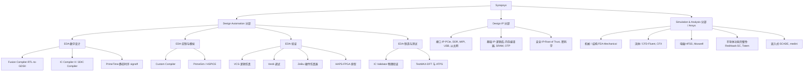
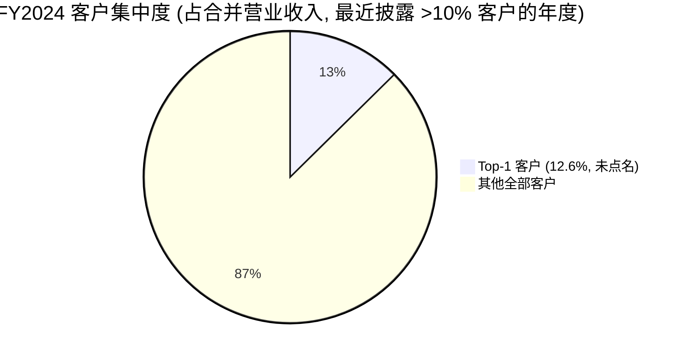
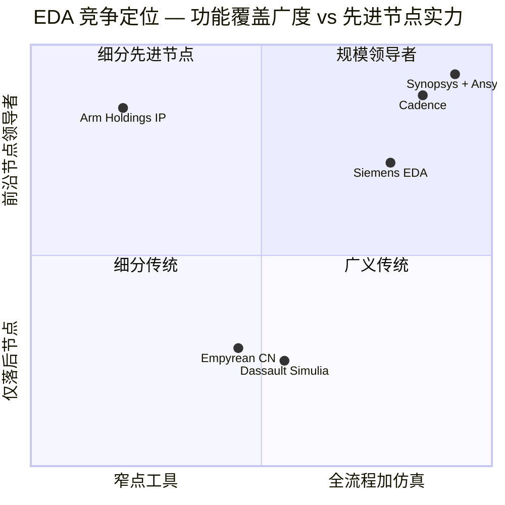

# Synopsys, Inc. (NASDAQ:SNPS) — 公司研究报告

**报告日期 (as of): 2026-06-14**
**上市地: 纳斯达克全球精选市场 (NASDAQ Global Select Market), 代码 SNPS**
**总部: 美国加利福尼亚州 Sunnyvale**
**报告语言: 简体中文 (英文版同时存在于本目录)**
**财年说明:** Synopsys 财年以最接近 10 月 31 日的星期六结束。文中 "2025 财年 (FY2025)" 指截至 2025-10-31 的财年; "2026 财年 Q2 (FY2026 Q2)" 指截至 2026-04-30 的季度。除特别注明外均为美元 (US$)。

---

> ### 投资摘要 (Investment Summary) — *Analyst view:*
>
> | 项目 | 值 |
> |---|---|
> | **评级 (Rating)** | **Hold / 持有** (Equal-weight 一档) |
> | **12 个月目标价 (12-mo PT)** | **US$540** |
> | 当前股价 (as of 2026-06-14) | US$453.89 |
> | **隐含上行空间 (Upside)** | **+19%** |
> | 估值方法 (Method) | FY2027E 非 GAAP EPS ~$17.0 × ~32× forward P/E |
> | 市值 (Market cap) | ~US$86.9bn |
> | 企业价值 (EV) | ~US$95.3bn |
> | 52 周区间 | US$376.18 – US$651.73 |
> | 代码 / 交易所 | NASDAQ:SNPS |
>
> **论点支柱 (Thesis pillars) — *Analyst view:***
> 1. **EDA 寡头中的规模龙头, 受益于 AI 驱动的芯片设计复杂度上行 (structural tailwind)。** 每一颗先进 AI 加速器的设计都离不开 EDA, 客户研发预算同比 +15–25%, 而 PrimeTime signoff 生态绑定是行业最深的单一护城河——这构成持久的定价能力与高经常性收入。
> 2. **350 亿美元 Ansys 收购 (2025-07-17 完成) 把 TAM 从硅片拓宽至 "硅片到系统" 多物理场仿真——但整合执行是核心摆动变量。** 协同兑现可信度尚未完全建立, 短期摊销与利息压低 GAAP 利润。
> 3. **两大结构性逆风压制估值上行: (a) 中国出口管制 (BIS) 持续从需求侧抽水; (b) Design IP 分部 FY25 收入 -8%、利润率压缩, 执行最弱。**
> 4. **估值已计入大量好消息: forward P/E ~26×、P/S ~10×, 约为 IT 板块中位数 2 倍——风险回报对称, 故评级 Hold 而非 Buy。**
>
> *评级、目标价及一切前瞻估计均为本报告分析师观点 (Analyst view), 非来自任何公司文件; 10-K 不含目标价。*

---

## 目录
1. 公司概览 (含 1A 估值与目标价 · 1B GF Score)
2. 估值与目标价 (Valuation & Price Target) — 前瞻模型 + 卖方观点演变
3. 公司历史
4. 管理团队
5. 产品与服务 (含供应链资金流图)
6. 客户与上市策略
7. 行业概览
8. 竞争格局
9. 市场机会 (TAM)
10. 风险评估 (含 9.5 核心分歧与催化剂)
11. 投资者视角评分 (Investor Lenses)
12. 参考资料

---

## 1. 公司概览

Synopsys, Inc. (NASDAQ:SNPS) 是**全球最大的电子设计自动化 (Electronic Design Automation, EDA) 软件供应商**, 也是半导体设计知识产权 (intellectual property, IP) 的两大规模龙头之一。公司将自身定位为 "从硅片到系统的工程解决方案领导者" (the leader in engineering solutions from silicon to systems)——这一定位在 **2025 年 7 月 17 日**以约 350 亿美元现金加股票完成对 **Ansys, Inc.** 的收购后实质性扩展。Ansys 是机械、电磁、流体、光学及嵌入式软件分析领域基于物理 (physics-based) 仿真软件的主导供应商; 收购完成新闻稿明确写道 "Synopsys Completes Acquisition of Ansys... July 17, 2025" 并将合并后总可寻址市场 (Total Addressable Market, TAM) 定为 **310 亿美元** ([Synopsys 8-K — Ansys 收购完成, 2025-07-17](https://www.sec.gov/Archives/edgar/data/0000883241/000114036125026139/ef20051970_ex99-1.htm))。

**业务定位与最新分部结构 (本期新变化)。** Synopsys 销售芯片与系统工程师用于设计、验证、制造与确认集成电路 (Integrated Circuit, IC) 及其构成的电子系统所需的关键任务软件、仿真工具与可复用电路 IP。**关键的本期结构变化是: 自 2026 财年起, Synopsys 由 FY2025 10-K 的 "两个报告分部" (Design Automation + Design IP) 改为 FY2026 Q2 10-Q 披露的 "三个报告分部"——(1) Design Automation (现已并入 Ansys 产品与系统集成)、(2) Design IP、(3) Simulation and Analysis (S&A)** ([Synopsys FY2026 Q2 10-Q, 分部披露, 截至 2026-04-30](https://www.sec.gov/Archives/edgar/data/883241/000088324126000018/snps-20260430.htm))。在产品组维度, 2026 财年 Q2 营业收入分解为: EDA 11.60 亿美元、Design IP 4.54 亿美元、Simulation & Analysis (Ansys) 6.52 亿美元、其他 0.07 亿美元 ([Synopsys 8-K — FY2026 Q2 业绩公告, 2026-05-27](https://www.sec.gov/Archives/edgar/data/0000883241/000119312526241911/d126227dex991.htm))。NVIDIA Blackwell 这类现代 AI 加速器或任何旗舰智能手机 SoC, 离开 EDA 软件根本无法完成设计, 而 Synopsys 是三大必备 EDA 供应商之一 (另两家为 Cadence Design Systems 与 Siemens EDA)。

**盈利模式。** 公司绝大部分营业收入来自**多年期技术订阅许可 (Technology Subscription License, TSL)** 安排, 通常合约期 2–3 年, 在许可期内按比例确认。硬件 (emulation/prototyping) 及部分 IP 在交付时确认; Ansys 软件历史上混合按时订阅与永久许可加维护两种模式。FY2025 总营业收入同比增长 15% 至 **70.542 亿美元** (FY2024 61.274 亿、FY2023 53.180 亿美元), GAAP 毛利率 (gross margin) 约 77.0% ([Synopsys FY2025 10-K, 合并损益表 + MD&A](https://www.sec.gov/Archives/edgar/data/883241/000088324125000028/snps-20251031.htm))。业务高度依赖经常性收入: 截至 **2026-04-30, 已签约但尚未履行的履约义务 (backlog) 约 110 亿美元**, 其中约 **49%** 预计于未来 12 个月内确认为营业收入, 内含 18 亿美元不可取消的灵活支出账户 (Flexible Spending Account, FSA) 承诺 ([Synopsys FY2026 Q2 10-Q, 营业收入附注](https://www.sec.gov/Archives/edgar/data/883241/000088324126000018/snps-20260430.htm))。

**FY2026 Q2 业绩快照 (本期新变化)。** 2026 财年 Q2 (截至 2026-04-30) 营业收入 **22.76 亿美元** (上年同期 16.04 亿美元), 其中约 6.52 亿美元来自 Ansys; 非 GAAP 经营利润率约 39.5%, 非 GAAP 摊薄 EPS 3.35 美元, GAAP EPS 0.09 美元 (仍受加速重组费用影响) ([Synopsys FY2026 Q2 10-Q, 合并损益表](https://www.sec.gov/Archives/edgar/data/883241/000088324126000018/snps-20260430.htm); [Synopsys 8-K — FY2026 Q2 业绩公告, 2026-05-27](https://www.sec.gov/Archives/edgar/data/0000883241/000119312526241911/d126227dex991.htm))。管理层借此**上调 2026 财年全年指引**: 营业收入 96.25–97.05 亿美元、非 GAAP 经营利润率约 41%、非 GAAP EPS 14.72–14.80 美元 (中值上调 0.34 美元), 自由现金流 (free cash flow, FCF) 指引上调 1 亿美元至约 20 亿美元 ([Synopsys 8-K — FY2026 Q2 业绩公告, 2026-05-27](https://www.sec.gov/Archives/edgar/data/0000883241/000119312526241911/d126227dex991.htm))。

**业务区域。** Synopsys 总部位于美国加州 Sunnyvale, 销售与工程办公室遍布美国、加拿大、欧洲、以色列、日本、中国大陆、韩国、印度及台湾 ([Synopsys FY2025 10-K, Item 1 业务](https://www.sec.gov/Archives/edgar/data/883241/000088324125000028/snps-20251031.htm))。FY2025 地区营业收入: 美国 31.01 亿美元 (44%)、韩国 9.470 亿 (13%)、欧洲 8.885 亿 (13%)、中国 8.143 亿 (12%)、其他 13.042 亿 (18%)。**中国营业收入同比下滑约 18%** (由 FY2024 的 9.895 亿美元), 主要反映 2025 年 5 月底美国商务部工业安全局 (Bureau of Industry and Security, BIS) 出口管制函件迫使 Synopsys 暂停向部分中国客户出货某些半导体设计软件 ([Synopsys FY2025 10-K, MD&A — 全球贸易政策影响](https://www.sec.gov/Archives/edgar/data/883241/000088324125000028/snps-20251031.htm))。

**公司规模。** FY2025 营业收入 70.54 亿美元 (持续经营), GAAP 经营利润 9.149 亿美元 (因 Ansys 摊销与并购费用同比下降, FY2024 为 13.557 亿), 持续经营业务归属 Synopsys 净利润 13.36 亿美元 ([Synopsys FY2025 10-K, 合并损益表](https://www.sec.gov/Archives/edgar/data/883241/000088324125000028/snps-20251031.htm))。**员工约 28,000 人** (FY2025 末, 同比增约 40%, 主要因 Ansys 合并), 约 75% 为工程师, 自愿离职率 5.7% ([Synopsys FY2025 10-K, 人力资本](https://www.sec.gov/Archives/edgar/data/883241/000088324125000028/snps-20251031.htm))。截至 2025-10-31, 现金及短期投资约 30 亿美元; 为支付 Ansys 现金对价共发行约 143 亿美元新优先票据 (Senior Notes) 加定期贷款 (Term Loan), 使 FY2025 利息费用由 FY2024 的 3,680 万美元跃升至 4.467 亿美元——这是公司 39 年历史首次实质性杠杆事件。

下图为 FY2025 GAAP 损益表的资金流向 (income-statement Sankey): 营业收入如何经 COGS、研发 (R&D)、销售管理 (SG&A) 与收购无形资产摊销, 最终落到经营利润与净利润。

<svg xmlns="http://www.w3.org/2000/svg" viewBox="0 0 1000 560" width="1000" height="560" role="img" aria-label="income statement Sankey"><rect x="0" y="0" width="1000" height="560" fill="#ffffff"/>
<text x="20.00" y="30.00" text-anchor="start" font-family="Helvetica,Arial,sans-serif" font-size="15" font-weight="700" fill="#1f2933">Synopsys 损益表流向 (Income Statement) — FY2025 (GAAP, US$M)</text>
<path d="M 452.00,78.00 C 506.00,78.00 506.00,101.59 560.00,101.59 L 560.00,154.50 C 506.00,154.50 506.00,130.92 452.00,130.92 Z" fill="#86efac" fill-opacity="0.55"/>
<path d="M 452.00,130.92 C 506.00,130.92 506.00,168.50 560.00,168.50 L 560.00,436.58 C 506.00,436.58 506.00,398.99 452.00,398.99 Z" fill="#fca5a5" fill-opacity="0.55"/>
<path d="M 204.00,78.00 C 258.00,78.00 258.00,85.00 312.00,85.00 L 312.00,391.68 C 258.00,391.68 258.00,384.68 204.00,384.68 Z" fill="#93c5fd" fill-opacity="0.55"/>
<path d="M 328.00,85.00 C 382.00,85.00 382.00,78.00 436.00,78.00 L 436.00,392.09 C 382.00,392.09 382.00,399.09 328.00,399.09 Z" fill="#86efac" fill-opacity="0.55"/>
<path d="M 328.00,399.09 C 382.00,399.09 382.00,406.09 436.00,406.09 L 436.00,500.00 C 382.00,500.00 382.00,493.00 328.00,493.00 Z" fill="#fca5a5" fill-opacity="0.55"/>
<path d="M 700.00,94.59 C 754.00,94.59 754.00,250.36 808.00,250.36 L 808.00,327.64 C 754.00,327.64 754.00,171.86 700.00,171.86 Z" fill="#86efac" fill-opacity="0.55"/>
<path d="M 576.00,101.59 C 630.00,101.59 630.00,94.59 684.00,94.59 L 684.00,147.50 C 630.00,147.50 630.00,154.50 576.00,154.50 Z" fill="#86efac" fill-opacity="0.55"/>
<path d="M 576.00,168.50 C 630.00,168.50 630.00,187.34 684.00,187.34 L 684.00,293.98 C 630.00,293.98 630.00,275.14 576.00,275.14 Z" fill="#fca5a5" fill-opacity="0.55"/>
<path d="M 576.00,275.14 C 630.00,275.14 630.00,307.98 684.00,307.98 L 684.00,451.38 C 630.00,451.38 630.00,418.54 576.00,418.54 Z" fill="#fca5a5" fill-opacity="0.55"/>
<path d="M 576.00,418.54 C 630.00,418.54 630.00,465.38 684.00,465.38 L 684.00,483.41 C 630.00,483.41 630.00,436.58 576.00,436.58 Z" fill="#fca5a5" fill-opacity="0.55"/>
<path d="M 204.00,398.68 C 258.00,398.68 258.00,391.68 312.00,391.68 L 312.00,493.00 C 258.00,493.00 258.00,500.00 204.00,500.00 Z" fill="#93c5fd" fill-opacity="0.55"/>
<path d="M 576.00,450.58 C 630.00,450.58 630.00,147.50 684.00,147.50 L 684.00,173.34 C 630.00,173.34 630.00,476.41 576.00,476.41 Z" fill="#93c5fd" fill-opacity="0.55"/>
<rect x="188.00" y="78.00" width="16" height="306.68" rx="1.5" fill="#2563eb"/>
<rect x="188.00" y="398.68" width="16" height="101.32" rx="1.5" fill="#2563eb"/>
<rect x="312.00" y="85.00" width="16" height="408.00" rx="1.5" fill="#1e3a8a"/>
<rect x="436.00" y="78.00" width="16" height="314.09" rx="1.5" fill="#15803d"/>
<rect x="436.00" y="406.09" width="16" height="93.91" rx="1.5" fill="#dc2626"/>
<rect x="560.00" y="101.59" width="16" height="52.92" rx="1.5" fill="#15803d"/>
<rect x="560.00" y="168.50" width="16" height="268.07" rx="1.5" fill="#dc2626"/>
<rect x="560.00" y="450.58" width="16" height="25.84" rx="1.5" fill="#2563eb"/>
<rect x="684.00" y="94.59" width="16" height="78.75" rx="1.5" fill="#15803d"/>
<rect x="684.00" y="187.34" width="16" height="106.64" rx="1.5" fill="#dc2626"/>
<rect x="684.00" y="307.98" width="16" height="143.40" rx="1.5" fill="#dc2626"/>
<rect x="684.00" y="465.38" width="16" height="18.03" rx="1.5" fill="#dc2626"/>
<rect x="808.00" y="250.36" width="16" height="77.28" rx="1.5" fill="#15803d"/>
<text x="179.00" y="228.34" text-anchor="end" font-family="Helvetica,Arial,sans-serif" font-size="11.5" font-weight="700" fill="#1f2933">Design Automation (EDA+Ansys S&amp;A)</text>
<text x="179.00" y="241.34" text-anchor="end" font-family="Helvetica,Arial,sans-serif" font-size="10" font-weight="400" fill="#52606d">US$5.3B  (75.2%)</text>
<text x="179.00" y="446.34" text-anchor="end" font-family="Helvetica,Arial,sans-serif" font-size="11.5" font-weight="700" fill="#1f2933">Design IP</text>
<text x="179.00" y="459.34" text-anchor="end" font-family="Helvetica,Arial,sans-serif" font-size="10" font-weight="400" fill="#52606d">US$1.8B  (24.8%)</text>
<rect x="331.00" y="67.00" width="113.10" height="26" rx="2" fill="#ffffff" fill-opacity="0.72"/>
<text x="334.00" y="79.00" text-anchor="start" font-family="Helvetica,Arial,sans-serif" font-size="11.5" font-weight="700" fill="#1f2933">Revenue</text>
<text x="334.00" y="92.00" text-anchor="start" font-family="Helvetica,Arial,sans-serif" font-size="10" font-weight="400" fill="#52606d">US$7.1B  (100.0%)</text>
<rect x="455.00" y="60.00" width="106.80" height="26" rx="2" fill="#ffffff" fill-opacity="0.72"/>
<text x="458.00" y="72.00" text-anchor="start" font-family="Helvetica,Arial,sans-serif" font-size="11.5" font-weight="700" fill="#1f2933">Gross Profit</text>
<text x="458.00" y="85.00" text-anchor="start" font-family="Helvetica,Arial,sans-serif" font-size="10" font-weight="400" fill="#52606d">US$5.4B  (77.0%)</text>
<rect x="455.00" y="388.09" width="144.60" height="26" rx="2" fill="#ffffff" fill-opacity="0.72"/>
<text x="458.00" y="400.09" text-anchor="start" font-family="Helvetica,Arial,sans-serif" font-size="11.5" font-weight="700" fill="#1f2933">Cost of Revenue (COGS)</text>
<text x="458.00" y="413.09" text-anchor="start" font-family="Helvetica,Arial,sans-serif" font-size="10" font-weight="400" fill="#52606d">US$1.6B  (23.0%)</text>
<rect x="579.00" y="83.59" width="119.40" height="26" rx="2" fill="#ffffff" fill-opacity="0.72"/>
<text x="582.00" y="95.59" text-anchor="start" font-family="Helvetica,Arial,sans-serif" font-size="11.5" font-weight="700" fill="#1f2933">Operating Income</text>
<text x="582.00" y="108.59" text-anchor="start" font-family="Helvetica,Arial,sans-serif" font-size="10" font-weight="400" fill="#52606d">US$914.9M  (13.0%)</text>
<rect x="579.00" y="150.50" width="150.90" height="26" rx="2" fill="#ffffff" fill-opacity="0.72"/>
<text x="582.00" y="162.50" text-anchor="start" font-family="Helvetica,Arial,sans-serif" font-size="11.5" font-weight="700" fill="#1f2933">Total Operating Expense</text>
<text x="582.00" y="175.50" text-anchor="start" font-family="Helvetica,Arial,sans-serif" font-size="10" font-weight="400" fill="#52606d">US$4.6B  (65.7%)</text>
<text x="551.00" y="460.49" text-anchor="end" font-family="Helvetica,Arial,sans-serif" font-size="11.5" font-weight="700" fill="#1f2933">Net Interest / Other Income</text>
<text x="551.00" y="473.49" text-anchor="end" font-family="Helvetica,Arial,sans-serif" font-size="10" font-weight="400" fill="#52606d">US$446.7M  (6.3%)</text>
<rect x="703.00" y="76.59" width="106.80" height="26" rx="2" fill="#ffffff" fill-opacity="0.72"/>
<text x="706.00" y="88.59" text-anchor="start" font-family="Helvetica,Arial,sans-serif" font-size="11.5" font-weight="700" fill="#1f2933">Pretax Income</text>
<text x="706.00" y="101.59" text-anchor="start" font-family="Helvetica,Arial,sans-serif" font-size="10" font-weight="400" fill="#52606d">US$1.4B  (19.3%)</text>
<rect x="703.00" y="169.34" width="106.80" height="26" rx="2" fill="#ffffff" fill-opacity="0.72"/>
<text x="706.00" y="181.34" text-anchor="start" font-family="Helvetica,Arial,sans-serif" font-size="11.5" font-weight="700" fill="#1f2933">SG&amp;A</text>
<text x="706.00" y="194.34" text-anchor="start" font-family="Helvetica,Arial,sans-serif" font-size="10" font-weight="400" fill="#52606d">US$1.8B  (26.1%)</text>
<rect x="703.00" y="289.98" width="106.80" height="26" rx="2" fill="#ffffff" fill-opacity="0.72"/>
<text x="706.00" y="301.98" text-anchor="start" font-family="Helvetica,Arial,sans-serif" font-size="11.5" font-weight="700" fill="#1f2933">R&amp;D</text>
<text x="706.00" y="314.98" text-anchor="start" font-family="Helvetica,Arial,sans-serif" font-size="10" font-weight="400" fill="#52606d">US$2.5B  (35.1%)</text>
<rect x="703.00" y="447.38" width="113.10" height="26" rx="2" fill="#ffffff" fill-opacity="0.72"/>
<text x="706.00" y="459.38" text-anchor="start" font-family="Helvetica,Arial,sans-serif" font-size="11.5" font-weight="700" fill="#1f2933">Other OpEx</text>
<text x="706.00" y="472.38" text-anchor="start" font-family="Helvetica,Arial,sans-serif" font-size="10" font-weight="400" fill="#52606d">US$311.8M  (4.4%)</text>
<text x="833.00" y="286.00" text-anchor="start" font-family="Helvetica,Arial,sans-serif" font-size="11.5" font-weight="700" fill="#1f2933">Net Income</text>
<text x="833.00" y="299.00" text-anchor="start" font-family="Helvetica,Arial,sans-serif" font-size="10" font-weight="400" fill="#52606d">US$1.3B  (18.9%)</text>
<text x="500.00" y="544.00" text-anchor="middle" font-family="Helvetica,Arial,sans-serif" font-size="10" font-weight="400" fill="#52606d">Source: Synopsys FY2025 10-K (年度报告, 截至 2025-10-31), 合并损益表 + Note 19 分部披露</text>
</svg>

*来源: [Synopsys FY2025 10-K — 合并损益表 + Note 19 分部披露](https://www.sec.gov/Archives/edgar/data/883241/000088324125000028/snps-20251031.htm)。COGS = 营业收入 − 毛利; SG&A 含销售、营销与一般行政; "其他 opex" 为收购无形资产摊销 3.118 亿美元。*

### 1A. 估值快照与目标价 (Valuation Snapshot & Price Target)

**估值快照 (as of 2026-06-14)。** SNPS 股价约 **453.89 美元**, 市值约 869 亿美元, 企业价值约 953 亿美元, **滚动 12 个月 (TTM) P/E 约 104 倍** (GAAP EPS 被 Ansys 摊销/利息压低), **forward P/E 约 26.3 倍, TTM P/S 约 10.0 倍**, 52 周区间 376.18–651.73 美元 ([Synopsys SNPS — Yahoo Finance, 2026-06-14](https://finance.yahoo.com/quote/SNPS/); [stockanalysis.com — SNPS 统计](https://stockanalysis.com/stocks/snps/statistics/))。最接近的可比公司 **Cadence Design Systems (NASDAQ:CDNS)** 处于类似高位倍数 (TTM P/S 约 16–17 倍, [stockanalysis.com — CDNS 统计](https://stockanalysis.com/stocks/cdns/statistics/))。标普 500 IT 板块中位数 P/E 处于约 30 出头, 故 SNPS 与 CDNS 均交易在板块中位数约 2 倍水平。

**为何倍数被拉到高位 (倍数拆解)。** 三股效应叠加, 没有一项是 "价值陷阱" 红旗, 但每一项都关键: **(1) GAAP 利润被压低**——FY2025 计入收购无形资产摊销 (含损益表内 3.118 亿美元)、收购/剥离费用、以及 Ansys 债务利息 4.467 亿美元, 使分母 (TTM GAAP EPS) 远低于盈利能力; 以管理层 FY2026 非 GAAP EPS 14.72–14.80 美元指引计, forward P/E 压缩至约 26 倍 ([Synopsys 8-K — FY2026 Q2 业绩公告, 2026-05-27](https://www.sec.gov/Archives/edgar/data/0000883241/000119312526241911/d126227dex991.htm))。**(2) AI 设计溢价**——EDA 是每一颗先进 AI 芯片设计工具链的字面根本, 客户研发预算加速; NVIDIA 于 2025-12-01 以每股 414.79 美元认购 20 亿美元 Synopsys 私募股权并扩展 CUDA/Omniverse 合作, 是市场支付此溢价最清晰的信号 ([Synopsys 8-K — NVIDIA 战略合作伙伴关系, 2025-12-01](https://www.sec.gov/Archives/edgar/data/0000883241/000119312525303209/d36680dex991.htm))。**(3) 结构性寡头**——三家厂商合计市占率 90% 以上, 25 年无实质新进入者, 支撑持久定价能力。下行对称性详见第 10 章。

**目标价 (12-mo PT) US$540, 评级 Hold — *Analyst view:*** 详细推导、前瞻估计表与 bull/base/bear 情景见第 2 章。一句话: 以 FY2027E 非 GAAP EPS 约 17.0 美元 × 约 32 倍 forward P/E 得出, 相对当前 453.89 美元有约 +19% 上行——介于摩根士丹利 (Equal-weight, PT $525) 与高盛 (Buy, PT $600) 之间。

### 1B. GF Score (GuruFocus 式基本面评分) — *Analyst view:*

下面的五维评分 (Financial Strength / Profitability / Growth / GF Value / Momentum, 各 0–10) 与综合分是**本报告分析师依据已引用的财务指标自建的评分框架** (GuruFocus 式), 非来自 GuruFocus 公布值, 也不附任何文件引用于评分本身; 每一维度的底层指标各自在正文内联引用。

<svg xmlns="http://www.w3.org/2000/svg" viewBox="0 0 500 500" width="500" height="500" role="img" aria-label="GF Score radar">
<rect x="0" y="0" width="500" height="500" fill="#ffffff"/>
<text x="20" y="24" font-family="Helvetica,Arial,sans-serif" font-size="15" font-weight="700" fill="#1f2933">GF Score (GuruFocus-style): 66/100</text>
<text x="20" y="41" font-family="Helvetica,Arial,sans-serif" font-size="11" fill="#52606d">51–70 Poor future performance potential</text>
<polygon points="250.0,88.0 392.7,191.6 338.2,359.4 161.8,359.4 107.3,191.6" fill="#e9f5ec" stroke="none"/>
<polygon points="250.0,208.0 278.5,228.7 267.6,262.3 232.4,262.3 221.5,228.7" fill="none" stroke="#c5d3cb" stroke-width="1"/>
<polygon points="250.0,178.0 307.1,219.5 285.3,286.5 214.7,286.5 192.9,219.5" fill="none" stroke="#c5d3cb" stroke-width="1"/>
<polygon points="250.0,148.0 335.6,210.2 302.9,310.8 197.1,310.8 164.4,210.2" fill="none" stroke="#c5d3cb" stroke-width="1"/>
<polygon points="250.0,118.0 364.1,200.9 320.5,335.1 179.5,335.1 135.9,200.9" fill="none" stroke="#c5d3cb" stroke-width="1"/>
<polygon points="250.0,88.0 392.7,191.6 338.2,359.4 161.8,359.4 107.3,191.6" fill="none" stroke="#c5d3cb" stroke-width="1.3"/>
<line x1="250" y1="238" x2="161.8" y2="359.4" stroke="#cfdad3" stroke-width="1"/>
<text x="146.5" y="392.4" text-anchor="end" font-family="Helvetica,Arial,sans-serif" font-size="11.5" font-weight="600" fill="#1f2933">Financial Strength</text>
<text x="146.5" y="405.4" text-anchor="end" font-family="Helvetica,Arial,sans-serif" font-size="9.5" fill="#52606d">财务实力</text>
<text x="197.1" y="304.8" text-anchor="middle" font-family="Helvetica,Arial,sans-serif" font-size="10.5" font-weight="700" fill="#1f2933">6</text>
<line x1="250" y1="238" x2="250.0" y2="88.0" stroke="#cfdad3" stroke-width="1"/>
<text x="250.0" y="58.0" text-anchor="middle" font-family="Helvetica,Arial,sans-serif" font-size="11.5" font-weight="600" fill="#1f2933">Profitability</text>
<text x="250.0" y="71.0" text-anchor="middle" font-family="Helvetica,Arial,sans-serif" font-size="9.5" fill="#52606d">盈利能力</text>
<text x="250.0" y="112.0" text-anchor="middle" font-family="Helvetica,Arial,sans-serif" font-size="10.5" font-weight="700" fill="#1f2933">8</text>
<line x1="250" y1="238" x2="107.3" y2="191.6" stroke="#cfdad3" stroke-width="1"/>
<text x="82.6" y="183.6" text-anchor="end" font-family="Helvetica,Arial,sans-serif" font-size="11.5" font-weight="600" fill="#1f2933">Growth</text>
<text x="82.6" y="196.6" text-anchor="end" font-family="Helvetica,Arial,sans-serif" font-size="9.5" fill="#52606d">成长性</text>
<text x="135.9" y="194.9" text-anchor="middle" font-family="Helvetica,Arial,sans-serif" font-size="10.5" font-weight="700" fill="#1f2933">8</text>
<line x1="250" y1="238" x2="392.7" y2="191.6" stroke="#cfdad3" stroke-width="1"/>
<text x="417.4" y="183.6" text-anchor="start" font-family="Helvetica,Arial,sans-serif" font-size="11.5" font-weight="600" fill="#1f2933">GF Value</text>
<text x="417.4" y="196.6" text-anchor="start" font-family="Helvetica,Arial,sans-serif" font-size="9.5" fill="#52606d">估值</text>
<text x="321.3" y="208.8" text-anchor="middle" font-family="Helvetica,Arial,sans-serif" font-size="10.5" font-weight="700" fill="#1f2933">5</text>
<line x1="250" y1="238" x2="338.2" y2="359.4" stroke="#cfdad3" stroke-width="1"/>
<text x="353.5" y="392.4" text-anchor="start" font-family="Helvetica,Arial,sans-serif" font-size="11.5" font-weight="600" fill="#1f2933">Momentum</text>
<text x="353.5" y="405.4" text-anchor="start" font-family="Helvetica,Arial,sans-serif" font-size="9.5" fill="#52606d">动量</text>
<text x="285.3" y="280.5" text-anchor="middle" font-family="Helvetica,Arial,sans-serif" font-size="10.5" font-weight="700" fill="#1f2933">4</text>
<polygon points="250.0,118.0 321.3,214.8 285.3,286.5 197.1,310.8 135.9,200.9" fill="#2e8b57" fill-opacity="0.34" stroke="#2e8b57" stroke-width="2"/>
<circle cx="197.1" cy="310.8" r="2.6" fill="#2e8b57"/>
<circle cx="250.0" cy="118.0" r="2.6" fill="#2e8b57"/>
<circle cx="135.9" cy="200.9" r="2.6" fill="#2e8b57"/>
<circle cx="321.3" cy="214.8" r="2.6" fill="#2e8b57"/>
<circle cx="285.3" cy="286.5" r="2.6" fill="#2e8b57"/>
<text x="250" y="470" text-anchor="middle" font-family="Helvetica,Arial,sans-serif" font-size="9.5" fill="#52606d">Source: Synopsys FY2025 10-K + FY2026 Q2 10-Q · Yahoo Finance (as of 2026-06-14) · 分析师评分 (GuruFocus 式)</text>
<text x="250" y="485" text-anchor="middle" font-family="Helvetica,Arial,sans-serif" font-size="9" fill="#52606d">GF Score = independent analyst rubric (*Analyst view:*) — not GuruFocus™ official number</text>
</svg>

| 维度 / Dimension | 评分 / Score (0–10) | |
|---|---|---|
| Financial Strength (财务实力) | 6 | `██████░░░░` |
| Profitability (盈利能力) | 8 | `████████░░` |
| Growth (成长性) | 8 | `████████░░` |
| GF Value (估值) | 5 | `█████░░░░░` |
| Momentum (动量) | 4 | `████░░░░░░` |
| **GF Score (composite, *Analyst view:*)** | **66 / 100** | **51–70 Poor future performance potential** |

*Composite weights (*Analyst view:*): Financial Strength 20% · Profitability 25% · Growth 25% · GF Value 15% · Momentum 15% (transparent reproduction — not GuruFocus's proprietary weighting).*

*评分为分析师观点 (Analyst view)。来源: 底层指标见 [Synopsys FY2025 10-K](https://www.sec.gov/Archives/edgar/data/883241/000088324125000028/snps-20251031.htm)、[Synopsys FY2026 Q2 10-Q](https://www.sec.gov/Archives/edgar/data/883241/000088324126000018/snps-20260430.htm)、[Yahoo Finance, 2026-06-14](https://finance.yahoo.com/quote/SNPS/)。*

**各维度评分理由:**

- **Financial Strength 财务强度 = 6/10。** Ansys 交易使公司首次背上约 143 亿美元新债, FY2025 末长期债务 134.6 亿美元 (FY2024 仅 1,600 万), 利息费用跃升至 4.467 亿美元 ([Synopsys FY2025 10-K, MD&A](https://www.sec.gov/Archives/edgar/data/883241/000088324125000028/snps-20251031.htm))。但 *Analyst view:* 摩根士丹利测算 FY10/26e 净债务/EBITDA 约 1.1×、FY10/27e 约 0.9×, 去杠杆路径由约 20 亿美元 FCF 支撑 ([Morgan Stanley — Synopsys 2027 Set-up Yet to Emerge, 2026-05-28, p.1](http://xs-macbook-air.local:5001/zsxq/pdf/812485522841582/Morgan%20Stanley-Synopsys%20Inc%EF%BC%88SNPS.US%EF%BC%892027%20Set~up%20Yet%20to%20Emerge-260528.pdf))。杠杆新增但可控、投资级——故中性偏上。
- **Profitability 盈利能力 = 8/10。** 非 GAAP 经营利润率 FY2025 约 39.5% (Q2)、FY2026 指引约 41%, 软件/IP 业务高经常性、高现金转化 ([Synopsys 8-K — FY2026 Q2 业绩公告, 2026-05-27](https://www.sec.gov/Archives/edgar/data/0000883241/000119312526241911/d126227dex991.htm))。GAAP 利润短期被并购摊销压低 (FY2025 经营利润 9.149 亿美元), 但底层单位经济极优——故高分。
- **Growth 增长 = 8/10。** FY2025 收入同比 +15%; FY2026 指引收入约 96.6 亿中值, 相对 FY2025 的 70.54 亿增长约 +37% (大部分由 Ansys 并表贡献), 有机增长约低双位数 ([Synopsys FY2025 10-K](https://www.sec.gov/Archives/edgar/data/883241/000088324125000028/snps-20251031.htm))。AI 设计强度提供多年顺风——故高分, 但 Design IP 拖累压住满分。
- **GF Value 估值 (越高越便宜) = 5/10。** forward P/E 约 26× 较自身近年 40×+ 已显著压缩, 但绝对水平仍约为 IT 板块中位数 2 倍, P/S 约 10× ([Yahoo Finance, 2026-06-14](https://finance.yahoo.com/quote/SNPS/))。相对增长的 PEG 尚可, 但安全边际有限——故中性。
- **Momentum 动量 = 4/10。** 股价 453.89 美元处于 52 周区间 (376.18–651.73) 中下部, 较高点回落约 30%, 受中国管制与软件板块轮动拖累, 虽已脱离低点但 6/12 个月相对表现偏弱 ([Yahoo Finance, 2026-06-14](https://finance.yahoo.com/quote/SNPS/))——故偏低。

---

## 2. 估值与目标价 (Valuation & Price Target)

> 本章全部前瞻数字 (营业收入/利润率/EPS 预测、目标价、情景价) 均为**本报告分析师观点 (Analyst view)**, 不来自任何公司文件; 各驱动因素的外部依据 (分部数据 + 管理层指引 + 行业预测 + 卖方一致) 在表下内联引用。

### 2A. 前瞻财务估计表 — *Analyst view:*

下表为本报告对 FY2026E–FY2028E 的中性 (base) 情景估计。FY2026E 锚定管理层已上调的全年指引; FY2027E–FY2028E 在其上叠加约低双位数有机增长 + Ansys 全年并表 + 协同释放, 并参考摩根士丹利与高盛的公开模型。

| 财年 (10 月制) | FY2025A | FY2026E | FY2027E | FY2028E |
|---|---|---|---|---|
| 营业收入 (US$bn) | 7.05 | **9.66** | 10.8 | 11.9 |
| YoY | +15% | +37% | +12% | +10% |
| 非 GAAP 经营利润率 | ~38% | **~41%** | ~43% | ~43% |
| 非 GAAP 摊薄 EPS (US$) | 12.91 | **14.76** | 17.0 | 19.5 |
| YoY (EPS) | — | +14% | +15% | +15% |

- **FY2026E** 直接采用管理层 2026-05-27 上调后的全年指引中值 (营业收入 96.25–97.05 亿、非 GAAP 经营利润率约 41%、非 GAAP EPS 14.72–14.80 美元) ([Synopsys 8-K — FY2026 Q2 业绩公告, 2026-05-27](https://www.sec.gov/Archives/edgar/data/0000883241/000119312526241911/d126227dex991.htm))。
- **FY2027E–FY2028E** 的收入由两段构成: ① Design Automation (含 Ansys S&A 全年并表) 约低双位数增长——Ansys FY2026 收入约 29 亿美元、双位数增长 (*Analyst view:* [Goldman Sachs — Synopsys: Solid quarter, 2026-05-27, p.1](http://xs-macbook-air.local:5001/zsxq/pdf/415284442588218/Goldman%20Sachs-Synopsys%20Inc.%20%EF%BC%88SNPS.US%EF%BC%89%EF%BC%9A%20Solid%20quarter%EF%BC%9B%20pricing%20.pdf)); ② Design IP 由 FY2025 的 17.5 亿美元低基数温和复苏 ([Synopsys FY2025 10-K, 分部业绩](https://www.sec.gov/Archives/edgar/data/883241/000088324125000028/snps-20251031.htm))。利润率改善由协同 (FY26 末约 50% 成本协同、FY27 起首批 4 亿美元收入协同) 与经营杠杆驱动 (*Analyst view:* [Morgan Stanley, 2026-05-28, p.1–2](http://xs-macbook-air.local:5001/zsxq/pdf/812485522841582/Morgan%20Stanley-Synopsys%20Inc%EF%BC%88SNPS.US%EF%BC%892027%20Set~up%20Yet%20to%20Emerge-260528.pdf))。
- *Analyst view:* 本报告 FY2027E 非 GAAP EPS 约 17.0 美元, 与摩根士丹利的 18.05 美元 (其调整后值) 相比偏保守约 6%——本报告对 Design IP 复苏与 200bps 以上利润率杠杆持更谨慎态度, 这与摩根士丹利 "我们仍难以看到 FY27 在低双位数收入增长上获得 >200bps 利润率杠杆" 的措辞一致 ([Morgan Stanley, 2026-05-28, p.2](http://xs-macbook-air.local:5001/zsxq/pdf/812485522841582/Morgan%20Stanley-Synopsys%20Inc%EF%BC%88SNPS.US%EF%BC%892027%20Set~up%20Yet%20to%20Emerge-260528.pdf))。

### 2B. 目标价推导与 bull/base/bear 情景 — *Analyst view:*

**方法: forward-PE × 目标倍数。** 取 FY2027E 非 GAAP EPS 约 17.0 美元, 给予约 **32× forward P/E**——介于 SNPS 自身近年区间 (26–40×) 中段, 并对标 Cadence (约 30–35× forward) 这一最贴近可比公司。**32 × 17.0 ≈ US$540** 12 个月目标价, 较 453.89 美元约 **+19%**。给予约 32× (而非 40×) 的理由: Ansys 整合可见度尚未充分建立、Design IP 仍在修复、中国管制悬顶——这三项压制了 SNPS 相对历史峰值倍数的重估空间。

| 情景 | 关键假设 | FY27E 非 GAAP EPS | 目标倍数 | 目标价 | 相对 453.89 |
|---|---|---|---|---|---|
| **Bull** | Ansys 协同超预期 + EDA 重回双位数 + 中国管制松动 | ~18.5 | ~38× | **~US$700** | +54% |
| **Base** | 指引兑现, 协同按计划, Design IP 温和复苏 | ~17.0 | ~32× | **~US$540** | +19% |
| **Bear** | 半导体周期下行 + 协同延迟 + BIS 进一步收紧 | ~15.0 | ~24× | **~US$360** | −21% |

**最该盯紧的变量 (swing variables) — *Analyst view:*** **(1) Ansys 收入协同的兑现速度与可见度** (首批 4 亿美元自 FY27 起, AgentEngineer / Multiphysics Fusion 能否变成可复制的大规模客户工作流); **(2) Design IP 分部能否止跌回升** (FY25 −8%、利润率由 38% 压至 24%)。这两项决定 base 情景能否成立; 中国 BIS 走向则是 bear 情景的主要触发器。

### 2C. 与市场一致预期的对比 & 卖方观点演变 (Sell-side view evolution)

**机械预扫描 (来自 `db/stock_price_target.db`, 只读)。** 本地 PT 库中 SNPS 的最近记录: 摩根士丹利 2026-05-28 Equal-weight PT $525 (报告日收盘价基准, 上行约 +9%)、高盛 2026-05-27 Buy PT $600 (上行约 +14%)、摩根大通 2026-04-27 Overweight (该行此条无 PT)、摩根士丹利 2026-03-12 Equal-Weight PT $480。PT 区间 (有 PT 的三条) 为 **$480–$600**, 离散度约 25%——评级从 Equal-weight 到 Buy 存在分歧。本报告 base PT $540 落在区间中段, 略高于一致中值。

**按机构的观点时间线 (per-institute timeline):**

- **摩根士丹利 (Morgan Stanley) — 自我修正一例。** 2026-03-12 "Agentic Flywheel": Equal-Weight, PT **$480** (报告日收盘 $418.72, 隐含上行约 +14.6%) (*Analyst view:* [Morgan Stanley — Synopsys Agentic Flywheel, 2026-03-12](http://xs-macbook-air.local:5001/zsxq/pdf/585551488414554/Morgan%20Stanley-Synopsys%20Inc.%EF%BC%88SNPS.US%EF%BC%89Agentic%20Flywheel-260312.pdf))。→ **2026-05-28 上调 PT 至 $525** (维持 Equal-weight; 报告日收盘 $525.92), 触发因素是 FY2026 Q2 符合预期的业绩 + 上调全年指引 + Ansys "硅片到系统" 战略可见度提升; 该行同时将 FY2027 经营利润率上调至约 43%、FY27 EPS 上调至 18.05 美元 (此前 17.80) (*Analyst view:* [Morgan Stanley, 2026-05-28, p.1–2](http://xs-macbook-air.local:5001/zsxq/pdf/812485522841582/Morgan%20Stanley-Synopsys%20Inc%EF%BC%88SNPS.US%EF%BC%892027%20Set~up%20Yet%20to%20Emerge-260528.pdf))。其维持 EW 的核心逻辑: 需等 Ansys 整合盈利能见度提升、EDA 重回双位数增长、联合设计方案获市场认可, 股价才有进一步上行动力。
- **高盛 (Goldman Sachs)。** 2026-05-27 "Solid quarter; pricing": **Buy, PT $600** (报告日收盘约 $525.92, 上行约 +14%)。FY2026 Q2 营业收入 22.8 亿、经营利润率 39.5%、非 GAAP EPS 3.35 美元均超该行与市场预期; Ansys 整合 "on track" (FY26 约 29 亿美元收入、约 50% 成本协同于 FY26 末实现); 该行认为辩论焦点将转向定价让步 (pricing concessions) 与 AI 收入加速, 看好 9 月投资者日前后的股价修复 (*Analyst view:* [Goldman Sachs, 2026-05-27, p.1–2](http://xs-macbook-air.local:5001/zsxq/pdf/415284442588218/Goldman%20Sachs-Synopsys%20Inc.%20%EF%BC%88SNPS.US%EF%BC%89%EF%BC%9A%20Solid%20quarter%EF%BC%9B%20pricing%20.pdf))。
- **摩根大通 (J.P. Morgan)。** 2026-04-27 维持 Overweight (该条无独立 PT, 报告日收盘约 $498.54) (*Analyst view:* [J.P. Morgan — Semiconductors CY26 Data Center Capex, 2026-04-27](http://xs-macbook-air.local:5001/zsxq/pdf/212218144282451/JPM-Semiconductors%20CY26%20Data%20Center%20Capex%20Revised%20Higher%20and%20S.pdf))。

**机构间分歧 (cross-institute disagreement):**

| 机构 | 日期 | 评级 / 目标价 | 核心论点 | 什么证据能证明其正确 |
|---|---|---|---|---|
| 高盛 GS | 2026-05-27 | **Buy / $600** | 业绩稳健、定价权可货币化、Ansys 协同 + AI 收入加速将带动股价修复 | 9 月投资者日给出清晰协同与定价路线图; EDA 重回双位数 |
| 摩根士丹利 MS | 2026-05-28 | **Equal-weight / $525** | 2027 增长格局 "尚未成型", 须等 Ansys 盈利能见度 + 联合方案获认可 | 首批 4 亿美元收入协同自 FY27 兑现; Multiphysics Fusion 大规模商用 |
| 摩根大通 JPM | 2026-04-27 | **Overweight / (无 PT)** | 数据中心 capex 上修、AI 推理拐点利好设计软件需求 | 数据中心 capex 持续上修兑现为 EDA 订单 |
| **本报告** | 2026-06-14 | **Hold / $540** | 寡头护城河 + AI 顺风真实, 但 Ansys 执行 + Design IP + 中国三重逆风使风险回报对称 | base 情景兑现即 +19%; bear 情景 −21%, 故不追高 |

**本报告与一致预期的位置:** base PT $540 略高于 MS ($525)、低于 GS ($600), FY27E EPS ($17.0) 较 MS 调整后 ($18.05) 保守约 6%——本报告比卖方更看重 Design IP 修复的不确定性与利润率杠杆的上限。

---

## 3. 公司历史

Synopsys 于 **1986 年**以 "Optimal Solutions" 之名在美国北卡罗来纳州 Research Triangle Park 的通用电气微电子中心 (General Electric Microelectronics Center) 内由 **Aart J. de Geus** 及其 GE 研究员同事团队联合创立。创业洞见在于: **自动化逻辑综合 (logic synthesis)**——将高层级寄存器传输级 (Register-Transfer Level, RTL) 描述转换为门级网表 (gate-level netlist)——可以替代当时定义芯片设计的人工电路图工作。Synopsys 于 1986 年 12 月正式注册成立, 1987 年推出首款产品 **Design Compiler**。Aart de Geus 自创立以来连续担任董事会成员, 1994 年至 2024 年 1 月间任 CEO, 之后让位于 **Sassine Ghazi**, 转任执行主席 (Executive Chair) ([Synopsys FY2025 10-K, 高管信息](https://www.sec.gov/Archives/edgar/data/883241/000088324125000028/snps-20251031.htm))。

*来源: 时间线综合自 [Synopsys FY2025 10-K](https://www.sec.gov/Archives/edgar/data/883241/000088324125000028/snps-20251031.htm)、[Synopsys 8-K — Ansys 收购完成, 2025-07-17](https://www.sec.gov/Archives/edgar/data/0000883241/000114036125026139/ef20051970_ex99-1.htm) 及 [Synopsys 8-K — NVIDIA 合作伙伴关系, 2025-12-01](https://www.sec.gov/Archives/edgar/data/0000883241/000119312525303209/d36680dex991.htm)。*

**三大战略转折定义了现代 Synopsys。** **第一**是 2000 年代初以 2002 年 Avanti 收购案告终的并购狂潮——将 Synopsys 从逻辑综合专家转变为可与 Cadence 正面竞争的全流程 ("RTL-to-GDSII") 提供商。**第二**, 约从 2011 年起通过 **DesignWare** 系列向半导体 IP 扩张——洞见是随设计团队规模缩小而芯片复杂度爆炸, 客户会越来越倾向购买可复用模块。至 FY2025, Design IP 分部产生 17.5 亿美元营业收入, 在 IP 授权商中仅次于 Arm Holdings。**第三**, 也是仍在进行的转折, 是通过 DSO.ai (2021)、Synopsys.ai (2023)、并以 **Ansys 收购 (2025-07-17) 收官的 AI 驱动全栈扩张**——把公司从 "EDA 厂商" 重新定位为 "硅片到系统的工程解决方案" 提供商 ([Synopsys 8-K — Ansys 收购完成, 2025-07-17](https://www.sec.gov/Archives/edgar/data/0000883241/000114036125026139/ef20051970_ex99-1.htm))。

**重要并购与剥离 (2017–2026)。** 收购方面: Black Duck (2017, 后于 2024 年作为 Software Integrity 剥离)、Avanti (2002, 布线)、Magma (2012)、以及定义格局的 **Ansys 合并 (2025-07-17, 约 350 亿美元)**。剥离方面: 2024-09-30 以 16.5 亿美元将 Software Integrity 出售给 Clearlake / Francisco Partners; 2025 年将 Optical Solutions Group 剥离给 Keysight; **并在 FY2026 推进处理器 IP (Processor IP) 业务的剥离**——摩根士丹利指出该剥离将在年内带来约 4,000 万美元营业收入逆风 (*Analyst view:* [Morgan Stanley, 2026-05-28, p.2](http://xs-macbook-air.local:5001/zsxq/pdf/812485522841582/Morgan%20Stanley-Synopsys%20Inc%EF%BC%88SNPS.US%EF%BC%892027%20Set~up%20Yet%20to%20Emerge-260528.pdf)), 这与 Design IP 分部聚焦接口/安全 IP 的资源再配置一致 ([Synopsys FY2025 10-K, Note 3 终止经营业务](https://www.sec.gov/Archives/edgar/data/883241/000088324125000028/snps-20251031.htm))。

**本期新变化 (近 12 个月)。** 最重要的故事是 **Ansys 整合**: FY2025 新增商誉约 234 亿美元、Ansys 部分财年营业收入贡献 7.566 亿美元, 团队正朝 2026 财年上半年 "首批融合能力" 交付资源 ([Synopsys FY2025 10-K, Note 3](https://www.sec.gov/Archives/edgar/data/883241/000088324125000028/snps-20251031.htm))。第二个故事是 **2025 年 5–7 月对华出口管制事件**: 2025 年 5 月底 Synopsys 收到 BIS 函件要求暂停向部分中国客户出货某些 EDA, 公司一度中止 FY2025 指引, 7 月部分澄清后恢复选择性出货 ([Tom's Hardware, 2025-05-30](https://www.tomshardware.com/tech-industry/semiconductors/chip-design-software-giant-pauses-china-sales-and-suspends-financial-guidance-synopsys-slams-the-brakes-as-washington-issues-fresh-crackdown-on-semiconductor-software-exports))。第三是治理刷新: Peter Shimer 于 2026-02-19 加入董事会 ([Synopsys 8-K — 董事变更, 2026-02-19](https://www.sec.gov/Archives/edgar/data/0000883241/000119312526059438/d78071dex991.htm))。

---

## 4. 管理团队

> 本章仅覆盖**联合创始人与现任 CEO**, 与公司研究方法一致 (不逐一列示其他高管)。

### Sassine Ghazi — 总裁兼首席执行官 (CEO)

Sassine Ghazi 于 2024 年 1 月就任 Synopsys CEO, 此前在公司内部已有 26 年职业积累, 从应用工程师 (applications engineer) 一路晋升至首席运营官 (COO) 再到 CEO——正是从内部技术线晋升、过往造就 EDA 行业成功领导者的那种典型路径。根据 FY2025 10-K, Ghazi 于 1998 年 3 月加入 Synopsys 任应用工程师, 之后 "在销售岗位上承担逐级递增的责任, 最终领导全球战略客户业务"; 2020 年 8 月升任 COO 前, 他是公司内**所有数字与定制产品**总经理 (Design Compiler、Fusion Compiler、IC Compiler II 及定制模拟流程)。加入 Synopsys 前曾在 Intel 任设计工程师。学历: 黎巴嫩美国大学工商管理学士、佐治亚理工学院电气工程学士 (1993)、田纳西大学电气工程硕士 (1995) ([Synopsys FY2025 10-K, 高管信息](https://www.sec.gov/Archives/edgar/data/883241/000088324125000028/snps-20251031.htm))。

Ghazi 作为 COO 的具体成绩比职位时间线更重要。**2020 年 8 月至 2024 年 1 月** COO 任期内, Synopsys 营业收入由 FY2020 的 36.9 亿增长至 FY2023 的 58.4 亿美元 (累计约 +58%, CAGR 约 16%), 经营利润增速快于营业收入 ([Synopsys FY2025 10-K](https://www.sec.gov/Archives/edgar/data/883241/000088324125000028/snps-20251031.htm))。作为 CEO, 他是两项命运下注的设计师: **350 亿美元 Ansys 收购** (升任两周后即宣布) 与 **NVIDIA 战略合作伙伴关系 / 20 亿美元股权投资** (2025-12 完成) ([Synopsys 8-K — NVIDIA 合作伙伴关系, 2025-12-01](https://www.sec.gov/Archives/edgar/data/0000883241/000119312525303209/d36680dex991.htm))。两者都是明确的 "平台" 押注——Ansys 把可寻址面从硅片拓宽至多物理场, NVIDIA 合作把 Synopsys 确立为 CUDA 加速设计基础设施的首选软件伙伴。Ghazi 在业绩会与 10-K 致股东函中反复强调 "硅片到系统"——这是一次有意识的重新框定, 若落地成功将为持续的高估值溢价提供合理性。

CEO 故事的风险在于: Ghazi 担任 CEO 仅约 28 个月即着手 EDA 史上最大并购, 且须整合一家产品线 (机械有限元 FEA、计算流体力学 CFD、光学) 与 Synopsys 历史核心几乎不重叠的公司。10-K 明确警告 "我们可能无法完全实现 Ansys 合并的预期效益", 并在 FY2026 Q1 计入 1.183 亿美元整合相关额外重组费用 ([Synopsys FY2026 Q1 10-Q, 合并损益表](https://www.sec.gov/Archives/edgar/data/0000883241/000088324126000014/snps-20260131.htm))。其首次重大整合测试在 FY2026 上半年到来——首批 "融合" 后的 Synopsys-Ansys 产品能力计划交付。

### Aart J. de Geus — 联合创始人兼执行主席

Aart de Geus 博士于 1986 年 12 月联合创立 Synopsys, 自创立以来一直担任董事会成员。他于 1994 至 2012 年任 CEO; 2012 年 5 月至 2022 年 4 月与 Chi-Foon Chan 博士共同任联合 CEO; 2022 年 4 月至 2024 年 1 月任单独 CEO; 2024 年 1 月起任执行主席。他自 2007 年 7 月起还担任 **Applied Materials 董事**。学历: 瑞士联邦理工学院洛桑分校 (École Polytechnique Fédérale de Lausanne) 电气工程硕士、南方卫理公会大学电气工程博士 ([Synopsys FY2025 10-K, 高管信息](https://www.sec.gov/Archives/edgar/data/883241/000088324125000028/snps-20251031.htm); [Aart de Geus, Wikipedia](https://en.wikipedia.org/wiki/Aart_de_Geus))。作为执行主席, de Geus 保留对长期战略决策与客户层级关系的实质影响, 同时将日常执行委托给 Ghazi——这一安排在公司史上最大组合扩张期提供了制度连续性, 是 CEO 关键人物依赖风险的主要缓释。

**管理层履职小结。** 这是一支技术功底深厚、内部连续性强的班底: Ghazi 是入职 26 年的内部老兵且 COO 任期有可信运营记录, de Geus 的持续在岗提供制度后备。最大的悬而未决问题仍是 **Ansys 整合的执行风险**——即便以约 350 亿美元宣布对价考量, 这笔交易仍须在 Synopsys 历史经验肌肉记忆较弱的多物理场仿真市场段同时兑现收入协同与成本纪律。

---

## 5. 产品与服务

Synopsys 的产品组合清晰划分为三层: **EDA 软件** (历史核心)、**Design IP** (客户直接放入芯片的半导体 IP 模块), 以及自 2025-07-17 起并入的 **Ansys 多物理场仿真 (Simulation & Analysis)**。下面的导览映射 synopsys.com 的菜单结构, 并交叉核对 FY2025 10-K Item 1 业务描述。

*来源: 综合自 [Synopsys 产品导航树 (synopsys.com)](https://www.synopsys.com/) 与 [DesignWare IP 目录](https://www.synopsys.com/en-us/designware-ip.html), 交叉核对 [Synopsys FY2025 10-K Item 1](https://www.sec.gov/Archives/edgar/data/883241/000088324125000028/snps-20251031.htm) 与 [FY2026 Q2 10-Q 三分部披露](https://www.sec.gov/Archives/edgar/data/883241/000088324126000018/snps-20260430.htm)。*

**中文释义 / Plain-language gloss:** EDA (electronic design automation, 电子设计自动化) 是工程师用来 "把电路想法变成可制造芯片版图" 的软件链; **signoff (签核)** 是芯片流片前的最后一道 "体检"——确认时序、功耗、物理规则全部达标; **Design IP (设计知识产权)** 是预先做好、可直接拼进芯片的 "积木"; **multiphysics simulation (多物理场仿真)** 是在造出实物前, 用软件虚拟测试一个设计在结构、热、电磁、流体等多个物理维度下的表现。

### 5.1 Design Automation — EDA 核心

**数字实现 (Fusion Compiler)。** 旗舰全流程产品 **Fusion Compiler** 是 RTL-to-GDSII 实现引擎, 将综合、布线、signoff 集成于同一数据模型 ([Fusion Compiler 产品页](https://www.synopsys.com/implementation-and-signoff/physical-implementation/fusion-compiler.html))。面向 3nm/2nm/埃米级数字芯片, 服务超大规模云客户、AI 加速器与移动 SoC。**它在客户价值链中的物理作用**: 把抽象的 RTL 逻辑描述, 一步步落实为代工厂可直接制造的物理版图 (晶体管摆放 + 金属布线)。*Analyst view (竞争优势):* Fusion Compiler 被多数领先超大规模云芯片团队公认为 5nm 及以下节点的最佳功耗-性能-面积 (Power-Performance-Area, PPA) 流; 经 DSO.ai 的 AI 驱动优化可实质压缩周转时间。*最接近竞品:* Cadence Innovus。

**静态时序 signoff (PrimeTime)。** **PrimeTime** 是事实上的业内标准静态时序分析 (Static Timing Analysis, STA) signoff 工具 ([PrimeTime 产品页](https://www.synopsys.com/implementation-and-signoff/signoff/primetime.html))。**与 Fusion Compiler 的区别**: Fusion Compiler 负责 "把芯片做出来", PrimeTime 负责 "在流片前确认它跑得够快、时序不出错"——是流程末端独立的黄金标准裁判。*Analyst view (竞争优势, 极高):* 这是 Synopsys 最深的单一护城河——代工厂发布的设计规则与 PDK 都经 PrimeTime 校准, 客户工程流程也用数十年积累了围绕 PrimeTime 的脚本与方法学, 切换成本巨大。*最接近竞品:* Cadence Tempus (技术可用, 但先进节点商业渗透处边缘地位)。

**验证 (VCS, Verdi, ZeBu)。** **VCS** 是 RTL 功能验证领域领先的逻辑仿真器; **Verdi** 是主导调试环境; **ZeBu** 是每天可运行数十亿周期的硬件仿真器 (emulator), 被每家主要超大规模云/芯片厂商用于 AI 加速器与 CPU 的硅前验证; **HAPS** 提供基于 FPGA 的原型 ([Synopsys 验证家族](https://www.synopsys.com/verification.html))。**这一族在价值链中的作用**: 在昂贵的流片之前, 用软件 (VCS) 与专用硬件 (ZeBu) 把芯片 "跑起来", 抓出设计 bug。*Analyst view (竞争优势, 高):* 仿真硬件是 Synopsys ZeBu 与 Cadence Palladium 的双寡头, 二者在每个 Tier-1 客户装机量大致五五分。*最接近竞品:* Cadence Xcelium (仿真)、Palladium Z3 (仿真器)。

**制造与测试 (Proteus, IC Validator, TestMAX)。** 提供掩膜数据准备/OPC (Proteus, S-Litho)、物理验证 (IC Validator)、DFT/ATPG 测试 (TestMAX)。*Analyst view (竞争优势, 部分):* **Siemens EDA 的 Calibre 是业内主导的物理验证 / DRC 工具——这是 Synopsys 明显的缺口。** *最接近竞品:* Siemens Calibre (在 PV/DRC 领先)。

### 5.2 Design IP — DesignWare

Design IP 分部 (FY2025 营业收入 17.52 亿美元, 占总收入约 24.8%) 销售经预验证、按代工厂工艺特性化的电路模块, 由客户集成进自身芯片。组合涵盖**接口 IP** (PCIe Gen6/7、DDR5/LPDDR5X、MIPI、USB、800G/1.6T 以太网)、**基础 IP** (标准单元逻辑库、内存编译器、SRAM、OTP)、**安全 IP** (Root of Trust、后量子密码加速器)、以及历史上的**处理器 IP** (ARC CPU/DSP/NPU——现正剥离) ([DesignWare IP 综述](https://www.synopsys.com/en-us/designware-ip.html))。*Analyst view (竞争优势):* 接口 IP 名副其实达到同业最佳——Synopsys 拥有先进节点经代工厂验证的 PCIe / DDR / USB IP 中最大目录, 这些是每家超大规模云芯片的必需构件; 处理器 IP (ARC) 在 CPU 上明显落后 Arm, 这也是公司选择剥离的原因之一。*最接近竞品:* 整体 Cadence IP; 处理器 IP 上为 Arm Holdings。

**Design IP 是执行最弱的一环 (本期重点)。** 该分部 FY2025 营业收入由 19.06 亿下滑 8% 至 17.52 亿美元, 调整后经营利润率由 38% 压缩至 24%。管理层将下滑归因于 "中国出口管制限制 (如 2025 年 Q3 BIS 限制)、某主要代工客户的弱于预期需求, 以及未达预期效果的某些路线图与资源决策" ([Synopsys FY2025 10-K, 分部业绩](https://www.sec.gov/Archives/edgar/data/883241/000088324125000028/snps-20251031.htm))。三因素叠加使该分部成为 FY2026 逻辑中**最显眼的执行风险**——这也是本报告 FY27E EPS 较卖方保守的主要原因。FY2026 Q2 Design IP 营业收入 4.54 亿美元, 较市场预期高约 5%, 是该季的亮点之一 (*Analyst view:* [Goldman Sachs, 2026-05-27, p.1](http://xs-macbook-air.local:5001/zsxq/pdf/415284442588218/Goldman%20Sachs-Synopsys%20Inc.%20%EF%BC%88SNPS.US%EF%BC%89%EF%BC%9A%20Solid%20quarter%EF%BC%9B%20pricing%20.pdf))。

### 5.3 Simulation & Analysis — Ansys (2025-07-17 并入)

Ansys 组合新增机械/结构 FEA (Mechanical)、CFD (Fluent, CFX)、电磁 (HFSS, Maxwell, Q3D)、半导体功耗/电迁移完整性 (RedHawk-SC, Totem)、光学 (Speos, Zemax)、嵌入式软件 (SCADE, medini) 等多物理场仿真。10-K 自述: "Simulation and Analysis (S&A) solutions allow engineers to virtually test and optimize designs across various physics domains, such as structural analysis, thermal analysis, and computational fluid dynamics" ([Synopsys FY2025 10-K, Item 1](https://www.sec.gov/Archives/edgar/data/883241/000088324125000028/snps-20251031.htm))。*Analyst view (竞争优势, 高):* Ansys 是主导的通用物理仿真厂商; 最接近竞品包括 CFD 的 **Siemens Simcenter**、机械的 **Dassault Systèmes Simulia (Abaqus)**、多物理场的 **Altair HyperWorks**。Synopsys 在 FY2025 部分年度确认 Ansys 营业收入 7.566 亿美元, 并指引 FY2026 Ansys 营业收入约 29 亿美元 (双位数增长) ([Synopsys 8-K — FY2025 Q4 & 全年业绩, 2025-12-10](https://www.sec.gov/Archives/edgar/data/0000883241/000119312525314200/d29055dex991.htm))。FY2026 Q2 S&A 营业收入 6.52 亿美元, 超卖方预期 (*Analyst view:* [Goldman Sachs, 2026-05-27, p.1](http://xs-macbook-air.local:5001/zsxq/pdf/415284442588218/Goldman%20Sachs-Synopsys%20Inc.%20%EF%BC%88SNPS.US%EF%BC%89%EF%BC%9A%20Solid%20quarter%EF%BC%9B%20pricing%20.pdf))。

### 5.4 产品如何协同 — "硅片到系统" 闭环

三层产品并非孤立: 一颗现代 AI 加速器的诞生流程是 **设计 (EDA: Fusion Compiler 实现) → 复用 (Design IP: 拼入 PCIe/DDR/HBM 接口) → 签核 (EDA: PrimeTime 时序 + IC Validator 物理) → 验证 (EDA: VCS/ZeBu) → 系统级仿真 (Ansys: 热、电磁、机械、功耗完整性, 尤其对多 die/chiplet 先进封装)**。Ansys 收购的战略意义正在于把可寻址面从 "造芯片" 延伸到 "造芯片所在的整个系统"——这是 AgentEngineer 与 Multiphysics Fusion 两款首发融合产品试图验证的闭环。下图的供应链资金流 (money-flow) 把这一闭环的 "谁付钱 → 买什么 → 钱汇到哪" 一图呈现。

<svg xmlns="http://www.w3.org/2000/svg" viewBox="0 0 1180 1068" width="1180" height="1068" role="img" aria-label="Synopsys 供应链资金流 (Money-Flow) — 需求侧视角 (FY2026)" font-family="'Space Grotesk',system-ui,-apple-system,'Segoe UI',sans-serif">
<defs><linearGradient id="mfgold" gradientUnits="userSpaceOnUse" x1="0" y1="0" x2="1180" y2="0"><stop offset="0" stop-color="#f6dc97"/><stop offset="0.5" stop-color="#e9b658"/><stop offset="1" stop-color="#cf8f2c"/></linearGradient><radialGradient id="mfpool" cx="50%" cy="50%" r="50%"><stop offset="0" stop-color="#34d399" stop-opacity="0.16"/><stop offset="1" stop-color="#34d399" stop-opacity="0"/></radialGradient></defs>
<rect x="0" y="0" width="1180" height="1068" rx="16" fill="#0b0f1a"/>
<text x="42.00" y="56.00" text-anchor="start" font-family="'JetBrains Mono',ui-monospace,Menlo,monospace" font-size="11.5" font-weight="600" fill="#e9b658" letter-spacing="3">SYNOPSYS MONEY FLOW · 谁付钱 → 买什么 → 钱汇到哪 · FY2026</text>
<text x="42.00" y="100.00" text-anchor="start" font-family="'Space Grotesk',system-ui,-apple-system,'Segoe UI',sans-serif" font-size="32" font-weight="700" fill="#e8ecf5">Synopsys 供应链资金流 (Money-Flow) — 需求侧视角 (FY2026)</text>
<text x="42.00" y="142.00" text-anchor="start" font-family="'Space Grotesk',system-ui,-apple-system,'Segoe UI',sans-serif" font-size="15" font-weight="400" fill="#8a93a8">AI 芯片设计强度上升 → 超大规模云与商业半导体客户的研发预算流入 Synopsys 的多年期许可；收入最终汇聚到三大分部：EDA 软件、Design IP 与 Ansys 多物理场仿真。</text>
<ellipse cx="1031.00" cy="442.00" rx="190" ry="150" fill="url(#mfpool)"/>
<line x1="369.50" y1="188.00" x2="369.50" y2="692.00" stroke="#222a3a" stroke-dasharray="2 8"/>
<line x1="810.50" y1="188.00" x2="810.50" y2="692.00" stroke="#222a3a" stroke-dasharray="2 8"/>
<text x="42.00" y="172.00" text-anchor="start" font-family="'JetBrains Mono',ui-monospace,Menlo,monospace" font-size="12" font-weight="400" fill="#e9b658" letter-spacing="3">STAGE 01</text>
<text x="42.00" y="188.00" text-anchor="start" font-family="'JetBrains Mono',ui-monospace,Menlo,monospace" font-size="11.5" font-weight="400" fill="#646d82">who pays</text>
<text x="483.00" y="172.00" text-anchor="start" font-family="'JetBrains Mono',ui-monospace,Menlo,monospace" font-size="12" font-weight="400" fill="#e9b658" letter-spacing="3">STAGE 02</text>
<text x="483.00" y="188.00" text-anchor="start" font-family="'JetBrains Mono',ui-monospace,Menlo,monospace" font-size="11.5" font-weight="400" fill="#646d82">what they buy</text>
<text x="924.00" y="172.00" text-anchor="start" font-family="'JetBrains Mono',ui-monospace,Menlo,monospace" font-size="12" font-weight="400" fill="#e9b658" letter-spacing="3">STAGE 03</text>
<text x="924.00" y="188.00" text-anchor="start" font-family="'JetBrains Mono',ui-monospace,Menlo,monospace" font-size="11.5" font-weight="400" fill="#646d82">where it pools</text>
<path d="M 256.00 246.00 C 369.50 246.00, 369.50 308.00, 483.00 308.00" fill="none" stroke="url(#mfgold)" stroke-width="24.00" stroke-linecap="round" opacity="0.9"/>
<path d="M 256.00 270.00 C 369.50 270.00, 369.50 418.00, 483.00 418.00" fill="none" stroke="url(#mfgold)" stroke-width="24.00" stroke-linecap="round" opacity="0.9"/>
<path d="M 256.00 370.00 C 369.50 370.00, 369.50 332.00, 483.00 332.00" fill="none" stroke="url(#mfgold)" stroke-width="24.00" stroke-linecap="round" opacity="0.9"/>
<path d="M 256.00 394.00 C 369.50 394.00, 369.50 442.00, 483.00 442.00" fill="none" stroke="url(#mfgold)" stroke-width="24.00" stroke-linecap="round" opacity="0.9"/>
<path d="M 256.00 508.00 C 369.50 508.00, 369.50 356.00, 483.00 356.00" fill="none" stroke="url(#mfgold)" stroke-width="24.00" stroke-linecap="round" opacity="0.9"/>
<path d="M 256.00 636.00 C 369.50 636.00, 369.50 564.00, 483.00 564.00" fill="none" stroke="url(#mfgold)" stroke-width="24.00" stroke-linecap="round" opacity="0.9"/>
<path d="M 697.00 332.00 C 810.50 332.00, 810.50 302.00, 924.00 302.00" fill="none" stroke="url(#mfgold)" stroke-width="24.00" stroke-linecap="round" opacity="0.9"/>
<path d="M 697.00 552.00 C 810.50 552.00, 810.50 326.00, 924.00 326.00" fill="none" stroke="url(#mfgold)" stroke-width="24.00" stroke-linecap="round" opacity="0.9"/>
<path d="M 697.00 442.00 C 810.50 442.00, 810.50 424.00, 924.00 424.00" fill="none" stroke="url(#mfgold)" stroke-width="24.00" stroke-linecap="round" opacity="0.9"/>
<path d="M 1138.00 314.00 C 1031.00 314.00, 1031.00 540.00, 924.00 540.00" fill="none" stroke="url(#mfgold)" stroke-width="24.00" stroke-linecap="round" opacity="0.9"/>
<path d="M 1138.00 424.00 C 1031.00 424.00, 1031.00 564.00, 924.00 564.00" fill="none" stroke="url(#mfgold)" stroke-width="24.00" stroke-linecap="round" opacity="0.9"/>
<path d="M 256.00 532.00 C 369.50 532.00, 369.50 466.00, 483.00 466.00" fill="none" stroke="url(#mfgold)" stroke-width="24.00" stroke-linecap="round" opacity="0.78" stroke-dasharray="0.1 11"/>
<path d="M 256.00 418.00 C 369.50 418.00, 369.50 540.00, 483.00 540.00" fill="none" stroke="url(#mfgold)" stroke-width="24.00" stroke-linecap="round" opacity="0.78" stroke-dasharray="0.1 11"/>
<text x="369.50" y="271.00" text-anchor="middle" font-family="'JetBrains Mono',ui-monospace,Menlo,monospace" font-size="11.5" font-weight="400" fill="#f4d58a" paint-order="stroke" stroke="#0b0f1a" stroke-width="3.2" stroke-linejoin="round">AI 加速器流片</text>
<text x="369.50" y="345.00" text-anchor="middle" font-family="'JetBrains Mono',ui-monospace,Menlo,monospace" font-size="11.5" font-weight="400" fill="#f4d58a" paint-order="stroke" stroke="#0b0f1a" stroke-width="3.2" stroke-linejoin="round">全流程许可</text>
<text x="369.50" y="426.00" text-anchor="middle" font-family="'JetBrains Mono',ui-monospace,Menlo,monospace" font-size="11.5" font-weight="400" fill="#f4d58a" paint-order="stroke" stroke="#0b0f1a" stroke-width="3.2" stroke-linejoin="round">参考流程</text>
<text x="369.50" y="594.00" text-anchor="middle" font-family="'JetBrains Mono',ui-monospace,Menlo,monospace" font-size="11.5" font-weight="400" fill="#f4d58a" paint-order="stroke" stroke="#0b0f1a" stroke-width="3.2" stroke-linejoin="round">Ansys 订阅</text>
<text x="369.50" y="473.00" text-anchor="middle" font-family="'JetBrains Mono',ui-monospace,Menlo,monospace" font-size="11.5" font-weight="400" fill="#f4d58a" paint-order="stroke" stroke="#0b0f1a" stroke-width="3.2" stroke-linejoin="round">交叉销售 (新)</text>
<rect x="42.00" y="198.00" width="214" height="120.00" rx="12" fill="#15101a" stroke="#f2655f" stroke-opacity="0.5"/>
<rect x="42.00" y="198.00" width="3" height="120.00" rx="2" fill="#f2655f"/>
<text x="60.00" y="231.00" text-anchor="start" font-family="'Space Grotesk',system-ui,-apple-system,'Segoe UI',sans-serif" font-size="21" font-weight="700" fill="#ffffff">超大规模云客户</text>
<text x="60.00" y="252.00" text-anchor="start" font-family="'JetBrains Mono',ui-monospace,Menlo,monospace" font-size="11" font-weight="400" fill="#c98c87">Google / AWS / Microsoft / Meta</text>
<text x="60.00" y="269.00" text-anchor="start" font-family="'JetBrains Mono',ui-monospace,Menlo,monospace" font-size="11" font-weight="400" fill="#c98c87">自研 AI 加速器 (TPU/Trainium/MTIA)</text>
<rect x="42.00" y="334.00" width="214" height="120.00" rx="12" fill="#0f1622" stroke="#7fa8f5" stroke-opacity="0.5"/>
<rect x="42.00" y="334.00" width="3" height="120.00" rx="2" fill="#7fa8f5"/>
<text x="60.00" y="367.00" text-anchor="start" font-family="'Space Grotesk',system-ui,-apple-system,'Segoe UI',sans-serif" font-size="21" font-weight="700" fill="#ffffff">商业半导体厂商</text>
<text x="60.00" y="388.00" text-anchor="start" font-family="'JetBrains Mono',ui-monospace,Menlo,monospace" font-size="11" font-weight="400" fill="#8ca6d6">NVIDIA / AMD / Qualcomm / Broadcom</text>
<text x="60.00" y="405.00" text-anchor="start" font-family="'JetBrains Mono',ui-monospace,Menlo,monospace" font-size="11" font-weight="400" fill="#8ca6d6">先进节点 SoC 与 GPU</text>
<rect x="42.00" y="470.00" width="214" height="100.00" rx="12" fill="#15101a" stroke="#f2655f" stroke-opacity="0.5"/>
<rect x="42.00" y="470.00" width="3" height="100.00" rx="2" fill="#f2655f"/>
<text x="60.00" y="503.00" text-anchor="start" font-family="'Space Grotesk',system-ui,-apple-system,'Segoe UI',sans-serif" font-size="17" font-weight="700" fill="#ffffff">代工厂 / IDM</text>
<text x="60.00" y="524.00" text-anchor="start" font-family="'JetBrains Mono',ui-monospace,Menlo,monospace" font-size="11" font-weight="400" fill="#c98c87">TSMC / Samsung / Intel Foundry</text>
<text x="60.00" y="541.00" text-anchor="start" font-family="'JetBrains Mono',ui-monospace,Menlo,monospace" font-size="11" font-weight="400" fill="#c98c87">参考流程 + PDK 认证</text>
<rect x="42.00" y="586.00" width="214" height="100.00" rx="12" fill="#0f1622" stroke="#7fa8f5" stroke-opacity="0.5"/>
<rect x="42.00" y="586.00" width="3" height="100.00" rx="2" fill="#7fa8f5"/>
<text x="60.00" y="619.00" text-anchor="start" font-family="'Space Grotesk',system-ui,-apple-system,'Segoe UI',sans-serif" font-size="17" font-weight="700" fill="#ffffff">工业 / 汽车 / 航空航天</text>
<text x="60.00" y="640.00" text-anchor="start" font-family="'JetBrains Mono',ui-monospace,Menlo,monospace" font-size="11" font-weight="400" fill="#8ca6d6">Ansys 历史客户群</text>
<text x="60.00" y="657.00" text-anchor="start" font-family="'JetBrains Mono',ui-monospace,Menlo,monospace" font-size="11" font-weight="400" fill="#8ca6d6">Boeing / GM / Tier-1 OEM</text>
<rect x="483.00" y="285.00" width="214" height="94.00" rx="12" fill="#141a2a" stroke="#56c6e6" stroke-opacity="0.5"/>
<rect x="483.00" y="285.00" width="3" height="94.00" rx="2" fill="#56c6e6"/>
<text x="501.00" y="318.00" text-anchor="start" font-family="'Space Grotesk',system-ui,-apple-system,'Segoe UI',sans-serif" font-size="21" font-weight="700" fill="#ffffff">EDA 软件</text>
<text x="501.00" y="339.00" text-anchor="start" font-family="'JetBrains Mono',ui-monospace,Menlo,monospace" font-size="11" font-weight="400" fill="#8a93a8">Fusion Compiler / PrimeTime</text>
<text x="501.00" y="356.00" text-anchor="start" font-family="'JetBrains Mono',ui-monospace,Menlo,monospace" font-size="11" font-weight="400" fill="#8a93a8">VCS / ZeBu / IC Validator</text>
<rect x="483.00" y="395.00" width="214" height="94.00" rx="12" fill="#141a2a" stroke="#56c6e6" stroke-opacity="0.5"/>
<rect x="483.00" y="395.00" width="3" height="94.00" rx="2" fill="#56c6e6"/>
<text x="501.00" y="428.00" text-anchor="start" font-family="'Space Grotesk',system-ui,-apple-system,'Segoe UI',sans-serif" font-size="17" font-weight="700" fill="#ffffff">Design IP</text>
<text x="501.00" y="449.00" text-anchor="start" font-family="'JetBrains Mono',ui-monospace,Menlo,monospace" font-size="11" font-weight="400" fill="#8a93a8">接口 IP: PCIe / DDR / 以太网</text>
<text x="501.00" y="466.00" text-anchor="start" font-family="'JetBrains Mono',ui-monospace,Menlo,monospace" font-size="11" font-weight="400" fill="#8a93a8">安全 / 基础 IP</text>
<rect x="483.00" y="505.00" width="214" height="94.00" rx="12" fill="#101d1a" stroke="#34d399" stroke-opacity="0.5"/>
<rect x="483.00" y="505.00" width="3" height="94.00" rx="2" fill="#34d399"/>
<text x="501.00" y="538.00" text-anchor="start" font-family="'Space Grotesk',system-ui,-apple-system,'Segoe UI',sans-serif" font-size="21" font-weight="700" fill="#ffffff">多物理场仿真</text>
<text x="501.00" y="559.00" text-anchor="start" font-family="'JetBrains Mono',ui-monospace,Menlo,monospace" font-size="11" font-weight="400" fill="#7fd9bf">Ansys Fluent / HFSS / Mechanical</text>
<text x="501.00" y="576.00" text-anchor="start" font-family="'JetBrains Mono',ui-monospace,Menlo,monospace" font-size="11" font-weight="400" fill="#7fd9bf">RedHawk-SC 功耗完整性</text>
<rect x="924.00" y="267.00" width="214" height="94.00" rx="12" fill="#101d1a" stroke="#34d399" stroke-opacity="0.5"/>
<rect x="924.00" y="267.00" width="3" height="94.00" rx="2" fill="#34d399"/>
<text x="942.00" y="300.00" text-anchor="start" font-family="'Space Grotesk',system-ui,-apple-system,'Segoe UI',sans-serif" font-size="14" font-weight="700" fill="#ffffff">Design Automation 分部</text>
<text x="942.00" y="321.00" text-anchor="start" font-family="'JetBrains Mono',ui-monospace,Menlo,monospace" font-size="11" font-weight="400" fill="#7fd9bf">FY26E 主体收入</text>
<text x="942.00" y="338.00" text-anchor="start" font-family="'JetBrains Mono',ui-monospace,Menlo,monospace" font-size="11" font-weight="400" fill="#7fd9bf">含 Ansys S&amp;A 并表</text>
<rect x="924.00" y="377.00" width="214" height="94.00" rx="12" fill="#141a2a" stroke="#56c6e6" stroke-opacity="0.5"/>
<rect x="924.00" y="377.00" width="3" height="94.00" rx="2" fill="#56c6e6"/>
<text x="942.00" y="410.00" text-anchor="start" font-family="'Space Grotesk',system-ui,-apple-system,'Segoe UI',sans-serif" font-size="17" font-weight="700" fill="#ffffff">Design IP 分部</text>
<text x="942.00" y="431.00" text-anchor="start" font-family="'JetBrains Mono',ui-monospace,Menlo,monospace" font-size="11" font-weight="400" fill="#8a93a8">FY25 收入 $1,752M (-8% YoY)</text>
<text x="942.00" y="448.00" text-anchor="start" font-family="'JetBrains Mono',ui-monospace,Menlo,monospace" font-size="11" font-weight="400" fill="#8a93a8">执行最弱的一环</text>
<rect x="924.00" y="487.00" width="214" height="130.00" rx="12" fill="#15101a" stroke="#f2655f" stroke-opacity="0.5"/>
<rect x="924.00" y="487.00" width="3" height="130.00" rx="2" fill="#f2655f"/>
<text x="942.00" y="520.00" text-anchor="start" font-family="'Space Grotesk',system-ui,-apple-system,'Segoe UI',sans-serif" font-size="17" font-weight="700" fill="#ffffff">SYNOPSYS 合并收入</text>
<text x="942.00" y="541.00" text-anchor="start" font-family="'JetBrains Mono',ui-monospace,Menlo,monospace" font-size="11" font-weight="400" fill="#c98c87">FY26E 指引 $9.63–9.71B</text>
<text x="942.00" y="558.00" text-anchor="start" font-family="'JetBrains Mono',ui-monospace,Menlo,monospace" font-size="11" font-weight="400" fill="#c98c87">backlog ~$11.0B</text>
<rect x="42.00" y="712.00" width="26" height="4" rx="2" fill="#e9b658"/>
<text x="78.00" y="716.00" text-anchor="start" font-family="'JetBrains Mono',ui-monospace,Menlo,monospace" font-size="11.5" font-weight="400" fill="#8a93a8">money paid directly</text>
<circle cx="242.80" cy="714.00" r="2" fill="#e9b658"/>
<circle cx="249.80" cy="714.00" r="2" fill="#e9b658"/>
<circle cx="256.80" cy="714.00" r="2" fill="#e9b658"/>
<circle cx="263.80" cy="714.00" r="2" fill="#e9b658"/>
<text x="276.80" y="716.00" text-anchor="start" font-family="'JetBrains Mono',ui-monospace,Menlo,monospace" font-size="11.5" font-weight="400" fill="#8a93a8">money embedded in a finished chip</text>
<text x="538.40" y="716.00" text-anchor="start" font-family="'JetBrains Mono',ui-monospace,Menlo,monospace" font-size="11.5" font-weight="400" fill="#8a93a8">thickness ≈ rough scale</text>
<rect x="728.00" y="707.00" width="11" height="11" rx="3" fill="#56c6e6"/>
<text x="747.00" y="716.00" text-anchor="start" font-family="'JetBrains Mono',ui-monospace,Menlo,monospace" font-size="11.5" font-weight="400" fill="#8a93a8">compute</text>
<rect x="821.40" y="707.00" width="11" height="11" rx="3" fill="#34d399"/>
<text x="840.40" y="716.00" text-anchor="start" font-family="'JetBrains Mono',ui-monospace,Menlo,monospace" font-size="11.5" font-weight="400" fill="#8a93a8">foundry</text>
<rect x="914.80" y="707.00" width="11" height="11" rx="3" fill="#f2655f"/>
<text x="933.80" y="716.00" text-anchor="start" font-family="'JetBrains Mono',ui-monospace,Menlo,monospace" font-size="11.5" font-weight="400" fill="#8a93a8">buyer</text>
<line x1="42" y1="732.00" x2="1138" y2="732.00" stroke="#222a3a"/>
<text x="42.00" y="748.00" text-anchor="start" font-family="'JetBrains Mono',ui-monospace,Menlo,monospace" font-size="12" font-weight="500" fill="#8a93a8" letter-spacing="3">FOLLOW THE MONEY — 钱怎么走</text>
<rect x="42.00" y="768.00" width="356.00" height="116.00" rx="13" fill="#0e1320" stroke="#56c6e6" stroke-opacity="0.28"/>
<rect x="42.00" y="768.00" width="3" height="116.00" rx="2" fill="#56c6e6"/>
<text x="58.00" y="792.00" text-anchor="start" font-family="'JetBrains Mono',ui-monospace,Menlo,monospace" font-size="10" font-weight="600" fill="#56c6e6" letter-spacing="1">需求侧 · AI 设计强度</text>
<text x="58.00" y="810.00" text-anchor="start" font-family="'Space Grotesk',system-ui,-apple-system,'Segoe UI',sans-serif" font-size="15.5" font-weight="700" fill="#ffffff">超大规模云与商业半导体是主泵</text>
<text x="58.00" y="834.00" font-family="'Space Grotesk',system-ui,-apple-system,'Segoe UI',sans-serif" font-size="12" xml:space="preserve"><tspan fill="#9aa3b8" font-weight="400">每一颗先进</tspan><tspan fill="#9aa3b8" font-weight="400"> AI</tspan><tspan fill="#9aa3b8" font-weight="400"> 加速器都</tspan><tspan fill="#f4d58a" font-weight="700"> 离不开</tspan><tspan fill="#f4d58a" font-weight="700"> EDA</tspan><tspan fill="#9aa3b8" font-weight="400"> ；客户研发预算同比</tspan><tspan fill="#f4d58a" font-weight="700"> +15–25%</tspan><tspan fill="#9aa3b8" font-weight="400"> 直接转化为</tspan></text>
<text x="58.00" y="850.00" font-family="'Space Grotesk',system-ui,-apple-system,'Segoe UI',sans-serif" font-size="12" xml:space="preserve"><tspan fill="#9aa3b8" font-weight="400">Synopsys</tspan><tspan fill="#9aa3b8" font-weight="400"> 的多年期</tspan><tspan fill="#f4d58a" font-weight="700"> TSL</tspan><tspan fill="#f4d58a" font-weight="700"> 许可</tspan><tspan fill="#9aa3b8" font-weight="400"> 。</tspan></text>
<rect x="412.00" y="768.00" width="356.00" height="116.00" rx="13" fill="#0e1320" stroke="#34d399" stroke-opacity="0.28"/>
<rect x="412.00" y="768.00" width="3" height="116.00" rx="2" fill="#34d399"/>
<text x="428.00" y="792.00" text-anchor="start" font-family="'JetBrains Mono',ui-monospace,Menlo,monospace" font-size="10" font-weight="600" fill="#34d399" letter-spacing="1">护城河 · SIGNOFF 绑定</text>
<text x="428.00" y="810.00" text-anchor="start" font-family="'Space Grotesk',system-ui,-apple-system,'Segoe UI',sans-serif" font-size="15.5" font-weight="700" fill="#ffffff">PrimeTime 是最深的单一护城河</text>
<text x="428.00" y="834.00" font-family="'Space Grotesk',system-ui,-apple-system,'Segoe UI',sans-serif" font-size="12" xml:space="preserve"><tspan fill="#9aa3b8" font-weight="400">代工厂</tspan><tspan fill="#9aa3b8" font-weight="400"> PDK</tspan><tspan fill="#9aa3b8" font-weight="400"> 以</tspan><tspan fill="#f4d58a" font-weight="700"> PrimeTime</tspan><tspan fill="#9aa3b8" font-weight="400"> 校准、签核默认其为黄金标准；切换成本巨大，支撑寡头定价能力。</tspan></text>
<rect x="782.00" y="768.00" width="356.00" height="116.00" rx="13" fill="#0e1320" stroke="#56c6e6" stroke-opacity="0.28"/>
<rect x="782.00" y="768.00" width="3" height="116.00" rx="2" fill="#56c6e6"/>
<text x="798.00" y="792.00" text-anchor="start" font-family="'JetBrains Mono',ui-monospace,Menlo,monospace" font-size="10" font-weight="600" fill="#56c6e6" letter-spacing="1">弱环 · DESIGN IP</text>
<text x="798.00" y="810.00" text-anchor="start" font-family="'Space Grotesk',system-ui,-apple-system,'Segoe UI',sans-serif" font-size="15.5" font-weight="700" fill="#ffffff">Design IP 是执行最弱的一环</text>
<text x="798.00" y="834.00" font-family="'Space Grotesk',system-ui,-apple-system,'Segoe UI',sans-serif" font-size="12" xml:space="preserve"><tspan fill="#9aa3b8" font-weight="400">FY25</tspan><tspan fill="#9aa3b8" font-weight="400"> Design</tspan><tspan fill="#9aa3b8" font-weight="400"> IP</tspan><tspan fill="#9aa3b8" font-weight="400"> 收入</tspan><tspan fill="#f4d58a" font-weight="700"> $1,752M</tspan><tspan fill="#9aa3b8" font-weight="400"> 、同比</tspan><tspan fill="#f4d58a" font-weight="700"> -8%</tspan><tspan fill="#9aa3b8" font-weight="400"> ，经营利润率由</tspan><tspan fill="#f4d58a" font-weight="700"> 38%</tspan><tspan fill="#f4d58a" font-weight="700"> 压缩至</tspan><tspan fill="#f4d58a" font-weight="700"> 24%</tspan></text>
<text x="798.00" y="850.00" font-family="'Space Grotesk',system-ui,-apple-system,'Segoe UI',sans-serif" font-size="12" xml:space="preserve"><tspan fill="#9aa3b8" font-weight="400">——受中国管制</tspan><tspan fill="#9aa3b8" font-weight="400"> +</tspan><tspan fill="#9aa3b8" font-weight="400"> 单一代工客户需求疲软所累。</tspan></text>
<rect x="42.00" y="898.00" width="356.00" height="116.00" rx="13" fill="#0e1320" stroke="#34d399" stroke-opacity="0.28"/>
<rect x="42.00" y="898.00" width="3" height="116.00" rx="2" fill="#34d399"/>
<text x="58.00" y="922.00" text-anchor="start" font-family="'JetBrains Mono',ui-monospace,Menlo,monospace" font-size="10" font-weight="600" fill="#34d399" letter-spacing="1">新引擎 · ANSYS</text>
<text x="58.00" y="940.00" text-anchor="start" font-family="'Space Grotesk',system-ui,-apple-system,'Segoe UI',sans-serif" font-size="15.5" font-weight="700" fill="#ffffff">Ansys 把钱池从硅片拓到系统</text>
<text x="58.00" y="964.00" font-family="'Space Grotesk',system-ui,-apple-system,'Segoe UI',sans-serif" font-size="12" xml:space="preserve"><tspan fill="#9aa3b8" font-weight="400">FY26E</tspan><tspan fill="#9aa3b8" font-weight="400"> Ansys</tspan><tspan fill="#9aa3b8" font-weight="400"> 收入约</tspan><tspan fill="#f4d58a" font-weight="700"> $2.9B</tspan><tspan fill="#9aa3b8" font-weight="400"> （双位数增长）；首批</tspan><tspan fill="#f4d58a" font-weight="700"> $400M</tspan><tspan fill="#f4d58a" font-weight="700"> 收入协同</tspan><tspan fill="#9aa3b8" font-weight="400"> 自</tspan><tspan fill="#f4d58a" font-weight="700"> FY27</tspan></text>
<text x="58.00" y="980.00" font-family="'Space Grotesk',system-ui,-apple-system,'Segoe UI',sans-serif" font-size="12" xml:space="preserve"><tspan fill="#9aa3b8" font-weight="400">起兑现，</tspan><tspan fill="#f4d58a" font-weight="700"> ~50%</tspan><tspan fill="#f4d58a" font-weight="700"> 成本协同</tspan><tspan fill="#9aa3b8" font-weight="400"> 于</tspan><tspan fill="#9aa3b8" font-weight="400"> FY26</tspan><tspan fill="#9aa3b8" font-weight="400"> 末实现。</tspan></text>
<rect x="412.00" y="898.00" width="356.00" height="116.00" rx="13" fill="#0e1320" stroke="#f2655f" stroke-opacity="0.28"/>
<rect x="412.00" y="898.00" width="3" height="116.00" rx="2" fill="#f2655f"/>
<text x="428.00" y="922.00" text-anchor="start" font-family="'JetBrains Mono',ui-monospace,Menlo,monospace" font-size="10" font-weight="600" fill="#f2655f" letter-spacing="1">汇集 · BACKLOG</text>
<text x="428.00" y="940.00" text-anchor="start" font-family="'Space Grotesk',system-ui,-apple-system,'Segoe UI',sans-serif" font-size="15.5" font-weight="700" fill="#ffffff">钱最终汇成 ~$11B backlog</text>
<text x="428.00" y="964.00" font-family="'Space Grotesk',system-ui,-apple-system,'Segoe UI',sans-serif" font-size="12" xml:space="preserve"><tspan fill="#9aa3b8" font-weight="400">合并收入</tspan><tspan fill="#9aa3b8" font-weight="400"> FY26E</tspan><tspan fill="#9aa3b8" font-weight="400"> 指引</tspan><tspan fill="#f4d58a" font-weight="700"> $9.63–9.71B</tspan><tspan fill="#9aa3b8" font-weight="400"> ；backlog</tspan><tspan fill="#f4d58a" font-weight="700"> ~$11.0B</tspan><tspan fill="#9aa3b8" font-weight="400"> （约</tspan><tspan fill="#f4d58a" font-weight="700"> 49%</tspan><tspan fill="#9aa3b8" font-weight="400"> 于未来</tspan></text>
<text x="428.00" y="980.00" font-family="'Space Grotesk',system-ui,-apple-system,'Segoe UI',sans-serif" font-size="12" xml:space="preserve"><tspan fill="#9aa3b8" font-weight="400">12</tspan><tspan fill="#9aa3b8" font-weight="400"> 个月确认），提供高远期可见度。</tspan></text>
<rect x="782.00" y="898.00" width="356.00" height="116.00" rx="13" fill="#0e1320" stroke="#7fa8f5" stroke-opacity="0.28"/>
<rect x="782.00" y="898.00" width="3" height="116.00" rx="2" fill="#7fa8f5"/>
<text x="798.00" y="922.00" text-anchor="start" font-family="'JetBrains Mono',ui-monospace,Menlo,monospace" font-size="10" font-weight="600" fill="#7fa8f5" letter-spacing="1">漏点 · 中国</text>
<text x="798.00" y="940.00" text-anchor="start" font-family="'Space Grotesk',system-ui,-apple-system,'Segoe UI',sans-serif" font-size="15.5" font-weight="700" fill="#ffffff">中国是结构性漏点</text>
<text x="798.00" y="964.00" font-family="'Space Grotesk',system-ui,-apple-system,'Segoe UI',sans-serif" font-size="12" xml:space="preserve"><tspan fill="#9aa3b8" font-weight="400">FY25</tspan><tspan fill="#9aa3b8" font-weight="400"> 中国收入</tspan><tspan fill="#f4d58a" font-weight="700"> $814M</tspan><tspan fill="#9aa3b8" font-weight="400"> （占</tspan><tspan fill="#f4d58a" font-weight="700"> 12%</tspan><tspan fill="#9aa3b8" font-weight="400"> ），因</tspan><tspan fill="#f4d58a" font-weight="700"> BIS</tspan><tspan fill="#f4d58a" font-weight="700"> 出口管制</tspan><tspan fill="#9aa3b8" font-weight="400"> 同比下滑约</tspan><tspan fill="#f4d58a" font-weight="700"> 18%</tspan></text>
<text x="798.00" y="980.00" font-family="'Space Grotesk',system-ui,-apple-system,'Segoe UI',sans-serif" font-size="12" xml:space="preserve"><tspan fill="#9aa3b8" font-weight="400">；进一步限制将持续从需求侧抽水。</tspan></text>
<text x="590.00" y="1050.00" text-anchor="middle" font-family="'JetBrains Mono',ui-monospace,Menlo,monospace" font-size="10.5" font-weight="400" fill="#646d82">Source: Synopsys FY2025 10-K + FY2026 Q2 10-Q + 2026-05-27 业绩公告；分部/协同数据见正文内联引用</text>
</svg>

**Follow the money (跟着钱走) — 文字版与来源。** 需求侧由两台主泵驱动: 超大规模云客户 (Google/AWS/Microsoft/Meta 的自研 AI 加速器) 与商业半导体厂商 (NVIDIA/AMD/Qualcomm), 其研发预算同比 +15–25% 直接转化为 Synopsys 的多年期 TSL 许可 ([Synopsys FY2025 10-K, MD&A](https://www.sec.gov/Archives/edgar/data/883241/000088324125000028/snps-20251031.htm))。最深的护城河节点是 **PrimeTime signoff 生态绑定** ([PrimeTime 产品页](https://www.synopsys.com/implementation-and-signoff/signoff/primetime.html))。钱最终汇成三大分部收入与约 110 亿美元 backlog ([Synopsys FY2026 Q2 10-Q](https://www.sec.gov/Archives/edgar/data/883241/000088324126000018/snps-20260430.htm)); 两个 "漏点" 分别是 Design IP 的执行疲软 ([Synopsys FY2025 10-K, 分部业绩](https://www.sec.gov/Archives/edgar/data/883241/000088324125000028/snps-20251031.htm)) 与中国 BIS 管制 ([Tom's Hardware, 2025-05-30](https://www.tomshardware.com/tech-industry/semiconductors/chip-design-software-giant-pauses-china-sales-and-suspends-financial-guidance-synopsys-slams-the-brakes-as-washington-issues-fresh-crackdown-on-semiconductor-software-exports))。
*图表来源: Synopsys FY2025 10-K + FY2026 Q2 10-Q + 2026-05-27 业绩公告; 节点为正文已引用的真实客户/产品/分部, 资金粗细为相对量级 (非流量守恒)。*

**延伸观看 / Further viewing**（教学辅助, 非引用, 不承载任何数字）:
- [What is EDA? (Synopsys 官方频道) — 直观理解 EDA 在芯片设计流程中的位置](https://www.youtube.com/watch?v=tDjp_dxFt9c)
- [Ansys multiphysics simulation overview (Ansys 官方频道) — 看懂多物理场仿真是什么](https://www.youtube.com/@AnsysInc)

### 5.5 营业收入结构图 (按产品组 & 按地区)

<svg xmlns="http://www.w3.org/2000/svg" viewBox="0 0 720 460" width="720" height="460" role="img" aria-label="revenue donut"><rect x="0" y="0" width="720" height="460" fill="#ffffff"/>
<text x="20.00" y="30.00" text-anchor="start" font-family="Helvetica,Arial,sans-serif" font-size="15" font-weight="700" fill="#1f2933">Synopsys 营业收入结构 — 按产品组 (FY2026 Q2, US$M)</text>
<path d="M 288.00,107.20 A 132 132 0 1 1 279.43,370.92 L 282.94,317.04 A 78 78 0 1 0 288.00,161.20 Z" fill="#2563eb"/>
<path d="M 279.43,370.92 A 132 132 0 0 1 160.13,271.97 L 212.44,258.56 A 78 78 0 0 0 282.94,317.04 Z" fill="#15803d"/>
<path d="M 160.13,271.97 A 132 132 0 0 1 285.45,107.22 L 286.49,161.21 A 78 78 0 0 0 212.44,258.56 Z" fill="#d97706"/>
<path d="M 285.45,107.22 A 132 132 0 0 1 288.00,107.20 L 288.00,161.20 A 78 78 0 0 0 286.49,161.21 Z" fill="#7c3aed"/>
<text x="288.00" y="235.20" text-anchor="middle" font-family="Helvetica,Arial,sans-serif" font-size="18" font-weight="800" fill="#1f2933">SNPS</text>
<text x="288.00" y="255.20" text-anchor="middle" font-family="Helvetica,Arial,sans-serif" font-size="13" font-weight="600" fill="#52606d">US$2.3B</text>
<text x="288.00" y="271.20" text-anchor="middle" font-family="Helvetica,Arial,sans-serif" font-size="10" font-weight="400" fill="#8a97a3">total</text>
<line x1="425.93" y1="243.68" x2="441.93" y2="243.68" stroke="#2563eb" stroke-width="1.4"/>
<text x="445.93" y="241.68" text-anchor="start" font-family="Helvetica,Arial,sans-serif" font-size="11" font-weight="700" fill="#1f2933">EDA (Design Automation 核心)</text>
<text x="445.93" y="255.68" text-anchor="start" font-family="Helvetica,Arial,sans-serif" font-size="10" font-weight="400" fill="#52606d">US$1.2B  (51.0%)</text>
<line x1="199.90" y1="345.42" x2="183.90" y2="345.42" stroke="#15803d" stroke-width="1.4"/>
<text x="179.90" y="343.42" text-anchor="end" font-family="Helvetica,Arial,sans-serif" font-size="11" font-weight="700" fill="#1f2933">Design IP</text>
<text x="179.90" y="357.42" text-anchor="end" font-family="Helvetica,Arial,sans-serif" font-size="10" font-weight="400" fill="#52606d">US$454.0M  (20.0%)</text>
<line x1="178.17" y1="155.65" x2="162.17" y2="155.65" stroke="#d97706" stroke-width="1.4"/>
<text x="158.17" y="153.65" text-anchor="end" font-family="Helvetica,Arial,sans-serif" font-size="11" font-weight="700" fill="#1f2933">Simulation &amp; Analysis (Ansys)</text>
<text x="158.17" y="167.65" text-anchor="end" font-family="Helvetica,Arial,sans-serif" font-size="10" font-weight="400" fill="#52606d">US$652.0M  (28.7%)</text>
<line x1="286.66" y1="101.21" x2="270.66" y2="101.21" stroke="#7c3aed" stroke-width="1.4"/>
<text x="266.66" y="99.21" text-anchor="end" font-family="Helvetica,Arial,sans-serif" font-size="11" font-weight="700" fill="#1f2933">Other</text>
<text x="266.66" y="113.21" text-anchor="end" font-family="Helvetica,Arial,sans-serif" font-size="10" font-weight="400" fill="#52606d">US$7.0M  (0.3%)</text>
<text x="360.00" y="444.00" text-anchor="middle" font-family="Helvetica,Arial,sans-serif" font-size="10" font-weight="400" fill="#52606d">Source: Synopsys FY2026 Q2 10-Q (季度报告, 截至 2026-04-30) 产品组营业收入分解 + 2026-05-27 业绩公告</text>
</svg>

*来源: [Synopsys 8-K — FY2026 Q2 业绩公告, 2026-05-27](https://www.sec.gov/Archives/edgar/data/0000883241/000119312526241911/d126227dex991.htm); FY2026 Q2 产品组分解。*

<svg xmlns="http://www.w3.org/2000/svg" viewBox="0 0 720 460" width="720" height="460" role="img" aria-label="revenue donut"><rect x="0" y="0" width="720" height="460" fill="#ffffff"/>
<text x="20.00" y="30.00" text-anchor="start" font-family="Helvetica,Arial,sans-serif" font-size="15" font-weight="700" fill="#1f2933">Synopsys 营业收入结构 — 按地区 (FY2025, US$M)</text>
<path d="M 288.00,107.20 A 132 132 0 0 1 336.94,361.79 L 316.92,311.64 A 78 78 0 0 0 288.00,161.20 Z" fill="#2563eb"/>
<path d="M 336.94,361.79 A 132 132 0 0 1 228.98,357.27 L 253.12,308.97 A 78 78 0 0 0 316.92,311.64 Z" fill="#15803d"/>
<path d="M 228.98,357.27 A 132 132 0 0 1 162.53,280.21 L 213.86,263.44 A 78 78 0 0 0 253.12,308.97 Z" fill="#d97706"/>
<path d="M 162.53,280.21 A 132 132 0 0 1 166.90,186.67 L 216.44,208.16 A 78 78 0 0 0 213.86,263.44 Z" fill="#7c3aed"/>
<path d="M 166.90,186.67 A 132 132 0 0 1 288.00,107.20 L 288.00,161.20 A 78 78 0 0 0 216.44,208.16 Z" fill="#dc2626"/>
<text x="288.00" y="235.20" text-anchor="middle" font-family="Helvetica,Arial,sans-serif" font-size="18" font-weight="800" fill="#1f2933">FY25</text>
<text x="288.00" y="255.20" text-anchor="middle" font-family="Helvetica,Arial,sans-serif" font-size="13" font-weight="600" fill="#52606d">US$7.1B</text>
<text x="288.00" y="271.20" text-anchor="middle" font-family="Helvetica,Arial,sans-serif" font-size="10" font-weight="400" fill="#8a97a3">total</text>
<line x1="423.52" y1="213.15" x2="439.52" y2="213.15" stroke="#2563eb" stroke-width="1.4"/>
<text x="443.52" y="211.15" text-anchor="start" font-family="Helvetica,Arial,sans-serif" font-size="11" font-weight="700" fill="#1f2933">美国 United States</text>
<text x="443.52" y="225.15" text-anchor="start" font-family="Helvetica,Arial,sans-serif" font-size="10" font-weight="400" fill="#52606d">US$3.1B  (44.0%)</text>
<line x1="282.23" y1="377.08" x2="266.23" y2="377.08" stroke="#15803d" stroke-width="1.4"/>
<text x="262.23" y="375.08" text-anchor="end" font-family="Helvetica,Arial,sans-serif" font-size="11" font-weight="700" fill="#1f2933">韩国 Korea</text>
<text x="262.23" y="389.08" text-anchor="end" font-family="Helvetica,Arial,sans-serif" font-size="10" font-weight="400" fill="#52606d">US$947.0M  (13.4%)</text>
<line x1="183.49" y1="329.32" x2="167.49" y2="329.32" stroke="#d97706" stroke-width="1.4"/>
<text x="163.49" y="327.32" text-anchor="end" font-family="Helvetica,Arial,sans-serif" font-size="11" font-weight="700" fill="#1f2933">欧洲 Europe</text>
<text x="163.49" y="341.32" text-anchor="end" font-family="Helvetica,Arial,sans-serif" font-size="10" font-weight="400" fill="#52606d">US$888.5M  (12.6%)</text>
<line x1="150.15" y1="232.76" x2="134.15" y2="232.76" stroke="#7c3aed" stroke-width="1.4"/>
<text x="130.15" y="230.76" text-anchor="end" font-family="Helvetica,Arial,sans-serif" font-size="11" font-weight="700" fill="#1f2933">中国 China</text>
<text x="130.15" y="244.76" text-anchor="end" font-family="Helvetica,Arial,sans-serif" font-size="10" font-weight="400" fill="#52606d">US$814.3M  (11.5%)</text>
<line x1="212.28" y1="123.83" x2="196.28" y2="123.83" stroke="#dc2626" stroke-width="1.4"/>
<text x="192.28" y="121.83" text-anchor="end" font-family="Helvetica,Arial,sans-serif" font-size="11" font-weight="700" fill="#1f2933">其他 Other</text>
<text x="192.28" y="135.83" text-anchor="end" font-family="Helvetica,Arial,sans-serif" font-size="10" font-weight="400" fill="#52606d">US$1.3B  (18.5%)</text>
<text x="360.00" y="444.00" text-anchor="middle" font-family="Helvetica,Arial,sans-serif" font-size="10" font-weight="400" fill="#52606d">Source: Synopsys FY2025 10-K (年度报告, 截至 2025-10-31), Note 19 地区营业收入</text>
</svg>

*来源: [Synopsys FY2025 10-K, Note 19 — 地区营业收入](https://www.sec.gov/Archives/edgar/data/883241/000088324125000028/snps-20251031.htm)。*

<svg xmlns="http://www.w3.org/2000/svg" viewBox="0 0 860 470" width="860" height="470" role="img" aria-label="historical revenue bars"><rect x="0" y="0" width="860" height="470" fill="#ffffff"/>
<text x="20.00" y="30.00" text-anchor="start" font-family="Helvetica,Arial,sans-serif" font-size="15" font-weight="700" fill="#1f2933">Synopsys 分部营业收入历史 (FY2023–FY2025, US$M)</text>
<rect x="20.00" y="44" width="11" height="11" rx="2" fill="#2563eb"/>
<text x="36.00" y="53.00" text-anchor="start" font-family="Helvetica,Arial,sans-serif" font-size="10.5" font-weight="400" fill="#1f2933">Design Automation</text>
<rect x="162.20" y="44" width="11" height="11" rx="2" fill="#15803d"/>
<text x="178.20" y="53.00" text-anchor="start" font-family="Helvetica,Arial,sans-serif" font-size="10.5" font-weight="400" fill="#1f2933">Design IP</text>
<line x1="70" y1="412.00" x2="834" y2="412.00" stroke="#eceff2" stroke-width="1"/>
<text x="64.00" y="415.00" text-anchor="end" font-family="Helvetica,Arial,sans-serif" font-size="9.5" font-weight="400" fill="#52606d">US$0</text>
<line x1="70" y1="345.20" x2="834" y2="345.20" stroke="#eceff2" stroke-width="1"/>
<text x="64.00" y="348.20" text-anchor="end" font-family="Helvetica,Arial,sans-serif" font-size="9.5" font-weight="400" fill="#52606d">US$1.5B</text>
<line x1="70" y1="278.40" x2="834" y2="278.40" stroke="#eceff2" stroke-width="1"/>
<text x="64.00" y="281.40" text-anchor="end" font-family="Helvetica,Arial,sans-serif" font-size="9.5" font-weight="400" fill="#52606d">US$3.0B</text>
<line x1="70" y1="211.60" x2="834" y2="211.60" stroke="#eceff2" stroke-width="1"/>
<text x="64.00" y="214.60" text-anchor="end" font-family="Helvetica,Arial,sans-serif" font-size="9.5" font-weight="400" fill="#52606d">US$4.6B</text>
<line x1="70" y1="144.80" x2="834" y2="144.80" stroke="#eceff2" stroke-width="1"/>
<text x="64.00" y="147.80" text-anchor="end" font-family="Helvetica,Arial,sans-serif" font-size="9.5" font-weight="400" fill="#52606d">US$6.1B</text>
<line x1="70" y1="78.00" x2="834" y2="78.00" stroke="#eceff2" stroke-width="1"/>
<text x="64.00" y="81.00" text-anchor="end" font-family="Helvetica,Arial,sans-serif" font-size="9.5" font-weight="400" fill="#52606d">US$7.6B</text>
<rect x="123.48" y="246.49" width="147.71" height="165.51" fill="#2563eb"/>
<rect x="123.48" y="178.86" width="147.71" height="67.63" fill="#15803d"/>
<text x="197.33" y="428.00" text-anchor="middle" font-family="Helvetica,Arial,sans-serif" font-size="10" font-weight="400" fill="#52606d">FY2023</text>
<rect x="378.15" y="226.95" width="147.71" height="185.05" fill="#2563eb"/>
<rect x="378.15" y="143.37" width="147.71" height="83.57" fill="#15803d"/>
<text x="452.00" y="428.00" text-anchor="middle" font-family="Helvetica,Arial,sans-serif" font-size="10" font-weight="400" fill="#52606d">FY2024</text>
<rect x="632.81" y="179.54" width="147.71" height="232.46" fill="#2563eb"/>
<rect x="632.81" y="102.74" width="147.71" height="76.80" fill="#15803d"/>
<text x="706.67" y="428.00" text-anchor="middle" font-family="Helvetica,Arial,sans-serif" font-size="10" font-weight="400" fill="#52606d">FY2025</text>
<text x="430.00" y="454.00" text-anchor="middle" font-family="Helvetica,Arial,sans-serif" font-size="10" font-weight="400" fill="#52606d">Source: Synopsys FY2025 10-K (年度报告, 截至 2025-10-31), Note 19 地区营业收入 + Synopsys FY2025/FY2024 10-K 分部披露</text>
</svg>

*来源: [Synopsys FY2025 10-K — 分部披露 (FY2023–FY2025)](https://www.sec.gov/Archives/edgar/data/883241/000088324125000028/snps-20251031.htm)。FY2025 仍为两报告分部口径 (Design Automation 已含部分年度 Ansys); 三分部口径自 FY2026 起。*

---

## 6. 客户与上市策略

Synopsys 实际上服务全球每一家有规模的半导体公司, 加上通过 Ansys 业务覆盖的长尾系统、汽车与航空航天/国防客户。可寻址客户基础包括: 每一家拥有内部硅片团队的超大规模云客户 (Alphabet、Amazon、Meta、Microsoft、Apple)、每一家商业半导体厂商 (NVIDIA、AMD、Intel、Qualcomm、Broadcom、Marvell、MediaTek)、每一家主要代工厂 (TSMC、Samsung Foundry、Intel Foundry、GlobalFoundries、UMC)、每一家先进 IDM (Samsung、SK hynix、Micron), 以及每一家主要 IP 被许可方 ([Synopsys FY2025 10-K, Item 1 业务](https://www.sec.gov/Archives/edgar/data/883241/000088324125000028/snps-20251031.htm))。

**客户集中度——量化 (denominator 标注)。** 根据 FY2025 10-K (Note 19 分部披露): "一家客户 (含其子公司) 在 FY2024 与 FY2023 分别占**合并营业收入 (consolidated revenue)** 的 12.6% 与 13.5%。截至 2025-10-31 与 2024-10-31, 无单一客户应收账款占比超过 10%" ([Synopsys FY2025 10-K, Note 19](https://www.sec.gov/Archives/edgar/data/883241/000088324125000028/snps-20251031.htm))。**值得注意的是, 10-K 未点名披露任何 FY2025 客户超过 10% 门槛**, 暗示 FY2025 没有客户跨越 10% (合并口径)——可能因为 (a) Ansys 营业收入加入合并分母稀释了占比, 以及 (b) 最大老客户支出软化 (10-K 特别提到 Design IP "某主要代工客户的弱于预期需求")。Synopsys 未点名披露 >10% 客户; 按 ASC 280-10-50-42 仅需披露占比超 10% 的客户, 故 Top-5 累计份额**未披露 (disclosure not found)**。

*来源: [Synopsys FY2025 10-K, Note 19 分部披露](https://www.sec.gov/Archives/edgar/data/883241/000088324125000028/snps-20251031.htm)。单一 denominator = 合并营业收入。Top-5 未披露。*

客户集中度风险**中等而非重大**: Top-1 低于 15% 且三年趋势下行 (13.5% → 12.6% → 估计 <10%, 均为合并口径), Synopsys 不构成单客户依赖。合约为多年期 TSL 主协议加子订单结构 (通常 2–3 年, 附年度调价与续约条款), 远期可见度显著高于逐单 PO。最尖锐的集中风险是**地区性 (中国)** 与**分部特定 (Design IP 代工厂敞口)**, 而非单一客户。

**分销渠道与销售动作。** Synopsys 通过地区销售团队全球直销; 因合约金额很大 (100 万至 1 亿美元以上 TSL), 一线 EDA 软件实际上不存在渠道/分销层。绿地客户销售周期通常 6–18 个月; 续约谈判在合约结束前 6–9 个月启动。交易常将 EDA 软件、IP 许可与仿真硬件打包为**灵活支出账户 (FSA)** 安排——客户承诺一个总金额, 在合约期内按需提取。截至 2026-04-30 的约 110 亿美元 backlog 中含 18 亿美元不可取消 FSA 承诺 ([Synopsys FY2026 Q2 10-Q](https://www.sec.gov/Archives/edgar/data/883241/000088324126000018/snps-20260430.htm))。

**重要合作伙伴关系。** 2025-12-01 宣布的 **NVIDIA 战略合作伙伴关系**与 20 亿美元股权投资 (每股 414.79 美元) 是 Synopsys 现代史上意义最重大的上市策略动作——它把 Synopsys 计算密集型工作流 (物理验证、RC 抽取、电磁仿真、光学分析) 直接绑定到 NVIDIA CUDA, 把 Synopsys 确立为加速计算基础设施的默认 EDA 伙伴 ([Synopsys 8-K — NVIDIA 战略合作伙伴关系, 2025-12-01](https://www.sec.gov/Archives/edgar/data/0000883241/000119312525303209/d36680dex991.htm))。除 NVIDIA 外, Synopsys 维持与 TSMC、Samsung Foundry、Intel Foundry、GlobalFoundries、UMC 的正式 "参考流程 (Reference Flows)" 与 PDK 认证项目, 确保工具在新工艺节点上线日即经预验证; 云端则与 Microsoft Azure 提供业内首家 EDA SaaS, 并在 AWS / Google Cloud 上提供 EDA 工作负载。

---

## 7. 行业概览

**行业定义。** 电子设计自动化 (EDA) 是用于设计、验证、制造和确认集成电路及其构成电子系统的软件、硬件与服务。**更广义的 "工程仿真" 行业**——Synopsys 通过收购 Ansys 现已覆盖——新增机械、电磁、流体、热、光学与嵌入式软件领域的基于物理仿真。NAICS 分类含 511210 (软件发行商) 与 541512 (计算机系统设计服务)。相邻的半导体 IP 行业越来越被视为同一价值链的一部分。

**市场规模与结构。** 全球 EDA 软件市场 2024–2025 年估计区间 **145 亿至 192 亿美元**, 差异主要由是否纳入半导体 IP、专业服务与仿真硬件所致 ([电子设计自动化软件市场 — Precedence Research, 2025](https://www.precedenceresearch.com/electronic-design-automation-software-market); [EDA 软件行业分析 — IBISWorld, 2025](https://www.ibisworld.com/united-states/industry/electronic-design-automation-software-developers/4540/))。叠加 Ansys 约 25–30 亿美元的基于物理仿真营业收入, Synopsys 自定义的合并 TAM 现为约 **310 亿美元**, 此数字在 Ansys 收购完成新闻稿中明确给出 ([Synopsys 8-K — Ansys 收购完成, 2025-07-17](https://www.sec.gov/Archives/edgar/data/0000883241/000114036125026139/ef20051970_ex99-1.htm))。

**增长率。** EDA 历史增速 2015–2022 年位于中高单位数, 2022–2025 年因 AI 基础设施建设拉动设计起步加速至低双位数。多份第三方预测显示至 2030–2032 年 CAGR 区间 10–12% ([电子设计自动化市场规模与 2032 年预测 — Persistence Market Research](https://www.persistencemarketresearch.com/market-research/electronic-design-automation-eda-market.asp))。AI-物理仿真顺风暗示相对这些基线有上行空间。*Analyst view:* 摩根大通在 TMC 会议总结中指出 AI 推理拐点 + 广泛周期性复苏 + 内存上行 + WFE 周期拉长, 对设计软件需求构成多重利好 ([J.P. Morgan — Semiconductors TMC 会议总结, 2026-05-23](http://xs-macbook-air.local:5001/zsxq/pdf/812451582582452/%E6%91%A9%E6%A0%B9%E5%A4%A7%E9%80%9A-%E5%8D%8A%E5%AF%BC%E4%BD%93%E8%AE%BE%E5%A4%87-TMC%E4%BC%9A%E8%AE%AE%E6%80%BB%E7%BB%93%EF%BC%9A%E7%AC%AC%E4%B8%80%E5%AD%A3%E5%BA%A6%E4%B8%9A%E7%BB%A9%E5%90%8E%E5%8A%A8%E8%83%BD%E6%8C%81%E7%BB%AD-AI%E6%8E%A8%E7%90%86%E6%8B%90%E7%82%B9%E3%80%81%E5%B9%BF%E6%B3%9B%E5%91%A8%E6%9C%9F%E6%80%A7%E5%A4%8D%E8%8B%8F%E3%80%81%E7%A8%B3%E5%81%A5%E5%86%85%E5%AD%98%E4%B8%8A%E8%A1%8C%E5%91%A8%E6%9C%9F%E3%80%81WFE%E5%91%A8%E6%9C%9F%E6%8B%89%E9%95%BF.pdf))。

**主要趋势与驱动力。**
1. *AI 驱动的芯片设计。* 超大规模云客户定制硅片 (Google TPU、Amazon Trainium、Microsoft Cobalt、Meta MTIA)、商业 AI (NVIDIA、AMD MI 系列) 及大量 AI 加速器初创公司, 实质性扩大在研芯片设计数量及单设计 EDA 支出——管理层持续称其为最大顺风。
2. *AI 作为 EDA 内部工具。* Synopsys.ai 与 Cadence 的 Cerebrus/JedAI 把 EDA 从基于规则的优化转向基于 ML 的设计空间探索, 在代表性模块上压缩 30–50% 周转时间, 并支持价格组合上移。
3. *先进节点与多 die。* 3nm 量产 2024 年爬坡、2nm 样品 2025–2026 年面世, 小芯片/2.5D/3D 架构 (TSMC CoWoS、Samsung I-Cube) 需要全新工具链支持热、时序、信号完整性与机械协同设计——正中 Synopsys-Ansys "硅片到系统" 逻辑核心。
4. *云与 SaaS EDA。* Azure–Synopsys 合作、AWS/GCP EDA 工作负载与云 GPU 上的 ML 加速, 正将客户预算转向消费型模式; EDA SaaS 仍占行业营业收入 <10% 但增速最快。
5. *地缘政治分化。* 2025 年 5 月 BIS 函件加此前 EAR-Sec 744.17 限制, 已将 EDA 市场实质性分割为 "美国/盟友" 层与 "中国" 层 (出货受限, 尤其对实体清单客户: SMIC、长江存储 YMTC、长鑫存储 CXMT、Huawei HiSilicon)。中国国产 EDA (华大九天 Empyrean、概伦 Primarius、芯华章 X-Epic) 快速扩张但在先进节点仍落后多年。

**监管环境。** 主导因素是**美国出口管制**: 2025 年 5 月 BIS 函件将半导体设计软件列入对特定中国客户须许可的清单, 迫使 Synopsys 暂停某些出货并一度中止指引 ([Tom's Hardware, 2025-05-30](https://www.tomshardware.com/tech-industry/semiconductors/chip-design-software-giant-pauses-china-sales-and-suspends-financial-guidance-synopsys-slams-the-brakes-as-washington-issues-fresh-crackdown-on-semiconductor-software-exports))。次要压力含数据本地化法律、EDA-IP 整合的反垄断审查 (FTC 与欧盟委员会均审查并放行 Ansys 交易, 附有限剥离补救), 以及 AI 专属治理。

**行业动态与市占率。** EDA 是科技领域整合度最高的软件行业之一。三大主要厂商有效市占率约: **Synopsys ~31%、Cadence ~30%、Siemens EDA ~13%**, 余下约 26% 由点工具厂商、纯 IP 厂商及中国国产玩家瓜分 ([全球 EDA 市场领先厂商 — Intellectual Market Insights, 2025](https://www.intellectualmarketinsights.com/blogs/leading-companies-in-the-global-electronic-design-automation-market-2025))。买方议价能力结构性偏低 (切换成本巨大、三大厂基本必备), 新进入者壁垒对全流程新入场者基本不可逾越。*Analyst view:* SemiAnalysis 的 EDA 市场入门报告对这一寡头结构与定价动态有详细拆解 ([SemiAnalysis — EDA Market Primer, 2026-05-23](http://xs-macbook-air.local:5001/zsxq/pdf/212451585218151/SemiAnalysis-EDA%20Market%20Primer.pdf))。

---

## 8. 竞争格局

EDA 行业是教科书式的**三玩家寡头格局**, 加点工具与纯 IP 专家的长尾。

**Cadence Design Systems (NASDAQ:CDNS) — 几乎全产品组合的主要竞争对手。** 营业收入规模与 Synopsys 大致相当。强项: Virtuoso (模拟/定制版图, 领先于 Synopsys Custom Compiler)、Innovus (数字布线, 与 IC Compiler II 持平)、Xcelium/Palladium (验证, 与 ZeBu 持平至略领先)、Allegro (PCB, Synopsys 不在此领域)。AI 工具 Cerebrus 对位 DSO.ai 具竞争力, 但 Synopsys.ai 产品表面更广。Cadence 2024 年以 12 亿美元收购 BETA CAE 获小型类 Ansys 仿真足迹, 但远小于 Synopsys 350 亿美元 Ansys 收购。CDNS 当前 TTM P/S 约 16–17 倍 ([Cadence — stockanalysis.com](https://stockanalysis.com/stocks/cdns/statistics/))。

**Siemens EDA (Siemens AG 子公司, 由 Mentor Graphics 更名)。** 市占率约 13%。强项: **Calibre (物理验证, 业内标准, 实质领先于 Synopsys IC Validator)**、Catapult (高层次综合)、Veloce (仿真器)、Questa (仿真器)。Siemens 通过更广义工业软件 (Simcenter、Teamcenter、NX) 嵌入工业的战略, 是对 "Synopsys-with-Ansys" 最具差异化的竞争向量。

**Arm Holdings (Nasdaq:ARM)。** 仅在 **CPU IP** 直接竞争, 不在 EDA。Arm 在 CPU IP 上较 Synopsys ARC 显著领先 (这也是 Synopsys 剥离处理器 IP 的背景)。Synopsys 在 DSP、NPU 与安全 IP 上有竞争。

**Ansys 传统竞争对手 (通过合并间接成为 Synopsys 竞争对手)。** Dassault Systèmes (Simulia/Abaqus、CATIA)、Siemens Simcenter (CFD/结构/电磁)、Altair Engineering (HyperWorks, 2025 年初被 Siemens 以约 100 亿美元收购)、Hexagon、PTC。

**中国国产 EDA / IP 厂商 (新兴)。** 华大九天 (Empyrean, 上交所 688521)、概伦 (Primarius)、芯华章 (X-Epic) 合计在中国 EDA 市场仅占低个位数, 三大厂仍占中国 EDA 支出约 78–80% ([全球 EDA 市场领先厂商, 2025](https://www.intellectualmarketinsights.com/blogs/leading-companies-in-the-global-electronic-design-automation-market-2025))。**2025 年 5 月 BIS 限制既近期削弱 Synopsys 中国营业收入, 也通过将三大厂工具从敏感客户处移除而加速国产替代**——即便特定限制被澄清, 仍是结构性负面。

*来源: 定位基于公开市占率估算与产品功能评论, 含 [全球 EDA 市场领先厂商, 2025](https://www.intellectualmarketinsights.com/blogs/leading-companies-in-the-global-electronic-design-automation-market-2025) 与 [Synopsys FY2025 10-K 竞争描述](https://www.sec.gov/Archives/edgar/data/883241/000088324125000028/snps-20251031.htm)。坐标为定性。*

**Synopsys 的竞争优势:** PrimeTime 生态绑定 (最深护城河); 最广 IP 目录 (仅 Synopsys 与 Cadence 在 3nm/2nm 提供端到端接口 IP); Ansys 后唯一覆盖完整 "硅片至系统" 组合; AI 工具成熟度 (DSO.ai 自 2021 年工业规模运行); NVIDIA CUDA 合作。**竞争脆弱性:** 物理验证缺口 (Siemens Calibre 仍是标准); 定制/模拟缺口 (Cadence Virtuoso 领先); Design IP 分部疲软; Ansys 整合执行 (采购周期/销售动作差异巨大); 中国营业收入下行风险。

---

## 9. 市场机会 (TAM)

Synopsys 自披露的合并 TAM 为约 **310 亿美元** ([Synopsys 8-K — Ansys 收购完成, 2025-07-17](https://www.sec.gov/Archives/edgar/data/0000883241/000114036125026139/ef20051970_ex99-1.htm))。本报告据公司分部定义与第三方行业规模, 拆为三部分:

- **EDA 软件 (核心) — 2024–2025 年约 160–190 亿美元**, 至 2030 年 CAGR 约 10–12% ([Precedence Research, 2025](https://www.precedenceresearch.com/electronic-design-automation-software-market); [Persistence Market Research](https://www.persistencemarketresearch.com/market-research/electronic-design-automation-eda-market.asp))。
- **半导体 IP — 2024 年约 70–80 亿美元**, CAGR 10–13%。Synopsys 与 Cadence 合计占商业接口与基础 IP 大部分, Arm 主导 CPU IP。
- **基于物理仿真 (Ansys 核心) — 2024 年约 60–80 亿美元**, CAGR 8–11%。可寻址基础为 Ansys + Dassault Simulia + Siemens Simcenter + Altair + Hexagon, 合并前 Ansys 市占率约 30%+。

自下而上算术得约 **290–350 亿美元**, 与管理层 310 亿美元框架一致。**SOM (可服务可获得市场)** 当前实质等同于当前营业收入运行率加整合协同——即约 96.6 亿美元 FY2026 指引代表约 310 亿美元 TAM 的约 31% 份额, 与 Cadence (~30%) 持平, 远超 Siemens EDA (~13%)。增量 SOM 增长向量: (a) 在 AI 加速器与超大规模云客户处扩展钱包份额; (b) 将物理仿真交叉销售至芯片设计客户 (Ansys 当前对半导体研发预算渗透较低); (c) 在非受限品类防御性保留对中国国产替代的份额。一种合理复合情景: 2024 年约 310 亿美元 TAM → 2030 年约 500 亿美元, CAGR 约 9–10%, 按 30% 恒定份额意味着 Synopsys 营业收入稳态走向 2030 年约 150 亿美元 ([Mordor Intelligence — EDA 工具市场](https://www.mordorintelligence.com/industry-reports/electronic-design-automation-eda-tools-market))。

下面的资产负债表 Sankey 与现金流 Sankey 呈现 Ansys 收购对资本结构的冲击 (商誉/无形资产/长债激增) 与 FY2025 资金运动 (经营现金流 vs Ansys 收购投资 vs 发债融资):

<svg xmlns="http://www.w3.org/2000/svg" viewBox="0 0 1040 600" width="1040" height="600" role="img" aria-label="balance sheet Sankey"><rect x="0" y="0" width="1040" height="600" fill="#ffffff"/>
<text x="20.00" y="30.00" text-anchor="start" font-family="Helvetica,Arial,sans-serif" font-size="15" font-weight="700" fill="#1f2933">Synopsys 资产负债表 (Balance Sheet) — 截至 2025-10-31 (US$M)</text>
<path d="M 204.00,64.00 C 262.00,64.00 262.00,85.00 320.00,85.00 L 320.00,112.22 C 262.00,112.22 262.00,91.22 204.00,91.22 Z" fill="#93c5fd" fill-opacity="0.55"/>
<path d="M 732.00,78.00 C 790.00,78.00 790.00,71.00 848.00,71.00 L 848.00,104.50 C 790.00,104.50 790.00,111.50 732.00,111.50 Z" fill="#fca5a5" fill-opacity="0.55"/>
<path d="M 600.00,85.00 C 658.00,85.00 658.00,78.00 716.00,78.00 L 716.00,111.50 C 658.00,111.50 658.00,118.50 600.00,118.50 Z" fill="#fca5a5" fill-opacity="0.55"/>
<path d="M 600.00,118.50 C 658.00,118.50 658.00,125.50 716.00,125.50 L 716.00,271.07 C 658.00,271.07 658.00,264.07 600.00,264.07 Z" fill="#fca5a5" fill-opacity="0.55"/>
<path d="M 336.00,85.00 C 394.00,85.00 394.00,92.00 452.00,92.00 L 452.00,146.11 C 394.00,146.11 394.00,139.11 336.00,139.11 Z" fill="#86efac" fill-opacity="0.55"/>
<path d="M 468.00,92.00 C 526.00,92.00 526.00,85.00 584.00,85.00 L 584.00,264.07 C 526.00,264.07 526.00,271.07 468.00,271.07 Z" fill="#fca5a5" fill-opacity="0.55"/>
<path d="M 468.00,271.07 C 526.00,271.07 526.00,278.07 584.00,278.07 L 584.00,533.00 C 526.00,533.00 526.00,526.00 468.00,526.00 Z" fill="#86efac" fill-opacity="0.55"/>
<path d="M 204.00,105.22 C 262.00,105.22 262.00,112.22 320.00,112.22 L 320.00,139.11 C 262.00,139.11 262.00,132.11 204.00,132.11 Z" fill="#93c5fd" fill-opacity="0.55"/>
<path d="M 732.00,125.50 C 790.00,125.50 790.00,118.50 848.00,118.50 L 848.00,239.65 C 790.00,239.65 790.00,246.65 732.00,246.65 Z" fill="#fca5a5" fill-opacity="0.55"/>
<path d="M 732.00,246.65 C 790.00,246.65 790.00,253.65 848.00,253.65 L 848.00,278.07 C 790.00,278.07 790.00,271.07 732.00,271.07 Z" fill="#fca5a5" fill-opacity="0.55"/>
<path d="M 204.00,146.11 C 262.00,146.11 262.00,153.11 320.00,153.11 L 320.00,395.19 C 262.00,395.19 262.00,388.19 204.00,388.19 Z" fill="#93c5fd" fill-opacity="0.55"/>
<path d="M 336.00,153.11 C 394.00,153.11 394.00,146.11 452.00,146.11 L 452.00,526.00 C 394.00,526.00 394.00,533.00 336.00,533.00 Z" fill="#86efac" fill-opacity="0.55"/>
<path d="M 600.00,278.07 C 658.00,278.07 658.00,285.07 716.00,285.07 L 716.00,540.00 C 658.00,540.00 658.00,533.00 600.00,533.00 Z" fill="#86efac" fill-opacity="0.55"/>
<path d="M 732.00,285.07 C 790.00,285.07 790.00,292.07 848.00,292.07 L 848.00,547.00 C 790.00,547.00 790.00,540.00 732.00,540.00 Z" fill="#86efac" fill-opacity="0.55"/>
<path d="M 204.00,402.19 C 262.00,402.19 262.00,395.19 320.00,395.19 L 320.00,509.30 C 262.00,509.30 262.00,516.30 204.00,516.30 Z" fill="#93c5fd" fill-opacity="0.55"/>
<path d="M 204.00,530.30 C 262.00,530.30 262.00,509.30 320.00,509.30 L 320.00,533.00 C 262.00,533.00 262.00,554.00 204.00,554.00 Z" fill="#93c5fd" fill-opacity="0.55"/>
<rect x="188.00" y="64.00" width="16" height="27.22" rx="1.5" fill="#2563eb"/>
<rect x="188.00" y="105.22" width="16" height="26.88" rx="1.5" fill="#2563eb"/>
<rect x="188.00" y="146.11" width="16" height="242.08" rx="1.5" fill="#2563eb"/>
<rect x="188.00" y="402.19" width="16" height="114.12" rx="1.5" fill="#2563eb"/>
<rect x="188.00" y="530.30" width="16" height="23.70" rx="1.5" fill="#2563eb"/>
<rect x="320.00" y="85.00" width="16" height="54.11" rx="1.5" fill="#15803d"/>
<rect x="320.00" y="153.11" width="16" height="379.89" rx="1.5" fill="#15803d"/>
<rect x="452.00" y="92.00" width="16" height="434.00" rx="1.5" fill="#1e3a8a"/>
<rect x="584.00" y="85.00" width="16" height="179.07" rx="1.5" fill="#dc2626"/>
<rect x="584.00" y="278.07" width="16" height="254.93" rx="1.5" fill="#15803d"/>
<rect x="716.00" y="78.00" width="16" height="33.50" rx="1.5" fill="#dc2626"/>
<rect x="716.00" y="125.50" width="16" height="145.57" rx="1.5" fill="#dc2626"/>
<rect x="716.00" y="285.07" width="16" height="254.93" rx="1.5" fill="#15803d"/>
<rect x="848.00" y="71.00" width="16" height="33.50" rx="1.5" fill="#dc2626"/>
<rect x="848.00" y="118.50" width="16" height="121.15" rx="1.5" fill="#dc2626"/>
<rect x="848.00" y="253.65" width="16" height="24.42" rx="1.5" fill="#dc2626"/>
<rect x="848.00" y="292.07" width="16" height="254.93" rx="1.5" fill="#15803d"/>
<text x="179.00" y="74.61" text-anchor="end" font-family="Helvetica,Arial,sans-serif" font-size="11.5" font-weight="700" fill="#1f2933">现金及短期投资 Cash &amp; ST inv</text>
<text x="179.00" y="87.61" text-anchor="end" font-family="Helvetica,Arial,sans-serif" font-size="10" font-weight="400" fill="#52606d">US$3.0B  (6.3%)</text>
<text x="179.00" y="115.67" text-anchor="end" font-family="Helvetica,Arial,sans-serif" font-size="11.5" font-weight="700" fill="#1f2933">其他流动资产 Other current</text>
<text x="179.00" y="128.67" text-anchor="end" font-family="Helvetica,Arial,sans-serif" font-size="10" font-weight="400" fill="#52606d">US$3.0B  (6.2%)</text>
<text x="179.00" y="264.15" text-anchor="end" font-family="Helvetica,Arial,sans-serif" font-size="11.5" font-weight="700" fill="#1f2933">商誉 Goodwill</text>
<text x="179.00" y="277.15" text-anchor="end" font-family="Helvetica,Arial,sans-serif" font-size="10" font-weight="400" fill="#52606d">US$26.9B  (55.8%)</text>
<text x="179.00" y="456.25" text-anchor="end" font-family="Helvetica,Arial,sans-serif" font-size="11.5" font-weight="700" fill="#1f2933">无形资产 Intangibles</text>
<text x="179.00" y="469.25" text-anchor="end" font-family="Helvetica,Arial,sans-serif" font-size="10" font-weight="400" fill="#52606d">US$12.7B  (26.3%)</text>
<text x="179.00" y="539.15" text-anchor="end" font-family="Helvetica,Arial,sans-serif" font-size="11.5" font-weight="700" fill="#1f2933">其他非流动 Other LT</text>
<text x="179.00" y="552.15" text-anchor="end" font-family="Helvetica,Arial,sans-serif" font-size="10" font-weight="400" fill="#52606d">US$2.6B  (5.5%)</text>
<rect x="339.00" y="67.00" width="132.00" height="26" rx="2" fill="#ffffff" fill-opacity="0.72"/>
<text x="342.00" y="79.00" text-anchor="start" font-family="Helvetica,Arial,sans-serif" font-size="11.5" font-weight="700" fill="#1f2933">Total Current Assets</text>
<text x="342.00" y="92.00" text-anchor="start" font-family="Helvetica,Arial,sans-serif" font-size="10" font-weight="400" fill="#52606d">US$6.0B  (12.5%)</text>
<rect x="339.00" y="135.11" width="157.20" height="26" rx="2" fill="#ffffff" fill-opacity="0.72"/>
<text x="342.00" y="147.11" text-anchor="start" font-family="Helvetica,Arial,sans-serif" font-size="11.5" font-weight="700" fill="#1f2933">Total Non-Current Assets</text>
<text x="342.00" y="160.11" text-anchor="start" font-family="Helvetica,Arial,sans-serif" font-size="10" font-weight="400" fill="#52606d">US$42.2B  (87.5%)</text>
<rect x="471.00" y="74.00" width="119.40" height="26" rx="2" fill="#ffffff" fill-opacity="0.72"/>
<text x="474.00" y="86.00" text-anchor="start" font-family="Helvetica,Arial,sans-serif" font-size="11.5" font-weight="700" fill="#1f2933">Total Assets</text>
<text x="474.00" y="99.00" text-anchor="start" font-family="Helvetica,Arial,sans-serif" font-size="10" font-weight="400" fill="#52606d">US$48.2B  (100.0%)</text>
<rect x="603.00" y="67.00" width="113.10" height="26" rx="2" fill="#ffffff" fill-opacity="0.72"/>
<text x="606.00" y="79.00" text-anchor="start" font-family="Helvetica,Arial,sans-serif" font-size="11.5" font-weight="700" fill="#1f2933">Total Liabilities</text>
<text x="606.00" y="92.00" text-anchor="start" font-family="Helvetica,Arial,sans-serif" font-size="10" font-weight="400" fill="#52606d">US$19.9B  (41.3%)</text>
<rect x="603.00" y="260.07" width="113.10" height="26" rx="2" fill="#ffffff" fill-opacity="0.72"/>
<text x="606.00" y="272.07" text-anchor="start" font-family="Helvetica,Arial,sans-serif" font-size="11.5" font-weight="700" fill="#1f2933">Total Equity</text>
<text x="606.00" y="285.07" text-anchor="start" font-family="Helvetica,Arial,sans-serif" font-size="10" font-weight="400" fill="#52606d">US$28.3B  (58.7%)</text>
<rect x="735.00" y="60.00" width="125.70" height="26" rx="2" fill="#ffffff" fill-opacity="0.72"/>
<text x="738.00" y="72.00" text-anchor="start" font-family="Helvetica,Arial,sans-serif" font-size="11.5" font-weight="700" fill="#1f2933">Current Liabilities</text>
<text x="738.00" y="85.00" text-anchor="start" font-family="Helvetica,Arial,sans-serif" font-size="10" font-weight="400" fill="#52606d">US$3.7B  (7.7%)</text>
<rect x="735.00" y="107.50" width="150.90" height="26" rx="2" fill="#ffffff" fill-opacity="0.72"/>
<text x="738.00" y="119.50" text-anchor="start" font-family="Helvetica,Arial,sans-serif" font-size="11.5" font-weight="700" fill="#1f2933">Non-Current Liabilities</text>
<text x="738.00" y="132.50" text-anchor="start" font-family="Helvetica,Arial,sans-serif" font-size="10" font-weight="400" fill="#52606d">US$16.2B  (33.5%)</text>
<rect x="735.00" y="267.07" width="132.00" height="26" rx="2" fill="#ffffff" fill-opacity="0.72"/>
<text x="738.00" y="279.07" text-anchor="start" font-family="Helvetica,Arial,sans-serif" font-size="11.5" font-weight="700" fill="#1f2933">Shareholders' Equity</text>
<text x="738.00" y="292.07" text-anchor="start" font-family="Helvetica,Arial,sans-serif" font-size="10" font-weight="400" fill="#52606d">US$28.3B  (58.7%)</text>
<text x="873.00" y="84.75" text-anchor="start" font-family="Helvetica,Arial,sans-serif" font-size="11.5" font-weight="700" fill="#1f2933">流动负债 Current liab</text>
<text x="873.00" y="97.75" text-anchor="start" font-family="Helvetica,Arial,sans-serif" font-size="10" font-weight="400" fill="#52606d">US$3.7B  (7.7%)</text>
<text x="873.00" y="176.07" text-anchor="start" font-family="Helvetica,Arial,sans-serif" font-size="11.5" font-weight="700" fill="#1f2933">长期债务 LT debt</text>
<text x="873.00" y="189.07" text-anchor="start" font-family="Helvetica,Arial,sans-serif" font-size="10" font-weight="400" fill="#52606d">US$13.5B  (27.9%)</text>
<text x="873.00" y="262.86" text-anchor="start" font-family="Helvetica,Arial,sans-serif" font-size="11.5" font-weight="700" fill="#1f2933">其他非流动负债 Other LT liab</text>
<text x="873.00" y="275.86" text-anchor="start" font-family="Helvetica,Arial,sans-serif" font-size="10" font-weight="400" fill="#52606d">US$2.7B  (5.6%)</text>
<text x="873.00" y="416.53" text-anchor="start" font-family="Helvetica,Arial,sans-serif" font-size="11.5" font-weight="700" fill="#1f2933">股东权益 Stockholders' equity</text>
<text x="873.00" y="429.53" text-anchor="start" font-family="Helvetica,Arial,sans-serif" font-size="10" font-weight="400" fill="#52606d">US$28.3B  (58.7%)</text>
<text x="520.00" y="584.00" text-anchor="middle" font-family="Helvetica,Arial,sans-serif" font-size="10" font-weight="400" fill="#52606d">Source: Synopsys FY2025 10-K (年度报告, 截至 2025-10-31), 合并损益表 + Note 19 分部披露, 合并资产负债表</text>
</svg>

*来源: [Synopsys FY2025 10-K — 合并资产负债表 (截至 2025-10-31)](https://www.sec.gov/Archives/edgar/data/883241/000088324125000028/snps-20251031.htm)。商誉 268.99 亿、无形资产 126.80 亿、长期债务 134.62 亿美元——均为 Ansys 并表/并购融资所致。*

<svg xmlns="http://www.w3.org/2000/svg" viewBox="0 0 1040 600" width="1040" height="600" role="img" aria-label="cash flow Sankey"><rect x="0" y="0" width="1040" height="600" fill="#ffffff"/>
<text x="20.00" y="30.00" text-anchor="start" font-family="Helvetica,Arial,sans-serif" font-size="15" font-weight="700" fill="#1f2933">Synopsys 现金流量 (Cash Flow) — FY2025 (US$M)</text>
<path d="M 204.00,64.00 C 361.00,64.00 361.00,78.00 518.00,78.00 L 518.00,173.90 C 361.00,173.90 361.00,159.90 204.00,159.90 Z" fill="#93c5fd" fill-opacity="0.55"/>
<path d="M 534.00,78.00 C 691.00,78.00 691.00,71.00 848.00,71.00 L 848.00,462.34 C 691.00,462.34 691.00,469.34 534.00,469.34 Z" fill="#fca5a5" fill-opacity="0.55"/>
<path d="M 534.00,469.34 C 691.00,469.34 691.00,476.34 848.00,476.34 L 848.00,547.00 C 691.00,547.00 691.00,540.00 534.00,540.00 Z" fill="#86efac" fill-opacity="0.55"/>
<path d="M 204.00,173.90 C 361.00,173.90 361.00,173.90 518.00,173.90 L 518.00,211.28 C 361.00,211.28 361.00,211.28 204.00,211.28 Z" fill="#93c5fd" fill-opacity="0.55"/>
<path d="M 204.00,225.28 C 361.00,225.28 361.00,211.28 518.00,211.28 L 518.00,540.00 C 361.00,540.00 361.00,554.00 204.00,554.00 Z" fill="#93c5fd" fill-opacity="0.55"/>
<rect x="188.00" y="64.00" width="16" height="95.90" rx="1.5" fill="#2563eb"/>
<rect x="188.00" y="173.90" width="16" height="37.38" rx="1.5" fill="#2563eb"/>
<rect x="188.00" y="225.28" width="16" height="328.72" rx="1.5" fill="#2563eb"/>
<rect x="518.00" y="78.00" width="16" height="462.00" rx="1.5" fill="#1e3a8a"/>
<rect x="848.00" y="71.00" width="16" height="391.34" rx="1.5" fill="#dc2626"/>
<rect x="848.00" y="476.34" width="16" height="70.66" rx="1.5" fill="#15803d"/>
<text x="179.00" y="108.95" text-anchor="end" font-family="Helvetica,Arial,sans-serif" font-size="11.5" font-weight="700" fill="#1f2933">Beginning Cash</text>
<text x="179.00" y="121.95" text-anchor="end" font-family="Helvetica,Arial,sans-serif" font-size="10" font-weight="400" fill="#52606d">US$3.9B  (20.8%)</text>
<rect x="207.00" y="155.90" width="100.50" height="26" rx="2" fill="#ffffff" fill-opacity="0.72"/>
<text x="210.00" y="167.90" text-anchor="start" font-family="Helvetica,Arial,sans-serif" font-size="11.5" font-weight="700" fill="#1f2933">Operating (CFO)</text>
<text x="210.00" y="180.90" text-anchor="start" font-family="Helvetica,Arial,sans-serif" font-size="10" font-weight="400" fill="#52606d">US$1.5B  (8.1%)</text>
<rect x="207.00" y="207.28" width="113.10" height="26" rx="2" fill="#ffffff" fill-opacity="0.72"/>
<text x="210.00" y="219.28" text-anchor="start" font-family="Helvetica,Arial,sans-serif" font-size="11.5" font-weight="700" fill="#1f2933">Financing (CFF)</text>
<text x="210.00" y="232.28" text-anchor="start" font-family="Helvetica,Arial,sans-serif" font-size="10" font-weight="400" fill="#52606d">US$13.4B  (71.2%)</text>
<rect x="537.00" y="60.00" width="132.00" height="26" rx="2" fill="#ffffff" fill-opacity="0.72"/>
<text x="540.00" y="72.00" text-anchor="start" font-family="Helvetica,Arial,sans-serif" font-size="11.5" font-weight="700" fill="#1f2933">Total Cash Mobilized</text>
<text x="540.00" y="85.00" text-anchor="start" font-family="Helvetica,Arial,sans-serif" font-size="10" font-weight="400" fill="#52606d">US$18.8B  (100.0%)</text>
<rect x="867.00" y="53.00" width="113.10" height="26" rx="2" fill="#ffffff" fill-opacity="0.72"/>
<text x="870.00" y="65.00" text-anchor="start" font-family="Helvetica,Arial,sans-serif" font-size="11.5" font-weight="700" fill="#1f2933">Investing (CFI)</text>
<text x="870.00" y="78.00" text-anchor="start" font-family="Helvetica,Arial,sans-serif" font-size="10" font-weight="400" fill="#52606d">US$15.9B  (84.7%)</text>
<text x="873.00" y="508.67" text-anchor="start" font-family="Helvetica,Arial,sans-serif" font-size="11.5" font-weight="700" fill="#1f2933">Ending Cash</text>
<text x="873.00" y="521.67" text-anchor="start" font-family="Helvetica,Arial,sans-serif" font-size="10" font-weight="400" fill="#52606d">US$2.9B  (15.3%)</text>
<text x="520.00" y="570.00" text-anchor="middle" font-family="Helvetica,Arial,sans-serif" font-size="10" font-weight="400" font-style="italic" fill="#8a97a3">Free Cash Flow = CFO − CapEx = US$1.3B</text>
<text x="520.00" y="584.00" text-anchor="middle" font-family="Helvetica,Arial,sans-serif" font-size="10" font-weight="400" fill="#52606d">Source: Synopsys FY2025 10-K (年度报告, 截至 2025-10-31), 合并损益表 + Note 19 分部披露, 合并现金流量表</text>
</svg>

*来源: [Synopsys FY2025 10-K — 合并现金流量表](https://www.sec.gov/Archives/edgar/data/883241/000088324125000028/snps-20251031.htm)。投资活动净流出约 159 亿美元 (Ansys 现金对价), 融资活动净流入约 134 亿美元 (发债)。*

---

## 10. 风险评估

### 公司层面风险

**1. Ansys 整合执行风险 (高严重度 / 中-高概率)。** 350 亿美元 Ansys 收购是 EDA 史上最大并购, 约为公司此前最大历史并购的 3 倍。协同实现需整合两家规模相当的工程组织、协调跨半导体与工业/航空航天客户群的上市动作, 并交付可信 "融合" 路线图。10-K 明确警告 "我们可能无法实现 Ansys 合并的全部预期效益", FY2026 Q1 单季录得 2.548 亿美元收购/剥离费用及 1.183 亿美元额外重组费用 ([Synopsys FY2026 Q1 10-Q](https://www.sec.gov/Archives/edgar/data/0000883241/000088324126000014/snps-20260131.htm))。**缓解:** Ansys 内部领导班子保留、地区/产品重叠小降低反垄断回溯风险、纪律化整合计划 (FY26 末约 50% 成本协同)。

**2. Design IP 分部业绩不及预期 (高严重度 / 持续概率显著)。** Design IP FY2025 营业收入 -8%, 调整后经营利润率由 38% 压缩至 24%, 三因 (中国限制、代工客户需求弱、路线图决策) 部分结构性部分自身所致 ([Synopsys FY2025 10-K MD&A](https://www.sec.gov/Archives/edgar/data/883241/000088324125000028/snps-20251031.htm))。**缓解:** Design IP 约占营业收入 25%, 即便持平至下行, Ansys 与 EDA 强劲仍可带动总营业收入增长; FY26 Q2 Design IP 已超预期 5%。

**3. 客户集中度——中等。** 一家客户 FY2024 占合并营业收入 12.6% (FY2023 13.5%); FY2025 未披露但暗示 <10%。三年趋势下行。门槛检验: Top-1 低于 20% "重大" 线。**缓解:** 约 110 亿美元 backlog 与 18 亿美元 FSA 不可取消承诺为单客户重置提供缓冲。

**4. 关键人物依赖 (Sassine Ghazi)。** Ghazi 任 CEO 仅约 28 个月即主导 Ansys 交易与最大平台整合。**缓解:** Aart de Geus 留任执行主席, 提供制度连续性与战略后备。

**5. 中国营业收入与地缘政治风险 (高严重度 / 进一步扰动高概率)。** 中国 FY2025 营业收入 8.14 亿美元 (12%), 由 FY2024 的 9.895 亿 (16%) 下滑, 因 BIS 出口管制。进一步限制、实体清单新增或中国反制都可能进一步压缩中国营业收入。**缓解:** 集中度已下降、全球客户基础广泛。

### 行业 / 市场风险

**6. 竞争强度——高但稳定。** 三玩家寡头二十年异常稳定, 但 Cadence 在多个品类持平/领先, Siemens Calibre 在物理验证主导仍是 Synopsys 缺口。份额单年流失风险低 (切换成本巨大), 但若 Cadence 产品差距持续收敛, 定价能力压缩是合理可能。

**7. 技术颠覆——AI 改变 EDA 工具本身。** 若一家初创或开源项目交付芯片设计生产力的阶跃改善, EDA 溢价定价结构可能受挑战。当前概率很低但属高严重度尾部。**缓解:** Synopsys 在 EDA 专属 ML 上十年领先、NVIDIA CUDA 合作、数据网络效应。

**8. 监管变化——美国出口管制与反垄断。** 美中科技管制进一步升级 (扩展至更广 EDA 类别或更多实体清单客户) 是最尖锐监管风险。反垄断方面 FTC 与欧盟已对 Ansys 交易有限补救批准, 进一步风险主要在未来小型补强并购。

### 财务风险

**9. 估值 / 倍数压缩风险——实质性。** TTM P/E 与 P/S 均约为 IT 板块中位数 2 倍; forward P/E 约 26 倍 ([Yahoo Finance, 2026-06-14](https://finance.yahoo.com/quote/SNPS/))。溢价合理性取决于 (a) Ansys 协同兑现; (b) AI 设计强度持续驱动 10%+ 有机增长; (c) 中国营业收入稳定。**去 rerating 触发器:** FY2026 指引未达成、第二份 BIS 函件实质扩大限制、整合协同延迟, 或板块从 AI 邻近算力名字旋出。本风险已按项目阈值 (P/E > 板块中位数 2 倍) 明确标记。

**10. 杠杆与利息费用。** 为 Ansys 现金对价募集约 143 亿美元新债, FY2025 利息费用由 FY2024 的 3,680 万跃升至 4.467 亿美元 ([Synopsys FY2025 10-K MD&A](https://www.sec.gov/Archives/edgar/data/883241/000088324125000028/snps-20251031.htm))。管理层指引 "两年内快速去杠杆", 由约 20 亿美元 FY2026 FCF 支撑。**缓解:** 投资级评级、FCF 生成、低资本支出业务模型。

**11. 半导体周期性。** Synopsys 营业收入相对半导体周期有较好绝缘 (多年期 TSL 按比例确认), 但极深下行周期历史上会对前置 IP 与硬件 (仿真器) 出货产生更尖锐效应。当前 AI 设计强度部分抵消下游周期性。

### 9.5 核心分歧与催化剂 (Key Debates & Catalysts)

**核心分歧 (bear 论点与本报告反驳):**

1. **"Ansys 协同是纸面上的, 多物理场客户与 EDA 客户根本不是同一批人。"** — 这是最实质的 bear 论点, 摩根士丹利明示需等 "联合设计方案获市场认可"。**反驳:** 首批融合产品 (AgentEngineer、Multiphysics Fusion) 已在头部云厂商下一代 AI 加速器流片中得到验证, 且管理层将首批 4 亿美元收入协同推到 FY27 (*Analyst view:* [Morgan Stanley, 2026-05-28, p.1–2](http://xs-macbook-air.local:5001/zsxq/pdf/812485522841582/Morgan%20Stanley-Synopsys%20Inc%EF%BC%88SNPS.US%EF%BC%892027%20Set~up%20Yet%20to%20Emerge-260528.pdf))。但能否变成 "可复制的大规模工作流" 仍是开放问题——故本报告 Hold。
2. **"中国管制会持续抽水, 且加速国产替代。"** **反驳 (部分成立):** 中国占比已从 16% 降至 12%, 集中度风险在下降; 但国产替代是结构性的, 这正是本报告不给 bull 倍数的原因之一。
3. **"估值已计入全部好消息, forward 26× 没有安全边际。"** **反驳:** 寡头护城河 + AI 顺风支撑溢价; 但 26× 确实约为板块 2 倍, 故本报告给 base 32× 而非历史峰值 40×, 评级 Hold。

**未来 12 个月催化剂 (dated):**
- **2026 年 9 月: Synopsys 投资者日 (Investor Day)** — 高盛预期协同与定价路线图将在此明朗 (*Analyst view:* [Goldman Sachs, 2026-05-27, p.1](http://xs-macbook-air.local:5001/zsxq/pdf/415284442588218/Goldman%20Sachs-Synopsys%20Inc.%20%EF%BC%88SNPS.US%EF%BC%89%EF%BC%9A%20Solid%20quarter%EF%BC%9B%20pricing%20.pdf))。
- **2026 财年下半年: Multiphysics Fusion 商业化** (计划), 以及首批 Synopsys-Ansys 融合能力交付。
- **每季业绩 (下一份 FY2026 Q3 约 2026 年 8–9 月)** — 关注 Q3 指引 (营业收入 24.1–24.6 亿、非 GAAP EPS 3.63–3.69 美元) 兑现与 Design IP 复苏。
- **BIS / 实体清单任何更新** — 中国指引假设无进一步变化。
- 持续追踪建议配合 catalyst-calendar 技能。

---

## 11. 投资者视角评分 (Investor Lenses)

> 各视角是对前 10 章已引用事实的结构化第二意见, 标注 `*视角观点:*`——非角色扮演, 非背书。周期快照来源: indicators.db 本地快照 (FRED BAMLH0A0HYM2 / ^TNX + yfinance), as of 2026-06-05。

**10.4 Howard Marks 周期视角 (先算, 用于校准其余视角)。** *视角观点:* 市场处于**中性偏进攻**象限。VIX 21.5、10Y 4.54%、HY OAS 仅 274bps (信用利差偏紧, 风险定价不高)、MOVE 75 (利率波动温和)——这是一个风险尚未被充分定价、流动性宽松的中后段环境。对 SNPS 的含义: 高倍数成长股在此环境受支撑, 但一旦信用利差走阔或 AI 叙事退潮, 26× forward 的估值首当其冲。该周期姿态对下面偏多视角构成 "别追高" 的制约。

**10.1 Buffett (质量价 0–100)。** *视角观点:* 约 **62/100**——质量极高 (寡头护城河、PrimeTime 生态绑定、高经常性收入、高 ROIC), 但价格不便宜 (forward 26×、P/S 10×) 且新增 143 亿美元债务首次破坏 "无杠杆" 的简洁资产负债表。质量满足 Buffett, 估值不满足——故中性偏上。

**10.2 Munger (质量 + 反演 0–10)。** *视角观点:* 约 **6.5/10**。反演问 "什么会毁掉它": ① Ansys 整合失败 + 商誉减值; ② 中国管制扩大; ③ 颠覆性 AI 工具改变定价。前两者真实, 第三者尾部。优质生意, 但 Munger 会要求更低买入价。

**10.3 Damodaran (故事 + 数字 DCF)。** *视角观点:* 安全边际约 **+5% 至 +20%** (与本报告 base PT 一致)。关键假设 (须明示): 收入 5 年 CAGR 约 10%、稳态非 GAAP 经营利润率约 43%、WACC = Rf 4.54% (10Y, indicators.db) + β·ERP (ERP 取 4.5%)、终端增长 ≤ Rf。故事 = "硅片到系统平台", 数字 = 协同兑现速度——两者的对齐度决定内在价值。

**10.9 Cathie Wood (Wright's Law / 颠覆)。** *视角观点:* 偏正面但有上限。AI 把芯片设计复杂度推高 → EDA 单设计支出上升 → Synopsys.ai 沿成本曲线提供生产力跃升, 符合颠覆叙事; 但 EDA 是寡头而非超指数 TAM 重定价的典型标的, 5 年 TAM 约 310→500 亿美元 (约 10% CAGR) 不构成 Wright's Law 式的成本崩塌——故为 "稳健颠覆受益者", 非 ARK 式高斜率标的。

**视角综合:** 四个偏多视角 (Buffett/Munger/Damodaran/Cathie Wood) 都落在 "优质但不便宜" 区间, 与 10.4 周期视角的 "别追高" 制约一致——共同支撑本报告的 **Hold / PT $540** 立场。

下面的 5 步 DuPont ROE 分解显示 FY2025 回报结构 (Ansys 并表后, 资产/权益基数大幅膨胀压低账面 ROE):

<svg xmlns="http://www.w3.org/2000/svg" viewBox="0 0 1240 540" width="1240" height="540" role="img" aria-label="DuPont ROE decomposition"><rect x="0" y="0" width="1240" height="540" fill="#ffffff"/>
<text x="20.00" y="30.00" text-anchor="start" font-family="Helvetica,Arial,sans-serif" font-size="15" font-weight="700" fill="#1f2933">Synopsys 5 步 DuPont ROE 分解 — FY2025</text>
<rect x="545.00" y="56.00" width="150" height="56" rx="7" fill="#1e3a8a"/>
<text x="620.00" y="76.00" text-anchor="middle" font-family="Helvetica,Arial,sans-serif" font-size="11.5" font-weight="700" fill="#ffffff">ROE</text>
<text x="620.00" y="94.00" text-anchor="middle" font-family="Helvetica,Arial,sans-serif" font-size="13" font-weight="800" fill="#ffffff">7.16%</text>
<text x="620.00" y="106.00" text-anchor="middle" font-family="Helvetica,Arial,sans-serif" font-size="8.5" font-weight="400" fill="#dbeafe">= Net Income / Avg Equity</text>
<rect x="191.60" y="168.00" width="150" height="56" rx="7" fill="#2563eb"/>
<text x="266.60" y="188.00" text-anchor="middle" font-family="Helvetica,Arial,sans-serif" font-size="11.5" font-weight="700" fill="#ffffff">Net Margin</text>
<text x="266.60" y="206.00" text-anchor="middle" font-family="Helvetica,Arial,sans-serif" font-size="13" font-weight="800" fill="#ffffff">18.94%</text>
<text x="266.60" y="218.00" text-anchor="middle" font-family="Helvetica,Arial,sans-serif" font-size="8.5" font-weight="400" fill="#dbeafe">Net Income / Revenue</text>
<line x1="620.00" y1="112.00" x2="266.60" y2="168.00" stroke="#94a3b8" stroke-width="1.4"/>
<rect x="545.00" y="168.00" width="150" height="56" rx="7" fill="#2563eb"/>
<text x="620.00" y="188.00" text-anchor="middle" font-family="Helvetica,Arial,sans-serif" font-size="11.5" font-weight="700" fill="#ffffff">Asset Turnover</text>
<text x="620.00" y="206.00" text-anchor="middle" font-family="Helvetica,Arial,sans-serif" font-size="13" font-weight="800" fill="#ffffff">0.23</text>
<text x="620.00" y="218.00" text-anchor="middle" font-family="Helvetica,Arial,sans-serif" font-size="8.5" font-weight="400" fill="#dbeafe">Revenue / Avg Assets</text>
<line x1="620.00" y1="112.00" x2="620.00" y2="168.00" stroke="#94a3b8" stroke-width="1.4"/>
<rect x="898.40" y="168.00" width="150" height="56" rx="7" fill="#2563eb"/>
<text x="973.40" y="188.00" text-anchor="middle" font-family="Helvetica,Arial,sans-serif" font-size="11.5" font-weight="700" fill="#ffffff">Equity Multiplier</text>
<text x="973.40" y="206.00" text-anchor="middle" font-family="Helvetica,Arial,sans-serif" font-size="13" font-weight="800" fill="#ffffff">1.64</text>
<text x="973.40" y="218.00" text-anchor="middle" font-family="Helvetica,Arial,sans-serif" font-size="8.5" font-weight="400" fill="#dbeafe">Avg Assets / Avg Equity</text>
<line x1="620.00" y1="112.00" x2="973.40" y2="168.00" stroke="#94a3b8" stroke-width="1.4"/>
<circle cx="443.30" cy="196.00" r="11" fill="#ffffff" stroke="#94a3b8" stroke-width="1.2"/>
<text x="443.30" y="201.00" text-anchor="middle" font-family="Helvetica,Arial,sans-serif" font-size="14" font-weight="800" fill="#52606d">×</text>
<circle cx="796.70" cy="196.00" r="11" fill="#ffffff" stroke="#94a3b8" stroke-width="1.2"/>
<text x="796.70" y="201.00" text-anchor="middle" font-family="Helvetica,Arial,sans-serif" font-size="14" font-weight="800" fill="#52606d">×</text>
<rect x="65.00" y="300.00" width="118" height="56" rx="7" fill="#2563eb"/>
<text x="124.00" y="320.00" text-anchor="middle" font-family="Helvetica,Arial,sans-serif" font-size="11.5" font-weight="700" fill="#ffffff">Operating Margin</text>
<text x="124.00" y="338.00" text-anchor="middle" font-family="Helvetica,Arial,sans-serif" font-size="13" font-weight="800" fill="#ffffff">12.97%</text>
<text x="124.00" y="350.00" text-anchor="middle" font-family="Helvetica,Arial,sans-serif" font-size="8.5" font-weight="400" fill="#dbeafe">Op Inc / Revenue</text>
<line x1="266.60" y1="224.00" x2="124.00" y2="300.00" stroke="#94a3b8" stroke-width="1.4"/>
<rect x="207.60" y="300.00" width="118" height="56" rx="7" fill="#2563eb"/>
<text x="266.60" y="320.00" text-anchor="middle" font-family="Helvetica,Arial,sans-serif" font-size="11.5" font-weight="700" fill="#ffffff">Tax Burden</text>
<text x="266.60" y="338.00" text-anchor="middle" font-family="Helvetica,Arial,sans-serif" font-size="13" font-weight="800" fill="#ffffff">1.0000</text>
<text x="266.60" y="350.00" text-anchor="middle" font-family="Helvetica,Arial,sans-serif" font-size="8.5" font-weight="400" fill="#dbeafe">Net Inc / Pretax</text>
<line x1="266.60" y1="224.00" x2="266.60" y2="300.00" stroke="#94a3b8" stroke-width="1.4"/>
<rect x="350.20" y="300.00" width="118" height="56" rx="7" fill="#2563eb"/>
<text x="409.20" y="320.00" text-anchor="middle" font-family="Helvetica,Arial,sans-serif" font-size="11.5" font-weight="700" fill="#ffffff">Interest Burden</text>
<text x="409.20" y="338.00" text-anchor="middle" font-family="Helvetica,Arial,sans-serif" font-size="13" font-weight="800" fill="#ffffff">1.4604</text>
<text x="409.20" y="350.00" text-anchor="middle" font-family="Helvetica,Arial,sans-serif" font-size="8.5" font-weight="400" fill="#dbeafe">Pretax / Op Inc</text>
<line x1="266.60" y1="224.00" x2="409.20" y2="300.00" stroke="#94a3b8" stroke-width="1.4"/>
<circle cx="195.30" cy="328.00" r="11" fill="#ffffff" stroke="#94a3b8" stroke-width="1.2"/>
<text x="195.30" y="333.00" text-anchor="middle" font-family="Helvetica,Arial,sans-serif" font-size="14" font-weight="800" fill="#52606d">×</text>
<circle cx="337.90" cy="328.00" r="11" fill="#ffffff" stroke="#94a3b8" stroke-width="1.2"/>
<text x="337.90" y="333.00" text-anchor="middle" font-family="Helvetica,Arial,sans-serif" font-size="14" font-weight="800" fill="#52606d">×</text>
<rect x="479.00" y="300.00" width="118" height="56" rx="7" fill="#2563eb"/>
<text x="538.00" y="326.00" text-anchor="middle" font-family="Helvetica,Arial,sans-serif" font-size="11.5" font-weight="700" fill="#ffffff">Revenue</text>
<text x="538.00" y="342.00" text-anchor="middle" font-family="Helvetica,Arial,sans-serif" font-size="13" font-weight="800" fill="#ffffff">US$7.1B</text>
<line x1="620.00" y1="224.00" x2="538.00" y2="300.00" stroke="#94a3b8" stroke-width="1.4"/>
<rect x="643.00" y="300.00" width="118" height="56" rx="7" fill="#2563eb"/>
<text x="702.00" y="320.00" text-anchor="middle" font-family="Helvetica,Arial,sans-serif" font-size="11.5" font-weight="700" fill="#ffffff">Avg Total Assets</text>
<text x="702.00" y="338.00" text-anchor="middle" font-family="Helvetica,Arial,sans-serif" font-size="13" font-weight="800" fill="#ffffff">US$30.6B</text>
<text x="702.00" y="350.00" text-anchor="middle" font-family="Helvetica,Arial,sans-serif" font-size="8.5" font-weight="400" fill="#dbeafe">(begin+end)/2</text>
<line x1="620.00" y1="224.00" x2="702.00" y2="300.00" stroke="#94a3b8" stroke-width="1.4"/>
<circle cx="620.00" cy="328.00" r="11" fill="#ffffff" stroke="#94a3b8" stroke-width="1.2"/>
<text x="620.00" y="333.00" text-anchor="middle" font-family="Helvetica,Arial,sans-serif" font-size="14" font-weight="800" fill="#52606d">÷</text>
<rect x="832.40" y="300.00" width="118" height="56" rx="7" fill="#2563eb"/>
<text x="891.40" y="320.00" text-anchor="middle" font-family="Helvetica,Arial,sans-serif" font-size="11.5" font-weight="700" fill="#ffffff">Avg Total Assets</text>
<text x="891.40" y="338.00" text-anchor="middle" font-family="Helvetica,Arial,sans-serif" font-size="13" font-weight="800" fill="#ffffff">US$30.6B</text>
<text x="891.40" y="350.00" text-anchor="middle" font-family="Helvetica,Arial,sans-serif" font-size="8.5" font-weight="400" fill="#dbeafe">(begin+end)/2</text>
<line x1="973.40" y1="224.00" x2="891.40" y2="300.00" stroke="#94a3b8" stroke-width="1.4"/>
<rect x="996.40" y="300.00" width="118" height="56" rx="7" fill="#2563eb"/>
<text x="1055.40" y="320.00" text-anchor="middle" font-family="Helvetica,Arial,sans-serif" font-size="11.5" font-weight="700" fill="#ffffff">Avg Total Equity</text>
<text x="1055.40" y="338.00" text-anchor="middle" font-family="Helvetica,Arial,sans-serif" font-size="13" font-weight="800" fill="#ffffff">US$18.7B</text>
<text x="1055.40" y="350.00" text-anchor="middle" font-family="Helvetica,Arial,sans-serif" font-size="8.5" font-weight="400" fill="#dbeafe">(begin+end)/2</text>
<line x1="973.40" y1="224.00" x2="1055.40" y2="300.00" stroke="#94a3b8" stroke-width="1.4"/>
<circle cx="967.20" cy="328.00" r="11" fill="#ffffff" stroke="#94a3b8" stroke-width="1.2"/>
<text x="967.20" y="333.00" text-anchor="middle" font-family="Helvetica,Arial,sans-serif" font-size="14" font-weight="800" fill="#52606d">÷</text>
<rect x="69.00" y="420.00" width="110" height="48" rx="7" fill="#3b82f6"/>
<text x="124.00" y="442.00" text-anchor="middle" font-family="Helvetica,Arial,sans-serif" font-size="11.5" font-weight="700" fill="#ffffff">Operating Income</text>
<text x="124.00" y="458.00" text-anchor="middle" font-family="Helvetica,Arial,sans-serif" font-size="13" font-weight="800" fill="#ffffff">US$914.9M</text>
<line x1="124.00" y1="356.00" x2="124.00" y2="420.00" stroke="#94a3b8" stroke-width="1.4"/>
<rect x="211.60" y="420.00" width="110" height="48" rx="7" fill="#3b82f6"/>
<text x="266.60" y="442.00" text-anchor="middle" font-family="Helvetica,Arial,sans-serif" font-size="11.5" font-weight="700" fill="#ffffff">Net Income</text>
<text x="266.60" y="458.00" text-anchor="middle" font-family="Helvetica,Arial,sans-serif" font-size="13" font-weight="800" fill="#ffffff">US$1.3B</text>
<line x1="266.60" y1="356.00" x2="266.60" y2="420.00" stroke="#94a3b8" stroke-width="1.4"/>
<rect x="354.20" y="420.00" width="110" height="48" rx="7" fill="#3b82f6"/>
<text x="409.20" y="442.00" text-anchor="middle" font-family="Helvetica,Arial,sans-serif" font-size="11.5" font-weight="700" fill="#ffffff">Pretax Income</text>
<text x="409.20" y="458.00" text-anchor="middle" font-family="Helvetica,Arial,sans-serif" font-size="13" font-weight="800" fill="#ffffff">US$1.3B</text>
<line x1="409.20" y1="356.00" x2="409.20" y2="420.00" stroke="#94a3b8" stroke-width="1.4"/>
<text x="620.00" y="524.00" text-anchor="middle" font-family="Helvetica,Arial,sans-serif" font-size="10" font-weight="400" fill="#52606d">Source: Synopsys FY2025 10-K (年度报告, 截至 2025-10-31), Note 19 地区营业收入, 合并损益表 + 资产负债表 (持续经营业务归属 Synopsys 净利润)</text>
</svg>

*来源: [Synopsys FY2025 10-K — 合并损益表 + 资产负债表](https://www.sec.gov/Archives/edgar/data/883241/000088324125000028/snps-20251031.htm); 净利润为持续经营业务归属 Synopsys。注: FY2025 期末资产/权益因 Ansys 并表跃升, 账面 ROE 被摊薄, 非经营恶化。*

---

## 12. 参考资料

本报告数据均来自下列原始资料 (SEC 文件、公司新闻发布、公司网站、第三方行业研究、新闻报道, 以及本地 zsxq 卖方研报库)。每条参考直链具体文件或具体页面。

### SEC EDGAR — Synopsys 公司文件
- [Synopsys FY2025 10-K 年度报告 (2025-12-22 提交)](https://www.sec.gov/Archives/edgar/data/883241/000088324125000028/snps-20251031.htm)
- [Synopsys FY2026 Q2 10-Q 季度报告 (2026-05-27 提交, 截至 2026-04-30)](https://www.sec.gov/Archives/edgar/data/883241/000088324126000018/snps-20260430.htm)
- [Synopsys FY2026 Q1 10-Q 季度报告 (2026-02-25 提交)](https://www.sec.gov/Archives/edgar/data/0000883241/000088324126000014/snps-20260131.htm)
- [Synopsys 8-K — FY2026 Q2 业绩公告, 2026-05-27](https://www.sec.gov/Archives/edgar/data/0000883241/000119312526241911/d126227dex991.htm)
- [Synopsys 8-K — FY2025 Q4 / 全年业绩, 2025-12-10](https://www.sec.gov/Archives/edgar/data/0000883241/000119312525314200/d29055dex991.htm)
- [Synopsys 8-K — NVIDIA 战略合作伙伴关系 & 20 亿美元私募, 2025-12-01](https://www.sec.gov/Archives/edgar/data/0000883241/000119312525303209/d36680dex991.htm)
- [Synopsys 8-K — Ansys 收购完成, 2025-07-17](https://www.sec.gov/Archives/edgar/data/0000883241/000114036125026139/ef20051970_ex99-1.htm)
- [Synopsys 8-K — 董事变更 (Peter Shimer), 2026-02-19](https://www.sec.gov/Archives/edgar/data/0000883241/000119312526059438/d78071dex991.htm)
- [Synopsys 8-K — FY2026 Q1 业绩公告, 2026-02-25](https://www.sec.gov/Archives/edgar/data/0000883241/000119312526071601/d921168dex991.htm)
- [Synopsys 2026 DEF 14A 股东代理委托书](https://www.sec.gov/Archives/edgar/data/883241/000088324126000007/)

### 公司沟通与官网
- [Synopsys 完成 Ansys 收购 — 新闻发布, 2025-07-17](https://news.synopsys.com/2025-07-17-Synopsys-Completes-Acquisition-of-Ansys)
- [NVIDIA 与 Synopsys 宣布战略合作伙伴关系 — 新闻发布, 2025-12-01](https://news.synopsys.com/2025-12-01-NVIDIA-and-Synopsys-Announce-Strategic-Partnership-to-Revolutionize-Engineering-and-Design)
- [Fusion Compiler 产品页](https://www.synopsys.com/implementation-and-signoff/physical-implementation/fusion-compiler.html)
- [PrimeTime 产品页](https://www.synopsys.com/implementation-and-signoff/signoff/primetime.html)
- [DesignWare 半导体 IP 目录](https://www.synopsys.com/en-us/designware-ip.html)

### 市场数据
- [Synopsys (SNPS) — Yahoo Finance](https://finance.yahoo.com/quote/SNPS/)
- [Synopsys (SNPS) 统计数据 — stockanalysis.com](https://stockanalysis.com/stocks/snps/statistics/)
- [Cadence (CDNS) 统计数据 — stockanalysis.com](https://stockanalysis.com/stocks/cdns/statistics/)

### 行业研究
- [电子设计自动化软件市场 — Precedence Research, 2025](https://www.precedenceresearch.com/electronic-design-automation-software-market)
- [EDA 市场规模与 2032 年预测 — Persistence Market Research](https://www.persistencemarketresearch.com/market-research/electronic-design-automation-eda-market.asp)
- [EDA 工具市场 — Mordor Intelligence](https://www.mordorintelligence.com/industry-reports/electronic-design-automation-eda-tools-market)
- [EDA 软件行业分析 — IBISWorld, 2025](https://www.ibisworld.com/united-states/industry/electronic-design-automation-software-developers/4540/)
- [全球 EDA 市场领先厂商 — Intellectual Market Insights, 2025](https://www.intellectualmarketinsights.com/blogs/leading-companies-in-the-global-electronic-design-automation-market-2025)

### 本地 zsxq 卖方研报库 (Analyst view — 仅供用户本机访问)
- [Morgan Stanley — Synopsys 2027 Set-up Yet to Emerge, 2026-05-28](http://xs-macbook-air.local:5001/zsxq/pdf/812485522841582/Morgan%20Stanley-Synopsys%20Inc%EF%BC%88SNPS.US%EF%BC%892027%20Set~up%20Yet%20to%20Emerge-260528.pdf)
- [Goldman Sachs — Synopsys: Solid quarter; pricing, 2026-05-27](http://xs-macbook-air.local:5001/zsxq/pdf/415284442588218/Goldman%20Sachs-Synopsys%20Inc.%20%EF%BC%88SNPS.US%EF%BC%89%EF%BC%9A%20Solid%20quarter%EF%BC%9B%20pricing%20.pdf)
- [Morgan Stanley — Synopsys Agentic Flywheel, 2026-03-12](http://xs-macbook-air.local:5001/zsxq/pdf/585551488414554/Morgan%20Stanley-Synopsys%20Inc.%EF%BC%88SNPS.US%EF%BC%89Agentic%20Flywheel-260312.pdf)
- [J.P. Morgan — Semiconductors CY26 Data Center Capex, 2026-04-27](http://xs-macbook-air.local:5001/zsxq/pdf/212218144282451/JPM-Semiconductors%20CY26%20Data%20Center%20Capex%20Revised%20Higher%20and%20S.pdf)
- [SemiAnalysis — EDA Market Primer, 2026-05-23](http://xs-macbook-air.local:5001/zsxq/pdf/212451585218151/SemiAnalysis-EDA%20Market%20Primer.pdf)

### 新闻媒体 (过去 12 个月)
- [Synopsys 在新芯片设计出口管制下暂停对华销售 — Tom's Hardware, 2025-05-30](https://www.tomshardware.com/tech-industry/semiconductors/chip-design-software-giant-pauses-china-sales-and-suspends-financial-guidance-synopsys-slams-the-brakes-as-washington-issues-fresh-crackdown-on-semiconductor-software-exports)

### 人物传记
- [Aart de Geus — Wikipedia](https://en.wikipedia.org/wiki/Aart_de_Geus)

---

## Data Used (数据来源清单)

| 类别 | 来源 | 用途 |
|---|---|---|
| 主要财务 | Synopsys FY2025 10-K、FY2026 Q2/Q1 10-Q | 营业收入、利润率、分部、资产负债、现金流、客户集中度 |
| 业绩与指引 | Synopsys 8-K (2026-05-27, 2025-12-10) | FY2026 Q2 业绩、上调指引、Ansys 收入 |
| 并购 | Synopsys 8-K (2025-07-17 Ansys 完成)、(2025-12-01 NVIDIA) | Ansys 收购完成日、TAM、NVIDIA 投资 |
| 卖方 (Analyst view) | zsxq: MS 2026-05-28 / 2026-03-12、GS 2026-05-27、JPM 2026-04-27、SemiAnalysis 2026-05-23 | 评级/PT、前瞻模型、卖方观点演变、行业结构 |
| PT 库 | db/stock_price_target.db (只读) | 机械 PT 预扫描 (MS/GS/JPM) |
| 市场数据 | Yahoo Finance、stockanalysis.com (2026-06-14) | 股价、市值、P/E、P/S、52 周区间 |
| 周期快照 | indicators.db 本地快照 (FRED BAMLH0A0HYM2 / ^TNX + yfinance), as of 2026-06-05 | Section 11 周期视角 |
| 行业 | Precedence / Persistence / Mordor / IBISWorld / Intellectual Market Insights | TAM、增长率、市占率 |

Verification log (Step 10) — 2026-06-14

**范围:** 本次为既有简体中文报告的刷新 (refresh), 在原文基础上重写为当前规范结构 (decision-layer header + 1A/1B + Section 2 估值与目标价 + 9.5 核心分歧 + Section 11 视角 + 完整图表套件 + moneyflow)。"as of" 日期更新为 2026-06-14。

**Step 0 — 文件同步:** `fetch_financial_report.py` 内部 `_run_download('SNPS', ['10-K','10-Q','8-K'])` 已运行, 拉取到 FY2026 Q2 10-Q (snps-20260430.htm)、2026-05-27 业绩 8-K 等新文件; 本轮再跑返回 "0 new" (幂等)。

**Step 0.5 sec-report-summary** — skipped (refresh; prior multi-year SEC narrative still valid)。本次为既有报告刷新, 且 FY2025 10-K + FY2026 Q2/Q1 10-Q 的多年叙事在正文 Section 5/7/10 已逐项更新; `reports/earnings/SNPS_*.md` 的存在与否不改变结论, 故按 refresh 规则跳过重型多 10-K pass。

**Step 0.7 — zsxq 卖方库:** find_pdf.py 按 SNPS / Synopsys / 新思 / EDA / Ansys / 多物理仿真 多别名搜索, 命中数十条; 深读并引用 5 条 (MS 2026-05-28、GS 2026-05-27、MS 2026-03-12、JPM 2026-04-27、SemiAnalysis 2026-05-23)。found≈数十 / fetched 0 (库已充足, 未触发 downloader)。每条标注 `*Analyst view:*`, 用 `/zsxq/pdf/<file_id>/<filename>` 直链, 从不与文件引用混用。

**≥2 zsxq 注 → 卖方观点演变:** 已建。`db/stock_price_target.db` 只读预扫描先行 (MS $480→$525 自我修正、GS $600、JPM Overweight、MS $480); per-institute 时间线 + 机构间分歧表 + 本报告位置均在 Section 2C。

**Ansys 收购日核验 (against 公司自身文件):** 2025-07-17 8-K Exhibit 99.1 逐字: "Synopsys Completes Acquisition of Ansys... Sunnyvale, Calif., July 17, 2025 – Synopsys (Nasdaq: SNPS) today announced the completion of its acquisition of Ansys. The transaction, which was announced on January 16, 2024..." 且 FY2025 10-K 载 "Ansys Merger, which was completed in July 2025"; 合并后 TAM $31bn; CEO Sassine Ghazi 引述。✓ 已核实, 报告中收购日 = 2025-07-17, 与 SNPS 自身文件一致。**结构核验:** FY2026 Q2 10-Q 逐字载 "three reportable segments: (1) Design Automation, which includes... Ansys products, system integration..."——确认合并后三分部结构 (Design Automation / Design IP / Simulation & Analysis), 报告已据此更新 (此前 FY2025 10-K 为两分部)。✓

**Step 10.1 — URL 可达性:** SEC EDGAR 文件名经 `data.sec.gov/submissions/CIK0000883241.json` 解析, 未构造合成文件名。关键解析: FY2026 Q2 10-Q = `000088324126000018/snps-20260430.htm` (filed 2026-05-27)✓; FY2026 Q2 业绩 8-K accession `000119312526241911`✓; Ansys 8-K `000114036125026139/ef20051970_ex99-1.htm`✓; NVIDIA 8-K `000119312525303209`✓。zsxq 本地 URL 经 find_pdf.py `local_exists: true` 确认。

**Step 10.3 — 数字串匹核验 (filing-cited, ≥5):**
1. "FY2025 总营业收入 70.542 亿" → 10-K 串 "Total revenue 7,054,178" ✓
2. "GAAP 经营利润 9.149 亿 (FY24 13.557 亿)" → 10-K 串 "Operating income 914,927 ... 1,355,711" ✓
3. "FY2026 Q2 营业收入 22.76 亿" → 10-Q 串 "Total revenue 2,275,985" ✓
4. "利息费用由 3,680 万跃升至 4.467 亿" → 10-K 串 "Interest expense $ (446.7) $ (36.8)" ✓
5. "长期债务 134.62 亿、商誉 268.99 亿" → 10-K 串 "Long-term debt 13,462,398 ... Goodwill 26,899,215" ✓
6. "backlog ~110 亿、49% 未来 12 月确认、18 亿 FSA" → 10-Q 串 "backlog ... $ 11.0 billion as of April 30, 2026 ... Approximately 49 % ... $ 1.8 billion in non-cancellable Flexible Spending Account" ✓
7. "Design Automation FY25 53.024 亿 / Design IP 17.518 亿" → 10-K 串 "Design Automation $ 5,302.4 ... Design IP 1,751.8" ✓

**Step 10 — 卖方数字串匹 (vs OCR/extract):** MS PT $480→$525、EPS prior $17.80→new $18.05、Q2 Design IP $454m (+5%)、backlog ~$11bn、FY26 指引 rev $9.625–9.705bn / 非 GAAP EPS $14.72–14.80 / FCF ~$2bn、协同 ~50% by FY26 末 / $400m revenue synergy FY27——均在 MS 2026-05-28 extract 中逐字命中。GS: 段 EDA $1.16bn / Design IP $454m / S&A $652m / backlog $11.0bn (vs $11.3bn 上季)、Ansys ~$2.9bn FY26、PT $600 Buy——均在 GS extract 命中。

**Step 10.5 — 自审:** 无 "dominant/leader/monopoly" 挂在 10-K 引用上 (份额/排名均标 `*Analyst view:*` 或第三方); 无子分部收入百分比挂 10-K; Section 3 仅含 founder (de Geus) + CEO (Ghazi), 已删除前稿的 CFO (Glaser)、CRO (Ellow) 及其他高管人名 (grep 复核); 无 `(Source: our model)`; 每条 zsxq 引用标 `*Analyst view:*` 且用 `/zsxq/pdf/` 路由; 客户份额均标 denominator (合并营业收入); 财报图表数字均可追溯且 SVG 未围栏 (un-fenced); moneyflow 节点均为正文已引用的真实对手方。

**财报图表 (financial_charts.py, stdlib SVG):** income / balance / cashflow Sankey + segment donut + geography donut + revbars + DuPont + moneyflow + GF Score radar——共 9 张, 全部 stdlib SVG (非 matplotlib), 均 un-fenced 粘贴; 每张 `--source` 脚注含具体报表。Mermaid: timeline / portfolio graph TD / customer pie / quadrantChart——单 y 轴, 未混 % 与货币。

**Retrofit 块存在性审计 (vintage 2026-05-20 → 现规范):** 投资摘要 header (评级+PT+upside+论点支柱+forward 估值)✓; Section 1A 决策层✓; Section 1B GF Score radar✓; Section 2 估值与目标价 (前瞻表+PT 推导+bull/base/bear+卖方观点演变)✓; Section 9.5 核心分歧与催化剂✓; Section 11 投资者视角✓; Data Used manifest✓; Further viewing✓; 本验证日志✓。前稿缺失块已全部补齐。

**残留未知:** Top-5 客户累计份额公司未披露 (ASC 280 仅需 >10% 客户), 报告标注 "disclosure not found"; FY2027E/FY2028E 为分析师估计 (Analyst view), 与 MS/GS 公开模型对标但非公司指引。

