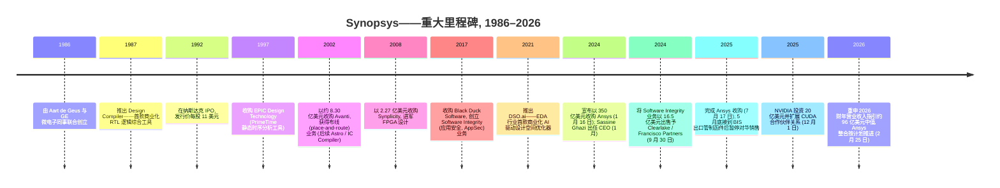
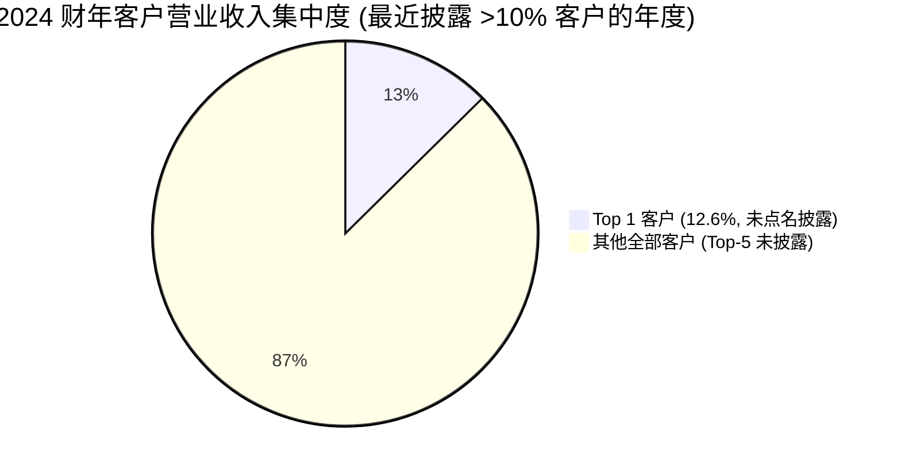
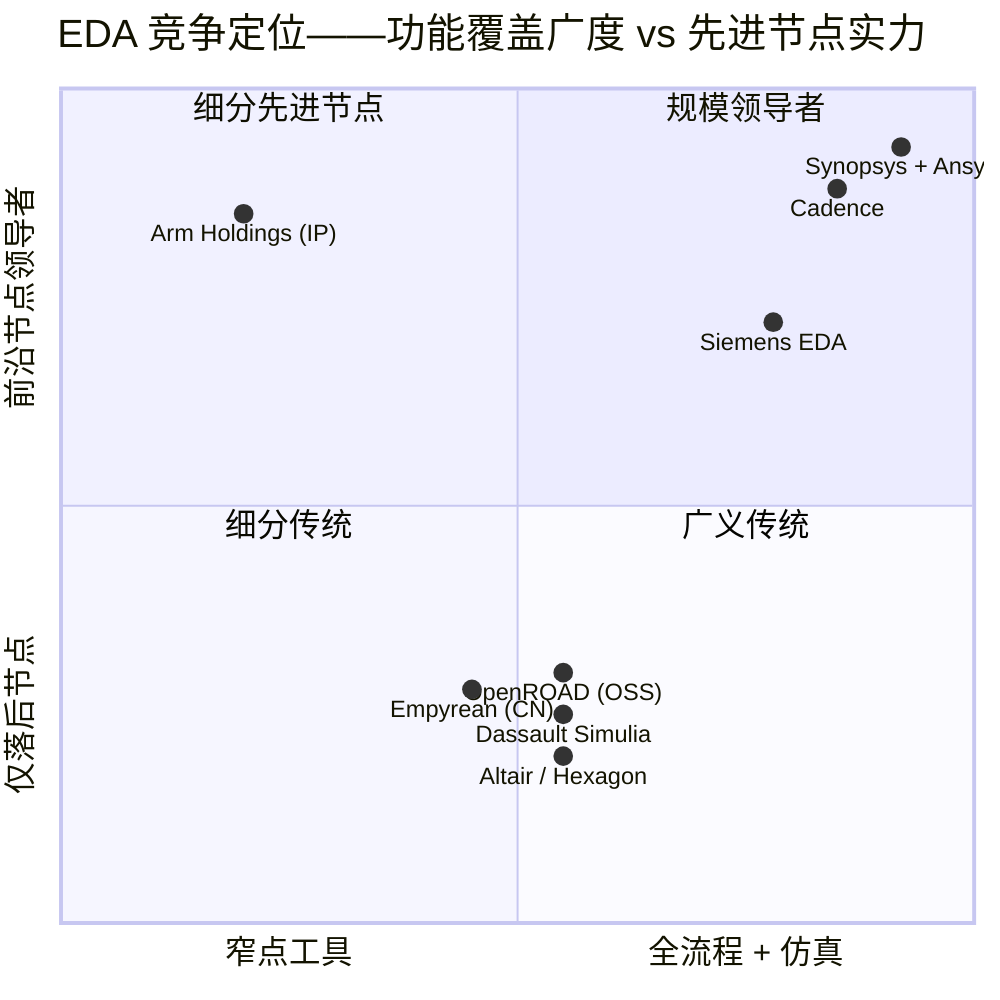

# Synopsys, Inc. (NASDAQ:SNPS) — 公司研究报告

**日期: 2026-05-20**
**上市地: 纳斯达克全球精选市场 (NASDAQ Global Select Market), 代码 SNPS**
**总部所在地: 美国加利福尼亚州 Sunnyvale**
**报告语言: 简体中文 (英文版同时存在于本目录)**
**分析师说明:** Synopsys 财年以最接近 10 月 31 日的星期六结束。文中提及的 "2025 财年" 是指截至 2025 年 10 月 31 日的财年。所有数字除特别注明外均以美元计。

> **更新——2026 财年营业收入指引重申约 96.1 亿美元中值 (2026-02-25):** 在 2025 年 7 月 17 日完成 350 亿美元 Ansys 收购、并交出处于指引区间高位的 2026 财年 Q1 业绩后, 管理层重申 2026 财年全年营业收入指引为 **95.60–96.60 亿美元** (中值 96.1 亿美元, 其中包含预计约 29 亿美元的 Ansys 营业收入), 非 GAAP 每股收益 (EPS) 为 14.38–14.46 美元。这意味着相对于 2025 财年 70.54 亿美元营业收入实现约 **36% 同比增长**, 几乎全部由 Ansys 贡献。所述驱动因素: "AI 驱动的系统级与半导体研发" 需求, 以及 Ansys 整合进度按计划推进; 指引假设美国出口管制或美国商务部工业安全局 (Bureau of Industry and Security, BIS) "实体清单" (Entity List) 不再发生进一步变化。
> 来源: [Synopsys 2026 财年 Q1 业绩公告, 2026-02-25](https://www.sec.gov/Archives/edgar/data/0000883241/000119312526071601/d921168dex991.htm).

## 目录
1. 公司概览
2. 公司历史
3. 管理团队
4. 产品与服务
5. 客户与上市策略
6. 行业概览
7. 竞争格局
8. 市场机会 (TAM)
9. 风险评估
10. 参考资料

---

## 1. 公司概览

Synopsys, Inc. (NASDAQ:SNPS) 是**全球最大的电子设计自动化 (Electronic Design Automation, EDA) 软件供应商**, 也是半导体设计知识产权 (intellectual property, IP) 两大规模龙头之一。公司将自身定位为"从硅片到系统的工程解决方案领导者" (the leader in engineering solutions from silicon to systems)——这一定位在 2025 年 7 月通过以约 350 亿美元现金加股票完成对 **Ansys, Inc.** 的收购后实质性扩展。Ansys 是机械、电磁、流体、光学及嵌入式软件分析领域基于物理仿真软件的主导供应商 ([Synopsys 完成 Ansys 收购新闻稿, 2025-07-17](https://news.synopsys.com/2025-07-17-Synopsys-Completes-Acquisition-of-Ansys))。在合并 Ansys 后, Synopsys 现已覆盖从晶体管设计到完整系统多物理场仿真的全栈, 公司自估**总可寻址市场 (Total Addressable Market, TAM) 为 310 亿美元**。

**公司业务定位。** Synopsys 销售的是芯片与系统工程师用于设计、验证、制造和确认集成电路 (Integrated Circuit, IC) 及其所构成电子系统所需的关键任务级软件、仿真工具和可复用电路 IP。NVIDIA Blackwell 这类现代 AI 加速器, 或任何旗舰智能手机系统级芯片 (System-on-Chip, SoC), **离开 EDA 软件根本无法完成设计**, 而 Synopsys 是三大必备 EDA 供应商之一 (另两家为 Cadence Design Systems 与 Siemens EDA)。根据 2025 财年 10-K, Synopsys 划分两大经营分部——设计自动化 (Design Automation, DA) 与设计 IP (Design IP)——但披露的产品组营业收入分为四类: EDA (占 2025 财年营业收入 62.0%)、Design IP (24.8%)、Ansys (10.7%, 部分年度)、其他 (2.5%) ([Synopsys 2025 财年 10-K, Note 5 营业收入](https://www.sec.gov/Archives/edgar/data/883241/000088324125000028/snps-20251031.htm))。

**盈利模式。** 公司绝大部分营业收入来自**多年期技术订阅许可 (Technology Subscription License, TSL)** 安排, 通常合约期为两至三年, 在许可期内按比例摊销确认。硬件 (仿真器/原型) 及部分 IP 许可在交付时确认营业收入; Ansys 软件历史上则混合按时订阅与永久许可加维护两种模式。公司在利润表中按三类报告营业收入: **按时计量产品** (2025 财年 34.896 亿美元, 占营业收入 49%, 同比 +8%)、**前置确认产品** (20.106 亿美元, 占 29%, 同比 +12%)、**维护与服务** (15.540 亿美元, 占 22%, 同比 +41%, 主要因合并 Ansys 所致)。2025 财年总营业收入同比增长 15% 至 **70.542 亿美元**, GAAP 毛利率 (gross margin) 为 77.0% ([Synopsys 2025 财年 10-K, MD&A——营业收入](https://www.sec.gov/Archives/edgar/data/883241/000088324125000028/snps-20251031.htm))。业务高度依赖经常性收入: 截至 2026 年 1 月 31 日, **已签约但尚未履行的履约义务 (即 backlog) 余额达 113 亿美元**, 其中约 47% 预计将于未来十二个月内转化为营业收入 ([Synopsys 2026 财年 Q1 10-Q, 营业收入附注](https://www.sec.gov/Archives/edgar/data/883241/000088324126000014/snps-20260131.htm))。

**业务区域。** Synopsys 总部位于美国加利福尼亚州 Sunnyvale 市 Almanor Avenue 675 号, 在全球范围内开展业务, 销售与工程办公室遍布美国、加拿大、欧洲、以色列、日本、中国大陆、韩国、印度及台湾 ([Synopsys 2025 财年 10-K, Item 1 业务](https://www.sec.gov/Archives/edgar/data/883241/000088324125000028/snps-20251031.htm))。2025 财年地区营业收入构成: 美国 31.001 亿美元 (44%)、韩国 9.470 亿美元 (13%)、欧洲 8.885 亿美元 (13%)、中国 8.143 亿美元 (12%)、其他 13.042 亿美元 (18%)。**中国营业收入同比下滑约 18%**——由 2024 财年的 9.895 亿美元下降——主要反映 2025 年 5 月底美国 BIS 出口管制函件迫使 Synopsys 暂停向中国客户出货某些半导体设计软件 (即所谓 "2025 年 Q3 BIS 限制") ([Synopsys 2025 财年 10-K, MD&A——全球贸易政策影响](https://www.sec.gov/Archives/edgar/data/883241/000088324125000028/snps-20251031.htm))。

**公司规模。** 2025 财年营业收入 70.54 亿美元 (持续经营业务), GAAP 净利润 13.36 亿美元 (摊薄 EPS 8.07 美元), 非 GAAP 净利润 21.38 亿美元 (摊薄 EPS 12.91 美元) ([Synopsys 2025 财年 Q4 及全年业绩公告, 2025-12-10](https://www.sec.gov/Archives/edgar/data/0000883241/000119312525314200/d29055dex991.htm))。**员工规模: 2025 财年末约 28,000 人**, 同比增长约 40%, 主要因 Ansys 合并所致; 其中约 75% 为工程师; 自愿离职率为 5.7% ([Synopsys 2025 财年 10-K, 人力资本](https://www.sec.gov/Archives/edgar/data/883241/000088324125000028/snps-20251031.htm))。截至 2025 年 10 月 31 日, 现金、现金等价物及短期投资合计 30 亿美元; 公司为支付 Ansys 现金对价共发行 143 亿美元新优先票据 (Senior Notes) 加定期贷款 (Term Loan), 致使 2025 财年利息费用由 2024 财年的 3,680 万美元跃升至 4.467 亿美元。

**估值快照。** 截至 2026 年 5 月中旬, SNPS 股价约为 **516 美元**, 市值约为 960–990 亿美元, **滚动 12 个月 (TTM) 市盈率 (P/E) 约 78.6 倍, TTM 市销率 (P/S) 约 11.0 倍** ([Synopsys SNPS——Yahoo Finance, 2026 年 5 月](https://finance.yahoo.com/quote/SNPS/))。52 周价格区间为 365.74–651.73 美元 ([stockanalysis.com——SNPS 统计数据, 2026 年 5 月](https://stockanalysis.com/stocks/snps/statistics/))。最接近的可比公司 **Cadence Design Systems (NASDAQ:CDNS)** 也处于类似的高位倍数 (市值约 930–1,000 亿美元; TTM P/E 约 81.9 倍, 数据来自 [Fullratio CDNS PE 历史](https://fullratio.com/stocks/nasdaq-cdns/pe-ratio); TTM P/S 约 16.7 倍, 数据来自 [stockanalysis.com——CDNS 统计数据](https://stockanalysis.com/stocks/cdns/statistics/))。标普 500 IT 板块中位数 P/E 处于约 30 出头的水平, 因此 SNPS 与 CDNS 均交易在板块中位数的约 2 倍水平。

*来源: [Synopsys 2025 财年 10-K——合并损益表 & Note 19 分部披露](https://www.sec.gov/Archives/edgar/data/883241/000088324125000028/snps-20251031.htm); 2021–2022 财年数据出自 [Synopsys 2022 财年 10-K](https://www.sec.gov/Archives/edgar/data/883241/000088324122000017/snps-20221031.htm) 及 [2021 财年 10-K](https://www.sec.gov/Archives/edgar/data/883241/000088324121000022/snps-20211030.htm), 含已剥离的 Software Integrity 业务; 2023–2025 财年仅反映持续经营业务。*

**为何估值倍数被拉到高位?** TTM P/E 反映三股复合效应, 没有一项构成"价值陷阱"的红旗信号, 但每一项都关键: **(1)** 2025 财年 GAAP 利润被以下科目压低: 收购无形资产摊销约 8.16 亿美元、收购/剥离费用 2.548 亿美元、Ansys 债务利息费用 4.467 亿美元, 以及结算后的国债利率锁定 (treasury-rate lock) 未实现亏损 1.216 亿美元——即分子 (股价) 反映的远期盈利能力, 分母 (TTM GAAP EPS 6.35 美元) 尚未充分体现 ([Synopsys 2025 财年 10-K——MD&A 及 Note 18](https://www.sec.gov/Archives/edgar/data/883241/000088324125000028/snps-20251031.htm))。基于管理层 2026 财年 14.38–14.46 美元非 GAAP EPS 指引, 远期 P/E 压缩至约 36 倍 ([Synopsys 2026 财年 Q1 业绩公告, 2026-02-25](https://www.sec.gov/Archives/edgar/data/0000883241/000119312525314200/d29055dex991.htm))。**(2)** 市场正在支付一份**AI 设计溢价**——EDA 是每一颗先进 AI 芯片设计工具链的字面意义上的根本, 客户研发预算加速, 即便半导体行业其他领域呈现周期性疲软。NVIDIA 于 2025 年 12 月 1 日以每股 414.79 美元认购 20 亿美元 Synopsys 私募股权, 正式确立多年期 CUDA/Omniverse 合作伙伴关系——这是市场支付此项溢价最清晰的信号 ([NVIDIA 与 Synopsys 宣布战略合作伙伴关系, 2025-12-01](https://news.synopsys.com/2025-12-01-NVIDIA-and-Synopsys-Announce-Strategic-Partnership-to-Revolutionize-Engineering-and-Design))。**(3)** EDA 在结构上是寡头格局 (三家厂商合计市占率 90% 以上), 过去 25 年实质上没有新进入者, 支撑着持久的定价能力。下行的对称性——即什么会令约 78 倍倍数回归到板块中位数水平——在第 9 章详细展开。

---

## 2. 公司历史

Synopsys 于 **1986 年**以"Optimal Solutions"之名在美国北卡罗来纳州 Research Triangle Park 的通用电气微电子中心 (General Electric Microelectronics Center) 内由 **Aart J. de Geus** 及其 GE 研究员同事团队联合创立。创业洞见在于: **自动化逻辑综合 (logic synthesis)**——将高层级寄存器传输级 (Register-Transfer Level, RTL) 描述转换为门级网表 (gate-level netlist)——可以替代当时定义芯片设计的人工电路图工作。Synopsys 于 1986 年 12 月正式注册成立, 并在 1987 年推出首款产品 **Design Compiler**。Aart de Geus 自公司创立以来连续担任董事会成员, 1994 年至 2024 年 1 月间任 CEO, 之后让位于 **Sassine Ghazi**, 自己转任执行主席 (Executive Chair) ([Synopsys 2025 财年 10-K, 高管信息](https://www.sec.gov/Archives/edgar/data/883241/000088324125000028/snps-20251031.htm))。

*来源: 时间线综合自 [Synopsys 2025 财年 10-K](https://www.sec.gov/Archives/edgar/data/883241/000088324125000028/snps-20251031.htm)、[Synopsys 完成 Ansys 收购, 2025-07-17](https://news.synopsys.com/2025-07-17-Synopsys-Completes-Acquisition-of-Ansys) 及 [NVIDIA-Synopsys 合作伙伴关系公告, 2025-12-01](https://news.synopsys.com/2025-12-01-NVIDIA-and-Synopsys-Announce-Strategic-Partnership-to-Revolutionize-Engineering-and-Design)。*

**战略性转折。** 三大转折定义了现代 Synopsys。**第一**是 2000 年代初的并购狂潮, 以 2002 年 Avanti 收购案告终——它将 Synopsys 从一家逻辑综合专家转变为可与 Cadence 正面竞争的全流程 ("RTL-to-GDSII") 提供商。**第二**, 大约从 2011 年起向半导体 IP 领域扩张, 通过 **DesignWare** 系列——认识到随着设计团队规模缩小而芯片复杂度爆炸式增长, 客户会越来越倾向于购买可复用模块, 而非自行设计每个模块。至 2025 财年, Design IP 分部产生 17.5 亿美元营业收入, 在 IP 授权商中仅次于 **Arm Holdings**。**第三**, 也是仍在进行的转折, 是通过 DSO.ai (2021)、Synopsys.ai (2023)、并以 Ansys 收购 (2025) 收官的 **AI 驱动全栈扩张**——将公司从 "EDA 厂商" 重新定位为"从硅片到系统的工程解决方案"提供商, 涵盖机械、电磁、流体与光学领域的基于物理仿真。

**重要并购 (2017–2025)。** Black Duck Software (2017 年, 软件成分分析——后于 2024 年作为 Software Integrity 部分剥离); 早年收购的 Cigital 与 Coverity (也被并入 Software Integrity); Avanti (2002 年, 布线工具); Magma Design Automation (2012 年, 5.07 亿美元); Coverity (2014 年); Numetrics (2007 年); ChipEDA、SiliconSmart 等多项传感器/IP 类小型补强收购; OpenLight (2022 年衍生的合资公司, 后随 Optical Solutions Group 一同剥离); 以及定义公司格局的 **Ansys 合并 (2025 年 7 月 17 日, 约 350 亿美元)**。剥离方面, Synopsys 于 2024 年 9 月 30 日以 **16.5 亿美元**将 Software Integrity 业务出售给 Clearlake Capital 与 Francisco Partners, 录得税前收益约 8.6 亿美元; 又于 2025 年 10 月 17 日将 Optical Solutions Group 剥离给 Keysight Technologies——两项剥离都旨在聚焦后 Ansys 组合 ([Synopsys 2025 财年 10-K, Note 3 终止经营业务](https://www.sec.gov/Archives/edgar/data/883241/000088324125000028/snps-20251031.htm))。

**近期动态 (近 12 个月)。** 最重要的故事是 Ansys 整合: 2025 财年新增商誉 234 亿美元、Ansys 部分财年营业收入贡献 7.566 亿美元, Sassine Ghazi 团队当前正朝着 2026 财年上半年 "首批融合能力" 交付组织资源。第二个故事是 **2025 年 5–7 月对华出口管制事件**: 2025 年 5 月 29 日, Synopsys 收到 BIS 函件, 要求其暂停向中国客户出货某些 EDA, 公司中止 2025 财年指引 ([Tom's Hardware 报道, 2025-05-30](https://www.tomshardware.com/tech-industry/semiconductors/chip-design-software-giant-pauses-china-sales-and-suspends-financial-guidance-synopsys-slams-the-brakes-as-washington-issues-fresh-crackdown-on-semiconductor-software-exports)); 限制于 7 月部分澄清, 公司在建立合规工作流的同时恢复了选择性出货。第三个故事是公司治理刷新——Peter Shimer (前德勤代理 CEO) 于 2026 年 2 月 19 日加入董事会; Luis Borgen 与 Ajei Gopal 将不再参加 2026 年股东大会董事换届 ([Synopsys 任命 Peter Shimer 加入董事会, 2026-02-19](https://www.sec.gov/Archives/edgar/data/0000883241/000119312526059438/d78071dex991.htm))。

---

## 3. 管理团队

### Sassine Ghazi——总裁兼首席执行官 (CEO)

Sassine Ghazi, 现年 55 岁, 于 2024 年 1 月就任 Synopsys CEO, 此前在公司内部已有 26 年职业积累, 从应用工程师 (applications engineer) 一路晋升至首席运营官 (COO) 再到 CEO——正是从内部技术线晋升上来、过往造就 EDA 行业成功领导者的那种典型 CEO。根据 2025 财年 10-K, Ghazi 于 1998 年 3 月加入 Synopsys 担任应用工程师, 之后"在销售岗位上承担逐级递增的责任, 最终领导全球战略客户业务"。在 2020 年 8 月升任 COO 之前, 他是公司内**所有数字与定制产品**总经理——包括 Design Compiler、Fusion Compiler、IC Compiler II 及定制模拟流程, 是公司内部规模最大的业务部门。加入 Synopsys 之前, 他曾在 Intel Corporation 担任设计工程师。学历: 黎巴嫩美国大学工商管理学士、佐治亚理工学院电气工程学士 (1993)、田纳西大学电气工程硕士 (1995) ([Synopsys 2025 财年 10-K, 高管信息](https://www.sec.gov/Archives/edgar/data/883241/000088324125000028/snps-20251031.htm))。

Ghazi 作为 COO 期间具体取得了哪些成绩比职位变化时间线更重要。在 **2020 年 8 月至 2024 年 1 月**的 COO 任期内, Synopsys 营业收入由 2020 财年 36.9 亿美元增长至 2023 财年 58.4 亿美元——累计增长约 58%, 年均复合增长率 (CAGR) 约 16%——同期经营利润增速快于营业收入。他主管的销售组织在 AI 浪潮中签下了公司有史以来与超大规模云客户 (hyperscaler) 之间最大的多年期合约, 并在 2021 年支持了 DSO.ai 的发布。作为 CEO, 他是两项决定公司命运下注的设计师: **350 亿美元 Ansys 收购** (在其升任 CEO 后两周即宣布) 与 **NVIDIA 战略合作伙伴关系 / 20 亿美元股权投资** (2025 年 12 月完成)。两者都是明确的"平台"押注——Ansys 将可寻址表面从硅片设计拓宽至多物理场, NVIDIA 合作则将 Synopsys 确立为 CUDA 加速设计基础设施上的首选软件合作伙伴。Ghazi 在业绩电话会及 10-K 致股东函中反复强调"硅片到系统"——这是一个有意识的重新框定, 若能成功落地, 将为 Synopsys 持续的高估值溢价提供合理性。其持股比例未在代理委托书 (Proxy Statement) 之外单独披露, 但根据 2026 年 DEF 14A, 他获授的股权奖励与 Synopsys 标准 CEO 薪酬架构一致 (薪酬主要为业绩股权)。

CEO 故事的风险在于: Ghazi 担任 CEO 仅约 28 个月, 即着手 EDA 史上最大并购, 且必须整合一家其产品线 (机械有限元 FEA、计算流体力学 CFD、光学) 与 Synopsys 历史核心几乎不重叠的公司。10-K 明确警告"我们可能无法完全实现 Ansys 合并的预期效益", 并提及 2026 财年 Q1 计入 1.183 亿美元的整合相关额外重组费用 ([Synopsys 2026 财年 Q1 10-Q, 合并损益表](https://www.sec.gov/Archives/edgar/data/883241/000088324126000014/snps-20260131.htm))。他的第一次重大整合测试将在 2026 财年上半年到来——届时首批 "融合" 后的 Synopsys-Ansys 产品能力计划交付。

### Aart J. de Geus——联合创始人兼执行主席

Aart de Geus 博士, 现年 71 岁, 于 1986 年 12 月联合创立 Synopsys, 自创立以来一直担任董事会成员。他于 1994 至 2012 年任 CEO; 2012 年 5 月至 2022 年 4 月与 Chi-Foon Chan 博士共同担任联合 CEO; 2022 年 4 月至 2024 年 1 月任单独 CEO; 2024 年 1 月起任执行主席。他自 2007 年 7 月起还担任 **Applied Materials 董事**。学历: 瑞士联邦理工学院洛桑分校 (École Polytechnique Fédérale de Lausanne) 电气工程硕士、南方卫理公会大学 (Southern Methodist University) 电气工程博士 ([Synopsys 2025 财年 10-K, 高管信息](https://www.sec.gov/Archives/edgar/data/883241/000088324125000028/snps-20251031.htm); [Aart J. de Geus, Wikipedia](https://en.wikipedia.org/wiki/Aart_de_Geus))。作为执行主席, de Geus 保留对长期战略决策与客户层级关系的实质性影响, 同时将日常执行委托给 Ghazi。他于 2025 年 10 月 14 日依据 Rule 10b5-1 提交了交易计划, 覆盖至 2026 年 10 月最多 74,641 股 ([Synopsys 2025 财年 10-K, Item 9B 内部交易安排](https://www.sec.gov/Archives/edgar/data/883241/000088324125000028/snps-20251031.htm))。

### Shelagh Glaser——首席财务官 (CFO)

Shelagh Glaser, 现年 61 岁, 自 2022 年 12 月起任 CFO。加入 Synopsys 之前, Glaser 于 2021 年 5 月至 2022 年 11 月任 Zendesk, Inc. CFO (期间公司被 Hellman & Friedman / Permira 私有化)。再之前, 她在 Intel Corporation 工作约 22 年——曾任 Intel 数据平台事业部 (Data Platform Group) 副总裁、CFO 兼 COO (2019 年 7 月至 2021 年 5 月), 此前担任客户端计算事业部 (Client Computing Group) 副总裁/CFO 等高级财务岗位 (2013 年 12 月至 2019 年 7 月)。她自 2022 年 6 月起担任 PubMatic, Inc. 董事兼审计委员会成员。学历: 密歇根大学经济学学士、卡内基梅隆大学金融学 MBA ([Synopsys 2025 财年 10-K, 高管信息](https://www.sec.gov/Archives/edgar/data/883241/000088324125000028/snps-20251031.htm))。

此处 CFO 角色的具体押注是债务执行。Glaser 为 Ansys 现金对价融资共募集 143 亿美元新债务 (优先票据加定期贷款)——这是 Synopsys 39 年历史中首次有实质性的杠杆事件。结构包括五年期利率对冲, 在 2025 财年结算时录得未实现亏损 1.216 亿美元 (反映在现金流调节项), 管理层公开承诺"两年内快速去杠杆" ([Synopsys 完成 Ansys 收购, 2025-07-17](https://news.synopsys.com/2025-07-17-Synopsys-Completes-Acquisition-of-Ansys))。2026 财年指引的约 19 亿美元自由现金流 (free cash flow, FCF) 使去杠杆路径在数学上可信, 前提是 Ansys 营业收入按计划兑现。Glaser 的 Intel 履历——大型复杂交易的资本配置——正是此刻所需的简历。

### Mike Ellow——首席营收官 (CRO)

Mike Ellow, 现年 62 岁, 于 2025 年 11 月加入 Synopsys 出任 CRO——这是一笔值得关注的招聘, 因为他直接从 Synopsys 最大竞争对手处过来。根据 10-K, Ellow 自 2024 年 6 月至 2025 年 11 月担任 **Siemens EDA** (即由 Mentor Graphics 更名后的 Siemens 子公司) CEO, 此前自 2021 年 1 月起担任 Siemens EDA 全球销售、服务与客户支持执行副总裁。他于 1997 年在 Cadence Design Systems 起步销售职业, 任职约 13 年, 2011 年加入 Berkeley Design Automation, 后通过 2017 年 Siemens 收购 Mentor 进入 Siemens / Mentor。学历: 莱海大学 (Lehigh) 电气工程学士、南加州大学 (USC) 电气工程硕士、加州州立大学富勒顿分校 MBA ([Synopsys 2025 财年 10-K, 高管信息](https://www.sec.gov/Archives/edgar/data/883241/000088324125000028/snps-20251031.htm))。从 Siemens EDA 负责人位置直接挖走出任 CRO, 是一个清晰的竞争信号——Ellow 熟知 Siemens 的打法、跨工具客户竞标周期, 以及 Synopsys 与 Siemens、Cadence 三方正面交锋的具体客户。

### 公司治理

根据 2026 年 DEF 14A 文件, 董事会由 11 位董事组成, 包括 Sassine Ghazi (CEO)、Aart de Geus (执行主席)、Ajei Gopal (前 Ansys CEO, 不参加 2026 年股东大会换届)、Ravi Vijayaraghavan (前 Ansys 董事), 以及 Peter Shimer (2026 年 2 月加入, 审计委员会成员)。Luis Borgen 也将不被提名换届 ([Synopsys 任命 Peter Shimer 加入董事会, 2026-02-19](https://www.sec.gov/Archives/edgar/data/0000883241/000119312526059438/d78071dex991.htm))。独立董事占多数; CEO 与主席职位分立 (de Geus 为执行主席, 非独立)。高管层面的内部持股绝对值并不重——这对于一家无超级投票权结构的 39 年公司来说属于典型——但 LinkedIn / Form 4 资料显示 Ghazi、Glaser 与 de Geus 相对其基本薪酬都有较有意义的股权敞口。薪酬高度偏向业绩股权; 公司维持薪酬追回 (clawback) 政策, 并对"薪酬咨询投票" (say-on-pay) 取得通过结果。股票回购授权在 2026 年 2 月被补充至 20 亿美元。

### 管理层履职评价

这是一支技术功底深厚的高管班底。Ghazi 是入职 26 年的内部老兵, COO 任期内有可信的运营记录; de Geus 的持续在岗为公司历史上规模最大的组合扩张提供制度连续性; Glaser 拥有适合投资级杠杆转型期的 CFO 履历; 而 Ellow 的加盟则是高管层最具竞争意义的招聘动作。最大的悬而未决问题是 **Ansys 整合的执行风险**——即便以约 350 亿美元的宣布溢价考量, 这笔交易仍须在 Synopsys 历史经验肌肉记忆较弱的多物理场仿真市场段同时兑现收入协同与成本纪律。

---

## 4. 产品与服务

Synopsys 的产品组合清晰地划分为 EDA 软件 (历史核心业务)、Design IP (即客户直接放入芯片的半导体 IP 模块), 以及——自 2025 年 7 月以后——Ansys 的基于物理仿真工具。下面的网站导览映射 synopsys.com 的菜单导航。

```mermaid
graph TD
    A[Synopsys] --> B[设计自动化分部]
    A --> C[设计 IP 分部]
    B --> D[EDA——数字设计]
    B --> E[EDA——定制与模拟]
    B --> F[EDA——验证]
    B --> G[EDA——制造与测试]
    B --> H[EDA——系统设计 / FPGA]
    B --> I[Ansys——仿真与分析]
    D --> D1[Fusion Compiler——RTL-to-GDSII]
    D --> D2[Design Compiler / DC NXT]
    D --> D3[IC Compiler II / 3DIC Compiler]
    D --> D4[PrimeTime——静态时序 signoff]
    E --> E1[Custom Compiler]
    E --> E2[HSPICE / FineSim / PrimeSim]
    F --> F1[VCS——逻辑仿真]
    F --> F2[Verdi——调试]
    F --> F3[ZeBu——硬件仿真器]
    F --> F4[HAPS——FPGA 原型]
    G --> G1[IC Validator——物理验证]
    G --> G2[Proteus / S-Litho——掩膜合成]
    G --> G3[TestMAX——DFT 与 ATPG]
    H --> H1[Synplify Pro / Premier]
    H --> H2[Platform Architect]
    I --> I1[机械 / 结构 FEA]
    I --> I2[流体 / CFD——Fluent, CFX]
    I --> I3[电磁——HFSS, Maxwell]
    I --> I4[半导体——RedHawk-SC, Totem]
    I --> I5[嵌入式——SCADE, medini]
    C --> J[接口 IP——PCIe, DDR, MIPI, USB, Ethernet]
    C --> K[基础 IP——逻辑库, 内存编译器, SRAM, OTP]
    C --> L[安全 IP——Root of Trust, 密码学]
    C --> M[处理器 IP——ARC CPU, DSP, NPU]
    C --> N[IP 子系统——ARC Data Fusion, IP Accelerated]
    C --> O[验证 IP——AMBA, Ethernet, MIPI VIP]
```

*来源: 综合自 [Synopsys 产品导航树 (synopsys.com)](https://www.synopsys.com/) 与 [DesignWare IP 目录页](https://www.synopsys.com/en-us/designware-ip.html), 并交叉核对 2025 财年 10-K Item 1 业务描述。*

### 设计自动化——EDA 核心

**数字实现 (Fusion Design Platform)。** Synopsys 的旗舰全流程产品是 **Fusion Compiler**——一款 RTL-to-GDSII 实现引擎, 将综合、布线、signoff 集成于同一数据模型 ([Fusion Compiler 产品页](https://www.synopsys.com/implementation-and-signoff/physical-implementation/fusion-compiler.html))。它面向先进制程节点 (3nm / 2nm / 埃米级) 数字芯片, 服务超大规模云客户、AI 加速器与移动 SoC 客户。传统的 **Design Compiler** (综合) 和 **IC Compiler II** (布线) 仍可独立购买。**3DIC Compiler** 面向多 die / 小芯片 (chiplet) 集成——后者正越来越成为 AI 加速器的主流封装架构。*竞争优势: 有 (技术 / IP)。* Fusion Compiler 被名列其中的 Intel、Samsung 等大多数领先超大规模云芯片团队公认为是 5nm 及以下节点的最佳功耗-性能-面积 (Power-Performance-Area, PPA) 流; 通过 DSO.ai 的 AI 驱动优化, 相较竞品流可实质性压缩周转时间。*最接近竞品:* **Cadence Innovus Implementation System** (在许多数字流上与其持平, 在极先进节点上据多数代工厂公布基准略落后)。

**静态时序 signoff (PrimeTime)。** **PrimeTime** 是事实上的业内标准静态时序分析 (Static Timing Analysis, STA) signoff 工具——过去二十年中实际所有先进节点芯片流片几乎都使用 PrimeTime 完成 signoff ([PrimeTime——静态时序分析](https://www.synopsys.com/implementation-and-signoff/signoff/primetime.html))。*竞争优势: 是 (极高——转换成本、生态绑定、与所有主要代工厂的认证)。* 这无疑是 Synopsys 最深的单一护城河: 代工厂发布的设计规则与 PDK 都经过 PrimeTime 校准, EDA 验证流程默认 PrimeTime 为黄金标准, 客户工程流程也用数十年时间积累出围绕 PrimeTime 的脚本与方法学。*最接近竞品:* **Cadence Tempus Timing Solution**——技术上有能力, 但在先进节点数字 signoff 商业渗透中处于边缘地位。

**定制 / 模拟 (Custom Compiler, PrimeSim)。** **Custom Compiler** 是基于电路图的模拟/混合信号设计环境; **PrimeSim** (整合了原 HSPICE、FineSim 与 CustomSim 品牌) 提供 SPICE 级电路仿真。*竞争优势: 部分。* Synopsys 实力强劲, 但 **Cadence Virtuoso** 历史上一直主导定制 IC 设计版图, 尤其在超大规模数字流程之外; Synopsys 在先进节点持续抢占份额, 但 Virtuoso 仍是模拟为主客户的默认选择。*最接近竞品:* **Cadence Virtuoso** (在纯模拟/定制版图上领先)。

**验证 (VCS, Verdi, ZeBu)。** **VCS** 是 RTL 功能验证领域的业界领先逻辑仿真器; **Verdi** 是主导的调试环境; **ZeBu** 是每天可运行数十亿周期的硬件仿真器, 被每家主要超大规模云客户/芯片厂商用于 AI 加速器与 CPU 的硅前验证; **HAPS** 提供基于 FPGA 的原型验证 ([Synopsys EDA 验证家族](https://www.synopsys.com/verification.html))。*竞争优势: 是 (技术与规模)。* 验证——尤其是仿真硬件——是 Synopsys ZeBu 与 Cadence Palladium 的双寡头格局, 二者在每个 Tier-1 客户的装机量大致五五分。Synopsys VCS 在仿真器份额上保持最大。*最接近竞品:* **Cadence Xcelium** (仿真)、**Palladium Z3** (仿真器)——在当前世代每美元原始仿真容量上与其持平至略微领先。

**制造与测试 (Proteus, IC Validator, TestMAX)。** Synopsys 提供掩膜数据准备/OPC 软件 (**Proteus**, **S-Litho**)、物理验证 (**IC Validator**) 以及 DFT/ATPG 测试 (**TestMAX**)。*竞争优势: 部分。* 实力不弱, 但并非毫无对手: **Siemens EDA 的 Calibre** 是业内主导的物理验证 / DRC 工具——Synopsys 的明显缺口。*最接近竞品:* **Siemens Calibre** (在 PV/DRC 上领先)。

**系统设计 / FPGA (Synplify, Platform Architect)。** **Synplify Pro / Premier** 主导 FPGA 综合; **Platform Architect** 用于早期架构 SoC 建模。营业收入端属于小众, 但毛利率高。

### 设计 IP——DesignWare

Synopsys 的设计 IP 分部 (2025 财年营业收入: 17.52 亿美元, 占总营业收入 24.8%) 销售经预验证、按代工厂工艺特性化的电路模块, 由客户集成至自身芯片设计中。组合涵盖**接口 IP** (PCIe Gen6/7、DDR5/LPDDR5X、MIPI、USB、HDMI、800G/1.6T 以太网)、**基础 IP** (标准单元逻辑库、内存编译器, 包括 SRAM、寄存器堆、ROM、OTP、NVM)、**安全 IP** (Root of Trust、后量子密码加速器、嵌入式 SIM)、**处理器 IP** (2010 年从 ARC International 收购而来的 ARC 系列 CPU、DSP 与 NPU 核心), 以及包含 ARC 数据融合 IP 子系统 (面向传感器处理) 的 **IP 子系统** ([DesignWare IP 综述](https://www.synopsys.com/en-us/designware-ip.html))。*竞争优势:* 组合内部差异较大。接口 IP 名副其实地达到了同业最佳水准——Synopsys 拥有先进节点经代工厂验证的 PCIe / DDR / USB IP 中最大目录, 这些都是每家超大规模云芯片所必需的构件。基础 IP 与内存编译器与 Cadence 及代工厂内部库持平。处理器 IP (ARC) 在 CPU 上明显落后于 Arm, 在 DSP 上落后于 Cadence Tensilica。*最接近竞品:* 整体上 **Cadence IP** (Tensilica + Denali + 收购模块); 处理器 IP 上为 **Arm Holdings**。

**Design IP 分部 2025 财年表现艰难**——营业收入由 19.06 亿美元下滑 8% 至 17.52 亿美元, 调整后经营利润率由 38% 压缩至 24%。管理层将下滑归因于"中国出口管制限制 (如 2025 年 Q3 BIS 限制)、某主要代工客户的弱于预期需求, 以及未达预期效果的某些路线图与资源决策" ([Synopsys 2025 财年 10-K, 分部业绩](https://www.sec.gov/Archives/edgar/data/883241/000088324125000028/snps-20251031.htm))。(i) 单一客户需求重置、(ii) 出口限制波及大量客户子集, 加上 (iii) 管理层自己承认的路线图错误, 三者叠加使该分部成为 2026 财年逻辑中**最显眼的执行风险**。

### Ansys (2025 年 7 月 17 日后并入设计自动化分部)

Ansys 组合新增了机械/结构 FEA (Ansys Mechanical)、CFD (Fluent, CFX)、电磁 (HFSS, Maxwell, Q3D)、半导体功耗/电迁移完整性 (RedHawk-SC, Totem——这与 Synopsys 自身通过 Ansys 引入的 RedHawk 产品线有重叠)、光学 (Speos, Zemax)、嵌入式软件 (SCADE, medini)、系统组合 (Ansys Twin Builder) 等覆盖多物理场的仿真能力。*竞争优势: 有 (技术与规模)。* Ansys 是主导的通用物理仿真厂商; 最接近的直接竞品包括 CFD 领域的 **Siemens Simcenter** (前身是 CD-adapco/STAR-CCM+)、机械领域的 **Dassault Systèmes Simulia (Abaqus)** 以及多物理场领域的 **Altair HyperWorks**。Synopsys 在 2025 财年部分年度内确认 Ansys 营业收入 7.566 亿美元, 并指引 2026 财年 Ansys 营业收入为 29 亿美元 ([Synopsys 2025 财年 Q4 & 全年业绩公告, 2025-12-10](https://www.sec.gov/Archives/edgar/data/0000883241/000119312525314200/d29055dex991.htm))。

### 旗舰产品与长尾

驱动业务的 1–3 款产品毫无疑问是: **Fusion Compiler / IC Compiler II** (数字实现, 按营业收入计是最大的单一 SKU 家族)、**PrimeTime** (signoff, 毛利率最高且最具防御性的产品), 以及 **VCS + ZeBu** (验证, 包含 2025 财年贡献材料前置营业收入增长的仿真硬件)。在 IP 方面, **接口 IP** (PCIe 与 DDR 家族) 是旗舰, 安全 IP 是快速增长的追随者。Ansys 旗舰产品为 **Fluent、HFSS、Mechanical**。

### 过去 12 个月: 上新、退役与重新定位

- **退役/剥离:** Software Integrity (AppSec 业务——Black Duck、Coverity、Defensics) 于 2024 年 9 月 30 日以 16.5 亿美元出售给 Clearlake/Francisco Partners。
- **退役/剥离:** Optical Solutions Group 于 2025 年 10 月 17 日剥离给 Keysight Technologies; PowerArtist RTL 业务也已剥离。两者合并对 2026 财年的营业收入影响约 1.10 亿美元。
- **上新:** 涵盖 DSO.ai、VSO.ai (验证)、ASO.ai (模拟)、TSO.ai (测试) 的全栈 AI 套件 **"Synopsys.ai"** 在 2024–2025 年度内完整推出。
- **上新 (计划中):** 首批集成的 Synopsys-Ansys "融合"能力, 面向多 die 先进封装, 计划在 2026 财年上半年交付 ([Synopsys 完成 Ansys 收购, 2025-07-17](https://news.synopsys.com/2025-07-17-Synopsys-Completes-Acquisition-of-Ansys))。
- **合作驱动的路线图:** **GPU 加速 EDA**——Synopsys 在 2025 年 12 月承诺将计算密集型流程 (物理验证、RC 抽取、电磁仿真、光学分析) 移植至 NVIDIA CUDA, NVIDIA 以每股 414.79 美元投资 20 亿美元 ([NVIDIA-Synopsys 战略合作伙伴关系, 2025-12-01](https://news.synopsys.com/2025-12-01-NVIDIA-and-Synopsys-Announce-Strategic-Partnership-to-Revolutionize-Engineering-and-Design))。

*来源: [Synopsys 2025 财年 10-K, Note 5 营业收入分解](https://www.sec.gov/Archives/edgar/data/883241/000088324125000028/snps-20251031.htm)。*

---

## 5. 客户与上市策略

Synopsys 实际上服务全球每一家有规模的半导体公司, 加上通过 Ansys 业务覆盖的长尾系统与航空航天/国防客户。10-K 将可寻址客户基础描述为"涵盖广泛行业的半导体与系统客户"——实际意义是: 每一家拥有内部硅片团队的超大规模云客户 (Alphabet、Amazon、Meta、Microsoft、Apple)、每一家商业半导体厂商 (NVIDIA、AMD、Intel、Qualcomm、Broadcom、Marvell、MediaTek)、每一家主要代工厂 (TSMC、Samsung Foundry、Intel Foundry、GlobalFoundries、UMC、可授权的 SMIC)、每一家先进 IDM (Samsung、SK hynix、Micron), 以及每一家主要 IP 被许可方。

**客户集中度——量化。** 根据 2025 财年 10-K (Note 19, 分部披露), "一家客户 (含其子公司) 在 2024 财年与 2023 财年分别占合并营业收入的 12.6% 与 13.5%。截至 2025 年 10 月 31 日和 2024 年 10 月 31 日, 无单一客户应收账款占比超过 10%" ([Synopsys 2025 财年 10-K, Note 19 分部披露](https://www.sec.gov/Archives/edgar/data/883241/000088324125000028/snps-20251031.htm))。**值得注意的是, 10-K 未提及 2025 财年自身是否有客户超过 10% 门槛**, 这暗示 2025 财年没有客户跨越 10% 门槛——可能是因为: (a) Ansys 营业收入 (部分年度约 7.57 亿美元) 加入合并分母, 以及 (b) 最大老客户支出可能软化 (Synopsys 在 Design IP 分部特别提到"某主要代工客户的弱于预期需求")。Synopsys 未点名披露 >10% 客户。基于 Design IP 客户披露、代工厂合作伙伴名单与行业报道的三角推断, 市场共识倾向认为历史上 10%+ 客户最有可能是 **TSMC**——考虑到 Synopsys 与代工厂的深度 IP 协同——但未获公司官方确认。

*来源: [Synopsys 2025 财年 10-K, Note 19 分部披露](https://www.sec.gov/Archives/edgar/data/883241/000088324125000028/snps-20251031.htm)。Synopsys 未披露 Top-5 累计客户份额; 根据 ASC 280-10-50-42, 仅需披露占比超过 10% 的客户。*

客户集中度风险**中等, 而非重大**: Top-1 低于 15% 且过去两年有明确下行趋势 (13.5% → 12.6% → 估计 <10%), Synopsys 不构成单客户依赖。合约采用多年期 TSL 主协议加子订单结构, 通常合约期为 2–3 年, 附带年度调价条款与自动续约条款——较之逐单 PO 模式, 远期可见度显著更高。最尖锐的集中风险是**地区性 (中国)** 与**分部特定 (Design IP 代工厂敞口)**, 而非单一客户。

**分销渠道与销售动作。** Synopsys 通过地区销售团队在全球范围内直销给终端客户; 因为合约金额很大 (100 万至 1 亿美元以上 TSL 合约), 与客户采购及 CTO/CDO 办公室双边谈判, 一线 EDA 软件实际上不存在渠道/分销层。绿地客户的销售周期通常为 6–18 个月; 续约谈判在合约结束前 6–9 个月启动。交易架构通常将 EDA 软件、IP 许可与仿真硬件打包为 **灵活支出账户 (Flexible Spending Account, FSA)** 安排, 客户承诺一个总的金额, 在合约期内按需提取特定产品组合——这一结构有助于 Synopsys 锁定多年支出, 同时给予客户工具组合灵活性。截至 2026 年 1 月 31 日的 113 亿美元 backlog 中包含 19 亿美元的不可取消 FSA 承诺 ([Synopsys 2026 财年 Q1 10-Q](https://www.sec.gov/Archives/edgar/data/0000883241/000088324126000014/snps-20260131.htm))。

**重要合作伙伴关系。** 2025 年 12 月 1 日宣布的 **NVIDIA 战略合作伙伴关系**与 20 亿美元股权投资是 Synopsys 现代史上意义最重大的上市策略动作——它将 Synopsys 计算密集型工作流直接与 NVIDIA CUDA 绑定, 将 Synopsys 确立为加速计算基础设施上的默认 EDA 合作伙伴, 并随着 NVIDIA 构建的参考系统在超大规模云芯片团队中传播, 形成自然的交叉销售动作 ([NVIDIA 与 Synopsys 宣布战略合作伙伴关系, 2025-12-01](https://news.synopsys.com/2025-12-01-NVIDIA-and-Synopsys-Announce-Strategic-Partnership-to-Revolutionize-Engineering-and-Design))。除 NVIDIA 外, Synopsys 还维持深度的代工厂合作关系——与 TSMC、Samsung Foundry、Intel Foundry、GlobalFoundries、UMC 等代工厂之间的正式"参考流程" (Reference Flows) 与 PDK 认证项目——这对于确保 Synopsys 工具在新工艺节点上线日就经过预验证至关重要。云合作伙伴关系包括与 Microsoft Azure 的 EDA SaaS 服务 (业内首家), 以及在 AWS 和 Google Cloud 上提供的 EDA 工作负载。

**客户案例 (有名客户案例)。** Synopsys 不定期在文件中披露具名客户胜出, 但近期合作伙伴新闻稿点名了 Intel (工艺节点联合开发)、Samsung Foundry (3DIC 与 SF2 参考流程)、Arm (联合 IP/EDA 优化)、NVIDIA (Blackwell 时代及之后)、Microsoft (Azure 云 EDA SaaS)。在 Ansys 方面, 历史具名客户包括 Boeing、GM、Ford、GE、每一家主要航空航天与国防主要承包商, 以及每一家 Tier-1 汽车 OEM。

---

## 6. 行业概览

**行业定义。** 电子设计自动化 (Electronic Design Automation, EDA) 是用于设计、验证、制造和确认集成电路及其所构成电子系统的软件、硬件与服务。**更广义的"工程仿真"行业**——Synopsys 通过收购 Ansys 现已覆盖的范围——新增了机械、电磁、流体、热、光学与嵌入式软件领域的基于物理仿真。NAICS 分类包括 511210 (软件发行商) 与 541512 (计算机系统设计服务)。相邻的半导体 IP 行业 (部分归属 NAICS 511210 / 541512) 越来越被视为同一价值链的一部分。

**市场规模与结构。** 全球 EDA 软件市场 2024–2025 年度估计区间介于 **145 亿至 192 亿美元**, 取决于范围与方法学——差异主要由是否纳入半导体 IP、专业服务与仿真硬件所决定 ([电子设计自动化软件市场——Precedence Research, 2025](https://www.precedenceresearch.com/electronic-design-automation-software-market); [EDA 软件行业分析——IBISWorld, 2025](https://www.ibisworld.com/united-states/industry/electronic-design-automation-software-developers/4540/))。叠加 Ansys 并购前约 25 亿美元的基于物理仿真营业收入, Synopsys 自定义的 TAM 现在达到约 **310 亿美元** (Synopsys 管理层 2023 年估算)——这一数字在 Ansys 收购完成新闻稿中明确给出 ([Synopsys 完成 Ansys 收购, 2025-07-17](https://news.synopsys.com/2025-07-17-Synopsys-Completes-Acquisition-of-Ansys))。

**增长率。** EDA 历史增速 2015–2022 年位于中高单位数, 2022–2025 年因 AI 基础设施建设拉动设计起步, 加速至低双位数。多份第三方预测显示, 至 2030–2032 年 CAGR 区间为 10–12% ([电子设计自动化市场规模与 2032 年预测——Persistence Market Research](https://www.persistencemarketresearch.com/market-research/electronic-design-automation-eda-market.asp))。AI-物理仿真的顺风暗示相对这些基线有上行空间——尤其是 Ansys 分部增长, 已随汽车、航空航天与高科技领域数字孪生需求的复合需求加速复苏。

**主要趋势与驱动力。**

1. *AI 驱动的芯片设计。* 超大规模云客户定制硅片 (Google TPU、Amazon Trainium、Microsoft Cobalt、Meta MTIA)、商业 AI (NVIDIA、AMD MI 系列), 以及大量 AI 加速器初创公司, 实质性扩大了在研芯片设计数量及单设计 EDA 支出。Synopsys 管理层在 2024–2025 年度持续将此称为最大顺风。
2. *AI 作为 EDA 内部工具。* Synopsys.ai 与 Cadence 的 Cerebrus 及 JedAI 将 EDA 从基于规则的优化转向基于 ML 的设计空间探索, 在代表性模块上压缩 30–50% 的周转时间, 并支持随客户采用高阶 AI 启用层级的价格组合提升。
3. *先进节点与多 die。* 3nm 量产在 2024 年爬坡, 2nm 样品在 2025–2026 年面世, 小芯片/2.5D/3D 架构 (TSMC 的 CoWoS、Samsung 的 I-Cube) 需要全新工具链支持热设计、时序、信号完整性与机械协同设计——正中 Synopsys-Ansys "硅片到系统"逻辑的核心。
4. *云与 SaaS EDA。* Microsoft Azure–Synopsys 合作、AWS / Google Cloud EDA AMI, 以及云 GPU 上新兴的突发算力与 ML 加速工作负载, 正在将客户基础设施预算转向消费型模式; EDA SaaS 模式仍占行业营业收入 <10%, 但增速最快。
5. *地缘政治分化。* 2025 年 5 月 BIS 出口管制函件, 加上此前 2022/2023 年 EAR-Sec 744.17 限制, 已将 EDA 市场实质性分割为"美国/盟友"层 (Synopsys / Cadence / Siemens 自由竞争) 与"中国"层 (出货受限——尤其对被列入实体清单的客户: SMIC、长江存储 YMTC、长鑫存储 CXMT、Huawei HiSilicon 及其关联方)。中国国产 EDA (华大九天 Empyrean、概伦 Primarius、芯禾 Semitronix、芯华章 X-Epic) 正快速扩展规模, 但在先进节点上仍落后多年。

**监管环境。** 主导性监管因素是**美国出口管制**。2025 年 5 月 23–29 日 BIS 函件将半导体设计软件列入对特定中国客户须出口许可的清单, 迫使 Synopsys 暂停某些出货并中止 2025 财年指引 ([Tom's Hardware, 2025-05-30](https://www.tomshardware.com/tech-industry/semiconductors/chip-design-software-giant-pauses-china-sales-and-suspends-financial-guidance-synopsys-slams-the-brakes-as-washington-issues-fresh-crackdown-on-semiconductor-software-exports))。次要监管压力包括数据本地化法律 (欧盟、中国、印度)、EDA-IP 整合的反垄断审查 (FTC 与欧盟委员会均审查并放行 Ansys 交易, 并附有限剥离补救措施, 包括出售 PowerArtist RTL 业务), 以及 AI 专属治理——欧盟 AI 法案、美国关于 AI 安全的行政命令——这些影响 Synopsys 嵌入式 AI 工具但尚未在营业收入上实质性体现。

**行业动态。** EDA 是科技领域整合度最高的软件行业之一。截至 2024–2025 年, 三大主要 EDA 厂商有效市占率为: **Synopsys 约 31%、Cadence 约 30%、Siemens EDA 约 13%**, 余下约 26% 由专业点工具厂商、纯半导体 IP 厂商及中国国产玩家瓜分 ([全球 EDA 市场领先厂商——Intellectual Market Insights, 2025](https://www.intellectualmarketinsights.com/blogs/leading-companies-in-the-global-electronic-design-automation-market-2025))。供应商议价能力中等 (全球少数具备深厚算法工程师, 代工厂工艺技术情报独家集中)。买方议价能力结构上偏低: 设计数量超过几颗的客户切换成本巨大, 设计团队工具与多年积累的方法学和脚本紧密整合, 三大厂商基本必备 (大多数领先客户至少购买三家中的两家, 通常三家都买, 以避免单一来源风险)。新进入者壁垒对全流程新入场者基本不可逾越——Synopsys、Cadence 和 Mentor 血脉每家都投入了 30 年以上时间和数十亿美元研发。在先进节点芯片设计上, 替代品可忽略不计; 只有最低端/教育/纯 FPGA 段位才会出现实质的开源竞争 (如 OpenROAD、Yosys、Verilator)。

*来源: [Synopsys 2025 财年 10-K, Note 19 分部披露——地理信息](https://www.sec.gov/Archives/edgar/data/883241/000088324125000028/snps-20251031.htm)。*

---

## 7. 竞争格局

EDA 行业是教科书式的**三玩家寡头格局**, 加上点工具与纯 IP 专家的长尾。Synopsys 的直接、间接与新兴竞争对手如下分类。

**Cadence Design Systems (NASDAQ:CDNS)——几乎在整个产品组合上的主要竞争对手。** Cadence 营业收入规模与 Synopsys 大致相当 (2024 财年营业收入约 46 亿美元; 2026 年 5 月市值约 930–1,000 亿美元)。Cadence 的强项包括 Virtuoso (模拟/定制版图——领先于 Synopsys Custom Compiler)、Innovus (数字布线——与 IC Compiler II 持平)、Tempus (时序 signoff——落后于 PrimeTime)、Xcelium / Palladium (验证——当前世代仿真器与 ZeBu 持平至略微领先)、Allegro (PCB 设计——Synopsys 不在 PCB 领域)、Sigrity (信号/功耗完整性)。在 AI 工具方面, Cadence Cerebrus (对位 Synopsys DSO.ai) 具有竞争力, 但 Synopsys.ai 拥有更广阔的产品表面。Cadence 在 2024 年以 12 亿美元收购 BETA CAE Systems (机械 CAE), 这给了它一个小型类 Ansys 仿真足迹, 但远小于 Synopsys 350 亿美元的 Ansys 收购。Cadence 当前交易于约 82 倍 TTM P/E 与约 17 倍 TTM P/S ([Cadence Design Systems——stockanalysis.com](https://stockanalysis.com/stocks/cdns/statistics/))。

**Siemens EDA (Siemens AG 子公司; 由 Mentor Graphics 更名而来)。** 市占率约 13%。强项: Calibre (物理验证——业内标准, 实质上领先于 Synopsys IC Validator 与 Cadence Pegasus)、Catapult (高层次综合)、Veloce (仿真器——具竞争力)、Questa (仿真器——位列 VCS 与 Xcelium 之后第三)、PCB 设计。Siemens 通过更广义的西门子工业软件 (Siemens Digital Industries Software——Simcenter、Teamcenter、NX) 嵌入工业软件的战略, 是对 Synopsys-with-Ansys 最具差异化的竞争向量。**2024 年 6 月 Mike Ellow 晋升 Siemens EDA CEO, 随后 2025 年 11 月转投 Synopsys 出任 CRO**, 是十年来业内最具影响力的领导层调整之一。

**Arm Holdings (LSE/Nasdaq:ARM)。** 仅在 **CPU IP** 领域直接竞争; 不在 EDA 领域。Arm 在 CPU IP 上较 Synopsys ARC 显著领先, 2024 财年营业收入约 30 亿美元以上, 几乎覆盖全部移动端和相当可观的数据中心足迹。Synopsys 不在 Arm 级 CPU 上竞争, 但在 DSP、NPU 与安全 IP 上有竞争。

**Ansys 传统竞争对手 (通过合并间接成为 Synopsys 竞争对手)。** Dassault Systèmes (Simulia/Abaqus、CATIA——机械/结构与 PLM 直接重叠; 营业收入约 60 亿欧元)、Siemens Simcenter (CFD/结构/电磁——直接重叠)、Altair Engineering (HyperWorks——广义多物理场重叠; 营业收入约 6.5 亿美元, 2025 年初被 Siemens 以约 100 亿美元收购)、Hexagon (较小的多物理场重叠)、MathWorks (Simulink 在基于模型的设计层——属相邻而非重叠)、PTC (Creo 与 2023 年后向 Ansys-Workbench 邻近定位)。

**中国国产 EDA / IP 厂商 (新兴)。** 华大九天 (Empyrean Technology, 北京上市 688521)、概伦 (Primarius Technologies)、芯禾 (Semitronix)、芯华章 (X-Epic) 与 Cerebrum 合计在中国 EDA 市场仍仅占低个位数百分比——大多数报告显示, 即便在 2024 年, 三大厂 (Synopsys、Cadence、Siemens) 仍占据中国 EDA 支出约 78–80% ([全球 EDA 市场领先厂商, 2025](https://www.intellectualmarketinsights.com/blogs/leading-companies-in-the-global-electronic-design-automation-market-2025))。中国玩家从小基数起步, 同比增速 30–50%, 受北京产业政策与中国集成电路产业投资基金的直接国家资金支持优先发展。**2025 年 5 月 BIS 限制既近期实质性削弱 Synopsys 中国营业收入, 也通过将三大厂工具从敏感中国客户处移除, 加速国产替代**——即便特定限制后续被澄清, 这仍是一项结构性负面。

**开源 / 点工具挑战者。** OpenROAD (DARPA 资助的全 RTL-to-GDSII 流程, 被学术与部分工业团队使用; 商业影响微乎其微)、Yosys (开源综合)、Verilator (广泛用于周期级精确仿真的开源 SystemVerilog 仿真器)、Magic / KLayout (开源版图)。这些工具属教育与小众商业性质; 它们不与先进节点客户美元竞争, 但对低端施加轻微定价压力。

*来源: 定位图基于公开市占率估算与产品功能评论构建, 包括 [全球 EDA 市场领先厂商, 2025](https://www.intellectualmarketinsights.com/blogs/leading-companies-in-the-global-electronic-design-automation-market-2025) 与 [Synopsys 2025 财年 10-K 竞争描述](https://www.sec.gov/Archives/edgar/data/883241/000088324125000028/snps-20251031.htm)。坐标为定性。*

**Synopsys 的竞争优势。** *PrimeTime 生态绑定* (最深的单一护城河——每家先进代工厂都基于 PrimeTime 进行校准); *最广 IP 目录* (仅 Synopsys 与 Cadence 在 3nm/2nm 提供端到端接口 IP); *Ansys 收购后唯一覆盖完整硅片至系统组合*; *AI 工具成熟度* (DSO.ai 自 2021 年起以工业规模运行); 以及 *NVIDIA CUDA 合作伙伴关系*——它将下一个十年最重要的算力平台与 Synopsys 工具路线图结构性对齐。

**Synopsys 的竞争脆弱性。** *物理验证缺口* (Siemens Calibre 仍是业内标准, 是一个未解决的竞争痛点); *定制/模拟版图缺口* (Cadence Virtuoso 确实领先); *Design IP 分部疲软* (2025 财年营业收入下滑与利润率压缩表明执行与产品组合问题尚未解决); *Ansys 整合执行* (多物理场仿真客户与 EDA 客户在采购周期、销售动作与竞争格局上差异极大——协同效应假设要求 Synopsys 建立其此前从未需要的销售动作); 以及 *中国营业收入下行风险* (约占 2025 财年营业收入 12%, 结构性暴露于 BIS / 实体清单进一步扩张)。

*来源: [Synopsys 2025 财年 10-K, Note 19 分部披露](https://www.sec.gov/Archives/edgar/data/883241/000088324125000028/snps-20251031.htm)。*

---

## 8. 市场机会 (TAM)

Synopsys 自披露的 TAM, 用于 Ansys 收购完成新闻稿, 为基于 2023 年管理层估算的 **310 亿美元** ([Synopsys 完成 Ansys 收购, 2025-07-17](https://news.synopsys.com/2025-07-17-Synopsys-Completes-Acquisition-of-Ansys))。我根据公司自身分部定义与第三方行业规模数据, 将其拆分为大致三个组成部分:

- **EDA 软件 (核心)——2024–2025 年约为 160–190 亿美元**, 至 2030 年 CAGR 约 10–12%。多份独立估算大致集中在此区间: 192 亿美元 (2025 年估算, [Precedence Research](https://www.precedenceresearch.com/electronic-design-automation-software-market))、145.5 亿美元 (替代性窄口径), 以及 172 亿美元 (2024 年), 后者由 Persistence Market Research 预测出 2032 年达到 378 亿美元、CAGR 10.5% ([EDA 市场规模与预测——Persistence Market Research](https://www.persistencemarketresearch.com/market-research/electronic-design-automation-eda-market.asp))。
- **半导体 IP——2024 年约 70–80 亿美元**, CAGR 10–13%。Synopsys 与 Cadence 合计占据商业接口与基础 IP 大部分份额; Arm 主导 CPU IP。Synopsys Design IP 分部在 2025 财年录得 17.5 亿美元 (同比下滑 8%, 但 2025 财年前为多年上行趋势)。
- **基于物理仿真 (Ansys 核心)——2024 年约 60–80 亿美元**, CAGR 8–11%。可寻址基础为 Ansys + Dassault Simulia + Siemens Simcenter + Altair + Hexagon Manufacturing Intelligence 之合, 合并前 Ansys 市占率约 30%+。

综合而言, 自下而上的算术得到约 **290–350 亿美元**, 与 Synopsys 管理层 310 亿美元的框架基本一致。

**SAM (Serviceable Addressable Market, 可服务可寻址市场)。** Synopsys 在 TAM 几乎全部范围内都是可信的全流程供应商: 它可以可信地服务每一美元 EDA, 商业接口/基础/安全 IP 部分 (在 70–80 亿美元 IP TAM 中约 50 亿美元, 不含 Cadence 主导的 Arm CPU IP 和 Tensilica DSP IP), 以及 Ansys 历史可寻址足迹的几乎全部。因此实务 SAM 约为 **280–300 亿美元**。

**SOM (Serviceable Obtainable Market, 可服务可获得市场)。** 当前, Synopsys 的 SOM 实质上等同于其当前营业收入运行率加上整合协同效应——即 96 亿美元 2026 财年营业收入指引代表约 310 亿美元 TAM 的 31% 份额, 与 Cadence (~30%) 大致持平, 远超 Siemens EDA (~13%)。最可信的增量 SOM 增长向量是: **(a) 在 AI 加速器与超大规模云客户处扩展钱包份额** (这些客户的芯片设计强度同比增长 15–25%); **(b) 将物理仿真交叉销售至芯片设计客户** (Ansys 当前对半导体研发预算的渗透较低——今天大部分 Ansys 营业收入来自汽车/航空航天/工业); **(c) 在非受限产品类别中防御性地保留对中国国产替代品的市占率**。

**市场增长预测。** 一种合理的复合情景: 2024 年 ~310 亿美元 TAM → 2030 年 ~500 亿美元 TAM, CAGR ~9–10%。按 30% 恒定份额, 这意味着 Synopsys 营业收入轨迹将稳态走向 2030 年约 150 亿美元——相较 2026 财年 96 亿美元指引, 即此数学支持未来五年继续 8–10% 有机增长, 这还未考虑 AI / 多 die / 云 EDA 的进一步顺风。约 10% CAGR 基线与 [Precedence Research](https://www.precedenceresearch.com/electronic-design-automation-software-market)、[Persistence Market Research](https://www.persistencemarketresearch.com/market-research/electronic-design-automation-eda-market.asp) 及 [Mordor Intelligence](https://www.mordorintelligence.com/industry-reports/electronic-design-automation-eda-tools-market) 共识一致。

**渗透策略。** 后 Ansys 战略强调三个向量: **(1)** 在超大规模云客户与商业 AI 芯片团队处深化先进节点份额, 以 NVIDIA CUDA 加速作为先进端产品楔子; **(2)** 将 Ansys 仿真交叉销售至半导体设计段, 多物理场对多 die 封装的热、电磁与机械协同设计愈发相关; **(3)** 通过 Microsoft Azure 合作及向 AWS / GCP 的选择性扩展, 扩展云 / SaaS 消费型服务。渗透故事的主要风险是中国——既是近期营业收入拖累, 也是多年市占率流失向量, 倘若国产替代品成熟速度快于 BIS 框架松动。

---

## 9. 风险评估

### 公司层面风险

**1. Ansys 整合执行风险 (高严重度 / 中至高发生概率)。** 350 亿美元 Ansys 收购是 EDA 史上最大并购, 是 Synopsys 此前最大历史并购的约 3 倍。协同效应实现需要整合两家规模相当的工程组织, 协调跨半导体与工业/航空航天客户基础的上市动作, 并在 2026 财年上半年交付可信的"融合"产品路线图。2025 财年 10-K 明确警告"我们可能无法实现 Ansys 合并的全部预期效益", 并在 2026 财年 Q1 单季录得 2.548 亿美元收购/剥离费用及 1.183 亿美元额外重组费用 ([Synopsys 2026 财年 Q1 10-Q](https://www.sec.gov/Archives/edgar/data/0000883241/000088324126000014/snps-20260131.htm))。**缓解因素:** Ansys 经验丰富的内部领导班子保留 (Ajei Gopal 作为离任董事、Janet Lee 任总法律顾问), 地区/产品重叠较小降低反垄断回溯风险, 已宣布纪律化整合计划。

**2. Design IP 分部业绩不及预期 (高严重度 / 持续至 2026 财年的概率显著)。** Design IP 营业收入在 2025 财年下滑 8%, 调整后经营利润率由 38% 压缩至 24%。三大原因——中国限制、弱于预期的代工客户需求, 以及"未达预期效果的某些路线图与资源决策"——部分是结构性, 部分是自身决策所致 ([Synopsys 2025 财年 10-K MD&A](https://www.sec.gov/Archives/edgar/data/883241/000088324125000028/snps-20251031.htm))。管理层已开始将资源重新分配至更高增长的机会, 但预期 2026 财年"温和增长"。**缓解因素:** Design IP 是结构上占营业收入 25% 的分部, 即便 2026 财年持平至下行, 仍允许总营业收入在 Ansys 与 EDA 强劲表现的带动下增长。

**3. 客户集中度——中等, 已明确评估。** 一家客户在 2024 财年占合并营业收入 12.6% (2023 财年 13.5%); 2025 财年数字未披露但暗示 <10%。三年趋势下行, 表明客户多元化。合约结构为多年期主协议 / FSA, 提供可见度。门槛检验: Top-1 低于 20% "重大"线, 远低于 30% "高"线 (按项目风险分类)。风险仍然存在, 因为最大客户很可能是一家代工厂, 其芯片设计量结构上与半导体周期挂钩。**缓解因素:** 113 亿美元 backlog (2026 年 1 月) 与 19 亿美元 FSA 不可取消承诺为任何单一客户重置提供缓冲。

**4. Sassine Ghazi 的关键人物依赖。** Ghazi 担任 CEO 仅约 28 个月, 是 Ansys 交易的主要设计者, 正在领导公司史上意义最重大的平台整合。10-K 表明 Ghazi 在最近财年未提交 10b5-1 计划, 暗示坚守岗位姿态, 但通过 2026–2027 财年整合期对其执行的依赖度很高。**缓解因素:** Aart de Geus 留任执行主席, 提供制度连续性与战略后备。

**5. 中国营业收入与地缘政治风险 (高严重度 / 进一步扰动的高概率)。** 中国 2025 财年营业收入 8.14 亿美元 (11.5%), 由 2024 财年 9.895 亿美元 (16.1%) 下滑, 因 BIS 出口管制所致。进一步限制、实体清单新增, 或中国反制 (对 Synopsys 客户所需稀土或先进封装材料的出口管制) 都可能进一步压缩中国营业收入或触发更广泛的半导体需求疲软。**缓解因素:** 集中度下降 (在 2025 财年已经压缩为营业收入百分比), 全球客户基础广泛。

**6. 供应商 / 人才集中度 (低-中等严重度)。** Synopsys 的"供应商"基础主要是人才——具备深度计算几何与 EDA 专属专长的算法工程师。供应在全球确实稀缺, 集中在少数几个地区 (硅谷、班加罗尔、上海、深圳、埃里温、特拉维夫)。Ansys 并购大幅扩展了人才池, 但也带来留任风险。**缓解因素:** 2025 财年自愿离职率 5.7%、股权为主的薪酬, 以及多个全球工程枢纽。

### 行业 / 市场风险

**7. 竞争强度——高但稳定。** 三玩家寡头格局过去二十年异常稳定, 但 Cadence 在多个产品类别上处于持平或领先地位 (Virtuoso、Innovus、当前代 Palladium 仿真器), Siemens EDA 在物理验证上的 Calibre 主导地位仍是 Synopsys 缺口。Mike Ellow 从 Siemens 加入出任 CRO 是一项防御性人才动作。任一年份发生份额流失的风险低 (转换成本巨大), 但若 Cadence 产品差距持续收敛, 定价能力压缩是合理可能。

**8. 技术颠覆——AI 改变 EDA 工具本身。** Synopsys.ai 与 Cadence Cerebrus / JedAI 均代表 AI 驱动设计自动化的早期阶段。如果一家初创公司或开源项目交付芯片设计生产力的阶跃改善 (例如生成式 AI 综合工具在零增量算力下实现 30% PPA 改善), EDA 溢价定价结构可能遭遇挑战。当前概率非常低, 但属高严重度尾部风险。**缓解因素:** Synopsys 在 EDA 专属 ML 上的十年领先优势、NVIDIA CUDA 合作伙伴关系, 以及运行客户工作流形成的数据网络效应。

**9. 监管变化——美国出口管制与反垄断。** 除 2025 年 5 月 BIS 函件外, 美中科技管制进一步升级 (例如将限制扩展至更广的 EDA 类别, 或通过实体清单扩张至更多中国客户) 是最尖锐的监管风险。反垄断方面: FTC 与欧盟委员会已对 Ansys 交易给予有限补救措施批准, 因此进一步反垄断风险主要在于未来的小型补强并购。

**10. 市场饱和——中期内有限。** EDA 相对于其支持的客户价值 (服务客户的研发支出是 EDA 工具预算的数倍) 在结构上属于渗透不足市场, 但该段已经成熟, 大客户都是老练谈判者。定价能力的上行空间是真实存在的, 但有上限。不是近期的逻辑杀手。

### 财务风险

**11. 估值 / 倍数压缩风险——实质性。** TTM P/E 约 78 倍与 TTM P/S 约 11 倍, 均处于 IT 板块中位数约 2 倍水平。基于 2026 财年管理层指引, 远期 P/E 压缩至约 36 倍 ([SNPS——Yahoo Finance](https://finance.yahoo.com/quote/SNPS/))。溢价合理性取决于: (a) Ansys 整合是否交付协同目标; (b) AI 设计强度是否继续驱动 10%+ 有机增长; (c) 中国营业收入是否稳定。**去 rerating 触发器:** 2026 财年指引未达成、第二份 BIS 函件实质性扩大限制、整合协同延迟, 或板块从 AI 邻近算力名字旋出。根据项目风险分类阈值 (P/E > 板块中位数 2 倍触发估值风险标注), 此风险已明确标记。

**12. 杠杆与利息费用。** Synopsys 为 Ansys 现金对价募集 143 亿美元新债务, 致使 2025 财年利息费用由 2024 财年 3,680 万美元跃升至 4.467 亿美元 ([Synopsys 2025 财年 10-K MD&A](https://www.sec.gov/Archives/edgar/data/883241/000088324125000028/snps-20251031.htm))。管理层指引"两年内快速去杠杆", 由约 19 亿美元 2026 财年指引自由现金流支撑。**缓解因素:** 投资级评级、FCF 生成, 以及结构性低资本支出业务模式。如果 FCF 不及预期或利率飙升则风险显现。

**13. 汇率风险。** Synopsys 以美元报告, 但拥有大量非美元营业收入 (欧洲、韩国、日本) 与非美元成本 (国际工程枢纽)。10-K Q&A 表明欧元贬值 10% 会在远期合约上产生约 340 万美元亏损, 加上对欧元基础经营费用的抵消影响 ([Synopsys 2025 财年 10-K, Item 7A 数量披露](https://www.sec.gov/Archives/edgar/data/883241/000088324125000028/snps-20251031.htm))——即汇率敞口存在但已主动对冲, 不是逻辑驱动因素。

### 宏观经济风险

**14. 半导体行业周期性。** Synopsys 营业收入相对于更广义半导体周期有较好绝缘 (多年期 TSL 合约按比例确认), 但极深的下行周期历史上会对 EDA 营业收入产生 1–2 年滞后效应, 并对前置 IP 与硬件 (仿真器) 出货产生更尖锐效应。当前 AI 驱动的设计强度部分抵消了更具周期性的下游芯片需求格局。

**15. 利率敏感度。** 凭借 143 亿美元以上新增浮动与固定利率债务, Synopsys 的利率敏感度处于其历史任何时点以来最高。100bp 浮动利率融资成本上行将实质性压缩可用于去杠杆的自由现金流。**缓解因素:** 管理层在 2025 财年早期进入利率对冲 (结算时录得未实现亏损 1.216 亿美元, 但锁定了后续债务经济性)。

**16. 地缘政治 (中国之外的更广义风险)。** 尾部风险包括台湾相关 TSMC 与更广义亚洲半导体供应链扰动、Synopsys 通过历史并购在以色列拥有大量工程师团队所面临的冲突相关风险, 以及美欧贸易摩擦的任何进一步升级。不是近期的逻辑驱动因素, 但尾部并非微不足道。

---

## 10. 参考资料

本报告所述数据均来自下列原始资料 (SEC 文件、公司新闻发布、公司网站、第三方行业研究与新闻报道)。每条参考都直链具体文件或具体页面, 而非公司主页, 以便读者可以独立验证报告中所引用的数字与陈述。

### SEC EDGAR——Synopsys 公司文件
- [Synopsys 2025 财年 10-K 年度报告 (2025 年 12 月提交)](https://www.sec.gov/Archives/edgar/data/883241/000088324125000028/snps-20251031.htm)
- [Synopsys 2026 财年 Q1 10-Q 季度报告 (2026 年 2 月提交)](https://www.sec.gov/Archives/edgar/data/883241/000088324126000014/snps-20260131.htm)
- [Synopsys 2026 年 DEF 14A 股东代理委托书](https://www.sec.gov/Archives/edgar/data/883241/000088324126000007/)
- [Synopsys 2022 财年 10-K (用于 FY21 / FY22 历史期营业收入)](https://www.sec.gov/Archives/edgar/data/883241/000088324122000017/snps-20221031.htm)
- [Synopsys 2021 财年 10-K (用于 FY20 / FY21 历史期营业收入)](https://www.sec.gov/Archives/edgar/data/883241/000088324121000022/snps-20211030.htm)
- [Synopsys 8-K——董事/高管变更 (Peter Shimer 加入董事会), 2026-02-19](https://www.sec.gov/Archives/edgar/data/0000883241/000119312526059438/d78071dex991.htm)
- [Synopsys 8-K——2026 财年 Q1 业绩新闻稿, 2026-02-25](https://www.sec.gov/Archives/edgar/data/0000883241/000119312526071601/d921168dex991.htm)
- [Synopsys 8-K——2025 财年 Q4 / 全年业绩新闻稿, 2025-12-10](https://www.sec.gov/Archives/edgar/data/0000883241/000119312525314200/d29055dex991.htm)
- [Synopsys 8-K——NVIDIA 战略合作伙伴关系 & 20 亿美元私募, 2025-12-01](https://www.sec.gov/Archives/edgar/data/0000883241/000119312525303209/d36680dex991.htm)
- [Synopsys 8-K——Ansys 收购完成, 2025-07-17](https://www.sec.gov/Archives/edgar/data/0000883241/000114036125026139/ef20051970_ex99-1.htm)

### 公司沟通与官网
- [Synopsys 完成 Ansys 收购——新闻发布, 2025-07-17](https://news.synopsys.com/2025-07-17-Synopsys-Completes-Acquisition-of-Ansys)
- [NVIDIA 与 Synopsys 宣布战略合作伙伴关系——新闻发布, 2025-12-01](https://news.synopsys.com/2025-12-01-NVIDIA-and-Synopsys-Announce-Strategic-Partnership-to-Revolutionize-Engineering-and-Design)
- [Synopsys IR——Synopsys 完成 Ansys 收购](https://investor.synopsys.com/news/news-details/2025/Synopsys-Completes-Acquisition-of-Ansys/default.aspx)
- [Fusion Compiler 产品页](https://www.synopsys.com/implementation-and-signoff/physical-implementation/fusion-compiler.html)
- [DesignWare 半导体 IP 目录](https://www.synopsys.com/en-us/designware-ip.html)
- [Synopsys 董事会](https://www.synopsys.com/company/corporate-governance-ethics/board-of-directors.html)

### 市场数据——股票统计
- [Synopsys (SNPS) 统计数据 & 估值——stockanalysis.com](https://stockanalysis.com/stocks/snps/statistics/)
- [Synopsys (SNPS)——Yahoo Finance](https://finance.yahoo.com/quote/SNPS/)
- [Cadence Design Systems (CDNS) 统计数据 & 估值——stockanalysis.com](https://stockanalysis.com/stocks/cdns/statistics/)
- [CDNS PE 比率历史——Fullratio](https://fullratio.com/stocks/nasdaq-cdns/pe-ratio)

### 行业研究
- [电子设计自动化软件市场——Precedence Research, 2025](https://www.precedenceresearch.com/electronic-design-automation-software-market)
- [电子设计自动化市场规模与 2032 年预测——Persistence Market Research](https://www.persistencemarketresearch.com/market-research/electronic-design-automation-eda-market.asp)
- [电子设计自动化工具市场——Mordor Intelligence](https://www.mordorintelligence.com/industry-reports/electronic-design-automation-eda-tools-market)
- [EDA 软件行业分析——IBISWorld, 2025](https://www.ibisworld.com/united-states/industry/electronic-design-automation-software-developers/4540/)
- [全球 EDA 市场领先厂商——Intellectual Market Insights, 2025](https://www.intellectualmarketinsights.com/blogs/leading-companies-in-the-global-electronic-design-automation-market-2025)

### 新闻与行业媒体 (过去 12 个月)
- [Synopsys 在新芯片设计出口管制下暂停对华销售——Tom's Hardware, 2025-05-30](https://www.tomshardware.com/tech-industry/semiconductors/chip-design-software-giant-pauses-china-sales-and-suspends-financial-guidance-synopsys-slams-the-brakes-as-washington-issues-fresh-crackdown-on-semiconductor-software-exports)
- [Synopsys 完成 350 亿美元 Ansys 收购——RCR Wireless, 2025-07-17](https://www.rcrwireless.com/20250717/test-and-measurement/ansys-acquisition)
- [Nvidia 拟向 Synopsys 投资 20 亿美元——Evertiq, 2025-12-02](https://evertiq.com/design/2025-12-02-nvidia-invest-2-billion-in-synopsys)
- [Synopsys 与 NVIDIA 完成 20 亿美元私募及战略合作伙伴关系——Cleary Gottlieb, 2025-12](https://www.clearygottlieb.com/news-and-insights/news-listing/synopsys-in-2-billion-private-placement-and-strategic-partnership-with-nvidia)

### 人物传记
- [Aart de Geus——Wikipedia](https://en.wikipedia.org/wiki/Aart_de_Geus)
- [Aart J. de Geus——Applied Materials 董事会](https://www.appliedmaterials.com/us/en/about/leadership/board-of-directors/aart-j-de-geus.html)
