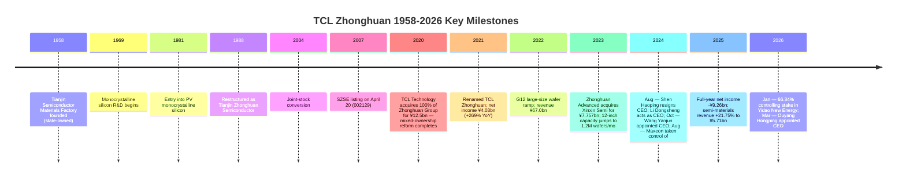

# TCL Zhonghuan Renewable Energy Technology Co., Ltd. — Company Research

**Ticker**: SZSE:002129 · **Short Name**: TCL Zhonghuan · **English Name**: TCL Zhonghuan Renewable Energy Technology Co., Ltd. (TZE)
**Report Language**: English (en-US) · **Authored**: 2026-05-25
**Coverage context**: This report is the English companion to the Chinese deep-dive in the same folder. Both files share the same underlying research and citations but are written natively in each language. Coverage was initiated off the back of Nomura's 2026-05-21 anchor *"Greater China Semi 2026~30F Renaissance"*, whose Figure 35 names NSIG and Zhonghuan as China's two 300mm semiconductor-wafer representatives. This file covers the Zhonghuan side; NSIG (Shanghai Silicon Industry, `SSE:688126`) is addressed in §7 as a comparator.

> **Update — FY2025 results and strategic inflection (disclosed 2026-03-25):** TCL Zhonghuan reported full-year revenue of ¥29.05 bn (+2.22% YoY) but a net loss attributable to shareholders of -¥9.26 bn (loss narrowed 5.65% YoY) — the second consecutive annual loss, with two-year aggregate losses approaching ¥19 bn. The bright spot was the semiconductor-materials segment (operated through 中环领先 / Zhonghuan Advanced — the semi-wafer subsidiary), which delivered ¥5.71 bn revenue (+21.75% YoY) at an 18.94% gross margin and is currently the only sustainably profitable segment. The photovoltaic wafer (-19.44% GM) and module (-6.22% GM) businesses remain deeply mired in the "anti-involution" cyclical trough. In January 2026 the company took a 66.34% controlling stake in 一道新能源 (Yidao New Energy) for ¥1.26 bn to accelerate the back-contact (BC) solar-cell roadmap; in March 2026 the CEO was changed from 王彦君 (Wang Yanjun) to 欧阳洪平 (Ouyang Hongping).
> Source: [TCL 中环 2025 年年度报告, pp. 4-15](https://static.cninfo.com.cn/finalpage/2026-03-25/1225029362.PDF) · [2026 年第一季度报告, p. 9](https://static.cninfo.com.cn/finalpage/2026-04-28/1225219941.PDF) · [TCL中环12.58亿收购一道新能源, 钛媒体 2026-04-01](https://www.tmtpost.com/7937878.html)

## Table of Contents

1. Company Overview
2. Company History
3. Management
4. Products & Services
5. Customers & Go-to-Market
6. Industry Overview
7. Competitive Landscape
8. Market Opportunity (TAM)
9. Risk Assessment
10. References

---

## 1. Company Overview

TCL Zhonghuan Renewable Energy Technology Co., Ltd. is a silicon-based manufacturer built around a single core feedstock — monocrystalline silicon (单晶硅 / monocrystalline silicon) — from which it has extended vertically into three product platforms: **photovoltaic (PV) materials, PV cells/modules, and semiconductor materials**. The company traces its lineage to the Tianjin Semiconductor Materials Factory founded in 1958. It listed on the Shenzhen Stock Exchange in 2007 (then known as "Zhonghuan Stock"), and in 2020 completed a landmark mixed-ownership reform when TCL Technology Group acquired 100% of the former state-owned parent Tianjin Zhonghuan Electronics Information Group and renamed the listco TCL Zhonghuan. As of the report date, TCL Technology Group (Tianjin) holds 27.36% as the single largest shareholder, with no ultimate controlling party ([TCL 中环 2026 年第一季度报告, p. 5](https://static.cninfo.com.cn/finalpage/2026-04-28/1225219941.PDF)).

The business model is best described as a **"PV + semiconductor" dual-platform** sitting on a common monocrystalline silicon foundation. On a 2025 revenue basis, the **PV platform** generated ¥22.73 bn (78.2% of total), broken into photovoltaic wafers ¥12.24 bn (42.1%), PV modules ¥9.32 bn (32.1%), and PV power-station EPC ¥1.16 bn (4.0%). The **semiconductor-materials platform**, operated through controlled subsidiary 中环领先 (Zhonghuan Advanced — the semi-wafer subsidiary), generated ¥5.71 bn (19.6%) and is the largest 6-to-12-inch semiconductor-silicon-wafer player in China by revenue ([TCL 中环 2025 年年度报告, pp. 14-15](https://static.cninfo.com.cn/finalpage/2026-03-25/1225029362.PDF)). Both businesses are deeply capital-intensive: year-end 2025 fixed assets reached ¥53.92 bn (45.7% of total assets), construction-in-progress ¥10.27 bn (8.7%); total assets stood at ¥117.99 bn against shareholder equity of ¥21.97 bn, implying a roughly 66.6% asset-liability ratio ([Ibid., pp. 8, 24](https://static.cninfo.com.cn/finalpage/2026-03-25/1225029362.PDF)).

The geographic footprint remains China-centric with overseas exposure as the growth lever. In 2025, **domestic sales** were ¥25.53 bn (87.9%) and **export sales** ¥3.52 bn (12.1%). Production bases are concentrated in Tianjin (Zhonghuan Advanced Material Technology, Huanou Semiconductor, Huanzhi New Energy), Hohhot in Inner Mongolia (Zhonghuan PV, Zhonghuan Crystal, Inner Mongolia Zhonghuan Advanced Semi Materials), Yixing and Wuxi in Jiangsu (Zhonghuan Advanced Semi Technology, Huansheng PV, Zhonghuan Applied Materials), Zhongwei in Ningxia, Weinan in Shaanxi, plus the Philippines and Malaysia module lines held via the Maxeon subsidiary ([TCL 中环 2025 年年度报告, pp. 9, 49](https://static.cninfo.com.cn/finalpage/2026-03-25/1225029362.PDF)). Internationally, in 2024 the company signed a partnership with Saudi Arabia's Public Investment Fund (PIF) — through RELC and Vision Industries — to jointly build what the company describes as the largest overseas crystal-and-wafer factory to date; the project is currently in "progressive implementation" ([TCL 中环 2024 年年度报告, p. 16](https://static.cninfo.com.cn/finalpage/2025-04-26/1223330188.PDF)).

On scale metrics, 2025 R&D spend was ¥1.06 bn (3.65% of revenue) employing 1,238 R&D staff, against a total headcount of roughly 12,600. Cumulative authorised IP rights now stand at 4,763 — including 606 domestic invention patents and 1,992 overseas patents. The group includes 12 designated high-tech enterprises, one state-level technology centre, and one state-level technology-innovation demonstration enterprise ([TCL 中环 2025 年年度报告, pp. 19-20](https://static.cninfo.com.cn/finalpage/2026-03-25/1225029362.PDF)).

Operationally, 2025 saw the following key throughput: **PV wafers** shipped 1.335 bn pieces (in G10-equivalent terms), translating to roughly 125-130 GW; the wafer market share, on CPIA's 2024 numbers, was 18.9% — still the industry's largest, though slipping a few percentage points as competitors brought new capacity online. **PV modules** shipped 15.12 GW (+82.31% YoY). **Semiconductor wafers** shipped 1,222.10 MSI (million square inches), +23.99% YoY, against production of 1,246.20 MSI and ending inventory of 91.29 MSI ([TCL 中环 2025 年年度报告, pp. 15-16](https://static.cninfo.com.cn/finalpage/2026-03-25/1225029362.PDF)).

*Source: [TCL 中环 2025 年年度报告, p. 8](https://static.cninfo.com.cn/finalpage/2026-03-25/1225029362.PDF) · [2024 年年度报告, p. 11](https://static.cninfo.com.cn/finalpage/2025-04-26/1223330188.PDF) · 2022 net income attributable to parent of ¥6.819 bn from [2022 年年度报告, p. 11](https://static.cninfo.com.cn/finalpage/2023-03-29/1216246676.PDF)*

**Valuation snapshot (as of 2026-05-25)**:

- Share price ≈ ¥9.12-¥10.19 over 13-21 May 2025, ¥9.22 on 2026-05-25;
- Total share capital 4,043,115,773 shares; market cap ≈ **¥36.7 bn** ([TCL 中环 (002129) 5月21日, 搜狐 2026-05-22](https://www.sohu.com/a/1025762975_121319643));
- **TTM P/E** = **N/A** — the company posted net losses of -¥9.82 bn (FY2024) and -¥9.26 bn (FY2025); TTM EPS ≈ -¥2.29;
- **TTM P/S** ≈ **1.27x** (¥36.7 bn / ¥29.05 bn);
- **P/B** ≈ **1.85x** — implied book value per share ≈ ¥4.95 ([TCL Zhonghuan SHE:002129, Stockanalysis.com 2026-05-25](https://stockanalysis.com/quote/she/002129/financials/));
- **3-year range**: share price high ¥56.49 (Nov-2021), low ¥7.11 (Sep-2025) — a 84% drawdown peak-to-trough; P/B compressed from a peak of ~5.8x to today's 1.85x, more than 60% multiple compression.

*Analyst view:* The negative TTM P/E reflects the **cyclical loss profile of the PV main-chain combined with goodwill / inventory impairments** — 2025 asset-impairment loss alone was -¥3.91 bn, equal to 38.4% of the absolute value of the company's total profit, largely driven by inventory write-downs ([TCL 中环 2025 年年度报告, p. 21](https://static.cninfo.com.cn/finalpage/2026-03-25/1225029362.PDF)). With PV-wafer gross margin at -19.44% and PV-module gross margin at -6.22%, the consolidated GM is dragged negative ([Ibid., p. 16](https://static.cninfo.com.cn/finalpage/2026-03-25/1225029362.PDF)). The semiconductor-materials segment, by contrast, posted 18.94% GM on +21.75% revenue growth — the only positive earnings contributor, though at 19.6% of revenue too small alone to flip group results. The 1.85x P/B sits between "asset-revaluation + PV-bottom call-option" and "continued-loss + impairment risk." For sector context: peer NSIG (`SSE:688126`) trades at ~13x TTM P/S, while LONGi Green Energy (`SSE:601012`) trades near 1.0x — TCL Zhonghuan's ~1.27x sits with LONGi, reading as a "PV leader + semiconductor option" rather than as a pure-play semiconductor name ([沪硅产业 (688126) 盈利预测, 同花顺 2026-04](https://basic.10jqka.com.cn/688126/worth.html)).

## 2. Company History

The company's roots trace to the **Tianjin Semiconductor Materials Factory**, founded in 1958 as one of the first state-run producers of monocrystalline silicon for integrated-circuit applications in China. The factory began monocrystalline-silicon R&D in 1969 and entered photovoltaic monocrystalline silicon in 1981 ([光伏"孤岛"TCL 中环和它的灵魂 CEO, 证券时报 2024-08](https://stcn.com/article/detail/1287881.html)). In 1988 it was restructured as the predecessor entity of Tianjin Zhonghuan Semiconductor; in July 2004 the Tianjin municipal government approved the conversion to a joint-stock company under Document Jin-Gu-Pi [2004] No. 6, and on April 20, 2007 the company listed on the Shenzhen Stock Exchange main board under code 002129 ([TCL 中环 2024 年年度报告, p. 105](https://static.cninfo.com.cn/finalpage/2025-04-26/1223330188.PDF)).

**The single most consequential corporate event occurred during the 2020 mixed-ownership reform.** The Tianjin SASAC had put the parent — Tianjin Zhonghuan Electronics Information Group — up for a 100% public-tender transfer with a floor price of ¥10.97 bn. TCL Technology ultimately prevailed at ¥12.5 bn, completing the transaction on September 27, 2020. With that, Zhonghuan transitioned from a Tianjin SASAC enterprise to a TCL-controlled private business; TCL Technology Group (Tianjin) became the largest shareholder ([TCL 收购中环半导体: 国企混改项目完成, SISC Magazine 2020-09](https://www.siscmag.com/news/show-3572.html)). In 2021 the company renamed itself TCL Zhonghuan, the board was reconstituted with 沈浩平 (Shen Haoping) remaining CEO and 李东生 (Li Dongsheng — TCL founder) becoming chairman, and the company entered its first high-growth phase post-TCL: 2021 net income hit ¥4.03 bn (+269% YoY), 2022 reached ¥6.82 bn (+69%), and 2022 revenue set an all-time record of ¥67.01 bn ([TCL 中环 2022 年年度报告, p. 9](https://static.cninfo.com.cn/finalpage/2023-03-29/1216246676.PDF)).

The **semiconductor-wafer arm** — operated through **Zhonghuan Advanced Semiconductor Technology Co., Ltd.** (registered in Yixing, Jiangsu) and **Tianjin Zhonghuan Advanced Material Technology Co., Ltd.** — was carved out from the original Tianjin Zhonghuan Semiconductor plant and then expanded via new greenfield bases in Inner Mongolia and Yixing, ultimately becoming a "full-format 4-to-12-inch wafer" group. In January 2023, the company announced via Zhonghuan Advanced an issuance-of-shares acquisition of 100% of Wuxi-based 鑫芯半导体 (Xinxin Semiconductor) for ¥7.757 bn. Xinxin, founded in 2017, specialised in 12-inch (300mm) polished wafers and epitaxial wafers and had built out 600,000 wafer-per-month plant capacity and supporting facilities ([鑫芯半导体与中环领先携手战略重组, 中证网 2023-01-19](https://news.cnstock.com/news,bwkx-202301-5008750.htm)). After the restructuring closed, Xinxin became a wholly-owned subsidiary of Zhonghuan Advanced and was consolidated, with TCL Zhonghuan's stake in Zhonghuan Advanced diluted to 67.50% and former Xinxin shareholders together holding 32.50% ([作价 77.57 亿元! TCL 中环拟收购鑫芯半导体, 腾讯云 2023-01-20](https://cloud.tencent.com.cn/developer/article/2214551)). The deal lifted Zhonghuan Advanced's theoretical 12-inch capacity from about 600,000 wafers per month to **1.2 million wafers per month**, the largest in China ([半导体行业开启"并购潮", 36Kr 2023-01-19](https://www.36kr.com/p/2098595989274753)).

*Source: composite from [TCL 中环 2024 年年度报告, p. 105](https://static.cninfo.com.cn/finalpage/2025-04-26/1223330188.PDF) · [2025 年年度报告, p. 32](https://static.cninfo.com.cn/finalpage/2026-03-25/1225029362.PDF) · [80 后王彦君升任 TCL 中环 CEO, 兰科技 2024-10](https://www.lankeji.com/jiaju/2024/1010/69081.html) · [TCL 中环 12.58 亿控股一道新能, 工业资源网 2026-04](https://www.industrysourcing.cn/article/475162)*

**Three strategic inflections deserve particular attention**:

(1) **The 2020 mixed-ownership reform** moved the company out of the Tianjin SASAC umbrella (where it had been one of a handful of state-backed PV manufacturers of meaningful scale) into TCL's private-controlled orbit. TCL brought more aggressive capital allocation and global resources, but it also unleashed a new operating mode — aggressive capacity expansion paired with high cyclical sensitivity ([光伏"孤岛"TCL 中环和它的灵魂 CEO, 证券时报 2024-08](https://stcn.com/article/detail/1287881.html)).

(2) **The 2022 commitment to the G12 large-size wafer roadmap.** The 210mm (G12) wafer format championed by the company climbed quickly from roughly 10% industry penetration in 2020. In 2024, 210-series products (G12 + G12R) shipped 60.4 GW — 21% (G12) + 43% (210R+210) of industry totals; in 2025, G12 shipments grew +40.8% ([210 硅片颠覆: TCL 中环的尺寸跨越, 新浪财经 2025-03-31](https://finance.sina.com.cn/roll/2025-03-31/doc-inerqfen1026795.shtml)). However, the 210 roadmap also left the company a step behind on N-type TOPCon mass-production and BC-cell commercialization — which is precisely the source of the 2024-25 losses.

(3) **The August 2024 acquisition of controlling interest in Maxeon.** The company, via a basket of transactions, took control of Maxeon Solar Technologies (NASDAQ:MAXN, now delisted) — the SunPower-lineage module business. The thesis was: borrow Maxeon's channel, brand, and BC-cell IP to open the US market. In practice, the 2024 H2 US-market shock from tariffs and the *One Big Beautiful Bill Act* (BBBA), combined with Maxeon's own deteriorating operating performance, forced the company to retreat — having Maxeon divest non-US businesses and focus on the US market, with a February 2026 announcement of a planned 100% disposal of Maxeon's Malaysian subsidiary SPMI ([TCL 中环 2025 年年度报告, pp. 144, 299-300](https://static.cninfo.com.cn/finalpage/2026-03-25/1225029362.PDF)). Maxeon-related impairments are a primary driver of the 2024-25 goodwill and asset write-downs.

**Recent key events (2024-2026)**:
- 2024-08-02: CEO Shen Haoping resigned; chairman Li Dongsheng assumed interim CEO duties ([光伏巨头 TCL 中环人事突变, 新浪财经 2024-08-03](https://finance.sina.com.cn/jjxw/2024-08-03/doc-inchkfec1077985.shtml)).
- 2024-09-30: 王彦君 (Wang Yanjun) — born 1983, holder of an engineering master's degree — was appointed CEO, promoted from vice-chairman of Zhonghuan Advanced ([TCL 中环新任 CEO 落定, 证券时报 2024-10-08](https://stcn.com/article/detail/1340262.html)).
- 2026-01-16: The company announced a controlling stake in Yidao New Energy (a domestic N-type TOPCon-module-focused business) — total consideration ¥1.258 bn for 66.34% (an 8.06% equity stake + ¥1.0 bn capital injection + 7.20% voting-rights proxy), with the core objective of plugging the module-capacity gap and accelerating BC-cell commercialization ([TCL 中环的"破局之战": 控股一道新能源, 新浪财经 2026-01-19](https://finance.sina.com.cn/stock/s/2026-01-19/doc-inhhxvex9063465.shtml)).
- 2026-03-24: CEO changed from Wang Yanjun to **欧阳洪平 (Ouyang Hongping)** — born 1976, previously COO — who now also serves as legal representative ([TCL 中环 2026 年第一季度报告, p. 9](https://static.cninfo.com.cn/finalpage/2026-04-28/1225219941.PDF)).
- 2026 Q1: Revenue ¥6.549 bn (+7.34% YoY); net income attributable to parent -¥1.647 bn (loss narrowed 13.62% YoY); operating cash flow +¥0.304 bn ([Ibid., p. 2](https://static.cninfo.com.cn/finalpage/2026-04-28/1225219941.PDF)).

## 3. Management

The defining feature of the management structure today is **"the founder (Shen Haoping) has stepped back to vice-chairman, with professional-manager CEOs rotating through."** Chairman Li Dongsheng is TCL's founder, but the day-to-day CEO seat has changed three times in less than 18 months (Li Dongsheng interim → Wang Yanjun → Ouyang Hongping). Per this skill's "founder + current CEO only" rule, the coverage below treats only **the founder figure (Shen Haoping) and the current CEO (Ouyang Hongping)**.

### Founder / Strategic Figure — Shen Haoping (currently vice-chairman)

Shen Haoping was born in 1962 and graduated from the Department of Physics at Lanzhou University in 1983, specialising in semiconductor physics. He joined the Tianjin Semiconductor Materials Factory the same year, starting on the monocrystalline-pulling floor. The next 40 years of his career trace a stepwise progression: float-zone workshop head → assistant plant manager → deputy plant manager (chief engineer) → plant manager → general manager → chairman — the archetypal engineer-turned-industrial-entrepreneur ([光伏"孤岛"TCL 中环和它的灵魂 CEO, 证券时报 2024-08](https://stcn.com/article/detail/1287881.html)). He holds the senior professional engineer designation, receives a State Council Special Government Allowance, and has been honoured as a "National Distinguished Entrepreneur in the Electronic Information Industry" and "National Model Worker" ([TCL 中环 2025 年年度报告, p. 32](https://static.cninfo.com.cn/finalpage/2026-03-25/1225029362.PDF)).

On technical accomplishments, Shen has led or contributed to more than 10 state-level R&D programmes. As project lead he successfully delivered milestones under the "02 Special Project" — China's National Major Science & Technology Programme on integrated-circuit equipment and materials launched in 2008 — and **led the team that produced China's first 8-inch float-zone (FZ) silicon single crystal**. He also led the development of **the world's first proprietary G12 (210mm) large-size PV silicon wafer** ([Ibid., p. 32](https://static.cninfo.com.cn/finalpage/2026-03-25/1225029362.PDF)). The G12 roadmap is the central moat that allowed the company's PV-wafer business to overtake LONGi's M10 (182mm) roadmap from 2020 onward, capturing the "wafer market-share #1" position.

After TCL's 2020 acquisition, Shen served as TCL Zhonghuan CEO and an executive director of TCL Technology. On August 2, 2024, he unexpectedly stepped down from the CEO role — the public statement cited "work requirements and personal-energy considerations," which the market widely interpreted as a managed departure under performance pressure, given that H1 2024 had already shown sharp losses ([TCL 中环沈浩平"被辞职"始末, 界面新闻 2024-08-12](https://www.jiemian.com/article/11572626.html)). Shen continues as a director and vice-chairman, and retains influence on the G12 roadmap and future BC-cell technology direction ([TCL 中环 2025 年年度报告, p. 32](https://static.cninfo.com.cn/finalpage/2026-03-25/1225029362.PDF)). His individual shareholding is not separately disclosed, but he holds shares via the company's historical employee equity programme.

### Current CEO — Ouyang Hongping (appointed March 2026)

Ouyang Hongping is a PRC national born in 1976, holding a bachelor's degree in industrial automation — a notably different background from Shen Haoping's and Wang Yanjun's "doctorate + monocrystalline-silicon specialization" pedigree. Ouyang is **an operations-management talent who grew up inside the TCL system**, without a prominent semiconductor-wafer research track record ([TCL 中环 2025 年年度报告, p. 33](https://static.cninfo.com.cn/finalpage/2026-03-25/1225029362.PDF)).

Ouyang's prior career was concentrated at **TCL CSOT** (TCL Technology's display-panel arm — now operating under the TCL Semiconductor Display business), where he served as **Senior Vice President, MC SBU general manager, OLED middle-platform general manager, and CEO of Huaxian Optoelectronics** ([Ibid., p. 33](https://static.cninfo.com.cn/finalpage/2026-03-25/1225029362.PDF)). TCL CSOT lived through LCD-cycle troughs, OLED capacity ramps, and other archetypal heavy-asset cyclical management challenges — Ouyang is widely viewed as a hands-on operator skilled at "cost-cutting, utilization optimization, and organizational restructuring at cyclical bottoms."

His time at TCL Zhonghuan has been brief: he became COO in 2024, and on March 24, 2026 the 19th meeting of the 7th board reviewed and passed the *Proposal on the Change of CEO and Legal Representative*, appointing him CEO + legal representative, while continuing to fulfil the COO duties ([TCL 中环 2026 年第一季度报告, p. 9](https://static.cninfo.com.cn/finalpage/2026-04-28/1225219941.PDF)). He is the third CEO in 18 months — reflecting the board's heightened urgency around operating efficiency, cost reduction, and module-business integration.

According to the 2026 Q1 report, Ouyang's primary focus areas are three-pronged: (1) **shoring up the PV-wafer relative-competitiveness gap** — non-silicon processing costs per wafer fell more than 40% YoY in 2025; (2) **accelerating the module-business M&A and integration** — taking control of Yidao New Energy and integrating the existing BC + TOPCon + half-cell capacity; (3) **steady advancement of the semiconductor-materials business** — Zhonghuan Advanced posted ¥1.44 bn in Q1 2026 revenue (+8.5% YoY) ([Ibid., p. 7](https://static.cninfo.com.cn/finalpage/2026-04-28/1225219941.PDF)). Individual shareholdings are not separately disclosed; CEO compensation per company policy is structured as base salary + performance bonus + equity incentives, but with two consecutive years of losses, no cash dividends were paid and no equity-incentive exercises were disclosed ([TCL 中环 2025 年年度报告, pp. 32-33](https://static.cninfo.com.cn/finalpage/2026-03-25/1225029362.PDF)).

*Analyst view:* The quick rotation from Shen Haoping (deep technical roots, industry standing) → Wang Yanjun (technical + M&A) → Ouyang Hongping (operations / cost-out) reflects the board's strategic adjustment toward **"operations and finance first at the cyclical bottom"** — but it also raises questions about management-team stability and the continuity of long-term technology strategy. Two specific items worth tracking: (a) whether Shen's vice-chairman role continues to anchor BC-cell and G12 roadmap continuity, and (b) whether Ouyang can drive the PV-module segment to operating-cash-flow breakeven within 12-18 months.
