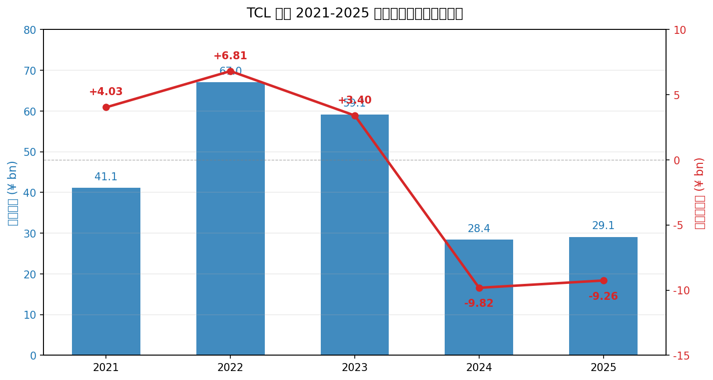
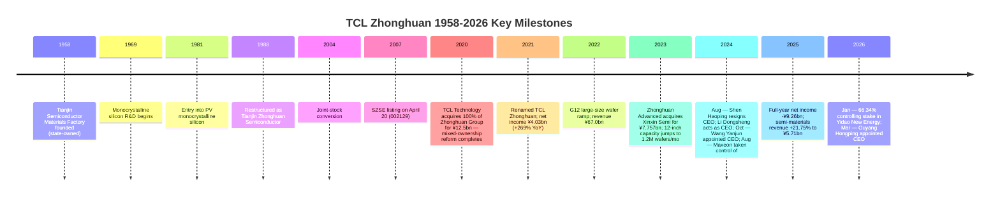
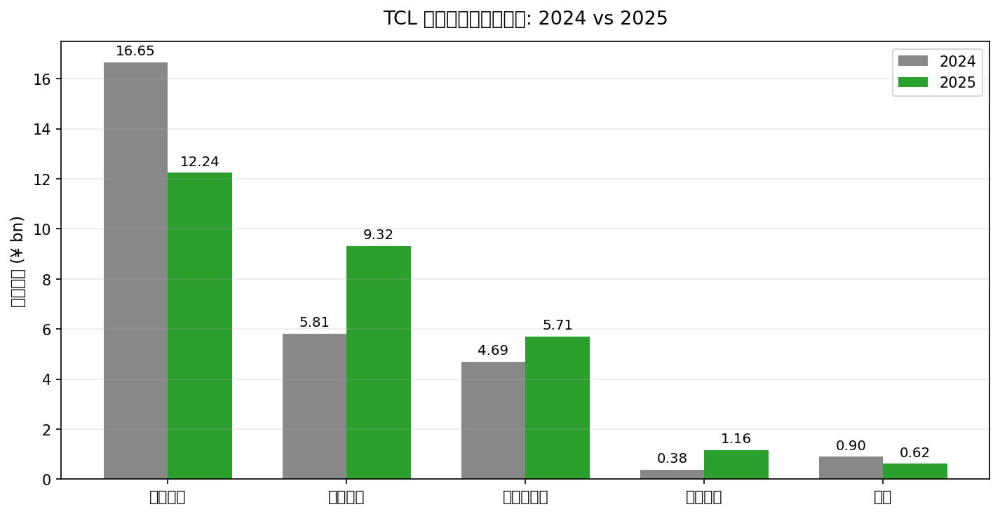
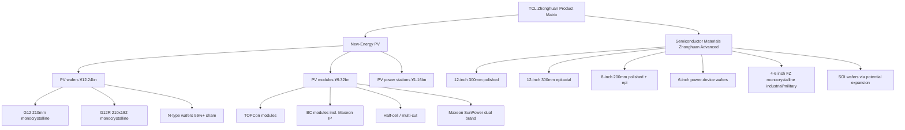
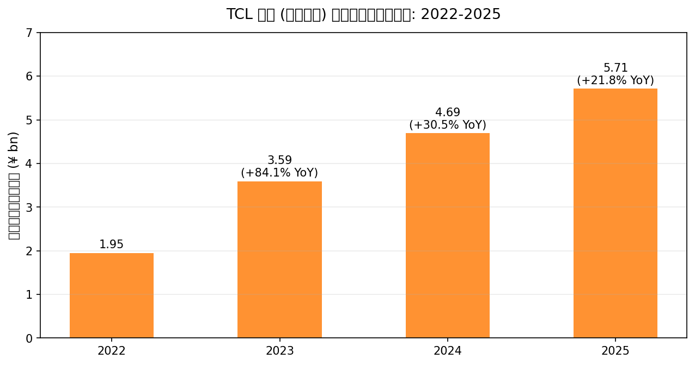
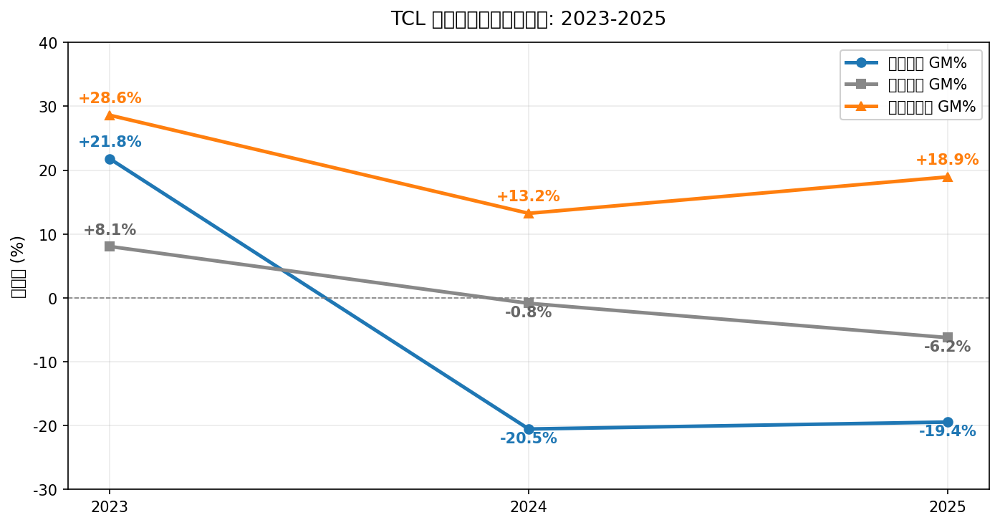
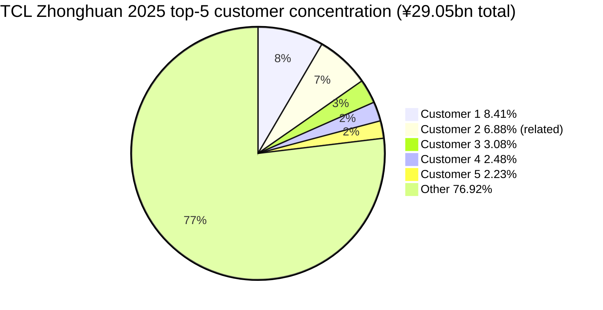
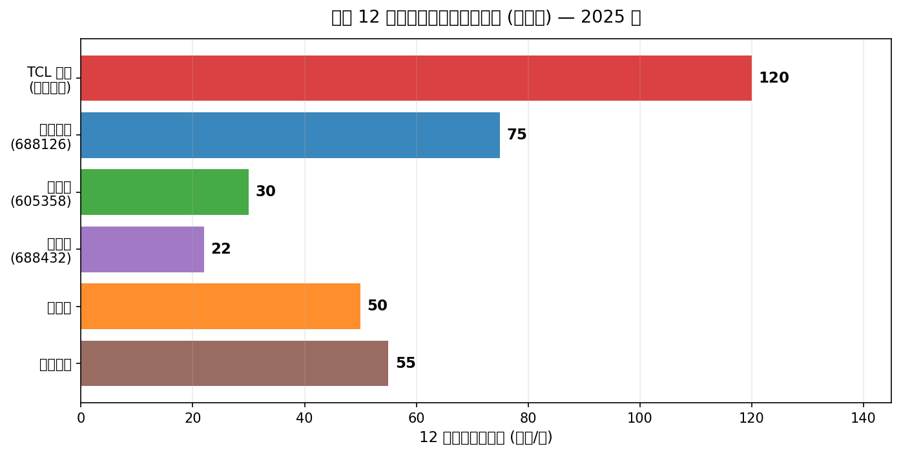

# TCL Zhonghuan Renewable Energy Technology Co., Ltd. — Company Research

**Ticker**: SZSE:002129 · **Short Name**: TCL Zhonghuan · **English Name**: TCL Zhonghuan Renewable Energy Technology Co., Ltd. (TZE)
**Report Language**: English (en-US) · **Authored**: 2026-05-25
**Coverage context**: This report is the English companion to the Chinese deep-dive in the same folder. Both files share the same underlying research and citations but are written natively in each language. Coverage was initiated off the back of Nomura's 2026-05-21 anchor *"Greater China Semi 2026~30F Renaissance"*, whose Figure 35 names NSIG and Zhonghuan as China's two 300mm semiconductor-wafer representatives. This file covers the Zhonghuan side; NSIG (Shanghai Silicon Industry, `SSE:688126`) is addressed in §7 as a comparator.

> **Update — FY2025 results and strategic inflection (disclosed 2026-03-25):** TCL Zhonghuan reported full-year revenue of ¥29.05 bn (+2.22% YoY) but a net loss attributable to shareholders of -¥9.26 bn (loss narrowed 5.65% YoY) — the second consecutive annual loss, with two-year aggregate losses approaching ¥19 bn. The bright spot was the semiconductor-materials segment (operated through 中环领先 / Zhonghuan Advanced — the semi-wafer subsidiary), which delivered ¥5.71 bn revenue (+21.75% YoY) at an 18.94% gross margin and is currently the only sustainably profitable segment. The photovoltaic wafer (-19.44% GM) and module (-6.22% GM) businesses remain deeply mired in the "anti-involution" cyclical trough. In January 2026 the company took a 66.34% controlling stake in 一道新能源 (Yidao New Energy) for ¥1.26 bn to accelerate the back-contact (BC) solar-cell roadmap; in March 2026 the CEO was changed from 王彦君 (Wang Yanjun) to 欧阳洪平 (Ouyang Hongping).
> Source: [TCL 中环 2025 年年度报告, pp. 4-15](https://static.cninfo.com.cn/finalpage/2026-03-25/1225029362.PDF) · [2026 年第一季度报告, p. 9](https://static.cninfo.com.cn/finalpage/2026-04-28/1225219941.PDF) · [TCL中环12.58亿收购一道新能源, 钛媒体 2026-04-01](https://www.tmtpost.com/7937878.html)

## Table of Contents

1. Company Overview
2. Company History
3. Management
4. Products & Services
5. Customers & Go-to-Market
6. Industry Overview
7. Competitive Landscape
8. Market Opportunity (TAM)
9. Risk Assessment
10. References

---

## 1. Company Overview

TCL Zhonghuan Renewable Energy Technology Co., Ltd. is a silicon-based manufacturer built around a single core feedstock — monocrystalline silicon (单晶硅 / monocrystalline silicon) — from which it has extended vertically into three product platforms: **photovoltaic (PV) materials, PV cells/modules, and semiconductor materials**. The company traces its lineage to the Tianjin Semiconductor Materials Factory founded in 1958. It listed on the Shenzhen Stock Exchange in 2007 (then known as "Zhonghuan Stock"), and in 2020 completed a landmark mixed-ownership reform when TCL Technology Group acquired 100% of the former state-owned parent Tianjin Zhonghuan Electronics Information Group and renamed the listco TCL Zhonghuan. As of the report date, TCL Technology Group (Tianjin) holds 27.36% as the single largest shareholder, with no ultimate controlling party ([TCL 中环 2026 年第一季度报告, p. 5](https://static.cninfo.com.cn/finalpage/2026-04-28/1225219941.PDF)).

The business model is best described as a **"PV + semiconductor" dual-platform** sitting on a common monocrystalline silicon foundation. On a 2025 revenue basis, the **PV platform** generated ¥22.73 bn (78.2% of total), broken into photovoltaic wafers ¥12.24 bn (42.1%), PV modules ¥9.32 bn (32.1%), and PV power-station EPC ¥1.16 bn (4.0%). The **semiconductor-materials platform**, operated through controlled subsidiary 中环领先 (Zhonghuan Advanced — the semi-wafer subsidiary), generated ¥5.71 bn (19.6%) and is the largest 6-to-12-inch semiconductor-silicon-wafer player in China by revenue ([TCL 中环 2025 年年度报告, pp. 14-15](https://static.cninfo.com.cn/finalpage/2026-03-25/1225029362.PDF)). Both businesses are deeply capital-intensive: year-end 2025 fixed assets reached ¥53.92 bn (45.7% of total assets), construction-in-progress ¥10.27 bn (8.7%); total assets stood at ¥117.99 bn against shareholder equity of ¥21.97 bn, implying a roughly 66.6% asset-liability ratio ([Ibid., pp. 8, 24](https://static.cninfo.com.cn/finalpage/2026-03-25/1225029362.PDF)).

The geographic footprint remains China-centric with overseas exposure as the growth lever. In 2025, **domestic sales** were ¥25.53 bn (87.9%) and **export sales** ¥3.52 bn (12.1%). Production bases are concentrated in Tianjin (Zhonghuan Advanced Material Technology, Huanou Semiconductor, Huanzhi New Energy), Hohhot in Inner Mongolia (Zhonghuan PV, Zhonghuan Crystal, Inner Mongolia Zhonghuan Advanced Semi Materials), Yixing and Wuxi in Jiangsu (Zhonghuan Advanced Semi Technology, Huansheng PV, Zhonghuan Applied Materials), Zhongwei in Ningxia, Weinan in Shaanxi, plus the Philippines and Malaysia module lines held via the Maxeon subsidiary ([TCL 中环 2025 年年度报告, pp. 9, 49](https://static.cninfo.com.cn/finalpage/2026-03-25/1225029362.PDF)). Internationally, in 2024 the company signed a partnership with Saudi Arabia's Public Investment Fund (PIF) — through RELC and Vision Industries — to jointly build what the company describes as the largest overseas crystal-and-wafer factory to date; the project is currently in "progressive implementation" ([TCL 中环 2024 年年度报告, p. 16](https://static.cninfo.com.cn/finalpage/2025-04-26/1223330188.PDF)).

On scale metrics, 2025 R&D spend was ¥1.06 bn (3.65% of revenue) employing 1,238 R&D staff, against a total headcount of roughly 12,600. Cumulative authorised IP rights now stand at 4,763 — including 606 domestic invention patents and 1,992 overseas patents. The group includes 12 designated high-tech enterprises, one state-level technology centre, and one state-level technology-innovation demonstration enterprise ([TCL 中环 2025 年年度报告, pp. 19-20](https://static.cninfo.com.cn/finalpage/2026-03-25/1225029362.PDF)).

Operationally, 2025 saw the following key throughput: **PV wafers** shipped 1.335 bn pieces (in G10-equivalent terms), translating to roughly 125-130 GW; the wafer market share, on CPIA's 2024 numbers, was 18.9% — still the industry's largest, though slipping a few percentage points as competitors brought new capacity online. **PV modules** shipped 15.12 GW (+82.31% YoY). **Semiconductor wafers** shipped 1,222.10 MSI (million square inches), +23.99% YoY, against production of 1,246.20 MSI and ending inventory of 91.29 MSI ([TCL 中环 2025 年年度报告, pp. 15-16](https://static.cninfo.com.cn/finalpage/2026-03-25/1225029362.PDF)).

*Source: [TCL 中环 2025 年年度报告, p. 8](https://static.cninfo.com.cn/finalpage/2026-03-25/1225029362.PDF) · [2024 年年度报告, p. 11](https://static.cninfo.com.cn/finalpage/2025-04-26/1223330188.PDF) · 2022 net income attributable to parent of ¥6.819 bn from [2022 年年度报告, p. 11](https://static.cninfo.com.cn/finalpage/2023-03-29/1216246676.PDF)*

**Valuation snapshot (as of 2026-05-25)**:

- Share price ≈ ¥9.12-¥10.19 over 13-21 May 2025, ¥9.22 on 2026-05-25;
- Total share capital 4,043,115,773 shares; market cap ≈ **¥36.7 bn** ([TCL 中环 (002129) 5月21日, 搜狐 2026-05-22](https://www.sohu.com/a/1025762975_121319643));
- **TTM P/E** = **N/A** — the company posted net losses of -¥9.82 bn (FY2024) and -¥9.26 bn (FY2025); TTM EPS ≈ -¥2.29;
- **TTM P/S** ≈ **1.27x** (¥36.7 bn / ¥29.05 bn);
- **P/B** ≈ **1.85x** — implied book value per share ≈ ¥4.95 ([TCL Zhonghuan SHE:002129, Stockanalysis.com 2026-05-25](https://stockanalysis.com/quote/she/002129/financials/));
- **3-year range**: share price high ¥56.49 (Nov-2021), low ¥7.11 (Sep-2025) — a 84% drawdown peak-to-trough; P/B compressed from a peak of ~5.8x to today's 1.85x, more than 60% multiple compression.

*Analyst view:* The negative TTM P/E reflects the **cyclical loss profile of the PV main-chain combined with goodwill / inventory impairments** — 2025 asset-impairment loss alone was -¥3.91 bn, equal to 38.4% of the absolute value of the company's total profit, largely driven by inventory write-downs ([TCL 中环 2025 年年度报告, p. 21](https://static.cninfo.com.cn/finalpage/2026-03-25/1225029362.PDF)). With PV-wafer gross margin at -19.44% and PV-module gross margin at -6.22%, the consolidated GM is dragged negative ([Ibid., p. 16](https://static.cninfo.com.cn/finalpage/2026-03-25/1225029362.PDF)). The semiconductor-materials segment, by contrast, posted 18.94% GM on +21.75% revenue growth — the only positive earnings contributor, though at 19.6% of revenue too small alone to flip group results. The 1.85x P/B sits between "asset-revaluation + PV-bottom call-option" and "continued-loss + impairment risk." For sector context: peer NSIG (`SSE:688126`) trades at ~13x TTM P/S, while LONGi Green Energy (`SSE:601012`) trades near 1.0x — TCL Zhonghuan's ~1.27x sits with LONGi, reading as a "PV leader + semiconductor option" rather than as a pure-play semiconductor name ([沪硅产业 (688126) 盈利预测, 同花顺 2026-04](https://basic.10jqka.com.cn/688126/worth.html)).

## 2. Company History

The company's roots trace to the **Tianjin Semiconductor Materials Factory**, founded in 1958 as one of the first state-run producers of monocrystalline silicon for integrated-circuit applications in China. The factory began monocrystalline-silicon R&D in 1969 and entered photovoltaic monocrystalline silicon in 1981 ([光伏"孤岛"TCL 中环和它的灵魂 CEO, 证券时报 2024-08](https://stcn.com/article/detail/1287881.html)). In 1988 it was restructured as the predecessor entity of Tianjin Zhonghuan Semiconductor; in July 2004 the Tianjin municipal government approved the conversion to a joint-stock company under Document Jin-Gu-Pi [2004] No. 6, and on April 20, 2007 the company listed on the Shenzhen Stock Exchange main board under code 002129 ([TCL 中环 2024 年年度报告, p. 105](https://static.cninfo.com.cn/finalpage/2025-04-26/1223330188.PDF)).

**The single most consequential corporate event occurred during the 2020 mixed-ownership reform.** The Tianjin SASAC had put the parent — Tianjin Zhonghuan Electronics Information Group — up for a 100% public-tender transfer with a floor price of ¥10.97 bn. TCL Technology ultimately prevailed at ¥12.5 bn, completing the transaction on September 27, 2020. With that, Zhonghuan transitioned from a Tianjin SASAC enterprise to a TCL-controlled private business; TCL Technology Group (Tianjin) became the largest shareholder ([TCL 收购中环半导体: 国企混改项目完成, SISC Magazine 2020-09](https://www.siscmag.com/news/show-3572.html)). In 2021 the company renamed itself TCL Zhonghuan, the board was reconstituted with 沈浩平 (Shen Haoping) remaining CEO and 李东生 (Li Dongsheng — TCL founder) becoming chairman, and the company entered its first high-growth phase post-TCL: 2021 net income hit ¥4.03 bn (+269% YoY), 2022 reached ¥6.82 bn (+69%), and 2022 revenue set an all-time record of ¥67.01 bn ([TCL 中环 2022 年年度报告, p. 9](https://static.cninfo.com.cn/finalpage/2023-03-29/1216246676.PDF)).

The **semiconductor-wafer arm** — operated through **Zhonghuan Advanced Semiconductor Technology Co., Ltd.** (registered in Yixing, Jiangsu) and **Tianjin Zhonghuan Advanced Material Technology Co., Ltd.** — was carved out from the original Tianjin Zhonghuan Semiconductor plant and then expanded via new greenfield bases in Inner Mongolia and Yixing, ultimately becoming a "full-format 4-to-12-inch wafer" group. In January 2023, the company announced via Zhonghuan Advanced an issuance-of-shares acquisition of 100% of Wuxi-based 鑫芯半导体 (Xinxin Semiconductor) for ¥7.757 bn. Xinxin, founded in 2017, specialised in 12-inch (300mm) polished wafers and epitaxial wafers and had built out 600,000 wafer-per-month plant capacity and supporting facilities ([鑫芯半导体与中环领先携手战略重组, 中证网 2023-01-19](https://news.cnstock.com/news,bwkx-202301-5008750.htm)). After the restructuring closed, Xinxin became a wholly-owned subsidiary of Zhonghuan Advanced and was consolidated, with TCL Zhonghuan's stake in Zhonghuan Advanced diluted to 67.50% and former Xinxin shareholders together holding 32.50% ([作价 77.57 亿元! TCL 中环拟收购鑫芯半导体, 腾讯云 2023-01-20](https://cloud.tencent.com.cn/developer/article/2214551)). The deal lifted Zhonghuan Advanced's theoretical 12-inch capacity from about 600,000 wafers per month to **1.2 million wafers per month**, the largest in China ([半导体行业开启"并购潮", 36Kr 2023-01-19](https://www.36kr.com/p/2098595989274753)).

*Source: composite from [TCL 中环 2024 年年度报告, p. 105](https://static.cninfo.com.cn/finalpage/2025-04-26/1223330188.PDF) · [2025 年年度报告, p. 32](https://static.cninfo.com.cn/finalpage/2026-03-25/1225029362.PDF) · [80 后王彦君升任 TCL 中环 CEO, 兰科技 2024-10](https://www.lankeji.com/jiaju/2024/1010/69081.html) · [TCL 中环 12.58 亿控股一道新能, 工业资源网 2026-04](https://www.industrysourcing.cn/article/475162)*

**Three strategic inflections deserve particular attention**:

(1) **The 2020 mixed-ownership reform** moved the company out of the Tianjin SASAC umbrella (where it had been one of a handful of state-backed PV manufacturers of meaningful scale) into TCL's private-controlled orbit. TCL brought more aggressive capital allocation and global resources, but it also unleashed a new operating mode — aggressive capacity expansion paired with high cyclical sensitivity ([光伏"孤岛"TCL 中环和它的灵魂 CEO, 证券时报 2024-08](https://stcn.com/article/detail/1287881.html)).

(2) **The 2022 commitment to the G12 large-size wafer roadmap.** The 210mm (G12) wafer format championed by the company climbed quickly from roughly 10% industry penetration in 2020. In 2024, 210-series products (G12 + G12R) shipped 60.4 GW — 21% (G12) + 43% (210R+210) of industry totals; in 2025, G12 shipments grew +40.8% ([210 硅片颠覆: TCL 中环的尺寸跨越, 新浪财经 2025-03-31](https://finance.sina.com.cn/roll/2025-03-31/doc-inerqfen1026795.shtml)). However, the 210 roadmap also left the company a step behind on N-type TOPCon mass-production and BC-cell commercialization — which is precisely the source of the 2024-25 losses.

(3) **The August 2024 acquisition of controlling interest in Maxeon.** The company, via a basket of transactions, took control of Maxeon Solar Technologies (NASDAQ:MAXN, now delisted) — the SunPower-lineage module business. The thesis was: borrow Maxeon's channel, brand, and BC-cell IP to open the US market. In practice, the 2024 H2 US-market shock from tariffs and the *One Big Beautiful Bill Act* (BBBA), combined with Maxeon's own deteriorating operating performance, forced the company to retreat — having Maxeon divest non-US businesses and focus on the US market, with a February 2026 announcement of a planned 100% disposal of Maxeon's Malaysian subsidiary SPMI ([TCL 中环 2025 年年度报告, pp. 144, 299-300](https://static.cninfo.com.cn/finalpage/2026-03-25/1225029362.PDF)). Maxeon-related impairments are a primary driver of the 2024-25 goodwill and asset write-downs.

**Recent key events (2024-2026)**:
- 2024-08-02: CEO Shen Haoping resigned; chairman Li Dongsheng assumed interim CEO duties ([光伏巨头 TCL 中环人事突变, 新浪财经 2024-08-03](https://finance.sina.com.cn/jjxw/2024-08-03/doc-inchkfec1077985.shtml)).
- 2024-09-30: 王彦君 (Wang Yanjun) — born 1983, holder of an engineering master's degree — was appointed CEO, promoted from vice-chairman of Zhonghuan Advanced ([TCL 中环新任 CEO 落定, 证券时报 2024-10-08](https://stcn.com/article/detail/1340262.html)).
- 2026-01-16: The company announced a controlling stake in Yidao New Energy (a domestic N-type TOPCon-module-focused business) — total consideration ¥1.258 bn for 66.34% (an 8.06% equity stake + ¥1.0 bn capital injection + 7.20% voting-rights proxy), with the core objective of plugging the module-capacity gap and accelerating BC-cell commercialization ([TCL 中环的"破局之战": 控股一道新能源, 新浪财经 2026-01-19](https://finance.sina.com.cn/stock/s/2026-01-19/doc-inhhxvex9063465.shtml)).
- 2026-03-24: CEO changed from Wang Yanjun to **欧阳洪平 (Ouyang Hongping)** — born 1976, previously COO — who now also serves as legal representative ([TCL 中环 2026 年第一季度报告, p. 9](https://static.cninfo.com.cn/finalpage/2026-04-28/1225219941.PDF)).
- 2026 Q1: Revenue ¥6.549 bn (+7.34% YoY); net income attributable to parent -¥1.647 bn (loss narrowed 13.62% YoY); operating cash flow +¥0.304 bn ([Ibid., p. 2](https://static.cninfo.com.cn/finalpage/2026-04-28/1225219941.PDF)).

## 3. Management

The defining feature of the management structure today is **"the founder (Shen Haoping) has stepped back to vice-chairman, with professional-manager CEOs rotating through."** Chairman Li Dongsheng is TCL's founder, but the day-to-day CEO seat has changed three times in less than 18 months (Li Dongsheng interim → Wang Yanjun → Ouyang Hongping). Per this skill's "founder + current CEO only" rule, the coverage below treats only **the founder figure (Shen Haoping) and the current CEO (Ouyang Hongping)**.

### Founder / Strategic Figure — Shen Haoping (currently vice-chairman)

Shen Haoping was born in 1962 and graduated from the Department of Physics at Lanzhou University in 1983, specialising in semiconductor physics. He joined the Tianjin Semiconductor Materials Factory the same year, starting on the monocrystalline-pulling floor. The next 40 years of his career trace a stepwise progression: float-zone workshop head → assistant plant manager → deputy plant manager (chief engineer) → plant manager → general manager → chairman — the archetypal engineer-turned-industrial-entrepreneur ([光伏"孤岛"TCL 中环和它的灵魂 CEO, 证券时报 2024-08](https://stcn.com/article/detail/1287881.html)). He holds the senior professional engineer designation, receives a State Council Special Government Allowance, and has been honoured as a "National Distinguished Entrepreneur in the Electronic Information Industry" and "National Model Worker" ([TCL 中环 2025 年年度报告, p. 32](https://static.cninfo.com.cn/finalpage/2026-03-25/1225029362.PDF)).

On technical accomplishments, Shen has led or contributed to more than 10 state-level R&D programmes. As project lead he successfully delivered milestones under the "02 Special Project" — China's National Major Science & Technology Programme on integrated-circuit equipment and materials launched in 2008 — and **led the team that produced China's first 8-inch float-zone (FZ) silicon single crystal**. He also led the development of **the world's first proprietary G12 (210mm) large-size PV silicon wafer** ([Ibid., p. 32](https://static.cninfo.com.cn/finalpage/2026-03-25/1225029362.PDF)). The G12 roadmap is the central moat that allowed the company's PV-wafer business to overtake LONGi's M10 (182mm) roadmap from 2020 onward, capturing the "wafer market-share #1" position.

After TCL's 2020 acquisition, Shen served as TCL Zhonghuan CEO and an executive director of TCL Technology. On August 2, 2024, he unexpectedly stepped down from the CEO role — the public statement cited "work requirements and personal-energy considerations," which the market widely interpreted as a managed departure under performance pressure, given that H1 2024 had already shown sharp losses ([TCL 中环沈浩平"被辞职"始末, 界面新闻 2024-08-12](https://www.jiemian.com/article/11572626.html)). Shen continues as a director and vice-chairman, and retains influence on the G12 roadmap and future BC-cell technology direction ([TCL 中环 2025 年年度报告, p. 32](https://static.cninfo.com.cn/finalpage/2026-03-25/1225029362.PDF)). His individual shareholding is not separately disclosed, but he holds shares via the company's historical employee equity programme.

### Current CEO — Ouyang Hongping (appointed March 2026)

Ouyang Hongping is a PRC national born in 1976, holding a bachelor's degree in industrial automation — a notably different background from Shen Haoping's and Wang Yanjun's "doctorate + monocrystalline-silicon specialization" pedigree. Ouyang is **an operations-management talent who grew up inside the TCL system**, without a prominent semiconductor-wafer research track record ([TCL 中环 2025 年年度报告, p. 33](https://static.cninfo.com.cn/finalpage/2026-03-25/1225029362.PDF)).

Ouyang's prior career was concentrated at **TCL CSOT** (TCL Technology's display-panel arm — now operating under the TCL Semiconductor Display business), where he served as **Senior Vice President, MC SBU general manager, OLED middle-platform general manager, and CEO of Huaxian Optoelectronics** ([Ibid., p. 33](https://static.cninfo.com.cn/finalpage/2026-03-25/1225029362.PDF)). TCL CSOT lived through LCD-cycle troughs, OLED capacity ramps, and other archetypal heavy-asset cyclical management challenges — Ouyang is widely viewed as a hands-on operator skilled at "cost-cutting, utilization optimization, and organizational restructuring at cyclical bottoms."

His time at TCL Zhonghuan has been brief: he became COO in 2024, and on March 24, 2026 the 19th meeting of the 7th board reviewed and passed the *Proposal on the Change of CEO and Legal Representative*, appointing him CEO + legal representative, while continuing to fulfil the COO duties ([TCL 中环 2026 年第一季度报告, p. 9](https://static.cninfo.com.cn/finalpage/2026-04-28/1225219941.PDF)). He is the third CEO in 18 months — reflecting the board's heightened urgency around operating efficiency, cost reduction, and module-business integration.

According to the 2026 Q1 report, Ouyang's primary focus areas are three-pronged: (1) **shoring up the PV-wafer relative-competitiveness gap** — non-silicon processing costs per wafer fell more than 40% YoY in 2025; (2) **accelerating the module-business M&A and integration** — taking control of Yidao New Energy and integrating the existing BC + TOPCon + half-cell capacity; (3) **steady advancement of the semiconductor-materials business** — Zhonghuan Advanced posted ¥1.44 bn in Q1 2026 revenue (+8.5% YoY) ([Ibid., p. 7](https://static.cninfo.com.cn/finalpage/2026-04-28/1225219941.PDF)). Individual shareholdings are not separately disclosed; CEO compensation per company policy is structured as base salary + performance bonus + equity incentives, but with two consecutive years of losses, no cash dividends were paid and no equity-incentive exercises were disclosed ([TCL 中环 2025 年年度报告, pp. 32-33](https://static.cninfo.com.cn/finalpage/2026-03-25/1225029362.PDF)).

*Analyst view:* The quick rotation from Shen Haoping (deep technical roots, industry standing) → Wang Yanjun (technical + M&A) → Ouyang Hongping (operations / cost-out) reflects the board's strategic adjustment toward **"operations and finance first at the cyclical bottom"** — but it also raises questions about management-team stability and the continuity of long-term technology strategy. Two specific items worth tracking: (a) whether Shen's vice-chairman role continues to anchor BC-cell and G12 roadmap continuity, and (b) whether Ouyang can drive the PV-module segment to operating-cash-flow breakeven within 12-18 months.

## 4. Products & Services

The company is structured around three product platforms built on the common monocrystalline-silicon feedstock: **PV materials + PV cells/modules + semiconductor materials**. Semiconductor materials are the central focus of this report (since coverage was initiated from Nomura's Figure 35); the two PV businesses are larger in revenue but deeper into a cyclical trough. This section uses the 2025 annual-report product matrix as the anchor and walks each product family through a three-beat structure: **verbatim quote → bilingual plain-language gloss → analyst view**.

### 4.1 Company product matrix — from the 2025 Annual Report § Revenue Composition

The table below maps TCL Zhonghuan's 2025 revenue mix, sourced from the *Revenue Composition* paragraph in the [2025 Annual Report, p. 14](https://static.cninfo.com.cn/finalpage/2026-03-25/1225029362.PDF). The company does not publish an English-language product catalog; the matrix below is reproduced from the Chinese-language PDF section:

| Platform | Product Family | 2025 Rev (¥bn) | % of Total | YoY |
|----------|----------------|---------------|------------|------|
| New-Energy PV | **PV wafers** (G12/G12R monocrystalline + some external silicon-ingot sales) | 12.24 | 42.13% | -26.49% |
| New-Energy PV | **PV modules** (TOPCon / BC / half-cell / multi-cut / Maxeon SunPower) | 9.32 | 32.10% | +60.45% |
| New-Energy PV | **PV power stations** (EPC + self-held station tariffs) | 1.16 | 4.00% | +209.77% |
| Semi materials | **Semiconductor wafers** (Zhonghuan Advanced: 6/8/12-inch polished + epitaxial + SOI + 4-6 inch FZ) | 5.71 | 19.64% | +21.75% |
| Other | Ancillary services, power resale, etc. | 0.62 | 2.13% | -34.30% |
| **Total** | | **29.05** | 100% | +2.22% |

*Source: [TCL 中环 2025 年年度报告, p. 14 "营业收入构成" table](https://static.cninfo.com.cn/finalpage/2026-03-25/1225029362.PDF)*

*Source: [TCL 中环 2025 年年度报告, p. 14](https://static.cninfo.com.cn/finalpage/2026-03-25/1225029362.PDF) · [2024 年年度报告, p. 18](https://static.cninfo.com.cn/finalpage/2025-04-26/1223330188.PDF)*

### 4.2 How the three product platforms sit in customer workflows

The three product lines operate in **two entirely separate value chains**:

**PV manufacturing value chain (upstream → downstream):**
Polysilicon feedstock → **TCL Zhonghuan monocrystalline silicon ingots (Czochralski pulling)** → **TCL Zhonghuan wafers (slicing)** → solar-cell makers (TOPCon / HJT / BC) → **TCL Zhonghuan modules (including Yidao New Energy)** → EPC / project developers → end power plants. The "wafer + module + power station" vertical coverage means TCL Zhonghuan bears both wafer-pricing cyclicality and downstream module-and-station demand swings.

**Semiconductor wafer value chain (upstream → downstream):**
Electronic-grade polysilicon feedstock → **Zhonghuan Advanced silicon ingots (CZ / FZ pulling)** → **Zhonghuan Advanced wafers (slicing, grinding, polishing, epitaxy, SOI)** → wafer fabs (SMIC / 中芯国际, Hua Hong / 华虹, YMTC / 长江存储, CXMT / 长鑫存储, TSMC, SK hynix, Infineon, etc.) → fabless / IDM design houses → end electronics. Zhonghuan Advanced sits at the absolute upstream of this chain — it is the "foundation slab" on which chips are built.

The three families below are walked through the three-beat structure: **what it physically does → how it differentiates → strategic significance**.

### 4.3 Semiconductor wafers (Zhonghuan Advanced) — central focus of this report

> **Verbatim quote from the annual report:** 报告期内，公司半导体材料业务坚持"国内领先，全球追赶"战略，产品出货超 1,200MSI，实现营业收入 57.07 亿元，同比增长 21.75%，营收及出货量继续稳居国内半导体硅片行业前列。2025 年，公司运营效率显著提升，已覆盖国内外重点客户，综合竞争力国内行业领先。
> ("In the reporting period, the company's semiconductor-materials business adhered to the 'domestic leadership, global catch-up' strategy. Shipments exceeded 1,200 MSI, revenue reached ¥5.707 bn (+21.75% YoY), with revenue and shipments continuing to rank among the top of the domestic semiconductor-wafer industry. In 2025 operating efficiency improved significantly, key domestic and international customers were covered, and comprehensive competitiveness leads the domestic industry.")
> — [TCL 中环 2025 年年度报告, p. 15](https://static.cninfo.com.cn/finalpage/2026-03-25/1225029362.PDF)

**Bilingual plain-language gloss:**

Semiconductor silicon wafers (半导体硅片, also called "electronic-grade silicon wafers" / 电子级硅片) are the physical foundation of all chip manufacturing — **every CMOS logic IC, DRAM / NAND memory chip, analog / power / RF chip starts with a silicon wafer**. Physically they are circular discs ranging from 50.8 mm (2-inch) to 300 mm (12-inch) in diameter, ~775 μm thick, of ultra-high-purity (>99.9999999%) monocrystalline silicon. The front surface is polished via chemical-mechanical polishing (CMP / 化学机械抛光) down to atomic-level flatness; the backside is typically ground or coated.

Zhonghuan Advanced's current product family covers the following formats:

(1) **12-inch (300mm) polished wafers (PW):** Used in advanced logic (28nm and below), HBM / DDR5 DRAM, 3D NAND, AI ASICs. Year-end 2024 capacity was 700,000 wafers/month with a 2025 target of expanding (including Xinxin) toward 1.2 million wafers/month ([TCL 中环 2024 年年度报告, p. 20](https://static.cninfo.com.cn/finalpage/2025-04-26/1223330188.PDF)). The 12-inch PW process pain points are: **the crystal-pulling furnace's thermal-field control must hold a 300mm-diameter silicon ingot to <1 ppba metallic-contaminant levels and <10 defects/cm²**; the wafer slicing must take a 1m+ silicon ingot, cut it into <0.78mm-thick wafers, and polish to Ra <0.1nm surface roughness. The 2024 12-inch revenue line was ¥2.331 bn, +70% YoY — the fastest-growing and highest-margin sub-product within Zhonghuan Advanced ([Ibid., p. 20](https://static.cninfo.com.cn/finalpage/2025-04-26/1223330188.PDF)).

(2) **12-inch (300mm) epitaxial wafers (EPI):** A 1-50 μm monocrystalline-silicon film is grown on the polished-wafer surface via chemical vapor deposition (CVD / 化学气相沉积). The dopant concentration is more precisely controlled, and defect density is lower than the bulk wafer — making EPI the substrate of choice for advanced logic (10nm and below) and high-performance CMOS image sensors (CIS). After the Zhonghuan-Advanced + Xinxin merger, capacity is 250,000 epitaxial wafers/month (including the expansion project) + 100,000 polished wafers/month, totaling ~350,000 12-inch wafers/month when fully built out ([投资约 58 亿, 中环领先半导体大硅片扩建项目, 化合物半导体 2025-03](https://www.compoundsemiconductorchina.net/company-news.asp?id=6149)).

(3) **8-inch (200mm) polished + epitaxial wafers:** Used in power devices (IGBT, MOSFET, pre-SiC alternatives), PMICs, automotive electronics, MEMS. The 2025 year-end target for 8-inch polished capacity is 900,000 wafers/month, making Zhonghuan Advanced one of China's largest 8-inch players. While 8-inch is a mature node, global demand continues to grow on the back of AI / automotive — making it Zhonghuan Advanced's "cash cow" sub-product family ([2025 年中环领先扩建项目, 化合物半导体 2025-03](https://www.compoundsemiconductorchina.net/company-news.asp?id=6149)).

(4) **6-inch (150mm) power-device wafers:** Primarily supplied to domestic power-device makers (Silan Microelectronics, Yangjie Tech, China Resources Micro, etc.). The "Inner Mongolia Zhonghuan Advanced Semi Materials" subsidiary specialises in this segment.

(5) **4-to-6-inch FZ silicon (float-zone) single crystal:** This is the product family where Shen Haoping's career started in 1983. Zhonghuan holds a domestic market share above 65% and has ranked #1 in China for 5 consecutive years; in global FZ production it is the world's #3 ([光伏"孤岛"TCL 中环和它的灵魂 CEO, 证券时报 2024-08](https://stcn.com/article/detail/1287881.html)). FZ silicon — relative to CZ (Czochralski / 直拉法) — has fewer impurities and more uniform resistivity, and is used in high-voltage power semiconductors (HVDC thyristors and IGBT modules), radiation detectors, and specialised military-grade devices.

(6) **SOI (silicon-on-insulator) wafers:** Not separately disclosed in the company's annual report. *Note*: China's largest SOI-wafer maker is Shanghai Simgui Technology (a subsidiary of NSIG / 沪硅产业, not Zhonghuan). TCL Zhonghuan itself does not have publicly disclosed SOI capacity — which is one of the granular distinctions versus NSIG that Nomura's Figure 35 elides when grouping the two together. See §7 for the comparison.

In terms of factory footprint: 12-inch polished + epitaxial lines are concentrated in **Yixing, Jiangsu (Zhonghuan Advanced Semi Technology)** and **Hohhot, Inner Mongolia (Inner Mongolia Zhonghuan Advanced)**; 8-inch lines are in Tianjin (Tianjin Zhonghuan Advanced) and Wuxi (the former Xinxin sites); 6-inch power-device wafers are mainly in Inner Mongolia and Tianjin; 4-6 inch FZ is in Tianjin (Huanou Semiconductor). All semiconductor subsidiaries benefit from the "IC-enterprise VAT super-deduction of 15%" + the western-region corporate-income-tax preferential rate of 15% ([TCL 中环 2025 年年度报告, pp. 127, 144](https://static.cninfo.com.cn/finalpage/2026-03-25/1225029362.PDF)).

*Analyst view:* Zhonghuan Advanced is **#1 by revenue domestically** — 2024 "other silicon materials" revenue (a proxy for semi wafers) was ¥4.687 bn, well above NSIG's ¥3.388 bn over the same period and ahead of Lion Microelectronics' (立昂微) estimated ¥1.8-2.0 bn semi-business contribution ([沪硅产业 2024 年年度报告 摘要, 2025-04](https://file.finance.qq.com/finance/hs/pdf/2025/04/24/1223237696.PDF)). In 2025 Zhonghuan Advanced revenue grew to ¥5.707 bn (+21.75%), widening the gap further. **Internationally, however, Zhonghuan Advanced remains a follower** — the global top five (Shin-Etsu, SUMCO, GlobalWafers, Siltronic, SK Siltron) collectively hold 85%+ market share ([12 Inch Semiconductor Silicon Wafer Market 2025, Market Growth Reports](https://www.marketgrowthreports.com/market-reports/12-inch-semiconductor-silicon-wafer-market-123690)), while Zhonghuan Advanced + NSIG + Lion + GRINM-Semi collectively hold ~6-7% globally ([2025 中国硅片行业上市公司研究报告, 集微咨询 2025-12](https://finance.sina.com.cn/stock/relnews/cn/2025-12-24/doc-inhcwxmi4307989.shtml)). **Moat grade: partial** — at 8-inch the company has scale and cost advantages; at 12-inch polished it has domestic scale leadership but still trails Shin-Etsu and SUMCO on yield and defect density for 5nm-and-below logic wafers. The 12-inch epitaxial-wafer domestic-substitution rate is only ~10%, with very high technology and yield bars. Competitive benchmark: Shin-Etsu's 12-inch global share is ~31% and it announced 14% capacity expansion in 2025 to address AI-semi demand ([Shin-Etsu Chemical, 2025 report cited](https://www.marketgrowthreports.com/market-reports/12-inch-semiconductor-silicon-wafer-market-123690)).

*Source: [TCL 中环 2025 年年度报告, p. 14](https://static.cninfo.com.cn/finalpage/2026-03-25/1225029362.PDF) · [2024 年年度报告, p. 18](https://static.cninfo.com.cn/finalpage/2025-04-26/1223330188.PDF) · 2022 "other silicon materials" line of ¥1.951 bn from [2022 年年度报告, p. 18](https://static.cninfo.com.cn/finalpage/2023-03-29/1216246676.PDF)*

### 4.4 PV monocrystalline-silicon wafers (G12 / G12R)

> **Verbatim quote from the annual report:** 2025 年，光伏行业竞争加剧驱动产品结构升级，提升高价值产品占比，G12R 硅片逐步成为主流尺寸……公司光伏材料板块实现营业收入 122.38 亿元，同比减少 26.49%，硅片市占率居于行业第一，销售规模行业领先……公司联动战略供应商优化用料结构，并通过资源集约管理、单台效率提升、人力成本控制、能耗降低等方式，提升公司资产效率和效益。报告期内，公司硅片工费同比下降超 40%。
> ("In 2025, intensified competition in the PV industry drove product-mix upgrades, raising the share of high-value products; G12R wafers gradually became the mainstream size. … The company's PV-materials segment achieved revenue of ¥12.238 bn, down 26.49% YoY; wafer market share ranks #1 in the industry and sales scale leads the industry. … Through coordinated supplier partnerships to optimize material structure, plus resource consolidation, per-tool throughput improvement, headcount-cost control, and energy-cost reduction, the company improved asset efficiency. During the reporting period, wafer non-silicon processing cost fell more than 40% YoY.")
> — [TCL 中环 2025 年年度报告, pp. 14-15](https://static.cninfo.com.cn/finalpage/2026-03-25/1225029362.PDF)

**Bilingual plain-language gloss:**

PV wafers (photovoltaic silicon wafer / 太阳能单晶硅片) are the physical substrate of a solar cell — the "canvas" on which sunlight is converted to electricity. Physically they are square sheets of side length 182-210 mm and thickness 110-130 μm, produced by pulling a ~3m-long ~310mm-diameter silicon ingot via the Czochralski (CZ) method from high-purity polysilicon feedstock, then sliced, edge-ground, lapped, cleaned, and textured.

**G12 (210mm)** is the wafer format championed by TCL Zhonghuan: area 44,096 mm², diagonal 295 mm, side length 210 mm — an 80.5% area increase over the legacy M2 (156.75mm) format ([TCL 中环 2025 年年度报告, p. 2](https://static.cninfo.com.cn/finalpage/2026-03-25/1225029362.PDF)). **The advantages of larger format**: per-wafer power output is higher (~700W vs M10's ~580W), and per-GW deployment requires fewer wafers — diluting downstream slicing, cell, module, and installation labor / tooling / framing costs and lowering the levelized cost of energy (LCOE / 平准化度电成本). **G12R (210x182)**, the "rectangular 210" format introduced in 2024 — 210mm × 182mm — is designed to be compatible with the M10 (182mm) equipment ecosystem, easing adoption in mainstream applications, and ramped quickly to mainstream status in 2025 ([210 硅片颠覆: TCL 中环的尺寸跨越, 新浪财经 2025-03-31](https://finance.sina.com.cn/roll/2025-03-31/doc-inerqfen1026795.shtml)).

The company's N-type wafer mix has reached 95%+ — "N-type" refers to phosphorus-doping during pulling to form n-type conductive monocrystalline silicon, which is the input for downstream high-efficiency cell architectures (TOPCon / HJT / BC) ([TCL 中环 2024 年年度报告, p. 22 N-type product R&D project](https://static.cninfo.com.cn/finalpage/2025-04-26/1223330188.PDF)). Year-end 2024 wafer capacity stood at 190 GW; full-year 2024 wafer shipments were ~125.8 GW (+10.5% YoY) and 18.9% market share ([Ibid., p. 14](https://static.cninfo.com.cn/finalpage/2025-04-26/1223330188.PDF)). 2025 wafer shipments were 1.335 bn pieces in G10-equivalent terms (-6.61% YoY); industry market share slipped 4-5 percentage points as competitor capacity came on stream ([硅片综合市占率下滑, TCL 中环如何扭转颓势？, 第一财经 2025-04-30](https://www.yicai.com/news/102593444.html)).

*Analyst view:* The G12 roadmap is the core moat that allowed TCL Zhonghuan to capture the "wafer market share #1" title in 2020-2023. But from 2024 LONGi M10 (182mm), JinkoSolar N-type, Junda / Tongwei and other peers ramped competing capacity quickly. Combined with the polysilicon-feedstock price collapse, the industry has been mired in waves of all-cost → cash-cost → below-cash-cost price wars. 2024-25 PV-wafer gross margins of -20.53% / -19.44% mean **per-watt of wafer is losing cash** ([TCL 中环 2024 年年度报告, p. 19](https://static.cninfo.com.cn/finalpage/2025-04-26/1223330188.PDF) · [TCL 中环 2025 年年度报告, p. 16](https://static.cninfo.com.cn/finalpage/2026-03-25/1225029362.PDF)). **Moat grade: partial** — G12 patent system + intelligent CZ pulling (95% automation) + furnace thermal-field design remain leading, but the wafer itself is increasingly commoditised at large format — LONGi, JinkoSolar, Shuangliang and other top players are on G12R nearly simultaneously. Competitive benchmark: LONGi Green Energy (`SSE:601012`) shipped 108.5 GW of wafers in 2024 at ~17.3% market share, the most direct competitor ([隆基绿能 2024 年报数据综合](https://stcn.com/article/detail/1287881.html)).

### 4.5 PV cells + modules (TOPCon / BC / half-cell / multi-cut)

> **Verbatim quote from the annual report:** 2025 年，公司光伏电池组件板块实现营业收入 93.24 亿元，同比增长 60.45%，营收占比达 32.10%，光伏组件出货 15.1GW，产品结构、业务及客户开拓、品牌能力较 2024 年均有提升……公司电池及组件业务具备 BC、TOPCon、多分片等多领域的技术和工艺积累、专利体系及持续研发能力。
> ("In 2025, the company's PV cells / modules segment achieved revenue of ¥9.324 bn, +60.45% YoY, contributing 32.10% of total revenue. Module shipments were 15.1 GW. Product mix, business / customer development, and brand capability all improved over 2024. … The cells / modules business has accumulated technology, process know-how, IP, and continuous R&D capability across BC, TOPCon, and multi-cut formats.")
> — [TCL 中环 2025 年年度报告, p. 14](https://static.cninfo.com.cn/finalpage/2026-03-25/1225029362.PDF)

**Bilingual plain-language gloss:**

PV modules (PV module / 光伏组件) are the assembled, ready-to-deploy power blocks formed by stringing and laminating cell sheets — combining cells + EVA encapsulation film + glass front + aluminum frame + junction box + back-sheet into a standard rectangular module (typically ~2m × 1m, ~25kg) with per-module power output of 500-720W.

The company's current product matrix includes:

(1) **TOPCon modules**: Built around N-type TOPCon (Tunnel Oxide Passivated Contact / 隧穿氧化层钝化接触) cells with mass-production efficiency of 24-25%; this is the mainstream industry roadmap for 2024-2026.

(2) **BC (Back-Contact) modules**: The company gained access to the core BC-cell IP via its controlling stake in Maxeon. BC cells place both positive and negative electrodes on the back of the cell, eliminating front-side metallization that shadows incident light, allowing mass-production efficiency above 24% ([TCL 中环 2025 年年度报告, p. 19 BC PV-module R&D project](https://static.cninfo.com.cn/finalpage/2026-03-25/1225029362.PDF)). The January 2026 controlling stake in Yidao New Energy (a domestic N-type TOPCon leader) was specifically aimed at accelerating BC-module commercialization ([TCL 中环的"破局之战": 控股一道新能源, 新浪财经 2026-01-19](https://finance.sina.com.cn/stock/s/2026-01-19/doc-inhhxvex9063465.shtml)).

(3) **Half-cell + multi-cut modules**: Laser-cut each cell into halves / thirds / quarters to reduce per-cell current and I²R loss, increasing module output power. In 2025 the company completed half-cell line conversion and reached 24.2% multi-cut-module efficiency ([TCL 中环 2025 年年度报告, p. 19](https://static.cninfo.com.cn/finalpage/2026-03-25/1225029362.PDF)).

(4) **TCL Solar + SunPower dual-brand**: The domestic market uses the "TCL Solar" brand; international markets use "SunPower" (acquired via Maxeon). 2025 saw the first GW-level breakthroughs in international shipments ([Ibid., p. 14](https://static.cninfo.com.cn/finalpage/2026-03-25/1225029362.PDF)).

*Analyst view:* The module business has been the core "gap-filling" exercise for 2024-2025 — 2024 module revenue was ¥5.81 bn on 8.3 GW shipments; 2025 module revenue grew to ¥9.32 bn on 15.1 GW shipments (+82.31%). But because of the industry-wide price war + the company's own module scale still trailing JA Solar, LONGi, and JinkoSolar (integrated module top three), the gross margin came in at -6.22%, still negative ([Ibid., p. 16](https://static.cninfo.com.cn/finalpage/2026-03-25/1225029362.PDF)). **Moat grade: no (TOPCon) / partial (BC)** — TOPCon is now an industry-commodity product with no proprietary moat for anyone; BC, with the Maxeon IP base + the company's own R&D, could potentially command a phased premium from 2026 onward if scale ramp succeeds. Competitive benchmark: JA Solar (`SSE:002459`), LONGi Green Energy (`SSE:601012`), JinkoSolar (`SSE:688223`), and Trina Solar (`SSE:688599`) are all direct competitors.

### 4.6 Flagship products and the trailing-12-month launches

The current "flagship scorecards" for 2024-2026 are:

- **Semiconductor**: 12-inch polished + epitaxial wafers — #1 by revenue domestically; 2025 segment revenue ¥5.71 bn;
- **PV wafers**: G12R (launched 2024, mainstream status reached during 2025);
- **PV modules**: BC modules (line conversion complete in 2025, mass-production ramp through 2026).

**Trailing-12-month new products / strategic actions**:
- Early 2025: BC + half-cell line conversion completed; multi-cut module mass production began ([TCL 中环 2025 年年度报告, p. 19 TBC pilot-line project](https://static.cninfo.com.cn/finalpage/2026-03-25/1225029362.PDF)).
- March 2025: 210R wafers became the company's new mainstream size ([210 硅片颠覆, 新浪财经 2025-03-31](https://finance.sina.com.cn/roll/2025-03-31/doc-inerqfen1026795.shtml)).
- 2H 2025: International module shipments reached the GW level ([TCL 中环 2025 年年度报告, p. 14](https://static.cninfo.com.cn/finalpage/2026-03-25/1225029362.PDF)).
- January 16, 2026: Announcement of the planned controlling stake in Yidao New Energy (BC + TOPCon capacity backstop) ([TCL 中环的"破局之战", 新浪财经 2026-01-19](https://finance.sina.com.cn/stock/s/2026-01-19/doc-inhhxvex9063465.shtml)).
- February 2026: Maxeon announces planned disposal of Malaysian subsidiary SPMI (100%) ([TCL 中环 2025 年年度报告, p. 144](https://static.cninfo.com.cn/finalpage/2026-03-25/1225029362.PDF)).

### 4.7 Synthesis — how the three product lines interact in customer flows

The most distinctive feature of TCL Zhonghuan is its occupation of **two parallel and independent silicon-based value chains** simultaneously:

1. **Semiconductor value chain**: "Electronic-grade polysilicon → Zhonghuan Advanced silicon ingots → Zhonghuan Advanced wafers → wafer fabs (SMIC / Hua Hong / YMTC / TSMC) → IC design houses → end electronics." Zhonghuan Advanced is the upstream raw-materials supplier on this chain — high margins, high technology barriers, demand driven by the global semiconductor capex cycle.

2. **PV value chain**: "Polysilicon feedstock → TCL Zhonghuan silicon ingots → TCL Zhonghuan wafers → cells → modules (incl. Maxeon + Yidao) → EPC → power stations." On this chain the company spans wafer → module → station, three positions vertically — the highest degree of integration, but also the most exposed to price-cycle shocks.

The shared foundation between the two chains: **monocrystalline-silicon pulling processes, thermal-field design, smart manufacturing, and cleaning / polishing equipment**. Shen Haoping's annual-report letters have repeatedly emphasised "the silicon-materials platform with monocrystalline silicon as the starting point" — meaning know-how from PV-side smart manufacturing can be deployed into the semi-side to drive down costs and improve efficiency ([TCL 中环 2024 年年度报告, p. 14](https://static.cninfo.com.cn/finalpage/2025-04-26/1223330188.PDF)). But **the cycle desynchronization between the two chains is also the company's biggest double-edged sword** — the semiconductor cycle is in an upturn through 2024-2026 (AI-driven), while the PV cycle is in a downturn through 2024-2026 (capacity oversupply). This means the semi platform's earnings contribution is currently being drowned out by PV-platform losses.

*Source: [TCL 中环 2025 年年度报告, p. 16](https://static.cninfo.com.cn/finalpage/2026-03-25/1225029362.PDF) · [2024 年年度报告, p. 19](https://static.cninfo.com.cn/finalpage/2025-04-26/1223330188.PDF) · [2023 年年度报告, p. 17](https://static.cninfo.com.cn/finalpage/2024-04-26/1219863251.PDF)*

## 5. Customers & Go-to-Market

The company's top-5 customer aggregate sales in 2025 reached ¥6.704 bn, or **23.08%** of annual sales; related-party sales accounted for 6.88% of annual sales (primarily the TCL Group internal channel and Maxeon-related transactions). The top-5 break down as: Customer #1 ¥2.443 bn (8.41%), Customer #2 ¥1.998 bn (6.88%), Customer #3 ¥0.896 bn (3.08%), Customer #4 ¥0.720 bn (2.48%), Customer #5 ¥0.648 bn (2.23%) ([TCL 中环 2025 年年度报告, p. 17](https://static.cninfo.com.cn/finalpage/2026-03-25/1225029362.PDF)).

**Versus 2024**: top-5 concentration was 27.61%, the single largest customer 9.91% and second-largest 7.84% (related party). Top-5 concentration thus dropped 4.5 percentage points YoY; the largest customer's share dropped 1.5 percentage points ([TCL 中环 2024 年年度报告, p. 21](https://static.cninfo.com.cn/finalpage/2025-04-26/1223330188.PDF)).

The company does not name its top-5 customers in the annual report (the disclosure is anonymized as "Customer #1" through "Customer #5"). Based on public-channel triangulation, however, the customer structure is roughly:

- **PV wafer customers**: large cell / module makers — JinkoSolar, Tongwei, RisenEnergy, Aiko, plus TCL Group internal (Maxeon, Yidao New Energy), etc.
- **PV module customers**: domestic power-plant EPC contractors (Power China, China Energy Construction Group, Datang, Huaneng — all central / SOE utilities); international channels (via the SunPower brand, into North America, Europe, and APAC).
- **Semiconductor wafer customers (Zhonghuan Advanced)**: **SMIC (中芯国际, `SSE:688981`, `HKEX:981`), Hua Hong (华虹, `HKEX:1347` / `SSE:688347`), CR Micro (华润微, `SSE:688396`), YMTC (长江存储 / Yangtze Memory Technologies Corp.), CXMT (长鑫存储 / ChangXin Memory Technologies), Active Semi (积塔半导体), Silan Microelectronics (`SSE:600460`), Yangjie Tech (`SZSE:300373`)** — Zhonghuan Advanced now covers essentially all domestic mainstream wafer fabs, with international shipments to TSMC, SK hynix, and Infineon among others ([12 英寸大硅片企业分析, 新浪新闻](https://www.sina.cn/news/detail/5294428182282695.html) · [中环领先与鑫芯半导体战略重组, 网易订阅 2023-01-19](https://www.163.com/dy/article/HRG7M05J0550C0ON.html)).

*Source: [TCL 中环 2025 年年度报告, p. 17](https://static.cninfo.com.cn/finalpage/2026-03-25/1225029362.PDF)*

**Contract structure**: The annual report discloses that the company has "no major sales contract or major purchase contract" — i.e. no single contract exceeding 10% of consolidated revenue ([Ibid., p. 16](https://static.cninfo.com.cn/finalpage/2026-03-25/1225029362.PDF)). The sales model is primarily direct sales (98.41%), with distribution at only 1.59%. This implies sales relationships are mostly "annual master framework + monthly / quarterly purchase orders" on a rolling basis, with no especially long-duration price-locked contracts — the industry-standard practice in PV, but it also means customer-switching costs are relatively low.

**Geographic distribution**: Domestic ¥25.53 bn (87.88%); export ¥3.52 bn (12.12%) ([Ibid., p. 14](https://static.cninfo.com.cn/finalpage/2026-03-25/1225029362.PDF)). International sales run primarily through Maxeon / SunPower (US), the planned Saudi RELC JV plant, and the TCL Solar direct-overseas channel. International share is essentially flat versus 2024 (12.35%), with the slight absolute increase tracking total-revenue recovery.

**Key strategic customer cases**:
- **Saudi Public Investment Fund (PIF) / RELC + Vision Industries**: Signed in 2024, the partnership will jointly build "the largest overseas crystal-and-wafer facility to date" in the Middle East — a flagship case for the company's international PV footprint ([TCL 中环 2024 年年度报告, p. 16](https://static.cninfo.com.cn/finalpage/2025-04-26/1223330188.PDF)).
- **SMIC + Hua Hong**: Zhonghuan Advanced's 12-inch polished + epitaxial wafers occupy an "important supply position" at China's two largest wafer fabs. The annual report does not name the customers directly, but industry public channels confirm this repeatedly ([12 英寸大硅片企业分析, 新浪新闻](https://www.sina.cn/news/detail/5294428182282695.html)).

*Analyst view:* The top-5 concentration decline from 27.61% → 23.08% is a benign signal — reflecting diversification of semiconductor-customer mix + international-module-customer additions + reduced reliance on any single PV anchor. The **6.88% related-party share** warrants ongoing attention: it covers transactions with TCL Group internal, Maxeon, and (going forward) Yidao New Energy. Whether these are market-priced and structurally sustainable is a governance question that warrants persistent tracking. The customer-anonymization is standard A-share practice, but for industry-research investors it reduces transparency — we recommend probing the top-5 customer names and revenue mix at Zhonghuan Advanced during 1H 2026 IR meetings.

## 6. Industry Overview

The company sits simultaneously within **PV manufacturing** and **semiconductor silicon materials** — two industries with entirely different cycles. This section walks the "semiconductor silicon materials → PV" order, since the report's anchor (Nomura's Figure 35) is the semi-wafer thesis.

### 6.1 Semiconductor silicon-wafer industry

**Industry definition**: Semiconductor silicon wafers (semiconductor silicon wafer / 半导体硅片), also called "electronic-grade silicon wafers," span diameters from 50.8mm (2") to 300mm (12") and process variants including CZ pulling, FZ float-zone, EPI epitaxy, SOI, and Smart-Cut. They are the foundational substrate for nearly all integrated circuits (ICs) and most power / RF / optoelectronic devices. Typical industry scale: **global USD ~13.3 bn for 12-inch in 2025**, plus 8-inch-and-below at another USD ~5-7 bn, for a total of **USD ~18-20 bn** — about 22-25% of the broader semiconductor-materials market (~USD 80 bn) ([12 Inch Semiconductor Silicon Wafer Market 2025, Market Growth Reports](https://www.marketgrowthreports.com/market-reports/12-inch-semiconductor-silicon-wafer-market-123690) · [Nomura GC Semi 2026-30F, p. 18, 2026-05-21 (local summary)](../../sector/半导体材料.md)).

**Global structure — international top-5 oligopoly + rising Chinese challengers**:

| Maker | Country | 12-inch Global Share | Highlights |
|-------|---------|---------------------|------------|
| Shin-Etsu Chemical | Japan | ~31% | 14% capacity expansion in 2025 for AI-semi demand |
| SUMCO | Japan | ~27% | High-purity technology leadership |
| GlobalWafers (GWC) | Taiwan | ~14% | Entering new upcycle 2027-28 (Nomura Buy, TP TWD 850) |
| Siltronic AG | Germany | ~9% | Europe's only player |
| SK Siltron | Korea | ~9% | SK Group subsidiary |
| **TCL Zhonghuan + Zhonghuan Advanced** | China | ~3-4% | #1 by revenue in China; 2025 revenue ¥5.71 bn |
| NSIG (沪硅产业) | China | ~2-3% | Shanghai Simgo + Okmetic + Simgui (SOI) |
| Lion Microelectronics + GRINM-Semi + Others | China | ~1-2% | 8-inch / power-device specialised |
| **Top-5 Aggregate** | | **>85%** | Tight oligopoly |

*Source: [Nomura GC Semi 2026-30F, pp. 34-44, 2026-05-21 (local summary)](../../sector/半导体材料.md) · [12 Inch Semiconductor Silicon Wafer Market 2025, Market Growth Reports](https://www.marketgrowthreports.com/market-reports/12-inch-semiconductor-silicon-wafer-market-123690) · [集微咨询《2025 中国半导体硅片行业上市公司研究报告》, 新浪财经 2025-12-24](https://finance.sina.com.cn/stock/relnews/cn/2025-12-24/doc-inhcwxmi4307989.shtml)*

**Demand drivers (2026-30F)**:
- **AI compute**: HBM (High Bandwidth Memory) requires 12-inch DRAM wafers + advanced packaging; GPU / ASIC use leading-edge logic (3nm / 2nm / A16) wafers. Per Nomura's anchor, TSMC 2027F capex could reach ~USD 70 bn (capex intensity ~50%), driving sharp 12-inch wafer demand growth ([Nomura GC Semi 2026-30F, pp. 13-14, 2026-05-21 (local summary)](../../sector/半导体材料.md)).
- **Backside Power Delivery (BPD / 背面供电)**: Mass production from 2028-29 — requires "two-wafer + multi-bond + thinning" workflows, directly benefitting GWC, Zhonghuan Advanced, and NSIG (Nomura calls out "wafer-per-die-unit consumption increases") ([Nomura GC Semi 2026-30F, pp. 6-9, 2026-05-21 (local summary)](../../sector/半导体材料.md)).
- **Wafer-bonded NAND (YMTC Xtacking) + DRAM-on-Logic Wafer-on-Wafer**: Ramping in 2026-28 — logic + DRAM joined via hybrid bonding for dramatically higher SoC memory bandwidth, requiring more silicon and additional CMP steps ([Nomura GC Semi 2026-30F, p. 9 (local summary)](../../sector/半导体材料.md)).
- **Optical communications / photonic SOI**: 1.6T optical modules and co-packaged optics (CPO) are ramping; photonic-SOI substrates are needed for SiPh PICs, providing structural demand uplift for Soitec, NSIG (via Simgui Technology), and TCL Zhonghuan SOI if capacity is built ([Nomura GC Semi 2026-30F, pp. 11-12, 60-65 (local summary)](../../sector/半导体材料.md)).

**Domestic-substitution pace**: 8-inch localization rate is ~55%; 12-inch is only ~10% — the 12-inch is the least localized and highest-headroom sub-segment. In 2024-25, NSIG and Zhonghuan Advanced both posted >70% YoY growth in 12-inch shipments ([硅片洗牌进行时, OFweek 太阳能光伏网 2025-12](https://solar.ofweek.com/2025-12/ART-8420-2600-30675837.html)). China's 12-inch wafer capacity expanded from under 1 million wafers/month in 2022 to nearly 3 million wafers/month by 1H 2025 — a 3× expansion in three years ([硅片洗牌进行时, 同上](https://solar.ofweek.com/2025-12/ART-8420-2600-30675837.html)).

**Regulatory / policy**: China's "National IC Industry Investment Fund" Phases II and III continue to fund semiconductor-materials capex; the Ministry of Finance grants a 15% IC-enterprise VAT super-deduction (effective 2024-2027); the western-region preferential corporate-income-tax rate of 15% applies to encouraged-industry enterprises (Zhonghuan Advanced's Hohhot project is a continuing beneficiary) ([TCL 中环 2025 年年度报告, p. 128](https://static.cninfo.com.cn/finalpage/2026-03-25/1225029362.PDF)). On the geopolitical front, the US has not yet directly restricted Chinese semiconductor-materials suppliers, but Chinese 12-inch wafers have not yet entered the 5nm-and-below leading-edge logic supply chain (TSMC's supplier-qualification process runs 3-5 years).

### 6.2 PV manufacturing industry

**Industry definition**: PV manufacturing covers the full value chain: polysilicon feedstock → silicon ingots / wafers → cells → modules → power-station EPC. The wafer link is TCL Zhonghuan's strong suit.

**2025 global new PV installations were 580 GW** ([TCL 中环 2025 年年度报告, p. 15 citing CPIA](https://static.cninfo.com.cn/finalpage/2026-03-25/1225029362.PDF)), with 2026 expected to grow further, though at slowing rates. The wafer link entered a severe "involution-style" competitive cycle in 2024-25 — capacity expanded from ~500 GW at end-2022 to >1,000 GW by end-2025, far exceeding downstream demand. The entire industry — polysilicon + wafer + cell + module across all four links — went into losses ([TCL 中环 2025 年年度报告, p. 4 Chairman's Letter](https://static.cninfo.com.cn/finalpage/2026-03-25/1225029362.PDF)).

**Structure and concentration**: The global PV-wafer top-5 (TCL Zhonghuan, LONGi Green Energy, JA Solar, JinkoSolar, Shuangliang Energy-Saving) hold combined market share of roughly 70-75% — "highly concentrated yet still in oversupply." LONGi Green Energy (M10 / 182mm roadmap) and TCL Zhonghuan (G12 / 210mm roadmap) lead the two-size camp. In 2025 G12-series shipments grew +40.8% YoY; G12R has become the new mainstream — market forecasts call for the 210-series to hit 60% market share by 2025 and 91% by 2029 ([210 硅片颠覆: TCL 中环的尺寸跨越, 新浪财经 2025-03-31](https://finance.sina.com.cn/roll/2025-03-31/doc-inerqfen1026795.shtml)).

**"Anti-involution" + policy drivers**: In 2025 China's Ministry of Industry and Information Technology (MIIT) issued anti-involution policy guidance, urging the PV industry to improve supply / demand balance via M&A consolidation and price discipline. Polysilicon / wafer prices recovered in Q3 2025, but Q4 demand softened and prices came back under pressure. With BC-cell differentiation and overseas market opening in 2026, the industry may begin a slow recovery ([TCL 中环 2025 年年度报告, p. 10](https://static.cninfo.com.cn/finalpage/2026-03-25/1225029362.PDF)).

**International trade barriers**: US Section 201 / 301 / AD/CVD tariffs on Chinese PV, the *One Big Beautiful Bill Act* (BBBA) restricting Chinese-background modules in the US market, and EU Carbon Border Adjustment Mechanism (CBAM) tariffs on Chinese PV products are all critical headwinds to TCL Zhonghuan's globalization — Maxeon's transformation difficulties are a direct example.

## 7. Competitive Landscape

Competition spans two distinct domains, addressed separately.

### 7.1 Semiconductor-wafer competitors (Zhonghuan Advanced's reference set)

**International top-5 leaders — primary benchmarks (the ceiling for TCL Zhonghuan's 12-inch leading-edge logic ambitions)**:

(1) **Shin-Etsu Chemical (信越化学, `TYO:4063`)** — Global 12-inch share ~31%; the gap to domestic Chinese players on revenue scale, technology depth, and customer stickiness will take 5-10 years to close. Announced 14% capacity expansion in 2025 to address AI demand ([12 Inch Semiconductor Silicon Wafer Market 2025, Market Growth Reports](https://www.marketgrowthreports.com/market-reports/12-inch-semiconductor-silicon-wafer-market-123690)).

(2) **SUMCO Corporation (`TYO:3436`)** — Global #2, 12-inch share ~27%. Technology depth comparable to Shin-Etsu, with a particular specialism in EUV multi-layer mask substrates and other emerging applications.

(3) **GlobalWafers (环球晶圆, `TPE:6488`)** — Global #3, 12-inch share ~14%. A Taiwanese player deeply embedded with TSMC. Nomura's 2026-05-21 anchor lifted GWC from Neutral to Buy with a TP raised from TWD 480 to TWD 850, citing the convergence of BPD + wafer-bonded NAND + photonic-SOI demand ([Nomura GC Semi 2026-30F, pp. 15-17, 2026-05-21 (local summary)](../../sector/半导体材料.md)). GWC is TCL Zhonghuan's most important benchmark outside mainland China.

(4) **Siltronic AG (`FRA:WAF`)** — Global #4; Europe's sole player. Customer base centred on US/European IDMs; limited China-market exposure.

(5) **SK Siltron** — A subsidiary of Korea's SK Group, supplying primarily Samsung and SK hynix; an important SiC-substrate (automotive electronics) build-out is also in train.

**Key domestic competitors**:

(6) **NSIG (沪硅产业 / National Silicon Industry Group, `SSE:688126`)** — **The "NSIG / Zhonghuan (CN)" pairing in Nomura's Figure 35 refers to these two specific entities.** NSIG, founded in 2015, holds three principal subsidiaries: Shanghai Simgo (300mm polished + epi, founded 2014, China's first industrialised 300mm wafer producer), Simgui Technology (200mm SOI, China's largest SOI capacity), and Okmetic (Finnish 200mm specialty substrates, acquired in 2016) ([硅产业集团, NSIG 官网](http://www.nsig.com/) · [控股新傲科技, NSIG 公告](http://www.nsig.com/news/6)). 2024 revenue ¥3.388 bn; 9M 2025 ¥2.641 bn; 1H 2025 net loss -¥0.37 bn (loss narrowed YoY) ([沪硅产业 2024 年年度报告, 上交所 2025-04-24](https://static.cninfo.com.cn/finalpage/2025-04-24/1223237698.PDF)). 300mm capacity is 750,000 wafers/month, with 2026 expansion plans toward 600,000 wafers/month. **NSIG vs Zhonghuan Advanced — the key distinctions**: (a) NSIG started 12-inch 5nm-and-below leading-edge logic qualification (SMIC / TSMC) earlier and has deeper customer relationships there; (b) NSIG has a complete SOI product line (Simgui Technology), while Zhonghuan Advanced has no publicly disclosed SOI capacity; (c) Zhonghuan Advanced has larger scale in 8-inch and 6-inch power-device wafers — 2024 "other silicon materials" revenue of ¥4.687 bn versus NSIG's ¥3.388 bn.

(7) **Lion Microelectronics (立昂微, `SSE:605358`)** — 12-inch polished wafer (including substrate wafers) capacity of 150,000 wafers/month + 12-inch epitaxial capacity 100,000 wafers/month (Quzhou + Jiaxing sites). 1H 2025 revenue ¥1.666 bn (+14.18% YoY); net loss -¥0.127 bn ([12 英寸大硅片加速扩产, OFweek 电子工程网 2025-09](https://ee.ofweek.com/2025-09/ART-8420-2816-30669819.html)). Lion is strongest in power-device wafers + RF substrates + 6-inch SiC, and competes head-to-head with Zhonghuan Advanced in 6/8-inch power-device wafers.

(8) **GRINM-Semi (有研硅, `SSE:688432`)** — A subsidiary of Beijing GRINM Group, specialising in 8-inch and large-diameter silicon materials + specialty processes (FZ float-zone, special doping). In November 2024 acquired a 70% stake in Japan's DGT, entering the semiconductor-equipment components market ([中国半导体硅片行业市场分析, 智研咨询 2025-02](https://finance.sina.com.cn/stock/relnews/cn/2025-02-27/doc-inemwynh7120899.shtml)). A direct competitor to Zhonghuan Advanced in the 4-6 inch FZ silicon market.

(9) **Eswin Materials (奕斯伟材料)** — A Beijing BOE-affiliated player, primarily in 12-inch polished + epitaxial wafers, with capacity around 500,000 wafers/month. Unlisted, but capacity expansion has been aggressive; market chatter of a 2025 IPO plan.

(10) **Zhongxin Wafer (中欣晶圆, STAR-board IPO pending)** — 8/12-inch polished + epitaxial wafers, with 2024 capacity of about 550,000 wafers/month. Customer focus on domestic IDMs and analog-device makers.

*Source: [2025 中国硅片上市公司研究报告, 集微咨询 2025-12](https://jiweipreview.laoyaoba.com/html/news/newsdetail?news_id=952288) · [12 英寸大硅片加速扩产, OFweek 电子工程网 2025-09](https://ee.ofweek.com/2025-09/ART-8420-2816-30669819.html) · [TCL 中环 2024 年年度报告, p. 20](https://static.cninfo.com.cn/finalpage/2025-04-26/1223330188.PDF)*

### 7.2 PV industry competitors

(1) **LONGi Green Energy (`SSE:601012`)** — The originator of the M10 (182mm) roadmap; PV-wafer market share #2 (~17.3%); the most direct size-format competitor to TCL Zhonghuan. 2024 wafer shipments around 108.5 GW; in 2025 LONGi pivoted hard into BC cells (HPBC 2.0), directly competing with TCL Zhonghuan's BC roadmap ([隆基绿能 2024 年报数据综合](https://stcn.com/article/detail/1287881.html)).

(2) **JA Solar (`SSE:002459`), JinkoSolar (`SSE:688223`), Trina Solar (`SSE:688599`), CSI Solar (`SSE:688472`)** — The "big four" integrated module leaders, spanning from wafer to module fully integrated, posing the most direct threat to TCL Zhonghuan's module business. Combined 2024 module shipments above 200 GW — well above TCL Zhonghuan's 15.1 GW.

(3) **Tongwei (`SSE:600438`)** — The world's largest polysilicon + solar-cell producer, with module-line build-out from 2024 onward, competing with TCL Zhonghuan across wafer + cell + module links.

(4) **Shuangliang Energy-Saving (`SSE:600481`), Hojinatech (`SSE:601908`), Shangji Automation (`SSE:603185`)** — Tier-2 wafer makers exerting mid-market pressure on TCL Zhonghuan's wafer business.

**SWOT synthesis**:

- **Strengths (S)**: (a) G12 large-format patent system + smart-CZ technology lead; (b) Zhonghuan Advanced is the #1 by revenue domestically in semi wafers; (c) TCL Group capital backing and globalisation resources; (d) The PIF Middle East JV is one of the rare "value-chain localization overseas" cases for a Chinese player.
- **Weaknesses (W)**: (a) Two consecutive years of PV losses with cash-flow pressure; (b) No public breakthrough yet on 5nm-and-below leading-edge logic TSMC qualification for the semi-wafer business; (c) Maxeon's large impairment overhang is not yet fully cleared; (d) Three CEOs in 18 months raises questions about organizational stability.
- **Opportunities (O)**: (a) Semiconductor-materials "long-cycle re-rating" period (per Nomura's anchor, starting 2027F); (b) Middle East / Saudi / Central-Asia overseas-module localization window; (c) BC-cell differentiation + Yidao New Energy integration synergies; (d) 12-inch localization rate still only ~10% — vast room.
- **Threats (T)**: (a) PV-industry capacity not yet fully cleared; 2026-27 price war may continue; (b) NSIG 12-inch polished capacity ramping to 600,000 wafers/month in 2026 — direct competition with Zhonghuan Advanced for SMIC / Hua Hong wallet share; (c) Shin-Etsu / SUMCO's customer stickiness and yield advantage on 5nm-and-below logic remains unshakable short-term; (d) Maxeon cash-flow deterioration may continue to drag the parent's reported numbers.

## 8. Market Opportunity (TAM)

**Semiconductor silicon materials market (Zhonghuan Advanced TAM)**:

Per Nomura's 2026-05-21 anchor estimate ([Nomura GC Semi 2026-30F, pp. 18-30](https://www.nomura.com/)), 2025 global semiconductor-materials sales reach **USD ~80 bn**, split into IC-manufacturing (front-end) ~60% (USD ~48 bn) + packaging materials (back-end) ~40% (USD ~32 bn). Manufacturing-materials mix (Nomura Fig. 26): silicon wafers 31% (USD ~14.9 bn), photoresist 13%, photoresist ancillaries 7%, specialty gases 13%, CMP 7%, sputtering targets 3%. **Global silicon-wafer TAM (12 + 8 + 6 + others) is around USD 18-20 bn**, of which 12-inch is ~USD 13.3 bn (2025).

**Zhonghuan Advanced SAM (serviceable addressable market)**: The current served market spans: Chinese 8/12-inch wafer fabs (TAM ~USD 4-5 bn) + Chinese power-device makers (TAM ~USD 1-1.5 bn) + select overseas customers (TSMC, SK hynix, Infineon — contributing <USD 0.5 bn). Total SAM ~ **USD 6-7 bn (¥43-50 bn)**. 2025 Zhonghuan Advanced revenue of ¥5.71 bn (USD ~0.8 bn) appears to suggest 10-15% SAM share, but this calculation conflates 4-8 inch specialty wafers (FZ, 6-inch power) with 12-inch — and pure 12-inch leading-edge logic penetration remains low.

**SOM (serviceable obtainable market)**: Per the company's implied 2030 roadmap — 12-inch capacity from current 1.2 million wafers/month expanding to 1.5-2.0 million wafers/month; 8-inch from 700-900 thousand wafers/month to 1.2 million wafers/month — at an average ASP of USD 60-100/wafer, the theoretical revenue ceiling reaches USD 12-18 bn (¥85-130 bn). That implies 50-100% upside from current revenue levels.

**PV TAM**:

Per CPIA, 2025 global new PV installations reached 580 GW; per IEA / SolarPower Europe forecasts, 2030 new installs of 800-1,000 GW and cumulative installs of 3,500-4,500 GW imply annual wafer demand of 1,200-1,500 GW (including inventory, exports, station planning). The PV-wafer market thus carries 2-3× growth runway over the next 5 years — **but the per-watt ASP at which TAM converts into revenue keeps falling**. 2024 per-watt wafer ASP was ~¥1.2; 2025 ~¥0.9 — against an industry theoretical breakeven of ¥1.0-1.1, implying 2024-25 per-watt wafer losses of ¥0.1-0.3. The takeaway: **PV TAM is growing in GW but shrinking in ¥/W**.

**Penetration strategy**:

- Semi side: (a) Complete 5nm-and-below leading-edge logic customer qualification through 2026-28; (b) Ramp 12-inch epitaxial capacity into the HBM / AI-ASIC supply chain; (c) Plug the SOI gap via either acquisition or organic R&D to capture 1.6T optical-comms + CPO demand; (d) Localize overseas (Mexico / Southeast Asia / Europe) to mitigate geopolitical risk.
- PV side: (a) BC-cell differentiation + Maxeon US market + Yidao New Energy commercialization; (b) Middle East / Saudi / Central-Asia overseas-module localization; (c) Execute on "anti-involution" via M&A consolidation to raise concentration.
