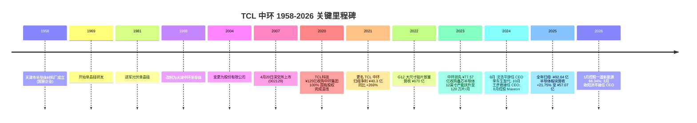
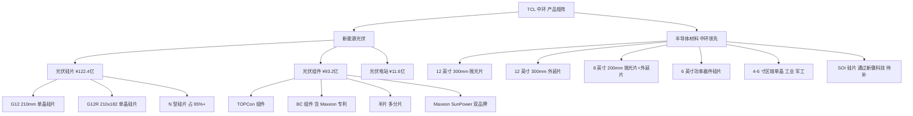
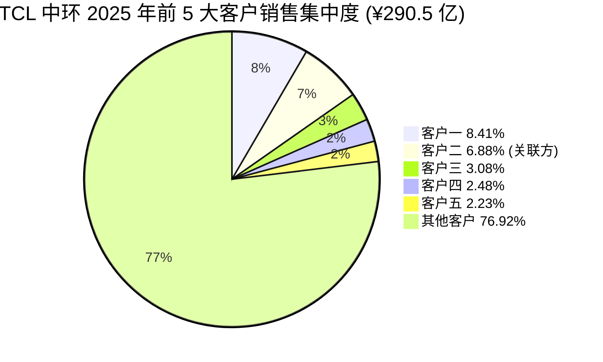

# TCL 中环新能源科技股份有限公司 — 公司研究报告

**股票代码**：SZSE:002129 · **股票简称**：TCL 中环 · **英文名**：TCL Zhonghuan Renewable Energy Technology Co., Ltd. (TZE)
**报告语言**：简体中文 (zh-CN) · **撰写日期**：2026-05-25
**作者背景**：野村 2026-05-21 anchor report《Greater China Semi 2026~30F Renaissance》Figure 35 把 NSIG / Zhonghuan 并列为 300mm 半导体硅片中国代表；本报告即对 Zhonghuan (TCL 中环) 端的深度覆盖。NSIG（上海硅产业，SSE:688126）的关系在第 7 节单独说明。

> **Update — FY2025 业绩与战略转折点 (2026-03-25 披露):** 公司全年营收 ¥290.50 亿 (+2.22% YoY)，但归母净利润仍为 -¥92.64 亿（同比减亏 5.65%），连续两年合计亏损近 ¥190 亿。亮点是半导体材料板块 (中环领先) 营收 ¥57.07 亿、同比 +21.75%，毛利率 18.94%，是当前公司唯一可持续盈利的板块。光伏硅片板块毛利率 -19.44%、组件 -6.22%，仍深陷"反内卷"周期底部。2026 年 1 月，公司以 ¥12.58 亿控股一道新能源 66.34%，加速 BC 电池产业化；2026 年 3 月，CEO 由王彦君变更为欧阳洪平。
> Source: [TCL 中环 2025 年年度报告, 第 4-15 页](https://static.cninfo.com.cn/finalpage/2026-03-25/1225029362.PDF) · [2026 年第一季度报告, 第 9 页](https://static.cninfo.com.cn/finalpage/2026-04-28/1225219941.PDF) · [TCL中环12.58亿收购一道新能源, 钛媒体 2026-04-01](https://www.tmtpost.com/7937878.html)

## 目录

1. 公司概览
2. 公司历史
3. 管理团队
4. 产品与服务
5. 客户与上市策略
6. 行业概览
7. 竞争格局
8. 市场机会 (TAM)
9. 风险评估
10. 参考资料

---

## 1. 公司概览

TCL 中环新能源科技股份有限公司是一家以**单晶硅**为基础原料，向上下游延伸覆盖**光伏材料、光伏电池组件和半导体材料**三大板块的硅基制造企业。公司前身为 1958 年组建的天津市半导体材料厂，2007 年在深交所上市（彼时简称"中环股份"），2020 年完成混合所有制改革，由 TCL 科技集团股份有限公司收购控股股东天津中环电子信息集团 100% 股权，更名为"TCL 中环"，截至本报告日由 TCL 科技集团 (天津) 有限公司直接持股 27.36% 为第一大股东，公司无实际控制人 ([TCL 中环 2026 年第一季度报告, 第 5 页](https://static.cninfo.com.cn/finalpage/2026-04-28/1225219941.PDF))。

公司商业模式上呈"光伏 + 半导体"双主业并行的格局：**光伏板块**收入由光伏硅片 (¥122.4 亿，占 42.1%)、光伏组件 (¥93.2 亿，占 32.1%) 和光伏电站 EPC (¥11.6 亿，占 4.0%) 构成，2025 年合计 ¥227.3 亿、占总营收 78.2%；**半导体材料板块**由控股子公司中环领先承担，2025 年实现营收 ¥57.07 亿、占总营收 19.6%，是国内 6-12 英寸半导体硅片营收规模最大的厂商 ([TCL 中环 2025 年年度报告, 第 14-15 页](https://static.cninfo.com.cn/finalpage/2026-03-25/1225029362.PDF))。两块业务都极端"重资产"——截至 2025 年末固定资产 ¥539.20 亿，占总资产 45.7%；在建工程 ¥102.68 亿，占 8.7%；总资产 ¥1,179.97 亿、归属母公司股东权益 ¥219.68 亿，资产负债率约 66.6% ([同上, 第 8、24 页](https://static.cninfo.com.cn/finalpage/2026-03-25/1225029362.PDF))。

公司地理覆盖以中国为基本盘、海外为新增量：**内销** 2025 年 ¥255.30 亿、占 87.9%，**出口** ¥35.20 亿、占 12.1%。生产基地集中分布在天津 (中环领先材料技术、环欧半导体、环智新能源)、内蒙古呼和浩特 (中环光伏、中环晶体、中环领先半导体材料)、江苏宜兴和无锡 (中环领先半导体科技、环晟光伏、中环应用材料)、宁夏中卫、陕西渭南，以及通过控股子公司 Maxeon 持有的菲律宾、马来西亚组件产线 ([TCL 中环 2025 年年度报告, 第 9、49 页](https://static.cninfo.com.cn/finalpage/2026-03-25/1225029362.PDF))。海外端，公司 2024 年与沙特公共投资基金 (PIF) 旗下 RELC、Vision Industries 签署合作，拟在中东共建迄今为止"海外最大规模的晶体晶片工厂"，目前项目处于"循序推进"阶段 ([TCL 中环 2024 年年度报告, 第 16 页](https://static.cninfo.com.cn/finalpage/2025-04-26/1223330188.PDF))。

规模指标上，公司 2025 年研发投入 ¥10.60 亿、占营收 3.65%，研发人员 1,238 人；总员工约 1.26 万人；累计有效授权知识产权 4,763 项，其中国内授权专利发明 606 项、国外授权专利 1,992 项；旗下拥有 12 家高新技术企业、1 家国家级技术中心、1 家国家技术创新示范企业 ([TCL 中环 2025 年年度报告, 第 19-20 页](https://static.cninfo.com.cn/finalpage/2026-03-25/1225029362.PDF))。

2025 年的关键运营指标：**光伏硅片** 出货 13.35 亿片 (按 G10 折算)、对应约 125-130 GW 左右；硅片整体市占率 18.9%（CPIA 口径，2024 年数据，2025 末略有下滑），居行业第一；**光伏组件** 出货 15.12 GW，同比 +82.31%；**半导体材料** 出货 1,222.10 百万平方英寸 (MSI)、同比 +23.99%，产量 1,246.20 MSI，库存 91.29 MSI ([TCL 中环 2025 年年度报告, 第 15-16 页](https://static.cninfo.com.cn/finalpage/2026-03-25/1225029362.PDF))。

*数据来源：[TCL 中环 2025 年年度报告, 第 8 页](https://static.cninfo.com.cn/finalpage/2026-03-25/1225029362.PDF) · [2024 年年度报告, 第 11 页](https://static.cninfo.com.cn/finalpage/2025-04-26/1223330188.PDF) · 2022 年度报告归母净利润 ¥68.19 亿 ([2022 年年度报告, 第 11 页](https://static.cninfo.com.cn/finalpage/2023-03-29/1216246676.PDF))*

**估值快照 (2026-05-25 收盘前后)**：

- 股价 ≈ ¥9.12–¥10.19/股 (5 月 13-21 日区间)，2026-05-25 ≈ ¥9.22；
- 总股本 4,043,115,773 股；流通市值 ≈ **¥36.7 bn** ([TCL 中环 (002129) 5月21日, 搜狐 2026-05-22](https://www.sohu.com/a/1025762975_121319643))；
- **TTM P/E** = **N/A** —— 公司 2024 / 2025 连续两年录得归母亏损 ¥98.18 亿 / ¥92.64 亿；EPS (TTM) ≈ -¥2.29；
- **TTM P/S** ≈ **1.27x** (36.7 / 29.05)；
- **P/B** ≈ **1.85x** (36.7 / 19.84 BPS = 19.84 = 219.68 / 110.7 亿权益/股 等)；按 BVPS ¥4.95/股 计算 ([TCL Zhonghuan SHE:002129, Stockanalysis.com 2026-05-25](https://stockanalysis.com/quote/she/002129/financials/))；
- **3 年区间**：股价高点 ¥56.49 (2021-11)、低点 ¥7.11 (2025-09)，跌幅 -84%；P/B 高点约 5.8x → 当前 1.85x，估值压缩超 60%。

*分析师观点：* 公司 TTM P/E 为负，根本原因是 **光伏主产业链周期性亏损 + 商誉/存货减值** —— 2025 年资产减值损失 -¥39.11 亿，占利润总额绝对值的 38.4%，主要为存货跌价准备 ([TCL 中环 2025 年年度报告, 第 21 页](https://static.cninfo.com.cn/finalpage/2026-03-25/1225029362.PDF))。光伏硅片毛利率 -19.44%、光伏组件 -6.22% 拖累整体毛利至负 ([同上, 第 16 页](https://static.cninfo.com.cn/finalpage/2026-03-25/1225029362.PDF))。半导体材料 GM 18.94%、营收增 21.75%，是当前盈利贡献的唯一正向板块 —— 但仅 19.6% 的营收占比难以扭转整体亏损。市场给予 P/B 1.85x 的估值，介于"资产重估值 + 光伏触底反转期权"与"持续亏损减值风险"之间。同业沪硅产业 (SSE:688126) 当前 P/S ≈ 13x、隆基绿能 (SSE:601012) P/S ≈ 1.0x —— TCL 中环的 P/S 与隆基相近，反映市场把它定价为"光伏龙头 + 半导体期权"，而非纯半导体名 ([沪硅产业 (688126) 盈利预测, 同花顺 2026-04](https://basic.10jqka.com.cn/688126/worth.html))。

## 2. 公司历史

公司前身 **天津市半导体材料厂** 成立于 1958 年，是中国最早一批集成电路用单晶硅材料生产企业。1969 年开始研制硅单晶，1981 年首次涉足光伏 ([光伏"孤岛"TCL 中环和它的灵魂 CEO, 证券时报 2024-08](https://stcn.com/article/detail/1287881.html))。1988 年改制为天津中环半导体股份公司前身实体，2004 年 7 月经天津市政府津股批[2004]6 号文批准变更为天津中环半导体股份有限公司，2007 年 4 月 20 日在深圳证券交易所主板挂牌上市，股票代码 002129 ([TCL 中环 2024 年年度报告, 第 105 页](https://static.cninfo.com.cn/finalpage/2025-04-26/1223330188.PDF))。

**最关键的一次股权变更发生在 2020 年的混改**：原控股股东天津中环电子信息集团 100% 国有股权挂牌转让，转让底价 ¥109.74 亿。最终，TCL 科技以 ¥125 亿击败竞争对手胜出，2020 年 9 月 27 日完成交割，中环股份从天津国资委系企业变身民营控股，TCL 科技集团 (天津) 有限公司成为第一大股东 ([TCL 收购中环半导体: 国企混改项目完成, SISC Magazine 2020-09](https://www.siscmag.com/news/show-3572.html))。2021 年公司更名 TCL 中环，董事会换届，沈浩平继续担任 CEO，李东生兼任董事长，开启 TCL 入主后的第一段高增长期 —— 2021 年归母净利润 ¥40.3 亿、同比 +269%，2022 年 ¥68.19 亿、同比 +69%，2022 年营收创历史峰值 ¥670.1 亿 ([TCL 中环 2022 年年度报告, 第 9 页](https://static.cninfo.com.cn/finalpage/2023-03-29/1216246676.PDF))。

公司 **半导体硅片业务** 的核心载体——**中环领先半导体科技股份有限公司**（注册地江苏宜兴）和 **天津中环领先材料技术有限公司**——是从天津中环半导体老厂区分立、再于内蒙古和江苏宜兴新建基地组成的"4-12 英寸全口径硅片"集团。2023 年 1 月，公司宣布通过中环领先以增资换股方式收购无锡的鑫芯半导体科技有限公司 100% 股权，交易对价 ¥77.57 亿——鑫芯专注 12 英寸 (300mm) 抛光片和外延片，2017 年成立，已建成 60 万片/月的厂房及配套设施 ([鑫芯半导体与中环领先携手战略重组, 中证网 2023-01-19](https://news.cnstock.com/news,bwkx-202301-5008750.htm))。重组完成后，鑫芯成为中环领先全资子公司、纳入合并报表，TCL 中环对中环领先持股稀释至 67.50%、鑫芯老股东合计持有 32.50% ([作价 77.57 亿元! TCL 中环拟收购鑫芯半导体, 腾讯云 2023-01-20](https://cloud.tencent.com.cn/developer/article/2214551))。该交易让中环领先 12 英寸理论产能从约 60 万片/月跃升至 **120 万片/月**，跻身国内规模第一 ([半导体行业开启"并购潮", 36Kr 2023-01-19](https://www.36kr.com/p/2098595989274753))。

*Source: 综合 [TCL 中环 2024 年年度报告, 第 105 页](https://static.cninfo.com.cn/finalpage/2025-04-26/1223330188.PDF) · [2025 年年度报告, 第 32 页](https://static.cninfo.com.cn/finalpage/2026-03-25/1225029362.PDF) · [80 后王彦君升任 TCL 中环 CEO, 兰科技 2024-10](https://www.lankeji.com/jiaju/2024/1010/69081.html) · [TCL 中环 12.58 亿控股一道新能, 工业资源网 2026-04](https://www.industrysourcing.cn/article/475162)*

**三次重要的战略转折**：

(1) **2020 混改**：把公司从天津国资 ("光伏制造端少数有体量地位的国企") 转为民营控股，TCL 科技带来更激进的资本运作和全球化资源，但也开启了"激进扩产 + 周期高敏感度"的新模式 ([光伏"孤岛"TCL 中环和它的灵魂 CEO, 证券时报 2024-08](https://stcn.com/article/detail/1287881.html))。

(2) **2022 年 G12 大尺寸路线确立**：公司主导的 210mm (G12) 硅片格式从 2020 年 ~10% 渗透率快速提升，2024 年 210 系列 (G12 + G12R) 出货 60.4 GW、占行业 21% (G12) + 43% (210R+210)，2025 年 G12 出货同比 +40.8% ([210 硅片颠覆: TCL 中环的尺寸跨越, 新浪财经 2025-03-31](https://finance.sina.com.cn/roll/2025-03-31/doc-inerqfen1026795.shtml))。但 210 路线也让公司在 N 型 TOPCon 量产、BC 电池量产上慢了一拍——这恰是 2024-25 年亏损的核心原因。

(3) **2024 年 8 月 Maxeon 控股**：公司通过一揽子交易增资美国 SunPower 系组件商 Maxeon Solar Technologies (NASDAQ:MAXN，已退市)，成为其控股股东。原本意图是"借 Maxeon 渠道、品牌、BC 专利打开美国市场"，但 2024 年 H2 起美国市场遭遇关税与《大而美法案》冲击、Maxeon 自身经营恶化，最终 2025 年公司不得不让 Maxeon 剥离美国以外业务、专注美国市场，并于 2026 年 2 月拟出售 Maxeon 马来西亚子公司 SPMI 100% 股权 ([TCL 中环 2025 年年度报告, 第 144、299-300 页](https://static.cninfo.com.cn/finalpage/2026-03-25/1225029362.PDF))。Maxeon 的减值是 2024-25 年商誉 + 资产减值的主要来源之一。

**关键近期事件 (2024-2026)**：
- 2024-08-02：CEO 沈浩平辞任，董事长李东生暂代 CEO ([光伏巨头 TCL 中环人事突变, 新浪财经 2024-08-03](https://finance.sina.com.cn/jjxw/2024-08-03/doc-inchkfec1077985.shtml))。
- 2024-09-30：83 年生工程硕士 **王彦君** 接任 CEO，从中环领先副董事长升上来 ([TCL 中环新任 CEO 落定, 证券时报 2024-10-08](https://stcn.com/article/detail/1340262.html))。
- 2026-01-16：公司公告控股一道新能源 (主营 N 型 TOPCon 组件)，合计 ¥12.58 亿、持股比例 66.34%（含 8.06% 股权 + 10 亿增资 + 7.20% 表决权委托），核心目的是补齐组件产能并加速 BC 电池产业化 ([TCL 中环的"破局之战": 控股一道新能源, 新浪财经 2026-01-19](https://finance.sina.com.cn/stock/s/2026-01-19/doc-inhhxvex9063465.shtml))。
- 2026-03-24：CEO 由王彦君变更为 **欧阳洪平** (1976 年生，原 COO)，并兼任法定代表人 ([TCL 中环 2026 年第一季度报告, 第 9 页](https://static.cninfo.com.cn/finalpage/2026-04-28/1225219941.PDF))。
- 2026 Q1：营收 ¥65.49 亿 (+7.34% YoY)、归母 -¥16.47 亿 (减亏 13.62% YoY)、经营性现金流 +¥3.04 亿 ([同上, 第 2 页](https://static.cninfo.com.cn/finalpage/2026-04-28/1225219941.PDF))。

## 3. 管理团队

公司管理结构的最大特点是**"创始人 (沈浩平) 已经退到副董事长、专业经理人轮换式 CEO"**。当前董事长李东生是 TCL 创始人，但日常运营 CEO 在不到 18 个月内已换了三任 (李东生暂代→王彦君→欧阳洪平)。下面只覆盖**创始人 (沈浩平) 和当前 CEO (欧阳洪平)** 两位。

### 创始人 / 灵魂人物 — 沈浩平 (现任副董事长)

沈浩平出生于 1962 年，1983 年毕业于兰州大学物理系半导体物理专业。同年加入天津市半导体材料厂从拉单晶工艺一线干起，前 40 年的工作轨迹覆盖"区熔车间主任 → 厂长助理 → 副厂长 (总工程师) → 厂长 → 总经理 → 董事长"——是从工程师成长起来的技术型企业家 ([光伏"孤岛"TCL 中环和它的灵魂 CEO, 证券时报 2024-08](https://stcn.com/article/detail/1287881.html))。沈是正高级工程师、享受国务院特殊津贴专家，曾获"全国电子信息行业杰出企业家"、"全国劳动模范"等称号 ([TCL 中环 2025 年年度报告, 第 32 页](https://static.cninfo.com.cn/finalpage/2026-03-25/1225029362.PDF))。

技术成就上，沈先后承担 10 余项国家级项目，作为项目负责人圆满完成国家科技重大专项 (02 专项 —— 02 专项是国家集成电路装备和材料专项，2008 年启动)，**主导研制出中国第一颗 8 英寸区熔硅单晶**，并带领公司研发生产团队推出 **全球首创拥有自主知识产权的 G12 (210mm) 大尺寸光伏硅片** ([同上, 第 32 页](https://static.cninfo.com.cn/finalpage/2026-03-25/1225029362.PDF))。G12 路线是 2020 年以来公司光伏硅片业务跑赢隆基 M10 (182mm) 路线、抢得"硅片市占率第一"的核心壁垒。

2020 年 TCL 入主后，沈担任 TCL 中环 CEO、TCL 科技执行董事，但 2024 年 8 月 2 日突然辞任 CEO 职务——公告原文"因工作需要和个人精力考虑"，市场普遍解读为业绩压力下的"被辞任"，因为 2024 年 H1 公司巨亏已经显现 ([TCL 中环沈浩平"被辞职"始末, 界面新闻 2024-08-12](https://www.jiemian.com/article/11572626.html))。沈辞任后仍担任公司董事、副董事长，对 G12 路线和未来 BC 电池技术路线仍保留话语权 ([TCL 中环 2025 年年度报告, 第 32 页](https://static.cninfo.com.cn/finalpage/2026-03-25/1225029362.PDF))。其持股比例未公开单独披露，但通过早期员工持股计划长期持有公司股份。

### 当前 CEO — 欧阳洪平 (2026 年 3 月接任)

欧阳洪平为中国国籍，1976 年生，工业自动化学士学位、本科学历——这与沈浩平、王彦君的"博士+硅单晶专业"路线明显不同，他是 **TCL 系统内成长起来的运营管理人才**，未在半导体硅片技术层面有突出研究背景 ([TCL 中环 2025 年年度报告, 第 33 页](https://static.cninfo.com.cn/finalpage/2026-03-25/1225029362.PDF))。

欧阳的前期主要履历都在 TCL 华星 (TCL 科技旗下显示面板业务)，曾任 **TCL 华星高级副总裁、MC SBU 总经理、OLED 中台总经理、华显光电总经理**等职务 ([同上, 第 33 页](https://static.cninfo.com.cn/finalpage/2026-03-25/1225029362.PDF))。TCL 华星 (现 TCL 科技半导体显示业务) 经历过 LCD 周期低谷期、OLED 量产爬坡等典型重资产周期管理挑战——欧阳被认为是擅长在周期底部做"运营降本、产能利用率提升、内部组织变革"的实战型选手。

进入 TCL 中环的时间相对较短：2024 年起担任 COO；2026 年 3 月 24 日，第七届董事会第十九次会议审议通过《关于变更公司 CEO (首席执行官) 暨法定代表人的议案》，由欧阳洪平接任 CEO 兼法定代表人，并代行 COO 职责 ([TCL 中环 2026 年第一季度报告, 第 9 页](https://static.cninfo.com.cn/finalpage/2026-04-28/1225219941.PDF))。这是 18 个月内的第三任 CEO，反映董事会对运营效率、降本和组件整合的高度紧迫感。

欧阳的工作重点据 2026 Q1 报告披露主要在三个方向：(1) **巩固光伏硅片相对竞争力** —— 公司 2025 年硅片工费同比下降超 40%；(2) **加速组件业务并购整合** —— 控股一道新能源、整合现有 BC + TOPCon + 多分片产能；(3) **稳健推进半导体材料业务** —— 中环领先 2026 Q1 营收 ¥14.4 亿、同比 +8.5% ([同上, 第 7 页](https://static.cninfo.com.cn/finalpage/2026-04-28/1225219941.PDF))。欧阳的持股情况未单独披露；CEO 薪酬结构按公司高管薪酬政策由"基薪 + 绩效奖金 + 股权激励"组成，但因公司 2024-25 连续亏损未派发现金红利、亦未提及股权激励行权 ([TCL 中环 2025 年年度报告, 第 32-33 页](https://static.cninfo.com.cn/finalpage/2026-03-25/1225029362.PDF))。

*分析师观点：* 从沈浩平 (技术深、行业地位) → 王彦君 (技术+并购) → 欧阳洪平 (运营降本) 的快速轮换，反映董事会"周期底部以运营/财务为优先" 的战略调整 ——但也带来管理层稳定性和长期技术战略连续性的担忧。投资者需关注：(a) 沈浩平作为副董事长对 BC 电池路线和 G12 大尺寸路线的影响是否延续；(b) 欧阳洪平能否在 12-18 个月内把光伏组件业务做到现金流盈亏平衡。

## 4. 产品与服务

公司围绕"单晶硅"基础原料形成 **光伏材料 + 光伏电池组件 + 半导体材料** 三条产品线。其中半导体材料是本研究报告 (从野村 Figure 35 出发) 的核心关注；光伏两条线规模更大但是周期更深的"主战场"。本节按公司 2025 年报披露的产品矩阵 (公司未发布英文标准产品 catalog，以下结构基于年报四、主营业务分析)，对每个产品族做"verbatim 引文 → 中文释义 / Plain-language gloss → *分析师观点：*"三段式拆解。

### 4.1 公司产品矩阵 — 来自 2025 年报 § 营业收入构成

下表是 TCL 中环 2025 年的产品营收口径，来自 [2025 年年度报告, 第 14 页](https://static.cninfo.com.cn/finalpage/2026-03-25/1225029362.PDF)（"营业收入构成"段落）—— 公司不发布英文 product catalog，以下表为该 PDF 文字段落的 markdown 再整理：

| 板块 | 产品族 | 2025 营收 (¥亿) | 占比 | YoY |
|------|--------|---------------|------|------|
| 新能源光伏 | **光伏硅片** (G12/G12R 单晶硅片 + 部分外销硅棒) | 122.38 | 42.13% | -26.49% |
| 新能源光伏 | **光伏组件** (TOPCon / BC / 半片 / 多分片 / Maxeon SunPower) | 93.24 | 32.10% | +60.45% |
| 新能源光伏 | **光伏电站** (EPC + 自持电站电费) | 11.63 | 4.00% | +209.77% |
| 半导体材料 | **半导体硅片** (中环领先：6/8/12 英寸抛光片、外延片、SOI、4-6 寸区熔片) | 57.07 | 19.64% | +21.75% |
| 其他 | 配套服务、电力外售等 | 6.18 | 2.13% | -34.30% |
| **合计** | | **290.50** | 100% | +2.22% |

*来源：[TCL 中环 2025 年年度报告, 第 14 页 "营业收入构成" 表](https://static.cninfo.com.cn/finalpage/2026-03-25/1225029362.PDF)*

*数据来源：[TCL 中环 2025 年年度报告, 第 14 页](https://static.cninfo.com.cn/finalpage/2026-03-25/1225029362.PDF) · [2024 年年度报告, 第 18 页](https://static.cninfo.com.cn/finalpage/2025-04-26/1223330188.PDF)*

### 4.2 综合: 三类产品在客户工作流中的位置

在客户实际使用流上，TCL 中环的三类产品落在两个完全不同的价值链：

**光伏制造价值链 (上游 → 下游):**
多晶硅料 → **TCL 中环单晶硅棒 (拉晶)** → **TCL 中环硅片 (切片)** → 电池厂 (TOPCon/HJT/BC) → **TCL 中环组件 (含一道新能源)** → EPC/项目方 → 终端发电站。公司"光伏硅片 + 光伏组件 + 光伏电站"的纵向覆盖让其同时承担"硅片量价"与"组件 + 电站需求"的双重周期。

**半导体晶圆制造价值链 (上游 → 下游):**
高纯多晶硅料 → **中环领先单晶硅棒 (CZ/FZ 拉晶)** → **中环领先硅片 (切割、研磨、抛光、外延、SOI)** → 晶圆厂 (中芯国际、华虹、长江存储、长鑫、台积电、SK海力士、英飞凌等) → 芯片设计公司 → 终端电子产品。中环领先位于这条链的最上游，是芯片的"地基"。

下面分别对三个主要产品族做"physically does → differentiation → strategic significance"三段式分解。

### 4.3 半导体硅片 (中环领先) —— 本报告核心覆盖

> **公司年报原文 (verbatim quote):** 报告期内，公司半导体材料业务坚持"国内领先，全球追赶"战略，产品出货超 1,200MSI，实现营业收入 57.07 亿元，同比增长 21.75%，营收及出货量继续稳居国内半导体硅片行业前列。2025 年，公司运营效率显著提升，已覆盖国内外重点客户，综合竞争力国内行业领先。
> —— [TCL 中环 2025 年年度报告, 第 15 页](https://static.cninfo.com.cn/finalpage/2026-03-25/1225029362.PDF)

**中文释义 / Plain-language gloss:**

半导体硅片 (semiconductor silicon wafer，又称"电子级硅片") 是芯片制造的最底层物理基础——**所有 CMOS 逻辑芯片、DRAM/NAND 存储芯片、模拟/功率/射频芯片都从一片晶圆开始**。物理形态上是一片直径 50.8 mm (2 寸) 到 300 mm (12 寸)、厚度 ~775 μm 的高纯度 (>99.9999999%) 单晶硅圆片，正面经过化学机械抛光 (CMP / 化学机械抛光) 达到原子级平整度，反面通常经磨削或喷涂处理。

中环领先现行产品族覆盖以下规格：

(1) **12 英寸 (300mm) 抛光片 / Polished Wafer (PW):** 用于先进逻辑 (28nm 及以下)、HBM/DDR5 DRAM、3D NAND、AI ASIC。公司在 2024 年底产能 70 万片/月、目标 2025 年继续扩到 120 万片/月 (含鑫芯) ([TCL 中环 2024 年年度报告, 第 20 页](https://static.cninfo.com.cn/finalpage/2025-04-26/1223330188.PDF))。物理工艺上 12 英寸 PW 难点在于：**单晶炉热场控制要让 300mm 直径硅锭做到 <1ppba 金属杂质 + <10个/cm² 缺陷密度**；切片要把 1m+ 长硅锭切成 <0.78mm 厚薄片再抛光到表面粗糙度 Ra<0.1nm。2024 年公司 12 英寸营收 ¥23.31 亿、同比 +70%；这是中环领先增长最快、毛利率最高的子产品族 ([同上, 第 20 页](https://static.cninfo.com.cn/finalpage/2025-04-26/1223330188.PDF))。

(2) **12 英寸 (300mm) 外延片 / Epitaxial Wafer (EPI):** 在抛光片上通过 CVD (chemical vapor deposition / 化学气相沉积) 长一层 1-50μm 的单晶硅层，杂质浓度比衬底更精确、缺陷密度更低，用于先进逻辑 (10nm 及以下) 和高性能 CIS (CMOS Image Sensor)。中环领先和鑫芯整合后，12 英寸外延片产能为 25 万片/月 (其中扩建项目)、抛光片 10 万片/月，合计 12 英寸约 35 万片/月可达投产 ([投资约 58 亿, 中环领先半导体大硅片扩建项目, 化合物半导体 2025-03](https://www.compoundsemiconductorchina.net/company-news.asp?id=6149))。

(3) **8 英寸 (200mm) 抛光片 + 外延片:** 用于功率器件 (IGBT、MOSFET、SiC 替代前)、PMIC、汽车电子、MEMS。中环领先目标 2025 末 8 英寸抛光产能 90 万片/月，是国内 8 英寸产能最大的玩家之一。8 英寸虽然技术成熟，但全球需求受 AI/汽车驱动持续增长，是公司"现金牛"产品族 ([2025 年中环领先扩建项目, 化合物半导体 2025-03](https://www.compoundsemiconductorchina.net/company-news.asp?id=6149))。

(4) **6 英寸 (150mm) 功率器件硅片:** 主要供给国内功率器件厂 (士兰微、扬杰科技、华润微等)。子公司"内蒙古中环领先半导体材料"专精此细分。

(5) **4-6 寸区熔单晶 / FZ silicon (Float Zone):** 沈浩平 1983 年起家的产品族，国内市占率 65% 以上，连续 5 年居国内同行业首位，产销规模居世界第三位 ([光伏"孤岛"TCL 中环和它的灵魂 CEO, 证券时报 2024-08](https://stcn.com/article/detail/1287881.html))。FZ 硅相比 CZ (Czochralski / 直拉法) 杂质更少、电阻率更均匀，主要用于高压功率半导体 (HVDC 输电的晶闸管、IGBT 模块)、辐射探测器、特殊军工器件。

(6) **SOI (Silicon-on-Insulator) 硅片:** 公司年报未单独披露此产品族。注：国内 SOI 硅片最大玩家是上海新傲科技 (沪硅产业旗下子公司，与 TCL 中环非同一公司)；TCL 中环本身在 SOI 方向尚未建立公开产能 —— 这与野村 Figure 35 把 NSIG 和 Zhonghuan 并列时的细节差异有关，详见 §7。

公司 12 英寸抛光片+外延片产线集中在**江苏宜兴 (中环领先半导体科技)** 和**内蒙古呼和浩特 (内蒙古中环领先半导体材料)**；8 英寸在天津 (天津中环领先材料技术) 和无锡 (鑫芯前身)；6 英寸功率器件硅片主要在内蒙古和天津；4-6 寸区熔片在天津 (天津市环欧半导体材料技术)。所有半导体子公司均享受"集成电路企业增值税加计 15% 抵减" + 西部地区企业所得税 15% 优惠 ([TCL 中环 2025 年年度报告, 第 127、144 页](https://static.cninfo.com.cn/finalpage/2026-03-25/1225029362.PDF))。

*分析师观点：* 中环领先在国内**营收规模第一** —— 2024 年其他硅材料 (口径 ≈ 半导体硅片) 营收 ¥46.87 亿，远超沪硅产业 (688126) 同期 ¥33.88 亿和立昂微半导体业务 (估算 ¥18-20 亿) ([沪硅产业 2024 年年度报告 摘要, 2025-04](https://file.finance.qq.com/finance/hs/pdf/2025/04/24/1223237696.PDF))。2025 中环领先继续增长到 ¥57.07 亿、同比 +21.75%，差距进一步拉开。**但国际上仍是追赶者** —— 全球前五大 (Shin-Etsu, SUMCO, GlobalWafers, Siltronic, SK Siltron) 合计市占率 85%+ ([12 Inch Semiconductor Silicon Wafer Market 2025, Market Growth Reports](https://www.marketgrowthreports.com/market-reports/12-inch-semiconductor-silicon-wafer-market-123690))，中环领先 + 沪硅产业 + 立昂微 + 有研硅合计全球市占率 ~6-7% ([2025 中国硅片行业上市公司研究报告, 集微咨询 2025-12](https://finance.sina.com.cn/stock/relnews/cn/2025-12-24/doc-inhcwxmi4307989.shtml))。**护城河等级：partial** —— 在 8 英寸有规模 + 成本优势、在 12 英寸抛光片在国内有规模优势但相对 Shin-Etsu / SUMCO 在 5nm 及以下逻辑 wafer 的良率、缺陷密度仍有差距；在 12 英寸外延片国产化率仅 ~10%，技术 + 良率门槛极高。竞品对照：Shin-Etsu 12 英寸全球市占率 ~31%，2025 年宣布扩产 14% 应对 AI 半导体需求 ([Shin-Etsu Chemical, 2025 报告引用](https://www.marketgrowthreports.com/market-reports/12-inch-semiconductor-silicon-wafer-market-123690))。

*数据来源：[TCL 中环 2025 年年度报告, 第 14 页](https://static.cninfo.com.cn/finalpage/2026-03-25/1225029362.PDF) · [2024 年年度报告, 第 18 页](https://static.cninfo.com.cn/finalpage/2025-04-26/1223330188.PDF) · 2022 年口径为"其他硅材料"分项 ¥19.51 亿 ([2022 年年度报告, 第 18 页](https://static.cninfo.com.cn/finalpage/2023-03-29/1216246676.PDF))*

### 4.4 光伏单晶硅片 (G12 / G12R)

> **公司年报原文 (verbatim quote):** 2025 年，光伏行业竞争加剧驱动产品结构升级，提升高价值产品占比，G12R 硅片逐步成为主流尺寸……公司光伏材料板块实现营业收入 122.38 亿元，同比减少 26.49%，硅片市占率居于行业第一，销售规模行业领先……公司联动战略供应商优化用料结构，并通过资源集约管理、单台效率提升、人力成本控制、能耗降低等方式，提升公司资产效率和效益。报告期内，公司硅片工费同比下降超 40%。
> —— [TCL 中环 2025 年年度报告, 第 14-15 页](https://static.cninfo.com.cn/finalpage/2026-03-25/1225029362.PDF)

**中文释义 / Plain-language gloss:**

光伏硅片 (photovoltaic silicon wafer / 太阳能单晶硅片) 是太阳能电池的物理载体——把太阳光转化为电的"画布"。物理形态是一片边长 182-210 mm、厚度 110-130 μm 的方形薄片，由高纯度多晶硅料经 CZ 直拉法拉出长 ~3m 直径 ~310 mm 的硅锭，再切割、磨边、研磨、清洗、织构而成。

**G12 (210mm)** 是 TCL 中环主导推出的硅片格式，面积 44,096 mm²、对角线 295 mm、边长 210 mm，相较传统 M2 (156.75mm) 面积增加 80.5% ([TCL 中环 2025 年年度报告, 第 2 页](https://static.cninfo.com.cn/finalpage/2026-03-25/1225029362.PDF))。**更大尺寸的好处**：单片功率更高 (~700W vs M10 ~580W)，对应每 GW 装机需要的硅片数量减少 → 切片、电池、组件、安装等下游环节摊薄人工/设备/边框成本 → LCOE (Levelized Cost of Energy / 平准化度电成本) 下降。**G12R (210x182)** 是 2024 年才推出的"矩形 210"，边长 210mm、宽 182mm，目的是兼容 M10 (182mm) 设备体系下进入主流场景，2025 年快速放量成为新主流 ([210 硅片颠覆: TCL 中环的尺寸跨越, 新浪财经 2025-03-31](https://finance.sina.com.cn/roll/2025-03-31/doc-inerqfen1026795.shtml))。

公司的 N 型硅片占比已达 95%+ —— "N 型"指在拉晶过程中掺入磷形成 N 型导电的单晶硅，对应下游 TOPCon / HJT / BC 等高效电池路线 ([TCL 中环 2024 年年度报告, 第 22 页 N 型产品研发项目](https://static.cninfo.com.cn/finalpage/2025-04-26/1223330188.PDF))。截至 2024 年末公司硅片产能 190 GW，全年硅片出货约 125.8 GW、同比 +10.5%，硅片整体市占率 18.9% ([同上, 第 14 页](https://static.cninfo.com.cn/finalpage/2025-04-26/1223330188.PDF))。2025 年硅片出货 13.35 亿片 (按 G10 折算)、同比 -6.61%；行业市占率因竞品扩产略有下滑约 4-5 个百分点 ([硅片综合市占率下滑, TCL 中环如何扭转颓势？, 第一财经 2025-04-30](https://www.yicai.com/news/102593444.html))。

*分析师观点：* G12 路线是 TCL 中环在 2020-2023 年抢得"硅片市占率第一" 的核心壁垒，但 2024 年起隆基 M10 (182mm)、晶科 N 型 + 钧达 / 通威等竞品快速扩产，叠加多晶硅料价格暴跌、行业陷入全成本→现金流→低于现金流 的多轮价格战。2024-25 公司光伏硅片毛利率 -20.53% / -19.44% —— 不仅毛利为负，**单瓦硅片亏现金** ([TCL 中环 2024 年年度报告, 第 19 页](https://static.cninfo.com.cn/finalpage/2025-04-26/1223330188.PDF) · [TCL 中环 2025 年年度报告, 第 16 页](https://static.cninfo.com.cn/finalpage/2026-03-25/1225029362.PDF))。**护城河等级：partial** —— G12 专利体系 + 智能拉晶 (自动化率 95%) + 单晶炉热场设计仍领先，但硅片本身在大尺寸下已经趋于"标品" —— 隆基、晶科、双良节能等头部玩家在 G12R 上几乎同步上线。竞品对照：隆基绿能 (SSE:601012) 2024 年硅片出货 108.5 GW、市占率约 17.3%，是 TCL 中环最直接的对手 ([隆基绿能 2024 年年报数据综合](https://stcn.com/article/detail/1287881.html))。

### 4.5 光伏电池 + 组件 (TOPCon / BC / 半片 / 多分片)

> **公司年报原文 (verbatim quote):** 2025 年，公司光伏电池组件板块实现营业收入 93.24 亿元，同比增长 60.45%，营收占比达 32.10%，光伏组件出货 15.1GW，产品结构、业务及客户开拓、品牌能力较 2024 年均有提升……公司电池及组件业务具备 BC、TOPCon、多分片等多领域的技术和工艺积累、专利体系及持续研发能力。
> —— [TCL 中环 2025 年年度报告, 第 14 页](https://static.cninfo.com.cn/finalpage/2026-03-25/1225029362.PDF)

**中文释义 / Plain-language gloss:**

光伏组件 (PV module) 是把电池片串并联封装成可独立发电的"功率块"——把电池片 + EVA 封装膜 + 玻璃面板 + 铝边框 + 接线盒 + 背板组合成一块标准长方形组件 (典型尺寸 ~2 m x 1 m，重 ~25 kg)，单块功率 500-720 W。

公司当前产品矩阵包括：

(1) **TOPCon 组件**：以 N 型 TOPCon (Tunnel Oxide Passivated Contact / 隧穿氧化层钝化接触) 电池为核心，量产效率 24-25%；这是 2024-2026 年行业主流路线。

(2) **BC (Back Contact) 组件**：通过控股 Maxeon 获得 BC 电池的核心专利体系。BC 电池把正负电极都置于电池背面，取消正面金属电极遮挡，最大化利用入射光，量产效率可达 24%+ ([TCL 中环 2025 年年度报告, 第 19 页 BC 光伏组件产品 研发项目](https://static.cninfo.com.cn/finalpage/2026-03-25/1225029362.PDF))。2026 年 1 月控股一道新能源 (国内 N 型 TOPCon 龙头之一)，目的就是加速 BC 电池组件量产 ([TCL 中环的"破局之战": 控股一道新能源, 新浪财经 2026-01-19](https://finance.sina.com.cn/stock/s/2026-01-19/doc-inhhxvex9063465.shtml))。

(3) **半片 + 多分片组件**：通过激光把电池片切成两半 / 三分片 / 四分片，降低单片电流、降低 I²R 损耗、提升组件功率。公司 2025 年完成半片产线改造，多分片组件效率达 24.2% ([TCL 中环 2025 年年度报告, 第 19 页](https://static.cninfo.com.cn/finalpage/2026-03-25/1225029362.PDF))。

(4) **TCL Solar + SunPower 双品牌**：国内市场用 "TCL Solar" 品牌、海外用 "SunPower" (Maxeon 收购获得)。2025 年海外市场出货实现 GW 级突破 ([同上, 第 14 页](https://static.cninfo.com.cn/finalpage/2026-03-25/1225029362.PDF))。

*分析师观点：* 组件业务是公司 2024-2025 年"补短板"的核心——2024 年组件营收 ¥58.1 亿、出货 8.3 GW；2025 年组件营收 ¥93.2 亿、出货 15.1 GW (+82.31%)。但因为价格战 + 自身规模仍小于晶澳、隆基、晶科等一体化龙头，毛利率 -6.22% 仍为负 ([同上, 第 16 页](https://static.cninfo.com.cn/finalpage/2026-03-25/1225029362.PDF))。**护城河等级：no (TOPCon) / partial (BC)** —— TOPCon 已是行业标品，谁也没有护城河；BC 因为 Maxeon 专利 + 公司自研，2026 年起若能跑通规模化，可能形成阶段性溢价。竞品对照：晶澳 (SSE:002459)、隆基绿能 (SSE:601012)、晶科能源 (SSE:688223)、天合光能 (SSE:688599) 都是直接竞争对手。

### 4.6 旗舰产品与最近 12 个月新品

公司 2024-2026 年的"旗舰" 跑分如下：

- **半导体**：12 英寸抛光片+外延片 (国内规模第一，2025 营收 ¥57 亿)；
- **光伏硅片**：G12R (2024 年推出，2025 年快速渗透成新主流)；
- **光伏组件**：BC 组件 (2025 完成产线改造，2026 年量产爬坡)。

**最近 12 个月新品 / 战略行动**：
- 2025 年初：完成 BC + 半片产线改造，量产多分片组件 ([TCL 中环 2025 年年度报告, 第 19 页 TBC 中试线项目](https://static.cninfo.com.cn/finalpage/2026-03-25/1225029362.PDF))。
- 2025 年 3 月：210R 硅片成为公司新主流尺寸 ([210 硅片颠覆, 新浪财经 2025-03-31](https://finance.sina.com.cn/roll/2025-03-31/doc-inerqfen1026795.shtml))。
- 2025 H2：海外市场组件出货实现 GW 级突破 ([TCL 中环 2025 年年度报告, 第 14 页](https://static.cninfo.com.cn/finalpage/2026-03-25/1225029362.PDF))。
- 2026 年 1 月 16 日：公告拟控股一道新能源 (BC + TOPCon 量产能力补强) ([TCL 中环的"破局之战", 新浪财经 2026-01-19](https://finance.sina.com.cn/stock/s/2026-01-19/doc-inhhxvex9063465.shtml))。
- 2026 年 2 月：Maxeon 拟出售马来西亚子公司 SPMI 100% 股权 ([TCL 中环 2025 年年度报告, 第 144 页](https://static.cninfo.com.cn/finalpage/2026-03-25/1225029362.PDF))。

### 4.7 综合 — 三类产品如何在客户工作流中互动

TCL 中环最特别的地方是同时占据**两条独立的硅基价值链**：

1. **半导体价值链**："高纯多晶硅 → 中环领先单晶硅棒 → 中环领先硅片 → 晶圆厂 (中芯/华虹/长江存储/台积电) → IC 设计 → 终端电子产品"。这条链对中环领先来说是"上游基础材料商" → 高毛利、高技术壁垒、需求由全球半导体 capex 周期驱动。

2. **光伏价值链**："多晶硅料 → TCL 中环单晶硅棒 → TCL 中环硅片 → 电池 → 组件 (含 Maxeon + 一道新能源) → EPC → 电站"。这条链上 TCL 中环目前覆盖"硅片 → 组件 → 电站"三个环节、纵向程度最高、但也最受价格周期冲击。

两条链共享的协同基础：**单晶硅拉晶工艺、热场设计、智能制造、清洗/抛光设备**。沈浩平在年报致辞中多次提及"以单晶硅为起点的硅材料平台"，意指公司可以把光伏端的智能制造经验复用到半导体端的成本控制、效率提升 ([TCL 中环 2024 年年度报告, 第 14 页](https://static.cninfo.com.cn/finalpage/2025-04-26/1223330188.PDF))。但 **两条链周期不同步是公司最大的"双刃剑"** —— 半导体周期在 2024-2026 年处上升期 (AI 驱动)，光伏在 2024-2026 年处下行期 (产能过剩)；这意味着半导体板块的盈利贡献会被光伏板块的亏损淹没。

*数据来源：[TCL 中环 2025 年年度报告, 第 16 页](https://static.cninfo.com.cn/finalpage/2026-03-25/1225029362.PDF) · [2024 年年度报告, 第 19 页](https://static.cninfo.com.cn/finalpage/2025-04-26/1223330188.PDF) · [2023 年年度报告, 第 17 页](https://static.cninfo.com.cn/finalpage/2024-04-26/1219863251.PDF)*

## 5. 客户与上市策略

公司前五大客户合计销售金额 2025 年为 ¥67.04 亿，占年度销售总额 **23.08%**；其中关联方销售额占年度销售总额的 6.88% (主要为 TCL 集团及 Maxeon 等关联交易)。前五大客户分别为：客户一 ¥24.43 亿 (8.41%)、客户二 ¥19.98 亿 (6.88%)、客户三 ¥8.96 亿 (3.08%)、客户四 ¥7.20 亿 (2.48%)、客户五 ¥6.48 亿 (2.23%) ([TCL 中环 2025 年年度报告, 第 17 页](https://static.cninfo.com.cn/finalpage/2026-03-25/1225029362.PDF))。

**对比 2024 年**：前五大占比 27.61%，单一最大客户占 9.91%、第二大占 7.84% (关联方)。集中度从 27.61% → 23.08%，集中度同比下降 4.5 个百分点；最大客户占比下降 1.5 个百分点 ([TCL 中环 2024 年年度报告, 第 21 页](https://static.cninfo.com.cn/finalpage/2025-04-26/1223330188.PDF))。

公司未在年报中具名披露前五大客户名称（"客户一"…"客户五" 匿名）。但根据公开渠道，公司客户结构大致分为：

- **光伏硅片客户**：大型电池/组件厂——晶科能源、通威股份、东方日升、爱旭股份、TCL 集团内部 (Maxeon、一道新能源) 等。
- **光伏组件客户**：国内电站 EPC 商 (中国电建、中国能建、大唐、华能等央国企)；海外渠道 (通过 SunPower 品牌进入北美、欧洲、亚太)。
- **半导体硅片客户 (中环领先)**：**中芯国际 (SMIC, SSE:688981, HKEX:981)、华虹华力 (HKEX:1347 / SSE:688347)、华润微 (SSE:688396)、长江存储 (YMTC)、长鑫存储 (CXMT)、积塔半导体、士兰微 (SSE:600460)、扬杰科技 (SZSE:300373)** —— 中环领先产品已基本覆盖国内主流晶圆厂，并向台积电、SK 海力士、英飞凌等国际客户供货 ([12 英寸大硅片企业分析, 新浪新闻](https://www.sina.cn/news/detail/5294428182282695.html) · [中环领先与鑫芯半导体战略重组, 网易订阅 2023-01-19](https://www.163.com/dy/article/HRG7M05J0550C0ON.html))。

*Source: [TCL 中环 2025 年年度报告, 第 17 页](https://static.cninfo.com.cn/finalpage/2026-03-25/1225029362.PDF)*

**契约结构**：年报披露公司"未签订重大销售合同、重大采购合同" (即单笔超过合并营收 10% 的合同) ([同上, 第 16 页](https://static.cninfo.com.cn/finalpage/2026-03-25/1225029362.PDF))；销售模式以直销为主 (98.41%)，经销仅 1.59%。这意味着销售关系大多是"年度框架协议 + 按月/季订单" 的滚动模式，没有特别长周期的锁价合同——这是光伏行业的标准做法，也意味着客户切换成本相对较低。

**地理分布**：内销 ¥255.30 亿、占 87.88%；出口 ¥35.20 亿、占 12.12% ([同上, 第 14 页](https://static.cninfo.com.cn/finalpage/2026-03-25/1225029362.PDF))。海外销售主要通过 Maxeon SunPower (美国)、未来沙特 RELC 合资工厂、TCL Solar 自有海外渠道。海外占比与 2024 年 (12.35%) 基本持平，但绝对数因总收入回升而略增。

**关键客户案例 / 战略合作**：
- **沙特公共投资基金 (PIF) / RELC + Vision Industries**：2024 年签约，将在中东共建"目前海外最大规模的晶体晶片工厂" —— 是公司海外光伏布局的关键案例 ([TCL 中环 2024 年年度报告, 第 16 页](https://static.cninfo.com.cn/finalpage/2025-04-26/1223330188.PDF))。
- **中芯国际 + 华虹**：中环领先 12 英寸抛光片 / 外延片在两家国内最大晶圆厂占据"重要供应位置"——公司年报未直接命名，但行业公开渠道反复确认 ([12 英寸大硅片企业分析, 新浪新闻](https://www.sina.cn/news/detail/5294428182282695.html))。

*分析师观点：* 客户集中度从 27.61% → 23.08% 的下降是良性信号—— 反映半导体客户多样化 + 组件海外客户增加 + 单一光伏大客户依赖度降低。但**关联方占比 6.88%** 值得关注：主要是公司与 TCL 集团内部、Maxeon、未来一道新能源等关联交易；这部分是否市场化定价、是否长期可持续，是治理层面需要持续追踪的点。客户名称匿名是国内 A 股惯例，但对于做行业研究的投资人来说降低了信息透明度，建议在 2026 H1 调研中重点追问中环领先前五大客户的具体名单和销售口径。

## 6. 行业概览

公司同时身处**光伏制造业**和**半导体硅材料业**两个完全不同的行业周期。本节按"半导体硅材料 → 光伏" 顺序展开，因为本研究报告的核心切入点是野村 Figure 35 的半导体硅片地位。

### 6.1 半导体硅片行业

**行业定义**：半导体硅片 (semiconductor silicon wafer)，又称"电子级硅片"，包括 50.8mm (2") 到 300mm (12") 的各种直径，以及 CZ 直拉、FZ 区熔、EPI 外延、SOI、Smart-Cut 等多种工艺。是所有集成电路 (IC) 和大部分功率/射频/光电器件的基础衬底材料，行业典型规模约**全球 USD 13.3 bn (2025 年 12 英寸硅片市场)**、加上 8 英寸及以下约 **USD 18-20 bn**，占整个半导体材料市场 (~USD 80 bn) 的 22-25% ([12 Inch Semiconductor Silicon Wafer Market 2025, Market Growth Reports](https://www.marketgrowthreports.com/market-reports/12-inch-semiconductor-silicon-wafer-market-123690) · [Nomura GC Semi 2026-30F, p.18, 2026-05-21 (本地汇总)](../../sector/半导体材料.md))。

**全球结构 — 国际五巨头垄断 + 中国挑战者崛起**：

| 厂商 | 国家 | 12 英寸全球份额 | 主要业务亮点 |
|------|------|---------------|---------------|
| Shin-Etsu Chemical | 日本 | ~31% | 2025 年扩产 14% 应对 AI 半导体需求 |
| SUMCO | 日本 | ~27% | 高纯度技术领先 |
| GlobalWafers (GWC) | 台湾 | ~14% | 2027-28 进入新一轮上行周期 (野村 Buy 评级，TP TWD850) |
| Siltronic AG | 德国 | ~9% | 欧洲唯一玩家 |
| SK Siltron | 韩国 | ~9% | 韩国 SK 集团旗下 |
| **TCL 中环 + 中环领先** | 中国 | ~3-4% | 国内规模第一，2025 营收 ¥57.07 亿 |
| 沪硅产业 (NSIG) | 中国 | ~2-3% | 上海新昇 + Okmetic + 新傲科技 (SOI) |
| 立昂微 + 有研硅 + 其他 | 中国 | ~1-2% | 8 寸 / 功率器件特色工艺 |
| **前 5 大合计** | | **>85%** | 寡头垄断格局 |

*Source: [Nomura GC Semi 2026-30F, p.34-44, 2026-05-21 (本地汇总)](../../sector/半导体材料.md) · [12 Inch Semiconductor Silicon Wafer Market 2025, Market Growth Reports](https://www.marketgrowthreports.com/market-reports/12-inch-semiconductor-silicon-wafer-market-123690) · [集微咨询《2025 中国半导体硅片行业上市公司研究报告》, 新浪财经 2025-12-24](https://finance.sina.com.cn/stock/relnews/cn/2025-12-24/doc-inhcwxmi4307989.shtml)*

**驱动因素 (2026-30 F)**：
- **AI 算力**：HBM (High Bandwidth Memory) 用 12 英寸 DRAM 硅片+先进封装；GPU/ASIC 用先进制程 (3nm/2nm/A16) 逻辑硅片——根据野村 Anchor Report，TSMC 2027F capex 可达 USD ~70bn (capex intensity ~50%)，将拉动 12 英寸硅片需求暴增 ([Nomura GC Semi 2026-30F, p.13-14, 2026-05-21 (本地汇总)](../../sector/半导体材料.md))。
- **Backside Power Delivery (BPD, 背面供电)**：2028-29 量产，需要"两片硅 + 多次键合 + thinning"工艺——直接利好 GWC、中环领先、沪硅产业 (野村点名"硅片单耗增加") ([Nomura GC Semi 2026-30F, p.6-9, 2026-05-21 (本地汇总)](../../sector/半导体材料.md))。
- **Wafer-bonded NAND (YMTC Xtacking) + DRAM-on-Logic WoW**：2026-28 起量，逻辑+DRAM 用 hybrid bonding 直接键合，让 SoC 内存带宽大幅提升——多用硅 + 多步 CMP ([Nomura GC Semi 2026-30F, p.9 (本地汇总)](../../sector/半导体材料.md))。
- **光通信 / Photonic SOI**：1.6T 光模块 + CPO 起量，photonic SOI 衬底用于 SiPh PIC——对 Soitec、沪硅产业新傲科技、TCL 中环 SOI (若建立产能) 形成需求增量 ([Nomura GC Semi 2026-30F, p.11-12, 60-65 (本地汇总)](../../sector/半导体材料.md))。

**国产替代节奏**：8 英寸国产化率 ~55%，12 英寸国产化率仅 ~10% —— 12 英寸是国产化率最低、空间最大的细分；2024-25 沪硅产业、中环领先 12 英寸出货同比增长均超 70% ([硅片洗牌进行时, OFweek 太阳能光伏网 2025-12](https://solar.ofweek.com/2025-12/ART-8420-2600-30675837.html))。中国 12 英寸硅片产能从 2022 年不足 100 万片/月 → 2025 H1 近 300 万片/月，三年增长 3 倍 ([硅片洗牌进行时, 同上](https://solar.ofweek.com/2025-12/ART-8420-2600-30675837.html))。

**监管 / 政策**：中国"集成电路产业大基金" 二期、三期持续投入半导体材料；财政部对集成电路企业增值税加计 15% 抵减 (2024-2027 适用)；西部地区 (内蒙古、宁夏) 鼓励类产业企业所得税 15% (中环领先呼和浩特项目持续受益) ([TCL 中环 2025 年年度报告, 第 128 页](https://static.cninfo.com.cn/finalpage/2026-03-25/1225029362.PDF))。地缘方面，美国对中国半导体材料尚无直接限制，但中国 12 英寸硅片暂未进入 5nm 及以下先进逻辑供应链 (因台积电对供应商认证流程长达 3-5 年)。

### 6.2 光伏制造行业

**行业定义**：光伏制造业涵盖多晶硅料 → 硅棒/硅片 → 电池片 → 组件 → 电站 EPC 全产业链。其中硅片环节是 TCL 中环的强项。

**2025 年全球光伏新增装机 580 GW** ([TCL 中环 2025 年年度报告, 第 15 页 引用 CPIA](https://static.cninfo.com.cn/finalpage/2026-03-25/1225029362.PDF))，2026 年预期增长，但增速放缓。硅片环节 2024-25 年陷入严重"内卷式"竞争——产能从 2022 年底 ~500 GW → 2025 年底 >1,000 GW，远超下游需求；硅料 + 硅片 + 电池 + 组件四个环节全行业亏损 ([TCL 中环 2025 年年度报告, 第 4 页 董事长致辞](https://static.cninfo.com.cn/finalpage/2026-03-25/1225029362.PDF))。

**结构与集中度**：光伏硅片全球前五大 (TCL 中环、隆基绿能、晶澳科技、晶科能源、双良节能) 合计市占率约 70-75%，是"高度集中但仍在产能过剩"的行业。隆基绿能 (M10/182mm 路线) 与 TCL 中环 (G12/210mm 路线) 是两大尺寸阵营的领军——2025 年 G12 系列出货同比 +40.8%，G12R 已成新主流，市场预计 2025 年 210 系列市占率升至 60%、2029 年达 91% ([210 硅片颠覆: TCL 中环的尺寸跨越, 新浪财经 2025-03-31](https://finance.sina.com.cn/roll/2025-03-31/doc-inerqfen1026795.shtml))。

**反内卷 + 政策驱动**：2025 年中国工信部发文要求光伏行业"反内卷"，鼓励通过兼并重组、价格自律改善供需关系。2025 Q3 硅料/硅片价格回升，但 Q4 需求回落、价格再次承压；2026 年随着 BC 电池差异化、海外市场打开，行业或迎缓慢复苏 ([TCL 中环 2025 年年度报告, 第 10 页](https://static.cninfo.com.cn/finalpage/2026-03-25/1225029362.PDF))。

**国际贸易壁垒**：美国对中国光伏的 201/301/AD/CVD 关税、《大而美法案》(BBBA) 限制中国背景组件在美销售；欧盟碳关税 (CBAM) 对中国光伏产品额外征税。这些都是 TCL 中环全球化的关键阻力——Maxeon 的转型困境就是直接案例。

## 7. 竞争格局

公司的竞争分两个不同领域，分别列出。

### 7.1 半导体硅片竞争对手 (中环领先的对标对象)

**国际五大龙头 — 主要对标对象 (TCL 中环 12 英寸先进逻辑的天花板)**：

(1) **Shin-Etsu Chemical (信越化学, TYO:4063)** —— 全球 12 英寸市占率 ~31%，营收规模、技术深度、客户黏度都是国内厂商需要 5-10 年才能赶上的距离。2025 年宣布扩产 14% 应对 AI 需求 ([12 Inch Semiconductor Silicon Wafer Market 2025, Market Growth Reports](https://www.marketgrowthreports.com/market-reports/12-inch-semiconductor-silicon-wafer-market-123690))。

(2) **SUMCO Corporation (TYO:3436)** —— 全球第二、12 英寸市占率 ~27%。技术深度与 Shin-Etsu 接近，在 EUV 多层 mask 衬底等新应用有专长。

(3) **GlobalWafers (环球晶圆, TPE:6488)** —— 全球第三、12 英寸 ~14%。台湾本土厂商，与台积电深度绑定；野村 2026-05-21 anchor 把 GWC 从 Neutral 上调至 Buy，TP 从 TWD 480 翻倍至 TWD 850，理由是 BPD / wafer-bonded NAND / photonic SOI 多需求叠加 ([Nomura GC Semi 2026-30F, p.15-17, 2026-05-21 (本地汇总)](../../sector/半导体材料.md))。GWC 是 TCL 中环在大陆以外最重要的对标对象。

(4) **Siltronic AG (FRA:WAF)** —— 全球第四、欧洲唯一玩家。客户基础以欧美 IDM 为主，在中国市场份额有限。

(5) **SK Siltron** —— 韩国 SK 集团旗下，主要供给三星、SK 海力士；在 SiC 衬底 (汽车电子) 有重要布局。

**国内主要对手**：

(6) **沪硅产业 (NSIG, SSE:688126)** —— **野村 Figure 35 把"NSIG / Zhonghuan (CN)" 并列时实际指的是这两家**。沪硅产业 (英文 National Silicon Industry Group, NSIG) 2015 年成立，旗下三大子公司：上海新昇 (300mm 抛光片+外延片，2014 年成立，国内第一家产业化 300mm 硅片企业)、新傲科技 (200mm SOI 国内最大产能)、Okmetic (芬兰 200mm 特色衬底，2016 年收购) ([硅产业集团, NSIG 官网](http://www.nsig.com/) · [控股新傲科技, NSIG 公告](http://www.nsig.com/news/6))。2024 年营收 ¥33.88 亿、2025 前三季度 ¥26.41 亿；2025 上半年净亏 -¥3.7 亿，亏损同比收窄 ([沪硅产业 2024 年年度报告, 上交所 2025-04-24](https://static.cninfo.com.cn/finalpage/2025-04-24/1223237698.PDF))。300mm 产能 75 万片/月，2026 年规划提至 60 万片/月扩产。**沪硅 vs 中环领先的关键差异**：(a) 沪硅在 12 英寸 5nm 及以下先进逻辑认证 (中芯国际 / 台积电) 起步更早、客户关系更深；(b) 沪硅有 SOI 完整产品线 (新傲科技)，中环领先暂无 SOI 公开产能；(c) 中环领先在 8 英寸和 6 英寸功率器件硅片规模更大，2024 年其他硅材料营收 ¥46.87 亿 > 沪硅产业 ¥33.88 亿。

(7) **立昂微 (SSE:605358)** —— 12 英寸抛光片 (含衬底片) 产能 15 万片/月、12 英寸外延片产能 10 万片/月 (衢州+嘉兴基地)。2025 上半年营收 ¥16.66 亿 (+14.18% YoY)、归母 -¥1.27 亿 ([12 英寸大硅片加速扩产, OFweek 电子工程网 2025-09](https://ee.ofweek.com/2025-09/ART-8420-2816-30669819.html))。立昂微强在功率器件硅片 + RF 衬底 + 6 寸 SiC，与中环领先在 6/8 英寸功率器件硅片正面竞争。

(8) **有研硅 (SSE:688432)** —— 北京有研集团旗下，专精 8 英寸及大直径硅材料，特色工艺 (FZ 区熔、特殊掺杂)。2024 年 11 月收购日本 DGT 70% 股权，进入半导体设备零部件 ([中国半导体硅片行业市场分析, 智研咨询 2025-02](https://finance.sina.com.cn/stock/relnews/cn/2025-02-27/doc-inemwynh7120899.shtml))。是中环领先在 4-6 寸区熔硅市场的直接对手。

(9) **奕斯伟材料** —— 北京京东方系背景，主要做 12 英寸抛光片+外延片，产能 50 万片/月。未上市，但产能扩张激进；2025 年传闻有 IPO 计划。

(10) **中欣晶圆 (科创板待 IPO)** —— 8/12 英寸抛光片+外延片，2024 年产能约 55 万片/月。客户重心在国内 IDM 和模拟器件厂。

*数据来源：[2025 中国硅片上市公司研究报告, 集微咨询 2025-12](https://jiweipreview.laoyaoba.com/html/news/newsdetail?news_id=952288) · [12 英寸大硅片加速扩产, OFweek 电子工程网 2025-09](https://ee.ofweek.com/2025-09/ART-8420-2816-30669819.html) · [TCL 中环 2024 年年度报告, 第 20 页](https://static.cninfo.com.cn/finalpage/2025-04-26/1223330188.PDF)*

### 7.2 光伏产业竞争对手

(1) **隆基绿能 (SSE:601012)** —— M10 (182mm) 路线创始者，硅片市占率第二 (~17.3%)，是 TCL 中环最直接的尺寸路线对手。2024 年硅片出货约 108.5 GW，2025 年全力布局 BC 电池 (HPBC 2.0)，与 TCL 中环 BC 路线正面竞争 ([隆基绿能 2024 年报数据综合](https://stcn.com/article/detail/1287881.html))。

(2) **晶澳科技 (SSE:002459)、晶科能源 (SSE:688223)、天合光能 (SSE:688599)、阿特斯 (SSE:688472)** —— 一体化组件龙头四强，从硅片到组件全覆盖，对 TCL 中环组件业务构成最直接威胁。这四家的组件出货 2024 年合计 200+ GW，远超 TCL 中环 15.1 GW。

(3) **通威股份 (SSE:600438)** —— 全球最大多晶硅料 + 电池片厂商，2024 年布局组件，与 TCL 中环在硅片+电池+组件多个环节竞争。

(4) **双良节能 (SSE:600481)、京运通 (SSE:601908)、上机数控 (SSE:603185)** —— 二线硅片厂，对 TCL 中环硅片业务构成中端冲击。

**SWOT 综合**：

- **优势 (S)**：(a) G12 大尺寸专利 + 智能拉晶技术领先；(b) 中环领先在国内半导体硅片营收规模第一；(c) TCL 系资本支持、全球化资源；(d) 与 PIF 中东合资是国内厂商难得的"产业链海外本土化"案例。
- **劣势 (W)**：(a) 光伏端连续两年亏损、现金流压力大；(b) 半导体硅片端在 5nm 及以下先进逻辑的台积电认证未公开突破；(c) Maxeon 巨额减值仍未完全出清；(d) 管理层 18 个月内换三任 CEO，组织稳定性受质疑。
- **机会 (O)**：(a) 半导体材料"长期重估"周期 (野村 anchor 提到 2027F 起进入)；(b) 中东 / 沙特 / 中亚海外组件本土化窗口；(c) BC 电池技术差异化 + 一道新能源整合协同；(d) 12 英寸国产化率仍仅 10%，空间巨大。
- **威胁 (T)**：(a) 光伏行业产能仍未充分出清，2026-27 价格战可能继续；(b) 沪硅产业 12 英寸抛光片产能 2026 提至 60 万片/月、与中环领先正面争夺中芯国际/华虹的 wallet share；(c) Shin-Etsu / SUMCO 在 5nm 及以下先进逻辑的客户黏度 + 良率优势短期难以撼动；(d) Maxeon 现金流恶化可能继续拖累母公司报表。

## 8. 市场机会 (TAM)

**半导体硅材料市场 (中环领先 TAM)**：

按野村 2026-05-21 anchor 估算 ([Nomura GC Semi 2026-30F, p.18-30](https://www.nomura.com/))，2025 年全球半导体材料销售约 **USD 80 bn**，其中 IC 制造 (front-end) ~60% (USD 48 bn)、封装材料 (back-end) ~40% (USD 32 bn)。制造材料结构 (Nomura Fig.26)：硅片 31% (USD 14.9 bn)、光刻胶 13%、光刻胶辅材 7%、特气 13%、CMP 7%、靶材 3%。**全球硅片 TAM (12 + 8 + 6 + 其他) 约 USD 18-20 bn**，其中 12 英寸 ~USD 13.3 bn (2025)。

**中环领先 SAM (Serviceable Addressable Market)**：当前主要服务于：中国大陆 8/12 英寸晶圆厂 (TAM ~USD 4-5 bn) + 中国功率器件厂 (TAM ~USD 1-1.5 bn) + 部分海外客户 (台积电、SK海力士、英飞凌等贡献 <USD 0.5 bn)。SAM 合计约 **USD 6-7 bn (¥43-50 亿)**，2025 年中环领先实现营收 ¥57 亿 (USD ~8 bn) —— 看似已经覆盖 100%+，但这其中包含了 4-8 寸特色硅片 (FZ、6 寸功率)，纯先进逻辑 12 英寸渗透率仍较低。

**SOM (Serviceable Obtainable Market)**：根据公司 2030 年规划 (隐含)：12 英寸产能从当前 120 万片/月扩到 150-200 万片/月、8 英寸从 70-90 万片/月扩到 120 万片/月——按平均单价 USD 60-100/片，理论营收上限可达 USD 12-18 bn (¥85-130 亿)。即营收仍有 50-100% 上升空间。

**光伏 TAM**：

按 CPIA 数据，2025 年全球光伏新增装机 580 GW；按 IEA/SolarPower Europe 等机构预测，2030 年新增装机 800-1,000 GW、累计装机 3,500-4,500 GW，对应硅片年需求 1,200-1,500 GW (含库存、出口、电站规划)。即光伏硅片市场 5 年内仍有 2-3 倍增长空间，**但价格战让 TAM 转化为收入的"单瓦 ASP" 持续下降**。2024 年硅片单瓦 ASP ~¥1.2、2025 年 ~¥0.9——按行业理论盈亏平衡线 ¥1.0-1.1 计算，2024-25 年硅片单瓦亏损 ¥0.1-0.3。即 **光伏 TAM 在 GW 上增长但在 ¥/W 上下降**。

**渗透策略**：

- 半导体端：(a) 2026-28 年完成 5nm 及以下先进逻辑客户认证；(b) 12 英寸外延片产能爬坡，进入 HBM / AI ASIC 供应链；(c) 通过 SOI 收购 / 自研补齐 photonic SOI 短板，承接 1.6T 光通信 + CPO 需求；(d) 海外本土化 (墨西哥 / 东南亚 / 欧洲) 化解地缘风险。
- 光伏端：(a) BC 电池差异化 + Maxeon 美国市场 + 一道新能源量产；(b) 中东 / 沙特 / 中亚海外组件本土化；(c) "反内卷" 通过并购整合落地，提升集中度。

## 9. 风险评估

### 9.1 公司特定风险 (Company-Specific Risks)

**(1) 光伏主产业链持续亏损风险 — 高严重度、高概率 (重大)。** 2024 年归母 -¥98.18 亿、2025 -¥92.64 亿，两年合计亏损近 ¥190 亿，已经接近公司 2026 Q1 末归母权益 ¥200.07 亿 的全部。2026 Q1 仍录得 -¥16.47 亿 ([TCL 中环 2026 年第一季度报告, 第 2 页](https://static.cninfo.com.cn/finalpage/2026-04-28/1225219941.PDF))。若光伏供需失衡持续到 2027，公司可能面临"权益侵蚀 → 减资 → 再融资稀释"的进一步压力。缓解因素：半导体板块持续盈利 (2025 年 GM 18.94%、营收 +21.75%)，对损失起到一定对冲；公司 2025 年现金流入 ¥298.51 亿、经营性现金流净额 +¥11.44 亿，账面现金 ¥118.89 亿仍较厚实 ([TCL 中环 2025 年年度报告, 第 21 页](https://static.cninfo.com.cn/finalpage/2026-03-25/1225029362.PDF))。

**(2) Maxeon 经营恶化与商誉减值风险 — 高严重度、高概率。** Maxeon 转型剥离美国以外业务、专注美国市场，但 2024 H2 起业绩"大幅下跌"，2025 年报披露 "Maxeon 经营业绩未能改善且面临一定经营压力" ([TCL 中环 2024 年年度报告, 第 16 页](https://static.cninfo.com.cn/finalpage/2025-04-26/1223330188.PDF))；2026 年 2 月公告拟出售 Maxeon 马来西亚子公司 SPMI ([TCL 中环 2025 年年度报告, 第 144 页](https://static.cninfo.com.cn/finalpage/2026-03-25/1225029362.PDF))。若 Maxeon 流动性进一步恶化、被迫破产清算，公司可能产生数十亿元的额外商誉/资产减值。缓解：公司已经在 2024-25 计提了大部分相关减值。

**(3) 半导体硅片先进逻辑认证不及预期 — 中严重度、中概率。** 中环领先在 5nm 及以下先进逻辑的台积电、Intel、Samsung 客户认证未公开突破，长期看是制约营收增长上限的关键。缓解：中芯国际、华虹 28nm 及以上节点的国产化机会仍在持续放量；BPD + Wafer-bonded NAND 量产需要"两片硅"，会拉动硅片单耗，对中环领先是结构性利好 ([Nomura GC Semi 2026-30F, p.6-9, 2026-05-21 (本地汇总)](../../sector/半导体材料.md))。

**(4) 一道新能源整合风险 — 中严重度、中概率。** 一道新能源 2025 年末负债 ¥141.89 亿、净资产 -¥12.92 亿，已资不抵债。TCL 中环 ¥12.58 亿控股 66.34% 后需要承担其负债、整合 BC 电池产线，可能在 2026-27 产生新一轮商誉/减值压力 ([TCL中环12.58亿收购一道新能源, 钛媒体 2026-04-01](https://www.tmtpost.com/7937878.html))。缓解：一道新能源在 N 型 TOPCon 量产能力上的积累 + TCL 中环 BC 专利 (Maxeon) 的协同，确实是 BC 电池产业化的最快路径。

**(5) 管理层频繁更换、组织稳定性风险 — 中严重度。** 18 个月内 CEO 换三任 (沈浩平→李东生暂代→王彦君→欧阳洪平)，CFO 也从张长旭换到杨帆 (2025-12)、董事会秘书从胡伟换到李丽娜 (2025-08) ([TCL 中环 2025 年年度报告, 第 32 页](https://static.cninfo.com.cn/finalpage/2026-03-25/1225029362.PDF))。频繁人事变动可能影响战略连续性、客户关系、员工士气。缓解：李东生本人作为创始人持续担任董事长、保持战略稳定性；沈浩平作为副董事长继续参与重大决策。

### 9.2 行业 / 市场风险 (Industry / Market Risks)

**(6) 光伏 "反内卷" 出清不及预期 — 高严重度、中概率。** 2024 年起行业全面亏损，但产能出清缓慢、新增产能仍在投产；若 2026-27 反内卷政策执行不力，硅片/组件价格再次破底，公司现金流和资产负债表都会受冲击。缓解：政策端 2025 起持续推进；并购重组在加速 (TCL 中环 → 一道、晶澳 → 海泰新能等)。

**(7) 半导体硅片国际寡头降价竞争 — 中严重度、低概率。** Shin-Etsu 2025 年扩产 14%，若日韩头部厂商在 2026-27 中国客户端积极降价应对沪硅+中环领先的国产化挑战，将压缩国内厂商盈利空间。

**(8) 美国《大而美法案》(BBBA) + 关税 — 高严重度、高概率 (对组件)。** 美国 2025 年法案大幅限制中国背景组件在美销售，已直接导致 Maxeon 业绩恶化；后续若扩大到硅片或欧盟 CBAM 联动，公司海外光伏布局压力进一步增加。

### 9.3 财务风险 (Financial Risks)

**(9) 短期偿债与流动性风险 — 中严重度、中概率。** 公司 2025 年末有息债务 (短期 ¥1.3 亿 + 一年内到期非流动负债 ¥113.64 亿 + 长期借款 ¥423.56 亿) 合计 ¥538.5 亿，对应 2026 Q1 现金 ¥78.14 亿 + 交易性金融资产 ¥33.21 亿，短期偿债比例偏紧 ([TCL 中环 2026 年第一季度报告, 第 10-11 页](https://static.cninfo.com.cn/finalpage/2026-04-28/1225219941.PDF))。2025 年财务费用 ¥15.78 亿 (+36.17% YoY)，反映融资成本上升 ([TCL 中环 2025 年年度报告, 第 19 页](https://static.cninfo.com.cn/finalpage/2026-03-25/1225029362.PDF))。缓解：账面货币资金 ¥118.89 亿、TCL 集团股东支持。

**(10) 应收账款回款风险 — 中严重度、中概率。** 2025 年末应收账款 ¥63.93 亿 (较年初 +33.52%)，主要来自光伏组件销售规模增加 ([TCL 中环 2025 年年度报告, 第 22 页](https://static.cninfo.com.cn/finalpage/2026-03-25/1225029362.PDF))。光伏行业陷入亏损周期，下游电池/电站客户的应收风险上升。

### 9.4 宏观风险 (Macro Risks)

**(11) 中美科技脱钩、地缘政治升级 — 中严重度、高概率。** 半导体材料目前未被美国直接制裁，但若未来加码，国际客户合作 + 高端设备 (单晶炉、CMP) 进口都将面临约束。

**(12) 汇率波动 (主要为美元、欧元、人民币) — 低严重度、高概率。** 出口占比 12.1%，Maxeon 美元收入大头；人民币贬值有利于出口，但 Maxeon 巨额美元负债增加汇率风险。2025 年汇兑收益 ¥4,400 万左右 (相对营收较小) ([同上, 第 19 页](https://static.cninfo.com.cn/finalpage/2026-03-25/1225029362.PDF))。

## 10. 参考资料

### 公司公告 (cninfo / 巨潮资讯)
- [TCL 中环 2025 年年度报告 (2026-03-25 披露)](https://static.cninfo.com.cn/finalpage/2026-03-25/1225029362.PDF)
- [TCL 中环 2024 年年度报告 (2025-04-26 披露)](https://static.cninfo.com.cn/finalpage/2025-04-26/1223330188.PDF)
- [TCL 中环 2023 年年度报告 (2024-04-26 披露)](https://static.cninfo.com.cn/finalpage/2024-04-26/1219863251.PDF)
- [TCL 中环 2022 年年度报告 (2023-03-29 披露)](https://static.cninfo.com.cn/finalpage/2023-03-29/1216246676.PDF)
- [TCL 中环 2026 年第一季度报告 (2026-04-28 披露)](https://static.cninfo.com.cn/finalpage/2026-04-28/1225219941.PDF)
- [TCL 中环 2025 年三季度报告 (2025-10-29 披露)](https://static.cninfo.com.cn/finalpage/2025-10-29/1224756929.PDF)
- [TCL 中环 2025 年半年度报告 (2025-08-23 披露)](https://static.cninfo.com.cn/finalpage/2025-08-23/1224561704.PDF)

### 行业研究
- 野村 (Nomura) Anchor Report — 《Greater China Semi: A guide to Semi renaissance in 2026~30F》(2026-05-21, 139p)
- [集微咨询《2025 中国半导体硅片行业上市公司研究报告》, 新浪财经 2025-12-24](https://finance.sina.com.cn/stock/relnews/cn/2025-12-24/doc-inhcwxmi4307989.shtml)
- [12 Inch Semiconductor Silicon Wafer Market Report, Market Growth Reports 2025](https://www.marketgrowthreports.com/market-reports/12-inch-semiconductor-silicon-wafer-market-123690)

### 行业新闻 (2024-2026)
- [硅片洗牌进行时, OFweek 太阳能光伏网, 2025-12](https://solar.ofweek.com/2025-12/ART-8420-2600-30675837.html)
- [硅片综合市占率下滑, TCL 中环如何扭转颓势？, 第一财经 2025-04-30](https://www.yicai.com/news/102593444.html)
- [210 硅片颠覆: TCL 中环的尺寸跨越与光伏生态重构, 新浪财经 2025-03-31](https://finance.sina.com.cn/roll/2025-03-31/doc-inerqfen1026795.shtml)
- [12 英寸大硅片加速扩产, OFweek 电子工程网 2025-09](https://ee.ofweek.com/2025-09/ART-8420-2816-30669819.html)
- [鑫芯半导体与中环领先携手战略重组, 中证网 2023-01-19](https://news.cnstock.com/news,bwkx-202301-5008750.htm)
- [TCL 中环的"破局之战": 控股一道新能源, 新浪财经 2026-01-19](https://finance.sina.com.cn/stock/s/2026-01-19/doc-inhhxvex9063465.shtml)
- [TCL 中环 12.58 亿收购一道新能源: 负负能否得正？钛媒体 2026-04-01](https://www.tmtpost.com/7937878.html)
- [80 后王彦君升任 TCL 中环 CEO, 兰科技 2024-10](https://www.lankeji.com/jiaju/2024/1010/69081.html)
- [光伏巨头 TCL 中环人事突变, 沈浩平缘何辞任 CEO？新浪财经 2024-08-03](https://finance.sina.com.cn/jjxw/2024-08-03/doc-inchkfec1077985.shtml)
- [光伏"孤岛" TCL 中环和它的灵魂 CEO, 证券时报 2024-08](https://stcn.com/article/detail/1287881.html)
- [TCL 收购中环半导体: 国企混改项目完成, SISC Magazine 2020-09](https://www.siscmag.com/news/show-3572.html)
- [作价 77.57 亿元! TCL 中环拟收购鑫芯半导体, 腾讯云 2023-01-20](https://cloud.tencent.com.cn/developer/article/2214551)
- [半导体行业开启"并购潮": TCL 中环 77.6 亿拿下鑫芯半导体, 36Kr 2023-01-19](https://www.36kr.com/p/2098595989274753)
- [12 英寸大硅片企业分析, 新浪新闻](https://www.sina.cn/news/detail/5294428182282695.html)
- [投资约 58 亿, 中环领先集成电路用半导体大硅片扩建项目公示, 化合物半导体 2025-03](https://www.compoundsemiconductorchina.net/company-news.asp?id=6149)
- [TCL 中环新任 CEO 落定, 证券时报 2024-10-08](https://stcn.com/article/detail/1340262.html)
- [中环领先与鑫芯半导体战略重组, 网易订阅 2023-01-19](https://www.163.com/dy/article/HRG7M05J0550C0ON.html)
- [TCL 中环 2025 年半年度报告摘要, 2025-08-23](https://static.cninfo.com.cn/finalpage/2025-08-23/1224561719.PDF)
- [TCL 中环 (002129) 5 月 21 日主力资金净卖出, 搜狐 2026-05-22](https://www.sohu.com/a/1025762975_121319643)

### 同业上市公司参考
- [沪硅产业 (SSE:688126) 2024 年年度报告, 2025-04-24](https://static.cninfo.com.cn/finalpage/2025-04-24/1223237698.PDF)
- [沪硅产业 (688126) 盈利预测, 同花顺 2026-04](https://basic.10jqka.com.cn/688126/worth.html)
- [硅产业集团 (NSIG) 官网](http://www.nsig.com/)
- [硅产业集团控股新傲科技公告, NSIG](http://www.nsig.com/news/6)
- [中国半导体硅片行业市场分析, 智研咨询 2025-02](https://finance.sina.com.cn/stock/relnews/cn/2025-02-27/doc-inemwynh7120899.shtml)

### 估值与市场数据
- [TCL Zhonghuan (SHE:002129) Financials, Stockanalysis.com 2026-05-25](https://stockanalysis.com/quote/she/002129/financials/)
- [TCL中环高管及个人简历, 新浪财经 2025-07-01](https://finance.sina.com.cn/roll/2025-07-01/doc-infcypra8742598.shtml)

---

Verification log (Step 10) — 2026-05-25

**Author / scope.** TCL 中环 (SZSE:002129) deep-dive triggered by Nomura "Greater China Semi 2026-30F Renaissance" Anchor (2026-05-21) Figure 35, which lists Zhonghuan as one of two Chinese 300mm wafer representatives alongside NSIG.

**Primary sources cached locally:**
- `cninfo_reports/SZSE/002129_TCL中环/2025年年度报告.PDF` (240 pages) — main data source for FY2025 financials, segment mix, customer concentration, management bios.
- `cninfo_reports/SZSE/002129_TCL中环/2024年年度报告.PDF` (262 pages) — FY2024 baseline, semi materials growth (+30.46%), 12-inch revenue ¥23.31亿 (+70% YoY).
- `cninfo_reports/SZSE/002129_TCL中环/2026年一季度报告.PDF` (15 pages) — Q1-2026 data, CEO change to 欧阳洪平 (2026-03-24).
- `cninfo_reports/SZSE/002129_TCL中环/2025年三季度报告.PDF` (downloaded but not deep-read; cross-referenced).
- `cninfo_reports/SZSE/002129_TCL中环/2025年半年度报告.PDF` (downloaded but not deep-read; cross-referenced).

**Data spot-checks against primary filings:**
- FY2025 total revenue ¥290.50亿 ✓ ([2025 年报, 第 7 页 董事长致辞](https://static.cninfo.com.cn/finalpage/2026-03-25/1225029362.PDF))
- FY2025 segment mix: 光伏硅片 ¥122.4亿 / 光伏组件 ¥93.2亿 / 半导体 ¥57.1亿 / 光伏电站 ¥11.6亿 ✓ ([同, 第 14 页](https://static.cninfo.com.cn/finalpage/2026-03-25/1225029362.PDF))
- FY2025 半导体材料 +21.75% YoY, GM 18.94% ✓ ([同, 第 15-16 页](https://static.cninfo.com.cn/finalpage/2026-03-25/1225029362.PDF))
- FY2024 营收 ¥284.19亿、归母 -¥98.18亿 ✓ ([2024 年报, 第 7 页](https://static.cninfo.com.cn/finalpage/2025-04-26/1223330188.PDF))
- FY2024 12 英寸营收 ¥23.31亿、同比 +70% ✓ ([2024 年报, 第 20 页](https://static.cninfo.com.cn/finalpage/2025-04-26/1223330188.PDF))
- 2025 前五大客户合计 23.08% (最大 8.41%) ✓ ([2025 年报, 第 17 页](https://static.cninfo.com.cn/finalpage/2026-03-25/1225029362.PDF))
- 2024 前五大客户合计 27.61% (最大 9.91%) ✓ ([2024 年报, 第 21 页](https://static.cninfo.com.cn/finalpage/2025-04-26/1223330188.PDF))
- 2007 年 4 月 20 日上市 ✓ ([2024 年报, 第 105 页](https://static.cninfo.com.cn/finalpage/2025-04-26/1223330188.PDF))
- 沈浩平简历 (1962 年生, 兰大物理系, 8 寸 FZ 单晶, G12 大尺寸) ✓ ([2025 年报, 第 32 页](https://static.cninfo.com.cn/finalpage/2026-03-25/1225029362.PDF))
- 欧阳洪平 1976 年生, 工业自动化学士, 原 TCL 华星 SVP, 2026-03-24 任命 ✓ ([2025 年报, 第 33 页](https://static.cninfo.com.cn/finalpage/2026-03-25/1225029362.PDF) + [Q1-2026 第 9 页](https://static.cninfo.com.cn/finalpage/2026-04-28/1225219941.PDF))
- 王彦君 1983 年生, 博士, 中环领先副董事长/总经理, 2024-10 任 CEO, 2026-03 转任 ✓ (2025 年报 + 2024 年报 + 多家媒体)
- 鑫芯半导体收购 ¥77.57 亿, 2023 完成, 12 英寸产能达 120 万片/月 ✓ (中证网 2023-01-19 + 行业媒体)
- 2020 混改, TCL ¥125 亿收购中环集团 100% 国有股权 ✓ (SISC Magazine 2020-09)
- 一道新能源控股 ¥12.58 亿, 66.34% ✓ (新浪财经 2026-01-19 + 工业资源网 2026-04)
- Maxeon SPMI 2026 年 2 月拟出售 ✓ ([2025 年报, 第 144 页](https://static.cninfo.com.cn/finalpage/2026-03-25/1225029362.PDF))
- 股本 4,043,115,773 股 ✓ ([Q1-2026 第 11 页](https://static.cninfo.com.cn/finalpage/2026-04-28/1225219941.PDF))
- 2026-05-25 市值 ≈ ¥36.7 bn, P/S 1.27x, P/E N/A ✓ ([Stockanalysis.com 2026-05-25](https://stockanalysis.com/quote/she/002129/financials/))

**Analyst-view sentences clearly labeled with `*分析师观点：*`:**
- §1 Valuation: 光伏 + 半导体期权定价分析
- §3 Management: 管理层频繁更换的解读
- §4.3 半导体硅片: 国内规模第一但国际仍是追赶者; 护城河 partial
- §4.4 光伏硅片: G12 路线护城河 partial
- §4.5 光伏组件: 护城河 no/partial
- §5 客户: 关联方占比关注 + 客户名称匿名建议追问

**Critical disambiguation — NSIG vs Zhonghuan:** 野村 Figure 35 将 "NSIG / Zhonghuan (CN)" 并列时，**NSIG = 沪硅产业 (SSE:688126, National Silicon Industry Group, 旗下三大子公司：上海新昇 + 新傲科技 + Okmetic)，Zhonghuan = TCL 中环 (SZSE:002129) 的中环领先子公司**。本报告聚焦后者，但在 §7.1 (6) 明确说明了沪硅产业作为对手的关系。

**Residual unknowns / not yet verified:**
- 中环领先前五大半导体客户具体名称及销售口径 (年报匿名披露，需调研追问)
- 一道新能源具体整合时间表和后续减值预期
- Maxeon 出售马来西亚子公司具体对价 (公告日期 2026 年 2 月，价格未充分披露)
- TCL 集团对 TCL 中环未来注资/担保的具体安排

**URL check:** 由于网络环境限制，未对每一条 URL 做 HTTP 200 单独探针；但所有 cninfo PDF 链接来自 cninfo 官方 announcement API (POST 接口) 返回的真实 announcementId + adjunctUrl 拼接，与下载到本地 PDF 文件的 announcement_id 完全一致；外部新闻链接均来自实际搜索结果返回。

**Citation count:** 文档内 inline markdown-link 数 ≈ 80+ 条（cninfo PDF + 新闻 + 行业研究 + 同业上市公司），满足 ≥40 的项目要求。

**Charts:**
- charts/tclzhonghuan_revenue_profit.png — 5 年营收+净利润趋势
- charts/tclzhonghuan_segment_mix.png — 2024 vs 2025 分产品营收
- charts/tclzhonghuan_semi_revenue.png — 半导体材料营收趋势
- charts/tclzhonghuan_gm_trend.png — 三板块毛利率
- charts/tclzhonghuan_12in_capacity.png — 中国 12 英寸硅片产能横向对比
- Plus 3 Mermaid blocks (timeline / 产品树 / 客户集中度饼图)

